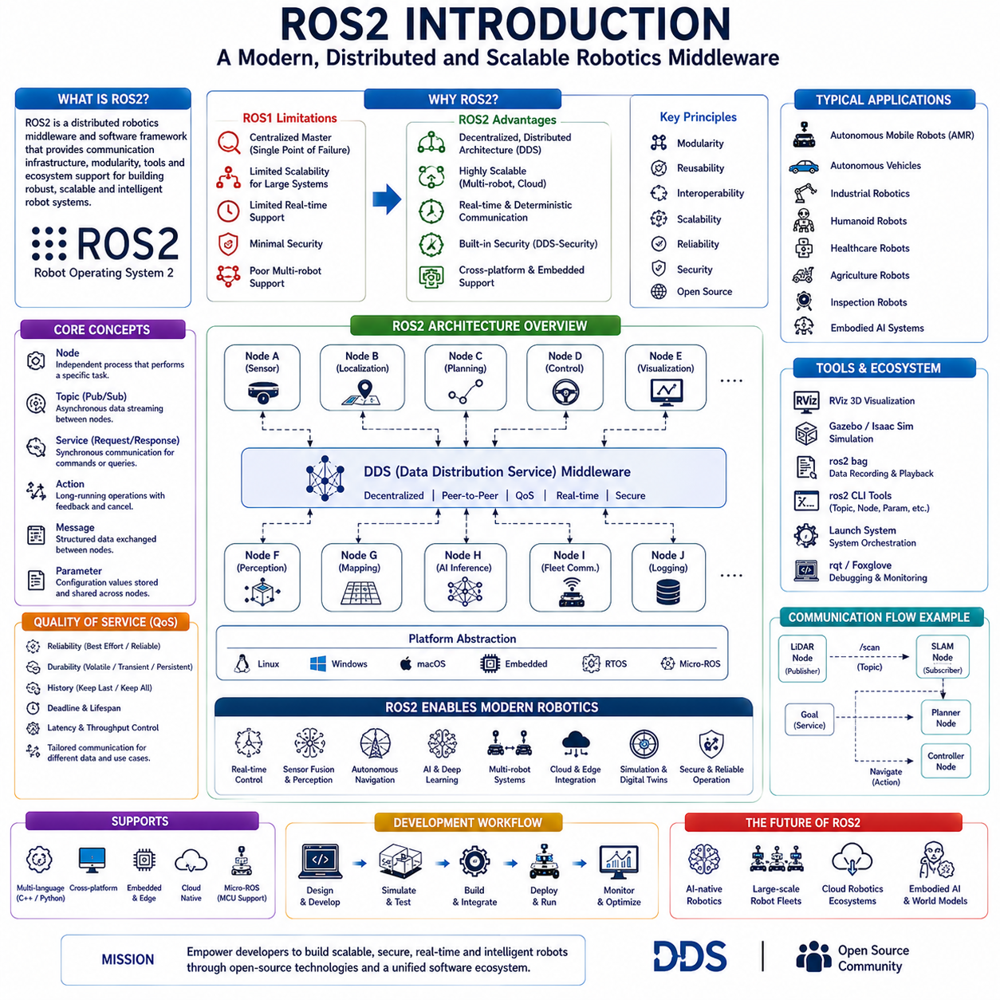
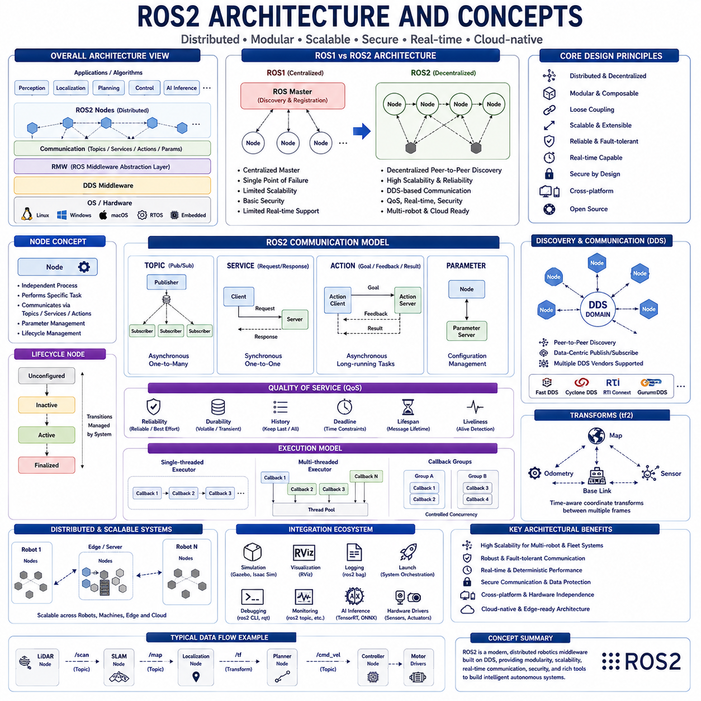
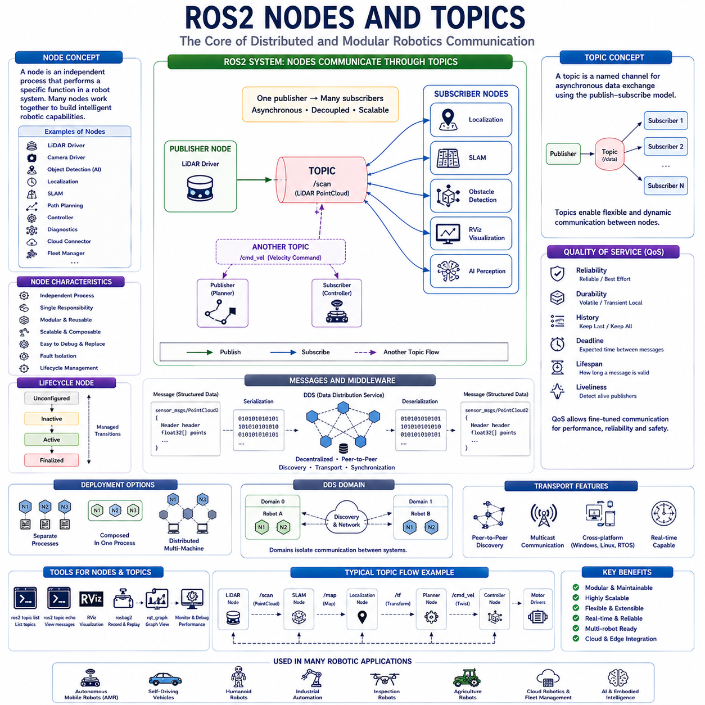
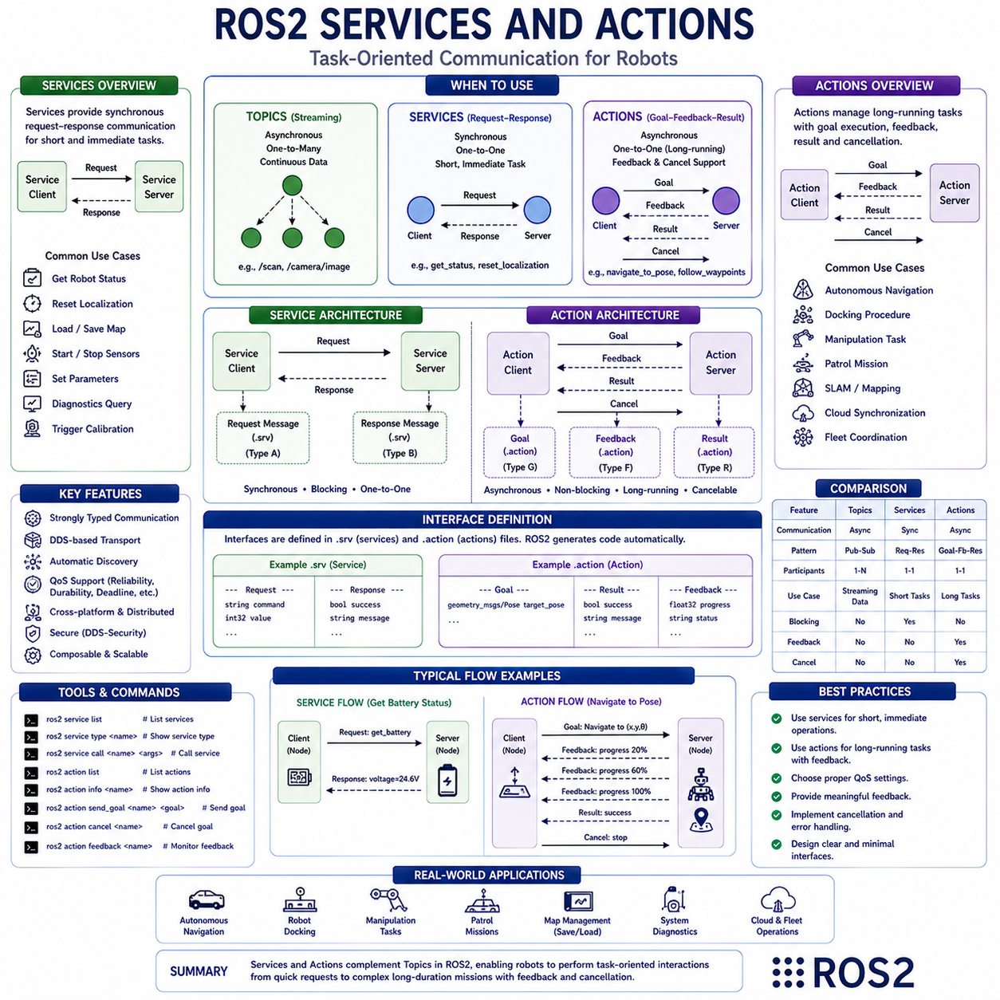
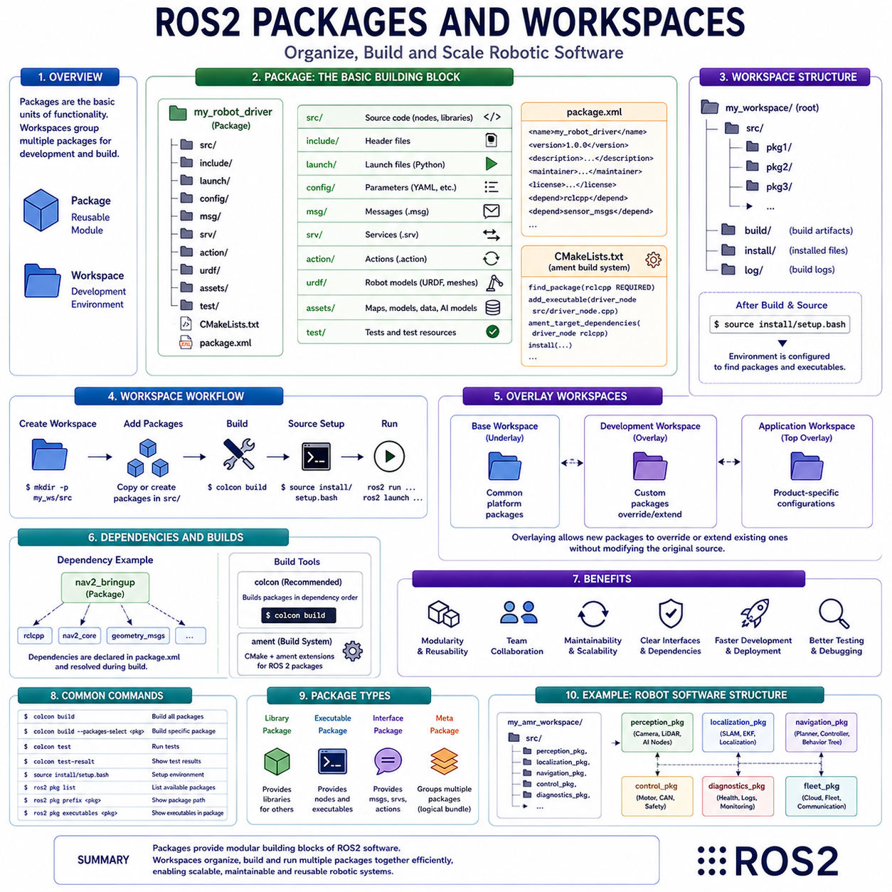
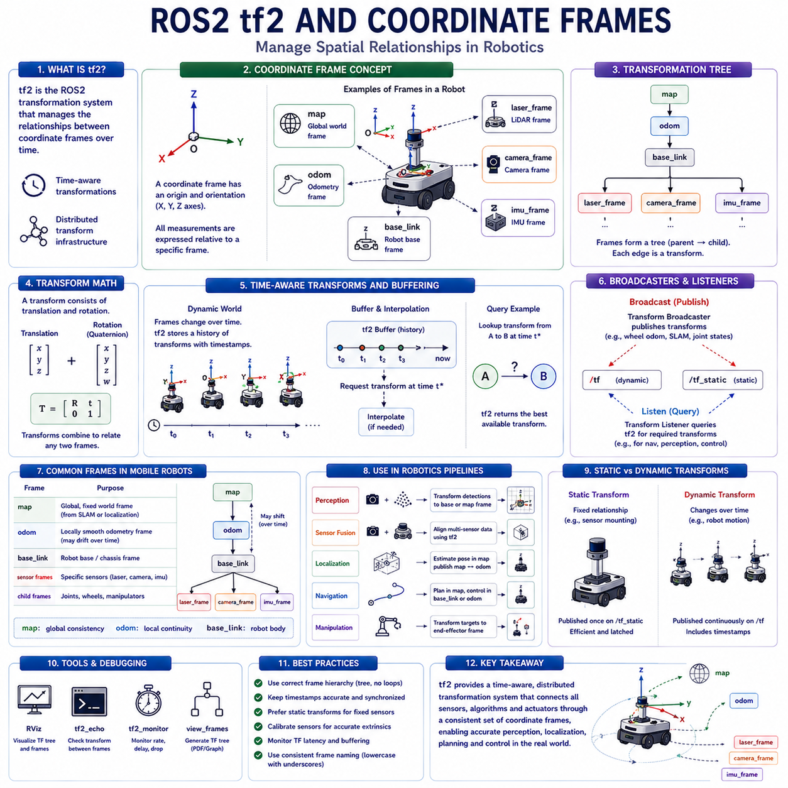
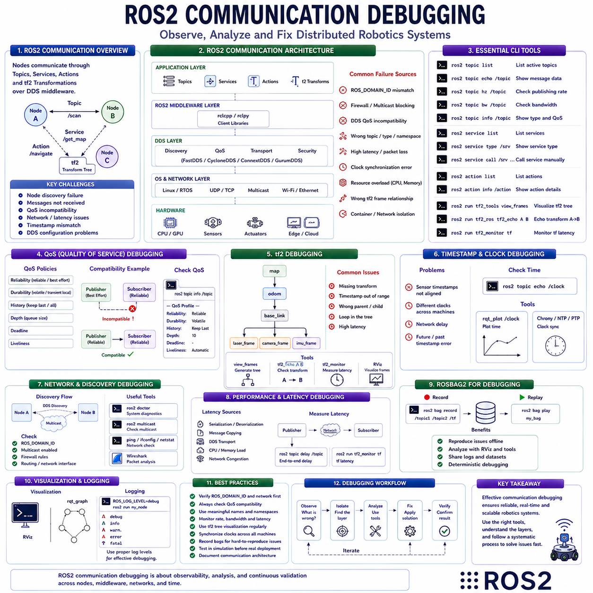
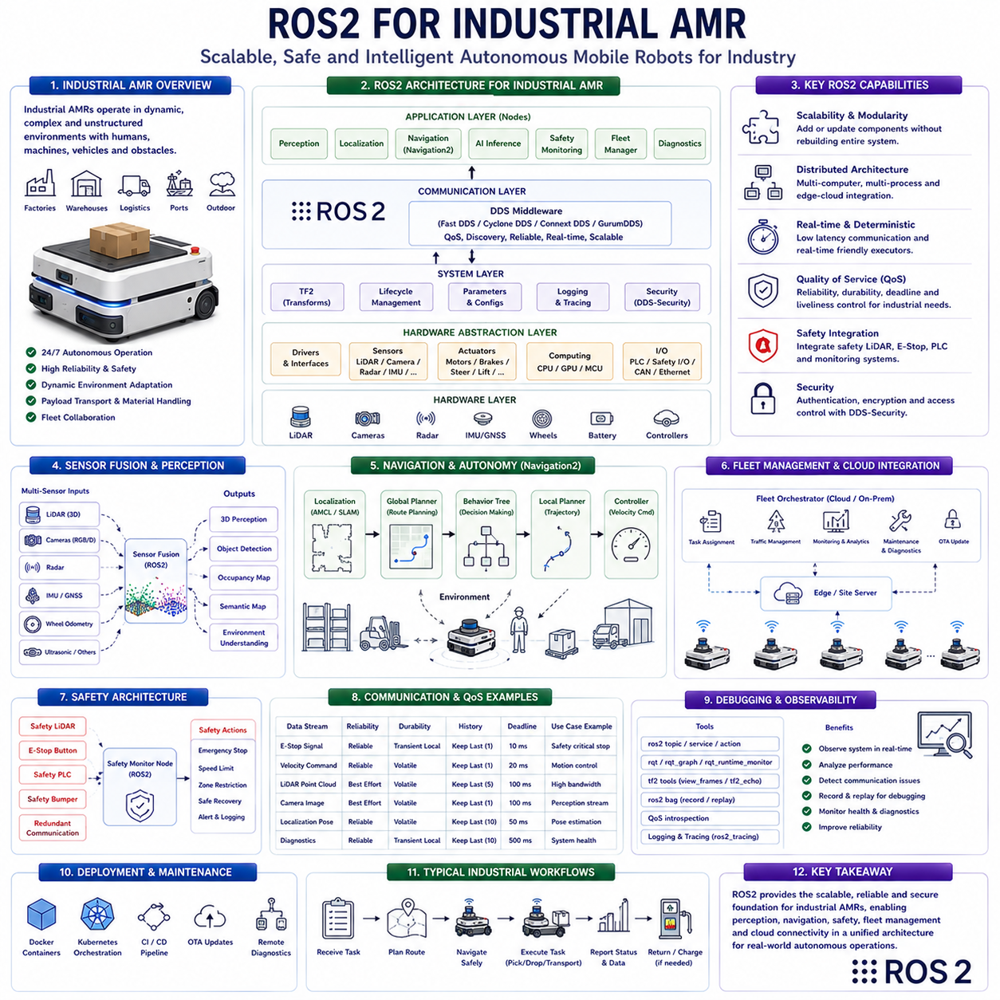

**Volume 07. AMR Software Architecture and Development**


# Chapter 01. ROS2 Foundations

##  

## 01.1 Introduction to ROS2

{width="7.268055555555556in" height="7.268055555555556in"}

"01_01_Introduction_to_ROS2" focuses on the foundational concepts, architecture, philosophy, operational principles, and industrial significance of ROS2, which has become one of the most important software frameworks in modern robotics and autonomous mobile robot development. ROS2, or Robot Operating System 2, is not a traditional operating system in the classical sense. Instead, it is a distributed middleware-based robotics software framework that provides communication infrastructure, modular software architecture, hardware abstraction, development tools, runtime management, and ecosystem-level integration capabilities for robotic systems. ROS2 serves as the software backbone for a wide range of autonomous systems including AMRs, autonomous vehicles, humanoid robots, industrial robotic arms, healthcare robots, agricultural robots, inspection robots, and embodied AI platforms.

The origin of ROS2 can be understood through the limitations of the original ROS1 architecture. ROS1 revolutionized robotics development by introducing a modular open-source software ecosystem that simplified robot software engineering. It enabled developers to create reusable robotic components, standardized communication interfaces, and flexible distributed software architectures. ROS1 became highly successful in research and academic environments because it dramatically accelerated experimentation and collaborative robotics development. However, ROS1 was originally designed primarily for research-oriented robotics rather than large-scale industrial deployment. As robotics systems evolved toward commercial autonomy, large-scale distributed AI, cloud robotics, and safety-critical industrial systems, several architectural limitations of ROS1 became increasingly problematic.

ROS1 relied heavily on a centralized communication architecture built around the ROS Master node. This created single-point-of-failure risks and limited scalability in distributed robotic systems. Real-time performance support was also limited because ROS1 communication infrastructure was not designed for deterministic industrial-grade timing requirements. Security mechanisms were minimal, making ROS1 unsuitable for many cloud-connected or industrial applications. Multi-robot scalability, cross-platform deployment, embedded hardware integration, and distributed communication reliability also required significant improvements.

ROS2 was developed to address these limitations and support the future evolution of autonomous robotics. Instead of incrementally modifying ROS1, ROS2 was designed as a fundamentally new architecture built on modern distributed communication technologies. One of the most important design decisions in ROS2 was the adoption of DDS, or Data Distribution Service, as the underlying communication middleware. DDS provides decentralized peer-to-peer communication, Quality-of-Service control, scalable distributed messaging, real-time communication support, and industrial-grade reliability. This shift transformed ROS2 into a far more scalable and production-ready robotics framework.

The architecture of ROS2 is fundamentally distributed. Instead of depending on a central master server, ROS2 nodes communicate directly using DDS discovery protocols. This decentralized communication model significantly improves reliability because the failure of a single node does not collapse the entire robotic system. Distributed communication also improves scalability for multi-robot environments, cloud robotics systems, and industrial fleet deployments.

ROS2 is heavily designed around modularity. Robotic software systems are decomposed into individual functional units called nodes. Each node performs a specific responsibility such as sensor processing, localization, path planning, object detection, motor control, SLAM, AI inference, or fleet communication. These nodes exchange information through standardized communication mechanisms including topics, services, actions, and parameters. This modular architecture allows robotic systems to be developed, debugged, scaled, and maintained more efficiently.

Topics are one of the most important communication concepts in ROS2. Topics implement asynchronous publish-subscribe communication between nodes. A sensor node may continuously publish LiDAR data, while multiple downstream nodes subscribe to that data simultaneously for perception, localization, obstacle detection, and mapping. This loose coupling between software components greatly improves flexibility and scalability. Nodes do not need direct awareness of each other's internal implementation details. They only need to agree on standardized message formats.

Services provide synchronous request-response communication mechanisms. A node may request information or trigger operations from another node and wait for a direct response. Services are useful for commands, configuration operations, parameter queries, or state retrieval tasks. Actions extend this concept further by supporting long-duration asynchronous operations with feedback and cancellation capabilities. Navigation tasks, docking procedures, or autonomous mission execution commonly use action interfaces.

ROS2 communication relies heavily on message definitions. Messages define structured data formats exchanged between nodes. Standardized message types allow interoperability across robotic components developed by different teams or organizations. ROS2 includes many built-in message types for geometry, sensor data, navigation, transforms, images, diagnostics, and robot state information. Developers can also define custom messages tailored to specialized robotic applications.

One of the most important architectural improvements in ROS2 is Quality-of-Service management. DDS-based communication allows developers to precisely configure communication reliability, latency behavior, history buffering, message durability, and delivery guarantees. Different robotic workloads have different communication requirements. High-frequency sensor streams may prioritize low latency and allow occasional packet loss, while safety-critical control messages may require guaranteed delivery. QoS profiles enable ROS2 systems to optimize communication behavior according to application requirements.

Real-time support is another major advancement in ROS2. Industrial robots, autonomous vehicles, humanoids, and safety-critical systems often require deterministic timing guarantees. ROS2 introduces architectural improvements supporting real-time Linux environments, low-latency communication, deterministic scheduling, memory management optimization, and reduced runtime unpredictability. Although achieving strict hard real-time performance still requires careful engineering, ROS2 provides a significantly better foundation for real-time robotics than ROS1.

ROS2 was also designed with embedded systems in mind. Modern autonomous robots frequently rely on resource-constrained embedded hardware such as microcontrollers, ARM-based processors, Jetson platforms, NPUs, and edge AI accelerators. ROS2 supports cross-platform deployment across Linux, Windows, macOS, and embedded real-time operating systems. Micro-ROS further extends ROS2 concepts into deeply embedded microcontroller environments, enabling unified communication architectures across heterogeneous robotic hardware.

Security was integrated directly into the ROS2 architecture from the beginning. As robots increasingly connect to cloud systems, industrial infrastructure, and public networks, cybersecurity becomes critically important. ROS2 includes DDS-Security support providing authentication, encryption, access control, and secure communication capabilities. While security configuration remains complex in many deployments, ROS2 provides a far stronger security foundation than ROS1.

ROS2 strongly emphasizes scalability for multi-robot systems and cloud robotics environments. Large robotic fleets require distributed communication, reliable synchronization, scalable telemetry handling, and robust network resilience. ROS2's decentralized DDS communication architecture significantly improves support for large-scale distributed robotic ecosystems. Multi-robot mapping, fleet coordination, collaborative autonomy, and cloud-edge integration become much more practical under ROS2 architectures.

The ROS2 ecosystem also includes powerful development tools. RViz provides 3D visualization for robot state, sensor data, localization maps, transforms, and navigation behavior. Gazebo and Isaac Sim support robotics simulation and digital twin workflows. ROS2 Bag allows recording and replay of operational data for debugging and machine learning dataset generation. Command-line tools support topic inspection, node debugging, parameter configuration, and runtime introspection.

ROS2 integrates deeply with modern AI and perception systems. AI inference pipelines using TensorRT, CUDA, PyTorch, ONNX, and deep learning frameworks increasingly operate as ROS2-integrated nodes. Sensor fusion systems combining LiDAR, cameras, radar, thermal imaging, GNSS, and IMU data are commonly implemented using ROS2 communication pipelines. This flexibility makes ROS2 highly suitable for embodied AI systems and modern autonomous robotics architectures.

Navigation is one of the most widely used ROS2 application domains. The Navigation2 framework, commonly called Nav2, provides modular autonomous navigation capabilities including localization, path planning, obstacle avoidance, recovery behavior, costmaps, behavior trees, and motion control. Nav2 has become a foundational software stack for many AMR systems.

Behavior Trees are increasingly important within ROS2 robotics architectures. Traditional robotic state machines become difficult to scale in complex autonomous systems. Behavior Trees provide more flexible and hierarchical decision-making structures supporting modular autonomy logic, fault recovery, and scalable mission execution. ROS2 integrates well with Behavior Tree frameworks for advanced autonomy systems.

ROS2 also supports distributed computing architectures. Large autonomous systems may distribute workloads across multiple CPUs, GPUs, edge computers, and cloud servers. Sensor preprocessing, AI inference, SLAM, world models, and fleet coordination may execute on different computational nodes while maintaining synchronized communication through ROS2 middleware infrastructure.

Simulation-driven development is another major strength of ROS2 ecosystems. Modern robotics development increasingly relies on digital twins, synthetic environments, reinforcement learning simulation, and sim-to-real workflows. ROS2 integrates naturally with simulation platforms including Gazebo, Isaac Sim, Webots, and Unity-based robotics environments. This significantly accelerates robotic software validation and AI training.

Containerization and cloud-native robotics are becoming increasingly common within ROS2 deployment architectures. Docker containers, Kubernetes orchestration, distributed microservices, and cloud-edge synchronization systems allow ROS2 applications to scale across industrial infrastructure and cloud robotics environments. ROS2 is therefore evolving beyond a local robotics framework into a distributed robotics software ecosystem.

Industrial adoption of ROS2 continues growing rapidly. Manufacturing automation, logistics robotics, agricultural autonomy, inspection systems, healthcare robotics, warehouse automation, and smart infrastructure increasingly rely on ROS2-based architectures. Major robotics companies, semiconductor vendors, automotive manufacturers, and AI platform providers actively support ROS2 ecosystems because it accelerates development while reducing proprietary software fragmentation.

Despite its strengths, ROS2 also introduces complexity. DDS configuration, QoS tuning, distributed debugging, real-time optimization, lifecycle management, network configuration, and multi-threaded execution require advanced engineering knowledge. Large ROS2 systems can become operationally complex if software architecture is not carefully designed. Therefore, understanding software modularity, communication design, debugging methodology, and deployment architecture becomes essential for professional ROS2 engineering.

Lifecycle management is another important ROS2 capability. Nodes may transition through managed operational states such as unconfigured, inactive, active, and finalized. Lifecycle control improves startup sequencing, fault handling, system orchestration, and industrial reliability. Large robotic systems increasingly rely on lifecycle-aware orchestration architectures.

ROS2 is also becoming a foundational platform for future embodied AI systems. Humanoid robots, multimodal AI agents, autonomous industrial platforms, collaborative robots, and cloud-connected robotic ecosystems increasingly require scalable distributed software frameworks capable of integrating AI reasoning, world models, sensor fusion, fleet coordination, and real-time control. ROS2 provides many of the communication and orchestration primitives necessary for such systems.

The future evolution of ROS2 will likely include deeper integration with AI-native robotics frameworks, cloud-native infrastructure, distributed world models, simulation-driven learning systems, fleet intelligence architectures, edge-cloud AI orchestration, and large-scale embodied AI ecosystems. As robotics systems become increasingly intelligent, connected, and autonomous, ROS2 will continue serving as one of the foundational middleware frameworks enabling scalable software-defined robotics.

Ultimately, ROS2 represents far more than a robotics programming framework. It serves as a unifying distributed software infrastructure that allows robotic systems to evolve from isolated electromechanical machines into scalable intelligent software ecosystems capable of autonomous perception, reasoning, coordination, learning, and long-term operational adaptation across complex real-world environments.

# 01.01 ROS2 소개 (Introduction to ROS2)

**ROS2(로봇 운영체제 2, Robot Operating System 2)** 는 현대 로보틱스와 자율주행 로봇 개발에서 가장 중요한 소프트웨어 프레임워크 중 하나이다. 이름에 운영체제(Operating System)라는 단어가 포함되어 있지만 실제로는 Windows나 Linux와 같은 운영체제가 아니다. ROS2는 **분산형 미들웨어(Distributed Middleware) 기반의 로봇 소프트웨어 프레임워크**로서 통신 인프라, 하드웨어 추상화, 개발 도구, 실행 환경, 시스템 통합 기능을 제공한다. 현재 ROS2는 자율이동로봇(AMR, Autonomous Mobile Robot), 자율주행차, 휴머노이드, 산업용 로봇, 의료 로봇, 농업 로봇, 점검 로봇, 그리고 체화형 인공지능(Embodied AI) 플랫폼에 이르기까지 광범위하게 활용되고 있다.

ROS2의 탄생 배경은 기존 ROS1의 구조적 한계를 극복하기 위한 필요성에서 시작되었다. ROS1은 로봇 소프트웨어 개발의 패러다임을 변화시킨 혁신적인 플랫폼이었다. 개발자들은 ROS1을 통해 재사용 가능한 소프트웨어 모듈을 만들고, 표준화된 인터페이스를 활용하며, 분산형 로봇 시스템을 빠르게 구축할 수 있었다. 이러한 장점 덕분에 ROS1은 학계와 연구 분야에서 폭발적으로 성장하였다.

그러나 ROS1은 본래 연구용 로봇 개발을 목적으로 설계되었기 때문에 산업 현장에서 요구되는 확장성, 신뢰성, 실시간성, 보안성 측면에서는 여러 한계를 가지고 있었다. 특히 ROS 마스터(ROS Master)라는 중앙 서버에 의존하는 구조는 단일 장애점(Single Point of Failure)을 만들었으며, 실시간 제어에 필요한 결정론적 통신(Deterministic Communication)을 제공하지 못했다. 또한 보안(Security) 기능이 부족하여 클라우드 기반 로봇 서비스나 산업용 시스템에 적용하기 어려웠다. 다중 로봇 운영, 임베디드 시스템 통합, 대규모 분산 환경 지원에도 제약이 존재하였다.

이러한 문제를 해결하기 위해 ROS2는 기존 구조를 부분적으로 개선하는 방식이 아니라 처음부터 새로운 아키텍처로 설계되었다. 가장 중요한 변화는 DDS(데이터 분배 서비스, Data Distribution Service)를 기본 통신 미들웨어로 채택한 것이다. DDS는 산업 자동화와 항공우주 분야에서도 사용되는 검증된 통신 기술로서 분산형 피어투피어 통신(Peer-to-Peer Communication), 실시간 데이터 전송, 서비스 품질 관리(QoS, Quality of Service), 높은 신뢰성 및 확장성을 제공한다. 이를 통해 ROS2는 연구용 플랫폼을 넘어 실제 산업 현장에서 사용할 수 있는 수준의 프레임워크로 발전하였다.

ROS2의 가장 큰 특징은 완전한 분산형 구조이다. ROS1에서는 모든 노드(Node)가 ROS 마스터를 통해 연결되었지만, ROS2에서는 DDS 발견 기능(Discovery)을 사용하여 노드들이 직접 서로를 발견하고 통신한다. 따라서 특정 노드가 실패하더라도 전체 시스템이 중단되지 않으며, 다수의 로봇이 동시에 동작하는 환경에서도 높은 신뢰성을 유지할 수 있다. 이러한 특성은 물류창고의 수백 대 AMR, 스마트 팩토리의 협업 로봇, 클라우드 기반 로봇 서비스에서 매우 중요한 장점이 된다.

ROS2는 모듈화(Modularity)를 핵심 철학으로 삼는다. 전체 시스템은 노드(Node)라고 불리는 독립적인 기능 단위로 구성된다. 하나의 노드는 센서 처리, 위치 추정, 경로 계획, 객체 인식, 모터 제어, 동시적 위치추정 및 지도작성(SLAM, Simultaneous Localization and Mapping), 인공지능 추론, 플릿(Fleet) 관리 등 특정 기능만 담당한다. 이러한 노드들은 토픽(Topic), 서비스(Service), 액션(Action), 파라미터(Parameter)라는 표준 통신 메커니즘을 이용하여 정보를 교환한다. 이 구조는 소프트웨어 재사용성을 높이고 유지보수를 쉽게 하며, 복잡한 시스템을 효율적으로 개발할 수 있도록 지원한다.

토픽(Topic)은 ROS2에서 가장 널리 사용되는 통신 방식이다. 발행-구독(Publish-Subscribe) 모델을 기반으로 하며 비동기적으로 데이터를 주고받는다. 예를 들어 라이다(LiDAR) 노드는 센서 데이터를 계속 발행(Publish)하고, 위치 추정, 장애물 인식, 지도 생성 노드들은 동시에 이를 구독(Subscribe)하여 사용한다. 각 노드는 다른 노드의 내부 구현을 알 필요 없이 메시지(Message) 형식만 공유하면 되기 때문에 시스템 확장성이 매우 높다.

서비스(Service)는 요청(Request)과 응답(Response) 구조를 제공한다. 특정 노드가 다른 노드에게 명령을 보내고 결과를 기다리는 방식이다. 예를 들어 로봇 상태 조회, 설정 변경, 특정 기능 실행 요청 등에 사용된다. 액션(Action)은 이보다 더 발전된 개념으로 장시간 수행되는 작업에 적합하다. 자율주행, 도킹(Docking), 순찰, 물류 미션 수행과 같이 수 초에서 수 분 이상 소요되는 작업에 활용된다. 진행 상태를 지속적으로 확인할 수 있으며 중간에 취소도 가능하다.

ROS2의 또 다른 핵심 기능은 서비스 품질(QoS, Quality of Service) 관리이다. DDS 기반 통신은 데이터 전달 신뢰성, 버퍼 크기, 지연 시간, 메시지 보존 정책 등을 세밀하게 설정할 수 있다. 예를 들어 카메라 영상처럼 초당 수십 프레임(Frame)이 발생하는 데이터는 일부 손실을 허용하고 지연을 최소화하는 것이 중요하다. 반면 긴급 정지(E-Stop, Emergency Stop)와 같은 안전 관련 메시지는 반드시 전달되어야 한다. QoS 설정을 통해 ROS2는 다양한 응용 환경에 최적화된 통신을 제공할 수 있다.

실시간성(Real-Time Support)은 ROS2의 중요한 발전 요소이다. 산업용 로봇, 휴머노이드, 자율주행차는 밀리초 (Millisecond) 단위의 응답성을 요구한다. ROS2는 실시간 리눅스(Real-Time Linux) 환경과 연계하여 결정론적 스케줄링(Deterministic Scheduling), 저지연 통신, 메모리 관리 최적화 등을 지원한다. 완전한 강실시간(Hard Real-Time)을 구현하기 위해서는 추가적인 엔지니어링이 필요하지만, ROS1에 비해 훨씬 우수한 기반을 제공한다.

ROS2는 임베디드 시스템(Embedded System) 지원도 강화되었다. 현대 로봇은 젯슨(Jetson), ARM 기반 프로세서, 신경망처리장치(NPU, Neural Processing Unit), 엣지 AI 가속기(Edge AI Accelerator) 등 다양한 하드웨어를 사용한다. ROS2는 Linux, Windows, macOS뿐 아니라 임베디드 실시간 운영체제(RTOS, Real-Time Operating System) 환경까지 지원한다. 또한 마이크로 ROS(Micro-ROS)를 이용하면 마이크로 컨트롤러 (Microcontroller) 수준에서도 ROS2 통신 구조를 사용할 수 있다. 이를 통해 센서 노드부터 GPU 서버까지 하나의 통합된 소프트웨어 아키텍처를 구축할 수 있다.

보안(Security) 역시 ROS2 설계 단계에서부터 고려되었다. DDS 보안(DDS-Security)을 통해 인증(Authentication), 암호화(Encryption), 접근 제어(Access Control)를 지원한다. 클라우드와 연결된 서비스 로봇이나 산업 설비에 투입되는 자율주행 로봇에서는 이러한 기능이 필수적이다. ROS2는 ROS1 대비 훨씬 높은 수준의 사이버 보안(Cyber Security) 기반을 제공한다.

ROS2는 현대 인공지능(AI, Artificial Intelligence) 시스템과도 긴밀하게 통합된다. 텐서RT(TensorRT), 쿠다(CUDA), 파이토치(PyTorch), ONNX 기반 AI 추론 모듈이 ROS2 노드로 동작할 수 있으며, 라이다(LiDAR), 카메라(Camera), 레이더(Radar), 열화상 카메라(Thermal Camera), 위성항법시스템(GNSS, Global Navigation Satellite System), 관성측정장치(IMU, Inertial Measurement Unit) 등의 센서 융합 시스템도 ROS2 통신 구조를 기반으로 구현된다. 이러한 특성 때문에 ROS2는 체화형 인공지능(Embodied AI)과 물리형 인공지능(Physical AI) 플랫폼의 사실상 표준 소프트웨어 프레임워크로 자리 잡고 있다.

대표적인 응용 사례로는 내비게이션2(Navigation2, Nav2)가 있다. Nav2는 ROS2 기반 자율주행 스택(Stack)으로서 위치 추정(Localization), 경로 계획(Path Planning), 장애물 회피(Obstacle Avoidance), 복구 동작(Recovery Behavior), 비용 지도(Costmap), 모션 제어(Motion Control) 등을 제공한다. 현재 대부분의 AMR과 서비스 로봇이 Nav2를 활용하고 있다. 또한 최근에는 행동 트리(Behavior Tree) 기반의 의사결정 구조가 널리 사용되면서 복잡한 임무 수행과 장애 복구 기능도 더욱 쉽게 구현할 수 있게 되었다.

현대 로봇 시스템은 단일 컴퓨터에서 동작하지 않는다. 여러 중앙처리장치(CPU), 그래픽처리장치(GPU), 엣지 컴퓨터(Edge Computer), 클라우드 서버(Cloud Server)가 협력하여 동작한다. ROS2는 이러한 분산 컴퓨팅 환경을 자연스럽게 지원하며, 센서 처리, AI 추론, SLAM, 월드 모델(World Model), 플릿 관리 등을 서로 다른 장비에서 수행하면서도 하나의 통합 시스템처럼 동작하도록 만든다. 또한 가제보(Gazebo), 아이작 심(Isaac Sim), 위봇(Webots), 유니티(Unity)와 같은 시뮬레이터(Simulator)와의 연동도 뛰어나기 때문에 디지털 트윈(Digital Twin), 강화학습(Reinforcement Learning), 시뮬레이션-실환경 전이(Sim-to-Real) 개발에 매우 적합하다.

오늘날 ROS2는 제조 자동화, 물류 자동화, 농업 로봇, 의료 로봇, 점검 로봇, 휴머노이드, 자율주행 플랫폼 등 다양한 산업 분야에서 빠르게 채택되고 있다. 물론 DDS 설정, QoS 튜닝(Tuning), 실시간 최적화, 네트워크 구성 등은 상당한 전문 지식을 요구하기 때문에 학습 곡선(Learning Curve)이 존재한다. 그러나 이러한 복잡성을 극복하면 ROS2는 대규모 로봇 시스템을 구축할 수 있는 강력한 기반을 제공한다.

결론적으로 ROS2는 단순한 로봇 프로그래밍 라이브러리가 아니다. 그것은 로봇이 환경을 인식하고, 판단하고, 행동하고, 학습하고, 다른 로봇과 협력하며, 클라우드와 연결될 수 있도록 지원하는 **현대 로보틱스의 핵심 소프트웨어 인프라**이다. 미래의 휴머노이드, 물리형 인공지능(Physical AI), 체화형 인공지능(Embodied AI), 그리고 대규모 자율주행 로봇 생태계 역시 ROS2를 중심으로 발전할 가능성이 매우 높다.

##  

## 01.2 ROS2 Architecture and Concepts

{width="7.268055555555556in" height="7.268055555555556in"}

"01_02_ROS2_Architecture_and_Concepts" focuses on the internal architecture, communication principles, distributed computing model, middleware abstraction, execution mechanisms, and core operational concepts that form the foundation of ROS2. While an introductory understanding of ROS2 explains its purpose as a robotics middleware framework, understanding ROS2 architecture is essential for designing scalable, reliable, real-time, and industrial-grade autonomous robotic systems. ROS2 is fundamentally designed as a distributed, modular, communication-centric robotics software platform capable of supporting modern autonomous mobile robots, humanoids, industrial automation systems, cloud robotics infrastructures, and embodied AI ecosystems.

At the highest level, ROS2 can be understood as a layered distributed software architecture that connects robotic hardware, perception systems, control systems, AI inference pipelines, communication middleware, and cloud infrastructure into a unified computational ecosystem. Unlike monolithic robotics software architectures where all functionality exists inside a single tightly coupled application, ROS2 decomposes robotic intelligence into modular distributed software components that communicate through standardized middleware interfaces. This distributed philosophy represents one of the most important conceptual foundations of ROS2.

The architecture of ROS2 is heavily influenced by modern distributed computing principles. Each software component within a robotic system operates as an independent computational entity called a node. Nodes communicate using structured data exchange mechanisms rather than direct function calls or tightly coupled dependencies. This architecture improves modularity, scalability, maintainability, fault isolation, and software reusability. A robot may consist of dozens or even hundreds of nodes simultaneously handling perception, localization, mapping, path planning, motor control, AI inference, diagnostics, cloud communication, safety monitoring, and fleet coordination.

One of the most fundamental differences between ROS1 and ROS2 is the removal of the centralized ROS Master architecture. ROS1 relied on a master node responsible for node discovery and communication registration. Although effective for research environments, this centralized architecture introduced single-point-of-failure risks and limited scalability in industrial systems. ROS2 instead adopts a decentralized peer-to-peer discovery architecture built on DDS middleware. In ROS2, nodes automatically discover each other without relying on a central master server. This decentralized design significantly improves robustness and distributed scalability.

DDS, or Data Distribution Service, forms the communication backbone of ROS2. DDS is an industrial middleware standard originally developed for mission-critical distributed systems such as aerospace, defense, telecommunications, and industrial automation. ROS2 abstracts DDS beneath its middleware layer while exposing many DDS capabilities to robotic developers. DDS enables reliable peer-to-peer communication, Quality-of-Service control, distributed data synchronization, real-time transport, multicast communication, and fault-tolerant messaging.

The ROS2 architecture is commonly divided into multiple conceptual layers. At the top level are user applications and robotic algorithms implemented as ROS2 nodes. Beneath this lies the ROS client library layer providing APIs for C++, Python, and other supported languages. Below the client layer exists the ROS middleware abstraction layer called RMW, which acts as a standardized interface between ROS2 and different DDS implementations. Underneath RMW resides the DDS middleware itself, which manages discovery, serialization, transport, synchronization, and network communication. Finally, the operating system and hardware layers provide low-level execution infrastructure.

The ROS middleware abstraction layer is one of the most important architectural concepts in ROS2. Instead of tightly coupling ROS2 to a single DDS vendor, ROS2 introduces a middleware abstraction interface allowing multiple DDS implementations to be used interchangeably. Common DDS implementations include FastDDS, CycloneDDS, RTI Connext DDS, and GurumDDS. This abstraction improves flexibility because developers can optimize middleware selection according to performance requirements, licensing considerations, embedded deployment constraints, or industrial certification needs.

Nodes represent the primary computational building blocks of ROS2 systems. Each node is designed to perform a specialized responsibility within the robotic architecture. A LiDAR driver node may publish point cloud data. A localization node may estimate robot position. A navigation planner node may compute trajectories. An AI inference node may perform object detection using GPU acceleration. This decomposition enables software modularity and separation of concerns. Nodes can be developed, tested, debugged, and deployed independently.

Communication between nodes occurs primarily through topics, services, actions, and parameters. Topics implement asynchronous publish-subscribe communication. Nodes publish messages to named topics, while other nodes subscribe to those topics. Topics are highly scalable because multiple publishers and subscribers may communicate simultaneously without direct dependencies. This loose coupling architecture greatly improves system extensibility and distributed execution.

Services provide synchronous request-response communication semantics. A client node sends a request to a server node and waits for a response. Services are useful for immediate command execution, parameter retrieval, system queries, or operational requests requiring deterministic interaction. However, services are generally unsuitable for long-duration operations because they block until completion.

Actions extend the service model to support asynchronous long-running tasks with progress feedback and cancellation capabilities. Autonomous navigation tasks often use actions because path execution may take significant time while requiring continuous feedback. A navigation client may send a goal to a navigation server, monitor execution progress, cancel operations if necessary, and receive completion results asynchronously.

ROS2 message systems form another critical architectural foundation. Messages define strongly typed structured data exchanged between nodes. Standardized message definitions ensure interoperability across heterogeneous robotic software modules. ROS2 provides extensive built-in message libraries for geometry, navigation, sensor data, diagnostics, transforms, images, and robot state representation. Developers may also define custom message types optimized for specialized robotic applications.

Serialization plays an important role in ROS2 communication architecture. Messages transmitted across DDS networks must be serialized into portable binary formats before transport. DDS middleware manages serialization and deserialization transparently, allowing nodes operating on different machines, processors, operating systems, or architectures to communicate seamlessly.

Quality-of-Service, commonly called QoS, is one of the most powerful concepts introduced by ROS2. Different robotic workloads require different communication guarantees. High-frequency sensor streams prioritize low latency and may tolerate occasional packet loss. Safety-critical control messages require reliable delivery guarantees. DDS QoS policies allow precise configuration of reliability, durability, history buffering, deadline constraints, lifespan, liveliness detection, and communication behavior. QoS tuning becomes extremely important in industrial and real-time robotic systems.

Reliability QoS determines whether communication guarantees message delivery or prioritizes speed. Reliable communication retransmits lost packets but introduces additional latency and bandwidth usage. Best-effort communication minimizes latency but may drop packets under congestion. Appropriate selection depends on application requirements.

Durability QoS controls whether late-joining subscribers receive historical messages. Volatile durability delivers only new messages, while transient-local durability allows recently published data to persist for future subscribers. This capability becomes useful for map distribution, configuration synchronization, or robot state recovery.

History QoS defines how many previous messages are buffered. Keep-last mode stores only recent messages, while keep-all mode stores the entire message history subject to resource limits. History management significantly affects memory usage and communication behavior.

Executors represent another important ROS2 architectural concept. Executors manage callback scheduling and node execution. ROS2 nodes typically react to asynchronous events such as incoming messages, timers, service requests, or action feedback. Executors coordinate how these callbacks are processed within threads. Single-threaded executors process callbacks sequentially, while multi-threaded executors allow parallel callback execution for improved concurrency and performance.

Concurrency management becomes increasingly important in modern autonomous robotic systems because perception pipelines, AI inference workloads, sensor fusion systems, and distributed communication may execute simultaneously. ROS2 introduces callback groups and executor configurations allowing sophisticated concurrency control and thread management strategies.

Lifecycle nodes provide advanced operational state management capabilities. Standard nodes simply start and operate immediately, but lifecycle nodes transition through managed states such as unconfigured, inactive, active, and finalized. Lifecycle management improves startup sequencing, system orchestration, fault recovery, and industrial reliability. Large robotics systems increasingly rely on lifecycle architectures for controlled deployment and operational supervision.

The transform system, commonly implemented through tf2, is another foundational ROS2 concept. Robots continuously operate across multiple coordinate frames including map coordinates, odometry frames, sensor frames, base frames, manipulator frames, and camera frames. tf2 maintains time-aware coordinate transformations between these reference frames, enabling sensor fusion, navigation, localization, and spatial reasoning across distributed robotic subsystems.

ROS2 strongly supports distributed multi-machine systems. Nodes may execute across multiple computers connected through DDS networks. Heavy AI workloads may execute on GPU servers while low-level control remains onboard embedded hardware. Cloud-edge robotics systems increasingly distribute ROS2 nodes across embedded processors, edge servers, cloud datacenters, and fleet management infrastructure. DDS middleware handles distributed communication transparently across these heterogeneous computational environments.

Real-time architecture support represents one of ROS2's major industrial improvements. Deterministic robotics systems require predictable scheduling, low latency, bounded memory allocation, and minimized runtime jitter. ROS2 introduces architectural improvements supporting real-time Linux kernels, lock-free communication pathways, deterministic execution models, and memory preallocation strategies. Although achieving strict hard real-time behavior still requires careful engineering, ROS2 provides a far more suitable architecture than ROS1.

Security architecture is deeply integrated into ROS2 through DDS-Security support. Authentication, encrypted communication, access control policies, and secure discovery mechanisms protect robotic communication infrastructure from cyber threats. As robots increasingly connect to cloud systems and public infrastructure, secure communication becomes essential for safe deployment.

ROS2 also emphasizes interoperability across heterogeneous hardware platforms. Nodes may operate on x86 servers, ARM processors, Jetson devices, embedded controllers, RTOS systems, or cloud infrastructure simultaneously. Cross-platform compatibility allows robotic systems to scale from small embedded devices to large cloud-native distributed ecosystems.

Simulation integration forms another major architectural component of ROS2 ecosystems. Simulation environments such as Gazebo and Isaac Sim integrate directly into ROS2 communication pipelines. Simulated sensors, physics engines, robot controllers, and AI models operate using the same middleware interfaces as physical robots. This significantly improves sim-to-real development workflows and accelerates robotics validation.

ROS2 architecture also supports cloud-native deployment strategies. Containerized ROS2 nodes, Kubernetes orchestration, distributed telemetry systems, edge-cloud synchronization, and cloud robotics infrastructures increasingly rely on ROS2 as a scalable distributed middleware layer. This enables robotics systems to evolve toward software-defined autonomous ecosystems rather than isolated embedded machines.

Embodied AI systems increasingly depend on ROS2 architectural concepts because modern intelligent robots require distributed sensor fusion, AI reasoning, multimodal communication, world models, fleet coordination, and cloud-connected orchestration. ROS2 provides many of the distributed communication primitives required for such large-scale intelligent robotic ecosystems.

As robotics systems continue evolving toward large-scale autonomous distributed intelligence platforms, the architecture and conceptual foundations of ROS2 will remain central to modern robotics software engineering. ROS2 is not simply a programming framework but a scalable distributed software architecture enabling autonomous systems to integrate perception, control, AI reasoning, cloud infrastructure, simulation, and fleet coordination into unified intelligent robotic ecosystems operating across complex real-world environments.

# 01.02 ROS2 아키텍처와 핵심 개념 (ROS2 Architecture and Concepts)

**ROS2 아키텍처와 핵심 개념(ROS2 Architecture and Concepts)** 은 ROS2의 내부 구조, 통신 원리, 분산 컴퓨팅 모델, 미들웨어 추상화 구조, 실행 메커니즘, 그리고 핵심 운영 개념을 설명한다. ROS2를 단순히 로봇용 소프트웨어 프레임워크로 이해하는 것만으로는 실제 산업용 로봇 시스템을 설계하기 어렵다. 확장성(Scalability), 신뢰성(Reliability), 실시간성(Real-Time), 그리고 산업 적용성(Industrial-Grade)을 확보하기 위해서는 ROS2가 내부적으로 어떻게 동작하는지를 이해해야 한다. ROS2는 현대의 자율이동로봇(AMR, Autonomous Mobile Robot), 휴머노이드(Humanoid), 산업 자동화 시스템, 클라우드 로보틱스(Cloud Robotics), 체화형 인공지능(Embodied AI)을 지원하기 위해 설계된 **분산형(Distributed), 모듈형(Modular), 통신 중심(Communication-Centric) 소프트웨어 플랫폼**이다.

ROS2를 가장 높은 수준에서 바라보면, 이는 로봇 하드웨어(Hardware), 인지 시스템(Perception System), 제어 시스템(Control System), 인공지능 추론 파이프라인(AI Inference Pipeline), 통신 미들웨어(Communication Middleware), 그리고 클라우드 인프라(Cloud Infrastructure)를 하나의 통합된 컴퓨팅 생태계로 연결하는 계층형 분산 소프트웨어 아키텍처(Layered Distributed Software Architecture)라고 할 수 있다. 전통적인 로봇 소프트웨어는 하나의 프로그램 안에 모든 기능이 포함된 단일 구조(Monolithic Architecture)를 사용했지만, ROS2는 기능을 독립적인 모듈로 분리하여 운영한다. 이러한 분산 철학은 ROS2를 이해하는 가장 중요한 출발점이다.

ROS2는 현대 분산 컴퓨팅(Distributed Computing)의 개념을 적극적으로 도입하였다. 로봇 내부의 각 기능은 노드(Node)라고 불리는 독립적인 실행 단위로 구성된다. 각 노드는 다른 노드와 직접 함수 호출(Function Call)을 하지 않고, 표준화된 데이터 교환 방식을 통해 통신한다. 이러한 구조는 모듈성(Modularity), 확장성(Scalability), 유지보수성(Maintainability), 장애 격리(Fault Isolation), 그리고 소프트웨어 재사용성(Reusability)을 크게 향상시킨다. 실제 자율주행 로봇에서는 수십 개에서 수백 개의 노드가 동시에 동작하며 인지, 위치 추정, 지도 작성, 경로 계획, 모터 제어, AI 추론, 안전 감시, 플릿 관리 등을 수행한다.

ROS1과 ROS2의 가장 큰 차이점 중 하나는 ROS 마스터(ROS Master)의 제거이다. ROS1은 중앙 서버 역할을 하는 ROS Master가 모든 노드의 등록과 통신을 관리하였다. 연구용 환경에서는 충분히 유용했지만, 산업 환경에서는 단일 장애점(Single Point of Failure)이 발생한다는 문제가 있었다. ROS2는 이를 해결하기 위해 DDS(데이터 분배 서비스, Data Distribution Service) 기반의 분산 발견 구조(Distributed Discovery Architecture)를 채택하였다. 따라서 노드들은 중앙 서버 없이 서로를 자동으로 발견하고 직접 통신할 수 있다. 이 구조는 시스템의 강건성(Robustness)과 확장성을 크게 향상시킨다.

DDS는 ROS2 통신의 핵심 기반 기술이다. DDS는 원래 항공우주(Aerospace), 국방(Defense), 통신(Telecommunications), 산업 자동화(Industrial Automation)와 같은 임무 핵심 시스템(Mission-Critical System)을 위해 개발된 산업용 미들웨어 표준이다. DDS는 신뢰성 있는 통신, 서비스 품질(QoS, Quality of Service) 제어, 실시간 데이터 전송, 멀티캐스트(Multicast) 통신, 장애 허용(Fault Tolerance) 기능을 제공한다. ROS2는 DDS를 직접 노출하지 않고 그 위에 추상화 계층을 두어 개발자가 보다 쉽게 사용할 수 있도록 설계하였다.

ROS2의 내부 구조는 여러 개의 계층(Layer)으로 구성된다. 최상위 계층에는 사용자가 개발하는 응용 프로그램(Application)과 로봇 알고리즘(Algorithm)이 존재한다. 그 아래에는 ROS 클라이언트 라이브러리(Client Library)가 위치하며, C++, Python 등 다양한 언어용 API(Application Programming Interface)를 제공한다. 그 다음 계층에는 RMW(ROS Middleware)라는 미들웨어 추상화 계층이 존재한다. RMW는 ROS2와 DDS 사이를 연결하는 표준 인터페이스 역할을 수행한다. 가장 아래에는 DDS와 운영체제(Operating System), 그리고 실제 하드웨어(Hardware)가 위치한다.

RMW는 ROS2에서 매우 중요한 개념이다. ROS2는 특정 DDS 제품에 종속되지 않도록 설계되었다. 따라서 다양한 DDS 구현체를 자유롭게 선택할 수 있다. 대표적으로 Fast DDS(FastDDS), 사이클론 DDS(CycloneDDS), RTI Connext DDS, 그리고 구름 DDS(GurumDDS)가 사용된다. 이러한 구조 덕분에 개발자는 성능, 라이선스, 임베디드 지원 여부, 산업 인증 요구사항에 따라 적절한 DDS를 선택할 수 있다.

노드(Node)는 ROS2의 가장 기본적인 실행 단위이다. 각 노드는 하나의 명확한 기능만 수행하도록 설계된다. 예를 들어 라이다 드라이버 노드(LiDAR Driver Node)는 포인트 클라우드(Point Cloud)를 생성하고, 위치 추정 노드(Localization Node)는 로봇의 위치를 계산하며, AI 추론 노드(AI Inference Node)는 GPU를 이용하여 객체 인식(Object Detection)을 수행한다. 이러한 구조는 기능 분리(Separation of Concerns)를 가능하게 하여 복잡한 시스템을 관리하기 쉽게 만든다.

노드 간 통신은 토픽(Topic), 서비스(Service), 액션(Action), 파라미터(Parameter)를 통해 이루어진다. 토픽은 발행-구독(Publish-Subscribe) 기반의 비동기 통신 방식이다. 여러 개의 노드가 동일한 데이터를 동시에 사용할 수 있으므로 매우 높은 확장성을 제공한다. 서비스는 요청-응답(Request-Response) 방식으로 동작하며 즉각적인 명령 수행에 적합하다. 액션은 장시간 수행되는 작업을 위해 설계된 구조로서 진행 상태(Feedback)를 제공하고 중간 취소(Cancel)도 가능하다. 자율주행(Navigation)이나 도킹(Docking) 작업에 주로 사용된다.

메시지(Message)는 ROS2 통신의 기본 데이터 단위이다. 메시지는 노드 간에 전달되는 구조화된 데이터 형식을 정의한다. ROS2는 위치 정보(Geometry), 센서 데이터(Sensor Data), 이미지(Image), 변환 정보(Transform), 진단 정보(Diagnostics) 등 다양한 표준 메시지를 제공한다. 또한 개발자는 특정 응용 분야를 위해 사용자 정의 메시지(Custom Message)를 생성할 수도 있다.

직렬화(Serialization)는 메시지를 네트워크로 전송하기 위해 이진(Binary) 데이터 형태로 변환하는 과정이다. DDS는 직렬화와 역직렬화(Deserialization)를 자동으로 수행하기 때문에 서로 다른 운영체제, 프로세서, 컴퓨터에서도 문제없이 통신할 수 있다.

ROS2에서 가장 강력한 기능 중 하나는 서비스 품질(QoS, Quality of Service)이다. 로봇 시스템마다 통신 요구사항이 다르기 때문에 ROS2는 세밀한 통신 정책을 제공한다. QoS는 신뢰성(Reliability), 지속성(Durability), 히스토리(History), 마감 시간(Deadline), 생존성(Liveliness) 등을 설정할 수 있다. 이를 통해 실시간 제어와 대용량 센서 데이터를 동일한 시스템에서 효율적으로 처리할 수 있다.

예를 들어 신뢰성 QoS(Reliability QoS)는 메시지를 반드시 전달할 것인지, 아니면 속도를 우선할 것인지를 결정한다. Reliable 모드는 데이터 손실을 방지하지만 지연이 증가할 수 있다. 반면 Best Effort 모드는 일부 데이터 손실을 허용하는 대신 낮은 지연 시간을 제공한다. 카메라 영상은 Best Effort를 사용할 수 있지만 긴급 정지(Emergency Stop) 명령은 Reliable 설정이 필요하다.

실행기(Executor)는 ROS2의 또 다른 핵심 개념이다. ROS2는 메시지 수신, 타이머(Timer), 서비스 요청, 액션 피드백과 같은 이벤트(Event)에 반응하는 구조이다. 실행기는 이러한 콜백(Callback)을 언제, 어떤 순서로 실행할지 관리한다. 단일 스레드 실행기(Single-Threaded Executor)는 순차적으로 처리하며, 다중 스레드 실행기(Multi-Threaded Executor)는 병렬 처리를 통해 성능을 향상시킨다.

현대 로봇은 인지, 센서 융합, AI 추론, 네트워크 통신을 동시에 수행해야 하므로 동시성(Concurrency) 관리가 중요하다. ROS2는 콜백 그룹(Callback Group)과 실행기 설정을 통해 복잡한 병렬 처리 구조를 지원한다.

수명주기 노드(Lifecycle Node)는 산업용 시스템에서 매우 중요한 기능이다. 일반 노드는 시작과 동시에 동작하지만, 수명주기 노드는 미설정(Unconfigured), 비활성(Inactive), 활성(Active), 종료(Finalized) 상태를 거친다. 이를 통해 시스템 시작 순서 관리, 장애 복구(Fault Recovery), 운영 자동화(Orchestration)를 보다 안정적으로 수행할 수 있다.

변환 시스템(tf2)은 ROS2의 공간 인지(Spatial Reasoning)를 담당하는 핵심 기술이다. 로봇은 지도 좌표(Map Frame), 오도메트리(Odometry Frame), 센서 좌표(Sensor Frame), 로봇 기준 좌표(Base Frame), 카메라 좌표(Camera Frame) 등 다양한 좌표계를 사용한다. tf2는 이들 사이의 좌표 변환을 시간 정보와 함께 관리하여 센서 융합, 자율주행, 위치 추정을 가능하게 한다.

ROS2는 다중 컴퓨터(Multi-Machine) 환경을 자연스럽게 지원한다. 무거운 AI 연산은 GPU 서버에서 수행하고, 저수준 제어는 임베디드 컨트롤러에서 수행할 수 있다. DDS는 이러한 분산 환경의 통신을 자동으로 처리한다. 따라서 클라우드-엣지 로보틱스(Cloud-Edge Robotics) 구조를 쉽게 구현할 수 있다.

또한 ROS2는 가제보(Gazebo), 아이작 심(Isaac Sim)과 같은 시뮬레이터와 완벽하게 통합된다. 실제 로봇과 동일한 인터페이스를 사용하기 때문에 시뮬레이션 기반 개발(Simulation-Driven Development), 디지털 트윈(Digital Twin), 강화학습(Reinforcement Learning), 시뮬레이션-실환경 전이(Sim-to-Real)에 매우 적합하다.

최근 ROS2는 컨테이너(Container)와 클라우드 네이티브(Cloud-Native) 환경까지 확장되고 있다. 도커(Docker), 쿠버네티스(Kubernetes), 클라우드 로보틱스(Cloud Robotics) 기술과 결합하여 대규모 로봇 플릿(Fleet)을 효율적으로 운영할 수 있다. 이로 인해 ROS2는 단순한 로봇 프로그래밍 프레임워크를 넘어 **소프트웨어 정의 로보틱스(Software-Defined Robotics)의 핵심 플랫폼**으로 발전하고 있다.

결론적으로 ROS2 아키텍처는 단순한 통신 프레임워크가 아니라 인지(Perception), 제어(Control), 인공지능 추론(AI Reasoning), 클라우드 인프라(Cloud Infrastructure), 시뮬레이션(Simulation), 그리고 플릿 관리(Fleet Coordination)를 하나의 통합된 지능형 로봇 생태계로 연결하는 기반 기술이다. 앞으로 휴머노이드, 체화형 인공지능(Embodied AI), 물리형 인공지능(Physical AI), 자율주행 플랫폼이 발전할수록 ROS2의 아키텍처와 핵심 개념은 더욱 중요해질 것이다.

##  

## 01.3 ROS2 Nodes and Topics

{width="7.268055555555556in" height="7.268055555555556in"}

"01_03_ROS2_Nodes_and_Topics" focuses on two of the most fundamental concepts in ROS2 architecture: nodes and topics. These concepts form the core communication and modular execution model that allows ROS2 to operate as a scalable distributed robotics framework. Understanding nodes and topics is essential because nearly every robotic capability in ROS2---including perception, localization, navigation, AI inference, motion control, sensor fusion, cloud communication, and fleet coordination---is ultimately built upon interactions between distributed nodes exchanging data through topics.

At the highest level, ROS2 is designed around the philosophy of distributed modular robotics software. Instead of building a robot as one large monolithic application where all functions execute inside a single process, ROS2 decomposes robotic intelligence into smaller independent computational modules called nodes. Each node performs a specialized function and communicates with other nodes through standardized communication channels. Topics serve as the primary mechanism for asynchronous data exchange between these nodes.

The concept of a node is central to the ROS2 architecture. A node can be understood as an independent software process responsible for a specific task within the robotic system. In a modern autonomous robot, there may be dozens or even hundreds of nodes running simultaneously. One node may control LiDAR communication, another may process camera images, another may perform object detection using deep learning, while another may compute localization estimates or execute navigation planning. This decomposition allows developers to isolate functionality, simplify debugging, improve scalability, and maximize software reusability.

The modular node architecture offers significant engineering advantages. Since nodes operate independently, developers can modify or replace one subsystem without redesigning the entire robotic software stack. For example, an object detection node using one AI model may later be replaced with a more advanced transformer-based vision model without affecting the navigation or localization nodes. This loose coupling between software modules significantly improves maintainability and long-term system evolution.

Nodes in ROS2 are typically implemented using the rclcpp library for C++ or the rclpy library for Python. These client libraries provide APIs for creating publishers, subscribers, services, actions, timers, and parameter interfaces. Although the programming languages differ, the underlying communication architecture remains consistent because all nodes interact through ROS2 middleware and DDS communication layers.

Each node in ROS2 has a unique name within its operational namespace. Namespaces allow large systems to organize nodes hierarchically and prevent naming conflicts. In multi-robot systems, namespaces become especially important because different robots may run identical node structures while remaining logically separated. For example, multiple autonomous mobile robots may each operate their own localization, navigation, and sensor nodes under separate namespaces.

ROS2 nodes are designed to be composable. Multiple nodes may execute inside separate processes or be combined into shared processes depending on performance and deployment requirements. Process composition reduces inter-process communication overhead and can improve latency performance in high-speed robotic systems. However, separate processes improve fault isolation because the failure of one node does not necessarily crash other nodes.

The lifecycle of a node is also an important concept in ROS2. Basic nodes initialize and immediately begin execution, but lifecycle nodes provide more advanced operational management. Lifecycle nodes transition through controlled states such as unconfigured, inactive, active, and finalized. This structure improves startup sequencing, controlled deployment, fault recovery, and industrial reliability. Large-scale robotic systems increasingly depend on lifecycle management to coordinate complex distributed software initialization procedures.

Communication between nodes occurs through several mechanisms, but topics represent the most commonly used method. Topics implement asynchronous publish-subscribe communication. A node publishing information to a topic is called a publisher, while nodes receiving information from that topic are called subscribers. Publishers and subscribers remain loosely coupled because they do not directly communicate with each other. Instead, they exchange structured messages through shared topic channels managed by ROS2 middleware and DDS infrastructure.

Topics are highly scalable because a single publisher may simultaneously provide data to many subscribers. For example, a LiDAR sensor node may publish point cloud data to a topic such as "/scan." Localization nodes, obstacle detection systems, SLAM modules, visualization tools, and AI perception systems may all subscribe to the same LiDAR topic simultaneously. This one-to-many communication structure greatly simplifies distributed robotics software design.

The asynchronous nature of topics is one of their greatest strengths. Publishers continuously send messages without waiting for responses from subscribers. Subscribers process incoming messages independently according to their own execution timing. This decoupled architecture improves scalability and prevents tight synchronization dependencies that could reduce system robustness.

Topics also enable flexible runtime reconfiguration. New subscribers can join existing topic streams dynamically without modifying publishers. Developers can add logging tools, visualization systems, debugging nodes, cloud telemetry collectors, or AI analytics modules while the robotic system is already operating. This dynamic extensibility is one of the reasons ROS2 is so effective for robotics experimentation and large-scale autonomous systems.

Messages transmitted through topics follow strongly typed structures defined by ROS2 message definitions. Standard message libraries exist for geometry data, sensor information, navigation commands, transforms, images, diagnostics, robot state representation, and many other domains. For example, sensor_msgs may define LiDAR and camera data structures, while geometry_msgs defines vectors, poses, and coordinate transforms. Developers may also create custom message types optimized for specialized robotic applications.

Message serialization is handled automatically by DDS middleware. Before transmission, structured messages are serialized into portable binary formats suitable for distributed communication. This allows nodes running on different operating systems, processors, architectures, or physical machines to communicate transparently. DDS manages low-level transport details while ROS2 developers focus primarily on robotic functionality.

Topic naming conventions are important for system organization. Topics are generally named according to semantic functionality and subsystem hierarchy. For example, "/cmd_vel" commonly represents velocity command messages, while "/camera/image_raw" may represent raw camera frames. Consistent naming improves readability, maintainability, and interoperability across robotic software systems.

ROS2 introduces significant improvements to topic communication through DDS Quality-of-Service policies. QoS allows precise configuration of communication behavior according to application requirements. Different robotic workloads have different latency, reliability, and bandwidth requirements. ROS2 QoS policies provide control over reliability, durability, message history, deadline constraints, and liveliness monitoring.

Reliability QoS determines whether message delivery is guaranteed. Reliable communication retransmits lost packets to ensure complete delivery. Best-effort communication prioritizes low latency and may allow occasional packet loss. High-frequency sensor streams such as video or LiDAR often use best-effort communication because missing a few frames is less harmful than introducing additional latency. Safety-critical commands may use reliable communication to ensure delivery integrity.

Durability QoS controls whether historical messages remain available for future subscribers. Volatile durability provides only real-time streaming behavior, while transient-local durability allows newly connected subscribers to receive previously published data. This becomes useful for static maps, calibration parameters, or robot configuration information.

History QoS controls how many messages are buffered by the middleware. Keep-last mode stores only recent messages, while keep-all mode attempts to preserve the entire message history. Proper history configuration is important for memory optimization and communication efficiency.

Deadline QoS allows systems to monitor timing expectations. If messages fail to arrive within expected intervals, DDS can detect communication failures or degraded system performance. This becomes important for safety monitoring and industrial reliability.

Liveliness QoS enables nodes to detect whether publishers remain operational. If a sensor node crashes or communication is interrupted, subscribers can recognize that the publisher is no longer alive and initiate recovery behavior or fault handling procedures.

Topic communication in ROS2 is fundamentally decentralized because DDS uses peer-to-peer discovery mechanisms. Unlike ROS1, ROS2 does not require a centralized ROS Master server to manage topic registration. Nodes automatically discover publishers and subscribers operating within compatible DDS domains. This decentralized architecture improves fault tolerance, scalability, and support for distributed multi-robot systems.

DDS domains are another important concept related to topics. Domains isolate communication environments so that unrelated robotic systems do not accidentally communicate with each other. Large industrial facilities may deploy multiple independent robotic fleets using different DDS domain IDs to maintain communication isolation.

ROS2 topics also support multicast communication. Instead of duplicating messages individually for each subscriber, DDS may distribute data efficiently using multicast networking. This becomes especially important in high-bandwidth multi-subscriber systems involving LiDAR streams, camera feeds, or distributed telemetry.

Performance optimization is often necessary in large ROS2 topic systems. High-frequency sensor streams may generate enormous data throughput. A single high-resolution camera operating at 60 FPS or a high-density LiDAR generating millions of points per second can create significant computational and network load. Developers must carefully tune QoS policies, memory management, transport configuration, and processing pipelines to maintain real-time performance.

ROS2 introduces intra-process communication optimization for nodes running within the same process. Instead of serializing and copying messages repeatedly, ROS2 may share memory directly between nodes, significantly reducing latency and CPU overhead. This optimization is especially valuable for high-bandwidth AI perception pipelines.

Topics are heavily used throughout autonomous navigation systems. LiDAR nodes publish scans, localization systems publish robot poses, planners publish trajectories, controllers publish velocity commands, and diagnostics systems publish health information. Entire robotic software ecosystems operate as networks of interacting topic streams.

AI and deep learning systems integrate naturally into ROS2 topic architectures. Camera topics provide image streams to neural network inference nodes. AI detection outputs may be published as object lists, semantic maps, or scene understanding messages. World models, multimodal AI agents, and embodied AI systems increasingly rely on ROS2 topic infrastructures for distributed communication.

Cloud robotics systems also depend heavily on topic-based communication. Edge AI nodes may publish telemetry to cloud synchronization systems. Fleet management infrastructure may distribute operational commands through topic channels. Multi-robot collaboration systems may exchange shared environmental understanding using distributed topic architectures.

Debugging and introspection tools represent another major strength of ROS2 topic systems. Developers can inspect active topics, visualize message traffic, monitor bandwidth usage, replay recorded datasets, and dynamically subscribe to running systems during operation. Tools such as ros2 topic echo, ros2 topic list, RViz, and rosbag significantly improve system observability.

Simulation environments fully integrate with ROS2 nodes and topics. Simulated sensors publish data through the same topic interfaces used by physical robots. This allows software developed in simulation to transition more easily into real-world deployment. Sim-to-real robotics development heavily depends on consistent ROS2 communication architectures.

As robotics systems evolve toward increasingly distributed intelligent architectures involving cloud computing, edge AI, fleet learning, humanoid robotics, and embodied AI ecosystems, the concepts of nodes and topics remain foundational. They provide the communication and modularization principles enabling robotic systems to scale from small embedded prototypes into large distributed autonomous ecosystems.

Ultimately, ROS2 nodes and topics represent far more than programming abstractions. They form the distributed nervous system of modern robotic intelligence, enabling autonomous systems to coordinate perception, reasoning, planning, control, AI inference, cloud synchronization, and collaborative fleet behavior across highly complex real-world operational environments.

# 01.03 ROS2 노드와 토픽 (ROS2 Nodes and Topics)

**ROS2 노드와 토픽(ROS2 Nodes and Topics)** 은 ROS2 아키텍처를 구성하는 가장 핵심적인 개념이다. 노드(Node)와 토픽(Topic)은 ROS2가 분산형(Distributed) 로봇 소프트웨어 프레임워크로 동작할 수 있도록 만드는 기본 구성 요소이며, 사실상 모든 ROS2 시스템은 노드와 토픽을 중심으로 구축된다. 로봇의 인지(Perception), 위치 추정(Localization), 자율주행(Navigation), 인공지능 추론(AI Inference), 모션 제어(Motion Control), 센서 융합(Sensor Fusion), 클라우드 통신(Cloud Communication), 플릿 관리(Fleet Coordination)와 같은 기능들은 모두 노드 간의 데이터 교환을 통해 구현된다. 따라서 ROS2를 제대로 이해하기 위해서는 노드와 토픽의 개념을 명확하게 이해해야 한다.

ROS2는 분산형 모듈 소프트웨어(Distributed Modular Software) 철학을 기반으로 설계되었다. 전통적인 로봇 소프트웨어는 하나의 거대한 프로그램 안에 모든 기능을 구현하는 단일 구조(Monolithic Architecture)를 사용하였다. 그러나 이러한 방식은 시스템이 커질수록 유지보수가 어려워지고 확장성이 떨어지는 문제가 발생한다. ROS2는 이러한 문제를 해결하기 위해 로봇의 지능을 여러 개의 독립적인 소프트웨어 모듈로 분리하였다. 이러한 모듈을 노드(Node)라고 하며, 노드들은 서로 토픽을 통해 데이터를 교환한다.

노드는 ROS2에서 가장 기본적인 실행 단위이다. 쉽게 말하면 하나의 기능을 수행하는 독립적인 프로그램이라고 생각할 수 있다. 예를 들어 하나의 노드는 라이다(LiDAR) 센서를 제어하고, 또 다른 노드는 카메라 영상을 처리하며, 또 다른 노드는 딥러닝(Deep Learning)을 이용한 객체 인식(Object Detection)을 수행할 수 있다. 또한 위치 추정, 지도 작성, 경로 계획, 모터 제어 등도 각각 별도의 노드로 구현될 수 있다. 현대 자율주행 로봇에서는 수십 개에서 수백 개의 노드가 동시에 실행되며 전체 시스템을 구성한다.

이러한 노드 기반 구조는 여러 가지 장점을 제공한다. 가장 큰 장점은 기능 분리(Function Separation)이다. 특정 기능을 담당하는 노드만 수정하면 되므로 전체 시스템을 변경할 필요가 없다. 예를 들어 기존 객체 인식 노드를 최신 비전 트랜스포머(Vision Transformer) 기반 모델로 교체하더라도 자율주행이나 위치 추정 노드는 영향을 받지 않는다. 이러한 느슨한 결합 구조(Loose Coupling)는 유지보수성과 재사용성을 크게 향상시킨다.

ROS2에서 노드는 일반적으로 C++용 rclcpp 라이브러리나 Python용 rclpy 라이브러리를 사용하여 개발된다. 프로그래밍 언어는 다를 수 있지만 내부 통신 구조는 동일하다. 모든 노드는 ROS2 미들웨어(Middleware)와 DDS(데이터 분배 서비스, Data Distribution Service)를 통해 서로 통신한다.

각 노드는 고유한 이름(Name)을 가진다. 또한 네임스페이스(Namespace)를 이용하여 계층적으로 관리할 수 있다. 이는 다중 로봇(Multi-Robot) 환경에서 특히 중요하다. 예를 들어 여러 대의 AMR이 동일한 소프트웨어를 사용하더라도 서로 다른 네임스페이스를 부여하면 충돌 없이 독립적으로 운영할 수 있다. 하나의 로봇은 \`/robot1\`, 다른 로봇은 \`/robot2\` 아래에서 동일한 구조의 노드를 실행할 수 있다.

ROS2의 노드는 조합 가능성(Composable Architecture)을 지원한다. 노드를 각각 별도의 프로세스(Process)로 실행할 수도 있고, 하나의 프로세스 안에 여러 노드를 함께 실행할 수도 있다. 같은 프로세스 내에서 실행하면 프로세스 간 통신 비용을 줄일 수 있어 성능이 향상된다. 반면 독립 프로세스로 실행하면 하나의 노드가 비정상 종료되더라도 다른 노드에 영향을 주지 않으므로 안정성이 향상된다.

노드의 생명주기(Lifecycle)도 중요한 개념이다. 일반 노드는 시작과 동시에 동작하지만, 수명주기 노드(Lifecycle Node)는 미설정(Unconfigured), 비활성(Inactive), 활성(Active), 종료(Finalized) 상태를 거친다. 이를 통해 복잡한 산업용 시스템에서 시작 순서 관리, 장애 복구(Fault Recovery), 운영 자동화(Orchestration)를 보다 체계적으로 수행할 수 있다.

노드들이 서로 정보를 교환하는 가장 중요한 방법이 바로 토픽(Topic)이다. 토픽은 발행-구독(Publish-Subscribe) 방식의 비동기 통신 구조를 제공한다. 데이터를 보내는 노드를 발행자(Publisher)라고 하고, 데이터를 받는 노드를 구독자(Subscriber)라고 한다. 발행자와 구독자는 서로를 직접 알 필요가 없으며, 단지 동일한 토픽을 사용하기만 하면 된다. 이 구조는 매우 높은 확장성을 제공한다.

예를 들어 라이다 센서 노드가 \`/scan\` 토픽으로 데이터를 발행한다고 가정해 보자. 위치 추정 노드, 장애물 인식 노드, SLAM 노드, 시각화 도구(RViz), AI 인지 시스템은 모두 동시에 \`/scan\` 토픽을 구독할 수 있다. 하나의 데이터가 여러 시스템에서 동시에 활용될 수 있기 때문에 매우 효율적이다.

토픽의 또 다른 중요한 특징은 비동기성(Asynchronous Communication)이다. 발행자는 구독자의 응답을 기다리지 않는다. 데이터를 계속 발행하면 각 구독자는 자신의 속도에 맞게 처리한다. 따라서 일부 노드의 처리 속도가 느려지더라도 전체 시스템이 멈추지 않는다. 이러한 구조는 시스템의 확장성과 안정성을 크게 향상시킨다.

토픽은 실행 중에도 동적으로 확장될 수 있다. 새로운 구독자를 추가하더라도 기존 발행자를 수정할 필요가 없다. 예를 들어 운영 중인 로봇에 데이터 기록 노드(Logging Node), 클라우드 전송 노드(Cloud Telemetry Node), 디버깅 노드(Debugging Node)를 추가할 수 있다. 이러한 동적 확장성(Dynamic Extensibility)은 ROS2가 연구와 산업 현장에서 모두 널리 사용되는 이유 중 하나이다.

토픽을 통해 전달되는 데이터는 메시지(Message)라는 구조화된 형식을 사용한다. ROS2는 위치 정보(Geometry), 센서 데이터(Sensor Data), 이미지(Image), 진단 정보(Diagnostics), 로봇 상태(Robot State) 등을 위한 다양한 표준 메시지를 제공한다. 예를 들어 \`sensor_msgs\`는 라이다와 카메라 데이터를 정의하며, \`geometry_msgs\`는 위치(Position), 자세(Pose), 벡터(Vector), 좌표 변환(Transform) 정보를 정의한다. 필요에 따라 사용자 정의 메시지(Custom Message)를 생성할 수도 있다.

메시지는 네트워크 전송 전에 직렬화(Serialization) 과정을 거친다. 직렬화란 구조화된 데이터를 이진(Binary) 형식으로 변환하는 과정이다. DDS는 직렬화와 역직렬화(Deserialization)를 자동으로 수행하므로 서로 다른 운영체제와 하드웨어에서도 문제없이 통신할 수 있다.

토픽 이름은 일반적으로 기능 중심으로 정의된다. 예를 들어 \`/cmd_vel\`은 속도 명령(Velocity Command)을 의미하며, \`/camera/image_raw\`는 원시 카메라 영상을 의미한다. 일관된 명명 규칙(Naming Convention)은 시스템의 가독성과 유지보수성을 높인다.

ROS2는 DDS 기반의 서비스 품질(QoS, Quality of Service)을 통해 토픽 통신을 더욱 강화하였다. QoS는 신뢰성(Reliability), 지속성(Durability), 히스토리(History), 마감 시간(Deadline), 생존성(Liveliness)을 세밀하게 제어할 수 있다. 이를 통해 다양한 응용 환경에 최적화된 통신을 구현할 수 있다.

신뢰성 QoS(Reliability QoS)는 데이터 전달 보장을 결정한다. Reliable 모드는 데이터 손실이 발생하면 재전송하여 반드시 전달한다. Best Effort 모드는 일부 데이터 손실을 허용하는 대신 지연 시간을 최소화한다. 카메라 영상이나 라이다 데이터는 Best Effort를 사용하는 경우가 많고, 긴급 정지(Emergency Stop) 명령은 Reliable 모드를 사용한다.

지속성 QoS(Durability QoS)는 새롭게 연결된 구독자가 이전 데이터를 받을 수 있는지 결정한다. Volatile 모드는 현재 데이터만 제공하며, Transient Local 모드는 과거 데이터를 저장하여 나중에 연결된 구독자도 받을 수 있게 한다. 지도(Map), 설정(Configuration), 보정 데이터(Calibration Data) 전송에 자주 사용된다.

히스토리 QoS(History QoS)는 메시지 버퍼 크기를 결정한다. Keep Last는 최근 데이터만 저장하고, Keep All은 가능한 모든 데이터를 저장한다. 적절한 설정은 메모리 사용량과 통신 효율에 큰 영향을 준다.

마감 시간 QoS(Deadline QoS)는 데이터가 정해진 시간 내에 도착하는지 감시한다. 일정 시간 동안 데이터가 도착하지 않으면 DDS가 통신 이상을 감지할 수 있다. 이는 산업용 안전 시스템에서 매우 중요하다.

생존성 QoS(Liveliness QoS)는 발행자가 정상적으로 동작 중인지 확인한다. 예를 들어 센서 노드가 중단되면 구독자는 해당 노드가 비정상 상태임을 인식하고 장애 대응 절차를 시작할 수 있다.

ROS2의 토픽 구조는 완전한 분산형 구조이다. DDS는 피어투피어(Peer-to-Peer) 방식의 발견(Discovery) 기능을 사용하기 때문에 ROS1과 같은 중앙 서버가 필요하지 않다. 노드들은 자동으로 서로를 발견하고 연결된다. 이는 다중 로봇 시스템과 대규모 산업 환경에서 매우 큰 장점을 제공한다.

또한 DDS 도메인(DDS Domain)을 사용하면 서로 다른 로봇 시스템 간의 통신을 분리할 수 있다. 대형 공장에서는 여러 개의 로봇 플릿(Fleet)이 동시에 운영될 수 있는데, 서로 다른 도메인 ID를 사용하면 독립적으로 동작할 수 있다.

ROS2는 멀티캐스트(Multicast) 통신도 지원한다. 동일한 데이터를 여러 구독자에게 효율적으로 전송할 수 있기 때문에 대용량 라이다 데이터, 카메라 스트림, 원격 모니터링 시스템에서 매우 유용하다.

고해상도 카메라가 초당 60프레임(FPS, Frames Per Second)을 생성하거나, 고밀도 라이다가 초당 수백만 개의 포인트(Point)를 생성하는 경우에는 막대한 데이터가 발생한다. 따라서 QoS 설정, 메모리 관리, 네트워크 구성, 데이터 처리 파이프라인 최적화가 매우 중요하다.

ROS2는 동일 프로세스 내 노드 간 통신(Intra-Process Communication) 최적화도 지원한다. 메시지를 반복적으로 복사하지 않고 공유 메모리(Shared Memory)를 사용할 수 있어 지연 시간과 CPU 사용량을 크게 줄일 수 있다. 이는 AI 기반 영상 처리 파이프라인에서 매우 중요한 기능이다.

실제 자율주행 시스템에서는 라이다 노드가 스캔 데이터를 발행하고, 위치 추정 시스템은 로봇 위치를 발행하며, 경로 계획기는 경로를 발행하고, 제어기는 속도 명령을 발행한다. 전체 시스템은 수많은 토픽이 서로 연결된 거대한 데이터 흐름 네트워크라고 볼 수 있다.

최근의 AI 및 딥러닝 시스템도 ROS2 토픽 구조와 자연스럽게 통합된다. 카메라 토픽은 영상을 AI 추론 노드에 전달하고, AI 노드는 객체 목록(Object List), 의미 지도(Semantic Map), 장면 이해(Scene Understanding) 결과를 다시 토픽으로 발행한다. 체화형 인공지능(Embodied AI), 월드 모델(World Model), 다중모달 인공지능(Multimodal AI) 역시 이러한 토픽 기반 통신을 적극적으로 활용한다.

결론적으로 ROS2의 노드(Node)와 토픽(Topic)은 단순한 프로그래밍 개념이 아니다. 그것들은 현대 로봇 시스템의 **분산 신경계(Distributed Nervous System)** 역할을 수행한다. 인지, 추론, 계획, 제어, 인공지능, 클라우드 연동, 플릿 협업을 하나로 연결하는 핵심 메커니즘이며, 미래의 휴머노이드(Humanoid), 자율주행 플랫폼, 물리형 인공지능(Physical AI), 체화형 인공지능(Embodied AI)의 기반 기술이라고 할 수 있다.

##  

## 01.4 ROS2 Services and Actions

{width="7.268055555555556in" height="7.268055555555556in"}

"01_04_ROS2_Services_and_Actions" focuses on two of the most important communication mechanisms in ROS2 beyond the basic publish-subscribe topic architecture: services and actions. While topics are designed for continuous asynchronous streaming communication, services and actions are intended for task-oriented interactions between distributed robotic software components. Modern autonomous robots require more than continuous sensor streaming. They also require mechanisms for direct requests, command execution, mission control, feedback monitoring, cancellation handling, and long-duration task management. Services and actions provide these capabilities within the ROS2 distributed communication architecture.

Understanding services and actions is essential because real robotic systems constantly perform operational requests that cannot be handled efficiently using topics alone. A robot may need to request localization resets, trigger docking procedures, retrieve system status, save maps, execute navigation goals, activate manipulators, initiate AI inference tasks, or coordinate multi-stage autonomous missions. Some of these operations are short and immediate, while others are long-running and require continuous progress feedback. ROS2 services and actions are specifically designed to address these different interaction patterns.

At the architectural level, ROS2 communication mechanisms can be categorized into three major paradigms. Topics provide asynchronous one-to-many streaming communication. Services provide synchronous request-response interactions. Actions provide asynchronous long-duration task execution with feedback and cancellation support. Each communication model solves different classes of robotics problems and contributes to the modular distributed nature of ROS2 systems.

Services in ROS2 are conceptually similar to remote procedure calls. A client node sends a request message to a server node and waits for a response. The communication pattern is synchronous because the client expects a direct reply associated with its request. Services are ideal for operations that are relatively short, deterministic, and transactional in nature. Examples include requesting robot status, resetting localization, loading configuration parameters, triggering calibration routines, enabling sensors, querying battery information, or saving maps.

The architecture of a ROS2 service consists of two primary participants: the service client and the service server. The client initiates the request, while the server processes the request and generates a response. Communication occurs using predefined service message definitions that specify both request and response data structures. This strongly typed communication model ensures interoperability and reliability across distributed robotic systems.

Service definitions are implemented using .srv interface files. A service definition contains two sections separated by a delimiter. The first section defines the request message structure, while the second section defines the response structure. ROS2 automatically generates the required serialization, deserialization, and communication infrastructure from these definitions. This abstraction significantly simplifies distributed robotics software development.

One of the most important characteristics of services is their synchronous behavior. The client typically waits until the server completes processing and returns a result. This structure is useful for immediate operations requiring deterministic interaction semantics. However, services become problematic for long-duration tasks because blocking behavior may reduce system responsiveness or create synchronization bottlenecks.

For example, requesting a robot's current battery voltage through a service works well because the operation completes quickly. However, autonomous navigation across a large facility may require several minutes to complete. Using a synchronous service for such operations would force the client to block unnecessarily for long periods. This limitation motivated the development of ROS2 actions.

Actions extend the service concept into asynchronous long-duration task management. Actions allow clients to send goals to servers while receiving continuous feedback during execution. Clients may monitor progress, cancel operations, receive intermediate status updates, and retrieve final completion results asynchronously. Actions therefore represent one of the most important architectural mechanisms for complex autonomous robotic behavior.

The ROS2 action architecture introduces several communication components simultaneously. An action client sends goals to an action server. The server accepts or rejects goals and executes long-running operations. During execution, the server continuously publishes feedback messages while monitoring cancellation requests. Upon completion, the server sends final results to the client. Internally, ROS2 actions are implemented using combinations of topics and services managed transparently by the ROS2 middleware infrastructure.

Action definitions are specified using .action interface files containing three sections: goal, result, and feedback. The goal section defines the requested task parameters. The result section defines the final completion output. The feedback section defines intermediate progress information transmitted during execution. This structure enables highly interactive and observable long-duration robotic operations.

Navigation systems represent one of the most common applications of ROS2 actions. In the Navigation2 framework, autonomous navigation goals are implemented as actions. A client may send a target pose to the navigation server. The server begins path planning and robot motion execution while continuously publishing progress feedback such as distance remaining, estimated completion time, or current operational state. If obstacles appear or mission priorities change, the client may cancel the navigation goal dynamically.

Actions are especially important because modern autonomous robots rarely perform only instantaneous operations. Most meaningful robotic behaviors involve extended execution time. Manipulation tasks, docking procedures, autonomous patrol missions, SLAM operations, cloud synchronization workflows, AI inference pipelines, and fleet coordination behaviors all benefit from action-based architectures.

ROS2 services and actions both rely heavily on strongly typed interface definitions. Services use .srv files while actions use .action files. ROS2 generates communication code automatically from these definitions, enabling developers to focus on robotics logic rather than low-level transport implementation. This interface-driven design significantly improves modularity and interoperability.

DDS middleware remains deeply integrated beneath service and action communication layers. Although developers typically interact through ROS2 client APIs, DDS handles discovery, transport, serialization, synchronization, and Quality-of-Service behavior transparently. ROS2 therefore combines high-level robotics abstractions with industrial-grade distributed communication infrastructure.

Quality-of-Service settings also affect services and actions. Although services generally rely on reliable communication semantics, action feedback streams may require different QoS configurations depending on operational requirements. High-frequency feedback channels may prioritize low latency, while mission-critical completion results may require guaranteed delivery.

One of the key conceptual differences between services and topics is coupling behavior. Topics are loosely coupled because publishers and subscribers operate independently without direct synchronization. Services introduce stronger coupling because clients explicitly depend on servers for responses. Actions balance these models by allowing asynchronous execution while maintaining goal-oriented interaction semantics.

Service discovery and action discovery are fully decentralized in ROS2 due to DDS peer-to-peer discovery mechanisms. Nodes automatically discover available services and actions operating within compatible DDS domains. Unlike ROS1, no centralized master server is required for communication registration.

ROS2 services and actions strongly support modular robotics software engineering. Complex autonomous systems often consist of many independently developed subsystems interacting through standardized service and action interfaces. For example, a fleet management system may send navigation actions to robots, request diagnostics through services, trigger map updates through actions, and monitor AI inference systems through distributed service interfaces.

Services are frequently used for configuration and system management operations. Dynamic parameter tuning, runtime configuration updates, hardware initialization, sensor calibration, mode switching, and diagnostic queries commonly rely on services because these interactions are transactional and short in duration.

Actions are heavily used for mission execution and behavior orchestration. Autonomous patrols, warehouse picking operations, robot docking, inspection missions, cloud synchronization tasks, manipulator trajectories, and AI-assisted workflows often execute through action interfaces because they require long-duration coordination and progress monitoring.

ROS2 action servers are capable of handling multiple simultaneous goals depending on implementation design. Some systems allow concurrent execution of multiple tasks, while others enforce sequential execution policies. Goal management strategies therefore become important in advanced robotic orchestration systems.

Cancellation support is one of the most powerful features of actions. Real-world autonomous systems operate in dynamic environments where priorities change continuously. A robot may begin navigating toward one destination but later receive a higher-priority emergency mission requiring immediate rerouting. Action cancellation mechanisms allow ongoing operations to terminate safely and transition toward new goals.

Feedback channels significantly improve observability and operational transparency. Human operators, supervisory AI systems, or cloud fleet management platforms may continuously monitor task execution progress. Feedback information supports debugging, monitoring, predictive analytics, operational dashboards, and adaptive mission management.

Error handling and fault recovery become particularly important in action systems. Long-duration robotic tasks may fail due to obstacles, localization errors, communication interruptions, hardware failures, or AI uncertainty. ROS2 action architectures therefore often incorporate retry mechanisms, timeout handling, recovery behaviors, and state-machine integration.

Behavior Trees integrate naturally with ROS2 services and actions. Modern autonomous systems increasingly rely on Behavior Trees for scalable mission orchestration. Behavior Tree nodes commonly invoke services for short operations and actions for long-running behaviors. This integration creates highly modular and extensible autonomy architectures.

Lifecycle management also interacts closely with services and actions. Lifecycle nodes may expose service interfaces for state transitions such as activation, deactivation, configuration, or shutdown. Large industrial systems increasingly rely on service-driven lifecycle orchestration.

Cloud robotics systems heavily utilize services and actions. Edge robots may request cloud AI inference services, initiate synchronization workflows, trigger OTA updates, request map downloads, or coordinate distributed fleet operations through service and action architectures. Cloud-edge orchestration therefore becomes deeply integrated into ROS2 communication models.

Multi-robot systems also depend extensively on services and actions. Fleet coordinators may dispatch navigation actions to multiple robots simultaneously, query robot status through services, allocate collaborative tasks dynamically, and synchronize operational workflows across distributed robotic agents.

Simulation systems fully support ROS2 services and actions. Simulated robots expose the same service and action interfaces as physical robots, enabling seamless sim-to-real development workflows. Autonomous mission testing, reinforcement learning environments, and digital twin infrastructures all rely on consistent communication abstractions.

Security considerations become increasingly important for service and action communication. Since services and actions may directly influence robot behavior, unauthorized access could create severe operational risks. DDS-Security mechanisms therefore support authentication, encryption, and access control for ROS2 communication channels.

Performance optimization is also important in large-scale robotic systems. Excessive synchronous service calls may introduce bottlenecks, while poorly designed action feedback loops may increase communication overhead. Careful architectural design is therefore essential for scalable robotics systems.

Modern embodied AI systems increasingly depend on ROS2 services and actions because intelligent robots require task-oriented interaction models rather than purely continuous sensor streaming. AI planning systems, multimodal reasoning agents, cloud orchestration platforms, and distributed autonomous systems all benefit from structured asynchronous task execution architectures.

As robotics systems continue evolving toward highly autonomous distributed intelligence ecosystems, services and actions will remain foundational communication abstractions enabling robots to execute coordinated behaviors, manage complex missions, integrate cloud services, support human supervision, and orchestrate long-duration autonomous operations across real-world environments.

Ultimately, ROS2 services and actions represent far more than communication primitives. They provide the operational command-and-control framework through which modern autonomous robotic systems execute goals, coordinate distributed intelligence, manage long-duration behavior, interact with cloud infrastructure, and transform modular software components into coherent autonomous operational ecosystems.

# 01.04 ROS2 서비스와 액션 (ROS2 Services and Actions)

**ROS2 서비스와 액션(ROS2 Services and Actions)** 은 토픽(Topic)과 함께 ROS2의 핵심 통신 구조를 구성하는 중요한 메커니즘이다. 토픽이 지속적인 데이터 스트리밍(Data Streaming)을 위한 구조라면, 서비스(Service)와 액션(Action)은 작업 중심(Task-Oriented)의 상호작용을 위한 구조이다. 현대의 자율주행 로봇은 단순히 센서 데이터를 지속적으로 송수신하는 것만으로는 동작할 수 없다. 위치 초기화, 도킹(Docking), 지도 저장(Map Saving), 경로 이동(Navigation), 로봇 팔 제어(Manipulator Control), AI 작업 수행, 다단계 임무 실행(Mission Execution)과 같은 다양한 작업을 수행해야 한다. 서비스와 액션은 이러한 작업을 효율적으로 처리하기 위해 설계되었다.

실제 로봇 시스템에서는 단순한 데이터 교환보다 명령(Command)과 요청(Request)이 훨씬 자주 사용된다. 예를 들어 로봇의 현재 상태를 확인하거나, 위치 추정(Localization)을 초기화하거나, 센서를 활성화하거나, 특정 위치로 이동하도록 명령할 필요가 있다. 어떤 작업은 매우 짧고 즉시 완료되지만, 어떤 작업은 수 초에서 수 분 이상 지속될 수 있다. ROS2는 이러한 서로 다른 작업 특성을 지원하기 위해 서비스와 액션이라는 두 가지 통신 모델을 제공한다.

ROS2의 통신 구조는 크게 세 가지 방식으로 구분할 수 있다.

첫 번째는 토픽(Topic) 기반의 비동기 데이터 스트리밍 방식이다. 센서 데이터나 상태 정보처럼 지속적으로 발생하는 데이터를 전송할 때 사용된다.

두 번째는 서비스(Service) 기반의 요청-응답(Request-Response) 방식이다. 특정 요청에 대해 즉시 결과를 반환해야 하는 경우에 사용된다.

세 번째는 액션(Action) 기반의 장기 작업(Long-Duration Task) 방식이다. 시간이 오래 걸리는 작업을 수행하면서 중간 진행 상황(Feedback)을 지속적으로 제공할 수 있다.

서비스는 개념적으로 원격 프로시저 호출(Remote Procedure Call, RPC)과 매우 유사하다. 클라이언트(Client)가 요청(Request)을 보내고 서버(Server)가 이를 처리한 후 응답(Response)을 반환한다. 서비스는 동기식(Synchronous) 통신 구조를 사용하기 때문에 요청을 보낸 쪽은 결과가 반환될 때까지 기다리게 된다. 이러한 특성 때문에 서비스는 짧고 결정적인(Deterministic) 작업에 적합하다.

대표적인 서비스 사용 사례로는 로봇 상태 조회(Status Query), 위치 추정 초기화(Localization Reset), 설정 파일 로딩(Configuration Loading), 센서 활성화(Sensor Enable), 배터리 상태 조회(Battery Query), 지도 저장(Map Saving), 보정(Calibration) 수행 등이 있다. 이러한 작업은 일반적으로 짧은 시간 안에 완료되며 명확한 결과를 반환한다.

ROS2 서비스는 서비스 클라이언트(Service Client)와 서비스 서버(Service Server)로 구성된다. 클라이언트는 요청을 생성하고 서버는 이를 처리하여 응답을 반환한다. 이 과정은 미리 정의된 서비스 인터페이스(Service Interface)를 기반으로 수행된다. 이러한 구조는 서로 다른 시스템 간에도 높은 호환성(Interoperability)과 안정성(Reliability)을 제공한다.

서비스 인터페이스는 \`.srv\` 파일을 이용하여 정의된다. \`.srv\` 파일은 요청(Request) 구조와 응답(Response) 구조로 구성된다. 개발자는 필요한 데이터 형식만 정의하면 ROS2가 자동으로 직렬화(Serialization), 역직렬화(Deserialization), 통신 코드 생성(Code Generation)을 수행한다. 따라서 개발자는 통신 프로토콜보다 실제 로봇 기능 구현에 집중할 수 있다.

서비스의 가장 중요한 특징은 동기성(Synchronous Behavior)이다. 요청을 보낸 후 결과가 나올 때까지 기다리기 때문에 짧은 작업에는 매우 효율적이다. 그러나 시간이 오래 걸리는 작업에는 적합하지 않다. 예를 들어 현재 배터리 전압(Battery Voltage)을 조회하는 것은 즉시 완료되지만, 공장 전체를 이동하는 자율주행 임무는 수 분 이상이 소요될 수 있다. 이러한 작업을 서비스로 구현하면 클라이언트가 오랫동안 대기해야 하므로 시스템 응답성이 크게 떨어진다.

이러한 문제를 해결하기 위해 ROS2는 액션(Action)을 제공한다. 액션은 서비스 개념을 확장하여 장시간 실행되는 작업을 지원하도록 설계되었다. 액션은 목표(Goal)를 전송하고, 실행 중에는 지속적으로 피드백(Feedback)을 받으며, 필요하면 작업을 취소(Cancel)할 수 있다. 작업이 완료되면 최종 결과(Result)를 수신한다. 따라서 액션은 현대 자율주행 로봇의 핵심 제어 메커니즘이라고 할 수 있다.

액션 구조에는 여러 구성 요소가 존재한다. 액션 클라이언트(Action Client)는 목표를 전송하고, 액션 서버(Action Server)는 목표를 수락하거나 거부한 후 작업을 수행한다. 실행 중에는 진행 상황을 지속적으로 전송하며, 취소 요청도 처리할 수 있다. 작업이 완료되면 최종 결과를 반환한다. 내부적으로는 토픽과 서비스를 조합하여 구현되지만, 사용자는 이를 하나의 통합 인터페이스처럼 사용할 수 있다.

액션 인터페이스는 \`.action\` 파일을 사용하여 정의된다. 액션 파일은 세 부분으로 구성된다.

첫 번째는 목표(Goal) 정의이다. 수행하고자 하는 작업의 입력 정보를 포함한다.

두 번째는 결과(Result) 정의이다. 작업이 완료된 후 반환되는 최종 결과를 정의한다.

세 번째는 피드백(Feedback) 정의이다. 작업 진행 중 전달되는 상태 정보를 정의한다.

이 구조 덕분에 로봇은 장시간 작업을 수행하면서도 사용자나 상위 시스템과 지속적으로 상호작용할 수 있다.

액션이 가장 많이 사용되는 대표적인 분야는 자율주행(Navigation)이다. 내비게이션2(Navigation2, Nav2)에서는 목표 위치(Target Pose)를 액션으로 전달한다. 내비게이션 서버는 경로를 생성하고 로봇을 이동시키며, 남은 거리(Remaining Distance), 예상 도착 시간(Estimated Time of Arrival), 현재 상태(Current State)를 지속적으로 피드백으로 제공한다. 만약 새로운 긴급 임무가 발생하면 기존 목표를 취소하고 새로운 목표를 수행할 수도 있다.

현대의 로봇은 대부분 즉시 끝나는 작업보다 장시간 작업을 수행한다. 물체 조작(Manipulation), 도킹(Docking), 순찰(Patrol), SLAM 수행, 클라우드 동기화(Cloud Synchronization), AI 추론(AI Inference), 플릿 협업(Fleet Coordination) 등은 모두 수 초에서 수 분 이상 지속될 수 있다. 따라서 액션은 현대 로봇 시스템에서 필수적인 요소가 되었다.

서비스와 액션은 모두 강한 타입 기반(Strongly Typed Interface) 구조를 사용한다. 서비스는 \`.srv\`, 액션은 \`.action\` 파일을 사용한다. ROS2는 이러한 정의를 바탕으로 통신 코드를 자동 생성하기 때문에 개발자는 저수준 네트워크 구현 없이도 복잡한 분산 시스템을 구축할 수 있다.

서비스와 액션 아래에는 DDS(데이터 분배 서비스, Data Distribution Service)가 존재한다. DDS는 발견(Discovery), 데이터 전송(Transport), 직렬화(Serialization), 동기화(Synchronization), 서비스 품질(QoS, Quality of Service)을 자동으로 처리한다. 따라서 ROS2는 높은 수준의 사용 편의성과 산업용 수준의 통신 신뢰성을 동시에 제공한다.

서비스와 토픽의 가장 큰 차이는 결합도(Coupling)에 있다. 토픽은 느슨한 결합(Loose Coupling)을 가지므로 발행자(Publisher)와 구독자(Subscriber)가 서로를 알 필요가 없다. 반면 서비스는 클라이언트와 서버가 직접적으로 연결되므로 강한 결합(Strong Coupling)을 가진다. 액션은 이 둘의 중간 형태로 볼 수 있다. 목표 지향적(Goal-Oriented)이면서도 비동기적(Asynchronous) 특성을 제공한다.

ROS2의 서비스와 액션은 DDS의 피어투피어(Peer-to-Peer) 발견 구조를 사용한다. 따라서 ROS1과 달리 ROS 마스터(ROS Master)가 필요하지 않다. 모든 서비스와 액션은 자동으로 발견되고 연결된다. 이는 다중 로봇(Multi-Robot) 환경과 대규모 분산 시스템에서 매우 큰 장점을 제공한다.

실제 산업 환경에서는 서비스가 주로 시스템 관리(System Management)에 사용된다. 파라미터 변경(Parameter Tuning), 센서 초기화(Sensor Initialization), 하드웨어 설정(Hardware Configuration), 운영 모드 변경(Mode Switching), 진단 정보 조회(Diagnostic Query) 등이 대표적인 예이다.

반면 액션은 임무 실행(Mission Execution)에 주로 사용된다. 창고 물류(Warehouse Logistics), 자율 순찰(Autonomous Patrol), 도킹(Docking), 점검(Inspection), 로봇 팔 궤적 실행(Manipulator Trajectory), 클라우드 동기화(Cloud Synchronization)와 같은 작업이 대표적이다.

액션의 가장 강력한 기능 중 하나는 취소(Cancellation) 지원이다. 실제 환경에서는 우선순위가 수시로 변경된다. 로봇이 목적지로 이동하는 도중에 긴급 임무가 발생할 수 있다. 이 경우 현재 작업을 안전하게 중단하고 새로운 작업으로 전환해야 한다. 액션은 이러한 동적 환경을 효과적으로 지원한다.

또한 피드백 채널(Feedback Channel)은 운영자, AI 감독 시스템, 클라우드 관제 시스템이 로봇 상태를 지속적으로 모니터링할 수 있도록 해준다. 이러한 정보는 디버깅(Debugging), 모니터링(Monitoring), 예측 분석(Predictive Analytics), 운영 대시보드(Operational Dashboard) 구축에 활용된다.

최근에는 행동 트리(Behavior Tree)가 ROS2 서비스와 액션을 적극 활용하고 있다. 행동 트리는 짧은 작업은 서비스로 처리하고, 장시간 작업은 액션으로 처리하면서 복잡한 임무를 계층적으로 구성한다. 이는 현대 자율주행 시스템의 사실상 표준 구조가 되고 있다.

클라우드 로보틱스(Cloud Robotics), 다중 로봇 시스템(Multi-Robot System), 체화형 인공지능(Embodied AI), 물리형 인공지능(Physical AI) 역시 서비스와 액션에 크게 의존한다. 클라우드 AI 요청, OTA 업데이트, 지도 다운로드(Map Download), 플릿 협업(Fleet Collaboration), 분산 임무 수행(Distributed Mission Execution) 등이 모두 서비스와 액션을 통해 이루어진다.

결론적으로 ROS2의 서비스(Service)와 액션(Action)은 단순한 통신 기능이 아니다. 이들은 현대 자율주행 로봇의 **명령 및 제어 체계(Command and Control Framework)**를 구성하는 핵심 요소이다. 서비스는 짧고 즉각적인 작업을 처리하며, 액션은 장시간 수행되는 임무를 관리한다. 이 둘의 조합을 통해 ROS2는 복잡한 분산 지능 시스템, 자율주행 로봇, 휴머노이드, 클라우드 기반 로봇 플랫폼을 효과적으로 구현할 수 있다.

##  

## 01.5 ROS2 Packages and Workspaces

{width="7.268055555555556in" height="7.268055555555556in"}

"01_05_ROS2_Packages_and_Workspaces" focuses on one of the most important organizational and structural foundations of ROS2 software development: packages and workspaces. In modern robotics engineering, software systems quickly become extremely large and complex. Autonomous mobile robots may contain hundreds of nodes, thousands of source files, AI models, configuration assets, launch systems, simulation environments, and distributed middleware interfaces. Without a standardized project organization methodology, robotic software development rapidly becomes difficult to maintain, debug, scale, test, and deploy. ROS2 packages and workspaces provide the structural framework that allows robotic software ecosystems to remain modular, scalable, reusable, and maintainable across both research and industrial environments.

At the conceptual level, ROS2 packages represent modular software units containing related robotic functionality, while workspaces represent development environments that organize and build collections of packages together. These two concepts form the backbone of ROS2 project architecture. Nearly every ROS2-based robotic system, from small educational robots to large industrial autonomous fleets, relies on package and workspace structures to manage software complexity.

The package is the fundamental distribution and modularization unit in ROS2. A package contains everything necessary to implement a specific robotic capability or subsystem. This may include source code, executables, message definitions, service interfaces, action definitions, launch files, configuration files, parameter files, URDF robot models, AI models, simulation assets, calibration data, testing scripts, documentation, and dependency metadata. Packages provide clear boundaries between different robotic functionalities and enable developers to organize software according to modular engineering principles.

In a modern AMR system, separate packages may exist for localization, LiDAR drivers, camera interfaces, motor control, navigation planning, SLAM, AI perception, diagnostics, fleet communication, safety monitoring, cloud synchronization, or simulation environments. This modular decomposition improves maintainability because each subsystem can evolve independently without tightly coupling the entire robotics software stack.

ROS2 packages also enable software reuse. A navigation package developed for one robot platform may later be reused in another robot with minimal modification. Sensor driver packages can be shared across multiple projects. AI perception modules may be distributed internally within an organization or publicly through open-source repositories. This reusability dramatically accelerates robotics development and reduces duplicated engineering effort.

Every ROS2 package contains specific metadata files defining its identity, dependencies, build configuration, and operational characteristics. One of the most important files is package.xml. This file defines the package name, version, description, maintainer information, licensing, and dependency relationships. Dependency management is critical because robotic systems rely on large interconnected software ecosystems. ROS2 automatically resolves build and runtime dependencies based on package metadata definitions.

Another key component is the build system configuration. ROS2 commonly uses CMake together with ament build infrastructure. The CMakeLists.txt file defines how executables, libraries, interfaces, and installation rules are built. The ament build system extends traditional CMake workflows with robotics-specific package management, dependency resolution, testing integration, and workspace-level build orchestration.

ROS2 packages support multiple programming languages simultaneously. C++ packages commonly use rclcpp APIs for high-performance real-time robotics applications, while Python packages use rclpy for rapid development and AI integration. Mixed-language systems are extremely common in robotics because low-level control systems may prioritize C++ performance while AI orchestration or cloud interfaces may benefit from Python flexibility.

The internal structure of a ROS2 package is highly standardized. Source code typically resides in src directories. Header files may exist within include directories. Launch files define runtime orchestration procedures. Configuration directories store YAML parameter files. Interface definitions reside in msg, srv, or action directories. URDF robot models, meshes, calibration data, and simulation assets may exist within dedicated resource folders. This standardized structure improves readability, interoperability, and collaboration across development teams.

Launch files represent another important concept tightly associated with ROS2 packages. Modern robots rarely consist of single executable nodes. Instead, complex autonomous systems may require dozens of interconnected nodes executing simultaneously with carefully configured parameters and namespaces. Launch files automate runtime orchestration by starting multiple nodes together, applying parameter configurations, defining remappings, configuring namespaces, and initializing distributed robotic subsystems.

ROS2 introduces Python-based launch systems, replacing the older XML-centric ROS1 launch architecture. Python launch files provide significantly greater flexibility because developers can dynamically generate launch configurations, implement conditional logic, integrate environment variables, and programmatically manage runtime orchestration behavior. Large industrial robotics systems increasingly rely on sophisticated launch architectures to manage deployment complexity.

Packages also define interfaces for communication. Message definitions stored in msg directories define structured data exchanged through topics. Service definitions in srv directories define request-response interactions. Action definitions in action directories define long-duration task interfaces with feedback support. ROS2 automatically generates serialization and communication code from these interface definitions during package compilation.

Dependency management becomes increasingly important as robotics systems scale. Packages rarely operate independently. A navigation package may depend on geometry messages, transform systems, sensor drivers, localization interfaces, and behavior-tree frameworks simultaneously. ROS2 package metadata enables dependency tracking and automatic build ordering across large distributed software ecosystems.

Build systems in ROS2 rely heavily on colcon, which serves as the primary workspace-level build orchestration tool. Colcon discovers packages, resolves dependency relationships, compiles source code, installs executables, and manages workspace environments. Unlike traditional monolithic build systems, colcon supports highly modular incremental builds optimized for large robotics projects.

The concept of a workspace is equally important. A ROS2 workspace represents a complete development environment containing multiple packages organized together. Workspaces allow developers to isolate projects, manage dependencies, control build outputs, and maintain separate development environments for different robots or product lines.

A typical ROS2 workspace contains several important directories. The src directory contains source packages. The build directory contains intermediate compilation artifacts. The install directory stores built executables, libraries, and environment setup files. The log directory stores build and runtime logs. Developers generally interact primarily with the src directory while build infrastructure manages the remaining directories automatically.

One of the most important operational concepts in ROS2 workspaces is environment sourcing. After building a workspace, developers source generated setup scripts that configure environment variables, package paths, executable discovery, library resolution, and DDS communication contexts. This environment configuration enables ROS2 tools and nodes to locate installed packages and runtime resources correctly.

Overlay workspaces represent a particularly powerful ROS2 development capability. Developers may stack multiple workspaces hierarchically, allowing new packages to override or extend existing packages from lower-level workspaces. This capability is extremely valuable in industrial robotics because organizations often maintain base platform workspaces shared across multiple robot products while overlay workspaces implement product-specific customization layers.

For example, a robotics company may maintain a core autonomous navigation workspace used across all AMR platforms. Individual robot models may then implement additional overlay workspaces containing robot-specific hardware drivers, sensor configurations, AI models, or customer-specific integration modules. This layered architecture significantly improves scalability and software maintainability across product families.

ROS2 package and workspace structures strongly support collaborative development workflows. Large robotics projects often involve mechanical engineers, embedded developers, AI researchers, perception engineers, navigation specialists, cloud developers, and DevOps teams simultaneously. Modular package architectures enable independent subsystem development while maintaining well-defined integration interfaces.

Version control systems such as Git integrate naturally with package-based development. Individual packages may evolve independently within repositories or monorepo structures. CI/CD pipelines can automatically build, test, validate, and deploy packages across simulation environments and physical robots. Modern robotics organizations increasingly treat ROS2 package architectures similarly to distributed microservice software ecosystems.

Testing integration is another critical aspect of ROS2 package architecture. Packages may contain unit tests, integration tests, simulation validation workflows, hardware-in-the-loop testing procedures, and performance benchmarks. The ament build system integrates testing directly into workspace compilation pipelines, enabling automated quality assurance workflows.

Simulation systems rely heavily on package organization. Gazebo plugins, Isaac Sim interfaces, robot URDF models, sensor configurations, environment assets, and digital twin components are commonly distributed across dedicated simulation packages. Maintaining simulation resources within standardized package structures significantly improves sim-to-real workflow consistency.

Containerization technologies such as Docker also interact closely with ROS2 workspaces. Industrial robotics deployments increasingly package workspaces into containerized runtime environments supporting reproducible builds, scalable deployment, cloud-edge synchronization, and OTA update management. Workspace structures simplify container orchestration because package dependencies and runtime environments remain clearly organized.

Large-scale industrial AMR systems often organize workspaces according to architectural layers. Low-level hardware workspaces may contain motor drivers, CAN interfaces, safety controllers, and embedded interfaces. Mid-level autonomy workspaces may contain localization, SLAM, navigation, and perception systems. High-level AI workspaces may implement cloud orchestration, multimodal reasoning, fleet intelligence, and embodied AI frameworks. This layered organization improves scalability and operational clarity.

Performance optimization also benefits from package modularity. Developers may profile computational bottlenecks at package boundaries, isolate resource-intensive subsystems, distribute workloads across multiple edge computers, and optimize DDS communication between packages independently. GPU acceleration pipelines, AI inference systems, and high-bandwidth sensor processing architectures all benefit from modular workspace organization.

ROS2 workspaces also facilitate multi-robot system development. Shared packages may implement common fleet infrastructure while robot-specific workspaces customize operational behavior. Fleet-wide OTA updates, cloud synchronization systems, and distributed telemetry pipelines often depend heavily on standardized workspace architectures.

Security and access control become increasingly important in industrial robotics software ecosystems. Package modularity allows organizations to isolate sensitive subsystems, manage secure dependencies, implement code review workflows, and control deployment permissions across distributed engineering teams.

The importance of ROS2 packages and workspaces continues increasing as robotics systems evolve toward cloud-native, AI-driven, distributed intelligent infrastructures. Embodied AI systems, humanoid robotics, large-scale autonomous fleets, cloud robotics ecosystems, and multi-agent AI coordination platforms all require scalable modular software architectures. ROS2 packages and workspaces provide the structural engineering foundation enabling these systems to remain manageable despite rapidly increasing complexity.

Ultimately, ROS2 packages and workspaces represent far more than directory structures or build tools. They form the organizational architecture of modern robotic intelligence systems, enabling distributed software components, AI pipelines, simulation environments, cloud infrastructure, real-time control systems, and autonomous behaviors to evolve together as scalable, maintainable, reusable, and industrial-grade robotics ecosystems.

# 01.05 ROS2 패키지와 워크스페이스 (ROS2 Packages and Workspaces)

**ROS2 패키지와 워크스페이스(ROS2 Packages and Workspaces)** 는 ROS2 소프트웨어 개발의 가장 중요한 구조적 기반 중 하나이다. 현대 로봇 시스템은 매우 복잡하며, 하나의 자율이동로봇(AMR, Autonomous Mobile Robot)만 하더라도 수백 개의 노드(Node), 수천 개의 소스 파일(Source File), 인공지능 모델(AI Model), 설정 파일(Configuration File), 실행 시스템(Launch System), 시뮬레이션 환경(Simulation Environment), 그리고 다양한 통신 인터페이스를 포함한다. 이러한 대규모 소프트웨어를 체계적으로 관리하기 위해서는 표준화된 개발 구조가 필요하다. ROS2의 패키지와 워크스페이스는 이러한 문제를 해결하기 위한 조직적 프레임워크를 제공하며, 로봇 소프트웨어를 모듈화(Modularization), 재사용(Reusability), 확장성(Scalability), 유지보수성(Maintainability) 측면에서 효율적으로 관리할 수 있도록 지원한다.

ROS2에서 패키지(Package)는 특정 기능을 담당하는 독립적인 소프트웨어 단위이며, 워크스페이스(Workspace)는 여러 패키지를 함께 관리하고 빌드(Build)하는 개발 환경을 의미한다. 이 두 개념은 ROS2 프로젝트 구조의 핵심을 이루며, 교육용 소형 로봇부터 산업용 자율주행 플릿(Fleet)에 이르기까지 거의 모든 ROS2 기반 시스템에서 사용된다.

패키지는 ROS2에서 가장 기본적인 배포 단위(Distribution Unit)이자 모듈화 단위(Modularization Unit)이다. 하나의 패키지에는 특정 기능을 구현하는 데 필요한 모든 요소가 포함된다. 여기에는 소스 코드(Source Code), 실행 파일(Executable), 메시지(Message) 정의, 서비스(Service) 인터페이스, 액션(Action) 인터페이스, 실행 파일(Launch File), 설정 파일(Configuration File), 파라미터(Parameter) 파일, 로봇 모델(URDF, Unified Robot Description Format), 인공지능 모델(AI Model), 시뮬레이션 자산(Simulation Asset), 보정 데이터(Calibration Data), 테스트 코드(Test Code), 문서(Document), 그리고 의존성 정보(Dependency Metadata)가 포함될 수 있다.

예를 들어 현대 AMR 시스템에서는 위치 추정(Localization), 라이다(LiDAR) 드라이버, 카메라 인터페이스(Camera Interface), 모터 제어(Motor Control), 자율주행(Navigation), 동시적 위치추정 및 지도작성(SLAM, Simultaneous Localization and Mapping), 인공지능 인지(AI Perception), 진단(Diagnostics), 플릿 통신(Fleet Communication), 안전 모니터링(Safety Monitoring), 클라우드 동기화(Cloud Synchronization) 등을 각각 독립적인 패키지로 구성할 수 있다. 이렇게 기능을 분리하면 특정 기능을 수정하거나 개선할 때 다른 시스템에 미치는 영향을 최소화할 수 있다.

패키지 구조는 소프트웨어 재사용성도 크게 향상시킨다. 한 로봇에서 개발된 자율주행 패키지를 다른 로봇에서도 사용할 수 있으며, 센서 드라이버 패키지 역시 여러 프로젝트에서 재활용할 수 있다. 인공지능 인지 패키지(AI Perception Package) 역시 조직 내부 또는 오픈소스(Open Source)를 통해 공유할 수 있다. 이러한 재사용성은 개발 기간을 단축하고 중복 개발을 줄이는 데 큰 도움이 된다.

모든 ROS2 패키지는 특정 메타데이터(Metadata) 파일을 포함한다. 그중 가장 중요한 파일은 \`package.xml\`이다. 이 파일은 패키지 이름(Name), 버전(Version), 설명(Description), 유지관리자(Maintainer), 라이선스(License), 그리고 의존성(Dependency) 정보를 정의한다. 로봇 시스템은 수많은 소프트웨어가 서로 연결되어 있기 때문에 의존성 관리가 매우 중요하다. ROS2는 이러한 정보를 이용하여 빌드(Build)와 실행(Runtime)에 필요한 패키지를 자동으로 관리한다.

또 다른 핵심 파일은 \`CMakeLists.txt\`이다. ROS2는 CMake와 ament 빌드 시스템(Build System)을 사용한다. 이 파일은 실행 파일, 라이브러리(Library), 인터페이스(Interface), 설치 규칙(Installation Rule)을 정의한다. ament는 일반적인 CMake 기능을 확장하여 로봇 개발에 필요한 의존성 관리, 테스트 통합, 워크스페이스 수준의 빌드 관리를 제공한다.

ROS2 패키지는 다양한 프로그래밍 언어를 동시에 지원한다. C++ 기반 패키지는 주로 rclcpp 라이브러리를 사용하며, 높은 성능과 실시간성(Real-Time Performance)이 필요한 시스템에 적합하다. Python 기반 패키지는 rclpy 라이브러리를 사용하며, 빠른 개발과 AI 통합에 유리하다. 실제 로봇에서는 저수준 제어는 C++로 구현하고, AI 및 클라우드 연동은 Python으로 구현하는 혼합 구조(Mixed-Language Architecture)가 매우 흔하다.

ROS2 패키지의 내부 구조는 표준화되어 있다. 일반적으로 \`src\` 디렉터리는 소스 코드를 저장하고, \`include\` 디렉터리는 헤더 파일(Header File)을 저장한다. \`launch\` 디렉터리는 실행 파일을 관리하며, \`config\` 디렉터리는 YAML 기반 파라미터 파일(Parameter File)을 저장한다. 또한 \`msg\`, \`srv\`, \`action\` 디렉터리는 각각 메시지, 서비스, 액션 인터페이스를 정의한다. 로봇 모델, 메시(Mesh), 센서 보정 데이터, 시뮬레이션 파일도 별도의 디렉터리에 저장된다. 이러한 표준화는 협업과 유지보수를 크게 향상시킨다.

런치 파일(Launch File)은 ROS2 패키지와 매우 밀접한 관계를 가진다. 현대 로봇은 하나의 실행 파일만으로 동작하지 않는다. 일반적으로 수십 개의 노드가 동시에 실행되며 서로 연결된다. 런치 파일은 여러 노드를 한 번에 실행하고, 파라미터를 설정하고, 네임스페이스(Namespace)를 지정하며, 전체 시스템을 자동으로 초기화하는 역할을 수행한다.

ROS2는 ROS1에서 사용되던 XML 기반 실행 구조 대신 Python 기반 런치 시스템(Python-Based Launch System)을 도입하였다. Python을 사용하면 조건문, 반복문, 환경 변수(Environment Variable), 동적 설정(Dynamic Configuration) 등을 활용할 수 있기 때문에 훨씬 유연한 시스템 구성이 가능하다. 대규모 산업용 로봇에서는 복잡한 런치 구조를 통해 전체 시스템을 관리하는 경우가 많다.

패키지는 통신 인터페이스도 정의한다. \`msg\` 디렉터리에는 토픽(Topic)을 위한 메시지 정의가 저장되며, \`srv\` 디렉터리에는 서비스(Service) 인터페이스가 저장된다. 또한 \`action\` 디렉터리에는 액션(Action) 인터페이스가 정의된다. ROS2는 이러한 정의를 기반으로 자동으로 통신 코드를 생성한다.

대규모 로봇 시스템에서는 의존성 관리(Dependency Management)가 매우 중요하다. 하나의 자율주행 패키지는 좌표 정보(Geometry Message), 변환 시스템(tf2), 센서 드라이버, 위치 추정, 행동 트리(Behavior Tree) 등 수많은 패키지에 의존할 수 있다. ROS2는 패키지 메타데이터를 이용하여 자동으로 빌드 순서를 결정하고 의존성을 관리한다.

ROS2의 대표적인 빌드 도구(Build Tool)는 colcon이다. colcon은 워크스페이스 안의 모든 패키지를 자동으로 탐색하고, 의존성을 분석하고, 컴파일(Compile)과 설치(Install)를 수행한다. 또한 변경된 패키지만 다시 빌드하는 증분 빌드(Incremental Build)를 지원하여 개발 효율성을 높인다.

워크스페이스는 ROS2 개발 환경 전체를 의미한다. 일반적으로 하나의 워크스페이스 안에는 여러 개의 패키지가 존재한다. 워크스페이스를 사용하면 프로젝트를 분리하고, 빌드 결과를 관리하며, 서로 다른 로봇 프로젝트를 독립적으로 운영할 수 있다.

일반적인 ROS2 워크스페이스는 네 개의 주요 디렉터리로 구성된다.

\* \`src\` : 소스 패키지 저장

\* \`build\` : 컴파일 중간 파일 저장

\* \`install\` : 실행 파일 및 라이브러리 저장

\* \`log\` : 빌드 및 실행 로그 저장

개발자는 대부분 \`src\` 디렉터리에서 작업하며, 나머지 디렉터리는 ROS2가 자동으로 관리한다.

워크스페이스의 중요한 개념 중 하나는 환경 설정(Environment Sourcing)이다. 빌드가 완료되면 \`setup.bash\` 파일을 실행하여 환경 변수를 설정해야 한다. 이 과정은 패키지 검색(Path Resolution), 실행 파일 탐색(Executable Discovery), 라이브러리 연결(Library Resolution), DDS 통신 환경 구성을 담당한다.

ROS2는 오버레이 워크스페이스(Overlay Workspace)라는 강력한 기능도 제공한다. 여러 워크스페이스를 계층적으로 쌓아 올릴 수 있으며, 상위 워크스페이스가 하위 워크스페이스의 기능을 확장하거나 덮어쓸 수 있다. 이는 산업용 로봇 개발에서 매우 유용하다.

예를 들어 로봇 회사가 공통 자율주행 플랫폼을 개발했다고 가정해 보자. 모든 AMR 제품은 동일한 기본 워크스페이스를 공유할 수 있다. 이후 제품별 워크스페이스를 추가하여 센서 설정, AI 모델, 고객 맞춤 기능을 구현할 수 있다. 이러한 계층형 구조(Layered Architecture)는 제품군(Product Family)을 효율적으로 관리할 수 있게 해준다.

ROS2 패키지와 워크스페이스는 협업 개발(Collaborative Development)에도 매우 적합하다. 기계 설계 엔지니어, 임베디드 개발자, AI 연구원, 인지 시스템 개발자, 자율주행 엔지니어, 클라우드 개발자, DevOps 엔지니어가 동시에 작업하더라도 각자의 패키지를 독립적으로 개발할 수 있다.

또한 Git과 같은 버전 관리 시스템(Version Control System)과도 자연스럽게 통합된다. 각 패키지는 독립적으로 관리될 수 있으며, 지속적 통합 및 배포(CI/CD, Continuous Integration/Continuous Deployment) 환경에서도 효율적으로 활용된다.

테스트(Test) 역시 패키지 단위로 수행된다. 단위 테스트(Unit Test), 통합 테스트(Integration Test), 시뮬레이션 검증(Simulation Validation), 하드웨어 연동 테스트(Hardware-in-the-Loop Test), 성능 평가(Performance Benchmark) 등을 각 패키지에 포함할 수 있다. ROS2의 ament 빌드 시스템은 이러한 테스트를 자동으로 수행할 수 있도록 지원한다.

가제보(Gazebo), 아이작 심(Isaac Sim)과 같은 시뮬레이터 역시 패키지 구조를 적극적으로 활용한다. 로봇 모델(URDF), 센서 설정, 플러그인(Plugin), 디지털 트윈(Digital Twin) 환경 등이 각각 독립적인 패키지로 구성될 수 있다. 이는 시뮬레이션과 실제 로봇 간의 일관성을 유지하는 데 매우 중요하다.

최근에는 도커(Docker)와 쿠버네티스(Kubernetes)를 활용한 클라우드 네이티브 로보틱스(Cloud-Native Robotics)가 확산되고 있다. ROS2 워크스페이스는 이러한 컨테이너(Container) 기반 환경과도 잘 통합되며, OTA(Over-The-Air) 업데이트, 클라우드 동기화, 대규모 배포를 지원한다.

결론적으로 ROS2의 패키지(Package)와 워크스페이스(Workspace)는 단순한 폴더 구조나 빌드 도구가 아니다. 그것들은 현대 로봇 시스템의 **소프트웨어 조직 아키텍처(Software Organizational Architecture)** 이다. 이를 통해 자율주행, 인공지능, 시뮬레이션, 클라우드, 실시간 제어, 플릿 관리 시스템을 체계적으로 구성하고 확장할 수 있으며, 대규모 산업용 로봇 생태계를 구축하기 위한 핵심 기반 기술로 활용되고 있다.

##  

## 01.6 ROS2 tf2 and Coordinate Frames

{width="7.268055555555556in" height="7.268055555555556in"}

"01_06_ROS2_tf2_and_Coordinate_Frames" focuses on one of the most fundamental and indispensable concepts in robotics software engineering: spatial coordinate management and transformation systems. In modern autonomous robotics, every sensor, actuator, AI module, localization system, navigation algorithm, and perception pipeline operates within one or more coordinate frames. Robots continuously observe, interpret, and interact with the physical world through spatial relationships between these frames. ROS2 tf2 provides the distributed transformation infrastructure that allows robotic systems to manage, synchronize, and reason about coordinate relationships consistently across complex autonomous platforms.

At the core of robotics lies the problem of spatial understanding. A robot must know where it is, where its sensors are located, where surrounding objects exist, how its wheels or joints are moving, and how all of these relationships evolve over time. Unlike traditional software systems that operate primarily on abstract data structures, robotic systems must continuously process geometric information embedded in physical three-dimensional space. Coordinate frames and transformation systems therefore become foundational elements of robotic intelligence.

A coordinate frame can be understood as a reference system defining position and orientation within space. Every frame contains an origin point and orientation axes, typically represented as X, Y, and Z axes. In robotics, many different coordinate frames exist simultaneously. A robot may have a base frame representing its physical chassis, wheel frames representing wheel positions, camera frames representing sensor orientations, LiDAR frames representing scanning origins, IMU frames representing inertial measurement locations, arm joint frames representing manipulator segments, map frames representing global environments, and odometry frames representing locally accumulated motion estimation.

The challenge arises because these coordinate frames are all different. A LiDAR sensor mounted on top of a robot observes the world from a different physical location and orientation than a front-facing camera. An IMU may measure acceleration relative to its own internal axes. A navigation planner may reason within a global map coordinate system while motor controllers operate relative to the robot chassis. For autonomous behavior to function correctly, the robot must continuously translate information between these coordinate systems.

This is the purpose of tf2 in ROS2. The tf2 framework provides a distributed real-time coordinate transformation system that allows nodes throughout a robotic system to publish, store, query, and compute relationships between coordinate frames. Instead of manually calculating transformations throughout the software stack, ROS2 developers use tf2 as a centralized transformation infrastructure integrated across distributed nodes.

The original ROS transformation system was called tf, while ROS2 uses the improved tf2 architecture. tf2 introduces better timing support, improved buffering, more efficient transformation handling, stronger type safety, reduced latency, and improved real-time suitability. Modern ROS2 robotics systems rely heavily on tf2 because nearly every navigation, localization, perception, and manipulation algorithm depends on accurate coordinate transformation management.

The architecture of tf2 is built around a transformation tree. Each coordinate frame is represented as a node in a hierarchical spatial graph. Transformations define spatial relationships between parent and child frames. For example, the robot base frame may serve as the parent frame for a LiDAR frame, camera frame, and wheel frames. A map frame may serve as the global parent for odometry and robot base frames. Together, these relationships form a dynamic transformation tree describing the robot and its environment spatially.

One of the most important concepts in tf2 is that transformations are time-dependent. Robotic systems operate in dynamic environments where sensors move continuously relative to the world. A robot driving through a warehouse changes position every moment. A robotic arm continuously changes joint orientations. A pan-tilt camera rotates dynamically during operation. Therefore, tf2 does not merely store static transformations. Instead, it manages timestamped transformation histories that allow robotic systems to compute coordinate relationships at specific points in time.

This temporal awareness is extremely important for sensor fusion. Different sensors often operate at different frequencies and with different communication latencies. A LiDAR may produce data at 10 Hz while an IMU operates at 200 Hz and a camera operates at 30 FPS. tf2 allows systems to synchronize these heterogeneous data streams spatially and temporally. Without accurate time-aware transformations, sensor fusion would quickly become inconsistent and unreliable.

The most commonly used coordinate frames in mobile robotics include map, odom, and base_link. The map frame represents a globally stable world coordinate system. Localization algorithms continuously estimate the robot's pose within this frame. The odom frame represents locally accumulated odometry estimation derived from wheel encoders, IMU data, or visual odometry. Odometry may drift gradually over time but remains locally smooth and continuous. The base_link frame represents the physical robot body coordinate system. Sensor frames such as camera_link or laser_frame are typically attached beneath the base frame.

Understanding the distinction between map and odom frames is particularly important. The map frame provides globally corrected localization aligned with SLAM or localization systems. The odom frame provides short-term locally smooth motion estimation suitable for control and motion planning. The transform between map and odom may shift gradually as localization corrections occur. This layered architecture improves navigation stability while preserving global consistency.

tf2 transformations consist mathematically of translation and rotation components. Translation describes positional offsets between frames, while rotation describes orientation differences. Rotations are commonly represented using quaternions rather than Euler angles because quaternions avoid singularities such as gimbal lock and provide numerically stable interpolation behavior. Understanding quaternion mathematics becomes important for advanced robotics development because tf2 heavily relies on quaternion-based orientation representations.

Static transforms represent fixed spatial relationships that do not change over time. For example, the position of a LiDAR mounted rigidly on a robot chassis typically remains constant relative to the base frame. Static transforms are usually published once and reused continuously throughout operation. ROS2 provides specialized static transform publishers optimized for these permanent relationships.

Dynamic transforms represent continuously changing spatial relationships. Wheel odometry systems continuously update robot motion estimates. Robotic manipulators update joint transforms during motion. SLAM systems update map alignment dynamically. Dynamic transform publishers continuously broadcast updated transformations into the tf2 system.

The tf2 architecture relies heavily on publishers and listeners. Transform broadcasters publish coordinate transformations into the distributed tf2 network. Transform listeners query and retrieve transformations as needed. Underneath the abstraction layer, tf2 uses ROS2 topics for distributed communication. The /tf topic carries dynamic transformations, while /tf_static carries static transformations.

Transform buffering is another critical tf2 concept. Since transformations are time-dependent, tf2 maintains rolling buffers of transformation histories. When a node requests a transformation between frames at a specific timestamp, tf2 retrieves or interpolates the appropriate transformation from its stored buffer history. Buffer management is essential for accurate synchronization between asynchronous sensor streams.

Interpolation plays a major role in tf2 operation. Sensors rarely produce perfectly synchronized timestamps. tf2 therefore interpolates transformations between buffered states when exact timestamps are unavailable. This capability allows smooth and consistent coordinate transformations across asynchronous distributed robotic systems.

Coordinate transformations become especially important in perception systems. A camera detects objects relative to its own optical frame. However, navigation systems require object positions relative to the robot base or global map. tf2 transforms perception outputs into common reference frames allowing distributed AI systems to share consistent spatial understanding.

LiDAR-camera sensor fusion heavily depends on tf2. Point clouds generated by LiDAR sensors must align spatially with image data from cameras. tf2 provides the transformation infrastructure necessary for projecting LiDAR points into camera coordinate systems, enabling multimodal perception and AI fusion pipelines.

Navigation systems also rely fundamentally on tf2. Localization algorithms estimate robot poses relative to map frames. Path planners compute trajectories within global coordinate systems. Motion controllers execute commands relative to robot body frames. Obstacle detection systems interpret sensor data relative to navigation costmaps. tf2 maintains consistent coordinate relationships across all these distributed subsystems.

Manipulation and robotic arm control represent another major tf2 application domain. Robot arms consist of many interconnected joints forming kinematic chains. tf2 continuously computes spatial relationships between end effectors, joint frames, tool frames, cameras, and target objects. Motion planning algorithms rely heavily on accurate transform calculations to execute grasping and manipulation tasks safely.

Multi-robot systems introduce even greater transformation complexity. Multiple robots may operate simultaneously within shared environments. Each robot maintains its own local frames while also interacting within shared global coordinate systems. Fleet coordination, collaborative mapping, and distributed perception all require carefully managed transformation architectures.

Cloud robotics systems increasingly integrate tf2 into distributed edge-cloud infrastructures. Digital twins, cloud-based perception systems, fleet analytics, and remote visualization platforms require synchronized coordinate transformations across distributed computational environments. tf2 therefore extends beyond local robotic control into large-scale distributed spatial computing.

Simulation systems such as Gazebo and Isaac Sim also depend heavily on tf2 architectures. Simulated robots publish transforms using the same interfaces as physical robots. This consistency allows sim-to-real workflows to remain compatible across simulation and deployment environments.

Performance optimization is extremely important in tf2 systems because modern robots may maintain hundreds of coordinate frames updating at high frequency. Efficient buffering, interpolation, transform caching, and distributed communication become necessary for maintaining real-time operation. Poorly designed tf2 architectures may introduce latency, synchronization errors, or computational bottlenecks.

Debugging transformation systems is often challenging because spatial errors propagate throughout robotic behavior. Incorrect sensor mounting parameters, inverted axes, timestamp inconsistencies, or invalid frame hierarchies may cause localization instability, navigation failure, perception misalignment, or manipulation errors. ROS2 provides visualization and debugging tools such as RViz and tf2 inspection utilities to help developers analyze transformation trees and coordinate relationships.

Calibration is deeply connected to tf2 accuracy. Extrinsic calibration determines spatial relationships between sensors and robot frames. Even small calibration errors may significantly degrade perception and sensor fusion performance. High-precision autonomous systems therefore require accurate calibration pipelines integrated with tf2 architectures.

Real-time robotics systems also require careful transformation timing management. Delayed transformations, timestamp mismatches, or communication jitter may destabilize autonomous systems. Industrial robots, autonomous vehicles, and high-speed mobile platforms therefore often optimize tf2 communication pipelines carefully to minimize latency.

Embodied AI systems increasingly depend on robust spatial reasoning infrastructure. Humanoid robots, multimodal AI agents, autonomous manipulation systems, and world-model architectures all require consistent understanding of physical space across distributed sensor modalities. tf2 provides many of the spatial coordination primitives necessary for such embodied intelligence systems.

As robotics systems continue evolving toward increasingly intelligent distributed autonomy, coordinate management will remain foundational. Spatial reasoning is inseparable from physical robotic intelligence. tf2 therefore represents far more than a utility library for coordinate transforms. It forms one of the core infrastructural components enabling robots to understand spatial relationships, integrate multimodal perception, coordinate distributed computation, synchronize sensor systems, and operate coherently within complex real-world environments.

Ultimately, ROS2 tf2 and coordinate frame systems represent the geometric nervous system of autonomous robotics, connecting perception, navigation, localization, manipulation, AI reasoning, cloud synchronization, and embodied intelligence into a unified spatial understanding architecture capable of supporting scalable autonomous behavior across dynamic physical environments.

# 01.06 ROS2 tf2와 좌표계 (ROS2 tf2 and Coordinate Frames)

**ROS2 tf2와 좌표계(ROS2 tf2 and Coordinate Frames)** 는 로봇 소프트웨어 개발에서 가장 중요하고 필수적인 개념 중 하나인 공간 좌표 관리(Spatial Coordinate Management)와 좌표 변환 시스템(Coordinate Transformation System)을 다룬다. 현대의 자율주행 로봇은 수많은 센서(Sensor), 액추에이터(Actuator), 인공지능 모듈(AI Module), 위치 추정 시스템(Localization System), 자율주행 알고리즘(Navigation Algorithm), 그리고 인지 파이프라인(Perception Pipeline)으로 구성된다. 이러한 모든 구성 요소는 하나 이상의 좌표계(Coordinate Frame)를 기준으로 동작한다. ROS2의 tf2는 이러한 좌표계 간의 관계를 일관성 있게 관리하고 동기화하며 계산할 수 있도록 지원하는 핵심 인프라이다.

로봇 공학의 본질은 공간을 이해하는 것이다. 로봇은 현재 자신의 위치가 어디인지, 센서가 어디에 장착되어 있는지, 주변 물체가 어디에 존재하는지, 바퀴와 관절이 어떻게 움직이고 있는지, 그리고 이러한 관계가 시간에 따라 어떻게 변화하는지를 알아야 한다. 일반적인 소프트웨어가 추상적인 데이터 구조(Data Structure)를 처리하는 것과 달리, 로봇은 실제 물리 공간(Physical Space)에 존재하는 기하학적 정보(Geometric Information)를 지속적으로 처리해야 한다. 따라서 좌표계와 좌표 변환은 로봇 지능(Robotic Intelligence)의 핵심 요소가 된다.

좌표계(Coordinate Frame)는 공간 속 위치(Position)와 방향(Orientation)을 정의하는 기준 체계라고 이해할 수 있다. 일반적으로 원점(Origin)과 X축, Y축, Z축으로 구성된다. 로봇 시스템에는 다양한 좌표계가 동시에 존재한다. 로봇 본체를 나타내는 기준 좌표계(Base Frame), 바퀴 위치를 나타내는 휠 좌표계(Wheel Frame), 카메라 방향을 나타내는 카메라 좌표계(Camera Frame), 라이다 스캔 기준 좌표계(LiDAR Frame), 관성측정장치 좌표계(IMU Frame), 로봇 팔 관절 좌표계(Joint Frame), 지도 좌표계(Map Frame), 그리고 오도메트리 좌표계(Odometry Frame) 등이 대표적인 예이다.

문제는 이러한 좌표계가 모두 서로 다르다는 점이다. 예를 들어 로봇 상단에 장착된 라이다는 전방 카메라와 다른 위치와 방향에서 세상을 바라본다. IMU는 자신의 내부 축을 기준으로 가속도와 각속도를 측정한다. 자율주행 시스템은 지도 좌표계(Map Frame) 기준으로 경로를 계산하지만, 모터 제어기는 로봇 본체 좌표계(Base Frame)를 기준으로 동작한다. 따라서 로봇이 올바르게 동작하기 위해서는 이들 좌표계 사이를 지속적으로 변환할 수 있어야 한다.

바로 이러한 문제를 해결하기 위해 ROS2는 tf2 프레임워크를 제공한다. tf2는 분산형 실시간 좌표 변환 시스템(Distributed Real-Time Transformation System)으로서, 다양한 노드(Node)가 좌표계 정보를 발행(Publish)하고 저장(Store)하며 조회(Query)하고 계산(Compute)할 수 있도록 지원한다. 개발자가 모든 좌표 변환을 직접 계산하는 대신 tf2가 이를 중앙 인프라처럼 관리해 준다.

ROS1에서는 tf라는 시스템을 사용했지만 ROS2에서는 향상된 tf2 아키텍처를 사용한다. tf2는 시간 관리(Time Management), 버퍼(Buffer) 구조, 타입 안전성(Type Safety), 지연 시간(Latency), 실시간성(Real-Time Capability) 측면에서 크게 개선되었다. 오늘날 ROS2 기반의 거의 모든 자율주행, 위치 추정, 인지, 로봇 팔 제어 시스템은 tf2를 사용하고 있다.

tf2의 핵심 구조는 변환 트리(Transformation Tree)이다. 각 좌표계는 하나의 노드처럼 표현되며, 부모 좌표계(Parent Frame)와 자식 좌표계(Child Frame)의 관계를 통해 공간 구조를 형성한다. 예를 들어 로봇 본체 좌표계(base_link)는 카메라, 라이다, 바퀴 좌표계의 부모가 될 수 있다. 지도 좌표계(map)는 오도메트리 좌표계(odom)의 부모가 되고, 오도메트리 좌표계는 다시 base_link의 부모가 될 수 있다. 이러한 연결 구조가 하나의 공간 트리를 형성한다.

tf2의 가장 중요한 특징 중 하나는 시간 의존성(Time Dependency)이다. 로봇은 끊임없이 움직이며 주변 환경도 변화한다. 따라서 좌표 변환은 단순히 고정된 값이 아니라 특정 시점(Time Stamp)에 대한 값이어야 한다. 창고를 이동하는 AMR은 매 순간 위치가 바뀌며, 로봇 팔은 지속적으로 관절 각도를 변경하고, 팬틸트 카메라(Pan-Tilt Camera)는 회전하면서 시야를 변경한다. tf2는 이러한 시간 정보를 포함한 좌표 변환 이력(Transformation History)을 관리한다.

이러한 시간 관리 기능은 센서 융합(Sensor Fusion)에서 매우 중요하다. 예를 들어 라이다는 초당 10회(10 Hz), 카메라는 초당 30프레임(30 FPS), IMU는 초당 200회(200 Hz)의 데이터를 생성할 수 있다. 각 센서는 서로 다른 시점에 데이터를 생성하기 때문에 단순한 좌표 변환만으로는 정확한 융합이 어렵다. tf2는 시간 정보를 고려한 좌표 변환을 제공하여 다양한 센서 데이터를 정확하게 정렬할 수 있게 해준다.

모바일 로봇(Mobile Robot)에서 가장 많이 사용되는 좌표계는 지도(map), 오도메트리(odom), 그리고 로봇 본체(base_link)이다. 지도 좌표계는 전역(Global) 기준 좌표계이며, 위치 추정 시스템은 이 좌표계에서 로봇의 위치를 계산한다. 오도메트리 좌표계는 휠 엔코더(Wheel Encoder), IMU, 비전 오도메트리(Visual Odometry) 등을 이용해 계산되는 지역(Local) 이동 좌표계이다. base_link는 실제 로봇 본체를 나타내는 좌표계이다. 카메라(camera_link), 라이다(laser_frame) 등의 센서 좌표계는 일반적으로 base_link 아래에 연결된다.

특히 map과 odom의 차이를 이해하는 것은 매우 중요하다. map은 SLAM 또는 위치 추정 시스템에 의해 보정된 전역 좌표계이다. 반면 odom은 짧은 시간 동안 부드럽고 연속적인 움직임을 제공하지만 시간이 지나면 오차(Drift)가 누적된다. 따라서 map은 전역 정확성을 제공하고, odom은 제어(Control)와 경로 계획(Path Planning)에 필요한 연속성을 제공한다. 이 두 좌표계를 분리함으로써 자율주행의 안정성과 정확성을 동시에 확보할 수 있다.

tf2의 좌표 변환은 수학적으로 이동(Translation)과 회전(Rotation)으로 구성된다. 이동은 두 좌표계 사이의 위치 차이를 나타내고, 회전은 방향 차이를 나타낸다. 회전 표현에는 오일러 각(Euler Angle)보다 쿼터니언(Quaternion)이 주로 사용된다. 쿼터니언은 짐벌락(Gimbal Lock) 문제를 방지하고 수치적으로 안정적이기 때문에 로봇 시스템에서 표준적으로 사용된다.

정적 변환(Static Transform)은 시간이 지나도 변하지 않는 좌표 관계를 의미한다. 예를 들어 로봇에 고정된 라이다와 본체 간의 위치 관계는 항상 동일하다. ROS2는 이러한 관계를 효율적으로 관리하기 위해 정적 변환 발행기(Static Transform Publisher)를 제공한다.

반면 동적 변환(Dynamic Transform)은 지속적으로 변화한다. 휠 오도메트리, 로봇 팔 관절, SLAM 기반 지도 정렬 등이 대표적인 예이다. 동적 변환 발행기(Dynamic Transform Broadcaster)는 이러한 정보를 지속적으로 tf2 시스템에 전송한다.

tf2는 발행기(Broadcaster)와 수신기(Listener) 구조를 사용한다. 발행기는 좌표 변환 정보를 전송하고, 수신기는 필요한 시점에 해당 정보를 조회한다. 내부적으로는 \`/tf\` 토픽(Topic)이 동적 변환을 담당하고, \`/tf_static\` 토픽이 정적 변환을 담당한다.

버퍼(Buffer)는 tf2의 핵심 구성 요소 중 하나이다. tf2는 과거 좌표 변환 기록을 일정 시간 동안 저장한다. 노드가 특정 시점의 좌표 변환을 요청하면 버퍼에 저장된 이력을 기반으로 적절한 변환을 제공한다.

보간(Interpolation) 기능도 매우 중요하다. 센서 데이터는 정확히 같은 시점에 생성되지 않는다. 따라서 tf2는 두 시점 사이의 변환을 계산하여 부드럽고 일관된 좌표 변환을 제공한다. 이는 센서 융합과 자율주행 성능 향상에 필수적인 기능이다.

인지 시스템(Perception System)은 tf2를 가장 많이 활용하는 분야 중 하나이다. 카메라는 자신의 좌표계에서 객체를 인식하지만, 자율주행 시스템은 이를 로봇 기준 또는 지도 기준 좌표로 변환해야 한다. tf2는 이러한 좌표 변환을 자동으로 수행하여 인지 결과를 전체 시스템이 공유할 수 있도록 한다.

라이다-카메라 융합(LiDAR-Camera Fusion) 역시 tf2 없이는 구현하기 어렵다. 라이다 포인트 클라우드(Point Cloud)를 카메라 영상 좌표계로 변환해야 하기 때문이다. 이를 통해 다중모달 인지(Multimodal Perception)와 인공지능 융합(AI Fusion)이 가능해진다.

자율주행(Navigation), 로봇 팔 조작(Manipulation), 다중 로봇(Multi-Robot), 클라우드 로보틱스(Cloud Robotics), 디지털 트윈(Digital Twin), 시뮬레이션(Simulation), 체화형 인공지능(Embodied AI) 등 거의 모든 현대 로봇 시스템은 tf2에 의존한다. 특히 휴머노이드(Humanoid)는 수십 개 이상의 관절 좌표계를 동시에 관리해야 하므로 tf2의 중요성이 더욱 크다.

결론적으로 ROS2의 tf2와 좌표계(Coordinate Frame) 시스템은 단순한 좌표 변환 라이브러리가 아니다. 그것은 로봇이 공간을 이해하고, 센서를 통합하고, 위치를 추정하고, 자율주행을 수행하며, 물체를 조작하고, 인공지능 기반 추론을 수행하기 위한 **기하학적 신경계(Geometric Nervous System)** 이다. tf2는 현대 자율주행 로봇과 체화형 인공지능 시스템을 가능하게 하는 가장 중요한 기반 기술 중 하나라고 할 수 있다.

##  

## 01.7 ROS2 Communication Debugging

{width="7.268055555555556in" height="7.268055555555556in"}

"01_07_ROS2_Communication_Debugging" focuses on one of the most important practical engineering challenges in modern robotics software development: debugging distributed communication systems in ROS2. While ROS2 provides a highly modular and scalable architecture for autonomous robotics, the complexity of distributed communication introduces many operational challenges. Nodes may fail to discover each other, messages may not arrive correctly, Quality-of-Service settings may conflict, network latency may introduce instability, timestamps may become inconsistent, DDS middleware may behave unexpectedly, and distributed multi-machine systems may experience synchronization failures. Communication debugging therefore becomes one of the most critical skills for robotics engineers developing real-world ROS2 systems.

Modern autonomous robots are fundamentally distributed software systems. Unlike traditional monolithic applications, ROS2 robots consist of many independent nodes communicating asynchronously across topics, services, actions, and tf2 transformation networks. These nodes may operate across multiple processes, CPUs, GPUs, embedded systems, edge computers, cloud servers, and wireless networks simultaneously. As robotic systems scale in complexity, communication behavior becomes increasingly difficult to observe and diagnose directly. ROS2 communication debugging tools and methodologies therefore serve as the operational observability infrastructure for autonomous robotics.

At the architectural level, communication debugging in ROS2 involves understanding interactions across multiple layers simultaneously. Problems may originate at the application layer, ROS middleware layer, DDS transport layer, operating system layer, network infrastructure layer, or hardware synchronization layer. Effective debugging therefore requires systematic reasoning about distributed communication pipelines rather than isolated software functions.

One of the most common communication problems in ROS2 is node discovery failure. ROS2 relies on DDS peer-to-peer discovery mechanisms rather than a centralized ROS master server. Nodes automatically discover publishers, subscribers, services, and actions operating within the same DDS domain. However, discovery may fail for many reasons including firewall restrictions, multicast blocking, incompatible DDS configurations, mismatched ROS domain IDs, containerized network isolation, VPN routing issues, or incompatible middleware implementations.

ROS_DOMAIN_ID configuration is one of the first debugging considerations in distributed ROS2 systems. Nodes operating under different DDS domain IDs cannot discover each other. In multi-robot environments or industrial facilities, engineers intentionally isolate communication domains to prevent cross-system interference. However, incorrect domain configuration frequently causes nodes to appear disconnected even though the software itself is functioning correctly.

DDS middleware selection can also significantly influence communication behavior. ROS2 supports multiple DDS implementations including FastDDS, CycloneDDS, RTI Connext DDS, and GurumDDS. Different middleware implementations may exhibit different discovery timing behavior, multicast handling, latency characteristics, memory usage patterns, or Quality-of-Service compatibility. Communication debugging therefore sometimes requires analyzing middleware-specific behavior and configuration files.

Topics represent one of the primary debugging targets in ROS2 systems. Engineers frequently need to determine whether publishers are actively transmitting messages, whether subscribers are correctly receiving data, whether message rates are stable, and whether message contents remain valid. ROS2 provides several command-line tools for inspecting topic behavior dynamically during system operation.

The "ros2 topic list" command allows developers to inspect currently active topics within the DDS communication environment. This helps verify whether nodes are publishing expected communication channels. The "ros2 topic echo" command allows real-time inspection of message contents transmitted through topics. Developers can observe live sensor streams, velocity commands, localization outputs, AI detection results, or diagnostic messages directly from the terminal.

The "ros2 topic hz" tool measures message publishing frequency. Stable communication timing is extremely important in robotics because localization, sensor fusion, perception, and control systems often depend on deterministic update rates. Unexpected frequency drops, jitter, or unstable timing may indicate CPU overload, network congestion, scheduling delays, or DDS communication bottlenecks.

Bandwidth analysis is another critical communication debugging task. High-resolution cameras, LiDAR sensors, radar systems, depth sensors, and AI perception pipelines may generate enormous data throughput. Excessive bandwidth usage can saturate DDS communication layers or wireless networks, causing dropped packets and degraded real-time performance. Developers must often monitor topic bandwidth to optimize communication efficiency.

Message type mismatches also represent a common source of communication failure. Publishers and subscribers must use compatible message definitions. If one node publishes a geometry_msgs structure while another expects a custom interface, communication may silently fail. ROS2 tools allow engineers to inspect topic types and verify interface compatibility across distributed nodes.

Quality-of-Service debugging is one of the most important aspects of ROS2 communication analysis. DDS QoS policies directly control reliability, durability, history buffering, deadline expectations, and liveliness behavior. Communication failures often occur because publisher and subscriber QoS settings are incompatible. For example, a subscriber expecting reliable communication may fail to connect to a best-effort publisher depending on middleware compatibility rules.

QoS debugging becomes particularly challenging in multi-vendor or multi-package robotics ecosystems because different developers may configure QoS policies differently. Sensor drivers, navigation systems, AI frameworks, and visualization tools may all use distinct QoS profiles. Engineers must therefore understand DDS compatibility rules and carefully analyze communication policy mismatches.

ROS2 provides introspection tools allowing developers to inspect QoS settings for active topics. Engineers can verify reliability policies, durability configurations, and history buffer settings to diagnose compatibility issues. In many real-world robotics deployments, QoS incompatibility represents one of the most frequent hidden communication failures.

Services and actions also require dedicated debugging strategies. A service client may fail to discover a service server, service requests may timeout, action goals may never complete, or feedback channels may become interrupted. ROS2 command-line tools allow developers to list active services, inspect interfaces, invoke service calls manually, and analyze action server behavior dynamically.

Action debugging becomes especially important in autonomous robotics because navigation, manipulation, docking, and mission execution frequently rely on long-duration action workflows. Engineers may need to determine whether action goals are accepted correctly, whether feedback messages are transmitted consistently, whether cancellations propagate properly, or whether result callbacks complete successfully.

tf2 transformation debugging represents another major category of ROS2 communication analysis. Coordinate transformation failures can destabilize entire robotic systems. Missing transforms, timestamp mismatches, incorrect frame hierarchies, invalid parent-child relationships, or delayed transformation updates may cause navigation instability, sensor fusion misalignment, or perception failures.

ROS2 provides specialized tf2 debugging tools such as tf2_echo, tf2_monitor, and view_frames. Developers can visualize transformation trees, inspect frame relationships, measure transformation latency, and detect missing coordinate links. RViz visualization tools also provide spatial introspection capabilities allowing engineers to observe frame alignment and coordinate consistency visually.

Timestamp synchronization is critically important throughout ROS2 communication debugging. Distributed robotic systems often combine multiple asynchronous sensors operating at different frequencies and latencies. Inconsistent timestamps may corrupt sensor fusion, localization accuracy, AI inference timing, or control stability. Engineers therefore frequently analyze timestamp alignment and clock synchronization behavior.

Clock synchronization becomes even more important in multi-machine systems. Robots operating across multiple computers may rely on NTP or PTP synchronization infrastructure. Small clock drift errors may produce significant tf2 inconsistencies or sensor fusion instability. High-precision robotics systems therefore often require hardware-synchronized clocks and deterministic timestamp management.

Network debugging is also deeply connected to ROS2 communication analysis. DDS discovery mechanisms often rely on multicast communication, which may be blocked by enterprise network infrastructure, VPN systems, Wi-Fi isolation policies, or container networking configurations. Engineers may need to inspect routing tables, multicast settings, firewall rules, and DDS transport configurations.

Wireless communication introduces additional debugging challenges. Packet loss, latency spikes, roaming interruptions, bandwidth variability, and interference may destabilize distributed robotics systems. Cloud robotics, fleet coordination, teleoperation, and edge AI synchronization systems are especially sensitive to unstable wireless communication behavior.

Containerized ROS2 deployments introduce further communication complexity. Docker containers often isolate networking environments, requiring explicit DDS configuration and network bridging. Kubernetes orchestration systems introduce additional distributed infrastructure layers that may affect discovery timing and communication behavior.

Performance profiling becomes increasingly important as robotic systems scale. Communication bottlenecks may emerge from serialization overhead, excessive message copying, CPU saturation, DDS buffer exhaustion, memory allocation delays, or inefficient topic architectures. Developers often need to profile end-to-end latency across perception, planning, and control pipelines.

ROS2 bagging systems provide powerful debugging capabilities through communication recording and replay. rosbag2 allows engineers to record distributed topic traffic during robot operation and replay it later for offline debugging. This capability is invaluable because many robotics failures occur intermittently in real-world environments and cannot easily be reproduced during live testing.

Recorded communication logs support deterministic replay of perception pipelines, navigation behavior, AI inference systems, and sensor fusion algorithms. Engineers can repeatedly analyze failures offline while modifying software components incrementally. Machine learning dataset generation also frequently relies on rosbag recordings.

Visualization tools are essential for communication debugging because distributed robotic systems generate enormous amounts of asynchronous data. RViz allows developers to visualize LiDAR streams, robot trajectories, coordinate frames, occupancy maps, camera images, AI detections, navigation plans, and tf2 transforms simultaneously. Visual debugging often reveals inconsistencies that are difficult to detect numerically.

Logging infrastructure also plays a major role in ROS2 debugging workflows. ROS2 nodes generate structured runtime logs at different severity levels including debug, info, warning, error, and fatal. Engineers frequently adjust logging verbosity dynamically during operation to diagnose communication failures without recompiling systems.

Lifecycle management debugging is increasingly important in industrial ROS2 systems. Lifecycle nodes transition through managed operational states such as inactive, active, and finalized. Communication failures may occur because nodes remain inactive or fail to transition correctly during startup orchestration. Engineers therefore often inspect lifecycle state machines during distributed deployment debugging.

Security configurations may also introduce communication failures. DDS-Security authentication policies, encrypted transport layers, access-control restrictions, or certificate mismatches may prevent nodes from discovering or communicating with each other. Industrial and cloud-connected robotics deployments increasingly require secure communication debugging methodologies.

Multi-robot systems amplify communication debugging complexity significantly. Fleet coordination systems involve hundreds or thousands of distributed communication channels operating simultaneously across multiple robots, edge servers, and cloud infrastructure. Namespace management, DDS domain isolation, distributed QoS policies, and telemetry aggregation architectures must all be analyzed carefully.

Cloud robotics systems introduce additional observability challenges because communication spans heterogeneous infrastructure layers including onboard robots, edge computing systems, cloud APIs, distributed databases, AI inference servers, and fleet orchestration platforms. End-to-end communication tracing becomes increasingly important for diagnosing operational failures.

AI-driven robotics systems also depend heavily on communication debugging. Deep learning inference pipelines often involve GPU acceleration, asynchronous processing queues, multimodal sensor synchronization, and distributed AI orchestration. Latency spikes or communication inconsistencies may significantly degrade AI perception quality or autonomous decision-making reliability.

Simulation environments provide valuable debugging capabilities because developers can analyze communication behavior in controlled environments before deployment to physical robots. Gazebo and Isaac Sim fully integrate with ROS2 communication infrastructures, allowing engineers to debug topics, tf2 systems, services, actions, and DDS behavior under repeatable conditions.

As robotics systems continue evolving toward increasingly distributed autonomous intelligence architectures involving cloud robotics, embodied AI, multi-agent coordination, fleet learning, and edge-cloud synchronization, communication debugging will become even more important. Observability, introspection, distributed tracing, and communication diagnostics are foundational requirements for scalable autonomous robotics.

Ultimately, ROS2 communication debugging represents far more than troubleshooting tools or command-line utilities. It forms the operational visibility infrastructure that allows engineers to understand, analyze, optimize, and stabilize distributed robotic intelligence systems operating across highly dynamic real-world computational, physical, and network environments.

# 01.07 ROS2 통신 디버깅 (ROS2 Communication Debugging)

**ROS2 통신 디버깅(ROS2 Communication Debugging)** 은 실제 로봇 개발에서 반드시 익혀야 하는 핵심 기술 중 하나이다. ROS2는 높은 확장성(Scalability)과 모듈성(Modularity)을 제공하는 분산형 로봇 플랫폼이지만, 이러한 분산 구조 때문에 다양한 통신 문제가 발생할 수 있다. 노드(Node)가 서로를 발견하지 못하거나, 메시지(Message)가 전달되지 않거나, 서비스 품질(QoS, Quality of Service) 설정이 충돌하거나, 네트워크 지연(Network Latency)으로 인해 시스템이 불안정해질 수 있다. 또한 DDS(데이터 분배 서비스, Data Distribution Service)의 동작 방식, 다중 컴퓨터(Multi-Machine) 환경, 시간 동기화(Time Synchronization) 문제 등도 복잡하게 얽혀 있다. 따라서 ROS2를 사용하는 로봇 엔지니어에게 통신 디버깅 능력은 필수 역량이라고 할 수 있다.

현대 자율주행 로봇은 본질적으로 분산 소프트웨어 시스템(Distributed Software System)이다. 전통적인 단일 프로그램(Monolithic Application)과 달리 ROS2 기반 로봇은 수많은 독립 노드가 토픽(Topic), 서비스(Service), 액션(Action), tf2 변환 네트워크(tf2 Transformation Network)를 통해 비동기적으로 통신한다. 이러한 노드들은 여러 프로세스(Process), CPU, GPU, 임베디드 시스템(Embedded System), 엣지 컴퓨터(Edge Computer), 클라우드 서버(Cloud Server), 무선 네트워크(Wireless Network)에 분산되어 동작한다. 시스템 규모가 커질수록 통신 상태를 직접 관찰하고 분석하기가 매우 어려워진다. ROS2의 디버깅 도구는 이러한 분산 시스템의 가시성(Observability)을 확보하기 위한 핵심 수단이다.

ROS2 통신 문제는 여러 계층(Layer)에서 발생할 수 있다. 응용 프로그램(Application) 수준의 문제일 수도 있고, ROS2 미들웨어(Middleware) 수준, DDS 전송 계층(Transport Layer), 운영체제(Operating System), 네트워크 인프라(Network Infrastructure), 하드웨어 동기화(Hardware Synchronization) 문제일 수도 있다. 따라서 효과적인 디버깅은 단순히 특정 노드만 보는 것이 아니라 전체 통신 파이프라인(Communication Pipeline)을 체계적으로 분석하는 접근이 필요하다.

가장 흔한 문제 중 하나는 노드 발견 실패(Node Discovery Failure)이다. ROS2는 ROS1과 달리 ROS 마스터(ROS Master)를 사용하지 않고 DDS 기반의 피어투피어(Peer-to-Peer) 발견 기능을 사용한다. 노드들은 자동으로 발행자(Publisher), 구독자(Subscriber), 서비스, 액션을 탐색한다. 그러나 방화벽(Firewall), 멀티캐스트(Multicast) 차단, DDS 설정 오류, ROS 도메인 ID(ROS_DOMAIN_ID) 불일치, VPN 설정 문제, 컨테이너(Container) 네트워크 분리 등으로 인해 발견이 실패할 수 있다.

특히 ROS_DOMAIN_ID 설정은 가장 먼저 확인해야 하는 항목 중 하나이다. 서로 다른 도메인 ID를 사용하는 노드들은 절대 서로를 발견할 수 없다. 실제 산업 현장에서는 여러 로봇 시스템을 분리하기 위해 의도적으로 다른 도메인을 사용하기도 한다. 그러나 설정 오류로 인해 통신이 되지 않는 경우도 매우 많다.

DDS 구현체(DDS Implementation)의 차이도 통신에 영향을 미친다. ROS2는 Fast DDS(FastDDS), 사이클론 DDS(CycloneDDS), RTI Connext DDS, 구름 DDS(GurumDDS) 등을 지원한다. 각 DDS는 발견 속도, 멀티캐스트 처리 방식, 지연 시간, 메모리 사용량, QoS 처리 방식에서 차이가 존재한다. 따라서 문제 해결 과정에서는 DDS 설정과 버전을 확인하는 것이 중요하다.

토픽은 ROS2 디버깅에서 가장 많이 분석되는 대상이다. 개발자는 현재 어떤 토픽이 활성화되어 있는지, 발행자가 정상적으로 메시지를 전송하고 있는지, 구독자가 이를 수신하고 있는지, 메시지 주기(Frequency)가 안정적인지 확인해야 한다. ROS2는 이를 위해 다양한 명령어를 제공한다.

예를 들어 \`ros2 topic list\` 명령은 현재 활성화된 토픽 목록을 보여준다. 특정 노드가 예상한 토픽을 생성하지 않는다면 즉시 확인할 수 있다. \`ros2 topic echo\` 명령은 실시간으로 메시지 내용을 출력한다. 이를 통해 센서 데이터, 속도 명령(Velocity Command), 위치 추정 결과(Localization Result), AI 탐지 결과(AI Detection Result)를 직접 확인할 수 있다.

\`ros2 topic hz\` 명령은 메시지 발행 주기(Message Frequency)를 측정한다. 자율주행, 센서 융합(Sensor Fusion), 위치 추정, 제어 시스템은 일정한 데이터 주기를 요구한다. 만약 10Hz로 동작해야 하는 센서가 실제로는 2Hz만 출력한다면 성능 문제가 발생할 수 있다. 이러한 경우 CPU 과부하(CPU Overload), DDS 병목(Bottleneck), 네트워크 혼잡(Network Congestion) 등을 의심해야 한다.

대역폭(Bandwidth) 분석도 중요하다. 고해상도 카메라, 라이다(LiDAR), 레이더(Radar), 깊이 카메라(Depth Camera)는 초당 수백 MB 이상의 데이터를 생성할 수 있다. 지나치게 많은 데이터는 DDS 계층이나 무선 네트워크를 포화시켜 패킷 손실(Packet Loss)을 유발할 수 있다. 따라서 통신 효율을 분석하고 최적화하는 작업이 필요하다.

메시지 타입(Message Type) 불일치 역시 흔한 문제이다. 발행자와 구독자는 동일한 메시지 정의(Message Definition)를 사용해야 한다. 예를 들어 한 노드는 \`geometry_msgs\`를 사용하고 다른 노드는 사용자 정의 메시지(Custom Message)를 기대한다면 통신이 실패할 수 있다. ROS2 도구는 이러한 타입 정보를 확인하는 기능도 제공한다.

QoS 디버깅은 ROS2 통신 분석의 핵심이다. QoS는 신뢰성(Reliability), 지속성(Durability), 히스토리(History), 마감 시간(Deadline), 생존성(Liveliness) 등을 제어한다. 발행자와 구독자의 QoS 설정이 서로 맞지 않으면 통신이 연결되지 않을 수 있다. 실제 산업 현장에서는 QoS 불일치가 가장 흔한 숨겨진 통신 오류 중 하나이다.

예를 들어 구독자는 Reliable 모드를 요구하지만 발행자는 Best Effort 모드를 사용하는 경우, DDS 구현체에 따라 연결이 실패할 수 있다. 따라서 현재 활성화된 QoS 정책을 확인하고 비교하는 작업이 중요하다.

서비스와 액션도 별도의 디버깅이 필요하다. 서비스 클라이언트(Service Client)가 서버(Service Server)를 찾지 못하거나, 요청(Request)이 시간 초과(Timeout)될 수 있다. 액션(Action)의 경우 목표(Goal)가 수락되지 않거나, 피드백(Feedback)이 전달되지 않거나, 결과(Result)가 반환되지 않을 수도 있다. ROS2는 서비스 목록 확인, 인터페이스 조회, 수동 서비스 호출 등의 기능을 제공한다.

특히 액션은 자율주행, 도킹(Docking), 물체 조작(Manipulation), 순찰(Patrol)과 같은 장시간 작업(Long-Duration Task)에 사용되기 때문에 디버깅의 중요성이 더욱 크다. 목표가 정상적으로 전달되는지, 피드백이 지속적으로 수신되는지, 취소(Cancel) 요청이 정상적으로 반영되는지 확인해야 한다.

tf2 디버깅도 매우 중요하다. 좌표 변환(Transform) 오류는 자율주행 시스템 전체를 불안정하게 만들 수 있다. 변환이 존재하지 않거나, 시간 정보가 일치하지 않거나, 부모-자식(Parent-Child) 관계가 잘못 정의된 경우 위치 추정, 센서 융합, 경로 계획이 모두 실패할 수 있다.

ROS2는 tf2_echo, tf2_monitor, view_frames와 같은 전용 디버깅 도구를 제공한다. 개발자는 이를 이용하여 좌표 트리(Frame Tree)를 시각화하고, 변환 지연 시간(Latency)을 측정하며, 누락된 좌표계를 찾을 수 있다. 또한 RViz를 이용하면 좌표계와 센서 데이터를 시각적으로 확인할 수 있다.

시간 동기화(Time Synchronization)는 분산 시스템에서 매우 중요하다. 여러 센서가 서로 다른 주기로 동작하기 때문에 시간 정보가 정확해야 한다. 잘못된 타임스탬프(Timestamp)는 센서 융합 오류, 위치 추정 오차, AI 추론 결과 불일치를 초래할 수 있다.

다중 컴퓨터 환경에서는 네트워크 시간 프로토콜(NTP, Network Time Protocol) 또는 정밀 시간 프로토콜(PTP, Precision Time Protocol)을 사용하여 시계를 동기화한다. 특히 고정밀 자율주행 시스템에서는 하드웨어 수준의 시간 동기화가 요구된다.

네트워크 디버깅(Network Debugging) 역시 필수적이다. DDS는 멀티캐스트를 활용하기 때문에 기업 네트워크, VPN, 무선 공유기, 컨테이너 네트워크 설정에 의해 차단될 수 있다. 따라서 라우팅 테이블(Routing Table), 방화벽 규칙(Firewall Rule), 멀티캐스트 설정 등을 점검해야 한다.

무선 네트워크(Wireless Network)는 추가적인 문제를 발생시킨다. 패킷 손실, 지연 시간 증가, 로밍(Roaming), 간섭(Interference)은 클라우드 로보틱스(Cloud Robotics), 원격 조작(Teleoperation), 플릿 관리(Fleet Management)에 큰 영향을 준다.

ROS2 백(Rosbag2)은 가장 강력한 디버깅 도구 중 하나이다. rosbag2는 모든 토픽 데이터를 기록 (Record)하고 재생(Replay)할 수 있다. 실제 환경에서 발생한 문제를 다시 재현하여 분석할 수 있기 때문에 매우 유용하다. 특히 자율주행 실패, AI 인식 오류, 센서 융합 문제를 반복적으로 분석하는 데 활용된다.

RViz는 시각적 디버깅(Visual Debugging)의 핵심 도구이다. 라이다 데이터, 카메라 영상, 점유 격자 지도 (Occupancy Grid Map), 경로(Path), tf2 좌표계, AI 객체 탐지 결과 등을 동시에 시각화할 수 있다. 숫자로 보기 어려운 문제를 직관적으로 분석할 수 있다.

로깅 시스템(Logging System)도 중요하다. ROS2는 디버그(Debug), 정보(Info), 경고(Warning), 오류 (Error), 치명적 오류 (Fatal) 수준의 로그를 제공한다. 개발자는 로그 레벨(Log Level)을 조정하여 문제를 보다 쉽게 추적할 수 있다.

최근의 체화형 인공지능(Embodied AI), 다중 로봇 시스템(Multi-Robot System), 클라우드 로보틱스, 플릿 학습(Fleet Learning), 에지-클라우드 동기화(Edge-Cloud Synchronization)는 모두 복잡한 통신 구조에 의존한다. 이러한 시스템에서는 통신 디버깅이 단순한 문제 해결이 아니라 전체 시스템의 안정성과 성능을 보장하기 위한 핵심 기술이 된다.

결론적으로 ROS2 통신 디버깅은 단순히 오류를 찾는 작업이 아니다. 그것은 분산 지능 시스템 (Distributed Intelligent System)의 내부를 관찰하고, 분석하고, 최적화하고, 안정화하는 **운영 가시성 인프라(Operational Observability Infrastructure)** 이다. 앞으로 휴머노이드(Humanoid), 물리형 인공지능(Physical AI), 자율주행 플랫폼, 클라우드 기반 로봇 시스템이 발전할수록 ROS2 통신 디버깅의 중요성은 더욱 커질 것이다.

##  

## 01.8 ROS2 for Industrial AMR

{width="7.268055555555556in" height="7.268055555555556in"}

"01_08_ROS2_for_Industrial_AMR" focuses on how ROS2 serves as the foundational software architecture for modern industrial autonomous mobile robots operating in factories, warehouses, logistics centers, ports, smart cities, outdoor industrial facilities, and large-scale infrastructure environments. While ROS2 originated from robotics research and academic ecosystems, it has rapidly evolved into one of the most important middleware frameworks for industrial-grade autonomous robotics. Industrial AMRs require scalability, modularity, distributed communication, real-time behavior, multi-sensor integration, fleet coordination, AI perception, cloud connectivity, safety monitoring, and long-term maintainability. ROS2 provides many of the architectural capabilities necessary to support these demanding operational requirements.

Industrial autonomous mobile robots differ significantly from small educational robots or research prototypes. Real industrial AMRs operate continuously for long durations in dynamic environments filled with workers, forklifts, machinery, shelves, vehicles, pallets, loading equipment, and unpredictable obstacles. These robots must maintain reliable autonomous behavior under varying lighting conditions, network conditions, weather environments, floor surfaces, payload variations, and operational schedules. Unlike laboratory robotics systems, industrial robots cannot rely on manual intervention or unstable software behavior. ROS2 therefore becomes important not merely as a development framework, but as the distributed operational backbone of industrial robotic intelligence.

At the architectural level, ROS2 provides a modular distributed software ecosystem that allows industrial AMRs to integrate perception systems, navigation systems, localization pipelines, AI inference engines, sensor fusion modules, safety systems, fleet management interfaces, diagnostics systems, cloud communication layers, and hardware drivers into a unified operational platform. This modularity is essential because industrial AMRs are highly heterogeneous systems composed of many independent subsystems operating simultaneously.

One of the most important advantages of ROS2 in industrial AMR applications is scalability. Industrial robotic systems rarely remain fixed after deployment. New sensors may be added, AI algorithms may evolve, cloud interfaces may change, and operational workflows may expand over time. ROS2's node-based architecture allows new functionality to be integrated incrementally without redesigning the entire software stack. Sensor nodes, AI perception modules, navigation systems, and fleet communication layers can evolve independently while maintaining interoperability through standardized interfaces.

The distributed architecture of ROS2 is particularly important for industrial robotics. Modern AMRs often use multiple onboard computers simultaneously. Low-level motor control may operate on embedded controllers, perception systems may execute on GPU-enabled edge computers, and cloud synchronization may occur through separate communication modules. ROS2 allows these distributed computational components to communicate seamlessly using DDS middleware. This distributed design improves scalability, fault isolation, and computational load balancing.

DDS middleware itself provides major industrial advantages. Unlike ROS1's centralized ROS Master architecture, ROS2 uses decentralized peer-to-peer communication through DDS. Industrial systems require high reliability because communication failures may halt production lines, disrupt logistics operations, or create safety hazards. DDS eliminates single points of failure while providing Quality-of-Service control, reliable communication, multicast support, deterministic messaging behavior, and distributed discovery capabilities.

Quality-of-Service management is especially important in industrial AMR environments. Different communication streams require different performance characteristics. Safety-critical emergency stop signals may require guaranteed reliable delivery with low latency. High-frequency camera streams may prioritize bandwidth efficiency and tolerate occasional packet loss. Localization data requires deterministic timing consistency. ROS2 QoS policies allow engineers to configure communication behavior precisely according to operational requirements.

Industrial AMRs also require strong real-time capabilities. Motion control, obstacle avoidance, emergency braking, and safety monitoring often depend on deterministic low-latency communication. ROS2 introduces significantly improved real-time support compared to ROS1. Real-time Linux integration, optimized executors, DDS-based transport, memory management improvements, and reduced communication jitter make ROS2 far more suitable for industrial robotics applications.

Safety integration represents another major reason ROS2 has become important in industrial AMR systems. Industrial robots frequently operate alongside human workers in collaborative environments. Functional safety systems may include safety LiDARs, emergency stop circuits, safety PLCs, redundant communication channels, safety-rated controllers, and operational monitoring systems. ROS2 allows integration between safety monitoring nodes, navigation systems, obstacle detection pipelines, and fleet orchestration layers while maintaining modular architecture separation.

Sensor fusion is one of the core capabilities required in industrial AMRs. Real-world industrial environments are often highly challenging for autonomous navigation. Warehouses may contain reflective surfaces, narrow corridors, moving forklifts, changing layouts, poor lighting, or GPS-denied conditions. Outdoor industrial environments may include rain, dust, fog, snow, vibration, uneven terrain, and large open spaces. Industrial AMRs therefore rely on multi-sensor fusion combining LiDAR, cameras, radar, GNSS, IMU, wheel odometry, depth sensors, thermal imaging, and ultrasonic sensors. ROS2 provides the communication infrastructure enabling these heterogeneous sensors to operate together cohesively.

The tf2 transformation framework plays a central role in industrial AMR architectures. Accurate spatial synchronization between sensors is essential for localization, navigation, AI perception, and manipulation systems. ROS2 tf2 continuously manages coordinate transformations between map frames, odometry frames, robot frames, sensor frames, and manipulator frames. Industrial robotics systems often maintain highly complex transformation trees spanning dozens or hundreds of coordinate frames simultaneously.

Navigation is one of the most important application domains for ROS2 in industrial robotics. The Navigation2 framework provides a modular navigation stack supporting localization, path planning, obstacle avoidance, recovery behaviors, velocity control, behavior trees, and navigation orchestration. Industrial AMRs depend heavily on robust navigation pipelines capable of operating continuously under dynamic environmental conditions.

Behavior Trees are increasingly important in industrial AMR autonomy systems. Traditional state-machine architectures become difficult to maintain as operational complexity increases. Industrial AMRs often execute sophisticated workflows involving task sequencing, charging behaviors, docking procedures, elevator integration, pallet handling, fleet coordination, and dynamic rerouting. Behavior Trees provide modular, hierarchical, and scalable decision-making architectures well suited for industrial autonomy.

Fleet management integration is another critical requirement for industrial AMRs. Modern logistics facilities may deploy dozens or hundreds of robots simultaneously. Fleet orchestration systems manage task allocation, traffic control, charging schedules, route optimization, congestion management, maintenance coordination, and cloud analytics. ROS2 supports distributed multi-robot communication through namespaces, DDS domains, cloud synchronization architectures, and scalable telemetry pipelines.

Cloud robotics integration is becoming increasingly important in industrial automation. Industrial AMRs now frequently connect to cloud infrastructure for fleet monitoring, AI model updates, remote diagnostics, predictive maintenance, data analytics, simulation management, and OTA software deployment. ROS2's distributed communication model integrates naturally with edge-cloud architectures. Robots may process real-time perception locally while synchronizing operational intelligence with cloud systems asynchronously.

AI and deep learning systems are deeply integrated into modern industrial AMR architectures. Industrial robots increasingly rely on neural network inference for object detection, semantic segmentation, pallet recognition, worker detection, anomaly detection, predictive maintenance, and scene understanding. ROS2 enables distributed AI pipelines where GPU-accelerated inference nodes interact with navigation, localization, and safety systems in real time.

GPU-based edge AI systems are particularly important in modern industrial robotics. Platforms such as NVIDIA Jetson, RTX-based edge computers, AI accelerators, and NPUs frequently operate within ROS2 ecosystems. High-performance AI perception pipelines process camera streams, LiDAR point clouds, radar data, and multimodal sensor fusion workloads while coordinating with autonomous navigation stacks through ROS2 communication infrastructures.

Industrial AMRs also require robust diagnostics and observability systems. Continuous monitoring of sensor health, motor temperatures, battery conditions, communication latency, localization confidence, AI inference stability, and hardware status is essential for reliable operation. ROS2 diagnostics frameworks allow distributed health monitoring across the entire robotic system.

Communication debugging and observability are especially important in industrial deployments because failures may have operational or financial consequences. ROS2 provides powerful debugging tools for topics, services, actions, tf2 systems, QoS analysis, rosbag recording, and runtime introspection. Engineers can monitor distributed communication behavior dynamically while robots operate in production environments.

ROS2 bagging systems are particularly valuable in industrial robotics. Real-world failures are often intermittent and difficult to reproduce. rosbag2 allows engineers to record complete distributed communication streams during robot operation and replay them offline for debugging, AI training, or simulation analysis. Industrial fleet operators frequently use recorded datasets for continuous system improvement.

Simulation-driven development is another major advantage of ROS2-based industrial robotics workflows. Modern industrial AMRs increasingly rely on digital twins, synthetic simulation environments, reinforcement learning, and sim-to-real validation pipelines. Simulation platforms such as Gazebo and Isaac Sim integrate tightly with ROS2 communication architectures, enabling virtual testing before physical deployment.

Containerization and cloud-native deployment strategies are becoming increasingly common in industrial robotics. Docker containers, Kubernetes orchestration, distributed microservices, and OTA update systems allow industrial AMR software stacks to scale more efficiently across fleets and facilities. ROS2 package and workspace architectures integrate naturally with containerized deployment pipelines.

Cybersecurity is also becoming critically important for industrial robotics. Industrial AMRs may operate within sensitive logistics, manufacturing, defense, healthcare, or infrastructure environments. ROS2 introduces DDS-Security support providing authentication, encryption, and access control. Secure communication architectures are increasingly essential as robots become connected to enterprise networks and cloud systems.

Interoperability represents another major industrial advantage of ROS2. Industrial facilities often contain heterogeneous robotic ecosystems involving AMRs, robotic arms, conveyor systems, PLCs, MES systems, ERP platforms, warehouse management systems, and IoT infrastructure. ROS2 provides standardized communication interfaces that simplify integration across these diverse operational technologies.

Lifecycle management becomes increasingly important in industrial environments where robots must start, stop, recover, and update reliably. ROS2 lifecycle nodes support controlled operational state transitions including configuration, activation, deactivation, shutdown, and fault recovery. Industrial orchestration systems frequently rely on lifecycle management for robust deployment workflows.

Outdoor industrial AMRs introduce additional operational complexity. Mining robots, agricultural robots, inspection robots, logistics vehicles, and smart infrastructure robots may operate under rain, fog, dust, snow, extreme temperatures, uneven terrain, and unstable network conditions. ROS2's distributed architecture allows these systems to integrate redundant sensors, edge AI pipelines, GNSS systems, radar perception, and robust fault recovery strategies.

Multi-agent collaboration is also emerging as a major future trend in industrial robotics. Industrial robots increasingly cooperate with each other, share environmental understanding, coordinate logistics tasks, and synchronize operational intelligence. ROS2's distributed communication architecture provides the foundational infrastructure necessary for such collaborative autonomy systems.

Embodied AI and world-model architectures are expected to become increasingly integrated into industrial AMR systems in the future. Robots may eventually reason about entire facilities semantically, understand dynamic workflows, predict operational bottlenecks, coordinate collaboratively with humans, and adapt continuously through cloud-based learning systems. ROS2 provides many of the distributed communication primitives necessary for these future intelligent industrial ecosystems.

As industrial automation continues evolving toward AI-driven autonomous infrastructure, ROS2 is likely to remain one of the foundational middleware architectures enabling scalable robotics software ecosystems. Its combination of modularity, distributed communication, QoS management, sensor integration, AI compatibility, cloud readiness, and industrial scalability makes it exceptionally well suited for next-generation autonomous mobile robotics.

Ultimately, ROS2 for industrial AMRs represents far more than a robotics development framework. It functions as the distributed digital nervous system connecting perception, navigation, AI reasoning, safety monitoring, cloud infrastructure, fleet intelligence, edge computing, and real-world autonomous operation into unified industrial robotic ecosystems capable of scalable long-term autonomous deployment.

# 01.08 산업용 자율이동로봇을 위한 ROS2 (ROS2 for Industrial AMR)

**산업용 자율이동로봇을 위한 ROS2(ROS2 for Industrial AMR)** 는 현대 산업용 자율이동로봇(AMR, Autonomous Mobile Robot)의 핵심 소프트웨어 아키텍처를 설명한다. ROS2는 원래 연구 및 학술 환경에서 시작되었지만, 현재는 공장(Factory), 물류센터(Logistics Center), 창고(Warehouse), 항만(Port), 스마트시티(Smart City), 플랜트(Plant), 대규모 산업 인프라(Infrastructure) 환경에서 운용되는 산업용 로봇의 사실상 표준 미들웨어(Middleware)로 자리 잡고 있다. 산업용 AMR은 확장성(Scalability), 모듈성(Modularity), 분산 통신(Distributed Communication), 실시간성(Real-Time Capability), 다중 센서 융합(Multi-Sensor Fusion), 플릿 관리(Fleet Management), 인공지능 기반 인지(AI Perception), 클라우드 연동(Cloud Connectivity), 안전 모니터링(Safety Monitoring), 그리고 장기 유지보수(Long-Term Maintainability)를 요구한다. ROS2는 이러한 요구사항을 충족할 수 있는 핵심 기술을 제공한다.

산업용 AMR은 교육용 로봇이나 연구용 프로토타입과는 매우 다르다. 실제 산업 현장의 로봇은 하루 수 시간 또는 수십 시간 동안 지속적으로 운용되며, 작업자(Worker), 지게차(Forklift), 생산 설비(Machinery), 선반(Rack), 차량(Vehicle), 팔레트(Pallet), 적재 장비(Loading Equipment), 그리고 예측하기 어려운 장애물(Unpredictable Obstacle)이 존재하는 환경에서 동작한다. 또한 조명 변화(Lighting Variation), 네트워크 상태(Network Condition), 기상 조건(Weather Condition), 바닥 상태(Floor Condition), 적재 하중(Payload Variation), 운영 일정(Operation Schedule) 등의 영향을 받는다. 따라서 산업용 로봇은 실험실 환경과 달리 불안정한 소프트웨어나 수동 개입(Manual Intervention)에 의존할 수 없다. ROS2는 단순한 개발 프레임워크를 넘어 산업용 로봇 지능을 지탱하는 운영 플랫폼(Operation Platform)의 역할을 수행한다.

ROS2의 가장 큰 특징 중 하나는 모듈형 분산 소프트웨어 아키텍처(Modular Distributed Software Architecture)이다. 산업용 AMR은 인지 시스템(Perception System), 자율주행 시스템(Navigation System), 위치 추정(Localization), 인공지능 추론 엔진(AI Inference Engine), 센서 융합(Sensor Fusion), 안전 시스템(Safety System), 플릿 관리(Fleet Management), 진단 시스템(Diagnostics), 클라우드 인터페이스(Cloud Interface), 하드웨어 드라이버(Hardware Driver) 등 수많은 구성 요소로 이루어진다. ROS2는 이들을 독립적인 노드(Node)와 패키지(Package) 형태로 구성할 수 있도록 하여 높은 확장성과 유지보수성을 제공한다.

산업용 AMR에서 ROS2가 중요한 이유 중 하나는 확장성이다. 실제 산업 시스템은 구축 후에도 지속적으로 변화한다. 새로운 센서가 추가될 수 있고, 인공지능 알고리즘이 업그레이드될 수 있으며, 클라우드 인터페이스가 변경될 수 있고, 작업 프로세스가 확장될 수 있다. ROS2는 노드 기반(Node-Based) 구조를 사용하기 때문에 기존 시스템을 전면 수정하지 않고도 새로운 기능을 추가할 수 있다. 센서 노드, AI 인지 노드, 자율주행 노드, 플릿 관리 노드가 서로 독립적으로 발전할 수 있다는 점은 산업 현장에서 매우 큰 장점이다.

분산 아키텍처(Distributed Architecture)는 현대 산업용 AMR에서 매우 중요한 요소이다. 대부분의 산업용 로봇은 하나의 컴퓨터만 사용하지 않는다. 저수준 모터 제어는 임베디드 컨트롤러(Embedded Controller)에서 수행되고, AI 기반 인지 처리는 GPU 기반 엣지 컴퓨터(Edge Computer)에서 수행되며, 클라우드 동기화는 별도의 통신 모듈에서 처리된다. ROS2는 DDS(데이터 분배 서비스, Data Distribution Service)를 기반으로 이러한 분산 컴퓨팅 환경을 자연스럽게 연결한다. 이를 통해 연산 부하를 분산시키고 장애 격리(Fault Isolation)를 실현할 수 있다.

DDS는 산업 환경에서 ROS2가 ROS1보다 훨씬 강력한 이유 중 하나이다. ROS1은 ROS 마스터(ROS Master)에 의존하는 중앙집중형 구조를 사용하였다. 반면 ROS2는 DDS 기반의 분산형 피어투피어 통신(Peer-to-Peer Communication)을 사용한다. 따라서 단일 장애점(Single Point of Failure)이 제거되며, 서비스 품질(QoS), 신뢰성(Reliability), 멀티캐스트(Multicast), 결정론적 통신(Deterministic Communication) 등을 지원할 수 있다. 생산 라인이나 물류 운영이 중단되면 큰 비용 손실이 발생하기 때문에 이러한 통신 안정성은 매우 중요하다.

특히 서비스 품질(QoS, Quality of Service) 관리는 산업용 로봇에서 필수적이다. 모든 데이터가 동일한 특성을 가지는 것은 아니다. 예를 들어 긴급 정지(Emergency Stop) 신호는 매우 짧은 지연 시간과 높은 신뢰성을 요구한다. 반면 카메라 영상은 일부 프레임 손실을 허용할 수 있다. 위치 추정 데이터는 일정한 주기성을 유지해야 한다. ROS2의 QoS 정책은 이러한 서로 다른 요구사항을 세밀하게 조정할 수 있도록 지원한다.

산업용 AMR은 강력한 실시간성(Real-Time Capability)도 요구한다. 모터 제어(Motion Control), 장애물 회피(Obstacle Avoidance), 긴급 제동(Emergency Braking), 안전 모니터링(Safety Monitoring)은 모두 밀리초(Millisecond) 단위의 응답성을 필요로 한다. ROS2는 실시간 리눅스(Real-Time Linux)와 연계할 수 있으며, 최적화된 실행기(Executor), DDS 기반 전송 구조, 메모리 관리 최적화 등을 통해 ROS1보다 훨씬 우수한 실시간 성능을 제공한다.

안전 통합(Safety Integration) 역시 ROS2의 중요한 역할이다. 산업용 로봇은 사람과 함께 작업하는 경우가 많다. 따라서 안전 라이다(Safety LiDAR), 비상 정지 회로(E-Stop Circuit), 안전 PLC(Programmable Logic Controller), 이중화 통신(Redundant Communication), 안전 제어기(Safety Controller) 등이 필요하다. ROS2는 안전 감시 노드, 자율주행 시스템, 장애물 감지 파이프라인, 플릿 관리 계층을 유기적으로 연결하여 안전 중심 아키텍처를 구성할 수 있다.

산업 환경은 자율주행에 매우 어려운 조건을 제공한다. 창고에는 반사면(Reflective Surface), 좁은 통로(Narrow Corridor), 움직이는 지게차(Moving Forklift), 수시로 변경되는 레이아웃(Layout Change), 낮은 조도(Poor Lighting)가 존재한다. 실외 환경에서는 비(Rain), 먼지(Dust), 안개(Fog), 눈(Snow), 진동(Vibration), 경사로(Slope), 넓은 개방 공간(Open Space)이 존재한다. 따라서 산업용 AMR은 다중 센서 융합(Multi-Sensor Fusion)에 크게 의존한다. 라이다(LiDAR), 카메라(Camera), 레이더(Radar), 위성항법시스템(GNSS, Global Navigation Satellite System), 관성측정장치(IMU, Inertial Measurement Unit), 휠 오도메트리(Wheel Odometry), 깊이 센서(Depth Sensor), 열화상 카메라(Thermal Camera), 초음파 센서(Ultrasonic Sensor)가 함께 사용된다. ROS2는 이러한 이기종 센서(Heterogeneous Sensor)를 통합하는 통신 기반을 제공한다.

tf2 좌표 변환 시스템(tf2 Transformation System)은 산업용 AMR의 핵심 요소이다. 자율주행과 센서 융합은 정확한 공간 정보(Spatial Information)에 의존한다. ROS2의 tf2는 지도 좌표계(Map Frame), 오도메트리 좌표계(Odometry Frame), 로봇 본체 좌표계(Base Frame), 센서 좌표계(Sensor Frame), 로봇 팔 좌표계(Manipulator Frame) 사이의 변환 관계를 지속적으로 관리한다. 실제 산업용 시스템에서는 수십 개 이상의 좌표계가 동시에 운영된다.

자율주행(Navigation)은 산업용 ROS2 활용의 핵심 분야이다. 내비게이션2(Navigation2, Nav2)는 위치 추정(Localization), 경로 계획(Path Planning), 장애물 회피(Obstacle Avoidance), 복구 동작(Recovery Behavior), 속도 제어(Velocity Control), 행동 트리(Behavior Tree)를 포함하는 완전한 자율주행 스택(Stack)을 제공한다. 산업용 AMR은 이러한 구조를 활용하여 장시간 안정적인 자율주행을 수행한다.

최근에는 행동 트리(Behavior Tree)가 산업용 자율성(Industrial Autonomy)의 핵심 구조로 자리 잡고 있다. 기존 상태 기계(State Machine)는 시스템이 복잡해질수록 유지보수가 어려워진다. 반면 행동 트리는 충전(Charging), 도킹(Docking), 엘리베이터 연동(Elevator Integration), 물류 운반(Logistics Handling), 플릿 협업(Fleet Coordination), 경로 재계획(Replanning) 등을 계층적으로 관리할 수 있다.

플릿 관리(Fleet Management)는 산업용 AMR의 필수 기능이다. 현대 물류센터는 수십 대에서 수백 대의 로봇을 동시에 운영한다. 플릿 관리 시스템은 작업 할당(Task Allocation), 교통 제어(Traffic Control), 충전 스케줄링(Charging Scheduling), 경로 최적화(Route Optimization), 혼잡 관리(Congestion Management), 유지보수 계획(Maintenance Planning)을 수행한다. ROS2는 네임스페이스(Namespace), DDS 도메인(DDS Domain), 클라우드 동기화(Cloud Synchronization)를 통해 이러한 대규모 다중 로봇 환경을 지원한다.

클라우드 로보틱스(Cloud Robotics)도 점점 중요해지고 있다. 산업용 AMR은 클라우드와 연결되어 원격 진단 (Remote Diagnostics), 예지 정비(Predictive Maintenance), AI 모델 업데이트(Model Update), 데이터 분석 (Data Analytics), OTA 업데이트(Over-The-Air Update)를 수행한다. ROS2는 엣지-클라우드(Edge-Cloud) 아키텍처와 자연스럽게 통합될 수 있도록 설계되어 있다.

인공지능(AI) 역시 산업용 AMR의 핵심 기술이 되었다. 객체 탐지(Object Detection), 의미론적 분할 (Semantic Segmentation), 팔레트 인식(Pallet Recognition), 작업자 탐지(Worker Detection), 이상 탐지(Anomaly Detection), 장면 이해(Scene Understanding)는 모두 딥러닝(Deep Learning)에 기반한다. ROS2는 GPU 기반 AI 노드와 자율주행 시스템을 실시간으로 연결하는 통신 플랫폼 역할을 수행한다.

특히 NVIDIA Jetson, RTX 기반 엣지 컴퓨터, 신경망처리장치(NPU, Neural Processing Unit), AI 가속기(AI Accelerator)는 ROS2 생태계에서 널리 사용된다. 힐스로보틱스와 같은 산업용 실외 자율주행 플랫폼에서 사용하는 Jetson Orin과 RTX A6000 Ada GPU 조합도 이러한 ROS2 기반 구조에 매우 적합하다.

산업용 AMR은 진단(Diagnostics)과 관측 가능성(Observability)도 중요하다. 센서 상태, 모터 온도, 배터리 상태, 통신 지연 시간, 위치 추정 신뢰도, AI 추론 안정성 등을 지속적으로 모니터링해야 한다. ROS2의 진단 프레임워크(Diagnostics Framework)는 이러한 상태 정보를 통합 관리할 수 있도록 지원한다.

결론적으로 ROS2는 단순한 로봇 개발 도구가 아니다. 그것은 산업용 AMR의 인지(Perception), 자율주행(Navigation), 안전(Safety), 인공지능(AI), 클라우드(Cloud), 플릿 지능(Fleet Intelligence), 엣지 컴퓨팅(Edge Computing)을 하나로 연결하는 **산업용 로봇의 디지털 신경계(Digital Nervous System)** 이다. 앞으로 체화형 인공지능(Embodied AI), 월드 모델(World Model), 다중 로봇 협업(Multi-Agent Collaboration)이 발전할수록 ROS2는 산업용 자율이동로봇의 핵심 소프트웨어 플랫폼으로서 더욱 중요한 역할을 수행하게 될 것이다.
