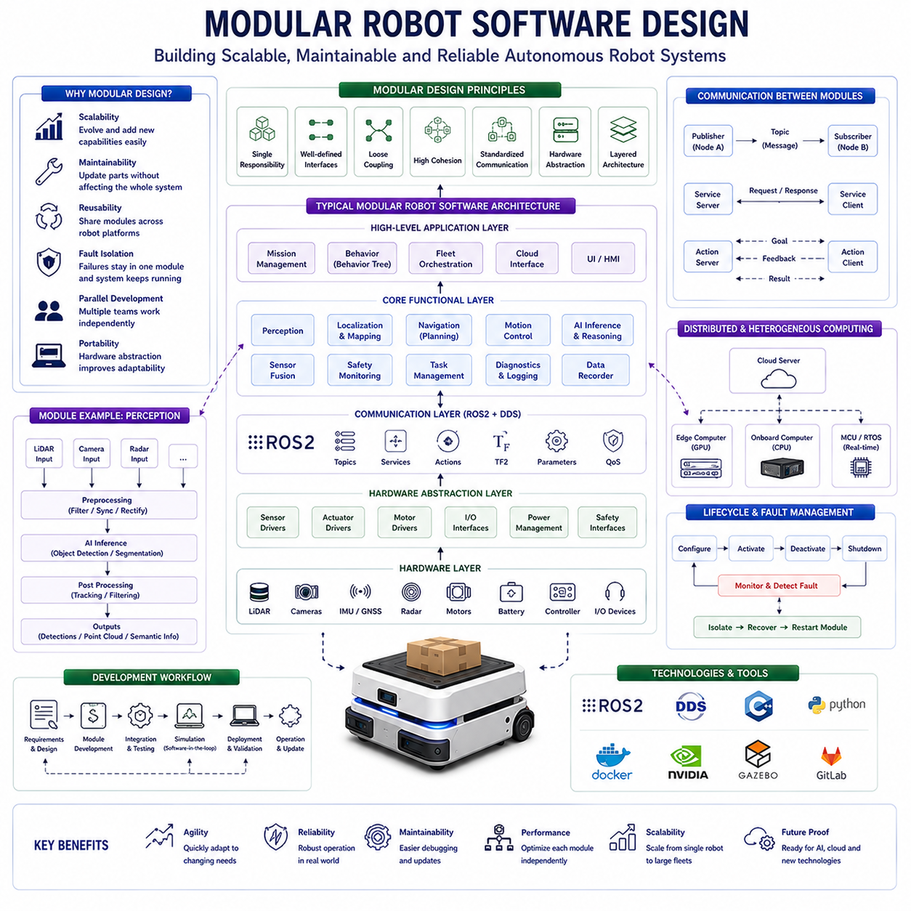
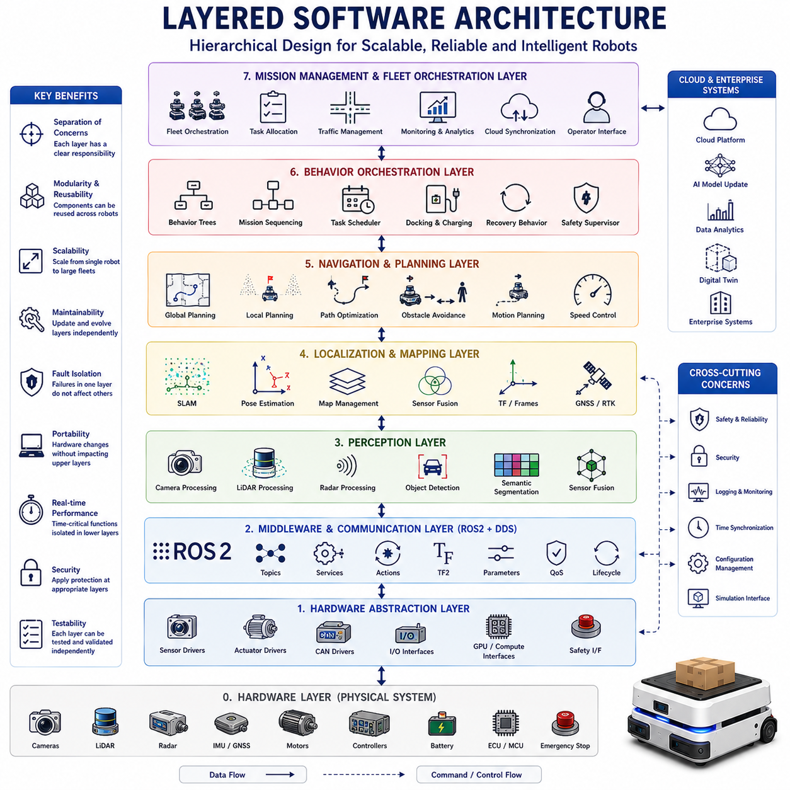
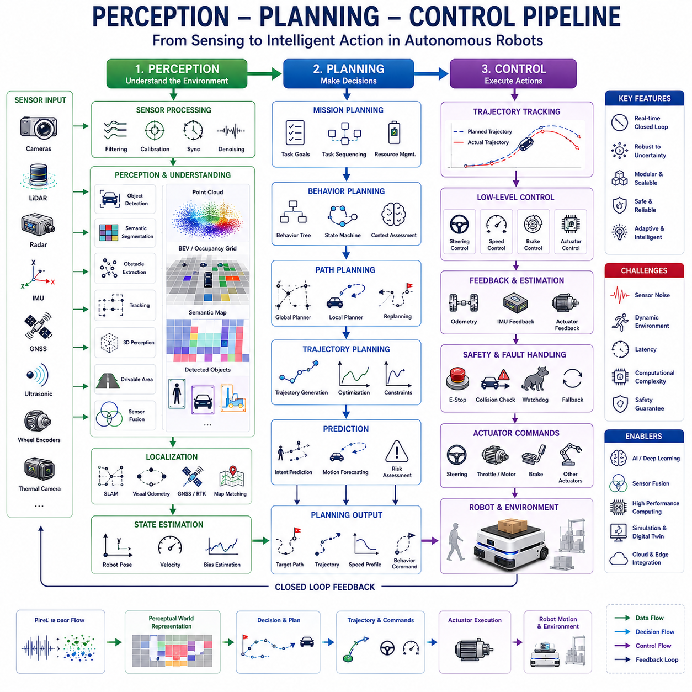
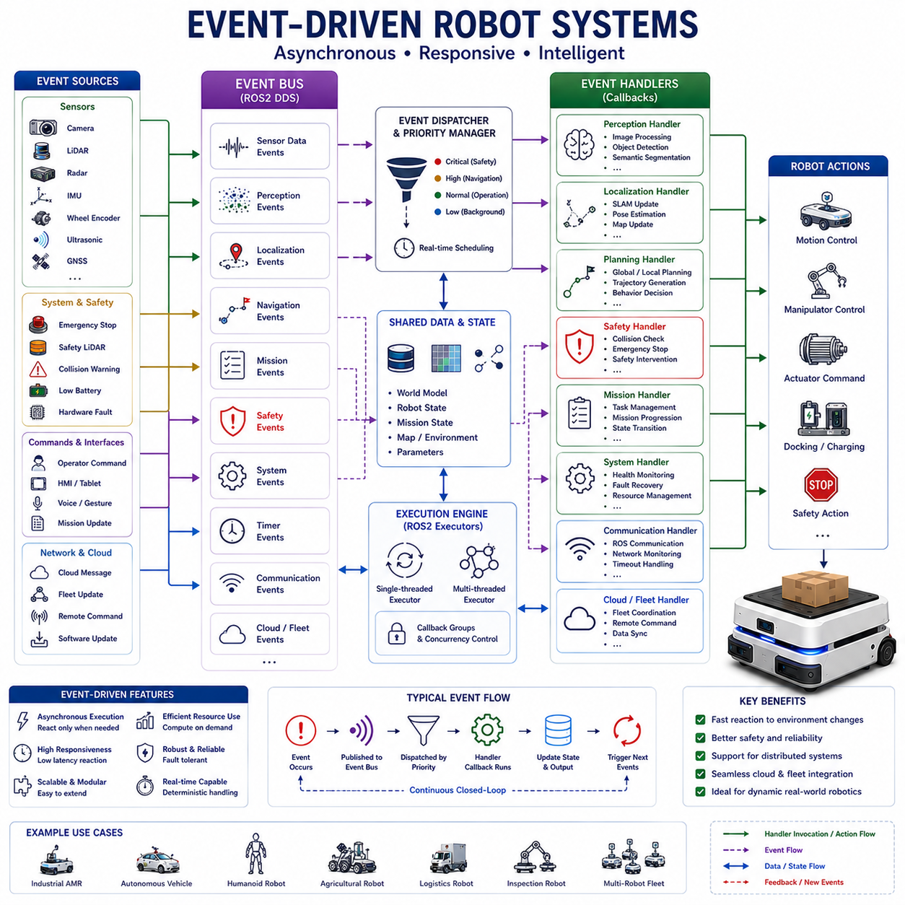
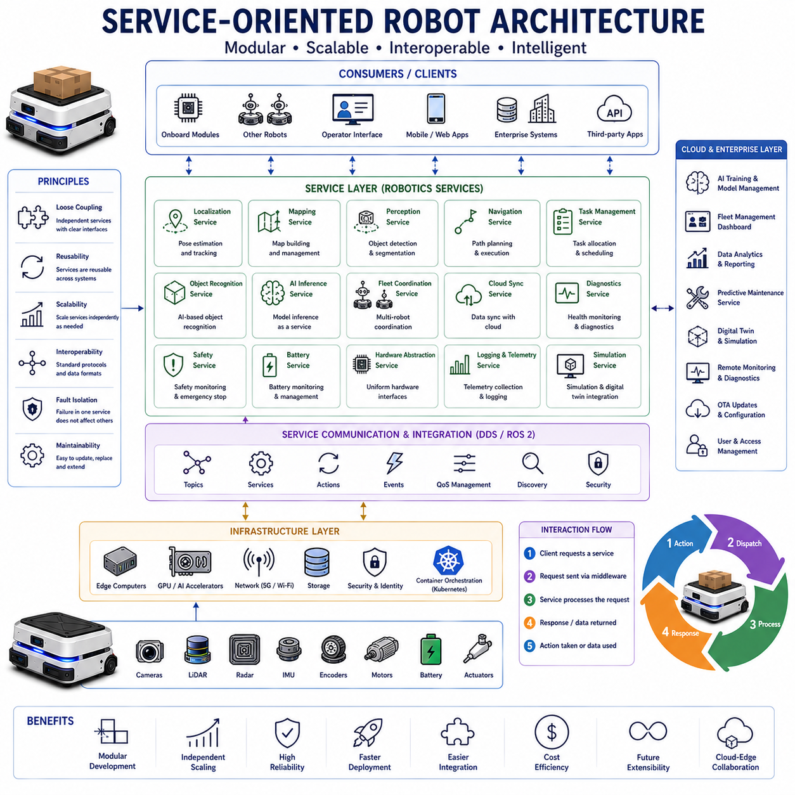
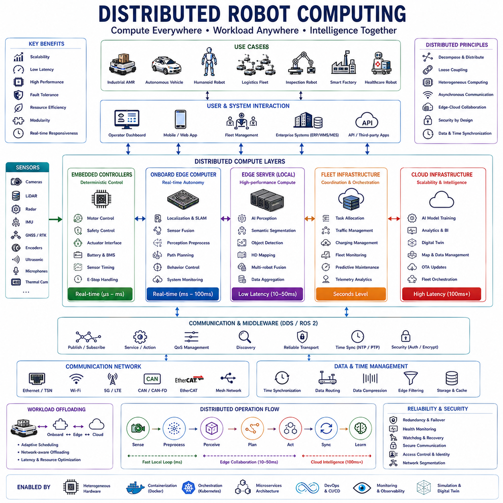
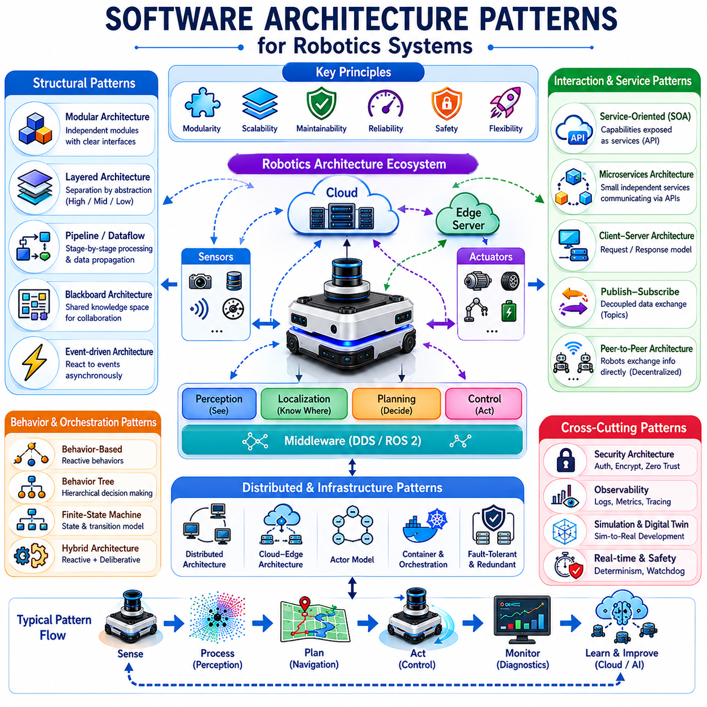
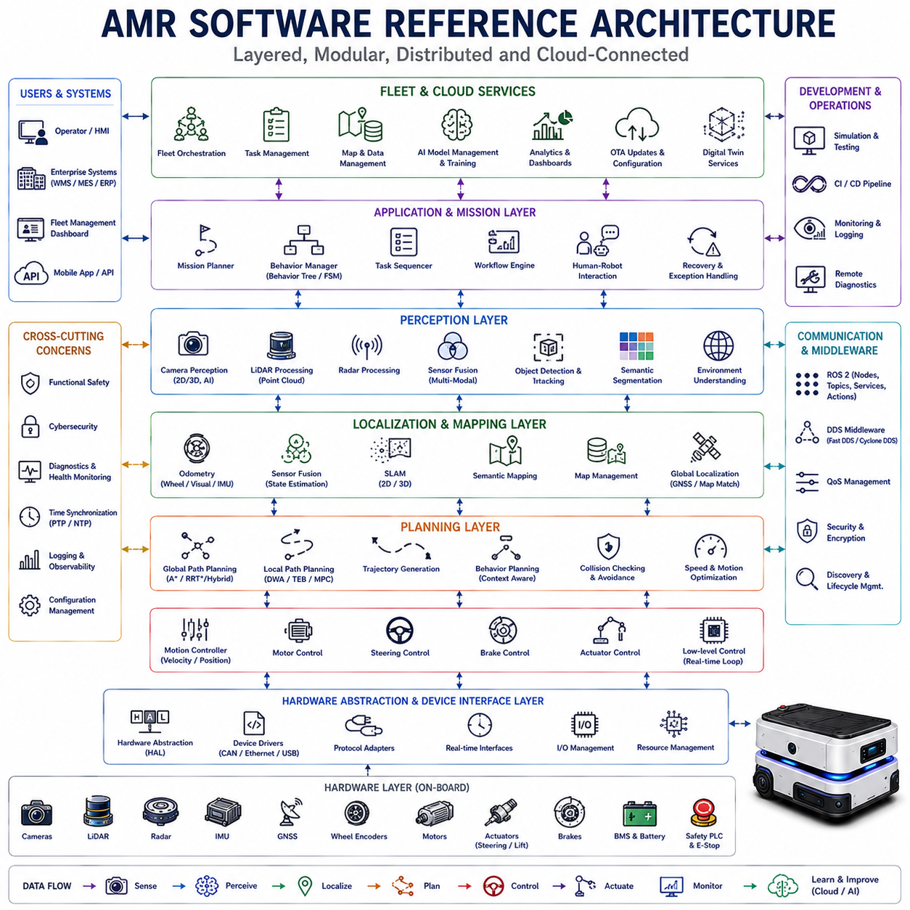

**Volume 07. AMR Software Architecture and Development**

# Chapter 02. Robot Software Architecture

## 02.1 Modular Robot Software Design

{width="7.268055555555556in" height="7.268055555555556in"}

"02_01_Modular_Robot_Software_Design" focuses on one of the most important architectural principles in modern robotics engineering: modular software design for autonomous robotic systems. As robots evolve from simple single-purpose machines into highly intelligent autonomous platforms capable of perception, navigation, manipulation, cloud interaction, fleet coordination, and AI reasoning, software complexity increases dramatically. Industrial autonomous mobile robots, humanoid robots, collaborative robots, inspection robots, logistics robots, agricultural robots, and service robots all require sophisticated distributed software ecosystems composed of many interacting subsystems. Modular robot software design provides the structural methodology necessary to manage this complexity while maintaining scalability, maintainability, reusability, reliability, and long-term system evolution.

At the conceptual level, modular software design means decomposing a robotic system into smaller independent functional components rather than building a single monolithic application. Each module performs a specific responsibility while communicating with other modules through well-defined interfaces. This architectural philosophy allows robotic systems to evolve incrementally, enables parallel development by multiple engineering teams, and significantly improves fault isolation and maintainability.

Traditional monolithic robotics software architectures become difficult to manage as system complexity grows. In monolithic systems, perception, navigation, motor control, AI inference, communication, diagnostics, and sensor processing are often tightly coupled within a single executable or software framework. Small changes in one subsystem may unintentionally affect unrelated components. Debugging becomes increasingly difficult because failures propagate throughout the entire application. Replacing hardware or upgrading algorithms may require extensive system redesign.

Modern autonomous robotics requires a fundamentally different approach. Industrial AMRs, outdoor autonomous vehicles, and AI-driven robotic systems often operate continuously for long durations under highly dynamic real-world conditions. Software systems must support continuous updates, evolving AI models, changing sensor configurations, cloud integration, multi-robot collaboration, and operational scalability. Modular architectures make such evolution feasible.

In modular robotic systems, each subsystem operates as an independent software component with clearly defined inputs, outputs, and responsibilities. Perception modules process sensor data. Localization modules estimate robot pose. Navigation modules generate trajectories. Safety modules monitor hazards. AI modules perform object detection or scene understanding. Fleet management modules coordinate multi-robot operations. Diagnostics modules monitor system health. These modules communicate through standardized middleware interfaces rather than direct tightly coupled dependencies.

ROS2 represents one of the most important frameworks supporting modular robotics software design. ROS2's node-based distributed communication architecture naturally encourages modular decomposition. Individual nodes can represent independent software modules communicating through topics, services, actions, and tf2 transformation systems. DDS middleware enables these modules to operate across distributed computational hardware while maintaining interoperability.

One of the primary advantages of modular software design is scalability. Robotics systems rarely remain fixed after initial deployment. Sensors evolve, AI algorithms improve, computational hardware changes, operational requirements expand, and new autonomous capabilities emerge continuously. Modular architectures allow individual subsystems to be upgraded independently without redesigning the entire robotics stack.

For example, an industrial AMR may initially use traditional computer vision algorithms for obstacle detection. Later, engineers may replace the perception module with a transformer-based multimodal AI system running on upgraded GPU hardware. In a modular architecture, this upgrade primarily affects only the perception subsystem while leaving navigation, localization, safety, and fleet orchestration systems largely unchanged.

Reusability is another major benefit of modular software architectures. Robotic organizations often develop multiple robot platforms simultaneously. Shared localization modules, navigation frameworks, cloud synchronization systems, diagnostics infrastructure, or AI perception pipelines may be reused across many robot products. This dramatically reduces duplicated engineering effort while accelerating product development cycles.

Hardware abstraction is a particularly important principle in modular robotics software design. Robotic hardware changes frequently over product lifecycles. Sensor vendors change, motor controllers evolve, GPU platforms upgrade, and communication interfaces shift. Software architectures therefore benefit greatly from hardware abstraction layers separating high-level autonomy logic from low-level hardware implementation details.

For example, localization systems should ideally consume standardized sensor interfaces rather than directly depending on specific LiDAR hardware drivers. Navigation systems should issue generalized motion commands independent of the underlying motor controller implementation. AI pipelines should operate on abstract sensor streams rather than hardware-specific APIs whenever possible. Hardware abstraction significantly improves portability and long-term maintainability.

Communication interfaces play a central role in modular robotic architectures. Independent modules must exchange data efficiently and reliably. Topics, services, actions, shared memory systems, DDS middleware, RPC frameworks, and event-driven architectures are commonly used communication mechanisms. Standardized interfaces reduce coupling between modules and improve interoperability across independently developed subsystems.

Interface-driven development becomes especially important in large robotics organizations. Different engineering teams may develop perception, navigation, cloud infrastructure, and embedded systems independently. Clearly defined communication contracts allow parallel development while minimizing integration complexity. Message schemas, service definitions, API specifications, and middleware standards therefore become essential architectural components.

Fault isolation is another critical advantage of modular architectures. Real-world robotic systems inevitably encounter failures including sensor malfunction, network instability, AI inference errors, software crashes, and hardware degradation. In monolithic systems, a failure in one subsystem may destabilize the entire robot. Modular systems isolate failures more effectively because components operate independently.

For example, if a camera perception module crashes, localization, safety monitoring, and low-level control systems may continue operating while recovery mechanisms restart the failed component. This improves overall operational robustness and safety in industrial autonomous systems.

Distributed computation is closely connected to modular robotics architectures. Modern robots increasingly use heterogeneous computational systems including embedded MCUs, CPUs, GPUs, AI accelerators, edge servers, and cloud infrastructure simultaneously. Modular software architectures allow workloads to distribute naturally across these computational resources.

Low-level motor control may execute on real-time embedded systems. AI perception may operate on GPU-enabled edge computers. Fleet analytics may execute within cloud infrastructure. ROS2 DDS middleware enables distributed modules to communicate transparently across heterogeneous hardware environments.

Real-time performance considerations strongly influence modular software architecture design. Industrial AMRs often require deterministic low-latency behavior for motion control, obstacle avoidance, emergency braking, and safety monitoring. Modular systems therefore must balance abstraction flexibility against communication overhead and timing predictability.

Careful module boundary design becomes essential. Excessive fragmentation may introduce communication bottlenecks and serialization overhead. Overly coarse modules may reduce maintainability and flexibility. Effective robotics architecture design therefore involves identifying optimal subsystem decomposition strategies based on computational workload, latency sensitivity, fault isolation requirements, and operational scalability.

Layered software architecture is commonly used in modular robotics systems. Low-level layers manage hardware drivers, sensors, actuators, and embedded interfaces. Mid-level layers manage localization, perception, navigation, and planning. High-level layers manage fleet orchestration, cloud integration, mission planning, and AI reasoning. This layered organization simplifies dependency management and architectural clarity.

Perception systems often represent some of the most computationally demanding modules in autonomous robotics. Camera pipelines, LiDAR processing, radar fusion, semantic segmentation, object detection, scene understanding, and AI inference systems may each operate as independent modules. Modularization allows perception pipelines to evolve rapidly alongside AI hardware acceleration technologies.

Sensor fusion architectures also benefit significantly from modular design. LiDAR, cameras, IMUs, radar, GNSS, ultrasonic sensors, and thermal imaging systems often operate independently while contributing to shared environmental understanding. Modular fusion frameworks allow sensor combinations to adapt dynamically according to operational conditions or hardware configurations.

Navigation architectures in industrial AMRs are typically highly modular. Localization modules estimate robot pose. Global planners generate long-distance trajectories. Local planners avoid dynamic obstacles. Behavior trees manage mission sequencing. Controllers generate velocity commands. Recovery modules handle fault conditions. This decomposition improves scalability and debugging efficiency.

Behavior trees themselves are increasingly important for modular autonomy orchestration. Traditional state machines become difficult to maintain as operational complexity grows. Behavior trees provide hierarchical decision-making structures where independent behavior modules can be reused and composed flexibly.

Cloud robotics integration further reinforces the need for modular software architectures. Robots increasingly interact with remote AI inference systems, fleet management platforms, cloud databases, simulation infrastructure, OTA update services, and telemetry analytics pipelines. Cloud interfaces therefore often exist as independent communication modules within larger autonomy architectures.

Multi-robot fleet systems depend heavily on modularity. Fleet orchestration, traffic management, task allocation, charging coordination, and distributed mapping systems must integrate across many robots simultaneously. Standardized modular interfaces greatly simplify large-scale fleet management architectures.

Simulation environments also benefit from modular robotics design. Gazebo, Isaac Sim, and digital twin systems often reuse identical software modules deployed on physical robots. Sim-to-real workflows become more efficient when modular interfaces remain consistent across simulation and deployment environments.

Testing and validation become significantly easier in modular architectures. Independent modules can undergo isolated unit testing, integration testing, performance benchmarking, hardware-in-the-loop validation, and simulation-driven verification. Continuous integration pipelines become more scalable because individual modules can evolve independently.

Cybersecurity considerations increasingly affect robotics software architecture design. Modular architectures allow organizations to isolate sensitive subsystems, manage secure communication boundaries, apply authentication policies, and reduce attack surfaces within connected industrial robotics environments.

Lifecycle management is also important in modular robotic systems. Modules may start, stop, restart, recover, or update independently during robot operation. ROS2 lifecycle nodes provide structured operational state management supporting industrial deployment workflows.

Containerization technologies such as Docker and Kubernetes align naturally with modular robotics software architectures. Independent modules may execute within isolated containers distributed across edge computing clusters or cloud infrastructure. OTA deployment and fleet-wide software updates become significantly easier under modular architectures.

Data logging and observability systems are also strongly influenced by modularity. Independent modules generate telemetry streams, diagnostics data, performance metrics, AI inference statistics, and communication traces. Distributed observability infrastructures become essential for monitoring complex robotic ecosystems.

Embodied AI systems are expected to increase modularity requirements even further. Future robots may integrate multimodal foundation models, world models, semantic reasoning systems, long-term memory architectures, adaptive learning pipelines, and distributed cloud intelligence simultaneously. Monolithic architectures will become increasingly infeasible under such complexity.

As robotics systems evolve toward highly intelligent distributed autonomy ecosystems, modular software design will remain one of the foundational architectural principles enabling scalable development, operational maintainability, cloud integration, AI acceleration, multi-robot collaboration, and long-term software evolution.

Ultimately, modular robot software design represents far more than an engineering convenience. It forms the structural nervous system architecture of autonomous robotics, enabling perception, navigation, AI reasoning, cloud orchestration, safety monitoring, distributed computation, and embodied intelligence to operate together cohesively within scalable real-world robotic ecosystems.

# 02.01 모듈형 로봇 소프트웨어 설계 (Modular Robot Software Design)

## 02.2 Layered Software Architecture

{width="7.268055555555556in" height="7.268055555555556in"}

"02_02_Layered_Software_Architecture" focuses on one of the most important structural design methodologies in modern robotics and autonomous systems engineering: layered software architecture. As autonomous mobile robots evolve into highly intelligent distributed systems capable of perception, navigation, manipulation, AI reasoning, fleet coordination, and cloud interaction, software complexity grows exponentially. A single industrial AMR may integrate hundreds of sensors, multiple computational platforms, GPU-based AI accelerators, distributed middleware, cloud synchronization systems, safety controllers, and large-scale operational workflows. Without systematic architectural organization, such systems quickly become difficult to maintain, scale, debug, validate, and evolve. Layered software architecture provides a structured framework that decomposes robotic software systems into hierarchical functional layers, each responsible for specific operational domains while interacting through controlled interfaces.

At its conceptual core, layered architecture separates robotic functionality according to abstraction level and responsibility. Lower layers interact directly with hardware and real-time physical systems. Middle layers manage perception, localization, planning, and autonomous behaviors. Upper layers coordinate missions, cloud interaction, AI reasoning, and fleet orchestration. This hierarchical organization simplifies complexity management because developers can reason about each layer independently while maintaining controlled interactions between layers.

The importance of layered architecture increases dramatically as robotics systems scale. Small educational robots may operate successfully with relatively simple monolithic control software. However, industrial AMRs operating continuously in warehouses, factories, ports, smart cities, agricultural environments, or infrastructure inspection systems require far more sophisticated architectures. These systems must support distributed computation, fault isolation, hardware abstraction, AI integration, cloud synchronization, real-time safety, and long-term software evolution simultaneously. Layered architectures provide the structural foundation enabling these capabilities.

One of the most important principles of layered software architecture is abstraction separation. Each layer hides implementation complexity from higher layers. Upper-level mission planning systems do not need to understand low-level motor driver timing details. Navigation systems should not depend directly on sensor electrical interfaces. AI reasoning modules should interact with semantic environmental representations rather than raw voltage signals or hardware-specific communication protocols. This abstraction hierarchy significantly improves maintainability and portability.

The lowest layer in robotic layered architectures is typically the hardware layer. This layer contains the physical components of the robotic platform including sensors, actuators, motor controllers, embedded electronics, batteries, communication buses, GPUs, CPUs, storage systems, and safety devices. Hardware components produce raw signals, electrical measurements, encoder values, image streams, radar reflections, inertial measurements, and control interfaces. This layer represents the robot's direct physical connection to the real world.

Above the hardware layer exists the hardware abstraction layer. This layer provides standardized software interfaces for interacting with physical hardware components. Sensor drivers, actuator drivers, CAN communication interfaces, serial communication systems, Ethernet interfaces, GPIO control systems, camera SDK integrations, GPU interfaces, and embedded firmware communication modules typically operate within this layer. Hardware abstraction is critically important because robotic hardware changes frequently during product evolution. Abstraction layers isolate higher-level autonomy software from hardware-specific implementation details.

For example, localization algorithms should not depend directly on a particular LiDAR vendor's SDK. Instead, the hardware abstraction layer converts raw sensor outputs into standardized ROS2 message interfaces. This allows hardware replacement or upgrades without requiring major changes to localization, navigation, or AI systems. Hardware abstraction therefore greatly improves portability, maintainability, and product scalability.

The next major architectural layer is commonly the middleware or communication layer. In ROS2-based systems, this layer includes DDS middleware, ROS2 communication infrastructure, tf2 transformation systems, parameter management, lifecycle management, Quality-of-Service configuration, and distributed messaging systems. This layer enables distributed software modules to communicate consistently across heterogeneous computational environments.

Middleware layers play an essential role in distributed robotics because modern autonomous systems rarely execute on a single computer. Industrial AMRs may contain embedded controllers for real-time motion control, GPU edge computers for AI perception, cloud gateways for fleet synchronization, and safety controllers for functional safety monitoring. The middleware layer provides communication abstraction allowing these distributed systems to operate cohesively despite heterogeneous hardware architectures.

The perception layer represents one of the most computationally demanding portions of modern robotics architectures. This layer processes raw sensor data into meaningful environmental understanding. Camera pipelines, LiDAR processing, radar fusion, depth estimation, semantic segmentation, object detection, scene understanding, obstacle recognition, AI inference pipelines, and multimodal sensor fusion systems typically exist within the perception layer.

Modern perception systems increasingly rely on deep learning and GPU acceleration. Neural network inference pipelines operating on high-resolution image streams or LiDAR point clouds may consume significant computational resources. Layered architectures help isolate perception workloads from navigation, control, and mission orchestration systems while maintaining standardized communication interfaces between layers.

Sensor fusion systems often span multiple layers simultaneously. Low-level sensor synchronization may occur near hardware abstraction layers, while high-level environmental understanding emerges within perception and planning layers. Modular layered architectures allow fusion pipelines to evolve independently as sensor technologies and AI algorithms improve.

Above the perception layer typically exists the localization and mapping layer. This layer estimates the robot's pose relative to local or global coordinate systems. SLAM systems, GNSS integration, wheel odometry fusion, visual localization, map management, and tf2 coordinate transformation systems commonly operate within this layer. Accurate localization is foundational because navigation, planning, and manipulation systems all depend on reliable spatial understanding.

The navigation and planning layer manages robot movement behavior. Global planners compute long-distance trajectories through known environments. Local planners react dynamically to nearby obstacles and changing environmental conditions. Path optimization algorithms minimize travel distance, congestion, or energy consumption. Motion planners generate executable movement trajectories respecting robot kinematics and dynamic constraints.

Industrial AMRs often require highly sophisticated navigation systems because operational environments are dynamic and unpredictable. Warehouses contain moving forklifts, workers, pallets, carts, and constantly changing layouts. Outdoor robots encounter uneven terrain, weather conditions, GNSS instability, and complex traffic environments. Layered navigation architectures allow global planning, local obstacle avoidance, and motion control systems to operate independently while remaining coordinated.

The behavior orchestration layer sits above navigation systems and manages higher-level autonomous workflows. Behavior Trees, finite-state machines, mission sequencing systems, task schedulers, charging orchestration, docking workflows, elevator integration, recovery behaviors, and multi-step operational procedures often exist within this layer. This layer coordinates lower-level capabilities into coherent autonomous operational behavior.

Behavior Trees have become increasingly important in layered robotics architectures because they provide scalable hierarchical decision-making structures. Independent behaviors may be reused, combined, and extended without rewriting entire autonomy systems. Industrial AMRs frequently execute highly complex workflows requiring flexible behavior orchestration architectures.

Above behavior orchestration exists the mission management and fleet coordination layer. This layer manages interactions between robots, cloud systems, enterprise infrastructure, and human operators. Fleet orchestration systems allocate tasks dynamically across robots, optimize traffic flow, schedule charging operations, coordinate maintenance workflows, and synchronize distributed operational intelligence.

Cloud robotics integration is becoming increasingly central within upper architectural layers. Modern robots often synchronize with cloud infrastructure for AI model updates, telemetry analytics, digital twin management, predictive maintenance, remote diagnostics, OTA deployment, and large-scale fleet coordination. Layered architectures allow cloud communication systems to evolve independently from low-level autonomy systems.

AI reasoning and semantic intelligence layers are emerging as major components of next-generation robotics architectures. Future autonomous systems may include multimodal foundation models, semantic scene understanding, world models, task reasoning systems, long-term memory architectures, and embodied AI reasoning modules. These systems operate at high abstraction levels while depending indirectly on lower-level perception and navigation infrastructure.

Layered architectures also support strong fault isolation capabilities. Failures occurring within one layer can often be isolated without destabilizing the entire robot. For example, a camera perception subsystem failure may not immediately disrupt low-level safety monitoring or motor control systems. Recovery mechanisms can restart failed layers independently while maintaining partial operational capability.

Real-time considerations strongly influence layered robotics architecture design. Lower layers interacting directly with physical hardware often require deterministic timing behavior with strict latency constraints. Motor control loops may execute at kilohertz frequencies, while AI planning systems may operate asynchronously at much lower rates. Layer separation allows real-time critical functions to remain isolated from computationally intensive high-level AI workloads.

Safety architectures are deeply integrated into layered robotics systems. Industrial robots frequently operate near humans and machinery, requiring redundant monitoring systems, emergency stop logic, safety-rated controllers, and deterministic fault handling. Safety layers may operate independently from high-level autonomy systems to ensure predictable behavior even during software failures.

Cybersecurity also benefits from layered architecture. Communication boundaries between layers allow secure isolation of critical subsystems. Authentication, encryption, access control, and network segmentation can be applied strategically across different architectural domains. As industrial robots become increasingly cloud-connected, layered cybersecurity architectures become essential.

Testing and validation workflows become far more manageable under layered architectures. Individual layers can undergo isolated unit testing, integration testing, simulation-driven validation, hardware-in-the-loop testing, and performance benchmarking independently. Continuous integration pipelines become more scalable because subsystem changes remain localized.

Simulation systems align naturally with layered architectures. Gazebo, Isaac Sim, digital twins, and reinforcement learning environments often reuse identical upper-layer autonomy software deployed on physical robots. Only low-level hardware interaction layers require simulation substitution. This greatly improves sim-to-real development efficiency.

Containerization and distributed deployment systems also benefit from layered organization. Independent layers may execute within isolated Docker containers distributed across edge computers, embedded systems, and cloud infrastructure. Kubernetes orchestration systems increasingly manage distributed robotics software stacks using layered deployment architectures.

Data logging and observability infrastructures become increasingly important as robotics complexity grows. Each architectural layer generates telemetry, diagnostics, performance metrics, AI inference statistics, communication traces, and operational logs. Layered observability allows engineers to diagnose failures systematically across distributed systems.

Scalability remains one of the greatest long-term benefits of layered robotics architecture. As new AI algorithms, sensors, cloud services, and operational capabilities emerge, individual layers can evolve independently without destabilizing the entire software ecosystem. This flexibility is essential for industrial robotics platforms expected to remain operational for many years.

Future embodied AI systems will likely increase the importance of layered architectures even further. Robots integrating semantic world models, multimodal reasoning, distributed cloud intelligence, adaptive learning systems, and human-robot collaboration frameworks will require extremely sophisticated software organization methodologies. Layered architectures provide one of the few scalable approaches capable of managing such complexity.

As robotics systems continue evolving toward distributed autonomous intelligence ecosystems, layered software architecture will remain one of the foundational engineering methodologies enabling maintainable, scalable, fault-tolerant, cloud-connected, AI-driven autonomous robotic systems.

Ultimately, layered software architecture in robotics represents far more than a software organization strategy. It forms the structural operational hierarchy connecting physical hardware, real-time control, distributed communication, perception, navigation, AI reasoning, cloud infrastructure, and fleet intelligence into coherent autonomous robotic ecosystems capable of long-term industrial deployment and continuous technological evolution.

# 02.02 계층형 소프트웨어 아키텍처 (Layered Software Architecture)

## 02.3 Perception, Planning, and Control Pipeline

{width="7.268055555555556in" height="7.268055555555556in"}

"02_03_Perception_Planning_Control_Pipeline" focuses on one of the most fundamental operational architectures in autonomous robotics: the perception-planning-control pipeline. This pipeline forms the core decision-making and motion execution framework that enables autonomous robots to sense the environment, interpret surrounding conditions, generate intelligent movement decisions, and physically execute actions in real-world environments. Nearly all modern autonomous robotic systems, including industrial AMRs, autonomous delivery robots, self-driving vehicles, humanoid robots, agricultural robots, logistics platforms, defense robots, and infrastructure inspection systems, rely on some variation of the perception-planning-control architecture.

At the conceptual level, the perception-planning-control pipeline represents a hierarchical information flow transforming raw sensor signals into physical robot behavior. The robot first observes the environment through perception systems. The resulting environmental understanding is then used by planning systems to determine appropriate actions and trajectories. Finally, control systems convert planned trajectories into low-level actuator commands that physically move the robot. This pipeline continuously repeats in real time, allowing robots to operate autonomously within dynamic and uncertain environments.

The importance of this architecture stems from the fact that autonomous robots operate inside complex physical worlds rather than deterministic digital environments. Real-world environments contain uncertainty, dynamic obstacles, changing lighting conditions, weather effects, sensor noise, communication latency, imperfect localization, and unpredictable human behavior. The perception-planning-control pipeline provides the structured computational framework necessary for handling this uncertainty while maintaining safe and reliable autonomous behavior.

Perception is the first stage of the pipeline and serves as the robot's sensory and environmental understanding system. Perception systems collect and process data from sensors such as cameras, LiDARs, radars, depth cameras, ultrasonic sensors, IMUs, GNSS receivers, thermal cameras, and wheel encoders. These sensors provide raw observations about the robot's surroundings, motion state, environmental geometry, and operational context.

Raw sensor data alone is not directly useful for autonomous decision-making. Camera images consist of pixel intensities, LiDAR produces point clouds, radar generates reflection patterns, and IMUs produce acceleration measurements. Perception systems therefore transform raw sensor signals into structured environmental understanding. This transformation often involves filtering, synchronization, calibration, object detection, semantic segmentation, obstacle extraction, localization, tracking, sensor fusion, and scene interpretation.

Modern robotic perception systems increasingly rely on deep learning and AI-based inference. Neural networks may detect pedestrians, forklifts, pallets, vehicles, lane markings, doors, or hazardous areas. Semantic segmentation systems classify surfaces and environmental regions. Scene understanding models interpret operational context. Multimodal AI systems combine camera, LiDAR, radar, and thermal information simultaneously to improve robustness under difficult environmental conditions.

Sensor fusion plays a central role within perception pipelines because no single sensor performs optimally under all conditions. Cameras provide rich semantic information but may fail under low-light or fog conditions. LiDAR provides accurate geometry but may struggle with reflective surfaces or heavy rain. Radar performs well in adverse weather but offers lower spatial resolution. IMUs provide high-frequency motion estimation but drift over time. Fusion architectures combine complementary sensing modalities to create more reliable environmental understanding.

Time synchronization is critically important in perception pipelines. Sensors operate at different frequencies and experience different communication latencies. Cameras may operate at 30 FPS, LiDARs at 10 Hz, IMUs at 200 Hz, and GNSS systems at 5 Hz. Synchronization systems align these heterogeneous sensor streams temporally and spatially using timestamp management and tf2 coordinate transformation systems.

Localization is often considered either part of perception or a closely related subsystem. Localization systems estimate the robot's pose relative to local or global coordinate frames using sensor fusion, SLAM, visual odometry, wheel odometry, GNSS, and map matching algorithms. Accurate localization is essential because planning systems depend on reliable spatial understanding.

The output of the perception stage is not raw sensor data but structured world representation. This may include occupancy maps, semantic maps, obstacle lists, dynamic object trajectories, localization estimates, environmental classifications, drivable regions, free-space maps, or object detection results. Planning systems consume these representations to make autonomous decisions.

Planning represents the second major stage of the pipeline and functions as the robot's decision-making system. Planning algorithms determine how the robot should behave based on environmental understanding, operational objectives, safety constraints, and dynamic conditions. Planning is often divided into multiple hierarchical levels including mission planning, behavior planning, path planning, trajectory planning, and motion planning.

Mission planning operates at the highest level of abstraction. It determines long-term operational goals and task sequencing. For example, a warehouse AMR may receive instructions to retrieve pallets from specific locations, deliver goods to loading stations, recharge batteries when necessary, and avoid congested operational zones. Mission planners coordinate overall operational workflows.

Behavior planning determines the robot's immediate operational mode based on environmental context and mission objectives. A robot may decide whether to continue moving, yield to a pedestrian, reroute around an obstacle, initiate docking procedures, stop for safety reasons, or transition into recovery behavior. Behavior planning often relies on finite-state machines or behavior trees.

Path planning computes geometric routes through the environment. Global planners generate long-distance paths using known maps or environmental models. Algorithms such as A\*, Dijkstra, hybrid A\*, graph search, lattice planning, or sampling-based planners may be used depending on operational requirements. Global planning seeks efficient and collision-free routes toward target destinations.

Local planning operates at shorter spatial and temporal horizons. Local planners react dynamically to nearby obstacles, moving humans, forklifts, vehicles, or environmental changes. Unlike global planners, local planners continuously adapt to real-time conditions. Dynamic Window Approach, Timed Elastic Band, Model Predictive Control, and optimization-based local planning methods are commonly used in industrial AMRs.

Trajectory planning converts geometric paths into time-parameterized motion trajectories respecting robot kinematics, dynamics, acceleration limits, steering constraints, wheel slip conditions, payload effects, and safety margins. Trajectory planners ensure that generated robot motion remains physically executable.

Motion planning becomes particularly important in complex robotic systems such as robotic arms, humanoids, or articulated mobile manipulators. These systems may operate within high-dimensional configuration spaces where planning algorithms must consider collision avoidance, joint constraints, reachability, and dynamic stability simultaneously.

Planning systems must continuously balance multiple competing objectives. Autonomous robots seek efficient movement while minimizing collision risk, energy consumption, congestion, travel time, and operational disruption. Industrial AMRs often prioritize safety and predictability over absolute efficiency because they operate near humans and industrial equipment.

Prediction systems are increasingly integrated into planning architectures. Robots must anticipate future motion of pedestrians, forklifts, vehicles, and dynamic obstacles. Predictive planning improves safety and operational smoothness by considering future environmental evolution rather than only instantaneous observations.

AI and machine learning are becoming increasingly important within planning systems. Learning-based planners, reinforcement learning systems, neural trajectory generators, and semantic reasoning models are gradually augmenting traditional rule-based planning architectures. Future embodied AI systems may perform highly semantic planning using multimodal world models and natural-language reasoning.

The control stage forms the final layer of the perception-planning-control pipeline and directly interfaces with physical robot actuators. Control systems convert planned trajectories into low-level motor commands, steering angles, wheel velocities, brake pressures, actuator torques, or manipulator joint movements. Control systems must operate reliably and deterministically because they directly affect physical robot behavior.

Control architectures are typically highly time-sensitive and often operate under real-time constraints. Low-level motor controllers may execute at hundreds or thousands of hertz. Control loops continuously monitor robot motion state using wheel encoders, IMUs, steering sensors, and feedback controllers.

Feedback control is fundamental to robotic control systems. Unlike open-loop systems, autonomous robots continuously measure actual motion behavior and compare it against desired trajectories. Controllers compensate for disturbances, wheel slip, terrain variation, actuator nonlinearities, payload changes, and environmental uncertainties dynamically.

PID controllers remain widely used in robotics because of their simplicity and robustness. However, advanced autonomous systems increasingly use model predictive control, adaptive control, robust control, optimal control, nonlinear control, and learning-based control architectures to improve performance under complex operational conditions.

Vehicle kinematics strongly influence control design. Differential-drive robots, Ackermann-steering vehicles, omnidirectional robots, tracked robots, and articulated mobile platforms all require different control formulations. Outdoor industrial AMRs operating on rough terrain often require sophisticated dynamic control systems compensating for wheel slip, suspension motion, and terrain irregularities.

Safety systems are deeply integrated into the control layer. Emergency braking systems, collision avoidance overrides, watchdog systems, safety PLCs, redundant controllers, and fail-safe mechanisms may intervene directly in low-level control pipelines. Industrial robots frequently prioritize safety constraints above planning objectives.

Latency management is critically important throughout the perception-planning-control pipeline. Perception delays, planning computation time, communication latency, and actuator response delays all contribute to overall system responsiveness. Excessive latency may destabilize control systems or reduce obstacle avoidance effectiveness. Real-time scheduling and distributed computational optimization therefore become essential architectural considerations.

Distributed computing architectures are increasingly common in modern autonomous robots. Perception workloads may execute on GPU-enabled edge computers, planning systems on high-performance CPUs, and control loops on embedded real-time controllers. ROS2 DDS middleware provides distributed communication infrastructure connecting these heterogeneous computational layers.

Simulation environments play a major role in pipeline development and validation. Gazebo, Isaac Sim, CARLA, and digital twin systems allow engineers to test perception, planning, and control algorithms under controlled conditions before deployment to physical robots. Sim-to-real workflows increasingly depend on accurate simulation of complete autonomy pipelines.

Data logging and observability systems are essential for debugging and improving perception-planning-control architectures. rosbag systems record distributed sensor streams, localization outputs, planning decisions, and control commands for offline analysis. Engineers use recorded operational data for AI training, fault analysis, performance optimization, and simulation replay.

Industrial AMRs often operate under highly constrained operational requirements. Warehouses, factories, ports, hospitals, and outdoor logistics environments impose strict safety, reliability, uptime, and scalability demands. Perception-planning-control architectures must therefore remain robust under uncertain and changing conditions for extended operational durations.

Cloud robotics and fleet coordination systems increasingly interact with perception-planning-control pipelines. Cloud systems may provide map updates, fleet-level traffic optimization, AI model synchronization, predictive analytics, and distributed learning capabilities. However, real-time perception and control typically remain onboard due to latency and reliability requirements.

Future robotics systems will likely integrate increasingly sophisticated AI reasoning within all stages of the pipeline. Perception systems may evolve toward foundation-model-based semantic understanding. Planning systems may incorporate multimodal world models and adaptive learning. Control systems may integrate learned dynamic models and adaptive behavior optimization. Despite these advances, the fundamental perception-planning-control structure will likely remain central because autonomous robotics fundamentally requires sensing, reasoning, and physical action execution.

Embodied AI systems further reinforce the importance of this pipeline architecture. Intelligent robots must continuously connect environmental understanding with decision-making and physical interaction. The perception-planning-control pipeline therefore forms the operational backbone of embodied autonomous intelligence.

As robotics systems continue evolving toward distributed AI-driven autonomy, the perception-planning-control pipeline will remain one of the foundational architectural principles enabling robots to transform sensor observations into safe, intelligent, scalable, and reliable real-world autonomous behavior.

Ultimately, the perception-planning-control pipeline represents far more than a sequence of software modules. It forms the computational nervous system through which autonomous robots perceive reality, reason about future behavior, and physically interact with the world as intelligent embodied machines operating within dynamic real-world environments.

# 02.03 인지-계획-제어 파이프라인 (Perception-Planning-Control Pipeline)

## 02.4 Event-Driven Robot Systems

{width="7.268055555555556in" height="7.268055555555556in"}

"02_04_Event_Driven_Robot_Systems" focuses on one of the most important software execution paradigms in modern autonomous robotics: event-driven system architecture. As robotic systems become increasingly complex, distributed, intelligent, and interactive, traditional sequential software execution models become insufficient for handling highly dynamic real-world operational environments. Industrial AMRs, autonomous vehicles, humanoid robots, logistics robots, collaborative robots, and cloud-connected robotic platforms must continuously react to rapidly changing sensor inputs, environmental conditions, safety hazards, mission updates, operator commands, network events, and AI inference results. Event-driven robot systems provide the architectural foundation enabling robots to respond asynchronously and intelligently to such dynamic conditions in real time.

At the conceptual level, event-driven architecture means that software behavior is triggered primarily by events rather than by strictly sequential procedural execution. An event represents any significant occurrence within the robotic system or environment. Events may originate from sensors, timers, communication systems, safety devices, AI models, user commands, cloud infrastructure, hardware faults, localization updates, or operational state transitions. Instead of executing rigid predetermined sequences continuously, event-driven systems react dynamically whenever relevant events occur.

This execution model closely resembles biological nervous systems. Humans and animals do not continuously execute every possible behavior simultaneously. Instead, sensory events trigger context-specific reactions. Visual motion may trigger attention shifts. Touch stimuli may trigger reflexes. Environmental hazards may trigger avoidance behavior. Event-driven robotics architectures similarly allow autonomous systems to react selectively and efficiently according to operational context.

Traditional robotics systems often relied on polling-based architectures. In polling systems, software continuously checks sensors, communication channels, or state variables repeatedly in fixed loops. While simple, polling architectures become increasingly inefficient and difficult to scale as system complexity grows. Large industrial robots may integrate hundreds of sensors, distributed computational nodes, AI perception systems, fleet communication channels, and cloud interfaces simultaneously. Constant polling of every subsystem wastes computational resources and introduces latency.

Event-driven architectures improve efficiency by activating computation only when meaningful state changes occur. Instead of repeatedly checking whether a sensor has produced new data, the system reacts immediately when new data arrives. Instead of continuously monitoring whether a navigation goal has completed, the system responds when completion events are emitted. This asynchronous execution model improves responsiveness, scalability, modularity, and computational efficiency.

ROS2 naturally supports event-driven robotics architectures because its communication model is fundamentally asynchronous and message-driven. Topics, services, actions, timers, callbacks, lifecycle transitions, and DDS communication events all contribute to event-driven operational behavior. ROS2 nodes do not necessarily execute continuously in rigid procedural loops. Instead, callback functions activate dynamically when messages arrive or events occur.

Callbacks represent one of the foundational mechanisms in event-driven robotic systems. A callback is a software function automatically executed when a particular event occurs. For example, arrival of a camera image may trigger a perception callback. Detection of an obstacle may trigger an emergency avoidance callback. A completed navigation trajectory may trigger mission progression logic. A low-battery event may trigger charging behavior. Callback-driven architectures enable highly responsive autonomous behavior.

Sensor systems generate enormous numbers of events within autonomous robots. Cameras produce image frames. LiDARs generate point clouds. IMUs produce acceleration updates. Wheel encoders generate odometry measurements. Radar systems detect moving objects. Safety LiDARs detect intrusion zones. GNSS systems update global position estimates. Each incoming sensor update may trigger independent computational workflows throughout the robotics system.

Perception systems are heavily event-driven. Arrival of new camera frames may trigger neural network inference pipelines. Updated LiDAR scans may trigger obstacle extraction algorithms. Radar detections may trigger tracking systems. Semantic segmentation outputs may update navigation costmaps. Object detection events may initiate behavior planning updates or safety interventions.

Event-driven architectures become especially important in safety-critical robotics applications. Industrial AMRs operating near humans must react immediately to hazardous events. Emergency stop buttons, safety LiDAR triggers, collision warnings, communication failures, motor overload conditions, or localization instability events may require immediate system response. Event-driven safety architectures minimize reaction latency because safety handlers activate directly when hazardous events occur.

Asynchronous execution is one of the defining characteristics of event-driven systems. Different robotic subsystems operate at different frequencies and computational speeds simultaneously. IMU updates may arrive at 200 Hz, LiDAR scans at 10 Hz, cameras at 30 FPS, fleet updates every few seconds, and cloud synchronization asynchronously. Event-driven architectures naturally accommodate such heterogeneous timing behavior without forcing all subsystems into rigid synchronized loops.

State machines are commonly integrated with event-driven robotic architectures. Autonomous robots frequently maintain operational states such as idle, navigating, docking, charging, loading, unloading, emergency stop, recovery, or fault handling. Events trigger transitions between these states dynamically. For example, a "goal reached" event may transition the robot from navigation mode into docking mode. A "low battery" event may interrupt current tasks and initiate charging behavior.

Behavior trees represent a more scalable evolution of event-driven state orchestration. Traditional finite-state machines become increasingly difficult to manage as operational complexity grows. Behavior trees provide hierarchical event-driven decision structures where modular behaviors activate dynamically according to operational conditions and incoming events. Industrial AMRs frequently use behavior trees for mission sequencing, recovery handling, and adaptive autonomy.

Distributed robotics systems particularly benefit from event-driven architectures. Modern autonomous robots rarely operate on a single computational device. GPU edge computers, embedded controllers, cloud servers, fleet orchestration systems, safety PLCs, and AI accelerators may all generate events asynchronously across distributed infrastructure. DDS middleware and ROS2 communication systems provide the distributed event propagation mechanisms connecting these heterogeneous computational components.

Middleware itself is deeply event-driven. DDS communication frameworks generate discovery events, subscription events, QoS compatibility events, connection status events, liveliness monitoring events, and communication timeout events. ROS2 executors dispatch callbacks dynamically based on such middleware-generated events. This event-oriented middleware model enables scalable distributed robotic communication.

Mission orchestration in industrial robotics is heavily event-driven. Warehouse AMRs often execute complex workflows involving task assignment, pallet pickup, traffic coordination, charging schedules, elevator interaction, docking operations, and fleet synchronization. Operational workflows evolve dynamically according to incoming environmental and operational events rather than predetermined rigid sequences.

Cloud robotics systems further amplify the importance of event-driven architectures. Robots increasingly synchronize with cloud infrastructure for AI model updates, telemetry analytics, remote diagnostics, predictive maintenance, OTA deployment, and fleet management. Cloud systems generate asynchronous operational events continuously. Robots must respond dynamically to remote commands, configuration changes, software updates, or fleet coordination requests.

AI and machine learning systems are also increasingly event-driven. Neural network inference pipelines activate when sensor data arrives. Anomaly detection systems generate alert events when unusual operational behavior is detected. Predictive maintenance models generate maintenance events based on telemetry patterns. Semantic understanding systems generate context events influencing planning behavior.

Event prioritization becomes critically important in complex robotics systems. Not all events possess equal importance. Safety-critical emergency events must preempt routine operational events immediately. High-priority obstacle avoidance events may interrupt low-priority telemetry uploads. Real-time scheduling systems therefore often classify events according to latency sensitivity, operational criticality, and safety impact.

Concurrency management is one of the major challenges in event-driven robotics architectures. Multiple events may occur simultaneously while competing for computational resources. Shared memory structures, sensor buffers, navigation states, or control interfaces may become vulnerable to race conditions, deadlocks, inconsistent state transitions, or synchronization errors. Thread-safe design, asynchronous scheduling, and deterministic resource management therefore become essential engineering concerns.

ROS2 executors play a major role in managing event-driven concurrency. Single-threaded executors process callbacks sequentially, while multi-threaded executors allow parallel callback execution. Callback groups, synchronization primitives, mutexes, condition variables, and asynchronous task scheduling frameworks help coordinate concurrent event processing safely.

Latency management is another critical consideration. Event-driven systems improve responsiveness but may also introduce unpredictable timing behavior under heavy event loads. Excessive callback accumulation, communication congestion, or overloaded AI pipelines may produce event-processing delays. Real-time robotics systems therefore often require careful executor optimization and event scheduling strategies.

Real-time event-driven control systems are particularly important in industrial AMRs and autonomous vehicles. Low-level motor control loops often operate at deterministic frequencies while higher-level event-driven planning systems operate asynchronously. Hybrid architectures therefore commonly combine periodic control loops with asynchronous event-driven decision layers.

Dataflow architectures are closely related to event-driven systems. In many robotics pipelines, arrival of new data automatically propagates computational updates downstream through perception, localization, planning, and control modules. Sensor updates trigger processing chains dynamically throughout the autonomy stack.

Event logging and observability are extremely important for debugging distributed robotic systems. Real-world robotics failures often emerge from subtle event timing interactions, asynchronous communication behavior, race conditions, or unexpected event ordering. rosbag systems, telemetry infrastructures, distributed tracing systems, and runtime diagnostics tools allow engineers to analyze event sequences offline.

Simulation systems provide valuable environments for validating event-driven robotics architectures. Gazebo, Isaac Sim, CARLA, and digital twin systems allow engineers to reproduce asynchronous operational scenarios under controlled conditions. Event replay systems help diagnose intermittent operational failures that may be difficult to reproduce physically.

Cybersecurity also interacts closely with event-driven robotics systems. Unauthorized communication events, malicious command injections, spoofed sensor events, or abnormal network traffic patterns may compromise robotic operation. Secure event validation, authentication, and access-control mechanisms become increasingly important as robots integrate with enterprise and cloud infrastructure.

Embodied AI systems are expected to rely heavily on event-driven architectures. Future intelligent robots may integrate multimodal perception, semantic reasoning, long-term memory systems, world models, adaptive learning pipelines, and human interaction systems simultaneously. Such systems inherently generate enormous numbers of asynchronous cognitive and sensory events requiring scalable event orchestration frameworks.

Human-robot interaction also benefits from event-driven design. Voice commands, gestures, operator interventions, emergency instructions, collaborative task requests, and contextual environmental interactions all generate asynchronous behavioral triggers. Event-driven systems allow robots to respond naturally and dynamically to human interaction.

Multi-agent robotics systems further increase event complexity. Fleet coordination, distributed mapping, collaborative manipulation, swarm robotics, and cooperative navigation systems generate large distributed event ecosystems requiring scalable asynchronous coordination mechanisms.

Future cloud-connected industrial robotics platforms will likely evolve toward increasingly event-centric architectures integrating edge AI, distributed autonomy, adaptive learning, semantic reasoning, and cloud orchestration simultaneously. Event-driven software design provides one of the few scalable paradigms capable of managing such highly asynchronous intelligent systems.

As robotics systems continue evolving toward large-scale distributed embodied intelligence ecosystems, event-driven architectures will remain one of the foundational operational principles enabling responsiveness, scalability, modularity, cloud integration, AI orchestration, and adaptive autonomous behavior.

Ultimately, event-driven robot systems represent far more than asynchronous callback programming techniques. They form the dynamic computational reflex architecture through which autonomous robots continuously react, adapt, coordinate, and respond intelligently to rapidly changing physical, operational, computational, and environmental conditions within complex real-world autonomous ecosystems.

# 02.04 이벤트 기반 로봇 시스템 (Event-Driven Robot Systems)

## 02.5 Service-Oriented Robot Architecture

{width="7.268055555555556in" height="7.268055555555556in"}

"02_05_Service_Oriented_Robot_Architecture" focuses on one of the most important large-scale software architecture paradigms in modern robotics engineering: service-oriented architecture for autonomous robotic systems. As robots evolve into highly distributed intelligent platforms connected to cloud infrastructure, edge computing systems, fleet management networks, AI services, enterprise systems, and multi-robot ecosystems, traditional tightly coupled robotics software architectures become increasingly difficult to scale and maintain. Service-oriented robot architecture provides a structured framework where robotic functionality is decomposed into reusable, loosely coupled services that communicate through standardized interfaces across distributed computational environments.

At its conceptual foundation, service-oriented architecture, often abbreviated as SOA, treats robotic capabilities as independent network-accessible services rather than monolithic software components embedded within a single executable system. Each service encapsulates a specific capability such as localization, mapping, perception, navigation, task allocation, object recognition, diagnostics, AI inference, cloud synchronization, or fleet coordination. These services communicate through standardized protocols and interfaces, allowing robotic systems to scale modularly across heterogeneous hardware and distributed infrastructure.

The emergence of service-oriented robotics is closely related to the increasing complexity of autonomous systems. Early robots were often self-contained machines operating with relatively simple onboard software stacks. Modern industrial AMRs, autonomous vehicles, humanoid robots, warehouse fleets, cloud robotics platforms, and embodied AI systems now operate within interconnected computational ecosystems involving onboard edge computers, cloud AI systems, distributed databases, digital twins, fleet orchestration servers, enterprise management systems, and remote operator interfaces. Service-oriented architectures provide the structural methodology necessary for managing this distributed complexity.

One of the core principles of service-oriented robotics is loose coupling. In tightly coupled architectures, software modules depend directly on each other's internal implementation details. Such systems become fragile because changes in one subsystem may propagate throughout the entire architecture. Service-oriented systems instead expose only standardized service interfaces while hiding internal implementation complexity. Clients interact with services through clearly defined APIs without requiring knowledge of underlying algorithms, hardware, or software structures.

This loose coupling dramatically improves maintainability and scalability. For example, a localization service may initially use LiDAR-based SLAM algorithms running on an onboard edge computer. Later, engineers may replace the localization backend with visual SLAM, GNSS fusion, cloud-assisted localization, or AI-enhanced semantic localization without affecting navigation clients consuming localization outputs. The interface contract remains stable even while internal implementations evolve.

ROS2 naturally supports many service-oriented architectural principles. ROS2 services, actions, topics, DDS middleware, lifecycle nodes, parameter servers, and distributed communication frameworks allow robotic functionality to operate as distributed services across multiple computational devices. Although ROS2 itself is not strictly a classical enterprise SOA framework, many modern robotics systems built on ROS2 adopt strongly service-oriented design methodologies.

In robotics, services can exist at many abstraction levels. Low-level services may include motor control interfaces, sensor drivers, hardware diagnostics, battery monitoring, or actuator management. Mid-level services may provide localization, mapping, obstacle detection, sensor fusion, trajectory generation, or object recognition. High-level services may include fleet orchestration, mission planning, cloud synchronization, AI reasoning, semantic scene understanding, or enterprise integration.

Localization-as-a-service represents one common example. Multiple robotic subsystems often require robot pose estimation simultaneously. Navigation systems, obstacle avoidance modules, fleet management systems, AI reasoning engines, and digital twin platforms may all consume localization information. Rather than embedding localization independently into every subsystem, a centralized localization service continuously provides standardized pose information through distributed interfaces.

Perception systems are also increasingly service-oriented. Camera processing pipelines, LiDAR segmentation systems, radar fusion engines, object detection networks, semantic segmentation models, and multimodal AI perception systems may operate as independent services accessible throughout distributed robotics infrastructure. High-performance GPU servers may provide AI inference services to multiple robots simultaneously.

Cloud robotics strongly accelerates adoption of service-oriented architectures. Modern robots increasingly depend on cloud-hosted services for AI model updates, fleet analytics, semantic mapping, telemetry processing, predictive maintenance, remote diagnostics, simulation management, and large-scale data synchronization. Robots no longer operate as isolated computational units. Instead, they participate within distributed cloud-edge service ecosystems.

Fleet management systems are among the clearest examples of service-oriented robotics. Industrial AMR fleets often involve dozens or hundreds of robots coordinated through centralized or distributed orchestration services. Task allocation services assign work dynamically across robots. Traffic management services optimize fleet routing. Charging coordination services schedule energy replenishment. Telemetry services collect operational metrics. Predictive maintenance services monitor component health continuously.

Microservice architectures are becoming increasingly common within large-scale robotics deployments. In microservice-based robotics systems, functionality is decomposed into extremely granular independent services communicating through APIs or messaging systems. AI inference, map management, authentication, telemetry collection, diagnostics, task scheduling, and fleet monitoring may all operate as separate microservices distributed across edge and cloud infrastructure.

Containerization technologies such as Docker and Kubernetes align naturally with service-oriented robotics architectures. Individual services may execute within isolated containers independently scalable according to workload requirements. Cloud-native orchestration platforms allow robotics services to deploy dynamically across distributed computational resources while supporting resilience, fault recovery, and elastic scaling.

Scalability represents one of the greatest advantages of service-oriented robot architectures. Traditional monolithic systems often scale poorly because all functionality must evolve together. Service-oriented systems allow independent scaling of computationally intensive services. For example, AI perception services requiring GPU acceleration may scale separately from lightweight telemetry or mission-planning services.

Fault isolation also improves significantly under service-oriented architectures. In monolithic systems, failures within one subsystem may destabilize the entire robot. Service-oriented systems isolate failures more effectively because independent services can restart, migrate, recover, or fail independently without collapsing the entire autonomy stack. Redundant service instances may also improve operational resilience.

Asynchronous communication plays a central role in service-oriented robotics. Services often communicate through message queues, publish-subscribe middleware, asynchronous APIs, or event-driven architectures rather than direct blocking function calls. This asynchronous design improves flexibility and responsiveness within distributed robotics ecosystems.

DDS middleware used by ROS2 naturally supports distributed service-oriented communication. DDS provides discovery mechanisms, Quality-of-Service control, reliable transport, multicast communication, distributed data sharing, and scalable peer-to-peer messaging infrastructure. These capabilities are particularly important in industrial robotics environments requiring reliable low-latency distributed coordination.

Quality-of-Service management becomes increasingly important in service-oriented robotic systems because different services possess different latency, reliability, and bandwidth requirements. Safety-critical emergency stop services require deterministic low-latency reliability. Telemetry services may tolerate higher latency. AI inference services may prioritize throughput efficiency over strict determinism. QoS policies allow communication behavior to be tuned according to operational requirements.

Digital twin systems also benefit strongly from service-oriented architectures. Digital twins synchronize real-time operational data between physical robots and virtual simulation environments. Localization services, telemetry services, sensor-stream services, AI analytics services, and simulation orchestration services interact continuously within distributed digital twin ecosystems.

Data management becomes critically important in service-oriented robotics because distributed services generate enormous quantities of operational data. Sensor streams, AI inference outputs, localization updates, diagnostics metrics, fleet telemetry, and event logs must often synchronize across multiple systems. Distributed databases, cloud storage systems, message brokers, and stream-processing architectures therefore become integral parts of robotics service ecosystems.

Security considerations become increasingly complex within service-oriented architectures. Distributed services expose communication interfaces potentially vulnerable to unauthorized access, spoofing, denial-of-service attacks, or malicious command injection. Authentication, authorization, encryption, certificate management, secure APIs, and zero-trust communication architectures therefore become essential components of modern robotics infrastructure.

Identity management is especially important in large robotics fleets. Individual robots, cloud services, edge servers, operators, AI systems, and enterprise applications may all require authenticated access to distributed services. Secure identity and access management frameworks help maintain operational integrity across distributed robotics ecosystems.

Edge computing architectures strongly complement service-oriented robotics systems. Time-sensitive services such as perception, obstacle avoidance, and low-level control often execute onboard robots or nearby edge servers to minimize latency. Computationally intensive but less time-critical services such as large-scale AI training, fleet analytics, or predictive maintenance may execute in cloud infrastructure. Service-oriented architectures allow seamless workload distribution across edge-cloud environments.

AI-as-a-service is becoming increasingly important within robotics ecosystems. Large AI foundation models, multimodal perception systems, semantic reasoning engines, and world-model architectures may operate as centralized services accessible to many robots simultaneously. This allows robots with limited onboard compute resources to leverage powerful remote AI infrastructure when network conditions permit.

Human-robot interaction systems also increasingly adopt service-oriented approaches. Voice recognition services, natural-language processing services, gesture recognition systems, remote teleoperation services, operator notification systems, and collaborative workflow orchestration systems may all operate as distributed services interacting dynamically across robotics infrastructure.

Simulation and validation workflows benefit greatly from service-oriented design. Simulation services, synthetic data generation services, reinforcement learning services, and automated testing frameworks can operate independently while interacting with real autonomy software stacks. This improves sim-to-real development scalability significantly.

Lifecycle management becomes critically important in service-oriented robotics. Services may start, stop, update, restart, migrate, or scale dynamically during operation. Orchestration frameworks manage service dependencies, health monitoring, resource allocation, failover handling, and deployment coordination across distributed systems.

Observability and monitoring are foundational requirements for large-scale service-oriented robotics platforms. Distributed tracing systems, telemetry pipelines, runtime diagnostics, metrics collection frameworks, logging infrastructures, and event-monitoring systems allow engineers to understand behavior across highly distributed service ecosystems.

Industrial robotics increasingly integrates with enterprise IT infrastructure. Manufacturing execution systems, warehouse management systems, ERP platforms, IoT infrastructures, digital manufacturing systems, and cloud analytics platforms interact continuously with autonomous robots. Service-oriented architectures provide standardized integration methodologies enabling interoperability across these heterogeneous operational technologies.

Future embodied AI systems are expected to rely heavily on service-oriented architectures. Robots integrating multimodal world models, semantic memory systems, distributed cognition, adaptive learning, collaborative reasoning, and cloud intelligence will require extremely scalable distributed software ecosystems. Service-oriented design provides one of the few viable methodologies capable of managing such large-scale distributed intelligence architectures.

As robotics systems continue evolving toward cloud-connected distributed embodied intelligence ecosystems, service-oriented robot architecture will likely remain one of the foundational architectural paradigms enabling scalability, interoperability, modularity, fault isolation, AI integration, cloud orchestration, and long-term maintainability.

Ultimately, service-oriented robot architecture represents far more than distributed API communication or network-accessible software modules. It forms the distributed computational service fabric through which autonomous robots, AI systems, cloud infrastructure, fleet orchestration platforms, digital twins, enterprise systems, and human operators cooperate together within scalable intelligent robotic ecosystems operating across complex real-world environments.

# 02.05 서비스 지향 로봇 아키텍처 (Service-Oriented Robot Architecture)

## 02.6 Distributed Robot Computing

{width="7.268055555555556in" height="7.268055555555556in"}

"02_06_Distributed_Robot_Computing" focuses on one of the most critical computational paradigms in modern autonomous robotics systems: distributed robot computing. As robots evolve from simple standalone machines into highly intelligent autonomous platforms integrating AI perception, cloud robotics, fleet orchestration, real-time control, edge computing, and large-scale distributed autonomy, the computational demands placed on robotic systems have increased dramatically. Modern industrial AMRs, autonomous vehicles, humanoid robots, logistics robots, inspection robots, and embodied AI platforms can no longer rely on a single centralized computer architecture. Instead, they increasingly depend on distributed computational systems where workloads are divided across multiple processors, edge computers, embedded controllers, GPUs, cloud servers, and fleet-level infrastructure operating collaboratively.

At its conceptual foundation, distributed robot computing refers to the decomposition of robotic computation across multiple interconnected computational nodes rather than concentrating all processing inside a single monolithic onboard computer. These distributed computational nodes cooperate through communication networks, middleware systems, synchronization frameworks, and shared operational models to execute autonomous robotic behaviors collectively.

The rise of distributed robot computing is driven by the enormous complexity of modern autonomous systems. Contemporary industrial AMRs may simultaneously perform AI-based perception, LiDAR processing, radar fusion, SLAM, navigation planning, obstacle avoidance, fleet synchronization, telemetry analytics, cloud communication, diagnostics, digital twin synchronization, and safety monitoring. Each of these computational domains may require different hardware architectures, timing guarantees, latency requirements, and processing capabilities.

A single processor architecture becomes increasingly insufficient as robots integrate high-resolution cameras, 3D LiDARs, radar arrays, AI foundation models, large-scale semantic mapping systems, and cloud-connected operational intelligence simultaneously. Distributed computing architectures allow robotic workloads to scale horizontally across heterogeneous computational infrastructure while maintaining operational responsiveness and modularity.

One of the most important characteristics of distributed robot computing is computational heterogeneity. Modern robots often integrate many different processing units optimized for different tasks. Embedded microcontrollers manage deterministic low-level motor control loops. CPUs execute navigation, planning, middleware, and system orchestration. GPUs accelerate AI perception and neural network inference. AI accelerators and NPUs optimize low-power machine learning workloads. Edge servers provide high-performance local computation. Cloud infrastructure supports large-scale analytics, training, and fleet coordination.

Each computational platform possesses different strengths and operational characteristics. Real-time motor control requires deterministic timing and low latency. AI perception requires massive parallel floating-point throughput. Cloud systems prioritize scalability and distributed storage. Distributed robot computing architectures assign workloads according to the strengths of each computational domain.

Low-level embedded systems often form the foundational layer of distributed robotics infrastructure. Motor controllers, safety controllers, battery management systems, actuator interfaces, and sensor timing systems frequently operate on microcontrollers or real-time embedded processors. These systems execute highly deterministic control loops operating at kilohertz frequencies with strict real-time guarantees.

High-level autonomy systems generally execute on more powerful CPUs and GPU-enabled edge computers. Navigation planning, perception pipelines, localization systems, AI inference engines, semantic mapping systems, and mission orchestration frameworks often require substantial computational resources. GPU-based AI processing has become particularly important because modern robotic perception increasingly relies on deep learning and multimodal neural networks.

Edge computing plays an increasingly central role in distributed robot computing architectures. Edge computing refers to computational infrastructure located physically close to robots rather than entirely inside centralized cloud data centers. Edge servers may exist within factories, warehouses, hospitals, smart cities, or industrial facilities. These systems provide high-performance computation with significantly lower latency than remote cloud infrastructure.

Latency is one of the defining architectural challenges in distributed robotics systems. Real-time robotic behaviors such as obstacle avoidance, emergency braking, motor control, and safety monitoring require extremely low-latency responses. Excessive communication delays may destabilize control systems or create dangerous operational conditions. Therefore, time-sensitive computation typically remains onboard robots or nearby edge infrastructure.

Cloud computing complements edge and onboard computation by providing scalability for workloads less constrained by latency. Fleet-level analytics, AI model training, digital twin synchronization, predictive maintenance, large-scale telemetry storage, semantic map management, and fleet orchestration often operate within cloud infrastructure. Distributed robot computing therefore frequently adopts hierarchical edge-cloud architectures balancing latency, scalability, and computational capacity.

ROS2 and DDS middleware naturally support distributed robotics architectures. ROS2 nodes may execute across multiple computational devices while communicating through distributed publish-subscribe middleware systems. DDS provides scalable peer-to-peer discovery, Quality-of-Service management, reliable communication, multicast transport, and distributed data sharing infrastructure necessary for large-scale robotic computation.

Communication networks form the nervous system of distributed robot computing. Ethernet, Wi-Fi, 5G, TSN, CAN, EtherCAT, serial buses, and wireless mesh networks interconnect distributed computational nodes. Communication reliability, latency, bandwidth, packet loss, synchronization accuracy, and fault tolerance become critically important system-level concerns.

Time synchronization is especially important in distributed robotics environments. Multiple computational nodes processing sensor streams and control signals must maintain consistent temporal understanding. Protocols such as NTP and PTP synchronize clocks across distributed infrastructure. Accurate timestamp synchronization becomes essential for sensor fusion, SLAM, trajectory planning, perception alignment, and distributed logging systems.

Distributed perception systems represent one of the most computationally demanding robotics workloads. High-resolution camera streams, LiDAR point clouds, radar reflections, thermal imaging, and multimodal AI inference pipelines generate enormous data volumes continuously. Distributed computing architectures allow perception workloads to partition across GPUs, AI accelerators, and edge servers efficiently.

For example, camera preprocessing may execute onboard embedded GPU systems while semantic segmentation operates on dedicated edge GPU clusters. Sensor fusion systems may aggregate outputs from multiple distributed perception nodes into unified environmental representations. Such architectures improve scalability while reducing bottlenecks within centralized processing systems.

Distributed SLAM and mapping systems are increasingly important for large-scale robotics deployments. Multi-robot fleets may collaboratively construct and update shared maps simultaneously. Distributed mapping architectures allow robots to share localization updates, semantic information, loop closures, and environmental observations across fleet infrastructure.

Fleet robotics strongly depends on distributed computation. Modern warehouses may operate hundreds of autonomous robots coordinated through distributed fleet orchestration systems. Task allocation, traffic optimization, charging management, congestion handling, predictive maintenance, and operational analytics require distributed computational coordination across entire robotic ecosystems.

Distributed AI systems are becoming increasingly central to next-generation robotics architectures. AI foundation models, multimodal world models, semantic reasoning engines, reinforcement learning systems, and embodied AI frameworks may execute across distributed cloud-edge infrastructure collaboratively. Robots with limited onboard compute resources may offload computationally intensive AI reasoning tasks dynamically when network conditions allow.

Task offloading is a major concept within distributed robot computing. Computational workloads may migrate dynamically between onboard processors, nearby edge servers, and cloud infrastructure according to workload conditions, latency constraints, network quality, and resource availability. Adaptive workload scheduling improves resource efficiency while maintaining operational performance.

Containerization technologies such as Docker and Kubernetes are increasingly integrated into distributed robotics infrastructure. Independent robotics services may execute inside isolated containers distributed across heterogeneous computational environments. Container orchestration systems provide deployment scalability, fault recovery, resource scheduling, and distributed lifecycle management.

Microservice architectures align naturally with distributed robot computing. Localization, mapping, AI inference, telemetry, diagnostics, fleet coordination, cloud synchronization, and digital twin services may operate independently across distributed infrastructure while communicating through APIs and middleware systems.

Fault tolerance is one of the greatest benefits of distributed robot computing. Centralized systems often possess single points of failure where hardware faults may disable entire robots. Distributed architectures improve resilience because failures may remain isolated to specific computational nodes while redundant systems maintain partial operational capability.

Redundancy is particularly important in safety-critical autonomous systems. Safety controllers, localization systems, communication links, power management systems, and perception pipelines may operate with redundant distributed architectures to improve reliability. Distributed watchdog systems continuously monitor subsystem health and operational integrity.

Distributed logging and observability become essential as robotics systems scale. Sensor streams, AI inference outputs, localization updates, telemetry data, communication events, diagnostics metrics, and operational logs may originate from dozens or hundreds of distributed computational nodes simultaneously. Centralized observability frameworks aggregate and analyze this distributed operational data.

Simulation and digital twin systems increasingly rely on distributed computation as well. Large-scale multi-robot simulations, synthetic data generation pipelines, reinforcement learning environments, and digital manufacturing systems often require distributed GPU clusters and scalable cloud infrastructure. Sim-to-real robotics workflows therefore increasingly resemble large-scale distributed AI systems.

Cybersecurity becomes significantly more complex in distributed robotics architectures. Every communication channel, computational node, cloud service, and edge device potentially expands the attack surface. Authentication, encryption, certificate management, secure middleware communication, network segmentation, and zero-trust architectures therefore become foundational design requirements.

Bandwidth management is another major challenge. Modern robots generate enormous amounts of data continuously. High-resolution cameras, LiDAR point clouds, radar streams, AI inference outputs, and telemetry systems may collectively produce gigabytes of data per hour. Efficient compression, edge filtering, selective synchronization, and prioritized communication policies become necessary for scalable distributed robotics operations.

Real-time scheduling across distributed systems introduces additional complexity. Multiple computational nodes may process asynchronous workloads with different timing guarantees. Deterministic scheduling, resource allocation, thread management, synchronization primitives, and Quality-of-Service enforcement become essential for maintaining stable autonomous operation.

Distributed robot computing also strongly influences software architecture design. Modular software decomposition, service-oriented architectures, event-driven communication systems, distributed middleware frameworks, asynchronous processing models, and scalable orchestration systems all emerge naturally within distributed robotics ecosystems.

Industrial AMRs operating within factories, logistics centers, hospitals, ports, airports, mining facilities, and smart cities increasingly depend on distributed infrastructure. Edge-cloud coordination enables large-scale fleet intelligence while onboard real-time autonomy preserves operational safety and responsiveness.

Embodied AI systems will likely accelerate distributed robot computing even further. Future intelligent robots may integrate semantic memory systems, multimodal reasoning, world models, cloud-based cognition, adaptive learning systems, collaborative AI agents, and distributed perception networks simultaneously. Such architectures may require computational resources far exceeding what individual onboard systems can provide alone.

Humanoid robots particularly highlight the importance of distributed computing. Real-time balance control, multimodal perception, whole-body planning, dexterous manipulation, semantic reasoning, language understanding, and cloud knowledge integration together demand extremely heterogeneous computational infrastructure.

Future robotics ecosystems may increasingly resemble distributed intelligent computational organisms rather than isolated autonomous machines. Robots, cloud infrastructure, edge servers, AI services, digital twins, simulation systems, and enterprise platforms may cooperate continuously within unified distributed autonomy networks.

As robotics continues evolving toward cloud-connected embodied intelligence ecosystems, distributed robot computing will remain one of the foundational architectural principles enabling scalability, real-time autonomy, AI acceleration, fleet coordination, fault tolerance, cloud integration, and long-term operational evolution.

# 02.06 분산 로봇 컴퓨팅 (Distributed Robot Computing)

## 02.7 Software Architecture Patterns

{width="7.268055555555556in" height="7.268055555555556in"}

"02_07_Software_Architecture_Patterns" focuses on the fundamental architectural patterns used to design scalable, maintainable, fault-tolerant, and intelligent robotics software systems. As autonomous robots evolve into highly distributed AI-driven platforms operating in complex real-world environments, software architecture becomes one of the most important determinants of system reliability, scalability, safety, adaptability, and long-term maintainability. Industrial AMRs, humanoid robots, collaborative robots, autonomous vehicles, warehouse fleets, healthcare robots, agricultural robots, and cloud robotics platforms all depend heavily on carefully designed software architectures capable of integrating perception, planning, control, communication, AI inference, cloud orchestration, and real-time decision-making into coherent operational systems.

At the conceptual level, software architecture patterns represent reusable organizational structures describing how software components should interact, communicate, coordinate, and evolve within large-scale robotics systems. Rather than building robotic software as isolated collections of code modules, architecture patterns provide systematic design methodologies that help engineers manage complexity, support scalability, improve debugging, simplify testing, and maintain operational reliability across highly heterogeneous computational environments.

The importance of architecture patterns in robotics increases dramatically as system complexity grows. Small educational robots may operate successfully using relatively simple procedural software structures. However, industrial-grade autonomous systems may integrate hundreds of sensors, distributed computational nodes, GPU-based AI accelerators, cloud communication systems, safety controllers, fleet orchestration frameworks, digital twins, and adaptive AI reasoning modules simultaneously. Without robust architectural organization, such systems rapidly become difficult to maintain, validate, or evolve.

One of the most foundational architecture patterns in robotics is modular architecture. In modular systems, software functionality is decomposed into independent components with clearly defined responsibilities and interfaces. Localization modules estimate robot pose. Navigation modules generate trajectories. Perception modules process sensor data. AI modules perform semantic reasoning. Diagnostics modules monitor system health. This decomposition improves scalability and fault isolation while enabling parallel development by multiple engineering teams.

Layered architecture represents another extremely important robotics design pattern. Layered systems separate software functionality according to abstraction levels. Low-level layers manage hardware drivers and real-time control. Mid-level layers manage perception, localization, and navigation. High-level layers coordinate mission planning, cloud interaction, and fleet management. Layer separation simplifies complexity management because each layer interacts through controlled abstractions rather than direct low-level dependencies.

Layered architectures are especially valuable in robotics because robots simultaneously operate across physical, computational, and semantic domains. Hardware drivers operate near electrical interfaces and embedded timing systems. AI reasoning systems operate near semantic interpretation and high-level decision-making. Layered abstractions help isolate these radically different operational concerns while preserving interoperability.

Event-driven architecture has become increasingly important in modern autonomous systems. Event-driven systems respond dynamically to asynchronous operational events rather than relying entirely on rigid sequential execution loops. Sensor updates, obstacle detections, navigation completion events, cloud messages, safety triggers, localization updates, AI inference outputs, and operator commands all generate events activating corresponding system behaviors dynamically.

ROS2 naturally supports event-driven design because its communication model is callback-driven and asynchronous. Topics, services, actions, lifecycle transitions, and DDS communication events all contribute to event-driven operational behavior. Event-driven architectures improve responsiveness, scalability, and computational efficiency within distributed robotic systems.

Service-oriented architecture represents another major architectural pattern increasingly used in robotics. In service-oriented systems, robotic capabilities are exposed as reusable network-accessible services communicating through standardized APIs. Localization-as-a-service, AI inference services, fleet management services, telemetry services, digital twin synchronization services, and cloud orchestration services may operate independently across distributed infrastructure.

Cloud robotics significantly accelerates adoption of service-oriented architectures because robots increasingly interact with distributed cloud infrastructure continuously. AI model updates, semantic mapping systems, telemetry analytics, predictive maintenance, and fleet coordination often operate as distributed services accessible across entire robotics ecosystems.

Microservice architecture represents a more granular evolution of service-oriented design. In microservice robotics architectures, functionality is decomposed into extremely small independently deployable services communicating through APIs or distributed messaging systems. AI inference pipelines, map synchronization services, diagnostics collectors, authentication systems, and telemetry processors may all operate as separate microservices distributed across edge-cloud infrastructure.

Microservice architectures improve scalability and deployment flexibility but also introduce additional complexity in communication management, orchestration, observability, and distributed debugging. Large robotics fleets increasingly adopt Kubernetes and container orchestration systems to manage distributed robotics microservices dynamically.

Distributed architecture is one of the defining software patterns of modern robotics. Distributed systems divide computation across multiple computational nodes rather than relying on centralized onboard computers exclusively. Embedded controllers manage low-level motor control. GPUs accelerate perception. Edge servers provide local AI processing. Cloud infrastructure performs large-scale analytics and fleet coordination. DDS middleware and ROS2 communication frameworks provide distributed coordination infrastructure.

Distributed architecture becomes essential as robots integrate increasingly computationally intensive workloads such as multimodal AI, semantic scene understanding, large-scale mapping, world models, and fleet intelligence. Distributed systems improve scalability, fault tolerance, and computational specialization.

Pipeline architecture represents another fundamental robotics design pattern. Many robotics workflows naturally follow pipeline structures where outputs from one stage become inputs for downstream stages. The perception-planning-control pipeline is one of the clearest examples. Sensor data flows through perception systems, planning modules, trajectory generators, and control systems sequentially while feedback loops continuously update downstream behavior.

Dataflow architectures are closely related to pipeline systems. In dataflow robotics systems, computation propagates dynamically according to data availability. Arrival of new sensor data automatically activates downstream processing chains. Dataflow models align naturally with ROS2 publish-subscribe communication frameworks and asynchronous distributed computation.

Blackboard architecture represents a more collaborative computational model. In blackboard systems, multiple independent modules share information through common shared knowledge spaces rather than direct point-to-point communication. Localization systems, perception modules, planning systems, and AI reasoning engines contribute observations to shared environmental representations while consuming information generated by other modules.

Blackboard architectures become especially valuable in highly intelligent robotics systems where multiple AI subsystems contribute complementary interpretations of complex environments. Semantic mapping systems, multimodal perception engines, task planners, and reasoning systems may collaboratively update shared world models continuously.

Behavior-based architecture represents another historically important robotics pattern. In behavior-based systems, autonomous behaviors emerge from interactions between relatively simple reactive modules rather than centralized symbolic planning systems. Obstacle avoidance, wall following, exploration, target tracking, and docking behaviors may operate concurrently while arbitration systems prioritize actions dynamically.

Behavior-based systems often exhibit strong robustness and responsiveness in dynamic environments because reactive behaviors respond rapidly to changing conditions. However, purely reactive architectures may struggle with complex long-term planning or semantic reasoning tasks.

Hybrid architecture combines reactive and deliberative systems together. Hybrid robotics architectures are extremely common in modern autonomous robots because they balance long-term reasoning with real-time responsiveness. High-level planners generate strategic goals while low-level reactive systems manage immediate obstacle avoidance and safety responses.

Behavior Trees have become increasingly popular as scalable autonomy orchestration architectures. Traditional finite-state machines become difficult to manage as system complexity grows. Behavior Trees provide hierarchical decision structures where modular behaviors activate dynamically according to operational context and incoming events. Industrial AMRs frequently use Behavior Trees for mission sequencing, recovery behaviors, charging workflows, and adaptive autonomy.

Finite-state machine architecture remains widely used in robotics despite scalability limitations. FSMs represent robot operational modes as discrete states connected by transitions triggered through events or conditions. Idle, navigating, docking, charging, emergency stop, and recovery modes often appear as explicit FSM states within robotics systems.

Publish-subscribe architecture forms one of the foundational communication patterns of ROS2-based systems. Publishers generate data streams while subscribers consume relevant information asynchronously. Camera nodes publish images. Localization systems publish robot pose estimates. Navigation systems publish trajectory updates. This decoupled communication model improves scalability and modularity significantly.

Client-server architecture also appears frequently within robotics infrastructure. Navigation clients may request trajectories from planning servers. Fleet controllers may issue commands to robot clients. Cloud orchestration systems may distribute AI updates to distributed robot endpoints. Client-server interactions support request-response workflows throughout robotics ecosystems.

Peer-to-peer architecture becomes increasingly important in distributed multi-robot systems. Robots may exchange maps, localization updates, traffic information, semantic observations, or collaborative planning data directly without centralized infrastructure. Peer-to-peer communication improves robustness in decentralized operational environments.

Cloud-edge architecture has become one of the defining software architecture patterns of modern robotics. Time-sensitive workloads such as perception and obstacle avoidance execute onboard robots or nearby edge infrastructure, while cloud systems manage large-scale AI training, analytics, semantic memory, and fleet optimization. This hierarchical architecture balances latency, scalability, and computational capacity.

Digital twin architecture is also emerging as a major robotics software pattern. Digital twins maintain continuously synchronized virtual representations of physical robotic systems. Real-time telemetry, localization updates, AI analytics, operational states, and simulation environments interact continuously through distributed synchronization frameworks.

Actor-model architecture is increasingly explored in robotics because it naturally supports concurrency and distributed computation. Independent actors process messages asynchronously while maintaining isolated internal state. Actor-based systems improve scalability and reduce synchronization complexity in distributed autonomous systems.

Reactive programming patterns are also becoming increasingly important. Reactive systems propagate changes automatically throughout distributed software pipelines. Sensor updates trigger downstream recalculations dynamically. Reactive models improve responsiveness and simplify asynchronous system coordination.

Fault-tolerant architecture is essential for industrial robotics systems operating continuously in real-world environments. Redundancy, watchdog systems, failover mechanisms, distributed health monitoring, graceful degradation strategies, and self-recovery workflows improve resilience against hardware faults, communication failures, or software crashes.

Cybersecurity architecture is increasingly central within robotics software design. Authentication systems, encrypted communication channels, certificate management, secure boot systems, network segmentation, zero-trust frameworks, and secure middleware infrastructures help protect distributed autonomous systems against cyber threats.

Observability architecture becomes critically important as robotics systems scale. Distributed tracing systems, telemetry pipelines, runtime diagnostics, logging frameworks, metrics collection systems, and event-monitoring infrastructures allow engineers to understand behavior across highly distributed autonomy ecosystems.

Simulation-driven architecture is becoming foundational for embodied AI development. Real robots, digital twins, reinforcement learning systems, synthetic data generators, and simulation environments increasingly operate together within unified development ecosystems. Sim-to-real workflows depend heavily on scalable architecture design.

Future embodied AI systems will likely integrate multiple architecture patterns simultaneously. Semantic reasoning systems, multimodal perception engines, world models, adaptive learning systems, distributed cognition frameworks, collaborative AI agents, and cloud robotics infrastructure will require extremely sophisticated hybrid architectures combining modularity, distribution, service orientation, event-driven execution, and adaptive orchestration together.

As robotics systems continue evolving toward cloud-connected distributed embodied intelligence ecosystems, software architecture patterns will remain among the most important engineering foundations enabling scalability, maintainability, safety, interoperability, AI integration, cloud orchestration, and long-term operational evolution.

Ultimately, software architecture patterns in robotics represent far more than software organization strategies. They form the structural computational frameworks through which perception, planning, control, AI reasoning, cloud intelligence, distributed coordination, and embodied autonomy cooperate together to create scalable intelligent robotic ecosystems capable of operating reliably within complex real-world environments.

# 02.07 로봇 소프트웨어 아키텍처 패턴 (Software Architecture Patterns)

## 02.8 AMR Software Reference Architecture

{width="7.268055555555556in" height="7.268055555555556in"}

"02_08_AMR_Software_Reference_Architecture" focuses on the standardized software structure commonly used in modern Autonomous Mobile Robot systems. As industrial AMRs become increasingly intelligent, cloud-connected, AI-driven, and operationally autonomous, software complexity grows dramatically. Modern AMRs must simultaneously support perception, localization, mapping, navigation, obstacle avoidance, fleet communication, diagnostics, safety control, cloud synchronization, AI inference, and human-machine interaction while maintaining deterministic real-time operation and industrial reliability. A reference architecture provides a reusable structural framework that organizes these software components into scalable, maintainable, interoperable, and safety-oriented operational layers.

At its conceptual foundation, an AMR software reference architecture represents a generalized blueprint describing how the major software subsystems of an autonomous mobile robot should be organized and interconnected. Rather than defining a single fixed implementation, the reference architecture defines architectural principles, functional boundaries, communication structures, and operational workflows that can guide the development of many different AMR platforms across industrial domains such as logistics, manufacturing, healthcare, warehousing, infrastructure inspection, agriculture, airports, ports, and smart cities.

The importance of reference architecture becomes increasingly significant as AMR systems scale in complexity. Small robots may initially operate using relatively simple navigation stacks and embedded control software. However, industrial-grade AMRs often integrate distributed GPU computing, multimodal AI perception, cloud-edge coordination, fleet orchestration, digital twin synchronization, predictive maintenance analytics, and large-scale enterprise integration simultaneously. Without standardized architectural organization, such systems rapidly become difficult to maintain, validate, expand, or certify for industrial deployment.

Modern AMR reference architectures are generally organized into hierarchical layers. Although exact implementations differ across companies and applications, most architectures contain hardware abstraction layers, device interface layers, middleware communication layers, perception systems, localization and mapping systems, planning systems, control systems, mission orchestration layers, cloud integration frameworks, and fleet management infrastructure.

The hardware layer forms the physical foundation of the architecture. This layer includes sensors, actuators, embedded controllers, communication devices, power systems, safety systems, and onboard computational hardware. Cameras, LiDARs, radars, IMUs, GNSS receivers, ultrasonic sensors, wheel encoders, motor drivers, brake controllers, steering actuators, battery management systems, and safety PLCs all operate at this level.

Direct interaction with hardware is typically managed through hardware abstraction layers. Hardware abstraction isolates upper-level software from low-level hardware-specific implementation details. For example, navigation systems may consume generic velocity commands without knowing the exact motor driver implementation. Similarly, perception systems may consume standardized image streams without depending directly on individual camera hardware protocols. Hardware abstraction significantly improves portability and maintainability across different robot platforms.

Device driver layers manage communication between operating systems and physical hardware interfaces. Drivers convert raw electrical communication into structured software-accessible data streams and actuator commands. CAN communication, EtherCAT networks, serial buses, USB interfaces, Ethernet devices, GPIO systems, and sensor-specific protocols are handled within this layer. Real-time timing management often becomes critically important here because deterministic hardware synchronization affects overall robot stability and performance.

Above the hardware and driver layers, middleware systems provide distributed communication infrastructure throughout the AMR software stack. ROS2 and DDS middleware are increasingly dominant in modern AMR architectures because they support scalable distributed communication, asynchronous messaging, Quality-of-Service management, lifecycle control, peer discovery, and modular software integration. Middleware forms the communication nervous system connecting distributed software components together.

The middleware layer enables publish-subscribe communication, service-based interactions, action interfaces, event-driven messaging, and distributed synchronization across computational nodes. Camera nodes publish image streams. Localization systems publish robot pose estimates. Navigation systems publish trajectories. Diagnostics systems publish health metrics. Planning systems request information through service interfaces. Distributed communication enables modularity and scalability throughout the AMR ecosystem.

Perception systems represent one of the most computationally intensive layers within modern AMR architectures. Perception layers process environmental sensor data to generate structured world understanding. Camera pipelines perform object detection, semantic segmentation, depth estimation, and AI inference. LiDAR systems generate point cloud representations and obstacle maps. Radar systems provide robust detection under adverse environmental conditions. Thermal cameras support low-light and hazardous-environment operation.

Modern perception systems increasingly rely on AI acceleration using GPUs and neural network inference engines. Deep learning models detect pedestrians, forklifts, pallets, vehicles, machinery, traffic signs, safety zones, and operational hazards. Multimodal fusion systems combine camera, LiDAR, radar, and thermal sensing into unified environmental representations improving robustness across diverse operational conditions.

Sensor fusion is one of the defining principles of AMR reference architecture. Individual sensors possess strengths and limitations. Cameras provide rich semantic information but struggle in poor lighting. LiDAR provides precise geometry but may suffer under heavy rain or reflective surfaces. Radar performs well in harsh weather but provides lower spatial resolution. Fusion systems combine complementary sensing modalities into more reliable environmental understanding.

Localization and mapping systems form another central architectural layer. AMRs must continuously estimate their position within local or global coordinate frames while simultaneously understanding environmental geometry. Localization systems may integrate wheel odometry, IMU fusion, visual odometry, LiDAR SLAM, GNSS fusion, map matching, semantic localization, and cloud-assisted positioning systems.

SLAM systems play a particularly important role in AMRs operating within unknown or changing environments. Simultaneous Localization and Mapping algorithms allow robots to construct maps while estimating their own position simultaneously. Modern AMR architectures increasingly integrate semantic mapping systems where environmental objects possess not only geometric representation but also semantic meaning.

Coordinate transformation systems such as ROS2 tf2 frameworks are fundamental within AMR architectures because multiple sensors, maps, and subsystems operate within different coordinate frames simultaneously. Consistent transformation management is essential for perception alignment, navigation planning, sensor fusion, and actuator control.

Planning systems represent the decision-making core of AMR software architecture. Planning layers determine how robots should move and behave according to mission objectives, environmental conditions, operational constraints, and safety requirements. Planning architectures are typically hierarchical.

Mission planners manage long-term operational objectives and workflow sequencing. Warehouse AMRs may receive pallet transportation tasks, delivery schedules, charging requirements, and fleet coordination objectives. Mission planning systems coordinate these high-level tasks dynamically according to operational conditions.

Behavior planners determine immediate operational modes. The robot may decide to continue navigation, yield to pedestrians, reroute around obstacles, initiate charging procedures, stop for safety reasons, or enter recovery states. Behavior trees and finite-state machines are commonly used within behavior orchestration systems.

Path planning systems compute geometric routes toward target destinations. Global planners generate long-distance navigation paths using static maps or semantic world models. Local planners react dynamically to nearby obstacles, moving humans, forklifts, or environmental changes. Trajectory planners generate executable time-parameterized robot motion respecting kinematic and dynamic constraints.

Control systems convert planned trajectories into low-level actuator commands. Motor controllers, steering controllers, braking systems, suspension management systems, and actuator coordination systems operate continuously within deterministic real-time loops. Feedback controllers monitor actual robot motion using encoders, IMUs, steering sensors, and state estimation systems.

Safety architecture represents one of the most important components of industrial AMR reference architectures. Industrial robots often operate near humans, machinery, vehicles, and hazardous operational environments. Safety systems must remain highly deterministic, fault-tolerant, and independent from non-safety computational subsystems whenever possible.

Safety LiDARs, emergency stop systems, watchdog controllers, redundant communication links, safety PLCs, collision monitoring systems, emergency braking systems, and safety-rated speed control systems often operate within separate protected safety domains. Functional safety standards such as ISO 3691-4 and IEC 61508 strongly influence AMR architecture design.

Diagnostics and observability systems are also essential architectural components. Industrial AMRs require continuous health monitoring, telemetry collection, fault logging, runtime diagnostics, predictive maintenance analytics, and operational observability. Sensors, motors, batteries, thermal systems, network communication, AI pipelines, and distributed computational nodes all generate operational metrics continuously.

Observability frameworks collect logs, traces, metrics, events, and telemetry across distributed systems. Engineers use this information for debugging, fleet analytics, predictive maintenance, system optimization, and failure analysis. Distributed logging becomes particularly important as AMR architectures become increasingly distributed across onboard, edge, and cloud infrastructure.

Fleet management systems extend AMR reference architectures beyond individual robots. Large industrial facilities may deploy hundreds of robots simultaneously. Fleet orchestration systems manage task allocation, traffic coordination, congestion control, charging scheduling, map synchronization, OTA software deployment, and operational analytics across distributed fleets.

Cloud robotics integration is becoming increasingly central within modern AMR architectures. Cloud infrastructure supports AI model training, fleet analytics, semantic map management, digital twin synchronization, telemetry storage, remote diagnostics, predictive maintenance, and centralized orchestration services. However, latency-sensitive functions such as obstacle avoidance and low-level control generally remain onboard or at nearby edge infrastructure.

Edge computing architectures are increasingly integrated into AMR reference architectures as well. Edge servers provide low-latency AI acceleration, local map synchronization, distributed perception fusion, and computational offloading close to operational environments. Edge-cloud hybrid architectures balance latency, scalability, and computational efficiency.

Digital twin systems are also becoming important architectural elements. Digital twins maintain continuously synchronized virtual representations of physical AMRs and operational facilities. Simulation systems, telemetry pipelines, AI analytics, and predictive operational models interact continuously through distributed synchronization frameworks.

Cybersecurity architecture becomes increasingly important as AMRs integrate with enterprise IT infrastructure, cloud systems, and distributed networks. Secure boot systems, encrypted middleware communication, certificate management, authentication frameworks, access control policies, network segmentation, intrusion detection systems, and zero-trust architectures help protect AMRs against cyber threats.

Containerization and orchestration technologies are increasingly integrated into AMR software architecture. Docker containers, Kubernetes orchestration, microservice deployment frameworks, and distributed lifecycle management systems improve scalability, modularity, and deployment flexibility across distributed robotics infrastructure.

Artificial intelligence is becoming deeply integrated throughout AMR reference architectures. AI-based perception, semantic mapping, anomaly detection, predictive maintenance, adaptive navigation, reinforcement learning, world models, multimodal reasoning, and embodied AI frameworks increasingly influence architectural design decisions.

Future AMR architectures will likely evolve toward highly distributed embodied intelligence ecosystems integrating cloud cognition, semantic memory systems, multimodal foundation models, collaborative robot fleets, adaptive learning systems, and real-time world understanding simultaneously. Such architectures will require extremely scalable distributed software infrastructure capable of balancing real-time autonomy, AI acceleration, cloud orchestration, safety determinism, and industrial reliability together.

As autonomous mobile robotics continues evolving toward large-scale cloud-connected intelligent infrastructure, AMR software reference architecture will remain one of the foundational engineering frameworks guiding scalable system design, interoperability, safety integration, distributed autonomy, fleet intelligence, AI deployment, and long-term operational maintainability.

Ultimately, AMR software reference architecture represents far more than layered software diagrams or middleware communication structures. It forms the integrated computational nervous system through which autonomous mobile robots perceive environments, reason about operational objectives, coordinate distributed intelligence, maintain safety, interact with cloud ecosystems, and execute reliable embodied autonomy within complex real-world industrial environments.

# 02.08 자율이동로봇 소프트웨어 참조 아키텍처 (AMR Software Reference Architecture)
