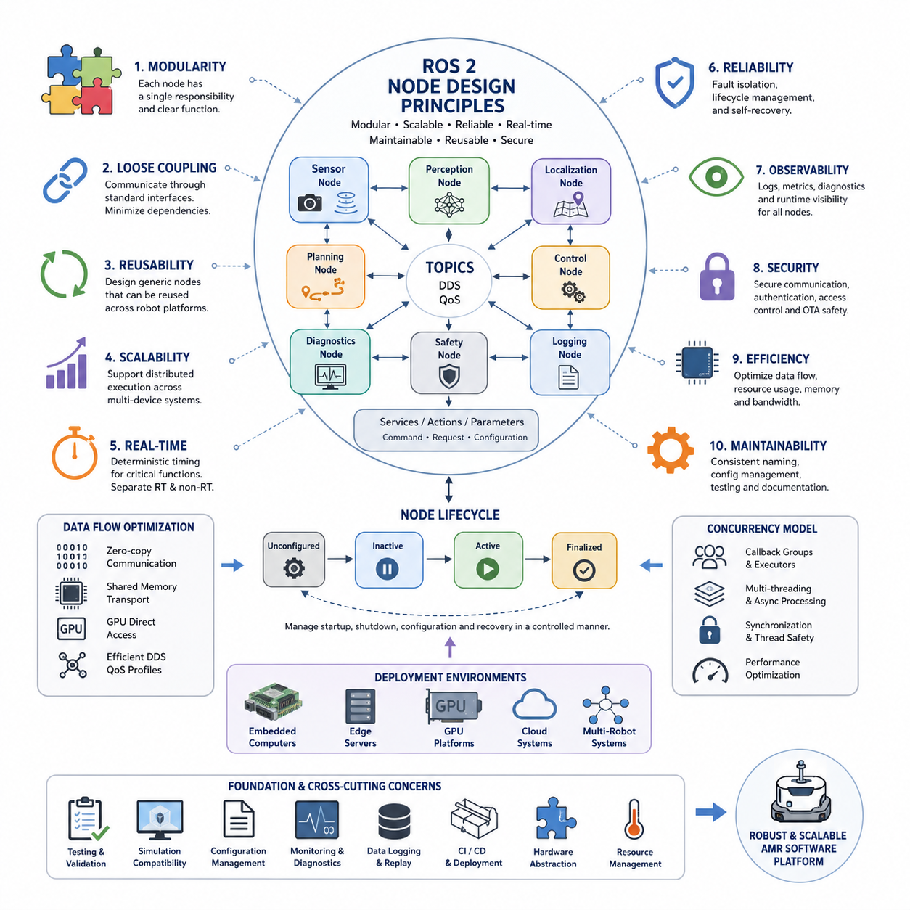
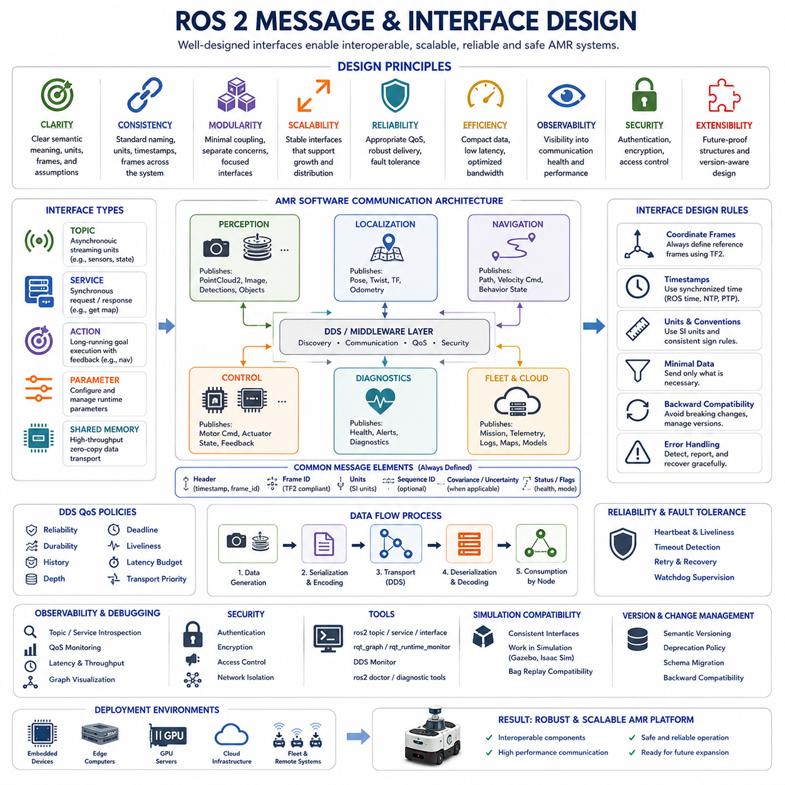
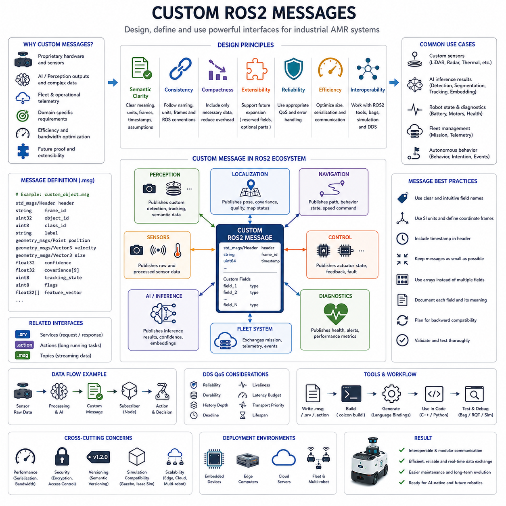
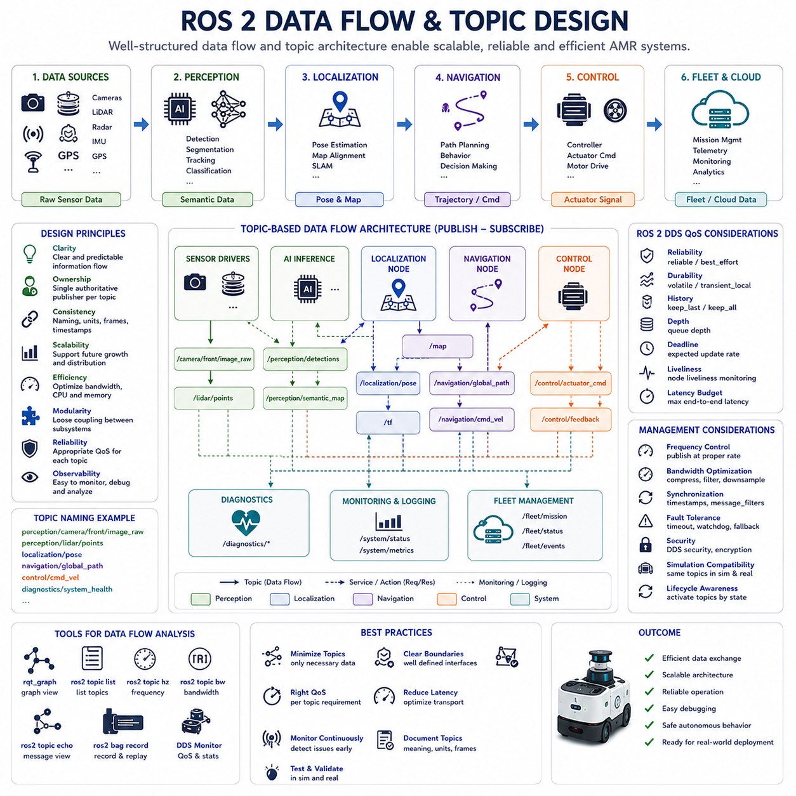
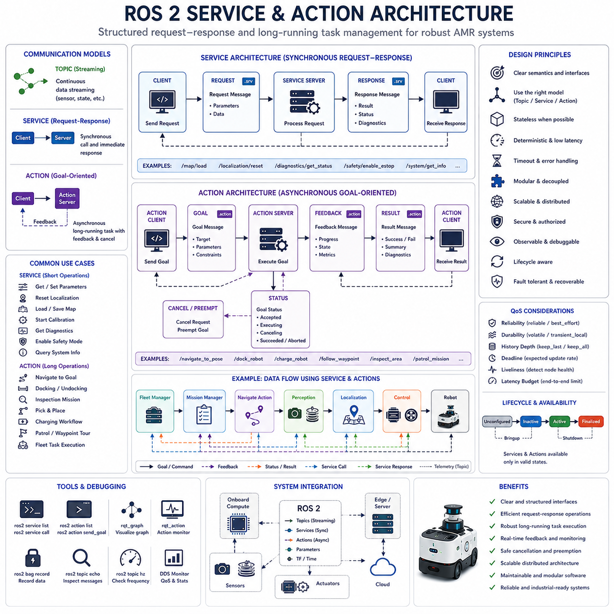
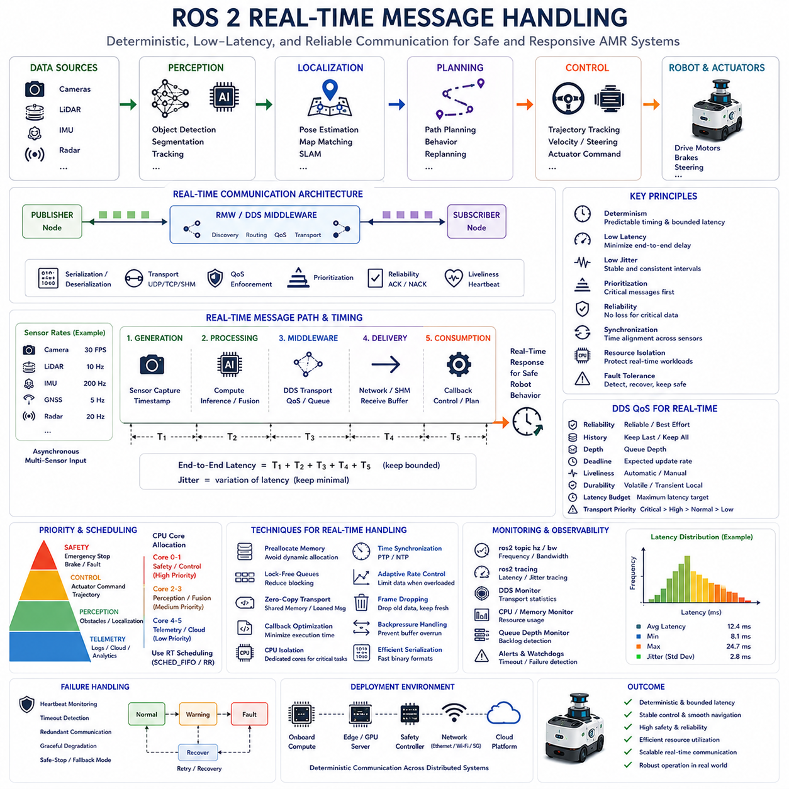
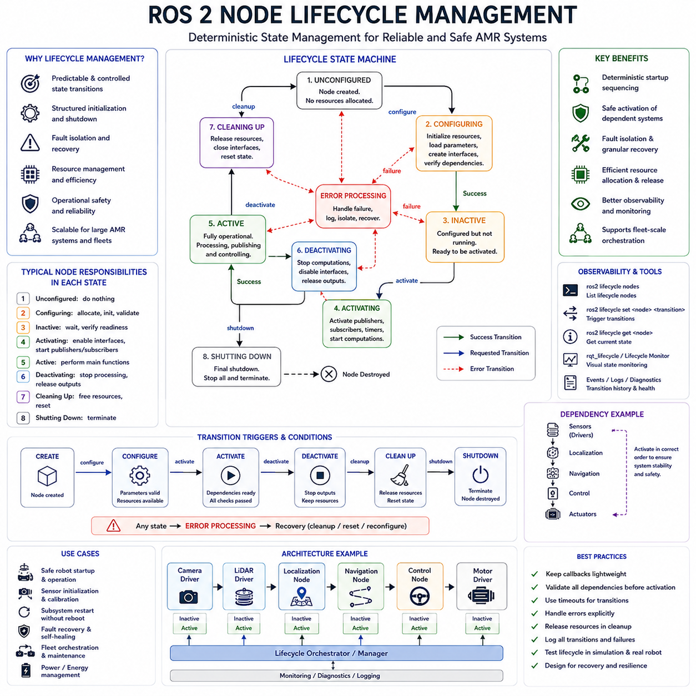
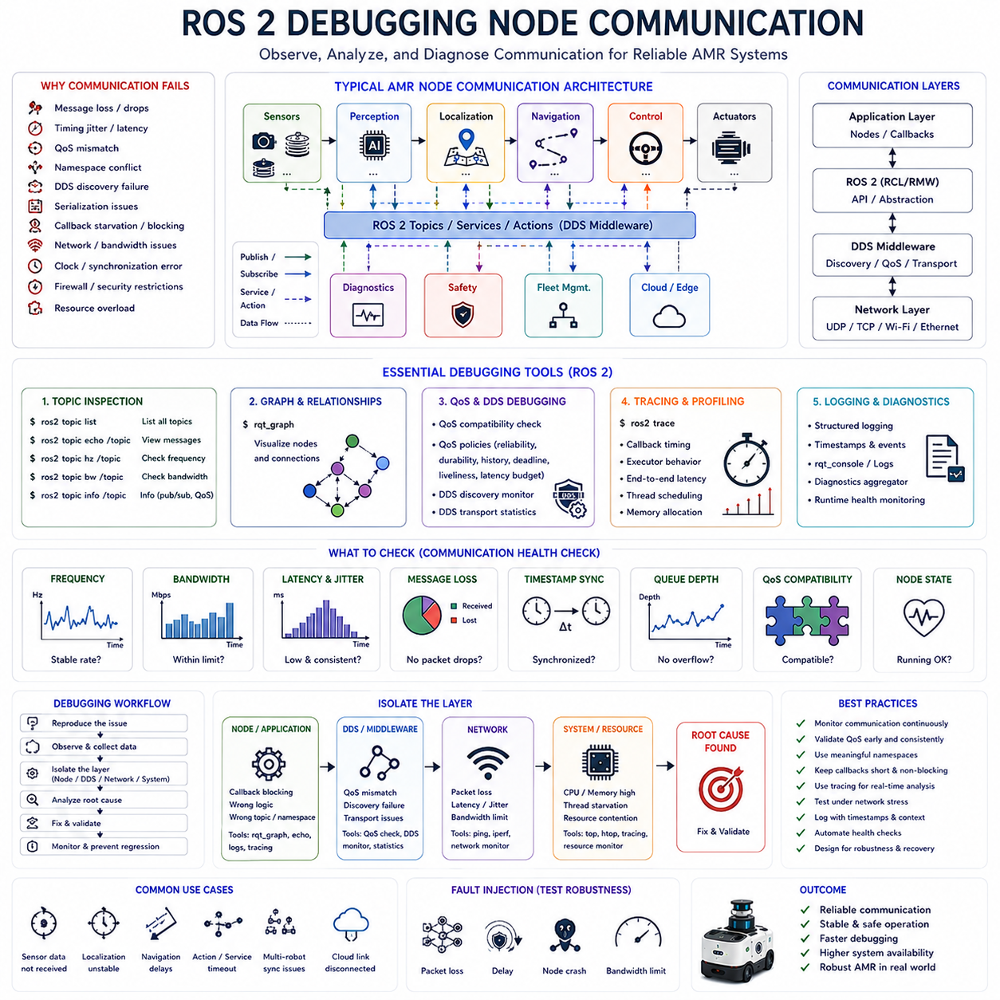

**Volume 07. AMR Software Architecture and Development**

# Chapter 03. Node and Message Design

## 03.1 Node Design Principles

{width="7.268055555555556in" height="7.268055555555556in"}

"03_01_Node_Design_Principles" is one of the most fundamental subjects in modern AMR software engineering because the entire robot software architecture is ultimately constructed from interconnected software nodes. In ROS2-based autonomous mobile robot systems, a node represents an independently executable software unit responsible for a specific function such as perception, localization, navigation, control, monitoring, AI inference, diagnostics, or communication. A well-designed node architecture directly affects the scalability, maintainability, reliability, safety, debugging efficiency, and real-time performance of the robot system. As AMR platforms evolve into increasingly complex distributed computing systems integrating edge AI, cloud robotics, multi-sensor fusion, and fleet-level operations, node design becomes one of the most critical architectural disciplines in robotics software engineering.

Traditional monolithic robot applications often combine many functionalities into a single executable process. While this approach may simplify early prototyping, it rapidly becomes difficult to maintain as system complexity increases. In industrial AMR systems, perception pipelines alone may include multiple LiDAR drivers, camera interfaces, radar processing modules, object detection engines, semantic segmentation systems, sensor fusion pipelines, obstacle tracking components, and AI inference accelerators. Combining all of these functions into a single software process creates severe maintainability and reliability problems. A fault in one subsystem can propagate throughout the entire robot stack, potentially causing total system failure. Node-based architecture solves this issue by isolating software functionalities into modular execution units with clearly defined interfaces and communication channels.

One of the core principles of node design is functional modularity. Each node should ideally perform one well-defined responsibility. This principle is closely related to the software engineering concept known as the Single Responsibility Principle. A LiDAR driver node should focus on hardware communication and point cloud publishing. A localization node should estimate robot pose. A path planner node should generate trajectories. A motor controller node should translate motion commands into actuator signals. When responsibilities are clearly separated, developers can independently improve, replace, optimize, test, or debug individual components without affecting unrelated parts of the system. Modular design also enables parallel development among multiple engineering teams, which is essential in large industrial robotics projects.

Another essential principle is interface consistency. Nodes should communicate through standardized message structures and predictable communication patterns. In ROS2 systems, communication is typically performed using topics, services, actions, and parameter interfaces. Poorly designed interfaces create long-term integration problems that become increasingly difficult to resolve as the software platform grows. Consistent naming conventions, timestamp structures, coordinate frame definitions, and metadata standards are therefore extremely important. For example, all perception nodes may publish timestamps using synchronized ROS time while sharing a unified coordinate frame structure through tf2. Without strict consistency rules, downstream systems such as sensor fusion or localization can easily become unstable.

Loose coupling is another major design objective in AMR node architecture. Nodes should minimize direct dependencies on internal implementation details of other nodes. Instead, communication should occur through abstracted message interfaces. Loose coupling improves system flexibility because individual nodes can be upgraded or replaced independently. For example, an object detection node using YOLOv8 may later be replaced by a transformer-based perception model without requiring changes to navigation or control nodes, as long as the published interface remains compatible. This abstraction layer significantly improves long-term software sustainability and product scalability.

Node reusability is also an important architectural consideration. Industrial AMR companies frequently develop multiple robot platforms including warehouse robots, hospital robots, towing robots, patrol robots, outdoor delivery robots, and heavy-duty autonomous vehicles. Reusable nodes reduce software duplication across projects and accelerate development cycles. A well-designed localization node, diagnostics node, telemetry node, or battery monitoring node can often be reused across many robot models with minimal modifications. Reusability becomes even more valuable in organizations developing global and regional product variants, where different hardware configurations may share a common software architecture.

Scalability is another key principle in node design. Small prototype robots may initially operate with only a few nodes running on a single embedded computer. However, industrial-grade AMRs may later require hundreds of interacting nodes distributed across multiple CPUs, GPUs, edge servers, and cloud systems. Node architecture must therefore support distributed computing from the beginning. ROS2 and DDS-based communication systems are specifically designed to support scalable distributed robotics architectures. Nodes should be designed so they can migrate across hardware platforms without extensive redesign. A perception node that initially runs on a Jetson Orin NX may later be deployed on a high-performance edge server with RTX GPUs as the robot platform evolves.

Real-time responsiveness is critically important in robot node design. Certain robot functions such as emergency braking, obstacle avoidance, motor control, and safety monitoring require deterministic timing behavior. Poor node architecture can introduce unpredictable latency, message congestion, or scheduling instability. Developers must therefore carefully separate hard real-time functions from non-real-time processing tasks. Safety-critical nodes often operate with dedicated executors, isolated CPU cores, or real-time Linux scheduling policies. AI inference pipelines with variable execution latency may operate asynchronously to prevent blocking critical control loops. Designing nodes with awareness of timing determinism is essential for safe autonomous operation.

Data flow optimization is another major consideration in high-performance AMR systems. Modern robots generate enormous sensor data streams from LiDARs, RGB cameras, depth cameras, radar systems, GNSS receivers, IMUs, thermal cameras, and ultrasonic sensors. Inefficient node communication can rapidly overload CPU, memory, or network bandwidth. Developers must minimize unnecessary data copying, serialization overhead, and redundant processing stages. Zero-copy communication, shared memory transport, GPU-direct memory access, and efficient DDS QoS configurations become increasingly important in advanced robotics systems. Node architecture should therefore be designed with bandwidth efficiency and computational efficiency in mind from the earliest stages of development.

Fault isolation and reliability are essential principles for industrial robotics. In real-world deployments, software failures are inevitable. A camera driver may crash, a GPU inference engine may fail, or a network connection may temporarily disconnect. Robust node architecture ensures that such failures remain localized rather than causing total system collapse. Lifecycle nodes, watchdog systems, heartbeat monitoring, restart supervisors, and health diagnostics frameworks are commonly used to improve resilience. Nodes should gracefully handle temporary failures while providing meaningful diagnostic information to operators and maintenance engineers.

Lifecycle management is another important architectural concept in ROS2-based systems. Industrial AMRs require predictable startup, shutdown, configuration, calibration, activation, and recovery sequences. Lifecycle-managed nodes provide structured state transitions such as unconfigured, inactive, active, and finalized states. This architecture enables more reliable system initialization and operational control. For example, perception nodes may only activate after successful sensor calibration, while navigation nodes may remain inactive until localization stability is confirmed. Lifecycle-based design improves operational safety and reduces system initialization errors.

Node observability is also critical in large-scale robotics platforms. Developers and operators must understand what the robot is doing internally during both development and field operation. Nodes should therefore expose meaningful logs, metrics, diagnostics, and runtime states. Logging systems should include timestamps, severity levels, module identifiers, and contextual information. Monitoring frameworks may track CPU usage, GPU utilization, message frequency, latency, memory consumption, and sensor health. Observability significantly improves debugging efficiency and supports predictive maintenance in large robot fleets.

Security considerations are becoming increasingly important in modern AMR node architecture. Robots connected to enterprise networks or cloud systems may become targets of cyberattacks. Node communication interfaces should therefore minimize unnecessary exposure while implementing authentication, encryption, access control, and secure communication protocols where appropriate. Secure OTA update systems, signed firmware validation, and network isolation strategies are increasingly integrated into industrial robotics architectures.

Another important principle is hardware abstraction. Nodes should avoid excessive dependence on hardware-specific implementations whenever possible. Hardware abstraction layers allow software portability across different robot platforms. For example, multiple LiDAR vendors may provide different SDKs and communication protocols, but higher-level perception nodes should ideally receive standardized point cloud messages independent of sensor vendor. This abstraction simplifies future hardware upgrades and reduces vendor lock-in.

Concurrency management also plays a critical role in node design. Modern robot software relies heavily on asynchronous execution, multithreading, and parallel processing. Sensor drivers, AI inference engines, localization pipelines, and navigation planners often operate simultaneously. Improper concurrency management can introduce deadlocks, race conditions, priority inversion, or unpredictable timing behavior. ROS2 callback groups, executors, thread pools, mutexes, lock-free queues, and asynchronous processing frameworks must therefore be carefully designed to ensure stable execution.

Resource management becomes increasingly important in embedded robotics platforms where CPU power, GPU memory, storage bandwidth, and thermal capacity are limited. Nodes should avoid excessive memory allocation, uncontrolled thread creation, or unnecessary GPU resource consumption. Efficient memory reuse, controlled buffer management, and computational profiling are essential for long-duration autonomous operation. In outdoor autonomous robots operating under high-temperature environments, poor resource management can directly contribute to thermal throttling and degraded perception performance.

Configuration management is another major aspect of industrial node architecture. Robot software systems require numerous configurable parameters including sensor calibration values, safety thresholds, navigation tuning parameters, AI inference settings, and network configurations. Nodes should support dynamic parameter loading, runtime updates, version management, and centralized configuration handling. Consistent parameter management simplifies deployment across multiple robot platforms and operational environments.

Testing and validation considerations must also influence node design from the beginning. Well-designed nodes support unit testing, integration testing, simulation testing, and replay-based debugging. Nodes should minimize hidden dependencies and support deterministic reproducibility. ROS2 bag replay systems allow developers to reproduce field failures offline using recorded sensor data. Modular node architecture significantly improves test coverage and regression testing efficiency.

Simulation compatibility is another increasingly important requirement. Modern AMR development relies heavily on digital twins and simulation-driven workflows. Nodes designed for real-world hardware should ideally operate with minimal modifications in Gazebo, Isaac Sim, or custom simulation environments. Hardware abstraction and standardized interfaces greatly simplify simulation integration and accelerate development cycles.

As AMR systems evolve toward AI-native robotics architectures, node design principles continue to expand. Future robotics platforms may integrate foundation models, multimodal AI agents, world models, distributed edge-cloud intelligence, and collaborative multi-robot systems. Despite these advances, the fundamental principles of modularity, scalability, reliability, observability, real-time responsiveness, and maintainability remain central to successful robotics software engineering. A well-designed node architecture serves as the backbone of the entire AMR software ecosystem and ultimately determines whether a robotics platform can evolve from a prototype into a scalable industrial product.

## 03.2 Message and Interface Design

{width="7.268055555555556in" height="7.268055555555556in"}

"03_02_Message_and_Interface_Design" is one of the most critical architectural disciplines in modern AMR software engineering because robot systems fundamentally operate through continuous communication between distributed software components. In ROS2-based autonomous mobile robots, software nodes rarely operate independently. Instead, they exchange information through structured communication interfaces using topics, services, actions, parameters, shared memory transport, and middleware communication layers. Message and interface design therefore become the foundation that determines interoperability, scalability, maintainability, performance, safety, and long-term evolution of the robot platform. Poorly designed interfaces can create tightly coupled systems, inconsistent data structures, integration instability, debugging difficulties, and severe scalability limitations. Well-designed communication architectures, on the other hand, enable modular development, distributed computing, reusable software frameworks, and reliable industrial deployment.

In AMR systems, every major subsystem depends on continuous data exchange. Perception nodes publish sensor outputs. Localization systems publish robot poses. Navigation systems publish trajectories and velocity commands. Control nodes publish actuator feedback and diagnostic states. Fleet management systems exchange mission commands and operational telemetry. Cloud systems synchronize logs, AI models, maps, and monitoring information. Because of this highly interconnected structure, communication architecture becomes the nervous system of the entire robot platform. The quality of message and interface design directly influences the stability and scalability of the overall system.

One of the most important principles in message design is clarity of semantic meaning. Every message structure should clearly describe what the data represents, how it should be interpreted, and under what conditions it is valid. Ambiguous message definitions create integration problems between teams and subsystems. For example, a velocity message must clearly specify coordinate frames, units, timestamp references, sign conventions, and operational assumptions. If one subsystem interprets angular velocity in radians per second while another assumes degrees per second, catastrophic motion errors can occur. Clear semantic definition is therefore essential for safe robot operation.

Consistency is another fundamental principle. Message structures across the entire robot software ecosystem should follow standardized naming conventions, field organization rules, timestamp handling strategies, coordinate frame definitions, and unit systems. In industrial AMR development involving multiple engineering teams, inconsistent interfaces rapidly become one of the largest sources of integration complexity. ROS2 encourages standardization through common message definitions such as geometry_msgs, sensor_msgs, nav_msgs, and visualization_msgs. Standardized interfaces improve interoperability between software modules and significantly reduce development effort.

Coordinate frame consistency is especially important in robotics communication systems. Robot software continuously exchanges spatial information such as robot poses, sensor locations, object coordinates, trajectories, obstacle maps, and transformation matrices. All of these data structures depend on precise coordinate frame definitions. Message interfaces must therefore explicitly define reference frames using standardized tf2-based architectures. For example, LiDAR point clouds may be referenced relative to the lidar_link frame, while robot localization may operate in the map frame. Failure to properly define coordinate frames is one of the most common causes of navigation instability and perception errors in AMR systems.

Timestamp synchronization is equally critical. Modern robots integrate multiple sensors operating at different frequencies and latencies. Cameras may operate at 30 FPS, LiDARs at 10 Hz, IMUs at 200 Hz, and GNSS systems at 5 Hz. Sensor fusion algorithms depend on accurate temporal alignment of these data streams. Message interfaces must therefore include precise timestamp definitions using synchronized clocks. ROS2 systems often use NTP or PTP synchronization to maintain consistent timing across distributed computing platforms. Without accurate timestamp handling, sensor fusion quality degrades significantly.

Another important design principle is minimizing unnecessary data coupling. Messages should include only the data required for communication while avoiding excessive dependency on internal implementation details. Overly complex message structures increase bandwidth usage, memory consumption, serialization overhead, and software maintenance difficulty. Compact and focused interfaces improve communication efficiency while reducing long-term architectural complexity. For example, a navigation node may only require detected obstacle positions rather than the entire raw perception tensor generated by an AI model.

Scalability is a major consideration in interface design. Early prototype robots may contain only a few software nodes, but industrial AMR platforms often scale into large distributed systems involving edge computers, GPU servers, cloud infrastructure, fleet management systems, simulation platforms, and remote monitoring services. Message architectures must therefore support long-term expansion without requiring extensive redesign. Well-designed interfaces remain stable even as internal implementations evolve. This stability is essential for maintaining backward compatibility across software updates and fleet deployments.

Interface abstraction is another critical concept. High-level software modules should communicate through generalized interfaces rather than hardware-specific protocols whenever possible. For example, a perception pipeline should consume standardized PointCloud2 messages instead of vendor-specific LiDAR SDK structures. Similarly, navigation systems should consume abstract occupancy maps rather than tightly coupling themselves to a specific SLAM implementation. Hardware abstraction improves portability, reusability, and vendor independence.

Communication reliability also plays a central role in industrial AMR systems. Different robot subsystems have different reliability requirements. Safety-critical messages such as emergency stop commands require guaranteed delivery with minimal latency. Video streaming data may prioritize throughput over reliability. ROS2 DDS middleware addresses this through configurable QoS policies including reliability, durability, history depth, deadline control, liveliness monitoring, and latency budgets. Message and interface design must therefore consider the operational characteristics of each communication pathway.

Bandwidth optimization becomes increasingly important in high-performance robotics systems. Modern robots generate enormous data streams from LiDARs, RGB cameras, depth sensors, radar systems, thermal cameras, and AI inference pipelines. Poor interface design can easily overload network infrastructure and embedded computing resources. Developers must carefully minimize unnecessary serialization, redundant message transmission, and oversized data structures. Compression, shared memory transport, GPU-direct communication, and selective data publishing strategies are commonly used to optimize communication efficiency.

Another important principle is separation between synchronous and asynchronous communication. ROS2 provides multiple communication mechanisms because different robotic operations require different execution behaviors. Topics support asynchronous streaming communication suitable for sensor data and telemetry. Services provide synchronous request-response interactions suitable for configuration queries or system management tasks. Actions support long-duration asynchronous operations such as navigation goals or manipulation tasks. Choosing the correct communication model is essential for system responsiveness and architectural clarity.

Message frequency management is also essential. Some robot subsystems require extremely high-frequency communication while others operate at relatively low rates. Motor controllers and IMU pipelines may operate at hundreds of Hertz, whereas fleet management updates may occur only once per second. Interface architecture should therefore carefully manage update frequencies, queue depths, synchronization strategies, and computational load balancing. Excessive communication rates can overload CPU resources and introduce latency instability throughout the system.

Fault tolerance must also be incorporated into message architecture. Industrial robots operate in real-world environments where communication failures, packet loss, hardware faults, or node crashes can occur. Interfaces should therefore support graceful degradation and error recovery mechanisms. Timeout detection, heartbeat monitoring, retry strategies, and watchdog supervision are commonly integrated into communication systems. For example, if localization data becomes unavailable, navigation systems may transition into safe-stop modes rather than continuing uncontrolled motion.

Security considerations are becoming increasingly important in message and interface design. AMRs connected to enterprise networks, smart factories, hospitals, or cloud infrastructure are vulnerable to cyber threats. Communication interfaces should therefore support secure authentication, encrypted transport, access control, and network isolation. ROS2 DDS Security frameworks provide mechanisms for encrypted communication, certificate-based authentication, and permission management. Industrial deployments increasingly require secure communication architectures to satisfy cybersecurity regulations and operational safety requirements.

Message version management is another critical challenge in long-term robotics development. Industrial robot fleets often remain operational for many years while software systems continue evolving. Message definitions may therefore require backward compatibility support across multiple software versions. Poorly managed interface changes can break interoperability between updated and legacy systems. Semantic versioning, interface compatibility rules, deprecation policies, and schema migration strategies become essential in large-scale robotics deployments.

Another major principle is observability. Communication systems should expose sufficient visibility into runtime behavior to support debugging, monitoring, and diagnostics. Developers must be able to inspect topic frequencies, message latency, dropped packets, QoS mismatches, bandwidth usage, and communication failures. ROS2 debugging tools such as ros2 topic, ros2 interface, ros2 doctor, rqt_graph, and DDS monitoring utilities are important for maintaining large distributed robot systems.

Custom message design is frequently required in advanced AMR systems. While ROS2 standard messages cover many common use cases, industrial robots often require specialized interfaces for proprietary sensors, AI inference pipelines, fleet coordination systems, safety diagnostics, or operational telemetry. Custom messages should follow strict design discipline including compact field structures, explicit units, version management, and semantic clarity. Excessive complexity in custom interfaces can create long-term maintenance problems.

Interface extensibility is another important architectural objective. Message definitions should allow future expansion without forcing complete redesign. Reserved fields, modular nested structures, optional metadata, and extensible schemas help accommodate future requirements. As robotics platforms evolve toward multimodal AI systems, world models, distributed cloud-edge intelligence, and collaborative robot ecosystems, communication interfaces must remain adaptable to new data types and operational paradigms.

Real-time communication requirements significantly influence interface architecture. Certain robot operations such as motion control, collision avoidance, and safety monitoring require deterministic latency behavior. Communication pathways for these systems must minimize jitter, queue buildup, and unpredictable scheduling delays. DDS QoS tuning, real-time Linux kernels, CPU affinity management, and shared memory transport mechanisms are commonly used to improve determinism in industrial AMR systems.

Simulation compatibility is also important in modern robotics development workflows. Message interfaces should operate consistently across real hardware systems, digital twins, simulation environments, and replay-based debugging systems. This consistency enables simulation-driven development, accelerated testing, and efficient failure reproduction using recorded datasets. Standardized interfaces significantly simplify integration with Gazebo, Isaac Sim, and large-scale digital twin environments.

Cloud and edge integration further increase the importance of scalable communication architecture. Modern AMRs increasingly exchange operational data with remote monitoring platforms, AI model management systems, predictive maintenance infrastructure, and fleet coordination servers. Communication interfaces must therefore support distributed networking environments with varying latency, bandwidth, and reliability conditions. Edge filtering, message prioritization, adaptive compression, and selective synchronization become essential strategies in large-scale deployments.

As AMR systems evolve toward AI-native robotics platforms integrating foundation models, multimodal perception, distributed intelligence, and autonomous agents, message and interface design become even more important. Future robots may exchange not only sensor data and control commands but also semantic scene representations, world models, behavioral intents, collaborative task information, and high-level reasoning outputs. Despite these technological advances, the fundamental principles of clarity, consistency, modularity, scalability, reliability, efficiency, observability, and maintainability remain central to successful robotics communication architecture. Well-designed message and interface systems ultimately determine whether an AMR platform can scale from an experimental prototype into a robust industrial robotics ecosystem capable of long-term deployment and continuous evolution.

## 03.3 Custom ROS2 Messages

{width="7.268055555555556in" height="7.268055555555556in"}

"03_03_Custom_ROS2_Messages" is a highly important topic in advanced AMR software engineering because industrial autonomous robots frequently require communication structures that extend beyond the capabilities of standard ROS2 message definitions. While ROS2 provides a large collection of standardized interfaces such as geometry_msgs, sensor_msgs, nav_msgs, std_msgs, visualization_msgs, and diagnostic_msgs, real-world industrial robotics systems often integrate proprietary sensors, custom AI pipelines, fleet management protocols, operational telemetry systems, autonomous behavior engines, and domain-specific perception architectures that require specialized message formats. Custom ROS2 message design therefore becomes a critical engineering discipline that directly affects interoperability, scalability, maintainability, communication efficiency, and long-term software sustainability in large robotics platforms.

In modern AMR systems, communication between distributed software nodes forms the foundation of the entire software architecture. Every subsystem continuously exchanges information through ROS2 topics, services, actions, and parameter systems. Perception modules transmit sensor outputs. Localization systems publish robot poses and covariance matrices. Navigation systems distribute trajectory plans and behavioral states. Fleet management systems coordinate mission assignments and operational telemetry. AI inference engines exchange semantic scene information, object classifications, confidence scores, and environmental understanding outputs. Although standard ROS2 messages cover many common robotics functions, industrial deployments frequently require richer and more specialized data structures tailored to unique operational requirements.

One of the primary reasons for creating custom ROS2 messages is the integration of proprietary hardware systems. Industrial AMRs often incorporate vendor-specific LiDAR systems, radar modules, thermal cameras, ultrasonic arrays, GNSS receivers, industrial PLCs, motor controllers, battery management systems, and safety devices. These systems may generate data structures that cannot be efficiently represented using standard ROS2 interfaces alone. Custom messages allow developers to encapsulate hardware-specific metadata, operational states, diagnostic information, calibration values, synchronization data, and low-level communication structures in a standardized and reusable format.

Another major motivation is AI and perception integration. Modern AMRs increasingly rely on deep learning pipelines, multimodal sensor fusion systems, foundation models, semantic mapping systems, and world-model architectures. These AI systems frequently generate complex outputs including object tracking information, semantic segmentation maps, occupancy probabilities, uncertainty estimation, anomaly detection results, behavioral predictions, scene embeddings, feature vectors, and multimodal reasoning outputs. Standard ROS2 messages may not adequately support these advanced data representations. Custom message architectures therefore become essential for efficient AI-native robot communication systems.

One of the most important design principles in custom ROS2 message development is semantic clarity. Every field inside a custom message must have a precisely defined meaning, unit system, coordinate reference, timestamp interpretation, and operational assumption. Ambiguous message definitions rapidly create integration instability in large development organizations. For example, a custom obstacle tracking message may contain object velocity, acceleration, orientation, confidence score, tracking ID, and classification labels. Each field must clearly specify its coordinate frame, measurement unit, update frequency, and validity assumptions to prevent downstream interpretation errors.

Consistency across the entire robotics platform is equally important. Custom messages should follow standardized naming conventions, structural organization patterns, timestamp strategies, and metadata definitions consistent with the broader ROS2 ecosystem. Field naming should remain intuitive and human-readable. Units should follow SI conventions whenever possible. Coordinate frames should align with tf2 standards. Message definitions should include timestamps and frame identifiers where appropriate. Consistency significantly improves interoperability between subsystems and reduces long-term maintenance complexity.

Message compactness is another critical consideration. Industrial AMRs generate extremely large data streams from cameras, LiDARs, radar systems, AI inference pipelines, localization systems, and operational telemetry frameworks. Poorly designed custom messages can create excessive bandwidth consumption, serialization overhead, memory fragmentation, and network congestion. Developers should therefore carefully minimize redundant fields and avoid transmitting unnecessary data. Compact message structures improve communication efficiency and reduce computational load on embedded systems.

However, compactness must be balanced against extensibility. Future robotics systems continuously evolve as new sensors, AI models, operational features, and deployment environments are introduced. Custom messages should therefore support long-term expansion without requiring complete redesign. Developers often use reserved fields, nested structures, optional metadata blocks, and modular schemas to accommodate future functionality. Extensible message design is especially important for industrial robot fleets expected to operate for many years while undergoing continuous software updates.

Timestamp management is critically important in custom ROS2 messages. AMRs integrate multiple sensors operating at different frequencies and latency characteristics. Sensor fusion algorithms depend on precise temporal synchronization between data streams. Every message carrying time-sensitive information should therefore include accurate timestamps using synchronized ROS2 time. Many industrial robots use NTP or PTP synchronization across distributed computing systems to maintain temporal consistency. Without precise timestamp handling, localization instability, perception degradation, and navigation errors can occur.

Coordinate frame management is similarly essential. Many custom messages contain spatial information such as object positions, trajectories, occupancy maps, robot states, obstacle boundaries, and sensor detections. These messages must explicitly define coordinate frames consistent with tf2 architecture. Failure to properly define frame semantics is one of the most common causes of integration errors in robotics software systems. Developers should therefore carefully document coordinate assumptions within custom interface definitions.

Another major design consideration is interoperability with standard ROS2 tooling. Custom messages should remain compatible with ROS2 introspection, debugging, recording, replay, visualization, and monitoring tools. ROS2 bag systems, rqt visualization tools, DDS introspection frameworks, and simulation environments all benefit from well-structured message definitions. Developers should avoid unnecessary complexity that reduces compatibility with existing ROS2 infrastructure.

Version management becomes increasingly important as robotics platforms scale. Industrial robot fleets often contain multiple generations of hardware and software operating simultaneously. Custom message definitions therefore require careful backward compatibility management. A poorly managed interface update can break interoperability between deployed robots and newly updated systems. Semantic versioning strategies, interface deprecation policies, optional fields, and migration planning become essential for maintaining long-term operational stability.

Performance optimization is another critical factor in custom ROS2 message architecture. Serialization and deserialization overhead can significantly affect system latency, CPU usage, and memory consumption in high-performance robotics systems. Large nested message structures may increase DDS communication overhead and reduce real-time responsiveness. Developers should therefore carefully evaluate message size, data alignment, transport frequency, and communication patterns. Zero-copy transport, shared memory communication, and efficient DDS QoS tuning are increasingly important in advanced AMR platforms.

Reliability considerations are also essential. Some custom messages carry safety-critical information such as emergency stop status, obstacle detection alerts, actuator faults, battery protection warnings, or localization failures. These interfaces require highly reliable delivery semantics and deterministic communication behavior. ROS2 DDS middleware provides QoS mechanisms such as reliability policies, durability, history depth, deadline monitoring, liveliness tracking, and latency budgets that can be configured according to operational requirements. Custom message architectures should therefore be designed together with appropriate communication policies.

Custom services and actions are equally important alongside custom topic messages. Topics are ideal for continuous streaming communication, but many robotics operations require request-response interactions or long-duration asynchronous task execution. Custom services are frequently used for configuration management, calibration requests, diagnostics retrieval, map management, and subsystem control. Custom actions are commonly used for navigation goals, docking operations, manipulation tasks, inspection missions, and autonomous workflows requiring progress feedback and cancellation support. Well-designed service and action interfaces improve system modularity and operational flexibility.

Industrial AMRs also require custom diagnostic and telemetry messages. Large robot fleets generate operational data related to CPU usage, GPU temperature, battery status, network health, localization confidence, sensor health, AI inference latency, navigation performance, and hardware reliability. Standard ROS2 diagnostic frameworks may not fully capture all operational requirements. Custom telemetry architectures therefore become essential for predictive maintenance, fleet monitoring, operational analytics, and remote diagnostics systems.

Security considerations are becoming increasingly important in custom ROS2 message design. Robots connected to enterprise networks, cloud infrastructure, hospitals, factories, or smart city systems may become targets of cyberattacks. Custom communication interfaces should therefore avoid exposing sensitive internal states unnecessarily while supporting secure DDS communication, authentication, encryption, and access control policies where appropriate. Secure communication architecture is becoming a mandatory requirement in industrial robotics deployments.

Simulation compatibility is another major advantage of properly designed custom messages. Modern AMR development relies heavily on simulation-driven workflows, digital twins, replay-based debugging, and virtual validation environments such as Gazebo and Isaac Sim. Custom interfaces should therefore behave consistently across both real-world hardware systems and simulation environments. Standardized message definitions simplify simulation integration and improve testing efficiency throughout the development lifecycle.

Another important consideration is multi-robot and cloud integration. Modern robotics platforms increasingly operate as distributed ecosystems involving fleets of AMRs, cloud-based analytics systems, edge AI servers, RMS/FMS infrastructure, and remote monitoring systems. Custom messages must therefore support scalable distributed communication architectures capable of operating across heterogeneous network environments with varying bandwidth and latency characteristics. Message prioritization, selective synchronization, compression strategies, and distributed QoS tuning become increasingly important in these environments.

Custom ROS2 message generation workflows also require careful engineering management. ROS2 uses interface definition files such as .msg, .srv, and .action to generate language bindings for C++, Python, and DDS middleware integration. Developers must carefully organize package dependencies, namespace conventions, build systems, and interface repositories to maintain scalable software architectures. Poor package organization can rapidly create dependency conflicts and build instability in large robotics projects.

Testing and validation are critical in custom interface development. Every custom message should undergo rigorous validation for serialization correctness, transport reliability, backward compatibility, field interpretation consistency, and runtime performance. Simulation-based replay testing, DDS monitoring, interface introspection tools, and automated regression testing frameworks are commonly used to validate communication reliability in industrial robotics platforms.

As AMR systems evolve toward AI-native robotics architectures integrating foundation models, multimodal reasoning systems, world models, collaborative robot agents, and distributed cloud-edge intelligence, custom ROS2 messages will become even more sophisticated. Future robots may exchange semantic scene representations, high-level reasoning outputs, behavioral intent structures, collaborative task coordination data, predictive environment models, and distributed AI knowledge graphs. Despite this increasing complexity, the fundamental principles of semantic clarity, consistency, modularity, extensibility, efficiency, reliability, observability, and maintainability remain central to successful custom interface engineering. Well-designed custom ROS2 message architectures ultimately form the communication backbone that enables industrial AMR systems to scale from research prototypes into robust long-term autonomous robotics ecosystems capable of continuous evolution and real-world deployment.

## 03.4 Data Flow and Topic Design

{width="7.268055555555556in" height="7.268055555555556in"}

"03_04_Data_Flow_and_Topic_Design" is one of the most important architectural subjects in modern AMR software engineering because autonomous robots fundamentally operate as large-scale distributed data processing systems. In ROS2-based AMRs, every subsystem continuously generates, transforms, transmits, consumes, and reacts to data streams flowing across interconnected software nodes. Sensor drivers publish raw perception data. AI inference pipelines generate semantic understanding outputs. Localization systems estimate robot pose and map alignment. Navigation systems produce trajectories and velocity commands. Control systems generate actuator signals. Fleet management systems exchange mission status and operational telemetry. All of these processes rely on carefully designed data flow architecture and topic communication structures. Poor topic design can rapidly create scalability limitations, communication bottlenecks, latency instability, synchronization failures, debugging difficulties, and unreliable autonomous behavior. Well-designed data flow architecture, on the other hand, enables modularity, scalability, deterministic execution, efficient resource utilization, maintainability, and safe long-term operation in industrial robotics systems.

In ROS2 systems, topics form the primary communication mechanism for asynchronous distributed data exchange. A topic is a named communication channel that allows publisher nodes to transmit messages while subscriber nodes receive them independently. This publish-subscribe architecture provides loose coupling between software modules and enables highly scalable distributed robot systems. Topic-based communication is especially suitable for continuous sensor streaming, telemetry distribution, AI inference pipelines, localization updates, obstacle tracking, and state synchronization across distributed computing environments.

One of the most important principles in data flow design is architectural clarity. The flow of information across the robot system should remain understandable, predictable, and logically structured. Every major subsystem should have clearly defined data producers, processors, transformers, consumers, and monitoring nodes. Poorly organized data flow structures rapidly become difficult to debug as system complexity increases. Developers should therefore carefully define how sensor information propagates through perception, localization, navigation, control, monitoring, and cloud integration pipelines.

Data ownership is another critical design principle. Each topic should ideally have a clearly defined authoritative source responsible for generating and publishing a specific type of information. Multiple nodes publishing conflicting information onto the same topic can create instability and unpredictable system behavior. For example, robot localization should generally be published by a single authoritative localization subsystem rather than multiple competing pose estimators. Clear ownership rules simplify debugging and improve system reliability.

Topic naming consistency is extremely important in large robotics projects. As AMR platforms grow, the number of topics may increase into the hundreds or even thousands across perception systems, navigation stacks, diagnostics frameworks, cloud integration layers, and fleet management architectures. Without strict naming conventions, the communication structure rapidly becomes unmanageable. Topic names should therefore follow hierarchical and semantically meaningful naming structures. For example, perception/camera/front/image_raw, localization/pose, navigation/global_path, control/cmd_vel, and diagnostics/system_health provide intuitive organization that improves maintainability and debugging efficiency.

Scalability is a major consideration in topic architecture. Early prototype robots may initially operate with only a small number of nodes and topics running on a single embedded computer. However, industrial AMR systems often evolve into large distributed architectures involving multiple CPUs, GPUs, edge servers, cloud systems, and multi-robot fleet environments. Topic architectures should therefore support future expansion from the beginning. Topic namespaces, communication segmentation, QoS profiles, and distributed middleware configurations should be designed to scale efficiently across increasingly complex deployments.

Bandwidth optimization becomes critically important in high-performance robotics systems. Modern AMRs generate extremely large data streams from RGB cameras, depth cameras, LiDARs, radar systems, GNSS receivers, IMUs, thermal cameras, and AI inference engines. Raw sensor data alone may consume multiple gigabytes per hour. Poorly designed topic architectures can easily overload network bandwidth, CPU resources, DDS middleware layers, and storage systems. Developers must therefore carefully optimize topic frequencies, compression strategies, serialization overhead, message sizes, and transport methods.

One important strategy is minimizing unnecessary topic propagation. Not every subsystem requires access to all sensor streams or intermediate processing outputs. Excessive topic broadcasting increases computational load and communication overhead. Data flow should therefore be carefully segmented so that only necessary consumers receive specific information streams. Selective subscription strategies significantly improve communication efficiency in large distributed robotics systems.

Latency management is another essential consideration in data flow architecture. Different robotic functions have vastly different timing requirements. Motion control loops may require deterministic updates at hundreds of Hertz with extremely low latency. Localization systems may require stable updates at tens of Hertz. Fleet management telemetry may operate at relatively low update frequencies. Topic architectures must therefore carefully balance latency, throughput, reliability, and computational efficiency according to operational requirements.

ROS2 DDS middleware provides Quality of Service policies that play a major role in topic design. Reliability settings determine whether message delivery is guaranteed or best-effort. Durability settings determine whether historical messages are preserved for late subscribers. History depth controls message buffering behavior. Deadline policies monitor expected communication timing. Liveliness monitoring detects node failures and communication interruptions. Proper QoS configuration is essential because different topics often require different communication behaviors. For example, emergency stop messages require extremely reliable low-latency delivery, whereas camera streams may prioritize throughput over guaranteed reliability.

Synchronization management is also critically important in data flow design. Modern robots integrate multiple asynchronous sensor streams operating at different frequencies and latencies. Perception fusion systems often require temporally aligned camera images, LiDAR scans, IMU measurements, GNSS updates, and radar detections. Topic architectures must therefore support accurate timestamp synchronization and coordinated data fusion pipelines. ROS2 commonly integrates synchronization frameworks such as message_filters, ApproximateTime policies, ExactTime synchronization, and DDS time management mechanisms.

Another important principle is separation between raw data flow and processed data flow. Raw sensor streams often consume large bandwidth and computational resources. Downstream systems may instead require filtered, compressed, fused, or semantically processed outputs. Data flow architectures should therefore clearly distinguish between low-level raw data topics and higher-level interpreted information streams. For example, a perception pipeline may transform raw camera images into object detection outputs, semantic segmentation maps, occupancy grids, and obstacle tracking information that are more suitable for navigation systems.

Hierarchical processing pipelines are commonly used in industrial robotics systems. Sensor acquisition nodes publish raw data. Preprocessing nodes perform filtering and normalization. AI inference nodes generate semantic understanding outputs. Fusion nodes integrate multimodal information. Decision-making systems consume high-level environmental representations. Structured hierarchical data flow significantly improves modularity, maintainability, and scalability.

Fault isolation is another major architectural concern. In large robotics systems, communication failures, overloaded nodes, dropped messages, serialization errors, or hardware instability can occur. Data flow architectures should therefore isolate failures whenever possible to prevent cascading system instability. Watchdog systems, heartbeat monitoring, timeout detection, and graceful degradation strategies are frequently integrated into topic communication architectures. For example, if an object detection topic temporarily fails, the navigation system may reduce speed or enter a safe-stop mode rather than continuing normal operation blindly.

Observability is critically important in topic-based robotics systems. Developers and operators must understand how information propagates through the robot architecture during both development and real-world deployment. ROS2 provides tools such as rqt_graph, ros2 topic list, ros2 topic echo, ros2 topic hz, ros2 topic bw, and DDS monitoring utilities that allow developers to inspect communication flow, bandwidth usage, topic frequency, message latency, and subscription relationships. Well-designed topic architecture significantly improves debugging efficiency and operational transparency.

Topic frequency management is also essential. Publishing topics at unnecessarily high rates wastes CPU resources, memory bandwidth, DDS transport capacity, and power consumption. Conversely, publishing critical topics too slowly may reduce robot responsiveness and degrade safety. Developers must therefore carefully balance update frequency according to operational requirements. Adaptive publishing strategies are sometimes used to dynamically adjust communication rates depending on robot speed, environmental complexity, or computational load.

Data prioritization becomes increasingly important in distributed edge-cloud robotics architectures. Modern AMRs often exchange information between onboard embedded computers, GPU inference servers, fleet management systems, cloud analytics platforms, and remote monitoring infrastructure. Some data streams are safety-critical and latency-sensitive, while others are primarily used for long-term analytics or logging. Topic architectures should therefore prioritize critical operational communication while minimizing unnecessary network congestion.

Security considerations are becoming increasingly important in ROS2 topic architecture. Industrial AMRs operating in factories, hospitals, logistics centers, or smart cities may connect to enterprise networks and cloud systems vulnerable to cyberattacks. Topic communication should therefore support secure DDS transport, authentication, encryption, access control, and network isolation policies where appropriate. Sensitive operational topics such as safety commands, actuator control interfaces, and remote operation channels require especially strong protection mechanisms.

Simulation compatibility is another major advantage of properly designed data flow architecture. Modern robotics development heavily relies on simulation-driven workflows using Gazebo, Isaac Sim, digital twins, and replay-based debugging systems. Consistent topic architecture allows real-world robot software to operate with minimal modification inside simulation environments. Standardized topic structures simplify simulation integration, automated testing, failure reproduction, and validation workflows throughout the software development lifecycle.

Multi-robot scalability also strongly depends on topic architecture design. Large AMR fleets require coordinated communication between robots, fleet management servers, traffic control systems, cloud platforms, and operational analytics infrastructure. Topic namespaces, communication segmentation, distributed DDS domains, and selective synchronization mechanisms become essential for avoiding communication overload in large multi-robot deployments.

Cloud and edge integration further increase data flow complexity. AI-native robotics platforms increasingly offload heavy AI inference, map processing, fleet analytics, predictive maintenance, and long-term data storage to edge servers or cloud systems. Data flow architecture must therefore support efficient distributed communication across heterogeneous computing environments with varying bandwidth and latency conditions. Edge filtering, data summarization, event-driven communication, and adaptive synchronization strategies are commonly used to optimize large-scale deployments.

Another important consideration is lifecycle-aware topic management. Some topics should only become active after specific system states are reached. For example, navigation topics may remain inactive until localization confidence exceeds operational thresholds. Sensor calibration topics may only operate during initialization procedures. Lifecycle-aware communication architectures improve operational safety and reduce startup instability in industrial AMR systems.

Data recording and replay compatibility are also central to modern robotics development. ROS2 bag recording systems depend on well-structured topic architecture to capture operational data for debugging, AI training, validation, simulation replay, and incident analysis. Topic architectures should therefore support efficient recording workflows while minimizing unnecessary storage consumption. Intelligent recording strategies often prioritize important operational events rather than continuously recording all raw sensor data.

As robotics systems evolve toward AI-native architectures integrating foundation models, multimodal reasoning systems, world models, collaborative robot agents, and distributed cloud-edge intelligence, data flow architecture becomes increasingly sophisticated. Future robots may exchange semantic scene graphs, behavioral intent representations, predictive environment models, collaborative mission coordination structures, and high-level cognitive reasoning outputs in addition to traditional sensor streams and control commands. Despite this increasing complexity, the core principles of modularity, scalability, clarity, efficiency, reliability, observability, determinism, and maintainability remain central to successful topic and data flow engineering.

Well-designed data flow and topic architectures ultimately determine whether an AMR platform can evolve from a small experimental prototype into a scalable industrial robotics ecosystem capable of reliable long-term autonomous operation across diverse environments, multiple robot fleets, cloud-connected infrastructures, and continuously evolving AI-driven software platforms.

## 03.5 Service and Action Architecture

{width="7.268055555555556in" height="7.268055555555556in"}

"03_05_Service_and_Action_Architecture" is one of the most important communication architecture topics in modern ROS2-based AMR software systems because autonomous robots require far more than simple publish-subscribe topic communication. While topics are highly effective for continuous asynchronous data streaming such as sensor feeds, telemetry, localization updates, and perception outputs, many robotic operations require structured request-response interactions, long-duration task execution, state monitoring, feedback tracking, cancellation handling, and coordinated workflow management. ROS2 Services and Actions were specifically designed to address these operational requirements. Proper service and action architecture therefore becomes essential for building scalable, maintainable, deterministic, and industrial-grade AMR software platforms capable of managing complex autonomous behaviors across distributed robotics systems.

In ROS2 communication architecture, services are primarily used for synchronous request-response communication patterns. A client node sends a request to a server node, and the server processes the request and returns a response. This interaction resembles traditional remote procedure calls and is highly useful for operations that require immediate acknowledgment or deterministic completion. Examples include requesting robot configuration parameters, resetting localization systems, starting calibration routines, querying hardware status, loading maps, triggering diagnostics, enabling safety modes, or requesting system information. Services provide a clean and structured method for executing transactional operations between software modules.

Actions, on the other hand, are designed for long-duration asynchronous tasks that may require continuous feedback, monitoring, cancellation, or preemption. Many robotic operations naturally fall into this category. Autonomous navigation, docking procedures, elevator interactions, inspection missions, manipulation tasks, charging workflows, patrol operations, and fleet coordination behaviors often require several seconds or even minutes to complete. These tasks cannot be efficiently represented using simple synchronous service calls because the caller needs progress updates and the ability to interrupt or cancel operations dynamically. ROS2 Actions therefore provide a much richer execution architecture suitable for autonomous robotic workflows.

One of the most important principles in service and action architecture is semantic separation of communication responsibilities. Topics, services, and actions should each be used according to their intended operational characteristics rather than being mixed indiscriminately. Topics are best suited for continuous streaming data. Services are appropriate for short-duration synchronous transactions. Actions are ideal for long-running goal-oriented workflows. Misusing these communication models can significantly complicate software architecture and reduce system maintainability.

Service architecture design begins with careful interface definition. Each service should represent a clearly defined operation with deterministic input and output semantics. Service requests should remain compact, explicit, and well-structured. Responses should provide clear completion status, diagnostic information, error codes, and operational metadata where appropriate. Ambiguous or overly complex service interfaces rapidly create integration problems in large robotics systems involving multiple development teams.

Statelessness is another important service design principle whenever possible. Services should ideally process requests independently without relying heavily on hidden internal state assumptions. Stateless service architectures improve reliability, simplify debugging, and reduce synchronization complexity across distributed systems. However, some robotic operations inherently depend on internal system states, such as calibration procedures or hardware configuration changes. In these cases, services should clearly define operational preconditions and failure behaviors.

Latency and determinism are critical considerations in service architecture. Some services operate within safety-critical workflows where predictable response timing is essential. For example, emergency safety mode activation, brake engagement, or motor disable requests may require deterministic low-latency execution. Service architectures should therefore carefully manage computational load, callback scheduling, thread prioritization, and DDS communication behavior to ensure reliable operation under real-world conditions.

Timeout management is equally important. Distributed robotics systems may encounter network interruptions, overloaded compute nodes, sensor initialization delays, or hardware communication failures. Service clients should therefore implement timeout handling and failure recovery mechanisms rather than waiting indefinitely for responses. Robust timeout strategies improve fault tolerance and prevent cascading failures across the robot software architecture.

Another major architectural principle is modularity. Services should encapsulate subsystem functionality behind well-defined interfaces while hiding internal implementation details. For example, a map loading service should expose only necessary operational parameters without revealing internal storage architecture or SLAM implementation complexity. Modularity improves maintainability and allows subsystems to evolve independently over time.

Service naming conventions are also important in large AMR systems. As robotics platforms scale, the number of service interfaces can grow substantially across navigation stacks, perception pipelines, control systems, diagnostics frameworks, fleet management systems, and cloud integration layers. Consistent hierarchical naming structures improve maintainability and debugging efficiency. Examples such as /localization/reset_pose, /navigation/load_map, /diagnostics/get_system_status, and /safety/enable_estop clearly communicate operational intent.

ROS2 Actions introduce additional architectural complexity because they support asynchronous goal execution. An action system includes goal requests, feedback streams, result messages, cancellation handling, and status monitoring. Well-designed action architecture must therefore carefully define the lifecycle of long-running robotic tasks. Goal acceptance criteria, execution states, progress reporting structures, cancellation policies, timeout handling, retry mechanisms, and failure recovery behavior all require careful engineering consideration.

Navigation systems provide one of the most common examples of action-based robotics architecture. When a robot receives a navigation goal, the operation may involve localization verification, path planning, obstacle avoidance, trajectory execution, dynamic replanning, traffic coordination, and docking behaviors over an extended period of time. During execution, the client may require progress updates, estimated arrival times, current behavioral states, obstacle information, and system diagnostics. The client may also need to cancel or modify the mission dynamically. ROS2 Actions provide exactly this type of flexible asynchronous workflow management.

Feedback design is especially important in action architecture. Feedback messages should provide meaningful operational visibility without generating excessive communication overhead. Poorly designed feedback systems may overwhelm network bandwidth or consume unnecessary computational resources. Effective feedback messages typically include progress percentages, current execution state, estimated completion metrics, positional updates, error conditions, and behavioral status indicators relevant to the operation being executed.

Cancellation and preemption handling are fundamental to autonomous robotics systems. Real-world environments are dynamic and unpredictable. Robots may need to immediately interrupt ongoing operations due to obstacle detection, safety events, changing mission priorities, fleet coordination updates, operator intervention, or hardware failures. Action architectures should therefore support graceful cancellation and safe interruption behaviors. Poor cancellation handling can create unstable robot states and unsafe autonomous behavior.

Concurrency management becomes highly important in service and action systems. Multiple service requests and action goals may arrive simultaneously from onboard software modules, fleet management systems, cloud platforms, remote operators, or safety controllers. Developers must carefully manage callback execution, thread synchronization, resource locking, queue management, and execution priorities to avoid deadlocks, race conditions, starvation, and unpredictable timing behavior.

Lifecycle integration is another important consideration. Some services and actions should only become available when specific subsystems reach valid operational states. For example, navigation actions should remain unavailable until localization confidence exceeds operational thresholds. Calibration services may only operate during initialization states. Lifecycle-aware service and action management improves system safety and operational reliability.

Fault tolerance and recovery architecture are essential in industrial AMR deployments. Long-running actions may fail due to communication interruptions, localization instability, hardware faults, low battery conditions, blocked paths, sensor failures, or computational overload. Action architectures should therefore support robust recovery behaviors including retries, fallback strategies, partial completion handling, graceful degradation, and detailed diagnostic reporting.

Distributed computing further increases the importance of scalable service and action architecture. Modern industrial AMRs often operate across multiple embedded computers, GPU inference servers, cloud systems, edge computing platforms, and fleet coordination infrastructures. Services and actions may therefore span heterogeneous network environments with varying latency and reliability conditions. Communication architecture should support distributed execution while minimizing synchronization overhead and communication bottlenecks.

Security is becoming increasingly important in service and action systems. Industrial robots connected to enterprise networks, hospitals, logistics centers, smart factories, or cloud infrastructure may become targets of cyberattacks. Unauthorized service requests or malicious action commands could potentially create dangerous robot behavior. Service and action interfaces should therefore support secure DDS communication, authentication, access control, authorization policies, encrypted transport, and operational auditing mechanisms.

Observability is another critical architectural principle. Developers and operators must be able to inspect active service requests, pending action goals, execution states, latency metrics, failure conditions, cancellation events, and operational performance. ROS2 debugging tools such as ros2 service list, ros2 service call, ros2 action list, ros2 action send_goal, rqt_graph, and DDS monitoring utilities provide important visibility into communication architecture. Well-designed observability significantly improves debugging efficiency and field maintenance.

Simulation compatibility also plays a major role in service and action architecture. Modern robotics development heavily relies on simulation-driven workflows using Gazebo, Isaac Sim, digital twins, and replay-based validation systems. Service and action interfaces should therefore behave consistently across both simulation and real-world deployment environments. Standardized interfaces greatly simplify automated testing, failure reproduction, regression validation, and continuous integration workflows.

Cloud robotics and fleet management systems increasingly depend on robust action-oriented communication architectures. Large AMR fleets require coordinated mission scheduling, dynamic task assignment, traffic management, charging coordination, remote diagnostics, and operational analytics. These workflows often involve complex asynchronous state transitions and distributed decision-making processes. Scalable action architectures become essential for managing large-scale industrial robotics ecosystems.

AI-native robotics platforms are further increasing the complexity of service and action systems. Future autonomous robots integrating foundation models, multimodal reasoning systems, world models, collaborative robot agents, and distributed cloud-edge intelligence may require high-level semantic task orchestration rather than simple low-level motion commands. Actions may evolve to represent complex behavioral objectives such as "inspect the underground pipeline," "deliver medical supplies," "coordinate with another robot," or "perform semantic environment analysis." These advanced workflows will require increasingly sophisticated asynchronous communication architectures.

As industrial AMR platforms continue evolving toward large-scale distributed autonomous systems, service and action architecture will remain one of the most important foundations of robotics software engineering. The core principles of semantic clarity, modularity, determinism, fault tolerance, scalability, observability, security, maintainability, and operational safety will continue to guide the development of robust communication frameworks capable of supporting the next generation of intelligent autonomous robotic ecosystems. Properly designed service and action systems ultimately allow AMRs to move beyond isolated autonomous behaviors and operate as coordinated, reliable, scalable, and continuously evolving intelligent machines in complex real-world environments.

## 03.6 Real-Time Message Handling

{width="7.268055555555556in" height="7.268055555555556in"}

"03_06_Real_Time_Message_Handling" is one of the most critical engineering subjects in modern AMR software architecture because autonomous robots fundamentally depend on deterministic and time-sensitive communication between distributed software components. In industrial autonomous mobile robots, the software system continuously exchanges massive volumes of sensor data, localization updates, control commands, AI inference outputs, safety events, telemetry streams, and fleet coordination messages across multiple processors, GPUs, embedded controllers, and cloud-connected infrastructure. Many of these communications directly influence robot safety, navigation stability, obstacle avoidance, actuator responsiveness, and overall operational reliability. Real-time message handling therefore becomes a foundational requirement for industrial-grade AMR systems operating in dynamic real-world environments.

Real-time message handling refers to the ability of a robot software system to process, transmit, prioritize, synchronize, and react to communication events within deterministic timing constraints. Unlike conventional desktop or cloud applications where occasional delays may be acceptable, autonomous robots often operate in safety-critical environments where even small communication latencies can create hazardous conditions. For example, delayed obstacle detection messages may prevent timely emergency braking, delayed localization updates may destabilize navigation control loops, and delayed actuator commands may reduce trajectory tracking accuracy. Industrial AMRs must therefore maintain predictable and bounded communication behavior under varying computational and environmental conditions.

One of the most important principles in real-time message handling is determinism. Deterministic communication means that message latency, processing order, scheduling behavior, and system response times remain predictable and bounded rather than random or highly variable. Real-time robotics systems must guarantee that critical operations execute within acceptable timing limits regardless of fluctuating computational load or network activity. Determinism is especially important for safety-critical systems such as motion control, collision avoidance, emergency stop handling, drive-by-wire systems, and industrial vehicle coordination.

Latency management is another central architectural concern. Latency represents the delay between message generation and message consumption. In ROS2-based AMR systems, latency may originate from sensor acquisition delay, serialization overhead, DDS middleware transport, network transmission, thread scheduling, callback execution, queue buffering, GPU processing pipelines, or synchronization mechanisms. Real-time message handling architecture must carefully minimize end-to-end latency across the entire software stack. Even moderate latency accumulation across multiple software layers can significantly degrade robot responsiveness.

Jitter is equally important in real-time communication systems. While average latency may appear acceptable, excessive variation in communication timing can destabilize robot control systems. A motion controller receiving velocity updates at inconsistent intervals may produce oscillatory or unstable behavior. Localization systems operating with irregular sensor timing may experience degraded state estimation accuracy. Real-time message handling therefore focuses not only on reducing average latency but also on minimizing timing variability and maintaining stable communication intervals.

ROS2 and DDS middleware provide several mechanisms specifically designed to support real-time communication architectures. DDS Quality of Service policies allow developers to configure reliability, durability, history depth, deadline enforcement, liveliness detection, ownership policies, and latency budgets according to operational requirements. Proper QoS tuning is essential because different message streams require different real-time characteristics. Emergency stop messages require extremely reliable low-latency delivery. Camera streams may prioritize throughput over strict reliability. Localization updates may require deterministic periodic delivery. DDS QoS configuration therefore becomes one of the most important engineering tasks in industrial robotics communication systems.

Message prioritization is another critical principle in real-time architecture. Modern AMRs generate enormous amounts of communication traffic across perception systems, AI inference pipelines, navigation stacks, diagnostics frameworks, telemetry systems, and cloud synchronization infrastructure. Not all messages have equal operational importance. Safety-critical messages such as emergency braking commands, obstacle proximity alerts, actuator faults, and localization failures must always receive higher priority than non-critical telemetry or logging traffic. Real-time communication architecture should therefore implement priority-aware scheduling, queue management, DDS transport prioritization, and CPU resource allocation strategies.

Another important architectural principle is separation between hard real-time and soft real-time systems. Hard real-time operations require strict deterministic guarantees because timing violations may directly create unsafe behavior. Examples include motor control loops, brake activation systems, emergency stop processing, steering control, and low-level actuator synchronization. Soft real-time operations, while still time-sensitive, can tolerate occasional minor delays without catastrophic consequences. Examples include map updates, telemetry streaming, cloud synchronization, or long-term analytics processing. Separating these workloads significantly improves overall system stability and safety.

Thread scheduling architecture strongly influences real-time message behavior. ROS2 systems rely heavily on multithreading, callback execution, executors, asynchronous processing, and concurrent communication pipelines. Improper scheduling can introduce priority inversion, callback starvation, deadlocks, or unpredictable latency spikes. Developers must therefore carefully design executor structures, callback groups, thread affinity assignments, mutex handling strategies, and CPU isolation policies. Industrial AMRs often dedicate specific CPU cores exclusively to safety-critical communication pathways.

Real-time operating systems and Linux RT kernels are commonly used to improve deterministic behavior in industrial robotics systems. Standard general-purpose Linux kernels may introduce unpredictable scheduling delays under heavy computational load. PREEMPT_RT Linux kernels reduce kernel-level latency and improve scheduling determinism by allowing more preemptible execution behavior. Real-time scheduling policies such as SCHED_FIFO and SCHED_RR further improve communication predictability for critical robotics tasks.

Memory management also significantly affects real-time message handling. Dynamic memory allocation during runtime may introduce unpredictable latency spikes due to heap fragmentation, allocation contention, or garbage collection behavior. Real-time robotics systems therefore attempt to minimize runtime allocation by using preallocated buffers, memory pools, fixed-size queues, lock-free data structures, and deterministic memory reuse strategies. Predictable memory behavior is essential for maintaining stable communication timing.

Serialization and deserialization overhead can become a major bottleneck in high-performance AMR systems. Large sensor streams from cameras, LiDARs, radar systems, and AI pipelines require efficient transport mechanisms to maintain real-time responsiveness. DDS serialization, network copying, CPU-GPU memory transfers, and middleware buffering may introduce significant communication overhead. Zero-copy transport, shared memory communication, GPU-direct transport, and optimized binary serialization formats are increasingly important in advanced robotics architectures.

Synchronization management is critically important in real-time sensor fusion systems. Autonomous robots integrate multiple asynchronous sensors operating at different frequencies and latencies. Cameras may operate at 30 FPS, LiDAR systems at 10 Hz, IMUs at 200 Hz, GNSS systems at 5 Hz, and radar systems at varying update rates. Accurate perception fusion and localization require temporally aligned sensor data streams. Real-time message handling therefore relies heavily on synchronized timestamps, PTP or NTP clock synchronization, message_filters frameworks, and deterministic buffering architectures.

Queue management is another essential design consideration. Excessive queue depth may increase latency by allowing old messages to accumulate, while insufficient buffering may cause message drops during temporary computational overload. Real-time systems must therefore carefully balance buffering capacity against latency constraints. Many industrial AMRs intentionally discard outdated sensor frames rather than processing stale data that may no longer reflect current environmental conditions.

Backpressure handling becomes important when processing pipelines cannot keep up with incoming message rates. High-resolution cameras, dense LiDAR scans, AI inference pipelines, and multi-sensor fusion systems may generate data faster than downstream nodes can process. Real-time architectures must therefore implement adaptive rate limiting, frame dropping strategies, asynchronous buffering, workload balancing, or distributed computing offloading to maintain operational stability.

GPU acceleration introduces additional complexity into real-time communication systems. Modern AMRs increasingly depend on GPU-based AI inference, semantic perception, object detection, SLAM acceleration, and multimodal fusion pipelines. GPU workloads may exhibit variable execution times depending on scene complexity, neural network architecture, memory bandwidth, and thermal conditions. Real-time message handling architectures must therefore carefully isolate GPU-intensive workloads from safety-critical control loops whenever possible.

Thermal management indirectly affects real-time communication stability as well. Embedded compute systems operating under high-temperature outdoor conditions may experience CPU or GPU thermal throttling, significantly increasing processing latency. Industrial robotics platforms must therefore integrate thermal-aware workload management, cooling systems, resource monitoring, and adaptive computational scheduling strategies.

Fault tolerance is another major aspect of real-time message architecture. Communication failures, network interruptions, dropped packets, overloaded nodes, synchronization failures, or hardware instability can occur during real-world operation. Real-time systems should therefore support heartbeat monitoring, watchdog supervision, timeout detection, communication redundancy, failover mechanisms, and graceful degradation strategies. For example, if localization updates become unstable, navigation systems may automatically reduce vehicle speed or enter safe-stop mode.

Observability is essential for maintaining and debugging real-time robotics systems. Developers must be able to inspect message frequency, latency distribution, jitter behavior, queue depth, callback execution time, DDS transport statistics, synchronization quality, CPU usage, memory pressure, and communication bottlenecks. ROS2 tools such as ros2 topic hz, ros2 topic bw, ros2 tracing, DDS monitoring frameworks, and real-time profiling utilities provide valuable insight into communication performance.

Distributed computing further increases the complexity of real-time message handling. Industrial AMRs may distribute workloads across embedded controllers, edge GPU servers, safety controllers, cloud systems, and fleet management infrastructure. Network latency, bandwidth variability, wireless interference, and distributed synchronization challenges must therefore be carefully managed. Edge computing architectures often prioritize local low-latency autonomy while offloading non-critical workloads to remote systems.

Cybersecurity also influences real-time communication architecture. Encryption, authentication, secure DDS transport, and access control mechanisms introduce computational overhead that may affect latency-sensitive communication pathways. Industrial robotics systems must therefore carefully balance cybersecurity requirements against deterministic real-time performance requirements.

Simulation and replay compatibility are important for validating real-time communication architectures. Modern robotics development relies heavily on simulation-driven testing, digital twins, and ROS2 bag replay systems. Real-time communication behavior should remain consistent across simulation and real-world deployment environments to enable reliable testing and debugging workflows.

AI-native robotics architectures are rapidly increasing the complexity of real-time message handling. Future AMRs integrating foundation models, multimodal reasoning systems, world models, collaborative robot agents, and distributed cloud-edge intelligence will exchange significantly more semantic and computationally intensive information than traditional robotics systems. These advanced AI pipelines must still coexist with deterministic safety-critical control systems. Maintaining predictable communication behavior across heterogeneous AI and robotics workloads will become one of the central engineering challenges of next-generation autonomous robots.

As industrial AMR platforms continue evolving toward large-scale distributed intelligent systems, real-time message handling will remain one of the most fundamental requirements for safe and reliable autonomous operation. The core principles of determinism, latency control, jitter reduction, prioritization, synchronization, fault tolerance, scalability, observability, and resource isolation will continue guiding the development of advanced robotics communication architectures capable of supporting future intelligent autonomous machines operating in increasingly complex environments. Properly engineered real-time message handling systems ultimately form the communication backbone that allows AMRs to achieve stable perception, reliable navigation, responsive control, coordinated multi-robot operation, and industrial-grade operational safety across real-world deployments.

## 03.7 Node Lifecycle Management

{width="7.268055555555556in" height="7.268055555555556in"}

"03_07_Node_Lifecycle_Management" is one of the most important architectural concepts in modern ROS2-based AMR software systems because industrial autonomous robots require predictable, controllable, and safe operational state transitions across complex distributed software environments. In small experimental robotics projects, software nodes are often launched in an ad-hoc manner without strict coordination or operational state control. However, industrial AMRs operating in factories, hospitals, logistics centers, outdoor infrastructure environments, and smart cities require highly structured initialization, activation, deactivation, recovery, and shutdown procedures. Without proper lifecycle management, large robotics systems can easily experience unstable startup behavior, inconsistent subsystem synchronization, sensor initialization failures, navigation instability, unsafe autonomous motion, and unreliable recovery during fault conditions. ROS2 Lifecycle Nodes were specifically designed to address these operational challenges by introducing deterministic node state management architectures suitable for industrial robotics deployment.

In conventional ROS2 node architectures, software nodes typically begin execution immediately after startup and continue operating until manually terminated or unexpectedly crashed. While this model may be sufficient for simple robotics demonstrations, it becomes increasingly problematic as AMR systems grow in complexity. Modern industrial robots may contain hundreds of distributed software nodes responsible for sensor drivers, localization systems, navigation pipelines, AI inference engines, fleet communication, diagnostics monitoring, safety controllers, cloud synchronization, battery management, and actuator control. These subsystems often depend heavily on one another during initialization and runtime operation. If nodes activate in an uncontrolled sequence, critical operational dependencies may fail, leading to unpredictable robot behavior.

Node lifecycle management introduces structured operational states that allow robotics software systems to transition through predictable phases during startup, operation, recovery, and shutdown. ROS2 Lifecycle architecture commonly defines states such as unconfigured, inactive, active, finalized, configuring, activating, deactivating, cleaning up, shutting down, and error processing. Each state represents a clearly defined operational condition with specific responsibilities and execution constraints. This state-based architecture significantly improves determinism, reliability, maintainability, and safety across industrial AMR platforms.

The unconfigured state represents the initial condition after node creation. In this state, the node exists but has not yet allocated operational resources, initialized hardware interfaces, subscribed to communication topics, or started active computation. The node remains effectively dormant until a configuration transition is explicitly requested. This separation between creation and activation allows orchestration systems to coordinate initialization across complex distributed software architectures.

During the configuring transition, the node initializes internal resources, loads configuration parameters, allocates memory buffers, establishes communication interfaces, validates hardware availability, initializes DDS middleware connections, and prepares runtime dependencies. This stage is critically important because many robotics failures originate during initialization procedures. Proper lifecycle management allows failures to be detected early before the robot enters active operational states.

Once configuration completes successfully, the node transitions into the inactive state. In this condition, communication interfaces may already exist and internal resources remain allocated, but the node does not yet perform active computation or publish operational outputs. The inactive state allows system orchestration layers to verify readiness conditions across multiple subsystems before enabling autonomous behavior. For example, localization systems may validate sensor synchronization, navigation systems may verify map availability, and safety controllers may confirm actuator readiness before full activation occurs.

The active state represents normal operational execution. In this state, the node performs its intended runtime functions such as sensor processing, AI inference, localization updates, navigation planning, actuator control, diagnostics monitoring, or fleet communication. The transition into active operation is explicitly controlled rather than occurring automatically during startup. This deterministic activation strategy significantly improves operational safety in industrial AMRs.

One of the most important advantages of lifecycle management is startup sequencing control. Industrial robotics systems frequently contain strong dependencies between subsystems. Localization may depend on sensor calibration. Navigation may depend on stable localization. Motion control may depend on safety system verification. AI inference pipelines may require GPU initialization and DDS communication synchronization. Lifecycle-aware orchestration systems can therefore activate nodes in carefully controlled sequences to ensure stable operational readiness before autonomous movement begins.

Another major advantage is fault isolation and recovery management. In traditional robotics architectures, unexpected node failures often require restarting large portions of the software stack or rebooting the entire robot. Lifecycle architectures allow more granular subsystem recovery. Failed nodes can transition into error states, perform cleanup operations, reinitialize resources, and safely reactivate without disrupting unrelated subsystems. This significantly improves long-term operational reliability in industrial deployments.

Error processing states are particularly important in safety-critical robotics systems. Real-world AMRs may experience hardware disconnections, sensor failures, communication interruptions, DDS middleware instability, GPU overload, corrupted data streams, or synchronization failures. Lifecycle management provides structured mechanisms for detecting faults, isolating failures, triggering fallback behaviors, and performing controlled recovery procedures. Instead of unpredictable crashes, nodes can transition through well-defined recovery pathways.

Resource management is another critical benefit of lifecycle architectures. Many robotics subsystems consume significant computational resources including GPU memory, CPU threads, network bandwidth, sensor interfaces, DDS transport buffers, and hardware communication channels. Lifecycle-aware nodes can allocate resources only when necessary and release them during inactive or cleanup states. This improves computational efficiency and reduces resource fragmentation in long-running autonomous systems.

Lifecycle management is especially important in multi-sensor robotics systems. Industrial AMRs frequently integrate cameras, LiDARs, radar systems, IMUs, GNSS receivers, thermal sensors, ultrasonic arrays, and multiple AI inference pipelines. These sensors often require synchronized initialization, calibration validation, timestamp alignment, and communication verification before reliable operation can begin. Lifecycle coordination allows sensor systems to initialize deterministically and verify operational consistency before downstream consumers begin processing data.

Real-time communication systems also benefit significantly from lifecycle management. DDS middleware connections, QoS negotiation, synchronized clocks, shared memory transport, and distributed communication channels may require stable initialization before deterministic message handling can occur. Activating real-time control systems before communication infrastructure stabilizes can introduce dangerous operational instability. Lifecycle-aware startup sequencing helps avoid these conditions.

Another important architectural principle is separation between initialization behavior and runtime behavior. In traditional robotics systems, nodes often mix startup logic, operational computation, error handling, and shutdown behavior inside a single uncontrolled execution loop. Lifecycle management separates these operational phases into clearly defined state transitions with deterministic responsibilities. This significantly improves software maintainability and debugging clarity.

Lifecycle nodes also improve observability across large robotics platforms. System orchestration tools can inspect node states, monitor transition events, detect stalled initialization procedures, identify activation failures, and supervise operational readiness across distributed software systems. ROS2 provides lifecycle introspection tools that allow developers and operators to monitor node state transitions during deployment and debugging.

Large AMR fleets benefit greatly from lifecycle-aware orchestration architectures. Fleet management systems may remotely deploy software updates, restart subsystems, transition robots into maintenance states, disable autonomous operation, or coordinate staged activation across distributed robot populations. Lifecycle management provides structured operational control interfaces suitable for fleet-scale autonomous robotics infrastructure.

Cloud robotics integration further increases the importance of lifecycle architecture. Modern AMRs increasingly depend on cloud-connected AI services, remote monitoring systems, map synchronization frameworks, predictive maintenance infrastructure, and distributed edge computing platforms. These external dependencies may not always be immediately available during robot startup. Lifecycle-aware nodes can therefore delay activation until required network services become operational.

Simulation compatibility is another major advantage. Digital twin environments, Gazebo simulations, Isaac Sim platforms, replay-based debugging workflows, and hardware-in-the-loop testing systems all benefit from deterministic node lifecycle control. Simulation orchestration frameworks can precisely coordinate subsystem initialization and activation timing, improving test reproducibility and debugging consistency.

Security architecture also interacts closely with lifecycle management. Secure DDS communication, certificate validation, authentication frameworks, encrypted transport initialization, and access control policies may require initialization and verification phases before operational communication begins. Lifecycle-aware startup procedures help ensure secure communication infrastructure becomes fully operational before autonomous robot behavior activates.

Another important application involves energy management and power-aware operation. Industrial AMRs operating on battery power may selectively activate or deactivate computationally expensive subsystems depending on operational context. AI inference engines, high-resolution perception pipelines, cloud synchronization services, or advanced semantic mapping systems may transition dynamically between active and inactive states to optimize energy efficiency and thermal management.

AI-native robotics architectures are making lifecycle management even more important. Future AMRs integrating foundation models, multimodal reasoning systems, world models, distributed AI agents, and collaborative robotic intelligence will contain increasingly complex software dependency graphs. Large AI pipelines may require staged initialization, GPU resource allocation, model loading, distributed synchronization, and semantic memory preparation before safe operation can begin. Lifecycle-aware orchestration will become essential for managing these highly complex autonomous systems.

Safety certification and regulatory compliance also strongly benefit from lifecycle architectures. Industrial robotics systems operating near humans often require predictable operational behavior, deterministic startup sequences, structured fault handling, and auditable state transitions. Lifecycle management provides clearly defined operational states and transition pathways that support safety validation, diagnostics logging, certification workflows, and operational auditing.

Testing and validation workflows become significantly more manageable when lifecycle management is integrated into robotics architecture. Developers can independently validate configuration logic, activation behavior, shutdown procedures, error handling pathways, and subsystem recovery mechanisms. Automated testing frameworks can reliably reproduce operational state transitions across simulation and real-world deployments.

As industrial AMR systems continue evolving toward large-scale distributed intelligent robotics ecosystems, node lifecycle management will remain one of the most important architectural foundations for safe, reliable, scalable, and maintainable autonomous operation. The core principles of deterministic state transitions, modular activation control, fault isolation, resource management, observability, scalability, operational safety, and orchestrated recovery will continue guiding the development of future autonomous robotics software platforms. Properly designed lifecycle management systems ultimately provide the operational backbone that allows industrial AMRs to transition from fragile research prototypes into robust long-term autonomous machines capable of reliable deployment in complex real-world environments.

## 03.8 Debugging Node Communication

{width="7.268055555555556in" height="7.268055555555556in"}

"03_08_Debugging_Node_Communication" is one of the most essential operational engineering disciplines in modern ROS2-based AMR software development because autonomous robots fundamentally depend on reliable communication between distributed software nodes. In industrial autonomous mobile robots, hundreds of nodes continuously exchange sensor streams, localization updates, navigation commands, AI inference outputs, actuator feedback, diagnostics data, and fleet coordination information through ROS2 topics, services, actions, and DDS middleware communication layers. Even when individual software modules are correctly implemented, communication failures between nodes can still create severe operational instability. Message loss, synchronization mismatches, incorrect QoS configurations, namespace conflicts, timing jitter, serialization problems, callback starvation, DDS transport instability, and distributed network issues may all lead to degraded perception accuracy, unstable localization, navigation failure, delayed control response, or unsafe autonomous behavior. Debugging node communication therefore becomes a foundational capability for building reliable industrial AMR systems.

In simple robotics prototypes, communication debugging may appear relatively straightforward because only a small number of nodes and topics exist. However, modern industrial AMRs often operate with highly distributed software architectures containing perception pipelines, multi-sensor fusion systems, localization frameworks, navigation stacks, AI inference engines, diagnostics systems, safety controllers, fleet management interfaces, cloud synchronization modules, and distributed edge computing infrastructure. Communication complexity increases exponentially as the number of interacting software components grows. A single message timing issue or DDS configuration mismatch can propagate instability throughout the entire robotic system.

One of the most important principles in communication debugging is observability. Developers and operators must be able to inspect how information flows through the robotics architecture in real time. Without sufficient visibility into communication behavior, identifying operational failures becomes extremely difficult. ROS2 provides a rich ecosystem of debugging and introspection tools specifically designed to improve observability across distributed robotics systems. These tools allow developers to inspect topic frequencies, message content, node relationships, DDS transport behavior, callback timing, bandwidth usage, latency characteristics, synchronization quality, and runtime execution states.

Topic introspection is one of the most commonly used debugging methods in ROS2 systems. Tools such as ros2 topic list, ros2 topic echo, ros2 topic hz, ros2 topic bw, and ros2 topic info allow developers to inspect communication activity across running robot software architectures. ros2 topic list reveals all currently active communication channels. ros2 topic echo allows direct inspection of message content flowing through topics. ros2 topic hz measures effective publishing frequency. ros2 topic bw estimates communication bandwidth consumption. ros2 topic info displays publisher and subscriber relationships associated with specific communication streams.

Message frequency analysis is critically important because many robotics failures originate from timing instability rather than complete communication loss. For example, localization systems may become unstable if LiDAR updates arrive irregularly. Motion controllers may oscillate if velocity commands are delayed or inconsistent. AI inference pipelines may overload compute resources if camera streams exceed expected frame rates. Frequency monitoring tools therefore provide valuable insight into real-time communication behavior.

Bandwidth analysis is equally important in modern high-performance AMR systems. Industrial robots generate massive data streams from RGB cameras, depth sensors, LiDARs, radar systems, thermal cameras, AI inference outputs, and telemetry frameworks. Excessive bandwidth usage may overload DDS middleware layers, embedded processors, wireless networks, or cloud synchronization systems. Communication bottlenecks frequently emerge when large sensor streams compete for limited transport resources. Developers must therefore continuously monitor bandwidth consumption across critical communication pathways.

Visualization tools significantly improve debugging efficiency in large robotics architectures. ROS2 tools such as rqt_graph visually display node relationships, topic connections, publisher-subscriber dependencies, and communication pathways across the robot software ecosystem. Large industrial AMRs may contain hundreds of communication links that become difficult to understand through text-based debugging alone. Graph visualization allows developers to rapidly identify missing connections, incorrect namespaces, unintended communication loops, or architectural inconsistencies.

DDS middleware debugging is another major aspect of communication troubleshooting. ROS2 communication relies heavily on DDS middleware layers responsible for discovery, transport, serialization, reliability management, QoS enforcement, synchronization, and distributed communication orchestration. DDS behavior can become highly complex in large distributed systems involving multiple network interfaces, wireless communication, cloud integration, edge computing infrastructure, and heterogeneous hardware platforms. DDS discovery failures, incompatible QoS policies, transport fragmentation issues, multicast restrictions, firewall conflicts, or unreliable wireless networks may all disrupt node communication.

Quality of Service configuration mismatches are one of the most common causes of communication failures in ROS2 systems. DDS QoS policies control reliability behavior, durability settings, history depth, liveliness monitoring, deadline enforcement, and latency expectations. If publishers and subscribers use incompatible QoS settings, communication may silently fail even though nodes appear operational. Debugging QoS compatibility therefore becomes a critical engineering skill in industrial robotics development.

Namespace management also frequently causes communication issues in large AMR systems. Industrial robotics architectures often organize communication hierarchically using namespaces such as /perception/front_camera, /navigation/global_path, /localization/pose, or /fleet/robot_01/status. Misconfigured namespaces may result in nodes subscribing to incorrect topics or failing to discover intended communication channels entirely. Namespace debugging therefore becomes especially important in multi-robot deployments and fleet-scale robotics architectures.

Synchronization debugging is critically important in multi-sensor robotics systems. Autonomous robots integrate asynchronous sensor streams operating at different frequencies and latencies. Cameras, LiDARs, IMUs, GNSS receivers, radar systems, and AI inference pipelines all generate temporally sensitive information that must remain synchronized for reliable perception and localization. Timestamp misalignment may severely degrade sensor fusion accuracy. Developers must therefore carefully inspect timestamp consistency, message ordering, synchronization delays, and buffering behavior throughout the communication architecture.

ROS2 tracing and profiling frameworks provide deeper insight into runtime execution behavior. Advanced debugging tools such as ros2 tracing allow developers to inspect callback execution timing, thread scheduling, DDS transport latency, executor behavior, queue depth, memory allocation patterns, and end-to-end message latency across distributed robotics systems. These tools become especially important in real-time AMR architectures where communication timing directly affects operational safety.

Callback debugging is another major area of communication troubleshooting. ROS2 nodes frequently rely on asynchronous callback execution triggered by incoming messages, service requests, action feedback, or timer events. Poor callback design may introduce deadlocks, race conditions, priority inversion, starvation, excessive computation delay, or blocking behavior that destabilizes communication timing. Developers must therefore carefully inspect callback execution duration, threading architecture, synchronization mechanisms, and executor scheduling behavior.

Multithreading complexity significantly increases communication debugging difficulty in industrial robotics systems. Modern AMRs often run dozens or hundreds of concurrent threads across CPUs and GPUs handling perception, localization, navigation, control, AI inference, telemetry, cloud synchronization, diagnostics, and fleet coordination simultaneously. Communication failures may originate from subtle timing interactions between concurrent software components. Lock contention, thread starvation, mutex deadlocks, shared resource conflicts, and asynchronous execution races may all affect communication reliability.

Real-time debugging introduces additional engineering complexity. Safety-critical robotics systems require deterministic communication behavior with bounded latency and minimal jitter. Standard debugging techniques may themselves alter timing behavior and mask real operational problems. Developers must therefore use low-overhead profiling tools, deterministic logging architectures, and real-time-safe instrumentation techniques when debugging industrial AMRs operating under strict timing constraints.

Logging architecture plays a central role in communication debugging. Well-designed robotics systems generate structured logs containing timestamps, node identifiers, topic information, QoS events, DDS transport status, callback timing, error conditions, and diagnostic metadata. Consistent logging significantly improves failure analysis and operational observability. However, excessive logging may also introduce communication overhead and timing instability, especially in embedded real-time systems. Developers must therefore balance observability against runtime performance.

Distributed network debugging becomes increasingly important as AMRs integrate edge computing and cloud robotics architectures. Industrial robots may communicate across onboard networks, wireless infrastructure, edge servers, cloud platforms, fleet management systems, and remote monitoring environments. Communication failures may originate from network congestion, Wi-Fi interference, VPN routing issues, firewall restrictions, NAT traversal problems, packet loss, or variable network latency. Debugging distributed communication requires both robotics expertise and networking knowledge.

Security infrastructure can also complicate node communication debugging. DDS security layers introducing encryption, authentication, certificate validation, and access control may prevent communication when misconfigured. Security policies may silently block message exchange between nodes even though transport connectivity appears operational. Developers must therefore carefully validate security certificates, access permissions, DDS governance files, and encrypted transport configurations during troubleshooting.

Simulation and replay-based debugging are extremely valuable in robotics communication analysis. ROS2 bag recording systems allow developers to capture real operational communication streams for offline replay and analysis. Replay-based debugging enables deterministic reproduction of communication failures that may be difficult to reproduce in live operational environments. Developers can inspect sensor timing, message ordering, callback execution, QoS behavior, and synchronization quality repeatedly under controlled conditions.

Fault injection testing is another important debugging strategy in industrial robotics development. Engineers may intentionally introduce packet loss, artificial latency, node crashes, network interruptions, sensor delays, DDS failures, or bandwidth limitations to evaluate communication robustness and recovery behavior. Controlled fault injection significantly improves understanding of system resilience under real-world operational conditions.

Lifecycle-aware debugging also becomes increasingly important in large AMR systems. Communication behavior may differ substantially during node initialization, activation, deactivation, shutdown, and recovery transitions. Some communication failures only appear during startup sequencing or subsystem recovery operations. Developers must therefore monitor lifecycle transitions together with communication behavior when diagnosing complex robotics systems.

AI-native robotics architectures are dramatically increasing communication debugging complexity. Future AMRs integrating foundation models, multimodal reasoning systems, distributed AI agents, semantic world models, collaborative robotics frameworks, and cloud-edge intelligence will exchange increasingly complex semantic data streams in addition to traditional robotics telemetry. These systems may involve dynamic model loading, distributed GPU synchronization, semantic memory exchange, multimodal fusion pipelines, and adaptive reasoning workflows. Communication debugging tools will therefore need to evolve beyond traditional transport-level analysis toward higher-level semantic observability frameworks.

Operational safety remains one of the most important motivations for rigorous communication debugging. Industrial AMRs operating near humans, vehicles, industrial machinery, or public infrastructure must maintain reliable communication under highly dynamic and unpredictable conditions. Delayed obstacle detection, incorrect localization synchronization, lost actuator commands, DDS transport failures, or stale navigation data may all create dangerous operational situations. Communication debugging therefore directly supports functional safety, operational reliability, and regulatory compliance.

As industrial autonomous robotics systems continue evolving toward large-scale distributed intelligent infrastructures, debugging node communication will remain one of the most critical engineering capabilities in robotics software development. The core principles of observability, determinism, synchronization analysis, fault isolation, QoS validation, distributed tracing, bandwidth monitoring, timing analysis, lifecycle supervision, and operational safety will continue guiding the development of advanced debugging architectures for future autonomous robotic ecosystems. Properly engineered communication debugging frameworks ultimately allow AMR platforms to evolve from fragile experimental systems into reliable industrial autonomous machines capable of stable long-term operation in complex real-world environments.
