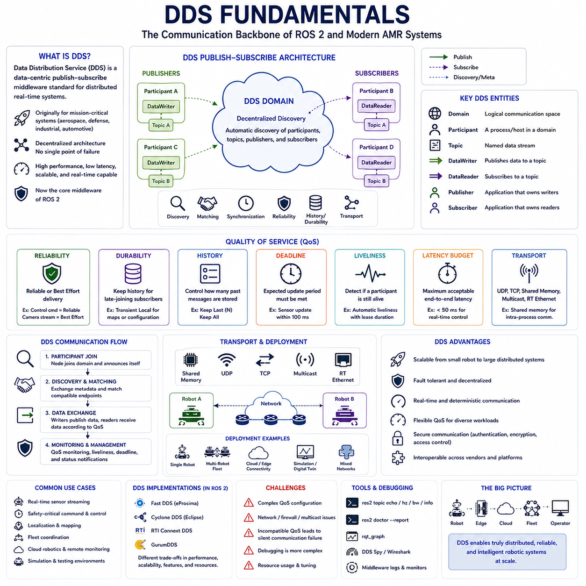
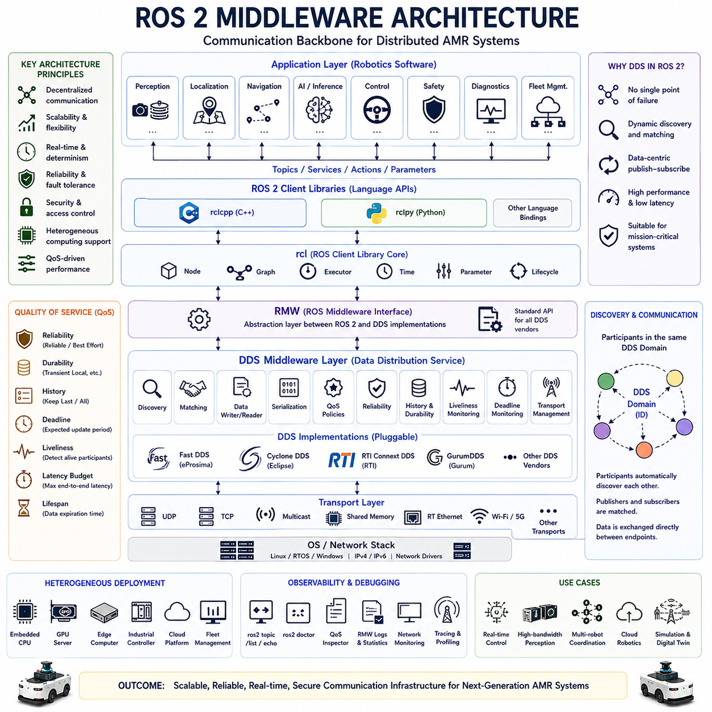
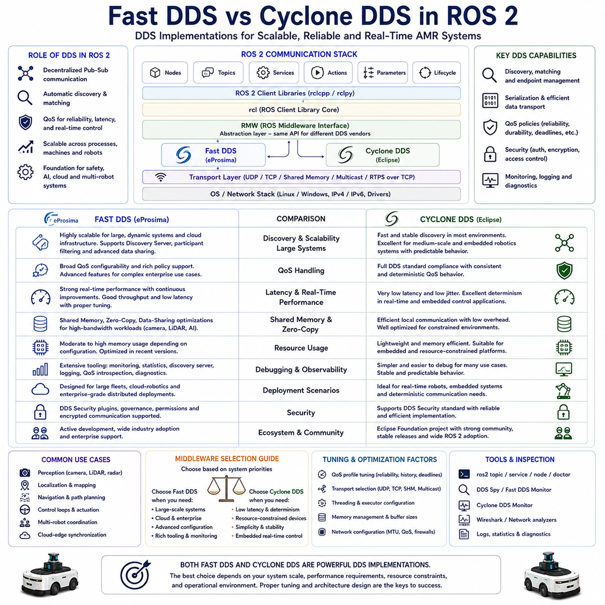
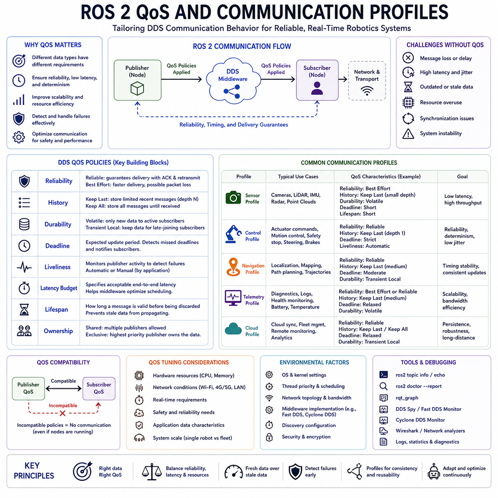
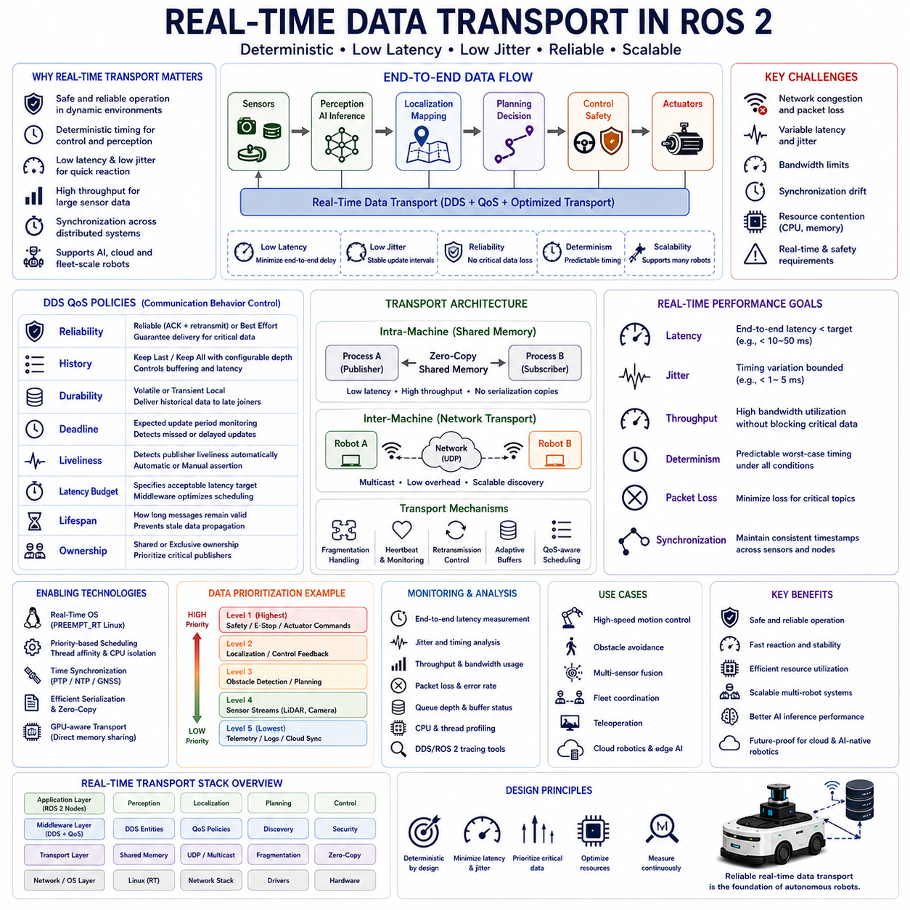
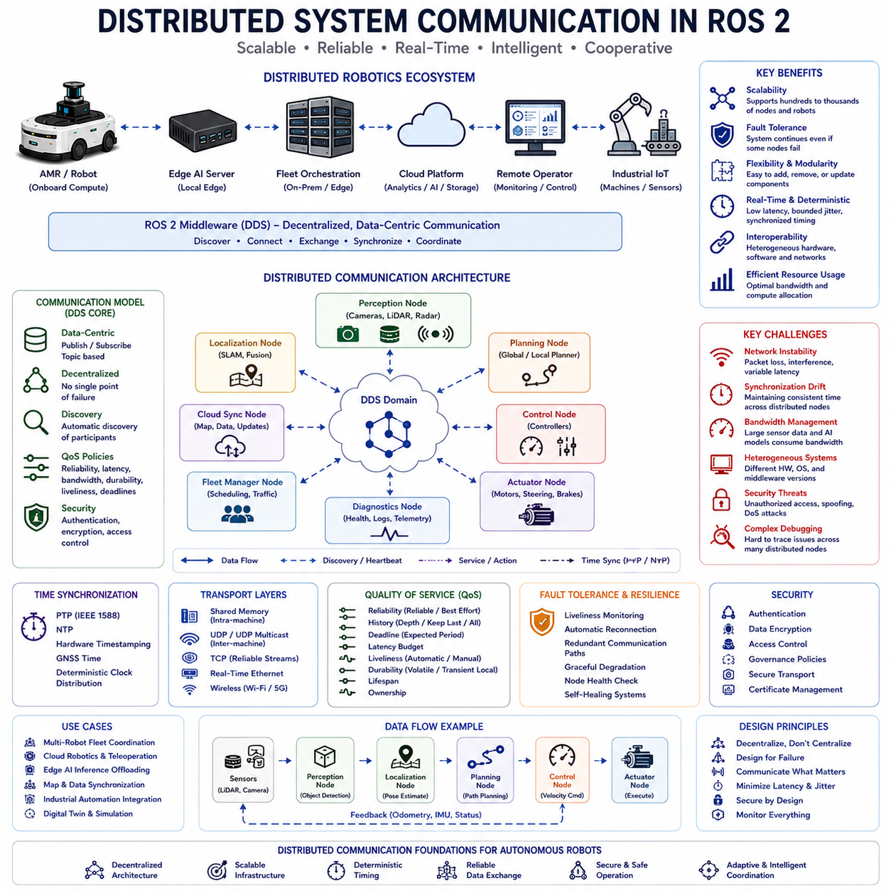
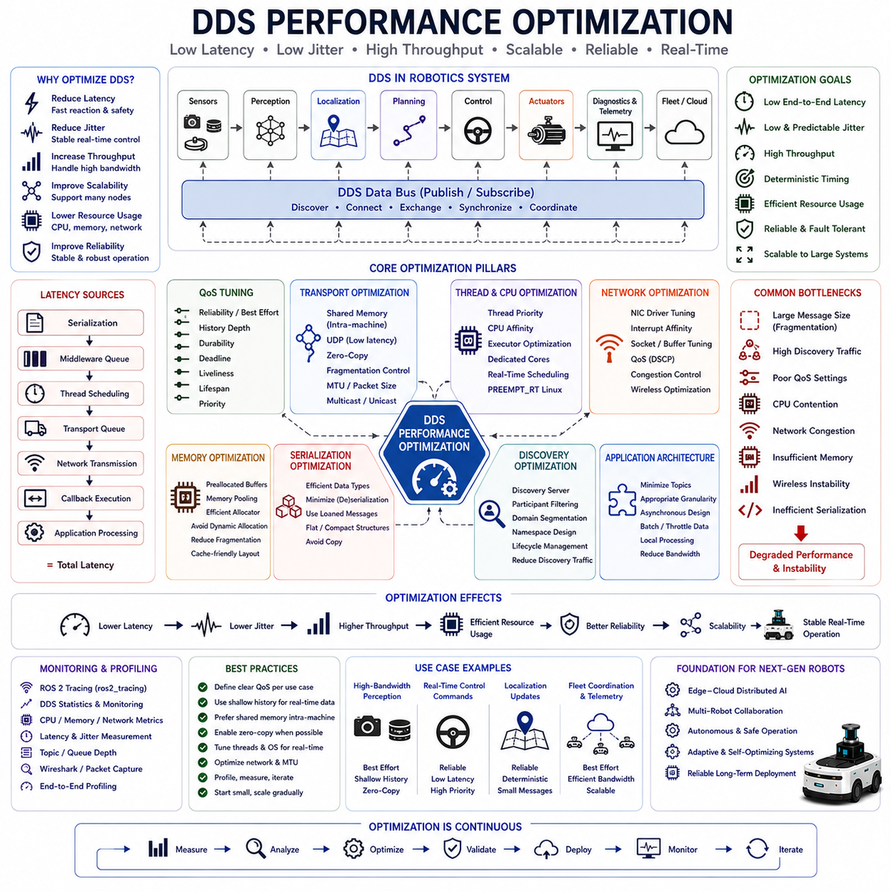
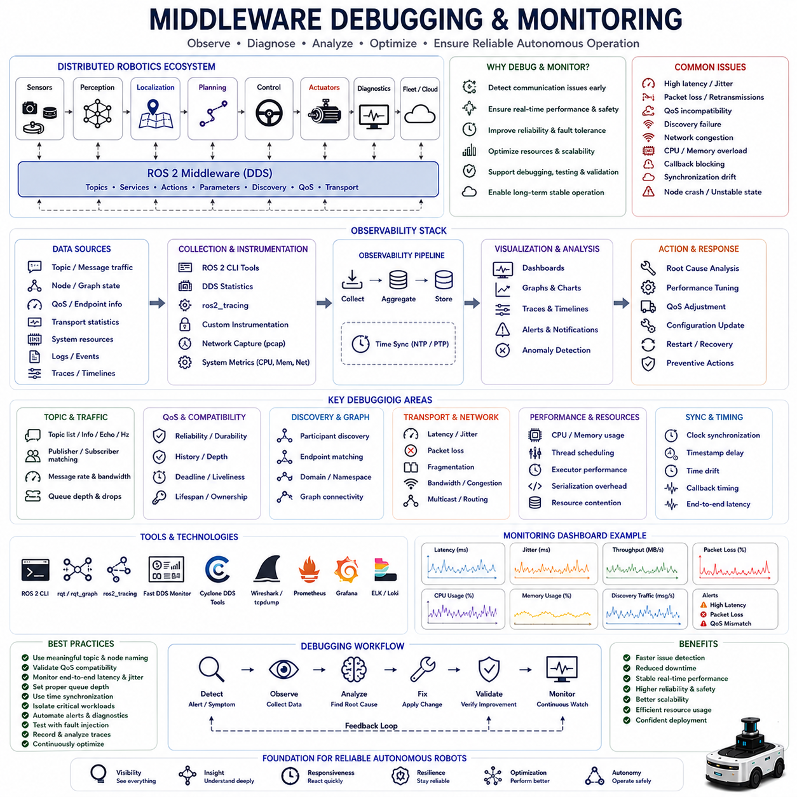

**Volume 07. AMR Software Architecture and Development**

# Chapter 04. Middleware and DDS

## 04.1 DDS Fundamentals

{width="7.268055555555556in" height="7.268055555555556in"}

"04_01_DDS_Fundamentals"는 현대 ROS2 기반 AMR 소프트웨어 아키텍처에서 가장 중요한 기초 주제 중 하나이다. DDS(Data Distribution Service)는 ROS2 분산 로봇 시스템의 핵심 통신 백본(backbone)을 형성하기 때문이다. ROS2 사용자는 일반적으로 Node, Topic, Service, Action, Package와 같은 애플리케이션 계층에서 작업하지만, 실제 데이터 전송, Discovery, Synchronization, Reliability Management, Distributed Communication Orchestration은 대부분 DDS Middleware에 의해 처리된다. 따라서 DDS의 기본 원리를 이해하는 것은 복잡한 실제 환경에서 동작하는 확장 가능하고 신뢰성 있으며 결정론적인 산업용 AMR 시스템을 설계하는 데 필수적이다.

DDS는 원래 높은 신뢰성, 낮은 지연 시간, 확장성, 결정론적 통신 동작이 필요한 Mission-Critical Distributed System을 위해 개발된 Middleware Standard이다. DDS가 로봇 분야에 널리 사용되기 전부터 항공우주 시스템, 방위 산업 플랫폼, 해군 전투 시스템, 산업 자동화, 통신 시스템, 자율주행 차량, 항공 교통 관제 시스템, 대규모 분산 모니터링 시스템 등에서 이미 광범위하게 사용되고 있었다. 이러한 환경은 현대 자율주행 로봇과 매우 유사한 요구사항을 가지고 있었으며, 여기에는 Real-Time Communication, Distributed Computing, Fault Tolerance, High-Bandwidth Sensor Streaming, Dynamic System Scalability 등이 포함된다.

ROS1은 원래 ROS Master 기반의 중앙 집중형 통신 구조에 크게 의존하였다. 이 방식은 소규모 로봇 시스템에서는 단순하고 편리했지만, 확장성, Fault Tolerance, Distributed Networking, Real-Time Performance 측면에서 한계를 가지고 있었다. ROS2는 이러한 문제를 해결하기 위해 DDS를 핵심 Middleware Layer로 채택하였다. 이 변화는 ROS2를 대규모 산업용 자율주행 로봇 시스템에 적합한 분산 산업용 통신 프레임워크로 근본적으로 발전시켰다.

DDS는 분산형 Publish-Subscribe Middleware Architecture로 동작한다. 중앙 집중형 Communication Coordinator에 의존하는 대신 DDS는 분산된 Participant들이 서로를 동적으로 발견하고 네트워크를 통해 직접 데이터를 교환할 수 있게 한다. 이러한 분산 구조는 단일 Master Node에 의존하지 않기 때문에 확장성과 Fault Tolerance를 크게 향상시킨다. 하나의 서브시스템이 실패하더라도 나머지 분산 노드는 독립적으로 계속 동작할 수 있다.

DDS의 핵심 통신 추상화는 Data-Centric Publish-Subscribe Communication이다. 전통적인 Message-Oriented Middleware가 단순히 데이터 전송 메커니즘에 초점을 맞추는 반면, DDS는 분산 시스템 전체에 구조화된 데이터를 의미 중심으로 배포하는 것에 초점을 둔다. Publisher는 Typed Data Stream을 생성하고 Subscriber는 자신이 관심 있는 데이터를 수신한다. DDS는 Discovery, Matching, Synchronization, Reliability, Buffering, Transport Orchestration 등을 자동으로 관리한다.

DDS에서 가장 중요한 개념 중 하나는 Domain이다. DDS Domain은 독립된 논리적 통신 환경을 의미한다. 동일한 DDS Domain에 속한 Node는 서로 Discovery 및 Communication을 수행할 수 있지만, 서로 다른 Domain에 속한 Node는 명시적인 Bridging Mechanism이 없는 한 통신하지 않는다. DDS Domain은 동일한 물리적 네트워크 상에서 여러 Robot Fleet, Simulation Environment, Testing Framework, Development System 등을 논리적으로 분리하는 데 매우 유용하다.

또 다른 중요한 개념은 Participant이다. Participant는 DDS Domain 내부에서 동작하는 통신 엔티티를 의미한다. ROS2 시스템에서는 하나의 Process 또는 Node Group이 하나 이상의 DDS Participant에 대응하는 경우가 많다. Participant는 Communication Resource, Discovery Behavior, QoS Negotiation, Transport Configuration, Endpoint Coordination 등을 관리한다. Participant Configuration은 대규모 로봇 시스템의 통신 확장성과 Runtime Resource Usage에 큰 영향을 준다.

DDS 통신은 Topic, Publisher, Subscriber, Writer, Reader를 중심으로 동작한다. Topic은 분산 데이터 스트림의 의미 구조를 정의한다. Publisher는 특정 Topic에 데이터를 생성하고, Subscriber는 해당 Topic 데이터를 수신한다. Middleware Layer에서는 DataWriter가 송신을 담당하고 DataReader가 수신을 담당한다. DDS는 Topic Definition 및 QoS Policy를 기반으로 Reader와 Writer를 자동으로 Matching한다.

Dynamic Discovery는 DDS의 가장 강력한 기능 중 하나이다. 새로운 DDS Participant가 네트워크에 참여하면 DDS는 자동으로 자신의 존재를 알리고 사용 가능한 Topic, Publisher, Subscriber, QoS Policy, Communication Capability 등의 Metadata를 교환한다. 이 Discovery Process 덕분에 분산 로봇 시스템은 중앙 집중형 조정 없이도 동적으로 확장될 수 있다. 새로운 로봇 서브시스템, 클라우드 서비스, Fleet Management Component, Sensor Node 등이 운영 중에도 자유롭게 추가되거나 제거될 수 있다.

QoS(Quality of Service)는 DDS Architecture에서 가장 중요한 요소 중 하나이다. DDS QoS Policy는 개발자가 운영 요구사항에 따라 통신 동작을 세밀하게 제어할 수 있게 해준다. 서로 다른 로봇 작업은 서로 다른 통신 특성을 요구한다. Emergency Stop Message는 매우 높은 신뢰성과 낮은 지연 시간이 필요하고, Camera Stream은 Throughput이 더 중요하다. Localization Update는 결정론적 Timing Behavior를 요구할 수 있으며, Telemetry System은 Bandwidth Efficiency를 우선시할 수 있다. DDS QoS는 이러한 다양한 로봇 워크로드에 최적화된 통신 구성을 가능하게 한다.

Reliability Policy는 통신이 Reliable Mode 또는 Best-Effort Mode로 동작할지를 결정한다. Reliable Communication은 Acknowledgment와 Retransmission Mechanism을 사용하여 Message Delivery를 보장한다. 반면 Best-Effort Communication은 일부 Packet Loss를 허용하는 대신 속도와 Throughput을 우선시한다. Video와 같은 High-Bandwidth Sensor Stream은 일반적으로 Best-Effort를 사용하고, Safety-Critical Command는 Reliable Communication을 사용한다.

Durability Policy는 Historical Data 관리 방식을 정의한다. 일부 Subscriber는 이미 실행 중인 시스템에 늦게 참여하더라도 이전 데이터를 수신해야 할 수 있다. DDS Durability Setting은 Late-Joining Subscriber를 위해 Message History를 유지할 수 있게 해준다. 이는 Robotics System에서 Map Distribution, System Configuration Synchronization, Operational State Management 등에 매우 유용하다.

History Policy는 DDS가 내부적으로 저장하는 과거 메시지 개수를 제어한다. Queue Depth는 다양한 계산 부하 상황에서 통신 동작에 큰 영향을 준다. 과도한 History Depth는 Latency와 Memory Consumption을 증가시킬 수 있고, 너무 작은 Buffering Capacity는 일시적인 과부하 상황에서 Message Loss를 증가시킬 수 있다. 따라서 안정적인 로봇 통신을 위해 적절한 History Configuration이 중요하다.

Deadline Policy는 예상되는 통신 타이밍 제약을 정의한다. DDS는 Publisher가 요구된 Update Frequency를 유지하는지 자동으로 모니터링하고 Timing Violation 발생 시 Subscriber에 알릴 수 있다. Deadline Monitoring은 Sensor Update 지연이나 Missing Control Command가 위험한 운영 상황을 초래할 수 있는 Safety-Critical Robotics System에서 매우 중요하다.

Liveliness Policy는 Communication Participant가 정상 동작 중인지 모니터링할 수 있게 해준다. Node가 Crash되거나 Disconnect되거나 Publishing을 중단하면 DDS는 이를 자동으로 감지하고 관련 Subscriber에 알릴 수 있다. Liveliness Monitoring은 Fault-Tolerant Autonomous Robotics Architecture의 핵심 기반 중 하나이다.

Latency Budget Policy는 애플리케이션이 허용 가능한 Communication Latency Expectation을 지정할 수 있게 해준다. DDS Middleware는 이를 기반으로 Transport Scheduling을 최적화할 수 있다. DDS가 모든 Network 또는 Processing Delay를 제거할 수는 없지만, Latency Budgeting은 Time-Sensitive Workload를 위한 Communication Resource Prioritization에 매우 유용하다.

Transport Architecture도 DDS의 중요한 개념이다. DDS는 UDP, TCP, Shared Memory Communication, Multicast Networking, Real-Time Ethernet 등 다양한 Transport Mechanism을 지원한다. 고성능 로봇 시스템은 Local Intra-Machine Communication에서 Copy Overhead와 Latency를 줄이기 위해 Shared Memory Transport를 자주 사용한다. 반면 Distributed Robot Fleet은 Wireless Networking Environment에 최적화된 UDP-Based Transport를 더 많이 사용한다.

DDS Middleware Implementation은 Architecture, Performance Characteristic, Memory Usage, Scalability, Debugging Support, Real-Time Behavior 측면에서 상당한 차이를 가진다. ROS2는 일반적으로 Fast DDS, Cyclone DDS, RTI Connext DDS, GurumDDS 등을 지원한다. 각 구현체는 성능, 확장성, 설정 가능성, Resource Efficiency 측면에서 서로 다른 장단점을 가진다. 산업용 AMR 플랫폼은 Deployment Requirement에 따라 여러 DDS Implementation을 평가하여 선택하는 경우가 많다.

Real-Time Communication은 DDS의 가장 중요한 강점 중 하나이다. DDS는 원래 엄격한 Timing Constraint 아래에서 동작하는 Deterministic Distributed System을 위해 설계되었다. Predictable Communication Latency, Synchronized Sensor Fusion, Real-Time Actuator Control, Safety-Critical Coordination이 필요한 Robotics System은 DDS Architecture의 큰 혜택을 받는다. DDS는 Deterministic Scheduling, Priority-Aware Communication, Efficient Serialization, Low-Overhead Transport Optimization 등을 지원한다.

Scalability 역시 DDS의 중요한 장점이다. 산업용 로봇 시스템은 점점 더 Embedded Controller, GPU Inference Server, Cloud Platform, Fleet Management Infrastructure, Multi-Robot Coordination Environment에 걸친 Distributed Computing을 요구하고 있다. DDS는 수천 개의 Endpoint와 High-Bandwidth Data Stream을 포함하는 대규모 Communication Ecosystem을 지원할 수 있다. 이러한 확장성은 미래 지능형 로봇 플랫폼에서 필수적이다.

DDS Security Architecture는 산업용 로봇 분야에서 점점 더 중요해지고 있다. 공장, 병원, 스마트시티, 물류센터, 공공 인프라 환경에서 동작하는 자율주행 로봇은 사이버 공격에 노출된 Enterprise Network 및 Cloud System과 연결될 수 있다. DDS Security Extension은 Authentication, Encryption, Certificate Management, Access Control, Governance Policy, Secure Transport Mechanism 등을 지원한다. 이러한 보안 기능은 핵심 Robotics Communication Infrastructure를 보호하는 데 중요한 역할을 한다.

DDS System Debugging은 상당한 엔지니어링 복잡성을 가진다. DDS Communication의 많은 부분이 ROS2 Application Layer 아래에서 투명하게 동작하기 때문이다. Communication Failure는 Incompatible QoS Setting, Discovery Issue, Transport Misconfiguration, Firewall Restriction, Multicast Blocking, Network Segmentation, DDS Implementation Difference 등에서 발생할 수 있다. 따라서 개발자는 DDS Introspection Tool, Transport Monitoring Utility, Network Diagnostic Tool, Middleware Configuration Strategy 등을 이해해야 한다.

DDS는 시뮬레이션 및 Digital Twin Environment에서도 중요한 역할을 한다. 현대 로봇 개발은 Distributed Simulation System, Replay-Based Debugging Workflow, Hardware-in-the-Loop Testing, Cloud-Connected Development Infrastructure, Multi-Robot Simulation Framework에 크게 의존하고 있다. DDS는 이러한 복잡한 Simulation Ecosystem을 지원할 수 있는 확장 가능한 Distributed Communication Architecture를 제공한다.

Cloud Robotics 및 Edge Computing Architecture는 DDS Fundamentals의 중요성을 더욱 증가시키고 있다. 미래의 AMR 시스템은 Onboard Computer, Edge GPU Server, Remote AI Inference Cluster, Fleet Orchestration System, Cloud-Native Robotics Platform에 작업을 분산하게 될 것이다. DDS는 이러한 Heterogeneous Computing Environment를 조정하기 위한 Distributed Communication Abstraction을 제공한다.

AI-native Robotics Architecture 역시 Communication Complexity를 급격히 증가시키고 있다. Foundation Model, Multimodal Reasoning System, Semantic World Model, Collaborative Robot Agent, Distributed AI Infrastructure를 통합하는 미래 로봇은 기존 Robotics System보다 훨씬 더 풍부한 Semantic Information을 교환하게 될 것이다. DDS의 유연한 Distributed Data-Centric Communication Architecture는 이러한 미래 지능형 로봇 생태계를 위한 강력한 기반이 된다.

ROS2에서 DDS Adoption의 가장 중요한 장기적 의미 중 하나는 Robotics Software Architecture가 진정한 Distributed Autonomous System으로 발전하고 있다는 점이다. 로봇을 단순히 Local Control Loop를 실행하는 독립 기계로 보는 것이 아니라, DDS는 로봇을 Fleet, Cloud Service, Digital Twin, AI Inference Network, Remote Operator, Edge Computing Cluster, Collaborative Robotics Ecosystem 안의 Participant로 동작하게 만든다.

산업용 자율주행 로봇이 고도로 분산된 AI-native Infrastructure로 발전함에 따라 DDS Fundamentals는 앞으로도 미래 Robotics Software System의 가장 중요한 엔지니어링 기반 중 하나로 남게 될 것이다. Decentralized Communication, Data-Centric Architecture, Dynamic Discovery, QoS-Driven Transport Management, Deterministic Execution, Scalability, Fault Tolerance, Real-Time Communication, Secure Distributed Orchestration과 같은 핵심 원칙은 점점 더 복잡한 실제 환경에서도 장기적으로 안정적으로 운영 가능한 차세대 Autonomous Mobile Robot Platform 개발의 중심이 될 것이다.

## 04.2 ROS2 Middleware Architecture

{width="7.268055555555556in" height="7.268055555555556in"}

"04_02_ROS2_Middleware_Architecture"는 현대 자율주행 로봇 소프트웨어 엔지니어링에서 가장 중요한 기초 주제 중 하나이다. Middleware Layer는 ROS2 기반 AMR 시스템의 모든 분산 구성 요소를 연결하는 핵심 통신 백본(backbone) 역할을 하기 때문이다. 산업용 자율주행 모바일 로봇에서는 Perception System, Localization Pipeline, Navigation Stack, AI Inference Engine, Actuator Controller, Diagnostics Framework, Fleet Management System, Cloud Synchronization Module, Safety Subsystem 등이 실시간으로 막대한 양의 데이터를 지속적으로 교환한다. 이러한 분산 소프트웨어 구성 요소는 Embedded CPU, GPU, Edge Server, Industrial Controller, Wireless Network, Cloud-Connected Infrastructure 등 이기종 컴퓨팅 하드웨어 전반에 걸쳐 동작하는 경우가 많다. Middleware Architecture는 이러한 복잡한 분산 로봇 생태계 전체에서 신뢰성 있고 확장 가능하며 결정론적이고 효율적인 통신을 가능하게 하는 핵심 역할을 담당한다.

로봇 소프트웨어 엔지니어링에서 Middleware는 운영체제와 애플리케이션 소프트웨어 사이에 위치한 추상화 계층으로 이해할 수 있다. Middleware Layer는 저수준 통신 복잡성을 숨기면서 데이터 교환, 동기화, Discovery, Serialization, Transport Management, Distributed Orchestration을 위한 표준화된 인터페이스를 제공한다. Middleware가 없다면 각 로봇 소프트웨어 모듈은 자체적으로 네트워킹, 통신 프로토콜, 동기화 로직, Reliability Mechanism, Distributed Coordination Infrastructure 등을 구현해야 한다. 시스템 복잡도가 증가할수록 이러한 접근 방식은 빠르게 관리 불가능한 수준이 된다. 따라서 Middleware는 개발자가 저수준 분산 시스템 엔지니어링보다 로봇 기능 자체에 집중할 수 있도록 통합된 통신 기반을 제공한다.

ROS1은 원래 ROS Master 기반의 중앙 집중형 Middleware Architecture에 의존하였다. 이 구조에서는 Node가 중앙 Coordination Server에 자신을 등록하고, ROS Master가 Discovery 및 Name Resolution을 담당하였다. 이 방식은 소규모 로봇 프로젝트에서는 매우 편리했지만, 확장성, Fault Tolerance, Distributed Networking, Real-Time Performance 측면에서 한계를 가지고 있었다. ROS Master는 Single Point of Failure가 될 수 있었으며, 대규모 분산 시스템에서는 Networking 및 Synchronization Bottleneck이 자주 발생하였다. 자율주행 로봇이 Distributed Computing, Multi-Robot Coordination, Cloud Integration, Real-Time AI Workload를 포함하는 산업 규모 환경으로 발전함에 따라 이러한 구조적 한계는 더욱 심각해졌다.

ROS2는 DDS(Data Distribution Service)를 핵심 Communication Infrastructure로 채택함으로써 Middleware Layer를 근본적으로 재설계하였다. DDS는 Mission-Critical Real-Time System을 위해 설계된 분산 Publish-Subscribe Communication Framework이다. ROS Master와 같은 중앙 서버에 의존하는 대신, ROS2 Middleware는 분산 Participant가 서로를 동적으로 발견하고 네트워크를 통해 직접 데이터를 교환할 수 있게 한다. 이러한 분산 구조는 산업용 로봇 환경에서 확장성, 신뢰성, Fault Tolerance, 운영 유연성을 크게 향상시킨다.

ROS2 Middleware의 가장 중요한 아키텍처 원칙 중 하나는 추상화(abstraction)이다. ROS2 애플리케이션은 일반적으로 Topic, Service, Action, Parameter와 같은 High-Level API를 사용하며 특정 DDS Implementation에 직접 의존하지 않는다. 이러한 추상화는 RMW(ROS Middleware Interface)를 통해 구현된다. RMW Layer는 ROS2 Client Library와 DDS Middleware Implementation 사이의 중간 추상화 계층 역할을 한다. 이 구조 덕분에 ROS2는 다양한 DDS Vendor를 지원하면서도 애플리케이션 수준에서는 일관된 동작을 유지할 수 있다.

RMW Layer는 ROS2 Middleware Architecture의 가장 중요한 혁신 중 하나이다. ROS2를 특정 Communication Implementation에 강하게 결합하지 않고, Deployment Requirement에 따라 다양한 DDS Backend를 선택할 수 있게 해준다. 일반적으로 Fast DDS, Cyclone DDS, RTI Connext DDS, GurumDDS 등이 지원된다. 각 DDS Implementation은 Performance, Memory Efficiency, Scalability, Real-Time Behavior, Debugging Support, Discovery Mechanism, Resource Usage 측면에서 서로 다른 장단점을 가진다. 산업용 로봇 플랫폼은 운영 요구사항에 따라 여러 Middleware Implementation을 평가하고 선택하는 경우가 많다.

RMW Layer 상위에는 Robotics Application Development를 위한 Language-Specific API를 제공하는 ROS2 Client Library가 존재한다. 가장 대표적인 것은 C++용 rclcpp와 Python용 rclpy이다. 이러한 Library는 Node Creation, Topic Communication, Service Handling, Action Management, Lifecycle Coordination, Parameter Configuration, Executor Management, Callback Execution 등을 위한 표준화된 인터페이스를 제공한다. 대부분의 로봇 개발자는 Middleware 자체보다 이러한 Client Library와 직접 상호작용하며 개발을 수행한다.

ROS Client Library Layer는 rcl이라는 저수준 C 기반 추상화 계층과 연결된다. rcl은 여러 Programming Language Binding에서 공통적으로 사용하는 Middleware-Independent Functionality를 제공한다. 이러한 계층형 구조는 ROS2 애플리케이션 개발 환경의 Portability, Maintainability, Consistency를 크게 향상시킨다.

RMW 추상화 아래에서 DDS Middleware Implementation은 분산 통신의 대부분의 복잡성을 처리한다. DDS는 Participant Discovery, Topic Matching, Endpoint Negotiation, Serialization, Transport Management, Reliability Enforcement, Synchronization Monitoring, QoS Policy, Distributed Data Orchestration 등을 담당한다. DDS는 동일 Communication Domain 내에서 동작하는 Publisher와 Subscriber를 자동으로 발견하고 Compatible Endpoint 사이에 Transport Channel을 동적으로 구성한다.

Discovery Architecture는 ROS2 Middleware System에서 가장 중요한 요소 중 하나이다. DDS Participant는 Available Topic, QoS Configuration, Publisher, Subscriber, Communication Capability를 설명하는 Metadata를 지속적으로 교환한다. 이러한 Automatic Discovery Process는 중앙 Coordination Infrastructure 없이도 로봇 시스템이 동적으로 확장될 수 있게 해준다. 새로운 Node, Robot Subsystem, Fleet Management Service, Cloud Analytics System 등이 운영 중에도 자유롭게 추가되거나 제거될 수 있다.

Communication Domain은 DDS 기반 Middleware System 내에서 논리적 분리를 제공한다. ROS2는 DDS Domain을 사용하여 동일한 네트워크 상에서 동작하는 여러 Communication Environment를 분리한다. Multiple Robot Fleet, Simulation Environment, Development System, Testing Framework, Cloud-Connected Service 등이 동일 Physical Network를 공유하면서도 서로 다른 DDS Domain Identifier를 사용하여 논리적으로 분리될 수 있다. Domain Isolation은 Communication Organization을 크게 향상시키고 의도하지 않은 Cross-System Interference를 줄여준다.

QoS(Quality of Service) Configuration은 ROS2 Middleware Architecture의 또 다른 핵심 요소이다. DDS QoS Policy는 운영 요구사항에 따라 Communication Behavior를 세밀하게 조정할 수 있게 해준다. Reliability Policy는 Message Delivery를 보장할지 또는 Throughput과 Low Latency를 우선시할지를 결정한다. Durability Setting은 Late-Joining Subscriber를 위한 Historical Data Retention을 제어한다. History Policy는 Message Queue Depth와 Buffering Behavior를 정의한다. Deadline Policy는 Timing Expectation을 모니터링한다. Liveliness Policy는 Communication Failure와 Crashed Node를 감지한다. 복잡한 로봇 시스템에서 Performance, Reliability, Scalability, Real-Time Responsiveness의 균형을 유지하려면 적절한 QoS Tuning이 필수적이다.

ROS2 Middleware Architecture는 특히 Real-Time Robotics System에 매우 적합하다. 자율주행 로봇은 Communication Latency와 Synchronization이 직접적으로 Safety 및 Operational Stability에 영향을 주는 엄격한 Timing Constraint 아래에서 동작하는 경우가 많다. Motion Control Loop, Obstacle Avoidance System, Actuator Coordination, Localization Pipeline, Multi-Sensor Fusion Architecture는 모두 Predictable Communication Behavior에 의존한다. DDS Middleware는 Deterministic Transport Mechanism, Efficient Serialization, Priority-Aware Scheduling, Configurable QoS Policy 등을 제공하여 이러한 Real-Time Robotics Workload를 지원한다.

Serialization Architecture도 Middleware Performance의 중요한 요소이다. 로봇 시스템은 Structured Sensor Data, Localization State, AI Inference Output, Map Information, Diagnostics Telemetry, Control Command 등을 지속적으로 교환한다. Efficient Serialization 및 Deserialization Mechanism은 Communication Latency와 CPU Overhead를 최소화하는 데 매우 중요하다. DDS Implementation은 High-Bandwidth Sensor Streaming에서 Throughput 향상과 Computational Load 감소를 위해 Binary Serialization Format을 최적화한다.

Transport Architecture 역시 ROS2 Middleware System에서 중요한 역할을 한다. DDS는 UDP, TCP, Multicast Networking, Shared Memory Communication, Real-Time Ethernet 등 다양한 Transport Mechanism을 지원한다. Shared Memory Transport는 동일 Physical Compute Platform 내부에서 동작하는 Process 간 Communication에서 Copy Overhead와 Latency를 줄여주기 때문에 매우 중요하다. 반면 Wireless Robotics Network에서는 Distributed Communication Environment에 최적화된 UDP Transport가 자주 사용된다.

Middleware Architecture는 Distributed Computing System에서 더욱 중요해진다. 현대 산업용 AMR은 Embedded Processor, GPU Inference Server, Safety Controller, Edge Computing Infrastructure, Cloud Analytics Platform, Fleet Management System에 Workload를 분산하는 경우가 많다. Perception Pipeline은 GPU Accelerator에서 실행되고, Control Loop는 Real-Time Embedded CPU에서 실행될 수 있다. Middleware는 이러한 Heterogeneous Hardware Architecture 전체에서 Synchronization Overhead를 최소화하면서 효율적인 Communication을 조정해야 한다.

Security Architecture는 ROS2 Middleware System에서 점점 더 중요해지고 있다. 공장, 병원, 물류센터, 스마트시티, 공공 인프라 환경에서 동작하는 산업용 자율주행 로봇은 사이버 공격에 노출된 Enterprise Network와 연결될 수 있다. DDS Security Extension은 Authentication, Encryption, Access Control, Certificate Validation, Governance Policy, Secure Transport Mechanism 등을 제공한다. Middleware Security Architecture는 강력한 Cybersecurity Protection과 Low-Latency Real-Time Communication Requirement 사이에서 균형을 유지해야 한다.

Fault Tolerance는 ROS2 Middleware Architecture의 또 다른 강점이다. 분산 로봇 시스템은 개별 Node, Network Interface, Sensor, Compute Module이 실패하더라도 안정적으로 계속 동작해야 한다. DDS Middleware는 Single Point of Failure를 제거한 Decentralized Communication을 제공한다. Liveliness Monitoring, Automatic Discovery Recovery, Redundant Communication Pathway, Distributed Participant Coordination 등은 산업용 AMR Deployment에서 Operational Robustness를 크게 향상시킨다.

Middleware Observability 및 Debugging Capability는 대규모 로봇 시스템에서 매우 중요하다. ROS2는 Topic, Node Relationship, QoS Configuration, Transport Statistic, Bandwidth Usage, Callback Timing, DDS Communication Behavior 등을 분석할 수 있는 다양한 도구를 제공한다. 그러나 Middleware System Debugging은 상당히 복잡할 수 있다. Communication Failure는 DDS Discovery Issue, Incompatible QoS Policy, Network Restriction, Multicast Limitation, Transport Fragmentation, Synchronization Error, Middleware Implementation Difference 등에서 발생할 수 있기 때문이다. 따라서 개발자는 Robotics Software뿐 아니라 Distributed Communication System에 대한 깊은 이해도 필요하다.

Simulation 및 Digital Twin Environment 역시 확장 가능한 Middleware Architecture에 크게 의존한다. 현대 로봇 개발은 Gazebo, Isaac Sim, Replay-Based Debugging System, Hardware-in-the-Loop Testing, Cloud-Connected Simulation Infrastructure 등에 점점 더 의존하고 있다. Middleware Architecture는 Simulation과 Real-World Deployment 모두에서 Deterministic Communication Behavior를 제공해야 한다. 일관된 Middleware Abstraction은 Testing Reproducibility와 Validation Workflow를 크게 향상시킨다.

Cloud Robotics 및 Edge Computing Architecture는 Middleware Complexity를 더욱 증가시키고 있다. 미래의 AMR은 Onboard Processor, Edge AI Server, Remote Cloud Infrastructure, Collaborative Fleet Management System, Distributed Semantic Reasoning Platform에 Workload를 동적으로 분산하게 될 것이다. Middleware System은 서로 다른 Bandwidth, Latency, Reliability 특성을 가진 Heterogeneous Distributed Computing Environment 전체에서 확장 가능한 Communication을 지원해야 한다.

AI-native Robotics Architecture는 Middleware Requirement를 급격히 확장시키고 있다. Foundation Model, Multimodal Reasoning System, World Model, Distributed AI Agent, Collaborative Robotics Intelligence, Semantic Memory System을 통합하는 미래 자율주행 로봇은 단순 Low-Level Sensor Telemetry를 넘어 훨씬 더 복잡한 Semantic Information을 교환하게 될 것이다. 따라서 Middleware Architecture는 단순 Message Transport를 넘어 Large-Scale Distributed Semantic Communication Infrastructure로 발전해야 한다.

ROS2 Middleware Architecture의 가장 중요한 장기적 의미 중 하나는 Robotics가 독립적인 Machine-Centric System에서 Distributed Intelligent Infrastructure Ecosystem으로 전환되고 있다는 점이다. 자율주행 로봇은 점점 Fleet, Cloud AI System, Digital Twin, Edge Computing Cluster, Industrial IoT Infrastructure, Collaborative Robotics Ecosystem 안의 Participant로 동작하게 되고 있다. Middleware Architecture는 이러한 변화를 가능하게 하는 핵심 Communication Foundation 역할을 수행한다.

산업용 자율주행 로봇 시스템이 Highly Distributed AI-native Infrastructure로 발전함에 따라 ROS2 Middleware Architecture는 앞으로도 미래 Robotics Software System의 가장 중요한 엔지니어링 기반 중 하나로 남게 될 것이다. Decentralized Communication, Middleware Abstraction, Scalable Distributed Orchestration, QoS-Driven Transport Management, Deterministic Execution, Fault Tolerance, Real-Time Responsiveness, Security-Aware Communication, Heterogeneous Computing Integration과 같은 핵심 원칙은 점점 더 복잡한 실제 환경에서도 안정적으로 장기 운영 가능한 차세대 Autonomous Mobile Robot Platform 개발의 중심이 될 것이다.

## 04.3 FastDDS and CycloneDDS

{width="7.268055555555556in" height="7.268055555555556in"}

"04_03_FastDDS_and_CycloneDDS"는 현대 ROS2 기반 AMR 소프트웨어 아키텍처에서 가장 중요한 실무 엔지니어링 주제 중 하나이다. Middleware Implementation 선택이 자율주행 로봇 시스템 전체의 통신 신뢰성, 지연 시간 특성, 확장성, CPU 사용률, 메모리 효율성, 디버깅 능력, Real-Time Performance에 직접적인 영향을 미치기 때문이다. ROS2는 RMW(ROS Middleware Interface)를 통해 Middleware 추상화 계층을 제공하지만, 실제 분산 통신의 Runtime Behavior는 사용되는 DDS Implementation에 크게 의존한다. ROS2가 지원하는 다양한 DDS Middleware 중 Fast DDS와 Cyclone DDS는 산업용 로봇 시스템에서 가장 널리 사용되고 영향력이 큰 구현체로 자리 잡았다. 따라서 이들의 아키텍처, 장점, 한계, 설정 전략, 운영 특성을 이해하는 것은 확장 가능하고 신뢰성 있는 Autonomous Mobile Robot Platform 구축에 필수적이다.

DDS Implementation은 단순한 네트워킹 라이브러리가 아니다. DDS는 Participant Discovery, Topic Matching, Transport Orchestration, Serialization, Reliability Enforcement, Synchronization Management, QoS Handling, Distributed Communication Scheduling 등을 담당하는 핵심 통신 엔진이다. ROS2 애플리케이션이 동일한 API와 소프트웨어 로직을 사용하더라도 DDS Implementation을 변경하면 실제 운영 환경에서 시스템 동작 특성이 크게 달라질 수 있다. 특히 High-Bandwidth Sensor Streaming, Distributed AI Inference, Multi-Robot Coordination, Cloud-Edge Communication, Real-Time Control Loop를 포함하는 대규모 산업용 AMR은 Middleware 성능 특성에 매우 민감하다.

Fast DDS는 원래 Fast RTPS라는 이름으로 알려졌으며 eProsima가 주로 개발하였다. ROS2 초기 배포판에서 기본 DDS Implementation 중 하나로 사용되었다. Fast DDS는 Scalability, Flexibility, Standards Compliance, Industrial Deployment Support를 중요하게 고려하여 설계되었다. 시간이 지나면서 단순한 경량 로봇 통신 프레임워크에서 대규모 분산 시스템, 복잡한 QoS Configuration, Discovery Optimization, Security Integration, High-Performance Communication Workload를 지원하는 강력한 DDS Middleware Platform으로 발전하였다.

Cyclone DDS는 Eclipse Foundation Ecosystem 기반으로 개발되었으며 Simplicity, Efficiency, Deterministic Behavior, Robust Interoperability를 중요하게 고려한다. Cyclone DDS는 Low-Latency Characteristic, Stable Discovery Behavior, Lightweight Resource Usage, Strong Real-Time Communication Performance 덕분에 ROS2 커뮤니티에서 빠르게 인기를 얻었다. 특히 산업용 로봇에서 많이 사용되는 Linux 기반 분산 환경에서 Embedded 및 Real-Time Robotics Workload에 대해 매우 Predictable한 Runtime Behavior를 제공하는 것으로 평가되었다.

Fast DDS와 Cyclone DDS의 가장 중요한 차이점 중 하나는 Discovery Behavior이다. DDS Discovery는 분산 Participant가 동일 Communication Domain 내의 Publisher, Subscriber, Topic, QoS Policy, Communication Endpoint를 자동으로 탐색하는 과정을 의미한다. Discovery Scalability는 대규모 로봇 시스템에서 Startup Time, Communication Reliability, Distributed Orchestration Behavior에 큰 영향을 준다.

Fast DDS는 원래 대규모 분산 시스템 및 Cloud-Connected Infrastructure를 고려한 Discovery Mechanism을 중심으로 설계되었다. 그러나 초기 버전에서는 Wireless Networking, Multiple Network Interface, VPN Environment, Large-Scale Multi-Robot Deployment 등 매우 동적인 Robotics Workload 환경에서 Discovery Instability 또는 Delayed Participant Matching이 발생하는 경우가 있었다. 이후 eProsima는 Discovery Server Architecture, Participant Filtering Mechanism, Improved Multicast Handling, Optimized Endpoint Matching Algorithm 등을 통해 Discovery Reliability와 Scalability를 크게 향상시켰다.

Cyclone DDS는 많은 ROS2 Robotics Environment에서 특히 안정적이고 효율적인 Discovery Behavior로 유명해졌다. 개발자들은 Cyclone DDS가 Fast DDS 초기 버전에 비해 Faster Participant Discovery, Lower Startup Latency, More Predictable Node Matching Behavior를 제공한다고 평가하였다. Cyclone DDS의 Lightweight Internal Architecture는 Embedded Robotics Platform과 Real-Time Communication Workload에서 강력한 성능을 제공하는 중요한 요소였다.

Latency Characteristic 역시 중요한 비교 요소이다. Real-Time Robotics System은 Minimal End-to-End Latency와 Reduced Jitter를 가진 Deterministic Communication Behavior를 요구한다. Motion Control Loop, Localization Pipeline, Sensor Fusion System, Obstacle Avoidance Framework, Safety-Critical Actuator Coordination은 모두 안정적인 통신 타이밍에 크게 의존한다.

Cyclone DDS는 ROS2 커뮤니티에서 Low-Latency Communication Performance와 Highly Predictable Timing Behavior로 강한 명성을 얻었다. 많은 Embedded Robotics Developer들은 제한된 계산 환경에서도 Deterministic Communication이 필요한 경우 Cyclone DDS를 선호하였다. Cyclone DDS는 Efficient CPU Utilization과 Reduced Communication Jitter를 제공하는 것으로 평가되었다.

Fast DDS 역시 강력한 Real-Time Capability를 제공하며 지속적인 Latency Optimization이 이루어졌다. 최신 Fast DDS 버전은 Advanced Transport Tuning, Shared Memory Optimization, Zero-Copy Communication Mechanism, Asynchronous Publishing Architecture, Improved Thread Scheduling Strategy 등을 지원한다. High-Throughput Distributed System에서는 적절한 설정을 통해 매우 뛰어난 Scalability와 Transport Flexibility를 제공할 수 있다.

Memory Usage와 Computational Efficiency는 자율주행 로봇 플랫폼에서 매우 중요하다. 많은 AMR이 제한된 CPU 및 Memory Resource를 가진 Embedded Compute System 위에서 동작하기 때문이다. Distributed Perception System, AI Inference Pipeline, Navigation Stack, Diagnostics Framework, Cloud Synchronization Service는 이미 상당한 계산 자원을 사용한다. 따라서 Middleware Overhead는 매우 효율적으로 관리되어야 한다.

Cyclone DDS는 Lightweight Memory Behavior와 Efficient Runtime Resource Utilization으로 자주 언급된다. ARM Processor, Industrial SBC, Edge Compute Platform, Resource-Constrained Autonomous System에서 동작하는 Embedded Robotics System은 Cyclone DDS의 Compact Architecture로부터 큰 혜택을 받을 수 있다. Reduced Memory Fragmentation과 Stable Runtime Behavior는 장기 운영 신뢰성을 향상시킨다.

Fast DDS는 일부 환경에서는 상대적으로 무거운 구조를 가질 수 있었지만, 대규모 분산 통신 환경에 적합한 Extensive Scalability Feature와 Transport Configurability를 제공한다. 최신 Fast DDS는 Shared Memory Communication과 High-Throughput Transport Pathway에서 Memory Optimization이 크게 향상되었다. 풍부한 Compute Resource를 가진 GPU 기반 AI Robotics System에서는 이러한 Scalability Feature가 매우 유용하다.

Shared Memory Transport Support 역시 중요한 비교 영역이다. 동일 Physical Computer에서 동작하는 Process 간 Communication에서 기존 Network Transport를 사용하면 불필요한 Latency와 Copy Overhead가 발생할 수 있다. Shared Memory Transport는 DDS Participant가 Memory-Mapped Communication Pathway를 통해 직접 데이터를 교환할 수 있게 해주어 Serialization Overhead와 Transport Latency를 크게 줄여준다.

Fast DDS는 Shared Memory Optimization 및 Zero-Copy Transport Architecture에 많은 투자를 하였다. 이러한 기능은 Camera Stream, LiDAR Point Cloud, AI Perception Output, Large Semantic Map Structure와 같은 High-Bandwidth Robotics Workload에서 매우 중요하다. Shared Memory Communication은 GPU-Accelerated Robotics System에서 Throughput 향상과 CPU Overhead 감소에 큰 효과를 제공한다.

Cyclone DDS 역시 Efficient Local Communication Mechanism을 지원하지만, 실제 구현 세부사항과 Optimization Strategy는 Vendor마다 다르다. 실제 성능은 Middleware 선택 자체보다 Operating System Configuration, Network Stack Behavior, ROS2 Executor Design, Memory Allocation Strategy, Application Architecture 등에 의해 크게 좌우되는 경우가 많다.

QoS Handling Behavior 역시 Fast DDS와 Cyclone DDS 사이에 미묘한 차이가 존재한다. DDS QoS Policy는 Reliability, Durability, Liveliness Monitoring, History Management, Latency Expectation, Deadline Enforcement, Communication Synchronization 등을 제어한다. 두 Middleware 모두 DDS Standard를 준수하지만, 실제 Runtime Behavior는 Internal Scheduling Algorithm, Buffering Strategy, Retransmission Mechanism, Resource Management Policy에 따라 달라질 수 있다.

Debugging 및 Observability는 산업용 로봇 Deployment에서 매우 중요한 요소이다. 분산 통신 장애는 Discovery Mismatch, Incompatible QoS Setting, Network Restriction, Multicast Limitation, Transport Fragmentation, Firewall Conflict, Synchronization Instability 등 다양한 원인에서 발생할 수 있다. 따라서 Middleware Introspection Tool, Logging Framework, Diagnostic Utility, Runtime Monitoring Capability는 Operational Maintainability에 큰 영향을 준다.

Fast DDS는 Statistics Module, Discovery Server Visualization, Transport Logging, QoS Introspection, Distributed Communication Diagnostics 등 Extensive Debugging 및 Monitoring Capability를 제공한다. eProsima는 Enterprise-Scale Distributed System과 Cloud-Integrated Robotics Environment를 위한 Advanced Tooling도 적극적으로 개발하였다.

Cyclone DDS는 Extensive Middleware-Layer Configurability보다는 Simplicity와 Predictable Runtime Behavior를 더 강조하는 경향이 있다. 많은 Robotics Developer들은 소규모 Embedded Robotics System에서 Operational Debugging이 더 직관적이고 단순하게 느껴진다는 이유로 Cyclone DDS를 선호한다. 그러나 Enterprise-Scale Deployment에서는 Fast DDS의 풍부한 Advanced Configuration Ecosystem이 더 유리할 수 있다.

Scalability Characteristic은 대규모 분산 AMR Infrastructure에서 더욱 중요해진다. Multi-Robot Fleet, Cloud Robotics Platform, Edge AI Cluster, Digital Twin, Industrial IoT Integration, Distributed Semantic Reasoning System은 수천 개의 Communication Endpoint와 High-Bandwidth Data Stream을 포함할 수 있다. Middleware Scalability는 Participant Discovery Efficiency, Transport Resource Allocation, Synchronization Overhead, Network Stability에 직접적인 영향을 준다.

Fast DDS는 Large Distributed Communication Infrastructure에서의 Scalability를 매우 중요하게 고려한다. Discovery Server Architecture, Transport Optimization Mechanism, Configurable Participant Filtering, Enterprise-Grade Distributed Orchestration Support 덕분에 Cloud-Connected Industrial Robotics Ecosystem 및 Large Multi-Robot Deployment에 매우 적합하다.

Cyclone DDS 역시 많은 Robotics Environment에서 매우 우수한 Scalability를 제공한다. 특히 Deterministic Low-Latency Communication이 가장 중요한 경우 강력한 성능을 발휘한다. 그러나 매우 대규모 Distributed Infrastructure에서는 Deployment Complexity에 따라 추가적인 Discovery 및 Orchestration Tuning이 필요할 수 있다.

Interoperability 및 Standards Compliance도 매우 중요하다. DDS Implementation은 Heterogeneous Robotics System 간 Compatibility를 보장하기 위해 Standardized Communication Semantic을 올바르게 지원해야 한다. 산업용 로봇 환경은 점점 더 다양한 Vendor, Operating System, Hardware Architecture, Distributed Communication Infrastructure가 혼합된 Middleware Ecosystem으로 발전하고 있다.

Fast DDS와 Cyclone DDS 모두 강력한 DDS Standards Compliance와 Interoperability Support를 유지하고 있다. 그러나 Complex QoS Configuration이나 Highly Heterogeneous Deployment Condition에서는 미묘한 Implementation Difference가 나타날 수 있다. 따라서 대규모 산업용 Robotics System은 Extensive Interoperability Validation 및 Deployment Testing이 필요하다.

Security Architecture 역시 중요한 비교 요소이다. Enterprise Network, Cloud System, Logistics Infrastructure, Hospital, Factory, Smart City Platform과 연결된 자율주행 로봇은 Cyber Threat로부터 Communication Pathway를 보호해야 한다. DDS Security Extension은 Authentication, Encryption, Certificate Validation, Governance Policy, Secure Transport Mechanism 등을 제공한다.

Fast DDS는 DDS Security Integration 및 Enterprise Deployment Capability에 많은 투자를 하였다. Cyclone DDS 역시 DDS Security Standard를 지원하지만, Deployment Maturity와 Operational Tooling은 Application Requirement와 Infrastructure Complexity에 따라 차이가 있을 수 있다.

실제 Middleware Selection은 단순 Benchmark Performance보다 Deployment-Specific Operational Characteristic에 의해 결정되는 경우가 많다. 일부 Robotics Team은 Embedded Control System을 위한 Low-Latency Deterministic Behavior를 중요하게 생각한다. 다른 팀은 Cloud Scalability, Distributed Orchestration, Advanced Debugging Capability를 더 중요하게 고려할 수 있다. 많은 경우 실제 성능 차이는 DDS Implementation 자체보다 System Architecture Quality, QoS Tuning, Transport Configuration, Thread Scheduling, Executor Design에 의해 더 크게 결정된다.

AI-native Robotics Architecture는 Middleware Evaluation의 중요성을 더욱 증가시키고 있다. Foundation Model, Multimodal Reasoning System, Distributed AI Agent, Semantic Memory System, Cloud-Edge Inference Infrastructure, Collaborative Robot Ecosystem을 통합하는 미래 자율주행 로봇은 기존 Robotics System보다 훨씬 더 복잡한 Communication Workload를 생성하게 될 것이다. Middleware는 Large-Scale Semantic Communication, Distributed AI Synchronization, GPU-Aware Transport Optimization, Adaptive Computational Orchestration 등을 지원하도록 발전해야 한다.

산업용 로봇 엔지니어링에서 가장 중요한 교훈 중 하나는 Middleware Selection을 단순한 소프트웨어 취향이 아니라 System-Level Architectural Decision으로 보아야 한다는 점이다. Fast DDS와 Cyclone DDS는 각각 서로 다른 Operational Priority와 Deployment Environment에 적합한 강력한 기능을 제공한다. 성공적인 Robotics Platform은 단순히 "가장 좋은" Middleware를 선택하는 것이 아니라, Middleware Behavior를 System Architecture, Computational Constraint, Communication Pattern, Scalability Requirement, Long-Term Operational Goal에 적절히 맞추는 과정에서 만들어진다.

산업용 AMR 시스템이 Highly Distributed Intelligent Robotics Ecosystem으로 발전함에 따라 Fast DDS와 Cyclone DDS와 같은 DDS Middleware Implementation은 앞으로도 Robotics Communication Architecture의 핵심 기반으로 남게 될 것이다. 이러한 Middleware의 지속적인 발전은 점점 더 복잡한 실제 환경에서 동작하는 차세대 Autonomous Mobile Robot Platform의 Scalability, Reliability, Determinism, Security, Operational Intelligence에 매우 큰 영향을 미치게 될 것이다.

## 04.4 QoS and Communication Profiles

{width="7.268055555555556in" height="7.268055555555556in"}

"04_04_QoS_and_Communication_Profiles"는 현대 ROS2 기반 자율주행 로봇 시스템에서 가장 중요한 엔지니어링 주제 중 하나이다. 통신 신뢰성, 지연 시간 특성, 동기화 품질, 분산 시스템 안정성이 본질적으로 QoS(Quality of Service) 설정에 의해 결정되기 때문이다. 산업용 AMR에서 통신은 단순히 노드 간 메시지를 전달하는 문제가 아니다. 자율주행 로봇은 고도로 분산된 컴퓨팅 아키텍처 전반에서 Sensor Stream, Localization Update, Navigation Trajectory, Actuator Command, Diagnostics Telemetry, AI Inference Output, Fleet Coordination Signal, Safety Event, Cloud Synchronization Data 등을 지속적으로 교환한다. 각각의 Communication Pathway는 Reliability, Latency, Determinism, Bandwidth Usage, Fault Tolerance, Synchronization Timing 측면에서 서로 다른 운영 요구사항을 가진다. 따라서 QoS와 Communication Profile은 각 로봇 워크로드에 맞게 Middleware 동작을 최적화하는 핵심 메커니즘이 된다.

ROS2에서 QoS 동작은 주로 DDS Middleware Policy를 통해 구현된다. DDS는 원래 항공우주, 방위 산업, 산업 자동화, 통신, 자율 시스템과 같은 Mission-Critical Distributed System을 위해 설계되었다. 이러한 시스템은 매우 동적이고 안전이 중요한 환경에서도 결정론적 통신을 요구하였다. ROS2는 DDS를 핵심 Middleware Architecture로 채택함으로써 이러한 기능을 계승하였다. QoS Policy는 로봇 개발자가 Topic, Service, Action, Node Interaction 전반에서 분산 통신 동작을 정밀하게 정의할 수 있도록 해준다.

QoS Architecture에서 가장 중요한 개념 중 하나는 "모든 로봇 워크로드에 최적화된 단일 통신 정책은 존재하지 않는다"는 점이다. 서로 다른 로봇 서브시스템은 근본적으로 다른 운영 우선순위를 가진다. Safety-Critical Actuator Command는 매우 높은 Reliability와 Low-Latency Communication을 요구한다. High-Bandwidth Camera Stream은 Guaranteed Delivery보다 Throughput을 더 중요하게 여긴다. Localization System은 Deterministic Update Timing을 필요로 한다. Telemetry System은 Bandwidth Efficiency를 우선시할 수 있다. Cloud Synchronization Service는 높은 Latency를 허용할 수 있지만 Persistence와 Reliability를 요구할 수 있다. 따라서 QoS Configuration은 시스템 수준의 운영 목표에 따라 상충하는 통신 우선순위를 균형 있게 조정하는 과정이라고 볼 수 있다.

Reliability Policy는 DDS Communication Architecture에서 가장 기본적인 QoS 설정 중 하나이다. Reliability는 통신이 Reliable Mode로 동작할지 Best-Effort Mode로 동작할지를 결정한다. Reliable Communication은 Acknowledgment 및 Retransmission Mechanism을 사용하여 Message Delivery를 보장한다. DDS Middleware는 Subscriber가 메시지를 정상적으로 수신했는지 추적하며, Packet Loss가 발생하면 재전송을 수행한다. 이 방식은 Communication Integrity를 향상시키지만 추가적인 Latency와 Bandwidth Overhead를 발생시킬 수 있다.

Best-Effort Communication은 Guaranteed Delivery보다 속도와 Throughput을 우선시한다. 일부 메시지가 전송 중 손실되더라도 재전송을 수행하지 않는다. 이러한 방식은 시간이 지나면 가치가 급격히 감소하는 High-Frequency Sensor Stream에 적합하다. 예를 들어 30FPS 이상의 RGB Camera Video Stream은 일부 Frame Loss를 허용할 수 있다. 오래된 Frame을 재전송하는 것이 Real-Time Perception System에 큰 실질적 가치를 제공하지 않기 때문이다. 반면 Emergency Stop Command, Actuator Control Message, Safety-Critical State Transition은 일반적으로 Reliable Communication을 요구한다.

History Policy는 DDS가 각 Communication Channel에 대해 내부적으로 얼마나 많은 메시지를 저장할지를 정의한다. Middleware는 Subscriber가 데이터를 소비하기 전까지 이전에 Publish된 메시지를 Buffer에 유지할 수 있다. 가장 일반적인 History Mode는 keep last와 keep all이다. Keep last는 최근 메시지 일부만 유지하고 오래된 데이터는 자동으로 삭제한다. Keep all은 Subscriber가 데이터를 소비할 때까지 전체 Message History를 유지하려고 시도한다.

History Depth는 Communication Latency, Memory Consumption, Operational Stability에 큰 영향을 준다. 큰 Queue Depth는 일시적인 계산 과부하를 흡수하는 데 도움이 될 수 있지만, 오래된 메시지가 Buffer에 축적되면서 Latency를 증가시킬 수도 있다. Real-Time Robotics System에서는 Stale Sensor Data가 위험한 상황을 초래할 수 있다. 따라서 많은 산업용 AMR은 Real-Time Perception 및 Control Pipeline에서 Latency를 최소화하기 위해 Shallow Queue를 사용하고 Fresh Data를 우선시한다.

Durability Policy는 DDS가 Late-Joining Subscriber를 위해 Historical Message를 유지할지를 제어한다. Volatile Durability는 Subscriber가 활성화된 이후 생성된 메시지만 전달한다. Transient Local Durability는 Publisher가 최근 메시지를 유지하고, 새롭게 연결된 Subscriber에게 자동으로 전달할 수 있게 한다. 이는 Distributed Robotics System에서 Map Distribution, Configuration Synchronization, Parameter Sharing, Operational State Propagation 등에 매우 유용하다.

Deadline Policy는 예상되는 Communication Timing Interval을 정의한다. DDS Middleware는 Publisher가 요구된 Update Frequency를 유지하는지 모니터링하며, Timing Violation 발생 시 Subscriber에 알릴 수 있다. Deadline Monitoring은 Real-Time Robotics System에서 매우 중요하다. Missing Sensor Update나 Delayed Control Command는 위험한 운영 불안정성을 유발할 수 있기 때문이다. 예를 들어 Localization System이 10Hz LiDAR Update를 기대하는 상황에서 Sensor Streaming이 지연되면 Deadline Violation을 감지할 수 있다.

Liveliness Policy는 Publisher가 정상적으로 동작 중인지 DDS가 모니터링할 수 있게 해준다. 분산 로봇 시스템에서는 Node Crash, Disconnection, Computational Overload에 의한 Freeze, Network Connectivity Loss 등이 발생할 수 있다. Liveliness Monitoring은 Subscriber가 이러한 장애를 자동으로 탐지할 수 있게 해준다. 서로 다른 Liveliness Mode는 Middleware-Level Signaling 또는 Explicit Application-Level Assertion 등을 통해 Participant Activity를 검증한다.

Latency Budget Policy는 애플리케이션이 허용 가능한 Communication Latency Expectation을 지정할 수 있게 해준다. DDS Middleware는 이를 참고하여 내부 Scheduling 및 Transport Prioritization을 최적화할 수 있다. Latency Budget이 물리적인 Transport Delay 자체를 제거할 수는 없지만, Time-Sensitive Workload를 위해 Communication Resource를 보다 효율적으로 배분하는 데 도움이 된다.

Lifespan Policy는 메시지가 자동으로 폐기되기 전까지 유효한 시간을 정의한다. 로봇 시스템에서는 특정 정보가 매우 빠르게 오래된 정보가 된다. Obstacle Detection Result, Velocity Command, Localization State, Dynamic Navigation Trajectory 등은 몇 밀리초 또는 몇 초 만에 Operational Relevance를 잃을 수 있다. Lifespan Configuration은 이러한 오래된 정보가 Distributed System 전체에 퍼지는 것을 방지한다.

Ownership Policy는 Distributed Multi-Publisher Environment에서 중요하다. DDS는 Shared Ownership 또는 Exclusive Ownership Model을 지원할 수 있다. Exclusive Ownership Configuration에서는 특정 시점에 Highest-Priority Publisher만 Communication Channel을 제어할 수 있다. 이는 Backup Controller, Failover System, Hierarchical Command Arbitration Framework를 포함하는 Redundancy Architecture에서 매우 유용하다.

Communication Profile은 특정 Robotics Workload에 최적화된 사전 정의 QoS Configuration이다. 각 Topic마다 개별적으로 모든 QoS Policy를 설정하는 대신, 로봇 시스템은 일반적으로 다양한 운영 시나리오에 맞춘 Reusable Communication Profile을 정의한다. 이러한 방식은 System Consistency, Maintainability, Deployment Scalability를 크게 향상시킨다.

Sensor Communication Profile은 산업용 AMR에서 가장 일반적으로 사용되는 구성 중 하나이다. Camera, LiDAR, Radar, IMU, Depth Sensor와 같은 High-Frequency Sensor Stream은 일반적으로 Guaranteed Delivery보다 Low Latency와 High Throughput을 우선시한다. Sensor Profile은 Best-Effort Reliability, Shallow History Queue, Volatile Durability, Aggressive Transport Optimization 등을 사용하여 Communication Overhead를 최소화하고 Real-Time Responsiveness를 유지한다.

Control Communication Profile은 Determinism, Reliability, Low Jitter를 중요하게 고려한다. Motion Command, Actuator Coordination, Steering Control, Braking System, Safety-Critical Operational State는 매우 Predictable한 Communication Timing을 요구한다. 이러한 Profile은 일반적으로 Reliable Transport, Strict Deadline Monitoring, Limited Queue Depth, Deterministic Scheduling Behavior를 사용한다.

Localization 및 Navigation Communication Profile은 Reliability와 Timing Stability 사이의 균형을 요구한다. Localization System은 Synchronized Sensor Fusion, State Estimation Update, Map Synchronization, Navigation Trajectory Exchange에 의존한다. 이러한 Workload를 위한 Communication Profile은 Moderate Reliability를 유지하면서도 Deterministic Update Timing을 우선시하는 경우가 많다.

Telemetry 및 Diagnostics Communication Profile은 일반적으로 Scalability와 Bandwidth Efficiency를 중요하게 고려한다. 대규모 산업용 Robot Fleet은 Operational Log, Diagnostics Metric, Resource Monitoring Information, Battery Status Update, Thermal Measurement, Health Monitoring Telemetry 등을 지속적으로 생성한다. 이러한 Communication Pathway는 높은 Latency와 일부 Packet Loss를 허용할 수 있으며, 대신 Network Efficiency와 Large-Scale Scalability를 우선시한다.

Cloud Communication Profile은 추가적인 복잡성을 가진다. Cloud-Connected Robotics System은 불안정한 Wireless Network, VPN Infrastructure, Edge Computing Platform, Internet-Based Distributed Service 위에서 동작하기 때문이다. 이러한 환경에서는 Reliability, Latency, Bandwidth Constraint, Intermittent Connectivity 사이의 균형을 맞추는 Adaptive QoS Tuning Strategy가 필요할 수 있다.

QoS Compatibility는 ROS2 Middleware System에서 가장 중요한 운영 문제 중 하나이다. Publisher와 Subscriber는 Successful Communication을 위해 Compatible QoS Setting을 사용해야 한다. Policy가 호환되지 않으면 Node가 정상 동작하는 것처럼 보이더라도 실제 통신은 조용히 실패할 수 있다. 따라서 QoS Mismatch Debugging은 산업용 로봇 Deployment 및 Maintenance에서 중요한 엔지니어링 작업이 된다.

QoS Tuning은 Deployment Environment Characteristic에 크게 의존한다. Fully Onboard Embedded Robot은 Shared Memory Transport와 Ultra-Low Latency Communication을 우선시할 수 있다. Wireless Network 기반 Outdoor Autonomous Robot은 Robust Retransmission Strategy와 Adaptive Buffering Behavior를 요구할 수 있다. Enterprise Infrastructure를 사용하는 Multi-Robot Fleet은 Scalable Discovery Optimization과 Transport Filtering Mechanism이 필요할 수 있다.

Real-Time Operating System 역시 QoS Effectiveness에 큰 영향을 준다. DDS Middleware는 Operating System Scheduling Behavior, Thread Priority, Memory Allocation Policy, Interrupt Handling Mechanism, Transport Stack Implementation과 밀접하게 상호작용한다. 따라서 산업용 AMR에서 Deterministic Communication Performance를 얻기 위해서는 Proper Real-Time System Tuning이 필수적이다.

Network Architecture도 QoS Behavior에 큰 영향을 미친다. Wireless Interference, Multicast Restriction, VPN Routing, Firewall Policy, Network Congestion, MTU Configuration, Distributed Routing Complexity 등은 모두 Communication Stability에 영향을 줄 수 있다. 대규모 산업 환경에서는 QoS Optimization과 함께 정교한 Network Engineering이 요구된다.

Middleware Implementation Difference 역시 QoS Behavior에 상당한 영향을 줄 수 있다. Fast DDS, Cyclone DDS, RTI Connext DDS 등의 DDS Implementation은 Internal Transport Architecture, Scheduling Algorithm, Serialization Mechanism, Discovery Optimization Strategy 차이로 인해 동일 QoS Configuration에서도 서로 다른 Runtime Characteristic을 보일 수 있다. 따라서 Robotics Developer는 Deployment-Specific QoS Validation Testing을 광범위하게 수행하는 경우가 많다.

Simulation 및 Digital Twin Environment 역시 Carefully Designed Communication Profile로부터 큰 혜택을 받는다. Deterministic Replay System, Hardware-in-the-Loop Testing, Cloud-Based Simulation Cluster, Distributed AI Training Infrastructure는 모두 Large Distributed Software Ecosystem 전반에서 안정적인 Communication Behavior를 요구한다. QoS Tuning은 Simulation Reproducibility와 Debugging Consistency를 크게 향상시킨다.

AI-native Robotics Architecture는 QoS Engineering Complexity를 급격히 증가시키고 있다. Foundation Model, Multimodal Reasoning System, Distributed AI Agent, Semantic World Model, Collaborative Robotics Ecosystem, Cloud-Edge Intelligence Platform을 통합하는 미래 자율주행 로봇은 기존 Robotics System보다 훨씬 더 복잡한 Semantic Data를 교환하게 될 것이다. AI Inference Pipeline은 Adaptive Transport Prioritization, GPU-Aware Communication Scheduling, Distributed Semantic Synchronization, Dynamic Workload Balancing 등을 요구하게 될 수 있다.

로봇 통신 아키텍처에서 가장 중요한 장기적 흐름 중 하나는 Static Communication Design에서 Adaptive Communication Orchestration으로의 전환이다. 미래 DDS Middleware System은 Operational Context, Computational Load, Network Condition, Environmental Complexity, Safety Requirement, AI Workload Distribution에 따라 QoS Behavior를 동적으로 조정할 수 있게 될 것이다. 자율주행 로봇은 점점 더 Self-Managing Intelligent Infrastructure Ecosystem의 일부로서 Real-Time으로 Communication Behavior를 최적화하게 될 것이다.

산업용 자율주행 로봇 시스템이 Large-Scale Distributed AI-native Infrastructure로 발전함에 따라 QoS Engineering 및 Communication Profile Design은 앞으로도 Robotics Software Architecture의 핵심 기반으로 남게 될 것이다. Reliability Management, Deterministic Timing Control, Scalable Transport Optimization, Adaptive Communication Orchestration, Distributed Synchronization, Operational Safety, Bandwidth Efficiency, Fault-Tolerant Communication Behavior와 같은 핵심 원칙은 점점 더 복잡한 실제 환경에서도 안정적으로 장기 운영 가능한 차세대 Autonomous Mobile Robot Platform 개발의 중심이 될 것이다.

## 04.5 Real-Time Data Transport

{width="7.268055555555556in" height="7.268055555555556in"}

"04_05_Real_Time_Data_Transport"는 현대 ROS2 기반 자율주행 로봇 시스템에서 가장 중요한 엔지니어링 주제 중 하나이다. Real-Time Data Transport는 자율주행 로봇이 동적인 물리 환경에서 안전하게 인식하고, 판단하고, 행동할 수 있도록 만드는 운영 기반이기 때문이다. 산업용 AMR에서는 Sensor Data, Localization Update, Navigation Trajectory, Actuator Command, AI Inference Output, Diagnostics Telemetry, Fleet Coordination Signal, Cloud Synchronization Message 등이 분산 소프트웨어 아키텍처 전반에서 지속적으로 흐른다. 이러한 Communication Pathway는 Deterministic Timing Behavior, Minimal Latency, Bounded Jitter, Scalable Throughput, High Operational Reliability를 유지해야 한다. 아주 작은 Communication Delay나 Synchronization Instability만으로도 로봇 성능이 크게 저하되거나 위험한 상황이 발생할 수 있다. 따라서 Real-Time Data Transport는 현대 로봇 소프트웨어 아키텍처의 핵심 기반 중 하나가 된다.

전통적인 컴퓨팅 시스템은 일반적으로 Throughput과 Average-Case Performance 중심으로 최적화된다. 반면 Real-Time Robotics System은 Deterministic Timing Guarantee와 Predictable Communication Behavior를 우선시한다. 인간, 산업 기계, 차량, 공공 인프라 근처에서 동작하는 자율주행 로봇은 데이터를 단순히 "언젠가 처리"하는 것으로는 충분하지 않다. 중요한 정보는 엄격하게 제한된 시간 안에 도착해야 한다. Motion Controller는 Predictable Update Frequency를 요구하고, Obstacle Detection System은 환경 변화에 즉각 반응해야 한다. Localization Pipeline은 Tight Synchronization된 Sensor Stream을 필요로 하며, AI Perception System은 변동하는 계산 부하 속에서도 Stable Inference Timing을 유지해야 한다. 따라서 Real-Time Data Transport는 결정론적 로봇 동작을 가능하게 하는 핵심 통신 인프라라고 할 수 있다.

Real-Time Robotics Communication에서 가장 중요한 원칙 중 하나는 Determinism이다. Determinism은 다양한 운영 조건에서도 Predictable Timing Behavior를 유지할 수 있는 능력을 의미한다. Deterministic System에서는 Worst-Case Communication Latency와 Execution Timing이 Bounded되고 측정 가능하다. 이는 Timing Variability가 어느 정도 허용되는 일반적인 Desktop Computing Environment와는 매우 다르다. 자율주행 로봇 시스템은 Physical Robot Behavior가 Synchronized Distributed Computation에 직접 의존하기 때문에 매우 Predictable한 Communication Timing을 요구한다.

Latency는 Real-Time Data Transport에서 가장 기본적인 Metric 중 하나이다. Latency는 Publisher에서 Subscriber까지 데이터가 전달되는 데 필요한 시간을 의미한다. 로봇 시스템에서는 Sensor Acquisition, Serialization, Middleware Transport, Operating System Scheduling, Network Transmission, Callback Execution, Application Processing, Actuator Control Loop 등 여러 계층에서 Latency가 누적된다. 각각의 단계가 작은 Delay만 발생시키더라도 누적된 End-to-End Latency는 전체 시스템 성능에 큰 영향을 줄 수 있다.

Low Latency는 Motion Control System, Obstacle Avoidance Pipeline, Emergency Response Architecture에서 특히 중요하다. 예를 들어 산업용 AMR이 이동 경로에서 보행자를 감지했을 경우, Obstacle Detection Message는 Perception Pipeline, Navigation System, Safety Controller, Actuator Interface를 매우 빠르게 통과해야 한다. 과도한 Latency는 Braking Response를 지연시키고 Operational Safety를 위협할 수 있다. 따라서 Real-Time Transport System은 Robotics Software Stack 전체에서 End-to-End Communication Delay를 최소화하는 것을 중요하게 고려한다.

Jitter 역시 매우 중요한 Real-Time Communication 개념이다. Jitter는 연속적인 데이터 업데이트 사이의 Timing Variability를 의미한다. Average Latency가 낮더라도 Timing Behavior가 불규칙하면 Robotics System은 불안정해질 수 있다. Motion Controller, Sensor Fusion Pipeline, Localization Filter, Synchronized Multi-Sensor Perception System은 모두 Stable Update Interval에 크게 의존한다. 과도한 Jitter는 Oscillatory Behavior, Synchronization Drift, Inconsistent Control Response, Localization Accuracy Degradation 등을 초래할 수 있다.

Bandwidth Management 역시 Real-Time Data Transport Architecture에서 핵심 요소이다. 현대 자율주행 로봇은 High-Resolution RGB Camera, Depth Camera, LiDAR Point Cloud, Radar Measurement, Thermal Imaging, GNSS Update, IMU Telemetry, AI Inference Output 등 막대한 Sensor Data Stream을 생성한다. 산업용 로봇은 실제 환경에서 시간당 수 기가바이트 이상의 데이터를 생성할 수 있다. 따라서 Real-Time Transport System은 Throughput Efficiency와 Deterministic Communication Behavior 사이에서 균형을 유지해야 한다.

Communication Resource가 제한된 상황에서는 Transport Prioritization이 매우 중요하다. Safety-Critical Actuator Command는 High-Bandwidth Video Stream 때문에 지연되어서는 안 된다. Localization Update는 AI Inference Spike가 발생하더라도 Deterministic Timing을 유지해야 한다. Cloud Telemetry는 Local Real-Time Control Loop에 영향을 주지 않아야 한다. 따라서 DDS Middleware 및 Real-Time Transport Architecture는 Priority-Aware Communication Scheduling과 QoS Policy를 제공하여 중요한 데이터 경로를 보호한다.

Serialization Efficiency는 Transport Performance에 큰 영향을 미친다. 데이터가 Middleware Layer나 Network를 통과하기 전에 Structured Information은 Transport-Compatible Binary Representation으로 Serialization되어야 한다. Serialization은 Computational Overhead와 Memory Copy Operation을 발생시킨다. Point Cloud, Semantic Map, AI Tensor, Image Stream과 같은 대형 Robotics Data Structure는 Serialization 및 Deserialization 과정에서 상당한 CPU Resource를 소비할 수 있다.

따라서 Zero-Copy Transport Architecture는 현대 Robotics System에서 점점 더 중요해지고 있다. 전통적인 Communication Pipeline은 Publisher, Middleware Layer, Transport Buffer, Subscriber 사이에서 여러 번의 Memory Copy를 수행한다. 이러한 Memory Copy는 Latency 증가, CPU Overhead 증가, Cache Inefficiency를 유발한다. Zero-Copy Communication Mechanism은 불필요한 데이터 복제를 제거하고 Shared Memory Region을 통해 데이터를 직접 교환할 수 있게 해준다. 이는 특히 GPU-Accelerated AI Robotics Workload에서 Throughput 향상과 Communication Latency 감소에 매우 큰 효과를 제공한다.

Shared Memory Transport는 Intra-Machine Real-Time Communication에서 가장 효율적인 메커니즘 중 하나이다. 동일 Physical Compute Platform에서 동작하는 Process는 기존 Network Transport Stack 대신 Memory-Mapped Communication Channel을 통해 직접 데이터를 교환할 수 있다. Shared Memory Transport는 Serialization Overhead를 크게 줄이고 Deterministic Communication Behavior를 향상시킨다. 산업용 AMR은 동일 Onboard Computer 내부에서 Perception Pipeline, AI Inference Engine, Localization System, Navigation Module 간 Communication에 Shared Memory Transport를 자주 사용한다.

Distributed Communication이 여러 Compute Device에 걸쳐 이루어질 경우 Network Transport Architecture는 훨씬 더 복잡해진다. 현대 자율주행 로봇은 Embedded Controller, GPU Server, Edge Computing Platform, Cloud Infrastructure, Safety Processor, Fleet Management System 전반에 걸쳐 Workload를 분산하는 경우가 많다. Wireless Networking Environment는 Packet Loss, Variable Latency, Network Congestion, Interference, Fluctuating Bandwidth Availability와 같은 추가적인 문제를 발생시킨다. 따라서 Real-Time Transport System은 Operational Stability를 유지하면서도 변화하는 Network Condition에 동적으로 적응해야 한다.

UDP Transport는 DDS 기반 Robotics System에서 매우 자주 사용된다. UDP는 Transport Overhead를 최소화하고 Low-Latency Communication을 지원하기 때문이다. TCP와 달리 UDP는 무거운 Connection Management와 Retransmission Complexity를 피할 수 있다. DDS Middleware는 Reliability 및 QoS Policy를 Higher Layer에서 처리하면서 Lightweight Transport Efficiency를 유지한다. UDP Multicast는 Scalable Distributed Discovery 및 Multi-Subscriber Communication에도 매우 유용하다.

그러나 UDP 기반 Communication은 여러 엔지니어링 문제를 가진다. Large Message가 Network MTU Limit를 초과하면 Packet Fragmentation이 발생할 수 있다. Wireless Packet Loss는 High-Frequency Sensor Stream을 불안정하게 만들 수 있다. Network Congestion은 Jitter와 Delay를 증가시킬 수 있다. 따라서 DDS Middleware는 Fragmentation Handling, Heartbeat Signaling, Retransmission Control, Adaptive Buffering, QoS-Aware Scheduling 등을 포함한 고급 Transport Management Strategy를 구현한다.

Real-Time Operating System 역시 Deterministic Data Transport에서 핵심 역할을 한다. Communication Timing은 Middleware Behavior뿐 아니라 Operating System Scheduling, Interrupt Handling, Thread Priority, Memory Allocation Policy, Kernel Latency Characteristic에도 크게 의존한다. 일반적인 Desktop Linux는 엄격한 Real-Time Robotics Workload에 부적합한 Unpredictable Scheduling Variability를 발생시킬 수 있다. 따라서 산업용 Robotics Platform은 PREEMPT_RT Linux Kernel, Real-Time Scheduling Policy, CPU Isolation Technique, Interrupt Affinity Tuning, Deterministic Memory Management Strategy 등을 자주 사용한다.

Thread Scheduling Architecture 역시 Real-Time Transport Behavior에 큰 영향을 준다. ROS2 Executor, DDS Middleware Thread, Transport Handler, Callback Pipeline, Application Processing Loop는 모두 CPU Resource를 경쟁적으로 사용한다. 잘못된 Thread Prioritization은 Non-Critical Workload가 Safety-Critical Communication Pathway를 방해하게 만들 수 있다. 따라서 Real-Time Robotics System은 Thread Affinity Configuration, Priority Management, Executor Optimization을 매우 신중하게 설계해야 한다.

Time Synchronization 역시 Real-Time Data Transport System의 핵심 요소이다. Multi-Sensor Robotics Architecture는 Camera, LiDAR, IMU, GNSS Receiver, Radar System, Actuator Feedback Channel 전반에서 Tight Timestamp Synchronization을 요구한다. 작은 Synchronization Drift만으로도 Sensor Fusion Accuracy와 Localization Stability가 크게 저하될 수 있다. 따라서 Robotics Platform은 NTP, PTP, Hardware Timestamping, GNSS Synchronization, Deterministic Clock Distribution Architecture 등을 사용하여 Distributed Compute Infrastructure 전체에서 Timing Consistency를 유지한다.

DDS Middleware는 Real-Time Communication을 지원하는 다양한 기능을 제공한다. QoS Policy는 Reliability Behavior, Deadline Monitoring, Latency Expectation, History Management, Liveliness Detection, Transport Prioritization 등을 설정할 수 있게 해준다. 서로 다른 Robotics Workload는 서로 다른 Transport Strategy를 요구한다. High-Frequency Sensor Stream은 Throughput과 Low Latency를 우선시하고, Actuator Control System은 Deterministic Reliability를 우선시하는 경우가 많다.

Communication Profiling 및 Performance Analysis는 산업용 AMR 개발에서 매우 중요하다. Real-Time Communication Behavior는 단순한 이론적 설계 가정만으로 평가할 수 없다. 개발자는 실제 운영 환경에서 End-to-End Latency, Jitter, Packet Loss, Queue Depth, CPU Utilization, Bandwidth Consumption, Callback Execution Timing, Synchronization Accuracy 등을 지속적으로 측정해야 한다. 따라서 ROS2 Tracing Tool, DDS Monitoring System, Network Analyzer, Performance Profiling Framework는 Robotics System Validation에서 핵심 역할을 한다.

Distributed Fleet Robotics는 추가적인 Transport Complexity를 가진다. Multi-Robot Coordination System은 Traffic Management Information, Task Scheduling Update, Shared Map, Fleet Telemetry, Collision Avoidance Data, Cloud Orchestration Signal 등을 대규모 Distributed Infrastructure 전반에서 교환한다. Real-Time Transport Architecture는 Multiple Autonomous Agent 간 Deterministic Coordination Behavior를 유지하면서도 효율적으로 확장되어야 한다.

Cloud Robotics 및 Edge AI System은 Communication Complexity를 더욱 증가시키고 있다. 미래 산업용 AMR은 Perception, Planning, Analytics, AI Inference Workload를 Onboard Computer, Edge GPU Cluster, Cloud Platform, Remote Orchestration Infrastructure에 점점 더 분산하게 될 것이다. 이러한 Distributed System은 Latency, Bandwidth, Reliability, Computational Efficiency 사이에서 동적으로 균형을 유지할 수 있는 Adaptive Transport Architecture를 요구한다.

AI-native Robotics Architecture는 Transport Requirement를 급격히 증가시키고 있다. Foundation Model, Multimodal Reasoning System, Semantic World Model, Collaborative AI Agent, Distributed Cognitive Infrastructure를 통합하는 미래 로봇은 기존 Robotics System보다 훨씬 더 복잡한 Semantic Information을 교환하게 될 것이다. 따라서 Real-Time Transport System은 단순 Telemetry Pipeline을 넘어 Large AI Tensor Transport, Distributed GPU Synchronization, Semantic Memory Exchange, Adaptive Computational Orchestration을 지원하는 Scalable Distributed Semantic Communication Infrastructure로 발전해야 한다.

로봇 Communication Architecture에서 가장 중요한 장기적 흐름 중 하나는 Real-Time Transport, Distributed AI Infrastructure, Autonomous System Orchestration의 융합이다. 미래 Middleware System은 Environmental Complexity, Computational Load, Network Condition, AI Workload Distribution, Safety Requirement, Operational Context에 따라 Communication Pathway를 동적으로 최적화할 수 있게 될 것이다. 자율주행 로봇은 점점 더 Large-Scale Adaptive Computational Ecosystem 내부의 Distributed Intelligent Participant로 동작하게 될 것이다.

Operational Safety는 Real-Time Data Transport Engineering의 가장 중요한 목적 중 하나이다. 산업용 자율주행 로봇은 Communication Failure가 물리적 안전에 직접 영향을 줄 수 있는 Highly Dynamic Environment에서 동작한다. Delayed Braking Command, Stale Localization Update, Lost Obstacle Detection, Synchronization Drift, Transport Instability 등은 모두 위험한 운영 상황을 초래할 수 있다. 따라서 Real-Time Communication Engineering은 Functional Safety, Reliability Validation, Regulatory Compliance, Long-Term Operational Robustness를 직접적으로 지원한다.

산업용 자율주행 로봇 시스템이 Large-Scale Distributed AI-native Infrastructure로 발전함에 따라 Real-Time Data Transport는 앞으로도 미래 Robotics Software Architecture의 가장 핵심적인 엔지니어링 기반 중 하나로 남게 될 것이다. Deterministic Communication, Bounded Latency, Low Jitter, Scalable Throughput, Adaptive Transport Orchestration, Distributed Synchronization, Zero-Copy Communication, Priority-Aware Scheduling, Fault-Tolerant Networking, Safety-Critical Timing Control과 같은 핵심 원칙은 점점 더 복잡한 실제 환경에서도 안정적으로 장기 운영 가능한 차세대 Autonomous Mobile Robot Platform 개발의 중심이 될 것이다.

## 04.6 Distributed System Communication

{width="7.268055555555556in" height="7.268055555555556in"}

"04_06_Distributed_System_Communication"은 현대 자율주행 로봇 분야에서 가장 핵심적인 엔지니어링 주제 중 하나이다. 오늘날의 ROS2 기반 AMR 플랫폼은 더 이상 독립적으로 동작하는 단일 기계가 아니라, 서로 연결된 수많은 계산 구성 요소들이 이기종 하드웨어, 네트워크, 소프트웨어 인프라 전반에서 동작하는 고도로 분산된 지능형 시스템이기 때문이다. 산업용 로봇 환경에서는 자율주행 모바일 로봇이 Onboard Processor, Edge AI Server, Fleet Orchestration Platform, Cloud Analytics System, Safety Controller, Remote Operator, Industrial IoT Infrastructure, Digital Twin, Collaborative Robotics Ecosystem 사이에서 지속적으로 정보를 교환한다. 따라서 Distributed System Communication은 실제 운영 환경에서 확장 가능하고 지능적이며 Fault-Tolerant하고 협업 가능한 자율주행 로봇 동작을 가능하게 하는 핵심 기술 기반이 된다.

전통적인 로봇 시스템은 Sensing, Perception, Planning, Control, Actuation이 하나의 계산 장치 내부에서 동작하는 Tightly Coupled Embedded Machine 형태로 설계되는 경우가 많았다. 이러한 구조는 Communication과 Synchronization을 단순화하는 장점이 있었지만, Scalability, Computational Capacity, Modularity, Maintainability, Operational Flexibility 측면에서는 심각한 한계를 가졌다. 로봇 시스템이 Large AI Model, Distributed Inference Pipeline, Multi-Robot Coordination, Cloud Connectivity, Edge Computing Integration을 포함하는 AI-native Architecture로 발전함에 따라 Centralized Monolithic Architecture는 점점 비현실적인 구조가 되었다. 이에 따라 Distributed Communication Architecture가 현대 지능형 로봇 생태계를 지탱하는 필수 기반으로 등장하게 되었다.

분산 로봇 시스템은 Communication Network를 통해 협력하여 Coordinated Autonomous Behavior를 달성하는 계산 엔티티들의 집합으로 이해할 수 있다. 이러한 엔티티는 Sensor Processor, Localization Node, Navigation Planner, Actuator Controller, AI Inference Engine, Diagnostics Service, Fleet Manager, Cloud Synchronization System, Remote Monitoring Infrastructure 등을 포함할 수 있다. 각 서브시스템은 독립적으로 동작하면서도 다른 분산 구성 요소와 지속적으로 정보를 교환한다. 따라서 Communication Infrastructure는 전체 Robotics Ecosystem 전반에서 Consistency, Synchronization, Reliability, Scalability, Fault Tolerance를 유지하는 역할을 수행해야 한다.

Distributed System Communication에서 가장 중요한 원칙 중 하나는 Decentralization이다. Decentralized Architecture에서는 통신이 단일 Centralized Coordinator에 완전히 의존하지 않는다. 대신 분산 Participant들이 서로를 동적으로 발견하고 네트워크를 통해 직접 정보를 교환한다. DDS 기반 ROS2 Middleware Architecture는 이러한 Decentralized Communication Principle을 강하게 채택하고 있다. 이는 단일 서브시스템의 장애가 전체 Robotics Platform 붕괴로 이어지지 않게 하므로 Scalability와 Fault Tolerance를 크게 향상시킨다.

로봇 분야의 Distributed Communication System은 매우 다양한 Heterogeneous Workload를 처리해야 한다. High-Bandwidth Sensor Stream, Low-Latency Control Command, Deterministic Localization Update, Asynchronous Diagnostics Telemetry, Cloud Synchronization Data, Fleet Coordination Message, Semantic AI Reasoning Output, Distributed Map Synchronization 등은 각각 서로 다른 Communication Requirement를 가진다. 어떤 Communication Pathway는 Throughput을 우선시하고, 다른 경로는 Deterministic Timing Guarantee를 요구한다. 일부 Workload는 Packet Loss를 허용할 수 있지만, 다른 Workload는 Strict Reliability를 요구한다. 따라서 Distributed Communication Architecture는 Operational Need에 맞게 Communication Behavior를 조정할 수 있는 Highly Flexible QoS Management를 지원해야 한다.

Scalability는 Distributed Communication Architecture의 가장 중요한 목적 중 하나이다. 현대 산업용 로봇 시스템은 대규모 분산 인프라 전반에서 수백 또는 수천 개의 Communication Endpoint가 동시에 동작할 수 있다. Warehouse, Factory, Port, Airport, Hospital, Logistics Center, Smart City Environment에서 동작하는 Multi-Robot Fleet은 지속적으로 Operational Information을 교환한다. 따라서 Distributed Communication Framework는 과도한 Discovery Overhead, Transport Congestion, Synchronization Instability, Computational Bottleneck 없이 동적으로 확장될 수 있어야 한다.

Discovery Mechanism은 Distributed Robotics Communication에서 매우 중요한 역할을 한다. DDS 기반 Middleware는 분산 Participant가 동일 Communication Domain 내에서 동작하는 Publisher, Subscriber, Service, Communication Endpoint를 자동으로 발견할 수 있게 해준다. Discovery는 새로운 Robotics Subsystem이 Centralized Configuration Management 없이도 동적으로 Operational Environment에 참여할 수 있게 한다. 이는 특히 Cloud Robotics, Multi-Robot Coordination, Distributed Simulation System, Adaptive Intelligent Infrastructure Environment에서 매우 중요하다.

Synchronization은 Distributed Communication System의 또 다른 핵심 과제이다. 자율주행 로봇은 Tight Synchronization된 Sensor Stream과 Consistent Distributed Timing Behavior에 크게 의존한다. Camera, LiDAR, IMU, GNSS Receiver, Radar System, Actuator Feedback Channel, AI Inference Pipeline, Navigation System은 모두 Precise Coordination이 필요한 Time-Sensitive Information을 생성한다. 분산 구성 요소 간 작은 Synchronization Drift만으로도 Sensor Fusion Accuracy, Localization Stability, Operational Safety가 크게 저하될 수 있다.

따라서 Distributed Communication System은 NTP, PTP, Hardware Timestamping, Deterministic Clock Distribution, GNSS Synchronization, Synchronized Middleware Transport Architecture와 같은 고급 Time Synchronization Infrastructure에 의존하는 경우가 많다. 로봇 시스템이 더 큰 Distributed Sensor Network 및 Multi-Agent Coordination Framework를 통합할수록 Precise Timing Consistency는 더욱 중요해진다.

Latency Management는 Distributed Robotics Communication에서 가장 중요한 엔지니어링 문제 중 하나이다. Communication Delay는 Serialization Pipeline, Middleware Layer, Operating System Scheduling, Network Transport, Callback Execution, Cloud Synchronization, Application Processing Stage 전반에서 누적된다. 상대적으로 작은 Delay라도 인간이나 산업 기계 근처에서 동작하는 자율주행 로봇 시스템에서는 위험한 상황을 초래할 수 있다. 따라서 Distributed Communication Architecture는 Reliability와 Scalability를 유지하면서도 End-to-End Latency를 최소화해야 한다.

Jitter Management 역시 매우 중요하다. Real-Time Robotics System은 Low Latency뿐 아니라 Predictable Communication Timing을 요구한다. Variable Communication Delay는 Motion Control System을 불안정하게 만들고, Sensor Fusion Accuracy를 저하시킬 수 있으며, Oscillatory Behavior와 Multi-Sensor Synchronization Failure를 유발할 수 있다. 따라서 Deterministic Communication Architecture는 산업용 자율주행 로봇에서 필수적이다.

Fault Tolerance 역시 Distributed Communication System의 핵심 요구사항이다. 실제 운영 환경에서는 Hardware Failure, Network Instability, Wireless Interference, Overloaded Processor, Crashed Node, Disconnected Device, Fluctuating Computational Workload 등이 반드시 발생한다. 분산 로봇 시스템은 일부 Communication Pathway가 손상되거나 사용할 수 없는 상황에서도 안전하게 계속 동작해야 한다. DDS Middleware Architecture는 Decentralized Discovery, Liveliness Monitoring, Redundant Communication Pathway, Adaptive Transport Behavior, Distributed Participant Coordination 등을 통해 Fault Tolerance를 지원한다.

Communication Reliability는 Transport Efficiency와 균형을 맞추어야 한다. Reliable Communication은 Retransmission과 Acknowledgment를 통해 Delivery를 보장하지만, Latency와 Bandwidth Overhead를 증가시킬 수 있다. Best-Effort Transport는 Low Latency와 Lightweight Transport를 제공하지만 Packet Loss를 허용한다. 서로 다른 Robotics Workload는 서로 다른 Reliability Strategy를 요구한다. Safety-Critical Actuator Command는 Reliable Delivery가 필요하지만, High-Frequency Camera Stream은 Guaranteed Completeness보다 Low Latency를 더 중요하게 생각하는 경우가 많다.

Bandwidth Management는 Robotics System이 Massive Sensor Dataset을 생성함에 따라 점점 더 어려워지고 있다. 현대 산업용 AMR은 RGB Video, Depth Imaging, LiDAR Point Cloud, Thermal Imaging, Radar Telemetry, Semantic Map, AI Embedding, Diagnostics Telemetry, Fleet Coordination Information 등을 지속적으로 Streaming한다. 따라서 Distributed Communication System은 Critical Operational Data를 우선시하면서도 Bandwidth Saturation과 Network Congestion을 방지해야 한다.

Transport Architecture는 Distributed Communication Behavior에 큰 영향을 준다. Intra-Machine Communication은 Serialization Overhead와 Memory Copy를 줄이기 위해 Shared Memory Transport를 사용하는 경우가 많다. Inter-Machine Communication은 UDP Multicast, TCP Transport, Real-Time Ethernet, Wireless Networking, Cloud Communication Protocol 등을 사용할 수 있다. 각 Transport Mechanism은 Latency, Reliability, Scalability, Bandwidth Efficiency 측면에서 서로 다른 Tradeoff를 가진다.

Wireless Communication은 Distributed Robotics System에서 특히 어려운 문제를 발생시킨다. Packet Loss, Signal Interference, Variable Latency, Multipath Fading, Congestion, Fluctuating Bandwidth Availability는 산업 환경에서 매우 흔하다. Warehouse, Factory, Port, Hospital, Outdoor Logistics Infrastructure는 모두 Communication Reliability에 영향을 주는 복잡한 Electromagnetic Environment를 가진다. 따라서 Distributed Communication Architecture는 Adaptive Transport Strategy와 Resilient Network Behavior를 지원해야 한다.

Edge Computing Architecture는 Distributed Communication System의 중요성을 더욱 증가시키고 있다. 현대 Robotics Workload는 점점 더 Onboard Processor, GPU Accelerator, Edge AI Server, Cloud Infrastructure에 분산되고 있다. AI Inference Pipeline은 Remote GPU Cluster에서 실행되고 Local Control Loop는 Robot Onboard에서 실행될 수 있다. 따라서 Distributed Communication Infrastructure는 Deterministic Operational Behavior를 유지하면서도 Heterogeneous Computational Resource를 효율적으로 조정해야 한다.

Cloud Robotics는 Distributed Communication Complexity를 더욱 증가시킨다. Cloud-Connected AMR은 Internet-Scale Infrastructure 전반에서 Map Synchronization, Fleet Telemetry Sharing, AI Model Update Distribution, Diagnostics Upload, Task Coordination, Remote Monitoring 등을 수행한다. 이러한 Communication Pathway는 WAN Latency, Intermittent Connectivity, Cybersecurity Threat, VPN Routing, Firewall Traversal, Cloud Orchestration Scalability와 같은 추가적인 문제를 발생시킨다.

Distributed System Security는 자율주행 로봇이 Enterprise Infrastructure 및 Public Environment와 통합될수록 매우 중요해진다. Communication System은 Unauthorized Access, Data Tampering, Spoofing Attack, Denial-of-Service Attack, Malicious Control Injection으로부터 보호되어야 한다. DDS Security Framework는 Authentication, Encryption, Certificate Management, Governance Policy, Secure Transport Mechanism 등을 제공한다. Security Architecture는 Strong Cybersecurity Protection과 Real-Time Communication Performance Requirement 사이에서 균형을 유지해야 한다.

Observability와 Debugging 역시 대규모 Distributed Robotics System을 유지하는 데 필수적이다. Communication Failure는 Discovery Mismatch, QoS Incompatibility, Network Instability, Middleware Transport Issue, Synchronization Drift, Resource Contention, Distributed Orchestration Failure 등 다양한 원인에서 발생할 수 있다. 따라서 Robotics Developer는 Distributed Tracing System, Middleware Introspection Tool, Transport Analyzer, Telemetry Framework, Performance Monitoring Infrastructure에 크게 의존한다.

Distributed Communication Architecture는 Simulation 및 Digital Twin System에서도 핵심 역할을 한다. 현대 로봇 개발은 Hardware-in-the-Loop Testing, Replay-Based Debugging, Cloud Simulation Cluster, Synthetic Data Generation, AI Training Infrastructure를 포함하는 Large-Scale Distributed Simulation Environment에 점점 더 의존하고 있다. Simulation Environment와 Real-World Deployment 사이의 Communication Consistency는 Validation Reliability와 Deployment Reproducibility를 크게 향상시킨다.

AI-native Robotics Architecture는 Distributed Communication System의 Complexity를 급격히 증가시키고 있다. Foundation Model, Multimodal Reasoning System, Semantic World Model, Collaborative AI Agent, Distributed Memory System, Cognitive Orchestration Infrastructure를 통합하는 미래 자율주행 로봇은 기존 Robotics System보다 훨씬 더 복잡한 Semantic Information을 교환하게 될 것이다. 따라서 Distributed Communication System은 단순 Telemetry Transport를 넘어 AI Tensor Transport, Distributed GPU Synchronization, Semantic Memory Exchange, Adaptive Reasoning Pipeline, Collaborative Intelligence Coordination을 지원하는 Scalable Distributed Semantic Communication Infrastructure로 발전해야 한다.

Multi-Agent Coordination 역시 Distributed Robotics Communication에서 빠르게 성장하는 분야이다. Autonomous Robot Fleet은 점점 더 독립적으로가 아니라 협력적으로 동작하고 있다. 로봇은 Shared Map을 교환하고, Navigation Trajectory를 조정하며, Task Allocation을 협상하고, Obstacle Information을 공유하며, Traffic Behavior를 동기화하고, Large Industrial Environment 전체에서 Operational Efficiency를 협력적으로 최적화할 수 있다. 따라서 Distributed Communication Infrastructure는 Emergent Cooperative Robotic Intelligence를 가능하게 하는 핵심 기반이 된다.

로봇 엔지니어링에서 가장 중요한 장기적 흐름 중 하나는 Distributed Communication, Edge AI Infrastructure, Cloud Orchestration, Semantic Reasoning System, Autonomous System Coordination이 Unified Intelligent Computational Ecosystem으로 융합되는 것이다. 미래 Robotics System은 Highly Adaptive Distributed Infrastructure 전반에서 Perception, Planning, Reasoning, Learning, Coordination Workload를 동적으로 분산하게 될 것이다. Communication Architecture는 단순 Passive Transport Mechanism이 아니라 Intelligent System Optimization의 능동적 구성 요소로 발전하게 될 것이다.

Operational Safety는 Advanced Distributed Communication Engineering의 가장 강력한 목적 중 하나이다. 인간과 산업 인프라 근처에서 동작하는 자율주행 로봇은 Highly Dynamic하고 Unpredictable한 운영 조건에서도 Stable Communication을 유지해야 한다. Delayed Control Command, Stale Localization Update, Synchronization Failure, Distributed Consensus Instability, Transport Congestion은 모두 물리적 안전에 직접적인 영향을 줄 수 있다. 따라서 Distributed Communication Engineering은 Functional Safety, Operational Reliability, Regulatory Compliance, Long-Term Autonomous System Robustness를 직접적으로 지원한다.

산업용 자율주행 로봇이 Highly Distributed AI-native Infrastructure로 발전함에 따라 Distributed System Communication은 앞으로도 미래 Robotics Software Architecture의 가장 핵심적인 엔지니어링 기반 중 하나로 남게 될 것이다. Decentralized Coordination, Scalable Communication Orchestration, Deterministic Synchronization, Fault-Tolerant Networking, Adaptive Transport Optimization, Distributed Semantic Communication, Secure Infrastructure Integration, Real-Time Operational Stability, Collaborative Autonomous Intelligence와 같은 핵심 원칙은 점점 더 복잡한 실제 환경에서도 안정적으로 장기 운영 가능한 차세대 Autonomous Mobile Robot Ecosystem 개발의 중심이 될 것이다.

## 04.7 DDS Performance Optimization

{width="7.268055555555556in" height="7.268055555555556in"}

"04_07_DDS_Performance_Optimization"은 현대 ROS2 기반 자율주행 로봇 시스템에서 가장 중요한 엔지니어링 주제 중 하나이다. DDS Middleware Performance가 분산 로봇 시스템의 Responsiveness, Stability, Scalability, Operational Reliability에 직접적인 영향을 미치기 때문이다. 산업용 AMR에서 DDS는 단순한 Background Communication Library가 아니라, Sensor Stream, Localization Update, Navigation Trajectory, Actuator Command, AI Inference Output, Diagnostics Telemetry, Fleet Coordination Signal, Cloud Synchronization Data를 로봇 생태계 전체에 전달하는 핵심 Distributed Transport Infrastructure 역할을 수행한다. 로봇 플랫폼이 Multi-Robot Coordination, Edge Computing, Cloud Robotics, High-Bandwidth Perception Pipeline을 포함하는 Large-Scale Distributed AI-native Infrastructure로 발전함에 따라 DDS Performance Optimization은 복잡한 계산 워크로드 환경에서도 Deterministic Real-Time Operation을 유지하기 위한 핵심 요소가 되고 있다.

DDS Middleware는 Decentralized Discovery, Scalable Publish-Subscribe Communication, QoS Control, Fault Tolerance, Distributed Orchestration Capability와 같은 많은 장점을 제공한다. 그러나 이러한 기능은 동시에 Computational Overhead, Memory Consumption, Transport Complexity, Synchronization Requirement, Network Resource Contention을 발생시키기도 한다. 잘못 최적화된 DDS Configuration은 Excessive Latency, Unstable Jitter Behavior, Bandwidth Saturation, CPU Overload, Memory Fragmentation, Transport Bottleneck, Discovery Instability, Operational Safety Degradation을 초래할 수 있다. 따라서 DDS Optimization은 Middleware Configuration뿐 아니라 Operating System Tuning, Network Engineering, Application Architecture Design, Computational Resource Management까지 포함하는 종합적인 System-Level Engineering Discipline이라고 볼 수 있다.

DDS Performance Optimization에서 가장 중요한 원칙 중 하나는 Communication Performance가 DDS Configuration만으로 결정되는 것이 아니라 여러 시스템 계층 간 상호작용의 결과라는 점이다. Middleware Behavior는 Operating System Scheduling, Network Stack Implementation, Thread Prioritization, Memory Allocation Strategy, Transport Architecture, QoS Configuration, Serialization Overhead, Application Execution Timing, Hardware Resource Availability와 밀접하게 연결되어 있다. 따라서 효과적인 Optimization을 위해서는 Robotics Software Stack 전체에 대한 Holistic Analysis가 필요하다.

Latency Optimization은 DDS Engineering의 가장 기본적인 목표 중 하나이다. 인간, 산업 장비, 차량, 공공 인프라 근처에서 동작하는 자율주행 로봇 시스템은 환경 변화에 매우 빠르게 반응해야 한다. Sensor Information은 Perception Pipeline, Localization System, Planning Framework, Actuator Controller를 신속하게 통과해야 한다. 과도한 DDS Latency는 Obstacle Avoidance Behavior를 지연시키고, Motion Control Loop를 불안정하게 만들며, Localization Accuracy를 저하시킬 수 있고, Operational Safety를 위협할 수 있다.

DDS Latency는 Serialization Overhead, Middleware Buffering, Thread Scheduling Delay, Transport Queueing, Network Transmission, Callback Execution, Synchronization Mechanism, Operating System Interrupt Handling 등 다양한 원인에서 발생한다. 따라서 효과적인 Optimization은 단순히 개별 Middleware Parameter를 조정하는 것이 아니라 End-to-End Communication Pathway 전체를 분석해야 한다.

Jitter Reduction 역시 Real-Time Robotics System에서 매우 중요하다. Average Communication Latency가 낮더라도 Variable Timing Behavior는 Control System과 Sensor Fusion Pipeline을 불안정하게 만들 수 있다. Motion Controller는 Stable Update Frequency를 요구하고, Localization Filter는 Synchronized Sensor Timing에 의존한다. Multi-Sensor Fusion Framework는 Deterministic Timestamp Consistency를 요구한다. 따라서 DDS Optimization은 단순 Throughput Maximization보다 Predictable Communication Timing을 우선시해야 한다.

QoS Tuning은 DDS Optimization의 핵심 요소 중 하나이다. QoS Policy는 Transport Behavior, Buffering Strategy, Retransmission Overhead, Memory Usage, Synchronization Behavior, Network Traffic Pattern에 큰 영향을 미친다. Reliable Transport는 Message Delivery Guarantee를 향상시키지만 Retransmission Latency와 Bandwidth Overhead를 증가시킨다. Best-Effort Communication은 Transport Complexity와 Latency를 최소화하지만 Packet Loss를 허용한다. 따라서 서로 다른 Robotics Workload는 Operational Requirement에 맞춘 Carefully Tailored QoS Profile을 필요로 한다.

RGB Video, Depth Imaging, LiDAR Point Cloud, Radar Telemetry, Thermal Imaging과 같은 High-Frequency Sensor Stream은 일반적으로 Best-Effort Communication, Shallow History Queue, Volatile Durability Setting으로부터 큰 혜택을 받는다. 반면 Safety-Critical Actuator Command, Emergency Stop Message, Localization Synchronization Data, Mission-Critical Operational State는 Deterministic Delivery Guarantee를 가진 Reliable Transport를 요구한다.

History Depth Optimization 역시 중요한 엔지니어링 요소이다. Large Message Queue는 Temporary Computational Overload를 흡수할 수 있지만 Memory Consumption과 Communication Latency를 증가시킬 수 있다. Real-Time Robotics System에서는 오래된 데이터가 빠르게 Operational Value를 잃는다. 따라서 과도한 Buffering은 Stability를 향상시키기보다 Responsiveness를 저하시킬 수 있다. 많은 산업용 로봇 시스템은 Time-Sensitive Communication Pathway에서 Fresh Data를 우선시하기 위해 Intentionally Shallow DDS Queue를 사용한다.

Discovery Optimization은 대규모 Distributed Robotics Infrastructure에서 점점 더 중요해지고 있다. DDS Participant는 Available Topic, Publisher, Subscriber, QoS Configuration, Communication Capability를 설명하는 Metadata를 지속적으로 교환한다. 수백 또는 수천 개의 Communication Endpoint를 포함하는 Large Multi-Robot Deployment는 상당한 Discovery Traffic Overhead를 유발할 수 있다. Discovery Storm은 Startup Latency, Network Congestion, Middleware CPU Utilization을 증가시킬 수 있다.

DDS Discovery Server Architecture는 Large-Scale Deployment에서 Discovery Overhead를 줄이는 데 도움이 된다. Discovery Filtering Mechanism은 불필요한 Endpoint Matching Operation을 감소시킬 수 있다. Careful Domain Segmentation, Namespace Organization, Participant Lifecycle Management 역시 Scalability와 Startup Performance를 향상시킨다.

Transport Optimization은 DDS Performance Engineering의 핵심 요소이다. 서로 다른 Transport Mechanism은 Latency, Reliability, Scalability, CPU Overhead 측면에서 서로 다른 특성을 가진다. Shared Memory Transport는 불필요한 Serialization과 Network Stack Traversal을 제거하여 매우 효율적인 Intra-Machine Communication을 제공한다. 동일 Physical Compute Platform에서 동작하는 Process는 Memory-Mapped Communication Region을 통해 직접 데이터를 교환할 수 있으며, 이는 Latency와 Memory Copy Overhead를 크게 줄여준다.

Zero-Copy Transport Architecture는 AI Perception Pipeline, High-Resolution Sensor Stream, Semantic Map, Distributed GPU Computation을 포함하는 현대 Robotics Workload에서 점점 더 중요해지고 있다. 전통적인 Middleware Communication Pipeline은 Publisher, Middleware Layer, Transport Buffer, Subscriber 사이에서 여러 번의 Serialization 및 Memory Copy를 수행한다. 이러한 Copy Operation은 Latency, CPU Utilization, Cache Inefficiency, Memory Bandwidth Consumption을 증가시킨다.

Zero-Copy Communication Mechanism은 불필요한 Data Duplication을 제거하고 Shared Memory Region을 통해 직접 데이터를 공유할 수 있게 한다. 이는 High-Bandwidth Robotics Application에서 Throughput과 Computational Efficiency를 크게 향상시킨다. 특히 GPU-Aware Zero-Copy Transport는 Large Tensor Dataset이 Distributed Inference Pipeline 사이에서 효율적으로 이동해야 하는 AI-native Robotics System에서 매우 중요해지고 있다.

Thread Scheduling Optimization 역시 DDS Runtime Behavior에 큰 영향을 준다. DDS Middleware는 Discovery, Transport Handling, Serialization, Heartbeat Signaling, Retransmission Management, Callback Execution, QoS Coordination 등을 처리하는 여러 Internal Thread를 관리한다. 잘못된 Thread Prioritization은 Non-Critical Workload가 Safety-Critical Communication Pathway를 방해하게 만들 수 있다.

따라서 Real-Time Robotics System은 Explicit Thread Affinity Configuration, CPU Isolation, Priority-Aware Scheduling Policy, Dedicated Communication Core를 사용하는 경우가 많다. PREEMPT_RT Linux Kernel, Real-Time Scheduling Class, Interrupt Affinity Tuning, Deterministic Memory Management는 Timing Stability 향상과 Communication Jitter 감소에 큰 도움이 된다.

Network Stack Optimization 역시 DDS Performance Tuning의 핵심 분야이다. Network Latency, Packet Fragmentation, MTU Configuration, Interrupt Handling, Congestion Control, Socket Buffering, Multicast Routing, NIC Driver Behavior는 모두 Distributed Communication Performance에 큰 영향을 준다. Wireless Robotics Environment는 Interference, Fluctuating Bandwidth Availability, Packet Loss, Multipath Fading, Unstable Connectivity와 같은 추가적인 문제를 발생시킨다.

UDP Transport는 DDS 기반 Robotics System에서 매우 자주 사용된다. UDP는 Transport Overhead를 최소화하고 Low-Latency Communication을 지원하기 때문이다. DDS Middleware는 Reliability 및 Retransmission Management를 Transport Layer 상위에서 구현하여 Lightweight Networking Behavior를 유지하면서도 Flexible QoS Control을 가능하게 한다. 그러나 UDP Transport 역시 Fragmentation, Congestion, Synchronization Instability를 방지하기 위해 Carefully Optimized되어야 한다.

Fragmentation Management는 Point Cloud, Image Stream, Semantic Map, AI Embedding과 같은 Large Robotics Data Structure에서 특히 중요하다. Network MTU Limit를 초과하는 Large DDS Message는 여러 Transport Packet으로 Fragmentation되어야 할 수 있다. Fragmentation은 Packet Loss Vulnerability와 Retransmission Complexity를 증가시킨다. 따라서 Optimized Message Sizing과 Transport Tuning은 Communication Stability를 크게 향상시킨다.

Serialization Efficiency 역시 DDS Computational Overhead에 큰 영향을 준다. Robotics System은 Structured Sensor Data, AI Inference Output, Diagnostics Telemetry, Localization State, Navigation Trajectory, Semantic World Representation 등을 지속적으로 교환한다. Serialization 및 Deserialization은 특히 High-Bandwidth Workload 환경에서 상당한 CPU Resource를 소비한다.

Efficient Binary Serialization Format, Memory Pooling Strategy, Preallocated Buffer, Cache-Aware Memory Layout, Optimized Middleware Allocator는 모두 Transport Performance를 향상시킨다. Runtime 중 불필요한 Dynamic Memory Allocation을 피하는 것 역시 Determinism 향상과 Memory Fragmentation 감소에 큰 도움이 된다.

Memory Management Optimization은 Long-Running Industrial Robotics Deployment에서 매우 중요하다. DDS Middleware는 지속적으로 Transport Buffer, Discovery Metadata, Serialization Structure, Communication Queue를 Allocate 및 Release한다. Poor Memory Management는 Fragmentation, Cache Inefficiency, Increased Latency Variability, Eventual System Instability를 유발할 수 있다. 따라서 산업용 Robotics Platform은 Long-Term Reliability 향상을 위해 Preallocated Memory Pool, Deterministic Allocator, Bounded Resource Limit, Static Communication Architecture를 자주 사용한다.

Distributed AI Workload는 DDS Optimization Complexity를 급격히 증가시키고 있다. 현대 자율주행 로봇은 Foundation Model, Multimodal Reasoning System, Distributed AI Agent, Semantic Mapping Framework, Collaborative Intelligence Architecture, Cloud-Edge Inference Infrastructure를 점점 더 많이 통합하고 있다. 이러한 시스템은 기존 Robotics Pipeline보다 훨씬 더 큰 Communication Volume을 생성한다.

AI Inference Output은 Large Tensor Structure, Semantic Embedding, Multimodal Representation, Distributed Reasoning State Synchronization 등을 포함할 수 있다. 따라서 DDS Optimization Strategy는 기존 Robotics Telemetry Management를 넘어 GPU Transport Acceleration, Tensor Streaming Optimization, Semantic Prioritization, Adaptive Workload Orchestration을 지원하는 AI-Aware Distributed Communication Architecture로 발전해야 한다.

Scalability Optimization은 Fleet Robotics Environment에서 점점 더 중요해지고 있다. Multi-Robot Coordination System은 Traffic Management Information, Task Scheduling Update, Map Synchronization Data, Localization State, Obstacle Information, Diagnostics Telemetry, Cloud Orchestration Signal 등을 대규모 Distributed Infrastructure 전반에서 교환한다. DDS Middleware는 Excessive Discovery Overhead, Network Congestion, Synchronization Instability, Computational Bottleneck 없이 효율적으로 확장되어야 한다.

Security Mechanism 역시 DDS Performance Characteristic에 영향을 준다. Encryption, Authentication, Certificate Validation, Secure Transport Negotiation, Access Control Policy는 Additional Computational Overhead와 Transport Latency를 발생시킨다. 따라서 산업용 Robotics System은 Cybersecurity Protection과 Real-Time Communication Requirement 사이에서 균형을 유지해야 한다. Cryptographic Operation에 대한 Hardware Acceleration은 Secure Distributed Robotics Infrastructure에서 점점 더 중요해지고 있다.

Observability 및 Performance Profiling은 DDS Optimization Engineering의 필수 요소이다. 실제 Communication Behavior는 이론적 예상과 크게 다를 수 있다. 따라서 개발자는 End-to-End Latency, Jitter, Throughput, Packet Loss, Queue Depth, CPU Utilization, Memory Usage, Callback Execution Timing, Discovery Traffic, Synchronization Accuracy 등을 측정할 수 있는 Comprehensive Telemetry System을 필요로 한다.

ROS2 Tracing Tool, DDS Statistics Module, Network Analyzer, Middleware Introspection Framework, Distributed Telemetry Infrastructure는 개발자가 Bottleneck를 식별하고 Communication Pathway를 체계적으로 최적화할 수 있게 해준다. Performance Optimization은 반드시 Assumption이 아니라 Empirical Measurement를 기반으로 수행되어야 한다.

Simulation 및 Digital Twin Environment 역시 DDS Optimization의 큰 혜택을 받는다. Hardware-in-the-Loop Testing, Replay-Based Debugging, Synthetic Data Generation, Distributed AI Training, Cloud Simulation Infrastructure를 포함하는 Large-Scale Robotics Simulation Framework는 Stable하고 Scalable한 Communication Behavior를 요구한다. DDS Optimization은 Simulation Reproducibility, Synchronization Consistency, Deployment Validation Accuracy를 크게 향상시킨다.

DDS Engineering에서 가장 중요한 장기적 흐름 중 하나는 Adaptive Communication Optimization이다. 미래 Middleware System은 Computational Load, Network Condition, Environmental Complexity, AI Workload Distribution, Battery State, Safety Requirement, Operational Context에 따라 Transport Behavior를 동적으로 조정할 수 있게 될 것이다. Communication Infrastructure는 점점 더 Autonomous Robotics Ecosystem의 Intelligent Self-Optimizing Component로 발전하게 될 것이다.

산업용 자율주행 로봇 시스템이 Highly Distributed AI-native Infrastructure로 발전함에 따라 DDS Performance Optimization은 앞으로도 미래 Robotics Software Architecture의 가장 핵심적인 엔지니어링 분야 중 하나로 남게 될 것이다. Deterministic Communication, Low-Latency Transport, Jitter Reduction, Scalable Orchestration, Efficient Serialization, Adaptive QoS Management, Fault-Tolerant Networking, Zero-Copy Communication, Distributed Synchronization, Intelligent Resource Optimization과 같은 핵심 원칙은 점점 더 복잡한 실제 환경에서도 안정적으로 장기 운영 가능한 차세대 Autonomous Mobile Robot Platform 개발의 중심이 될 것이다.

## 04.8 Middleware Debugging and Monitoring

{width="7.268055555555556in" height="7.268055555555556in"}

"04_08_Middleware_Debugging_and_Monitoring"은 현대 ROS2 기반 자율주행 로봇 시스템에서 가장 필수적인 엔지니어링 분야 중 하나이다. Middleware Communication Infrastructure가 분산 로봇 플랫폼의 Operational Nervous System 역할을 수행하기 때문이다. 산업용 AMR에서는 Perception Pipeline, Localization System, Navigation Framework, Actuator Controller, AI Inference Engine, Fleet Orchestration Platform, Diagnostics Service, Cloud Synchronization Module, Safety Subsystem 등이 DDS 기반 Middleware Architecture를 통해 막대한 양의 분산 데이터를 지속적으로 교환한다. Communication Instability, Synchronization Failure, Transport Congestion, QoS Incompatibility, Discovery Mismatch, Timing Degradation이 발생하면 전체 Robotics System은 불안정하거나 위험한 동작을 보일 수 있다. 따라서 Middleware Debugging 및 Monitoring은 실제 환경에서 Reliable Long-Term Autonomous Operation을 달성하기 위한 핵심 기반이 된다.

전통적인 Monolithic Embedded System과 달리 현대 분산 로봇 아키텍처는 Heterogeneous Hardware, Operating System, Network, Middleware Implementation, Computational Infrastructure 전반에서 수백 또는 수천 개의 Asynchronous Communication Pathway를 동시에 운영한다. Communication Behavior는 Publisher, Subscriber, Service, Action, Transport Layer, QoS Policy, Operating System Scheduling, Network Condition, Application Execution Timing 간 상호작용에 의해 동적으로 결정된다. 시스템 복잡도가 증가할수록 Communication Failure는 기존 Software Debugging 방식만으로 재현, 분석, 원인 규명이 어려워진다. 따라서 Middleware Observability는 현대 Robotics Engineering의 핵심 요구사항이 된다.

Middleware Debugging에서 가장 중요한 원칙 중 하나는 Communication Problem이 단일 원인에서 발생하는 경우가 드물다는 점이다. 분산 로봇 시스템 장애는 일반적으로 여러 계층 간 복합적 상호작용의 결과이다. 예를 들어 Delayed Localization Update는 Network Congestion, DDS Queue Saturation, Excessive Serialization Overhead, Thread Scheduling Instability, CPU Contention, Incompatible QoS Configuration, Memory Fragmentation, Transport Retransmission, Callback Blocking, Wireless Interference, Synchronization Drift 등 다양한 원인에서 발생할 수 있다. 따라서 효과적인 Debugging을 위해서는 Distributed Communication Stack 전체에 대한 Holistic Visibility가 필요하다.

Observability는 Distributed System이 내부 운영 상태를 Telemetry, Tracing, Logging, Metrics, Runtime Introspection 형태로 외부에 노출할 수 있는 능력을 의미한다. 로봇 시스템에서 Observability는 데이터가 Middleware Layer를 어떻게 통과하는지, Bottleneck가 어디에서 발생하는지, 어떤 Node가 Overload 상태인지, Transport Latency가 어떻게 변화하는지, Synchronization이 안정적으로 유지되는지, Distributed Component가 실제 운영 환경에서 어떻게 상호작용하는지를 이해할 수 있게 해준다. 충분한 Observability가 없으면 Distributed Robotics System은 Maintainability, Optimization, Validation, Scalability 측면에서 매우 취약해진다.

Middleware Debugging은 먼저 Distributed Communication Architecture 자체를 이해하는 것에서 시작된다. ROS2 System은 Topic, Service, Action, Parameter, Lifecycle State Transition을 통해 서로 통신하는 Node들로 구성된다. DDS Middleware는 Participant Discovery, Endpoint Matching, Serialization, Transport Scheduling, Reliability Enforcement, QoS Negotiation, Synchronization Management를 동적으로 수행한다. 따라서 Communication Behavior는 Runtime 동안 지속적으로 변화하는 Highly Dynamic한 특성을 가진다.

Topic Introspection은 ROS2 Middleware System에서 가장 기본적인 Debugging 기법 중 하나이다. 개발자는 Active Topic, Publisher-Subscriber Relationship, Message Frequency, Queue Depth, Bandwidth Usage, Transport Statistic 등을 분석하여 Communication Flow를 이해한다. ros2 topic list, ros2 topic info, ros2 topic echo, ros2 topic hz와 같은 도구는 Distributed Topic Behavior에 대한 Visibility를 제공한다. 그러나 대규모 산업용 Robotics System은 수백 개 이상의 Topic이 동시에 동작하는 경우가 많아 Communication Analysis Complexity가 매우 증가한다.

QoS Debugging은 특히 중요하다. Incompatible QoS Configuration은 Application이 정상 동작하는 것처럼 보이더라도 실제 Communication을 조용히 실패하게 만들 수 있기 때문이다. DDS Communication은 Reliability, Durability, History Depth, Liveliness, Deadline Behavior 등 Publisher와 Subscriber 간 QoS Compatibility를 요구한다. Reliable과 Best-Effort Configuration 간 불일치 또는 Incompatible Durability Setting은 명확한 Error Message 없이 Communication Failure를 발생시킬 수 있다. 따라서 대규모 Distributed Robotics Deployment는 Systematic QoS Validation 및 Monitoring Infrastructure를 필요로 한다.

DDS Discovery Debugging 역시 중요한 엔지니어링 과제이다. Distributed DDS Participant는 Topic, Endpoint, Capability, Transport Configuration을 설명하는 Metadata를 지속적으로 교환한다. Discovery Failure는 Node가 서로를 발견하지 못하게 만들 수 있다. Firewall, Multicast Restriction, VPN Routing Complexity, Wireless Instability, Domain Mismatch, Participant Overload, Incompatible Middleware Implementation 등은 모두 Discovery Behavior를 방해할 수 있다. 따라서 Discovery Debugging은 Middleware Log, Transport Trace, Network Packet, Participant State Transition에 대한 Detailed Inspection을 요구하는 경우가 많다.

Transport-Level Debugging은 Real-Time Robotics Environment에서 특히 중요하다. Communication Latency, Jitter, Packet Fragmentation, Retransmission Overhead, Congestion, Socket Buffering, Network Instability는 Operational Performance에 직접적인 영향을 준다. Wireless Infrastructure 위에서 동작하는 Distributed Robotics System은 Interference, Packet Loss, Fluctuating Bandwidth Availability, Unstable Connectivity를 자주 경험한다. 따라서 Middleware Debugging은 Network Stack Performance와 Transport Behavior에 대한 Deep Visibility를 요구한다.

Latency Tracing은 현대 Robotics System에서 가장 중요한 Observability Technique 중 하나이다. End-to-End Communication Latency는 Sensor Acquisition, Serialization, Middleware Transport, Operating System Scheduling, Callback Execution, Application Processing, Actuator Control 등 여러 단계에서 누적된다. 어떤 단계에서 Excessive Delay가 발생하는지 확인하는 것은 Distributed Tracing Infrastructure 없이는 매우 어렵다. ros2_tracing과 같은 ROS2 Tracing Framework는 Middleware 및 Application Layer 전반의 Communication Timing을 Fine-Grained Temporal Visibility 형태로 측정할 수 있게 해준다.

Jitter Analysis 역시 Real-Time Autonomous Robotics System에서 매우 중요하다. Variable Communication Timing은 Motion Controller, Sensor Fusion Pipeline, Localization System, Synchronized Multi-Sensor Perception Framework를 불안정하게 만들 수 있다. 단순 Average Latency Monitoring만으로는 충분하지 않다. Occasional Timing Spike조차 위험한 Operational Condition을 유발할 수 있기 때문이다. 따라서 Middleware Monitoring System은 Latency Distribution, Timing Variability, Synchronization Consistency, Worst-Case Execution Behavior를 지속적으로 추적해야 한다.

CPU 및 Memory Monitoring 역시 Middleware Debugging과 밀접하게 연결된다. DDS Middleware는 내부적으로 Transport Buffer, Serialization Structure, Discovery Metadata, Communication Queue, Callback Execution Thread, Retransmission Mechanism, Synchronization Infrastructure 등을 관리한다. Excessive CPU Utilization은 Middleware Scheduling 및 Callback Processing Delay를 발생시킬 수 있다. Memory Fragmentation은 Latency Variability를 증가시킬 수 있다. Queue Saturation은 Communication Pipeline을 Block할 수 있다. AI Inference Workload와 Middleware Transport Thread 간 Resource Contention 역시 Real-Time Operation을 불안정하게 만들 수 있다.

Thread Scheduling Observability는 Distributed Robotics System에서 매우 중요하다. DDS Middleware는 Discovery, Transport Management, Heartbeat Signaling, Retransmission Handling, Serialization, Deserialization, Callback Execution 등을 처리하는 Multiple Internal Thread를 사용한다. Poor Thread Prioritization 또는 Operating System Scheduling Instability는 Communication Delay 및 Synchronization Failure를 유발할 수 있다. 따라서 Real-Time Robotics System은 Thread Affinity, CPU Core Allocation, Scheduling Latency, Interrupt Behavior, Executor Timing Consistency에 대한 Detailed Monitoring을 요구한다.

Network Observability 역시 Middleware Debugging의 핵심 요소이다. Distributed Robotics Deployment는 Switch, Wireless Access Point, VPN Infrastructure, Edge Server, Cloud Gateway, Multiple Subnet을 포함하는 복잡한 산업용 네트워크 환경 위에서 동작하는 경우가 많다. Packet Capture Tool, Multicast Monitoring System, Traffic Analyzer, Transport Telemetry Framework, DDS Statistics Module은 Network Congestion, Fragmentation Issue, Packet Loss, Retransmission Storm, Discovery Instability를 식별할 수 있게 해준다.

Middleware Logging Infrastructure는 또 다른 중요한 Debugging Information Source이다. Fast DDS, Cyclone DDS와 같은 DDS Implementation은 Discovery Event, Transport Negotiation, QoS Matching Behavior, Retransmission Activity, Participant State Transition, Endpoint Matching Operation, Transport Failure 등을 설명하는 Extensive Logging System을 제공한다. 그러나 복잡한 Robotics System에서는 Middleware Log가 매우 방대해지고 해석이 어려워질 수 있다. 따라서 효과적인 Logging Strategy는 Selective Filtering, Structured Telemetry Aggregation, Scalable Observability Pipeline을 필요로 한다.

Distributed Tracing Architecture는 Robotics System이 Large-Scale Distributed AI Infrastructure로 발전함에 따라 점점 더 중요해지고 있다. Tracing System은 Distributed Node와 Communication Pathway 전반의 Event Timing을 기록하여 개발자가 Asynchronous Operation 간 Causal Relationship를 재구성할 수 있게 한다. Distributed Tracing은 전체 Robotics Ecosystem 전반에서 Bottleneck, Synchronization Drift, Callback Delay, Transport Instability, Execution Timing Anomaly를 식별할 수 있게 해준다.

Simulation 및 Digital Twin Environment는 Middleware Debugging Capability를 크게 향상시킨다. 현대 Robotics Development는 Replay-Based Debugging, Hardware-in-the-Loop Testing, Cloud Simulation Cluster, Synthetic Data Generation, Deterministic Simulation Replay System에 점점 더 의존하고 있다. Simulation Environment 내부에서의 Middleware Monitoring은 실제 환경 배포 이전에 Communication Failure를 재현하고, Transport Behavior를 검증하며, Scalability를 분석하고, QoS Configuration을 최적화할 수 있게 해준다.

Fault Injection Testing 역시 Middleware Robustness Validation에서 매우 중요하다. Distributed Robotics System은 Packet Loss, Network Congestion, Delayed Transport, Node Crash, Wireless Instability, Overloaded Processor, Intermittent Cloud Connectivity 상황에서도 안정적으로 동작해야 한다. Fault Injection Framework는 의도적으로 Communication Failure를 발생시켜 System Resilience, Failover Behavior, Recovery Mechanism, Operational Safety를 평가한다.

Security Observability는 Distributed Robotics Communication System에서 점점 더 중요해지고 있다. Enterprise Infrastructure 및 Public Environment에서 동작하는 산업용 AMR은 Unauthorized Access, Spoofing Attack, Denial-of-Service Attack, Malicious Packet Injection, Transport Interception과 같은 Cybersecurity Threat에 노출된다. 따라서 Middleware Monitoring System은 Authentication Telemetry, Certificate Validation Monitoring, Transport Encryption Diagnostics, Anomaly Detection, Intrusion Observability Infrastructure를 점점 더 많이 포함하게 되고 있다.

AI-native Robotics Architecture는 Middleware Debugging Complexity를 급격히 증가시키고 있다. Foundation Model, Multimodal Reasoning Pipeline, Distributed AI Agent, Semantic World Model, Cloud-Edge Inference Infrastructure, Collaborative Intelligence Framework를 통합하는 미래 Robotics System은 기존 Robotics System보다 훨씬 더 복잡한 Semantic Information을 교환하게 될 것이다. AI Inference Pipeline은 Highly Dynamic Computational Workload를 생성하며, 이는 Transport Timing, Resource Contention, Distributed Synchronization Behavior에 영향을 준다.

Large AI Tensor Transport, GPU-Aware Communication Pathway, Distributed Memory Synchronization, Semantic Map Streaming, Multimodal Reasoning Coordination, Collaborative AI Orchestration은 모두 새로운 Middleware Debugging Challenge를 만들어낸다. 따라서 Monitoring System은 단순 Telemetry Framework를 넘어 Computational Semantic과 Transport Mechanic 모두를 이해할 수 있는 AI-Aware Distributed Observability Architecture로 발전해야 한다.

Fleet-Scale Robotics Deployment는 추가적인 Observability Complexity를 가진다. Multi-Robot System은 Localization State, Task Allocation Information, Traffic Coordination Signal, Map Synchronization Data, Diagnostics Telemetry, Cloud Orchestration Command를 대규모 Distributed Infrastructure 전반에서 지속적으로 교환한다. 따라서 Monitoring Platform은 Hundreds or Thousands of Autonomous Agent로부터 동시에 Telemetry를 Aggregation하면서도 Temporal Consistency와 Operational Visibility를 유지해야 한다.

Cloud-native Observability Framework 역시 Robotics Infrastructure에 점점 더 통합되고 있다. Distributed Metrics Aggregation, Telemetry Streaming, Event Correlation, Centralized Logging, Trace Analysis, Anomaly Detection, AI-Assisted Diagnostics는 Operator가 Large-Scale Robotics Ecosystem을 Real-Time으로 Monitoring할 수 있게 해준다. Edge-Cloud Observability Coordination은 미래 Distributed Robotics Platform에서 특히 중요해지고 있다.

Middleware Debugging 분야에서 가장 중요한 장기적 흐름 중 하나는 Reactive Debugging에서 Autonomous Observability 및 Self-Healing Communication Infrastructure로의 전환이다. 미래 Robotics Middleware System은 Transport Anomaly를 동적으로 탐지하고, Communication Bottleneck를 예측하며, QoS Configuration을 자동 조정하고, Transport Scheduling을 최적화하며, Communication Pathway를 재구성하고, Unstable Node를 Isolation하며, Distributed Failure로부터 Autonomous Recovery를 수행할 수 있게 될 것이다.

Operational Safety는 Advanced Middleware Monitoring System의 가장 중요한 목적 중 하나이다. 인간 및 산업 인프라 근처에서 동작하는 자율주행 로봇은 Highly Dynamic하고 Unpredictable한 환경에서도 Stable Communication Behavior를 유지해야 한다. Delayed Control Command, Stale Localization Update, Synchronization Drift, Transport Instability, Discovery Failure는 모두 Physical Safety에 직접적인 영향을 줄 수 있다. 따라서 Middleware Observability는 Functional Safety Validation, Reliability Engineering, Regulatory Compliance, Long-Term Operational Robustness를 직접적으로 지원한다.

산업용 자율주행 로봇 시스템이 Highly Distributed AI-native Infrastructure로 발전함에 따라 Middleware Debugging 및 Monitoring은 앞으로도 미래 Robotics Software Architecture의 가장 중요한 엔지니어링 분야 중 하나로 남게 될 것이다. Distributed Observability, Real-Time Telemetry Analysis, Deterministic Tracing, Adaptive Diagnostics, Transport Introspection, Synchronization Validation, Fault-Tolerant Monitoring, AI-Aware Observability, Scalable Fleet Telemetry, Autonomous Infrastructure Optimization과 같은 핵심 원칙은 점점 더 복잡한 실제 환경에서도 안정적으로 장기 운영 가능한 차세대 Autonomous Mobile Robot Ecosystem 개발의 중심이 될 것이다.
