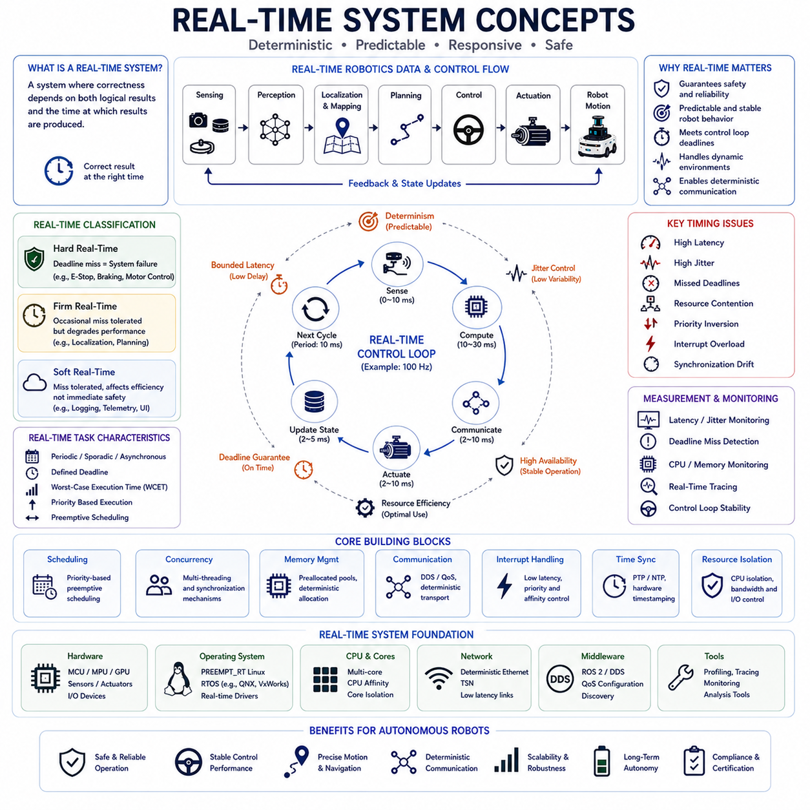
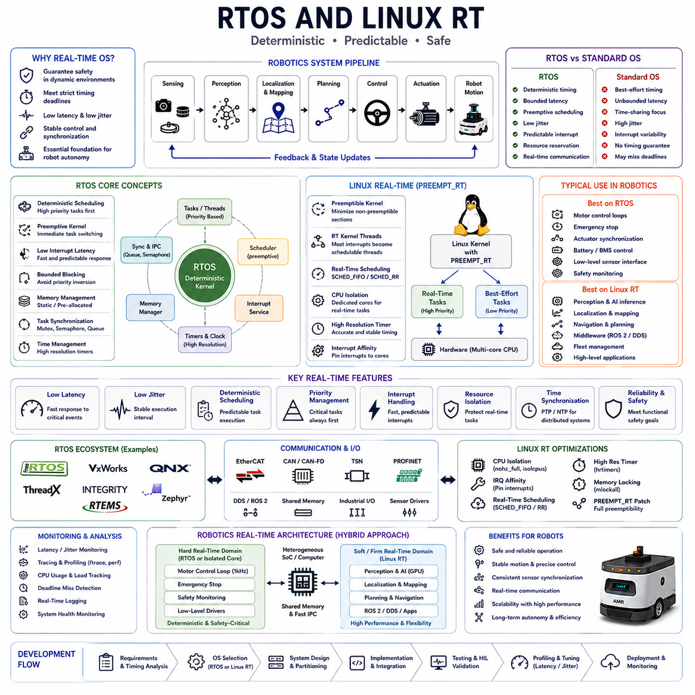
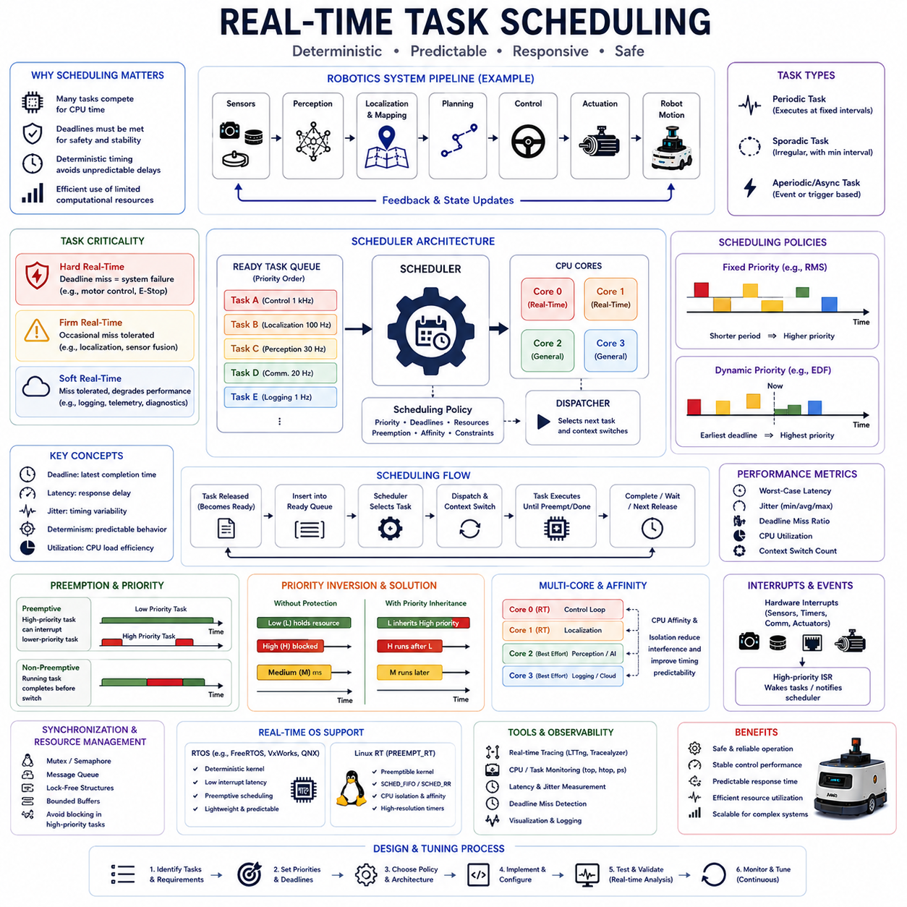
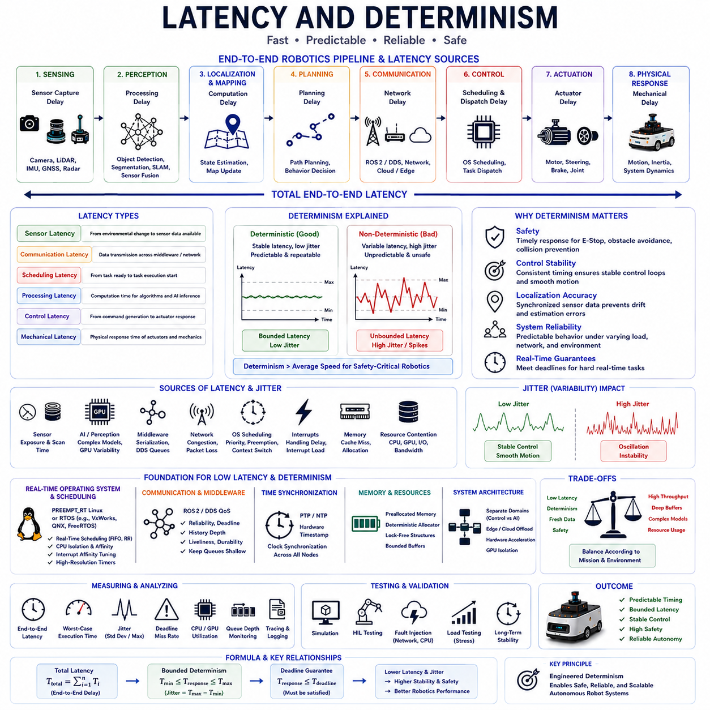
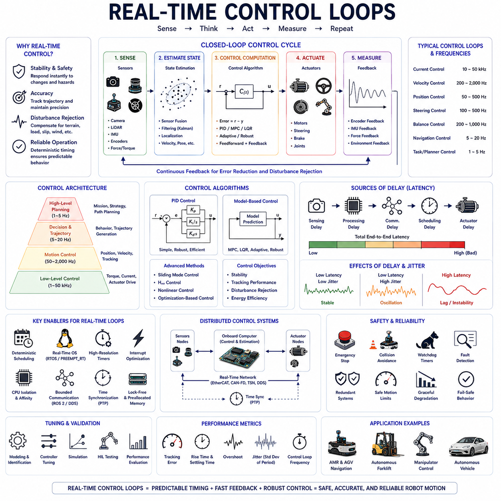
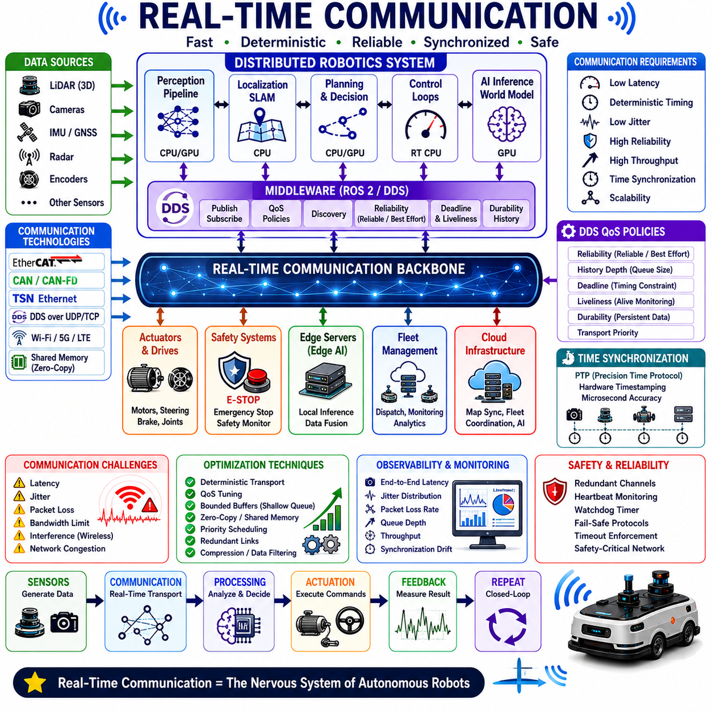
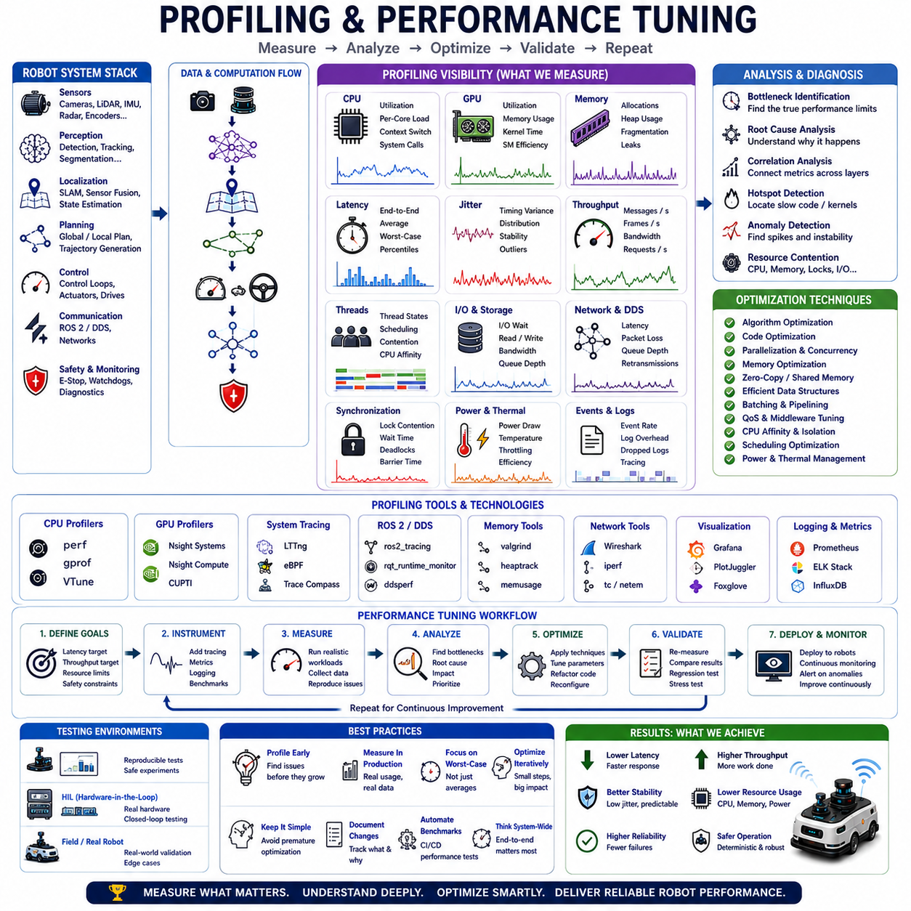
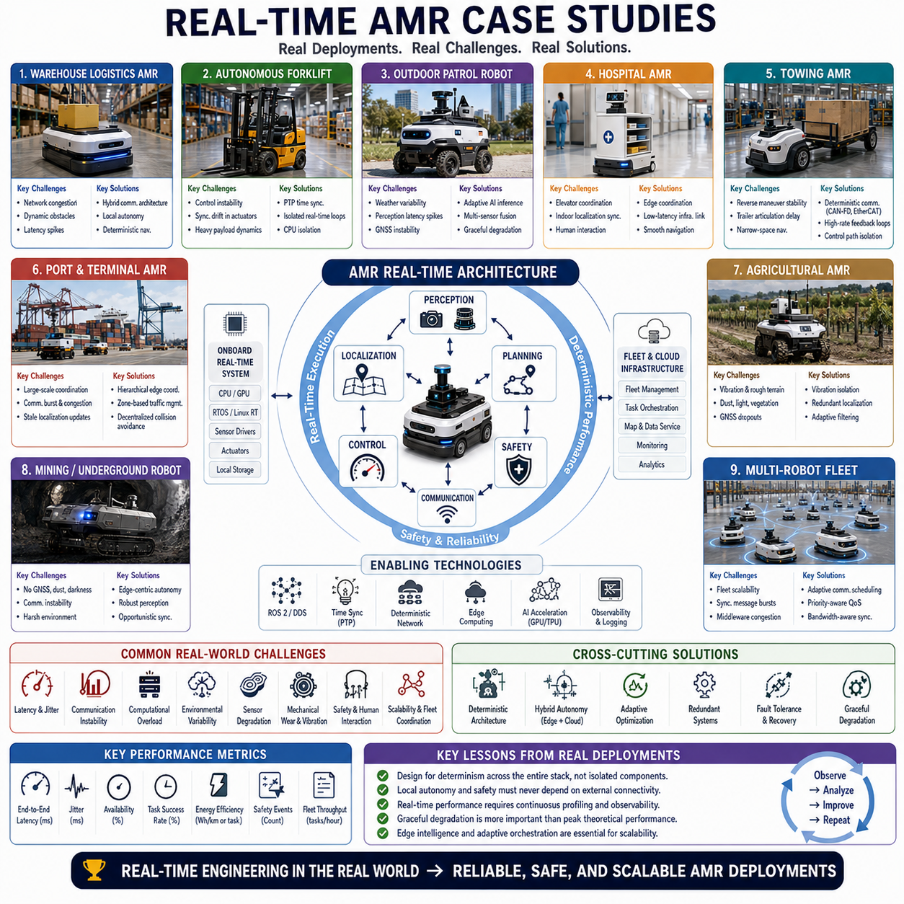

# Chapter 05. Real-Time Systems

## 05.1 Real-Time System Concepts

{width="7.268055555555556in" height="7.268055555555556in"}

"05_01_Real_Time_System_Concepts" is one of the most fundamental engineering subjects in modern autonomous robotics because real-time systems form the operational foundation enabling robots to interact safely, predictably, and reliably with dynamic physical environments. In industrial AMRs, autonomous forklifts, outdoor patrol robots, hospital service robots, towing robots, logistics automation platforms, and AI-enabled robotic infrastructures, sensing, perception, planning, localization, navigation, control, and safety systems must continuously operate within strict timing constraints. Unlike conventional desktop computing systems where throughput and average performance are often prioritized, real-time robotic systems focus on deterministic timing behavior, bounded latency, predictable scheduling, and guaranteed responsiveness. Real-time concepts therefore become essential for building stable autonomous systems capable of long-term operation in safety-critical real-world environments.

A real-time system can be defined as a computational system whose correctness depends not only on logical computation accuracy but also on the timing at which results are produced. In traditional computing systems, delayed computation may merely reduce user convenience. In autonomous robotics, however, timing failure may directly affect physical safety and operational stability. If obstacle detection arrives too late, the robot may collide with a pedestrian. If actuator commands are delayed, motion control stability may degrade. If localization updates become stale, navigation behavior may drift. Real-time robotics therefore requires both computational correctness and timing correctness simultaneously.

One of the most important principles in real-time systems is determinism. Determinism refers to the ability of a system to maintain predictable timing behavior under varying operational conditions. In deterministic robotics systems, developers can estimate worst-case execution timing, communication delay, scheduling latency, and response behavior with high confidence. Deterministic operation becomes critically important because autonomous robots interact directly with physical environments where delayed or inconsistent responses may create dangerous conditions.

Real-time systems are often classified into hard real-time, firm real-time, and soft real-time categories according to the severity of timing violations. Hard real-time systems require strict timing guarantees where missing deadlines is considered catastrophic. Safety-critical actuator control, emergency stop systems, braking controllers, collision avoidance systems, and motor synchronization loops often belong to this category. Missing a control deadline may directly result in unstable robot motion or hazardous operational behavior.

Firm real-time systems tolerate occasional timing violations but experience significant degradation when deadlines are missed frequently. Localization updates, sensor fusion pipelines, navigation planners, and obstacle tracking systems often fall into this category. Occasional delay may not immediately create catastrophic failure, but repeated timing instability degrades operational quality and autonomy performance.

Soft real-time systems prioritize responsiveness but tolerate variable timing behavior without severe operational consequences. Cloud synchronization, telemetry upload, diagnostics reporting, logging systems, user interface updates, and non-critical AI analytics workloads often belong to this category. While performance degradation may reduce efficiency or user experience, it does not necessarily compromise immediate operational safety.

Timing predictability represents the central engineering objective in real-time robotics systems. Many conventional computing optimizations prioritize maximizing average throughput or overall resource utilization. However, real-time systems care primarily about worst-case execution timing and bounded latency. A robotics control loop running at 100 Hz cannot tolerate occasional 500-millisecond delays even if average performance remains fast. Stable deterministic timing is therefore often more important than maximum computational throughput.

Latency is one of the most fundamental concepts in real-time systems engineering. Latency refers to the delay between an event occurrence and the system response. In robotics, latency accumulates across sensing, communication, serialization, middleware transport, operating system scheduling, application processing, AI inference, and actuator control stages. Excessive latency may destabilize control loops, delay obstacle avoidance behavior, degrade localization accuracy, or reduce robot responsiveness in dynamic environments.

Jitter is equally important. Jitter refers to variability in timing intervals between consecutive operations. Even when average latency remains relatively low, inconsistent timing behavior may significantly destabilize robotics systems. Motion controllers require stable update frequencies. Sensor fusion pipelines require synchronized timestamps. Localization algorithms depend on consistent sensor timing. Excessive jitter therefore often becomes more dangerous than slightly elevated average latency.

Scheduling forms another foundational component of real-time systems architecture. Multiple computational tasks compete continuously for limited CPU resources. Real-time scheduling algorithms determine how processor time is allocated among sensing pipelines, control loops, communication handlers, AI inference workloads, diagnostics systems, and background processes. Poor scheduling architecture may allow non-critical workloads to interfere with safety-critical operations.

Priority-based scheduling is commonly used in robotics systems to ensure that time-sensitive tasks receive computational resources before lower-priority workloads. Motor control loops, emergency stop handlers, and safety monitors typically execute with the highest scheduling priority. Less critical workloads such as cloud telemetry, data logging, and diagnostics analysis operate at lower priority levels. Real-time schedulers must carefully balance responsiveness, fairness, resource utilization, and system stability.

Task deadlines are another essential real-time systems concept. A deadline represents the latest acceptable completion time for a computational operation. Real-time tasks may execute periodically, sporadically, or asynchronously depending on operational requirements. Motion control loops often execute periodically at fixed frequencies such as 100 Hz or 1000 Hz. Sensor events may arrive asynchronously according to environmental conditions. Emergency interrupts may occur unpredictably and require immediate response.

Deadline monitoring becomes especially important in industrial robotics systems. Missed deadlines may indicate computational overload, scheduling instability, resource contention, memory fragmentation, transport congestion, or software architecture failure. Real-time monitoring systems therefore continuously measure execution timing, response latency, and scheduling consistency to ensure operational stability.

Concurrency and parallelism play major roles in real-time robotics engineering. Modern autonomous robots execute numerous workloads simultaneously including perception pipelines, localization algorithms, navigation planners, control systems, communication infrastructure, diagnostics monitoring, and AI inference frameworks. Multi-threading and multi-core processing improve computational throughput but also introduce synchronization complexity, race conditions, deadlocks, cache contention, and timing unpredictability.

Thread synchronization mechanisms such as mutexes, semaphores, condition variables, lock-free queues, atomic operations, and shared memory coordination must therefore be designed carefully to preserve deterministic behavior. Improper synchronization may introduce priority inversion, blocking latency, or unpredictable execution timing. Real-time robotics software frequently minimizes blocking operations and adopts non-blocking communication architectures whenever possible.

Operating systems strongly influence real-time behavior. Conventional desktop operating systems prioritize fairness and throughput rather than deterministic responsiveness. Standard Linux kernels may introduce unpredictable scheduling latency, interrupt handling variability, and memory management delays unsuitable for strict real-time robotics workloads. Industrial robotics platforms therefore frequently adopt PREEMPT_RT Linux kernels, real-time scheduling policies, CPU isolation techniques, deterministic memory allocation strategies, and interrupt affinity tuning.

Real-Time Operating Systems (RTOS) are specifically designed to provide deterministic scheduling and bounded response timing. RTOS architectures minimize interrupt latency, scheduling overhead, context switching variability, and unpredictable kernel behavior. Many embedded robotics controllers use specialized RTOS platforms for motor control, safety processing, sensor synchronization, and deterministic communication handling.

Communication infrastructure also plays a major role in real-time systems performance. Distributed robotics systems continuously exchange sensor streams, localization updates, navigation commands, actuator signals, diagnostics telemetry, and synchronization messages. Communication latency, packet loss, jitter, serialization overhead, network congestion, and transport scheduling all affect operational timing stability. DDS middleware and ROS2 communication architecture therefore include QoS mechanisms supporting deterministic communication behavior.

Memory management becomes critically important in real-time systems engineering. Dynamic memory allocation introduces unpredictable execution timing due to heap fragmentation, allocator contention, and garbage collection overhead. Industrial robotics platforms therefore frequently use preallocated memory pools, deterministic allocators, bounded queues, and static resource management strategies to improve timing predictability.

Cache behavior also significantly affects real-time performance. Modern processors rely heavily on hierarchical cache systems to improve computational efficiency. However, cache misses, memory contention, and shared resource interference may introduce timing variability. Real-time robotics systems often optimize memory layout, thread affinity, and cache locality to reduce worst-case execution latency.

Interrupt handling represents another foundational real-time concept. Sensors, actuators, network interfaces, timers, and hardware peripherals generate interrupts requiring immediate processing. Excessive interrupt load or poor interrupt prioritization may destabilize scheduling behavior and introduce communication jitter. Real-time systems therefore carefully manage interrupt affinity, interrupt coalescing, and hardware scheduling policies.

Time synchronization is especially important in distributed robotics systems. Multi-sensor fusion requires tightly synchronized timestamps across cameras, LiDARs, IMUs, GNSS receivers, radar systems, and actuator feedback channels. Even small synchronization drift may degrade localization accuracy and perception consistency. Real-time robotics platforms therefore often use PTP, NTP, hardware timestamping, GNSS synchronization, and deterministic clock distribution architectures.

Control loops form one of the most visible applications of real-time systems concepts. Robotics controllers continuously measure sensor feedback, compute control outputs, and command actuators at fixed frequencies. Control loop timing directly influences motion stability, steering accuracy, braking behavior, suspension response, and actuator synchronization. Irregular timing may destabilize closed-loop control behavior and create oscillatory motion.

AI-native robotics architectures are significantly increasing real-time systems complexity. Modern autonomous robots increasingly integrate deep learning inference, multimodal perception, semantic mapping, collaborative AI agents, world models, and distributed reasoning infrastructure. AI workloads often exhibit highly variable computational behavior, making deterministic scheduling more difficult. Real-time systems engineering must therefore evolve to support GPU scheduling, accelerator coordination, AI workload isolation, and adaptive computational orchestration.

Edge computing and cloud robotics further expand real-time systems complexity. Modern robotics workloads may distribute computation across onboard processors, edge GPU servers, cloud infrastructure, fleet orchestration systems, and remote AI platforms. Real-time coordination across distributed computational infrastructure requires sophisticated communication scheduling, latency optimization, synchronization management, and fault-tolerant orchestration.

Energy management also influences real-time behavior. Battery-powered autonomous robots operate under constrained power budgets while executing computationally intensive workloads. Dynamic voltage scaling, thermal throttling, power-aware scheduling, and energy optimization mechanisms may affect execution timing. Real-time systems engineering must therefore balance computational performance, thermal management, battery efficiency, and deterministic operation simultaneously.

Observability and monitoring are essential for maintaining real-time operational stability. Developers continuously monitor latency distribution, jitter behavior, CPU utilization, scheduling consistency, transport timing, synchronization drift, memory usage, and control loop stability. Real-time profiling tools, tracing frameworks, middleware telemetry systems, and distributed observability infrastructure provide critical insight into system behavior under operational conditions.

Simulation and hardware-in-the-loop testing are widely used to validate real-time system behavior before deployment into physical environments. Controlled testing environments allow developers to measure worst-case timing behavior, validate deadline guarantees, inject faults, analyze scheduling stability, and optimize computational architecture under reproducible conditions.

Functional safety represents one of the strongest motivations behind real-time systems engineering in autonomous robotics. Industrial AMRs operate near humans, vehicles, machinery, and public infrastructure where timing failures may create physical hazards. Delayed braking commands, stale localization updates, unstable control loops, synchronization drift, or communication congestion may directly compromise operational safety. Real-time systems therefore directly support functional safety certification, reliability engineering, and regulatory compliance.

One of the most important long-term trends in robotics engineering is the convergence of real-time systems, distributed AI infrastructure, cloud-edge orchestration, accelerator computing, and autonomous reasoning architectures into unified intelligent computational ecosystems. Future robotics systems may dynamically allocate computational resources, optimize scheduling policies, adapt communication timing, predict overload conditions, and autonomously maintain deterministic operational behavior under highly dynamic workloads.

As industrial autonomous robotics continues evolving toward large-scale AI-native distributed infrastructures, real-time systems concepts will remain one of the most fundamental engineering foundations underlying future robotics software architecture. The principles of deterministic execution, bounded latency, jitter reduction, priority-aware scheduling, synchronization consistency, fault-tolerant timing control, adaptive computational orchestration, and safety-critical responsiveness will continue guiding the development of next-generation autonomous mobile robot platforms capable of reliable long-term operation in increasingly complex real-world environments.

## 05.2 RTOS and Linux RT

{width="7.268055555555556in" height="7.268055555555556in"}

"05_02_RTOS_and_Linux_RT" is one of the most important engineering subjects in modern autonomous robotics because real-time operating systems and deterministic Linux platforms form the computational foundation enabling industrial robots to operate safely, predictably, and reliably under strict timing constraints. In autonomous mobile robots, industrial AMRs, autonomous forklifts, patrol robots, towing robots, collaborative robots, and distributed AI robotics infrastructures, software execution timing directly influences motion stability, localization accuracy, actuator synchronization, communication reliability, and operational safety. Unlike conventional desktop computing systems that prioritize throughput and user responsiveness, robotics platforms require deterministic scheduling, bounded latency, interrupt predictability, and stable execution timing under continuously changing workloads. RTOS platforms and Linux real-time architectures therefore become essential technologies supporting modern robotic autonomy.

A Real-Time Operating System, commonly referred to as RTOS, is an operating system specifically designed to provide deterministic execution behavior and predictable scheduling under timing-critical conditions. The primary purpose of an RTOS is not necessarily maximizing computational throughput but ensuring that critical tasks complete within guaranteed timing constraints. In robotics systems, missing execution deadlines may destabilize motion controllers, delay emergency braking, disrupt sensor synchronization, or compromise safety-critical behaviors. RTOS architectures therefore prioritize timing correctness and deterministic responsiveness above average-case performance optimization.

Traditional desktop operating systems such as standard Linux, Windows, or macOS are optimized primarily for fairness, throughput, multitasking flexibility, and user interactivity. These systems are highly effective for general-purpose computing but may introduce unpredictable scheduling latency, interrupt handling delays, memory allocation variability, and non-deterministic execution timing. While such variability may be acceptable in office software or web applications, it becomes problematic in autonomous robotics systems operating in physical environments where delayed response may create hazardous conditions.

One of the most important concepts in RTOS engineering is deterministic scheduling. Deterministic scheduling refers to the ability of the operating system to guarantee predictable task execution timing regardless of fluctuating system load. In robotics platforms, motor control loops, emergency stop handlers, actuator synchronization pipelines, sensor acquisition systems, and communication schedulers require tightly bounded execution timing. Deterministic scheduling ensures that high-priority real-time tasks receive CPU resources immediately when required.

Latency represents one of the most critical performance metrics in RTOS environments. Latency refers to the delay between an event occurrence and the corresponding system response. In robotics systems, latency accumulates across interrupt handling, thread scheduling, middleware transport, communication infrastructure, application execution, AI inference, and actuator control stages. Excessive latency may destabilize control loops, delay obstacle avoidance responses, or degrade localization accuracy. RTOS platforms therefore focus heavily on minimizing worst-case latency rather than simply improving average throughput.

Jitter reduction is equally important in real-time operating systems. Jitter refers to variability in execution timing between consecutive operations. Motion control systems, synchronized sensor pipelines, localization algorithms, and deterministic communication frameworks all depend heavily on stable execution intervals. Even relatively small timing variability may introduce oscillatory motion, synchronization drift, inconsistent actuator behavior, or unstable robot control. RTOS architectures therefore aim to minimize timing variability across all critical execution pathways.

Preemptive scheduling forms one of the core architectural mechanisms of modern RTOS platforms. In preemptive scheduling systems, high-priority tasks may interrupt lower-priority tasks immediately when necessary. This ensures that safety-critical or time-sensitive operations receive processor attention without unnecessary delay. Motor control interrupts, emergency braking handlers, and safety monitoring systems typically execute at extremely high priority levels in robotics platforms.

Priority management becomes critically important in real-time operating systems. Tasks are typically assigned priorities according to operational criticality and timing sensitivity. High-priority tasks such as actuator control, sensor synchronization, emergency stop processing, and safety monitoring receive CPU resources before lower-priority workloads such as logging, cloud telemetry, diagnostics reporting, or non-critical AI analytics. Improper priority configuration may create scheduling instability or resource starvation.

Priority inversion represents one of the most important challenges in RTOS engineering. Priority inversion occurs when a low-priority task blocks a high-priority task due to shared resource contention. This may create dangerous timing delays in robotics systems. RTOS architectures therefore often implement priority inheritance protocols, lock-free synchronization mechanisms, bounded critical sections, and deterministic resource management to minimize blocking behavior.

Interrupt handling is another foundational component of RTOS architecture. Hardware devices including sensors, actuators, network controllers, timers, and communication interfaces generate interrupts requiring immediate response. Standard operating systems may delay interrupt handling due to scheduling overhead or kernel complexity. RTOS platforms minimize interrupt latency and provide deterministic interrupt response behavior essential for robotics applications.

Context switching performance strongly influences RTOS responsiveness. Context switching refers to the operating system operation of suspending one task and resuming another. Excessive context switching overhead increases scheduling latency and timing unpredictability. RTOS kernels are therefore designed with lightweight schedulers, optimized interrupt pathways, deterministic task management, and minimal kernel overhead.

Task synchronization mechanisms require careful engineering in real-time systems. Multiple robotics software components often execute concurrently while sharing memory regions, communication queues, sensor data buffers, and hardware interfaces. Synchronization primitives including mutexes, semaphores, event flags, condition variables, message queues, and lock-free structures must preserve deterministic behavior while preventing race conditions and deadlocks.

Memory management also plays a critical role in RTOS reliability. Dynamic memory allocation introduces non-deterministic execution timing due to heap fragmentation, allocator contention, and unpredictable allocation latency. Many industrial robotics systems therefore avoid runtime heap allocation entirely within critical control pathways. RTOS applications frequently use preallocated memory pools, static buffers, deterministic allocators, and bounded resource management strategies.

Embedded robotics controllers commonly use specialized RTOS platforms such as FreeRTOS, VxWorks, QNX, ThreadX, Integrity, Zephyr, or RTEMS. These operating systems are optimized for deterministic execution, low interrupt latency, small memory footprint, and predictable scheduling behavior. Embedded RTOS platforms are widely used for motor controllers, actuator synchronization, battery management systems, safety processors, low-level sensor interfaces, and communication gateways.

However, modern autonomous robotics systems increasingly require far more computational capability than traditional embedded RTOS environments can provide. AI perception pipelines, semantic mapping, localization frameworks, distributed communication systems, deep learning inference engines, and cloud-edge orchestration architectures require advanced software ecosystems and high-performance computational infrastructure. Standard embedded RTOS platforms alone are often insufficient for supporting such complex workloads.

Linux has therefore become one of the dominant operating system foundations for modern robotics development due to its scalability, hardware support, open-source ecosystem, networking capabilities, middleware compatibility, AI infrastructure integration, and development flexibility. ROS2, DDS middleware, GPU acceleration frameworks, deep learning toolchains, cloud infrastructure, and distributed orchestration systems all integrate naturally with Linux environments.

However, standard Linux kernels are not inherently deterministic. Conventional Linux scheduling behavior may introduce unpredictable latency due to interrupt handling complexity, deferred kernel processing, background services, scheduler fairness algorithms, memory management variability, and non-preemptive kernel sections. Real-time robotics workloads therefore often require Linux real-time extensions.

PREEMPT_RT represents one of the most important technologies in Linux real-time engineering. PREEMPT_RT is a real-time patchset that transforms the standard Linux kernel into a highly preemptible deterministic operating system suitable for many industrial robotics workloads. PREEMPT_RT reduces scheduling latency, minimizes interrupt blocking, converts many interrupt handlers into schedulable threads, improves deterministic scheduling behavior, and significantly reduces worst-case execution latency.

The PREEMPT_RT kernel enables Linux to support many real-time robotics applications while preserving compatibility with the broader Linux software ecosystem. ROS2 middleware, DDS communication frameworks, AI inference engines, GPU drivers, network stacks, and industrial robotics software can operate within a real-time Linux environment while benefiting from deterministic scheduling improvements.

Thread affinity configuration becomes especially important in Linux real-time robotics systems. Modern multi-core processors execute numerous workloads simultaneously including perception pipelines, localization frameworks, AI inference engines, middleware communication threads, diagnostics systems, and control loops. CPU isolation techniques allow developers to reserve dedicated processor cores for time-sensitive workloads while isolating non-critical background processing onto separate cores.

Real-time scheduling classes in Linux further improve deterministic execution behavior. Linux provides scheduling policies such as SCHED_FIFO and SCHED_RR allowing real-time tasks to execute with higher scheduling priority than standard processes. Safety-critical robotics workloads frequently operate under dedicated real-time scheduling policies while non-critical applications remain under conventional fair scheduling behavior.

Interrupt affinity tuning is another important optimization strategy in Linux RT environments. Hardware interrupts generated by network controllers, sensors, storage devices, timers, and communication interfaces may interfere with deterministic scheduling behavior. Assigning interrupts to specific CPU cores reduces contention and improves timing consistency for critical robotics tasks.

High-resolution timers are essential for deterministic robotics scheduling. Robotics control loops often require execution frequencies ranging from hundreds to thousands of Hertz. Accurate timer infrastructure allows precise scheduling of actuator updates, sensor synchronization, middleware communication, and control loop execution. Linux RT kernels significantly improve timer precision and scheduling consistency.

Real-time communication infrastructure is tightly connected to RTOS and Linux RT behavior. DDS middleware, ROS2 executors, shared memory transport, Ethernet networking, TSN infrastructure, and industrial communication buses all rely heavily on deterministic operating system scheduling. Communication jitter, transport latency, packet loss, or callback execution delays may directly affect robot responsiveness and control stability.

Industrial Ethernet protocols such as EtherCAT, PROFINET, TSN, and CAN-FD are frequently integrated into RTOS and Linux RT robotics platforms. These protocols provide deterministic communication behavior required for synchronized actuator control, distributed sensor acquisition, and industrial automation infrastructure.

Time synchronization is especially important in distributed robotics systems operating across multiple processors, embedded controllers, sensors, and communication networks. PTP, NTP, hardware timestamping, synchronized DDS transport, and deterministic clock distribution architectures maintain temporal consistency across distributed computational infrastructure.

AI-native robotics architectures are dramatically increasing RTOS and Linux RT complexity. Modern autonomous robots increasingly integrate deep learning inference, multimodal perception, semantic world models, collaborative AI agents, cloud-edge orchestration, and distributed GPU acceleration frameworks. AI workloads often exhibit highly variable computational behavior incompatible with strict deterministic scheduling.

Future robotics systems therefore increasingly adopt hybrid computational architectures where strict real-time control loops operate on dedicated RTOS or isolated Linux RT cores while computationally intensive AI workloads execute on separate GPU infrastructure or best-effort processing domains. Coordinating these heterogeneous execution environments becomes one of the central engineering challenges in modern robotics software architecture.

Energy management also influences real-time operating system behavior. Autonomous robots operate under battery constraints while executing computationally intensive workloads. Thermal throttling, dynamic voltage scaling, power-aware scheduling, and accelerator coordination may all affect execution timing and scheduling predictability. RTOS and Linux RT systems therefore increasingly integrate power-aware deterministic scheduling mechanisms.

Observability and profiling are essential for validating real-time system performance. Developers continuously monitor scheduling latency, interrupt response timing, CPU utilization, thread execution behavior, communication jitter, memory fragmentation, transport delay, and synchronization stability. Real-time tracing frameworks, kernel instrumentation tools, middleware telemetry systems, and distributed observability infrastructure provide critical insight into operational timing behavior.

Simulation and hardware-in-the-loop testing environments are widely used to validate RTOS and Linux RT system behavior before deployment into physical robotic platforms. Controlled testing allows engineers to measure worst-case execution latency, validate deadline guarantees, analyze fault recovery behavior, and optimize scheduling architecture under reproducible conditions.

Functional safety remains one of the strongest motivations behind RTOS and Linux RT engineering in autonomous robotics. Industrial AMRs operate near humans, vehicles, industrial equipment, and public infrastructure where timing failure may create physical hazards. Delayed braking commands, unstable actuator synchronization, missed control deadlines, communication congestion, or scheduling instability may directly compromise operational safety.

As industrial autonomous robotics systems continue evolving toward highly distributed AI-native infrastructures, RTOS and Linux RT technologies will remain among the most fundamental engineering foundations underlying future robotics software architecture. The principles of deterministic scheduling, bounded latency, low-jitter execution, priority-aware task management, synchronized communication, fault-tolerant timing control, adaptive computational orchestration, and safety-critical responsiveness will continue guiding the development of next-generation autonomous mobile robot platforms capable of reliable long-term operation in increasingly complex real-world environments.

## 05.3 Real-Time Task Scheduling

{width="7.268055555555556in" height="7.268055555555556in"}

"05_03_Real_Time_Task_Scheduling" is one of the most important engineering subjects in modern autonomous robotics because task scheduling determines how computational resources are allocated among the many concurrent workloads operating inside a robot. In industrial AMRs, autonomous forklifts, logistics robots, patrol robots, collaborative robots, medical robots, and AI-native robotic platforms, numerous tasks continuously compete for processor time including sensor acquisition, localization, perception, navigation, communication, actuator control, diagnostics, safety monitoring, AI inference, fleet coordination, and cloud synchronization. Real-time task scheduling therefore becomes the central mechanism that determines whether autonomous robots can operate safely, deterministically, and reliably under dynamic real-world conditions.

Unlike conventional desktop computing systems where maximizing throughput and user responsiveness are often primary objectives, real-time robotics systems prioritize deterministic execution timing, bounded latency, predictable response behavior, and deadline satisfaction. A robotics control system cannot simply execute tasks "eventually." Critical operations must execute within strict timing constraints because delayed computation may directly affect physical safety. If emergency braking tasks are delayed by low-priority background workloads, hazardous conditions may emerge. If sensor synchronization tasks miss deadlines, localization accuracy may degrade. Real-time task scheduling therefore forms one of the foundational pillars of robotics system stability.

A task in real-time systems refers to a schedulable computational unit representing a specific operation or workload. Tasks may execute periodically, sporadically, or asynchronously depending on operational requirements. Periodic tasks execute at fixed frequencies such as motor control loops operating at 1000 Hz or localization updates running at 100 Hz. Sporadic tasks occur irregularly but with minimum arrival intervals. Emergency stop handlers, collision alerts, and obstacle detection interrupts often belong to this category. Asynchronous tasks execute according to external events or software triggers without predefined timing intervals.

One of the most important concepts in real-time task scheduling is determinism. Deterministic scheduling refers to the ability of the system to maintain predictable execution timing under varying computational loads. In deterministic systems, developers can estimate worst-case response latency, scheduling delay, execution timing, and deadline satisfaction with high confidence. Determinism is essential because autonomous robots interact directly with physical environments where timing inconsistency may destabilize motion behavior or compromise operational safety.

Deadlines represent one of the core concepts in real-time scheduling theory. A deadline defines the latest acceptable completion time for a task. Missing deadlines may degrade operational performance or create hazardous conditions depending on task criticality. Motion control loops often require extremely strict deadlines because delayed actuator updates may destabilize robot movement. Localization pipelines require timely sensor synchronization to maintain navigation accuracy. Communication handlers require bounded latency to preserve distributed system coordination.

Real-time tasks are commonly classified according to timing criticality. Hard real-time tasks require absolute deadline guarantees. Missing a deadline in a hard real-time system may directly create unsafe operating conditions. Motor control loops, emergency braking handlers, actuator synchronization tasks, and safety monitoring systems typically belong to this category. Firm real-time tasks tolerate occasional deadline misses but experience performance degradation when misses become frequent. Localization updates, sensor fusion pipelines, and obstacle tracking systems often fall into this category. Soft real-time tasks prioritize responsiveness but tolerate variable timing behavior. Diagnostics reporting, telemetry upload, logging systems, and non-critical cloud communication often operate under soft real-time constraints.

Priority-based scheduling forms one of the most widely used approaches in real-time robotics systems. In priority-based scheduling architectures, tasks receive execution priority according to timing sensitivity and operational importance. Safety-critical tasks receive the highest priority while background processing executes at lower priority levels. High-priority tasks may preempt lower-priority tasks immediately when required. This ensures that time-sensitive workloads receive processor attention without unnecessary delay.

Preemptive scheduling is especially important in robotics systems because autonomous robots must react immediately to changing environmental conditions. If a robot detects a pedestrian entering its path, emergency braking tasks must interrupt less critical workloads instantly. Preemptive schedulers allow urgent tasks to suspend lower-priority execution and gain immediate access to CPU resources. Non-preemptive scheduling systems, in contrast, may introduce unacceptable response delays because running tasks cannot be interrupted until completion.

Rate Monotonic Scheduling (RMS) is one of the classical fixed-priority real-time scheduling algorithms widely studied in robotics engineering. RMS assigns higher priority to tasks with shorter execution periods. Tasks executing at higher frequencies therefore receive higher scheduling priority. Motor control loops operating at 1000 Hz receive higher priority than diagnostics tasks operating at 1 Hz. RMS provides strong mathematical guarantees under certain scheduling assumptions and remains influential in embedded robotics systems.

Earliest Deadline First (EDF) scheduling represents another important real-time scheduling strategy. EDF dynamically prioritizes tasks according to the nearest upcoming deadline. Tasks with the earliest deadlines receive processor resources first. EDF often achieves higher processor utilization efficiency than fixed-priority scheduling but may introduce greater implementation complexity and reduced predictability under overload conditions.

Scheduling latency represents one of the most critical performance metrics in real-time systems. Scheduling latency refers to the delay between the moment a task becomes runnable and the moment execution actually begins. Excessive scheduling latency may destabilize control systems, delay obstacle avoidance responses, or degrade synchronization accuracy. Robotics platforms therefore continuously monitor worst-case scheduling latency to ensure deterministic operational behavior.

Jitter is equally important in task scheduling engineering. Jitter refers to variability in execution timing between consecutive task activations. Even when average latency remains relatively low, inconsistent scheduling intervals may destabilize robotics systems. Motion controllers require stable execution frequency. Sensor fusion pipelines require synchronized timestamps. Localization algorithms depend heavily on consistent timing behavior. Excessive jitter may therefore become more dangerous than slightly elevated average latency.

Context switching overhead strongly influences scheduling performance. Context switching occurs when the operating system suspends one task and resumes another. Excessive context switching increases CPU overhead, cache invalidation, memory contention, and timing variability. Real-time operating systems therefore optimize scheduler efficiency, interrupt handling pathways, and thread management infrastructure to minimize scheduling overhead.

Priority inversion represents one of the most important scheduling challenges in robotics systems. Priority inversion occurs when a low-priority task blocks a higher-priority task due to shared resource contention. For example, if a low-priority logging thread holds a shared mutex required by a high-priority safety controller, critical safety operations may become delayed. Real-time systems therefore implement mechanisms such as priority inheritance protocols, lock-free data structures, bounded critical sections, and deterministic synchronization primitives.

Task synchronization mechanisms play a central role in scheduling architecture. Multiple robotics tasks frequently share sensor buffers, communication queues, localization states, navigation maps, and actuator interfaces. Synchronization primitives including mutexes, semaphores, event flags, message queues, condition variables, atomic operations, and lock-free structures coordinate concurrent access while preventing race conditions and deadlocks.

However, synchronization itself may introduce scheduling instability if designed improperly. Blocking operations may delay higher-priority tasks. Excessive mutex contention may create unpredictable latency spikes. Real-time robotics software therefore often minimizes blocking synchronization and favors non-blocking communication mechanisms whenever possible.

Multi-core processors have dramatically increased scheduling complexity in modern robotics systems. Contemporary autonomous robots frequently execute workloads across multiple CPU cores, GPU accelerators, edge computing platforms, and distributed computational infrastructure. Multi-core scheduling improves computational throughput but introduces cache contention, memory bandwidth competition, synchronization overhead, and execution timing unpredictability.

CPU affinity management therefore becomes critically important in real-time robotics scheduling. CPU affinity allows developers to bind specific tasks or threads to dedicated processor cores. Safety-critical control loops may operate on isolated cores while AI inference pipelines execute separately on non-real-time cores. CPU isolation techniques significantly improve timing predictability and reduce interference between heterogeneous workloads.

Interrupt handling also strongly influences real-time scheduling behavior. Sensors, network controllers, timers, actuators, storage devices, and communication interfaces generate interrupts requiring immediate response. Excessive interrupt load or poorly configured interrupt affinity may destabilize scheduling behavior and increase jitter. Real-time systems therefore carefully optimize interrupt routing, interrupt coalescing, hardware prioritization, and interrupt thread scheduling.

Memory management interacts closely with scheduling stability. Dynamic memory allocation introduces unpredictable execution timing due to heap fragmentation, allocator contention, and variable allocation latency. Many industrial robotics systems therefore avoid runtime memory allocation within safety-critical pathways. Preallocated memory pools, deterministic allocators, static buffers, and bounded resource management strategies improve scheduling predictability.

Real-time operating systems such as FreeRTOS, VxWorks, QNX, ThreadX, Zephyr, and RTEMS are specifically designed to provide deterministic scheduling behavior with low interrupt latency and predictable task management. These RTOS platforms are widely used for embedded motor controllers, safety processors, battery management systems, actuator synchronization, and low-level robotics control infrastructure.

Linux-based robotics systems increasingly rely on PREEMPT_RT kernels and real-time scheduling classes such as SCHED_FIFO and SCHED_RR to support deterministic task execution within complex robotics software environments. Linux real-time scheduling enables ROS2 middleware, DDS communication frameworks, AI inference pipelines, and industrial communication infrastructure to coexist with time-sensitive robotics workloads.

ROS2 executors play an especially important role in robotics task scheduling. ROS2 systems contain numerous asynchronous callbacks generated by topic subscriptions, services, actions, timers, lifecycle events, and middleware communication pathways. Executors determine how callbacks are scheduled and executed across available computational resources. Improper executor configuration may introduce callback starvation, scheduling instability, and communication latency spikes.

DDS middleware also significantly influences scheduling behavior in distributed robotics systems. Communication handlers, serialization pipelines, retransmission managers, heartbeat monitors, discovery services, and transport schedulers all compete for CPU resources alongside application-level robotics workloads. Real-time scheduling therefore extends beyond application tasks into middleware infrastructure and network transport management.

Distributed robotics systems introduce additional scheduling complexity because computational workloads are distributed across onboard computers, edge AI servers, cloud infrastructure, fleet orchestration systems, and embedded controllers. Scheduling decisions must therefore coordinate communication timing, synchronization consistency, transport latency, and distributed workload orchestration across heterogeneous computational domains.

AI-native robotics architectures are dramatically increasing real-time scheduling complexity. Deep learning inference engines, multimodal reasoning systems, semantic mapping frameworks, collaborative AI agents, and distributed cognitive architectures generate computational workloads with highly variable execution timing. GPU scheduling, accelerator coordination, tensor transport, memory bandwidth allocation, and AI workload isolation therefore become major scheduling challenges in future robotics systems.

Hybrid scheduling architectures are becoming increasingly common in advanced robotics platforms. Strict hard real-time control loops operate within isolated deterministic execution domains while computationally intensive AI inference workloads execute within best-effort processing environments. Communication bridges coordinate information exchange between deterministic control systems and adaptive AI reasoning infrastructure.

Time synchronization remains critically important in distributed scheduling systems. Cameras, LiDARs, IMUs, radar systems, GNSS receivers, actuator controllers, and communication handlers all generate time-sensitive events requiring coordinated execution timing. PTP, NTP, hardware timestamping, synchronized DDS transport, and deterministic clock distribution architectures help maintain temporal consistency across distributed scheduling infrastructure.

Observability and profiling are essential for validating scheduling behavior in real-time robotics systems. Developers continuously monitor task execution timing, scheduling latency, CPU utilization, interrupt response behavior, callback execution frequency, synchronization stability, deadline misses, queue depth, and communication jitter. Real-time tracing frameworks, kernel instrumentation tools, middleware telemetry systems, and distributed observability infrastructure provide visibility into scheduling dynamics under operational conditions.

Simulation and hardware-in-the-loop testing environments are widely used to evaluate scheduling stability before deployment into physical robots. Controlled testing allows developers to reproduce worst-case workloads, analyze overload conditions, inject communication faults, validate deadline guarantees, and optimize scheduler configuration under repeatable conditions.

Functional safety represents one of the strongest motivations behind real-time scheduling engineering in autonomous robotics. Industrial AMRs operate near humans, vehicles, machinery, and public infrastructure where delayed computation may create hazardous physical conditions. Delayed braking commands, unstable control loops, stale localization updates, scheduling congestion, or synchronization drift may directly compromise operational safety.

One of the most important long-term trends in robotics scheduling architecture is the convergence of deterministic control systems, distributed AI infrastructure, cloud-edge orchestration, accelerator computing, semantic reasoning frameworks, and adaptive workload management into unified intelligent computational ecosystems. Future robotics systems may dynamically optimize scheduling policies according to environmental complexity, AI workload distribution, battery state, thermal conditions, safety requirements, and operational context.

As industrial autonomous robotics systems continue evolving toward large-scale AI-native distributed infrastructures, real-time task scheduling will remain one of the most fundamental engineering foundations underlying future robotics software architecture. The principles of deterministic execution, bounded latency, low-jitter scheduling, priority-aware resource management, synchronized distributed coordination, adaptive computational orchestration, fault-tolerant timing control, and safety-critical responsiveness will continue guiding the development of next-generation autonomous mobile robot platforms capable of reliable long-term operation in increasingly complex real-world environments.

## 05.4 Latency and Determinism

{width="7.268055555555556in" height="7.268055555555556in"}

"05_04_Latency_and_Determinism" is one of the most fundamental engineering subjects in modern autonomous robotics because latency and determinism directly determine whether a robot can safely and reliably interact with dynamic physical environments. In industrial AMRs, autonomous forklifts, collaborative robots, outdoor patrol robots, towing robots, logistics automation systems, and AI-enabled robotic platforms, sensing, perception, localization, planning, communication, and actuator control must all execute within predictable timing constraints. Even highly advanced AI algorithms become operationally unsafe if system responses are delayed or inconsistent. Latency and determinism therefore form the core operational principles underlying real-time robotic autonomy.

Latency refers to the delay between an event occurrence and the resulting system response. In robotics systems, latency exists throughout the entire computational pipeline. Sensor acquisition introduces capture delay. Serialization introduces processing delay. Middleware transport introduces communication delay. Operating system scheduling introduces dispatch latency. AI inference pipelines introduce computational delay. Actuator controllers introduce response delay. Physical mechanical systems introduce motion delay. End-to-end robotics latency therefore represents the accumulated timing delay across many interconnected subsystems operating simultaneously.

Determinism refers to the ability of a system to produce predictable and repeatable timing behavior under varying operational conditions. Deterministic systems maintain bounded latency and stable execution timing even when computational load, communication traffic, environmental complexity, or system utilization fluctuates. In robotics engineering, determinism is often more important than average computational speed because autonomous robots operate within physical environments where inconsistent timing behavior may destabilize motion control or compromise safety.

One of the most important principles in robotics timing engineering is that low average latency alone is insufficient for safe autonomous operation. A robotics system may exhibit excellent average response time while still experiencing occasional latency spikes large enough to destabilize control loops or delay obstacle avoidance behavior. Real-time robotics therefore focuses heavily on worst-case execution timing, latency distribution, jitter analysis, and bounded response guarantees rather than simply maximizing throughput.

Latency in robotics systems can be categorized into multiple forms. Sensor latency refers to the delay between environmental change and sensor data availability. Communication latency refers to the time required for information to travel across middleware, networks, or distributed computational infrastructure. Scheduling latency refers to the delay between task readiness and execution. Processing latency refers to computational execution time. Control latency refers to the delay between command generation and actuator response. Mechanical latency refers to the physical response delay of motors, steering systems, braking systems, or robotic joints.

Sensor latency plays a critical role in robotics responsiveness. Cameras require exposure time, image transfer, and frame synchronization before data becomes available. LiDAR systems require rotational scanning cycles and signal processing. IMUs require filtering and integration. GNSS receivers require signal acquisition and correction computation. Radar systems require waveform analysis and target extraction. Each sensor introduces different latency characteristics that influence overall system timing behavior.

Perception pipelines further increase system latency. Object detection, semantic segmentation, depth estimation, SLAM, sensor fusion, obstacle tracking, and semantic world modeling all require substantial computational processing. Modern AI-native robotics systems increasingly rely on deep neural networks performing complex multimodal reasoning operations. While AI significantly improves environmental understanding, it also increases computational delay and timing variability.

Communication infrastructure introduces another major source of latency in distributed robotics systems. ROS2 middleware, DDS transport, Ethernet communication, wireless networking, cloud synchronization, edge computing coordination, and distributed fleet orchestration all contribute communication delay. Serialization overhead, packet fragmentation, retransmission behavior, network congestion, and synchronization mechanisms may significantly influence transport timing.

Wireless communication environments are especially challenging because latency behavior becomes highly variable under real-world conditions. Interference, fluctuating bandwidth availability, packet loss, multipath fading, roaming behavior, and environmental electromagnetic noise may all introduce unpredictable timing instability. Industrial robotics systems operating in warehouses, ports, hospitals, factories, or outdoor infrastructure must therefore carefully engineer communication pathways to preserve deterministic behavior.

Operating system scheduling significantly affects robotics latency and determinism. Conventional desktop operating systems prioritize fairness and throughput rather than bounded response timing. Standard Linux scheduling may introduce unpredictable scheduling delay, interrupt latency, memory allocation variability, and background process interference. Real-time robotics systems therefore often adopt PREEMPT_RT Linux kernels, RTOS architectures, CPU isolation, interrupt affinity tuning, and real-time scheduling classes.

Jitter represents one of the most important concepts closely related to determinism. Jitter refers to variability in execution timing between consecutive operations. Even when average latency remains relatively low, inconsistent timing behavior may destabilize robotics systems. Motion control loops require stable update intervals. Sensor fusion algorithms require synchronized timestamps. Localization systems require deterministic sensor timing. Excessive jitter may therefore create greater operational instability than slightly elevated average latency.

Control systems are especially sensitive to latency and jitter. Autonomous robots continuously execute closed-loop control cycles involving sensor feedback, control computation, and actuator output generation. Delayed control updates may destabilize steering behavior, braking performance, balancing systems, robotic manipulators, or motion synchronization. Control loop stability therefore depends heavily on bounded latency and deterministic timing behavior.

Feedback control theory demonstrates that delayed response introduces phase lag into dynamic systems. Excessive phase lag may destabilize feedback loops and produce oscillatory motion behavior. Autonomous vehicles, mobile robots, and robotic manipulators therefore require carefully engineered timing consistency to preserve stable control dynamics under varying operational conditions.

Localization systems also depend heavily on deterministic timing. Sensor fusion frameworks combine IMU data, LiDAR scans, GNSS measurements, odometry updates, camera streams, and map information into coherent robot state estimates. Synchronization drift, stale sensor timestamps, delayed updates, or inconsistent timing intervals may significantly degrade localization accuracy. Small timing inconsistencies may accumulate into substantial navigation error over time.

Distributed robotics architectures further increase timing complexity. Modern autonomous systems distribute workloads across onboard processors, GPU accelerators, embedded controllers, edge AI servers, cloud infrastructure, and fleet orchestration platforms. Distributed computational environments require tightly coordinated communication timing, synchronized clocks, deterministic transport behavior, and bounded scheduling latency across heterogeneous systems.

Time synchronization becomes critically important in distributed deterministic systems. Cameras, LiDARs, IMUs, GNSS receivers, radar systems, actuator controllers, and distributed computational nodes all generate time-sensitive events requiring coordinated timing consistency. PTP, NTP, hardware timestamping, synchronized DDS transport, and deterministic clock distribution architectures help maintain temporal alignment across distributed robotics infrastructure.

Middleware architectures such as DDS and ROS2 provide QoS mechanisms supporting deterministic communication behavior. Reliability settings, history depth, deadline policies, liveliness monitoring, durability configuration, and transport scheduling all influence communication latency and determinism. Improper QoS configuration may introduce excessive buffering, retransmission overhead, queue congestion, or synchronization instability.

Buffering represents another important tradeoff in deterministic systems engineering. Large communication buffers may absorb temporary overload conditions but also increase latency and stale data propagation. Real-time robotics systems often intentionally use shallow queues and bounded buffers to prioritize fresh information over historical completeness. In dynamic physical environments, stale sensor data rapidly loses operational value.

Memory management also strongly affects determinism. Dynamic memory allocation introduces unpredictable timing due to heap fragmentation, allocator contention, cache invalidation, and variable allocation latency. Industrial robotics platforms therefore frequently use preallocated memory pools, deterministic allocators, static resource management, and bounded communication structures to improve timing predictability.

Cache behavior significantly influences worst-case execution latency. Modern processors rely heavily on hierarchical cache systems for computational performance. Cache misses, memory contention, shared resource interference, and NUMA effects may introduce substantial timing variability. Real-time robotics systems therefore optimize thread affinity, cache locality, memory layout, and CPU isolation to preserve deterministic execution timing.

Interrupt handling represents another foundational aspect of low-latency deterministic robotics engineering. Sensors, actuators, timers, network interfaces, and communication buses continuously generate interrupts requiring rapid response. Excessive interrupt load or poor interrupt prioritization may increase scheduling latency and timing variability. Real-time operating systems therefore carefully optimize interrupt routing, interrupt affinity, interrupt threading, and hardware scheduling behavior.

GPU acceleration introduces additional complexity into deterministic robotics systems. Deep learning inference, semantic mapping, multimodal perception, and AI reasoning pipelines increasingly depend on GPU computation. However, GPU workloads often exhibit highly variable execution timing due to memory bandwidth contention, kernel scheduling variability, tensor allocation behavior, and asynchronous execution models. Future robotics architectures increasingly separate hard real-time control domains from adaptive AI processing domains to preserve deterministic operational behavior.

Hybrid computational architectures are becoming increasingly common in advanced robotics systems. Safety-critical control loops execute within isolated deterministic environments while computationally intensive AI workloads operate within best-effort execution domains. Communication bridges coordinate information exchange between deterministic control infrastructure and adaptive AI reasoning systems.

Latency optimization requires holistic system engineering rather than isolated software tuning. End-to-end robotics timing depends on hardware architecture, sensor selection, communication infrastructure, middleware configuration, operating system behavior, scheduling policy, network topology, synchronization mechanisms, memory management, and computational workload distribution. Optimizing one subsystem while neglecting others may produce limited improvement.

Observability and timing analysis are essential for validating deterministic behavior. Developers continuously measure end-to-end latency, worst-case execution timing, scheduling delay, communication jitter, interrupt latency, synchronization drift, queue depth, CPU utilization, and transport timing consistency. Real-time tracing frameworks, middleware telemetry systems, kernel instrumentation tools, network analyzers, and distributed observability infrastructure provide visibility into operational timing behavior.

Simulation and hardware-in-the-loop testing environments are widely used to evaluate latency and determinism before deployment into physical robots. Controlled testing allows developers to reproduce worst-case computational loads, inject communication faults, analyze overload behavior, validate timing guarantees, and optimize scheduling architectures under repeatable conditions.

Fault tolerance also depends heavily on deterministic timing infrastructure. Distributed robotics systems must remain operational under network instability, packet loss, overloaded processors, sensor failures, wireless interference, or cloud connectivity disruptions. Deterministic communication pathways and bounded latency behavior improve system resilience and operational stability during abnormal conditions.

Functional safety represents one of the strongest motivations behind latency and determinism engineering in autonomous robotics. Industrial AMRs operate near humans, vehicles, industrial machinery, and public infrastructure where delayed or inconsistent response behavior may create hazardous physical conditions. Delayed braking commands, stale localization data, unstable control loops, communication congestion, or synchronization drift may directly compromise operational safety.

One of the most important long-term trends in robotics engineering is the convergence of deterministic real-time control systems, distributed AI infrastructure, cloud-edge orchestration, accelerator computing, semantic reasoning frameworks, and adaptive workload management into unified intelligent computational ecosystems. Future robotics systems may dynamically optimize communication timing, scheduling policies, resource allocation, and workload orchestration according to environmental complexity, AI workload distribution, safety requirements, thermal conditions, and operational context.

As industrial autonomous robotics systems continue evolving toward highly distributed AI-native infrastructures, latency and determinism will remain among the most fundamental engineering principles underlying future robotics software architecture. The concepts of bounded latency, deterministic scheduling, low-jitter execution, synchronized distributed coordination, adaptive computational orchestration, fault-tolerant timing control, and safety-critical responsiveness will continue guiding the development of next-generation autonomous mobile robot platforms capable of reliable long-term operation in increasingly complex real-world environments.

## 05.5 Real-Time Control Loops

{width="7.268055555555556in" height="7.268055555555556in"}

"05_05_Real_Time_Control_Loops" is one of the most fundamental engineering subjects in modern autonomous robotics because real-time control loops form the dynamic operational core enabling robots to move safely, accurately, and predictably within physical environments. In industrial AMRs, autonomous forklifts, towing robots, outdoor patrol robots, collaborative manipulators, hospital service robots, and AI-enabled robotic platforms, nearly every physical behavior ultimately depends on continuous feedback control loops operating under strict timing constraints. Perception systems may provide environmental understanding, and AI systems may provide decision-making capability, but without stable real-time control loops the robot cannot translate computational intelligence into reliable physical motion. Real-time control therefore represents the direct bridge between software intelligence and mechanical action.

A control loop refers to a cyclic computational process in which sensor measurements are continuously acquired, system state is estimated, control commands are computed, and actuator outputs are applied to physical hardware. The resulting physical response is then measured again through sensors, forming a closed feedback cycle. This feedback architecture allows robots to continuously adapt to changing environmental conditions, compensate for disturbances, maintain stability, and achieve precise motion behavior. Real-time control loops therefore operate as continuous dynamic correction systems rather than one-time command execution mechanisms.

Closed-loop control forms the foundation of modern robotics motion systems. Unlike open-loop systems that assume ideal actuator behavior without feedback verification, closed-loop systems continuously compare desired target states against measured system states. Steering angle controllers compare desired wheel orientation against actual steering feedback. Velocity controllers compare commanded speed against encoder measurements. Position controllers compare target joint position against measured actuator position. The controller continuously adjusts output commands to minimize error between desired and measured states.

One of the most important characteristics of real-time control loops is deterministic timing. Control algorithms must execute at stable and predictable frequencies to maintain system stability. If execution intervals become inconsistent, control dynamics may degrade significantly. Motion controllers operating at 1000 Hz expect control updates every millisecond. If updates occasionally arrive several milliseconds late due to scheduling delay or computational overload, actuator behavior may become unstable. Deterministic timing therefore becomes equally important as control algorithm quality itself.

Control frequency represents one of the central concepts in robotics control engineering. Control loops execute repeatedly at fixed rates depending on system dynamics and operational requirements. Motor current control loops may operate at tens of kilohertz. Velocity control loops commonly operate between hundreds and thousands of Hertz. Position controllers often execute at lower frequencies. Navigation planners may update at only a few Hertz. Higher control frequencies generally improve responsiveness and disturbance rejection capability but also increase computational demand and sensitivity to timing jitter.

Latency directly influences control loop performance. In a robotics control system, latency accumulates across sensing, signal processing, state estimation, middleware transport, scheduling, control computation, communication, actuator response, and physical mechanical motion. Excessive latency introduces delay into the feedback system. Feedback control theory demonstrates that delayed response produces phase lag, which may destabilize dynamic systems and create oscillatory behavior. Autonomous robots therefore require carefully engineered low-latency execution pathways.

Jitter is often even more dangerous than elevated average latency. Jitter refers to variability in control loop timing intervals. Motion controllers depend heavily on stable execution frequency. Inconsistent timing introduces variable dynamic behavior that complicates controller tuning and destabilizes feedback response. Real-time operating systems, deterministic scheduling, interrupt optimization, and bounded communication pathways are therefore essential for minimizing control jitter.

Sensor systems form the input foundation of real-time control loops. Wheel encoders provide rotational feedback for velocity estimation. IMUs measure acceleration and angular velocity. Steering angle sensors provide wheel orientation data. Force sensors monitor actuator loading. LiDAR and camera systems contribute environmental perception for higher-level navigation control. The quality, timing consistency, synchronization accuracy, and latency characteristics of sensor systems directly influence control stability.

State estimation represents another critical component of robotics control loops. Raw sensor measurements alone are often noisy, incomplete, delayed, or inconsistent. State estimation algorithms combine multiple sensor sources to estimate robot position, orientation, velocity, acceleration, wheel slip, actuator state, and environmental interaction conditions. Kalman filters, extended Kalman filters, particle filters, sensor fusion frameworks, and probabilistic estimation algorithms are commonly used to produce stable system state representations for control algorithms.

Control algorithms themselves vary significantly depending on application requirements and system dynamics. PID controllers remain among the most widely used control methods in industrial robotics due to their simplicity, computational efficiency, and practical robustness. Proportional terms respond to instantaneous error magnitude. Integral terms compensate for accumulated steady-state error. Derivative terms damp dynamic oscillation by predicting future error trends. Proper PID tuning remains one of the most important engineering tasks in robotics control systems.

More advanced robotics platforms increasingly use model-based control strategies. Model Predictive Control (MPC), Linear Quadratic Regulators (LQR), adaptive control systems, robust control frameworks, sliding mode controllers, nonlinear control algorithms, and optimization-based trajectory controllers provide improved dynamic performance under complex operational conditions. These advanced methods often require substantially greater computational resources but provide superior disturbance rejection, stability margins, and trajectory tracking capability.

Trajectory tracking forms a major application area for real-time control loops in autonomous robots. Mobile robots continuously compute desired motion trajectories while low-level controllers generate steering, braking, acceleration, and wheel torque commands to follow these trajectories accurately. Trajectory tracking controllers must compensate for terrain variation, wheel slip, actuator saturation, inertia, payload changes, mechanical vibration, and environmental disturbance.

Vehicle dynamics strongly influence control system design. Differential drive robots, Ackermann steering vehicles, omnidirectional platforms, tracked robots, legged systems, and articulated manipulators all exhibit different dynamic behaviors requiring specialized control strategies. Outdoor autonomous vehicles experience additional complexity due to terrain irregularity, slope variation, tire deformation, suspension dynamics, and weather conditions. Real-time control loops must continuously adapt to these changing physical conditions.

Actuator systems represent another major source of control complexity. Electric motors, hydraulic actuators, pneumatic systems, servo drives, braking systems, and steering mechanisms each exhibit unique response dynamics, nonlinearities, saturation behavior, hysteresis, and mechanical delay characteristics. Real-time controllers must account for these physical actuator limitations while maintaining stable and predictable motion behavior.

Distributed control architectures are increasingly common in modern robotics systems. Motor controllers, steering controllers, battery management systems, safety processors, sensor modules, and onboard AI computers often operate as distributed computational nodes communicating through real-time communication networks. EtherCAT, CAN-FD, TSN Ethernet, DDS middleware, and ROS2 communication frameworks coordinate distributed control operations across heterogeneous hardware infrastructure.

Time synchronization becomes critically important in distributed real-time control systems. Multiple sensors, actuators, and computational nodes must maintain consistent temporal alignment to preserve stable control behavior. PTP synchronization, hardware timestamping, deterministic communication scheduling, synchronized DDS transport, and distributed clock architectures help maintain coordinated control timing across robotics infrastructure.

Safety systems represent one of the most critical applications of real-time control loops. Emergency braking systems, obstacle avoidance controllers, collision prevention systems, actuator fault monitors, steering stability controllers, and safe motion limiters all require deterministic low-latency execution. Delayed control response may directly compromise physical safety in environments shared with humans, vehicles, or industrial infrastructure.

Functional safety standards increasingly influence robotics control architecture. Industrial robotics platforms frequently implement redundant safety processors, independent monitoring loops, watchdog timers, deterministic fail-safe mechanisms, and hardware-level emergency override systems. Real-time control loops must therefore integrate tightly with safety supervision infrastructure while maintaining predictable operational behavior.

AI-native robotics architectures are significantly transforming real-time control systems. Traditional robotics controllers operated primarily using hand-engineered mathematical models and deterministic control algorithms. Modern robotics systems increasingly integrate machine learning, adaptive policy optimization, reinforcement learning, semantic world models, and AI-driven predictive control. AI-enhanced control systems may improve environmental adaptability and operational efficiency but also introduce additional timing variability and computational complexity.

Hybrid control architectures are therefore becoming increasingly common. Safety-critical low-level control loops continue operating within deterministic real-time domains while high-level AI reasoning systems provide adaptive guidance, trajectory planning, semantic understanding, and predictive optimization. Communication bridges coordinate information exchange between deterministic control infrastructure and adaptive AI reasoning systems.

GPU acceleration and heterogeneous computing platforms further increase real-time control complexity. AI perception pipelines, semantic mapping frameworks, trajectory optimization engines, and distributed reasoning systems often execute on GPU accelerators while low-level control loops execute on isolated CPU cores or dedicated RTOS processors. Coordinating these heterogeneous computational environments requires careful timing engineering and resource isolation strategies.

Communication latency strongly affects distributed control stability. Excessive network delay, packet loss, jitter, queue congestion, or synchronization drift may destabilize distributed control loops. Industrial robotics systems therefore often prioritize deterministic communication pathways using bounded transport latency, shallow queues, prioritized scheduling, synchronized transport timing, and real-time middleware infrastructure.

Memory management also influences control determinism. Dynamic memory allocation introduces unpredictable latency due to heap fragmentation, allocator contention, and cache variability. Industrial robotics controllers therefore frequently use static memory allocation, preallocated buffers, deterministic allocators, and lock-free communication structures to preserve bounded execution timing.

Interrupt handling plays a major role in low-latency control loop performance. Sensors, timers, encoders, communication buses, and actuator drivers generate hardware interrupts requiring immediate response. Excessive interrupt load or poor interrupt prioritization may increase control jitter and scheduling instability. Real-time operating systems therefore carefully optimize interrupt routing, affinity assignment, interrupt threading, and scheduling behavior.

Observability and profiling are essential for validating control loop stability. Developers continuously monitor control frequency, execution timing, actuator response delay, sensor synchronization accuracy, scheduling latency, jitter distribution, CPU utilization, communication timing, and trajectory tracking error. Real-time tracing frameworks, middleware telemetry systems, control visualization tools, and distributed observability infrastructure provide critical visibility into operational control dynamics.

Simulation and hardware-in-the-loop testing environments are widely used to validate real-time control systems before deployment into physical robots. Controlled testing allows engineers to reproduce worst-case workloads, inject communication faults, analyze overload conditions, validate stability margins, optimize controller tuning, and evaluate safety behavior under repeatable conditions.

Fault tolerance becomes increasingly important as robotics systems scale toward fleet-level deployment. Autonomous robots operating in industrial facilities, logistics centers, hospitals, ports, and smart city infrastructure must maintain stable control behavior under network instability, sensor degradation, computational overload, environmental interference, or partial hardware failure. Real-time control architectures therefore increasingly incorporate redundancy, adaptive recovery mechanisms, and fault-tolerant operational modes.

One of the most important long-term trends in robotics engineering is the convergence of deterministic control systems, distributed AI infrastructure, cloud-edge orchestration, accelerator computing, semantic world modeling, adaptive scheduling, and autonomous reasoning frameworks into unified intelligent robotics ecosystems. Future control systems may dynamically optimize controller parameters, computational resource allocation, communication timing, trajectory behavior, and energy efficiency according to environmental complexity, operational risk, battery condition, thermal state, and mission objectives.

As industrial autonomous robotics systems continue evolving toward highly distributed AI-native infrastructures, real-time control loops will remain among the most fundamental engineering foundations underlying future robotics software architecture. The principles of deterministic timing, bounded latency, low-jitter execution, synchronized distributed coordination, adaptive computational orchestration, fault-tolerant control stability, and safety-critical responsiveness will continue guiding the development of next-generation autonomous mobile robot platforms capable of reliable long-term operation in increasingly complex real-world environments.

## 05.6 Real-Time Communication

{width="7.268055555555556in" height="7.268055555555556in"}

"05_06_Real_Time_Communication" is one of the most important engineering subjects in modern autonomous robotics because communication timing directly affects robot stability, responsiveness, coordination accuracy, and operational safety. In industrial AMRs, autonomous forklifts, towing robots, patrol robots, collaborative robots, medical robots, logistics robots, and AI-native robotic platforms, enormous volumes of information continuously flow between sensors, controllers, perception pipelines, navigation systems, AI inference engines, fleet management systems, edge servers, and cloud infrastructure. Real-time communication therefore becomes the nervous system of autonomous robotic operation, enabling distributed computational components to coordinate actions under strict timing constraints.

Modern robotics systems are fundamentally distributed computational architectures. Unlike traditional embedded systems that execute most workloads inside a single controller, contemporary autonomous robots distribute computation across multiple CPUs, GPUs, embedded controllers, edge AI accelerators, safety processors, network devices, and cloud-connected orchestration systems. Sensors generate high-bandwidth data streams. Controllers exchange motion commands. Middleware transports synchronization messages. AI systems share semantic world representations. Fleet management systems coordinate multiple robots simultaneously. Real-time communication is therefore essential for maintaining coherent system behavior across highly distributed robotics infrastructure.

One of the most fundamental principles in real-time communication engineering is deterministic timing. Deterministic communication refers to the ability of a communication system to maintain predictable latency, bounded delay, stable throughput, synchronized timing behavior, and reliable message delivery under varying operational conditions. In autonomous robotics, communication delays directly influence control loop stability, localization consistency, obstacle avoidance responsiveness, and safety system reliability.

Latency represents one of the most critical communication performance metrics in robotics systems. Communication latency refers to the time required for information to travel from source to destination across computational infrastructure. Sensor data may travel from LiDAR systems to perception pipelines. Localization updates may travel to navigation controllers. Motion commands may travel to motor drivers. Safety alerts may propagate across distributed controllers. End-to-end latency accumulates across serialization, middleware transport, operating system scheduling, network switching, buffering, routing, synchronization, and hardware transmission layers.

Low average latency alone is insufficient for safe robotics operation. Robotics systems require bounded worst-case latency and highly consistent timing behavior. Occasional latency spikes may destabilize control loops or delay emergency responses even if average latency remains relatively low. Real-time communication engineering therefore focuses heavily on jitter minimization, deterministic transport behavior, bounded queue depth, and predictable scheduling consistency.

Jitter refers to variability in communication timing between consecutive message transfers. Motion controllers, distributed control loops, sensor fusion frameworks, and synchronized perception pipelines depend heavily on stable communication intervals. Excessive jitter introduces timing inconsistency that may destabilize distributed robotics systems. Deterministic communication infrastructure therefore prioritizes stable timing behavior over maximum raw throughput.

Bandwidth is another major consideration in robotics communication systems. Modern autonomous robots generate extremely large data streams. Multi-camera perception pipelines, 3D LiDAR systems, radar sensors, thermal imaging, AI inference outputs, semantic mapping systems, and telemetry infrastructure collectively produce enormous communication demands. High-resolution perception systems alone may generate multiple gigabytes of data per hour. Robotics communication architecture must therefore carefully balance bandwidth utilization against latency, synchronization, and reliability requirements.

One of the central engineering challenges in real-time communication is balancing reliability and responsiveness. Reliable communication protocols guarantee message delivery through acknowledgments, retransmission mechanisms, packet ordering, and integrity verification. However, these mechanisms often increase latency and jitter. Some robotics workloads prioritize guaranteed delivery while others prioritize freshness and low latency. Real-time robotics systems therefore carefully select communication strategies according to workload criticality.

Control loops often prioritize low-latency fresh data over perfect reliability. For example, a motion controller may prefer receiving the newest velocity update immediately rather than waiting for retransmission of slightly older lost packets. In contrast, configuration messages, safety state transitions, or map synchronization data may require guaranteed reliable delivery. Communication architecture therefore becomes highly application-dependent.

ROS2 and DDS middleware play central roles in modern robotics communication infrastructure. DDS, or Data Distribution Service, provides distributed publish-subscribe communication architectures supporting scalable real-time message transport across heterogeneous robotics systems. DDS middleware supports configurable Quality of Service policies allowing robotics developers to tune reliability, durability, history depth, deadline enforcement, liveliness monitoring, transport priority, and synchronization behavior according to application requirements.

Publish-subscribe communication models significantly improve scalability in distributed robotics systems. Sensors publish information streams while multiple subscribers independently consume relevant data. LiDAR data may simultaneously feed localization, obstacle detection, mapping, visualization, and logging systems. Publish-subscribe architectures reduce tight coupling between components and improve modularity, scalability, and fault isolation.

Quality of Service configuration represents one of the most important engineering tasks in DDS-based real-time communication systems. Reliability settings determine whether transport prioritizes guaranteed delivery or best-effort low-latency transfer. History depth controls queue buffering behavior. Deadline policies monitor timing consistency. Durability policies determine whether late subscribers receive historical messages. Liveliness mechanisms detect communication failures. Proper QoS configuration is essential for preserving deterministic operational behavior.

Buffer management strongly influences real-time communication performance. Large communication buffers may absorb temporary overload conditions but also increase latency and stale data propagation. Real-time robotics systems often intentionally use shallow queues and bounded buffers to prioritize fresh information. Dynamic environments rapidly invalidate old sensor data. Excessive buffering may therefore reduce operational responsiveness despite improving throughput stability.

Serialization overhead also contributes significantly to communication latency. Robotics middleware must encode sensor messages, control commands, semantic information, and synchronization data into transportable formats. Complex message structures increase CPU overhead and transmission delay. High-frequency control loops therefore often use lightweight message formats, shared memory transport, zero-copy communication mechanisms, and optimized serialization frameworks.

Shared memory transport increasingly plays a major role in high-performance robotics communication. Traditional network-based middleware often requires repeated memory copying between processes. Shared memory communication allows distributed software components operating on the same physical computer to exchange data with minimal copying overhead. Zero-copy transport significantly reduces latency, CPU utilization, and memory bandwidth consumption for high-frequency robotics workloads.

Ethernet-based industrial communication protocols are widely used in distributed robotics systems. EtherCAT, PROFINET, TSN Ethernet, and industrial DDS infrastructures support deterministic low-latency communication for motion control, actuator synchronization, distributed sensing, and industrial automation. These protocols provide carefully engineered timing guarantees required for synchronized distributed control systems.

CAN and CAN-FD remain important communication infrastructures for embedded robotics control. Motor controllers, battery management systems, steering actuators, brake systems, safety controllers, and distributed embedded devices frequently communicate over CAN networks. CAN protocols provide robust deterministic communication with relatively low computational overhead and strong industrial reliability characteristics.

Wireless communication introduces substantial complexity into real-time robotics systems. Wi-Fi, 5G, LTE, and mesh networking systems enable cloud connectivity, fleet coordination, remote monitoring, and distributed AI orchestration. However, wireless environments inherently exhibit variable latency, interference, packet loss, fluctuating bandwidth availability, and environmental instability. Real-time robotics systems therefore often isolate safety-critical communication from non-deterministic wireless infrastructure.

Time synchronization forms another foundational aspect of real-time communication engineering. Distributed robotics systems require consistent temporal alignment across sensors, controllers, middleware nodes, network devices, and computational infrastructure. Cameras, LiDARs, IMUs, GNSS receivers, motor controllers, and distributed AI systems all generate time-sensitive events requiring coordinated timing consistency.

PTP, or Precision Time Protocol, is widely used for high-accuracy synchronization in industrial robotics systems. Hardware timestamping, synchronized Ethernet infrastructure, distributed clock architectures, and deterministic transport scheduling help maintain microsecond-level temporal alignment across distributed communication networks. Precise synchronization is especially important for sensor fusion, distributed control, localization, and coordinated multi-robot operations.

Real-time communication also directly affects AI-native robotics architectures. Modern autonomous robots increasingly exchange semantic maps, multimodal sensor representations, world models, AI inference outputs, collaborative reasoning states, and distributed planning information across heterogeneous computational infrastructure. AI workloads often generate extremely large communication demands while simultaneously requiring low-latency synchronized coordination.

Cloud-edge communication architectures further increase complexity. Some robotics workloads execute onboard the robot while others execute on edge servers or cloud infrastructure. AI inference, map synchronization, fleet coordination, remote diagnostics, predictive maintenance, and operational analytics may all require distributed communication across geographically separated infrastructure. Maintaining deterministic operational behavior across these hybrid architectures becomes a major engineering challenge.

Edge computing increasingly helps reduce communication latency by moving computational workloads closer to physical robotic systems. Instead of transmitting all sensor data to distant cloud infrastructure, edge AI servers perform local inference, filtering, semantic analysis, and coordination. This architecture reduces bandwidth consumption and improves responsiveness for latency-sensitive robotics applications.

Safety systems impose especially strict communication requirements. Emergency stop systems, collision avoidance controllers, motion limit enforcement, actuator supervision, and safety monitoring infrastructure require deterministic low-latency communication with extremely high reliability. Communication delays inside safety-critical pathways may directly compromise operational safety.

Functional safety standards increasingly influence communication architecture design. Industrial robotics systems often implement redundant communication channels, watchdog timers, fail-safe protocols, heartbeat monitoring, deterministic timeout enforcement, and independent safety communication networks. Safety-certified communication infrastructures must maintain predictable behavior even during partial system failures or network instability.

Scheduling behavior inside operating systems strongly affects communication determinism. Middleware callbacks, network interrupt handling, serialization pipelines, queue management, and transport processing all compete for CPU resources. Real-time operating systems, PREEMPT_RT Linux kernels, CPU isolation, interrupt affinity optimization, and deterministic scheduling policies help preserve communication timing consistency.

GPU acceleration introduces additional communication complexity. AI inference pipelines frequently exchange massive tensor data between CPU memory, GPU memory, middleware infrastructure, and distributed computational nodes. PCIe transfer latency, memory bandwidth contention, GPU kernel scheduling variability, and asynchronous execution behavior all influence end-to-end communication timing.

Hybrid communication architectures are increasingly common in advanced robotics systems. Deterministic low-level control communication operates within isolated real-time infrastructure while high-bandwidth AI communication operates within adaptive best-effort processing domains. Communication gateways coordinate information exchange between deterministic control systems and adaptive AI reasoning infrastructure.

Observability and profiling are essential for validating real-time communication behavior. Developers continuously monitor end-to-end latency, jitter distribution, packet loss, queue depth, synchronization drift, throughput stability, retransmission behavior, middleware timing, CPU utilization, interrupt latency, and transport consistency. Real-time tracing frameworks, DDS telemetry systems, network analyzers, distributed observability infrastructure, and synchronization diagnostics provide visibility into operational communication dynamics.

Simulation and hardware-in-the-loop testing environments are widely used to evaluate communication behavior before deployment into physical robots. Controlled testing allows engineers to reproduce overload conditions, inject network faults, simulate packet loss, evaluate synchronization stability, validate timing guarantees, and optimize distributed communication architecture under repeatable conditions.

Fault tolerance becomes increasingly important as robotics systems scale toward fleet-level deployment. Autonomous robots operating across factories, warehouses, hospitals, ports, airports, and smart city infrastructure must maintain stable communication behavior under network congestion, wireless interference, hardware degradation, overloaded processors, environmental noise, and partial infrastructure failure. Real-time communication systems therefore increasingly incorporate redundancy, adaptive routing, graceful degradation mechanisms, and distributed recovery strategies.

One of the most important long-term trends in robotics engineering is the convergence of deterministic communication infrastructure, distributed AI systems, cloud-edge orchestration, accelerator computing, semantic world modeling, adaptive scheduling, and autonomous reasoning frameworks into unified intelligent robotics ecosystems. Future communication systems may dynamically optimize transport pathways, synchronization policies, bandwidth allocation, resource prioritization, and workload orchestration according to environmental complexity, operational risk, battery condition, thermal state, mission requirements, and network conditions.

As industrial autonomous robotics systems continue evolving toward highly distributed AI-native infrastructures, real-time communication will remain among the most fundamental engineering foundations underlying future robotics software architecture. The principles of bounded latency, deterministic transport behavior, low-jitter synchronization, scalable distributed coordination, adaptive computational orchestration, fault-tolerant communication stability, and safety-critical responsiveness will continue guiding the development of next-generation autonomous mobile robot platforms capable of reliable long-term operation in increasingly complex real-world environments.

## 05.7 Profiling and Performance Tuning

{width="7.268055555555556in" height="7.268055555555556in"}

"05_07_Profiling_and_Performance_Tuning" is one of the most important engineering disciplines in modern autonomous robotics because even highly advanced robotic algorithms cannot operate reliably if computational performance becomes unstable, inefficient, or unpredictable. Industrial AMRs, autonomous forklifts, towing robots, collaborative manipulators, outdoor patrol robots, medical robots, logistics automation systems, and AI-native robotic platforms all execute extremely complex computational workloads under strict timing constraints. Sensors continuously generate large data streams, AI models perform inference operations, localization systems update robot states, navigation pipelines compute trajectories, middleware transports messages, and safety systems monitor operational conditions in real time. Profiling and performance tuning therefore become essential processes for ensuring that robotics software architectures can sustain deterministic, low-latency, scalable, and reliable operation under real-world deployment conditions.

Modern robotics systems are fundamentally heterogeneous distributed computing environments. Workloads are distributed across CPUs, GPUs, embedded controllers, AI accelerators, edge computing platforms, middleware layers, communication infrastructure, storage systems, and cloud-connected orchestration services. Multiple software components execute concurrently while competing for processor time, memory bandwidth, cache resources, network capacity, and storage access. Without careful performance optimization, computational bottlenecks may emerge that destabilize control loops, delay obstacle detection, degrade localization accuracy, increase communication latency, or compromise safety-critical responsiveness.

Profiling refers to the systematic process of measuring, analyzing, and understanding the runtime behavior of software systems. Performance profiling provides visibility into computational resource consumption, execution timing, memory allocation patterns, communication overhead, scheduling behavior, synchronization bottlenecks, GPU utilization, cache efficiency, network latency, and system throughput. Profiling transforms software optimization from guesswork into evidence-based engineering by revealing where performance limitations actually occur.

One of the most important principles in robotics performance engineering is that optimization must be data-driven rather than assumption-driven. Developers frequently misidentify bottlenecks when relying solely on intuition. A system believed to be GPU-limited may actually be blocked by memory allocation overhead. A perception pipeline assumed to be computation-bound may instead be delayed by middleware serialization or synchronization contention. Profiling tools therefore provide objective measurements that guide efficient optimization strategies.

Latency is one of the most critical metrics analyzed during robotics profiling. End-to-end latency measures the total delay between sensor acquisition and final system response. In autonomous robotics, latency accumulates across sensing, middleware transport, scheduling, serialization, synchronization, AI inference, planning, control computation, actuator communication, and mechanical response. Excessive latency may destabilize real-time control loops, delay obstacle avoidance behavior, or reduce operational safety margins.

Worst-case latency is often more important than average latency. A robotics system may exhibit excellent average performance while occasionally experiencing extreme latency spikes large enough to disrupt control stability. Real-time robotics therefore focuses heavily on bounded execution timing, deterministic scheduling behavior, and jitter minimization rather than maximizing average throughput alone.

Jitter analysis forms another central aspect of robotics performance profiling. Jitter refers to variability in execution timing between consecutive operations. Motion control loops, sensor fusion pipelines, synchronization frameworks, and distributed communication systems require highly stable timing behavior. Excessive jitter may destabilize distributed robotics systems even when average latency remains relatively low.

CPU profiling plays a major role in robotics optimization workflows. CPU profilers measure function execution timing, thread scheduling behavior, system call overhead, interrupt activity, lock contention, cache misses, branch prediction efficiency, and processor utilization. Robotics software frequently consists of many interacting threads executing concurrently under real-time scheduling constraints. CPU profiling helps identify bottlenecks such as blocking operations, inefficient algorithms, synchronization contention, unnecessary memory copying, and scheduling instability.

Multi-threaded robotics systems introduce substantial profiling complexity. Autonomous robots often execute perception pipelines, localization systems, communication handlers, AI inference engines, control loops, logging systems, and diagnostics frameworks simultaneously across multiple CPU cores. Thread contention, mutex blocking, race conditions, scheduling imbalance, and CPU affinity misconfiguration may significantly degrade performance. Advanced profiling tools therefore visualize thread interaction patterns and scheduling behavior over time.

Memory profiling is equally important in robotics systems. Dynamic memory allocation may introduce unpredictable latency, heap fragmentation, cache invalidation, memory leaks, and allocator contention. Industrial robotics systems frequently require deterministic execution timing and therefore minimize runtime memory allocation inside safety-critical pathways. Memory profilers help identify excessive allocation frequency, memory fragmentation, inefficient buffer management, and stale resource retention.

Cache efficiency strongly influences robotics performance. Modern processors rely heavily on hierarchical cache systems for computational acceleration. Poor memory locality, cache thrashing, false sharing, and excessive memory bandwidth consumption may dramatically increase execution latency. Profiling tools therefore analyze cache hit rates, memory access patterns, NUMA behavior, and data locality efficiency to optimize computational performance.

GPU profiling has become increasingly important as AI-native robotics systems adopt deep learning for perception, semantic mapping, multimodal reasoning, trajectory optimization, and world modeling. GPUs provide massive computational acceleration but also introduce complex performance challenges involving memory bandwidth contention, kernel scheduling overhead, PCIe transfer latency, tensor allocation inefficiency, asynchronous synchronization delays, and computational pipeline imbalance.

Deep learning inference pipelines frequently involve heterogeneous execution across CPU and GPU infrastructure. Image preprocessing may execute on CPUs while neural network inference executes on GPUs. Postprocessing may again execute on CPUs before results are transmitted through middleware infrastructure. Profiling therefore becomes essential for identifying inefficient data transfer patterns, pipeline stalls, synchronization delays, and workload imbalance across heterogeneous compute resources.

Inference latency optimization is particularly important in robotics AI systems. Object detection, semantic segmentation, obstacle tracking, depth estimation, SLAM assistance, and world modeling pipelines often execute continuously under strict real-time constraints. Tensor optimization frameworks such as TensorRT, ONNX Runtime, CUDA optimization libraries, and mixed precision inference engines help reduce latency and improve throughput for AI workloads.

Distributed robotics systems also require network and middleware profiling. DDS middleware, ROS2 communication infrastructure, Ethernet transport, wireless communication, edge-cloud synchronization, and distributed orchestration frameworks all contribute communication overhead. Profiling tools measure message latency, packet loss, queue depth, serialization overhead, retransmission behavior, synchronization drift, bandwidth utilization, and middleware scheduling consistency.

ROS2 profiling has become especially important in modern robotics software engineering. ROS2 systems contain large numbers of asynchronous callbacks, topic subscriptions, service handlers, action servers, timers, lifecycle transitions, and distributed communication pathways. ROS2 tracing frameworks help developers analyze callback execution timing, executor scheduling behavior, middleware transport latency, queue congestion, and synchronization bottlenecks.

DDS middleware profiling provides insight into communication-level performance behavior. QoS policies such as reliability settings, history depth, durability configuration, deadline enforcement, and liveliness monitoring all influence transport timing and throughput characteristics. Improper QoS configuration may introduce excessive buffering, retransmission overhead, synchronization instability, or communication congestion.

Real-time operating system profiling is another critical aspect of robotics optimization. PREEMPT_RT Linux kernels, RTOS platforms, CPU isolation strategies, interrupt affinity configuration, and real-time scheduling policies all influence deterministic system behavior. Kernel profiling tools measure interrupt latency, scheduling jitter, thread preemption behavior, system call overhead, and CPU isolation effectiveness.

Interrupt handling significantly affects robotics responsiveness. Sensors, network devices, storage controllers, communication buses, timers, and actuator interfaces continuously generate hardware interrupts requiring immediate response. Excessive interrupt load or poorly configured interrupt routing may destabilize control timing. Profiling tools therefore analyze interrupt frequency, interrupt latency, interrupt affinity behavior, and hardware scheduling efficiency.

Synchronization profiling helps identify concurrency bottlenecks inside distributed robotics systems. Mutex contention, semaphore blocking, condition variable waiting, queue congestion, and lock contention may substantially increase latency and jitter. Advanced robotics software increasingly adopts lock-free communication structures, shared memory transport, zero-copy messaging, and bounded synchronization primitives to improve deterministic performance.

Communication buffering strategies strongly influence robotics responsiveness. Large buffers may absorb temporary overload conditions but also increase latency and stale data propagation. Real-time robotics systems frequently prioritize fresh data over historical completeness. Profiling helps optimize queue depth, buffering policy, message batching behavior, and transport scheduling according to application-specific operational requirements.

Storage and logging systems also contribute performance overhead. High-frequency telemetry logging, sensor recording, debugging output, and operational analytics may generate substantial I/O traffic. Unoptimized storage pipelines may interfere with real-time control workloads by consuming CPU bandwidth, memory bandwidth, or storage controller resources. Profiling tools therefore analyze I/O throughput, disk latency, logging overhead, and storage contention.

Thermal profiling becomes increasingly important in high-performance robotics systems. AI accelerators, GPUs, edge computing platforms, and high-frequency processors generate substantial thermal loads during operation. Thermal throttling may reduce computational frequency and destabilize real-time performance behavior. Robotics platforms therefore monitor thermal distribution, cooling efficiency, processor temperature, power consumption, and workload balancing during operational profiling.

Power consumption profiling is especially important for mobile autonomous robots operating on battery power. AI inference pipelines, high-bandwidth sensors, GPU acceleration, wireless communication, and distributed computing infrastructure all consume substantial energy. Performance tuning therefore often balances computational throughput against energy efficiency, thermal constraints, and battery endurance requirements.

Simulation and hardware-in-the-loop environments are widely used for profiling robotics systems before deployment into physical robots. Controlled testing environments allow developers to reproduce worst-case workloads, inject communication faults, analyze overload conditions, measure scalability limits, evaluate fault tolerance, and optimize scheduling architectures under repeatable conditions.

Scalability analysis forms another major component of performance tuning. Robotics systems operating successfully with one robot may exhibit communication congestion, synchronization instability, or orchestration bottlenecks when scaled to large fleets. Profiling distributed systems under varying computational load helps identify scalability limitations before real-world deployment.

Observability infrastructure is increasingly integrated directly into robotics software architectures. Distributed tracing systems, telemetry frameworks, metrics collection platforms, real-time dashboards, event logging systems, and synchronized performance monitors provide continuous visibility into operational system behavior. Observability enables engineers to diagnose intermittent timing instability, rare fault conditions, and distributed synchronization failures that may be difficult to reproduce in isolated testing environments.

AI-assisted performance optimization is emerging as a new trend in robotics engineering. Machine learning models may automatically detect abnormal latency patterns, predict resource bottlenecks, optimize scheduling policies, tune middleware parameters, or dynamically allocate computational workloads according to operational conditions. Future robotics systems may increasingly perform autonomous runtime optimization based on continuously observed system behavior.

Cloud-edge orchestration further increases profiling complexity. Some workloads execute onboard the robot while others execute on nearby edge servers or cloud infrastructure. Distributed profiling systems therefore correlate timing behavior across geographically distributed computational environments. End-to-end observability becomes essential for understanding system-wide performance interactions.

Functional safety strongly influences profiling methodology in industrial robotics systems. Safety-critical pathways require deterministic execution guarantees under worst-case operational conditions. Profiling therefore validates bounded latency, scheduling consistency, communication reliability, synchronization accuracy, and fault recovery behavior under overload scenarios, hardware degradation, network instability, and abnormal environmental conditions.

One of the most important long-term trends in robotics engineering is the convergence of distributed AI infrastructure, real-time middleware, heterogeneous accelerator computing, semantic world modeling, cloud-edge orchestration, adaptive scheduling, and intelligent observability into unified autonomous computational ecosystems. Future robotics systems may continuously self-profile, self-optimize, and dynamically reconfigure computational resource allocation according to mission complexity, environmental conditions, safety requirements, thermal constraints, and operational priorities.

As industrial autonomous robotics systems continue evolving toward large-scale AI-native distributed infrastructures, profiling and performance tuning will remain among the most fundamental engineering disciplines underlying future robotics software architecture. The principles of deterministic execution, bounded latency, low-jitter scheduling, scalable distributed coordination, adaptive computational orchestration, fault-tolerant optimization, and safety-critical responsiveness will continue guiding the development of next-generation autonomous mobile robot platforms capable of reliable long-term operation in increasingly complex real-world environments.

## 05.8 Real-Time AMR Case Studies

{width="7.268055555555556in" height="7.268055555555556in"}

"05_08_Real_Time_AMR_Case_Studies" represents one of the most practical and important subjects in modern autonomous robotics because real-world autonomous mobile robot deployments reveal the actual engineering challenges that emerge when theoretical real-time architectures operate under industrial conditions. Laboratory demonstrations often show idealized performance under controlled environments, but industrial AMRs deployed inside factories, logistics centers, hospitals, airports, warehouses, ports, mining facilities, agricultural sites, and outdoor infrastructure encounter highly dynamic conditions involving unpredictable obstacles, unstable wireless communication, varying terrain, fluctuating computational workloads, environmental interference, mechanical wear, and operational safety constraints. Real-time engineering therefore becomes meaningful only when validated through practical AMR deployment case studies operating continuously under real-world conditions.

Modern AMRs are fundamentally distributed real-time systems integrating perception pipelines, localization frameworks, navigation systems, control loops, communication infrastructure, safety monitoring systems, AI inference engines, cloud-edge orchestration, and fleet management platforms. Every subsystem contributes timing dependencies affecting overall robot behavior. Real-time failures rarely originate from a single component alone. Instead, instability often emerges from cumulative latency, synchronization drift, computational overload, scheduling inconsistency, communication congestion, or resource contention distributed across the entire robotics architecture.

One of the most common AMR deployment environments involves industrial warehouse logistics systems. In large fulfillment centers, fleets of AMRs continuously transport inventory between storage zones, picking stations, conveyors, elevators, and packaging areas. These robots operate in densely populated environments containing humans, forklifts, dynamic obstacles, moving pallets, and continuously changing inventory layouts. Real-time responsiveness becomes essential because delayed perception updates or unstable control loops may directly create collision risk.

In warehouse AMR deployments, one major engineering challenge involves maintaining deterministic navigation performance under highly variable wireless communication conditions. Robots continuously exchange telemetry, task assignments, localization updates, fleet coordination messages, traffic management data, and diagnostics information with centralized orchestration systems. During peak operational periods, network congestion may significantly increase communication latency. Some deployments observed intermittent navigation instability caused not by localization failure itself but by delayed traffic coordination messages arriving several hundred milliseconds late during network overload conditions.

To address these issues, many industrial AMR systems adopted hybrid communication architectures separating safety-critical local autonomy from cloud-dependent fleet coordination. Low-level navigation, obstacle avoidance, localization, and emergency safety behavior execute entirely onboard using deterministic real-time infrastructure. Fleet-level orchestration operates asynchronously through wireless communication. This architecture allows robots to continue operating safely even during temporary communication degradation.

Another important case study category involves autonomous forklifts operating inside mixed human-machine industrial environments. Autonomous forklifts introduce significantly greater real-time complexity than lightweight warehouse AMRs because vehicle mass, braking distance, payload dynamics, and steering inertia substantially increase operational risk. Real-time control loops must continuously compensate for changing payload weight, floor conditions, tire deformation, and dynamic obstacle interaction while maintaining deterministic safety behavior.

Several autonomous forklift deployments revealed that control instability frequently emerged not from insufficient computational performance but from timing inconsistency inside distributed actuator communication systems. Steering controllers, braking controllers, hydraulic lifting systems, localization modules, and obstacle detection pipelines often operated across distributed embedded controllers connected through industrial communication buses. Small synchronization drift between distributed control nodes occasionally produced oscillatory steering behavior during precision docking maneuvers.

To resolve these issues, engineering teams introduced tighter clock synchronization using PTP-based deterministic Ethernet infrastructure combined with bounded scheduling policies and CPU isolation strategies. Distributed control loops were carefully partitioned according to timing criticality. Safety-critical steering and braking loops operated within isolated deterministic execution domains while non-critical diagnostics and telemetry tasks executed independently under best-effort scheduling.

Outdoor patrol robot deployments provide another important real-world case study in real-time robotics engineering. Unlike indoor warehouse environments with relatively structured operational conditions, outdoor autonomous robots encounter weather variability, uneven terrain, GNSS instability, dynamic lighting conditions, environmental electromagnetic interference, and unpredictable human interaction. Real-time perception pipelines therefore become substantially more difficult to stabilize.

One major challenge observed in outdoor AMR deployments involved perception latency spikes caused by environmental complexity changes. Under normal daylight conditions, AI perception pipelines maintained stable inference timing. However, heavy rain, fog, nighttime glare, dust, or crowded pedestrian environments significantly increased computational workload due to greater scene complexity and sensor noise. Some deep learning perception models exhibited inference latency increases large enough to destabilize downstream navigation responsiveness.

To mitigate these problems, robotics teams implemented adaptive computational orchestration strategies. AI inference workloads dynamically adjusted model complexity, sensor resolution, frame rate, and semantic processing depth according to available computational resources and environmental conditions. Critical obstacle detection pipelines maintained deterministic execution timing while non-essential semantic analytics degraded gracefully during overload conditions.

Hospital AMR deployments introduced a different class of real-time engineering challenges focused heavily on safety, reliability, and human interaction. Autonomous medical logistics robots transport medication, laboratory samples, medical equipment, linens, and supplies through highly dynamic hospital corridors shared with patients, staff, wheelchairs, stretchers, and emergency response teams. These environments require exceptionally smooth motion behavior and highly predictable navigation timing.

One significant challenge observed in hospital robotics involved elevator coordination and indoor localization synchronization. AMRs operating across multiple floors depended heavily on wireless communication with building infrastructure, elevator systems, access control systems, and hospital fleet orchestration platforms. Temporary network congestion occasionally delayed elevator reservation synchronization, causing robots to pause unexpectedly inside busy corridors.

To improve operational consistency, several deployments adopted distributed edge coordination architectures. Instead of routing all infrastructure communication through centralized cloud orchestration systems, local edge controllers directly managed floor-level traffic coordination, elevator scheduling, and access synchronization with bounded low-latency communication pathways. This significantly reduced operational delay variability and improved navigation smoothness.

Autonomous towing robot deployments inside manufacturing facilities provide another important real-time case study. Towing AMRs frequently transport extremely heavy loads while executing reverse docking maneuvers, trailer alignment, and narrow-space navigation inside active industrial environments. Real-time steering coordination and trailer tracking become especially difficult during reverse motion because vehicle dynamics become highly nonlinear.

Several towing robot deployments experienced instability caused by delayed trailer articulation feedback. Steering controllers, wheel encoders, inertial sensors, and trailer motion estimators operated across distributed communication networks with inconsistent update timing. During reverse parking maneuvers, even small communication jitter occasionally produced unstable steering oscillation.

Engineering teams addressed these problems through deterministic communication redesign. CAN-FD and EtherCAT infrastructure replaced portions of non-deterministic middleware communication. High-frequency articulation feedback loops were isolated onto dedicated real-time controllers with bounded latency guarantees. Non-critical diagnostics traffic was separated from motion control pathways. These changes substantially improved reverse maneuver stability.

Port logistics and container terminal AMRs represent some of the most computationally demanding real-time robotics deployments. Autonomous transport vehicles operating in large outdoor logistics terminals continuously coordinate with cranes, trucks, infrastructure systems, and centralized scheduling platforms while navigating under varying weather conditions and massive operational scale. Fleet coordination latency directly influences overall logistics throughput.

One major issue observed in large-scale port robotics deployments involved distributed scheduling congestion. As fleet size increased, communication infrastructure experienced burst traffic patterns causing intermittent synchronization instability between centralized traffic management systems and individual autonomous vehicles. Localization updates occasionally became stale during peak operational periods, producing conservative braking behavior that reduced logistics efficiency.

To solve these scalability problems, several deployments transitioned from centralized orchestration toward hierarchical distributed coordination architectures. Localized traffic management zones operated semi-independently using edge coordination servers. Fleet-level scheduling synchronized asynchronously across zones while low-level collision avoidance remained fully decentralized onboard each vehicle. This reduced communication bottlenecks while preserving deterministic local safety behavior.

Agricultural autonomous robot deployments provide another important case study category involving harsh environmental conditions. Agricultural robots operate under mud, dust, vibration, extreme temperature, uneven terrain, vegetation occlusion, and unstable GNSS coverage. Real-time localization and perception stability become extremely challenging under these conditions.

Several agricultural AMR projects discovered that environmental vibration significantly degraded IMU synchronization stability and perception consistency. Continuous chassis vibration introduced timing noise into sensor fusion pipelines, increasing localization drift and reducing control smoothness. High-frequency mechanical vibration also affected connector reliability and communication integrity between distributed embedded systems.

Engineering solutions included vibration-isolated sensor mounting architectures, deterministic sensor timestamp correction pipelines, redundant localization frameworks combining GNSS, visual odometry, LiDAR SLAM, and inertial fusion, and adaptive filtering algorithms capable of compensating for changing vibration profiles during operation.

Mining and underground inspection robots introduce some of the most difficult real-time operational conditions in robotics engineering. Underground environments often lack GNSS coverage entirely while containing dust, darkness, unstable surfaces, electromagnetic interference, water, narrow passages, and highly constrained communication infrastructure. Real-time localization and communication therefore become extremely difficult.

Some underground robotic deployments experienced severe perception degradation caused by airborne dust saturating LiDAR returns and reducing visual perception quality. Communication infrastructure also suffered instability due to tunnel geometry and signal attenuation. Distributed real-time coordination became difficult under intermittent connectivity conditions.

To address these issues, robotics teams adopted highly autonomous edge-centric architectures. Robots operated with minimal dependency on continuous communication infrastructure. Local onboard perception, mapping, obstacle avoidance, and control systems maintained fully autonomous deterministic operation while higher-level coordination synchronized opportunistically whenever connectivity became available.

Another important category of AMR case studies involves collaborative multi-robot coordination systems. Swarm robotics, warehouse fleets, coordinated logistics systems, and distributed industrial automation environments all require real-time synchronization across multiple autonomous platforms simultaneously. Communication scalability and deterministic coordination become major engineering concerns.

Several multi-robot deployments observed emergent instability caused by synchronized communication bursts. When large numbers of robots simultaneously transmitted localization updates, task completion events, or synchronization messages, middleware congestion occasionally increased transport latency dramatically. Some robots then reacted conservatively due to stale coordination information, amplifying overall system instability.

Engineering teams introduced adaptive communication scheduling, priority-aware middleware transport, distributed publish-subscribe partitioning, and bandwidth-aware synchronization policies. Robots dynamically adjusted update frequency according to operational density and communication load. These adaptive communication strategies significantly improved fleet scalability and timing stability.

AI-native robotics architectures are increasingly transforming real-time AMR deployments. Modern autonomous robots increasingly integrate multimodal reasoning systems, semantic world models, predictive planning frameworks, reinforcement learning policies, and distributed AI orchestration infrastructure. However, AI workloads often exhibit highly variable computational timing behavior incompatible with strict deterministic control requirements.

Several advanced robotics deployments therefore adopted hybrid computational architectures separating deterministic control infrastructure from adaptive AI reasoning systems. Safety-critical motion control, obstacle avoidance, and emergency response loops operated inside isolated real-time execution domains while semantic reasoning, predictive analytics, and long-horizon planning executed asynchronously on GPU accelerators or edge AI servers.

Observability infrastructure proved critically important across nearly all large-scale AMR deployments. Distributed tracing systems, synchronized telemetry frameworks, middleware monitoring tools, performance dashboards, timing analyzers, and fault correlation systems provided visibility into rare intermittent failures difficult to reproduce during laboratory testing. Many real-world timing failures only emerged after weeks or months of continuous operation under fluctuating environmental conditions.

One of the most important lessons repeatedly observed across real-time AMR case studies is that deterministic behavior must be engineered holistically across the entire robotics stack. Optimizing isolated subsystems alone rarely guarantees operational stability. Real-time responsiveness depends on tightly coordinated interaction between sensing infrastructure, middleware transport, scheduling policy, synchronization mechanisms, control architecture, AI workload management, communication topology, power management, thermal stability, and safety supervision systems.

Another critical lesson is that graceful degradation often becomes more important than peak computational performance. Real-world environments inevitably produce overload conditions, communication instability, environmental interference, sensor degradation, or computational bottlenecks. Robust AMR systems therefore prioritize predictable degraded behavior over maximizing theoretical throughput under ideal conditions.

One of the strongest long-term trends emerging from industrial AMR deployments is the convergence of deterministic control systems, distributed AI infrastructure, cloud-edge orchestration, semantic world modeling, adaptive communication scheduling, heterogeneous accelerator computing, and intelligent observability into unified autonomous robotics ecosystems. Future AMR systems may dynamically self-optimize computational resource allocation, communication pathways, synchronization policies, AI workload distribution, and safety margins according to operational conditions in real time.

As industrial autonomous robotics systems continue evolving toward highly distributed AI-native infrastructures operating at fleet scale across increasingly complex environments, real-time engineering principles validated through practical AMR case studies will remain among the most important foundations guiding future robotics system architecture. The concepts of bounded latency, deterministic communication, synchronized distributed coordination, adaptive computational orchestration, fault-tolerant control stability, scalable fleet management, and safety-critical responsiveness will continue shaping the development of next-generation autonomous mobile robot platforms capable of reliable long-term deployment in real-world industrial environments.
