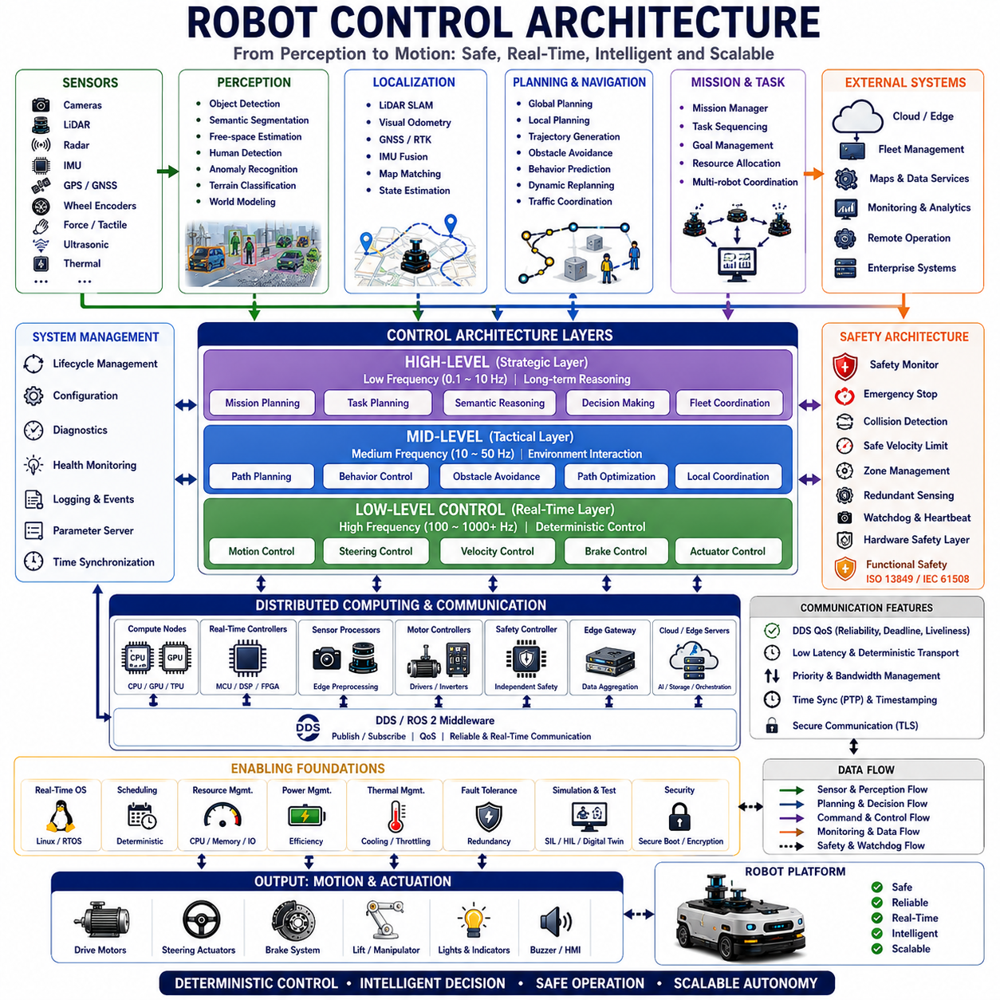
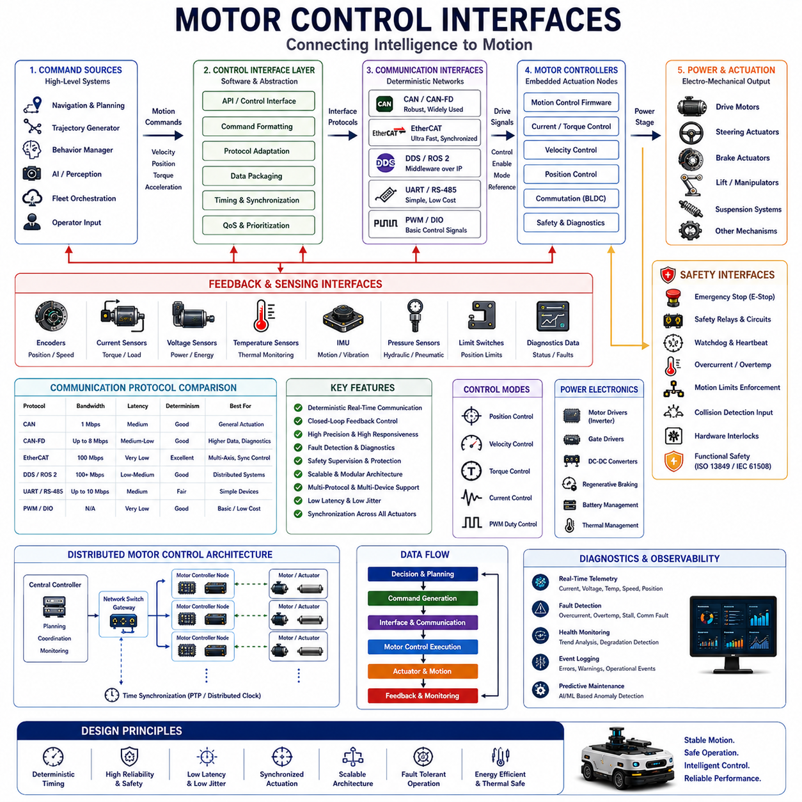
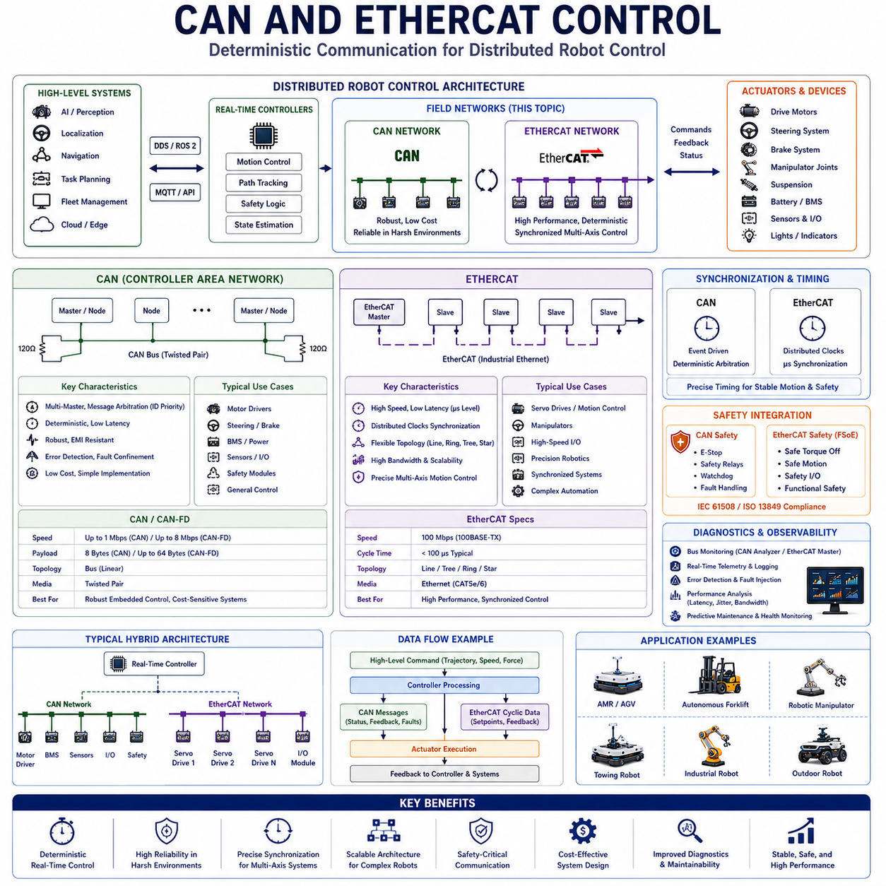
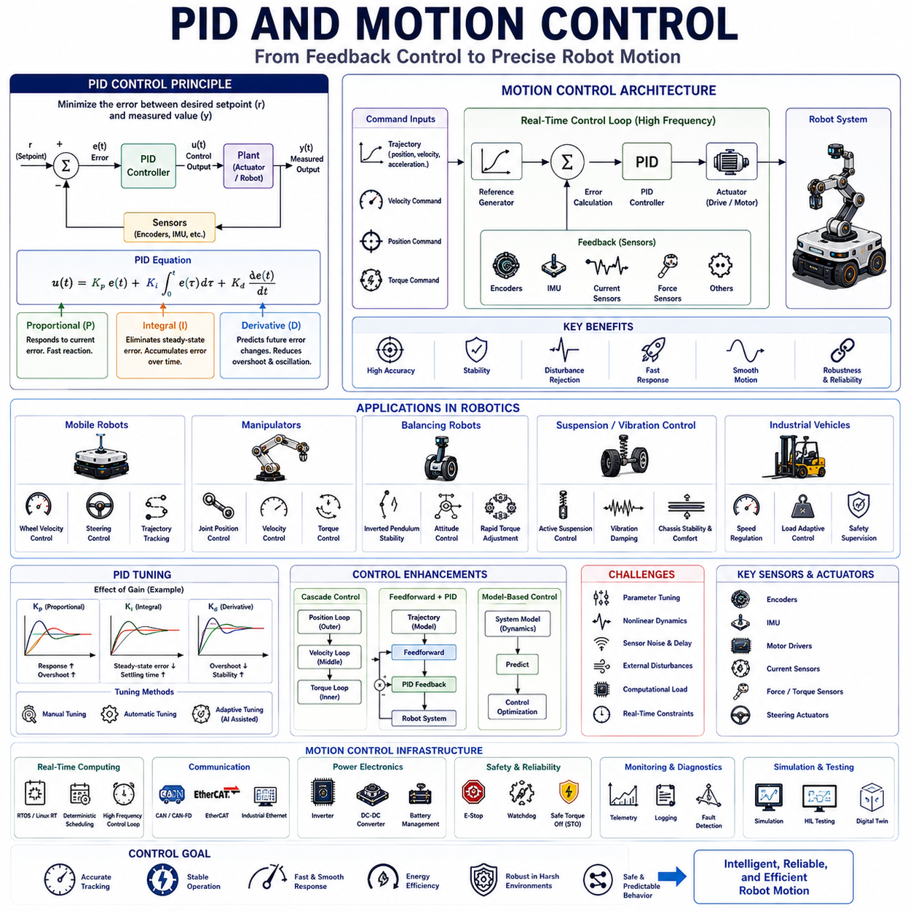
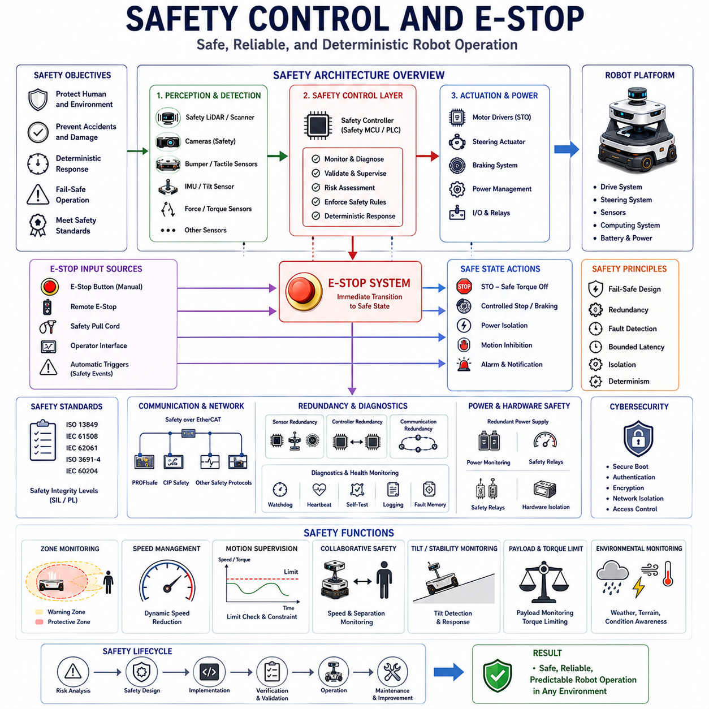
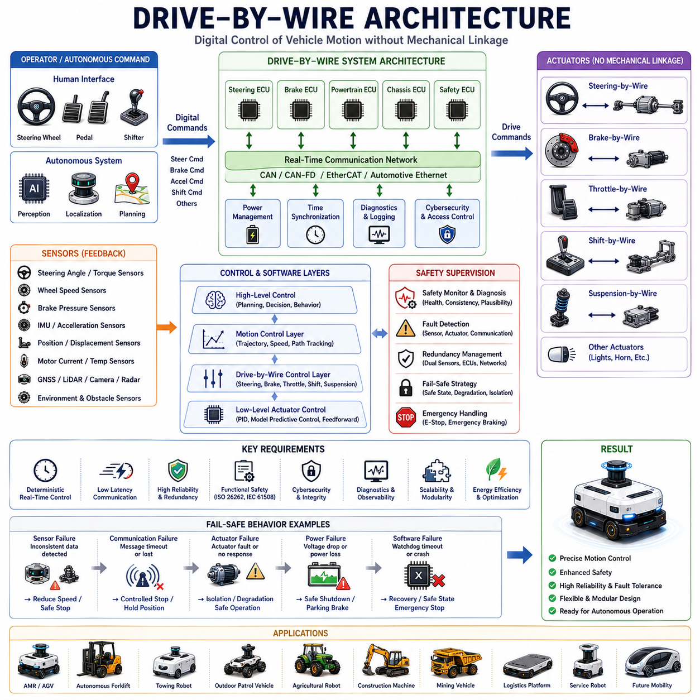
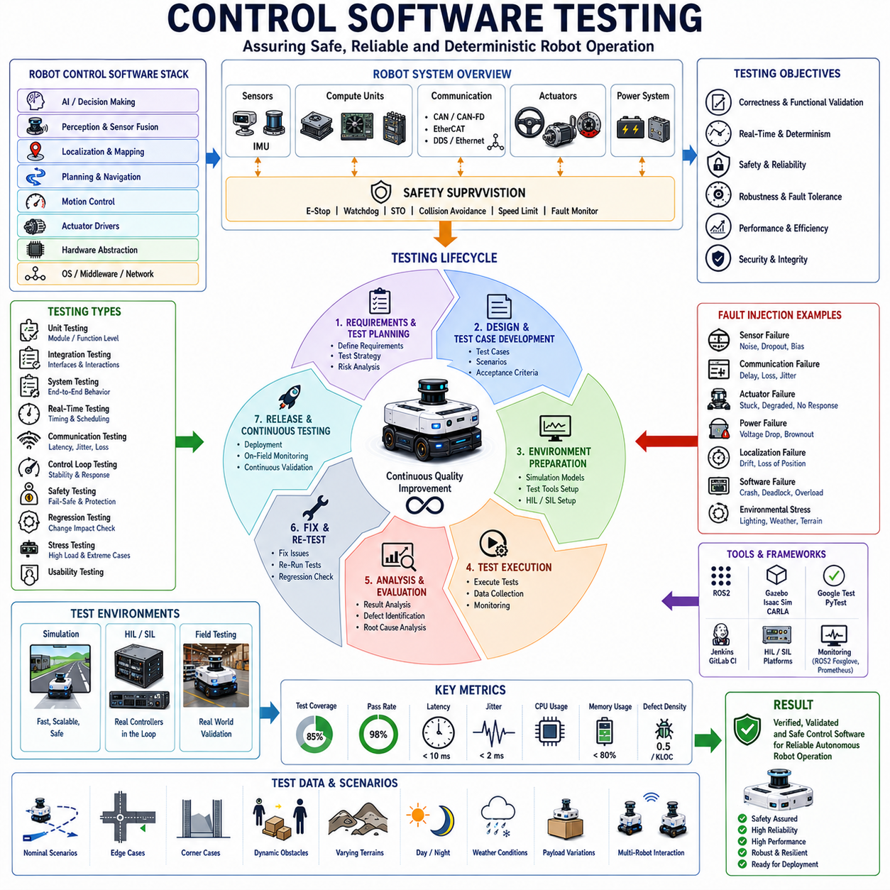
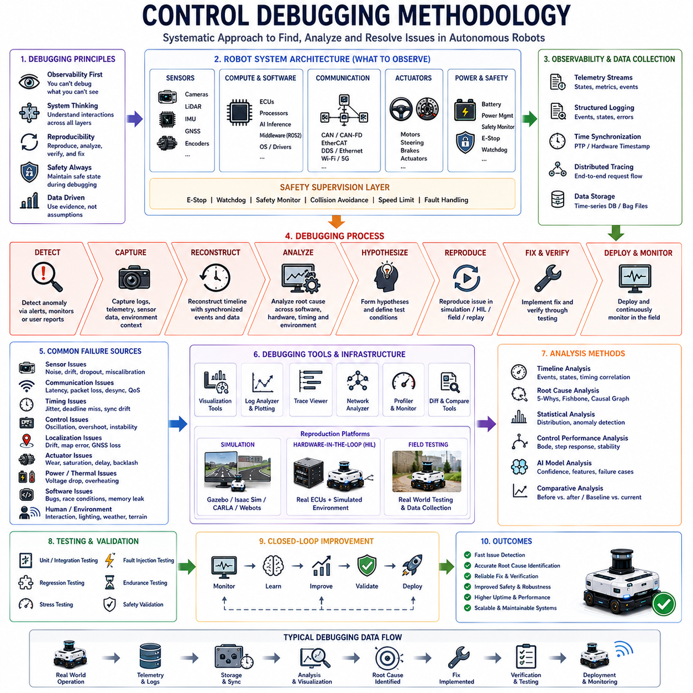

# Chapter 06. Robot Control Software

## 06.1 Robot Control Architecture

{width="7.268055555555556in" height="7.268055555555556in"}

"06_01_Robot_Control_Architecture"는 자율주행 로봇 분야에서 가장 핵심적인 엔지니어링 주제 중 하나이다. Robot Control Architecture는 로봇이 환경을 인식하고, 정보를 처리하며, 의사결정을 수행하고, 분산된 Computational Subsystem을 조정하며, 최종적으로 Physical Motion을 생성하는 전체 구조를 정의하기 때문이다. 현대 산업용 AMR, 자율 지게차, 협동 로봇, 실외 순찰 로봇, 물류 로봇, 농업 로봇, 의료 로봇, AI-native Autonomous Platform에서 Robot Control Architecture는 Sensing, Perception, Localization, Planning, Communication, Control, Safety, System Management를 하나의 Unified Real-Time Intelligent Machine으로 통합하는 중심 운영 프레임워크 역할을 한다.

Robot Control Architecture는 단순한 Software Hierarchy나 Controller 집합이 아니다. 이는 정보가 Distributed Robotics System 전반에서 어떻게 흐르는지, 불확실성 아래에서 어떻게 의사결정이 이루어지는지, Computational Workload가 어떻게 분할되는지, Real-Time Responsiveness가 어떻게 유지되는지, Physical Safety가 Autonomous Operation 중 어떻게 보장되는지를 정의하는 전체 조직 구조를 의미한다. 따라서 Architecture는 Scalability, Reliability, Maintainability, Fault Tolerance, Adaptability, Computational Efficiency, Long-Term Operational Stability에 직접적인 영향을 준다.

초기의 Robotics System은 Sensing, Planning, Actuation을 하나의 Computational Unit에서 처리하는 Centralized Monolithic Control Architecture를 사용하였다. 이러한 Architecture는 구현은 단순했지만 Scalability와 Fault Isolation 측면에서 심각한 한계를 가졌다. Robotics System이 increasingly Autonomous하고 Distributed Intelligent Platform으로 발전함에 따라, 현대 Robot Control Architecture는 Modular, Hierarchical, Distributed, AI-Integrated 형태로 진화하게 되었다.

현대 Robot Control Architecture의 가장 중요한 원칙 중 하나는 Hierarchical Abstraction이다. Robotics System은 일반적으로 Multiple Operational Layer로 기능을 구성하며, 각각의 Layer는 서로 다른 수준의 의사결정과 Temporal Behavior를 담당한다. High-Level Planning System은 상대적으로 낮은 Frequency로 동작하며 Mission Objective, Semantic Understanding, Task Sequencing, Long-Term Behavior를 처리한다. Mid-Level Navigation System은 Trajectory Planning, Localization, Obstacle Avoidance, Environmental Interaction을 관리한다. Low-Level Control System은 Steering, Braking, Motor Actuation, Dynamic Stabilization을 수행하는 Deterministic Real-Time Motion Control Loop를 실행한다.

이러한 Hierarchical Separation은 매우 중요하다. 서로 다른 Computational Task는 근본적으로 다른 Timing Requirement를 가지기 때문이다. High-Level Mission Planning은 수백 ms의 Latency를 허용할 수 있지만, Motor Control Loop는 수백\~수천 Hz 수준의 Deterministic Update를 요구한다. Operational Layer를 분리함으로써 Robotics System은 Safety-Critical Function의 Deterministic Real-Time Behavior를 유지하면서 동시에 Computationally Intensive AI Reasoning Workload를 지원할 수 있게 된다.

Perception System은 Robot Control Architecture의 가장 핵심적인 구성 요소 중 하나이다. 현대 Autonomous Robot은 Camera, LiDAR System, Radar Sensor, Ultrasonic Sensor, IMU, GNSS Receiver, Depth Sensor, Force Sensor, Wheel Encoder, Thermal Camera, Environmental Monitoring System으로부터 Continuous하게 정보를 획득한다. 이러한 Heterogeneous Sensor Stream은 Synchronization, Filtering, Fusion, Interpretation 과정을 거쳐 Coherent Environmental Understanding을 생성해야 한다.

Perception Pipeline은 increasingly Semantic Scene Understanding을 위해 Deep Learning 및 AI-native Architecture에 의존하고 있다. Object Detection, Semantic Segmentation, Free-Space Estimation, Human Detection, Anomaly Recognition, Terrain Classification, World Modeling은 이제 Robotics Control System 내부에 광범위하게 통합되고 있다. 그러나 AI Perception은 상당한 Computational Complexity와 Timing Variability를 유발하므로 Adaptive AI Workload와 Deterministic Control Pathway를 Carefully Separated해야 한다.

Localization System은 또 다른 핵심 Architectural Component이다. Autonomous Robot은 Local Coordinate System 및 Global Coordinate System 기준으로 자신의 Position, Orientation, Velocity, Motion State를 Continuous하게 추정한다. Localization Architecture는 GNSS, LiDAR SLAM, Visual Odometry, Inertial Navigation, Wheel Odometry, Map Matching, Probabilistic Sensor Fusion Framework를 결합하여 다양한 Operational Condition에서도 Robust Positioning Accuracy를 유지한다.

Navigation Architecture는 Robot이 Dynamic Environment를 어떻게 이동하는지를 결정한다. Global Planner는 Long-Horizon Mission Trajectory를 생성하고, Local Planner는 Real-Time Environmental Change에 따라 Robot Motion을 Continuous하게 조정한다. Obstacle Avoidance System, Traffic Coordination Mechanism, Dynamic Path Replanning, Behavior Prediction Model, Motion Safety Constraint는 Navigation Subsystem 내부에서 상호작용한다. 따라서 Real-Time Navigation은 Perception, Localization, Planning, Control Infrastructure 사이의 Tight Coordination을 요구한다.

Motion Control Architecture는 Autonomous Robot의 Deterministic Real-Time Core를 형성한다. Steering Controller, Velocity Controller, Braking System, Suspension Stabilization, Actuator Coordination, Dynamic Motion Compensation System은 Tight Timing Constraint 안에서 Continuous하게 동작한다. Motion Control Loop는 Higher-Level Computational Workload가 변동하더라도 Stable Execution Frequency를 유지해야 한다. 따라서 Safety-Critical Low-Level Control은 RTOS Infrastructure, CPU Isolation, Deterministic Scheduling Policy, Bounded Communication Pathway를 사용하는 Isolated Real-Time Execution Environment 내부에서 동작하는 경우가 많다.

Distributed Control Architecture는 현대 Robotics System에서 increasingly Common해지고 있다. Single Centralized Controller에 의존하는 대신, 현대 Autonomous Robot은 Multiple Embedded Processor, GPU Accelerator, Safety Controller, Motor Controller, Sensor Processor, Edge Computing System, Cloud-Connected Orchestration Infrastructure 전반에 기능을 분산시킨다. Distributed Architecture는 Scalability, Fault Isolation, Computational Efficiency, Modularity를 향상시키지만 동시에 Synchronization Complexity와 Communication Challenge를 증가시킨다.

Middleware Infrastructure는 Distributed Robot Control Architecture에서 중심적인 역할을 수행한다. ROS2 및 DDS 기반 Communication System은 Distributed Software Module이 Asynchronous하게 정보를 교환할 수 있도록 Publish-Subscribe Communication Framework를 제공한다. Middleware Architecture는 Underlying Transport Mechanism을 Application Logic으로부터 추상화하면서 Modularity, Scalability, Observability, Distributed Coordination을 지원한다.

QoS(Quality of Service) Configuration은 Distributed Robot Control System에서 매우 중요하다. 서로 다른 Data Stream은 서로 다른 Timing Guarantee를 요구한다. High-Frequency Motion Control Loop는 Low-Latency Deterministic Communication을 우선시하는 반면, Telemetry System은 Throughput와 Reliability를 우선시할 수 있다. DDS QoS Policy의 Reliability, Durability, Deadline Enforcement, History Depth, Liveliness Monitoring, Transport Prioritization은 Application Requirement에 따라 Communication Behavior를 조정할 수 있게 해준다.

Real-Time Communication Architecture는 전체 Robot Responsiveness에 직접적인 영향을 준다. Sensor, Planner, Controller, AI Module, Safety System, Fleet Orchestration Platform은 Communication Infrastructure를 통해 Continuous하게 정보를 교환한다. Excessive Latency, Synchronization Drift, Communication Jitter, Queue Congestion, Bandwidth Contention은 Distributed Robotics System을 불안정하게 만들 수 있다. 따라서 Real-Time Robot Control Architecture는 Deterministic Middleware, Bounded Buffering, Synchronization Framework, Shared Memory Transport, Prioritized Scheduling을 사용하여 Communication Pathway를 Carefully Engineered한다.

Safety Architecture는 Robot Control System의 가장 중요한 요소 중 하나이다. 산업용 Autonomous Robot은 Human, Vehicle, Industrial Equipment, Public Infrastructure 근처에서 동작하므로 Unsafe Behavior는 심각한 Physical Consequence를 초래할 수 있다. 따라서 Safety Controller는 Continuous하게 Operational Condition을 모니터링하고 Emergency Stopping, Collision Prevention, Speed Limiting, Actuator Supervision, Fault Recovery, Operational Boundary Enforcement에 대한 Independent Authority를 유지한다.

현대 Safety Architecture는 increasingly Safety-Critical Infrastructure를 Non-Critical AI Reasoning System과 분리한다. Safety-Certified Controller는 High-Level Navigation 및 Perception Software와 독립적으로 동작하는 경우가 많다. Redundant Sensing System, Watchdog Timer, Heartbeat Monitoring, Deterministic Fail-Safe Mechanism, Hardware-Level Emergency Override는 Software Failure 또는 Computational Instability 상황에서도 Operational Safety를 유지하도록 돕는다.

Functional Safety Standard는 산업용 Robot Control Architecture Design에 강한 영향을 미친다. Safety Integrity Requirement는 종종 Redundant Communication Pathway, Independent Supervisory Controller, Fault Isolation Zone, Deterministic Timing Guarantee, Predictable Degraded Operational Mode를 요구한다. 따라서 Robotics System은 정상 동작뿐만 아니라 Abnormal Fault Condition에서도 Bounded Behavior를 유지해야 한다.

AI-native Robotics Architecture는 Robot Control System Design을 빠르게 변화시키고 있다. Traditional Robotics Control Architecture는 주로 Deterministic Rule-Based Planning과 Hand-Engineered Mathematical Model에 의존하였다. 그러나 현대 Autonomous Robot은 increasingly Multimodal AI Reasoning, Semantic World Modeling, Reinforcement Learning Policy, Predictive Analytics, Adaptive Planning, Large-Scale Machine Learning Infrastructure를 통합하고 있다.

그러나 AI System은 Strict Real-Time Control Requirement와 충돌하는 Non-Deterministic Computational Timing Behavior를 가지는 경우가 많다. 따라서 많은 Advanced Robot Control Architecture는 Deterministic Control Infrastructure와 Adaptive AI Reasoning Domain을 분리한 Hybrid Computational Design을 채택한다. Safety-Critical Motion Control은 Isolated Deterministic Execution Environment 내부에서 동작하고, AI System은 Semantic Understanding, Long-Horizon Planning, Anomaly Prediction, Adaptive Optimization을 Asynchronously 제공한다.

Edge Computing은 Robot Control Architecture에 increasingly 영향을 미치고 있다. 모든 Workload를 Onboard에서 실행하는 대신 일부 Robotics System은 AI Inference, Map Synchronization, Fleet Coordination, Diagnostics, Operational Analytics를 Edge Server 및 Cloud Infrastructure에 분산시킨다. Edge Computing은 Fleet-Scale Coordination과 Large-Scale Semantic Processing을 가능하게 하면서 Onboard Computational Requirement를 줄여준다. 그러나 Distributed Cloud-Edge Architecture는 Additional Communication Latency와 Synchronization Complexity를 유발한다.

Fleet Management System은 Large-Scale Robotics Deployment에서 또 다른 중요한 Architectural Layer이다. Warehouse, Factory, Port, Hospital, Airport, Smart City에서 Multiple Robot이 동시에 동작하려면 Traffic Coordination, Task Scheduling, Congestion Management, Resource Allocation, Shared Environmental Awareness가 필요하다. Fleet-Level Control Architecture는 Individual Robot Autonomy 위에서 동작하면서도 각 Platform 내부의 Local Deterministic Safety Behavior를 유지한다.

Observability Infrastructure는 increasingly 현대 Robot Control Architecture 내부에 통합되고 있다. Distributed Tracing System, Telemetry Framework, Synchronized Logging Infrastructure, Performance Monitoring System, Middleware Diagnostics, Timing Analyzer, Fault Correlation Platform은 Operational System Behavior에 대한 Visibility를 제공한다. Observability는 Large-Scale Robotics Deployment에서 발생하는 Intermittent Timing Failure, Communication Instability, Synchronization Drift, Resource Bottleneck, Distributed Coordination Issue를 진단하기 위해 필수적이다.

Time Synchronization Architecture 역시 Distributed Robotics System에서 핵심적인 역할을 한다. Sensor, Controller, Middleware Node, AI Accelerator, Network Device, Edge Server는 모두 Time-Sensitive Information Stream을 생성하며, 이는 Consistent Temporal Alignment를 요구한다. PTP Synchronization, Hardware Timestamping, Synchronized DDS Transport, Distributed Clock Framework, Deterministic Ethernet Infrastructure는 Distributed Control System 전반에서 Temporal Consistency를 유지하도록 돕는다.

Computational Resource Orchestration은 Robotics System이 Heterogeneous Computing Infrastructure를 채택함에 따라 increasingly 중요해지고 있다. CPU, GPU, TPU, Embedded Accelerator, FPGA System, Edge Computing Platform은 서로 다른 Latency, Throughput, Power Characteristic을 가진 다양한 Workload를 실행한다. 따라서 Robot Control Architecture는 Timing Criticality, Resource Availability, Thermal Constraint, Operational Priority에 따라 Computational Task를 Dynamic하게 분할한다.

Power Management 및 Thermal Management 역시 Robot Control Architecture에 영향을 미친다. AI Accelerator, High-Frequency Processor, High-Bandwidth Sensor, Wireless Communication System, Distributed Computing Infrastructure는 상당한 에너지를 소비하고 큰 Thermal Load를 생성한다. Robotics Architecture는 Computational Performance와 Energy Efficiency, Battery Endurance, Cooling Capacity, Operational Longevity 사이의 균형을 유지해야 한다.

Fault Tolerance는 또 다른 핵심 Architectural Requirement이다. 실제 Robotics Deployment에서는 Sensor Failure, Communication Instability, Computational Overload, Environmental Interference, Actuator Degradation, Power Fluctuation, Partial Hardware Malfunction이 반드시 발생한다. 따라서 Robust Robot Control Architecture는 Redundancy, Graceful Degradation Strategy, Adaptive Recovery Mechanism, Fault Isolation, Fallback Operational Mode를 포함한다.

Simulation 및 Digital Twin Infrastructure는 increasingly Robot Control Architecture Development를 지원하고 있다. High-Fidelity Simulation Environment는 Physical System Deployment 이전에 Distributed Control Behavior를 검증하고, Fault Condition을 평가하며, Scheduling Policy를 최적화하고, Communication Latency를 분석하며, Safety Constraint를 검증할 수 있게 해준다. Hardware-in-the-Loop 및 Software-in-the-Loop Validation System은 실제 Operational Scenario에서 Architectural Robustness를 향상시킨다.

Robotics Engineering에서 가장 중요한 장기적 흐름 중 하나는 Deterministic Real-Time Control System, Distributed AI Infrastructure, Cloud-Edge Orchestration, Semantic World Modeling, Adaptive Scheduling, Intelligent Observability, Heterogeneous Accelerator Computing이 Unified Autonomous Robotic Ecosystem으로 융합되는 것이다. 미래 Robot Control Architecture는 Environmental Complexity와 Operational Objective에 따라 Communication Pathway, Computational Resource Allocation, AI Workload Distribution, Synchronization Policy, Energy Management Strategy, Safety Margin을 Continuous하게 Self-Optimize할 수 있게 될 것이다.

미래 Robot Control System은 increasingly Adaptive, Context-Aware, Self-Organizing 형태로 발전할 가능성이 높다. Autonomous Robot은 Mission Complexity, Environmental Condition, Available Network Infrastructure, Battery State, Thermal Constraint, Fleet Coordination Requirement, Operational Risk Assessment에 따라 자신의 Computational Architecture를 Dynamic하게 Reconfigure할 수 있게 될 것이다. AI-Assisted Runtime Orchestration은 Live Operation 중에도 Scheduling, Communication Timing, Distributed Computational Balance를 Continuous하게 최적화하게 될 것이다.

산업용 자율주행 로봇 시스템이 increasingly Complex Environment에서 동작하는 Highly Distributed AI-native Infrastructure로 발전함에 따라 Robot Control Architecture는 앞으로도 미래 Robotics System을 구성하는 가장 핵심적인 엔지니어링 기반 중 하나로 남게 될 것이다. Deterministic Execution, Hierarchical Abstraction, Distributed Coordination, Bounded Latency, Adaptive Computational Orchestration, Fault-Tolerant Operation, Synchronized Communication, Scalable Fleet Integration, Safety-Critical Responsiveness와 같은 핵심 원칙은 실제 산업 환경에서 장기적으로 안정적으로 운영 가능한 차세대 Autonomous Mobile Robot Platform 개발의 중심이 될 것이다.

## 06.2 Motor Control Interfaces

{width="7.268055555555556in" height="7.268055555555556in"}

"06_02_Motor_Control_Interfaces"는 현대 자율주행 로봇 분야에서 가장 중요한 엔지니어링 주제 중 하나이다. Motor Control Interface는 High-Level Computational Intelligence와 Physical Motion Generation을 직접 연결하기 때문이다. 산업용 AMR, 자율 지게차, 견인 로봇, 협동 매니퓰레이터, 실외 순찰 로봇, 농업 로봇, 물류 로봇, 의료 로봇, AI-native Robotics System에서 Motor Control Interface는 Software Control Architecture와 Electromechanical Actuation System 사이를 연결하는 Operational Bridge 역할을 수행한다. 로봇의 AI Reasoning, Perception, Localization, Navigation System이 아무리 발전하더라도 최종적으로 Robot은 Digital Control Command를 Stable, Safe, Predictable한 Physical Movement로 변환하기 위해 Motor Control Interface에 의존한다.

Motor Control Interface는 단순한 Controller와 Actuator 사이의 Electrical Connection이 아니다. 이는 Motion Command가 어떻게 생성되고, 전송되며, 해석되고, 실행되고, 모니터링되고, Synchronization되며, Distributed Robotics System 전반에서 Validation되는지를 정의하는 Complete Communication and Control Framework이다. 이러한 Interface는 Timing Behavior, Feedback Mechanism, Communication Protocol, Safety Supervision, Synchronization Consistency, Fault Detection, Operational Reliability, Real-Time Responsiveness를 결정한다.

현대 Autonomous Robot은 일반적으로 동시에 동작하는 Multiple Category의 Motor 및 Actuator를 포함한다. Drive Motor는 Robot Movement를 위한 Propulsion을 생성한다. Steering Actuator는 Wheel Orientation을 제어한다. Brake Actuator는 Deceleration 및 Stopping Behavior를 관리한다. Suspension Actuator는 Motion Dynamic을 안정화한다. Manipulator Joint는 Robotic Arm과 Payload System을 제어한다. Lift System, Conveyor Module, Docking System, Charging Connector, Sensor Positioning Unit, Accessory Mechanism 역시 Dedicated Motor Control Pathway를 요구한다. 각각의 Actuator Subsystem은 서로 다른 Timing Requirement, Control Dynamic, Communication Characteristic을 가진다.

Motor Control Interface Architecture의 가장 중요한 원칙 중 하나는 Deterministic Timing Behavior이다. Motion Control Loop는 Strict Real-Time Constraint 아래에서 동작하며, Delayed 또는 Inconsistent Command Execution은 Vehicle Dynamic을 불안정하게 만들거나 Safety를 위협할 수 있다. 늦게 도착한 Steering Update는 Oscillatory Motion을 유발할 수 있으며, Delayed Braking Command는 Stopping Distance를 증가시킬 수 있다. Inconsistent Torque Control은 Traction Stability를 저하시킬 수 있다. 따라서 Motor Control Interface는 Bounded Latency, Low Jitter, Synchronized Execution, Deterministic Communication Behavior를 우선시한다.

Closed-Loop Control은 현대 Motor Control System의 핵심 기반이다. 단순히 Open-Loop Power Command를 전달하는 대신, Motor Controller는 Continuous하게 Encoder, Current Sensor, Voltage Sensor, Temperature Monitor, Torque Estimator, Inertial System으로부터 Feedback를 수신한다. Controller는 Desired Target State와 Measured Physical State를 비교하고 Error를 최소화하기 위해 Continuous하게 Actuator Output을 조정한다. 이러한 Feedback-Driven Architecture는 Payload Condition, Terrain Irregularity, Friction Change, Wheel Slip, Environmental Disturbance가 변화하더라도 Stable Motion을 유지할 수 있게 한다.

Encoder는 Motor Control Interface에서 가장 중요한 Feedback Device 중 하나이다. Rotary Encoder는 Shaft Position, Rotational Speed, Motion Direction을 측정한다. Incremental Encoder는 Movement에 비례하는 Pulse Sequence를 생성하며, Absolute Encoder는 Startup State와 관계없이 Direct Positional Measurement를 제공한다. High-Resolution Encoder Feedback는 Precise Velocity Estimation, Accurate Steering Control, Trajectory Tracking, Odometry Generation, Dynamic Motion Stabilization을 가능하게 만든다.

Motor Current Sensing 역시 매우 중요한 역할을 한다. Current Measurement는 Torque Generation, Motor Load, Friction Condition, Stall Behavior, Abnormal Operational State에 대한 Insight를 제공한다. Excessive Current Draw는 Mechanical Obstruction, Actuator Overload, Drivetrain Failure, Collision Condition을 의미할 수 있다. 따라서 Real-Time Current Monitoring은 Control Precision뿐만 아니라 Operational Safety에도 기여한다.

Brushless DC Motor는 Efficiency, Reliability, Power Density, Controllability 때문에 현대 Robotics System에서 increasingly Dominant해지고 있다. BLDC Motor Controller는 Sensor Feedback 또는 Sensorless Estimation Technique를 사용하여 Continuous Commutation Control을 수행한다. FOC(Field-Oriented Control)는 Precise Torque Control, Smooth Motion Generation, High Efficiency, Low Acoustic Noise를 제공하기 때문에 High-Performance Robotics에서 널리 사용된다.

Servo Motor Interface는 Precise Position Control 및 Dynamic Responsiveness가 필요한 Robotics Application에서 일반적으로 사용된다. Servo System은 Motor, Encoder, Control Electronics, Feedback Loop를 Tight Coordination된 Actuation Unit으로 통합한다. Industrial Servo Interface는 Deterministic Communication Protocol을 지원하여 Distributed Robotics System 전반에서 Synchronized Multi-Axis Motion Control을 가능하게 한다.

Stepper Motor Interface는 Lower-Cost Robotics Platform 및 Positioning System에서 여전히 중요하다. Stepper Motor는 특정 조건에서는 Continuous Positional Feedback 없이도 Discrete Motion Increment를 제공할 수 있다. 그러나 Open-Loop Stepper Architecture는 Overload Condition에서 Missed Step을 경험할 수 있으며, 이는 Demanding Autonomous Robotics Application에서 Motion Reliability를 감소시킨다. Closed-Loop Stepper System은 increasingly Encoder Feedback를 통합하여 Robustness를 향상시키고 있다.

Hydraulic 및 Pneumatic Actuator Interface는 Additional Complexity를 도입한다. Heavy Industrial Robot, Autonomous Construction Machinery, Agricultural Platform, High-Load Manipulator는 High Force Density와 Durability를 위해 Hydraulic System을 사용할 수 있다. Hydraulic Actuator Control은 Continuous Pressure Regulation, Valve Coordination, Flow Management, Nonlinear Dynamic Compensation을 요구한다. 이러한 System은 Tight Synchronization Feedback Pathway를 가지는 Distributed Real-Time Control Architecture 위에서 동작하는 경우가 많다.

Motor Control Communication Protocol은 Robotics System Performance에 큰 영향을 준다. 현대 Autonomous Robot은 Frequently Multiple Embedded Motor Controller 전반에 Distributed Actuator Control을 수행하며, 이들은 Deterministic Industrial Network를 통해 통신한다. CAN Bus는 Robustness, Simplicity, Low Computational Overhead, Deterministic Arbitration Behavior 때문에 Embedded Motor Control에서 가장 널리 사용되는 Communication Interface 중 하나이다.

CAN-FD는 Traditional CAN Capability를 확장하여 Higher Bandwidth와 Larger Payload Size를 제공한다. 이를 통해 increasingly Data-Intensive Robotics System을 더 효과적으로 지원할 수 있다. Motor Status, Fault Diagnostics, Thermal Telemetry, Encoder Feedback, Torque Command, Battery Information, Synchronization Message가 모두 동일 Communication Infrastructure를 공유할 수 있기 때문에 Efficient Bandwidth Utilization이 매우 중요해진다.

EtherCAT은 Synchronized Multi-Axis Control과 Deterministic Low-Latency Communication이 필요한 Industrial Robotics에서 매우 인기가 높아지고 있다. EtherCAT은 Distributed Clock Synchronization과 Precise Timing Consistency를 사용하여 Extremely Fast Cyclic Update Rate를 지원한다. Multi-Axis Manipulator, Autonomous Vehicle Steering System, Industrial Conveyor Robotics, Coordinated Motion Platform은 High-Performance Real-Time Actuation Control을 위해 EtherCAT Infrastructure를 사용하는 경우가 많다.

UART, RS-232, RS-485와 같은 Serial Communication Interface는 Embedded Robotics Subsystem 및 Lower-Cost Actuator System에서 여전히 일반적으로 사용된다. 그러나 이러한 Interface는 Large-Scale Distributed Autonomous Robotics Architecture에 필요한 Scalability, Synchronization Precision, Deterministic Communication Guarantee가 부족한 경우가 많다.

PWM Interface는 Low-Level Motor Control에서 여전히 중요한 역할을 한다. Pulse-Width Modulation은 Duty Cycle Timing을 변경하여 Motor Power Delivery를 직접 제어한다. 많은 Embedded Motor Driver는 Direction Control Line과 결합된 PWM Control Signal을 사용한다. PWM Interface는 Simple하고 Computationally Efficient하지만, Advanced Autonomous Robotics Application에서는 Additional Supervisory Feedback Infrastructure를 요구하는 경우가 많다.

Industrial Motor Control Architecture는 increasingly High-Level Motion Planning과 Low-Level Actuator Execution을 분리한다. Navigation System은 Desired Trajectory를 생성하고, Dedicated Motor Controller는 Current Regulation, Torque Generation, Velocity Stabilization, Steering Actuation, Fault Monitoring을 독립적으로 수행한다. 이러한 Architectural Separation은 Higher-Level Computational Workload가 변동하더라도 Deterministic Low-Level Control Behavior를 유지할 수 있게 해준다.

Safety Supervision은 Motor Control Interface의 핵심 구성 요소이다. Human 및 Industrial Infrastructure 근처에서 동작하는 Autonomous Robot은 Actuator State, Braking Response, Motion Limit, Thermal Condition, Communication Integrity, Emergency Stop Pathway를 Continuous하게 모니터링해야 한다. Functional Safety Architecture는 Frequently Redundant Safety Relay, Independent Emergency Shutdown Circuit, Watchdog Timer, Heartbeat Monitoring, Hardware-Level Interlock를 포함한다.

Emergency Stop System은 Hazardous Condition 발생 시 Non-Essential Software Layer를 우회하여 Directly Motor Power Pathway를 차단해야 한다. 따라서 Safety-Rated Motor Interface는 Primary Control Communication Infrastructure와 독립적인 Dedicated Hardware-Level Stop Channel을 포함하는 경우가 많다. Deterministic Emergency Response Timing은 Operational Safety 유지에 필수적이다.

Synchronization은 Distributed Motor Control System에서 increasingly 중요해지고 있다. Multi-Wheel Steering System, Coordinated Manipulator Joint, Active Suspension Platform, Towing Robot, Omnidirectional Robot, Synchronized Industrial Automation System은 모두 Tight Coordination된 Actuator Timing을 요구한다. Small Synchronization Error만으로도 Instability, Vibration, Trajectory Deviation, Mechanical Stress Accumulation이 발생할 수 있다.

Distributed Clock, PTP Infrastructure, Hardware Timestamping, Synchronized Communication Cycle, Deterministic Scheduling Policy와 같은 Time Synchronization Technology는 Distributed Control Architecture 전반에서 Coordinated Motor Execution을 유지하는 데 도움을 준다. Real-Time Synchronization은 High-Speed Autonomous Vehicle 및 Precision Industrial Manipulator에서 특히 중요하다.

Power Electronics는 Motor Control Interface의 또 다른 핵심 구성 요소이다. Inverter, Motor Driver, Gate Controller, DC-DC Converter, Regenerative Braking System, Battery Management Infrastructure, Power Distribution System은 Robotics Platform 전체에서 Energy Flow를 제어한다. Power Electronics는 Dynamic Load Change에 빠르게 반응하면서도 Electrical Stability와 Thermal Protection을 유지해야 한다.

Thermal Management는 Motor Interface Reliability에 큰 영향을 준다. Motor, Driver, Inverter, Power Electronics는 Continuous Operation 중 상당한 Heat를 생성한다. Excessive Thermal Buildup은 Actuator Performance를 감소시키고, Efficiency를 저하시킬 수 있으며, Control Behavior를 불안정하게 만들거나 Protective Shutdown Mechanism을 Trigger할 수 있다. 따라서 Robotics System은 Continuous하게 Motor Temperature, Driver Temperature, Current Load, Cooling Efficiency, Thermal Distribution을 모니터링한다.

Battery-Powered Autonomous Robot은 Energy Efficiency 및 Power Optimization과 관련된 Additional Motor Interface Challenge를 가진다. Motor Control System은 Acceleration Performance, Payload Handling, Terrain Traversal, Responsiveness와 Battery Endurance Requirement 사이의 균형을 유지해야 한다. Regenerative Braking System은 increasingly Deceleration 및 Downhill Operation 중 Kinetic Energy를 회수하여 Operational Efficiency를 향상시키고 있다.

Traction Control 및 Wheel Slip Management는 Outdoor Autonomous Robotics에서 중요한 역할을 한다. Agricultural Robot, Autonomous Forklift, Towing Robot, Mining Vehicle, Outdoor Patrol System은 Mud, Gravel, Snow, Water, Slope, Uneven Surface와 같은 다양한 Terrain Condition에서 동작한다. Motor Control Interface는 Traction Condition 및 Dynamic Stability Requirement에 따라 Continuous하게 Torque Distribution과 Wheel Behavior를 조정한다.

AI-native Robotics Architecture는 Motor Control System에도 increasingly 영향을 주고 있다. Machine Learning Model은 Predictive Maintenance, Actuator Anomaly Detection, Adaptive Torque Optimization, Terrain-Aware Traction Management, Energy Optimization, Dynamic Control Parameter Tuning을 지원할 수 있다. 그러나 Safety-Critical Low-Level Motor Control은 일반적으로 Adaptive AI System에 완전히 의존하지 않고 Deterministic Real-Time Execution Environment 내부에서 유지된다.

Simulation 및 Digital Twin Infrastructure는 increasingly Motor Control Development를 지원하고 있다. High-Fidelity Simulation Environment는 Physical Robot Deployment 이전에 Actuator Dynamic Validation, Control Stability Analysis, Synchronization Behavior Evaluation, Fault Condition Injection, Controller Tuning Optimization, Communication Timing Testing을 가능하게 한다. Hardware-in-the-Loop Testing은 Validation Realism을 더욱 향상시킨다.

Observability 및 Diagnostics Infrastructure는 increasingly 현대 Motor Control Architecture 내부에 통합되고 있다. Telemetry System은 Continuous하게 Current Consumption, Voltage Behavior, Encoder Accuracy, Thermal Condition, Communication Latency, Synchronization Drift, Vibration Pattern, Torque Utilization, Actuator Health를 모니터링한다. Predictive Maintenance System은 Long-Term Operational Trend를 분석하여 Catastrophic Failure 이전에 Early Sign of Component Degradation을 탐지한다.

Fault Tolerance는 Motor Control Interface Design의 또 다른 핵심 요소이다. 실제 Robotics Deployment에서는 Sensor Failure, Actuator Degradation, Communication Instability, Thermal Overload, Connector Corrosion, Electromagnetic Interference, Mechanical Wear, Partial Hardware Malfunction이 반드시 발생한다. 따라서 Robust Motor Control Architecture는 Redundancy, Graceful Degradation Strategy, Adaptive Recovery Behavior, Fault Isolation, Fallback Operational Mode를 포함한다.

Robotics Engineering에서 가장 중요한 장기적 흐름 중 하나는 Deterministic Motor Control Infrastructure, Distributed AI System, Cloud-Edge Orchestration, Semantic World Modeling, Adaptive Scheduling, Intelligent Observability, Heterogeneous Accelerator Computing이 Unified Autonomous Robotics Ecosystem으로 융합되는 것이다. 미래 Motor Control Interface는 Terrain Condition, Payload Characteristic, Operational Risk, Mission Objective에 따라 Torque Distribution, Power Efficiency, Synchronization Timing, Thermal Management, Actuator Coordination, Energy Consumption을 Dynamic하게 최적화할 수 있게 될 것이다.

미래 Autonomous Robot은 increasingly Modular하고 Software-Defined된 Motor Control Architecture를 채택할 가능성이 높다. Integrated Sensing, Embedded AI Acceleration, Onboard Diagnostics, Deterministic Networking, Self-Calibrating Control System을 포함하는 Distributed Smart Actuator는 Scalability와 Maintainability를 크게 향상시킬 수 있다. Motor System은 Continuous하게 관찰되는 Environmental 및 Operational Feedback를 기반으로 Operation 중 Dynamic하게 Self-Optimize할 수 있게 될 것이다.

산업용 자율주행 로봇 시스템이 increasingly Complex Real-World Environment에서 동작하는 Highly Distributed AI-native Infrastructure로 발전함에 따라, Motor Control Interface는 앞으로도 미래 Robotics Platform을 구성하는 가장 핵심적인 엔지니어링 기반 중 하나로 남게 될 것이다. Deterministic Execution, Synchronized Actuation, Bounded Latency, Low-Jitter Communication, Fault-Tolerant Operation, Adaptive Power Management, Scalable Distributed Coordination, Safety-Critical Responsiveness와 같은 핵심 원칙은 실제 산업 환경에서 장기적으로 안정적으로 운영 가능한 차세대 Autonomous Mobile Robot System 개발의 중심이 될 것이다.

## 06.3 CAN and EtherCAT Control

{width="7.268055555555556in" height="7.268055555555556in"}

"06_03_CAN_and_EtherCAT_Control"은 현대 산업용 로봇 분야에서 가장 중요한 엔지니어링 주제 중 하나이다. Controller와 Actuator 사이의 Deterministic Communication이 안정적인 Autonomous Operation에 필수적이기 때문이다. 산업용 AMR, 자율 지게차, 견인 로봇, 협동 매니퓰레이터, 물류 로봇, 실외 순찰 로봇, 농업 로봇, 의료 로봇, AI-native Robotics Platform에서 Communication Network는 Motion Stability, Control Responsiveness, Synchronization Accuracy, Safety Supervision, Overall System Reliability에 직접적인 영향을 준다. 아무리 Advanced Perception, Localization, Navigation, AI System을 사용하더라도, Robot은 최종적으로 Distributed Control Component와 Physical Actuator 사이의 Reliable Real-Time Communication에 의존한다. 따라서 CAN과 EtherCAT은 현대 Robot Control Architecture를 구성하는 가장 영향력 있는 Industrial Communication Technology 중 두 가지이다.

현대 Robotics System은 본질적으로 Distributed Computational Environment이다. Sensor, Motor Controller, Steering System, Brake System, Suspension Controller, Battery Management Unit, Safety Processor, Embedded ECU, AI Accelerator, Edge Computing Module은 Continuous하게 Real-Time Communication Infrastructure를 통해 정보를 교환한다. Traditional Centralized Machine과 달리, 현대 Autonomous Robot은 Multiple Interconnected Subsystem 전반에 Control Intelligence를 분산시킨다. 따라서 Communication Timing Consistency는 Computational Capability만큼 중요해진다.

CAN(Controller Area Network)은 Automotive Industry에서 시작되었지만 빠르게 Robotics 및 Industrial Automation 분야에서 가장 널리 채택된 Communication Standard 중 하나가 되었다. CAN은 원래 Electrically Noisy Environment에서 동작하는 Embedded Controller 사이의 Reliable Low-Latency Communication을 제공하기 위해 설계되었다. Simplicity, Robustness, Deterministic Arbitration Behavior, Fault Tolerance, Low Computational Overhead 덕분에 CAN은 Dependable Distributed Control이 필요한 Robotics Application에 매우 적합하게 되었다.

CAN Architecture의 핵심 특징 중 하나는 Multi-Master Communication Capability이다. Centralized Polling System과 달리, CAN Bus에 연결된 Multiple Device는 Communication Channel이 Available해지는 즉시 Independent하게 Message를 전송할 수 있다. 이러한 Decentralized Architecture는 Flexibility와 Fault Tolerance를 향상시키면서 Centralized Communication Management에 대한 Dependency를 감소시킨다.

CAN Communication은 Identifier-Based Arbitration을 통한 Message Prioritization에 의존한다. Lower Numerical Identifier를 가진 Message가 Simultaneous Transmission Attempt 상황에서 Higher Priority를 가진다. 이러한 Deterministic Arbitration Mechanism은 Safety-Critical 및 Time-Sensitive Message가 Lower-Priority Communication Traffic보다 우선적으로 전송되도록 만든다. 따라서 Motion Control Command, Braking Request, Emergency Stop Signal, Actuator Synchronization Message는 Heavy Bus Load 상황에서도 Predictable Low-Latency Transmission Behavior를 유지할 수 있다.

Deterministic Arbitration Behavior는 CAN이 Robotics System에서 성공적으로 사용된 가장 중요한 이유 중 하나이다. Real-Time Control Architecture는 Maximum Theoretical Throughput보다 Predictable Communication Timing을 더 중요하게 요구한다. Motion Control Application에서는 High Raw Bandwidth보다 Small, Consistent, Bounded Latency가 훨씬 중요하다. CAN은 Distributed Actuator Coordination 및 Embedded Control Synchronization에 적합한 Stable Timing Behavior를 제공한다.

Traditional CAN Implementation은 일반적으로 최대 1 Mbps 수준의 Bandwidth를 제공한다. 현대 Ethernet System과 비교하면 제한적으로 보일 수 있지만, 많은 Embedded Robotics Control Task는 Deterministic Interval로 교환되는 Small Message Payload만 요구한다. Motor Command, Encoder Update, Steering Angle, Current Measurement, Fault State, Actuator Synchronization Signal은 CAN Communication Structure 안에서 효율적으로 처리될 수 있다.

CAN-FD(CAN with Flexible Data Rate)는 Traditional CAN Capability를 확장하여 Larger Payload Size와 Higher Communication Speed를 제공한다. CAN-FD는 Enhanced Diagnostics, Richer Actuator Feedback, Higher-Frequency Communication, Larger Telemetry Dataset를 지원하면서도 기존 CAN Ecosystem의 장점을 유지할 수 있게 해준다.

CAN-Based Robotics Architecture의 가장 큰 장점 중 하나는 Harsh Industrial Condition에서도 Robustness를 유지한다는 점이다. Autonomous Robot은 Frequently Electromagnetic Interference, Vibration, Dust, Moisture, Power Fluctuation, Mechanical Shock, Temperature Variation이 존재하는 환경에서 동작한다. CAN Communication Protocol은 Extensive Error Detection, Cyclic Redundancy Checking, Acknowledgment Mechanism, Fault Confinement, Automatic Retransmission Behavior를 포함하여 Adverse Condition에서도 Communication Reliability를 유지한다.

Fault Confinement Mechanism은 Distributed Robotics System에서 특히 중요하다. Excessive Communication Error를 경험하는 Malfunctioning Node는 Automatic하게 Restricted Communication State로 전환되거나 스스로 Network에서 Disconnect되어 Broader System Destabilization을 방지한다. 이러한 Self-Protective Behavior는 Operational Reliability와 Fault Isolation을 향상시킨다.

CAN Communication Architecture는 Industrial AMR 및 Autonomous Vehicle의 Embedded Actuator Control에서 널리 사용된다. Steering Controller, Motor Driver, Brake System, Suspension Controller, Battery Management System, Lighting System, Sensor Hub, Safety Module은 Frequently CAN Infrastructure를 통해 Real-Time Data를 교환한다. Distributed Embedded Control Architecture는 Localized Deterministic Control을 유지하면서도 System-Wide Coordination을 가능하게 만든다.

그러나 increasingly Complex Robotics Application에서는 CAN 역시 한계를 가진다. Traditional CAN의 제한된 Bandwidth는 Large Number of High-Frequency Distributed Actuator, Synchronized Manipulator, Advanced Diagnostics Stream, Large-Scale Telemetry Traffic을 가진 시스템에서는 부족해질 수 있다. 또한 Robotics System이 Tighter Multi-Axis Coordination과 Faster Cyclic Update Rate를 요구함에 따라 Synchronization Precision 역시 점점 더 어려워진다.

EtherCAT은 Deterministic Distributed Real-Time Control을 지원하기 위해 특별히 설계된 High-Performance Industrial Ethernet Technology이다. EtherCAT은 "Ethernet for Control Automation Technology"를 의미하며, Extremely Low Communication Latency, High Synchronization Precision, Efficient Distributed Device Coordination을 제공하도록 설계되었다.

Conventional Ethernet Architecture가 각 Network Node에서 Packet을 Independent하게 처리하고 Forward하는 것과 달리, EtherCAT은 Highly Optimized Processing Model을 사용한다. EtherCAT Frame은 Device를 Continuous하게 통과하면서 Data가 Hardware Level에서 Dynamic하게 추출 및 삽입된다. 이러한 Processing Approach는 Communication Latency를 Dramatically하게 감소시키고 Overhead를 최소화한다.

EtherCAT의 가장 중요한 특징 중 하나는 Distributed Clock Synchronization이다. EtherCAT Network는 Hardware-Assisted Synchronization Mechanism을 사용하여 Distributed Device 전반에서 Extremely Precise Timing Consistency를 유지한다. 따라서 Motion Controller, Servo Drive, Manipulator Joint, Synchronized Actuator, Distributed Sensor는 Microsecond-Level Temporal Alignment를 유지할 수 있다.

이러한 Synchronization Capability는 Coordinated Multi-Axis Motion Control이 필요한 Robotics Application에서 EtherCAT을 매우 매력적으로 만든다. Industrial Manipulator, Autonomous Vehicle Steering System, Active Suspension Platform, Synchronized Conveyor System, Precision Manufacturing Robot, High-Speed Coordinated Automation System은 Frequently EtherCAT Infrastructure를 사용한다.

EtherCAT은 Traditional CAN System보다 훨씬 높은 Bandwidth를 지원한다. Fast Cyclic Communication Rate와 Efficient Distributed Processing 덕분에 Large Number of Device가 High-Frequency Data를 Simultaneously Exchange하면서도 Deterministic Timing Behavior를 유지할 수 있다. Extensive Telemetry, Encoder Feedback, Torque Measurement, Thermal Diagnostics, Vibration Monitoring, Synchronization Traffic을 생성하는 현대 Robotics System은 EtherCAT Performance Characteristic의 혜택을 크게 받는다.

Real-Time Communication Latency는 High-Performance Robotics System에서 매우 중요하다. Kilohertz Update Frequency로 동작하는 Motion Control Loop는 Highly Predictable Communication Timing을 요구한다. Distributed Actuator Network 전반에서 작은 Jitter Accumulation만으로도 Coordinated Motion Behavior가 불안정해질 수 있다. EtherCAT은 Hardware-Level Scheduling Consistency와 Deterministic Frame Propagation을 통해 Communication Jitter를 최소화한다.

EtherCAT Architecture의 또 다른 큰 장점은 Scalability이다. Large Industrial Robotics System은 Dozens 또는 Hundreds 수준의 Distributed Device를 포함할 수 있다. EtherCAT은 Heavy Communication Load 상황에서도 Deterministic Timing Behavior를 유지하면서 Large-Scale Distributed Synchronization을 효율적으로 지원한다.

Industrial Servo System은 Frequently EtherCAT Interface를 직접 Motor Drive 및 Actuator Controller에 통합한다. High-Performance Servo Architecture는 Torque Control, Position Regulation, Velocity Stabilization, Coordinated Trajectory Execution을 위해 Synchronized Cyclic Communication에 의존한다. EtherCAT은 Complex Robotics System 전반에서 Tight Coordination된 Actuator Behavior를 가능하게 한다.

Safety Integration 역시 EtherCAT-Based Robotics Architecture에서 increasingly 중요해지고 있다. FSoE(Safety over EtherCAT)와 같은 Functional Safety Extension은 Safety-Critical Communication이 Standard Control Traffic과 공존하면서도 Deterministic Timing과 Certified Safety Integrity Behavior를 유지할 수 있게 해준다. Emergency Stop System, Motion Limit, Safe Torque Off Function, Collision Detection, Redundant Safety Supervision은 Unified Communication Infrastructure 내부에서 동작할 수 있다.

현대 Advanced Robotics System에서는 CAN과 EtherCAT이 서로 경쟁하기보다 Frequently Coexist한다. CAN은 Lower-Bandwidth Embedded Subsystem에서 Robustness, Simplicity, Low Computational Overhead를 제공하는 데 매우 효과적이다. EtherCAT은 Precise Timing Consistency와 Large-Scale Distributed Coordination이 필요한 High-Performance Synchronized Motion Control에 탁월하다.

Hybrid Robotics Architecture는 Frequently Operational Requirement에 따라 Communication Infrastructure를 Partition한다. High-Level Synchronized Actuator Control은 EtherCAT을 사용하고, Embedded Diagnostics, Battery Monitoring, Auxiliary Subsystem, Environmental Sensor, Lower-Priority Embedded Device는 CAN Network를 통해 통신할 수 있다. 이러한 Layered Architecture는 Cost, Complexity, Scalability, Deterministic Performance 사이의 균형을 제공한다.

Hybrid Communication System에서 Distributed Control Layer 사이의 Synchronization은 중요한 Engineering Challenge이다. CAN Network, EtherCAT Infrastructure, DDS Middleware, ROS2 Communication Layer, Edge AI Processor, Cloud Orchestration System을 포함하는 Robot은 Heterogeneous Communication Technology 전반에서 Temporal Consistency를 유지해야 한다. 따라서 PTP Synchronization, Distributed Clock, Hardware Timestamping, Deterministic Scheduling Architecture가 increasingly 중요해진다.

Motor Control Architecture는 Communication Requirement에 직접적인 영향을 준다. Differential Drive Robot, Ackermann Steering System, Omnidirectional Platform, Articulated Towing Robot, Coordinated Manipulator, Active Suspension System, Mobile Industrial Platform은 서로 다른 Synchronization Precision, Communication Frequency, Deterministic Timing Behavior를 요구한다. 따라서 Communication Infrastructure는 Actuator Dynamic 및 Operational Constraint에 맞추어 Carefully Selected되어야 한다.

Real-Time Operating System 역시 CAN 및 EtherCAT Control Architecture에서 중요한 역할을 수행한다. PREEMPT_RT Linux Kernel, RTOS Platform, Deterministic Scheduling Framework, Interrupt Isolation Strategy, Bounded Execution Pathway는 Distributed Robotics Controller 사이의 Communication Consistency를 유지하는 데 도움을 준다. 그렇지 않으면 Software-Level Timing Instability가 Hardware Communication Advantage를 무력화할 수 있다.

AI-native Robotics Architecture 역시 Industrial Communication Infrastructure에 increasingly 영향을 미치고 있다. Autonomous Robot은 이제 Semantic World Model, Multimodal Sensor Representation, Predictive Analytics, Trajectory Optimization Output, Fleet Coordination State, AI Inference Metadata를 Distributed System 전반에서 교환한다. 그러나 Safety-Critical Deterministic Motion Control은 Adaptive AI Workload Variability와 독립적인 Tight Bounded Communication Behavior를 여전히 요구한다.

Observability 및 Diagnostics Infrastructure는 CAN 및 EtherCAT Communication Performance Validation에 필수적이다. Distributed Tracing System, Telemetry Monitoring, Bus Analyzer, Synchronization Diagnostics, Timing Profiler, Fault Injection Framework, Network Observability Platform은 Communication Latency, Packet Loss, Synchronization Drift, Jitter Distribution, Bandwidth Utilization, Fault Recovery Behavior에 대한 Visibility를 제공한다.

Thermal Condition, Electromagnetic Interference, Vibration, Connector Reliability, Cable Routing, Grounding Quality, Power Distribution Stability, Environmental Noise는 모두 Industrial Communication Reliability에 영향을 준다. 따라서 실제 Robotics Deployment에서는 Software Architecture Optimization뿐만 아니라 Careful Physical Infrastructure Engineering 역시 필요하다.

Simulation 및 Hardware-in-the-Loop Testing Environment는 Physical Deployment 이전에 Communication Architecture를 검증하기 위해 널리 사용된다. Engineer는 Repeatable Test Condition 아래에서 Fault Tolerance Behavior, Synchronization Stability, Communication Overload Condition, Cyclic Update Consistency, Actuator Coordination Timing, Emergency Response Pathway를 분석한다. 실제 Robotics Communication Failure는 종종 Long-Term Operational Stress 또는 Environmental Variability 아래에서만 나타난다.

Robotics Engineering에서 가장 중요한 장기적 흐름 중 하나는 Deterministic Industrial Communication, Distributed AI Infrastructure, Cloud-Edge Orchestration, Adaptive Scheduling, Semantic World Modeling, Heterogeneous Accelerator Computing, Intelligent Observability가 Unified Autonomous Robotics Ecosystem으로 융합되는 것이다. 미래 Communication Architecture는 Mission Objective 및 Operational Condition에 따라 Bandwidth Allocation, Synchronization Precision, Actuator Coordination Timing, Fault Recovery Behavior, Network Topology를 Dynamic하게 최적화할 수 있게 될 것이다.

미래 Robotics System은 increasingly Software-Defined Communication Architecture를 채택할 가능성이 높다. 이러한 시스템은 Workload Criticality, Environmental Complexity, Computational Load, Safety Constraint, Energy Availability에 따라 Communication Policy를 Dynamic하게 조정할 수 있다. Intelligent Orchestration System은 Live Operation 중 Deterministic Control Infrastructure와 Adaptive AI Reasoning System 사이의 Communication Pathway를 Continuous하게 Rebalance할 수 있게 될 것이다.

산업용 자율주행 로봇 시스템이 increasingly Complex Real-World Environment에서 동작하는 Highly Distributed AI-native Infrastructure로 발전함에 따라, CAN 및 EtherCAT Control Architecture는 앞으로도 미래 Robotics Platform을 구성하는 가장 핵심적인 엔지니어링 기반 중 하나로 남게 될 것이다. Deterministic Communication, Synchronized Distributed Control, Bounded Latency, Low-Jitter Operation, Scalable Actuator Coordination, Fault-Tolerant Networking, Safety-Critical Responsiveness와 같은 핵심 원칙은 실제 산업 환경에서 장기적으로 안정적으로 운영 가능한 차세대 Autonomous Mobile Robot System 개발의 중심이 될 것이다.

## 06.4 PID and Motion Control

{width="7.268055555555556in" height="7.268055555555556in"}

"06_04_PID_and_Motion_Control"은 자율주행 로봇 분야에서 가장 기본적이면서도 중요한 엔지니어링 주제 중 하나이다. 이는 로봇이 Stable하고 Precise하며 Safe하고 Predictable한 Physical Movement를 어떻게 생성하는지를 직접적으로 결정하기 때문이다. Autonomous Robot의 Perception, Localization, Navigation, Mapping, AI Reasoning, Planning System이 아무리 발전하더라도, 로봇은 최종적으로 Digital Command를 Accurate한 Mechanical Behavior로 변환하기 위해 Motion Control System에 의존한다. 산업용 AMR, Autonomous Forklift, Towing Robot, Collaborative Robot, Outdoor Patrol Robot, Agricultural Robot, Logistics Robot, Medical Robot, Intelligent Autonomous Platform은 모두 Feedback Regulation Principle 기반의 Real-Time Motion Control Architecture에 크게 의존하고 있다. 이러한 Principle 중에서 PID Control은 Robotics Engineering에서 가장 널리 사용되며 가장 핵심적인 기술 중 하나로 남아 있다.

PID는 Proportional, Integral, Derivative Control의 약자이다. PID Control은 Desired Target State와 Actual Measured System State 사이의 차이를 최소화하기 위해 설계된 Feedback Regulation Method이다. Robotics System에서 Target State는 Wheel Velocity, Steering Angle, Motor Torque, Joint Position, Robot Orientation, Trajectory Tracking Error, Suspension Displacement 또는 기타 Controllable Physical Parameter를 의미할 수 있다. Sensor는 로봇의 실제 Physical Behavior를 Continuous하게 측정하며, PID Controller는 시간에 따라 Error를 줄이기 위해 Dynamic하게 Actuator Output을 조정한다.

PID Control의 중요성은 Physical System이 본질적으로 Imperfect하며 Continuous하게 Disturbance의 영향을 받는다는 사실에서 비롯된다. Friction Change, Wheel Slip, Payload Variation, Terrain Irregularity, Vibration, Motor Heating, Mechanical Backlash, Sensor Noise, Environmental Interaction은 지속적으로 Robot Motion에 영향을 준다. Feedback 없이 단순히 Fixed Command만을 출력하는 Open-Loop Control System은 이러한 변화하는 조건 아래에서 Stable하고 Accurate한 Behavior를 유지할 수 없다. Closed-Loop PID Control은 이러한 Disturbance를 Real-Time으로 Continuous하게 보상한다.

PID Control의 Proportional Component는 현재 Error Magnitude에 비례하는 Corrective Action을 생성한다. Robot이 Target State에서 벗어나면 Proportional Term은 Error 크기에 비례하는 Correction을 즉시 생성한다. Large Error는 Strong Corrective Output을 만들고, Small Error는 보다 Gentle한 Adjustment를 만든다. 따라서 Proportional Control은 System을 Desired Target 방향으로 이동시키는 Primary Responsive Behavior를 제공한다.

그러나 Proportional Control만으로는 Steady-State Error를 완전히 제거하지 못하는 경우가 많다. System이 Target State에 가까워질수록 Controller Output이 부족해져 Small Residual Error가 지속될 수 있다. 이러한 한계는 Friction, Gravity, Mechanical Resistance, External Load Force의 영향을 받는 Robotics System에서 특히 뚜렷하게 나타난다. Integral Component는 시간에 따라 Error를 누적하고, Accumulated Error History에 비례하는 Additional Corrective Action을 생성함으로써 이 문제를 해결한다. Integral Control은 Persistent Residual Error를 점진적으로 제거하고 Long-Term Accuracy를 향상시킨다.

Derivative Component는 Error Change Rate를 측정하여 Future System Behavior를 예측한다. Derivative Control은 단순히 Current Error Magnitude에 반응하는 것이 아니라, System이 Target State에 얼마나 빠르게 접근하거나 멀어지고 있는지를 예측한다. 이러한 Predictive Damping Behavior는 Overshoot, Oscillation, Instability를 감소시키는 데 도움을 준다. Derivative Control은 Smooth Motion과 Stable Dynamic Response가 요구되는 Robotics System에서 특히 중요하다.

Proportional Responsiveness, Integral Correction, Derivative Damping의 결합은 매우 다양한 Dynamic System을 안정화할 수 있는 Highly Flexible Control Architecture를 만든다. 따라서 PID Controller는 더욱 Advanced한 Control Methodology가 등장한 이후에도 Industrial Automation, Autonomous Vehicle, Robotic Manipulator, Drone, Mobile Robot, Motion Platform 전반에서 여전히 널리 사용되고 있다.

Autonomous Mobile Robot에서는 PID Control이 Wheel Velocity Regulation에 광범위하게 사용된다. Differential Drive Robot은 Desired Linear 및 Angular Motion Trajectory를 유지하기 위해 Left Wheel과 Right Wheel Velocity를 Continuous하게 조정한다. Encoder는 Actual Wheel Rotation Speed를 측정하며, PID Controller는 Velocity Tracking Error를 최소화하기 위해 Dynamic하게 Motor Torque Output을 조정한다. Stable Velocity Regulation은 Accurate Odometry Estimation, Trajectory Tracking, Navigation Consistency에 필수적이다.

Steering Control System 역시 PID Regulation에 크게 의존한다. Ackermann Steering Robot, Autonomous Forklift, Outdoor Patrol Vehicle, Agricultural Robot, Towing Platform은 Trajectory Alignment를 유지하기 위해 Continuous하게 Steering Actuator Position을 제어한다. Steering System은 Tire Deformation, Terrain Friction, Vehicle Inertia, Mechanical Backlash의 영향을 받는 Nonlinear Dynamic을 가지는 경우가 많다. PID Control은 이러한 Disturbance에 대해 Robust Real-Time Compensation을 제공한다.

Trajectory Tracking 역시 PID Motion Control의 중요한 Robotics Application이다. Autonomous Robot은 자신의 Current Position 및 Orientation을 Planned Navigation Trajectory와 Continuous하게 비교한다. Motion Controller는 Lateral Deviation, Heading Error, Trajectory Tracking Instability를 최소화하기 위해 Steering 및 Velocity Correction을 생성한다. Smooth Trajectory Following은 Human 및 Moving Machinery와 공유되는 Industrial Environment에서 Safe Navigation을 위해 매우 중요하다.

Manipulator Control System 역시 PID Architecture에 크게 의존한다. Robotic Arm은 Coordinated Motion Constraint 아래에서 Simultaneously Operating하는 Multiple Joint를 포함한다. 각 Joint는 일반적으로 Position, Velocity, Torque를 제어하는 Embedded Servo Controller를 포함한다. Encoder Feedback는 Continuous하게 Joint State를 측정하며, PID Loop는 Precise Motor Control Command를 생성한다. Multi-Axis Manipulator는 Stable Coordinated Movement를 유지하기 위해 모든 Joint 전반에서 Tight Synchronization된 PID Control을 요구한다.

Robot Speed, Payload, Environmental Interaction이 증가할수록 Motion Dynamic은 increasingly Complex해진다. Heavy Cargo를 운반하는 Autonomous Forklift는 Changing Inertia와 Braking Dynamic을 경험한다. Outdoor Robot은 Uneven Terrain, Wheel Slip, Vibration, Traction Variability를 경험한다. Towing Robot은 Nonlinear Trailer Articulation Behavior를 가진다. 따라서 Motion Control Architecture는 Stable Operation을 유지하면서도 Continuous하게 Changing Physical Condition을 보상해야 한다.

Real-Time Timing Consistency는 PID Motion Control System에서 매우 중요하다. Predictable System Behavior를 유지하기 위해서는 Control Loop가 Stable Deterministic Frequency로 실행되어야 한다. Variable Execution Timing은 Motion Regulation을 불안정하게 만들 수 있는 Control Jitter를 유발한다. 따라서 Motor Controller, Steering Controller, Suspension System, Balancing Platform은 Frequently RTOS Infrastructure, Deterministic Scheduling, CPU Isolation, Bounded Communication Pathway를 사용하는 Isolated Real-Time Execution Environment 내부에서 동작한다.

Sampling Frequency는 PID Control Performance에 큰 영향을 준다. Slow Update Rate는 Controller Responsiveness를 감소시키고 Delayed Corrective Behavior를 유발할 수 있다. 반대로 Excessively High Update Rate는 Sensor Noise 및 Computational Overhead를 증폭시킬 수 있다. 따라서 Robotics Engineer는 Actuator Dynamic, Sensor Resolution, Mechanical Bandwidth, Computational Constraint에 따라 Carefully Control Frequency를 선택한다.

Sensor Quality 역시 PID Stability에 큰 영향을 준다. Encoder Resolution, IMU Accuracy, Current Sensing Precision, Timestamp Consistency, Communication Latency, Synchronization Accuracy는 모두 Feedback Quality에 영향을 준다. Poor Sensor Calibration 또는 Excessive Measurement Noise는 Closed-Loop Control System을 불안정하게 만들 수 있다. 따라서 Low-Pass Filter, Kalman Filter, Moving Average, Observer Model과 같은 Filtering Technique가 Frequently Motion Control Architecture 내부에 통합된다.

PID Control에서 가장 큰 Challenge 중 하나는 Parameter Tuning이다. Improper Tuning은 Oscillation, Overshoot, Sluggish Response, Instability, Poor Disturbance Rejection을 유발할 수 있다. High Proportional Gain은 Responsiveness를 향상시키지만 Oscillatory Behavior를 증가시킬 수 있다. Excessive Integral Gain은 Overshoot와 Long Settling Time을 유발할 수 있다. High Derivative Gain은 Measurement Noise를 증폭시키고 Unstable Damping Behavior를 유발할 수 있다.

Manual Tuning Method는 특히 Initial Controller Development 단계에서 여전히 널리 사용된다. Engineer는 Controlled Condition 아래에서 System Response를 관찰하면서 Proportional, Integral, Derivative Gain을 점진적으로 조정한다. 그러나 increasingly Complex Robotics System은 Nonlinear Dynamic과 Varying Operational Condition 때문에 더욱 Advanced한 Tuning Strategy를 요구한다.

Automatic Tuning Algorithm은 increasingly Robotics Control System 내부에 통합되고 있다. Adaptive Tuning Method는 Changing Payload, Terrain Condition, Actuator Behavior, Environmental Disturbance에 따라 Dynamic하게 PID Parameter를 조정한다. AI-Assisted Optimization Technique는 Long-Term Deployment 동안 Continuous하게 Operational Data를 분석하여 Controller Stability와 Responsiveness를 개선할 수 있다.

Cascade Control Architecture 역시 Robotics System에서 일반적이다. 하나의 PID Loop로 Entire Control Problem을 처리하는 대신, Multiple Nested Controller가 Different System Layer를 Simultaneously Regulation한다. 예를 들어 Outer Position Loop는 Velocity Target을 생성하고, Inner Velocity Loop는 Motor Torque를 Regulation할 수 있다. 이러한 Layered Architecture는 Complex Dynamic System에서 Stability와 Control Precision을 향상시킨다.

Feedforward Control은 Frequently PID Regulation과 결합되어 Motion Performance를 향상시킨다. Feedforward System은 Desired Motion Trajectory와 System Model을 기반으로 Expected Actuator Requirement를 예측한다. PID Feedback는 이후 Residual Error 및 Disturbance만 보상한다. Predictive Feedforward Behavior와 Reactive Feedback Regulation의 결합은 Trajectory Tracking Quality와 Dynamic Responsiveness를 크게 향상시킨다.

Model-Based Motion Control Technique는 increasingly Traditional PID Architecture를 보완하고 있다. Dynamic Vehicle Model, Actuator Model, Tire Interaction Model, Inertial Compensation Framework는 Controller가 System Behavior를 보다 정확하게 예측하도록 도와준다. 그러나 PID Control은 Robustness, Simplicity, Computational Efficiency 때문에 Advanced Model-Based Architecture 내부에서도 여전히 통합되는 경우가 많다.

Mobile Balancing Robot은 특히 Challenging한 Motion Control Application이다. Two-Wheeled Self-Balancing Robot은 Unstable Inverted Pendulum Dynamic을 Continuous하게 Regulation한다. Small Timing Inconsistency나 Sensor Delay만으로도 Entire Platform이 불안정해질 수 있다. IMU Feedback를 사용하는 High-Frequency PID Loop는 Upright Stability를 유지하기 위해 Rapid Motor Torque Adjustment를 Continuous하게 생성한다.

Suspension 및 Vibration Control System 역시 PID Architecture에 크게 의존한다. Uneven Terrain에서 동작하는 Autonomous Robot은 Chassis Stability, Sensor Isolation, Payload Protection을 Regulation해야 한다. Active Suspension Controller는 Terrain Condition 및 Motion Dynamic에 따라 Dynamic하게 Damping Behavior를 조정한다. Stable Suspension Control은 Perception Accuracy, Localization Consistency, Overall Operational Safety를 향상시킨다.

Safety Supervision은 Motion Control Architecture에 깊이 통합되어 있다. Emergency Stop System, Motion Limit, Collision Avoidance Constraint, Safe Torque Off Function, Speed Limiter, Watchdog Timer, Redundant Supervisory Controller는 Continuous하게 Actuator Behavior와 Control Integrity를 모니터링한다. Safety-Critical Motion System은 Communication Failure 또는 Computational Overload 상황에서도 Deterministic Fault Response Behavior를 유지해야 한다.

Distributed Motion Control Architecture는 현대 Robotics System에서 increasingly Common해지고 있다. Autonomous Robot은 Frequently Motor Control을 Multiple Embedded Processor, Servo Drive, Steering Controller, Suspension Module, Safety Processor 전반에 분산시키며, 이들은 CAN, CAN-FD, EtherCAT, Industrial Ethernet과 같은 Deterministic Communication Infrastructure를 통해 연결된다. Coordinated Actuator Behavior를 위해서는 Distributed Controller 사이의 Synchronization이 필수적이다.

Communication Latency 및 Synchronization Precision은 Distributed PID Stability에 큰 영향을 준다. Delayed Sensor Feedback 또는 Inconsistent Actuator Command Timing은 Closed-Loop Regulation을 불안정하게 만들 수 있다. 따라서 Distributed Clock Synchronization, Hardware Timestamping, Deterministic Middleware, Bounded Communication Scheduling이 High-Performance Robotics System에서 매우 중요해진다.

Power Electronics는 Motion Control System의 또 다른 핵심 구성 요소이다. Inverter, Motor Driver, Gate Controller, DC-DC Converter, Battery Management System, Regenerative Braking Infrastructure는 Continuous하게 Actuator에 대한 Electrical Energy Delivery를 Regulation한다. Power Stability는 Torque Generation Consistency와 Motion Responsiveness에 직접적인 영향을 준다.

Thermal Management 역시 Motion Control Reliability에 큰 영향을 준다. Motor, Driver, Power Electronics는 Continuous Operation 중 상당한 Heat를 생성한다. Thermal Drift는 Actuator Characteristic을 변경하고, Electrical Resistance를 증가시키며, Efficiency를 감소시키고, Control Performance를 불안정하게 만들 수 있다. 따라서 Robotics System은 Continuous하게 Temperature Behavior를 모니터링하고 Thermal Condition에 따라 Dynamic하게 Operational Limit를 조정한다.

Energy Efficiency는 Battery-Powered Autonomous Robot에서 increasingly 중요해지고 있다. Motion Control Architecture는 Acceleration Performance, Payload Handling, Terrain Traversal Capability, Dynamic Responsiveness와 Battery Endurance Constraint 사이의 균형을 유지해야 한다. Intelligent Energy-Aware Motion Planning 및 Adaptive Torque Optimization은 increasingly 현대 Robotics System 내부에 통합되고 있다.

Simulation 및 Digital Twin Infrastructure는 Motion Control Development에서 중요한 역할을 수행한다. High-Fidelity Simulation Environment는 Engineer가 Dynamic Behavior를 분석하고, PID Tuning을 최적화하며, Actuator Coordination을 검증하고, Fault Condition을 평가하며, Physical Deployment 이전에 Control Stability를 테스트할 수 있게 해준다. Hardware-in-the-Loop Testing은 Real Controller와 Communication Infrastructure를 Simulation Environment에 통합하여 더욱 높은 Realism을 제공한다.

Observability 및 Diagnostics Infrastructure 역시 increasingly Motion Control Architecture 내부에 통합되고 있다. Telemetry System은 Continuous하게 Encoder Behavior, Motor Current, Thermal Condition, Actuator Latency, Synchronization Drift, Vibration Pattern, Control Loop Timing, Trajectory Tracking Accuracy를 모니터링한다. Predictive Maintenance System은 Long-Term Operational Data를 분석하여 Actuator Degradation 또는 Control Instability의 Early Sign을 식별한다.

AI-native Robotics Architecture 역시 Motion Control System에 increasingly 영향을 미치고 있다. Machine Learning Model은 Terrain-Aware Traction Control, Adaptive Tuning, Predictive Maintenance, Dynamic Parameter Optimization, Vibration Compensation, Anomaly Detection, Energy-Efficient Motion Planning을 지원할 수 있다. 그러나 Stable Real-Time Actuation Behavior를 유지하기 위해서는 Deterministic Low-Level PID Regulation이 여전히 필수적이다.

Robotics Engineering에서 가장 중요한 장기적 흐름 중 하나는 Deterministic Motion Control, Distributed AI Infrastructure, Cloud-Edge Orchestration, Semantic World Modeling, Adaptive Scheduling, Intelligent Observability, Heterogeneous Accelerator Computing이 Unified Autonomous Robotics Ecosystem으로 융합되는 것이다. 미래 Motion Control Architecture는 Environmental Complexity 및 Operational Objective에 따라 Continuous하게 PID Parameter, Synchronization Policy, Actuator Coordination Timing, Energy Efficiency, Dynamic Response Behavior를 Self-Optimize할 수 있게 될 것이다.

미래 Autonomous Robot은 increasingly Modular, Software-Defined, Adaptive Motion Control Architecture를 채택하게 될 것이다. Integrated Sensing, Embedded AI Acceleration, Onboard Diagnostics, Deterministic Networking, Self-Calibrating Control System을 포함하는 Distributed Smart Actuator는 Scalability, Maintainability, Operational Robustness를 크게 향상시킬 수 있다. Motion Control System은 Observed Environmental 및 Mechanical Feedback를 사용하여 Live Operation 중 Continuous하게 Adapt할 수 있게 될 것이다.

산업용 자율주행 로봇 시스템이 increasingly Complex Real-World Environment에서 동작하는 Highly Distributed AI-native Infrastructure로 발전함에 따라, PID 및 Motion Control Architecture는 앞으로도 미래 Robotics Platform을 구성하는 가장 핵심적인 엔지니어링 기반 중 하나로 남게 될 것이다. Deterministic Feedback Regulation, Synchronized Actuation, Bounded Latency, Fault-Tolerant Operation, Adaptive Control Optimization, Scalable Distributed Coordination, Safety-Critical Responsiveness와 같은 핵심 원칙은 실제 산업 환경에서 장기적으로 안정적으로 운영 가능한 차세대 Autonomous Mobile Robot System 개발의 중심이 될 것이다.

## 06.5 Safety Control and E-Stop

{width="7.268055555555556in" height="7.268055555555556in"}

{width="7.268055555555556in" height="7.268055555555556in"}

"06_05_Safety_Control_and_E_Stop"은 자율주행 로봇 분야에서 가장 중요한 엔지니어링 주제 중 하나이다. 이는 Safety가 결국 로봇 시스템이 Human, Vehicle, Industrial Infrastructure, 예측 불가능한 Dynamic Condition이 존재하는 실제 환경에서 Reliable하게 동작할 수 있는지를 결정하기 때문이다. Autonomous Robot의 Perception, Localization, Navigation, Planning, AI Reasoning, Motion Control Capability가 아무리 발전하더라도, Normal Condition과 Abnormal Condition 모두에서 Safe Operational Behavior를 보장할 수 없다면 실제 환경에 배치될 수 없다. 따라서 Safety Control System은 모든 산업용 Autonomous Mobile Robot Platform을 지탱하는 가장 깊은 Protection Layer를 형성한다.

산업용 AMR, Autonomous Forklift, Towing Robot, Collaborative Robot, Hospital Delivery Robot, Outdoor Patrol Robot, Agricultural Robot, Logistics Robot, Mining Vehicle, Intelligent Service Robot에서 Safety Control Architecture는 Hazardous Condition이 어떻게 Detection되고, Interpretation되며, Isolation되고, Mitigation되며, 최종적으로 Physical Harm을 유발하지 않도록 Prevention되는지를 결정한다. Safety System은 Continuous하게 Actuator Behavior, Communication Integrity, Environmental Interaction, Computational Stability, Sensor Consistency, Power Distribution, Operational Constraint를 Real-Time으로 Supervise한다. 이들 Safety Mechanism 중에서도 Emergency Stop System, 즉 E-Stop System은 Robotics Engineering에서 가장 Fundamental하며 Universally Required되는 Safety Function 중 하나이다.

Safety Control은 일반적인 Robot Control과 근본적으로 다르다. Traditional Control System은 Efficiency, Performance, Trajectory Accuracy, Throughput, Responsiveness, Operational Optimization을 우선시한다. 반면 Safety System은 Predictability, Bounded Behavior, Fault Isolation, Deterministic Response, Redundancy, Fail-Safe Operation을 우선시한다. 많은 경우 Safety System은 Hazardous Outcome을 방지하기 위해 의도적으로 Normal Operational Goal을 Override해야 한다.

현대 Autonomous Robotics System은 Human, Vehicle, Moving Machinery, Valuable Infrastructure, Narrow Operational Space, Unstable Terrain, Dynamic Obstacle이 존재하는 환경에서 동작한다. Autonomous Robot은 Heavy Payload를 운반하거나 Large Kinetic Force를 생성할 수 있으며, High Speed로 동작하거나 Hospital, Airport, Warehouse, Public Facility, Manufacturing Plant와 같은 Sensitive Environment와 상호작용할 수 있다. 이러한 조건에서는 Small Control Failure조차 Severe Physical Consequence를 유발할 수 있다. 따라서 Safety Architecture는 Optional System Feature가 아니라 Foundational Engineering Requirement가 된다.

Safety Control Engineering에서 가장 중요한 원칙 중 하나는 Deterministic Fault Response이다. Abnormal Condition이 발생했을 때 Robot은 Computational Load, AI Workload Complexity, Communication Congestion, Software Instability와 관계없이 Guaranteed Timing Constraint 안에서 응답해야 한다. Emergency Braking, Torque Shutdown, Motion Inhibition, Steering Lock, Actuator Isolation, Power Interruption과 같은 Safety-Critical Action은 Non-Safety Software Component가 Failure 상태가 되더라도 Predictably하게 동작해야 한다.

Emergency Stop System은 이러한 원칙을 가장 직접적으로 구현한 것이다. E-Stop System은 Hazardous Condition이 Detection되거나 Operator에 의해 Manual Trigger되었을 때 Robot을 즉시 Safe State로 전환하도록 설계된다. Safe State의 정의는 Application Context에 따라 달라진다. 일부 System은 Complete Power Removal from Actuator를 요구하며, 다른 System은 Controlled Deceleration, Safe Torque Off Behavior, Stabilized Stopping Procedure를 요구할 수 있다. 정확한 구현 방식은 Robot Dynamic, Payload Characteristic, Operational Environment, Functional Safety Requirement에 따라 달라진다.

E-Stop System은 가능한 경우 Non-Essential Software Layer를 Bypass하도록 의도적으로 설계된다. Safety-Critical Stop Pathway는 Frequently High-Level Navigation System, AI Reasoning Infrastructure, Middleware Communication Framework, Cloud-Connected Orchestration Platform과 독립적으로 동작한다. Hardware-Level Stop Circuit은 Catastrophic Software Failure 상황에서도 Deterministic Response Capability를 제공한다.

Traditional Industrial Emergency Stop System은 Frequently Hardwired Safety Circuit에 의존한다. Physical E-Stop Button은 Directly Actuator Power Pathway를 차단하거나 Motor Driver와 Power Electronics를 Isolation할 수 있는 Safety Relay를 Trigger한다. Hardwired Safety Pathway는 Software Dependency와 Communication Complexity를 최소화하기 때문에 Extremely High Reliability를 제공한다. 많은 Industrial Robot은 Highly Advanced Autonomous Architecture 내부에서도 Dedicated Hardware Stop Chain을 계속 사용하고 있다.

현대 Robotics System은 increasingly Hardwired Safety Mechanism과 Intelligent Software Supervision을 결합한다. Distributed Safety Controller는 Continuous하게 Robot Behavior를 Monitoring하고 Operational Risk Condition을 Dynamic하게 평가한다. Safety Processor는 Actuator Torque, Velocity Limit, Steering Angle Consistency, Braking Response, Wheel Slip Behavior, Obstacle Proximity, Sensor Validity, Communication Integrity, Localization Confidence를 동시에 Supervise할 수 있다.

Functional Safety Standard는 Safety Control Architecture Design에 큰 영향을 미친다. ISO 13849, IEC 61508, IEC 62061, ISO 3691-4, IEC 60204와 같은 Standard는 Safety Integrity, Fault Detection, Redundancy, Diagnostic Coverage, Safe Operational Behavior Requirement를 정의한다. 산업용 Autonomous Robotics Platform은 Frequently Regulated Environment에 배치되기 전에 이러한 Standard에 대한 Provable Compliance를 입증해야 한다.

Functional Safety Engineering의 핵심 개념 중 하나는 Fail-Safe Design이다. Fail-Safe System은 Component Failure가 발생할 경우 Uncontrolled Hazardous Behavior를 생성하는 대신 Automatic하게 Safer Operational State로 전환되도록 설계된다. 예를 들어 Communication Failure는 Automatic Braking을 Trigger할 수 있다. Sensor Inconsistency는 Maximum Speed Limit를 감소시킬 수 있다. Localization Confidence Loss는 Autonomous Stopping Behavior를 Trigger할 수 있다.

Redundancy는 Robotics Safety Architecture의 또 다른 Fundamental Principle이다. Safety-Critical System은 Frequently Sensing Pathway, Communication Channel, Supervisory Controller, Power Circuit, Actuation Validation Mechanism을 Duplicate한다. Redundant System은 Single-Point Failure가 즉시 Operational Safety를 손상시키지 않도록 함으로써 Fault Tolerance를 향상시킨다.

Safety-Rated Sensor는 현대 Autonomous Robotics System에서 매우 중요한 역할을 한다. Safety LiDAR System은 Robot 주변의 Protective Field를 Continuous하게 Monitoring하고, Human 또는 Obstacle이 Hazardous Zone에 진입하면 Dynamic하게 Speed Reduction 또는 Emergency Stopping Behavior를 Trigger한다. Safety Laser Scanner, Radar System, Bumper Sensor, Force Sensor, Emergency Pull Cord, Pressure-Sensitive Mat, Vision-Based Safety System은 모두 Environmental Hazard Detection에 기여한다.

Collaborative Robotics Environment는 특히 Advanced Safety Control Behavior를 요구한다. Human 근처에서 동작하는 Robot은 Human Proximity, Predicted Human Motion, Operational Context, Environmental Complexity에 따라 Dynamic하게 자신의 Behavior를 Adapt해야 한다. Collaborative Robot은 Frequently Speed-and-Separation Monitoring, Power-and-Force Limiting, Safe Motion Supervision, Dynamic Protective Zone Adjustment를 구현한다.

Motion Supervision은 Safety Control System의 가장 중요한 요소 중 하나이다. Safety Controller는 Continuous하게 Robot Behavior가 Allowable Operational Boundary 안에 유지되는지를 검증한다. Maximum Speed Limit, Acceleration Constraint, Steering Limit, Braking Performance Threshold, Articulation Constraint, Payload Stability Margin, Actuator Torque Restriction은 모두 Real-Time으로 Continuous하게 Monitoring된다.

Safe Torque Off(STO)는 가장 널리 사용되는 Industrial Motor Safety Mechanism 중 하나이다. STO Functionality는 모든 Electrical Power를 제거하지 않으면서도 즉시 Motor Torque Generation을 Disable한다. 이를 통해 Controlled System Recovery Capability를 유지하면서 Rapid Actuator Shutdown을 수행할 수 있다. STO Function은 Frequently Industrial Motor Drive 및 Servo Controller 내부에 직접 통합된다.

Safety Communication Network 역시 Distributed Robotics System에서 increasingly 중요한 역할을 한다. Safety over EtherCAT, ProfiSafe, CIP Safety와 같은 Industrial Safety Communication Protocol은 Safety-Critical Message가 Standard Operational Traffic과 공존하면서도 Deterministic Integrity Guarantee를 유지할 수 있게 해준다. 따라서 Distributed Safety System은 Large Robotics Infrastructure 전반에서 Synchronized Safety Supervision을 유지할 수 있다.

Real-Time Timing Consistency는 Safety Control Architecture에서 매우 중요하다. Safety System은 Computational Load 또는 Network Activity와 관계없이 Tight Bounded Latency Constraint 안에서 동작해야 한다. Delayed Emergency Response Behavior는 Collision Risk 및 Stopping Distance를 크게 증가시킬 수 있다. 따라서 Safety-Critical Control Pathway는 Frequently Isolated Processor, Dedicated RTOS Infrastructure, Deterministic Communication Channel, Hardware-Prioritized Execution Environment 위에서 동작한다.

Braking System 역시 Safety Control Architecture의 중요한 구성 요소이다. Autonomous Robot은 Operational Condition에 따라 Multiple Braking Mode를 요구할 수 있다. Dynamic Braking, Regenerative Braking, Mechanical Braking, Hydraulic Braking, Electromagnetic Braking, Parking Brake가 동일 Robotics Platform 내부에 공존할 수 있다. Safety Controller는 Payload Condition, Terrain Characteristic, Slope Angle, Traction Availability, Emergency Severity에 따라 Dynamic하게 Braking Behavior를 선택한다.

Autonomous Forklift 및 Towing Robot은 Large Mass와 High Kinetic Energy 때문에 특히 Challenging한 Safety Problem을 가진다. Heavy Industrial Robot은 Small Indoor AMR보다 훨씬 Longer Stopping Distance를 요구한다. 따라서 Safety System은 Predictive Collision Avoidance, Dynamic Braking Estimation, Payload-Aware Motion Limitation, Adaptive Speed Control을 포함해야 한다.

Outdoor Autonomous Robot은 Environmental Uncertainty 때문에 Additional Safety Complexity를 가진다. Rain, Fog, Snow, Mud, Uneven Terrain, Vibration, Dust, Electromagnetic Interference, GNSS Degradation, Lighting Variability, Unpredictable Human Behavior는 모두 Sensor Reliability와 Motion Stability에 영향을 줄 수 있다. 따라서 Safety Control System은 Multiple Sensing Pathway 전반에서 Confidence Level을 Continuous하게 평가해야 한다.

Localization Confidence Monitoring은 Autonomous Robotics Safety Architecture에서 increasingly 중요해지고 있다. GNSS Interference, SLAM Failure, Environmental Ambiguity, Sensor Inconsistency 때문에 Localization Accuracy가 저하되면 Robot은 더 이상 Environment를 Safe하게 Navigation할 수 없게 된다. 따라서 Safety Controller는 Localization Confidence Estimation에 따라 Dynamic하게 Operational Constraint를 조정한다.

Cybersecurity 역시 Safety Control Engineering과 밀접하게 연결된다. Unauthorized Access, Malicious Communication Injection, Firmware Tampering, Compromised Cloud Infrastructure는 Potentially Hazardous Robot Behavior를 생성할 수 있다. 따라서 Safety-Critical System은 increasingly Core Safety Pathway를 Externally Accessible Communication Infrastructure와 Isolation한다. Secure Boot System, Authentication Layer, Encrypted Communication, Hardware Root-of-Trust Mechanism은 Operational Integrity 유지에 도움을 준다.

AI-native Robotics System은 Safety Architecture에 Opportunity와 Challenge를 동시에 제공한다. Machine Learning Model은 Obstacle Detection, Anomaly Prediction, Terrain Analysis, Predictive Maintenance, Risk Assessment를 향상시킬 수 있다. 그러나 AI System은 Frequently Non-Deterministic Behavior 및 Probabilistic Output을 가지므로 Direct Safety Certification에 적합하지 않은 경우가 많다. 따라서 현대 Safety Architecture는 Adaptive AI Reasoning과 Deterministic Certified Safety Control Layer를 분리하는 경우가 많다.

Simulation 및 Digital Twin Infrastructure는 Safety Validation에서 increasingly 중요해지고 있다. Robotics Engineer는 High-Fidelity Simulation Environment를 사용하여 Physical Deployment 이전에 Emergency Stopping Behavior, Actuator Fault, Communication Failure, Collision Scenario, Sensor Degradation, Power Instability, Hazardous Environmental Condition을 테스트한다. Hardware-in-the-Loop Testing은 Real Controller를 Simulated Fault Environment에 통합하여 Validation Realism을 더욱 향상시킨다.

Observability 및 Diagnostics Infrastructure 역시 Safety Engineering에 필수적이다. Telemetry System은 Continuous하게 Actuator Response Timing, Braking Consistency, Communication Latency, Sensor Health, Synchronization Drift, Thermal Condition, Fault State, Watchdog Activity를 모니터링한다. Safety-Related Event는 Frequently Failure Analysis, Certification Review, Root-Cause Investigation을 지원하기 위해 High Temporal Precision으로 Logging된다.

Watchdog System은 Robotics Safety Control의 또 다른 중요한 요소이다. Hardware 및 Software Watchdog은 Continuous하게 Computational Activity를 모니터링하고 Stalled Execution, Communication Deadlock, Timing Violation, Processor Failure를 탐지한다. Abnormal Behavior가 Detection되면 Watchdog System은 Autonomous Recovery 또는 Emergency Shutdown Procedure를 Trigger할 수 있다.

Power Management 역시 Safety Behavior에 큰 영향을 준다. Sudden Power Instability는 Actuator를 불안정하게 만들거나 Braking System을 Disable하고 Sensor Operation을 Interrupt할 수 있다. 따라서 Robotics Safety Architecture는 Frequently Redundant Power Supply, Backup Battery, Power Supervision Circuitry, Voltage Monitoring, Controlled Shutdown Procedure를 포함하여 Electrical Failure Condition에서도 Safe Behavior를 유지한다.

Human-Machine Interface 역시 Operational Safety에 크게 기여한다. Emergency Stop Button, Warning Indicator, Status Display, Audible Alarm, Safety Light, Operator Authorization System, Manual Override Control, Remote Supervisory Interface는 Human이 Situational Awareness를 유지하고 Hazardous Condition에서 개입할 수 있도록 돕는다. Effective Safety Interface Design은 Mixed Human-Robot Operation이 존재하는 Industrial Environment에서 특히 중요하다.

Robotics Engineering에서 가장 중요한 장기적 흐름 중 하나는 Deterministic Safety Control, Distributed AI Infrastructure, Cloud-Edge Orchestration, Semantic World Modeling, Adaptive Risk Prediction, Intelligent Observability, Scalable Autonomous Coordination이 Unified Robotics Ecosystem으로 융합되는 것이다. 미래 Safety System은 Multimodal Environmental Understanding, Predictive Human Behavior Modeling, Dynamic Hazard Forecasting을 사용하여 Continuous하게 Operational Risk를 평가할 수 있게 될 것이다.

미래 Autonomous Robot은 increasingly Context-Aware Safety Architecture를 채택하게 될 것이다. 이러한 시스템은 Environmental Condition, Human Proximity, Infrastructure Density, Weather Condition, Mission Criticality, Payload Characteristic, Fleet-Wide Operational Analytics에 따라 Dynamic하게 Operational Behavior를 Adapt할 수 있다. Intelligent Safety Orchestration System은 Live Operation 중 Efficiency와 Safety Margin 사이의 균형을 Continuous하게 Rebalance할 수 있게 될 것이다.

AI와 Autonomy가 발전하더라도 모든 Robotics System에서 변하지 않는 Engineering Reality가 있다. Robot의 Ultimate Responsibility는 단순히 Task를 Efficient하게 완료하는 것이 아니라, 모든 Operational Condition에서 Safe하고 Predictable하며 Reliable하게 수행하는 것이다. 따라서 Safety Control 및 E-Stop Architecture는 모든 Practical Autonomous Robotics Platform을 구성하는 가장 Fundamental한 Engineering Discipline 중 하나로 남게 된다.

산업용 자율주행 로봇 시스템이 increasingly Complex Real-World Environment에서 동작하는 Highly Distributed AI-native Infrastructure로 발전함에 따라, Safety Control Architecture는 미래 Robotics Engineering의 중심 요소로 남게 될 것이다. Deterministic Fault Response, Fail-Safe Behavior, Redundant Supervision, Bounded Latency, Synchronized Safety Communication, Fault-Tolerant Operation, Certified Integrity, Human-Centered Protection과 같은 핵심 원칙은 실제 산업 환경에서 장기적으로 안전하게 운영 가능한 차세대 Autonomous Mobile Robot System 개발의 중심이 될 것이다.

## 06.6 Drive-by-Wire Architecture

{width="7.268055555555556in" height="7.268055555555556in"}

"06_06_Drive_by_Wire_Architecture"는 현대 자율주행 로봇 및 Intelligent Vehicle System에서 가장 중요한 엔지니어링 주제 중 하나이다. 이는 Digital Control System이 Traditional Mechanical Linkage에 의존하지 않고 직접 Physical Vehicle Behavior를 제어하는 방식을 근본적으로 정의하기 때문이다. Autonomous Mobile Robot, Autonomous Forklift, Industrial Towing Robot, Outdoor Patrol Vehicle, Agricultural Robot, Autonomous Construction Machine, Mining Vehicle, Logistics Platform, Intelligent Service Robot, 미래 Autonomous Transportation System에서 Drive-by-Wire Architecture는 Computational Intelligence와 Physical Actuation 사이를 연결하는 핵심 Bridge 역할을 수행한다. Reliable한 Drive-by-Wire Infrastructure가 없다면 Autonomous System은 Software Decision을 Deterministic한 Steering, Acceleration, Braking, Motion Control Behavior로 안전하게 변환할 수 없다.

Traditional Vehicle은 역사적으로 Operator와 Vehicle Control Mechanism 사이에 Direct Mechanical 또는 Hydraulic Linkage를 사용해 왔다. Steering Wheel은 Mechanically Steering Rack과 연결되었고, Brake Pedal은 Hydraulically Braking System을 제어했으며, Throttle Pedal은 Physically Engine Airflow 또는 Fuel Delivery를 Regulation하였다. 반면 Drive-by-Wire System은 이러한 Direct Physical Connection을 Electronic Sensing, Digital Communication, Embedded Controller, Distributed Actuator, Real-Time Software Supervision으로 대체한다.

Drive-by-Wire Architecture는 Fundamentally Electronic Control Unit, Communication Network, Embedded Processor, Actuator, Sensor, Safety Supervision System이 Continuous하게 협력하여 Vehicle Behavior를 Regulation하는 Cyber-Physical Control System이다. Steering-by-Wire, Brake-by-Wire, Throttle-by-Wire, Shift-by-Wire, Suspension-by-Wire System은 collectively 현대 Intelligent Robotic Mobility Platform의 Operational Foundation을 형성한다.

Drive-by-Wire Development의 가장 중요한 Motivation 중 하나는 Autonomous Operation에 대한 요구 증가이다. Autonomous Robot과 Vehicle은 Human Driver처럼 Traditional Mechanical Control을 물리적으로 조작할 수 없다. 대신 Software System이 Electronic Actuator에 연결된 Digital Interface를 통해 직접 Steering Command, Braking Request, Acceleration Target, Dynamic Stabilization Action을 생성해야 한다.

Drive-by-Wire Architecture는 Vehicle Design 측면에서도 훨씬 더 높은 Flexibility를 제공한다. Mechanical Steering Column, Hydraulic Pathway, Complex Linkage System, Large Analog Control Assembly를 감소시키거나 제거할 수 있기 때문이다. 이는 Packaging을 단순화하고, Modularity를 향상시키며, Mechanical Complexity를 줄이고, Autonomous Robotics Platform에 더욱 적합한 Distributed Vehicle Architecture를 가능하게 만든다.

Steering-by-Wire System은 Drive-by-Wire Architecture의 가장 중요한 구성 요소 중 하나이다. Steering-by-Wire System에서는 Steering Wheel Input 또는 Autonomous Control Command가 Electronic하게 Interpretation되며, Steering Controller가 Steering Mechanism과 Continuous Mechanical Linkage 없이 Steering Actuator를 Regulation한다. Steering Sensor는 Continuous하게 Steering Angle, Torque, Wheel Orientation, Actuator State, Vehicle Dynamic Response를 측정한다.

Steering Actuator는 Vehicle Size, Payload Requirement, Dynamic Performance Constraint에 따라 Electric Servo Motor, Electrohydraulic System, Integrated Electromechanical Steering Module을 사용할 수 있다. Autonomous Mobile Robot은 Precision, Controllability, Reduced Maintenance Requirement, Digital Control Architecture Compatibility 때문에 Frequently Electric Steering System을 사용한다.

Steering Control Stability는 Autonomous Robotics System에서 매우 중요하다. Steering Oscillation, Delayed Response, Excessive Backlash, Synchronization Drift, Actuator Instability는 Navigation Behavior를 불안정하게 만들고 Operational Safety를 손상시킬 수 있다. 따라서 Drive-by-Wire Steering Architecture는 Deterministic Real-Time Control Loop, High-Frequency Feedback Regulation, Synchronized Sensor Fusion, Fault-Tolerant Supervisory Logic에 크게 의존한다.

Brake-by-Wire System 역시 현대 Autonomous Mobility Platform의 핵심 구성 요소이다. Traditional Hydraulic Braking System은 increasingly Electronically Controlled Braking Infrastructure로 대체되거나 보완되고 있다. Brake-by-Wire Architecture는 Braking Request를 Electronic하게 Interpretation하고, Vehicle Speed, Payload Condition, Terrain Friction, Dynamic Stability Requirement, Emergency Condition에 따라 Dynamic하게 Braking Actuator를 Regulation한다.

현대 Autonomous Robot은 Frequently Multiple Braking Mechanism을 동시에 사용한다. Regenerative Braking은 Deceleration 중 Energy를 회수하며, Dynamic Braking, Hydraulic Braking, Electromagnetic Braking, Mechanical Parking Brake는 Additional Stopping Capability를 제공한다. Safety Controller는 Operational Condition 및 Fault State에 따라 Continuous하게 Braking Distribution을 Coordination한다.

Emergency Braking Behavior는 Drive-by-Wire Architecture에서 가장 Safety-Critical한 요소 중 하나이다. Autonomous System은 Sensor Degradation, Communication Instability, Computational Overload, Partial Actuator Failure 상황에서도 Deterministic Stopping Capability를 보장해야 한다. 따라서 Safety-Rated Braking Pathway는 Frequently Higher-Level Navigation Software 및 AI Reasoning System과 독립적으로 동작한다.

Throttle-by-Wire System은 Commanded Motion Target에 따라 Electronically Propulsion Output을 Regulation한다. Electric Autonomous Robot에서는 Propulsion Controller가 Navigation Objective 및 Dynamic Stability Requirement에 따라 Dynamic하게 Motor Torque, Acceleration Rate, Traction Distribution, Power Delivery Behavior를 Regulation한다. Combustion-Engine System에서는 Throttle-by-Wire Architecture가 Mechanical 방식 대신 Electronic하게 Airflow와 Engine Control System을 Regulation한다.

Autonomous Forklift, Towing Robot, Agricultural Vehicle, Outdoor Industrial Robot과 같은 Heavy Autonomous Platform에서는 Acceleration Control이 increasingly Complex해진다. Payload Variation, Terrain Irregularity, Slope Angle, Wheel Slip, Traction Variability, Inertial Effect는 Continuous하게 Vehicle Dynamic에 영향을 준다. 따라서 Drive-by-Wire Control System은 Stable Motion Behavior를 유지하면서 Continuous하게 Changing Physical Condition을 Compensation해야 한다.

Suspension-by-Wire 및 Chassis Control System 역시 Advanced Robotics Platform에서 increasingly 중요해지고 있다. Active Suspension System은 Terrain Condition 및 Operational Requirement에 따라 Dynamic하게 Damping Behavior, Ride Height, Tilt Compensation, Vibration Isolation, Load Balancing을 Regulation한다. 이러한 System은 Sensor Stability, Localization Consistency, Payload Protection, Overall Motion Quality를 향상시킨다.

Distributed Electronic Control Unit(ECU)은 Drive-by-Wire System의 Computational Backbone을 형성한다. Multiple Embedded Controller는 Continuous하게 Steering System, Braking System, Propulsion System, Safety Function, Battery Management Infrastructure, Suspension System, Sensor Coordination을 Supervise한다. 현대 Autonomous Robotics Platform은 Dozens 수준의 Distributed ECU를 포함할 수 있다.

Real-Time Communication Infrastructure는 Distributed Drive-by-Wire Component를 Coordination하기 위해 필수적이다. CAN, CAN-FD, EtherCAT, Automotive Ethernet, FlexRay, Industrial Communication Network는 Continuous하게 Motion Command, Actuator State, Sensor Feedback, Synchronization Signal, Diagnostic Telemetry, Safety Supervision Information을 Distributed Vehicle Architecture 전반에 교환한다.

Deterministic Communication Timing은 Drive-by-Wire System에서 매우 중요하다. Steering Correction, Braking Request, Actuator Synchronization Command는 Tight Bounded Latency Constraint 안에서 도착해야 한다. Communication Jitter, Synchronization Drift, Packet Loss, Delayed Command Execution은 Vehicle Behavior를 불안정하게 만들거나 Safety Margin을 손상시킬 수 있다.

따라서 Time Synchronization은 Drive-by-Wire Architecture에서 중요한 역할을 수행한다. Distributed Clock, Hardware Timestamping, Deterministic Scheduling, Synchronized Communication Cycle, Precision Timing Protocol은 Distributed Robotics System 전반에서 Coordinated Actuator Behavior를 유지하도록 돕는다. High-Speed Autonomous Platform은 특히 Highly Precise Synchronization Consistency를 요구한다.

Functional Safety Engineering은 Drive-by-Wire System Design에 강한 영향을 준다. Software와 Electronics가 직접 Physical Motion을 제어하기 때문에 Drive-by-Wire Infrastructure 내부의 Failure는 Potentially Hazardous Vehicle Behavior를 생성할 수 있다. ISO 26262, IEC 61508, ISO 13849와 같은 Functional Safety Standard 및 Industrial Robotics Safety Standard는 Fault Detection, Redundancy, Fail-Safe Behavior, Diagnostic Coverage, Deterministic Fault Response에 대한 Strict Requirement를 정의한다.

Redundancy는 Drive-by-Wire Architecture에서 가장 중요한 Engineering Principle 중 하나이다. Safety-Critical System은 Frequently Sensing Pathway, Communication Channel, Power Supply, Actuator Controller, Processor, Supervision Logic을 Duplicate하여 Single Point of Failure를 제거한다. Redundant Steering Angle Sensor, Duplicated Braking Controller, Backup Power System, Secondary Communication Network는 Fault Tolerance와 Operational Reliability를 향상시킨다.

Fail-Safe Operational Behavior 역시 Fundamental Requirement이다. Abnormal Condition이 발생했을 때 System은 Uncontrolled Vehicle Behavior를 생성하는 대신 Safer Operational State로 Transition해야 한다. Sensor Inconsistency는 Reduced-Speed Operation을 Trigger할 수 있으며, Communication Failure는 Controlled Stopping Behavior를 Trigger할 수 있다. Actuator Fault는 Limited Maneuverability를 유지하면서 Affected Subsystem을 Isolation할 수 있다.

Watchdog Supervision System은 Continuous하게 Drive-by-Wire Architecture 내부의 Computational Activity를 모니터링한다. Hardware 및 Software Watchdog은 Timing Violation, Stalled Execution, Communication Deadlock, Memory Corruption, Processor Instability, Abnormal Actuator Behavior를 Detection한다. Fault가 Detection되면 Supervisory System은 Autonomous Recovery 또는 Emergency Shutdown Procedure를 Initiate할 수 있다.

Power Management 역시 Drive-by-Wire Reliability에 큰 영향을 준다. Sudden Voltage Instability 또는 Electrical Failure는 Steering, Braking, Propulsion Control을 손상시킬 수 있다. 따라서 Safety-Critical Robotics System은 Frequently Redundant Power Supply, Backup Battery, Isolated Voltage Domain, Power Supervision Circuit, Controlled Shutdown Procedure를 사용하여 Electrical Disturbance 중에도 Safe Behavior를 유지한다.

Sensor Fusion은 Drive-by-Wire System의 또 다른 핵심 요소이다. Steering Angle Sensor, Wheel Encoder, IMU, Torque Sensor, Brake Pressure Sensor, Current Sensor, GNSS Receiver, LiDAR System, Radar System, Camera System은 collectively Vehicle State Estimation 및 Motion Supervision에 기여한다. Accurate Sensor Fusion은 Dynamic Stability, Localization Quality, Actuator Responsiveness, Operational Safety를 향상시킨다.

Motion Control Algorithm은 Drive-by-Wire Architecture와 깊이 통합되어 있다. PID Control, Model Predictive Control, Adaptive Control, Feedforward Compensation, Traction Control, Anti-Slip Regulation, Stability Control, Dynamic Vehicle Modeling은 Desired Operational Objective에 따라 Continuous하게 Vehicle Motion Behavior를 Regulation한다.

Autonomous Robotics System은 increasingly AI-native Capability를 Drive-by-Wire Infrastructure 내부에 통합하고 있다. Machine Learning System은 Terrain-Aware Traction Optimization, Predictive Maintenance, Adaptive Parameter Tuning, Anomaly Detection, Dynamic Stability Estimation, Energy-Efficient Motion Planning을 지원할 수 있다. 그러나 Certifiable Safety Behavior를 유지하기 위해 Deterministic Low-Level Actuator Supervision은 Frequently Adaptive AI Reasoning System과 분리된다.

Cybersecurity는 Drive-by-Wire Architecture에서 increasingly 중요해지고 있다. Malicious Communication Injection 또는 Unauthorized Software Modification은 Directly Physical Vehicle Behavior에 영향을 줄 수 있기 때문이다. Secure Boot System, Encrypted Communication, Hardware Root-of-Trust Infrastructure, Authentication Mechanism, Network Isolation, Intrusion Detection System은 Operational Integrity 및 Safety 유지에 도움을 준다.

Simulation 및 Digital Twin Infrastructure는 Drive-by-Wire Development에서 중요한 역할을 수행한다. High-Fidelity Simulation Environment는 Physical Deployment 이전에 Engineer가 Actuator Behavior, Communication Timing, Fault Response, Dynamic Stability, Braking Performance, Steering Consistency, Safety Supervision을 Repeatable Condition 아래에서 평가할 수 있게 한다. Hardware-in-the-Loop Testing은 Real ECU 및 Communication Infrastructure를 Simulation Framework에 통합하여 Realism을 더욱 향상시킨다.

Observability 및 Diagnostics Infrastructure는 Long-Term Drive-by-Wire Reliability에 필수적이다. Telemetry System은 Continuous하게 Actuator Latency, Steering Accuracy, Braking Response, Communication Jitter, Synchronization Drift, Thermal Behavior, Vibration Pattern, Power Consumption, Fault State, Safety Event를 모니터링한다. Predictive Maintenance System은 Long-Term Operational Trend를 분석하여 Actuator Degradation 또는 Communication Instability의 Early Sign을 Detection한다.

Outdoor Autonomous Robot은 Environmental Uncertainty 때문에 특히 Challenging한 Drive-by-Wire Requirement를 가진다. Mud, Rain, Snow, Dust, Vibration, Electromagnetic Interference, Temperature Variation, Uneven Terrain, Wheel Slip, GNSS Degradation, Unpredictable Obstacle은 Continuous하게 Vehicle Dynamic에 영향을 준다. 따라서 Drive-by-Wire System은 Highly Variable Environmental Condition 전반에서 Stable Operation을 유지해야 한다.

Towing Robot 및 Autonomous Forklift와 같은 Heavy Industrial Autonomous Platform은 High Mass와 Large Inertial Force 때문에 Additional Engineering Challenge를 생성한다. Vehicle Size와 Payload가 증가할수록 Steering Response, Braking Distance, Payload Stability, Articulation Dynamic, Traction Control은 increasingly Complex해진다. 따라서 Drive-by-Wire Architecture는 Operational Load Condition에 따라 Dynamic하게 Control Behavior를 Adapt해야 한다.

Fleet-Scale Robotics System은 Drive-by-Wire Coordination의 중요성을 더욱 증가시킨다. Large Industrial Deployment는 Warehouse, Factory, Port, Hospital, Airport, Logistics Facility 내부에서 Simultaneously Operating하는 Hundreds 수준의 Autonomous Robot을 포함할 수 있다. Fleet Orchestration System은 Continuous하게 Traffic Flow, Mission Scheduling, Congestion Management, Shared Environmental Awareness를 Coordination하며, Individual Robot은 Deterministic Local Drive-by-Wire Control Behavior를 유지한다.

Robotics Engineering에서 가장 중요한 장기적 흐름 중 하나는 Deterministic Drive-by-Wire Control, Distributed AI Infrastructure, Cloud-Edge Orchestration, Semantic World Modeling, Adaptive Scheduling, Intelligent Observability, Scalable Fleet Coordination이 Unified Autonomous Mobility Ecosystem으로 융합되는 것이다. 미래 Drive-by-Wire System은 Environmental Complexity 및 Operational Objective에 따라 Continuous하게 Actuator Behavior, Synchronization Timing, Energy Efficiency, Fault Response Strategy, Motion Dynamic을 Self-Optimize할 수 있게 될 것이다.

미래 Autonomous Robot 및 Intelligent Vehicle은 increasingly Modular, Software-Defined, Adaptive Drive-by-Wire Architecture를 채택하게 될 것이다. Embedded AI Acceleration, Integrated Sensing, Onboard Diagnostics, Deterministic Networking, Self-Calibration Capability를 가진 Distributed Smart Actuator는 Scalability, Maintainability, Operational Robustness를 크게 향상시킬 수 있다. Dynamic Runtime Orchestration System은 Live Operation 중 Continuous하게 Computational Workload와 Control Strategy를 Rebalance할 수 있게 될 것이다.

산업용 자율주행 로봇 시스템이 increasingly Complex Real-World Environment에서 동작하는 Highly Distributed AI-native Infrastructure로 발전함에 따라, Drive-by-Wire Architecture는 앞으로도 미래 Autonomous Mobility Platform을 구성하는 가장 Fundamental한 Engineering Foundation 중 하나로 남게 될 것이다. Deterministic Actuation, Fault-Tolerant Supervision, Synchronized Distributed Control, Bounded Latency, Real-Time Communication, Fail-Safe Operation, Adaptive Optimization, Safety-Critical Responsiveness와 같은 핵심 원칙은 실제 산업 환경에서 장기적으로 안정적으로 운영 가능한 차세대 Autonomous Mobile Robot System 개발의 중심이 될 것이다.

## 06.7 Control Software Testing

{width="7.268055555555556in" height="7.268055555555556in"}

"06_07_Control_Software_Testing"은 자율주행 로봇 분야에서 가장 중요한 엔지니어링 Discipline 중 하나이다. 실제 환경에 배치되는 Autonomous Robot은 반드시 Rigorous한 Verification 및 Validation 과정을 거쳐야 하기 때문이다. 현대 Robotics System에서 Software는 Steering, Braking, Propulsion, Navigation, Actuator Synchronization, Safety Supervision, Communication Timing, Sensor Fusion, Localization, AI Reasoning, Operational Decision-Making을 직접 제어한다. Control System 내부의 단 하나의 Software Defect만으로도 Unstable Motion Behavior, Localization Loss, Actuator Malfunction, Unsafe Acceleration, Communication Failure, Catastrophic Safety Incident가 발생할 수 있다. Autonomous Mobile Robot이 increasingly Intelligent하고 Distributed되며 Connected되고 AI-Driven Architecture로 발전함에 따라 Systematic Control Software Testing의 중요성은 빠르게 증가하고 있다.

Industrial AMR, Autonomous Forklift, Towing Robot, Agricultural Robot, Outdoor Patrol Robot, Collaborative Robot, Medical Delivery Robot, Mining Vehicle, Autonomous Construction Machine은 모두 Highly Complex한 Software Stack 위에서 동작한다. 현대 Robotics Software는 더 이상 단순한 Embedded Control Loop에 국한되지 않는다. 대신 Operating System, Middleware Framework, Distributed Communication Network, Real-Time Scheduler, AI Inference Pipeline, Sensor Processing System, Safety Supervision Architecture, Cloud-Edge Orchestration System, Fleet Management Platform까지 포함한다. 따라서 Control Software Testing은 Software Behavior와 Physical System Behavior 모두에 대한 Deterministic Validation을 수행하는 Multi-Layered Engineering Process가 된다.

Control Software Testing에서 가장 중요한 원칙 중 하나는 Robotics System이 Controlled Laboratory Condition이 아닌 Unpredictable Real-World Environment에서 동작한다는 점이다. Environmental Variability, Sensor Noise, Terrain Irregularity, Communication Instability, Actuator Wear, Thermal Effect, Payload Variation, Electromagnetic Interference, Lighting Change, Weather Condition, Unexpected Human Behavior는 Continuous하게 Operational Condition에 영향을 준다. 따라서 Control Software는 Nominal Operating Condition뿐만 아니라 Abnormal, Degraded, Fault-Injected Scenario에서도 반드시 Validation되어야 한다.

Control Software Testing은 Embedded System Development의 Lowest Level에서부터 시작된다. Unit Testing은 Individual Software Component를 Isolation된 상태에서 Validation한다. Mathematical Function, Control Algorithm, Communication Handler, Safety Logic, Timing Routine, Sensor Interface, Actuator Driver, State Estimation Module은 Independent하게 테스트되어 Deterministic Condition에서 Correctness를 검증한다. Unit Test는 Development Process 초기 단계에서 Implementation Defect를 발견하여 Larger Integrated System으로 Propagation되는 것을 방지한다.

Robotics Software Engineering에서는 Deterministic Behavior가 특히 중요하다. Control System은 Frequently Strict Real-Time Timing Constraint 아래에서 동작하기 때문에, Workload Fluctuation과 관계없이 Software Behavior가 Predictable하게 유지되어야 한다. Timing Consistency, Bounded Execution Latency, Interrupt Handling Correctness, Memory Allocation Stability, Synchronization Behavior는 모두 Low-Level Software Verification 단계에서 Validation되어야 한다.

Mocking 및 Simulation Framework는 Early-Stage Software Testing에서 일반적으로 사용된다. Sensor, Motor Controller, GNSS Receiver, LiDAR System, Camera, IMU, Safety Device, Communication Interface와 같은 Hardware Dependency는 Initially Simulated Software Model로 대체될 수 있다. 이를 통해 Physical Hardware가 Fully Available해지기 이전에도 Developer는 Control Logic을 Validation할 수 있다.

Software Complexity가 증가함에 따라 Integration Testing은 increasingly 중요해진다. Integration Testing은 Multiple Software Module이 Simultaneously Operating할 때 Correctly Interaction하는지를 검증한다. Autonomous Robot에서는 Localization System이 Navigation System과 정확하게 정보를 교환해야 하고, Sensor Fusion Pipeline이 Perception Module과 Synchronize되어야 하며, Motion Controller가 Actuator Driver와 Coordination되어야 하고, Hazardous Condition 발생 시 Safety Supervision System이 Operational Command를 Correctly Override해야 한다.

Communication Testing 역시 Distributed Robotics Architecture에서 중요한 역할을 수행한다. 현대 Autonomous Robot은 Frequently Multiple Distributed ECU, Embedded Controller, AI Accelerator, Safety Processor, Sensor Hub, Communication Gateway를 포함하며, 이들은 CAN, EtherCAT, DDS, Automotive Ethernet, Industrial Communication Network를 통해 연결된다. Communication Testing은 Message Integrity, Synchronization Timing, Latency Consistency, Bandwidth Utilization, Fault Recovery Behavior, Deterministic Coordination을 Validation한다.

Real-Time Scheduling Behavior 역시 Robotics Software Testing의 핵심 요소이다. Autonomous Robotics System은 Sensor Processing, Motion Control, Localization, Perception, AI Inference, Safety Monitoring, Diagnostics, Communication Handling, Fleet Coordination과 같은 Multiple Concurrent Task를 동시에 실행한다. Real-Time Testing은 Varying Computational Load 아래에서 Task Scheduling Consistency, CPU Utilization, Interrupt Prioritization, Thread Synchronization, Memory Contention, Deadline Compliance를 검증한다.

Middleware Testing은 ROS2-Based Robotics System에서 특히 중요하다. ROS2 Node는 DDS Middleware Infrastructure를 통해 Continuous하게 Sensor Stream, Localization Data, Control Command, AI Inference Result, Safety Event, Telemetry Information을 교환한다. Middleware Testing은 Message Delivery Reliability, QoS Behavior, Synchronization Consistency, Node Lifecycle Management, Topic Discovery, Fault Tolerance, Communication Stability를 Realistic Operational Condition에서 검증한다.

Control Loop Testing은 Robotics Software Validation의 가장 깊은 Layer 중 하나를 형성한다. PID Controller, Model Predictive Controller, Traction Controller, Steering Regulator, Balancing System, Braking System은 모두 Dynamic Environmental Condition 아래에서 Stable Closed-Loop Behavior를 유지해야 한다. Engineer는 Continuous하게 Overshoot Behavior, Oscillation Stability, Trajectory Tracking Accuracy, Disturbance Rejection Capability, Actuator Responsiveness를 평가한다.

Timing Analysis는 Fundamental하게 중요하다. Unstable Timing Behavior는 Physical Motion System을 불안정하게 만들 수 있기 때문이다. Small Scheduling Inconsistency만으로도 Control Jitter, Synchronization Drift, Delayed Sensor Processing, Unstable Actuator Coordination이 발생할 수 있다. 따라서 Robotics Testing Framework는 Frequently Control Loop Latency, Task Execution Timing, Interrupt Response Behavior, Communication Jitter, Synchronization Consistency를 Microsecond-Level Precision으로 측정한다.

Fault Injection Testing은 Robotics Validation에서 가장 가치 있는 Methodology 중 하나이다. 실제 Autonomous Robot은 Sensor Degradation, Communication Failure, Actuator Fault, Localization Loss, Computational Overload, Thermal Instability, Packet Loss, GNSS Interference, Power Fluctuation, Partial Hardware Failure를 반드시 경험하게 된다. Fault Injection Testing은 이러한 Failure를 Intentionally System 내부에 주입하여 Safe Operational Behavior를 검증한다.

Sensor Fault Testing은 Autonomous Robotics에서 특히 중요하다. Camera는 Fog 또는 Lighting Change 때문에 Visibility를 잃을 수 있다. LiDAR System은 Reflection Artifact를 경험할 수 있다. GNSS Signal은 Instability를 보일 수 있다. IMU는 Time Drift를 발생시킬 수 있다. Encoder는 Pulse Loss를 경험할 수 있다. 따라서 Testing Framework는 Degraded Sensor Behavior를 Simulate하여 Localization, Perception, Control System의 Robustness를 Validation한다.

Safety Software Testing은 Robotics Validation에서 가장 중요한 요소 중 하나이다. Safety System은 Severe Software Failure Condition에서도 Deterministically 동작해야 한다. Emergency Stop Pathway, Watchdog System, Safe Torque Off Functionality, Collision Avoidance Logic, Braking Supervision, Speed Limitation Enforcement, Fail-Safe Operational Mode는 모두 Worst-Case Scenario 아래에서 Validation되어야 한다.

Functional Safety Standard는 Control Software Testing Methodology에 강한 영향을 준다. ISO 13849, IEC 61508, ISO 26262, IEC 62061, ISO 3691-4와 같은 Standard는 Safety-Critical Control System에 대한 Strict Validation Requirement를 정의한다. Industrial Deployment를 목표로 하는 Robotics Software는 Frequently Formal Verification, Traceability Analysis, Safety Integrity Evaluation, Structured Validation Procedure를 수행해야 한다.

Hardware-in-the-Loop Testing(HIL Testing)은 Advanced Robotics Software Validation에서 가장 중요한 Technique 중 하나이다. HIL System은 Real Embedded Controller, Communication Infrastructure, Actuator Driver, Control Software를 Simulated Physical Environment와 통합한다. 이를 통해 Engineer는 Full Physical Deployment 이전에도 Repeatable Virtual Operating Condition 아래에서 Real Control Software Behavior를 Validation할 수 있다.

Software-in-the-Loop Testing(SIL Testing) 역시 Early Development Phase에서 널리 사용된다. SIL Environment에서는 Software Component가 Entirely Simulated Computational Infrastructure 내부에서 Interaction한다. SIL Testing은 Reduced Hardware Dependency 상태에서 Large-Scale Validation of Control Logic, Sensor Fusion Behavior, Navigation Algorithm, AI Decision-Making System을 가능하게 만든다.

Digital Twin Infrastructure는 Robotics Software Testing에서 increasingly 중요해지고 있다. High-Fidelity Digital Twin은 Motion Dynamic, Sensor Characteristic, Communication Timing, Actuator Behavior, Environmental Interaction, Fault Propagation Pattern을 포함하여 Real Physical Robot의 Behavior를 Continuous하게 Replicate한다. Engineer는 Physical하게 재현하기 어렵거나 위험한 Large Number of Operational Scenario 아래에서 Software Behavior를 평가하기 위해 Digital Twin을 사용한다.

Simulation Environment는 현대 Robotics Development Workflow의 중심이 되고 있다. Gazebo, Isaac Sim, Webots, CARLA, Custom Simulation Framework와 같은 Platform은 Robotics Engineer가 Physical Deployment 이전에 Navigation Algorithm, Motion Control System, AI Model, Perception Pipeline, Communication Architecture, Fleet Coordination System을 테스트할 수 있게 한다. Simulation은 Hardware Cost와 Operational Risk를 감소시키면서 Testing Scalability를 Dramatically하게 향상시킨다.

그러나 Simulation Alone은 충분하지 않다. Simulated Environment는 Real-World Complexity를 Perfectly Reproduce할 수 없기 때문이다. Sim-to-Real Gap은 여전히 Robotics Engineering에서 가장 큰 Challenge 중 하나이다. Real-World Environment는 Unpredictable Lighting Condition, Weather Variability, Mechanical Wear, Vibration, Electromagnetic Interference, Terrain Deformation, Sensor Imperfection, Human Behavioral Unpredictability를 포함하며, 이는 Fully Simulate하기 어렵다. 따라서 Physical Field Testing은 여전히 필수적이다.

Field Testing은 Autonomous Robotics Software의 Ultimate Validation Stage를 형성한다. Robot은 Dynamic Obstacle, Human Worker, Varying Terrain, Changing Infrastructure Layout, Operational Uncertainty가 존재하는 실제 Industrial Environment에서 동작한다. Field Testing은 실제 Deployment Condition 아래에서 Control Software가 Stability, Safety, Responsiveness, Fault Tolerance를 유지하는지를 검증한다.

Long-Duration Endurance Testing은 Thousands of Hours 동안 Continuous하게 동작해야 하는 Industrial Robotics System에서 특히 중요하다. 일부 Software Defect는 Memory Fragmentation, Thermal Accumulation, Synchronization Drift, Resource Leakage, Communication Instability, Rare Timing Condition 때문에 Prolonged Runtime 이후에만 나타난다. Continuous Endurance Testing은 이러한 Long-Term Reliability Issue를 발견하는 데 도움을 준다.

Stress Testing은 Extreme Operational Condition 아래에서의 Software Behavior를 평가한다. High Sensor Bandwidth, Heavy Communication Traffic, Maximum Payload Operation, Aggressive Acceleration, Environmental Noise, Processor Overload, Simultaneous Fault Condition은 모두 Robotics Software Infrastructure에 Stress를 가할 수 있다. Stress Testing은 Graceful Degradation Behavior 및 Fault Recovery Capability를 Validation한다.

Regression Testing은 Robotics Software Development의 또 다른 Fundamental Aspect이다. Robotics Software가 Evolution함에 따라 New Change가 Previously Functioning Behavior를 Unintentionally Destabilize할 수 있다. Automated Regression Testing은 Software Modification이 발생할 때마다 Existing Functionality를 Continuous하게 Re-Validate한다. Continuous Integration Pipeline은 increasingly Large Portion of Robotics Testing Workflow를 Automation하고 있다.

Cybersecurity Testing 역시 Robotics Control Software Validation에서 increasingly 중요해지고 있다. Cloud Infrastructure, Fleet Management System, Wireless Communication Network, Remote Monitoring Platform과 연결된 Autonomous Robot은 Malicious Communication Injection, Unauthorized Access, Firmware Tampering, Network Attack에 Vulnerable해질 수 있다. Security Testing은 Authentication System, Encrypted Communication Pathway, Access Control Policy, Intrusion Detection Mechanism을 Validation한다.

Observability Infrastructure는 Software Testing Effectiveness를 크게 향상시킨다. Telemetry System은 Operation 중 Continuous하게 Control Loop Timing, Actuator Latency, Communication Jitter, CPU Utilization, Memory Usage, Synchronization Drift, Sensor Health, Thermal Condition, Fault State를 Monitoring한다. High-Resolution Operational Data는 Engineer가 Catastrophic Failure 이전에 Subtle Instability Pattern을 발견하도록 돕는다.

Distributed Tracing System은 Large Robotics Software Architecture에서 increasingly Valuable해지고 있다. Autonomous Robot은 Distributed Infrastructure 전반에서 동작하는 Numerous Interacting Computational Component를 포함한다. Distributed Tracing은 Engineer가 Perception Pipeline, Localization System, AI Inference Framework, Communication Middleware, Control Loop 전반에서 Timing Behavior 및 Data Propagation을 동시에 추적할 수 있도록 한다.

AI-native Robotics System은 Additional Testing Complexity를 생성한다. Machine Learning Model은 Deterministic Output 대신 Frequently Probabilistic Behavior를 보이기 때문이다. AI Perception System은 Varying Environmental Condition 또는 Previously Unseen Edge Case에서 다르게 동작할 수 있다. 따라서 Validation은 increasingly Dataset Diversity Testing, Adversarial Robustness Evaluation, Scenario Coverage Analysis, Uncertainty Estimation, Confidence Monitoring을 포함하게 된다.

Explainability는 AI-Assisted Robotics Validation에서 increasingly 중요해지고 있다. Engineer는 특정 Condition 아래에서 AI System이 왜 특정 Operational Decision을 생성했는지를 이해해야 한다. Explainability Tool은 Safety-Critical Environment Deployment 이전에 Unsafe Model Behavior, Dataset Bias, Perception Uncertainty, Unexpected Failure Mode를 식별하는 데 도움을 준다.

Fleet-Scale Robotics System은 Additional Software Testing Challenge를 생성한다. Large Industrial Deployment는 Shared Environment 내부에서 Simultaneously Operating하는 Hundreds 수준의 Autonomous Robot을 포함할 수 있다. Fleet Coordination System은 Congestion Management, Mission Scheduling, Traffic Control, Cooperative Navigation, Charging Orchestration, Distributed Communication Consistency를 처리해야 한다. Fleet Behavior Testing은 Large-Scale Distributed Simulation 및 Coordinated Field Validation을 요구한다.

Cloud-Edge Orchestration Testing 역시 increasingly 중요해지고 있다. 현대 Robotics System은 Frequently Onboard Embedded Controller, Local Edge Server, Cloud Infrastructure 사이에 Computation을 분산시킨다. Testing Framework는 Network Instability 또는 Cloud Service Interruption 중에도 Communication Latency, Synchronization Consistency, Workload Balancing, Fault Recovery Behavior, Operational Continuity를 Validation해야 한다.

Robotics Engineering에서 가장 중요한 장기적 흐름 중 하나는 Deterministic Control Validation, AI Verification, Digital Twin Simulation, Cloud-Edge Orchestration, Distributed Observability, Adaptive Testing Automation, Fleet-Scale Analytics가 Unified Robotics Software Assurance Ecosystem으로 융합되는 것이다. 미래 Testing System은 Pre-Release Validation 단계뿐만 아니라 Live Deployment 중에도 Continuous하게 Operational Risk를 평가하게 될 것이다.

미래 Robotics Software Testing Framework는 increasingly Autonomous하고 Self-Adaptive하게 발전할 가능성이 높다. AI-Assisted Testing System은 Automatic하게 Edge-Case Scenario를 생성하고, Validation Coverage를 최적화하며, Rare Fault Condition을 식별하고, Software Instability Pattern을 예측하며, High-Risk Operational State를 Dynamic하게 Prioritize할 수 있게 될 것이다. Continuous Deployment Pipeline은 Real-World Fleet Telemetry를 Ongoing Software Validation Workflow 내부에 직접 통합하게 될 것이다.

산업용 자율주행 로봇 시스템이 increasingly Complex Real-World Environment에서 동작하는 Highly Distributed AI-native Infrastructure로 발전함에 따라, Control Software Testing은 앞으로도 Reliable Autonomous Operation을 구성하는 가장 깊은 Engineering Foundation 중 하나로 남게 될 것이다. Deterministic Validation, Fault Injection Analysis, Synchronized Distributed Verification, Safety-Critical Supervision, Real-Time Observability, Adaptive Robustness Evaluation, Long-Duration Reliability Testing과 같은 핵심 원칙은 실제 산업 환경에서 장기적으로 안전하고 신뢰성 있게 운영 가능한 차세대 Autonomous Mobile Robot System 개발의 중심이 될 것이다.

## 06.8 Control Debugging Methodology

{width="7.268055555555556in" height="7.268055555555556in"}

"06_08_Control_Debugging_Methodology"는 자율주행 로봇 분야에서 가장 중요한 엔지니어링 Discipline 중 하나이다. 아무리 Advanced한 Robotics System이라 하더라도 Development, Integration, Deployment, Long-Term Operation 과정에서 예상하지 못한 Behavior를 반드시 경험하기 때문이다. Autonomous Robot은 Uncertain Terrain, Noisy Sensor, Communication Variability, Actuator Wear, Environmental Disturbance, Human Interaction, Computational Complexity, Distributed Software Infrastructure가 존재하는 Highly Dynamic Real-World Environment에서 동작한다. 이러한 환경에서는 Failure가 단일 원인에서 발생하는 경우는 드물다. 대신 Sensing, Communication, Computation, Motion Control, AI Inference, Localization, Safety Supervision, Distributed Coordination Layer 사이의 복합적인 Interaction에 의해 Unstable Behavior가 발생하는 경우가 많다. 따라서 Control Debugging Methodology는 Complex System-Level Problem을 Identify하고, Isolate하며, Analyze하고, Reproduce하고, Resolve하기 위해 필수적인 Fundamental Engineering Capability가 된다.

Autonomous Mobile Robot, Autonomous Forklift, Towing Robot, Collaborative Robot, Industrial AMR, Agricultural Robot, Outdoor Patrol Vehicle, Logistics Robot, Medical Robot, Intelligent Service Robot에서 Control Debugging은 Operational Reliability, Safety, Maintainability, Scalability, Long-Term Deployment Success에 직접적인 영향을 미친다. Debugging은 단순히 Software Bug를 수정하는 과정이 아니다. Robotics System에서 Debugging은 Software, Hardware, Timing Behavior, Communication Network, Physical Dynamic, Sensor Uncertainty, Environmental Variability 사이의 Interaction을 동시에 이해하는 과정을 의미한다.

현대 Robotics System은 Fundamentally Cyber-Physical Distributed System이다. Sensor는 Continuous하게 Asynchronous Data Stream을 생성하고, Multiple Processor는 Concurrent Real-Time Task를 실행하며, Middleware Layer는 Distributed Node 사이의 Communication을 Coordination한다. Motion Controller는 Closed-Loop Feedback을 사용하여 Actuator를 Regulation하고, AI System은 Probabilistic Inference를 수행하며, Safety Supervisor는 Operational Constraint를 Monitoring한다. Fleet Orchestration System은 Multi-Robot Behavior를 Coordination한다. 이러한 환경에서는 Debugging Methodology 역시 Traditional Software Debugging Approach를 훨씬 넘어서는 수준으로 확장되어야 한다.

Robotics Debugging에서 가장 중요한 원칙 중 하나는 Observability이다. Engineer는 정확하게 관측할 수 없는 Behavior를 Debug할 수 없다. Observability는 System Behavior를 Multiple Operational Layer 전반에서 Inspect, Measure, Trace, Monitor, Reconstruct할 수 있는 Capability를 의미한다. High-Quality Observability Infrastructure는 Debugging Efficiency와 System Reliability를 Dramatically하게 향상시킨다.

Telemetry System은 Robotics Observability의 Foundation을 형성한다. Autonomous Robot은 Continuous하게 Actuator State, Sensor Stream, Localization Estimate, Trajectory Information, Communication Latency, Synchronization Timing, CPU Utilization, Memory Usage, Thermal Condition, Battery Status, Fault State, AI Inference Output, Safety Event와 같은 Operational Data를 생성한다. Telemetry Collection은 Abnormal Condition 발생 시 Engineer가 System Behavior를 Reconstruct할 수 있도록 한다.

Time Synchronization은 Distributed Robotics System Debugging에서 매우 중요하다. 현대 Autonomous Robot은 Multiple Processor와 Communication Network 전반에 걸쳐 Simultaneously Operating하는 많은 Asynchronous Computational Component를 포함한다. Synchronized Timestamp가 없다면 Engineer는 Event 사이의 Causal Relationship를 정확하게 Reconstruct할 수 없다. 따라서 Distributed Clock, Hardware Timestamping, Precision Time Protocol Infrastructure, Deterministic Logging Architecture는 Essential Debugging Tool이 된다.

Logging Architecture 역시 Control Debugging Methodology의 핵심 요소이다. Structured Logging System은 Robot Operation 중 Operational Event, Software State, Fault Condition, Timing Information, Communication Activity, Actuator Behavior, Decision Pathway를 기록한다. High-Resolution Logging은 Incident 발생 이후 Engineer가 Failure를 Replay하고 Analyze할 수 있도록 해준다.

그러나 Excessive Logging은 Computational Overhead와 Communication Load를 증가시켜 Real-Time System 자체를 불안정하게 만들 수도 있다. 따라서 Robotics Debugging에서는 Observability Detail과 Operational Stability 사이의 균형이 중요하다. Engineer는 Frequently Dynamically Adjustable Verbosity Level을 가지는 Multi-Level Logging Architecture를 구현한다.

Traceability 역시 Robotics Debugging의 핵심 개념이다. Complex Failure는 Frequently External Visibility가 발생하기 이전에 Many Interacting Subsystem을 거쳐 Propagate된다. Traceability는 Information이 Perception Pipeline, Localization System, Middleware Layer, AI Inference Module, Motion Controller, Actuator Interface 전반을 통해 시간에 따라 어떻게 흐르는지를 추적할 수 있도록 한다.

Distributed Tracing System은 현대 Robotics Infrastructure에서 increasingly 중요해지고 있다. Trace Propagation Mechanism은 Request, Sensor Event, Control Command, Computational Execution Pathway를 Distributed Software Node 전반에서 추적한다. 이를 통해 Engineer는 Latency Accumulation, Synchronization Drift, Communication Bottleneck, Computational Instability의 발생 위치를 식별할 수 있다.

Robotics Debugging에서 가장 어려운 요소 중 하나는 Non-Deterministic Behavior이다. Robotics System은 Frequently Concurrent Asynchronous Execution, Probabilistic AI Output, Noisy Sensor Measurement, Dynamic Environmental Interaction, Varying Communication Timing 아래에서 동작한다. 동일한 Software라 하더라도 Timing Condition과 Environmental Context가 Continuous하게 변화하기 때문에 Repeated Operational Run마다 다르게 동작할 수 있다.

따라서 Real-Time Timing Analysis는 Debugging Methodology의 핵심 요소가 된다. Small Scheduling Inconsistency만으로도 Control Loop Destabilization, Actuator Jitter, Delayed Sensor Fusion Update, Synchronized Communication Disruption이 발생할 수 있다. Engineer는 Continuous하게 Control Loop Timing, Interrupt Response Latency, Middleware Scheduling Consistency, Computational Execution Deadline을 분석한다.

Control Loop Debugging은 Robotics Debugging Methodology의 가장 깊은 Layer 중 하나이다. PID Controller, Steering Regulator, Balancing System, Braking System, Traction Controller, Model Predictive Control System은 모두 Stable Deterministic Feedback Behavior에 의존한다. Oscillation, Overshoot, Instability, Drift, Delayed Response, Actuator Saturation은 Frequently Subtle Timing 또는 Parameter Interaction에서 발생한다.

Motion Debugging은 Frequently Software Behavior와 Physical Dynamic을 동시에 분석해야 한다. Wheel Slip, Terrain Irregularity, Payload Variation, Tire Deformation, Mechanical Backlash, Vibration, Thermal Drift, Actuator Wear는 모두 Control Behavior에 영향을 줄 수 있다. 따라서 Robotics Engineer는 Debugging Procedure 중 Telemetry Analysis와 Physical System Inspection을 결합한다.

Sensor Debugging 역시 Autonomous Robotics System에서 매우 중요한 Challenge이다. Camera, LiDAR System, Radar Sensor, IMU, GNSS Receiver, Encoder, Torque Sensor, Depth Camera, Ultrasonic Sensor는 각각 Unique Failure Mode와 Uncertainty Characteristic을 가진다. Rain, Fog, Snow, Dust, Glare, Reflection, Vibration, Electromagnetic Interference, Lighting Variability와 같은 Environmental Condition은 Sensor Reliability를 저하시킬 수 있다.

Sensor Fusion Debugging은 특히 Complex하다. Failure가 Frequently Multiple Sensing Pathway의 Interaction을 통해서만 발생하기 때문이다. Localization Instability는 IMU와 LiDAR Stream 사이의 Subtle Timestamp Misalignment에서 발생할 수 있다. Mapping Error는 Delayed Wheel Encoder Update에서 비롯될 수 있다. Navigation Instability는 Inconsistent GNSS Correction Timing에서 발생할 수 있다. 따라서 Engineer는 Entire Sensing Architecture 전반의 Synchronization Consistency를 분석해야 한다.

Communication Debugging 역시 Distributed Robotics System에서 핵심적인 역할을 수행한다. Autonomous Robot은 CAN, CAN-FD, EtherCAT, DDS, Automotive Ethernet, Industrial Ethernet, Wireless Communication Network와 같은 Deterministic Communication Infrastructure에 크게 의존한다. Communication Latency, Packet Loss, Synchronization Drift, Bandwidth Saturation, Message Corruption, QoS Mismatch, Node Discovery Instability는 Operational Behavior를 불안정하게 만들 수 있다.

Middleware Debugging은 ROS2-Based Robotics System에서 특히 중요하다. DDS Middleware는 Multiple Node 전반에서 Distributed Message Exchange를 Continuous하게 Coordination한다. Middleware Behavior를 Debug하기 위해서는 QoS Policy, Discovery Timing, Message Queue, Synchronization Consistency, Topic Bandwidth, Serialization Overhead, Communication Reliability를 다양한 Network Condition 아래에서 분석해야 한다.

Safety Debugging은 Robotics Engineering에서 가장 Critical한 요소 중 하나이다. Safety System은 Abnormal Fault Condition에서도 Deterministically 동작해야 한다. Emergency Stop Pathway, Watchdog System, Collision Avoidance Logic, Speed Limitation Enforcement, Safe Torque Off Functionality, Fault Recovery Mechanism은 모두 Continuous하게 Validation되고 Monitoring되어야 한다.

Fault Injection Methodology는 Robotics Debugging에서 가장 Valuable한 Approach 중 하나이다. 실제 Robot은 Sensor Failure, Communication Instability, Actuator Degradation, Localization Loss, Computational Overload, Power Instability, Environmental Uncertainty를 반드시 경험하게 된다. Fault Injection은 이러한 Failure를 Intentionally System 내부에 주입하여 Fault Tolerance 및 Recovery Behavior를 Validation한다.

Hardware-in-the-Loop(HIL) Debugging Environment는 Debugging Realism을 크게 향상시킨다. HIL System은 Real Embedded Controller, Communication Network, Actuator, Safety System을 Simulated Environment와 통합하여 Engineer가 Complex Fault Condition을 Safe하고 Repeatable하게 재현할 수 있도록 한다. HIL Infrastructure는 Physical Robot Damage Risk 없이 Controlled Experimentation을 가능하게 만든다.

Simulation Environment 역시 Robotics Debugging Workflow에서 중요한 역할을 수행한다. Gazebo, Isaac Sim, Webots, CARLA, Custom Digital Twin System과 같은 Platform은 Engineer가 Edge Case를 재현하고, Timing Behavior를 평가하며, Communication Stability를 분석하고, Actuator Coordination을 테스트하며, Recovery Strategy를 Validation할 수 있게 해준다.

그러나 Simulation Alone은 Real-World Complexity를 Fully Reproduce할 수 없다. Sim-to-Real Gap은 Autonomous Robotics Debugging에서 여전히 Major Challenge이다. 실제 Robot은 Vibration, Mechanical Wear, Electromagnetic Interference, Thermal Drift, Environmental Unpredictability, Hardware Imperfection, Sensor Artifact를 경험하며, 이는 Simulation에서 정확하게 재현하기 어렵다.

따라서 Field Debugging은 여전히 필수적이다. Engineer는 Frequently Robot을 Controlled Operational Environment에 배치하고 Large-Scale Telemetry Dataset를 수집한다. Controlled Field Experiment는 Realistic Environmental Condition 아래에서 Failure를 Reproduce하면서도 Operational Supervision 및 Safety Containment를 유지할 수 있게 한다.

Reproducibility는 Robotics Engineering에서 가장 큰 Debugging Challenge 중 하나이다. 많은 Failure는 Rare Timing Condition, Unusual Environmental Interaction, Long-Duration Runtime Scenario에서만 발생한다. 따라서 Engineer는 Operational Condition을 가능한 정확하게 Reproduce할 수 있는 Automated Scenario Replay System에 크게 의존한다.

Scenario Replay System은 Recorded Telemetry Data를 기반으로 Sensor Stream, Communication Event, Actuator Command, AI Inference Output, Environmental State를 Reconstruct한다. Engineer는 Controlled Condition 아래에서 Modified Software Behavior를 테스트하면서 Identical Operational Sequence를 Repeatedly Replay할 수 있다.

Regression Debugging 역시 Continuously Evolving Robotics Software Stack에서 매우 중요하다. New Software Update는 Previously Functioning Behavior를 Unintentionally Destabilize할 수 있다. 따라서 Continuous Integration System은 increasingly Simulation Infrastructure, HIL System, Field Replay Dataset를 사용하여 Regression Validation Pipeline을 Automation하고 있다.

AI-native Robotics System은 Additional Debugging Complexity를 생성한다. Machine Learning Model은 Deterministic Logic 대신 Frequently Probabilistic Output을 생성하기 때문이다. Perception Model은 Edge-Case Environmental Condition에서 예측 불가능하게 Failure를 일으킬 수 있다. 따라서 Explainability Tool은 AI System이 특정 Operational Decision을 왜 생성했는지를 이해하기 위해 increasingly 중요해지고 있다.

Neural Network Debugging은 Frequently Dataset Bias, Uncertainty Estimation, Feature Activation Behavior, Attention Mapping, Confidence Threshold, Adversarial Vulnerability, Out-of-Distribution Detection Performance를 분석하는 과정을 포함한다. AI Debugging은 increasingly Statistical Analysis, Probabilistic Reasoning, Large-Scale Dataset Evaluation Methodology와 겹치게 되고 있다.

Cybersecurity Debugging 역시 increasingly 중요해지고 있다. Communication Injection Attack, Unauthorized Access, Firmware Corruption, Cloud Synchronization Instability, Network Intrusion은 Ordinary Software Fault와 구분하기 어려운 Operational Anomaly를 생성할 수 있다. 따라서 Secure Observability Infrastructure 및 Authenticated Diagnostics Pathway가 필수적이다.

Human-Machine Interaction Debugging은 Human 근처에서 동작하는 Robotics System에서 또 다른 Unique Challenge를 형성한다. Human Unpredictability, Behavioral Adaptation, Crowd Interaction, Operator Misuse, Situational Misunderstanding은 모두 Robot Behavior에 영향을 줄 수 있다. 따라서 Human-Robot Interaction Debugging은 Frequently Video Analysis, Behavioral Observation, Operator Feedback, Environmental Context Reconstruction을 포함한다.

Fleet-Scale Robotics System은 Hundreds 또는 Thousands 수준의 Simultaneously Operating Robot 전반에 걸친 Distributed Debugging Complexity를 생성한다. Fleet Coordination System은 Congestion, Scheduling Conflict, Communication Consistency, Charging Coordination, Shared Environmental Mapping, Multi-Robot Traffic Behavior를 관리해야 한다. Fleet-Scale System Debugging은 Large-Scale Telemetry Analytics 및 Distributed Observability Infrastructure를 요구한다.

Cloud-Edge Orchestration Debugging 역시 increasingly 중요해지고 있다. Robotics System은 increasingly Onboard Processor, Local Edge Server, Cloud Infrastructure 사이에 Computation을 분산시킨다. Engineer는 Workload Balancing Behavior, Synchronization Consistency, Communication Latency, Service Recovery Behavior, Distributed State Consistency, Fault Propagation을 Heterogeneous Computational Environment 전반에서 Debug해야 한다.

Thermal Debugging 역시 Long-Duration Robotics Operation에서 중요한 역할을 수행한다. Processor Overheating, Actuator Thermal Saturation, Battery Heating, Power Electronics Instability는 시간이 지남에 따라 System Behavior를 점진적으로 불안정하게 만들 수 있다. 따라서 Thermal Telemetry 및 Environmental Monitoring은 Essential Debugging Tool이 된다.

Power Debugging 역시 주요 Engineering Concern이다. Voltage Instability, Grounding Issue, Electromagnetic Interference, Transient Current Spike, Battery Degradation, Power Distribution Asymmetry는 Software Analysis Alone으로 Diagnose하기 어려운 Intermittent Failure를 생성할 수 있다. 따라서 Electrical Instrumentation 및 Power Quality Analysis가 Frequently Software Debugging Workflow를 보완한다.

Robotics Engineering에서 가장 중요한 장기적 흐름 중 하나는 Distributed Observability, Deterministic Tracing, Digital Twin Replay System, AI-Assisted Diagnostics, Cloud-Edge Analytics, Adaptive Telemetry Infrastructure, Automated Fault Analysis가 Unified Robotics Debugging Ecosystem으로 융합되는 것이다. 미래 Robotics System은 Live Deployment 중 Continuous하게 Self-Monitoring을 수행하고 Autonomous하게 Operational Anomaly를 Diagnose할 수 있게 될 것이다.

AI-Assisted Debugging System은 Eventually Environmental Condition, Communication Timing, Actuator Behavior, Thermal State, Software Instability Pattern 사이의 Hidden Correlation을 Human Visibility Beyond 수준으로 식별할 수 있게 될 것이다. Predictive Debugging System은 Catastrophic Fault가 발생하기 이전에 Failure Precursor를 Proactively Detection할 수 있게 될 것이다.

미래 Autonomous Robotics Platform은 increasingly Intelligent Self-Diagnostics Infrastructure를 포함하게 될 가능성이 높다. 이러한 System은 Operation 중 Dynamic하게 Telemetry Collection, Fault Analysis, Redundancy Allocation, Recovery Behavior를 조정할 수 있다. Robot은 Continuous하게 자신의 Operational Confidence를 평가하고 Instability가 Detection될 경우 Autonomous하게 Safer Operational State로 Transition할 수 있게 될 것이다.

AI와 Autonomy가 발전하더라도 모든 Robotics System에서 변하지 않는 Engineering Reality가 있다. Reliable Robot Behavior는 Rigorous한 Debugging Discipline, Deep System Observability, Deterministic Validation, Continuous Operational Analysis를 통해서만 얻어진다는 점이다. Autonomous Robot은 Physical World와 직접 Interaction하기 때문에 Software Defect는 즉시 Physical Consequence를 생성할 수 있다. 따라서 Control Debugging Methodology는 Safe하고 Reliable한 Autonomous Robotics Deployment를 구성하는 가장 깊은 Engineering Foundation 중 하나로 남게 된다.

산업용 자율주행 로봇 시스템이 increasingly Complex Real-World Environment에서 동작하는 Highly Distributed AI-native Infrastructure로 발전함에 따라, Control Debugging Methodology는 앞으로도 미래 Robotics Engineering의 중심 요소로 남게 될 것이다. Observability, Deterministic Tracing, Synchronized Telemetry, Fault Injection Analysis, Distributed Diagnostics, Real-Time Timing Analysis, Reproducible Validation, Adaptive Monitoring, Fail-Safe Recovery Supervision과 같은 핵심 원칙은 실제 산업 환경에서 장기적으로 신뢰성 있게 운영 가능한 차세대 Autonomous Mobile Robot System 개발의 중심이 될 것이다.
