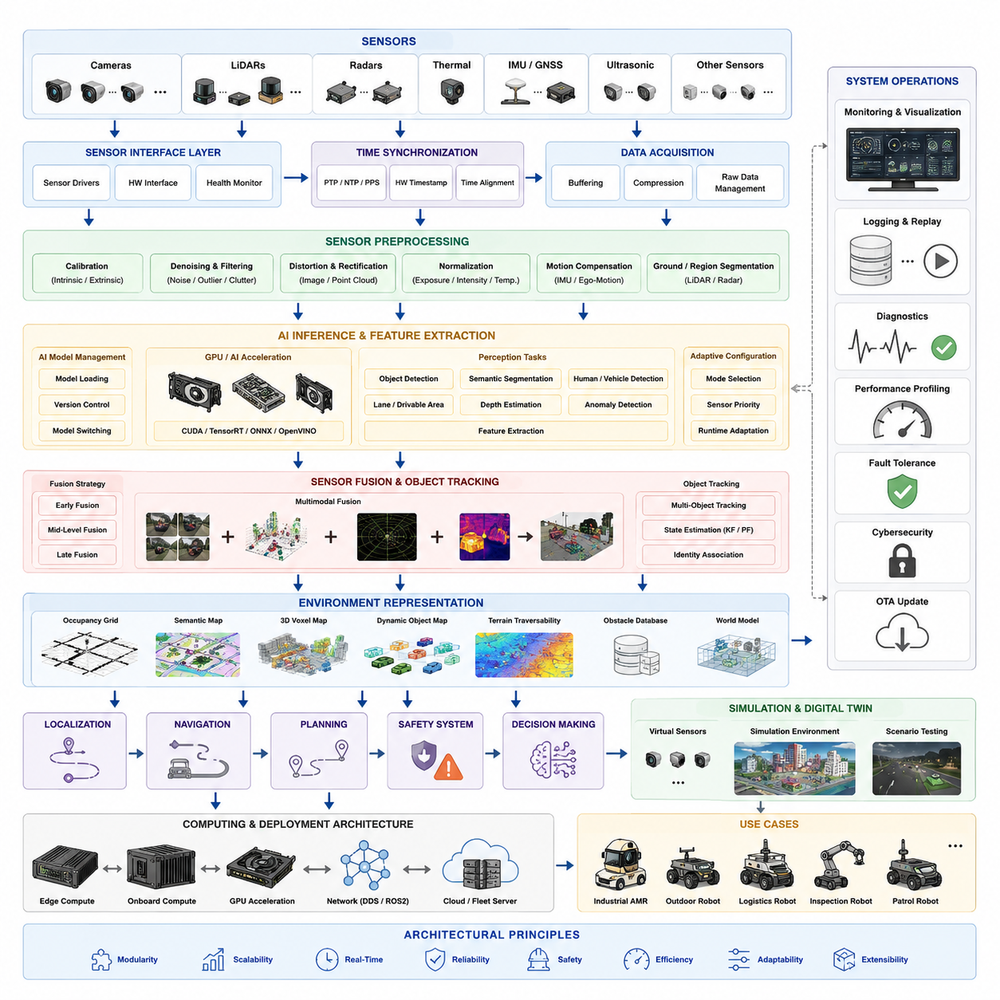
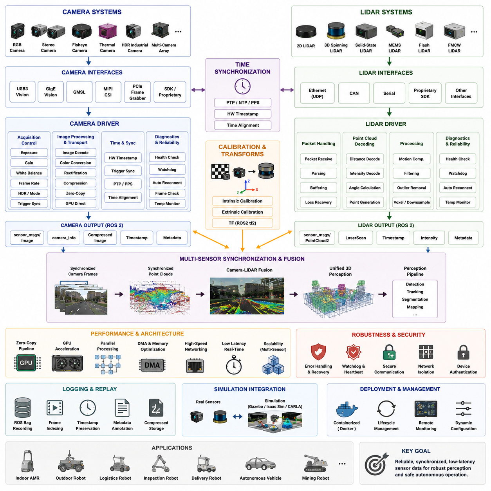
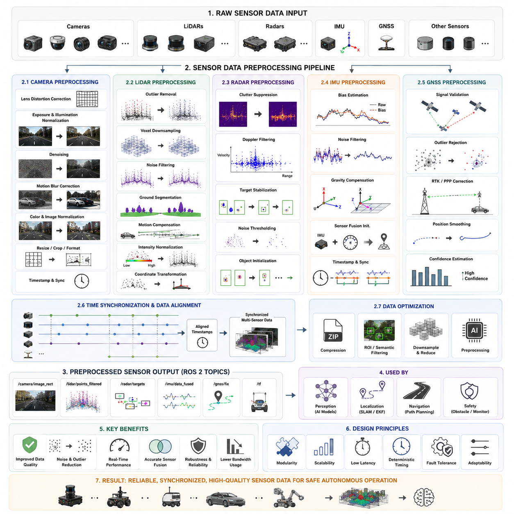
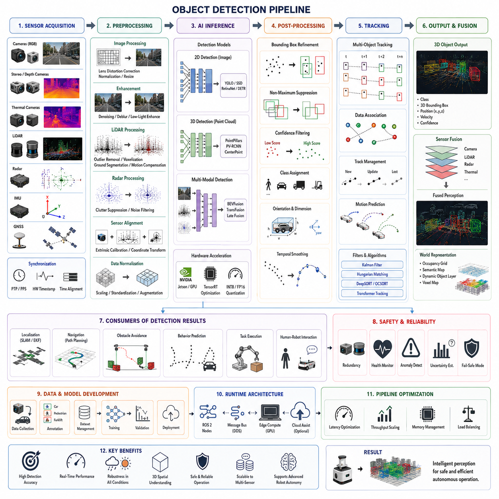
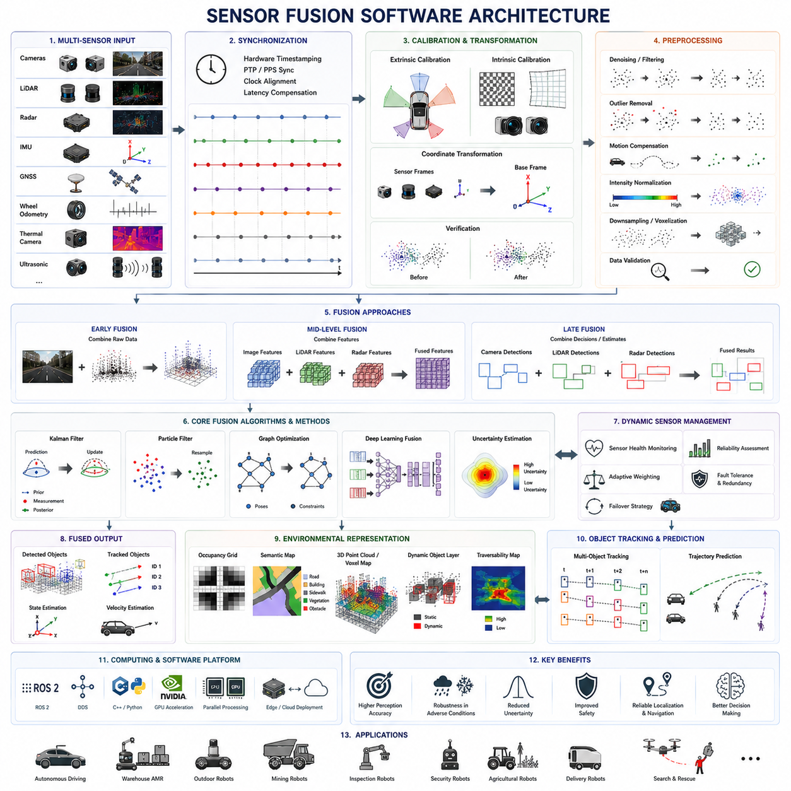
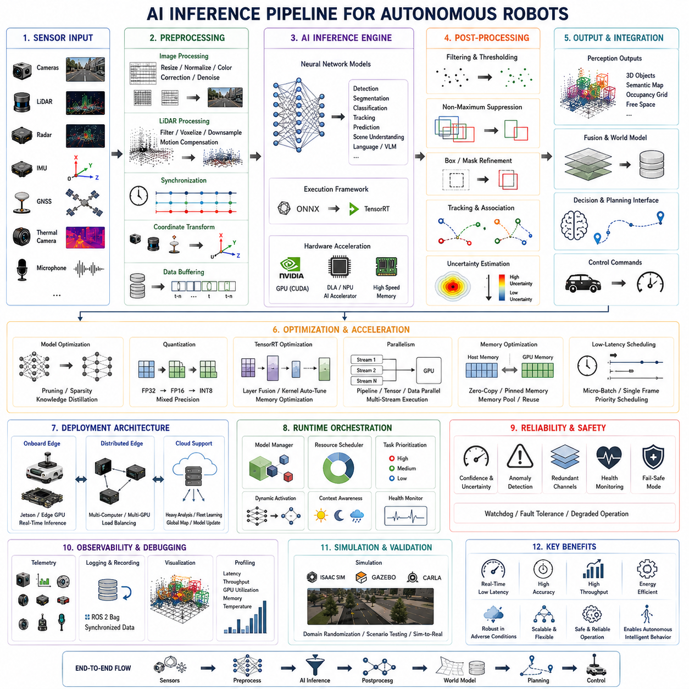
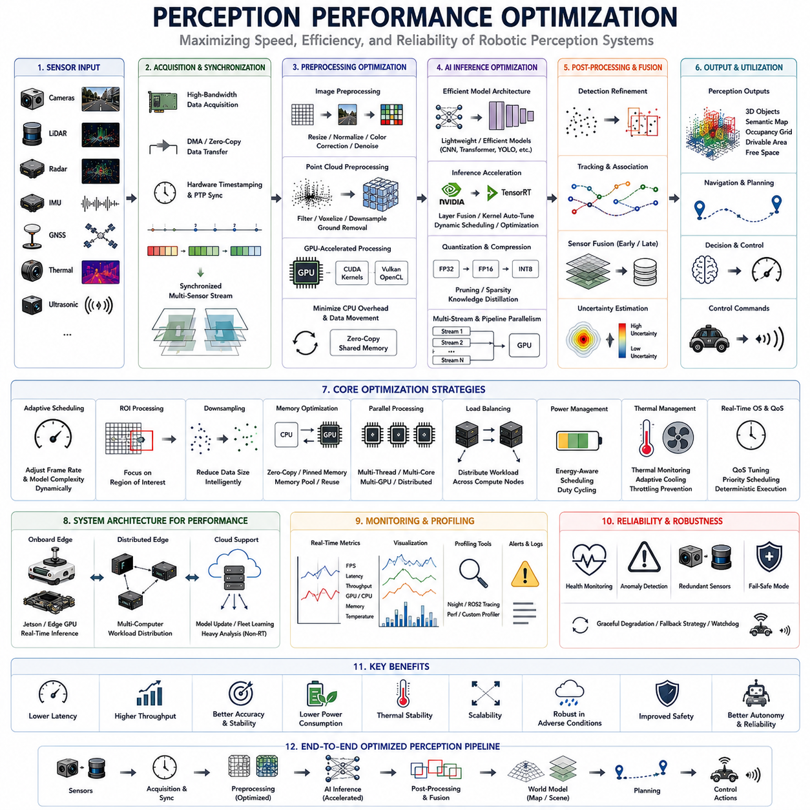
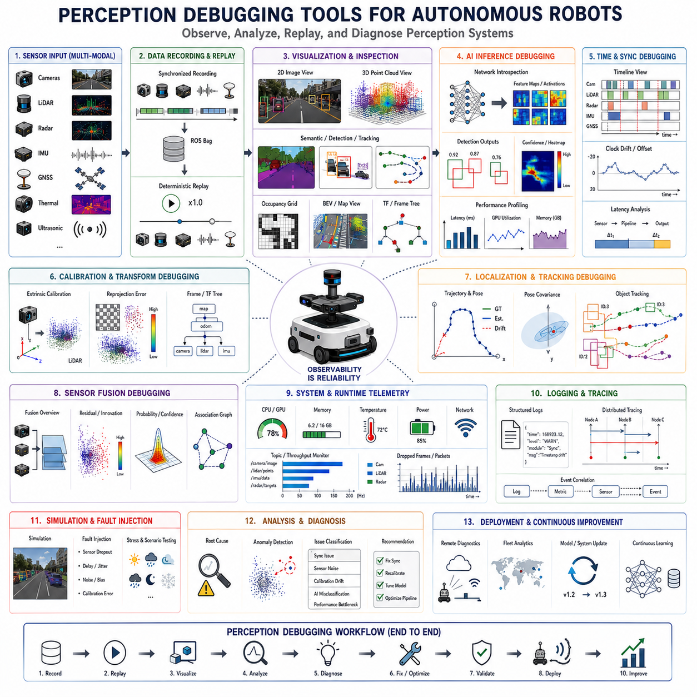

# Chapter 07. Perception Software

## 07.1 Perception Software Architecture

{width="7.268055555555556in" height="7.268055555555556in"}

"07_01_Perception_Software_Architecture"는 현대 자율주행 이동로봇(AMR) 시스템에서 가장 핵심적인 구성 요소 중 하나이다. 왜냐하면 Perception Software는 로봇의 디지털 감각 신경계 역할을 수행하기 때문이다. 산업용 AMR, 실외 자율주행 로봇, 물류 로봇, 병원 서비스 로봇, 순찰 로봇, AI 기반 점검 로봇 플랫폼 등에서 Perception Software는 원시 센서 신호를 구조화된 환경 이해 정보로 변환하며, 이 정보는 Localization, Navigation, Planning, Safety, Decision-Making 시스템에 전달된다. 따라서 Perception Software Architecture는 단순히 높은 정확도만을 목표로 하는 것이 아니라, 확장성, 모듈화, 실시간성, 유지보수성, 장애 허용성, AI 통합성을 동시에 고려하여 설계되어야 한다. 현대 로봇 시스템에서 Perception Software는 단일 컴퓨터 비전 모듈이 아니라, 카메라, LiDAR, Radar, Depth Sensor, Thermal Camera, Ultrasonic Sensor, GNSS, IMU 및 다양한 AI 모델들이 동시에 동작하는 분산형 다중 센서 처리 생태계로 진화하고 있다.

현대적인 AMR Perception Architecture는 일반적으로 Sensor Abstraction Layer와 Hardware Interface Module로부터 시작된다. 이러한 구성 요소는 실제 물리 센서와 통신하면서 상위 소프트웨어 계층으로부터 하드웨어 복잡성을 숨기는 역할을 수행한다. Sensor Driver는 Ethernet, USB, CAN, GMSL, MIPI CSI, Serial Communication 및 다양한 Proprietary Interface를 관리한다. Architecture는 서로 다른 Frame Rate, Data Format, Synchronization Method, Bandwidth Requirement, Latency 특성을 가진 이기종 센서를 동시에 지원해야 한다. 예를 들어 산업용 실외 로봇에서는 3D LiDAR가 10Hz로 동작하는 동안 RGB Camera는 30FPS, Radar는 비동기적으로 Target 정보를 제공할 수 있다. 따라서 Perception Software Architecture는 이러한 서로 다른 Sensor Stream을 시간적으로 정렬된 통합 데이터 구조로 변환해야 한다.

Sensor Interface Layer는 일반적으로 ROS2 Node 또는 Middleware 기반 Service Component 형태로 구현된다. 이러한 Modular Design은 센서 교체, Software Update, 시스템 확장을 쉽게 만들어 준다. 대규모 로봇 시스템에서는 Sensor Driver를 별도의 Processing Container 또는 Edge Computing Process로 분리하여 Fault Isolation과 System Reliability를 향상시키기도 한다. 예를 들어 Thermal Camera Driver가 비정상 종료되더라도 전체 Perception Pipeline이 중단되어서는 안 된다. 따라서 Fault Containment는 산업용 Perception Software에서 매우 중요한 Architectural Principle 중 하나이다.

Raw Sensor Acquisition 이후의 다음 핵심 계층은 Sensor Preprocessing이다. 실제 센서 데이터는 Noise, Distortion, Missing Data, Environmental Instability 문제를 포함하고 있다. Camera는 Lens Distortion Correction, Exposure Normalization, HDR Balancing, White Balance Adjustment, Image Rectification 과정을 필요로 한다. LiDAR 데이터는 Motion Compensation, Point Filtering, Outlier Rejection, Rain Filtering, Ground Segmentation 등의 전처리를 요구한다. Radar는 Clutter Suppression 및 Target Stabilization이 필요하며, Thermal Camera는 Temperature Normalization과 Environmental Calibration이 요구된다. 따라서 Perception Architecture는 실시간으로 동작 가능한 고성능 Filtering Pipeline을 포함해야 하며, Deterministic Latency를 보장할 수 있어야 한다.

현대 AI 기반 Perception System에서는 Preprocessing 단계 역시 GPU 가속 기반으로 발전하고 있다. NVIDIA CUDA Pipeline, TensorRT Optimization, Vulkan 기반 Compute System, Dedicated AI Accelerator 등이 Perception Architecture 내부에 직접 통합된다. Zero-Copy Memory Transfer Mechanism은 매우 중요하다. 왜냐하면 CPU와 GPU 간의 과도한 Data Transfer는 심각한 Latency Bottleneck을 유발하기 때문이다. 고성능 AMR Platform은 Sensor Data를 GPU Memory 내부에 유지한 채 전체 AI Inference Pipeline을 수행하는 Shared Memory Architecture를 채택하기도 한다. 이러한 구조는 Multi-Camera 및 Multi-LiDAR 환경에서 높은 Throughput을 가능하게 만든다.

Time Synchronization은 Perception Software Architecture의 가장 기본적인 요소 중 하나이다. Multi-Sensor Fusion은 센서 데이터가 시간적으로 정확하게 정렬되지 않으면 정상적으로 동작할 수 없다. 아주 작은 Timestamp 오차조차도 Localization 및 Obstacle Detection 오류를 크게 증가시킬 수 있다. 따라서 현대 Perception Architecture는 NTP, PTP, PPS Signal, Hardware Timestamping, ROS2 Time Synchronization Framework 등을 통합하여 사용한다. 실외 자율주행 로봇에서는 GNSS 기반 Timing이 Master Clock 역할을 수행할 수 있으며, 실내 로봇은 Local High-Precision Synchronization System을 사용할 수 있다. Timestamp Management는 단순한 Debugging 요소가 아니라 안정적인 Perception을 위한 핵심 Architectural Requirement이다.

Preprocessing이 완료되면 Perception Pipeline은 Feature Extraction 및 Environmental Understanding 단계로 진입한다. 이 계층은 Raw Sensor Signal을 Semantic Information으로 변환하는 역할을 수행한다. 과거의 전통적 로봇 시스템은 Edge Detection, Geometric Segmentation, Clustering, Occupancy Analysis와 같은 Handcrafted Feature Extraction 기법을 사용하였다. 그러나 현대 Perception Architecture는 Deep Learning 기반 AI Inference System을 중심으로 발전하고 있으며, 이를 통해 Object Detection, Semantic Segmentation, Free-Space Detection, Lane Recognition, Terrain Classification, Human Detection, Vehicle Tracking, Anomaly Recognition, Scene Understanding 등을 동시에 수행할 수 있다.

AI Inference Engine은 현대 Perception Software의 핵심 구성 요소이다. 이러한 Engine은 TensorRT, ONNX Runtime, PyTorch, TensorFlow, CUDA, OpenVINO 또는 Custom Inference Runtime 등을 기반으로 구현된다. Architecture는 Dynamic AI Model Loading, Version Management, Model Rollback, Runtime Switching 기능을 지원해야 한다. 산업용 AMR은 환경 변화에 따라 서로 다른 AI 모델을 필요로 하는 경우가 많다. 예를 들어 주간 순찰 로봇은 RGB 중심의 AI Model을 사용하고, 야간 운용 시에는 Thermal Camera 및 Radar Fusion 기반 Model을 강조할 수 있다. 따라서 Architecture는 Adaptive Perception Configuration을 지원해야 한다.

대규모 AMR 시스템에서는 AI Inference가 여러 연산 도메인으로 분산되기도 한다. 저수준 Safety Perception은 Deterministic Latency를 보장하는 Edge Processor에서 실행되고, 고수준 Semantic Understanding은 고성능 GPU Server 또는 Edge AI Computer에서 수행될 수 있다. 고급 플랫폼에서는 하나의 GPU가 Navigation 관련 Perception을 처리하고, 다른 GPU는 GPR 이상 탐지, Thermal 분석, 부식 감지, 산업 설비 이상 분석과 같은 Inspection AI를 수행하기도 한다. 이러한 Distributed Perception Architecture는 Workload를 분리하고 System Reliability를 향상시킨다.

Sensor Fusion은 Advanced Perception Software Architecture를 정의하는 핵심 요소 중 하나이다. 단일 센서만으로는 모든 환경 조건에서 안정적인 자율주행을 수행할 수 없다. Camera는 Semantic Understanding에는 강하지만 Darkness나 Fog 환경에서는 취약하다. LiDAR는 정확한 Geometry를 제공하지만 Semantic Richness가 부족하다. Radar는 악천후에서도 안정적으로 동작하지만 Spatial Detail이 제한적이다. Thermal Camera는 Heat Anomaly Detection에는 강하지만 Texture 정보가 부족하다. 따라서 Architecture는 이러한 서로 다른 센서의 장점을 결합하는 Heterogeneous Sensor Fusion Framework를 포함해야 한다.

Fusion Architecture는 여러 계층에서 수행될 수 있다. Early Fusion은 Raw Sensor Data를 직접 결합하며, Mid-Level Fusion은 Neural Network Feature 또는 Geometric Feature를 결합한다. Late Fusion은 독립적인 Detection 결과 또는 Semantic Output을 결합한다. 각각의 Fusion 방식은 서로 다른 Computational Requirement, Robustness, Complexity를 가진다. 최근 Embodied AI System은 Camera, Point Cloud, Radar, Thermal Image, Language Input을 하나의 통합 AI Model 내부에서 동시에 처리하는 Multimodal Transformer Architecture를 적극적으로 사용하고 있다.

Perception Software Architecture는 Environmental Representation System도 포함해야 한다. 단순 Detection 정보만으로는 Navigation 및 Decision-Making이 불가능하다. 로봇은 Occupancy Grid, Semantic Map, Voxel Representation, Dynamic Object Map, Terrain Traversability Layer, Obstacle Tracking Database와 같은 구조화된 World Model을 필요로 한다. 이러한 Representation은 Navigation System과의 인터페이스 역할을 수행하며, Planner는 이를 기반으로 안전한 Trajectory와 Behavior를 생성한다.

Real-Time Object Tracking 역시 핵심적인 Architectural Subsystem이다. 산업용 로봇은 사람, 차량, 지게차, 이동 기계, 예측 불가능한 장애물이 존재하는 Dynamic Environment에서 동작한다. 따라서 Perception Architecture는 지속적으로 Object Identity를 유지하는 Multi-Object Tracking System을 포함해야 한다. Kalman Filter, Particle Filter, Probabilistic Tracking, Graph-Based Association, Transformer-Based Tracking 등이 현대 시스템에 통합된다. Robust Tracking은 Navigation Stability와 Predictive Safety Planning 성능을 크게 향상시킨다.

Scalability는 산업용 Perception Software의 중요한 설계 요구사항이다. 소형 Indoor AMR은 두 개의 Camera와 하나의 LiDAR만 사용할 수 있지만, 대형 Outdoor Autonomous Robot은 여덟 개 이상의 Camera, Dual 3D LiDAR, Multiple Radar, Thermal Imaging System, GNSS RTK, IMU, Ultrasonic Sensor, Specialized Inspection Sensor를 동시에 사용할 수 있다. 따라서 Architecture는 전체 재설계 없이 Modular Expansion을 지원해야 한다. ROS2 기반 Node Architecture, DDS Middleware, Service-Oriented Communication, Distributed Microservice Concept가 이러한 Scalability를 달성하기 위해 사용된다.

Bandwidth Management 역시 매우 중요하다. Multi-Sensor Robot Platform은 막대한 양의 데이터를 생성한다. High-Resolution Camera, Dense LiDAR Point Cloud, Radar Stream, AI Feature Map은 현실적인 Storage 및 Transmission 한계를 초과할 수 있다. 따라서 Efficient Compression, Selective Streaming, Edge Filtering, Event-Driven Processing, AI-Based Data Reduction이 중요한 Architectural Component가 된다. Cloud-Connected Robot에서는 Edge Processing이 의미 있는 Event나 Anomaly만 전송하고 Raw Sensor Data는 Local Storage에 유지되는 경우가 많다.

Fault Tolerance와 Redundancy는 Safety-Critical Robot System에서 필수적이다. 산업용 AMR은 일부 Perception Degradation이 발생하더라도 안전하게 동작해야 한다. 따라서 Architecture는 Degraded Operational Mode를 지원해야 한다. Camera Failure가 발생하더라도 LiDAR와 Radar 기반 Obstacle Detection은 계속 동작해야 하며, GNSS가 손실되더라도 Visual-Inertial Localization이 일시적으로 Navigation을 유지해야 한다. Watchdog System, Heartbeat Monitoring, Sensor Health Diagnostics, Failover Logic이 이러한 Robust Architecture에 통합된다.

Cybersecurity 또한 점점 중요해지고 있다. Ethernet 기반 Sensor, DDS Middleware, Cloud Streaming, OTA Update Infrastructure는 잠재적인 Attack Surface를 제공한다. 따라서 Perception Architecture는 Secure Communication Protocol, Authentication Framework, Encrypted Sensor Transport, Secure Firmware Validation, Runtime Integrity Monitoring을 포함해야 한다. AI Model 자체 역시 Adversarial Attack 및 Malicious Data Injection으로부터 보호되어야 한다.

Perception Software Architecture는 Hardware Architecture와 매우 밀접하게 연결되어 있다. GPU 선택, Memory Bandwidth, Network Topology, Thermal Management, Storage System, Power Consumption은 모두 Perception Performance에 직접적인 영향을 미친다. NVIDIA Jetson과 같은 Embedded AI Platform은 Compact Edge Perception System을 가능하게 만들었으며, 고성능 실외 로봇은 Multiple Discrete GPU와 Industrial Edge Computer를 통합하기도 한다. Edge AI, Onboard Computing, Cloud AI 간의 Architecture Partitioning은 현대 로봇 설계에서 매우 중요한 Engineering Decision이 되었다.

Simulation Integration 역시 현대 Perception Architecture의 핵심 요소가 되었다. 오늘날 Perception System은 Synthetic Sensor Data, Virtual Environment, Digital Twin을 활용하여 실제 배포 이전에 알고리즘을 검증하는 Simulation-Driven Workflow 기반으로 개발된다. Gazebo, Isaac Sim, CARLA, Custom Digital Twin System은 다양한 Weather, Lighting, Traffic, Operational Condition에서 대규모 Scenario Testing을 가능하게 한다. 따라서 Perception Architecture는 Real Sensor Pipeline과 Simulated Sensor Interface를 동일한 Middleware 및 Message Structure로 지원해야 한다.

Observability와 Debugging Capability 역시 중요한 Architectural Principle이다. Perception Failure는 환경 조건, Timing Issue, Sensor Interaction에 따라 발생하기 때문에 재현이 매우 어렵다. 따라서 Architecture는 Comprehensive Logging System, ROS Bag Recording, Synchronized Multi-Sensor Replay, AI Inference Visualization Tool, Latency Profiling System, Runtime Monitoring Dashboard를 포함해야 한다. 산업용 로봇은 현장에서 발생한 문제를 중앙 서버에서 분석하기 위한 Remote Telemetry Framework를 사용하는 경우가 많다.

현대 Perception Architecture는 Embodied AI와 World Model 기반 구조로 진화하고 있다. 과거 Perception System은 Object Detection과 Obstacle Avoidance 중심이었다. 그러나 최신 AI-Native Robot Architecture는 Spatial Relationship, Human Intention, Semantic Context, Operational Objective, Long-Term Environmental Dynamics를 이해할 수 있는 Continuous Predictive World Model을 구축하려고 한다. 이러한 Architecture는 Multimodal Foundation Model, Visual-Language-Action System, Reinforcement Learning Agent, Memory-Based Reasoning Framework를 Perception Pipeline 내부에 통합한다.

미래의 Perception Software Architecture는 더욱 Adaptive하고 Distributed되며 AI-Native한 방향으로 발전할 것이다. 고정된 Pipeline 대신 환경과 목표에 따라 Sensor Priority, AI Model, Computational Resource를 동적으로 재구성하는 구조가 등장할 것이다. Edge-Cloud Collaborative Perception은 Robot Fleet 간 Semantic Understanding을 공유하게 될 것이며, Foundation Model은 Perception, Reasoning, Planning, Control을 통합된 Cognitive Architecture로 융합할 가능성이 높다. Real-Time World Modeling System은 실제 운영 데이터를 지속적으로 학습하며 Perception Behavior를 스스로 개선하게 될 것이다.

결국 Perception Software Architecture는 AMR 시스템에서 Autonomous Intelligence의 기반이다. Robust Perception Software 없이는 아무리 뛰어난 Navigation 및 Control System이라도 안전하고 안정적인 자율주행을 수행할 수 없다. 성공적인 Perception Architecture는 Real-Time Engineering, Distributed Software System, AI Inference Optimization, Sensor Fusion, Safety Engineering, Scalability, Observability, Future Extensibility를 통합하여 다양한 산업 및 실외 환경에서 안정적으로 동작 가능한 Autonomous System을 구현해야 한다.

## 07.2 Camera and LiDAR Drivers

{width="7.268055555555556in" height="7.268055555555556in"}

"07_02_Camera_and_LiDAR_Drivers"는 자율주행 이동로봇 소프트웨어 아키텍처에서 가장 기본적이면서도 핵심적인 주제 중 하나이다. 왜냐하면 Camera Driver와 LiDAR Driver는 실제 물리 센서 하드웨어와 로봇 지능 소프트웨어 스택 사이를 연결하는 직접적인 소프트웨어 브리지 역할을 수행하기 때문이다. 현대 AMR 시스템에서 Perception Pipeline은 Hardware Interface Layer에서 시작되며, 이 계층에서 원시 센서 신호가 수집되고, 디코딩되며, 동기화되고, 포맷 변환된 후 상위 소프트웨어 모듈로 전달된다. 따라서 전체 자율주행 로봇의 안정성과 성능은 Sensor Driver의 품질, 안정성, Latency 특성 및 Scalability에 크게 의존한다. 아무리 뛰어난 AI 기반 Perception Model이라 하더라도, Camera 및 LiDAR Driver가 안정적이고 동기화된 저지연 Sensor Stream을 제공하지 못하면 정상적으로 동작할 수 없다.

Camera Driver는 이미지 센서를 제어하고, Acquisition Parameter를 설정하며, Data Transport를 관리하고, Image Stream을 디코딩한 뒤 Robot Middleware Environment로 전달하는 역할을 수행한다. AMR에서 사용되는 Camera System은 적용 환경과 로봇 목적에 따라 매우 다양하다. Indoor Logistics Robot은 Obstacle Detection과 Localization을 위해 Stereo Camera와 RGB Camera를 사용할 수 있으며, Outdoor Autonomous Robot은 Multi-Camera Panoramic System, HDR Industrial Camera, Thermal Camera, Fisheye Camera, High-Speed Machine Vision Sensor 등을 사용할 수 있다. 따라서 Driver Architecture는 매우 다양한 Camera Interface와 Imaging Standard를 지원해야 한다.

현대 로봇용 Camera Driver는 일반적으로 USB3 Vision, GigE Vision, GMSL, MIPI CSI, Ethernet Streaming, PCIe Frame Grabber 및 다양한 Industrial Camera SDK를 지원한다. 각 Interface는 서로 다른 Bandwidth 특성, Synchronization Mechanism, Latency Profile 및 Driver Requirement를 가진다. USB Camera는 통합이 쉽지만 시스템 부하가 높을 때 Bandwidth 공유 문제로 인해 불안정해질 수 있다. GigE Vision Camera는 장거리 Industrial Networking에 적합하지만, Network Configuration과 Packet Management 최적화가 필요하다. GMSL 및 MIPI CSI Interface는 Low Latency와 Efficient High-Bandwidth Image Transfer를 제공하기 때문에 NVIDIA Jetson과 같은 Embedded AI Platform에서 널리 사용된다.

Camera Driver Architecture는 단순 Image Acquisition뿐 아니라 Camera Parameter Configuration도 관리해야 한다. Exposure Control, Gain Adjustment, White Balance, Frame Rate Configuration, HDR Mode Selection, Trigger Synchronization, Image Encoding Format, Lens Calibration Setting 등이 Driver Layer에서 제어된다. 특히 실외 로봇은 조명 환경 변화가 심하기 때문에 Dynamic Exposure Control이 매우 중요하다. 강한 햇빛, 터널, Indoor-to-Outdoor 전환, 야간 운용, 빗물 반사, 고대비 산업 환경 등은 Camera Control Algorithm이 제대로 구현되지 않으면 Perception Quality를 크게 저하시킬 수 있다.

많은 Industrial Camera System은 Hardware Trigger Synchronization 기능을 지원한다. 이는 여러 Camera가 외부 Timing Signal에 맞추어 동시에 이미지를 획득하는 기능이다. 이러한 기능은 Stereo Vision System, Surround View Perception, Multi-Camera Calibration, Sensor Fusion Pipeline에서 매우 중요하다. 따라서 Driver Architecture는 Hardware Timestamping과 Deterministic Acquisition Timing을 지원해야 한다. Camera 간 Synchronization 오차는 Depth Estimation, Visual SLAM Accuracy, Object Tracking Stability, Sensor Fusion Reliability를 심각하게 저하시킬 수 있다.

Image Decoding과 Image Transport Efficiency 역시 Camera Driver 개발에서 매우 중요한 요소이다. 고해상도 Multi-Camera System은 엄청난 양의 Data Bandwidth를 생성한다. 예를 들어 1920×1200 RGB Camera 8개가 30FPS로 동작하는 경우 초당 수 기가바이트의 Image Data가 생성될 수 있다. 따라서 Efficient Memory Management가 필수적이다. Zero-Copy Transport Mechanism, GPU-Direct Image Transfer, DMA Optimization, Pinned Memory Allocation, Hardware-Accelerated Image Decoding이 최신 로봇 Camera Driver에 적극적으로 통합되고 있다.

ROS2 기반 Robot System에서는 Camera Driver가 일반적으로 Modular ROS2 Node 형태로 구현되며, sensor_msgs/Image Topic과 camera_info Calibration Data를 Publish한다. Driver Node는 Compressed Image Transport, Shared Memory Transport, Intra-Process Communication을 지원하여 CPU Overhead를 줄일 수 있다. DDS QoS 설정 역시 매우 중요하다. 왜냐하면 Image Stream은 Robot이 Real-Time Performance를 우선시하는지, 아니면 Guaranteed Frame Delivery를 우선시하는지에 따라 Reliability, Queue Depth, Latency 설정이 달라지기 때문이다.

Camera Driver Stability는 Safety-Related Robot System에서 특히 중요하다. Camera Disconnect, Dropped Frame, Overheating, USB Bus Instability, Corrupted Packet, Bandwidth Saturation, Synchronization Failure는 실제 현장에서 자주 발생하는 문제이다. 따라서 Robust Driver Architecture는 Automatic Reconnection Logic, Watchdog System, Heartbeat Monitoring, Health Diagnostic, Frame Integrity Validation, Runtime Performance Monitoring 기능을 포함해야 한다. 산업용 자율주행 로봇은 수주 또는 수개월 동안 연속 운용될 수 있기 때문에, 일시적인 Hardware 또는 Communication Failure로부터 자동 복구 가능한 매우 안정적인 Sensor Interface Software가 필요하다.

LiDAR Driver 역시 로봇 Perception System에서 매우 중요한 역할을 수행한다. Camera가 Semantic Visual Understanding을 제공하는 반면, LiDAR는 매우 정확한 3차원 Geometric Information을 제공한다. LiDAR Driver는 LiDAR Hardware와 통신하고, Point Cloud Packet을 수신하며, Sensor Measurement를 디코딩하고, Spatial Geometry를 복원하며, Measurement에 Timestamp를 부여하고, 구조화된 Point Cloud Data를 Robot Middleware Framework로 전달하는 역할을 수행한다.

현대 AMR은 2D LiDAR, Rotating 3D LiDAR, Solid-State LiDAR, MEMS LiDAR, Flash LiDAR, FMCW LiDAR 등 매우 다양한 LiDAR 기술을 사용한다. 각 Sensor Architecture는 서로 다른 Data Format을 생성하며 Specialized Driver Implementation을 요구한다. 전통적인 Rotating LiDAR는 Sequential Scan Packet을 생성하며, Driver는 이를 Full Point Cloud Frame으로 조합해야 한다. Solid-State LiDAR는 Sparse Directional Measurement를 제공하며 Timing 특성이 다를 수 있다. FMCW LiDAR는 Range Information과 함께 Doppler Velocity Measurement도 제공한다.

LiDAR Driver는 일반적으로 Ethernet, UDP Packet Streaming, CAN Communication, Serial Communication 또는 Proprietary SDK Interface를 사용하여 통신한다. Ethernet 기반 LiDAR는 고대역폭 Point Cloud Transmission을 장거리에서 지원할 수 있기 때문에 널리 사용된다. 그러나 고성능 LiDAR는 초당 수백만 개의 Point를 생성할 수 있으므로 Networking과 Processing에 큰 부담을 준다. 따라서 Driver Architecture는 Packet Parsing, Buffering, Memory Allocation, Point Cloud Reconstruction Efficiency를 최적화해야 한다.

Point Cloud Decoding은 LiDAR Driver에서 가장 계산량이 많은 기능 중 하나이다. Raw LiDAR Packet에는 Encoded Distance Measurement, Reflectivity Value, Channel Information, Azimuth Angle, Timing Offset, Status Information 등이 포함된다. Driver는 이를 Cartesian Coordinate 기반 Point Cloud로 복원하여 상위 Perception Algorithm이 사용할 수 있도록 한다. 특히 고밀도 LiDAR 여러 개를 동시에 사용하는 Outdoor Robot에서는 Real-Time Decoding Performance가 매우 중요하다.

Motion Compensation 역시 Advanced LiDAR Driver에 통합되는 핵심 기능이다. Rotating LiDAR는 시간에 따라 순차적으로 데이터를 획득하기 때문에, Robot이 이동 중이면 Point Cloud가 왜곡될 수 있다. 따라서 고속 Autonomous Robot은 IMU, Odometry, GNSS 정보를 사용하여 Ego-Motion Compensation을 수행해야 한다. 이러한 Compensation이 제대로 구현되지 않으면 Localization Accuracy와 Obstacle Detection Accuracy가 크게 저하될 수 있다.

LiDAR와 다른 Sensor 간의 Time Synchronization 역시 매우 중요하다. LiDAR Point Cloud는 Camera Frame, Radar Measurement, IMU Reading, GNSS Positioning Data와 정확히 정렬되어야 한다. 따라서 Driver Architecture는 PTP, PPS Synchronization, Hardware Clock, ROS2 Timestamp, GPS-Based Timing System을 사용하는 Timestamp Synchronization Framework를 통합한다. 고급 Robot Platform은 모든 Perception Sensor 간에 Sub-Millisecond 수준의 Synchronization Accuracy를 요구하기도 한다.

Calibration Support 역시 Camera 및 LiDAR Driver System의 중요한 기능이다. Camera Intrinsic Calibration은 Focal Length, Lens Distortion, Optical Center, Projection Parameter 등을 포함한다. Extrinsic Calibration은 Sensor와 Robot Coordinate System 간의 Spatial Transformation을 정의한다. LiDAR Calibration은 Beam Angle Correction, Intensity Normalization, Coordinate Alignment 등을 포함할 수 있다. Driver Architecture는 이러한 Calibration Data를 Runtime에 Load하고 ROS2 tf2 Framework를 사용하여 전체 Perception Pipeline에서 Geometric Consistency를 유지해야 한다.

Multi-Sensor Synchronization은 Camera-LiDAR Fusion System에서 특히 중요하다. 많은 고급 AMR은 RGB Camera와 LiDAR Point Cloud를 결합하여 Semantic 3D Perception을 수행한다. 이 경우 작은 Synchronization Error조차도 Image Data와 Point Cloud Geometry 간의 Alignment 문제를 크게 유발할 수 있다. 따라서 Driver Architecture는 Unified Timestamp Management, Synchronized Triggering, Deterministic Communication Timing을 지원해야 한다.

Performance Optimization은 현대 Driver Development에서 매우 중요한 Engineering Challenge이다. Multi-Camera 및 Multi-LiDAR Robot은 엄청난 Sensor Bandwidth를 생성하며 CPU Resource, Memory System, Communication Bus를 과부하시킬 수 있다. 따라서 GPU-Accelerated Preprocessing, Parallel Packet Parsing, Asynchronous Buffering, Lock-Free Queue, DMA Transfer Optimization, Zero-Copy Architecture가 안정적인 Real-Time Performance를 위해 필요해지고 있다.

NVIDIA Jetson과 같은 Embedded AI Platform은 Driver Architecture Evolution에 큰 영향을 주었다. 현대 Robot Driver는 GPU-Native Image Pipeline, CUDA Acceleration, GPUDirect Transport, Hardware Video Decoding을 지원하는 경우가 많다. LiDAR Preprocessing 역시 GPU 상에서 직접 실행되어 Filtering, Segmentation, Point Cloud Transformation을 가속화할 수 있다. 따라서 GPU Memory Architecture와 효율적으로 통합되는 Driver Design이 점점 중요해지고 있다.

Fault Tolerance와 Robustness는 Industrial Driver Architecture의 핵심 설계 목표이다. Factory, Warehouse, Hospital, Port, Mine, Outdoor Industrial Site에서 동작하는 Autonomous Robot은 Vibration, Electrical Noise, Network Instability, Temperature Variation, Rain, Dust, Intermittent Hardware Failure를 견뎌야 한다. 따라서 Driver Software는 Comprehensive Error Handling, Recovery Logic, Thermal Monitoring, Packet Validation, Timeout Management, Degraded Operation Mode를 포함해야 한다.

Cybersecurity 역시 Sensor Driver System에서 중요성이 증가하고 있다. Ethernet 기반 Sensor는 Network Security가 약할 경우 Attack Vector가 될 수 있다. 따라서 Driver Architecture는 Encrypted Communication Channel, Secure Firmware Validation, Device Authentication, Network Isolation Mechanism을 통합하는 방향으로 발전하고 있다. 특히 Cloud Infrastructure와 연결되는 Industrial Robot은 Sensor-Level Security Protection이 매우 중요하다.

Simulation Integration 역시 현대 Camera 및 LiDAR Driver Architecture의 주요 요구사항이다. 오늘날 Robot Development는 Gazebo, Isaac Sim, CARLA, Digital Twin Platform과 같은 Simulation Environment에 크게 의존한다. 따라서 Driver System은 Real Sensor Hardware와 Virtual Simulated Sensor를 동일한 Software Interface로 지원해야 한다. 이를 통해 동일한 Perception Pipeline이 Simulation과 실제 Robot에서 모두 동작할 수 있다.

Logging 및 Replay System 역시 Driver Architecture와 밀접하게 연결된다. 대규모 Robot Debugging은 종종 Synchronization된 Raw Sensor Data Recording을 요구한다. 따라서 Camera Driver와 LiDAR Driver는 ROS Bag Recording, Timestamp Preservation, Frame Indexing, Metadata Annotation, Compressed Storage Pipeline을 지원해야 한다. 특히 Autonomous Vehicle과 Industrial Robot은 현장 운용 중 수 테라바이트 규모의 Sensor Data를 생성할 수 있기 때문에 Efficient Recording System이 필수적이다.

현대 Driver Architecture는 점점 Modular Service-Oriented Framework 형태로 진화하고 있다. 과거의 Monolithic Sensor Interface 대신, Independent Lifecycle Management, Dynamic Configuration System, Health Monitoring API, Remote Management Capability를 가진 Distributed Software Component 형태로 발전하고 있다. Docker 및 Kubernetes 기반 Containerized Deployment도 점점 보편화되고 있다.

미래의 Camera 및 LiDAR Driver System은 더욱 AI-Aware하고 Adaptive한 방향으로 발전할 가능성이 높다. 단순한 Passive Data Transport Layer가 아니라, 환경 조건, AI Workload, Mission Requirement, Operational Safety Constraint에 따라 Sensor Parameter를 동적으로 조절하는 구조가 등장할 것이다. AI-Assisted Exposure Control, Adaptive LiDAR Scanning Density, Intelligent Bandwidth Management, Predictive Fault Diagnostic은 차세대 Robot Perception Architecture의 표준 기능이 될 가능성이 높다.

Embodied AI와 대규모 Autonomous System이 발전할수록 Camera 및 LiDAR Driver는 계속해서 핵심 Infrastructure Component로 남게 될 것이다. 높은 수준의 자율성은 Sensor Communication과 Data Acquisition의 가장 낮은 계층이 Timing Precision, Robustness, Scalability, Computational Efficiency 측면에서 정교하게 설계되어야만 가능하다. 결국 Autonomous Robot의 Intelligence는 단순히 AI Model에서 시작되는 것이 아니라, Sensor Driver의 품질과 Architecture Sophistication에서부터 시작된다고 볼 수 있다.

## 07.3 Sensor Data Preprocessing

{width="7.268055555555556in" height="7.268055555555556in"}

"07_03_Sensor_Data_Preprocessing"은 자율주행 로봇 Perception System에서 가장 중요한 단계 중 하나이다. 왜냐하면 Raw Sensor Output은 대부분 AI Model, Localization System, Navigation Algorithm 또는 Safety Controller가 직접 사용하기에 적합하지 않기 때문이다. 현대 Autonomous Mobile Robot은 매우 동적인 환경 조건에서 엄청난 양의 Sensor Data를 지속적으로 생성한다. Camera는 Lighting Variation, Motion Blur, Lens Distortion, Weather Condition의 영향을 받는 이미지를 생성한다. LiDAR는 Reflection, Outlier, Motion Artifact, Environmental Interference가 포함된 Noise성 Point Cloud를 생성한다. Radar는 Clutter 및 Multipath Reflection이 섞인 Sparse Measurement를 생성하며, IMU는 Drift와 Vibration-Induced Error를 가진다. GNSS 역시 Signal Degradation, Multipath Interference, Temporary Signal Loss 문제를 겪을 수 있다. 따라서 Sensor Data Preprocessing은 불안정한 Raw Sensor Signal을 안정적이고 구조화된 Machine-Consumable Information으로 변환하는 핵심 Filtering 및 Conditioning Layer 역할을 수행한다.

Sensor Preprocessing의 가장 중요한 목적은 Real-Time Operational Capability를 유지하면서 Data Quality를 향상시키는 것이다. Autonomous Robot은 엄격한 Timing Constraint 하에서 동작하며, Perception Pipeline은 Deterministic Latency를 유지한 채 Sensor Stream을 지속적으로 처리해야 한다. 따라서 Preprocessing Architecture는 Computational Complexity, Filtering Quality, Throughput, Synchronization Accuracy, Memory Efficiency, Fault Tolerance를 동시에 고려해야 한다. 만약 Preprocessing Design이 잘못되면 손상된 Sensor Data가 AI Inference Pipeline으로 전달되어 Localization Failure, 불안정한 Navigation Behavior, False Obstacle Detection, Degraded Autonomous Decision-Making을 유발할 수 있다.

현대 로봇 Perception System은 일반적으로 Sensor Acquisition 직후부터 Preprocessing을 시작한다. Preprocessing Layer는 Low-Level Sensor Driver와 High-Level Perception Algorithm 사이에 위치한다. ROS2 기반 Robot Architecture에서는 Preprocessing Pipeline이 일반적으로 Dedicated Node 또는 Distributed Processing Module 형태로 구현되며, Raw Sensor Topic을 Subscribe하여 Conditioning Operation을 수행한 뒤 Filtered Output을 Publish한다. 이러한 Modular Preprocessing Design은 전체 Perception Stack에 영향을 주지 않고도 개별 Filter와 Algorithm을 독립적으로 수정, 테스트, 최적화 및 교체할 수 있도록 만든다.

Camera Preprocessing은 현대 Robot Perception에서 가장 계산량이 많은 작업 중 하나이다. Raw Camera Image는 Lens Distortion, Rolling Shutter Artifact, Inconsistent Exposure, Dynamic Illumination, Noise, Compression Artifact, Motion Blur 등의 영향을 받는다. Lens Distortion Correction은 Robot Vision System에서 가장 먼저 수행되는 Preprocessing Operation 중 하나이다. AMR에서 사용되는 Wide-Angle Camera와 Fisheye Camera는 강한 Geometric Distortion을 발생시키며, 이는 Object Detection, Visual SLAM, Depth Estimation, Sensor Fusion Accuracy에 부정적인 영향을 준다. 따라서 Camera Intrinsic Calibration Parameter를 사용하여 Image Rectification과 Geometric Correction을 수행한 뒤 상위 Processing이 시작된다.

Exposure Normalization 역시 중요한 Camera Preprocessing Task이다. Outdoor Autonomous Robot은 운용 중 극심한 Lighting Variation을 경험한다. 강한 햇빛, Tunnel Transition, 야간 환경, Reflective Surface, Industrial Lighting Flicker, Weather Condition은 Image Quality를 크게 저하시킬 수 있다. Automatic Exposure Control Algorithm은 다양한 환경에서 균형 잡힌 Brightness를 유지하려고 시도하지만, 많은 Robot System은 추가적으로 Histogram Equalization, Gamma Correction, Dynamic Range Compression, Adaptive Contrast Enhancement를 적용하여 Visual Perception Stability를 향상시킨다.

Image Denoising 역시 Robot Camera Preprocessing에서 필수적이다. Low-Light Condition과 High Gain Setting에서는 Electronic Sensor Noise가 증가한다. Thermal Camera는 Temperature-Related Noise Fluctuation을 발생시킬 수 있으며, Compressed Image Stream은 Encoding Artifact를 포함할 수 있다. 일반적으로 Gaussian Filtering, Median Filtering, Bilateral Filtering, Temporal Denoising, Non-Local Means Filtering, AI-Based Denoising Network 등이 사용된다. 중요한 점은 Noise를 제거하면서도 Object Recognition과 Localization에 필요한 중요한 Visual Feature를 유지해야 한다는 것이다.

Motion Blur Correction은 고속 Autonomous Robot에서 점점 더 중요해지고 있다. 빠른 Robot Movement, Vibration, Uneven Terrain, Long Exposure Time은 Blur된 Image Frame을 생성하여 AI Inference Reliability를 저하시킬 수 있다. 고급 Preprocessing Pipeline은 Motion Deblurring Algorithm, Inertial-Assisted Stabilization, Rolling Shutter Compensation, Image Sharpening Method를 포함할 수 있다. 일부 Robot Platform은 Motion Compensation Accuracy를 향상시키기 위해 Camera와 IMU 간 Hardware Synchronization을 사용하기도 한다.

Color Preprocessing과 Image Normalization 역시 중요한 단계이다. AI Model은 일반적으로 일관된 Inference Performance를 유지하기 위해 Standardized Image Distribution을 요구한다. 따라서 Preprocessing System은 Color Space Conversion, Intensity Normalization, Mean Subtraction, Pixel Scaling, White Balance Correction, Image Resizing을 수행한 뒤 AI Inference를 진행한다. 이러한 Standardized Preprocessing Pipeline은 Curated Dataset으로 학습된 AI Model을 실제 환경에 배포할 때 매우 중요하다.

LiDAR Preprocessing 역시 Autonomous Perception System에서 매우 중요하다. Raw LiDAR Point Cloud는 다양한 형태의 Environmental Noise와 Measurement Artifact를 포함한다. Rain, Fog, Dust, Snow, Reflective Surface, Multipath Reflection, Vibration, Sensor Motion은 Point Cloud에 잘못된 Measurement를 생성할 수 있다. 따라서 LiDAR Preprocessing Pipeline은 Geometric Consistency와 Environmental Reliability를 향상시키기 위해 여러 Filtering Stage를 수행한다.

Outlier Removal은 가장 일반적인 LiDAR Preprocessing Operation 중 하나이다. Statistical Filtering Method는 주변 Spatial Distribution과 일치하지 않는 Isolated Point를 제거한다. Radius-Based Filtering은 Sparse Isolated Point를 제거하며, Voxel-Based Downsampling은 Point Cloud Density를 줄여 Computational Efficiency를 향상시킨다. Ground Segmentation Algorithm은 Terrain Surface와 Obstacle을 분리하여 보다 안정적인 Navigation과 Obstacle Detection을 가능하게 만든다.

Motion Compensation은 Rotating LiDAR System에서 특히 중요한 Preprocessing Function이다. Spinning LiDAR는 시간에 따라 순차적으로 Point Cloud Data를 획득하기 때문에 Robot Movement에 의해 Spatial Structure가 왜곡될 수 있다. 따라서 고속 Autonomous Robot은 IMU, Odometry, GNSS 정보를 사용하여 Ego-Motion Compensation을 수행한다. 적절한 Motion Compensation이 없으면 Localization System이 Error를 누적할 수 있으며 Object Tracking Stability도 크게 저하될 수 있다.

Coordinate Transformation 역시 중요한 LiDAR Preprocessing Operation이다. LiDAR Measurement는 Calibration Parameter와 Robot Kinematic Model을 사용하여 Unified Robot Coordinate System으로 변환되어야 한다. Multi-LiDAR System은 Sensor 간 Geometric Alignment를 위해 정확한 Extrinsic Calibration이 필요하다. 따라서 Preprocessing Pipeline은 ROS2 tf2와 같은 Transformation Framework를 사용하여 전체 Perception Architecture에서 Spatial Consistency를 유지한다.

Intensity Normalization은 Advanced LiDAR Perception System에서 점점 중요해지고 있다. 서로 다른 LiDAR Sensor는 Distance, Material Property, Incidence Angle, Environmental Condition에 따라 서로 다른 Reflectivity Measurement를 생성한다. Preprocessing Algorithm은 이러한 Intensity Value를 Normalize하여 AI Model Consistency와 Environmental Interpretation을 향상시킬 수 있다. Reflectivity-Based Preprocessing은 Road Surface Analysis, Terrain Classification, Industrial Inspection Robotics에서 특히 유용하다.

Radar Preprocessing은 Radar Measurement의 Sparse하고 Noisy한 특성 때문에 독특한 문제를 가진다. Radar System은 악천후에서도 안정적인 Sensing을 제공하지만, Reflection, Ghost Target, Multipath Interference가 포함된 Cluttered Output을 생성한다. 따라서 Radar Preprocessing은 Clutter Suppression, Doppler Filtering, Target Stabilization, Noise Thresholding, Probabilistic Tracking Initialization을 수행한다. 최근에는 AI-Assisted Filtering을 사용하여 의미 있는 Target과 Environmental Interference를 구분하는 기술이 증가하고 있다.

IMU Preprocessing은 Localization, Stabilization, Motion Estimation System에서 매우 중요하다. Raw IMU Output은 Noise, Drift, Bias Instability, Vibration Artifact, Temperature-Dependent Variation을 포함한다. 따라서 Preprocessing Algorithm은 Bias Estimation, Gravity Compensation, Low-Pass Filtering, Sensor Fusion Initialization, Temporal Smoothing을 수행한 뒤 Motion Estimation System으로 데이터를 전달한다. High-Frequency IMU Preprocessing은 Control Stability와 Localization Precision에 직접 영향을 미치기 때문에 매우 낮은 Latency로 동작해야 한다.

GNSS Preprocessing 역시 Outdoor Autonomous Robot에서 필수적이다. GNSS Signal은 Atmospheric Interference, Signal Blockage, Urban Canyon Effect, Multipath Reflection, Temporary Outage에 취약하다. 따라서 Preprocessing System은 Satellite Measurement를 검증하고, Corrupted Signal을 제거하며, Positioning Confidence를 추정하고, RTK 및 PPP와 같은 Correction Service를 통합한다. Sensor Fusion Framework는 GNSS Preprocessing Output을 IMU 및 Odometry와 결합하여 Localization Robustness를 향상시킨다.

Time Synchronization은 Sensor Preprocessing Architecture와 깊게 연결되어 있다. Multi-Sensor Robot System은 Sensor Measurement가 시간적으로 정렬되지 않으면 안정적으로 동작할 수 없다. Camera, LiDAR, Radar, IMU, GNSS Module은 서로 다른 Frequency와 Communication Latency를 가진다. 따라서 Preprocessing System은 Timestamp Alignment, Measurement Interpolation, Asynchronous Stream Buffering, Communication Delay Compensation을 수행한다. PTP, NTP, PPS Synchronization, Hardware Timestamping, ROS2 Time Synchronization Framework가 일반적으로 사용된다.

Data Compression과 Bandwidth Optimization 역시 현대 Robot에서 중요한 Preprocessing Function이다. High-Resolution Camera와 Dense LiDAR System은 엄청난 Data Bandwidth를 생성하며, 이는 Onboard Computing Resource와 Cloud Communication Channel을 압도할 수 있다. 따라서 Preprocessing Pipeline은 Selective Compression, ROI Extraction, Adaptive Frame Reduction, Semantic Filtering, Event-Driven Transmission을 수행할 수 있다. Edge Computing System은 종종 Local Preprocessing을 수행한 후 요약된 정보만 Cloud Infrastructure로 전송한다.

GPU Acceleration은 현대 Preprocessing Architecture의 핵심 요소가 되었다. Multi-Camera 및 Multi-LiDAR Robot은 CPU 기반 Pipeline만으로는 처리하기 어려운 수준의 Data Volume을 생성한다. 따라서 GPU-Based Preprocessing Framework는 Image Filtering, Point Cloud Transformation, Segmentation, Denoising, AI-Assisted Conditioning Operation을 가속화한다. CUDA, TensorRT, Vulkan Compute Pipeline, OpenCL, GPU-Direct Memory Transfer가 현대 Robot Preprocessing Architecture에 적극적으로 통합되고 있다.

Parallel Processing과 Asynchronous Execution Model 역시 확장 가능한 Sensor Preprocessing System에서 필수적이다. 현대 Robot은 여러 Camera Stream, Multiple LiDAR, Radar Measurement, Localization Data를 동시에 처리해야 한다. 따라서 Lock-Free Queue, Multi-Threaded Execution, Zero-Copy Memory Transport, Distributed Processing Pipeline이 Deterministic Real-Time Performance를 유지하기 위해 사용된다.

Fault Tolerance와 Reliability는 Preprocessing System에서 매우 중요하다. 손상된 Sensor Conditioning은 전체 Autonomous Stack을 불안정하게 만들 수 있기 때문이다. 따라서 Preprocessing Architecture는 Watchdog System, Frame Validation, Packet Integrity Checking, Sensor Health Diagnostic, Runtime Anomaly Detection, Automatic Failover Strategy, Degraded Operational Mode를 포함해야 한다. 산업용 로봇은 Partial Sensor Failure나 Environmental Disturbance가 발생해도 안정적으로 동작해야 한다.

AI-Assisted Preprocessing은 차세대 Robot System에서 점점 일반화되고 있다. 기존의 Handcrafted Filter는 Adaptive Denoising, Super-Resolution Enhancement, Dynamic Exposure Correction, Rain Removal, Fog Compensation, Semantic Filtering이 가능한 Learned Neural Preprocessing Model로 대체되거나 보완되고 있다. AI-Based Preprocessing은 전통적인 Signal Processing Technique이 어려움을 겪는 Challenging Environment에서 Perception Robustness를 크게 향상시킬 수 있다.

Simulation Integration 역시 Preprocessing Architecture와 밀접하게 연결된다. Gazebo, Isaac Sim, CARLA와 같은 Robot Simulation Platform은 Motion Blur, LiDAR Noise, Rain Effect, Rolling Shutter Distortion, Environmental Interference를 현실적으로 생성할 수 있다. 따라서 Preprocessing System은 Simulation Sensor Stream과 Physical Sensor Stream 모두에서 일관되게 동작해야 하며, 이는 Sim-to-Real Transfer와 Large-Scale Validation Workflow에서 매우 중요하다.

Logging 및 Replay System 역시 Preprocessing Consistency에 크게 의존한다. Autonomous Robot Debugging은 종종 Recorded Sensor Data를 기반으로 Perception Failure를 재현해야 한다. 따라서 Preprocessing Pipeline은 Live Operation과 Offline Replay 모두에서 Synchronization Accuracy, Metadata Integrity, Calibration Consistency, Deterministic Processing Behavior를 유지해야 한다. ROS Bag System, Synchronized Replay Framework, Distributed Telemetry Pipeline은 산업용 Robot Preprocessing Architecture에 일반적으로 통합된다.

Cybersecurity 역시 Preprocessing System 내부에서 중요성이 증가하고 있다. Sensor Spoofing, Adversarial Image Injection, Malicious Data Manipulation, Communication Attack은 Validation Mechanism이 없는 경우 Autonomous Operation을 위협할 수 있다. 미래의 Preprocessing System은 Anomaly Detection, Sensor Authenticity Verification, Encrypted Transport Validation, AI-Based Integrity Monitoring을 포함하게 될 가능성이 높다.

미래의 Sensor Preprocessing Architecture는 더욱 Adaptive하고 Context-Aware하며 AI-Native한 방향으로 발전할 것이다. 고정된 Filtering Pipeline 대신, 환경 조건, Operational Objective, Computational Load, Mission Safety Requirement에 따라 Preprocessing Strategy를 동적으로 조절하는 구조가 등장할 가능성이 높다. AI-Driven Preprocessing Orchestration은 Filtering Parameter, Synchronization Policy, Bandwidth Allocation, Sensor Priority를 실시간으로 최적화할 수 있게 될 것이다.

결국 Sensor Data Preprocessing은 Physical Reality와 Robotic Intelligence 사이의 핵심 Stabilization Layer 역할을 수행한다. Autonomous Robot은 Noise가 많고 비동기적이며 불안정한 Sensor Stream을 Reliable Machine-Understandable Environmental Representation으로 변환하기 위해 Preprocessing System에 의존한다. Preprocessing Quality는 결국 Perception, Localization, Navigation, Safety, AI Decision-Making System의 Reliability를 직접적으로 결정한다. 앞으로 Robot Autonomy가 더욱 발전하여 Intelligent하고 Embodied AI 기반 시스템으로 진화할수록, Sensor Preprocessing은 안전하고 안정적인 Autonomous Operation을 가능하게 하는 가장 핵심적인 Engineering Discipline 중 하나로 계속 남게 될 것이다.

## 07.4 Object Detection Pipeline

{width="7.268055555555556in" height="7.268055555555556in"}

"07_04_Object_Detection_Pipeline"은 현대 자율주행 로봇 시스템에서 가장 핵심적인 소프트웨어 워크플로우 중 하나이다. 왜냐하면 Object Detection은 로봇이 실제 환경 속 객체를 인식하고, 분류하며, 위치를 추정하고, 환경을 이해하는 가장 기본적인 메커니즘이기 때문이다. Autonomous Mobile Robot에서 Object Detection Pipeline은 사람, 차량, 지게차, 로봇, 팔레트, 장애물, 도로 경계, 교통 표지판, 산업 설비, 인프라 이상 요소 등 로봇의 행동과 의사결정에 영향을 미치는 다양한 환경 요소를 식별하는 역할을 수행한다. Robust Object Detection이 없으면 Autonomous System은 Dynamic Environment에서 안전하게 주행할 수 없으며, Collision Avoidance, Human Interaction, Intelligent Operational Task 수행도 불가능하다.

Object Detection Pipeline은 단순한 Neural Network Inference Engine이 아니다. 실제로는 Sensor Acquisition, Preprocessing, Synchronization, AI Inference, Post-Processing, Object Tracking, Sensor Fusion, Environmental Representation, Optimization, Debugging, Runtime Management를 통합한 대규모 Distributed Perception Workflow이다. 현대 AMR Platform은 여러 Camera Stream, LiDAR Point Cloud, Radar Measurement, Thermal Imaging Feed, Depth Sensor Data를 동시에 처리하면서도 엄격한 Real-Time Constraint를 만족해야 한다. 따라서 Object Detection Pipeline은 Latency, Scalability, Reliability, Synchronization Accuracy, Computational Efficiency를 매우 신중하게 고려하여 설계되어야 한다.

Pipeline은 일반적으로 Multi-Sensor Data Acquisition에서 시작된다. Camera는 풍부한 Semantic Information을 제공하기 때문에 여전히 Object Detection의 가장 중요한 Sensor이다. RGB Camera는 Visual Appearance, Color, Texture, Contextual Scene Information을 제공한다. Stereo Camera는 Depth Estimation 기능을 제공하며, Thermal Camera는 Darkness, Smoke, Fog, Adverse Environmental Condition에서도 Object Detection을 가능하게 한다. Depth Camera는 Near-Field Obstacle Analysis를 위한 Structured Distance Measurement를 생성한다. LiDAR는 매우 정확한 Geometric Information과 Spatial Location을 제공하며, Radar는 악천후 환경에서도 Robust Long-Range Detection을 가능하게 만든다.

Sensor Acquisition 자체도 이미 상당한 Engineering Challenge이다. Camera는 일반적으로 30FPS 이상의 High-Resolution Image Stream을 생성하며, LiDAR는 초당 수백만 개의 Point를 생성할 수 있다. Sensor Fusion Architecture에서는 Sensor 간 Synchronization이 매우 중요하다. Hardware Timestamping, PTP Synchronization, ROS2 Time Management, PPS Signal, Synchronized Triggering Framework 등이 서로 다른 Perception Modality 간 Measurement Alignment를 위해 사용된다.

Sensor Acquisition 이후에는 Sensor Preprocessing이 수행된다. Raw Sensor Data는 대부분 직접 AI Inference에 사용하기 어렵다. Image에는 Lens Distortion, Inconsistent Illumination, Motion Blur, Noise, Exposure Imbalance가 존재할 수 있다. LiDAR Point Cloud는 Outlier, Rain Artifact, Dust Interference, Motion Distortion을 포함할 수 있다. Radar Measurement는 Clutter 및 Ghost Target을 포함한다. 따라서 Preprocessing Pipeline은 Geometric Correction, Denoising, Normalization, Filtering, Coordinate Transformation, Motion Compensation, Sensor Conditioning을 수행한 뒤 AI Analysis를 시작한다.

Image Preprocessing은 AI 기반 Object Detection System에서 특히 중요하다. Deep Learning Model은 Input Image Distribution에 매우 민감하다. Brightness, Color Balance, Contrast, Resolution 변화는 Detection Accuracy를 크게 저하시킬 수 있다. 따라서 Preprocessing Pipeline은 Resizing, Cropping, Normalization, Mean Subtraction, Color Space Conversion, Data Augmentation을 통해 Input Image를 표준화한다. 일부 시스템은 추가적으로 HDR Balancing, Deblurring, Rain Removal, Low-Light Enhancement를 적용하기도 한다.

LiDAR Preprocessing 역시 3D Object Detection System에서 매우 중요하다. Point Cloud Filtering은 Isolated Noise Point를 제거하며, Voxelization은 불규칙한 Point Distribution을 Structured Volumetric Representation으로 변환하여 Neural Network Processing에 적합하게 만든다. Ground Segmentation Algorithm은 Terrain과 Elevated Obstacle을 분리하여 Computational Complexity를 감소시킨다. Motion Compensation은 Robot Movement에 의해 발생하는 Point Cloud Distortion을 보정한다.

Preprocessing 이후 Pipeline은 Feature Extraction 및 AI Inference Stage로 진입한다. 이 단계는 Object Detection Architecture의 핵심 연산 부분이다. 현대 Robot System은 대규모 Dataset으로 학습된 Deep Neural Network를 사용하여 Environmental Object를 식별하고 분류한다. 초기 Object Detection System은 Convolutional Neural Network 기반이 주류였으나, 최근에는 Transformer-Based Model과 Multimodal Foundation Model이 Advanced Robotics System에서 점점 중요해지고 있다.

초기의 Object Detection System은 R-CNN, Fast R-CNN, Faster R-CNN과 같은 Two-Stage Architecture를 사용하였다. 이러한 구조는 먼저 Candidate Object Region을 생성하고 이후 별도의 Processing Stage에서 Classification을 수행하였다. 높은 Accuracy를 제공하였지만 Computational Cost가 매우 높고 Real-Time Robot System에 적용하기 어려웠다. 따라서 현대 AMR은 YOLO, SSD, RetinaNet, CenterNet과 같은 One-Stage Detector를 점점 더 많이 사용하고 있다. 이러한 구조는 매우 낮은 Inference Latency를 유지하면서도 높은 Detection Accuracy를 제공할 수 있다.

YOLO 기반 Architecture는 특히 Robotics 분야에서 매우 인기가 높다. 높은 Throughput을 제공하면서도 Embedded AI Hardware에서 효율적으로 동작하기 때문이다. 최신 YOLO Variant는 Multi-Scale Detection, Lightweight Deployment, TensorRT Acceleration, INT8 Quantization, Edge AI Optimization을 지원한다. NVIDIA Jetson 기반 Embedded Robot Platform은 여러 Camera Stream에 대해 Real-Time Detection을 수행할 수 있는 Optimized YOLO Inference Pipeline을 자주 사용한다.

Transformer-Based Object Detection Model인 DETR 계열도 점점 중요해지고 있다. Transformer 기반 구조는 기존 CNN Architecture와 달리 Global Scene Relationship과 Object 간 Contextual Interaction을 효과적으로 모델링할 수 있다. 이러한 구조는 Overlapping Object와 Occlusion이 많은 Industrial Environment에서 더욱 Robust한 Detection Performance를 제공할 수 있다. 미래의 Embodied AI System은 Vision, Language, Spatial Relationship, Robot Task Objective를 동시에 이해하는 Multimodal Reasoning Architecture 내부에 Object Detection을 통합할 가능성이 높다.

3D Object Detection 역시 빠르게 발전하는 분야이다. 기존 2D Image Detection은 Bounding Box와 Classification만 제공하며 Spatial Geometry 정보가 부족하다. Autonomous Robot은 Navigation 및 Obstacle Avoidance를 위해 정확한 3차원 이해가 필요하다. 따라서 현대 3D Detection System은 LiDAR Point Cloud, Stereo Vision, Depth Camera, Radar Data, Camera Image를 결합하여 Spatially Accurate 3D Object Representation을 생성한다.

LiDAR 기반 3D Object Detection Pipeline은 Voxel-Based Neural Network, Point-Based Neural Network, Sparse Convolution Architecture를 자주 사용한다. VoxelNet, PointPillars, SECOND, PV-RCNN, CenterPoint와 같은 Framework가 대표적이다. 이러한 시스템은 Point Cloud 내부에서 Vehicle, Pedestrian, Robot, Industrial Equipment, Obstacle를 직접 검출하며 Orientation, Velocity, Spatial Dimension까지 추정할 수 있다.

Sensor Fusion은 Advanced Object Detection Pipeline의 핵심 요소이다. Camera는 Semantic Richness를 제공하고 LiDAR는 Accurate Geometry를 제공한다. Radar는 Rain, Fog, Snow, Dust 환경에서 Robustness를 제공하며, Thermal Camera는 Nighttime Operation을 가능하게 만든다. Fusion Architecture는 이러한 서로 다른 Sensor의 장점을 결합하여 전체 Detection Reliability를 향상시킨다. Early Fusion은 Raw Sensor Data를 결합하고, Mid-Level Fusion은 Neural Feature Map을 결합하며, Late Fusion은 Independent Detection Output을 통합한다.

Post-Processing 역시 중요한 단계이다. Raw Neural Network Output은 Overlapping Detection, Uncertain Classification, False Positive, Unstable Prediction을 포함할 수 있다. Non-Maximum Suppression은 Highest-Confidence Bounding Box만 남기고 중복 Detection을 제거한다. Confidence Thresholding은 Low-Probability Prediction을 제거하며, Bounding Box Refinement는 Localization Accuracy를 향상시킨다. Temporal Smoothing은 Frame-to-Frame Prediction Instability를 감소시킨다.

Object Tracking은 현대 Detection Pipeline과 밀접하게 연결된다. Detection은 단일 Frame 내부에서만 Object를 식별하지만, Autonomous Robot은 시간에 따른 Object Motion을 지속적으로 이해해야 한다. 따라서 Multi-Object Tracking System은 Sequential Frame 간 Detection을 연결하고 Stable Object Identity를 유지한다. Kalman Filter, Particle Filter, Hungarian Matching Algorithm, Graph-Based Association, Transformer-Based Tracking Architecture 등이 사용된다.

Tracking은 Robot Behavior Stability를 크게 향상시킨다. Navigation 및 Planning System은 Motion Prediction에 의존하기 때문이다. 움직이는 Pedestrian, Forklift, Vehicle은 지속적으로 Tracking되어야 하며, 미래 Trajectory를 예측하여 Collision Avoidance를 수행해야 한다. Dynamic Warehouse 또는 Outdoor Facility에서 동작하는 Industrial AMR은 Safe Operation을 위해 Stable Object Tracking에 크게 의존한다.

Semantic Understanding 역시 점점 중요해지고 있다. 현대 Robot은 단순히 Object를 검출하는 것을 넘어 Object와 Environment 간의 Contextual Relationship까지 이해하려고 한다. Scene Understanding Framework는 Drivable Region, Pedestrian Zone, Loading Area, Restricted Region, Hazardous Zone, Road Structure, Operational Semantic 등을 분류할 수 있다. 이러한 Contextual Understanding은 더욱 Intelligent한 Navigation과 Task Planning을 가능하게 만든다.

Environmental Representation System은 Object Detection Output을 사용하여 Structured World Model을 구축한다. Occupancy Grid, Semantic Map, Dynamic Object Layer, Voxel Map, Traversability Map은 Detection Result를 Persistent Spatial Representation으로 통합하며, 이는 Navigation 및 Decision-Making System에서 사용된다. Real-Time Environmental Modeling은 Large-Scale Autonomous Operation에서 필수적이다.

Performance Optimization은 Robot Object Detection Pipeline에서 가장 어려운 Engineering Challenge 중 하나이다. 현대 Robot은 엄청난 Sensor Bandwidth를 처리하면서도 Strict Real-Time Constraint를 유지해야 한다. Multi-Camera System, High-Density LiDAR, AI Inference Engine은 매우 높은 Computational Load를 생성한다. 따라서 GPU Acceleration은 필수적이다.

CUDA Acceleration, TensorRT Optimization, ONNX Runtime Integration, Mixed Precision Inference, FP16 Computation, INT8 Quantization, Layer Fusion, Memory Optimization이 Throughput 향상과 Latency 감소를 위해 널리 사용된다. NVIDIA Jetson AGX Orin 및 Jetson Thor와 같은 Embedded AI Platform은 Multiple Neural Network를 동시에 처리할 수 있는 Highly Optimized Object Detection Pipeline을 지원한다.

Distributed Computing Architecture 역시 점점 중요해지고 있다. 대형 Outdoor Autonomous Robot은 Perception Workload를 여러 Edge Computer와 GPU로 분산하기도 한다. 하나의 Processor는 Navigation-Related Object Detection을 처리하고, 다른 GPU는 Industrial Inspection AI, Anomaly Analysis, Thermal Diagnostic을 수행할 수 있다. Cloud-Assisted Object Detection System은 Remote Semantic Analysis와 Fleet-Level Environmental Learning을 수행하기도 한다.

Fault Tolerance와 Reliability는 Industrial Object Detection Pipeline에서 필수적인 요구사항이다. False Negative는 위험한 Collision을 유발할 수 있으며, False Positive는 불안정한 Robot Behavior를 생성할 수 있다. 따라서 Detection Pipeline은 Confidence Estimation, Uncertainty Modeling, Sensor Redundancy, Anomaly Detection, Health Monitoring, Fail-Safe Operational Mode를 포함한다. Safety-Critical Robot System은 High-Level AI System과 독립적인 Dedicated Safety Perception Channel을 별도로 두기도 한다.

Dataset Quality는 Object Detection Performance에 직접적인 영향을 준다. Industrial Robotics Environment는 일반적인 Public AI Dataset과 매우 다르다. Warehouse, Factory, Hospital, Outdoor Facility, Port, Railway, Construction Site, Inspection Environment는 매우 특수한 Operational Condition을 가진다. 따라서 Large-Scale Data Collection, Annotation Pipeline, Synthetic Data Generation, Domain Adaptation, Continual Learning Framework가 Industrial Object Detection System에서 매우 중요하다.

Simulation-Based Training 역시 점점 중요해지고 있다. Isaac Sim, CARLA, Gazebo, Digital Twin Platform은 다양한 Lighting, Weather, Terrain, Traffic Condition에서 Synthetic Environment를 생성할 수 있다. 이를 통해 고비용의 Real-World Data Collection 없이도 Object Detection System을 학습시킬 수 있다. Sim-to-Real Transfer Technique은 Synthetic Environment와 Physical Environment 간의 차이를 줄이기 위해 사용된다.

Debugging과 Observability 역시 중요한 Engineering Concern이다. Detection Failure는 드문 Environmental Condition에서만 발생하는 경우가 많아 재현이 어렵다. 따라서 Visualization Tool, Synchronized Replay System, ROS Bag Recording, Feature Map Inspection, Latency Profiling, Inference Logging, Telemetry System이 Robust Robot Development Workflow를 위해 필수적이다.

Cybersecurity 역시 AI 기반 Perception System에서 중요성이 증가하고 있다. Adversarial Attack, Sensor Spoofing, Malicious Image Injection, AI Manipulation은 Object Detection Reliability를 손상시킬 수 있다. 미래의 Object Detection Pipeline은 AI Integrity Verification, Anomaly Detection, Secure Model Validation, Runtime Authentication System을 포함하게 될 가능성이 높다.

미래의 Object Detection Pipeline은 Unified Embodied AI Architecture 방향으로 발전할 가능성이 높다. 독립적인 Object Detection Module 대신, 미래 Robot은 Perception, Reasoning, Planning, Interaction Understanding을 동시에 수행하는 Multimodal World Model을 사용할 수 있다. Massive Multimodal Dataset으로 학습된 Foundation Model은 단순한 Object Category뿐 아니라 Intention, Operational Context, Affordance, Semantic Relationship까지 이해할 수 있게 만들 것이다.

결국 Object Detection Pipeline은 Autonomous Robotics System의 Perceptual Intelligence Backbone 역할을 수행한다. 모든 Navigation Decision, Obstacle Avoidance Maneuver, Safety Response, Autonomous Behavior는 Robot이 주변 Object를 정확히 검출하고 해석할 수 있는 능력에 의존한다. 앞으로 Robotics System이 더욱 Intelligent하고 Large-Scale Autonomous Operation 방향으로 발전할수록, Object Detection Pipeline은 전체 Robot Software Architecture에서 가장 Computationally Demanding하고 Safety-Critical하며 Strategically Important한 Component 중 하나로 계속 남게 될 것이다.

## 07.5 Sensor Fusion Software

{width="7.268055555555556in" height="7.268055555555556in"}

"07_05_Sensor_Fusion_Software"는 현대 자율주행 로봇 시스템에서 가장 중요한 소프트웨어 분야 중 하나이다. 왜냐하면 단일 센서만으로는 모든 운용 환경에서 완전하고 안정적이며 Robust한 환경 이해를 제공할 수 없기 때문이다. Autonomous Mobile Robot은 조명 변화, 기상 조건, 센서 노이즈, 가림 현상, 진동, 전자기 간섭, 환경 복잡성이 지속적으로 발생하는 매우 동적이고 예측 불가능한 환경에서 동작한다. Camera System은 풍부한 Semantic Information을 제공하지만 Darkness나 악천후에서는 성능이 저하될 수 있다. LiDAR는 매우 정확한 Geometric Measurement를 제공하지만 Semantic Richness가 부족하며, Rain, Fog, Reflective Interference의 영향을 받을 수 있다. Radar는 악조건에서도 안정적으로 동작하지만 Spatial Detail이 부족하다. Thermal Camera는 Darkness에서도 Heat Signature를 검출할 수 있지만 세밀한 Texture Information이 부족하다. GNSS는 Outdoor Environment에서 Global Positioning을 제공하지만 Urban Canyon이나 Indoor Environment에서는 불안정해질 수 있다. IMU는 High-Frequency Motion Estimation을 제공하지만 시간이 지남에 따라 Drift가 누적된다. 따라서 Sensor Fusion Software는 여러 Sensor의 상호 보완적인 장점을 결합하고 각각의 약점을 보완하기 위해 존재한다.

Sensor Fusion Software는 Robot Perception Architecture 내부에서 Integrative Intelligence Layer 역할을 수행한다. 단순히 각 Sensor를 독립적으로 처리하는 것이 아니라, 서로 다른 Sensor Data Stream을 Synchronization, Alignment, Correlation, Merging하여 Unified Environmental Representation을 생성한다. 이러한 Unified Perception은 Localization Accuracy, Object Detection Robustness, Environmental Understanding, Motion Prediction, Safety Reliability, Autonomous Decision-Making Stability를 크게 향상시킨다.

Sensor Fusion의 핵심 목표는 단순히 Sensor Output을 합치는 것이 아니라 Environmental Interpretation의 Uncertainty를 감소시키고 Confidence를 향상시키는 것이다. 모든 Sensor Measurement는 Noise, Environmental Condition, Hardware Limitation, Calibration Inaccuracy, Communication Latency, Physical Interference로 인해 불확실성을 가진다. Fusion Algorithm은 여러 불확실한 Observation을 결합하여 현실에 대한 가장 가능성이 높은 Representation을 추정하려고 한다.

현대 Robot Sensor Fusion Architecture는 일반적으로 Synchronized Multi-Sensor Acquisition에서 시작된다. Camera, LiDAR, Radar, IMU, GNSS, Ultrasonic Sensor, Wheel Odometry, Thermal Camera 등은 서로 다른 Frequency와 Communication Latency를 가진다. Camera Stream은 일반적으로 30FPS 이상으로 동작하고, LiDAR는 10Hz 수준이며, IMU는 수백 Hz, GNSS는 더 낮은 Update Rate를 가진다. 따라서 Accurate Time Synchronization은 모든 Sensor Fusion System의 기반이 된다. Hardware Timestamping, PTP Synchronization, PPS Timing Signal, ROS2 Time Management Framework, Deterministic Communication Architecture가 일반적으로 Sensor Fusion Software Stack에 통합된다.

Calibration 역시 Sensor Fusion Software의 매우 중요한 기반 요소이다. Sensor Data를 의미 있게 Fusion하기 위해서는 모든 Sensor가 Robot Coordinate System 내부에서 일관된 Geometric Relationship를 가져야 한다. Intrinsic Calibration은 Camera Focal Length 및 Lens Distortion과 같은 내부 특성을 정의하며, Extrinsic Calibration은 Sensor 간 Spatial Transformation을 정의한다. Camera-LiDAR Calibration, Radar-Camera Alignment, IMU Mounting Calibration, Robot Body Coordinate Transformation은 Geometric Consistency를 위해 필수적이다. 작은 Calibration Error조차도 Fusion Accuracy를 크게 저하시킬 수 있으며, Localization이나 Perception System 전체를 불안정하게 만들 수 있다.

Sensor Fusion Architecture는 일반적으로 Fusion이 수행되는 위치에 따라 여러 종류로 나뉜다. Early Fusion은 Raw Sensor Data를 직접 결합한다. Mid-Level Fusion은 Neural Network Feature Map, Geometric Descriptor, Semantic Embedding과 같은 Intermediate Representation을 결합한다. Late Fusion은 독립적으로 생성된 Object Detection, Classification, Probabilistic Estimate를 통합한다. 각 Fusion Strategy는 서로 다른 Computational Complexity, Robustness, Interpretability, Scalability Tradeoff를 가진다.

Early Fusion Approach는 Raw Measurement로부터 Unified Multimodal Sensor Representation을 직접 생성하려고 한다. 예를 들어 Camera Image를 LiDAR Point Cloud Space로 Projection하거나, LiDAR Geometry를 AI Inference 이전에 Image Coordinate에 Overlay할 수 있다. Early Fusion은 매우 통합된 Environmental Representation을 제공할 수 있지만, Strict Synchronization과 Accurate Calibration을 요구한다. 또한 Large Multimodal Data Bandwidth로 인해 Computational Cost가 매우 커질 수 있다.

Mid-Level Fusion은 현대 AI 기반 Robot System에서 점점 더 많이 사용되고 있다. 이러한 Architecture에서는 각 Sensor Modality가 먼저 Neural Network 또는 Signal Processing Algorithm을 사용하여 독립적으로 Feature Extraction을 수행한다. 이후 Intermediate Feature가 Shared Latent Space에서 Fusion되며 Semantic Information과 Geometric Information을 함께 분석할 수 있다. Transformer-Based Multimodal Fusion Architecture는 Camera, LiDAR, Radar, Thermal Image, 심지어 Language Instruction 간의 Cross-Modal Relationship를 학습할 수 있기 때문에 점점 더 중요해지고 있다.

Late Fusion Architecture는 Object Detection이나 Environmental Interpretation이 완료된 이후에 독립적인 Sensor Output을 결합한다. 예를 들어 Camera-Based Object Detection은 Pedestrian을 식별하고, Radar-Based Tracking은 Velocity를 추정하며, LiDAR-Based Geometry는 Spatial Position을 계산할 수 있다. Fusion Software는 이러한 Independent Output을 결합하여 더 높은 Reliability를 가진 Unified Tracked Object를 생성한다. Late Fusion은 상대적으로 Computationally Efficient하며 Modular Structure를 유지하기 쉽다.

Probabilistic Estimation은 Sensor Fusion Software의 핵심 수학적 기반이다. Autonomous Robot은 Noise가 포함된 Sensor Measurement를 기반으로 Uncertain Environmental State를 지속적으로 추정해야 한다. Kalman Filter는 Robotics 분야에서 가장 널리 사용되는 Fusion Algorithm 중 하나이다. Extended Kalman Filter와 Unscented Kalman Filter는 Nonlinear Robot System에서 Localization, Motion Estimation, Object Tracking에 자주 사용된다. 이러한 Algorithm은 Prediction Model과 Sensor Observation을 균형 있게 결합하여 Optimal System State를 Recursive하게 추정한다.

Particle Filter 역시 Robot Sensor Fusion에서 널리 사용된다. Kalman Filter와 달리 Particle Filter는 Highly Nonlinear하고 Multi-Modal한 Probability Distribution을 표현할 수 있다. 이는 여러 가능한 Robot Pose가 동시에 존재할 수 있는 Localization Problem에서 특히 유용하다. Monte Carlo Localization은 LiDAR, Odometry, IMU, Map Data를 Fusion하여 Robust Robot Positioning을 수행하기 위해 Particle Filter를 자주 사용한다.

Graph-Based Optimization 역시 Advanced Robotics System에서 중요한 Fusion Framework이다. 현대 SLAM 및 Localization System은 Sensor Fusion을 Graph Optimization Problem으로 표현한다. Robot Pose, Landmark, Sensor Constraint가 Large Probabilistic Graph를 형성하며, Optimization Algorithm은 모든 Sensor Observation에 대한 Global Estimation Error를 최소화한다. 이러한 방식은 Large-Scale Mapping, Loop Closure Detection, Long-Term Localization에서 매우 효과적이다.

Deep Learning은 Sensor Fusion Software Architecture를 빠르게 변화시키고 있다. 기존 Fusion System은 Handcrafted Probabilistic Model과 Geometric Algorithm에 크게 의존하였다. 현대 AI-Based Fusion System은 대규모 Dataset으로부터 직접 Optimal Fusion Strategy를 학습할 수 있는 Multimodal Neural Network를 사용한다. Camera-LiDAR Fusion Network, Radar-Camera Transformer, Visual-Inertial Learning System, Multimodal Foundation Model이 Robot Perception Performance를 빠르게 향상시키고 있다.

Visual-Inertial Fusion은 Robotics에서 가장 일반적인 Fusion Architecture 중 하나이다. Camera는 풍부한 Environmental Information을 제공하고 IMU는 High-Frequency Motion Estimation을 제공한다. Visual-Inertial Odometry System은 이 두 Modality를 결합하여 Temporary Visual Degradation이나 Rapid Dynamic Movement 상황에서도 Robust Motion Estimation을 가능하게 한다. 이러한 시스템은 Drone, Mobile Robot, Autonomous Vehicle, Handheld Robotics Device에서 널리 사용된다.

LiDAR-IMU Fusion 역시 매우 중요한 Architecture이다. 특히 Outdoor Autonomous Robot에서 중요성이 크다. LiDAR는 Precise Geometric Structure를 제공하고 IMU는 High-Frequency Motion Compensation을 제공한다. LiDAR-Inertial Odometry System은 Dynamic Motion Condition에서도 매우 정확한 Localization을 가능하게 하며, Autonomous Vehicle, Mining Robot, Railway Inspection System, Industrial Outdoor Robotics에서 널리 사용된다.

Camera-LiDAR Fusion은 현대 Autonomous Perception System을 대표하는 기술 중 하나가 되었다. Camera는 Object Classification, Lane Recognition, Traffic Sign, Scene Context와 같은 Semantic Understanding을 제공하며, LiDAR는 Accurate 3D Geometry를 제공한다. Fusion Software는 이러한 정보를 결합하여 Robust Semantic 3D Environmental Understanding을 생성한다. 현대 Autonomous Driving 및 Industrial AMR System은 이러한 Fusion Architecture에 크게 의존한다.

Radar Fusion은 Robot이 더욱 열악한 환경으로 확장되면서 점점 중요해지고 있다. Camera와 LiDAR는 Rain, Snow, Fog, Smoke, Dust, Direct Sunlight에서 성능이 크게 저하될 수 있다. Radar는 이러한 환경에서도 안정적인 Long-Range Detection을 제공하며, Doppler Measurement를 통해 Object Velocity를 직접 측정할 수 있다. 따라서 Radar-Camera 및 Radar-LiDAR Fusion System은 Adverse Weather Environment에서 Operational Robustness와 Safety Reliability를 향상시킨다.

Thermal Fusion 역시 Security Robot, Patrol Robot, Search-and-Rescue System, Industrial Inspection Robot에서 중요한 기능으로 부상하고 있다. Thermal Camera는 Visible Illumination과 무관하게 Heat Signature를 검출할 수 있다. RGB Camera와 Thermal Imaging의 Fusion은 Nighttime Perception과 Human Detection Reliability를 크게 향상시킨다.

Sensor Fusion Software는 Dynamic Uncertainty Estimation도 관리해야 한다. 각 Sensor는 환경 조건에 따라 서로 다른 Reliability를 가진다. Camera는 Darkness나 Glare에서 Reliability가 감소하고, LiDAR는 Heavy Rain에서 성능이 저하될 수 있으며, GNSS는 Tall Building 주변에서 불안정해질 수 있다. Advanced Fusion System은 Confidence Estimation, Environmental Diagnostic, Sensor Health Monitoring을 기반으로 Sensor Weighting을 동적으로 조정한다.

Real-Time Performance는 Sensor Fusion Software에서 가장 어려운 Engineering Challenge 중 하나이다. Multi-Sensor Robot은 엄청난 Data Bandwidth를 생성하며, 이를 Strict Latency Constraint 하에서 Synchronization, Transformation, Processing, Fusion해야 한다. 따라서 High-Performance Fusion System은 GPU Acceleration, Parallel Computing, Asynchronous Pipeline, Lock-Free Data Structure, Shared Memory Transport, Optimized Middleware Communication에 크게 의존한다.

ROS2와 DDS Middleware는 현대 Fusion Architecture에서 중요한 역할을 수행한다. Distributed Sensor Fusion System은 여러 Computational Node와 Edge Processor에 걸쳐 동작하는 경우가 많다. ROS2 Topic Transport, QoS Configuration, Shared Memory Communication, Distributed Node Architecture는 복잡한 Robot Platform에서 확장 가능한 Fusion System을 가능하게 한다.

Fault Tolerance와 Redundancy는 Industrial Fusion System의 필수 요구사항이다. 일부 Sensor가 일시적으로 실패하더라도 Fusion Software는 안전하게 계속 동작해야 한다. Redundant Sensing Modality는 Partial Sensor Failure 상황에서도 Degraded but Safe Operation을 가능하게 만든다. 따라서 Sensor Health Diagnostic, Anomaly Detection, Watchdog Monitoring, Failover Mechanism이 Robust Fusion Architecture에 깊게 통합된다.

Environmental Representation 역시 Sensor Fusion Software의 중요한 역할이다. Fusion된 Sensor Output은 Occupancy Grid, Semantic Map, Dynamic Object Layer, Traversability Map, Voxel Map, World Model로 변환되어 Navigation 및 Planning System에 전달된다. Unified Environmental Representation은 High-Level Autonomy System이 환경을 일관되게 이해하고 추론할 수 있도록 만든다.

Object Tracking 역시 Fusion Software와 밀접하게 연결된다. Multi-Object Tracking System은 시간에 따라 Sensor Observation을 연결하고 Stable Object Identity를 유지한다. Fusion-Based Tracking은 Complementary Sensor Measurement를 결합하여 Motion Prediction Accuracy를 향상시키고 False Positive를 감소시킨다.

Simulation Integration은 Fusion Software Development에서 점점 중요해지고 있다. Isaac Sim, Gazebo, CARLA, Digital Twin Platform은 다양한 Operational Condition에서 Sensor Fusion System을 검증할 수 있게 만든다. Simulation Environment는 Sensor Noise, Synchronization Error, Weather Condition, Lighting Change, Dynamic Traffic Scenario를 재현하여 Large-Scale Validation을 가능하게 한다.

Logging 및 Replay System 역시 Fusion Debugging과 Validation에 필수적이다. Sensor Fusion Failure는 Rare Environmental Condition이나 미세한 Timing Error에서만 발생할 수 있다. 따라서 Synchronized Multi-Sensor Recording, Deterministic Replay System, Telemetry Analysis, Visualization Framework가 Industrial Robot Development에서 매우 중요하다.

Cybersecurity 역시 Fusion Architecture에서 점점 중요해지고 있다. Sensor Spoofing, GPS Jamming, Malicious Data Injection, Adversarial Perception Attack은 Fusion Reliability를 손상시킬 수 있다. 미래의 Fusion System은 Sensor Authentication, Encrypted Communication, Anomaly Detection, AI-Based Integrity Validation을 포함하게 될 가능성이 높다.

미래의 Sensor Fusion Software는 Fully Embodied Multimodal AI Architecture 방향으로 발전할 가능성이 높다. 명시적으로 설계된 Fusion Pipeline 대신, 미래 Robot은 Vision, Geometry, Motion, Language, Operational Context를 Unified Cognitive System 내부에서 함께 처리하는 Large-Scale World Model을 사용할 수 있다. Foundation Model은 Fleet-Level Data Sharing과 Operational Experience를 기반으로 Optimal Fusion Strategy를 지속적으로 학습하게 될 것이다.

결국 Sensor Fusion Software는 Fragmented Sensor Observation을 Coherent Robotic Situational Awareness로 변환하는 Cognitive Integration Layer 역할을 수행한다. Autonomous Robot은 단순히 Accuracy 향상을 위해서만이 아니라 Operational Reliability, Safety Robustness, Environmental Understanding, Intelligent Behavior Generation을 위해 Sensor Fusion에 의존한다. 앞으로 Robotics System이 더욱 Intelligent하고 Autonomous한 방향으로 발전할수록, Sensor Fusion Software는 전체 Robotics Software Architecture에서 가장 Strategically Important하고 Technically Demanding한 분야 중 하나로 계속 남게 될 것이다.

## 07.6 AI Inference Pipeline

{width="7.268055555555556in" height="7.268055555555556in"}

"07_06_AI_Inference_Pipeline"은 현대 자율주행 로봇 시스템에서 가장 핵심적인 연산 아키텍처 중 하나이다. 왜냐하면 AI Inference Pipeline은 학습된 인공지능 모델을 실제 실시간 로봇 Perception, Decision-Making, Prediction, Autonomous Behavior로 변환하는 Operational Execution Engine 역할을 수행하기 때문이다. Autonomous Mobile Robot에서 AI Inference Pipeline은 Live Sensor Stream 위에서 Neural Network를 지속적으로 실행하면서도 Deterministic Timing, Low Latency, High Throughput, Computational Efficiency, Thermal Stability, Operational Reliability를 동시에 유지해야 한다. 결국 Intelligent Robotic System 전체의 성능은 AI Inference Pipeline의 Architecture와 Runtime Performance에 크게 의존한다.

현대 Robot은 Object Detection, Semantic Segmentation, Obstacle Classification, Terrain Analysis, Human Tracking, Anomaly Recognition, Scene Understanding, Localization Support, Predictive Modeling, Path Planning Assistance, Speech Understanding, Visual-Language Reasoning, 그리고 점점 증가하고 있는 Embodied AI Reasoning까지 대부분 AI Inference에 의존하고 있다. Offline AI Training Environment에서는 상대적으로 연산 자원 제약이 적지만, 실제 Inference Pipeline은 제한된 Power Budget, Thermal Constraint, Memory Bandwidth Restriction을 가진 Embedded Edge Hardware 위에서 Strict Real-Time Requirement를 만족해야 한다. 따라서 Robotics 분야의 AI Inference는 단순한 Deep Learning 문제가 아니라 Deep Learning, Distributed System, GPU Computing, Real-Time Software Architecture, Systems Optimization이 결합된 복합적인 Engineering Discipline이라고 볼 수 있다.

AI Inference Pipeline은 일반적으로 Live Sensor Acquisition과 Preprocessing으로 시작된다. Camera, LiDAR, Radar, Thermal Camera, Depth Sensor, IMU, GNSS, Microphone 및 다양한 Sensor가 지속적으로 Raw Data Stream을 생성하며, 이러한 Data는 Neural Network Execution 이전에 적절히 처리되어야 한다. AI Model은 Input Consistency에 매우 민감하기 때문에, 작은 Preprocessing 차이만으로도 Inference Accuracy가 크게 저하될 수 있다. 따라서 Preprocessing Pipeline은 Resizing, Normalization, Cropping, Coordinate Transformation, Denoising, Filtering, Color Correction, Voxelization, Temporal Synchronization을 수행하여 Sensor Input을 표준화한다.

Image Preprocessing은 Vision-Based Inference System에서 특히 중요하다. Deep Learning Model은 일반적으로 고정된 Input Dimension과 Normalized Pixel Distribution을 요구한다. Camera Frame은 Aspect Ratio와 Semantic Integrity를 유지한 채 Network Input Resolution에 맞추어 Resizing된다. Mean Subtraction, Standard Deviation Normalization, RGB Conversion, Gamma Correction, HDR Balancing, Image Scaling이 일반적으로 적용된다. 일부 Robot System은 Low-Light Enhancement, Rain Removal, Fog Compensation, Deblurring, Adaptive Contrast Correction과 같은 AI-Assisted Preprocessing까지 수행하여 Challenging Environment에서도 Stable Perception Performance를 유지하려고 한다.

LiDAR Preprocessing 역시 3D AI Inference System에서 매우 중요하다. Raw Point Cloud는 Filtering, Voxelization, Downsampling, Motion Compensation, Coordinate Transformation을 거쳐 Neural-Network-Compatible Spatial Representation으로 변환된다. 일부 Architecture는 Sparse Tensor Representation을 사용하고, 다른 구조는 Voxel Grid, Range Image, Point Set, Hybrid Geometric Embedding을 사용한다. 특히 High-Density LiDAR는 초당 수백만 개의 Point를 생성하기 때문에 Efficient Point Cloud Preprocessing이 매우 중요하다.

Time Synchronization은 Inference Pipeline Architecture에 깊게 통합되어 있다. Multi-Sensor AI System은 Accurate Fusion과 Scene Understanding을 위해 Temporally Aligned Sensor Input을 요구한다. Camera, LiDAR, Radar, IMU, GNSS는 서로 다른 Update Rate와 Communication Latency를 가진다. 따라서 AI Inference Pipeline은 Buffering System, Timestamp Alignment, Interpolation Framework, Synchronization Management Layer를 포함하여 모든 Perception Input 간 Temporal Consistency를 유지한다.

Preprocessing이 완료되면 Sensor Data는 Feature Extraction 및 Neural Inference Stage로 진입한다. 이 단계는 AI Inference Pipeline의 Computational Heart 역할을 수행한다. Neural Network는 Processed Sensor Input을 받아 Semantic Prediction, Object Classification, Spatial Representation, Behavioral Estimate, Control-Relevant Output을 생성한다. 어떤 Computational Architecture를 사용하는지는 Robot Application Requirement, Hardware Capability, Latency Constraint, Deployment Environment에 크게 의존한다.

Convolutional Neural Network는 여전히 Robot Inference System에서 널리 사용되고 있다. CNN Architecture는 Image-Based Perception Task에서 강력한 성능을 제공하기 때문이다. ResNet, EfficientNet, MobileNet, UNet, DeepLab, YOLO, SSD, RetinaNet과 같은 CNN 기반 구조는 Object Detection, Semantic Segmentation, Terrain Classification, Scene Understanding에 자주 사용된다. Embedded Robot System은 Computational Efficiency와 Low Memory Consumption 때문에 Lightweight CNN Architecture를 선호하는 경우가 많다.

Transformer-Based AI Architecture는 Robot Inference Pipeline에 점점 더 큰 영향을 미치고 있다. Vision Transformer, DETR-Based Detection Model, Multimodal Transformer, Foundation Model은 기존 CNN보다 Long-Range Scene Relationship과 Contextual Reasoning을 더 효과적으로 모델링할 수 있다. 특히 Embodied AI System에서는 Robot이 Vision, Language, Spatial Understanding, Memory, Behavioral Context를 동시에 처리해야 하기 때문에 Transformer-Based Inference Pipeline의 중요성이 빠르게 증가하고 있다.

Large Multimodal Foundation Model은 Robotics AI Architecture를 빠르게 변화시키고 있다. 미래의 Robot Inference System은 독립적인 Perception Model에 의존하는 대신, Object Recognition, Scene Interpretation, Reasoning, Language Interaction, Task Planning, Environmental Prediction을 동시에 수행하는 Integrated World Model 기반 구조로 발전할 가능성이 높다. 이러한 AI-Native Robot System은 Shared Multimodal Inference Framework 내부에서 Perception과 Cognition을 통합하게 될 것이다.

Inference Acceleration은 AI Pipeline Design에서 가장 중요한 Engineering Discipline 중 하나이다. 현대 Neural Network는 매우 높은 Computational Resource를 요구하며, Real-Time Robotics System은 높은 Inference Latency를 허용할 수 없다. 따라서 GPU Acceleration은 거의 모든 Advanced Robot AI System의 핵심 요소가 되었다. NVIDIA CUDA Framework, TensorRT Optimization, Vulkan Compute System, OpenCL Acceleration, Specialized AI Accelerator가 Robot Inference Architecture에 널리 통합되고 있다.

TensorRT는 Industrial Robotics에서 특히 중요하다. NVIDIA Hardware Platform 위에서 Highly Optimized Inference Execution을 제공하기 때문이다. TensorRT는 Layer Fusion, Precision Calibration, Memory Optimization, Dynamic Tensor Scheduling, Kernel Selection을 수행하여 Inference Latency를 크게 감소시키고 Throughput을 향상시킨다. 많은 Robot System은 학습된 PyTorch 또는 TensorFlow Model을 ONNX Representation으로 변환한 뒤 TensorRT 기반 Embedded Inference를 수행한다.

Quantization 역시 AI Inference Pipeline의 핵심 Optimization Technique이다. FP32 Inference는 높은 Precision을 제공하지만 상당한 Memory Bandwidth와 Computational Power를 요구한다. 현대 Robot System은 Throughput 향상과 Power Consumption 감소를 위해 FP16, INT8, Mixed Precision Inference를 적극적으로 사용한다. Quantization-Aware Training과 Post-Training Quantization은 Accuracy를 유지하면서도 Real-Time Inference Performance를 크게 향상시킬 수 있다.

Batching Strategy 역시 Inference Architecture Design에 큰 영향을 준다. Cloud AI System은 Large Inference Batch를 사용하여 Throughput을 극대화하지만, Real-Time Robot은 Throughput보다 Low Latency를 우선시한다. 따라서 Robot AI Pipeline은 일반적으로 Micro-Batch 또는 Single-Frame Inference Execution 형태로 동작한다. 특히 Collision Avoidance와 Human Detection과 같은 Safety-Critical Task에서는 Low-Latency Inference Scheduling이 매우 중요하다.

Pipeline Parallelism과 Asynchronous Execution은 High-Performance Robot System에서 점점 더 중요해지고 있다. 현대 AMR은 여러 Sensor Stream에 대해 동시에 Multiple Neural Network를 실행할 수 있다. 하나의 GPU는 Object Detection을 수행하고, 다른 GPU는 Semantic Segmentation, Localization AI, Anomaly Detection, Thermal Inspection Analysis를 수행할 수 있다. Distributed Inference Architecture는 Workload를 Multiple Processor, GPU, Edge Computer, Cloud System에 분산시킬 수 있도록 만든다.

Edge AI Computing은 현대 Robot Inference Pipeline의 가장 중요한 특징 중 하나이다. Autonomous Robot은 Cloud Connectivity에 전적으로 의존할 수 없다. Communication Latency와 Bandwidth Limitation 때문에 Remote Inference는 Safety-Critical Operation에 적합하지 않기 때문이다. 따라서 대부분의 Robot AI Inference는 NVIDIA Jetson Platform, Industrial GPU Edge Server, Dedicated AI Accelerator Module과 같은 Embedded Edge Computing System 위에서 직접 수행된다.

Thermal Management는 AI Inference System에서 매우 중요한 Engineering Consideration이다. 지속적인 Neural Network Inference는 상당한 Thermal Load를 발생시키며, 특히 High Ambient Temperature 환경에서 동작하는 Outdoor Industrial Robot에서 더욱 심각하다. Thermal Throttling은 Inference Performance를 크게 저하시켜 Autonomous Operation을 불안정하게 만들 수 있다. 따라서 AI Inference Architecture는 Thermal Monitoring, Adaptive Workload Scheduling, GPU Utilization Balancing, Power Management Framework를 포함한다.

Memory Management 역시 High-Performance AI Pipeline에서 매우 중요하다. Large Neural Network는 Weight, Activation, Feature Map, Intermediate Tensor를 저장하기 위해 상당한 GPU Memory를 요구한다. 비효율적인 Memory Allocation은 Fragmentation, Instability, Excessive Latency를 유발할 수 있다. 따라서 Zero-Copy Memory Transport, Pinned Memory Allocation, Shared GPU Buffer, Memory Pool Optimization이 Inference Efficiency 향상을 위해 사용된다.

AI Inference Pipeline은 Sensor Fusion System과도 깊게 연결되어 있다. Multimodal AI Architecture는 RGB Image, LiDAR Geometry, Radar Measurement, Thermal Imaging, IMU Motion Estimation, GNSS Positioning을 하나의 Unified Neural Inference Framework 내부에서 결합할 수 있다. 이러한 Multimodal Fusion은 Challenging Environment에서 Robustness를 향상시키고 Semantic Understanding Accuracy를 증가시킨다.

Post-Processing 역시 Inference Pipeline의 핵심 구성 요소이다. Raw Neural Output은 실제 Robot Control System에서 안전하게 사용되기 전에 추가적인 Filtering, Thresholding, Geometric Refinement, Object Association, Uncertainty Estimation, Temporal Smoothing이 필요하다. Object Detection Pipeline은 일반적으로 Non-Maximum Suppression, Confidence Filtering, Bounding Box Refinement, Tracking Association을 Inference 이후 수행한다.

Object Tracking 역시 AI Inference Architecture와 밀접하게 연결된다. Detection만으로는 Frame-Level Recognition만 가능하며, Robot은 시간에 따른 Object Motion을 지속적으로 이해해야 한다. 따라서 Tracking System은 Sequential Frame 간 Neural Detection을 연결하고 Object Trajectory와 Behavioral Prediction을 추정한다. Fusion-Based Tracking System은 AI Detection과 Kalman Filtering, Graph Optimization, Probabilistic Estimation을 결합하는 경우가 많다.

Runtime Orchestration 역시 Inference Pipeline Software의 중요한 역할이다. 현대 Robot은 Operational Context에 따라 AI Model을 동적으로 활성화하거나 비활성화할 수 있다. Daytime과 Nighttime Perception Model은 서로 다를 수 있으며, 특정 Industrial Task는 특정 상황에서만 Specialized AI Module을 필요로 할 수 있다. 따라서 Runtime AI Orchestration System은 Model Scheduling, Resource Allocation, Model Loading, Inference Prioritization, Adaptive Execution Policy를 관리한다.

Fault Tolerance와 Reliability는 Industrial AI Inference System에서 필수적인 요구사항이다. Neural Network는 본질적으로 Probabilistic하기 때문에 Uncertain하거나 Unstable한 Prediction을 생성할 수 있다. 따라서 AI Inference Pipeline은 Confidence Estimation, Anomaly Detection, Health Monitoring, Watchdog System, Redundant Perception Channel, Degraded Operational Mode를 통합한다. Safety-Critical Robot은 AI Failure 상황에서도 최소한의 Operational Safety를 보장하기 위해 AI와 독립적인 Non-AI Safety Layer를 유지하는 경우가 많다.

Continuous Monitoring과 Observability 역시 AI Inference Debugging과 Validation에서 매우 중요하다. Inference Pipeline은 GPU Utilization, Latency Measurement, Frame Timing, Thermal Statistic, Memory Consumption, Tensor Output, Confidence Distribution, Synchronization Diagnostic과 같은 Extensive Runtime Telemetry를 생성한다. Visualization Framework, ROS2 Telemetry System, Inference Profiler, Distributed Monitoring Dashboard가 Industrial Robot AI System에 일반적으로 통합된다.

Simulation Integration 역시 Inference Pipeline Development와 깊게 연결되어 있다. Isaac Sim, Gazebo, CARLA, Digital Twin Platform은 AI Inference System을 다양한 Weather Condition, Lighting Environment, Terrain Variation, Industrial Layout, Dynamic Traffic Scenario에서 검증할 수 있게 만든다. Sim-to-Real Transfer Framework는 Synthetic Simulation Data와 Physical Operational Environment 간의 차이를 줄이기 위해 사용된다.

Continual Learning과 Online Adaptation은 미래 Robot Inference Pipeline의 중요한 방향 중 하나이다. 기존 AI System은 Fixed Pretrained Model에 의존하지만, 미래 Robot은 실제 Field Data를 사용하여 Inference Behavior를 지속적으로 개선할 가능성이 높다. Edge-Cloud Learning Architecture는 Robot Fleet 전체가 Environmental Experience를 공유하고 Collective AI Performance를 향상시킬 수 있도록 만들 것이다.

Cybersecurity 역시 AI Inference Architecture에서 점점 중요해지고 있다. Adversarial Attack, Malicious Sensor Injection, Model Tampering, Inference Manipulation은 Autonomous Behavior를 손상시킬 수 있다. 따라서 Secure Model Validation, Encrypted Deployment, Runtime Integrity Monitoring, Adversarial Detection, Trusted Execution Environment가 Industrial AI System에서 점점 중요해지고 있다.

Cloud-Edge Collaboration 역시 빠르게 성장하는 AI Inference Design 분야이다. Real-Time Perception은 반드시 Robot Onboard에서 수행되어야 하지만, Cloud System은 Large-Scale Semantic Analysis, Fleet Learning, Global Map Optimization, Computationally Expensive Reasoning Task를 수행할 수 있다. Hybrid Cloud-Edge Inference Architecture는 Low-Latency Local Autonomy와 Large-Scale Centralized Intelligence 사이의 균형을 가능하게 한다.

미래의 Robot AI Inference Pipeline은 Unified Embodied Intelligence Architecture 방향으로 발전할 가능성이 높다. Perception, Navigation, Language, Planning을 각각 독립된 Pipeline으로 수행하는 대신, 미래 Robot은 Holistic Environmental Understanding과 Cognitive Reasoning이 가능한 Integrated World Model을 실행하게 될 것이다. Large-Scale Multimodal Foundation Model은 Shared Inference Framework 내부에서 Environmental Context, Human Intention, Operational Objective, Long-Term Behavioral Consequence를 지속적으로 이해하게 될 것이다.

결국 AI Inference Pipeline은 Intelligent Autonomous Robot의 Operational Nervous System 역할을 수행한다. 모든 Perception Result, Navigation Decision, Safety Response, Predictive Estimate, Intelligent Behavior는 Live Sensor Stream 위에서 지속적으로 실행되는 AI Inference Architecture로부터 생성된다. Robotics가 더욱 Autonomous하고 Embodied하며 AI-Native한 방향으로 발전할수록, Inference Pipeline은 전체 Robotics Software Ecosystem에서 가장 Computationally Demanding하고 Strategically Important하며 Technically Sophisticated한 Component 중 하나로 계속 남게 될 것이다.

## 07.7 Perception Performance Optimization

{width="7.268055555555556in" height="7.268055555555556in"}

"07_07_Perception_Performance_Optimization"은 현대 자율주행 로봇 시스템에서 가장 중요한 엔지니어링 분야 중 하나이다. 왜냐하면 Perception System은 매우 높은 연산량을 요구하며, Latency에 민감하고, Operational Safety와 직접적으로 연결되어 있기 때문이다. Autonomous Mobile Robot은 Camera, LiDAR, Radar, Depth Sensor, Thermal Camera, IMU, GNSS, Ultrasonic Sensor 등 다양한 Environmental Sensing Device로부터 지속적으로 막대한 양의 Sensor Data를 생성한다. 이러한 Data Stream은 Stable Throughput, Deterministic Latency, Synchronization Consistency, Thermal Stability, Reliable Autonomous Operation을 유지하면서 실시간으로 처리되어야 한다. 따라서 Perception Performance Optimization은 Detection Quality, Localization Accuracy, Operational Safety를 유지하면서 전체 Perception Software Stack의 Efficiency, Speed, Scalability, Robustness를 극대화하는 것을 목표로 한다.

현대 Robot Perception Pipeline은 근본적으로 Computational Resource의 제약을 받는다. Camera는 High-Resolution Image Stream을 High Frame Rate로 생성하며, LiDAR는 초당 수백만 개의 Point를 생성한다. Radar는 지속적으로 Detection Measurement를 발생시키고, AI Inference Engine은 여러 Sensor Stream 위에서 동시에 Large Neural Network를 실행한다. NVIDIA Jetson Platform이나 Industrial GPU Server와 같은 Advanced Edge Computing System조차 제한된 Power Budget, Memory Bandwidth, Thermal Envelope 내에서 동작해야 한다. 따라서 Optimization은 단순한 성능 향상이 아니라 실제 배포 가능한 Autonomous System을 구현하기 위한 필수 조건이다.

Perception Performance Optimization의 가장 중요한 목적은 Environmental Understanding Quality를 유지하면서 Latency를 감소시키는 것이다. Robotics에서 Latency는 Safety와 Operational Responsiveness에 직접적인 영향을 준다. Delayed Object Detection Result는 위험한 Navigation Decision이나 Collision Risk를 유발할 수 있다. Localization Delay는 Path Tracking Stability를 저하시킬 수 있으며, Sensor Synchronization Drift는 부정확한 Sensor Fusion을 발생시킬 수 있다. 따라서 Perception Pipeline의 모든 단계는 Computational Overhead를 최소화하고 Real-Time Responsiveness를 극대화하도록 신중하게 최적화되어야 한다.

Optimization은 Sensor Acquisition Layer에서부터 시작된다. Raw Sensor Stream 자체가 AI Processing 이전에 이미 Computational Infrastructure를 과부하시킬 수 있다. High-Resolution Multi-Camera System은 초당 수 기가바이트 수준의 Image Data를 생성할 수 있으며, High-Density LiDAR는 Massive Point Cloud Stream을 지속적으로 전송한다. 따라서 Efficient Sensor Acquisition을 위해 Optimized Communication Interface, DMA Transfer System, Hardware Timestamping, Zero-Copy Transport Mechanism, Low-Overhead Middleware Architecture가 필요하다.

Camera Performance Optimization은 Image Transport Efficiency에 크게 집중된다. USB, GigE Vision, GMSL, MIPI CSI, Ethernet 기반 Camera System은 각각 서로 다른 Bandwidth 및 Latency 특성을 가진다. 최적화되지 않은 Camera Driver는 Dropped Frame, Unstable Synchronization, Excessive CPU Usage, Communication Bottleneck을 유발할 수 있다. 따라서 현대 Robot System은 GPU-Direct Image Transfer, Hardware Video Decoding, Asynchronous Buffering, Shared Memory Transport를 적극적으로 사용하여 CPU Overhead를 감소시킨다.

LiDAR Optimization 역시 매우 중요하다. Point Cloud Processing은 매우 높은 연산 비용을 요구하기 때문이다. Raw Point Cloud는 많은 경우 Robot Task에 비해 지나치게 Dense하다. 따라서 Voxel Filtering, Adaptive Resolution Reduction, Region-of-Interest Extraction과 같은 Downsampling Strategy를 사용하여 Operationally Relevant Geometry를 유지하면서 Computational Load를 감소시킨다. Ground Segmentation Algorithm은 Object Detection 이전에 불필요한 Terrain Point를 제거하여 Downstream Neural Inference System의 Workload를 감소시킬 수 있다.

Sensor Synchronization 자체도 중요한 Performance Optimization 대상이다. Multi-Sensor System은 Asynchronous Timing Drift, Communication Jitter, Buffering Inconsistency 문제를 자주 겪는다. Accurate Synchronization은 Fusion Stability를 향상시키고 Temporal Alignment Correction에 필요한 Computational Complexity를 감소시킨다. 따라서 PTP Synchronization, Hardware Clock Alignment, Deterministic Transport Scheduling, Timestamp Interpolation Framework가 Optimized Robotic Perception System에 적극적으로 통합된다.

Preprocessing Optimization 역시 Perception Acceleration의 핵심 요소이다. Image Resizing, Normalization, Filtering, Geometric Correction, Point Cloud Voxelization, Denoising, Coordinate Transformation은 상당한 Computational Resource를 소모할 수 있다. 따라서 현대 System은 CPU 대신 GPU를 사용하여 이러한 Preprocessing Operation을 가속화한다. CUDA Kernel, Vulkan Compute Pipeline, OpenCL Acceleration, Tensor-Based Preprocessing Framework가 Latency 감소와 Throughput 향상을 위해 널리 사용된다.

Memory Management는 가장 중요하지만 종종 간과되는 Optimization 분야 중 하나이다. 비효율적인 Memory Allocation은 Latency Spike, Cache Miss, Memory Fragmentation, Excessive Data Copying을 유발한다. Large Robot System은 CPU, GPU, Neural Accelerator, Middleware Framework 간에 Massive Sensor Dataset을 지속적으로 이동시킨다. Zero-Copy Architecture는 Processing Stage가 Shared Memory Buffer를 직접 접근하도록 만들어 불필요한 Data Transfer를 최소화한다. Pinned Memory Allocation, Unified Memory System, Tensor Reuse Strategy, Memory Pool Optimization이 Stable Real-Time Performance를 위해 사용된다.

AI Inference Optimization은 현대 Perception Acceleration의 핵심 연산 영역이다. Neural Network Inference는 종종 전체 Perception Pipeline에서 가장 비용이 큰 연산이다. Object Detection, Semantic Segmentation, Scene Understanding, Anomaly Recognition, Depth Estimation, Multimodal Fusion Model이 동시에 실행될 수 있다. 따라서 Efficient Inference는 Scalable Autonomous Operation의 핵심이다.

Model Architecture Selection은 Inference Performance에 직접적인 영향을 준다. MobileNet, EfficientNet, YOLO-Nano, YOLO-Tiny, Compact Transformer Variant와 같은 Lightweight Model은 Computational Efficiency와 Acceptable Perception Accuracy 사이의 균형을 제공하기 때문에 Embedded Robotics에서 널리 사용된다. Larger Foundation Model은 더 강력한 Reasoning Capability를 제공할 수 있지만, Edge Hardware에서 Real-Time Operational Constraint를 초과하는 경우가 많다.

TensorRT Optimization은 Industrial Robotics에서 가장 널리 사용되는 Acceleration Framework 중 하나가 되었다. TensorRT는 Layer Fusion, Precision Calibration, Tensor Scheduling Optimization, Kernel Auto-Selection, Memory Optimization을 수행하여 NVIDIA Hardware Platform에서 Highly Optimized Inference Execution을 제공한다. 많은 Robot System은 PyTorch 또는 TensorFlow Model을 ONNX Format으로 변환한 뒤 Optimized TensorRT Inference Engine으로 Embedded Deployment를 수행한다.

Quantization 역시 매우 중요한 Optimization Strategy이다. FP32 Inference는 높은 Numerical Precision을 제공하지만 상당한 Memory Bandwidth와 Compute Resource를 요구한다. 따라서 현대 Robot System은 Throughput 향상과 Power Consumption 감소를 위해 FP16, INT8, Mixed Precision Inference를 적극적으로 사용한다. Quantization-Aware Training은 Reduced Numerical Precision에서도 Neural Network가 Acceptable Accuracy를 유지할 수 있도록 만든다.

Pruning과 Sparsity Optimization 역시 중요한 Acceleration Technique이다. 많은 Neural Network는 실제로 불필요한 Redundant Parameter를 포함한다. Structured Pruning은 불필요한 Channel, Filter, Layer를 제거하면서도 Model Functionality를 유지한다. Sparse Neural Network는 Hardware Acceleration Capability를 활용하여 Throughput을 향상시키고 Memory Usage를 감소시킨다. Knowledge Distillation Technique은 Large Model을 Lightweight Deployable Architecture로 압축하는 데 사용된다.

Pipeline Parallelism은 High-Performance Robotic Perception System에서 필수적이다. 현대 Architecture는 Sensor Acquisition, Preprocessing, Inference, Tracking, Fusion, Planning을 Sequential하게 처리하는 대신 Multiple Thread, Processor, GPU 위에서 Concurrent하게 실행한다. Asynchronous Execution은 Idle Time을 감소시키고 Overall System Throughput을 향상시킨다. Multi-Stream GPU Scheduling은 여러 Neural Network가 Shared Hardware Accelerator 위에서 동시에 실행될 수 있도록 만든다.

Distributed Computing Architecture 역시 Large Autonomous Robot에서 점점 더 일반화되고 있다. Outdoor Industrial Robot, Autonomous Vehicle, Intelligent Inspection System은 종종 Perception Workload를 Multiple Edge Computer와 GPU Node에 분산한다. 하나의 Processor는 Localization 및 Navigation Perception을 처리하고, 다른 Processor는 Industrial Inspection AI 또는 Anomaly Analysis를 수행할 수 있다. Distributed Middleware Framework는 Workload Scheduling, Data Transport, Synchronization, Failover Management를 전체 Robot Computing Infrastructure에 걸쳐 관리한다.

Sensor Fusion Optimization 역시 중요한 Perception Performance Engineering 분야이다. Fusion Algorithm은 Large Multimodal Dataset을 처리할 때 매우 높은 연산 비용을 요구할 수 있다. 따라서 Efficient Fusion Architecture는 가능하면 Raw Sensor Stream 전체를 Fusion하는 대신 Operationally Relevant Information만 선택적으로 Fusion한다. Early Fusion Architecture는 더 풍부한 Environmental Understanding을 제공할 수 있지만, 일반적으로 Late Fusion보다 높은 Computational Cost를 가진다.

Adaptive Perception Scheduling은 현대 Robotics System에서 점점 더 중요해지고 있다. 모든 Perception Task가 항상 Maximum Computational Intensity를 요구하는 것은 아니다. 일부 Operational Context는 High-Resolution Semantic Analysis를 요구하지만, 다른 상황에서는 Lightweight Obstacle Detection만으로 충분할 수 있다. Runtime Orchestration System은 Environmental Condition과 Mission Requirement에 따라 Model Complexity, Frame Rate, Sensor Priority, Inference Resolution, Processing Frequency를 동적으로 조정한다.

Dynamic Frame Rate Control 역시 널리 사용되는 Optimization Strategy이다. High-Speed Robot Motion은 Higher Camera Frame Rate와 Frequent Object Detection Update를 요구할 수 있다. 반면 Slow-Moving Robot은 Simple Environment에서 Frame Rate를 낮추어 Power와 Thermal Headroom을 절약할 수 있다. Adaptive Perception Scheduling은 Computational Efficiency와 Operational Safety 사이의 균형을 동적으로 유지하게 만든다.

Region-of-Interest Processing 역시 중요한 Optimization Technique이다. Perception System은 전체 Sensor Frame을 균일하게 처리하는 대신, Operationally Relevant Area에만 집중적으로 Computational Resource를 할당할 수 있다. Object Tracking System은 Attention Mechanism을 Moving Object나 Hazardous Region에 집중시키는 데 사용할 수 있다. Biological Vision System에서 영감을 받은 Foveated Perception Architecture는 필요한 영역에만 High Computational Resolution을 제공하여 Efficiency를 향상시킨다.

Thermal Management는 실제 Robot Deployment에서 매우 중요한 문제이다. Sustained GPU Utilization은 상당한 Heat를 발생시키며, 특히 Outdoor Industrial Environment에서는 더욱 심각하다. Thermal Throttling은 Inference Speed를 감소시키고 Real-Time Operation을 불안정하게 만들 수 있다. 따라서 Perception Optimization은 Thermal-Aware Scheduling, Dynamic Power Balancing, Workload Migration, Adaptive Model Scaling, Active Cooling Management Strategy를 포함한다.

Power Optimization 역시 Thermal Stability 및 Operational Endurance와 밀접하게 연결된다. Battery-Powered Autonomous Robot은 Computational Performance와 Energy Consumption 사이의 균형을 유지해야 한다. High-Performance GPU는 Power Draw를 크게 증가시켜 Operational Runtime을 감소시킨다. 따라서 Perception Optimization은 Energy-Aware Scheduling, Low-Power Inference Mode, Sensor Duty Cycling, Adaptive Accelerator Utilization을 포함한다.

Real-Time Operating System Integration 역시 중요한 Optimization 요소이다. 일반적인 Desktop Operating System은 예측 불가능한 Scheduling Jitter와 Latency Variability를 유발할 수 있다. 따라서 Industrial Robot System은 Real-Time Linux Kernel, Deterministic Middleware Framework, CPU Affinity Control, Thread Prioritization, Hardware Interrupt Optimization을 적극적으로 사용하여 Predictable Perception Timing Behavior를 유지한다.

ROS2와 DDS Middleware Optimization 역시 중요한 Engineering Discipline이다. Poor Middleware Configuration은 Communication Latency, Excessive Memory Copying, Synchronization Instability를 유발할 수 있다. QoS Tuning, Shared Memory Transport, Intra-Process Communication, Deterministic Executor Scheduling은 Complex Robot System에서 Distributed Perception Performance를 크게 향상시킨다.

Object Tracking Optimization 역시 Perception Efficiency를 향상시킨다. 모든 Frame에 대해 Maximum Resolution Full Neural Inference를 수행하는 것은 Computationally Prohibitive할 수 있다. 따라서 Tracking System은 Expensive Detection Update의 Frequency를 감소시키면서도 Object State Estimate를 Frame 간 Propagate한다. Hybrid Tracking-Detection Architecture는 Computational Efficiency와 Detection Reliability 사이의 균형을 제공한다.

Map-Based Optimization 역시 Autonomous Navigation System에서 중요하다. Known Environment에서 동작하는 Robot은 Semantic Map, Localization Prior, Environmental Memory를 사용하여 불필요한 Perception Workload를 감소시킬 수 있다. Static Obstacle은 Persistent Environmental Map에 이미 표현되어 있다면 반복적으로 Classification할 필요가 없다. Predictive Environmental Modeling은 Redundant Computation을 감소시키고 Navigation Stability를 향상시킨다.

Simulation-Driven Optimization은 Robotics Engineering에서 점점 더 중요해지고 있다. Isaac Sim, Gazebo, CARLA와 같은 Large-Scale Simulation Platform은 실제 Deployment 이전에 다양한 Operational Scenario에서 Latency, GPU Utilization, Synchronization Stability, Throughput Performance를 Profiling할 수 있게 만든다. Synthetic Stress Testing은 Rare Operational Condition에서만 발생하는 Bottleneck을 발견하는 데 매우 유용하다.

Profiling과 Observability는 Perception Optimization Workflow의 핵심 요소이다. 현대 Robot System은 Inference Latency, Frame Timing, GPU Utilization, CPU Load, Memory Bandwidth, Synchronization Accuracy, Communication Delay, Thermal Statistic을 지속적으로 Monitoring한다. Visualization Dashboard, Telemetry Framework, Runtime Profiler는 Engineer가 Bottleneck을 식별하고 Pipeline Performance를 체계적으로 최적화할 수 있도록 지원한다.

Fault Tolerance 역시 Performance Optimization과 깊게 연결된다. Overloaded Perception Pipeline은 Dropped Frame, Unstable Detection, Delayed Localization Update, Synchronization Failure를 유발할 수 있다. 따라서 Robust Optimization Architecture는 Graceful Degradation Mode, Adaptive Workload Reduction, Redundant Sensing Pathway, Fail-Safe Operational Fallback Strategy를 포함한다.

AI-Assisted Optimization은 미래의 중요한 방향 중 하나이다. 기존의 Manually Engineered Optimization Heuristic 대신, 미래 Robot System은 Reinforcement Learning 및 Adaptive Scheduling Algorithm을 사용하여 Inference Execution, Sensor Prioritization, Memory Allocation, Computational Resource Management를 실시간으로 최적화할 가능성이 높다.

Cloud-Edge Collaboration 역시 Perception Optimization에서 점점 더 중요한 역할을 하게 될 것이다. Safety-Critical Perception은 반드시 Robot Onboard에서 수행되어야 하지만, Cloud Infrastructure는 Large-Scale Semantic Analysis, Fleet Learning, Model Retraining, Computationally Expensive Reasoning Task를 지원할 수 있다. Hybrid Cloud-Edge Architecture는 Low-Latency Autonomy와 Scalable Centralized Intelligence 사이의 균형을 가능하게 만든다.

미래의 Perception Performance Optimization은 Fully AI-Native Embodied Computing Architecture 방향으로 발전할 가능성이 높다. 독립적인 Perception Module이 개별적으로 동작하는 대신, 미래 Robot System은 Hardware, Software, Sensing, Memory, Reasoning, Planning Layer 전체를 Holistically Optimized한 Unified Multimodal World Model을 실행하게 될 것이다. Specialized AI Accelerator, Neuromorphic Computing, Event-Based Sensing, Optical Computing, Adaptive Inference Architecture는 미래 Robot Perception Efficiency를 크게 변화시킬 가능성이 있다.

결국 Perception Performance Optimization은 단순히 Speed를 증가시키는 것이 아니다. 그것은 제한된 Physical Resource 환경에서도 Reliable Real-Time Intelligence를 가능하게 만드는 핵심 Engineering Discipline이다. Autonomous Robot은 제한된 Computational Resource 안에서 Complex Environment를 지속적으로 해석하면서도 Safety, Efficiency, Robustness를 유지해야 한다. Robotics System이 더욱 Intelligent하고 Autonomous하며 Large-Scale한 방향으로 발전할수록, Perception Performance Optimization은 전체 Robotics Software Ecosystem에서 가장 Technically Demanding하고 Strategically Important한 분야 중 하나로 계속 남게 될 것이다.

## 07.8 Perception Debugging Tools

{width="7.268055555555556in" height="7.268055555555556in"}

"07_08_Perception_Debugging_Tools"는 현대 자율주행 로봇 시스템에서 가장 중요한 엔지니어링 분야 중 하나이다. 왜냐하면 Perception System은 Autonomous Robot 내부에서 가장 복잡하고, 가장 높은 연산량을 요구하며, Failure에 매우 민감한 Subsystem 중 하나이기 때문이다. 현대 Autonomous Mobile Robot은 Camera, LiDAR, Radar, Thermal Camera, Depth Sensor, IMU, GNSS, Ultrasonic Sensor, AI Inference Pipeline 등으로부터 Massive Heterogeneous Sensor Data를 지속적으로 처리한다. 이러한 시스템은 Real-Time Constraint 하에서 Dynamic Obstacle, Lighting Change, Weather Variation, Vibration, Electromagnetic Interference, Sensor Degradation, Communication Instability가 존재하는 예측 불가능한 환경과 상호작용해야 한다. Robot Perception Architecture가 점점 더 Multimodal하고 AI-Driven한 구조로 발전함에 따라, Perception Failure를 Debugging하는 것은 기존 Deterministic Software System보다 훨씬 더 어려워지고 있다. 따라서 Perception Debugging Tool은 전체 Perception Software Stack에 대해 Visibility, Observability, Synchronization Analysis, Runtime Introspection, Data Replay, Performance Profiling, Failure Diagnosis Capability를 제공하기 위해 존재한다.

Perception Failure는 매우 특정한 Environmental Condition이나 Timing Combination에서만 발생하는 경우가 많기 때문에 재현이 어렵다. Robot은 수천 번 정상적으로 동작하다가 Synchronization Delay, Dropped Frame, Sensor Noise Burst, Thermal Throttling Event, Calibration Drift, AI Misclassification, Communication Jitter로 인해 갑자기 불안정한 Perception Result를 생성할 수 있다. 기존 Software Bug는 Deterministic Input에서 반복적으로 재현될 수 있지만, Perception Failure는 대부분 Probabilistic하며 Physical Environmental Condition에 크게 의존한다. 따라서 Autonomous Robotics용 Debugging Tool은 Comprehensive Data Recording, Synchronized Replay, Temporal Inspection, Environmental Visualization, AI Introspection, Distributed Telemetry Analysis를 지원해야 한다.

가장 기본적인 Perception Debugging Tool 중 하나는 Synchronized Sensor Recording이다. 현대 Robot은 Multiple Synchronized Device로부터 High-Bandwidth Sensor Stream을 지속적으로 생성한다. Camera는 일반적으로 High-Resolution Video Stream을 30FPS 이상으로 생성하며, LiDAR는 초당 수백만 개의 Point를 생성하고, Radar는 Continuous Target Detection을 출력하며, IMU는 수백 Hz 수준으로 동작한다. Failure가 발생하면 Engineer는 문제를 유발한 정확한 Sensor Condition을 Replay할 수 있어야 한다. 따라서 ROS Bag Recording System이 Robotics Debugging Workflow에서 널리 사용된다. 이러한 시스템은 Synchronized Sensor Topic, Timestamp, Transform, Metadata, Operational Telemetry를 Replayable Dataset 형태로 기록한다.

ROS Bag Replay는 Engineer가 Offline Environment에서 Controlled Condition 하에 Robot Perception Behavior를 재현할 수 있게 만든다. Developer는 동일한 Sensor Sequence를 반복적으로 분석하면서 Algorithm 수정, Synchronization Parameter 조정, AI Model Testing, Timing Behavior Inspection을 수행할 수 있다. Deterministic Replay는 매우 중요하다. 왜냐하면 Debugging을 예측 불가능한 Field Environment에서 Repeatable Laboratory Workflow로 전환시켜 주기 때문이다. 현대 Debugging Framework는 점점 Multiple Computing Node에 걸쳐 동작하는 Distributed Replay System까지 지원하고 있다.

Time Synchronization Debugging 역시 중요한 Perception Diagnostic 분야이다. Multi-Sensor Robot System은 Camera, LiDAR, Radar, IMU, GNSS, Perception Pipeline 간 Accurate Timestamp Alignment에 크게 의존한다. 작은 Synchronization Error조차도 Sensor Fusion, Localization, Object Tracking, Motion Prediction을 불안정하게 만들 수 있다. 따라서 Debugging Tool은 Timestamp Visualization Framework, Synchronization Drift Analyzer, Transport Latency Profiler, Clock Alignment Diagnostic, Packet Timing Inspection System을 포함한다. PTP Synchronization Analysis Tool, PPS Timing Monitor, ROS2 Timestamp Tracing System이 Industrial Robot Platform에서 자주 사용된다.

Visualization은 가장 중요한 Perception Debugging Tool Category 중 하나이다. Raw Sensor Data는 특히 AI-Driven Perception System에서 Numerical Data만으로 해석하기 어렵다. 따라서 Engineer는 Sensor Output, Coordinate Frame, Object Detection, Segmentation Mask, Point Cloud, Occupancy Grid, Localization State, Trajectory, Environmental Map을 시각적으로 표시하는 Debugging Interface에 크게 의존한다. RViz는 ROS 기반 Robot System에서 가장 널리 사용되는 Visualization Tool 중 하나이며, Multiple Perception Modality를 Unified Spatial Interface 내부에서 Synchronized Visualization할 수 있다.

Point Cloud Visualization Tool은 LiDAR-Based Robotics에서 특히 중요하다. LiDAR Debugging은 Geometric Consistency, Point Density, Motion Distortion, Calibration Alignment, Ground Segmentation, Obstacle Classification, Sensor Noise Behavior를 분석하는 작업을 포함한다. Interactive Navigation, Color Mapping, Filtering Control, Temporal Playback을 지원하는 Large-Scale 3D Point Cloud Rendering Tool은 Perception Instability를 진단하는 데 필수적이다. Open3D, PCL Visualization Framework, Custom GPU Visualization System, Cloud-Based Telemetry Dashboard가 현대 Robot Debugging Environment에 점점 더 많이 통합되고 있다.

Image Debugging Tool 역시 Camera-Based Perception System에서 매우 중요하다. Developer는 Exposure Behavior, Lens Distortion Correction, HDR Balancing, Frame Synchronization, Rolling Shutter Artifact, Motion Blur, Image Noise, AI Detection Overlay를 검사해야 한다. Real-Time Image Inspection Interface는 Bounding Box, Semantic Segmentation Output, Feature Map, Confidence Heatmap, Depth Estimation, Tracking Trajectory를 Synchronized Camera Frame 위에 직접 표시한다. Multi-Camera Surround View Robot에서는 Multicam Debugging System이 특히 중요하다.

AI Inference Debugging은 Robotics Perception Development에서 가장 어려운 분야 중 하나가 되었다. Neural Network는 본질적으로 Probabilistic System이기 때문에, AI Failure는 Traditional Debugging Method로 설명하기 어렵다. 따라서 Developer는 Intermediate Feature Map, Attention Map, Activation Distribution, Tensor Output, Confidence Score, Layer-Level Execution Behavior를 검사할 수 있는 Tool을 점점 더 많이 필요로 한다. Tensor Visualization Framework, AI Explainability Tool, Saliency Map Analysis System, Transformer Attention Visualization Platform이 Embodied AI Robotics에서 점점 중요해지고 있다.

Inference Latency Profiling 역시 AI Debugging의 핵심 요소이다. 현대 Robot System은 Strict Real-Time Constraint 하에서 Multiple Neural Network를 동시에 실행한다. Delayed Inference Execution은 Navigation, Obstacle Avoidance, Safety System을 불안정하게 만들 수 있다. 따라서 Profiling Tool은 GPU Utilization, CPU Load, Memory Bandwidth, Inference Scheduling, Tensor Transfer Timing, CUDA Kernel Execution, TensorRT Optimization Efficiency, Synchronization Overhead를 측정한다. NVIDIA Nsight Systems, TensorRT Profiler, CUDA Tracing Framework, Custom Robotic Telemetry System이 Inference Performance Optimization을 위해 널리 사용된다.

Sensor Calibration Debugging 역시 Robot Perception System에서 매우 중요하다. Multi-Sensor Fusion은 Camera, LiDAR, Radar, IMU, Robot Coordinate Frame 간 Accurate Intrinsic 및 Extrinsic Calibration에 크게 의존한다. Calibration Drift, Vibration-Induced Misalignment, Thermal Expansion, Mounting Instability, Mechanical Impact는 시간이 지남에 따라 Sensor Alignment를 점진적으로 저하시킬 수 있다. 따라서 Calibration Debugging Tool은 Reprojection Error, Point Cloud Alignment, Coordinate Transformation, Camera-LiDAR Overlay, Geometric Consistency Metric을 시각화한다. Interactive Calibration Adjustment Interface는 Robot Deployment와 Maintenance 과정에서 자주 사용된다.

Localization Debugging 역시 중요한 분야이다. Autonomous Robot은 GNSS, LiDAR, Camera, IMU, Odometry, Map을 결합하여 지속적으로 자신의 위치를 추정한다. Localization Failure는 Synchronization Issue, Map Inconsistency, Environmental Ambiguity, Sensor Degradation, Motion Estimation Drift로 인해 발생할 수 있다. 따라서 Localization Debugging Tool은 Robot Trajectory, Pose Covariance Estimate, Map Matching Quality, Loop Closure Behavior, GNSS Signal Health, Localization Confidence Metric을 표시한다.

Sensor Fusion Debugging은 특히 어려운 Engineering Challenge이다. Fusion System은 Multiple Uncertain Sensor Modality를 동시에 결합하기 때문이다. 따라서 Debugging Tool은 Sensor Confidence Weighting, Fusion Residual, Temporal Alignment Consistency, Probabilistic Estimation Stability, Kalman Filter State, Particle Distribution, Graph Optimization Constraint, Multimodal Object Association Behavior를 시각화해야 한다. Advanced Debugging System은 Raw Sensor Stream과 Fused Environmental Representation을 동시에 검사할 수 있는 Synchronized Multimodal Playback까지 지원하고 있다.

Object Tracking Debugging 역시 중요한 분야이다. Multi-Object Tracking System은 Sequential Sensor Frame 간 Stable Object Identity를 유지하면서 Motion Trajectory와 Future Prediction을 추정한다. Tracking Failure는 Identity Switching, Unstable Trajectory, Fragmented Tracking, False Association, Delayed Object Update 형태로 나타날 수 있다. 따라서 Tracking Debugging Tool은 Object Trajectory, Track Confidence, Association Graph, Velocity Estimation, Temporal Consistency Metric을 시각화한다.

Runtime Telemetry System은 현대 Robot Debugging Architecture에 깊게 통합되어 있다. Perception System은 Sensor Throughput, Frame Rate Stability, Dropped Packet Statistic, GPU Utilization, CPU Load, Memory Consumption, Thermal Condition, Synchronization Accuracy, Communication Latency, Inference Timing, Middleware Transport Performance와 같은 Extensive Runtime Metric을 생성한다. Distributed Telemetry Dashboard는 이러한 Metric을 Robot Subsystem 전체에 걸쳐 집계하여 Operational Health를 Real-Time으로 Monitoring할 수 있게 만든다.

Distributed Robot System은 Additional Debugging Complexity를 발생시킨다. Perception Pipeline이 Multiple Processor, Edge Computer, GPU, Networked Middleware Node에 걸쳐 동시에 실행될 수 있기 때문이다. 따라서 Distributed Tracing System이 매우 중요하다. ROS2 Tracing Framework, DDS Communication Analyzer, Network Latency Profiler, Container Orchestration Telemetry System은 Engineer가 Distributed Timing Behavior와 Communication Bottleneck을 분석할 수 있게 만든다.

Logging System 역시 Perception Debugging Infrastructure의 핵심 구성 요소이다. 현대 Robot System은 Operational Event, AI Decision, Synchronization Warning, Hardware Status, Middleware Communication, Error Condition에 대한 Massive Log를 생성한다. Structured Logging Framework는 Developer가 Runtime Event를 Sensor Data, Environmental Condition, Perception Failure와 Correlate할 수 있게 만든다. Time-Correlated Distributed Log는 Multiple Computing Node에 걸쳐 동작하는 Large Autonomous System에서 특히 중요하다.

Simulation Integration은 Robotics Debugging Workflow에서 점점 더 중요해지고 있다. Isaac Sim, Gazebo, CARLA, Digital Twin System은 Challenging Environmental Condition을 Controlled Environment에서 재현할 수 있게 만든다. Weather Variation, Lighting Change, Sensor Noise, Traffic Scenario, Synchronization Disturbance, Failure Injection Experiment를 반복적으로 테스트할 수 있으며, 이는 실제 Robot Hardware를 위험에 노출시키지 않고도 Debugging을 가능하게 한다. Simulation-Based Debugging은 Perception Development Cycle을 크게 단축시킨다.

Synthetic Fault Injection 역시 Advanced Robotics에서 Emerging Debugging Methodology이다. Rare Failure가 자연스럽게 발생하기를 기다리는 대신, Debugging Framework는 Sensor Dropout, Synchronization Delay, Packet Corruption, Calibration Error, AI Perturbation, Communication Failure를 의도적으로 Perception Pipeline에 삽입한다. Fault Injection은 Robustness, Failover Behavior, Safety Degradation Mechanism을 체계적으로 평가할 수 있게 만든다.

Performance Profiling Tool은 Perception Optimization Workflow와 밀접하게 연결된다. 현대 Perception Pipeline은 CPU와 GPU 위에서 Concurrent하게 실행되는 수십 개의 Interconnected Processing Stage를 포함할 수 있다. Bottleneck은 Inefficient Memory Allocation, Excessive Tensor Transfer, Synchronization Blocking, Middleware Overhead, Poor Scheduling Behavior에서 발생할 수 있다. 따라서 Profiler는 Execution Timeline, Thread Utilization, Kernel Scheduling, Memory Bandwidth, Asynchronous Pipeline Efficiency를 분석한다.

Thermal Debugging 역시 High-Performance Autonomous System에서 점점 중요해지고 있다. Sustained GPU Inference와 Sensor Processing은 상당한 Thermal Load를 생성하며, 특히 Outdoor Industrial Robot에서는 더욱 심각하다. Thermal Debugging Tool은 Temperature Distribution, Throttling Behavior, Cooling System Performance, Power Consumption을 모니터링한다. Thermal Event와 Perception Instability를 Correlate하는 것은 Reliable Field Deployment를 위해 매우 중요하다.

Power Analysis Tool 역시 Battery-Powered Autonomous Robot에서 중요하다. High-Performance Perception System은 Operational Endurance에 큰 영향을 준다. 따라서 Debugging Framework는 Accelerator Utilization, Sensor Power Draw, Workload Scheduling, Energy Consumption Pattern을 모니터링하여 Runtime Efficiency를 최적화한다.

Cybersecurity Diagnostic 역시 Robot Perception Debugging에서 점점 중요해지고 있다. Sensor Spoofing, GPS Jamming, Adversarial Attack, Malicious Packet Injection, AI Manipulation은 Autonomous Operation을 손상시킬 수 있다. 따라서 Security-Oriented Debugging Tool은 Communication Integrity, Sensor Authentication, Anomaly Detection, Cryptographic Validation, Suspicious Operational Behavior를 Monitoring한다.

Cloud-Edge Debugging Architecture 역시 빠르게 발전하고 있다. 기존 Debugging Tool은 대부분 Robot Local Environment에서 동작하였지만, Large-Scale Robot Fleet은 점점 Centralized Telemetry Collection과 Remote Diagnostic에 의존하고 있다. Cloud-Based Debugging System은 Perception Log, Synchronized Sensor Recording, AI Performance Metric, Failure Event를 Entire Robot Fleet 수준에서 집계한다. Fleet-Wide Analysis는 Rare Edge Case를 발견하고 Perception Robustness를 지속적으로 향상시키는 데 매우 유용하다.

Machine Learning은 Debugging Workflow 자체에도 영향을 미치기 시작하고 있다. AI-Assisted Debugging System은 Anomalous Runtime Behavior를 자동으로 탐지하고, Failure Pattern을 분류하며, Synchronization Instability를 감지하고, Hardware Degradation을 예측하거나 Telemetry Analysis 기반 Optimization Strategy를 제안할 수 있다. 미래의 Robot Debugging System은 Autonomous Observability Platform 형태로 발전할 가능성이 높다.

Human-Machine Interface Design 역시 Debugging Tool에서 중요한 요소이다. Robot Perception System은 극도로 복잡하기 때문에, Developer는 Multimodal Information을 명확하게 표현할 수 있는 Intuitive Interface를 필요로 한다. Interactive Dashboard, 3D Visualization Environment, Synchronized Playback System, Timeline Interface, AI Explainability Visualization은 Debugging Efficiency를 크게 향상시키고 Engineering Iteration Time을 감소시킨다.

미래의 Perception Debugging Tool은 Robot Cognition 전체를 Real-Time으로 Monitoring할 수 있는 Fully Integrated Observability Ecosystem 방향으로 발전할 가능성이 높다. 독립적인 Debugging Utility 대신, 미래 System은 Sensor Input, AI Reasoning, Environmental Understanding, Planning Decision, Control Output을 Unified World Model 내부에서 Visualization하는 Integrated Cognitive Introspection Platform 형태로 발전할 수 있다. Large Multimodal AI System은 왜 Perception Failure가 발생했는지와 어떻게 System Behavior를 개선할 수 있는지를 직접 Engineer에게 설명할 수도 있게 될 것이다.

결국 Perception Debugging Tool은 Autonomous Robotics Engineering에서 Operational Visibility Layer 역할을 수행한다. Comprehensive Debugging Infrastructure가 없다면 현대 AI-Driven Robotic Perception System은 안전하게 개발, 검증, 최적화, 유지보수하는 것이 사실상 불가능하다. Autonomous System이 더욱 Intelligent하고 Distributed되며 Embodied AI Architecture 방향으로 발전할수록, Perception Debugging Tool은 전체 Robotics Software Ecosystem에서 가장 Strategically Important하고 Technically Sophisticated한 Component 중 하나로 계속 남게 될 것이다.
