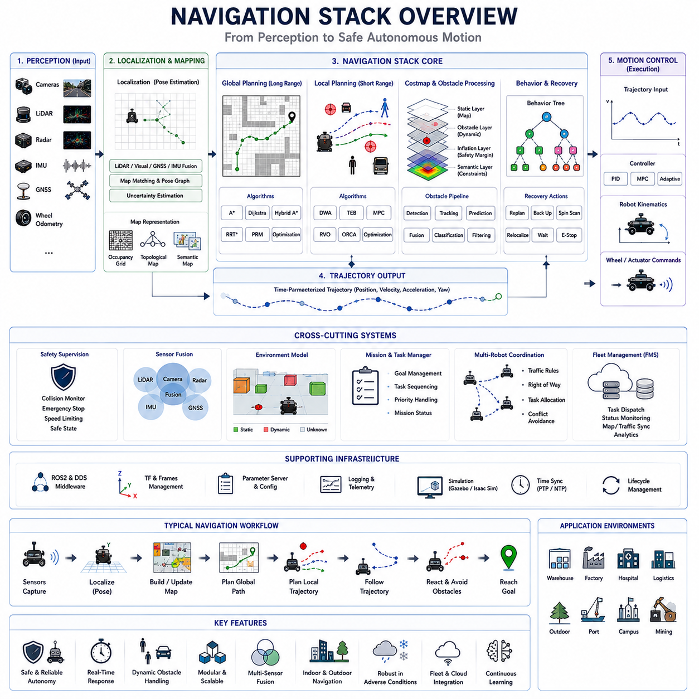
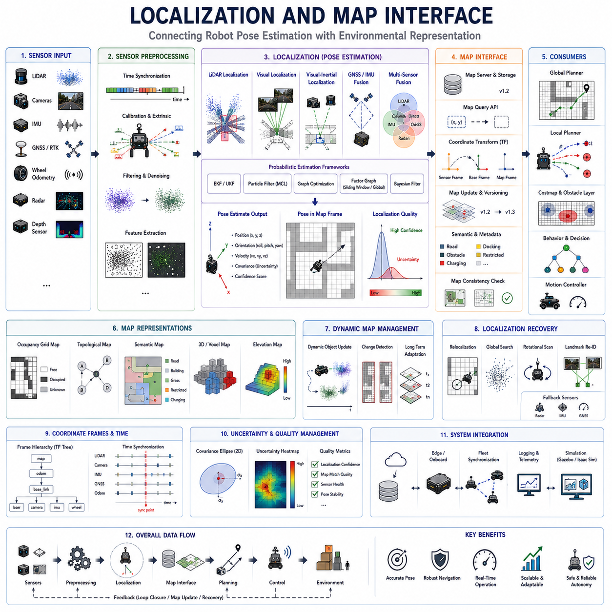
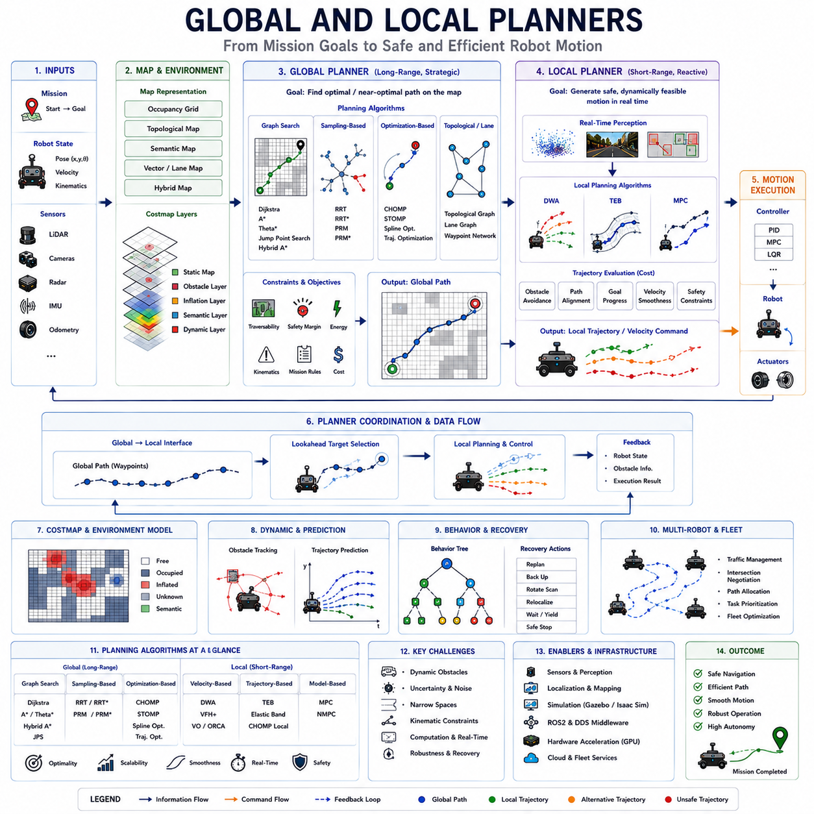
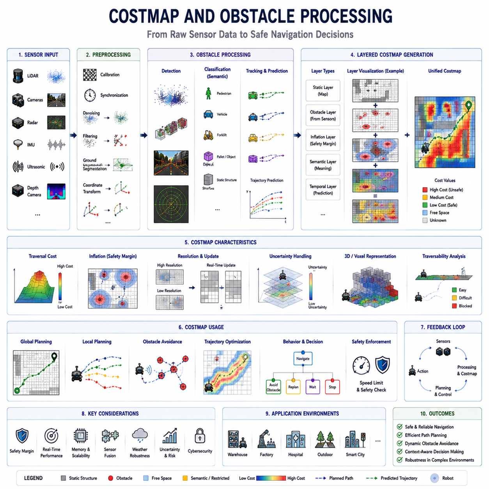
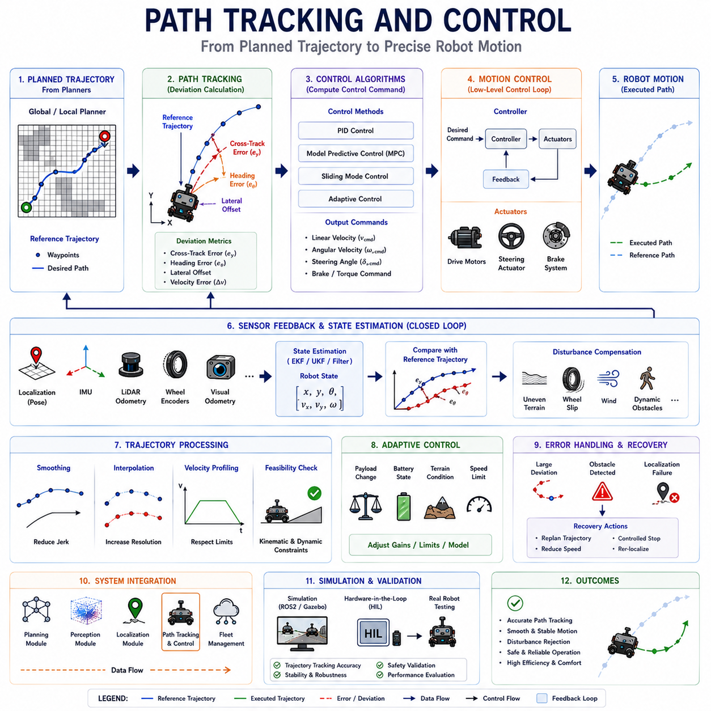
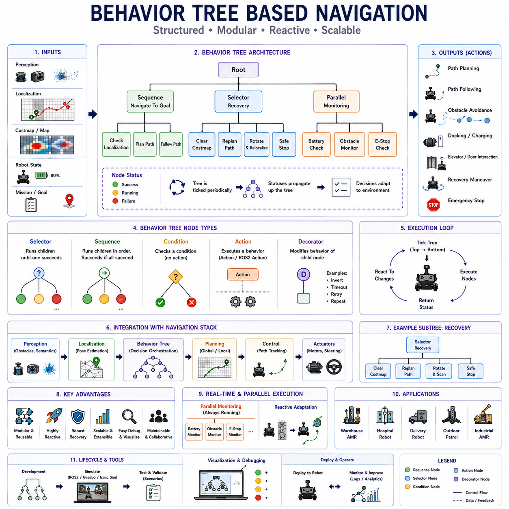
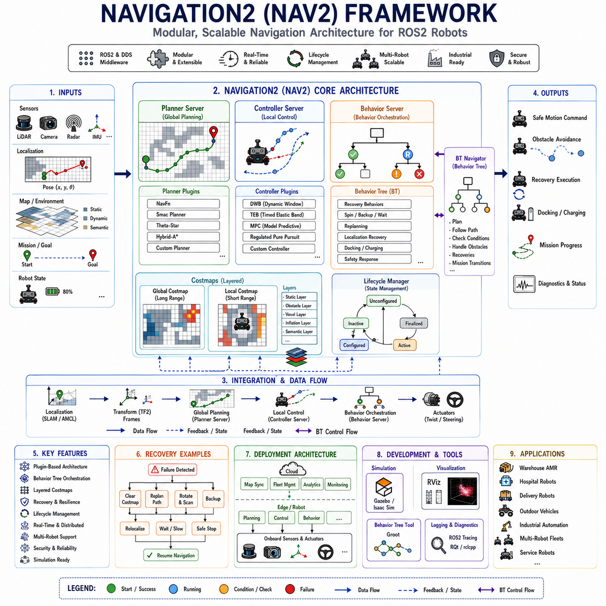
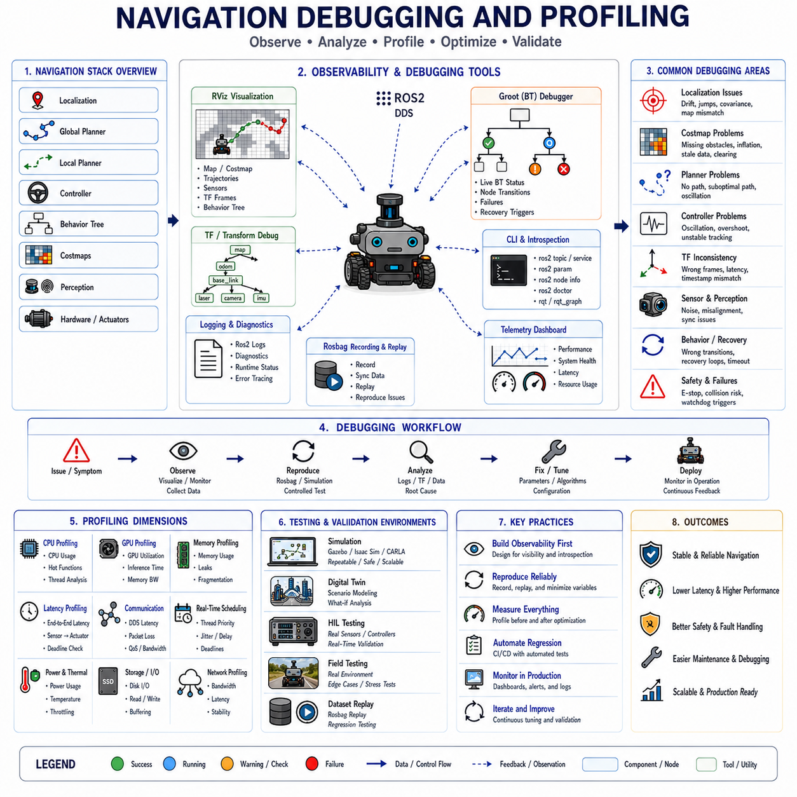

# Chapter 08. Navigation Stack

## 08.1 Navigation Stack Overview

{width="7.268055555555556in" height="7.268055555555556in"}

"08_01_Navigation_Stack_Overview"는 Autonomous Mobile Robot 소프트웨어에서 가장 중요한 아키텍처 기반 중 하나이다. 왜냐하면 Navigation Stack은 Environmental Perception, Localization Information, Mission Objective, Motion Constraint를 안전하고 자율적인 Robot Movement로 변환하는 Operational Intelligence System 역할을 수행하기 때문이다. Navigation Stack은 Robot이 현재 어디에 있는지 이해하고, 어디로 이동해야 하는지 결정하며, 안전하게 이동할 경로를 계산하고, Dynamic Obstacle에 지속적으로 반응하며, Complex Real-World Environment에서 Stable Motion Control을 유지하도록 만드는 핵심 시스템이다. 현대 AMR System에서 Navigation Stack은 단일 Algorithm이 아니라 Localization System, Mapping Framework, Global Planning Engine, Local Trajectory Planner, Obstacle Processing Module, Costmap System, Motion Controller, Behavior Coordination System, Recovery Mechanism, Real-Time Safety Supervision Layer로 구성된 Highly Integrated Software Architecture이다.

Navigation Stack은 Perception과 Physical Robot Motion 사이에서 Central Decision-Making Pipeline 역할을 수행한다. Perception System은 Camera, LiDAR, Radar, Depth Sensor, Thermal Camera, IMU, GNSS Receiver, Wheel Odometry 등을 사용하여 주변 환경을 지속적으로 분석한다. Localization System은 Robot의 Pose를 Map 또는 Coordinate Framework 기준으로 추정한다. Navigation Stack은 이러한 Environmental Information과 Positional Information을 기반으로 Autonomous Motion Trajectory를 생성하여 Robot이 Collision을 회피하고, Kinematic Constraint를 준수하며, Environmental Change에 적응하면서 Mission Goal을 향해 자율적으로 이동할 수 있도록 만든다.

현대 Navigation Stack은 기본적으로 Hierarchical Architecture를 가진다. Sensor Data를 직접 Wheel Command로 변환하는 대신, Autonomous Robot은 Navigation을 Multiple Abstraction Layer로 분리하여 Strategic Path Planning과 Low-Level Motion Execution을 구분한다. 이러한 Hierarchical Structure는 Modularity, Scalability, Debugging Capability, Operational Robustness를 크게 향상시킨다. 따라서 대부분의 Robot Navigation System은 최소한 Global Planning Layer, Local Planning Layer, Motion Control Layer, Behavioral Coordination Layer를 포함한다.

Global Planning System은 Large Environment 전반에 걸친 Long-Range Route Generation을 담당한다. Global Planner는 Environmental Map을 사용하여 Robot의 현재 위치와 Target Destination 사이의 Optimal 또는 Near-Optimal Route를 계산한다. 이러한 Planner는 일반적으로 Occupancy Grid, Topological Map, Semantic Map, Vector Map, Hybrid Environmental Representation 위에서 동작한다. Global Planner는 Route Efficiency, Traversability, Safety Margin, Operational Constraint, Mission-Level Objective를 우선적으로 고려한다.

Classical Path Planning Algorithm은 Reliability와 Computational Efficiency 때문에 여전히 Navigation Stack에서 널리 사용된다. Dijkstra-Based Planning은 Shortest Path를 보장하지만 Large Environment에서는 높은 Computational Cost를 가질 수 있다. A-Star Planning은 Heuristic Search Guidance를 사용하여 Efficiency를 향상시키면서도 많은 상황에서 Optimality를 유지한다. Theta-Star, Jump Point Search, Hybrid A-Star와 같은 Variant는 Planning Smoothness와 Computational Scalability를 향상시킨다. 현대 Industrial Robot은 Explainable하고 Predictable한 Navigation Behavior를 제공하기 때문에 이러한 Deterministic Algorithm에 여전히 크게 의존한다.

Sampling-Based Planning Algorithm 역시 Complex Navigation Environment에서 중요하다. Rapidly Exploring Random Tree와 Probabilistic Roadmap은 특히 Articulated Robot, Towing System, Parking Maneuver, Rough-Terrain Navigation과 같이 High-Dimensional Planning Space에서 매우 유용하다. CHOMP, STOMP, Trajectory Optimization Framework와 같은 Optimization-Based Planner는 Robot Kinematics와 Environmental Constraint를 고려하면서 Smooth하고 Dynamically Feasible한 Trajectory를 생성한다.

Local Planning Layer는 Short-Term Reactive Navigation을 담당한다. Global Planner와 달리 Local Planner는 Live Sensor Data를 사용하여 Immediate Environment를 지속적으로 평가하면서 Dynamically Feasible Motion Trajectory를 생성한다. Local Planner는 Moving Obstacle, Pedestrian, Forklift, Vehicle, Environmental Uncertainty, Sensor Update에 빠르게 반응해야 한다. 따라서 Real-Time Responsiveness는 Local Navigation System의 핵심 요구사항 중 하나이다.

Dynamic Window Approach는 Robotics에서 가장 널리 사용되는 Local Planning Algorithm 중 하나이다. DWA는 Obstacle Avoidance, Path Alignment, Goal Progression, Motion Smoothness를 기반으로 Candidate Velocity Trajectory를 평가한다. Timed Elastic Band Planner는 Robot Kinematics와 Temporal Motion Constraint를 고려하면서 Short-Term Trajectory를 최적화한다. Model Predictive Control 기반 Local Planner는 Predictive Dynamic Model과 Environmental Forecast를 사용하여 Future Robot Motion을 최적화하기 때문에 점점 더 중요해지고 있다.

Local Navigation System은 Obstacle Processing Framework와 긴밀하게 통합되어 있다. Obstacle Detection Pipeline은 LiDAR, Camera, Radar, Ultrasonic Sensor, Depth Camera, Thermal Imaging System으로부터 Sensor Data를 수집한다. 이러한 System은 Local Planner에서 사용하는 Dynamic Obstacle Representation을 지속적으로 업데이트한다. Obstacle Tracking System은 Predictive Collision Avoidance를 지원하기 위해 Object Velocity와 Future Trajectory를 추정한다.

Costmap은 현대 Navigation Stack에서 가장 중요한 Data Structure 중 하나이다. Costmap은 Environment를 Spatial Grid 형태로 표현하며, 각 Cell은 Traversability Cost, Obstacle Proximity, Safety Margin, Terrain Difficulty, Operational Risk를 나타낸다. Navigation Algorithm은 Costmap을 사용하여 Potential Motion Trajectory를 평가하고 Unsafe Region을 회피한다. Layered Costmap Architecture는 Robot이 Static Map, Dynamic Obstacle, Inflation Zone, Semantic Restriction, Temporary Environmental Hazard를 동시에 통합할 수 있도록 만든다.

Static Costmap은 일반적으로 SLAM System이나 Mapping Workflow를 사용하여 생성된 Prebuilt Map으로부터 생성된다. Dynamic Costmap은 Live Sensor Observation을 기반으로 지속적으로 업데이트된다. Inflation Layer는 Hazardous Object 주변에 Safety Margin을 생성하기 위해 Obstacle Boundary를 확장한다. Semantic Costmap은 Pedestrian-Only Zone, Restricted Region, Loading Area, Hazardous Industrial Section과 같은 Operational Rule을 표현할 수 있다.

Localization은 Navigation Stack Architecture에 깊게 통합되어 있다. Reliable Robot Pose Estimation이 없다면 Accurate Navigation은 불가능하다. 따라서 Navigation Stack은 LiDAR SLAM, Visual SLAM, GNSS Positioning, IMU Fusion, Wheel Odometry, Map Matching, Graph Optimization Technique를 결합한 Localization System에 크게 의존한다. Localization Uncertainty는 Path Planning Quality, Obstacle Avoidance Reliability, Motion Stability에 직접적인 영향을 준다.

Indoor Robot은 일반적으로 Occupancy Grid Matching 또는 Scan Registration Method를 사용하는 LiDAR-Based Localization System에 의존한다. Outdoor Autonomous Robot은 GNSS RTK, IMU Fusion, LiDAR Mapping, Visual Localization을 동시에 결합하는 경우가 많다. Long-Term Localization System은 Warehouse, Hospital, Port, Outdoor Infrastructure와 같은 Industrial Facility에서 시간이 지남에 따라 발생하는 Environmental Change까지 보정한다.

Motion Control은 Navigation Stack의 가장 하위 Execution Layer를 형성한다. Trajectory가 생성되면, Motion Controller는 Desired Robot Motion을 Wheel Velocity, Steering Angle, Braking Command, Actuator Control Signal로 변환한다. Motion Control System은 Robot Kinematic Constraint, Dynamic Limitation, Wheel Slip Condition, Terrain Variation, Payload Instability, Safety Restriction을 반드시 고려해야 한다.

Differential Drive Robot, Ackermann Steering System, Omnidirectional Platform, Articulated Towing Robot, Heavy Outdoor Autonomous Vehicle은 각각 서로 다른 Motion Control Strategy를 요구한다. PID Controller는 Simplicity와 Reliability 때문에 여전히 Industrial Robotics에서 널리 사용된다. 보다 Advanced한 System은 MPC-Based Control, Adaptive Control, Robust Control, Learning-Based Control Architecture를 점점 더 많이 사용하고 있다.

Behavior Coordination System은 Planning Layer 상위에서 High-Level Navigation Decision-Making을 관리한다. Robot은 단순한 Point-to-Point Navigation Task만 수행하지 않는다. 실제 Environment에서는 Elevator, Door, Docking Station, Charging System, Traffic Coordination, Multi-Robot Interaction, Emergency Handling, Mission Scheduling, Dynamic Task Prioritization이 지속적으로 발생한다. Behavior Tree는 Modular하고 Interpretable하며 Reactive한 Decision-Making Structure를 제공하기 때문에 현대 Navigation Stack에서 특히 널리 사용되고 있다.

Behavior Tree Framework는 Localization Recovery, Obstacle Avoidance Behavior, Docking Procedure, Emergency Stop Logic, Path Replanning, Waiting Behavior, Fallback Recovery Mechanism을 조정한다. ROS2 기반의 대표적인 Navigation Framework인 Navigation2 역시 Navigation Orchestration을 위해 Behavior Tree에 크게 의존한다.

Recovery Behavior는 Robust Navigation System의 필수 요소이다. Real-World Environment는 예측 불가능하기 때문에 Navigation Failure는 반드시 발생한다. Robot은 Dynamic Obstacle, Localization Ambiguity, Wheel Slip, Narrow Corridor, Sensor Degradation, Blocked Route에 의해 움직이지 못할 수 있다. 따라서 Recovery System은 Local Replanning, Rotational Scanning, Backup Maneuver, Localization Reset, Map Relocalization, Safe Stopping Procedure와 같은 Alternative Navigation Strategy를 시도한다.

Multi-Sensor Fusion은 Advanced Navigation Stack 내부에 깊게 내장되어 있다. Camera는 Semantic Understanding을 제공하고, LiDAR는 Precise Geometry를 제공하며, Radar는 Adverse Weather Environment에서 Robustness를 향상시키고, GNSS는 Global Positioning을 제공하며, IMU는 Motion Estimation Stability를 지원한다. Navigation Stack은 Changing Operational Condition에서도 Robust Environmental Awareness를 유지하기 위해 이러한 Heterogeneous Sensor Modality를 지속적으로 Fusion한다.

Outdoor Navigation은 Indoor Navigation보다 훨씬 더 복잡하다. Outdoor Robot은 Uneven Terrain, Mud, Gravel, Slope, Weather Condition, Lighting Change, Vegetation, GNSS Multipath Interference, Dynamic Traffic Condition을 처리해야 한다. 따라서 Outdoor AMR용 Navigation Stack은 Terrain Analysis, Slope Estimation, Traction Control, Weather-Aware Perception, Rough-Terrain Traversability Assessment를 포함해야 한다.

Semantic Navigation 역시 Intelligent Robotic System에서 점점 중요해지고 있다. 기존 Navigation System은 주로 Geometry와 Obstacle Avoidance 중심으로 동작하였다. 현대 AI-Enhanced Navigation Stack은 Semantic Environmental Understanding까지 통합하고 있다. Robot은 Pedestrian Zone, Loading Area, Charging Station, Hospital Corridor, Restricted Safety Region, Industrial Operational Context를 이해할 수 있게 되고 있다. Semantic Navigation은 Operational Efficiency와 Human-Robot Interaction Safety를 모두 향상시킨다.

Learning-Based Navigation 역시 빠르게 발전하고 있다. 기존 Navigation Stack은 Handcrafted Planning Algorithm과 Manually Designed Cost Function에 크게 의존하였다. 최근에는 Reinforcement Learning, Imitation Learning, Neural Trajectory Prediction, World-Model-Based Navigation Architecture가 점점 더 현대 Robot System에 통합되고 있다. AI-Based Navigation System은 Deterministic Planning Algorithm만 사용하는 대신 실제 Operational Experience로부터 Navigation Behavior를 학습할 수 있다.

Simulation은 Navigation Stack Development에서 매우 중요한 역할을 수행한다. Isaac Sim, Gazebo, CARLA, Digital Twin Platform은 실제 Robot Deployment 이전에 다양한 Operational Condition에서 Navigation System을 검증할 수 있도록 만든다. Large-Scale Simulation Environment는 Obstacle Avoidance, Multi-Robot Coordination, Recovery Behavior, Traffic Management, Failure Scenario를 테스트할 수 있게 한다.

Performance Optimization은 Navigation Stack에서 가장 어려운 Engineering Challenge 중 하나이다. Navigation System은 Massive Sensor Volume을 처리하고 Computationally Expensive Planning Algorithm을 실행하면서도 Strict Real-Time Constraint를 만족해야 한다. 따라서 GPU Acceleration, Asynchronous Execution, Multi-Threading, Distributed Computing, Optimized Middleware Architecture가 Scalable Robotic Navigation System에서 점점 더 중요해지고 있다.

ROS2와 DDS Middleware는 현대 Navigation Architecture의 기반 역할을 수행한다. Navigation System은 Localization, Planning, Perception, Mapping, Control, Telemetry, Coordination을 처리하는 Distributed Node들로 구성된다. ROS2는 Large-Scale Robotic System에 필요한 Modular Communication Framework, Deterministic Messaging, Lifecycle Management, Distributed Computation Support를 제공한다.

Safety Supervision 역시 Navigation Stack에 깊게 통합되어 있다. Human 주변에서 동작하는 Autonomous Robot은 Collision Risk, Stopping Distance, Braking Capability, Emergency Response Condition을 지속적으로 Monitoring해야 한다. Safety Layer는 종종 High-Level AI System과 독립적으로 동작하여 Software Instability나 Perception Failure 상황에서도 Deterministic Emergency Behavior를 보장한다.

Fleet-Level Navigation은 Additional Architectural Complexity를 발생시킨다. Large Industrial Facility에서는 수십 대 또는 수백 대의 Robot이 동시에 동작할 수 있다. Fleet Management System은 Traffic Flow, Task Scheduling, Intersection Negotiation, Charging Station Allocation, Congestion Avoidance, Global Operational Efficiency를 조정한다. 따라서 Navigation Stack은 RMS와 FMS Infrastructure와 점점 더 긴밀하게 통합되고 있다.

Cloud-Edge Integration 역시 현대 Navigation System에서 점점 중요해지고 있다. Real-Time Motion Control은 Latency Constraint 때문에 반드시 Robot Onboard에서 수행되어야 하지만, Cloud System은 Large-Scale Mapping, Fleet Coordination, Semantic Environmental Update, Operational Analytics를 지원할 수 있다. Hybrid Cloud-Edge Navigation Architecture는 Local Autonomy와 Centralized Intelligence 사이의 균형을 가능하게 만든다.

Cybersecurity 역시 Navigation Stack Architecture에서 Emerging Major Consideration이 되고 있다. Sensor Spoofing, Map Corruption, Malicious Localization Interference, Adversarial AI Attack은 Navigation Safety를 손상시킬 수 있다. 미래 Navigation System은 Authentication, Encrypted Communication, Anomaly Detection, Runtime Integrity Monitoring Mechanism을 점점 더 많이 통합하게 될 것이다.

미래의 Navigation Stack은 Embodied Cognitive Navigation System 방향으로 발전할 가능성이 높다. Localization, Planning, Perception, Behavior Module이 서로 독립적으로 존재하는 대신, 미래 Robot은 Geometry, Semantics, Motion Dynamics, Operational Context, Human Intention을 동시에 이해할 수 있는 Unified Multimodal World Model 기반 구조로 발전하게 될 것이다. Large Multimodal Foundation Model은 Robot이 Manually Engineered Planning Pipeline 대신 High-Level Reasoning과 Natural-Language Instruction 기반으로 Navigation할 수 있게 만들 가능성이 높다.

결국 Navigation Stack은 Autonomous Robot이 물리적 세계에서 안전하고 지능적으로 이동할 수 있도록 만드는 Operational Intelligence Core 역할을 수행한다. 모든 Autonomous Motion Decision, Obstacle Avoidance Maneuver, Docking Behavior, Traffic Interaction, Mission Execution은 Navigation Architecture의 Stability와 Effectiveness에 의존한다. Robotics System이 더욱 Intelligent하고 Large-Scale하며 Embodied Autonomy 방향으로 발전할수록, Navigation Stack은 전체 Robotics Software Ecosystem에서 가장 Strategically Important하고 Technically Sophisticated한 분야 중 하나로 계속 남게 될 것이다.

## 08.2 Localization and Map Interface

{width="7.268055555555556in" height="7.268055555555556in"}

"08_02_Localization_and_Map_Interface"는 자율주행 로봇 시스템에서 가장 핵심적인 아키텍처 구성 요소 중 하나이다. 왜냐하면 Localization과 Map Interface는 Environmental Representation과 Robot Positional Awareness를 연결하는 결정적인 역할을 수행하기 때문이다. Autonomous Mobile Robot은 자신의 현재 위치와 주변 환경 구조를 지속적으로 이해하지 못하면 안전하고 지능적인 Navigation을 수행할 수 없다. Localization은 Robot이 Coordinate System 또는 Map 내부에서 어디에 존재하는지를 결정하며, Map Interface는 Traversability, Obstacle, Operational Zone, Spatial Constraint를 이해할 수 있는 Environmental Representation을 제공한다. 따라서 Localization and Map Interface는 Autonomous Robot의 Spatial Cognition Layer 역할을 수행하며, Perception, Mapping, Planning, Navigation, Motion Control을 하나의 Unified Operational Framework로 연결한다.

현대 Localization System은 기본적으로 Probabilistic System이다. 모든 Robot Sensor는 Uncertainty를 포함하기 때문이다. Camera, LiDAR, IMU, GNSS, Wheel Encoder, Radar, Depth Sensor는 모두 Environmental Condition, Hardware Limitation, Vibration, Latency, Drift, Communication Instability의 영향을 받는 Noisy Measurement를 생성한다. 따라서 Localization System은 여러 Uncertain Sensor Observation을 시간에 따라 지속적으로 통합하면서 가장 가능성이 높은 Robot Pose를 추정해야 한다. 결과적으로 Localization Output은 Position, Orientation, Velocity뿐 아니라 Covariance Estimation과 Confidence Metric까지 포함하여 Robot State에 대한 Uncertainty를 표현한다.

Localization and Map Interface는 Robot Operation 전체에 걸쳐 지속적으로 동작한다. 단순한 Static Positioning System과 달리, Autonomous Robot은 Dynamic Environment 내부를 이동하기 때문에 Localization은 Real-Time으로 업데이트되면서도 Environmental Map과 Consistency를 유지해야 한다. Robot은 Incoming Sensor Observation을 지속적으로 Map Representation과 비교하면서 Drift를 보정하고 Environmental Uncertainty를 처리한다. 이러한 과정은 Autonomous Navigation의 Operational Backbone 역할을 수행한다.

Localization Architecture는 Robot Operating Environment와 Mission Requirement에 따라 크게 달라진다. Indoor Robot은 일반적으로 GNSS Signal을 사용할 수 없거나 매우 불안정하기 때문에 LiDAR-Based Localization에 크게 의존한다. Outdoor Robot은 GNSS RTK, IMU Fusion, LiDAR Mapping, Visual Localization, Wheel Odometry, Radar Sensing을 동시에 결합하는 경우가 많다. Long-Range Outdoor Robot은 Large-Scale Environmental Variability, Terrain Change, Degraded Sensing Condition을 처리할 수 있는 Multi-Layer Localization Framework를 필요로 하기도 한다.

LiDAR-Based Localization은 Geometric Accuracy와 Environmental Robustness 때문에 Industrial Robotics에서 가장 널리 사용되는 접근 방식 중 하나이다. LiDAR는 주변 Geometry를 Dense Point Cloud 형태로 생성하며, Robot은 현재 Sensor Scan을 Prebuilt Map과 Matching하여 Pose Correction을 수행한다. ICP-Based Registration Method, Normal Distributions Transform Algorithm, Feature-Based Scan Matching, Graph Optimization Framework가 LiDAR Localization Pipeline에서 자주 사용된다.

Visual Localization 역시 현대 Localization System의 매우 중요한 구성 요소이다. Camera는 풍부한 Environmental Feature와 Semantic Context를 제공하여 Geometric Sensor를 보완한다. Visual Localization System은 Sequential Frame 사이에서 Image Feature를 Detection 및 Tracking하면서 Environmental Landmark 기준 Robot Motion을 추정한다. ORB-SLAM, Feature-Based Visual Odometry, Direct Visual Odometry, Neural Visual Localization Architecture가 Robotics에서 널리 사용된다. 최근에는 Deep Learning과 Transformer-Based Feature Extraction을 통합하여 Lighting Variation과 Environmental Change에 대한 Robustness를 향상시키고 있다.

Visual-Inertial Localization System은 Camera Observation과 IMU Motion Estimation을 결합한다. Camera는 Environmental Constraint를 제공하고, IMU는 High-Frequency Inertial Measurement를 제공한다. 이러한 Fusion은 Rapid Motion, Temporary Visual Degradation, Partial Sensor Occlusion 상황에서도 Localization Stability를 크게 향상시킨다. 따라서 Drone, Mobile Robot, Handheld Robotics System, Autonomous Vehicle에서 널리 사용된다.

GNSS-Based Localization은 Outdoor Autonomous Robotics에서 매우 중요한 역할을 수행한다. 일반 GNSS는 Meter-Level Positioning Accuracy를 제공하며, RTK GNSS는 적절한 환경에서 Centimeter-Level Localization Accuracy를 제공할 수 있다. 하지만 GNSS Signal은 Multipath Interference, Atmospheric Disturbance, Urban Canyon Effect, Tunnel Environment, Tree Coverage, Intentional Signal Disruption에 매우 취약하다. 따라서 Outdoor Robot은 GNSS만 단독으로 사용하지 않고 IMU Fusion, LiDAR Mapping, Visual Localization, Wheel Odometry와 결합하여 사용한다.

IMU Fusion은 거의 모든 현대 Localization System에 깊게 통합되어 있다. IMU는 High-Frequency Acceleration과 Rotational Measurement를 제공하여 Slower Sensor Update 사이의 Pose Estimation을 안정화시킨다. 하지만 Inertial System은 시간이 지남에 따라 Drift가 누적되기 때문에 Standalone IMU Localization은 Long-Term Navigation에 적합하지 않다. 따라서 Sensor Fusion Framework는 External Environmental Observation을 사용하여 IMU Drift를 지속적으로 보정한다.

Wheel Odometry 역시 많은 Mobile Robot에서 기본적인 Localization Input으로 사용된다. Encoder Measurement는 Wheel Rotation을 기반으로 Robot Displacement를 추정한다. Odometry는 Smooth Short-Term Motion Estimation을 제공하지만 Wheel Slip, Uneven Terrain, Payload Variation, Mechanical Wear로 인해 Cumulative Drift가 발생한다. 따라서 현대 Localization Architecture는 Odometry를 Larger Multi-Sensor Fusion System의 일부로 사용한다.

Probabilistic Estimation Framework는 Localization Architecture의 핵심이다. Extended Kalman Filter, Unscented Kalman Filter, Particle Filter, Factor Graph Optimization, Bayesian Estimation Framework가 서로 다른 Sensor Observation을 Unified Robot Pose Estimate로 통합하는 데 널리 사용된다. 이러한 Algorithm은 Prediction Model과 Sensor Observation을 지속적으로 균형 있게 결합하면서 Uncertainty Propagation을 고려한다.

Particle-Filter-Based Localization System은 특히 Map-Based Robotics에서 매우 중요하다. Monte Carlo Localization은 Multiple Possible Robot Pose를 Particle Distribution 형태로 표현한다. Sensor Observation이 입력될 때마다 Unlikely Pose Hypothesis는 제거되고, Likely Position은 Probabilistically 강화된다. Particle Filter는 Multiple Pose Interpretation이 가능한 Ambiguous Environment에서 높은 Robustness를 제공한다.

Graph-Based Localization 및 SLAM System은 Advanced Robotics에서 점점 더 중요해지고 있다. Robot Pose를 Sequential하게 독립적으로 추정하는 대신, Graph Optimization System은 Robot Pose, Landmark, Sensor Observation, Motion Constraint를 Large Probabilistic Graph 형태로 표현한다. Optimization Algorithm은 모든 Observation에 대한 Global Estimation Error를 동시에 최소화한다. 이러한 방식은 Large-Scale Navigation에서 Excellent Long-Term Consistency와 Loop Closure Correction을 제공한다.

Map Interface 역시 Localization Architecture에서 매우 중요하다. Map은 Localization, Planning, Obstacle Avoidance, Mission Execution을 위한 Environmental Reference Structure를 제공한다. 현대 Robot Map은 단순한 Occupancy Grid보다 훨씬 복잡하다. Autonomous System은 Geometry, Semantics, Traversability Information, Dynamic Object Model, Operational Constraint, Environmental Metadata를 동시에 포함하는 Layered Environmental Representation을 점점 더 많이 사용하고 있다.

Occupancy Grid Map은 Robotics에서 가장 일반적인 Map Representation 중 하나이다. 이러한 Map은 Environment를 Discrete Grid Cell로 분할하며, 각 Cell은 Occupancy Probability를 나타낸다. Occupancy Grid는 Computationally Efficient하며 Classical Navigation Algorithm과 자연스럽게 통합된다. 하지만 Large Environment에서는 Memory Intensive해질 수 있으며 Semantic Richness가 부족하다.

Topological Map은 High-Level Environmental Representation을 제공한다. 중요한 Location을 Node로 표현하고, Navigation Relationship를 Edge로 연결한다. 이러한 방식은 Warehouse, Hospital, Factory, Campus와 같은 Large Facility에서 Computational Complexity를 감소시키고 Scalability를 향상시킨다. Robot은 Topological Navigation과 Local Geometric Navigation을 동시에 사용할 수 있다.

Semantic Map은 Intelligent Robotics에서 점점 더 중요해지고 있다. 단순히 Geometry만 표현하는 것이 아니라 Environmental Meaning과 Operational Context까지 포함한다. Robot은 Charging Station, Pedestrian Zone, Restricted Area, Loading Dock, Hospital Ward, Safety Region, Industrial Work Zone, Docking Interface를 직접 Environmental Map 내부에서 이해할 수 있다. Semantic Understanding은 Navigation Intelligence와 Human-Robot Interaction Safety를 크게 향상시킨다.

3D Mapping 역시 Outdoor 및 Industrial Robotics에서 점점 중요해지고 있다. Traditional 2D Map은 Complex Terrain, Slope, Ramp, Overpass, Multilevel Structure, Unstructured Outdoor Environment를 표현하기에 충분하지 않다. 따라서 Voxel Map, Elevation Map, Point-Cloud Map, Surfel Map, Neural Implicit Representation이 Advanced Robotic System에서 점점 더 많이 사용되고 있다.

Dynamic Map Management 역시 Real-World Robotics에서 중요한 문제이다. 실제 Environment는 지속적으로 변화한다. Obstacle은 이동하고, Furniture는 변경되며, Industrial Equipment는 재배치되고, Door는 열리고 닫히며, Environmental Layout 자체가 진화한다. 따라서 Static Map은 지속적으로 업데이트되지 않으면 빠르게 Outdated된다. 현대 Map Interface는 Dynamic Environmental Update, Semantic Persistence, Map Versioning, Long-Term Environmental Adaptation까지 지원하고 있다.

Map Consistency는 Localization Reliability에서 매우 중요하다. 작은 Discrepancy조차 Sensor Observation과 Environmental Map 사이에 존재하면 Localization System이 불안정해질 수 있다. 따라서 Long-Term Deployment Robot은 지속적으로 Map Quality를 검증하고 Environmental Drift와 Structural Inconsistency를 감지해야 한다. Long-Term Autonomy System은 시간이 지남에 따라 Environmental Representation을 자동으로 업데이트할 수 있는 Map Maintenance Framework까지 통합하고 있다.

Coordinate Transformation System 역시 Localization and Map Interface에 깊게 통합되어 있다. Robot은 Sensor Frame, Robot Body Frame, Local Odometry Frame, Map Frame, Global Positioning Frame 등 Multiple Coordinate Frame을 동시에 사용한다. Transformation System은 이러한 Coordinate Space 사이의 Geometric Consistency를 지속적으로 유지한다. ROS TF Framework는 Robot Software Architecture에서 Transformation Tree를 관리하는 데 널리 사용된다.

Time Synchronization 역시 Localization System에서 매우 중요한 요구사항이다. Multi-Sensor Localization은 Camera, LiDAR, IMU, GNSS, Wheel Odometry 간 Accurate Timestamp Alignment에 크게 의존한다. Temporal Misalignment는 Inconsistent Pose Estimate, Degraded Sensor Fusion, Unstable Navigation Behavior를 유발할 수 있다. 따라서 PTP Synchronization, PPS Timing System, Timestamp Interpolation, Deterministic Middleware Communication이 Robust Localization Pipeline의 핵심 요소가 된다.

Localization Uncertainty Estimation은 Autonomous Safety에서 매우 중요하다. Robot은 Estimated Pose뿐 아니라 해당 Estimate에 대한 Confidence까지 이해해야 한다. Localization Covariance는 Planning Aggressiveness, Obstacle Avoidance Behavior, Navigation Speed, Recovery Mechanism에 직접적인 영향을 준다. High Uncertainty 상황에서는 Localization Recovery Procedure, Reduced Operational Speed, Safe-Stop Behavior가 Trigger될 수 있다.

Localization Recovery System은 Robust Autonomous Navigation Architecture의 필수 요소이다. Sensor Degradation, Environmental Ambiguity, Poor Lighting, Featureless Corridor, Wheel Slip, GNSS Interruption, Dynamic Obstacle로 인해 Robot은 일시적으로 Localization을 잃을 수 있다. Recovery Mechanism은 Rotational Scanning, Map Relocalization, Global Search, Landmark Recognition, Alternative Sensing Modality를 사용하여 Localization을 다시 복구하려고 시도한다.

Map Interface는 Mission-Level Operational Logic도 지원한다. Fleet Management System, Task Scheduling Framework, Industrial Automation System, Semantic Mission Planner는 Environmental Map과 직접 상호작용한다. Operational Rule, Traffic Restriction, Charging Station Location, Docking Zone, Robot Coordination Policy가 모두 Map Interface 내부에 Encoding될 수 있다.

Cloud-Edge Integration은 Map Management Architecture에서 점점 더 중요해지고 있다. Large Robot Fleet은 Centralized Map Repository를 공유하면서도 각 Robot은 Local Operational Map을 Onboard에 유지할 수 있다. Cloud System은 Global Map Optimization, Semantic Update, Fleet-Wide Synchronization, Long-Term Environmental Learning을 지원한다.

Simulation Platform은 Localization and Mapping Development에서 중요한 역할을 수행한다. Isaac Sim, Gazebo, CARLA, Digital Twin System은 Physical Robot Deployment 이전에 다양한 Lighting Condition, Weather, Terrain Change, Sensor Noise, Operational Failure 상황에서 Localization Robustness를 테스트할 수 있게 만든다. Simulation Environment는 Localization Validation Workflow를 크게 가속화한다.

Artificial Intelligence는 Localization and Map Interface Design을 빠르게 변화시키고 있다. Neural Localization System, Learned Feature Representation, Semantic SLAM, Neural Implicit Mapping, Transformer-Based Environmental Understanding, Multimodal World Model이 Advanced Robotics Research에서 점점 중요해지고 있다. 미래의 Embodied AI System은 Handcrafted Geometric Algorithm 대신 Holistic Environmental Reasoning 기반 Localization을 수행하게 될 가능성이 높다.

Cybersecurity 역시 Localization System에서 Emerging Critical Concern이 되고 있다. GNSS Spoofing, Malicious Map Corruption, Sensor Manipulation, Adversarial Perception Attack, Localization Interference는 Autonomous Navigation Safety를 손상시킬 수 있다. 미래 Localization Architecture는 Authentication Mechanism, Anomaly Detection, Encrypted Map Storage, Runtime Integrity Monitoring을 점점 더 많이 통합하게 될 것이다.

미래의 Localization and Map Interface는 Mapping, Localization, Semantics, Planning, Reasoning, Environmental Memory가 Unified Multimodal Representation 내부에서 통합되는 Unified Cognitive World Model 방향으로 발전할 가능성이 높다. Localization Pipeline이 Perception 및 Navigation과 독립적으로 동작하는 대신, 미래 Robot은 Environmental Structure, Operational Context, Temporal Change, Human Interaction을 동시에 이해하는 Large-Scale Spatial Intelligence Model을 지속적으로 유지하게 될 것이다.

결국 Localization and Map Interface는 Autonomous Robotics의 Spatial Awareness Foundation 역할을 수행한다. 모든 Navigation Decision, Obstacle Avoidance Maneuver, Docking Procedure, Fleet Coordination Action, Mission Execution Behavior는 Accurate Environmental Representation과 Reliable Robot Pose Estimation에 의존한다. Autonomous System이 더욱 Intelligent하고 Distributed되며 Embodied Operation 방향으로 발전할수록, Localization and Map Interface는 전체 Robotics Software Ecosystem에서 가장 Strategically Important하고 Technically Sophisticated한 분야 중 하나로 계속 남게 될 것이다.

## 08.3 Global and Local Planners

{width="7.268055555555556in" height="7.268055555555556in"}

"08_03_Global_and_Local_Planners"는 자율주행 로봇 Navigation System에서 가장 핵심적인 아키텍처 개념 중 하나이다. 왜냐하면 Planner는 Mission Objective를 실제 Robot Motion으로 변환하는 Computational Intelligence Engine 역할을 수행하기 때문이다. Autonomous Mobile Robot은 단순히 어디로 이동할 것인지만 결정하는 것이 아니라, 복잡한 Real-World Environment에서 어떻게 안전하고 효율적이며 안정적으로 이동할 것인지를 지속적으로 계산해야 한다. 따라서 현대 Robot의 Planning Architecture는 Long-Range Strategic Route Generation과 Short-Term Reactive Motion Execution을 분리하는 Multiple Hierarchical Layer 구조로 설계된다. 이러한 구조는 Computational Efficiency, Real-Time Responsiveness, Safety, Operational Robustness를 동시에 유지할 수 있도록 만든다.

Global Planner는 Large Operational Environment 전체에 대한 Long-Range Route Generation을 담당한다. 이러한 Planner는 Strategic Level에서 동작하며, 일반적으로 Environmental Map을 사용하여 Robot의 Current Position과 Target Destination 사이의 Optimal 또는 Near-Optimal Path를 계산한다. Global Planning Algorithm은 Route Efficiency, Traversability, Safety Margin, Energy Consumption, Operational Constraint, Mission Objective, Overall Route Quality를 중점적으로 고려한다. Global Planner는 Large Spatial Scale에서 동작하기 때문에, Rapidly Changing Live Sensor Data보다는 Static 또는 Semi-Static Environmental Representation에 주로 의존한다.

반면 Local Planner는 Tactical 및 Reactive Level에서 동작한다. Local Planning System은 Live Sensor Observation을 사용하여 Immediate Surrounding Environment를 지속적으로 평가하면서 Dynamically Feasible Motion Trajectory를 Real-Time으로 생성한다. Local Planner는 Pedestrian, Moving Vehicle, Forklift, Dynamic Obstacle, Environmental Uncertainty, Temporary Blockage, Rapidly Changing Operational Condition에 즉각적으로 반응해야 한다. 즉, Global Planner가 Overall Route Strategy를 정의한다면, Local Planner는 매 순간 Robot이 실제로 어떤 Motion Behavior를 수행할 것인지를 결정한다.

Global Planning과 Local Planning의 분리는 매우 중요하다. 실제 Navigation은 Large-Scale Environmental Reasoning과 Short-Term Reactive Control이 동시에 필요하기 때문이다. Warehouse, Hospital, Factory, Smart City, Agricultural Field, Industrial Inspection Environment에서 동작하는 Robot은 수백 미터 떨어진 Mission Goal까지 이동하면서도 동시에 사람, 장비, 차량, Temporary Obstacle, Environmental Hazard를 실시간으로 회피해야 한다. Global Planner만으로는 Local Environmental Change에 충분히 빠르게 대응할 수 없고, 반대로 Local Planner만으로는 Long-Range Navigation Efficiency를 확보할 수 없다. 따라서 Hierarchical Planner Architecture는 두 방식의 장점을 결합한다.

Global Planner는 일반적으로 Environmental Map에 크게 의존한다. 이러한 Map은 Occupancy Grid, Topological Map, Semantic Map, Vector Map, Lane Graph, Waypoint Network, Hybrid Spatial Representation 형태일 수 있다. Planner는 이러한 Map 위에서 Traversability를 평가하며 Start Location과 Goal Destination을 연결하는 Collision-Free Path를 생성한다. Classical Graph Search Algorithm은 Deterministic Behavior, Computational Reliability, Explainability 때문에 여전히 Global Planning에서 널리 사용된다.

Dijkstra Algorithm은 Robotics Global Planning의 가장 기본적인 방법 중 하나이다. Dijkstra는 Connected Node 사이의 Traversal Cost를 Exhaustive하게 평가하여 Shortest Path를 계산한다. 매우 Reliable하고 Mathematically Optimal하지만, Large Environment에서는 불필요한 Search Region까지 탐색하기 때문에 Computational Cost가 증가한다. 그럼에도 불구하고 Properly Defined Cost Structure에서 Optimal Solution을 보장하기 때문에 Robotics에서 여전히 중요하다.

A-Star Planning은 Heuristic-Guided Search를 사용하여 Global Planning Efficiency를 크게 향상시켰다. 모든 방향을 동일하게 탐색하는 대신, A-Star는 Heuristic Estimate를 사용하여 Goal Direction 중심으로 Exploration을 수행한다. 이는 Computational Complexity를 크게 감소시키면서도 많은 상황에서 Optimality를 유지한다. A-Star는 Computational Efficiency, Reliability, Implementation Simplicity 사이의 균형이 뛰어나기 때문에 Autonomous Robotics에서 가장 널리 사용되는 Planning Algorithm 중 하나이다.

Robot Navigation Challenge를 해결하기 위해 다양한 A-Star Variant가 개발되었다. Theta-Star는 Grid Map 내부에서 Diagonal Visibility Shortcut을 허용하여 Path Smoothness를 향상시킨다. Jump Point Search는 Redundant Node Exploration을 줄여 Planning Speed를 가속화한다. Hybrid A-Star는 Vehicle Kinematic Constraint를 Planning Process 내부에 직접 통합하기 때문에 Autonomous Vehicle, Ackermann Steering Robot, Towing System, Large Outdoor Autonomous Platform에서 매우 중요하다.

Sampling-Based Planning Algorithm 역시 High-Dimensional Planning Environment에서 중요한 역할을 수행한다. Rapidly Exploring Random Tree는 State Space를 Random하게 탐색하면서 Reachable Region을 점진적으로 연결하여 Feasible Trajectory를 생성한다. RRT-Based Planner는 Nonholonomic Constraint, Articulated Mechanism, Complex Maneuvering Task가 포함된 Environment에서 특히 유용하다. RRT-Star와 같은 Variant는 Iterative Path Refinement를 통해 시간이 지남에 따라 Solution Optimality를 향상시킨다.

Probabilistic Roadmap 역시 중요한 Planning Methodology이다. 매번 처음부터 Planning을 수행하는 대신, PRM Algorithm은 Environment 전체에 대한 Navigable Connectivity Graph를 사전에 생성한다. 이는 Large Static 또는 Semi-Static Operational Environment에서 Planning Speed를 크게 향상시킨다. Warehouse, Factory, Hospital, Logistics Facility는 Environmental Layout이 비교적 안정적이기 때문에 PRM-Style Planning Architecture의 장점을 크게 얻을 수 있다.

Optimization-Based Planning은 현대 Robotics에서 점점 더 중요해지고 있다. 단순히 Collision-Free Path를 찾는 것이 아니라, Robot Dynamics, Energy Efficiency, Motion Comfort, Safety Margin, Terrain Condition, Operational Constraint를 동시에 고려하면서 Smooth하고 Dynamically Feasible한 Trajectory를 생성한다. CHOMP, STOMP, Spline Optimization, Trajectory Optimization Framework는 Robot이 보다 Natural하고 Physically Executable한 Motion Behavior를 생성할 수 있도록 만든다.

Local Planner는 Real-Time Responsiveness에 크게 초점을 맞춘다. Static Map 위에서 동작하는 Global Planner와 달리, Local Planner는 LiDAR Scan, Camera Detection, Radar Observation, Depth Image, Ultrasonic Measurement, Obstacle Tracking Output과 같은 Live Sensor Data를 지속적으로 처리한다. Local Planner는 Immediate Surrounding Environment를 평가하면서 동시에 Future Motion Possibility와 Imminent Collision Risk를 예측해야 한다.

Dynamic Window Approach는 Robotics에서 가장 널리 사용되는 Local Planning Algorithm 중 하나이다. DWA는 Robot Dynamic Limit 내부에서 Candidate Velocity Command를 생성하고, Short-Term Future Trajectory를 시뮬레이션한다. 각 Candidate Trajectory는 Obstacle Avoidance, Path Alignment, Goal Progression, Velocity Smoothness, Safety Constraint를 기준으로 평가된다. Robot은 가장 높은 Score를 가진 Motion Command를 선택하여 실행한다.

Timed Elastic Band Planning은 매우 영향력 있는 Local Planning Framework 중 하나이다. TEB는 Robot Trajectory를 Flexible Band처럼 표현하고, Environmental Constraint, Robot Kinematics, Obstacle Interaction에 따라 지속적으로 변형시킨다. Trajectory는 Temporal Feasibility와 Smooth Motion Continuity를 유지하면서 Dynamic하게 최적화된다. TEB Planner는 Differential-Drive Robot 및 Crowded Indoor AMR System에서 특히 유용하다.

Model Predictive Control 기반 Planner는 Advanced Robotics에서 점점 더 중요해지고 있다. MPC Planner는 Predictive Dynamic Model을 사용하여 Finite Time Horizon에 대한 Future Robot Motion을 최적화한다. 이러한 Planner는 Dynamic Obstacle, Control Constraint, Vehicle Dynamics, Steering Limitation, Wheel Slip Condition, Terrain Effect, Safety Margin을 동시에 고려하면서 Future Motion Trajectory를 평가한다. MPC Planner는 매우 Smooth하고 Stable한 Motion Behavior를 제공하지만 상당한 Computational Resource를 요구한다.

Costmap은 Global Planner와 Local Planner 모두에서 핵심적인 Data Structure 역할을 수행한다. Costmap은 Environment를 Spatial Grid 형태로 표현하며, 각 Cell은 Traversal Cost Information을 포함한다. Obstacle, Restricted Zone, Dangerous Terrain, Narrow Passage, Pedestrian Region, Operational Hazard는 높은 Traversal Cost로 Encoding된다. Layered Costmap은 Static Map, Dynamic Obstacle, Semantic Constraint, Temporary Environmental Change를 동시에 통합할 수 있게 만든다.

Inflation Layer는 Costmap에서 매우 중요하다. Obstacle을 Virtual하게 확장하여 Hazardous Object 주변에 Safety Margin을 생성한다. 이를 통해 Robot은 Wall, Human, Equipment, Environmental Boundary에 지나치게 가까이 접근하지 않게 된다. Inflation Distance는 Robot Speed, Stopping Capability, Localization Uncertainty, Operational Safety Requirement에 따라 달라진다.

Semantic Planning은 현대 Robotics에서 빠르게 중요성이 증가하고 있다. Traditional Planner는 주로 Geometry와 Collision Avoidance 중심으로 동작하였다. Semantic Planner는 Environmental Meaning을 Navigation Decision에 통합한다. Robot은 특정 Corridor를 선호하거나, Pedestrian-Heavy Region을 회피하거나, Loading Zone을 인식하거나, Traffic Rule을 준수하거나, Industrial Workflow를 고려하여 Navigation Behavior를 조정할 수 있다. Semantic Planning은 Navigation Intelligence와 Human-Robot Interaction Safety를 크게 향상시킨다.

Multi-Robot Planning은 Additional Complexity를 발생시킨다. Large Industrial Environment에서는 수십 대 또는 수백 대의 Autonomous Robot이 동시에 동작할 수 있다. Planner는 Traffic Flow Coordination, Congestion Avoidance, Intersection Negotiation, Pathway Allocation, Fleet-Level Operational Efficiency까지 고려해야 한다. Centralized Fleet Management System은 Global Planning을 조정하고, Individual Robot은 Local Planning을 독립적으로 수행하는 경우가 많다.

Obstacle Prediction 역시 Advanced Local Planner에서 매우 중요하다. 단순 Reactive Obstacle Avoidance만으로는 Crowded Dynamic Environment를 안전하게 처리할 수 없다. 따라서 Local Planner는 Pedestrian Trajectory, Vehicle Motion Pattern, Environmental Change를 예측하면서 Robot Trajectory를 생성한다. Predictive Planning은 Navigation Smoothness와 Collision Avoidance Reliability를 크게 향상시킨다.

Outdoor Robotic Planning은 Indoor Environment와 비교하여 훨씬 더 어려운 Engineering Challenge를 가진다. Outdoor Robot은 Uneven Terrain, Mud, Gravel, Slope, Vegetation, Water Accumulation, Snow, Rain, Changing Lighting Condition, GNSS Instability를 처리해야 한다. 따라서 Outdoor Planner는 Terrain Analysis, Traversability Estimation, Traction Modeling, Weather-Aware Navigation, Rough-Terrain Motion Optimization을 포함해야 한다.

Planning Under Uncertainty는 Autonomous Robotics에서 가장 어려운 문제 중 하나이다. Localization Uncertainty, Sensor Noise, Incomplete Environmental Information, Dynamic Obstacle, Communication Latency, Perception Error는 모두 Planner Reliability에 영향을 준다. 따라서 Probabilistic Planning Framework는 Trajectory Generation 과정에서 Uncertainty를 명시적으로 고려한다. Risk-Aware Planner는 Environmental Confidence와 Operational Safety Condition에 따라 Navigation Aggressiveness를 동적으로 조정한다.

Behavior Tree는 Planner Architecture와 자주 통합되어 Higher-Level Navigation Decision-Making을 수행한다. Real-World Environment에서 Robot은 Door, Elevator, Docking Station, Charging System, Emergency Event, Blocked Pathway, Operational Interruption을 지속적으로 만나게 된다. Behavior Coordination System은 Planning Mode를 동적으로 전환하면서 Recovery Procedure, Waiting Behavior, Mission Priority를 관리한다.

Recovery Planning은 Robust Autonomy의 핵심 요소이다. Navigation Failure는 실제 환경에서 반드시 발생한다. Robot은 Unexpected Environmental Change로 인해 Trapped되거나, Blocked되거나, Lost되거나, Goal에 도달하지 못할 수 있다. Recovery System은 Replanning, Backup Maneuver, Rotational Scanning, Localization Reset, Safe-Stop Procedure와 같은 Alternative Navigation Strategy를 시도한다.

Simulation은 Planner Development와 Validation에서 매우 중요한 역할을 수행한다. Isaac Sim, Gazebo, CARLA, Digital Twin Platform은 실제 Deployment 이전에 다양한 Environmental Condition에서 Planning Algorithm을 테스트할 수 있게 만든다. Obstacle Avoidance, Traffic Coordination, Recovery Behavior, Sensor Degradation, Failure Scenario에 대한 Stress Testing을 Real Hardware Risk 없이 수행할 수 있다.

Artificial Intelligence는 Planner Architecture를 빠르게 변화시키고 있다. Traditional Planning System은 Handcrafted Cost Function과 Deterministic Optimization Algorithm에 크게 의존하였다. Reinforcement Learning, Imitation Learning, Neural Trajectory Prediction, World-Model-Based Planning이 현대 Navigation System에 점점 더 통합되고 있다. AI-Enhanced Planner는 Manually Designed Heuristic에 의존하는 대신 Operational Experience로부터 직접 Navigation Behavior를 학습할 수 있다.

Embodied AI System은 미래 Planner Architecture를 근본적으로 변화시킬 가능성이 있다. Separate Global Planner, Local Planner, Perception Module, Behavior System 대신, 미래 Robot은 Geometry, Semantics, Environmental Dynamics, Human Intention, Long-Term Operational Objective를 동시에 Reasoning할 수 있는 Unified Multimodal World Model 기반으로 동작하게 될 가능성이 높다.

Performance Optimization은 Planner Implementation에서 매우 중요한 Challenge이다. 현대 Robot은 Massive Sensor Volume을 처리하면서 Computationally Expensive Planning Algorithm을 지속적으로 실행해야 하며, 동시에 Strict Real-Time Constraint를 만족해야 한다. 따라서 GPU Acceleration, Asynchronous Execution, Distributed Computing, Multithreaded Scheduling, Optimized Middleware Framework가 Scalable Robotic Planning System에서 점점 더 중요해지고 있다.

ROS2와 DDS Middleware는 현대 Planner Architecture의 핵심 Communication Infrastructure 역할을 수행한다. Global Planner, Local Planner, Localization System, Costmap, Perception Module, Controller, Behavior System은 모두 Distributed Software Node 형태로 동작하며 지속적으로 정보를 교환한다. Deterministic Communication과 Synchronized Execution은 Navigation Stability를 위해 필수적이다.

Safety Supervision Layer는 Planner와 독립적으로 동작하면서 Software Instability 또는 Planning Failure 상황에서도 Operational Safety를 보장한다. Emergency Braking System, Collision Monitoring Layer, Safe-Stop Mechanism, Independent Safety Controller는 Planning Uncertainty가 과도하게 증가할 때 Deterministic Fail-Safe Behavior를 제공한다.

Cloud-Edge Integration 역시 Robotic Planning System에서 점점 중요해지고 있다. Real-Time Local Planning은 Latency Constraint 때문에 반드시 Robot Onboard에서 수행되어야 하지만, Cloud Infrastructure는 Large-Scale Semantic Mapping, Fleet Optimization, Long-Range Mission Planning, Operational Analytics를 지원할 수 있다. Hybrid Cloud-Edge Planning Architecture는 Local Autonomy와 Centralized Intelligence를 동시에 활용할 수 있게 만든다.

Cybersecurity 역시 Navigation Planning System에서 중요한 문제가 되고 있다. Malicious Map Corruption, Adversarial Sensor Attack, Spoofed Localization Signal, Manipulated Planning Constraint는 Autonomous Safety를 손상시킬 수 있다. 미래 Planner Architecture는 Anomaly Detection, Authenticated Map, Encrypted Communication, Runtime Integrity Monitoring을 점점 더 많이 통합하게 될 것이다.

결국 Global Planner와 Local Planner는 Autonomous Robot이 Complex Physical Environment에서 안전하고 효율적이며 지능적으로 이동할 수 있도록 만드는 Operational Intelligence Core 역할을 수행한다. 모든 Navigation Decision, Obstacle Avoidance Maneuver, Docking Procedure, Traffic Interaction, Mission Execution Behavior는 Long-Range Strategic Planning과 Short-Term Reactive Motion Control의 Coordination에 의존한다. Robotics System이 더욱 Intelligent하고 Embodied되며 Large-Scale Autonomy 방향으로 발전할수록, Global and Local Planner는 전체 Robotics Software Ecosystem에서 가장 Strategically Important하고 Technically Sophisticated한 Component 중 하나로 계속 남게 될 것이다.

## 08.4 Costmap and Obstacle Processing

{width="7.268055555555556in" height="7.268055555555556in"}

"08_04_Costmap_and_Obstacle_Processing"은 자율주행 로봇 Navigation에서 가장 핵심적인 아키텍처 구성 요소 중 하나이다. 왜냐하면 이 시스템은 Robot이 Traversability, Obstacle Proximity, Safety Margin, Motion Risk를 Real-Time으로 이해할 수 있도록 만드는 Operational Environmental Interpretation Layer 역할을 수행하기 때문이다. Autonomous Mobile Robot은 Static Structure, Moving Obstacle, Pedestrian, Industrial Equipment, Vehicle, Wall, Narrow Corridor, Temporary Hazard, Unpredictable Environmental Change가 존재하는 Dynamic Environment를 지속적으로 이동한다. Robot이 안전하고 효율적으로 Navigation하기 위해서는 Raw Sensor Observation을 Planner, Controller, Decision-Making System이 직접 사용할 수 있는 Structured Environmental Representation으로 변환해야 한다. 따라서 Costmap과 Obstacle Processing Framework는 Perception System과 Navigation Behavior를 연결하는 Core Spatial Intelligence Infrastructure 역할을 수행한다.

현대 Robot Navigation System은 Raw Sensor Data 위에서 직접 동작하지 않는다. Camera, LiDAR, Radar, Ultrasonic Sensor, Thermal Camera, Depth Sensor 등 다양한 Perception Device는 Massive Heterogeneous Environmental Information을 지속적으로 생성한다. 그러나 Raw Sensor Observation은 Noisy하고 Incomplete하며 Uncertain하고 Planning Algorithm이 직접 해석하기 어렵다. Costmap System은 이러한 Sensor Observation을 Unified Spatial Representation으로 변환하며, Environment 내부의 각 Region은 Traversal Cost, Collision Risk, Safety Constraint, Semantic Meaning, Operational Restriction과 연결된다. Navigation System은 이러한 Structured Representation을 사용하여 Safe하고 Efficient한 Robot Trajectory를 생성한다.

Costmap은 기본적으로 Environment를 Discretized Spatial Grid 형태로 표현하며, 각 Cell은 Traversability Difficulty 또는 Navigation Risk에 해당하는 Numerical Cost Value를 가진다. 일반적으로 Low-Cost Region은 Safe Traversable Area를 의미하며, High-Cost Region은 Obstacle, Hazardous Zone, Restricted Area, Unsafe Motion Region을 나타낸다. Costmap은 Planning Algorithm이 Environmental Safety를 Spatially Reasoning하면서 동시에 Operational Objective를 최적화할 수 있도록 만든다.

Traversal Cost 개념은 Robotic Navigation Intelligence의 핵심이다. 단순히 Obstacle을 Binary Occupied 또는 Free Region으로 표현하는 대신, Costmap은 다양한 수준의 Navigation Desirability를 표현할 수 있게 만든다. 예를 들어 Narrow Corridor는 기술적으로 Traversable하지만 Collision Risk가 높기 때문에 Elevated Cost를 가질 수 있다. Human 근처 Region은 Safety Reason 때문에 Higher Traversal Penalty를 가질 수 있다. Slippery Terrain, Uneven Surface, Unstable Slope, Wet Floor, Cluttered Industrial Region 역시 Increased Traversal Cost를 유발할 수 있다.

Costmap은 일반적으로 Global Costmap과 Local Costmap으로 구분된다. Global Costmap은 Large-Scale Environmental Structure를 표현하며, 일반적으로 Prebuilt Map, SLAM System, Semantic Mapping Framework, Long-Term Environmental Model로부터 생성된다. Global Costmap은 Strategic Navigation Context를 제공하며 Large Facility 또는 Outdoor Operational Region 전체에 대한 Long-Range Route Planning을 지원한다.

Local Costmap은 Robot의 Immediate Surroundings에 초점을 맞추며 Live Sensor Observation을 사용하여 지속적으로 업데이트된다. Global Map과 달리 Local Costmap은 Short-Term Obstacle Avoidance와 Reactive Navigation Behavior를 중점적으로 다룬다. 이를 통해 Robot은 Pedestrian, Forklift, Moving Vehicle, Temporary Obstacle, Unexpected Hazard와 같은 Dynamic Environmental Change에 빠르게 반응할 수 있다.

Layered Costmap Architecture는 Modularity, Scalability, Flexibility를 제공하기 때문에 현대 Robot System에서 널리 사용된다. 단일 Monolithic Environmental Representation 대신, Multiple Environmental Information Source를 동시에 결합한다. 각 Layer는 Specialized Spatial Information을 제공하며, 전체 Costmap은 이를 Unified Navigation Representation으로 통합한다.

Static Layer는 많은 Costmap System에서 Foundational Environmental Representation 역할을 수행한다. 이 Layer는 일반적으로 Occupancy Grid Map, Semantic Map, SLAM-Generated Environmental Model로부터 생성된다. Static Layer는 Wall, Building, Shelf, Corridor, Infrastructure, Known Environmental Boundary와 같은 Permanent Structure를 포함한다. 이러한 Structure는 시간이 지나도 상대적으로 안정적이기 때문에 Static Layer는 Reliable Long-Term Navigation Context를 제공한다.

Obstacle Layer는 Live Sensor Data로부터 생성되는 Dynamic Environmental Observation을 표현한다. LiDAR, Depth Camera, Radar, Ultrasonic Array, AI-Based Vision System은 Robot 이동 중 지속적으로 Obstacle Layer를 업데이트한다. Environmental Condition은 지속적으로 변화하기 때문에 Obstacle Layer는 Rapid Update를 지원해야 한다.

Inflation Layer는 Robotic Navigation에서 가장 중요한 Safety Mechanism 중 하나이다. Obstacle을 Physical Boundary만으로 표현하는 대신, Inflation Layer는 Obstacle Region을 외부 방향으로 확장하여 Virtual Safety Margin을 생성한다. 이를 통해 Robot이 Wall, Equipment, Human, Hazardous Object에 지나치게 가까이 접근하는 것을 방지한다. Inflation Distance는 Robot Velocity, Stopping Distance, Localization Uncertainty, Payload Characteristic, Operational Safety Requirement에 따라 달라질 수 있다.

Semantic Layer는 Advanced Navigation System에서 점점 더 중요해지고 있다. Semantic Costmap은 단순한 Geometry가 아니라 Environmental Meaning을 포함한다. Pedestrian Zone, Forklift Lane, Charging Area, Loading Dock, Emergency Exit, Restricted Industrial Region, Safety-Critical Operational Area는 Semantic Cost Structure를 사용하여 표현될 수 있다. Semantic Costmap은 Context-Aware Navigation Decision을 가능하게 하여 Operational Efficiency와 Human Safety를 모두 향상시킨다.

Temporal Layer 역시 Emerging Advanced Robotics Technology 중 하나이다. Dynamic Environment는 시간에 따라 변화하며, Costmap은 점점 Future Environmental State를 예측하는 Temporal Prediction Model을 통합하고 있다. Obstacle Motion Prediction, Pedestrian Trajectory Forecasting, Traffic Flow Estimation, Dynamic Congestion Analysis는 Navigation System이 Reactive하게 동작하는 대신 Proactive하게 Reasoning할 수 있도록 만든다.

Obstacle Processing Pipeline은 Costmap Generation System과 깊게 통합되어 있다. Raw Sensor Data는 Meaningful Obstacle Representation으로 변환되기 전에 Extensive Processing을 거쳐야 한다. Obstacle Processing은 일반적으로 Sensor Preprocessing으로 시작되며, 여기에는 Filtering, Denoising, Synchronization Correction, Coordinate Transformation, Calibration Alignment, Spatial Registration이 포함된다.

LiDAR-Based Obstacle Processing은 Autonomous Robotics에서 가장 널리 사용되는 방식 중 하나이다. LiDAR는 Precise 3D Geometric Information을 제공하여 다양한 Environmental Condition에서도 Robust Obstacle Detection을 가능하게 만든다. 그러나 Raw Point Cloud는 Noise, Redundant Point, Motion Distortion, Environmental Clutter, Irrelevant Terrain Structure를 포함하는 경우가 많다. 따라서 Point Cloud Filtering Algorithm은 Outlier를 제거하고, Dense Region을 Downsample하며, Sensor Motion을 보정하고, Operationally Relevant Geometry만 추출한다.

Ground Segmentation은 LiDAR Obstacle Processing에서 특히 중요한 단계이다. Autonomous Robot은 Traversable Ground Surface와 Non-Traversable Obstacle을 구분해야 한다. Ground Segmentation Algorithm은 Planar Terrain Region을 식별하면서 Wall, Object, Human, Vehicle, Environmental Hazard를 분리한다. Accurate Ground Segmentation은 Planning Complexity를 크게 감소시키고 Obstacle Classification Reliability를 향상시킨다.

Camera-Based Obstacle Processing은 Pure Geometry를 넘어 Semantic Understanding Capability를 제공한다. AI-Based Object Detection System은 Image Stream에서 Human, Forklift, Vehicle, Pallet, Industrial Equipment, Door, Signage, Hazardous Object를 직접 인식한다. Semantic Obstacle Processing은 Robot이 Object Category, Predicted Behavior, Operational Context에 따라 Navigation Behavior를 조정할 수 있도록 만든다.

Depth Camera는 특히 Indoor Environment에서 매우 유용한 Dense Local Geometric Information을 제공한다. Stereo Vision System, Structured-Light Sensor, Time-of-Flight Camera는 Depth Image를 생성하여 Obstacle Detection, Free-Space Estimation, Near-Field Collision Avoidance를 지원한다. LiDAR Coverage가 제한되는 Environment에서는 Depth Sensing이 특히 중요하다.

Radar-Based Obstacle Processing은 Outdoor Robotics 및 Adverse Weather Environment에서 점점 중요해지고 있다. Radar System은 Rain, Fog, Dust, Smoke, Snow, Low-Light Condition에서 Optical Sensor보다 훨씬 높은 Robustness를 제공한다. Radar Obstacle Processing은 주로 Object Motion Estimation, Velocity Tracking, Long-Range Detection Reliability에 초점을 맞춘다.

Sensor Fusion은 Obstacle Processing Architecture의 핵심이다. 어떤 단일 Sensor Modality도 모든 조건에서 Perfect Environmental Understanding을 제공할 수 없다. LiDAR는 Accurate Geometry를 제공하고, Camera는 Semantics를 제공하며, Radar는 Weather Robustness를 제공하고, Ultrasonic Sensor는 Short-Range Safety를 강화하며, Thermal Camera는 Low-Visibility Detection을 지원한다. Multi-Sensor Fusion System은 이러한 Complementary Sensing Modality를 Unified Obstacle Representation으로 결합하여 Robustness와 Reliability를 향상시킨다.

Coordinate Transformation Framework 역시 Obstacle Processing System에 깊게 통합되어 있다. Sensor Observation은 Multiple Sensor Coordinate Frame에서 생성되지만, Navigation System은 일반적으로 Robot-Centric 또는 Map-Centric Reference Frame에서 동작한다. Transformation System은 Sensor, Robot Frame, Odometry Frame, Environmental Map 간 Geometric Consistency를 지속적으로 유지한다.

Time Synchronization 역시 Costmap Generation에서 매우 중요한 요구사항이다. 서로 다른 시간에 도착한 Sensor Observation은 Inconsistent Environmental Representation을 생성할 수 있다. 따라서 Multi-Sensor Synchronization Framework는 Obstacle Fusion 이전에 LiDAR, Camera, IMU, Radar, Wheel Odometry, Localization System 간 Timestamp를 정렬한다.

Dynamic Obstacle Tracking은 Navigation Intelligence를 크게 향상시킨다. 단순히 Instantaneous Obstacle Position만 탐지하는 대신, Tracking System은 Moving Object의 Velocity, Acceleration, Heading, Trajectory Prediction, Behavioral Uncertainty를 추정한다. Predictive Obstacle Tracking은 Robot이 Future Collision Risk를 사전에 예측하고 더 Smooth한 Avoidance Trajectory를 생성할 수 있도록 만든다.

Occupancy Estimation Algorithm은 Costmap Generation Pipeline의 핵심이다. Probabilistic Occupancy Grid는 Environmental Cell을 Deterministic Classification 대신 Occupancy Likelihood 형태로 표현한다. Bayesian Update Framework는 Uncertainty, Sensor Noise, Conflicting Measurement를 고려하면서 새로운 Sensor Observation을 지속적으로 통합한다.

Voxel-Based Obstacle Representation은 Outdoor 및 3D Navigation System에서 점점 중요해지고 있다. Traditional 2D Occupancy Grid는 Uneven Terrain, Ramp, Stair, Overpass, Vegetation, Multi-Level Environment를 표현하기에 충분하지 않다. Voxel Map은 Environment를 Volumetric Occupancy 형태로 표현하여 더 Sophisticated한 Spatial Reasoning을 가능하게 만든다.

Traversability Analysis 역시 Obstacle Processing System의 핵심 요소이다. Autonomous Robot은 Region이 Occupied인지뿐 아니라 실제로 Physically Navigable한지까지 평가해야 한다. Traversability Estimation은 Slope Angle, Surface Roughness, Terrain Stability, Wheel Traction, Mud, Gravel, Vegetation Density, Snow Accumulation, Payload Dynamics를 고려한다.

Risk-Aware Costmap Generation은 Autonomous Safety System에서 점점 더 중요해지고 있다. Navigation Risk는 단순한 Obstacle Proximity만으로 결정되지 않는다. Localization Uncertainty, Braking Distance, Payload Inertia, Environmental Visibility, Sensor Degradation, Communication Latency, Dynamic Obstacle Uncertainty 역시 Operational Risk에 영향을 준다. 따라서 Advanced Costmap System은 Probabilistic Safety Estimation을 Traversal Cost Generation 내부에 직접 통합한다.

Costmap Update Frequency는 Real-Time Robotics에서 중요한 Engineering Consideration이다. High-Frequency Update는 Obstacle Responsiveness를 향상시키지만 Computational Load와 Communication Bandwidth Requirement를 증가시킨다. 따라서 Efficient Costmap Architecture는 Update Rate, Map Resolution, Memory Consumption, Computational Scalability 사이의 균형을 유지해야 한다.

Map Resolution 역시 Navigation Behavior에 직접적인 영향을 준다. High-Resolution Costmap은 Fine Spatial Detail을 제공하지만 더 많은 Memory와 Processing Resource를 요구한다. Low-Resolution Map은 Computational Efficiency를 향상시키지만 Obstacle Precision과 Navigation Smoothness를 감소시킬 수 있다. Adaptive Multi-Resolution Mapping Architecture는 이러한 Tradeoff를 동적으로 조정한다.

GPU Acceleration은 High-Performance Costmap System에서 점점 더 중요해지고 있다. Large-Scale Point Cloud Processing, Semantic Segmentation, Occupancy Estimation, Obstacle Tracking, Voxel Computation은 상당한 Computational Resource를 요구한다. CUDA Acceleration, Parallel Processing Pipeline, GPU-Based Mapping Framework는 Real-Time Performance를 크게 향상시킨다.

ROS2 기반 Navigation System은 일반적으로 Navigation2 Architecture 내부의 Layered Costmap과 같은 Modular Costmap Framework를 사용한다. 이러한 System은 Developer가 Obstacle Source, Inflation Behavior, Semantic Layer, Update Policy, Recovery Strategy를 Robot Application Requirement에 따라 Customization할 수 있도록 만든다.

Recovery System 역시 Obstacle Processing Framework에 깊게 통합되어 있다. Real-World Environment는 예측 불가능하기 때문에 Robot은 Blocked Pathway, Unexpected Clutter, Localization Instability, Sensor Degradation을 만날 수 있다. 따라서 Costmap System은 Obstacle Clearing, Map Reset, Relocalization Assistance, Recovery Navigation Behavior를 지원한다.

Simulation Environment는 Costmap and Obstacle Processing Development에서 매우 중요한 역할을 수행한다. Isaac Sim, Gazebo, CARLA, Digital Twin Platform은 Physical Deployment 이전에 다양한 Weather Condition, Lighting Change, Traffic Scenario, Terrain Variation, Sensor Degradation Event에서 Obstacle Processing Performance를 평가할 수 있게 만든다.

Artificial Intelligence는 Costmap Architecture를 빠르게 변화시키고 있다. Neural Occupancy Estimation, Learned Traversability Prediction, Semantic Terrain Classification, Transformer-Based Scene Understanding, Multimodal World Model은 기존의 Purely Handcrafted Obstacle Processing Pipeline을 점차 대체하고 있다. AI-Enhanced Costmap은 Future Dynamics, Human Intent, Operational Context, Environmental Semantics까지 동시에 Reasoning할 수 있게 될 가능성이 높다.

Cybersecurity 역시 Obstacle Processing System에서 점점 중요해지고 있다. Malicious Sensor Spoofing, Adversarial Perception Attack, False Obstacle Injection, Map Corruption은 Autonomous Safety를 심각하게 손상시킬 수 있다. 미래 Costmap System은 Anomaly Detection, Authenticated Sensing Pipeline, Encrypted Map Communication, Runtime Integrity Monitoring을 점점 더 많이 통합하게 될 것이다.

미래의 Costmap and Obstacle Processing Architecture는 Fully Unified Environmental Cognition System 방향으로 발전할 가능성이 높다. Separate Obstacle Detection, Semantic Understanding, Occupancy Mapping, Traversability Analysis Module 대신, 미래 Robot은 Geometry, Semantics, Dynamics, Risk, Mission Objective를 Continuous하게 Joint Reasoning할 수 있는 Integrated Multimodal World Model을 유지하게 될 것이다.

결국 Costmap과 Obstacle Processing System은 Autonomous Robot이 Complex Physical Environment를 안전하게 Navigation할 수 있도록 만드는 Operational Environmental Awareness Layer 역할을 수행한다. 모든 Navigation Decision, Obstacle Avoidance Maneuver, Path Optimization Action, Safety Response는 이러한 System이 생성하는 Environmental Representation의 Quality와 Reliability에 의존한다. Autonomous Robotics가 더욱 Intelligent하고 Large-Scale하며 Embodied Operation 방향으로 발전할수록, Costmap and Obstacle Processing Architecture는 전체 Robotics Software Ecosystem에서 가장 Strategically Important하고 Technically Sophisticated한 분야 중 하나로 계속 남게 될 것이다.

## 08.5 Path Tracking and Control

{width="7.268055555555556in" height="7.268055555555556in"}

"08_05_Path_Tracking_and_Control"은 Autonomous Mobile Robot 운영에서 매우 핵심적인 영역이며, 계획된 Trajectory를 실제 Vehicle Motion으로 변환하는 계층을 의미한다. Global Planner와 Local Planner가 Optimal Path와 Short-Term Navigation Strategy를 생성한다면, Path Tracking and Control Module은 Robot이 이러한 계획을 실제 환경에서 정확하고 부드럽고 안전하게 수행하도록 만든다. Path Tracking and Control은 Sensor Feedback, Localization Data, Actuator Model, Kinematic Constraint, Safety System을 통합하여 Precise Motion을 달성하고, Stability를 유지하며, Environmental Disturbance를 보정한다.

이 아키텍처는 일반적으로 두 개의 주요 구성 요소로 이루어진다. 첫 번째는 Path Tracking이고, 두 번째는 Motion Control이다. Path Tracking Algorithm은 Robot의 현재 Position과 Orientation을 Planner가 생성한 Reference Trajectory와 지속적으로 비교한다. 그리고 Cross-Track Error, Heading Error, Lateral Offset, Velocity Difference와 같은 Deviation Metric을 계산한다. 이러한 Metric은 이후 Corrective Command로 변환되어 Robot이 최소한의 Error로 Trajectory를 추종하도록 만든다. 효과적인 Path Tracking은 Robot의 Kinematic 및 Dynamic Property를 반드시 고려해야 한다. 여기에는 Wheelbase, Steering Limit, Acceleration, Braking, Tire-Road Interaction, Payload Distribution이 포함된다.

Motion Control은 이러한 Corrective Command를 실제 Motor 및 Actuator Input으로 변환한다. Low-Level Control Loop는 Speed, Steering, Braking, Torque Distribution을 관리하며, Robot이 계획된 Trajectory를 정확하게 따라가도록 만든다. Controller는 일반적으로 PID, Model Predictive Control(MPC), Sliding Mode Control, Adaptive Control Algorithm 등을 사용하며, 이는 System Responsiveness, Environmental Variability, Safety Requirement에 따라 선택된다. Differential-Drive Robot의 경우 Desired Linear 및 Angular Motion을 생성하기 위해 Left 및 Right Wheel Velocity를 제어하며, Ackermann Steering Vehicle은 Trajectory Accuracy를 유지하기 위해 Steering과 Throttle Command를 Coordinated하게 제어해야 한다.

Sensor Integration은 Path Tracking and Control에서 매우 중요하다. Localization System으로부터 제공되는 High-Frequency Pose Feedback과 IMU Measurement, LiDAR Odometry, Wheel Encoder, Visual Odometry가 결합되어 Robot State를 Real-Time으로 추정한다. 이러한 Feedback Loop는 Uneven Terrain, Wheel Slip, Wind, Temporary Obstacle Interaction과 같은 External Disturbance를 보정한다. Path Tracking System은 Sensor Noise, Latency, Transient Error에 대해 Robust해야 하며, 동시에 Stability와 Planned Path Adherence를 유지해야 한다.

Trajectory Smoothing과 Feasibility Analysis 역시 중요한 요소이다. Planner가 생성한 Trajectory는 경우에 따라 Discontinuous하거나 Jerky할 수 있으며, Sharp Turn이 Vehicle Capability를 초과할 수 있다. 따라서 Path Tracking Controller는 Trajectory Interpolation, Curvature Smoothing, Velocity Profiling, Dynamic Feasibility Constraint를 사용하여 실제 Executed Path가 Vehicle Capability와 Safety Margin을 만족하도록 만든다. 이를 통해 Abrupt Acceleration, Unstable Maneuver, Excessive Mechanical Wear를 방지할 수 있다.

Adaptive Control Strategy는 Variable Operational Condition을 처리하기 위해 자주 사용된다. 이러한 Strategy는 Terrain, Payload, Battery State, Environmental Factor에 따라 Control Gain, Predictive Model, Corrective Command Limit를 조정한다. 예를 들어 Heavy Load를 운반하는 Robot은 Acceleration Command를 감소시키고, Braking Distance를 증가시키며, Steering Angle을 제한하여 Safe Path Tracking을 유지할 수 있다. Adaptive Control은 다양한 Operational Scenario에서 Consistent Performance를 보장한다.

Error Handling과 Recovery Mechanism 역시 매우 중요하다. Path Tracking System은 Excessive Deviation, Obstacle-Induced Correction, Localization Failure를 감지하고, 이에 따라 Trajectory Replanning, Temporary Speed Reduction, Controlled Stopping과 같은 Recovery Behavior를 Trigger한다. 이러한 Mechanism은 Safety를 유지하고 Collision을 방지하면서도 Robot이 가능한 한 Operation을 지속할 수 있도록 만든다.

Higher-Level Planning, Perception, Fleet Management System과의 Integration 역시 필수적이다. Path Tracking and Control Module은 Planner로부터 Updated Trajectory를 수신하고, Perception System과 연동하여 Dynamic Obstacle Avoidance를 수행하며, Fleet Management System과 통신하여 Shared Space 또는 Constrained Environment에서 Robot Coordination을 수행한다. 이러한 Integration은 Warehouse, Hospital, Outdoor Patrol, Industrial Site와 같은 Complex Environment에서 Seamless Operation을 가능하게 만든다.

Simulation과 Hardware-in-the-Loop Testing은 Path Tracking and Control Algorithm Validation에서 매우 중요하다. Virtual Environment, Digital Twin, Real-Time Physics Simulation은 Sensor Noise, Dynamic Obstacle, Surface Irregularity, Actuator Limitation과 같은 다양한 조건에서 Controller를 테스트할 수 있게 만든다. 이러한 테스트는 Real-World Deployment 이전에 Stability, Safety, Trajectory Adherence를 검증하는 데 필수적이다.

결론적으로, Path Tracking and Control은 Autonomous Mobile Robot에서 Navigation Planning과 Physical Motion 사이를 연결하는 Operational Bridge 역할을 수행한다. 이 시스템은 Planned Trajectory를 지속적으로 Precise Actuator Command로 변환하고, Dynamic Condition에서도 Stability를 유지하며, Changing Environment에 적응하고, Multiple Sensor로부터의 Feedback을 통합한다. 효과적으로 구현된 Path Tracking and Control은 Robot이 안전하고 효율적이며 신뢰성 있게 이동하도록 만들며, 따라서 현대 Robotic Navigation System에서 가장 Technically Sophisticated한 핵심 구성 요소 중 하나로 평가된다.

## 08.6 Behavior Tree-Based Navigation

{width="7.268055555555556in" height="7.268055555555556in"}

"08_06_Behavior_Tree_Based_Navigation"은 현대 Autonomous Mobile Robot Navigation에서 가장 중요한 아키텍처 패러다임 중 하나이다. 왜냐하면 이 구조는 Dynamic Real-World Environment에서 복잡한 Robot Behavior를 Structured하고 Modular하며 Reactive하고 Scalable한 방식으로 조정할 수 있는 Framework를 제공하기 때문이다. 초기 Robotics Navigation System은 Navigation Workflow를 관리하기 위해 Finite State Machine과 Procedural Control Logic에 크게 의존하였다. 이러한 방식은 비교적 단순한 System에서는 효과적이었지만, Robotics가 Highly Dynamic하고 AI-Driven이며 Multi-Context Operational Environment 방향으로 발전하면서 유지보수, Debugging, Scalability, Extensibility 측면에서 점점 더 어려워졌다. 이러한 문제를 해결하기 위해 등장한 것이 Behavior Tree Architecture이며, 이는 Perception, Planning, Navigation, Recovery, Safety, Mission-Level Decision-Making을 Unified Operational Framework 내부에서 조정할 수 있는 보다 Flexible하고 Interpretable한 구조를 제공한다.

Behavior Tree Based Navigation은 High-Level Behavioral Decision Logic과 Low-Level Navigation Execution을 분리한다. 모든 Navigation Rule을 Monolithic Procedural Code 내부에 직접 구현하는 대신, Robot은 Reusable Node로 구성된 Hierarchical Behavioral Structure를 사용하여 Decision-Making을 수행한다. 각 Node는 Behavior, Condition, Action, Recovery Strategy, Control Logic Component를 표현한다. 결과적으로 Navigation System은 Modular하고 Extensible하며 Deterministic하고 Highly Reactive한 구조를 유지하면서도 점점 더 복잡한 Autonomous Workflow를 지원할 수 있게 된다.

Behavior Tree의 가장 큰 장점 중 하나는 Hierarchical Organization Model이다. Complex Navigation Behavior를 Smaller Behavioral Unit으로 분해할 수 있기 때문에 이해, Validation, Testing, Reuse가 훨씬 쉬워진다. 예를 들어 Warehouse 내부를 이동하는 Robot은 Localization Validation, Obstacle Avoidance, Path Planning, Docking, Pedestrian Waiting, Elevator Interaction, Recovery Maneuver, Emergency Stopping, Charging, Fleet Coordination과 같은 Independent Behavior를 각각 별도로 가질 수 있다. Behavior Tree는 이러한 Behavior를 Tightly Coupled Software Dependency 없이 Dynamic하게 조합할 수 있도록 만든다.

Behavior Tree의 Core Execution Mechanism은 Hierarchical Node Structure를 Periodically Traversal하는 방식으로 동작한다. Tree는 Root Node에서 시작하여 아래 방향으로 지속적으로 평가된다. 각 Node는 Success, Failure, Running과 같은 Status Result를 반환한다. Parent Node는 Child Node가 반환한 Status에 따라 다음 Execution Flow를 결정한다. 이러한 Reactive Evaluation Process 덕분에 Robot은 Structured Behavioral Logic을 유지하면서도 Environmental Change에 매우 빠르게 반응할 수 있다.

Selector Node는 Behavior Tree에서 가장 중요한 Node Type 중 하나이다. Selector Node는 Child Behavior를 순차적으로 실행하며 하나가 Success를 반환할 때까지 계속 시도한다. 이러한 구조는 Fallback Logic과 Recovery Behavior를 자연스럽게 지원한다. 예를 들어 Primary Path Planning이 Blocked Route 때문에 실패하면, Selector는 Alternative Planner, Recovery Maneuver, Safe-Stop Procedure를 자동으로 활성화할 수 있다. 따라서 Selector는 Autonomous Navigation System의 Robustness와 Operational Resilience를 크게 향상시킨다.

Sequence Node 역시 핵심적인 구성 요소이다. Sequence Node는 Child Behavior를 순차적으로 실행하며 모든 Child가 Success를 반환해야 전체 Success가 된다. 이러한 구조는 특정 순서를 반드시 따라야 하는 Procedural Navigation Workflow에서 자주 사용된다. 예를 들어 Docking Procedure는 Localization Verification, Approach Alignment, Speed Reduction, Docking Confirmation, Charging Initiation이 반드시 정해진 순서대로 수행되어야 한다.

Condition Node는 실제 Action을 수행하지 않고 Environmental 또는 System State를 평가한다. Navigation Behavior가 진행되기 전에 특정 Operational Condition이 만족되는지를 확인한다. 예를 들어 Localization Validity Check, Obstacle Proximity Evaluation, Battery Level Verification, Network Connectivity Monitoring, Emergency Stop Status, Traffic Clearance Condition, Mission Authorization Verification이 있다. Condition Node는 Navigation System이 Environmental 및 Operational Change에 Dynamic하게 적응할 수 있도록 만든다.

Action Node는 Navigation Stack 내부에서 실제 Operational Behavior를 수행한다. 이러한 Node는 Planner, Controller, Perception Module, Docking System, Trajectory Generator, Recovery Procedure, Communication Service를 호출할 수 있다. 일반적으로 ROS2 Action, Middleware Service, Distributed Robot Software Component와 직접 상호작용한다. 예를 들어 Path Computation, Trajectory Following, Costmap Clearing, Localization Recovery Rotation, Intersection Waiting, Emergency Stop Execution 등이 Action Node에 해당한다.

Decorator Node는 Child Node의 Execution Logic 또는 Status Interpretation을 수정한다. Decorator는 Behavior Repetition, Success Condition Inversion, Timeout Imposition, Retry Limitation, Execution Frequency Throttling을 수행할 수 있다. 이를 통해 Behavioral Logic을 중복 구현하지 않고도 Complex Behavioral Pattern을 구성할 수 있다.

Behavior Tree는 Traditional Procedural Workflow와 비교하여 매우 Reactive하다. Tree가 Operation 중 지속적으로 Reevaluation되기 때문에 Robot은 Environmental Change에 빠르게 적응할 수 있다. 예를 들어 Pedestrian이 갑자기 Path를 막거나 Localization이 불안정해지거나 Safety Condition이 변경되면, Behavior Tree는 즉시 Behavioral Priority를 변경하고 Alternative Navigation Strategy를 활성화할 수 있다. 이러한 Reactivity는 Hospital, Warehouse, Airport, Factory, Urban Outdoor Navigation과 같이 Human-Populated Dynamic Environment에서 특히 중요하다.

현대 Navigation System은 Global Planner, Local Planner, Costmap, Localization System, Perception Pipeline, Safety Framework를 동시에 Behavior Tree와 통합하는 경우가 많다. Behavior Tree는 이러한 Subsystem을 Coherent Autonomous Behavior로 조정하는 Orchestration Layer 역할을 수행한다. Navigation Intelligence를 개별 Algorithm 내부에 직접 구현하는 대신, Behavior Tree가 다양한 Operational Context에서 Navigation Module 간 Interaction을 관리한다.

ROS2 기반의 대표적인 Navigation Framework인 Navigation2는 Navigation Orchestration을 위해 Behavior Tree를 적극적으로 사용한다. Navigation2는 Path Planning, Path Following, Recovery Behavior, Obstacle Handling, Costmap Management, Localization Recovery, Mission-Level Navigation Control을 조정하기 위해 Behavior Tree Architecture를 사용한다. 이러한 Modular Structure 덕분에 Developer는 Core Navigation Algorithm을 다시 작성하지 않고도 Navigation Workflow를 광범위하게 Customization할 수 있다.

Recovery Behavior Management는 Robotics에서 Behavior Tree의 가장 중요한 활용 분야 중 하나이다. Real-World Navigation에서는 Blocked Route, Dynamic Obstacle, Localization Drift, Wheel Slip, Sensor Degradation, Environmental Ambiguity와 같은 Failure가 반드시 발생한다. Behavior Tree는 Robot이 Structured Recovery Procedure를 자동으로 실행할 수 있도록 만든다. 예를 들어 Path Following이 반복적으로 실패하면 Robot은 Local Costmap을 Clear하고, Path를 다시 계산하며, Environmental Scanning을 위해 Rotation을 수행하거나, Relocalization을 시도하거나, Remote Assistance를 요청할 수 있다.

Behavior Tree는 Software Maintainability 역시 크게 향상시킨다. Large Autonomous Robotics System은 수천 개의 Operational Condition과 Behavioral Interaction을 포함한다. Procedural Logic과 Finite State Machine은 System Complexity가 증가할수록 관리가 매우 어려워진다. 반면 Behavior Tree는 Clear하고 Hierarchical한 Representation을 제공하기 때문에 Debugging, Validation, Documentation, Collaborative Software Development가 훨씬 쉬워진다.

Visualization과 Debugging Tool 역시 Behavior Tree Architecture에서 매우 중요하다. Developer는 Real-Time으로 Tree Execution을 관찰하고, Node Status Transition을 검사하며, Behavioral Bottleneck을 식별하고, Failure Propagation Path를 분석할 수 있다. Groot와 같은 Behavior Tree Visualization Framework는 Graphical Introspection Tool을 제공하여 Navigation Debugging Workflow를 크게 향상시킨다.

Parallel Execution Support 역시 Behavior Tree의 큰 장점이다. 특정 Robot Behavior는 Sequential이 아니라 Concurrent하게 동작해야 한다. 예를 들어 Robot은 Trajectory Following을 수행하면서도 동시에 Obstacle Proximity, Battery Status, Localization Confidence, Emergency Stop Condition을 지속적으로 Monitoring해야 한다. Parallel Node는 Multiple Behavioral Branch를 동시에 실행하면서 Structured Coordination Logic을 유지할 수 있게 만든다.

Behavior Tree는 Scalability 측면에서도 매우 뛰어나다. Robot System이 발전함에 따라 Developer는 새로운 Behavior, Sensor, Operational Mode, Recovery Strategy를 전체 Navigation Architecture를 재설계하지 않고 Incremental하게 추가할 수 있다. 이러한 Scalability는 Autonomous Platform이 Multiple Product Generation과 다양한 Operational Environment에 걸쳐 지속적으로 발전하는 Industrial Robotics에서 특히 중요하다.

Fleet-Level Robotic System 역시 점점 더 Behavior Tree Coordination에 의존하고 있다. Multi-Robot Environment는 Traffic Negotiation, Shared Resource Allocation, Charging Coordination, Mission Prioritization, Congestion Management를 필요로 한다. Behavior Tree는 Fleet Behavior와 Local Navigation Behavior를 통합하면서도 Modular System Organization을 유지할 수 있게 만든다.

Semantic Navigation 역시 Behavior Tree Framework에 점점 더 통합되고 있다. Traditional Navigation System은 주로 Geometry와 Obstacle Avoidance 중심으로 동작하였다. 현대 Robot은 Environmental Semantics, Human Interaction Rule, Operational Workflow, Contextual Behavior Adaptation까지 Reasoning하기 시작하고 있다. Behavior Tree는 Environmental Meaning과 Mission Context에 따라 Conditional Behavioral Branching을 수행할 수 있기 때문에 Semantic Behavior Coordination에 매우 적합하다.

Human-Robot Interaction Behavior 역시 Behavior Tree Architecture와 매우 잘 맞는다. Service Robot, Hospital Robot, Delivery Robot, Industrial AMR은 불확실한 조건에서 Human과 지속적으로 상호작용한다. Robot은 Pedestrian에게 길을 양보하거나, Intent를 Communication하거나, Assistance를 요청하거나, Door를 기다리거나, Socially Acceptable Navigation Pattern을 따라야 할 수 있다. Behavior Tree는 이러한 Human-Aware Behavior를 Navigation Workflow와 자연스럽게 통합할 수 있도록 만든다.

Artificial Intelligence 역시 Behavior Tree Based Navigation Architecture에 점점 더 영향을 미치고 있다. AI System은 Dynamic하게 Behavioral Strategy를 선택하고, Recovery Policy를 최적화하며, Environmental Change를 예측하고, Learned Operational Experience를 기반으로 Navigation Logic을 적응시킬 수 있다. Reinforcement Learning과 Imitation Learning은 Higher-Level Behavioral Orchestration에 점점 더 통합되고 있다.

Embodied AI System은 미래의 Behavior Tree Architecture를 더욱 변화시킬 가능성이 있다. 미래 Robot은 Manually Designed Behavioral Hierarchy 대신 Multimodal World Model과 Large-Scale Reasoning System을 사용하여 Adaptive Behavioral Structure를 Dynamic하게 생성할 수 있을 것이다. 그러나 Safety-Critical Robotics에서는 Deterministic Behavioral Coordination Framework가 여전히 매우 중요하게 남을 가능성이 높다.

Real-Time Performance는 Behavior Tree Execution에서 매우 중요한 요소이다. Navigation System은 Rapidly Changing Environment와 상호작용하면서도 Strict Timing Constraint를 만족해야 한다. 따라서 Efficient Tree Traversal, Asynchronous Execution, Multithreading, Distributed Middleware Communication, Optimized Scheduling이 Industrial Robotics에서 Scalable Behavior Tree Deployment를 위해 필수적이다.

Safety Integration 역시 Behavior Tree Based Navigation에 깊게 통합되어 있다. Hazardous Situation이 발생하면 Safety Condition은 모든 다른 Behavior보다 우선적으로 즉시 실행되어야 한다. 따라서 Emergency Stop, Collision Monitoring, Speed Limiting, Human Proximity Handling, Fault Detection System이 Behavioral Decision Hierarchy 내부에 직접 통합된다.

Cloud-Edge Robotics Architecture 역시 현대 Behavior Tree System에 영향을 주고 있다. Real-Time Navigation Decision은 Latency Constraint 때문에 반드시 Onboard에서 수행되어야 하지만, Cloud System은 Fleet Behavior Coordination, Semantic Map Update, Mission Scheduling, Large-Scale Operational Analytics를 지원할 수 있다. 따라서 Navigation Intelligence를 Edge와 Cloud Layer에 분산시키는 Hybrid Behavioral Coordination Architecture가 점점 더 중요해지고 있다.

Cybersecurity 역시 Behavior Tree Controlled Navigation System에서 중요한 문제로 부상하고 있다. Malicious Behavioral Modification, Unauthorized Mission Injection, Compromised Navigation Command, Adversarial System Manipulation은 Autonomous Safety를 위협할 수 있다. 미래 System은 Behavioral Authentication, Runtime Integrity Monitoring, Secure Mission Validation, Anomaly Detection을 점점 더 많이 통합하게 될 것이다.

Simulation은 Behavior Tree Development와 Validation에서 매우 중요한 역할을 수행한다. Digital Twin Environment, Gazebo, Isaac Sim, Scenario-Based Testing Framework는 Physical Robot Deployment 이전에 다양한 Environmental Condition에서 Complex Behavioral Interaction을 테스트할 수 있게 만든다. 이를 통해 Recovery Behavior, Traffic Interaction, Emergency Handling, Human-Aware Navigation Workflow를 검증할 수 있다.

미래의 Behavior Tree Based Navigation은 점점 더 Cognitive하고 Adaptive한 Behavioral Orchestration System 방향으로 발전할 가능성이 높다. Robot은 Symbolic Behavioral Reasoning, Multimodal Environmental Understanding, Semantic Planning, AI-Driven Decision Optimization을 Unified Embodied Intelligence Architecture 내부에서 결합하게 될 수 있다. Robotics가 Advanced AI-Native Autonomy 방향으로 발전하더라도, Behavior Tree가 제공하는 Modularity, Interpretability, Reactivity, Hierarchical Coordination의 핵심 원칙은 안전하고 확장 가능한 Autonomous Navigation의 Foundation으로 계속 유지될 것이다.

결국 Behavior Tree Based Navigation은 Autonomous Robot이 Dynamic Real-World Environment에서 Robust하게 동작할 수 있도록 만드는 Behavioral Coordination Intelligence Layer 역할을 수행한다. 모든 Recovery Maneuver, Obstacle Interaction, Safety Response, Mission Transition, Operational Adaptation은 Structured Behavioral Orchestration에 의존한다. Autonomous Robotics System이 더욱 Intelligent하고 Distributed되며 Embodied Operation 방향으로 발전할수록, Behavior Tree Architecture는 전체 Robotics Navigation Ecosystem에서 가장 Strategically Important하고 Technically Sophisticated한 Framework 중 하나로 계속 남게 될 것이다.

## 08.7 Navigation2 Framework

{width="7.268055555555556in" height="7.268055555555556in"}

"08_07_Navigation2_Framework"는 현대 Autonomous Robotics에서 가장 중요한 Software Architecture 중 하나이며, ROS2 기반 Autonomous Mobile Robot을 위한 Complete하고 Modular하며 Scalable하고 Production-Oriented한 Navigation Framework를 제공한다. Navigation2는 일반적으로 Nav2라고 불리며, 기존 ROS Navigation Stack의 후속 구조로 개발되었다. 이 Framework는 Real-Time, Distributed, Multi-Sensor, Highly Dynamic Environment에서 동작하는 차세대 Autonomous System의 요구사항을 충족하기 위해 설계되었다. Robotics System이 점점 더 Intelligent하고 Industrial하며 Large-Scale Deployment 방향으로 발전하면서 기존 Navigation Architecture는 현대 Operational Complexity를 처리하기에 한계가 생기기 시작하였다. 따라서 Navigation2는 Advanced Localization, Planning, Behavior Orchestration, Recovery Handling, Multi-Robot Operation, Lifecycle Management, Robust Navigation Workflow를 지원할 수 있는 Highly Modular하고 Extensible한 Framework로 개발되었다.

Navigation2는 기본적으로 ROS2와 DDS Middleware Technology 위에서 동작한다. 기존 ROS1 기반 Architecture와 달리, ROS2는 Deterministic Communication, Distributed Execution, Lifecycle Node Management, Real-Time Support, Improved Security, Scalable Middleware Abstraction을 제공한다. Navigation2는 이러한 기능을 활용하여 Industrial Robotics, Outdoor Autonomous Vehicle, Warehouse AMR, Hospital Robot, Service Robot, Delivery Platform, Large-Scale Robotic Fleet에서 안정적으로 동작할 수 있는 Navigation System을 구현한다.

Navigation2의 Architecture는 매우 Modular하다. Navigation Functionality를 하나의 Monolithic Process 내부에 구현하는 대신, Nav2는 Navigation을 Multiple Distributed Component로 분리하며, 각각은 Independent ROS2 Node 형태로 동작한다. 이러한 Node는 Topic, Service, Action, Transform, Lifecycle Interface를 통해 서로 통신한다. 이러한 Modular Design 덕분에 Developer는 전체 Navigation Framework를 재설계하지 않고도 개별 Navigation Subsystem을 독립적으로 Customization, Replacement, Extension, Optimization할 수 있다.

Navigation2의 핵심 구성 요소 중 하나는 Planner Server이다. Planner Server는 Environmental Map 위에서 Global Path Planning을 수행한다. Robot의 Current Pose와 Target Destination 사이의 Collision-Free Route를 계산하는 역할을 담당한다. Navigation2는 Multiple Planner Plugin을 동시에 지원하기 때문에 Operational Environment에 적합한 Planning Algorithm을 선택할 수 있다. 대표적인 Planner Plugin으로는 NavFn, Smac Planner, Theta-Star Planner, Hybrid-A-Star Planner, Custom Industrial Planner가 있다.

Planner Server는 Localization 및 Mapping System이 생성한 Costmap과 Environmental Representation 위에서 동작한다. Traversability, Obstacle Region, Safety Margin, Operational Constraint를 평가하면서 Optimal 또는 Near-Optimal Path를 생성한다. Navigation2는 Plugin-Based Architecture를 사용하기 때문에 Planner를 Robot Kinematics, Environment Complexity, Mission Requirement에 맞게 Dynamic하게 교체하거나 Customization할 수 있다.

Controller Server 역시 Navigation2의 핵심 구성 요소이다. Planner가 Trajectory를 생성한다면, Controller는 이를 실제 Motion으로 실행한다. Controller Server는 Robot의 Current Pose와 Planned Trajectory를 지속적으로 비교하면서 Corrective Motion Command를 생성한다. Navigation2는 Dynamic Window Approach Controller, Timed Elastic Band Controller, Model Predictive Controller, Regulated Pure Pursuit Controller, Custom Control Algorithm과 같은 Multiple Controller Plugin을 지원한다.

Controller Plugin은 특히 중요하다. 서로 다른 Robot Platform은 완전히 다른 Control Strategy를 요구하기 때문이다. Differential-Drive Robot, Omnidirectional Robot, Ackermann Steering Vehicle, Towing Robot, Heavy Outdoor Autonomous Platform, Articulated Mobile System은 서로 다른 Kinematic Constraint와 Dynamic Behavior를 가진다. Navigation2의 Modular Controller Framework는 각 Robot Architecture에 최적화된 Motion Execution을 구현할 수 있게 만든다.

Behavior Server는 Navigation2 내부에서 가장 Strategically Important한 구성 요소 중 하나이다. Navigation은 단순한 Path Following만으로 이루어지지 않는다. 실제 Autonomous System은 Blocked Route, Moving Obstacle, Localization Instability, Docking Procedure, Emergency Event, Elevator Interaction, Charging Workflow, Environmental Uncertainty를 지속적으로 경험한다. Behavior Server는 Recovery Behavior, Spin Action, Backup Maneuver, Waiting Behavior, Assisted Teleoperation, Safety Response와 같은 Higher-Level Navigation Action을 조정한다.

Behavior Tree는 Navigation2의 Orchestration Backbone 역할을 수행한다. Procedural State Machine 대신, Nav2는 Hierarchical Behavior Tree Architecture를 사용하여 Navigation Workflow를 Dynamic하게 조정한다. Behavior Tree는 Navigation Logic을 Modular하고 Reactive하며 Extensible하고 Interpretable하게 유지할 수 있도록 만든다. 결과적으로 Navigation Workflow 자체가 Fixed Procedural Code가 아니라 Configurable Behavioral Graph 형태가 된다.

Behavior Tree Navigator Node는 Planning, Path Following, Recovery Execution, Obstacle Handling, Localization Checking, Mission Transition을 조정한다. Behavior Tree는 Operation 중 지속적으로 Reevaluation되기 때문에 Navigation2는 Environmental Condition Change에 매우 빠르게 적응할 수 있다. 예를 들어 Route가 Block되거나 Localization이 불안정해지면 Behavior Tree는 자동으로 Replanning, Costmap Clearing, Localization Recovery, Safe Stopping을 Trigger할 수 있다.

Costmap System 역시 Navigation2 내부에 깊게 통합되어 있다. Global Costmap과 Local Costmap은 Robot Navigation 동안 지속적으로 동작한다. Global Costmap은 Long-Range Environmental Structure를 표현하며, Local Costmap은 Dynamic Short-Range Obstacle Information을 표현한다. Navigation2는 Obstacle Layer, Inflation Layer, Semantic Layer, Voxel Layer, Static Layer를 결합한 Layered Costmap Architecture를 사용한다.

Navigation2의 Obstacle Processing은 LiDAR, Camera, Depth Sensor, Radar, Ultrasonic Array, Custom Perception Pipeline과의 Integration을 지원한다. Sensor Fusion System은 Local Environmental Representation을 지속적으로 업데이트하며, Navigation Controller는 Real-Time으로 Dynamic Obstacle에 반응한다. Costmap Update Frequency, Inflation Behavior, Obstacle Persistence, Layer Prioritization 역시 Modular Plugin Architecture를 통해 Configuration할 수 있다.

Localization Integration 역시 Navigation2의 매우 중요한 요소이다. Autonomous Navigation은 Accurate Pose Estimation에 절대적으로 의존한다. Navigation2는 AMCL, SLAM Toolbox, Cartographer, Visual SLAM System, GNSS Fusion System, Custom Localization Architecture를 지원한다. Navigation Framework는 Standardized ROS2 Transform System을 통해 Localization Update를 지속적으로 수신한다.

Transform System 역시 Navigation2 Architecture에서 매우 중요하다. Robot은 Map Frame, Odometry Frame, Base Frame, Sensor Frame, Global Positioning Frame과 같은 Multiple Coordinate Frame을 동시에 사용한다. TF2 Framework는 이러한 Coordinate Space 간 Geometric Consistency를 유지한다. Navigation2는 Stable Planning과 Control Behavior를 유지하기 위해 Transform Consistency에 크게 의존한다.

Lifecycle Node Management는 Navigation2가 기존 Robotics Architecture 대비 제공하는 가장 중요한 혁신 중 하나이다. ROS2 Lifecycle Node는 Structured Startup, Shutdown, Activation, Deactivation, Recovery Management를 지원한다. Navigation Subsystem은 Deterministic Operational State를 순차적으로 거치며 동작한다. 이는 Industrial Robotics에서 필수적인 Deterministic Startup과 Operational Reliability를 보장하는 데 매우 중요하다.

Recovery Behavior Management 역시 Navigation2 내부에서 매우 정교하게 구현되어 있다. Real-World Navigation Failure는 Dynamic하고 Uncertain한 Environment 때문에 반드시 발생한다. 따라서 Navigation2는 Costmap Clearing, Path Recomputing, Environmental Scanning Rotation, Backup Maneuver, Slow Operation, Safe-Stop Procedure를 자동으로 수행할 수 있는 Structured Recovery Framework를 제공한다. 이러한 Recovery Logic은 일반적으로 Behavior Tree를 통해 조정된다.

Navigation2는 Waypoint Following과 Multi-Goal Navigation Workflow도 지원한다. Robot은 Sequential하게 Multiple Intermediate Waypoint를 통과하면서 각 위치에서 Operational Task를 수행할 수 있다. 이러한 Waypoint Navigation은 Warehouse Logistics, Hospital Delivery Robot, Patrol Robot, Inspection Robot, Industrial Automation System에서 매우 중요하다.

Docking Integration 역시 Navigation2 기반 Robotic System에서 중요한 기능이다. Autonomous Robot은 Battery Charging, Payload Transfer, Tool Exchange, Station Interaction을 수행해야 하는 경우가 많다. Navigation2는 Behavior Tree, Perception Pipeline, Localization Correction, Precision Trajectory Control을 사용하여 Docking Behavior를 통합할 수 있다.

Multi-Robot Scalability 역시 Industrial Robotics에서 점점 중요해지고 있으며, Navigation2는 Fleet-Oriented Architecture를 효과적으로 지원한다. Large Warehouse, Factory, Hospital, Port, Logistics Center에서는 수십 대 또는 수백 대의 Robot이 동시에 동작할 수 있다. Fleet Management System은 High-Level Mission Allocation을 조정하고, Individual Robot은 각자의 Navigation2 Stack을 Onboard에서 실행한다.

Cloud-Edge Integration 역시 Navigation2 Deployment에서 점점 중요해지고 있다. Real-Time Planning과 Control은 Latency Constraint 때문에 반드시 Robot Onboard에서 수행되어야 하지만, Cloud System은 Map Synchronization, Semantic Update, Fleet Optimization, Analytics, Monitoring, Mission Coordination을 제공할 수 있다. Navigation2는 ROS2 DDS Communication Framework를 사용하여 Distributed Robotic Architecture를 지원한다.

Simulation Support는 Navigation2의 가장 강력한 장점 중 하나이다. Developer는 Gazebo, Isaac Sim, CARLA, Webots, Digital Twin Environment 내부에서 전체 Navigation Workflow를 테스트한 후 실제 Robot에 Deployment할 수 있다. Simulation은 Localization, Planning, Obstacle Handling, Recovery Behavior, Traffic Interaction, Controller Tuning을 다양한 Environmental Condition에서 검증할 수 있게 만든다.

Hardware Abstraction 역시 Navigation2의 매우 중요한 장점이다. Communication이 Standardized ROS2 Interface를 통해 수행되기 때문에 Developer는 Navigation2를 Industrial AMR, Service Robot, Agricultural Robot, Outdoor Patrol Robot, Autonomous Delivery System, Heavy-Duty Industrial Platform과 같은 다양한 Hardware Platform과 통합할 수 있다.

Performance Optimization은 Navigation2 Deployment에서 매우 중요하다. Navigation System은 Massive Sensor Volume을 지속적으로 처리하면서 Strict Real-Time Constraint를 만족해야 한다. 따라서 Efficient Multithreading, Asynchronous Execution, DDS Optimization, GPU Acceleration, Optimized Middleware Configuration이 Complex Environment에서 Reliable Navigation Performance를 유지하기 위해 필수적이다.

Security 역시 현대 Robotic Navigation System에서 점점 중요해지고 있다. ROS2는 DDS Security Framework를 통해 Encrypted Communication, Authentication, Access Control을 지원한다. Industrial, Medical, Logistics, Defense Environment에서의 Navigation2 Deployment는 Unauthorized Navigation Control, Malicious Sensor Injection, Network Compromise에 대한 Cybersecurity Protection을 점점 더 요구하고 있다.

Artificial Intelligence 역시 Navigation2 Architecture에 점점 더 영향을 미치고 있다. AI-Based Obstacle Detection, Semantic Scene Understanding, Learned Traversability Estimation, Predictive Human Motion Modeling, Reinforcement Learning-Based Navigation Behavior가 점차 Navigation2 Workflow 내부에 통합되고 있다. 미래의 AI-Enhanced Navigation System은 기존 Handcrafted Navigation Heuristic을 Learned Operational Intelligence로 대체하게 될 가능성이 높다.

Semantic Navigation 역시 Advanced Navigation2 Deployment에서 점점 더 중요해지고 있다. Traditional Navigation은 Geometry와 Obstacle Avoidance 중심으로 동작하였다. 미래의 Navigation2 System은 Pedestrian Zone, Industrial Workflow, Charging Station, Hospital Department, Restricted Area, Contextual Operational Policy와 같은 Environmental Semantics를 직접 Navigation Behavior에 통합하게 될 것이다.

Embodied AI System은 미래의 Navigation2 Architecture를 근본적으로 변화시킬 가능성이 있다. 미래 Autonomous System은 Perception, Mapping, Localization, Planning, Reasoning, Behavioral Coordination을 Unified Multimodal World Model 내부에서 동시에 통합하는 방향으로 발전할 수 있다. 그러나 Interpretability, Reliability, Validation이 필수적인 Safety-Critical Robotics에서는 Navigation2와 같은 Deterministic Modular Architecture가 여전히 매우 중요하게 유지될 가능성이 높다.

Debugging과 Observability 역시 Navigation2 Deployment에서 매우 중요하다. Navigation System은 Highly Distributed되어 있으며 Dynamic Environmental Uncertainty 내부에서 동작한다. Developer는 RViz, Groot, ROS2 Tracing System, Telemetry Dashboard, Costmap Visualizer, Planner Debugging Tool, Controller Diagnostic과 같은 Visualization Tool에 크게 의존하여 Navigation Behavior를 검증하고 Operational Issue를 분석한다.

Navigation2는 Modularity, Scalability, Reliability, Flexibility, Production Readiness 사이의 균형이 매우 뛰어나기 때문에 현대 Robotics에서 가장 널리 사용되는 Navigation Framework 중 하나가 되었다. Research-Oriented Robotics Development와 Industrial-Grade Autonomous Deployment를 모두 지원할 수 있는 강력한 기반을 제공한다.

결국 Navigation2 Framework는 현대 ROS2 기반 Autonomous Mobile Robot의 Operational Navigation Backbone 역할을 수행한다. 모든 Autonomous Motion Decision, Obstacle Avoidance Maneuver, Recovery Procedure, Waypoint Mission, Docking Workflow, Navigation Behavior는 Navigation2 Subsystem 간의 Coordinated Interaction에 의존한다. Robotics System이 더욱 Intelligent하고 Distributed되며 Large-Scale하고 Embodied Autonomy 방향으로 발전할수록, Navigation2는 Global Robotics Ecosystem에서 가장 Strategically Important한 Software Framework 중 하나로 계속 남게 될 것이다.

## 08.8 Navigation Debugging and Profiling

{width="7.268055555555556in" height="7.268055555555556in"}

"08_08_Navigation_Debugging_and_Profiling"은 Autonomous Robotics에서 가장 중요한 Engineering Domain 중 하나이다. 왜냐하면 Reliable Navigation Performance는 단순히 Algorithm Development만으로는 달성될 수 없기 때문이다. 현대 Autonomous Mobile Robot은 Highly Dynamic하고 Uncertain하며 Computationally Demanding한 Environment에서 동작하며, Localization System, Planner, Controller, Costmap, Perception Pipeline, Middleware Communication, Hardware Interface가 Real-Time으로 지속적으로 상호작용한다. 개별 Subsystem이 각각 독립적으로는 정상 동작하더라도, Complex Integration Effect, Timing Inconsistency, Sensor Noise, Computational Bottleneck, Synchronization Error, Memory Leak, Unstable Control Loop로 인해 실제 Deployment 환경에서는 심각한 Operational Failure가 발생할 수 있다. 따라서 Navigation Debugging과 Profiling은 Production-Grade Reliability, Stability, Safety, Scalability를 달성하기 위한 핵심 Engineering Discipline 역할을 수행한다.

Autonomous Navigation System은 기본적으로 Distributed Real-Time System이다. Multiple Software Node가 Concurrent하게 실행되며, High-Frequency Sensor Data, Localization Estimate, Planning Result, Trajectory Update, Transform Information, Actuator Command를 지속적으로 교환한다. Navigation Debugging은 이러한 Distributed Component가 실제 Operational Condition에서 어떻게 동작하는지를 분석하고, Functional Failure, Timing Instability, Unexpected Interaction, Degraded Performance, Safety Risk를 식별하는 과정이다. Profiling은 이러한 Debugging을 보완하며, Computational Performance, Memory Consumption, Communication Latency, CPU Utilization, GPU Utilization, Scheduling Delay, Resource Bottleneck를 측정한다.

Navigation Debugging의 가장 큰 어려움 중 하나는 System Complexity이다. 현대 Robotics Navigation Framework인 Navigation2는 Localization System, Global Planner, Local Planner, Behavior Tree, Recovery System, Costmap, Transform Tree, Controller, Sensor Fusion Pipeline, Perception System, Middleware Communication Layer를 동시에 통합한다. 실제 Failure는 개별 Component 자체보다는 Multiple Subsystem 사이의 Asynchronous Interaction에서 발생하는 경우가 많다. 예를 들어 Localization Drift가 간접적으로 Path Tracking을 불안정하게 만들고, 이것이 Repeated Replanning을 유발하며, 결국 Excessive Costmap Update가 CPU Resource를 과부하시켜 Controller Responsiveness까지 저하시킬 수 있다. 따라서 Navigation Debugging은 단순한 Module Inspection이 아니라 Holistic System-Level Analysis를 필요로 한다.

Observability는 Navigation Debugging Architecture에서 가장 중요한 원칙 중 하나이다. Developer는 Operation 중 Internal System State를 지속적으로 관찰할 수 있어야 한다. Observability에는 Robot Pose Estimation, Planner Output, Controller Behavior, Sensor Stream, Costmap State, Transform Consistency, Behavior Tree Execution, Middleware Latency, Hardware Status, Recovery Trigger에 대한 Visibility가 포함된다. 충분한 Observability가 없으면 Complex Autonomous System의 Debugging은 거의 불가능해진다. 왜냐하면 Failure는 매우 특정한 Environmental Condition에서만 Intermittently 발생하는 경우가 많기 때문이다.

ROS2는 Distributed Robotic System을 위한 강력한 Debugging Infrastructure를 제공한다. Topic, Service, Action, Lifecycle Interface, Parameter Server, Logging System, Tracing Tool, Visualization Framework는 Navigation Debugging에 필요한 Operational Introspection Capability를 제공한다. Developer는 일반적으로 ROS2 CLI Tool, RViz Visualization, Rosbag Recording System, Telemetry Dashboard, Runtime Diagnostic Tool에 크게 의존하여 Simulation 및 Real-World Deployment 중 Navigation Behavior를 분석한다.

RViz는 Robotics Navigation Development에서 가장 중요한 Debugging Tool 중 하나이다. RViz는 Localization Estimate, Sensor Observation, Costmap, Planner Trajectory, Obstacle Layer, Transform Frame, Behavior Tree Status, Waypoint Execution, Controller Output을 Real-Time으로 Visualization한다. Visualization은 특히 중요하다. 왜냐하면 Navigation Failure는 Spatial Inconsistency와 관련된 경우가 많으며, 이는 단순 Text Log만으로 이해하기 어렵기 때문이다. Developer는 Robot이 Obstacle을 올바르게 인식하는지, Planner가 Valid Trajectory를 생성하는지, Transform이 Consistent한지, Localization이 Environmental Map과 정확히 정렬되는지를 시각적으로 검증할 수 있다.

Transform Debugging은 Navigation Troubleshooting에서 매우 중요한 부분이다. 현대 Robot은 Map Frame, Odometry Frame, Robot Base Frame, Sensor Frame, Camera Frame, LiDAR Frame, GNSS Frame, Actuator Frame을 동시에 사용한다. TF2 Transform System은 이러한 Frame 사이의 Geometric Relationship를 지속적으로 유지한다. 아주 작은 Transform Inconsistency조차 Navigation Stability를 심각하게 손상시킬 수 있다. Incorrect Frame Orientation, Timestamp Mismatch, Calibration Error, Delayed Transform Update는 Planner, Controller, Costmap의 동작을 불안정하게 만들 수 있다. 따라서 TF Visualization과 Transform Latency Inspection은 핵심 Debugging Workflow이다.

Localization Debugging 역시 매우 중요한 Engineering Area이다. Autonomous Navigation은 Accurate하고 Stable한 Pose Estimation에 절대적으로 의존한다. Localization Failure는 Sensor Noise, Poor Environmental Feature, Wheel Slip, GNSS Degradation, Map Inconsistency, Synchronization Error, Computational Overload로 인해 발생할 수 있다. Developer는 Localization Covariance, Pose Drift, Sensor Alignment, Loop Closure Quality, Odometry Consistency, Transform Stability를 지속적으로 분석해야 한다. Localization Debugging은 다양한 Environmental Condition에서 Pose Evolution을 반복적으로 분석하기 위해 Recorded Dataset Replay를 자주 사용한다.

Costmap Debugging 역시 매우 중요하다. 왜냐하면 Costmap은 Planning과 Obstacle Avoidance Behavior에 직접적인 영향을 주기 때문이다. Navigation Failure는 Local 또는 Global Costmap 내부에서 Obstacle이 올바르게 표현되지 않을 때 자주 발생한다. Incorrect Obstacle Inflation, Stale Obstacle Persistence, Missing Sensor Data, Poor Obstacle Clearing Behavior, Inconsistent Voxel Representation은 Unsafe Navigation Behavior를 유발할 수 있다. 따라서 Developer는 Dynamic Environment에서 Obstacle Processing Pipeline을 검증하면서 Individual Costmap Layer를 각각 분석해야 한다.

Obstacle Processing Debugging은 Multi-Sensor Fusion System에서 더욱 어려워진다. LiDAR, Camera, Depth Sensor, Radar, Ultrasonic Array, AI-Based Object Detector는 동시에 Obstacle Information을 제공한다. Timing Inconsistency, Calibration Error, Sensor Noise, Environmental Interference, Synchronization Drift는 Unstable Obstacle Representation을 생성할 수 있다. 따라서 Developer는 Synchronized Sensor Visualization, Timestamp Analysis, Calibration Validation, Replayable Sensor Dataset을 적극적으로 활용한다.

Planner Debugging 역시 중요한 영역이다. Global Planner는 특정 Environmental Condition에서 Suboptimal Route를 생성하거나, Feasible Path를 찾지 못하거나, Unstable Trajectory를 생성할 수 있다. Local Planner는 Oscillation, Excessive Obstacle Reaction, Unsafe Maneuver, Local Minima Trap 문제를 일으킬 수 있다. Developer는 Planner Cost Function, Path Smoothness, Trajectory Feasibility, Obstacle Interaction, Velocity Profile, Controller Compatibility를 분석하면서 Navigation Behavior를 Debugging한다.

Controller Debugging은 Path Tracking Stability를 위해 특히 중요하다. Controller는 Planned Trajectory를 지속적으로 Actuator Command로 변환하면서 Environmental Disturbance와 Localization Uncertainty를 보정한다. Control Loop 내부의 Instability는 Oscillation, Overshoot, Excessive Steering Correction, Unstable Velocity Behavior, Collision Risk를 유발할 수 있다. 따라서 Developer는 Cross-Track Error, Heading Error, Acceleration Profile, Steering Response, Wheel Velocity Consistency, Actuator Latency를 분석하면서 Controller Tuning을 수행한다.

Behavior Tree Debugging은 Navigation2 기반 System에서 점점 더 중요해지고 있다. Behavior Tree는 Planning, Control, Recovery Behavior, Obstacle Handling, Docking Workflow, Safety Response를 Dynamic하게 조정한다. Behavioral Failure는 Incorrect Node Sequencing, Improper Condition Evaluation, Recovery Loop, Timeout Misconfiguration, Unexpected Execution Path 때문에 발생할 수 있다. Groot와 같은 Visualization Framework는 Real-Time Behavior Tree Execution을 시각화하며 Failed Node, Recovery Trigger, Behavioral Bottleneck를 분석할 수 있게 만든다.

Logging Infrastructure는 Large-Scale Navigation Debugging의 핵심이다. Distributed Autonomous System은 Massive Operational Data를 지속적으로 생성한다. Structured Logging Framework는 Planner Output, Controller Command, Localization Update, Recovery Event, Middleware Error, Diagnostic Information을 체계적으로 기록할 수 있게 만든다. 하지만 Excessive Logging 자체가 Real-Time Performance를 저하시킬 수 있기 때문에 적절한 Balance가 필요하다.

Rosbag Recording System은 Reproducible Debugging Workflow에서 매우 중요하다. Real-World Navigation Failure는 Environmental Condition이 지속적으로 변화하기 때문에 재현이 매우 어렵다. Rosbag은 Synchronized Sensor Stream, Transform, Localization Output, Costmap, Planner Trajectory, System Telemetry를 기록하여 Offline Replay를 가능하게 만든다. Developer는 동일한 Operational Condition을 반복적으로 재생하면서 Alternative Algorithm 또는 Debugging Hypothesis를 검증할 수 있다.

Simulation Environment는 Navigation Debugging과 Profiling에서 핵심적인 역할을 수행한다. Isaac Sim, Gazebo, CARLA, Webots, Digital Twin Environment는 Controlled Condition에서 Navigation Scenario를 반복적으로 재현할 수 있게 만든다. 이를 통해 Collision Scenario, Sensor Degradation, Communication Failure, Traffic Congestion, Weather Effect, Localization Loss, Dynamic Obstacle Interaction과 같은 위험한 상황을 Physical Robot Risk 없이 안전하게 Debugging할 수 있다.

Hardware-in-the-Loop Testing은 Simulation과 Real Hardware를 결합하여 Debugging Realism을 더욱 향상시킨다. HIL Testing은 Real Controller, Sensor, Actuator, Middleware Component를 Simulation Environment와 연결하여 Real-Time Timing Behavior, Communication Latency, Actuator Response, Control Stability를 검증할 수 있게 만든다.

Profiling은 특히 System Performance Measurement와 Optimization에 초점을 맞춘다. 현대 Navigation Stack은 Localization, Planning, Obstacle Processing, Costmap Update, Transform Propagation, Controller Computation, AI Inference를 동시에 수행하기 때문에 매우 Computationally Intensive하다. Performance Bottleneck는 Latency Spike, Missed Control Deadline, Unstable Navigation Behavior, Degraded Obstacle Responsiveness를 유발할 수 있다.

CPU Profiling은 가장 중요한 Profiling Workflow 중 하나이다. Navigation Node는 Inefficient Algorithm, Blocking Operation, Excessive Memory Allocation, Poor Threading Architecture, Redundant Computation 때문에 과도한 CPU Resource를 소비할 수 있다. Developer는 perf, gprof, Valgrind, VTune, ROS2 Tracing System과 같은 Tool을 사용하여 Expensive Function을 식별하고 Computational Bottleneck를 최적화한다.

GPU Profiling 역시 AI-Based Perception 및 Navigation Algorithm이 증가하면서 점점 중요해지고 있다. Deep Learning Inference, Semantic Segmentation, Neural Obstacle Detection, Point Cloud Processing, Transformer-Based Scene Understanding은 상당한 GPU Resource를 소비한다. NVIDIA Nsight 및 CUDA Profiling Framework는 Inference Latency와 Memory Bandwidth Utilization을 최적화하는 데 사용된다.

Memory Profiling 역시 매우 중요하다. Long-Term Continuous Operation 중 Navigation System은 Memory Leak, Fragmentation, Excessive Caching, Uncontrolled Resource Growth 문제를 겪을 수 있다. 이러한 문제는 결국 Navigation Stability 자체를 무너뜨릴 수 있다. 따라서 Developer는 Heap Usage, Allocation Frequency, Buffer Lifetime, Memory Fragmentation을 지속적으로 모니터링한다.

Middleware Communication Profiling은 ROS2 기반 Distributed Navigation System에서 매우 중요하다. DDS Middleware는 Massive Sensor Data, Transform, Planner Output, Controller Command, Diagnostic Data를 지속적으로 교환한다. Communication Bottleneck는 Latency, Packet Loss, Jitter, Synchronization Drift를 유발할 수 있다. 따라서 Message Frequency, Serialization Overhead, Transport Latency, QoS Configuration, Network Bandwidth Usage를 세밀하게 분석해야 한다.

Latency Analysis는 Real-Time Robotics에서 가장 Strategically Important한 Profiling Workflow 중 하나이다. Navigation System은 Strict Timing Constraint를 만족해야 한다. Delayed Localization Update, Stale Costmap, Slow Obstacle Processing, Late Controller Command는 Autonomous Navigation Stability를 무너뜨릴 수 있다. 따라서 Sensor Acquisition부터 Actuator Output까지 End-to-End Latency Tracing이 매우 중요하다.

Real-Time Scheduling Analysis 역시 Industrial Autonomous System에서 중요하다. Navigation Workload는 CPU, GPU, Middleware Thread, Sensor Driver, AI Inference Engine 사이에서 동시에 Resource Competition을 수행한다. Improper Scheduling은 Priority Inversion, Thread Starvation, Missed Deadline, Unstable Control Behavior를 유발할 수 있다. 따라서 Production-Grade Robotics에서는 Real-Time Operating System Tuning과 Deterministic Scheduling이 요구되는 경우가 많다.

Power 및 Thermal Profiling 역시 Edge Robotics Platform에서 점점 중요해지고 있다. Embedded GPU, AI Accelerator, LiDAR Processing Pipeline, Distributed Compute System은 Continuous Operation 동안 상당한 Thermal Load를 발생시킨다. Thermal Throttling은 Predictability 없이 Computational Performance를 감소시키며 Navigation Responsiveness를 저하시킬 수 있다. 따라서 Developer는 Power Consumption, Temperature Behavior, Cooling Efficiency, Thermal Stability를 장시간 Operation 동안 분석한다.

Network Profiling은 Cloud-Edge Robotics System에서 특히 중요하다. Fleet Coordination, Map Synchronization, Remote Telemetry, Cloud AI Inference, Distributed Mission Coordination은 모두 Stable Network Communication에 의존한다. 따라서 Developer는 다양한 Operational Condition에서 Bandwidth Usage, Communication Latency, Connection Stability, Packet Retransmission Behavior를 분석한다.

Safety Debugging은 Autonomous Navigation Validation에서 가장 중요한 영역 중 하나이다. Safety System은 Degraded 또는 Abnormal Condition에서도 Deterministic하게 동작해야 한다. 따라서 Emergency Stop Triggering, Collision Monitoring, Watchdog Behavior, Redundancy Management, Safe-Stop Procedure, Localization Failure Handling, Obstacle Avoidance Reliability를 Extensive하게 Validation해야 한다.

Cybersecurity Debugging 역시 Connected Robotic System에서 점점 중요해지고 있다. Navigation Stack은 Unauthorized Control Injection, Malicious Sensor Spoofing, Transform Corruption, Map Tampering, Adversarial Perception Attack에 취약할 수 있다. 따라서 Security Profiling과 Anomaly Detection Framework가 Navigation Validation Workflow에 점점 더 통합되고 있다.

Artificial Intelligence는 현대 Navigation System에 Additional Debugging Complexity를 추가한다. AI Model은 Training Dataset에 존재하지 않았던 Environmental Condition에서 예측 불가능하게 실패할 수 있다. 따라서 Explainable AI Analysis, Dataset Validation, Inference Tracing, Confidence Monitoring, Semantic Introspection Tool이 AI-Enhanced Navigation System Debugging에 점점 더 중요해지고 있다.

Continuous Integration 및 Automated Testing Framework는 Scalable Navigation Development에서 필수 요소가 되었다. Large Robotic System은 빠르게 발전하기 때문에 Navigation Component Update 시 Regression Bug가 자주 발생한다. Automated Simulation Testing, Scenario Replay System, Regression Validation Pipeline, Telemetry-Driven Monitoring은 Development Cycle 초기 단계에서 Navigation Instability를 감지할 수 있게 만든다.

결국 Navigation Debugging과 Profiling은 Experimental Robotic Navigation을 Reliable Real-World Autonomous System으로 변환시키는 Operational Engineering Foundation 역할을 수행한다. 모든 Planner, Controller, Localization System, Obstacle Processor, Behavior Tree, Middleware Layer, Safety Mechanism은 Real Deployment Condition에서 Observable하고 Measurable하며 Testable하고 Optimizable해야 한다. Autonomous Robotics가 더욱 Intelligent하고 Distributed되며 Large-Scale하고 Safety-Critical한 방향으로 발전할수록, Navigation Debugging and Profiling은 전체 Robotics Software Ecosystem에서 가장 Strategically Important하고 Technically Sophisticated한 분야 중 하나로 계속 남게 될 것이다.
