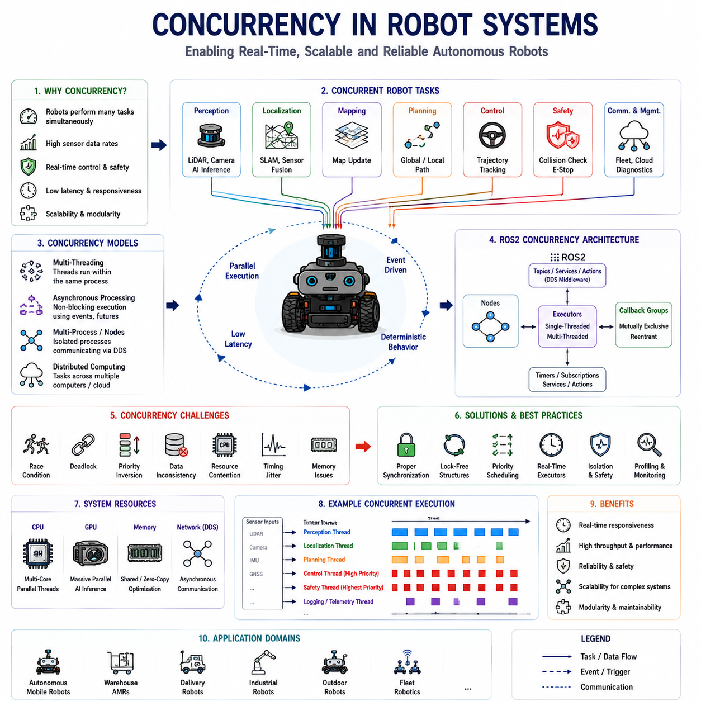
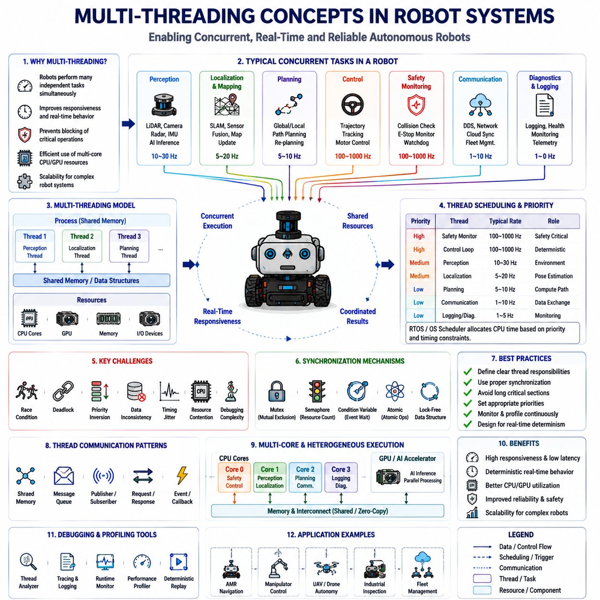
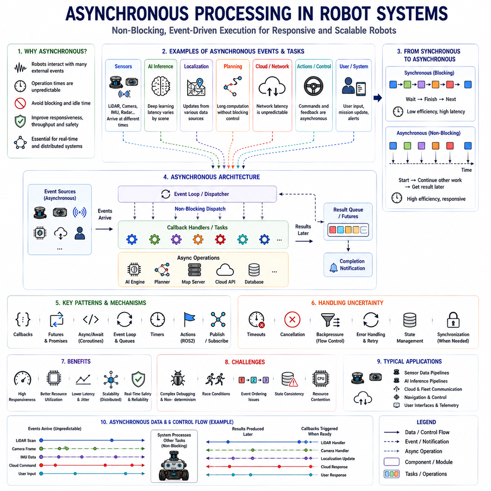
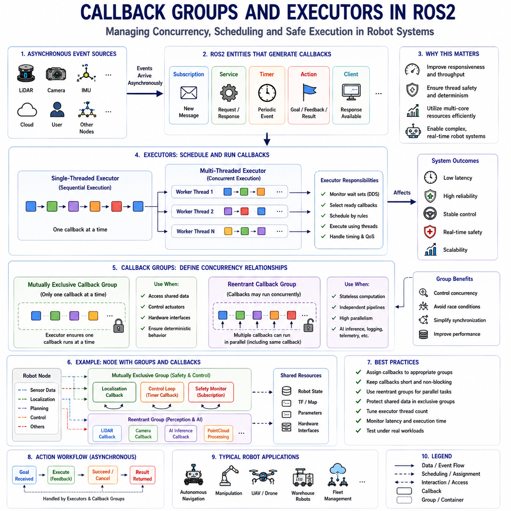
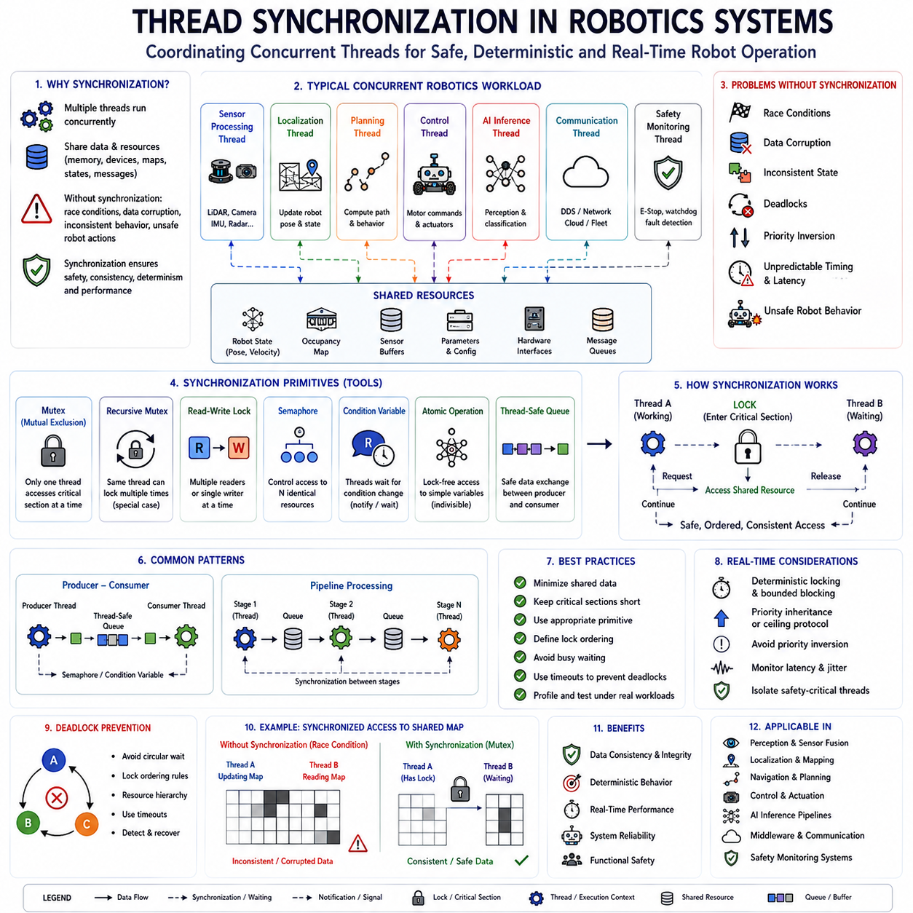
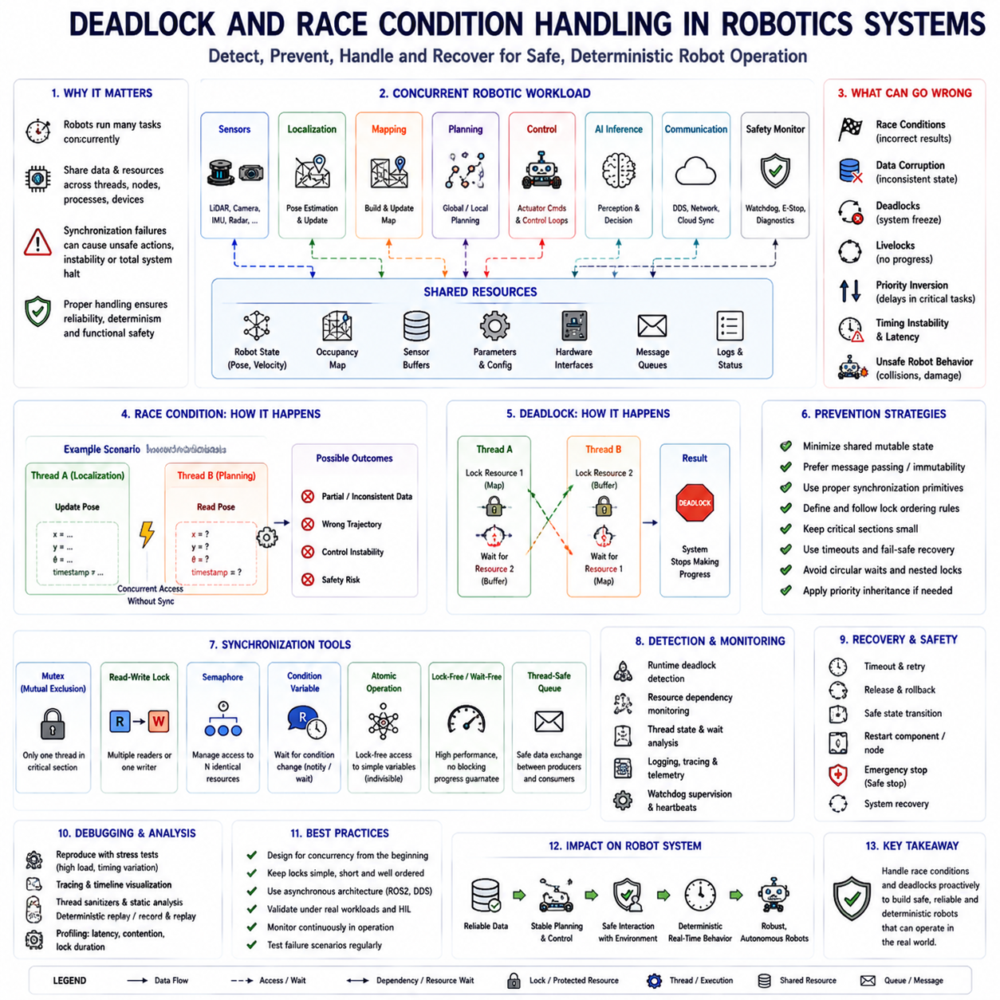
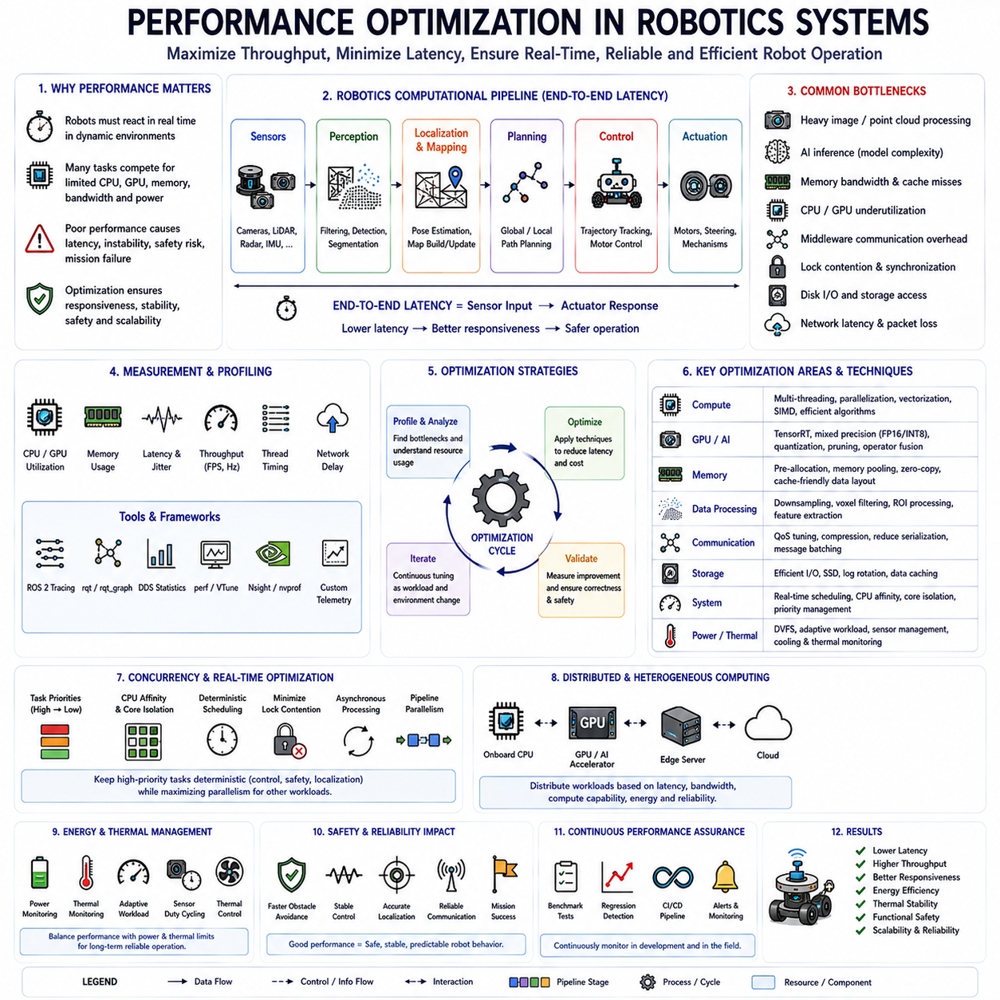
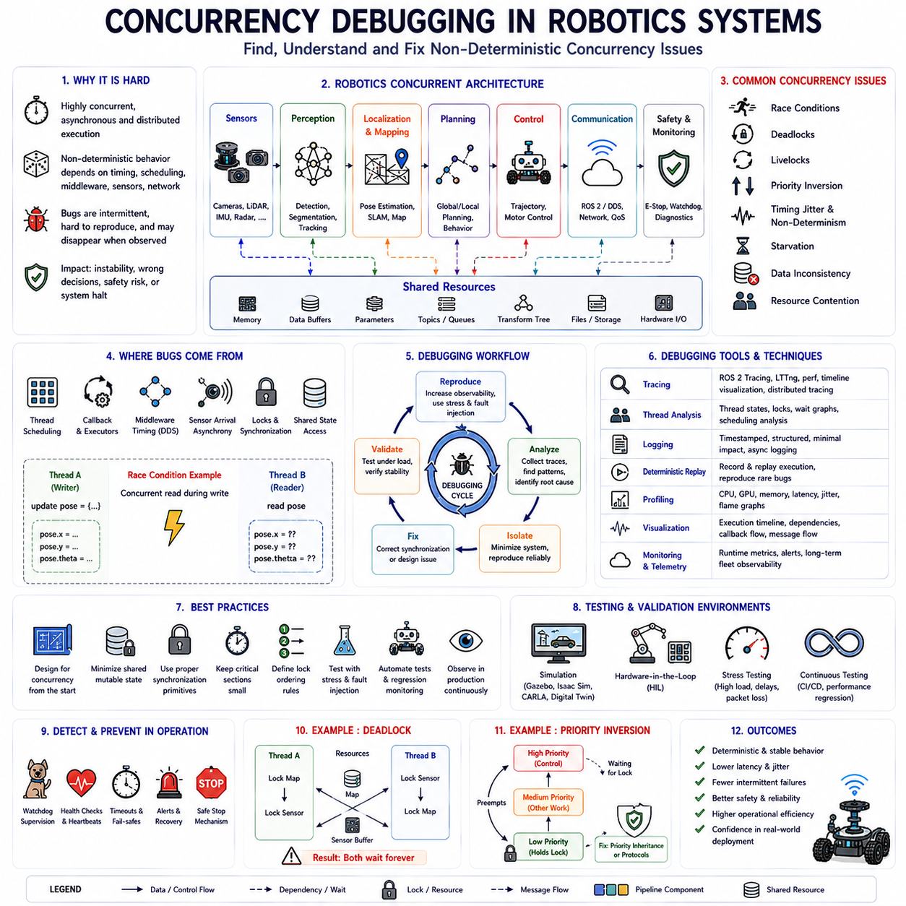

# Chapter 09. Multi-Threading and Concurrency

## 09.1 Concurrency in Robot Systems

{width="7.268055555555556in" height="7.268055555555556in"}

"09_01_Concurrency_in_Robot_Systems" is one of the most fundamental and strategically important concepts in modern autonomous robotics because contemporary robot systems are inherently parallel, distributed, and real-time in nature. An autonomous mobile robot does not execute a single sequential task at one time. Instead, it continuously performs perception, localization, mapping, planning, control, communication, obstacle detection, safety monitoring, actuator management, diagnostics, logging, and AI inference simultaneously. These operations must occur concurrently while maintaining deterministic timing behavior, low latency, data consistency, and operational safety. As robot systems evolve toward increasingly intelligent, sensor-rich, and computationally intensive architectures, concurrency becomes the foundational software paradigm that enables scalable and high-performance robotic operation.

Traditional sequential software architectures are insufficient for modern autonomous systems because robotic workloads involve multiple asynchronous events occurring continuously in parallel. A robot may simultaneously receive LiDAR point clouds, process camera frames, estimate localization, update costmaps, compute trajectories, monitor safety conditions, communicate with fleet management systems, and execute motor control loops. If these operations were executed sequentially, system latency would become unacceptable, navigation stability would degrade, and real-time responsiveness would collapse. Concurrency allows robotic systems to execute multiple operational workflows simultaneously while sharing computational resources efficiently.

Concurrency in robotics refers to the ability of multiple tasks, threads, callbacks, processes, or distributed nodes to make progress during overlapping time periods. This does not necessarily mean all tasks execute physically at the exact same instant. Instead, concurrency allows software systems to interleave execution intelligently across CPUs, GPUs, accelerators, and distributed compute nodes. Modern robotics platforms combine concurrency with parallelism, asynchronous communication, distributed middleware, and real-time scheduling to achieve scalable operational behavior.

The importance of concurrency becomes especially clear when examining the architecture of autonomous mobile robots. Perception pipelines operate continuously at high frequencies. LiDAR systems may generate millions of points per second while cameras stream high-resolution image frames simultaneously. AI inference systems continuously execute neural networks for object detection, semantic segmentation, free-space estimation, and obstacle classification. Localization systems fuse sensor data while planners compute trajectories and controllers maintain stable motion execution. Safety systems independently monitor emergency conditions, collision risk, and operational boundaries. All of these systems must operate concurrently without blocking one another.

ROS2 and DDS-based robotics architectures are inherently designed around concurrent operation models. Individual ROS2 nodes operate independently while exchanging messages asynchronously through topics, services, and actions. Distributed communication allows perception nodes, navigation nodes, control nodes, and cloud interfaces to execute concurrently across multiple processes or even multiple computers. This distributed concurrency architecture improves scalability, modularity, fault isolation, and system maintainability.

Real-time robotics places additional complexity on concurrency management because many robotic tasks operate under strict timing constraints. Motor control loops may require deterministic execution at frequencies of hundreds or thousands of Hertz. Localization updates may need low-latency processing to maintain navigation stability. Sensor fusion pipelines must synchronize data streams precisely despite asynchronous arrival patterns. Concurrency systems therefore must balance throughput, responsiveness, determinism, and computational efficiency simultaneously.

Thread-based concurrency is one of the most commonly used approaches within robotic software systems. Threads allow multiple execution contexts to operate within the same process while sharing memory space. Multi-threaded architectures are especially useful for robotics because many robot tasks naturally operate independently but require fast data sharing. For example, one thread may process LiDAR data while another executes AI inference and a third manages actuator communication.

However, thread-based concurrency introduces substantial engineering complexity. Shared memory access creates the possibility of race conditions, deadlocks, priority inversion, inconsistent state updates, and synchronization bottlenecks. Developers must therefore design concurrent robotics software carefully using synchronization primitives such as mutexes, semaphores, condition variables, atomic operations, lock-free queues, and thread-safe communication structures.

Asynchronous processing is another critical concept within robot concurrency architectures. Not all robotic tasks should block execution while waiting for results. For example, requesting cloud-based semantic analysis should not halt local obstacle avoidance. Similarly, waiting for a map server response should not interrupt controller execution. Asynchronous architectures allow tasks to continue executing while external events or computations complete independently. ROS2 actions, callback systems, futures, promises, and event-driven middleware frameworks heavily support asynchronous robotic workflows.

Executor architectures in ROS2 play a central role in concurrency management. Executors determine how callbacks, timers, subscriptions, services, and actions are scheduled and executed. Single-threaded executors process callbacks sequentially, while multi-threaded executors allow multiple callbacks to execute concurrently. Callback groups further control execution behavior by defining mutually exclusive or reentrant callback policies. These mechanisms provide fine-grained concurrency management essential for real-time robotic systems.

Sensor concurrency is one of the most computationally demanding aspects of robot operation. Modern autonomous robots integrate multiple high-bandwidth sensors operating simultaneously. LiDAR systems, RGB cameras, depth sensors, radar arrays, thermal cameras, GNSS receivers, IMUs, wheel encoders, and ultrasonic sensors continuously generate data streams at different frequencies and latencies. Sensor processing pipelines must therefore operate concurrently while maintaining precise time synchronization and data consistency.

AI inference workloads significantly increase concurrency requirements within modern robotic systems. Deep learning pipelines consume substantial GPU resources and often operate asynchronously relative to navigation and control systems. Concurrent execution becomes essential because AI inference latency may vary depending on scene complexity, neural network architecture, memory transfer overhead, or GPU contention. Robotics systems therefore often separate AI processing into dedicated execution pipelines while maintaining low-latency control and safety threads independently.

Distributed robotics architectures extend concurrency across multiple computing systems. High-performance autonomous robots frequently separate compute workloads across onboard edge computers, GPU servers, safety controllers, cloud systems, and fleet management infrastructure. Concurrency therefore exists not only within individual processes or threads but also across distributed middleware communication networks.

Safety-critical robotics systems impose particularly strict requirements on concurrency behavior. Safety monitoring tasks must remain responsive regardless of computational load elsewhere in the system. Emergency stop handling, collision detection, actuator fault monitoring, power management, and watchdog supervision therefore frequently execute within isolated high-priority threads or dedicated real-time processors. Concurrency architectures must ensure that non-critical tasks cannot starve or delay safety-critical operations.

Priority scheduling becomes extremely important within concurrent robotics systems. Not all tasks possess equal operational importance. Motor control loops and collision detection require deterministic low-latency execution, while telemetry logging or cloud synchronization may tolerate higher latency. Real-time schedulers therefore assign execution priorities carefully to maintain stable robotic operation under varying computational loads.

Concurrency also strongly influences robot scalability. Small research robots may operate sufficiently using limited concurrency models, but industrial autonomous systems managing dozens of sensors, multiple AI models, distributed communication channels, and large-scale fleet coordination require highly sophisticated concurrency architectures. Scalability depends fundamentally on the ability to parallelize workloads while minimizing synchronization overhead and communication bottlenecks.

Memory management is deeply intertwined with concurrency engineering. Shared memory access introduces synchronization complexity, while excessive copying of sensor data may degrade performance significantly. Robotics frameworks increasingly rely on zero-copy transport, shared memory middleware, lock-free data structures, and optimized buffer management to support high-bandwidth concurrent operation efficiently.

Concurrency debugging is among the most difficult engineering challenges within robotics software development. Concurrency bugs are often nondeterministic and may appear only under specific timing conditions or computational loads. Race conditions may occur intermittently, deadlocks may freeze systems unpredictably, and timing jitter may destabilize navigation or control behavior. Developers therefore rely heavily on tracing systems, telemetry analysis, thread inspection tools, runtime diagnostics, and deterministic replay systems to debug concurrent robotics software.

Profiling concurrent robotics systems is equally important. CPU utilization, thread scheduling latency, lock contention, memory bandwidth usage, GPU occupancy, middleware latency, and callback execution timing all influence robotic performance directly. Real-time robotics platforms therefore require continuous performance monitoring and optimization throughout development and deployment cycles.

Multi-core CPU architectures are fundamental enablers of modern robot concurrency. Contemporary robotics platforms increasingly rely on high-core-count processors capable of executing multiple workloads simultaneously. Edge AI computers such as Jetson Orin, Jetson Thor, x86 industrial servers, and heterogeneous computing platforms combine CPUs, GPUs, AI accelerators, and specialized hardware engines to support massively concurrent robotic workloads.

GPU concurrency introduces additional architectural complexity. GPUs operate using massively parallel execution models optimized for AI inference, point cloud processing, image analysis, and neural network computation. Robotics software must coordinate CPU threads, GPU kernels, DMA transfers, and memory synchronization efficiently to achieve real-time performance.

Middleware communication itself is highly concurrent in modern robotics systems. DDS-based communication frameworks continuously manage message serialization, transport scheduling, QoS enforcement, network retransmission, and distributed synchronization concurrently. Improper middleware configuration may create latency spikes, communication storms, or excessive CPU overhead under high system load.

Concurrency also plays a central role in cloud-edge robotics architectures. Edge systems handle real-time navigation and safety-critical processing locally, while cloud systems manage fleet analytics, semantic reasoning, global coordination, and long-term learning. Concurrent communication and synchronization between edge and cloud systems must be carefully managed to maintain operational consistency without compromising real-time responsiveness.

Human-robot interaction introduces additional concurrency complexity. Robots interacting with humans must simultaneously monitor human proximity, interpret gestures, process speech, maintain navigation stability, execute mission logic, and enforce safety boundaries. These behavioral layers operate concurrently while adapting dynamically to unpredictable environmental conditions.

Simulation environments are essential for validating concurrency architectures safely. Gazebo, Isaac Sim, CARLA, and digital twin systems allow developers to stress-test multi-threaded robotics software under controlled conditions. Simulation supports analysis of timing jitter, synchronization stability, sensor overload scenarios, communication latency, and computational bottlenecks before physical deployment.

Hardware-in-the-loop testing further improves concurrency validation realism by integrating actual sensors, controllers, actuators, and compute hardware with simulated environments. HIL testing allows developers to evaluate real-time scheduling behavior and concurrent execution stability under reproducible operational conditions.

Artificial intelligence is beginning to influence concurrency management itself. Adaptive scheduling systems, AI-driven workload balancing, predictive resource management, and learned execution optimization may eventually improve robotic concurrency architectures dynamically based on operational conditions and computational demand.

Cybersecurity considerations are increasingly important within concurrent robotics systems as well. Concurrent distributed communication introduces potential attack surfaces including denial-of-service attacks, resource starvation, timing manipulation, and malicious middleware interference. Secure concurrency architectures therefore require authentication, isolation, encrypted communication, and runtime integrity monitoring.

Future autonomous robotics systems will likely become even more concurrency-intensive as robots evolve toward embodied intelligence, large-scale multimodal perception, distributed AI reasoning, collaborative multi-robot coordination, and cloud-native operational ecosystems. Concurrency will therefore remain one of the foundational engineering principles enabling scalable intelligent robotic operation.

Ultimately, concurrency in robot systems forms the computational coordination backbone that allows autonomous robots to operate reliably in complex real-world environments. Every perception pipeline, localization update, navigation decision, AI inference process, control loop, communication channel, and safety mechanism depends on concurrent execution architectures functioning correctly. As robotics systems continue advancing toward increasingly intelligent, distributed, high-performance, and safety-critical operation, concurrency engineering will remain among the most strategically important and technically sophisticated disciplines within the entire robotics software ecosystem.

"09_01_Concurrency_in_Robot_Systems"은 현대 Autonomous Robotics에서 가장 Fundamentally Important하고 Strategically Critical한 개념 중 하나이다. 왜냐하면 현대 Robot System은 본질적으로 Parallel하고 Distributed되며 Real-Time 기반으로 동작하기 때문이다. Autonomous Mobile Robot은 단일 Sequential Task만 수행하지 않는다. 대신 Perception, Localization, Mapping, Planning, Control, Communication, Obstacle Detection, Safety Monitoring, Actuator Management, Diagnostics, Logging, AI Inference를 동시에 지속적으로 수행한다. 이러한 작업들은 Deterministic Timing Behavior, Low Latency, Data Consistency, Operational Safety를 유지하면서 Concurrent하게 실행되어야 한다. Robot System이 점점 더 Intelligent하고 Sensor-Rich하며 Computationally Intensive한 방향으로 발전할수록, Concurrency는 Scalable하고 High-Performance한 Robotic Operation을 가능하게 하는 Foundation Software Paradigm 역할을 수행한다.

Traditional Sequential Software Architecture는 현대 Autonomous System에 적합하지 않다. 왜냐하면 Robot Workload는 Multiple Asynchronous Event가 지속적으로 Parallel하게 발생하는 구조이기 때문이다. Robot은 동시에 LiDAR Point Cloud를 수신하고, Camera Frame을 처리하며, Localization을 수행하고, Costmap을 업데이트하고, Trajectory를 계산하며, Safety Condition을 모니터링하고, Fleet Management System과 통신하며, Motor Control Loop를 실행할 수 있다. 만약 이러한 작업을 Sequential하게 처리한다면 System Latency는 매우 증가하게 되고, Navigation Stability는 저하되며, Real-Time Responsiveness는 붕괴하게 된다. Concurrency는 Multiple Operational Workflow를 동시에 실행하면서도 Computational Resource를 효율적으로 공유할 수 있게 만든다.

Robotics에서의 Concurrency는 Multiple Task, Thread, Callback, Process, Distributed Node가 Overlapping Time Period 동안 동시에 Progress할 수 있는 능력을 의미한다. 이는 반드시 모든 작업이 정확히 같은 순간에 물리적으로 실행된다는 의미는 아니다. 대신 Concurrency는 Software System이 CPU, GPU, Accelerator, Distributed Compute Node를 활용하여 Intelligent하게 Execution을 Interleave할 수 있도록 만든다. 현대 Robotics Platform은 Parallelism, Asynchronous Communication, Distributed Middleware, Real-Time Scheduling을 결합하여 Scalable Operational Behavior를 달성한다.

Concurrency의 중요성은 Autonomous Mobile Robot Architecture를 분석하면 더욱 명확해진다. Perception Pipeline은 High Frequency로 지속적으로 동작한다. LiDAR는 초당 수백만 개의 Point를 생성할 수 있으며, Camera는 동시에 High-Resolution Image Frame을 Streaming한다. AI Inference System은 Object Detection, Semantic Segmentation, Free-Space Estimation, Obstacle Classification을 위한 Neural Network를 지속적으로 실행한다. Localization System은 Sensor Fusion을 수행하며, Planner는 Trajectory를 계산하고, Controller는 Stable Motion Execution을 유지한다. Safety System은 Emergency Condition, Collision Risk, Operational Boundary를 독립적으로 Monitoring한다. 이 모든 System은 서로 Blocking하지 않으면서 Concurrent하게 동작해야 한다.

ROS2와 DDS 기반 Robotics Architecture는 본질적으로 Concurrent Operation Model 위에서 설계되어 있다. 개별 ROS2 Node는 Independent하게 동작하며, Topic, Service, Action을 통해 Asynchronous하게 Message를 교환한다. 이러한 Distributed Communication은 Perception Node, Navigation Node, Control Node, Cloud Interface가 Multiple Process 또는 Multiple Computer에서 Concurrent하게 실행될 수 있게 만든다. 이러한 Distributed Concurrency Architecture는 Scalability, Modularity, Fault Isolation, System Maintainability를 향상시킨다.

Real-Time Robotics는 Concurrency Management를 더욱 복잡하게 만든다. 왜냐하면 많은 Robot Task가 Strict Timing Constraint를 가지기 때문이다. Motor Control Loop는 수백 또는 수천 Hz 수준의 Deterministic Execution을 요구할 수 있다. Localization Update는 Navigation Stability를 유지하기 위해 Low-Latency Processing이 필요하다. Sensor Fusion Pipeline은 Asynchronous Arrival Pattern 속에서도 Data Stream을 Precise하게 Synchronization해야 한다. 따라서 Concurrency System은 Throughput, Responsiveness, Determinism, Computational Efficiency를 동시에 균형 있게 유지해야 한다.

Thread-Based Concurrency는 Robotics Software System에서 가장 널리 사용되는 방식 중 하나이다. Thread는 동일한 Process 내부에서 Shared Memory Space를 사용하는 Multiple Execution Context를 제공한다. Multi-Threaded Architecture는 특히 Robotics에 적합하다. 왜냐하면 많은 Robot Task가 Independent하게 동작하면서도 Fast Data Sharing을 필요로 하기 때문이다. 예를 들어 하나의 Thread는 LiDAR Data를 처리하고, 다른 Thread는 AI Inference를 수행하며, 또 다른 Thread는 Actuator Communication을 관리할 수 있다.

그러나 Thread-Based Concurrency는 상당한 Engineering Complexity를 유발한다. Shared Memory Access는 Race Condition, Deadlock, Priority Inversion, Inconsistent State Update, Synchronization Bottleneck를 발생시킬 수 있다. 따라서 Developer는 Mutex, Semaphore, Condition Variable, Atomic Operation, Lock-Free Queue, Thread-Safe Communication Structure와 같은 Synchronization Primitive를 사용하여 Concurrent Robotics Software를 신중하게 설계해야 한다.

Asynchronous Processing 역시 Robot Concurrency Architecture에서 매우 중요한 개념이다. 모든 Robot Task가 Result를 기다리는 동안 Execution을 Blocking해서는 안 된다. 예를 들어 Cloud-Based Semantic Analysis를 요청했다고 해서 Local Obstacle Avoidance가 멈추어서는 안 된다. 마찬가지로 Map Server Response를 기다리는 동안 Controller Execution이 중단되어서는 안 된다. Asynchronous Architecture는 External Event나 Computation이 Independent하게 완료되는 동안 다른 Task가 계속 실행될 수 있게 만든다. ROS2 Action, Callback System, Future, Promise, Event-Driven Middleware Framework는 이러한 Asynchronous Robotics Workflow를 강력하게 지원한다.

ROS2의 Executor Architecture는 Concurrency Management에서 핵심 역할을 수행한다. Executor는 Callback, Timer, Subscription, Service, Action이 어떻게 Scheduling되고 Execution될지를 결정한다. Single-Threaded Executor는 Callback을 Sequential하게 처리하는 반면, Multi-Threaded Executor는 Multiple Callback을 Concurrent하게 실행할 수 있다. Callback Group은 Mutually Exclusive 또는 Reentrant Callback Policy를 정의하여 Execution Behavior를 더욱 세밀하게 제어한다. 이러한 Mechanism은 Real-Time Robotic System에서 Fine-Grained Concurrency Management를 가능하게 만든다.

Sensor Concurrency는 Robot Operation에서 가장 Computationally Demanding한 영역 중 하나이다. 현대 Autonomous Robot은 Multiple High-Bandwidth Sensor를 동시에 사용한다. LiDAR, RGB Camera, Depth Sensor, Radar Array, Thermal Camera, GNSS Receiver, IMU, Wheel Encoder, Ultrasonic Sensor는 서로 다른 Frequency와 Latency를 가진 Data Stream을 지속적으로 생성한다. 따라서 Sensor Processing Pipeline은 Precise Time Synchronization과 Data Consistency를 유지하면서 Concurrent하게 동작해야 한다.

AI Inference Workload는 현대 Robotics System에서 Concurrency Requirement를 크게 증가시킨다. Deep Learning Pipeline은 상당한 GPU Resource를 소비하며, Navigation 및 Control System과 Asynchronous하게 동작하는 경우가 많다. AI Inference Latency는 Scene Complexity, Neural Network Architecture, Memory Transfer Overhead, GPU Contention에 따라 변동될 수 있기 때문에 Concurrent Execution은 필수적이다. 따라서 Robotics System은 Low-Latency Control 및 Safety Thread를 유지하면서 AI Processing을 Dedicated Execution Pipeline으로 분리하는 경우가 많다.

Distributed Robotics Architecture는 Multiple Computing System으로 Concurrency를 확장한다. High-Performance Autonomous Robot은 Onboard Edge Computer, GPU Server, Safety Controller, Cloud System, Fleet Management Infrastructure로 Compute Workload를 분산하는 경우가 많다. 따라서 Concurrency는 Individual Process 또는 Thread 내부뿐 아니라 Distributed Middleware Communication Network 전체에 걸쳐 존재하게 된다.

Safety-Critical Robotics System은 특히 엄격한 Concurrency Requirement를 가진다. Safety Monitoring Task는 System 내부의 다른 Computational Load와 관계없이 항상 Responsive해야 한다. 따라서 Emergency Stop Handling, Collision Detection, Actuator Fault Monitoring, Power Management, Watchdog Supervision은 Independent High-Priority Thread 또는 Dedicated Real-Time Processor 내부에서 실행되는 경우가 많다. Concurrency Architecture는 Non-Critical Task가 Safety-Critical Operation을 Delay하거나 Starve하지 못하도록 보장해야 한다.

Priority Scheduling은 Concurrent Robotics System에서 매우 중요하다. 모든 Task가 동일한 Operational Importance를 가지는 것은 아니다. Motor Control Loop와 Collision Detection은 Deterministic Low-Latency Execution을 요구하지만, Telemetry Logging이나 Cloud Synchronization은 Higher Latency를 허용할 수 있다. 따라서 Real-Time Scheduler는 Variable Computational Load에서도 Stable Robotic Operation을 유지할 수 있도록 Execution Priority를 신중하게 설정한다.

Concurrency는 Robot Scalability에도 직접적인 영향을 미친다. Small Research Robot은 단순한 Concurrency Model로도 충분할 수 있지만, 수십 개의 Sensor, Multiple AI Model, Distributed Communication Channel, Large-Scale Fleet Coordination을 처리하는 Industrial Autonomous System은 Highly Sophisticated Concurrency Architecture를 요구한다. Scalability는 Synchronization Overhead와 Communication Bottleneck를 최소화하면서 Workload를 Parallelize할 수 있는 능력에 크게 의존한다.

Memory Management 역시 Concurrency Engineering과 깊게 연결되어 있다. Shared Memory Access는 Synchronization Complexity를 증가시키며, 과도한 Sensor Data Copy는 Performance를 크게 저하시킬 수 있다. 따라서 현대 Robotics Framework는 Zero-Copy Transport, Shared Memory Middleware, Lock-Free Data Structure, Optimized Buffer Management를 적극적으로 활용하여 High-Bandwidth Concurrent Operation을 효율적으로 지원한다.

Concurrency Debugging은 Robotics Software Development에서 가장 어려운 Engineering Challenge 중 하나이다. Concurrency Bug는 일반적으로 Non-Deterministic하며, 특정 Timing Condition 또는 Computational Load에서만 발생하는 경우가 많다. Race Condition은 Intermittently 발생할 수 있고, Deadlock은 예측 불가능하게 System을 Freeze시킬 수 있으며, Timing Jitter는 Navigation 또는 Control Stability를 무너뜨릴 수 있다. 따라서 Developer는 Tracing System, Telemetry Analysis, Thread Inspection Tool, Runtime Diagnostic, Deterministic Replay System을 적극적으로 사용하여 Concurrent Robotics Software를 Debugging한다.

Concurrent Robotics System의 Profiling 역시 매우 중요하다. CPU Utilization, Thread Scheduling Latency, Lock Contention, Memory Bandwidth Usage, GPU Occupancy, Middleware Latency, Callback Execution Timing은 모두 Robot Performance에 직접적인 영향을 준다. 따라서 Real-Time Robotics Platform은 Development 및 Deployment 전 과정에서 Continuous Performance Monitoring과 Optimization을 필요로 한다.

Multi-Core CPU Architecture는 현대 Robot Concurrency의 핵심 기반이다. Contemporary Robotics Platform은 Multiple Workload를 동시에 실행할 수 있는 High-Core-Count Processor에 점점 더 의존하고 있다. Jetson Orin, Jetson Thor, x86 Industrial Server, Heterogeneous Computing Platform은 CPU, GPU, AI Accelerator, Specialized Hardware Engine을 결합하여 Massively Concurrent Robotic Workload를 지원한다.

GPU Concurrency는 추가적인 Architectural Complexity를 유발한다. GPU는 AI Inference, Point Cloud Processing, Image Analysis, Neural Network Computation에 최적화된 Massively Parallel Execution Model 위에서 동작한다. Robotics Software는 CPU Thread, GPU Kernel, DMA Transfer, Memory Synchronization을 효율적으로 조정하여 Real-Time Performance를 달성해야 한다.

Middleware Communication 자체도 현대 Robotics System에서 Highly Concurrent하다. DDS-Based Communication Framework는 Message Serialization, Transport Scheduling, QoS Enforcement, Network Retransmission, Distributed Synchronization을 Concurrent하게 처리한다. Improper Middleware Configuration은 High System Load 상황에서 Latency Spike, Communication Storm, Excessive CPU Overhead를 유발할 수 있다.

Concurrency는 Cloud-Edge Robotics Architecture에서도 핵심 역할을 수행한다. Edge System은 Real-Time Navigation과 Safety-Critical Processing을 Local에서 처리하고, Cloud System은 Fleet Analytics, Semantic Reasoning, Global Coordination, Long-Term Learning을 담당한다. 따라서 Edge와 Cloud 사이의 Concurrent Communication 및 Synchronization은 Real-Time Responsiveness를 손상시키지 않으면서 Operational Consistency를 유지하도록 신중하게 설계되어야 한다.

Human-Robot Interaction 역시 Additional Concurrency Complexity를 유발한다. Human과 상호작용하는 Robot은 Human Proximity Monitoring, Gesture Interpretation, Speech Processing, Navigation Stability Maintenance, Mission Logic Execution, Safety Boundary Enforcement를 동시에 수행해야 한다. 이러한 Behavioral Layer는 Unpredictable Environmental Condition에 Dynamic하게 적응하면서 Concurrent하게 동작한다.

Simulation Environment는 Concurrency Architecture Validation에서 매우 중요하다. Gazebo, Isaac Sim, CARLA, Digital Twin System은 Controlled Condition에서 Multi-Threaded Robotics Software를 Stress-Test할 수 있게 만든다. 이를 통해 Timing Jitter, Synchronization Stability, Sensor Overload Scenario, Communication Latency, Computational Bottleneck를 Physical Deployment 이전에 분석할 수 있다.

Hardware-in-the-Loop Testing은 Real Sensor, Controller, Actuator, Compute Hardware를 Simulation Environment와 결합하여 Concurrency Validation Realism을 더욱 향상시킨다. HIL Testing은 Reproducible Operational Condition에서 Real-Time Scheduling Behavior와 Concurrent Execution Stability를 평가할 수 있게 만든다.

Artificial Intelligence는 Concurrency Management 자체에도 영향을 주기 시작하고 있다. Adaptive Scheduling System, AI-Driven Workload Balancing, Predictive Resource Management, Learned Execution Optimization은 향후 Operational Condition과 Computational Demand에 따라 Robot Concurrency Architecture를 Dynamic하게 최적화할 가능성이 있다.

Cybersecurity 역시 Concurrent Robotics System에서 점점 중요해지고 있다. Concurrent Distributed Communication은 Denial-of-Service Attack, Resource Starvation, Timing Manipulation, Malicious Middleware Interference와 같은 Attack Surface를 제공할 수 있다. 따라서 Secure Concurrency Architecture는 Authentication, Isolation, Encrypted Communication, Runtime Integrity Monitoring을 요구한다.

미래 Autonomous Robotics System은 Embodied Intelligence, Large-Scale Multimodal Perception, Distributed AI Reasoning, Collaborative Multi-Robot Coordination, Cloud-Native Operational Ecosystem 방향으로 발전하면서 더욱 Concurrency-Intensive해질 가능성이 높다. 따라서 Concurrency는 Scalable Intelligent Robotic Operation을 가능하게 하는 Foundation Engineering Principle로 계속 남게 될 것이다.

결국 Robot System에서의 Concurrency는 Autonomous Robot이 Complex Real-World Environment에서 Reliable하게 동작할 수 있도록 만드는 Computational Coordination Backbone 역할을 수행한다. 모든 Perception Pipeline, Localization Update, Navigation Decision, AI Inference Process, Control Loop, Communication Channel, Safety Mechanism은 Correct하게 동작하는 Concurrent Execution Architecture에 의존한다. Robotics System이 더욱 Intelligent하고 Distributed되며 High-Performance하고 Safety-Critical한 방향으로 발전할수록, Concurrency Engineering은 전체 Robotics Software Ecosystem에서 가장 Strategically Important하고 Technically Sophisticated한 분야 중 하나로 계속 남게 될 것이다.

##  

## 09.2 Multi-Threading Concepts

{width="7.268055555555556in" height="7.268055555555556in"}

"09_02_Multi_Threading_Concepts" is one of the most important software engineering foundations in modern robotics because autonomous robot systems must execute many independent operations simultaneously while maintaining real-time responsiveness, deterministic behavior, safety, and computational efficiency. Multi-threading provides the execution architecture that allows robot software to process sensor data, perform localization, execute navigation planning, control actuators, monitor safety conditions, run artificial intelligence inference, communicate with distributed systems, and handle user interaction concurrently within the same application environment. As robotic systems become increasingly intelligent, sensor-rich, AI-driven, and computationally intensive, multi-threading evolves from an optimization technique into a fundamental operational requirement for scalable autonomous systems.

Traditional single-threaded software architectures execute instructions sequentially. A single execution flow processes one operation at a time before moving to the next task. While this approach simplifies software design and debugging, it becomes fundamentally insufficient for modern autonomous robots because robotic workloads are inherently concurrent and time-sensitive. A robot cannot pause obstacle detection while computing localization, nor can it suspend motor control while processing AI inference. Real-world autonomous systems must therefore process multiple data streams and operational workflows simultaneously while maintaining strict timing guarantees.

Multi-threading enables multiple execution threads to operate within the same process concurrently. Each thread represents an independent sequence of execution capable of performing tasks separately while sharing the same application memory space and system resources. Unlike separate processes, threads within the same process communicate efficiently through shared memory, allowing low-latency data exchange and fast coordination between robotic subsystems.

The importance of multi-threading becomes immediately apparent when examining autonomous mobile robot architectures. Modern robots continuously process LiDAR point clouds, camera streams, radar inputs, inertial measurements, wheel encoder data, GNSS updates, localization estimates, map updates, planner computations, actuator commands, and AI inference results simultaneously. Each of these computational pipelines operates at different frequencies and latency requirements. Motor control loops may require deterministic updates at hundreds or thousands of Hertz, while AI perception pipelines may process image frames at lower but computationally intensive rates. Multi-threading allows these heterogeneous workloads to coexist efficiently within unified robotic software systems.

One of the primary advantages of multi-threading in robotics is responsiveness. Without concurrent execution, long-running operations may block time-critical tasks. For example, deep learning inference for semantic segmentation may require significant computational time. If executed within a single-threaded architecture, this operation could temporarily delay obstacle avoidance, actuator updates, or emergency stop handling. Multi-threaded architectures isolate workloads so that high-priority safety and control tasks remain responsive even when computationally intensive processing occurs elsewhere in the system.

Real-time robotics places especially strict requirements on thread scheduling and execution determinism. Autonomous systems frequently interact with dynamic environments where delays of even tens of milliseconds may affect safety or navigation stability. Multi-threaded robotic architectures therefore often combine concurrent execution with real-time operating system scheduling policies. High-priority threads handling motor control, collision detection, emergency monitoring, and safety supervision receive deterministic CPU scheduling guarantees while lower-priority tasks execute opportunistically.

Thread scheduling is a foundational aspect of multi-threaded system design. Operating systems allocate CPU execution time among multiple threads according to scheduling algorithms and thread priorities. In robotics, improper scheduling may produce timing jitter, unstable control loops, delayed sensor processing, or degraded navigation performance. Developers therefore carefully design thread priorities, execution affinity, scheduling policies, and synchronization behavior to ensure predictable robotic operation under varying computational loads.

Shared memory is both one of the greatest strengths and one of the greatest engineering challenges of multi-threading. Threads within the same process communicate efficiently through shared memory structures, allowing low-latency access to sensor buffers, localization states, planner outputs, costmaps, and AI inference results. However, simultaneous access to shared data introduces the possibility of race conditions where multiple threads modify data concurrently in unsafe ways. Race conditions may produce corrupted state, inconsistent robot behavior, intermittent failures, or dangerous navigation instability.

Synchronization mechanisms are therefore essential within multi-threaded robotic software systems. Mutexes are commonly used to protect shared data structures by allowing only one thread to access critical sections at a time. Semaphores coordinate resource availability across threads, while condition variables allow threads to wait efficiently for specific events or state changes. Atomic operations provide lightweight synchronization for simple shared variables, and lock-free data structures minimize blocking behavior in high-performance real-time systems.

Deadlocks represent one of the most dangerous failure modes within multi-threaded robotics software. A deadlock occurs when multiple threads wait indefinitely for resources held by one another, causing the system to freeze partially or entirely. In autonomous robots, deadlocks may disable navigation, prevent obstacle avoidance, or block emergency safety behavior. Developers therefore carefully design locking order, timeout handling, resource ownership policies, and thread interaction architectures to avoid deadlock conditions.

Priority inversion is another critical concern in real-time robotic systems. Priority inversion occurs when a high-priority thread becomes blocked by a lower-priority thread holding a shared resource. This problem may destabilize motor control loops, delay emergency response, or interrupt deterministic navigation behavior. Real-time operating systems often implement priority inheritance mechanisms that temporarily elevate lower-priority thread execution to resolve priority inversion safely.

Thread affinity and CPU core allocation are increasingly important in high-performance robotics platforms. Modern autonomous robots frequently operate on multi-core processors with heterogeneous computing architectures combining CPUs, GPUs, AI accelerators, and dedicated hardware engines. Developers may assign specific threads to dedicated CPU cores to reduce scheduling variability and improve deterministic timing behavior. Safety-critical threads often receive isolated computational resources to ensure stable operation under high system load.

ROS2 heavily utilizes multi-threading internally. ROS2 executors schedule callbacks, subscriptions, services, timers, and actions across concurrent execution contexts. Single-threaded executors process callbacks sequentially, while multi-threaded executors allow multiple callbacks to execute concurrently. Callback groups provide additional control over thread behavior by defining mutually exclusive or reentrant execution policies. These mechanisms allow ROS2 robotic systems to scale efficiently across increasingly complex operational workloads.

Sensor processing pipelines are among the most demanding multi-threaded workloads in robotics. LiDAR processing, image acquisition, depth estimation, point cloud filtering, object detection, semantic segmentation, sensor fusion, and localization estimation all operate concurrently at high frequencies. Efficient thread design is essential to prevent sensor processing bottlenecks, data loss, excessive latency, or synchronization instability.

Artificial intelligence workloads significantly increase the complexity of multi-threaded robotic architectures. Deep learning inference often executes asynchronously on GPUs while CPU threads continue navigation planning, safety monitoring, and control execution. Multi-threaded coordination between CPU and GPU execution pipelines is critical for maintaining real-time responsiveness while maximizing computational throughput.

Asynchronous execution models complement multi-threading within robotics systems. Not all operations should block threads while waiting for external events. Futures, promises, event loops, asynchronous callbacks, and message-driven architectures allow robotic software to remain responsive while interacting with cloud systems, network services, distributed compute nodes, or long-running AI pipelines.

Multi-threaded architectures also strongly influence robotics scalability. Small educational robots may operate adequately using limited concurrency, but industrial autonomous systems with multiple sensors, distributed AI pipelines, high-definition perception systems, fleet communication interfaces, and complex navigation stacks require highly sophisticated thread management architectures. Scalability depends fundamentally on the ability to parallelize workloads efficiently while minimizing synchronization overhead and resource contention.

Memory management becomes particularly challenging within multi-threaded systems. Threads may allocate and deallocate buffers concurrently while processing large sensor streams continuously. Improper memory management may create fragmentation, memory leaks, excessive allocation overhead, cache contention, or inconsistent data access patterns. Robotics frameworks increasingly rely on zero-copy transport, shared memory middleware, memory pooling, and optimized buffer reuse to improve multi-threaded performance.

Thread-safe software design is essential in robotics engineering. Data structures, communication pipelines, logging systems, telemetry interfaces, and middleware interactions must all behave predictably under concurrent access conditions. Thread safety is especially important in safety-critical systems where inconsistent data access may create hazardous operational behavior.

Multi-threaded debugging is among the most difficult aspects of robotics software development. Multi-threaded bugs are frequently nondeterministic and timing-dependent. Race conditions may appear only under rare scheduling conditions, while deadlocks may occur intermittently during specific operational sequences. Timing jitter may destabilize navigation or perception systems unpredictably. Developers therefore rely heavily on tracing frameworks, thread analyzers, deterministic replay systems, runtime diagnostics, and telemetry visualization tools during debugging workflows.

Performance profiling is equally important in multi-threaded robotics systems. Developers analyze CPU utilization, thread latency, synchronization overhead, lock contention, scheduling jitter, memory bandwidth, cache efficiency, and GPU utilization continuously. Real-time robotics requires careful optimization of thread interaction patterns to maintain stable operational performance.

Lock contention is a major performance bottleneck in poorly designed multi-threaded systems. Excessive locking may serialize execution unintentionally, reducing concurrency benefits and increasing latency. High-performance robotic systems therefore increasingly adopt lock-free queues, wait-free algorithms, read-write locks, and concurrent data structures optimized for real-time operation.

Multi-threading also interacts closely with middleware communication frameworks. DDS middleware systems used in ROS2 operate using multiple communication threads for message transport, serialization, discovery, reliability management, and Quality-of-Service enforcement. Improper middleware thread configuration may create excessive latency, CPU overload, or communication instability under high sensor bandwidth conditions.

Cloud-edge robotic architectures introduce additional multi-threading complexity. Edge systems must maintain deterministic real-time behavior locally while concurrently synchronizing with cloud systems handling fleet coordination, semantic reasoning, analytics, remote monitoring, and long-term learning. Multi-threaded communication pipelines therefore manage distributed computation across network boundaries continuously.

Safety-critical robotics systems require especially robust thread isolation and fault containment. Safety supervision threads frequently execute independently from navigation and AI processing pipelines. Watchdog systems monitor thread health continuously and may trigger emergency shutdown procedures if critical threads become unresponsive.

Simulation environments play an essential role in validating multi-threaded robotic architectures. Isaac Sim, Gazebo, CARLA, and digital twin systems allow developers to stress-test thread scheduling, synchronization stability, sensor overload conditions, and computational bottlenecks safely before deployment into physical robots.

Hardware-in-the-loop testing further improves validation realism by integrating actual sensors, controllers, actuators, and compute hardware into simulated operational environments. HIL testing allows developers to analyze real-time thread behavior, communication latency, and synchronization stability under reproducible conditions.

Cybersecurity considerations are becoming increasingly important in multi-threaded robotic systems as well. Malicious processes may attempt to starve critical threads, overload computational resources, manipulate scheduling behavior, or disrupt middleware communication. Secure robotics architectures therefore increasingly integrate runtime monitoring, resource isolation, access control, and anomaly detection mechanisms.

Artificial intelligence may eventually influence thread scheduling itself. Adaptive runtime schedulers, AI-driven workload balancing, predictive resource allocation, and learned concurrency optimization may dynamically optimize robotic execution behavior according to environmental conditions and operational demand.

Future robotics systems will likely become even more multi-threaded as robots evolve toward embodied AI, multimodal perception, distributed cognition, collaborative multi-robot coordination, and cloud-native autonomy. Multi-threading will therefore remain one of the foundational engineering principles enabling scalable intelligent robotics.

Ultimately, multi-threading concepts form the execution coordination backbone of modern robot software systems. Every sensor pipeline, localization process, AI inference engine, navigation controller, communication framework, and safety monitor depends on concurrent thread execution functioning reliably and deterministically. As robotics systems continue advancing toward increasingly intelligent, distributed, high-performance, and safety-critical operation, multi-threading engineering will remain among the most strategically important and technically sophisticated disciplines within the entire robotics software ecosystem.

"09_02_Multi_Threading_Concepts"는 현대 Robotics에서 가장 중요한 Software Engineering Foundation 중 하나이다. 왜냐하면 Autonomous Robot System은 Real-Time Responsiveness, Deterministic Behavior, Safety, Computational Efficiency를 유지하면서도 Multiple Independent Operation을 동시에 수행해야 하기 때문이다. Multi-Threading은 Robot Software가 동일한 Application Environment 내부에서 Sensor Data Processing, Localization, Navigation Planning, Actuator Control, Safety Monitoring, Artificial Intelligence Inference, Distributed System Communication, User Interaction을 Concurrent하게 수행할 수 있도록 만드는 Execution Architecture를 제공한다. Robotics System이 점점 더 Intelligent하고 Sensor-Rich하며 AI-Driven이고 Computationally Intensive한 방향으로 발전함에 따라, Multi-Threading은 단순한 Optimization Technique를 넘어 Scalable Autonomous System을 위한 Fundamental Operational Requirement가 되고 있다.

Traditional Single-Threaded Software Architecture는 Instruction를 Sequential하게 실행한다. 단일 Execution Flow가 한 번에 하나의 Operation만 처리한 후 다음 Task로 이동하는 구조이다. 이러한 방식은 Software Design과 Debugging을 단순화할 수 있지만, 현대 Autonomous Robot에는 근본적으로 적합하지 않다. 왜냐하면 Robotics Workload는 본질적으로 Concurrent하고 Time-Sensitive하기 때문이다. Robot은 Localization을 계산하는 동안 Obstacle Detection을 멈출 수 없으며, AI Inference를 수행하는 동안 Motor Control을 중단할 수도 없다. 따라서 Real-World Autonomous System은 Strict Timing Guarantee를 유지하면서 Multiple Data Stream과 Operational Workflow를 동시에 처리해야 한다.

Multi-Threading은 Multiple Execution Thread가 동일한 Process 내부에서 Concurrent하게 동작할 수 있도록 만든다. 각 Thread는 Independent Sequence of Execution을 나타내며, Shared Application Memory Space와 System Resource를 공유하면서 별도의 Task를 수행할 수 있다. Separate Process와 달리, 동일 Process 내부의 Thread는 Shared Memory를 통해 매우 효율적으로 통신할 수 있기 때문에 Robotic Subsystem 사이에서 Low-Latency Data Exchange와 Fast Coordination이 가능하다.

Multi-Threading의 중요성은 Autonomous Mobile Robot Architecture를 분석하면 즉시 확인할 수 있다. 현대 Robot은 LiDAR Point Cloud, Camera Stream, Radar Input, Inertial Measurement, Wheel Encoder Data, GNSS Update, Localization Estimate, Map Update, Planner Computation, Actuator Command, AI Inference Result를 동시에 지속적으로 처리한다. 이러한 Computational Pipeline은 서로 다른 Frequency와 Latency Requirement를 가진다. Motor Control Loop는 수백 또는 수천 Hz 수준의 Deterministic Update를 요구하는 반면, AI Perception Pipeline은 상대적으로 낮은 Frequency이지만 매우 Computationally Intensive한 Image Processing을 수행할 수 있다. Multi-Threading은 이러한 Heterogeneous Workload가 Unified Robotic Software System 내부에서 Efficient하게 공존할 수 있도록 만든다.

Robotics에서 Multi-Threading의 가장 큰 장점 중 하나는 Responsiveness이다. Concurrent Execution이 없으면 Long-Running Operation이 Time-Critical Task를 Blocking할 수 있다. 예를 들어 Semantic Segmentation을 위한 Deep Learning Inference는 상당한 Computational Time을 요구할 수 있다. 만약 이러한 Operation이 Single-Threaded Architecture에서 실행된다면, Obstacle Avoidance, Actuator Update, Emergency Stop Handling이 일시적으로 지연될 수 있다. Multi-Threaded Architecture는 Workload를 분리하여 Computationally Intensive한 Processing이 수행되는 동안에도 High-Priority Safety 및 Control Task가 Responsive하게 유지되도록 만든다.

Real-Time Robotics는 Thread Scheduling과 Execution Determinism에 특히 엄격한 Requirement를 부여한다. Autonomous System은 Dynamic Environment와 상호작용하기 때문에 수십 Millisecond 수준의 Delay조차 Safety 또는 Navigation Stability에 영향을 줄 수 있다. 따라서 Multi-Threaded Robotics Architecture는 Concurrent Execution과 함께 Real-Time Operating System Scheduling Policy를 사용하는 경우가 많다. Motor Control, Collision Detection, Emergency Monitoring, Safety Supervision을 담당하는 High-Priority Thread는 Deterministic CPU Scheduling Guarantee를 받으며, Low-Priority Task는 Opportunistic하게 실행된다.

Thread Scheduling은 Multi-Threaded System Design의 핵심 요소이다. Operating System은 Scheduling Algorithm과 Thread Priority에 따라 Multiple Thread 사이에 CPU Execution Time을 할당한다. Robotics에서는 Improper Scheduling이 Timing Jitter, Unstable Control Loop, Delayed Sensor Processing, Degraded Navigation Performance를 유발할 수 있다. 따라서 Developer는 Variable Computational Load에서도 Predictable Robotic Operation을 유지할 수 있도록 Thread Priority, Execution Affinity, Scheduling Policy, Synchronization Behavior를 신중하게 설계한다.

Shared Memory는 Multi-Threading의 가장 큰 장점이면서 동시에 가장 큰 Engineering Challenge이기도 하다. 동일 Process 내부의 Thread는 Shared Memory Structure를 통해 매우 효율적으로 통신할 수 있으며, 이를 통해 Sensor Buffer, Localization State, Planner Output, Costmap, AI Inference Result에 Low-Latency Access가 가능하다. 그러나 Shared Data에 대한 Simultaneous Access는 Race Condition을 발생시킬 수 있다. Multiple Thread가 Unsafe한 방식으로 동시에 Data를 수정하면 Corrupted State, Inconsistent Robot Behavior, Intermittent Failure, Dangerous Navigation Instability가 발생할 수 있다.

따라서 Synchronization Mechanism은 Multi-Threaded Robotic Software System에서 필수적이다. Mutex는 Critical Section에 한 번에 하나의 Thread만 접근할 수 있도록 하여 Shared Data Structure를 보호한다. Semaphore는 Thread 간 Resource Availability를 조정하며, Condition Variable은 특정 Event 또는 State Change를 기다리는 Thread를 Efficient하게 관리한다. Atomic Operation은 간단한 Shared Variable에 대한 Lightweight Synchronization을 제공하며, Lock-Free Data Structure는 High-Performance Real-Time System에서 Blocking Behavior를 최소화한다.

Deadlock은 Multi-Threaded Robotics Software에서 가장 위험한 Failure Mode 중 하나이다. Deadlock은 Multiple Thread가 서로가 보유한 Resource를 기다리면서 무한 대기 상태에 빠질 때 발생한다. Autonomous Robot에서 Deadlock은 Navigation을 중단시키고, Obstacle Avoidance를 차단하며, Emergency Safety Behavior까지 멈추게 만들 수 있다. 따라서 Developer는 Locking Order, Timeout Handling, Resource Ownership Policy, Thread Interaction Architecture를 신중하게 설계하여 Deadlock Condition을 방지해야 한다.

Priority Inversion 역시 Real-Time Robotics System에서 매우 중요한 문제이다. Priority Inversion은 High-Priority Thread가 Shared Resource를 점유한 Low-Priority Thread에 의해 Block되는 현상이다. 이는 Motor Control Loop를 불안정하게 만들고, Emergency Response를 지연시키며, Deterministic Navigation Behavior를 방해할 수 있다. Real-Time Operating System은 일반적으로 Priority Inheritance Mechanism을 사용하여 이러한 문제를 안전하게 해결한다.

Thread Affinity와 CPU Core Allocation은 High-Performance Robotics Platform에서 점점 더 중요해지고 있다. 현대 Autonomous Robot은 CPU, GPU, AI Accelerator, Dedicated Hardware Engine을 결합한 Multi-Core Heterogeneous Computing Architecture 위에서 동작한다. Developer는 Scheduling Variability를 줄이고 Deterministic Timing Behavior를 향상시키기 위해 특정 Thread를 Dedicated CPU Core에 할당할 수 있다. Safety-Critical Thread는 High System Load 상황에서도 Stable Operation을 유지할 수 있도록 Isolated Computational Resource를 사용하는 경우가 많다.

ROS2는 내부적으로 Multi-Threading을 적극 활용한다. ROS2 Executor는 Callback, Subscription, Service, Timer, Action을 Concurrent Execution Context 위에서 Scheduling한다. Single-Threaded Executor는 Callback을 Sequential하게 처리하는 반면, Multi-Threaded Executor는 Multiple Callback을 Concurrent하게 실행할 수 있다. Callback Group은 Mutually Exclusive 또는 Reentrant Execution Policy를 정의하여 Thread Behavior를 더욱 세밀하게 제어한다. 이러한 Mechanism 덕분에 ROS2 Robotics System은 점점 더 Complex한 Operational Workload에 대해 Efficient하게 Scale할 수 있다.

Sensor Processing Pipeline은 Robotics에서 가장 Demanding한 Multi-Threaded Workload 중 하나이다. LiDAR Processing, Image Acquisition, Depth Estimation, Point Cloud Filtering, Object Detection, Semantic Segmentation, Sensor Fusion, Localization Estimation은 모두 High Frequency로 Concurrent하게 동작한다. Efficient Thread Design이 없으면 Sensor Processing Bottleneck, Data Loss, Excessive Latency, Synchronization Instability가 발생할 수 있다.

Artificial Intelligence Workload는 Multi-Threaded Robotics Architecture의 Complexity를 더욱 증가시킨다. Deep Learning Inference는 일반적으로 GPU에서 Asynchronous하게 실행되며, CPU Thread는 동시에 Navigation Planning, Safety Monitoring, Control Execution을 계속 수행한다. 따라서 CPU와 GPU Execution Pipeline 사이의 Multi-Threaded Coordination은 Real-Time Responsiveness와 Computational Throughput를 동시에 유지하는 데 매우 중요하다.

Asynchronous Execution Model 역시 Robotics System에서 Multi-Threading을 보완한다. 모든 Operation이 External Event를 기다리면서 Thread를 Blocking해서는 안 된다. Future, Promise, Event Loop, Asynchronous Callback, Message-Driven Architecture는 Robot Software가 Cloud System, Network Service, Distributed Compute Node, Long-Running AI Pipeline과 상호작용하는 동안에도 Responsive하게 유지될 수 있도록 만든다.

Multi-Threaded Architecture는 Robotics Scalability에도 직접적인 영향을 준다. Small Educational Robot은 Limited Concurrency만으로도 충분할 수 있지만, Multiple Sensor, Distributed AI Pipeline, High-Definition Perception System, Fleet Communication Interface, Complex Navigation Stack을 처리하는 Industrial Autonomous System은 Highly Sophisticated Thread Management Architecture를 요구한다. Scalability는 Synchronization Overhead와 Resource Contention을 최소화하면서 Workload를 Efficient하게 Parallelize할 수 있는 능력에 달려 있다.

Memory Management는 Multi-Threaded System에서 특히 어려운 문제이다. Thread는 Massive Sensor Stream을 처리하면서 Concurrent하게 Buffer를 Allocate 및 Deallocate할 수 있다. Improper Memory Management는 Fragmentation, Memory Leak, Excessive Allocation Overhead, Cache Contention, Inconsistent Data Access Pattern을 유발할 수 있다. 따라서 Robotics Framework는 Zero-Copy Transport, Shared Memory Middleware, Memory Pooling, Optimized Buffer Reuse를 적극적으로 활용하여 Multi-Threaded Performance를 향상시키고 있다.

Thread-Safe Software Design은 Robotics Engineering에서 필수적이다. Data Structure, Communication Pipeline, Logging System, Telemetry Interface, Middleware Interaction은 모두 Concurrent Access 상황에서도 Predictable하게 동작해야 한다. Thread Safety는 특히 Safety-Critical System에서 매우 중요하다. 왜냐하면 Inconsistent Data Access는 Hazardous Operational Behavior를 유발할 수 있기 때문이다.

Multi-Threaded Debugging은 Robotics Software Development에서 가장 어려운 영역 중 하나이다. Multi-Threaded Bug는 일반적으로 Non-Deterministic하며 Timing-Dependent하다. Race Condition은 특정 Rare Scheduling Condition에서만 발생할 수 있고, Deadlock은 특정 Operational Sequence에서만 Intermittently 발생할 수 있다. Timing Jitter는 Navigation 또는 Perception Stability를 예측 불가능하게 무너뜨릴 수 있다. 따라서 Developer는 Tracing Framework, Thread Analyzer, Deterministic Replay System, Runtime Diagnostic, Telemetry Visualization Tool을 적극적으로 활용한다.

Performance Profiling 역시 Multi-Threaded Robotics System에서 매우 중요하다. Developer는 CPU Utilization, Thread Latency, Synchronization Overhead, Lock Contention, Scheduling Jitter, Memory Bandwidth, Cache Efficiency, GPU Utilization을 지속적으로 분석한다. Real-Time Robotics는 Stable Operational Performance를 유지하기 위해 Thread Interaction Pattern에 대한 세밀한 Optimization을 요구한다.

Lock Contention은 Poorly Designed Multi-Threaded System에서 Major Performance Bottleneck이다. Excessive Locking은 의도치 않게 Execution을 Serialize하여 Concurrency Benefit를 감소시키고 Latency를 증가시킬 수 있다. 따라서 High-Performance Robotic System은 Lock-Free Queue, Wait-Free Algorithm, Read-Write Lock, Concurrent Data Structure를 점점 더 적극적으로 채택하고 있다.

Multi-Threading은 Middleware Communication Framework와도 밀접하게 연결된다. ROS2에서 사용되는 DDS Middleware System은 Message Transport, Serialization, Discovery, Reliability Management, QoS Enforcement를 위한 Multiple Communication Thread를 사용한다. Improper Middleware Thread Configuration은 High Sensor Bandwidth 상황에서 Excessive Latency, CPU Overload, Communication Instability를 유발할 수 있다.

Cloud-Edge Robotics Architecture는 Additional Multi-Threading Complexity를 유발한다. Edge System은 Real-Time Behavior를 Local에서 유지하면서도 동시에 Fleet Coordination, Semantic Reasoning, Analytics, Remote Monitoring, Long-Term Learning을 수행하는 Cloud System과 Synchronization을 유지해야 한다. 따라서 Multi-Threaded Communication Pipeline은 Network Boundary를 넘어 Distributed Computation을 지속적으로 관리한다.

Safety-Critical Robotics System은 특히 Robust한 Thread Isolation과 Fault Containment를 요구한다. Safety Supervision Thread는 Navigation 및 AI Processing Pipeline과 독립적으로 실행되는 경우가 많다. Watchdog System은 Thread Health를 지속적으로 Monitoring하며, Critical Thread가 Unresponsive해질 경우 Emergency Shutdown Procedure를 Trigger할 수 있다.

Simulation Environment는 Multi-Threaded Robotics Architecture Validation에서 매우 중요하다. Isaac Sim, Gazebo, CARLA, Digital Twin System은 Physical Robot Deployment 이전에 Thread Scheduling, Synchronization Stability, Sensor Overload Condition, Computational Bottleneck를 안전하게 Stress-Test할 수 있게 만든다.

Hardware-in-the-Loop Testing은 실제 Sensor, Controller, Actuator, Compute Hardware를 Simulated Operational Environment에 통합하여 Validation Realism을 향상시킨다. HIL Testing은 Reproducible Condition에서 Real-Time Thread Behavior, Communication Latency, Synchronization Stability를 분석할 수 있게 만든다.

Cybersecurity 역시 Multi-Threaded Robotics System에서 점점 중요해지고 있다. Malicious Process는 Critical Thread를 Starve시키거나, Computational Resource를 Overload시키거나, Scheduling Behavior를 Manipulate하거나, Middleware Communication을 방해할 수 있다. 따라서 Secure Robotics Architecture는 Runtime Monitoring, Resource Isolation, Access Control, Anomaly Detection Mechanism을 점점 더 통합하고 있다.

Artificial Intelligence는 향후 Thread Scheduling 자체에도 영향을 줄 가능성이 있다. Adaptive Runtime Scheduler, AI-Driven Workload Balancing, Predictive Resource Allocation, Learned Concurrency Optimization은 Environmental Condition과 Operational Demand에 따라 Robot Execution Behavior를 Dynamic하게 최적화할 수 있을 것이다.

미래 Robotics System은 Embodied AI, Multimodal Perception, Distributed Cognition, Collaborative Multi-Robot Coordination, Cloud-Native Autonomy 방향으로 발전하면서 더욱 Multi-Threaded해질 가능성이 높다. 따라서 Multi-Threading은 Scalable Intelligent Robotics를 가능하게 하는 Fundamental Engineering Principle로 계속 남게 될 것이다.

결국 Multi-Threading Concept는 현대 Robot Software System의 Execution Coordination Backbone 역할을 수행한다. 모든 Sensor Pipeline, Localization Process, AI Inference Engine, Navigation Controller, Communication Framework, Safety Monitor는 Reliable하고 Deterministic한 Concurrent Thread Execution에 의존한다. Robotics System이 더욱 Intelligent하고 Distributed되며 High-Performance하고 Safety-Critical한 방향으로 발전할수록, Multi-Threading Engineering은 전체 Robotics Software Ecosystem에서 가장 Strategically Important하고 Technically Sophisticated한 분야 중 하나로 계속 남게 될 것이다.

##  

## 09.3 Asynchronous Processing

{width="7.268055555555556in" height="7.268055555555556in"}

"09_03_Asynchronous_Processing" is one of the most important execution paradigms in modern robotics software architecture because autonomous robot systems continuously interact with uncertain environments, distributed systems, heterogeneous sensors, AI inference engines, middleware communication layers, cloud infrastructure, and real-time control pipelines simultaneously. In such environments, many operations cannot be completed immediately and may require unpredictable waiting periods caused by computation latency, network communication, sensor arrival timing, hardware response delays, or external event dependencies. If robotic systems were designed using purely synchronous execution models, many operational components would frequently block while waiting for external events or long-running tasks to complete. This would severely reduce responsiveness, degrade navigation stability, increase latency, waste computational resources, and potentially compromise safety. Asynchronous processing therefore provides the architectural foundation that allows autonomous robots to remain responsive, scalable, efficient, and reactive while handling large numbers of independent operational workflows concurrently.

Traditional synchronous execution models operate sequentially. A task begins execution, blocks until completion, and only then allows subsequent operations to proceed. This model is simple to understand and deterministic under limited conditions, but it becomes highly inefficient in robotics because robotic systems constantly depend on external asynchronous events. Sensor streams arrive continuously at varying frequencies, network responses occur unpredictably, AI inference latency fluctuates based on scene complexity, and hardware systems may respond at different times depending on operational conditions. If each subsystem waited synchronously for all operations to finish before continuing, overall system responsiveness would collapse.

Asynchronous processing allows robotic software to initiate operations without blocking execution while waiting for completion. Instead of remaining idle, the system continues executing other tasks concurrently until the requested operation finishes and returns a result. This execution model dramatically improves computational efficiency and operational responsiveness because CPUs, GPUs, and middleware resources remain active rather than stalled during waiting periods.

The importance of asynchronous processing becomes especially clear in autonomous mobile robot architectures. Modern robots continuously receive LiDAR point clouds, RGB image frames, depth data, radar measurements, IMU updates, GNSS signals, localization corrections, cloud commands, fleet coordination messages, and user interactions simultaneously. Many of these inputs arrive asynchronously relative to one another. The robot must therefore process events dynamically as they become available while maintaining real-time navigation stability and safety behavior.

ROS2 and DDS middleware architectures are inherently designed around asynchronous communication principles. Topics, services, actions, timers, and callbacks operate asynchronously across distributed nodes. ROS2 nodes publish messages without blocking until receivers process them. Subscribers receive messages independently whenever new data arrives. Actions allow long-running tasks to execute asynchronously while providing progress feedback, cancellation support, and completion notifications. This asynchronous architecture enables scalable distributed robotic systems to coordinate large numbers of independent operational workflows efficiently.

Asynchronous callbacks are one of the most widely used mechanisms within robotics software systems. Instead of polling continuously for new events, robotic frameworks register callback functions that execute automatically when data becomes available or specific events occur. Sensor updates, middleware messages, timer expirations, localization updates, and AI inference completions frequently use callback-based execution models. Callback architectures improve efficiency because the system only performs processing when meaningful events occur.

Event-driven architecture is closely related to asynchronous processing. Autonomous robots continuously react to external stimuli including sensor observations, obstacle detection, safety triggers, navigation requests, mission updates, docking events, emergency conditions, and network communication. Event-driven systems allow software components to react dynamically to operational events rather than executing rigid procedural workflows. This improves responsiveness, scalability, and behavioral flexibility within complex robotic systems.

Futures and promises are important abstractions in asynchronous robotics programming. A future represents a placeholder for a result that will become available later after an asynchronous operation completes. Promises provide mechanisms for asynchronous tasks to deliver completion results back to waiting components safely. These abstractions allow robotic software to initiate long-running operations while continuing other work concurrently until the final result is needed.

Asynchronous processing is particularly important for AI inference pipelines within modern robotics systems. Deep learning inference may require significant computational time depending on neural network complexity, image resolution, GPU utilization, memory transfer overhead, or environmental complexity. If navigation controllers or safety systems blocked while waiting for AI inference completion, real-time responsiveness would degrade severely. Robotics systems therefore typically execute AI inference asynchronously while maintaining independent control and safety pipelines concurrently.

Cloud-edge robotics architectures rely heavily on asynchronous processing models. Real-time navigation and safety-critical behavior must remain onboard because network latency is inherently unpredictable. Meanwhile, cloud systems may provide semantic reasoning, large-scale AI inference, fleet coordination, map synchronization, analytics, remote diagnostics, and mission management asynchronously. Robots therefore continuously exchange asynchronous communication with cloud infrastructure while preserving local real-time autonomy.

Network communication itself is fundamentally asynchronous. DDS middleware frameworks continuously handle message transport, discovery, serialization, Quality-of-Service enforcement, retransmission management, and distributed synchronization concurrently across distributed robotic systems. Asynchronous middleware architectures allow robots to scale efficiently across multiple processes, multiple computers, and cloud-edge infrastructure.

Sensor fusion systems also depend heavily on asynchronous processing. Modern autonomous robots integrate sensors operating at different frequencies and latencies. LiDAR may operate at 10 Hz, cameras at 30 Hz, IMUs at hundreds of Hertz, wheel encoders at kilohertz frequencies, and GNSS systems at lower update rates. Sensor fusion architectures must therefore combine asynchronous data streams while maintaining temporal consistency and synchronization accuracy.

Time synchronization is one of the most critical challenges in asynchronous robotic systems. Since sensor observations arrive asynchronously, robots must maintain accurate timestamps and coordinate frame consistency across distributed data pipelines. Even small timing errors may destabilize localization, navigation, obstacle tracking, or control behavior. Robotics systems therefore rely heavily on synchronized clocks, timestamp propagation, buffering systems, interpolation mechanisms, and middleware synchronization policies.

Asynchronous execution greatly improves scalability within distributed robotics architectures. Instead of blocking centralized control loops while waiting for slower operations to complete, distributed nodes continue processing independently. This allows robotic systems to scale across increasingly large computational workloads including multimodal perception, semantic mapping, collaborative fleet coordination, and large-scale AI inference pipelines.

Concurrency and asynchronous processing are closely related but not identical concepts. Concurrency refers broadly to multiple tasks making progress during overlapping time periods, while asynchronous processing specifically focuses on non-blocking execution behavior during waiting periods. Modern robotics systems typically combine both paradigms simultaneously through multi-threading, event-driven middleware, asynchronous callbacks, distributed communication, and real-time scheduling frameworks.

Asynchronous task scheduling is a major engineering concern in robotics software systems. Event loops, asynchronous runtimes, callback queues, task executors, coroutine schedulers, and middleware dispatch systems coordinate asynchronous execution across complex robotic workloads. Efficient scheduling architectures are essential for maintaining deterministic responsiveness under high computational load.

Coroutines and async-await programming models are increasingly important within robotics software engineering. Coroutines allow asynchronous workflows to be expressed in sequential-looking code while preserving non-blocking execution behavior internally. Async-await abstractions simplify asynchronous programming substantially compared to deeply nested callback architectures, improving readability and maintainability within complex robotic software systems.

Asynchronous state management is another major challenge within robotics software design. Since operations complete at unpredictable times, robotic systems must carefully manage partial state transitions, delayed results, timeout conditions, cancellation handling, and failure propagation. Poorly designed asynchronous state management may create inconsistent robot behavior, stale navigation data, synchronization instability, or unsafe operational decisions.

Timeout handling is particularly important in asynchronous robotic systems. External operations may fail to complete because of network disruption, hardware malfunction, middleware overload, or computational bottlenecks. Robots therefore cannot wait indefinitely for asynchronous responses. Timeouts allow systems to recover safely when expected events do not arrive within acceptable operational windows.

Cancellation mechanisms are equally important. Long-running asynchronous tasks may become obsolete before completion because environmental conditions change dynamically. For example, an old path planning request may become irrelevant after obstacle detection triggers replanning. Asynchronous architectures therefore often support cancellation semantics allowing obsolete operations to terminate early and free computational resources.

Backpressure management is another important concept within asynchronous processing systems. High-frequency sensor streams or network traffic may overwhelm slower downstream processing pipelines. Without proper flow control, asynchronous systems may accumulate unbounded queues, excessive memory usage, stale data, or increasing latency. Robotics systems therefore implement buffering strategies, queue limits, message dropping policies, and adaptive throttling mechanisms.

Asynchronous processing introduces significant debugging complexity into robotic systems. Failures may occur because of race conditions, delayed callbacks, event ordering issues, timeout handling errors, stale state transitions, or nondeterministic scheduling behavior. Developers therefore rely heavily on tracing systems, telemetry monitoring, event logging, distributed diagnostics, and deterministic replay frameworks to analyze asynchronous execution behavior.

Profiling asynchronous robotic systems is equally important. Developers monitor callback latency, event queue depth, scheduling jitter, message throughput, network delay, middleware overhead, asynchronous task lifetime, and resource utilization continuously. Real-time robotics platforms require careful performance optimization to maintain deterministic responsiveness under varying operational loads.

Asynchronous architectures strongly influence robot safety as well. Safety-critical tasks such as emergency stop handling, collision monitoring, actuator supervision, and fault detection must remain responsive regardless of asynchronous workload elsewhere in the system. High-priority asynchronous event handling therefore often executes within isolated real-time execution contexts.

Artificial intelligence increasingly interacts with asynchronous processing architectures. AI systems may dynamically prioritize workloads, optimize task scheduling, predict computational demand, or adapt execution pipelines according to operational conditions. Learned scheduling optimization may eventually improve asynchronous robotic execution efficiency significantly.

Simulation environments play a critical role in validating asynchronous robotic architectures. Gazebo, Isaac Sim, CARLA, and digital twin platforms allow developers to reproduce asynchronous timing conditions, communication delays, sensor bursts, network failures, and computational bottlenecks safely before physical deployment. Simulation is especially valuable because asynchronous failures are often intermittent and difficult to reproduce consistently in physical robots.

Hardware-in-the-loop testing further improves asynchronous validation realism by integrating real sensors, controllers, compute systems, and middleware infrastructure into controlled simulation environments. HIL testing allows developers to evaluate real-time asynchronous behavior under reproducible operational conditions.

Cybersecurity considerations are increasingly important in asynchronous distributed robotic systems. Malicious actors may attempt to overload asynchronous event queues, inject fake callbacks, delay middleware communication, manipulate timing behavior, or trigger denial-of-service conditions. Secure asynchronous architectures therefore require authentication, isolation, runtime monitoring, resource management, and anomaly detection mechanisms.

Future autonomous robotics systems will likely become even more dependent on asynchronous processing as robots evolve toward embodied AI, multimodal cognition, distributed reasoning, collaborative multi-robot operation, cloud-native autonomy, and large-scale semantic understanding. Asynchronous execution will remain essential for maintaining scalability and responsiveness within these increasingly complex systems.

Ultimately, asynchronous processing forms one of the core execution foundations enabling modern autonomous robotics. Every distributed sensor pipeline, AI inference workflow, middleware communication channel, cloud-edge interaction, navigation behavior, and safety mechanism depends on efficient non-blocking execution architectures functioning correctly. As robotics systems continue advancing toward increasingly intelligent, distributed, real-time, and safety-critical operation, asynchronous processing engineering will remain among the most strategically important and technically sophisticated disciplines within the entire robotics software ecosystem.

"09_03_Asynchronous_Processing"은 현대 Robotics Software Architecture에서 가장 중요한 Execution Paradigm 중 하나이다. 왜냐하면 Autonomous Robot System은 Uncertain Environment, Distributed System, Heterogeneous Sensor, AI Inference Engine, Middleware Communication Layer, Cloud Infrastructure, Real-Time Control Pipeline과 동시에 지속적으로 상호작용하기 때문이다. 이러한 환경에서는 많은 Operation이 즉시 완료될 수 없으며, Computation Latency, Network Communication, Sensor Arrival Timing, Hardware Response Delay, External Event Dependency로 인해 예측 불가능한 Waiting Period가 발생한다. 만약 Robotics System이 Purely Synchronous Execution Model 위에서 설계된다면, 많은 Operational Component는 External Event 또는 Long-Running Task가 완료될 때까지 지속적으로 Blocking 상태에 머물게 된다. 이는 Responsiveness를 심각하게 감소시키고, Navigation Stability를 저하시킬 뿐 아니라, Latency 증가, Computational Resource 낭비, Safety 문제까지 유발할 수 있다. 따라서 Asynchronous Processing은 Autonomous Robot이 Large Number of Independent Operational Workflow를 처리하면서도 Responsive하고 Scalable하며 Efficient하고 Reactive하게 동작할 수 있도록 만드는 Foundation Architecture 역할을 수행한다.

Traditional Synchronous Execution Model은 Sequential하게 동작한다. 하나의 Task가 Execution을 시작하면 Completion까지 Blocking 상태로 유지되며, 그 이후에야 다음 Operation이 실행된다. 이러한 Model은 단순하고 제한된 조건에서는 Deterministic하지만, Robotics에서는 매우 비효율적이다. 왜냐하면 Robot System은 본질적으로 External Asynchronous Event에 지속적으로 의존하기 때문이다. Sensor Stream은 서로 다른 Frequency로 지속적으로 도착하고, Network Response는 Predictable하지 않으며, AI Inference Latency는 Scene Complexity에 따라 변동되고, Hardware System은 Operational Condition에 따라 서로 다른 Response Time을 가진다. 만약 모든 Subsystem이 모든 Operation Completion을 Synchronously 기다린다면, 전체 System Responsiveness는 심각하게 붕괴될 것이다.

Asynchronous Processing은 Robot Software가 특정 Operation을 시작한 후 Completion을 기다리기 위해 Execution을 Blocking하지 않도록 만든다. System은 Idle 상태로 기다리는 대신, 요청된 Operation이 완료될 때까지 다른 Task를 Concurrent하게 계속 수행한다. 이러한 Execution Model은 CPU, GPU, Middleware Resource가 Waiting Period 동안 멈추지 않고 계속 활용되기 때문에 Computational Efficiency와 Operational Responsiveness를 크게 향상시킨다.

Asynchronous Processing의 중요성은 Autonomous Mobile Robot Architecture를 보면 더욱 명확해진다. 현대 Robot은 LiDAR Point Cloud, RGB Image Frame, Depth Data, Radar Measurement, IMU Update, GNSS Signal, Localization Correction, Cloud Command, Fleet Coordination Message, User Interaction을 동시에 지속적으로 수신한다. 이러한 Input은 서로 Asynchronous하게 도착한다. 따라서 Robot은 Data가 Available해지는 즉시 Dynamic하게 처리해야 하며, 동시에 Real-Time Navigation Stability와 Safety Behavior를 유지해야 한다.

ROS2와 DDS Middleware Architecture는 본질적으로 Asynchronous Communication Principle 위에서 설계되어 있다. Topic, Service, Action, Timer, Callback은 Distributed Node 사이에서 Asynchronous하게 동작한다. ROS2 Node는 Receiver가 Message를 처리할 때까지 Blocking하지 않고 Message를 Publish한다. Subscriber는 새로운 Data가 도착할 때 Independent하게 Message를 수신한다. Action은 Long-Running Task를 Asynchronous하게 실행하면서 Progress Feedback, Cancellation Support, Completion Notification을 제공한다. 이러한 Asynchronous Architecture 덕분에 Distributed Robotics System은 Large Number of Independent Operational Workflow를 Efficient하게 조정할 수 있다.

Asynchronous Callback은 Robotics Software System에서 가장 널리 사용되는 Mechanism 중 하나이다. Robot Framework는 Continuous Polling 대신, 특정 Event가 발생하거나 Data가 Available해질 때 자동으로 실행되는 Callback Function을 등록한다. Sensor Update, Middleware Message, Timer Expiration, Localization Update, AI Inference Completion은 일반적으로 Callback-Based Execution Model을 사용한다. Callback Architecture는 의미 있는 Event가 발생할 때만 Processing을 수행하기 때문에 Efficiency를 크게 향상시킨다.

Event-Driven Architecture 역시 Asynchronous Processing과 밀접하게 연결된다. Autonomous Robot은 Sensor Observation, Obstacle Detection, Safety Trigger, Navigation Request, Mission Update, Docking Event, Emergency Condition, Network Communication과 같은 External Stimuli에 지속적으로 반응한다. Event-Driven System은 Rigid Procedural Workflow 대신 Operational Event에 Dynamic하게 반응할 수 있게 만든다. 이는 Complex Robotics System 내부에서 Responsiveness, Scalability, Behavioral Flexibility를 크게 향상시킨다.

Future와 Promise는 Asynchronous Robotics Programming에서 매우 중요한 Abstraction이다. Future는 Asynchronous Operation이 완료된 이후 Available해질 Result에 대한 Placeholder 역할을 한다. Promise는 Asynchronous Task가 Completion Result를 Waiting Component에 안전하게 전달할 수 있도록 만든다. 이러한 Abstraction 덕분에 Robot Software는 Long-Running Operation을 시작한 이후에도 다른 작업을 계속 Concurrent하게 수행할 수 있다.

Asynchronous Processing은 특히 AI Inference Pipeline에서 매우 중요하다. Deep Learning Inference는 Neural Network Complexity, Image Resolution, GPU Utilization, Memory Transfer Overhead, Environmental Complexity에 따라 상당한 Computation Time을 요구할 수 있다. 만약 Navigation Controller나 Safety System이 AI Inference Completion을 기다리면서 Blocking된다면, Real-Time Responsiveness는 심각하게 저하될 것이다. 따라서 Robotics System은 일반적으로 AI Inference를 Asynchronous하게 실행하면서 Independent Control 및 Safety Pipeline을 Concurrent하게 유지한다.

Cloud-Edge Robotics Architecture는 Asynchronous Processing에 크게 의존한다. Real-Time Navigation과 Safety-Critical Behavior는 Network Latency가 Predictable하지 않기 때문에 반드시 Onboard에서 수행되어야 한다. 반면 Cloud System은 Semantic Reasoning, Large-Scale AI Inference, Fleet Coordination, Map Synchronization, Analytics, Remote Diagnostics, Mission Management를 Asynchronous하게 제공할 수 있다. 따라서 Robot은 Local Real-Time Autonomy를 유지하면서 동시에 Cloud Infrastructure와 Asynchronous Communication을 지속적으로 수행한다.

Network Communication 자체도 본질적으로 Asynchronous하다. DDS Middleware Framework는 Message Transport, Discovery, Serialization, QoS Enforcement, Retransmission Management, Distributed Synchronization을 Concurrent하게 처리한다. 이러한 Asynchronous Middleware Architecture는 Multiple Process, Multiple Computer, Cloud-Edge Infrastructure 전체에 걸쳐 Robotics System이 Efficient하게 Scale할 수 있도록 만든다.

Sensor Fusion System 역시 Asynchronous Processing에 크게 의존한다. 현대 Autonomous Robot은 서로 다른 Frequency와 Latency를 가진 Sensor를 통합한다. LiDAR는 10 Hz, Camera는 30 Hz, IMU는 수백 Hz, Wheel Encoder는 kHz 수준, GNSS는 더 낮은 Frequency로 동작할 수 있다. 따라서 Sensor Fusion Architecture는 Temporal Consistency와 Synchronization Accuracy를 유지하면서 Asynchronous Data Stream을 결합해야 한다.

Time Synchronization은 Asynchronous Robotic System에서 가장 중요한 Challenge 중 하나이다. Sensor Observation은 Asynchronous하게 도착하기 때문에 Robot은 Distributed Data Pipeline 전체에서 Accurate Timestamp와 Coordinate Frame Consistency를 유지해야 한다. 아주 작은 Timing Error조차 Localization, Navigation, Obstacle Tracking, Control Behavior를 불안정하게 만들 수 있다. 따라서 Robotics System은 Synchronized Clock, Timestamp Propagation, Buffering System, Interpolation Mechanism, Middleware Synchronization Policy를 적극적으로 활용한다.

Asynchronous Execution은 Distributed Robotics Architecture의 Scalability를 크게 향상시킨다. Slower Operation Completion을 기다리며 Centralized Control Loop를 Blocking하는 대신, Distributed Node는 Independent하게 계속 Processing을 수행할 수 있다. 이를 통해 Multimodal Perception, Semantic Mapping, Collaborative Fleet Coordination, Large-Scale AI Inference Pipeline과 같은 점점 더 복잡한 Workload를 처리할 수 있게 된다.

Concurrency와 Asynchronous Processing은 밀접하게 연결되어 있지만 동일한 개념은 아니다. Concurrency는 Multiple Task가 Overlapping Time Period 동안 Progress하는 것을 의미하며, Asynchronous Processing은 Waiting Period 동안 Non-Blocking Execution Behavior에 초점을 맞춘다. 현대 Robotics System은 일반적으로 Multi-Threading, Event-Driven Middleware, Asynchronous Callback, Distributed Communication, Real-Time Scheduling Framework를 결합하여 두 Paradigm을 동시에 사용한다.

Asynchronous Task Scheduling은 Robotics Software System에서 매우 중요한 Engineering Concern이다. Event Loop, Asynchronous Runtime, Callback Queue, Task Executor, Coroutine Scheduler, Middleware Dispatch System은 Complex Robotic Workload 전체에서 Asynchronous Execution을 조정한다. Efficient Scheduling Architecture는 High Computational Load에서도 Deterministic Responsiveness를 유지하기 위해 필수적이다.

Coroutine과 Async-Await Programming Model은 Robotics Software Engineering에서 점점 더 중요해지고 있다. Coroutine은 Sequential하게 보이는 Code 형태로 Asynchronous Workflow를 표현하면서도 내부적으로는 Non-Blocking Execution Behavior를 유지한다. Async-Await Abstraction은 Deeply Nested Callback Architecture보다 훨씬 단순한 방식으로 Asynchronous Programming을 구현할 수 있게 하며, Complex Robotics Software의 Readability와 Maintainability를 향상시킨다.

Asynchronous State Management 역시 Robotics Software Design에서 매우 중요한 문제이다. Operation Completion Time이 Predictable하지 않기 때문에, Robot System은 Partial State Transition, Delayed Result, Timeout Condition, Cancellation Handling, Failure Propagation을 매우 신중하게 관리해야 한다. Poorly Designed Asynchronous State Management는 Inconsistent Robot Behavior, Stale Navigation Data, Synchronization Instability, Unsafe Operational Decision을 유발할 수 있다.

Timeout Handling은 Asynchronous Robotic System에서 특히 중요하다. External Operation은 Network Disruption, Hardware Malfunction, Middleware Overload, Computational Bottleneck 때문에 Completion되지 않을 수 있다. 따라서 Robot은 Asynchronous Response를 무한정 기다릴 수 없다. Timeout은 Expected Event가 Acceptable Operational Window 내에 도착하지 않을 경우 System이 안전하게 Recovery할 수 있도록 만든다.

Cancellation Mechanism 역시 매우 중요하다. Long-Running Asynchronous Task는 Environmental Condition이 Dynamic하게 변경되면서 Completion 이전에 이미 Obsolete해질 수 있다. 예를 들어 Obstacle Detection이 Replanning을 Trigger한 이후에는 이전 Path Planning Request가 더 이상 의미가 없을 수 있다. 따라서 Asynchronous Architecture는 Obsolete Operation을 조기에 종료하고 Computational Resource를 해제할 수 있는 Cancellation Semantic을 지원한다.

Backpressure Management 역시 중요한 개념이다. High-Frequency Sensor Stream 또는 Network Traffic은 Slower Downstream Processing Pipeline을 압도할 수 있다. Proper Flow Control이 없으면 Asynchronous System은 Unbounded Queue, Excessive Memory Usage, Stale Data, Increasing Latency 문제를 일으킬 수 있다. 따라서 Robotics System은 Buffering Strategy, Queue Limit, Message Dropping Policy, Adaptive Throttling Mechanism을 구현한다.

Asynchronous Processing은 Robotics System에 상당한 Debugging Complexity를 추가한다. Failure는 Race Condition, Delayed Callback, Event Ordering Issue, Timeout Handling Error, Stale State Transition, Non-Deterministic Scheduling Behavior 때문에 발생할 수 있다. 따라서 Developer는 Tracing System, Telemetry Monitoring, Event Logging, Distributed Diagnostic, Deterministic Replay Framework를 적극적으로 활용하여 Asynchronous Execution Behavior를 분석한다.

Asynchronous Robotics System의 Profiling 역시 매우 중요하다. Developer는 Callback Latency, Event Queue Depth, Scheduling Jitter, Message Throughput, Network Delay, Middleware Overhead, Asynchronous Task Lifetime, Resource Utilization을 지속적으로 모니터링한다. Real-Time Robotics Platform은 Variable Operational Load에서도 Deterministic Responsiveness를 유지하기 위해 세밀한 Performance Optimization을 요구한다.

Asynchronous Architecture는 Robot Safety에도 직접적인 영향을 준다. Emergency Stop Handling, Collision Monitoring, Actuator Supervision, Fault Detection과 같은 Safety-Critical Task는 System 내부의 다른 Asynchronous Workload와 관계없이 항상 Responsive해야 한다. 따라서 High-Priority Asynchronous Event Handling은 일반적으로 Isolated Real-Time Execution Context 내부에서 동작한다.

Artificial Intelligence 역시 Asynchronous Processing Architecture와 점점 더 밀접하게 결합되고 있다. AI System은 Dynamic하게 Workload를 Prioritize하고, Task Scheduling을 최적화하며, Computational Demand를 Predict하고, Operational Condition에 따라 Execution Pipeline을 Adaptive하게 조정할 수 있다. Learned Scheduling Optimization은 향후 Robotics Execution Efficiency를 크게 향상시킬 가능성이 있다.

Simulation Environment는 Asynchronous Robotics Architecture Validation에서 매우 중요한 역할을 수행한다. Gazebo, Isaac Sim, CARLA, Digital Twin Platform은 Physical Deployment 이전에 Asynchronous Timing Condition, Communication Delay, Sensor Burst, Network Failure, Computational Bottleneck를 안전하게 재현할 수 있도록 만든다. 특히 Asynchronous Failure는 Intermittent하며 Reproducible하지 않은 경우가 많기 때문에 Simulation은 매우 중요하다.

Hardware-in-the-Loop Testing은 Real Sensor, Controller, Compute System, Middleware Infrastructure를 Controlled Simulation Environment와 결합하여 Validation Realism을 향상시킨다. HIL Testing은 Reproducible Operational Condition에서 Real-Time Asynchronous Behavior를 분석할 수 있게 만든다.

Cybersecurity 역시 Asynchronous Distributed Robotics System에서 점점 중요해지고 있다. Malicious Actor는 Asynchronous Event Queue를 Overload하거나, Fake Callback을 Injection하거나, Middleware Communication Delay를 유발하거나, Timing Behavior를 Manipulate하거나, Denial-of-Service Condition을 Trigger할 수 있다. 따라서 Secure Asynchronous Architecture는 Authentication, Isolation, Runtime Monitoring, Resource Management, Anomaly Detection Mechanism을 요구한다.

미래 Autonomous Robotics System은 Embodied AI, Multimodal Cognition, Distributed Reasoning, Collaborative Multi-Robot Operation, Cloud-Native Autonomy, Large-Scale Semantic Understanding 방향으로 발전하면서 Asynchronous Processing에 더욱 의존하게 될 가능성이 높다. Asynchronous Execution은 이러한 점점 더 Complex한 System에서 Scalability와 Responsiveness를 유지하기 위한 핵심 요소로 남게 될 것이다.

결국 Asynchronous Processing은 현대 Autonomous Robotics를 가능하게 하는 Core Execution Foundation 중 하나이다. 모든 Distributed Sensor Pipeline, AI Inference Workflow, Middleware Communication Channel, Cloud-Edge Interaction, Navigation Behavior, Safety Mechanism은 Efficient한 Non-Blocking Execution Architecture 위에서 동작한다. Robotics System이 더욱 Intelligent하고 Distributed되며 Real-Time이고 Safety-Critical한 방향으로 발전할수록, Asynchronous Processing Engineering은 전체 Robotics Software Ecosystem에서 가장 Strategically Important하고 Technically Sophisticated한 분야 중 하나로 계속 남게 될 것이다.

##  

## 09.4 Callback Groups and Executors

{width="7.268055555555556in" height="7.268055555555556in"}

"09_04_Callback_Groups_and_Executors" is one of the most important architectural concepts in ROS2-based robotics software systems because it directly controls how concurrent execution, scheduling, asynchronous callbacks, and real-time operational workflows are coordinated within autonomous robots. Modern robotic systems continuously process sensor streams, localization updates, AI inference results, navigation tasks, actuator commands, middleware communication, and safety monitoring simultaneously. These operations generate enormous numbers of asynchronous callbacks that must be scheduled and executed efficiently while preserving responsiveness, determinism, thread safety, and operational stability. Callback Groups and Executors therefore form the execution orchestration backbone of ROS2 robotic middleware architecture.

In traditional robotics software systems, many callbacks and communication events were often executed sequentially or through manually managed threading architectures. While this approach may work in small experimental systems, it becomes increasingly difficult to maintain as robotic workloads scale. Modern autonomous robots operate using distributed sensor fusion pipelines, multi-threaded navigation systems, asynchronous AI inference engines, distributed cloud-edge communication, and safety-critical control loops simultaneously. Without structured execution coordination, concurrent callbacks may interfere with one another, create race conditions, introduce latency instability, overload compute resources, or destabilize real-time behavior.

ROS2 introduced Executors and Callback Groups specifically to address these challenges. Executors are responsible for scheduling and executing callbacks associated with subscriptions, services, timers, actions, clients, and other asynchronous events. Callback Groups define execution relationships between callbacks and determine whether certain callbacks may execute concurrently or must remain mutually exclusive. Together, Executors and Callback Groups provide fine-grained control over concurrency behavior inside robotic systems.

The Executor is essentially the runtime scheduler of a ROS2 node or group of nodes. ROS2 communication operates asynchronously. Sensor messages, service requests, action feedback, timer events, and middleware notifications arrive continuously and unpredictably. Executors monitor these communication events and determine which callbacks should execute, when they should execute, and under what threading conditions they may run.

Single-threaded Executors represent the simplest execution model. In this configuration, all callbacks execute sequentially within a single execution thread. Only one callback runs at any given time. This model simplifies synchronization because concurrent access to shared data structures cannot occur simultaneously. Single-threaded Executors are therefore easier to debug and reason about, especially for smaller robotic systems or safety-critical workflows requiring deterministic sequential execution.

However, single-threaded execution becomes insufficient for many modern robotic workloads. Autonomous systems often process multiple high-frequency sensor streams simultaneously while maintaining navigation control loops, AI inference pipelines, safety monitoring, and cloud communication. Sequential callback execution may introduce unacceptable latency if long-running operations block other important callbacks. For example, a computationally intensive image-processing callback may temporarily delay emergency stop handling or motor control updates.

To solve this limitation, ROS2 provides Multi-threaded Executors. Multi-threaded Executors allow multiple callbacks to execute concurrently across multiple worker threads. This architecture dramatically improves responsiveness and throughput because independent callbacks can execute simultaneously on multi-core processors. Sensor processing, AI inference, navigation planning, telemetry logging, and middleware communication may all proceed concurrently without blocking one another unnecessarily.

However, concurrent execution introduces synchronization complexity. Shared data structures may be accessed simultaneously by multiple callbacks, potentially creating race conditions, inconsistent state updates, deadlocks, or unpredictable operational behavior. Callback Groups were introduced specifically to manage these concurrency relationships safely.

A Callback Group is a logical grouping of callbacks that share execution constraints. ROS2 currently provides two primary callback group types: Mutually Exclusive Callback Groups and Reentrant Callback Groups.

Mutually Exclusive Callback Groups ensure that only one callback within the group executes at a time, even under Multi-threaded Executors. This mechanism protects shared resources without requiring explicit locking in some situations. If multiple callbacks inside a mutually exclusive group become ready simultaneously, the Executor serializes their execution automatically. This greatly simplifies thread safety for callbacks manipulating shared robot state, actuator interfaces, navigation maps, localization variables, or hardware resources.

Reentrant Callback Groups behave differently. Callbacks within reentrant groups may execute concurrently, including multiple simultaneous executions of the same callback if triggered repeatedly. Reentrant groups are appropriate for stateless computations, highly parallel processing pipelines, independent sensor streams, or workloads designed explicitly for concurrent execution. AI inference requests, telemetry processing, cloud communication, and distributed perception pipelines frequently benefit from reentrant execution behavior.

The interaction between Executors and Callback Groups forms one of the most important execution models in ROS2 robotics architecture. Multi-threaded Executors provide concurrency capability, while Callback Groups constrain or permit concurrent execution selectively according to operational requirements. This combination allows robotic developers to balance throughput, responsiveness, synchronization safety, and determinism carefully.

The importance of this architecture becomes especially clear in autonomous mobile robots. Consider a robot simultaneously executing localization, navigation planning, obstacle detection, motor control, safety monitoring, and AI-based semantic perception. Localization updates may modify shared pose state that planners and controllers also access. Motor commands may interact directly with hardware interfaces requiring strict synchronization. Safety monitoring must remain highly responsive under all conditions. AI inference may consume substantial computational resources asynchronously. Proper Callback Group design ensures these operational pipelines interact safely and efficiently without destabilizing overall robot behavior.

Timers are another important aspect of Executor-based execution. Many robotic systems rely on periodic callbacks executing at fixed frequencies. Motor control loops, localization filters, diagnostics monitoring, telemetry updates, and watchdog systems often use timers extensively. Executors schedule timer callbacks alongside subscriptions and services. Callback Groups therefore influence timer concurrency behavior as well.

ROS2 Actions also interact heavily with Executors and Callback Groups. Actions support long-running asynchronous tasks such as navigation missions, docking procedures, inspection workflows, or manipulation sequences. Action servers generate multiple callback types including goal handling, cancellation requests, feedback publication, and result delivery. Careful Callback Group assignment is necessary to ensure action processing remains responsive while avoiding synchronization hazards.

Executor scheduling latency is critically important in real-time robotics. Autonomous systems frequently operate under strict timing constraints where delayed callbacks may destabilize navigation, degrade localization accuracy, delay safety responses, or interrupt motor control stability. Executor configuration therefore directly influences robotic real-time performance.

Thread pool sizing is a major engineering consideration in Multi-threaded Executor design. Too few worker threads may limit concurrency benefits, while excessive thread counts may create scheduling overhead, resource contention, cache inefficiency, or context-switching penalties. Developers must carefully balance computational workload, sensor frequency, AI processing demand, and hardware architecture when configuring executor thread pools.

CPU affinity and real-time scheduling policies further improve deterministic behavior in advanced robotic systems. High-priority executor threads handling motor control, safety monitoring, or collision detection may be pinned to dedicated CPU cores with real-time scheduling guarantees. Lower-priority callbacks such as telemetry logging or cloud synchronization may execute opportunistically using standard scheduling policies.

DDS middleware interaction is deeply integrated into Executor behavior. ROS2 Executors monitor middleware wait sets containing subscriptions, timers, services, actions, and communication events. DDS Quality-of-Service policies influence callback arrival timing, buffering behavior, reliability guarantees, and message delivery semantics. Executor scheduling therefore interacts directly with distributed middleware communication characteristics.

Asynchronous execution models strongly complement Executor architectures. Callbacks should avoid blocking operations whenever possible because blocked callbacks consume executor threads and reduce overall responsiveness. Long-running operations such as AI inference, cloud requests, or database access are often executed asynchronously using futures, promises, coroutines, or dedicated worker pipelines while executors continue processing other events concurrently.

Deadlocks are a serious risk in poorly designed callback architectures. A callback may block waiting for another callback that cannot execute because the Executor thread pool is exhausted or because mutually exclusive group constraints prevent execution. Developers must therefore carefully design callback dependencies, synchronization patterns, and resource ownership models to avoid circular waiting conditions.

Priority inversion may also occur when lower-priority callbacks hold shared resources required by higher-priority safety or control callbacks. Real-time robotic systems therefore frequently isolate safety-critical execution contexts using dedicated Executors, dedicated Callback Groups, or separate processes entirely.

Large robotic systems often employ multiple Executors simultaneously. Navigation systems, perception pipelines, hardware drivers, cloud communication interfaces, and safety monitors may each use separate Executors optimized for their operational workloads. This architecture improves fault isolation, scalability, resource management, and real-time stability.

Composable Nodes in ROS2 further increase the importance of Executor architecture. Multiple nodes may execute within the same process for performance optimization and zero-copy communication efficiency. Executors coordinate callback scheduling across all composed nodes simultaneously. Proper Callback Group configuration becomes essential to maintain safe concurrent behavior within shared process environments.

Sensor-heavy robotics systems place especially demanding workloads on Executors. High-frequency LiDAR streams, multiple camera pipelines, depth processing, radar fusion, AI inference, localization updates, and navigation planning all generate substantial callback traffic continuously. Executor efficiency directly influences end-to-end latency and operational stability.

Artificial intelligence pipelines increasingly interact with Executor architectures as well. AI inference callbacks may consume GPU resources asynchronously while CPU-based callbacks continue navigation planning, safety monitoring, and communication tasks concurrently. Executors must therefore coordinate heterogeneous compute workloads across CPUs, GPUs, accelerators, and distributed middleware systems efficiently.

Executor tracing and profiling are important engineering practices in large robotic systems. Developers analyze callback execution latency, scheduling jitter, queue depth, thread utilization, synchronization overhead, middleware wake-up timing, and executor throughput continuously. ROS2 tracing frameworks, telemetry systems, and runtime diagnostics help developers optimize executor behavior under real operational conditions.

Debugging concurrent callback behavior is among the most difficult aspects of ROS2 robotics development. Race conditions, timing jitter, deadlocks, missed deadlines, stale data access, and nondeterministic scheduling behavior may appear only intermittently under specific computational loads or environmental conditions. Developers therefore rely heavily on tracing systems, callback visualization tools, telemetry analysis, and deterministic replay systems during debugging workflows.

Simulation environments play a critical role in validating Executor and Callback Group architectures safely. Gazebo, Isaac Sim, CARLA, and digital twin systems allow developers to stress-test concurrent callback execution under high sensor loads, communication bursts, AI workloads, and timing stress conditions before deployment onto physical robots.

Hardware-in-the-loop testing further improves realism by integrating real compute hardware, sensors, controllers, and middleware infrastructure into simulated operational environments. HIL testing allows developers to analyze real-time executor scheduling behavior under reproducible conditions.

Cybersecurity considerations are increasingly important in distributed callback architectures. Malicious actors may attempt to overload callback queues, flood middleware traffic, manipulate timing behavior, or starve safety-critical execution threads. Secure robotics architectures therefore increasingly integrate runtime monitoring, resource isolation, traffic shaping, and anomaly detection mechanisms around executor infrastructure.

Future robotics systems will likely become even more dependent on sophisticated Executor architectures as robots evolve toward embodied AI, multimodal cognition, distributed reasoning, collaborative fleet operation, cloud-native autonomy, and large-scale semantic understanding. Adaptive executor scheduling, AI-driven workload balancing, predictive resource management, and dynamic concurrency optimization may eventually improve robotic execution efficiency significantly.

Ultimately, Callback Groups and Executors form the operational execution coordination framework of modern ROS2 robotics systems. Every sensor callback, localization update, AI inference result, navigation command, safety trigger, and middleware communication event depends on executor scheduling functioning reliably and efficiently. As autonomous robotics continues advancing toward increasingly intelligent, distributed, high-performance, and safety-critical operation, Callback Groups and Executors will remain among the most strategically important and technically sophisticated concepts within the entire robotics software ecosystem.

"09_04_Callback_Groups_and_Executors"는 ROS2 기반 Robotics Software System에서 가장 중요한 Architecture Concept 중 하나이다. 왜냐하면 이 개념은 Autonomous Robot 내부에서 Concurrent Execution, Scheduling, Asynchronous Callback, Real-Time Operational Workflow가 어떻게 조정되는지를 직접적으로 결정하기 때문이다. 현대 Robot System은 Sensor Stream, Localization Update, AI Inference Result, Navigation Task, Actuator Command, Middleware Communication, Safety Monitoring을 동시에 지속적으로 처리한다. 이러한 작업은 엄청난 수의 Asynchronous Callback을 생성하며, 이 Callback은 Responsiveness, Determinism, Thread Safety, Operational Stability를 유지하면서 Efficient하게 Scheduling되고 Execution되어야 한다. 따라서 Callback Groups와 Executors는 ROS2 Robotics Middleware Architecture의 Execution Orchestration Backbone 역할을 수행한다.

기존 Robotics Software System에서는 많은 Callback과 Communication Event가 Sequential하게 실행되거나, Developer가 직접 관리하는 Threading Architecture를 사용하였다. 이러한 방식은 Small Experimental System에서는 동작할 수 있지만, Robotics Workload가 Scale될수록 유지보수가 매우 어려워진다. 현대 Autonomous Robot은 Distributed Sensor Fusion Pipeline, Multi-Threaded Navigation System, Asynchronous AI Inference Engine, Distributed Cloud-Edge Communication, Safety-Critical Control Loop를 동시에 수행한다. Structured Execution Coordination이 없다면 Concurrent Callback은 서로 간섭하면서 Race Condition, Latency Instability, Compute Resource Overload, Real-Time Behavior Destabilization을 유발할 수 있다.

ROS2는 이러한 문제를 해결하기 위해 Executors와 Callback Groups를 도입하였다. Executor는 Subscription, Service, Timer, Action, Client 및 기타 Asynchronous Event와 연결된 Callback을 Scheduling하고 Execution하는 역할을 담당한다. Callback Group은 Callback 사이의 Execution Relationship를 정의하며, 특정 Callback이 Concurrent하게 실행될 수 있는지 또는 반드시 Mutual Exclusion을 유지해야 하는지를 결정한다. Executors와 Callback Groups는 함께 Robotics System 내부에서 Fine-Grained Concurrency Control을 가능하게 만든다.

Executor는 ROS2 Node 또는 Multiple Node Group의 Runtime Scheduler 역할을 수행한다. ROS2 Communication은 본질적으로 Asynchronous하다. Sensor Message, Service Request, Action Feedback, Timer Event, Middleware Notification은 Continuous하고 Unpredictable하게 도착한다. Executor는 이러한 Communication Event를 Monitoring하며 어떤 Callback이 언제 어떤 Threading Condition에서 실행되어야 하는지를 결정한다.

Single-Threaded Executor는 가장 단순한 Execution Model이다. 이 Configuration에서는 모든 Callback이 Single Execution Thread 내부에서 Sequential하게 실행된다. 즉 한 번에 하나의 Callback만 실행된다. 이러한 방식은 Shared Data Structure에 대한 Concurrent Access가 발생하지 않기 때문에 Synchronization을 단순화할 수 있다. 따라서 Single-Threaded Executor는 Small Robotics System이나 Deterministic Sequential Execution이 필요한 Safety-Critical Workflow에서 Debugging과 Reasoning이 상대적으로 쉽다.

그러나 Single-Threaded Execution은 현대 Robotics Workload에는 종종 부족하다. Autonomous System은 Multiple High-Frequency Sensor Stream을 동시에 처리하면서 Navigation Control Loop, AI Inference Pipeline, Safety Monitoring, Cloud Communication을 유지해야 한다. Sequential Callback Execution은 Long-Running Operation이 다른 Important Callback을 Blocking하면서 Unacceptable Latency를 유발할 수 있다. 예를 들어 Computationally Intensive한 Image-Processing Callback이 Emergency Stop Handling이나 Motor Control Update를 지연시킬 수 있다.

이러한 문제를 해결하기 위해 ROS2는 Multi-Threaded Executor를 제공한다. Multi-Threaded Executor는 Multiple Callback을 Multiple Worker Thread에서 Concurrent하게 실행할 수 있게 만든다. 이러한 Architecture는 Independent Callback이 Multi-Core Processor 위에서 동시에 실행될 수 있기 때문에 Responsiveness와 Throughput를 크게 향상시킨다. Sensor Processing, AI Inference, Navigation Planning, Telemetry Logging, Middleware Communication은 서로 불필요하게 Blocking하지 않으면서 Concurrent하게 수행될 수 있다.

그러나 Concurrent Execution은 Synchronization Complexity를 유발한다. Shared Data Structure가 Multiple Callback에 의해 동시에 접근될 수 있으며, 이는 Race Condition, Inconsistent State Update, Deadlock, Unpredictable Operational Behavior를 초래할 수 있다. Callback Groups는 이러한 Concurrency Relationship를 안전하게 관리하기 위해 도입되었다.

Callback Group은 Execution Constraint를 공유하는 Callback의 Logical Group이다. ROS2는 현재 두 가지 주요 Callback Group Type을 제공한다. 하나는 Mutually Exclusive Callback Group이고, 다른 하나는 Reentrant Callback Group이다.

Mutually Exclusive Callback Group은 Multi-Threaded Executor 환경에서도 동일 Group 내부의 Callback이 동시에 실행되지 않도록 보장한다. 이는 일부 상황에서 Explicit Locking 없이 Shared Resource를 보호할 수 있게 만든다. 동일 Group 내부의 Multiple Callback이 동시에 Ready 상태가 되더라도 Executor는 자동으로 Sequential하게 실행시킨다. 이는 Shared Robot State, Actuator Interface, Navigation Map, Localization Variable, Hardware Resource를 조작하는 Callback의 Thread Safety를 크게 단순화한다.

반면 Reentrant Callback Group은 다르게 동작한다. Reentrant Group 내부의 Callback은 Concurrent하게 실행될 수 있으며, 동일 Callback이 반복 Trigger되는 경우 Multiple Simultaneous Execution도 가능하다. Reentrant Group은 Stateless Computation, Highly Parallel Processing Pipeline, Independent Sensor Stream, Explicitly Concurrent Workload에 적합하다. AI Inference Request, Telemetry Processing, Cloud Communication, Distributed Perception Pipeline은 일반적으로 Reentrant Execution의 이점을 크게 얻는다.

Executor와 Callback Group의 상호작용은 ROS2 Robotics Architecture에서 가장 중요한 Execution Model 중 하나이다. Multi-Threaded Executor는 Concurrency Capability를 제공하고, Callback Group은 Operational Requirement에 따라 Concurrent Execution을 제한하거나 허용한다. 이러한 조합을 통해 Robotics Developer는 Throughput, Responsiveness, Synchronization Safety, Determinism을 정교하게 균형 조정할 수 있다.

이 Architecture의 중요성은 Autonomous Mobile Robot에서 특히 명확해진다. 예를 들어 Robot이 Localization, Navigation Planning, Obstacle Detection, Motor Control, Safety Monitoring, AI-Based Semantic Perception을 동시에 수행한다고 가정해 보자. Localization Update는 Planner와 Controller가 사용하는 Shared Pose State를 수정할 수 있다. Motor Command는 Strict Synchronization이 필요한 Hardware Interface와 직접 상호작용할 수 있다. Safety Monitoring은 모든 상황에서 Highly Responsive해야 한다. AI Inference는 상당한 Computational Resource를 Asynchronously 소비할 수 있다. Proper Callback Group Design은 이러한 Operational Pipeline이 Overall Robot Behavior를 Destabilize하지 않으면서도 안전하고 Efficient하게 상호작용하도록 만든다.

Timer 역시 Executor-Based Execution에서 중요한 요소이다. 많은 Robotics System은 Fixed Frequency로 실행되는 Periodic Callback에 의존한다. Motor Control Loop, Localization Filter, Diagnostics Monitoring, Telemetry Update, Watchdog System은 Timer를 광범위하게 사용한다. Executor는 Subscription 및 Service와 함께 Timer Callback도 Scheduling한다. 따라서 Callback Group은 Timer Concurrency Behavior에도 영향을 미친다.

ROS2 Action 역시 Executor 및 Callback Group과 깊게 연결되어 있다. Action은 Navigation Mission, Docking Procedure, Inspection Workflow, Manipulation Sequence와 같은 Long-Running Asynchronous Task를 지원한다. Action Server는 Goal Handling, Cancellation Request, Feedback Publication, Result Delivery와 같은 Multiple Callback Type을 생성한다. 따라서 Action Processing이 Responsive하게 유지되면서도 Synchronization Hazard를 피할 수 있도록 Callback Group Assignment를 신중하게 설계해야 한다.

Executor Scheduling Latency는 Real-Time Robotics에서 매우 중요하다. Autonomous System은 Strict Timing Constraint 아래 동작하기 때문에 Delayed Callback은 Navigation Stability를 저하시킬 수 있고, Localization Accuracy를 악화시키며, Safety Response를 지연시키고, Motor Control Stability를 방해할 수 있다. 따라서 Executor Configuration은 Robotics Real-Time Performance에 직접적인 영향을 준다.

Thread Pool Sizing은 Multi-Threaded Executor Design에서 중요한 Engineering Concern이다. Worker Thread가 너무 적으면 Concurrency Benefit가 제한되고, 반대로 Thread 수가 과도하면 Scheduling Overhead, Resource Contention, Cache Inefficiency, Context-Switching Penalty가 발생할 수 있다. 따라서 Developer는 Computational Workload, Sensor Frequency, AI Processing Demand, Hardware Architecture를 고려하여 Executor Thread Pool을 신중하게 구성해야 한다.

CPU Affinity와 Real-Time Scheduling Policy는 Advanced Robotics System에서 Deterministic Behavior를 더욱 향상시킨다. Motor Control, Safety Monitoring, Collision Detection을 담당하는 High-Priority Executor Thread는 Dedicated CPU Core에 Pinning되고 Real-Time Scheduling Guarantee를 받을 수 있다. 반면 Telemetry Logging이나 Cloud Synchronization과 같은 Low-Priority Callback은 Opportunistic하게 실행될 수 있다.

DDS Middleware Interaction 역시 Executor Behavior와 깊게 통합되어 있다. ROS2 Executor는 Subscription, Timer, Service, Action, Communication Event를 포함하는 Middleware Wait Set을 Monitoring한다. DDS Quality-of-Service Policy는 Callback Arrival Timing, Buffering Behavior, Reliability Guarantee, Message Delivery Semantic에 영향을 준다. 따라서 Executor Scheduling은 Distributed Middleware Communication Characteristic과 직접적으로 연결된다.

Asynchronous Execution Model은 Executor Architecture와 강하게 결합된다. Callback은 가능한 한 Blocking Operation을 피해야 한다. 왜냐하면 Blocking Callback은 Executor Thread를 점유하여 Overall Responsiveness를 감소시키기 때문이다. AI Inference, Cloud Request, Database Access와 같은 Long-Running Operation은 일반적으로 Future, Promise, Coroutine, Dedicated Worker Pipeline을 사용하여 Asynchronously 실행되며, Executor는 동시에 다른 Event를 계속 처리한다.

Deadlock은 Poorly Designed Callback Architecture에서 매우 위험한 Failure Mode이다. Callback이 다른 Callback의 Completion을 기다리는데, Executor Thread Pool이 고갈되었거나 Mutually Exclusive Group Constraint 때문에 해당 Callback이 실행되지 못하는 상황이 발생할 수 있다. 따라서 Developer는 Callback Dependency, Synchronization Pattern, Resource Ownership Model을 매우 신중하게 설계해야 한다.

Priority Inversion 역시 발생할 수 있다. Low-Priority Callback이 Shared Resource를 점유하면서 High-Priority Safety 또는 Control Callback을 Block할 수 있다. 따라서 Real-Time Robotics System은 Dedicated Executor, Dedicated Callback Group 또는 Separate Process를 사용하여 Safety-Critical Execution Context를 분리하는 경우가 많다.

Large Robotics System은 Multiple Executor를 동시에 사용하는 경우가 많다. Navigation System, Perception Pipeline, Hardware Driver, Cloud Communication Interface, Safety Monitor는 각각 자신들의 Operational Workload에 최적화된 Separate Executor를 사용할 수 있다. 이러한 Architecture는 Fault Isolation, Scalability, Resource Management, Real-Time Stability를 향상시킨다.

ROS2의 Composable Node Architecture는 Executor Importance를 더욱 증가시킨다. Multiple Node가 동일 Process 내부에서 실행될 수 있으며, 이는 Performance Optimization과 Zero-Copy Communication Efficiency를 제공한다. Executor는 이러한 모든 Composed Node의 Callback Scheduling을 동시에 조정한다. 따라서 Shared Process Environment 내부에서 Safe Concurrent Behavior를 유지하기 위해 Proper Callback Group Configuration이 필수적이다.

Sensor-Heavy Robotics System은 Executor에 특히 높은 Workload를 부여한다. High-Frequency LiDAR Stream, Multiple Camera Pipeline, Depth Processing, Radar Fusion, AI Inference, Localization Update, Navigation Planning은 Continuous하게 Massive Callback Traffic을 생성한다. Executor Efficiency는 End-to-End Latency와 Operational Stability에 직접적인 영향을 준다.

Artificial Intelligence Pipeline 역시 Executor Architecture와 점점 더 밀접하게 결합되고 있다. AI Inference Callback은 GPU Resource를 Asynchronously 소비하는 동안 CPU-Based Callback은 Navigation Planning, Safety Monitoring, Communication Task를 Concurrent하게 수행할 수 있다. 따라서 Executor는 CPU, GPU, Accelerator, Distributed Middleware System 전체에서 Heterogeneous Compute Workload를 Efficient하게 조정해야 한다.

Executor Tracing 및 Profiling은 Large Robotics System에서 매우 중요한 Engineering Practice이다. Developer는 Callback Execution Latency, Scheduling Jitter, Queue Depth, Thread Utilization, Synchronization Overhead, Middleware Wake-Up Timing, Executor Throughput를 지속적으로 분석한다. ROS2 Tracing Framework, Telemetry System, Runtime Diagnostic은 Real Operational Condition에서 Executor Behavior를 최적화할 수 있게 만든다.

Concurrent Callback Behavior의 Debugging은 ROS2 Robotics Development에서 가장 어려운 영역 중 하나이다. Race Condition, Timing Jitter, Deadlock, Missed Deadline, Stale Data Access, Non-Deterministic Scheduling Behavior는 특정 Computational Load 또는 Environmental Condition에서만 Intermittently 발생할 수 있다. 따라서 Developer는 Tracing System, Callback Visualization Tool, Telemetry Analysis, Deterministic Replay System을 적극적으로 활용한다.

Simulation Environment는 Executor 및 Callback Group Architecture Validation에서 매우 중요하다. Gazebo, Isaac Sim, CARLA, Digital Twin System은 Physical Robot Deployment 이전에 High Sensor Load, Communication Burst, AI Workload, Timing Stress Condition에서 Concurrent Callback Execution을 Stress-Test할 수 있게 만든다.

Hardware-in-the-Loop Testing은 Real Compute Hardware, Sensor, Controller, Middleware Infrastructure를 Simulated Operational Environment에 통합하여 Validation Realism을 향상시킨다. HIL Testing은 Reproducible Condition에서 Real-Time Executor Scheduling Behavior를 분석할 수 있게 만든다.

Cybersecurity 역시 Distributed Callback Architecture에서 점점 중요해지고 있다. Malicious Actor는 Callback Queue를 Overload하거나, Middleware Traffic을 Flood하거나, Timing Behavior를 Manipulate하거나, Safety-Critical Execution Thread를 Starve시키려 시도할 수 있다. 따라서 Secure Robotics Architecture는 Runtime Monitoring, Resource Isolation, Traffic Shaping, Anomaly Detection Mechanism을 점점 더 Executor Infrastructure 주변에 통합하고 있다.

미래 Robotics System은 Embodied AI, Multimodal Cognition, Distributed Reasoning, Collaborative Fleet Operation, Cloud-Native Autonomy, Large-Scale Semantic Understanding 방향으로 발전하면서 더욱 Sophisticated한 Executor Architecture에 의존하게 될 가능성이 높다. Adaptive Executor Scheduling, AI-Driven Workload Balancing, Predictive Resource Management, Dynamic Concurrency Optimization은 향후 Robotics Execution Efficiency를 크게 향상시킬 가능성이 있다.

결국 Callback Groups와 Executors는 현대 ROS2 Robotics System의 Operational Execution Coordination Framework 역할을 수행한다. 모든 Sensor Callback, Localization Update, AI Inference Result, Navigation Command, Safety Trigger, Middleware Communication Event는 Reliable하고 Efficient한 Executor Scheduling에 의존한다. Autonomous Robotics가 더욱 Intelligent하고 Distributed되며 High-Performance하고 Safety-Critical한 방향으로 발전할수록, Callback Groups와 Executors는 전체 Robotics Software Ecosystem에서 가장 Strategically Important하고 Technically Sophisticated한 개념 중 하나로 계속 남게 될 것이다.

##  

## 09.5 Thread Synchronization

{width="7.268055555555556in" height="7.268055555555556in"}

"09_05_Thread_Synchronization" is one of the most critical engineering foundations in modern robotics software systems because autonomous robots execute many concurrent operations simultaneously while sharing computational resources, memory structures, communication interfaces, hardware devices, AI pipelines, and real-time control systems. In multi-threaded robotic architectures, multiple execution threads often operate concurrently across CPUs, GPUs, middleware frameworks, and distributed compute nodes. While concurrency dramatically improves performance, responsiveness, and scalability, it also introduces major risks associated with simultaneous access to shared resources. Thread synchronization provides the mechanisms that coordinate concurrent execution safely, ensuring deterministic behavior, data consistency, timing stability, operational reliability, and functional safety throughout the robotic system.

Modern autonomous robots continuously process sensor data, localization estimates, navigation plans, actuator commands, AI inference results, safety monitoring signals, telemetry streams, cloud communication, and distributed middleware events concurrently. Many of these operational pipelines require access to shared data structures such as robot pose states, occupancy maps, sensor buffers, planner outputs, configuration parameters, hardware interfaces, and system status information. Without synchronization mechanisms, concurrent threads may access or modify shared resources simultaneously in unsafe ways, producing race conditions, corrupted memory states, inconsistent robot behavior, unstable navigation, or catastrophic safety failures.

Thread synchronization fundamentally exists to coordinate access to shared resources among concurrent execution contexts. It ensures that operations occur in safe, predictable, and logically consistent sequences despite the inherently nondeterministic nature of concurrent execution scheduling. In robotics systems, synchronization is especially important because autonomous robots frequently operate in real-time environments where incorrect behavior may directly affect safety, navigation stability, equipment integrity, or human interaction.

One of the most important synchronization problems in robotics software is the race condition. A race condition occurs when multiple threads access shared data concurrently and the final system behavior depends unpredictably on execution timing. Since operating system scheduling decisions may vary dynamically, race conditions often produce intermittent and difficult-to-reproduce failures. In robotics, race conditions may corrupt localization estimates, destabilize motion control, invalidate obstacle maps, or generate unsafe actuator commands.

Consider a localization system where one thread continuously updates the robot pose estimate while another thread simultaneously reads the pose for navigation planning. If synchronization is absent, the planner may read partially updated pose values during modification, resulting in inconsistent navigation calculations. Similar problems occur throughout robotics software whenever concurrent sensor processing, AI inference, mapping, planning, and control pipelines share state information.

Mutexes are among the most widely used synchronization primitives in robotics software engineering. A mutex, or mutual exclusion lock, ensures that only one thread may access a protected critical section at a time. Threads attempting to access a locked mutex must wait until the resource becomes available. Mutexes provide strong protection for shared resources such as hardware interfaces, navigation maps, robot states, and configuration structures.

Critical sections represent portions of code that access shared resources requiring synchronized protection. Proper critical section design is essential because excessively large critical sections may reduce concurrency and increase blocking latency, while insufficient protection may leave shared data vulnerable to race conditions. Robotics developers therefore carefully balance synchronization safety against real-time performance requirements.

Recursive mutexes provide specialized synchronization behavior allowing the same thread to acquire the same mutex multiple times safely. While recursive mutexes may simplify certain software architectures, they also introduce additional complexity and may conceal deeper design problems. Many high-performance robotics systems avoid recursive locking whenever possible to reduce synchronization overhead and improve maintainability.

Read-write locks provide another important synchronization mechanism in robotics systems. Many robotic workloads involve large numbers of concurrent read operations with relatively infrequent writes. Localization systems, mapping frameworks, and perception pipelines often exhibit this pattern. Read-write locks allow multiple readers to access shared data concurrently while ensuring exclusive access during modifications. This approach improves scalability significantly for read-heavy robotics workloads.

Semaphores are synchronization primitives commonly used to coordinate resource availability between concurrent threads. Counting semaphores track the number of available resources, while binary semaphores behave similarly to mutexes. Robotics systems frequently use semaphores for producer-consumer pipelines, sensor buffering, task scheduling, communication queues, and hardware resource coordination.

Condition variables are especially important in event-driven robotics systems. Condition variables allow threads to sleep efficiently while waiting for specific state changes or operational events. Instead of continuously polling shared variables, threads remain suspended until notified that relevant conditions have changed. This improves computational efficiency and reduces CPU waste within complex robotics architectures.

Producer-consumer architectures are extremely common in robotics software. Sensor acquisition threads frequently produce data asynchronously while downstream perception, localization, or AI processing pipelines consume that data concurrently. Synchronization mechanisms ensure safe communication between producers and consumers while preserving data consistency and timing correctness.

Thread-safe queues are therefore fundamental components within robotics middleware systems. ROS2 communication frameworks, DDS middleware layers, logging systems, telemetry pipelines, and sensor processing architectures rely heavily on synchronized message queues to coordinate distributed asynchronous workloads safely and efficiently.

Atomic operations provide lightweight synchronization for simple shared variables. Atomic operations execute indivisibly, preventing partial modification visibility across threads. Robotics systems frequently use atomic variables for counters, flags, status indicators, state transitions, and lightweight synchronization control without requiring full mutex overhead.

Memory ordering and cache coherence become increasingly important in high-performance robotics systems. Modern CPUs aggressively reorder instructions and cache memory accesses internally for performance optimization. Without proper synchronization semantics, threads may observe inconsistent memory states even when operations appear logically correct at the source code level. Robotics developers therefore rely on memory barriers, atomic semantics, and synchronization primitives to preserve correct visibility guarantees across concurrent execution contexts.

Deadlocks represent one of the most dangerous synchronization failures in robotics software systems. A deadlock occurs when multiple threads wait indefinitely for resources held by one another, preventing further progress. In autonomous robots, deadlocks may disable navigation, freeze safety monitoring, block motor control, interrupt sensor fusion, or halt entire operational pipelines. Because autonomous robots frequently operate in dynamic physical environments, deadlocks may create severe safety hazards.

Deadlock prevention is therefore a major engineering priority in robotics software architecture. Developers carefully design lock ordering rules, resource ownership hierarchies, timeout mechanisms, and synchronization dependencies to avoid circular waiting conditions. Many robotics frameworks establish strict locking conventions specifically to reduce deadlock risk.

Priority inversion is another major synchronization challenge in real-time robotics systems. Priority inversion occurs when a high-priority thread becomes blocked waiting for a resource held by a lower-priority thread. If intermediate-priority tasks continuously preempt the lower-priority thread, the high-priority task may experience unbounded delay. In robotics, this may destabilize control loops, delay emergency responses, or interrupt safety-critical behavior.

Real-time operating systems often implement priority inheritance mechanisms to mitigate priority inversion. Under priority inheritance, lower-priority threads temporarily inherit elevated scheduling priority while holding resources required by higher-priority tasks. This mechanism reduces blocking duration and improves deterministic timing behavior within safety-critical robotic systems.

Lock contention strongly influences robotics system performance. Excessive synchronization may serialize execution unintentionally, reducing concurrency benefits and increasing latency. High-frequency sensor pipelines, AI inference workloads, localization updates, and navigation planners may all compete for shared resources simultaneously. Poor synchronization design may therefore create major performance bottlenecks.

High-performance robotics systems increasingly adopt lock-free and wait-free programming techniques to minimize synchronization overhead. Lock-free algorithms guarantee that at least one thread always makes progress, while wait-free algorithms guarantee bounded execution progress for all threads. These techniques improve scalability and reduce latency jitter but introduce substantial implementation complexity.

Real-time robotics systems place especially strict requirements on synchronization behavior. Safety-critical control loops frequently require deterministic timing guarantees measured in microseconds or milliseconds. Synchronization mechanisms introducing unpredictable blocking or latency variation may destabilize motor controllers, localization filters, or obstacle avoidance systems. Robotics developers therefore carefully profile synchronization overhead continuously during system optimization.

ROS2 middleware architectures interact heavily with synchronization mechanisms internally. Executors, callback groups, subscriptions, publishers, services, actions, and DDS communication layers all rely on synchronized execution coordination. Callback groups specifically help manage synchronization boundaries between concurrent callbacks while preserving thread safety and responsiveness.

Distributed robotics architectures further increase synchronization complexity. Autonomous robots increasingly operate across multiple compute nodes, edge devices, cloud systems, GPUs, AI accelerators, and distributed middleware frameworks simultaneously. Synchronization therefore extends beyond local threads into distributed timing coordination, message ordering, network consistency, and multi-system state management.

Sensor fusion systems are especially synchronization-intensive. LiDAR, cameras, radar, IMUs, wheel encoders, GNSS receivers, and thermal sensors all operate asynchronously at different frequencies and latencies. Sensor fusion pipelines must synchronize timestamps, coordinate frames, buffering windows, and data consistency across heterogeneous sensor streams continuously.

Artificial intelligence pipelines introduce additional synchronization challenges. AI inference may execute asynchronously on GPUs while CPU threads continue localization, navigation, and control execution concurrently. Shared memory buffers, tensor pipelines, inference queues, and result synchronization mechanisms must all coordinate safely between heterogeneous compute devices.

Cloud-edge robotic architectures depend heavily on synchronization across network boundaries. Robots continuously exchange telemetry, semantic maps, fleet coordination messages, AI updates, and operational data with cloud infrastructure asynchronously. Distributed synchronization mechanisms therefore maintain consistency across unreliable and latency-variable communication environments.

Cybersecurity considerations are increasingly important in synchronization architectures as well. Malicious actors may attempt to trigger deadlocks, overload synchronization primitives, manipulate timing behavior, or exploit race conditions intentionally. Secure robotics systems therefore increasingly integrate runtime monitoring, resource isolation, watchdog supervision, and anomaly detection mechanisms around synchronization infrastructure.

Debugging synchronization failures is one of the most difficult aspects of robotics software engineering. Race conditions, deadlocks, timing jitter, stale memory visibility, and intermittent synchronization bugs often appear nondeterministically under specific operational loads or environmental conditions. These failures may disappear during debugging attempts because timing behavior changes dynamically.

Robotics developers therefore rely heavily on tracing frameworks, thread analyzers, deterministic replay systems, telemetry logging, runtime diagnostics, synchronization profilers, and distributed monitoring tools during debugging workflows. Visualization of thread interactions and synchronization dependencies is often essential for diagnosing complex concurrent failures.

Simulation environments play a critical role in synchronization validation. Gazebo, Isaac Sim, CARLA, and digital twin systems allow developers to stress-test synchronization behavior under high sensor loads, AI workloads, communication bursts, and computational stress conditions safely before deployment onto physical robots.

Hardware-in-the-loop testing further improves synchronization realism by integrating actual compute hardware, sensors, middleware systems, and actuator interfaces into controlled simulation environments. HIL testing allows developers to evaluate real-time synchronization stability under reproducible operational conditions.

Future robotics systems will likely become even more synchronization-intensive as robots evolve toward embodied AI, multimodal cognition, collaborative multi-robot operation, cloud-native autonomy, distributed reasoning, and large-scale semantic understanding. Adaptive synchronization strategies, AI-driven scheduling optimization, predictive concurrency management, and hardware-assisted synchronization acceleration may eventually improve robotic execution efficiency significantly.

Ultimately, thread synchronization forms one of the core operational safety and reliability foundations of modern robotics software systems. Every perception pipeline, localization framework, navigation controller, AI inference engine, middleware communication layer, cloud-edge interface, and safety monitor depends on synchronization mechanisms functioning correctly. As autonomous robotics continues advancing toward increasingly intelligent, distributed, high-performance, and safety-critical operation, thread synchronization engineering will remain among the most strategically important and technically sophisticated disciplines within the entire robotics software ecosystem.

"09_05_Thread_Synchronization"은 현대 Robotics Software System에서 가장 중요한 Engineering Foundation 중 하나이다. 왜냐하면 Autonomous Robot은 Shared Computational Resource, Memory Structure, Communication Interface, Hardware Device, AI Pipeline, Real-Time Control System을 공유하면서 동시에 수많은 Concurrent Operation을 수행하기 때문이다. Multi-Threaded Robotics Architecture에서는 Multiple Execution Thread가 CPU, GPU, Middleware Framework, Distributed Compute Node 전반에서 Concurrent하게 동작한다. 이러한 Concurrency는 Performance, Responsiveness, Scalability를 크게 향상시키지만, 동시에 Shared Resource에 대한 Simultaneous Access로 인해 심각한 위험을 유발한다. Thread Synchronization은 이러한 Concurrent Execution을 안전하게 조정하여 Deterministic Behavior, Data Consistency, Timing Stability, Operational Reliability, Functional Safety를 유지하도록 만드는 핵심 메커니즘이다.

현대 Autonomous Robot은 Sensor Data, Localization Estimate, Navigation Plan, Actuator Command, AI Inference Result, Safety Monitoring Signal, Telemetry Stream, Cloud Communication, Distributed Middleware Event를 동시에 지속적으로 처리한다. 이러한 Operational Pipeline은 Robot Pose State, Occupancy Map, Sensor Buffer, Planner Output, Configuration Parameter, Hardware Interface, System Status Information과 같은 Shared Data Structure에 접근해야 하는 경우가 많다. Synchronization Mechanism이 없다면 Multiple Thread가 Shared Resource를 동시에 Unsafe하게 접근하거나 수정하면서 Race Condition, Corrupted Memory State, Inconsistent Robot Behavior, Unstable Navigation, Catastrophic Safety Failure를 유발할 수 있다.

Thread Synchronization의 근본적인 목적은 Concurrent Execution Context 사이에서 Shared Resource Access를 안전하게 조정하는 것이다. 이는 Concurrent Execution Scheduling의 본질적인 Non-Deterministic 특성에도 불구하고, Operation이 Safe하고 Predictable하며 Logically Consistent한 Sequence로 수행되도록 보장한다. Robotics System에서는 Autonomous Robot이 Real-Time Environment에서 동작하기 때문에 Synchronization이 특히 중요하다. 잘못된 Behavior는 Safety, Navigation Stability, Equipment Integrity, Human Interaction에 직접적인 영향을 줄 수 있다.

Robotics Software에서 가장 중요한 Synchronization Problem 중 하나는 Race Condition이다. Race Condition은 Multiple Thread가 Shared Data를 Concurrent하게 Access할 때 발생하며, 최종 System Behavior가 Execution Timing에 따라 Predictable하지 않게 된다. Operating System Scheduling Decision은 Dynamic하게 변하기 때문에 Race Condition은 일반적으로 Intermittent하며 Reproduce하기 어려운 Failure를 발생시킨다. Robotics에서는 Race Condition이 Localization Estimate를 손상시키고, Motion Control을 불안정하게 만들며, Obstacle Map을 Invalid하게 만들고, Unsafe Actuator Command를 생성할 수 있다.

예를 들어 하나의 Thread가 Robot Pose Estimate를 지속적으로 Update하고 있고, 다른 Thread가 Navigation Planning을 위해 동시에 해당 Pose를 읽는 상황을 생각해 보자. Synchronization이 없다면 Planner는 Update 도중의 Partial Pose Value를 읽을 수 있으며, 이는 Inconsistent Navigation Calculation으로 이어질 수 있다. 이와 같은 문제는 Concurrent Sensor Processing, AI Inference, Mapping, Planning, Control Pipeline이 Shared State Information을 사용할 때 Robotics Software 전체에서 지속적으로 발생할 수 있다.

Mutex는 Robotics Software Engineering에서 가장 널리 사용되는 Synchronization Primitive 중 하나이다. Mutex 또는 Mutual Exclusion Lock은 Protected Critical Section에 한 번에 하나의 Thread만 접근할 수 있도록 보장한다. Locked Mutex에 접근하려는 Thread는 Resource가 Available해질 때까지 기다려야 한다. Mutex는 Hardware Interface, Navigation Map, Robot State, Configuration Structure와 같은 Shared Resource를 강력하게 보호한다.

Critical Section은 Synchronization Protection이 필요한 Shared Resource에 접근하는 Code 영역을 의미한다. Proper Critical Section Design은 매우 중요하다. 지나치게 큰 Critical Section은 Concurrency를 감소시키고 Blocking Latency를 증가시키며, 반대로 보호가 충분하지 않으면 Shared Data가 Race Condition에 노출될 수 있다. 따라서 Robotics Developer는 Synchronization Safety와 Real-Time Performance Requirement 사이의 균형을 매우 신중하게 조정한다.

Recursive Mutex는 동일한 Thread가 동일 Mutex를 Multiple Times Safe하게 Acquire할 수 있도록 하는 Specialized Synchronization Behavior를 제공한다. Recursive Mutex는 특정 Software Architecture를 단순화할 수 있지만, 동시에 Additional Complexity를 유발하고 Deeper Design Problem을 숨길 수도 있다. 많은 High-Performance Robotics System은 Synchronization Overhead를 줄이고 Maintainability를 향상시키기 위해 가능한 한 Recursive Locking을 피한다.

Read-Write Lock 역시 Robotics System에서 중요한 Synchronization Mechanism이다. 많은 Robotics Workload는 Large Number of Concurrent Read Operation과 Relatively Infrequent Write Pattern을 가진다. Localization System, Mapping Framework, Perception Pipeline은 일반적으로 이러한 특성을 가진다. Read-Write Lock은 Multiple Reader가 Shared Data에 Concurrent하게 접근할 수 있도록 허용하면서도, Modification 시에는 Exclusive Access를 보장한다. 이는 Read-Heavy Robotics Workload에서 Scalability를 크게 향상시킨다.

Semaphore는 Concurrent Thread 사이에서 Resource Availability를 조정하는 데 사용되는 Synchronization Primitive이다. Counting Semaphore는 Available Resource 수를 추적하며, Binary Semaphore는 Mutex와 유사하게 동작한다. Robotics System은 Producer-Consumer Pipeline, Sensor Buffering, Task Scheduling, Communication Queue, Hardware Resource Coordination을 위해 Semaphore를 광범위하게 사용한다.

Condition Variable은 Event-Driven Robotics System에서 특히 중요하다. Condition Variable은 Thread가 특정 State Change 또는 Operational Event를 기다리는 동안 Efficient하게 Sleep 상태로 유지되도록 만든다. Shared Variable을 Continuous Polling하는 대신, Relevant Condition이 변경될 때까지 Thread는 Suspend 상태를 유지한다. 이는 Complex Robotics Architecture에서 Computational Efficiency를 향상시키고 CPU Waste를 줄인다.

Producer-Consumer Architecture는 Robotics Software에서 매우 일반적이다. Sensor Acquisition Thread는 Asynchronously Data를 생성하고, Downstream Perception, Localization, AI Processing Pipeline은 해당 Data를 Concurrent하게 소비한다. Synchronization Mechanism은 Producer와 Consumer 사이의 Safe Communication을 보장하면서 Data Consistency와 Timing Correctness를 유지한다.

Thread-Safe Queue는 Robotics Middleware System의 Fundamental Component이다. ROS2 Communication Framework, DDS Middleware Layer, Logging System, Telemetry Pipeline, Sensor Processing Architecture는 Distributed Asynchronous Workload를 안전하고 Efficient하게 조정하기 위해 Synchronized Message Queue를 광범위하게 사용한다.

Atomic Operation은 Simple Shared Variable에 대한 Lightweight Synchronization을 제공한다. Atomic Operation은 Indivisible하게 실행되기 때문에 Multiple Thread 사이에서 Partial Modification Visibility가 발생하지 않는다. Robotics System은 Counter, Flag, Status Indicator, State Transition, Lightweight Synchronization Control을 위해 Atomic Variable을 자주 사용한다.

Memory Ordering과 Cache Coherence는 High-Performance Robotics System에서 점점 더 중요해지고 있다. 현대 CPU는 Performance Optimization을 위해 내부적으로 Instruction Reordering과 Cache Optimization을 적극적으로 수행한다. Proper Synchronization Semantic이 없다면 Source Code 수준에서 Logical하게 Correct해 보이는 Operation도 Thread 간에 Inconsistent Memory State를 유발할 수 있다. 따라서 Robotics Developer는 Memory Barrier, Atomic Semantic, Synchronization Primitive를 사용하여 Concurrent Execution Context 사이의 Correct Visibility Guarantee를 유지한다.

Deadlock은 Robotics Software System에서 가장 위험한 Synchronization Failure 중 하나이다. Deadlock은 Multiple Thread가 서로가 보유한 Resource를 무한정 기다리는 상황에서 발생하며, System Progress를 완전히 중단시킨다. Autonomous Robot에서 Deadlock은 Navigation Disable, Safety Monitoring Freeze, Motor Control Block, Sensor Fusion Interruption, Entire Operational Pipeline Halt를 유발할 수 있다. Autonomous Robot은 Dynamic Physical Environment에서 동작하기 때문에 Deadlock은 Severe Safety Hazard로 이어질 수 있다.

따라서 Deadlock Prevention은 Robotics Software Architecture에서 Major Engineering Priority이다. Developer는 Circular Waiting Condition을 방지하기 위해 Lock Ordering Rule, Resource Ownership Hierarchy, Timeout Mechanism, Synchronization Dependency를 매우 신중하게 설계한다. 많은 Robotics Framework는 Deadlock Risk를 줄이기 위해 Strict Locking Convention을 정의한다.

Priority Inversion 역시 Real-Time Robotics System에서 중요한 Synchronization Challenge이다. Priority Inversion은 High-Priority Thread가 Low-Priority Thread가 점유한 Resource를 기다리면서 Blocking되는 현상이다. 만약 Intermediate-Priority Task가 계속 Low-Priority Thread를 Preempt한다면, High-Priority Task는 Unbounded Delay를 경험할 수 있다. Robotics에서는 이러한 현상이 Control Loop Destabilization, Emergency Response Delay, Safety-Critical Behavior Interruption을 유발할 수 있다.

Real-Time Operating System은 일반적으로 Priority Inheritance Mechanism을 구현하여 Priority Inversion을 완화한다. Priority Inheritance에서는 High-Priority Task가 필요로 하는 Resource를 점유한 Low-Priority Thread가 Temporary하게 Elevated Scheduling Priority를 상속받는다. 이를 통해 Blocking Duration이 줄어들고 Safety-Critical Robotics System에서 Deterministic Timing Behavior가 향상된다.

Lock Contention은 Robotics System Performance에 매우 큰 영향을 준다. Excessive Synchronization은 의도치 않게 Execution을 Serialize하면서 Concurrency Benefit를 감소시키고 Latency를 증가시킬 수 있다. High-Frequency Sensor Pipeline, AI Inference Workload, Localization Update, Navigation Planner는 모두 Shared Resource를 두고 경쟁할 수 있다. Poor Synchronization Design은 따라서 Major Performance Bottleneck를 유발할 수 있다.

High-Performance Robotics System은 Synchronization Overhead를 최소화하기 위해 점점 더 Lock-Free 및 Wait-Free Programming Technique를 채택하고 있다. Lock-Free Algorithm은 최소한 하나의 Thread가 항상 Progress할 수 있도록 보장하며, Wait-Free Algorithm은 모든 Thread에 대해 Bounded Execution Progress를 보장한다. 이러한 Technique는 Scalability와 Latency Jitter를 크게 개선하지만, 동시에 상당한 Implementation Complexity를 유발한다.

Real-Time Robotics System은 Synchronization Behavior에 대해 특히 엄격한 Requirement를 가진다. Safety-Critical Control Loop는 종종 Microsecond 또는 Millisecond 수준의 Deterministic Timing Guarantee를 요구한다. Unpredictable Blocking이나 Latency Variation을 유발하는 Synchronization Mechanism은 Motor Controller, Localization Filter, Obstacle Avoidance System을 불안정하게 만들 수 있다. 따라서 Robotics Developer는 Synchronization Overhead를 지속적으로 Profiling하며 System Optimization을 수행한다.

ROS2 Middleware Architecture 역시 내부적으로 Synchronization Mechanism과 깊게 연결되어 있다. Executor, Callback Group, Subscription, Publisher, Service, Action, DDS Communication Layer는 모두 Synchronized Execution Coordination에 의존한다. Callback Group은 특히 Concurrent Callback 사이의 Synchronization Boundary를 관리하면서 Thread Safety와 Responsiveness를 유지하는 데 중요한 역할을 한다.

Distributed Robotics Architecture는 Synchronization Complexity를 더욱 증가시킨다. Autonomous Robot은 점점 더 Multiple Compute Node, Edge Device, Cloud System, GPU, AI Accelerator, Distributed Middleware Framework 위에서 동작한다. 따라서 Synchronization은 단순히 Local Thread를 넘어서 Distributed Timing Coordination, Message Ordering, Network Consistency, Multi-System State Management까지 확장된다.

Sensor Fusion System은 특히 Synchronization Intensive하다. LiDAR, Camera, Radar, IMU, Wheel Encoder, GNSS Receiver, Thermal Sensor는 서로 다른 Frequency와 Latency로 Asynchronously 동작한다. Sensor Fusion Pipeline은 Timestamp, Coordinate Frame, Buffering Window, Data Consistency를 Continuous하게 Synchronize해야 한다.

Artificial Intelligence Pipeline 역시 Additional Synchronization Challenge를 유발한다. AI Inference는 GPU에서 Asynchronously 실행되는 동안 CPU Thread는 Localization, Navigation, Control Execution을 Concurrent하게 계속 수행한다. Shared Memory Buffer, Tensor Pipeline, Inference Queue, Result Synchronization Mechanism은 CPU와 GPU 사이에서 Safe하게 조정되어야 한다.

Cloud-Edge Robotics Architecture는 Network Boundary를 넘어 Synchronization에 크게 의존한다. Robot은 Telemetry, Semantic Map, Fleet Coordination Message, AI Update, Operational Data를 Cloud Infrastructure와 Asynchronously 교환한다. 따라서 Distributed Synchronization Mechanism은 Unreliable하고 Latency-Variable한 Communication Environment에서도 Consistency를 유지해야 한다.

Cybersecurity 역시 Synchronization Architecture에서 점점 중요해지고 있다. Malicious Actor는 Deadlock을 유발하거나, Synchronization Primitive를 Overload하거나, Timing Behavior를 Manipulate하거나, Race Condition을 의도적으로 Exploit하려 시도할 수 있다. 따라서 Secure Robotics System은 Synchronization Infrastructure 주변에 Runtime Monitoring, Resource Isolation, Watchdog Supervision, Anomaly Detection Mechanism을 점점 더 통합하고 있다.

Synchronization Failure Debugging은 Robotics Software Engineering에서 가장 어려운 영역 중 하나이다. Race Condition, Deadlock, Timing Jitter, Stale Memory Visibility, Intermittent Synchronization Bug는 일반적으로 특정 Operational Load 또는 Environmental Condition에서만 Non-Deterministic하게 발생한다. 이러한 Failure는 Debugging 시도 중 Timing Behavior가 Dynamic하게 변경되면서 사라질 수도 있다.

따라서 Robotics Developer는 Tracing Framework, Thread Analyzer, Deterministic Replay System, Telemetry Logging, Runtime Diagnostic, Synchronization Profiler, Distributed Monitoring Tool을 적극적으로 활용한다. Complex Concurrent Failure를 진단하기 위해서는 Thread Interaction과 Synchronization Dependency Visualization이 필수적인 경우가 많다.

Simulation Environment는 Synchronization Validation에서 매우 중요한 역할을 수행한다. Gazebo, Isaac Sim, CARLA, Digital Twin System은 High Sensor Load, AI Workload, Communication Burst, Computational Stress Condition에서 Synchronization Behavior를 안전하게 Stress-Test할 수 있게 만든다.

Hardware-in-the-Loop Testing은 Real Compute Hardware, Sensor, Middleware System, Actuator Interface를 Controlled Simulation Environment에 통합하여 Synchronization Realism을 향상시킨다. HIL Testing은 Reproducible Operational Condition에서 Real-Time Synchronization Stability를 평가할 수 있게 만든다.

미래 Robotics System은 Embodied AI, Multimodal Cognition, Collaborative Multi-Robot Operation, Cloud-Native Autonomy, Distributed Reasoning, Large-Scale Semantic Understanding 방향으로 발전하면서 더욱 Synchronization-Intensive해질 가능성이 높다. Adaptive Synchronization Strategy, AI-Driven Scheduling Optimization, Predictive Concurrency Management, Hardware-Assisted Synchronization Acceleration은 향후 Robotics Execution Efficiency를 크게 향상시킬 가능성이 있다.

결국 Thread Synchronization은 현대 Robotics Software System의 Operational Safety와 Reliability를 가능하게 하는 Core Foundation 중 하나이다. 모든 Perception Pipeline, Localization Framework, Navigation Controller, AI Inference Engine, Middleware Communication Layer, Cloud-Edge Interface, Safety Monitor는 Correct한 Synchronization Mechanism 위에서 동작한다. Autonomous Robotics가 더욱 Intelligent하고 Distributed되며 High-Performance하고 Safety-Critical한 방향으로 발전할수록, Thread Synchronization Engineering은 전체 Robotics Software Ecosystem에서 가장 Strategically Important하고 Technically Sophisticated한 분야 중 하나로 계속 남게 될 것이다.

##  

## 09.6 Deadlock and Race Condition Handling

{width="7.268055555555556in" height="7.268055555555556in"}

"09_06_Deadlock_and_Race_Condition_Handling" is one of the most critical engineering disciplines in modern robotics software systems because autonomous robots operate using highly concurrent, distributed, multi-threaded, and real-time execution architectures where numerous computational pipelines interact continuously. Modern robotic systems simultaneously execute sensor processing, localization, mapping, navigation planning, AI inference, actuator control, middleware communication, safety supervision, cloud synchronization, and diagnostics across multiple execution threads, processes, CPUs, GPUs, and distributed compute nodes. While concurrency dramatically improves responsiveness and computational scalability, it also introduces dangerous synchronization hazards including race conditions, deadlocks, priority inversion, timing instability, inconsistent state transitions, and nondeterministic behavior. Proper handling of deadlocks and race conditions is therefore essential for ensuring operational reliability, deterministic execution, safety integrity, and stable autonomous behavior in real-world robotic environments.

Race conditions and deadlocks are among the most difficult software failures to detect, reproduce, debug, and eliminate because they are inherently timing-dependent. Their occurrence depends not only on software logic but also on thread scheduling order, CPU timing variability, middleware latency, hardware performance fluctuations, sensor arrival patterns, cache behavior, operating system decisions, and environmental workload conditions. A robotic system may operate correctly for hours or days before a synchronization failure suddenly appears under specific operational timing circumstances. This unpredictability makes synchronization engineering one of the most technically demanding areas within robotics software development.

A race condition occurs when multiple concurrent execution contexts access shared resources simultaneously in unsafe ways and the final outcome depends unpredictably on execution timing. In robotics systems, shared resources may include localization states, occupancy maps, sensor buffers, actuator commands, AI inference results, middleware queues, navigation goals, hardware interfaces, or distributed communication structures. Because thread scheduling is nondeterministic, race conditions may produce intermittent failures that are difficult to reproduce consistently.

Consider an autonomous robot where one thread continuously updates localization estimates while another thread simultaneously reads robot pose information for navigation planning. If synchronization protection is absent, the planner may read partially updated pose values during modification. This may generate corrupted trajectories, unstable path planning, or dangerous control commands. Similar race conditions may occur between obstacle detection systems and motion controllers, between AI inference pipelines and safety supervisors, or between cloud synchronization systems and local navigation states.

Race conditions are especially dangerous in robotics because autonomous systems directly interact with physical environments. Unlike conventional software applications where data corruption may produce only incorrect computation results, race conditions in robots may generate unsafe actuator behavior, navigation instability, collision risk, uncontrolled motion, or safety system failure. Real-world robotics therefore requires much stricter synchronization correctness compared to many traditional computing domains.

Data races represent one of the most fundamental categories of race conditions. A data race occurs when multiple threads access the same memory location concurrently and at least one access involves modification without proper synchronization protection. Data races may corrupt variables, invalidate internal system state, produce inconsistent calculations, or trigger undefined behavior within complex robotics frameworks.

Atomicity violations are another major category of race condition. Certain operations require multiple sequential steps to complete safely. If concurrent execution interrupts these sequences midway, system consistency may break. For example, updating a robot pose estimate may involve coordinated updates to position, orientation, covariance, timestamps, and transform trees simultaneously. If another thread observes partially updated values during the process, localization consistency may collapse.

Order violations occur when operations execute in unintended sequences because of asynchronous scheduling behavior. Robotics systems often assume specific event ordering relationships between sensor updates, localization corrections, planning cycles, actuator commands, and safety checks. If execution ordering becomes inconsistent under concurrent scheduling, navigation behavior may become unstable or unsafe.

Deadlocks represent another extremely dangerous synchronization failure mode. A deadlock occurs when multiple threads wait indefinitely for resources held by one another, preventing forward execution progress entirely. In autonomous robotics, deadlocks may freeze navigation systems, disable obstacle avoidance, halt safety monitoring, interrupt actuator control, block communication pipelines, or disable emergency response systems.

Deadlocks commonly arise because of circular waiting dependencies between synchronization primitives such as mutexes, semaphores, or resource locks. Consider two robotic subsystems where one thread locks the localization map before requesting sensor data access, while another thread locks the sensor buffer before requesting localization access. If both threads execute concurrently, they may each wait indefinitely for the other to release resources, creating a deadlock.

The danger of deadlocks in robotics is particularly severe because robots operate continuously in dynamic physical environments. A deadlocked navigation controller may prevent obstacle avoidance while the robot continues moving physically. A frozen safety monitor may fail to detect hazardous conditions. A blocked communication pipeline may disable emergency stop propagation across distributed robotic fleets. Deadlock handling therefore becomes directly tied to operational safety engineering.

Livelocks are closely related synchronization failures where threads remain active but continuously interfere with one another without making useful progress. Unlike deadlocks where execution freezes completely, livelocks consume computational resources while failing to advance operational behavior. In robotics, livelocks may appear as repeated replanning loops, unstable obstacle avoidance oscillation, or continuous recovery behaviors that never resolve underlying problems.

Priority inversion is another important synchronization hazard in real-time robotics systems. Priority inversion occurs when a high-priority thread becomes blocked waiting for a resource held by a lower-priority thread. If intermediate-priority tasks repeatedly preempt the lower-priority thread, the high-priority task may experience excessive delay. In robotics, this may destabilize motor controllers, delay emergency stop handling, interrupt localization updates, or compromise safety-critical timing guarantees.

Real-time operating systems frequently implement priority inheritance mechanisms to mitigate priority inversion. Under priority inheritance, lower-priority threads temporarily inherit elevated scheduling priority while holding resources needed by higher-priority tasks. This reduces blocking duration and improves deterministic timing behavior in safety-critical robotics systems.

One of the most important strategies for race condition prevention is minimizing shared mutable state. Robotics architectures increasingly favor message passing, immutable data structures, distributed pipelines, and ownership-based resource management instead of unrestricted shared memory access. ROS2 communication systems heavily utilize asynchronous message-passing architectures specifically to reduce synchronization hazards between distributed nodes.

Mutexes remain among the most common synchronization tools for protecting shared resources. A mutex guarantees mutual exclusion by allowing only one thread to enter a protected critical section at a time. Robotics systems frequently protect navigation maps, hardware interfaces, localization states, actuator drivers, and configuration structures using mutex-based synchronization.

However, excessive mutex usage may itself create performance bottlenecks and deadlock risk. Large critical sections serialize execution unnecessarily and increase latency. Robotics developers therefore carefully minimize lock duration while maximizing concurrency wherever possible.

Read-write locks improve scalability for robotics workloads dominated by concurrent read operations. Localization systems, occupancy maps, perception databases, and semantic world models often experience heavy read traffic with relatively infrequent updates. Read-write synchronization allows multiple concurrent readers while preserving exclusive access during modifications.

Lock ordering is one of the most important deadlock prevention strategies. Large robotics systems frequently establish global resource acquisition hierarchies ensuring locks are always acquired in consistent order. If all threads follow identical lock ordering rules, circular waiting conditions become impossible, eliminating an entire category of deadlock risk.

Timeout-based synchronization provides another important protection mechanism. Threads attempting to acquire resources do not wait indefinitely. Instead, synchronization attempts fail after bounded time windows, allowing recovery behavior to activate safely. Robotics systems frequently combine timeout handling with watchdog supervision and fault recovery logic.

Deadlock detection algorithms are increasingly important in complex robotics architectures. Runtime monitoring systems analyze resource dependency graphs, thread waiting relationships, mutex ownership, and scheduling behavior continuously to identify emerging deadlock conditions before complete system failure occurs.

Watchdog systems provide critical operational safety protection. Independent watchdog threads or hardware supervisors continuously monitor critical robotic execution pipelines. If synchronization failures freeze navigation, perception, communication, or safety systems, watchdog mechanisms may trigger emergency recovery behavior, system restart procedures, or safe-stop operations automatically.

Lock-free and wait-free programming techniques are increasingly adopted in high-performance robotics systems to reduce synchronization overhead and eliminate certain classes of deadlock entirely. Lock-free algorithms guarantee that at least one thread always makes execution progress, while wait-free algorithms guarantee bounded progress for every thread individually. These approaches improve scalability and reduce latency jitter significantly but require highly sophisticated implementation techniques.

Atomic operations provide lightweight synchronization mechanisms for simple shared variables. Modern robotics systems frequently use atomic counters, flags, state indicators, and synchronization primitives for efficient coordination without full mutex overhead. Atomic operations are especially valuable in high-frequency real-time control loops where deterministic timing is essential.

Memory consistency models are another critical consideration in synchronization engineering. Modern CPUs aggressively reorder instructions and cache memory accesses internally for performance optimization. Without explicit synchronization semantics, concurrent robotics software may observe stale or inconsistent memory states unpredictably. Robotics developers therefore rely heavily on memory barriers, atomic semantics, synchronization primitives, and compiler ordering guarantees to preserve correct concurrent behavior.

Asynchronous processing architectures strongly influence race condition handling strategies. Callback-driven robotics frameworks such as ROS2 generate highly asynchronous execution behavior across distributed communication pipelines. Callback groups, executors, thread pools, futures, coroutines, and asynchronous runtimes all require careful synchronization management to avoid hidden race conditions and execution hazards.

Artificial intelligence pipelines introduce additional synchronization complexity into robotics systems. GPU-based AI inference often executes asynchronously relative to CPU-based navigation and control threads. Shared tensor buffers, inference queues, sensor pipelines, semantic maps, and result synchronization mechanisms must coordinate safely across heterogeneous compute devices.

Sensor fusion systems are especially synchronization-intensive. LiDAR, cameras, radar, IMUs, wheel encoders, GNSS receivers, and thermal sensors operate asynchronously at different frequencies and latencies. Sensor fusion frameworks must synchronize timestamps, coordinate transforms, buffering windows, localization states, and probabilistic uncertainty models continuously while avoiding race conditions and timing inconsistencies.

Cloud-edge robotics architectures further increase synchronization complexity. Robots continuously exchange semantic maps, telemetry streams, AI updates, fleet coordination commands, and operational diagnostics across network boundaries. Distributed synchronization mechanisms must maintain consistency despite communication latency, packet loss, asynchronous timing, and intermittent connectivity.

Cybersecurity considerations are increasingly important in synchronization architectures as well. Malicious actors may intentionally trigger synchronization failures through denial-of-service attacks, timing manipulation, middleware flooding, resource exhaustion, or race-condition exploitation. Secure robotics systems therefore increasingly integrate runtime anomaly detection, resource isolation, execution monitoring, and synchronization validation mechanisms.

Debugging race conditions and deadlocks remains one of the most difficult tasks in robotics software engineering. Synchronization failures are often intermittent, nondeterministic, timing-sensitive, and highly dependent on operational load. Bugs may disappear entirely during debugging attempts because timing behavior changes dynamically when instrumentation is added.

Robotics developers therefore rely heavily on tracing frameworks, telemetry systems, thread analyzers, synchronization profilers, runtime diagnostics, deterministic replay systems, distributed monitoring platforms, and visualization tools during synchronization debugging workflows. Fine-grained timestamp analysis and event-order tracing are often essential for diagnosing concurrency failures accurately.

Simulation environments play a critical role in synchronization validation. Gazebo, Isaac Sim, CARLA, and digital twin systems allow developers to stress-test synchronization behavior safely under high computational loads, sensor bursts, communication congestion, AI workloads, and distributed execution scenarios before deployment onto physical robots.

Hardware-in-the-loop testing further improves synchronization realism by integrating actual compute hardware, sensors, middleware infrastructure, and actuator interfaces into controlled simulation environments. HIL testing allows developers to analyze real-time synchronization behavior under reproducible operational conditions.

Future robotics systems will likely become even more synchronization-intensive as autonomous systems evolve toward embodied AI, multimodal cognition, collaborative multi-robot coordination, distributed semantic reasoning, cloud-native autonomy, and large-scale intelligent infrastructure integration. Adaptive synchronization policies, AI-driven scheduling optimization, predictive concurrency management, and hardware-assisted synchronization acceleration may eventually improve synchronization efficiency significantly.

Ultimately, deadlock and race condition handling form one of the core reliability and safety foundations of modern autonomous robotics software systems. Every perception pipeline, localization framework, navigation controller, AI inference engine, middleware communication layer, cloud-edge synchronization interface, and safety monitor depends on correct synchronization behavior to function safely and deterministically. As robotics systems continue advancing toward increasingly intelligent, distributed, high-performance, and safety-critical operation, deadlock and race condition handling will remain among the most strategically important and technically sophisticated disciplines within the entire robotics software ecosystem.

"09_06_Deadlock_and_Race_Condition_Handling"은 현대 Robotics Software System에서 가장 중요한 Engineering Discipline 중 하나이다. 왜냐하면 Autonomous Robot은 Highly Concurrent하고 Distributed되며 Multi-Threaded이고 Real-Time 기반의 Execution Architecture 위에서 동작하기 때문이다. 현대 Robotics System은 Sensor Processing, Localization, Mapping, Navigation Planning, AI Inference, Actuator Control, Middleware Communication, Safety Supervision, Cloud Synchronization, Diagnostics를 Multiple Execution Thread, Process, CPU, GPU, Distributed Compute Node 전반에서 동시에 수행한다. 이러한 Concurrency는 Responsiveness와 Computational Scalability를 크게 향상시키지만, 동시에 Race Condition, Deadlock, Priority Inversion, Timing Instability, Inconsistent State Transition, Non-Deterministic Behavior와 같은 Dangerous Synchronization Hazard를 유발한다. 따라서 Deadlock과 Race Condition을 Proper하게 Handling하는 것은 Real-World Robotic Environment에서 Operational Reliability, Deterministic Execution, Safety Integrity, Stable Autonomous Behavior를 유지하기 위해 필수적이다.

Race Condition과 Deadlock은 Robotics Software에서 가장 Detect하기 어렵고, Reproduce하기 힘들며, Debugging 및 Elimination이 어려운 Failure 중 하나이다. 왜냐하면 이러한 문제는 본질적으로 Timing-Dependent하기 때문이다. 문제 발생 여부는 단순히 Software Logic뿐 아니라 Thread Scheduling Order, CPU Timing Variability, Middleware Latency, Hardware Performance Fluctuation, Sensor Arrival Pattern, Cache Behavior, Operating System Decision, Environmental Workload Condition에 따라 결정된다. Robotics System은 수 시간 또는 수일 동안 정상적으로 동작하다가 특정 Operational Timing Condition에서 갑자기 Synchronization Failure를 발생시킬 수 있다. 이러한 Unpredictability 때문에 Synchronization Engineering은 Robotics Software Development에서 가장 Technically Demanding한 분야 중 하나로 간주된다.

Race Condition은 Multiple Concurrent Execution Context가 Shared Resource를 Unsafe하게 동시에 Access할 때 발생하며, 최종 System Outcome이 Execution Timing에 따라 Predictable하지 않게 되는 현상이다. Robotics System에서 Shared Resource는 Localization State, Occupancy Map, Sensor Buffer, Actuator Command, AI Inference Result, Middleware Queue, Navigation Goal, Hardware Interface, Distributed Communication Structure 등을 포함할 수 있다. Thread Scheduling은 본질적으로 Non-Deterministic하기 때문에 Race Condition은 일반적으로 Intermittent Failure를 발생시키며, Consistent하게 Reproduce하기 매우 어렵다.

예를 들어 Autonomous Robot에서 하나의 Thread가 Localization Estimate를 지속적으로 Update하고 있고, 다른 Thread가 동시에 Robot Pose Information을 읽어 Navigation Planning을 수행한다고 가정해 보자. Synchronization Protection이 없다면 Planner는 Update 도중의 Partial Pose Value를 읽을 수 있다. 이는 Corrupted Trajectory, Unstable Path Planning, Dangerous Control Command를 생성할 수 있다. 이와 유사한 Race Condition은 Obstacle Detection System과 Motion Controller 사이, AI Inference Pipeline과 Safety Supervisor 사이, Cloud Synchronization System과 Local Navigation State 사이에서도 발생할 수 있다.

Race Condition은 Robotics에서 특히 위험하다. 일반적인 Software Application에서는 Data Corruption이 단순히 Incorrect Computation Result만 유발할 수 있지만, Robot에서는 Unsafe Actuator Behavior, Navigation Instability, Collision Risk, Uncontrolled Motion, Safety System Failure로 직접 연결될 수 있기 때문이다. 따라서 Real-World Robotics는 많은 Traditional Computing Domain보다 훨씬 더 Strict한 Synchronization Correctness를 요구한다.

Data Race는 가장 Fundamental한 Race Condition Category 중 하나이다. Data Race는 Multiple Thread가 동일 Memory Location에 Concurrent하게 Access하며, 그 중 최소 하나가 Proper Synchronization 없이 Modification을 수행할 때 발생한다. Data Race는 Variable Corruption, Internal System State Invalidity, Inconsistent Calculation, Undefined Behavior를 유발할 수 있다.

Atomicity Violation 역시 중요한 Race Condition Category이다. 특정 Operation은 Multiple Sequential Step가 안전하게 완료되어야 한다. 만약 Concurrent Execution이 이러한 Sequence 중간을 Interrupt하면 System Consistency가 무너질 수 있다. 예를 들어 Robot Pose Estimate Update는 Position, Orientation, Covariance, Timestamp, Transform Tree를 Coordinated하게 동시에 Update해야 할 수 있다. 만약 다른 Thread가 Partial Update 상태를 읽는다면 Localization Consistency가 붕괴될 수 있다.

Order Violation은 Asynchronous Scheduling Behavior 때문에 Operation이 Intended Sequence와 다르게 실행될 때 발생한다. Robotics System은 일반적으로 Sensor Update, Localization Correction, Planning Cycle, Actuator Command, Safety Check 사이의 특정 Event Ordering Relationship를 가정한다. Concurrent Scheduling 환경에서 Execution Ordering이 깨지면 Navigation Behavior가 Unstable하거나 Unsafe해질 수 있다.

Deadlock은 또 다른 Extremely Dangerous Synchronization Failure Mode이다. Deadlock은 Multiple Thread가 서로가 보유한 Resource를 무한정 기다리면서 Forward Execution Progress가 완전히 중단되는 현상이다. Autonomous Robotics에서 Deadlock은 Navigation System Freeze, Obstacle Avoidance Disable, Safety Monitoring Halt, Actuator Control Interruption, Communication Pipeline Block, Emergency Response Disable을 유발할 수 있다.

Deadlock은 일반적으로 Mutex, Semaphore, Resource Lock과 같은 Synchronization Primitive 사이의 Circular Waiting Dependency 때문에 발생한다. 예를 들어 하나의 Robotics Subsystem Thread가 Localization Map을 Lock한 상태에서 Sensor Data Access를 요청하고, 다른 Thread는 Sensor Buffer를 Lock한 상태에서 Localization Access를 요청한다고 가정해 보자. 두 Thread가 동시에 실행되면 서로가 Resource를 Release하기를 무한정 기다리면서 Deadlock이 발생할 수 있다.

Robotics에서 Deadlock이 특히 위험한 이유는 Robot이 Dynamic Physical Environment에서 Continuous하게 동작하기 때문이다. Deadlocked Navigation Controller는 Robot이 물리적으로 이동 중임에도 Obstacle Avoidance를 수행하지 못할 수 있다. Frozen Safety Monitor는 Hazardous Condition을 Detect하지 못할 수 있다. Blocked Communication Pipeline은 Distributed Robotic Fleet 전체의 Emergency Stop Propagation을 방해할 수 있다. 따라서 Deadlock Handling은 직접적으로 Operational Safety Engineering과 연결된다.

Livelock은 Deadlock과 밀접하게 관련된 Synchronization Failure이다. Livelock에서는 Thread가 Active 상태를 유지하지만 서로를 Continuous하게 방해하면서 Useful Progress를 전혀 만들지 못한다. Deadlock처럼 완전히 Freeze되지는 않지만, Computational Resource를 소비하면서 Operational Behavior를 전진시키지 못한다. Robotics에서는 Repeated Replanning Loop, Unstable Obstacle Avoidance Oscillation, Endless Recovery Behavior와 같은 형태로 나타날 수 있다.

Priority Inversion 역시 Real-Time Robotics System에서 중요한 Synchronization Hazard이다. Priority Inversion은 High-Priority Thread가 Low-Priority Thread가 점유한 Resource를 기다리면서 Blocking되는 현상이다. 만약 Intermediate-Priority Task가 Low-Priority Thread를 지속적으로 Preempt한다면, High-Priority Task는 Excessive Delay를 경험하게 된다. Robotics에서는 이러한 현상이 Motor Controller Destabilization, Emergency Stop Delay, Localization Update Interruption, Safety-Critical Timing Guarantee Failure를 유발할 수 있다.

Real-Time Operating System은 일반적으로 Priority Inheritance Mechanism을 사용하여 Priority Inversion을 완화한다. Priority Inheritance에서는 High-Priority Task가 필요로 하는 Resource를 점유한 Low-Priority Thread가 Temporary하게 Elevated Scheduling Priority를 상속받는다. 이를 통해 Blocking Duration이 감소하고 Safety-Critical Robotics System에서 Deterministic Timing Behavior가 향상된다.

Race Condition Prevention의 가장 중요한 전략 중 하나는 Shared Mutable State를 최소화하는 것이다. 현대 Robotics Architecture는 Unrestricted Shared Memory Access 대신 Message Passing, Immutable Data Structure, Distributed Pipeline, Ownership-Based Resource Management를 선호한다. ROS2 Communication System은 Distributed Node 사이의 Synchronization Hazard를 줄이기 위해 Asynchronous Message-Passing Architecture를 적극적으로 사용한다.

Mutex는 여전히 Shared Resource Protection을 위한 가장 일반적인 Synchronization Tool 중 하나이다. Mutex는 Protected Critical Section에 한 번에 하나의 Thread만 접근할 수 있도록 보장한다. Robotics System은 Navigation Map, Hardware Interface, Localization State, Actuator Driver, Configuration Structure를 보호하기 위해 Mutex-Based Synchronization을 광범위하게 사용한다.

그러나 Excessive Mutex Usage는 Performance Bottleneck와 Deadlock Risk를 증가시킬 수 있다. Large Critical Section은 Execution을 불필요하게 Serialize하면서 Latency를 증가시킨다. 따라서 Robotics Developer는 가능한 한 Concurrency를 최대화하면서 Lock Duration을 최소화하려 노력한다.

Read-Write Lock은 Concurrent Read Operation이 지배적인 Robotics Workload에서 Scalability를 향상시킨다. Localization System, Occupancy Map, Perception Database, Semantic World Model은 일반적으로 Heavy Read Traffic과 Relatively Infrequent Update Pattern을 가진다. Read-Write Synchronization은 Multiple Concurrent Reader를 허용하면서 Modification 시에는 Exclusive Access를 유지한다.

Lock Ordering은 Deadlock Prevention에서 가장 중요한 전략 중 하나이다. Large Robotics System은 일반적으로 Global Resource Acquisition Hierarchy를 정의하여 모든 Lock이 Consistent한 순서로 Acquire되도록 만든다. 모든 Thread가 동일한 Lock Ordering Rule을 따르면 Circular Waiting Condition이 불가능해지며, Entire Category of Deadlock Risk를 제거할 수 있다.

Timeout-Based Synchronization 역시 중요한 Protection Mechanism이다. Thread는 Resource Acquisition을 무한정 기다리지 않는다. 대신 Synchronization Attempt는 Bounded Time Window 이후 Failure로 처리되며, 이후 Safe Recovery Behavior가 Activation된다. Robotics System은 일반적으로 Timeout Handling을 Watchdog Supervision 및 Fault Recovery Logic과 결합하여 사용한다.

Deadlock Detection Algorithm은 Complex Robotics Architecture에서 점점 더 중요해지고 있다. Runtime Monitoring System은 Resource Dependency Graph, Thread Waiting Relationship, Mutex Ownership, Scheduling Behavior를 Continuous하게 분석하여 Complete System Failure 이전에 Emerging Deadlock Condition을 Detect하려 시도한다.

Watchdog System은 매우 중요한 Operational Safety Protection을 제공한다. Independent Watchdog Thread 또는 Hardware Supervisor는 Critical Robotics Execution Pipeline을 Continuous하게 Monitoring한다. Synchronization Failure로 인해 Navigation, Perception, Communication, Safety System이 Freeze되면, Watchdog Mechanism은 Emergency Recovery Behavior, System Restart Procedure, Safe-Stop Operation을 자동으로 Trigger할 수 있다.

Lock-Free 및 Wait-Free Programming Technique는 Synchronization Overhead를 줄이고 Certain Class of Deadlock을 제거하기 위해 High-Performance Robotics System에서 점점 더 적극적으로 채택되고 있다. Lock-Free Algorithm은 최소한 하나의 Thread가 항상 Execution Progress를 만들 수 있도록 보장하며, Wait-Free Algorithm은 모든 Thread에 대해 Bounded Progress를 보장한다. 이러한 Approach는 Scalability와 Latency Jitter를 크게 향상시키지만, 동시에 Highly Sophisticated한 Implementation Technique를 요구한다.

Atomic Operation은 Simple Shared Variable을 위한 Lightweight Synchronization Mechanism을 제공한다. 현대 Robotics System은 Atomic Counter, Flag, State Indicator, Synchronization Primitive를 사용하여 Full Mutex Overhead 없이 Efficient한 Coordination을 수행한다. Atomic Operation은 특히 Deterministic Timing이 중요한 High-Frequency Real-Time Control Loop에서 매우 유용하다.

Memory Consistency Model 역시 Synchronization Engineering에서 중요한 요소이다. 현대 CPU는 Performance Optimization을 위해 Instruction Reordering과 Memory Cache Optimization을 적극적으로 수행한다. Explicit Synchronization Semantic이 없다면 Concurrent Robotics Software는 Predictable하지 않은 Stale 또는 Inconsistent Memory State를 관찰할 수 있다. 따라서 Robotics Developer는 Memory Barrier, Atomic Semantic, Synchronization Primitive, Compiler Ordering Guarantee를 적극적으로 활용하여 Correct Concurrent Behavior를 유지한다.

Asynchronous Processing Architecture 역시 Race Condition Handling Strategy에 강하게 영향을 준다. ROS2와 같은 Callback-Driven Robotics Framework는 Distributed Communication Pipeline 전체에서 Highly Asynchronous한 Execution Behavior를 생성한다. Callback Group, Executor, Thread Pool, Future, Coroutine, Asynchronous Runtime은 Hidden Race Condition과 Execution Hazard를 방지하기 위해 매우 신중한 Synchronization Management를 요구한다.

Artificial Intelligence Pipeline 역시 Additional Synchronization Complexity를 유발한다. GPU-Based AI Inference는 CPU-Based Navigation 및 Control Thread와 Asynchronously 실행된다. Shared Tensor Buffer, Inference Queue, Sensor Pipeline, Semantic Map, Result Synchronization Mechanism은 Heterogeneous Compute Device 사이에서 안전하게 조정되어야 한다.

Sensor Fusion System은 특히 Synchronization Intensive하다. LiDAR, Camera, Radar, IMU, Wheel Encoder, GNSS Receiver, Thermal Sensor는 서로 다른 Frequency와 Latency로 Asynchronously 동작한다. Sensor Fusion Framework는 Timestamp, Coordinate Transform, Buffering Window, Localization State, Probabilistic Uncertainty Model을 Continuous하게 Synchronize하면서 Race Condition과 Timing Inconsistency를 방지해야 한다.

Cloud-Edge Robotics Architecture는 Synchronization Complexity를 더욱 증가시킨다. Robot은 Semantic Map, Telemetry Stream, AI Update, Fleet Coordination Command, Operational Diagnostic을 Network Boundary를 넘어 Continuous하게 교환한다. Distributed Synchronization Mechanism은 Communication Latency, Packet Loss, Asynchronous Timing, Intermittent Connectivity 환경에서도 Consistency를 유지해야 한다.

Cybersecurity 역시 Synchronization Architecture에서 점점 중요해지고 있다. Malicious Actor는 Denial-of-Service Attack, Timing Manipulation, Middleware Flooding, Resource Exhaustion, Race-Condition Exploitation을 통해 Synchronization Failure를 의도적으로 Trigger할 수 있다. 따라서 Secure Robotics System은 Runtime Anomaly Detection, Resource Isolation, Execution Monitoring, Synchronization Validation Mechanism을 점점 더 적극적으로 통합하고 있다.

Race Condition 및 Deadlock Debugging은 Robotics Software Engineering에서 가장 어려운 작업 중 하나이다. Synchronization Failure는 일반적으로 Intermittent하고 Non-Deterministic하며 Timing-Sensitive하고 Operational Load에 매우 의존적이다. Instrumentation이 추가되면서 Timing Behavior가 변화하면 Bug가 완전히 사라질 수도 있다.

따라서 Robotics Developer는 Tracing Framework, Telemetry System, Thread Analyzer, Synchronization Profiler, Runtime Diagnostic, Deterministic Replay System, Distributed Monitoring Platform, Visualization Tool을 적극적으로 활용한다. Fine-Grained Timestamp Analysis와 Event-Order Tracing은 Concurrency Failure를 Accurate하게 진단하기 위해 필수적이다.

Simulation Environment는 Synchronization Validation에서 매우 중요한 역할을 수행한다. Gazebo, Isaac Sim, CARLA, Digital Twin System은 Physical Robot Deployment 이전에 High Computational Load, Sensor Burst, Communication Congestion, AI Workload, Distributed Execution Scenario에서 Synchronization Behavior를 안전하게 Stress-Test할 수 있게 만든다.

Hardware-in-the-Loop Testing은 Real Compute Hardware, Sensor, Middleware Infrastructure, Actuator Interface를 Controlled Simulation Environment와 결합하여 Synchronization Realism을 향상시킨다. HIL Testing은 Reproducible Operational Condition에서 Real-Time Synchronization Behavior를 분석할 수 있게 만든다.

미래 Robotics System은 Embodied AI, Multimodal Cognition, Collaborative Multi-Robot Coordination, Distributed Semantic Reasoning, Cloud-Native Autonomy, Large-Scale Intelligent Infrastructure Integration 방향으로 발전하면서 더욱 Synchronization-Intensive해질 가능성이 높다. Adaptive Synchronization Policy, AI-Driven Scheduling Optimization, Predictive Concurrency Management, Hardware-Assisted Synchronization Acceleration은 향후 Synchronization Efficiency를 크게 향상시킬 가능성이 있다.

결국 Deadlock과 Race Condition Handling은 현대 Autonomous Robotics Software System의 Reliability와 Safety를 가능하게 하는 Core Foundation 중 하나이다. 모든 Perception Pipeline, Localization Framework, Navigation Controller, AI Inference Engine, Middleware Communication Layer, Cloud-Edge Synchronization Interface, Safety Monitor는 Correct Synchronization Behavior 위에서 동작한다. Robotics System이 더욱 Intelligent하고 Distributed되며 High-Performance하고 Safety-Critical한 방향으로 발전할수록, Deadlock 및 Race Condition Handling은 전체 Robotics Software Ecosystem에서 가장 Strategically Important하고 Technically Sophisticated한 분야 중 하나로 계속 남게 될 것이다.

##  

## 09.7 Performance Optimization

{width="7.268055555555556in" height="7.268055555555556in"}

"09_07_Performance_Optimization" is one of the most important engineering disciplines in modern robotics software systems because autonomous robots must operate continuously under strict real-time constraints while processing enormous computational workloads using limited onboard resources. Modern robots simultaneously execute perception pipelines, sensor fusion, localization, mapping, navigation planning, AI inference, actuator control, communication, diagnostics, cloud synchronization, and safety monitoring across CPUs, GPUs, AI accelerators, memory systems, middleware frameworks, and distributed computing infrastructure. As robotics systems become increasingly intelligent and sensor-rich, computational demand grows rapidly while operational requirements for latency, determinism, responsiveness, scalability, energy efficiency, and safety become even more strict. Performance optimization therefore becomes a foundational engineering process that enables robots to achieve reliable autonomous behavior in real-world environments.

Performance optimization in robotics is fundamentally different from optimization in conventional software systems because autonomous robots interact directly with dynamic physical environments in real time. In many conventional applications, performance degradation may only reduce user experience or processing speed. In robotics, however, insufficient performance may destabilize navigation, delay obstacle avoidance, interrupt safety supervision, reduce localization accuracy, or even create hazardous operational conditions. Robotics optimization therefore focuses not only on maximizing computational throughput but also on preserving deterministic timing behavior, operational stability, functional safety, and predictable responsiveness under varying workloads.

Modern robotic systems are composed of many interconnected computational pipelines executing concurrently. High-resolution cameras generate large image streams continuously. LiDAR systems produce millions of point measurements per second. Radar systems, IMUs, wheel encoders, thermal sensors, GNSS receivers, and ultrasonic sensors generate additional asynchronous data streams simultaneously. AI inference engines process semantic understanding, object detection, segmentation, tracking, and decision-making workloads. Localization systems continuously update probabilistic state estimates while navigation planners compute trajectories and controllers maintain stable motion execution. All of these components compete for computational resources simultaneously, making optimization essential.

One of the primary goals of robotics performance optimization is reducing end-to-end latency. End-to-end latency refers to the total time required for sensor information to propagate through perception, localization, planning, and control pipelines before generating actuator responses. Excessive latency reduces robot responsiveness and may destabilize autonomous behavior. For example, if obstacle detection latency becomes too high, a robot may continue moving toward hazards before corrective control actions are applied.

Real-time responsiveness is especially critical in safety-sensitive robotic applications. Industrial autonomous robots, autonomous vehicles, medical robots, and collaborative robots frequently operate near humans and physical infrastructure. Delayed perception updates, slow planning cycles, or unstable control loops may create severe operational risks. Performance optimization therefore directly contributes to operational safety.

Computational bottlenecks are among the most important optimization targets in robotics systems. A bottleneck occurs when one subsystem limits overall system throughput because it cannot process workloads quickly enough. Common bottlenecks include image processing pipelines, point cloud processing, AI inference engines, localization filters, middleware communication queues, storage systems, and memory transfer operations. Identifying and eliminating bottlenecks is a central optimization activity in robotics engineering.

Profiling is one of the most important tools for performance optimization. Robotics developers continuously measure CPU utilization, GPU occupancy, memory bandwidth, cache efficiency, thread latency, callback scheduling jitter, middleware overhead, network delay, synchronization contention, and sensor processing latency. Without accurate profiling, optimization efforts may focus on incorrect subsystems while true performance bottlenecks remain hidden.

ROS2 provides several mechanisms for performance analysis and optimization. ROS2 tracing frameworks allow developers to visualize callback execution timing, middleware latency, executor scheduling behavior, communication overhead, and thread interactions across distributed robotic systems. DDS middleware statistics provide insight into message transport latency, queue depth, packet retransmission, serialization overhead, and Quality-of-Service behavior.

Thread scheduling optimization is particularly important in robotics systems. High-priority tasks such as motor control, collision monitoring, emergency stop handling, and localization updates require deterministic execution timing. Lower-priority workloads such as telemetry logging, cloud synchronization, and diagnostics may tolerate higher latency. Real-time operating systems therefore use priority scheduling, CPU affinity, isolated cores, and deterministic execution policies to preserve timing stability.

Multi-threading improves performance by allowing concurrent execution across multiple CPU cores. Modern robotics platforms rely heavily on parallel execution to process large sensor workloads efficiently. However, improper multi-threading may introduce synchronization overhead, lock contention, race conditions, deadlocks, cache contention, and scheduling instability. Effective optimization therefore balances concurrency against synchronization complexity carefully.

Lock contention is a major performance concern in highly concurrent robotics systems. Excessive mutex usage may serialize execution unintentionally, reducing scalability and increasing latency. High-performance robotics architectures increasingly adopt lock-free queues, wait-free algorithms, atomic operations, and ownership-based resource management to reduce synchronization overhead.

Memory management strongly influences robotic system performance. Large image buffers, point cloud streams, neural network tensors, occupancy maps, semantic models, and localization states consume substantial memory resources continuously. Excessive dynamic allocation may create fragmentation, cache inefficiency, and unpredictable latency spikes. Robotics systems therefore frequently use memory pooling, pre-allocation, zero-copy transport, and buffer reuse techniques to improve deterministic behavior.

Cache optimization is another important performance factor. Modern CPUs rely heavily on hierarchical cache architectures to reduce memory access latency. Poor memory locality may dramatically reduce performance due to cache misses and bandwidth contention. Robotics developers therefore carefully design data layouts, memory alignment, access patterns, and processing pipelines to maximize cache efficiency.

GPU acceleration plays a central role in modern robotics optimization. Deep learning inference, image processing, semantic segmentation, point cloud filtering, SLAM optimization, and sensor fusion workloads frequently execute on GPUs. GPUs provide massively parallel computation capabilities that dramatically increase throughput for data-parallel workloads. However, GPU optimization introduces additional complexity involving memory transfer latency, kernel scheduling, synchronization overhead, occupancy tuning, and heterogeneous compute coordination.

AI inference optimization has become one of the most important areas within robotics performance engineering. Neural network models used for object detection, semantic understanding, obstacle classification, localization enhancement, and autonomous decision-making often require substantial computational resources. Techniques such as quantization, pruning, TensorRT acceleration, mixed precision inference, operator fusion, and model distillation are increasingly used to improve inference speed while preserving acceptable accuracy.

Edge AI optimization is especially important because onboard robotics hardware often operates under strict power, thermal, and computational constraints. Autonomous robots must frequently process AI workloads locally without relying on cloud infrastructure because real-time navigation and safety behavior require deterministic low-latency execution. Jetson platforms, AI accelerators, FPGAs, and heterogeneous computing architectures therefore play increasingly important roles in robotics optimization strategies.

Sensor processing optimization is another major engineering challenge. High-resolution cameras, multi-beam LiDARs, radar arrays, depth sensors, and thermal imaging systems generate extremely large data streams continuously. Efficient filtering, downsampling, compression, feature extraction, and region-of-interest processing reduce computational load while preserving operationally relevant information.

Point cloud optimization is particularly important in LiDAR-heavy robotics systems. Raw point clouds may contain millions of points per second, overwhelming computational resources if processed directly. Robotics systems therefore apply voxel filtering, spatial clustering, adaptive resolution techniques, probabilistic occupancy estimation, and region-based processing to reduce workload while preserving environmental understanding accuracy.

Middleware communication optimization strongly influences distributed robotics system performance. DDS communication frameworks continuously handle serialization, transport scheduling, discovery, reliability enforcement, buffering, retransmission, and synchronization across distributed nodes. Improper middleware configuration may create excessive CPU overhead, communication latency, packet congestion, or queue buildup. Robotics developers therefore carefully tune Quality-of-Service policies according to operational requirements.

Quality-of-Service optimization is especially important in ROS2 systems. Reliability, durability, history depth, liveliness policies, deadline constraints, and transport behavior all influence communication performance. Safety-critical sensor streams may prioritize reliability and deterministic delivery, while high-bandwidth telemetry pipelines may favor lower latency and reduced overhead.

Asynchronous processing architectures significantly improve performance scalability. Instead of blocking execution while waiting for external operations, asynchronous systems continue processing other workloads concurrently. Callbacks, futures, coroutines, event loops, and asynchronous runtimes allow robots to maximize resource utilization while preserving responsiveness.

Pipeline parallelism is another powerful optimization strategy. Different stages of robotic processing pipelines execute concurrently on independent threads, processors, or accelerators. Sensor acquisition, preprocessing, AI inference, localization, planning, and control may all overlap temporally, reducing total end-to-end latency substantially.

Distributed computing architectures increasingly contribute to robotics performance optimization. Modern autonomous systems frequently distribute workloads across CPUs, GPUs, edge servers, cloud infrastructure, and dedicated accelerators. Perception workloads may execute on GPUs while safety supervision remains isolated on deterministic real-time CPUs. Fleet coordination and semantic analytics may execute in cloud environments asynchronously.

Power efficiency is becoming increasingly important in mobile robotics optimization. Autonomous robots operate using finite onboard battery resources, making energy-aware computation essential. High computational throughput must therefore be balanced against thermal limitations and energy consumption. Dynamic voltage scaling, adaptive workload scheduling, selective sensor activation, and computational offloading are increasingly used to optimize energy efficiency.

Thermal management is closely related to sustained performance optimization. High computational workloads generate significant heat within embedded robotics platforms. Thermal throttling may reduce CPU and GPU frequency automatically, degrading operational performance unpredictably. Robotics systems therefore require efficient cooling architectures, thermal monitoring, workload balancing, and environmental heat management.

Real-time control optimization is one of the most safety-critical areas within robotics engineering. Motor controllers, localization filters, obstacle avoidance systems, and safety monitors require deterministic execution with bounded latency. Jitter, missed deadlines, or unstable scheduling may destabilize robot motion. Real-time optimization therefore focuses heavily on deterministic scheduling guarantees, interrupt handling, synchronization minimization, and predictable execution timing.

Simulation environments play an essential role in performance optimization. Gazebo, Isaac Sim, CARLA, and digital twin systems allow developers to reproduce high-load operational conditions safely before physical deployment. Developers can analyze sensor bandwidth, AI workloads, navigation latency, synchronization overhead, and communication bottlenecks under controlled conditions.

Hardware-in-the-loop testing further improves optimization realism by integrating real compute hardware, sensors, middleware infrastructure, and actuator interfaces into simulation environments. HIL testing allows developers to evaluate actual runtime behavior under reproducible operational workloads.

Performance regression testing is increasingly important as robotics software systems grow more complex. Small software changes may unintentionally increase latency, memory usage, synchronization overhead, or computational load. Automated benchmarking pipelines therefore continuously monitor key performance metrics throughout development and deployment lifecycles.

Artificial intelligence is beginning to influence robotics optimization itself. Adaptive runtime schedulers, AI-driven workload balancing, predictive resource management, learned scheduling policies, and dynamic performance tuning systems may eventually optimize robotic execution behavior automatically according to environmental conditions and operational demands.

Cybersecurity considerations also affect performance optimization. Encryption, authentication, secure communication, anomaly detection, and runtime monitoring introduce additional computational overhead. Robotics developers must therefore balance security requirements against latency, responsiveness, and resource utilization carefully.

Future robotics systems will likely become even more performance-intensive as robots evolve toward embodied AI, multimodal cognition, collaborative multi-robot operation, distributed semantic reasoning, cloud-native autonomy, and large-scale intelligent infrastructure integration. Computational demand will continue growing rapidly as robots process richer environmental understanding and increasingly sophisticated AI workloads.

Ultimately, performance optimization forms one of the core enabling disciplines of modern autonomous robotics. Every perception pipeline, localization framework, navigation controller, AI inference engine, middleware communication system, cloud-edge synchronization interface, and safety monitor depends on efficient computational execution to function reliably in real-world environments. As robotics systems continue advancing toward increasingly intelligent, distributed, high-performance, and safety-critical operation, performance optimization engineering will remain among the most strategically important and technically sophisticated disciplines within the entire robotics software ecosystem.

"09_07_Performance_Optimization"은 현대 Robotics Software System에서 가장 중요한 Engineering Discipline 중 하나이다. 왜냐하면 Autonomous Robot은 제한된 Onboard Resource 위에서 막대한 Computational Workload를 처리하면서도 Strict Real-Time Constraint 아래 Continuous하게 동작해야 하기 때문이다. 현대 Robot은 CPU, GPU, AI Accelerator, Memory System, Middleware Framework, Distributed Computing Infrastructure 전반에서 Perception Pipeline, Sensor Fusion, Localization, Mapping, Navigation Planning, AI Inference, Actuator Control, Communication, Diagnostics, Cloud Synchronization, Safety Monitoring을 동시에 수행한다. Robotics System이 점점 더 Intelligent하고 Sensor-Rich한 방향으로 발전함에 따라 Computational Demand는 급격히 증가하고 있으며, 동시에 Latency, Determinism, Responsiveness, Scalability, Energy Efficiency, Safety Requirement는 더욱 엄격해지고 있다. 따라서 Performance Optimization은 Robot이 Real-World Environment에서 Reliable Autonomous Behavior를 수행할 수 있도록 만드는 Foundation Engineering Process 역할을 한다.

Robotics에서의 Performance Optimization은 Conventional Software System과 근본적으로 다르다. Autonomous Robot은 Dynamic Physical Environment와 Real-Time으로 직접 상호작용하기 때문이다. 일반적인 Application에서는 Performance Degradation이 단순히 User Experience나 Processing Speed만 감소시킬 수 있지만, Robotics에서는 Insufficient Performance가 Navigation Destabilization, Obstacle Avoidance Delay, Safety Supervision Interruption, Localization Accuracy Reduction, Hazardous Operational Condition까지 유발할 수 있다. 따라서 Robotics Optimization은 단순히 Computational Throughput를 최대화하는 것이 아니라 Deterministic Timing Behavior, Operational Stability, Functional Safety, Predictable Responsiveness를 유지하는 데 중점을 둔다.

현대 Robotics System은 Multiple Interconnected Computational Pipeline으로 구성되어 있으며, 이들은 Concurrent하게 실행된다. High-Resolution Camera는 Continuous하게 Massive Image Stream을 생성하고, LiDAR System은 초당 수백만 개의 Point Measurement를 생성한다. Radar System, IMU, Wheel Encoder, Thermal Sensor, GNSS Receiver, Ultrasonic Sensor 역시 Additional Asynchronous Data Stream을 동시에 생성한다. AI Inference Engine은 Semantic Understanding, Object Detection, Segmentation, Tracking, Decision-Making Workload를 처리한다. Localization System은 Continuous하게 Probabilistic State Estimate를 Update하며, Navigation Planner는 Trajectory를 계산하고 Controller는 Stable Motion Execution을 유지한다. 이러한 모든 Component는 동시에 Computational Resource를 경쟁적으로 사용하기 때문에 Optimization이 필수적이다.

Robotics Performance Optimization의 가장 중요한 목표 중 하나는 End-to-End Latency를 감소시키는 것이다. End-to-End Latency는 Sensor Information이 Perception, Localization, Planning, Control Pipeline 전체를 통과하여 최종적으로 Actuator Response를 생성하기까지 걸리는 Total Time을 의미한다. Excessive Latency는 Robot Responsiveness를 감소시키고 Autonomous Behavior를 불안정하게 만들 수 있다. 예를 들어 Obstacle Detection Latency가 지나치게 증가하면 Robot은 Corrective Control Action이 적용되기 전에 Hazard를 향해 계속 이동할 수 있다.

Real-Time Responsiveness는 Safety-Sensitive Robotics Application에서 특히 중요하다. Industrial Autonomous Robot, Autonomous Vehicle, Medical Robot, Collaborative Robot은 Human 및 Physical Infrastructure 근처에서 동작하는 경우가 많다. Delayed Perception Update, Slow Planning Cycle, Unstable Control Loop는 Severe Operational Risk를 유발할 수 있다. 따라서 Performance Optimization은 직접적으로 Operational Safety에 기여한다.

Computational Bottleneck는 Robotics System에서 가장 중요한 Optimization Target 중 하나이다. Bottleneck는 특정 Subsystem이 충분히 빠르게 Workload를 처리하지 못해 Overall System Throughput를 제한할 때 발생한다. 일반적인 Bottleneck는 Image Processing Pipeline, Point Cloud Processing, AI Inference Engine, Localization Filter, Middleware Communication Queue, Storage System, Memory Transfer Operation 등을 포함한다. Bottleneck를 정확히 식별하고 제거하는 것은 Robotics Engineering의 핵심 Optimization Activity이다.

Profiling은 Performance Optimization에서 가장 중요한 Tool 중 하나이다. Robotics Developer는 CPU Utilization, GPU Occupancy, Memory Bandwidth, Cache Efficiency, Thread Latency, Callback Scheduling Jitter, Middleware Overhead, Network Delay, Synchronization Contention, Sensor Processing Latency를 Continuous하게 측정한다. Accurate Profiling 없이 수행되는 Optimization은 실제 Bottleneck를 놓치고 잘못된 Subsystem에 집중할 위험이 있다.

ROS2는 Performance Analysis 및 Optimization을 위한 다양한 Mechanism을 제공한다. ROS2 Tracing Framework는 Callback Execution Timing, Middleware Latency, Executor Scheduling Behavior, Communication Overhead, Thread Interaction을 Visualization할 수 있도록 만든다. DDS Middleware Statistics는 Message Transport Latency, Queue Depth, Packet Retransmission, Serialization Overhead, QoS Behavior에 대한 Insight를 제공한다.

Thread Scheduling Optimization은 Robotics System에서 특히 중요하다. Motor Control, Collision Monitoring, Emergency Stop Handling, Localization Update와 같은 High-Priority Task는 Deterministic Execution Timing을 요구한다. 반면 Telemetry Logging, Cloud Synchronization, Diagnostics는 Higher Latency Tolerance를 가질 수 있다. 따라서 Real-Time Operating System은 Priority Scheduling, CPU Affinity, Isolated Core, Deterministic Execution Policy를 사용하여 Timing Stability를 유지한다.

Multi-Threading은 Multiple CPU Core 위에서 Concurrent Execution을 가능하게 하여 Performance를 향상시킨다. 현대 Robotics Platform은 Massive Sensor Workload를 Efficient하게 처리하기 위해 Parallel Execution에 크게 의존한다. 그러나 Improper Multi-Threading은 Synchronization Overhead, Lock Contention, Race Condition, Deadlock, Cache Contention, Scheduling Instability를 유발할 수 있다. 따라서 Effective Optimization은 Concurrency와 Synchronization Complexity 사이의 균형을 신중하게 조정해야 한다.

Lock Contention은 Highly Concurrent Robotics System에서 Major Performance Concern이다. Excessive Mutex Usage는 Execution을 의도치 않게 Serialize하면서 Scalability를 감소시키고 Latency를 증가시킬 수 있다. 따라서 High-Performance Robotics Architecture는 Synchronization Overhead를 줄이기 위해 Lock-Free Queue, Wait-Free Algorithm, Atomic Operation, Ownership-Based Resource Management를 점점 더 적극적으로 사용하고 있다.

Memory Management는 Robotics System Performance에 큰 영향을 미친다. Large Image Buffer, Point Cloud Stream, Neural Network Tensor, Occupancy Map, Semantic Model, Localization State는 Continuous하게 상당한 Memory Resource를 소비한다. Excessive Dynamic Allocation은 Fragmentation, Cache Inefficiency, Unpredictable Latency Spike를 유발할 수 있다. 따라서 Robotics System은 Deterministic Behavior를 향상시키기 위해 Memory Pooling, Pre-Allocation, Zero-Copy Transport, Buffer Reuse Technique를 자주 사용한다.

Cache Optimization 역시 중요한 Performance Factor이다. 현대 CPU는 Memory Access Latency를 줄이기 위해 Hierarchical Cache Architecture에 크게 의존한다. Poor Memory Locality는 Cache Miss 및 Bandwidth Contention 때문에 Dramatic한 Performance Reduction을 유발할 수 있다. 따라서 Robotics Developer는 Data Layout, Memory Alignment, Access Pattern, Processing Pipeline을 신중하게 설계하여 Cache Efficiency를 최대화한다.

GPU Acceleration은 현대 Robotics Optimization에서 핵심 역할을 수행한다. Deep Learning Inference, Image Processing, Semantic Segmentation, Point Cloud Filtering, SLAM Optimization, Sensor Fusion Workload는 GPU에서 실행되는 경우가 많다. GPU는 Massively Parallel Computation Capability를 제공하여 Data-Parallel Workload의 Throughput를 Dramatically 향상시킨다. 그러나 GPU Optimization은 Memory Transfer Latency, Kernel Scheduling, Synchronization Overhead, Occupancy Tuning, Heterogeneous Compute Coordination과 같은 Additional Complexity를 유발한다.

AI Inference Optimization은 Robotics Performance Engineering에서 가장 중요한 영역 중 하나가 되었다. Object Detection, Semantic Understanding, Obstacle Classification, Localization Enhancement, Autonomous Decision-Making에 사용되는 Neural Network Model은 상당한 Computational Resource를 요구한다. Quantization, Pruning, TensorRT Acceleration, Mixed Precision Inference, Operator Fusion, Model Distillation과 같은 Technique가 Increasingly 사용되어 Acceptable Accuracy를 유지하면서 Inference Speed를 향상시키고 있다.

Edge AI Optimization은 특히 중요하다. Onboard Robotics Hardware는 Strict Power, Thermal, Computational Constraint 아래 동작하기 때문이다. Autonomous Robot은 Real-Time Navigation 및 Safety Behavior를 위해 Deterministic Low-Latency Execution이 필요하므로 Cloud Infrastructure에 의존하지 않고 Local에서 AI Workload를 처리해야 하는 경우가 많다. 따라서 Jetson Platform, AI Accelerator, FPGA, Heterogeneous Computing Architecture는 Robotics Optimization Strategy에서 점점 더 중요한 역할을 수행한다.

Sensor Processing Optimization 역시 Major Engineering Challenge이다. High-Resolution Camera, Multi-Beam LiDAR, Radar Array, Depth Sensor, Thermal Imaging System은 Continuous하게 Extremely Large Data Stream을 생성한다. Efficient Filtering, Downsampling, Compression, Feature Extraction, Region-of-Interest Processing은 Operationally Relevant Information을 유지하면서 Computational Load를 감소시킨다.

Point Cloud Optimization은 LiDAR-Heavy Robotics System에서 특히 중요하다. Raw Point Cloud는 초당 수백만 개의 Point를 포함할 수 있으며, 이를 Direct하게 처리하면 Computational Resource가 압도될 수 있다. 따라서 Robotics System은 Voxel Filtering, Spatial Clustering, Adaptive Resolution Technique, Probabilistic Occupancy Estimation, Region-Based Processing을 사용하여 Environmental Understanding Accuracy를 유지하면서 Workload를 감소시킨다.

Middleware Communication Optimization은 Distributed Robotics System Performance에 직접적인 영향을 준다. DDS Communication Framework는 Serialization, Transport Scheduling, Discovery, Reliability Enforcement, Buffering, Retransmission, Synchronization을 Continuous하게 처리한다. Improper Middleware Configuration은 Excessive CPU Overhead, Communication Latency, Packet Congestion, Queue Buildup을 유발할 수 있다. 따라서 Robotics Developer는 Operational Requirement에 따라 QoS Policy를 매우 신중하게 Tuning한다.

Quality-of-Service Optimization은 ROS2 System에서 특히 중요하다. Reliability, Durability, History Depth, Liveliness Policy, Deadline Constraint, Transport Behavior는 모두 Communication Performance에 영향을 준다. Safety-Critical Sensor Stream은 Reliability와 Deterministic Delivery를 우선시할 수 있으며, High-Bandwidth Telemetry Pipeline은 Lower Latency와 Reduced Overhead를 선호할 수 있다.

Asynchronous Processing Architecture는 Performance Scalability를 크게 향상시킨다. External Operation Completion을 기다리며 Execution을 Blocking하는 대신, Asynchronous System은 다른 Workload를 Concurrent하게 계속 처리한다. Callback, Future, Coroutine, Event Loop, Asynchronous Runtime은 Robot이 Responsiveness를 유지하면서 Resource Utilization을 최대화할 수 있도록 만든다.

Pipeline Parallelism 역시 강력한 Optimization Strategy이다. Robotics Processing Pipeline의 Different Stage는 Independent Thread, Processor, Accelerator에서 Concurrent하게 실행될 수 있다. Sensor Acquisition, Preprocessing, AI Inference, Localization, Planning, Control은 Temporal하게 Overlap되면서 Total End-to-End Latency를 크게 감소시킨다.

Distributed Computing Architecture 역시 Robotics Performance Optimization에 점점 더 크게 기여하고 있다. 현대 Autonomous System은 CPU, GPU, Edge Server, Cloud Infrastructure, Dedicated Accelerator 전체에 Workload를 분산시킨다. Perception Workload는 GPU에서 실행될 수 있고, Safety Supervision은 Deterministic Real-Time CPU에서 Isolated될 수 있다. Fleet Coordination과 Semantic Analytics는 Cloud Environment에서 Asynchronously 실행될 수 있다.

Power Efficiency는 Mobile Robotics Optimization에서 점점 더 중요해지고 있다. Autonomous Robot은 Finite Onboard Battery Resource를 사용하기 때문에 Energy-Aware Computation이 필수적이다. 따라서 High Computational Throughput는 Thermal Limitation 및 Energy Consumption과 균형을 이루어야 한다. Dynamic Voltage Scaling, Adaptive Workload Scheduling, Selective Sensor Activation, Computational Offloading은 Energy Efficiency Optimization을 위해 Increasingly 사용되고 있다.

Thermal Management 역시 Sustained Performance Optimization과 밀접하게 연결된다. High Computational Workload는 Embedded Robotics Platform 내부에서 상당한 Heat를 생성한다. Thermal Throttling은 CPU 및 GPU Frequency를 자동으로 감소시키면서 Operational Performance를 Unpredictably 저하시킬 수 있다. 따라서 Robotics System은 Efficient Cooling Architecture, Thermal Monitoring, Workload Balancing, Environmental Heat Management를 요구한다.

Real-Time Control Optimization은 Robotics Engineering에서 가장 Safety-Critical한 영역 중 하나이다. Motor Controller, Localization Filter, Obstacle Avoidance System, Safety Monitor는 Bounded Latency와 함께 Deterministic Execution을 요구한다. Jitter, Missed Deadline, Unstable Scheduling은 Robot Motion Destabilization을 유발할 수 있다. 따라서 Real-Time Optimization은 Deterministic Scheduling Guarantee, Interrupt Handling, Synchronization Minimization, Predictable Execution Timing에 중점을 둔다.

Simulation Environment는 Performance Optimization에서 Essential한 역할을 수행한다. Gazebo, Isaac Sim, CARLA, Digital Twin System은 Physical Deployment 이전에 High-Load Operational Condition을 안전하게 재현할 수 있도록 만든다. Developer는 Controlled Condition에서 Sensor Bandwidth, AI Workload, Navigation Latency, Synchronization Overhead, Communication Bottleneck를 분석할 수 있다.

Hardware-in-the-Loop Testing은 Real Compute Hardware, Sensor, Middleware Infrastructure, Actuator Interface를 Simulation Environment에 통합하여 Optimization Realism을 향상시킨다. HIL Testing은 Reproducible Operational Workload에서 Actual Runtime Behavior를 평가할 수 있게 만든다.

Performance Regression Testing은 Robotics Software System이 점점 더 Complex해짐에 따라 Increasingly 중요해지고 있다. Small Software Change조차 의도치 않게 Latency, Memory Usage, Synchronization Overhead, Computational Load를 증가시킬 수 있다. 따라서 Automated Benchmarking Pipeline은 Development 및 Deployment Lifecycle 전체에서 Key Performance Metric을 Continuous하게 Monitoring한다.

Artificial Intelligence는 Robotics Optimization 자체에도 영향을 미치기 시작하고 있다. Adaptive Runtime Scheduler, AI-Driven Workload Balancing, Predictive Resource Management, Learned Scheduling Policy, Dynamic Performance Tuning System은 Environmental Condition과 Operational Demand에 따라 Robot Execution Behavior를 자동으로 최적화할 가능성이 있다.

Cybersecurity Consideration 역시 Performance Optimization에 영향을 준다. Encryption, Authentication, Secure Communication, Anomaly Detection, Runtime Monitoring은 Additional Computational Overhead를 유발한다. 따라서 Robotics Developer는 Security Requirement와 Latency, Responsiveness, Resource Utilization 사이의 균형을 매우 신중하게 조정해야 한다.

미래 Robotics System은 Embodied AI, Multimodal Cognition, Collaborative Multi-Robot Operation, Distributed Semantic Reasoning, Cloud-Native Autonomy, Large-Scale Intelligent Infrastructure Integration 방향으로 발전하면서 더욱 Performance-Intensive해질 가능성이 높다. Robot이 더욱 풍부한 Environmental Understanding과 Sophisticated AI Workload를 처리하게 되면서 Computational Demand는 계속 Rapid하게 증가할 것이다.

결국 Performance Optimization은 현대 Autonomous Robotics를 가능하게 하는 Core Enabling Discipline 중 하나이다. 모든 Perception Pipeline, Localization Framework, Navigation Controller, AI Inference Engine, Middleware Communication System, Cloud-Edge Synchronization Interface, Safety Monitor는 Real-World Environment에서 Reliable하게 동작하기 위해 Efficient Computational Execution에 의존한다. Robotics System이 더욱 Intelligent하고 Distributed되며 High-Performance하고 Safety-Critical한 방향으로 발전할수록, Performance Optimization Engineering은 전체 Robotics Software Ecosystem에서 가장 Strategically Important하고 Technically Sophisticated한 분야 중 하나로 계속 남게 될 것이다.

##  

## 09.8 Concurrency Debugging

{width="7.268055555555556in" height="7.268055555555556in"}

"09_08_Concurrency_Debugging" is one of the most technically difficult and strategically important disciplines in modern robotics software engineering because autonomous robotic systems execute highly concurrent, asynchronous, distributed, and real-time computational workloads continuously. Modern robots simultaneously operate perception pipelines, sensor fusion systems, localization frameworks, mapping engines, navigation planners, AI inference modules, actuator controllers, middleware communication layers, cloud synchronization systems, safety monitors, and diagnostics infrastructure across multiple execution threads, processes, CPUs, GPUs, and distributed computing nodes. While concurrency dramatically improves scalability, responsiveness, and computational throughput, it also introduces highly complex debugging challenges associated with nondeterministic execution behavior. Concurrency debugging therefore becomes essential for ensuring operational stability, deterministic timing, synchronization correctness, safety integrity, and reliable autonomous behavior in real-world robotics environments.

Concurrency debugging differs fundamentally from conventional software debugging because failures often depend on timing-sensitive interactions between independent execution contexts. In sequential software systems, execution order is largely deterministic and reproducible. In concurrent robotics systems, however, operating system schedulers, middleware communication timing, sensor arrival patterns, CPU cache behavior, network latency, synchronization primitives, thread scheduling decisions, and asynchronous callback execution all influence runtime behavior dynamically. As a result, concurrency bugs frequently appear intermittently, disappear unexpectedly, or occur only under specific operational conditions.

One of the most difficult aspects of concurrency debugging is nondeterminism. A robotic system may operate correctly for hours, days, or even weeks before a synchronization failure suddenly appears under rare timing conditions. Once the failure occurs, reproducing it consistently may become extremely difficult because debugging instrumentation itself changes execution timing. Adding logging statements, enabling diagnostics, attaching debuggers, or modifying execution speed may unintentionally mask the underlying concurrency problem.

Race conditions are among the most common and dangerous concurrency bugs in robotics systems. A race condition occurs when multiple concurrent execution contexts access shared resources simultaneously without proper synchronization protection and system behavior depends unpredictably on execution timing. In robotics, race conditions may corrupt localization states, invalidate occupancy maps, destabilize motion planning, interrupt safety monitoring, or generate unsafe actuator commands.

Consider a robotics system where one thread continuously updates the robot pose estimate while another thread simultaneously reads localization data for navigation planning. If synchronization is insufficient, the planner may read partially updated state variables during modification. The resulting trajectory calculations may become inconsistent or unstable. Because timing relationships vary dynamically, the problem may occur only occasionally, making debugging extremely difficult.

Deadlocks are another major focus of concurrency debugging. A deadlock occurs when multiple threads wait indefinitely for resources held by one another, preventing further execution progress entirely. In autonomous robots, deadlocks may freeze navigation systems, disable collision avoidance, interrupt actuator control, block communication pipelines, or halt safety-critical monitoring systems.

Deadlock debugging requires careful analysis of thread waiting relationships, resource ownership hierarchies, synchronization dependencies, and lock acquisition ordering. Developers frequently analyze mutex ownership graphs, semaphore dependencies, callback execution states, and middleware scheduling behavior to identify circular waiting conditions.

Livelocks represent another subtle concurrency failure mode. In a livelock, threads remain active but continuously interfere with one another without making meaningful operational progress. Unlike deadlocks where execution stops entirely, livelocks consume computational resources continuously while the robot fails to advance toward operational goals. Robotics systems may exhibit livelocks through repeated replanning loops, endless obstacle avoidance oscillations, or continuous recovery behaviors that never converge.

Priority inversion debugging is especially important in real-time robotics systems. Priority inversion occurs when high-priority threads become blocked waiting for resources held by lower-priority threads. If intermediate-priority workloads continuously preempt the lower-priority thread, safety-critical tasks may experience excessive delay. Debugging priority inversion often requires analyzing scheduler behavior, resource contention patterns, real-time priorities, interrupt handling, and execution timing traces simultaneously.

Timing jitter is another major debugging concern in robotics concurrency engineering. Many robotic control systems require deterministic execution timing measured in microseconds or milliseconds. Variability in callback execution latency, middleware scheduling, synchronization overhead, or operating system scheduling may destabilize localization filters, motor controllers, obstacle avoidance systems, or safety monitors. Concurrency debugging therefore frequently involves measuring execution timing distributions rather than simply identifying logical correctness.

Asynchronous callback systems significantly increase concurrency debugging complexity. Modern robotics frameworks such as ROS2 rely heavily on asynchronous middleware communication using subscriptions, publishers, timers, services, actions, executors, callback groups, futures, coroutines, and distributed event pipelines. Because callbacks execute dynamically according to middleware scheduling and external event timing, execution ordering may vary continuously between runtime sessions.

ROS2 Executors and Callback Groups are central components in concurrency debugging workflows. Multi-threaded Executors may schedule multiple callbacks concurrently across worker threads. Improper callback synchronization may create hidden race conditions, lock contention, deadlocks, or unpredictable execution ordering. Developers therefore frequently analyze executor scheduling traces, callback timing relationships, and callback group configurations during debugging.

DDS middleware behavior also contributes significantly to concurrency complexity. Middleware systems continuously manage serialization, deserialization, transport scheduling, reliability enforcement, buffering, retransmission, discovery, and synchronization across distributed nodes. Communication latency, Quality-of-Service policies, queue buildup, packet congestion, and transport retries may all influence concurrency behavior dynamically.

Sensor fusion systems are especially difficult to debug because they combine asynchronous data streams arriving at different frequencies and latencies. LiDAR systems, cameras, IMUs, wheel encoders, radar systems, GNSS receivers, and thermal sensors all generate independent asynchronous timing behavior. Synchronization bugs may emerge through timestamp inconsistency, buffering errors, delayed sensor fusion, coordinate transform mismatches, or stale localization updates.

Artificial intelligence pipelines introduce additional concurrency debugging challenges. GPU-based inference often executes asynchronously relative to CPU-based navigation and control threads. Shared tensor buffers, inference queues, memory transfers, semantic maps, and asynchronous result synchronization mechanisms all create potential race conditions and timing hazards.

Distributed robotics architectures further increase debugging complexity. Modern robots increasingly distribute workloads across onboard CPUs, GPUs, edge servers, cloud systems, AI accelerators, and distributed middleware infrastructures simultaneously. Concurrency debugging therefore extends beyond local thread analysis into distributed timing coordination, network synchronization, asynchronous communication tracing, and multi-system state consistency validation.

One of the most important tools for concurrency debugging is tracing. Tracing systems record fine-grained runtime events, including thread scheduling decisions, callback execution timing, middleware communication events, synchronization operations, queue states, resource acquisition sequences, and timing relationships across distributed systems. Unlike simple logging, tracing frameworks preserve temporal ordering information essential for analyzing concurrent execution behavior.

ROS2 tracing frameworks provide detailed visibility into executor scheduling, callback latency, middleware overhead, message propagation timing, thread utilization, and synchronization behavior. Developers can visualize execution timelines across distributed robotics systems and identify hidden bottlenecks, race conditions, deadlocks, or timing anomalies.

Thread analyzers are another essential debugging tool. Thread analyzers monitor mutex ownership, semaphore contention, deadlock conditions, synchronization latency, thread blocking behavior, and resource dependencies dynamically during execution. These tools help developers identify hidden synchronization hazards that may not appear through ordinary logging.

Deterministic replay systems are becoming increasingly important in robotics concurrency debugging. Replay systems record execution events, thread scheduling decisions, middleware communication, sensor timing, and synchronization operations during runtime. Developers can then replay execution deterministically offline to reproduce rare concurrency failures consistently. Deterministic replay dramatically improves debugging effectiveness for intermittent timing-sensitive failures.

Telemetry systems provide continuous runtime observability across deployed robotic fleets. Telemetry pipelines collect CPU utilization, thread latency, callback timing, queue depth, memory usage, synchronization contention, network performance, and execution timing metrics continuously. Long-term telemetry analysis often reveals intermittent concurrency instability patterns invisible during short laboratory testing sessions.

Visualization tools greatly improve concurrency debugging productivity. Timeline visualizations, dependency graphs, callback execution traces, resource ownership diagrams, middleware communication maps, and synchronization flow charts help developers understand complex concurrent interactions more intuitively. Human reasoning about concurrency becomes significantly easier when temporal relationships are visualized graphically.

Logging remains important but must be used carefully in concurrent systems. Excessive logging may perturb execution timing significantly, masking concurrency bugs or creating artificial synchronization behavior. Robotics developers therefore frequently use lock-free logging pipelines, timestamped event buffers, asynchronous telemetry streaming, and selective instrumentation techniques to minimize debugging overhead.

Watchdog systems are critical for detecting concurrency failures during operation. Independent monitoring threads or hardware supervisors continuously observe execution timing, thread responsiveness, callback progression, and subsystem health. If concurrency failures freeze navigation, communication, localization, or safety pipelines, watchdog systems may trigger safe-stop procedures, recovery behaviors, or emergency restarts automatically.

Fault injection testing is increasingly used for concurrency debugging validation. Developers intentionally introduce timing delays, synchronization contention, packet loss, CPU overload, middleware congestion, or resource exhaustion conditions to stress-test robotic concurrency architectures. Controlled fault injection helps reveal hidden race conditions and synchronization weaknesses before deployment into real environments.

Simulation environments play a central role in concurrency debugging workflows. Gazebo, Isaac Sim, CARLA, and digital twin platforms allow developers to reproduce complex operational conditions safely while observing detailed runtime behavior. Simulation environments support large-scale stress testing involving high sensor bandwidth, AI workloads, distributed communication, asynchronous event bursts, and synchronization overload scenarios.

Hardware-in-the-loop testing improves concurrency debugging realism further by integrating actual compute hardware, sensors, middleware infrastructure, and actuator interfaces into controlled simulation environments. HIL testing allows developers to observe real execution timing behavior under reproducible operational conditions while maintaining experimental safety.

Real-time operating systems provide specialized debugging capabilities for deterministic robotics systems. RTOS schedulers often expose thread execution timing, interrupt latency, scheduling jitter, resource contention statistics, and deadline violation diagnostics essential for debugging safety-critical control pipelines.

Cybersecurity considerations increasingly intersect with concurrency debugging. Malicious actors may intentionally trigger synchronization failures through denial-of-service attacks, timing manipulation, middleware flooding, resource exhaustion, or race-condition exploitation. Security-focused concurrency debugging therefore includes runtime anomaly detection, resource monitoring, execution integrity validation, and synchronization behavior analysis.

Artificial intelligence may eventually improve concurrency debugging itself. Machine learning systems could potentially identify anomalous timing patterns, predict synchronization instability, detect emerging deadlocks, analyze distributed execution traces, or optimize runtime scheduling automatically based on operational telemetry.

Future robotics systems will likely become even more concurrency-intensive as autonomous systems evolve toward embodied AI, multimodal cognition, distributed semantic reasoning, collaborative multi-robot coordination, cloud-native autonomy, and large-scale intelligent infrastructure integration. Concurrency debugging complexity will therefore continue increasing as execution architectures become more distributed, asynchronous, heterogeneous, and adaptive.

Ultimately, concurrency debugging forms one of the most essential reliability and safety engineering disciplines within modern autonomous robotics software systems. Every perception pipeline, localization framework, navigation controller, AI inference engine, middleware communication layer, cloud-edge synchronization interface, and safety monitor depends on correct concurrent execution behavior to function safely and predictably. As robotics systems continue advancing toward increasingly intelligent, distributed, high-performance, and safety-critical operation, concurrency debugging will remain among the most strategically important and technically sophisticated areas within the entire robotics software ecosystem.

"09_08_Concurrency_Debugging"은 현대 Robotics Software Engineering에서 가장 기술적으로 어려우면서도 전략적으로 매우 중요한 분야 중 하나이다. 왜냐하면 Autonomous Robotics System은 Highly Concurrent하고 Asynchronous하며 Distributed되고 Real-Time 기반의 Computational Workload를 Continuous하게 실행하기 때문이다. 현대 Robot은 Multiple Execution Thread, Process, CPU, GPU, Distributed Computing Node 전반에서 Perception Pipeline, Sensor Fusion System, Localization Framework, Mapping Engine, Navigation Planner, AI Inference Module, Actuator Controller, Middleware Communication Layer, Cloud Synchronization System, Safety Monitor, Diagnostics Infrastructure를 동시에 운영한다. 이러한 Concurrency는 Scalability, Responsiveness, Computational Throughput를 Dramatically 향상시키지만, 동시에 Non-Deterministic Execution Behavior와 관련된 매우 복잡한 Debugging Challenge를 유발한다. 따라서 Concurrency Debugging은 Real-World Robotics Environment에서 Operational Stability, Deterministic Timing, Synchronization Correctness, Safety Integrity, Reliable Autonomous Behavior를 보장하기 위해 필수적이다.

Concurrency Debugging은 Conventional Software Debugging과 근본적으로 다르다. Failure가 Independent Execution Context 사이의 Timing-Sensitive Interaction에 의존하기 때문이다. Sequential Software System에서는 Execution Order가 대부분 Deterministic하고 Reproducible하다. 그러나 Concurrent Robotics System에서는 Operating System Scheduler, Middleware Communication Timing, Sensor Arrival Pattern, CPU Cache Behavior, Network Latency, Synchronization Primitive, Thread Scheduling Decision, Asynchronous Callback Execution이 Runtime Behavior에 Dynamic하게 영향을 준다. 그 결과 Concurrency Bug는 일반적으로 Intermittent하게 발생하며, Unexpected하게 사라지거나 특정 Operational Condition에서만 나타난다.

Concurrency Debugging에서 가장 어려운 부분 중 하나는 Non-Determinism이다. Robotics System은 수 시간, 수일, 심지어 수주 동안 정상적으로 동작하다가 Rare Timing Condition에서 갑자기 Synchronization Failure를 발생시킬 수 있다. 문제 발생 이후에도 Consistent하게 Reproduce하기는 매우 어렵다. 왜냐하면 Debugging Instrumentation 자체가 Execution Timing을 변경하기 때문이다. Logging Statement 추가, Diagnostic 활성화, Debugger 연결, Execution Speed Modification은 오히려 Underlying Concurrency Problem을 Mask할 수 있다.

Race Condition은 Robotics System에서 가장 흔하면서도 위험한 Concurrency Bug 중 하나이다. Race Condition은 Multiple Concurrent Execution Context가 Proper Synchronization Protection 없이 Shared Resource를 동시에 Access할 때 발생하며, System Behavior가 Execution Timing에 따라 Predictable하지 않게 된다. Robotics에서는 Race Condition이 Localization State Corruption, Occupancy Map Invalidity, Motion Planning Destabilization, Safety Monitoring Interruption, Unsafe Actuator Command Generation을 유발할 수 있다.

예를 들어 하나의 Thread가 Continuous하게 Robot Pose Estimate를 Update하고 있고, 다른 Thread가 동시에 Navigation Planning을 위해 Localization Data를 읽는 상황을 생각해 보자. Synchronization이 충분하지 않다면 Planner는 Modification 도중의 Partial State Variable을 읽을 수 있다. 그 결과 Trajectory Calculation이 Inconsistent하거나 Unstable해질 수 있다. Timing Relationship는 Dynamic하게 변하기 때문에 이러한 문제는 Occasionally하게만 발생하며, 이는 Debugging을 매우 어렵게 만든다.

Deadlock 역시 Concurrency Debugging의 주요 대상이다. Deadlock은 Multiple Thread가 서로가 보유한 Resource를 무한정 기다리면서 Further Execution Progress가 완전히 중단되는 현상이다. Autonomous Robot에서 Deadlock은 Navigation System Freeze, Collision Avoidance Disable, Actuator Control Interruption, Communication Pipeline Block, Safety-Critical Monitoring Halt를 유발할 수 있다.

Deadlock Debugging은 Thread Waiting Relationship, Resource Ownership Hierarchy, Synchronization Dependency, Lock Acquisition Ordering을 매우 신중하게 분석해야 한다. Developer는 일반적으로 Mutex Ownership Graph, Semaphore Dependency, Callback Execution State, Middleware Scheduling Behavior를 분석하여 Circular Waiting Condition을 식별한다.

Livelock은 또 다른 Subtle한 Concurrency Failure Mode이다. Livelock에서는 Thread가 Active 상태를 유지하지만 서로를 Continuous하게 방해하면서 Meaningful Operational Progress를 만들지 못한다. Deadlock처럼 Execution이 완전히 멈추지는 않지만, Robot은 Computational Resource를 소비하면서도 Operational Goal을 향해 전진하지 못한다. Robotics System에서는 Repeated Replanning Loop, Endless Obstacle Avoidance Oscillation, Continuous Recovery Behavior로 나타날 수 있다.

Priority Inversion Debugging은 Real-Time Robotics System에서 특히 중요하다. Priority Inversion은 High-Priority Thread가 Low-Priority Thread가 점유한 Resource를 기다리면서 Blocking될 때 발생한다. Intermediate-Priority Workload가 Low-Priority Thread를 지속적으로 Preempt하면 Safety-Critical Task가 Excessive Delay를 경험할 수 있다. Priority Inversion Debugging은 Scheduler Behavior, Resource Contention Pattern, Real-Time Priority, Interrupt Handling, Execution Timing Trace를 동시에 분석해야 하는 경우가 많다.

Timing Jitter 역시 Robotics Concurrency Engineering에서 중요한 Debugging Concern이다. 많은 Robotics Control System은 Microsecond 또는 Millisecond 단위의 Deterministic Execution Timing을 요구한다. Callback Execution Latency, Middleware Scheduling, Synchronization Overhead, Operating System Scheduling의 Variability는 Localization Filter, Motor Controller, Obstacle Avoidance System, Safety Monitor를 불안정하게 만들 수 있다. 따라서 Concurrency Debugging은 단순히 Logical Correctness를 확인하는 것이 아니라 Execution Timing Distribution 자체를 측정하는 작업까지 포함한다.

Asynchronous Callback System은 Concurrency Debugging Complexity를 크게 증가시킨다. ROS2와 같은 현대 Robotics Framework는 Subscription, Publisher, Timer, Service, Action, Executor, Callback Group, Future, Coroutine, Distributed Event Pipeline을 사용하는 Asynchronous Middleware Communication에 크게 의존한다. Callback은 Middleware Scheduling 및 External Event Timing에 따라 Dynamic하게 실행되기 때문에 Runtime Session마다 Execution Ordering이 Continuous하게 달라질 수 있다.

ROS2 Executor와 Callback Group은 Concurrency Debugging Workflow의 핵심 요소이다. Multi-Threaded Executor는 Multiple Callback을 Worker Thread 전체에 Concurrent하게 Scheduling할 수 있다. Improper Callback Synchronization은 Hidden Race Condition, Lock Contention, Deadlock, Unpredictable Execution Ordering을 유발할 수 있다. 따라서 Developer는 Executor Scheduling Trace, Callback Timing Relationship, Callback Group Configuration을 자주 분석한다.

DDS Middleware Behavior 역시 Concurrency Complexity에 크게 기여한다. Middleware System은 Serialization, Deserialization, Transport Scheduling, Reliability Enforcement, Buffering, Retransmission, Discovery, Synchronization을 Continuous하게 관리한다. Communication Latency, QoS Policy, Queue Buildup, Packet Congestion, Transport Retry는 모두 Concurrency Behavior에 Dynamic하게 영향을 줄 수 있다.

Sensor Fusion System은 특히 Debugging이 어렵다. 서로 다른 Frequency와 Latency로 동작하는 Asynchronous Data Stream을 결합하기 때문이다. LiDAR, Camera, IMU, Wheel Encoder, Radar, GNSS Receiver, Thermal Sensor는 모두 Independent Asynchronous Timing Behavior를 가진다. Synchronization Bug는 Timestamp Inconsistency, Buffering Error, Delayed Sensor Fusion, Coordinate Transform Mismatch, Stale Localization Update 형태로 나타날 수 있다.

Artificial Intelligence Pipeline 역시 Additional Concurrency Debugging Challenge를 유발한다. GPU-Based Inference는 일반적으로 CPU-Based Navigation 및 Control Thread와 Asynchronously 실행된다. Shared Tensor Buffer, Inference Queue, Memory Transfer, Semantic Map, Asynchronous Result Synchronization Mechanism은 모두 Potential Race Condition 및 Timing Hazard를 생성한다.

Distributed Robotics Architecture는 Debugging Complexity를 더욱 증가시킨다. 현대 Robot은 점점 더 Onboard CPU, GPU, Edge Server, Cloud System, AI Accelerator, Distributed Middleware Infrastructure 전체에 Workload를 분산시킨다. 따라서 Concurrency Debugging은 단순한 Local Thread Analysis를 넘어서 Distributed Timing Coordination, Network Synchronization, Asynchronous Communication Tracing, Multi-System State Consistency Validation까지 확장된다.

Concurrency Debugging에서 가장 중요한 Tool 중 하나는 Tracing이다. Tracing System은 Thread Scheduling Decision, Callback Execution Timing, Middleware Communication Event, Synchronization Operation, Queue State, Resource Acquisition Sequence, Distributed System 전체의 Timing Relationship를 Fine-Grained하게 기록한다. 단순 Logging과 달리 Tracing Framework는 Concurrent Execution Behavior 분석에 필수적인 Temporal Ordering Information을 보존한다.

ROS2 Tracing Framework는 Executor Scheduling, Callback Latency, Middleware Overhead, Message Propagation Timing, Thread Utilization, Synchronization Behavior에 대한 Detailed Visibility를 제공한다. Developer는 Distributed Robotics System 전체의 Execution Timeline을 Visualization하고 Hidden Bottleneck, Race Condition, Deadlock, Timing Anomaly를 식별할 수 있다.

Thread Analyzer 역시 Essential Debugging Tool이다. Thread Analyzer는 Mutex Ownership, Semaphore Contention, Deadlock Condition, Synchronization Latency, Thread Blocking Behavior, Resource Dependency를 Dynamic하게 Monitoring한다. 이러한 Tool은 Ordinary Logging으로는 발견되지 않는 Hidden Synchronization Hazard를 식별하는 데 도움을 준다.

Deterministic Replay System은 Robotics Concurrency Debugging에서 점점 더 중요해지고 있다. Replay System은 Runtime 동안 Execution Event, Thread Scheduling Decision, Middleware Communication, Sensor Timing, Synchronization Operation을 기록한다. 이후 Developer는 Offline에서 Execution을 Deterministically Replay하여 Rare Concurrency Failure를 Consistently Reproduce할 수 있다. Deterministic Replay는 Intermittent Timing-Sensitive Failure Debugging Effectiveness를 Dramatically 향상시킨다.

Telemetry System은 Deployed Robotics Fleet 전체에서 Continuous Runtime Observability를 제공한다. Telemetry Pipeline은 CPU Utilization, Thread Latency, Callback Timing, Queue Depth, Memory Usage, Synchronization Contention, Network Performance, Execution Timing Metric을 Continuous하게 수집한다. Long-Term Telemetry Analysis는 Short Laboratory Testing에서는 보이지 않는 Intermittent Concurrency Instability Pattern을 발견할 수 있게 만든다.

Visualization Tool은 Concurrency Debugging Productivity를 크게 향상시킨다. Timeline Visualization, Dependency Graph, Callback Execution Trace, Resource Ownership Diagram, Middleware Communication Map, Synchronization Flow Chart는 Developer가 Complex Concurrent Interaction을 보다 직관적으로 이해할 수 있게 만든다. Temporal Relationship가 Graphically Visualization되면 Human Reasoning about Concurrency가 훨씬 쉬워진다.

Logging은 여전히 중요하지만 Concurrent System에서는 매우 신중하게 사용되어야 한다. Excessive Logging은 Execution Timing을 크게 Perturb하면서 Concurrency Bug를 Mask하거나 Artificial Synchronization Behavior를 생성할 수 있다. 따라서 Robotics Developer는 Lock-Free Logging Pipeline, Timestamped Event Buffer, Asynchronous Telemetry Streaming, Selective Instrumentation Technique를 자주 사용하여 Debugging Overhead를 최소화한다.

Watchdog System은 Operation 중 Concurrency Failure를 Detect하기 위해 매우 중요하다. Independent Monitoring Thread 또는 Hardware Supervisor는 Execution Timing, Thread Responsiveness, Callback Progression, Subsystem Health를 Continuous하게 Monitoring한다. Concurrency Failure가 Navigation, Communication, Localization, Safety Pipeline을 Freeze시키면 Watchdog System은 Safe-Stop Procedure, Recovery Behavior, Emergency Restart를 자동으로 Trigger할 수 있다.

Fault Injection Testing은 Concurrency Debugging Validation에서 Increasingly 사용되고 있다. Developer는 Timing Delay, Synchronization Contention, Packet Loss, CPU Overload, Middleware Congestion, Resource Exhaustion Condition을 의도적으로 주입하여 Robotics Concurrency Architecture를 Stress-Test한다. Controlled Fault Injection은 Real Environment Deployment 이전에 Hidden Race Condition과 Synchronization Weakness를 발견하는 데 도움을 준다.

Simulation Environment는 Concurrency Debugging Workflow에서 핵심 역할을 수행한다. Gazebo, Isaac Sim, CARLA, Digital Twin Platform은 Detailed Runtime Behavior를 관찰하면서 Complex Operational Condition을 안전하게 재현할 수 있도록 만든다. Simulation Environment는 High Sensor Bandwidth, AI Workload, Distributed Communication, Asynchronous Event Burst, Synchronization Overload Scenario를 포함하는 Large-Scale Stress Testing을 지원한다.

Hardware-in-the-Loop Testing은 Actual Compute Hardware, Sensor, Middleware Infrastructure, Actuator Interface를 Controlled Simulation Environment에 통합하여 Concurrency Debugging Realism을 더욱 향상시킨다. HIL Testing은 Experimental Safety를 유지하면서도 Reproducible Operational Condition에서 Real Execution Timing Behavior를 관찰할 수 있게 만든다.

Real-Time Operating System은 Deterministic Robotics System을 위한 Specialized Debugging Capability를 제공한다. RTOS Scheduler는 Thread Execution Timing, Interrupt Latency, Scheduling Jitter, Resource Contention Statistic, Deadline Violation Diagnostic을 제공하며, 이는 Safety-Critical Control Pipeline Debugging에 필수적이다.

Cybersecurity Consideration 역시 Concurrency Debugging과 점점 더 밀접하게 연결되고 있다. Malicious Actor는 Denial-of-Service Attack, Timing Manipulation, Middleware Flooding, Resource Exhaustion, Race-Condition Exploitation을 통해 Synchronization Failure를 의도적으로 유발할 수 있다. 따라서 Security-Focused Concurrency Debugging은 Runtime Anomaly Detection, Resource Monitoring, Execution Integrity Validation, Synchronization Behavior Analysis를 포함하게 된다.

Artificial Intelligence는 미래에 Concurrency Debugging 자체를 향상시킬 가능성이 있다. Machine Learning System은 Anomalous Timing Pattern을 식별하고, Synchronization Instability를 Predict하며, Emerging Deadlock을 Detect하고, Distributed Execution Trace를 분석하거나, Operational Telemetry 기반으로 Runtime Scheduling을 자동 최적화할 수 있을 것이다.

미래 Robotics System은 Embodied AI, Multimodal Cognition, Distributed Semantic Reasoning, Collaborative Multi-Robot Coordination, Cloud-Native Autonomy, Large-Scale Intelligent Infrastructure Integration 방향으로 발전하면서 더욱 Concurrency-Intensive해질 가능성이 높다. 따라서 Execution Architecture가 더욱 Distributed되고 Asynchronous하며 Heterogeneous하고 Adaptive해질수록 Concurrency Debugging Complexity 역시 계속 증가할 것이다.

결국 Concurrency Debugging은 현대 Autonomous Robotics Software System에서 가장 Essential한 Reliability 및 Safety Engineering Discipline 중 하나이다. 모든 Perception Pipeline, Localization Framework, Navigation Controller, AI Inference Engine, Middleware Communication Layer, Cloud-Edge Synchronization Interface, Safety Monitor는 Safe하고 Predictable하게 동작하기 위해 Correct Concurrent Execution Behavior에 의존한다. Robotics System이 더욱 Intelligent하고 Distributed되며 High-Performance하고 Safety-Critical한 방향으로 발전할수록, Concurrency Debugging은 전체 Robotics Software Ecosystem에서 가장 Strategically Important하고 Technically Sophisticated한 분야 중 하나로 계속 남게 될 것이다.
