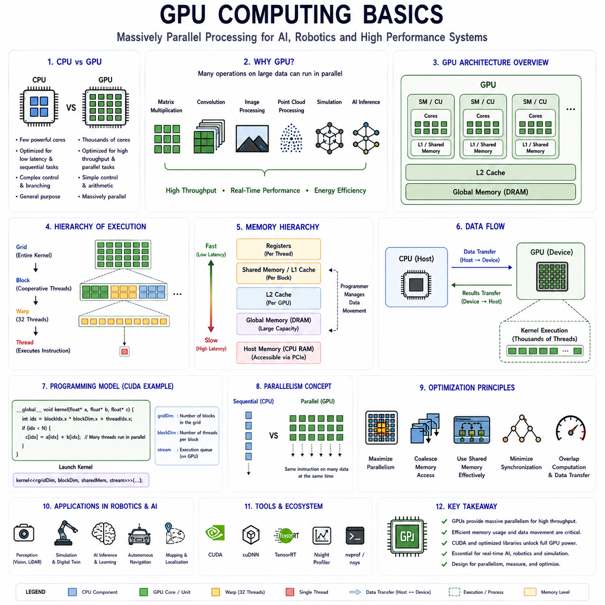
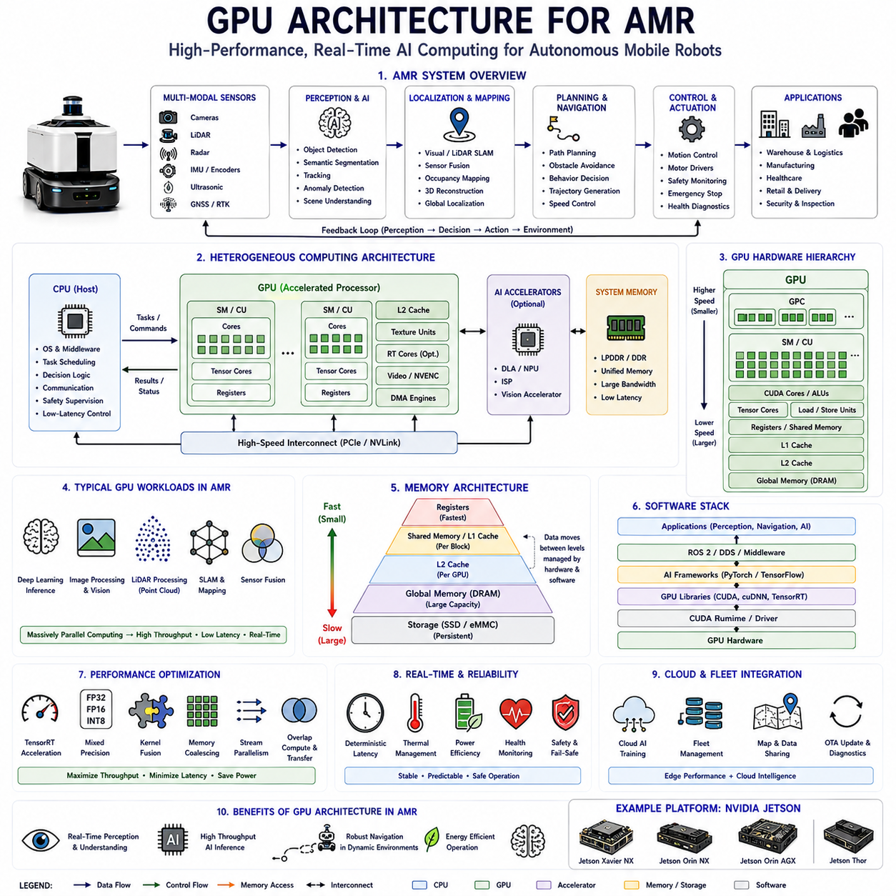
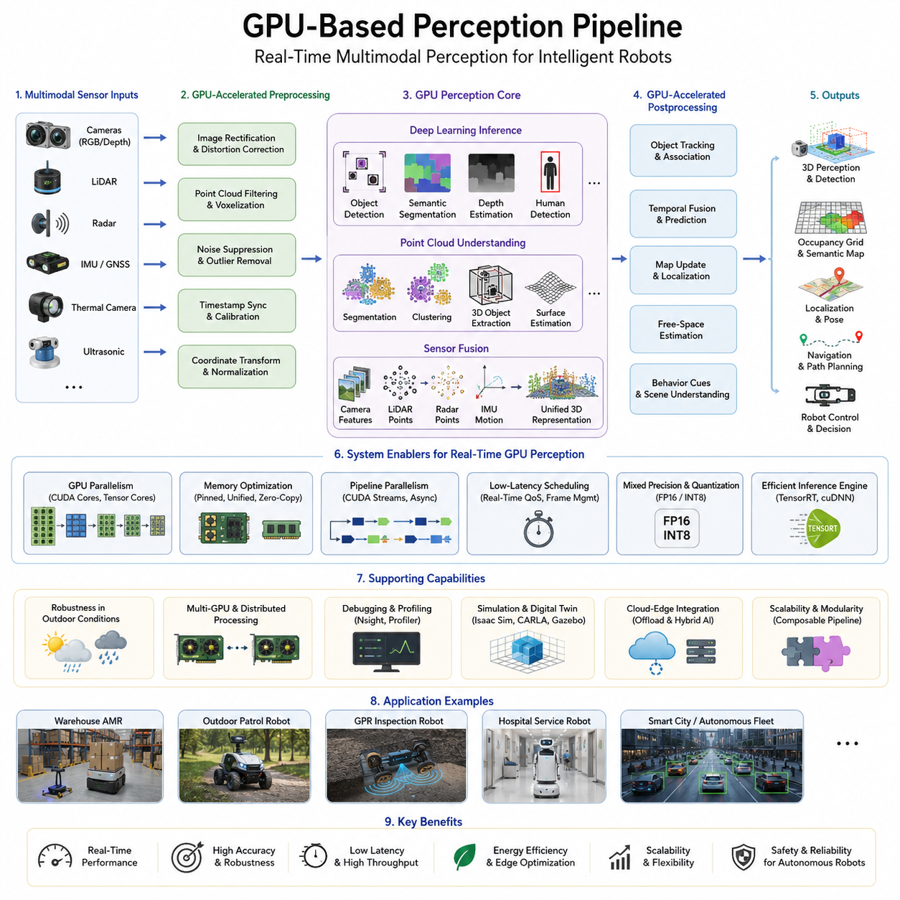
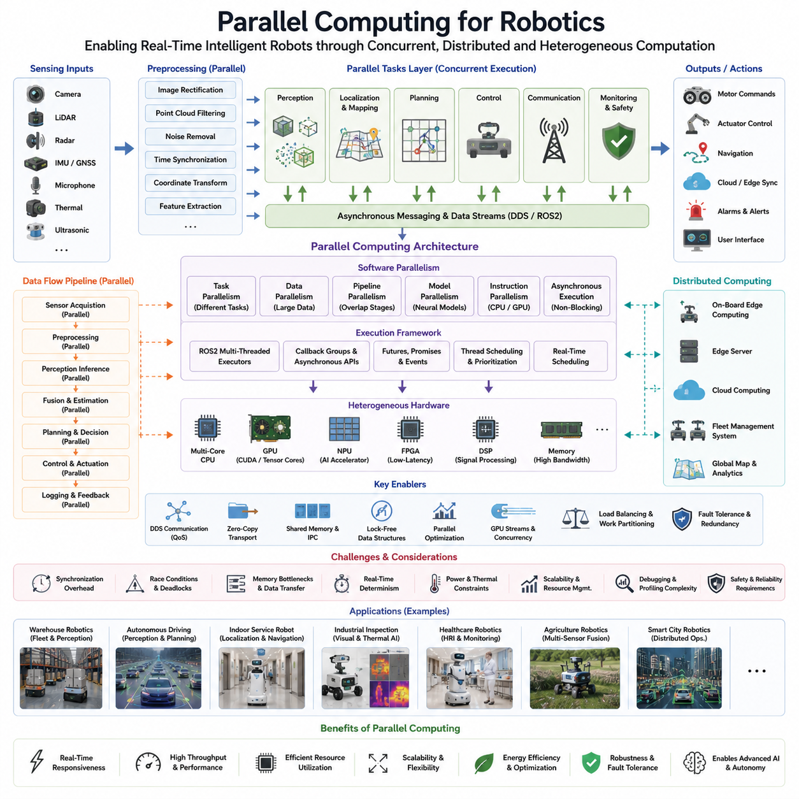
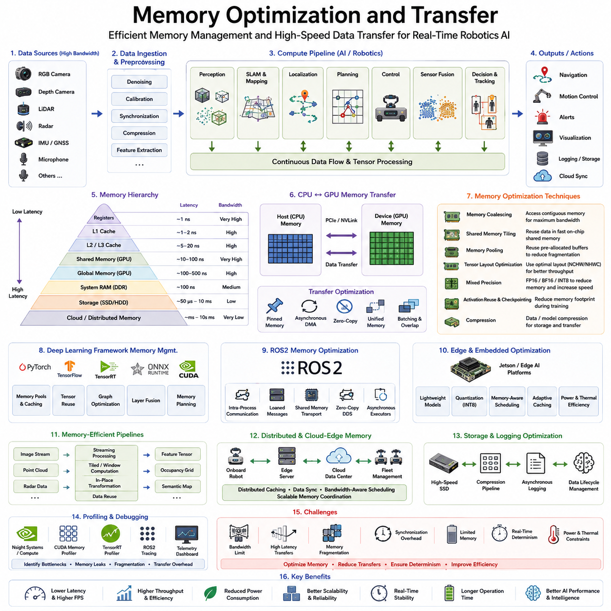
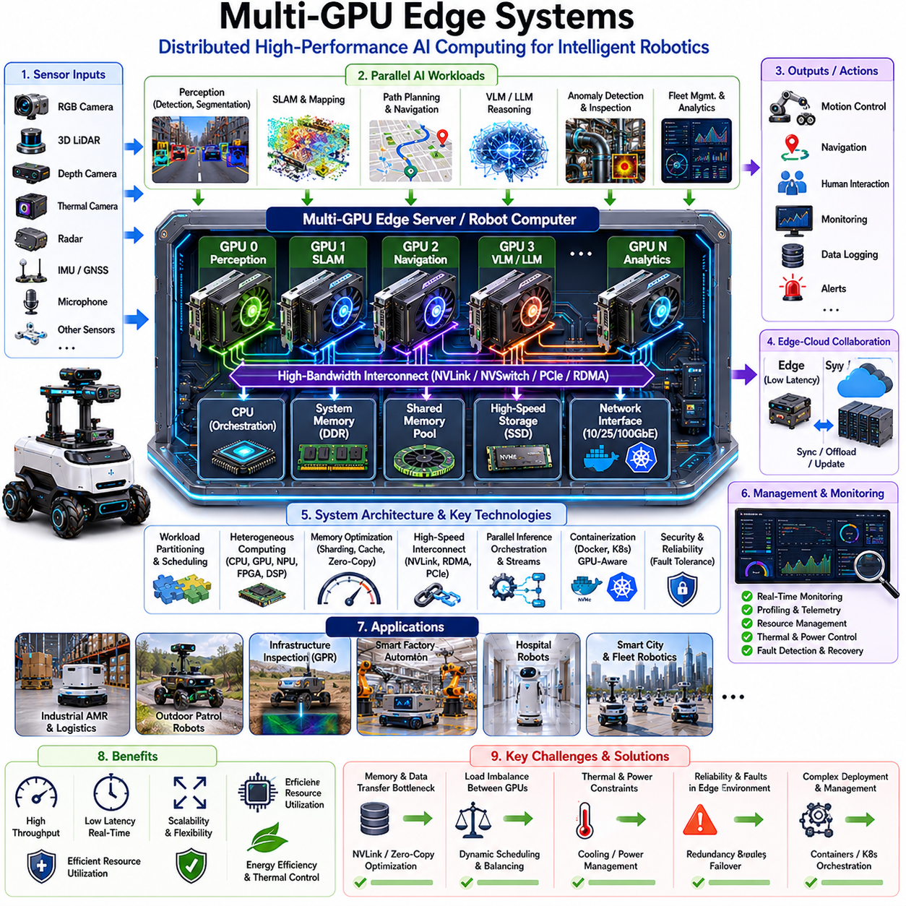
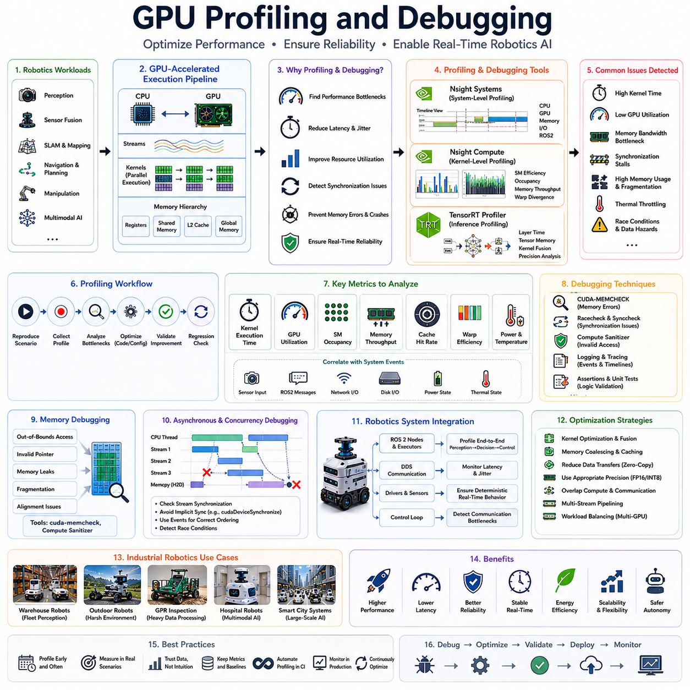
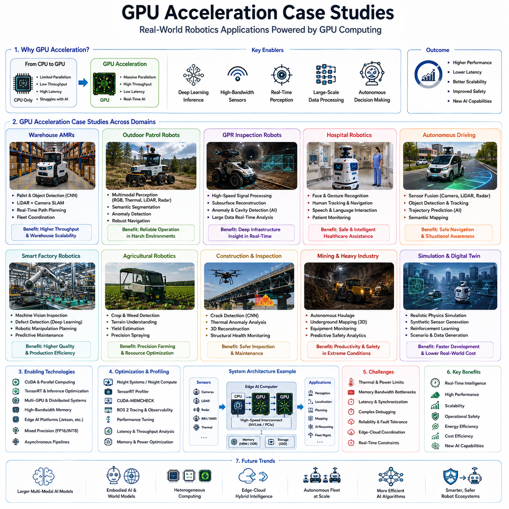

# Chapter 10. GPU Acceleration

## 10.1 GPU Computing Basics

{width="7.268055555555556in" height="7.268055555555556in"}

"10_01_GPU_Computing_Basics"는 현대 인공지능, 로봇공학, 자율 시스템, 과학 계산, 고성능 임베디드 컴퓨팅 분야에서 가장 기초적이면서도 중요한 주제 중 하나이다. 왜냐하면 GPU는 대규모 병렬 처리(Massive Parallel Processing)를 가능하게 하는 핵심 연산 엔진으로 발전했기 때문이다. 현대 로봇 시스템, 자율주행 차량, AI 플랫폼, 산업 자동화 시스템, 클라우드 인프라, Embodied AI Architecture는 점점 더 GPU 가속에 의존하여 방대한 연산 작업을 실시간으로 처리하고 있다. GPU Computing은 더 이상 단순한 그래픽 렌더링이나 게임 분야에만 사용되지 않는다. 현재는 Deep Learning, Sensor Fusion, Image Processing, Simulation, Digital Twin, Autonomous Navigation, Large-Scale AI Inference를 가능하게 하는 핵심 계산 기반으로 자리잡았다.

전통적인 CPU는 상대적으로 적은 수의 고성능 코어를 이용하여 Sequential Processing Performance를 최대화하도록 설계되었다. CPU는 Complex Branching Logic, Operating System Management, Task Scheduling, Irregular Computational Workflow 처리에 매우 강하다. 현대 CPU는 일반적으로 소수의 고성능 코어와 함께 Advanced Caching System, Speculative Execution Pipeline, Branch Prediction Unit, Large Memory Hierarchy를 포함한다. 이러한 구조는 CPU를 매우 유연하고 범용적인 General-Purpose Computing Device로 만든다.

그러나 현대 AI 및 Robotics Workload는 대규모 병렬 수학 연산을 반복적으로 수행하는 경우가 많다. Image Processing, Neural Network Inference, Matrix Multiplication, Tensor Operation, Point Cloud Filtering, Physics Simulation, Sensor Fusion은 모두 Massive Parallel Mathematical Computation을 요구한다. CPU는 Low-Latency Sequential Execution에는 뛰어나지만, Massive Throughput-Oriented Parallel Execution에는 상대적으로 비효율적이다. 따라서 CPU만으로는 이러한 Workload를 실시간으로 처리하기 어렵다.

GPU는 이러한 Massive Parallel Computation Problem을 해결하기 위해 개발되었다. CPU와 달리 GPU는 수백 또는 수천 개의 Smaller Processing Core를 포함하며, Throughput-Oriented Parallel Execution에 최적화되어 있다. GPU는 Single-Thread Latency Performance를 최대화하기보다는 동시에 실행 가능한 Arithmetic Operation 수를 극대화한다. 이러한 Architectural Difference는 Computation Organization 방식 자체를 근본적으로 바꾸었다.

GPU의 원래 목적은 Computer Graphics Rendering Acceleration이었다. Graphics Workload는 본질적으로 Massive Parallelism을 가진다. 수백만 개의 Pixel, Vertex, Texture, Shading Calculation이 Independent하게 동시에 처리될 수 있기 때문이다. GPU Architecture는 이러한 Graphics Pipeline을 매우 Efficient하게 처리하도록 발전하였다. 이후 Engineer들은 이러한 Parallel Computation Capability가 Scientific Computing 및 Artificial Intelligence에도 매우 유용하다는 사실을 발견하였다.

그 결과 현대 GPU는 단순한 Fixed-Function Graphics Hardware에서 Highly Programmable General-Purpose Parallel Computing System으로 발전하였다. NVIDIA CUDA, OpenCL, Vulkan Compute, DirectCompute, ROCm과 같은 Framework는 Graphics 이외의 Workload를 GPU에서 직접 실행할 수 있도록 만든다. 현재 GPU Computing은 Deep Learning, Robotics AI, Computer Vision, Scientific Computing을 가능하게 하는 핵심 기반 중 하나이다.

GPU Computing에서 가장 중요한 개념 중 하나는 Parallelism이다. GPU Architecture는 일반적으로 Single Instruction Multiple Data 방식의 Execution Model을 사용한다. 이는 많은 수의 Thread가 동일한 Instruction Sequence를 서로 다른 Data에 대해 동시에 실행하는 구조이다. 이러한 방식은 Large Dataset 위에서 반복적인 수학 연산을 수행하는 Workload에 매우 효율적이다.

Matrix Multiplication은 GPU Acceleration의 가장 대표적인 예이다. Neural Network는 수백만 또는 수십억 개의 Arithmetic Calculation을 포함하는 Matrix 및 Tensor Operation에 크게 의존한다. GPU는 이러한 Calculation을 수천 개의 Parallel Execution Unit에 분산하여 동시에 처리함으로써 CPU 대비 Dramatically 높은 Throughput를 제공한다.

현대 GPU Architecture는 계층적 구조를 가진다. 최상위 수준에서는 Multiple Streaming Multiprocessor 또는 Compute Unit으로 구성된다. 각 Multiprocessor는 많은 Arithmetic Logic Unit을 포함하며, 수많은 Lightweight Thread를 Concurrent하게 실행할 수 있다. Thread는 Warp 또는 Wavefront와 같은 Group 단위로 구성되며 Lockstep 방식으로 실행된다. 이러한 Hierarchical Organization은 GPU가 Massive Number of Parallel Operation을 Efficient하게 조정할 수 있도록 만든다.

Memory Architecture 역시 GPU Computing의 핵심 요소이다. GPU는 Global Memory, Shared Memory, Constant Memory, Texture Memory, Register, Cache 등 다양한 Memory Layer를 가진다. 각 Memory Type은 서로 다른 Performance Characteristic과 Access Pattern을 제공한다. Efficient GPU Programming은 Memory Movement와 Memory Locality를 Carefully 관리해야 한다. 왜냐하면 많은 경우 Memory Bandwidth가 Primary Performance Bottleneck가 되기 때문이다.

Global Memory는 Large Storage Capacity를 제공하지만 상대적으로 High Latency를 가진다. Shared Memory는 훨씬 빠른 Access Speed를 제공하지만 크기가 제한적이며 동일 Compute Block 내부의 Thread 사이에서 공유된다. Register는 Thread-Local Variable을 위한 Extremely Fast Storage를 제공하지만 역시 Resource가 제한적이다. 따라서 Successful GPU Optimization은 Expensive Memory Transfer를 최소화하고 Memory Locality를 극대화하는 데 크게 의존한다.

Memory Bandwidth는 현대 GPU의 가장 큰 강점 중 하나이다. GPU는 Compute Unit과 Memory System 사이에서 막대한 양의 Data를 매우 빠르게 이동시킬 수 있도록 설계되어 있다. Large Tensor Operation을 포함하는 AI Workload는 이러한 High Bandwidth Capability에 크게 의존한다. 그러나 CPU Memory와 GPU Memory 사이의 Data Transfer는 상당한 Overhead를 유발할 수 있다. 따라서 Robotics System은 가능한 한 CPU-GPU Transfer Frequency를 최소화하려고 한다.

Latency Hiding은 GPU Computing의 또 다른 Fundamental Concept이다. GPU Arithmetic Operation 및 Memory Access는 Individual Level에서는 상당한 Execution Time을 요구할 수 있다. GPU는 이를 해결하기 위해 많은 Independent Thread를 동시에 실행한다. 일부 Thread가 Memory Access Completion을 기다리는 동안 다른 Thread가 계속 실행되므로 GPU는 Individual Operation Latency에도 불구하고 High Overall Throughput를 유지할 수 있다.

CUDA는 현대 AI 및 Robotics System에서 가장 널리 사용되는 GPU Computing Framework 중 하나이다. NVIDIA에서 개발한 CUDA는 Developer가 C++, Python Binding 및 Optimized AI Library를 사용하여 GPU-Accelerated Application을 작성할 수 있도록 만든다. CUDA는 Deep Learning, Robotics AI, Computer Vision, Scientific Computing의 사실상 표준 Ecosystem이 되었다.

CUDA Programming은 Kernel, Thread, Block, Grid, Synchronization, Memory Management, Stream Execution과 같은 개념을 포함한다. Kernel은 GPU Thread 전체에서 Massive하게 Parallel하게 실행되는 Function이다. Thread는 Block으로 구성되고, Block은 Grid로 구성된다. 이러한 Execution Hierarchy는 GPU Hardware Architecture와 직접적으로 연결된다.

Synchronization은 GPU Computing에서 특히 중요하다. 동일 Block 내부의 Thread는 Shared Memory와 Synchronization Barrier를 사용하여 협력할 수 있다. Improper Synchronization은 Race Condition, Inconsistent Memory Visibility, Incorrect Computation Result를 유발할 수 있다. 따라서 GPU Synchronization Engineering은 High-Performance Robotics 및 AI Development의 중요한 부분이다.

Tensor Operation은 현대 Deep Learning Workload의 핵심 기반이다. Neural Network는 Matrix Multiplication, Convolution, Activation Function, Normalization Layer, Tensor Transformation으로 구성된다. GPU는 Highly Optimized Tensor Processing Pipeline을 통해 이러한 Operation을 Dramatically Accelerate한다. 현대 AI GPU는 종종 Neural Network Acceleration을 위해 Dedicated Tensor Core를 포함한다.

Tensor Core는 Mixed-Precision Matrix Multiplication 및 Tensor Operation을 위해 현대 GPU에 통합된 Specialized Hardware Accelerator이다. 이러한 Unit은 Deep Learning Inference 및 Training Workload의 Throughput를 Dramatically 증가시킨다. Tensor Core는 Robotics Perception, Language Model, Semantic Understanding, Autonomous Decision-Making을 지원하는 현대 AI Infrastructure의 Essential Component가 되었다.

Precision Format은 GPU Performance와 Numerical Behavior에 큰 영향을 준다. Floating-Point Precision은 Numerical Value가 내부적으로 어떻게 표현되는지를 결정한다. FP32는 높은 Numerical Accuracy를 제공하지만 더 많은 Memory와 Computational Resource를 소비한다. FP16, BF16, INT8 및 Mixed-Precision Inference는 많은 Robotics Application에서 Acceptable AI Accuracy를 유지하면서 Computational Cost를 감소시킨다.

Mixed-Precision Computing은 현대 GPU 기반 AI System에서 가장 중요한 Optimization Strategy 중 하나가 되었다. 많은 Neural Network는 Reduced Numerical Precision에서도 Significant Accuracy Degradation 없이 동작할 수 있다. 따라서 Lower Precision Format을 Selectively 사용함으로써 Robotics System은 Inference Throughput를 Dramatically 증가시키고 Memory Consumption 및 Energy Consumption을 감소시킬 수 있다.

GPU Computing은 현대 Robotics Perception System에서 핵심 역할을 수행한다. Object Detection, Semantic Segmentation, Visual SLAM, Depth Estimation, LiDAR Processing, Radar Fusion, Tracking, Scene Understanding은 모두 GPU Acceleration에 크게 의존한다. Real-Time Autonomous Navigation은 Computational Limitation 때문에 CPU Alone으로는 종종 불가능하다.

Computer Vision은 Robotics 내부에서 가장 GPU-Intensive한 분야 중 하나이다. High-Resolution Camera는 Continuous하게 Massive Image Stream을 생성한다. Convolutional Neural Network는 이러한 Image를 처리하기 위해 수십억 개의 Arithmetic Operation을 수행한다. GPU는 Real-Time Object Detection, Lane Recognition, Semantic Mapping, Obstacle Classification, Environmental Understanding에 필요한 Throughput를 제공한다.

LiDAR Processing 역시 GPU Acceleration의 큰 이점을 얻는다. Point Cloud Registration, Voxel Filtering, Occupancy Mapping, Clustering, Segmentation, 3D Object Detection은 Highly Parallel Geometric Computation을 포함한다. GPU는 이러한 Operation을 Sequential CPU Execution 대비 Dramatically 가속할 수 있다.

Simulation Environment 역시 GPU Computing에 크게 의존한다. Physics Simulation, Digital Twin, Reinforcement Learning Environment, Synthetic Dataset Generation, Virtual Robotics Testing은 막대한 Parallel Computational Throughput를 요구한다. Isaac Sim, Gazebo, CARLA, Omniverse와 같은 Platform은 GPU Acceleration을 적극적으로 활용한다.

Cloud AI Infrastructure 역시 GPU Computing에 근본적으로 의존한다. Large-Scale Deep Learning Model Training은 수천 개의 GPU 전체에 Distributed된 Massive Matrix 및 Tensor Operation을 포함한다. Robotics Company는 점점 더 Cloud GPU Cluster를 사용하여 Model Training, Simulation, Fleet Learning, Semantic Mapping, AI Development Workflow를 수행하고 있다.

Edge AI Computing은 Additional GPU Engineering Challenge를 유발한다. Embedded Robotics Platform은 Strict Thermal, Power, Space Constraint 아래 동작한다. 따라서 Jetson Platform, Embedded AI Accelerator, Low-Power GPU는 Mobile Robotics System에서 점점 더 중요한 역할을 한다. Developer는 Computational Throughput, Energy Efficiency, Latency, Thermal Behavior 사이의 균형을 Carefully 조정해야 한다.

GPU Scheduling 및 Resource Management는 Multiple Concurrent Workload를 동시에 실행하는 Robotics System에서 특히 중요하다. AI Inference, Sensor Processing, Visualization, Localization, Mapping, Communication Pipeline은 모두 GPU Resource를 경쟁적으로 사용한다. Improper Resource Management는 Latency Spike, Unstable Performance, Missed Real-Time Deadline을 유발할 수 있다.

GPU Memory Optimization은 따라서 매우 중요하다. Neural Network Tensor, Point Cloud, Image Buffer, Semantic Map, Intermediate Computation Result는 Continuous하게 막대한 Memory Resource를 소비한다. Efficient Buffer Reuse, Memory Pooling, Tensor Optimization, Asynchronous Transfer Scheduling은 Robotics Performance Stability를 크게 향상시킨다.

Asynchronous GPU Execution은 또 다른 중요한 개념이다. 현대 GPU Framework는 Asynchronous Kernel Execution, Overlapping Memory Transfer, Stream Parallelism, Concurrent Compute Pipeline을 지원한다. Proper Asynchronous Execution은 Hardware Utilization을 Dramatically 향상시키고 Robotics System 내부의 Idle Time을 줄인다.

Stream은 Independent GPU Execution Queue를 제공하여 Concurrent Kernel Scheduling 및 Memory Transfer Overlap을 가능하게 만든다. Robotics System은 종종 Multiple Stream을 사용하여 Sensor Pipeline, AI Inference Task, Visualization Workload를 Concurrent하게 처리하면서 GPU Occupancy를 극대화한다.

Profiling 및 Optimization은 GPU Computing Engineering의 필수 요소이다. Developer는 Kernel Execution Time, Occupancy, Memory Bandwidth Utilization, Cache Efficiency, Synchronization Overhead, Thermal Behavior, Tensor Core Utilization, Stream Scheduling Performance를 Continuous하게 분석한다. NVIDIA Nsight, CUDA Profiler, TensorRT Analyzer, GPU Telemetry System과 같은 Tool은 Detailed Runtime Visibility를 제공한다.

Thermal Behavior는 Sustained GPU Performance에 큰 영향을 준다. High Computational Workload는 상당한 Heat를 발생시킨다. Embedded Robotics System은 Overheating 방지를 위해 GPU Frequency가 자동으로 감소하는 Thermal Throttling을 경험할 수 있다. 따라서 Efficient Cooling System 및 Workload Balancing은 Robotics GPU Engineering의 중요한 요소이다.

Power Efficiency는 Autonomous Robotics에서 점점 더 중요해지고 있다. Mobile Robot은 Finite Battery Capacity 위에서 동작하기 때문에 Energy-Aware GPU Optimization이 필수적이다. AI Inference Workload는 Computational Throughput와 Power Consumption 및 Thermal Limitation 사이의 균형을 Carefully 유지해야 한다.

Real-Time Robotics System은 Deterministic GPU Execution Behavior를 요구한다. Excessive GPU Scheduling Latency, Unpredictable Memory Contention, Unstable Kernel Timing은 Control Loop, Localization Filter, Safety System을 불안정하게 만들 수 있다. 따라서 Robotics GPU Optimization은 단순한 Raw Throughput뿐 아니라 Latency Stability에도 중점을 둔다.

Cybersecurity Consideration 역시 GPU Computing System에서 점점 중요해지고 있다. Shared GPU Infrastructure, Cloud AI Platform, Distributed Compute System은 Malicious Resource Exhaustion, Side-Channel Attack, Unauthorized Inference Access, Runtime Manipulation의 Target이 될 수 있다. 따라서 Secure GPU Computing Architecture는 Increasingly Isolation, Encryption, Authentication, Runtime Monitoring Mechanism을 통합하고 있다.

Artificial Intelligence는 GPU Computing Workflow 자체를 최적화하기 시작하고 있다. AI-Driven Scheduler, Adaptive Workload Balancing, Predictive Resource Management, Compiler Optimization, Kernel Fusion, Automatic Tensor Optimization System은 GPU Utilization Efficiency를 Continuous하게 향상시키고 있다.

미래 Robotics System은 Embodied AI, Multimodal Cognition, Large Language Model, Semantic World Understanding, Distributed Reasoning, Collaborative Robot Fleet, Cloud-Native Autonomy 방향으로 발전하면서 GPU Acceleration에 더욱 의존하게 될 가능성이 높다. Robot이 더욱 풍부한 Environmental Understanding과 Sophisticated AI Workload를 처리하게 되면서 Computational Demand는 계속 Rapid하게 증가할 것이다.

결국 GPU Computing은 현대 Artificial Intelligence 및 Autonomous Robotics System의 가장 중요한 Computational Foundation 중 하나이다. 모든 Perception Pipeline, Neural Network Inference Engine, Sensor Fusion Framework, Simulation Environment, Semantic Mapping System, Embodied AI Architecture는 Efficient Parallel Computation에 크게 의존한다. Robotics System이 더욱 Intelligent하고 Distributed되며 High-Performance하고 AI-Driven한 방향으로 발전할수록 GPU Computing은 전체 Robotics 및 Artificial Intelligence Ecosystem에서 가장 Strategically Important하고 Technically Sophisticated한 분야 중 하나로 계속 남게 될 것이다.

## 10.2 GPU Architecture for AMR

{width="7.268055555555556in" height="7.268055555555556in"}

"10_02_GPU_Architecture_for_AMR"은 Autonomous Mobile Robot(AMR)에 GPU Computing Architecture가 어떻게 통합되어 Real-Time Perception, Navigation, Artificial Intelligence, Distributed Autonomous Operation을 가능하게 하는지를 다루는 매우 중요한 주제이다. 현대 AMR은 단순히 Waypoint를 따라 이동하는 Motorized Platform이 아니다. 오늘날의 AMR은 Dynamic Environment를 이해하고, 복잡한 Sensor Information을 해석하며, Human과 상호작용하고, Operational Behavior를 최적화하며, Autonomous Decision을 Continuous하게 수행할 수 있는 Intelligent Mobile Computing System으로 발전하였다. 이러한 변화는 Robotics System 내부의 Computational Requirement를 Dramatically 증가시켰으며, GPU-Centered Computing Architecture를 현대 AMR Engineering의 핵심 기반 중 하나로 만들었다.

전통적인 Industrial AGV는 단순한 Embedded Controller와 Deterministic Navigation Logic에 의존하였다. Magnetic Tape, QR Marker, Predefined Path 기반으로 움직였기 때문에 Sensing, Decision-Making, Environmental Understanding Requirement가 상대적으로 제한적이었다. 그러나 현대 AMR은 Moving Human, Forklift, Robot, Cart, Vehicle, Dynamic Obstacle, Uncertain Environmental Condition이 존재하는 Highly Dynamic Environment에서 동작한다. 이러한 환경에서 Safe하고 Efficient하게 동작하기 위해 AMR은 Massive Multimodal Sensor Data를 Continuous하게 처리하면서 동시에 Perception, Localization, Mapping, Path Planning, Obstacle Avoidance, Fleet Coordination, Diagnostics, AI Inference Workload를 수행해야 한다.

이러한 Computational Evolution은 Robotics System Architecture를 CPU-Centric Embedded Control System에서 CPU, GPU, AI Accelerator, High-Speed Memory System, Real-Time Middleware, Distributed Processing Framework를 결합한 Heterogeneous Computing Architecture 방향으로 변화시켰다. 현대 AMR에서 GPU는 Deep Learning Inference, Computer Vision, LiDAR Processing, Semantic Mapping, Sensor Fusion, Digital Twin, AI-Assisted Navigation과 같은 High-Throughput Parallel Workload를 처리하는 핵심 연산 엔진 역할을 수행한다.

GPU가 AMR에서 Essential한 이유 중 하나는 Perception System이 생성하는 막대한 Computational Demand 때문이다. Autonomous Mobile Robot은 High-Resolution Camera Stream, Multi-Beam LiDAR Point Cloud, Radar Signal, Depth Image, Thermal Imaging Data, Inertial Measurement, Wheel Encoder Information, GNSS Positioning Data, Ultrasonic Sensing Stream을 동시에 Continuous하게 처리한다. 이러한 Sensor System은 Collective하게 Massive Real-Time Data Flow를 생성하며, 이를 처리하기 위해 High-Speed Parallel Processing이 필요하다.

Computer Vision Workload만 보더라도 Multiple Camera가 High Frame Rate와 High Resolution로 동시에 동작할 수 있다. Neural Network는 Object Detection, Semantic Segmentation, Lane Recognition, Pallet Detection, Human Tracking, Anomaly Recognition, Environmental Understanding을 Continuous하게 수행한다. 이러한 Operation은 Tensor, Convolution, Matrix Multiplication, Feature Extraction을 포함하는 수십억 개의 Arithmetic Calculation을 요구한다. GPU는 이러한 Workload를 Real-Time으로 처리하기 위한 Massive Parallel Computational Throughput를 제공한다.

LiDAR Processing 역시 GPU Adoption의 주요 원인 중 하나이다. Multi-Beam LiDAR System은 Continuous하게 Enormous Point Cloud Dataset을 생성한다. 이러한 Point Cloud는 Real-Time으로 Filtering, Clustering, Segmentation, Transformation, Registration, Localization, Interpretation을 수행해야 한다. Occupancy Mapping, Obstacle Detection, Voxel Filtering, SLAM Optimization, 3D Scene Understanding은 모두 Highly Parallel Geometric Computation을 요구하며, 이는 GPU Architecture에 매우 적합하다.

현대 AMR GPU Architecture는 따라서 Heterogeneous Computing Principle 위에서 설계된다. CPU와 GPU는 서로 다른 Workload를 담당하면서 Cooperative하게 동작한다. CPU는 일반적으로 Operating System, Middleware Coordination, Scheduling, Control Logic, Communication Management, Safety Supervision, Deterministic Low-Latency Task를 담당한다. GPU는 AI Inference, Image Processing, Point Cloud Operation, Large-Scale Mathematical Acceleration과 같은 Throughput-Intensive Parallel Computation을 담당한다.

이러한 Computational Responsibility Division은 매우 중요하다. CPU와 GPU는 Fundamentally Different Workload에 최적화되어 있기 때문이다. CPU는 Low-Latency Sequential Execution과 Sophisticated Branching Behavior에 강하며, GPU는 High-Throughput Parallel Arithmetic Execution에 강하다. 따라서 Efficient AMR Architecture는 각 Compute Subsystem의 Strength에 따라 Workload를 Carefully Distribution한다.

AMR에서 가장 널리 사용되는 GPU Platform 중 하나는 NVIDIA의 Jetson Ecosystem이다. Jetson Platform은 ARM CPU, CUDA-Capable GPU, Tensor Accelerator, Memory Controller, Multimedia Engine, AI Acceleration Hardware를 Robotics 및 Edge AI Application에 최적화된 Compact Embedded Module 형태로 통합한다. Jetson Platform은 High AI Performance를 제공하면서도 비교적 낮은 Power Consumption과 Compact Physical Size를 유지하기 때문에 널리 사용된다.

Jetson Orin, Jetson Thor, 이전 세대의 Jetson Xavier Architecture는 Robotics 및 Autonomous System을 위해 특별히 설계되었다. 이러한 Platform은 CUDA, TensorRT, cuDNN, ROS2 Acceleration, GPU-Accelerated Computer Vision Library, PyTorch 및 TensorFlow와 같은 Deep Learning Framework를 지원한다. 이러한 Software Ecosystem은 Robotics AI Deployment를 크게 단순화시킨다.

많은 AMR에서 GPU Architecture는 Layered Processing Pipeline 형태로 구성된다. Sensor Acquisition Subsystem은 Camera, LiDAR, Radar, IMU 및 기타 Sensor로부터 Raw Data Stream을 수집한다. Preprocessing Pipeline은 Data를 Normalize, Synchronize, Filter, Transform한다. GPU-Accelerated AI Inference System은 Semantic Understanding 및 Object Recognition을 수행한다. Localization 및 Mapping Framework는 이러한 정보를 결합하여 Navigation System 및 Decision-Making Layer에서 사용하는 Environmental Representation을 생성한다.

Sensor Fusion은 AMR GPU Architecture 내부에서 가장 Computationally Intensive한 Component 중 하나이다. 현대 AMR은 단일 Sensing Modality에 의존하지 않는다. 대신 LiDAR, RGB Camera, Depth Camera, Radar, IMU, Wheel Encoder, GNSS Receiver, Thermal Imaging System, Ultrasonic Sensor를 Unified Probabilistic World Model로 결합한다. 이러한 Sensor Stream은 서로 다른 Frequency, Latency, Coordinate Frame, Uncertainty Characteristic을 가진 Asynchronous Data이다.

GPU Acceleration은 Sensor Fusion에서 특히 중요하다. 많은 Fusion Algorithm이 Highly Parallel Numerical Optimization 및 Tensor Computation을 포함하기 때문이다. Point Cloud Registration, Visual-Inertial Odometry, Semantic Fusion, Occupancy Estimation, Probabilistic Filtering, Environmental Reconstruction은 모두 Parallel GPU Execution의 큰 이점을 얻는다.

Simultaneous Localization and Mapping, 즉 SLAM 역시 GPU에 크게 의존하는 Core AMR Workload이다. SLAM System은 Robot Pose를 Continuous하게 추정하면서 동시에 Environmental Map을 생성한다. 현대 SLAM System은 Visual Feature, LiDAR Geometry, Inertial Measurement, Wheel Odometry, Semantic Understanding을 결합하여 Localization Robustness를 향상시킨다. GPU Acceleration은 SLAM의 Scalability 및 Real-Time Performance를 Dramatically 향상시킨다.

Visual SLAM System은 특히 GPU-Intensive하다. High-Resolution Image Stream을 Continuous하게 처리하기 때문이다. Feature Extraction, Feature Matching, Bundle Adjustment, Depth Estimation, Loop Closure Detection, Semantic Segmentation은 모두 Computationally Expensive한 Operation이다. GPU는 Large-Scale Dynamic Environment에서 Real-Time Operation에 필요한 Throughput를 제공한다.

AI Inference Pipeline은 AMR 내부에서 가장 중요한 GPU Workload 중 하나이다. Deep Neural Network는 Continuous하게 Object Detection, Semantic Segmentation, Pallet Recognition, Person Detection, Anomaly Classification, Obstacle Classification, Terrain Analysis, Decision Support Function을 수행한다. 현대 AMR은 점점 더 AI Model에 의존하여 Environmental Understanding 및 Autonomous Decision-Making Capability를 향상시키고 있다.

따라서 Neural Network Optimization은 AMR GPU Architecture Engineering의 핵심 부분이 되었다. TensorRT Acceleration, Mixed-Precision Inference, Quantization, Operator Fusion, Pruning, Tensor Core Utilization과 같은 Technique가 Extensive하게 사용되어 Latency 및 Power Consumption을 최소화하면서 Inference Throughput를 극대화한다.

현대 GPU에 통합된 Tensor Core는 Robotics AI Acceleration에서 특히 중요한 역할을 한다. Tensor Core는 Neural Network Operation을 위한 Matrix Multiplication Throughput를 Dramatically 증가시키면서 Energy Consumption을 감소시킨다. Mixed-Precision Tensor Operation은 Embedded Power 및 Thermal Constraint 내부에서 Sophisticated AI Workload를 Efficient하게 실행할 수 있게 만든다.

Memory Architecture는 AMR GPU System Performance에 큰 영향을 준다. AI Inference Pipeline, Image Buffer, Point Cloud, Occupancy Map, Semantic Representation, Localization State, Intermediate Tensor는 모두 Continuous하게 Massive Memory Bandwidth를 소비한다. 따라서 Memory Movement Efficiency는 매우 중요하다. Memory Transfer Overhead는 쉽게 System Bottleneck가 될 수 있기 때문이다.

현대 AMR Architecture는 따라서 Zero-Copy Transport, Shared Memory Pipeline, Memory Pooling, Asynchronous Transfer Scheduling, Efficient Tensor Management를 강조한다. Unnecessary CPU-GPU Data Transfer를 최소화하는 것은 System Responsiveness와 Deterministic Timing Behavior를 크게 향상시킨다.

Asynchronous GPU Execution 역시 AMR에서 중요한 Architectural Principle이다. Sensor Acquisition, AI Inference, Visualization, Localization, Communication Workload는 Frequently Concurrent하게 실행된다. CUDA Stream, Asynchronous Kernel Execution, Overlapping Memory Transfer, Concurrent Compute Scheduling은 AMR이 GPU Utilization을 극대화하면서 Idle Time을 최소화할 수 있도록 만든다.

Real-Time Behavior는 Autonomous Mobile Robotics에서 매우 중요하다. Navigation System, Collision Avoidance System, Emergency Stop Monitoring, Motion Controller는 Deterministic Execution Timing을 요구한다. Excessive GPU Scheduling Latency, Memory Contention, Synchronization Overhead, Thermal Throttling은 Robot Behavior를 Destabilize할 수 있다. 따라서 AMR GPU Architecture는 단순히 Throughput뿐 아니라 Predictable Latency와 Execution Stability도 중요하게 고려한다.

Thermal Management는 Mobile Robotics GPU System에서 특히 중요하다. High AI Workload는 상당한 Heat를 생성한다. Embedded AMR Platform은 일반적으로 Limited Airflow를 가진 Compact Enclosure 내부에서 동작한다. Thermal Throttling은 GPU Frequency를 자동으로 감소시키며 Unpredictable Performance Degradation을 유발할 수 있다. 따라서 Efficient Cooling System, Thermal Monitoring, Dynamic Workload Balancing, Energy-Aware Scheduling은 Critical Design Consideration이다.

Power Efficiency 역시 중요한 Engineering Challenge이다. Mobile Robot은 Finite Battery Resource를 사용하기 때문에 Energy-Aware GPU Optimization이 필수적이다. Large AI Workload는 따라서 Inference Throughput와 Power Consumption 사이의 균형을 Carefully 유지해야 한다. Dynamic Voltage Scaling, Selective Sensor Activation, Adaptive AI Scheduling, Workload Prioritization은 Energy Efficiency Optimization을 위해 자주 사용된다.

Middleware Integration 역시 AMR GPU Architecture에서 중요한 역할을 한다. ROS2 및 DDS Communication Framework는 CPU, GPU, AI Accelerator, Cloud System 전체에 걸친 Distributed Processing Pipeline을 조정한다. GPU-Aware Middleware Integration은 Unnecessary Memory Copy 및 Serialization Overhead를 감소시켜 Communication Efficiency를 향상시킨다.

Cloud-Edge Integration은 점점 더 AMR GPU Architecture에 영향을 미치고 있다. 많은 Safety-Critical Operation은 Embedded GPU에서 Local로 실행되지만, Cloud System은 Semantic Analytics, Fleet Coordination, Model Training, Telemetry Analysis, Digital Twin, Predictive Maintenance, Distributed AI Learning을 지원한다. 따라서 AMR은 점점 Larger AI Ecosystem에 연결된 Distributed Intelligent Computing Node로 발전하고 있다.

Fleet Management System은 Computational Complexity를 더욱 증가시킨다. Large AMR Fleet는 Continuous하게 Localization Data, Environmental Map, Operational Telemetry, Traffic Coordination Information, Charging Schedule, Task Assignment를 교환한다. 미래에는 Distributed GPU Computing Architecture가 Multiple Robot 사이의 Collaborative Perception 및 Cooperative AI Reasoning까지 지원할 가능성이 있다.

Simulation 및 Digital Twin System 역시 AMR GPU Architecture와 밀접하게 연결되어 있다. Isaac Sim, Omniverse, Gazebo, CARLA와 같은 Robotics Simulation Environment는 Physics Simulation, Synthetic Dataset Generation, Reinforcement Learning, Large-Scale Robotics Testing을 위해 GPU Acceleration에 크게 의존한다. Digital Twin은 점점 더 GPU-Accelerated Simulation Pipeline을 사용하여 Real Robot Operation을 Continuous하게 Mirror하고 있다.

Cybersecurity Consideration 역시 GPU-Based AMR Architecture에서 점점 중요해지고 있다. Shared AI Accelerator, Cloud-Connected GPU Infrastructure, Distributed Robotics System은 Resource Exhaustion, Unauthorized Inference Access, Runtime Manipulation, Side-Channel Exploitation과 같은 Malicious Attack의 Target이 될 수 있다. 따라서 Secure GPU Architecture는 Increasingly Hardware Isolation, Encrypted Communication, Runtime Integrity Monitoring, AI Security Validation을 통합하고 있다.

Artificial Intelligence는 GPU Architecture Behavior 자체를 Dynamic하게 Optimization하기 시작하고 있다. AI-Driven Scheduler, Predictive Workload Management System, Adaptive Resource Allocation, Compiler Optimization System, Learned Execution Policy는 Operational Context에 따라 AMR GPU Resource Usage를 자동으로 최적화할 가능성이 있다.

미래의 AMR GPU Architecture는 더욱 Heterogeneous하고 Distributed된 Computing Model 방향으로 발전할 가능성이 높다. CPU, GPU, NPU, FPGA, AI Accelerator, Edge Server, Cloud Infrastructure는 Unified Robotics Computing Ecosystem 내부에서 Dynamic하게 협력하게 될 것이다. Embodied AI, Multimodal Cognition, Semantic World Understanding, Collaborative Fleet Intelligence, Large-Scale Autonomous Infrastructure는 Computational Demand를 더욱 Dramatically 증가시킬 것이다.

미래의 Advanced Autonomous Robot은 Real-Time Multimodal AI System을 요구할 가능성이 높다. 이는 Language Understanding, Semantic Reasoning, Visual Perception, World Modeling, Reinforcement Learning, Collaborative Decision-Making을 동시에 수행해야 한다. 이러한 Capability는 Robotics-Specific AI Workload에 최적화된 Increasingly Sophisticated GPU Architecture에 크게 의존하게 될 것이다.

결국 GPU Architecture는 현대 Autonomous Mobile Robotics를 가능하게 하는 Fundamental Technology 중 하나가 되었다. 모든 Perception Pipeline, Sensor Fusion Framework, Localization System, Semantic Mapping Engine, AI Inference Pipeline, Simulation Environment, Autonomous Navigation System은 GPU-Accelerated Computation에 크게 의존한다. AMR이 점점 더 Intelligent하고 Distributed되며 Autonomous하고 AI-Driven한 방향으로 발전할수록 GPU Architecture Engineering은 전체 Robotics Ecosystem에서 가장 Strategically Important하고 Technically Advanced한 분야 중 하나로 계속 남게 될 것이다.

## 10.3 GPU-Based Perception Pipeline

{width="7.268055555555556in" height="7.268055555555556in"}

"10_03_GPU_Based_Perception_Pipeline"은 현대 자율주행 로봇 및 지능형 로봇 시스템에서 가장 중요한 기술적 기반 중 하나인 GPU 기반 병렬 컴퓨팅 아키텍처를 활용한 로봇 인지 시스템 가속화에 대해 다루는 핵심 주제이다. 현대 로봇공학에서 Perception System은 단순히 주변 장애물을 감지하는 수준의 센서 처리 모듈이 아니다. 현대의 자율주행 로봇은 RGB Camera, Stereo Vision System, Depth Camera, Thermal Camera, LiDAR, Radar, Ultrasonic Sensor, GNSS, IMU Data, 그리고 AI 기반 Semantic Understanding Pipeline까지 포함하는 방대한 Multimodal Sensor Stream을 동시에 처리해야 한다. 이러한 Perception System은 엄격한 Real-Time Constraint 환경에서 지속적으로 동작하면서도 높은 Reliability, Low Latency, Operational Robustness를 유지해야 한다. Sensor 수와 AI Complexity, Environment Understanding Requirement가 증가할수록 CPU 기반 Architecture만으로는 한계가 발생하게 된다. 따라서 GPU 기반 Perception Pipeline은 Real-Time Intelligent Robotics를 가능하게 하는 핵심 Computational Architecture로 자리잡게 되었다.

GPU 기반 Perception Pipeline은 Massively Parallel Sensor Processing 개념에서 시작된다. 전통적인 CPU는 Sequential Logic Execution과 Low-Latency Branching Operation에 최적화되어 있지만, GPU는 수천 개의 Lightweight Execution Core가 동시에 동작하는 High-Throughput Parallel Computation에 최적화되어 있다. Neural Network Inference, Image Processing, Matrix Multiplication, Point Cloud Transformation, Convolution Operation, Tensor Arithmetic, Feature Extraction과 같은 작업은 높은 병렬성을 가지기 때문에 GPU Architecture에 매우 적합하다. 독자는 현대 Robot Perception System이 Real-Time Performance를 달성하기 위해 근본적으로 Parallel Computation Principle에 의존한다는 사실을 배우게 된다.

이 섹션은 먼저 자율주행 로봇 내부에서 GPU 기반 Perception System의 전체 Architecture를 소개한다. 현대 AMR의 Perception Pipeline은 일반적으로 Sensor Acquisition Layer에서 시작된다. 이 Layer는 여러 Hardware Interface로부터 동기화된 Sensor Stream을 수집한다. Camera Driver는 High-Frame-Rate RGB 및 Depth Image를 획득하고, LiDAR Driver는 Point Cloud Scan을 수집하며, Radar Module은 Object Reflection 및 Velocity Data를 생성한다. IMU와 GNSS System은 Motion 및 Localization Information을 제공한다. 이러한 Raw Sensor Stream은 Preprocessing Stage로 전달되며, 이 단계부터 GPU Acceleration이 중요한 역할을 수행하기 시작한다.

Sensor Preprocessing Pipeline은 매우 높은 Computational Cost를 요구한다. Raw Sensor Data는 Distortion, Noise, Timing Inconsistency, Motion Artifact, Environmental Interference를 포함하는 경우가 많기 때문이다. GPU Acceleration은 Image Rectification, Lens Distortion Correction, Point Cloud Filtering, Voxelization, Noise Suppression, Timestamp Synchronization, Coordinate Transformation, Sensor Calibration Operation에 광범위하게 사용된다. 독자는 AI Inference가 시작되기 전의 Preprocessing 자체만으로도 상당한 Computational Resource가 소모된다는 사실을 배우게 된다.

Image Processing Acceleration은 이 섹션의 핵심 기반 Topic 중 하나이다. 현대 Perception Pipeline은 지속적으로 Resizing, Normalization, Color Space Conversion, Feature Extraction, Optical Flow Computation, Stereo Disparity Estimation, Image Enhancement와 같은 작업을 수행한다. GPU는 CUDA Kernel, Tensor Processing Unit, OpenCV CUDA Module, NVIDIA VPI와 같은 Optimized Image-Processing Library를 활용하여 이러한 Workload를 Dramatically Acceleration한다. 독자는 Memory Layout, Parallel Kernel Execution, Thread Block Organization, Asynchronous Execution이 Perception Throughput에 어떤 영향을 미치는지를 배우게 된다.

이 섹션은 또한 LiDAR Perception System을 위한 GPU 기반 Point Cloud Processing도 분석한다. 현대 LiDAR Sensor의 Raw 3D Point Cloud Data는 초당 수십만 개에서 수백만 개의 Point를 포함할 수 있다. 이러한 Data를 Efficient하게 처리하기 위해서는 Parallelized Nearest-Neighbor Search, Voxel Grid Filtering, Segmentation, Clustering, Surface Estimation, Object Extraction, Geometric Transformation이 필요하다. GPU Acceleration은 Autonomous Navigation, Obstacle Detection, Terrain Analysis, 3D Scene Reconstruction을 위한 Real-Time Point Cloud Understanding을 가능하게 만든다.

Deep Learning Inference는 GPU 기반 Perception Pipeline 내부에서 가장 중요한 Computational Workload 중 하나를 구성한다. 독자는 Convolutional Neural Network, Transformer, Semantic Segmentation Model, Object Detector, Depth Estimation Network, Human Detection System, Multimodal Fusion Architecture가 TensorRT, CUDA, cuDNN, ONNX Runtime, PyTorch CUDA Backend와 같은 Framework를 통해 GPU에서 어떻게 실행되는지를 배우게 된다. 현대 Intelligent Robot에서는 AI Inference Pipeline이 Perception Computational Budget 대부분을 차지하는 경우가 많다.

Neural Network Architecture와 GPU Efficiency 사이의 관계 역시 Carefully 탐구된다. 일부 Neural Architecture는 Tensor Parallelism과 Computational Regularity를 극대화하기 때문에 GPU-Friendly한 구조를 가진다. 반면 일부 Architecture는 Memory Bottleneck, Irregular Execution Pattern, Synchronization Overhead 때문에 GPU Utilization Efficiency가 낮아질 수 있다. 독자는 Architecture Design이 GPU Utilization, Latency Stability, Throughput, Power Efficiency에 어떤 영향을 미치는지를 배우게 된다.

Memory Management는 GPU 기반 Perception System에서 가장 중요한 Engineering Discipline 중 하나이다. GPU Performance는 단순한 Raw Compute Power만으로 결정되지 않는다. Memory Bandwidth, Cache Locality, Transfer Latency, Synchronization Cost, Memory Fragmentation 역시 Operational Performance에 큰 영향을 미친다. 독자는 Pinned Memory, Unified Memory, Zero-Copy Transfer, DMA Operation, Tensor Caching, Batch Buffering, Asynchronous Memory Pipeline이 High-Performance Robot Perception Architecture에서 어떻게 사용되는지를 배우게 된다.

이 섹션은 또한 CPU-GPU Data Transfer Overhead를 최소화하는 것이 왜 중요한지도 설명한다. Host Memory와 Device Memory 사이에서 Excessive Memory Copy가 발생하면 Perception System에 Unacceptable Latency가 발생할 수 있다. 따라서 Efficient Pipeline은 가능하면 Sensor Data를 GPU Memory 내부에 유지한 상태로 Preprocessing, Inference, Postprocessing, Visualization까지 수행하려고 한다. End-to-End GPU-Native Perception Architecture는 매우 중요한 Optimization Strategy가 된다.

Pipeline Parallelism 역시 핵심 개념 중 하나이다. 현대 Robot Perception System은 거의 Sequential Execution을 사용하지 않는다. 대신 Sensor Acquisition, Preprocessing, Neural Inference, Tracking, Mapping, Visualization, Navigation Processing이 Asynchronous Processing Stream을 통해 Concurrent하게 실행된다. CUDA Stream, Multi-Threaded ROS2 Executor, Asynchronous Message Queue, GPU Task Scheduling Framework는 Computation과 Communication을 Overlap시켜 Maximum Throughput을 달성한다.

이 섹션은 또한 Real-Time Perception Scheduling Strategy도 소개한다. Autonomous Robot은 Strict Timing Constraint 아래에서 동작하기 때문에 Delayed Perception은 Navigation Failure 또는 Safety Hazard를 유발할 수 있다. 독자는 Frame Skipping, Adaptive Scheduling, Dynamic Resolution Scaling, Inference Throttling, Pipeline Decoupling, Real-Time QoS Management를 통해 Low-Latency Execution을 유지하는 방법을 배우게 된다. GPU Scheduling Policy는 Robot Safety 및 Operational Reliability와 직접 연결된다.

Sensor Fusion Pipeline은 현대 Robot Perception에서 가장 Computationally Demanding한 구성 요소 중 하나이다. Multiple Sensor는 서로 보완적인 정보를 제공하지만 Synchronization, Coordinate Alignment, Temporal Consistency, Probabilistic Fusion이 필요하다. GPU Acceleration은 LiDAR, Radar, RGB Image, Thermal Imaging, Depth Sensing, Inertial Measurement를 Real-Time으로 Fusion하여 Unified Environmental Representation을 생성할 수 있도록 지원한다. 독자는 GPU 기반 Fusion Architecture가 Adverse Weather, Low-Light Condition, Dust, Fog, Sensor Degradation 환경에서 Robustness를 어떻게 향상시키는지를 배우게 된다.

이 섹션은 Geometric Obstacle Detection을 넘어서는 Semantic Perception Pipeline도 탐구한다. 현대 Intelligent Robot은 Road Interpretation, Free-Space Estimation, Human Activity Recognition, Traffic Analysis, Infrastructure Inspection, Anomaly Detection, Contextual Reasoning과 같은 Semantic Scene Understanding Capability를 필요로 한다. GPU Acceleration은 Highly Dynamic Outdoor Environment에서도 Complex Multimodal AI Model을 Real-Time으로 실행할 수 있도록 만든다.

Outdoor Autonomous Robot을 위한 Perception Pipeline 역시 중요한 주제이다. Outdoor Robot은 Rain, Snow, Fog, Direct Sunlight, Shadow, Reflection, Rough Terrain, Dust, Mud, Vibration, Dynamic Obstacle Environment를 동시에 처리해야 한다. 따라서 GPU 기반 Perception Pipeline은 Adaptive Filtering, Weather Robustness Algorithm, Exposure Compensation, Dynamic Sensor Confidence Weighting, Fault-Tolerant Inference Architecture를 포함해야 한다.

이 섹션은 또한 Robotics Workload를 위한 Low-Level GPU Optimization Strategy도 분석한다. 독자는 CUDA Kernel Optimization, Warp Scheduling, Occupancy Tuning, Shared Memory Utilization, Tensor Core Acceleration, Mixed-Precision Inference, FP16 및 INT8 Quantization, Instruction-Level Parallelism, Kernel Fusion Strategy를 배우게 된다. 이러한 Optimization은 Thermal Limit 및 Power Budget이 제한된 Edge AI System에서 특히 중요하다.

TensorRT 기반 Inference Optimization은 Robotics AI System에서 가장 널리 사용되는 Deployment Framework 중 하나이기 때문에 Extensive하게 다루어진다. 독자는 TensorRT가 Graph Optimization, Layer Fusion, Precision Calibration, Dynamic Tensor Optimization, Kernel Auto-Selection, Memory Scheduling을 수행하여 Inference Speed를 Dramatically 향상시키고 Latency를 감소시키는 방법을 배우게 된다. TensorRT Pipeline은 특히 Jetson 기반 AMR System에서 매우 중요하다.

Perception Latency와 Robot Safety 사이의 관계 역시 이 섹션 전체를 관통하는 중요한 Theme이다. 아무리 Accurate한 AI Model이라도 Perception Latency가 Operational Requirement를 초과하면 Dangerous System이 될 수 있다. 독자는 Delayed Obstacle Detection, Stale Localization Information, Asynchronous Sensor Timing, Unstable Inference Throughput이 어떻게 Unsafe Robot Behavior를 유발하는지를 분석하게 된다. 따라서 Perception Timing은 단순한 Software Optimization 문제가 아니라 Safety-Critical Systems Engineering Problem이 된다.

GPU 기반 Tracking 및 Temporal Perception도 소개된다. 현대 Robot은 Moving Human, Vehicle, Pallet, Forklift, Dynamic Obstacle를 시간에 따라 지속적으로 추적해야 한다. GPU Acceleration은 Object Tracking, Temporal Feature Association, Trajectory Prediction, Motion Segmentation, Scene Flow Analysis를 Real-Time으로 지원한다. Temporal Perception은 Logistics Robot, Autonomous Patrol System, Industrial Safety Monitoring Application에서 특히 중요하다.

이 섹션은 Multiple GPU 및 Heterogeneous Computing System을 활용하는 Distributed Perception Architecture도 탐구한다. Large Outdoor Robot 및 Autonomous Vehicle은 Navigation AI, Inspection AI, Mapping, Semantic Perception, Fleet-Level Analytics를 각각 다른 GPU Subsystem에서 동시에 실행할 수 있다. 독자는 Workload Partitioning, Inter-GPU Communication, PCIe Bandwidth Management, Shared Memory Pool, Distributed Inference Pipeline이 Scalable Robotic Intelligence Architecture를 어떻게 지원하는지를 배우게 된다.

GPU 기반 Perception Debugging 및 Profiling Methodology 역시 매우 중요하게 다루어진다. High-Performance Robotics System은 Proper Observability 없이는 Optimization이 매우 어렵기 때문이다. 독자는 NVIDIA Nsight Systems, Nsight Compute, CUDA Profiler, TensorRT Profiler, ROS2 Tracing Tool, GPU Telemetry Dashboard를 활용하여 Bottleneck, Synchronization Stall, Memory Leak, Kernel Inefficiency, Unstable Inference Timing을 진단하는 방법을 배우게 된다.

이 섹션은 또한 Isaac Sim, Gazebo, CARLA, Digital Twin Environment와 같은 플랫폼을 활용한 Simulation-Driven GPU Perception Development도 소개한다. Synthetic Sensor Generation, Domain Randomization, Simulated LiDAR Pipeline, GPU-Accelerated Physics Simulation, Virtual Environment Perception Benchmarking은 실제 환경 배포 이전에 Robotics AI Development를 크게 가속시킨다.

Cloud-Edge Integration 역시 Large-Scale AMR Deployment에서 점점 더 중요해지고 있다. 일부 Perception Task는 Robot 내부의 Edge GPU에서 직접 실행되고, 일부는 Bandwidth, Latency, Computational Requirement에 따라 Edge Server 또는 Cloud Infrastructure로 Offload될 수 있다. 독자는 Hybrid Perception Architecture가 어떻게 Local Autonomy와 Cloud-Assisted AI Processing 사이의 균형을 유지하는지를 배우게 된다.

GPU Hardware Evolution과 Robotics AI Capability 사이의 관계 역시 중요한 Conceptual Theme이다. GPU Architecture가 단순한 Graphics Accelerator에서 Tensor Core, Dedicated Inference Accelerator, Integrated AI Scheduling Engine을 포함하는 Specialized AI Computing Platform으로 발전하면서 Robotic Perception System 역시 점점 더 Sophisticated해지고 있다. 현대 GPU는 몇 년 전까지만 해도 Computationally Impossible했던 Capability를 가능하게 만들고 있다.

이 섹션은 또한 AMR System을 위한 Low-Level, Mid-Level, High-Level AI Computing Architecture도 설명한다. Low-Level System은 Jetson Orin NX 기반 Single-GPU Inference Pipeline을 사용할 수 있다. Mid-Level System은 Jetson Thor 또는 High-Performance Edge Computing Architecture를 사용할 수 있다. High-Level System은 Perception AI, Navigation AI, Inspection AI, Multimodal Reasoning System을 동시에 실행하는 Multi-GPU Edge Server를 사용할 수 있다. 독자는 Computational Architecture Selection이 Perception Capability와 Deployment Cost에 직접적인 영향을 준다는 사실을 배우게 된다.

Industrial Case Study 역시 섹션 전체에 통합된다. 독자는 Pallet Detection을 수행하는 Warehouse Robot, Night Patrol을 수행하는 Outdoor Patrol Robot, Underground Sensing Data를 처리하는 GPR Inspection Robot, Human Detection 및 Navigation을 수행하는 Hospital Robot, Fleet-Scale Perception Analytics를 통합하는 Smart-City Autonomous System을 분석하게 된다. 각각의 Case Study는 GPU Acceleration이 Theoretical AI Capability를 Operational Robotic Intelligence로 어떻게 변환하는지를 보여준다.

이 섹션은 결국 GPU 기반 Perception Pipeline이 단순한 Computational Optimization이 아니라, 현대 Intelligent Robotics Evolution 전체를 가능하게 만드는 Foundational Infrastructure라는 점을 강조하며 마무리된다. GPU Acceleration이 없다면 Real-Time Multimodal Perception, Deep Learning Inference, Semantic Understanding, Large-Scale Sensor Fusion, Embodied AI는 Autonomous Robot에서 현실적으로 구현하기 어려웠을 것이다.

궁극적으로 "10_03_GPU_Based_Perception_Pipeline"은 현대 AI 기반 로봇 플랫폼에서 High-Performance Perception System이 어떻게 Architecture Design되고, Optimization되며, Deployment되고, Monitoring되고, Maintenance되는지에 대한 Conceptual Understanding과 Practical Engineering Intuition을 동시에 제공하도록 설계되었다. Industrial AMR, Outdoor Patrol Robot, Multimodal Embodied Intelligence System, Future Autonomous Machine에 이르기까지, GPU 기반 Perception Pipeline은 Intelligent Robotics 미래를 지탱하는 가장 중요한 기술적 기둥 중 하나로 계속 남게 될 것이다.

## 10.4 Parallel Computing for Robotics

{width="7.268055555555556in" height="7.268055555555556in"}

"10_04_Parallel_Computing_for_Robotics"는 현대 지능형 로봇을 가능하게 만드는 가장 핵심적인 계산 패러다임 중 하나인 병렬 컴퓨팅 기반 로봇 시스템에 대해 다루는 중요한 주제이다. 현대 로봇은 단순한 자동화 기계를 넘어, Perception, Planning, Control, Localization, Mapping, Communication, AI Inference를 동시에 수행하는 복합 지능 시스템으로 발전하고 있다. 이러한 시스템은 Real-Time Constraint 아래에서 동작해야 하며, 주변 환경의 변화에 즉시 반응할 수 있어야 한다. 그러나 Sequential Computation만으로는 이러한 Massive Workload를 처리하는 데 한계가 존재한다. 따라서 Parallel Computing은 미래 Intelligent Robotics를 지탱하는 가장 중요한 Engineering Principle 중 하나로 자리잡게 되었다.

이 섹션은 먼저 Robotics에서의 Computational Architecture Evolution을 설명하는 것으로 시작된다. 초기 Industrial Robot은 단순한 Microcontroller나 Single-Core Processor 기반의 Deterministic Sequential Control System에 의존하였다. 이들의 작업은 반복적이고 구조화되어 있었으며, 계산 복잡도도 제한적이었다. 그러나 Autonomous Mobile Robot, AI 기반 Perception System, Multimodal Environmental Understanding이 등장하면서 Robotics의 Computational Requirement는 급격히 증가하였다. 현대 Robot은 High-Bandwidth Sensor Stream과 Large-Scale Neural Network Workload를 지속적으로 처리하면서 동시에 Real-Time Reaction을 수행해야 한다. 이러한 변화는 Robotics 분야가 High-Performance Computing과 Distributed AI System에서 사용되던 Advanced Parallel Computing Methodology를 채택하도록 만들었다.

Parallel Computing은 Systems Engineering Perspective에서 먼저 설명된다. Parallel Computing은 Large Computational Workload를 여러 개의 Independent 또는 Semi-Independent Task로 분할하여 Multiple Processing Unit에서 동시에 실행하는 개념이다. 독자는 Robot System 내부에는 동시에 처리 가능한 수많은 Computational Task가 존재한다는 사실을 배우게 된다. Sensor Acquisition, Image Preprocessing, Localization, Mapping, Object Detection, Path Planning, Motion Prediction, Motor Control, Communication Management, Safety Monitoring, User Interaction과 같은 기능은 서로 논리적으로 분리될 수 있으며, Concurrent Execution을 통해 큰 성능 향상을 얻을 수 있다.

이 섹션은 Robotics에서 사용되는 다양한 형태의 Parallelism도 탐구한다. Task Parallelism은 서로 다른 Functional Module을 동시에 실행하는 방식이다. Data Parallelism은 Large Dataset 또는 Sensor Stream을 Multiple Processing Core에 분산한다. Pipeline Parallelism은 Sequential Processing Stage를 Overlap시켜 동시에 동작하게 만든다. Instruction-Level Parallelism은 Multiple Instruction을 Concurrent하게 실행하여 Processor Efficiency를 향상시킨다. Model Parallelism은 Neural Network Computation을 Multiple Accelerator에 분산시킨다. 현대 Robot System 내부에서는 이러한 다양한 형태의 Parallelism이 동시에 공존하는 경우가 많다.

Multi-Core CPU Architecture는 Robotics Parallel Computing System의 가장 기본적인 Computational Layer 중 하나이다. 현대 CPU는 Concurrent Thread와 Asynchronous Task를 처리할 수 있는 Multiple Core를 포함한다. 독자는 ROS2와 같은 Robotics Middleware가 Multi-Threaded Executor, Callback Group, Asynchronous Communication Queue, Concurrent Node Execution을 활용하여 System Responsiveness를 향상시키는 방법을 배우게 된다. CPU 기반 Parallel Processing은 특히 Real-Time Control Logic, Sensor Coordination, State Estimation, Scheduling, Low-Latency Decision System에서 중요하다.

GPU 기반 Parallel Computing은 Robotics AI Capability를 Dramatically Accelerate했기 때문에 매우 중요하게 다루어진다. GPU는 Tensor Operation, Matrix Multiplication, Image Processing, Neural Network Inference, Massively Parallel Arithmetic Computation에 최적화된 수천 개의 Lightweight Processing Core를 포함한다. 독자는 Convolutional Neural Network, Transformer, Semantic Segmentation Model, Object Detector, Point Cloud Processing System, Multimodal Sensor Fusion Pipeline이 GPU Architecture 위에서 어떻게 Efficient하게 실행되는지를 배우게 된다. GPU Acceleration은 Real-Time Embodied AI를 현실적으로 가능하게 만든 핵심 기술이다.

이 섹션은 Robotics Workload와 Computational Parallelism 사이의 관계도 Carefully 분석한다. 많은 Robotics Task는 High-Dimensional Sensor Stream과 반복적인 Mathematical Operation을 포함하기 때문에 Parallel Architecture에 매우 적합하다. Image Convolution, Point Cloud Filtering, Occupancy Grid Generation, SLAM Optimization, Trajectory Prediction, Reinforcement Learning Inference는 모두 Large Number of Data Element에 대한 Simultaneous Computation을 필요로 한다. 독자는 현대 Robotics AI가 Carefully Designed Parallel Execution Pipeline을 통해 Hardware Utilization을 극대화하는 방향으로 발전하고 있다는 사실을 배우게 된다.

Asynchronous Computing 역시 Robotics Parallel Architecture의 핵심 개념으로 소개된다. Autonomous Robot은 Dynamic Environment에서 동작하기 때문에 Blocking Operation은 Unsafe Behavior 또는 Responsiveness Degradation을 유발할 수 있다. Asynchronous Execution은 Sensor Data, Communication Response, Computational Result를 기다리는 동안에도 다른 Robotics Subsystem이 Independent하게 동작하도록 만든다. 독자는 Futures, Promises, Event-Driven System, Asynchronous Message Passing, Non-Blocking Execution Model이 Operational Stability와 Responsiveness를 어떻게 향상시키는지를 배우게 된다.

Real-Time Scheduling은 이 섹션에서 가장 중요한 Engineering Discipline 중 하나이다. Robot System은 종종 Strict Temporal Constraint 아래에서 동작하며, Delayed Computation은 Physical Instability, Collision Risk, Mission Failure를 초래할 수 있다. 독자는 Real-Time Operating System, Thread Prioritization, Deterministic Scheduling, Timing Isolation, Deadline-Aware Task Management가 Robotics Computing Architecture에 어떻게 통합되는지를 배우게 된다. Robotics에서의 Parallel Computing은 단순히 Throughput Maximization이 아니라 Predictable Timing Behavior를 유지하는 것도 매우 중요하다.

이 섹션은 또한 Parallel Computation을 지원하는 Robotics Middleware Framework도 탐구한다. ROS2는 DDS 기반 Communication, Asynchronous Topic System, Service Architecture, Action Interface, Multi-Threaded Executor를 활용한 Distributed Execution Model을 제공한다. 독자는 Computational Node가 Heterogeneous Processing System 사이에서 Concurrent하게 Communication하면서도 Modularity와 Scalability를 유지하는 방법을 배우게 된다. Middleware Abstraction은 Large Robotics Software Ecosystem을 관리하는 데 필수적이다.

Sensor Fusion System은 Robotics에서 가장 Computationally Demanding한 Parallel Workload 중 하나이다. Multiple Sensor는 RGB Image, Depth Sensing, LiDAR Point Cloud, Radar Reflection, IMU Motion Data, GNSS Localization Measurement, Thermal Imagery, Ultrasonic Sensing과 같은 Heterogeneous Information Stream을 Continuous하게 생성한다. 이를 Sequential하게 처리하면 Unacceptable Latency가 발생한다. 따라서 Parallel Processing Architecture는 Simultaneous Sensor Preprocessing, Synchronization, Coordinate Transformation, Filtering, Probabilistic Fusion을 가능하게 만든다.

Parallel Perception Pipeline 역시 Extensive하게 탐구된다. 현대 Robot은 Object Detection, Semantic Segmentation, Free-Space Estimation, Tracking, Optical Flow Computation, Human Recognition, Gesture Analysis, Scene Understanding을 동시에 수행한다. 독자는 Perception Pipeline이 CPU, GPU, AI Accelerator에 Distributed된 Concurrent Processing Stage를 활용하여 Real-Time Operational Awareness를 유지하는 방법을 배우게 된다.

이 섹션은 또한 Simultaneous Localization and Mapping(SLAM)을 Robotics Parallel Computing의 대표적인 Challenge로 분석한다. SLAM은 Concurrent Feature Extraction, Sensor Fusion, Loop Closure Detection, Optimization, Trajectory Estimation, Map Updating, Uncertainty Propagation을 필요로 한다. Large-Scale SLAM Workload는 종종 CPU Parallelism, GPU Acceleration, Distributed Optimization Strategy를 결합하여 Dynamic Environment에서도 Real-Time Performance를 유지한다.

Path Planning 및 Motion Planning 역시 Parallel Computing에 크게 의존한다. Autonomous Robot은 Multiple Candidate Trajectory, Obstacle Interaction, Dynamic Constraint, Energy Cost, Safety Condition을 동시에 평가해야 한다. 독자는 Parallel Optimization Method가 Graph Search, Sampling-Based Planning, Trajectory Optimization, Predictive Collision Analysis를 어떻게 가속하는지를 배우게 된다. High-Speed Autonomous Navigation은 점점 더 Massively Parallel Planning Architecture에 의존하게 된다.

이 섹션은 Robotics AI를 위한 Parallel Deep Learning Inference도 설명한다. 현대 Robot은 Navigation Perception, Anomaly Detection, Object Recognition, Speech Understanding, Gesture Recognition, Predictive Maintenance, Multimodal Reasoning을 위해 Multiple Neural Model을 동시에 실행할 수 있다. Parallel Inference Scheduling은 Heterogeneous Accelerator 전체에서 Computational Resource Usage를 균형 있게 유지하면서도 Low Latency를 보장하기 위해 필요하다.

Distributed Robotics Computing Architecture 역시 중요한 Topic이다. 일부 Robotics System은 Workload를 Multiple Embedded Computer, Edge Server, Cloud Infrastructure, Fleet-Management System에 동시에 분산한다. 독자는 Robotics Computation이 Spatially 및 Functionally Interconnected Computing System 전체에 어떻게 Partition될 수 있는지를 배우게 된다. Distributed Robotics Architecture는 Warehouse Fleet, Smart-City Robotics, Autonomous Logistics System, Collaborative Robot Ecosystem의 Scalability를 지원한다.

이 섹션은 또한 Edge Computing과 Cloud Robotics 사이의 관계도 Carefully 분석한다. 일부 Robotics Task는 Extremely Low Latency를 요구하기 때문에 반드시 Edge Device에서 Local Execution되어야 한다. 반면 Large-Scale Analytics, Global Mapping, Fleet Optimization, Long-Term Learning, Historical Data Analysis는 Cloud Infrastructure에서 실행될 수 있다. Hybrid Parallel Architecture는 Local Autonomy와 Cloud-Assisted Intelligence 사이의 균형을 유지한다.

Memory Management Challenge 역시 Parallel Robotics System에서 매우 중요하다. Shared Memory Access, Synchronization Overhead, Memory Fragmentation, Cache Coherence, DMA Transfer Latency, CPU-GPU Communication Bottleneck은 Robotics System Performance에 큰 영향을 미친다. 독자는 Efficient Memory Design이 High Computational Load 아래에서도 Deterministic Real-Time Behavior를 유지하는 데 얼마나 중요한지를 배우게 된다.

Synchronization 및 Concurrency Control은 이 섹션 전체를 관통하는 Central Engineering Challenge이다. Parallel System은 Race Condition, Deadlock, Resource Contention, Priority Inversion, Inconsistent State Propagation, Timing Instability와 같은 위험을 동반한다. 독자는 Mutex, Semaphore, Lock-Free Data Structure, Atomic Operation, Message-Passing System, Real-Time Synchronization Technique를 통해 Robotics Software System을 안정화하는 방법을 배우게 된다.

이 섹션은 CPU, GPU, FPGA, NPU, DSP, Dedicated AI Accelerator를 결합한 Heterogeneous Computing Architecture도 탐구한다. 현대 Robotics Platform은 점점 Different Computational Task를 위해 Specialized Hardware를 사용하는 방향으로 발전하고 있다. CPU는 High-Level Orchestration 및 Scheduling을 담당하고, GPU는 Perception AI를 가속하며, FPGA는 Deterministic Low-Latency Processing을 지원하고, NPU는 Neural Inference Efficiency를 최적화한다. 독자는 Robotics Computing Architecture가 Highly Heterogeneous Distributed Processing Ecosystem 방향으로 진화하고 있다는 사실을 배우게 된다.

Power Efficiency 및 Thermal Management 역시 Robotics Computation이 증가함에 따라 점점 더 중요해지고 있다. High-Performance AI Processing은 특히 Battery Constraint 아래에서 동작하는 Mobile Robot에서 Significant Thermal Load와 Energy Consumption을 발생시킨다. 독자는 Dynamic Scheduling, Adaptive Inference, Mixed-Precision Computation, Workload Throttling, Hardware-Aware Optimization이 Operational Energy Efficiency를 어떻게 향상시키는지를 배우게 된다.

이 섹션은 또한 Parallel Robotics System을 위한 Simulation-Driven Development도 탐구한다. 현대 Robotics는 점점 Digital Twin Environment, GPU-Accelerated Simulation, Parallel Physics Engine, Synthetic Sensor Generation, Virtual Environment Testing에 의존하고 있다. 이러한 Simulation System 자체도 Realistic Embodied AI Training을 위해 Large-Scale Parallel Computing Infrastructure를 필요로 한다.

Debugging 및 Profiling 역시 Extensive하게 다루어진다. Concurrency-Related Failure는 Diagnose하기 매우 어렵기 때문이다. 독자는 Tracing Tool, Profiler System, GPU Telemetry Dashboard, ROS2 Tracing Framework, Synchronization Analysis Tool, Distributed Monitoring Platform을 사용하여 Bottleneck, Timing Instability, Deadlock, Memory Leak, Computational Imbalance를 진단하는 방법을 배우게 된다.

Parallel Computing과 Robotics Safety 사이의 관계 역시 중요한 Conceptual Theme이다. Autonomous Robot은 Physical Environment와 직접 상호작용하기 때문에 Computational Failure는 Dangerous Consequence를 초래할 수 있다. 따라서 Parallel Computing Architecture는 Fault Tolerance, Deterministic Timing, Graceful Degradation, Recovery Behavior, Safety Isolation Mechanism을 우선적으로 고려해야 한다. 독자는 Reliability Engineering이 Raw Computational Performance만큼 중요하다는 사실을 배우게 된다.

이 섹션은 또한 Multiple GPU 및 Distributed Edge Computing System을 사용하는 Large-Scale Robotics AI Platform도 분석한다. Industrial Autonomous Robot, Autonomous Vehicle, Outdoor Inspection System, Multimodal Embodied AI Platform은 Navigation AI, Semantic Perception, Fleet Coordination, Predictive Maintenance, Infrastructure Analytics를 각각 다른 Computational Pipeline에서 동시에 실행한다. Parallel Computing은 이러한 Complex AI Ecosystem을 Cohesively 동작하게 만든다.

Industrial Case Study 역시 섹션 전체에 통합된다. 독자는 Real-Time Fleet Coordination을 수행하는 Warehouse Robotics System, Harsh Outdoor Environment에서 동작하는 Autonomous Patrol Robot, Multimodal Human Interaction을 수행하는 Hospital Robot, Thermal 및 GPR Data를 처리하는 Industrial Inspection Robot, Distributed Infrastructure Monitoring을 수행하는 Smart-City Robotics System을 분석하게 된다. 각각의 Case Study는 Parallel Computing이 어떻게 Theoretical AI Capability를 Scalable Operational Robotics Intelligence로 변환하는지를 보여준다.

이 섹션은 결국 Parallel Computing이 단순한 Performance Optimization Technique가 아니라, 현대 Intelligent Robotics 전체를 가능하게 만드는 Foundational Architectural Principle이라는 점을 강조하며 마무리된다. Parallel Computation이 없다면 Real-Time Multimodal Perception, Large-Scale Neural Inference, Autonomous Navigation, Distributed Robotic Coordination, Embodied AI는 현실적으로 구현되기 어려웠을 것이다.

궁극적으로 "10_04_Parallel_Computing_for_Robotics"는 Concurrent Computation, Distributed Execution, Heterogeneous Acceleration, Real-Time Scheduling이 현대 Robotics Intelligence System을 어떻게 지원하는지에 대한 Theoretical Understanding과 Practical Engineering Intuition을 동시에 제공하도록 설계되었다. Autonomous Mobile Robot, Industrial AI System, Future Multimodal Embodied Intelligence Platform에 이르기까지, Parallel Computing은 Intelligent Robotics Evolution을 가능하게 만드는 가장 핵심적인 기술 기반 중 하나로 계속 남게 될 것이다.

## 10.5 Memory Optimization and Transfer

{width="7.268055555555556in" height="7.268055555555556in"}

"10_05_Memory_Optimization_and_Transfer"는 현대 AI 로봇 시스템에서 가장 중요하지만 종종 과소평가되는 Engineering Domain 중 하나인 Efficient Memory Management와 High-Speed Data Transfer Architecture를 다루는 핵심 주제이다. Autonomous Robot이 Massive Sensor Data와 Neural Network Inference Workload를 동시에 처리하는 Multimodal AI System으로 발전함에 따라, System Bottleneck은 점점 Raw Arithmetic Performance보다 Memory Bandwidth, Memory Hierarchy Efficiency, Cache Locality, Transfer Latency, Synchronization Overhead, Data Movement Optimization 쪽으로 이동하고 있다. 실제 Robotics System에서는 Inefficient Memory Management가 부족한 Processing Power보다 전체 성능을 더 심각하게 저하시킬 수 있다. 따라서 이 섹션은 Memory Architecture와 Data-Transfer Optimization이 어떻게 Scalable Intelligent Robotics를 가능하게 하는 Foundational Technology가 되는지를 설명한다.

이 섹션은 먼저 현대 Robotics Workload와 Memory-Intensive Computation 사이의 관계를 소개한다. Autonomous Robot은 RGB Camera, Stereo Vision System, Thermal Imaging, Depth Sensing, LiDAR Point Cloud, Radar Reflection, GNSS Localization Data, IMU Measurement, Multimodal Neural Inference Output과 같은 High-Bandwidth Sensor Stream을 지속적으로 처리한다. 이러한 Data Stream은 Sensor, CPU, GPU, AI Accelerator, Storage System, Communication Interface 사이를 빠르게 이동해야 하며, 막대한 Memory Traffic을 생성한다. 독자는 Robotics Intelligence가 단순한 Computation Speed뿐 아니라 전체 System Architecture 내부에서 Data Movement Efficiency에 점점 더 의존하게 된다는 사실을 배우게 된다.

현대 Computing System의 Memory Hierarchy는 Foundation Concept로 소개된다. 독자는 Register, Cache Memory, Shared Memory, Local Memory, Global Memory, Unified Memory, System RAM, Persistent Storage, Distributed Cloud Memory Architecture를 배우게 된다. 각 Memory Layer는 Capacity, Latency, Bandwidth, Access Behavior 측면에서 매우 큰 차이를 가진다. Efficient Robotics Computing System은 Slow Memory Transfer를 최소화하면서 Data Locality를 최대화하려고 한다.

이 섹션은 왜 AI 기반 Robotics System에서 Memory Optimization이 특히 중요한지도 Carefully 설명한다. Neural Network는 Massive Multidimensional Tensor Array를 지속적으로 처리한다. Deep Learning Inference는 특히 High-Resolution Perception Task와 Multimodal Sensor Fusion Workload에서 Compute-Bound보다 Memory-Bandwidth-Bound가 되는 경우가 많다. 독자는 Memory Access Pattern Optimization이 Raw Computational Throughput 증가보다 더 큰 Performance Improvement를 제공할 수 있다는 사실을 배우게 된다.

CPU와 Memory System 사이의 관계가 먼저 분석된다. CPU는 Sequential 및 Branching Operation에서 Memory Access Latency를 최소화하기 위해 Hierarchical Cache System에 크게 의존한다. Robotics Control System, Localization Module, Communication Framework, Real-Time Scheduler는 Cache-Friendly Memory Organization의 영향을 크게 받는다. 독자는 Memory Alignment, Cache Coherence, Prefetching Behavior, Branch Prediction, NUMA-Aware Allocation이 Robotics System Responsiveness에 어떤 영향을 미치는지를 배우게 된다.

GPU Memory Architecture는 현대 Intelligent Robotics System에서 GPU 기반 AI Pipeline이 핵심이기 때문에 매우 중요하게 다루어진다. GPU는 Global Memory, Shared Memory, Constant Memory, Texture Memory, Register File과 같은 Specialized Memory Hierarchy를 가진다. 독자는 CUDA Kernel이 GPU Memory System과 어떻게 상호작용하는지, 그리고 Inefficient Memory Access Pattern이 Parallel Execution Efficiency를 얼마나 Dramatically 감소시킬 수 있는지를 배우게 된다. Memory Coalescing, Shared-Memory Tiling, Bank-Conflict Avoidance, Occupancy-Aware Memory Design은 핵심 Optimization Technique가 된다.

이 섹션은 CPU Host Memory와 GPU Device Memory 사이의 Memory Transfer Overhead도 분석한다. 이는 Robotics AI System에서 가장 큰 Performance Bottleneck 중 하나이다. Sensor Data는 일반적으로 CPU 기반 Driver에서 생성된 후 GPU Memory로 전달되어 AI Inference 및 Image Processing에 사용된다. Excessive Host-Device Transfer Latency는 Real-Time Performance를 심각하게 저하시킬 수 있다. 독자는 PCIe 또는 Memory Bus를 통한 Data Movement 최소화가 Low-Latency Robotics Perception Pipeline 유지에 얼마나 중요한지를 배우게 된다.

Pinned Memory와 DMA 기반 Transfer Optimization도 중요한 Engineering Solution로 소개된다. Pinned Memory는 DMA Operation 동안 Memory Paging을 방지하여 Faster하고 More Predictable한 Transfer Behavior를 제공한다. Continuous Sensor Stream을 처리하는 Robotics System은 Low-Latency Data Acquisition을 위해 Pinned-Memory Buffer를 사용하는 경우가 많다. 독자는 Asynchronous DMA Pipeline이 High-Performance Robotics Architecture 내부에서 Communication과 Computation의 Overlap을 어떻게 지원하는지를 배우게 된다.

Unified Memory Architecture 역시 중요한 Topic이다. Traditional Computing System은 Separate CPU와 GPU Memory Space를 유지하기 때문에 Explicit Memory Copy가 필요했다. Unified Memory System은 Shared Address Space를 제공하여 Programming Model을 단순화한다. 독자는 Unified Memory의 장점과 한계를 배우게 되며, Page Migration Overhead, Memory Coherence Behavior, Real-Time Determinism Concern도 함께 탐구한다.

이 섹션은 Zero-Copy Memory Transfer Technique도 Carefully 분석한다. Zero-Copy Architecture는 Shared Data Buffer를 Direct Access하도록 하여 Unnecessary Memory Duplication을 제거하려고 한다. Robotics Perception System에서는 Camera Stream, Point Cloud Processing, Sensor Fusion Architecture, Real-Time Visualization에서 Zero-Copy Pipeline이 특히 중요하다. 독자는 Redundant Memory Copy 제거가 Latency와 Power Efficiency를 동시에 향상시킨다는 사실을 배우게 된다.

Tensor Memory Organization은 섹션 전체를 관통하는 Central Optimization Theme 중 하나이다. Neural Network는 Inference와 Training 과정에서 Massive Multidimensional Tensor를 지속적으로 처리한다. Tensor Layout은 Memory Throughput과 Computational Efficiency에 직접적인 영향을 준다. 독자는 Row-Major 및 Column-Major Layout, Contiguous Tensor Storage, Memory Stride, Channel Ordering, Tensor Fusion, Layout Transformation Overhead를 배우게 된다. Efficient Tensor Organization은 High-Throughput Robotics AI Pipeline에서 특히 중요하다.

이 섹션은 또한 PyTorch, TensorFlow, TensorRT, ONNX Runtime, CUDA Inference Engine과 같은 Deep Learning Framework의 Memory Optimization도 설명한다. 독자는 Computational Graph가 Intermediate Tensor를 어떻게 Allocate하는지, Memory Pool을 어떻게 관리하는지, Activation Buffer를 어떻게 Reuse하는지, 그리고 Inference Scheduling을 어떻게 최적화하는지를 배우게 된다. TensorRT 기반 Optimization Strategy인 Layer Fusion, Activation Reuse, Memory Planning, Precision-Aware Scheduling은 Memory Footprint와 Inference Latency를 크게 감소시킨다.

Memory Fragmentation 역시 Long-Running Robotics System에서 매우 중요한 Engineering Challenge이다. Autonomous Robot은 수 시간 또는 수일 동안 Restart 없이 Continuous Operation을 수행할 수 있다. Dynamic Allocation 및 Deallocation은 시간이 지남에 따라 Memory Resource를 Fragmentation시켜 Allocation Efficiency를 감소시키고 Latency Instability를 증가시킬 수 있다. 독자는 Memory Pooling, Fixed-Size Allocation, Ring Buffer, Deterministic Allocation Strategy가 Long-Term Operational Stability를 어떻게 향상시키는지를 배우게 된다.

Memory Optimization과 Real-Time Robotics 사이의 관계 역시 섹션 전체에서 Deep하게 탐구된다. Robotics System은 Strict Timing Constraint 아래에서 동작하기 때문에 Unpredictable Memory Behavior는 Unsafe Control Delay 또는 Perception Instability를 유발할 수 있다. 독자는 Deterministic Memory Access Pattern, Bounded Allocation Latency, Predictable Transfer Behavior가 왜 Safety-Critical Autonomous System에서 Essential한지를 배우게 된다.

이 섹션은 또한 Memory-Efficient Perception Pipeline도 탐구한다. 현대 Robotics Perception System은 Massive Image Stream, Point Cloud, Occupancy Grid, Semantic Map, Neural Feature Tensor를 지속적으로 처리한다. Efficient Pipeline은 Unnecessary Intermediate Representation을 최소화하면서 Data Reuse를 최대화하려고 한다. 독자는 Streaming Architecture, Tiled Processing, Sliding-Window Computation, In-Place Transformation이 Memory Overhead를 Dramatically 감소시키는 방법을 배우게 된다.

Point Cloud Memory Optimization 역시 중요한 Topic이다. LiDAR System은 Massive Three-Dimensional Data를 Continuous하게 생성하기 때문이다. Raw Point Cloud는 초당 수백만 개의 Spatial Sample을 포함할 수 있다. Efficient Point Cloud Processing은 Compressed Storage Structure, Voxel-Grid Representation, Sparse Tensor Encoding, GPU-Friendly Memory Layout, Efficient Neighbor-Search Indexing System을 필요로 한다.

이 섹션은 또한 SLAM 및 Mapping System의 Memory Optimization도 분석한다. Simultaneous Localization and Mapping은 Large Graph Structure, Occupancy Grid, Feature Map, Loop-Closure Database, Probabilistic State Representation을 포함한다. Memory-Efficient SLAM Architecture는 Long-Term Autonomous Navigation 및 Large-Scale Environmental Reconstruction에서 매우 중요하다.

Neural Network Training System 역시 Extensive하게 다루어진다. Training Workload는 AI Engineering에서 가장 Memory-Intensive한 Computational Process 중 하나이기 때문이다. 독자는 Backpropagation이 Gradient Computation을 위해 Activation Tensor를 저장하는 방식과 Gradient Checkpointing, Activation Recomputation, Mixed-Precision Training, Optimizer-State Compression, Distributed Memory Partitioning이 Memory Consumption을 Dramatically 감소시키는 방법을 배우게 된다.

Mixed-Precision Computation은 이 섹션 전체에서 가장 중요한 Optimization Strategy 중 하나이다. 현대 AI Accelerator는 FP32, FP16, BF16, INT8 및 Lower-Precision Arithmetic Format을 지원한다. Lower Precision은 Memory Bandwidth Requirement와 Storage Cost를 Dramatically 감소시키면서 Throughput을 증가시킨다. 독자는 Precision Scaling이 Numerical Stability, Training Convergence, Inference Robustness, Robotics Deployment Reliability에 어떤 영향을 미치는지를 배우게 된다.

이 섹션은 또한 Edge AI System에서의 Memory Optimization도 Carefully 분석한다. Mobile Robot은 Strict Power, Thermal, Physical-Space Constraint 아래에서 High Computational Throughput을 동시에 요구한다. 독자는 Lightweight Neural Architecture, Quantization-Aware Inference, Compressed Tensor Representation, Adaptive Caching, Memory-Aware Scheduling이 Jetson Orin NX와 같은 Embedded Platform에서 Operational Efficiency를 어떻게 향상시키는지를 배우게 된다.

Distributed Memory System과 Cloud-Edge Memory Coordination 역시 Large-Scale Robotics Deployment에서 점점 중요해지고 있다. Fleet Robotics System은 Onboard Processor, Edge Server, Cloud Infrastructure에 동시에 Computational Workload를 분산할 수 있다. 독자는 Distributed Caching, Data Synchronization, Memory Replication, Bandwidth-Aware Scheduling이 Scalable Robotics Intelligence System을 어떻게 지원하는지를 배우게 된다.

Networking과 Memory Transfer 사이의 관계 역시 Carefully 탐구된다. Robotics System은 Ethernet, DDS Communication Layer, Wireless Infrastructure, Fleet-Management Network를 통해 Massive Sensor Stream과 AI Output을 교환한다. Communication Efficiency는 Packet Buffering, Serialization Overhead, Compression Technique, Zero-Copy Messaging, Memory-Aware Communication Middleware에 Strongly Depend한다.

이 섹션은 ROS2의 Memory-Management Strategy도 분석한다. ROS2는 Intra-Process Communication, Loaned Message, Shared-Memory Transport, Asynchronous Executor, DDS 기반 Zero-Copy Transport Layer와 같은 Middleware-Level Optimization을 제공한다. 독자는 ROS2 Architecture가 Unnecessary Data Copy를 줄이면서도 Scalable Distributed Robotics Application을 지원하는 방법을 배우게 된다.

Multimodal AI System을 위한 Memory Optimization 역시 점점 중요해지고 있다. Robot은 Vision, Language, Audio, Radar, LiDAR, Structured Sensor Information을 동시에 통합하기 때문이다. Multimodal Model은 Extremely Large Tensor Representation을 생성하므로 Efficient Memory Scheduling과 Transfer Coordination이 필요하다. 독자는 Hierarchical Buffering, Modality-Aware Caching, Temporal Batching, Asynchronous Fusion Pipeline을 배우게 된다.

이 섹션은 또한 Robotics Data Logging을 위한 Storage Optimization 및 Persistent-Memory System도 설명한다. Autonomous Robot은 Deployment 중 Massive Operational Dataset을 생성한다. 여기에는 Perception Log, Telemetry, Map, Diagnostic, AI Inference Record가 포함된다. 독자는 Compressed Storage Pipeline, High-Speed SSD Architecture, Asynchronous Logging System, Streaming Data Compressor가 Long-Duration Robotics Operation을 어떻게 지원하는지를 배우게 된다.

Profiling 및 Memory System Debugging 역시 매우 중요하게 다루어진다. Memory Bottleneck은 Diagnose하기 매우 어렵기 때문이다. 독자는 NVIDIA Nsight Systems, CUDA Memory Profiler, TensorRT Profiler, ROS2 Tracing System, Telemetry Dashboard를 사용하여 Bandwidth Bottleneck, Memory Leak, Synchronization Stall, Fragmentation Issue, Inefficient Tensor Allocation Pattern을 진단하는 방법을 배우게 된다.

Memory Optimization과 Energy Efficiency 사이의 관계 역시 중요한 Conceptual Theme이다. Memory Transfer Operation은 특히 Battery Constraint 아래에서 동작하는 Mobile Robotics System에서 Significant Energy를 소비한다. 독자는 Unnecessary Memory Movement 감소가 Performance Improvement뿐 아니라 Operational Endurance와 Thermal Stability까지 향상시킨다는 사실을 배우게 된다.

Industrial Case Study 역시 섹션 전체에 통합된다. 독자는 High-Speed Camera Stream을 처리하는 Warehouse Robot, Multimodal Sensor Fusion을 수행하는 Outdoor Patrol Robot, Large Underground Scanning Dataset을 처리하는 GPR Inspection Robot, Fleet-Level Perception Pipeline을 조정하는 Autonomous Logistics Robot, Distributed Analytics를 수행하는 Smart-City Robotics Infrastructure를 분석하게 된다. 각각의 Case Study는 Memory Optimization이 Operational Intelligence Capability에 직접적인 영향을 준다는 사실을 보여준다.

이 섹션은 결국 Memory Optimization 및 Transfer Engineering이 단순한 Secondary Implementation Detail이 아니라 현대 Intelligent Robotics System의 Central Architectural Foundation이라는 점을 강조하며 마무리된다. Large-Scale AI Workload에서는 Arithmetic Computation 자체보다 Data Movement Efficiency가 더 중요해지는 경우가 많다. 미래 Robotics Intelligence는 Massive Multimodal Computation을 Real-Time Constraint 아래에서 지원할 수 있는 Intelligent Memory Architecture에 점점 더 의존하게 될 것이다.

궁극적으로 "10_05_Memory_Optimization_and_Transfer"는 Memory Hierarchy, Transfer Pipeline, Tensor Organization, Bandwidth Optimization, Distributed Data Movement가 High-Performance Robotics AI System을 어떻게 지원하는지에 대한 Theoretical Understanding과 Practical Engineering Intuition을 동시에 제공하도록 설계되었다. Embedded Autonomous Robot, Edge AI System, Large-Scale Multimodal Embodied Intelligence Platform에 이르기까지, Memory Optimization은 미래 Intelligent Robotics와 Artificial Intelligence Evolution을 가능하게 하는 가장 핵심적인 기술 중 하나로 계속 남게 될 것이다.

## 10.6 Multi-GPU Edge Systems

{width="7.268055555555556in" height="7.268055555555556in"}

"10_06_Multi_GPU_Edge_Systems"는 현대 Robotics 및 Embodied AI System에서 가장 진보된 Computational Architecture 중 하나인 Distributed Multi-GPU Edge Computing Platform에 대해 다루는 핵심 주제이다. Autonomous Robot이 단순한 Navigation Machine을 넘어 Semantic Understanding, Large-Scale Perception, Autonomous Reasoning, Infrastructure Inspection, Collaborative Fleet Operation, Embodied Interaction을 수행하는 Multimodal AI 기반 Intelligent System으로 발전함에 따라, Computational Demand는 Single-Processor Architecture의 Capability를 초과하게 되었다. 따라서 Multi-GPU Edge System은 Industrial 및 Operational Level에서 Scalable Robotics Intelligence를 지원하는 Foundational Infrastructure로 등장하게 되었다.

이 섹션은 먼저 Traditional Single-CPU 및 Single-GPU Robotics System의 Computational Limitation을 설명하는 것으로 시작된다. 초기 Autonomous Robot은 상대적으로 Lightweight한 Computational Workload를 사용하여 Localization, Obstacle Avoidance, Deterministic Motion Control 정도를 수행하였다. 그러나 현대 Robot은 Object Detection, Semantic Segmentation, Visual-Language Reasoning, SLAM, Path Planning, Anomaly Detection, Large Language Model Inference, Predictive Maintenance Analytics, Fleet Coordination과 같은 Multimodal AI Pipeline을 동시에 실행해야 한다. 이러한 Workload는 Conventional Embedded System의 Throughput, Memory Capacity, Thermal Limit, Scheduling Capability를 초과하는 막대한 Computational Pressure를 발생시킨다.

Edge AI Computing 개념은 현대 Autonomous Robotics의 핵심 Architectural Foundation으로 소개된다. Edge Computing은 모든 Computation을 Centralized Cloud Infrastructure에 의존하지 않고, Robot과 Operational Environment 가까이에서 직접 수행하는 방식을 의미한다. 독자는 Autonomous System이 Low-Latency Decision Making, Deterministic Response Timing, Operational Independence, Bandwidth Efficiency, Local Safety Guarantee를 요구한다는 사실을 배우게 된다. 따라서 Multi-GPU Edge System은 Large AI Infrastructure의 Computational Power와 Real-World Robotics Deployment에서 필요한 Responsiveness 및 Reliability를 동시에 결합하는 구조라고 볼 수 있다.

이 섹션은 왜 Multi-GPU Architecture가 현대 Robotics에서 Essential해졌는지도 Carefully 설명한다. Single GPU는 Isolated AI Task는 Efficient하게 처리할 수 있지만, 실제 Robot은 Multiple AI Pipeline을 Concurrent하게 실행해야 하는 경우가 많다. Navigation AI, Perception AI, Multimodal Reasoning, Infrastructure Inspection, Fleet Communication, Simulation, Predictive Analytics가 동시에 Computational Resource를 요구할 수 있다. Multi-GPU Architecture는 이러한 Workload를 Dedicated Accelerator에 분산하여 Throughput, Latency Stability, Scalability, Operational Robustness를 향상시킨다.

이 섹션은 Robotics에서 사용되는 다양한 Multi-GPU Edge System Category도 소개한다. Compact Embedded Multi-GPU System은 Strict Power 및 Thermal Constraint 아래에서 동작하는 Mobile Robot용으로 설계된다. Industrial Edge Server는 Outdoor Autonomous Platform, Autonomous Vehicle, Smart-Factory Robotics, Infrastructure Inspection System을 위한 High Computational Throughput을 제공한다. Distributed Edge Cluster는 Networked System 전체에 걸쳐 Multiple GPU를 Coordination하여 Large-Scale Fleet Robotics 및 Smart-City Autonomous Infrastructure를 지원한다. 독자는 Architectural Selection이 Operational Requirement, Environmental Constraint, Payload Capacity, Thermal Limitation, AI Workload Complexity에 Strongly Depend한다는 사실을 배우게 된다.

GPU Workload Partitioning은 섹션 전체를 관통하는 Central Engineering Theme 중 하나이다. Efficient Multi-GPU System은 Computational Task를 Available Hardware Resource에 Carefully Distribution해야 한다. 독자는 각각의 GPU가 Navigation AI, Perception AI, SLAM, Multimodal Inference, Large Language Model Execution, GPR Analysis, Thermal Inspection, Cloud Synchronization을 독립적으로 담당할 수 있다는 사실을 배우게 된다. Proper Workload Partitioning은 Determinism을 향상시키고 Contention을 줄이며 Robotics Intelligence System 내부의 Fault Isolation을 강화한다.

이 섹션은 또한 Multiple Processor Class를 결합한 Heterogeneous AI Architecture도 탐구한다. 현대 Robotics System은 CPU, GPU, NPU, DSP, FPGA, Dedicated Inference Accelerator를 하나의 Unified Computing Ecosystem으로 통합하는 방향으로 발전하고 있다. CPU는 High-Level Scheduling 및 Middleware Operation을 담당하고, GPU는 Deep Learning 및 Parallel Perception Workload를 가속하며, NPU는 Low-Power Inference를 최적화하고, FPGA는 Deterministic Low-Latency Signal Processing을 지원한다. 독자는 미래 Robotics Intelligence가 Monolithic Processor보다 Heterogeneous Distributed Computing Architecture에 점점 더 의존하게 된다는 사실을 배우게 된다.

High-Bandwidth Interconnect Technology 역시 매우 중요하게 다루어진다. Communication Efficiency가 Multi-GPU Performance에 직접적인 영향을 미치기 때문이다. 독자는 PCIe, NVLink, NVSwitch, RDMA, InfiniBand, Ethernet-Based Distributed Communication, Shared-Memory Architecture를 배우게 된다. GPU 사이의 Data Movement는 Large-Scale AI Robotics System에서 가장 중요한 Bottleneck 중 하나이다. 따라서 Efficient Interconnect Design은 Low-Latency Multimodal AI Processing 유지에 Essential하다.

Memory Architecture 역시 중요한 Topic이다. Multi-GPU System은 Complex Distributed Memory Challenge를 발생시키기 때문이다. 각각의 GPU는 일반적으로 Dedicated Memory Space를 가지면서 Tensor, Feature Map, AI Output을 다른 Accelerator와 Exchange한다. 독자는 Unified Memory System, Distributed Caching, Zero-Copy Transfer, Tensor Sharding, Asynchronous Buffering, High-Speed DMA Pipeline이 Distributed Edge Architecture 전체의 Memory Efficiency를 어떻게 향상시키는지를 배우게 된다.

이 섹션은 Robotics Perception System과 Multi-GPU Acceleration 사이의 관계도 Carefully 설명한다. 현대 Robot은 Multiple High-Resolution Camera, 3D LiDAR, Radar System, Thermal Camera, Depth Sensor, GNSS System, AI-Based Semantic Understanding Module을 동시에 사용한다. Single GPU는 이러한 Data Stream을 Concurrent하게 처리할 경우 Overload될 수 있다. Multi-GPU Architecture는 Independent Sensor-Processing Pipeline을 Parallel하게 실행하면서도 Real-Time Responsiveness를 유지할 수 있도록 만든다.

Large-Scale Perception AI Pipeline 역시 Extensive하게 탐구된다. Object Detection, Semantic Segmentation, Scene Understanding, Free-Space Estimation, Human Detection, Infrastructure Anomaly Analysis, Terrain Classification, Multimodal Environmental Reasoning은 모두 상당한 GPU Resource를 요구한다. 독자는 이러한 Workload가 Throughput과 Latency를 균형 있게 유지하기 위해 Multiple Accelerator에 Dynamically Distribution될 수 있다는 사실을 배우게 된다.

이 섹션은 또한 Multi-GPU SLAM 및 Mapping Architecture도 소개한다. Large-Scale Localization 및 Mapping System은 Concurrent Feature Extraction, Graph Optimization, Loop Closure Analysis, Dense Reconstruction, Semantic Mapping, Trajectory Estimation을 필요로 한다. Distributed GPU Acceleration은 Large Outdoor Industrial Environment 및 Long-Duration Autonomous Operation에서도 Real-Time Mapping을 가능하게 만든다.

Parallel AI Inference Orchestration은 이 섹션에서 가장 중요한 Operational Theme 중 하나이다. 현대 Robot은 Strict Timing Constraint 아래에서 수십 개의 Neural Network를 동시에 실행할 수 있다. 독자는 Inference Scheduler가 Workload Prioritization, Tensor Resource Allocation, GPU Stream Coordination, Memory Pool Management, Dynamic Computational Load Balancing을 어떻게 수행하는지를 배우게 된다. Stable Autonomous Operation을 유지하기 위해서는 Real-Time Orchestration이 Essential하다.

이 섹션은 또한 Edge-Cloud Collaboration 기반 Distributed AI Pipeline도 탐구한다. 일부 Robotics Workload는 Latency 및 Safety Constraint 때문에 반드시 Local Execution되어야 하며, 다른 일부는 Heavy Processing 및 Long-Term Analytics를 위해 Edge Server 또는 Cloud Infrastructure로 Offload될 수 있다. 독자는 Hybrid Architecture가 Operational Autonomy와 Fault Tolerance를 유지하면서도 Onboard GPU와 External AI Infrastructure를 Coordination하는 방식을 배우게 된다.

Containerized Multi-GPU Deployment Architecture 역시 중요한 Topic이다. 현대 Robotics System은 Docker, Kubernetes, NVIDIA Container Runtime, Cloud-Native Orchestration Platform을 활용하여 Distributed AI Service를 관리하는 방향으로 발전하고 있다. 독자는 GPU-Aware Container Scheduling, Isolated Inference Environment, Scalable Deployment Strategy, Fleet-Level AI Orchestration System을 배우게 된다.

Thermal Engineering 및 Power Management는 섹션 전체에서 매우 중요한 Consideration이다. Multi-GPU Edge System은 상당한 Electrical Power를 소비하고 Large Heat를 발생시키기 때문이다. Mobile Robotics System은 Strict Thermal 및 Battery Constraint 아래에서 High Computational Throughput을 요구한다. 독자는 Active Cooling System, Liquid Cooling Architecture, Airflow Optimization, Thermal Scheduling, Dynamic Frequency Scaling, Workload-Aware Power Management가 Stable Operation을 어떻게 지원하는지를 배우게 된다.

Multi-GPU Architecture와 Autonomous Navigation Safety 사이의 관계 역시 Carefully 분석된다. Computational Overload 또는 Unstable GPU Scheduling은 Dangerous Perception Latency 또는 Control Instability를 유발할 수 있다. 독자는 Safety-Critical Robotics System이 Navigation Pipeline을 Isolation하고 Dedicated GPU Resource를 Reserved하며 Low-Latency Execution을 Prioritize하고 Computational Degradation 상황에서도 Fail-Safe Fallback System을 유지하는 방법을 배우게 된다.

이 섹션은 GPU Virtualization 및 Resource Sharing Technology도 탐구한다. Large Robotics Fleet 및 Cloud-Edge Robotics Platform은 Multiple Robot 및 AI Service 전체에 걸쳐 GPU Resource를 Dynamically Allocation할 필요가 있기 때문이다. 독자는 Virtualization Framework, MIG Partitioning, GPU Multiplexing, Remote Inference System이 Infrastructure Utilization Efficiency를 어떻게 향상시키는지를 배우게 된다.

Embodied AI 및 Multimodal Intelligence를 위한 Multi-GPU System 역시 Extensive하게 다루어진다. 미래 Intelligent Robot은 Vision-Language Model, World Model, Semantic Memory System, Reinforcement Learning Agent, Large Language Model, Multimodal Reasoning Framework를 동시에 통합하게 된다. 이러한 System은 종종 Single-GPU Edge Device의 Computational Capability를 초과한다. 따라서 Multi-GPU Architecture는 Next-Generation Embodied Intelligence System을 지원하는 Foundational Infrastructure가 된다.

이 섹션은 또한 Multiple GPU로 가속되는 Robotics Simulation 및 Digital Twin System도 탐구한다. Isaac Sim, Omniverse, Gazebo, CARLA와 같은 High-Fidelity Simulation Environment는 Physics Simulation, Synthetic Sensor Generation, AI Training, Reinforcement Learning, Large-Scale Scenario Testing을 위해 Distributed GPU Acceleration을 점점 더 필요로 한다. 독자는 Multi-GPU Simulation Infrastructure가 Robotics Development 및 Validation Workflow를 어떻게 가속하는지를 배우게 된다.

Distributed Fleet Robotics Architecture 역시 중요한 Conceptual Theme이다. Smart Factory, Hospital, Logistics Center, Port, Airport, Smart City는 Large Number of Autonomous Robot을 동시에 운영하게 된다. Fleet-Level Coordination은 Distributed AI Processing, Shared Mapping System, Collaborative Perception, Traffic Management, Centralized Analytics를 필요로 한다. Multi-GPU Edge Infrastructure는 이러한 Large Robotics Ecosystem의 Scalable Orchestration을 지원한다.

이 섹션은 또한 Distributed GPU System의 Reliability Engineering 및 Fault Tolerance도 Carefully 분석한다. Industrial Environment에서 동작하는 Robotics Platform은 Vibration, Thermal Stress, Electromagnetic Interference, Network Instability, Hardware Degradation 아래에서도 Stable해야 한다. 독자는 Redundancy System, Workload Migration, Failover Scheduling, Distributed Checkpointing, Fault-Isolation Mechanism이 Operational Resilience를 어떻게 향상시키는지를 배우게 된다.

Debugging 및 Profiling 역시 매우 중요하게 다루어진다. Distributed AI Architecture는 Proper Observability 없이는 Optimization이 매우 어렵기 때문이다. 독자는 NVIDIA Nsight Systems, CUDA Profiling Tool, TensorRT Profiler, Distributed Telemetry System, ROS2 Tracing Framework, Infrastructure Monitoring Dashboard를 사용하여 Synchronization Bottleneck, Interconnect Latency, Thermal Throttling, Memory Contention, Workload Imbalance를 진단하는 방법을 배우게 된다.

이 섹션은 또한 Robotics Deployment를 위한 Low-Level, Mid-Level, High-Level AI Hardware Architecture도 설명한다. Low-Level Architecture는 Compact Autonomous Navigation Workload를 수행하는 Jetson Orin NX 기반 System을 사용할 수 있다. Mid-Level System은 Jetson Thor Platform 또는 Industrial Edge GPU를 통합할 수 있다. High-Level Architecture는 Ruggedized Edge Server 내부에서 Multiple RTX-Class GPU를 결합하여 Multimodal Embodied AI, GPR Analysis, Infrastructure Inspection, Fleet-Scale Analytics를 동시에 수행할 수 있다. 독자는 Computational Architecture Selection이 Deployment Capability, Scalability, Operational Cost, Future Upgrade Pathway에 직접적인 영향을 준다는 사실을 배우게 된다.

Industrial Case Study 역시 섹션 전체에 통합된다. 독자는 Fleet-Level Navigation AI를 Coordination하는 Warehouse Robot, Multimodal Environmental Analysis를 수행하는 Outdoor Patrol Robot, Underground Infrastructure Data를 처리하는 GPR Inspection Robot, Multimodal Human Interaction System을 통합하는 Hospital Robot, Distributed Robotics Ecosystem을 운영하는 Smart-City Autonomous Infrastructure를 분석하게 된다. 각각의 Case Study는 Multi-GPU Edge Architecture가 어떻게 Theoretical AI Capability를 Scalable Operational Intelligence로 변환하는지를 보여준다.

이 섹션은 결국 Multi-GPU Edge System이 단순히 Traditional Robotics Computer를 Larger하게 만든 것이 아니라, Next-Generation Intelligent Autonomous System을 지원하는 Fundamentally New Computational Infrastructure라는 점을 강조하며 마무리된다. Robotics AI가 Embodied Intelligence, Multimodal Reasoning, Collaborative Autonomy, Real-Time World Modeling 방향으로 발전할수록 Distributed Edge Computing은 점점 더 Essential해질 것이다.

궁극적으로 "10_06_Multi_GPU_Edge_Systems"는 Distributed GPU Acceleration, Heterogeneous Computing, Edge-Cloud Coordination, Memory Architecture, Large-Scale AI Orchestration이 현대 Robotics Intelligence System을 어떻게 지원하는지에 대한 Conceptual Understanding과 Practical Engineering Intuition을 동시에 제공하도록 설계되었다. Industrial AMR, Autonomous Inspection Platform, Future Multimodal Embodied AI Ecosystem에 이르기까지, Multi-GPU Edge Architecture는 Intelligent Robotics Evolution을 가능하게 만드는 가장 중요한 기술 기반 중 하나로 계속 남게 될 것이다.

## 10.7 GPU Profiling and Debugging

{width="7.268055555555556in" height="7.268055555555556in"}

"10_07_GPU_Profiling_and_Debugging"는 현대 AI Robotics System에서 가장 핵심적인 Engineering Discipline 중 하나인 GPU 가속 Computational Pipeline의 분석, 최적화, Profiling, Tracing, Debugging, Validation에 대해 다루는 중요한 주제이다. Robotics System이 Perception, Neural Inference, Sensor Fusion, Simulation, Mapping, Planning, Multimodal Intelligence를 위해 GPU에 점점 더 의존하게 되면서 GPU Software Stack의 Complexity 역시 Dramatically 증가하고 있다. 현대 Autonomous Robot은 수십 개의 Concurrent CUDA Kernel, Neural Network, Asynchronous Memory Transfer, Distributed Tensor Pipeline, Multimodal AI Workload를 동시에 실행한다. 이러한 환경에서는 Performance Bottleneck, Synchronization Failure, Unstable Latency, Thermal Throttling, Memory Fragmentation, Race Condition, Resource Contention이 불가피한 Engineering Challenge로 등장한다. 따라서 GPU Profiling 및 Debugging은 Reliable Intelligent Robotics System 개발을 위한 Foundational Skill이 된다.

이 섹션은 먼저 Robotics에서의 GPU Debugging이 Traditional Software Debugging과 Fundamentally 다르다는 점을 설명하는 것으로 시작된다. Traditional Debugging은 일반적으로 Logical Correctness, Algorithmic Flow, Deterministic Execution에 초점을 맞춘다. 그러나 GPU 기반 Robotics System은 수천 개의 Concurrent Thread, Multiple Processing Stream, Distributed Memory System, Real-Time Sensor Synchronization Pipeline을 포함하는 Highly Parallel Asynchronous Execution Model 위에서 동작한다. Failure는 특정 Timing Condition, Workload Distribution, Thermal State, Memory-Pressure Scenario에서만 발생할 수 있다. 독자는 Robotics에서의 GPU Debugging이 단순한 Software Troubleshooting이 아니라 Hardware, Operating System, Middleware, Memory Architecture, AI Inference Engine, Distributed Scheduling Behavior를 통합하는 Systems-Level Engineering Discipline이라는 사실을 배우게 된다.

이 섹션은 Profiling Methodology 이해를 위한 Prerequisite로 GPU Execution Pipeline Architecture를 소개한다. 독자는 Grid, Block, Warp, Streaming Multiprocessor, Memory Hierarchy, Asynchronous Execution Stream, Tensor Core, GPU Scheduling Behavior를 포함하는 CUDA Execution Hierarchy를 배우게 된다. Performance Bottleneck은 종종 Algorithmic Logic보다 Low-Level Hardware Interaction Pattern에서 발생하기 때문에 GPU Internal Execution Model 이해가 Essential하다.

GPU Profiling은 GPU 가속 System 내부의 Computational Behavior를 측정·시각화·분석하는 과정으로 소개된다. 독자는 현대 AI Pipeline이 지나치게 복잡하기 때문에 Intuition만으로는 Optimization이 불가능하다는 사실을 배우게 된다. Effective Profiling은 Hidden Latency, Inefficient Memory Access Pattern, Kernel Launch Overhead, Synchronization Stall, Low Occupancy, Thermal Throttling, Bandwidth Bottleneck을 발견하게 해준다.

이 섹션은 Robotics Workload와 GPU Utilization Efficiency 사이의 관계도 Carefully 탐구한다. Autonomous Robot은 단순한 Isolated Neural Inference Task만 수행하지 않는다. 대신 Perception Pipeline, Sensor Fusion Module, Mapping System, Path Planning Algorithm, Communication Framework가 Concurrent하게 동작한다. 따라서 GPU Resource는 Multiple Asynchronous Workload 사이에서 Shared된다. 독자는 Robotics System에서 Peak Throughput Maximization보다 Stable Latency, Deterministic Execution Timing, Predictable Resource Allocation이 더 중요한 경우가 많다는 사실을 배우게 된다.

CUDA Profiling Fundamental은 섹션 전체에서 매우 중요하게 다루어진다. 독자는 CUDA Kernel이 어떻게 Launch되고, Schedule되며, Synchronize되고, Monitoring되는지를 배우게 된다. Kernel Launch Overhead, Warp Divergence, Occupancy Efficiency, Register Pressure, Shared-Memory Usage, Instruction Throughput은 중요한 Analytical Dimension이 된다. 이 섹션은 Inefficient Kernel Design이 Theoretical Computational Throughput이 높더라도 Robotics System Responsiveness를 크게 저하시킬 수 있다는 점을 설명한다.

Memory Profiling은 Robotics AI Performance Limitation에서 가장 중요한 Engineering Theme 중 하나이다. Memory Inefficiency가 실제 Bottleneck이 되는 경우가 많기 때문이다. 독자는 Memory-Bandwidth Analysis, Cache-Miss Behavior, Global-Memory Throughput, Shared-Memory Conflict, Tensor Allocation Overhead, DMA Transfer Latency, Unified-Memory Page Migration, CPU-GPU Synchronization Cost를 배우게 된다. Robotics AI System은 Arithmetic Compute Limit에 도달하기 전에 Memory-Bound 상태가 되는 경우가 많다.

이 섹션은 NVIDIA Nsight Systems를 현대 GPU Robotics Development에서 사용되는 대표적인 Profiling Tool로 소개한다. 독자는 System-Level Trace를 통해 CPU, GPU, CUDA Stream, ROS2 Executor, Memory Transfer, Neural Inference Pipeline 간의 상호작용을 시각화하는 방법을 배우게 된다. Timeline Analysis는 Synchronization Bottleneck, Blocking Operation, Inefficient Scheduling, Pipeline Imbalance를 식별하는 데 Essential하다.

Nsight Compute 역시 Extensive하게 다루어진다. 이는 Low-Level Kernel Analysis를 가능하게 하기 때문이다. 독자는 Instruction Throughput, Warp Efficiency, Tensor-Core Utilization, Cache Behavior, Memory Coalescing Efficiency, Occupancy Metric, Execution Dependency Analysis, Branch Divergence Visualization을 배우게 된다. 이러한 Low-Level Metric은 Robotics Engineer가 Perception, Mapping, AI Inference Pipeline용 CUDA Kernel을 최적화하는 데 도움을 준다.

TensorRT Profiling 역시 중요한 Topic이다. TensorRT가 Robotics AI Deployment에서 널리 사용되기 때문이다. 독자는 TensorRT Profiler가 Layer Execution Time, Tensor Allocation Behavior, Kernel Fusion Efficiency, Precision Scaling, Dynamic-Shape Optimization, Memory Reuse Strategy를 어떻게 분석하는지를 배우게 된다. TensorRT Optimization은 특히 Thermal 및 Power Constraint 아래에서 동작하는 Edge Robotics System에서 매우 중요하다.

이 섹션은 Asynchronous Execution Debugging도 Carefully 분석한다. 현대 GPU Robotics System은 Concurrent CUDA Stream, Asynchronous DMA Transfer, Multi-Threaded ROS2 Execution, Distributed Inference Scheduling에 크게 의존한다. Asynchronous System은 Throughput을 향상시키지만 Synchronization Complexity도 증가시킨다. 독자는 Race Condition, Stale Tensor Access, Incomplete Synchronization, Execution-Order Instability가 Diagnose하기 어려운 Robotics Failure를 어떻게 발생시키는지를 배우게 된다.

GPU Memory Debugging 역시 매우 중요하게 다루어진다. Memory Corruption 및 Allocation Instability가 Autonomous System에 Severe한 영향을 미칠 수 있기 때문이다. 독자는 Out-of-Bounds Memory Access, Invalid Pointer Reference, Memory Leak, Tensor Fragmentation, Alignment Violation, Synchronization Hazard를 배우게 된다. CUDA-MEMCHECK와 관련 Debugging Framework는 Hidden Memory Failure를 Detect하기 위한 Essential Tool로 소개된다.

이 섹션은 GPU Debugging과 Robotics Perception System 사이의 관계도 Deep하게 탐구한다. Autonomous Robot은 Multiple High-Resolution Camera Stream, LiDAR Scan, Radar Reflection, Thermal Imagery, Neural Feature Tensor를 동시에 처리한다. 독자는 Profiling이 Image Preprocessing, Point Cloud Transformation, Semantic Segmentation, Object Detection, Multimodal Sensor-Fusion Pipeline 내부의 Bottleneck을 어떻게 발견하는지를 배우게 된다.

이 섹션은 또한 SLAM 및 Mapping System을 위한 GPU Debugging도 분석한다. Simultaneous Localization and Mapping Pipeline은 Feature Extraction, Graph Optimization, Trajectory Estimation, Loop Closure Analysis, Occupancy-Grid Generation, Semantic Reconstruction을 Concurrent하게 수행한다. 독자는 GPU Profiling이 Navigation Stability에 영향을 주는 Latency Spike, Inconsistent Frame Timing, Synchronization Stall, Computational Imbalance를 어떻게 식별하는지를 배우게 된다.

Thermal Analysis 역시 중요한 Topic이다. GPU-Intensive Robotics System은 Harsh Environmental Condition에서 동작하기 때문이다. Outdoor Autonomous Robot은 Direct Sunlight, Vibration, Dust, Restricted Airflow, Elevated Ambient Temperature를 경험할 수 있다. 독자는 Thermal Throttling, Power Scaling, Cooling-System Limitation이 AI Inference Stability와 Robotics Performance Reliability에 어떤 영향을 미치는지를 배우게 된다.

이 섹션은 Mixed AI Workload 아래에서의 GPU Scheduling Behavior도 탐구한다. 현대 Robot은 Navigation AI, Infrastructure Inspection AI, Multimodal Reasoning, Predictive Analytics, Cloud Communication을 동시에 실행한다. 이러한 Workload 사이의 Resource Contention은 Unstable Latency 또는 Inference Starvation을 유발할 수 있다. 독자는 Profiling Tool이 Workload Interaction을 어떻게 시각화하며, Deterministic Resource-Allocation Strategy 설계에 어떤 도움을 주는지를 배우게 된다.

Distributed Multi-GPU Profiling 역시 Large-Scale Robotics System에서 점점 중요해지고 있다. 독자는 Inter-GPU Communication Analysis, NVLink Throughput Monitoring, PCIe Bottleneck Detection, Distributed Tensor Synchronization, Multi-Device Workload Balancing을 배우게 된다. Distributed AI Robotics Architecture는 Real-Time Responsiveness를 유지하기 위해 Multiple Accelerator 사이의 Careful Coordination을 필요로 한다.

이 섹션은 ROS2 Tracing Framework 및 Middleware-Level Debugging Technique도 소개한다. 독자는 DDS Communication Timing, Executor Scheduling, Callback Latency, Message Serialization Overhead, Inter-Process Communication이 Overall GPU Pipeline Performance에 어떤 영향을 미치는지를 배우게 된다. 따라서 GPU Profiling은 CUDA 자체를 넘어 Full Robotics Middleware Ecosystem까지 확장된다.

Inference Latency Analysis는 섹션 전체를 관통하는 Central Operational Concern 중 하나이다. Autonomous Robot은 Strict Timing Constraint 아래에서 동작하기 때문에 Delayed Perception은 Dangerous Physical Behavior를 초래할 수 있다. 독자는 Frame Timing Consistency, Worst-Case Latency, Jitter, Inference Spike, Synchronization Delay를 분석하는 방법을 배우게 된다. Real-Time Robotics System은 단순히 High Average Throughput이 아니라 Stable Latency를 요구한다.

이 섹션은 Mixed-Precision Debugging 및 Numerical Stability Analysis도 탐구한다. 현대 AI Accelerator는 Throughput 증가와 Memory Consumption 감소를 위해 FP16, BF16, INT8 및 Lower-Precision Arithmetic를 점점 더 많이 사용한다. 그러나 Reduced Precision은 Numerical Instability, Overflow Behavior, Quantization Error, Inference Degradation을 초래할 수 있다. 독자는 Profiling Tool이 Precision-Aware Deployment Strategy Validation을 어떻게 지원하는지를 배우게 된다.

Simulation-Driven Debugging 역시 중요한 Engineering Methodology이다. Robotics Developer는 Isaac Sim, Gazebo, Omniverse, CARLA, Digital-Twin Infrastructure를 사용하여 GPU Performance Bottleneck을 재현하고 Physical Deployment 이전에 AI Pipeline을 Validation한다. 독자는 Synthetic Workload, Stress Testing, Sensor Replay System, Scenario Simulation이 Reproducibility와 Debugging Efficiency를 어떻게 향상시키는지를 배우게 된다.

이 섹션은 Jetson Orin NX, Jetson AGX Orin, Jetson Thor, Industrial Edge GPU와 같은 Embedded AI Platform을 위한 Profiling Strategy도 Carefully 분석한다. Embedded System은 Data-Center Infrastructure보다 훨씬 Severe한 Thermal, Power, Memory Limitation 아래에서 동작한다. 독자는 Embedded Profiling이 Desktop GPU Optimization과 어떻게 다르며, 왜 Power-Aware Scheduling이 Mobile Robotics System에서 Critical한지를 배우게 된다.

Fault Tolerance 및 Reliability Engineering 역시 Autonomous System의 GPU Debugging에서 Essential Dimension으로 탐구된다. 독자는 Watchdog System, Health-Monitoring Framework, Telemetry Pipeline, Fail-Safe Scheduling, Runtime Anomaly Detection이 Operational Resilience를 어떻게 향상시키는지를 배우게 된다. 따라서 Robotics에서의 GPU Debugging은 Development Environment를 넘어 Continuous Operational Monitoring까지 확장된다.

이 섹션은 또한 Large-Scale Robotics Deployment를 위한 AI Observability System도 소개한다. 현대 Fleet Robotics Infrastructure는 Centralized Telemetry Dashboard, Distributed Logging System, GPU Health Monitoring, Inference Analytics, Cloud-Based Performance Visualization Framework를 점점 더 많이 사용한다. Observability는 Industrial Environment에서 동작하는 Large Fleet Autonomous Robot 유지에 Essential하다.

Performance Optimization Methodology 역시 섹션 전체에 통합된다. 독자는 Bottleneck Identification, Optimization Target Prioritization, Performance Improvement Validation, Evolving AI Software Stack에서의 Regression Stability Maintenance를 위한 Systematic Approach를 배우게 된다. Optimization은 Isolated Micro-Tuning이 아니라 Holistic Systems-Engineering Process로 설명된다.

이 섹션은 또한 Multimodal Embodied AI System의 Debugging Challenge도 탐구한다. 미래 Robot은 Vision-Language Model, Semantic Memory System, World Model, Reinforcement Learning Agent, Multimodal Reasoning Architecture를 동시에 통합하게 된다. 이러한 System은 Highly Complex Distributed GPU Pipeline과 Dynamic Inference Behavior를 가진다. 독자는 Future AI Debugging이 Computation, Memory, Communication, Reasoning, Perception Layer 전체를 동시에 관찰할 수 있는 Integrated Observability를 요구한다는 사실을 배우게 된다.

Industrial Case Study 역시 섹션 전체에 통합된다. 독자는 Real-Time Fleet Coordination을 수행하는 Warehouse Robot, Harsh Environmental Condition에서 동작하는 Outdoor Patrol Robot, Underground Infrastructure Data를 처리하는 GPR Inspection Robot, Multimodal Human Interaction을 수행하는 Hospital Robot, Distributed AI Analytics를 실행하는 Smart-City Autonomous System을 분석하게 된다. 각각의 Case Study는 GPU Profiling 및 Debugging이 Operational Safety, Stability, Scalability에 직접적인 영향을 준다는 사실을 보여준다.

이 섹션은 결국 GPU Profiling 및 Debugging이 단순한 Secondary Optimization Activity가 아니라 Reliable Robotics Intelligence를 위한 Foundational Engineering Discipline이라는 점을 강조하며 마무리된다. AI System이 Larger하고 More Distributed하며 More Autonomous해질수록 Debugging Complexity는 Exponentially 증가한다. 따라서 미래 Intelligent Robotics는 단순히 Faster AI Model뿐 아니라 Real-World Operational Condition 아래에서 Stable Autonomous Behavior를 유지할 수 있는 Advanced Observability, Profiling, Validation, Reliability-Engineering Methodology에 점점 더 의존하게 될 것이다.

궁극적으로 "10_07_GPU_Profiling_and_Debugging"은 GPU Observability, Profiling Infrastructure, Debugging Methodology, Performance Analysis, Reliability Engineering이 현대 Robotics AI System을 어떻게 지원하는지에 대한 Theoretical Understanding과 Practical Engineering Intuition을 동시에 제공하도록 설계되었다. Embedded Edge AI Platform, Industrial AMR, Future Multimodal Embodied Intelligence Architecture에 이르기까지, GPU Profiling 및 Debugging은 Safe Intelligent Autonomous Robotics Evolution을 가능하게 만드는 가장 Essential한 기술 기반 중 하나로 계속 남게 될 것이다.

## 10.8 GPU Acceleration Case Studies

{width="7.268055555555556in" height="7.268055555555556in"}

"10_08_GPU_Acceleration_Case_Studies"는 현대 Robotics, Autonomous System, Industrial AI Platform, Embodied Intelligence Architecture에서 GPU Acceleration Technology가 실제로 어떻게 활용되는지를 다루는 Practical Real-World Application 중심의 핵심 섹션이다. 이전 섹션들이 GPU Computing, Parallel Processing, Memory Optimization, Profiling, Distributed Edge Architecture의 Theoretical Foundation을 설명했다면, 이 섹션은 그러한 기술이 실제 Industrial Environment에 배포된 Operational Robotics System에 어떻게 통합되는지를 분석하는 데 초점을 둔다. 이 섹션의 목표는 GPU Acceleration Concept와 실제 Engineering Implementation 사이의 간극을 줄이고, 다양한 Robotics Domain에서의 Representative Case Study를 통해 Practical Engineering Intuition을 제공하는 것이다.

이 섹션은 먼저 GPU Acceleration이 왜 Intelligent Robotics를 변화시키는 핵심 기술이 되었는지를 설명하는 것으로 시작된다. 초기 Robot System은 반복적인 Industrial Automation Task를 수행하기 위해 Deterministic CPU-Based Control Architecture에 의존하였다. 그러나 Deep Learning, Multimodal Perception, Semantic Reasoning, Real-Time Environmental Understanding이 등장하면서 Computational Requirement가 Dramatically 증가하였다. CPU-Only Architecture는 High-Bandwidth Sensor Stream과 AI Inference Workload를 동시에 처리하는 데 빠르게 한계를 드러냈다. GPU Acceleration은 Traditional Automation Machine을 Modern Intelligent Autonomous System으로 변화시키는 핵심 기반 기술이 되었다.

첫 번째 주요 Case Study는 Large Logistics Environment에서 동작하는 Warehouse Autonomous Mobile Robot에 대한 분석이다. 현대 Logistics Robot은 Simultaneous Localization and Mapping, Obstacle Detection, Pallet Recognition, Free-Space Estimation, Path Planning, Traffic Coordination, Fleet Communication을 동시에 Real-Time으로 수행한다. GPU Acceleration은 Multiple Perception Pipeline을 Concurrent하게 실행하면서도 Low-Latency Navigation을 유지하도록 만든다. 독자는 Convolutional Neural Network가 Pallet, Human, Forklift, Inventory Tracking을 위한 Object Detection을 어떻게 가속하는지, 그리고 GPU 기반 SLAM System이 LiDAR 및 Camera Stream을 동시에 처리하는 방식을 배우게 된다. 이 Case Study는 GPU Acceleration이 Operational Throughput, Navigation Safety, Warehouse Scalability를 어떻게 향상시키는지를 보여준다.

이 섹션은 또한 Harsh Environmental Condition에서 동작하는 Outdoor Autonomous Patrol Robot도 분석한다. Indoor Logistics Robot과 달리 Outdoor System은 Rain, Snow, Fog, Dust, Direct Sunlight, Vibration, Rough Terrain, Dynamic Illumination Condition을 동시에 처리해야 한다. GPU Acceleration은 RGB Camera, Thermal Imaging, Radar, LiDAR, Depth Sensing을 결합한 Real-Time Multimodal Perception을 가능하게 만든다. 독자는 Semantic Segmentation Model이 Terrain Condition을 분류하고, Anomaly-Detection Network가 Intrusion, Fire, Damaged Infrastructure, Moving Vehicle과 같은 이상 상황을 어떻게 탐지하는지를 배우게 된다. 이 Case Study는 GPU Acceleration이 복잡한 Real-World Environment에서 Robust Autonomous Operation을 어떻게 지원하는지를 보여준다.

또 다른 핵심 Case Study는 GPR 기반 Underground Infrastructure Inspection Robot이다. Ground Penetrating Radar System은 Massive High-Frequency Subsurface Scanning Data를 생성하며, 이를 Real-Time으로 Preprocessing, Filtering, Signal Enhancement, Anomaly Detection, Structural Analysis해야 한다. CPU 기반 Processing만으로는 Continuous Robotic Movement 중 Operational Throughput 유지가 어렵기 때문에 GPU Acceleration이 Essential하다. 독자는 Parallel Signal-Processing Kernel이 Subsurface Reconstruction을 어떻게 가속하는지, 그리고 Deep-Learning Model이 Underground Cavity, Buried Pipe, Structural Crack, Utility Anomaly를 어떻게 탐지하는지를 배우게 된다. 이 Case Study는 Large-Scale Sensor Dataset 처리에서 Distributed GPU Architecture, Edge Filtering, Memory Optimization의 중요성을 강조한다.

이 섹션은 또한 Hospital Robotics 및 Medical-Assistance Platform에 대한 GPU Acceleration 사례도 탐구한다. 현대 Medical Robot은 Speech Recognition, Facial Recognition, Gesture Analysis, Human Tracking, Navigation, Telepresence, Patient Monitoring, Medical Data Interaction을 포함하는 Multimodal AI System을 점점 더 통합하고 있다. GPU Acceleration은 Crowded Hospital Environment 내부에서 Safe Autonomous Mobility를 유지하면서도 Real-Time Visual Perception과 Natural Human Interaction을 가능하게 만든다. 독자는 Multimodal AI Pipeline이 Language Model, Computer Vision, Sensor Fusion을 결합하여 Intelligent Human-Robot Interaction을 어떻게 지원하는지를 배우게 된다. 이 Case Study는 GPU Computing이 차세대 Healthcare Robotics System을 어떻게 가능하게 만드는지를 보여준다.

Autonomous Driving 및 Outdoor Navigation System 역시 중요한 Case Study Category이다. Self-Driving Robotic Platform은 Camera, LiDAR, Radar, GNSS, IMU로부터 Massive Sensor Stream을 지속적으로 처리하면서 동시에 Perception, Localization, Prediction, Planning, Control Algorithm을 실행해야 한다. GPU Acceleration은 Safe Navigation에 필요한 Low-Latency Sensor Fusion 및 Neural Inference를 가능하게 만든다. 독자는 Transformer-Based Perception System, Occupancy Network, Trajectory Prediction Model, Semantic Mapping Architecture가 GPU Parallelism에 얼마나 크게 의존하는지를 배우게 된다. 또한 이 섹션은 Simultaneous Navigation AI와 Infrastructure Inspection AI를 요구하는 Large Autonomous Platform에서 Multi-GPU Edge Server의 역할도 분석한다.

이 섹션은 Smart-Factory Robotics System에 대한 GPU Acceleration도 Carefully 분석한다. 현대 Manufacturing Environment는 Collaborative Robot, Autonomous Transport System, Machine-Vision Inspection Platform, Predictive Maintenance AI를 동시에 운영한다. GPU Acceleration은 Defect Detection을 위한 High-Speed Visual Inspection, Robotic Manipulation Planning, Assembly Verification, Thermal Anomaly Analysis, Production Analytics를 지원한다. 독자는 AI Inference Pipeline이 Manufacturing Quality Control 및 Operational Efficiency를 어떻게 향상시키고 Human Inspection Workload를 줄이는지를 배우게 된다.

Agricultural Robotics 및 Precision Farming System 역시 중요한 Case Study이다. Agricultural Robot은 Difficult Lighting, Weather, Terrain Condition 아래의 Large Outdoor Environment에서 동작한다. GPU Acceleration은 Crop Classification, Weed Detection, Autonomous Navigation, Terrain Understanding, Yield Estimation, Disease Monitoring, Precision Spraying을 가능하게 만든다. 독자는 Edge AI System이 Multispectral Imagery, LiDAR Scan, Environmental Sensor Data를 Real-Time으로 처리하면서도 Mobile Platform에서 Low-Power Operation을 유지하는 방식을 배우게 된다.

이 섹션은 또한 Construction 및 Infrastructure-Maintenance Robotics 사례도 분석한다. Infrastructure Inspection Robot은 Bridge, Tunnel, Pipeline, Road, Railway, Port, Industrial Facility를 Autonomous하게 분석하는 방향으로 발전하고 있다. GPU Acceleration은 Real-Time Crack Detection, Thermal Anomaly Analysis, Corrosion Estimation, Structural Segmentation, 3D Reconstruction을 가능하게 만든다. 독자는 Multimodal Perception System이 Visual, Thermal, Ultrasonic, Radar Sensing을 결합하여 Hazardous Environment에서도 Autonomous Analysis를 수행하는 Unified Inspection Platform을 구성하는 방식을 배우게 된다.

Mining 및 Heavy-Industry Robotics 역시 중요한 Application Domain이다. Mining Environment는 Dust, Vibration, Low-Light Condition, Hazardous Gas, Highly Variable Terrain을 포함한다. GPU Acceleration은 Autonomous Haulage System, Underground Mapping, Equipment Monitoring, Obstacle Detection, Predictive Safety Analysis를 지원한다. 독자는 Distributed Edge AI Architecture가 Cloud Connectivity가 제한된 Harsh Industrial Condition에서도 Operational Reliability를 유지하는 방법을 배우게 된다.

이 섹션은 GPU 가속 Robotics Simulation 및 Digital Twin System도 탐구한다. 현대 Robotics Development는 Isaac Sim, Gazebo, Omniverse, CARLA와 같은 Large-Scale Simulation Environment에 점점 더 의존하고 있다. GPU Acceleration은 Realistic Physics Simulation, Synthetic Sensor Generation, Reinforcement Learning, Scenario Generation, Distributed Simulation Orchestration을 가능하게 만든다. 독자는 Simulation-Driven Development가 Real-World Testing Cost를 Dramatically 감소시키면서도 AI System Validation을 가속하는 방식을 배우게 된다.

또 다른 중요한 Case Study는 Collaborative Fleet Robotics System이다. Large Logistics Center, Hospital, Airport, Port, Smart Factory는 수십\~수백 대의 Robot을 동시에 운영하게 된다. Fleet Coordination은 Distributed Mapping, Traffic Management, Collaborative Perception, Workload Scheduling, Centralized Analytics를 요구한다. GPU Acceleration은 Large-Scale Distributed AI Coordination을 지원하면서도 Multiple Robotic Agent 전체에서 Low-Latency Decision Making을 유지하도록 만든다.

이 섹션은 또한 Multimodal Embodied AI System에서의 GPU Acceleration도 분석한다. 미래 Intelligent Robot은 Vision-Language Model, Semantic Memory System, World Model, Reinforcement Learning Agent, Large Language Model, Multimodal Reasoning Architecture를 통합하게 된다. 이러한 System은 Traditional Robotics Software Stack을 훨씬 초과하는 Massive Computational Throughput을 요구한다. 독자는 Multi-GPU Edge Infrastructure가 Environment Understanding, Goal Reasoning, Natural Human Interaction, Dynamic Operational Adaptation이 가능한 Embodied Intelligence System을 어떻게 지원하는지를 배우게 된다.

Edge AI와 Cloud AI Infrastructure 사이의 관계 역시 Multiple Industrial Example을 통해 Carefully 분석된다. 일부 Robotics Workload는 Latency 및 Safety Requirement 때문에 반드시 Local Execution되어야 하지만, 다른 일부는 Long-Term Analytics 및 Fleet Optimization을 위해 Edge Server 또는 Centralized Cloud System으로 Offload될 수 있다. 독자는 Hybrid Edge-Cloud Architecture가 Local Autonomy와 Large-Scale Distributed Intelligence 사이의 균형을 어떻게 유지하는지를 배우게 된다.

Power Efficiency 및 Thermal Management 역시 Multiple Case Study 전체에서 분석된다. Mobile Robot은 Strict Battery Constraint 아래에서 동작하기 때문이다. GPU Acceleration은 Computational Throughput을 증가시키지만 동시에 Power Consumption 및 Cooling Challenge도 발생시킨다. 독자는 Adaptive Inference Scheduling, Mixed-Precision Computation, Workload Partitioning, Thermal-Aware Orchestration이 Autonomous Platform의 Operational Endurance를 어떻게 향상시키는지를 배우게 된다.

이 섹션은 또한 Industrial Robotics Deployment에서 사용되는 Profiling 및 Optimization Workflow도 분석한다. 실제 System은 종종 Memory Transfer Overhead, Synchronization Stall, Sensor Latency, Inference Instability, Distributed Communication Congestion과 같은 Unexpected Bottleneck을 경험한다. 독자는 NVIDIA Nsight Systems, TensorRT Profiler, CUDA Tracing Framework, ROS2 Observability Tool이 Deployed Robotics System Optimization에 어떤 도움을 주는지를 배우게 된다.

Reliability Engineering 역시 섹션 전체를 관통하는 중요한 Conceptual Theme이다. Industrial Environment에 배포된 Autonomous Robot은 Harsh Operational Condition 아래에서 Continuous Operation을 수행해야 한다. 따라서 GPU Acceleration Pipeline은 Redundancy Mechanism, Fail-Safe Scheduling, Watchdog System, Health Monitoring, Fault-Isolation Architecture, Graceful Degradation Behavior를 필요로 한다. 독자는 Stable Long-Term Deployment가 Peak Benchmark Performance보다 더 중요할 수 있다는 사실을 배우게 된다.

이 섹션은 또한 GPU Acceleration이 Robotics Research 및 Commercial Deployment에서 AI Scalability를 어떻게 변화시켰는지도 설명한다. Real-Time Semantic Segmentation, Dense 3D Reconstruction, Multimodal Fusion, Transformer Inference, Large-Scale Reinforcement Learning, Autonomous World Modeling과 같이 과거에는 Computationally Impractical했던 Task가 GPU Architecture 및 Distributed Edge Computing의 발전으로 가능해졌다.

Multi-GPU Autonomous Platform에 대한 Case Study 역시 Extensive하게 다루어진다. Large Outdoor Robot은 Navigation AI, Infrastructure Inspection AI, Predictive Maintenance System, Thermal Analysis, Fleet Communication, Multimodal Reasoning을 동시에 실행한다. 독자는 Distributed Orchestration 및 Workload Partitioning이 Deterministic Real-Time Performance를 어떻게 유지하는지를 배우게 된다.

이 섹션은 또한 GPU Acceleration이 Robotics Startup 및 Industrial Deployment Trend를 어떻게 변화시켰는지도 논의한다. NVIDIA Jetson과 같은 Edge AI Platform의 등장은 Advanced Robotics Product 개발 장벽을 Dramatically 낮추었다. GPU Acceleration은 Small Engineering Team도 과거에는 Supercomputing Infrastructure가 필요했던 Autonomous System을 개발할 수 있도록 만들었다. 독자는 GPU Democratization이 전 세계 Robotics Industry Innovation을 어떻게 Accelerate했는지를 배우게 된다.

또 다른 중요한 Engineering Theme는 GPU Computing이 Robotics Software Architecture 자체를 어떻게 변화시켰는지에 대한 내용이다. Robotics Software Stack은 점점 Asynchronous Processing, Containerized Deployment, Distributed Orchestration, GPU-Aware Middleware, Cloud-Native AI Pipeline 방향으로 발전하고 있다. 따라서 GPU Acceleration은 단순히 Computation Speed뿐 아니라 Entire Robotics Systems Architecture 전체에 영향을 미치고 있다.

이 섹션은 결국 GPU Acceleration Case Study가 Robotics와 Artificial Intelligence 전반에 걸친 Larger Transformation을 보여준다는 점을 강조하며 마무리된다. GPU는 더 이상 단순한 Graphics Processor나 Isolated AI Accelerator가 아니다. 이제 GPU는 Autonomous Perception, Multimodal Intelligence, Distributed Robotics Coordination, Semantic Reasoning, Embodied AI System을 가능하게 하는 Central Infrastructure가 되었다.

궁극적으로 "10_08_GPU_Acceleration_Case_Studies"는 GPU Acceleration Technology가 실제 Industrial Robotics System에서 어떻게 Deployment되고, Optimization되며, Scaling되고, Validation되는지에 대한 Practical Engineering Intuition을 제공하도록 설계되었다. Warehouse AMR, Outdoor Patrol Robot, Hospital Robotics, GPR Inspection System, Smart-City Infrastructure, Future Embodied AI Ecosystem에 이르기까지, GPU Acceleration은 Intelligent Autonomous Robotics Evolution을 이끄는 가장 핵심적인 기술 기반 중 하나로 계속 남게 될 것이다.
