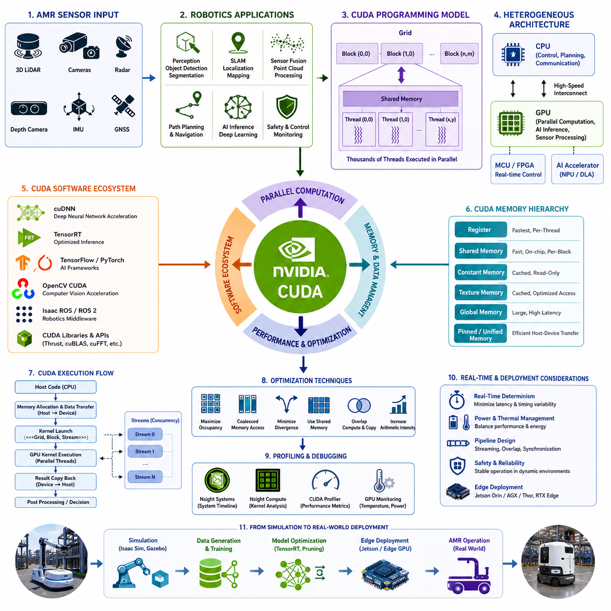
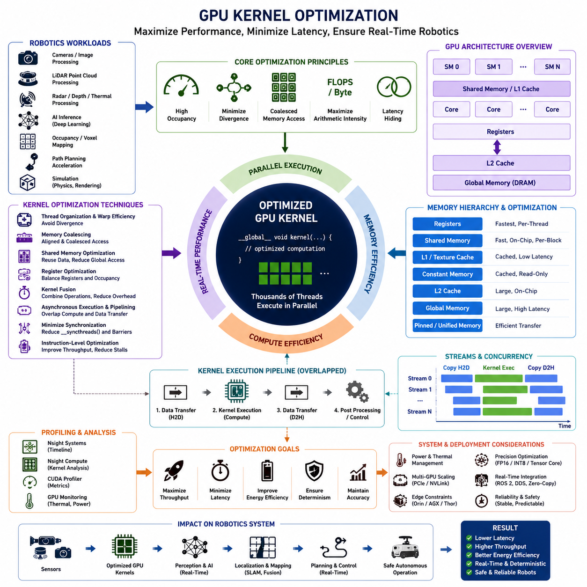
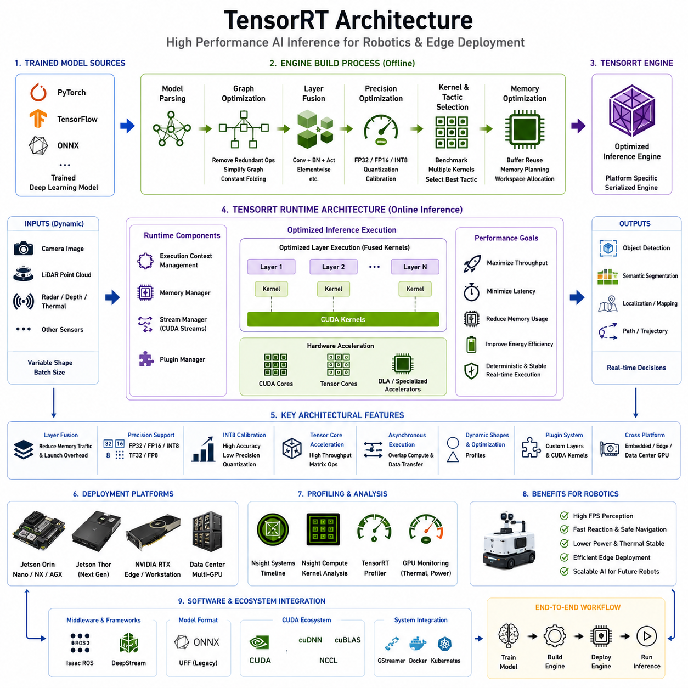
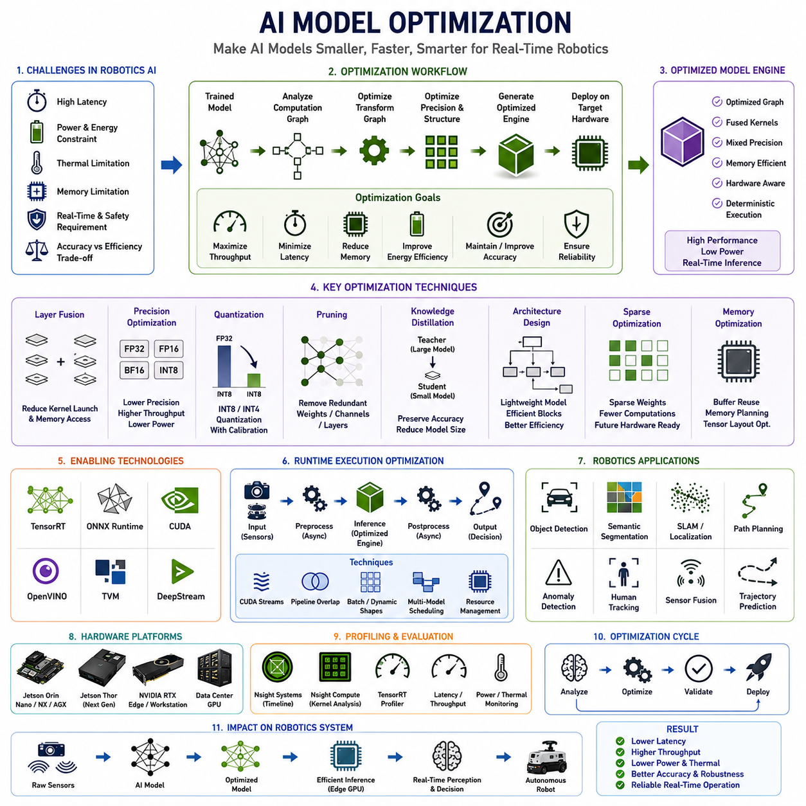
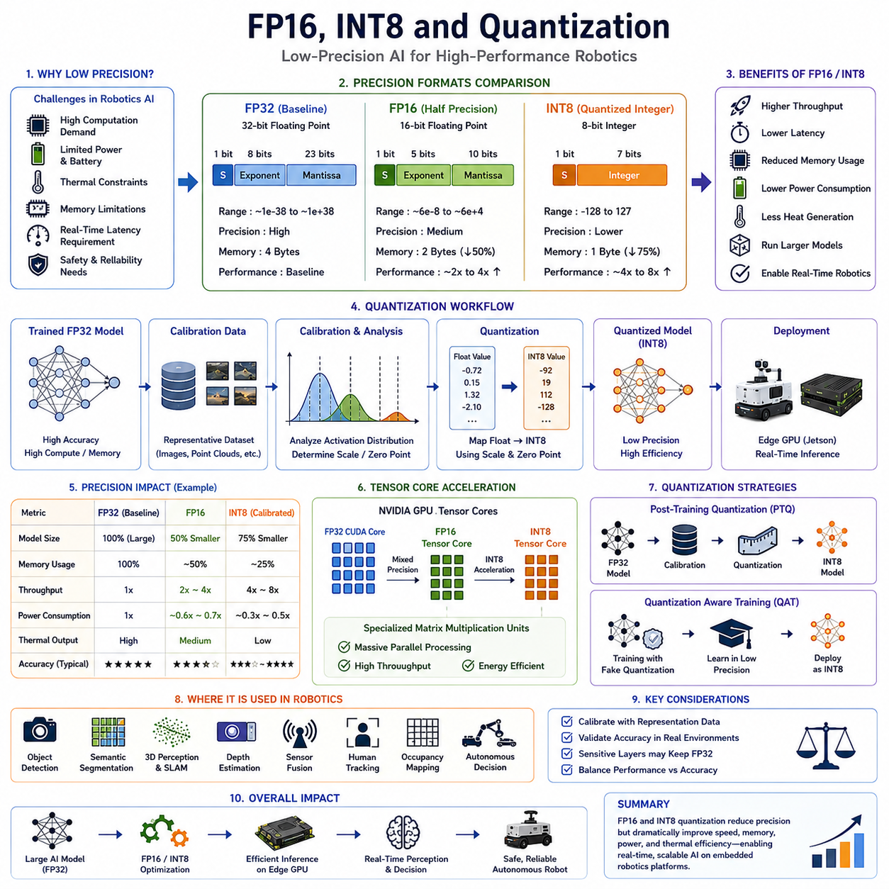
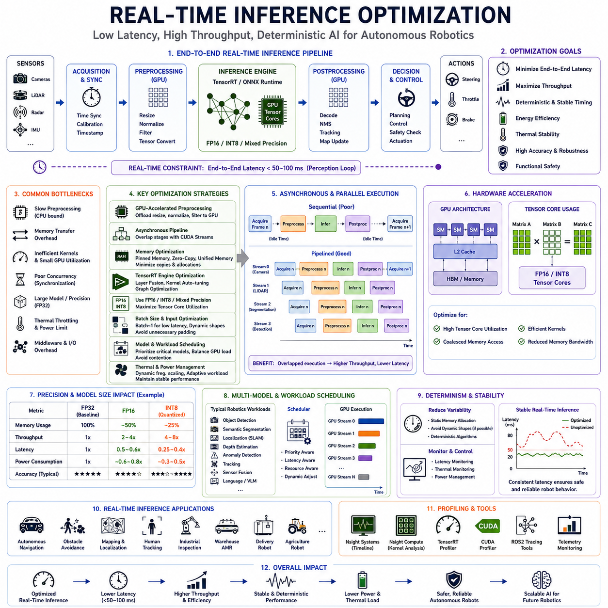
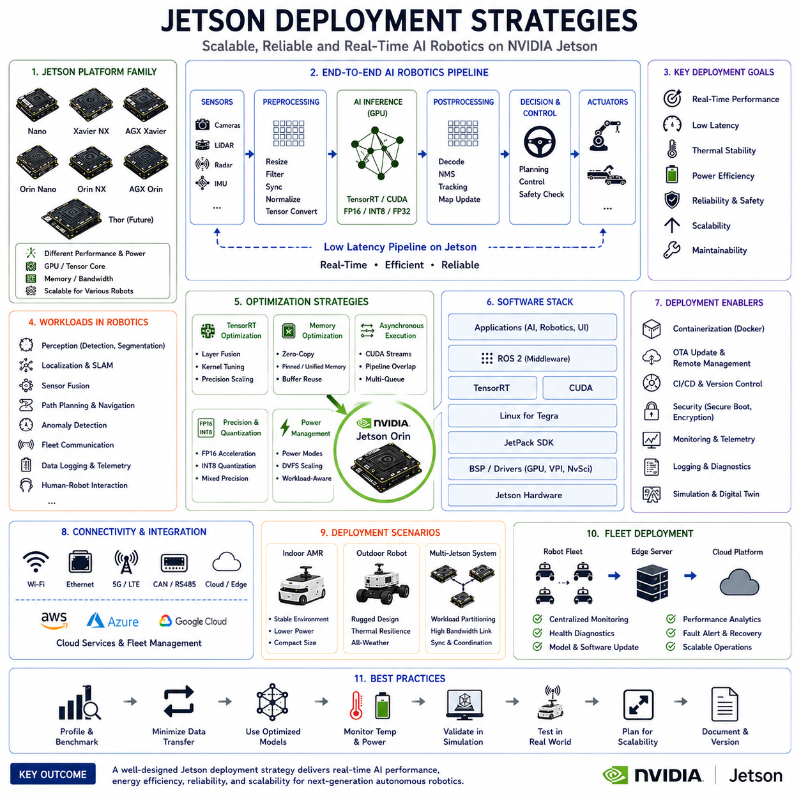
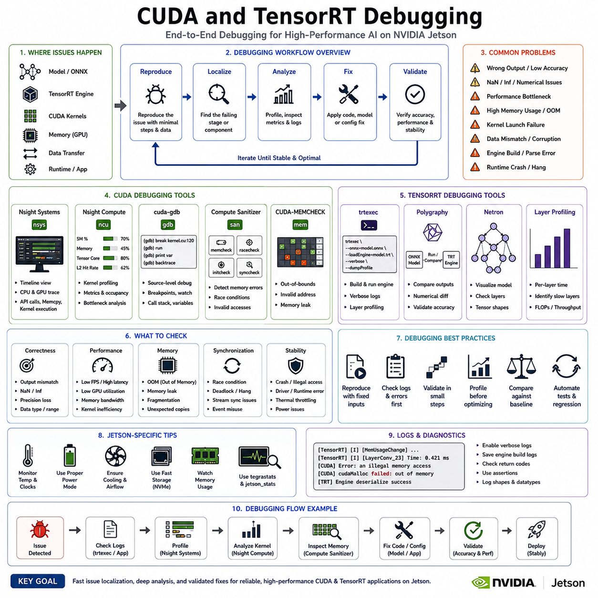

**Volume 07. AMR Software Architecture and Development**

# Chapter 11. CUDA and TensorRT

## 11.1 CUDA Programming Fundamentals

{width="7.268055555555556in" height="7.268055555555556in"}

CUDA programming has become one of the most important technologies in modern robotics, artificial intelligence, and autonomous mobile robot software development. In contemporary AMR systems, massive amounts of sensor data must be processed in real time while simultaneously executing AI inference, localization, mapping, obstacle detection, trajectory planning, safety monitoring, and fleet communication. Traditional CPU-based sequential computing architectures are no longer sufficient for handling the enormous computational workloads generated by high-resolution cameras, 3D LiDAR sensors, radar systems, thermal imaging devices, GNSS receivers, depth cameras, and AI perception pipelines. CUDA, which stands for Compute Unified Device Architecture, was developed by NVIDIA to allow developers to fully utilize GPU hardware for general-purpose parallel computing. In robotics engineering, CUDA has evolved from a specialized acceleration technology into one of the foundational infrastructures supporting real-time autonomous intelligence.

The origins of CUDA can be traced back to the evolution of graphics processing units from dedicated rendering processors into massively parallel computing engines. Early GPUs were designed primarily for rendering computer graphics and video games. However, engineers soon recognized that the mathematical structures used in graphics rendering were also highly suitable for scientific computation, matrix operations, image processing, signal analysis, and neural network acceleration. Unlike CPUs, which are optimized for sequential task execution and low-latency control operations, GPUs are optimized for high-throughput parallel processing involving thousands of lightweight threads operating simultaneously. This architectural difference makes GPUs exceptionally powerful for robotics workloads that involve repetitive numerical computations across large datasets.

In AMR systems, CUDA acceleration is used extensively in computer vision, sensor fusion, AI inference, SLAM processing, occupancy grid generation, path planning, simulation acceleration, and real-time perception pipelines. Autonomous robots continuously receive streams of data from multiple sensors operating at different frequencies and resolutions. A single 3D LiDAR can generate millions of points per second, while multiple RGB cameras and depth cameras simultaneously produce high-bandwidth video streams. Processing this data entirely on CPUs would introduce unacceptable latency and reduce the robot's ability to react safely in dynamic environments. CUDA enables these computational tasks to be distributed across thousands of GPU cores, dramatically increasing throughput while reducing overall processing time.

One of the most important concepts introduced in CUDA programming is the idea of parallel execution. Traditional sequential programs execute instructions one after another in a linear order. CUDA programs instead divide workloads into thousands of parallel execution units called threads. These threads are organized into blocks, and multiple blocks are grouped into grids. When a CUDA kernel is launched, the GPU scheduler distributes these thread blocks across multiple streaming multiprocessors inside the GPU architecture. This execution model allows large computational tasks to be divided into smaller parallel operations that can execute simultaneously. In robotics applications, such parallelism is highly beneficial for image filtering, voxelization, feature extraction, point cloud transformation, tensor operations, convolution calculations, and neural network inference.

Understanding the CUDA execution hierarchy is fundamental for robotics engineers. Each thread has its own execution context and can process individual portions of sensor data independently. Threads within the same block can communicate through shared memory and synchronization mechanisms, while blocks themselves execute independently across the GPU. This hierarchical structure enables highly scalable parallel computation. For example, when processing a LiDAR point cloud, individual threads can be assigned to transform specific points from sensor coordinates into world coordinates. Similarly, in image processing pipelines, each thread may process a single pixel or group of pixels concurrently. Such approaches significantly reduce execution latency compared to CPU-only systems.

Memory management is another critical topic in CUDA programming. GPU performance is heavily influenced by memory access patterns, bandwidth utilization, and memory hierarchy optimization. CUDA exposes multiple types of memory including global memory, shared memory, local memory, constant memory, texture memory, and registers. Global memory provides large storage capacity but relatively high latency. Shared memory is significantly faster but limited in size and shared only within thread blocks. Registers provide the fastest access speed but are extremely limited resources. Efficient robotics software requires careful optimization of memory transfers and access patterns in order to avoid bottlenecks that can reduce GPU utilization.

In real-time AMR systems, memory transfer between CPU memory and GPU memory can become one of the largest sources of latency. Sensor data acquired by CPUs must often be copied into GPU memory before CUDA kernels can process it. After computation, results may need to be transferred back to the CPU for control decisions or communication with other software modules. CUDA therefore provides technologies such as pinned memory, unified memory, asynchronous transfers, and zero-copy memory to minimize transfer overhead. These techniques are especially important in edge robotics platforms where power consumption, thermal constraints, and memory bandwidth are tightly limited.

Modern AMR platforms frequently use heterogeneous computing architectures that combine CPUs, GPUs, microcontrollers, FPGAs, and AI accelerators. In such systems, CUDA serves as a bridge between high-level robot software and low-level GPU hardware acceleration. CPUs are generally responsible for task scheduling, decision-making, communication management, and real-time coordination, while GPUs handle massively parallel workloads such as AI inference and sensor processing. Effective workload partitioning between CPUs and GPUs is essential for maintaining deterministic real-time performance. Poorly designed CUDA pipelines can introduce synchronization delays, excessive memory transfers, and unpredictable latency, all of which may compromise robot safety and stability.

CUDA programming also introduces developers to the concept of kernels. A CUDA kernel is a function executed on the GPU device rather than on the CPU host. Kernels are launched from CPU applications but execute in parallel across many GPU threads. The design of efficient kernels is one of the most important aspects of GPU software engineering. Kernel optimization techniques include minimizing memory access latency, maximizing occupancy, reducing thread divergence, optimizing shared memory usage, and improving arithmetic intensity. In robotics systems where real-time performance is essential, even small inefficiencies in CUDA kernels can significantly affect perception and navigation latency.

Thread synchronization and concurrency management are particularly important in robotics applications. Many robotic workloads involve pipelines where sensor data flows through multiple processing stages including filtering, feature extraction, AI inference, tracking, and control generation. CUDA streams allow multiple GPU operations to execute asynchronously and concurrently, enabling improved pipeline utilization. Overlapping computation and memory transfers can significantly improve throughput in real-time systems. CUDA events, synchronization primitives, and stream scheduling mechanisms therefore become critical tools for robotics engineers building deterministic AI pipelines.

CUDA is deeply integrated with modern AI frameworks used in robotics. Libraries such as cuDNN, TensorRT, TensorFlow, PyTorch, OpenCV CUDA, and Isaac ROS all rely heavily on CUDA acceleration beneath their high-level interfaces. Understanding CUDA fundamentals allows robotics developers to move beyond simple framework usage and directly optimize low-level GPU execution. This capability becomes increasingly important when deploying AI models onto embedded edge devices such as Jetson Orin, Jetson AGX, Jetson Thor, or industrial RTX-based edge computers. Embedded systems often operate under strict power and thermal limitations, requiring highly optimized CUDA execution strategies.

The relationship between CUDA and deep learning acceleration is especially important in embodied AI systems. Modern autonomous robots rely on deep neural networks for object detection, semantic segmentation, scene understanding, free-space estimation, trajectory prediction, anomaly detection, and multimodal sensor fusion. These neural networks require enormous matrix and tensor computations that are highly parallelizable on GPUs. CUDA enables these workloads to achieve real-time execution speeds that would otherwise be impossible on CPUs alone. The performance difference becomes especially noticeable when processing high-resolution sensor streams in outdoor environments or industrial facilities where rapid decision-making is required for safety.

CUDA programming is also essential for robotics simulation environments. Modern simulators such as Isaac Sim, Gazebo with GPU acceleration, Omniverse-based digital twins, and AI training environments rely heavily on GPU acceleration for physics simulation, sensor rendering, collision detection, synthetic data generation, and reinforcement learning. Simulation workloads often involve thousands of parallel computations that can be efficiently accelerated through CUDA. As simulation-driven robotics development becomes more widespread, GPU programming knowledge becomes increasingly important even outside of direct robot deployment.

Another critical area discussed in CUDA fundamentals is GPU profiling and debugging. Robotics engineers must understand how to analyze GPU utilization, kernel execution time, memory throughput, occupancy, and thermal behavior. Tools such as NVIDIA Nsight Systems, Nsight Compute, CUDA Profiler, and GPU monitoring utilities enable developers to identify performance bottlenecks and optimize real-time execution pipelines. Profiling becomes particularly important in autonomous robots because real-world deployments frequently encounter dynamic workloads that differ significantly from laboratory conditions.

Thermal management and power optimization are also central considerations in embedded CUDA systems. High-performance GPU processing can generate significant heat and rapidly consume battery power. Outdoor AMRs, hospital robots, towing robots, security robots, and GPR inspection platforms all require careful balancing between computational throughput and energy efficiency. CUDA optimization therefore extends beyond software performance alone and becomes deeply connected to hardware architecture, cooling systems, battery management, and overall robot system design. Engineers must carefully tune kernel execution patterns, memory transfers, and inference scheduling in order to maintain stable operation under field conditions.

Real-time determinism presents another major challenge for CUDA-based robotics systems. GPUs are designed primarily for throughput-oriented parallel computing rather than hard real-time scheduling. Autonomous robots, however, often require predictable timing behavior for safety-critical operations. CUDA developers must therefore carefully design synchronization mechanisms, execution priorities, pipeline architectures, and workload isolation strategies to minimize timing variability. This becomes especially important in autonomous driving robots operating around humans, vehicles, factories, hospitals, or outdoor environments where delayed responses may create hazardous situations.

As AI-native robotics continues to evolve, CUDA programming is becoming increasingly inseparable from robot software architecture itself. Future robots will rely more heavily on multimodal AI, world models, generative AI, embodied intelligence, autonomous agents, cloud-edge distributed inference, and large-scale simulation environments. These workloads require enormous computational throughput that can only realistically be achieved through advanced GPU acceleration. CUDA therefore represents not merely a programming framework but a foundational infrastructure for scalable robotic intelligence.

For robotics engineers, understanding CUDA fundamentals provides the ability to design high-performance perception systems, optimize AI inference pipelines, accelerate sensor fusion architectures, and build scalable autonomous platforms capable of operating in real-world industrial environments. It bridges the gap between software architecture and hardware acceleration while enabling modern robots to achieve the real-time intelligence required for autonomous operation. In the context of AMR software architecture and development, CUDA programming is no longer an optional specialization but a core competency for building next-generation intelligent robotic systems.

## 11.2 GPU Kernel Optimization

{width="7.268055555555556in" height="7.268055555555556in"}

GPU kernel optimization is one of the most critical disciplines in high-performance robotics computing and real-time AI acceleration. In modern Autonomous Mobile Robot systems, GPU kernels are responsible for executing the most computationally intensive operations including neural network inference, image preprocessing, LiDAR point cloud processing, sensor fusion, occupancy mapping, voxel generation, path planning acceleration, and simulation workloads. While CUDA programming fundamentals provide the basic mechanisms for launching parallel computations on GPUs, kernel optimization focuses on maximizing computational efficiency, minimizing latency, improving memory throughput, and achieving deterministic execution behavior under real-world operating conditions. In robotics systems where milliseconds directly affect navigation safety and operational stability, kernel optimization becomes an essential engineering practice rather than a simple performance enhancement technique.

A GPU kernel is a function executed directly on the GPU device and distributed across thousands of parallel threads. In robotics applications, kernels frequently process massive datasets generated by cameras, LiDARs, radars, thermal imaging systems, depth sensors, and AI tensor pipelines. The efficiency of these kernels directly determines whether an autonomous robot can achieve real-time perception and control. Poorly optimized kernels may introduce excessive latency, inefficient memory usage, thermal instability, reduced battery efficiency, and unpredictable execution timing. As autonomous robots increasingly depend on high-resolution perception and deep learning workloads, kernel optimization becomes fundamental to enabling scalable AI-native robotic architectures.

One of the first concepts introduced in GPU kernel optimization is occupancy optimization. Occupancy refers to the ratio of active warps executing on a streaming multiprocessor relative to the hardware's maximum capacity. High occupancy generally improves GPU utilization by ensuring that computational resources remain active while waiting for memory transactions or synchronization events. However, maximum occupancy alone does not always guarantee optimal performance. Excessive register usage, shared memory allocation, or thread divergence may reduce practical efficiency even when occupancy appears high. Robotics engineers must therefore balance occupancy against memory bandwidth, arithmetic intensity, synchronization overhead, and workload characteristics.

Thread organization plays a major role in kernel performance optimization. CUDA kernels execute threads in groups called warps, typically consisting of 32 threads operating in lockstep execution. Efficient kernel design attempts to ensure that all threads within a warp follow similar execution paths. When different threads within the same warp execute different branches of conditional statements, thread divergence occurs. Divergence forces the GPU scheduler to serialize portions of execution, reducing effective parallelism and increasing latency. In robotics perception pipelines involving object detection, occupancy map generation, or point cloud segmentation, minimizing thread divergence is critical for maintaining predictable real-time behavior.

Memory access optimization is another core principle of GPU kernel engineering. GPU architectures provide extremely high memory bandwidth, but achieving peak performance requires carefully aligned and coalesced memory access patterns. Coalesced memory access occurs when adjacent GPU threads access contiguous memory locations, allowing memory transactions to be combined efficiently. Uncoalesced memory access significantly reduces throughput and increases latency. In robotics applications such as image processing or LiDAR transformation, developers often redesign data structures and tensor layouts specifically to maximize coalesced access patterns.

Shared memory optimization is particularly important for robotics workloads involving repetitive local computations. Shared memory is an on-chip memory region that provides significantly lower latency compared to global memory. CUDA kernels can use shared memory to cache frequently reused data and reduce expensive global memory accesses. In image convolution operations, stereo matching algorithms, occupancy grid calculations, and point cloud voxelization, shared memory dramatically improves computational efficiency. However, shared memory is limited in capacity, and improper usage may reduce occupancy or create bank conflicts that degrade performance.

Bank conflicts occur when multiple threads simultaneously access different memory addresses located within the same shared memory bank. Since shared memory banks have limited parallel access capability, bank conflicts serialize memory transactions and reduce throughput. Optimized kernel design therefore carefully arranges shared memory layouts to minimize conflict probability. Robotics software engineers frequently analyze memory bank behavior when optimizing AI inference preprocessing, feature extraction, sensor fusion, and spatial filtering pipelines.

Register optimization also represents a major component of kernel performance tuning. Registers are the fastest memory resources available within GPU architectures and are allocated individually to each thread. Excessive register usage can reduce occupancy because each streaming multiprocessor contains a limited register pool. Insufficient register availability forces the compiler to spill variables into slower local memory, dramatically increasing latency. Kernel optimization therefore requires careful balancing between register allocation, occupancy, arithmetic intensity, and execution efficiency. Robotics systems performing large-scale AI inference or simultaneous multi-sensor processing are especially sensitive to register utilization efficiency.

Another important optimization strategy is minimizing global memory latency through asynchronous execution and pipelining techniques. Modern CUDA architectures support asynchronous memory operations, CUDA streams, and concurrent kernel execution. These mechanisms allow computation and data transfer operations to overlap in time. In robotics systems, overlapping sensor data transfers with AI inference execution can significantly improve overall throughput. For example, while one CUDA stream processes current camera frames, another stream may simultaneously transfer LiDAR data into GPU memory. Proper stream scheduling enables continuous pipeline execution without unnecessary idle periods.

Kernel fusion is another powerful optimization method commonly used in robotics AI systems. Many AI perception pipelines consist of multiple sequential GPU kernels performing small operations such as normalization, activation functions, filtering, tensor reshaping, or coordinate transformations. Launching many small kernels individually introduces kernel launch overhead and additional global memory traffic. Kernel fusion combines multiple operations into a single larger kernel, reducing synchronization overhead and minimizing intermediate memory transfers. This technique is widely used in TensorRT optimization, AI inference acceleration, and real-time sensor processing frameworks.

Arithmetic intensity optimization is closely connected to efficient GPU utilization. Arithmetic intensity refers to the ratio between computational operations and memory access operations. GPUs achieve maximum efficiency when arithmetic workloads significantly exceed memory transfer overhead. Robotics engineers often redesign algorithms to increase arithmetic intensity by reusing cached data, minimizing redundant memory transactions, and maximizing parallel computation per byte of transferred data. Deep learning tensor operations generally exhibit high arithmetic intensity, which is one reason GPUs are exceptionally effective for AI acceleration.

Instruction-level optimization also contributes to GPU kernel efficiency. CUDA compilers automatically optimize many low-level operations, but advanced robotics developers frequently analyze generated assembly instructions using profiling tools. Instruction throughput, pipeline stalls, dependency chains, branch instructions, and synchronization overhead all influence execution performance. In safety-critical robotics applications, low-level instruction optimization may determine whether perception pipelines can satisfy strict real-time deadlines.

Another essential topic in GPU kernel optimization is latency hiding. GPU architectures achieve high throughput by rapidly switching between warps while waiting for memory operations to complete. Sufficient parallelism is required to hide memory latency effectively. If too few active warps exist, the GPU may become stalled waiting for memory transactions. Robotics workloads with irregular data structures or sparse computations often face challenges maintaining sufficient parallelism for latency hiding. Kernel optimization strategies therefore attempt to maximize active execution resources while minimizing synchronization bottlenecks.

Synchronization optimization is particularly important in autonomous robotics systems. Excessive synchronization operations may introduce unpredictable latency and reduce parallel efficiency. CUDA provides synchronization primitives such as __syncthreads(), CUDA events, and stream synchronization mechanisms. Developers must carefully determine where synchronization is truly required and avoid unnecessary blocking operations. Real-time robotics pipelines often prioritize asynchronous execution models to minimize latency accumulation across perception and navigation stages.

GPU kernel optimization becomes even more complex in multi-GPU robotics systems. High-end autonomous robots may contain multiple GPUs dedicated to separate workloads such as perception, AI inference, mapping, and simulation. Efficient workload partitioning across GPUs requires consideration of PCIe bandwidth, NVLink communication, synchronization overhead, thermal constraints, and distributed memory management. Improper multi-GPU scheduling may create communication bottlenecks that offset theoretical computational advantages.

Embedded edge robotics platforms introduce additional optimization challenges. Devices such as Jetson Orin, Jetson AGX, and future Jetson Thor platforms operate under strict power and thermal limitations. Unlike data center GPUs, embedded robotics systems cannot sustain maximum GPU frequencies indefinitely without thermal throttling. Kernel optimization therefore becomes closely tied to energy efficiency and sustained computational stability. Developers must optimize not only for raw performance but also for power consumption, heat generation, memory bandwidth efficiency, and long-duration operational reliability.

Thermal-aware kernel scheduling is becoming increasingly important in outdoor autonomous robots, hospital robots, logistics AMRs, and industrial inspection platforms. High GPU utilization may generate excessive heat under outdoor sunlight or confined industrial environments. Thermal throttling reduces GPU frequency and creates unpredictable latency variations. Kernel optimization therefore often includes dynamic workload balancing, adaptive inference scheduling, precision scaling, and thermal monitoring integration.

Precision optimization is another critical component of modern GPU acceleration. Many robotics AI pipelines now use mixed-precision computation including FP16, INT8, Tensor Core acceleration, and quantized inference models. Lower numerical precision reduces memory bandwidth requirements while increasing arithmetic throughput. TensorRT and CUDA libraries provide mechanisms for exploiting specialized hardware acceleration units inside modern NVIDIA GPUs. However, reduced precision may also introduce numerical instability or accuracy degradation if not carefully validated. Robotics engineers must therefore balance computational efficiency against perception reliability and safety requirements.

Profiling and performance analysis tools play an essential role in GPU kernel optimization. NVIDIA Nsight Systems, Nsight Compute, CUDA Profiler, CUPTI, and GPU telemetry tools allow developers to analyze occupancy, memory throughput, instruction efficiency, cache utilization, kernel execution timelines, and synchronization behavior. Profiling enables engineers to identify bottlenecks that may not be visible at the source-code level. In complex robotics systems containing hundreds of interacting CUDA kernels, systematic profiling becomes indispensable for maintaining deterministic real-time performance.

GPU optimization in robotics also extends into software architecture design. Efficient CUDA kernels alone are insufficient if the surrounding software pipeline introduces excessive communication latency or inefficient data movement. ROS2 middleware integration, DDS communication patterns, shared-memory transport, zero-copy pipelines, asynchronous sensor processing, and AI scheduling frameworks all interact with kernel execution behavior. Real-world robotics optimization therefore requires holistic co-design between GPU kernels, middleware architecture, AI frameworks, and real-time system scheduling.

As autonomous systems evolve toward embodied AI, multimodal reasoning, world models, humanoid robotics, and large-scale sensor fusion architectures, GPU kernel optimization becomes increasingly critical. Future robotics workloads will involve larger neural networks, higher-resolution sensors, real-time simulation feedback loops, distributed cloud-edge inference, and continuous learning systems. Achieving stable real-time performance under such conditions will depend heavily on advanced GPU optimization strategies capable of balancing computational throughput, energy efficiency, thermal stability, and deterministic execution timing.

In modern AMR software architecture, GPU kernel optimization is no longer an isolated low-level engineering task. It is a central discipline connecting AI acceleration, sensor processing, software architecture, edge deployment, and real-time autonomous intelligence. Engineers who master GPU kernel optimization gain the ability to design robotic systems capable of operating safely and efficiently in highly dynamic industrial environments while supporting increasingly sophisticated AI capabilities. CUDA kernel optimization therefore forms one of the most important foundations for next-generation autonomous robotics platforms and AI-native robotic computing systems.

## 11.3 TensorRT Architecture

{width="7.268055555555556in" height="7.268055555555556in"}

TensorRT architecture represents one of the most important technologies in modern AI acceleration for robotics, autonomous mobile robots, edge computing systems, and real-time perception pipelines. As autonomous robots increasingly depend on deep learning inference for perception, localization, semantic understanding, object tracking, obstacle detection, free-space estimation, trajectory prediction, and multimodal sensor fusion, the computational demands of AI models have grown dramatically. Modern deep neural networks contain millions or even billions of parameters and require massive tensor computations to execute in real time. Running these workloads directly through general-purpose deep learning frameworks often introduces unacceptable latency, excessive power consumption, inefficient memory utilization, and unstable execution timing. TensorRT was developed by NVIDIA to solve these problems by providing a highly optimized inference runtime specifically designed for GPU acceleration and embedded edge deployment.

TensorRT can be understood as an AI inference optimization and deployment framework that transforms trained deep learning models into highly efficient runtime engines optimized for NVIDIA GPU architectures. Unlike training frameworks such as PyTorch or TensorFlow, TensorRT focuses exclusively on inference execution. Its primary objective is to maximize throughput, minimize latency, reduce memory usage, and improve energy efficiency during deployment. In autonomous robotics systems where perception and decision-making must operate continuously under strict timing constraints, TensorRT becomes one of the foundational components enabling real-time AI operation.

The TensorRT architecture consists of multiple interconnected layers including model parsing, graph optimization, kernel selection, layer fusion, precision optimization, memory scheduling, runtime execution, and hardware acceleration integration. Each layer contributes to reducing inference overhead while maximizing GPU utilization. TensorRT takes neural network models trained in frameworks such as PyTorch, TensorFlow, or ONNX and converts them into optimized execution engines specifically tailored for the target GPU platform. This conversion process allows TensorRT to analyze network structures, optimize execution graphs, eliminate redundant operations, fuse layers together, select optimal CUDA kernels, and exploit hardware-specific acceleration features such as Tensor Cores.

One of the most important architectural concepts in TensorRT is graph optimization. Deep learning models are typically represented as computational graphs consisting of layers, tensors, operators, activation functions, normalization blocks, convolution modules, and tensor transformation operations. Standard training frameworks prioritize flexibility and model development convenience rather than inference efficiency. As a result, many computational graphs contain redundant operations, unnecessary memory transfers, or inefficient execution structures. TensorRT analyzes the entire inference graph and applies aggressive optimization strategies to improve execution performance. Operations that can be combined are fused together, unnecessary tensor copies are removed, and computation paths are simplified in order to minimize execution latency.

Layer fusion is one of the most powerful optimization mechanisms within TensorRT architecture. In conventional deep learning frameworks, each layer often executes as an independent CUDA kernel. This introduces repeated kernel launch overhead, intermediate memory transfers, and synchronization delays. TensorRT reduces these inefficiencies by combining multiple operations into single optimized execution kernels. Convolution, activation, normalization, scaling, and bias operations can frequently be fused into unified kernels that significantly reduce memory traffic and execution overhead. This optimization is especially important in robotics systems where perception pipelines must process continuous sensor streams under real-time constraints.

TensorRT architecture is deeply integrated with CUDA and GPU kernel optimization technologies. During engine generation, TensorRT evaluates multiple CUDA kernel implementations for each network layer and selects the most efficient execution strategy based on tensor dimensions, memory layouts, precision modes, GPU architecture, and runtime constraints. This process is known as tactic selection. TensorRT benchmarks multiple implementation candidates and chooses the optimal tactic for the target hardware platform. This hardware-aware optimization enables TensorRT to achieve significantly higher inference performance compared to general-purpose AI frameworks.

Precision optimization is another central component of TensorRT architecture. Modern NVIDIA GPUs support multiple numerical precision modes including FP32, FP16, INT8, TensorFloat32, and Tensor Core acceleration. TensorRT automatically analyzes network layers and determines how lower precision computation can be applied while preserving acceptable inference accuracy. Reduced precision dramatically improves arithmetic throughput while lowering memory bandwidth requirements and power consumption. FP16 and INT8 optimization are particularly important in embedded robotics platforms such as Jetson Orin, Jetson AGX, and future Jetson Thor systems where thermal and energy limitations are critical engineering constraints.

INT8 quantization represents one of the most advanced optimization features inside TensorRT. Quantization converts floating-point tensor computations into lower precision integer representations. This significantly accelerates inference execution while reducing memory footprint and energy consumption. TensorRT provides calibration pipelines that analyze representative datasets in order to preserve inference accuracy after quantization. In robotics applications such as object detection, semantic segmentation, and autonomous navigation, INT8 acceleration often enables real-time operation on embedded devices that would otherwise struggle to meet latency requirements.

Tensor Core utilization is another key aspect of TensorRT architecture. Tensor Cores are specialized hardware units inside modern NVIDIA GPUs designed specifically for high-throughput matrix multiplication and tensor operations. Deep neural network inference heavily depends on matrix multiplication workloads, making Tensor Cores extremely effective for AI acceleration. TensorRT automatically maps compatible layers onto Tensor Core execution paths whenever possible. This allows modern GPUs to achieve enormous AI inference throughput while maintaining high energy efficiency.

Memory optimization is deeply integrated into TensorRT runtime architecture. AI inference pipelines often require substantial memory resources for intermediate tensor storage, activation buffers, feature maps, and workspace allocations. Inefficient memory scheduling may cause excessive GPU memory consumption and increase latency through unnecessary memory transfers. TensorRT carefully schedules memory allocation and tensor reuse throughout the inference graph. Intermediate buffers are reused whenever possible, temporary allocations are minimized, and tensor layouts are optimized for GPU memory access efficiency. This becomes critically important in embedded robotics systems with limited GPU memory capacity.

TensorRT runtime execution is designed for highly deterministic low-latency inference. Once a TensorRT engine is built, the runtime environment executes optimized inference pipelines with minimal overhead. Unlike training frameworks that include dynamic graph management, autograd systems, and extensive debugging infrastructure, TensorRT runtime focuses exclusively on streamlined inference execution. This lightweight architecture significantly reduces runtime latency and improves predictability. Deterministic execution behavior is essential for autonomous robots operating in safety-critical environments such as hospitals, logistics facilities, factories, warehouses, airports, ports, and outdoor urban environments.

Another major architectural feature of TensorRT is asynchronous execution support. TensorRT integrates tightly with CUDA streams, allowing inference operations to execute concurrently with sensor preprocessing, memory transfers, and other GPU workloads. In robotics systems, asynchronous execution enables continuous sensor processing pipelines without unnecessary idle periods. For example, one CUDA stream may process current camera images while another simultaneously transfers LiDAR data or executes semantic segmentation models. Overlapping execution improves total system throughput and helps maintain real-time responsiveness.

TensorRT architecture also supports dynamic tensor shapes and flexible deployment configurations. Real-world robotics applications often involve variable image resolutions, changing batch sizes, irregular point cloud dimensions, or adaptive sensor configurations. TensorRT provides mechanisms for handling dynamic input dimensions while still maintaining optimized execution performance. Optimization profiles allow developers to define expected tensor ranges and enable efficient execution across varying operational conditions.

Plugin architecture is another critical element of TensorRT. Many robotics AI systems use custom neural network layers, proprietary operators, specialized sensor processing modules, or research-oriented architectures not natively supported by standard TensorRT layers. TensorRT plugins allow developers to integrate custom CUDA kernels and specialized operations directly into the inference engine. This extensibility is especially valuable in advanced robotics research where perception models frequently evolve beyond standard commercial AI architectures.

TensorRT deployment workflows are closely connected to ONNX interoperability. ONNX, which stands for Open Neural Network Exchange, provides a standardized representation format for deep learning models. Robotics developers commonly train models in PyTorch or TensorFlow, export them into ONNX format, and then convert them into TensorRT engines. This workflow separates training environments from deployment environments while allowing TensorRT to apply hardware-specific optimizations during engine generation.

Real-time robotics systems place particularly strict requirements on inference stability, reliability, and thermal efficiency. TensorRT architecture addresses these challenges through optimized scheduling, reduced memory movement, lower computational overhead, and hardware-aware execution planning. In embedded AMR systems, lower inference latency directly improves obstacle avoidance responsiveness, localization update frequency, sensor fusion accuracy, and autonomous navigation stability. Efficient AI inference also reduces overall GPU utilization, helping maintain thermal stability and extend battery life during long-duration field operation.

TensorRT architecture is also deeply connected to modern embodied AI systems. Large-scale multimodal models, transformer architectures, vision-language-action systems, world models, and autonomous robot agents require enormous computational throughput. Without optimized inference engines, many advanced AI systems would be impractical for edge robotics deployment. TensorRT therefore serves as a bridge between large-scale AI research models and deployable real-time robotics systems capable of operating in physical environments.

Simulation environments and digital twin systems also benefit heavily from TensorRT acceleration. Isaac Sim, Omniverse-based simulation platforms, reinforcement learning environments, and synthetic data generation systems often require large-scale AI inference workloads. TensorRT optimization enables these systems to run larger models, higher-resolution perception pipelines, and more realistic simulation scenarios while maintaining interactive execution speeds.

Profiling and debugging tools are essential for understanding TensorRT runtime behavior. Developers use TensorRT profiling APIs, NVIDIA Nsight Systems, Nsight Compute, CUDA profiling tools, and GPU telemetry systems to analyze inference latency, memory consumption, Tensor Core utilization, CUDA kernel execution timelines, and thermal behavior. In real-world robotics deployments, continuous profiling becomes necessary because sensor workloads and environmental conditions may vary significantly over time.

One of the most important engineering considerations in TensorRT architecture is balancing optimization aggressiveness against model accuracy. While lower precision modes and aggressive layer fusion significantly improve performance, excessive optimization may introduce numerical instability or perception degradation. Robotics systems operating around humans, vehicles, industrial machinery, or public infrastructure require highly reliable perception accuracy. TensorRT optimization pipelines therefore require careful validation and benchmarking under diverse operating conditions.

As robotics systems evolve toward AI-native architectures, distributed edge intelligence, multimodal reasoning, and large-scale autonomous decision-making, TensorRT architecture becomes increasingly central to robotic computing infrastructure. Future autonomous robots will rely on continuously expanding AI workloads requiring efficient deployment across embedded GPUs, multi-GPU systems, cloud-edge hybrid architectures, and real-time sensor fusion pipelines. TensorRT provides the optimized inference backbone necessary for enabling these next-generation robotic intelligence systems.

In modern AMR software architecture, TensorRT is no longer simply an AI optimization tool. It is a foundational runtime infrastructure that enables scalable, energy-efficient, low-latency AI deployment across real-world autonomous robotics platforms. Engineers who deeply understand TensorRT architecture gain the ability to design highly optimized AI systems capable of stable operation under strict real-time constraints, limited power budgets, and complex industrial environments. TensorRT therefore represents one of the most important technological pillars supporting the future of AI-native robotics and embodied autonomous systems.

## 11.4 AI Model Optimization

{width="7.268055555555556in" height="7.268055555555556in"}

AI model optimization has become one of the most essential engineering disciplines in modern autonomous robotics, edge AI systems, and real-time intelligent machines. As Autonomous Mobile Robots increasingly rely on deep neural networks for perception, localization, semantic understanding, trajectory prediction, anomaly detection, multimodal sensor fusion, and autonomous decision-making, the computational complexity of AI models has expanded dramatically. Modern deep learning architectures often contain hundreds of layers, billions of parameters, and extremely large tensor operations that require enormous computational throughput. While these large models may perform exceptionally well inside cloud-scale GPU servers, deploying them directly onto real-world robotic systems introduces severe challenges related to latency, power consumption, thermal stability, memory limitations, deterministic execution, and edge deployment constraints. AI model optimization therefore focuses on transforming large and computationally expensive AI models into highly efficient inference systems capable of operating reliably within embedded robotic environments.

In robotics systems, AI optimization is fundamentally different from optimization in cloud computing environments. Cloud infrastructures prioritize scalability and raw computational performance, whereas autonomous robots must operate under strict power budgets, thermal limitations, battery constraints, limited memory resources, and real-time safety requirements. A robot cannot simply increase GPU power indefinitely because excessive thermal generation may reduce operational stability and shorten deployment duration. AI optimization in robotics therefore requires balancing inference accuracy, execution latency, memory consumption, throughput, reliability, and energy efficiency simultaneously. The objective is not only to maximize performance but to achieve stable and predictable real-time intelligence under practical deployment conditions.

One of the foundational concepts in AI model optimization is inference acceleration. During training, deep learning frameworks prioritize flexibility, gradient computation, dynamic graph management, debugging capability, and experimental scalability. However, inference execution only requires forward-pass computation. Many components used during training become unnecessary during deployment. AI optimization pipelines therefore remove redundant operations, simplify computational graphs, and restructure execution flows specifically for inference efficiency. Frameworks such as TensorRT, ONNX Runtime, OpenVINO, TVM, and DeepStream provide specialized inference optimization capabilities that dramatically improve execution performance on edge hardware.

Model optimization begins with computational graph analysis. Neural networks are represented as graphs consisting of layers, operators, tensors, activation functions, normalization stages, and data transformation modules. Standard training graphs often contain inefficient execution structures, duplicated operations, unnecessary memory transfers, and fragmented kernel execution patterns. Optimization frameworks analyze these graphs and apply transformations that improve runtime efficiency. Redundant operations may be removed, constant tensors may be precomputed, tensor layouts may be rearranged, and sequential operations may be fused together. These optimizations reduce computational overhead and improve memory access efficiency.

Layer fusion is one of the most widely used optimization strategies in modern AI deployment systems. Deep learning models often contain consecutive operations such as convolution, normalization, activation, scaling, and bias addition. Executing each layer independently creates excessive kernel launch overhead and unnecessary intermediate memory transfers. Layer fusion combines multiple operations into unified execution kernels that reduce synchronization overhead and minimize global memory traffic. In robotics applications where real-time responsiveness is critical, layer fusion significantly improves inference latency and throughput.

Precision optimization is another major component of AI model optimization. Traditional deep learning training commonly uses FP32 floating-point precision for numerical stability. However, many inference workloads can operate successfully using lower precision arithmetic such as FP16, BF16, INT8, or even lower precision representations. Reduced precision computation dramatically improves arithmetic throughput while reducing memory bandwidth requirements and energy consumption. Modern NVIDIA GPUs contain Tensor Cores specifically designed for high-throughput mixed-precision matrix operations. AI optimization frameworks automatically map compatible operations onto these specialized hardware acceleration units.

FP16 optimization has become especially important in robotics edge deployment. Half-precision computation reduces memory usage by approximately fifty percent while significantly improving tensor operation throughput. Many perception models including object detection, semantic segmentation, depth estimation, and multimodal fusion networks can maintain nearly identical inference accuracy under FP16 execution. This makes FP16 one of the most practical optimization strategies for embedded AI systems operating on Jetson platforms or edge GPU architectures.

INT8 quantization represents an even more aggressive optimization technique. Quantization converts floating-point computations into low-precision integer arithmetic. INT8 inference can significantly increase throughput while dramatically reducing memory consumption and power usage. Quantization is especially beneficial for edge robotics systems that must execute multiple AI models simultaneously under limited hardware resources. However, aggressive quantization may introduce numerical instability or reduce perception accuracy if not carefully calibrated. AI optimization workflows therefore frequently include calibration stages where representative datasets are used to evaluate quantization effects and maintain acceptable model behavior.

Quantization-aware training has emerged as an advanced optimization strategy for robotics AI systems. Instead of applying quantization only during deployment, quantization-aware training simulates low-precision computation during model training itself. This allows the neural network to adapt to reduced numerical precision and maintain higher inference accuracy after deployment. Such techniques are especially important for safety-critical robotics systems where small perception errors may create hazardous operational conditions.

Pruning is another major area of AI model optimization. Modern deep neural networks often contain large numbers of redundant weights, channels, neurons, or layers that contribute minimally to inference accuracy. Pruning techniques remove these unnecessary components in order to reduce model size and computational complexity. Structured pruning removes entire channels, filters, or network blocks, while unstructured pruning removes individual weights. Structured pruning is generally preferred in robotics deployment because it maps more efficiently onto GPU hardware and specialized accelerators.

Sparse neural network optimization is closely related to pruning strategies. Sparse models reduce computational workload by skipping zero-valued or low-importance computations. Future GPU architectures and AI accelerators increasingly support sparse tensor acceleration directly at the hardware level. Sparse optimization has the potential to dramatically improve inference efficiency for large robotics AI systems involving multimodal reasoning, transformer architectures, and world models.

Knowledge distillation is another widely used optimization technique. Distillation transfers knowledge from a large high-performance teacher model into a smaller student model that is more suitable for edge deployment. The student network learns to reproduce the behavior of the larger network while requiring significantly fewer computational resources. Distillation is particularly useful in robotics systems where large foundation models may be impractical for direct onboard deployment but their learned intelligence remains highly valuable.

Model architecture redesign also plays a critical role in AI optimization. Some neural network architectures are inherently more efficient than others. Lightweight models such as MobileNet, EfficientNet, ShuffleNet, YOLO-Nano, and edge-optimized transformer architectures are specifically designed for embedded deployment environments. These architectures prioritize computational efficiency, memory locality, reduced parameter count, and hardware acceleration compatibility. Robotics AI engineers frequently redesign or customize neural networks specifically for their target deployment hardware and operational environment.

Memory optimization is deeply connected to AI deployment efficiency. AI inference pipelines require memory for input tensors, activation buffers, feature maps, intermediate outputs, and workspace allocations. Excessive memory usage may exceed GPU memory capacity or reduce throughput due to memory bandwidth bottlenecks. AI optimization frameworks therefore apply tensor reuse strategies, buffer sharing, activation recomputation, memory pooling, and optimized tensor layouts to minimize memory consumption. Efficient memory scheduling is particularly important in multi-model robotics systems performing simultaneous perception, localization, planning, and sensor fusion workloads.

Asynchronous execution and pipeline optimization are also essential in AI model deployment. Real-world robotics systems continuously receive sensor streams that must be processed with minimal delay. AI inference therefore cannot operate as an isolated sequential process. Instead, inference pipelines must overlap sensor preprocessing, memory transfer, GPU execution, and postprocessing operations. CUDA streams, asynchronous scheduling, and concurrent execution architectures allow multiple workloads to execute simultaneously without blocking overall system responsiveness.

AI optimization is especially important for perception systems operating in dynamic environments. Autonomous robots deployed in hospitals, warehouses, factories, smart cities, agricultural fields, ports, airports, or outdoor industrial sites encounter highly variable environmental conditions. Lighting changes, weather effects, motion blur, sensor noise, dynamic obstacles, and irregular terrain all affect AI inference behavior. Optimized models must therefore maintain not only computational efficiency but also robust accuracy under diverse operational conditions.

Thermal efficiency is another critical consideration in robotics AI optimization. High-performance AI inference generates substantial heat, especially when multiple neural networks operate continuously in parallel. Embedded edge devices such as Jetson Orin, Jetson AGX, and future robotics AI processors must balance computational throughput against thermal limitations. Excessive heat generation may trigger thermal throttling, reducing GPU frequency and causing unpredictable latency spikes. AI optimization therefore directly influences system reliability, operational duration, and battery efficiency.

Real-time determinism is one of the most difficult challenges in robotics AI optimization. Autonomous robots require predictable response timing for safe navigation and collision avoidance. Large neural networks with irregular computational structures may produce variable execution latency depending on input complexity or hardware scheduling behavior. AI optimization frameworks attempt to reduce such variability through graph simplification, deterministic scheduling, static tensor allocation, kernel fusion, and optimized execution planning.

Another important area is multi-model optimization. Modern autonomous robots rarely execute a single AI network in isolation. Instead, robots often run object detection, semantic segmentation, localization estimation, free-space analysis, anomaly detection, human tracking, language models, and sensor fusion pipelines simultaneously. Coordinating these workloads efficiently requires advanced scheduling strategies that maximize GPU utilization while preventing resource contention and latency accumulation.

AI model optimization is also tightly connected to robotics middleware and deployment infrastructure. ROS2 communication, DDS middleware, shared-memory transport, containerized deployment, edge-cloud synchronization, and fleet management architectures all influence inference performance. Optimization therefore extends beyond neural network computation itself and includes the broader software architecture surrounding AI execution pipelines.

Simulation-driven optimization is becoming increasingly important in embodied AI systems. Modern robotics development frequently uses simulation environments such as Isaac Sim, Omniverse, Gazebo, and digital twin infrastructures to evaluate AI models under large-scale synthetic scenarios. Simulation allows developers to benchmark optimization strategies, validate inference stability, and analyze performance tradeoffs before deployment into physical robots. Large-scale synthetic datasets also support calibration and quantization workflows used during optimization.

Transformer optimization represents another rapidly growing field. Large transformer models used for multimodal reasoning, vision-language understanding, world modeling, and autonomous agent behavior require enormous computational resources. Specialized optimization strategies including attention compression, token pruning, low-rank approximation, KV-cache optimization, sparse attention, and distributed inference scheduling are increasingly important for future robotics systems.

Profiling and benchmarking tools are essential throughout the optimization process. Developers rely on Nsight Systems, Nsight Compute, TensorRT Profilers, CUDA Profilers, GPU telemetry systems, and inference benchmarking tools to analyze latency, throughput, Tensor Core utilization, memory bandwidth, cache efficiency, thermal behavior, and execution stability. Optimization is inherently iterative and requires continuous profiling under realistic operating conditions.

As robotics systems evolve toward AI-native architectures, cloud-edge distributed intelligence, multimodal cognition, embodied reasoning, and autonomous agent frameworks, AI model optimization becomes increasingly central to robotic system design. Future robots will require larger models, more sensors, higher-resolution perception pipelines, continuous learning systems, and collaborative cloud-edge inference architectures. Without aggressive optimization, these workloads would exceed the computational and thermal limits of embedded robotics hardware.

In modern AMR software architecture, AI model optimization is no longer merely a deployment refinement step. It is a foundational engineering discipline that directly determines whether advanced AI systems can operate reliably inside real-world autonomous robots. Engineers who understand AI optimization deeply gain the ability to transform research-scale neural networks into practical robotic intelligence systems capable of stable real-time operation under strict resource constraints. AI model optimization therefore represents one of the most important technological pillars supporting the future of embodied AI, autonomous robotics, and scalable intelligent machine systems.

## 11.5 FP16, INT8, and Quantization

{width="7.268055555555556in" height="7.268055555555556in"}

FP16, INT8, and quantization technologies have become some of the most important optimization methods in modern AI acceleration for robotics, autonomous mobile robots, edge AI systems, and embedded inference platforms. As deep learning models continue to grow in size and complexity, the computational burden associated with real-time inference has increased dramatically. Modern robotic AI systems must process high-resolution camera streams, 3D LiDAR point clouds, radar data, semantic segmentation maps, multimodal sensor fusion pipelines, and autonomous decision-making models simultaneously while operating under strict real-time constraints. Performing these workloads entirely using traditional FP32 floating-point computation often exceeds the power, thermal, memory, and latency limitations of embedded robotic platforms. FP16 optimization, INT8 quantization, and low-precision inference techniques were developed to address these challenges by significantly improving computational throughput while reducing memory usage and energy consumption.

Traditional deep learning systems rely heavily on FP32 floating-point arithmetic because it provides high numerical precision and stable gradient propagation during training. FP32 representation uses 32 bits to store floating-point numbers, including sign bits, exponent fields, and mantissa precision information. While FP32 is highly effective for training large neural networks, many inference workloads do not require full 32-bit precision in order to maintain acceptable accuracy. During inference, neural networks primarily execute forward-pass computations rather than gradient updates, and many tensor operations exhibit tolerance to reduced numerical precision. This observation led to the development of lower precision inference techniques capable of dramatically accelerating AI execution.

FP16, also known as half-precision floating-point computation, reduces the numerical representation size from 32 bits to 16 bits. This reduction significantly lowers memory bandwidth requirements while increasing arithmetic throughput. Modern NVIDIA GPUs contain specialized Tensor Cores optimized specifically for FP16 matrix multiplication and tensor operations. These hardware acceleration units can execute massively parallel low-precision tensor computations at extremely high throughput compared to traditional FP32 CUDA cores. As a result, FP16 inference often provides major performance improvements while maintaining nearly identical model accuracy for many robotics AI applications.

One of the primary advantages of FP16 optimization is memory efficiency. AI inference pipelines require large amounts of GPU memory for input tensors, activation maps, feature representations, intermediate buffers, and workspace allocations. Reducing tensor precision from FP32 to FP16 cuts memory consumption approximately in half. This reduction allows larger models, higher-resolution sensor inputs, and multiple simultaneous AI workloads to fit within limited embedded GPU memory environments. In robotics platforms such as Jetson Orin, Jetson AGX, and edge RTX systems, memory efficiency directly influences system scalability and operational stability.

FP16 optimization also improves memory bandwidth utilization. GPU performance is often constrained not only by computational throughput but also by the rate at which data can move through memory subsystems. Lower precision tensors reduce the amount of data transferred between memory hierarchies, caches, and processing units. This allows GPUs to process larger workloads more efficiently while reducing latency. In real-time robotics perception pipelines involving semantic segmentation, object detection, SLAM acceleration, or multimodal sensor fusion, improved memory bandwidth efficiency significantly enhances overall system responsiveness.

Another important benefit of FP16 inference is energy efficiency. Embedded robotics systems operate under strict power constraints, especially in battery-powered AMRs, autonomous delivery robots, patrol robots, hospital robots, agricultural robots, and industrial inspection platforms. FP16 arithmetic requires fewer transistor operations compared to FP32 computation, reducing power consumption and thermal generation. Lower power usage extends battery life and helps maintain thermal stability during long-duration field operation. Thermal efficiency is especially important in outdoor robotics systems exposed to sunlight, confined industrial environments, or limited cooling infrastructure.

Despite its advantages, FP16 computation also introduces numerical precision limitations. FP16 provides reduced mantissa precision and narrower dynamic range compared to FP32. Certain neural network operations may become unstable under low-precision arithmetic, particularly in layers involving normalization, accumulation, attention mechanisms, or extremely small gradient values. For this reason, mixed-precision computation has become widely adopted. Mixed-precision inference selectively executes sensitive operations using FP32 while accelerating compatible tensor operations using FP16 Tensor Cores. This approach balances numerical stability against computational efficiency.

Automatic mixed precision frameworks have become important tools for robotics AI deployment. TensorRT, CUDA, cuDNN, TensorFlow, and PyTorch all provide mechanisms for automatic precision management. These frameworks analyze neural network structures and determine which operations can safely execute using lower precision arithmetic without significantly degrading inference accuracy. Automatic precision scaling reduces the complexity of deploying optimized AI models onto embedded robotics hardware.

INT8 quantization represents an even more aggressive optimization strategy than FP16 inference. INT8 uses 8-bit integer arithmetic instead of floating-point representation. This dramatically reduces memory usage while significantly increasing computational throughput. Modern NVIDIA GPUs and AI accelerators contain specialized INT8 tensor acceleration hardware capable of extremely high-performance integer matrix operations. INT8 inference can often provide several times higher throughput compared to FP32 execution while consuming substantially less power.

Quantization fundamentally changes how neural network tensors are represented and processed. Instead of storing continuous floating-point values, tensors are mapped into discrete integer ranges. Scaling factors and calibration parameters are used to approximate original floating-point distributions within reduced integer precision ranges. This transformation dramatically reduces tensor size and computational complexity while enabling efficient execution on specialized low-precision hardware accelerators.

Quantization workflows typically involve calibration processes. During calibration, representative datasets are passed through the neural network in order to analyze tensor activation distributions, dynamic ranges, and numerical behavior. Calibration algorithms determine optimal scaling factors that preserve inference accuracy while minimizing quantization error. Proper calibration is essential because poorly calibrated INT8 models may experience severe accuracy degradation, unstable predictions, or inconsistent perception behavior.

Several types of quantization strategies exist within modern AI optimization systems. Post-training quantization applies quantization after model training is complete. This approach is relatively simple and easy to deploy but may introduce greater accuracy loss for complex neural networks. Quantization-aware training, on the other hand, simulates low-precision arithmetic during training itself. By exposing the neural network to quantized behavior during optimization, the model learns to adapt to reduced precision and maintain higher inference accuracy after deployment.

Quantization-aware training has become especially important in robotics systems requiring high reliability. Autonomous robots operating near humans, industrial machinery, public infrastructure, or dynamic environments cannot tolerate unstable AI perception behavior. Even small numerical errors may influence obstacle detection, localization estimation, trajectory prediction, or safety decision-making. Quantization-aware training allows low-precision models to preserve robust inference performance while still benefiting from reduced computational complexity.

INT8 optimization is particularly effective for convolutional neural networks used in robotics perception systems. Object detection models, semantic segmentation networks, lane detection systems, depth estimation pipelines, and occupancy grid generation algorithms often exhibit strong tolerance to quantization. In embedded robotics platforms, INT8 acceleration frequently determines whether real-time execution is achievable within practical thermal and power constraints.

Transformer architectures present additional challenges for quantization. Large transformer models used in vision-language systems, multimodal reasoning, autonomous robot agents, and world models contain attention mechanisms and activation distributions that may be highly sensitive to precision reduction. Specialized quantization techniques including per-channel quantization, dynamic quantization, smooth quantization, and adaptive scaling strategies are increasingly used to optimize transformer inference while maintaining acceptable accuracy.

TensorRT architecture plays a major role in FP16 and INT8 deployment workflows. TensorRT automatically analyzes neural network graphs and determines how low-precision computation can be applied safely across different layers. During engine generation, TensorRT benchmarks multiple execution tactics and selects optimized CUDA kernels compatible with Tensor Core acceleration. TensorRT calibration pipelines allow developers to generate highly optimized FP16 and INT8 inference engines specifically tailored for target GPU hardware.

CUDA Tensor Cores are central to modern low-precision AI acceleration. Tensor Cores are specialized matrix multiplication engines integrated into NVIDIA GPU architectures. These hardware units are designed specifically for mixed-precision tensor operations and provide enormous throughput advantages compared to standard CUDA cores. FP16 and INT8 tensor operations executed on Tensor Cores can achieve dramatically higher performance while reducing energy consumption and memory bandwidth requirements.

Low-precision inference is deeply connected to robotics edge deployment strategy. Edge robotics platforms cannot rely on unlimited cloud resources because real-time autonomy requires local onboard decision-making. Network latency, bandwidth limitations, communication instability, and cybersecurity concerns make cloud-only inference impractical for many robotics applications. FP16 and INT8 optimization therefore enable sophisticated AI models to operate directly on embedded edge devices while maintaining acceptable real-time performance.

Thermal management becomes increasingly important as AI workloads scale upward. High-performance AI inference continuously generates heat, especially when multiple models execute simultaneously on embedded GPUs. Thermal throttling may reduce GPU frequency and introduce unpredictable latency spikes that negatively affect autonomous robot behavior. FP16 and INT8 optimization reduce computational load and energy consumption, helping maintain stable thermal conditions and consistent real-time inference performance.

Another major advantage of low-precision optimization is improved scalability for multi-model robotics systems. Modern autonomous robots often run object detection, semantic segmentation, localization estimation, anomaly detection, human tracking, free-space analysis, and multimodal sensor fusion pipelines concurrently. Running all these workloads using FP32 inference may exceed embedded GPU resource limitations. FP16 and INT8 optimization enable multiple AI models to coexist efficiently within constrained hardware environments.

Real-time determinism is another important consideration in robotics AI optimization. Autonomous robots require predictable inference timing in order to guarantee safe navigation and stable control behavior. Large FP32 models may exhibit variable execution latency depending on memory pressure, thermal conditions, or workload scheduling. Optimized FP16 and INT8 inference engines generally provide more stable execution timing because they reduce memory bottlenecks and improve computational efficiency.

AI quantization is also closely connected to future embodied AI systems. Humanoid robots, autonomous industrial robots, multimodal AI agents, world models, and large-scale robotic cognition systems require computational workloads far beyond what traditional FP32 edge inference can support. Future robotics platforms will increasingly depend on advanced quantization methods, sparse tensor acceleration, adaptive precision scaling, and hardware-aware inference optimization in order to deploy large AI systems within practical power and thermal constraints.

Simulation environments also benefit from low-precision inference acceleration. Isaac Sim, Omniverse simulation platforms, reinforcement learning systems, and synthetic data generation pipelines frequently execute large AI models during simulation workflows. FP16 and INT8 optimization allow these environments to run larger simulation scenarios, higher-resolution sensor models, and more complex AI workloads while maintaining interactive simulation speeds.

Profiling and validation remain essential throughout the quantization process. Developers must carefully analyze inference latency, memory usage, Tensor Core utilization, throughput stability, thermal behavior, and perception accuracy across diverse operational scenarios. Tools such as TensorRT Profilers, Nsight Systems, Nsight Compute, CUDA profiling utilities, and telemetry monitoring systems help engineers identify optimization bottlenecks and validate low-precision inference reliability.

One of the greatest engineering challenges in FP16 and INT8 optimization is balancing performance gains against perception robustness. Excessive quantization may reduce model reliability under difficult environmental conditions such as low lighting, rain, fog, motion blur, sensor noise, or crowded industrial environments. Robotics AI systems therefore require extensive validation across diverse datasets and real-world operating conditions before deployment into safety-critical environments.

As robotics systems continue evolving toward AI-native architectures, cloud-edge distributed intelligence, multimodal reasoning, and large-scale autonomous cognition, FP16, INT8, and quantization technologies are becoming fundamental components of robotic computing infrastructure. Without low-precision optimization, many advanced AI workloads would exceed the capabilities of embedded robotics hardware. These optimization technologies therefore serve as foundational enablers for scalable real-time robotic intelligence.

In modern AMR software architecture, FP16 inference, INT8 quantization, and low-precision optimization are no longer optional performance enhancements. They are core engineering strategies that determine whether advanced AI systems can operate reliably within practical embedded robotic environments. Engineers who deeply understand quantization technologies gain the ability to deploy increasingly sophisticated AI models onto edge robotics platforms while maintaining real-time responsiveness, energy efficiency, thermal stability, and operational reliability. FP16 and INT8 optimization therefore represent some of the most important technological foundations supporting the future of embodied AI, autonomous robotics, and intelligent machine systems.

## 11.6 Real-Time Inference Optimization

{width="7.268055555555556in" height="7.268055555555556in"}

Real-time inference optimization has become one of the most critical engineering disciplines in modern robotics, autonomous mobile robots, embedded AI systems, and intelligent edge computing platforms. As autonomous robots increasingly depend on deep neural networks for perception, localization, semantic understanding, obstacle detection, trajectory prediction, free-space analysis, multimodal sensor fusion, and autonomous decision-making, the computational demands placed upon onboard AI systems continue to grow rapidly. At the same time, robots operating in real-world environments must maintain strict real-time responsiveness in order to guarantee operational safety, navigation stability, and reliable autonomous behavior. Even small increases in inference latency may negatively affect obstacle avoidance, path planning, collision prevention, localization accuracy, and human interaction safety. Real-time inference optimization therefore focuses on minimizing AI execution latency while maximizing throughput, energy efficiency, thermal stability, and deterministic system behavior under practical deployment conditions.

In robotics systems, real-time AI inference differs fundamentally from cloud-based AI execution. Cloud infrastructures can tolerate higher latency because computations often occur asynchronously across distributed servers with abundant computational resources. Autonomous robots, however, operate inside dynamic physical environments where decisions must be generated continuously and immediately. A perception delay of even several tens of milliseconds may cause a robot to react too slowly to moving humans, vehicles, machinery, or unexpected obstacles. Real-time inference optimization therefore becomes deeply connected not only to computational efficiency but also to functional safety and autonomous system reliability.

One of the primary goals of real-time inference optimization is reducing end-to-end latency. Inference latency includes not only neural network execution itself but also sensor acquisition, preprocessing, memory transfer, tensor conversion, postprocessing, communication overhead, and synchronization delays. In many robotics systems, the neural network represents only one portion of a much larger perception pipeline. Optimizing inference therefore requires a holistic understanding of the entire data flow architecture surrounding the AI execution engine.

Sensor preprocessing frequently becomes a major source of hidden latency in robotics systems. Camera images, LiDAR point clouds, radar signals, thermal images, and depth maps often require resizing, normalization, coordinate conversion, filtering, synchronization, and tensor transformation before inference execution can begin. If preprocessing occurs inefficiently on CPUs, the AI accelerator may remain idle waiting for input preparation. Real-time optimization therefore increasingly moves preprocessing workloads onto GPUs using CUDA acceleration, TensorRT preprocessing layers, zero-copy memory pipelines, and asynchronous execution models.

Memory transfer optimization is another fundamental component of low-latency inference systems. Embedded robotics platforms continuously move large amounts of sensor data between CPUs, GPUs, memory controllers, storage devices, and communication interfaces. Excessive memory transfers introduce latency, reduce throughput, and increase power consumption. Real-time inference pipelines therefore attempt to minimize unnecessary tensor copying, avoid redundant memory allocations, and maintain continuous GPU-resident execution whenever possible. Techniques such as pinned memory, unified memory, zero-copy transport, DMA acceleration, and direct GPU sensor ingestion are increasingly important in high-performance robotics architectures.

Asynchronous execution represents one of the most powerful strategies for improving inference responsiveness. Traditional sequential execution pipelines process tasks one after another, causing hardware resources to remain idle during synchronization or memory transfer stages. In contrast, asynchronous execution allows sensor acquisition, preprocessing, inference execution, and postprocessing to overlap simultaneously across multiple CUDA streams or execution queues. While one frame undergoes neural network inference, the next frame may already be entering preprocessing stages. This pipelined architecture significantly improves total system throughput while reducing perceived latency.

CUDA streams play a central role in real-time inference optimization. Modern NVIDIA GPUs support concurrent execution across multiple independent streams. Robotics systems often allocate separate streams for camera processing, LiDAR preprocessing, semantic segmentation, object detection, localization estimation, and sensor fusion tasks. Proper stream scheduling prevents GPU underutilization and enables continuous high-throughput operation. However, excessive concurrency may also create resource contention, cache thrashing, memory bandwidth saturation, and synchronization instability. Effective stream management therefore requires careful workload balancing and execution profiling.

TensorRT architecture has become one of the most important technologies for real-time inference acceleration in robotics systems. TensorRT optimizes deep learning models specifically for deployment on NVIDIA GPUs by applying graph optimization, layer fusion, kernel selection, precision scaling, memory scheduling, and Tensor Core acceleration. These optimizations dramatically reduce inference latency while improving energy efficiency and deterministic execution behavior. TensorRT engines eliminate many forms of overhead present in training-oriented frameworks such as PyTorch or TensorFlow, allowing inference pipelines to execute with highly streamlined runtime architectures.

Layer fusion is particularly important for reducing inference latency. Deep learning models frequently contain many sequential operations such as convolution, normalization, activation functions, scaling, and tensor reshaping. Executing each operation independently creates kernel launch overhead and repeated memory traffic. TensorRT and other optimization frameworks combine compatible operations into unified execution kernels that minimize synchronization overhead and reduce intermediate tensor movement. In real-time robotics systems, layer fusion can significantly improve perception responsiveness.

Precision optimization also plays a major role in real-time inference performance. FP16 inference reduces memory bandwidth usage while increasing Tensor Core throughput. INT8 quantization further reduces computational complexity and power consumption. Modern robotics AI systems increasingly rely on mixed-precision execution strategies where sensitive operations remain in FP32 while most tensor computations execute using FP16 or INT8 acceleration. These techniques dramatically improve inference speed while maintaining acceptable perception accuracy for object detection, semantic segmentation, free-space estimation, and multimodal perception workloads.

Tensor Core acceleration is deeply connected to modern inference optimization. Tensor Cores are specialized hardware units optimized for massively parallel matrix multiplication and tensor operations. Deep neural network inference primarily consists of tensor algebra operations that map efficiently onto Tensor Core architectures. Optimized inference engines therefore attempt to maximize Tensor Core utilization by selecting compatible tensor layouts, precision modes, and execution kernels. High Tensor Core utilization often directly correlates with improved throughput and lower latency.

Batch size optimization is another important consideration in real-time robotics AI systems. Cloud AI inference frequently prioritizes maximum throughput by processing large batches of input data simultaneously. Robotics systems, however, prioritize minimal latency rather than bulk throughput. Large inference batches introduce waiting delays because the system must accumulate multiple frames before execution begins. Real-time robotics platforms therefore often use batch size one inference pipelines optimized specifically for immediate response generation. Some systems may dynamically adjust batch sizes depending on workload conditions and latency requirements.

Deterministic execution behavior is one of the most difficult challenges in real-time AI optimization. Embedded GPUs are inherently throughput-oriented architectures rather than hard real-time computing systems. Variability in memory access, cache utilization, thermal behavior, workload contention, and kernel scheduling may introduce unpredictable latency fluctuations. Robotics systems operating near humans, industrial machinery, or public infrastructure require highly stable response timing for safety-critical behavior. Optimization strategies therefore frequently prioritize latency consistency over maximum theoretical throughput.

Thermal management is deeply connected to sustained inference performance. High AI workloads continuously generate heat, especially when multiple neural networks operate simultaneously on embedded GPUs. Thermal throttling may reduce GPU frequencies and introduce severe inference latency spikes. Real-time robotics systems therefore require optimization strategies that balance throughput against sustained thermal stability. Dynamic frequency scaling, adaptive model scheduling, workload prioritization, and thermal-aware inference management are increasingly important for long-duration autonomous operation.

Power efficiency also plays a critical role in real-time inference optimization. Battery-powered autonomous robots must balance computational performance against operational duration. High-performance AI inference may rapidly deplete battery capacity if not carefully optimized. Efficient inference pipelines reduce unnecessary tensor movement, minimize idle hardware states, maximize Tensor Core utilization, and reduce redundant computation in order to improve energy efficiency. Robotics engineers frequently profile performance-per-watt metrics rather than focusing solely on raw throughput.

Multi-model execution introduces additional complexity into robotics inference systems. Modern autonomous robots rarely execute a single neural network in isolation. Instead, robots often run object detection, semantic segmentation, localization estimation, anomaly detection, depth estimation, human tracking, language processing, and sensor fusion models simultaneously. Coordinating these workloads efficiently requires advanced scheduling architectures capable of preventing GPU contention and latency accumulation. Real-time inference optimization therefore increasingly includes workload orchestration and AI task scheduling strategies.

Inference caching and temporal consistency optimization are also important in robotics applications. Consecutive sensor frames frequently contain highly similar information, especially during slow robot motion or static environmental conditions. Some AI pipelines exploit temporal consistency by reusing previous inference results, selectively updating changed regions, or reducing inference frequency adaptively. These strategies significantly reduce computational load while preserving stable perception performance.

Sparse tensor acceleration is emerging as another important optimization direction. Many neural network operations involve sparse activation patterns where large portions of tensors contain near-zero values. Specialized sparse inference techniques skip unnecessary computations and reduce arithmetic workload. Future robotics AI accelerators increasingly include dedicated sparse tensor hardware support, enabling more efficient execution of large transformer models and multimodal reasoning systems.

Transformer optimization has become especially important in modern embodied AI systems. Large transformer-based architectures used for vision-language understanding, multimodal reasoning, autonomous agents, and world models require enormous computational resources. Real-time transformer inference optimization includes attention pruning, token reduction, KV-cache optimization, low-rank approximation, sparse attention mechanisms, and hierarchical execution scheduling. Without these optimizations, many transformer-based AI systems would be impractical for embedded robotics deployment.

Edge-cloud collaborative inference represents another emerging area of optimization. Some robotics architectures distribute AI workloads dynamically between onboard edge processors and remote cloud infrastructure. Lightweight perception tasks may execute locally while large-scale reasoning or model updates occur in cloud servers. However, cloud dependence introduces network latency and communication uncertainty. Real-time optimization therefore requires intelligent partitioning of workloads based on latency sensitivity, bandwidth availability, cybersecurity requirements, and operational safety constraints.

ROS2 integration significantly influences inference latency in robotics systems. Message transport overhead, DDS middleware configuration, serialization costs, memory copying, and callback scheduling all affect perception responsiveness. Real-time robotics architectures increasingly use zero-copy transport, shared-memory communication, intra-process communication, and GPU-aware middleware to reduce communication overhead between AI processing nodes.

Data pipeline optimization is often as important as neural network optimization itself. Many robotics systems suffer from bottlenecks caused by inefficient sensor synchronization, blocking I/O operations, fragmented memory allocation, logging overhead, or middleware congestion. Engineers optimizing real-time AI systems therefore analyze complete end-to-end execution timelines rather than focusing solely on inference engine performance. Profiling tools such as Nsight Systems, Nsight Compute, TensorRT Profilers, CUDA Profilers, ROS2 tracing tools, and GPU telemetry systems are essential for identifying hidden bottlenecks.

Simulation-driven optimization workflows are increasingly common in robotics AI development. Isaac Sim, Omniverse, Gazebo, and digital twin environments allow engineers to benchmark inference pipelines under large-scale synthetic workloads before deployment into physical robots. Simulation enables systematic testing of latency stability, throughput scaling, thermal behavior, and workload scheduling under diverse operational scenarios.

Real-time inference optimization is also deeply connected to functional safety validation. Autonomous robots operating in hospitals, logistics centers, factories, smart cities, agricultural environments, airports, ports, or public infrastructure must maintain reliable perception behavior under highly dynamic conditions. Optimization strategies that maximize speed at the expense of perception robustness may create dangerous failure conditions. Real-time optimization therefore always requires balancing latency reduction against inference stability, numerical reliability, environmental robustness, and safety integrity.

Future robotics systems will increasingly rely on embodied AI, multimodal cognition, autonomous agent architectures, cloud-edge distributed intelligence, and large-scale world models. These systems will require substantially greater computational throughput than current robotics platforms. Real-time inference optimization will therefore become even more central to robotic system architecture. Emerging technologies such as adaptive precision scaling, dynamic neural execution, sparse tensor hardware, photonic AI accelerators, neuromorphic processors, and heterogeneous AI computing fabrics may fundamentally reshape future optimization strategies.

In modern AMR software architecture, real-time inference optimization is no longer simply an AI deployment refinement process. It is a foundational engineering discipline that determines whether advanced AI systems can operate safely, reliably, and efficiently within practical autonomous robotics environments. Engineers who deeply understand real-time inference optimization gain the ability to design robotic intelligence systems capable of sustained autonomous operation under strict latency, thermal, power, and safety constraints. Real-time inference optimization therefore represents one of the most important technological foundations supporting the future of embodied AI, autonomous robotics, and intelligent machine systems.

## 11.7 Jetson Deployment Strategies

{width="7.268055555555556in" height="7.268055555555556in"}

Jetson deployment strategies have become one of the most important architectural topics in modern robotics, embedded AI systems, autonomous mobile robots, and edge-based intelligent machines. As artificial intelligence models continue to increase in size and computational complexity, robotics platforms require highly optimized deployment architectures capable of delivering real-time inference performance under strict power, thermal, reliability, and environmental constraints. NVIDIA Jetson platforms were specifically developed to address these challenges by providing GPU-accelerated embedded computing systems optimized for AI inference, robotics middleware, computer vision, sensor fusion, and autonomous navigation. In practical robotics deployment environments, however, selecting Jetson hardware alone is insufficient. Engineers must carefully design deployment strategies that balance computational throughput, latency, thermal stability, scalability, reliability, maintainability, and energy efficiency across the entire robotics software and hardware ecosystem.

The Jetson ecosystem includes several major platform families including Jetson Nano, Jetson Xavier NX, Jetson AGX Xavier, Jetson Orin Nano, Jetson Orin NX, Jetson AGX Orin, and future architectures such as Jetson Thor. Each platform provides different combinations of GPU cores, Tensor Core performance, CPU capability, memory bandwidth, power envelopes, and AI throughput. Deployment strategies therefore depend heavily on target robotics workloads, operational environments, sensor complexity, AI model scale, and system integration requirements. Lightweight indoor robots may operate successfully using lower-power Jetson modules, while large-scale outdoor autonomous robots often require significantly more computational capability.

One of the most important considerations in Jetson deployment is workload classification. Modern robotics systems rarely execute a single AI model in isolation. Instead, autonomous robots simultaneously process perception pipelines, localization algorithms, SLAM systems, sensor fusion modules, object detection networks, semantic segmentation engines, free-space estimation pipelines, path planning systems, anomaly detection models, and fleet communication frameworks. Effective deployment strategies begin by carefully classifying these workloads according to latency sensitivity, computational intensity, memory bandwidth requirements, and real-time safety importance.

Perception workloads are generally among the most computationally demanding components of autonomous robotics systems. High-resolution RGB cameras, stereo vision systems, depth cameras, thermal sensors, radar systems, and 3D LiDARs continuously generate massive amounts of data that must be processed in real time. Jetson deployment strategies therefore frequently prioritize GPU acceleration for sensor preprocessing, AI inference, and point cloud processing tasks. CUDA acceleration, TensorRT optimization, zero-copy memory transport, asynchronous execution pipelines, and GPU-aware middleware become essential for maintaining low-latency perception responsiveness.

Sensor fusion architectures significantly influence Jetson deployment planning. Modern autonomous robots frequently combine multiple heterogeneous sensor streams in order to improve environmental understanding and operational robustness. Fusion pipelines may involve synchronized camera-LiDAR fusion, radar-camera fusion, GNSS-IMU integration, occupancy map generation, semantic mapping, and trajectory estimation systems. These pipelines require careful synchronization and memory management because multiple sensor streams must be processed simultaneously under strict timing constraints. Deployment strategies therefore often separate sensor acquisition pipelines from AI inference engines while maintaining efficient shared-memory communication.

Jetson deployment is deeply connected to AI model optimization workflows. Raw deep learning models trained in PyTorch or TensorFlow often exceed the real-time capabilities of embedded edge hardware if deployed directly without optimization. Practical deployment strategies therefore heavily depend on TensorRT engine conversion, FP16 acceleration, INT8 quantization, layer fusion, graph optimization, and Tensor Core utilization. Optimized inference engines dramatically improve throughput while reducing power consumption and thermal generation. In embedded robotics systems, these optimizations frequently determine whether real-time autonomy is achievable within operational constraints.

Power management is one of the defining characteristics of Jetson deployment strategy design. Unlike cloud servers or workstation GPUs, Jetson platforms operate within tightly constrained power envelopes. Embedded autonomous robots often rely on battery power for extended operation durations, making energy efficiency critically important. Jetson modules support multiple configurable power modes that dynamically balance GPU frequency, CPU performance, and memory throughput. Deployment strategies therefore carefully select operating modes based on mission requirements, environmental conditions, and workload intensity.

Thermal management is equally important in real-world robotics deployment. High-performance AI inference continuously generates heat, particularly when multiple neural networks execute simultaneously. Outdoor autonomous robots operating under direct sunlight or inside confined industrial environments may experience severe thermal stress. Thermal throttling can reduce GPU frequency and introduce unpredictable latency spikes that negatively affect autonomous behavior. Effective Jetson deployment strategies therefore include active cooling systems, heat sink optimization, airflow engineering, workload balancing, thermal-aware scheduling, and dynamic power scaling mechanisms.

Containerization has become increasingly important in Jetson deployment ecosystems. Robotics software stacks often contain large numbers of interdependent libraries, middleware components, CUDA runtimes, AI frameworks, and sensor drivers. Maintaining stable deployment environments across multiple robots can become extremely difficult without proper software isolation mechanisms. Docker-based deployment architectures allow robotics engineers to package AI inference systems, ROS2 nodes, TensorRT engines, CUDA dependencies, and middleware frameworks into reproducible software containers. Containerized deployment significantly improves scalability, maintainability, software portability, and remote update management.

ROS2 integration is a central component of many Jetson deployment strategies. ROS2 provides distributed communication infrastructure for robotics software architectures, including publish-subscribe messaging, service calls, parameter management, and lifecycle control. However, ROS2 communication overhead can introduce latency if not carefully optimized. High-performance Jetson deployments therefore increasingly utilize intra-process communication, shared-memory transport, zero-copy pipelines, GPU-aware message handling, and DDS tuning strategies to minimize middleware bottlenecks.

Real-time inference optimization remains one of the most important deployment objectives. Autonomous robots require deterministic perception and control response timing for safe navigation. Jetson deployment strategies therefore focus heavily on minimizing end-to-end latency across sensor acquisition, preprocessing, AI inference, postprocessing, and control generation pipelines. Asynchronous CUDA streams, pipelined execution architectures, TensorRT optimization, direct sensor ingestion, and GPU-resident processing pipelines all contribute to maintaining stable low-latency execution behavior.

Jetson deployment strategies also depend strongly on memory architecture optimization. Embedded edge devices contain limited memory capacity compared to cloud GPU servers. Large multimodal AI systems can easily exceed available memory resources if not carefully optimized. Efficient deployment architectures therefore minimize tensor duplication, reduce intermediate buffer allocations, reuse GPU memory aggressively, and avoid unnecessary CPU-GPU transfers. Unified memory, pinned memory, shared tensor buffers, and optimized tensor layouts significantly improve memory efficiency and inference throughput.

Storage architecture is another important deployment consideration. Robotics systems often collect large volumes of sensor data during operation for mapping, diagnostics, replay analysis, AI retraining, and fleet management. High-bandwidth NVMe storage systems are commonly integrated into Jetson platforms to support real-time sensor logging and dataset generation. Deployment strategies must balance storage performance against power consumption, durability, vibration resistance, and environmental reliability.

Networking and communication infrastructure also play major roles in Jetson deployment architecture. Modern robotics systems increasingly rely on edge-cloud connectivity for fleet coordination, remote monitoring, over-the-air software updates, cloud-assisted AI processing, digital twin synchronization, and telemetry analysis. However, cloud dependence introduces network latency and reliability concerns. Effective deployment strategies therefore partition workloads carefully between onboard edge inference and cloud-based services according to latency sensitivity and operational safety requirements.

Security considerations are becoming increasingly important in Jetson deployment environments. Autonomous robots connected to industrial networks, public infrastructure, logistics systems, hospitals, or smart city ecosystems may become targets for cybersecurity attacks. Deployment strategies therefore increasingly incorporate secure boot mechanisms, encrypted communication channels, container security frameworks, runtime isolation, hardware authentication, and AI model integrity verification.

Simulation-driven deployment workflows are also becoming central to robotics development. Before deploying AI systems onto physical Jetson hardware, developers frequently validate software pipelines inside Isaac Sim, Omniverse, Gazebo, or digital twin environments. Simulation-based deployment testing allows engineers to analyze latency stability, thermal behavior, AI throughput, workload scheduling, and sensor synchronization under large-scale synthetic scenarios. This approach significantly reduces deployment risk and accelerates field validation.

Fleet deployment strategies introduce additional complexity. Industrial robotics deployments may involve dozens or hundreds of autonomous robots operating simultaneously. Managing software consistency, AI model updates, telemetry monitoring, health diagnostics, and performance optimization across large fleets requires centralized deployment infrastructure. Container orchestration systems, remote management frameworks, OTA update pipelines, distributed monitoring systems, and fleet analytics platforms therefore become essential components of scalable Jetson deployment architectures.

Jetson deployment strategies also vary significantly between indoor and outdoor robotics applications. Indoor AMRs operating in warehouses or hospitals typically experience relatively stable lighting conditions, limited temperature variation, and structured navigation environments. Outdoor robots, however, must tolerate rain, snow, dust, fog, vibration, electromagnetic interference, direct sunlight, and uneven terrain. Deployment architectures for outdoor systems therefore emphasize ruggedized enclosures, environmental sealing, thermal resilience, vibration isolation, and robust sensor synchronization mechanisms.

Multi-Jetson architectures are becoming increasingly common in high-end robotics systems. Large autonomous platforms may distribute workloads across multiple Jetson modules in order to separate perception processing, localization estimation, sensor fusion, AI reasoning, and fleet communication tasks. Distributed edge architectures require high-bandwidth interconnects, low-latency communication pipelines, synchronized timing systems, and coordinated workload scheduling mechanisms. Multi-node deployment strategies must carefully manage resource allocation while preventing communication bottlenecks.

AI-native robotics systems are pushing Jetson deployment strategies toward increasingly heterogeneous computing architectures. Future robotics platforms may combine Jetson modules with dedicated AI accelerators, FPGA systems, real-time MCUs, discrete GPUs, and cloud-connected inference infrastructure. Workload partitioning across heterogeneous hardware resources will become increasingly important as embodied AI systems evolve toward larger multimodal reasoning architectures and autonomous cognitive systems.

Functional safety considerations heavily influence deployment architecture design. Robots operating near humans, vehicles, industrial machinery, or public infrastructure require robust fail-safe behavior under abnormal operating conditions. Jetson deployment strategies therefore often include watchdog systems, redundant sensing pipelines, fallback control systems, health monitoring frameworks, thermal shutdown protection, runtime anomaly detection, and deterministic scheduling validation.

Profiling and monitoring systems are essential throughout the deployment lifecycle. Engineers continuously analyze GPU utilization, Tensor Core usage, memory bandwidth, inference latency, thermal behavior, power consumption, CPU scheduling, and communication overhead using tools such as Nsight Systems, Nsight Compute, TensorRT Profilers, CUDA telemetry frameworks, and ROS2 tracing systems. Continuous profiling enables developers to identify bottlenecks and maintain stable long-term autonomous operation.

Future Jetson deployment strategies will increasingly support embodied AI, multimodal cognition, autonomous agents, world models, collaborative robotics, cloud-edge distributed intelligence, and large-scale transformer architectures. These systems will require significantly greater computational throughput than current robotics deployments. Emerging deployment strategies may incorporate adaptive precision scaling, sparse tensor acceleration, dynamic workload orchestration, distributed inference pipelines, and next-generation heterogeneous AI computing fabrics.

In modern AMR software architecture, Jetson deployment strategies are no longer simply hardware integration procedures. They represent comprehensive system engineering methodologies that connect AI acceleration, robotics middleware, thermal engineering, edge computing, safety validation, cloud integration, and autonomous intelligence into unified deployment ecosystems. Engineers who deeply understand Jetson deployment architecture gain the ability to design scalable robotics systems capable of stable real-time operation under practical field conditions. Jetson deployment strategies therefore form one of the most important technological foundations supporting the future of embodied AI, intelligent robotics, and scalable autonomous machine systems.

## 11.8 CUDA and TensorRT Debugging

{width="7.268055555555556in" height="7.268055555555556in"}

CUDA and TensorRT debugging has become one of the most important engineering disciplines in modern robotics, autonomous mobile robots, edge AI systems, and high-performance embedded inference platforms. As robotics systems increasingly rely on GPU-accelerated AI pipelines for perception, localization, semantic understanding, sensor fusion, and autonomous decision-making, the complexity of software execution environments has grown dramatically. Modern autonomous robots operate using large multimodal AI pipelines that integrate CUDA kernels, TensorRT inference engines, ROS2 middleware, GPU memory management systems, asynchronous execution pipelines, sensor synchronization frameworks, and real-time control architectures. While these technologies enable extraordinary computational performance, they also introduce highly complex debugging challenges that are fundamentally different from traditional CPU-based software debugging.

In robotics systems, debugging is not limited to identifying software crashes or syntax errors. Real-world autonomous systems may experience intermittent latency spikes, unstable inference behavior, GPU memory fragmentation, synchronization failures, TensorRT engine mismatches, CUDA kernel race conditions, sensor timing drift, thermal throttling, or distributed middleware bottlenecks. Many of these failures occur only under specific environmental conditions or after extended operational durations, making them significantly more difficult to diagnose than conventional software problems. CUDA and TensorRT debugging therefore requires a deep understanding of GPU architecture, asynchronous execution behavior, memory systems, inference optimization pipelines, and real-time robotics constraints.

CUDA debugging begins with understanding the GPU execution model itself. Unlike CPU applications that execute instructions sequentially across relatively few cores, CUDA applications execute thousands of concurrent threads distributed across multiple streaming multiprocessors. These threads operate asynchronously and often share memory resources, synchronization barriers, and execution queues. Errors inside massively parallel execution environments may not appear consistently because timing conditions, scheduling behavior, and resource contention vary dynamically between executions. As a result, GPU debugging often involves identifying nondeterministic failures that may only occur intermittently under particular workloads.

One of the most common CUDA debugging challenges involves illegal memory access. CUDA kernels frequently manipulate large tensors, image buffers, point clouds, occupancy maps, and sensor data arrays directly on GPU memory. If kernels attempt to access invalid memory regions due to incorrect indexing, race conditions, or buffer overflows, the entire GPU pipeline may fail unpredictably. Unlike CPU memory violations, CUDA memory errors may not immediately terminate execution. Instead, they may corrupt downstream tensor computations or trigger delayed failures during later kernel launches. Developers therefore rely heavily on CUDA memory checking tools and runtime synchronization validation to identify these issues.

Memory management debugging is particularly important in embedded robotics systems. Autonomous robots continuously process high-bandwidth sensor streams that require large amounts of GPU memory allocation and deallocation. Poor memory management may lead to fragmentation, memory leaks, or allocation instability during long-duration operation. Over time, memory fragmentation may reduce available contiguous memory regions, eventually causing TensorRT engine failures or inference instability. Robotics developers therefore carefully monitor GPU memory usage, allocation lifetimes, tensor reuse patterns, and unified memory behavior during system validation.

Asynchronous execution introduces another major debugging challenge. CUDA pipelines commonly overlap sensor preprocessing, inference execution, memory transfer, and postprocessing across multiple CUDA streams. While asynchronous execution significantly improves throughput, it also makes debugging far more difficult because operations execute concurrently rather than sequentially. A synchronization bug in one stream may propagate into completely unrelated system components several milliseconds later. Developers therefore use explicit synchronization points, CUDA events, timeline tracing, and execution profiling tools to analyze stream interactions and identify hidden concurrency problems.

Race conditions are among the most difficult problems in CUDA debugging. Multiple GPU threads may attempt to read or modify shared memory simultaneously without proper synchronization. Such race conditions may produce inconsistent tensor outputs, unstable inference behavior, or corrupted perception results. Importantly, race conditions may only appear under specific execution timing conditions, making them extremely difficult to reproduce consistently. Robotics systems operating under variable sensor loads, dynamic environments, or fluctuating thermal conditions are especially vulnerable to such intermittent failures.

Shared memory debugging is also critical in CUDA optimization workflows. Shared memory provides low-latency on-chip caching for CUDA kernels but requires careful management to avoid bank conflicts, invalid synchronization, or buffer corruption. Incorrect shared memory indexing may cause hidden computational errors that are difficult to detect because kernel execution may continue without immediate crashes. Developers frequently use Nsight Compute and CUDA profiling tools to analyze shared memory access patterns and verify synchronization correctness.

Kernel launch configuration errors are another common source of debugging complexity. CUDA kernels require carefully selected grid dimensions, block sizes, register usage limits, and shared memory allocations. Incorrect launch parameters may reduce occupancy, trigger runtime failures, or produce silent performance degradation. Embedded robotics systems often operate near hardware resource limits, making launch configuration validation especially important for maintaining deterministic real-time behavior.

TensorRT debugging introduces an additional layer of complexity beyond raw CUDA execution. TensorRT transforms trained deep learning models into highly optimized inference engines using graph optimization, kernel fusion, precision scaling, and Tensor Core acceleration. While these optimizations dramatically improve inference performance, they also make debugging more difficult because the deployed inference engine may differ significantly from the original training graph. TensorRT debugging therefore frequently involves validating correctness between original framework outputs and optimized runtime outputs.

One of the most common TensorRT debugging problems involves model conversion failures. Deep learning models trained in PyTorch or TensorFlow are typically exported into ONNX format before conversion into TensorRT engines. During this conversion process, unsupported operators, incompatible tensor shapes, dynamic dimension mismatches, or unsupported activation functions may cause parsing failures or incorrect inference behavior. Debugging these issues requires careful graph inspection and validation of operator compatibility across multiple frameworks.

Precision-related debugging is particularly important in TensorRT deployment workflows. TensorRT aggressively applies FP16 acceleration and INT8 quantization in order to maximize throughput and reduce memory consumption. However, some neural network layers are highly sensitive to reduced numerical precision. Excessive quantization may produce unstable inference outputs, degraded perception accuracy, or inconsistent object detection behavior. Developers therefore compare FP32 reference outputs against FP16 and INT8 execution results in order to identify layers sensitive to numerical precision reduction.

Calibration debugging becomes critical during INT8 optimization workflows. INT8 quantization relies on representative calibration datasets to estimate tensor activation ranges and scaling parameters. Poor calibration data may produce severe inference degradation under real-world operational conditions. For example, an object detection model calibrated only under daytime lighting conditions may fail under nighttime or fog environments after quantization. Robotics engineers therefore validate quantized inference behavior across highly diverse operational scenarios.

Dynamic tensor shape debugging is another common TensorRT challenge. Real-world robotics systems often process variable image resolutions, irregular point cloud dimensions, or adaptive sensor configurations. TensorRT optimization profiles define allowable tensor shape ranges during engine generation. Incorrect optimization profile configuration may produce runtime failures, inefficient kernel selection, or unstable memory allocation behavior. Developers therefore carefully validate tensor dimensions across all operational conditions.

TensorRT engine serialization and compatibility debugging also play major roles in deployment stability. TensorRT engines are highly hardware-specific because kernel selection and optimization tactics depend on GPU architecture, CUDA versions, TensorRT versions, and driver compatibility. Engines generated on one hardware platform may fail on another platform even when the underlying neural network remains unchanged. Robotics deployment pipelines therefore require strict version management and reproducible engine generation workflows.

Tensor Core debugging has become increasingly important in modern AI acceleration systems. TensorRT attempts to maximize Tensor Core utilization during FP16 and INT8 inference. However, incorrect tensor layouts, unsupported precision combinations, or incompatible layer configurations may prevent Tensor Core acceleration from activating correctly. Nsight profiling tools allow developers to analyze Tensor Core utilization and identify layers falling back to slower CUDA execution paths.

Thermal debugging is deeply connected to long-duration robotics deployment stability. Embedded AI systems executing continuous inference workloads generate substantial heat, especially when multiple neural networks operate simultaneously. Thermal throttling may reduce GPU frequencies and introduce severe latency spikes that destabilize autonomous behavior. CUDA and TensorRT debugging therefore frequently includes thermal profiling, power monitoring, workload balancing, and long-duration stress testing under realistic environmental conditions.

Latency debugging is another major focus area in robotics AI systems. Autonomous robots require deterministic response timing for safe navigation and obstacle avoidance. However, latency variability may arise from asynchronous execution pipelines, middleware congestion, memory contention, CPU scheduling delays, thermal throttling, or inefficient TensorRT engine execution. Developers therefore analyze complete end-to-end execution timelines rather than focusing solely on neural network inference speed.

ROS2 middleware debugging is tightly integrated with CUDA and TensorRT debugging workflows. AI inference pipelines rarely operate in isolation inside robotics systems. Instead, ROS2 nodes continuously exchange sensor messages, localization data, navigation commands, telemetry streams, and AI outputs across distributed communication networks. Serialization overhead, DDS configuration errors, callback blocking, or memory copying inefficiencies may introduce hidden bottlenecks that negatively affect inference responsiveness.

Synchronization debugging is especially difficult in robotics systems involving multiple sensors. Camera streams, LiDAR scans, radar frames, GNSS updates, and IMU measurements all operate at different frequencies and timing intervals. Small synchronization drift between sensor pipelines may corrupt sensor fusion behavior or destabilize localization estimation. Developers therefore analyze timestamp alignment, synchronization queues, middleware latency, and sensor trigger mechanisms carefully during debugging workflows.

Distributed debugging becomes increasingly important in multi-GPU and multi-node robotics architectures. High-end autonomous robots may distribute workloads across multiple Jetson modules, edge servers, or cloud-connected AI systems. Debugging distributed inference pipelines requires visibility into network latency, workload partitioning, inter-node synchronization, message ordering, and distributed scheduling behavior. Such systems may exhibit failures that appear only under large-scale operational conditions.

Profiling tools are central to CUDA and TensorRT debugging workflows. NVIDIA Nsight Systems provides end-to-end timeline analysis across CPU threads, CUDA streams, TensorRT execution, memory transfers, and ROS2 processes. Nsight Compute enables low-level GPU kernel profiling including occupancy analysis, Tensor Core utilization, memory throughput, and cache efficiency. CUDA-MEMCHECK helps identify illegal memory accesses, race conditions, and synchronization violations. TensorRT profiling APIs allow developers to analyze layer-by-layer inference execution behavior.

Simulation-driven debugging workflows are becoming increasingly common in robotics development. Isaac Sim, Omniverse, Gazebo, and digital twin infrastructures allow developers to reproduce difficult operational scenarios inside controlled virtual environments. Simulation-based debugging enables systematic testing of latency stability, sensor synchronization, workload scheduling, thermal behavior, and AI inference robustness before physical deployment into real robots.

Continuous logging and telemetry analysis are essential for long-duration robotics debugging. Many real-world failures occur only after hours or days of operation under dynamic environmental conditions. Robotics systems therefore continuously log GPU utilization, memory usage, inference latency, thermal conditions, TensorRT engine statistics, ROS2 message timing, and power consumption during field operation. Telemetry pipelines allow developers to diagnose intermittent failures that would otherwise be impossible to reproduce reliably.

Functional safety considerations strongly influence debugging methodology in autonomous robotics. Debugging cannot focus solely on maximizing computational performance. AI inference pipelines operating near humans, industrial machinery, or public infrastructure must maintain reliable and predictable behavior under abnormal conditions. Engineers therefore validate fail-safe behavior, thermal shutdown responses, watchdog recovery mechanisms, redundant sensing pipelines, and degraded operation modes as part of debugging workflows.

Future embodied AI systems, multimodal reasoning architectures, autonomous agents, and world models will significantly increase debugging complexity. Large transformer-based robotics systems involve enormous computational graphs, adaptive reasoning pipelines, sparse tensor acceleration, dynamic execution paths, and heterogeneous computing architectures. Future debugging systems may increasingly rely on AI-assisted telemetry analysis, automated anomaly detection, distributed observability frameworks, and intelligent profiling systems.

In modern AMR software architecture, CUDA and TensorRT debugging are no longer simply low-level software troubleshooting activities. They are comprehensive system engineering disciplines that connect GPU architecture, AI acceleration, middleware communication, thermal engineering, memory management, distributed systems, and real-time autonomous behavior into unified operational analysis frameworks. Engineers who deeply understand CUDA and TensorRT debugging gain the ability to build highly reliable autonomous robotics systems capable of stable long-duration operation under practical field conditions. CUDA and TensorRT debugging therefore represent some of the most important technological foundations supporting the future of embodied AI, intelligent robotics, and scalable autonomous machine systems.
