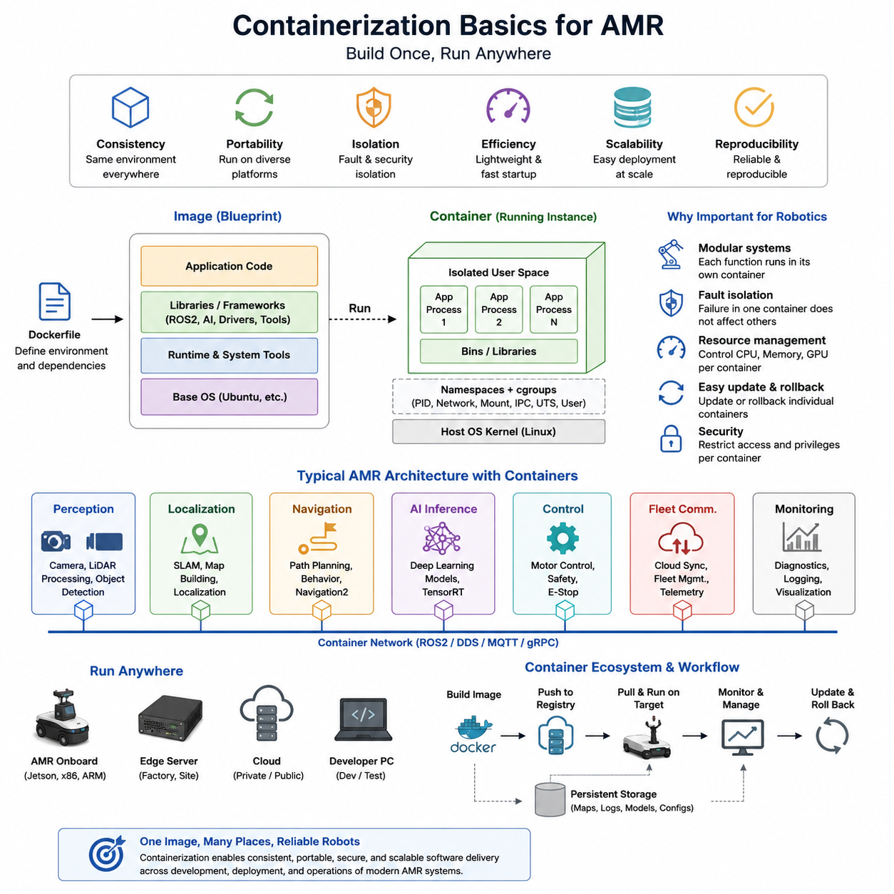
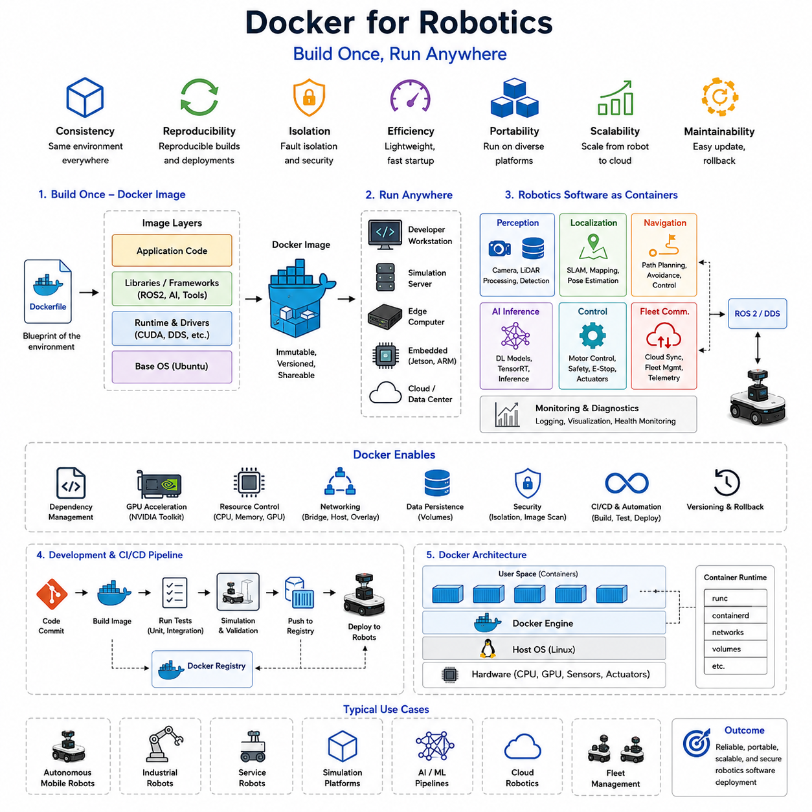
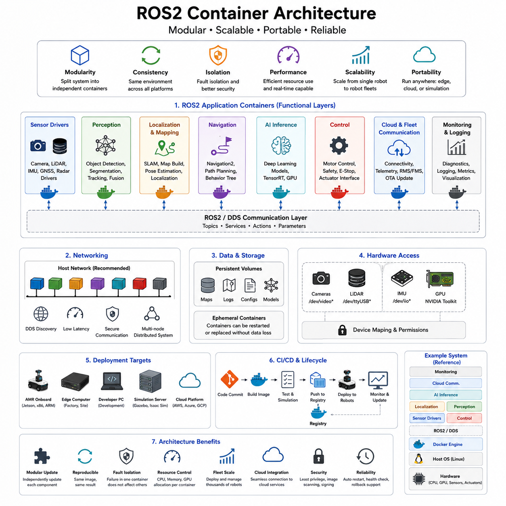
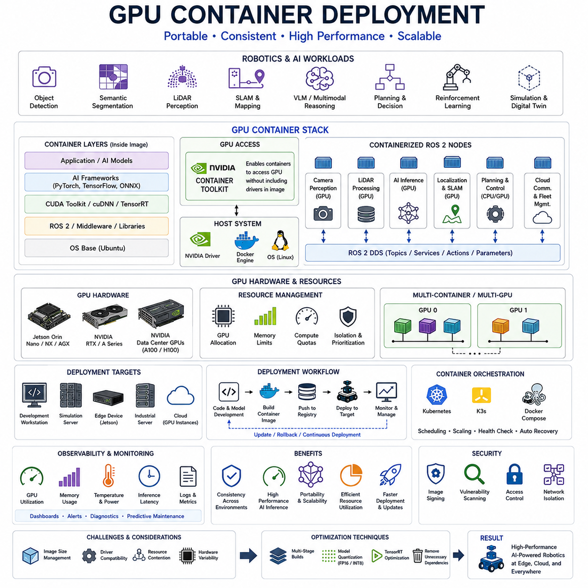
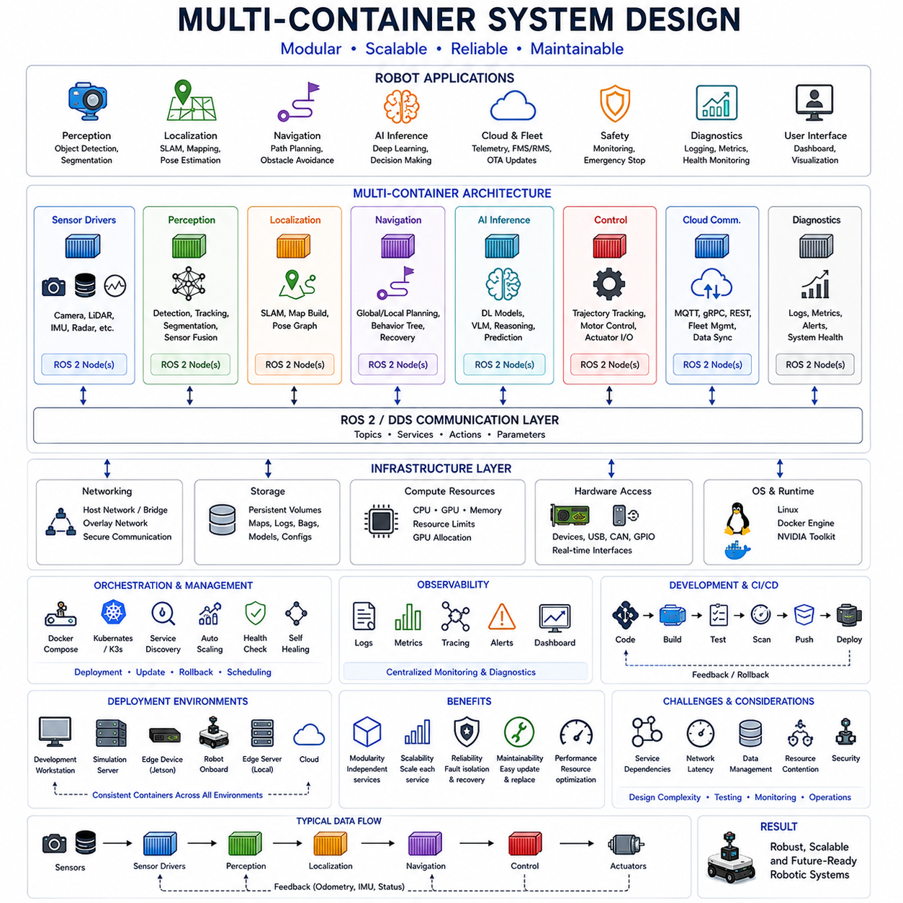
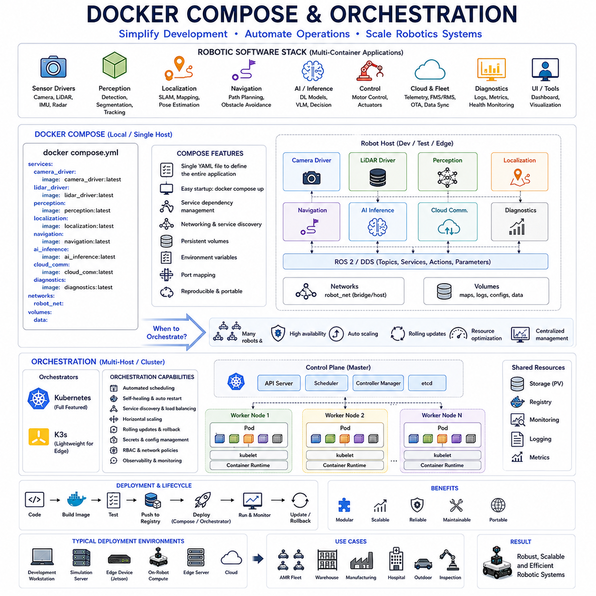
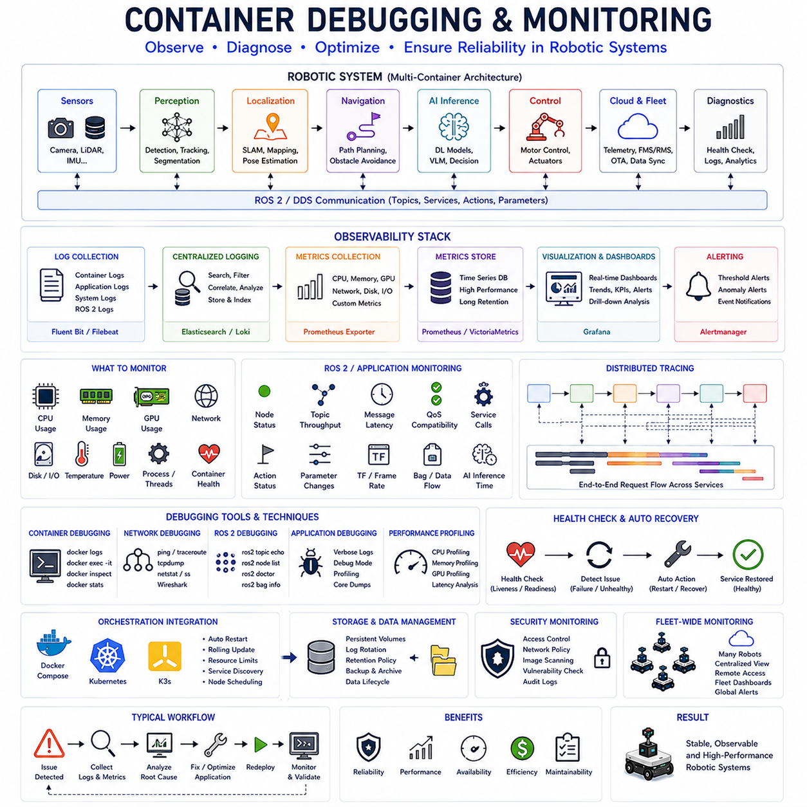
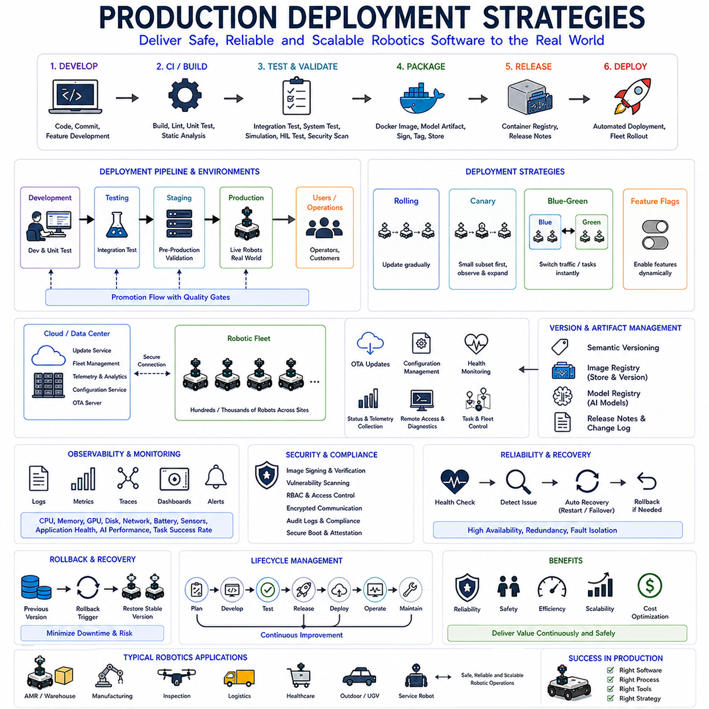

**Volume 07. AMR Software Architecture and Development**

# Chapter 12. Docker and Containerization

## 12.1 Containerization Basics

{width="7.268055555555556in" height="7.268055555555556in"}

Containerization is one of the most important technological foundations in modern software engineering and has become a critical component of contemporary Autonomous Mobile Robot (AMR) development. As AMR systems grow in complexity, they increasingly rely on numerous software modules, including perception pipelines, localization systems, navigation frameworks, artificial intelligence inference engines, fleet management software, cloud connectivity services, diagnostics tools, and real-time control systems. Managing these heterogeneous software components across different hardware platforms, operating systems, development environments, and deployment targets creates significant engineering challenges. Containerization provides a practical and scalable solution to these challenges by encapsulating software applications and their dependencies into portable, reproducible, and isolated execution environments. This topic serves as the foundation for understanding Docker-based robotics development, ROS2 container deployment, cloud-native robotics, edge computing integration, and large-scale AMR software operations.

Before containerization became widely adopted, software deployment was often referred to as the "works on my machine" problem. A robotics application developed on one engineer\'s workstation could fail when executed on another computer because of differences in operating system versions, library dependencies, compiler configurations, GPU drivers, environment variables, middleware versions, or hardware-specific settings. In robotics systems, where multiple computers may exist within a single robot and additional servers may exist in edge or cloud environments, these deployment inconsistencies become even more problematic. A localization module might work correctly on a development workstation but fail on a Jetson Orin platform due to incompatible libraries. Similarly, an AI perception model trained on a workstation equipped with multiple GPUs might experience deployment failures on an industrial edge computer. Containerization addresses these issues by packaging applications together with all required dependencies, ensuring that software behaves consistently across different environments.

A container can be understood as a lightweight, isolated execution environment that includes an application and all software components required for its operation. These components typically include runtime libraries, frameworks, middleware, system tools, environment configurations, and application code. Unlike traditional software installations that depend heavily on the host operating system, containers package most dependencies internally. As a result, the same container can run consistently on a developer laptop, an industrial edge computer, a cloud server, or an embedded robotic platform. This portability significantly simplifies software distribution and maintenance in robotics projects.

To understand containerization, it is useful to compare containers with virtual machines. Both technologies provide isolation between applications, but they achieve this goal using fundamentally different architectures. Virtual machines emulate complete operating systems, including separate kernels, device drivers, and system services. Each virtual machine runs on top of a hypervisor and consumes substantial computational resources. Containers, on the other hand, share the host operating system kernel while maintaining isolated user-space environments. Because containers do not require full guest operating systems, they are significantly smaller, faster to start, and more resource efficient. This efficiency is particularly important in robotics, where computational resources may be limited and real-time performance requirements are strict.

The core architectural principle behind containerization is operating system level virtualization. Modern Linux kernels provide features such as namespaces and control groups, commonly known as cgroups. Namespaces isolate processes, networking, file systems, users, and system resources so that applications running inside containers perceive themselves as operating in independent environments. Control groups regulate resource allocation, allowing administrators to limit CPU usage, memory consumption, storage access, and network bandwidth. Together, these mechanisms provide isolation while maintaining the performance advantages of direct kernel sharing.

Container images are another fundamental concept. A container image is an immutable software package containing all components necessary to create a running container. Images are constructed using layered file systems, where each layer represents a specific modification to the filesystem. For example, a base Ubuntu image may form the first layer. Additional layers may install ROS2, perception libraries, TensorRT, CUDA runtimes, and application-specific software. Because layers are reusable and shared among images, storage efficiency is improved and software updates become more manageable. Layered architecture also accelerates build processes because unchanged layers can be reused without reconstruction.

The distinction between images and containers is essential. An image represents a static blueprint, while a container represents a running instance of that blueprint. Multiple containers can be launched from the same image simultaneously. For example, a robotics development team may deploy identical perception containers on multiple robots within a fleet. Each container operates independently while sharing the same underlying software definition. This model supports scalable deployment and fleet-wide software consistency.

Containerization provides substantial benefits for robotics software development workflows. Modern AMR systems often include diverse software stacks developed by different engineering teams. Perception engineers may require Python, CUDA, TensorRT, OpenCV, and deep learning frameworks. Localization engineers may depend on specific SLAM libraries and optimization toolkits. Navigation developers may utilize ROS2 Navigation2 packages, behavior trees, and motion planning frameworks. System integration engineers may work with networking services, fleet management software, and cloud interfaces. Without containerization, managing these dependencies can become extremely difficult. Containers enable each subsystem to maintain its own isolated software environment while coexisting within the same robotic platform.

The adoption of containerization has transformed Continuous Integration and Continuous Deployment practices within robotics organizations. Software can be built once inside a controlled container environment and deployed consistently across testing systems, simulation environments, field robots, and production fleets. This approach minimizes discrepancies between development and deployment environments. Automated CI/CD pipelines frequently build container images, execute tests within containers, validate software functionality, and distribute approved images to deployment registries. The result is improved software reliability and faster release cycles.

Another major advantage is reproducibility. Robotics research and development often involve long project timelines. Reproducing software environments months or years after initial development can be challenging when external libraries evolve or become deprecated. Containers preserve complete software environments, enabling developers to recreate historical configurations accurately. This capability is valuable for debugging, certification processes, regression testing, academic research, and long-term industrial maintenance.

In modern AMR architectures, containers frequently serve as deployment units for individual functional modules. A perception container may process camera and LiDAR data. A localization container may execute SLAM algorithms. A navigation container may generate motion plans. An AI inference container may run neural networks using GPU acceleration. A fleet communication container may handle cloud synchronization. By separating these functions into independent containers, system modularity is improved. Individual modules can be upgraded, restarted, monitored, or replaced without affecting unrelated subsystems.

Containerization also improves fault isolation. In monolithic robotics software architectures, a failure within one subsystem can potentially destabilize the entire application. Containerized systems reduce this risk because failures remain confined within container boundaries. If an AI perception process crashes, other components such as navigation, localization, or safety monitoring can continue operating. Recovery procedures become simpler because failed containers can be restarted automatically without rebooting the entire robot.

Security is another important benefit. Containers provide a degree of isolation between applications and the host system. Security policies can restrict filesystem access, network connectivity, process privileges, and resource consumption. In industrial robotics deployments, where robots may operate in hospitals, factories, warehouses, or public environments, security considerations are increasingly important. Containerization supports secure software deployment practices and simplifies vulnerability management through image-based updates.

Resource management capabilities are particularly relevant in robotics platforms. An industrial AMR may contain multiple computational workloads competing for limited hardware resources. Through container resource controls, administrators can allocate CPU cores, memory limits, GPU access, and network priorities to individual applications. Critical real-time processes can receive guaranteed resources while less important analytics workloads operate under constrained limits. This resource governance improves overall system stability.

The rise of edge AI has further accelerated container adoption. Modern robots frequently deploy deep learning models for perception, semantic understanding, object detection, tracking, and decision-making. These models often depend on complex software ecosystems involving CUDA, cuDNN, TensorRT, PyTorch, TensorFlow, and vendor-specific libraries. Containerization simplifies deployment of these AI workloads by encapsulating all dependencies within portable execution environments. GPU-enabled containers ensure that AI applications can operate consistently across diverse hardware platforms.

Container registries play a crucial role within the container ecosystem. Registries function as centralized repositories where container images are stored, versioned, and distributed. Development teams can publish validated software images, allowing robots to retrieve approved versions during deployment or update processes. Version control of container images enables traceability, rollback capabilities, and controlled release management. In fleet-scale robotics operations involving hundreds or thousands of robots, registries become essential infrastructure components.

Networking within containerized environments introduces additional architectural considerations. Containers may communicate using virtual networks, service discovery mechanisms, message brokers, or middleware frameworks such as DDS. In ROS2-based robotics systems, container networking must be carefully configured to support real-time communication among distributed nodes. Proper network design ensures reliable message exchange while preserving isolation and security.

Persistent storage management represents another important aspect of containerized systems. Containers themselves are designed to be ephemeral, meaning they can be created and destroyed without preserving internal state. However, robotics applications often require persistent storage for logs, maps, machine learning models, configuration files, recorded sensor data, and operational databases. Storage volumes provide mechanisms for retaining critical information independently of container lifecycles. This separation supports robust deployment and recovery strategies.

Despite their advantages, containers are not a complete replacement for traditional software engineering practices. Containerization introduces additional complexity in areas such as orchestration, networking, monitoring, storage management, and security hardening. Engineers must understand image construction, dependency management, runtime configuration, resource allocation, and operational monitoring. Poorly designed container systems can create maintenance challenges and performance bottlenecks. Therefore, successful adoption requires careful architectural planning and operational discipline.

In robotics specifically, real-time constraints require additional consideration. Although containers generally introduce minimal overhead, developers must evaluate latency-sensitive control loops, hardware access requirements, and deterministic execution behavior. Some low-level motor control functions may continue operating directly on host systems or within specialized real-time environments. Higher-level functions such as perception, planning, AI inference, logging, and fleet communication are typically well suited for containerized deployment.

As robotics platforms continue evolving toward cloud-connected, AI-driven, and fleet-scale architectures, containerization is becoming a foundational technology rather than an optional deployment mechanism. Modern AMR software stacks increasingly rely on container-based workflows from initial development through testing, simulation, deployment, monitoring, and maintenance. Containerization enables scalable engineering practices, simplifies software distribution, improves reproducibility, enhances reliability, and supports cloud-native robotics architectures. It serves as the technological bridge connecting embedded robotic systems, edge computing infrastructure, data centers, cloud services, and large-scale autonomous robot fleets.

For AMR developers, understanding containerization fundamentals is no longer merely a software engineering skill but a core competency required for building modern robotic systems. Whether deploying ROS2 applications on Jetson platforms, managing GPU-accelerated AI workloads on industrial edge computers, orchestrating multi-container robot architectures, or operating large fleets of autonomous robots, containerization provides the foundation upon which reliable, scalable, and maintainable robotic software ecosystems are built. This makes containerization one of the most influential technologies in the future of robotics software engineering and a critical pillar of next-generation autonomous mobile robot development.

## 12.2 Docker for Robotics

{width="7.268055555555556in" height="7.268055555555556in"}

Docker has become one of the most influential technologies in modern robotics software development. As Autonomous Mobile Robots (AMRs), industrial robots, service robots, and autonomous systems become increasingly sophisticated, the software stacks running on these platforms continue to grow in complexity. A modern robot may simultaneously execute perception algorithms, SLAM systems, navigation frameworks, AI inference engines, fleet management clients, cloud communication services, safety monitoring applications, and diagnostics software. Each subsystem may depend on different libraries, frameworks, operating system packages, and hardware drivers. Managing these dependencies across development workstations, simulation servers, edge computers, embedded processors, and production robots presents significant engineering challenges. Docker provides a practical solution by enabling robotics software to be packaged, deployed, and maintained within standardized containerized environments.

In robotics, software reproducibility is critical. Unlike traditional enterprise applications, robots interact directly with the physical world. Small software inconsistencies can lead to navigation failures, localization errors, perception degradation, or unsafe behavior. Development teams often encounter situations where software operates correctly on a workstation but fails when deployed to a robot. Differences in Ubuntu versions, ROS2 distributions, CUDA libraries, TensorRT versions, Python dependencies, or middleware configurations frequently cause unexpected deployment issues. Docker addresses these problems by encapsulating the entire software environment into portable container images that can run consistently across multiple platforms.

Docker is fundamentally a container platform built on Linux containerization technologies. It provides tools for creating, distributing, and running software containers. A Docker container includes the application itself together with all required runtime dependencies. As a result, the application behaves identically regardless of where it is executed. For robotics developers, this capability dramatically reduces deployment complexity and improves reliability across the entire software lifecycle.

One of the primary reasons Docker is particularly valuable in robotics is the diversity of hardware environments. Development may occur on high-performance workstations equipped with multiple GPUs, while deployment may target Jetson Orin devices, industrial x86 edge computers, ARM-based embedded systems, cloud servers, or simulation clusters. Traditionally, engineers would spend considerable effort configuring software separately for each platform. Docker introduces a unified deployment model in which the same application image can be deployed across different systems with minimal modification.

Modern robotics development increasingly follows a modular architecture. Instead of building a monolithic software application, developers separate functionality into independent subsystems. Perception, localization, navigation, AI inference, control, fleet communication, logging, and monitoring are often developed as separate services. Docker aligns naturally with this architecture because each subsystem can be packaged into its own container. Individual containers can be independently developed, tested, deployed, monitored, and updated. This separation improves maintainability and supports scalable engineering practices.

ROS2 has become the dominant middleware framework for modern AMR systems, and Docker integrates exceptionally well with ROS2-based development. ROS2 applications often require complex dependencies including DDS implementations, robotics libraries, perception frameworks, simulation tools, and hardware drivers. Docker images can be created with preconfigured ROS2 environments, ensuring that every developer and every robot operates using identical software configurations. This eliminates many integration problems associated with dependency mismatches.

A typical robotics Docker image may begin with a base Ubuntu image, followed by installation of ROS2, development tools, perception libraries, machine learning frameworks, hardware drivers, and application-specific packages. Each stage forms a layer within the Docker image. Layered architecture improves efficiency because common layers can be shared across multiple images. For example, multiple robotics applications may share the same ROS2 base layer while differing only in their application-specific software. This approach reduces storage requirements and accelerates build times.

The Dockerfile serves as the blueprint for constructing Docker images. It defines every step required to create a software environment, including operating system selection, package installation, environment configuration, and application deployment. In robotics projects, Dockerfiles effectively become infrastructure documentation. Rather than relying on manual setup instructions, the entire environment is defined programmatically. This improves reproducibility and enables automated software deployment.

Simulation environments represent another area where Docker provides substantial benefits. Robotics simulation platforms such as Gazebo, Ignition, Isaac Sim, Webots, and custom digital twin environments often require extensive software dependencies. Docker enables simulation environments to be packaged consistently and deployed across development teams, CI/CD pipelines, cloud infrastructure, and testing systems. Engineers can reproduce simulation results more reliably because every participant operates within identical software environments.

Artificial Intelligence has become a major component of modern robotics systems. Perception models, object detection networks, semantic segmentation systems, visual-language models, and reinforcement learning agents all require sophisticated software ecosystems. These environments frequently depend on CUDA, cuDNN, TensorRT, PyTorch, TensorFlow, ONNX Runtime, and vendor-specific optimization libraries. Managing these dependencies manually can be difficult and error-prone. Docker simplifies AI deployment by packaging complete AI environments into reusable containers.

GPU acceleration is particularly important in robotics applications. Real-time perception pipelines often require substantial computational resources to process camera streams, LiDAR point clouds, radar data, and neural network inference workloads. NVIDIA provides specialized Docker support through NVIDIA Container Toolkit, allowing containers to access GPU hardware directly. This capability enables robotics developers to deploy GPU-accelerated applications while maintaining the isolation and portability benefits of containerization.

Industrial robotics deployments frequently involve multiple computing nodes operating within a single robot. A high-end autonomous platform may include a primary edge computer, dedicated AI accelerators, microcontrollers, safety controllers, and communication processors. Docker facilitates distributed software deployment across these heterogeneous systems. Containers can be deployed independently to different computational nodes while maintaining consistent software management practices.

One of Docker\'s most important contributions to robotics engineering is its support for Continuous Integration and Continuous Deployment. Modern robotics organizations increasingly adopt software engineering practices traditionally associated with cloud-native development. Automated pipelines can build Docker images, execute tests, validate performance, run simulation scenarios, and deploy approved software versions to robot fleets. Because every stage uses the same containerized environment, discrepancies between development, testing, and production are minimized.

Docker also enhances fault isolation within robotic systems. In traditional software architectures, multiple subsystems often share the same runtime environment. A failure within one component may impact unrelated applications. Containerization limits this risk by isolating software processes within separate containers. If an AI perception service crashes, localization, navigation, safety monitoring, and communication services may continue operating normally. This isolation improves overall system robustness.

Resource management is another critical consideration for robotics platforms. Embedded systems often operate under strict CPU, memory, storage, and power constraints. Docker allows administrators to allocate resources to individual containers, ensuring that critical processes receive appropriate computational capacity. Safety monitoring systems, localization pipelines, and navigation services can be prioritized while less critical analytics workloads operate within restricted resource budgets.

Networking plays a central role in containerized robotics architectures. Containers must communicate efficiently with each other and with external systems. ROS2 communication relies on DDS middleware, which requires careful network configuration when operating inside containers. Docker provides multiple networking modes, including bridge networking, host networking, overlay networking, and custom virtual networks. Selecting the appropriate networking strategy is essential for achieving reliable robot communication and maintaining low latency.

Data persistence introduces additional architectural considerations. Containers themselves are designed to be temporary and replaceable. However, robots generate valuable data including maps, logs, configuration files, machine learning models, telemetry records, and operational databases. Docker volumes enable this data to persist independently of container lifecycles. This separation ensures that critical operational information remains available even when containers are updated or replaced.

Security has become increasingly important as robots become connected to enterprise networks and cloud infrastructure. Docker contributes to security by isolating applications, limiting privileges, and supporting controlled software distribution. Container images can be scanned for vulnerabilities, digitally signed, version controlled, and distributed through secure registries. These capabilities support cybersecurity requirements in industrial, healthcare, logistics, and public-sector robotics deployments.

Fleet management systems benefit significantly from Docker-based deployment strategies. Large AMR deployments may involve hundreds or thousands of robots operating across multiple facilities. Maintaining software consistency across such fleets can be challenging. Docker images provide standardized deployment artifacts that simplify version management. Fleet operators can deploy validated software updates across entire robot populations while maintaining rollback capabilities in case of unexpected issues.

Cloud robotics architectures further expand the value of Docker. Modern robots increasingly interact with cloud services for data analytics, fleet coordination, AI training, remote monitoring, OTA updates, and operational intelligence. Because Docker is widely used throughout cloud computing ecosystems, it creates a natural bridge between robot-side software and cloud infrastructure. The same container technologies can be used across edge devices, cloud servers, and development environments.

Despite its many advantages, Docker is not without limitations. Containerization introduces additional operational complexity related to image management, networking, orchestration, monitoring, and storage administration. Engineers must understand container lifecycles, image optimization, dependency management, and runtime configuration. Poorly designed container architectures can lead to excessive image sizes, increased startup times, resource contention, and maintenance challenges.

Real-time robotics systems also require special consideration. While Docker introduces relatively low overhead, deterministic control loops and safety-critical functions must be carefully evaluated. Low-level motor controllers and hard real-time subsystems may continue operating outside containers or within specialized real-time environments. Higher-level robotics applications such as perception, localization, navigation, AI inference, fleet management, and cloud communication are generally well suited for containerization.

As robotics systems continue evolving toward AI-native, cloud-connected, and fleet-scale architectures, Docker is becoming a foundational technology throughout the industry. It enables reproducible development environments, portable software deployment, scalable system architectures, efficient resource utilization, robust fault isolation, and streamlined operational workflows. Modern AMR platforms increasingly rely on Docker not merely as a deployment tool but as a core architectural component that shapes how robotics software is developed, tested, distributed, and maintained.

For robotics engineers, understanding Docker is now as important as understanding ROS2, Linux, networking, or software architecture. Whether developing autonomous navigation systems, deploying GPU-accelerated perception pipelines, managing cloud-connected robot fleets, operating industrial inspection robots, or building next-generation AI-powered autonomous platforms, Docker provides the infrastructure foundation that enables reliable and scalable robotics software deployment. As the robotics industry advances toward increasingly autonomous and intelligent systems, Docker will remain one of the key enabling technologies supporting the future of robotic software engineering.

## 12.3 ROS2 Container Architecture

{width="7.268055555555556in" height="7.268055555555556in"}

ROS2 Container Architecture is the systematic design approach used to deploy, manage, scale, and operate ROS2-based robotic software inside containerized environments. As modern Autonomous Mobile Robots (AMRs), industrial robots, service robots, inspection robots, and cloud-connected robotic systems continue to increase in complexity, traditional deployment methods are becoming insufficient for maintaining software consistency, scalability, portability, and reliability. Container technologies such as Docker have emerged as a fundamental infrastructure layer for robotics software deployment, while ROS2 has become the de facto middleware standard for modern robotic systems. The combination of ROS2 and containerization creates a powerful architecture that enables modular development, reproducible deployment, distributed computing, cloud integration, and fleet-scale robot management. ROS2 Container Architecture therefore represents one of the most important foundations of modern robot software engineering.

At its core, ROS2 Container Architecture seeks to solve a fundamental challenge in robotics software development. Modern robots consist of numerous interconnected software components including sensor drivers, perception systems, localization algorithms, mapping frameworks, navigation stacks, AI inference engines, robot control modules, cloud communication services, logging systems, and fleet management clients. Each component may depend on different software libraries, middleware versions, operating system packages, and hardware-specific drivers. Without a structured deployment architecture, maintaining compatibility among these components becomes increasingly difficult as projects grow in scale.

Traditional ROS2 deployments often involve installing all software packages directly onto the host operating system. While this approach may work for small development environments, it becomes difficult to maintain in large industrial deployments. Dependency conflicts frequently arise when different packages require incompatible library versions. Software updates can unintentionally affect unrelated components. Reproducing environments across multiple robots becomes time-consuming and error-prone. Containerization addresses these issues by packaging ROS2 applications together with their dependencies into isolated execution environments.

A ROS2 container can be viewed as a self-contained software unit that includes the ROS2 runtime, application packages, required libraries, configuration files, and supporting tools. Each container operates independently while sharing the host operating system kernel. This architecture ensures that ROS2 applications behave consistently regardless of whether they are executed on a developer workstation, simulation server, Jetson Orin device, industrial edge computer, or cloud platform.

One of the most important architectural principles in ROS2 Container Architecture is modularity. Rather than placing the entire robotics software stack into a single container, modern systems typically divide functionality into multiple specialized containers. A perception container may process camera and LiDAR data. A localization container may execute SLAM algorithms. A navigation container may run Navigation2 and behavior tree logic. An AI container may execute deep learning inference pipelines. A fleet communication container may manage cloud connectivity. A monitoring container may collect diagnostics and operational metrics. This separation allows each subsystem to evolve independently while reducing coupling between software components.

Container modularity also improves maintainability. Individual containers can be updated, tested, restarted, or replaced without affecting the rest of the system. For example, an object detection model can be upgraded by deploying a new perception container without modifying localization or navigation software. This approach reduces operational risk and simplifies software lifecycle management.

The ROS2 communication model plays a central role in container architecture design. ROS2 relies on DDS (Data Distribution Service) middleware for distributed communication between nodes. Topics, services, actions, and parameter services form the communication backbone of ROS2 systems. When ROS2 nodes are deployed across multiple containers, DDS communication must function seamlessly across container boundaries. Therefore, networking becomes one of the most important architectural considerations.

Host networking is frequently used in robotics deployments because it allows containers to share the host machine\'s network stack. This approach simplifies DDS discovery and reduces networking complexity. ROS2 nodes running in separate containers can communicate as if they were running directly on the host system. Host networking also minimizes latency, which is particularly important for real-time robotics applications.

Alternative networking approaches include bridge networks, custom virtual networks, and overlay networks. These configurations provide additional isolation and security but may require extra DDS configuration. In large distributed systems involving multiple robots, edge servers, and cloud infrastructure, custom network architectures are often necessary to support scalable communication patterns.

The ROS2 workspace architecture must also be adapted for containerized environments. A typical ROS2 container includes a pre-built workspace containing application packages and dependencies. During image construction, source code is copied into the container and compiled using colcon. The resulting container image contains a complete ROS2 environment that can be executed immediately after deployment. This approach improves reproducibility because every deployment uses identical software artifacts.

Multi-stage builds are commonly employed in ROS2 container development. During the first stage, source code is compiled inside a development environment containing compilers, build tools, and debugging utilities. During the second stage, only the compiled application and runtime dependencies are transferred into a lightweight runtime image. This technique reduces image size, improves security, and accelerates deployment.

Hardware integration represents a critical aspect of ROS2 Container Architecture. Robots interact with physical sensors and actuators including cameras, LiDAR systems, IMUs, GNSS receivers, radar systems, motor controllers, EtherCAT devices, CAN bus interfaces, and GPIO peripherals. Containers must therefore access hardware resources while maintaining isolation. Device mapping mechanisms allow containers to communicate directly with required hardware interfaces. Careful architectural design is required to balance hardware accessibility with system security and maintainability.

GPU acceleration is increasingly important in modern robotic systems. AI perception pipelines, object detection models, semantic segmentation networks, visual-language models, and sensor fusion algorithms often require substantial computational resources. ROS2 containers frequently utilize NVIDIA Container Toolkit to access GPUs from within containers. This enables GPU-accelerated inference while preserving the benefits of containerization. High-performance AMR platforms commonly deploy separate GPU-enabled containers for perception and AI workloads.

A typical industrial AMR may contain multiple ROS2 containers operating simultaneously. A camera driver container acquires image streams. A LiDAR driver container publishes point cloud data. A perception container processes sensor inputs and generates object detections. A localization container estimates robot position. A navigation container computes motion plans. A control container interfaces with motor drivers. A cloud communication container synchronizes operational data with remote infrastructure. Although each component operates independently, ROS2 middleware enables them to function as an integrated robotic system.

Resource allocation becomes increasingly important as container counts grow. Embedded robotics platforms often operate under strict computational constraints. ROS2 Container Architecture typically incorporates CPU affinity, memory limits, GPU allocation policies, and process prioritization mechanisms. Safety-critical functions may receive dedicated computational resources while less critical workloads operate under constrained limits. Proper resource management improves system stability and prevents performance degradation.

Fault isolation is another major advantage of containerized ROS2 architectures. In traditional monolithic systems, software failures can propagate throughout the entire application stack. Containerization limits fault propagation by isolating software processes. If a perception container crashes due to a neural network failure, navigation and safety systems can continue operating. Automatic restart mechanisms can restore failed services without rebooting the entire robot. This improves system resilience and operational availability.

Logging and observability are fundamental requirements in industrial robotics systems. Containerized ROS2 architectures often include centralized logging containers that aggregate diagnostic information from multiple subsystems. ROS2 logs, DDS statistics, CPU metrics, GPU utilization, memory consumption, network traffic, and application health indicators can be collected and analyzed in real time. These capabilities simplify debugging, performance optimization, and field maintenance.

Simulation environments also benefit significantly from ROS2 Container Architecture. Robotics simulation platforms such as Gazebo, Ignition, Isaac Sim, and digital twin environments can be containerized alongside production software. This allows development teams to execute identical software stacks in simulation and real-world deployments. Consistency between simulation and deployment environments improves validation quality and reduces integration risks.

Continuous Integration and Continuous Deployment pipelines increasingly rely on ROS2 containers. Automated build systems compile ROS2 workspaces, execute unit tests, run simulation scenarios, validate integration requirements, and produce deployable container images. Because all operations occur within standardized environments, software quality becomes more predictable and reproducible. Container-based CI/CD workflows have become standard practice in large-scale robotics organizations.

Fleet-scale robotics operations introduce additional architectural requirements. Hundreds or thousands of robots may operate simultaneously across multiple facilities. ROS2 Container Architecture enables standardized software deployment across entire fleets. New software releases can be packaged as container images and distributed through centralized registries. Robots can download validated updates, deploy new containers, and roll back to previous versions if necessary. This capability significantly simplifies fleet management.

Cloud robotics further expands the scope of ROS2 Container Architecture. Many modern robots integrate with cloud services for monitoring, analytics, AI training, remote diagnostics, OTA updates, and fleet coordination. ROS2 containers running on robots can communicate with cloud-native containerized services using APIs, message brokers, and distributed data pipelines. Because containers are widely adopted throughout cloud computing ecosystems, they provide a natural bridge between robotic platforms and cloud infrastructure.

Security considerations play an increasingly important role in robotics deployment. Containerized ROS2 systems can implement privilege separation, access control, network isolation, image signing, vulnerability scanning, and secure update mechanisms. These capabilities help protect robots against cybersecurity threats while supporting regulatory compliance requirements in industrial, healthcare, logistics, and public infrastructure applications.

Despite its advantages, ROS2 Container Architecture introduces new challenges. Engineers must understand container networking, DDS configuration, image optimization, storage management, hardware access policies, orchestration systems, and runtime monitoring. Poor architectural decisions can result in excessive image sizes, communication bottlenecks, increased latency, or operational complexity. Therefore, successful implementation requires careful system-level design.

Real-time performance remains an important consideration. Although containers introduce minimal overhead, latency-sensitive control loops must be carefully evaluated. Low-level motor control functions may continue operating on dedicated real-time subsystems, while higher-level perception, localization, planning, AI inference, and fleet management services operate within containers. This hybrid architecture combines deterministic control with the flexibility of containerized software deployment.

The future of robotics software is increasingly aligned with cloud-native principles, distributed computing, AI-driven autonomy, and fleet-scale deployment. ROS2 Container Architecture provides the foundational framework that enables these capabilities. It supports modular software design, reproducible development environments, scalable deployment strategies, resilient system operation, and seamless integration across robots, edge devices, and cloud platforms.

For modern AMR developers, ROS2 Container Architecture is no longer an optional deployment strategy but a fundamental engineering discipline. Whether building warehouse robots, hospital logistics systems, industrial inspection platforms, autonomous outdoor vehicles, collaborative robots, or next-generation AI-driven autonomous systems, ROS2 containerization provides the architectural foundation required for reliable, scalable, maintainable, and future-ready robotic software ecosystems. As robotics systems continue to increase in complexity and intelligence, ROS2 Container Architecture will remain one of the key enabling technologies supporting the next generation of autonomous robotic platforms.

## 12.4 GPU Container Deployment

{width="7.268055555555556in" height="7.268055555555556in"}

GPU Container Deployment refers to the architecture, technologies, methodologies, and operational practices used to deploy GPU-accelerated applications inside containerized environments. In modern robotics, artificial intelligence, autonomous vehicles, industrial automation, computer vision systems, and cloud-edge computing infrastructures, GPU computing has become a foundational requirement rather than an optional enhancement. Autonomous Mobile Robots (AMRs), humanoid robots, industrial inspection systems, logistics robots, service robots, and outdoor autonomous platforms increasingly rely on deep neural networks, sensor fusion algorithms, large-scale perception pipelines, simultaneous localization and mapping (SLAM), visual-language models, and real-time decision-making systems that require substantial computational resources. GPU Container Deployment enables these workloads to be packaged, distributed, deployed, and managed consistently across development workstations, simulation clusters, edge computing devices, industrial servers, and cloud infrastructure.

Historically, deploying GPU-enabled software was significantly more complex than deploying traditional CPU-based applications. Engineers were required to manually install GPU drivers, CUDA libraries, cuDNN runtimes, TensorRT optimizations, machine learning frameworks, operating system dependencies, and application-specific libraries. Differences between development and deployment environments frequently caused compatibility issues. An AI model that worked correctly on a workstation equipped with multiple NVIDIA GPUs might fail when deployed to an edge device because of CUDA version mismatches, missing runtime dependencies, incompatible TensorRT versions, or driver inconsistencies. GPU containerization emerged as a solution to these challenges by encapsulating applications together with their software environments while enabling controlled access to physical GPU hardware.

At its most fundamental level, GPU Container Deployment combines two major technologies. The first is containerization, which provides isolated and reproducible execution environments. The second is GPU virtualization and resource sharing, which allows containers to access GPU hardware while maintaining isolation from the host system and from other containers. Together, these technologies create a standardized platform for deploying AI and robotics workloads across diverse computational environments.

Modern robotics systems generate enormous volumes of sensor data. High-resolution cameras, LiDAR sensors, radar systems, depth cameras, thermal cameras, ultrasonic sensors, GNSS receivers, and inertial measurement units continuously produce data streams that must be processed in real time. Traditional CPU architectures often struggle to handle these workloads efficiently. GPUs excel because they provide massively parallel computing capabilities capable of executing thousands of operations simultaneously. This parallelism makes GPUs particularly effective for deep learning inference, computer vision, point cloud processing, image segmentation, object detection, sensor fusion, and reinforcement learning applications.

Containerized GPU deployment has become especially important in robotics because robotic platforms are increasingly distributed across heterogeneous hardware environments. A development team may train AI models on a cloud cluster equipped with NVIDIA H100 GPUs, validate algorithms on RTX 6000 Ada workstations, perform simulation testing on server-class hardware, and deploy final applications to Jetson Orin edge devices. Maintaining software consistency across these environments can be extremely challenging without containerization. GPU containers provide a common deployment artifact that behaves consistently regardless of underlying hardware differences.

The NVIDIA Container Toolkit serves as the foundation for most GPU container deployments. This technology enables Docker containers to access GPU hardware without bundling GPU drivers directly inside container images. Instead, containers dynamically interface with drivers installed on the host operating system. This architecture significantly improves portability because container images remain independent of specific driver versions while maintaining access to GPU acceleration capabilities.

CUDA forms the computational foundation of many GPU container environments. CUDA provides programming interfaces and runtime libraries that enable applications to execute workloads on NVIDIA GPUs. AI frameworks such as PyTorch, TensorFlow, ONNX Runtime, TensorRT, RAPIDS, and numerous robotics libraries depend on CUDA for acceleration. GPU containers frequently include CUDA runtimes to ensure application compatibility while relying on host-installed drivers for hardware access.

TensorRT plays a particularly important role in robotics deployments. Autonomous systems often require real-time AI inference with minimal latency. TensorRT optimizes trained neural networks by performing layer fusion, kernel optimization, precision reduction, memory optimization, and hardware-specific acceleration. GPU containers commonly package TensorRT alongside perception models to maximize inference performance on deployment hardware.

A typical GPU container architecture includes several layers. The foundation often begins with a Linux operating system image such as Ubuntu. CUDA runtime libraries are then installed, followed by deep learning frameworks, robotics middleware, optimization libraries, and application software. The resulting container image becomes a portable deployment unit capable of executing GPU-accelerated workloads consistently across multiple environments.

Modern Autonomous Mobile Robots frequently deploy multiple GPU-enabled containers simultaneously. One container may execute object detection networks processing camera data. Another container may perform semantic segmentation. A third container may handle LiDAR perception and point cloud analysis. Additional containers may execute visual-language models, multimodal reasoning systems, localization algorithms, or AI-based planning frameworks. Containerization enables these workloads to coexist while maintaining software isolation and independent lifecycle management.

Resource management is one of the most important aspects of GPU Container Deployment. GPUs are valuable and often limited resources. Industrial robotics systems may operate multiple AI applications that compete for computational capacity. Container orchestration frameworks allow administrators to control GPU allocation, memory utilization, compute quotas, and workload prioritization. This capability ensures that mission-critical applications receive appropriate computational resources while preventing resource contention.

Jetson-based robotics platforms represent a particularly important deployment target. Devices such as Jetson Orin Nano, Orin NX, AGX Orin, and future Jetson Thor systems integrate CPU and GPU resources into compact edge computing platforms. These devices enable AI inference directly on robots without relying on cloud connectivity. GPU containers simplify deployment on Jetson platforms by providing reproducible environments for AI models, ROS2 applications, perception pipelines, and robotics middleware.

In robotics, latency is often a critical design constraint. Industrial inspection robots, autonomous vehicles, warehouse AMRs, and collaborative robots frequently require decisions within milliseconds. GPU containers support low-latency AI deployment by colocating inference workloads directly on edge hardware. Rather than transmitting sensor data to cloud servers for processing, robots can execute neural networks locally using GPU-accelerated containers. This architecture reduces communication delays, improves reliability, and supports operation in disconnected environments.

ROS2-based robotic systems increasingly incorporate GPU container deployment as a core architectural element. Perception nodes processing camera streams often rely on CUDA acceleration. SLAM systems may utilize GPU-based feature extraction and optimization algorithms. Sensor fusion frameworks may perform parallel computation on multiple sensor streams. AI reasoning modules frequently depend on large-scale neural networks. Packaging these capabilities within GPU containers simplifies deployment while preserving compatibility across development and production environments.

Cloud robotics introduces additional opportunities for GPU container deployment. Large-scale AI training typically occurs in cloud data centers equipped with high-performance GPUs. Once trained, models can be packaged into containers and distributed to edge devices. This workflow establishes a consistent software pipeline from model development through deployment. Container registries facilitate image distribution, version management, rollback capabilities, and fleet-wide software updates.

Simulation environments also benefit significantly from GPU containerization. Robotics simulators such as Isaac Sim, Gazebo, Omniverse, and digital twin platforms often require substantial GPU resources for physics simulation, sensor emulation, rendering, and AI training. GPU containers provide standardized simulation environments that can be reproduced across development teams and infrastructure providers. This consistency improves testing reliability and reduces integration challenges.

Security considerations become increasingly important as GPU-accelerated robotics systems are deployed in industrial environments. Containers provide isolation mechanisms that help protect applications and infrastructure. Access controls can restrict GPU usage, filesystem permissions, network connectivity, and system privileges. Image scanning tools can identify vulnerabilities before deployment. Signed container images improve software integrity and reduce supply-chain risks.

Observability and monitoring are essential components of GPU container operations. Industrial deployments require visibility into GPU utilization, memory consumption, thermal conditions, power usage, inference latency, application health, and system performance. Monitoring frameworks can collect metrics from containers and generate dashboards, alerts, and diagnostic reports. These capabilities support predictive maintenance, performance optimization, and operational reliability.

Multi-GPU deployment strategies are increasingly common in advanced robotics platforms. High-end autonomous systems may incorporate multiple GPUs dedicated to different functions. For example, one GPU may process autonomous navigation workloads while another executes AI perception pipelines. GPU container architectures allow workloads to be assigned explicitly to specific devices, improving performance isolation and simplifying system design.

Container orchestration technologies such as Kubernetes, K3s, Docker Compose, and edge orchestration frameworks further extend GPU deployment capabilities. These systems automate container scheduling, resource allocation, health monitoring, failover management, and software updates. In fleet-scale robotics operations involving hundreds or thousands of robots, orchestration technologies become essential for managing complexity.

Despite its advantages, GPU Container Deployment introduces several engineering challenges. Container images can become extremely large due to CUDA libraries, AI frameworks, and machine learning dependencies. GPU resource sharing may introduce contention if not carefully managed. Hardware compatibility must be validated across multiple deployment targets. Driver version mismatches can still occur if host systems are not properly maintained. Therefore, successful GPU container deployment requires disciplined software engineering practices and robust operational procedures.

Performance optimization remains an important area of focus. Engineers frequently optimize container images by removing unnecessary dependencies, reducing layer counts, utilizing multi-stage builds, compressing artifacts, and minimizing runtime footprints. AI models may be converted to TensorRT engines, quantized to lower precision formats, or optimized for specific hardware platforms. These techniques improve startup times, reduce storage requirements, and maximize inference throughput.

The future of robotics software is increasingly GPU-centric. Foundation models, multimodal reasoning systems, visual-language-action architectures, embodied AI frameworks, digital twins, and autonomous decision-making systems all require substantial computational resources. GPU Container Deployment provides the infrastructure necessary to operationalize these technologies across cloud environments, edge platforms, simulation systems, and physical robots.

For modern robotics engineers, understanding GPU Container Deployment is becoming as important as understanding ROS2, Linux, networking, or AI frameworks. Whether developing warehouse AMRs, industrial inspection robots, outdoor autonomous vehicles, hospital logistics systems, collaborative robots, or future humanoid platforms, GPU containers provide the deployment foundation that enables scalable, reproducible, portable, and high-performance AI systems. As robotic intelligence continues to advance, GPU Container Deployment will remain one of the most critical technologies supporting next-generation autonomous robotic ecosystems.

## 12.5 Multi-Container System Design

{width="7.268055555555556in" height="7.268055555555556in"}

Multi-Container System Design is the architectural methodology used to build, deploy, manage, and scale complex software systems by dividing functionality into multiple independent containers that cooperate to achieve a unified operational objective. In modern robotics, particularly in Autonomous Mobile Robots (AMRs), industrial robots, autonomous vehicles, inspection robots, warehouse automation systems, and cloud-connected robotic platforms, software complexity has increased dramatically. A single robot may simultaneously execute perception algorithms, localization systems, navigation stacks, AI inference engines, fleet communication services, diagnostics applications, safety monitoring frameworks, cloud synchronization modules, and user interface services. Attempting to package all these functions into a single monolithic container often leads to operational inefficiencies, maintenance challenges, deployment risks, and scalability limitations. Multi-Container System Design addresses these challenges by decomposing the robotic software stack into smaller, specialized, independently deployable services.

The concept of multi-container architecture originated from broader software engineering trends such as service-oriented architecture, microservices, cloud-native computing, and distributed systems engineering. These approaches demonstrated that large software systems become easier to manage when individual functions are separated into modular components with clearly defined responsibilities. In robotics, this philosophy aligns naturally with the structure of robot software itself, where perception, planning, control, communication, and monitoring already exist as logically distinct subsystems. Containerization provides the deployment mechanism that enables these subsystems to operate independently while remaining tightly integrated.

At the heart of Multi-Container System Design is the principle of separation of concerns. Each container should perform a specific function and maintain responsibility for a well-defined domain. A perception container may process camera streams and perform object detection. A localization container may execute SLAM algorithms and estimate robot position. A navigation container may generate motion plans and obstacle avoidance strategies. An AI container may run deep neural networks and decision-making models. A cloud communication container may handle telemetry, fleet management interactions, and remote updates. By isolating these responsibilities, the architecture becomes easier to understand, maintain, test, and evolve.

One of the most significant advantages of multi-container systems is modularity. When functionality is separated into independent containers, development teams can work on individual subsystems without affecting unrelated components. Perception engineers can update computer vision algorithms without modifying navigation software. Cloud developers can improve fleet management services without impacting robot control systems. This modularity enables parallel development workflows and improves organizational scalability.

Maintainability improves substantially in multi-container architectures. In monolithic systems, software updates often require rebuilding and redeploying the entire application stack. Even small changes can introduce risk across the entire system. In contrast, multi-container systems allow individual components to be updated independently. A new AI inference engine can be deployed by replacing a single container while leaving the rest of the system unchanged. This approach reduces deployment risk and simplifies software lifecycle management.

Fault isolation is another major benefit. Modern robotic systems operate in dynamic and often unpredictable environments. Software failures are inevitable and must be managed gracefully. In a monolithic application, a crash in one subsystem may cause the entire application to fail. In a multi-container architecture, failures remain isolated within individual containers. If a perception service crashes due to a neural network exception, localization, navigation, safety monitoring, and communication services can continue operating. Recovery procedures become simpler because failed containers can be restarted independently.

Scalability represents one of the defining characteristics of multi-container systems. Different subsystems often have different computational requirements. Perception pipelines processing high-resolution camera streams may require substantial GPU resources, while cloud communication services may consume minimal computational power. Multi-container architectures allow each service to scale according to its needs. Resource-intensive workloads can receive additional CPU cores, memory allocations, or GPU resources without affecting other components.

Resource management becomes significantly more effective in multi-container environments. Modern container platforms allow administrators to specify CPU limits, memory quotas, storage allocations, network bandwidth restrictions, and GPU assignments for individual containers. This fine-grained control ensures predictable performance and prevents resource contention. Safety-critical services can be prioritized while less critical analytics workloads operate under constrained resource budgets.

Communication is a central challenge in Multi-Container System Design. Independent containers must exchange information efficiently and reliably. In robotics systems, communication often occurs through ROS2 middleware, DDS messaging, MQTT brokers, gRPC services, REST APIs, WebSocket connections, shared memory mechanisms, or custom communication frameworks. The choice of communication technology depends on latency requirements, throughput demands, reliability considerations, and system architecture goals.

ROS2-based robotics systems provide an excellent example of multi-container communication. Sensor driver containers publish data streams. Perception containers subscribe to sensor topics and generate object detections. Localization containers consume sensor and perception data to estimate robot pose. Navigation containers use localization outputs to generate trajectories. Control containers execute commands on motor systems. Although these components operate in separate containers, ROS2 middleware allows them to function as an integrated robotic system.

Container networking architecture plays a critical role in enabling communication. Containers may operate using host networking, bridge networks, overlay networks, software-defined networks, or hybrid configurations. Host networking is commonly used in robotics because it simplifies DDS discovery and reduces communication latency. More complex distributed systems may utilize custom networking architectures to support multi-robot coordination, cloud integration, and secure communications.

Data management becomes increasingly important as system complexity grows. Multi-container systems generate large volumes of operational data including sensor recordings, maps, logs, machine learning models, telemetry streams, diagnostic information, and configuration files. Persistent storage mechanisms allow containers to access shared datasets while maintaining independence. Storage architecture must balance performance, reliability, consistency, and scalability requirements.

Configuration management presents another important consideration. Large multi-container deployments may include dozens of services operating across multiple computational nodes. Each service may require environment variables, configuration files, network settings, hardware mappings, and runtime parameters. Centralized configuration management systems simplify deployment and ensure consistency across environments.

Observability is essential for successful operation of multi-container systems. As the number of services increases, understanding system behavior becomes more difficult. Logging, monitoring, tracing, and diagnostics frameworks provide visibility into container health, communication patterns, resource utilization, application performance, and system reliability. Centralized observability platforms allow engineers to identify issues quickly and optimize system performance.

Container orchestration technologies are frequently employed to manage multi-container environments. Docker Compose provides a simple orchestration framework suitable for development and small-scale deployments. Kubernetes and K3s offer advanced orchestration capabilities including service discovery, automated scaling, health monitoring, failover management, rolling updates, and self-healing infrastructure. In large robotics deployments, orchestration platforms simplify operational management and improve system reliability.

Modern robotics platforms often implement layered multi-container architectures. At the lowest layer, hardware interface containers communicate with sensors and actuators. Above them, perception containers process raw sensor data. Localization and mapping containers estimate robot position and maintain environmental representations. Navigation and planning containers generate actions. AI containers perform high-level reasoning. Cloud integration containers manage remote connectivity. Monitoring and diagnostics containers provide operational visibility. This layered architecture improves system organization and supports clear separation of responsibilities.

Edge computing has significantly increased the importance of multi-container system design. Modern robots frequently operate as distributed computing platforms containing multiple processors, GPUs, microcontrollers, and communication modules. Some services execute on onboard edge computers while others operate in local edge servers or cloud infrastructure. Multi-container architectures provide a consistent deployment model across these heterogeneous environments.

Artificial intelligence introduces additional architectural requirements. Deep learning workloads often depend on specialized software stacks including CUDA, TensorRT, PyTorch, TensorFlow, ONNX Runtime, and GPU drivers. AI containers isolate these dependencies from the rest of the system, reducing complexity and simplifying updates. Different AI models can be deployed independently and optimized for specific hardware platforms.

Simulation environments benefit greatly from multi-container design principles. Robotics simulators such as Gazebo, Isaac Sim, and digital twin platforms can execute alongside production software containers. Developers can test interactions between perception, localization, navigation, and cloud services under realistic conditions before deploying changes to physical robots. This approach improves validation quality and reduces deployment risk.

Continuous Integration and Continuous Deployment workflows are naturally aligned with multi-container architectures. Each service can be built, tested, validated, and deployed independently. Automated pipelines can generate container images, execute unit tests, perform integration validation, and distribute approved releases through container registries. Independent deployment pipelines improve development velocity while maintaining software quality.

Security becomes increasingly important as robotic systems expand beyond isolated environments. Multi-container architectures support security through isolation, privilege separation, network segmentation, access control, and secure communication mechanisms. Sensitive services can operate with restricted permissions while maintaining controlled interactions with other components. Container image scanning and signed deployments further strengthen cybersecurity posture.

Fleet-scale robotics operations demonstrate the full value of Multi-Container System Design. Hundreds or thousands of robots may operate simultaneously across factories, hospitals, warehouses, ports, or outdoor environments. Standardized containerized services simplify software deployment, version management, monitoring, and updates across large robot populations. Fleet operators can deploy new capabilities incrementally while minimizing operational disruption.

Despite its advantages, Multi-Container System Design introduces additional complexity. Engineers must manage service dependencies, communication protocols, network configurations, resource allocation policies, observability systems, storage architectures, orchestration frameworks, and deployment pipelines. Poorly designed multi-container systems can suffer from excessive operational complexity, communication bottlenecks, configuration drift, and debugging challenges. Successful implementation therefore requires disciplined architectural planning and strong engineering practices.

Performance optimization remains an ongoing consideration. Container boundaries introduce communication overhead, particularly when large volumes of sensor data must be exchanged between services. Architects must carefully balance modularity against communication efficiency. Shared memory techniques, optimized middleware configurations, hardware acceleration, and efficient serialization strategies can help minimize performance impacts.

The future of robotics software is increasingly oriented toward distributed, cloud-native, AI-driven architectures. Autonomous systems are evolving into complex ecosystems composed of numerous specialized services operating across robots, edge infrastructure, and cloud platforms. Multi-Container System Design provides the structural foundation that enables this evolution. By promoting modularity, scalability, maintainability, resilience, and operational flexibility, it establishes a framework capable of supporting next-generation robotic intelligence.

For robotics engineers, understanding Multi-Container System Design has become a fundamental requirement. Whether developing warehouse AMRs, industrial inspection robots, hospital logistics systems, autonomous outdoor vehicles, humanoid robots, or large-scale fleet management platforms, multi-container architectures provide the deployment model necessary to build reliable, scalable, maintainable, and future-ready robotic systems. As robotics platforms continue to grow in complexity and autonomy, Multi-Container System Design will remain one of the most important architectural principles guiding the development of modern robotic software ecosystems.

## 12.6 Docker Compose and Orchestration

{width="7.268055555555556in" height="7.268055555555556in"}

Docker Compose and Container Orchestration represent the operational foundation for managing modern multi-container robotic systems. As robotics software architectures evolve from single-process applications into distributed collections of interconnected services, the complexity of deployment, configuration, monitoring, scaling, and maintenance increases significantly. Modern Autonomous Mobile Robots (AMRs), industrial inspection robots, warehouse automation systems, outdoor autonomous vehicles, service robots, and cloud-connected robotic platforms often execute dozens of independent software services simultaneously. These services include sensor drivers, perception systems, localization modules, navigation frameworks, artificial intelligence inference engines, fleet communication services, diagnostics systems, user interfaces, cloud connectors, databases, and monitoring tools. Managing such a collection of services manually quickly becomes impractical. Docker Compose and orchestration technologies provide structured mechanisms for deploying, coordinating, monitoring, and maintaining these complex software ecosystems.

The need for orchestration emerged naturally as container adoption expanded. In the early days of containerization, developers often launched individual containers manually using Docker commands. While this approach worked for simple applications, it became increasingly difficult as systems grew in complexity. A modern robot may require ten, twenty, or even fifty containers operating simultaneously. Each container may depend on specific networks, storage volumes, hardware interfaces, environment variables, startup sequences, and resource allocations. Starting and configuring these containers individually would be inefficient, error-prone, and difficult to reproduce. Docker Compose was introduced to solve this problem by providing a declarative mechanism for defining multi-container environments.

Docker Compose enables developers to describe an entire application stack using a single YAML configuration file. Instead of manually launching containers one at a time, engineers define services, networks, storage volumes, dependencies, environment variables, port mappings, resource constraints, and startup parameters within a centralized configuration. The entire system can then be deployed using a single command. This approach dramatically simplifies development workflows and ensures consistent deployment across different environments.

In robotics development, Docker Compose is particularly valuable because robotic software systems are inherently multi-component. A ROS2-based AMR may include separate containers for camera drivers, LiDAR drivers, perception algorithms, localization systems, navigation frameworks, fleet communication services, AI inference engines, diagnostics tools, databases, and monitoring dashboards. Docker Compose allows all of these components to be defined as a single integrated application while preserving their independence and modularity.

One of the most important advantages of Docker Compose is reproducibility. Robotics projects often involve multiple developers, testing environments, simulation platforms, edge devices, and production robots. Without standardized deployment definitions, subtle configuration differences can introduce unexpected behavior. Docker Compose ensures that every environment is deployed using the same configuration specification. This consistency reduces integration issues and improves software reliability throughout the development lifecycle.

Service dependency management represents another significant benefit. Many robotic services depend on other services being available before they can start correctly. A perception system may require sensor drivers to be active. A navigation stack may require localization services to be operational. Cloud synchronization services may depend on databases or message brokers. Docker Compose allows developers to specify startup dependencies and service relationships, simplifying deployment and reducing initialization problems.

Networking is a critical component of multi-container robotics systems. Independent containers must communicate efficiently with one another while maintaining isolation from unrelated services. Docker Compose automatically creates virtual networks that allow containers to discover and communicate with each other using service names rather than static IP addresses. This simplifies system configuration and improves portability across environments.

ROS2-based robotic systems frequently benefit from carefully designed networking configurations. DDS middleware relies on service discovery mechanisms that can be sensitive to network architecture. Docker Compose allows developers to configure host networking, bridge networking, or custom network topologies depending on application requirements. Host networking is commonly used in robotics because it simplifies DDS discovery and minimizes communication latency.

Storage management is another essential capability. Robotic systems generate large volumes of data including maps, sensor recordings, machine learning models, configuration files, logs, telemetry streams, and diagnostic information. Docker Compose allows persistent storage volumes to be defined independently of containers. This ensures that critical data remains available even when containers are upgraded, restarted, or replaced.

Environment management becomes increasingly important as robotics projects scale. Different deployment environments may require different hardware configurations, network settings, cloud endpoints, API credentials, or operational parameters. Docker Compose supports environment variable injection and configuration abstraction, enabling flexible deployment without modifying application code. This capability simplifies migration between development, testing, simulation, and production environments.

Although Docker Compose provides powerful capabilities for local and small-scale deployments, it has limitations when systems become highly distributed. Large robotic fleets may involve hundreds or thousands of robots operating across multiple facilities, warehouses, factories, hospitals, or outdoor environments. Managing such deployments requires more advanced orchestration technologies capable of automated scheduling, scaling, fault recovery, health monitoring, and distributed resource management.

Container orchestration refers to the automated management of containerized applications across distributed infrastructure. Orchestration platforms extend the principles of Docker Compose by providing capabilities for large-scale deployment, service discovery, automatic recovery, load balancing, resource scheduling, rolling updates, security enforcement, and operational monitoring. These technologies are fundamental to cloud-native computing and are increasingly important in robotics.

Kubernetes has emerged as the dominant orchestration platform across the software industry. Originally developed to manage large-scale cloud applications, Kubernetes provides sophisticated mechanisms for deploying and managing distributed containerized systems. In robotics, Kubernetes is increasingly used for cloud robotics infrastructure, fleet management platforms, simulation clusters, AI training environments, and edge computing systems.

Kubernetes introduces several architectural concepts that are highly relevant to robotics. Containers are grouped into pods, which represent the smallest deployable units. Pods can contain one or more tightly coupled containers that share networking and storage resources. Services provide stable communication endpoints that enable applications to locate and interact with each other dynamically. Deployments manage application lifecycles, ensuring that the desired number of application instances remains operational.

One of the most powerful features of Kubernetes is self-healing. If a container crashes, Kubernetes automatically detects the failure and restarts the application. If a node becomes unavailable, workloads can be rescheduled to alternative nodes. This resilience is particularly valuable in robotics environments where continuous operation is critical.

K3s has become especially popular in robotics applications because it provides a lightweight Kubernetes distribution optimized for edge computing environments. Traditional Kubernetes deployments can be resource intensive, making them unsuitable for embedded platforms. K3s reduces resource requirements while preserving most Kubernetes functionality, making it well suited for edge servers, industrial gateways, and robotic computing platforms.

Modern robotics systems increasingly adopt hybrid cloud-edge architectures. Some services execute directly on robots, while others operate on local edge servers or cloud infrastructure. For example, perception, navigation, and control functions typically execute onboard the robot. Fleet management, analytics, monitoring, AI model training, and long-term data storage may operate in centralized infrastructure. Orchestration platforms provide a unified framework for managing these distributed workloads.

Artificial intelligence workloads further increase the importance of orchestration. AI inference services often require GPU resources, specialized runtime environments, and substantial computational capacity. Orchestration platforms can schedule GPU-enabled containers onto appropriate hardware while managing resource allocation and workload distribution. This capability is essential for scaling AI-driven robotic systems.

Fleet management systems represent one of the most important orchestration use cases in robotics. A large fleet may contain hundreds or thousands of autonomous robots operating simultaneously. Each robot may periodically receive software updates, configuration changes, AI model revisions, and security patches. Orchestration technologies enable centralized deployment and lifecycle management across the entire fleet, reducing operational complexity and improving software consistency.

Continuous Integration and Continuous Deployment pipelines are closely integrated with orchestration platforms. Automated build systems create container images, execute tests, validate performance, and publish approved releases to container registries. Orchestration systems then deploy updated software versions using controlled rollout strategies. Rolling updates allow new software versions to be introduced gradually while minimizing service disruption. If problems occur, automated rollback mechanisms restore previous versions.

Observability becomes increasingly important as distributed systems grow in complexity. Orchestration platforms typically integrate with monitoring and logging frameworks that collect metrics from containers, hosts, networks, and applications. Engineers gain visibility into CPU utilization, memory consumption, GPU usage, network latency, application performance, error rates, and service health. These capabilities support troubleshooting, optimization, and predictive maintenance.

Security is another critical consideration. Orchestration platforms provide mechanisms for access control, secret management, network isolation, image verification, policy enforcement, and vulnerability scanning. These features help protect robotic infrastructure against cyber threats while supporting regulatory and operational requirements.

High availability represents a major architectural goal in industrial robotics deployments. Manufacturing facilities, logistics centers, hospitals, and critical infrastructure environments often require continuous operation. Orchestration platforms support redundancy, failover mechanisms, automated recovery, and distributed deployment strategies that improve overall system reliability.

Simulation environments also benefit significantly from orchestration technologies. Large-scale robotics simulations may involve hundreds of virtual robots, AI services, perception pipelines, and digital twin environments operating simultaneously. Orchestration platforms simplify resource allocation and workload management across simulation clusters, enabling scalable testing and validation workflows.

Despite their advantages, orchestration technologies introduce additional complexity. Engineers must understand networking, storage management, service discovery, resource scheduling, monitoring, security policies, deployment strategies, and operational procedures. Small robotics projects may not require full orchestration platforms and can often be managed effectively using Docker Compose alone. As systems grow in scale, however, orchestration becomes increasingly valuable.

Performance considerations remain important. Distributed architectures introduce communication overhead, resource scheduling complexity, and operational management requirements. Successful orchestration design requires balancing scalability, resilience, maintainability, and performance. Engineers must carefully evaluate application requirements and select appropriate orchestration technologies accordingly.

The future of robotics software is increasingly aligned with cloud-native principles. Autonomous systems are evolving into distributed ecosystems that span robots, edge servers, simulation environments, cloud platforms, AI training infrastructure, and fleet management systems. Docker Compose provides a practical entry point for managing multi-container applications, while orchestration platforms such as Kubernetes and K3s enable large-scale deployment and operational management.

For modern robotics engineers, understanding Docker Compose and orchestration technologies is becoming as important as understanding ROS2, Linux, networking, and artificial intelligence. These technologies provide the operational framework required to deploy, manage, scale, monitor, and maintain increasingly sophisticated robotic systems. As robotic platforms continue to grow in complexity, intelligence, and scale, Docker Compose and orchestration will remain foundational technologies supporting the next generation of autonomous robotic ecosystems.

## 12.7 Container Debugging and Monitoring

{width="7.268055555555556in" height="7.268055555555556in"}

Container Debugging and Monitoring is the discipline of observing, diagnosing, analyzing, and maintaining containerized software systems throughout their operational lifecycle. As robotics software architectures increasingly adopt Docker, Kubernetes, ROS2 containerization, GPU-enabled workloads, cloud-native services, and multi-container deployments, the ability to understand system behavior becomes critically important. Modern Autonomous Mobile Robots (AMRs), industrial inspection robots, warehouse automation systems, autonomous vehicles, service robots, and distributed robotic fleets rely on dozens of interconnected software services operating simultaneously. These services interact through complex communication channels, process large volumes of sensor data, utilize specialized hardware resources, and execute real-time decision-making algorithms. In such environments, failures are inevitable, performance bottlenecks emerge unexpectedly, and system behavior often becomes difficult to predict. Container Debugging and Monitoring provides the tools, methodologies, and architectural principles necessary to maintain reliability, performance, safety, and operational continuity.

Historically, robotics debugging was relatively straightforward because software systems were small and often executed as a single application on a single computer. Developers could inspect logs directly, attach debuggers to running processes, and manually observe system behavior. Modern robotic systems are fundamentally different. A single robot may execute separate containers for camera drivers, LiDAR processing, localization, navigation, perception, AI inference, fleet communication, cloud synchronization, diagnostics, monitoring, databases, and user interfaces. These services may operate across multiple CPUs, GPUs, embedded processors, edge servers, and cloud platforms. Understanding the state of the entire system therefore requires specialized debugging and monitoring strategies.

Containerization introduces both advantages and challenges. Containers isolate applications, making deployment more reliable and reproducible. However, this isolation can make debugging more complex because engineers must understand not only application behavior but also container lifecycles, networking configurations, storage mappings, resource allocations, orchestration policies, and infrastructure dependencies. Effective debugging therefore requires visibility into multiple layers of the software stack simultaneously.

The first level of container debugging involves container lifecycle management. Engineers must determine whether containers are starting correctly, remaining operational, restarting unexpectedly, or terminating due to failures. Container runtime environments provide status information, restart histories, exit codes, startup events, and resource utilization statistics. Understanding container state transitions is often the first step in diagnosing operational problems.

Application logging remains one of the most important debugging mechanisms. Every containerized service generates information about its internal behavior. Sensor drivers report device status, communication errors, and configuration information. Localization systems report pose estimates, mapping updates, and optimization statistics. Navigation systems generate planning information, obstacle detections, and execution events. AI services provide inference timings, confidence scores, model outputs, and resource utilization metrics. Collecting and analyzing these logs allows engineers to understand how applications behave under real-world conditions.

In robotics environments, log management becomes increasingly important as system complexity grows. A single robot may generate gigabytes of logs per day. Large robotic fleets may produce terabytes of operational data. Centralized logging systems aggregate information from multiple containers, enabling engineers to search, filter, correlate, and analyze events across the entire software stack. Without centralized logging, troubleshooting distributed robotic systems becomes extremely difficult.

Structured logging has become a best practice in modern containerized environments. Traditional text-based logs are difficult to analyze automatically. Structured logging formats, often based on JSON, allow monitoring systems to extract timestamps, service identifiers, error categories, performance metrics, and contextual information automatically. This improves observability and supports advanced analytics workflows.

Monitoring differs from debugging in that it focuses on continuous observation rather than reactive investigation. Monitoring systems collect metrics describing application behavior, infrastructure performance, communication patterns, and resource utilization. These metrics provide real-time visibility into system health and enable proactive detection of anomalies before failures occur.

CPU utilization represents one of the most fundamental monitoring metrics. Robotics applications frequently perform computationally intensive operations such as image processing, point cloud analysis, optimization algorithms, and machine learning inference. Excessive CPU usage may indicate software inefficiencies, resource contention, configuration errors, or unexpected workloads. Monitoring CPU utilization allows operators to identify performance bottlenecks and optimize system behavior.

Memory monitoring is equally important. Containers operate within constrained resource environments, particularly on embedded robotics platforms such as Jetson Orin devices. Memory leaks, excessive buffering, large datasets, or inefficient application design can gradually consume available memory, leading to degraded performance or application crashes. Continuous memory monitoring enables early detection of such issues.

GPU monitoring has become increasingly critical as artificial intelligence becomes central to robotics. Deep learning inference, visual perception, sensor fusion, visual-language models, and foundation models rely heavily on GPU acceleration. Monitoring GPU utilization, memory consumption, inference latency, thermal conditions, power usage, and workload distribution provides valuable insight into AI system performance. GPU bottlenecks often directly affect robot responsiveness and operational efficiency.

Storage monitoring is another essential component of container operations. Robotics systems generate maps, logs, datasets, configuration files, AI models, telemetry records, and diagnostic information. Storage volumes may gradually fill over time, causing unexpected failures. Monitoring storage capacity, I/O throughput, latency, and file system health helps prevent operational disruptions.

Networking represents one of the most complex aspects of distributed robotics systems. ROS2 applications depend heavily on DDS communication. Cloud-connected robots rely on network connectivity for telemetry, fleet management, remote updates, and coordination services. Containerized systems introduce additional networking layers including virtual networks, overlay networks, service discovery mechanisms, and software-defined networking architectures. Monitoring network latency, packet loss, throughput, connection health, and communication patterns is essential for maintaining reliable operation.

ROS2-specific debugging introduces unique challenges. ROS2 applications consist of distributed nodes communicating through topics, services, actions, and parameter interfaces. When these nodes operate inside containers, engineers must verify node discovery, topic publication, message delivery, QoS compatibility, DDS configuration, and network connectivity. Monitoring ROS2 communication patterns often provides critical insights into application behavior.

Observability has emerged as a broader concept encompassing debugging, monitoring, logging, tracing, and analytics. An observable system provides sufficient information for engineers to understand internal behavior without requiring direct access to source code or implementation details. Observability is particularly important in robotics because systems often operate in remote, dynamic, and difficult-to-access environments.

Distributed tracing has become increasingly valuable in multi-container architectures. A single user action or sensor event may trigger interactions across numerous services. For example, a camera frame may pass through perception, localization, planning, AI reasoning, navigation, and control systems before resulting in robot motion. Distributed tracing allows engineers to follow these interactions across service boundaries, identifying latency bottlenecks and failure points.

Health checks provide automated mechanisms for determining service availability. Container orchestration platforms such as Kubernetes continuously evaluate container health using configurable probes. If a service becomes unresponsive, orchestration systems can automatically restart containers, redirect traffic, or initiate recovery procedures. Health monitoring significantly improves system resilience and reduces operational downtime.

Alerting systems complement monitoring frameworks by notifying operators when predefined conditions occur. Excessive CPU utilization, memory exhaustion, communication failures, sensor malfunctions, elevated temperatures, degraded AI performance, network outages, or abnormal robot behavior can trigger alerts. Effective alerting enables rapid response and minimizes operational impact.

Performance monitoring plays a particularly important role in real-time robotic systems. Autonomous robots often operate under strict latency constraints. Delays in perception, localization, planning, or control can negatively affect performance and safety. Monitoring response times, processing delays, inference durations, message propagation times, and control loop frequencies helps ensure that real-time requirements are maintained.

Simulation environments provide valuable opportunities for debugging and monitoring before deployment. Containerized robotics applications can be executed within digital twins, Gazebo simulations, Isaac Sim environments, and hardware-in-the-loop test systems. Monitoring tools used in production environments can also be deployed within simulations, allowing engineers to identify performance issues before software reaches physical robots.

Artificial intelligence introduces additional monitoring requirements. AI models may experience performance degradation due to changing environmental conditions, sensor drift, data distribution shifts, or hardware limitations. Monitoring inference confidence, model accuracy, prediction distributions, feature statistics, and runtime performance helps maintain AI system reliability. Model observability is becoming increasingly important as robots depend more heavily on machine learning.

Fleet-scale robotics operations amplify the importance of monitoring. Managing a single robot is fundamentally different from managing hundreds or thousands of robots distributed across multiple locations. Fleet operators require centralized visibility into software versions, hardware status, communication health, battery conditions, mission progress, AI performance, and operational metrics. Container monitoring systems provide the infrastructure necessary to support large-scale fleet management.

Container orchestration platforms significantly enhance debugging and monitoring capabilities. Kubernetes, K3s, and similar systems provide integrated visibility into container health, resource consumption, deployment status, networking behavior, storage utilization, and application performance. These platforms automate many operational tasks while generating valuable diagnostic information.

Security monitoring has become increasingly important as robotic systems become connected to enterprise networks and cloud infrastructure. Monitoring unauthorized access attempts, unusual network activity, privilege escalation events, configuration changes, and vulnerability indicators helps protect robotic systems against cybersecurity threats. Security observability is now considered a critical component of operational monitoring.

Predictive maintenance represents an advanced application of monitoring technologies. By continuously collecting operational metrics, organizations can identify trends that indicate emerging failures. Rising CPU temperatures, increasing memory consumption, deteriorating communication quality, declining battery performance, or unusual sensor behavior may indicate impending problems. Predictive analytics allows maintenance activities to be performed proactively rather than reactively.

Data visualization plays an essential role in monitoring systems. Dashboards provide operators with intuitive views of system health, performance metrics, operational status, and historical trends. Effective visualization transforms large volumes of monitoring data into actionable insights. Modern robotics operations centers often rely heavily on visualization platforms to maintain situational awareness.

Despite the availability of sophisticated monitoring tools, successful debugging still requires engineering expertise. Metrics and logs provide information, but engineers must interpret that information correctly. Root cause analysis often requires understanding robotics algorithms, middleware behavior, hardware interactions, networking architectures, AI models, and operational workflows simultaneously.

As robotics systems continue evolving toward cloud-native architectures, distributed AI systems, multi-robot coordination, and large-scale fleet operations, Container Debugging and Monitoring will become even more important. Future robotic platforms will generate increasingly large volumes of operational data while executing more complex software stacks. Maintaining reliability, performance, safety, and scalability will depend heavily on advanced observability practices.

For robotics engineers, Container Debugging and Monitoring is no longer an optional operational activity but a core engineering discipline. Understanding how to collect, analyze, interpret, and act upon system telemetry is essential for developing reliable robotic platforms. Whether deploying autonomous warehouse robots, industrial inspection systems, hospital logistics robots, outdoor autonomous vehicles, collaborative robots, or future humanoid systems, effective debugging and monitoring provide the foundation for successful long-term operation. As robotic software ecosystems continue to grow in complexity, observability will remain one of the most critical capabilities enabling safe, reliable, and intelligent autonomous systems.

## 12.8 Production Deployment Strategies

{width="7.268055555555556in" height="7.268055555555556in"}

Production Deployment Strategies refer to the methodologies, architectures, operational procedures, and lifecycle management practices used to safely deploy software systems into real-world operational environments. In robotics, production deployment is significantly more challenging than traditional software deployment because robots interact directly with the physical world. A deployment failure in a web application may cause temporary service disruption, but a deployment failure in an Autonomous Mobile Robot (AMR), industrial robot, autonomous vehicle, service robot, warehouse automation platform, or healthcare robot may affect safety, operational continuity, productivity, or even human well-being. As a result, production deployment strategies have become one of the most important disciplines in modern robotics engineering.

Historically, robotic systems were deployed manually. Engineers physically installed software on each robot, verified functionality, configured hardware interfaces, and conducted acceptance testing before releasing the robot into service. While effective for small deployments, this approach becomes impractical when organizations operate dozens, hundreds, or thousands of robots across multiple facilities. Modern robotics increasingly relies on cloud-native software practices, containerization technologies, automated deployment pipelines, fleet management platforms, and continuous delivery methodologies. Production deployment strategies bridge the gap between software development and real-world robotic operation by providing controlled mechanisms for introducing new capabilities while minimizing risk.

The primary objective of a production deployment strategy is reliability. A robotic system must continue performing its intended tasks consistently despite software updates, hardware variations, network fluctuations, environmental changes, and evolving operational requirements. Production deployment therefore focuses not only on introducing new software but also on preserving system stability throughout the deployment lifecycle.

One of the foundational principles of production deployment is reproducibility. Software should behave consistently regardless of where it is deployed. Development workstations, simulation environments, testing platforms, edge servers, cloud infrastructure, and production robots must execute equivalent software stacks. Containerization technologies such as Docker have become essential because they package applications together with dependencies, runtime environments, libraries, and configuration settings. By deploying identical container images across environments, organizations reduce variability and improve deployment reliability.

Modern robotics systems are increasingly built using Continuous Integration and Continuous Deployment (CI/CD) pipelines. Continuous Integration automates source code compilation, unit testing, static analysis, security validation, and artifact generation whenever software changes occur. Continuous Deployment extends this process by automatically preparing validated software for release. Together, these practices reduce human error, accelerate development cycles, and improve software quality.

Automated testing serves as a critical component of production deployment strategies. Before software reaches production robots, it typically passes through multiple validation stages. Unit tests verify individual software components. Integration tests evaluate interactions between subsystems. System-level tests validate complete robotic workflows. Simulation tests assess behavior in virtual environments. Hardware-in-the-loop testing combines real hardware with simulated environments. Acceptance tests verify operational readiness. Each stage reduces deployment risk by identifying defects before they affect production systems.

Simulation environments play a particularly important role in robotics deployment. Platforms such as Gazebo, Isaac Sim, Omniverse, and digital twin systems allow engineers to evaluate software under realistic conditions without risking physical hardware. Navigation algorithms, perception models, AI behaviors, fleet coordination systems, and operational workflows can be tested extensively before deployment. Simulation-driven validation significantly improves deployment confidence and reduces operational disruptions.

Deployment environments are commonly organized into multiple stages. Development environments support active software creation and experimentation. Testing environments provide controlled validation. Staging environments closely replicate production infrastructure and allow final verification. Production environments contain operational robots performing real-world tasks. Progression through these stages provides increasing levels of validation before software reaches production systems.

Version management is another fundamental aspect of production deployment. Every software release should be uniquely identifiable and traceable. Container image tags, source control revisions, build metadata, release notes, and deployment records enable organizations to understand exactly which software version is operating on each robot. Effective version management supports auditing, troubleshooting, compliance, and rollback operations.

Rollback capabilities are particularly important in robotics. Despite extensive testing, unforeseen issues may still emerge after deployment. Production deployment strategies therefore include mechanisms for rapidly restoring previous software versions. Containerized architectures simplify rollback because prior images can be redeployed immediately. Rapid recovery minimizes operational disruption and reduces risk exposure.

One of the most widely adopted deployment methodologies is rolling deployment. In a rolling deployment, software updates are introduced gradually rather than simultaneously. Individual robots or subsets of a fleet receive updates while the remainder continue operating on existing software. This approach limits risk and enables real-world validation before broader deployment. If problems occur, rollout can be paused or reversed without affecting the entire fleet.

Canary deployment represents a more advanced strategy. A small group of robots receives new software before wider distribution. Operational metrics, performance indicators, reliability statistics, and user feedback are monitored closely. If results are satisfactory, deployment expands incrementally. Canary deployments are particularly effective for validating major software changes under real-world conditions while minimizing operational risk.

Blue-green deployment provides another powerful deployment methodology. Two identical production environments operate simultaneously. One environment runs the current production software while the other hosts the new release. Traffic, tasks, or robot assignments can be switched between environments almost instantaneously. If issues emerge, systems can revert immediately to the previous environment. Although resource-intensive, blue-green deployments provide exceptional deployment safety.

Feature flags have become increasingly important in production robotics systems. Rather than deploying entirely separate software versions, developers can embed dormant capabilities within applications and activate them selectively. Feature flags allow organizations to enable or disable functionality dynamically without requiring new deployments. This flexibility simplifies experimentation, operational control, and risk management.

Fleet management systems play a central role in large-scale production deployments. Modern robotic fleets may contain hundreds or thousands of robots distributed across multiple locations. Fleet management platforms coordinate software distribution, configuration management, update scheduling, health monitoring, telemetry collection, and deployment validation. Centralized fleet management significantly simplifies operational complexity and improves deployment consistency.

Over-the-Air (OTA) update mechanisms have become standard practice in robotics. OTA systems allow software updates to be delivered remotely without requiring physical access to robots. Robots periodically connect to update services, download validated software packages, verify integrity, install updates, and report deployment status. OTA deployment dramatically reduces maintenance costs and supports large-scale fleet operations.

Security considerations are deeply integrated into production deployment strategies. Software supply chains must be protected against tampering, unauthorized modifications, and malicious code. Container image signing, vulnerability scanning, access controls, encrypted communication channels, secure boot mechanisms, and software attestation technologies help ensure deployment integrity. Security validation is increasingly required for industrial, healthcare, transportation, and public infrastructure robotics systems.

Configuration management presents another significant challenge. Production robots often operate in diverse environments with varying hardware configurations, network infrastructures, operational requirements, and customer-specific settings. Deployment strategies must separate software artifacts from environment-specific configurations. Configuration management frameworks enable flexible deployment while preserving software consistency.

Resource management becomes particularly important in edge robotics environments. Robots operate under constraints related to CPU capacity, memory availability, GPU resources, power consumption, storage capacity, and thermal limits. Production deployment strategies must ensure that software updates do not exceed available resources or degrade operational performance.

Artificial intelligence introduces additional deployment complexities. AI models frequently require large datasets, GPU acceleration, specialized runtimes, and significant computational resources. Production deployment strategies must manage model versioning, inference validation, performance monitoring, and lifecycle management. AI systems may evolve independently from the rest of the software stack, requiring dedicated deployment workflows.

Model deployment increasingly resembles software deployment. Trained models are packaged as artifacts, validated through testing pipelines, version-controlled, monitored in production, and updated through controlled release processes. Organizations often maintain separate deployment strategies for application software and machine learning models while coordinating their interactions carefully.

Observability is essential during production deployment. Deployment success cannot be determined solely by installation completion. Organizations must monitor application health, resource utilization, communication patterns, sensor performance, AI inference quality, navigation effectiveness, and operational outcomes. Observability frameworks provide real-time insight into system behavior and enable rapid detection of deployment-related issues.

Performance validation remains an ongoing activity after deployment. Software that performs correctly in testing environments may behave differently under production workloads. Production deployment strategies therefore include mechanisms for collecting performance metrics, comparing operational baselines, and identifying regressions. Continuous performance evaluation supports long-term system optimization.

High availability is a major concern in mission-critical robotics environments. Warehouses, manufacturing facilities, hospitals, airports, ports, and infrastructure inspection systems often require continuous operation. Production deployment strategies incorporate redundancy, failover mechanisms, fault isolation, health monitoring, and automated recovery processes to maintain operational continuity during software updates.

Edge-cloud architectures further complicate deployment management. Modern robotic systems frequently distribute functionality across onboard computers, edge servers, and cloud infrastructure. Perception, localization, navigation, and control functions typically execute onboard robots, while fleet management, analytics, AI training, and long-term storage operate in centralized environments. Production deployment strategies must coordinate software releases across all layers of this distributed architecture.

Container orchestration platforms such as Kubernetes and K3s increasingly support robotics deployments. These platforms automate workload scheduling, service discovery, resource allocation, health monitoring, scaling operations, and rolling updates. Orchestration technologies improve operational consistency and reduce administrative overhead, particularly in large-scale deployments.

Regulatory compliance and certification requirements may also influence deployment strategies. Industrial robots, healthcare robots, transportation systems, and public-service robotics applications often operate under regulatory frameworks that require documentation, traceability, validation evidence, and change control processes. Production deployment strategies must accommodate these requirements while maintaining operational agility.

The future of robotics deployment is increasingly aligned with cloud-native principles. Continuous delivery, GitOps methodologies, Infrastructure as Code, automated validation pipelines, digital twins, predictive maintenance systems, and AI-assisted operations are transforming how robotic software is deployed and managed. Deployment is evolving from an isolated operational event into a continuous lifecycle process.

For modern robotics organizations, production deployment strategies are no longer simply an operational concern but a strategic capability. The ability to deploy software rapidly, safely, reliably, and repeatedly directly influences innovation speed, operational efficiency, customer satisfaction, and competitive advantage. Whether managing warehouse AMRs, industrial inspection robots, hospital logistics systems, autonomous outdoor vehicles, collaborative robots, or future humanoid platforms, effective production deployment strategies provide the foundation for sustainable and scalable robotic operations.

As robotic systems continue to increase in complexity, intelligence, autonomy, and fleet size, production deployment will become even more important. Organizations that master deployment automation, observability, validation, security, fleet management, and lifecycle operations will be best positioned to build reliable next-generation robotic ecosystems capable of operating safely and effectively at global scale.
