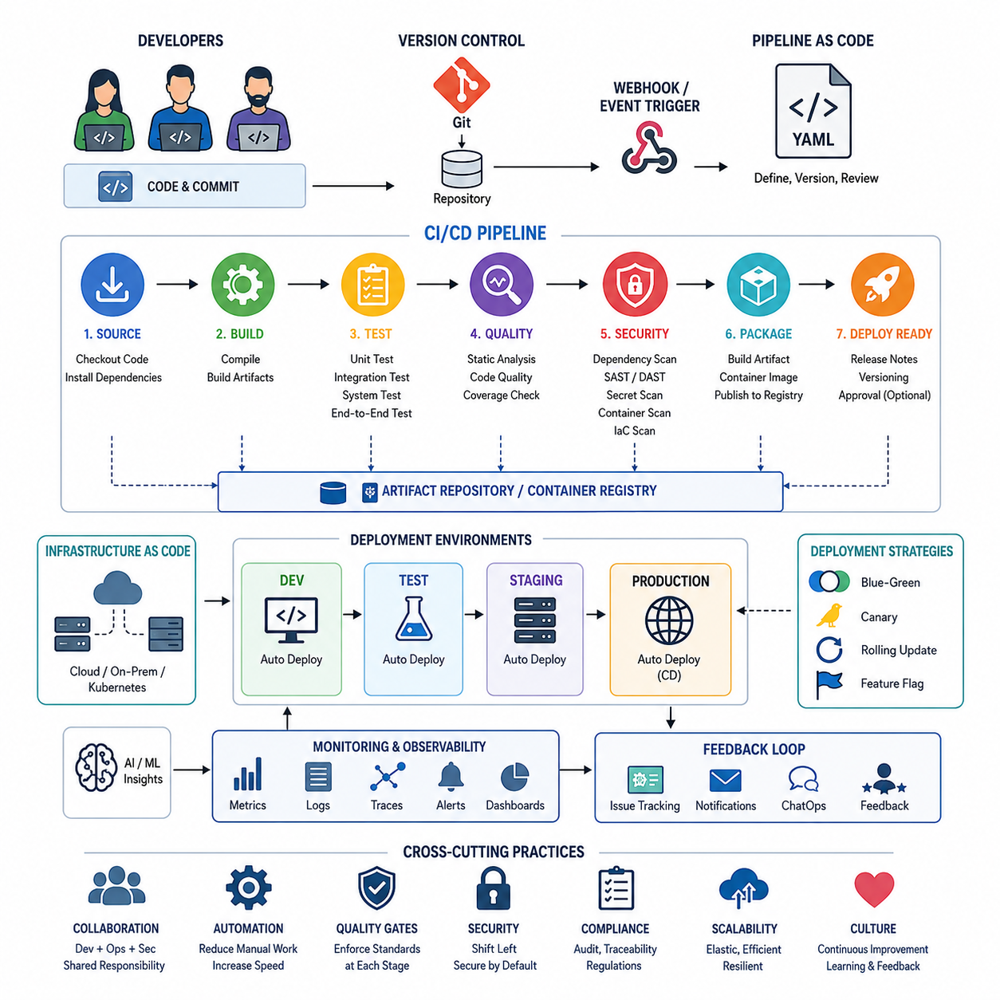
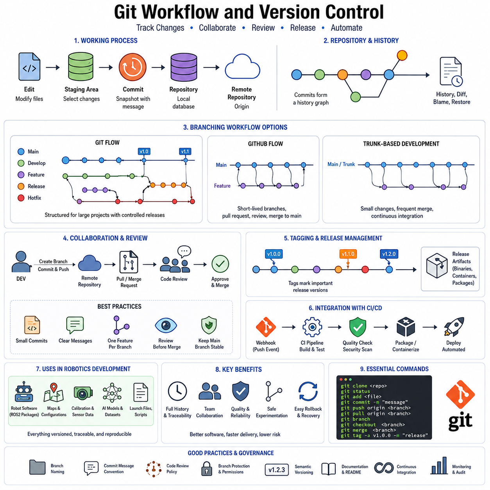
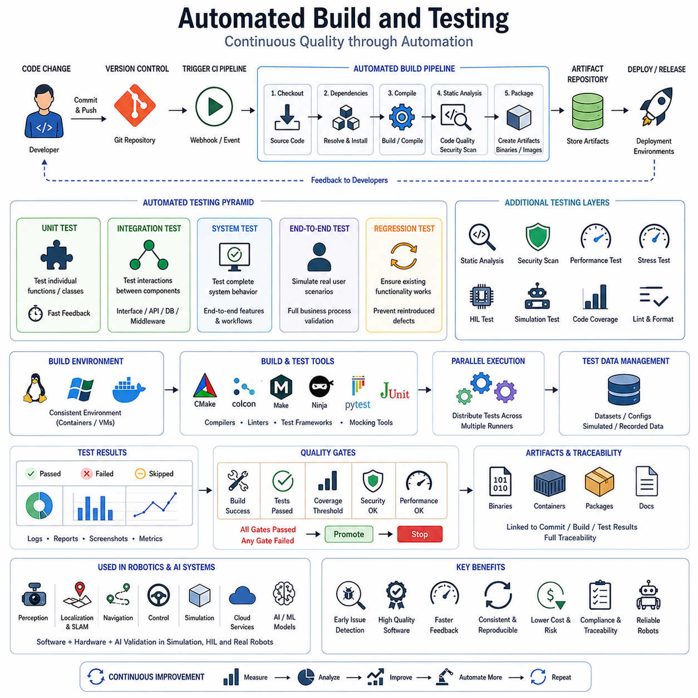
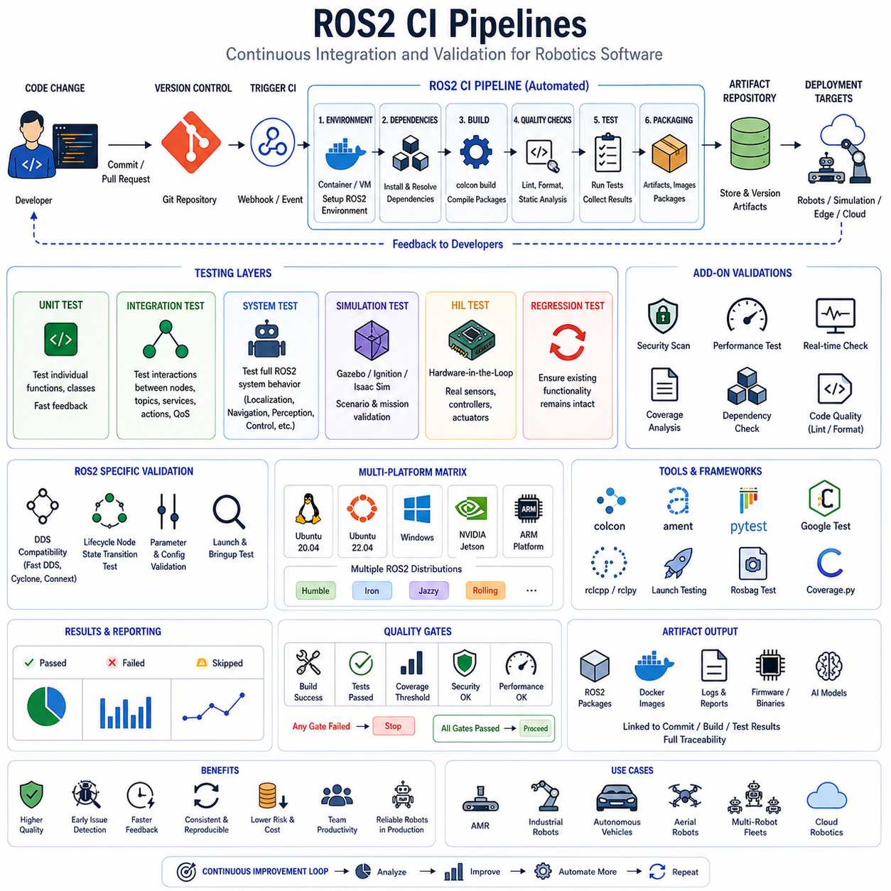
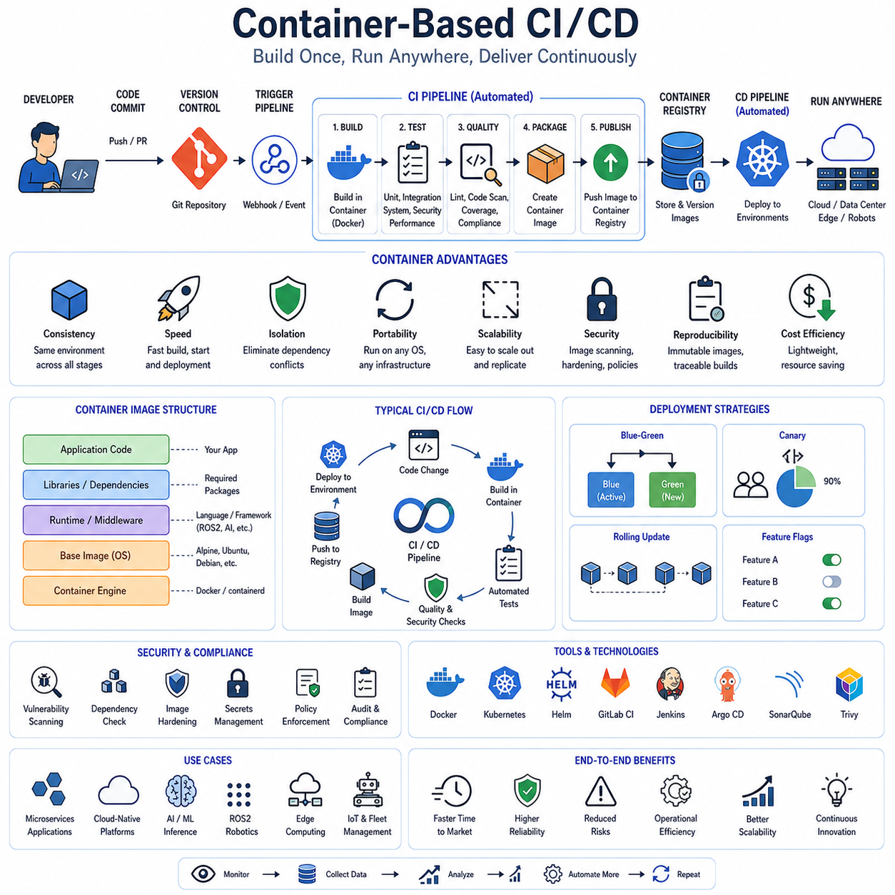
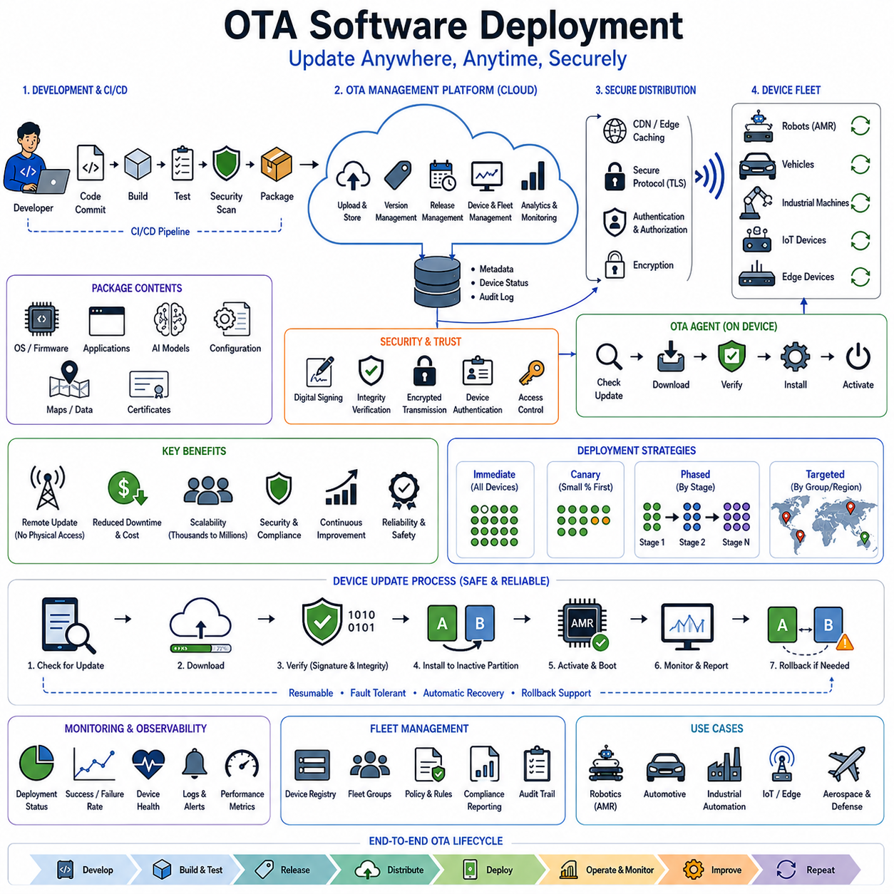
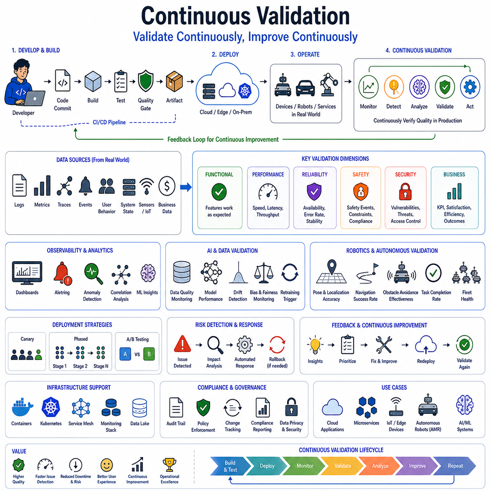
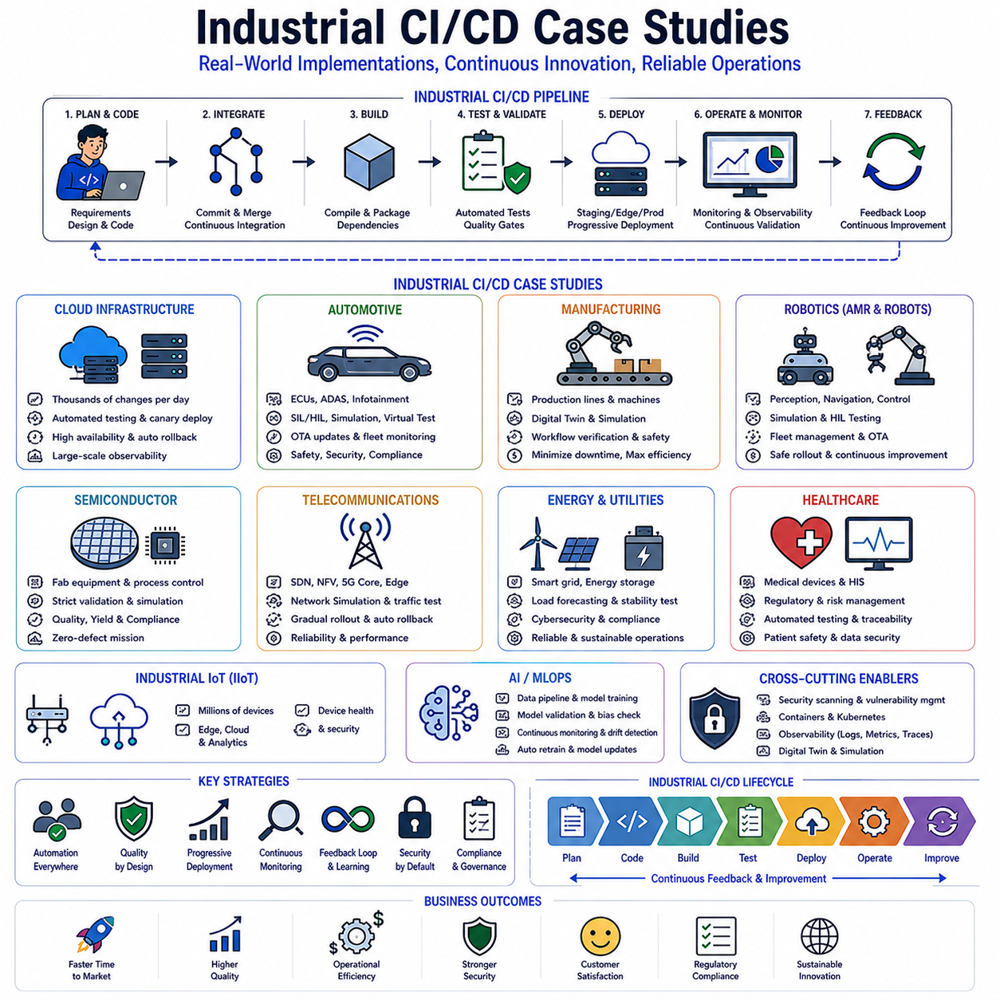

**Volume 07. AMR Software Architecture and Development**

# Chapter 13. CI/CD for Robotics

## 13.1 CI/CD Fundamentals

{width="7.268055555555556in" height="7.268055555555556in"}

Continuous Integration and Continuous Delivery/Deployment (CI/CD) Fundamentals represent one of the most important developments in modern software engineering and DevOps practices. As software systems have become increasingly complex, distributed, and interconnected, organizations have sought methods to accelerate development while maintaining reliability, quality, and security. CI/CD emerged as a comprehensive approach that automates the process of integrating code changes, validating software quality, packaging applications, and deploying them into production environments. In modern cloud-native systems, autonomous robots, industrial automation platforms, artificial intelligence services, and large-scale enterprise applications, CI/CD serves as the foundation that enables rapid innovation without sacrificing operational stability.

Historically, software development followed long release cycles in which developers worked independently for weeks or months before integrating their changes. This process often resulted in integration conflicts, unexpected bugs, unstable releases, and significant delays. Large software projects frequently experienced what became known as "integration hell," where combining independently developed components created numerous unexpected issues. Continuous Integration was introduced to address this challenge by encouraging developers to integrate code changes frequently, often multiple times per day. Every integration triggers automated validation processes that verify whether the new changes are compatible with the existing system.

Continuous Integration focuses on maintaining a shared code repository in a consistently healthy state. Developers commit their code to a version control system such as Git, and each commit automatically initiates a sequence of validation tasks. These tasks may include source code compilation, static code analysis, unit testing, dependency verification, security scanning, and artifact generation. The primary objective is to detect defects as early as possible. Early defect detection significantly reduces the cost of fixing issues because problems are identified near the point of introduction rather than during later stages of development or production operation.

A fundamental principle of CI is automation. Manual verification processes are often inconsistent, time-consuming, and prone to human error. Automated pipelines execute predefined tasks in a repeatable and deterministic manner. Whenever code changes are submitted, the same validation procedures are applied regardless of the developer, project size, or deployment environment. This consistency improves software quality while increasing development efficiency.

Version control systems form the foundation of every CI/CD pipeline. Systems such as Git enable collaborative development by maintaining complete histories of source code changes. Developers create branches to implement new features, fix defects, or experiment with alternative solutions. Branches allow parallel development without affecting the stability of the main codebase. When work is completed, changes are merged into shared repositories through pull requests or merge requests. CI systems automatically evaluate proposed changes before integration, ensuring that quality standards are maintained.

Source code repositories are often integrated with automated workflow platforms. When a repository receives a new commit, webhooks or event-driven triggers activate the CI pipeline. The pipeline executes predefined stages according to configuration files stored alongside the application source code. This approach, often referred to as Pipeline as Code, allows deployment processes to be version-controlled, reviewed, and maintained just like software itself.

Testing plays a central role within Continuous Integration. Modern CI systems typically implement multiple layers of automated testing. Unit tests verify individual software components in isolation. Integration tests validate interactions between modules, services, databases, and external interfaces. System tests examine complete application functionality under realistic operating conditions. End-to-end tests simulate actual user behavior and validate business workflows. By executing these tests automatically during every integration event, organizations can detect functional regressions before they reach production.

Static code analysis further enhances software quality within CI pipelines. Analysis tools examine source code without executing it. They identify coding standard violations, complexity issues, potential security vulnerabilities, memory management problems, concurrency risks, and maintainability concerns. Automated static analysis provides immediate feedback to developers and helps enforce consistent engineering standards across teams.

Security has become a critical component of CI/CD practices. Modern software systems depend heavily on open-source libraries, cloud services, APIs, and third-party components. Vulnerabilities introduced through dependencies can create significant organizational risks. As a result, security scanning tools are increasingly integrated into CI pipelines. Dependency scanners identify known vulnerabilities in software packages. Secret detection tools search for accidentally exposed credentials. Container security scanners examine container images for outdated libraries and insecure configurations. Infrastructure validation tools evaluate deployment templates and cloud resource definitions.

Artifact generation represents another important stage of Continuous Integration. After code successfully passes validation checks, the system creates deployable artifacts. These artifacts may include executable binaries, container images, installation packages, firmware files, machine learning models, or robotics software bundles. Artifact repositories store validated outputs and provide traceability between source code versions and deployed software. This traceability is essential for auditing, compliance, debugging, and rollback operations.

While Continuous Integration focuses on code validation and artifact creation, Continuous Delivery extends automation toward deployment readiness. Continuous Delivery ensures that software remains deployable at all times. Every successful code change progresses through automated verification stages and produces release-ready artifacts. The system continuously prepares software for deployment, allowing organizations to release new functionality whenever business needs require.

A key characteristic of Continuous Delivery is the automation of release preparation. Configuration management, infrastructure provisioning, database migration validation, environment testing, and release packaging become automated processes. Human intervention may still occur at the final deployment approval stage, but the software has already passed all necessary quality gates. This approach significantly reduces deployment risk and shortens release cycles.

Continuous Deployment represents the next level of automation. In Continuous Deployment environments, every validated change that successfully passes all automated checks is automatically released to production without manual approval. This approach enables extremely rapid software evolution. Technology companies operating large-scale digital services often deploy hundreds or even thousands of updates per day using Continuous Deployment practices.

The distinction between Continuous Delivery and Continuous Deployment is important. Continuous Delivery maintains deployment readiness while retaining human control over production releases. Continuous Deployment removes the final manual approval step and allows validated changes to flow directly into production environments. Organizations select the appropriate model based on regulatory requirements, operational risk tolerance, business objectives, and system criticality.

Modern CI/CD pipelines are commonly structured as sequential stages. The pipeline begins with source retrieval and dependency installation. Compilation and build processes follow. Automated testing, security analysis, code quality evaluation, artifact packaging, container image generation, and deployment preparation occur next. Deployment stages then promote validated artifacts through development, testing, staging, and production environments. Each stage serves as a quality gate that prevents defective software from progressing further.

Infrastructure as Code has become closely associated with CI/CD practices. Infrastructure definitions are expressed as machine-readable configuration files rather than manually managed resources. Cloud environments, networking components, storage systems, Kubernetes clusters, databases, and security policies can be provisioned automatically using infrastructure definitions. Integrating Infrastructure as Code into CI/CD pipelines enables consistent, repeatable, and scalable deployment processes.

Containerization technologies have significantly influenced CI/CD evolution. Containers package applications together with their dependencies, ensuring consistent execution across environments. Developers, testers, and production operators all interact with identical application images. This consistency reduces environment-specific issues and simplifies deployment automation. Container registries serve as artifact repositories, while orchestration platforms automate large-scale application deployment and lifecycle management.

Cloud computing has further accelerated CI/CD adoption. Cloud platforms provide on-demand infrastructure, managed services, scalable compute resources, and deployment automation capabilities. CI/CD systems can dynamically allocate build agents, testing environments, and deployment infrastructure as needed. This elasticity improves efficiency while reducing operational overhead.

Microservices architectures benefit particularly from CI/CD methodologies. Large monolithic applications often require coordinated releases involving many interconnected components. Microservices divide functionality into independently deployable services. CI/CD pipelines can manage each service separately, enabling faster development cycles and reducing deployment risks. Individual services can be updated, tested, and deployed without requiring full-system releases.

Observability and monitoring are increasingly integrated into CI/CD workflows. Deployment success is no longer determined solely by successful installation. Modern pipelines evaluate application health using performance metrics, error rates, resource utilization, user experience indicators, and business outcomes. Automated monitoring provides immediate feedback regarding deployment quality and operational stability.

Deployment strategies have evolved alongside CI/CD practices. Traditional deployment methods often required complete system downtime during updates. Modern strategies seek to minimize operational disruption. Blue-green deployment maintains parallel production environments and shifts traffic between versions. Canary deployment gradually exposes new versions to a small subset of users before wider rollout. Rolling deployment updates systems incrementally. Feature flag systems enable functionality to be activated or deactivated independently of software releases.

Rollback mechanisms are essential components of robust CI/CD systems. Despite extensive testing, production issues may still occur. Automated rollback procedures allow organizations to quickly restore previous stable versions when problems are detected. Effective rollback capabilities reduce operational risk and increase confidence in deployment automation.

Data management introduces additional complexity within CI/CD workflows. Applications frequently depend on databases, configuration repositories, machine learning models, and persistent storage systems. Schema migrations must be carefully coordinated with application deployments. Automated migration validation, backward compatibility checks, and rollback planning are critical for maintaining system integrity.

CI/CD principles extend beyond traditional software applications into robotics, embedded systems, autonomous vehicles, industrial automation, and artificial intelligence platforms. In robotics environments, software updates may affect perception systems, navigation algorithms, motion planning modules, sensor drivers, and safety controllers. Automated testing environments often combine simulation platforms with hardware-in-the-loop validation systems to verify behavior before deployment to physical robots.

Artificial intelligence systems introduce unique CI/CD considerations. Machine learning pipelines require management of datasets, training procedures, model validation, performance evaluation, bias assessment, and inference optimization. MLOps extends CI/CD concepts to machine learning workflows by automating model development, testing, deployment, monitoring, and retraining processes. Continuous evaluation ensures that deployed models maintain acceptable performance under changing real-world conditions.

Quality gates represent an important governance mechanism within CI/CD systems. Organizations define measurable criteria that software must satisfy before advancing to subsequent stages. Quality gates may include test coverage thresholds, performance benchmarks, security compliance requirements, code review approvals, documentation completeness, and regulatory validation checks. Automated enforcement ensures consistent adherence to organizational standards.

Scalability becomes increasingly important as organizations grow. Enterprise CI/CD platforms often support thousands of repositories, hundreds of development teams, and millions of pipeline executions. Distributed build systems, parallel testing frameworks, artifact caching mechanisms, and cloud-native execution environments help maintain performance under large-scale workloads.

Cultural transformation is frequently as important as technological implementation. Successful CI/CD adoption requires collaboration among developers, testers, operations personnel, security teams, data scientists, and business stakeholders. Communication barriers must be reduced, feedback loops accelerated, and shared responsibility encouraged. DevOps culture emphasizes collective ownership of software quality, deployment reliability, and operational outcomes.

Metrics provide valuable insight into CI/CD effectiveness. Common measurements include deployment frequency, lead time for changes, change failure rate, mean time to recovery, build success rate, test execution duration, and deployment success percentage. These metrics help organizations identify bottlenecks, improve processes, and evaluate engineering performance.

Compliance and governance considerations are particularly important in regulated industries. Healthcare, finance, aerospace, automotive, and industrial automation sectors often require extensive documentation, auditability, traceability, and validation procedures. Modern CI/CD systems incorporate compliance controls directly into automated workflows, enabling organizations to maintain regulatory adherence while benefiting from deployment automation.

The future of CI/CD is increasingly influenced by artificial intelligence, predictive analytics, autonomous operations, and self-healing infrastructure. Intelligent pipelines can prioritize tests based on code changes, predict deployment risks, optimize resource allocation, identify anomalies, and recommend corrective actions. AI-driven automation is expected to further accelerate software delivery while improving reliability and operational efficiency.

In summary, CI/CD Fundamentals encompass a comprehensive set of practices, technologies, principles, and cultural approaches that enable rapid, reliable, and scalable software delivery. Continuous Integration ensures that code changes are validated frequently and systematically. Continuous Delivery maintains deployment readiness through extensive automation. Continuous Deployment extends automation directly into production releases. Together, these methodologies form the foundation of modern software engineering, cloud-native applications, robotics platforms, artificial intelligence systems, and digital transformation initiatives. By reducing manual effort, accelerating feedback cycles, improving software quality, and increasing operational reliability, CI/CD has become an essential capability for organizations seeking to compete in an increasingly technology-driven world.

## 13.2 Git Workflow and Version Control

{width="7.268055555555556in" height="7.268055555555556in"}

Git Workflow and Version Control form the foundation of modern software engineering, DevOps practices, cloud-native development, and robotics software platforms. In contemporary software projects, particularly those involving Autonomous Mobile Robots (AMRs), artificial intelligence systems, cloud services, embedded controllers, and distributed robotic platforms, development is rarely performed by a single engineer. Instead, dozens or even hundreds of developers collaborate on the same codebase simultaneously. Without a systematic mechanism for tracking changes, coordinating development activities, managing releases, and preserving software history, projects quickly become difficult to maintain and scale. Git provides the technological foundation that enables controlled collaboration, traceability, reproducibility, and continuous evolution of software systems. Within the broader CI/CD ecosystem described in the previous chapter, Git serves as the central source of truth from which all automation, testing, deployment, and release processes originate.

Version control refers to the systematic management of modifications made to software artifacts over time. Before modern version control systems became common, developers often stored multiple copies of source files with names such as "final," "final_v2," or "latest_fixed." Such approaches created confusion, duplication, and significant risk of accidental data loss. Version control systems eliminate these problems by maintaining a complete historical record of every change, every contributor, and every version of a project. Developers can review previous implementations, identify the origins of bugs, compare changes between versions, and restore earlier states when necessary.

Git was originally created by Linus Torvalds to support the development of the Linux kernel. Unlike earlier centralized version control systems, Git uses a distributed architecture. Every developer possesses a complete copy of the repository, including all branches, commits, tags, and historical records. This design improves reliability, supports offline development, and eliminates dependence on a single central server. Even if the primary repository becomes unavailable, development can continue because every clone contains the complete project history.

A Git repository represents the complete collection of source code, configuration files, documentation, assets, and historical records associated with a project. Repositories can exist locally on a developer's workstation and remotely on collaboration platforms. Modern development teams commonly host repositories using [GitHub](https://github.com?utm_source=chatgpt.com), [GitLab](https://gitlab.com?utm_source=chatgpt.com), or [Bitbucket](https://bitbucket.org?utm_source=chatgpt.com). These platforms provide collaboration tools, access control, issue tracking, CI/CD integration, code review workflows, and project management capabilities in addition to version control functionality.

At the heart of Git lies the concept of commits. A commit represents a snapshot of the repository at a specific point in time. Each commit contains metadata including the author, timestamp, commit message, and references to previous commits. Rather than storing only file differences, Git effectively maintains a directed graph of repository states. This architecture allows developers to navigate project history efficiently and reconstruct any previous version of the software.

Commit messages play a critical role in maintaining repository quality. A well-written commit message explains the purpose of a change rather than merely describing what files were modified. Effective commit histories become valuable engineering documentation. Months or years later, developers can understand why specific design decisions were made, why bugs were fixed in certain ways, and how system architecture evolved over time.

The Git staging area introduces an additional level of control between working files and committed changes. Developers can selectively choose which modifications should be included in a commit. This capability encourages logical grouping of related changes and helps maintain clean repository history. Instead of combining unrelated modifications into a single commit, developers can create focused commits that address specific features, fixes, or improvements.

Branching is one of Git's most powerful capabilities. A branch represents an independent line of development that diverges from the main codebase. Developers can create branches to implement new functionality, experiment with architectural changes, investigate technical concepts, or fix defects without affecting production code. Branches allow parallel development across multiple teams while preserving repository stability.

The main branch, often called main or master, typically represents the most stable version of the software. Production-ready code, validated releases, and officially supported versions are generally associated with this branch. Organizations establish policies controlling how changes reach the main branch to ensure software quality and reliability.

Feature branches are commonly used to develop individual capabilities. A developer creates a new branch from the main branch, implements a specific feature, performs testing, and eventually merges the completed work back into the shared repository. This workflow isolates development activities and reduces the risk of introducing unstable code into production environments.

Bug-fix branches follow a similar pattern. When defects are identified, developers create dedicated branches to investigate and resolve issues. After validation and review, fixes are merged back into relevant branches. This approach improves traceability because every bug correction can be associated with specific commits and development activities.

Release branches support software stabilization prior to deployment. As organizations prepare new releases, development continues on feature branches while release branches focus exclusively on validation, testing, documentation updates, and final defect correction. This separation allows feature development and release preparation to proceed simultaneously.

Hotfix branches address critical production issues requiring immediate correction. When severe defects affect deployed systems, organizations create hotfix branches directly from production versions. After corrections are validated, fixes are merged into both production and ongoing development branches to maintain consistency.

Branching strategies significantly influence team productivity and software quality. One widely adopted approach is Git Flow. Git Flow defines structured branch categories including main, develop, feature, release, and hotfix branches. This workflow provides strong process control and is often used in enterprise environments where formal release management procedures are required.

GitHub Flow offers a simpler alternative. Development occurs primarily through short-lived feature branches that are merged directly into the main branch after review and validation. This workflow aligns well with Continuous Delivery and Continuous Deployment practices because it encourages small, frequent changes and rapid integration cycles.

Trunk-Based Development represents another modern strategy. In this approach, developers integrate changes into the main branch frequently, often multiple times per day. Branches remain short-lived, reducing merge complexity and encouraging continuous collaboration. Organizations pursuing highly automated CI/CD pipelines frequently adopt trunk-based development due to its compatibility with rapid deployment practices.

Merging combines changes from different branches into a unified codebase. Git automatically merges modifications when no conflicts exist. However, conflicts arise when multiple developers modify the same portions of code. Conflict resolution requires careful evaluation to ensure that all intended functionality is preserved. Effective branch management and frequent integration help minimize merge conflicts.

Pull Requests and Merge Requests provide structured review mechanisms before code integration. Rather than merging changes directly, developers submit requests describing proposed modifications. Reviewers examine code quality, architecture, security implications, testing results, and maintainability. Discussions occur within the review process, enabling knowledge sharing and collaborative improvement.

Code review represents one of the most valuable practices associated with Git workflows. Reviews identify defects before deployment, improve coding standards, facilitate knowledge transfer, and promote architectural consistency. In robotics software systems, code review is particularly important because software errors can affect physical robot behavior, safety systems, navigation performance, and operational reliability.

Tags provide mechanisms for identifying important repository states. Release versions such as v1.0, v2.0, or v3.1 can be associated with specific commits using tags. Tags simplify deployment, rollback, documentation, and release management activities by providing stable references to validated software versions.

Repository organization significantly affects project scalability. Large software systems often separate functionality into multiple repositories or use monorepository approaches. Monorepositories store multiple projects within a single repository, promoting code sharing and unified version management. Multi-repository architectures isolate components and provide greater autonomy for individual teams. Both approaches have advantages depending on organizational requirements.

Semantic Versioning has become a widely accepted method for version identification. Version numbers typically follow the format MAJOR.MINOR.PATCH. Major versions indicate incompatible changes, minor versions introduce backward-compatible functionality, and patch versions contain bug fixes. Consistent versioning improves communication among developers, testers, customers, and deployment systems.

Dependency management relies heavily on version control practices. Modern software systems incorporate numerous external libraries, frameworks, middleware components, and APIs. Version constraints ensure compatibility while preventing unexpected behavior caused by uncontrolled upgrades. Reproducible builds depend on precise version management throughout the software stack.

Access control and repository security are critical considerations in enterprise environments. Organizations implement role-based permissions, branch protection rules, mandatory code reviews, signed commits, and audit logging. These controls protect intellectual property, maintain compliance, and reduce cybersecurity risks.

Git also plays a central role in Infrastructure as Code environments. Configuration files defining cloud resources, networking architectures, Kubernetes clusters, robot deployment settings, and industrial automation systems are stored and versioned alongside application code. Infrastructure changes become traceable, reviewable, and reproducible using the same workflows applied to software development.

In robotics development, version control extends beyond traditional source code. Robot configuration files, URDF models, CAD-derived parameters, sensor calibration data, navigation maps, AI models, simulation environments, launch files, and deployment scripts all benefit from version management. Robotics projects often integrate software, hardware, mechanical engineering, and artificial intelligence assets within unified repositories.

ROS2-based robot development environments depend heavily on Git workflows. Workspaces may contain dozens or hundreds of packages representing perception systems, navigation modules, localization algorithms, control software, fleet management interfaces, cloud integration services, and AI inference pipelines. Coordinated version control ensures compatibility among these components and enables reproducible deployments across development, simulation, testing, and production environments.

Git integrates directly with CI/CD systems. Whenever commits are pushed to repositories, automated pipelines execute builds, tests, security scans, code quality analysis, container generation, and deployment workflows. This integration transforms repositories into active components of the software delivery process. Rather than serving merely as storage systems, repositories become event sources driving automated engineering workflows.

Artifact traceability is another important benefit. Every deployed binary, container image, firmware package, or AI model can be linked back to specific commits, branches, reviews, and testing results. This traceability simplifies debugging, compliance audits, rollback procedures, and root-cause investigations.

Large-scale software organizations often establish governance policies for repository management. Standards may define branch naming conventions, commit message formats, review requirements, testing obligations, release procedures, and documentation expectations. Governance ensures consistency across teams while supporting scalability and maintainability.

Git workflows also support experimentation and innovation. Developers can create isolated branches to explore alternative algorithms, evaluate architectural changes, benchmark performance improvements, or investigate emerging technologies. If experiments prove valuable, they can be merged into production workflows. If not, branches can be discarded without affecting stable systems.

As organizations increasingly adopt cloud-native architectures, distributed robotic systems, AI-driven applications, and autonomous platforms, the importance of effective version control continues to grow. Development complexity, regulatory requirements, cybersecurity concerns, and operational scale all demand rigorous control over software evolution.

The future of Git workflows is being influenced by artificial intelligence, automated code review, predictive conflict detection, intelligent merge assistance, and repository analytics. AI-powered development tools can recommend reviewers, identify risky changes, suggest improvements, detect anomalies, and optimize collaboration processes. These capabilities further enhance developer productivity while maintaining software quality.

In summary, Git Workflow and Version Control provide the essential mechanisms that enable collaborative software development, controlled change management, traceable engineering processes, and scalable CI/CD automation. Through repositories, commits, branches, merges, pull requests, version tagging, and governance practices, Git creates a structured environment in which software systems can evolve safely and efficiently. For modern AMR platforms, ROS2 ecosystems, cloud robotics infrastructures, AI-driven systems, and industrial automation solutions, effective Git workflows are not merely development tools but foundational engineering disciplines that support reliability, scalability, maintainability, and continuous innovation.

## 13.3 Automated Build and Testing

{width="7.268055555555556in" height="7.268055555555556in"}

Automated Build and Testing is one of the most critical pillars of modern software engineering, DevOps, CI/CD, cloud-native development, and robotics software platforms. As software systems become increasingly complex, distributed, and interconnected, manual compilation, integration, and testing processes become inefficient, error-prone, and difficult to scale. Automated Build and Testing addresses these challenges by ensuring that every change introduced into a software system is automatically compiled, validated, tested, and verified before reaching downstream environments. In robotics systems, Autonomous Mobile Robots (AMRs), autonomous vehicles, industrial automation platforms, artificial intelligence applications, and cloud-edge infrastructures, automated validation is not merely a productivity enhancement but a fundamental requirement for reliability, safety, maintainability, and operational continuity. Within the broader CI/CD ecosystem, Automated Build and Testing serves as the quality assurance engine that continuously evaluates software integrity whenever code changes occur.

Historically, software builds were often performed manually by developers. Source code would be compiled on local workstations, dependencies would be installed manually, and software packages would be assembled through custom scripts or human procedures. Testing frequently occurred only at major milestones or before releases. Such approaches were manageable for small projects but became increasingly problematic as software systems grew in complexity. Human errors, inconsistent environments, undocumented procedures, and delayed feedback often resulted in unstable releases and costly defects.

The concept of build automation emerged to eliminate manual intervention from software compilation and packaging processes. A build system transforms source code into deployable artifacts through a predefined sequence of automated steps. These steps may include source retrieval, dependency installation, code compilation, static analysis, test execution, packaging, artifact generation, documentation creation, and deployment preparation. By automating these activities, organizations ensure consistency, repeatability, and reliability across all development environments.

A build process begins with source code retrieval from a version control repository. The automation system obtains a specific commit, branch, or release version and reconstructs the exact development environment required for execution. Dependency management tools then retrieve external libraries, frameworks, middleware components, and supporting packages. Reproducible dependency resolution is essential because inconsistent dependency versions can lead to unexpected behavior, compatibility issues, and difficult-to-diagnose defects.

Compilation represents one of the central stages of the build pipeline. Programming languages such as C, C++, Rust, and embedded firmware languages require source code to be transformed into executable binaries. Languages such as Java generate bytecode, while Python-based systems may perform syntax validation and package generation rather than traditional compilation. In robotics software, build systems frequently compile perception modules, navigation stacks, control software, middleware interfaces, simulation environments, and hardware drivers simultaneously.

Modern robotics systems often contain hundreds of interconnected software packages. ROS2-based Autonomous Mobile Robot platforms may include localization modules, SLAM algorithms, navigation frameworks, perception pipelines, AI inference engines, fleet management interfaces, sensor drivers, cloud communication components, and safety subsystems. Automated build systems ensure that these components remain compatible and can be assembled consistently across development, simulation, testing, and production environments.

Build automation relies heavily on standardized tools and frameworks. In traditional software engineering, tools such as Make, CMake, Maven, Gradle, and Bazel are commonly used. Robotics development frequently utilizes CMake, Colcon, and ROS2-specific build systems. These tools define how software components are compiled, linked, packaged, and validated. Build configurations become part of the source code itself, ensuring that software construction procedures are version-controlled and reproducible.

One of the most important principles of build automation is environment consistency. Software frequently behaves differently when executed on different operating systems, library versions, hardware configurations, or runtime environments. Build automation seeks to eliminate environmental variation by defining all dependencies and execution requirements explicitly. Containerization technologies such as Docker further strengthen consistency by packaging applications together with their runtime environments.

Continuous Integration systems use automated builds as the first line of defense against software quality degradation. Whenever developers submit code changes, CI servers automatically execute build pipelines. If compilation fails, integration is halted immediately and developers receive rapid feedback. This early detection mechanism prevents defective code from propagating through the software delivery process.

Automated testing extends build automation by evaluating software behavior after successful compilation. Testing verifies that software performs according to expectations, satisfies requirements, and continues functioning correctly as changes are introduced. Without automated testing, organizations must rely on manual verification procedures that are expensive, slow, inconsistent, and incapable of keeping pace with modern development velocity.

Unit testing represents the most fundamental testing layer. Unit tests evaluate individual functions, methods, classes, or modules in isolation. The objective is to verify that small software components produce correct outputs for specified inputs. Unit tests execute rapidly and provide immediate feedback regarding localized defects. Because they focus on individual software units, failures are typically easy to diagnose and correct.

In robotics systems, unit tests may validate mathematical transformations, sensor calibration algorithms, path planning functions, coordinate frame conversions, state estimation routines, or communication interfaces. Since many robotic algorithms depend on precise numerical computation, automated unit testing is particularly important for maintaining reliability.

Integration testing evaluates interactions between multiple software components. While individual modules may function correctly in isolation, unexpected issues often emerge when components communicate with one another. Integration tests verify interfaces, data flows, middleware communication, database interactions, API connections, cloud services, and distributed system behavior.

ROS2-based robotic systems depend heavily on integration testing. Navigation modules must communicate correctly with localization systems, perception pipelines must provide accurate obstacle information, controllers must interpret planner outputs properly, and cloud services must exchange data reliably with edge devices. Integration testing ensures that these interconnected systems function as a coherent whole.

System testing expands validation to the complete application. Instead of examining individual components, system tests evaluate overall behavior under realistic operating conditions. System testing verifies functional requirements, operational workflows, performance characteristics, reliability metrics, and user interactions.

In autonomous robotics environments, system testing often includes navigation scenarios, obstacle avoidance tasks, mission execution workflows, fleet management operations, remote monitoring procedures, and cloud-edge communication sequences. Automated system tests provide confidence that complete robotic solutions perform as intended.

End-to-End testing represents the highest level of software validation. End-to-End tests simulate actual user behavior and operational workflows from beginning to end. These tests verify complete business processes rather than individual technical functions. By reproducing realistic operational scenarios, organizations can detect issues that might not be visible through lower-level testing methods.

Regression testing is another critical aspect of automated testing. Every software modification introduces the possibility of unintentionally breaking existing functionality. Regression test suites continuously revalidate previously working capabilities whenever changes occur. This practice prevents the reintroduction of historical defects and maintains long-term software stability.

Static testing techniques complement dynamic testing methods. Static analysis examines source code without executing it. Tools identify coding standard violations, architectural inconsistencies, security vulnerabilities, memory management problems, concurrency risks, and maintainability concerns. Because static analysis executes rapidly, it is frequently integrated into early stages of build pipelines.

Code quality analysis extends static testing by evaluating maintainability characteristics. Metrics such as cyclomatic complexity, code duplication, dependency coupling, documentation coverage, and naming consistency help organizations maintain sustainable software architectures. Automated quality evaluation encourages engineering discipline and reduces technical debt accumulation.

Security testing has become an essential component of modern build pipelines. Automated security scanning identifies vulnerabilities before software reaches production environments. Dependency scanners evaluate external packages against known vulnerability databases. Secret detection tools search for accidentally exposed credentials. Static Application Security Testing analyzes source code for insecure patterns. Dynamic Application Security Testing evaluates running applications for exploitable weaknesses.

Performance testing evaluates software behavior under varying workloads and operational conditions. Automated performance tests measure latency, throughput, resource utilization, scalability, and responsiveness. Performance regressions can significantly impact user experience and operational efficiency, making continuous performance validation increasingly important.

Stress testing pushes systems beyond normal operating limits to evaluate resilience and failure behavior. Robotics systems often require stress testing to validate navigation stability, sensor processing performance, communication reliability, and real-time control responsiveness under challenging conditions.

Hardware-in-the-Loop testing introduces physical components into automated validation workflows. While simulations provide valuable coverage, real hardware frequently reveals issues that are difficult to detect in virtual environments. Hardware-in-the-Loop systems connect actual sensors, controllers, actuators, and communication devices to automated testing frameworks. This approach is particularly valuable in robotics, automotive systems, aerospace applications, and industrial automation platforms.

Simulation-based testing plays an increasingly important role in robotic software development. Modern simulation environments such as Gazebo and Isaac Sim enable automated validation of perception algorithms, localization systems, navigation behaviors, and multi-robot coordination strategies. Simulation allows organizations to execute thousands of test scenarios safely, rapidly, and cost-effectively.

Test automation frameworks orchestrate test execution across different validation levels. These frameworks manage test scheduling, environment preparation, dependency provisioning, result collection, reporting, and failure analysis. Automated orchestration ensures consistent testing procedures and accelerates feedback cycles.

Test coverage measurement helps organizations assess testing completeness. Coverage metrics indicate how much of the codebase is exercised during automated testing. Common measurements include statement coverage, branch coverage, function coverage, and path coverage. While high coverage does not guarantee defect-free software, insufficient coverage often indicates untested risk areas.

Parallel execution significantly improves testing efficiency. Large software projects may contain thousands of tests requiring substantial execution time. Modern testing platforms distribute workloads across multiple processors, virtual machines, containers, or cloud resources. Parallelization reduces pipeline duration and accelerates developer feedback.

Test data management is another important consideration. Automated tests often require realistic datasets, configuration files, simulated sensor outputs, or database states. Effective test data management ensures repeatability while preventing dependence on unstable external resources.

Artifact validation represents the final stage of automated build and testing workflows. Successfully compiled and tested software artifacts are packaged and stored within artifact repositories. These repositories maintain traceability between source code versions, test results, build configurations, and deployment packages. Every artifact becomes a verifiable product of the automated engineering process.

Reporting and observability provide visibility into build and testing outcomes. Dashboards present build status, test success rates, code quality metrics, security findings, performance trends, and historical reliability indicators. Comprehensive reporting enables organizations to identify bottlenecks, prioritize improvements, and maintain engineering transparency.

Failure analysis is a critical aspect of automated testing. When tests fail, developers require rapid access to diagnostic information. Logs, stack traces, screenshots, performance metrics, recorded datasets, simulation outputs, and hardware telemetry help engineers identify root causes efficiently. Effective failure reporting significantly reduces debugging time.

Quality gates utilize build and testing results to enforce organizational standards. Software may be prevented from progressing to deployment stages unless predefined criteria are satisfied. These criteria may include successful compilation, minimum test coverage thresholds, acceptable security risk levels, performance benchmarks, and documentation requirements.

Automated Build and Testing also supports regulatory compliance. Industries such as healthcare, automotive, aerospace, rail transportation, and industrial robotics often require extensive verification evidence. Automated validation pipelines generate traceable records demonstrating compliance with quality, safety, and engineering standards.

In robotics software engineering, Automated Build and Testing extends beyond traditional software verification. Validation may include sensor calibration verification, localization accuracy evaluation, navigation success measurements, obstacle avoidance effectiveness, mission completion rates, fleet coordination behavior, and AI model performance assessments. Such comprehensive validation is essential because software defects can directly influence physical robot behavior and operational safety.

Cloud-native development practices have further increased the importance of automation. Microservices architectures, containerized deployments, distributed computing systems, and edge-cloud infrastructures require continuous validation across multiple execution environments. Automated Build and Testing provides the scalability necessary to manage these increasingly complex ecosystems.

Artificial intelligence is beginning to influence build and testing workflows. AI-powered systems can prioritize tests, predict failure probabilities, identify risky code changes, optimize resource allocation, generate test cases automatically, and recommend corrective actions. These capabilities enhance efficiency while improving software quality.

The future of Automated Build and Testing will likely involve greater integration with digital twins, autonomous validation systems, self-healing pipelines, predictive quality analysis, and continuous operational monitoring. Robotics organizations may eventually validate software simultaneously in simulation, hardware-in-the-loop environments, and deployed robot fleets before approving production releases.

In summary, Automated Build and Testing constitutes a foundational capability of modern software engineering, DevOps, CI/CD, robotics development, and cloud-native platforms. Automated builds ensure consistent software construction, while automated testing continuously verifies functionality, quality, security, performance, and reliability. Together they provide rapid feedback, reduce human error, improve maintainability, support regulatory compliance, and enable scalable software delivery. For AMR systems, ROS2 platforms, industrial robots, AI-driven applications, and autonomous systems, Automated Build and Testing is not merely a technical convenience but an essential engineering discipline that safeguards quality, safety, and operational success.

## 13.4 ROS2 CI Pipelines

{width="7.268055555555556in" height="7.268055555555556in"}

ROS2 CI Pipelines represent the integration of Continuous Integration (CI) principles with the Robot Operating System 2 (ROS2) ecosystem. As robotic systems become increasingly complex, software development for Autonomous Mobile Robots (AMRs), autonomous vehicles, industrial robots, warehouse automation systems, service robots, and cloud-connected robotic fleets requires a structured mechanism for continuously validating software quality. ROS2 CI Pipelines automate the process of building, testing, validating, packaging, and verifying robot software whenever source code changes occur. They serve as the bridge between software engineering best practices and robotic system development, ensuring that every modification introduced into a robot software stack is automatically evaluated before reaching simulation environments, hardware platforms, or production robot fleets. Within modern robotic development workflows, ROS2 CI Pipelines are considered a foundational component of Software Quality Assurance, DevOps, MLOps, and large-scale robotic deployment architectures.

Traditional robot software development often relied heavily on manual compilation, local testing, and engineer-driven validation procedures. Developers would modify source code, rebuild packages on their local machines, launch simulation environments, and manually verify system behavior. While this approach may be sufficient for small research projects, it becomes increasingly difficult to maintain as robot software systems grow in scale. Modern AMR platforms frequently contain hundreds of ROS2 packages encompassing perception, localization, mapping, navigation, control, fleet management, cloud communication, artificial intelligence, diagnostics, and safety systems. Under such conditions, manual validation becomes unsustainable, and automation becomes essential.

ROS2 was designed with modularity, scalability, and distributed communication in mind. A ROS2 system consists of multiple nodes communicating through topics, services, actions, and DDS middleware. These nodes often depend on numerous software packages and external libraries. Changes introduced into one package can unintentionally affect many others. ROS2 CI Pipelines address this challenge by continuously validating the entire software ecosystem whenever modifications occur.

A ROS2 CI Pipeline begins when developers submit code changes to a version control repository. This event may occur through commits, pushes, pull requests, merge requests, or release activities. Repository events trigger automated pipeline execution. The CI platform retrieves source code, constructs a reproducible development environment, resolves dependencies, compiles ROS2 packages, executes tests, performs quality analysis, generates artifacts, and produces validation reports.

The first stage of most ROS2 CI Pipelines involves environment preparation. Because robotic systems frequently depend on specific operating systems, middleware versions, compiler configurations, and hardware interfaces, reproducibility is critical. Pipeline environments are typically created using containers, virtual machines, or cloud-hosted execution environments. Docker-based workflows are particularly common because they provide consistency across developer workstations, CI servers, simulation platforms, and deployment targets.

Dependency management plays a significant role within ROS2 pipelines. ROS2 packages rely on numerous upstream libraries, middleware implementations, sensor drivers, AI frameworks, mathematical toolkits, and system utilities. Package managers automatically retrieve required dependencies and verify compatibility. Automated dependency validation prevents integration failures caused by version mismatches or missing components.

The build stage forms the core of ROS2 CI execution. ROS2 development commonly uses Colcon as the primary build system. Colcon orchestrates compilation across multiple packages while resolving package dependencies automatically. During CI execution, Colcon compiles all affected packages and verifies successful integration across the workspace. Build failures immediately indicate compilation errors, missing dependencies, interface incompatibilities, or configuration problems.

Workspace management is particularly important in ROS2 environments. Large robotic systems often utilize overlay workspaces that combine custom packages with official ROS2 distributions and third-party libraries. CI Pipelines ensure that workspace configurations remain valid and that package interactions behave correctly across all supported environments.

Static code analysis is typically performed immediately after compilation. Static analysis tools examine source code without executing it. These tools identify coding standard violations, unsafe programming practices, memory management issues, concurrency risks, security vulnerabilities, and maintainability concerns. In robotics development, static analysis is especially valuable because software defects can directly influence physical robot behavior.

Coding standards play an important role in ROS2 projects. Organizations frequently adopt standardized coding conventions for C++, Python, configuration files, launch files, and interface definitions. Automated linting tools evaluate compliance with these standards. Consistent coding practices improve readability, maintainability, collaboration efficiency, and long-term software quality.

Unit testing represents the next major validation layer within ROS2 CI Pipelines. Individual functions, classes, libraries, and algorithms are tested in isolation. Unit tests verify mathematical computations, coordinate transformations, sensor processing routines, planning algorithms, control functions, communication interfaces, and utility modules. Automated execution ensures that every code change is validated consistently.

ROS2 provides extensive support for automated testing frameworks. C++ packages frequently utilize Google Test, while Python-based components often rely on PyTest. These frameworks integrate directly with Colcon, allowing test execution to become a seamless part of the CI workflow. Test results are automatically collected and reported to developers.

Integration testing extends validation beyond individual software modules. Integration tests evaluate interactions among ROS2 nodes, DDS middleware, communication interfaces, and distributed system components. Because robotic software depends heavily on inter-process communication, integration testing is often more important than isolated component validation.

ROS2 communication testing typically verifies topic publication and subscription behavior, service interactions, action execution, parameter management, lifecycle transitions, and Quality of Service (QoS) configurations. These tests ensure that nodes communicate correctly under realistic operational conditions.

Lifecycle node validation represents a unique aspect of ROS2 testing. Many industrial robotic systems utilize managed lifecycle nodes to control startup, shutdown, activation, and fault recovery behaviors. CI Pipelines automatically verify lifecycle transitions and state management logic to ensure predictable system operation.

Middleware validation is another important consideration. ROS2 supports multiple DDS implementations including Fast DDS, Cyclone DDS, and Connext DDS. Different middleware implementations may exhibit subtle behavioral differences. CI Pipelines often execute tests across multiple DDS environments to ensure portability and compatibility.

System-level testing expands validation to the entire robot software stack. These tests evaluate perception pipelines, localization systems, navigation frameworks, task execution logic, fleet management functions, and cloud integration workflows. Rather than testing individual modules, system tests examine overall robot behavior and mission execution capabilities.

Simulation-driven validation has become a central component of ROS2 CI Pipelines. Modern robotic organizations frequently utilize simulation platforms such as Gazebo, Ignition Gazebo, and Isaac Sim to validate robot behavior automatically. Simulation environments allow thousands of scenarios to be executed without requiring physical robots. Obstacle avoidance, path planning, localization accuracy, docking procedures, mission execution, and multi-robot coordination can all be evaluated automatically.

Simulation testing provides significant advantages in terms of scalability and safety. Dangerous operating conditions, rare failure scenarios, adverse environmental conditions, and stress situations can be reproduced repeatedly without risking physical equipment. CI Pipelines automatically launch simulations, execute predefined missions, collect performance metrics, and evaluate outcomes.

Hardware-in-the-Loop testing extends CI validation into physical hardware environments. While simulation provides extensive coverage, certain behaviors can only be verified using real sensors, controllers, actuators, and communication devices. Hardware-in-the-Loop systems integrate physical robot components into automated testing workflows. This approach enables validation of hardware-software interactions while maintaining automation.

Sensor validation represents an important aspect of robotic CI pipelines. Camera drivers, LiDAR interfaces, IMU integrations, GNSS receivers, radar systems, and encoder interfaces must function correctly under diverse operating conditions. Automated tests verify sensor initialization, data acquisition, synchronization, calibration integrity, and communication reliability.

Performance testing is increasingly integrated into ROS2 CI environments. Real-time robotic systems must satisfy strict timing constraints. Perception pipelines, localization algorithms, path planners, and control loops often operate under latency requirements measured in milliseconds. Automated performance tests monitor execution times, CPU utilization, GPU utilization, memory consumption, communication latency, and throughput characteristics.

Regression testing ensures that previously validated functionality remains operational after software modifications. Every new feature, optimization, or bug fix introduces the risk of unintended side effects. Regression suites continuously revalidate historical capabilities, reducing the likelihood of functionality degradation.

Security testing has become increasingly important as robots become connected to enterprise networks, cloud platforms, and remote management systems. ROS2 CI Pipelines often include dependency vulnerability scanning, secret detection, container security analysis, software composition analysis, and cybersecurity validation. These measures help prevent security weaknesses from reaching production systems.

Container-based ROS2 CI architectures have become industry standard. Docker containers provide reproducible execution environments and eliminate inconsistencies between development, testing, and deployment systems. Container images encapsulate ROS2 distributions, dependencies, middleware configurations, AI frameworks, and application software. Pipelines automatically build, validate, and publish container images for deployment.

Cloud-native infrastructure further enhances ROS2 CI scalability. CI workloads can be distributed across cloud-based runners, virtual machines, and container orchestration platforms. Parallel execution significantly reduces validation time for large robotic software systems containing hundreds of packages and thousands of tests.

Artifact management plays a critical role in ROS2 CI Pipelines. Successfully validated outputs are packaged into deployable artifacts. These may include compiled binaries, ROS2 packages, Docker images, firmware updates, AI models, configuration bundles, and deployment manifests. Artifact repositories maintain traceability between source code versions, build configurations, test results, and deployment packages.

Reporting and observability provide visibility into pipeline performance and software quality. Dashboards display build success rates, test coverage metrics, performance trends, security findings, dependency status, and release readiness indicators. Comprehensive reporting enables organizations to identify bottlenecks and continuously improve development processes.

Quality gates serve as automated decision points throughout the pipeline. Software must satisfy predefined requirements before progressing to subsequent stages. Requirements may include successful compilation, minimum test coverage thresholds, acceptable performance characteristics, security compliance, documentation completeness, and coding standard adherence. Quality gates prevent defective software from advancing toward deployment environments.

ROS2 CI Pipelines are closely integrated with modern Git workflows. Pull requests automatically trigger validation pipelines before code reviews are completed. Developers receive rapid feedback regarding build failures, test regressions, security concerns, and performance issues. This integration encourages early defect detection and improves overall software quality.

Multi-platform validation is often necessary in robotics environments. AMR software may execute on desktop development systems, embedded ARM devices, NVIDIA Jetson platforms, industrial edge computers, cloud servers, and simulation environments. CI Pipelines frequently execute validation across multiple operating systems, processor architectures, compiler versions, and ROS2 distributions to ensure broad compatibility.

Artificial intelligence introduces additional complexity into ROS2 pipelines. AI-driven robotic systems require validation of machine learning models, inference pipelines, sensor fusion frameworks, and perception algorithms. CI environments increasingly incorporate model testing, accuracy evaluation, dataset validation, inference benchmarking, and AI performance monitoring.

Large-scale industrial robotic deployments extend CI concepts into Continuous Validation. Rather than limiting verification to development environments, operational robot fleets continuously generate data that can be used to validate software quality. Fleet telemetry, mission outcomes, sensor logs, operational metrics, and incident reports provide real-world feedback that informs future development activities.

Modern ROS2 CI Pipelines are evolving toward Digital Twin integration. Digital twins create high-fidelity virtual representations of physical robots and operational environments. CI systems can automatically validate software changes within these digital environments before deployment. This approach significantly reduces deployment risk and improves validation coverage.

The future of ROS2 CI Pipelines will likely involve greater automation, artificial intelligence assistance, predictive quality analytics, autonomous testing systems, and self-healing development infrastructure. AI-driven pipeline optimization may automatically prioritize tests, identify high-risk changes, generate validation scenarios, predict deployment failures, and recommend corrective actions.

In summary, ROS2 CI Pipelines provide the automated framework necessary for reliable robotic software development. They integrate source control, dependency management, compilation, testing, simulation, security validation, performance analysis, artifact generation, and deployment preparation into a unified workflow. By continuously validating software throughout the development lifecycle, ROS2 CI Pipelines improve quality, reduce risk, accelerate development velocity, and enable scalable robotic system engineering. For modern AMRs, autonomous vehicles, industrial robots, cloud robotics platforms, and AI-enabled robotic systems, ROS2 CI Pipelines have become an essential engineering discipline that supports safety, reliability, maintainability, and continuous innovation.

## 13.5 Container-Based CI/CD

{width="7.268055555555556in" height="7.268055555555556in"}

Container-Based CI/CD represents the convergence of containerization technologies and modern Continuous Integration/Continuous Delivery practices. As software systems have evolved from monolithic applications to distributed microservices, cloud-native platforms, artificial intelligence infrastructures, and robotic software ecosystems, the need for consistent, portable, scalable, and reproducible development environments has become increasingly important. Traditional CI/CD systems often suffered from environment inconsistencies, dependency conflicts, configuration drift, and deployment failures caused by differences between development, testing, staging, and production environments. Container-Based CI/CD addresses these challenges by packaging applications together with their dependencies, runtime environments, libraries, operating system components, and configuration settings into self-contained execution units known as containers. This approach enables software to behave consistently across all phases of the software lifecycle while significantly improving automation, reliability, scalability, and deployment velocity.

The concept of containerization is based on operating system-level virtualization. Unlike traditional virtual machines, which require complete guest operating systems, containers share the host operating system kernel while maintaining isolated execution environments. This architecture dramatically reduces resource consumption, startup time, and infrastructure overhead. Containers can be created, destroyed, replicated, and deployed within seconds, making them highly suitable for modern CI/CD workflows.

Historically, software deployment often followed a pattern where developers built applications on local machines, testers validated them in dedicated environments, and operations teams deployed them to production servers. Unfortunately, differences between these environments frequently caused unexpected failures. A system that worked correctly on a developer's workstation might behave differently in testing or production due to library mismatches, operating system differences, dependency conflicts, or configuration inconsistencies. This problem became commonly known as the "Works on My Machine" syndrome.

Containerization emerged as a solution to this challenge. By encapsulating all runtime dependencies inside a standardized container image, developers ensure that the exact same environment can be reproduced anywhere. The container image becomes a portable software package that behaves consistently regardless of where it is executed. This consistency forms the foundation of Container-Based CI/CD architectures.

A container image serves as an immutable blueprint describing an application and its runtime requirements. Images typically include operating system layers, application binaries, libraries, frameworks, middleware components, configuration files, environment variables, and startup instructions. Because images are immutable, every deployment uses exactly the same validated software package. This property significantly improves reproducibility and traceability throughout the software delivery process.

Docker has become the most widely adopted container platform. Docker introduced a simple workflow for building, packaging, distributing, and executing containers. Through Dockerfiles, developers can define software environments as code. Dockerfiles describe every step required to construct an application image, including dependency installation, configuration management, package generation, and runtime initialization. As a result, environment definitions become version-controlled assets that evolve alongside application source code.

Container registries play a central role in Container-Based CI/CD. Registries function as repositories for storing and distributing container images. Public registries allow broad image sharing, while private registries provide controlled access for enterprise environments. CI/CD pipelines automatically generate container images and publish them to registries, where they become available for testing, staging, and production deployments.

The integration of containers into CI/CD pipelines begins with source code management. Developers submit code changes through version control systems such as Git. Repository events trigger automated CI/CD workflows that execute within containerized environments. Rather than relying on preconfigured build servers, pipelines dynamically provision containers containing all necessary build tools, compilers, testing frameworks, and dependencies.

Environment consistency is one of the most significant advantages of Container-Based CI/CD. Every pipeline execution occurs inside a predefined container image. Developers, testers, and deployment systems all interact with identical environments. This eliminates configuration drift and reduces variability across different stages of the software lifecycle.

Containerized build environments improve reproducibility. A software build executed today should produce the same result when repeated weeks or months later. By controlling operating system versions, library dependencies, compiler versions, and runtime configurations, containers help ensure deterministic build outcomes. Reproducibility is particularly important in regulated industries, safety-critical systems, and large-scale software platforms.

Build isolation provides another important benefit. Traditional build servers often accumulate conflicting dependencies over time as multiple projects share infrastructure resources. Containerized builds isolate each execution environment, preventing interference between projects. Every build starts with a clean environment and is discarded after completion, reducing contamination risks.

Automated testing becomes more reliable within containerized environments. Unit tests, integration tests, system tests, performance tests, and security tests execute inside controlled runtime contexts. Test outcomes become more predictable because environmental variability is minimized. This consistency improves confidence in validation results and reduces false positives or false negatives.

Microservices architectures have accelerated the adoption of Container-Based CI/CD. In a microservices environment, applications consist of numerous independent services, each with unique dependencies, programming languages, and deployment requirements. Containers provide standardized packaging mechanisms that allow diverse services to coexist within shared infrastructure while maintaining isolation.

Container orchestration platforms further enhance CI/CD capabilities. Modern software systems rarely deploy single containers. Instead, applications often consist of dozens or hundreds of interconnected services. Orchestration systems automate deployment, scaling, service discovery, load balancing, fault recovery, and lifecycle management. CI/CD pipelines interact directly with orchestration platforms to automate application deployment and updates.

Kubernetes has emerged as the dominant container orchestration platform. Kubernetes manages clusters of servers and coordinates container execution across distributed environments. Container-Based CI/CD pipelines frequently generate validated container images and deploy them into Kubernetes clusters automatically. This integration enables highly scalable and resilient deployment architectures.

Continuous Integration workflows within containerized environments typically follow a structured sequence. Source code changes trigger pipeline execution. Containers are provisioned dynamically. Dependencies are installed automatically. Applications are compiled and packaged. Automated tests execute. Security scans evaluate vulnerabilities. Quality analysis validates coding standards. Successfully validated images are then published to container registries.

Security has become a major focus within Container-Based CI/CD architectures. Container images may contain operating system packages, libraries, frameworks, and third-party dependencies that introduce vulnerabilities. Security scanning tools automatically inspect images during pipeline execution. Vulnerable components are identified before deployment, reducing organizational risk and improving compliance.

Container image hardening further strengthens security posture. Organizations minimize attack surfaces by removing unnecessary software packages, reducing privileges, restricting access permissions, and adopting minimal base images. Automated validation ensures that security policies are consistently enforced across all deployments.

Software supply chain security has gained increasing attention in recent years. Modern applications depend heavily on open-source ecosystems and external dependencies. Container-Based CI/CD pipelines incorporate software composition analysis tools that evaluate dependency integrity, verify package authenticity, and detect known vulnerabilities. These capabilities help organizations protect against supply chain attacks.

Artifact traceability is another significant advantage of containerized workflows. Every container image can be linked to specific source code commits, build configurations, test results, security scans, and deployment records. This traceability simplifies debugging, auditing, compliance reporting, and rollback procedures.

Deployment automation becomes more robust when container images serve as deployment artifacts. Rather than rebuilding applications during deployment, organizations deploy previously validated images directly. This separation between build and deployment stages ensures consistency and reduces operational risk.

Container-Based Continuous Delivery emphasizes deployment readiness. Every successful pipeline execution generates a deployable container image. Organizations maintain confidence that software can be released whenever business requirements demand. Automated deployment preparation reduces release complexity and shortens delivery cycles.

Container-Based Continuous Deployment extends automation further. Once all validation stages are successfully completed, container images may be deployed automatically into production environments. Deployment decisions become data-driven and policy-based rather than manually managed. Organizations capable of implementing Continuous Deployment often achieve significantly higher release frequencies.

Advanced deployment strategies leverage container orchestration capabilities. Blue-Green Deployment maintains parallel production environments and switches traffic between versions. Canary Deployment exposes new software to a subset of users before broader rollout. Rolling Deployment updates containers incrementally across clusters. Feature Flags allow functionality activation independent of deployment events.

Rollback mechanisms are simplified in containerized environments. Because previous container images remain available in registries, organizations can quickly restore earlier software versions. Rollback procedures often require only a configuration change rather than complex reconstruction processes. This capability improves operational resilience and reduces recovery times.

Infrastructure as Code integrates naturally with Container-Based CI/CD. Infrastructure definitions, deployment manifests, networking configurations, storage policies, and security rules are managed alongside application code. CI/CD pipelines validate both application and infrastructure changes before deployment. This unified approach improves consistency and governance.

Cloud-native development practices rely heavily on containers. Public clouds, private clouds, and hybrid cloud infrastructures provide managed container services that simplify deployment and operations. Container-Based CI/CD pipelines interact directly with cloud platforms to provision resources, deploy applications, scale workloads, and monitor operational performance.

Observability plays a critical role in modern containerized environments. Logging systems, metrics collectors, tracing frameworks, and monitoring platforms provide visibility into application behavior. CI/CD pipelines increasingly incorporate observability validation to ensure that deployments remain healthy and performant after release.

Robotics software development has also embraced Container-Based CI/CD. Modern robotic systems frequently combine ROS2 middleware, perception pipelines, navigation frameworks, artificial intelligence models, cloud communication services, fleet management systems, and simulation environments. Containers simplify dependency management and ensure reproducible software deployment across development workstations, simulation platforms, edge computers, and production robots.

ROS2 development particularly benefits from containerization. Complex workspaces containing hundreds of packages can be encapsulated within container images. Developers no longer need to manually install large dependency trees or maintain identical development environments. CI/CD systems automatically build, validate, and distribute standardized ROS2 execution environments.

Autonomous Mobile Robots frequently operate on embedded computing platforms such as NVIDIA Jetson devices, industrial edge computers, and ARM-based systems. Containerized deployment ensures that software validated during CI testing behaves consistently when deployed to physical robots. This consistency reduces integration risk and accelerates field deployment.

Artificial Intelligence and Machine Learning workflows have also adopted container-based practices. AI models, inference frameworks, training environments, data processing pipelines, and deployment services can be packaged into containers. MLOps platforms frequently use containerized CI/CD workflows to automate model validation, benchmarking, deployment, monitoring, and retraining processes.

Scalability is one of the defining characteristics of Container-Based CI/CD. Containers can be replicated rapidly across cloud infrastructure, edge computing platforms, data centers, and distributed robotic fleets. Automated scaling mechanisms adjust resource allocation dynamically in response to workload demands, improving efficiency and reducing operational costs.

Large organizations often operate thousands of CI/CD pipeline executions daily. Containerization enables efficient resource utilization through shared infrastructure and dynamic provisioning. Build agents, testing environments, deployment runners, and validation systems can all be instantiated on demand and removed when no longer needed.

Compliance and governance requirements are increasingly integrated into containerized workflows. Automated policy enforcement, audit logging, vulnerability scanning, configuration validation, and traceability reporting support regulatory compliance in industries such as healthcare, automotive, aerospace, finance, and industrial automation.

The future of Container-Based CI/CD is likely to be shaped by artificial intelligence, autonomous operations, self-healing infrastructure, predictive analytics, and increasingly sophisticated orchestration systems. AI-driven pipelines may optimize resource allocation, predict deployment failures, recommend corrective actions, generate security policies, and automate quality assessment. As cloud-native computing, edge computing, robotics, and AI systems continue to evolve, containerized CI/CD architectures will remain central to scalable software delivery.

In summary, Container-Based CI/CD combines the portability and consistency of containerization with the automation and reliability of Continuous Integration and Continuous Delivery practices. By packaging applications together with their runtime environments, organizations eliminate environmental inconsistencies, improve reproducibility, strengthen security, simplify deployment, and accelerate software delivery. Container images become standardized deployment artifacts that flow through automated pipelines from source code to production environments. For cloud-native platforms, microservices architectures, ROS2 robotics ecosystems, AI infrastructures, Autonomous Mobile Robots, and large-scale enterprise systems, Container-Based CI/CD has become a foundational engineering practice that supports quality, scalability, maintainability, and continuous innovation.

## 13.6 OTA Software Deployment

{width="7.268055555555556in" height="7.268055555555556in"}

Over-the-Air (OTA) Software Deployment is a modern software distribution methodology that enables devices, machines, robots, vehicles, embedded systems, and edge computing platforms to receive software updates remotely through network connectivity without requiring physical access. As intelligent systems become increasingly connected and geographically distributed, OTA deployment has emerged as a fundamental capability for maintaining, improving, securing, and managing software throughout the operational lifecycle of deployed products. Today, OTA technologies are widely used in smartphones, autonomous vehicles, industrial automation systems, IoT devices, medical equipment, aerospace platforms, cloud-edge infrastructures, and Autonomous Mobile Robots (AMRs). Within modern DevOps, MLOps, RoboticsOps, and Cloud-Native ecosystems, OTA deployment serves as the final delivery mechanism that bridges software development pipelines and real-world operational environments.

Historically, software updates required direct physical interaction with target devices. Engineers would manually install firmware, replace storage media, connect programming equipment, or perform maintenance procedures on-site. While acceptable for small deployments, this approach became increasingly impractical as organizations began managing thousands or even millions of distributed devices. Travel costs, maintenance schedules, operational downtime, and human resource requirements significantly limited scalability. OTA deployment was developed to overcome these challenges by allowing software updates to be delivered remotely through wired or wireless communication networks.

The fundamental objective of OTA deployment is to provide a secure, reliable, automated, and scalable mechanism for updating software without disrupting ongoing operations. Modern OTA systems support not only application software updates but also operating systems, firmware, middleware, artificial intelligence models, configuration files, security certificates, navigation maps, robotic behaviors, and machine learning parameters. This capability enables organizations to continuously improve products after deployment, extending their operational value and functionality.

A typical OTA architecture consists of several key components. The first component is the software development and CI/CD environment where updates are created, validated, tested, and packaged. The second component is the OTA management platform responsible for storing, versioning, distributing, and monitoring software releases. The third component is the communication infrastructure that transfers update packages from cloud servers to target devices. The final component is the update agent residing on each device, robot, vehicle, or embedded system that receives, verifies, installs, and activates software updates.

OTA deployment begins with software development activities. Engineers create new features, fix defects, improve performance, address cybersecurity vulnerabilities, or update AI models. Once development is complete, automated CI/CD pipelines compile the software, execute tests, perform security scans, validate compliance requirements, and generate deployable artifacts. These artifacts are then uploaded to OTA management platforms where they become available for distribution.

Version management is a critical aspect of OTA systems. Every deployed software package must be uniquely identifiable and traceable. Version identifiers enable devices to determine whether updates are required and allow organizations to track software distribution across large fleets. Version control also supports rollback procedures, compliance reporting, auditing requirements, and lifecycle management.

Package creation represents an important stage within OTA workflows. Software updates are typically packaged into compressed, signed, and versioned artifacts. Packages may contain complete operating system images, application binaries, firmware updates, container images, AI models, configuration data, or incremental patches. The packaging process often includes metadata describing compatibility requirements, target hardware platforms, dependencies, release notes, installation instructions, and rollback information.

Security is one of the most important considerations in OTA deployment. Because updates are delivered remotely through communication networks, they become potential attack vectors for malicious actors. To protect software integrity, OTA systems employ cryptographic signing mechanisms. Every update package is digitally signed by trusted authorities before distribution. Devices verify signatures before installation, ensuring that updates originate from authorized sources and have not been modified during transmission.

Encryption further enhances OTA security. Update packages are frequently encrypted during storage and transmission to prevent unauthorized access, interception, or reverse engineering. Secure communication protocols such as TLS protect data exchanges between devices and OTA servers. Combined with authentication mechanisms, encryption helps establish trust throughout the update process.

Authentication and authorization mechanisms control access to OTA infrastructure. Devices must authenticate themselves before downloading updates, while OTA platforms verify device identities and permissions. Role-based access control protects administrative functions and ensures that only authorized personnel can create, approve, or distribute software releases.

Scalability is a defining characteristic of modern OTA systems. Large organizations may manage fleets containing thousands, hundreds of thousands, or even millions of devices. OTA platforms must support simultaneous distribution across geographically distributed environments while minimizing bandwidth consumption and infrastructure costs. Content Delivery Networks, edge caching systems, and distributed cloud architectures help achieve these objectives.

Bandwidth optimization plays a significant role in OTA deployment efficiency. Full software images can be large, particularly when operating systems, machine learning models, or robotic software stacks are involved. Delta updates address this challenge by distributing only the differences between existing and updated software versions. By transmitting incremental changes rather than complete packages, OTA systems significantly reduce bandwidth requirements and update durations.

Reliability is essential because OTA updates directly affect operational systems. Failed updates can render devices unusable, interrupt services, or compromise safety. To mitigate these risks, OTA platforms incorporate fault-tolerant mechanisms such as resumable downloads, transaction-based installations, integrity verification, and automatic recovery procedures. Devices can continue updates after temporary network interruptions without restarting the entire process.

Rollback capabilities represent one of the most important safety features within OTA architectures. If newly deployed software exhibits unexpected behavior, devices must be capable of restoring previous stable versions automatically. Rollback systems often maintain backup software partitions or redundant images that can be activated when failures are detected. This capability minimizes downtime and reduces deployment risks.

A/B partitioning is a widely used technique for implementing safe OTA updates. Devices maintain two independent software partitions. One partition contains the currently active software, while the second receives updates. After installation, the system boots into the updated partition and verifies correct operation. If problems occur, the device automatically reverts to the previous partition. This approach significantly improves reliability and update safety.

Deployment strategies determine how updates are distributed across device populations. Immediate deployment delivers updates to all devices simultaneously. While simple, this approach carries significant risk because failures affect entire fleets. Progressive deployment strategies reduce risk by distributing updates incrementally. Small groups of devices receive updates first, allowing organizations to monitor behavior before broader rollout.

Canary deployment is commonly used within OTA environments. A small subset of devices receives the update initially. Performance metrics, error rates, operational status, and user feedback are monitored closely. If no issues are detected, deployment gradually expands to additional devices. This strategy limits the impact of potential failures while providing valuable validation data.

Phased deployment extends this concept further by organizing updates into predefined rollout stages. Devices may be grouped by geography, customer segment, hardware platform, operational importance, or risk category. Each phase must demonstrate successful operation before progression to subsequent phases.

Fleet management systems often integrate directly with OTA platforms. Organizations managing robotic fleets, autonomous vehicles, industrial equipment, or IoT devices require centralized visibility into software distribution status. Fleet dashboards display deployment progress, version distributions, installation success rates, failure reports, device health metrics, and compliance information. These capabilities support operational oversight and informed decision-making.

Monitoring and observability play critical roles throughout OTA processes. Software deployment should not be considered complete when installation finishes. Organizations must continuously evaluate operational behavior after updates. Telemetry systems collect performance metrics, error logs, resource utilization data, connectivity statistics, AI inference quality indicators, and mission outcomes. Continuous monitoring enables rapid detection of unexpected behavior and supports data-driven deployment decisions.

OTA deployment is particularly important in robotics systems. Modern robots frequently operate in distributed environments where physical access is difficult or expensive. Autonomous Mobile Robots in warehouses, hospitals, factories, airports, and logistics centers require regular software updates to improve navigation, perception, safety, fleet coordination, and operational efficiency. OTA deployment enables these improvements without interrupting large-scale operations.

ROS2-based robotic platforms benefit significantly from OTA capabilities. Updates may include perception algorithms, localization improvements, navigation stack enhancements, cloud integration modules, fleet management software, safety controllers, AI inference engines, and hardware drivers. OTA deployment allows organizations to maintain consistent software versions across entire robot fleets while minimizing operational disruption.

Edge computing environments also rely heavily on OTA deployment. Edge devices often operate in remote locations with limited physical accessibility. Software updates, security patches, AI model improvements, and configuration changes must be delivered remotely. OTA systems provide the automation necessary to manage these distributed infrastructures efficiently.

Artificial intelligence introduces additional OTA considerations. AI models evolve continuously as new data becomes available and training techniques improve. OTA deployment enables organizations to distribute updated machine learning models, neural network weights, inference optimizations, and perception algorithms without replacing underlying application software. This capability supports continuous AI improvement in production environments.

MLOps workflows increasingly integrate with OTA infrastructures. After model training and validation, approved models are packaged and distributed through OTA mechanisms. Deployment pipelines track model versions, evaluate performance, monitor inference accuracy, and support rollback procedures when necessary. This integration extends software delivery principles into AI lifecycle management.

Regulatory compliance and governance considerations are increasingly important in OTA environments. Industries such as healthcare, automotive, aerospace, industrial automation, and critical infrastructure often require extensive traceability, validation evidence, audit records, and change management controls. OTA platforms maintain detailed deployment histories that support compliance reporting and regulatory inspections.

Cybersecurity regulations are also driving OTA adoption. Many security frameworks require organizations to apply patches rapidly when vulnerabilities are discovered. OTA deployment enables timely remediation across large device populations while reducing exposure windows and improving overall security posture.

Cloud-native architectures have significantly influenced OTA system design. Modern OTA platforms frequently leverage microservices, containerization, Kubernetes orchestration, serverless computing, and distributed databases. These technologies improve scalability, availability, maintainability, and operational efficiency.

Digital twin technologies are increasingly integrated with OTA deployment workflows. Before software updates reach physical devices, they may be validated within high-fidelity digital replicas. This approach enables organizations to evaluate software behavior under realistic operating conditions while minimizing deployment risks.

Predictive analytics and artificial intelligence are beginning to enhance OTA decision-making processes. Machine learning models can predict deployment risks, identify vulnerable device populations, optimize rollout schedules, detect anomalies, and recommend corrective actions. These capabilities support more intelligent and adaptive deployment strategies.

Future OTA systems are expected to become increasingly autonomous. Self-managing infrastructures may automatically validate updates, deploy software, monitor outcomes, perform rollbacks, and optimize deployment strategies with minimal human intervention. As edge computing, robotics, autonomous vehicles, and industrial AI systems continue to expand, OTA deployment will become even more critical for maintaining operational excellence.

In summary, OTA Software Deployment provides the essential mechanism for delivering software updates to distributed devices, robots, vehicles, and edge systems remotely. By combining secure distribution, automated installation, version management, monitoring, rollback capabilities, and scalable fleet operations, OTA platforms enable continuous improvement throughout the operational lifecycle of intelligent systems. For modern cloud-native infrastructures, ROS2 robotic platforms, Autonomous Mobile Robots, industrial automation environments, AI-driven systems, and connected device ecosystems, OTA deployment has become a foundational engineering capability that supports reliability, security, scalability, maintainability, and long-term operational success.

## 13.7 Continuous Validation

{width="7.268055555555556in" height="7.268055555555556in"}

Continuous Validation is an advanced software quality assurance and operational verification methodology that extends the principles of Continuous Integration (CI), Continuous Testing (CT), Continuous Delivery (CD), and Continuous Deployment into real-world operational environments. While traditional CI/CD pipelines primarily focus on validating software before deployment, Continuous Validation recognizes that true software quality can only be confirmed after software interacts with actual users, devices, robots, infrastructure, networks, and environmental conditions. As software systems become increasingly distributed, autonomous, intelligent, and adaptive, validation can no longer be limited to development and testing environments. Continuous Validation introduces an ongoing process of monitoring, analyzing, verifying, and improving software behavior throughout its entire operational lifecycle.

Historically, software verification was concentrated in pre-deployment activities. Development teams performed unit tests, integration tests, system tests, acceptance tests, and performance evaluations before releasing software into production environments. Once deployment was completed, software was often assumed to be correct until defects were reported by users or operational incidents occurred. While this approach was acceptable for traditional software systems with infrequent release cycles, it became inadequate as organizations adopted agile development, cloud-native architectures, autonomous systems, artificial intelligence applications, and continuous deployment practices.

Modern software environments are dynamic and constantly evolving. Infrastructure changes, user behavior patterns shift, data distributions evolve, hardware configurations vary, and network conditions fluctuate. Even software that successfully passes all pre-release testing may encounter unexpected situations after deployment. Continuous Validation addresses this reality by transforming validation from a one-time event into a continuous operational process.

The fundamental objective of Continuous Validation is to verify that deployed systems continue to satisfy functional, operational, safety, security, performance, reliability, and business requirements under real-world conditions. Rather than assuming that successful testing guarantees long-term success, Continuous Validation continuously gathers evidence from operational environments and uses that information to assess software quality.

Continuous Validation begins immediately after deployment. Once software becomes operational, monitoring systems collect telemetry, logs, metrics, events, traces, user interactions, system performance indicators, and operational outcomes. These observations provide direct insight into how software behaves under actual operating conditions. Validation shifts from theoretical correctness toward measured real-world performance.

Observability serves as the foundation of Continuous Validation. Observability refers to the ability to understand internal system behavior through externally observable outputs. Modern systems generate large volumes of operational data including logs, metrics, traces, alerts, diagnostics, and telemetry streams. These data sources provide the information required to evaluate software effectiveness continuously.

Metrics represent one of the most important validation mechanisms. Organizations define key performance indicators that reflect technical, operational, and business objectives. Metrics may include response times, throughput, error rates, resource utilization, availability, mission completion rates, safety incidents, customer satisfaction indicators, energy consumption, fleet efficiency, or AI model accuracy. Continuous Validation uses these metrics to determine whether software continues to meet expectations.

Logging systems provide detailed records of software activities. Structured logs capture operational events, state transitions, errors, warnings, security incidents, configuration changes, and user actions. Continuous log analysis helps identify unexpected behaviors, emerging issues, and operational anomalies that may not be visible through aggregate metrics alone.

Distributed tracing has become increasingly important in cloud-native and distributed systems. Modern applications often consist of dozens or hundreds of interconnected services. Tracing technologies track requests as they traverse system components, allowing organizations to identify bottlenecks, latency issues, dependency failures, and performance degradation. Continuous Validation leverages tracing data to evaluate system behavior at a detailed level.

Alerting mechanisms provide proactive detection of validation failures. Rather than waiting for users to report issues, monitoring systems automatically identify deviations from expected behavior. Alerts may be triggered by elevated error rates, performance degradation, security anomalies, resource exhaustion, communication failures, or safety violations. Early detection significantly reduces operational risk.

Anomaly detection extends traditional monitoring through advanced analytics and machine learning techniques. Instead of relying solely on predefined thresholds, anomaly detection systems learn normal operational patterns and automatically identify unusual behavior. This capability is particularly valuable in complex systems where unexpected interactions may produce subtle warning signs before significant failures occur.

Continuous Validation places strong emphasis on real-world user experience. Traditional testing environments often fail to capture the complexity of actual usage scenarios. By observing how users interact with deployed systems, organizations can identify usability issues, workflow inefficiencies, performance bottlenecks, and functional limitations that were not apparent during development.

Business outcome validation represents another important dimension. Technical correctness alone does not guarantee business success. Continuous Validation evaluates whether deployed software achieves intended organizational objectives. Metrics such as customer engagement, operational efficiency, productivity improvements, transaction completion rates, revenue impact, and service utilization help determine overall effectiveness.

Cloud-native architectures have accelerated the adoption of Continuous Validation practices. Modern cloud systems support rapid deployment cycles, microservices architectures, and dynamic infrastructure environments. Frequent releases require continuous verification mechanisms capable of evaluating software quality at operational scale. Validation becomes an ongoing component of system operation rather than a separate phase of development.

Containerized environments contribute significantly to Continuous Validation. Containers provide consistent deployment artifacts, enabling organizations to compare behavior across environments and versions. Telemetry data collected from containerized workloads supports detailed operational analysis and facilitates rapid identification of deployment-related issues.

Kubernetes and modern orchestration platforms provide extensive observability capabilities that support Continuous Validation. Resource consumption, pod health, service availability, deployment status, communication patterns, and infrastructure metrics can all be monitored continuously. These insights help organizations evaluate operational performance and maintain reliability.

Artificial Intelligence systems introduce unique Continuous Validation challenges. Unlike traditional software, AI models depend heavily on data distributions. A model that performs accurately during testing may experience performance degradation when exposed to new operational data. This phenomenon, often referred to as model drift or data drift, can significantly affect system behavior.

Continuous Validation plays a critical role in MLOps environments. AI models require ongoing monitoring of prediction accuracy, confidence levels, bias indicators, inference latency, resource utilization, and operational effectiveness. Validation systems continuously assess model performance and trigger retraining workflows when degradation is detected.

Data quality monitoring is particularly important for AI-driven systems. Changes in sensor behavior, user interactions, environmental conditions, or external data sources can influence model effectiveness. Continuous Validation evaluates data consistency, completeness, accuracy, freshness, and distribution characteristics to ensure that AI systems remain reliable.

Autonomous systems represent one of the most demanding application domains for Continuous Validation. Autonomous Mobile Robots, self-driving vehicles, drones, industrial robots, and intelligent machines operate in unpredictable environments where traditional testing cannot anticipate every possible situation. Continuous Validation provides ongoing verification that these systems continue to operate safely and effectively.

In robotics environments, Continuous Validation extends beyond software metrics into physical-world performance indicators. Validation may include localization accuracy, navigation success rates, obstacle avoidance effectiveness, task completion efficiency, fleet utilization, battery consumption, safety compliance, communication reliability, and mission success rates. These measurements provide direct evidence regarding operational effectiveness.

ROS2-based robotic systems benefit significantly from Continuous Validation frameworks. ROS2 generates extensive telemetry through topics, services, actions, diagnostics, lifecycle states, and middleware communication channels. Continuous Validation platforms analyze this information to evaluate robot health, software quality, and operational performance across entire fleets.

Fleet management systems frequently serve as central hubs for Continuous Validation in robotics deployments. Data from hundreds or thousands of robots can be aggregated, analyzed, and compared. Organizations gain visibility into software performance across different environments, geographic locations, customer deployments, and operational conditions.

Safety validation represents a particularly important aspect of Continuous Validation for autonomous systems. Safety cannot be guaranteed solely through pre-deployment testing because operational environments constantly change. Continuous monitoring of safety-related metrics, near-miss events, emergency stop activations, collision avoidance behaviors, and operational constraints helps ensure ongoing compliance with safety requirements.

Cybersecurity validation is becoming increasingly critical. Security threats evolve continuously, making static security assessments insufficient. Continuous Validation incorporates vulnerability monitoring, intrusion detection, behavioral analysis, authentication monitoring, access control verification, and threat intelligence integration. These capabilities support proactive cybersecurity management.

Compliance monitoring extends Continuous Validation into regulated industries. Healthcare, aerospace, automotive, industrial automation, finance, and critical infrastructure sectors often require ongoing verification of regulatory compliance. Continuous Validation provides audit trails, evidence collection, policy verification, and operational transparency that support compliance requirements.

Digital twins significantly enhance Continuous Validation capabilities. A digital twin represents a high-fidelity virtual model of a physical system. Operational data collected from deployed systems can be synchronized with digital twins, allowing organizations to simulate future scenarios, validate proposed changes, investigate anomalies, and evaluate potential improvements before implementing them in production environments.

Canary deployments and progressive rollout strategies are closely linked to Continuous Validation. Small subsets of users, devices, or robots receive software updates initially. Continuous Validation monitors operational outcomes and determines whether broader deployment should proceed. This approach reduces risk while providing valuable real-world validation data.

A/B testing extends validation capabilities further by comparing alternative software implementations under operational conditions. Different versions are exposed to different user groups or device populations. Continuous Validation analyzes comparative performance and identifies superior solutions based on measurable outcomes.

Feedback loops are fundamental to Continuous Validation. Information collected from operational environments flows back into development, testing, deployment, and planning activities. This feedback enables organizations to prioritize improvements, address emerging issues, refine architectures, optimize algorithms, and improve overall product quality.

Continuous Validation also supports predictive maintenance and operational optimization. By analyzing historical trends and behavioral patterns, organizations can anticipate failures before they occur. Predictive models identify degradation patterns, abnormal operating conditions, and potential risks, enabling proactive intervention.

Edge computing environments particularly benefit from Continuous Validation. Edge systems often operate in remote locations with limited physical accessibility. Continuous monitoring and validation provide visibility into operational health, software performance, and infrastructure status without requiring on-site inspection.

Large-scale IoT ecosystems similarly depend on Continuous Validation. Millions of connected devices generate enormous quantities of operational data. Automated validation platforms analyze this information continuously to ensure reliability, security, and performance across entire device populations.

Artificial intelligence is increasingly enhancing Continuous Validation itself. Machine learning algorithms analyze telemetry streams, identify correlations, predict incidents, detect anomalies, recommend corrective actions, and automate operational decision-making. AI-assisted validation significantly improves scalability and responsiveness.

Future Continuous Validation systems are expected to become increasingly autonomous. Self-validating infrastructures may automatically monitor performance, detect issues, diagnose root causes, initiate corrective actions, deploy fixes, retrain AI models, and optimize configurations without human intervention. These capabilities align closely with emerging concepts such as Autonomous Operations, Self-Healing Systems, and Adaptive Infrastructure.

As software systems continue to evolve toward greater autonomy, intelligence, distribution, and operational complexity, Continuous Validation will become increasingly important. Validation will no longer be viewed as a discrete activity performed before deployment but rather as a permanent operational discipline integrated into every aspect of system lifecycle management.

In summary, Continuous Validation extends software quality assurance beyond traditional testing and deployment boundaries into real-world operational environments. By continuously monitoring, measuring, analyzing, and verifying deployed systems, organizations gain ongoing assurance that software remains functional, secure, reliable, efficient, and aligned with business objectives. For cloud-native platforms, microservices architectures, artificial intelligence systems, ROS2 robotic ecosystems, Autonomous Mobile Robots, industrial automation platforms, edge computing infrastructures, and large-scale connected device deployments, Continuous Validation has become an essential engineering practice that supports continuous improvement, operational excellence, risk reduction, and long-term system success.

## 13.8 Industrial CI/CD Case Studies

{width="7.268055555555556in" height="7.268055555555556in"}

Industrial CI/CD Case Studies represent practical implementations of Continuous Integration and Continuous Delivery methodologies within real-world industrial environments. While the theoretical foundations of CI/CD are well established in software engineering, the challenges encountered in industrial systems are significantly more complex due to safety requirements, hardware dependencies, operational continuity constraints, regulatory compliance obligations, cybersecurity concerns, and the integration of physical assets. Industrial CI/CD demonstrates how modern organizations apply automation, testing, deployment, validation, monitoring, and feedback mechanisms to achieve rapid innovation while maintaining reliability and safety across large-scale operational systems.

Historically, industrial software development followed lengthy release cycles. Manufacturing systems, industrial automation platforms, embedded controllers, robotics applications, and operational technologies were often updated infrequently due to the risks associated with software failures. A single defect introduced into a production environment could halt manufacturing lines, disrupt logistics operations, damage equipment, compromise safety systems, or result in significant financial losses. As a result, software releases were typically performed through extensive manual processes involving months of planning, testing, approval, and deployment preparation.

The rise of Industry 4.0, cloud computing, edge computing, artificial intelligence, industrial IoT, and autonomous systems fundamentally changed this landscape. Industrial organizations increasingly require rapid deployment of new capabilities, security patches, performance optimizations, AI model updates, and operational improvements. Traditional release methods could no longer keep pace with business requirements. CI/CD emerged as a solution capable of accelerating software delivery while preserving reliability and operational stability.

One of the most influential examples of Industrial CI/CD can be found in large-scale cloud infrastructure providers. Organizations operating global cloud platforms manage millions of servers distributed across hundreds of data centers. Software updates affecting networking infrastructure, resource schedulers, storage systems, security services, and customer-facing applications are deployed continuously. These organizations rely on highly automated CI/CD pipelines that include extensive testing, canary deployments, continuous monitoring, automated rollback mechanisms, and large-scale observability frameworks.

In these environments, software modifications are subjected to automated validation long before reaching production systems. Source code changes trigger pipeline execution, which includes compilation, static analysis, unit testing, integration testing, security scanning, performance validation, and deployment simulations. Only software that successfully passes all validation stages is eligible for deployment. This rigorous approach enables organizations to deploy thousands of changes per day while maintaining exceptional service availability.

The automotive industry provides another important CI/CD case study. Modern vehicles increasingly resemble distributed computing platforms rather than purely mechanical products. A contemporary automobile may contain hundreds of electronic control units, millions of lines of software code, advanced driver assistance systems, infotainment platforms, connectivity services, battery management systems, and autonomous driving capabilities. Software has become a primary differentiator in vehicle performance and customer experience.

Automotive manufacturers have adopted CI/CD methodologies to manage this growing software complexity. Development teams continuously integrate source code from multiple engineering disciplines, including embedded systems, artificial intelligence, perception systems, vehicle control software, and cloud services. Automated pipelines perform extensive verification using simulation environments, software-in-the-loop testing, hardware-in-the-loop validation, cybersecurity assessments, and regulatory compliance checks.

Over-the-Air deployment technologies have become tightly integrated with automotive CI/CD practices. Once software passes validation, updates can be delivered remotely to vehicles operating around the world. Continuous monitoring systems collect operational data from deployed fleets, enabling engineers to validate software behavior under real-world conditions. This feedback loop supports continuous improvement and significantly reduces development cycles.

Industrial manufacturing systems provide another compelling example of CI/CD adoption. Modern manufacturing facilities increasingly rely on interconnected software systems controlling production equipment, robotic cells, quality inspection stations, warehouse automation platforms, and enterprise resource planning systems. Downtime in these environments can result in substantial financial losses, making software reliability a critical requirement.

Manufacturing organizations implement CI/CD pipelines that integrate simulation-based testing, digital twin validation, production workflow verification, and operational safety analysis. Before deployment, software changes are evaluated against virtual representations of manufacturing environments. Digital twins enable organizations to predict operational outcomes, identify potential disruptions, and validate performance improvements before changes reach physical production lines.

Robotics represents one of the most rapidly growing application domains for Industrial CI/CD. Autonomous Mobile Robots, industrial robotic arms, collaborative robots, inspection robots, warehouse automation systems, and service robots all depend on increasingly sophisticated software stacks. These systems combine perception algorithms, localization frameworks, navigation systems, control architectures, artificial intelligence models, cloud communication services, fleet management platforms, and safety mechanisms.

A typical robotics CI/CD pipeline begins with source code integration through version control systems. Developers contribute updates to perception modules, navigation algorithms, hardware drivers, artificial intelligence models, fleet management services, or user interfaces. Automated pipelines immediately execute compilation processes, dependency validation, static analysis, coding standard verification, and unit testing.

Simulation environments play a central role in robotic CI/CD workflows. Platforms such as Gazebo, Isaac Sim, Webots, and proprietary digital twin systems allow organizations to evaluate software behavior under thousands of virtual scenarios. Navigation performance, obstacle avoidance behavior, localization accuracy, mission execution reliability, and fleet coordination capabilities can be validated automatically without requiring physical robots.

Hardware-in-the-loop testing extends robotic CI/CD validation into physical environments. Actual sensors, controllers, actuators, communication devices, and robotic platforms are incorporated into automated testing workflows. This approach enables organizations to verify hardware-software interactions while maintaining the efficiency of automated validation.

Warehouse automation companies provide valuable examples of large-scale robotic CI/CD deployment. Modern fulfillment centers may operate thousands of autonomous robots simultaneously. Software updates affecting navigation, task allocation, fleet coordination, battery management, obstacle avoidance, and warehouse optimization must be deployed carefully to avoid operational disruptions. Progressive deployment strategies, canary releases, and continuous monitoring enable organizations to introduce software improvements safely while maintaining operational continuity.

The semiconductor manufacturing industry also demonstrates advanced CI/CD practices. Semiconductor fabrication facilities rely on highly automated production equipment operating under extremely strict process control requirements. Software controlling manufacturing tools, quality inspection systems, scheduling platforms, and facility management infrastructure must maintain exceptionally high reliability.

CI/CD pipelines in semiconductor environments incorporate extensive validation procedures including process simulation, equipment integration testing, production scheduling verification, cybersecurity analysis, and compliance evaluation. Because manufacturing defects can result in significant financial losses, software validation standards are often among the most rigorous in any industry.

Telecommunications providers represent another important CI/CD case study. Modern communication networks depend heavily on software-defined infrastructure, virtualized network functions, cloud-native architectures, and distributed edge computing systems. Network reliability requirements remain extremely high, yet organizations must continuously deploy new capabilities, security updates, and performance improvements.

Telecommunications CI/CD pipelines frequently include large-scale network simulations, traffic modeling, protocol validation, cybersecurity testing, and performance benchmarking. Deployment strategies emphasize gradual rollout, automated rollback, and real-time monitoring to minimize customer impact.

The energy sector has increasingly adopted Industrial CI/CD methodologies as smart grids, renewable energy systems, energy storage platforms, and distributed generation infrastructures become more software-driven. Energy management systems must maintain reliability while integrating new technologies and responding to changing operational requirements.

CI/CD implementations within energy environments often include digital twin simulations, load forecasting validation, grid stability analysis, cybersecurity assessments, and regulatory compliance verification. Continuous monitoring provides operational visibility that supports both software quality and infrastructure reliability.

Healthcare technology provides another compelling example of Industrial CI/CD adoption. Medical devices, hospital information systems, diagnostic platforms, telemedicine services, and AI-assisted healthcare applications increasingly depend on continuous software innovation. However, patient safety requirements demand rigorous validation procedures.

Healthcare CI/CD pipelines incorporate extensive testing, risk analysis, regulatory documentation generation, cybersecurity validation, traceability management, and compliance verification. Automated validation supports faster innovation while preserving patient safety and regulatory adherence.

Industrial IoT platforms represent a particularly challenging CI/CD environment. These systems often manage millions of connected devices distributed across geographically diverse locations. Device firmware, edge software, cloud services, analytics platforms, and AI models must be updated continuously while maintaining operational reliability.

OTA deployment technologies are tightly integrated with Industrial IoT CI/CD workflows. Automated pipelines generate deployable software packages, which are distributed through secure update infrastructures. Monitoring systems continuously evaluate deployment success rates, device health metrics, communication reliability, and operational outcomes.

Artificial Intelligence has become an increasingly important component of Industrial CI/CD case studies. Traditional software validation techniques are often insufficient for AI-driven systems because model behavior depends heavily on operational data. As a result, organizations have adopted MLOps practices that extend CI/CD principles into machine learning lifecycles.

MLOps pipelines automate data validation, feature engineering, model training, performance evaluation, bias assessment, security analysis, deployment preparation, and operational monitoring. Continuous validation ensures that deployed models maintain acceptable performance as data distributions evolve over time.

Cloud-native industrial platforms frequently integrate CI/CD with containerization technologies and orchestration systems. Containers provide reproducible execution environments, while orchestration platforms automate deployment, scaling, service discovery, fault recovery, and lifecycle management. This combination enables organizations to deploy complex distributed systems with greater efficiency and reliability.

Observability represents a critical success factor across all Industrial CI/CD case studies. Monitoring systems collect metrics, logs, traces, events, telemetry streams, and operational data from deployed environments. These observations provide continuous feedback regarding software quality, infrastructure health, operational efficiency, and business outcomes.

Continuous Validation extends CI/CD beyond deployment into ongoing operational verification. Industrial organizations increasingly recognize that software quality cannot be fully assessed before deployment. Real-world conditions often reveal unexpected behaviors, performance bottlenecks, environmental influences, and operational edge cases. Continuous Validation frameworks continuously evaluate deployed systems and provide actionable feedback for future improvements.

Cybersecurity has become a major driver of Industrial CI/CD adoption. Industrial systems are increasingly connected to enterprise networks, cloud infrastructures, and remote management platforms. Automated security scanning, vulnerability assessment, dependency analysis, penetration testing, compliance verification, and threat monitoring are now integrated directly into CI/CD pipelines.

Digital Twin technologies further enhance Industrial CI/CD capabilities. Virtual representations of factories, robots, vehicles, power systems, and industrial assets allow organizations to evaluate software changes before deployment. Digital twins support simulation-based validation, predictive analysis, risk assessment, and operational optimization.

Several common patterns emerge across successful Industrial CI/CD implementations. Automation reduces human error and improves consistency. Extensive testing increases confidence in software quality. Progressive deployment minimizes operational risk. Continuous monitoring enables rapid issue detection. Feedback loops support ongoing improvement. Observability provides operational transparency. Security validation protects critical infrastructure. Digital twins improve predictive capabilities. Continuous Validation extends quality assurance into operational environments.

Organizations that successfully implement Industrial CI/CD often achieve substantial benefits. Software delivery becomes faster and more predictable. Operational reliability improves through continuous verification. Security vulnerabilities are addressed more rapidly. Development teams gain greater confidence in deployment processes. Infrastructure utilization becomes more efficient. Customer satisfaction improves due to faster innovation and higher service quality.

Future Industrial CI/CD systems are expected to incorporate increasing levels of artificial intelligence and automation. AI-assisted testing, predictive deployment risk analysis, autonomous validation systems, self-healing infrastructure, adaptive deployment strategies, and intelligent observability platforms will likely become standard components of industrial software delivery ecosystems.

In summary, Industrial CI/CD Case Studies demonstrate how modern organizations apply Continuous Integration, Continuous Delivery, Continuous Validation, automation, observability, security, and feedback-driven improvement within real-world operational environments. From cloud infrastructure and automotive systems to robotics, manufacturing, healthcare, telecommunications, energy platforms, and Industrial IoT ecosystems, CI/CD has evolved into a foundational engineering discipline. By enabling faster innovation while maintaining safety, reliability, compliance, and operational excellence, Industrial CI/CD serves as a critical enabler of digital transformation and the next generation of intelligent industrial systems.
