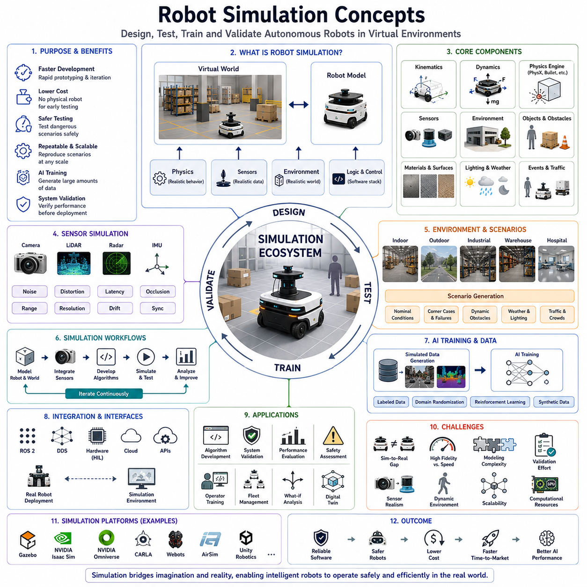
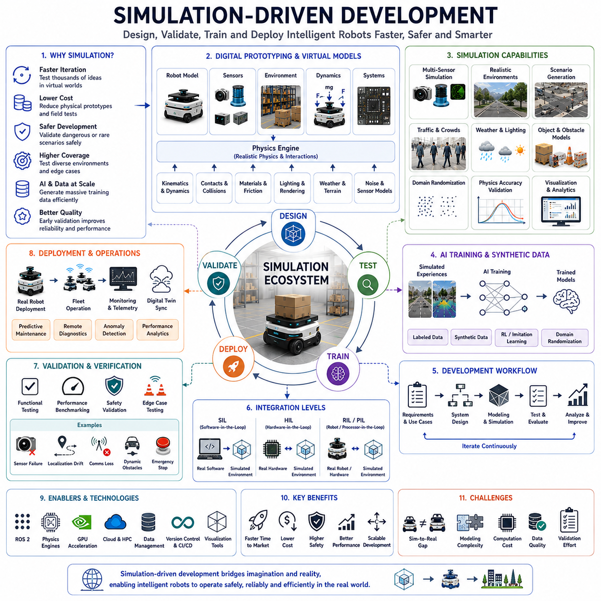
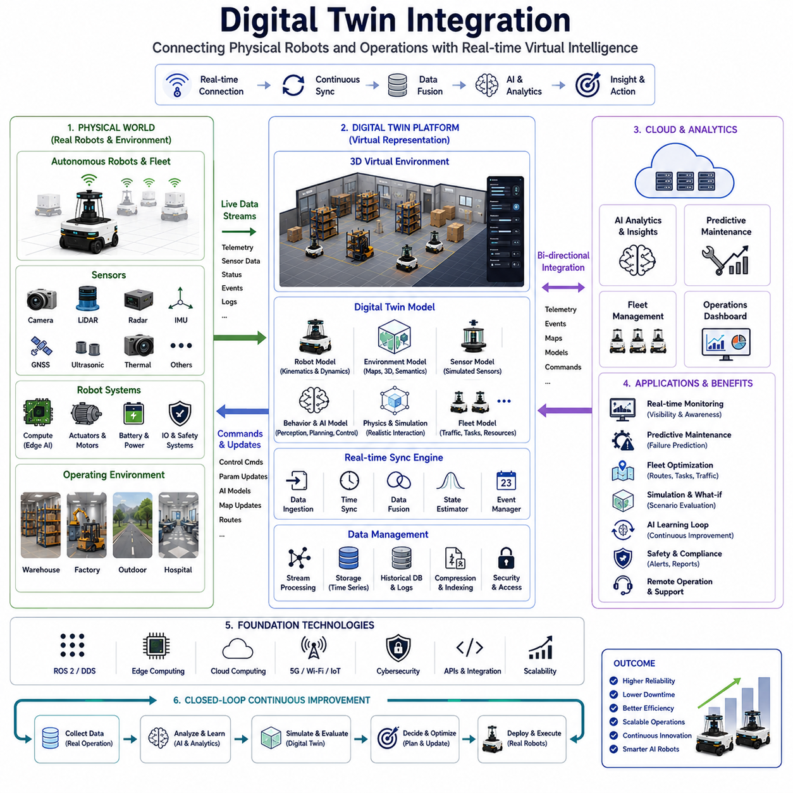
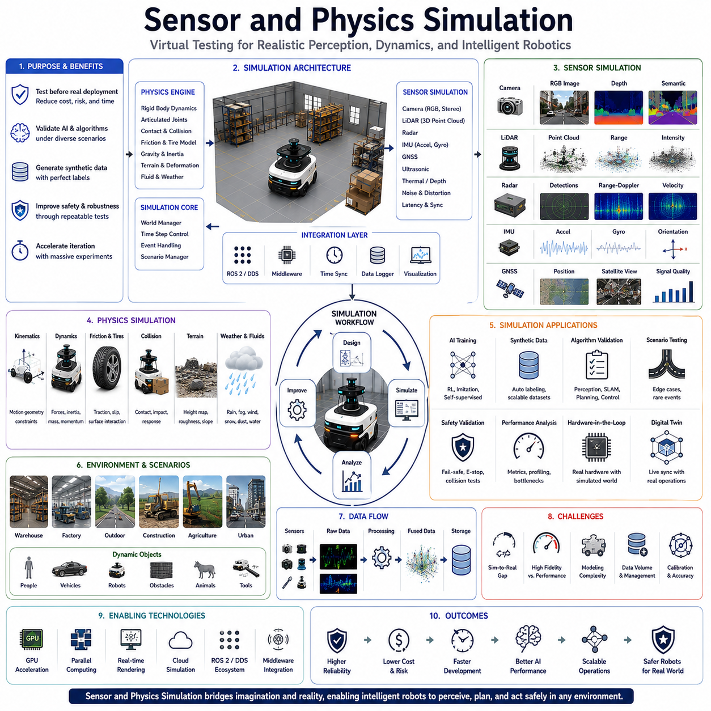
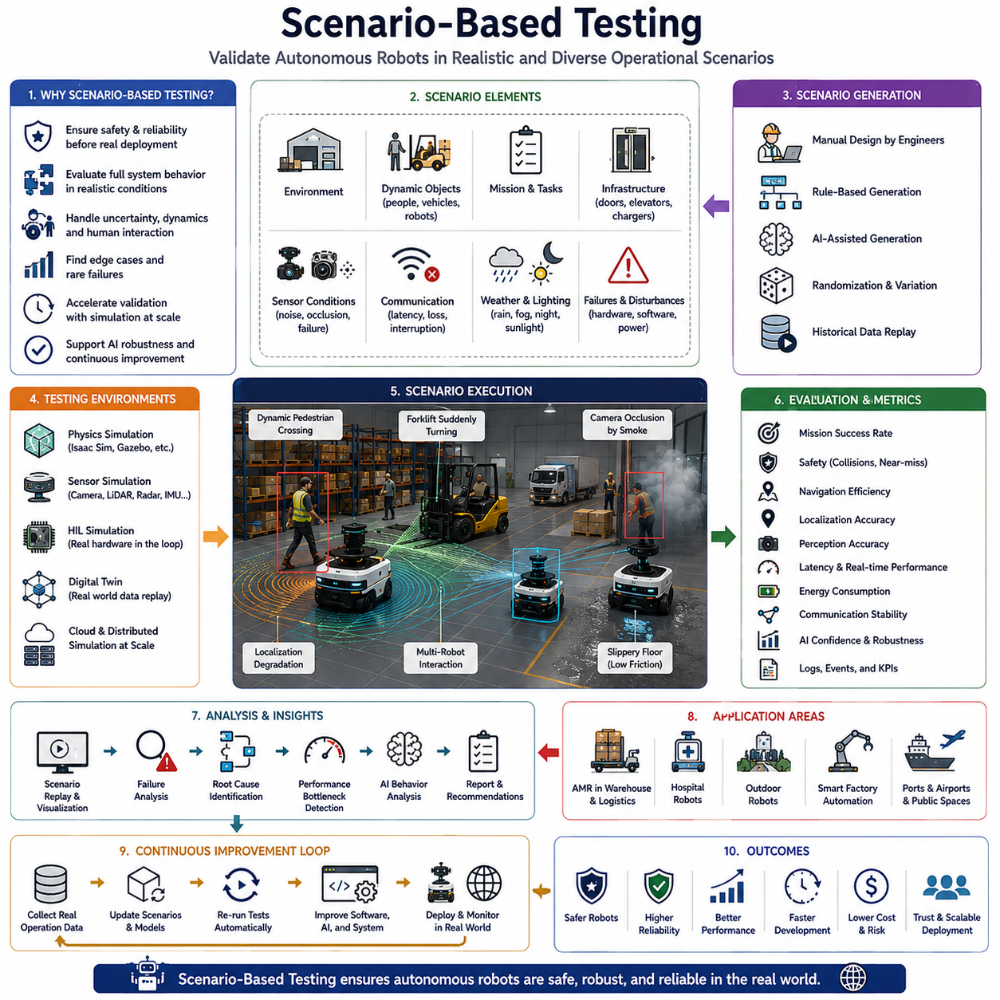
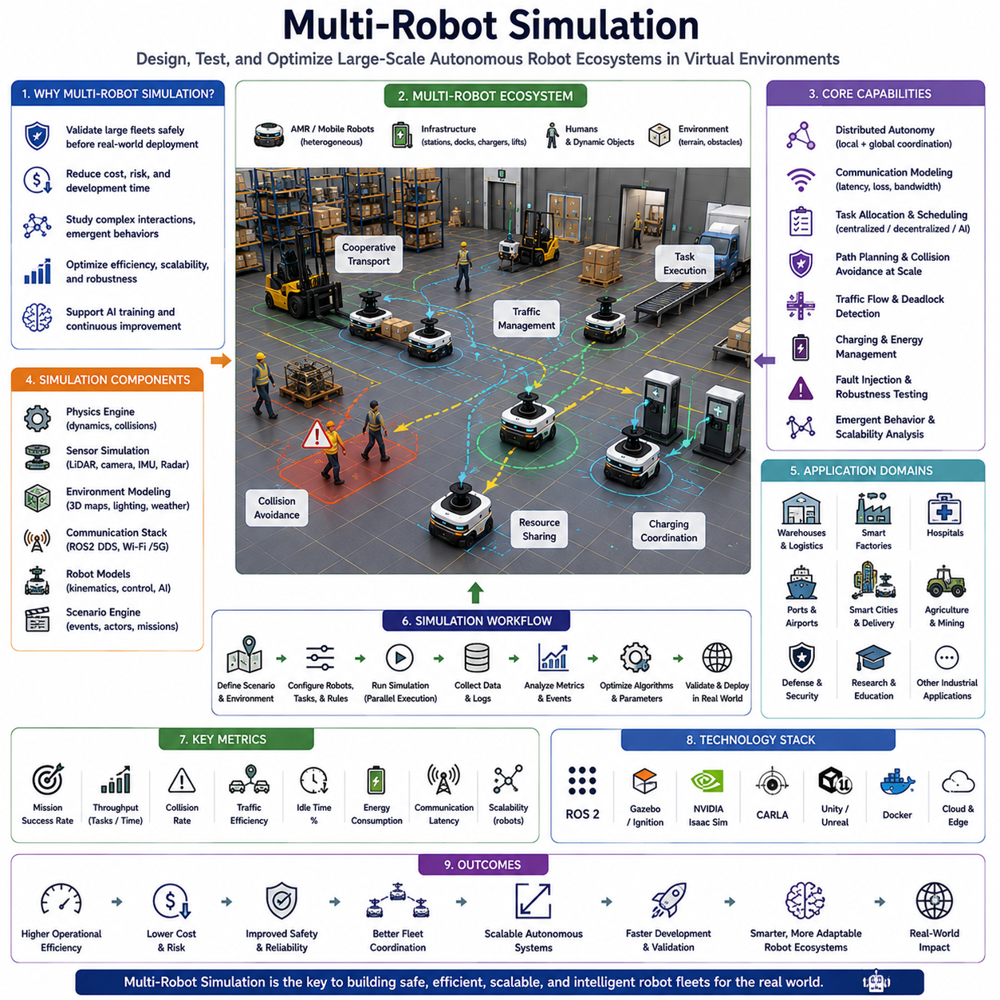
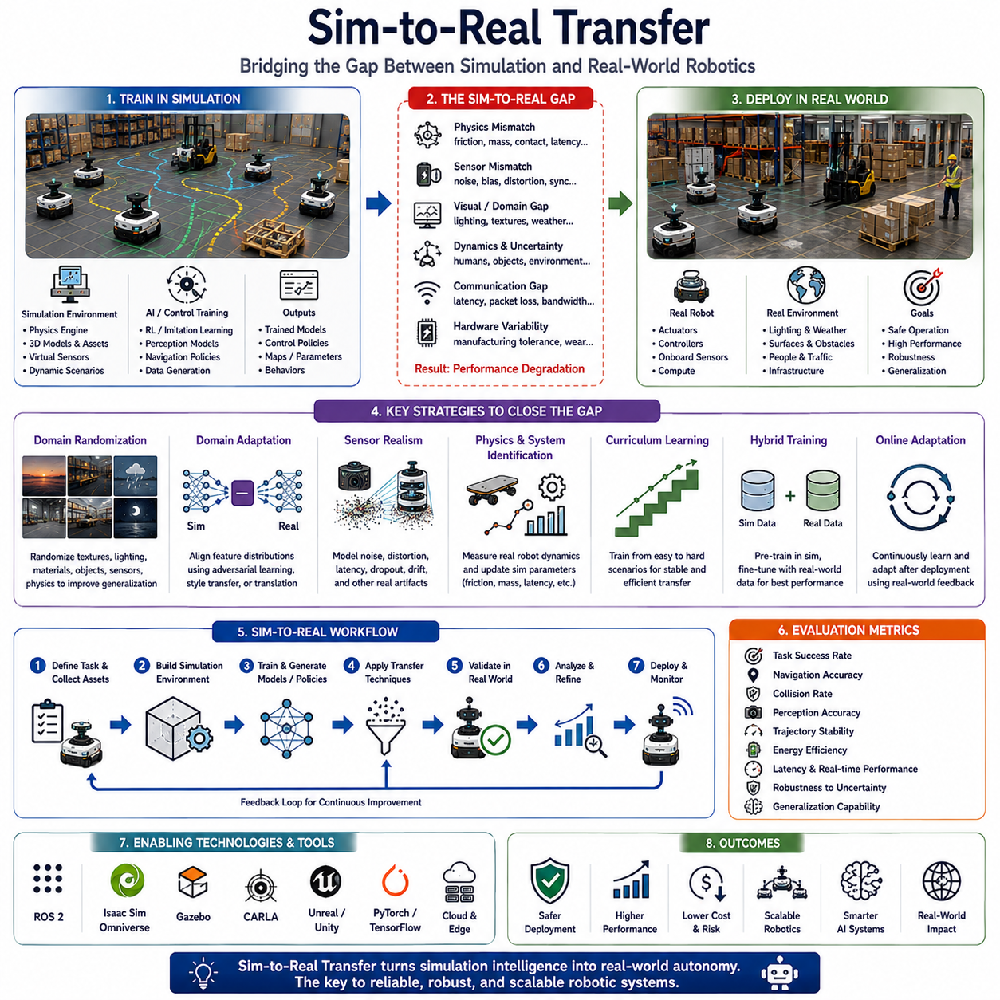
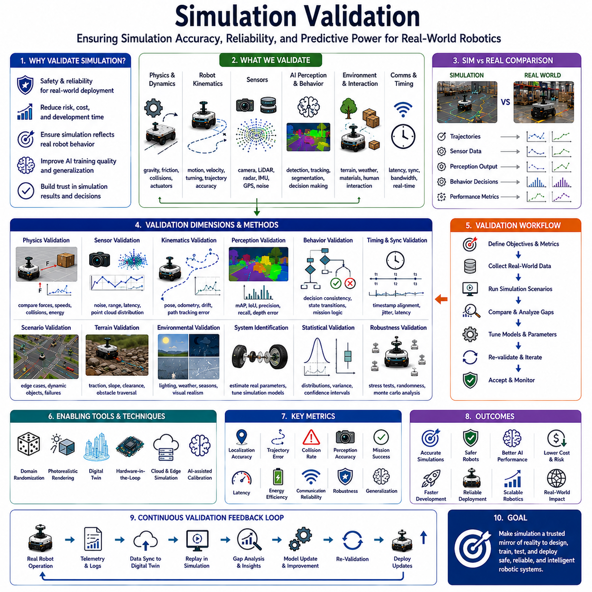

**Volume 07. AMR Software Architecture and Development**

# Chapter 14. Simulation Workflows

## 14.1 Robot Simulation Concepts

{width="7.268055555555556in" height="7.268055555555556in"}

로봇 시뮬레이션 개념은 현대 로보틱스 엔지니어링, 자율주행 모바일 로봇 개발, Embodied AI 시스템, 지능형 기계 연구에서 가장 핵심적인 기술 중 하나가 되었다. 로봇 시스템이 점점 더 복잡하고 고가이며 AI 중심 구조로 발전함에 따라 시뮬레이션 환경은 더 이상 단순한 개발 도구가 아니라 전체 로봇 엔지니어링 생명주기의 필수 구성 요소가 되었다. 현대 자율주행 로봇은 Perception System, Localization Algorithm, Navigation Stack, AI Inference Pipeline, Multimodal Sensor Fusion Architecture, Cloud-Edge Communication System, Autonomous Decision-Making Framework 등을 통합하고 있다. 이러한 시스템을 실제 환경에서만 개발하고 검증하는 것은 비용, 안전성, 시간, 하드웨어 제한, 환경적 불확실성 때문에 현실적으로 매우 어렵다. 따라서 로봇 시뮬레이션은 실제 환경 배포 이전에 로봇 시스템을 설계하고 테스트하며 최적화하고 검증하고 학습시킬 수 있는 Virtual Environment를 제공한다.

로봇 시뮬레이션의 핵심은 로봇 시스템, 물리 환경, 센서, 물리 상호작용, 운영 동작을 디지털 환경 내부에서 재현하는 것이다. 시뮬레이션은 실제 로봇이 다양한 환경 조건에서 물리 세계와 어떻게 상호작용하는지를 계산적으로 모사하려고 한다. 여기에는 Robot Kinematics, Dynamics, Actuator Behavior, Sensor Output, Environmental Structure, Friction, Collision Interaction, Lighting Condition, Weather Effect, Communication Latency, AI Decision-Making Process 등이 포함된다. 고정밀 시뮬레이션 환경은 실제 세계를 충분히 정확하게 재현하여 실제 배포 이전에도 의미 있는 소프트웨어 개발과 성능 검증이 가능하도록 한다.

로봇 시뮬레이션의 가장 중요한 목적 중 하나는 개발 속도 향상이다. 로봇 소프트웨어나 하드웨어 설계를 변경할 때마다 실제 프로토타입을 제작하는 것은 매우 비용이 크고 시간이 오래 걸린다. 시뮬레이션은 물리 로봇 없이도 Navigation Algorithm, AI Model, Sensor Configuration, Control System, Software Architecture를 빠르게 테스트할 수 있게 해준다. 이를 통해 개발 주기를 크게 단축할 수 있으며 대규모 실험이 가능해진다. 실제 Autonomous Robotics System은 Physical Testing 이전에 수천 또는 수백만 번의 Simulated Operational Scenario를 거친다.

시뮬레이션은 특히 Autonomous Mobile Robot에서 매우 중요하다. AMR은 Dynamic하고 예측 불가능한 환경에서 동작하기 때문이다. 실제 환경에는 이동하는 사람, 차량, 장애물 변화, 조명 변화, 날씨 변화, 센서 노이즈, 통신 불안정성, 예기치 못한 상황이 존재한다. 이러한 모든 상황을 실제로 재현하는 것은 거의 불가능하다. 시뮬레이션은 Rare Situation이나 Dangerous Scenario를 안전하고 반복 가능한 방식으로 테스트할 수 있는 Controlled Environment를 제공한다.

Physics Simulation은 로봇 시뮬레이션의 가장 핵심적인 요소 중 하나이다. 실제 로봇은 Mechanics, Dynamics, Inertia, Friction, Momentum, Gravity, Tire Interaction, Suspension Behavior, Collision Response 등의 물리 법칙에 따라 움직인다. 시뮬레이션 환경은 이러한 물리 상호작용을 충분한 정확도로 재현해야 의미 있는 테스트가 가능하다. PhysX, Bullet, ODE, MuJoCo, Isaac Physics Framework와 같은 Physics Engine은 Rigid Body Dynamics, Articulated Joint, Contact Interaction, Force Propagation 등을 계산적으로 시뮬레이션한다.

Robot Kinematics Simulation은 Virtual Environment에서 로봇 움직임을 모델링하는 기본 요소이다. Kinematics는 Force를 직접 고려하지 않고 Robot Joint, Wheel, Steering System, Actuator, Motion Mechanism이 어떻게 움직임을 생성하는지를 설명한다. Differential Drive Robot, Ackermann Steering Vehicle, Omnidirectional Platform, Tracked Vehicle, Robotic Arm 등은 모두 서로 다른 Kinematic Model을 필요로 한다. Simulation Framework는 Motion Constraint, Wheel Geometry, Steering Limitation, Acceleration Behavior, Turning Dynamics를 정확하게 재현해야 현실적인 움직임을 구현할 수 있다.

Dynamic Simulation은 단순한 Kinematics를 넘어서 Force, Mass Distribution, Inertia, Actuator Torque, Tire Slip, External Interaction까지 포함한다. Outdoor Autonomous Robot, Heavy Payload Platform, Towing AMR, Agricultural Robot, Rough-Terrain Vehicle에서는 Dynamics가 실제 성능에 큰 영향을 미친다. Suspension System, Center-of-Gravity Movement, Slope Traversal, Vibration Response, Traction Characteristic 등은 반드시 시뮬레이션에 반영되어야 한다.

Sensor Simulation 역시 로봇 시뮬레이션의 핵심 요소이다. 현대 자율주행 로봇은 RGB Camera, Stereo Vision, Depth Camera, Thermal Sensor, LiDAR, Radar, GNSS, IMU, Ultrasonic Sensor, Force Sensor 등에 크게 의존한다. 각 센서는 고유한 Noise Pattern, Distortion, Latency, Environmental Interference, Resolution Limitation을 가진다. Accurate Sensor Simulation은 Perception Pipeline, Sensor Fusion Algorithm, Localization System, AI Inference Architecture를 검증하는 데 필수적이다.

Camera Simulation은 Perspective Projection, Lighting Interaction, Exposure Dynamics, Shadow, Reflection, Motion Blur, Depth-of-Field Effect, Environmental Illumination 등을 재현하려고 한다. 고정밀 Camera Simulation은 AI Training과 Perception Validation에서 특히 중요하다. Deep Learning System은 Image Characteristic에 매우 민감하기 때문이다. 최근 Synthetic Image Generation Pipeline은 Physically Based Rendering을 적극 활용하여 Realism을 향상시키고 있다.

LiDAR Simulation 역시 자율주행 로봇에서 매우 중요하다. Simulated LiDAR는 Virtual Environment Geometry와 Sensor Characteristic을 기반으로 Point Cloud Data를 생성한다. 현실적인 LiDAR Simulation은 Beam Divergence, Range Noise, Intensity Reflection, Weather Interference, Multi-Path Effect, Rolling Shutter Timing, Sensor Occlusion 등을 포함한다. 이를 통해 실제 Field Test 없이도 SLAM, Obstacle Detection, Occupancy Mapping, 3D Perception Pipeline을 검증할 수 있다.

Radar Simulation도 Outdoor Robotics와 Autonomous Driving에서 점점 중요해지고 있다. Radar는 Camera나 LiDAR와 다르게 Material Property, Doppler Motion, Electromagnetic Reflection에 강하게 영향을 받는다. 따라서 Radar Simulation은 Wave Propagation, Reflection Signature, Multi-Path Interference, Velocity Estimation 등을 모델링해야 한다. 특히 악천후 환경에서는 Camera와 LiDAR 성능이 저하되기 때문에 Radar Simulation의 중요성이 더욱 커진다.

Environmental Simulation 역시 핵심 요소이다. Autonomous Robot은 Warehouse, Hospital, Factory, Logistics Center, Port, Airport, Agricultural Field, Railway, Mining Site, Smart City, Outdoor Urban Space 등 매우 다양한 환경에서 동작한다. 시뮬레이션 시스템은 이러한 환경을 정확하게 재현하면서도 Flexible Scenario Generation을 지원해야 한다. 여기에는 Static Geometry, Moving Object, Lighting Condition, Weather System, Terrain Surface, Traffic Flow, Pedestrian Behavior, Dynamic Obstacle Interaction 등이 포함된다.

Scenario-Based Simulation은 Robotics Validation에서 매우 강력한 접근 방식이 되었다. 단순히 정상 상황만 테스트하는 것이 아니라 Corner Case, Failure Condition, Sensor Degradation, Communication Interruption, Obstacle Emergence, Actuator Failure, Localization Drift, Environmental Anomaly 등을 포함한 다양한 Operational Scenario를 생성한다. 이를 통해 Autonomous Behavior를 매우 광범위한 조건에서 체계적으로 검증할 수 있다.

Simulation-Driven AI Training 역시 현대 Embodied AI와 Autonomous Robotics에서 매우 중요하다. Reinforcement Learning, Imitation Learning, Behavior Cloning, Self-Supervised Learning은 엄청난 양의 Interaction Data를 필요로 한다. 이러한 데이터를 실제 로봇으로 수집하는 것은 현실적으로 매우 어렵다. 시뮬레이션은 Physical Wear, Safety Risk, Operational Cost 없이 Virtual World에서 대규모 학습을 가능하게 한다. 수백만 번의 Simulated Training Episode를 매우 빠르게 생성할 수 있다.

Synthetic Data Generation은 Simulation Workflow와 밀접하게 연결된다. Deep Learning Model은 학습을 위해 대규모 Labeled Dataset이 필요하다. 그러나 실제 데이터 라벨링은 매우 비용이 많이 든다. 시뮬레이션 환경은 Segmentation Mask, Bounding Box, Depth Map, Optical Flow, Occupancy Label, Semantic Annotation 등을 자동으로 생성할 수 있다. 이러한 Synthetic Data Pipeline은 현대 Robotics AI Development에서 핵심 기술이 되었다.

Digital Twin Concept는 Robotics Simulation의 고급 진화 형태이다. Digital Twin은 Physical Robot이나 Operational Environment를 실시간으로 동기화하는 Virtual Representation이다. 단순 Offline Simulation과 달리 Telemetry Stream, Sensor Data, Operational Status, Environmental Update를 지속적으로 반영한다. 이를 통해 Predictive Maintenance, Operational Monitoring, Anomaly Detection, Remote Diagnostics, Fleet-Level Optimization이 가능해진다.

Real-Time Simulation은 Robotics Software Validation에서 매우 중요하다. 많은 Robotics System은 ROS2 Middleware, DDS Communication, Real-Time Control Loop, Asynchronous Sensor Pipeline, GPU-Accelerated AI Inference에 의존한다. 따라서 Simulation Environment는 Hardware-in-the-Loop, Software-in-the-Loop, Real-Time Middleware Integration을 지원해야 한다. 이를 통해 Timing Behavior, Communication Latency, Synchronization Mechanism, System Responsiveness를 검증할 수 있다.

Hardware-in-the-Loop Simulation은 실제 Hardware Component를 Virtual Environment와 연결한다. Motor Controller, Sensor, Embedded Computer, GPU, Communication System 등이 실제로 연결된 상태에서 Virtual World와 상호작용한다. 이는 Full-Scale Robot Integration 이전에 Hardware Behavior를 안전하게 검증할 수 있게 해준다. 특히 Autonomous Navigation, Brake System, Industrial Robotics Platform과 같은 Safety-Critical System에서 중요하다.

Simulation Scalability 역시 점점 중요해지고 있다. 현대 Robotics System은 Multi-Robot 및 Fleet-Based Architecture로 발전하고 있다. Warehouse, Hospital, Logistics Center, Smart Factory에는 수십 또는 수백 대의 Autonomous Robot이 동시에 운영된다. Multi-Robot Simulation은 Traffic Management, Fleet Scheduling, Communication Architecture, Collision Avoidance, Distributed Coordination을 대규모로 테스트할 수 있게 한다.

Cloud-Connected Simulation System 역시 점점 일반화되고 있다. AI Training이나 Synthetic Dataset Generation은 매우 높은 계산 자원을 요구한다. Distributed Cloud Simulation은 대규모 GPU Cluster에서 Dynamic하게 Simulation Workload를 확장할 수 있게 한다. Cloud-Native Simulation Architecture는 Collaborative Robotics Development, Continuous Integration Testing, AI Model Validation을 산업 규모로 수행할 수 있게 한다.

Simulation Realism은 Robotics Engineering에서 가장 어려운 문제 중 하나이다. 아무리 고급 Simulator라도 실제 세계의 모든 Environmental Interaction, Sensor Artifact, Material Property, Weather Effect, Mechanical Wear, Electromagnetic Interference, Human Behavior를 완벽하게 재현할 수는 없다. 이러한 차이를 Sim-to-Real Gap이라고 한다. 이를 해결하기 위해 Sophisticated Physics Engine, Advanced Sensor Model, Domain Randomization, Adaptive Learning System이 사용된다.

Domain Randomization은 Sim-to-Real Transfer를 향상시키기 위해 널리 사용된다. 완벽한 Realism을 추구하는 대신 Texture, Lighting, Object Position, Sensor Noise, Weather Condition, Environmental Characteristic을 의도적으로 랜덤하게 변경한다. 이를 통해 AI Model이 특정 시뮬레이션 환경에 Overfitting되지 않고 다양한 조건에 일반화될 수 있도록 한다.

Simulation Performance Optimization 역시 중요한 과제이다. Physics Engine, Sensor Rendering, AI Inference, Multi-Robot Interaction, Large-Scale Environment를 포함한 High-Fidelity Simulation은 매우 높은 Computational Throughput을 요구한다. 따라서 GPU Acceleration, Parallel Computing, Distributed Simulation Architecture, Optimized Rendering Pipeline이 점점 더 중요해지고 있다.

Gazebo, Isaac Sim, Omniverse, Webots, CARLA, AirSim, Unity 기반 Robotics Simulator와 같은 현대 시뮬레이션 플랫폼은 매우 고급화된 Robotics Development Ecosystem을 제공한다. 이들은 Physics Simulation, Sensor Modeling, ROS2 Middleware, AI Training Framework, Synthetic Data Generation Pipeline, Cloud Integration, Collaborative Development Tool을 통합 제공한다.

Simulation은 Robotics Functional Safety Validation에서도 핵심 역할을 한다. 사람, 산업 장비, 차량, 공공 인프라 근처에서 동작하는 Autonomous Robot은 실제 배포 이전에 광범위한 검증을 수행해야 한다. 시뮬레이션은 Emergency Response Behavior, Fail-Safe Mechanism, Obstacle Avoidance Reliability, Degraded Sensor Operation, Communication Failure, Abnormal Operating Condition 등을 안전하게 검증할 수 있게 한다.

미래의 Robot Simulation System은 Embodied AI, Multimodal Reasoning, World Model, Autonomous Agent, Large Language Model, Cloud-Edge Distributed Intelligence를 더욱 적극적으로 통합하게 될 것이다. Simulation Environment는 Autonomous Cognition Development, Long-Term Learning, Collaborative Robotics Training, Large-Scale Robotic Ecosystem Validation을 지원하는 Adaptive Virtual World로 발전할 가능성이 높다.

현대 AMR 소프트웨어 아키텍처에서 Robot Simulation Concept는 단순한 Auxiliary Development Tool이 아니다. 이는 AI Development, Robotics Software Architecture, Sensor Modeling, Control Validation, Cloud Computing, Digital Twin, Operational Safety를 하나의 Unified Autonomous System Engineering Ecosystem으로 연결하는 핵심 인프라이다. Robot Simulation을 깊이 이해하는 엔지니어는 개발 속도를 향상시키고, Reliability를 높이며, Operational Risk를 줄이고, 실제 환경에서 안전하고 효율적으로 동작하는 Scalable Intelligent Robotics System을 구축할 수 있다. 따라서 Robot Simulation은 Embodied AI, Autonomous Robotics, Intelligent Machine System의 미래를 지탱하는 가장 중요한 기술 기반 중 하나라고 할 수 있다.

## 14.2 Simulation-Driven Development

{width="7.268055555555556in" height="7.268055555555556in"}

Simulation-Driven Development는 현대 로보틱스 엔지니어링, 자율주행 모바일 로봇 개발, Embodied AI 시스템, 지능형 기계 설계 분야에서 가장 혁신적인 개발 방법론 중 하나로 자리 잡고 있다. 로봇 플랫폼이 점점 더 인공지능, 멀티모달 인지 시스템, 자율주행 아키텍처, 분산형 Edge Computing, 대규모 소프트웨어 통합 구조에 의존하게 되면서 개발 과정의 복잡성 또한 급격히 증가하고 있다. 과거의 전통적인 로봇 개발 방식은 실제 하드웨어 프로토타입 제작과 현장 테스트 중심으로 이루어졌지만, 이러한 접근만으로는 현대 자율 시스템의 규모, 속도, 비용, 안전 요구사항을 만족시키기 어렵다. 따라서 Simulation-Driven Development는 실제 환경 배포 이전에 Virtual Environment 안에서 로봇 시스템을 설계하고 검증하며 최적화하고 반복적으로 개선하는 새로운 개발 패러다임으로 발전하였다.

Simulation-Driven Development의 핵심은 시뮬레이션 환경을 단순한 보조 테스트 도구가 아니라 Robotics Engineering Lifecycle의 중심 요소로 활용하는 것이다. 기존 방식처럼 실제 시스템을 먼저 제작한 뒤 검증하는 것이 아니라, 로봇, 센서, 환경, 제어 시스템, AI Pipeline, Operational Scenario의 디지털 표현을 소프트웨어 및 하드웨어 개발과 동시에 구축한다. 이러한 Simulation Environment는 설계 검증, AI 학습, 알고리즘 테스트, Sensor Fusion Verification, 성능 분석, 안전성 검증, 운영 최적화 등을 지속적으로 지원한다.

Simulation-Driven Development가 중요한 이유 중 하나는 현대 Robotics System의 복잡성이 폭발적으로 증가했기 때문이다. 현대 Autonomous Robot은 Perception Pipeline, SLAM System, Localization Framework, Trajectory Planner, Motion Controller, Fleet Communication System, Cloud-Edge Synchronization Architecture, AI Inference Engine, Sensor Fusion Pipeline, Safety Management Framework 등을 동시에 포함한다. 이러한 요소를 모두 실제 환경에서만 테스트하는 것은 비용과 시간이 지나치게 많이 들고 Operational Risk도 매우 크다. Simulation Environment는 실제 로봇 없이도 다양한 환경 조건에서 시스템 동작을 평가할 수 있게 해준다.

Simulation-Driven Development는 Robotics Iteration Cycle을 크게 단축시킨다. 전통적인 Robotics Engineering에서는 Hardware Configuration, AI Model, Navigation Algorithm, Sensor Layout을 수정할 때마다 실제 로봇 통합과 현장 테스트를 반복해야 했다. 이는 개발 속도를 크게 저하시킨다. 반면 시뮬레이션 환경에서는 다양한 설계안, 파라미터 설정, 소프트웨어 구조, AI Model을 Hardware Integration 이전에 빠르게 테스트할 수 있다. 실제 Physical Deployment 한 번에 필요한 시간 동안 수천 번의 Simulated Experiment를 수행할 수 있는 것이다.

이 방법론은 특히 Autonomous Mobile Robot에서 매우 중요하다. AMR은 Dynamic하고 예측 불가능한 환경에서 동작하기 때문이다. Warehouse, Factory, Hospital, Port, Airport, Smart City, Agricultural Field, Outdoor Industrial Facility에는 이동하는 사람, 차량, 장애물 변화, 조명 변화, 날씨 변화, 통신 불안정성, 예상치 못한 Operational Condition이 존재한다. Simulation-Driven Development는 이러한 환경을 디지털로 재현하고 다양한 Operational Condition 아래에서 Robot Behavior를 체계적으로 테스트할 수 있게 해준다.

Digital Prototyping은 Simulation-Driven Development의 핵심 기반이다. 실제 Hardware가 존재하기 이전에 개발자는 Robot Geometry, Kinematics, Dynamics, Sensor Placement, Power System, Computing Infrastructure, Mechanical Structure를 디지털 모델로 생성한다. 이를 통해 Mobility Constraint, Visibility Coverage, Sensor Field-of-View Overlap, Payload Distribution, Turning Behavior, Obstacle Clearance, Thermal Characteristic 등을 제조 이전에 분석할 수 있다. 이러한 Digital Prototyping은 개발 초기에 설계 결함을 발견함으로써 Engineering Risk를 크게 감소시킨다.

Physics Simulation은 Simulation-Driven Development Architecture에서 매우 중요한 역할을 한다. 실제 로봇은 Gravity, Friction, Inertia, Momentum, Tire Slip, Actuator Dynamics, Terrain Deformation, Vibration, Collision Response와 같은 물리적 힘과 지속적으로 상호작용한다. PhysX, Bullet, MuJoCo, ODE, Isaac Physics Framework와 같은 Physics Engine은 이러한 상호작용을 계산적으로 시뮬레이션한다. Accurate Physics Simulation은 Robot Stability, Motion Behavior, Suspension Dynamics, Traction Performance, Towing Capability, Collision Safety를 실제 배포 이전에 검증할 수 있게 해준다.

Sensor Simulation 역시 매우 중요하다. Autonomous Robot은 Camera, LiDAR, Radar, Thermal Imager, IMU, GNSS, Ultrasonic Sensor, Depth Sensor 등에 크게 의존한다. 각 Sensor는 Noise Pattern, Distortion Behavior, Environmental Sensitivity, Timing Jitter, Rolling Shutter Effect, Range Limitation 등을 가진다. Simulation-Driven Sensor Modeling은 Perception Algorithm, Localization System, AI Inference Pipeline, Sensor Fusion Architecture를 대규모 실제 데이터 없이도 검증할 수 있게 해준다.

Camera Simulation은 AI 기반 Robotics Development에서 특히 중요하다. 현대 Perception System은 대규모 Image Dataset으로 학습된 Deep Neural Network에 크게 의존한다. 그러나 실제 Image Dataset을 수집하고 Labeling하는 것은 매우 많은 비용과 시간을 필요로 한다. 시뮬레이션 환경은 Semantic Label, Segmentation Mask, Bounding Box, Depth Map, Optical Flow, Environmental Annotation을 자동으로 생성할 수 있다. Physically Based Rendering 기법은 Shadow, Reflection, Lighting Variation, Weather Effect, Motion Blur, Material Property 등을 현실적으로 재현하여 Synthetic Image Realism을 향상시킨다.

LiDAR Simulation 역시 Simulation-Driven Development의 핵심 요소이다. Simulated LiDAR는 Environmental Geometry와 Sensor Physics를 기반으로 Realistic Point Cloud를 생성한다. High-Fidelity LiDAR Simulation은 Beam Divergence, Range Noise, Reflection Intensity Variation, Weather Interference, Sensor Occlusion, Rolling Acquisition Timing, Multi-Path Reflection 등을 포함한다. 이를 통해 SLAM Performance, Occupancy Mapping Accuracy, Obstacle Detection Reliability, 3D Perception Robustness를 다양한 환경 조건에서 평가할 수 있다.

Radar Simulation은 Outdoor Autonomous System에서 점점 더 중요해지고 있다. Radar는 Optical Sensor와 달리 Material Property, Motion Velocity, Electromagnetic Reflection, Weather Condition에 강하게 영향을 받는다. 따라서 Radar Simulation은 Electromagnetic Modeling과 Dynamic Motion Analysis를 포함해야 한다. 특히 Rain, Fog, Snow, Low-Light Environment에서 Camera와 LiDAR 성능이 저하될 경우 Radar Validation의 중요성이 더욱 커진다.

AI Development 역시 Simulation-Driven Development와 깊게 연결되어 있다. 현대 Robotics AI System은 막대한 양의 학습 데이터와 Operational Validation을 필요로 한다. Reinforcement Learning, Imitation Learning, Behavior Cloning, Self-Supervised Learning, Autonomous Agent Training은 대부분 Simulation Environment에 크게 의존한다. 실제 환경에서 동일한 양의 Interaction Data를 수집하는 것은 현실적으로 거의 불가능하기 때문이다. 시뮬레이션은 Hardware Wear, Operational Cost, Safety Risk 없이 Virtual Environment에서 Continuous AI Training을 가능하게 한다.

Synthetic Data Generation은 Simulation-Driven Robotics Engineering의 가장 중요한 응용 중 하나가 되었다. Deep Learning System은 학습을 위해 매우 큰 Labeled Dataset을 필요로 한다. 그러나 Manual Dataset Labeling은 AI Development에서 가장 비용이 많이 드는 작업 중 하나이다. Simulation Environment는 Semantic Segmentation Label, Depth Information, Instance Mask, Occupancy Map, Object Trajectory, Environmental Metadata 등을 자동으로 생성할 수 있다. 이러한 Synthetic Dataset은 AI Training Cost를 크게 줄이고 Scalability를 향상시킨다.

Domain Randomization은 Sim-to-Real Transfer를 향상시키기 위해 널리 사용되는 전략이다. 완벽하게 현실적인 Virtual Environment를 만들려고 하기보다는 Texture, Lighting Condition, Weather Effect, Object Position, Sensor Noise, Material Property, Environmental Structure를 의도적으로 랜덤하게 변경한다. 이를 통해 Neural Network가 특정 시뮬레이션 환경에 Overfitting되지 않고 다양한 Operational Condition에 일반화될 수 있도록 만든다. 결과적으로 실제 환경에서 AI Robustness가 크게 향상된다.

Simulation-Driven Development는 Continuous Integration 및 Continuous Validation Workflow도 지원한다. 현대 Robotics System은 매우 복잡한 Software Architecture를 가지며, 한 Subsystem의 수정이 다른 부분에 예상치 못한 영향을 줄 수 있다. Simulation Environment는 Navigation Performance, Sensor Synchronization, AI Inference Stability, Collision Avoidance Behavior, Localization Accuracy, Middleware Communication, Fleet Coordination 등을 지속적으로 검증하는 Automated Testing Infrastructure 역할을 수행한다.

Hardware-in-the-Loop Simulation은 순수 Software Testing을 넘어서는 고급 Validation Technique이다. Motor Controller, Embedded Computer, GPU, Sensor, Communication Device, Actuator와 같은 실제 Hardware Component가 Virtual Simulation Environment와 직접 연결된다. 이를 통해 Full Physical Robot Integration 이전에 Low-Level Hardware Behavior, Communication Timing, Real-Time Control Stability, Embedded System Performance를 검증할 수 있다. 이러한 방식은 Autonomous Navigation, Industrial Automation, Heavy Robotics Platform과 같은 Safety-Critical System에서 특히 중요하다.

Software-in-the-Loop Simulation 역시 Robotics Validation에서 핵심적인 역할을 한다. ROS2 Middleware, Navigation System, AI Inference Engine, Control Algorithm과 같은 실제 Robotics Software Stack이 Simulation Environment 내부에서 직접 실행된다. 이를 통해 Physical Deployment 없이도 Complete End-to-End Software Behavior를 분석할 수 있다. Software-in-the-Loop Testing은 Debugging, Middleware Validation, System Integration Workflow를 크게 가속화한다.

Scenario-Based Simulation은 Simulation-Driven Development의 가장 강력한 도구 중 하나이다. 단순히 정상 상황만 테스트하는 것이 아니라 Dynamic Obstacle, Sensor Failure, Localization Drift, Communication Interruption, Emergency Stop Condition, Environmental Anomaly, Crowded Traffic Situation, Adverse Weather, Edge-Case Operational Condition 등을 포함하는 다양한 시나리오를 생성한다. 이러한 Scenario-Based Testing은 Autonomous System Robustness를 크게 향상시킨다.

Simulation-Driven Development는 Functional Safety Engineering에서도 핵심 역할을 수행한다. 사람, 산업 장비, 물류 시스템, 병원, 공공 인프라 근처에서 동작하는 Autonomous Robot은 실제 배포 이전에 광범위한 Safety Validation을 수행해야 한다. 그러나 Dangerous Failure Condition을 실제로 재현하는 것은 매우 위험하거나 비현실적이다. Simulation Environment는 Emergency Behavior, Fail-Safe System, Braking Response, Collision Avoidance Reliability, Degraded Sensor Operation, Abnormal Environmental Condition을 안전하게 검증할 수 있게 해준다.

Digital Twin Technology는 Simulation-Driven Development의 고급 진화 형태이다. Digital Twin은 Physical Robot 또는 Operational Environment를 실시간으로 동기화하는 Virtual Representation이다. 단순한 Offline Simulation과 달리 Telemetry Stream, Sensor Output, Operational Status Data, Environmental Update, Fleet Management System과 지속적으로 연결된다. 이를 통해 Predictive Maintenance, Remote Diagnostics, Anomaly Detection, Operational Analytics, Fleet-Wide Optimization이 가능해진다.

Cloud-Connected Simulation Architecture도 점점 중요해지고 있다. AI Training, Synthetic Data Generation, Multi-Robot Simulation은 매우 높은 계산 자원을 요구한다. Distributed Cloud Simulation Platform은 GPU Cluster와 Cloud Infrastructure를 통해 대규모 시뮬레이션을 가능하게 한다. Cloud-Native Simulation Environment는 Collaborative Development, Large-Scale Automated Testing, Distributed AI Training, Continuous Deployment Validation을 지원한다.

Simulation Scalability 역시 중요한 요소이다. 현대 Robotics System은 Fleet-Scale Autonomy 방향으로 발전하고 있다. Warehouse, Smart Factory, Hospital, Airport, Logistics Hub에는 수백 대의 로봇이 동시에 운영될 수 있다. Multi-Robot Simulation Environment는 Fleet Scheduling Algorithm, Traffic Management System, Distributed Communication Architecture, Cooperative Navigation Strategy, Resource Optimization Framework를 대규모로 검증할 수 있게 해준다.

Simulation Realism은 여전히 가장 큰 도전 과제 중 하나이다. 아무리 고급 Simulator라도 실제 세계의 모든 Physics, Sensor Artifact, Environmental Variability, Electromagnetic Interference, Human Behavior, Hardware Degradation을 완벽히 재현할 수는 없다. 이러한 차이를 Sim-to-Real Gap이라고 부른다. 이를 줄이기 위해 Sophisticated Rendering System, Advanced Physics Engine, Sensor Model, Adaptive Learning Architecture, Hybrid Real-World Validation Workflow가 지속적으로 발전하고 있다.

Performance Optimization 역시 중요한 과제이다. Real-Time Physics, Sensor Rendering, AI Inference, Multi-Robot Interaction, Large-Scale Environment를 포함하는 High-Fidelity Simulation은 매우 높은 Computational Throughput을 요구한다. GPU Acceleration, Distributed Simulation Framework, Optimized Rendering Pipeline, Asynchronous Execution Architecture, Cloud-Based Compute Scaling이 점점 더 중요해지고 있다.

Isaac Sim, Omniverse, Gazebo, Webots, CARLA, AirSim, Unity 기반 Robotics Simulator와 같은 현대 플랫폼은 매우 고도화된 Simulation-Driven Development Ecosystem을 제공한다. 이들은 AI Training, Sensor Simulation, Physics Modeling, ROS2 Middleware, Cloud Integration, Synthetic Data Generation, Visualization System, Collaborative Development Workflow, Large-Scale Robotics Validation을 하나의 통합 환경으로 제공한다.

미래의 Simulation-Driven Development는 Embodied AI, Multimodal Reasoning System, Autonomous Agent, World Model, Cloud-Edge Intelligence, Adaptive Robotics Architecture와 더욱 깊게 통합될 것이다. 미래의 시뮬레이션 환경은 Autonomous Scenario Generation, AI-Assisted Validation, Large-Scale Robotic Cognition Training, Self-Improving Development Workflow를 지원하는 Continuous Learning Virtual Ecosystem으로 발전할 가능성이 높다.

현대 AMR 소프트웨어 아키텍처에서 Simulation-Driven Development는 단순한 테스트 방법론이 아니다. 이는 AI Development, Robotics Software Engineering, Sensor Modeling, Safety Validation, Digital Twin, Cloud Computing, Synthetic Data Generation, Autonomous System Optimization을 하나의 통합 Robotics Development Ecosystem으로 연결하는 종합적인 Engineering Philosophy이다. Simulation-Driven Development를 깊이 이해하는 엔지니어는 Innovation Acceleration, Operational Risk Reduction, Safety Improvement, AI Performance Optimization을 실현하고, 실제 복잡한 환경에서도 안정적으로 동작 가능한 Scalable Autonomous System을 구축할 수 있다. 따라서 Simulation-Driven Development는 Embodied AI, Autonomous Robotics, Intelligent Machine System의 미래를 지탱하는 가장 중요한 기술 기반 중 하나라고 할 수 있다.

## 14.3 Digital Twin Integration

{width="7.268055555555556in" height="7.268055555555556in"}

Digital Twin Integration은 현대 로보틱스, 산업 자동화, 스마트 인프라, 자율주행 모바일 로봇, Embodied AI 시스템에서 가장 혁신적인 기술 중 하나로 발전하고 있다. 로봇 플랫폼이 단순한 독립형 기계에서 지속적으로 연결되는 지능형 시스템으로 진화함에 따라, 실제 물리 시스템과 가상 환경 사이의 실시간 동기화 필요성이 급격히 증가하고 있다. 디지털 트윈 기술은 실제 운영 시스템과 지속적으로 업데이트되는 가상 표현 사이를 연결하는 역할을 수행하며, 로봇, 인프라, 센서, 클라우드 플랫폼, AI 시스템이 하나의 데이터 중심 생태계 안에서 상호작용할 수 있도록 한다. 현대 AMR 소프트웨어 아키텍처에서 Digital Twin Integration은 단순한 시각화 기술이 아니라 Monitoring, Simulation, Predictive Maintenance, Fleet Optimization, Operational Analytics, Autonomous Decision-Making, Continuous AI Learning을 지원하는 핵심 엔지니어링 프레임워크가 되었다.

Digital Twin의 핵심은 실제 물리 시스템을 실시간 데이터와 지속적으로 동기화하는 Dynamic Virtual Representation이라는 점이다. 기존의 전통적인 시뮬레이션 환경이 물리 하드웨어와 독립적으로 동작하는 것과 달리, Digital Twin은 실제 시스템으로부터 Live Telemetry, Sensor Stream, Operational State, Environmental Update, Maintenance Record, AI Output, Infrastructure Information 등을 지속적으로 수신한다. 이러한 Continuous Synchronization을 통해 Virtual Model은 Physical System과 함께 실시간으로 진화하게 된다. 로보틱스 분야에서 Digital Twin은 단일 로봇, 로봇 Fleet, 산업 시설, 물류센터, 공장, 병원, 교통 시스템, 스마트시티 또는 전체 운영 생태계를 표현할 수 있다.

Digital Twin Integration의 중요성이 커진 이유는 Autonomous Robotics System의 복잡성이 급격히 증가하고 있기 때문이다. 현대 로봇은 Multimodal Perception System, Distributed AI Pipeline, Cloud-Edge Communication Framework, Real-Time Localization Architecture, Sensor Fusion System, Autonomous Navigation Stack, Large-Scale Fleet Coordination Software 등을 통합하고 있다. 이러한 시스템을 기존 방식만으로 모니터링하고 최적화하는 것은 매우 어렵다. Digital Twin은 실제 운영과 Virtual Analytical Environment를 연결함으로써 시스템 동작에 대한 Unified Visibility를 제공한다.

Digital Twin Integration의 가장 큰 장점 중 하나는 Real-Time Operational Visibility이다. 실제 로봇은 Localization Information, Battery Status, GPU Utilization, Thermal Condition, Sensor Health Metric, Actuator State, AI Inference Statistic, Communication Quality Indicator, Obstacle Detection Result, Operational Log 등 막대한 양의 Telemetry Data를 지속적으로 생성한다. 적절한 Integration Framework가 없다면 이러한 정보는 매우 분산되고 분석하기 어려운 형태로 존재하게 된다. Digital Twin System은 이러한 데이터를 하나의 Virtual Environment 안에 통합하여 전체 Operational Behavior를 실시간으로 관찰할 수 있게 해준다.

Digital Twin Integration은 Advanced Remote Monitoring Capability도 제공한다. Autonomous Robot은 Warehouse, Port, Factory, Agricultural Site, Hospital, Airport, Railway, Smart City 등 광범위한 환경에서 운영된다. 모든 로봇을 직접 물리적으로 감독하는 것은 현실적으로 어렵다. Digital Twin은 중앙 집중형 Visualization System을 통해 Robot Movement, Sensor Status, AI Behavior, Environmental Interaction, Operational Anomaly를 원격으로 모니터링할 수 있게 해준다. 이는 Operational Management Efficiency를 크게 향상시킨다.

Sensor Integration은 Digital Twin System의 핵심 기반 중 하나이다. Autonomous Robot은 일반적으로 RGB Camera, Stereo Vision, Depth Sensor, Thermal Camera, LiDAR, Radar, IMU, GNSS, Ultrasonic Sensor, Environmental Monitoring System 등을 포함한다. 각 Sensor는 서로 다른 Frequency와 Format으로 막대한 양의 데이터를 생성한다. Digital Twin Integration Architecture는 이러한 Heterogeneous Sensor Stream을 동기화하여 Near Real-Time 수준의 Coherent Virtual Representation을 생성한다.

Localization Synchronization은 Robotics Digital Twin에서 특히 중요하다. 정확한 Robot Position Tracking은 Virtual Model이 실제 Movement를 정밀하게 재현할 수 있게 해준다. Localization System은 GNSS, IMU Fusion, Wheel Odometry, Visual SLAM, LiDAR SLAM, UWB Positioning, Map-Based Localization 등을 조합하여 구현된다. Digital Twin은 이러한 Localization Pipeline을 기반으로 Robot Position, Orientation, Velocity, Trajectory, Navigation State를 지속적으로 업데이트한다. Accurate Synchronization은 Operational Analysis, Collision Monitoring, Traffic Management, Fleet Optimization에 필수적이다.

Environmental Mapping 역시 중요한 요소이다. 현대 로봇은 Moving Human, Vehicle, Machinery, Obstacle, Infrastructure Change, Environmental Variability가 존재하는 Dynamic Environment에서 동작한다. Digital Twin System은 실제 Sensor Data를 기반으로 Virtual Map을 지속적으로 업데이트한다. Occupancy Grid, Semantic Map, 3D Point Cloud, Infrastructure Layout, Dynamic Object Tracking System 등이 모두 Real-Time Operational Awareness 유지에 기여한다.

AI Integration은 Digital Twin Technology의 가장 중요한 발전 중 하나이다. 현대 Robotics System은 Object Detection, Semantic Segmentation, Anomaly Detection, Predictive Navigation, Free-Space Estimation, Autonomous Decision-Making을 위해 AI Inference Engine에 크게 의존한다. Digital Twin Platform은 단순히 Robot Operation을 시각화하는 것을 넘어서 AI Behavior를 지속적으로 분석한다. 실제 로봇에서 생성된 AI Output은 Virtual Environment로 전달되어 Performance Metric, Failure Condition, Uncertainty Estimate, Operational Anomaly 등을 실시간으로 분석할 수 있다.

Digital Twin은 Predictive Maintenance System에서도 점점 더 중요해지고 있다. 실제 로봇 하드웨어는 시간이 지남에 따라 Wear, Vibration Stress, Thermal Cycling, Actuator Fatigue, Battery Degradation, Sensor Drift, Mechanical Deterioration을 경험한다. 전통적인 Maintenance 방식은 주기적 정비나 고장 이후의 Reactive Repair에 크게 의존했다. 그러나 Digital Twin System은 Operational Telemetry를 지속적으로 분석하여 실제 고장이 발생하기 전에 이상 징후를 감지할 수 있다. AI 기반 Maintenance Model은 Abnormal Motor Vibration, Increasing Thermal Instability, Battery Degradation Trend, Sensor Calibration Drift, Unusual Actuator Behavior 등을 조기에 탐지할 수 있다.

Thermal Monitoring Integration은 Embedded AI Robotics System에서 매우 중요하다. 현대 Autonomous Robot은 NVIDIA Jetson과 같은 High-Performance GPU Platform을 사용하여 Intensive AI Inference Workload를 지속적으로 실행한다. 과도한 Thermal Accumulation은 Thermal Throttling이나 장기적인 Hardware Degradation을 유발할 수 있다. Digital Twin은 GPU Temperature, CPU Utilization, Power Consumption, Memory Bandwidth, Cooling Efficiency를 Fleet 전체 수준에서 실시간으로 모니터링할 수 있게 해준다.

Battery Management Integration 역시 중요한 응용 분야이다. 장시간 운영되는 Autonomous Robot은 Efficient Battery Usage와 Charging Management가 필요하다. Digital Twin은 Battery Voltage, Current Consumption, Charging Cycle, Thermal Behavior, Degradation Pattern, Remaining Operational Capacity를 지속적으로 분석한다. Fleet-Level Battery Analytics를 통해 Optimized Charging Schedule, Operational Balancing, Predictive Battery Replacement Planning이 가능해진다.

Communication System Integration도 Digital Twin Architecture에서 중요한 역할을 한다. 현대 로봇은 Wi-Fi, 5G, Industrial Ethernet, Mesh Network, Cloud Communication Framework, Edge Computing Infrastructure에 크게 의존한다. Communication Latency, Packet Loss, Signal Degradation, Bandwidth Limitation, Synchronization Delay는 Autonomous System Performance에 큰 영향을 준다. Digital Twin은 Operational Environment 전체에서 Communication Quality와 Network Stability를 시각화할 수 있게 해준다.

Cloud-Edge Integration 역시 Digital Twin Deployment Strategy와 깊게 연결되어 있다. 실제 로봇은 일반적으로 Latency-Sensitive Task를 Edge Computing Platform에서 수행하고, Cloud System은 Large-Scale Analytics, AI Retraining, Fleet Coordination, Historical Analysis, Digital Twin Management를 담당한다. 따라서 Digital Twin Integration Architecture는 Onboard Computing과 Cloud Infrastructure 사이에 Workload를 동적으로 분산한다. Efficient Synchronization Mechanism은 Latency를 최소화하면서 Operational Consistency를 유지하는 데 필수적이다.

Simulation Integration은 Digital Twin Technology의 또 다른 큰 장점이다. 단순한 Static Monitoring Dashboard와 달리 Digital Twin은 Live Simulation Capability를 포함하는 경우가 많다. 엔지니어는 Navigation Change, Fleet Scheduling Modification, Infrastructure Update, AI Model Deployment, Operational Parameter Adjustment 등을 실제 시스템에 적용하기 전에 Virtual Environment 안에서 미리 평가할 수 있다. 이는 Operational Risk를 크게 줄이고 Optimization Workflow를 가속화한다.

Scenario Replay와 Operational Playback은 Digital Twin Integration이 제공하는 강력한 기능이다. Autonomous Robotics System은 Rare Anomaly, Safety Incident, Localization Failure, Communication Interruption, Unexpected AI Behavior 등을 경험할 수 있으며, 이러한 문제는 실제 환경에서 재현하기 어렵다. Digital Twin System은 Synchronized Telemetry Stream과 Operational Event를 지속적으로 기록하기 때문에 과거 시나리오를 정밀하게 재생할 수 있다. 이는 Debugging, Failure Analysis, Safety Validation을 크게 향상시킨다.

Fleet-Level Digital Twin Integration은 산업용 Robotics Deployment에서 점점 더 중요해지고 있다. Warehouse, Smart Factory, Airport, Port, Hospital, Logistics Center는 수백 대의 Autonomous Robot을 동시에 운영할 수 있다. Fleet Digital Twin은 Centralized Traffic Monitoring, Collision Risk Analysis, Route Optimization, Workload Balancing, Charging Coordination, Maintenance Scheduling, Large-Scale Operational Analytics를 지원한다. 이러한 대규모 Autonomous Operation에서는 Multi-Robot Synchronization이 핵심이 된다.

Human-Robot Interaction Analysis 역시 새로운 응용 분야이다. 공공 공간이나 산업 환경에서 동작하는 로봇은 사람, 차량, 인프라와 지속적으로 상호작용한다. Digital Twin은 Pedestrian Traffic Flow, Worker Interaction Pattern, Obstacle Behavior, Safety Distance, Collaborative Task Efficiency, Operational Bottleneck 등을 분석할 수 있다. 이를 통해 더 안전하고 효율적인 Human-Robot Coexistence가 가능해진다.

ROS2 Middleware Integration은 많은 Robotics Digital Twin Architecture의 핵심이다. ROS2는 Sensor Stream, Localization Data, Navigation Command, AI Output, Telemetry Synchronization을 위한 Distributed Communication Mechanism을 제공한다. Digital Twin Platform은 ROS2 Topic 또는 DDS Communication Channel을 직접 Subscribe하여 실제 로봇과 Real-Time Synchronization을 유지한다. Efficient Middleware Integration은 Latency 최소화와 Operational Consistency 유지에 매우 중요하다.

Cybersecurity 역시 점점 중요해지고 있다. Digital Twin System은 Cloud Infrastructure, Operational Technology Network, Robotics Control System, AI Framework, Industrial Communication Pipeline을 하나의 Unified Architecture로 연결한다. 이는 Attack Surface를 크게 확장시킨다. 따라서 Secure Communication Channel, Encrypted Telemetry, Authentication Framework, Access Control System, Runtime Isolation, Secure Cloud Synchronization 등이 필수 요소가 된다.

Scalability는 또 다른 주요 Engineering Challenge이다. 대규모 산업 환경에서는 수천 대의 Robot, 수백만 개의 Sensor Event, Continuous Telemetry Stream, High-Resolution Map, AI Inference Data, Distributed Cloud-Edge Synchronization이 동시에 발생한다. 따라서 Digital Twin Infrastructure는 Highly Scalable Data Pipeline, Distributed Storage Architecture, Stream Processing Framework, Cloud-Native Orchestration System, High-Performance Visualization Engine을 필요로 한다.

Data Management 역시 중요성이 커지고 있다. Continuous Telemetry Recording은 Sensor Log, AI Output, Environmental Map, System Event, Maintenance Record, Operational History를 포함한 막대한 데이터를 생성한다. Efficient Data Compression, Storage Optimization, Indexing System, Retrieval Architecture, Long-Term Analytics Pipeline이 필요하다.

Digital Twin Integration은 Embodied AI Development에서도 핵심 역할을 하게 되고 있다. 미래 Robotics System은 Autonomous Reasoning, Multimodal Cognition, Adaptive Learning, World Model, Collaborative AI Agent, Self-Improving Operational Intelligence에 더욱 의존하게 될 것이다. Digital Twin은 Embodied AI System이 실제 운영 경험으로부터 지속적으로 학습하고, 과거 경험을 재생하며, 미래 행동을 시뮬레이션하고, Autonomous Behavior를 개선할 수 있는 Persistent Virtual Environment를 제공한다.

Industrial Metaverse Concept 역시 Digital Twin Evolution과 밀접하게 연결되어 있다. 미래의 Smart Factory, Logistics Ecosystem, Transportation Infrastructure, Hospital, Urban Environment는 모든 Operational System을 실시간으로 동기화한 Virtual World를 유지하게 될 가능성이 높다. Autonomous Robot은 단순히 Physical Environment와 상호작용하는 것이 아니라 Persistent Digital Ecosystem 안에서 Workflow Optimization과 Intelligent Decision-Making을 수행하게 될 것이다.

Simulation-Driven AI Retraining Workflow 역시 중요한 응용 분야이다. Digital Twin을 통해 수집된 Real-World Operational Data는 Perception Model, Navigation System, Anomaly Detector, Predictive AI Architecture를 위한 Retraining Dataset으로 자동 활용될 수 있다. 이는 Robot이 실제 운영 경험을 통해 지속적으로 성능을 개선하는 Closed-Loop Learning Ecosystem을 가능하게 한다.

Digital Twin Integration은 Sustainability와 Energy Optimization에도 기여한다. Robotics Fleet는 Mobility, AI Inference, Cooling System, Charging Infrastructure, Communication Network를 위해 상당한 전력을 소비한다. Digital Twin은 Energy Consumption Pattern, Thermal Efficiency, Charging Optimization, Idle Behavior, Operational Resource Allocation을 상세히 분석할 수 있게 해준다. 이는 더 효율적인 Autonomous System 설계로 이어진다.

미래의 Digital Twin Architecture는 Large Language Model, Multimodal AI System, Autonomous Cognitive Agent, Distributed Edge Intelligence, Adaptive Reasoning Framework를 더욱 적극적으로 통합하게 될 것이다. Digital Twin은 단순한 Monitoring System에서 벗어나 Failure Prediction, Workflow Optimization, Fleet Coordination, Infrastructure Adaptation, Human Decision Support를 수행하는 Autonomous Operational Intelligence Platform으로 진화할 가능성이 높다.

현대 AMR 소프트웨어 아키텍처에서 Digital Twin Integration은 더 이상 선택적인 Monitoring Feature가 아니다. 이는 Robotics System, AI Model, Operational Analytics, Cloud Computing, Predictive Maintenance, Simulation Environment, Intelligent Automation을 하나의 Unified Cyber-Physical Ecosystem으로 연결하는 핵심 Engineering Infrastructure이다. Digital Twin Integration을 깊이 이해하는 엔지니어는 Complex Real-World Environment에서도 안정적으로 운영 가능한 Scalable, Intelligent, Adaptive Autonomous Robotics System을 구축할 수 있다. 따라서 Digital Twin Integration은 Embodied AI, Smart Infrastructure, Industrial Automation, Intelligent Machine Ecosystem의 미래를 지탱하는 가장 중요한 기술 기반 중 하나라고 할 수 있다.

## 14.4 Sensor and Physics Simulation

{width="7.268055555555556in" height="7.268055555555556in"}

Sensor 및 Physics Simulation은 현대 로보틱스 엔지니어링, 자율주행 모바일 로봇 개발, Embodied AI 시스템, 자율주행 플랫폼, 산업 자동화, 지능형 기계 연구에서 가장 핵심적인 기술 중 하나가 되었다. 로봇 시스템이 AI 기반 Perception, Multimodal Sensor Fusion, Autonomous Navigation, Real-Time Environmental Interaction에 점점 더 의존하게 되면서, 정확한 Virtual Testing Environment의 중요성도 급격히 증가하고 있다. 현대 Autonomous Robot은 더 이상 단순한 프로그래밍 기계가 아니다. 이들은 Dynamic하고 불확실하며 지속적으로 변화하는 실제 환경에서 동작하며, 물리적 상호작용, 센서 동작, 환경 복잡성, 운영 불확실성이 시스템 성능에 직접적인 영향을 미친다. 따라서 Sensor 및 Physics Simulation은 실제 환경 배포 이전에 로봇 지능을 검증하기 위한 핵심 계산 기반을 제공한다.

Sensor 및 Physics Simulation의 핵심은 실제 세계의 물리적 상호작용과 센서 동작을 Virtual Computational Environment 안에서 디지털로 모델링하는 것이다. 이러한 시뮬레이션은 로봇이 실제 운영 환경에서 어떻게 이동하고, 인지하고, 상호작용하며, 충돌하고, 탐색하고, 감지하고, 반응하는지를 재현하려고 한다. Physics Simulation은 Gravity, Friction, Inertia, Momentum, Suspension Dynamics, Tire Slip, Collision Force, Environmental Resistance와 같은 Mechanical Interaction을 모델링한다. Sensor Simulation은 Camera, LiDAR, Radar, IMU, GNSS, Ultrasonic Sensor, Thermal Imager, Depth Sensor 등의 동작을 재현한다. 이 두 시스템이 결합되어 Highly Realistic Operational Condition을 재현할 수 있는 Virtual Environment가 만들어진다.

Sensor 및 Physics Simulation의 중요성이 증가한 이유는 현대 Robotics System의 복잡성이 급격히 증가했기 때문이다. Autonomous Robot은 AI Inference Engine, Perception Pipeline, Localization System, Navigation Stack, Distributed Edge Computing Architecture, Cloud Synchronization Framework, Multimodal Sensor Fusion System 등을 통합하고 있다. 이러한 시스템을 실제 환경에서만 테스트하는 것은 비용이 매우 크고, 위험하며, 시간이 오래 걸리고, 경우에 따라 안전하지 않을 수도 있다. 시뮬레이션 환경은 Physical Hardware에 지속적으로 의존하지 않고도 다양한 Operational Scenario에서 시스템 동작을 평가할 수 있게 해준다.

Physics Simulation은 Robotics Simulation Environment의 핵심 기반이다. 실제 로봇은 Motion, Force Propagation, Material Interaction, Gravity, Contact Dynamics, Vibration, Environmental Resistance를 지배하는 물리 법칙과 지속적으로 상호작용한다. Physics Engine은 이러한 상호작용을 계산적으로 모델링하여 현실적인 Robot Behavior를 재현한다. 대표적인 Robotics Physics Engine으로는 NVIDIA PhysX, Bullet Physics, MuJoCo, ODE, Havok, Isaac Simulation Framework 등이 있다. 이러한 시스템은 Rigid Body Dynamics, Articulated Joint Movement, Contact Constraint, Collision Response, Force Interaction 등을 고속으로 계산한다.

Kinematic Simulation은 Robot Physics Modeling의 가장 기본적인 요소 중 하나이다. Kinematics는 Force를 직접 계산하지 않고 Actuator Movement와 Robot Motion 사이의 수학적 관계를 설명한다. Differential Drive Robot, Ackermann Steering Vehicle, Omnidirectional Platform, Tracked Vehicle, Articulated Robotic Arm, Legged Robot 등은 각각 서로 다른 Kinematic Model을 필요로 한다. Accurate Kinematic Simulation은 Trajectory Generation, Steering Behavior, Turning Radius Constraint, Wheel Synchronization, Actuator Coordination, Motion Planning Algorithm을 실제 테스트 이전에 검증할 수 있게 해준다.

Dynamic Simulation은 단순한 Kinematics를 넘어 Force, Mass Distribution, Inertia Tensor, Actuator Torque, Momentum Transfer, Friction Coefficient, Environmental Interaction까지 포함한다. Dynamic Simulation은 특히 Outdoor Robotics, Heavy Payload Platform, Towing AMR, Agricultural Robot, Defense Robot, Rough-Terrain Autonomous System에서 매우 중요하다. 이러한 시스템에서는 Physical Force가 Operational Behavior에 직접적인 영향을 미치기 때문이다. Suspension Compression, Center-of-Gravity Movement, Wheel Slip, Terrain Deformation, Vibration Propagation, Load Distribution은 모두 System Stability와 Navigation Performance에 중요한 요소이다.

Collision Simulation 역시 Robotics Physics Environment에서 매우 중요하다. Autonomous Robot은 지속적으로 Object, Infrastructure, Terrain Surface, Human, Other Robot과 상호작용한다. Accurate Collision Modeling은 Obstacle Avoidance System, Emergency Braking Behavior, Bumper Interaction, Manipulation Safety, Docking System, Physical Navigation Constraint를 검증할 수 있게 해준다. Collision Simulation은 Contact Detection, Force Propagation, Surface Deformation Approximation, Friction Modeling, Post-Impact Dynamic Response Analysis 등을 포함한다.

Friction Modeling은 Mobile Robotics에서 특히 중요하다. Tire Traction은 Acceleration Capability, Braking Performance, Slope Climbing Ability, Turning Stability, Navigation Precision에 직접적인 영향을 준다. Concrete, Asphalt, Gravel, Grass, Mud, Sand, Snow, Wet Surface와 같은 다양한 Terrain은 서로 다른 Friction Characteristic을 가진다. 따라서 Physics Simulation System은 Surface Friction Coefficient, Wheel-Ground Interaction, Tire Deformation, Traction Behavior를 모델링하여 현실적인 Mobility Performance를 재현한다.

Terrain Simulation은 Outdoor Autonomous Robotics에서 점점 더 중요해지고 있다. 현대 Autonomous Robot은 Warehouse나 Factory뿐 아니라 Construction Site, Agricultural Environment, Port, Railway, Mining Facility, Smart City, Rough Outdoor Terrain에서도 동작한다. Terrain Simulation은 Elevation Map, Uneven Surface, Soft Soil Deformation, Obstacle Geometry, Slope Behavior, Pothole, Water Interaction, Environmental Resistance Force 등을 포함한다. 이러한 시뮬레이션은 Outdoor Navigation Reliability와 Vehicle Stability를 검증하는 데 필수적이다.

Fluid 및 Weather Simulation 역시 고급 Robotics Environment에서 중요한 역할을 한다. Rain, Snow, Fog, Smoke, Dust, Water Spray, Wind는 Robot Mobility와 Perception System에 큰 영향을 미친다. Weather Simulation은 Camera Visibility, LiDAR Beam Propagation, Radar Reflection Behavior, Traction Performance, Thermal Condition, Environmental Interaction에 영향을 준다. Outdoor Deployment를 목표로 하는 Autonomous System은 악천후 조건에서 광범위한 Simulation Testing을 수행해야 한다.

Sensor Simulation은 Robotics Validation Environment의 또 다른 핵심 요소이다. 현대 Autonomous Robot은 Camera, LiDAR, Radar, IMU, GNSS, Thermal Imager, Ultrasonic System, Depth Sensor, Force Feedback Device 등으로 구성된 Multimodal Perception System에 크게 의존한다. 각 Sensor는 Latency, Noise, Distortion, Environmental Sensitivity, Bandwidth Limitation, Synchronization Drift, Resolution Constraint, Calibration Dependency와 같은 매우 복잡한 특성을 가진다. Accurate Sensor Simulation은 Perception Algorithm, Sensor Fusion Architecture, Localization System, AI Inference Pipeline 검증에 필수적이다.

Camera Simulation은 가장 계산량이 큰 Sensor Simulation 중 하나이다. 현대 Robotics Perception System은 Deep Neural Network 기반의 AI Vision Algorithm에 크게 의존한다. 따라서 Camera Simulation은 Highly Realistic Optical Imaging Behavior를 재현하려고 한다. 여기에는 Perspective Projection, Lens Distortion, Exposure Dynamics, Motion Blur, Rolling Shutter Effect, Depth-of-Field, Reflection, Shadow, Lighting Variation, Material Appearance, Atmospheric Scattering, Environmental Illumination 등이 포함된다. 최근에는 Physically Based Rendering이 활용되어 Highly Realistic Synthetic Image를 생성하고 있다.

Camera Simulation을 통해 생성된 Synthetic Vision Dataset은 Robotics AI Training에서 매우 중요해지고 있다. Deep Learning System은 방대한 양의 Labeled Training Data를 필요로 하지만, 실제 데이터를 수집하고 Labeling하는 것은 매우 비용이 많이 든다. Simulation Environment는 Semantic Segmentation Mask, Bounding Box, Depth Map, Optical Flow, Occupancy Label, Object Tracking Annotation을 자동으로 생성할 수 있다. 이러한 Synthetic Data Pipeline은 AI Development Workflow를 크게 가속화한다.

LiDAR Simulation 역시 Autonomous Robotics에서 매우 중요하다. LiDAR Sensor는 Laser Beam Reflection을 이용하여 주변 Geometry를 표현하는 3D Point Cloud를 생성한다. Realistic LiDAR Simulation은 Beam Divergence, Intensity Reflection Variation, Multi-Path Reflection, Rolling Scan Timing, Weather Interference, Sensor Occlusion, Range Noise, Material-Dependent Reflectivity 등을 포함한다. Accurate LiDAR Simulation은 SLAM System, Occupancy Mapping, Obstacle Detection, Free-Space Estimation, 3D Localization Algorithm 검증을 가능하게 한다.

Radar Simulation은 Outdoor Robotics 및 Autonomous Driving에서 점점 더 중요해지고 있다. Radar는 Optical Sensor와 달리 Material Composition, Electromagnetic Reflection, Doppler Motion, Weather Condition에 강하게 영향을 받는다. 따라서 Radar Simulation은 Wave Propagation, Velocity Estimation, Reflection Signature, Interference Pattern, Environmental Scattering 등을 모델링해야 한다. 특히 Camera와 LiDAR 성능이 저하되는 악천후 환경에서 Radar Simulation의 중요성은 더욱 커진다.

IMU 및 Inertial Sensor Simulation 역시 Robotics Localization System에서 핵심적인 역할을 한다. IMU는 Acceleration과 Rotational Motion을 지속적으로 측정하며 Odometry Estimation, Localization Fusion, Stabilization Control, Motion Prediction에 필수적이다. Realistic IMU Simulation은 Bias Drift, Noise Accumulation, Thermal Instability, Calibration Error, Vibration Sensitivity, Synchronization Latency 등을 포함한다. 이러한 특성은 장시간 Autonomous Operation에서 Localization Accuracy에 큰 영향을 준다.

GNSS Simulation 역시 중요한 요소이다. Outdoor Autonomous Robot은 Large-Scale Navigation과 Localization을 위해 GNSS에 크게 의존한다. GNSS Simulation은 Satellite Geometry, Signal Obstruction, Multi-Path Effect, Atmospheric Interference, Urban Canyon Effect, Signal Noise, RTK Correction Behavior 등을 포함한다. Accurate GNSS Simulation은 Challenging Outdoor Environment에서 Localization Robustness를 검증하는 데 필수적이다.

Sensor Fusion Simulation은 Robotics Validation의 가장 중요한 영역 중 하나이다. 현대 Autonomous System은 단일 Sensor에 의존하지 않는다. 대신 Camera Vision, LiDAR Mapping, Radar Detection, IMU Odometry, GNSS Localization 등 여러 Sensor Stream을 결합하여 Operational Robustness를 향상시킨다. 따라서 Sensor Fusion Simulation은 Synchronized Multi-Sensor Timing, Realistic Latency Modeling, Bandwidth Constraint, Sensor Noise Propagation, Cross-Sensor Calibration Behavior를 포함해야 한다.

Time Synchronization Simulation은 Distributed Sensing Architecture에서 매우 중요하다. 서로 다른 Sensor는 서로 다른 Frequency와 Timing Interval로 동작한다. 작은 Synchronization Drift도 Localization Estimation, Obstacle Detection, AI Perception System을 불안정하게 만들 수 있다. 따라서 시뮬레이션 환경은 Timestamp Jitter, Synchronization Latency, Middleware Delay, Communication Timing Behavior를 모델링하여 Distributed Perception Pipeline을 검증한다.

ROS2 Integration은 Sensor 및 Physics Simulation Workflow에서 중요한 역할을 한다. 현대 Robotics System은 ROS2 Middleware를 사용하여 Perception System, Navigation Stack, AI Inference Engine, Control System 사이의 Communication을 수행한다. Simulation Environment는 ROS2 Topic, DDS Communication Framework, Real-Time Message Pipeline과 직접 연동되어 현실적인 Software Validation Workflow를 지원한다.

Hardware-in-the-Loop Simulation은 Sensor 및 Physics Simulation을 실제 Embedded System과 연결한다. 실제 Motor Controller, GPU, Sensor, Embedded Computer, Communication Hardware가 물리적으로 연결된 상태에서 Simulated Environment와 상호작용할 수 있다. 이를 통해 Full-Scale Robot Deployment 이전에 Hardware Timing Behavior, Communication Stability, AI Inference Latency, Embedded Control Reliability를 검증할 수 있다.

Simulation-Driven AI Training은 Sensor 및 Physics Simulation의 가장 혁신적인 응용 분야 중 하나이다. Reinforcement Learning, Imitation Learning, Behavior Cloning, Self-Supervised Learning, Embodied AI Training은 모두 막대한 양의 Interaction Data를 필요로 한다. 시뮬레이션은 Physical Wear, Safety Risk, Operational Cost 없이 Virtual Environment에서 Continuous Training을 가능하게 한다. 수백만 번의 Training Episode를 실제 환경보다 훨씬 빠르게 생성할 수 있다.

Domain Randomization은 Sim-to-Real Transfer를 향상시키기 위한 중요한 기법이다. 완벽하게 현실적인 Virtual World를 만드는 대신 Texture, Lighting Condition, Weather Pattern, Object Position, Sensor Noise, Material Property, Environmental Structure를 의도적으로 다양하게 변화시킨다. 이를 통해 AI System이 특정 시뮬레이션 환경에 Overfitting되지 않고 다양한 Operational Condition에 일반화될 수 있도록 한다.

Simulation Realism은 Robotics Development에서 가장 큰 Engineering Challenge 중 하나이다. 아무리 고급 Simulation Environment라도 실제 세계의 모든 Physics, Sensor Artifact, Material Property, Environmental Unpredictability, Hardware Degradation, Human Behavior를 완벽하게 재현할 수는 없다. 이러한 차이를 Sim-to-Real Gap이라고 부른다. 이를 해결하기 위해 Sophisticated Rendering System, Advanced Sensor Model, Adaptive Learning Framework, Continuous Real-World Validation이 발전하고 있다.

Performance Optimization 역시 중요한 요소이다. Real-Time Physics, Multi-Sensor Rendering, AI Inference, Distributed Robotics Coordination, Large-Scale Environment를 포함하는 High-Fidelity Simulation은 매우 높은 Computational Throughput을 요구한다. GPU Acceleration, Parallel Computing Architecture, Distributed Simulation Framework, Asynchronous Execution Pipeline, Cloud-Native Simulation Infrastructure가 점점 더 중요해지고 있다.

Isaac Sim, Omniverse, Gazebo, Webots, CARLA, AirSim, Unity 기반 Robotics Simulator, Unreal Engine Simulation System과 같은 현대 플랫폼은 매우 고급화된 Robotics Simulation Ecosystem을 제공한다. 이들은 Physics Modeling, Sensor Simulation, AI Training, Synthetic Data Generation, ROS2 Middleware, Cloud Synchronization, Digital Twin System, Visualization Framework, Collaborative Development Tool을 하나의 통합 환경으로 제공한다.

Sensor 및 Physics Simulation은 Robotics Functional Safety Validation에서도 핵심적인 역할을 한다. 사람, 산업 장비, 차량, 공공 인프라 근처에서 동작하는 Autonomous Robot은 실제 배포 이전에 광범위한 Validation을 수행해야 한다. 시뮬레이션은 Emergency Braking System, Fail-Safe Behavior, Degraded Sensor Operation, Collision Avoidance Reliability, Abnormal Environmental Condition, Rare Operational Edge Case를 안전하게 검증할 수 있게 해준다.

미래의 Sensor 및 Physics Simulation System은 Embodied AI, Multimodal Cognition, World Model, Autonomous Agent, Cloud-Edge Distributed Intelligence, Adaptive Learning System을 더욱 적극적으로 통합하게 될 것이다. Simulation Environment는 Autonomous Scenario Generation, AI-Assisted Robotics Development, Large-Scale Autonomous Training, Persistent Synchronization with Real-World Infrastructure를 지원하는 Continuous Learning Virtual Ecosystem으로 발전할 가능성이 높다.

현대 AMR 소프트웨어 아키텍처에서 Sensor 및 Physics Simulation은 더 이상 단순한 보조 개발 도구가 아니다. 이는 Robotics Software, AI System, Sensor Fusion Architecture, Digital Twin, Cloud Computing, Predictive Analytics, Synthetic Data Generation, Autonomous Operational Intelligence를 하나의 Unified Cyber-Physical Development Ecosystem으로 연결하는 핵심 Engineering Infrastructure이다. Sensor 및 Physics Simulation을 깊이 이해하는 엔지니어는 Robotics Development Acceleration, Safety Improvement, Operational Risk Reduction, AI Performance Optimization을 실현하고, Highly Complex Real-World Environment에서도 안정적으로 동작하는 Scalable Autonomous System을 구축할 수 있다. 따라서 Sensor 및 Physics Simulation은 Embodied AI, Intelligent Robotics, Autonomous Infrastructure, Large-Scale Machine Intelligence System의 미래를 지탱하는 가장 중요한 기술 기반 중 하나라고 할 수 있다.

## 14.5 Scenario-Based Testing

{width="7.268055555555556in" height="7.268055555555556in"}

Scenario-Based Testing은 현대 자율 로보틱스 개발, 지능형 교통 시스템, 자율주행 모바일 로봇, 산업 자동화, Embodied AI 엔지니어링에서 가장 중요한 검증 방법론 중 하나로 발전하고 있다. 로봇 시스템이 단순한 구조화된 환경에서 동작하는 결정론적 기계에서 벗어나, 매우 Dynamic한 실제 환경에서 동작하는 Adaptive Intelligent Agent로 발전함에 따라 기존의 전통적인 테스트 방법만으로는 Operational Reliability와 Safety를 보장하기 어려워지고 있다. 현대 Autonomous System은 예측 불가능한 사람, 이동 차량, 변화하는 인프라, 악천후, Sensor Uncertainty, Communication Instability, 수많은 Edge-Case Operational Situation과 지속적으로 상호작용해야 한다. 따라서 Scenario-Based Testing은 실제 배포 이전에 Autonomous Robot Behavior를 Highly Diverse하고 Realistic한 Operational Condition에서 체계적으로 검증할 수 있는 Framework를 제공한다.

Scenario-Based Testing의 핵심은 특정 환경 안에서 발생할 수 있는 실제적인 Robot Interaction Situation을 구조화된 형태로 설계하고 생성하며 실행하고 분석하는 것이다. 단순히 개별 소프트웨어 기능만을 독립적으로 테스트하는 것이 아니라, 통합된 Operational Condition 아래에서 전체 시스템 동작을 평가한다. 하나의 Scenario에는 Environmental Factor, Dynamic Obstacle, Sensor Condition, Robot Mission, Infrastructure Behavior, Communication State, AI Inference Output, Failure Condition, Human Interaction Pattern 등이 동시에 포함될 수 있다. 이를 통해 Autonomous System이 정상 조건뿐 아니라 비정상 조건에서도 어떻게 동작하는지를 평가할 수 있다.

Scenario-Based Testing의 중요성이 커진 이유는 현대 Robotics System의 복잡성이 급격히 증가했기 때문이다. Autonomous Robot은 AI Perception Pipeline, Multimodal Sensor Fusion Architecture, Localization System, SLAM Framework, Navigation Planner, Behavior Tree, Real-Time Control System, Cloud-Edge Synchronization Framework, Distributed Fleet Management System, Autonomous Decision-Making Engine 등을 통합한다. 하나의 Subsystem에서 발생한 작은 문제도 다른 Subsystem과 상호작용하면서 대규모 Operational Problem으로 확산될 수 있다. 따라서 Scenario-Based Testing은 단순한 Component Test가 아니라 Complete End-to-End Operational Behavior를 검증한다.

Scenario-Based Testing의 가장 중요한 목적 중 하나는 Safety Validation이다. Autonomous Robot은 Warehouse, Hospital, Factory, Airport, Railway, Port, Logistics Center, Construction Site, Smart City 등 사람 근처에서 점점 더 많이 운영되고 있다. 이러한 환경에는 예측 불가능한 Operational Condition이 매우 많다. 로봇은 갑자기 경로를 가로지르는 사람, 예기치 않은 Forklift Movement, 미끄러운 바닥, Communication Interruption, Dynamic Obstacle Congestion, Sensor Degradation, Emergency Stop Situation 등을 경험할 수 있다. 전통적인 Unit Test만으로는 이러한 복잡한 상호작용을 충분히 검증할 수 없다. Scenario-Based Testing은 실제와 유사한 Operational Situation에서 Autonomous System Safety를 검증할 수 있게 해준다.

Scenario-Based Testing은 특히 Autonomous Mobile Robot에서 매우 중요하다. Navigation Environment 자체가 Dynamic하기 때문이다. Static Laboratory Validation만으로는 실제 환경의 복잡성을 충분히 표현할 수 없다. Warehouse는 Moving Worker와 Changing Inventory Layout을 포함하고 있으며, Hospital은 Patient, Medical Staff, Wheelchair, Bed, Emergency Movement Pattern을 포함한다. Outdoor Robot은 Weather Variation, Lighting Change, Uneven Terrain, Traffic Interaction, Environmental Unpredictability에 직면한다. Scenario-Based Testing은 이러한 환경을 시뮬레이션 안에서 체계적으로 재현할 수 있게 해준다.

Scenario Generation은 Scenario-Based Testing Workflow의 핵심 요소 중 하나이다. 엔지니어는 Environmental Structure, Robot Mission Objective, Dynamic Obstacle, Human Movement Pattern, Sensor Behavior, Infrastructure Interaction, Communication State, Environmental Variability 등을 정의한다. Scenario는 Routine Daily Operation, Abnormal Situation, Emergency Condition, Infrastructure Failure, Rare Edge Case 등을 표현할 수 있다. 최근에는 Automated Scenario Generation System을 사용하여 수천 개의 Operational Variation을 자동 생성하는 방식이 점점 더 많이 사용되고 있다.

Operational Diversity는 Scenario-Based Testing의 가장 큰 장점 중 하나이다. 실제 Field Test는 Cost, Time, Weather Availability, Operational Access, Safety Constraint에 의해 제한된다. 반면 Simulation-Driven Scenario-Based Testing은 압축된 시간 안에 수천 개의 Highly Diverse Operational Condition을 평가할 수 있다. 로봇은 다양한 Lighting Condition, Weather Pattern, Obstacle Density, Communication Quality Level, Terrain Condition, Infrastructure Layout, Mission Objective를 반복적으로 경험할 수 있다.

Dynamic Obstacle Interaction Testing은 Scenario-Based Testing의 매우 중요한 요소이다. Autonomous Robot은 Moving Human, Forklift, Truck, Bicycle, Pet, Cart, Machinery, Other Robot과 안전하게 상호작용해야 한다. Dynamic Obstacle Behavior는 예측하기 어렵고 수학적으로 모델링하기도 어렵다. Scenario-Based Testing은 Collision-Risk Situation, Crowded Traffic Condition, Sudden Obstacle Emergence, Unexpected Human Behavior, Multi-Agent Interaction을 통제된 환경에서 검증할 수 있게 해준다.

Sensor Failure Scenario 역시 Robotics Validation에서 매우 중요하다. 현대 Autonomous System은 Camera, LiDAR, Radar, GNSS, IMU, Thermal Camera, Ultrasonic Sensor, Depth Sensor에 크게 의존한다. 실제 환경에서는 Sensor Blockage, Noise Interference, Synchronization Failure, Calibration Drift, Environmental Degradation, Thermal Instability, Complete Failure가 발생할 수 있다. Scenario-Based Testing은 이러한 Degraded Sensing Condition에서도 System Robustness를 검증할 수 있게 해준다.

Localization Failure Scenario 역시 중요하다. Localization Drift, Map Inconsistency, GNSS Signal Loss, SLAM Degradation, Sensor Misalignment, Environmental Ambiguity는 Navigation Stability에 큰 영향을 준다. Scenario-Based Testing은 Localization Confidence가 감소하거나 Map Inconsistency가 발생했을 때 Robot이 어떻게 동작하는지를 검증할 수 있게 해준다. 이러한 테스트는 Safe Degraded-Mode Operation 보장에 필수적이다.

Communication Failure Testing도 점점 중요해지고 있다. 현대 Autonomous System은 Wi-Fi, 5G, Industrial Ethernet, Cloud Synchronization System, Distributed Edge Computing Framework에 크게 의존한다. Communication Interruption, Latency Spike, Packet Loss, Bandwidth Limitation, Synchronization Instability는 Robot Operation에 큰 영향을 준다. Scenario-Based Testing은 Network Degradation과 Communication Outage 상황에서 Autonomous Behavior를 검증할 수 있게 해준다.

Weather 및 Environmental Testing 역시 중요한 분야이다. Outdoor Autonomous Robot은 Rain, Fog, Snow, Dust, Smoke, Low-Light Environment, Direct Sunlight, Temperature Variation 환경에서 동작해야 한다. 이러한 조건은 Perception System, Traction Performance, Battery Efficiency, Cooling System, Localization Accuracy, Sensor Reliability에 영향을 준다. Scenario-Based Testing은 실제로 재현하기 어렵거나 위험한 환경 조건에서도 체계적인 Validation을 가능하게 한다.

Edge-Case Scenario Testing은 이 방법론의 가장 중요한 장점 중 하나이다. 많은 Robotics Failure는 정상 상황이 아니라 매우 드문 Event Combination에서 발생한다. 예를 들어 로봇은 High-Priority Mission 수행 중 동시에 Sensor Degradation, Communication Instability, Dynamic Pedestrian Congestion, Localization Drift를 경험할 수 있다. 이러한 상황은 실제 환경에서 반복적으로 재현하기 어렵다. Simulation-Driven Scenario-Based Testing은 이러한 Rare Operational Combination을 안전하게 반복 검증할 수 있게 해준다.

Scenario-Based Testing은 AI Validation Workflow와도 깊게 연결되어 있다. 현대 Robotics System은 Object Detection, Semantic Segmentation, Behavior Prediction, Decision-Making을 위해 Deep Neural Network에 크게 의존한다. AI System은 Training Dataset과 다른 환경에서는 예측 불가능한 동작을 보일 수 있다. Scenario-Based Testing은 AI Model을 다양한 Operational Environment에 노출시켜 Robustness, Uncertainty Handling, False Positive Behavior, Failure Condition, Edge-Case Perception Performance를 평가한다.

Behavior Validation 역시 중요한 요소이다. Autonomous Robot은 Behavior Tree, State Machine, Task Planner, Mission Execution System을 사용하여 Operational Decision을 수행한다. Scenario-Based Testing은 환경 변화에 따라 Robot이 적절한 행동을 선택하는지를 검증한다. 예를 들어 로봇은 Human 근처에서 감속하고, 장애물을 우회하며, Uncertainty 상황에서는 정지하고, Emergency Task를 우선 처리하거나, Abnormal Condition에서는 Safe Mode로 전환해야 할 수 있다.

Human-Robot Interaction Testing도 점점 중요해지고 있다. Public Environment나 Industrial Environment에서 동작하는 Robot은 사람과 안전하게 공존해야 한다. 로봇은 Safe Distance Management, Predictable Movement Behavior, Understandable Signaling, Socially Acceptable Navigation Pattern을 유지해야 한다. Scenario-Based Testing은 Human이 Robot Movement와 Navigation Decision에 어떻게 반응하는지를 분석할 수 있게 해준다.

Fleet-Level Scenario-Based Testing은 대규모 Robotics Deployment에서 매우 중요하다. Warehouse, Factory, Hospital, Logistics Facility는 수백 대의 Autonomous Robot을 동시에 운영할 수 있다. Multi-Robot Interaction은 Traffic Congestion, Deadlock, Charging Coordination, Route Conflict, Communication Load Balancing, Fleet-Wide Scheduling Behavior와 같은 추가적인 복잡성을 유발한다. Scenario-Based Testing은 Distributed Operational Stability를 대규모로 검증할 수 있게 해준다.

Simulation Environment는 Scenario-Based Testing Workflow의 중심 역할을 수행한다. Isaac Sim, Gazebo, CARLA, Webots, AirSim, Omniverse, Unity 기반 Simulator, Unreal Engine Robotics Framework와 같은 현대 Simulation Platform은 Highly Realistic Virtual Testing Environment를 제공한다. 이들은 Physics Simulation, Sensor Simulation, AI Inference, Traffic System, Dynamic Object, Environmental Modeling, Cloud Synchronization을 통합하여 현실적인 Operational Condition을 재현한다.

Digital Twin 역시 Scenario-Based Testing과 점점 더 통합되고 있다. 실제 운영 중 수집된 Operational Data는 Virtual Environment 안에서 Replay되어 Historical Incident를 정밀하게 재현할 수 있다. 이를 통해 엔지니어는 Failure Analysis, Software Fix Validation, AI Behavior Analysis, Operational Improvement Testing을 동일한 조건에서 수행할 수 있다. Digital Twin은 Simulation-Based Testing과 Real Operational Experience를 연결하는 역할을 한다.

Automated Testing Pipeline은 Scalable Scenario-Based Testing에 필수적이다. 현대 Robotics System은 Continuous Software Update, AI Model Retraining, Infrastructure Modification을 지속적으로 수행한다. Automated Testing Framework는 Software Change가 발생할 때마다 Large Collection of Predefined Scenario를 자동 실행한다. Continuous Validation Pipeline은 Regression, Unexpected Side Effect, Degraded Performance를 조기에 발견할 수 있게 해준다.

Performance Measurement 역시 중요한 요소이다. Testing Framework는 Localization Accuracy, Collision Rate, Navigation Efficiency, CPU Utilization, GPU Load, AI Inference Latency, Obstacle Detection Reliability, Braking Response Time, Mission Completion Success Rate, Energy Consumption, Communication Stability와 같은 다양한 Metric을 수집한다. 이러한 Metric은 Operational System Performance에 대한 정량적 분석을 가능하게 한다.

Safety Certification Process 역시 Scenario-Based Testing에 점점 더 의존하고 있다. Robotics 및 Autonomous System Functional Safety Standard는 Normal Condition뿐 아니라 Abnormal Condition에서도 Extensive Validation을 요구한다. 모든 Dangerous Scenario를 실제 환경에서 재현하는 것은 현실적으로 어렵거나 위험하다. Simulation-Based Scenario Testing은 Emergency Stop System, Fail-Safe Behavior, Degraded Operation Mode, Collision Avoidance Reliability, Fault Recovery System을 안전하게 검증할 수 있게 해준다.

Hardware-in-the-Loop Testing은 Scenario-Based Testing을 실제 Hardware와 연결한다. Real Sensor, Embedded Controller, Communication Hardware, Motor Driver, GPU System이 Virtual Operational Scenario와 직접 상호작용한다. 이를 통해 Timing Behavior, Real-Time Communication, Embedded Software Stability, AI Inference Performance, Hardware Reliability를 현실적인 조건에서 검증할 수 있다.

Scenario-Based Testing은 Sim-to-Real Transfer Validation에서도 중요한 역할을 한다. 시뮬레이션에서 학습되거나 최적화된 Autonomous System은 최종적으로 실제 환경에서도 안정적으로 동작해야 한다. Scenario-Based Testing은 Simulation Assumption과 Real-World Behavior 사이의 차이를 식별할 수 있게 해준다. 개발자는 Simulated Outcome과 Real Operational Data를 비교하여 Simulation Realism과 AI Robustness를 개선할 수 있다.

Synthetic Scenario Generation 역시 AI Scalability 측면에서 중요해지고 있다. 모든 Operational Case를 사람이 직접 설계하는 대신, AI 기반 Scenario Generation System이 Environmental Variability, Failure Injection, Traffic Behavior, Historical Operational Pattern을 기반으로 새로운 Operational Condition을 자동 생성한다. 이는 Autonomous System Validation Environment의 다양성을 크게 확장시킨다.

Rare-Event Testing은 Simulation-Based Scenario Testing의 가장 큰 장점 중 하나이다. Catastrophic Operational Failure는 매우 드물지만 위험성이 매우 크다. 실제 테스트에서는 이러한 Event가 자연스럽게 발생하지 않을 수도 있다. 시뮬레이션은 Sudden Obstacle Appearance, Emergency Vehicle Interaction, Sensor Blackout, Simultaneous Hardware Failure, Extreme Environmental Condition 등을 반복적이고 안전하게 생성할 수 있게 해준다.

Scenario-Based Testing은 Embodied AI System에서도 점점 더 중요해지고 있다. 미래 Robotics Platform은 Autonomous Reasoning, Multimodal Cognition, World Model, Collaborative Agent, Adaptive Learning Architecture에 더욱 의존하게 될 것이다. 이러한 시스템은 Highly Dynamic하고 Context-Dependent한 Behavior를 보일 가능성이 높다. Scenario-Based Testing은 Cognitive Decision-Making, Adaptive Reasoning, Memory Consistency, Autonomous Planning Behavior를 검증하기 위한 Structured Operational Framework를 제공한다.

Cloud-Based Distributed Testing Infrastructure 역시 점점 중요해지고 있다. Massive Simulation Cluster는 GPU-Accelerated Cloud Computing을 활용하여 수천 개의 Scenario를 병렬 실행할 수 있다. Distributed Testing Pipeline은 Validation Coverage를 크게 향상시키면서 Development Time과 Operational Cost를 줄여준다.

미래의 Scenario-Based Testing System은 Large Language Model, Autonomous Scenario Generation Agent, Adaptive Simulation System, Real-World Digital Twin, Continuous Learning Validation Ecosystem을 적극적으로 통합하게 될 것이다. AI System은 인간 개입 없이 Dangerous Operational Edge Case를 자동 발견하고, 새로운 Stress Scenario를 생성하며, Failure Pattern을 분석하고, System Improvement를 제안하게 될 가능성이 높다.

현대 AMR 소프트웨어 아키텍처에서 Scenario-Based Testing은 더 이상 단순한 보조 Validation Technique가 아니다. 이는 Robotics Simulation, AI Validation, Digital Twin, Safety Engineering, Operational Analytics, Synthetic Data Generation, Cloud Computing, Autonomous System Optimization을 하나의 Unified Testing Ecosystem으로 통합하는 종합적인 Engineering Methodology이다. Scenario-Based Testing을 깊이 이해하는 엔지니어는 Safety Improvement, Operational Risk Reduction, Development Acceleration, AI Robustness Validation을 실현하고, Highly Complex Real-World Environment에서도 안정적으로 동작 가능한 Highly Reliable Autonomous Robotics System을 구축할 수 있다. 따라서 Scenario-Based Testing은 Intelligent Robotics, Embodied AI, Autonomous Infrastructure, Large-Scale Machine Autonomy의 미래를 지탱하는 가장 중요한 기술 기반 중 하나라고 할 수 있다.

## 14.6 Multi-Robot Simulation

{width="7.268055555555556in" height="7.268055555555556in"}

Multi-Robot Simulation은 현대 로보틱스 엔지니어링, 자율주행 모바일 로봇 개발, 산업 자동화, 물류 시스템, 스마트 인프라, Embodied AI 연구에서 가장 중요한 기술 중 하나로 발전하고 있다. 로봇 플랫폼이 단순한 독립형 Autonomous Machine에서 Highly Coordinated Distributed Robotic Ecosystem으로 진화함에 따라 시스템 상호작용의 복잡성은 급격히 증가하고 있다. 현대 Autonomous Environment인 Warehouse, Hospital, Factory, Port, Airport, Railway, Smart City, Agricultural Facility, Defense System 등은 Shared Environment 안에서 동시에 동작하는 대규모 Robot Fleet에 점점 더 의존하고 있다. 이러한 로봇들은 Navigation Coordination, Collision Avoidance, Resource Sharing, Operational Task Synchronization, Continuous Communication, Stable Collective Behavior를 Highly Dynamic한 환경에서 유지해야 한다. 따라서 Multi-Robot Simulation은 실제 배포 이전에 Large-Scale Autonomous Robot Ecosystem을 검증하기 위한 핵심 기반을 제공한다.

Multi-Robot Simulation의 핵심은 Shared Environment 안에서 동시에 동작하는 여러 Autonomous Robot을 계산적으로 모델링하고 Virtual Environment에서 실행하는 것이다. Single-Robot Simulation과 달리 Multi-Robot Simulation은 개별 로봇 동작뿐 아니라 Collective Interaction, Distributed Coordination, Communication Dynamics, Traffic Management, Cooperative Decision-Making, Large-Scale Operational Stability에 초점을 맞춘다. 여러 로봇은 서로 상호작용할 뿐 아니라 Infrastructure System, Dynamic Environment, Human과 동시에 상호작용할 수 있다. 따라서 시스템 동작은 단순한 개별 로봇의 지능이 아니라 Large-Scale Distributed Interaction으로부터 Emergent Behavior 형태로 나타난다.

Multi-Robot Simulation의 중요성이 커진 이유는 현대 산업 및 상업용 Robotics System이 Fleet-Based Automation Architecture에 점점 더 의존하고 있기 때문이다. Warehouse는 수백 대의 Autonomous Logistics Robot을 동시에 운영할 수 있으며, Hospital은 Delivery Robot, Telemedicine Platform, Autonomous Wheelchair, Cleaning System을 통합 운영할 수 있다. Smart Factory는 Inspection Robot, Towing Robot, Collaborative Manipulator, Automated Material Transport System을 하나의 Production Ecosystem으로 통합한다. Outdoor Robotics Platform은 Autonomous Delivery System, Patrol Robot, Infrastructure Inspection Vehicle, Smart Mobility Service를 도시 환경 전체에 걸쳐 운영할 수 있다. 이러한 시스템을 실제 환경에서만 검증하는 것은 비용이 매우 크고 Operational Risk가 높으며 현실적으로 어렵다.

Scalability는 Multi-Robot Simulation이 해결해야 하는 가장 중요한 Engineering Challenge 중 하나이다. 소규모 Robot Fleet는 제한된 환경에서는 예측 가능한 동작을 보일 수 있지만, Fleet Size가 증가할수록 Interaction Complexity는 기하급수적으로 증가한다. Traffic Congestion, Communication Overhead, Deadlock, Route Conflict, Resource Contention, Charging Bottleneck, Synchronization Delay, Distributed Coordination Instability와 같은 문제가 점점 더 심각해진다. Multi-Robot Simulation은 이러한 Large-Scale Operational Behavior를 실제 배포 이전에 Virtual Environment에서 안전하게 검증할 수 있게 해준다.

Distributed Autonomy는 Multi-Robot System의 핵심 특징 중 하나이다. 전통적인 Centralized Robotics Architecture와 달리 현대 Robot Fleet는 Partial Distributed Intelligence를 기반으로 한다. 각 Robot은 Local Autonomy를 유지하면서 Fleet Management System, Cloud Infrastructure, Edge Computing Platform, Neighboring Robot과 동시에 Coordination을 수행한다. 따라서 Multi-Robot Simulation은 Distributed Communication Behavior, Decentralized Decision-Making, Asynchronous Operation, Dynamic Task Coordination을 현실적으로 재현해야 한다.

Traffic Management Simulation은 Multi-Robot Simulation의 가장 중요한 응용 분야 중 하나이다. 대규모 Robot Fleet는 Intersection, Narrow Corridor, Elevator, Loading Zone, Charging Station, Docking Area, High-Density Operational Region에서 Congestion을 경험할 수 있다. Traffic Optimization Algorithm은 Route Planning, Priority Assignment, Congestion Avoidance, Deadlock Prevention, Dynamic Rerouting을 지속적으로 수행해야 한다. Multi-Robot Simulation은 Highly Diverse Operational Condition에서 Traffic Flow Efficiency를 검증할 수 있게 해준다.

Collision Avoidance는 Multi-Robot Environment에서 훨씬 더 복잡해진다. 각 Robot은 Static Obstacle과 Human뿐 아니라 Neighboring Robot의 Future Trajectory까지 지속적으로 예측하고 대응해야 한다. High-Density Fleet Operation은 작은 Navigation Error도 시스템 전체로 빠르게 확산될 수 있는 Highly Dynamic Interaction Pattern을 만든다. Multi-Robot Simulation은 Cooperative Collision Avoidance Algorithm, Distributed Path Planning System, Dynamic Obstacle Interaction Framework를 대규모로 검증할 수 있게 해준다.

Communication Modeling은 Multi-Robot Simulation에서 핵심적인 역할을 한다. 현대 Robot Fleet는 Wi-Fi, 5G, Industrial Ethernet, Mesh Networking, Cloud-Edge Synchronization, ROS2 DDS Communication Framework에 크게 의존한다. Communication Latency, Packet Loss, Synchronization Drift, Bandwidth Limitation, Network Congestion, Infrastructure Instability는 Fleet Behavior에 큰 영향을 미친다. 따라서 시뮬레이션 환경은 현실적인 Communication Characteristic을 재현하여 Operational Robustness를 검증한다.

ROS2 Middleware Integration은 현대 Multi-Robot Simulation Workflow에서 특히 중요하다. ROS2는 Multi-Agent Coordination, Telemetry Streaming, Sensor Synchronization, Navigation Update, AI Inference Exchange, Fleet-Wide Task Management를 지원하는 Distributed Communication Infrastructure를 제공한다. Multi-Robot Simulation Environment는 ROS2 Topic, DDS Discovery System, Namespace Management Framework, Distributed Execution Pipeline과 직접 연동되어 현실적인 Software Architecture를 재현한다.

Task Allocation Simulation 역시 중요한 요소이다. Robot Fleet는 Operational Workload를 Available Unit에 효율적으로 분배해야 한다. Task Allocation Algorithm은 Robot Location, Battery Status, Payload Capacity, Operational Priority, Environmental Condition, System Workload Balancing 등을 고려한다. Multi-Robot Simulation은 Centralized, Decentralized, Market-Based, Auction-Driven, AI-Assisted Task Coordination Strategy를 Highly Dynamic Operational Condition에서 평가할 수 있게 해준다.

Charging Infrastructure Simulation도 매우 중요해지고 있다. Large Fleet는 Continuous Operation을 유지하기 위해 Efficient Battery Charging Coordination이 필요하다. Charging Schedule이 비효율적일 경우 Charging Station이 Bottleneck이 될 수 있다. Multi-Robot Simulation은 Charging Schedule, Energy Balancing, Battery Utilization Optimization, Operational Continuity Strategy를 대규모 Fleet 수준에서 검증할 수 있게 해준다.

Warehouse Automation은 Multi-Robot Simulation의 가장 큰 산업 응용 분야 중 하나이다. 현대 Logistics Center는 수백 또는 수천 대의 Autonomous Mobile Robot을 운영하여 Inventory Transport, Picking Operation, Stock Replenishment, Human Worker Coordination을 수행한다. Simulation Environment는 Physical Deployment 이전에 Warehouse Layout, Traffic System, Task Scheduling, Inventory Flow, Charging Coordination, Operational Throughput을 최적화할 수 있게 해준다.

Smart Factory Simulation 역시 빠르게 성장하는 응용 분야이다. Industrial Production Environment는 Autonomous Material Handling Robot, Inspection Robot, Collaborative Robotic Arm, Towing Platform, Intelligent Transportation System을 Connected Manufacturing Ecosystem 안에 통합하고 있다. Multi-Robot Simulation은 Production Efficiency, Workflow Synchronization, Bottleneck Detection, Collision Risk, Operational Resilience를 다양한 Manufacturing Condition에서 검증할 수 있게 해준다.

Hospital Robotics Simulation은 독특한 Operational Challenge를 가진다. 의료 환경은 Patient, Medical Staff, Bed, Emergency Equipment, Elevator, Wheelchair, Unpredictable Traffic Flow를 포함하는 Highly Dynamic Human Environment이다. Multi-Robot Simulation은 Telemedicine System, Delivery Robot, Autonomous Wheelchair, Service Robot, Medical Logistics System을 현실적인 Hospital Operational Scenario에서 검증할 수 있게 해준다.

Outdoor Multi-Robot System은 추가적인 Environmental Complexity를 가진다. Autonomous Delivery Robot, Patrol Robot, Agricultural Vehicle, Mining System, Infrastructure Inspection Robot, Smart Mobility Platform은 Variable Terrain, Weather Condition, GNSS Variability, Communication Instability, Dynamic Traffic Interaction이 존재하는 대규모 Outdoor Environment에서 Coordination을 수행해야 한다. Multi-Robot Simulation은 이러한 환경에서 Outdoor Fleet Coordination을 검증할 수 있게 해준다.

Swarm Robotics는 Multi-Robot Coordination의 가장 고급 형태 중 하나이다. Swarm System은 비교적 단순한 Robot 다수가 Distributed Local Interaction을 통해 Emergent Collective Behavior를 생성한다. 이는 Ant, Bee, Bird, Fish School과 같은 Biological System에서 영감을 받았다. Swarm Robotics는 Decentralized Coordination, Adaptive Behavior, Collective Exploration, Distributed Sensing, Large-Scale Cooperative Autonomy를 목표로 한다. Multi-Robot Simulation은 실제 배포 이전에 이러한 Emergent Swarm Behavior를 이해하기 위해 필수적이다.

AI Integration은 Multi-Robot Simulation에서 매우 중요한 역할을 한다. 현대 Robot Fleet는 Perception, Navigation, Traffic Optimization, Behavior Prediction, Anomaly Detection, Task Scheduling, Predictive Maintenance, Fleet Coordination을 위해 AI System에 크게 의존한다. Simulation Environment는 AI 기반 Coordination Algorithm을 Highly Diverse Operational Scenario에서 평가할 수 있는 Controlled Condition을 제공한다. Reinforcement Learning과 Multi-Agent Learning System은 대규모 Simulation에 크게 의존한다.

Multi-Agent Reinforcement Learning은 Multi-Robot Simulation과 밀접하게 연결된 중요한 연구 분야이다. 여러 로봇은 Simulated Environment 안에서 반복적인 상호작용을 통해 Cooperative 또는 Competitive Behavior를 학습한다. 로봇은 Traffic Negotiation, Cooperative Transportation, Collaborative Manipulation, Distributed Exploration, Adaptive Task Coordination을 스스로 학습할 수 있다. 시뮬레이션은 수백만 번의 학습 상호작용을 안전하고 효율적으로 수행할 수 있는 환경을 제공한다.

Sensor Simulation은 Multi-Robot System에서 훨씬 더 복잡해진다. Robot은 LiDAR Cross-Talk, Radar Reflection Interference, Wireless Communication Congestion, Visual Occlusion, GNSS Multipath Effect 등을 통해 서로의 Sensor에 영향을 줄 수 있다. 따라서 Multi-Robot Simulation은 개별 Sensor Behavior뿐 아니라 Dense Operational Condition에서의 Inter-Robot Sensing Interaction까지 모델링해야 한다.

Digital Twin Integration 역시 Multi-Robot Simulation과 점점 더 긴밀하게 연결되고 있다. 실제 운영 중인 Robot Fleet로부터 수집된 Real-World Telemetry는 Virtual Simulation Environment와 지속적으로 동기화될 수 있다. 이를 통해 Operator는 Scenario Replay, Congestion Prediction, Route Optimization, Software Update Evaluation, Fleet Health Monitoring을 실시간으로 수행할 수 있다. Digital Twin은 Physical Fleet Operation과 Virtual Optimization Environment를 연결하는 역할을 한다.

Scenario-Based Testing은 Multi-Robot Simulation Workflow에서 핵심적인 역할을 한다. Large Fleet는 Simultaneous Communication Failure, Charging Bottleneck, Emergency Evacuation Scenario, Infrastructure Outage, Localization Drift, Abnormal Traffic Congestion과 같은 Highly Complex Edge-Case Condition을 경험할 수 있다. Simulation Environment는 이러한 Operational Scenario를 체계적으로 생성하고 안전하게 검증할 수 있게 해준다.

Performance Analysis 역시 중요한 요소이다. 엔지니어는 Throughput, Collision Rate, Mission Completion Time, Traffic Efficiency, Idle Time, Charging Utilization, Communication Latency, Fleet Synchronization Stability, Energy Consumption, Operational Scalability 등을 분석한다. 이러한 Metric은 다양한 Operational Condition에서 System Performance에 대한 정량적 분석을 제공한다.

Cloud-Edge Integration은 Large-Scale Robotic Fleet에서 점점 더 중요해지고 있다. Robot은 Latency-Sensitive Computation을 Local Edge Computing에서 수행하고, Cloud Platform은 Large-Scale Analytics, AI Retraining, Fleet Coordination, Digital Twin Synchronization을 담당한다. 따라서 Multi-Robot Simulation은 Distributed Cloud-Edge Computing Architecture와 Network Behavior를 모델링하여 Scalability와 Operational Robustness를 검증한다.

Simulation Realism은 Multi-Robot Simulation에서 가장 큰 Engineering Challenge 중 하나이다. Large-Scale Robot Ecosystem은 매우 복잡한 Interaction Dynamics를 포함하기 때문에 완벽한 모델링이 어렵다. Human Behavior, Infrastructure Variability, Communication Instability, Environmental Unpredictability, Hardware Degradation, AI Uncertainty는 Sim-to-Real Gap을 유발한다. 이를 해결하기 위해 Sophisticated Simulation Engine, Realistic Communication Model, Adaptive AI Validation Framework, Continuous Operational Feedback Integration이 발전하고 있다.

High-Performance Computing은 Scalable Multi-Robot Simulation에 필수적이다. Physics Simulation, Sensor Rendering, AI Inference, Communication Modeling, Distributed Coordination을 포함하는 Large Fleet Simulation은 막대한 계산 자원을 요구한다. GPU Acceleration, Parallel Simulation Framework, Distributed Cloud Computing, Asynchronous Execution Architecture, Optimized Middleware System이 점점 더 중요해지고 있다.

Isaac Sim, Omniverse, Gazebo, Webots, CARLA, AirSim, Unity 기반 Robotics Simulator, Unreal Engine Simulation Framework와 같은 현대 플랫폼은 Advanced Multi-Robot Simulation Ecosystem을 제공한다. 이들은 Physics Simulation, Sensor Modeling, ROS2 Middleware, AI Training Pipeline, Digital Twin, Cloud Synchronization, Synthetic Data Generation, Large-Scale Visualization System을 하나의 Unified Development Environment 안에 통합한다.

Functional Safety Validation 역시 Multi-Robot Simulation의 중요한 응용 분야이다. 사람이나 산업 시스템 근처에서 운영되는 Autonomous Fleet는 비정상 상황에서도 Reliable Operation을 유지해야 한다. 시뮬레이션은 Emergency Stop System, Fail-Safe Behavior, Degraded Operation Mode, Evacuation Coordination, Collision Prevention System, Fault Recovery Behavior를 Highly Diverse Operational Condition에서 안전하게 검증할 수 있게 해준다.

미래의 Multi-Robot Simulation System은 Embodied AI, Autonomous Agent, Large Language Model, World Model, Distributed Cognitive System, Adaptive Learning Architecture, Industrial Metaverse Environment를 더욱 적극적으로 통합하게 될 것이다. Simulation Ecosystem은 Autonomous Optimization, AI-Assisted Fleet Management, Predictive Analytics, Self-Improving Robotic Coordination을 지원하는 Continuous Learning Virtual Operational Infrastructure로 발전할 가능성이 높다.

현대 AMR 소프트웨어 아키텍처에서 Multi-Robot Simulation은 더 이상 단순한 보조 개발 도구가 아니다. 이는 Robotics Software, Fleet Coordination, AI System, Digital Twin, Cloud Computing, Communication Architecture, Distributed Autonomy, Predictive Analytics, Intelligent Operational Management를 하나의 Unified Cyber-Physical Ecosystem으로 통합하는 핵심 Engineering Infrastructure이다. Multi-Robot Simulation을 깊이 이해하는 엔지니어는 Scalability Optimization, Operational Safety Improvement, Deployment Risk Reduction, Robotics Development Acceleration을 실현하고, Extremely Complex Real-World Environment에서도 효율적으로 동작 가능한 Highly Reliable Autonomous Robot Fleet를 구축할 수 있다. 따라서 Multi-Robot Simulation은 Intelligent Robotics, Smart Infrastructure, Industrial Automation, Large-Scale Autonomous Machine Ecosystem의 미래를 지탱하는 가장 중요한 기술 기반 중 하나라고 할 수 있다.

## 14.7 Sim-to-Real Transfer

{width="7.268055555555556in" height="7.268055555555556in"}

Sim-to-Real Transfer는 현대 로보틱스, Embodied AI, 자율주행 모바일 로봇 개발, 산업 자동화, 지능형 머신러닝 시스템에서 가장 중요하면서도 가장 어려운 연구 분야 중 하나로 발전하고 있다. Robotics Development가 점점 더 Simulation-Driven Workflow, Reinforcement Learning, Synthetic Data Generation, Digital Twin, Large-Scale Virtual Training Environment에 의존하게 되면서, 시뮬레이션에서 학습된 지식을 실제 환경으로 안정적으로 이전하는 능력이 매우 중요해지고 있다. 현대 Autonomous System은 시뮬레이션 환경에서는 매우 뛰어난 성능을 보이지만 실제 환경에 배포되면 실패하는 경우가 많다. 이러한 Virtual Environment와 Real Operational Environment 사이의 차이를 일반적으로 Sim-to-Real Gap이라고 부른다. Sim-to-Real Transfer는 이 Gap을 줄여 Simulation에서 학습된 Robot이 실제 환경에서도 안정적이고 안전하며 효율적으로 동작하도록 만드는 것을 목표로 한다.

Sim-to-Real Transfer의 핵심은 시뮬레이션 환경에서 학습된 Robot Behavior, AI Model, Control Policy, Perception System, Navigation Algorithm, Operational Intelligence를 실제 물리 로봇으로 이전하는 과정이다. 목표는 Virtual Simulation에서 Physical Reality로 이동할 때 발생하는 성능 저하를 최소화하는 것이다. 이상적으로는 Simulation 안에서만 학습된 Robot이 별도의 대규모 Retraining이나 Manual Tuning 없이도 실제 환경에서 즉시 안정적으로 동작해야 한다.

Sim-to-Real Transfer의 중요성이 커진 이유는 현대 Robotics Development가 점점 더 Simulation-Based Workflow에 의존하기 때문이다. Reinforcement Learning, Imitation Learning, Behavior Cloning, Multi-Agent Learning, World-Model Training, Embodied AI System은 모두 막대한 양의 Interaction Data를 필요로 한다. 실제 로봇으로 이러한 데이터를 수집하는 것은 비용이 매우 크고 시간이 오래 걸리며 Operational Risk가 높고 기계적 손상을 유발할 수 있다. 반면 Simulation Environment는 Hardware Wear, Safety Risk, Operational Cost 없이 수백만 번의 학습 상호작용을 빠르게 수행할 수 있다. 그러나 이러한 학습이 실제로 의미를 가지기 위해서는 Simulation에서 학습된 Behavior가 실제 환경에서도 제대로 동작해야 한다.

Sim-to-Real Gap은 시뮬레이션 환경이 실제 세계의 모든 요소를 완벽하게 재현할 수 없기 때문에 발생한다. 실제 환경에는 Sensor Noise, Lighting Variation, Material Inconsistency, Thermal Effect, Hardware Degradation, Communication Instability, Unexpected Human Behavior, Environmental Unpredictability, Complex Physical Interaction 등이 존재한다. 아무리 고급 시뮬레이션 플랫폼이라도 계산 효율성을 위해 현실의 일부를 단순화할 수밖에 없다. 따라서 Simulation에서만 학습된 AI System은 시뮬레이션 특성에 Overfitting되고 실제 환경에서는 실패할 가능성이 높다.

Physics Mismatch는 Sim-to-Real Gap의 가장 큰 원인 중 하나이다. Physics Engine은 Gravity, Friction, Inertia, Momentum, Collision Behavior, Tire Slip, Vibration, Suspension Dynamics, Environmental Interaction 등을 재현하려고 한다. 그러나 모든 물리 현상을 완벽하게 모델링하는 것은 매우 어렵다. Friction Coefficient, Actuator Latency, Wheel Deformation, Mass Distribution, Terrain Interaction, Contact Dynamics의 작은 오차도 실제 배포 이후 Robot Behavior에 큰 영향을 줄 수 있다. 이상적인 Physics Condition에서 학습된 Autonomous System은 실제 환경에서는 불안정해질 수 있다.

Sensor Mismatch 역시 매우 큰 문제이다. Camera, LiDAR, Radar, IMU, GNSS, Depth Sensor, Thermal Camera, Ultrasonic Sensor는 모두 Noise Pattern, Synchronization Drift, Environmental Interference, Rolling Shutter Effect, Motion Blur, Calibration Error, Thermal Instability, Electromagnetic Interference, Dynamic Range Limitation과 같은 복잡한 특성을 가진다. 그러나 시뮬레이션은 이러한 특성을 단순화하는 경우가 많다. 따라서 Idealized Synthetic Sensor Output으로 학습된 AI System은 실제 환경의 Noisy Sensor Data에서 성능이 크게 저하될 수 있다.

Visual Domain Difference는 Computer Vision System에서 특히 심각한 문제이다. 시뮬레이션에서 생성된 Synthetic Image는 실제 이미지와 Texture Quality, Lighting Complexity, Reflection, Shadow, Atmospheric Scattering, Material Appearance, Environmental Clutter, Object Variability 측면에서 차이가 있다. Deep Neural Network는 Visual Domain Characteristic에 매우 민감하다. 작은 Visual Difference만으로도 Object Detection Accuracy, Semantic Segmentation Reliability, Depth Estimation Stability, Navigation Robustness가 크게 감소할 수 있다.

Domain Randomization은 Sim-to-Real Transfer를 개선하기 위해 가장 널리 사용되는 전략 중 하나이다. 완벽하게 현실적인 Simulation을 만드는 대신 Texture, Lighting Condition, Weather Effect, Object Placement, Material Property, Sensor Noise, Environmental Structure, Visual Appearance를 의도적으로 랜덤하게 변화시킨다. 이를 통해 AI System이 특정 시뮬레이션 환경을 Memorize하지 않고 다양한 Operational Condition에 대해 Generalization할 수 있도록 만든다. 결과적으로 실제 환경에서도 Robustness가 향상된다.

Domain Adaptation 역시 중요한 접근 방식이다. Domain Adaptation은 Simulation Data와 Real-World Data의 Feature Distribution을 정렬하려고 한다. AI Model은 Adversarial Learning, Style Transfer, Feature Alignment, Image Translation Network, Self-Supervised Adaptation을 사용하여 Domain Discrepancy를 줄인다. 최근에는 Generative AI와 Diffusion-Based Rendering System이 활용되어 Synthetic Image Realism을 향상시키고 Visual Mismatch를 줄이고 있다.

Photorealistic Rendering은 현대 Simulation System에서 점점 더 중요해지고 있다. NVIDIA Omniverse, Isaac Sim, Unreal Engine, Unity 기반 Robotics Simulator는 Realistic Lighting, Reflection, Shadow, Material, Atmospheric Effect, Environmental Interaction을 재현하는 Physically Based Rendering Pipeline을 제공한다. 완벽한 Realism은 불가능하지만, Photorealistic Simulation은 Synthetic Environment와 Real Operational Environment 사이의 Visual Consistency를 크게 향상시킨다.

Sensor Realism 역시 매우 중요하다. 현대 시뮬레이션 시스템은 Motion Blur, Rolling Shutter Effect, Lens Distortion, LiDAR Beam Divergence, Radar Reflection Noise, GNSS Drift, IMU Bias Accumulation, Thermal Sensor Instability와 같은 현실적인 Sensor Artifact를 재현하려고 한다. AI System이 이러한 Realistic Sensor Imperfection에 노출되면 실제 환경의 Operational Uncertainty에 대한 Robustness가 향상된다.

System Identification은 Physics Mismatch를 줄이는 핵심 기술이다. 이는 실제 Robot과 Environment의 Physical Characteristic을 측정하고 모델링하는 과정이다. 개발자는 Real-World Operational Data를 기반으로 Actuator Latency, Motor Dynamics, Friction Coefficient, Suspension Behavior, Tire Deformation, Battery Discharge Characteristic, Thermal Property, Environmental Interaction Parameter를 추정한다. 이후 이러한 특성을 시뮬레이션 환경에 반영하여 Physical Accuracy를 향상시킨다.

Calibration Synchronization 역시 중요하다. 실제 Robotics System은 Camera, LiDAR, IMU, Radar, GNSS, Wheel Odometry, Robotic Manipulator 사이의 매우 정확한 Calibration이 필요하다. 작은 Calibration Error만으로도 Localization, Sensor Fusion, Obstacle Detection, Navigation이 불안정해질 수 있다. 따라서 시뮬레이션 환경 역시 실제 하드웨어와 유사한 Sensor Alignment와 Coordinate Transformation을 유지해야 한다.

Reinforcement Learning은 Sim-to-Real Optimization이 가장 중요한 분야 중 하나이다. Reinforcement Learning은 수백만 또는 수십억 번의 Interaction을 필요로 하기 때문에 실제 환경에서 직접 학습하는 것은 현실적으로 어렵다. 실제 로봇은 느리고, 유지보수가 필요하며, 에너지를 소비하고, Exploration 과정에서 위험한 실패를 경험할 수 있기 때문이다. Sim-to-Real Transfer는 시뮬레이션에서 학습된 Reinforcement Learning Policy가 실제 환경에서도 동작할 수 있게 만든다.

Policy Robustness는 Reinforcement Learning Transfer의 핵심이다. 특정 Simulation Assumption에 지나치게 의존하는 Policy는 실제 환경에서 쉽게 실패한다. 따라서 개발자는 Randomized Actuator Delay, Sensor Noise, Environmental Variability, Communication Latency, Terrain Diversity, Dynamic Obstacle Interaction을 포함한 Noisy하고 Uncertain한 Simulation Environment에서 학습을 수행한다. 이러한 방식은 Policy Generalization을 향상시킨다.

Curriculum Learning 역시 중요한 전략이다. Robot이 처음부터 매우 어려운 환경에서 학습하는 것이 아니라 단계적으로 점점 더 복잡한 Task를 학습하도록 만든다. 예를 들어 먼저 Basic Motion Control을 학습하고, 이후 Obstacle Avoidance, Dynamic Navigation, Large-Scale Operational Coordination을 학습한다. 이러한 Progressive Learning은 Transfer Stability를 크게 향상시킨다.

Imitation Learning 역시 Simulation-Based Development와 매우 잘 결합된다. Human Demonstration을 Virtual Environment에서 수집한 뒤 실제 Robot으로 이전할 수 있다. 시뮬레이션 환경은 Expensive Physical Deployment 없이도 다양한 Demonstration Dataset을 안전하게 생성할 수 있는 플랫폼을 제공한다.

Multi-Modal Sensor Fusion은 Sim-to-Real Robustness를 향상시킨다. 실제 환경에서는 특정 Sensor가 악조건에서 성능이 저하될 수 있다. Camera는 Darkness나 Glare 환경에서 실패할 수 있으며, LiDAR는 Rain이나 Fog에서 성능이 저하될 수 있고, GNSS는 Building이나 Tunnel 근처에서 불안정해질 수 있다. 여러 Sensor를 결합하면 다양한 환경 조건에서 Operational Reliability와 Transfer Stability가 향상된다.

Hybrid Training Pipeline은 현대 Robotics Development에서 점점 더 일반화되고 있다. 개발자는 Simulation만 사용하거나 Real-World Data만 사용하는 대신 두 가지를 결합한다. Simulation은 Large-Scale Initial Training Data를 생성하고, 소량의 Real-World Data를 사용하여 Fine-Tuning과 Adaptation을 수행한다. 이러한 Hybrid Strategy는 Data Collection Cost를 크게 줄이면서도 Real-World Robustness를 향상시킨다.

Online Adaptation은 미래 Sim-to-Real Transfer의 중요한 방향이다. 미래 Autonomous System은 실제 배포 이후에도 지속적으로 학습하며 적응할 가능성이 높다. Robot은 Environmental Condition 변화에 따라 Perception Model, Navigation Policy, Localization Parameter, Control Strategy를 실시간으로 업데이트할 수 있다. 이러한 Adaptive System은 완벽하게 정확한 초기 Simulation Model에 대한 의존도를 줄인다.

Digital Twin은 Sim-to-Real Workflow에서 점점 더 중요해지고 있다. 실제 Robot에서 수집된 Operational Telemetry는 Virtual Simulation Environment와 지속적으로 동기화될 수 있다. 개발자는 Digital Twin 안에서 실제 Scenario를 Replay하고 Failure Analysis, Simulation Realism Improvement, AI Model Optimization, Future Update Validation을 수행할 수 있다.

Scenario-Based Testing 역시 Sim-to-Real Validation과 밀접하게 연결된다. Rare Operational Edge Case를 Simulation에서 생성한 뒤 Controlled Real-World Environment에서 재현할 수 있다. 개발자는 동일한 Scenario에서 Simulated Behavior와 Real Robot Behavior를 비교하여 Transfer Accuracy를 평가하고 Modeling Deficiency를 식별할 수 있다.

Embodied AI System은 Sim-to-Real Transfer에 추가적인 복잡성을 가져온다. 미래 Robot은 단순한 Motion Control뿐 아니라 Reasoning, Planning, Memory, Multimodal Cognition, Language Understanding, Adaptive Decision-Making에도 의존할 것이다. 이러한 Cognitive System은 Highly Unpredictable Real-World Environment와 상호작용하게 되며, 이를 정확하게 시뮬레이션하는 것은 매우 어렵다. 따라서 Embodied Intelligence를 위한 Sim-to-Real Transfer는 미래의 핵심 연구 과제가 되고 있다.

Human Behavior Modeling은 특히 어렵다. 인간은 Highly Variable하고 Context-Dependent하며 종종 예측 불가능한 행동을 보인다. Public Environment에서 동작하는 Autonomous Robot은 Pedestrian, Worker, Driver, Patient, Crowd와 안전하게 상호작용해야 한다. 그러나 Simulation Environment는 Human Movement와 Decision-Making의 모든 요소를 완벽하게 재현할 수 없다. 따라서 Human Behavior Simulation 개선은 Safe Autonomous Deployment를 위해 매우 중요하다.

Cloud-Edge Robotics Architecture 역시 Sim-to-Real Transfer에 영향을 준다. 실제 Autonomous System은 Onboard GPU, Edge Server, Cloud Infrastructure 사이에 Computation을 분산시킬 수 있다. Communication Latency, Synchronization Delay, Bandwidth Limitation, Distributed Processing Variability는 시뮬레이션과 실제 환경에서 차이가 발생할 수 있다. 따라서 Simulation Environment는 Realistic Distributed Computing Behavior를 점점 더 정밀하게 모델링하고 있다.

Synthetic Data Generation은 Sim-to-Real Technology의 가장 큰 산업 응용 분야 중 하나이다. Simulation System은 Object Detection, Semantic Segmentation, Depth Estimation, Pose Estimation, Anomaly Detection, Scene Understanding을 위한 Massive Labeled Dataset을 생성할 수 있다. 이러한 Synthetic Dataset의 효과는 생성된 데이터가 실제 환경으로 얼마나 잘 Generalize되는지에 크게 의존한다.

Performance Measurement는 Transfer Quality를 평가하는 데 필수적이다. 개발자는 Localization Accuracy, Collision Rate, Mission Completion Success, AI Inference Reliability, Trajectory Stability, Perception Accuracy, Navigation Robustness, Energy Efficiency, Operational Latency, Failure Frequency를 Simulation과 Real Environment 모두에서 분석한다. 이러한 정량적 비교는 Remaining Transfer Gap을 체계적으로 식별할 수 있게 해준다.

Isaac Sim, Omniverse, Gazebo, CARLA, Webots, AirSim, Unreal Engine, Unity 기반 Simulation Ecosystem은 Domain Randomization, Photorealistic Rendering, Sensor Realism, Reinforcement Learning Support, Digital Twin, Cloud Synchronization, AI-Assisted Validation Workflow를 포함한 Advanced Sim-to-Real Capability를 제공하고 있다.

Functional Safety Validation 역시 Sim-to-Real Consistency에 크게 의존한다. 사람이나 Critical Infrastructure 근처에서 동작하는 Autonomous System은 실제 환경에서도 Predictable하고 Reliable한 Behavior를 보여야 한다. 따라서 Simulation-Based Safety Certification은 Virtual Testing Result와 Real-World Deployment Performance를 엄격하게 비교하는 방향으로 발전하고 있다.

미래의 Sim-to-Real Transfer System은 Large Language Model, World Model, Adaptive Reasoning System, Self-Improving Simulation Environment, Autonomous AI Agent, Continuous Learning Robotic Ecosystem을 적극적으로 통합하게 될 것이다. 미래 Robot은 실제 운영 경험을 바탕으로 스스로 Simulation Model을 개선하며 Sim-to-Real Gap을 지속적으로 줄여나갈 가능성이 높다.

현대 AMR 소프트웨어 아키텍처에서 Sim-to-Real Transfer는 더 이상 단순한 연구 주제가 아니다. 이는 Robotics Simulation, AI Training, Digital Twin, Reinforcement Learning, Sensor Modeling, Cloud Computing, Embodied Intelligence, Real-World Autonomous Deployment를 하나의 Unified Development Ecosystem으로 연결하는 핵심 Engineering Discipline이다. Sim-to-Real Transfer를 깊이 이해하는 엔지니어는 Robotics Development Acceleration, Operational Risk Reduction, AI Robustness Improvement, Deployment Cost Reduction을 실현하고, Highly Complex Real-World Environment에서도 안전하고 효율적으로 동작 가능한 Highly Reliable Autonomous System을 구축할 수 있다. 따라서 Sim-to-Real Transfer는 Embodied AI, Autonomous Robotics, Intelligent Infrastructure, Large-Scale Machine Autonomy System의 미래를 지탱하는 가장 중요한 기술 기반 중 하나라고 할 수 있다.

## 14.8 Simulation Validation

{width="7.268055555555556in" height="7.268055555555556in"}

Simulation Validation은 현대 로보틱스, 자율주행 모바일 로봇 개발, Embodied AI 시스템, 산업 자동화, 자율주행 플랫폼, 지능형 기계 시스템에서 가장 중요한 엔지니어링 분야 중 하나로 발전하고 있다. Robotics Development가 점점 더 Simulation-Driven Engineering Workflow, Digital Twin, Reinforcement Learning, Synthetic Data Generation, Large-Scale Virtual Testing Environment에 의존하게 되면서, 시뮬레이션 시스템이 실제 세계의 Operational Behavior를 얼마나 정확하게 재현하는지가 매우 중요해지고 있다. Simulation Environment는 Robotics Design, AI Training, Navigation Validation, Safety Certification, System Optimization, Operational Analysis에 깊게 통합되어 있다. 그러나 시뮬레이션 시스템은 그 결과가 실제 물리 환경과 신뢰성 있게 대응될 때만 가치가 있다. 따라서 Simulation Validation은 시뮬레이션 환경이 실제 로봇 운영과 비교하여 얼마나 Accurate하고 Consistent하며 Reliable하고 Predictive Capability를 가지는지를 검증하고 개선하는 과정이다.

Simulation Validation의 핵심은 Simulation Environment가 실제 환경에서 동작하는 Physical Robotic System의 Behavior를 얼마나 정확하게 재현하는지를 체계적으로 평가하는 것이다. Validation은 Physics Behavior, Sensor Response, AI Perception, Robot Motion, Environmental Interaction, Communication Dynamics, System Timing, Operational Reliability 등 다양한 측면에서 Simulated Output과 Real Operational Outcome의 일치 정도를 측정한다. 목표는 완벽한 시뮬레이션을 만드는 것이 아니라, 특정 Engineering Purpose를 수행하기에 충분히 정확한 시뮬레이션 환경을 구축하는 것이다.

Simulation Validation의 중요성이 커진 이유는 현대 Robotics System의 복잡성이 매우 증가했기 때문이다. Autonomous Robot은 Multimodal Sensor Fusion System, AI Perception Pipeline, Localization Framework, Navigation Planner, Cloud-Edge Synchronization Architecture, Distributed Fleet Coordination System, Reinforcement Learning Agent, Digital Twin Infrastructure, Adaptive Autonomous Behavior를 통합하고 있다. 이러한 시스템을 실제 환경에서만 테스트하는 것은 비용이 매우 크고 위험하며 시간이 오래 걸리고 현실적으로 어려운 경우가 많다. 따라서 시뮬레이션은 주요 개발 환경이 되었고, Validation은 필수 요소가 되었다.

Simulation Validation의 가장 중요한 목적 중 하나는 Safety Assurance이다. Autonomous Robot은 Warehouse, Hospital, Factory, Port, Airport, Railway, Logistics Center, Public Infrastructure, Smart City 등 사람 근처에서 점점 더 많이 운영되고 있다. 잘못된 시뮬레이션 가정은 실제 환경에서 실패하는 과도하게 낙관적인 AI Model이나 Navigation System을 만들어낼 수 있다. Simulation Validation은 Collision Avoidance, Braking Performance, Localization Reliability, Degraded Operation Handling, Emergency Response와 같은 Safety-Critical Behavior가 Virtual Environment와 Physical Environment 사이에서 일관되게 유지되도록 보장한다.

Physics Validation은 Simulation Validation의 가장 중요한 요소 중 하나이다. Robotics Simulation Platform은 Gravity, Friction, Inertia, Momentum, Wheel-Ground Interaction, Collision Dynamics, Actuator Response, Vibration, Suspension Behavior, Terrain Deformation, Environmental Resistance와 같은 실제 물리 상호작용을 재현하려고 한다. 작은 Physics Modeling 오차도 실제 Robot Behavior에 큰 영향을 줄 수 있다. 따라서 Physics Validation은 Simulated Motion과 Force Interaction을 실제 로봇 측정값과 직접 비교한다.

Robot Kinematics Validation은 시뮬레이션 정확도 평가의 기본 계층이다. Differential-Drive Robot, Ackermann Steering Vehicle, Omnidirectional Platform, Tracked Robot, Articulated Manipulator, Legged Robot은 각각 고유한 Kinematic Behavior를 가진다. Validation Process는 Simulated Robot Trajectory, Steering Response, Wheel Synchronization, Turning Radius, Acceleration Profile, Path-Following Accuracy를 실제 Robot Measurement와 비교한다. Accurate Kinematic Validation은 Navigation Reliability에 필수적이다.

Dynamic Validation은 단순한 Kinematics를 넘어 Force Interaction까지 포함한다. 실제 Robot은 Actuator Latency, Motor Torque Variation, Load-Dependent Dynamics, Center-of-Gravity Shift, Tire Deformation, Wheel Slip, Suspension Compression, Vibration Propagation을 경험한다. Simulation Environment는 이러한 Dynamic Behavior를 충분히 정확하게 재현해야 현실적인 Control Validation과 Navigation Analysis를 수행할 수 있다. Dynamic Validation은 종종 Instrumented Robotic Platform을 사용한 Controlled Experimental Testing을 포함한다.

Terrain Interaction Validation은 Outdoor Robotics에서 점점 더 중요해지고 있다. Agricultural Field, Construction Site, Port, Railway, Mining Facility, Industrial Plant, Rough Outdoor Environment에서 동작하는 Autonomous Robot은 매우 다양한 Terrain Condition을 경험한다. Terrain Validation은 Simulated Traction Behavior, Slope Climbing Performance, Obstacle Traversal Capability, Terrain Deformation, Mobility Stability를 실제 환경의 측정값과 비교한다.

Sensor Validation 역시 핵심 요소이다. 현대 Autonomous System은 Camera, LiDAR, Radar, IMU, GNSS, Ultrasonic Sensor, Depth Camera, Thermal Imager에 크게 의존한다. 각 Sensor는 Latency, Synchronization Drift, Calibration Error, Motion Blur, Environmental Interference, Rolling Shutter Artifact, Noise Accumulation, Dynamic Range Limitation, Thermal Instability와 같은 복잡한 특성을 가진다. Simulation System은 AI Training과 Autonomous Validation을 위해 이러한 특성을 정확하게 재현해야 한다.

Camera Validation은 AI-Driven Robotics System에서 특히 중요하다. Deep Neural Network는 Lighting, Texture Variation, Shadow Behavior, Reflection, Weather Effect, Optical Distortion, Exposure Dynamics, Environmental Complexity에 매우 민감하다. 따라서 Validation은 Synthetic Image와 Real-World Camera Output을 동일한 조건에서 비교한다. 개발자는 Image Statistic, Feature Consistency, Perception Accuracy, Object Detection Reliability, Semantic Segmentation Behavior를 분석하여 Visual Realism을 평가한다.

LiDAR Validation 역시 매우 중요하다. Simulated LiDAR Point Cloud는 Beam Divergence, Reflection Intensity, Rolling Scan Timing, Weather Interference, Material Reflectivity, Multi-Path Reflection, Range Noise를 현실적으로 재현해야 한다. Validation Process는 Simulated Point Cloud와 Real-World Point Cloud Distribution, Occupancy Mapping Consistency, SLAM Accuracy, Localization Stability, Obstacle Detection Performance를 비교한다.

Radar Validation은 추가적인 복잡성을 가진다. Radar System은 Material Property, Electromagnetic Reflection Behavior, Doppler Motion, Environmental Condition에 크게 영향을 받는다. 따라서 Radar Simulation Validation은 Reflection Signature, Motion Estimation Accuracy, Interference Pattern, Environmental Response Characteristic을 실제 Radar Output과 비교한다.

IMU 및 Inertial Sensor Validation은 Localization과 Navigation System에서 특히 중요하다. IMU는 Bias Drift, Thermal Instability, Vibration Sensitivity, Calibration Offset, Synchronization Latency, Accumulated Integration Error를 가진다. Simulation Environment는 이러한 특성을 충분히 정확하게 재현해야 Localization Fusion Validation이 가능하다. 실제 IMU Measurement는 장시간 Operational Trajectory를 기준으로 Simulated Output과 비교된다.

GNSS Validation은 Outdoor Autonomous System에서 필수적이다. 실제 GNSS Performance는 Satellite Geometry, Urban Canyon Effect, Signal Obstruction, Atmospheric Interference, Multi-Path Reflection, RTK Correction Quality, Environmental Variability에 크게 영향을 받는다. Validation은 Simulated GNSS System과 Real Operational Data 사이의 Localization Accuracy, Signal Degradation Behavior, Navigation Reliability를 비교한다.

Time Synchronization Validation 역시 매우 중요하다. 현대 Autonomous System은 Camera, LiDAR, IMU, Radar, GPS, Edge Computer, Cloud System이 서로 다른 Frequency로 비동기적으로 동작하는 Highly Distributed Sensing and Computing Architecture를 가진다. 작은 Timing Inconsistency도 Sensor Fusion, Localization Estimation, AI Perception System을 불안정하게 만들 수 있다. 따라서 Simulation Validation은 Timestamp Alignment, Synchronization Jitter, Communication Latency, Distributed Processing Timing Consistency를 평가한다.

AI Perception Validation은 Robotics System이 Deep Learning에 점점 더 의존함에 따라 중요성이 커지고 있다. Simulation에서 학습되거나 테스트된 AI Model은 실제 환경에서도 일관된 Behavior를 유지해야 한다. Validation Process는 Object Detection Accuracy, Semantic Segmentation Reliability, Depth Estimation Stability, Free-Space Estimation, Anomaly Detection Behavior, Scene Understanding Consistency를 Simulated Environment와 Real Operational Environment 사이에서 비교한다.

Behavior Validation은 High-Level Autonomous Decision-Making Consistency를 평가한다. Autonomous Robot은 Behavior Tree, State Machine, Mission Planner, Reinforcement Learning Policy, Adaptive Control System을 사용하여 Operational Behavior를 조정한다. Simulation Validation은 동일한 Operational Scenario에서 Robot이 Simulation과 실제 환경에서 유사한 Decision을 내리는지를 평가한다. 여기에는 Obstacle Avoidance, Route Selection, Emergency Behavior, Human Interaction Response, Mission Execution Logic이 포함된다.

Scenario Validation은 Simulation Validation Workflow의 핵심 요소가 되었다. 시뮬레이션 환경은 Dynamic Obstacle, Human Interaction, Communication Failure, Sensor Degradation, Environmental Anomaly, Edge-Case Operational Situation을 포함하는 대규모 Operational Scenario를 생성한다. Validation Process는 동일한 Scenario에서 Simulated Robot Behavior와 Real-World Robot Behavior를 비교하여 Transfer Consistency와 Simulation Realism을 평가한다.

Digital Twin Integration은 Simulation Validation을 강력하게 지원한다. 실제 운영 중인 Robot에서 수집된 Real-World Telemetry는 시뮬레이션 환경과 지속적으로 동기화될 수 있다. 개발자는 Digital Twin 안에서 Historical Operational Event를 Replay하고 Simulated Prediction과 Measured Real-World Outcome을 비교할 수 있다. Digital Twin은 Simulation Accuracy를 지속적으로 개선하기 위한 Feedback Loop를 제공한다.

System Identification은 Simulation Realism 향상에 중요한 역할을 한다. 실제 Robot과 Environment를 실험적으로 측정하여 Actuator Dynamics, Friction Coefficient, Mass Property, Thermal Behavior, Wheel Deformation, Suspension Characteristic, Communication Latency, Environmental Interaction Parameter를 추정한다. 이러한 측정값은 Simulation Model에 반영되어 Simulation과 Reality 사이의 차이를 줄인다.

Parameter Tuning 역시 중요한 요소이다. Simulation Model은 Physics Behavior, Sensor Noise, Communication Latency, Environmental Interaction, AI Behavior를 제어하는 수많은 Configurable Parameter를 포함한다. Validation Workflow는 Simulated Output과 Real-World Measurement 사이의 차이를 최소화하도록 Parameter를 반복적으로 최적화한다. 최근에는 Automated Optimization Algorithm을 이용한 Parameter Calibration이 점점 더 많이 사용되고 있다.

Domain Gap Analysis는 Simulation Quality를 측정하는 데 필수적이다. Validation System은 Visual Appearance, Sensor Behavior, Physical Interaction, AI Perception Performance, Communication Timing, Operational Reliability 측면에서 Simulation과 Reality 사이의 차이를 정량적으로 분석한다. 이를 통해 어떤 부분에서 시뮬레이션 가정이 실제 환경과 가장 크게 다르는지를 파악할 수 있다.

Statistical Validation Method는 Robotics Simulation Workflow에서 일반적으로 사용된다. 실제 환경은 Natural Variability를 가지기 때문에 Validation은 Exact Individual Output이 아니라 Statistical Distribution을 비교하는 경우가 많다. 여기에는 Trajectory Error Distribution, Localization Uncertainty, Collision Frequency, Sensor Noise Profile, Perception Confidence Distribution, Latency Statistic, Mission Completion Reliability가 포함될 수 있다.

Monte Carlo Validation Technique 역시 대규모 Autonomous System Analysis에서 자주 사용된다. Randomized Scenario를 Simulation과 Controlled Real-World Testing Environment에서 반복 실행한다. Virtual Outcome과 Physical Outcome 사이의 Statistical Consistency는 Simulation Robustness와 Predictive Reliability를 평가하는 데 사용된다.

Functional Safety Validation은 점점 더 Simulation Accuracy에 의존하고 있다. 사람이나 Critical Infrastructure 근처에서 운영되는 Autonomous Robot은 Sensor Failure, Communication Loss, Degraded Localization, Dynamic Obstacle Emergence, Emergency Braking, Infrastructure Instability와 같은 비정상 상황에서도 안정적으로 동작해야 한다. Simulation Validation은 Virtual Safety Analysis가 실제 Operational Behavior와 밀접하게 대응되도록 보장한다.

Hardware-in-the-Loop Validation은 Simulation Validation을 Pure Software Analysis를 넘어 실제 Hardware와 연결한다. 실제 Sensor, Embedded Controller, Communication System, GPU, Motor Driver, Robotic Actuator가 물리적으로 연결된 상태에서 Simulation Environment와 상호작용한다. 이를 통해 Real-Time Control Consistency, Communication Stability, AI Inference Timing, Embedded System Reliability를 현실적인 조건에서 검증할 수 있다.

Cloud-Edge Validation은 Distributed Robotics System에서 점점 더 중요해지고 있다. 현대 Autonomous Robot은 Computation을 Onboard Edge Device, Local Infrastructure Server, Cloud Computing Platform에 분산한다. Communication Latency, Synchronization Delay, Bandwidth Variability, Distributed Processing Behavior는 실제 운영에 큰 영향을 줄 수 있다. 따라서 Simulation Validation은 Realistic Operational Condition에서 Distributed Computing Architecture를 평가한다.

Multi-Robot Validation은 추가적인 복잡성을 가진다. Large Fleet는 Traffic Congestion, Communication Overload, Deadlock, Synchronization Instability, Charging Bottleneck, Cooperative Navigation Conflict를 경험할 수 있다. 따라서 Simulation Validation은 개별 Robot이 아니라 전체 Robotic Ecosystem 수준의 Operational Consistency를 평가해야 한다.

Performance Metric은 Simulation Validation의 핵심이다. 엔지니어는 Localization Accuracy, Trajectory Stability, Collision Rate, Obstacle Detection Reliability, AI Inference Consistency, Mission Completion Success, Energy Consumption, Latency Behavior, Communication Reliability, Operational Robustness를 Simulation과 Real-World Environment 모두에서 평가한다. 이러한 Quantitative Metric은 Simulation Quality를 객관적으로 측정할 수 있게 해준다.

Simulation Realism은 Robotics Development에서 가장 큰 Engineering Challenge 중 하나이다. 현실 세계는 무한한 복잡성을 가지기 때문에 Perfect Physical Realism은 계산적으로 불가능할 수 있다. Human Behavior, Environmental Unpredictability, Weather Variability, Sensor Degradation, Hardware Aging, Infrastructure Inconsistency는 모두 Modeling Limitation을 유발한다. 따라서 Simulation Validation은 Reality와 완벽하게 동일한 환경을 만드는 것이 아니라 특정 Operational Objective에 충분히 Accurate한 시뮬레이션을 만드는 데 집중한다.

Machine Learning은 점점 더 Simulation Validation Workflow에 활용되고 있다. AI System은 Real Operational Telemetry를 기반으로 Simulation Discrepancy를 자동으로 식별하고, Simulation Parameter를 최적화하며, Modeling Error를 예측하고, Realism을 개선할 수 있다. Self-Improving Validation을 수행하는 Adaptive Simulation Environment는 미래 Robotics System에서 점점 더 일반화될 가능성이 높다.

Isaac Sim, Omniverse, Gazebo, CARLA, AirSim, Webots, Unreal Engine, Unity 기반 Robotics Simulation Ecosystem은 Digital Twin, Sensor Realism, Reinforcement Learning Validation, Cloud Synchronization, Scenario Analysis, Synthetic Data Generation, AI-Assisted Calibration Workflow를 지원하는 Integrated Validation Framework를 제공하고 있다.

미래의 Simulation Validation System은 Embodied AI, World Model, Large Language Model, Autonomous Agent, Adaptive Reasoning System, Industrial Metaverse Infrastructure, Continuous Learning Digital Ecosystem을 적극적으로 통합하게 될 것이다. 미래의 Simulation Environment는 실제 Robot에서 수집된 Live Operational Data를 기반으로 스스로를 지속적으로 개선하는 방향으로 발전할 가능성이 높다.

현대 AMR 소프트웨어 아키텍처에서 Simulation Validation은 더 이상 단순한 보조 Verification Process가 아니다. 이는 Robotics Simulation, AI Training, Digital Twin, Reinforcement Learning, Sensor Modeling, Cloud-Edge Computing, Autonomous System Certification, Real-World Deployment를 하나의 Unified Robotics Development Ecosystem으로 연결하는 핵심 Engineering Discipline이다. Simulation Validation을 깊이 이해하는 엔지니어는 Safety Improvement, Robotics Development Acceleration, Deployment Risk Reduction, AI Robustness Improvement, Operational Reliability Optimization을 실현하고, Highly Complex Real-World Environment에서도 안전하게 동작 가능한 Highly Trustworthy Autonomous System을 구축할 수 있다. 따라서 Simulation Validation은 Embodied AI, Intelligent Robotics, Autonomous Infrastructure, Large-Scale Machine Autonomy의 미래를 지탱하는 가장 중요한 기술 기반 중 하나라고 할 수 있다.
