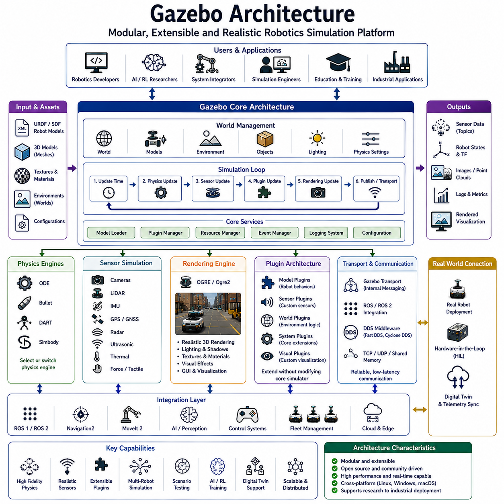
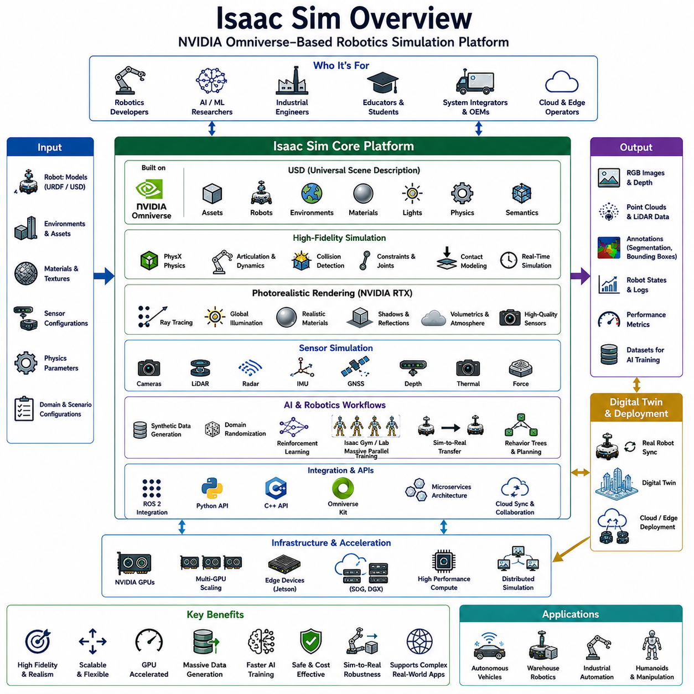
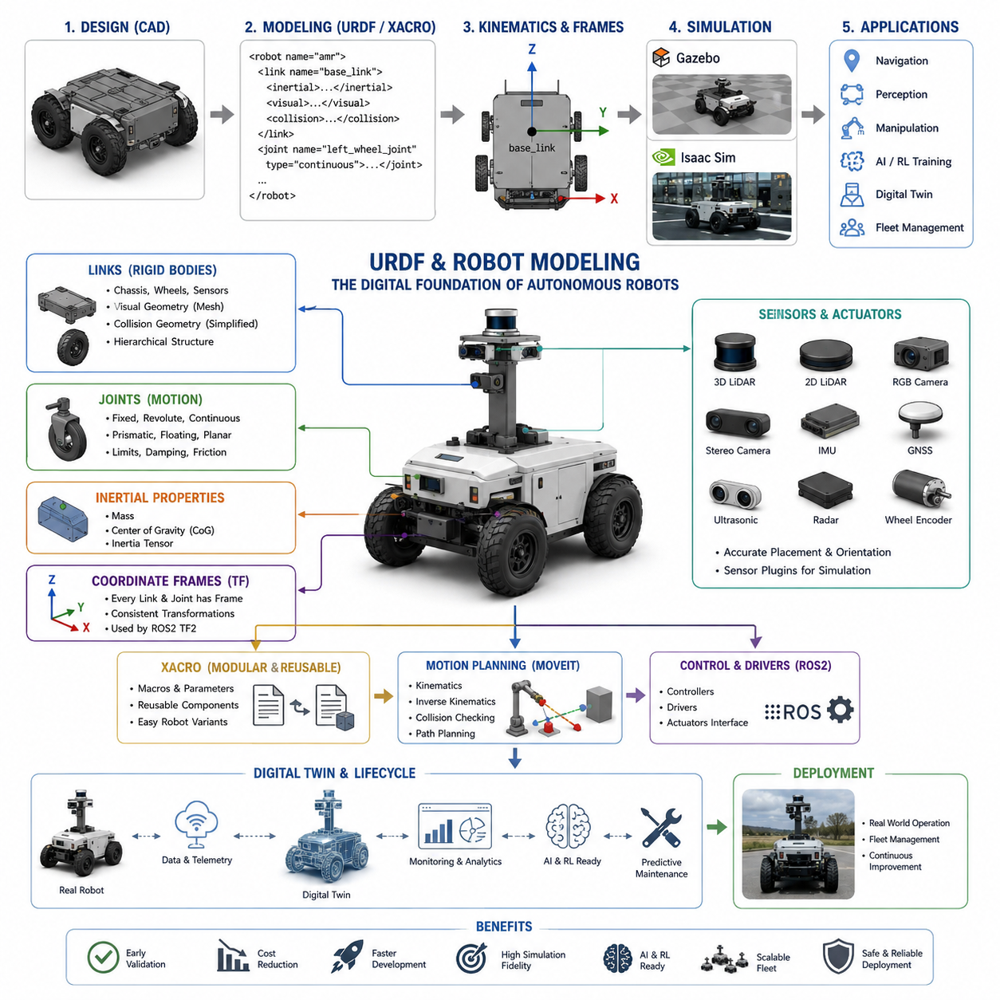
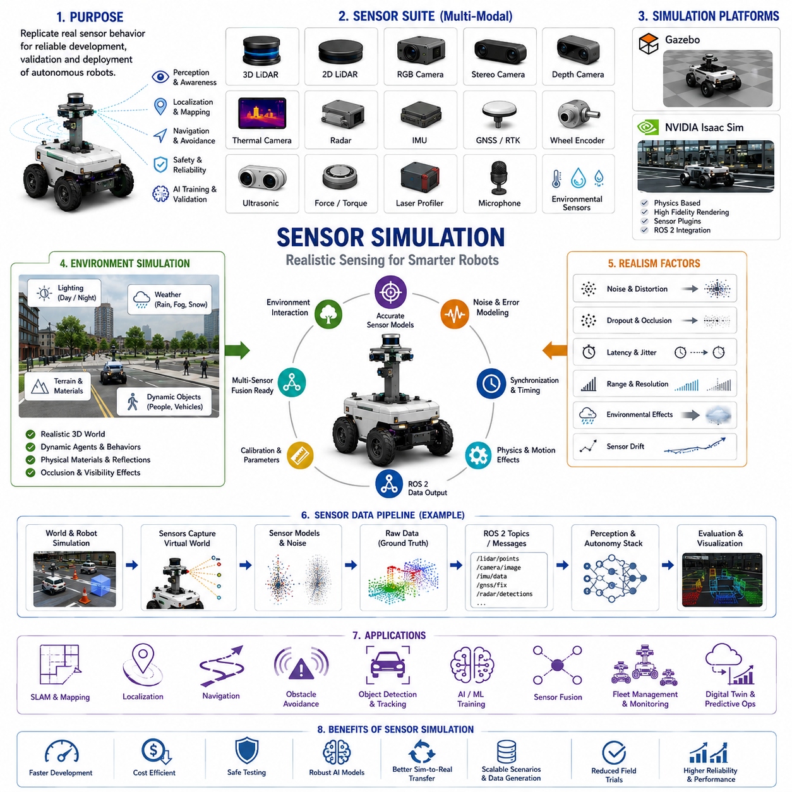
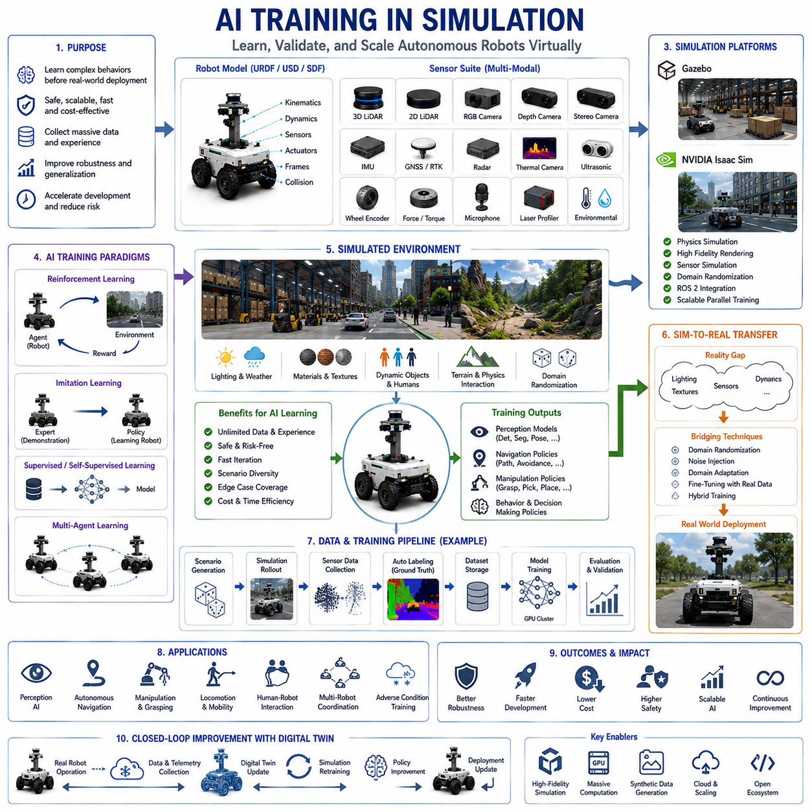
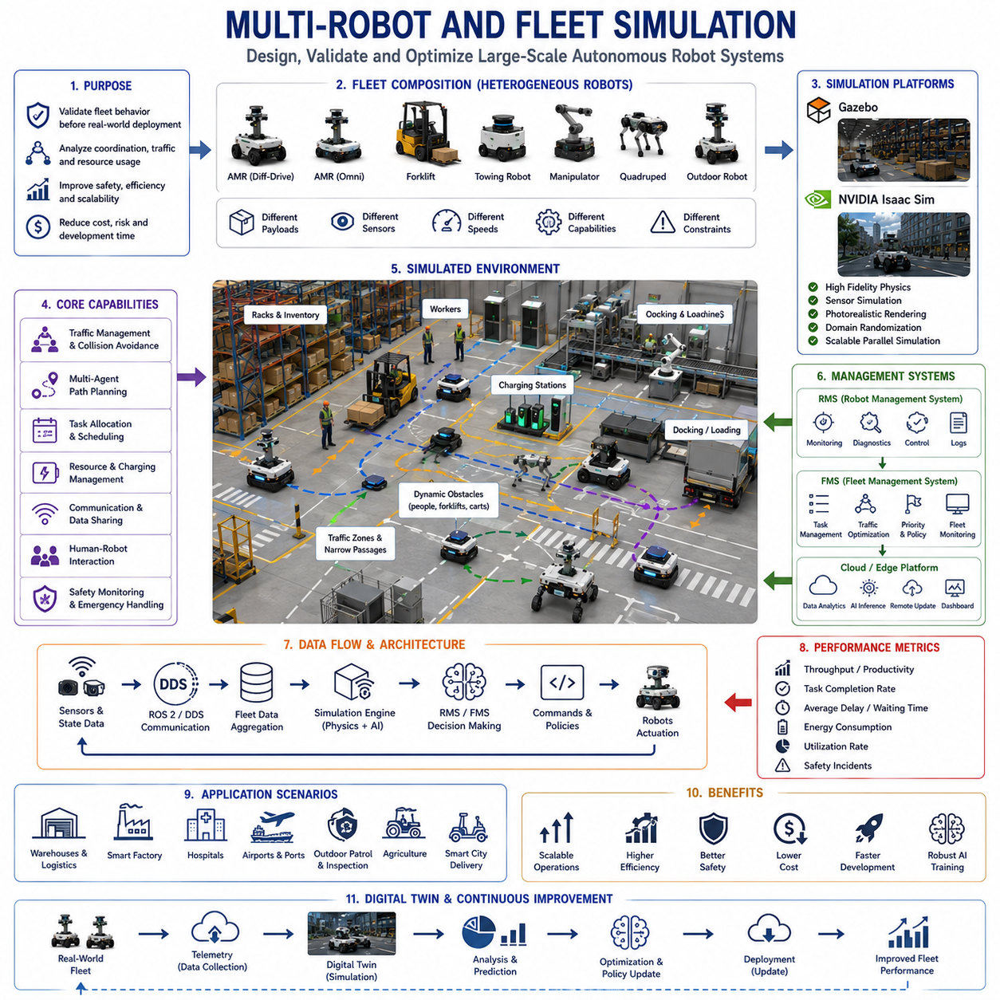
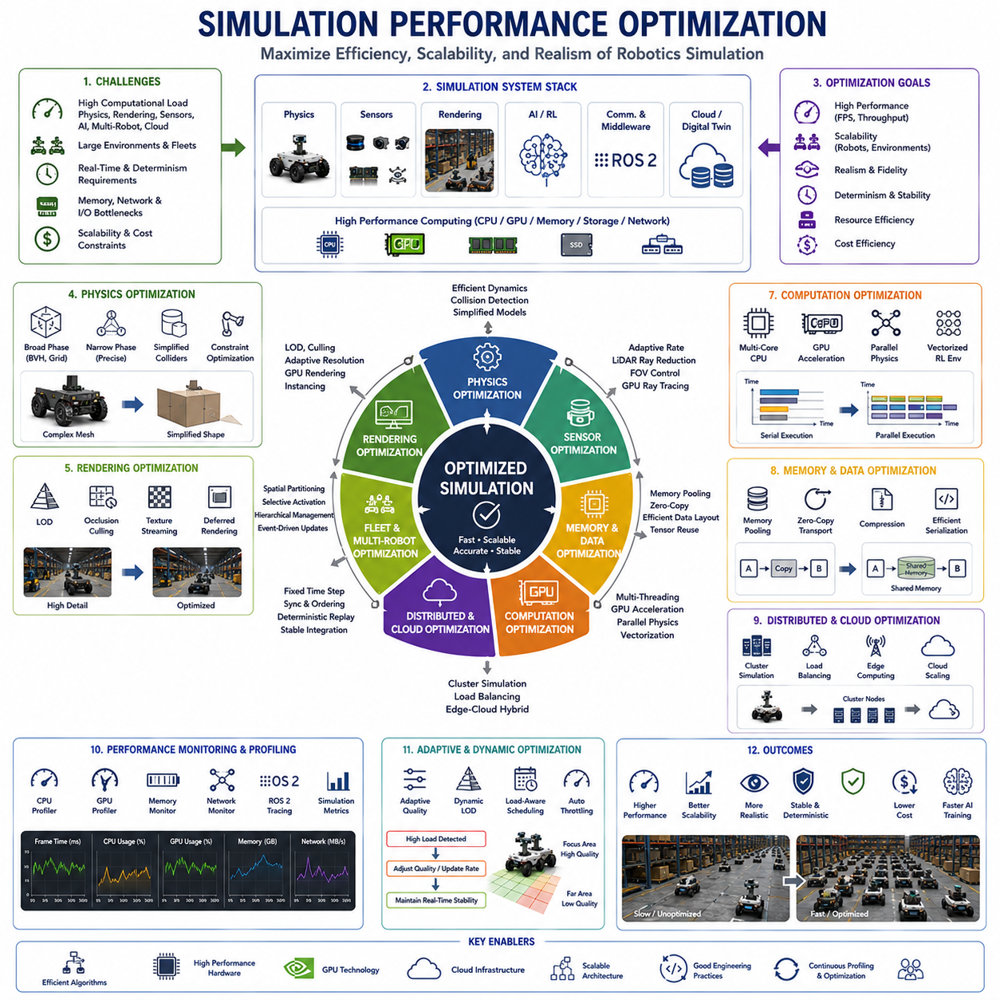
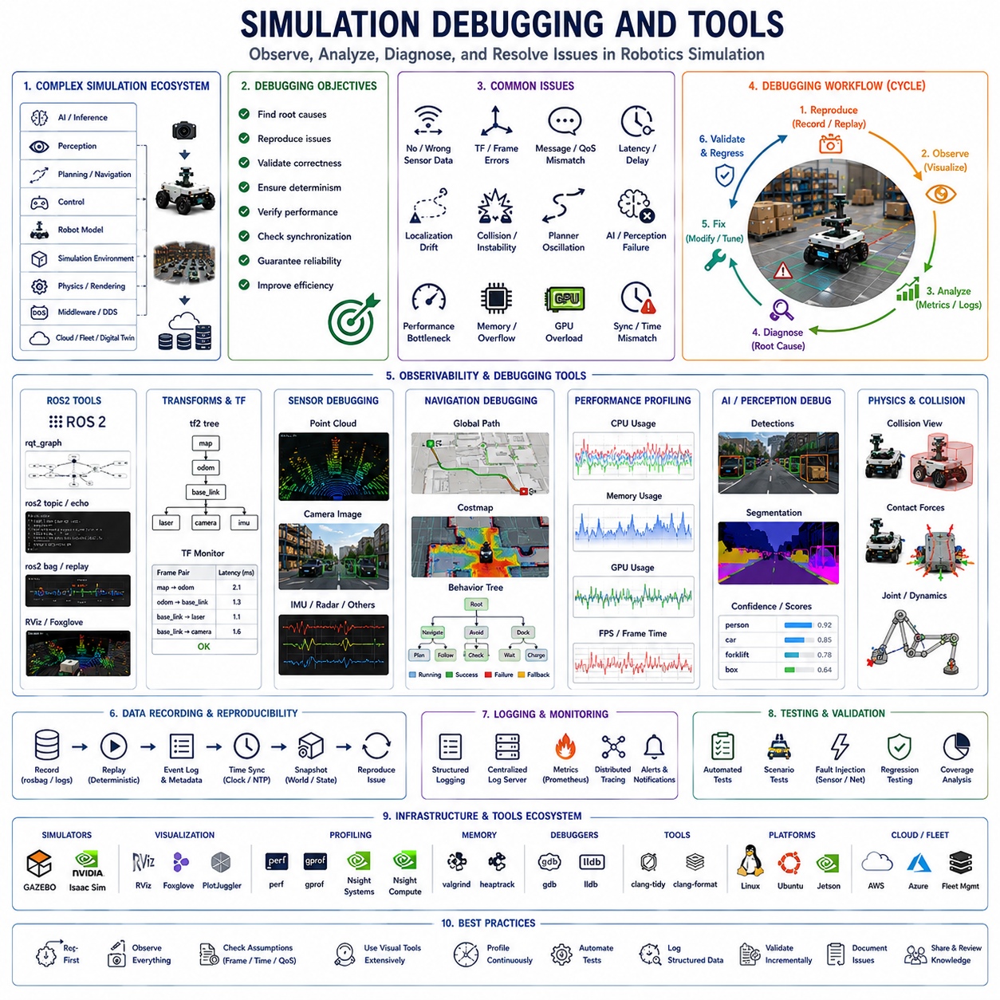

**Volume 07. AMR Software Architecture and Development**

# Chapter 15. Gazebo and Isaac Sim

## 15.1 Gazebo Architecture

{width="7.268055555555556in" height="7.268055555555556in"}

Gazebo Architecture represents one of the foundational simulation frameworks in modern robotics development, autonomous mobile robot engineering, embodied AI research, industrial automation, and ROS-based autonomous system validation. As robotics systems become increasingly complex and AI-driven, simulation environments have evolved from simple visualization tools into highly sophisticated virtual ecosystems capable of reproducing realistic physics, sensor behavior, robot interaction, distributed communication, and large-scale autonomous operational environments. Gazebo has emerged as one of the most influential robotics simulation platforms because it provides a modular, extensible, open-source simulation architecture capable of supporting advanced robotics research, autonomous system development, AI training workflows, and large-scale robotic system validation.

At its core, Gazebo Architecture is designed to provide a scalable robotics simulation ecosystem that integrates physics simulation, sensor simulation, robot modeling, environmental interaction, communication middleware, visualization systems, and extensible plugin-based development frameworks into a unified simulation environment. Unlike simple graphical simulators, Gazebo aims to reproduce realistic robotic behavior under complex operational conditions while remaining flexible enough to support a wide variety of robotics platforms including autonomous mobile robots, industrial robots, drones, underwater robots, legged robots, service robots, and multi-robot systems.

The historical development of Gazebo reflects the broader evolution of robotics simulation itself. Early robotics simulators were often limited to simple rigid-body visualization and basic kinematic modeling. However, as autonomous systems became increasingly dependent on AI perception, sensor fusion, SLAM, reinforcement learning, and distributed robotics architectures, simulation systems required dramatically greater realism and scalability. Gazebo evolved to address these requirements by providing a modular architecture capable of integrating high-fidelity physics engines, realistic sensor models, distributed communication systems, and extensible robotics software integration frameworks.

One of the defining characteristics of Gazebo Architecture is its modular system design. Rather than functioning as a monolithic application, Gazebo is composed of multiple loosely coupled subsystems responsible for physics computation, rendering, communication, sensor simulation, plugin management, model loading, and world management. This modular architecture allows developers to customize individual components independently while maintaining overall system integration. Such flexibility is essential because robotics applications vary enormously across industries and research domains.

Physics simulation forms one of the central pillars of Gazebo Architecture. Real-world robots continuously interact with physical laws governing gravity, inertia, momentum, friction, collision dynamics, joint movement, terrain interaction, and environmental resistance. Gazebo integrates multiple physics engines including ODE, Bullet, DART, and Simbody in order to support different robotics requirements. Each physics engine offers different tradeoffs between computational speed, simulation stability, realism, and articulated dynamics performance.

ODE, or Open Dynamics Engine, became one of the earliest and most widely used physics engines within Gazebo because of its computational efficiency and stability for mobile robotics applications. ODE performs well for rigid-body dynamics, collision detection, and wheeled robot simulation. However, more advanced articulated robotics systems sometimes require more accurate dynamic behavior than ODE can provide.

Bullet Physics introduced improved collision detection and more advanced rigid-body dynamics capabilities. Bullet became especially useful for robotics applications involving manipulation, articulated systems, and dynamic interaction between multiple moving bodies. Its continuous collision detection capabilities improved simulation reliability for fast-moving robotic systems.

DART, or Dynamic Animation and Robotics Toolkit, was introduced to support more advanced articulated robot simulation including humanoid robots, robotic manipulators, and legged robotics systems. DART focuses heavily on accurate dynamic modeling and stable articulated joint simulation. Such capabilities are increasingly important for embodied AI research and advanced autonomous robotics systems.

Simbody provides high-accuracy multibody dynamics simulation with strong emphasis on biomechanical systems and articulated robotic mechanisms. Although computationally heavier than some alternatives, Simbody supports extremely precise physical interaction modeling for specialized robotics research applications.

Gazebo's world management architecture provides the framework responsible for maintaining complete simulation environments. A Gazebo world includes terrain geometry, environmental objects, lighting systems, robot models, physics parameters, sensor definitions, environmental conditions, and operational infrastructure. Multiple robots, static objects, dynamic obstacles, and environmental interaction systems may coexist inside a single simulation world simultaneously.

The world update loop represents one of the most important architectural mechanisms inside Gazebo. Simulation execution occurs through iterative update cycles where physics calculations, sensor updates, communication events, plugin execution, rendering updates, and environmental interaction computations occur continuously at discrete time intervals. Maintaining synchronization between these subsystems is critical for stable and realistic simulation behavior.

Real-time simulation control is another key feature of Gazebo Architecture. Simulation environments may operate in real time, slower than real time, or significantly accelerated beyond real time depending on computational resources and engineering objectives. AI training workflows, reinforcement learning systems, and scenario validation pipelines frequently execute simulations faster than real time in order to accelerate data generation and autonomous learning.

Robot modeling inside Gazebo is typically based on URDF and SDF representations. URDF, or Unified Robot Description Format, originated within the ROS ecosystem and provides structured XML-based robot descriptions defining links, joints, inertial properties, visual geometry, collision geometry, and kinematic relationships. URDF works effectively for many robotics applications but has certain limitations regarding advanced world representation and simulation-specific configuration.

SDF, or Simulation Description Format, extends beyond URDF by supporting richer simulation-specific features including advanced physics configuration, sensor definitions, environmental modeling, lighting systems, multi-robot environments, and world-level configuration. Modern Gazebo development increasingly relies on SDF because of its greater flexibility and simulation expressiveness.

Sensor simulation represents another major architectural component of Gazebo. Modern autonomous robots depend heavily on cameras, LiDAR systems, radar sensors, IMUs, GNSS receivers, ultrasonic sensors, depth cameras, thermal imagers, and force feedback systems. Gazebo provides modular sensor simulation systems capable of reproducing realistic sensor behavior including noise models, update frequencies, synchronization timing, field-of-view constraints, and environmental interaction.

Camera simulation within Gazebo supports RGB imaging, depth imaging, segmentation rendering, stereo vision, optical distortion, lighting interaction, and visual scene rendering. AI-based robotics systems frequently rely on simulated camera data for computer vision algorithm development, object detection validation, semantic segmentation training, and navigation analysis.

LiDAR simulation provides realistic 3D point cloud generation using virtual laser scanning models. Simulated LiDAR systems reproduce scan timing, beam geometry, range noise, field-of-view limitations, and environmental interaction. LiDAR simulation is essential for SLAM development, obstacle detection, occupancy mapping, and autonomous navigation validation.

IMU simulation models inertial measurement behavior including acceleration sensing, angular velocity measurement, noise accumulation, bias drift, and synchronization timing. IMU simulation is particularly important for localization fusion systems and autonomous navigation frameworks.

GNSS simulation supports outdoor robotics research by reproducing global positioning behavior, coordinate systems, noise characteristics, and localization uncertainty. More advanced simulation workflows may incorporate RTK correction modeling, signal obstruction, and urban canyon effects.

Gazebo's rendering architecture plays a major role in visual realism. Rendering systems are responsible for generating camera imagery, lighting effects, shadows, textures, environmental appearance, and visual interaction. Gazebo historically relied on OGRE rendering engines for graphical visualization. Modern rendering pipelines increasingly support physically based rendering techniques capable of producing photorealistic simulation environments.

Plugin architecture represents one of Gazebo's greatest strengths. Plugins allow developers to extend simulation functionality without modifying the core simulator itself. Gazebo supports model plugins, sensor plugins, world plugins, visual plugins, and system plugins. These plugins may implement custom robot behaviors, sensor models, communication systems, environmental interaction logic, AI integration, control algorithms, or operational analytics.

Model plugins are attached directly to robot models and are frequently used for implementing robot control systems, actuator behavior, autonomous navigation logic, and embedded system simulation. Developers may write custom controllers for wheeled robots, robotic arms, drones, and autonomous platforms using model plugins.

Sensor plugins allow custom processing of simulated sensor outputs. Developers may inject realistic sensor noise, communication delay, filtering algorithms, AI perception pipelines, or custom sensing behaviors directly into simulated sensor streams.

World plugins extend entire simulation environments by controlling global behavior such as environmental dynamics, traffic systems, weather simulation, multi-robot coordination, scenario management, and infrastructure interaction.

Visual plugins enhance graphical rendering systems by adding custom overlays, visualization markers, debugging tools, trajectory displays, operational analytics dashboards, and AI perception visualization systems.

Communication architecture is another essential component of Gazebo. Modern robotics systems involve distributed software modules exchanging information continuously across perception systems, navigation stacks, fleet management systems, AI inference engines, and cloud-edge infrastructures. Gazebo provides transport layers supporting message passing, inter-process communication, and distributed synchronization between simulation components.

ROS integration has historically been one of Gazebo's most important features. ROS and ROS2 provide middleware infrastructures supporting distributed robotics communication, topic management, service execution, action coordination, sensor streaming, and software modularity. Gazebo integrates closely with ROS through interfaces allowing simulated robots to publish and subscribe to ROS topics exactly like physical robots.

ROS-Gazebo integration allows developers to validate robotics software stacks inside simulation before deploying onto physical hardware. Navigation systems, SLAM algorithms, sensor fusion frameworks, AI perception pipelines, reinforcement learning agents, and fleet coordination systems may therefore be developed safely inside virtual environments.

Multi-robot simulation represents another major capability enabled by Gazebo Architecture. Large robot fleets may coexist inside shared simulation environments while interacting dynamically through distributed communication systems, traffic coordination, obstacle avoidance, task allocation, and collaborative operational workflows. Such capabilities are essential for warehouse automation, swarm robotics, smart factories, and large-scale autonomous infrastructure research.

Scenario-Based Testing is strongly supported within Gazebo through configurable environments, dynamic obstacle insertion, sensor failure injection, environmental variability, and repeatable operational scenario execution. Autonomous systems may therefore be validated under highly diverse operational conditions safely and systematically.

Reinforcement learning workflows increasingly rely on Gazebo environments for AI training. Robots may interact continuously with simulated environments while reinforcement learning algorithms optimize navigation policies, manipulation behavior, exploration strategies, and autonomous decision-making systems. Gazebo's physics realism and ROS integration make it particularly attractive for robotics AI development.

Digital twin integration is becoming increasingly important in modern Gazebo deployments. Real-world operational telemetry may synchronize continuously with simulation environments in order to support predictive analytics, operational replay, AI validation, infrastructure optimization, and fleet management analysis. Digital twins bridge physical robotic systems with virtual simulation ecosystems.

Cloud-edge robotics architectures are also supported within Gazebo-based workflows. Simulated robots may distribute computation across onboard edge systems, infrastructure servers, and cloud platforms while reproducing realistic communication latency, synchronization delay, and distributed processing behavior.

Simulation scalability remains one of the major engineering challenges within Gazebo Architecture. Large-scale environments involving multiple robots, high-fidelity sensor rendering, physics simulation, AI inference, and distributed communication require significant computational resources. GPU acceleration, distributed simulation frameworks, asynchronous execution systems, and optimized middleware architectures are increasingly important for maintaining practical performance.

Simulation realism also remains an ongoing challenge. Although Gazebo provides sophisticated simulation capabilities, perfectly reproducing real-world physics, human behavior, environmental variability, sensor artifacts, and infrastructure interaction remains computationally impossible. Developers must therefore balance realism, scalability, computational efficiency, and engineering practicality depending on operational objectives.

Gazebo has also evolved significantly across generations. Gazebo Classic provided foundational simulation infrastructure widely adopted throughout robotics research and industry. Modern Gazebo development increasingly transitions toward Ignition Gazebo, now commonly referred to as Gazebo Sim. Ignition architecture introduces improved modularity, better rendering systems, enhanced physics integration, scalable transport layers, improved sensor simulation, and more modern software engineering practices.

Ignition Gazebo separates functionality into independent libraries such as Ignition Physics, Ignition Rendering, Ignition Transport, Ignition Sensors, and Ignition GUI. This architecture improves maintainability, scalability, extensibility, and long-term ecosystem evolution. Developers may independently upgrade or customize individual subsystems without destabilizing the entire simulation framework.

Future Gazebo Architecture will likely integrate increasingly advanced AI-driven simulation systems, embodied AI frameworks, photorealistic rendering, industrial metaverse environments, world models, autonomous agents, adaptive simulation environments, and continuously learning digital twins. Large language models and AI-assisted robotics development may further automate scenario generation, simulation calibration, and operational validation workflows.

In modern AMR software architecture, Gazebo is no longer simply a robotics visualization tool. It represents a foundational engineering ecosystem connecting robotics software, AI systems, physics simulation, sensor modeling, reinforcement learning, digital twins, distributed communication, scenario testing, and real-world autonomous deployment into unified cyber-physical development infrastructures. Engineers who deeply understand Gazebo Architecture gain the ability to accelerate robotics development, reduce operational risk, improve AI robustness, validate complex autonomous systems safely, and build highly reliable intelligent robotics platforms capable of operating effectively within highly dynamic real-world environments.

## 15.2 Isaac Sim Overview

{width="7.268055555555556in" height="7.268055555555556in"}

Isaac Sim has emerged as one of the most advanced robotics simulation platforms in modern autonomous system development, embodied AI research, industrial robotics engineering, digital twin infrastructure, reinforcement learning, and large-scale robotic system validation. As robotics systems become increasingly dependent on artificial intelligence, multimodal perception, distributed autonomous coordination, and simulation-driven engineering workflows, the need for highly realistic and scalable simulation ecosystems has grown dramatically. Isaac Sim addresses these requirements by combining high-fidelity physics simulation, photorealistic rendering, GPU-accelerated computing, AI-oriented robotics workflows, and cloud-scale simulation infrastructure into a unified development environment specifically optimized for modern robotics applications.

At its core, Isaac Sim is a robotics simulation platform developed on top of NVIDIA Omniverse technology. It is designed to support realistic virtual environments capable of reproducing physical interaction, sensor behavior, environmental complexity, and autonomous operational workflows with extremely high fidelity. Unlike traditional robotics simulators that primarily focus on basic kinematics and visualization, Isaac Sim integrates advanced rendering technologies, GPU-accelerated physics systems, synthetic data generation pipelines, reinforcement learning frameworks, digital twin synchronization systems, and AI development tools into a highly scalable robotics ecosystem.

The rapid growth of Isaac Sim reflects broader trends occurring throughout robotics and embodied AI research. Modern autonomous systems increasingly depend on deep learning models, multimodal sensor fusion architectures, reinforcement learning policies, world models, and distributed autonomous reasoning systems. These AI-driven robotics systems require enormous amounts of training data, operational validation, scenario testing, and environmental diversity. Collecting such data entirely from physical robots is prohibitively expensive, operationally risky, time-consuming, and often mechanically destructive. Isaac Sim therefore provides a virtual environment where large-scale robotic experimentation may occur rapidly, safely, and efficiently.

One of the defining characteristics of Isaac Sim is its close integration with NVIDIA Omniverse. Omniverse provides a real-time collaborative simulation and rendering ecosystem built around Pixar's Universal Scene Description framework. USD forms the foundational scene representation layer inside Isaac Sim, allowing highly modular and scalable representation of robots, environments, assets, sensors, lighting systems, infrastructure elements, and simulation metadata. USD-based scene composition enables complex robotics environments to be assembled dynamically while maintaining interoperability across simulation workflows.

The use of USD inside Isaac Sim significantly improves scalability and extensibility. Multiple robotics subsystems may interact within shared simulation environments while remaining modular and independently configurable. Large industrial facilities, warehouses, factories, smart city environments, hospitals, logistics centers, and outdoor autonomous operational areas may all be represented within unified virtual ecosystems. Such scalability is essential for modern robotics development because autonomous systems increasingly operate within large distributed environments rather than isolated laboratory conditions.

Photorealistic rendering represents one of Isaac Sim's greatest technological advantages. The platform leverages NVIDIA RTX rendering technology to produce highly realistic lighting, shadows, reflections, material properties, atmospheric effects, and environmental appearance. Physically based rendering techniques allow synthetic environments to resemble real operational conditions with remarkable visual fidelity. This realism is particularly important for AI perception systems because deep neural networks are highly sensitive to image quality, lighting variation, texture complexity, and environmental appearance.

The rendering architecture inside Isaac Sim supports ray tracing, global illumination, realistic material simulation, and advanced optical behavior. Cameras inside simulation environments therefore generate imagery closely resembling outputs from physical cameras operating in real environments. This capability is critical for synthetic data generation, object detection training, semantic segmentation development, depth estimation validation, and AI perception robustness analysis.

Synthetic data generation has become one of Isaac Sim's most important industrial applications. Modern AI systems require enormous labeled datasets for training computer vision models. Manual collection and annotation of real-world data is expensive and time-consuming. Isaac Sim allows developers to generate synthetic images, segmentation masks, depth maps, bounding boxes, optical flow, pose annotations, and occupancy information automatically from simulated environments. Large-scale labeled datasets may therefore be generated efficiently while maintaining full control over environmental conditions.

Domain randomization workflows are strongly supported inside Isaac Sim. Developers may randomize textures, lighting conditions, object placement, environmental structure, weather effects, sensor noise, and material properties continuously during synthetic data generation or reinforcement learning training. This diversity improves AI generalization and reduces overfitting to specific simulation conditions, thereby improving Sim-to-Real Transfer performance.

Physics simulation forms another foundational component of Isaac Sim architecture. The platform integrates NVIDIA PhysX technology for high-performance rigid-body dynamics, collision detection, articulated joint simulation, and environmental interaction modeling. Realistic physical behavior is essential because autonomous robots continuously interact with gravity, friction, inertia, terrain deformation, wheel slip, momentum transfer, collision forces, and environmental resistance during operation.

Isaac Sim's physics engine supports articulated robotic manipulators, wheeled robots, drones, humanoid systems, mobile platforms, industrial automation equipment, and multi-robot interaction. Accurate simulation of joint constraints, actuator behavior, force propagation, and contact dynamics allows developers to validate robot behavior before deploying systems into physical environments.

Real-time GPU acceleration significantly differentiates Isaac Sim from many traditional robotics simulators. NVIDIA GPUs accelerate rendering, physics computation, AI inference, sensor simulation, synthetic data generation, and reinforcement learning execution simultaneously. This GPU-centric architecture allows large-scale robotics simulations to operate at significantly higher performance levels while supporting highly complex environments.

Sensor simulation is another major capability inside Isaac Sim. Modern autonomous robots rely heavily on multimodal sensing systems including RGB cameras, depth cameras, LiDAR systems, radar modules, IMUs, GNSS receivers, ultrasonic sensors, thermal cameras, and force sensors. Isaac Sim provides realistic sensor models capable of reproducing optical distortion, rolling shutter effects, motion blur, LiDAR beam behavior, radar reflection patterns, IMU drift, sensor latency, synchronization timing, and environmental interference.

Camera simulation within Isaac Sim supports highly realistic optical behavior. Cameras may reproduce lens distortion, exposure dynamics, lighting adaptation, motion blur, rolling shutter effects, and depth-of-field characteristics. Such realism is essential for training and validating AI-based perception systems under realistic operational conditions.

LiDAR simulation inside Isaac Sim generates highly accurate 3D point cloud data using realistic laser scanning behavior. Beam divergence, range noise, material reflectivity, scan timing, and environmental interaction are modeled in detail. These capabilities are important for SLAM development, occupancy mapping, localization systems, and autonomous navigation validation.

Radar simulation is becoming increasingly important for autonomous driving and outdoor robotics research. Isaac Sim supports radar behavior modeling including Doppler effects, reflection intensity, environmental scattering, and dynamic object interaction. Radar systems are particularly valuable because they remain more robust under rain, fog, dust, and low-visibility conditions compared to purely optical sensors.

IMU and GNSS simulation are also integrated into Isaac Sim workflows. Inertial sensor noise, bias drift, synchronization timing, satellite positioning uncertainty, and environmental localization variability may all be reproduced inside simulation environments. These capabilities improve validation of sensor fusion architectures and autonomous localization systems.

Reinforcement learning integration represents one of Isaac Sim's most transformative capabilities. Reinforcement learning requires massive numbers of environmental interactions in order to optimize autonomous behaviors. Physical robot training is often impractical due to hardware wear, operational risk, and slow execution speed. Isaac Sim allows reinforcement learning agents to train rapidly inside virtual environments while leveraging GPU acceleration and distributed simulation execution.

Isaac Gym and Isaac Lab frameworks extend Isaac Sim's reinforcement learning ecosystem. Large numbers of robotic agents may train simultaneously in parallel simulation environments, dramatically accelerating policy optimization. Such parallelized GPU-accelerated learning environments are particularly important for locomotion, manipulation, navigation, grasping, and multi-agent coordination research.

Sim-to-Real Transfer is deeply integrated into Isaac Sim workflows. The platform emphasizes domain randomization, sensor realism, physics calibration, synthetic data generation, and operational variability in order to improve transfer consistency between simulation and real-world deployment. AI systems trained in Isaac Sim may therefore achieve greater robustness when deployed into physical operational environments.

Digital twin integration is another major capability of Isaac Sim. Real-world industrial facilities, warehouses, factories, transportation systems, and robotic fleets may synchronize continuously with virtual replicas operating inside simulation environments. Sensor telemetry, operational state data, maintenance information, infrastructure conditions, and AI analytics may flow bidirectionally between physical and virtual systems. Digital twins enable predictive maintenance, operational replay, scenario analysis, infrastructure optimization, and fleet coordination analysis.

Cloud-edge robotics architectures are strongly supported within Isaac Sim ecosystems. Simulated robots may distribute computation across onboard edge systems, local infrastructure servers, and cloud computing platforms while reproducing realistic communication latency, synchronization delay, bandwidth limitations, and distributed processing behavior. Such architectures are increasingly important for scalable industrial robotics deployment.

ROS and ROS2 integration represent critical components of Isaac Sim workflows. Modern robotics software stacks frequently rely on ROS middleware for communication, sensor streaming, navigation coordination, and distributed robotics software execution. Isaac Sim supports direct ROS integration, allowing simulated robots to interact with robotics software stacks exactly as physical robots would. Developers may therefore validate perception systems, navigation pipelines, AI models, localization frameworks, and autonomous control systems safely inside virtual environments.

Scenario-Based Testing is another important application area. Isaac Sim allows developers to generate highly diverse operational scenarios involving dynamic obstacles, environmental variability, communication failures, sensor degradation, abnormal operational conditions, and rare edge-case situations. Autonomous systems may therefore be validated systematically before real-world deployment.

Multi-robot simulation capabilities are particularly important for industrial automation research. Warehouses, factories, ports, logistics centers, hospitals, and smart cities increasingly rely on fleets of autonomous robots operating simultaneously. Isaac Sim supports distributed multi-agent coordination, fleet management analysis, traffic optimization, cooperative task execution, and swarm robotics workflows within shared simulation environments.

Human simulation and human-robot interaction research are becoming increasingly important inside Isaac Sim ecosystems. Virtual human models may interact dynamically with autonomous robots in shared operational environments. Such capabilities are essential for collaborative robotics, public autonomous systems, healthcare robotics, industrial safety analysis, and embodied AI interaction research.

Scalability remains one of the platform's greatest strengths. Isaac Sim supports extremely large and highly detailed virtual environments while leveraging GPU acceleration, distributed computing, cloud infrastructure integration, and asynchronous simulation execution. Large industrial facilities containing hundreds of robots, sensors, infrastructure systems, and dynamic operational processes may therefore be simulated efficiently.

Simulation realism remains a continuing engineering challenge despite Isaac Sim's advanced capabilities. Real-world environments contain infinite variability involving weather, human behavior, hardware degradation, sensor uncertainty, environmental unpredictability, and infrastructure inconsistency. Isaac Sim therefore focuses not on achieving mathematically perfect realism but rather on creating simulation environments sufficiently realistic for practical robotics development, AI training, validation, and operational optimization.

Industrial metaverse concepts are strongly connected to Isaac Sim's long-term evolution. Future industrial facilities may maintain continuously synchronized virtual replicas where robots, infrastructure systems, AI models, maintenance analytics, and operational planning tools coexist within persistent simulation ecosystems. Isaac Sim forms an important technological foundation supporting such industrial metaverse infrastructures.

Embodied AI research is also increasingly dependent on Isaac Sim. Future AI systems may require continuous interaction with highly realistic environments in order to develop reasoning, planning, manipulation, navigation, memory, and multimodal cognition capabilities. Isaac Sim provides scalable virtual environments where embodied agents may interact continuously with complex physical worlds.

Future Isaac Sim development will likely integrate increasingly advanced world models, autonomous AI agents, adaptive simulation environments, large language model integration, self-improving synthetic data generation systems, and continuously learning robotics ecosystems. AI systems may eventually optimize their own simulation environments automatically in order to accelerate autonomous learning and operational robustness.

In modern AMR software architecture, Isaac Sim is no longer simply a robotics simulator. It represents a comprehensive robotics development ecosystem integrating AI training, synthetic data generation, digital twins, reinforcement learning, sensor modeling, cloud-edge computing, multi-robot coordination, simulation validation, and real-world autonomous deployment into unified cyber-physical engineering infrastructures. Engineers who deeply understand Isaac Sim gain the ability to accelerate robotics development, reduce operational risk, improve AI robustness, optimize autonomous system performance, and build highly scalable intelligent robotics systems capable of functioning safely and efficiently within extremely complex real-world environments.

## 15.3 URDF and Robot Modeling

{width="7.268055555555556in" height="7.268055555555556in"}

"15_03_URDF_and_Robot_Modeling" is one of the most critical foundations in modern robot simulation and digital twin development because it defines how a robot is structurally represented inside software systems such as ROS2, Gazebo, Isaac Sim, RViz, and various robotics AI development frameworks. In autonomous mobile robots, humanoids, manipulators, towing robots, hospital robots, logistics robots, and outdoor autonomous platforms, the software representation of the robot is almost as important as the physical machine itself. Without an accurate robot model, it becomes impossible to perform reliable simulation, motion planning, collision checking, sensor integration, navigation validation, or AI training. URDF, which stands for Unified Robot Description Format, became the de facto standard robot description language in the ROS ecosystem because it provides a structured and extensible method to describe robot geometry, kinematics, dynamics, sensors, and coordinate relationships in a machine-readable format.

Robot modeling begins with the idea that every physical robot can be decomposed into rigid bodies and joints. A robot chassis, wheels, steering modules, manipulators, LiDAR mounts, sensor poles, suspension systems, cameras, and payload modules are represented as links connected by joints. Each link contains geometric information, visual rendering data, collision shapes, inertial properties, and physical parameters. Each joint defines how movement occurs between two links. This abstraction allows software systems to interpret the robot as a kinematic chain or graph structure capable of motion and interaction inside virtual environments.

In AMR development, robot modeling is deeply integrated into almost every stage of the engineering workflow. Mechanical engineers create CAD designs of the robot platform. Software engineers convert the mechanical structures into URDF-compatible forms. Simulation engineers validate the robot inside Gazebo or Isaac Sim. AI engineers use the virtual robot for perception and navigation training. Control engineers test motion algorithms using the same digital representation. Eventually, the robot model becomes a unified bridge connecting mechanical engineering, electrical engineering, AI systems, autonomy software, simulation workflows, and operational validation.

The structure of URDF is XML-based and hierarchical. A robot description typically begins with a root robot tag that contains multiple link and joint definitions. Links represent rigid bodies while joints represent motion constraints between bodies. The entire robot is therefore organized as a tree structure with parent-child relationships. The root link often corresponds to the base chassis or body frame of the robot. Child links may include wheel assemblies, steering mechanisms, manipulators, sensor brackets, or payload structures. The hierarchy establishes how transformations propagate through the robot during movement.

One of the most important concepts in URDF is the coordinate frame system. Every link and joint operates relative to coordinate frames. Robotics systems depend heavily on consistent coordinate transformations because localization, perception, navigation, and control algorithms all require spatial awareness. ROS2 tf2 systems rely on these coordinate relationships to calculate transformations between sensors, actuators, and the world environment. For example, a LiDAR frame may be positioned above the chassis center while a camera frame may be mounted on a mast. The robot model defines the exact offsets and orientations of these sensors so that perception algorithms can correctly fuse data from multiple devices.

Visual geometry plays an important role in robot modeling because simulations and visualization tools require 3D representations of robot components. URDF supports mesh files such as STL, DAE, and OBJ formats. CAD models are commonly simplified and exported into lightweight meshes suitable for simulation. High-resolution CAD data often contains excessive polygon counts that degrade simulation performance, so engineers frequently optimize meshes before integration. Visual models are primarily used for rendering in RViz, Gazebo, or Isaac Sim, enabling engineers to inspect robot motion and validate system layouts.

Collision geometry differs from visual geometry because collision calculations must be computationally efficient. Instead of using highly detailed CAD meshes, collision models often use simplified primitive shapes such as boxes, cylinders, or convex hull approximations. Collision detection is essential for navigation, path planning, manipulation, and safety validation. If collision geometry is overly complex, simulation performance may degrade significantly. Therefore, robot modeling requires balancing geometric realism with computational efficiency.

Inertial modeling is another critical component of URDF. Realistic physics simulation requires accurate definitions of mass, center of gravity, and inertia tensors. These values determine how the robot behaves dynamically during acceleration, braking, turning, climbing slopes, or interacting with obstacles. Outdoor autonomous robots, towing robots, and heavy payload platforms are especially sensitive to inertial modeling because inaccurate parameters can produce unrealistic motion behavior in simulation. For example, an incorrect center of gravity may cause simulated rollover behavior that does not match real-world performance. Similarly, inaccurate wheel inertia may distort acceleration and braking characteristics.

Joint definitions determine how robot components move relative to each other. URDF supports various joint types including fixed, revolute, continuous, prismatic, floating, and planar joints. Fixed joints connect rigid structures without motion. Revolute joints define rotational motion within angular limits. Continuous joints allow unlimited rotation, commonly used for wheels. Prismatic joints support linear movement such as lifting mechanisms or telescopic actuators. Floating joints are less common in URDF but can represent free-body motion. Joint limits, damping coefficients, friction properties, and safety parameters are often specified to create more realistic simulations.

Mobile robot wheel modeling is one of the most important practical applications of URDF. Differential drive robots typically contain left and right wheel joints connected to the chassis. Ackermann steering robots include steering joints and drive joints separately. Omni-directional robots require more complex wheel arrangements involving mecanum or omni wheels. Outdoor AMRs with suspension systems may include articulated suspension links and rocker-bogie mechanisms. The robot model must accurately capture these kinematic structures because navigation and control algorithms depend on correct wheel transformations.

Sensor integration is another major aspect of robot modeling. Modern autonomous robots contain multiple perception sensors including 2D LiDARs, 3D LiDARs, RGB cameras, stereo cameras, thermal cameras, radars, IMUs, GNSS modules, ultrasonic sensors, and depth sensors. Each sensor must be represented with precise spatial positioning. Even small calibration errors can significantly impact sensor fusion quality. In simulation environments, sensor plugins are attached to robot models so that virtual sensor outputs emulate real hardware behavior. A simulated LiDAR generates synthetic point clouds while virtual cameras generate RGB images and depth maps. These outputs are then processed by the same perception software used in real robots.

Gazebo integration significantly expanded the practical value of URDF modeling. Gazebo provides physics simulation, environmental interaction, and sensor simulation capabilities. Robot models imported into Gazebo can interact with terrain, walls, obstacles, dynamic agents, and environmental forces. Engineers can validate localization algorithms, navigation systems, perception pipelines, and AI decision-making before deploying software to physical robots. Simulation-driven development dramatically reduces hardware risk and accelerates iteration cycles.

Isaac Sim introduced another evolution in robot modeling workflows. Unlike traditional Gazebo pipelines centered around URDF alone, Isaac Sim often utilizes USD-based workflows while maintaining compatibility with URDF imports. NVIDIA Isaac Sim focuses heavily on GPU-accelerated simulation, synthetic data generation, digital twins, reinforcement learning, and photorealistic rendering. URDF models imported into Isaac Sim are converted into richer simulation representations capable of supporting AI training and physically realistic environments. This integration is particularly important for embodied AI systems, autonomous logistics robots, and industrial digital twins.

Robot modeling also plays a fundamental role in motion planning systems. Frameworks such as MoveIt rely on URDF models to perform kinematic calculations, inverse kinematics, collision checking, and trajectory planning. Even mobile robots benefit from accurate robot models because local planners and global planners use footprint and collision geometry information to navigate safely through environments. Large outdoor robots with articulated steering systems require especially precise kinematic representations.

Xacro emerged as an important extension to URDF because large robot models become difficult to manage manually. Xacro allows reusable macros, parameterization, conditional logic, and modular robot definitions. Instead of repeating similar wheel definitions multiple times, engineers can create parameterized templates. This improves maintainability and scalability. Product-line robotics platforms particularly benefit from Xacro because multiple robot variants can share common modules while adjusting dimensions, sensor layouts, or payload configurations through parameter changes.

For example, an outdoor autonomous robot family may include F100, F120, F140, and F160 heavy configurations with different wheelbases, widths, payload capacities, and sensor stacks. Instead of creating separate URDF files from scratch, a modular Xacro architecture can reuse common chassis templates while modifying platform-specific parameters. This approach supports scalable engineering workflows and reduces maintenance overhead.

Simulation fidelity depends heavily on robot model quality. Poorly constructed URDF models often produce unstable physics behavior, inaccurate sensor placement, unrealistic wheel motion, or tf transformation errors. Engineers therefore perform extensive validation of robot models before large-scale simulation testing. Common validation steps include coordinate frame inspection, inertia verification, collision visualization, joint limit testing, wheel kinematics validation, and sensor alignment checks.

Digital twin concepts further elevate the importance of robot modeling. A digital twin is not merely a static 3D model but a continuously synchronized virtual representation of a physical robot system. Real-time telemetry, sensor streams, diagnostics, operational states, and AI analytics may all connect to the digital twin environment. Accurate URDF or USD robot models form the structural basis of these systems. Smart factories, hospital robotics systems, logistics fleets, and outdoor infrastructure inspection robots increasingly rely on digital twins for predictive maintenance, operational monitoring, and AI-assisted fleet management.

Robot modeling also intersects with reinforcement learning and synthetic data generation. AI agents trained in simulation require physically realistic robot embodiments. The quality of reinforcement learning often depends on accurate dynamics, contact behavior, and sensor simulation. Sim-to-real transfer becomes difficult when the simulation model diverges significantly from physical hardware behavior. Therefore, robot modeling quality directly affects AI deployment success.

Industrial robot development workflows increasingly adopt simulation-first engineering methodologies. Instead of building hardware prototypes immediately, teams construct virtual robot models early in development. Navigation algorithms, perception pipelines, RMS/FMS systems, sensor layouts, and AI workloads are validated virtually before fabrication. This approach reduces cost, shortens development cycles, and improves cross-functional collaboration between hardware and software teams.

Large-scale fleet simulation is another growing application of robot modeling. Warehouse systems, hospital logistics platforms, and outdoor fleet management systems may simulate dozens or hundreds of robots simultaneously. Accurate robot models enable realistic traffic management testing, congestion analysis, charging strategy optimization, and operational workflow validation. Cloud robotics platforms may use these simulations to predict operational bottlenecks and optimize fleet scheduling strategies.

Future robot modeling technologies are expected to evolve beyond static URDF structures into semantically rich digital representations. Emerging formats may integrate physics properties, AI capabilities, behavior definitions, semantic scene understanding, and operational metadata into unified robot descriptions. AI-native robot development platforms may automatically generate optimized robot models directly from CAD systems and simulation pipelines. Generative AI may eventually assist engineers by proposing optimized sensor placements, structural layouts, or dynamic parameters based on task requirements.

As autonomous robots become more intelligent, connected, and scalable, URDF and robot modeling will remain central pillars of robotics engineering. The robot model is no longer simply a visualization asset but a foundational component of the entire robotics software ecosystem. It defines how robots are understood by perception systems, motion planners, AI models, simulation environments, digital twins, cloud platforms, and fleet management systems. In many ways, the virtual robot becomes the software soul of the physical machine, enabling modern robotics to bridge the gap between mechanical reality and intelligent autonomy.

The topic "15_03_URDF_and_Robot_Modeling" belongs to the "15_Gazebo_and_Isaac_Sim" section within the AMR software architecture and development workflow. It is also positioned within the broader multi-volume AMR robotics development framework covering simulation, AI, perception, navigation, and digital twin engineering.

## 15.4 Sensor Simulation

{width="7.268055555555556in" height="7.268055555555556in"}

"15_04_Sensor_Simulation" is one of the most important components in modern robotics simulation because autonomous robots fundamentally depend on sensors to perceive, understand, and interact with the physical world. In real-world autonomous mobile robots, sensors function as the eyes, ears, balance system, positioning infrastructure, and environmental awareness mechanisms of the robot. Without accurate sensor data, localization, navigation, obstacle avoidance, mapping, AI perception, fleet coordination, and operational safety become impossible. Sensor simulation therefore plays a critical role in the development, validation, optimization, and deployment of autonomous robotic systems.

In simulation-driven robotics development, the purpose of sensor simulation is not merely to generate synthetic outputs, but to emulate realistic physical sensing behavior as closely as possible. Modern robot simulations aim to reproduce the complex interactions between sensors and environments, including lighting conditions, surface reflections, weather effects, motion blur, occlusions, signal noise, synchronization latency, and environmental interference. The closer the simulated sensor behavior is to the real world, the more reliable the resulting AI models, autonomy algorithms, and robot control systems become during actual deployment.

Autonomous mobile robots typically contain multiple heterogeneous sensors operating simultaneously. A single industrial AMR may include 2D LiDARs, 3D LiDARs, RGB cameras, stereo cameras, thermal cameras, radar systems, IMUs, GNSS RTK modules, wheel encoders, ultrasonic sensors, force sensors, depth cameras, laser profilers, and environmental monitoring devices. These sensors each provide different types of information and possess unique strengths and limitations. Sensor simulation environments must therefore replicate not only the output data itself but also the operational characteristics of each sensing modality.

LiDAR simulation is one of the most widely used forms of sensor simulation in robotics. LiDAR sensors operate by transmitting laser beams and measuring reflected return signals to calculate distances. Simulated LiDAR systems generate synthetic point clouds representing the spatial structure of the environment. In Gazebo and Isaac Sim, virtual LiDAR plugins emulate scanning frequency, angular resolution, field of view, scan range, beam divergence, and update rates. Modern simulation platforms also support realistic noise models, signal dropout, reflective material behavior, and multi-path reflection effects. These details are extremely important because perception algorithms often behave differently under noisy or incomplete sensor conditions.

2D LiDAR simulation is commonly used for indoor navigation, obstacle avoidance, and SLAM validation. Simulated 2D scans help developers validate localization pipelines, occupancy grid generation, and costmap-based navigation systems. 3D LiDAR simulation is significantly more complex because it generates high-density spatial data across multiple channels. Outdoor autonomous robots, autonomous forklifts, mining robots, agricultural robots, and autonomous vehicles rely heavily on 3D LiDAR simulation to validate perception and mapping systems in large-scale environments.

Camera simulation represents another major area of sensor simulation technology. RGB camera simulation involves generating synthetic image streams from virtual environments. Modern robotics simulators support photorealistic rendering techniques including physically based rendering, ray tracing, dynamic shadows, material reflectivity, motion blur, depth-of-field effects, lens distortion, exposure adaptation, and global illumination. High-fidelity camera simulation is especially important for AI-based computer vision systems because neural networks are highly sensitive to image characteristics.

Synthetic image generation has become one of the most important applications of camera simulation. AI developers use simulation environments to create large-scale labeled datasets for object detection, semantic segmentation, instance segmentation, pose estimation, lane detection, human recognition, and industrial inspection tasks. Isaac Sim particularly emphasizes synthetic data generation workflows because simulated environments can automatically generate annotations such as bounding boxes, segmentation masks, depth maps, optical flow, and object tracking labels. This dramatically reduces manual labeling costs while accelerating AI training workflows.

Depth camera simulation extends RGB simulation by incorporating depth measurement capabilities. Simulated depth cameras emulate technologies such as structured light, stereo vision, and time-of-flight sensing. Depth maps are critical for obstacle detection, manipulation, scene reconstruction, and free-space estimation. Simulation systems model measurement uncertainty, depth quantization, range limitations, and environmental sensitivity to improve realism.

Stereo camera simulation focuses on binocular image generation and disparity estimation. Stereo systems estimate depth through triangulation between left and right image pairs. Accurate stereo simulation requires precise camera calibration, synchronized image generation, baseline configuration, and realistic texture rendering. Poorly simulated textures can degrade stereo matching performance, making realistic environment generation extremely important.

Thermal camera simulation is becoming increasingly important in industrial robotics, defense robotics, smart city infrastructure, firefighting robots, and nighttime autonomous systems. Thermal cameras detect infrared radiation rather than visible light. Simulated thermal environments must therefore model temperature distributions, heat transfer, environmental cooling, human body heat, machinery temperature, and atmospheric attenuation. Thermal simulation becomes particularly important for robots operating in low-light, smoke-filled, foggy, or hazardous environments where visible cameras may fail.

Radar simulation has emerged as a major requirement for outdoor autonomous robots and autonomous driving systems because radar sensors perform robustly under rain, snow, fog, and dust conditions. Radar simulation is significantly more difficult than camera or LiDAR simulation because electromagnetic wave propagation, Doppler effects, signal reflection, interference, and multipath scattering must be modeled. Modern simulation systems increasingly incorporate physics-based radar models to support sensor fusion validation and adverse weather perception testing.

IMU simulation is essential for localization, odometry, balancing, stabilization, and motion estimation systems. Simulated inertial measurement units generate accelerometer and gyroscope outputs corresponding to robot motion. Realistic IMU simulation includes sensor drift, bias instability, measurement noise, vibration effects, temperature drift, and synchronization delays. Since localization systems heavily depend on IMU fusion, even small inaccuracies in simulation can significantly impact SLAM validation.

GNSS and RTK simulation are particularly important for outdoor autonomous robots. Simulated GNSS systems generate global positioning data corresponding to the robot's virtual geographic location. Advanced simulation platforms model satellite visibility, signal blockage, urban canyon effects, multipath reflection, atmospheric errors, RTK correction behavior, and positioning uncertainty. Outdoor robots operating in construction sites, agricultural environments, mining areas, ports, or smart cities rely heavily on accurate GNSS simulation.

Wheel encoder simulation is another important component for mobile robot development. Encoders estimate wheel rotation and odometry information. Simulation systems emulate encoder resolution, wheel slip, terrain interaction, vibration effects, and cumulative drift. Outdoor robots operating on rough terrain require particularly realistic wheel-ground interaction modeling because odometry performance can degrade significantly under unstable traction conditions.

Ultrasonic sensor simulation is frequently used in short-range obstacle detection and docking systems. Simulated ultrasonic sensors model acoustic wave propagation, reflection angles, environmental interference, and signal attenuation. These sensors are commonly used in industrial robots, hospital robots, and automated parking systems where close-range safety detection is required.

Sensor synchronization is one of the most critical aspects of realistic sensor simulation. Real robots operate using multiple sensors simultaneously, and their outputs must remain temporally aligned for sensor fusion algorithms to function correctly. Simulation systems therefore reproduce timestamp behavior, communication delays, frame synchronization, jitter, and asynchronous processing conditions. Multi-sensor synchronization errors can severely impact localization, perception, and navigation systems.

Noise modeling is another essential element of high-fidelity sensor simulation. Real sensors are never perfect. Every sensing modality introduces uncertainty, distortion, dropout, quantization effects, and environmental interference. AI models trained only on perfectly clean synthetic data often fail when deployed in real-world conditions. Therefore, advanced simulation platforms intentionally inject realistic imperfections into sensor outputs. Noise injection improves robustness and enhances sim-to-real transfer performance.

Environmental simulation directly influences sensor realism. Lighting conditions, weather, terrain, surface materials, atmospheric effects, moving objects, and environmental complexity all affect sensor behavior. Rain may distort LiDAR returns and reduce camera visibility. Fog may degrade contrast and scatter laser beams. Snow may introduce reflective noise and reduce traction. Dust may obscure camera images and scatter radar signals. Modern sensor simulation environments increasingly integrate weather engines and physics-based environmental effects to replicate these conditions.

Dynamic object simulation is equally important. Autonomous robots rarely operate in static environments. Humans, vehicles, forklifts, animals, drones, doors, elevators, and moving obstacles continuously interact with the robot. Simulation environments therefore include behavior-driven agents capable of realistic movement patterns and interactions. AI-based traffic simulation and crowd simulation are becoming increasingly common in advanced robotics validation platforms.

Physics simulation forms the foundation of realistic sensor simulation. Robot movement, collisions, inertia, suspension behavior, wheel slip, and terrain interaction all influence sensor outputs. For example, vibration from rough terrain affects camera stability and IMU measurements. Vehicle suspension changes LiDAR orientation during acceleration or braking. Physics engines therefore play a central role in generating physically consistent sensor data.

Sensor plugins are typically integrated into URDF, SDF, or USD robot models. These plugins define sensor parameters, update rates, communication interfaces, noise characteristics, coordinate frames, and data output formats. ROS2 integration allows simulated sensor data to be published directly onto ROS topics, enabling the same software stack to operate both in simulation and on real hardware. This architecture supports seamless simulation-to-real deployment workflows.

Digital twin systems significantly expand the role of sensor simulation. In digital twin environments, simulated sensors may operate alongside live robot telemetry to compare predicted behavior with real operational data. This enables predictive maintenance, anomaly detection, operational forecasting, and remote diagnostics. Industrial facilities increasingly use digital twins to monitor fleet-level robot operations and validate AI system behavior.

Simulation-first robotics development methodologies now place sensor simulation at the center of engineering workflows. Instead of collecting enormous quantities of real-world data at early stages, companies increasingly develop and validate algorithms inside virtual environments first. Navigation systems, perception pipelines, reinforcement learning agents, safety systems, and fleet management architectures can all be tested extensively before physical deployment.

Reinforcement learning and embodied AI development depend heavily on sensor simulation quality. AI agents learn through interactions between actions and sensory feedback. If simulated sensor behavior differs significantly from real-world conditions, learned policies may fail after deployment. Therefore, high-fidelity sensor simulation becomes essential for reliable sim-to-real transfer.

Isaac Sim has become particularly important in modern sensor simulation because it combines GPU-accelerated rendering, photorealistic environments, synthetic data generation, and scalable AI workflows. NVIDIA Omniverse technologies enable physically realistic simulation of sensors and environments while supporting large-scale parallel AI training. Gazebo remains highly important in ROS-centered workflows due to its open architecture, flexibility, and strong robotics ecosystem integration.

Future sensor simulation technologies are expected to evolve toward AI-native simulation environments capable of automatically generating diverse operational scenarios, rare edge cases, and adaptive environmental conditions. Neural rendering, differentiable simulation, generative world modeling, and physically accurate digital twins may eventually allow robots to train continuously inside massive virtual ecosystems that closely mirror real-world operations.

As robotics systems become more intelligent and autonomous, sensor simulation will remain one of the foundational pillars of robot engineering. Accurate sensor simulation enables safer deployment, faster development cycles, reduced hardware costs, scalable AI training, and more reliable autonomous behavior. In many ways, sensor simulation acts as the virtual perception layer that allows robots to learn, validate, and evolve long before they enter the physical world.

The topic "15_04_Sensor_Simulation" belongs to the "15_Gazebo_and_Isaac_Sim" section within the AMR software architecture and development workflow. It also connects deeply with perception systems, AI development, digital twins, simulation workflows, and autonomous robot validation throughout the larger AMR robotics engineering framework.

## 15.5 AI Training in Simulation

{width="7.268055555555556in" height="7.268055555555556in"}

"15_05_AI_Training_in_Simulation" represents one of the most transformative concepts in modern robotics and embodied artificial intelligence because it enables autonomous systems to learn complex behaviors, perception capabilities, navigation strategies, and decision-making policies inside virtual environments before operating in the physical world. In traditional robotics development, robots were programmed manually using deterministic rules, predefined state machines, and carefully engineered control logic. However, modern AI-driven robotics increasingly depends on machine learning, reinforcement learning, imitation learning, self-supervised learning, foundation models, and multimodal AI systems that require enormous amounts of data and interaction experience. Collecting such data entirely from physical robots is often prohibitively expensive, time-consuming, dangerous, and operationally inefficient. Simulation-based AI training therefore emerged as one of the core enabling technologies for scalable autonomous robotics development.

AI training in simulation fundamentally changes the robotics development workflow by moving large portions of experimentation, learning, and validation into virtual environments. Instead of relying exclusively on real-world testing, developers can create digital worlds where robots continuously interact with environments, objects, humans, vehicles, terrain, weather conditions, and dynamic operational scenarios. These environments provide safe, repeatable, scalable, and highly controllable conditions for AI learning. Simulation enables robots to accumulate the equivalent of years of operational experience within days or weeks of accelerated virtual training.

The foundation of AI training in simulation begins with digital robot embodiments. Robots inside simulation environments are represented using URDF, USD, SDF, or other robot modeling formats that define kinematics, dynamics, sensors, actuators, coordinate frames, collision structures, and physical properties. Accurate robot models are essential because AI agents learn through interactions between actions and sensory feedback. If the virtual robot behaves differently from the physical robot, the learned AI policy may fail after deployment. Therefore, high-fidelity robot modeling forms the basis of reliable sim-to-real transfer.

Simulation environments themselves play an equally important role. Modern robotics simulators such as Gazebo, Isaac Sim, NVIDIA Omniverse, Webots, MuJoCo, Unity-based robotics platforms, and Unreal Engine simulation systems create physically interactive digital worlds where robots can operate autonomously. These environments may represent warehouses, factories, hospitals, smart cities, roads, agricultural fields, mines, ports, airports, railways, construction sites, or hazardous industrial facilities. The realism and diversity of the environment strongly influence AI training quality.

Perception AI training is one of the most important applications of simulation-based robotics learning. Computer vision systems require massive datasets for object detection, semantic segmentation, human recognition, free-space estimation, lane detection, obstacle detection, anomaly recognition, and industrial inspection. Simulation environments can generate enormous amounts of labeled synthetic data automatically. Unlike manually collected datasets, simulated environments can instantly produce ground truth annotations such as bounding boxes, segmentation masks, depth maps, object IDs, optical flow, keypoints, and pose information.

Synthetic data generation dramatically reduces the cost and complexity of AI dataset creation. Real-world data collection often requires expensive sensors, human labeling teams, safety management, operational downtime, and repeated field testing. Simulation environments instead allow infinite scenario generation with perfect labeling consistency. Lighting conditions, weather, sensor positions, object arrangements, and environmental configurations can all be modified automatically. AI developers can therefore train models on highly diverse datasets covering edge cases that may rarely occur in real operations.

Domain randomization became one of the key techniques for improving simulation-based AI training robustness. Instead of attempting to create a perfectly realistic simulation, developers intentionally randomize textures, lighting, colors, object positions, material properties, weather conditions, camera parameters, and environmental layouts during training. The AI model learns to generalize across wide environmental variations rather than overfitting to a single virtual world. This technique significantly improves sim-to-real transfer performance because the robot becomes less sensitive to environmental differences between simulation and reality.

Reinforcement learning is perhaps the most influential AI training methodology enabled by simulation. In reinforcement learning, an AI agent learns through trial-and-error interactions with its environment. The robot receives observations from sensors, performs actions, and receives rewards or penalties depending on its behavior. Over time, the policy network learns to maximize long-term reward accumulation. Simulation is ideal for reinforcement learning because millions or billions of interactions may be required before meaningful behaviors emerge.

Training reinforcement learning policies directly on physical robots is often impractical. Real robots experience hardware wear, battery limitations, operational risk, safety hazards, and limited availability. Simulation environments eliminate these constraints. Robots can operate continuously in accelerated virtual time while exploring highly diverse conditions. Failed experiments do not damage hardware or endanger humans. This enables aggressive experimentation and rapid AI policy optimization.

Locomotion learning is one of the most common reinforcement learning applications in robotics simulation. Legged robots, humanoids, quadrupeds, and complex mobile platforms learn balancing, walking, running, climbing, obstacle crossing, and terrain adaptation behaviors through simulation. The AI system gradually discovers stable control policies through repeated interactions with virtual environments. Physics simulation quality becomes critically important because locomotion learning depends heavily on realistic dynamics, contact modeling, friction behavior, and mass distribution.

Autonomous navigation learning also benefits significantly from simulation-based AI training. Robots can learn obstacle avoidance, path planning, semantic navigation, traffic interaction, docking, parking, multi-robot coordination, and dynamic route optimization inside virtual environments. Warehouse robots may learn congestion management strategies while outdoor robots learn rough terrain driving policies. Hospital robots may learn safe navigation among humans, beds, and medical equipment. Simulation enables continuous exploration of operational edge cases that would be difficult or unsafe to reproduce physically.

Imitation learning represents another important AI training paradigm supported by simulation. Instead of learning purely through rewards, the AI agent learns by observing demonstrations from human operators or expert policies. Simulation environments can record large numbers of demonstrations efficiently. Human teleoperation inside virtual environments allows robots to learn manipulation, navigation, docking, towing, and task execution behaviors without requiring expensive real-world data collection.

Manipulation AI training heavily depends on simulation environments because robotic manipulation involves highly complex contact interactions. Robotic arms, mobile manipulators, humanoids, and warehouse picking robots require extensive training to perform grasping, object handling, assembly, sorting, and tool usage tasks. Physics-based simulation enables the robot to interact with thousands of virtual objects repeatedly while learning grasp strategies and manipulation policies.

Isaac Sim has become particularly important for AI training in simulation because it combines photorealistic rendering, GPU-accelerated physics, scalable synthetic data generation, reinforcement learning integration, and Omniverse-based digital world creation. NVIDIA's ecosystem supports parallelized AI training workflows where thousands of virtual robot instances can operate simultaneously across GPU clusters. This dramatically accelerates policy learning and data generation.

Gazebo remains highly important in ROS-based robotics workflows due to its strong integration with ROS2 ecosystems and its open-source flexibility. Many industrial robotics companies use Gazebo to validate perception pipelines, navigation systems, SLAM algorithms, sensor fusion architectures, and robot control systems before deployment. Gazebo provides an accessible and modular simulation environment suitable for many research and industrial applications.

Sensor simulation quality is one of the most critical factors in AI training success. AI agents depend entirely on sensory inputs. Therefore, simulated cameras, LiDARs, IMUs, radars, GNSS systems, thermal cameras, ultrasonic sensors, and depth cameras must reproduce realistic noise, distortion, synchronization errors, motion blur, environmental interference, and latency effects. If sensors are unrealistically perfect during training, AI systems may fail catastrophically in real-world deployments.

Physics simulation also directly influences AI training quality. Robot movement, wheel slip, suspension dynamics, inertia, friction, collisions, terrain deformation, and environmental interactions all shape learning behavior. Outdoor autonomous robots especially require realistic terrain physics because traction conditions, slope stability, vibration, and surface interaction significantly affect mobility policies.

Multi-agent AI training is becoming increasingly important in large-scale robotics systems. Modern warehouses, smart factories, logistics hubs, hospitals, ports, and smart cities may contain dozens or hundreds of autonomous robots operating simultaneously. Simulation environments enable fleet-level training where robots learn coordination strategies, traffic negotiation, collision avoidance, task scheduling, and cooperative behaviors.

Human-robot interaction training is another rapidly growing field. Service robots, hospital robots, collaborative industrial robots, and smart city robots must safely interact with humans in dynamic environments. Simulation allows AI systems to train on diverse human behaviors, crowd dynamics, gesture interactions, pedestrian movement patterns, and emergency scenarios without exposing real people to risk.

Adverse condition training is one of the greatest advantages of simulation-based AI development. Real-world testing under dangerous or rare conditions is often extremely difficult. Simulation environments can reproduce rain, snow, fog, smoke, darkness, glare, sensor failure, network interruptions, wheel damage, actuator faults, and obstacle anomalies safely and repeatedly. AI systems trained under these diverse conditions become significantly more robust during deployment.

Sim-to-real transfer remains one of the central challenges in simulation-based robotics AI. Even advanced simulators cannot perfectly replicate the real world. Differences in physics, sensor behavior, textures, environmental variability, and operational uncertainty may cause learned policies to degrade after deployment. Robotics engineers therefore employ multiple techniques to minimize the reality gap.

Domain adaptation techniques attempt to bridge differences between synthetic and real data distributions. Fine-tuning AI models on limited real-world datasets often improves deployment robustness. Domain randomization increases generalization. Sensor noise injection prevents overfitting to idealized data. Hybrid training approaches combine simulation learning with real-world validation cycles.

Digital twin systems increasingly integrate AI training pipelines directly into operational robotics ecosystems. A digital twin continuously synchronizes virtual robot models with live operational telemetry, enabling ongoing AI optimization using both simulated and real-world experiences. Future robotic systems may continuously retrain and improve AI models using large-scale cloud-connected simulation environments.

Cloud robotics infrastructure further expands simulation-based AI training scalability. Massive GPU clusters can host thousands of simultaneous simulation instances, allowing parallelized reinforcement learning and synthetic data generation. Distributed AI training frameworks enable large-scale embodied AI experimentation far beyond the capabilities of individual physical robots.

Foundation models and embodied AI systems are expected to further accelerate the importance of simulation training. Future robots may learn generalized world understanding, manipulation reasoning, multimodal planning, language grounding, and long-horizon task execution primarily inside massive virtual ecosystems before transferring capabilities into physical hardware.

Simulation-based AI training also significantly reduces robotics development costs. Physical testing infrastructure, prototype manufacturing, hardware damage, field operation expenses, and safety management requirements can be minimized during early development stages. Development cycles become faster, safer, and more scalable. Small robotics companies can therefore experiment with advanced AI capabilities without requiring enormous real-world testing fleets.

Safety validation is another major advantage of AI training in simulation. Autonomous systems operating in hospitals, factories, roads, construction sites, and public spaces must satisfy strict safety requirements. Simulation environments enable systematic testing of dangerous edge cases that would be unethical or impractical to reproduce physically. Emergency braking, collision avoidance, human interaction failures, perception degradation, and system faults can all be validated extensively in virtual environments.

The future of AI training in simulation will likely involve increasingly realistic world models, neural rendering technologies, generative environments, AI-generated operational scenarios, differentiable simulation, and large-scale embodied intelligence ecosystems. Virtual environments may eventually become persistent AI training universes where robots continuously learn throughout their operational lifecycles.

As autonomous robots become more capable, AI training in simulation will remain one of the foundational pillars of robotics engineering. It enables scalable learning, rapid experimentation, safer validation, lower development cost, and continuous AI evolution. In many ways, simulation serves as the virtual training ground where intelligent robots acquire experience, develop autonomy, and prepare for real-world operation long before entering physical deployment.

The topic "15_05_AI_Training_in_Simulation" belongs to the "15_Gazebo_and_Isaac_Sim" section within the AMR software architecture and development workflow. It also connects deeply with embodied AI, reinforcement learning, perception systems, digital twins, cloud robotics, synthetic data generation, and scalable autonomous robot development across the broader AMR engineering framework.

## 15.6 Multi-Robot and Fleet Simulation

{width="7.268055555555556in" height="7.268055555555556in"}

"15_06_Multi_Robot_and_Fleet_Simulation" is one of the most critical areas in modern autonomous robotics because real-world industrial robotic systems rarely operate as isolated single robots. Modern logistics centers, smart factories, hospitals, airports, ports, warehouses, rail facilities, mining operations, agricultural environments, and smart cities increasingly rely on fleets of autonomous robots working simultaneously inside shared operational environments. As robotics systems scale from one robot to dozens, hundreds, or even thousands of autonomous units, the complexity of coordination, traffic management, communication, task scheduling, safety validation, and operational optimization increases dramatically. Multi-robot and fleet simulation therefore became an essential engineering discipline for designing, validating, optimizing, and scaling large autonomous robotic ecosystems before real-world deployment.

Traditional robot simulation initially focused primarily on individual robot validation. Engineers verified localization algorithms, navigation systems, perception pipelines, and robot control behaviors using isolated virtual robots operating inside simple environments. However, real industrial operations introduced new challenges that could not be fully understood through single-robot testing alone. When multiple robots share the same operational space, entirely new system-level dynamics emerge. Traffic congestion, route conflicts, deadlocks, charging bottlenecks, communication latency, resource contention, human interaction complexity, and fleet coordination failures become major operational concerns. Multi-robot simulation was developed specifically to study these large-scale interactions safely and systematically.

The core objective of fleet simulation is to reproduce the operational behavior of entire robotic ecosystems inside virtual environments. Instead of validating only the behavior of one autonomous robot, engineers simulate fleets of robots operating simultaneously while interacting with infrastructure, humans, vehicles, inventory systems, elevators, doors, production lines, traffic zones, charging stations, and cloud management platforms. The goal is not only to verify whether individual robots function correctly, but whether the entire autonomous operational system behaves efficiently, safely, and reliably under realistic workloads.

Modern fleet simulation environments may include warehouse AMRs transporting pallets, hospital robots delivering medicine and linen, towing robots moving heavy carts, autonomous forklifts operating in logistics hubs, outdoor patrol robots monitoring industrial facilities, agricultural robots operating across large fields, and smart city delivery robots navigating public infrastructure. Each robot may possess unique capabilities, sensor configurations, operational constraints, payload characteristics, and AI behaviors. Simulation environments therefore must support heterogeneous robotic fleets rather than assuming identical robot behavior.

One of the most important foundations of multi-robot simulation is accurate robot modeling. Each robot within the simulation requires realistic representations of kinematics, dynamics, sensor systems, actuator behavior, collision geometry, and communication interfaces. Differential-drive AMRs, Ackermann steering robots, omnidirectional robots, quadrupeds, humanoids, manipulators, and towing robots each possess fundamentally different motion constraints and operational behaviors. Simulation environments must correctly represent these characteristics to produce meaningful operational analysis.

Fleet simulation strongly depends on realistic environmental modeling. Warehouses may contain shelves, racks, conveyors, elevators, loading stations, charging docks, workers, forklifts, and inventory zones. Hospitals may contain patients, medical staff, wheelchairs, beds, elevators, corridors, sterilization rooms, pharmacies, and emergency zones. Smart factory simulations may include production lines, industrial machines, AGVs, robotic arms, storage areas, and safety zones. Outdoor environments may involve roads, slopes, weather effects, intersections, pedestrian traffic, rough terrain, and GPS signal variability. The complexity of the environment directly influences fleet coordination behavior.

Traffic management is one of the most important problems addressed through fleet simulation. When many robots operate simultaneously in constrained spaces, traffic conflicts become inevitable. Robots may block each other at narrow passages, intersections, charging stations, elevators, loading areas, or docking locations. Deadlocks may occur when multiple robots attempt incompatible maneuvers simultaneously. Congestion may significantly reduce overall throughput. Fleet simulation allows engineers to analyze traffic patterns, identify bottlenecks, optimize route planning strategies, and validate collision avoidance policies before deployment.

Path planning within fleet environments becomes far more complicated than single-robot navigation. Individual robots may locally avoid obstacles successfully, but fleet-level optimization requires coordinated route allocation across the entire operational system. Multi-agent path planning algorithms attempt to minimize congestion while balancing operational efficiency, energy consumption, delivery priority, and safety constraints. Simulation allows large-scale testing of centralized and decentralized fleet navigation strategies.

Centralized fleet management architectures typically rely on RMS and FMS platforms. RMS, or Robot Management Systems, coordinate robot status monitoring, task execution, diagnostics, and operational supervision. FMS, or Fleet Management Systems, allocate tasks, optimize traffic, assign priorities, manage charging operations, and coordinate large robot populations. Simulation environments frequently integrate directly with RMS/FMS platforms so that real operational software can be tested against virtual robot fleets.

Task scheduling is another critical component of fleet simulation. Industrial robotic fleets must dynamically assign tasks based on robot availability, location, battery state, operational priority, and environmental conditions. A hospital robot fleet may prioritize emergency medicine delivery over routine logistics tasks. Warehouse fleets may dynamically redistribute robots during peak loading periods. Outdoor inspection fleets may coordinate inspection routes across large infrastructure networks. Simulation allows evaluation of scheduling algorithms under varying workloads and operational conditions.

Battery management becomes increasingly important as fleet size grows. Large robotic fleets may require dozens or hundreds of charging operations per day. Poor charging coordination may produce severe operational bottlenecks where robots wait excessively for charging access. Fleet simulation allows engineers to analyze charging station placement, charging schedules, energy consumption models, battery degradation patterns, and operational uptime strategies. Energy-aware fleet management is especially important in large logistics centers and outdoor robotic deployments.

Communication simulation is another major aspect of multi-robot systems. Autonomous fleets depend heavily on wireless communication networks including Wi-Fi, 5G, private LTE, mesh networks, DDS communication, edge-cloud synchronization, and distributed robot messaging systems. Simulation environments increasingly model communication latency, packet loss, bandwidth limitations, synchronization errors, and network congestion. These effects are critically important because communication instability may directly impact fleet coordination, safety behavior, and operational efficiency.

Distributed robotic systems often utilize ROS2 and DDS middleware for inter-robot communication. Multi-robot simulation environments therefore frequently include realistic ROS2 communication topologies. Engineers validate topic traffic, service calls, action coordination, and distributed data sharing under high-load conditions. Large-scale robot fleets may generate enormous volumes of telemetry, localization data, sensor streams, task messages, and monitoring information. Simulation helps identify scalability limitations before physical deployment.

Human-robot interaction becomes substantially more complex in fleet-level environments. A single robot interacting with humans is relatively manageable, but large robot populations moving among workers, pedestrians, patients, operators, or public users introduce emergent behavioral challenges. Fleet simulations therefore include crowd simulation systems, pedestrian movement models, human unpredictability, emergency evacuation scenarios, and collaborative operational workflows. Hospital robots, smart city delivery robots, and factory logistics fleets especially depend on safe human-robot coexistence.

Safety validation is one of the most important purposes of fleet simulation. Large autonomous fleets operating in industrial or public spaces must satisfy strict operational safety requirements. Simulation environments allow testing of emergency stop propagation, collision recovery behavior, traffic rule enforcement, safe-zone monitoring, network failure recovery, sensor degradation handling, and fault-tolerant coordination strategies. Dangerous edge cases that would be difficult or unethical to reproduce physically can be safely validated in virtual environments.

Sensor simulation also becomes more demanding in multi-robot systems. Robots may occlude each other's sensors, generate mutual interference, or compete for environmental visibility. Multiple LiDAR systems operating simultaneously may create cross-sensor interference. Wireless communication may become unstable under dense traffic conditions. Crowded fleet environments produce significantly more complex perception challenges than isolated robot scenarios.

Cloud robotics infrastructure increasingly supports large-scale fleet simulation. Modern cloud-connected robotic systems rely on distributed computation, centralized analytics, remote monitoring, AI inference acceleration, and cloud-edge synchronization. Simulation environments therefore often integrate cloud services directly into virtual fleet operations. Engineers validate latency-sensitive behaviors, distributed decision-making, remote software updates, and operational analytics pipelines before deployment.

Digital twin technology plays a major role in fleet simulation evolution. A digital twin represents a continuously synchronized virtual representation of physical robotic operations. Real-world telemetry, battery status, localization data, task execution logs, environmental sensor information, and AI diagnostics continuously update the digital fleet model. Operators can simulate future operational scenarios, predict congestion, optimize workflows, and evaluate maintenance schedules using the digital twin system.

Warehouse automation represents one of the largest application areas for fleet simulation. Modern warehouses may contain hundreds or thousands of robots transporting goods simultaneously. Simulation allows optimization of shelf placement, robot routing, inventory movement, charging infrastructure, picking workflows, and operational throughput. AI-driven warehouse simulation increasingly integrates reinforcement learning and predictive analytics to improve efficiency continuously.

Hospital robotics also benefits heavily from fleet simulation. Hospital logistics robots transport medicine, waste, laboratory samples, food, linen, and medical equipment throughout highly dynamic environments. Elevators, emergency events, crowded corridors, and patient safety requirements create extremely complex operational conditions. Simulation environments allow hospitals to validate robot deployment strategies without disrupting real medical operations.

Outdoor robotic fleets present additional challenges. Smart city robots, autonomous delivery platforms, security patrol systems, infrastructure inspection robots, and agricultural fleets operate under weather variability, GNSS uncertainty, terrain instability, pedestrian interaction, vehicle traffic, and environmental unpredictability. Multi-robot outdoor simulation therefore requires advanced environmental physics, weather simulation, and large-scale geographic modeling.

Multi-agent AI training increasingly depends on fleet simulation. Reinforcement learning agents can learn cooperative behaviors, traffic negotiation strategies, task coordination policies, and distributed operational optimization through virtual fleet environments. AI systems may discover emergent coordination behaviors impossible to design manually. Simulation allows these learning processes to occur safely and at massive scale.

Swarm robotics represents another important extension of multi-robot simulation. Swarm systems involve large populations of relatively simple robots coordinating collectively through distributed intelligence principles inspired by biological systems such as ants, bees, or bird flocks. Simulation environments enable research into self-organizing behavior, distributed task allocation, adaptive exploration, decentralized communication, and collective intelligence systems.

Scalability is one of the central technical challenges in fleet simulation. Simulating hundreds or thousands of robots simultaneously requires enormous computational resources. Physics simulation, sensor rendering, communication modeling, AI inference, path planning, and environmental interaction all scale computational complexity rapidly. GPU acceleration, distributed simulation architectures, cloud-based simulation clusters, and parallelized simulation engines therefore became increasingly important.

Isaac Sim and NVIDIA Omniverse technologies are playing major roles in scalable fleet simulation due to GPU-accelerated rendering, synthetic data generation, distributed AI training, and photorealistic environment capabilities. Parallel simulation architectures allow thousands of virtual robot instances to operate simultaneously across GPU clusters. Gazebo remains widely used due to its strong ROS integration and open-source ecosystem support.

Simulation-first robotics development methodologies increasingly depend on multi-robot simulation before physical deployment. Companies now validate fleet-level operations virtually long before deploying real robots into factories, hospitals, warehouses, ports, or smart cities. This dramatically reduces deployment risk, shortens development cycles, and improves operational reliability.

Operational analytics and predictive optimization are emerging as major applications of fleet simulation. AI-driven simulation environments can forecast traffic congestion, battery demand, maintenance schedules, operational bottlenecks, and workload distribution. Operators may continuously optimize fleet behavior based on simulation-driven operational forecasting.

Future multi-robot simulation systems are expected to evolve toward persistent AI-native digital ecosystems capable of continuously synchronizing with real-world operations. AI-generated operational scenarios, generative traffic simulation, adaptive environmental modeling, neural world models, and autonomous optimization engines may eventually allow robotic fleets to self-improve continuously through cloud-connected virtual environments.

As autonomous robotics systems continue scaling globally, multi-robot and fleet simulation will remain one of the foundational pillars of industrial robotics engineering. It enables safe deployment, scalable operational planning, AI training, traffic optimization, safety validation, cloud robotics integration, and large-scale autonomous coordination. In many ways, fleet simulation serves as the virtual operational universe where future robotic societies are designed, validated, optimized, and evolved before entering the real world.

The topic "15_06_Multi_Robot_and_Fleet_Simulation" belongs to the "15_Gazebo_and_Isaac_Sim" section within the AMR software architecture and development workflow. It also connects deeply with RMS/FMS systems, cloud robotics, digital twins, autonomous navigation, multi-agent AI, large-scale industrial automation, and future smart robotic ecosystems throughout the broader AMR robotics engineering framework.

## 15.7 Simulation Performance Optimization

{width="7.268055555555556in" height="7.268055555555556in"}

"15_07_Simulation_Performance_Optimization" is one of the most important engineering disciplines in modern robotics simulation because advanced robot simulation environments have become extraordinarily computationally intensive. As autonomous robotics systems evolve toward photorealistic rendering, multi-sensor simulation, digital twins, reinforcement learning, multi-agent coordination, large-scale fleet simulation, and embodied AI training, the computational workload of simulation platforms increases dramatically. Modern robotics simulators no longer represent simple physics visualization tools. They have evolved into massive integrated virtual ecosystems containing realistic physics engines, GPU rendering pipelines, sensor simulation frameworks, AI inference systems, cloud synchronization, communication middleware, and distributed robot coordination architectures. Without careful performance optimization, simulation systems can quickly become unstable, unscalable, or incapable of operating in real time.

Simulation performance optimization refers to the collection of methodologies, architectures, computational strategies, and system-level engineering techniques used to maximize the efficiency, scalability, determinism, responsiveness, and realism of robotics simulation platforms. The primary objective is not simply to increase frame rate, but to maintain stable and physically accurate simulation while minimizing computational overhead and maximizing scalability. In robotics engineering, simulation performance directly influences AI training speed, development productivity, digital twin responsiveness, fleet scalability, sensor fidelity, and real-time validation capability.

The increasing complexity of robotics simulation originates from the convergence of multiple high-load subsystems operating simultaneously. Modern simulation environments often include high-resolution 3D worlds, physically based rendering, LiDAR ray tracing, camera rendering, radar simulation, thermal simulation, IMU physics, multi-agent navigation, reinforcement learning environments, communication middleware, cloud synchronization, and AI inference workloads. Each subsystem independently consumes significant CPU, GPU, memory, storage, and network resources. When integrated together, the simulation platform may experience severe bottlenecks unless optimization strategies are applied systematically.

Physics simulation is one of the largest contributors to simulation workload. Robotics simulators continuously calculate rigid-body dynamics, joint constraints, wheel-terrain interaction, collision detection, inertia propagation, contact forces, friction behavior, and suspension motion. Complex robots with articulated structures significantly increase computational demand because every joint introduces additional dynamic calculations. Multi-robot environments further amplify this complexity because collision interactions scale rapidly with the number of active objects.

Collision detection optimization therefore becomes critically important. Naive collision checking between every object pair becomes computationally infeasible in large simulation environments. Modern physics engines utilize broad-phase and narrow-phase collision detection pipelines to reduce unnecessary calculations. Broad-phase algorithms first identify potentially colliding objects using spatial partitioning techniques such as bounding volume hierarchies, octrees, k-d trees, uniform grids, or sweep-and-prune algorithms. Narrow-phase calculations are then applied only to likely collision candidates. Efficient collision filtering dramatically reduces simulation overhead.

Simplified collision geometry is another major optimization strategy. High-resolution CAD meshes are often too computationally expensive for real-time physics simulation. Therefore, robots and environmental objects frequently utilize simplified collision models composed of boxes, cylinders, convex hulls, or low-polygon approximations. Visual realism may still use detailed meshes for rendering while physics engines operate using lightweight collision structures. This separation between visual geometry and collision geometry is one of the most fundamental optimization principles in robotics simulation.

Sensor simulation represents another major computational bottleneck. High-fidelity sensor simulation requires substantial processing power because modern autonomous robots often contain multiple high-bandwidth sensing modalities operating simultaneously. 3D LiDAR simulation may involve millions of ray calculations per second. High-resolution RGB cameras require continuous image rendering pipelines. Stereo cameras generate synchronized image pairs. Thermal cameras require infrared modeling. Radar simulation involves electromagnetic wave propagation. IMU systems require high-frequency inertial calculations. Multi-robot environments multiply these workloads substantially.

LiDAR optimization techniques are therefore extremely important. Ray tracing operations scale with scan resolution, beam count, refresh rate, and environmental complexity. Reducing unnecessary point density, limiting field-of-view ranges, using adaptive scan resolution, implementing GPU-based ray tracing, and applying level-of-detail techniques significantly improve performance. Some simulation systems dynamically reduce LiDAR fidelity for distant objects while preserving high resolution near the robot.

Camera rendering optimization is equally important. Photorealistic rendering can quickly overwhelm GPU resources, especially when multiple cameras operate simultaneously. Rendering optimization strategies include level-of-detail management, texture streaming, occlusion culling, adaptive resolution scaling, temporal rendering optimization, shader simplification, instanced rendering, and deferred rendering pipelines. Dynamic adjustment of rendering quality based on operational importance helps maintain stable simulation rates.

Level-of-detail systems are among the most important optimization mechanisms in large-scale simulation. Objects far from the robot or outside active operational zones may use simplified geometry, reduced textures, or lower update rates. Nearby objects maintain full fidelity while distant regions operate at reduced complexity. This principle dramatically reduces rendering and physics workload in large environments such as warehouses, smart cities, ports, airports, or industrial facilities.

Multi-threading and parallel computing are foundational optimization strategies for modern robotics simulators. Simulation workloads naturally contain many independent subsystems capable of parallel execution. Physics engines, sensor pipelines, rendering systems, communication middleware, AI inference engines, and robot controllers can often operate concurrently. Multi-core CPU architectures therefore play a central role in simulation scalability. Proper thread scheduling, synchronization management, and workload partitioning are essential for achieving high simulation performance.

GPU acceleration has become one of the most transformative technologies in simulation optimization. Traditional CPU-only simulation architectures struggle to support modern AI-driven robotics workloads. GPUs provide massively parallel computation capabilities particularly well suited for rendering, ray tracing, matrix operations, reinforcement learning, neural network inference, synthetic data generation, and sensor simulation. Platforms such as NVIDIA Isaac Sim and Omniverse increasingly leverage GPU-centric architectures to achieve large-scale simulation scalability.

GPU-accelerated physics simulation further improves performance for large robotic environments. Parallelized rigid-body calculations, contact resolution, particle systems, and deformable physics workloads can be distributed efficiently across GPU cores. This becomes especially important in multi-agent environments involving hundreds or thousands of simultaneously active robotic entities.

Memory optimization is another critical component of simulation performance engineering. Robotics simulation systems generate enormous amounts of temporary and persistent data including sensor streams, point clouds, images, physics states, localization maps, AI tensors, telemetry, communication messages, and digital twin information. Poor memory management can cause fragmentation, excessive allocation overhead, cache inefficiency, and memory exhaustion.

Efficient memory pooling, zero-copy data transport, shared-memory communication, cache-aware data layouts, and tensor reuse strategies significantly improve simulation scalability. ROS2 middleware optimization frequently involves reducing unnecessary message copying and serialization overhead. DDS QoS configuration also directly affects memory usage and communication latency.

Network optimization becomes increasingly important in distributed simulation architectures. Multi-robot simulation systems often operate across distributed computing clusters, cloud-connected digital twins, or edge-cloud infrastructures. Large fleets may generate enormous telemetry and sensor data traffic. Simulation environments therefore optimize bandwidth utilization using compression, selective synchronization, adaptive update rates, distributed state replication, and edge filtering strategies.

Cloud-based simulation introduces additional scalability opportunities. Instead of relying solely on local workstations, modern simulation workloads increasingly utilize GPU clusters, distributed cloud rendering, scalable reinforcement learning infrastructure, and cloud-hosted digital twins. Distributed simulation architectures allow large-scale parallel execution across multiple nodes. Reinforcement learning training environments especially benefit from distributed rollout architectures where thousands of simulated robot instances operate simultaneously.

Reinforcement learning simulation optimization is a rapidly growing research area. AI training workloads often require millions or billions of simulation interactions. Even small performance improvements can dramatically reduce training time and operational cost. Lightweight simulation environments, batched physics execution, parallelized rollout generation, vectorized environments, and GPU-native simulation frameworks significantly accelerate learning pipelines.

Synthetic data generation optimization is also increasingly important. Modern AI systems require massive labeled datasets generated from simulation environments. Efficient rendering pipelines, parallel camera simulation, batched annotation generation, and distributed storage systems are necessary for scalable synthetic data workflows. High-throughput synthetic data generation pipelines may produce terabytes of training data continuously.

Real-time determinism is another essential aspect of simulation optimization. Robotics validation often requires deterministic replay capability where identical simulation inputs produce identical outputs repeatedly. However, multi-threading, asynchronous communication, floating-point nondeterminism, and distributed execution may introduce inconsistencies. Simulation systems therefore require careful synchronization control, deterministic scheduling, reproducible randomization systems, and stable physics integration methods.

Simulation time management is also fundamentally important. Not all simulations require strict real-time operation. Some AI training environments operate in accelerated virtual time to maximize learning throughput. Others, such as digital twins and hardware-in-the-loop systems, require strict synchronization with real-world clocks. Simulation platforms therefore often support variable time scaling modes including accelerated simulation, fixed-step simulation, asynchronous execution, and real-time synchronized operation.

Adaptive simulation strategies dynamically adjust workload complexity during runtime. If system load becomes excessive, simulation platforms may reduce rendering fidelity, lower sensor update rates, simplify physics calculations, or deactivate distant objects temporarily. Adaptive optimization maintains overall system stability while preserving critical operational fidelity.

Large-scale fleet simulation introduces additional optimization challenges. Simulating hundreds or thousands of robots simultaneously requires scalable architecture design. Efficient spatial partitioning, hierarchical traffic management, selective physics activation, distributed agent processing, and event-driven simulation approaches help reduce computational complexity. Robots outside active operational zones may operate using simplified behavioral models rather than full physics simulation.

Event-driven simulation represents another important optimization methodology. Instead of continuously updating all simulation components at maximum frequency, event-driven architectures update only systems affected by meaningful state changes. Idle robots, static infrastructure, inactive sensors, or stable communication channels consume minimal resources until significant events occur.

Containerization and orchestration technologies increasingly support scalable simulation deployment. Docker-based robotics simulation allows reproducible simulation environments while Kubernetes-based orchestration enables distributed simulation scaling across cloud infrastructure. Large-scale AI training pipelines frequently rely on containerized simulation clusters operating across GPU servers.

Profiling and performance monitoring tools are essential for identifying bottlenecks. Modern simulation systems utilize CPU profilers, GPU profilers, memory analyzers, ROS2 tracing tools, DDS traffic monitors, rendering diagnostics, and telemetry analytics to measure system performance continuously. Bottlenecks may originate from unexpected sources such as synchronization stalls, excessive sensor frequency, inefficient memory allocation, communication congestion, or rendering overload.

Simulation debugging becomes increasingly difficult as system complexity grows. Multi-threaded architectures, asynchronous communication, distributed execution, and GPU acceleration introduce complex timing dependencies. Engineers therefore require advanced tracing tools capable of analyzing task scheduling, thread contention, frame timing, communication latency, and resource utilization across the entire simulation pipeline.

Digital twin systems place particularly demanding requirements on simulation performance. A digital twin continuously synchronizes virtual environments with real-world telemetry streams while supporting visualization, analytics, AI inference, predictive maintenance, and operational forecasting simultaneously. These systems require highly optimized cloud-edge architectures capable of balancing responsiveness, scalability, and computational efficiency.

Hardware-in-the-loop simulation further increases optimization demands because simulation environments must interact directly with physical hardware components in real time. Latency spikes, synchronization errors, or unstable frame timing may invalidate control system testing. Real-time determinism therefore becomes critically important.

Future simulation optimization technologies are expected to increasingly rely on AI-driven optimization itself. Machine learning models may dynamically adjust rendering quality, physics fidelity, sensor update rates, traffic scheduling, and computational resource allocation automatically. Neural rendering, differentiable simulation, learned physics approximation, AI-generated level-of-detail systems, and predictive workload balancing may dramatically improve future simulation scalability.

Neural simulation techniques may eventually replace portions of traditional computational pipelines. Instead of explicitly calculating all physics interactions, AI-based approximations may estimate environmental behavior, sensor outputs, or collision responses using learned world models. These approaches could dramatically reduce computational overhead while maintaining acceptable realism.

Edge-cloud hybrid simulation architectures are also expected to grow in importance. Some simulation workloads may execute locally on edge devices while large-scale rendering, AI training, and digital twin analytics occur in cloud infrastructure. Intelligent workload partitioning will become increasingly necessary for scalable robotics ecosystems.

As autonomous robotics systems continue evolving toward large-scale embodied intelligence, simulation performance optimization will remain one of the foundational pillars of robotics engineering. Without efficient simulation architectures, modern AI training, digital twin systems, fleet coordination, synthetic data generation, and scalable robotic ecosystems would become computationally impractical. Simulation optimization therefore acts as the enabling infrastructure that allows increasingly intelligent, scalable, and realistic robotic systems to be developed safely and efficiently.

The topic "15_07_Simulation_Performance_Optimization" belongs to the "15_Gazebo_and_Isaac_Sim" section within the AMR software architecture and development workflow. It also connects deeply with GPU acceleration, cloud robotics, digital twins, AI training infrastructure, reinforcement learning systems, large-scale fleet simulation, and scalable robotics computing architectures throughout the broader AMR engineering framework.

## 15.8 Simulation Debugging and Tools

{width="7.268055555555556in" height="7.268055555555556in"}

"15_08_Simulation_Debugging_and_Tools" is one of the most essential engineering disciplines in modern robotics development because advanced robot simulation environments inevitably become highly complex, distributed, asynchronous, and deeply interconnected systems. As autonomous robots evolve toward large-scale AI-driven architectures involving perception pipelines, multi-agent coordination, reinforcement learning, cloud robotics, digital twins, distributed computation, and simulation-based validation, debugging simulation environments becomes dramatically more difficult than debugging traditional software systems. Modern robotics simulation platforms are no longer simple visualization environments. They have become full-scale virtual operational ecosystems where physics engines, rendering systems, sensor simulation, AI inference, communication middleware, navigation stacks, robot controllers, cloud synchronization, and fleet management systems all operate simultaneously. In such environments, failures rarely originate from a single isolated source. Instead, issues often emerge through complex interactions among multiple subsystems operating concurrently.

Simulation debugging refers to the collection of methodologies, tools, workflows, instrumentation techniques, logging architectures, monitoring systems, and validation strategies used to identify, analyze, reproduce, diagnose, and resolve failures or abnormal behaviors occurring inside robotics simulation environments. The purpose is not only to fix software bugs, but to validate the correctness, determinism, stability, scalability, realism, synchronization, and operational reliability of the entire robotic simulation ecosystem. Effective debugging infrastructure is therefore fundamental for safe autonomous robot development.

One of the primary challenges in robotics simulation debugging is system complexity. A modern autonomous robot simulation may involve dozens or hundreds of ROS2 nodes communicating asynchronously through DDS middleware while exchanging sensor streams, localization updates, AI inference outputs, navigation commands, telemetry, and fleet-level coordination messages. Simultaneously, the simulation environment itself may run physics engines, GPU rendering pipelines, LiDAR ray tracing systems, synthetic data generators, reinforcement learning agents, and digital twin synchronization services. Failures occurring within such systems are often difficult to isolate because symptoms may appear far from the root cause.

ROS2 debugging forms one of the most important foundations of robotics simulation debugging. ROS2-based simulation systems depend heavily on distributed node communication through topics, services, actions, parameters, and tf transformations. Debugging ROS2 systems therefore requires tools capable of inspecting communication graphs, message flow, timing behavior, QoS configuration, node lifecycle state, and topic bandwidth usage. Common ROS2 debugging tools include rqt_graph, ros2 topic tools, tf2 visualization systems, rviz, rosbag replay systems, and DDS introspection utilities.

Communication debugging is especially important because asynchronous distributed messaging introduces many subtle failure modes. Topic mismatches, serialization errors, incompatible QoS profiles, timestamp inconsistencies, synchronization delays, packet loss, and DDS discovery failures may all cause robots to behave unpredictably. In many cases, robots appear operational at the software level while silently failing to receive critical data. Communication visualization and message tracing tools therefore become essential for identifying hidden system failures.

tf debugging is another critical area in robot simulation. Autonomous robots rely heavily on coordinate frame transformations between sensors, robot links, maps, odometry frames, and world environments. Incorrect frame alignment may cause catastrophic perception and navigation failures. Small transformation errors can accumulate into severe localization drift or sensor fusion instability. Tools such as tf trees, coordinate frame visualizers, transform latency monitors, and synchronization analyzers are therefore fundamental components of simulation debugging workflows.

Sensor debugging represents one of the most demanding aspects of simulation validation. Modern autonomous robots may contain multiple RGB cameras, depth cameras, LiDARs, thermal cameras, IMUs, radar systems, GNSS modules, and ultrasonic sensors operating simultaneously. Debugging perception pipelines requires visualization of sensor outputs, synchronization timing, calibration accuracy, point cloud consistency, image quality, sensor fusion alignment, and environmental interaction behavior. Sensor debugging tools frequently include image viewers, point cloud visualizers, calibration analyzers, latency profilers, and synchronization diagnostics.

LiDAR debugging often involves point cloud visualization and scan consistency analysis. Engineers inspect reflected points, obstacle boundaries, scan distortion, ghost objects, multipath reflection artifacts, and synchronization behavior. High-density point cloud visualization systems such as RViz, Open3D, PCL tools, and GPU-accelerated point cloud renderers allow developers to identify subtle perception failures within simulated environments.

Camera debugging is equally important. AI-based perception systems depend heavily on image quality and consistency. Engineers therefore inspect exposure behavior, motion blur, rendering artifacts, texture inconsistencies, lens distortion, frame synchronization, and semantic annotation correctness. Synthetic data generation pipelines require validation of bounding boxes, segmentation masks, object IDs, optical flow maps, and depth alignment. Even small rendering inconsistencies may significantly degrade AI training performance.

Physics debugging forms another major area of simulation validation. Robotics simulators continuously calculate rigid-body dynamics, wheel-ground interaction, collision responses, inertia propagation, friction behavior, suspension movement, and articulated joint constraints. Physics instability may produce unrealistic robot motion, vibration, tunneling effects, unstable collisions, or impossible dynamic behavior. Physics debugging tools therefore include collision visualizers, contact force analyzers, inertia inspectors, joint constraint monitors, and real-time physics profilers.

Collision debugging is especially important in autonomous robotics. Incorrect collision geometry may cause robots to intersect obstacles, become stuck, or trigger false collision responses. Engineers frequently visualize collision meshes separately from visual meshes to identify geometric inconsistencies. Collision filtering analysis is also critical because improper filtering may allow unintended object interactions or suppress legitimate safety behavior.

Navigation debugging is one of the most common simulation debugging tasks in AMR development. Autonomous navigation systems involve localization, mapping, costmaps, global planners, local planners, obstacle processing, path tracking, behavior trees, and recovery behaviors. Failures may originate from incorrect localization, unstable SLAM, inaccurate obstacle detection, planner oscillation, poor parameter tuning, or inconsistent map updates. Navigation debugging tools therefore visualize planned paths, costmaps, robot trajectories, obstacle layers, recovery states, and planner decisions in real time.

Behavior tree debugging is increasingly important in modern robot autonomy architectures. Many advanced navigation and decision-making systems rely on behavior trees for high-level orchestration. Debugging these systems requires visualization of active states, transitions, task execution flow, fallback behaviors, and failure recovery logic. Behavior tree visualizers allow engineers to inspect decision-making behavior step by step during simulation execution.

AI debugging has become one of the most rapidly growing areas within simulation-based robotics engineering. Modern robots increasingly depend on deep neural networks for perception, navigation, manipulation, and decision-making. AI failures are often probabilistic, data-dependent, and difficult to reproduce consistently. Simulation environments therefore provide critical controlled environments for AI debugging.

Inference debugging involves inspecting neural network outputs, confidence scores, tensor values, activation maps, latency behavior, memory utilization, and GPU execution pipelines. Developers frequently compare simulated AI outputs against ground-truth annotations to evaluate perception accuracy. Misclassification analysis, false-positive detection, segmentation consistency validation, and object-tracking stability analysis are common AI debugging workflows.

Synthetic data validation is another major debugging task. AI training pipelines increasingly rely on simulation-generated datasets. However, poor synthetic data quality may introduce hidden biases or unrealistic patterns that degrade real-world deployment performance. Engineers therefore validate annotation consistency, object diversity, environmental realism, lighting variability, and domain randomization quality carefully.

Reinforcement learning debugging presents unique challenges because AI agents learn through emergent interaction behavior rather than deterministic programming. Debugging reinforcement learning systems often involves reward analysis, policy visualization, exploration behavior monitoring, training stability inspection, and environment consistency validation. Simulation replay systems are especially important because reinforcement learning failures may emerge only after millions of interactions.

Simulation replay and data recording systems are foundational debugging tools in robotics engineering. ROS bag systems, telemetry recording frameworks, event loggers, sensor data archives, and deterministic replay pipelines allow engineers to reproduce failures consistently. Reproducibility is one of the most important principles in debugging because intermittent failures are often impossible to diagnose without replay capability.

Logging architecture is another critical component of simulation debugging infrastructure. Modern robotics systems generate enormous volumes of runtime information including sensor telemetry, state transitions, AI outputs, communication events, error conditions, timing statistics, and operational diagnostics. Structured logging systems allow engineers to filter, search, correlate, and analyze events across distributed simulation environments.

Centralized logging platforms are increasingly important in large-scale robotic systems. Multi-robot fleets, cloud robotics platforms, and distributed simulation clusters may generate terabytes of operational logs. Aggregated logging infrastructure enables cross-system correlation analysis and large-scale operational debugging. Log indexing, timestamp synchronization, and distributed tracing become essential for diagnosing complex system failures.

Performance debugging represents another major category of simulation analysis. Modern robotics simulation platforms often suffer from CPU bottlenecks, GPU overload, memory exhaustion, communication congestion, rendering instability, synchronization delays, or real-time scheduling failures. Performance profiling tools therefore analyze CPU utilization, thread scheduling, GPU execution, memory allocation, frame timing, network traffic, and middleware latency.

GPU debugging has become increasingly important due to the rise of AI-driven robotics workloads. Modern simulation systems frequently rely on CUDA kernels, TensorRT pipelines, GPU rendering engines, ray tracing systems, and parallel AI inference architectures. GPU debugging tools such as NVIDIA Nsight Systems, Nsight Compute, CUDA profilers, TensorRT analyzers, and GPU memory inspectors help identify bottlenecks and instability.

Concurrency debugging is particularly difficult in robotics systems because many components operate asynchronously across multiple threads. Race conditions, deadlocks, timing instability, callback contention, mutex conflicts, and scheduling jitter may produce nondeterministic failures that occur only under specific operational conditions. Multi-thread tracing systems, execution timeline visualizers, and synchronization analyzers are therefore essential debugging tools.

Distributed system debugging becomes even more complex in cloud robotics and fleet simulation environments. Failures may involve network partitions, inconsistent distributed state, synchronization drift, edge-cloud latency, or communication collapse between robots and centralized management systems. Distributed tracing frameworks help engineers follow message flow across multiple machines and services simultaneously.

Digital twin debugging introduces another layer of complexity. A digital twin continuously synchronizes simulated environments with real-world telemetry streams. Failures may arise from synchronization mismatches, stale data propagation, timing inconsistencies, cloud communication errors, or inaccurate environmental modeling. Debugging digital twins therefore requires coordinated monitoring across physical robots, edge infrastructure, cloud systems, and simulation platforms simultaneously.

Visualization tools are among the most powerful debugging mechanisms in robotics simulation. Humans often understand failures more effectively through visual inspection than through raw numerical data alone. Simulation environments therefore provide real-time visualization of robot states, trajectories, sensor outputs, communication graphs, AI detections, collision boundaries, occupancy maps, and fleet coordination behavior. Interactive visualization dramatically accelerates root-cause analysis.

Time synchronization debugging is critically important in robotics simulation because autonomous systems depend heavily on temporally aligned sensor fusion and control pipelines. Small timestamp inconsistencies may produce severe localization drift, perception instability, or delayed control behavior. Engineers therefore inspect clock synchronization, DDS timestamp propagation, simulation time scaling, and multi-sensor timing alignment carefully.

Simulation determinism validation is another important debugging requirement. Many robotics testing workflows require identical inputs to produce identical outputs repeatedly. However, asynchronous communication, multi-thread scheduling, floating-point nondeterminism, and distributed execution may introduce inconsistent behavior. Deterministic replay validation systems therefore play an essential role in high-reliability robotics engineering.

Automated testing frameworks increasingly integrate directly into simulation debugging workflows. Continuous integration pipelines may automatically launch simulated robot scenarios, validate expected behaviors, analyze performance metrics, and detect regression failures. Scenario-based testing environments allow large-scale validation of edge cases, environmental variability, and failure recovery behavior systematically.

Fault injection testing is another important simulation debugging methodology. Engineers intentionally introduce sensor failures, communication delays, actuator faults, network interruptions, AI inference degradation, or environmental anomalies into simulation environments to evaluate system robustness. These tests help validate fault-tolerant architectures and emergency recovery mechanisms.

Hardware-in-the-loop debugging combines physical hardware with virtual simulation environments. Real controllers, sensors, GPUs, or embedded systems interact directly with simulated robots and environments. This approach enables realistic system validation while reducing hardware deployment risk. However, hardware-in-the-loop systems introduce strict real-time synchronization requirements and additional debugging complexity.

Cloud-based debugging infrastructure is becoming increasingly important for scalable robotics engineering. Large simulation clusters, AI training pipelines, fleet-level digital twins, and distributed robot operations require centralized observability platforms capable of monitoring thousands of virtual and physical robotic entities simultaneously.

AI-assisted debugging may become one of the most transformative future technologies in robotics engineering. Machine learning systems may automatically detect anomalous robot behavior, identify root causes, correlate distributed system failures, predict instability conditions, and recommend corrective actions. Autonomous observability systems may eventually monitor and optimize robotic ecosystems continuously.

Future debugging systems are expected to integrate simulation analytics, AI observability, digital twins, predictive diagnostics, automated validation, and cloud-scale telemetry analysis into unified robotics development environments. Simulation debugging may increasingly evolve toward self-diagnosing robotic ecosystems capable of automatically reproducing, isolating, and correcting operational failures.

As robotics systems continue growing in complexity, simulation debugging and tooling will remain one of the foundational pillars of autonomous robotics engineering. Reliable debugging infrastructure enables safer development, faster iteration cycles, scalable AI validation, operational reliability, and large-scale robotic deployment. In many ways, simulation debugging serves as the engineering nervous system that allows increasingly intelligent robotic ecosystems to be understood, analyzed, stabilized, and improved continuously.

The topic "15_08_Simulation_Debugging_and_Tools" belongs to the "15_Gazebo_and_Isaac_Sim" section within the AMR software architecture and development workflow. It also connects deeply with ROS2 debugging, AI validation, fleet monitoring, digital twins, distributed robotics systems, simulation replay infrastructure, and large-scale autonomous robot development workflows across the broader AMR robotics engineering framework.
