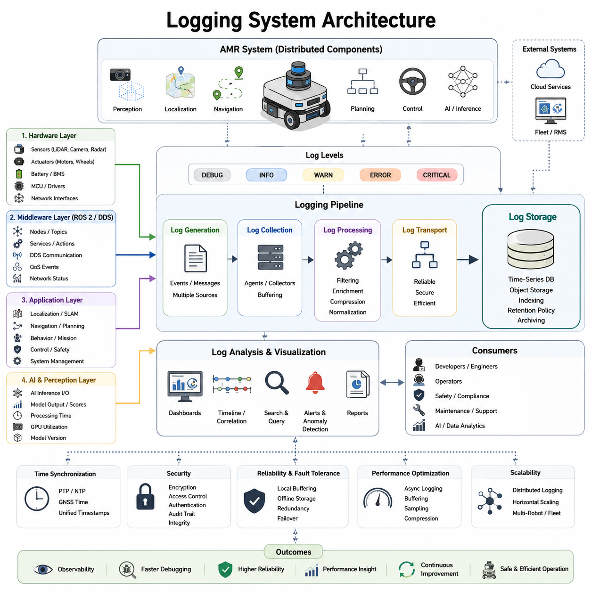
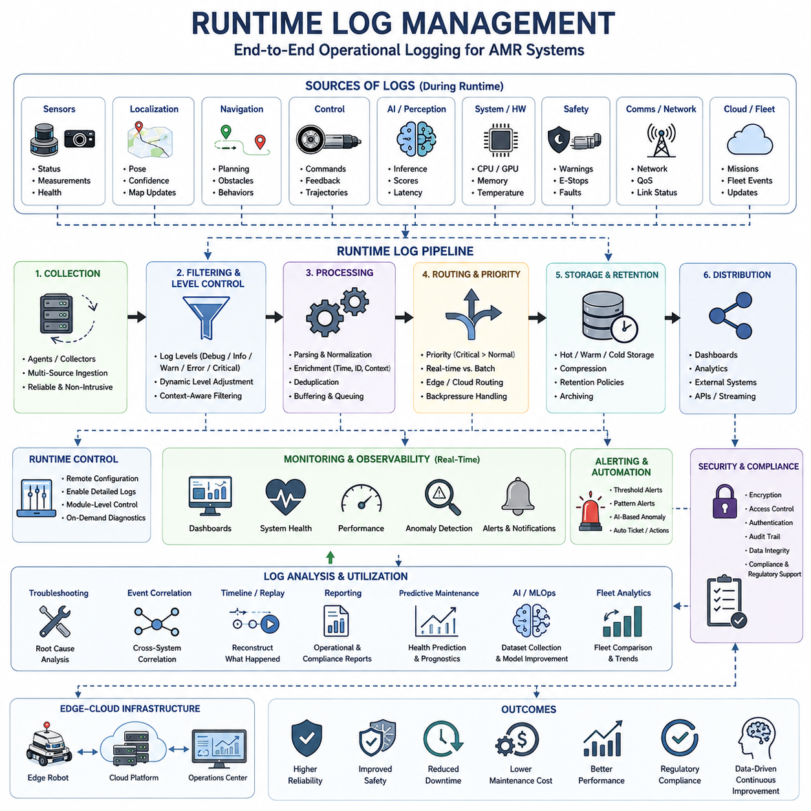
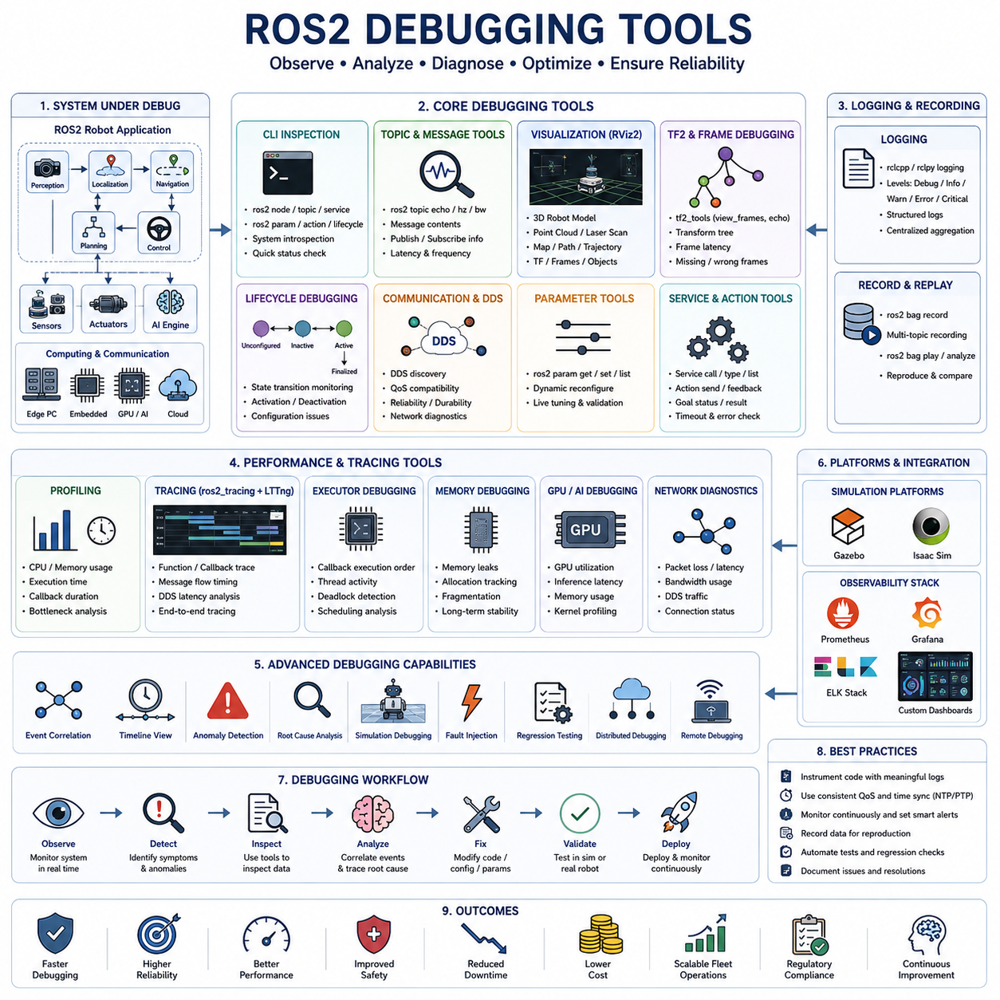
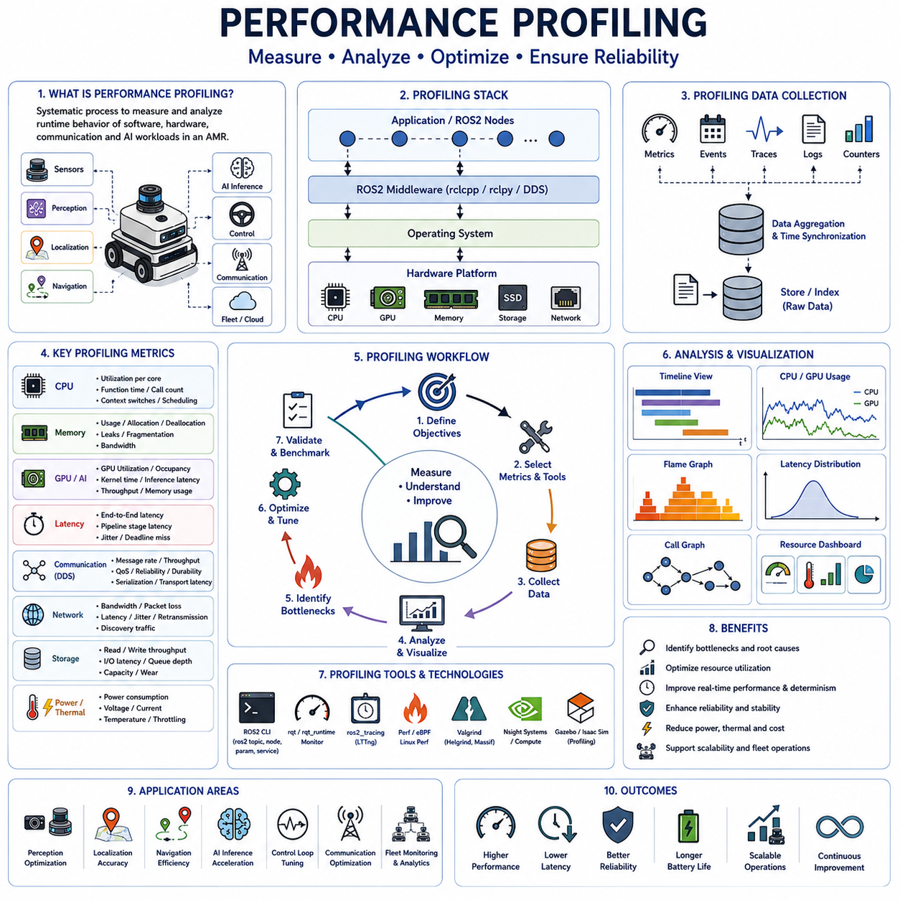
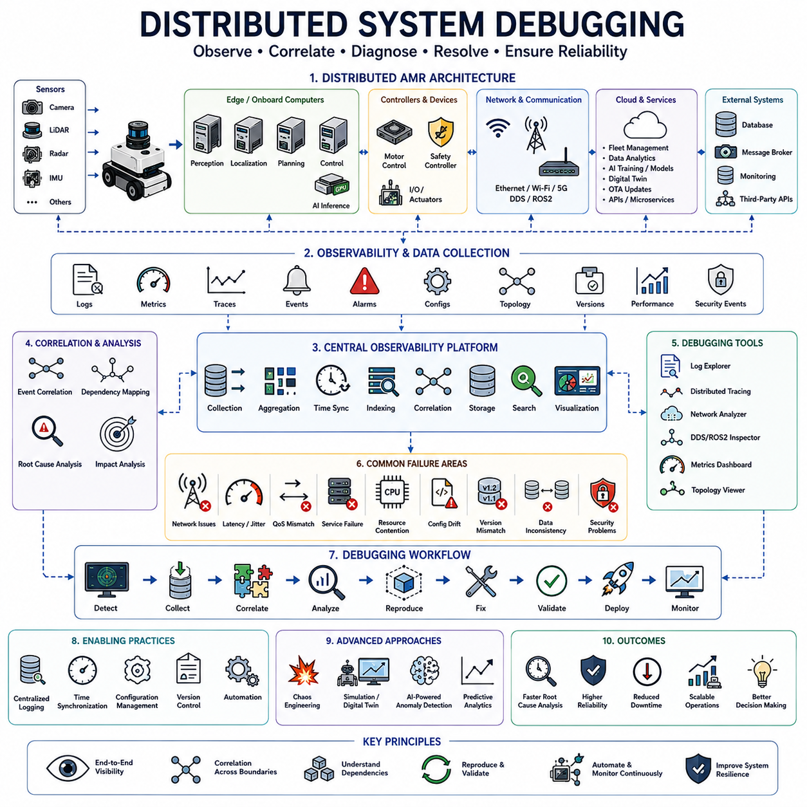
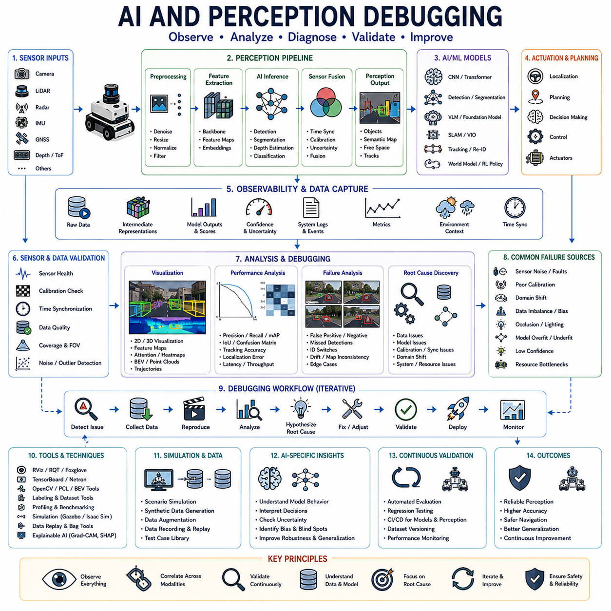
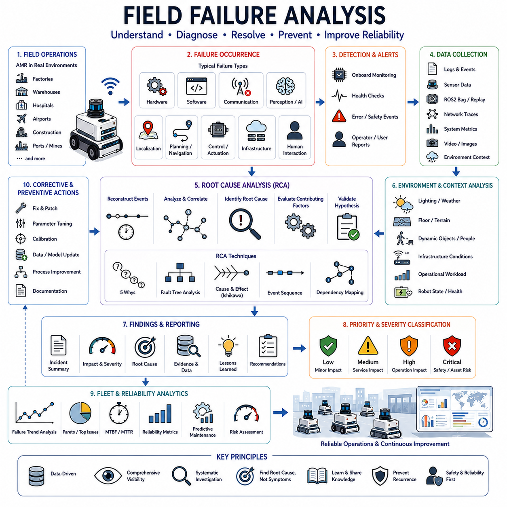
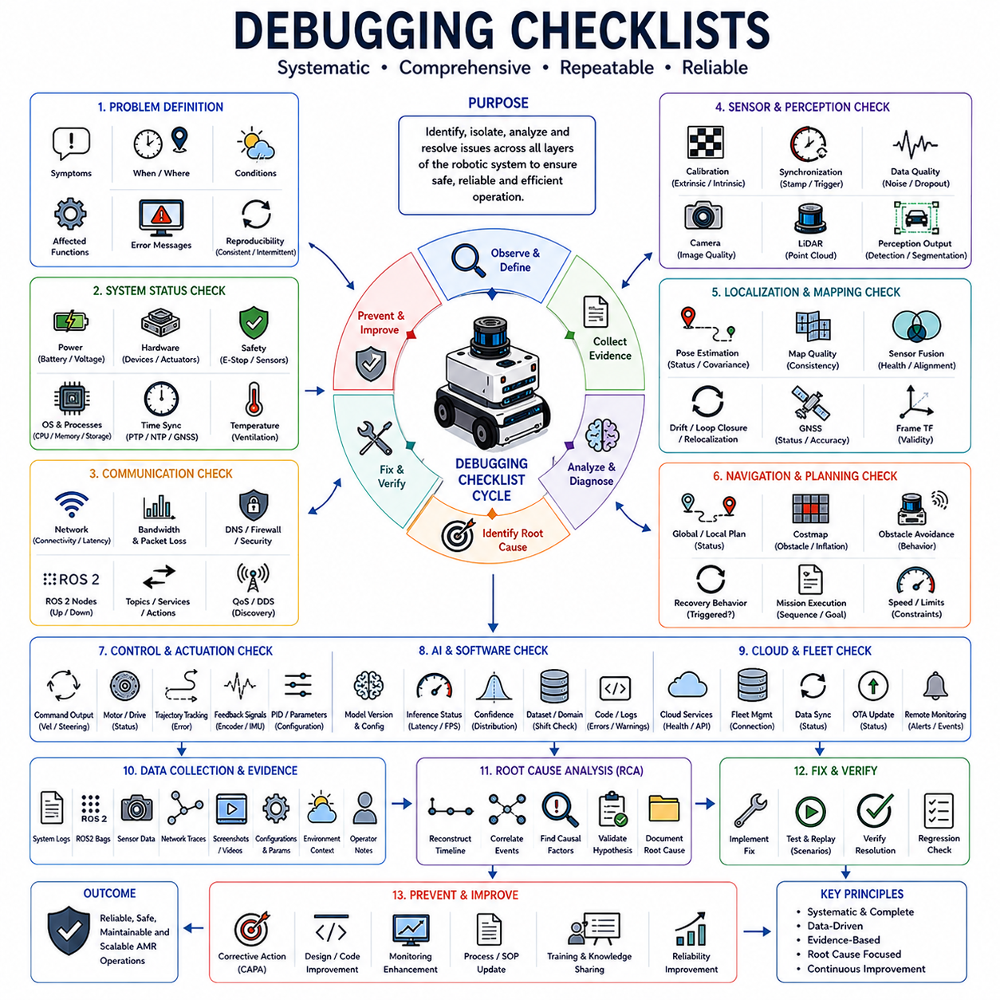

**Volume 07. AMR Software Architecture and Development**

# Chapter 16. Logging and Debugging

## 16.1 Logging System Architecture

{width="7.268055555555556in" height="7.268055555555556in"}

Logging System Architecture is one of the most critical foundations of modern Autonomous Mobile Robot (AMR) software development because it provides visibility into every software component, hardware device, communication channel, and artificial intelligence process operating inside the robot. As AMR systems become increasingly complex, consisting of hundreds of software nodes, multiple sensors, distributed computing devices, real-time controllers, cloud services, and AI inference engines, understanding system behavior without a comprehensive logging framework becomes nearly impossible. Logging serves as the primary mechanism for observing system execution, diagnosing failures, analyzing performance, reproducing field incidents, validating software updates, and supporting long-term operational reliability. For this reason, logging architecture should not be viewed as a secondary debugging utility but rather as a core infrastructure layer of the entire robot software stack. The topic belongs to the Logging and Debugging section within the AMR Software Architecture and Development volume and serves as the foundation for runtime log management, debugging tools, performance profiling, distributed system debugging, and failure analysis.

In traditional software systems, logging is often limited to recording application messages and error events. In robotics systems, however, logging requirements are significantly broader because the robot continuously interacts with the physical world. A logging architecture must capture not only software events but also sensor measurements, localization estimates, planning decisions, actuator commands, network communication status, safety events, hardware diagnostics, and AI inference results. Every decision made by the robot should be traceable through recorded data. When a robot unexpectedly stops, collides with an obstacle, loses localization, deviates from its planned route, or experiences degraded perception performance, engineers must be able to reconstruct the exact sequence of events that led to the incident. A well-designed logging architecture provides this capability.

The primary objective of a logging system is observability. Observability refers to the ability to understand the internal state of a system by examining its outputs. Modern AMRs contain numerous interconnected subsystems including perception pipelines, SLAM modules, localization engines, navigation stacks, behavior planners, fleet communication services, control systems, safety controllers, and AI accelerators. Each subsystem generates operational information that must be collected and correlated. Observability enables engineers to determine what happened, when it happened, why it happened, and what corrective actions should be taken. Without sufficient observability, failures become difficult to diagnose and system reliability deteriorates.

A robust logging architecture typically consists of several layers. At the lowest level are hardware logs generated by sensors, motor controllers, battery management systems, embedded microcontrollers, and communication interfaces. These logs capture device-specific information such as voltage levels, temperature measurements, communication errors, actuator faults, encoder anomalies, and hardware status changes. Hardware logs provide insight into the physical health of the robot and are essential for diagnosing electrical and mechanical failures.

Above the hardware layer resides the middleware logging layer. In ROS2-based systems, middleware logging records node communication, topic activity, service requests, action execution, DDS transport events, Quality of Service behavior, message latency, packet loss, and network synchronization information. Since modern AMRs rely heavily on distributed communication between software nodes, middleware logging provides visibility into message flow throughout the system. Communication failures often originate from timing mismatches, QoS configuration errors, or network congestion, making middleware logs indispensable for diagnosing distributed software problems.

The application layer generates higher-level operational logs associated with robot functionality. Localization systems record estimated positions, confidence metrics, loop closure events, and map updates. Navigation systems log route planning decisions, obstacle avoidance actions, costmap changes, recovery behaviors, and mission execution states. Control systems record motion commands, velocity outputs, steering commands, acceleration limits, and trajectory tracking performance. These logs enable engineers to analyze robot behavior from a functional perspective rather than focusing solely on software implementation details.

Artificial intelligence and perception systems introduce another major logging domain. Modern AMRs increasingly rely on deep learning models, vision-language models, object detectors, semantic segmentation networks, and sensor fusion algorithms. AI logging captures inference inputs, model outputs, confidence scores, processing times, GPU utilization, model versions, and decision explanations. In safety-critical environments, recording AI behavior is essential because engineers must understand why the AI system produced a particular decision. AI logging supports explainability, performance validation, model retraining, and continuous improvement processes.

An effective logging architecture must support multiple log levels. Log levels allow developers to control the amount of information generated during operation. Debug logs provide detailed execution traces intended primarily for development and troubleshooting. Information logs record normal operational events and system status updates. Warning logs indicate abnormal conditions that do not immediately impact functionality but may require attention. Error logs identify failures that affect system operation. Critical logs capture severe conditions that threaten safety, reliability, or mission completion. By categorizing messages according to severity, engineers can filter information efficiently and focus on relevant events.

Timestamp management represents one of the most important aspects of robot logging architecture. Since AMRs operate using multiple sensors and distributed processors, accurate event correlation requires precise time synchronization. Every log entry should contain a timestamp derived from a synchronized clock source. Systems commonly employ Precision Time Protocol (PTP), Network Time Protocol (NTP), GNSS time references, or dedicated hardware synchronization mechanisms. Without consistent timestamps, reconstructing event sequences across multiple subsystems becomes extremely difficult. Time synchronization is especially important when analyzing interactions between perception, localization, planning, and control components.

Modern AMR platforms often utilize structured logging rather than simple text-based logging. Structured logs represent information using machine-readable formats such as JSON, Protocol Buffers, or binary event records. Structured logging allows automated analysis tools to parse, search, aggregate, and visualize log data efficiently. For example, a navigation event can be recorded with fields describing robot position, target location, velocity, planning duration, obstacle count, and execution outcome. Structured data significantly improves analytical capabilities compared to free-form textual messages.

Scalability is another critical design consideration. Small research robots may generate only a few megabytes of log data per day, whereas industrial AMRs equipped with multiple cameras, LiDAR sensors, radar systems, and AI accelerators can generate hundreds of gigabytes or even terabytes of operational data. Logging architectures must therefore support efficient storage management, data compression, indexing, retention policies, and archival strategies. Engineers must carefully balance information richness against storage limitations and transmission bandwidth constraints.

Distributed logging has become increasingly important as AMRs evolve into edge-cloud systems. Modern robots rarely operate as isolated devices. Instead, they interact with fleet management systems, cloud analytics platforms, remote monitoring services, digital twin environments, and AI model management infrastructure. Distributed logging architectures aggregate logs from multiple robots and cloud services into centralized observability platforms. This enables fleet-wide analysis, trend identification, anomaly detection, and operational optimization. Centralized logging also simplifies debugging when failures involve interactions between onboard software and cloud services.

Log collection mechanisms vary depending on system architecture. Some systems employ local log agents that gather information from individual software components and forward it to centralized storage services. Others utilize publish-subscribe architectures in which log messages are distributed similarly to operational data streams. High-performance systems may employ shared memory buffers, binary event tracing frameworks, or kernel-level instrumentation to minimize logging overhead. The chosen approach must balance performance, scalability, reliability, and implementation complexity.

Performance overhead represents a significant challenge in logging architecture design. Excessive logging can consume CPU resources, memory bandwidth, storage capacity, and network bandwidth. In real-time robot systems, poorly designed logging mechanisms may introduce latency that affects operational performance. Therefore, logging frameworks must be optimized to minimize interference with real-time execution. Techniques such as asynchronous logging, buffered writes, background log processing, and selective event sampling are commonly employed to reduce overhead while maintaining visibility.

Fault tolerance is another important architectural requirement. Logging systems themselves must remain operational during failures because diagnostic information is most valuable when unexpected problems occur. Robust implementations use persistent storage buffers, redundant log collectors, fail-safe storage mechanisms, and graceful degradation strategies. If network connectivity is lost, logs should continue to be stored locally until communication is restored. If storage capacity becomes constrained, retention policies should prioritize critical events while discarding less important information.

Security considerations must also be incorporated into logging architecture. Logs may contain sensitive operational data, facility information, robot locations, user identities, authentication records, and proprietary algorithms. Unauthorized access to logs could expose security vulnerabilities or confidential information. Therefore, logging systems should implement encryption, access control, authentication, integrity verification, and audit trails. Secure logging becomes particularly important in hospitals, factories, critical infrastructure facilities, and defense-related applications.

Visualization tools significantly enhance the value of collected logs. Engineers often rely on dashboards, timelines, event correlation views, heatmaps, anomaly detection tools, and performance monitoring interfaces to interpret large volumes of data. Visualization platforms transform raw log records into actionable insights. For example, a dashboard may display localization confidence trends, navigation success rates, sensor health indicators, network latency statistics, and AI inference performance metrics in real time. Such tools enable proactive system monitoring and rapid incident response.

The relationship between logging and debugging is particularly strong in robotics. Effective debugging requires accurate and comprehensive historical information. When an issue occurs in the field, engineers may not be able to reproduce the exact environmental conditions in a laboratory setting. Logs serve as a digital record of the robot\'s operational history, allowing investigators to reconstruct scenarios and identify root causes. This capability is especially important for intermittent failures that occur only under specific environmental conditions or system states.

Logging also plays a fundamental role in machine learning operations for robotics. Continuous learning systems depend on operational data collected from deployed robots. Logs provide valuable training data for perception models, anomaly detection algorithms, predictive maintenance systems, and behavior optimization frameworks. Data-driven development methodologies rely heavily on well-designed logging infrastructure to support iterative improvement processes.

In large-scale industrial deployments, logging architectures support predictive maintenance and fleet analytics. By analyzing historical logs, organizations can identify recurring failure patterns, estimate component lifetimes, predict maintenance requirements, and optimize operational procedures. Fleet-wide analytics can reveal trends that are invisible when examining individual robots. This transforms logging from a reactive troubleshooting tool into a proactive operational intelligence platform.

As autonomous systems continue to evolve toward edge AI, cloud robotics, multi-robot coordination, and embodied intelligence, logging architectures will become even more sophisticated. Future systems are expected to incorporate semantic event logging, AI-generated diagnostics, automated root-cause analysis, self-healing infrastructure, and real-time anomaly detection. Advanced observability frameworks may automatically correlate events across perception, planning, control, networking, and cloud services, providing engineers with comprehensive explanations of robot behavior.

Ultimately, Logging System Architecture forms the foundation of reliability, maintainability, safety, and operational excellence in modern AMR platforms. It enables engineers to observe complex systems, diagnose failures efficiently, validate software behavior, improve AI models, support fleet operations, and ensure long-term deployment success. Without a carefully designed logging architecture, the development and operation of large-scale autonomous robotic systems would become significantly more difficult, less reliable, and far more expensive. Therefore, logging should be considered a first-class architectural component rather than a simple development utility, playing a central role throughout the entire lifecycle of autonomous mobile robot software systems.

## 16.2 Runtime Log Management

{width="7.268055555555556in" height="7.268055555555556in"}

Runtime Log Management is the discipline of collecting, organizing, processing, storing, monitoring, and maintaining log information generated by an Autonomous Mobile Robot (AMR) while the system is actively operating. While Logging System Architecture defines the overall framework through which information is generated and transported, Runtime Log Management focuses on how logs are handled during real-world operation. It ensures that the massive amount of data produced by robot software, hardware components, middleware services, AI modules, communication systems, and cloud infrastructure remains useful, searchable, reliable, and actionable throughout the operational lifecycle of the robot. In modern AMR systems, runtime log management is not merely a maintenance activity but a core operational capability that directly influences reliability, safety, performance optimization, failure diagnosis, regulatory compliance, and fleet-level scalability.

A modern AMR continuously generates information from every subsystem. Sensors publish status updates and measurements. Localization systems produce pose estimates. Navigation systems generate planning decisions and obstacle avoidance actions. Control modules create motion commands. AI inference engines generate predictions and confidence scores. Communication layers report network status. Safety systems log warnings, emergency stops, and protective actions. Fleet management systems exchange task execution information. During a typical operational day, a single industrial robot may generate millions of log entries and several gigabytes of diagnostic information. In large-scale deployments involving hundreds or thousands of robots, the volume of generated data can become enormous. Runtime Log Management provides the mechanisms necessary to control this complexity.

The first responsibility of runtime log management is continuous log collection. Every software process, hardware component, and communication service generates operational events that must be captured without disrupting system performance. Collection mechanisms must operate reliably under varying workloads, network conditions, and hardware states. Logs may originate from ROS2 nodes, DDS middleware, Linux system services, embedded controllers, AI inference frameworks, GPU monitoring tools, cloud services, and external industrial equipment. A runtime management framework must provide a unified mechanism for gathering these heterogeneous data sources into a coherent operational record.

One of the fundamental challenges in runtime logging is balancing visibility with resource consumption. Engineers naturally desire detailed information about system behavior, but excessive logging can consume CPU resources, memory capacity, storage bandwidth, and network throughput. In real-time robotic systems, poorly controlled logging may interfere with navigation, perception, control loops, and safety-critical processes. Runtime Log Management therefore requires dynamic control mechanisms that regulate logging intensity according to operational needs. During normal operation, systems may use informational logging levels. During anomaly detection or debugging sessions, detailed diagnostic logging can be temporarily enabled. Adaptive logging strategies allow robots to maximize observability while minimizing operational overhead.

Log level management represents one of the most important runtime functions. Modern AMR software typically supports multiple severity categories including Debug, Trace, Info, Warning, Error, and Critical levels. Runtime management systems allow these levels to be adjusted dynamically without restarting software components. This capability is especially important in industrial deployments where continuous operation is required. Engineers may remotely increase logging verbosity for specific modules experiencing problems while leaving the remainder of the system unaffected. Such selective logging significantly reduces storage requirements and diagnostic complexity.

Centralized log aggregation is another key component of runtime management. In a distributed AMR architecture, dozens or even hundreds of software processes may execute simultaneously across multiple computing devices. Edge computers, embedded controllers, AI accelerators, safety processors, and cloud servers each generate independent log streams. Runtime management systems aggregate these streams into a centralized repository where events can be correlated and analyzed. Centralized aggregation provides a unified operational view and simplifies troubleshooting across subsystem boundaries.

Time synchronization plays a critical role in runtime log analysis. Events occurring within different components must be accurately correlated to reconstruct system behavior. For example, an obstacle detection event from a camera, a localization update from a SLAM system, and a control action issued by a navigation controller may all contribute to a particular robot behavior. Without synchronized timestamps, determining causal relationships becomes difficult. Runtime Log Management therefore relies heavily on synchronized clock sources such as Precision Time Protocol (PTP), Network Time Protocol (NTP), GNSS timing references, or dedicated hardware timing systems.

Event correlation is one of the most powerful capabilities provided by modern runtime management platforms. Rather than viewing logs as isolated messages, correlation systems identify relationships among events occurring across multiple components. A navigation failure, for example, may be linked to a localization confidence drop, which in turn may be associated with poor sensor visibility caused by environmental conditions. Event correlation enables engineers to understand complete operational narratives rather than analyzing individual messages independently. This significantly accelerates root-cause analysis and reduces troubleshooting effort.

Modern runtime logging frameworks increasingly utilize structured logging techniques. Instead of recording unstructured text messages, systems store machine-readable data formats such as JSON, Protocol Buffers, Apache Avro, or binary event structures. Structured logging allows automated processing pipelines to classify, filter, aggregate, and analyze operational information efficiently. Search engines, monitoring dashboards, anomaly detection systems, and machine learning analytics platforms can consume structured logs directly, enabling sophisticated operational intelligence capabilities.

Filtering mechanisms are essential for controlling data volume. Runtime management systems often implement hierarchical filtering strategies based on subsystem, severity level, message type, event category, operational context, or mission state. For example, localization logs may be recorded at high frequency only when confidence values fall below predefined thresholds. AI inference logs may be retained only when prediction confidence is unusually low. Such intelligent filtering allows organizations to focus storage and analysis resources on information that provides the greatest operational value.

Buffer management is another important aspect of runtime logging. Continuous log generation often exceeds the capacity of immediate storage devices or network links. Runtime systems therefore employ memory buffers, persistent queues, and temporary caches to smooth data flow and prevent information loss. Buffer management must be carefully designed to balance latency, reliability, and resource consumption. In safety-critical environments, critical events should receive transmission priority while less important information may be delayed or compressed.

Storage management becomes increasingly important as robot deployments scale. Log data must be retained for operational analysis, compliance auditing, incident investigation, performance optimization, and machine learning development. However, indefinite storage of all generated data is impractical. Runtime Log Management systems therefore implement retention policies that determine how long information should be preserved. Critical safety events may be stored for years, whereas routine operational messages may be retained only for weeks or months. Automated archival systems transfer older records to lower-cost storage platforms while preserving accessibility when required.

Compression technologies play a major role in reducing storage requirements. Log streams often contain repetitive information that can be compressed efficiently. Modern runtime systems utilize lossless compression algorithms to minimize storage consumption without sacrificing analytical fidelity. Compression becomes particularly valuable in edge computing environments where storage resources are limited and communication bandwidth may be constrained.

Runtime monitoring represents a closely related function. Logging systems not only record historical information but also provide real-time operational visibility. Monitoring dashboards display system health indicators, hardware status, communication metrics, AI performance statistics, navigation efficiency measurements, and safety-related events. Operators can observe system behavior continuously and respond proactively to emerging issues. Runtime monitoring transforms logs from passive records into active operational management tools.

Alert generation is another essential capability. Runtime management systems continuously analyze incoming log streams to detect abnormal conditions. When predefined thresholds are exceeded or unusual patterns are identified, alerts can be generated automatically. Examples include excessive CPU utilization, repeated sensor communication failures, localization instability, battery overheating, network packet loss, abnormal AI inference latency, or repeated navigation recovery behaviors. Automated alerts enable rapid intervention before minor issues escalate into major operational failures.

Anomaly detection has become increasingly sophisticated with the integration of artificial intelligence techniques. Traditional alerting systems rely on predefined rules and thresholds. Modern Runtime Log Management platforms employ machine learning algorithms capable of identifying previously unseen failure patterns. These systems learn normal operational behavior from historical data and automatically recognize deviations that may indicate emerging problems. AI-driven anomaly detection improves reliability and reduces dependence on manually defined monitoring rules.

Fault diagnosis workflows rely heavily on runtime log management infrastructure. When incidents occur in deployed robots, engineers must quickly determine the underlying causes. Effective diagnostic systems provide search capabilities, event timelines, subsystem correlation views, dependency analysis tools, and historical replay mechanisms. These capabilities allow investigators to reconstruct system behavior leading up to failures and identify root causes with minimal operational disruption.

Fleet-scale operations introduce additional complexity. Organizations operating hundreds or thousands of robots require centralized visibility across the entire fleet. Runtime Log Management platforms aggregate operational data from all deployed units and provide fleet-wide analytics. Engineers can compare robot performance across locations, identify recurring failure modes, evaluate software update effectiveness, and measure operational trends. Fleet-level visibility transforms isolated robot diagnostics into enterprise-wide operational intelligence.

Cloud integration has become increasingly common in large AMR deployments. Runtime log management platforms often utilize cloud-native architectures that support scalable ingestion, storage, processing, and visualization of operational data. Cloud services provide elastic storage capacity, distributed processing resources, advanced analytics tools, and global accessibility. Hybrid edge-cloud architectures are particularly effective because they allow critical information to be processed locally while long-term analysis occurs within cloud infrastructure.

Cybersecurity considerations are fundamental to runtime logging systems. Operational logs frequently contain sensitive information regarding robot locations, facility layouts, mission assignments, user identities, network configurations, and system vulnerabilities. Unauthorized access to such information could create significant security risks. Runtime management systems therefore implement encryption, authentication, authorization controls, integrity verification, and audit logging to protect sensitive operational data.

Regulatory compliance requirements often influence runtime log retention and management policies. Industrial facilities, healthcare institutions, transportation systems, and critical infrastructure operators may require detailed operational records for auditing and certification purposes. Runtime Log Management systems must support traceability, accountability, and evidence preservation while ensuring compliance with applicable regulations and standards.

Data quality management is another important consideration. Logs that contain missing timestamps, inconsistent formats, duplicate entries, or corrupted records reduce analytical effectiveness. Runtime management platforms therefore include validation mechanisms that verify data integrity, enforce schema consistency, and detect collection failures. High-quality logging data significantly improves diagnostic accuracy and operational insight.

Predictive maintenance systems rely heavily on runtime operational data. By analyzing historical logs, machine learning models can identify patterns associated with component degradation, sensor aging, actuator wear, battery deterioration, and communication instability. Predictive analytics allow maintenance activities to be scheduled proactively before failures occur, reducing downtime and operational costs.

The relationship between Runtime Log Management and MLOps is becoming increasingly important. AI-enabled robots continuously generate valuable operational datasets that can be used for model improvement. Runtime management systems provide the infrastructure required to collect, organize, label, and distribute these datasets for retraining and validation purposes. As autonomous systems become more intelligent, the integration between logging, analytics, and machine learning workflows will continue to deepen.

Future Runtime Log Management systems are expected to incorporate autonomous observability capabilities. AI agents may automatically summarize operational events, identify root causes, recommend corrective actions, generate incident reports, and even initiate self-healing procedures. Semantic logging techniques may capture not only raw events but also contextual explanations describing why specific decisions were made. These developments will further enhance the efficiency of robot operations and maintenance.

Ultimately, Runtime Log Management serves as the operational nervous system of modern AMR software platforms. It transforms raw event streams into actionable intelligence, enabling continuous monitoring, rapid troubleshooting, predictive maintenance, fleet optimization, regulatory compliance, and long-term system improvement. As AMR deployments continue to scale across factories, hospitals, warehouses, smart cities, transportation systems, and industrial facilities, effective runtime log management will remain a foundational capability that directly determines the reliability, safety, maintainability, and operational success of autonomous robotic systems.

## 16.3 ROS2 Debugging Tools

{width="7.268055555555556in" height="7.268055555555556in"}

ROS2 Debugging Tools represent a collection of methodologies, utilities, monitoring frameworks, visualization platforms, tracing systems, profiling tools, and diagnostic techniques used to understand, analyze, troubleshoot, and optimize Robot Operating System 2 (ROS2) based robotic applications. In modern Autonomous Mobile Robot (AMR) systems, ROS2 serves as the central middleware layer connecting perception, localization, navigation, planning, control, artificial intelligence, cloud communication, and fleet management modules. As robots become increasingly distributed and complex, debugging can no longer rely solely on simple print statements or console outputs. Engineers require comprehensive tools capable of observing system behavior across hundreds of nodes, thousands of topics, multiple computing devices, and real-time communication channels. ROS2 Debugging Tools provide the visibility necessary to diagnose failures, validate system behavior, optimize performance, and ensure reliable operation throughout the robot lifecycle.

Debugging in robotics differs significantly from debugging traditional software applications. Conventional software often operates in relatively deterministic environments where failures can be reproduced easily. Robotic systems, however, interact continuously with dynamic physical environments. Sensor noise, network latency, hardware timing variations, environmental changes, actuator uncertainties, and AI inference variability introduce complexities that make failures difficult to reproduce. Consequently, ROS2 debugging focuses not only on software correctness but also on system observability, timing analysis, communication monitoring, resource utilization tracking, and behavior reconstruction.

One of the most fundamental ROS2 debugging tools is the command-line interface provided through the ROS2 CLI framework. The command-line tools enable engineers to inspect nodes, topics, services, actions, parameters, and communication states while the system is running. These utilities provide immediate visibility into system structure and runtime behavior. Engineers frequently use them to verify node existence, monitor message traffic, inspect parameter values, validate communication pathways, and diagnose connectivity problems. Because ROS2 systems often contain dozens or hundreds of active nodes, command-line inspection remains one of the fastest methods for understanding current system state.

Node introspection plays a critical role in debugging distributed robotic applications. Every ROS2 node performs a specific functional responsibility such as sensor processing, localization, planning, navigation, control, perception, or cloud communication. Debugging often begins by verifying that the expected nodes are running and operating correctly. Node introspection tools allow engineers to examine node status, publishers, subscribers, services, actions, lifecycle states, and execution contexts. Understanding node relationships provides a foundation for identifying communication bottlenecks and functional failures.

Topic inspection tools are among the most frequently used ROS2 debugging resources. Topics represent the primary communication mechanism within ROS2. Sensors publish data to topics, localization modules consume sensor information and publish pose estimates, planners subscribe to localization updates and publish trajectories, and controllers subscribe to trajectory commands. Any disruption in this information flow can cause operational failures. Topic debugging tools allow engineers to observe message frequency, bandwidth consumption, publication rates, subscription counts, message contents, and communication latency. Such information is invaluable when diagnosing missing data, delayed messages, synchronization issues, or communication failures.

Message visualization significantly improves debugging efficiency. Raw numerical values are often difficult to interpret, particularly in complex robotic systems. Visualization tools convert sensor data, trajectories, maps, robot states, transforms, and planning outputs into intuitive graphical representations. Engineers can visually inspect system behavior and identify anomalies more rapidly than through textual analysis alone. Visualization becomes especially important when analyzing perception pipelines, localization accuracy, navigation behavior, obstacle detection performance, and robot motion execution.

RViz remains one of the most important debugging tools within the ROS2 ecosystem. It provides a three-dimensional visualization environment capable of displaying point clouds, camera images, occupancy grids, navigation paths, robot models, coordinate transforms, detected objects, and sensor outputs. RViz allows engineers to observe how the robot perceives and interprets its environment in real time. When localization errors occur, map alignment issues arise, or navigation behaviors appear incorrect, RViz often serves as the primary diagnostic interface. By visualizing internal representations generated by different subsystems, engineers can quickly determine where failures originate.

Coordinate transformation debugging represents another major area of ROS2 diagnostics. Modern robots rely heavily on coordinate frame transformations managed through the tf2 framework. Sensors, robot bodies, maps, localization systems, and navigation modules all operate within different coordinate frames. Incorrect transformations frequently cause localization errors, navigation failures, perception inaccuracies, and sensor fusion problems. ROS2 debugging tools provide methods for visualizing transformation trees, monitoring frame relationships, measuring transform latency, and identifying missing or inconsistent frame definitions. Accurate transform management is essential for reliable robot operation.

ROS2 Lifecycle Nodes introduce additional debugging requirements. Lifecycle architecture allows nodes to transition through states such as unconfigured, inactive, active, and finalized. This structured behavior improves system management but also introduces new failure modes. Lifecycle debugging tools enable engineers to monitor state transitions, verify activation sequences, identify configuration problems, and ensure proper initialization procedures. Many deployment issues arise from incorrect lifecycle state management rather than software logic errors.

Communication debugging occupies a central role within ROS2 diagnostics because distributed systems depend heavily on reliable message transport. ROS2 utilizes the Data Distribution Service (DDS) middleware for communication. DDS introduces numerous configuration options involving discovery, Quality of Service (QoS), reliability policies, durability settings, history management, and transport protocols. Communication failures often result from mismatched QoS configurations rather than software defects. Debugging tools help engineers inspect communication profiles, monitor discovery processes, analyze network behavior, and verify compatibility between publishers and subscribers.

Quality of Service debugging is particularly important in real-time robotic systems. QoS policies determine how messages are transmitted, buffered, prioritized, and retained. Incompatible QoS settings may prevent communication entirely or introduce unexpected latency. Engineers frequently use debugging utilities to verify reliability settings, durability policies, history depth configurations, and deadline requirements. Understanding QoS behavior is essential for maintaining deterministic communication in industrial environments.

Network diagnostics become increasingly important as AMR systems scale across multiple computing devices. Modern robots often contain edge computers, embedded controllers, AI accelerators, safety processors, cloud gateways, and remote monitoring services connected through Ethernet, Wi-Fi, or cellular networks. ROS2 debugging tools provide visibility into network performance, packet loss, communication latency, bandwidth utilization, discovery traffic, and DDS transport efficiency. Network-level debugging is often required when communication issues occur intermittently or under specific operational conditions.

Logging systems serve as foundational debugging infrastructure. ROS2 provides integrated logging mechanisms that allow software components to generate structured runtime information. Debug logs, informational messages, warnings, errors, and critical events provide insight into software execution. Effective logging strategies significantly reduce troubleshooting effort by preserving historical operational information. Engineers often combine logging frameworks with centralized log aggregation systems to support large-scale fleet deployments.

Runtime parameter inspection and modification represent another powerful debugging capability. ROS2 parameters control configuration values governing algorithm behavior, sensor calibration, navigation thresholds, AI inference settings, and communication parameters. Debugging tools allow engineers to inspect parameter values dynamically and modify configurations without restarting the system. This capability accelerates experimentation, tuning, validation, and troubleshooting activities while minimizing operational disruption.

Service and action debugging tools help diagnose higher-level interactions within ROS2 applications. Services provide request-response communication mechanisms, while actions support long-duration operations with feedback and cancellation capabilities. Debugging utilities enable engineers to inspect service availability, monitor request processing, analyze action execution progress, and identify failures within command execution workflows. Such capabilities are particularly valuable in mission management, fleet coordination, and navigation task execution systems.

Performance profiling represents a critical aspect of ROS2 debugging. Many robotic failures originate not from incorrect logic but from performance limitations. Excessive CPU utilization, memory exhaustion, scheduling delays, thread contention, communication bottlenecks, and inefficient algorithms can degrade system behavior. Profiling tools allow engineers to measure execution times, resource consumption, latency distributions, scheduling behavior, and computational workloads. These measurements provide quantitative evidence for optimization efforts.

Tracing technologies provide deeper visibility into system execution. Unlike traditional logging, tracing captures low-level events with minimal performance overhead. ROS2 tracing frameworks record function execution, message transmission, callback execution, scheduler activity, and middleware operations. Trace data enables engineers to analyze timing relationships, identify bottlenecks, understand execution sequences, and reconstruct complex runtime behaviors. Tracing is particularly valuable for diagnosing intermittent problems that cannot be reproduced consistently.

The ROS2 tracing ecosystem commonly integrates with Linux tracing frameworks such as LTTng. These tools provide high-resolution timing measurements across user-space and kernel-space activities. Engineers can analyze message latency, callback durations, executor performance, DDS communication delays, and operating system scheduling behavior. Such detailed visibility is essential for real-time robotic applications where millisecond-level timing variations can significantly impact system performance.

Executor debugging is another specialized area of ROS2 diagnostics. Executors manage callback scheduling and thread execution within ROS2 nodes. Improper executor configurations may introduce latency, resource contention, deadlocks, race conditions, or missed deadlines. Debugging tools help engineers understand callback execution order, thread utilization, concurrency behavior, and scheduling efficiency. As multi-threaded architectures become increasingly common in high-performance robots, executor debugging grows in importance.

Memory debugging plays a critical role in long-duration robot deployments. Memory leaks, fragmentation, allocation inefficiencies, and resource retention issues may not become apparent during short laboratory tests but can cause failures after extended operation. Memory analysis tools help identify leaks, monitor allocation patterns, track resource usage, and validate system stability over time. Reliable industrial robots often operate continuously for weeks or months, making memory diagnostics essential.

GPU debugging has become increasingly important as perception and AI workloads migrate to accelerated computing platforms. Modern AMRs frequently utilize CUDA, TensorRT, deep learning frameworks, and multi-GPU architectures. GPU debugging tools provide visibility into kernel execution, memory utilization, inference latency, thermal behavior, and computational efficiency. Performance issues within AI pipelines can often be traced to GPU resource constraints or inefficient execution patterns.

Simulation-based debugging provides a safe and repeatable environment for investigating complex failures. Platforms such as Gazebo and Isaac Sim allow engineers to reproduce scenarios, inject faults, analyze system behavior, and validate corrections without risking physical hardware. Simulation environments support accelerated testing, automated regression analysis, and large-scale scenario evaluation. Debugging in simulation often complements field diagnostics by enabling controlled experimentation.

Data recording and replay capabilities significantly enhance debugging effectiveness. ROS2 bag recording systems capture topic data, sensor streams, control commands, and operational events during runtime. Engineers can later replay recorded scenarios to reproduce failures, evaluate algorithm modifications, and compare system behavior across software versions. Replay-based debugging reduces dependence on field testing and improves reproducibility.

Distributed system debugging becomes increasingly challenging as robots integrate cloud services, fleet management platforms, remote AI inference engines, and edge computing resources. Failures may involve interactions across multiple machines and communication domains. Advanced debugging frameworks provide end-to-end observability spanning robot hardware, onboard software, cloud infrastructure, and operational management systems. Such holistic visibility is necessary for diagnosing modern robotic ecosystems.

Cybersecurity-related debugging has also emerged as an important consideration. Authentication failures, certificate issues, encrypted communication errors, access control violations, and network security policies can impact robot operation. Debugging tools capable of inspecting secure communication channels and security-related events help maintain reliable and secure deployments.

In industrial environments, debugging extends beyond development activities and becomes part of ongoing operational support. Engineers must diagnose issues remotely, often without direct access to affected robots. Remote debugging platforms combine telemetry, logging, visualization, diagnostics, tracing, and replay capabilities into integrated observability systems. These platforms enable rapid incident response and reduce operational downtime.

Artificial intelligence is beginning to transform ROS2 debugging itself. AI-powered observability platforms can automatically analyze logs, correlate events, identify anomalies, detect root causes, and recommend corrective actions. Future debugging systems may function as intelligent assistants capable of understanding complex robotic architectures and providing automated diagnostic guidance.

Ultimately, ROS2 Debugging Tools form a critical foundation for reliable AMR development and operation. They provide the visibility necessary to understand distributed software behavior, diagnose failures, validate system performance, optimize resource utilization, and maintain operational reliability. As robotic systems continue to grow in complexity, the importance of comprehensive debugging capabilities will increase correspondingly. Effective use of ROS2 debugging tools enables engineers to build safer, more reliable, more scalable, and more maintainable autonomous robotic platforms capable of operating successfully in demanding real-world environments.

## 16.4 Performance Profiling

{width="7.268055555555556in" height="7.268055555555556in"}

Performance Profiling is the systematic process of measuring, analyzing, visualizing, and optimizing the runtime behavior of software systems, hardware resources, communication frameworks, and computational workloads within an Autonomous Mobile Robot (AMR). In ROS2-based robotic systems, performance profiling provides engineers with quantitative insight into how efficiently the robot utilizes computing resources, processes sensor data, executes algorithms, communicates between distributed nodes, performs artificial intelligence inference, and responds to real-world events. As modern AMRs become increasingly complex, integrating multiple sensors, high-resolution cameras, LiDAR systems, localization engines, navigation stacks, deep learning models, cloud connectivity, and fleet management infrastructure, performance profiling has evolved from a debugging convenience into a critical engineering discipline that directly affects reliability, safety, scalability, and operational success.

Every autonomous robot operates under finite computational resources. CPU cores, GPU accelerators, memory bandwidth, storage throughput, network capacity, power consumption, and thermal limits impose constraints on system behavior. Performance profiling enables engineers to understand how these resources are consumed during operation. Without profiling, optimization efforts are often based on assumptions rather than evidence. Profiling transforms software development from intuition-driven debugging into data-driven engineering, allowing developers to identify actual bottlenecks, prioritize optimization activities, and validate performance improvements objectively.

The primary goal of performance profiling is visibility into system execution. Modern AMRs consist of dozens or hundreds of interconnected software components operating simultaneously. Perception systems process camera images and LiDAR point clouds. Localization modules estimate robot position. Navigation systems generate trajectories and obstacle avoidance behaviors. Control loops calculate motor commands. AI models perform object detection, semantic segmentation, scene understanding, and decision support. Cloud communication services exchange information with remote infrastructure. Each subsystem consumes computational resources differently, and profiling provides a detailed understanding of these consumption patterns.

One of the most fundamental profiling metrics is CPU utilization. Central Processing Units remain responsible for a significant portion of robotic computation, including middleware operations, planning algorithms, localization, control loops, communication management, and operating system services. Profiling CPU usage allows engineers to determine whether computational workloads are evenly distributed across available cores or concentrated in specific processes. Excessive CPU utilization may lead to increased latency, missed deadlines, degraded responsiveness, and system instability. By analyzing processor consumption patterns, developers can identify opportunities for parallelization, workload balancing, and algorithm optimization.

CPU profiling extends beyond simple utilization percentages. Modern profiling tools can analyze function execution times, call frequencies, scheduling behavior, cache efficiency, thread interactions, and execution hierarchies. Function-level profiling reveals which sections of code consume the most processing time. Call graph analysis illustrates relationships among software components and highlights inefficient execution paths. Such detailed insights allow developers to optimize algorithms at a granular level and improve overall system performance.

Memory profiling represents another essential component of robotic performance analysis. Autonomous systems frequently process large volumes of sensor data, maps, AI models, and operational information. Memory consumption affects system scalability, responsiveness, and long-term stability. Memory profiling tools monitor allocation patterns, deallocation behavior, memory leaks, fragmentation, buffer usage, and resource retention. In industrial deployments where robots may operate continuously for weeks or months, even small memory inefficiencies can accumulate and eventually cause system failures. Memory profiling helps ensure that software remains stable throughout extended operational periods.

Memory bandwidth analysis is particularly important in perception-intensive applications. High-resolution cameras, LiDAR sensors, radar systems, and AI accelerators continuously generate large data streams. Profiling memory transfers between CPUs, GPUs, storage devices, and communication interfaces allows engineers to identify bottlenecks that may limit throughput. In many cases, system performance is constrained not by computational capability but by data movement inefficiencies.

GPU profiling has become increasingly important as artificial intelligence and computer vision workloads migrate toward accelerated computing platforms. Modern AMRs frequently utilize NVIDIA GPUs, CUDA frameworks, TensorRT optimization engines, and deep neural network inference pipelines. GPU profiling measures kernel execution times, memory utilization, occupancy rates, data transfer latency, inference throughput, and resource utilization. These metrics provide visibility into AI system efficiency and help engineers optimize inference pipelines for real-time performance.

Deep learning models present unique profiling challenges. Neural networks often contain millions or billions of parameters and require significant computational resources. Profiling AI inference pipelines allows engineers to measure model latency, throughput, batch processing efficiency, GPU utilization, tensor operation performance, and memory consumption. Such measurements are critical for ensuring that perception and decision-making systems meet real-time operational requirements. AI models that perform well in laboratory environments may fail to meet timing constraints when deployed on edge computing platforms, making profiling essential during deployment validation.

Latency analysis is one of the most important aspects of performance profiling in robotic systems. Latency refers to the delay between an input event and the corresponding system response. In autonomous robots, latency directly affects safety and operational effectiveness. For example, delays between obstacle detection and avoidance action can significantly impact collision risk. Profiling tools measure end-to-end latency across perception, localization, planning, control, and communication pipelines. By identifying sources of delay, engineers can optimize response times and improve system reactivity.

Real-time systems require deterministic performance rather than merely high performance. Determinism refers to the ability to produce predictable execution behavior under varying conditions. Performance profiling in real-time robotics therefore focuses not only on average execution times but also on worst-case execution times, jitter, deadline compliance, and scheduling consistency. Variability in execution timing can be more problematic than consistently slow performance because unpredictable behavior complicates safety validation and operational reliability.

Thread profiling provides insight into concurrent execution behavior. Modern robotic systems rely heavily on multi-threading to maximize computational efficiency. ROS2 executors, perception pipelines, sensor processing frameworks, AI inference engines, and communication services frequently operate across multiple threads. Profiling thread interactions helps identify synchronization bottlenecks, lock contention, race conditions, deadlocks, and scheduling inefficiencies. Effective thread management is essential for achieving scalable and responsive system behavior.

ROS2 introduces unique performance considerations due to its distributed architecture. Nodes communicate through topics, services, actions, and DDS middleware mechanisms. Communication profiling analyzes message frequency, serialization overhead, transport latency, packet delivery efficiency, discovery traffic, and Quality of Service behavior. Communication bottlenecks can significantly impact overall system performance, particularly in perception-intensive environments where large data volumes must be exchanged between distributed components.

DDS middleware profiling plays a particularly important role in ROS2 systems. DDS configurations influence communication reliability, durability, buffering behavior, transport efficiency, and discovery mechanisms. Performance analysis allows engineers to optimize QoS settings for specific application requirements. Improper DDS configurations may introduce excessive latency, increased resource consumption, or communication instability. Profiling provides objective evidence for configuration tuning decisions.

Network profiling extends performance analysis beyond individual computing devices. Modern AMRs frequently integrate onboard processors, embedded controllers, cloud services, fleet management systems, and remote monitoring platforms through Ethernet, Wi-Fi, 5G, or industrial communication networks. Network profiling measures bandwidth utilization, packet loss, latency distributions, throughput capacity, retransmission rates, and communication reliability. These measurements help ensure that distributed robotic systems maintain effective coordination under real-world operating conditions.

Storage profiling becomes increasingly important as robots generate large volumes of operational data. Sensor recordings, ROS2 bag files, diagnostic logs, AI training datasets, maps, and software updates all consume storage resources. Profiling storage performance helps engineers understand read/write throughput, access latency, compression efficiency, file system behavior, and storage endurance. High-performance data recording systems are particularly important for autonomous vehicle development, AI training, and operational analytics.

Thermal profiling is often overlooked but critically important in edge robotics. Computational workloads generate heat, and excessive temperatures can reduce processor performance through thermal throttling mechanisms. Thermal profiling measures temperature distributions across CPUs, GPUs, power electronics, memory systems, and embedded controllers. Understanding thermal behavior allows engineers to design effective cooling systems and maintain consistent computational performance under demanding workloads.

Power profiling is closely related to thermal analysis. Mobile robots operate within limited energy budgets determined by battery capacity and mission requirements. Performance profiling therefore includes measurements of power consumption associated with computing devices, sensors, communication systems, actuators, and AI accelerators. Engineers use power profiling data to optimize energy efficiency, extend operational duration, and balance performance against battery life.

Tracing technologies provide one of the most detailed approaches to performance profiling. Unlike traditional monitoring systems that periodically sample resource usage, tracing captures fine-grained execution events as they occur. ROS2 tracing frameworks integrated with tools such as LTTng enable high-resolution analysis of message flow, callback execution, scheduling behavior, middleware operations, and operating system interactions. Tracing allows engineers to reconstruct precise execution timelines and identify subtle performance bottlenecks.

Visualization plays a crucial role in profiling workflows. Raw performance metrics can be difficult to interpret, particularly when analyzing complex distributed systems. Visualization tools transform profiling data into timelines, flame graphs, resource utilization charts, dependency maps, communication diagrams, and latency distributions. These representations help engineers understand system behavior intuitively and accelerate optimization efforts.

Flame graphs have become particularly popular in performance analysis. A flame graph visualizes function execution hierarchies and resource consumption across software stacks. Engineers can immediately identify the functions consuming the greatest proportion of processing resources and focus optimization efforts accordingly. Flame graphs are especially useful when analyzing large codebases with complex execution paths.

Simulation environments provide valuable platforms for profiling experiments. Tools such as Gazebo and Isaac Sim allow engineers to evaluate performance under controlled conditions, reproduce workloads consistently, and perform large-scale experiments without physical hardware constraints. Simulation-based profiling supports algorithm development, scalability analysis, and performance validation before deployment.

Performance benchmarking complements profiling activities by establishing measurable performance baselines. Benchmarks define expected resource utilization, execution times, throughput levels, latency targets, and scalability objectives. By comparing current performance against benchmark values, engineers can evaluate optimization effectiveness and detect regressions introduced by software updates.

Continuous profiling has emerged as an important practice within modern DevOps and MLOps workflows. Rather than performing profiling only during development, organizations increasingly monitor performance throughout deployment lifecycles. Continuous profiling provides ongoing visibility into system behavior and enables early detection of performance regressions. This approach is particularly valuable in large-scale robot fleets where software updates are deployed regularly.

Fleet-level profiling extends performance analysis across multiple robots operating in diverse environments. Aggregated performance data allows organizations to identify common bottlenecks, compare hardware configurations, evaluate software versions, and optimize fleet-wide resource utilization. Fleet profiling transforms individual performance measurements into operational intelligence supporting strategic engineering decisions.

Artificial intelligence is beginning to influence performance profiling itself. Machine learning algorithms can automatically analyze profiling datasets, detect anomalies, identify optimization opportunities, predict resource exhaustion, and recommend corrective actions. AI-assisted profiling reduces manual analysis effort and enables more proactive performance management.

As autonomous systems continue to evolve, performance profiling will become increasingly important. Future robots will integrate larger AI models, more sophisticated sensor suites, distributed edge-cloud architectures, multi-agent coordination systems, and advanced world models. These developments will increase computational complexity and resource demands. Comprehensive profiling methodologies will therefore remain essential for maintaining reliability, efficiency, safety, and scalability.

Ultimately, Performance Profiling serves as the scientific foundation of robotic optimization. It provides the quantitative evidence required to understand system behavior, identify bottlenecks, validate design decisions, optimize resource utilization, and ensure that autonomous robots meet their operational requirements. In modern AMR development, performance profiling is not simply a troubleshooting activity but a continuous engineering process that supports every stage of the robot lifecycle, from initial architecture design and algorithm development to deployment, fleet management, and long-term operational improvement.

## 16.5 Distributed System Debugging

{width="7.268055555555556in" height="7.268055555555556in"}

Distributed System Debugging is the process of observing, analyzing, diagnosing, reproducing, and resolving failures that occur across multiple interconnected computing components operating as a unified robotic system. In modern Autonomous Mobile Robot (AMR) architectures, software execution is no longer confined to a single computer. Instead, workloads are distributed across edge computers, embedded controllers, safety processors, sensor devices, AI accelerators, cloud servers, fleet management systems, databases, message brokers, digital twin platforms, and remote monitoring infrastructures. While this distributed architecture improves scalability, flexibility, performance, and maintainability, it also introduces a new class of failures that are significantly more difficult to detect and diagnose than those found in traditional monolithic systems. Distributed System Debugging provides the methodologies, tools, and engineering practices required to understand system behavior across these interconnected environments and maintain reliable operation.

In a traditional standalone application, debugging typically involves examining a single process running on a single machine. Developers can inspect logs, analyze memory usage, trace function execution, and reproduce issues within a controlled environment. In distributed robotic systems, however, failures often emerge from interactions among multiple independent components rather than within any single component itself. A robot may experience navigation failure because of delayed localization updates. Localization may degrade because of network congestion affecting sensor synchronization. The congestion may originate from cloud communication overload. The cloud overload may result from fleet-wide data uploads occurring simultaneously. Understanding such failure chains requires visibility across the entire distributed architecture rather than focusing on individual software modules.

Modern AMR systems represent complex distributed computing environments. Perception nodes may execute on GPU-equipped edge computers. Motion control loops may run on dedicated real-time controllers. Safety functions may execute on certified safety processors. Fleet management services may operate within cloud infrastructure. Databases may reside in separate data centers. Artificial intelligence workloads may be distributed across local and remote inference engines. Communication among these components occurs through ROS2 middleware, DDS transports, Ethernet networks, wireless communication links, cloud APIs, industrial fieldbus systems, and message brokers. Debugging within such environments requires engineers to understand not only software behavior but also communication dependencies, timing relationships, infrastructure constraints, and operational workflows.

One of the primary challenges in distributed system debugging is observability. Observability refers to the ability to understand internal system states through externally visible outputs. In distributed architectures, system state is fragmented across multiple devices and services. No single component possesses complete knowledge of overall system behavior. Engineers therefore require comprehensive observability frameworks capable of collecting logs, metrics, traces, events, and diagnostic information from every participating subsystem. Without sufficient observability, identifying root causes becomes extremely difficult because failures often manifest far from their actual origins.

Logging remains one of the foundational tools of distributed debugging. Every component within the system generates operational logs describing its activities, status changes, warnings, errors, and diagnostic events. However, distributed environments require more than isolated log collection. Logs must be aggregated, synchronized, indexed, correlated, and analyzed collectively. Centralized logging platforms provide a unified view of operational events occurring across robots, edge devices, cloud services, and supporting infrastructure. Such aggregation allows engineers to reconstruct complex failure sequences spanning multiple system boundaries.

Time synchronization is particularly critical in distributed debugging. Events occurring across different devices must be correlated accurately to establish causal relationships. For example, a sensor communication failure may trigger localization instability, which subsequently causes navigation degradation. Determining this sequence requires precise timestamps across all participating systems. Technologies such as Precision Time Protocol (PTP), Network Time Protocol (NTP), GNSS-based timing, and hardware synchronization mechanisms provide the temporal consistency necessary for meaningful analysis. Without synchronized timing, engineers may incorrectly interpret event relationships and misidentify root causes.

Distributed tracing has emerged as one of the most powerful techniques for debugging complex systems. Traditional logs describe individual events, while distributed tracing captures complete execution paths across multiple services and devices. A trace follows a transaction as it propagates through the system, recording interactions among components along the way. In robotics, traces may follow sensor observations through perception pipelines, localization updates, planning modules, control systems, and actuator commands. Distributed tracing enables engineers to understand end-to-end behavior and identify bottlenecks, failures, and unexpected delays.

The concept of correlation is central to distributed debugging. Individual events rarely provide sufficient information to diagnose complex failures. Engineers must identify relationships among logs, metrics, traces, alarms, configuration changes, software updates, and operational conditions. Correlation engines automatically group related events and construct causal chains. For example, an increase in network latency may correlate with elevated CPU utilization on a cloud server, leading to delayed fleet commands and reduced robot responsiveness. Correlation analysis transforms fragmented observations into coherent explanations.

Network debugging occupies a significant portion of distributed system troubleshooting. Communication networks form the backbone of distributed architectures, connecting robots, sensors, cloud services, and operational infrastructure. Network-related failures include packet loss, bandwidth saturation, latency spikes, routing errors, wireless interference, DNS failures, connection timeouts, and protocol mismatches. Such issues often produce symptoms that appear unrelated to networking. For example, perception delays may actually result from network congestion affecting sensor synchronization. Effective debugging therefore requires visibility into network performance at multiple layers.

ROS2 and DDS introduce additional debugging considerations within distributed robotic environments. ROS2 communication relies on DDS discovery mechanisms, Quality of Service policies, transport protocols, serialization processes, and distributed message routing. Communication failures frequently arise from incompatible QoS settings, discovery problems, multicast restrictions, firewall configurations, or network segmentation. Distributed debugging tools help engineers inspect DDS behavior, monitor topic connectivity, analyze message delivery, and verify communication reliability across system boundaries.

Microservice architectures are becoming increasingly common within cloud-connected robotics platforms. Fleet management systems, mission planners, analytics engines, digital twins, monitoring services, and update infrastructures often operate as independent services communicating through APIs and message brokers. While microservices improve modularity and scalability, they also create complex dependency chains. A failure within one service may propagate through multiple downstream systems. Distributed debugging techniques help engineers identify dependency relationships and understand how failures propagate through service ecosystems.

Resource contention represents another important category of distributed system failures. Shared resources such as databases, communication channels, storage systems, processing clusters, and cloud services may become overloaded under heavy workloads. Resource contention often manifests indirectly through increased latency, degraded throughput, timeout errors, or cascading failures. Profiling and monitoring tools provide visibility into resource utilization patterns and help engineers identify bottlenecks before they impact operational performance.

Configuration management plays a crucial role in distributed debugging. Large robotic deployments often involve thousands of configuration parameters governing communication behavior, navigation settings, AI models, security policies, infrastructure resources, and operational workflows. Configuration inconsistencies across distributed components can introduce subtle failures that are difficult to diagnose. Effective debugging therefore includes configuration auditing, version tracking, change monitoring, and automated validation mechanisms.

Software version management introduces additional complexity. Distributed systems frequently consist of components running different software versions across multiple devices. Incompatible versions may introduce communication failures, API mismatches, serialization errors, or unexpected behavior. Debugging platforms must therefore maintain visibility into software inventories and deployment histories. Understanding which versions are running where is often essential for identifying root causes.

Cloud robotics environments require specialized debugging approaches. Modern robots increasingly rely on cloud infrastructure for fleet management, data analytics, AI model distribution, remote monitoring, OTA updates, and operational intelligence. Failures may originate within cloud services yet manifest as robot-level symptoms. Engineers must therefore analyze both local and cloud-side behaviors simultaneously. Hybrid observability platforms that integrate edge and cloud telemetry provide the visibility necessary for effective diagnosis.

Artificial intelligence workloads introduce new debugging challenges. AI systems often operate as distributed pipelines involving data collection, preprocessing, inference, post-processing, model management, and cloud-based training infrastructure. Failures may arise from model drift, data quality degradation, synchronization issues, resource constraints, or deployment inconsistencies. Distributed debugging tools help engineers trace AI decision paths across these interconnected environments and identify performance anomalies.

Data consistency is another critical concern. Distributed systems often maintain multiple copies of information across databases, caches, robots, and cloud services. Synchronization failures can produce inconsistent states that lead to unexpected behavior. Debugging such issues requires visibility into replication processes, synchronization mechanisms, update propagation paths, and conflict resolution strategies.

Incident management forms an important operational aspect of distributed debugging. Large robotic deployments inevitably experience failures despite rigorous engineering practices. Effective incident response requires rapid detection, root-cause analysis, impact assessment, mitigation, and recovery. Distributed debugging platforms support these activities by providing centralized visibility, automated alerting, diagnostic workflows, and historical analysis capabilities. Structured incident management significantly reduces operational downtime and improves system resilience.

Failure reproduction is often one of the most difficult aspects of distributed debugging. Problems occurring in production environments may depend on specific timing conditions, network states, workload patterns, or environmental factors that are difficult to replicate. Data recording, distributed tracing, simulation environments, and digital twins help engineers reproduce failures under controlled conditions. Reproducibility is essential for validating fixes and preventing recurrence.

Chaos engineering has emerged as a proactive approach to distributed system reliability. Rather than waiting for failures to occur naturally, engineers intentionally introduce faults into controlled environments. Network disruptions, service outages, resource limitations, communication delays, and component failures are simulated to evaluate system resilience. Chaos experiments reveal weaknesses that may otherwise remain hidden until production incidents occur.

Security-related debugging is increasingly important within distributed robotics ecosystems. Authentication failures, certificate expiration, access control violations, encrypted communication issues, identity management problems, and cybersecurity incidents can all impact operational behavior. Debugging secure distributed systems requires specialized tools capable of analyzing protected communication channels while preserving security guarantees.

Fleet-scale deployments introduce additional challenges because failures may affect groups of robots simultaneously. Fleet-wide analysis enables engineers to distinguish between isolated device failures and systemic issues affecting broader populations. Aggregated telemetry, comparative analytics, and operational trend analysis help identify recurring patterns and improve long-term reliability.

Modern observability platforms increasingly integrate logs, metrics, traces, events, dashboards, and machine learning analytics into unified debugging environments. This convergence enables engineers to navigate seamlessly between different forms of diagnostic information and develop a comprehensive understanding of system behavior. Observability has become the foundation of effective distributed debugging.

Artificial intelligence is beginning to transform distributed debugging itself. Machine learning models can automatically correlate events, identify anomalies, predict failures, recommend corrective actions, and assist with root-cause analysis. AI-driven observability systems reduce diagnostic complexity and improve operational efficiency. As robotic systems continue to grow in scale and sophistication, such intelligent assistance will become increasingly valuable.

The future of distributed system debugging will likely involve autonomous observability platforms capable of continuous monitoring, automated diagnosis, self-healing behaviors, predictive maintenance, and adaptive optimization. These systems will not merely report failures but actively participate in maintaining operational reliability. Advanced digital twins may continuously mirror live deployments, enabling real-time simulation-based diagnosis and validation of corrective actions.

Ultimately, Distributed System Debugging is a foundational discipline for modern AMR software engineering. It provides the visibility, analytical capabilities, and operational methodologies required to understand complex interactions across distributed robotic ecosystems. As autonomous systems evolve toward edge-cloud architectures, fleet-scale deployments, AI-driven operations, and multi-agent coordination, distributed debugging will become increasingly critical. Effective implementation of distributed debugging practices enables organizations to build robotic platforms that are more reliable, scalable, maintainable, resilient, and capable of operating successfully within demanding real-world environments.

## 16.6 AI and Perception Debugging

{width="7.268055555555556in" height="7.268055555555556in"}

AI and Perception Debugging is the discipline of observing, analyzing, diagnosing, validating, and improving the behavior of artificial intelligence systems and perception pipelines operating within Autonomous Mobile Robots (AMRs). As modern robotic systems increasingly depend on computer vision, deep learning, sensor fusion, foundation models, visual-language models, semantic understanding systems, and autonomous decision-making frameworks, debugging has evolved far beyond traditional software troubleshooting. Unlike conventional software modules that operate through deterministic algorithms, AI and perception systems often behave probabilistically, learn from data, and generate outputs influenced by environmental conditions, sensor quality, model architecture, training data distribution, and computational resources. Consequently, AI and Perception Debugging has become one of the most challenging and important aspects of modern robotic system engineering.

The perception system serves as the sensory foundation of an autonomous robot. Cameras, LiDAR sensors, radar systems, ultrasonic sensors, inertial measurement units, depth sensors, thermal cameras, and positioning systems continuously generate information describing the surrounding environment. Artificial intelligence algorithms transform these raw sensor observations into meaningful representations such as detected objects, semantic maps, free-space estimations, obstacle classifications, scene understanding models, human activity recognition results, and navigation-relevant features. Every subsequent robotic decision depends on the quality and accuracy of this perception layer. Therefore, failures occurring within perception systems often propagate throughout the entire autonomy stack and can significantly impact operational safety and reliability.

Traditional software debugging focuses primarily on identifying logic errors, software defects, configuration problems, and communication failures. AI debugging introduces additional complexity because correct execution does not necessarily guarantee correct behavior. A neural network may execute flawlessly from a software perspective while simultaneously producing inaccurate predictions. A perception model may complete inference successfully yet fail to recognize critical environmental features. Such failures cannot be diagnosed solely through conventional debugging techniques and require specialized methodologies designed specifically for machine learning systems.

One of the primary objectives of AI and Perception Debugging is observability. Engineers must understand not only what decisions were made but also why those decisions were made. Observability involves capturing sensor inputs, intermediate representations, feature maps, neural activations, confidence scores, attention mechanisms, inference outputs, decision traces, and environmental context. Without sufficient observability, diagnosing AI behavior becomes extremely difficult because the reasoning process remains hidden within complex computational structures.

Sensor validation represents the first stage of perception debugging. Since perception systems depend entirely on sensor data, engineers must verify that sensors are operating correctly before investigating higher-level algorithms. Validation includes checking calibration accuracy, synchronization quality, field-of-view coverage, exposure settings, resolution configurations, communication stability, timing consistency, and environmental robustness. Many perception failures originate not from AI algorithms but from degraded sensor performance caused by misalignment, contamination, hardware aging, vibration, temperature variations, or environmental interference.

Calibration debugging is particularly important because perception accuracy depends heavily on precise spatial relationships among sensors. Camera intrinsic parameters, camera-to-LiDAR transformations, IMU alignments, GNSS calibration values, and robot coordinate frames must remain accurate. Even small calibration errors can significantly affect sensor fusion quality, localization performance, object detection accuracy, and environmental understanding. Calibration debugging tools help engineers visualize alignment quality and identify inconsistencies across sensing modalities.

Data quality assessment forms another fundamental aspect of AI debugging. Machine learning models are highly sensitive to input data quality. Problems such as missing sensor readings, corrupted images, excessive noise, motion blur, lighting variation, compression artifacts, occlusions, reflections, weather effects, and synchronization errors can significantly degrade model performance. Effective debugging requires continuous monitoring of sensor data quality and automatic detection of abnormal input conditions.

Computer vision debugging represents a major component of perception analysis. Modern AMRs frequently utilize object detection networks, semantic segmentation models, instance segmentation frameworks, depth estimation systems, visual localization algorithms, visual odometry pipelines, and scene understanding architectures. Engineers must evaluate not only final predictions but also intermediate processing stages. Visualization of feature maps, activation patterns, attention distributions, detection confidence values, and segmentation masks provides valuable insight into model behavior and failure modes.

Deep neural networks introduce unique debugging challenges because their internal decision-making processes are often difficult to interpret. Unlike rule-based systems, neural networks learn complex representations from training data and may rely on features that are not immediately obvious to human observers. Explainable AI techniques help address this challenge by providing methods for visualizing attention regions, identifying influential features, generating saliency maps, and estimating prediction confidence. These techniques improve transparency and facilitate root-cause analysis when incorrect predictions occur.

Confidence analysis plays an important role in AI debugging. Most perception models generate confidence scores alongside predictions. These scores estimate the probability that a prediction is correct. Monitoring confidence distributions helps engineers identify uncertain operating conditions and detect situations where models may be extrapolating beyond their training experience. Low-confidence predictions often indicate sensor degradation, environmental novelty, domain shifts, or model limitations requiring further investigation.

Dataset analysis is closely connected to perception debugging because many operational failures originate from deficiencies within training data. Machine learning models can only learn patterns present within their training datasets. If important environmental conditions are underrepresented during training, performance may degrade significantly during deployment. Dataset debugging involves analyzing class distributions, environmental diversity, geographic coverage, weather conditions, illumination variations, sensor configurations, and annotation quality. Understanding dataset limitations is essential for diagnosing model weaknesses.

Domain shift represents one of the most common sources of perception failure. Domain shift occurs when deployment environments differ significantly from training environments. Models trained primarily in sunny daytime conditions may perform poorly at night. Systems developed in clean industrial facilities may struggle within dusty outdoor environments. Differences in camera hardware, sensor placement, lighting conditions, weather patterns, object appearances, and operational contexts can all introduce domain shifts. AI debugging tools help engineers identify such discrepancies and quantify their impact on performance.

Model validation frameworks provide systematic approaches for evaluating perception quality. Validation metrics such as precision, recall, mean average precision, intersection-over-union, confusion matrices, localization error, tracking accuracy, and segmentation quality provide quantitative measures of model performance. Continuous validation allows engineers to monitor performance over time and detect regressions introduced by software updates, model retraining, or environmental changes.

Inference profiling is another important aspect of AI debugging. Modern perception systems often operate under strict real-time constraints. Object detectors, segmentation models, visual-language systems, and sensor fusion algorithms must produce results within limited time budgets. Profiling tools measure inference latency, throughput, GPU utilization, memory consumption, tensor operation efficiency, and computational bottlenecks. Understanding these metrics helps engineers optimize performance while maintaining prediction quality.

Sensor fusion debugging introduces additional complexity because multiple sensing modalities must be combined consistently. Cameras, LiDAR sensors, radar systems, IMUs, GNSS receivers, and depth sensors each provide complementary information about the environment. Fusion algorithms integrate these observations into unified environmental representations. Debugging sensor fusion systems requires verification of temporal synchronization, spatial calibration, measurement consistency, uncertainty estimation, and conflict resolution strategies. Inconsistencies among sensor sources frequently reveal underlying system problems.

Localization and mapping systems represent a specialized category of perception debugging. Simultaneous Localization and Mapping (SLAM), Visual SLAM, LiDAR SLAM, Visual-Inertial Odometry, and GNSS fusion systems continuously estimate robot position while constructing environmental maps. Debugging these systems involves analyzing pose estimation errors, map consistency, loop closure behavior, drift accumulation, feature tracking quality, and environmental observability. Visualization tools play an important role by enabling engineers to compare estimated trajectories against ground-truth references.

Tracking systems require dedicated debugging methodologies. Multi-object tracking frameworks must maintain object identities over time despite occlusions, appearance changes, sensor noise, and environmental complexity. Debugging involves evaluating track continuity, identity preservation, association accuracy, track initialization behavior, and track termination logic. Visualization of object trajectories and association decisions helps identify failure mechanisms.

Artificial intelligence increasingly extends beyond perception into reasoning and decision-making systems. Foundation models, large language models, visual-language models, behavior planning networks, reinforcement learning agents, and world models are becoming common components of advanced robotic architectures. Debugging these systems requires understanding not only perception outputs but also reasoning processes, memory structures, planning decisions, action selection mechanisms, and policy execution behavior. Such systems often operate through highly complex computational pathways that challenge traditional debugging methodologies.

Behavioral debugging focuses on understanding why autonomous systems select particular actions. When a robot chooses an unexpected route, fails to avoid an obstacle, hesitates unnecessarily, or exhibits unstable behavior, engineers must determine which perception observations, internal representations, and reasoning processes contributed to that outcome. Behavioral debugging combines perception analysis, planning inspection, decision tracing, and execution monitoring into a unified investigative framework.

Simulation environments provide invaluable support for AI debugging. Platforms such as Gazebo, Isaac Sim, CARLA, and custom digital twin environments allow engineers to reproduce failure scenarios under controlled conditions. Simulation enables systematic experimentation, fault injection, synthetic data generation, performance benchmarking, and regression testing. Many perception failures can be investigated more efficiently within simulation before being validated on physical hardware.

Data recording and replay capabilities significantly enhance debugging effectiveness. Perception systems often operate under dynamic conditions that are difficult to reproduce manually. Recording sensor streams, inference outputs, localization estimates, and robot actions allows engineers to replay scenarios repeatedly while evaluating alternative algorithms and configurations. Replay-based debugging improves reproducibility and accelerates development cycles.

Anomaly detection systems increasingly assist perception debugging. Machine learning techniques can automatically identify unusual sensor patterns, abnormal inference behavior, unexpected environmental conditions, and operational anomalies. Such systems provide early warning of emerging issues and reduce dependence on manual monitoring. Automated anomaly detection is particularly valuable in large-scale deployments where continuous human observation is impractical.

Monitoring and observability platforms play a central role in operational AI debugging. Dashboards displaying perception metrics, confidence distributions, sensor health indicators, inference latency, localization accuracy, and environmental statistics provide continuous visibility into system performance. Centralized observability platforms enable fleet-wide monitoring and facilitate proactive maintenance activities.

Safety validation represents a critical requirement for AI-enabled robotic systems. Perception failures can directly affect navigation, obstacle avoidance, human interaction, and mission execution. Debugging therefore extends beyond performance optimization and becomes an essential component of safety assurance. Engineers must identify edge cases, evaluate failure modes, assess uncertainty estimates, and verify that safety mechanisms operate correctly under adverse conditions.

Human-in-the-loop debugging remains important despite advances in automation. AI systems often exhibit complex behaviors that require expert interpretation. Engineers combine quantitative metrics, visualization tools, simulation results, operational logs, and domain knowledge to develop comprehensive explanations of observed behavior. Human expertise remains essential for understanding nuanced interactions among perception, reasoning, and environmental dynamics.

Recent advances in Explainable AI are transforming debugging methodologies. Saliency maps, Grad-CAM visualizations, attention heatmaps, feature attribution techniques, counterfactual explanations, and uncertainty estimation frameworks provide deeper visibility into model decision processes. These techniques help engineers move beyond black-box analysis and understand how AI systems interpret environmental information.

The future of AI and Perception Debugging will likely involve increasingly autonomous diagnostic systems. AI-powered observability platforms may automatically identify perception failures, diagnose root causes, recommend corrective actions, generate retraining datasets, and validate improvements. Such systems will reduce debugging effort while improving reliability and scalability.

Ultimately, AI and Perception Debugging serves as the foundation for trustworthy autonomous robotics. It enables engineers to understand how robots perceive the world, diagnose failures within complex machine learning systems, validate safety-critical behavior, optimize performance, and continuously improve operational capabilities. As AMRs increasingly rely on advanced perception, foundation models, embodied intelligence, and AI-driven autonomy, effective debugging methodologies will become even more important. The ability to understand and improve AI behavior will remain a fundamental requirement for developing safe, reliable, scalable, and commercially successful robotic systems.

## 16.7 Field Failure Analysis

{width="7.268055555555556in" height="7.268055555555556in"}

Field Failure Analysis is the systematic process of investigating, understanding, diagnosing, documenting, and preventing failures that occur during the real-world operation of Autonomous Mobile Robots (AMRs). Unlike laboratory testing, simulation validation, or controlled pilot deployments, field operations expose robotic systems to unpredictable environmental conditions, infrastructure limitations, human interactions, operational variability, and long-term wear mechanisms that cannot be fully reproduced in development environments. Consequently, Field Failure Analysis has become a critical discipline in modern robotics engineering because the ultimate measure of a robotic system is not how well it performs in a laboratory, but how reliably it operates in the field over extended periods of time.

Modern AMRs operate in factories, warehouses, hospitals, airports, shopping centers, construction sites, agricultural environments, ports, mining facilities, and urban infrastructures. These environments introduce numerous sources of uncertainty. Lighting conditions change throughout the day. Wireless communication quality fluctuates. Sensors become contaminated by dust, rain, fog, or vibration. Human behavior remains unpredictable. Physical infrastructure evolves over time. Equipment ages and degrades. Software updates introduce new interactions. Artificial intelligence models encounter situations that were not represented during training. As a result, field failures emerge from a complex combination of technical, environmental, operational, and organizational factors.

The primary objective of Field Failure Analysis is to identify the true root cause of a failure rather than merely addressing its symptoms. A robot that unexpectedly stops may appear to have a navigation issue. However, deeper investigation may reveal that localization confidence decreased due to degraded sensor calibration, which itself resulted from long-term vibration effects. Similarly, communication failures may initially appear as network problems but ultimately originate from resource contention within a cloud service. Effective failure analysis seeks to uncover the complete causal chain that led to the observed failure.

Field failures can generally be classified into several categories. Hardware failures involve physical component degradation or malfunction. Software failures arise from defects, logic errors, unexpected system states, or resource exhaustion. Communication failures occur when information cannot be exchanged reliably among system components. Perception failures involve incorrect environmental understanding. Localization failures affect position estimation accuracy. Planning failures generate inappropriate navigation decisions. Control failures prevent accurate motion execution. Infrastructure failures originate from external systems such as wireless networks, cloud services, charging stations, or facility equipment. Human interaction failures occur when operator actions, maintenance activities, or user behavior create unexpected system conditions.

One of the most important concepts in field failure analysis is reproducibility. A failure that can be reproduced consistently is generally easier to diagnose and resolve. Unfortunately, many field failures are intermittent and occur only under specific combinations of environmental conditions, timing relationships, workload patterns, and system states. Such failures may disappear before engineers can directly observe them. Therefore, robust data collection mechanisms are essential for capturing sufficient information to reconstruct events after they occur.

Logging systems provide the foundation for field failure analysis. Every significant event generated by the robot should be recorded with accurate timestamps and contextual information. Operational logs typically include sensor status, localization estimates, navigation decisions, actuator commands, communication events, AI inference outputs, safety events, system resource utilization, and environmental observations. Without comprehensive logging, post-incident investigation becomes largely speculative. High-quality logs transform failures into analyzable engineering problems.

Time synchronization is particularly important during failure investigations. Modern robotic systems consist of multiple computing devices operating simultaneously. Edge computers, embedded controllers, safety processors, sensor modules, cloud services, and fleet management systems all generate independent event streams. Accurate time synchronization ensures that investigators can reconstruct event sequences correctly. Technologies such as Precision Time Protocol (PTP), Network Time Protocol (NTP), and GNSS-based timing provide the temporal consistency necessary for meaningful analysis.

Data recording systems significantly enhance failure investigation capabilities. ROS2 bag recordings, sensor data archives, network traces, video recordings, telemetry streams, and operational databases allow engineers to replay events and examine system behavior before, during, and after failures occur. Replay-based analysis is particularly valuable because it enables detailed examination without requiring repeated field testing.

Root Cause Analysis (RCA) forms the central methodology of field failure investigations. RCA seeks to identify the fundamental mechanism responsible for a failure rather than focusing on immediate symptoms. Techniques such as fault tree analysis, causal chain analysis, the Five Whys methodology, Ishikawa diagrams, event sequence reconstruction, and dependency mapping are frequently employed. The goal is not merely to restore functionality but to eliminate underlying vulnerabilities that could cause future incidents.

Field failures often involve multiple contributing factors rather than a single root cause. A collision incident, for example, may involve reduced sensor visibility, degraded localization confidence, delayed communication, inappropriate recovery behavior, and insufficient operator intervention simultaneously. Multi-factor analysis therefore plays a crucial role in understanding complex failures. Engineers must examine interactions among subsystems rather than evaluating components in isolation.

Environmental analysis is an essential component of field failure investigations. Real-world operating conditions frequently differ significantly from development assumptions. Lighting variations, reflective surfaces, environmental clutter, weather conditions, electromagnetic interference, floor surface changes, temperature fluctuations, and dynamic obstacles can all affect robot behavior. Understanding environmental influences helps determine whether failures originated from external conditions or internal system limitations.

Perception-related failures are among the most common challenges encountered in autonomous robotic deployments. Cameras may be affected by glare, darkness, motion blur, or contamination. LiDAR systems may experience reflections, occlusions, or environmental interference. AI models may encounter previously unseen objects or operating conditions. Field Failure Analysis therefore requires detailed examination of sensor inputs, feature extraction processes, model confidence values, classification outputs, and environmental context. Understanding what the robot perceived is often the first step toward understanding why it behaved as it did.

Localization failures represent another major category of field incidents. Simultaneous Localization and Mapping (SLAM) systems, GNSS receivers, visual odometry algorithms, and sensor fusion frameworks may experience drift, ambiguity, feature scarcity, map inconsistency, or calibration degradation. Such failures can propagate into navigation errors and operational instability. Localization analysis involves evaluating pose estimates, uncertainty measures, map quality, loop closure behavior, and sensor alignment.

Navigation and planning failures occur when robots generate inappropriate decisions despite possessing reasonably accurate environmental information. Examples include inefficient routes, obstacle avoidance failures, excessive hesitation, deadlock situations, oscillatory behavior, and mission execution interruptions. Investigating these failures requires examination of planning algorithms, costmaps, behavioral logic, recovery mechanisms, and operational constraints.

Artificial intelligence introduces additional complexity into field failure analysis. Unlike deterministic algorithms, machine learning systems may exhibit behavior that depends on subtle statistical relationships learned from training data. Performance degradation may result from domain shifts, dataset limitations, concept drift, confidence miscalibration, model aging, or unexpected environmental conditions. AI-related investigations often involve dataset analysis, model explainability techniques, confidence assessment, inference tracing, and retraining evaluations.

Communication failures frequently affect distributed robotic systems. Modern AMRs depend on communication among onboard computers, cloud services, fleet management systems, charging infrastructure, and remote monitoring platforms. Network congestion, wireless interference, protocol mismatches, security policies, bandwidth limitations, and infrastructure outages can all disrupt operations. Effective analysis requires visibility into network performance metrics, communication logs, DDS behavior, and service dependencies.

Hardware reliability analysis plays an important role in long-term field operations. Mechanical wear, actuator degradation, connector fatigue, battery aging, thermal stress, vibration effects, and environmental exposure gradually affect system performance. Predictive maintenance programs often rely on field failure data to identify reliability trends and estimate component lifetimes. Hardware-related investigations combine operational telemetry with physical inspections and laboratory testing.

Safety-related incidents receive particular attention because they directly affect operational risk. Emergency stops, near-miss events, human-robot interaction anomalies, restricted-zone violations, and collision incidents require thorough investigation regardless of whether physical damage occurred. Safety analysis seeks not only to determine what happened but also to evaluate whether existing safeguards functioned correctly and whether additional protections are necessary.

Failure severity classification helps organizations prioritize investigation efforts. Minor failures may affect operational efficiency without compromising safety. Moderate failures may interrupt mission execution or require operator intervention. Critical failures can threaten safety, cause equipment damage, disrupt operations, or create regulatory concerns. Severity classification ensures that investigative resources are allocated appropriately.

Incident documentation is a fundamental element of mature failure analysis programs. Every significant failure should generate structured records describing symptoms, environmental conditions, operational context, affected systems, investigation findings, root causes, corrective actions, and preventive measures. Well-maintained incident databases become valuable organizational knowledge repositories that support continuous improvement and prevent repeated mistakes.

Corrective and Preventive Action (CAPA) frameworks are commonly used to ensure that lessons learned from failures are translated into engineering improvements. Corrective actions address immediate causes of observed incidents, while preventive actions reduce the likelihood of similar failures occurring in the future. Effective CAPA programs transform operational failures into opportunities for systematic improvement.

Fleet-scale deployments generate large volumes of failure-related information. Aggregated analysis across multiple robots allows organizations to identify recurring patterns, common vulnerabilities, environmental sensitivities, and emerging reliability concerns. Fleet analytics transforms isolated incidents into actionable operational intelligence and supports evidence-based engineering decisions.

Statistical failure analysis becomes increasingly valuable as deployment scale grows. Reliability metrics such as Mean Time Between Failures (MTBF), Mean Time To Recovery (MTTR), failure frequency distributions, subsystem reliability indices, and operational availability measurements provide quantitative insight into system performance. These metrics help organizations evaluate progress and establish reliability objectives.

Simulation and digital twin technologies increasingly support field failure investigations. Once a failure is identified, engineers can recreate operational conditions within simulation environments and evaluate alternative solutions without risking physical assets. Digital twins enable systematic experimentation and accelerate validation of corrective actions.

Machine learning is beginning to enhance failure analysis itself. AI systems can automatically detect anomalies, correlate events, identify recurring patterns, predict failures, and recommend corrective actions. Such capabilities reduce investigation effort and improve response times. As deployments scale, automated analysis will become increasingly important for managing operational complexity.

Continuous improvement is the ultimate goal of field failure analysis. Every failure represents an opportunity to increase system understanding, improve reliability, enhance safety, optimize performance, and strengthen operational processes. Organizations that systematically analyze failures often achieve significantly higher reliability than those that focus solely on feature development.

The future of Field Failure Analysis will likely involve autonomous observability platforms capable of continuously monitoring robot fleets, identifying emerging risks, performing automated root-cause analysis, validating corrective actions, and generating predictive maintenance recommendations. Integration among digital twins, AI diagnostics, fleet analytics, and real-time observability systems will create increasingly proactive approaches to reliability management.

Ultimately, Field Failure Analysis is a cornerstone of professional robotics engineering. It bridges the gap between laboratory development and real-world deployment by transforming operational failures into engineering knowledge. Through systematic investigation, evidence-based diagnosis, and continuous learning, Field Failure Analysis enables organizations to build robotic systems that are safer, more reliable, more resilient, and better suited for long-term operation in complex real-world environments.

## 16.8 Debugging Checklists

{width="7.268055555555556in" height="7.268055555555556in"}

Debugging Checklists are structured verification frameworks used to systematically identify, isolate, analyze, and resolve problems within robotic systems. In modern Autonomous Mobile Robots (AMRs), debugging is no longer a simple software troubleshooting activity. Instead, it involves the coordinated investigation of hardware devices, operating systems, middleware platforms, communication networks, perception systems, localization engines, navigation stacks, artificial intelligence models, cloud services, safety systems, and fleet management infrastructure. Because these components interact continuously and often influence one another, failures can be difficult to diagnose without a disciplined methodology. Debugging Checklists provide a repeatable and comprehensive approach that helps engineers avoid overlooking critical factors during troubleshooting activities.

The primary purpose of a debugging checklist is to transform problem solving from an ad hoc activity into a systematic engineering process. Human operators naturally focus on the most obvious symptoms of a failure. However, the apparent symptom is often not the actual cause. A robot that stops moving may appear to have a navigation issue, while the true cause may involve degraded localization confidence, a failed sensor, a communication timeout, insufficient battery voltage, or an unexpected safety event. By following a structured checklist, engineers ensure that all relevant subsystems are evaluated consistently before conclusions are drawn.

Modern robotic systems operate across multiple layers of abstraction. At the lowest level, hardware components such as processors, memory modules, storage devices, sensors, actuators, batteries, power distribution units, communication interfaces, and safety controllers provide physical functionality. Above the hardware layer, operating systems manage resources and schedule tasks. Middleware frameworks such as ROS2 coordinate communication among software modules. Application layers implement perception, localization, planning, control, artificial intelligence, and mission management. Cloud services and fleet management platforms extend operational capabilities beyond individual robots. Effective debugging requires a methodology capable of traversing these layers systematically.

One of the first stages in any debugging checklist involves problem definition. Engineers must clearly identify the observed behavior before beginning technical investigation. Ambiguous problem descriptions frequently lead to inefficient troubleshooting efforts. Statements such as "the robot is not working" provide little diagnostic value. More useful descriptions include precise information regarding symptoms, operating conditions, timing, environmental context, affected subsystems, and observed error messages. Accurate problem definition establishes a foundation for all subsequent debugging activities.

Reproducibility assessment represents another critical step. Engineers must determine whether the failure occurs consistently or intermittently. Reproducible failures can often be investigated through controlled experimentation and systematic isolation procedures. Intermittent failures require more extensive data collection and monitoring because they may depend on specific environmental conditions, timing relationships, workload patterns, or hardware states. Understanding reproducibility characteristics significantly influences debugging strategy selection.

System status verification typically follows problem definition. Engineers confirm that all major system components are operational. Hardware devices should be powered correctly. Operating systems should be functioning normally. Critical software services should be running. Network connections should be active. Storage resources should be available. Safety systems should not be preventing operation. This initial verification process often identifies simple issues that might otherwise be overlooked.

Power system validation occupies an important position within robotic debugging checklists. Many failures ultimately originate from electrical issues. Engineers verify battery charge levels, power distribution stability, voltage consistency, current consumption patterns, charging system behavior, and emergency power circuitry. Power fluctuations can create symptoms that resemble software defects while actually originating from electrical instability.

Hardware diagnostics form another major section of debugging procedures. Sensors must be functioning correctly and providing valid data. Cameras should produce images with expected quality characteristics. LiDAR units should generate complete point clouds. IMUs should report stable measurements. GNSS receivers should obtain appropriate satellite visibility. Motor controllers should respond to commands consistently. Network interfaces should maintain connectivity. Hardware diagnostics establish confidence that the physical platform is operating as expected.

Environmental inspection is frequently included within field debugging checklists because robotic systems interact directly with dynamic surroundings. Lighting conditions, weather effects, environmental clutter, reflective surfaces, electromagnetic interference, floor conditions, vibration sources, and infrastructure changes can all influence robot behavior. Engineers must evaluate whether environmental factors contribute to observed failures before assuming internal system defects.

Operating system verification represents an essential software-layer diagnostic activity. CPU utilization, memory consumption, storage capacity, process status, thermal conditions, thread scheduling behavior, and system logs provide insight into platform health. Resource exhaustion is a common cause of operational instability. Debugging checklists therefore include procedures for evaluating computational resources and identifying abnormal operating conditions.

Network diagnostics are particularly important within distributed robotic architectures. Modern AMRs rely on communication among onboard computers, edge devices, cloud services, fleet management systems, charging stations, and operational infrastructure. Debugging checklists typically include verification of network connectivity, latency measurements, packet loss evaluation, bandwidth utilization analysis, wireless signal strength assessment, DNS functionality, firewall configurations, and communication protocol behavior.

ROS2 debugging procedures constitute a specialized category of checklist activities. Engineers verify node availability, topic communication, service functionality, action execution, parameter consistency, lifecycle states, Quality of Service compatibility, DDS discovery behavior, and message flow integrity. Since ROS2 serves as the communication backbone of many robotic systems, middleware verification often reveals problems affecting higher-level functionality.

Log analysis forms one of the most valuable components of debugging workflows. System logs, application logs, ROS2 logs, AI inference logs, safety logs, and infrastructure logs collectively provide historical evidence describing system behavior. Effective debugging checklists guide engineers through structured log review procedures. Rather than searching randomly through large log files, engineers examine logs systematically according to event timelines, severity classifications, subsystem relationships, and operational contexts.

Time synchronization verification is often overlooked yet critically important. Distributed robotic systems depend on accurate timing relationships among sensors, processors, controllers, and cloud services. Misaligned clocks can create localization errors, sensor fusion inconsistencies, communication anomalies, and misleading diagnostic information. Checklists therefore include validation of synchronization mechanisms such as PTP, NTP, GNSS timing, and hardware trigger systems.

Sensor validation procedures occupy a substantial portion of perception-oriented debugging checklists. Engineers verify calibration quality, synchronization accuracy, data completeness, measurement consistency, communication reliability, environmental robustness, and sensor health indicators. Since perception systems depend entirely on sensor inputs, validating sensor integrity is a prerequisite for diagnosing higher-level AI and autonomy issues.

Perception debugging checklists focus on understanding how robots interpret their environments. Object detection outputs, segmentation results, tracking performance, confidence scores, environmental representations, obstacle classifications, and scene understanding models are examined systematically. Engineers evaluate whether perception algorithms receive appropriate inputs, generate reasonable outputs, and maintain performance under current operating conditions.

Localization debugging checklists investigate robot position estimation behavior. Engineers review map consistency, feature availability, sensor fusion quality, uncertainty estimates, coordinate transformations, drift accumulation, loop closure performance, and GNSS integration status. Localization errors often propagate into navigation failures, making localization validation a critical diagnostic step.

Navigation and planning verification procedures assess route generation, obstacle avoidance behavior, costmap integrity, path-following performance, recovery mechanisms, mission execution logic, and operational constraints. Debugging checklists guide engineers through systematic evaluation of planning pipelines to determine whether navigation decisions align with environmental conditions and mission objectives.

Artificial intelligence debugging introduces unique challenges because AI systems may execute correctly while producing inaccurate predictions. AI-oriented debugging checklists therefore include validation of model versions, inference performance, confidence distributions, dataset compatibility, environmental assumptions, domain shift indicators, feature representations, and prediction quality metrics. Explainability tools often assist in understanding model behavior during investigation.

Control system diagnostics focus on actuator behavior, motion execution accuracy, trajectory tracking performance, control loop stability, response latency, and command consistency. Engineers verify that high-level planning outputs are translated correctly into physical actions. Control-related checklists frequently include evaluations of encoder feedback, motor controller status, PID parameter configurations, and dynamic response characteristics.

Safety system verification is a mandatory component of professional debugging procedures. Emergency stop functionality, safety scanners, restricted-zone protections, obstacle detection systems, collision avoidance mechanisms, speed limits, and fail-safe behaviors must all operate correctly. Even when investigating unrelated failures, engineers often verify safety systems because safety-related issues can mask or complicate other problems.

Cloud service diagnostics become increasingly important as robotic systems adopt edge-cloud architectures. Fleet management platforms, remote monitoring services, AI model repositories, mission planning systems, telemetry databases, and update infrastructures may all influence robot behavior. Debugging checklists therefore include cloud connectivity verification, API health assessment, service availability validation, authentication status checks, and synchronization evaluations.

Fleet-level debugging procedures provide additional insight when multiple robots operate simultaneously. Comparing behaviors across robots helps distinguish between isolated device failures and systemic issues affecting entire deployments. Fleet analytics support identification of common patterns, recurring anomalies, environmental sensitivities, and infrastructure-related problems.

Data collection and evidence preservation represent critical elements of effective debugging methodology. Engineers document symptoms, record operational conditions, capture logs, preserve sensor data, archive configurations, and collect diagnostic outputs before implementing corrective actions. Without proper evidence preservation, valuable information may be lost, complicating root-cause analysis efforts.

Root Cause Analysis procedures are frequently integrated directly into debugging checklists. Rather than stopping when a symptom is identified, engineers continue investigating underlying causes. Techniques such as fault tree analysis, causal chain reconstruction, dependency mapping, event correlation, and the Five Whys methodology help uncover fundamental failure mechanisms. The objective is long-term reliability improvement rather than temporary symptom elimination.

Corrective action verification ensures that implemented fixes actually resolve identified problems. Engineers repeat tests, reproduce previous operating conditions, evaluate system behavior under representative workloads, and monitor operational performance following modifications. Verification prevents premature closure of debugging activities and increases confidence in implemented solutions.

Preventive action planning extends debugging beyond immediate problem resolution. Lessons learned from investigations are documented and translated into design improvements, process enhancements, monitoring upgrades, testing procedures, training programs, and operational safeguards. Mature organizations treat every debugging exercise as an opportunity to improve future reliability.

Documentation plays a central role throughout the debugging process. Well-maintained records provide organizational memory, support knowledge sharing, accelerate future investigations, and facilitate continuous improvement initiatives. Effective debugging checklists therefore include structured reporting requirements covering symptoms, observations, evidence, analysis methods, root causes, corrective actions, validation results, and preventive recommendations.

Automation increasingly enhances debugging workflows. Monitoring systems automatically detect anomalies, collect diagnostic information, correlate events, and generate alerts. Artificial intelligence can assist with log analysis, anomaly detection, root-cause identification, and recommendation generation. Automated debugging support reduces investigation effort while improving consistency and response times.

Simulation and digital twin technologies are becoming valuable extensions of debugging checklists. Once failures are identified, engineers can reproduce scenarios within virtual environments and evaluate corrective actions without risking physical assets. Simulation-based validation accelerates troubleshooting and reduces operational disruption.

As robotic systems become more sophisticated, debugging checklists continue evolving from static documents into dynamic observability frameworks. Future systems may automatically execute diagnostic procedures, monitor compliance with checklist requirements, generate investigation workflows, and recommend corrective actions based on historical experience. Nevertheless, the underlying principle remains unchanged: systematic verification consistently outperforms intuition-driven troubleshooting.

Ultimately, Debugging Checklists serve as operational knowledge frameworks that transform complex troubleshooting activities into repeatable engineering processes. They reduce diagnostic uncertainty, improve investigation quality, accelerate problem resolution, support organizational learning, and enhance long-term system reliability. In modern AMR development and deployment, comprehensive debugging checklists are not merely administrative tools but essential engineering assets that contribute directly to safety, maintainability, scalability, and operational success.
