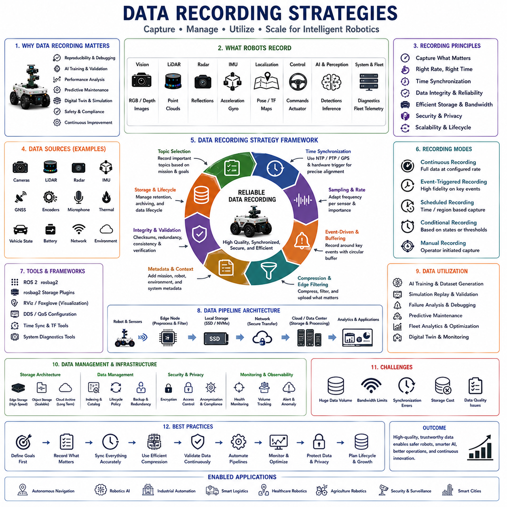
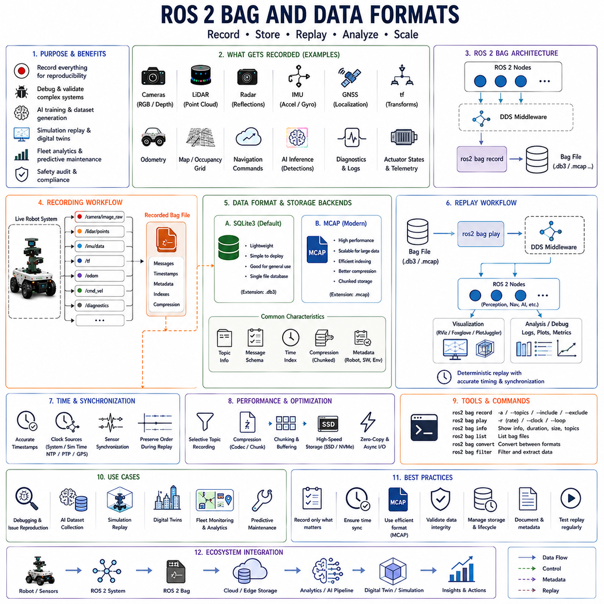
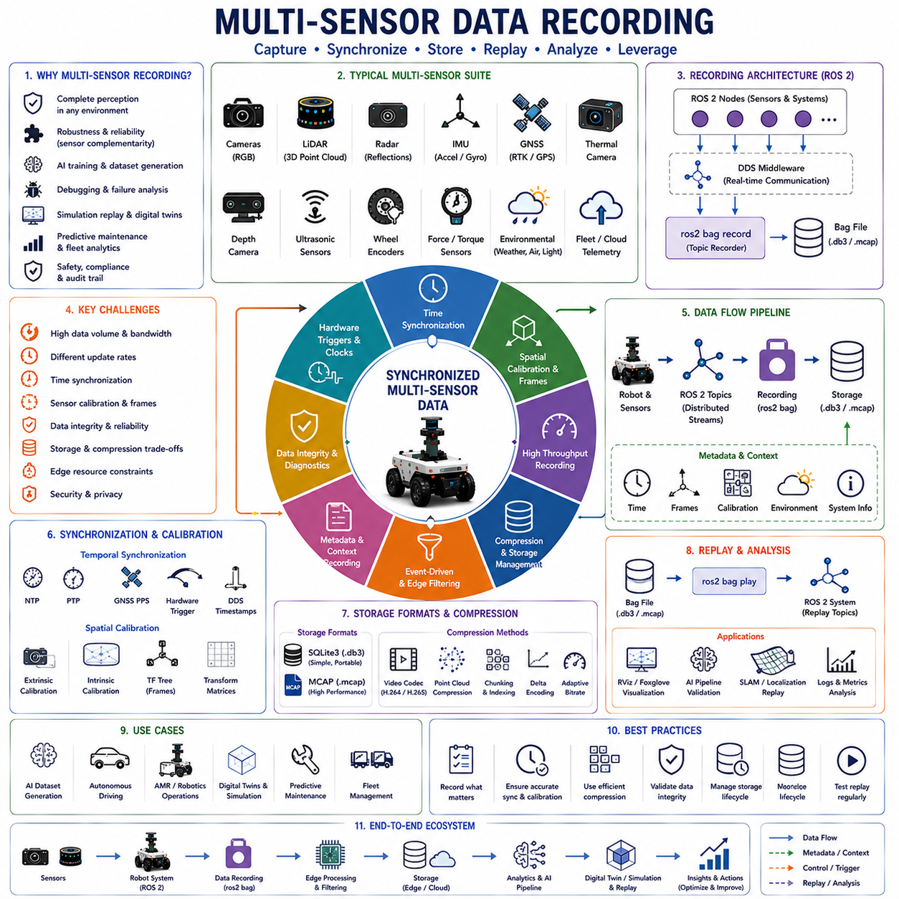
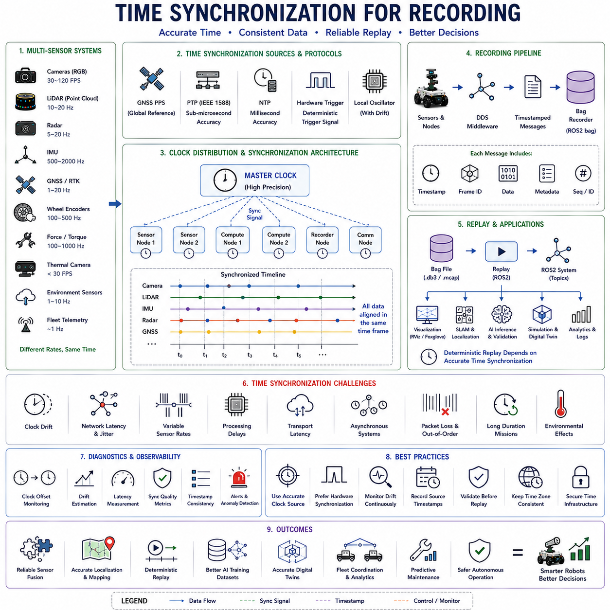
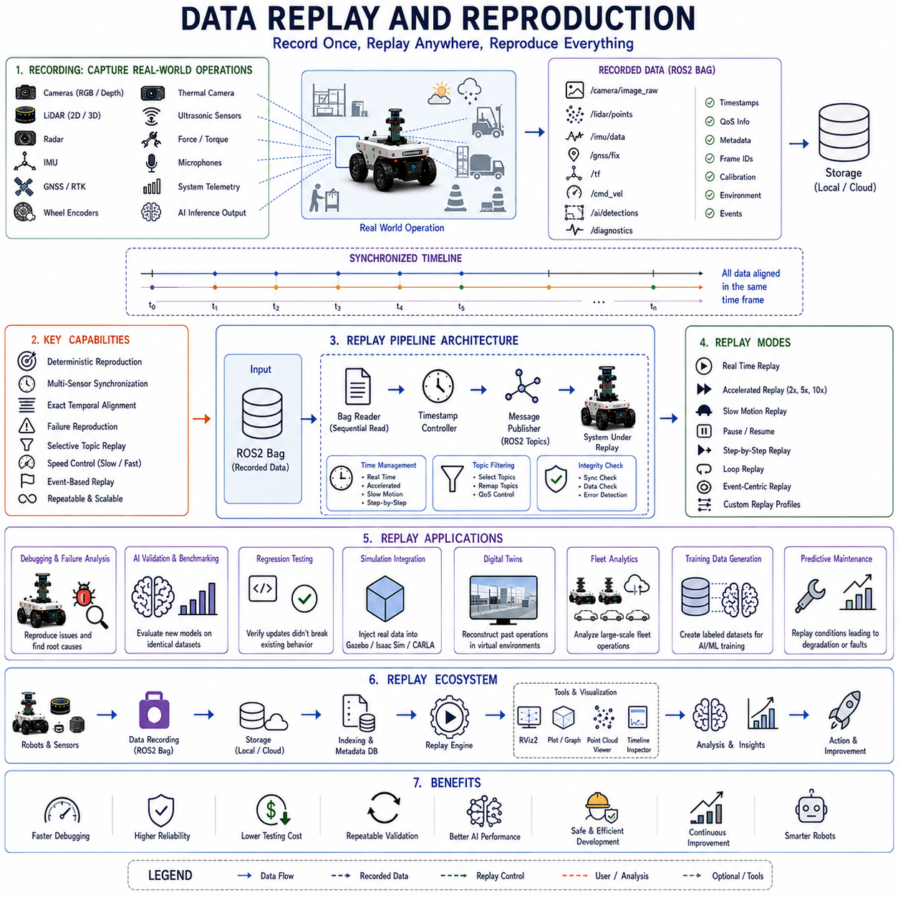
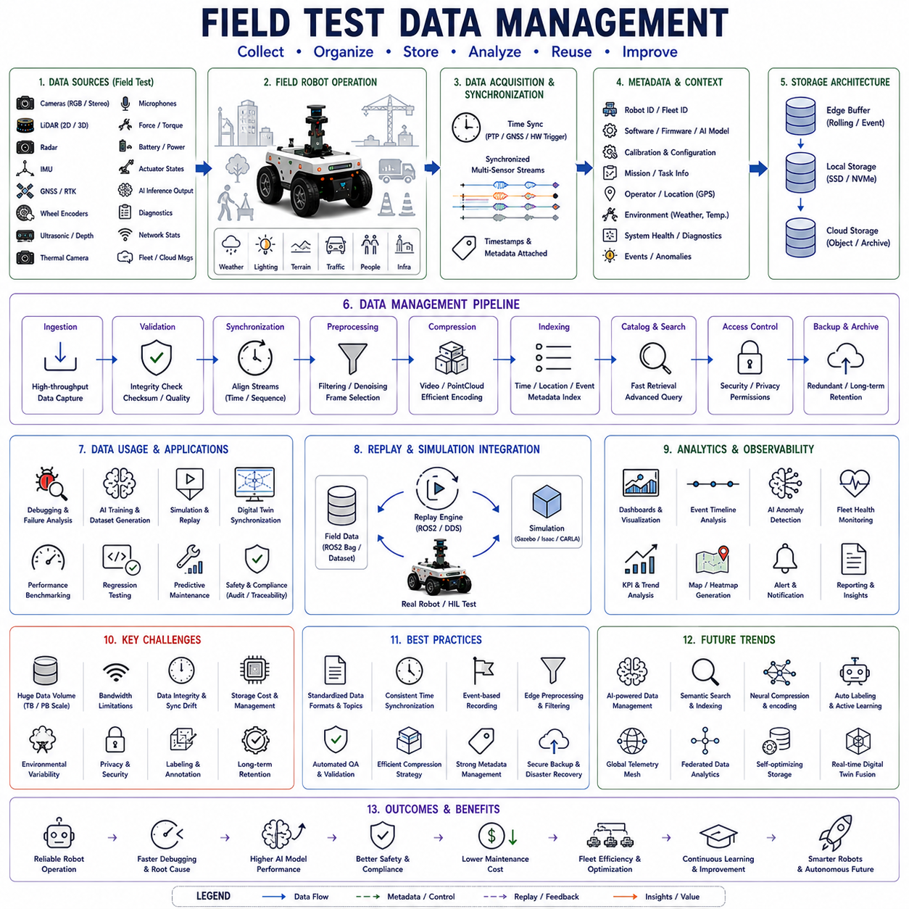
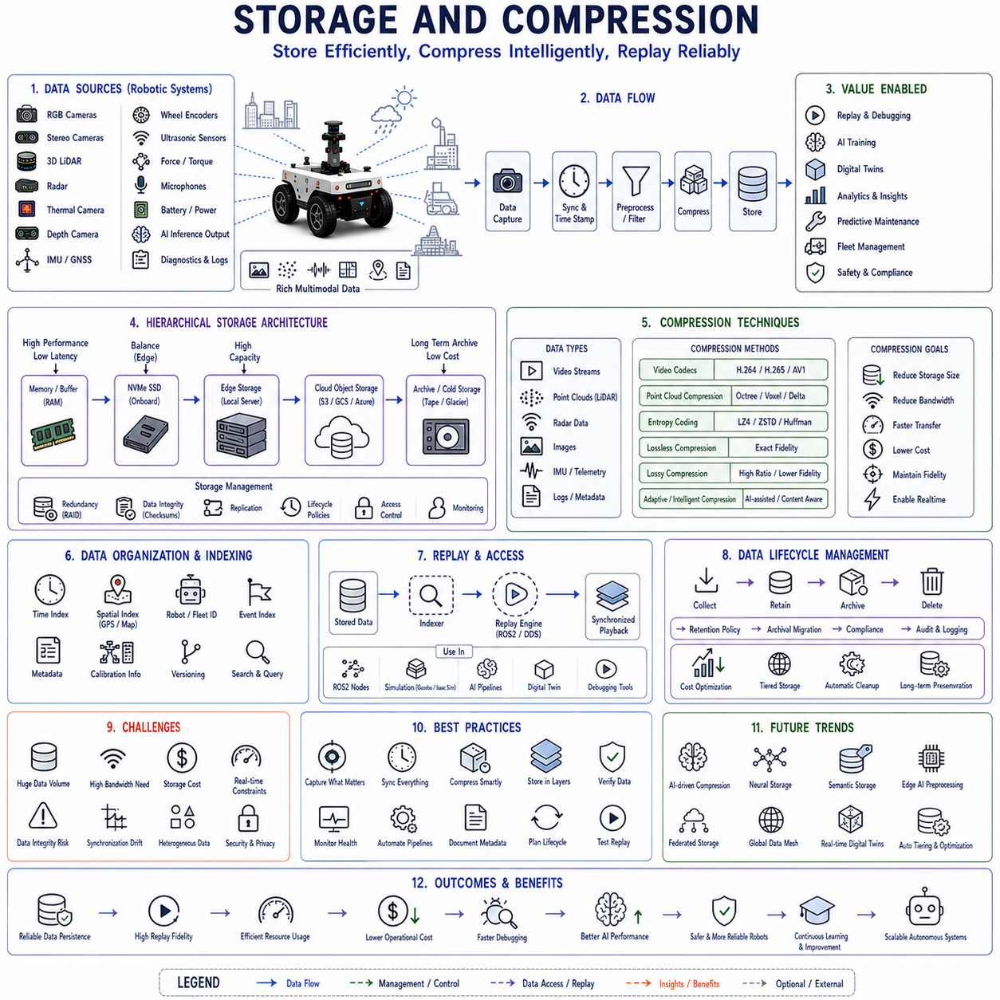
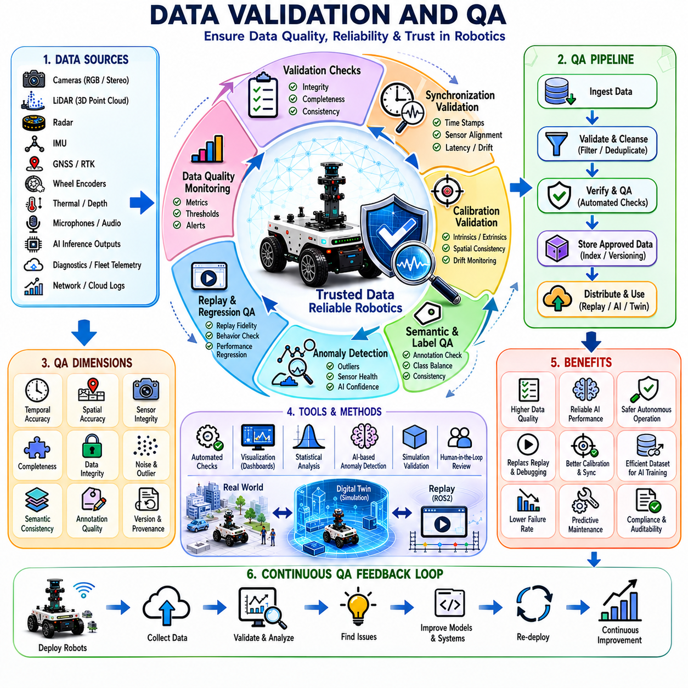

**Volume 07. AMR Software Architecture and Development**

# Chapter 17. Data Recording and Replay

## 17.1 Data Recording Strategies

{width="7.268055555555556in" height="7.268055555555556in"}

"17_01_Data_Recording_Strategies" is one of the most fundamental topics in robotics, artificial intelligence, autonomous systems, and industrial automation because modern intelligent robotic systems depend heavily on large-scale data collection, storage, synchronization, management, and analysis throughout the entire development and operational lifecycle. Autonomous mobile robots, industrial AMRs, outdoor autonomous platforms, delivery robots, patrol robots, agricultural robots, medical robots, and smart infrastructure systems continuously generate enormous volumes of data from sensors, perception systems, localization modules, AI inference pipelines, fleet management systems, and cloud-connected operational platforms. Without carefully designed data recording strategies, robotics systems cannot reliably support AI training, debugging, operational analysis, predictive maintenance, digital twins, simulation replay, reinforcement learning, safety validation, or long-term autonomous optimization.

Data recording in robotics is fundamentally different from traditional software logging because robotic systems interact continuously with the physical world in real time. Every movement, sensor observation, localization update, navigation decision, actuator command, AI inference result, communication event, and environmental interaction may become operationally significant. Robotics data therefore includes not only textual logs, but also high-bandwidth multimodal streams such as RGB images, LiDAR point clouds, radar reflections, thermal imagery, IMU measurements, GNSS telemetry, depth maps, wheel encoder data, occupancy grids, SLAM maps, audio signals, control commands, diagnostics, and cloud synchronization information.

Modern autonomous robots may generate extraordinarily large volumes of operational data. A single outdoor autonomous robot equipped with multiple RGB cameras, 3D LiDARs, thermal cameras, radars, IMUs, and GNSS systems may generate several gigabytes of data per hour. Large fleet deployments involving dozens or hundreds of robots may generate terabytes of operational data daily. As sensor fidelity, AI complexity, and simulation realism continue increasing, scalable data recording strategies become one of the core architectural requirements in robotics engineering.

One of the primary objectives of robotics data recording is reproducibility. Robotics failures are often intermittent, context-dependent, and difficult to reproduce consistently. A robot may fail only under specific lighting conditions, environmental layouts, weather conditions, sensor synchronization states, communication latency situations, or AI uncertainty scenarios. Without accurate data recording, engineers may be unable to reconstruct the operational conditions leading to the failure. Data recording therefore acts as the foundation of robotics debugging and validation workflows.

ROS2-based robotics systems commonly rely on rosbag recording frameworks for data capture. ROS bags allow distributed ROS topics to be recorded and replayed deterministically. Sensor streams, localization data, navigation commands, tf transforms, diagnostics, and AI outputs can all be captured simultaneously. Replay systems allow engineers to reproduce complex robot behavior repeatedly without requiring physical field tests. This dramatically accelerates debugging, validation, AI analysis, and software development.

Topic selection strategy is one of the most important aspects of robotics data recording. Recording every available topic continuously may quickly overwhelm storage systems, network bandwidth, and processing infrastructure. Therefore, robotics engineers carefully classify topics according to operational importance. Critical sensor data, localization information, control commands, AI outputs, diagnostics, and safety-related telemetry are typically prioritized. Less important data may be sampled at lower frequencies or recorded only under specific conditions.

Data recording frequency management is equally important. Different robotic subsystems operate at vastly different update rates. IMU systems may generate data at hundreds or thousands of Hertz, while LiDAR systems operate at 10--20 Hz and cameras may produce 30--120 FPS image streams. Fleet management telemetry may update only once per second. Efficient recording architectures therefore apply adaptive sampling strategies, event-triggered logging, and frequency-aware compression methods to optimize storage utilization.

Time synchronization forms one of the most critical components of robotics data recording. Autonomous systems depend heavily on temporally aligned sensor fusion pipelines. Small timestamp inconsistencies between sensors may produce severe localization drift, AI perception instability, inaccurate obstacle detection, or unsafe navigation behavior. Robotics recording systems therefore rely on synchronized clocks using NTP, PTP, GPS timing, DDS timestamps, hardware synchronization triggers, or shared system clocks to maintain temporal consistency.

Sensor synchronization becomes especially important in multi-sensor autonomous robots. LiDAR, camera, radar, thermal camera, GNSS, and IMU streams must remain temporally aligned for reliable sensor fusion. Recording architectures therefore often capture synchronization metadata alongside raw sensor streams. Some systems also record trigger signals, frame identifiers, latency statistics, and synchronization diagnostics for later validation.

Metadata recording is another critical aspect of robotics data management. Raw sensor data alone is often insufficient for effective operational analysis. Engineers therefore record contextual information such as robot identity, software version, mission configuration, environmental conditions, operator information, weather status, battery state, network status, localization confidence, AI model version, and hardware configuration. Metadata enables large-scale data indexing, filtering, retrieval, and comparative analysis across operational scenarios.

Environmental context recording becomes increasingly important in outdoor autonomous robotics. Weather conditions such as rain, snow, fog, dust, low-light conditions, glare, temperature variation, and terrain state may significantly affect robot behavior. Advanced recording systems therefore capture environmental telemetry alongside robot operational data. Smart infrastructure sensors, weather stations, and edge computing systems may contribute additional contextual information.

Compression strategy is one of the most important technical considerations in robotics data recording. Raw sensor streams often exceed practical storage and transmission limits. High-resolution camera streams, dense LiDAR point clouds, radar reflections, and thermal imagery may consume enormous bandwidth. Robotics systems therefore rely on hardware acceleration, GPU-assisted compression, video codecs, point cloud compression algorithms, delta encoding, temporal compression, and adaptive bitrate control to reduce storage requirements.

Edge filtering is increasingly important in large-scale autonomous robotics systems. Instead of transmitting all raw sensor data continuously to cloud infrastructure, robots frequently perform local preprocessing and event filtering at the edge. Only operationally significant events, anomalies, safety incidents, AI uncertainty regions, or summarized telemetry may be uploaded to centralized servers. Edge filtering dramatically reduces network bandwidth requirements while preserving operationally meaningful information.

Event-driven recording architectures are becoming more common in robotics systems. Instead of continuously storing all sensor data at maximum resolution, robots may activate high-fidelity recording only when important operational events occur. Emergency braking, collision warnings, localization failures, obstacle anomalies, AI uncertainty spikes, unusual environmental conditions, or operator interventions may trigger expanded recording windows. Event-triggered recording improves storage efficiency while preserving critical debugging information.

Circular buffer recording strategies are also widely used. Robots continuously maintain rolling short-term data histories in memory or local storage. When significant operational events occur, the system permanently saves buffered data both before and after the event. This approach ensures that root-cause analysis includes the operational context leading up to the incident.

Data integrity validation is critically important in robotics recording systems. Storage corruption, packet loss, timestamp inconsistency, synchronization drift, dropped frames, or incomplete recordings may invalidate debugging workflows or AI training datasets. Recording systems therefore often include checksum validation, redundancy mechanisms, transactional storage methods, and recording consistency verification tools.

Distributed data recording becomes increasingly necessary in large fleet environments. Multi-robot systems may involve distributed edge nodes, cloud infrastructure, fleet management servers, simulation environments, and digital twin platforms operating simultaneously. Data recording architectures therefore require scalable distributed storage systems capable of aggregating, synchronizing, indexing, and analyzing operational data across entire robotic fleets.

Cloud robotics infrastructure strongly influences modern data recording strategies. Cloud-connected robotics platforms enable centralized fleet telemetry aggregation, AI dataset collection, operational analytics, predictive maintenance, and digital twin synchronization. However, cloud recording also introduces challenges involving latency, bandwidth limitation, cybersecurity, storage cost, regulatory compliance, and operational privacy protection.

Cybersecurity considerations are becoming increasingly important in robotics data recording. Autonomous robots may capture sensitive operational information including facility layouts, infrastructure details, medical environments, industrial processes, logistics operations, and public-space activity. Recording systems therefore require encryption, authentication, access control, secure transmission, anonymization, and compliance management mechanisms to protect operational data.

AI training pipelines heavily depend on robust data recording strategies. Deep learning systems require enormous datasets covering diverse operational conditions, environmental variations, sensor configurations, and edge-case scenarios. Robotics recording systems therefore increasingly integrate directly into AI dataset generation workflows. Operational recordings may later become training data for object detection, semantic segmentation, navigation learning, anomaly detection, predictive maintenance, or reinforcement learning.

Data labeling strategy becomes another critical component of robotics recording workflows. Raw recordings alone are insufficient for supervised AI training. Robotics companies therefore develop semi-automated annotation pipelines, synthetic data generation systems, active learning workflows, and human-in-the-loop validation processes to convert operational recordings into structured AI training datasets.

Simulation replay systems rely heavily on recorded operational data. Digital twins, reinforcement learning environments, and simulation validation workflows often replay real-world recordings inside virtual environments to reproduce operational scenarios accurately. Recorded telemetry may reconstruct entire robot missions including sensor streams, navigation decisions, fleet interactions, and environmental changes.

Predictive maintenance systems also depend strongly on long-term data recording. Motor currents, vibration signals, thermal behavior, battery performance, actuator response times, wheel slip characteristics, and sensor diagnostics may all reveal early signs of hardware degradation. Longitudinal operational recording enables AI-driven predictive maintenance and fleet reliability optimization.

Fleet analytics platforms increasingly utilize large-scale operational recording to optimize logistics efficiency, traffic management, charging strategies, task allocation, and energy utilization. Fleet-wide telemetry analysis enables continuous operational improvement across large robotic ecosystems. Warehouses, hospitals, ports, factories, and smart cities all benefit from data-driven robotic optimization.

Digital twin systems represent one of the most advanced applications of robotics data recording. A digital twin continuously synchronizes recorded operational telemetry with virtual simulation environments. Real-world robot states, environmental conditions, AI outputs, and infrastructure behavior are mirrored inside virtual models. This enables predictive analytics, operational forecasting, scenario testing, and large-scale system optimization.

Data lifecycle management becomes increasingly important as robotic systems scale. Robotics organizations may accumulate petabytes of historical operational recordings over time. Efficient lifecycle policies therefore classify data according to operational value, legal requirements, AI training relevance, and debugging importance. Some data may remain archived long term while less valuable telemetry is compressed, summarized, or deleted.

Storage architecture design is another major consideration in robotics recording systems. High-throughput sensor recording requires optimized SSD storage, distributed object storage, cloud archival systems, RAID configurations, NVMe pipelines, edge caching, and high-bandwidth storage buses. Large robotic fleets may require enterprise-scale storage infrastructure comparable to large data center environments.

Database integration also plays a major role in robotics data management. Structured telemetry, metadata, AI outputs, diagnostics, and operational events are often stored in time-series databases, graph databases, relational systems, or distributed analytics platforms. Efficient indexing and query systems enable rapid retrieval of operational events across massive datasets.

Visualization and observability tools are essential for making recorded robotics data useful. Engineers require dashboards, replay systems, point cloud visualizers, sensor playback tools, timeline analysis interfaces, AI confidence visualizers, fleet analytics platforms, and digital twin dashboards to interpret operational recordings effectively.

Real-time observability is becoming increasingly important in cloud robotics and large-scale fleet operations. Instead of analyzing recordings only after missions complete, operators increasingly monitor live telemetry streams continuously. Real-time anomaly detection, AI uncertainty monitoring, fleet congestion analysis, and operational health dashboards enable proactive intervention before failures escalate.

Autonomous data prioritization may become one of the most important future developments in robotics recording. AI systems may dynamically determine which operational data should be retained, compressed, uploaded, or discarded based on novelty, anomaly detection, operational significance, or AI uncertainty estimation. Intelligent recording systems may drastically reduce unnecessary storage while preserving high-value information.

Future robotics data recording systems are expected to integrate AI-driven observability, autonomous edge analytics, cloud-native telemetry infrastructure, distributed digital twins, and self-organizing operational archives into unified intelligent robotics ecosystems. Data recording may increasingly evolve from passive logging toward active operational intelligence generation.

As autonomous robotics systems continue scaling globally, data recording strategies will remain one of the foundational pillars of robotics engineering. Reliable data recording enables AI development, simulation replay, debugging, predictive maintenance, digital twins, safety validation, operational analytics, and continuous autonomous improvement. In many ways, data recording acts as the long-term operational memory of intelligent robotic systems, allowing robots and robotic ecosystems to learn continuously from their experiences over time.

The topic "17_01_Data_Recording_Strategies" belongs to the broader robotics data engineering and AI infrastructure workflow within autonomous robotics development. It also connects deeply with ROS2 systems, AI training pipelines, cloud robotics, digital twins, fleet management, simulation replay, predictive maintenance, and large-scale autonomous operational analytics throughout the AMR robotics engineering ecosystem.

## 17.2 ROS2 Bag and Data Formats

{width="7.268055555555556in" height="7.268055555555556in"}

"17_02_ROS2_Bag_and_Data_Formats" is one of the most fundamental topics in modern robotics software infrastructure because autonomous robotic systems depend heavily on reliable data recording, playback, synchronization, storage, replay, and analysis throughout the entire development and operational lifecycle. In robotics engineering, data is not merely a supporting resource. It is the core operational memory of the robot. Autonomous systems continuously generate enormous volumes of sensor streams, localization information, navigation commands, AI inference outputs, diagnostics, communication telemetry, and environmental observations. Without standardized recording systems and efficient data formats, robotics development, debugging, AI training, digital twin construction, simulation replay, and operational validation would become nearly impossible.

ROS2 Bag systems were designed specifically to solve these challenges within distributed robotics architectures. ROS2 bag recording allows developers to capture, store, replay, analyze, and reproduce entire robotic operational sessions deterministically. Unlike traditional software logging systems that primarily store textual events, robotics recording systems must manage synchronized multimodal sensor streams, high-frequency telemetry, and distributed middleware communication in real time. ROS2 bag infrastructure therefore became one of the most critical pillars of robotics software engineering.

The concept of rosbag originated in ROS1 and evolved significantly in ROS2. ROS1 rosbag systems primarily relied on custom binary storage mechanisms tightly coupled to ROS middleware implementations. However, ROS2 introduced a far more modular, scalable, and middleware-independent architecture. ROS2 bag systems now support pluggable storage backends, flexible serialization layers, DDS integration, distributed recording pipelines, and improved performance optimization capabilities. These architectural changes were necessary because modern autonomous robotics workloads are dramatically larger and more complex than earlier robotics systems.

ROS2 bag fundamentally operates as a distributed topic recording and replay framework. ROS2 nodes continuously communicate through topics using DDS middleware. These topics may include RGB camera streams, LiDAR point clouds, IMU telemetry, GNSS localization data, tf transformations, occupancy grids, navigation commands, AI detections, diagnostics, actuator states, and fleet telemetry. ROS2 bag tools subscribe to selected topics and store their serialized messages together with timestamps, metadata, and synchronization information.

One of the most important advantages of ROS2 bag systems is deterministic replay capability. Engineers can reproduce complex robotic operational scenarios repeatedly without performing expensive or dangerous real-world testing. Sensor streams, robot decisions, environmental interactions, and failure conditions can all be replayed exactly as originally recorded. This dramatically improves debugging workflows, AI validation, simulation testing, and software development productivity.

Topic-based recording architecture represents one of the foundational principles of ROS2 bag systems. Instead of recording entire applications monolithically, ROS2 bags selectively capture distributed communication streams. This design provides flexibility because engineers may record only operationally relevant topics while excluding unnecessary data. Selective topic recording becomes critically important in large robotics systems because storage requirements can quickly become enormous.

Modern autonomous robots generate extremely large sensor workloads. High-resolution RGB cameras may produce hundreds of megabytes per second. Multiple LiDAR systems generate dense point cloud streams continuously. Thermal cameras, radar systems, depth cameras, and stereo imaging systems add additional bandwidth requirements. Simultaneously, localization systems, AI inference pipelines, diagnostics, fleet telemetry, and cloud synchronization services generate structured metadata streams. ROS2 bag systems therefore require highly optimized recording architectures capable of handling sustained high-throughput data ingestion.

Timestamp management is one of the most critical aspects of ROS2 bag infrastructure. Robotics systems depend heavily on temporally synchronized sensor fusion. Small timestamp inconsistencies between sensors may cause severe localization drift, inaccurate obstacle detection, unstable navigation behavior, or AI perception degradation. ROS2 bag systems therefore record message timestamps carefully and preserve temporal ordering during replay operations.

Time synchronization in ROS2 environments may rely on system clocks, simulation clocks, hardware synchronization triggers, NTP synchronization, PTP infrastructure, GNSS timing signals, or DDS timestamp propagation. Some systems operate entirely in simulation time while others synchronize directly with real-world clocks. ROS2 bag replay systems must preserve these timing relationships accurately to reproduce operational behavior faithfully.

ROS2 bag replay is not simply file playback. During replay, recorded messages are republished into the ROS2 ecosystem exactly as if they originated from live robot systems. Existing ROS2 nodes therefore interact with replayed data transparently. Navigation stacks, perception pipelines, AI systems, SLAM algorithms, and visualization tools can all operate on replayed data exactly as they would during live operation. This architecture enables highly realistic offline debugging and analysis workflows.

Serialization formats play a central role in ROS2 bag infrastructure. ROS2 messages are typically serialized using DDS-compatible serialization mechanisms. Efficient serialization is critically important because robotics systems often operate under severe bandwidth, latency, and storage constraints. Poor serialization performance may cause dropped messages, recording instability, or excessive CPU overhead.

ROS2 bag architecture separates message serialization from storage backends through plugin interfaces. This modular design allows different storage engines to be integrated depending on operational requirements. SQLite3 became one of the default ROS2 bag storage backends because it provides lightweight embedded database functionality with relatively simple deployment requirements. However, modern robotics systems increasingly utilize alternative storage formats optimized for large-scale robotics workloads.

MCAP has emerged as one of the most important modern robotics recording formats. MCAP was specifically designed to support high-performance robotics telemetry recording, efficient indexing, scalable playback, and long-term archival workflows. Compared to older recording formats, MCAP provides improved compression, faster seeking performance, better metadata organization, and more scalable storage behavior for large autonomous systems.

Storage backend selection significantly influences recording performance. SQLite3 provides simplicity and portability but may struggle under extremely high-bandwidth workloads involving multiple cameras and dense LiDAR streams. MCAP and other optimized binary formats often provide better scalability for large fleet environments, synthetic data generation systems, and AI dataset recording pipelines.

Compression strategy is another essential component of ROS2 bag systems. Raw robotics data rapidly overwhelms practical storage capacity. Video streams, LiDAR point clouds, and AI tensors may consume terabytes of storage quickly. ROS2 bag systems therefore support various compression techniques including file-level compression, message-level compression, chunk-based compression, and streaming compression pipelines.

Compression introduces tradeoffs between storage efficiency, CPU utilization, replay speed, and latency. Aggressive compression may reduce storage requirements significantly but increase computational overhead during recording and replay. Some robotics systems therefore utilize hardware-accelerated compression engines or GPU-assisted encoding pipelines to maintain real-time recording performance.

Chunking architecture is another important optimization mechanism in ROS2 bag systems. Instead of writing every message individually to storage, messages are often grouped into chunks before compression and persistence. Chunk-based recording improves storage throughput and reduces fragmentation overhead. However, chunk size selection influences replay latency, random-access performance, and crash recovery behavior.

Indexing systems are critically important for efficient replay and data retrieval. Large robotics datasets may contain billions of messages recorded across many hours or days of operation. Efficient indexing enables rapid seeking to specific timestamps, topics, operational events, or robot states. Without scalable indexing infrastructure, operational analysis would become impractical for large robotics deployments.

Metadata management is another major component of ROS2 bag infrastructure. Recording systems store not only raw messages but also contextual metadata including topic definitions, message schemas, recording timestamps, robot identity, software versions, operational configurations, and environment information. Metadata enables reproducibility, compatibility management, and large-scale operational analysis.

Schema evolution presents significant challenges in long-term robotics development. Robotics software stacks evolve continuously. Message definitions, sensor configurations, AI outputs, and navigation architectures may change across software versions. ROS2 bag systems therefore require compatibility strategies capable of replaying older recordings even after message schema modifications occur.

Data integrity validation is critically important in robotics recording systems. Storage corruption, dropped packets, incomplete recordings, timestamp drift, or serialization failures may invalidate debugging workflows and AI training pipelines. ROS2 bag systems therefore often include consistency validation tools, checksum mechanisms, integrity verification workflows, and recovery utilities.

Replay control systems provide fine-grained operational analysis capability. Engineers may replay recordings at accelerated speed, slowed speed, paused execution, or deterministic step-by-step operation. Topic filtering during replay allows selective subsystem debugging. Time-range playback enables analysis of specific operational events without replaying entire missions.

Simulation integration is one of the most powerful applications of ROS2 bag systems. Real-world operational recordings may be injected into simulation environments to reproduce actual field conditions. Digital twins, AI validation systems, reinforcement learning environments, and synthetic testing pipelines increasingly combine live simulation with recorded telemetry streams.

AI development workflows depend heavily on ROS2 bag infrastructure. Robotics AI systems require large-scale datasets containing synchronized sensor streams, environmental conditions, and operational context. Recorded ROS2 bags frequently become foundational training datasets for object detection, semantic segmentation, localization learning, navigation policies, anomaly detection, and reinforcement learning pipelines.

Synthetic data generation systems increasingly combine ROS2 bag workflows with simulation environments. Simulated robot operations generate ROS2-compatible telemetry streams identical to real robot outputs. These synthetic recordings may augment real-world datasets and improve AI training scalability.

Fleet-level robotics systems introduce additional recording challenges. Multi-robot environments may involve hundreds of distributed robots generating telemetry simultaneously. Fleet recording systems therefore require scalable distributed storage architectures, centralized telemetry aggregation, synchronized fleet replay capability, and cloud-native robotics observability infrastructure.

Cloud robotics platforms increasingly integrate directly with ROS2 bag pipelines. Operational telemetry may stream continuously from robots into cloud infrastructure for long-term storage, analytics, digital twin synchronization, and AI dataset generation. Edge-cloud recording architectures balance local recording performance against centralized operational visibility.

Cybersecurity considerations are becoming increasingly important in robotics recording systems. Autonomous robots may record sensitive operational environments including hospitals, factories, infrastructure facilities, logistics operations, and public spaces. ROS2 bag systems therefore require encryption, access control, secure storage, authentication, and compliance management mechanisms.

Visualization tools greatly enhance ROS2 bag usability. Engineers utilize RViz, Foxglove Studio, PlotJuggler, custom telemetry dashboards, point cloud visualizers, sensor replay interfaces, and timeline analysis systems to interpret recorded operational data. Visualization significantly accelerates debugging and operational understanding.

Performance optimization is another major concern in ROS2 bag systems. Recording high-bandwidth robotics data in real time places enormous pressure on CPU, memory, storage buses, and network infrastructure. Performance bottlenecks may cause dropped frames, delayed messages, recording instability, or synchronization failures. Efficient zero-copy architectures, DMA transfers, NVMe storage pipelines, memory pooling, and asynchronous I/O frameworks therefore become essential.

Edge robotics systems often face particularly severe recording constraints. Embedded platforms may possess limited CPU performance, storage bandwidth, thermal capacity, and energy budgets. Robotics engineers therefore design adaptive recording strategies that selectively compress, filter, prioritize, or summarize data depending on operational significance.

Observability systems increasingly integrate ROS2 bag infrastructure into broader robotics telemetry ecosystems. Live operational monitoring, anomaly detection, fleet analytics, predictive maintenance, and digital twin synchronization all depend heavily on scalable recording and replay capabilities.

Future ROS2 bag systems are expected to evolve toward cloud-native distributed robotics observability platforms supporting AI-assisted indexing, autonomous anomaly detection, semantic search, adaptive compression, intelligent event prioritization, and large-scale digital twin synchronization. Robotics recording infrastructure may increasingly resemble modern distributed data engineering platforms used in hyperscale cloud systems.

AI-assisted data management may eventually allow robotics systems to determine automatically which data should be retained, compressed, uploaded, summarized, or discarded based on operational significance and AI uncertainty estimation. Such intelligent recording systems may dramatically reduce storage overhead while preserving high-value operational information.

As autonomous robotics systems continue growing in complexity, ROS2 bag and robotics data format infrastructure will remain one of the foundational pillars of robotics software engineering. Reliable recording, replay, synchronization, serialization, indexing, and storage architectures enable debugging, AI training, simulation validation, digital twins, operational analytics, and continuous autonomous improvement. In many ways, ROS2 bag systems serve as the persistent operational memory infrastructure that allows intelligent robotic ecosystems to learn continuously from their experiences over time.

The topic "17_02_ROS2_Bag_and_Data_Formats" belongs to the broader robotics data engineering, observability, and autonomous system infrastructure workflow within modern AMR robotics development. It also connects deeply with ROS2 middleware, DDS communication, AI training pipelines, simulation replay, digital twins, fleet telemetry systems, cloud robotics, and scalable robotics software architecture across the larger robotics engineering ecosystem.

## 17.3 Multi-Sensor Data Recording

{width="7.268055555555556in" height="7.268055555555556in"}

"17_03_Multi_Sensor_Data_Recording" is one of the most important topics in autonomous robotics and AI-driven robotic infrastructure because modern intelligent robots no longer rely on a single sensing modality. Instead, advanced robotic systems operate through complex multi-sensor fusion architectures that combine information from cameras, LiDARs, radars, IMUs, GNSS systems, thermal cameras, ultrasonic sensors, depth cameras, wheel encoders, force sensors, environmental sensors, and cloud-connected telemetry systems simultaneously. These sensing systems continuously generate massive volumes of synchronized operational data that must be captured, stored, replayed, analyzed, and processed efficiently throughout the entire robotics lifecycle. Multi-sensor data recording therefore became a foundational pillar of modern robotics engineering, enabling AI training, autonomous navigation, simulation replay, digital twins, debugging, predictive maintenance, fleet analytics, and long-term autonomous optimization.

Traditional robotics systems often relied on relatively simple sensor configurations involving a limited number of cameras or laser scanners. However, modern autonomous robots increasingly operate within highly dynamic, uncertain, and safety-critical environments where no single sensor can provide complete environmental understanding. Cameras provide rich semantic perception but suffer under poor lighting conditions. LiDAR systems provide accurate geometric depth information but may struggle with reflective surfaces, rain, fog, or snow. Radar systems provide robust long-range detection under adverse weather conditions but possess lower spatial resolution. IMUs provide high-frequency motion estimation but drift over time. GNSS systems support global localization but may become unstable in urban canyons or indoor environments. Thermal cameras detect heat signatures but lack detailed structural information. As a result, modern robotics systems increasingly rely on multi-sensor fusion to achieve robust perception and operational reliability.

The core objective of multi-sensor data recording is not merely to store sensor outputs independently, but to preserve the synchronized temporal and spatial relationships among all sensing modalities. Autonomous robots continuously make decisions based on sensor fusion pipelines that integrate multiple streams simultaneously. Therefore, recording systems must accurately preserve timestamps, synchronization states, coordinate frame relationships, calibration parameters, environmental context, and operational metadata. Even small inconsistencies between recorded sensor streams may invalidate AI training datasets, localization replay, debugging workflows, or simulation reconstruction.

Modern autonomous mobile robots may contain extremely complex sensor architectures. Industrial AMRs may utilize multiple RGB cameras, stereo depth cameras, 3D LiDAR systems, safety LiDARs, IMUs, wheel encoders, ultrasonic sensors, and fleet telemetry systems simultaneously. Outdoor autonomous platforms often add radar systems, GNSS RTK receivers, dual-antenna heading systems, thermal cameras, environmental weather sensors, and high-grade inertial navigation systems. Inspection robots may further include acoustic sensors, gas detectors, vibration sensors, ultrasonic imaging systems, laser profilers, and GPR systems. Each sensor operates at different update rates, resolutions, bandwidth requirements, and synchronization constraints.

One of the most important challenges in multi-sensor data recording is temporal synchronization. Different sensors produce data at dramatically different frequencies. IMUs may generate measurements at 500--2000 Hz. Wheel encoders may update at hundreds of Hertz. Cameras may operate at 30--120 FPS. LiDAR systems typically produce scans at 10--20 Hz. Radar systems may operate at varying refresh intervals. GNSS localization may update at 1--20 Hz. Fleet telemetry systems may update only once per second. Recording systems must preserve these timing relationships accurately to maintain valid sensor fusion behavior.

Precise timestamp management is therefore one of the most critical aspects of multi-sensor recording infrastructure. Autonomous systems heavily depend on temporally aligned sensor fusion pipelines. Even small timing offsets between camera frames, LiDAR scans, IMU measurements, and localization updates may cause severe perception instability, inaccurate obstacle detection, SLAM degradation, localization drift, or unsafe navigation behavior. Recording architectures therefore rely on synchronized clocks using NTP, PTP, GNSS timing signals, hardware triggers, DDS timestamps, FPGA synchronization systems, or shared system clocks.

Hardware synchronization is increasingly common in advanced robotics systems. Cameras, LiDARs, IMUs, and radar systems may utilize hardware trigger lines to ensure deterministic temporal alignment. Precision timing modules distribute synchronized clock pulses across sensing devices. Some systems utilize PPS signals from GNSS receivers to maintain globally synchronized timestamps. Hardware synchronization significantly improves replay fidelity and sensor fusion consistency.

Spatial synchronization is equally important. Multi-sensor systems depend heavily on accurate coordinate frame relationships among sensors. Cameras, LiDARs, radars, IMUs, GNSS antennas, and robot body frames must remain geometrically calibrated. Multi-sensor recording systems therefore store calibration parameters, transformation matrices, extrinsic calibration data, intrinsic camera parameters, and tf transformation trees alongside raw sensor streams. Without accurate calibration metadata, replayed sensor fusion becomes unreliable.

ROS2-based robotics architectures play a central role in modern multi-sensor recording workflows. Distributed ROS2 nodes publish sensor streams through DDS middleware using topics. ROS2 bag recording systems subscribe to selected topics and capture synchronized multimodal telemetry streams together with timestamps and metadata. This distributed architecture enables scalable recording across heterogeneous sensing pipelines while preserving operational transparency.

Sensor bandwidth management represents another major engineering challenge. Modern autonomous robots generate enormous volumes of data continuously. High-resolution RGB cameras may produce hundreds of megabytes per second. Multiple stereo cameras further increase bandwidth requirements. Dense 3D LiDAR systems generate large point cloud streams continuously. Radar imaging systems, thermal cameras, and depth cameras add additional high-bandwidth data flows. Combined sensor workloads may easily exceed storage throughput or network capacity if unmanaged.

Compression therefore becomes critically important in multi-sensor recording architectures. Video streams commonly utilize H.264, H.265, AV1, or hardware-accelerated encoding pipelines. Point cloud compression algorithms reduce LiDAR storage requirements. Temporal delta encoding minimizes redundant data transmission. Adaptive bitrate systems dynamically adjust recording quality depending on operational conditions and storage availability. Efficient compression allows long-duration missions to be recorded practically.

However, compression introduces tradeoffs. Aggressive compression may reduce storage requirements significantly but degrade replay fidelity or AI training quality. Some AI systems require lossless sensor recordings to preserve subtle visual features or precise geometric information. Robotics engineers therefore carefully balance compression ratio, CPU utilization, GPU overhead, latency, replay speed, and operational fidelity when designing recording architectures.

Selective recording strategies are increasingly important in large robotics deployments. Recording every sensor continuously at maximum fidelity quickly becomes impractical. Some systems therefore prioritize operationally significant data. Critical safety telemetry, localization streams, AI uncertainty events, obstacle anomalies, or emergency conditions may receive higher recording priority. Less important streams may utilize reduced frame rates or lower-resolution recording modes.

Event-driven recording architectures are becoming increasingly common. Instead of continuously recording all sensor streams permanently, robots may maintain rolling short-term circular buffers in memory or SSD storage. When important operational events occur, the system permanently preserves buffered data before and after the event. Emergency braking, collision warnings, localization instability, communication failures, unusual environmental conditions, or operator interventions may trigger expanded recording windows automatically.

Edge filtering is another critical optimization strategy. Autonomous robots increasingly perform local preprocessing before transmitting data to cloud infrastructure. Instead of uploading all raw sensor streams continuously, robots may transmit only summarized telemetry, anomaly events, AI uncertainty regions, compressed metadata, or operationally significant incidents. Edge filtering dramatically reduces network bandwidth while preserving valuable operational information.

Environmental context recording is also becoming increasingly important. Sensor behavior strongly depends on environmental conditions such as rain, snow, fog, dust, lighting conditions, glare, temperature, humidity, terrain roughness, and electromagnetic interference. Advanced multi-sensor recording systems therefore capture environmental telemetry alongside sensor streams. Weather stations, infrastructure sensors, and smart facility systems may contribute additional context information.

Data integrity validation is critically important in multi-sensor recording systems. Packet loss, dropped frames, timestamp drift, synchronization instability, storage corruption, sensor failures, or incomplete recordings may invalidate debugging workflows or AI datasets. Recording systems therefore include checksum validation, synchronization monitoring, redundancy mechanisms, integrity verification tools, and recovery pipelines to ensure recording reliability.

Sensor diagnostics recording also plays a major role in operational analysis. Recording systems often capture temperature data, voltage levels, communication status, sensor confidence metrics, calibration stability indicators, packet statistics, latency measurements, and hardware diagnostic telemetry. Long-term diagnostic recording supports predictive maintenance and sensor health monitoring.

Multi-sensor recording systems are foundational for AI development workflows. Deep learning systems require massive synchronized datasets containing multiple sensing modalities operating under diverse environmental conditions. Multi-sensor recordings become training datasets for object detection, semantic segmentation, depth estimation, sensor fusion models, localization systems, anomaly detection, occupancy mapping, behavior prediction, and autonomous navigation policies.

Autonomous driving systems represent one of the largest applications of multi-sensor recording. Self-driving vehicles continuously capture synchronized camera streams, LiDAR point clouds, radar reflections, GNSS localization, IMU telemetry, and vehicle control data simultaneously. These datasets are used for AI training, simulation replay, safety validation, regulatory analysis, and large-scale fleet learning.

Synthetic data generation increasingly integrates with multi-sensor recording workflows. Simulation environments such as Isaac Sim, Gazebo, CARLA, and Omniverse generate synthetic multimodal sensor streams identical to real-world robotics telemetry. Simulated cameras, LiDARs, radars, IMUs, and depth sensors produce synchronized virtual datasets that augment real-world recordings for scalable AI training.

Digital twin systems rely heavily on multi-sensor recording infrastructure. Real-world robot telemetry continuously synchronizes with virtual simulation environments. Sensor streams reconstruct operational conditions inside digital replicas of physical environments. Engineers use these digital twins for predictive analytics, operational forecasting, maintenance planning, scenario testing, and AI validation.

Replay systems are one of the most important applications of multi-sensor recordings. Robotics engineers frequently replay synchronized sensor data into ROS2 ecosystems, simulation platforms, AI pipelines, or localization systems to reproduce operational behavior deterministically. Replay allows developers to debug failures repeatedly without requiring expensive field testing.

SLAM and localization systems depend particularly heavily on synchronized multi-sensor recordings. LiDAR scans, IMU measurements, wheel encoder telemetry, GNSS data, and visual odometry streams must remain precisely aligned for accurate replay and validation. Even small synchronization errors may invalidate localization analysis entirely.

Fleet-level robotics deployments introduce additional complexity. Large robotic fleets may involve hundreds of robots simultaneously generating synchronized multimodal telemetry streams. Fleet recording architectures therefore require distributed storage systems, centralized telemetry aggregation, scalable indexing infrastructure, cloud-native observability platforms, and synchronized fleet replay systems.

Cloud robotics increasingly influences multi-sensor recording architectures. Operational telemetry streams may upload continuously to cloud infrastructure for long-term archival, AI dataset generation, digital twin synchronization, predictive maintenance, and fleet analytics. Cloud-native robotics platforms increasingly integrate distributed object storage, telemetry streaming pipelines, and large-scale AI observability systems.

Cybersecurity and privacy considerations are becoming critically important. Autonomous robots may record hospitals, factories, ports, logistics centers, public spaces, industrial infrastructure, and sensitive operational environments continuously. Multi-sensor recordings may therefore contain confidential operational information or personally identifiable information. Recording systems increasingly require encryption, anonymization, access control, secure storage, authentication, and compliance management mechanisms.

Visualization systems greatly improve the usability of multi-sensor recordings. Engineers analyze synchronized sensor streams using point cloud visualizers, image playback systems, telemetry dashboards, timeline analysis tools, occupancy map viewers, sensor fusion analyzers, and digital twin interfaces. Visualization accelerates debugging, AI validation, and operational understanding dramatically.

Performance optimization is another major challenge. Recording multiple synchronized high-bandwidth sensor streams in real time places enormous pressure on CPU resources, GPU pipelines, storage buses, memory systems, and network infrastructure. High-performance recording architectures therefore rely on DMA transfers, NVMe SSD arrays, zero-copy transport, asynchronous I/O frameworks, memory pooling, GPU-assisted compression, and distributed storage pipelines.

Edge robotics systems often face particularly difficult operational constraints. Embedded AI computers may possess limited power budgets, thermal capacity, CPU performance, storage bandwidth, and energy availability. Robotics engineers therefore design adaptive recording systems capable of dynamically adjusting recording quality, compression levels, and prioritization policies based on available resources and operational importance.

Future multi-sensor recording systems are expected to evolve toward intelligent AI-driven observability platforms capable of autonomous data prioritization, semantic event indexing, adaptive compression, distributed synchronization, real-time anomaly detection, and cloud-scale digital twin integration. AI systems may eventually determine automatically which operational data should be preserved, compressed, uploaded, summarized, or discarded based on operational significance and learning value.

Neural compression technologies may become increasingly important. Instead of relying solely on traditional codecs, learned AI compression systems may preserve semantically important information while dramatically reducing storage requirements. AI-assisted indexing may allow robotics systems to search operational history using semantic descriptions rather than simple timestamps or topic names.

As autonomous robotics systems continue scaling globally, multi-sensor data recording will remain one of the foundational pillars of robotics engineering. Reliable synchronized sensor recording enables AI training, simulation replay, digital twins, debugging, predictive maintenance, safety validation, operational analytics, fleet optimization, and continuous autonomous learning. In many ways, multi-sensor recording systems serve as the persistent sensory memory infrastructure that allows intelligent robotic ecosystems to observe, remember, analyze, and continuously improve their understanding of the physical world over time.

The topic "17_03_Multi_Sensor_Data_Recording" belongs to the broader robotics data engineering, AI infrastructure, and autonomous system observability workflow within modern AMR robotics development. It also connects deeply with ROS2 middleware, DDS communication, AI training pipelines, digital twins, sensor fusion systems, fleet telemetry infrastructure, simulation replay, predictive maintenance, and cloud robotics architecture across the larger robotics engineering ecosystem.

## 17.4 Time Synchronization for Recording

{width="7.268055555555556in" height="7.268055555555556in"}

"17_04_Time_Synchronization_for_Recording" is one of the most critical foundational technologies in autonomous robotics, distributed sensor systems, industrial automation, digital twins, autonomous vehicles, and AI-driven robotic infrastructure because modern robotic systems depend heavily on precise temporal consistency across all sensing, computation, communication, and control pipelines. In advanced robotics systems, data itself is not sufficient. The timing relationship between data streams is equally important. Cameras, LiDARs, radars, IMUs, GNSS systems, wheel encoders, force sensors, environmental sensors, AI inference pipelines, fleet telemetry systems, and cloud-connected analytics platforms all operate at different frequencies and latencies. Autonomous robots continuously fuse these heterogeneous streams to build a coherent understanding of the physical world. Without accurate time synchronization, sensor fusion becomes unstable, localization drifts, perception degrades, replay becomes unreliable, digital twins diverge from reality, and autonomous decision-making may become unsafe.

Time synchronization for recording refers to the methodologies, hardware systems, clock architectures, timestamp propagation mechanisms, synchronization protocols, middleware coordination systems, and operational workflows used to ensure that all recorded robotics data streams preserve accurate temporal relationships across distributed sensing and computing environments. The purpose is not merely to record timestamps, but to guarantee that every recorded sensor observation, control command, AI inference result, localization estimate, and environmental interaction can be reconstructed in the correct temporal sequence during replay, debugging, simulation, analytics, and AI training workflows.

Modern robotics systems are inherently asynchronous. Different sensing modalities operate at dramatically different frequencies. IMUs may generate measurements at 1000--2000 Hz. Wheel encoders may update at several hundred Hertz. RGB cameras typically operate at 30--120 FPS. LiDAR systems often generate scans at 10--20 Hz. Radar systems may operate at variable intervals depending on scan modes. GNSS localization systems may update at 1--20 Hz. Thermal cameras often run at lower frame rates. Fleet telemetry and cloud synchronization services may update only once every second or even less frequently. Each subsystem introduces different acquisition latency, processing delay, communication overhead, and scheduling variability. Time synchronization infrastructure must therefore coordinate all these heterogeneous timing domains into a coherent global temporal framework.

One of the most important reasons time synchronization matters is sensor fusion. Autonomous robots rarely rely on a single sensor. Instead, localization, perception, obstacle detection, mapping, navigation, and AI inference pipelines depend heavily on synchronized multi-sensor fusion. A camera image captured several milliseconds before a LiDAR scan may produce inconsistent object alignment if timestamps are inaccurate. IMU drift compensation depends on precise synchronization between inertial measurements and visual odometry. Radar tracking systems require accurate temporal alignment with localization estimates. Small timing inconsistencies may produce severe perception instability, inaccurate obstacle positioning, localization drift, SLAM degradation, or unsafe autonomous behavior.

Time synchronization also forms the foundation of replay systems. Robotics engineers frequently rely on recorded operational data to reproduce failures, validate AI systems, debug navigation behavior, analyze sensor anomalies, and reconstruct real-world operational scenarios. Deterministic replay requires all sensor streams to preserve their original temporal relationships accurately. Even minor timestamp corruption or synchronization drift may invalidate replay fidelity entirely.

Distributed robotics architectures introduce additional synchronization complexity. Modern robots often contain multiple embedded computers, AI accelerators, microcontrollers, GPUs, edge devices, sensor processors, and distributed communication systems operating simultaneously. Large fleet environments further involve cloud servers, digital twins, fleet management infrastructure, and distributed analytics platforms. Each computing node may possess independent local clocks with varying drift characteristics. Synchronization infrastructure must therefore continuously maintain clock consistency across the entire robotic ecosystem.

Clock drift represents one of the most fundamental synchronization challenges. Every oscillator naturally drifts over time due to temperature variation, manufacturing tolerances, aging effects, power fluctuations, and environmental conditions. Even small drift rates may accumulate into substantial timestamp inconsistencies during long-duration missions. Time synchronization systems therefore continuously compensate for drift through periodic clock correction mechanisms.

Network latency introduces another major challenge. Sensor data frequently traverses DDS middleware, Ethernet networks, CAN buses, serial interfaces, wireless links, PCIe channels, or cloud communication pipelines before being recorded. Communication latency may vary dynamically depending on bandwidth usage, congestion, scheduling delays, operating system jitter, or wireless interference. Timestamp assignment strategies therefore become critically important.

One common synchronization approach involves source timestamping. Sensors generate timestamps directly at the moment of data acquisition using hardware clocks or firmware timing systems. Source timestamping minimizes uncertainty because timestamps are assigned closest to the physical sensing event. However, source timestamping requires reliable clock synchronization across sensing devices.

An alternative approach involves receiver timestamping, where timestamps are assigned when data arrives at a recording or processing node. Receiver timestamping simplifies hardware integration but introduces additional latency uncertainty because transport delays become embedded within recorded timestamps. Many advanced robotics systems therefore combine source timestamping with synchronized distributed clocks.

Hardware synchronization is increasingly essential in high-performance autonomous systems. Precision timing hardware distributes synchronized clock pulses or trigger signals across sensing devices. Cameras, LiDARs, IMUs, radars, and GNSS receivers may utilize hardware trigger lines to ensure deterministic temporal alignment. Hardware synchronization significantly reduces jitter compared to purely software-based synchronization approaches.

Pulse Per Second (PPS) synchronization represents one of the most widely used hardware timing mechanisms in robotics. GNSS receivers generate highly accurate PPS timing pulses derived from satellite atomic clocks. Robotics systems distribute these PPS signals across sensing devices and computing nodes to maintain globally synchronized timing references. PPS synchronization is especially important in outdoor autonomous robotics, autonomous vehicles, and distributed infrastructure systems.

Precision Time Protocol (PTP) has become one of the most important synchronization technologies in robotics and industrial automation. PTP, standardized as IEEE 1588, enables highly accurate clock synchronization across Ethernet networks. Unlike simpler synchronization methods, PTP compensates for network propagation delays and supports sub-microsecond synchronization accuracy under appropriate hardware conditions. High-performance robotics platforms increasingly rely on hardware-assisted PTP infrastructure.

Network Time Protocol (NTP) remains widely used in robotics environments as well. NTP provides lower synchronization accuracy compared to PTP but offers simpler deployment and broad compatibility. Many cloud robotics systems, simulation environments, fleet management platforms, and distributed analytics systems utilize NTP for coarse-grained synchronization where microsecond-level precision is unnecessary.

DDS middleware introduces additional synchronization considerations in ROS2-based robotics systems. ROS2 nodes exchange messages asynchronously across distributed communication graphs. DDS implementations propagate timestamps, QoS policies, and timing metadata throughout the middleware infrastructure. ROS2 bag systems record these timestamps for deterministic replay. However, DDS communication latency, callback scheduling, queue buffering, and operating system jitter may still introduce timing uncertainty.

Simulation environments require particularly careful time management. Robotics simulation platforms such as Gazebo, Isaac Sim, CARLA, and Omniverse often operate using simulation time rather than real-world wall-clock time. Simulation clocks may run faster than real time, slower than real time, paused, or deterministically stepped frame by frame. Recording systems must therefore preserve simulation clock consistency alongside sensor timestamps and operational events.

Digital twins rely heavily on accurate time synchronization. A digital twin continuously mirrors real-world robot telemetry, environmental conditions, AI outputs, and operational states within virtual simulation environments. If synchronization drift occurs between physical robots and virtual replicas, the digital twin gradually diverges from operational reality. Precise temporal consistency is therefore essential for predictive analytics, operational forecasting, maintenance planning, and real-time monitoring.

Sensor calibration workflows also depend strongly on synchronization quality. Multi-sensor calibration often estimates spatial relationships between cameras, LiDARs, IMUs, and radars using temporally correlated observations. Poor synchronization may corrupt calibration accuracy and produce long-term sensor fusion instability. Calibration pipelines therefore frequently validate synchronization consistency explicitly.

Time synchronization becomes even more challenging in large-scale fleet robotics systems. Hundreds or thousands of robots may operate simultaneously across geographically distributed environments while continuously streaming telemetry to cloud infrastructure. Fleet analytics, coordinated operations, traffic management, distributed mapping, and large-scale AI training all depend on temporally aligned operational data across the fleet.

Autonomous driving systems represent one of the most demanding synchronization applications. Self-driving vehicles continuously fuse synchronized camera streams, LiDAR point clouds, radar detections, IMU measurements, GNSS localization, wheel encoder telemetry, and vehicle dynamics information. Even millisecond-level timing errors may significantly degrade perception accuracy and localization reliability. Automotive-grade synchronization systems therefore utilize highly accurate hardware timing architectures.

Industrial robotics environments introduce additional synchronization requirements. Factory automation systems frequently involve coordinated robots, conveyor systems, PLC controllers, machine vision systems, industrial sensors, and real-time control networks operating simultaneously. Industrial synchronization infrastructure must often satisfy strict deterministic timing guarantees for safety-critical automation.

Latency measurement and synchronization diagnostics are therefore critically important. Robotics systems increasingly record synchronization telemetry alongside operational data. Timestamp offsets, clock drift statistics, network latency measurements, synchronization quality indicators, packet delay variation, and hardware timing diagnostics help engineers validate recording integrity and replay reliability.

ROS2 bag systems heavily depend on synchronization quality. Recorded ROS2 topics preserve timestamps and message ordering during replay operations. However, replay fidelity depends entirely on the accuracy of original synchronization infrastructure. Engineers therefore frequently validate synchronization quality before using recordings for AI training, debugging, or operational analysis.

AI training workflows are particularly sensitive to synchronization quality. Deep learning models trained on poorly synchronized multimodal data may learn inconsistent spatial-temporal relationships. Sensor fusion models, autonomous navigation policies, behavior prediction systems, and perception pipelines all require temporally aligned datasets for reliable learning behavior.

Synthetic data generation systems increasingly integrate synchronization modeling directly into simulation environments. Simulated cameras, LiDARs, radars, IMUs, and GNSS systems generate synchronized virtual telemetry streams consistent with real-world timing behavior. Accurate synthetic synchronization is essential for realistic AI training and simulation replay.

Cybersecurity considerations also affect synchronization systems. Time synchronization infrastructure may become vulnerable to spoofing attacks, GNSS manipulation, clock injection attacks, network timing corruption, or malicious timestamp modification. Secure synchronization architectures increasingly incorporate authentication, encrypted timing channels, trusted clock sources, and anomaly detection mechanisms.

Cloud robotics further complicates synchronization architecture. Distributed cloud infrastructure introduces variable latency, asynchronous processing pipelines, geographically distributed nodes, and dynamic scaling behavior. Cloud-native robotics systems therefore increasingly utilize hybrid synchronization architectures combining local hardware timing with cloud-level temporal coordination.

Observability and monitoring systems increasingly include synchronization analytics. Engineers monitor clock drift, synchronization quality, timestamp consistency, packet delay variation, and replay integrity continuously across robotic fleets. Real-time synchronization observability helps detect operational degradation before failures occur.

Future synchronization systems are expected to become increasingly intelligent and autonomous. AI-assisted synchronization management may dynamically compensate for drift, predict timing instability, optimize clock distribution, and detect synchronization anomalies automatically. Learned timing models may eventually replace portions of traditional deterministic synchronization infrastructure.

Neural synchronization compensation techniques may become increasingly important for large distributed robotics systems. AI models may estimate and correct temporal misalignment between sensors even under imperfect synchronization conditions. Such approaches could improve robustness in degraded operational environments.

Future robotics ecosystems may also integrate globally distributed synchronization frameworks connecting robots, infrastructure, edge computing systems, cloud platforms, and digital twins into unified temporal architectures. Large-scale smart cities, autonomous logistics systems, industrial automation networks, and distributed robotic ecosystems will increasingly depend on coherent global time infrastructure.

As robotics systems continue evolving toward large-scale distributed embodied intelligence, time synchronization for recording will remain one of the most fundamental pillars of robotics engineering. Accurate temporal consistency enables sensor fusion, AI training, simulation replay, digital twins, fleet coordination, debugging, predictive maintenance, operational analytics, and safe autonomous behavior. In many ways, time synchronization acts as the invisible temporal backbone that allows intelligent robotic ecosystems to perceive, record, reconstruct, analyze, and coordinate their understanding of the physical world coherently across time.

The topic "17_04_Time_Synchronization_for_Recording" belongs to the broader robotics data engineering, observability, sensor fusion, and autonomous infrastructure workflow within modern AMR robotics development. It also connects deeply with ROS2 middleware, DDS communication, multi-sensor fusion systems, digital twins, AI training pipelines, simulation replay, fleet telemetry infrastructure, cloud robotics, and distributed robotics architectures throughout the larger robotics engineering ecosystem.

## 17.5 Data Replay and Reproduction

{width="7.268055555555556in" height="7.268055555555556in"}

"17_05_Data_Replay_and_Reproduction" is one of the most essential concepts in modern robotics engineering because autonomous robotic systems cannot be developed, validated, debugged, optimized, or continuously improved without the ability to accurately replay and reproduce operational behavior. Modern intelligent robots operate in highly dynamic real-world environments where failures are often intermittent, non-deterministic, environment-dependent, and extremely difficult to reproduce manually. Autonomous mobile robots, industrial AMRs, outdoor autonomous platforms, autonomous vehicles, warehouse robots, hospital robots, logistics robots, inspection systems, and AI-driven robotic infrastructures continuously interact with complex physical environments while processing enormous volumes of sensor data in real time. When unexpected behavior occurs, engineers must be able to reconstruct the exact operational conditions that led to the event. Data replay and reproduction systems therefore became foundational infrastructure technologies for robotics development, AI training, operational analytics, simulation validation, digital twins, fleet management, and long-term autonomous learning.

In traditional software engineering, debugging often involves examining logs, breakpoints, stack traces, and deterministic software states. However, robotics systems interact continuously with unpredictable physical environments involving moving objects, changing lighting conditions, sensor noise, communication latency, hardware variability, terrain differences, weather conditions, and human interaction. Autonomous robots make decisions based on continuously changing sensor observations and distributed AI inference pipelines. Even small environmental differences may completely alter robot behavior. As a result, many robotics failures cannot be reproduced reliably without accurate operational replay systems.

Data replay refers to the process of re-injecting recorded operational data back into robotics software pipelines in order to reproduce original robot behavior. Reproduction refers to reconstructing the complete operational scenario including sensor streams, localization states, control commands, environmental context, AI outputs, middleware timing, synchronization relationships, and system interactions as faithfully as possible. Together, replay and reproduction enable robotics engineers to repeatedly analyze failures, validate algorithms, optimize AI models, test software updates, benchmark system performance, and improve autonomous reliability without repeating expensive or dangerous field operations.

Modern autonomous robots generate extremely complex operational datasets. Cameras continuously capture RGB images and video streams. LiDAR systems generate dense point cloud maps. Radar systems detect long-range objects under adverse weather conditions. IMUs provide inertial motion estimation. GNSS systems provide global positioning data. Wheel encoders generate odometry measurements. Thermal cameras capture heat signatures. AI perception pipelines produce object detections, semantic segmentation maps, occupancy grids, behavior predictions, and navigation decisions. Fleet telemetry systems generate distributed operational metadata. Replay systems must preserve all these multimodal streams together with precise timestamps and synchronization relationships.

One of the most critical requirements for replay systems is deterministic reproducibility. The replay environment should reproduce the same software behavior, perception outputs, localization estimates, planning decisions, and control responses observed during original operation. Deterministic replay is particularly important for debugging safety-critical failures, validating AI systems, reproducing localization drift, analyzing sensor anomalies, and performing regression testing after software updates.

Time synchronization therefore plays a central role in replay fidelity. Multi-sensor robotics systems rely heavily on synchronized sensor fusion pipelines. Cameras, LiDARs, IMUs, radars, GNSS systems, and control loops operate at different frequencies and latencies. Replay systems must preserve original temporal relationships accurately. Even small timestamp inconsistencies may produce entirely different localization results, perception outputs, or navigation behavior during replay.

ROS2 bag systems became one of the most widely used replay infrastructures in robotics development. ROS2 bags record distributed ROS2 topic streams together with timestamps and metadata. During replay, recorded messages are republished into the ROS2 middleware ecosystem as if they originated from live robot systems. Existing ROS2 nodes therefore interact transparently with replayed data. Navigation stacks, perception pipelines, SLAM systems, AI inference engines, localization modules, and visualization tools can all process replayed telemetry identically to live operation.

Replay systems are especially valuable because robotics testing is often expensive, time-consuming, and operationally risky. Outdoor autonomous robots may require large testing facilities, safety personnel, traffic control, weather dependencies, and extensive operational preparation. Industrial AMRs may operate in live factories where testing interruptions affect production. Hospital robots interact with sensitive environments and human traffic. Replay systems allow engineers to repeatedly analyze operational behavior without repeatedly deploying physical robots into real environments.

Failure reproduction represents one of the most important applications of replay systems. Many robotics failures occur only under highly specific conditions. Localization instability may occur only during particular lighting conditions or environmental geometries. AI perception failures may appear only under rare weather conditions or unusual obstacle configurations. Communication instability may emerge only under specific network congestion scenarios. Hardware faults may occur intermittently under thermal stress. Replay systems allow engineers to reproduce these conditions repeatedly and isolate root causes systematically.

Replay systems also dramatically accelerate debugging workflows. Instead of waiting for rare field failures to occur again naturally, engineers can repeatedly replay problematic operational sequences while modifying software parameters, visualization tools, logging levels, AI models, or debugging instrumentation. This iterative workflow greatly improves development efficiency and shortens failure analysis cycles.

AI development workflows depend heavily on replay infrastructure. Robotics AI systems require large synchronized datasets for training, validation, benchmarking, and regression testing. Replay systems allow engineers to evaluate new AI models against previously recorded operational scenarios. Perception pipelines, sensor fusion networks, behavior prediction systems, semantic segmentation models, object detection systems, and autonomous navigation policies can all be benchmarked using identical replayed datasets.

Replay-based validation is especially important for AI safety. Autonomous robots increasingly rely on deep learning systems that behave probabilistically rather than deterministically. Engineers must therefore evaluate AI performance across large numbers of operational scenarios including rare edge cases. Replay systems provide scalable offline evaluation infrastructure without requiring repeated real-world testing.

Simulation environments are increasingly integrated with replay systems. Real-world operational telemetry may be injected into simulation platforms such as Gazebo, Isaac Sim, CARLA, or Omniverse to reconstruct operational scenarios inside digital environments. Simulated robots may replay recorded sensor streams while interacting with virtual obstacles, digital twins, AI systems, or synthetic environmental conditions. Replay-integrated simulation significantly improves validation scalability.

Digital twin systems depend heavily on replay and reproduction workflows. Digital twins continuously synchronize virtual simulation environments with real-world operational telemetry. Replay systems allow historical robot operations to be reconstructed inside digital replicas of physical environments. Engineers use these reconstructions for predictive analytics, maintenance planning, fleet optimization, operational forecasting, and scenario analysis.

Fleet-level robotics systems introduce additional replay complexity. Large robotic fleets may contain hundreds or thousands of robots simultaneously generating telemetry streams. Fleet replay systems must reconstruct distributed operational interactions including robot coordination, traffic management, task scheduling, cloud synchronization, communication events, and multi-robot navigation behavior. Distributed replay architectures therefore require scalable indexing, synchronized timing management, and cloud-native telemetry infrastructure.

Event-based replay systems are increasingly common. Instead of replaying entire operational missions, engineers often focus on specific incidents such as collision warnings, emergency stops, localization failures, obstacle anomalies, or AI uncertainty spikes. Event indexing systems allow rapid navigation to operationally significant time windows within large datasets.

Replay speed control is another important capability. Engineers may replay operations in real time, accelerated time, slowed time, paused execution, or deterministic frame-by-frame stepping modes. Slow-motion replay is particularly useful for analyzing fast sensor interactions, localization instability, collision events, or AI inference anomalies.

Selective topic replay is also widely used. Robotics systems contain many distributed data streams, but engineers often replay only relevant subsets depending on debugging objectives. Localization debugging may require LiDAR, IMU, GNSS, and odometry topics only. AI validation may focus on camera streams and inference outputs. Fleet analytics may emphasize telemetry and task scheduling messages.

Replay systems also support operational benchmarking. Robotics developers frequently compare software versions, AI models, localization algorithms, or planning pipelines against identical replay datasets. Controlled replay environments enable quantitative performance evaluation under consistent operational conditions. Benchmarking metrics may include localization accuracy, obstacle detection reliability, navigation smoothness, CPU utilization, GPU latency, energy efficiency, collision rates, or task completion time.

Regression testing represents another major replay application. Robotics software evolves continuously through new features, AI updates, middleware changes, sensor integrations, and optimization efforts. Replay-based regression systems automatically evaluate updated software stacks against historical operational recordings to detect unexpected behavioral changes or degraded performance.

Multi-sensor synchronization remains one of the most difficult replay challenges. Sensor streams may arrive asynchronously due to network latency, middleware buffering, operating system scheduling, or hardware timing variability. Replay systems must preserve original synchronization relationships accurately while reproducing realistic timing behavior.

Hardware-in-the-loop replay systems integrate real physical hardware components into replay workflows. Real motor controllers, embedded systems, perception accelerators, or AI inference hardware may operate directly using replayed sensor streams. Hardware-in-the-loop replay enables highly realistic validation without full field deployment.

Cloud robotics increasingly influences replay architectures. Distributed cloud infrastructure allows large-scale replay analytics, fleet-wide benchmarking, centralized AI validation, and collaborative debugging workflows. Cloud-native replay platforms increasingly support distributed telemetry storage, scalable indexing, remote visualization, and synchronized multi-user operational analysis.

Observability systems strongly complement replay infrastructure. Modern robotics observability platforms combine telemetry dashboards, synchronization analytics, visualization systems, AI monitoring, timeline analysis, sensor playback tools, digital twins, and replay engines into unified operational analysis environments. Observability accelerates root-cause analysis and system optimization.

Visualization tools greatly improve replay usability. Engineers analyze replayed operations using point cloud visualizers, image playback systems, trajectory viewers, occupancy map interfaces, telemetry dashboards, synchronization analyzers, behavior tree monitors, and digital twin interfaces. Visualization transforms raw telemetry into interpretable operational understanding.

Storage architecture becomes critically important because replay systems often manage enormous datasets. High-resolution cameras, dense LiDAR point clouds, radar telemetry, AI tensors, and fleet telemetry streams may produce petabytes of operational recordings. Replay systems therefore require scalable storage infrastructure including distributed object storage, NVMe arrays, compression pipelines, cloud archival systems, and efficient indexing architectures.

Compression plays a central role in replay scalability. Robotics datasets often exceed practical storage limits if stored uncompressed. Video streams commonly use hardware-accelerated codecs such as H.264, H.265, or AV1. Point cloud compression reduces LiDAR storage requirements. Delta encoding and chunk-based storage improve replay efficiency.

However, compression introduces replay tradeoffs. Lossy compression may reduce replay fidelity and potentially alter AI behavior or perception quality. Safety-critical debugging and AI validation may therefore require lossless or minimally compressed recordings. Engineers must balance storage efficiency against replay accuracy carefully.

Replay systems also support synthetic data generation workflows. Real-world operational recordings may seed simulation environments that generate additional synthetic scenarios around original operational conditions. AI systems can then train on expanded datasets derived from real operational behavior combined with simulated variations.

Cybersecurity considerations increasingly affect replay systems. Recorded telemetry may contain sensitive operational information including factory layouts, hospital environments, logistics operations, infrastructure maps, or personally identifiable information. Replay platforms therefore require encryption, authentication, access control, anonymization, and secure storage mechanisms.

Autonomous driving platforms represent one of the largest replay applications globally. Self-driving vehicles continuously record synchronized camera streams, LiDAR scans, radar detections, GNSS telemetry, IMU measurements, vehicle dynamics, and control decisions. Replay systems reconstruct complex traffic scenarios for AI validation, safety testing, and regulatory analysis.

Replay infrastructure also supports predictive maintenance workflows. Historical telemetry allows engineers to reproduce operational conditions leading to hardware degradation, thermal instability, abnormal vibration, sensor drift, communication failures, or actuator wear. Predictive analytics systems increasingly combine replay with long-term telemetry analysis.

Future replay systems are expected to become increasingly intelligent and AI-assisted. Semantic indexing may allow engineers to search operational history using natural language descriptions rather than timestamps. AI-driven anomaly detection may automatically identify important replay segments. Intelligent replay systems may automatically reconstruct operational contexts surrounding failures.

Neural rendering and AI-based simulation reconstruction may eventually allow realistic digital replay environments reconstructed directly from recorded sensor streams. Future replay platforms may merge real-world telemetry with generative AI environments to create highly scalable embodied AI training systems.

Large-scale robotic ecosystems such as smart cities, autonomous logistics networks, industrial automation systems, and cloud robotics platforms will increasingly depend on distributed replay infrastructure for operational intelligence, fleet analytics, continuous learning, and long-term autonomous optimization.

As robotics systems continue evolving toward large-scale distributed embodied intelligence, data replay and reproduction will remain one of the most fundamental technologies in robotics engineering. Replay infrastructure enables debugging, AI validation, simulation integration, digital twins, fleet analytics, predictive maintenance, operational benchmarking, continuous learning, and safe autonomous deployment. In many ways, replay systems serve as the long-term operational memory reconstruction engine that allows intelligent robotic ecosystems to repeatedly revisit, analyze, understand, and improve their experiences across time.

The topic "17_05_Data_Replay_and_Reproduction" belongs to the broader robotics observability, data engineering, debugging, and autonomous infrastructure workflow within modern AMR robotics development. It also connects deeply with ROS2 middleware, DDS communication, digital twins, AI training pipelines, simulation workflows, fleet telemetry systems, cloud robotics, multi-sensor synchronization, and large-scale distributed robotics architectures across the broader robotics engineering ecosystem.

## 17.6 Field Test Data Management

{width="7.268055555555556in" height="7.268055555555556in"}

"17_06_Field_Test_Data_Management" is one of the most critical disciplines in autonomous robotics, industrial AI systems, cloud robotics, digital twins, and large-scale intelligent infrastructure because real-world field testing is the primary mechanism through which autonomous systems encounter the complexity, uncertainty, variability, and unpredictability of the physical world. While simulation environments provide scalable virtual validation capabilities, real operational reliability can only be achieved through extensive field testing under realistic environmental conditions. During field operation, autonomous robots continuously generate enormous volumes of multimodal telemetry, sensor streams, AI inference outputs, localization information, diagnostics, operational events, environmental context data, fleet coordination information, and infrastructure interaction records. Field test data management therefore became a foundational engineering discipline responsible for organizing, storing, synchronizing, validating, indexing, analyzing, securing, replaying, and operationalizing massive real-world robotics datasets throughout the entire robotics lifecycle.

Modern autonomous robotic systems generate far more data during field testing than traditional industrial automation systems ever produced. Outdoor autonomous robots equipped with multiple RGB cameras, stereo vision systems, 3D LiDARs, thermal cameras, radars, GNSS RTK systems, IMUs, ultrasonic sensors, environmental telemetry modules, AI perception pipelines, and cloud-connected fleet management infrastructure may generate several gigabytes or even tens of gigabytes of operational data per hour. Large fleet deployments involving dozens or hundreds of robots may accumulate terabytes or petabytes of field telemetry continuously. Managing this data efficiently therefore becomes one of the core architectural requirements in modern robotics engineering.

Field test data management differs fundamentally from ordinary software logging because robotics systems interact continuously with dynamic physical environments. Real-world operational conditions involve changing weather, lighting variation, moving obstacles, terrain irregularities, sensor noise, communication instability, human interaction, infrastructure variability, environmental degradation, and unexpected operational anomalies. Every sensor observation and operational event may become important later for debugging, AI training, safety validation, predictive maintenance, digital twin synchronization, or regulatory analysis. Robotics field data therefore possesses long-term operational value far beyond conventional logging systems.

One of the most important objectives of field test data management is reproducibility. Autonomous system failures are often intermittent and context-dependent. A localization failure may occur only under specific lighting conditions, reflective surfaces, weather patterns, or GNSS degradation scenarios. AI perception instability may emerge only during unusual environmental conditions or rare obstacle configurations. Navigation instability may appear only during complex traffic interactions. Without carefully managed field test datasets, engineers may be unable to reconstruct and analyze these failures later. Data management therefore acts as the long-term operational memory infrastructure of autonomous robotics systems.

Field testing itself may involve highly diverse operational environments. Industrial AMRs may operate in warehouses, logistics centers, factories, semiconductor facilities, hospitals, airports, ports, and manufacturing plants. Outdoor autonomous robots may operate in industrial complexes, mining sites, agricultural fields, construction zones, urban infrastructure environments, public roads, campuses, military areas, smart cities, and utility inspection environments. Each environment produces distinct sensor characteristics, operational constraints, environmental variability, and infrastructure interactions. Effective data management systems must therefore support large-scale environmental diversity.

Data acquisition architecture forms the first layer of field test data management. Autonomous robots continuously collect synchronized sensor streams including RGB images, LiDAR point clouds, radar detections, IMU telemetry, GNSS localization, wheel encoder data, thermal imagery, depth maps, audio signals, force measurements, battery telemetry, actuator states, diagnostics, network statistics, AI inference outputs, and fleet coordination messages. Recording infrastructure must capture these heterogeneous streams while preserving precise timestamps, synchronization relationships, calibration metadata, and operational context.

Time synchronization becomes critically important in field test data management. Multi-sensor autonomous systems depend heavily on temporally aligned sensor fusion pipelines. Small timestamp inconsistencies between cameras, LiDARs, IMUs, radars, and localization systems may invalidate replay workflows, AI training datasets, localization analysis, or digital twin reconstruction. Field recording systems therefore integrate synchronization technologies such as PTP, NTP, GNSS timing, hardware triggers, DDS timestamps, FPGA timing systems, and synchronized system clocks.

Metadata management represents one of the most important components of field test infrastructure. Raw sensor recordings alone are insufficient for scalable operational analysis. Data management systems therefore capture extensive contextual metadata including robot identity, software version, firmware configuration, AI model versions, calibration parameters, environmental conditions, mission objectives, operator information, weather conditions, network state, battery status, localization confidence, safety events, operational anomalies, and infrastructure identifiers. Metadata transforms raw telemetry into searchable operational intelligence.

Environmental context recording is becoming increasingly important in autonomous robotics. Weather conditions such as rain, snow, fog, dust, temperature variation, humidity, glare, low-light conditions, and electromagnetic interference may strongly influence robot behavior. Advanced field testing systems therefore record environmental telemetry alongside robotics operational data. Smart infrastructure sensors, weather stations, environmental monitoring systems, and edge computing platforms may provide additional environmental context streams.

Data integrity validation is another critical responsibility of field test management systems. Large-scale robotics datasets frequently encounter risks involving dropped packets, corrupted files, timestamp drift, incomplete recordings, synchronization instability, storage failures, network interruptions, or sensor malfunction. Field management systems therefore incorporate checksum validation, redundancy architectures, synchronization monitoring, recording verification pipelines, automated integrity analysis, and recovery mechanisms to ensure operational reliability.

Storage infrastructure represents one of the largest engineering challenges in field robotics data management. High-resolution sensor recordings rapidly consume massive storage capacity. Continuous fleet operation may generate petabytes of telemetry over long deployment periods. Robotics organizations therefore increasingly rely on distributed storage architectures including NVMe SSD arrays, object storage systems, cloud archival infrastructure, edge caching systems, RAID storage pools, distributed file systems, and high-throughput telemetry pipelines.

Compression technologies play a central role in scalable field data management. Raw robotics telemetry often exceeds practical storage and network transmission limits. Video streams commonly utilize H.264, H.265, AV1, or hardware-accelerated encoding pipelines. LiDAR point clouds may use geometric compression algorithms. Radar telemetry, occupancy maps, and AI tensors may use delta encoding or adaptive compression systems. Efficient compression enables long-duration operational recording while balancing storage efficiency and replay fidelity.

However, compression introduces tradeoffs. Aggressive lossy compression may reduce storage costs but degrade AI training quality, replay accuracy, or perception analysis reliability. Safety-critical validation workflows may require lossless recordings to preserve exact operational conditions. Robotics engineers therefore carefully balance compression ratio, computational overhead, replay speed, AI fidelity, and long-term archival requirements.

Edge filtering and intelligent data reduction are increasingly important in field robotics deployments. Continuously uploading all raw sensor streams from robots to centralized cloud infrastructure quickly becomes impractical. Robots therefore increasingly perform local preprocessing and event filtering at the edge. Operationally significant events such as collision warnings, localization failures, AI uncertainty spikes, obstacle anomalies, safety incidents, operator interventions, or infrastructure faults may trigger expanded recording windows or prioritized upload behavior.

Event-driven recording architectures are widely used in field testing. Instead of storing all sensor streams continuously at maximum fidelity, robots may maintain rolling circular buffers containing recent telemetry history. When operationally significant events occur, the system permanently preserves data before and after the event. Event-based recording dramatically improves storage efficiency while preserving valuable debugging information.

Data indexing and retrieval systems become critically important as datasets scale. Robotics organizations may accumulate millions of operational events and billions of sensor messages across long-term deployments. Efficient indexing allows engineers to search datasets based on timestamps, robot identity, environmental conditions, GPS locations, AI anomalies, failure categories, operational events, sensor types, or mission metadata. Searchable field telemetry becomes essential for scalable operational analytics.

Replay infrastructure strongly depends on effective data management. Engineers frequently replay field recordings into ROS2 environments, simulation systems, AI pipelines, digital twins, or localization frameworks to reproduce failures and validate algorithms. Replay systems require synchronized multimodal datasets together with complete metadata, calibration information, and temporal consistency.

Simulation environments increasingly integrate directly with field test datasets. Real-world telemetry may be injected into Gazebo, Isaac Sim, CARLA, or Omniverse environments to reconstruct operational scenarios digitally. Hybrid simulation-replay workflows allow engineers to combine real-world field data with synthetic environments, virtual obstacles, AI agents, or simulated environmental conditions.

Digital twin systems heavily depend on field test data management infrastructure. Digital twins continuously synchronize virtual models with real-world telemetry streams. Historical field recordings allow engineers to reconstruct past operational states, validate predictive models, analyze fleet behavior, and simulate future scenarios. The accuracy of digital twins therefore depends directly on the quality of underlying field telemetry management.

AI development workflows are among the largest consumers of field robotics data. Deep learning systems require enormous datasets covering diverse operational conditions, edge cases, environmental variability, infrastructure layouts, and failure scenarios. Field test data becomes the foundation for training object detection systems, semantic segmentation models, localization networks, navigation policies, anomaly detection systems, predictive maintenance models, behavior prediction systems, and reinforcement learning pipelines.

Data labeling and annotation infrastructure therefore become critically important. Raw field recordings must often be converted into structured AI training datasets through bounding boxes, segmentation masks, trajectory annotations, object tracking labels, semantic maps, event classifications, and behavior metadata. Robotics organizations increasingly combine automated labeling pipelines, synthetic annotation systems, active learning workflows, and human-in-the-loop validation systems.

Fleet-level field data management introduces additional complexity. Large robotic fleets continuously generate distributed telemetry streams across geographically dispersed operational environments. Fleet management systems therefore require centralized telemetry aggregation, distributed cloud synchronization, scalable observability platforms, synchronized replay infrastructure, and large-scale analytics pipelines capable of processing operational data continuously.

Cloud robotics strongly influences modern field test data management architecture. Cloud-native robotics platforms support centralized storage, remote monitoring, distributed AI training, telemetry analytics, fleet coordination, digital twin synchronization, and collaborative debugging workflows. However, cloud robotics also introduces challenges involving latency, bandwidth costs, cybersecurity, compliance management, operational privacy, and geographically distributed infrastructure coordination.

Cybersecurity and privacy management are increasingly important in field robotics deployments. Autonomous robots may record factories, hospitals, logistics facilities, public infrastructure, industrial operations, utility networks, or public environments continuously. Field telemetry may therefore contain confidential operational information or personally identifiable data. Robotics organizations increasingly require encryption, authentication, secure transmission, anonymization, access control, retention policies, audit logging, and compliance management frameworks.

Operational observability systems strongly complement field data management infrastructure. Modern robotics observability platforms integrate telemetry dashboards, synchronization analytics, AI monitoring, localization diagnostics, fleet analytics, replay systems, timeline analysis, digital twins, and predictive maintenance tools into unified operational intelligence environments. Observability systems allow engineers to monitor fleet health continuously and detect anomalies proactively.

Predictive maintenance systems heavily rely on long-term field telemetry. Motor currents, thermal behavior, vibration signatures, actuator response times, battery degradation patterns, wheel slip characteristics, communication statistics, and sensor diagnostics may all reveal early signs of hardware degradation. Historical field telemetry therefore enables AI-driven maintenance prediction and operational reliability optimization.

Regulatory and safety validation workflows increasingly depend on field data archives. Autonomous systems operating in public or industrial environments may require auditability, safety traceability, incident reconstruction, and operational transparency. Field test data management therefore becomes part of regulatory compliance infrastructure for autonomous systems.

Future field data management systems are expected to evolve toward highly intelligent AI-driven operational observability platforms. AI-assisted indexing may allow semantic search across operational history. Autonomous anomaly detection may automatically prioritize valuable telemetry segments. Adaptive compression systems may dynamically preserve semantically important information while reducing storage requirements.

Neural compression and learned telemetry encoding may dramatically improve future storage scalability. Instead of relying solely on traditional codecs, AI-driven compression systems may preserve operationally meaningful information while minimizing storage overhead. Semantic telemetry abstraction may allow robotics systems to store operational understanding rather than raw data alone.

Future robotics ecosystems may integrate globally distributed field telemetry infrastructures connecting robots, infrastructure sensors, edge computing systems, cloud platforms, digital twins, and AI analytics environments into unified operational intelligence architectures. Smart cities, industrial automation networks, autonomous logistics systems, agricultural robotics platforms, and distributed embodied AI ecosystems will increasingly depend on scalable field data management.

As robotics systems continue evolving toward large-scale autonomous embodied intelligence, field test data management will remain one of the foundational pillars of robotics engineering. Reliable data management enables replay, debugging, AI training, simulation integration, digital twins, predictive maintenance, operational analytics, regulatory compliance, fleet optimization, and continuous autonomous learning. In many ways, field test data management serves as the long-term operational memory and knowledge infrastructure that allows intelligent robotic ecosystems to continuously observe, analyze, understand, and improve their interaction with the physical world over time.

The topic "17_06_Field_Test_Data_Management" belongs to the broader robotics observability, autonomous infrastructure, AI data engineering, and large-scale fleet analytics workflow within modern AMR robotics development. It also connects deeply with ROS2 middleware, DDS communication, digital twins, AI training pipelines, simulation replay, cloud robotics, multi-sensor synchronization, predictive maintenance, and distributed autonomous robotics ecosystems throughout the broader robotics engineering landscape.

## 17.7 Storage and Compression

{width="7.268055555555556in" height="7.268055555555556in"}

"17_07_Storage_and_Compression" is one of the most fundamental infrastructure topics in modern robotics engineering because autonomous robotic systems continuously generate enormous volumes of operational data that must be stored, transmitted, replayed, analyzed, archived, and reused efficiently throughout the entire lifecycle of the robot. As robotics systems evolve toward large-scale distributed embodied intelligence, the ability to manage storage scalability and compression efficiency becomes increasingly critical for autonomous operation, AI training, digital twins, fleet management, cloud robotics, simulation replay, predictive maintenance, and long-term operational analytics. Without advanced storage and compression architectures, modern robotics systems would rapidly exceed practical limitations involving storage capacity, network bandwidth, cloud infrastructure cost, edge computing resources, and operational replay performance.

Modern autonomous robots generate dramatically larger datasets than traditional industrial automation systems. High-resolution RGB cameras continuously capture image streams at high frame rates. Stereo vision systems generate synchronized dual-camera outputs. 3D LiDAR systems produce dense point clouds containing millions of spatial measurements every second. Radar systems continuously generate object detection telemetry and occupancy information. Thermal cameras, depth cameras, ultrasonic sensors, IMUs, GNSS systems, wheel encoders, AI inference pipelines, diagnostics, fleet telemetry, and cloud synchronization services all contribute additional operational data streams. In large fleet deployments, hundreds or thousands of robots may simultaneously generate terabytes or petabytes of data continuously. Storage and compression infrastructure therefore became one of the foundational pillars of robotics system architecture.

Storage in robotics engineering refers not only to physical persistence of data, but also to the overall architecture responsible for organizing, buffering, indexing, retrieving, replaying, securing, archiving, and operationalizing massive robotics datasets. Compression refers to the methodologies used to reduce storage requirements and transmission bandwidth while preserving sufficient fidelity for replay, AI training, debugging, analytics, and operational reconstruction. Together, storage and compression form the core data persistence infrastructure of autonomous robotic ecosystems.

One of the primary reasons storage management became critically important is the explosive growth of multimodal sensor fusion systems. Modern autonomous robots rarely depend on a single sensing modality. Instead, they combine multiple RGB cameras, LiDARs, radars, thermal sensors, depth sensors, IMUs, GNSS receivers, wheel encoders, force sensors, audio systems, environmental sensors, and AI-generated telemetry simultaneously. Each sensing modality generates unique bandwidth requirements, latency constraints, synchronization dependencies, and storage characteristics.

Video streams alone may consume enormous storage capacity. A single high-resolution RGB camera operating at 1920×1080 resolution and 60 FPS may generate several hundred megabytes per second when uncompressed. Multiple synchronized cameras further increase bandwidth requirements dramatically. Autonomous vehicles and industrial robots may utilize six to twelve cameras simultaneously. Continuous raw recording rapidly becomes impractical without advanced compression architectures.

LiDAR systems introduce additional storage complexity. Modern high-density 3D LiDAR systems generate millions of point measurements per second together with intensity values, timestamps, and spatial metadata. Dense point clouds quickly accumulate into massive datasets during long-duration operation. Point cloud storage therefore requires specialized compression algorithms optimized for geometric data structures and spatial redundancy.

Radar systems produce yet another category of operational telemetry. Radar data may include object detections, velocity estimates, occupancy maps, range-Doppler information, micro-Doppler signatures, and environmental reflections. Thermal cameras generate heat distribution maps that may be essential for safety monitoring, infrastructure inspection, predictive maintenance, or human detection workflows. AI pipelines continuously generate additional metadata including object detections, semantic segmentation outputs, occupancy grids, behavior predictions, anomaly scores, and localization confidence estimates.

One of the most important architectural concepts in robotics storage systems is hierarchical storage management. Autonomous robotics systems increasingly utilize multi-layer storage architectures balancing performance, capacity, latency, durability, and operational cost. Real-time operational data may initially be buffered in high-speed memory or NVMe SSD systems. Medium-term operational telemetry may reside in local SSD arrays or edge servers. Long-term archival storage may migrate into distributed cloud object storage systems or cold archival infrastructure.

Edge storage systems play a particularly important role in autonomous robotics. Robots operating in outdoor environments, industrial facilities, warehouses, hospitals, logistics centers, or infrastructure inspection scenarios may experience unstable network connectivity or limited bandwidth availability. Robots therefore require local storage infrastructure capable of buffering operational telemetry reliably during disconnected operation. Edge storage systems also support local replay, debugging, AI inference, and safety analysis without requiring continuous cloud connectivity.

NVMe SSD technology became increasingly important in robotics storage architectures because robotics workloads often involve extremely high-throughput sequential data ingestion. Multiple synchronized sensor streams may require sustained write performance exceeding several gigabytes per second. NVMe storage provides low-latency, high-bandwidth persistence capable of supporting real-time robotics recording requirements.

RAID architectures are also commonly used in robotics infrastructure. RAID arrays improve storage reliability, fault tolerance, and throughput performance across robotics data centers, fleet telemetry servers, and digital twin infrastructure. High-availability robotics systems often require redundant storage architectures to prevent operational data loss during critical field operations.

Distributed object storage systems became increasingly popular for cloud robotics environments. Object storage platforms provide scalable persistence for massive robotics datasets while supporting distributed indexing, metadata management, cloud synchronization, and long-term archival workflows. Autonomous fleet operations frequently integrate robotics telemetry directly into cloud-native storage infrastructure.

Compression is one of the most critical enabling technologies in robotics storage systems. Without compression, raw sensor recordings would rapidly exceed practical storage and network limitations. Compression techniques attempt to reduce data redundancy while preserving sufficient information for downstream robotics workflows.

Lossless compression preserves exact original data values. This is particularly important for safety-critical replay systems, scientific measurements, localization validation, calibration workflows, and AI training pipelines requiring exact sensor fidelity. Lossless compression techniques include entropy encoding, predictive coding, dictionary-based compression, and specialized point cloud compression algorithms.

Lossy compression sacrifices some information fidelity in exchange for dramatically higher compression ratios. Video codecs such as H.264, H.265, and AV1 utilize lossy compression techniques optimized for perceptual image quality. Many robotics applications can tolerate moderate lossy compression while preserving operational usefulness. However, excessive compression artifacts may degrade AI perception performance or replay fidelity.

Video compression represents one of the largest computational workloads in robotics systems. Hardware-accelerated video encoding became increasingly important because software-based compression may consume excessive CPU resources and power. Modern robotics platforms increasingly integrate GPU-assisted encoding engines, dedicated media accelerators, FPGA compression pipelines, or AI-assisted encoding systems.

Temporal redundancy reduction is a central concept in video compression. Consecutive video frames often contain only small changes. Video codecs therefore encode frame differences rather than storing complete images repeatedly. Motion estimation, inter-frame prediction, and adaptive quantization significantly reduce storage requirements while maintaining acceptable visual quality.

Point cloud compression introduces additional challenges because LiDAR data consists of irregular geometric structures rather than regular image grids. Point cloud compression algorithms often exploit spatial redundancy, geometric similarity, octree representations, voxelization, delta encoding, and temporal consistency across consecutive scans.

ROS2 bag systems frequently integrate compression pipelines directly into robotics recording infrastructure. ROS2 bag storage backends may support compressed chunk storage, message-level compression, or streaming compression architectures. Efficient robotics replay therefore depends heavily on balanced storage and compression optimization.

Chunking architectures are widely used in robotics storage systems. Instead of writing every sensor message individually to persistent storage, data streams are grouped into chunks before compression and persistence. Chunk-based architectures improve write throughput, reduce fragmentation overhead, and optimize replay indexing efficiency. However, chunk size selection influences replay latency, crash recovery behavior, and storage scalability.

Indexing systems are critically important for large robotics datasets. Storage systems may contain billions of sensor messages accumulated across months or years of operation. Efficient indexing allows engineers to search operational history based on timestamps, GPS coordinates, AI anomalies, robot identity, operational events, environmental conditions, or mission metadata. Without scalable indexing infrastructure, replay and analytics become impractical.

Metadata storage plays an equally important role. Robotics storage systems preserve not only raw sensor data but also contextual information including calibration parameters, synchronization metadata, software versions, AI model identifiers, environmental telemetry, operational events, safety alerts, and fleet coordination information. Metadata transforms raw telemetry into operationally meaningful intelligence.

Replay infrastructure strongly depends on storage efficiency. Robotics engineers frequently replay recorded telemetry into ROS2 ecosystems, simulation environments, AI pipelines, localization systems, or digital twins to reproduce operational behavior. Replay systems therefore require fast random-access retrieval, synchronized multimodal playback, and low-latency decompression pipelines.

Digital twin systems are also highly dependent on scalable storage architecture. Real-world robot telemetry continuously synchronizes with virtual simulation environments. Historical operational data allows engineers to reconstruct past robot states, analyze fleet behavior, simulate future operations, and perform predictive maintenance analysis. Long-term digital twin synchronization therefore requires efficient archival and replay infrastructure.

AI training workflows are among the largest consumers of robotics storage infrastructure. Deep learning systems require enormous datasets containing synchronized multimodal telemetry collected under diverse environmental conditions. Training datasets may include petabytes of image streams, point clouds, localization telemetry, semantic annotations, trajectory labels, and operational metadata. Efficient storage and compression therefore directly influence AI scalability.

Data labeling systems further increase storage complexity. Annotated datasets may include bounding boxes, segmentation masks, semantic maps, object trajectories, event labels, and AI-generated metadata layered on top of raw sensor recordings. Dataset versioning systems must preserve reproducibility while supporting iterative annotation refinement.

Cloud robotics strongly influences storage architecture design. Cloud-native robotics platforms support centralized telemetry aggregation, fleet-wide analytics, AI model training, digital twin synchronization, remote monitoring, and distributed replay systems. However, transmitting raw robotics telemetry continuously into cloud infrastructure may incur enormous bandwidth costs and latency challenges.

Edge filtering therefore became increasingly important. Autonomous robots increasingly preprocess telemetry locally before transmission. Instead of uploading all raw sensor data continuously, robots may upload only compressed summaries, anomaly events, AI uncertainty regions, safety incidents, operational statistics, or selected replay segments. Edge filtering significantly reduces network bandwidth requirements while preserving operationally valuable information.

Event-driven storage architectures are widely used in robotics deployments. Continuous maximum-fidelity recording may become impractical during long-term operation. Robots therefore often maintain rolling circular buffers while permanently preserving only operationally significant events such as collisions, emergency stops, localization failures, AI anomalies, or safety incidents.

Data lifecycle management represents another major challenge. Robotics organizations may accumulate decades of operational telemetry across multiple robot generations and software versions. Storage systems therefore require policies governing retention periods, archival migration, deletion workflows, compliance requirements, replay accessibility, and long-term preservation strategies.

Cybersecurity considerations are increasingly important in robotics storage infrastructure. Autonomous robots may record sensitive industrial facilities, hospitals, logistics centers, public infrastructure, or operational environments continuously. Storage systems therefore require encryption, authentication, secure transmission, access control, anonymization, audit logging, and regulatory compliance mechanisms.

Observability systems strongly complement robotics storage infrastructure. Modern robotics observability platforms integrate telemetry dashboards, replay systems, AI monitoring, synchronization analytics, digital twins, and fleet observability tools into unified operational intelligence environments. Efficient storage architectures enable scalable observability across large robotic ecosystems.

Predictive maintenance workflows also depend heavily on storage infrastructure. Long-term telemetry archives allow engineers to analyze motor degradation, thermal behavior, vibration patterns, battery aging, communication instability, sensor drift, and actuator wear over time. Historical storage therefore becomes essential for operational reliability optimization.

Compression efficiency increasingly influences operational economics. Cloud storage costs, edge computing resources, network bandwidth expenses, archival infrastructure, and replay performance all depend directly on compression strategy. Robotics organizations therefore carefully balance fidelity, computational overhead, replay accuracy, storage scalability, and operational cost.

Future robotics storage systems are expected to become increasingly intelligent and AI-assisted. AI-driven compression may preserve semantically important information while aggressively reducing redundant telemetry. Learned neural compression systems may eventually outperform traditional codecs significantly for robotics-specific workloads.

Semantic storage architectures may also emerge in future robotics ecosystems. Instead of storing only raw sensor data, future systems may increasingly preserve operational understanding, object relationships, environmental semantics, and behavioral abstractions. Such architectures could dramatically improve searchability and operational analytics scalability.

Federated storage systems may connect distributed robots, infrastructure sensors, cloud platforms, digital twins, and edge computing systems into globally synchronized operational intelligence networks. Smart cities, industrial automation systems, autonomous logistics platforms, agricultural robotics ecosystems, and embodied AI infrastructures will increasingly depend on scalable distributed storage architectures.

As robotics systems continue evolving toward large-scale distributed embodied intelligence, storage and compression will remain one of the foundational infrastructure pillars of robotics engineering. Efficient storage architectures enable replay, debugging, AI training, digital twins, simulation integration, predictive maintenance, fleet analytics, cloud robotics, and continuous autonomous learning. In many ways, storage and compression systems serve as the persistent long-term memory infrastructure that allows intelligent robotic ecosystems to continuously preserve, organize, analyze, replay, and learn from their operational experience across time.

The topic "17_07_Storage_and_Compression" belongs to the broader robotics data engineering, autonomous infrastructure, cloud robotics, and operational observability workflow within modern AMR robotics development. It also connects deeply with ROS2 middleware, DDS communication, AI training pipelines, replay systems, digital twins, fleet telemetry infrastructure, simulation environments, predictive maintenance, and large-scale distributed robotics ecosystems across the broader robotics engineering landscape.

## 17.8 Data Validation and QA

{width="7.268055555555556in" height="7.268055555555556in"}

"17_08_Data_Validation_and_QA" is one of the most critical engineering disciplines in modern autonomous robotics, AI infrastructure, industrial automation, cloud robotics, digital twins, and large-scale embodied intelligence because autonomous systems depend entirely on the reliability, consistency, correctness, and operational trustworthiness of the data they consume. In robotics systems, data is not merely a passive resource. Data directly influences perception, localization, navigation, AI decision-making, predictive maintenance, safety validation, simulation replay, fleet analytics, and autonomous operational behavior. If invalid, corrupted, unsynchronized, incomplete, mislabeled, noisy, biased, or inconsistent data enters robotics pipelines, the resulting failures may propagate across the entire robotic ecosystem and eventually produce unsafe autonomous behavior, inaccurate AI inference, unstable localization, unreliable digital twins, or incorrect operational decisions. Data validation and quality assurance therefore became foundational infrastructure layers responsible for guaranteeing operational reliability throughout the robotics lifecycle.

Modern autonomous robots generate enormous volumes of heterogeneous multimodal telemetry continuously. RGB cameras produce image streams and video frames. LiDAR systems generate dense point clouds. Radar systems produce object detections and velocity information. IMUs provide inertial measurements. GNSS systems generate localization telemetry. Wheel encoders produce odometry measurements. Thermal cameras capture heat distributions. AI systems generate object detections, semantic maps, occupancy grids, behavior predictions, anomaly scores, and planning outputs. Fleet telemetry systems continuously produce diagnostics, network statistics, mission status, synchronization information, and operational metadata. Every one of these streams may contain errors, corruption, timing inconsistencies, missing values, hardware faults, calibration drift, environmental noise, communication instability, or labeling inaccuracies. Data validation and QA systems therefore act as the operational immune system of autonomous robotics infrastructure.

One of the primary reasons data validation became critically important is that autonomous robots operate in unpredictable real-world environments rather than controlled laboratory conditions. Field operations involve rain, snow, fog, dust, glare, lighting variation, electromagnetic interference, vibration, terrain irregularities, communication instability, moving obstacles, human interaction, weather fluctuations, infrastructure degradation, and hardware aging. These operational conditions continuously affect sensor behavior and data quality. Validation systems must therefore monitor not only the data itself but also the operational context surrounding the data.

Data validation refers to the systematic process of verifying that recorded, transmitted, processed, replayed, or operational robotics data satisfies predefined consistency, correctness, synchronization, completeness, and integrity requirements. Quality assurance extends beyond simple validation by introducing organizational workflows, testing procedures, monitoring systems, verification pipelines, benchmarking methodologies, anomaly detection systems, compliance checks, and continuous operational quality management practices.

Temporal validation is one of the most important components of robotics QA infrastructure. Autonomous systems heavily depend on synchronized multi-sensor fusion. Cameras, LiDARs, radars, IMUs, GNSS systems, and control loops all operate at different frequencies and latencies. Even small timestamp inconsistencies may produce severe localization drift, unstable perception outputs, incorrect obstacle positioning, SLAM degradation, or unsafe autonomous behavior. Validation systems therefore continuously monitor timestamp consistency, synchronization drift, packet delay variation, clock alignment, and replay timing fidelity.

Spatial validation is equally important. Multi-sensor robotics systems depend heavily on accurate calibration relationships between sensing devices. Camera intrinsics, LiDAR extrinsics, radar alignment, IMU coordinate frames, GNSS antenna positions, and robot body transformations must remain geometrically consistent. Small calibration drift may significantly degrade sensor fusion accuracy. Validation systems therefore continuously verify calibration consistency using automated calibration monitoring pipelines, spatial alignment analysis, and geometric consistency checks.

Sensor integrity validation represents another major QA responsibility. Robotics sensors frequently experience environmental contamination, thermal instability, mechanical vibration, lens obstruction, signal interference, hardware degradation, or partial failure conditions. Cameras may suffer from overexposure, glare, blur, lens contamination, or dead pixels. LiDAR systems may encounter reflection artifacts, missing scan regions, rain interference, or signal attenuation. Radar systems may experience multipath interference or false detections. IMUs may develop bias drift or vibration artifacts. Validation systems continuously monitor sensor health and operational confidence.

Completeness validation is also critically important in robotics recording systems. Large-scale telemetry pipelines may experience dropped frames, packet loss, missing timestamps, incomplete recordings, corrupted chunks, or communication interruptions. Replay systems, AI training pipelines, and operational analytics workflows depend on complete synchronized datasets. Validation systems therefore verify dataset continuity, sequence completeness, chunk integrity, message consistency, and replay recoverability.

Data integrity validation ensures that stored or transmitted telemetry remains uncorrupted throughout the operational lifecycle. Robotics datasets often traverse complex distributed infrastructures involving DDS middleware, edge devices, cloud synchronization pipelines, distributed storage systems, replay engines, AI pipelines, and digital twin platforms. Data corruption may occur due to storage failures, network instability, memory faults, filesystem issues, transmission errors, or hardware failures. Integrity validation therefore relies heavily on checksums, cryptographic hashes, redundancy architectures, storage verification systems, and recovery mechanisms.

Semantic validation is becoming increasingly important in AI-driven robotics systems. Raw sensor streams alone are insufficient for operational reliability. AI systems generate semantic outputs such as object classifications, segmentation masks, behavior predictions, occupancy maps, anomaly scores, and navigation decisions. Validation systems increasingly evaluate semantic consistency between AI outputs and physical reality. For example, impossible object trajectories, physically inconsistent detections, unrealistic velocity estimates, or contradictory occupancy predictions may indicate AI failure or sensor corruption.

Dataset QA represents one of the most important workflows in robotics AI development. Deep learning systems require massive multimodal datasets collected under diverse operational conditions. However, AI training datasets may contain incorrect annotations, inconsistent labels, synchronization errors, corrupted images, duplicate samples, class imbalance, sensor artifacts, environmental bias, or incomplete edge-case coverage. Poor dataset quality may significantly degrade AI generalization performance. Robotics QA systems therefore perform automated dataset auditing, annotation consistency analysis, class distribution monitoring, outlier detection, and labeling validation.

Annotation validation is particularly important in perception AI workflows. Bounding boxes, semantic segmentation masks, object trajectories, behavior annotations, occupancy labels, and event classifications must remain accurate and internally consistent. Human labeling workflows frequently introduce annotation variability and subjective interpretation errors. Robotics organizations increasingly utilize automated annotation QA systems, active learning workflows, consensus validation pipelines, and human-in-the-loop verification architectures.

Simulation validation also depends heavily on QA infrastructure. Modern robotics development increasingly relies on synthetic data generation and digital twin environments such as Gazebo, Isaac Sim, CARLA, and Omniverse. However, simulation outputs must remain physically realistic and operationally representative of real-world conditions. Validation systems therefore compare simulated telemetry against real-world field recordings to evaluate realism, sensor fidelity, environmental consistency, and AI transferability.

Replay validation is another critical component of robotics QA systems. Replay infrastructure reconstructs historical operational behavior using recorded telemetry. However, replay fidelity depends on accurate synchronization, complete metadata, correct calibration, deterministic middleware behavior, and consistent timing relationships. Validation systems therefore continuously verify replay reproducibility and behavioral consistency across software versions and hardware configurations.

Regression validation workflows became increasingly important as robotics software stacks evolved continuously. Autonomous systems frequently integrate new AI models, middleware updates, sensor drivers, planning algorithms, localization systems, and fleet coordination logic. Even small software modifications may unintentionally alter operational behavior. Replay-based regression QA pipelines therefore evaluate updated software stacks against historical datasets to detect degraded performance, unexpected behavioral changes, or new failure modes.

Operational observability systems strongly complement robotics QA infrastructure. Modern observability platforms integrate telemetry dashboards, synchronization analytics, sensor health monitoring, AI confidence tracking, fleet analytics, replay systems, anomaly detection, timeline analysis, and digital twins into unified operational intelligence environments. Continuous observability enables real-time validation across large robotic fleets.

Anomaly detection systems became one of the most important components of autonomous robotics QA. Manual validation becomes impossible at large operational scale. Robotics fleets may generate petabytes of telemetry continuously across distributed operational environments. AI-assisted anomaly detection systems therefore identify unusual sensor behavior, synchronization drift, localization instability, abnormal motion patterns, AI uncertainty spikes, communication anomalies, or hardware degradation automatically.

Fleet-level QA introduces additional complexity. Large robotic fleets operate across geographically distributed environments while generating heterogeneous telemetry continuously. Fleet QA systems must evaluate synchronization consistency, software version compatibility, operational reliability, environmental robustness, replay integrity, and AI behavior consistency across many robots simultaneously.

Cloud robotics significantly influences validation architecture. Cloud-native robotics platforms support centralized telemetry aggregation, distributed replay systems, large-scale AI benchmarking, collaborative debugging, and fleet-wide analytics. However, cloud robotics also introduces additional QA challenges involving distributed synchronization, variable latency, asynchronous processing, geographically distributed storage, network instability, and operational privacy management.

Cybersecurity validation is increasingly important in robotics QA systems. Autonomous robots continuously exchange telemetry, AI outputs, control commands, and synchronization information across distributed networks. Data pipelines may become vulnerable to spoofing attacks, malicious telemetry injection, timestamp manipulation, corrupted replay data, or adversarial AI attacks. QA systems therefore increasingly incorporate authentication validation, encryption verification, secure replay architectures, anomaly-based intrusion detection, and trusted telemetry pipelines.

Compliance validation is also becoming increasingly important. Autonomous systems operating in industrial environments, public infrastructure, hospitals, logistics networks, or transportation systems may require regulatory auditability, operational traceability, incident reconstruction capability, and safety certification workflows. Robotics QA infrastructure therefore increasingly supports operational compliance management and certification traceability.

Data versioning systems are another important component of robotics QA infrastructure. AI training datasets, replay archives, simulation scenarios, calibration files, AI models, and operational telemetry continuously evolve over time. Version control systems ensure reproducibility while allowing engineers to track modifications, rollback changes, compare dataset revisions, and preserve historical operational context.

Storage validation strongly complements data QA workflows. Robotics storage systems may involve distributed object storage, cloud archival systems, edge buffers, NVMe arrays, replay infrastructure, and long-term telemetry archives. Validation systems continuously monitor storage integrity, archival consistency, retrieval correctness, replication reliability, compression fidelity, and replay accessibility.

Compression QA became increasingly important because robotics systems rely heavily on compressed telemetry. Lossy compression artifacts may unintentionally degrade AI performance, replay fidelity, localization accuracy, or anomaly detection reliability. QA systems therefore evaluate compression impact on downstream robotics workflows carefully.

Predictive maintenance systems heavily depend on long-term validated telemetry. Motor currents, thermal patterns, vibration signatures, actuator latency, communication statistics, and sensor diagnostics must remain trustworthy for AI-driven maintenance forecasting. Poor telemetry quality may produce inaccurate maintenance predictions or hidden operational risks.

Future robotics QA systems are expected to become increasingly intelligent and autonomous. AI-assisted validation systems may automatically identify synchronization anomalies, calibration drift, semantic inconsistencies, replay instability, or AI degradation without human supervision. Self-healing telemetry pipelines may automatically correct or isolate corrupted operational data.

Semantic QA systems may emerge that validate operational understanding rather than merely raw telemetry consistency. Future AI systems may evaluate whether robot behavior remains physically reasonable, operationally safe, semantically consistent, and environmentally coherent across complex operational scenarios.

Digital twins may also become active QA infrastructure components. Real-time digital replicas of robotic systems may continuously compare expected operational behavior against live telemetry to detect anomalies proactively before failures occur.

Federated robotics QA systems may eventually synchronize validation infrastructure across globally distributed fleets, cloud robotics platforms, smart cities, industrial automation networks, autonomous logistics systems, and embodied AI ecosystems. Continuous fleet-wide QA may become one of the most important operational pillars of future autonomous infrastructure.

As robotics systems continue evolving toward large-scale distributed embodied intelligence, data validation and QA will remain one of the most foundational disciplines in robotics engineering. Reliable validation infrastructure enables replay, AI training, digital twins, simulation integration, predictive maintenance, fleet analytics, operational observability, safety assurance, regulatory compliance, and continuous autonomous learning. In many ways, data validation and QA systems serve as the trust and reliability infrastructure that allows intelligent robotic ecosystems to continuously verify, maintain, improve, and safeguard their operational understanding of the physical world over time.

The topic "17_08_Data_Validation_and_QA" belongs to the broader robotics observability, AI infrastructure, autonomous system reliability, and operational intelligence workflow within modern AMR robotics development. It also connects deeply with ROS2 middleware, DDS communication, replay systems, digital twins, AI training pipelines, simulation validation, fleet telemetry infrastructure, predictive maintenance, cloud robotics, and large-scale distributed robotics ecosystems across the broader robotics engineering landscape.
