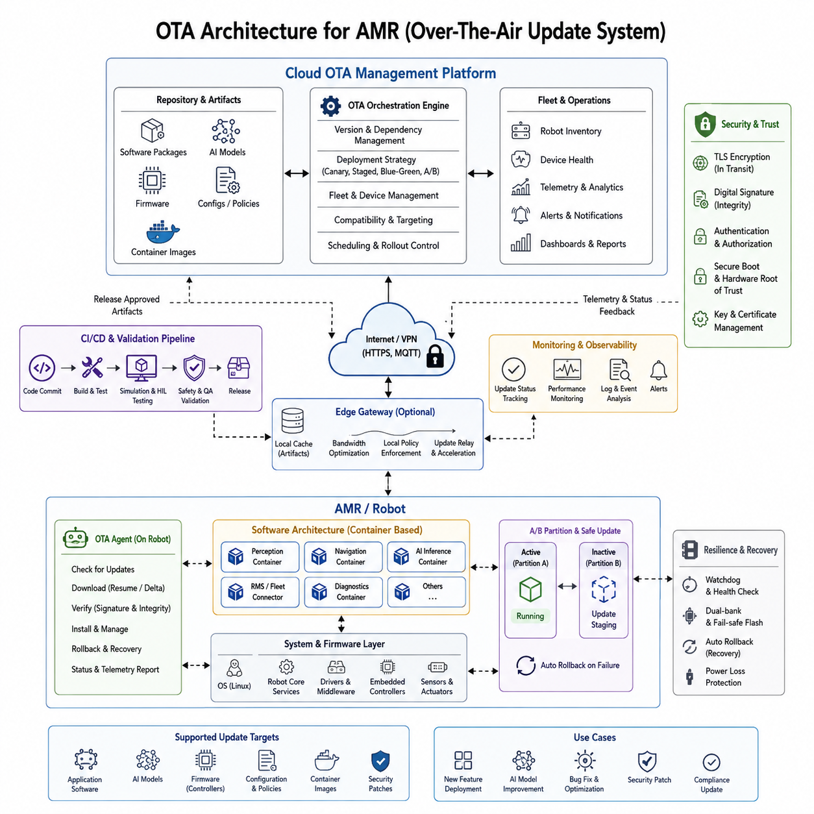
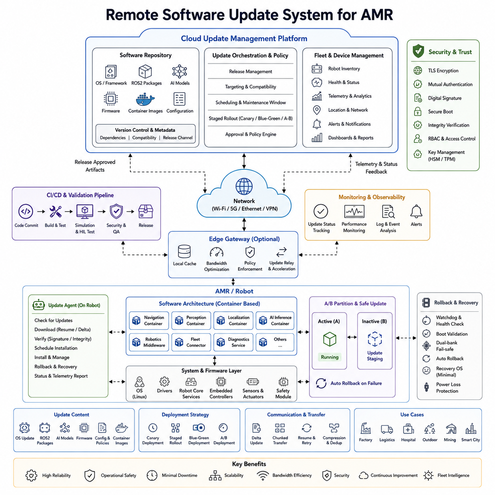
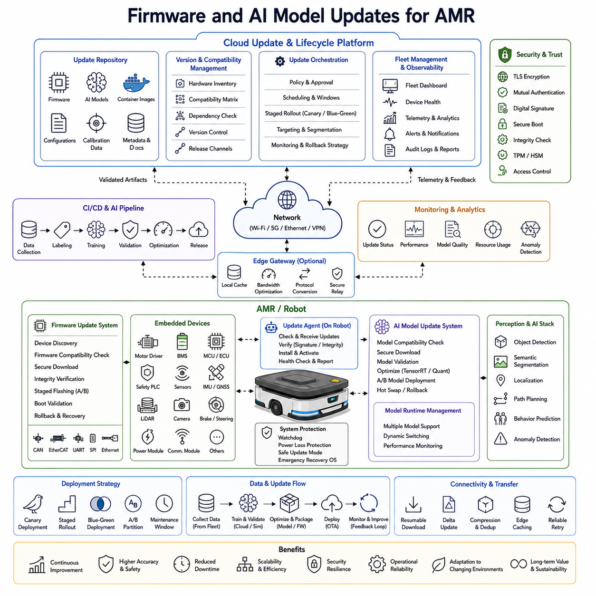
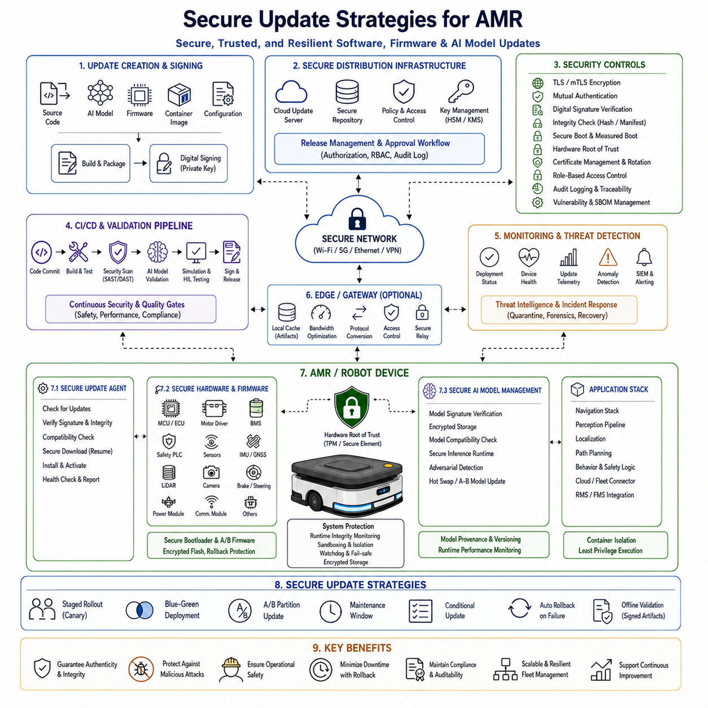
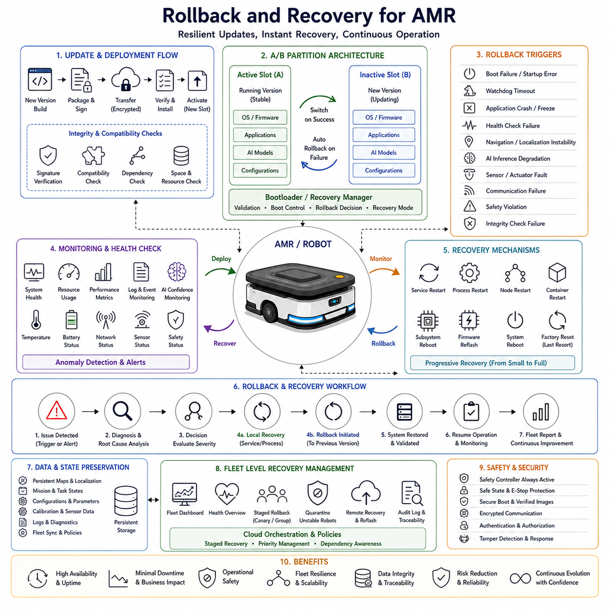
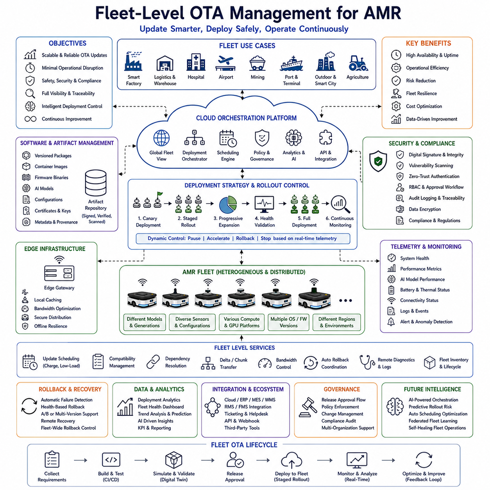
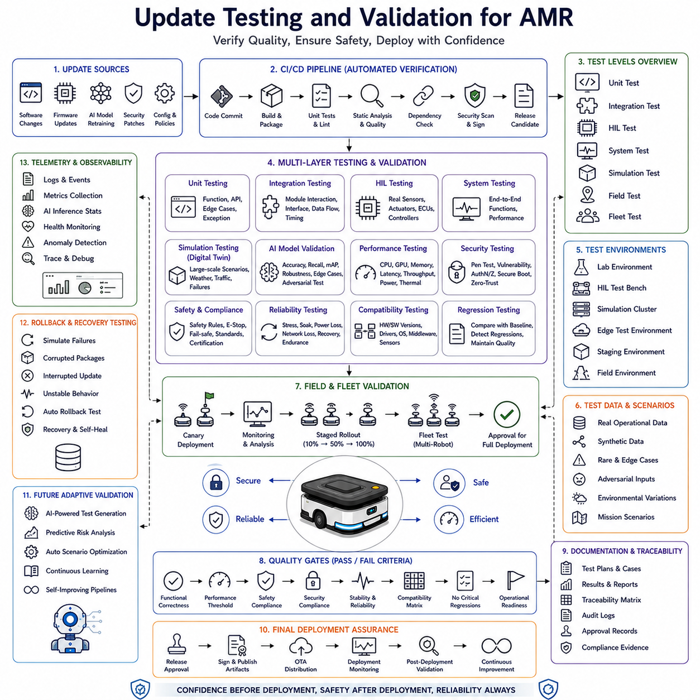
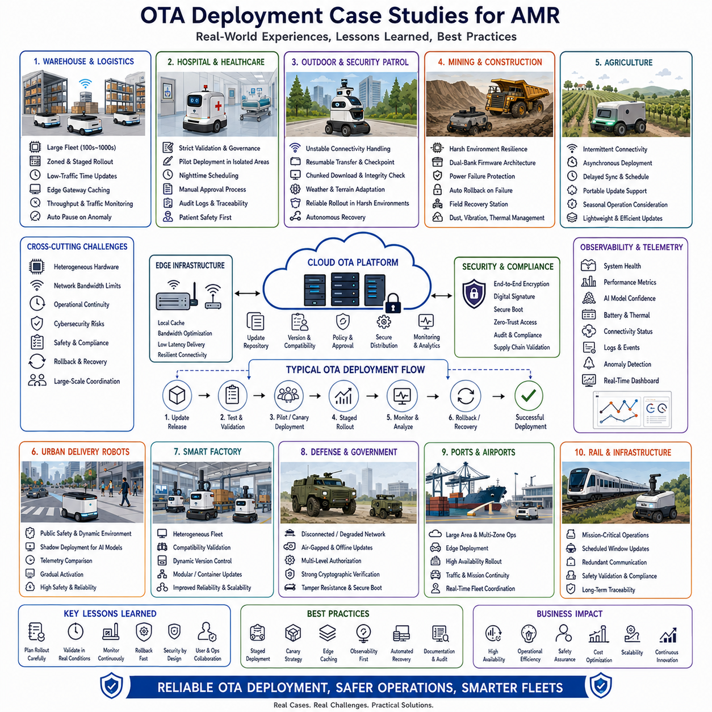

# Chapter 18. OTA and Remote Update

## 18.1 OTA Architecture

{width="7.268055555555556in" height="7.268055555555556in"}

"18_01_OTA_Architecture" is one of the most critical software infrastructure topics in modern AMR and autonomous robot systems because it directly affects how robots are maintained, upgraded, secured, and continuously improved after deployment. In large-scale robot operations, robots are no longer isolated standalone machines. They operate as continuously connected cyber-physical systems that must receive software updates, AI model upgrades, security patches, firmware corrections, configuration changes, and operational policy modifications throughout their lifecycle. OTA, which stands for Over-The-Air architecture, refers to the complete end-to-end infrastructure that enables remote software delivery and remote lifecycle management without requiring physical access to the robot. In industrial AMR environments, OTA architecture becomes a foundational technology for scalable deployment, fleet management, cybersecurity maintenance, continuous AI improvement, and operational reliability.

Traditional robotic systems often required engineers to manually connect laptops to robots for maintenance, firmware flashing, log extraction, or software upgrades. Such approaches become impossible when operating hundreds or thousands of robots distributed across factories, hospitals, logistics centers, ports, mines, campuses, or smart cities. OTA architecture solves this scalability challenge by creating a centralized software delivery ecosystem capable of remotely managing robot software stacks through secure network communication. Modern AMR platforms therefore treat OTA infrastructure as a core operational backbone equivalent in importance to navigation, perception, or fleet management systems.

The architecture of an OTA system generally consists of several major layers including the cloud management layer, update orchestration layer, communication infrastructure layer, edge gateway layer, robot-side update agent layer, software package management layer, security verification layer, rollback and recovery layer, monitoring and telemetry layer, and validation framework layer. Each layer has distinct responsibilities but must operate together as an integrated lifecycle management platform.

At the highest level, the cloud OTA management server acts as the central command center for software deployment. This server stores software packages, firmware binaries, AI model files, container images, configuration policies, deployment rules, and robot fleet metadata. The OTA management platform maintains version histories, dependency graphs, deployment schedules, compatibility matrices, and robot inventory databases. In large industrial deployments, the OTA cloud server is tightly integrated with RMS and FMS infrastructure so that robot operational status, battery level, mission state, geographic location, and maintenance conditions can be considered before updates are initiated.

The OTA orchestration engine is responsible for deciding how updates are distributed across the fleet. This orchestration layer determines deployment order, scheduling strategy, rollout percentages, regional segmentation, hardware compatibility, software dependency validation, and staged deployment policies. In industrial robotics, updates cannot be pushed blindly to every robot simultaneously because failures may disable entire facilities. Instead, OTA orchestration systems commonly use phased deployment approaches such as canary rollout, staged deployment, blue-green deployment, or A/B partition strategies. Small subsets of robots first receive updates for validation. After successful operation is verified, deployment gradually expands to the larger fleet.

The communication layer forms the networking foundation of OTA systems. AMRs may operate through Wi-Fi, private 5G, LTE, Ethernet, VPN infrastructure, or hybrid industrial communication networks. OTA architecture must tolerate unstable communication, intermittent connectivity, bandwidth limitations, and temporary network disconnections. Industrial outdoor robots often encounter variable network quality depending on terrain, weather, interference, or infrastructure conditions. Therefore, robust OTA systems implement resumable downloads, differential updates, chunk-based transmission, retry mechanisms, bandwidth throttling, and integrity validation to maintain reliability under imperfect communication environments.

The robot-side OTA agent is one of the most important components in the architecture. This software daemon runs locally on the robot and manages communication with the OTA server. The OTA agent periodically checks for updates, downloads packages, validates signatures, monitors installation progress, executes installation workflows, handles rollback operations, and reports status telemetry back to the cloud. In ROS2-based AMR platforms, OTA agents often operate independently from mission-critical navigation nodes to avoid interference with real-time operations. Isolation between OTA processes and safety-critical robot control systems is essential because failed updates must never compromise core operational safety.

Modern AMRs commonly use containerized software architecture to simplify OTA deployment. Instead of updating entire operating systems manually, many robotics companies distribute Docker containers or OCI-compatible images. Container-based OTA systems provide modularity, reproducibility, dependency isolation, and simplified rollback capability. Perception modules, navigation stacks, AI inference engines, SLAM systems, RMS connectors, telemetry services, and diagnostic applications may all be deployed independently through containerized workflows. This architecture dramatically improves maintainability for complex robot software ecosystems.

AI model deployment is also becoming a major function of OTA systems. Autonomous robots continuously evolve through improved AI models trained using operational data collected from deployed fleets. Object detection networks, segmentation models, navigation policies, anomaly detection systems, speech interaction modules, and predictive maintenance algorithms are frequently updated after deployment. OTA infrastructure therefore becomes part of the robot MLOps pipeline. AI model versioning, model compatibility validation, inference benchmarking, GPU optimization profiles, and rollback support must all be integrated into the OTA framework.

Firmware update management is another critical component of OTA architecture. Industrial AMRs contain numerous embedded controllers including motor drivers, BMS units, MCU-based sensor controllers, safety PLCs, brake controllers, GNSS modules, LiDAR firmware, and communication modules. OTA systems often require hierarchical update mechanisms capable of safely updating both high-level Linux software and low-level embedded firmware. Firmware updates are especially sensitive because incomplete flashing may permanently damage hardware devices. As a result, firmware OTA systems typically include watchdog timers, dual-bank flash memory, bootloader recovery modes, and fail-safe power protection mechanisms.

A/B partition architecture is widely used in reliable OTA systems. In this approach, the robot maintains two separate system partitions. One partition contains the currently active operating environment while the second partition is reserved for new updates. The update is installed into the inactive partition first. After installation completes successfully, the system reboots into the updated environment. If boot validation fails or operational instability is detected, the robot automatically rolls back to the previous stable partition. This mechanism significantly improves operational safety and reduces the risk of permanent update failures.

Security is one of the most important concerns in OTA architecture. Autonomous robots connected to public or industrial networks become potential cybersecurity targets. Compromised OTA systems could allow attackers to inject malicious code, disable fleets, steal operational data, manipulate navigation behavior, or damage physical infrastructure. Therefore, OTA security architecture must implement strong authentication, encrypted communication, certificate management, secure boot, digital signatures, integrity verification, access control, hardware root of trust, and cryptographic validation mechanisms.

TLS-based encrypted communication is commonly used between robots and OTA servers. Mutual authentication ensures that robots verify server identity while servers also verify robot identity. Digital signing ensures update packages cannot be tampered with during transmission. Secure boot mechanisms ensure only authenticated software images can execute on robot hardware. Trusted Platform Modules and hardware security modules may additionally store cryptographic keys securely to prevent credential theft.

OTA systems also require sophisticated monitoring and observability infrastructure. During deployment, the system continuously tracks download progress, installation state, reboot events, CPU utilization, GPU utilization, thermal conditions, storage usage, network quality, application startup status, and operational telemetry. Cloud dashboards provide fleet-wide visibility into deployment health and update success rates. Alerting systems notify operators when deployment failures, rollback events, or abnormal behaviors occur.

Industrial AMR deployments frequently require strict operational scheduling for OTA activities. Updates cannot interrupt critical logistics operations, hospital delivery missions, patrol activities, or manufacturing workflows. Therefore, OTA systems often schedule updates during maintenance windows, charging periods, idle states, or low-traffic operational intervals. Fleet coordination systems may intentionally stagger updates to ensure enough robots remain operational while others are being upgraded.

Bandwidth optimization is especially important for outdoor robots and large AI systems. Modern AI models may exceed several gigabytes in size. Transferring full packages repeatedly across fleets becomes expensive and inefficient. Differential update technology therefore plays a major role in modern OTA architecture. Instead of transmitting complete binaries, only modified portions of files are delivered. Compression algorithms, delta encoding, chunk deduplication, and content caching further reduce bandwidth consumption.

Edge computing infrastructure is increasingly integrated into OTA systems for large-scale industrial robotics. Instead of every robot individually downloading updates from cloud servers, local edge gateways may cache software packages within factories, hospitals, or smart-city infrastructure. This architecture reduces WAN bandwidth usage while improving deployment speed and reliability. Edge-based OTA gateways also allow localized deployment policies and regional operational control.

Testing and validation pipelines are tightly integrated with OTA systems in mature robotics organizations. Before deployment, updates pass through automated CI/CD pipelines, simulation validation, hardware-in-the-loop testing, regression analysis, safety verification, and field validation stages. Digital twin environments may simulate thousands of virtual robots before deployment to real fleets. OTA architecture therefore becomes deeply connected with software engineering workflows, robotics DevOps infrastructure, and operational MLOps ecosystems.

Industrial robot vendors increasingly adopt cloud-native OTA architectures using Kubernetes, container registries, distributed artifact repositories, microservice orchestration, and scalable telemetry systems. Such architectures enable global robot fleet management across multiple countries and operational sites. In multinational deployments, OTA systems may also enforce regulatory constraints, region-specific compliance policies, and hardware localization requirements.

Hospital robots present unique OTA challenges because updates must comply with medical safety requirements and operational continuity expectations. Logistics robots require highly reliable uptime because warehouse interruptions directly affect business operations. Outdoor autonomous robots operating in harsh environments require resilient OTA architectures capable of functioning under unstable network conditions, limited connectivity, or power interruptions. Defense-oriented robotic systems may require air-gapped or partially disconnected OTA infrastructure with specialized security protocols.

The future of OTA architecture in robotics is evolving toward fully autonomous lifecycle management systems. AI-driven OTA platforms may automatically analyze operational telemetry, predict software instability, optimize deployment timing, select targeted update groups, and continuously adapt robot software ecosystems. Self-healing robot platforms may automatically detect corrupted modules, download recovery packages, and restore operational states without human intervention. Federated AI learning systems may further integrate directly with OTA pipelines so that continuously improved models are distributed automatically across fleets.

As autonomous robots become increasingly software-defined systems, OTA architecture will evolve into one of the most important enabling technologies for scalable robotics operations. It transforms robots from static deployed machines into continuously evolving intelligent platforms capable of long-term adaptation, security maintenance, AI improvement, and operational optimization throughout their lifecycle. In modern AMR engineering, OTA architecture is no longer an optional convenience feature but rather a mandatory infrastructure component that defines the reliability, scalability, maintainability, and commercial viability of industrial autonomous robot systems.

## 18.2 Remote Software Update System

{width="7.268055555555556in" height="7.268055555555556in"}

"18_02_Remote_Software_Update_System" describes the operational and software engineering framework that enables autonomous mobile robots and large-scale robotic fleets to receive, manage, validate, and execute remote software updates throughout their operational lifecycle. While OTA architecture defines the high-level infrastructure and deployment ecosystem, the remote software update system focuses more specifically on the mechanisms, workflows, protocols, runtime management strategies, and operational behaviors required to safely update software on robots operating in real industrial environments. In modern AMR systems, remote software update capability is no longer considered a convenience feature but rather a mandatory operational requirement because autonomous robots continuously evolve after deployment through new features, AI model improvements, navigation optimization, cybersecurity patches, safety corrections, operational policy changes, and performance enhancements.

In large industrial deployments, robots may operate continuously across factories, hospitals, logistics centers, ports, airports, mining facilities, smart cities, agricultural environments, and outdoor inspection sites. These robots often work 24 hours per day under mission-critical conditions where operational downtime directly affects productivity, safety, logistics efficiency, and business continuity. As a result, remote software update systems must be designed not only for functionality but also for reliability, scalability, resilience, cybersecurity, operational safety, and fault recovery. A failed software update in a single robot may interrupt one task, but a failed fleet-wide deployment may halt entire industrial operations. Therefore, remote update systems in robotics require far more sophisticated engineering compared to traditional consumer software update mechanisms.

The core purpose of a remote software update system is to enable robots to receive software modifications remotely without requiring physical engineering intervention. These updates may include operating system updates, ROS2 package upgrades, middleware patches, navigation stack improvements, perception pipeline changes, AI model replacements, firmware updates, cybersecurity patches, container image updates, configuration modifications, mission policy changes, cloud connector revisions, RMS/FMS integrations, diagnostic tool deployment, or safety parameter adjustments. In advanced AMR platforms, nearly every software-defined function within the robot may eventually become remotely updateable.

A modern remote software update system usually begins with centralized software management infrastructure located in a cloud environment or enterprise data center. This central platform stores software artifacts, deployment packages, firmware binaries, AI inference models, configuration templates, and software metadata. The management platform also maintains version control information, dependency tracking, compatibility relationships, release channels, hardware targeting rules, and deployment histories. In industrial robotics environments, the update server is often integrated with fleet management systems so that robot operational state, battery condition, mission workload, geographic location, maintenance status, and network quality can all influence update scheduling decisions.

Software packaging strategy is one of the most important design considerations in remote update systems. Traditional monolithic update systems replaced entire operating system images even for minor modifications, resulting in large bandwidth requirements and higher deployment risks. Modern robotic software platforms instead adopt modular deployment architectures. Container-based systems using Docker or OCI-compatible images allow independent deployment of navigation modules, AI inference engines, perception pipelines, SLAM systems, diagnostics services, telemetry components, and cloud connectors. This modular approach significantly improves deployment flexibility and reduces update size.

ROS2-based AMR platforms particularly benefit from modular update architecture because robotic functionality is naturally divided into distributed nodes, services, topics, and software packages. Navigation stacks, localization systems, perception pipelines, behavior trees, fleet connectors, sensor drivers, and robot control interfaces may all evolve independently. Remote update systems therefore often support selective module deployment rather than complete platform replacement. This reduces operational risk and improves rollback granularity.

Container orchestration technologies increasingly play an important role in robotic update systems. Many industrial AMR platforms deploy applications using Kubernetes-inspired orchestration principles, lightweight edge container runtimes, or custom robotic container managers. These orchestration systems manage application startup order, dependency validation, resource allocation, restart behavior, health monitoring, and service recovery during software transitions. Containerized update workflows also simplify reproducibility across heterogeneous robot hardware platforms.

AI model deployment is becoming one of the largest operational drivers for remote software update systems. Modern robots continuously improve through operational learning pipelines where field-collected data is used to retrain object detection networks, semantic segmentation models, predictive maintenance algorithms, path planning optimizers, and multimodal AI systems. The remote update system therefore becomes tightly coupled with robot MLOps infrastructure. AI deployment pipelines must manage model versioning, GPU optimization profiles, inference compatibility, TensorRT engine generation, quantization validation, calibration data consistency, and performance benchmarking.

The communication layer of remote software update systems must support highly variable networking conditions. Industrial robots may operate over Wi-Fi, Ethernet, LTE, private 5G, VPN tunnels, satellite communication, or hybrid industrial networks. Outdoor robots often encounter unstable connectivity, intermittent coverage, bandwidth fluctuations, and temporary communication outages. Therefore, remote update protocols must support resumable downloads, chunk-based transfer, adaptive bandwidth control, retry logic, local caching, differential synchronization, and integrity verification.

Bandwidth optimization becomes increasingly important as AI systems grow larger. Advanced AI models, container images, and perception frameworks may exceed several gigabytes in size. Repeatedly distributing full software packages across large fleets can become operationally impractical. Differential update technologies therefore play a major role in modern update systems. Instead of transmitting complete binaries, the system computes only the changed data blocks and distributes delta patches. Compression algorithms, deduplication systems, binary differencing, and regional edge caching further improve network efficiency.

Edge gateway infrastructure is frequently deployed in large industrial environments to improve update scalability. Instead of every robot individually downloading packages from cloud servers, local edge gateways cache approved update packages within factories, hospitals, warehouses, or smart-city networks. Robots retrieve updates from nearby edge nodes, dramatically reducing WAN bandwidth usage and improving deployment speed. Edge-based architectures also improve operational reliability in partially disconnected environments where internet connectivity may be unstable.

The robot-side update agent is one of the most critical components in the remote update system. This local software service continuously communicates with update management servers, monitors deployment instructions, downloads packages, validates signatures, schedules installations, executes update workflows, and reports telemetry status. The update agent typically operates independently from safety-critical navigation systems to ensure update failures do not compromise robot operation. Robust update agents also include persistent state tracking so interrupted installations can safely resume after power failures or unexpected reboots.

Safety considerations are central to robotic remote update systems. Unlike smartphones or laptops, autonomous robots directly interact with physical environments, machinery, vehicles, infrastructure, and humans. Unsafe software deployment could create hazardous motion behaviors, perception failures, navigation instability, or communication disruptions. Therefore, remote update systems must integrate deeply with robot operational safety logic. Updates are often restricted to maintenance windows, charging periods, idle states, or explicitly approved operational conditions.

A/B partition architecture is widely adopted in reliable robotic update systems. In this design, robots maintain two independent operating environments. The currently active environment continues running while updates are installed into the inactive partition. After installation completes successfully, the robot reboots into the updated environment. If startup validation fails or abnormal behavior is detected, the system automatically rolls back to the previous stable environment. This rollback mechanism significantly improves deployment resilience and prevents permanent robot failures.

Rollback and recovery logic represent essential capabilities in industrial remote update systems. Updates may fail due to corrupted downloads, incompatible dependencies, storage failures, unexpected power interruptions, hardware faults, network instability, or software regressions. The update framework must therefore support automatic rollback, safe recovery modes, watchdog monitoring, boot validation, transaction-based installation, and emergency fallback procedures. Some robotic systems even maintain minimal recovery operating systems capable of restoring functionality independently of the main runtime environment.

Firmware update management adds additional complexity to robotic update systems. AMRs contain numerous embedded controllers including motor drivers, battery management systems, sensor controllers, brake modules, steering ECUs, safety PLCs, GNSS modules, radar firmware, and LiDAR processors. Updating embedded firmware remotely requires specialized flashing protocols, power protection mechanisms, dual-bank memory systems, secure bootloaders, and fail-safe recovery logic. Firmware corruption could permanently disable critical hardware subsystems, making reliability extremely important.

Cybersecurity represents one of the highest-priority concerns in remote software update systems. Connected robots operating across industrial or public infrastructure become potential attack surfaces. A compromised update system could distribute malicious software, disable fleets, steal operational data, manipulate navigation behavior, or create physical safety hazards. Therefore, modern remote update systems implement end-to-end encryption, certificate-based authentication, digital signatures, secure boot verification, cryptographic integrity checking, hardware root of trust, role-based access control, and secure credential management.

TLS-encrypted communication is commonly used between robots and update servers. Mutual authentication ensures both server identity and robot identity are verified. Update packages are digitally signed to prevent tampering during transmission. Secure boot mechanisms ensure only authenticated software images may execute on the robot. TPM or hardware security modules securely store cryptographic keys to prevent credential compromise.

Deployment orchestration is another critical operational component. Industrial robot fleets rarely update all units simultaneously because failures may create catastrophic operational interruptions. Instead, staged rollout strategies are commonly used. Canary deployments first update a small subset of robots operating under controlled conditions. If validation succeeds, deployment gradually expands across the fleet. Blue-green deployment strategies may also be used to maintain operational continuity while testing updated environments.

Observability and telemetry systems provide continuous visibility into update operations. Deployment dashboards track download progress, installation state, reboot events, startup validation, application health, CPU usage, GPU utilization, thermal conditions, storage consumption, network performance, and rollback events. Centralized monitoring systems allow operators to identify deployment failures quickly and isolate problematic software versions before widespread impact occurs.

Testing and validation infrastructure are deeply integrated into mature remote software update systems. Before deployment, software updates typically pass through CI/CD pipelines, automated unit testing, simulation validation, hardware-in-the-loop testing, regression analysis, cybersecurity assessment, AI benchmarking, and field validation workflows. Digital twin simulation environments may validate updates across thousands of virtual robots before deployment to physical fleets. This validation pipeline dramatically reduces operational risk.

Remote update systems also increasingly integrate with predictive maintenance infrastructure. Operational telemetry collected from deployed robots may reveal emerging software instability, hardware degradation, thermal anomalies, abnormal sensor behavior, or performance regressions. AI-driven analytics systems may proactively recommend software patches or firmware updates before operational failures occur. In future autonomous robot ecosystems, predictive maintenance and remote update systems may operate as fully integrated self-healing platforms.

Industrial outdoor robots introduce additional challenges due to environmental variability. Robots operating in mines, ports, construction sites, railways, agricultural environments, or smart cities may experience dust, vibration, humidity, temperature extremes, unstable power conditions, and inconsistent connectivity. Remote update systems for such platforms must therefore emphasize resilience, robust recovery mechanisms, bandwidth efficiency, and operational fault tolerance.

Hospital robot deployments require additional validation because updates may affect medical logistics workflows, patient interaction systems, telemedicine infrastructure, or safety-certified operational behaviors. Regulatory compliance and operational continuity requirements therefore heavily influence deployment strategies in healthcare robotics.

As robotic systems evolve toward increasingly AI-native architectures, remote software update systems will become even more important. Future robots may continuously evolve through cloud-connected learning systems, federated AI optimization, autonomous deployment orchestration, self-monitoring software ecosystems, and adaptive runtime architectures. AI agents may eventually analyze operational telemetry, predict deployment risks, optimize rollout timing, and autonomously manage software lifecycle operations without direct human supervision.

The future direction of remote software update systems in robotics is moving toward fully autonomous lifecycle management infrastructure capable of continuous adaptation, self-healing recovery, predictive deployment optimization, and AI-driven operational intelligence. In this future, robots will no longer be static deployed products but continuously evolving software-defined platforms. Remote software update systems therefore become foundational infrastructure enabling long-term scalability, maintainability, reliability, cybersecurity, and commercial viability of next-generation AMR ecosystems.

## 18.3 Firmware and AI Model Updates

{width="7.268055555555556in" height="7.268055555555556in"}

"18_03_Firmware_and_AI_Model_Updates" describes one of the most critical operational capabilities in modern autonomous mobile robot systems because both firmware and AI models continuously evolve after robots are deployed into real environments. In traditional industrial machines, embedded firmware was often fixed for long periods and software functionality changed relatively slowly. However, modern AMRs operate as software-defined intelligent systems where navigation logic, perception capability, AI inference quality, sensor integration, safety algorithms, and operational behavior are continuously improved through iterative deployment cycles. As a result, firmware updates and AI model updates have become central lifecycle management functions for industrial robotics platforms.

Firmware updates and AI model updates are fundamentally different from conventional application software updates because they directly affect hardware behavior, low-level control systems, real-time execution environments, and autonomous decision-making capability. A firmware update may modify motor control behavior, brake response timing, battery management logic, sensor synchronization mechanisms, communication protocols, embedded safety functions, or drive-by-wire control algorithms. Similarly, AI model updates may significantly alter object detection accuracy, human recognition capability, obstacle classification behavior, semantic understanding, path planning decisions, anomaly detection sensitivity, or operational prediction quality. Because these updates directly influence real-world robotic behavior, their engineering complexity and safety requirements are substantially higher than ordinary software deployment systems.

Modern AMR platforms contain a large number of embedded devices that require firmware lifecycle management. These include motor drivers, battery management systems, embedded MCU controllers, safety PLCs, GNSS modules, LiDAR firmware processors, radar systems, camera controllers, brake controllers, steering ECUs, communication modules, power distribution units, IMU processors, and sensor synchronization controllers. Each embedded subsystem may use different hardware architectures, communication protocols, memory layouts, bootloader mechanisms, and flashing procedures. Therefore, firmware update systems must support highly heterogeneous device ecosystems within a single robot platform.

Firmware management begins with version control and hardware compatibility management. Industrial robots may contain different hardware revisions across production generations. A firmware image designed for one controller revision may be incompatible with another. Therefore, firmware update systems maintain detailed metadata regarding hardware identifiers, firmware compatibility matrices, board revisions, communication protocol versions, calibration dependencies, and operational safety constraints. Before deployment, the system verifies that the target hardware matches the approved firmware package.

Bootloader architecture is one of the most important technical foundations of reliable firmware update systems. Embedded controllers typically contain dedicated bootloader software responsible for receiving new firmware images, validating integrity, managing flash memory operations, and recovering from interrupted updates. Industrial-grade bootloaders often include fail-safe recovery logic, dual-bank flash management, watchdog integration, rollback capability, and integrity verification mechanisms. In robotic systems, firmware corruption must never permanently disable critical safety functions or mobility systems.

Dual-bank or A/B firmware architecture is widely used in reliable robotics platforms. In this design, two separate firmware storage regions exist within embedded memory. The currently active firmware continues operating while the new firmware is written into the inactive memory region. Only after validation succeeds does the controller switch execution to the updated image. If boot validation fails or runtime instability is detected, the system automatically restores the previous firmware version. This architecture dramatically improves firmware update reliability in industrial robotics environments.

Power stability is another critical consideration during firmware updates. A sudden power interruption during flash programming may permanently damage embedded controllers. Therefore, firmware update systems typically include battery state verification, power redundancy checks, capacitor-backed protection circuits, and transactional flashing logic. Some systems prevent firmware updates unless battery charge exceeds predefined safety thresholds. Outdoor robots operating in unstable environments require especially robust power-failure protection mechanisms.

Communication protocols for firmware deployment vary depending on subsystem architecture. CAN bus, CAN-FD, UART, SPI, Ethernet, EtherCAT, RS485, USB, and proprietary industrial communication interfaces may all be used for firmware transfer. Each protocol introduces unique latency, bandwidth, synchronization, and error recovery characteristics. Firmware update frameworks must therefore support multi-protocol orchestration across heterogeneous embedded devices.

Cybersecurity is extremely important in firmware update systems because firmware operates at the lowest trust layer of robotic hardware infrastructure. Malicious firmware could compromise motor control, safety systems, navigation stability, sensor integrity, or communication infrastructure. Therefore, secure firmware update systems implement digital signatures, encrypted transport, secure boot validation, cryptographic integrity checking, certificate management, hardware root of trust, and trusted execution environments. Modern robotics platforms increasingly integrate TPMs, secure enclaves, and hardware security modules to protect firmware authentication keys.

Secure boot architecture ensures only authenticated firmware can execute on embedded devices. During startup, the bootloader verifies digital signatures before transferring execution control to the firmware image. If verification fails, the controller either enters recovery mode or restores a previously validated image. This mechanism protects robotic systems against unauthorized firmware manipulation and cyberattacks.

Firmware update orchestration across robot fleets is operationally complex because not all firmware should be updated simultaneously. Updating mobility controllers, steering systems, or safety modules may temporarily disable robot functionality. Therefore, industrial update systems commonly sequence firmware updates carefully based on subsystem criticality, operational schedules, maintenance windows, and rollback readiness. Safety-certified controllers often require additional validation procedures and restricted deployment approval workflows.

AI model updates represent another major component of modern robotics lifecycle management. Unlike traditional robotics systems where algorithms remained relatively static after deployment, modern AI-native robots continuously evolve through data-driven improvement cycles. Operational data collected from deployed fleets is used to retrain perception models, navigation networks, behavior prediction systems, predictive maintenance algorithms, multimodal AI architectures, and foundation models for robotics. Updated models are then redistributed back into operational fleets through AI deployment infrastructure.

Object detection models frequently require updates because real-world operational environments constantly change. New vehicle types, industrial equipment, environmental conditions, weather patterns, clothing variations, lighting changes, and infrastructure modifications all affect AI perception performance. Semantic segmentation models may require adaptation to new environments. Human detection systems may require retraining for different operational regions. Outdoor robots may require seasonal AI updates for snow, fog, dust, or rain conditions.

AI model deployment systems must therefore support continuous retraining, benchmarking, validation, optimization, and staged rollout workflows. Model versioning becomes critically important because operational fleets may temporarily contain multiple model generations during phased deployment processes. Each deployed model must remain traceable for debugging, compliance, safety validation, and operational auditing purposes.

GPU optimization plays a major role in AI model deployment for AMRs. Robots using NVIDIA Jetson systems, discrete edge GPUs, or accelerator hardware require optimized inference engines for real-time operation. Raw deep learning models are often converted into TensorRT engines, quantized representations, FP16 pipelines, INT8 optimized architectures, or hardware-specific inference graphs before deployment. Therefore, AI model update systems often include automated optimization pipelines integrated into deployment workflows.

AI model compatibility management is another important engineering challenge. Updated models may require different preprocessing pipelines, sensor calibration formats, inference frameworks, CUDA versions, TensorRT runtimes, or middleware dependencies. Therefore, AI deployment systems must carefully manage compatibility between software stacks and model artifacts. A perception model incompatible with deployed middleware could cause runtime failures or degraded operational behavior.

AI safety validation is critically important before model deployment into real robot fleets. Unlike conventional software, AI behavior may change probabilistically depending on operational conditions. Therefore, updated models must undergo extensive simulation testing, field validation, regression analysis, confusion matrix evaluation, false positive analysis, false negative benchmarking, edge-case testing, and scenario-based safety verification. Many industrial robotics organizations maintain dedicated AI validation pipelines before authorizing deployment into operational fleets.

Digital twin simulation environments are increasingly used for AI model verification. Large-scale virtual environments simulate robot perception, navigation, sensor fusion, human interaction, and environmental variability under thousands of operational conditions. AI models may be evaluated against simulated weather conditions, lighting changes, traffic density, obstacle patterns, and rare safety scenarios before real-world deployment. This significantly reduces deployment risk.

Continuous learning architecture is becoming increasingly important in modern robotics systems. Instead of isolated update cycles, AI systems increasingly operate through iterative MLOps pipelines where operational data continuously improves deployed models. Field-collected sensor data is uploaded to cloud infrastructure, labeled through automated or semi-automated workflows, retrained using distributed AI training pipelines, validated through simulation systems, optimized for edge deployment, and redistributed back into robot fleets through OTA infrastructure.

Bandwidth optimization is essential for large AI model deployment because modern deep learning architectures may exceed several gigabytes in size. Fleet-wide deployment of full AI models can become operationally expensive. Differential synchronization, compressed model packaging, regional edge caching, content deduplication, and staged rollout strategies therefore play major roles in AI deployment systems. Edge gateway infrastructure may cache AI models locally within industrial facilities to reduce WAN bandwidth usage.

Runtime model management is also an important operational consideration. Some robotic systems support hot-swapping of AI models without requiring full system reboot. Others maintain multiple simultaneously loaded models for redundancy or comparative evaluation. Advanced systems may dynamically switch between low-power and high-accuracy models depending on operational context, battery state, or environmental conditions.

Observability infrastructure is critical for firmware and AI model update systems. Operators require continuous visibility into deployment status, model performance, firmware integrity, inference latency, GPU utilization, memory usage, thermal behavior, perception confidence, operational anomalies, and rollback events. Centralized telemetry systems allow engineering teams to identify regressions quickly and isolate problematic deployments before widespread operational impact occurs.

Industrial robotics companies increasingly integrate firmware and AI deployment workflows into unified lifecycle management platforms. These systems combine OTA infrastructure, MLOps pipelines, CI/CD automation, cybersecurity monitoring, fleet telemetry, predictive maintenance analytics, digital twin validation, and operational orchestration into integrated cloud-native robotics ecosystems.

Outdoor autonomous robots introduce additional complexity because environmental conditions continuously evolve. Firmware controlling suspension systems, traction control, thermal management, sensor synchronization, and power regulation may require updates depending on seasonal conditions or terrain characteristics. AI models for outdoor navigation must continuously adapt to changing weather, lighting, vegetation, infrastructure, and operational patterns.

Hospital robots require especially strict validation because firmware or AI model changes may influence patient safety, medicine delivery workflows, telemedicine operations, or human interaction behavior. Medical environments therefore often require formal deployment approval workflows, audit logging, traceability infrastructure, and regulatory compliance validation.

The future direction of firmware and AI model updates is moving toward increasingly autonomous self-improving robot ecosystems. AI systems may eventually analyze operational telemetry, predict optimal deployment timing, identify unstable firmware behavior, autonomously generate optimized inference pipelines, and coordinate fleet-wide updates without direct human intervention. Federated learning systems may allow robots to collaboratively improve shared AI models while preserving operational privacy and minimizing cloud bandwidth usage.

As robotics systems become increasingly AI-native and software-defined, firmware and AI model update infrastructure will become one of the most strategically important foundations of industrial autonomous systems. These update systems enable robots to continuously improve after deployment, adapt to changing environments, maintain cybersecurity resilience, optimize operational performance, and evolve throughout their lifecycle. In modern AMR engineering, firmware and AI model update systems are no longer auxiliary maintenance functions but rather central pillars supporting scalability, intelligence, operational safety, and long-term commercial sustainability of autonomous robotic platforms.

## 18.4 Secure Update Strategies

{width="7.268055555555556in" height="7.268055555555556in"}

"18_04_Secure_Update_Strategies" describes the cybersecurity architecture, operational methodologies, cryptographic mechanisms, validation frameworks, and trust-management systems required to securely distribute software, firmware, and AI model updates to autonomous mobile robots and large-scale robotic fleets. In modern AMR ecosystems, secure update strategies are no longer optional operational enhancements but instead represent one of the most critical foundational requirements for safe autonomous operation. Autonomous robots interact directly with physical infrastructure, industrial facilities, logistics systems, hospitals, vehicles, machinery, and humans. A compromised update system therefore creates not only cybersecurity risks but also physical safety risks. Malicious software injected into a robot fleet could manipulate navigation behavior, disable safety systems, alter perception pipelines, corrupt AI inference models, interrupt industrial operations, or even create hazardous real-world situations. As a result, secure update strategies have become a central pillar of industrial robotics engineering.

Modern autonomous robots are fundamentally software-defined systems. Navigation stacks, AI inference engines, perception frameworks, localization algorithms, behavior planners, embedded firmware, cloud connectors, RMS/FMS integrations, safety controllers, and operational policies are continuously updated throughout the robot lifecycle. These updates may occur across thousands of distributed robots operating in factories, warehouses, hospitals, mines, ports, smart cities, airports, rail systems, and outdoor industrial environments. The large attack surface created by remote connectivity makes secure update architecture absolutely essential.

The primary objective of secure update strategies is to guarantee authenticity, integrity, confidentiality, traceability, availability, and recoverability during the entire software deployment lifecycle. Secure update systems must ensure that only trusted software originating from authorized sources can be deployed onto robots. They must prevent tampering during transmission, block unauthorized access, validate runtime integrity, isolate compromised components, and provide safe recovery mechanisms if failures occur. In industrial robotics, secure update strategies are deeply integrated with OTA infrastructure, cloud robotics architecture, fleet management systems, embedded firmware platforms, cybersecurity operations, and functional safety engineering.

Trust establishment forms the foundation of all secure update systems. Every robot must maintain a cryptographically verifiable trust relationship with the update infrastructure. This trust chain usually begins at hardware manufacturing time through secure identity provisioning. Robots may contain hardware security modules, Trusted Platform Modules, secure enclaves, or hardware root-of-trust components that store cryptographic credentials securely. These secure elements protect authentication keys against extraction, cloning, or tampering.

Public key infrastructure plays a major role in robotic secure update systems. Cryptographic certificates establish trusted identities between robots, cloud servers, fleet gateways, and update orchestration systems. Mutual authentication mechanisms ensure both the robot and update server verify each other before communication begins. This prevents attackers from impersonating cloud services or deploying unauthorized update packages. Certificate rotation, expiration management, revocation systems, and key lifecycle management therefore become important operational components within large-scale AMR deployments.

Transport security is another critical layer of secure update architecture. Communication between robots and update infrastructure must be encrypted to prevent interception, manipulation, replay attacks, or credential theft. TLS-encrypted communication channels are commonly used across cloud-connected robotic systems. Modern implementations often enforce mutual TLS authentication, forward secrecy, certificate pinning, and strict cryptographic validation policies. In industrial environments, VPN-based segmentation and zero-trust network architecture may further isolate update traffic from operational networks.

Digital signatures represent one of the most essential technologies in secure software update systems. Every firmware image, AI model, software package, configuration artifact, and container image distributed to robots must be digitally signed before deployment. Robots verify these signatures locally before installation begins. If verification fails, deployment is rejected immediately. This ensures that attackers cannot modify software packages during transmission or inject malicious binaries into the deployment pipeline.

Cryptographic integrity verification extends beyond initial package validation. Secure update systems often perform integrity checks throughout download, installation, boot, and runtime execution stages. Hash verification, checksum validation, signed manifests, package attestation, and runtime integrity monitoring help ensure deployed software remains unmodified after installation. Some systems periodically revalidate installed software during normal operation to detect unauthorized changes or persistent malware.

Secure boot architecture forms another major component of secure update strategies. Secure boot ensures that only cryptographically authenticated firmware and operating system images can execute on robot hardware. During startup, the bootloader validates digital signatures before transferring execution control to firmware or operating system layers. If verification fails, the robot enters recovery mode or restores a previously trusted image. Secure boot prevents attackers from installing persistent low-level malware capable of bypassing application-layer security protections.

Measured boot and attestation mechanisms provide additional layers of trust verification. During startup, cryptographic measurements of firmware, operating systems, drivers, and software components are recorded and verified against approved reference values. Remote attestation allows cloud infrastructure to confirm that deployed robots are operating with trusted software stacks before allowing network access or operational participation. This becomes especially important in high-security industrial environments and critical infrastructure robotics.

Role-based access control is essential within secure update ecosystems. Not every engineer, operator, administrator, or external vendor should possess permission to deploy updates across robot fleets. Secure deployment systems therefore implement granular authorization policies controlling who may upload software, approve releases, initiate deployments, modify policies, or access operational telemetry. Multi-factor authentication, hardware tokens, approval workflows, and audit logging are commonly integrated into deployment infrastructure.

Supply chain security has become increasingly important in robotics update strategies. Modern AMR platforms depend on large software ecosystems including open-source libraries, AI frameworks, GPU runtimes, container images, middleware components, firmware SDKs, Linux distributions, and third-party drivers. Vulnerabilities within upstream dependencies may compromise entire robotic fleets. Therefore, secure update systems increasingly integrate software bill-of-materials tracking, dependency scanning, vulnerability analysis, binary provenance verification, and reproducible build systems.

Container security plays a major role in cloud-native robotics platforms. Many modern robots deploy perception systems, AI inference pipelines, localization services, navigation modules, telemetry agents, and RMS connectors through containerized software environments. Secure container update strategies therefore require signed container images, secure registries, runtime sandboxing, container isolation, image scanning, namespace protection, and minimal privilege enforcement. Trusted container pipelines help prevent deployment of compromised or malicious application environments.

AI model security introduces unique challenges within robotic update systems. AI models themselves may become attack targets because they directly influence perception, navigation, and operational decision-making. Maliciously modified AI models could intentionally misclassify humans, ignore obstacles, manipulate localization results, or trigger unsafe behavior. Therefore, secure AI deployment systems implement model signing, encrypted storage, integrity verification, provenance tracking, inference validation, and runtime monitoring.

Adversarial AI protection is becoming increasingly important for robotics cybersecurity. Attackers may attempt to manipulate sensor inputs, poison training datasets, inject malicious weights into models, or exploit inference vulnerabilities. Secure AI update pipelines therefore require dataset validation, model provenance tracking, secure training infrastructure, isolated validation environments, and operational anomaly detection systems capable of identifying abnormal inference behavior.

Firmware security is particularly critical because embedded firmware operates at the lowest trust layer of robotic systems. Motor controllers, brake systems, battery management units, steering ECUs, safety PLCs, sensor controllers, and communication modules all rely on firmware integrity. Compromised firmware could disable physical safety systems or manipulate low-level hardware behavior. Therefore, secure firmware update strategies include encrypted firmware transport, secure flashing procedures, dual-bank memory architecture, secure bootloaders, rollback protection, and immutable recovery partitions.

Rollback protection mechanisms are important because attackers may attempt downgrade attacks by installing older vulnerable firmware versions. Secure update systems therefore maintain monotonic version counters, trusted rollback policies, and cryptographic version validation to prevent unauthorized firmware regression. Only explicitly approved rollback operations are permitted under controlled recovery conditions.

A/B partition architecture significantly improves security and resilience during update deployment. In this design, robots maintain two independent operating environments. Updates are installed into the inactive partition while the active system continues operating. Only after successful validation does the robot switch to the updated environment. If abnormal behavior occurs, the robot automatically restores the previous trusted partition. This architecture minimizes downtime while improving operational safety.

Runtime isolation is another important strategy within secure robotics systems. Update services are commonly isolated from safety-critical motion controllers, navigation systems, and embedded real-time loops. Sandboxing, container isolation, virtual machines, mandatory access control frameworks, and microkernel architectures may limit the damage caused by compromised software components. This separation reduces lateral movement opportunities for attackers within robotic systems.

Monitoring and observability infrastructure play major roles in secure update strategies. Security telemetry systems continuously monitor deployment activity, authentication events, certificate usage, anomalous traffic patterns, failed signature validations, unauthorized access attempts, runtime integrity failures, and suspicious operational behaviors. Centralized SIEM platforms may aggregate logs across entire fleets for real-time cybersecurity analysis.

Incident response integration is essential because even highly secure systems may eventually experience attacks or vulnerabilities. Secure update architecture therefore includes emergency patch deployment workflows, fleet quarantine mechanisms, remote disable capabilities, forensic logging infrastructure, credential revocation systems, and disaster recovery procedures. Industrial robotics organizations increasingly maintain dedicated cybersecurity operations centers monitoring robotic fleets continuously.

Industrial outdoor robots introduce additional security complexity because they often operate across public infrastructure and untrusted communication networks. Outdoor robots may encounter hostile network environments, physical tampering risks, unstable connectivity, or edge deployment constraints. Secure update systems for such platforms therefore require robust offline validation capability, local trust management, resilient recovery logic, and hardened communication security.

Hospital robots and medical robotic systems require especially strict secure update procedures because compromised systems may affect patient safety, medicine delivery workflows, telemedicine operations, or healthcare infrastructure. Medical environments often require regulatory compliance, audit traceability, validated deployment workflows, and strict operational approval processes before updates are permitted.

Military and defense-oriented autonomous systems may require even more advanced security strategies including air-gapped deployment environments, classified cryptographic systems, hardware attestation modules, mission-specific authorization policies, and disconnected update infrastructure. In such environments, update trust verification may extend beyond standard commercial PKI systems.

Continuous validation pipelines are becoming increasingly important in secure robotics deployment architecture. Before deployment, updates undergo automated security scanning, penetration testing, dependency analysis, static code analysis, runtime behavior validation, firmware verification, AI safety benchmarking, and simulation-based attack testing. Digital twin environments may simulate adversarial operational conditions before updates are deployed into physical fleets.

Zero-trust architecture principles are increasingly influencing robotic update system design. Instead of assuming trusted internal networks, modern systems continuously authenticate every device, verify every transaction, validate every package, and monitor every operational interaction. This significantly improves resilience against lateral movement attacks and insider threats.

The future of secure update strategies is moving toward AI-driven autonomous cybersecurity systems capable of continuously analyzing fleet telemetry, predicting attack patterns, identifying compromised nodes, optimizing cryptographic policy management, and automatically deploying security mitigations. Federated trust systems, distributed attestation frameworks, hardware-backed confidential computing, post-quantum cryptography, and self-healing cybersecurity architectures may eventually become standard components of industrial robotics ecosystems.

As AMRs evolve into globally connected intelligent infrastructure platforms, secure update strategies will become inseparable from operational safety, functional reliability, and commercial viability. Secure software deployment is no longer simply an IT concern within robotics engineering. It is now directly connected to human safety, infrastructure protection, industrial continuity, and national cybersecurity resilience. In modern autonomous robotics systems, secure update architecture represents one of the most critical technological foundations enabling trustworthy, scalable, and long-term autonomous operation.

## 18.5 Rollback and Recovery

{width="7.268055555555556in" height="7.268055555555556in"}

"18_05_Rollback_and_Recovery" describes the operational recovery architecture, fault-tolerant deployment mechanisms, rollback methodologies, disaster recovery workflows, and resilience engineering strategies required to maintain safe and reliable autonomous robot operation when software, firmware, AI model, or system-level updates fail. In modern AMR ecosystems, rollback and recovery are not optional maintenance functions but fundamental operational safety requirements because autonomous robots operate in real physical environments where software failures can directly impact mobility, industrial productivity, infrastructure safety, and human interaction. Unlike traditional IT systems where update failures may simply interrupt business applications, failures in autonomous robots can affect navigation stability, obstacle avoidance, safety systems, perception accuracy, fleet coordination, or low-level hardware control. Therefore, rollback and recovery architecture represents one of the most critical reliability layers within industrial robotics engineering.

Modern autonomous mobile robots continuously evolve after deployment through OTA software updates, firmware revisions, AI model upgrades, navigation improvements, cybersecurity patches, cloud connector modifications, RMS/FMS integrations, and operational policy changes. These updates improve functionality, security, performance, and adaptability. However, every deployment also introduces risk. Software regressions, corrupted packages, incomplete downloads, incompatible dependencies, power interruptions, hardware faults, AI inference instability, communication failures, configuration errors, or cybersecurity incidents may all create conditions requiring rollback and recovery operations.

The core objective of rollback and recovery systems is to guarantee operational continuity and safety even when update processes fail. A well-designed AMR platform must always maintain a recoverable operational state capable of restoring stable functionality with minimal downtime. Recovery architecture therefore focuses on resilience, redundancy, fault isolation, state preservation, autonomous diagnosis, and safe restoration mechanisms. Industrial robots deployed across factories, hospitals, warehouses, airports, ports, mines, smart cities, rail systems, and outdoor environments require especially robust recovery infrastructure because physical access to every robot may not always be immediately possible.

Rollback mechanisms are fundamentally designed to restore previously validated operational states after detecting deployment failures or unstable runtime behavior. In most industrial AMR platforms, rollback systems operate automatically without requiring human intervention. Autonomous rollback reduces operational downtime and prevents unstable software from propagating across fleets. Rollback logic may be triggered by boot failures, watchdog timeouts, repeated application crashes, failed integrity checks, abnormal sensor behavior, navigation instability, AI inference degradation, communication failures, or safety validation violations.

One of the most widely adopted rollback architectures in robotics systems is the A/B partition strategy. In this architecture, robots maintain two separate operating environments. The currently active environment continues operating while updates are installed into the inactive partition. After installation and verification complete successfully, the robot switches boot execution to the updated environment. If startup validation fails or runtime instability is detected, the robot automatically reverts to the previously stable partition. This architecture significantly improves deployment safety because the previous operational image remains preserved during the update process.

A/B partition systems are commonly implemented at multiple layers of the robotic software stack. Entire operating systems may use dual-root filesystem structures. Containerized application platforms may maintain multiple image repositories. Embedded firmware controllers may use dual-bank flash memory layouts. AI model deployment systems may maintain primary and secondary inference models simultaneously. Multi-layer rollback capability ensures recovery can occur independently at different system levels without requiring complete platform restoration.

Bootloader-based rollback management is another critical component of reliable recovery systems. The bootloader operates as the first executable layer during startup and controls firmware validation, operating system selection, recovery initiation, and boot-state tracking. Modern industrial bootloaders often include watchdog integration, rollback counters, boot-attempt monitoring, cryptographic validation, and recovery-mode selection logic. If repeated startup failures occur after an update, the bootloader automatically restores a previously validated software image.

Recovery systems must carefully distinguish between temporary operational anomalies and genuine deployment failures. Aggressive rollback policies may unnecessarily revert stable updates due to transient network interruptions or environmental noise. Conversely, delayed rollback may allow unstable software to continue operating in hazardous conditions. Therefore, modern AMR systems implement sophisticated health-monitoring logic combining multiple operational indicators before triggering recovery procedures.

Runtime health monitoring plays a major role in rollback decision-making. Robotic systems continuously monitor navigation performance, localization consistency, CPU utilization, GPU load, thermal behavior, sensor integrity, communication stability, actuator response, memory consumption, AI inference confidence, safety-system status, and process availability. Abnormal operational patterns may indicate unstable software deployment requiring rollback initiation.

Watchdog systems are widely used in robotic recovery architecture. Hardware watchdogs monitor low-level controller responsiveness, while software watchdogs supervise operating systems, ROS2 nodes, perception pipelines, AI inference engines, and navigation stacks. If applications freeze, exceed timing thresholds, or fail health checks, watchdog systems may restart individual services, reboot subsystems, or trigger full rollback procedures depending on failure severity.

Service-level recovery is commonly preferred before initiating complete system rollback. Modern modular robotic software architecture allows isolated restart and recovery of specific components without affecting the entire platform. For example, a failed perception node may restart independently while navigation services remain operational. Containerized AMR platforms often leverage orchestration systems capable of automatically restarting failed services, reallocating resources, or replacing corrupted containers dynamically.

Container rollback architecture has become increasingly important in cloud-native robotics systems. Containerized AMR software platforms maintain versioned application images allowing rapid restoration of previously stable releases. If a newly deployed navigation container causes runtime instability, orchestration systems may automatically revert to earlier validated container versions. This modular rollback capability significantly improves operational flexibility and minimizes downtime.

AI model rollback introduces unique operational challenges because AI behavior often changes probabilistically rather than deterministically. A newly deployed AI model may function correctly under most conditions but fail in specific environmental scenarios. Therefore, AI rollback systems frequently rely on runtime confidence monitoring, anomaly detection, safety-trigger analysis, and comparative inference evaluation against previously validated models.

Some advanced robotic systems operate multiple AI models simultaneously during staged validation periods. Shadow deployment strategies allow updated models to run passively alongside production models while telemetry systems compare inference outputs. Only after sufficient operational validation does the new model become the active inference engine. If anomalies are detected, the system simply reverts to the previous model without operational interruption.

Firmware rollback is especially critical because firmware directly controls hardware-level behavior. Failed firmware deployment may disable motor controllers, brake systems, steering modules, battery management systems, LiDAR interfaces, radar processors, GNSS modules, or safety PLCs. Therefore, embedded firmware recovery architecture typically includes dual-bank memory layouts, immutable recovery bootloaders, protected emergency partitions, and fail-safe flashing procedures.

Power-failure resilience is another essential aspect of rollback and recovery engineering. Industrial robots may experience unexpected power interruptions during firmware flashing, filesystem updates, AI model deployment, or operating system installation. Incomplete write operations can corrupt software states permanently if not properly protected. Transactional update mechanisms, journaling filesystems, atomic switching procedures, capacitor-backed memory protection, and persistent installation checkpoints help prevent catastrophic corruption.

Recovery partitions provide dedicated emergency environments isolated from primary operational software stacks. These minimal operating systems contain only essential diagnostic, networking, flashing, and restoration capabilities. If the primary runtime environment becomes unusable, the robot boots into recovery mode and attempts remote restoration. Recovery partitions are usually write-protected and cryptographically verified to ensure reliability during catastrophic failure scenarios.

Cloud-assisted recovery architecture plays an increasingly important role in large-scale robot fleets. Fleet management infrastructure continuously tracks deployment status, health telemetry, rollback events, software versions, recovery history, and operational anomalies across distributed robots. Centralized orchestration systems may remotely initiate rollback operations, quarantine unstable robots, schedule staged recovery workflows, or deploy emergency patches across fleets.

Fleet-level rollback management requires careful orchestration because simultaneous rollback across hundreds or thousands of robots may disrupt industrial operations. Therefore, rollback systems often apply staged restoration strategies similar to staged deployment methodologies. Canary rollback validation, regional recovery grouping, dependency-aware restoration sequencing, and operational priority management help maintain continuity during large-scale incidents.

State preservation becomes critically important during rollback operations. Robots continuously maintain operational context including localization maps, mission assignments, calibration parameters, learned environmental data, operational logs, sensor configurations, fleet synchronization data, and safety policies. Recovery systems must preserve this information during software restoration to avoid operational inconsistency or data loss.

Persistent configuration management therefore plays a major role in resilient robotics architecture. Operational parameters are usually separated from executable software images so that rollback can restore binaries without overwriting critical runtime configuration. Database replication, distributed configuration storage, transactional synchronization, and versioned parameter management further improve recovery robustness.

Cybersecurity recovery workflows are increasingly integrated into rollback architecture. If malicious software, compromised firmware, credential theft, or unauthorized modifications are detected, robots may automatically isolate themselves from operational networks and revert to trusted recovery images. Secure rollback systems verify cryptographic integrity before restoration to ensure attackers cannot manipulate recovery procedures themselves.

Industrial outdoor robots introduce additional recovery complexity because they may operate in remote or inaccessible environments. Outdoor robots may lose connectivity, encounter harsh weather, experience unstable power conditions, or suffer environmental hardware damage. Therefore, outdoor recovery architecture emphasizes autonomous diagnosis, local rollback capability, resilient storage systems, redundant communication paths, and offline recovery logic.

Hospital robots require particularly strict recovery validation because failures may affect patient logistics, medicine delivery, telemedicine operations, or safety-certified medical workflows. Recovery systems in healthcare robotics environments often include formal validation procedures, operational approval gates, audit logging, and regulatory traceability requirements before restored systems return to active operation.

Functional safety integration is essential within rollback and recovery systems. Recovery operations themselves must never create hazardous behavior. Emergency stop systems, motion isolation logic, safe-state transitions, braking systems, and power-control mechanisms remain operational even during severe software failures. Safety-certified controllers often operate independently from high-level software stacks to guarantee safe shutdown capability regardless of application instability.

Simulation-based recovery validation is becoming increasingly important within industrial robotics engineering. Before deployment, rollback procedures are tested extensively in digital twin environments simulating corrupted updates, communication failures, sensor anomalies, AI instability, hardware faults, and cybersecurity incidents. These validation workflows ensure recovery systems operate reliably under extreme failure conditions.

Observability infrastructure provides continuous visibility into rollback and recovery operations. Telemetry systems monitor installation progress, reboot behavior, service recovery events, firmware flashing status, storage integrity, runtime stability, rollback frequency, anomaly detection metrics, and recovery completion status. Centralized analytics platforms allow engineering teams to identify recurring deployment risks and improve long-term reliability.

Machine learning and predictive analytics are increasingly integrated into recovery architecture. AI systems may analyze fleet telemetry to predict likely deployment failures before instability occurs. Predictive rollback logic may proactively isolate risky deployments, delay rollout propagation, or recommend staged rollback based on anomaly trends detected across operational fleets.

Self-healing robotics architecture represents one of the long-term future directions of rollback and recovery systems. Future autonomous robots may automatically detect degraded behavior, diagnose root causes, restore validated operational states, reconfigure damaged software components, regenerate corrupted runtime environments, and coordinate recovery actions collaboratively across fleets without direct human intervention.

Federated fleet recovery strategies may eventually allow robots to share validated recovery states, operational telemetry, failure signatures, and diagnostic knowledge across distributed infrastructures. Cloud-native robotics ecosystems may continuously optimize recovery policies using collective operational intelligence gathered from thousands of deployed systems globally.

As autonomous robots become deeply integrated into industrial infrastructure, healthcare systems, logistics networks, smart cities, public transportation, and critical facilities, rollback and recovery systems will become increasingly important foundations of operational trustworthiness. In modern AMR engineering, rollback and recovery architecture is no longer merely a backup maintenance mechanism. It is a core resilience framework ensuring autonomous robots remain safe, reliable, recoverable, and operationally sustainable throughout continuous lifecycle evolution.

## 18.6 Fleet-Level OTA Management

{width="7.268055555555556in" height="7.268055555555556in"}

"18_06_Fleet_Level_OTA_Management" describes the large-scale operational architecture, orchestration systems, deployment governance mechanisms, cloud coordination frameworks, and lifecycle management strategies required to manage OTA updates across massive fleets of autonomous mobile robots. In modern industrial robotics ecosystems, OTA functionality is no longer limited to updating individual robots independently. Instead, entire fleets consisting of hundreds, thousands, or even tens of thousands of robots must be coordinated simultaneously while maintaining operational continuity, safety, cybersecurity integrity, deployment traceability, and business productivity. Fleet-level OTA management therefore represents one of the most important pillars of scalable AMR infrastructure.

As autonomous robots become deeply integrated into logistics centers, smart factories, hospitals, airports, mining facilities, ports, public infrastructure, agricultural systems, and smart-city environments, robot fleets increasingly operate as distributed intelligent infrastructure platforms rather than isolated machines. These fleets continuously evolve through software updates, AI model improvements, navigation optimization, firmware revisions, cybersecurity patches, operational policy changes, and cloud integration updates. Fleet-level OTA management provides the centralized intelligence and orchestration required to safely control this continuous lifecycle evolution at scale.

The primary objective of fleet-level OTA management is to distribute software updates efficiently and safely across large robot populations while minimizing operational disruption and deployment risk. Unlike consumer device ecosystems where updates may simply inconvenience users temporarily, industrial robot fleets often support mission-critical operations. A failed update affecting a warehouse fleet may interrupt logistics throughput. An unstable deployment in hospital robots may impact medical delivery operations. A malfunctioning outdoor robot fleet may create safety hazards in public infrastructure. Therefore, fleet-level OTA systems must combine scalability with extremely high operational reliability.

Modern fleet-level OTA management systems typically consist of multiple interconnected layers including cloud orchestration infrastructure, deployment scheduling engines, fleet segmentation systems, software artifact repositories, update policy frameworks, edge gateway infrastructure, telemetry aggregation systems, health monitoring platforms, cybersecurity validation layers, rollback coordination systems, analytics engines, and operational governance interfaces. These layers collectively form a cloud-native operational backbone for large-scale robotics lifecycle management.

Cloud orchestration infrastructure serves as the centralized command and coordination layer of fleet-level OTA management. This infrastructure maintains the global view of robot status, software versions, deployment states, operational health, network connectivity, hardware configurations, and geographic distribution. Cloud orchestration systems coordinate update propagation across distributed robot populations while balancing deployment speed, operational continuity, bandwidth consumption, and safety validation requirements.

Fleet segmentation is one of the most important operational strategies in large-scale OTA management. Not all robots should receive updates simultaneously. Industrial fleets are often divided into operational groups based on geography, hardware configuration, software compatibility, customer environment, operational criticality, mission role, network conditions, or deployment risk category. Segmentation allows staged deployment strategies that reduce the probability of catastrophic fleet-wide failures.

Canary deployment strategies are widely used in industrial AMR operations. In this approach, updates are first deployed to a very small subset of robots operating under controlled conditions. These robots act as validation candidates while telemetry systems monitor runtime behavior, stability, AI performance, thermal conditions, resource utilization, navigation accuracy, communication reliability, and operational anomalies. Only after successful validation does the deployment expand progressively to larger fleet segments.

Progressive rollout management is essential because autonomous robots interact with unpredictable real-world environments. Even extensively validated updates may behave differently under diverse operational conditions. Fleet-level OTA systems therefore implement staged expansion workflows where deployment percentages gradually increase while health analytics continuously evaluate fleet stability. Rollout systems may dynamically pause, slow, accelerate, or reverse deployments depending on observed operational telemetry.

Blue-green deployment strategies are increasingly used in advanced robotics infrastructure. In this architecture, separate operational environments are maintained simultaneously. One environment remains active while the second environment receives updated software stacks. Operational traffic gradually shifts toward the updated environment after validation completes successfully. If instability occurs, the orchestration system redirects operations back to the previous environment immediately. This strategy minimizes downtime and improves deployment resilience.

Geographic orchestration becomes especially important in globally distributed robot fleets. Robots operating across multiple countries, factories, hospitals, ports, or smart-city regions may require region-specific deployment policies. Network infrastructure quality, regulatory requirements, localization rules, operational schedules, cybersecurity restrictions, and maintenance availability may differ significantly between regions. Fleet-level OTA management systems therefore support regional deployment governance and localized orchestration policies.

Hardware heterogeneity introduces additional complexity into fleet-level OTA systems. Industrial AMR fleets often contain multiple hardware generations, different sensor configurations, varying compute architectures, diverse GPU platforms, and region-specific hardware revisions. An update compatible with one robot configuration may not function correctly on another. Therefore, fleet management systems maintain detailed compatibility matrices covering firmware dependencies, sensor calibration requirements, GPU driver versions, AI runtime compatibility, middleware dependencies, and operating system constraints.

Software artifact management forms another critical component of fleet-level OTA architecture. Modern robotics platforms maintain extensive repositories of software packages, container images, firmware binaries, AI models, configuration templates, security certificates, calibration files, and deployment metadata. Artifact repositories support version control, dependency tracking, provenance verification, cryptographic signing, rollback references, and long-term traceability across the entire robot lifecycle.

Containerized deployment architecture has become increasingly dominant within modern fleet-level OTA management. Many AMR platforms distribute robot functionality through Docker containers or OCI-compatible images. Navigation systems, perception pipelines, AI inference engines, telemetry services, RMS connectors, and diagnostic modules may all be deployed independently through modular containerized workflows. This architecture significantly improves scalability, reproducibility, rollback flexibility, and operational consistency across large fleets.

AI model deployment management is becoming one of the largest operational drivers of fleet-level OTA systems. Modern autonomous robots continuously improve through cloud-connected MLOps workflows. Field-collected operational data is used to retrain perception models, navigation networks, predictive maintenance systems, anomaly detection algorithms, and multimodal robotics foundation models. Fleet-level OTA infrastructure then redistributes optimized AI models back into operational robots.

AI deployment orchestration introduces unique challenges because model behavior often varies probabilistically depending on environmental conditions. A perception model optimized for one environment may underperform in another. Therefore, fleet-level AI deployment systems increasingly use telemetry-driven adaptive rollout strategies where model deployment is customized based on operational conditions, weather patterns, infrastructure layouts, sensor quality, and regional environmental characteristics.

Bandwidth optimization becomes critically important in large-scale fleet deployments. AI models, firmware packages, container images, and operating system updates may each consume multiple gigabytes. Simultaneous deployment across thousands of robots can overload network infrastructure quickly. Therefore, fleet-level OTA systems implement differential synchronization, chunk-based transfer protocols, adaptive compression, content deduplication, peer-assisted distribution, multicast delivery, and intelligent caching strategies.

Edge gateway infrastructure significantly improves scalability in industrial environments. Instead of every robot individually downloading updates directly from cloud servers, edge gateways deployed within factories, hospitals, warehouses, or regional data centers locally cache approved update artifacts. Nearby robots retrieve updates from these edge nodes, dramatically reducing WAN bandwidth consumption while improving deployment speed and resilience.

Operational scheduling is another essential aspect of fleet-level OTA management. Industrial robot fleets often operate continuously under mission-critical workloads. Updates cannot disrupt manufacturing throughput, logistics operations, patient care workflows, airport coordination, or public infrastructure services. OTA systems therefore schedule deployments during charging periods, maintenance windows, low-utilization intervals, night operations, or designated operational downtime periods.

Battery-aware deployment strategies are particularly important in mobile robotics. OTA updates consume computational resources, storage bandwidth, network bandwidth, and electrical energy. Fleet orchestration systems therefore consider battery state-of-charge, charging availability, thermal conditions, and operational workload before scheduling updates. Robots operating below safe energy thresholds may postpone deployment until charging becomes available.

Health monitoring and telemetry infrastructure provide continuous operational visibility during deployment activities. Fleet-level telemetry systems aggregate runtime metrics including CPU usage, GPU utilization, thermal behavior, memory consumption, navigation performance, localization accuracy, communication stability, AI inference confidence, process health, reboot events, and anomaly detection signals. Centralized analytics platforms use this data to evaluate deployment safety continuously.

Automated rollback coordination is one of the most important safety features within fleet-level OTA systems. If abnormal behavior is detected after deployment, orchestration systems may automatically quarantine affected robots, halt rollout propagation, isolate unstable software versions, and initiate staged rollback procedures. Fleet-level rollback management minimizes operational impact while preventing unstable software from spreading further across the fleet.

Cybersecurity governance is deeply integrated into fleet-level OTA management. Every software artifact distributed across the fleet must undergo cryptographic signing, integrity verification, vulnerability scanning, provenance tracking, and policy validation. Secure update systems implement zero-trust architecture principles where every robot, gateway, package, and communication session is continuously authenticated and monitored.

Role-based deployment governance ensures only authorized personnel may initiate updates, approve releases, modify policies, or access operational telemetry. Multi-factor authentication, approval workflows, deployment auditing, and compliance logging are commonly integrated into industrial fleet management infrastructure. These controls are especially important in healthcare robotics, critical infrastructure systems, and defense-oriented robotic environments.

Continuous validation pipelines play a major role in mature fleet-level OTA ecosystems. Before deployment, updates undergo automated testing, simulation validation, hardware-in-the-loop testing, AI benchmarking, cybersecurity analysis, regression testing, stress testing, and digital twin evaluation. Large-scale simulation environments may emulate thousands of virtual robots under diverse operational conditions before physical deployment begins.

Digital twin integration is becoming increasingly important for predictive fleet deployment analysis. Fleet operators may simulate deployment impact across virtualized operational environments before updates reach physical robots. These simulations evaluate resource utilization, network load, AI behavior changes, navigation stability, thermal performance, and operational failure scenarios. Predictive analytics systems may identify deployment risks proactively before rollout occurs.

Observability platforms provide operational transparency throughout the OTA lifecycle. Fleet dashboards visualize deployment progress, rollout percentages, health scores, rollback events, anomaly clusters, geographic status distribution, AI performance trends, cybersecurity alerts, and operational KPIs. Real-time visibility enables rapid response during deployment incidents and improves long-term reliability engineering.

Industrial outdoor robot fleets introduce additional operational challenges because network quality, weather conditions, power availability, and environmental complexity continuously vary. Outdoor OTA systems therefore emphasize resilient communication architecture, local recovery capability, bandwidth efficiency, autonomous scheduling, and fault-tolerant deployment workflows.

Hospital robotics fleets require especially careful OTA governance because software updates may affect medicine delivery workflows, telemedicine systems, patient interaction modules, or safety-certified operational behaviors. Healthcare environments often require formal validation approval processes, audit traceability, deployment compliance controls, and staged operational certification workflows before updates become active.

Future fleet-level OTA management systems will likely become increasingly autonomous and AI-driven. Intelligent orchestration systems may continuously analyze operational telemetry, predict deployment risks, optimize rollout timing, customize update strategies dynamically, detect unstable software behavior proactively, and coordinate recovery workflows automatically across global fleets. Federated operational intelligence may allow fleets deployed worldwide to collaboratively improve deployment reliability through shared telemetry analytics and distributed learning infrastructure.

As AMR ecosystems evolve into globally connected intelligent infrastructure platforms, fleet-level OTA management will become one of the most strategically important foundations of industrial robotics operations. It enables continuous lifecycle evolution, scalable software-defined functionality, cybersecurity resilience, AI-driven improvement, operational reliability, and long-term maintainability across massive autonomous robot populations. In modern robotics engineering, fleet-level OTA management is no longer merely a software deployment utility. It is a mission-critical orchestration framework that defines the scalability, resilience, intelligence, and commercial sustainability of next-generation autonomous robot ecosystems.

## 18.7 Update Testing and Validation

{width="7.268055555555556in" height="7.268055555555556in"}

"18_07_Update_Testing_and_Validation" describes the engineering methodologies, verification workflows, operational qualification frameworks, simulation infrastructures, safety evaluation pipelines, and deployment assurance systems required to validate software, firmware, AI model, and OTA updates before they are deployed into operational autonomous robot fleets. In modern AMR ecosystems, update testing and validation are among the most critical engineering disciplines because autonomous robots directly interact with physical infrastructure, industrial equipment, logistics systems, public environments, and humans. Unlike conventional enterprise software where failures may only disrupt digital services, failures in robotic updates can influence navigation behavior, obstacle avoidance capability, motion stability, perception reliability, fleet coordination, operational safety, and even human physical safety. Therefore, update testing and validation systems must achieve extremely high reliability and operational confidence before deployment into real-world fleets.

Modern autonomous robots continuously evolve throughout their lifecycle through OTA software updates, firmware revisions, AI model retraining, cybersecurity patches, navigation optimization, cloud integration changes, operational policy modifications, and sensor calibration improvements. Every update introduces both opportunity and risk. New features may improve productivity and operational intelligence, but software regressions, hidden compatibility conflicts, unstable AI behavior, resource bottlenecks, synchronization failures, communication issues, or hardware interactions may also emerge unexpectedly. Update testing and validation therefore exist to ensure that every deployment maintains functional correctness, operational stability, cybersecurity integrity, and safety compliance under realistic operating conditions.

The primary objective of update testing and validation is to establish measurable confidence that updated systems will operate safely and reliably after deployment. Validation systems must verify not only that software functions correctly in isolated laboratory conditions, but also that complete robotic systems behave predictably across diverse real-world environments. Industrial robotics platforms therefore require multilayer validation architectures combining software verification, hardware validation, AI benchmarking, runtime analysis, cybersecurity testing, operational simulation, and field qualification workflows.

Modern robotic update validation pipelines typically begin within continuous integration and continuous deployment environments. Every software change triggers automated build systems that compile, package, and validate updated components before release candidates are generated. CI/CD infrastructure may automatically execute unit tests, static analysis, dependency verification, code quality inspection, vulnerability scanning, API validation, container integrity checks, and artifact signing procedures. These automated pipelines significantly reduce the probability of basic software defects propagating into later deployment stages.

Unit testing forms the lowest validation layer within robotic update pipelines. Individual software modules, ROS2 nodes, middleware services, communication interfaces, navigation algorithms, perception components, and utility libraries are tested independently under controlled conditions. Unit tests verify expected input-output behavior, edge-case handling, exception management, numerical stability, concurrency safety, and API compatibility. Although unit testing alone cannot validate full robotic behavior, it provides an essential foundation for software reliability.

Integration testing evaluates interactions between multiple software components operating together. Modern AMR platforms contain highly interconnected subsystems including perception pipelines, localization systems, navigation stacks, sensor fusion modules, fleet communication services, AI inference engines, mission planners, actuator controllers, and telemetry infrastructure. Updates affecting one subsystem may unintentionally influence others through timing dependencies, communication protocols, resource contention, or data synchronization behavior. Integration testing therefore validates interoperability across the complete software stack.

Hardware-in-the-loop testing is particularly important within robotics validation architecture because robotic systems interact directly with physical devices and real-time control environments. HIL testing connects updated software to actual motor controllers, LiDAR sensors, cameras, GNSS systems, IMUs, safety PLCs, steering actuators, brake modules, radar systems, and embedded controllers while simulating operational conditions. This approach allows engineers to evaluate hardware interaction reliability before deployment into operational robots.

Sensor validation plays a major role in update testing because perception systems strongly influence autonomous behavior. Updated perception pipelines must maintain accurate synchronization, calibration consistency, object recognition reliability, localization precision, semantic segmentation quality, obstacle classification stability, and environmental understanding capability. Sensor validation workflows therefore evaluate performance across diverse lighting conditions, weather environments, vibration levels, motion dynamics, electromagnetic interference scenarios, and operational edge cases.

AI model validation has become one of the most complex areas of modern robotics testing. AI-driven perception, navigation, anomaly detection, predictive maintenance, multimodal interaction, and behavior-planning systems exhibit probabilistic behavior rather than deterministic execution patterns. Therefore, AI validation requires significantly different methodologies compared to conventional software verification. Performance must be evaluated statistically across extremely large operational datasets representing real-world diversity.

Object detection models, semantic segmentation networks, localization AI systems, path planning optimizers, and multimodal robotics foundation models are typically validated using benchmark datasets, confusion matrix analysis, precision-recall evaluation, false-positive analysis, false-negative analysis, operational confidence scoring, edge-case testing, and scenario-based validation frameworks. AI systems must maintain stable performance not only under nominal conditions but also under rare operational scenarios.

Adversarial testing is becoming increasingly important in AI validation workflows. Engineers intentionally expose AI systems to difficult or misleading inputs including sensor noise, motion blur, partial occlusion, weather degradation, unusual object configurations, environmental clutter, adversarial lighting, reflective surfaces, and ambiguous operational conditions. These tests help identify vulnerabilities that may not appear during standard evaluation procedures.

Digital twin simulation environments have become foundational infrastructure for robotic update testing and validation. Modern simulation systems create large-scale virtual operational environments replicating warehouses, factories, hospitals, outdoor roads, smart cities, mines, airports, ports, agricultural sites, and industrial facilities. Thousands of virtual robots may operate simultaneously within these environments while updated software is evaluated under diverse operational conditions.

Simulation-based validation provides enormous scalability advantages because engineers can reproduce dangerous, rare, or difficult operational scenarios safely and repeatedly. Robots may be tested against extreme weather conditions, communication failures, GPS denial, obstacle congestion, emergency stop events, human interaction variability, infrastructure anomalies, battery degradation, or multi-robot coordination failures without physical risk. Simulation environments also support accelerated time execution allowing large operational datasets to be generated rapidly.

Behavioral validation evaluates high-level autonomous decision-making stability after updates. Navigation systems must continue respecting safety constraints, obstacle avoidance policies, traffic rules, facility restrictions, mission priorities, and operational procedures. Updated robots must demonstrate predictable motion planning, stable path execution, collision avoidance consistency, and coordinated fleet interaction behavior across complex environments.

Performance benchmarking is another major component of update validation. Software updates may unintentionally increase CPU utilization, GPU consumption, memory usage, network traffic, storage bandwidth requirements, thermal generation, or power consumption. Such regressions may reduce operational runtime, destabilize edge AI systems, overload communication infrastructure, or shorten battery life. Validation pipelines therefore continuously benchmark computational efficiency and operational resource utilization.

Real-time performance validation is especially important in autonomous robotics because navigation and safety systems often operate under strict timing constraints. Perception latency, sensor synchronization timing, localization update frequency, braking response delay, steering control latency, communication jitter, and AI inference speed all influence operational safety. Validation systems therefore measure deterministic runtime behavior under realistic computational loads.

Firmware validation introduces additional complexity because embedded controllers directly manage physical hardware behavior. Firmware updates affecting motor controllers, steering ECUs, brake systems, BMS modules, GNSS processors, or sensor synchronization systems must undergo extensive electrical, thermal, timing, and communication validation. Flashing procedures, rollback capability, bootloader integrity, power-failure resilience, and fail-safe recovery logic are also tested carefully.

Cybersecurity testing is deeply integrated into update validation pipelines. Modern robotic systems are highly connected through cloud infrastructure, fleet management platforms, OTA services, and wireless communication networks. Updated software must therefore undergo vulnerability scanning, penetration testing, authentication validation, certificate verification, cryptographic integrity analysis, access-control auditing, secure boot verification, and runtime isolation testing before deployment.

Zero-trust security validation is becoming increasingly important in industrial robotics ecosystems. Every communication path, software artifact, firmware image, AI model, cloud connector, and deployment workflow must be continuously authenticated and verified. Security validation pipelines therefore test resistance against spoofing attacks, replay attacks, privilege escalation, unauthorized firmware installation, malicious OTA injection, and credential compromise scenarios.

Rollback and recovery testing form another essential layer within update validation architecture. Engineers intentionally simulate failed deployments, interrupted downloads, corrupted packages, unstable AI behavior, power interruptions, storage corruption, communication loss, and firmware flashing failures. Recovery systems must demonstrate autonomous rollback capability without compromising operational safety or causing persistent system instability.

Operational field testing remains one of the most important stages of robotic validation despite advances in simulation technology. Physical robots operating in real environments encounter complex environmental variability that may not be fully represented in digital simulations. Therefore, staged field trials evaluate updated systems under real warehouse traffic, hospital workflows, outdoor terrain, weather conditions, industrial interference, human interaction patterns, and operational workloads.

Canary deployment validation is widely used during field qualification workflows. Small subsets of robots receive updates initially while telemetry systems continuously monitor runtime behavior, anomaly frequency, AI confidence metrics, navigation stability, thermal conditions, battery usage, communication reliability, and operational performance. Only after successful validation does deployment expand progressively across larger fleet populations.

Fleet-level validation introduces additional complexity because multi-robot coordination behavior may change after updates. Fleet management systems must continue maintaining mission scheduling consistency, traffic coordination stability, task allocation efficiency, communication synchronization, congestion management, and distributed operational safety. Large-scale fleet simulation environments therefore evaluate collective robot behavior under realistic operational density.

Telemetry and observability infrastructure provide continuous operational insight during validation workflows. Centralized analytics systems aggregate logs, runtime metrics, AI inference statistics, navigation traces, thermal profiles, communication performance, reboot events, anomaly clusters, and error propagation patterns across both simulation and real deployments. Observability systems allow engineers to identify hidden regressions before widespread operational rollout occurs.

Compliance validation is especially important in regulated industries including healthcare robotics, industrial safety systems, transportation infrastructure, and defense-oriented autonomous systems. Updated robots may require certification validation, audit traceability, deployment documentation, cybersecurity compliance verification, functional safety analysis, and operational approval workflows before entering production environments.

Human safety validation is ultimately the most important objective within robotic update testing architecture. Updated robots must continue behaving safely around operators, pedestrians, hospital staff, logistics personnel, industrial workers, and public infrastructure users. Safety validation therefore includes emergency stop testing, obstacle avoidance reliability analysis, safe-state transition verification, braking performance evaluation, fail-safe response validation, and hazard scenario simulation.

Future update testing and validation systems will likely become increasingly autonomous and AI-driven. Intelligent validation platforms may automatically generate edge-case scenarios, predict deployment risk, identify unstable software patterns, optimize simulation coverage, analyze fleet telemetry trends, and coordinate validation workflows dynamically. Self-improving validation ecosystems may continuously learn from operational fleet data to improve future deployment safety and reliability.

As AMR ecosystems continue evolving into globally distributed intelligent infrastructure platforms, update testing and validation will become one of the most strategically important foundations of autonomous robotics engineering. These validation systems ensure that continuous lifecycle evolution does not compromise operational safety, reliability, cybersecurity, or scalability. In modern robotics infrastructure, update testing and validation are no longer secondary engineering processes performed before release. They are mission-critical assurance frameworks enabling trustworthy, large-scale, continuously evolving autonomous robot ecosystems.

## 18.8 OTA Deployment Case Studies

{width="7.268055555555556in" height="7.268055555555556in"}

"18_08_OTA_Deployment_Case_Studies" describes practical real-world deployment scenarios, operational lessons, architecture patterns, large-scale rollout experiences, failure recovery examples, and industrial best practices related to OTA deployment systems for autonomous mobile robots. While theoretical OTA architecture explains the technological foundations of software distribution, deployment case studies demonstrate how these technologies behave in actual industrial environments where operational complexity, infrastructure variability, cybersecurity risks, hardware diversity, and large-scale fleet coordination create real engineering challenges. In modern AMR ecosystems, OTA deployment is not merely a software maintenance activity. It is a mission-critical operational capability that directly affects productivity, safety, scalability, cybersecurity resilience, and long-term business sustainability.

Modern autonomous robots are increasingly deployed across logistics centers, semiconductor factories, hospitals, ports, airports, railway systems, smart cities, agricultural environments, mining facilities, warehouses, and outdoor industrial infrastructure. These robots continuously evolve after deployment through firmware updates, AI model improvements, cybersecurity patches, navigation optimizations, cloud integration enhancements, and operational policy changes. OTA deployment systems therefore serve as the operational nervous system enabling large-scale lifecycle management across distributed robotic infrastructure.

One of the most representative OTA deployment case studies emerges from large warehouse AMR fleets operating within e-commerce logistics centers. In such environments, hundreds or thousands of robots continuously transport inventory pods, packages, pallets, and materials while interacting with fleet orchestration systems, warehouse management systems, charging infrastructure, and human workers. OTA deployment in these environments must occur without interrupting warehouse throughput. Large logistics operators therefore commonly implement staged deployment strategies where updates are distributed gradually during low-traffic operational windows.

In one common deployment pattern, robots are grouped into operational zones. Each zone receives updates sequentially while neighboring zones continue operating normally. Fleet management systems continuously monitor navigation performance, localization consistency, battery usage, communication reliability, traffic congestion, and operational throughput during deployment. If anomaly detection systems observe abnormal robot behavior after rollout, deployment propagation automatically pauses while rollback analysis begins. This approach significantly reduces the probability of warehouse-wide operational interruption.

Case studies from large logistics operations demonstrate that network bandwidth management becomes one of the most important OTA deployment considerations. AI perception models, containerized software stacks, firmware images, and operating system updates often exceed several gigabytes per robot. Simultaneously updating thousands of robots may saturate wireless infrastructure rapidly. To solve this challenge, industrial deployments frequently use edge gateway caching systems installed locally within warehouses. Instead of every robot downloading directly from cloud infrastructure, robots retrieve update packages from nearby local servers. This reduces WAN bandwidth consumption dramatically while improving deployment speed and reliability.

Another important OTA deployment case study appears within hospital robotics environments. Autonomous delivery robots operating in hospitals transport medicine, laboratory samples, medical supplies, meals, linens, and sterilization equipment while navigating crowded corridors shared with patients, nurses, doctors, and emergency personnel. OTA deployment in healthcare environments requires significantly stricter operational governance because software instability may directly affect patient-care workflows.

Hospital robotics deployments commonly use highly conservative validation policies. Updates first undergo laboratory testing, digital twin simulation, and small pilot deployment inside isolated hospital areas before full operational rollout begins. Deployment scheduling often occurs during low-traffic nighttime windows to minimize operational risk. Some hospitals require manual approval from biomedical engineering teams before OTA activation occurs. Case studies from healthcare robotics deployments consistently show that human safety validation, operational traceability, and rollback capability are among the highest priorities.

Medical robot OTA case studies also highlight the importance of audit logging and regulatory compliance. Every software deployment may require documentation regarding version history, cybersecurity validation, operational approval records, safety test results, and rollback readiness. Healthcare robotics systems often maintain long-term traceability infrastructure allowing administrators to reconstruct the complete deployment history of every robot within the fleet.

Outdoor autonomous robot deployments provide another highly important category of OTA deployment case studies. Outdoor robots operate under much more variable environmental conditions compared to indoor industrial systems. Weather conditions, network quality, terrain complexity, GNSS availability, thermal variation, and infrastructure reliability continuously fluctuate. These factors significantly influence OTA deployment reliability.

One commonly observed case involves outdoor security patrol robots operating across large industrial campuses. These robots may patrol parking lots, perimeter fences, logistics yards, or energy infrastructure sites while continuously connected through LTE, 5G, or Wi-Fi mesh networks. OTA deployment systems in such environments must handle unstable connectivity gracefully. Interrupted downloads, partial transfers, communication latency, and temporary network loss occur frequently.

Industrial deployments therefore commonly use resumable transfer protocols combined with checkpoint-based installation logic. Update packages are divided into smaller chunks that may resume automatically after connectivity restoration. Robots verify cryptographic integrity continuously during transfer to prevent corruption caused by unstable wireless links. These deployment strategies significantly improve OTA reliability within outdoor operational environments.

Mining and construction robotics deployments reveal additional OTA challenges associated with harsh environmental conditions. Dust, vibration, thermal stress, electromagnetic interference, and unstable power infrastructure may influence both operational stability and update reliability. OTA case studies from mining robots frequently demonstrate the importance of resilient rollback architecture. Firmware flashing interruptions caused by power instability may corrupt embedded controllers permanently if fail-safe recovery systems are not implemented properly.

As a result, industrial mining deployments commonly use dual-bank firmware architecture combined with immutable recovery partitions. If firmware installation fails, robots automatically revert to previously validated firmware images. Some deployments also maintain field-service recovery stations allowing technicians to restore severely damaged robots physically when remote recovery fails.

Agricultural robot deployments provide another interesting OTA case-study domain. Agricultural robots often operate across geographically distributed farms with limited connectivity and highly seasonal operational schedules. OTA deployment systems must therefore support asynchronous deployment workflows. Some agricultural robots may remain disconnected for extended periods while operating in remote areas without stable wireless infrastructure.

To solve this challenge, agricultural OTA systems frequently implement delayed deployment synchronization. Robots download approved update metadata whenever connectivity becomes available, then schedule deployment during idle operational periods. Some systems also support physical update transfer through portable storage devices for environments lacking reliable network infrastructure entirely.

Autonomous delivery robot fleets operating in urban environments introduce unique OTA deployment challenges related to public safety and highly dynamic operational conditions. Sidewalk robots, food delivery robots, and autonomous courier systems must maintain safe navigation behavior around pedestrians, bicycles, vehicles, pets, and unpredictable urban infrastructure. OTA deployments affecting perception models, localization systems, or navigation policies require extremely careful staged validation.

Urban delivery robot deployments often use shadow deployment methodologies where updated AI models operate passively alongside production models initially. Telemetry systems compare inference outputs continuously without allowing the updated model to influence actual robot behavior. Only after sufficient operational confidence is achieved does the new model become active. This staged deployment strategy significantly reduces risk associated with AI-driven navigation updates.

Large-scale factory automation deployments provide additional lessons regarding hardware compatibility management. Industrial factories frequently operate heterogeneous AMR fleets containing multiple hardware generations, different sensor configurations, region-specific components, and varied compute platforms. OTA deployment case studies repeatedly demonstrate that compatibility management becomes one of the most complex operational challenges within long-term fleet evolution.

Some factories initially experienced deployment failures because software updates assumed uniform hardware capabilities across all robots. Later deployments introduced dynamic compatibility validation systems capable of evaluating GPU driver versions, sensor calibration requirements, firmware dependencies, middleware compatibility, and hardware revision metadata before deployment approval. These compatibility frameworks significantly improved deployment reliability in heterogeneous fleet environments.

Defense-oriented autonomous systems provide some of the strictest OTA deployment requirements observed in robotics case studies. Military robotic systems often operate under disconnected, degraded, intermittent, or hostile communication environments. OTA deployment infrastructure in these environments emphasizes cryptographic verification, offline validation capability, secure boot enforcement, tamper resistance, and air-gapped deployment workflows.

Defense deployments frequently use physically controlled update distribution combined with hardware-based authentication systems. OTA packages are often signed using military-grade cryptographic infrastructure before deployment approval occurs. Some systems also require multi-level authorization workflows where multiple operational authorities must approve deployment before activation becomes possible.

Fleet-level OTA case studies consistently highlight the importance of observability infrastructure. Telemetry systems continuously monitor CPU usage, GPU utilization, thermal behavior, AI inference confidence, navigation performance, communication stability, reboot frequency, localization consistency, process health, battery usage, and anomaly patterns during rollout operations. Real-time observability allows operators to identify deployment regressions rapidly before failures propagate fleet-wide.

Rollback coordination represents another major lesson learned from real-world OTA deployments. Several industrial case studies have shown that rapid rollback capability is more important than deployment speed. In one representative logistics deployment scenario, an updated navigation service introduced subtle localization instability affecting robot traffic coordination. Because fleet orchestration systems continuously monitored localization consistency metrics, anomaly detection identified the issue quickly. Deployment propagation halted automatically while rollback procedures restored stable software within minutes. Operational downtime remained minimal because rollback systems had been extensively validated beforehand.

AI model deployment case studies reveal particularly complex operational behavior. Unlike deterministic software updates, AI model behavior may vary probabilistically depending on environmental conditions. Several robotics operators discovered that perception models performing well in laboratory environments degraded unexpectedly under rare weather conditions, unusual lighting, reflective surfaces, or region-specific infrastructure patterns. These lessons significantly accelerated adoption of simulation-driven validation, digital twin infrastructure, and canary deployment workflows across industrial robotics ecosystems.

Cybersecurity incidents have also strongly influenced OTA deployment best practices. Some early robotic deployments lacked strong cryptographic validation, allowing researchers to demonstrate potential OTA manipulation risks. As a result, modern deployments increasingly implement end-to-end encryption, secure boot architecture, digital signatures, certificate-based authentication, zero-trust networking, runtime integrity verification, and supply-chain validation systems.

Containerized OTA deployment case studies demonstrate significant operational advantages compared to monolithic software distribution. Many industrial robotics companies migrated toward containerized deployment architecture because containers simplify version management, rollback isolation, reproducibility, dependency control, and modular deployment workflows. Container orchestration systems also improve scalability by allowing independent updates of perception systems, navigation modules, telemetry services, and AI pipelines without requiring full operating system replacement.

Another important lesson from OTA deployment case studies involves operational scheduling strategy. Several large-scale deployments initially attempted aggressive simultaneous fleet updates to minimize rollout duration. However, these approaches sometimes caused temporary congestion near charging stations, network overload, or fleet synchronization instability. Modern deployment strategies therefore commonly stagger updates dynamically based on robot workload, charging availability, operational density, and infrastructure utilization patterns.

Digital twin infrastructure has become one of the most transformative technologies within modern OTA deployment workflows. Large-scale simulation environments now allow robotics companies to test deployment impact across thousands of virtual robots before physical rollout occurs. These simulations evaluate network load, AI behavior changes, fleet coordination stability, thermal conditions, traffic congestion, failure propagation, and rollback dynamics under realistic operational conditions.

Future OTA deployment case studies will likely involve increasingly autonomous orchestration systems capable of self-optimizing rollout timing, predicting deployment risk proactively, detecting unstable AI behavior automatically, and coordinating recovery workflows without direct human supervision. AI-driven deployment intelligence may eventually enable fleets to continuously evolve through adaptive software distribution while maintaining extremely high operational reliability.

As autonomous robots become globally distributed intelligent infrastructure platforms, OTA deployment case studies demonstrate that successful lifecycle management depends not only on software engineering quality but also on operational orchestration maturity, observability infrastructure, rollback resilience, cybersecurity governance, AI validation rigor, and scalable cloud-native fleet coordination. In modern robotics engineering, OTA deployment is no longer merely a technical update mechanism. It is a strategic operational discipline defining the reliability, scalability, safety, and long-term sustainability of next-generation autonomous robot ecosystems.
