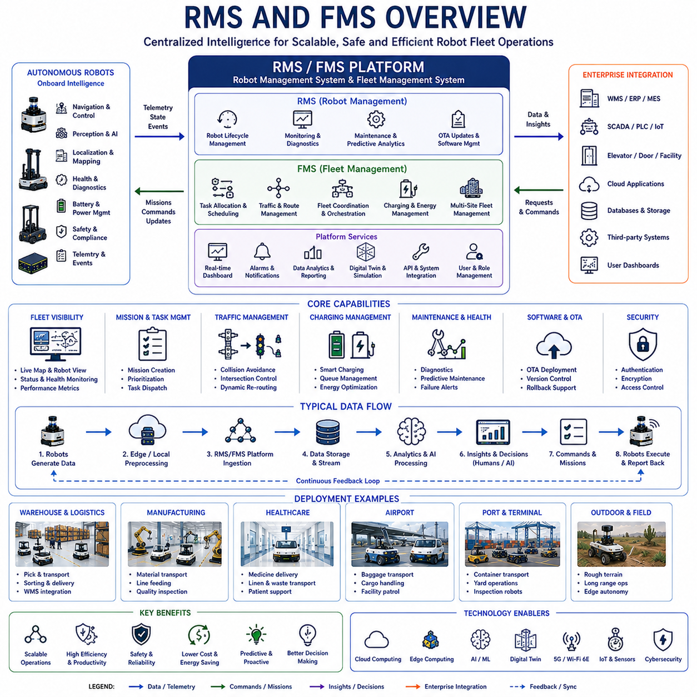
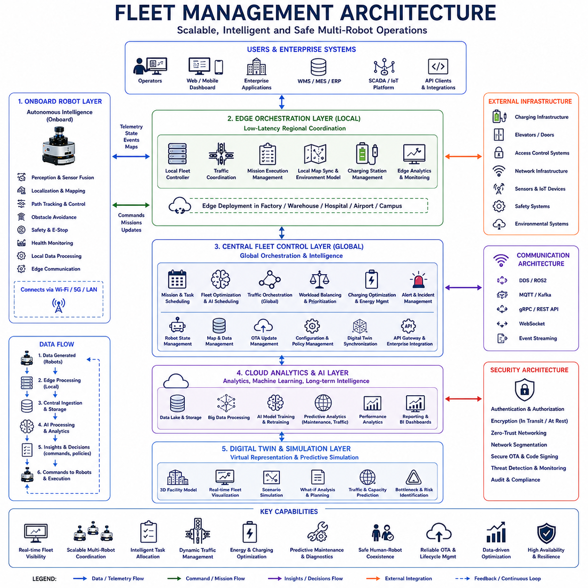
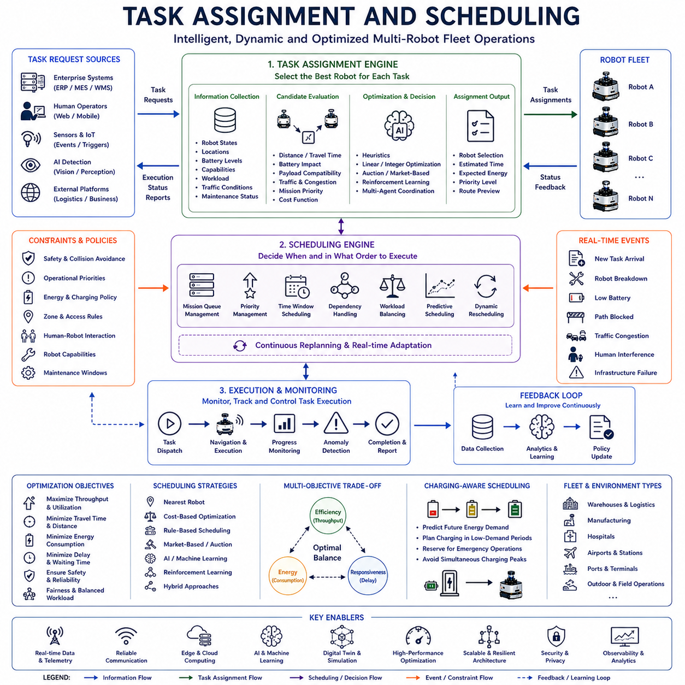
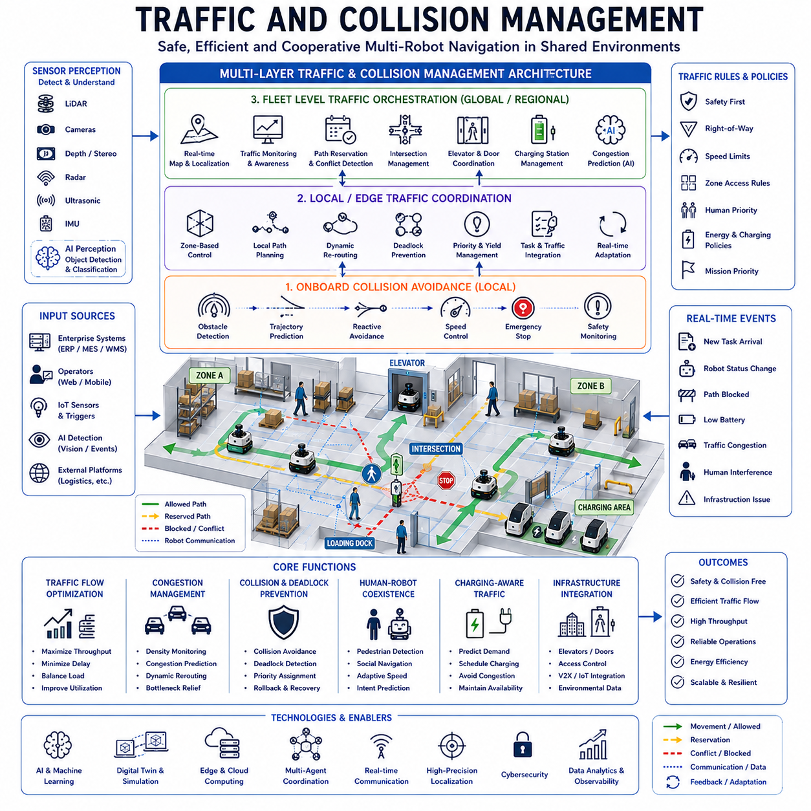
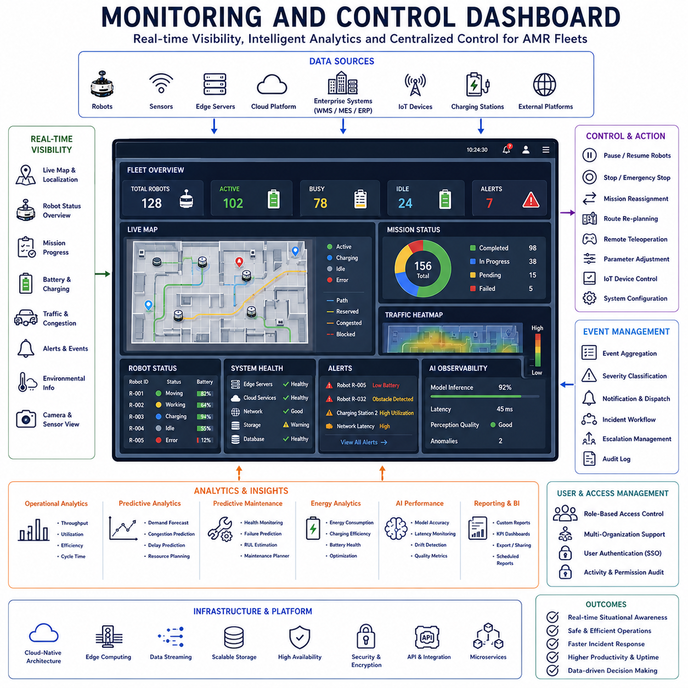
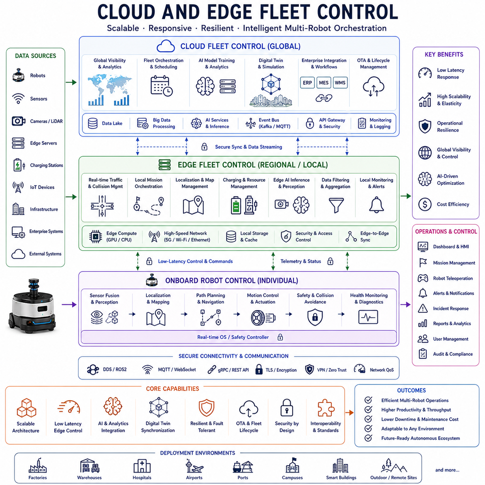
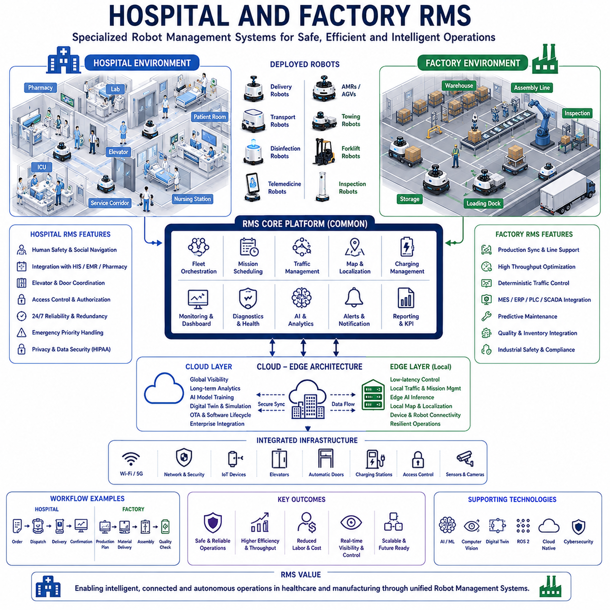
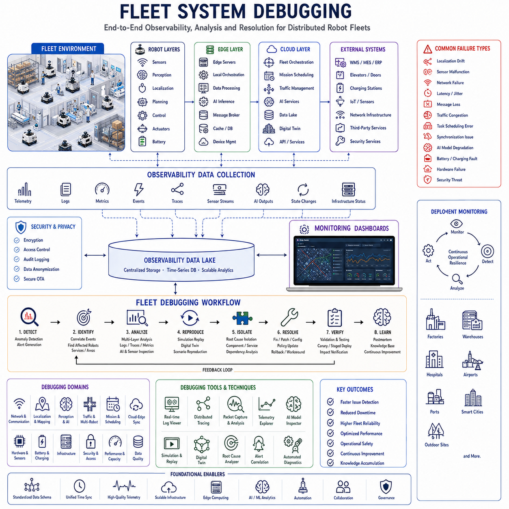

# Chapter 19. RMS and FMS

## 19.1 RMS and FMS Overview

{width="7.268055555555556in" height="7.268055555555556in"}

"19_01_RMS_and_FMS_Overview" is one of the most important foundational topics in modern autonomous mobile robot systems because RMS and FMS platforms function as the operational intelligence layer that coordinates, supervises, optimizes, and manages large-scale robot deployments. As industrial robotics evolves from isolated standalone machines into highly connected multi-robot ecosystems, centralized operational management systems become essential for scalability, reliability, safety, operational efficiency, and long-term autonomous operation. RMS and FMS architectures provide the software infrastructure required to transform individual autonomous robots into coordinated fleet-level intelligent systems capable of operating across factories, warehouses, hospitals, airports, ports, smart cities, logistics infrastructures, and outdoor industrial environments.

RMS generally refers to Robot Management System, while FMS commonly refers to Fleet Management System. In many industrial environments the terms are sometimes used interchangeably, although there are subtle architectural and operational distinctions between them. RMS often emphasizes robot lifecycle management, operational supervision, device monitoring, maintenance coordination, diagnostics, software updates, and infrastructure integration. FMS primarily focuses on multi-robot coordination, task allocation, traffic management, route optimization, mission scheduling, fleet-wide navigation, and large-scale operational orchestration. In practical industrial deployments, modern platforms typically integrate both RMS and FMS functionalities into unified operational management architectures.

The rise of RMS and FMS platforms is directly connected to the increasing scale and complexity of autonomous robotics deployments. Early industrial robots often operated independently with limited coordination requirements. However, modern AMR ecosystems may involve hundreds or thousands of robots simultaneously operating inside shared environments. Without centralized fleet intelligence, large-scale robot operations quickly become inefficient, unsafe, difficult to manage, and operationally unstable.

At the core of RMS and FMS architectures is the concept of centralized operational awareness. The management platform continuously collects telemetry, localization states, mission information, AI status, battery conditions, sensor diagnostics, operational logs, environmental observations, and communication health information from all robots operating within the system. This centralized visibility enables operators and automated orchestration systems to monitor the entire robotic infrastructure in real time.

Modern RMS and FMS systems are typically built using distributed cloud-native architectures. Robots communicate continuously with edge servers, local fleet controllers, cloud infrastructure, enterprise systems, and operator dashboards through wireless communication networks. The architecture often includes onboard robot software stacks, localized edge orchestration infrastructure, centralized fleet control servers, cloud analytics systems, database clusters, event streaming pipelines, digital twin platforms, and enterprise integration APIs.

One of the most important responsibilities of FMS platforms is task allocation and mission scheduling. In large robot fleets, hundreds of transportation requests, delivery missions, inspection tasks, cleaning operations, towing requests, charging schedules, and operational workflows may occur simultaneously. The fleet management system dynamically assigns tasks to robots according to robot availability, battery status, location proximity, operational priority, workload balancing, and traffic conditions.

Advanced scheduling systems increasingly use AI-based optimization algorithms. Instead of relying on static rule-based scheduling alone, modern FMS platforms may continuously optimize task distribution using predictive analytics, reinforcement learning, traffic forecasting, and operational efficiency models. The system may dynamically adapt mission assignments according to changing operational conditions and real-time infrastructure status.

Traffic management is another critical capability of fleet management systems. Multi-robot environments create highly dynamic operational conditions involving shared corridors, intersections, docking zones, elevators, charging stations, narrow passages, and human-populated environments. RMS and FMS platforms continuously coordinate robot movement to prevent collisions, congestion, deadlocks, and unsafe interactions.

Traffic orchestration systems often use centralized map servers, reservation-based path coordination, zone-based control, priority scheduling, dynamic rerouting, and congestion prediction algorithms. Some systems divide operational environments into traffic regions managed by distributed edge controllers. Others utilize cloud-based centralized optimization frameworks supporting global traffic visibility.

Charging management is also one of the most important operational functions of RMS and FMS systems. Large robot fleets require coordinated charging infrastructure utilization to maintain continuous operation. Fleet systems continuously monitor battery states, charging queue conditions, operational urgency, and predicted workload demand to optimize charging schedules dynamically.

Predictive charging strategies are becoming increasingly common. Instead of waiting until battery levels become critically low, AI-driven RMS systems may proactively send robots to charging stations during predicted low-demand periods while maintaining sufficient fleet availability for ongoing operations.

Monitoring and observability represent foundational components of RMS and FMS architectures. Centralized dashboards provide operators with real-time visibility into robot positions, mission states, battery levels, operational health, AI inference status, communication quality, environmental alerts, sensor diagnostics, and fleet performance metrics. Effective visualization systems significantly improve operational awareness and incident response capability.

Modern RMS platforms increasingly integrate digital twin technologies. Real-time digital twins synchronize physical robot states, infrastructure layouts, operational workflows, traffic conditions, and environmental data into virtual simulation environments. Operators may visualize fleet operations in three-dimensional digital environments and simulate future operational scenarios before applying changes to real deployments.

Remote diagnostics and predictive maintenance capabilities are also essential components of RMS architectures. Robots continuously upload hardware diagnostics, motor telemetry, vibration signatures, thermal measurements, network statistics, and sensor health data to centralized monitoring platforms. AI analytics systems analyze operational trends to identify early indicators of component degradation or abnormal behavior before failures occur.

OTA update management is tightly integrated with RMS systems. Large robot fleets require centralized software deployment, firmware management, AI model updates, security patch distribution, rollback capability, and version control infrastructure. RMS platforms coordinate staged rollout strategies to minimize operational disruption while maintaining deployment reliability.

Cybersecurity management is becoming increasingly critical as robot fleets become more connected. RMS systems frequently integrate authentication frameworks, encrypted communication pipelines, certificate management systems, role-based access control, intrusion detection systems, secure OTA mechanisms, and network segmentation architectures. Compromised fleet infrastructure could create severe operational and safety risks.

Cloud-edge integration plays a major role in modern RMS and FMS deployments. Latency-sensitive operational coordination often occurs at localized edge infrastructure while cloud platforms support long-term analytics, historical storage, AI retraining, enterprise integration, and large-scale optimization. This layered architecture balances responsiveness, scalability, and computational efficiency.

Hospital robotics deployments provide important RMS use cases. Hospital RMS platforms coordinate medicine delivery robots, linen transport systems, waste handling robots, sterilization logistics, telemedicine platforms, and patient assistance robots across highly dynamic healthcare environments. The RMS integrates with elevators, automatic doors, hospital information systems, nurse call systems, and healthcare workflows.

Warehouse and logistics deployments represent another major application area. Logistics FMS platforms coordinate autonomous forklifts, transport AMRs, picking robots, sorting systems, and inventory movement operations across large fulfillment centers. These systems frequently integrate with warehouse management systems, ERP platforms, inventory databases, and supply chain analytics infrastructure.

Manufacturing RMS platforms support smart factory operations involving robotic transport systems, material delivery AMRs, inspection robots, collaborative manipulators, and automated towing systems. These platforms integrate tightly with MES systems, industrial IoT infrastructure, SCADA networks, PLC systems, and production scheduling frameworks.

Outdoor autonomous robot systems introduce additional operational complexity for RMS and FMS architectures. Outdoor deployments must handle unstable communication conditions, dynamic weather environments, GNSS variability, rough terrain conditions, infrastructure uncertainty, and long-range operational coordination. Edge computing infrastructure often becomes especially important in outdoor RMS deployments.

Scalability remains one of the largest engineering challenges for RMS and FMS systems. Small deployments may involve only a few robots operating inside limited environments, but future autonomous infrastructures may involve thousands or millions of robots operating across geographically distributed facilities. Distributed microservice architectures, cloud-native orchestration systems, containerized services, distributed databases, and event streaming infrastructures are increasingly required to support large-scale deployment.

Data analytics and operational intelligence are becoming major differentiators in modern RMS platforms. Fleet systems continuously collect operational telemetry supporting traffic optimization, workload analysis, energy efficiency modeling, AI performance evaluation, maintenance forecasting, operational benchmarking, and strategic business analytics.

AI-native RMS architectures are beginning to emerge. Instead of relying entirely on manually configured operational rules, future fleet systems may autonomously optimize scheduling, traffic policies, charging strategies, operational workflows, and fleet behavior using machine learning and adaptive operational intelligence.

Human-robot interaction management is another increasingly important area within RMS platforms. As robots operate more frequently within shared human environments, fleet systems must coordinate pedestrian safety, traffic negotiation, social navigation policies, voice interaction systems, emergency response workflows, and collaborative operational behaviors.

Multi-site fleet management is also becoming more important. Global enterprises may deploy robot fleets across multiple factories, warehouses, hospitals, or logistics hubs simultaneously. Cloud-based RMS systems provide centralized operational visibility across geographically distributed deployments while localized edge systems maintain low-latency regional control.

Simulation integration plays a major role in modern fleet development workflows. RMS platforms often connect with simulation environments and digital twins to validate new traffic policies, operational algorithms, AI models, infrastructure changes, and deployment strategies before real-world rollout.

Open APIs and interoperability frameworks are essential for enterprise integration. Modern RMS and FMS platforms increasingly expose REST APIs, ROS2 interfaces, DDS communication layers, MQTT brokers, OPC UA connectivity, and cloud-native integration services allowing interoperability with enterprise software ecosystems.

Future RMS and FMS platforms will likely evolve into highly autonomous operational intelligence systems integrating multimodal AI models, semantic reasoning engines, large-scale digital twins, autonomous scheduling agents, distributed AI orchestration, predictive infrastructure management, and collaborative embodied intelligence frameworks.

The convergence of robotics, cloud computing, edge AI, industrial IoT, distributed autonomy, digital twins, and large-scale operational analytics is fundamentally transforming the role of RMS and FMS systems. These platforms are no longer simply monitoring dashboards or mission schedulers. They are becoming the central operational intelligence layer enabling scalable embodied AI ecosystems and large-scale autonomous industrial infrastructure.

As autonomous robotics continues expanding across logistics, manufacturing, healthcare, transportation, infrastructure inspection, agriculture, mining, airports, ports, and smart city environments, RMS and FMS architectures will remain among the most essential enabling technologies supporting reliable, scalable, intelligent, and continuously adaptive robot operations.

"19_01_RMS_and_FMS_Overview"는 현대 자율주행 모바일 로봇 시스템에서 가장 중요한 핵심 주제 중 하나이다. RMS와 FMS 플랫폼은 대규모 로봇 배치를 조정하고 감독하며 최적화하고 관리하는 운영 지능 계층 역할을 수행하기 때문이다. 산업용 로보틱스가 독립적인 단일 로봇에서 고도로 연결된 다중 로봇 생태계로 발전함에 따라, 중앙 집중형 운영 관리 시스템은 확장성, 신뢰성, 안전성, 운영 효율, 장기 자율 운영을 위해 필수적인 요소가 되었다. RMS와 FMS 아키텍처는 개별 자율 로봇을 플릿 수준의 협업 지능 시스템으로 변환하기 위한 핵심 소프트웨어 인프라를 제공하며, 공장, 물류창고, 병원, 공항, 항만, 스마트시티, 물류 인프라, 실외 산업 환경 전반에서 자율 로봇 운영을 가능하게 만든다.

RMS는 일반적으로 Robot Management System을 의미하며, FMS는 Fleet Management System을 의미한다. 실제 산업 환경에서는 두 용어가 혼용되는 경우가 많지만, 약간의 역할 차이가 존재한다. RMS는 로봇 라이프사이클 관리, 운영 모니터링, 장치 상태 관리, 유지보수 조정, 진단, 소프트웨어 업데이트, 인프라 연동 등을 강조하는 경우가 많다. 반면 FMS는 다중 로봇 협업, 작업 할당, 교통 제어, 경로 최적화, 미션 스케줄링, 플릿 수준 내비게이션, 대규모 운영 오케스트레이션에 초점을 둔다. 실제 산업 시스템에서는 대부분 RMS와 FMS 기능이 통합된 형태로 제공된다.

RMS와 FMS 플랫폼의 중요성은 자율 로봇 배치 규모가 급격히 증가하면서 더욱 커지고 있다. 초기 산업용 로봇은 비교적 독립적으로 동작했지만, 현대의 AMR 생태계는 수백\~수천 대의 로봇이 동일 환경에서 동시에 운영된다. 중앙 집중형 플릿 지능이 없으면 대규모 로봇 운영은 비효율적이고 위험하며 운영 안정성을 유지하기 어렵다.

RMS와 FMS 아키텍처의 핵심은 중앙 운영 가시성(Centralized Operational Awareness)이다. 관리 플랫폼은 전체 로봇 플릿으로부터 텔레메트리, 위치 정보, 미션 상태, AI 상태, 배터리 정보, 센서 진단, 운영 로그, 환경 정보, 통신 상태를 지속적으로 수집한다. 이를 통해 운영자는 전체 로봇 인프라 상태를 실시간으로 모니터링할 수 있다.

현대 RMS와 FMS 시스템은 일반적으로 분산형 클라우드 네이티브 아키텍처를 기반으로 구축된다. 로봇은 무선 네트워크를 통해 엣지 서버, 로컬 플릿 컨트롤러, 중앙 클라우드, 엔터프라이즈 시스템, 운영 대시보드와 지속적으로 연결된다. 이러한 구조는 온보드 로봇 소프트웨어, 엣지 오케스트레이션 시스템, 중앙 플릿 제어 서버, 클라우드 분석 플랫폼, 데이터베이스 클러스터, 이벤트 스트리밍 시스템, 디지털 트윈 플랫폼, API 연동 계층을 포함한다.

FMS 플랫폼의 가장 중요한 기능 중 하나는 작업 할당(Task Allocation)과 미션 스케줄링(Mission Scheduling)이다. 대규모 플릿 환경에서는 운반 요청, 배송 작업, 점검 미션, 청소 작업, 견인 요청, 충전 스케줄이 동시에 발생한다. FMS는 로봇 상태, 배터리 수준, 위치, 우선순위, 작업 부하, 교통 상황을 기반으로 동적으로 작업을 할당한다.

고급 스케줄링 시스템은 점점 더 AI 기반 최적화 알고리즘을 사용하고 있다. 기존의 정적 Rule 기반 방식 대신, 현대 FMS는 예측 분석, 강화학습, 교통 예측, 운영 효율 모델을 사용하여 작업 분배를 지속적으로 최적화한다. 시스템은 운영 환경 변화에 따라 미션을 실시간으로 재조정할 수 있다.

교통 관리(Traffic Management)는 플릿 관리 시스템의 또 다른 핵심 기능이다. 다중 로봇 환경은 공유 복도, 교차로, 도킹 구역, 엘리베이터, 충전 스테이션, 좁은 통로, 인간과의 혼재 환경을 포함한다. RMS와 FMS는 충돌, 혼잡, 데드락, 위험 상황을 방지하기 위해 로봇 움직임을 지속적으로 조정한다.

교통 오케스트레이션 시스템은 중앙 맵 서버, 예약 기반 경로 제어, 구역 기반 제어, 우선순위 스케줄링, 동적 우회 경로, 혼잡 예측 알고리즘 등을 사용한다. 일부 시스템은 환경을 여러 교통 구역으로 나누고 분산 엣지 컨트롤러로 관리한다. 다른 시스템은 중앙 클라우드 기반 최적화 구조를 사용한다.

충전 관리 역시 RMS와 FMS의 매우 중요한 기능이다. 대규모 로봇 플릿은 지속적 운영을 위해 충전 인프라를 효율적으로 공유해야 한다. 시스템은 배터리 상태, 충전 대기열, 운영 긴급도, 예상 작업 부하를 지속적으로 분석하여 충전 일정을 최적화한다.

예측 기반 충전 전략도 점점 일반화되고 있다. 단순히 배터리가 부족할 때 충전하는 것이 아니라, AI 기반 RMS는 작업량이 적을 것으로 예상되는 시간에 선제적으로 로봇을 충전소로 이동시킬 수 있다.

모니터링과 운영 가시성은 RMS와 FMS의 핵심 요소이다. 중앙 대시보드는 로봇 위치, 미션 상태, 배터리 수준, 운영 상태, AI 추론 상태, 통신 품질, 환경 경고, 센서 진단, 플릿 성능 지표를 실시간으로 제공한다. 효과적인 시각화 시스템은 운영자의 상황 인식을 크게 향상시킨다.

현대 RMS 플랫폼은 점점 더 디지털 트윈 기술을 통합하고 있다. 실시간 디지털 트윈은 실제 로봇 상태, 인프라 구조, 운영 워크플로우, 교통 상태, 환경 데이터를 가상 환경에 동기화한다. 운영자는 3D 디지털 환경에서 플릿 상태를 시각화하고 미래 운영 시나리오를 시뮬레이션할 수 있다.

원격 진단과 예지 정비 역시 RMS의 핵심 기능이다. 로봇은 모터 텔레메트리, 진동 데이터, 온도 데이터, 네트워크 상태, 센서 상태를 지속적으로 중앙 시스템에 업로드한다. AI 분석 시스템은 장기 운영 데이터를 분석하여 고장 징후를 조기에 탐지할 수 있다.

OTA 업데이트 관리 역시 RMS와 긴밀하게 연결된다. 대규모 플릿은 소프트웨어 배포, 펌웨어 업데이트, AI 모델 업데이트, 보안 패치, 롤백 기능, 버전 관리를 중앙에서 수행해야 한다. RMS는 단계적 배포 전략을 통해 운영 중단을 최소화한다.

사이버보안은 점점 더 중요한 요소가 되고 있다. RMS는 인증 시스템, 암호화 통신, 인증서 관리, 역할 기반 접근 제어, 침입 탐지 시스템, Secure OTA, 네트워크 분리 구조를 포함한다. 로봇 플릿 인프라가 공격당할 경우 심각한 안전 문제와 운영 중단이 발생할 수 있다.

클라우드-엣지 통합은 현대 RMS/FMS에서 매우 중요한 역할을 한다. 저지연 운영 제어는 로컬 엣지 인프라에서 수행되고, 클라우드는 장기 분석, AI 재학습, 엔터프라이즈 연동, 글로벌 최적화를 담당한다. 이러한 계층형 구조는 응답성과 확장성을 동시에 확보한다.

병원 로보틱스는 RMS의 대표적인 활용 사례이다. 병원 RMS는 약품 배송 로봇, 세탁물 운반 시스템, 폐기물 처리 로봇, Telemedicine 플랫폼, 환자 지원 로봇을 통합 관리한다. 또한 엘리베이터, 자동문, 병원 정보 시스템, Nurse Call 시스템과 연동된다.

물류 및 창고 환경은 또 다른 주요 적용 분야이다. 물류 FMS는 자율 지게차, 운반 AMR, Picking Robot, Sorting System, 재고 이동 시스템을 관리한다. 이러한 시스템은 WMS, ERP, 재고 데이터베이스, 공급망 분석 시스템과 통합된다.

제조 RMS 플랫폼은 스마트팩토리 운영을 지원한다. 자재 운반 로봇, 검사 로봇, 협업 로봇, 자율 견인 시스템을 MES, 산업 IoT, SCADA, PLC 시스템과 연동하여 운영한다.

실외 자율 로봇 시스템은 RMS/FMS에 추가적인 복잡성을 유발한다. 실외 환경은 불안정한 통신, 기상 변화, GNSS 변동성, 거친 지형, 장거리 운영을 포함하기 때문이다. 따라서 엣지 컴퓨팅의 중요성이 더욱 커진다.

확장성은 RMS와 FMS의 가장 큰 기술 과제 중 하나이다. 미래에는 수천\~수백만 대의 로봇이 운영될 수 있기 때문에, 분산 마이크로서비스 구조, 클라우드 네이티브 오케스트레이션, 컨테이너 기반 서비스, 분산 데이터베이스, 이벤트 스트리밍 시스템이 필요해진다.

데이터 분석과 운영 지능 역시 현대 RMS의 중요한 차별 요소가 되고 있다. 플릿 시스템은 운영 데이터를 지속적으로 수집하여 교통 최적화, 작업 부하 분석, 에너지 효율 분석, AI 성능 평가, 유지보수 예측, 전략적 비즈니스 분석에 활용한다.

AI 네이티브 RMS 구조도 등장하고 있다. 미래 RMS는 사람이 직접 규칙을 설정하는 대신, AI가 스스로 스케줄링, 교통 정책, 충전 전략, 운영 워크플로우를 최적화할 가능성이 높다.

인간-로봇 상호작용 관리 역시 중요해지고 있다. 로봇이 인간과 공유 환경에서 운영되기 때문에, RMS는 보행자 안전, 교통 협상, 사회적 내비게이션, 음성 상호작용, 비상 대응을 함께 관리해야 한다.

멀티 사이트 플릿 관리 역시 점점 중요해지고 있다. 글로벌 기업은 여러 공장과 물류센터, 병원에 동시에 로봇 플릿을 운영할 수 있기 때문이다. 클라우드 기반 RMS는 전체 사이트를 통합 관리하고, 엣지 시스템은 로컬 저지연 제어를 담당한다.

시뮬레이션 연동도 매우 중요한 요소이다. RMS는 디지털 트윈과 시뮬레이션 환경을 활용하여 새로운 교통 정책, 운영 알고리즘, AI 모델, 인프라 변경 사항을 실제 적용 전에 검증할 수 있다.

개방형 API와 상호운용성 역시 중요하다. 현대 RMS/FMS는 REST API, ROS2 인터페이스, DDS, MQTT, OPC UA 등을 제공하여 엔터프라이즈 시스템과 연동된다.

미래 RMS와 FMS 플랫폼은 멀티모달 AI, 의미 기반 추론 엔진, 초대형 디지털 트윈, 자율 스케줄링 에이전트, 분산 AI 오케스트레이션, 예측 기반 인프라 관리, 협업형 Embodied Intelligence를 통합하는 방향으로 발전할 가능성이 높다.

로보틱스, 클라우드 컴퓨팅, 엣지 AI, 산업 IoT, 분산 자율성, 디지털 트윈, 대규모 운영 분석 기술의 융합은 RMS와 FMS의 역할 자체를 변화시키고 있다. RMS와 FMS는 더 이상 단순한 모니터링 대시보드나 미션 스케줄러가 아니다. 미래에는 대규모 Embodied AI 생태계를 운영하는 핵심 운영 지능 계층으로 발전하게 될 것이다.

향후 자율 로보틱스가 물류, 제조, 의료, 교통, 인프라 점검, 농업, 광산, 공항, 항만, 스마트시티 전반으로 확장됨에 따라, RMS와 FMS 아키텍처는 안정적이고 확장 가능하며 지능적이고 지속적으로 적응 가능한 자율 로봇 운영을 가능하게 하는 가장 핵심적인 기반 기술 중 하나가 될 것이다.

##  

## 19.2 Fleet Management Architecture

{width="7.268055555555556in" height="7.268055555555556in"}

"19_02_Fleet_Management_Architecture" is one of the most important architectural concepts in modern autonomous mobile robot ecosystems because it defines how large-scale robot fleets are coordinated, supervised, optimized, synchronized, and controlled across complex industrial environments. As robotics systems evolve from isolated standalone robots into highly connected distributed autonomous infrastructures, Fleet Management Architecture becomes the central operational framework that enables scalable multi-robot collaboration, intelligent orchestration, operational stability, safety management, and enterprise-level automation integration.

Modern fleet management systems are no longer simple task dispatchers or monitoring dashboards. Instead, they function as distributed operational intelligence platforms that continuously manage communication, traffic coordination, mission scheduling, robot health monitoring, AI synchronization, charging orchestration, operational analytics, digital twin integration, and cloud-edge collaboration across entire robotic ecosystems. Fleet management architecture therefore represents the central nervous system of large-scale autonomous robot operations.

The evolution of fleet management architecture has been driven by the increasing complexity of industrial automation environments. Early AGV systems often relied on fixed-path navigation and centralized rule-based dispatching with relatively small fleet sizes. However, modern AMR ecosystems may involve hundreds or thousands of autonomous robots simultaneously operating inside dynamic shared environments such as warehouses, factories, hospitals, airports, ports, campuses, construction sites, mining facilities, agricultural environments, and smart cities.

As fleet sizes increase, operational complexity grows exponentially. Robots must continuously coordinate movement, avoid congestion, negotiate intersections, share environmental information, synchronize operational states, manage charging infrastructure, adapt to dynamic environmental changes, and interact safely with humans and other machines. Fleet management architecture provides the distributed coordination mechanisms required to maintain stable large-scale autonomous operation.

At the highest level, modern fleet management architectures typically consist of multiple computational layers including onboard robot intelligence, localized edge orchestration systems, centralized fleet control infrastructure, cloud analytics platforms, enterprise integration layers, and operator visualization systems. Each layer serves distinct operational purposes while continuously synchronizing information across the overall ecosystem.

The onboard robot layer forms the foundation of fleet management architecture. Each robot contains local processing systems responsible for real-time safety control, motion execution, obstacle avoidance, sensor fusion, localization, path tracking, and immediate environmental interaction. These functions must remain operational independently of cloud connectivity because safety-critical decision-making requires ultra-low-latency deterministic behavior.

Above the onboard layer, localized edge orchestration infrastructure often manages regional fleet coordination. Edge fleet controllers are commonly deployed inside factories, warehouses, hospitals, airports, and logistics facilities to reduce latency and improve operational resilience. These edge systems coordinate robot traffic, mission execution, local map synchronization, charging management, and environmental monitoring within localized operational zones.

Edge fleet architecture becomes especially important in large industrial environments where hundreds of robots operate simultaneously. Instead of requiring all robots to communicate continuously with distant centralized cloud systems, localized edge infrastructure enables low-latency coordination close to operational environments. This improves responsiveness while reducing wide-area network bandwidth requirements.

Centralized fleet control systems provide higher-level orchestration across the entire operational environment. These systems maintain global operational awareness including fleet-wide mission scheduling, workload balancing, operational analytics, long-term planning, digital twin synchronization, and enterprise workflow coordination. Centralized fleet control infrastructure may operate inside private data centers, industrial cloud platforms, or hybrid cloud-edge environments.

Modern fleet architectures increasingly use distributed microservice frameworks. Rather than relying on monolithic software systems, fleet management functionality is decomposed into scalable independent services such as traffic orchestration, task scheduling, charging optimization, telemetry ingestion, map synchronization, AI deployment management, OTA updates, diagnostics, analytics, user authentication, and operational monitoring. This modular architecture improves scalability, maintainability, and deployment flexibility.

Communication architecture is one of the most critical components of fleet management systems. Robots continuously exchange telemetry, localization data, traffic states, AI outputs, mission updates, sensor observations, safety events, and operational diagnostics with fleet infrastructure. Modern architectures commonly utilize DDS, MQTT, Kafka, WebSocket systems, ROS2 middleware, REST APIs, gRPC services, and event-driven messaging infrastructures.

Publish-subscribe communication models are widely used because they enable scalable distributed coordination. Robots publish operational telemetry and subscribe to mission commands, traffic instructions, map updates, and synchronization events. Event-driven architectures allow fleet systems to react dynamically to changing operational conditions while maintaining loose coupling between distributed services.

Traffic management architecture is one of the most sophisticated components of fleet management systems. Multi-robot environments create highly dynamic navigation complexity involving shared corridors, intersections, elevators, narrow passages, charging zones, docking stations, and human-populated workspaces. Fleet traffic orchestration systems continuously coordinate robot movement to avoid collisions, congestion, deadlocks, and unsafe operational conditions.

Modern traffic orchestration frameworks frequently use reservation-based path management, zone-based control, dynamic rerouting, congestion prediction, multi-agent coordination algorithms, and AI-driven traffic optimization strategies. Some systems divide facilities into hierarchical traffic regions controlled by distributed edge coordinators. Others rely on globally optimized centralized path orchestration systems.

Mission management architecture is another core component of fleet systems. Fleet managers continuously receive operational requests from enterprise systems, production workflows, logistics platforms, hospital information systems, or human operators. The fleet architecture dynamically assigns tasks according to robot availability, location proximity, battery conditions, traffic state, operational urgency, and workload balancing objectives.

Advanced fleet systems increasingly incorporate AI-driven scheduling algorithms. Machine learning models may predict traffic congestion, workload demand, charging requirements, maintenance windows, or operational bottlenecks. Reinforcement learning systems may optimize mission assignment strategies dynamically based on long-term operational efficiency objectives.

Charging management architecture becomes increasingly important as robot fleets scale. Large fleets may share centralized charging infrastructure with limited charging capacity. Fleet systems continuously monitor battery states, charging queue conditions, predicted workload demand, mission priorities, and operational urgency to optimize charging allocation dynamically.

Predictive charging architectures are becoming increasingly common. Instead of charging robots only after battery depletion, AI-driven fleet systems proactively schedule charging during predicted low-demand periods while ensuring sufficient fleet availability for ongoing operations. This significantly improves operational continuity and infrastructure utilization efficiency.

Map management and localization synchronization are foundational elements of fleet architecture. Robots continuously generate localization updates and environmental observations during operation. Fleet management systems maintain synchronized operational maps across distributed robot fleets while supporting collaborative mapping, environmental updates, semantic annotation, and digital twin synchronization.

Large-scale facilities often require hierarchical map architectures. Local edge systems may maintain regional operational maps optimized for low-latency navigation while cloud infrastructure stores long-term global maps, historical mapping data, semantic layers, and large-scale digital twin environments.

Digital twin integration is becoming increasingly important in modern fleet architectures. Real-time digital twins continuously synchronize robot telemetry, operational states, infrastructure layouts, traffic conditions, environmental observations, and mission workflows into virtual environments. Operators may visualize fleet operations in real time while simulation engines predict future operational scenarios and infrastructure bottlenecks.

AI infrastructure integration is also deeply embedded within fleet management architectures. Modern robotics fleets increasingly rely on distributed AI inference systems, cloud-based model training pipelines, remote AI orchestration frameworks, and continuous learning workflows. Fleet systems coordinate AI model deployment, inference resource allocation, edge AI synchronization, and operational AI monitoring across distributed robot fleets.

OTA deployment architecture is tightly integrated with fleet management systems. Software updates, AI model upgrades, firmware patches, security fixes, navigation policies, and operational configurations must be deployed safely across large distributed fleets. Fleet architectures therefore include version management systems, staged deployment pipelines, rollback mechanisms, dependency management frameworks, and deployment validation infrastructure.

Cybersecurity architecture is critically important because fleet management systems serve as centralized coordination infrastructure for entire robotic ecosystems. Modern fleet platforms typically implement encrypted communication pipelines, zero-trust networking, certificate-based authentication, role-based access control, secure OTA systems, network segmentation, hardware security modules, and continuous threat monitoring systems.

Cloud-edge synchronization architecture enables distributed operational consistency across robot fleets. Robots, edge controllers, and cloud systems continuously synchronize operational states, mission information, maps, AI models, telemetry streams, and environmental observations. Modern synchronization systems typically support eventual consistency models allowing robots to continue operating safely even during temporary communication interruptions.

Observability architecture is another major component of fleet management systems. Continuous monitoring of telemetry streams, network latency, AI inference status, battery health, mission execution, traffic congestion, communication quality, operational anomalies, and hardware diagnostics provides critical operational visibility. Centralized dashboards allow operators to supervise entire robot ecosystems in real time.

Data analytics infrastructure increasingly differentiates advanced fleet architectures. Operational telemetry collected from robot fleets supports predictive maintenance, traffic optimization, workload analysis, energy efficiency evaluation, AI performance assessment, operational benchmarking, and long-term strategic optimization. Cloud analytics platforms aggregate and analyze operational data across distributed deployments.

Enterprise integration architecture is essential for large industrial deployments. Fleet systems commonly integrate with ERP platforms, MES systems, WMS platforms, SCADA networks, hospital information systems, IoT infrastructure, access control systems, elevator controllers, automatic doors, logistics platforms, and external operational software environments. Open APIs and interoperability standards are therefore critically important.

Scalability remains one of the largest engineering challenges in fleet management architecture. Small deployments may involve only a few robots operating inside localized facilities, while future autonomous ecosystems may involve thousands or millions of robots distributed across global infrastructure networks. Distributed cloud-native orchestration frameworks such as Kubernetes increasingly support scalable fleet infrastructure deployment.

Containerized microservice architectures are rapidly becoming the industry standard. Fleet services including mission scheduling, traffic coordination, analytics, telemetry processing, map synchronization, AI orchestration, OTA management, and monitoring systems may each operate as independently scalable distributed services. This architecture improves resilience, maintainability, and operational flexibility.

Human-robot interaction management is becoming increasingly important as robots operate inside shared human environments. Fleet systems increasingly coordinate pedestrian-aware navigation, social navigation policies, emergency response workflows, collaborative operational behavior, and multimodal human-machine interaction systems.

Future fleet management architectures will likely evolve toward highly autonomous operational intelligence ecosystems integrating multimodal foundation models, semantic reasoning systems, world models, distributed AI agents, predictive infrastructure management, large-scale digital twins, and collaborative embodied intelligence frameworks.

AI-native fleet orchestration systems may eventually autonomously optimize traffic policies, operational workflows, charging infrastructure allocation, mission scheduling, predictive maintenance strategies, and collaborative multi-robot behaviors continuously without direct human intervention.

The convergence of robotics, edge computing, cloud infrastructure, distributed AI, digital twins, industrial IoT, high-speed networking, and autonomous operational intelligence is fundamentally transforming fleet management architecture. Fleet management systems are no longer simple monitoring tools or mission dispatch platforms. They are evolving into distributed operational intelligence infrastructures supporting scalable embodied AI ecosystems and large-scale autonomous industrial operations.

As autonomous robotics continues expanding across manufacturing, logistics, healthcare, transportation, infrastructure inspection, mining, agriculture, airports, ports, smart cities, and future intelligent industrial environments, fleet management architecture will remain one of the most essential enabling technologies supporting reliable, scalable, safe, intelligent, and continuously adaptive autonomous robot ecosystems.

"19_02_Fleet_Management_Architecture"는 현대 자율주행 모바일 로봇 생태계에서 가장 중요한 아키텍처 개념 중 하나이다. 이는 대규모 로봇 플릿이 복잡한 산업 환경 속에서 어떻게 조정되고, 감독되며, 최적화되고, 동기화되고, 제어되는지를 정의하기 때문이다. 로보틱스 시스템이 독립적인 단일 로봇 구조에서 고도로 연결된 분산 자율 인프라로 발전함에 따라, Fleet Management Architecture는 다중 로봇 협업, 지능형 오케스트레이션, 운영 안정성, 안전 관리, 엔터프라이즈 수준 자동화를 가능하게 하는 핵심 운영 프레임워크가 되고 있다.

현대의 플릿 관리 시스템은 단순한 작업 스케줄러나 모니터링 대시보드가 아니다. 오히려 다수의 로봇을 위한 운영 지능 플랫폼으로 진화하고 있으며, 통신, 교통 제어, 미션 스케줄링, 로봇 상태 관리, AI 동기화, 충전 오케스트레이션, 운영 분석, 디지털 트윈 연동, 클라우드-엣지 협업 등을 지속적으로 수행한다. 즉, Fleet Management Architecture는 대규모 자율 로봇 운영을 가능하게 하는 중앙 신경망 역할을 수행한다.

플릿 관리 아키텍처의 발전은 산업 자동화 환경의 복잡성 증가와 직접적으로 연결되어 있다. 초기 AGV 시스템은 비교적 단순한 고정 경로 기반 구조와 중앙 Rule 기반 스케줄링을 사용했다. 그러나 현대 AMR 생태계는 물류창고, 공장, 병원, 공항, 항만, 캠퍼스, 건설 현장, 광산, 농업 환경, 스마트시티 등에서 수백\~수천 대의 자율 로봇이 동시에 운영되는 구조로 발전하였다.

플릿 규모가 증가할수록 운영 복잡성은 기하급수적으로 증가한다. 로봇은 지속적으로 이동을 조정하고, 혼잡을 회피하며, 교차로를 협상하고, 환경 정보를 공유하며, 운영 상태를 동기화하고, 충전 인프라를 공유하며, 인간 및 다른 기계와 안전하게 상호작용해야 한다. Fleet Management Architecture는 이러한 대규모 자율 운영을 가능하게 하는 핵심 분산 협업 메커니즘을 제공한다.

현대 플릿 관리 아키텍처는 일반적으로 여러 계산 계층으로 구성된다. 여기에는 온보드 로봇 지능, 로컬 엣지 오케스트레이션 시스템, 중앙 플릿 제어 인프라, 클라우드 분석 플랫폼, 엔터프라이즈 연동 계층, 운영 시각화 시스템이 포함된다. 각 계층은 서로 다른 역할을 수행하면서도 지속적으로 정보를 동기화한다.

온보드 로봇 계층은 Fleet Architecture의 가장 기본적인 계층이다. 각 로봇은 실시간 안전 제어, 모션 실행, 장애물 회피, 센서 융합, 위치추정, 경로 추종, 즉각적 환경 반응을 담당하는 로컬 프로세서를 가진다. 이러한 기능은 안전 핵심 기능이기 때문에 클라우드 연결과 무관하게 독립적으로 동작해야 한다.

온보드 계층 위에는 로컬 엣지 오케스트레이션 시스템이 존재한다. 엣지 플릿 컨트롤러는 공장, 물류창고, 병원, 공항 내부에 배치되어 저지연 협업을 제공한다. 엣지 시스템은 지역 단위 교통 제어, 미션 실행, 로컬 맵 동기화, 충전 관리, 환경 모니터링을 수행한다.

대규모 산업 환경에서는 엣지 아키텍처의 중요성이 특히 크다. 모든 로봇이 먼 클라우드와 직접 통신하는 대신, 로컬 엣지 인프라가 근거리 저지연 협업을 제공함으로써 응답성을 향상시키고 WAN 대역폭 사용량을 감소시킨다.

중앙 플릿 제어 시스템은 전체 운영 환경 수준의 상위 오케스트레이션을 담당한다. 중앙 시스템은 플릿 전체 미션 스케줄링, 작업 부하 균형, 운영 분석, 장기 계획, 디지털 트윈 동기화, 엔터프라이즈 워크플로우 연동을 수행한다. 중앙 제어 인프라는 프라이빗 데이터센터, 산업용 클라우드, 하이브리드 Cloud-Edge 환경에서 운영될 수 있다.

현대 플릿 아키텍처는 점점 더 분산 마이크로서비스 구조를 사용하고 있다. 기존 Monolithic Software 대신, Traffic Orchestration, Task Scheduling, Charging Optimization, Telemetry Ingestion, Map Synchronization, AI Deployment Management, OTA Update, Diagnostics, Analytics, User Authentication 등의 기능을 독립적인 서비스로 분리한다. 이러한 구조는 확장성과 유지보수성을 크게 향상시킨다.

통신 아키텍처는 플릿 시스템의 가장 중요한 요소 중 하나이다. 로봇은 지속적으로 텔레메트리, 위치 정보, 교통 상태, AI 결과, 미션 상태, 센서 정보, 안전 이벤트, 운영 진단 데이터를 플릿 시스템과 교환한다. 현대 시스템은 DDS, MQTT, Kafka, WebSocket, ROS2, REST API, gRPC, 이벤트 기반 메시징 구조를 자주 사용한다.

Publish-Subscribe 기반 통신 구조는 확장성이 뛰어나기 때문에 널리 사용된다. 로봇은 텔레메트리를 Publish하고, 미션 명령, 교통 제어, 맵 업데이트, 동기화 이벤트를 Subscribe한다. 이벤트 기반 구조는 운영 환경 변화에 동적으로 반응할 수 있게 만든다.

교통 관리(Traffic Management)는 Fleet Architecture에서 가장 복잡한 기능 중 하나이다. 다중 로봇 환경은 공유 복도, 교차로, 엘리베이터, 좁은 통로, 충전 구역, 도킹 스테이션, 인간과 혼재된 작업 공간을 포함한다. Fleet Traffic Orchestration은 충돌, 혼잡, 데드락, 위험 상황을 방지하기 위해 로봇 움직임을 지속적으로 조정한다.

현대 Traffic Orchestration Framework는 Reservation 기반 경로 제어, Zone 기반 제어, Dynamic Re-routing, 혼잡 예측, Multi-Agent Coordination, AI 기반 Traffic Optimization을 사용한다. 일부 시스템은 시설을 여러 Traffic Region으로 나누고, 각 지역을 엣지 컨트롤러가 관리한다.

Mission Management Architecture 역시 핵심 요소이다. 플릿 시스템은 ERP, MES, WMS, 병원 시스템, 운영자 등으로부터 지속적으로 작업 요청을 수신한다. Fleet Manager는 로봇 상태, 위치, 배터리, 교통 상태, 작업 우선순위를 기반으로 동적으로 작업을 배정한다.

고급 플릿 시스템은 AI 기반 스케줄링 알고리즘을 사용하기 시작하고 있다. 머신러닝은 교통 혼잡, 작업량, 충전 요구사항, 유지보수 시점, 병목 구간을 예측할 수 있다. 강화학습 기반 시스템은 장기 운영 효율을 기준으로 미션 할당을 최적화할 수 있다.

충전 관리 역시 플릿 아키텍처에서 매우 중요하다. 대규모 플릿은 제한된 충전 인프라를 공유해야 하기 때문이다. Fleet System은 배터리 상태, 충전 대기열, 작업량, 운영 긴급도를 기반으로 충전 일정을 최적화한다.

예측 기반 충전(Predictive Charging)은 점점 더 일반화되고 있다. 단순히 배터리가 부족할 때 충전하는 것이 아니라, AI가 작업량이 적은 시점을 예측하여 선제적으로 충전을 수행한다.

맵 관리와 위치 동기화 역시 핵심 기능이다. 로봇은 운영 중 지속적으로 환경 정보를 생성하며, Fleet System은 이를 통합하여 동기화된 운영 맵을 유지한다. 협업 맵핑, 환경 업데이트, 의미 기반 맵, 디지털 트윈 연동 역시 지원된다.

대규모 시설은 계층형 맵 구조를 사용하는 경우가 많다. 엣지는 저지연 지역 맵을 유지하고, 클라우드는 글로벌 장기 맵과 의미 기반 맵, 디지털 트윈을 유지한다.

디지털 트윈 연동은 점점 더 중요해지고 있다. 실시간 디지털 트윈은 로봇 상태, 인프라 구조, 교통 상태, 환경 데이터, 미션 워크플로우를 가상 환경에 동기화한다. 운영자는 3D 가상 환경에서 전체 플릿 상태를 시각화할 수 있으며, 시뮬레이션을 통해 미래 상황을 예측할 수 있다.

AI 인프라 역시 Fleet Management Architecture에 깊이 통합되고 있다. 현대 로봇 플릿은 분산 AI 추론, 클라우드 기반 AI 학습, Remote AI Orchestration, 지속 학습 구조를 사용한다. Fleet System은 AI 모델 배포, 추론 자원 할당, Edge AI 동기화, AI 모니터링을 관리한다.

OTA 배포 구조 역시 Fleet System과 긴밀히 연결된다. 소프트웨어 업데이트, AI 모델 업그레이드, 보안 패치, 내비게이션 정책, 운영 설정은 대규모 플릿 전체에 안전하게 배포되어야 한다. 따라서 Fleet Architecture는 버전 관리, 단계적 배포, 롤백 메커니즘, 의존성 관리 구조를 포함한다.

사이버보안은 매우 중요한 요소이다. Fleet System은 전체 로봇 생태계의 중앙 운영 인프라이기 때문이다. 현대 Fleet Platform은 암호화 통신, Zero-Trust Networking, 인증 기반 접근 제어, Secure OTA, 네트워크 분리, Hardware Security Module, 위협 모니터링 시스템을 사용한다.

Cloud-Edge Synchronization Architecture는 분산 운영 일관성을 유지한다. 로봇, 엣지 컨트롤러, 클라우드는 미션 상태, 맵, AI 모델, 텔레메트리, 환경 데이터를 지속적으로 동기화한다. 현대 시스템은 Eventual Consistency 기반 구조를 자주 사용하여 일시적 통신 장애가 발생해도 안전하게 운영될 수 있도록 한다.

운영 가시성(Observability) 구조 역시 중요하다. 텔레메트리, 네트워크 지연, AI 상태, 배터리 건강도, 교통 혼잡, 운영 이상 상태를 지속적으로 모니터링한다. 중앙 대시보드는 운영자가 전체 플릿을 실시간으로 감독할 수 있게 만든다.

데이터 분석 인프라는 현대 Fleet Architecture의 핵심 차별 요소가 되고 있다. 운영 데이터는 예지 정비, 교통 최적화, 작업 부하 분석, 에너지 효율 분석, AI 성능 평가, 운영 벤치마킹에 활용된다.

엔터프라이즈 연동 역시 필수적이다. Fleet System은 ERP, MES, WMS, SCADA, 병원 정보 시스템, IoT 인프라, 출입 통제 시스템, 엘리베이터, 자동문 등과 연동된다. 따라서 Open API와 상호운용성이 매우 중요하다.

확장성은 Fleet Management Architecture의 가장 큰 기술 과제 중 하나이다. 미래에는 수천\~수백만 대 로봇이 글로벌 인프라 전반에 분산 운영될 수 있기 때문에, Kubernetes 기반 클라우드 네이티브 오케스트레이션이 점점 더 중요해지고 있다.

컨테이너 기반 마이크로서비스 구조는 산업 표준이 되어가고 있다. Mission Scheduling, Traffic Coordination, Analytics, Telemetry Processing, Map Synchronization, AI Orchestration, OTA Management는 독립적인 확장 가능한 서비스로 운영된다.

인간-로봇 상호작용 관리 역시 점점 중요해지고 있다. Fleet System은 보행자 안전, 사회적 내비게이션, 비상 대응, 협업 행동, 멀티모달 상호작용을 관리해야 한다.

미래의 Fleet Management Architecture는 멀티모달 Foundation Model, Semantic Reasoning, World Model, Distributed AI Agent, Predictive Infrastructure Management, 대규모 디지털 트윈, Embodied Intelligence Framework를 통합하는 방향으로 발전할 가능성이 높다.

AI 네이티브 Fleet Orchestration은 미래에 인간 개입 없이 교통 정책, 운영 워크플로우, 충전 전략, 미션 스케줄링, 예지 정비, 협업 행동을 지속적으로 최적화할 수 있게 될 가능성이 높다.

로보틱스, 엣지 컴퓨팅, 클라우드 인프라, 분산 AI, 디지털 트윈, 산업 IoT, 초고속 네트워크, 자율 운영 지능의 융합은 Fleet Management Architecture 자체를 근본적으로 변화시키고 있다. Fleet Management System은 더 이상 단순 모니터링 도구나 미션 스케줄러가 아니다. 미래에는 대규모 Embodied AI 생태계를 운영하는 핵심 분산 운영 지능 인프라로 발전하게 될 것이다.

향후 자율 로보틱스가 제조, 물류, 의료, 교통, 인프라 점검, 광산, 농업, 공항, 항만, 스마트시티 전반으로 확장됨에 따라, Fleet Management Architecture는 안정적이고 확장 가능하며 안전하고 지능적인 자율 로봇 생태계를 가능하게 하는 가장 핵심적인 기반 기술 중 하나가 될 것이다.

##  

## 19.3 Task Assignment and Scheduling

{width="7.268055555555556in" height="7.268055555555556in"}

"19_03_Task_Assignment_and_Scheduling" is one of the most critical operational intelligence functions in modern autonomous mobile robot ecosystems because it determines how robotic resources are allocated, coordinated, prioritized, and optimized across large-scale industrial environments. As autonomous robot fleets continue expanding in manufacturing, logistics, healthcare, airports, ports, agriculture, infrastructure inspection, and smart city operations, efficient task assignment and scheduling become fundamental requirements for scalability, operational efficiency, safety, energy optimization, and long-term autonomous operation.

In early robotics systems, task assignment was relatively simple because only a small number of robots operated in highly structured environments. Tasks were often assigned statically using predefined rules, fixed schedules, or manually configured workflows. However, modern AMR ecosystems operate in highly dynamic environments where hundreds or thousands of robots continuously interact with changing operational conditions, traffic congestion, charging infrastructure limitations, human workers, environmental uncertainty, and fluctuating workload demand. Under these conditions, static scheduling approaches become insufficient, and intelligent dynamic task orchestration becomes essential.

Task assignment refers to the process of determining which robot should execute a particular mission or operational request. Scheduling refers to determining when and in what sequence tasks should be executed across the fleet. Together, these functions form the operational decision-making core of Fleet Management Systems and Robot Management Systems.

Modern task assignment architectures continuously evaluate large numbers of operational variables in real time. These variables include robot location, battery state, operational availability, traffic conditions, payload capability, sensor configuration, AI capability, mission urgency, environmental constraints, charging schedules, maintenance status, workload balancing, predicted congestion, communication quality, and operational priority levels.

One of the primary goals of task assignment systems is maximizing operational efficiency. Efficient scheduling minimizes robot idle time, travel distance, congestion, energy consumption, mission delay, and resource contention while maximizing throughput, utilization, responsiveness, and operational continuity. Achieving these objectives simultaneously becomes increasingly difficult as fleet size and operational complexity grow.

Large-scale industrial environments may generate thousands of operational requests every hour. Warehouse systems continuously create transportation requests for inventory movement, picking operations, replenishment workflows, sorting tasks, and loading operations. Hospital environments generate medicine delivery requests, laboratory transport tasks, sterilization logistics, waste collection operations, and patient support workflows. Manufacturing environments generate material transport missions, inspection requests, production support operations, and automated towing tasks. Scheduling systems must continuously coordinate all of these activities in real time.

Modern scheduling systems frequently operate using event-driven architectures. Operational requests are dynamically generated from enterprise systems, IoT infrastructure, production workflows, warehouse management systems, human operators, sensors, AI detection systems, or external business platforms. Fleet orchestration systems immediately evaluate these incoming requests and determine optimal robot allocation strategies.

Task assignment strategies vary depending on operational architecture and system complexity. Simple systems may use nearest-robot assignment, where the closest available robot receives the task. While computationally efficient, this approach often fails to optimize overall fleet behavior because it ignores future workload balancing, battery consumption, congestion prediction, and strategic resource allocation.

More advanced systems use cost-based optimization frameworks. Each potential robot-task pairing is evaluated according to a dynamically calculated cost function. The cost function may include travel distance, estimated task completion time, battery impact, traffic congestion, mission priority, payload compatibility, environmental risk, operational urgency, and predicted downstream effects on future fleet availability.

Optimization algorithms become increasingly important as fleet size grows. Modern systems may utilize linear programming, mixed-integer optimization, graph search algorithms, heuristic optimization, evolutionary algorithms, swarm intelligence, market-based allocation systems, auction mechanisms, reinforcement learning, or distributed multi-agent coordination frameworks.

Market-based scheduling systems are especially interesting in multi-robot environments. In these architectures, robots may effectively "bid" for tasks based on their current operational state and estimated execution cost. The fleet manager assigns tasks according to optimized bidding results. Such systems provide flexible distributed coordination while improving scalability and robustness.

AI-driven scheduling is rapidly becoming one of the most important areas of fleet intelligence. Machine learning systems can continuously analyze historical operational data to predict traffic congestion, workload demand, bottleneck formation, charging demand, maintenance risk, and operational delays. AI scheduling systems may proactively adjust fleet behavior before operational inefficiencies emerge.

Reinforcement learning approaches are also becoming increasingly common. Instead of relying solely on manually engineered scheduling rules, reinforcement learning systems may continuously improve scheduling policies through operational experience and simulation-driven optimization. Over time, these systems can discover highly efficient scheduling strategies adapted to specific industrial environments.

Multi-objective optimization is one of the central challenges in task scheduling. Operational objectives frequently conflict with each other. Minimizing travel distance may increase congestion. Maximizing throughput may increase energy consumption. Prioritizing urgent tasks may reduce fairness across operational workflows. Scheduling systems must continuously balance these competing objectives dynamically.

Real-time responsiveness is another major challenge. Industrial environments evolve continuously and unpredictably. Robots may encounter blocked paths, temporary infrastructure failures, environmental hazards, communication disruptions, elevator delays, charging station congestion, or human interference. Scheduling systems must therefore support continuous replanning and dynamic task reassignment.

Dynamic rescheduling architectures continuously reevaluate operational conditions during mission execution. If a robot experiences delays, low battery conditions, hardware faults, or navigation failures, tasks may be reassigned automatically to alternative robots. This adaptive scheduling capability significantly improves operational resilience and fault tolerance.

Traffic conditions strongly influence scheduling efficiency. Multi-robot systems operating in shared spaces may experience congestion at intersections, corridors, elevators, docking zones, or charging stations. Modern scheduling systems increasingly integrate traffic prediction models directly into task assignment logic. Instead of treating scheduling and traffic management as independent functions, modern fleet systems optimize both simultaneously.

Charging-aware scheduling is also becoming critically important as fleet sizes grow. Robots with low battery capacity may not be suitable for long missions or time-critical operations. Scheduling systems continuously predict future energy demand and allocate tasks accordingly. Some systems reserve sufficient battery margins for emergency operations or unexpected workload spikes.

Predictive charging strategies integrate closely with scheduling systems. AI-driven fleet managers may proactively route robots toward charging infrastructure during low-demand periods while maintaining sufficient operational capacity. This avoids sudden simultaneous charging demand spikes that could reduce fleet availability.

Heterogeneous fleet environments introduce additional scheduling complexity. Modern industrial fleets may contain robots with different payload capacities, navigation capabilities, sensor configurations, mobility platforms, manipulation abilities, environmental tolerances, and AI capabilities. Scheduling systems must understand robot specialization and assign tasks appropriately.

Outdoor autonomous robot scheduling introduces even more complexity. Outdoor environments contain unstable communication conditions, weather variability, GNSS uncertainty, rough terrain, pedestrian interaction, vehicle traffic, and infrastructure unpredictability. Scheduling systems for outdoor robotics frequently integrate environmental forecasting, weather prediction, and infrastructure risk assessment into task planning logic.

Human-robot collaboration also influences task scheduling architectures. Shared environments require robots to coordinate safely and efficiently with human workers. Scheduling systems increasingly incorporate human workflow prediction, pedestrian traffic analysis, ergonomic considerations, collaborative workflow optimization, and human-priority operational policies.

Cloud-edge scheduling architectures are becoming standard in large-scale robotics systems. Latency-sensitive scheduling decisions often occur at localized edge infrastructure near operational environments, while cloud systems perform long-term analytics, predictive optimization, and global workload balancing. This hierarchical architecture improves responsiveness while maintaining large-scale operational intelligence.

Distributed scheduling systems are increasingly replacing fully centralized architectures. Instead of relying entirely on a single central scheduler, modern systems may use multiple localized scheduling agents coordinating through distributed consensus or event-driven synchronization frameworks. Distributed architectures improve scalability, fault tolerance, and operational resilience.

Digital twin integration is becoming increasingly important in task scheduling systems. Real-time digital twins continuously synchronize robot positions, traffic conditions, infrastructure state, environmental data, and mission workflows into virtual simulation environments. Scheduling algorithms may simulate future operational scenarios before assigning tasks in the physical environment.

Simulation-driven scheduling optimization allows fleet systems to evaluate multiple future scheduling outcomes rapidly. AI systems may predict congestion, operational bottlenecks, mission delays, or energy shortages before they occur and proactively adjust scheduling decisions accordingly.

Enterprise integration is another critical aspect of scheduling architecture. Task scheduling systems often integrate with ERP platforms, MES systems, WMS infrastructure, hospital information systems, manufacturing workflows, logistics platforms, IoT systems, and production planning software. Operational priorities generated by business systems directly influence fleet scheduling behavior.

Cybersecurity considerations also affect scheduling architectures. Fleet scheduling systems represent highly sensitive operational infrastructure because malicious interference could disrupt logistics operations, manufacturing workflows, hospital services, or transportation systems. Secure communication, authentication, authorization, and resilient fault-tolerant scheduling infrastructure therefore become essential.

Scalability remains one of the largest engineering challenges in scheduling systems. Small robot deployments may require relatively simple coordination logic, but future industrial ecosystems may involve thousands or millions of autonomous agents operating simultaneously across distributed infrastructure. Scheduling architectures must therefore support distributed orchestration, cloud-native scaling, and large-scale event-driven coordination.

Observability and analytics are deeply integrated into modern scheduling systems. Fleet managers continuously monitor scheduling efficiency, robot utilization, task completion rates, energy consumption, congestion statistics, mission delay patterns, charging behavior, and operational anomalies. These analytics support continuous operational optimization and AI-driven policy improvement.

Future task assignment systems will likely evolve toward highly autonomous operational intelligence frameworks integrating multimodal AI models, semantic reasoning systems, world models, predictive operational agents, collaborative embodied intelligence, and self-optimizing industrial ecosystems.

AI-native scheduling systems may eventually perform fully autonomous operational orchestration where robots dynamically negotiate tasks, share environmental understanding, predict future workload demand, optimize collaborative workflows, and continuously adapt scheduling policies without human intervention.

The convergence of robotics, distributed AI, cloud-edge computing, digital twins, industrial IoT, operational analytics, and autonomous orchestration is fundamentally transforming task assignment and scheduling architecture. These systems are no longer simple dispatch engines or operational queues. They are evolving into intelligent distributed decision-making infrastructures enabling scalable embodied AI ecosystems and future autonomous industrial operations.

As autonomous robotics continues expanding across logistics, manufacturing, healthcare, infrastructure inspection, airports, ports, agriculture, mining, construction, and smart city environments, task assignment and scheduling systems will remain among the most essential enabling technologies supporting safe, scalable, efficient, intelligent, and continuously adaptive multi-robot operations.

"19_03_Task_Assignment_and_Scheduling"은 현대 자율주행 모바일 로봇 생태계에서 가장 중요한 운영 지능 기능 중 하나이다. 이는 대규모 산업 환경에서 로봇 자원을 어떻게 할당하고, 조정하며, 우선순위를 부여하고, 최적화할 것인지를 결정하기 때문이다. 자율 로봇 플릿이 제조, 물류, 의료, 공항, 항만, 농업, 인프라 점검, 스마트시티 환경 전반으로 확대됨에 따라, 효율적인 작업 할당(Task Assignment)과 스케줄링(Scheduling)은 확장성, 운영 효율, 안전성, 에너지 최적화, 장기 자율 운영을 위한 핵심 요구사항이 되고 있다.

초기 로보틱스 시스템에서는 작업 할당 구조가 비교적 단순했다. 적은 수의 로봇이 정형화된 환경에서 운영되었기 때문에, 작업은 고정 규칙이나 사전 정의된 스케줄을 기반으로 정적으로 할당되는 경우가 많았다. 그러나 현대 AMR 생태계는 수백\~수천 대의 로봇이 혼잡, 충전 인프라 제한, 인간 작업자, 환경 변화, 변동적인 작업량 속에서 지속적으로 상호작용하는 동적 환경으로 발전하였다. 이러한 환경에서는 정적 스케줄링 방식만으로는 충분하지 않으며, 지능형 동적 오케스트레이션이 필수적이다.

Task Assignment는 특정 작업을 어떤 로봇이 수행할지를 결정하는 과정이다. Scheduling은 작업을 언제 어떤 순서로 수행할지를 결정하는 과정이다. 이 두 기능은 RMS와 FMS의 핵심 운영 의사결정 계층을 형성한다.

현대 Task Assignment Architecture는 수많은 운영 변수를 실시간으로 평가한다. 여기에는 로봇 위치, 배터리 상태, 작업 가능 여부, 교통 상태, Payload 능력, 센서 구성, AI 기능, 미션 긴급도, 환경 제약, 충전 스케줄, 유지보수 상태, 작업 부하 균형, 혼잡 예측, 통신 품질, 운영 우선순위 등이 포함된다.

Task Assignment 시스템의 가장 중요한 목표 중 하나는 운영 효율 극대화이다. 효율적인 스케줄링은 로봇 대기 시간, 이동 거리, 혼잡, 에너지 소비, 작업 지연, 자원 충돌을 최소화하면서도 Throughput, 활용률, 응답성, 운영 연속성을 극대화해야 한다. 플릿 규모와 운영 복잡성이 증가할수록 이러한 목표를 동시에 달성하기는 매우 어려워진다.

대규모 산업 환경은 시간당 수천 건 이상의 작업 요청을 생성할 수 있다. 물류창고에서는 재고 이동, Picking 작업, 보충 작업, 분류 작업, 적재 작업이 지속적으로 발생한다. 병원 환경에서는 약품 배송, 검사실 물류, 멸균 운송, 폐기물 처리, 환자 지원 작업이 생성된다. 제조 환경에서는 자재 운송, 검사 작업, 생산 지원, 자동 견인 작업이 발생한다. Scheduling System은 이러한 작업을 실시간으로 조정해야 한다.

현대 Scheduling System은 이벤트 기반 구조(Event-Driven Architecture)를 자주 사용한다. 작업 요청은 ERP, MES, WMS, IoT 인프라, 생산 시스템, 인간 운영자, 센서, AI 탐지 시스템 등으로부터 동적으로 생성된다. Fleet Orchestration System은 이러한 요청을 즉시 평가하고 최적의 로봇 할당 전략을 결정한다.

Task Assignment 전략은 시스템 복잡도와 운영 구조에 따라 다양하다. 가장 단순한 방식은 Nearest Robot Assignment이다. 가장 가까운 로봇이 작업을 수행하는 방식이다. 계산 효율은 높지만, 미래 작업 부하 균형이나 배터리 소비, 혼잡 예측, 장기 플릿 효율성을 고려하지 못한다는 한계가 있다.

보다 고급 시스템은 Cost-Based Optimization Framework를 사용한다. 각 로봇-작업 조합에 대해 동적 비용 함수(Cost Function)를 계산한다. 비용 함수는 이동 거리, 예상 작업 완료 시간, 배터리 영향, 교통 혼잡, 미션 우선순위, Payload 적합성, 환경 위험도, 운영 긴급도 등을 포함할 수 있다.

플릿 규모가 증가할수록 최적화 알고리즘의 중요성이 증가한다. 현대 시스템은 선형 최적화, Mixed Integer Optimization, Graph Search, Heuristic Optimization, Evolutionary Algorithm, Swarm Intelligence, Market-Based Allocation, Auction Mechanism, Reinforcement Learning, Multi-Agent Coordination Framework 등을 사용한다.

Market-Based Scheduling은 특히 흥미로운 구조이다. 로봇은 자신의 현재 상태와 예상 수행 비용을 기반으로 작업에 "입찰(Bid)"을 수행한다. Fleet Manager는 가장 적합한 입찰 결과를 기반으로 작업을 할당한다. 이러한 구조는 분산 협업과 확장성을 향상시킨다.

AI 기반 Scheduling은 플릿 지능의 핵심 영역으로 빠르게 발전하고 있다. 머신러닝 시스템은 과거 운영 데이터를 분석하여 교통 혼잡, 작업 부하, 병목 구간, 충전 수요, 유지보수 위험, 작업 지연을 예측할 수 있다. AI Scheduling은 문제가 발생하기 전에 선제적으로 플릿 행동을 조정할 수 있다.

강화학습 기반 Scheduling 역시 점점 중요해지고 있다. 기존의 수동 Rule 기반 방식 대신, 강화학습 시스템은 운영 경험과 시뮬레이션을 통해 Scheduling Policy를 지속적으로 개선할 수 있다. 시간이 지날수록 특정 산업 환경에 최적화된 스케줄링 전략을 스스로 학습하게 된다.

Multi-Objective Optimization은 Scheduling의 가장 큰 난제 중 하나이다. 운영 목표는 서로 충돌하는 경우가 많다. 이동 거리를 최소화하면 혼잡이 증가할 수 있고, Throughput을 극대화하면 에너지 소비가 증가할 수 있다. 긴급 작업을 우선하면 전체 운영 공정의 균형이 무너질 수도 있다. Scheduling System은 이러한 목표를 지속적으로 균형 조정해야 한다.

실시간 응답성 역시 중요한 과제이다. 산업 환경은 지속적으로 변화한다. 로봇은 막힌 경로, 인프라 장애, 환경 위험, 통신 문제, 엘리베이터 지연, 충전 혼잡, 인간 개입 등을 경험할 수 있다. 따라서 Scheduling System은 지속적인 재계획(Replanning)과 동적 작업 재할당을 지원해야 한다.

Dynamic Rescheduling Architecture는 미션 실행 중에도 운영 상태를 지속적으로 재평가한다. 로봇이 지연되거나 배터리가 부족해지거나 하드웨어 문제가 발생하면, 작업은 자동으로 다른 로봇에게 재할당될 수 있다. 이러한 적응형 Scheduling은 운영 복원력을 크게 향상시킨다.

교통 상태는 Scheduling 효율성에 매우 큰 영향을 준다. 다중 로봇 환경에서는 교차로, 복도, 엘리베이터, 도킹 구역, 충전 스테이션에서 혼잡이 발생할 수 있다. 현대 Scheduling System은 교통 예측 모델을 Scheduling Logic 내부에 통합하기 시작하고 있다. 즉, Scheduling과 Traffic Management를 동시에 최적화한다.

Charging-Aware Scheduling 역시 점점 중요해지고 있다. 배터리가 부족한 로봇은 장거리 작업이나 긴급 작업에 적합하지 않을 수 있다. Scheduling System은 미래 에너지 수요를 예측하여 작업을 할당한다. 일부 시스템은 비상 상황을 위해 일정 수준의 배터리 여유를 유지한다.

Predictive Charging 전략은 Scheduling과 긴밀하게 연동된다. AI 기반 Fleet Manager는 작업량이 적은 시간에 로봇을 선제적으로 충전소로 이동시키면서도 전체 플릿 가용성을 유지한다. 이는 갑작스러운 충전 수요 폭증을 방지한다.

Heterogeneous Fleet Environment는 추가적인 Scheduling 복잡성을 유발한다. 현대 산업용 플릿은 서로 다른 Payload, 내비게이션 능력, 센서 구성, 이동 플랫폼, Manipulation 기능, 환경 적응성, AI 능력을 가진 로봇으로 구성될 수 있다. Scheduling System은 로봇의 전문성을 이해하고 적절한 작업을 배정해야 한다.

실외 자율 로봇 Scheduling은 더욱 복잡하다. 실외 환경은 불안정한 통신, 기상 변화, GNSS 오차, 거친 지형, 보행자, 차량 교통, 인프라 불확실성을 포함한다. 따라서 실외 Scheduling System은 날씨 예측과 환경 위험 분석까지 고려해야 한다.

Human-Robot Collaboration 역시 Scheduling Architecture에 영향을 준다. 인간과 로봇이 공유 환경에서 함께 작업하기 때문에, Scheduling System은 인간 작업 흐름, 보행자 교통, 인체공학, 협업 작업 흐름을 고려해야 한다.

Cloud-Edge Scheduling Architecture는 대규모 로보틱스 시스템에서 점점 표준이 되고 있다. 저지연 Scheduling은 엣지에서 수행되고, 클라우드는 장기 분석과 글로벌 최적화를 수행한다. 이러한 계층형 구조는 응답성과 대규모 운영 지능을 동시에 확보한다.

Distributed Scheduling System 역시 중앙 집중형 구조를 대체하기 시작하고 있다. 단일 중앙 스케줄러 대신 여러 로컬 Scheduling Agent가 분산 협업하는 구조이다. 이는 확장성과 Fault Tolerance를 향상시킨다.

디지털 트윈 연동은 Scheduling System에서 점점 중요해지고 있다. 실시간 디지털 트윈은 로봇 위치, 교통 상태, 인프라 상태, 환경 데이터를 가상 환경에 동기화한다. Scheduling Algorithm은 실제 작업 할당 전에 미래 운영 시나리오를 시뮬레이션할 수 있다.

Simulation-Driven Scheduling Optimization은 여러 미래 시나리오를 빠르게 평가할 수 있게 만든다. AI는 미래 혼잡, 병목, 에너지 부족, 작업 지연을 예측하고 선제적으로 스케줄링 전략을 조정할 수 있다.

엔터프라이즈 연동 역시 중요한 요소이다. Scheduling System은 ERP, MES, WMS, 병원 시스템, 생산 시스템, 물류 플랫폼, IoT 시스템과 통합된다. 비즈니스 시스템이 생성하는 운영 우선순위는 직접적으로 플릿 Scheduling에 영향을 준다.

사이버보안 역시 Scheduling Architecture에 영향을 준다. Fleet Scheduling System은 물류, 제조, 병원 운영의 핵심 인프라이기 때문에, 악의적인 공격은 심각한 운영 중단을 초래할 수 있다. 따라서 Secure Communication, Authentication, Authorization, Fault-Tolerant Scheduling Infrastructure가 필수적이다.

확장성은 Scheduling System의 가장 큰 엔지니어링 과제 중 하나이다. 미래 산업 환경에서는 수천\~수백만 대의 자율 로봇이 동시에 운영될 수 있기 때문에, Scheduling Architecture는 분산 오케스트레이션과 클라우드 네이티브 확장을 지원해야 한다.

운영 가시성과 분석은 현대 Scheduling System에 깊이 통합되어 있다. Fleet Manager는 Scheduling 효율, 로봇 활용률, 작업 완료율, 에너지 소비, 혼잡 통계, 미션 지연 패턴, 충전 행동, 운영 이상 상태를 지속적으로 분석한다. 이러한 데이터는 AI 기반 정책 개선과 운영 최적화에 활용된다.

미래의 Task Assignment System은 멀티모달 AI, Semantic Reasoning, World Model, Predictive Operational Agent, Collaborative Embodied Intelligence, Self-Optimizing Industrial Ecosystem을 통합하는 방향으로 발전할 가능성이 높다.

AI 네이티브 Scheduling System은 미래에 로봇들이 스스로 작업을 협상하고, 환경 정보를 공유하며, 미래 작업량을 예측하고, 협업 워크플로우를 최적화하며, 인간 개입 없이 Scheduling Policy를 지속적으로 개선하는 수준까지 발전할 가능성이 있다.

로보틱스, 분산 AI, Cloud-Edge Computing, 디지털 트윈, 산업 IoT, 운영 분석, 자율 오케스트레이션의 융합은 Task Assignment와 Scheduling Architecture 자체를 근본적으로 변화시키고 있다. 이러한 시스템은 더 이상 단순한 Dispatch Engine이나 작업 큐가 아니다. 미래에는 대규모 Embodied AI 생태계를 운영하는 지능형 분산 의사결정 인프라로 발전하게 될 것이다.

향후 자율 로보틱스가 물류, 제조, 의료, 인프라 점검, 공항, 항만, 농업, 광산, 건설, 스마트시티 전반으로 확대됨에 따라, Task Assignment와 Scheduling System은 안전하고 확장 가능하며 효율적이고 지능적이며 지속적으로 적응 가능한 다중 로봇 운영을 가능하게 하는 가장 핵심적인 기반 기술 중 하나가 될 것이다.

##  

## 19.4 Traffic and Collision Management

{width="7.268055555555556in" height="7.268055555555556in"}

"19_04_Traffic_and_Collision_Management" is one of the most essential operational safety and coordination technologies in modern autonomous mobile robot ecosystems because it governs how multiple robots navigate shared environments safely, efficiently, and cooperatively without causing collisions, congestion, deadlocks, operational instability, or unsafe interactions with humans and infrastructure. As AMR deployments continue scaling across factories, warehouses, hospitals, airports, ports, logistics centers, campuses, outdoor industrial facilities, and smart city environments, traffic management and collision avoidance systems become foundational requirements enabling reliable large-scale autonomous operations.

In early industrial AGV systems, traffic coordination was relatively simple because robots typically followed fixed magnetic lines or predefined routes with limited operational flexibility. Fleet sizes were relatively small, and robots rarely needed to negotiate complex shared spaces dynamically. However, modern AMR systems operate using free-navigation architectures where robots continuously make autonomous path-planning decisions inside dynamic environments containing other robots, human workers, vehicles, infrastructure obstacles, temporary hazards, and constantly changing operational conditions.

As the number of robots operating simultaneously within shared environments increases, traffic complexity grows exponentially. Multiple robots may compete for the same corridors, intersections, elevators, docking stations, charging areas, narrow passages, loading zones, or operational workspaces. Without intelligent traffic management architectures, congestion, route conflicts, deadlocks, and unsafe operational behavior rapidly emerge. Traffic and collision management systems therefore function as the operational coordination layer that ensures stable multi-robot coexistence.

Traffic management in robotics involves far more than simple collision avoidance. Modern systems must optimize overall traffic flow efficiency while balancing safety, throughput, mission urgency, energy consumption, fairness, human interaction, and infrastructure utilization. The challenge becomes especially difficult because industrial environments are highly dynamic and unpredictable.

At the most fundamental level, collision management exists across multiple operational layers. Local onboard collision avoidance systems handle immediate real-time obstacle detection and emergency reactions. Fleet-level traffic orchestration systems coordinate strategic movement patterns across multiple robots. Infrastructure-aware traffic systems integrate environmental knowledge, operational zones, elevator coordination, automatic doors, pedestrian flows, and enterprise workflows into traffic planning.

Onboard collision avoidance represents the first safety layer in modern robotics architectures. Every autonomous robot continuously uses onboard sensors such as LiDAR, stereo cameras, depth cameras, radar, ultrasonic sensors, thermal imaging, and IMU systems to detect nearby obstacles and avoid immediate collisions. These systems operate using ultra-low-latency control loops because safety-critical decisions must remain independent of cloud or network connectivity.

Modern onboard collision systems often combine reactive obstacle avoidance with predictive trajectory analysis. Robots not only react to current obstacle positions but also predict future movement trajectories of nearby objects, humans, vehicles, and other robots. AI-based perception systems increasingly classify dynamic objects according to semantic behavior models, allowing robots to anticipate pedestrian motion or vehicle movement patterns more intelligently.

While onboard systems prevent immediate collisions, fleet-level traffic management coordinates robot movement strategically across the overall environment. Centralized or distributed traffic orchestration systems continuously monitor robot locations, planned trajectories, traffic density, congestion levels, mission priorities, and infrastructure state to optimize fleet-wide navigation behavior.

Traffic orchestration systems typically maintain global or regional operational maps representing corridors, intersections, operational zones, restricted areas, charging stations, docking regions, elevators, doorways, and dynamic environmental constraints. Robots continuously synchronize localization information with fleet infrastructure, allowing traffic management systems to maintain real-time operational awareness across the entire fleet.

One of the most important concepts in traffic management architecture is path reservation. In reservation-based systems, robots request access to specific path segments or operational zones before entering them. Fleet controllers evaluate potential conflicts and allocate movement permissions dynamically. This prevents multiple robots from simultaneously entering conflicting areas.

Zone-based traffic control is another commonly used architecture. Operational environments are divided into logical traffic zones managed by fleet controllers or edge orchestration systems. Only limited numbers of robots may enter particular zones simultaneously according to operational policy, congestion thresholds, or safety requirements.

Intersections represent some of the most challenging traffic coordination areas in large robot fleets. Multiple robots approaching intersections from different directions may create congestion or deadlock conditions if coordination policies are insufficient. Traffic systems therefore implement intersection negotiation mechanisms, priority rules, reservation scheduling, virtual traffic signals, or AI-driven coordination strategies.

Elevator coordination becomes critically important in multi-floor deployments such as hospitals, hotels, airports, office buildings, and logistics centers. Fleet systems must coordinate robot access to elevators while synchronizing with building automation systems. Elevator scheduling may become a major operational bottleneck when large numbers of robots share limited vertical transportation infrastructure.

Charging station coordination is also deeply integrated into traffic management systems. Robots traveling toward charging infrastructure may generate localized congestion during high-demand operational periods. Traffic-aware charging orchestration helps distribute charging behavior spatially and temporally across the fleet.

Congestion prediction is becoming increasingly important in advanced fleet systems. AI-driven traffic management platforms continuously analyze historical traffic patterns, operational workload trends, mission scheduling behavior, and infrastructure utilization to predict future congestion conditions before they occur. Fleet systems may proactively reroute robots or dynamically adjust mission scheduling to prevent bottlenecks.

Dynamic rerouting is one of the most important operational capabilities in modern traffic systems. Industrial environments constantly change due to temporary obstacles, blocked corridors, human activity, infrastructure maintenance, environmental hazards, or operational disruptions. Robots continuously recalculate navigation paths according to updated environmental conditions while traffic management systems coordinate global rerouting behavior.

Deadlock prevention is another central challenge in multi-robot environments. Deadlocks occur when multiple robots block each other in ways that prevent further movement. Complex traffic situations involving narrow corridors, intersections, docking areas, or constrained operational spaces can create cascading deadlock scenarios if coordination policies are insufficient.

Modern fleet architectures use multiple strategies for deadlock prevention including hierarchical traffic rules, path reservation, movement priority assignment, rollback mechanisms, congestion-aware planning, predictive simulation, and distributed multi-agent coordination algorithms. AI-driven traffic systems increasingly use predictive analysis to detect emerging deadlock conditions before they occur.

Human-robot coexistence introduces additional complexity into traffic management systems. Robots operating in warehouses, hospitals, airports, factories, campuses, and public spaces must safely coexist with pedestrians, forklifts, vehicles, and human-operated equipment. Traffic policies increasingly incorporate pedestrian-aware navigation, social navigation models, human-priority operational rules, adaptive speed control, and behavior prediction systems.

Social navigation is becoming a particularly important research area. Instead of merely avoiding collisions, robots increasingly attempt to move in socially acceptable ways that align with human expectations and natural traffic behavior. AI systems may predict pedestrian intent, group movement patterns, personal space boundaries, and culturally influenced traffic norms.

Outdoor traffic management introduces even greater operational complexity. Outdoor autonomous robots must coordinate around pedestrians, bicycles, vehicles, weather conditions, GNSS variability, rough terrain, temporary construction zones, and highly dynamic environmental uncertainty. Outdoor traffic systems frequently integrate semantic mapping, geofencing, infrastructure awareness, and V2X communication technologies.

Traffic management systems also integrate closely with task scheduling and mission orchestration architectures. Traffic congestion directly affects mission completion times, operational efficiency, energy consumption, and fleet throughput. Modern fleet systems therefore optimize scheduling and traffic coordination jointly rather than treating them as independent operational functions.

Cloud-edge traffic architectures are becoming increasingly common. Localized edge orchestration systems provide low-latency regional traffic coordination while centralized cloud infrastructure supports long-term analytics, operational optimization, AI training, and global traffic policy management. This layered architecture balances responsiveness with scalability.

Distributed traffic management systems are increasingly replacing purely centralized architectures. Instead of relying entirely on a single central traffic controller, modern systems may distribute traffic coordination responsibilities across localized edge agents or even directly among robots using distributed multi-agent communication frameworks.

Swarm robotics systems require especially advanced traffic coordination mechanisms. Large-scale swarm systems involving hundreds or thousands of autonomous agents may rely on biologically inspired coordination models, decentralized negotiation protocols, emergent behavior architectures, and distributed collective intelligence systems rather than strict centralized traffic control.

Digital twin integration is becoming highly important in traffic management architecture. Real-time digital twins continuously synchronize robot positions, traffic states, environmental conditions, and infrastructure status into virtual operational environments. Simulation systems may predict future traffic conditions and evaluate alternative routing strategies before applying them to real robot fleets.

Simulation-driven traffic optimization allows fleet systems to evaluate congestion patterns, bottleneck formation, throughput limitations, and collision risk under varying operational scenarios. AI systems may continuously improve traffic policies through simulation-driven reinforcement learning and operational feedback analysis.

Cybersecurity is also critically important because malicious interference with traffic control infrastructure could create severe operational hazards. Secure communication pipelines, authentication systems, encrypted telemetry, network segmentation, secure OTA infrastructure, and resilient fail-safe traffic policies are therefore essential components of modern traffic management systems.

Scalability remains one of the largest engineering challenges in traffic management architecture. Small robot fleets may operate effectively with relatively simple coordination policies, but future industrial ecosystems may involve thousands or millions of robots operating simultaneously across globally distributed infrastructure networks. Traffic architectures must therefore support distributed orchestration, horizontal scalability, fault tolerance, and cloud-native deployment models.

Observability and analytics systems are deeply integrated into modern traffic management platforms. Fleet operators continuously monitor traffic density, congestion statistics, collision risk indicators, path efficiency, robot wait times, bottleneck frequency, infrastructure utilization, and operational anomalies. These analytics support continuous operational optimization and infrastructure planning.

Future traffic and collision management systems will likely evolve toward AI-native operational intelligence architectures integrating multimodal perception systems, semantic world models, predictive behavioral reasoning, collaborative embodied intelligence, autonomous negotiation systems, and self-optimizing distributed fleet coordination frameworks.

AI-native traffic orchestration systems may eventually enable robots to negotiate movement collaboratively, predict future environmental behavior, adapt dynamically to human traffic patterns, coordinate infrastructure usage autonomously, and continuously optimize collective fleet behavior without direct human supervision.

The convergence of robotics, distributed AI, edge computing, digital twins, real-time networking, semantic perception, industrial IoT, and large-scale autonomous orchestration is fundamentally transforming traffic and collision management architecture. These systems are no longer merely safety subsystems or navigation utilities. They are evolving into intelligent distributed operational coordination infrastructures enabling scalable embodied AI ecosystems and future autonomous industrial environments.

As autonomous robot fleets continue expanding across logistics, manufacturing, healthcare, transportation, infrastructure inspection, mining, agriculture, airports, ports, construction, and smart city environments, traffic and collision management systems will remain among the most essential enabling technologies supporting safe, scalable, intelligent, resilient, and continuously adaptive multi-robot operations.

"19_04_Traffic_and_Collision_Management"는 현대 자율주행 모바일 로봇 생태계에서 가장 핵심적인 운영 안전 및 협업 기술 중 하나이다. 이는 다수의 로봇이 공유 환경 속에서 충돌, 혼잡, 데드락, 운영 불안정성, 인간 및 인프라와의 위험한 상호작용 없이 안전하고 효율적으로 협업하며 이동할 수 있도록 제어하기 때문이다. AMR 배치 규모가 공장, 물류창고, 병원, 공항, 항만, 물류센터, 캠퍼스, 실외 산업 환경, 스마트시티 전반으로 확대됨에 따라, Traffic and Collision Management는 대규모 자율 운영을 가능하게 하는 핵심 기반 기술이 되고 있다.

초기 산업용 AGV 시스템에서는 교통 제어가 비교적 단순했다. 로봇이 자기 테이프나 고정 경로를 따라 움직였으며, 플릿 규모도 작았기 때문이다. 그러나 현대 AMR 시스템은 자유 경로 기반 내비게이션(Free Navigation)을 사용하며, 로봇은 인간, 차량, 다른 로봇, 임시 장애물, 환경 변화가 존재하는 동적 환경 속에서 실시간으로 경로를 결정해야 한다.

공유 환경에서 동시에 운영되는 로봇 수가 증가할수록 교통 복잡성은 기하급수적으로 증가한다. 여러 로봇이 동일한 복도, 교차로, 엘리베이터, 도킹 스테이션, 충전 구역, 좁은 통로, 적재 구역을 동시에 사용하려고 하기 때문이다. 지능형 Traffic Management가 없으면 혼잡, 경로 충돌, 데드락, 비효율적인 운영이 빠르게 발생하게 된다. 따라서 Traffic and Collision Management System은 다중 로봇 공존을 안정적으로 유지하는 운영 협업 계층 역할을 수행한다.

Traffic Management는 단순 충돌 회피를 넘어서는 개념이다. 현대 시스템은 안전성뿐 아니라 전체 교통 흐름 효율, 작업 처리량, 미션 긴급도, 에너지 소비, 인간과의 협업, 인프라 활용률까지 동시에 고려해야 한다. 산업 환경은 지속적으로 변화하기 때문에 이러한 문제는 매우 복잡하다.

가장 기본적인 수준에서 Collision Management는 여러 계층으로 구성된다. 온보드 충돌 회피 시스템은 즉각적인 실시간 장애물 회피를 담당하고, 플릿 수준 Traffic Orchestration은 전체 로봇 흐름을 조정한다. 또한 인프라 인식 기반 시스템은 엘리베이터, 자동문, 작업 구역, 보행자 흐름, 기업 운영 워크플로우까지 고려한다.

온보드 Collision Avoidance는 로봇 안전의 첫 번째 계층이다. 모든 자율 로봇은 LiDAR, Stereo Camera, Depth Camera, Radar, Ultrasonic Sensor, Thermal Camera, IMU 등을 사용하여 주변 장애물을 탐지하고 충돌을 회피한다. 이러한 기능은 초저지연 실시간 제어 루프에서 동작하며, 클라우드 연결 없이도 독립적으로 동작해야 한다.

현대 온보드 충돌 회피 시스템은 Reactive Obstacle Avoidance와 Predictive Trajectory Analysis를 함께 사용한다. 로봇은 단순히 현재 장애물을 회피하는 것이 아니라, 사람과 차량, 다른 로봇의 미래 이동 경로까지 예측한다. AI 기반 인지 시스템은 보행자와 차량의 움직임 패턴을 의미 기반으로 이해하여 보다 지능적인 회피 행동을 수행할 수 있다.

온보드 시스템이 즉각적 충돌을 방지한다면, 플릿 수준 Traffic Management는 전체 환경의 전략적 이동을 제어한다. 중앙 또는 분산 Traffic Orchestration System은 로봇 위치, 계획 경로, 교통 밀도, 혼잡 수준, 미션 우선순위, 인프라 상태를 지속적으로 분석하여 전체 플릿의 이동을 최적화한다.

Traffic Orchestration System은 일반적으로 글로벌 또는 지역 기반 운영 맵을 유지한다. 여기에는 복도, 교차로, 작업 구역, 제한 구역, 충전 스테이션, 도킹 구역, 엘리베이터, 출입문, 동적 환경 제약이 포함된다. 로봇은 지속적으로 자신의 위치를 Fleet Infrastructure와 동기화하며, 이를 통해 전체 플릿 수준 운영 가시성이 유지된다.

Traffic Management Architecture에서 가장 중요한 개념 중 하나는 Path Reservation이다. Reservation 기반 시스템에서는 로봇이 특정 경로 또는 운영 구역에 진입하기 전에 사용 권한을 요청한다. Fleet Controller는 충돌 가능성을 분석하고 동적으로 이동 허가를 배정한다. 이를 통해 여러 로봇이 동시에 충돌 가능한 구역에 진입하는 것을 방지한다.

Zone-Based Traffic Control 역시 널리 사용되는 구조이다. 운영 환경을 여러 Traffic Zone으로 나누고, Fleet Controller가 각 구역을 관리한다. 특정 구역에는 정책이나 안전 기준에 따라 제한된 수의 로봇만 진입할 수 있다.

교차로는 대규모 플릿에서 가장 어려운 Traffic Coordination 영역 중 하나이다. 여러 방향에서 접근하는 로봇이 혼잡과 데드락을 유발할 수 있기 때문이다. 따라서 시스템은 우선순위 규칙, Reservation Scheduling, Virtual Traffic Signal, AI 기반 협업 전략 등을 사용한다.

엘리베이터 제어 역시 매우 중요하다. 병원, 호텔, 공항, 물류센터 같은 다층 환경에서는 로봇이 건물 자동화 시스템과 연동되어 엘리베이터를 공유해야 한다. 대규모 플릿에서는 엘리베이터 자체가 병목 구간이 될 수 있다.

충전 스테이션 제어 역시 Traffic System과 깊이 연결된다. 특정 시간대에 다수의 로봇이 동시에 충전 구역으로 이동하면 지역적 혼잡이 발생할 수 있다. 따라서 Traffic-Aware Charging Orchestration은 충전 행동을 시간과 공간 측면에서 분산시킨다.

Congestion Prediction은 현대 Fleet System에서 점점 더 중요해지고 있다. AI 기반 Traffic Platform은 과거 교통 패턴, 작업 부하, 미션 스케줄, 인프라 사용률을 분석하여 미래 혼잡을 예측한다. Fleet System은 병목이 발생하기 전에 선제적으로 경로를 재조정할 수 있다.

Dynamic Re-routing은 현대 Traffic System의 핵심 기능 중 하나이다. 산업 환경은 임시 장애물, 막힌 통로, 인간 활동, 인프라 유지보수, 환경 위험 때문에 지속적으로 변화한다. 로봇은 최신 환경 상태를 기반으로 지속적으로 경로를 재계산하며, Fleet System은 전체 플릿 수준 재경로화를 조정한다.

Deadlock Prevention은 다중 로봇 환경의 가장 중요한 과제 중 하나이다. 좁은 통로, 교차로, 도킹 구역에서 여러 로봇이 서로 막아 움직일 수 없는 상황이 발생할 수 있기 때문이다. 이를 방지하기 위해 현대 시스템은 계층형 Traffic Rule, Path Reservation, Movement Priority, Rollback Mechanism, Congestion-Aware Planning, Predictive Simulation, Multi-Agent Coordination을 사용한다.

AI 기반 Traffic System은 미래 Deadlock 상황을 사전에 예측하고 방지하기 시작하고 있다. 이는 단순 Reactive 방식보다 훨씬 효율적이다.

Human-Robot Coexistence는 Traffic Management에 추가적인 복잡성을 유발한다. 로봇은 창고, 병원, 공항, 공장, 캠퍼스, 공공장소에서 인간과 함께 운영되기 때문이다. 따라서 Traffic Policy는 Pedestrian-Aware Navigation, Social Navigation, Human-Priority Rule, Adaptive Speed Control, Human Behavior Prediction을 포함한다.

Social Navigation은 특히 중요한 연구 분야가 되고 있다. 로봇은 단순히 충돌을 회피하는 수준을 넘어, 인간이 자연스럽고 편안하다고 느끼는 방식으로 이동하려고 한다. AI 시스템은 보행자의 의도, 그룹 이동 패턴, 개인 공간, 문화적 교통 규범까지 예측할 수 있게 발전하고 있다.

실외 Traffic Management는 더욱 복잡하다. 실외 자율 로봇은 보행자, 자전거, 차량, 기상 조건, GNSS 오차, 거친 지형, 공사 구역, 동적 환경 변화까지 고려해야 한다. 따라서 Outdoor Traffic System은 Semantic Mapping, Geofencing, Infrastructure Awareness, V2X Communication까지 활용한다.

Traffic Management는 Task Scheduling 및 Mission Orchestration과도 깊이 연결된다. 교통 혼잡은 작업 완료 시간, 운영 효율, 에너지 소비, 플릿 Throughput에 직접적인 영향을 미친다. 따라서 현대 시스템은 Scheduling과 Traffic Coordination을 동시에 최적화한다.

Cloud-Edge Traffic Architecture 역시 점점 일반화되고 있다. 로컬 Edge Orchestration은 저지연 지역 Traffic Coordination을 담당하고, 중앙 클라우드는 장기 분석과 글로벌 Traffic Policy 최적화를 담당한다.

Distributed Traffic Management는 중앙 집중형 구조를 대체하기 시작하고 있다. 단일 중앙 Traffic Controller 대신, 로컬 Edge Agent와 로봇 자체가 분산 협업하는 구조이다. 이는 확장성과 Fault Tolerance를 크게 향상시킨다.

Swarm Robotics는 특히 고급 Traffic Coordination을 요구한다. 수백\~수천 개의 로봇이 동시에 협업하는 Swarm System은 생물학적 집단 행동, Decentralized Negotiation, Emergent Behavior, Distributed Collective Intelligence를 기반으로 동작할 수 있다.

디지털 트윈 연동은 Traffic Management에서 매우 중요해지고 있다. 실시간 디지털 트윈은 로봇 위치, 교통 상태, 환경 정보, 인프라 상태를 가상 환경에 동기화한다. 시뮬레이션 시스템은 실제 운영 전에 미래 Traffic Condition과 Routing Strategy를 평가할 수 있다.

Simulation-Driven Traffic Optimization은 혼잡 패턴, 병목 구간, Throughput 한계, 충돌 위험을 다양한 시나리오에서 평가할 수 있게 만든다. AI는 강화학습과 운영 피드백을 통해 Traffic Policy를 지속적으로 개선할 수 있다.

사이버보안 역시 매우 중요하다. Traffic Control Infrastructure가 공격당하면 심각한 안전 문제가 발생할 수 있기 때문이다. 따라서 Secure Communication, Authentication, Encrypted Telemetry, Network Segmentation, Secure OTA, Fail-Safe Traffic Policy가 필수적이다.

확장성은 Traffic Management Architecture의 가장 큰 과제 중 하나이다. 미래 산업 환경에서는 수천\~수백만 대의 로봇이 글로벌 인프라 전반에서 동시에 운영될 수 있기 때문에, Traffic Architecture는 분산 오케스트레이션과 수평 확장을 지원해야 한다.

운영 가시성과 분석은 현대 Traffic Platform에 깊이 통합되어 있다. Fleet Operator는 교통 밀도, 혼잡 통계, 충돌 위험, 경로 효율, 대기 시간, 병목 빈도, 인프라 사용률, 운영 이상 상태를 지속적으로 분석한다. 이러한 데이터는 운영 최적화와 인프라 설계에 활용된다.

미래의 Traffic and Collision Management System은 멀티모달 인지 시스템, Semantic World Model, Predictive Behavioral Reasoning, Collaborative Embodied Intelligence, Autonomous Negotiation System, Self-Optimizing Distributed Fleet Coordination으로 발전할 가능성이 높다.

AI 네이티브 Traffic Orchestration은 미래에 로봇들이 스스로 이동을 협상하고, 미래 환경 변화를 예측하며, 인간 교통 패턴에 적응하고, 인프라 사용을 자율적으로 조정하며, 전체 플릿 행동을 인간 개입 없이 지속적으로 최적화하는 수준까지 발전할 수 있다.

로보틱스, 분산 AI, 엣지 컴퓨팅, 디지털 트윈, 실시간 네트워크, Semantic Perception, 산업 IoT, 대규모 자율 오케스트레이션의 융합은 Traffic and Collision Management Architecture 자체를 근본적으로 변화시키고 있다. 이러한 시스템은 더 이상 단순 안전 서브시스템이나 내비게이션 유틸리티가 아니다. 미래에는 대규모 Embodied AI 생태계를 운영하는 핵심 분산 운영 협업 인프라로 발전하게 될 것이다.

향후 자율 로봇 플릿이 물류, 제조, 의료, 교통, 인프라 점검, 광산, 농업, 공항, 항만, 건설, 스마트시티 전반으로 확대됨에 따라, Traffic and Collision Management System은 안전하고 확장 가능하며 지능적이고 복원력 있으며 지속적으로 적응 가능한 다중 로봇 운영을 가능하게 하는 가장 핵심적인 기반 기술 중 하나가 될 것이다.

##  

## 19.5 Monitoring and Control Dashboard

{width="7.268055555555556in" height="7.268055555555556in"}

"19_05_Monitoring_and_Control_Dashboard" is one of the most important operational visibility and supervisory control technologies in modern autonomous mobile robot ecosystems because it provides the centralized interface through which operators, engineers, AI systems, and enterprise platforms observe, analyze, coordinate, and control large-scale robot fleets in real time. As AMR deployments continue expanding across factories, logistics centers, hospitals, airports, ports, campuses, infrastructure facilities, and smart city environments, monitoring and control dashboards evolve from simple visualization tools into highly intelligent operational command platforms supporting fleet orchestration, incident response, predictive analytics, digital twin integration, AI observability, and large-scale autonomous infrastructure management.

In early industrial robotics systems, monitoring functionality was relatively limited. Traditional AGV systems often provided basic status indicators showing robot position, battery level, mission state, and emergency alarms. These systems were designed for relatively small robot fleets operating inside highly structured environments with limited operational variability. However, modern autonomous robot ecosystems involve highly dynamic multi-robot environments containing continuously changing operational conditions, distributed AI systems, cloud-edge infrastructure, complex traffic coordination, autonomous decision-making, and large-scale industrial workflows. Under these conditions, advanced operational visibility becomes essential.

Monitoring and control dashboards function as the operational intelligence interface between human operators and distributed robotic infrastructure. The dashboard continuously aggregates telemetry, localization data, AI inference status, traffic conditions, mission workflows, charging infrastructure utilization, sensor diagnostics, environmental observations, cybersecurity alerts, network conditions, operational analytics, and predictive maintenance information from the entire robotic ecosystem.

Modern dashboard architectures are typically built using cloud-native distributed systems capable of supporting large-scale real-time telemetry streaming. Data continuously flows from robots, edge servers, cloud infrastructure, enterprise systems, IoT devices, and external operational platforms into centralized observability infrastructure. Dashboard systems then process, visualize, analyze, and synchronize this information across operational control interfaces.

One of the most fundamental capabilities of monitoring dashboards is real-time fleet visibility. Operators require continuous awareness of robot locations, mission states, operational status, battery conditions, communication quality, and environmental conditions. Modern dashboards therefore integrate real-time maps, localization visualization, traffic overlays, operational heatmaps, and digital twin environments into unified operational displays.

Localization visualization plays a particularly important role in fleet operations. Dashboards continuously display robot positions within facility maps, warehouses, hospital floors, airports, outdoor infrastructure environments, or smart city operational zones. Operators can immediately identify robot movement patterns, traffic congestion, blocked pathways, abnormal navigation behavior, or operational anomalies.

Modern dashboards frequently integrate multi-layer map systems. These maps may include static infrastructure layers, semantic operational zones, restricted areas, charging stations, docking zones, elevator systems, environmental hazards, dynamic traffic states, and live operational overlays. Interactive visualization allows operators to inspect fleet behavior at multiple levels of granularity.

Mission monitoring is another core function of operational dashboards. Fleet management systems continuously assign transportation tasks, delivery missions, inspection workflows, towing requests, maintenance operations, or collaborative multi-robot workflows across large robot fleets. Dashboards provide real-time visibility into task allocation, mission progress, operational bottlenecks, delayed workflows, failed missions, and fleet-wide workload distribution.

Operational dashboards also play a central role in traffic and collision management observability. Multi-robot environments generate highly dynamic traffic conditions involving intersections, shared corridors, elevators, narrow pathways, charging zones, and pedestrian interaction areas. Dashboards continuously visualize traffic density, robot reservations, path conflicts, congestion hotspots, blocked zones, and deadlock risk indicators.

Advanced visualization systems increasingly use digital twin technologies. Real-time digital twins synchronize operational telemetry, infrastructure state, robot movement, traffic flow, and environmental conditions into immersive virtual representations of physical operational environments. Operators may monitor fleet operations through three-dimensional visualization systems supporting real-time situational awareness and predictive operational analysis.

AI observability is becoming one of the most important emerging capabilities of modern robotics dashboards. Autonomous robots increasingly rely on distributed AI systems for perception, navigation, object detection, semantic understanding, task planning, and decision-making. Monitoring systems must therefore provide visibility into AI model behavior, inference latency, confidence levels, perception outputs, anomaly detection events, and model degradation trends.

AI observability dashboards may display object detection overlays, semantic segmentation outputs, LiDAR perception visualization, obstacle classification confidence, navigation costmaps, behavioral state transitions, and reinforcement learning policy states. Such visibility becomes essential for debugging autonomous systems operating in complex real-world environments.

Edge-cloud infrastructure monitoring is another major operational requirement. Modern robotics ecosystems rely heavily on distributed computing architectures involving onboard processors, edge GPU servers, cloud analytics systems, message brokers, telemetry pipelines, AI inference clusters, and distributed databases. Dashboards continuously monitor infrastructure health, network latency, bandwidth utilization, synchronization status, compute resource allocation, storage capacity, and cloud-edge communication quality.

Communication monitoring becomes critically important in distributed robotics systems. Dashboards visualize DDS traffic, ROS2 topic status, MQTT streams, message throughput, packet loss, latency distribution, network congestion, synchronization delays, and edge connectivity conditions. Network observability allows operators to diagnose distributed system instability before operational failures occur.

Cybersecurity monitoring is increasingly integrated into robotics dashboard architecture. Autonomous robot fleets represent critical operational infrastructure, especially in factories, hospitals, airports, logistics centers, and smart city deployments. Monitoring systems therefore track authentication events, unauthorized access attempts, communication anomalies, abnormal robot behavior, software integrity violations, certificate expiration, OTA update status, and network intrusion indicators.

Battery and charging management dashboards are also essential for large-scale fleet operation. Operators continuously monitor battery state-of-charge, charging queue conditions, charging infrastructure utilization, energy consumption trends, charging efficiency, and predicted fleet availability. Predictive charging analytics help optimize charging infrastructure usage while minimizing operational downtime.

Predictive maintenance observability is becoming one of the most valuable functions in modern RMS and FMS systems. Robots continuously upload motor telemetry, vibration signatures, thermal measurements, actuator health data, wheel wear indicators, sensor diagnostics, network statistics, and operational stress metrics to centralized monitoring infrastructure. AI-driven analytics systems identify early indicators of component degradation before failures occur.

Modern dashboards increasingly integrate anomaly detection systems powered by machine learning. AI systems continuously analyze operational telemetry streams to identify abnormal robot behavior, navigation instability, sensor degradation, communication anomalies, hardware failures, cybersecurity threats, or emerging operational risks. Early detection significantly improves operational resilience and maintenance planning.

Event management is another critical dashboard capability. Industrial robot ecosystems continuously generate operational events such as emergency stops, obstacle detections, mission failures, traffic congestion alerts, communication failures, hardware warnings, AI inference anomalies, cybersecurity incidents, or environmental hazard notifications. Dashboards aggregate and prioritize these events according to operational severity and urgency.

Incident response workflows are tightly integrated into dashboard systems. Operators may remotely pause robots, reroute traffic, reassign missions, isolate malfunctioning systems, trigger emergency shutdown procedures, deploy maintenance personnel, or override autonomous operational policies during critical situations. Real-time supervisory control remains essential even within highly autonomous robot ecosystems.

Remote teleoperation interfaces are also increasingly integrated into operational dashboards. In difficult operational scenarios where autonomous systems encounter uncertainty or failure conditions, human operators may remotely assist robots through teleoperation interfaces, shared autonomy systems, or AI-assisted remote guidance frameworks.

Human-machine interface design becomes extremely important in large-scale fleet operations. Dashboards must present enormous amounts of operational data without overwhelming operators cognitively. Effective UI and UX design principles are therefore essential for maintaining situational awareness, operational clarity, rapid incident response, and efficient decision-making.

Modern dashboard systems increasingly support role-based operational interfaces. Different users require different levels of visibility and control. Operators may monitor real-time fleet status, maintenance engineers may analyze hardware diagnostics, AI engineers may inspect perception outputs, cybersecurity teams may monitor network security, and executives may review high-level operational analytics.

Data analytics and reporting capabilities are deeply integrated into modern monitoring platforms. Dashboards continuously analyze throughput, mission efficiency, robot utilization, energy consumption, traffic density, operational bottlenecks, charging efficiency, downtime statistics, AI performance, maintenance frequency, and fleet productivity metrics. Long-term operational analytics support strategic optimization and infrastructure planning.

Cloud-native dashboard architectures increasingly rely on microservices, event-driven streaming systems, scalable databases, distributed telemetry ingestion pipelines, containerized visualization services, and real-time analytics infrastructure. These architectures support scalability as robot fleets grow from dozens to thousands or millions of distributed autonomous systems.

Multi-site monitoring is becoming increasingly important for global enterprises deploying robot fleets across multiple factories, hospitals, logistics centers, airports, or industrial facilities. Centralized cloud dashboards provide global operational visibility while localized edge dashboards maintain low-latency regional control and observability.

Simulation integration is also becoming a major feature of advanced dashboards. Real-time simulation environments allow operators to evaluate alternative traffic policies, scheduling strategies, AI updates, or infrastructure modifications before applying them to physical robot fleets. Simulation-driven operational intelligence significantly reduces deployment risk.

Future monitoring and control dashboards will likely evolve into highly autonomous operational intelligence platforms integrating multimodal AI systems, semantic world models, predictive operational agents, large-scale digital twins, collaborative embodied intelligence, autonomous incident management, and self-optimizing infrastructure orchestration.

AI-native dashboards may eventually function not only as visualization systems but also as autonomous operational advisors continuously analyzing fleet behavior, predicting operational risk, recommending infrastructure optimization strategies, coordinating maintenance planning, and autonomously adjusting fleet policies in real time.

The convergence of robotics, cloud computing, edge AI, digital twins, industrial IoT, operational analytics, cybersecurity infrastructure, distributed orchestration, and large-scale observability systems is fundamentally transforming monitoring and control dashboard architecture. These systems are no longer passive visualization tools or operational consoles. They are evolving into intelligent operational command infrastructures enabling scalable embodied AI ecosystems and future autonomous industrial operations.

As autonomous robotics continues expanding across logistics, manufacturing, healthcare, infrastructure inspection, transportation, agriculture, mining, construction, airports, ports, and smart city environments, monitoring and control dashboards will remain among the most essential enabling technologies supporting safe, scalable, intelligent, resilient, and continuously adaptive multi-robot ecosystems.

"19_05_Monitoring_and_Control_Dashboard"는 현대 자율주행 모바일 로봇 생태계에서 가장 중요한 운영 가시성 및 감독 제어 기술 중 하나이다. 이는 운영자, 엔지니어, AI 시스템, 엔터프라이즈 플랫폼이 대규모 로봇 플릿을 실시간으로 관찰하고 분석하며 조정하고 제어할 수 있도록 하는 중앙 인터페이스 역할을 수행하기 때문이다. AMR 배치가 공장, 물류센터, 병원, 공항, 항만, 캠퍼스, 인프라 시설, 스마트시티 전반으로 확대됨에 따라, Monitoring and Control Dashboard는 단순한 시각화 도구를 넘어 Fleet Orchestration, Incident Response, Predictive Analytics, Digital Twin Integration, AI Observability, 대규모 자율 인프라 운영을 지원하는 지능형 운영 지휘 플랫폼으로 발전하고 있다.

초기 산업용 로보틱스 시스템에서 Monitoring 기능은 비교적 제한적이었다. 전통적인 AGV 시스템은 로봇 위치, 배터리 상태, 미션 상태, 비상 알람 정도만 표시하는 수준이었다. 이러한 시스템은 비교적 작은 규모의 로봇 플릿이 정형화된 환경에서 운영되는 것을 전제로 설계되었다. 그러나 현대 자율 로봇 생태계는 동적 다중 로봇 환경, 분산 AI 시스템, Cloud-Edge 인프라, 복잡한 교통 제어, 자율 의사결정, 대규모 산업 워크플로우를 포함하기 때문에, 고급 운영 가시성이 필수적이 되었다.

Monitoring and Control Dashboard는 인간 운영자와 분산 로봇 인프라 사이를 연결하는 운영 지능 인터페이스 역할을 수행한다. Dashboard는 전체 로봇 생태계로부터 텔레메트리, 위치 정보, AI 추론 상태, 교통 상황, 미션 워크플로우, 충전 인프라 사용률, 센서 진단, 환경 데이터, 사이버보안 경고, 네트워크 상태, 운영 분석 데이터, 예지 정비 정보를 지속적으로 수집한다.

현대 Dashboard Architecture는 일반적으로 대규모 실시간 텔레메트리 스트리밍을 지원하는 클라우드 네이티브 분산 시스템으로 구축된다. 데이터는 로봇, 엣지 서버, 클라우드 인프라, 엔터프라이즈 시스템, IoT 장치, 외부 운영 플랫폼으로부터 지속적으로 수집되며, Dashboard System은 이를 처리하고 시각화하며 분석하고 동기화한다.

Monitoring Dashboard의 가장 기본적인 기능 중 하나는 실시간 Fleet Visibility이다. 운영자는 로봇 위치, 미션 상태, 운영 상태, 배터리 상태, 통신 품질, 환경 상태를 지속적으로 인지해야 한다. 따라서 현대 Dashboard는 실시간 맵, 위치 시각화, 교통 Overlay, 운영 Heatmap, Digital Twin Environment를 통합 제공한다.

Localization Visualization은 플릿 운영에서 매우 중요한 역할을 한다. Dashboard는 공장, 물류창고, 병원 층, 공항, 실외 인프라, 스마트시티 운영 구역 내부에서 로봇 위치를 실시간으로 표시한다. 운영자는 이를 통해 로봇 이동 패턴, 교통 혼잡, 막힌 경로, 비정상 내비게이션 행동, 운영 이상 상황을 즉시 확인할 수 있다.

현대 Dashboard는 다층 맵 시스템(Multi-Layer Map System)을 자주 사용한다. 맵에는 고정 인프라 계층, 의미 기반 운영 구역, 제한 구역, 충전 스테이션, 도킹 구역, 엘리베이터 시스템, 환경 위험 구역, 실시간 교통 상태, 운영 Overlay가 포함된다. Interactive Visualization은 운영자가 다양한 수준의 세부 정보를 탐색할 수 있게 만든다.

Mission Monitoring 역시 핵심 기능이다. Fleet Management System은 대규모 로봇 플릿에 운반 작업, 배송 미션, 점검 워크플로우, 견인 요청, 유지보수 작업, 다중 로봇 협업 작업을 지속적으로 할당한다. Dashboard는 작업 할당 상태, 미션 진행 상황, 운영 병목, 지연 작업, 실패 미션, 전체 플릿 작업 분포를 실시간으로 표시한다.

Operational Dashboard는 Traffic and Collision Management의 가시성 확보에도 중요한 역할을 한다. 다중 로봇 환경은 교차로, 공유 복도, 엘리베이터, 좁은 통로, 충전 구역, 보행자 혼재 공간을 포함한다. Dashboard는 교통 밀도, 로봇 예약 상태, 경로 충돌, 혼잡 구역, 데드락 위험을 지속적으로 시각화한다.

고급 Visualization System은 점점 더 디지털 트윈 기술을 통합하고 있다. 실시간 디지털 트윈은 운영 텔레메트리, 인프라 상태, 로봇 움직임, 교통 흐름, 환경 조건을 가상 환경에 동기화한다. 운영자는 3D 가상 환경에서 실시간 운영 상태를 시각적으로 확인하고 미래 운영 상태를 예측할 수 있다.

AI Observability는 현대 Robotics Dashboard의 가장 중요한 신기능 중 하나가 되고 있다. 자율 로봇은 점점 더 Perception, Navigation, Object Detection, Semantic Understanding, Task Planning, Decision Making을 위해 분산 AI 시스템에 의존하고 있다. 따라서 Monitoring System은 AI 모델 동작, 추론 지연, Confidence Level, Perception Output, 이상 탐지 이벤트, 모델 성능 저하를 시각화해야 한다.

AI Observability Dashboard는 Object Detection Overlay, Semantic Segmentation 결과, LiDAR Perception Visualization, 장애물 분류 Confidence, Navigation Costmap, Behavior State Transition, Reinforcement Learning Policy State 등을 표시할 수 있다. 이러한 가시성은 실제 환경에서 동작하는 자율 시스템 디버깅에 필수적이다.

Edge-Cloud Infrastructure Monitoring 역시 중요한 운영 요구사항이다. 현대 로봇 생태계는 온보드 프로세서, Edge GPU Server, Cloud Analytics System, Message Broker, Telemetry Pipeline, AI Inference Cluster, Distributed Database에 크게 의존한다. Dashboard는 인프라 상태, 네트워크 지연, 대역폭 사용량, 동기화 상태, 컴퓨팅 자원 사용량, 저장 공간, Cloud-Edge 통신 상태를 지속적으로 모니터링한다.

Communication Monitoring은 분산 로보틱스 시스템에서 매우 중요하다. Dashboard는 DDS 트래픽, ROS2 Topic 상태, MQTT Stream, Message Throughput, Packet Loss, Latency Distribution, Network Congestion, Synchronization Delay, Edge Connectivity 상태를 시각화한다. 이를 통해 운영자는 시스템 불안정을 조기에 발견할 수 있다.

사이버보안 Monitoring 역시 점점 중요해지고 있다. 자율 로봇 플릿은 공장, 병원, 공항, 물류센터, 스마트시티의 핵심 인프라이기 때문이다. Monitoring System은 인증 이벤트, 비인가 접근 시도, 통신 이상, 비정상 로봇 행동, 소프트웨어 무결성 위반, 인증서 만료, OTA 상태, 네트워크 침입을 추적한다.

배터리 및 충전 관리 Dashboard 역시 대규모 플릿 운영에 필수적이다. 운영자는 배터리 충전 상태, 충전 대기열, 충전 인프라 사용률, 에너지 소비 추세, 충전 효율, 예상 플릿 가용성을 지속적으로 모니터링한다. Predictive Charging Analytics는 충전 인프라 효율을 향상시킨다.

Predictive Maintenance Observability는 현대 RMS/FMS에서 가장 가치 있는 기능 중 하나가 되고 있다. 로봇은 모터 텔레메트리, 진동 데이터, 열 측정값, 액추에이터 상태, 바퀴 마모, 센서 진단, 네트워크 통계, 운영 스트레스 데이터를 중앙 Monitoring Infrastructure에 업로드한다. AI 기반 분석 시스템은 실제 고장이 발생하기 전에 부품 열화 징후를 조기에 탐지할 수 있다.

현대 Dashboard는 점점 더 머신러닝 기반 Anomaly Detection System을 통합하고 있다. AI는 운영 텔레메트리를 분석하여 비정상 로봇 행동, 내비게이션 불안정, 센서 열화, 통신 이상, 하드웨어 고장, 사이버보안 위협, 운영 위험을 탐지한다. 조기 탐지는 운영 복원력과 유지보수 계획을 크게 향상시킨다.

Event Management 역시 중요한 Dashboard 기능이다. 산업 로봇 생태계는 Emergency Stop, Obstacle Detection, Mission Failure, Traffic Congestion Alert, Communication Failure, Hardware Warning, AI Inference Anomaly, Environmental Hazard Notification을 지속적으로 생성한다. Dashboard는 이러한 이벤트를 심각도와 긴급도에 따라 우선순위화하여 표시한다.

Incident Response Workflow는 Dashboard와 긴밀하게 연결된다. 운영자는 로봇 일시 정지, 교통 재조정, 미션 재할당, 고장 시스템 격리, 비상 정지, 유지보수 인력 배치, 자율 정책 Override를 원격으로 수행할 수 있다. 높은 자율성을 가진 로봇 시스템에서도 실시간 감독 제어는 여전히 필수적이다.

Remote Teleoperation Interface 역시 점점 더 Dashboard에 통합되고 있다. 자율 시스템이 불확실하거나 실패 상황에 직면했을 때, 인간 운영자가 원격으로 로봇을 보조할 수 있다.

Human-Machine Interface Design은 대규모 플릿 운영에서 매우 중요하다. Dashboard는 방대한 양의 운영 데이터를 제공하면서도 운영자가 과부하되지 않도록 설계되어야 한다. 따라서 우수한 UI/UX 설계는 상황 인식, 운영 명확성, 빠른 대응, 효율적 의사결정을 위해 필수적이다.

현대 Dashboard는 점점 더 Role-Based Interface를 지원하고 있다. 운영자는 실시간 플릿 상태를 모니터링하고, 유지보수 엔지니어는 하드웨어 진단을 분석하며, AI 엔지니어는 Perception Output을 검토하고, 사이버보안 팀은 네트워크 보안을 분석하며, 경영진은 고수준 운영 분석을 확인할 수 있다.

데이터 분석과 리포팅 기능 역시 현대 Monitoring Platform에 깊이 통합되어 있다. Dashboard는 Throughput, Mission Efficiency, Robot Utilization, Energy Consumption, Traffic Density, Operational Bottleneck, Charging Efficiency, Downtime Statistics, AI Performance, Maintenance Frequency를 지속적으로 분석한다. 장기 분석은 전략적 최적화와 인프라 계획에 활용된다.

Cloud-Native Dashboard Architecture는 점점 더 Microservice, Event-Driven Streaming, Scalable Database, Distributed Telemetry Pipeline, Containerized Visualization Service, Real-Time Analytics Infrastructure를 기반으로 구축되고 있다. 이는 로봇 플릿이 수십 대에서 수천\~수백만 대로 확장될 때 필수적이다.

Multi-Site Monitoring 역시 글로벌 기업에서 점점 중요해지고 있다. 여러 공장, 병원, 물류센터, 공항에 배치된 로봇 플릿을 중앙 클라우드 Dashboard에서 통합 관리하면서도, 지역 Edge Dashboard는 저지연 운영 가시성을 유지한다.

Simulation Integration 역시 중요한 기능이 되고 있다. 실시간 시뮬레이션 환경은 Traffic Policy, Scheduling Strategy, AI Update, Infrastructure Modification을 실제 적용 전에 평가할 수 있게 만든다. Simulation-Driven Operational Intelligence는 배포 위험을 크게 감소시킨다.

미래의 Monitoring and Control Dashboard는 멀티모달 AI, Semantic World Model, Predictive Operational Agent, 대규모 디지털 트윈, Collaborative Embodied Intelligence, Autonomous Incident Management, Self-Optimizing Infrastructure Orchestration을 통합하는 방향으로 발전할 가능성이 높다.

AI 네이티브 Dashboard는 미래에 단순 시각화 시스템을 넘어, Fleet Behavior를 분석하고 운영 위험을 예측하며 인프라 최적화 전략을 추천하고 유지보수 계획을 조정하며 Fleet Policy를 실시간으로 자동 조정하는 자율 운영 어드바이저 역할까지 수행할 수 있다.

로보틱스, 클라우드 컴퓨팅, 엣지 AI, 디지털 트윈, 산업 IoT, 운영 분석, 사이버보안, 분산 오케스트레이션, 대규모 Observability System의 융합은 Monitoring and Control Dashboard Architecture 자체를 근본적으로 변화시키고 있다. 이러한 시스템은 더 이상 단순 Visualization Tool이나 운영 콘솔이 아니다. 미래에는 대규모 Embodied AI 생태계를 운영하는 핵심 지능형 운영 지휘 인프라로 발전하게 될 것이다.

향후 자율 로보틱스가 물류, 제조, 의료, 인프라 점검, 교통, 농업, 광산, 건설, 공항, 항만, 스마트시티 전반으로 확대됨에 따라, Monitoring and Control Dashboard는 안전하고 확장 가능하며 지능적이고 복원력 있으며 지속적으로 적응 가능한 다중 로봇 생태계를 가능하게 하는 가장 핵심적인 기반 기술 중 하나가 될 것이다.

##  

## 19.6 Cloud and Edge Fleet Control

{width="7.268055555555556in" height="7.268055555555556in"}

"19_06_Cloud_and_Edge_Fleet_Control" is one of the most important architectural concepts in modern autonomous robotics because it defines how distributed robot fleets are coordinated across onboard intelligence, edge computing infrastructure, and centralized cloud platforms. As industrial robotics evolves toward large-scale autonomous ecosystems involving hundreds or thousands of robots operating simultaneously across factories, warehouses, hospitals, airports, ports, campuses, smart cities, and outdoor industrial environments, centralized-only control architectures become insufficient. Cloud and edge fleet control therefore emerges as a hybrid operational intelligence framework that balances scalability, low-latency responsiveness, resilience, distributed AI processing, and enterprise-level orchestration.

In early robotics systems, fleet control was typically implemented using centralized local servers that managed relatively small groups of AGVs operating in constrained industrial environments. These systems were sufficient because operational complexity, sensor volume, AI processing requirements, and fleet size remained limited. However, modern AMR ecosystems generate enormous amounts of telemetry, sensor streams, localization data, AI inference workloads, traffic coordination requests, digital twin synchronization events, and enterprise workflow interactions. Purely centralized architectures can no longer efficiently support these requirements at large scale.

Cloud and edge fleet control architectures distribute operational intelligence across multiple computational layers. Instead of relying entirely on a single central control system, modern robotics ecosystems divide operational responsibilities among onboard robot processors, localized edge orchestration infrastructure, and centralized cloud platforms. Each layer performs different functions according to latency requirements, computational demand, operational criticality, and scalability considerations.

The onboard robot layer remains responsible for ultra-low-latency safety-critical functions. Motion control, obstacle avoidance, sensor fusion, emergency braking, local path tracking, actuator management, and immediate environmental interaction must operate independently of network connectivity. Robots therefore maintain local autonomy even when communication with external infrastructure becomes unstable or unavailable.

Above the onboard layer, edge fleet control infrastructure provides localized operational coordination close to physical deployment environments. Edge servers are commonly deployed inside factories, logistics centers, hospitals, airports, ports, smart buildings, and industrial campuses. These systems reduce communication latency while supporting real-time fleet coordination and distributed AI processing.

Edge fleet control becomes especially important in environments requiring deterministic operational responsiveness. Multi-robot traffic coordination, local mission orchestration, charging station management, elevator synchronization, congestion prevention, environmental monitoring, and collaborative robot coordination frequently require millisecond-level response times. Routing these operations through distant centralized cloud infrastructure could introduce unacceptable delays and operational instability.

Modern edge fleet control systems often manage regional operational zones. Large industrial environments may be divided into multiple localized edge domains, each responsible for coordinating robot traffic, operational workflows, environmental awareness, and infrastructure interaction within specific geographic regions. Edge orchestration systems continuously synchronize information with neighboring edge domains and centralized cloud infrastructure.

Centralized cloud fleet control provides higher-level global orchestration across distributed robotic ecosystems. Cloud platforms aggregate telemetry, mission data, AI analytics, infrastructure state, operational history, and digital twin information across all deployment sites. Cloud systems support enterprise-level visibility, long-term analytics, predictive optimization, AI training pipelines, software lifecycle management, and global fleet coordination.

One of the most important advantages of cloud-based fleet control is scalability. Cloud-native infrastructure supports elastic resource allocation allowing robotics platforms to scale dynamically as robot fleets grow. Large enterprises deploying robots across multiple factories, warehouses, hospitals, airports, or smart city environments require centralized operational visibility across globally distributed infrastructure.

Cloud fleet control also enables unified enterprise integration. Modern robotics systems frequently connect with ERP platforms, MES systems, WMS infrastructure, hospital information systems, IoT platforms, digital twins, supply chain analytics systems, predictive maintenance infrastructure, and business intelligence environments. Cloud platforms provide centralized integration layers connecting robotics ecosystems with broader enterprise workflows.

Distributed cloud-edge architectures also improve operational resilience. If cloud connectivity becomes temporarily unavailable, edge systems continue coordinating local robot operations independently. Likewise, robots maintain onboard safety autonomy even if edge infrastructure experiences failure conditions. This layered architecture significantly improves fault tolerance compared to purely centralized control models.

Communication architecture is a foundational component of cloud and edge fleet control systems. Robots continuously exchange telemetry, localization data, AI outputs, mission updates, traffic states, environmental observations, charging status, and operational diagnostics with edge and cloud infrastructure. Modern architectures commonly use DDS, MQTT, Kafka, WebSocket systems, ROS2 middleware, gRPC frameworks, and event-driven streaming infrastructure.

Event-driven architectures are particularly important in distributed fleet systems because they support asynchronous operational coordination across large-scale infrastructure. Instead of relying on tightly coupled communication patterns, robots and infrastructure publish operational events into distributed messaging systems allowing scalable real-time synchronization.

Cloud-edge synchronization is one of the central challenges in distributed fleet architecture. Operational data, maps, AI models, mission states, digital twin information, and telemetry streams must remain sufficiently synchronized across onboard systems, edge infrastructure, and cloud platforms. Modern architectures frequently use eventual consistency models allowing localized operational autonomy while maintaining long-term global synchronization.

Latency management plays a critical role in workload allocation decisions. Functions requiring ultra-low-latency responsiveness are typically executed onboard or at the edge, while high-computation but latency-tolerant workloads may execute in the cloud. This workload distribution strategy optimizes both responsiveness and computational scalability.

Traffic and collision management systems are heavily influenced by cloud-edge fleet architecture. Local edge systems often coordinate real-time robot movement within operational facilities because low-latency decision-making is essential for congestion prevention and deadlock avoidance. Cloud infrastructure, meanwhile, analyzes long-term traffic behavior and optimizes global traffic policies across deployment sites.

Task assignment and scheduling systems also operate across cloud-edge layers. Local edge schedulers manage immediate operational requests and low-latency mission coordination, while centralized cloud systems optimize long-term workload balancing, resource allocation, predictive demand forecasting, and enterprise-wide operational efficiency.

AI infrastructure integration represents another major function of cloud and edge fleet control systems. Modern robot fleets increasingly depend on distributed AI architectures involving onboard inference engines, edge GPU clusters, cloud training pipelines, multimodal perception systems, semantic reasoning models, and continuous learning workflows.

Edge AI systems frequently perform localized inference tasks requiring low-latency responsiveness. These may include visual perception, object detection, semantic segmentation, obstacle classification, anomaly detection, collaborative perception, and local navigation optimization. Edge GPU servers may support multiple robots simultaneously while reducing onboard computational burden.

Cloud AI infrastructure supports large-scale model training, simulation-based learning, foundation model optimization, operational analytics, digital twin simulation, reinforcement learning pipelines, and long-term fleet intelligence development. Cloud systems aggregate operational data across entire robot ecosystems to continuously improve AI performance.

Digital twin integration is becoming increasingly important in cloud-edge fleet architectures. Real-time digital twins continuously synchronize robot states, infrastructure layouts, traffic conditions, operational workflows, sensor observations, and environmental information across distributed systems. Edge-localized digital twins support immediate operational awareness while cloud-scale digital twins support long-term analytics and predictive simulation.

Cybersecurity architecture is critically important because cloud-edge fleet control systems manage highly sensitive industrial infrastructure. Modern systems implement encrypted communication pipelines, certificate-based authentication, zero-trust networking, secure OTA infrastructure, network segmentation, hardware security modules, intrusion detection systems, and operational integrity verification mechanisms.

OTA software management is deeply integrated into cloud-edge fleet architectures. Large robot fleets require centralized deployment of software updates, AI model upgrades, firmware patches, navigation policies, security fixes, and operational configurations. Cloud platforms coordinate staged deployment pipelines while edge infrastructure validates and distributes updates locally.

Observability infrastructure plays a major role in distributed fleet control systems. Cloud-edge monitoring platforms continuously track telemetry streams, network latency, synchronization status, compute utilization, AI inference performance, battery conditions, communication quality, traffic density, cybersecurity events, and infrastructure health. Advanced observability systems enable predictive operational optimization and rapid incident response.

Cloud-native microservice architectures increasingly dominate modern fleet control infrastructure. Mission scheduling, traffic orchestration, map synchronization, AI orchestration, telemetry ingestion, OTA deployment, analytics processing, cybersecurity monitoring, and digital twin services often operate as independently scalable distributed microservices. This architecture improves flexibility, scalability, and resilience.

Containerized orchestration frameworks such as Kubernetes are becoming standard deployment platforms for robotics cloud infrastructure. Distributed orchestration allows dynamic scaling of AI workloads, analytics pipelines, telemetry systems, simulation environments, and operational services across global infrastructure networks.

Multi-site fleet control is becoming increasingly common as enterprises deploy robot fleets globally. Cloud platforms provide centralized operational awareness across geographically distributed facilities while localized edge systems maintain low-latency regional control. Multi-site fleet orchestration allows standardized operational policies while supporting local environmental adaptation.

Outdoor robotics deployments introduce additional complexity into cloud-edge control architecture. Outdoor autonomous systems must handle unstable connectivity, weather variability, GNSS uncertainty, infrastructure limitations, long-range operations, and dynamic public environments. Edge infrastructure therefore becomes especially important for maintaining localized operational continuity during intermittent cloud connectivity.

Simulation integration is another important component of cloud-edge fleet control. Simulation environments connected to digital twins allow operators and AI systems to evaluate traffic policies, mission strategies, infrastructure modifications, AI models, and operational workflows before deploying changes into real-world environments.

Future cloud and edge fleet control systems will likely evolve toward AI-native operational intelligence ecosystems integrating multimodal foundation models, semantic world models, collaborative embodied intelligence, autonomous scheduling agents, predictive infrastructure management, self-optimizing traffic orchestration, and continuously learning distributed AI frameworks.

AI-native fleet control systems may eventually support autonomous operational governance where robots, edge infrastructure, and cloud AI systems collaboratively negotiate mission allocation, optimize infrastructure utilization, predict operational bottlenecks, coordinate maintenance planning, and adapt operational policies dynamically without direct human supervision.

The convergence of robotics, cloud computing, edge AI, digital twins, industrial IoT, distributed orchestration, high-speed networking, autonomous AI systems, and large-scale observability infrastructure is fundamentally transforming fleet control architecture. Cloud and edge fleet control systems are no longer simple dispatch servers or monitoring platforms. They are evolving into intelligent distributed operational nervous systems enabling scalable embodied AI ecosystems and future autonomous industrial infrastructure.

As autonomous robotics continues expanding across logistics, manufacturing, healthcare, transportation, infrastructure inspection, agriculture, mining, construction, airports, ports, smart cities, and future AI-native industrial environments, cloud and edge fleet control architectures will remain among the most essential enabling technologies supporting scalable, resilient, intelligent, safe, and continuously adaptive multi-robot operations.

"19_06_Cloud_and_Edge_Fleet_Control"은 현대 자율 로보틱스에서 가장 중요한 아키텍처 개념 중 하나이다. 이는 분산된 로봇 플릿이 온보드 지능, 엣지 컴퓨팅 인프라, 중앙 클라우드 플랫폼 사이에서 어떻게 조정되고 운영되는지를 정의하기 때문이다. 산업용 로보틱스가 공장, 물류센터, 병원, 공항, 항만, 캠퍼스, 스마트시티, 실외 산업 환경 전반에서 수백\~수천 대 로봇이 동시에 운영되는 대규모 자율 생태계로 발전함에 따라, 중앙 집중형 제어만으로는 충분하지 않게 되었다. 따라서 Cloud and Edge Fleet Control은 확장성, 저지연 응답성, 복원력, 분산 AI 처리, 엔터프라이즈 수준 오케스트레이션을 동시에 만족시키는 하이브리드 운영 지능 구조로 발전하고 있다.

초기 로보틱스 시스템에서는 Fleet Control이 일반적으로 로컬 중앙 서버 기반으로 구현되었다. 비교적 적은 수의 AGV가 제한된 산업 환경에서 운영되었기 때문에 이러한 구조만으로 충분했다. 그러나 현대 AMR 생태계는 막대한 양의 텔레메트리, 센서 데이터, 위치 정보, AI 추론 워크로드, 교통 제어 요청, 디지털 트윈 동기화 이벤트, 엔터프라이즈 워크플로우 연동을 생성한다. 따라서 단일 중앙 집중형 구조만으로는 대규모 운영을 효율적으로 지원하기 어렵게 되었다.

Cloud and Edge Fleet Control Architecture는 운영 지능을 여러 계산 계층에 분산시킨다. 단일 중앙 시스템 대신, 온보드 로봇 프로세서, 로컬 엣지 오케스트레이션 시스템, 중앙 클라우드 플랫폼이 각각 다른 역할을 수행한다. 각 계층은 지연 시간 요구사항, 계산 복잡도, 운영 중요도, 확장성 요구에 따라 서로 다른 기능을 담당한다.

온보드 로봇 계층은 초저지연 안전 핵심 기능을 담당한다. 모션 제어, 장애물 회피, 센서 융합, 비상 정지, 로컬 경로 추종, 액추에이터 제어, 즉각적인 환경 반응은 네트워크 연결 여부와 무관하게 동작해야 한다. 따라서 로봇은 외부 인프라와 연결이 끊어져도 기본적인 자율성과 안전성을 유지해야 한다.

온보드 계층 위에는 엣지 Fleet Control Infrastructure가 존재한다. 엣지 서버는 공장, 물류센터, 병원, 공항, 항만, 스마트 빌딩, 산업 캠퍼스 내부에 배치된다. 이러한 시스템은 통신 지연을 줄이면서 실시간 플릿 협업과 분산 AI 처리를 지원한다.

Edge Fleet Control은 결정론적 응답성이 필요한 환경에서 특히 중요하다. 다중 로봇 교통 제어, 로컬 미션 오케스트레이션, 충전 스테이션 관리, 엘리베이터 연동, 혼잡 방지, 환경 모니터링, 협업 로봇 제어는 밀리초 수준의 응답성을 요구하는 경우가 많다. 이러한 기능을 먼 클라우드로 전송하면 지연이 증가하고 운영 안정성이 저하될 수 있다.

현대 Edge Fleet Control System은 종종 지역 기반 운영 구조를 사용한다. 대규모 산업 환경은 여러 개의 로컬 Edge Domain으로 나뉘며, 각 Edge System이 특정 구역의 로봇 교통, 운영 워크플로우, 환경 상태, 인프라 연동을 관리한다. Edge System은 서로 및 중앙 클라우드와 지속적으로 정보를 동기화한다.

중앙 Cloud Fleet Control은 전체 로봇 생태계 수준의 상위 오케스트레이션을 담당한다. 클라우드 플랫폼은 모든 배치 사이트의 텔레메트리, 미션 데이터, AI 분석 결과, 인프라 상태, 운영 이력, 디지털 트윈 데이터를 통합 관리한다. Cloud System은 엔터프라이즈 수준 가시성, 장기 분석, 예측 최적화, AI 학습 파이프라인, 소프트웨어 라이프사이클 관리, 글로벌 플릿 협업을 지원한다.

Cloud Fleet Control의 가장 큰 장점 중 하나는 확장성이다. 클라우드 네이티브 인프라는 로봇 플릿 규모 증가에 따라 동적으로 자원을 확장할 수 있다. 여러 공장, 병원, 물류센터, 공항, 스마트시티에 로봇을 배치하는 글로벌 기업은 중앙 클라우드 기반 운영 가시성을 필요로 한다.

Cloud Fleet Control은 또한 통합 엔터프라이즈 연동을 가능하게 한다. 현대 로보틱스 시스템은 ERP, MES, WMS, 병원 정보 시스템, IoT 플랫폼, 디지털 트윈, 공급망 분석, 예지 정비 인프라, 비즈니스 인텔리전스 시스템과 연결된다. Cloud Platform은 이러한 시스템을 연결하는 중앙 통합 계층 역할을 수행한다.

분산 Cloud-Edge Architecture는 운영 복원력도 향상시킨다. 클라우드 연결이 일시적으로 끊어져도 엣지 시스템은 로컬 로봇 운영을 계속 유지할 수 있다. 또한 Edge Infrastructure가 장애를 일으켜도 로봇은 온보드 자율성을 유지한다. 이러한 계층형 구조는 중앙 집중형 시스템보다 훨씬 높은 Fault Tolerance를 제공한다.

통신 아키텍처는 Cloud and Edge Fleet Control의 핵심 요소이다. 로봇은 텔레메트리, 위치 정보, AI 결과, 미션 상태, 교통 상태, 환경 정보, 충전 상태, 운영 진단 데이터를 엣지 및 클라우드와 지속적으로 교환한다. 현대 시스템은 DDS, MQTT, Kafka, WebSocket, ROS2, gRPC, Event-Driven Streaming Infrastructure를 자주 사용한다.

Event-Driven Architecture는 특히 중요하다. 로봇과 인프라는 느슨하게 결합된 비동기 이벤트 기반 구조를 통해 대규모 실시간 협업을 수행한다. 이는 확장성과 운영 유연성을 크게 향상시킨다.

Cloud-Edge Synchronization은 분산 플릿 아키텍처의 핵심 과제 중 하나이다. 운영 데이터, 맵, AI 모델, 미션 상태, 디지털 트윈 정보, 텔레메트리 스트림은 온보드, 엣지, 클라우드 간에 충분히 동기화되어야 한다. 현대 시스템은 Eventual Consistency 기반 구조를 자주 사용하여 로컬 자율성과 글로벌 일관성을 동시에 확보한다.

Latency Management는 워크로드 분배의 핵심 기준이다. 초저지연이 필요한 기능은 온보드 또는 엣지에서 수행되고, 계산량이 크지만 지연 허용이 가능한 작업은 클라우드에서 수행된다. 이러한 구조는 응답성과 확장성을 동시에 최적화한다.

Traffic and Collision Management 역시 Cloud-Edge Fleet Architecture에 큰 영향을 받는다. 로컬 Edge System은 실시간 로봇 이동을 조정하여 혼잡과 데드락을 방지한다. 반면 클라우드는 장기 교통 패턴을 분석하고 글로벌 Traffic Policy를 최적화한다.

Task Assignment와 Scheduling 역시 Cloud-Edge 구조에서 동작한다. 로컬 Edge Scheduler는 즉각적인 작업 할당과 저지연 미션 조정을 담당하고, 클라우드는 장기 작업 부하 최적화, 자원 할당, 수요 예측, 글로벌 운영 효율 분석을 수행한다.

AI 인프라 통합 역시 중요한 기능이다. 현대 로봇 플릿은 온보드 추론 엔진, Edge GPU Cluster, Cloud Training Pipeline, Multimodal Perception System, Semantic Reasoning Model, Continuous Learning Workflow를 포함하는 분산 AI 구조에 의존한다.

Edge AI System은 저지연 추론 작업을 수행한다. 예를 들어 Visual Perception, Object Detection, Semantic Segmentation, Obstacle Classification, Anomaly Detection, Collaborative Perception, Local Navigation Optimization을 처리할 수 있다. Edge GPU Server는 여러 로봇을 동시에 지원하며 온보드 계산 부담을 감소시킨다.

Cloud AI Infrastructure는 대규모 모델 학습, Simulation-Based Learning, Foundation Model Optimization, 운영 분석, Digital Twin Simulation, Reinforcement Learning Pipeline, 장기 Fleet Intelligence 개발을 지원한다. 클라우드는 전체 로봇 생태계 데이터를 수집하여 AI 성능을 지속적으로 향상시킨다.

디지털 트윈 연동은 점점 더 중요해지고 있다. 실시간 디지털 트윈은 로봇 상태, 인프라 구조, 교통 상황, 운영 워크플로우, 센서 데이터, 환경 정보를 분산 시스템 전반에 동기화한다. Edge Localized Digital Twin은 즉각적 운영 가시성을 제공하고, Cloud-Scale Digital Twin은 장기 분석과 예측 시뮬레이션을 지원한다.

사이버보안은 매우 중요하다. Cloud-Edge Fleet Control System은 민감한 산업 인프라를 관리하기 때문이다. 현대 시스템은 암호화 통신, 인증 기반 접근 제어, Zero-Trust Networking, Secure OTA, Network Segmentation, Hardware Security Module, Intrusion Detection System, 운영 무결성 검증 메커니즘을 사용한다.

OTA Software Management 역시 Cloud-Edge Fleet Architecture에 깊이 통합된다. 대규모 플릿은 소프트웨어 업데이트, AI 모델 업그레이드, 펌웨어 패치, 내비게이션 정책, 보안 패치를 중앙에서 배포해야 한다. Cloud Platform은 단계적 배포를 관리하고, Edge Infrastructure는 로컬 배포와 검증을 수행한다.

Observability Infrastructure 역시 중요한 역할을 한다. Cloud-Edge Monitoring Platform은 텔레메트리, 네트워크 지연, 동기화 상태, 컴퓨팅 자원 사용률, AI 추론 성능, 배터리 상태, 통신 품질, 교통 밀도, 사이버보안 이벤트, 인프라 건강도를 지속적으로 모니터링한다.

Cloud-Native Microservice Architecture는 현대 Fleet Control Infrastructure의 핵심 구조가 되고 있다. Mission Scheduling, Traffic Orchestration, Map Synchronization, AI Orchestration, Telemetry Ingestion, OTA Deployment, Analytics Processing, Cybersecurity Monitoring, Digital Twin Service는 독립적으로 확장 가능한 마이크로서비스로 동작한다.

Kubernetes 같은 컨테이너 오케스트레이션 프레임워크는 로보틱스 클라우드 인프라의 표준 플랫폼으로 자리잡고 있다. 이는 AI 워크로드, 분석 파이프라인, 텔레메트리 시스템, 시뮬레이션 환경, 운영 서비스를 동적으로 확장할 수 있게 만든다.

Multi-Site Fleet Control 역시 점점 더 중요해지고 있다. 글로벌 기업은 여러 공장과 물류센터에 로봇을 동시에 배치하기 때문이다. 클라우드는 글로벌 운영 가시성을 제공하고, 로컬 Edge System은 지역 저지연 제어를 유지한다.

실외 로보틱스는 Cloud-Edge Control Architecture에 추가적인 복잡성을 유발한다. 실외 환경은 불안정한 통신, 기상 변화, GNSS 오차, 인프라 제한, 장거리 운영, 공공 환경 변화를 포함한다. 따라서 Edge Infrastructure의 중요성이 더욱 커진다.

Simulation Integration 역시 중요한 요소이다. 시뮬레이션 환경과 디지털 트윈을 통해 Traffic Policy, Mission Strategy, Infrastructure Modification, AI Model, Operational Workflow를 실제 배포 전에 검증할 수 있다.

미래의 Cloud and Edge Fleet Control System은 Multimodal Foundation Model, Semantic World Model, Collaborative Embodied Intelligence, Autonomous Scheduling Agent, Predictive Infrastructure Management, Self-Optimizing Traffic Orchestration, Continuous Learning Distributed AI를 통합하는 방향으로 발전할 가능성이 높다.

AI 네이티브 Fleet Control은 미래에 로봇, 엣지 인프라, 클라우드 AI가 스스로 미션을 협상하고, 인프라 사용을 최적화하며, 운영 병목을 예측하고, 유지보수 계획을 조정하며, 운영 정책을 동적으로 변경하는 수준까지 발전할 가능성이 있다.

로보틱스, 클라우드 컴퓨팅, 엣지 AI, 디지털 트윈, 산업 IoT, 분산 오케스트레이션, 초고속 네트워크, 자율 AI 시스템, 대규모 Observability Infrastructure의 융합은 Fleet Control Architecture 자체를 근본적으로 변화시키고 있다. Cloud and Edge Fleet Control은 더 이상 단순한 Dispatch Server나 Monitoring Platform이 아니다. 미래에는 대규모 Embodied AI 생태계를 운영하는 지능형 분산 운영 신경망으로 발전하게 될 것이다.

향후 자율 로보틱스가 물류, 제조, 의료, 교통, 인프라 점검, 농업, 광산, 건설, 공항, 항만, 스마트시티 전반으로 확대됨에 따라, Cloud and Edge Fleet Control Architecture는 확장 가능하고 복원력 있으며 지능적이고 안전하며 지속적으로 적응 가능한 다중 로봇 운영을 가능하게 하는 가장 핵심적인 기반 기술 중 하나가 될 것이다.

##  

## 19.7 Hospital and Factory RMS

{width="7.268055555555556in" height="7.268055555555556in"}

"19_07_Hospital_and_Factory_RMS" represents one of the most important practical deployment domains in modern robotics because hospitals and factories are among the earliest large-scale environments where Robot Management Systems are becoming deeply integrated into daily operational workflows. Although both environments rely on autonomous mobile robots, their operational requirements, safety priorities, infrastructure constraints, workflow structures, and management architectures differ significantly. Hospital RMS platforms focus heavily on safety, reliability, human interaction, healthcare workflow integration, and operational continuity, while Factory RMS platforms emphasize throughput, deterministic coordination, production synchronization, industrial automation integration, and manufacturing efficiency. Understanding these differences is essential for designing scalable and robust robot management systems capable of supporting real-world autonomous operations.

Robot Management Systems in both hospitals and factories function as centralized operational intelligence platforms responsible for fleet orchestration, mission scheduling, traffic coordination, charging management, monitoring, diagnostics, analytics, AI orchestration, infrastructure integration, and operational supervision. However, the operational context fundamentally shapes the architecture and priorities of each RMS deployment.

Hospital robotics environments are highly dynamic, human-centric, safety-sensitive, and operationally unpredictable. Hospitals contain doctors, nurses, patients, visitors, emergency staff, mobile equipment, stretchers, wheelchairs, beds, and constantly changing traffic conditions. Unlike industrial environments where workflows are relatively structured and repetitive, hospitals continuously generate unpredictable operational events. Robot systems operating inside healthcare facilities must therefore prioritize adaptive navigation, human-aware behavior, operational safety, and real-time situational awareness.

Modern hospital RMS platforms commonly manage medicine delivery robots, laboratory logistics robots, sterile equipment transport systems, waste handling robots, telemedicine robots, autonomous disinfection systems, meal delivery robots, linen transport systems, and patient assistance robots. These robots operate simultaneously across multiple hospital floors, corridors, elevators, restricted zones, surgical areas, pharmacies, intensive care units, emergency rooms, laboratories, and outpatient facilities.

Hospital RMS architectures frequently integrate deeply with healthcare information systems. Integration with HIS, EMR, pharmacy systems, laboratory systems, nurse call infrastructure, patient workflow management systems, access control infrastructure, elevator controllers, and automatic door systems becomes essential for coordinated operation. RMS platforms continuously exchange operational data with hospital infrastructure to optimize logistics workflows and reduce staff workload.

One of the most important characteristics of hospital RMS environments is operational continuity. Hospitals operate twenty-four hours a day with minimal tolerance for downtime. Mission-critical logistics such as medicine delivery, blood transport, laboratory sample movement, and emergency supply distribution must continue reliably even during network interruptions, infrastructure failures, or unexpected operational conditions. Hospital RMS systems therefore emphasize redundancy, fail-safe architecture, local autonomy, and resilient cloud-edge coordination.

Human safety represents the highest operational priority in healthcare robotics. Hospital RMS systems continuously coordinate robot behavior to minimize risk around vulnerable patients, elderly individuals, emergency personnel, and crowded clinical environments. Navigation systems frequently implement pedestrian-priority policies, adaptive speed control, social navigation behavior, and emergency override mechanisms.

Social navigation becomes particularly important inside hospitals because robots operate in emotionally sensitive human environments. Robots must move in predictable, polite, non-threatening ways while respecting personal space and minimizing operational disruption. AI-driven behavior models increasingly help robots predict pedestrian motion patterns, crowd density, and environmental flow conditions.

Elevator coordination is one of the most complex operational functions in hospital RMS systems. Large hospitals often contain multiple buildings and numerous floors connected by heavily utilized elevator systems. RMS platforms coordinate robot access to elevators while integrating with hospital building management infrastructure. Priority rules may dynamically change according to emergency workflows or critical medical transport requirements.

Hospital RMS platforms also require highly sophisticated access control management. Certain operational zones such as operating rooms, intensive care units, pharmaceutical storage areas, isolation wards, and restricted laboratories may require specialized authorization protocols. RMS systems therefore integrate tightly with hospital cybersecurity and physical access control infrastructure.

Battery management and charging orchestration are critically important because hospital operations cannot tolerate widespread fleet unavailability. RMS systems continuously monitor battery conditions, charging queue states, mission urgency, and predicted operational demand to optimize charging schedules while maintaining sufficient robot availability for emergency workflows.

Remote monitoring and teleoperation capabilities are also essential in hospital RMS systems. Healthcare staff may require immediate human intervention support during unusual operational situations. Operators may remotely supervise robots, reroute missions, initiate emergency stops, or manually assist robots through teleoperation interfaces during uncertain navigation scenarios.

Cybersecurity and privacy protection are especially critical in healthcare robotics environments. Hospital RMS systems may indirectly interact with sensitive patient workflows, medical infrastructure, and regulated healthcare information systems. RMS architectures therefore implement encrypted communication, certificate-based authentication, role-based access control, secure OTA systems, audit logging, and strict regulatory compliance mechanisms.

AI observability is becoming increasingly important in hospital RMS systems. Operators require visibility into AI perception performance, obstacle detection confidence, navigation stability, anomaly detection events, environmental awareness quality, and robot behavioral state transitions. Transparent AI behavior is especially important in safety-critical healthcare environments.

Factory RMS environments differ significantly from hospital robotics systems because industrial manufacturing operations prioritize throughput, precision, repeatability, synchronization, and deterministic workflow execution. Manufacturing facilities generally operate with more structured workflows, predictable traffic patterns, and tightly integrated industrial automation infrastructure.

Modern factory RMS systems commonly manage material transport AMRs, automated towing systems, robotic forklifts, pallet handling robots, production supply vehicles, inspection robots, collaborative transport systems, and warehouse automation fleets operating across factories, assembly lines, logistics zones, and industrial storage infrastructure.

Factory RMS platforms integrate deeply with MES systems, ERP infrastructure, PLC networks, SCADA systems, industrial IoT platforms, production scheduling systems, quality inspection infrastructure, inventory management systems, and automated production workflows. RMS platforms continuously synchronize manufacturing logistics with production line requirements.

Production synchronization is one of the most important capabilities in factory RMS systems. Manufacturing workflows often depend on highly precise timing coordination between material delivery, assembly operations, inspection processes, and automated production equipment. RMS systems continuously orchestrate robot movement according to dynamic production schedules and operational priorities.

Traffic management inside factories becomes highly optimized for throughput efficiency. Large industrial facilities may contain hundreds of robots simultaneously transporting materials across production zones, storage areas, assembly lines, loading docks, and logistics corridors. RMS traffic orchestration systems continuously optimize robot movement to minimize congestion and maximize material flow efficiency.

Factory RMS systems frequently implement deterministic operational policies. Unlike hospitals where robots must continuously adapt to unpredictable human behavior, industrial environments allow more structured traffic coordination using predefined operational rules, reservation-based path control, zone-based movement policies, and synchronized workflow scheduling.

Industrial safety integration is another major component of factory RMS architecture. Robots must coordinate safely with human workers, forklifts, conveyor systems, robotic manipulators, automated machinery, industrial vehicles, and hazardous operational zones. RMS platforms integrate with industrial safety systems including emergency stop networks, safety PLCs, machine interlocks, laser safety scanners, and environmental monitoring infrastructure.

Factory RMS systems also emphasize predictive maintenance integration. Industrial robots operate continuously under heavy operational stress conditions. RMS platforms continuously monitor motor telemetry, wheel wear, battery degradation, vibration signatures, actuator health, communication quality, and environmental stress indicators to predict component failures before operational disruption occurs.

Charging infrastructure management becomes increasingly important in large factory deployments. Industrial fleets may contain hundreds of robots operating continuously across multiple shifts. RMS systems dynamically optimize charging schedules according to production demand, robot utilization, energy pricing, operational urgency, and maintenance requirements.

AI integration inside factory RMS platforms is rapidly increasing. AI systems support visual inspection, anomaly detection, predictive quality analysis, traffic optimization, production forecasting, workflow adaptation, collaborative robotics coordination, and intelligent operational analytics. Edge AI infrastructure frequently supports localized low-latency inference across industrial facilities.

Cloud-edge architecture is especially important in both hospital and factory RMS environments. Latency-sensitive operational coordination frequently occurs at localized edge infrastructure while centralized cloud systems support long-term analytics, AI training, enterprise integration, digital twin synchronization, and global fleet visibility.

Digital twin integration is becoming increasingly important across both domains. Real-time digital twins continuously synchronize robot positions, operational workflows, infrastructure state, environmental conditions, traffic patterns, and mission execution data into virtual simulation environments. Operators may simulate operational changes before deployment into physical environments.

Observability and monitoring dashboards play critical roles in both hospital and factory RMS systems. Operators require continuous visibility into robot locations, mission states, battery levels, traffic congestion, operational alerts, AI performance, charging status, communication quality, infrastructure health, and system-wide operational efficiency.

Scalability remains one of the largest engineering challenges in RMS architecture. Small deployments may involve only a few robots operating inside limited facilities, while future hospitals and factories may deploy thousands of autonomous systems operating continuously across distributed infrastructure. Cloud-native microservice architectures and distributed orchestration frameworks are therefore becoming increasingly essential.

Interoperability is also critically important. Hospital and factory RMS systems must integrate with numerous third-party systems, industrial protocols, enterprise platforms, and operational technologies. Open APIs, ROS2 interfaces, DDS communication frameworks, OPC UA integration, MQTT messaging systems, and cloud-native interoperability layers therefore become foundational architectural components.

Future hospital and factory RMS systems will likely evolve toward highly autonomous operational intelligence ecosystems integrating multimodal foundation models, semantic world models, predictive workflow agents, collaborative embodied intelligence, autonomous infrastructure management, AI-native scheduling systems, and continuously learning operational optimization frameworks.

AI-native RMS platforms may eventually coordinate hospital logistics, manufacturing operations, maintenance scheduling, traffic management, energy optimization, and infrastructure utilization autonomously with minimal human intervention. Robots may collaboratively negotiate workflows, predict operational bottlenecks, optimize facility resource usage, and continuously adapt operational policies according to evolving environmental conditions.

The convergence of robotics, cloud-edge computing, distributed AI, industrial IoT, digital twins, operational analytics, autonomous orchestration, and intelligent infrastructure management is fundamentally transforming both hospital and factory RMS architecture. These systems are no longer simple fleet management platforms or robot dispatch systems. They are evolving into intelligent operational nervous systems supporting scalable embodied AI ecosystems and future autonomous industrial and healthcare infrastructure.

As autonomous robotics continues expanding across hospitals, factories, logistics centers, healthcare facilities, pharmaceutical environments, manufacturing ecosystems, and future AI-native smart infrastructure, hospital and factory RMS platforms will remain among the most essential enabling technologies supporting safe, scalable, intelligent, resilient, and continuously adaptive autonomous robot operations.

"19_07_Hospital_and_Factory_RMS"는 현대 로보틱스에서 가장 중요한 실제 적용 분야 중 하나를 의미한다. 병원과 공장은 Robot Management System이 실제 운영 환경에 가장 깊이 통합되는 대표적인 산업 영역이기 때문이다. 두 환경 모두 자율주행 모바일 로봇을 활용하지만, 운영 요구사항, 안전 우선순위, 인프라 구조, 워크플로우 특성, 관리 아키텍처는 상당히 다르다. Hospital RMS는 안전성, 신뢰성, 인간과의 상호작용, 의료 워크플로우 연동, 운영 연속성을 매우 중요하게 고려하는 반면, Factory RMS는 Throughput, 결정론적 협업, 생산 동기화, 산업 자동화 연동, 제조 효율을 더욱 중시한다. 이러한 차이를 이해하는 것은 실제 환경에서 안정적으로 동작하는 확장 가능한 RMS를 설계하는 데 매우 중요하다.

병원과 공장의 RMS는 모두 Fleet Orchestration, Mission Scheduling, Traffic Coordination, Charging Management, Monitoring, Diagnostics, Analytics, AI Orchestration, Infrastructure Integration, Operational Supervision을 담당하는 중앙 운영 지능 플랫폼 역할을 수행한다. 그러나 실제 운영 환경 특성이 RMS 구조와 우선순위를 크게 변화시킨다.

병원 환경은 매우 동적이며 인간 중심적이고 안전 민감도가 높으며 예측 불가능성이 큰 환경이다. 병원에는 의사, 간호사, 환자, 방문객, 응급 인력, 이동 장비, 침대, 휠체어 등이 지속적으로 이동한다. 산업 환경이 상대적으로 구조화된 반복 작업 중심이라면, 병원은 끊임없이 새로운 상황과 긴급 이벤트가 발생한다. 따라서 병원용 RMS는 Adaptive Navigation, Human-Aware Behavior, Operational Safety, Real-Time Situational Awareness를 매우 중요하게 고려해야 한다.

현대 Hospital RMS는 약품 배송 로봇, 검사실 물류 로봇, 멸균 장비 운송 시스템, 폐기물 처리 로봇, Telemedicine Robot, 자율 소독 시스템, 식사 배송 로봇, 세탁물 운반 로봇, 환자 지원 로봇 등을 통합 관리한다. 이러한 로봇은 병원 내 여러 층, 복도, 엘리베이터, 제한 구역, 수술실, 약국, ICU, 응급실, 검사실, 외래 구역에서 동시에 운영된다.

Hospital RMS Architecture는 병원 정보 시스템과 깊이 통합된다. HIS, EMR, 약국 시스템, 검사실 시스템, Nurse Call Infrastructure, 환자 워크플로우 관리 시스템, 출입 통제 시스템, 엘리베이터, 자동문 시스템과의 연동이 필수적이다. RMS는 병원 인프라와 지속적으로 데이터를 교환하면서 물류 효율을 최적화하고 의료진의 업무 부담을 줄인다.

Hospital RMS의 가장 중요한 특성 중 하나는 Operational Continuity이다. 병원은 24시간 운영되며 다운타임 허용 범위가 매우 작다. 약품 배송, 혈액 운반, 검사 샘플 이동, 응급 물품 배송 같은 Mission-Critical Logistics는 네트워크 장애나 인프라 문제 발생 시에도 지속적으로 동작해야 한다. 따라서 Hospital RMS는 Redundancy, Fail-Safe Architecture, Local Autonomy, Resilient Cloud-Edge Coordination을 매우 중요하게 고려한다.

인간 안전은 Healthcare Robotics에서 가장 높은 우선순위이다. Hospital RMS는 취약한 환자, 고령자, 응급 의료진, 혼잡한 임상 환경 주변에서 로봇이 안전하게 이동하도록 지속적으로 조정한다. Navigation System은 Pedestrian Priority Policy, Adaptive Speed Control, Social Navigation Behavior, Emergency Override Mechanism을 구현하는 경우가 많다.

Social Navigation은 병원 환경에서 특히 중요하다. 로봇은 단순히 충돌을 회피하는 수준을 넘어, 예측 가능하고 위협적이지 않으며 인간의 개인 공간을 존중하는 방식으로 이동해야 한다. AI 기반 행동 모델은 보행자 움직임, 군중 밀도, 환경 흐름을 예측하는 데 사용된다.

엘리베이터 제어는 Hospital RMS에서 가장 복잡한 기능 중 하나이다. 대형 병원은 여러 건물과 수많은 층으로 구성되며, 엘리베이터는 매우 높은 사용률을 가진다. RMS는 병원 빌딩 관리 시스템과 연동하여 로봇의 엘리베이터 접근을 조정한다. 응급 상황이나 긴급 의료 물류에 따라 우선순위 정책이 동적으로 변경될 수도 있다.

Hospital RMS는 매우 정교한 Access Control Management도 요구한다. 수술실, ICU, 약품 보관 구역, 격리 병동, 제한 검사실은 별도의 접근 권한이 필요하다. 따라서 RMS는 병원 사이버보안 및 출입 통제 시스템과 긴밀하게 연동된다.

배터리 관리와 충전 오케스트레이션 역시 매우 중요하다. 병원은 로봇 가용성이 크게 감소하는 상황을 허용하기 어렵기 때문이다. RMS는 배터리 상태, 충전 대기열, 미션 긴급도, 예상 작업량을 분석하여 충전 스케줄을 최적화한다.

Remote Monitoring과 Teleoperation 기능 역시 중요하다. 의료진은 예외 상황에서 즉각적인 인간 개입을 필요로 할 수 있다. 운영자는 원격으로 로봇을 모니터링하고, 미션을 재조정하거나, 비상 정지를 수행하거나, Teleoperation으로 로봇을 지원할 수 있다.

Cybersecurity와 Privacy Protection은 Healthcare Robotics에서 특히 중요하다. Hospital RMS는 민감한 의료 워크플로우 및 의료 인프라와 간접적으로 연결되기 때문이다. 따라서 암호화 통신, 인증 기반 접근 제어, Role-Based Access Control, Secure OTA, Audit Logging, 의료 규제 준수 기능이 필수적이다.

AI Observability 역시 점점 중요해지고 있다. 운영자는 AI Perception 성능, 장애물 탐지 Confidence, Navigation Stability, Anomaly Detection Event, Environmental Awareness Quality, Robot Behavioral State를 확인할 수 있어야 한다. 특히 안전 민감도가 높은 병원 환경에서는 투명한 AI 동작이 매우 중요하다.

Factory RMS Environment는 병원과 상당히 다르다. 제조 산업은 Throughput, Precision, Repeatability, Synchronization, Deterministic Workflow Execution을 우선시하기 때문이다. 제조 환경은 상대적으로 구조화된 워크플로우와 예측 가능한 교통 패턴을 가진다.

현대 Factory RMS는 Material Transport AMR, Automated Towing System, Robotic Forklift, Pallet Handling Robot, Production Supply Vehicle, Inspection Robot, Collaborative Transport System, Warehouse Automation Fleet 등을 관리한다. 이들은 공장, 조립 라인, 물류 구역, 저장 인프라 전반에서 운영된다.

Factory RMS는 MES, ERP, PLC Network, SCADA, Industrial IoT Platform, Production Scheduling System, Quality Inspection Infrastructure, Inventory Management System과 깊이 통합된다. RMS는 생산 라인 요구사항과 물류 흐름을 지속적으로 동기화한다.

Production Synchronization은 Factory RMS의 가장 중요한 기능 중 하나이다. 제조 공정은 자재 공급, 조립, 검사, 생산 장비 간의 매우 정밀한 타이밍 협업을 요구한다. RMS는 동적 생산 스케줄에 맞추어 로봇 이동을 조정한다.

공장 내부 Traffic Management는 Throughput 최적화를 목표로 설계된다. 수백 대의 로봇이 생산 구역, 저장 구역, 조립 라인, 로딩 도크를 동시에 이동하기 때문에, RMS는 혼잡을 최소화하고 물류 흐름을 극대화하도록 교통을 최적화한다.

Factory RMS는 종종 Deterministic Operational Policy를 사용한다. 병원처럼 예측 불가능한 인간 행동에 지속적으로 대응하는 대신, 공장 환경은 사전 정의된 Traffic Rule, Reservation-Based Path Control, Zone-Based Movement Policy, Synchronized Workflow Scheduling을 사용할 수 있다.

산업 안전 연동 역시 중요하다. 로봇은 인간 작업자, 지게차, 컨베이어 시스템, 로봇 암, 산업 차량, 위험 구역과 안전하게 협업해야 한다. RMS는 Emergency Stop Network, Safety PLC, Machine Interlock, Laser Safety Scanner, Environmental Monitoring Infrastructure와 통합된다.

Factory RMS는 또한 Predictive Maintenance를 매우 중요하게 다룬다. 산업 로봇은 높은 부하 조건에서 지속적으로 운영되기 때문이다. RMS는 모터 텔레메트리, 바퀴 마모, 배터리 열화, 진동 데이터, 액추에이터 상태, 통신 품질, 환경 스트레스 데이터를 분석하여 고장을 사전에 예측한다.

충전 인프라 관리 역시 중요하다. 수백 대 로봇이 교대 근무 환경에서 지속적으로 운영되기 때문에, RMS는 생산 수요, 로봇 활용률, 전력 비용, 운영 긴급도를 기반으로 충전 스케줄을 최적화한다.

Factory RMS 내부 AI 통합도 빠르게 증가하고 있다. AI는 Visual Inspection, Anomaly Detection, Predictive Quality Analysis, Traffic Optimization, Production Forecasting, Workflow Adaptation, Collaborative Robotics Coordination에 사용된다. Edge AI Infrastructure는 저지연 산업 추론을 지원한다.

Cloud-Edge Architecture는 병원과 공장 모두에서 매우 중요하다. 저지연 운영 제어는 로컬 Edge Infrastructure에서 수행되고, 클라우드는 장기 분석, AI 학습, Enterprise Integration, Digital Twin Synchronization, Global Fleet Visibility를 담당한다.

디지털 트윈 연동 역시 두 환경 모두에서 중요해지고 있다. 실시간 디지털 트윈은 로봇 위치, 운영 워크플로우, 인프라 상태, 환경 조건, 교통 패턴, 미션 실행 상태를 가상 환경에 동기화한다. 운영자는 실제 환경에 적용하기 전에 가상 환경에서 운영 변화를 시뮬레이션할 수 있다.

Observability와 Monitoring Dashboard 역시 핵심 요소이다. 운영자는 로봇 위치, 미션 상태, 배터리 수준, 교통 혼잡, 운영 알람, AI 성능, 충전 상태, 통신 품질, 인프라 상태를 지속적으로 모니터링해야 한다.

확장성은 RMS Architecture의 가장 큰 과제 중 하나이다. 작은 배치는 몇 대 로봇만 포함할 수 있지만, 미래 병원과 공장은 수천 대 자율 시스템을 운영할 가능성이 있다. 따라서 Cloud-Native Microservice Architecture와 Distributed Orchestration이 점점 중요해지고 있다.

상호운용성 역시 매우 중요하다. Hospital RMS와 Factory RMS는 수많은 Third-Party System, 산업 프로토콜, 엔터프라이즈 플랫폼과 연동되어야 한다. Open API, ROS2, DDS, OPC UA, MQTT, Cloud-Native Interoperability Layer가 핵심 구조 요소가 된다.

미래의 Hospital RMS와 Factory RMS는 Multimodal Foundation Model, Semantic World Model, Predictive Workflow Agent, Collaborative Embodied Intelligence, Autonomous Infrastructure Management, AI-Native Scheduling System, Continuous Learning Operational Optimization을 통합하는 방향으로 발전할 가능성이 높다.

AI 네이티브 RMS는 미래에 병원 물류, 제조 운영, 유지보수 스케줄링, 교통 제어, 에너지 최적화, 인프라 활용을 인간 개입 없이 자율적으로 조정할 수 있게 될 가능성이 있다. 로봇은 서로 협상하며 워크플로우를 조정하고, 병목을 예측하며, 시설 자원을 최적화하고, 환경 변화에 따라 운영 정책을 지속적으로 조정할 수 있다.

로보틱스, Cloud-Edge Computing, Distributed AI, Industrial IoT, Digital Twin, Operational Analytics, Autonomous Orchestration, Intelligent Infrastructure Management의 융합은 Hospital RMS와 Factory RMS Architecture 자체를 근본적으로 변화시키고 있다. 이러한 시스템은 더 이상 단순 Fleet Management Platform이나 Robot Dispatch System이 아니다. 미래에는 대규모 Embodied AI 생태계를 운영하는 지능형 운영 신경망으로 발전하게 될 것이다.

향후 자율 로보틱스가 병원, 공장, 물류센터, 제약 환경, 제조 생태계, AI 네이티브 스마트 인프라 전반으로 확대됨에 따라, Hospital RMS와 Factory RMS Platform은 안전하고 확장 가능하며 지능적이고 복원력 있으며 지속적으로 적응 가능한 자율 로봇 운영을 가능하게 하는 가장 핵심적인 기반 기술 중 하나가 될 것이다.

##  

## 19.8 Fleet System Debugging

{width="7.268055555555556in" height="7.268055555555556in"}

"19_08_Fleet_System_Debugging" is one of the most critical operational engineering disciplines in modern autonomous robotics because large-scale fleet systems are highly distributed, continuously evolving, deeply interconnected, and operationally complex infrastructures involving robots, edge computing, cloud orchestration, AI pipelines, industrial networks, infrastructure devices, enterprise systems, and real-time autonomous decision-making layers. As autonomous mobile robot ecosystems expand across factories, warehouses, hospitals, airports, ports, smart cities, outdoor logistics environments, and industrial campuses, debugging fleet systems becomes fundamentally different from debugging standalone software applications or isolated robotic platforms. Fleet debugging requires multi-layer operational observability, distributed telemetry analysis, real-time synchronization tracing, AI behavior inspection, network diagnostics, infrastructure monitoring, and system-wide operational reasoning.

In early robotics systems, debugging was relatively localized and straightforward. Engineers primarily analyzed individual robot logs, sensor outputs, localization errors, motor behavior, or communication failures. Small AGV systems operating inside structured industrial environments typically relied on centralized controllers and deterministic workflows, making failure analysis relatively predictable. However, modern fleet systems involve hundreds or thousands of robots continuously interacting through distributed cloud-edge architectures, dynamic AI-driven decision systems, event-streaming infrastructures, collaborative traffic orchestration frameworks, and real-time industrial workflows. Under these conditions, debugging becomes a highly sophisticated operational intelligence activity.

Fleet system debugging refers to the process of identifying, diagnosing, analyzing, reproducing, isolating, understanding, and resolving failures, anomalies, inefficiencies, unexpected behavior, synchronization issues, AI instability, infrastructure faults, communication breakdowns, and operational inconsistencies occurring across distributed robotics ecosystems. Effective debugging is essential because even small operational failures can cascade into large-scale disruptions affecting traffic coordination, mission execution, safety systems, production throughput, hospital workflows, logistics operations, and overall infrastructure reliability.

One of the most important characteristics of fleet debugging is that failures rarely originate from a single component. Modern robotics ecosystems involve deeply interconnected subsystems including onboard robot controllers, localization engines, perception pipelines, AI inference systems, traffic management frameworks, scheduling engines, edge orchestration layers, message brokers, distributed databases, cloud infrastructure, wireless networks, industrial IoT systems, digital twins, enterprise integrations, and cybersecurity infrastructure. Problems frequently emerge from interactions between these systems rather than isolated component failures.

Distributed observability therefore becomes foundational for fleet debugging. Modern fleet architectures continuously collect telemetry, logs, metrics, events, traces, sensor streams, network diagnostics, AI inference outputs, mission histories, traffic states, synchronization information, and infrastructure status data from every operational layer. Observability systems aggregate this information into centralized debugging infrastructure supporting real-time operational analysis.

Telemetry collection is one of the most important debugging mechanisms. Robots continuously publish localization data, navigation states, sensor health information, AI confidence values, actuator telemetry, battery conditions, motor currents, temperature data, communication quality metrics, CPU utilization, GPU load, memory consumption, and environmental observations. These telemetry streams provide operational visibility necessary for diagnosing system instability and behavioral anomalies.

Log aggregation systems are deeply integrated into fleet debugging architecture. Every robot, edge server, cloud service, message broker, database node, AI inference engine, and orchestration service continuously generates logs describing operational events, system state transitions, warnings, failures, synchronization activity, and internal execution behavior. Centralized log analysis infrastructure allows engineers to reconstruct distributed operational timelines during debugging investigations.

Modern fleet systems increasingly use distributed tracing infrastructure. Distributed traces follow operational events as they propagate across cloud services, edge infrastructure, robots, databases, AI pipelines, and communication systems. Tracing allows engineers to identify latency bottlenecks, synchronization failures, message delays, service dependencies, and cascading infrastructure problems across highly distributed systems.

Event-driven architectures significantly complicate debugging because system behavior becomes asynchronous and highly dynamic. A single operational failure may involve interactions among dozens of services, multiple robots, edge nodes, cloud orchestration layers, and enterprise systems. Event correlation systems therefore become essential for reconstructing operational causality during incident analysis.

Network debugging is one of the most important areas of fleet diagnostics. Modern autonomous robot fleets rely heavily on wireless communication infrastructure including Wi-Fi, 5G, DDS communication layers, MQTT brokers, ROS2 middleware, WebSocket systems, and cloud-edge synchronization channels. Packet loss, latency spikes, bandwidth saturation, roaming instability, synchronization delays, or network partitioning can create severe operational instability.

Communication debugging often requires simultaneous analysis of network telemetry, middleware message streams, packet traces, synchronization metrics, and robot operational behavior. Engineers frequently use network observability dashboards, distributed packet capture systems, DDS monitoring tools, ROS2 introspection frameworks, and real-time telemetry analyzers to identify communication-related operational failures.

Localization debugging is another major challenge in fleet systems. Robots continuously estimate their position using LiDAR SLAM, visual SLAM, GNSS, IMU fusion, wheel odometry, depth perception, and map-matching algorithms. Localization instability may emerge from environmental changes, sensor degradation, reflective surfaces, dynamic obstacles, GNSS drift, calibration errors, or synchronization issues between distributed mapping systems.

Fleet debugging systems therefore provide localization observability tools visualizing robot trajectories, map alignment quality, localization covariance, sensor fusion confidence, drift accumulation, loop closure events, and map synchronization consistency. Digital twin environments frequently assist engineers in reproducing localization anomalies under simulated operational conditions.

AI debugging is becoming increasingly important in modern fleet systems because robots increasingly depend on deep learning models for perception, semantic understanding, obstacle classification, anomaly detection, behavioral prediction, navigation planning, and operational decision-making. AI systems may fail unpredictably under rare environmental conditions, distribution shifts, sensor degradation, weather changes, lighting variability, or unexpected operational contexts.

AI observability systems therefore monitor inference latency, model confidence distributions, feature activations, perception overlays, semantic segmentation outputs, obstacle classifications, navigation costmaps, reinforcement learning policies, anomaly detection triggers, and model drift behavior. Engineers increasingly require explainable AI visibility to understand why autonomous systems behave unexpectedly.

Traffic debugging represents another highly complex operational domain. Multi-robot environments involve intersections, shared corridors, elevators, charging stations, docking zones, and dynamic pedestrian interaction. Traffic failures may involve congestion, deadlocks, inefficient routing, reservation conflicts, synchronization delays, blocked pathways, or unstable coordination policies.

Traffic debugging systems reconstruct robot movement histories, reservation timelines, congestion evolution, path-planning decisions, traffic policy changes, and multi-agent interactions. Simulation-driven replay systems allow engineers to reproduce complex fleet traffic incidents inside digital twin environments for root-cause analysis.

Mission scheduling and task orchestration debugging are also essential. Fleet systems continuously assign transportation requests, logistics workflows, inspection missions, collaborative tasks, and industrial operations across distributed robot fleets. Scheduling failures may involve inefficient task allocation, workload imbalance, starvation conditions, priority inversion, delayed execution, resource conflicts, or synchronization inconsistencies between scheduling layers.

Modern debugging infrastructure therefore visualizes task assignment decisions, scheduling queues, mission state transitions, workload distribution, execution timelines, and dependency relationships across fleet orchestration systems. Time-series analytics help identify long-term operational inefficiencies and emerging system instability.

Cloud-edge synchronization debugging is one of the most difficult challenges in distributed robotics infrastructure. Robots, edge servers, and cloud platforms continuously synchronize maps, mission states, AI models, telemetry streams, traffic conditions, digital twins, configuration files, and operational policies. Temporary network instability, version mismatch, delayed synchronization, or eventual consistency conflicts may create subtle operational anomalies that are difficult to diagnose.

Synchronization debugging tools therefore monitor replication latency, version propagation, state consistency, database synchronization events, cache invalidation behavior, message ordering, distributed consensus activity, and edge-cloud connectivity health. Distributed state visualization becomes essential for identifying synchronization divergence across operational infrastructure.

Cybersecurity debugging is also increasingly important. Fleet systems represent highly sensitive industrial infrastructure vulnerable to malicious attacks, unauthorized access, software tampering, network intrusion, credential compromise, and operational sabotage. Security debugging systems continuously monitor authentication events, access anomalies, network threats, certificate failures, secure OTA integrity, abnormal robot behavior, and infrastructure compromise indicators.

Battery and charging debugging are critical for large-scale fleets. Operational instability may emerge from battery degradation, charging infrastructure overload, thermal conditions, inaccurate state-of-charge estimation, charger communication failures, or fleet-wide charging congestion. Debugging systems analyze battery telemetry, thermal history, charging cycles, energy consumption patterns, charging queue behavior, and predictive battery health metrics.

Hardware debugging also remains essential in autonomous robot ecosystems. Wheel encoders, LiDAR systems, cameras, IMUs, radar sensors, motor drivers, batteries, networking hardware, compute modules, and actuator systems may fail intermittently under operational stress conditions. Fleet observability infrastructure continuously monitors sensor health, calibration consistency, thermal behavior, vibration signatures, voltage stability, and hardware reliability metrics.

Simulation-based debugging is becoming increasingly important because reproducing real-world fleet failures can be extremely difficult. Digital twins and simulation replay systems allow engineers to reconstruct historical operational scenarios using synchronized telemetry, traffic states, sensor data, and environmental conditions. Engineers may replay failures repeatedly under controlled simulation conditions while testing alternative algorithms or configuration changes.

Anomaly detection systems powered by machine learning increasingly support fleet debugging workflows. AI systems continuously analyze telemetry streams, operational metrics, network behavior, AI inference patterns, traffic evolution, and robot activity to identify abnormal operational conditions before failures escalate into major incidents.

Root-cause analysis becomes especially difficult in distributed robotics systems because operational failures may emerge from interactions among multiple subsystems. Effective debugging therefore requires causal reasoning frameworks capable of correlating telemetry, logs, traces, AI outputs, infrastructure events, and operational state transitions into coherent failure explanations.

Human-machine collaboration remains important in debugging workflows. While AI systems increasingly assist anomaly detection and operational analysis, experienced robotics engineers still play essential roles interpreting complex multi-system behavior, validating root-cause hypotheses, and designing corrective operational strategies.

Continuous integration and continuous deployment pipelines are deeply connected to fleet debugging infrastructure. Modern robotics ecosystems frequently deploy software updates, AI model upgrades, traffic policies, navigation improvements, and operational configuration changes across distributed fleets. Debugging systems therefore monitor deployment impact, rollback behavior, operational regression, and post-deployment stability metrics.

Cloud-native debugging infrastructure increasingly relies on distributed observability platforms, telemetry lakes, event-stream processing systems, scalable time-series databases, AI analytics pipelines, container orchestration frameworks, and real-time operational dashboards. Kubernetes-native debugging workflows are becoming increasingly common in robotics infrastructure.

Future fleet system debugging will likely evolve toward highly autonomous operational intelligence frameworks integrating multimodal AI observability, semantic operational reasoning, predictive anomaly detection, self-healing infrastructure, autonomous rollback systems, AI-generated root-cause analysis, and continuously adaptive operational optimization.

AI-native debugging systems may eventually detect emerging instability automatically, predict future operational failures, recommend corrective actions, isolate malfunctioning infrastructure, optimize fleet policies dynamically, and coordinate autonomous recovery workflows without direct human intervention.

The convergence of robotics, distributed AI, cloud-edge computing, digital twins, industrial IoT, large-scale observability systems, autonomous orchestration, and real-time operational analytics is fundamentally transforming fleet system debugging architecture. Fleet debugging is no longer merely a maintenance activity or engineering support process. It is evolving into an intelligent operational resilience infrastructure enabling scalable embodied AI ecosystems and future autonomous industrial operations.

As autonomous robot fleets continue expanding across logistics, manufacturing, healthcare, airports, ports, mining, agriculture, infrastructure inspection, smart cities, and future AI-native industrial environments, fleet system debugging technologies will remain among the most essential enabling capabilities supporting safe, scalable, intelligent, resilient, and continuously adaptive autonomous robotic ecosystems.

"19_08_Fleet_System_Debugging"은 현대 자율 로보틱스에서 가장 중요한 운영 엔지니어링 분야 중 하나이다. 대규모 Fleet System은 로봇, 엣지 컴퓨팅, 클라우드 오케스트레이션, AI 파이프라인, 산업 네트워크, 인프라 장치, 엔터프라이즈 시스템, 실시간 자율 의사결정 계층이 깊게 연결된 매우 복잡한 분산 인프라이기 때문이다. 자율 모바일 로봇 생태계가 공장, 물류창고, 병원, 공항, 항만, 스마트시티, 실외 물류 환경, 산업 캠퍼스 전반으로 확대됨에 따라, Fleet System Debugging은 단순 소프트웨어 디버깅이나 단일 로봇 디버깅과 완전히 다른 차원의 문제로 발전하고 있다. Fleet Debugging은 Multi-Layer Observability, Distributed Telemetry Analysis, Real-Time Synchronization Tracing, AI Behavior Inspection, Network Diagnostics, Infrastructure Monitoring, System-Wide Operational Reasoning을 요구한다.

초기 로보틱스 시스템에서는 Debugging이 비교적 단순했다. 엔지니어는 개별 로봇의 로그, 센서 출력, 위치 오차, 모터 상태, 통신 오류를 분석하는 정도였다. 소규모 AGV 시스템은 중앙 제어와 결정론적 워크플로우를 사용했기 때문에 장애 원인을 비교적 쉽게 추적할 수 있었다. 그러나 현대 Fleet System은 수백\~수천 대의 로봇이 분산 Cloud-Edge Architecture, AI 기반 의사결정 시스템, Event Streaming Infrastructure, Collaborative Traffic Orchestration, 실시간 산업 워크플로우를 통해 상호작용하는 구조이다. 따라서 Debugging은 매우 고도화된 운영 지능 활동으로 변화하고 있다.

Fleet System Debugging은 분산 로봇 생태계에서 발생하는 장애, 이상 행동, 비효율, 예기치 않은 동작, 동기화 문제, AI 불안정성, 인프라 오류, 통신 장애, 운영 불일치를 탐지하고 분석하며 재현하고 격리하고 해결하는 과정이다. 효과적인 Debugging은 매우 중요하다. 작은 운영 오류도 교통 제어, 미션 실행, 안전 시스템, 생산 효율, 병원 워크플로우, 물류 운영 전반에 연쇄적인 영향을 미칠 수 있기 때문이다.

Fleet Debugging의 가장 중요한 특징 중 하나는 장애가 단일 구성 요소에서 발생하지 않는 경우가 많다는 점이다. 현대 로보틱스 생태계는 온보드 컨트롤러, Localization Engine, Perception Pipeline, AI Inference System, Traffic Management Framework, Scheduling Engine, Edge Orchestration Layer, Message Broker, Distributed Database, Cloud Infrastructure, Wireless Network, Industrial IoT, Digital Twin, Enterprise Integration, Cybersecurity Infrastructure가 복합적으로 연결되어 있다. 문제는 개별 시스템보다 시스템 간 상호작용에서 발생하는 경우가 많다.

따라서 Distributed Observability는 Fleet Debugging의 핵심 기반이 된다. 현대 Fleet Architecture는 텔레메트리, 로그, 메트릭, 이벤트, Trace, 센서 데이터, 네트워크 진단 정보, AI 추론 결과, 미션 이력, 교통 상태, 동기화 상태, 인프라 상태를 모든 계층에서 지속적으로 수집한다. Observability System은 이러한 정보를 중앙 Debugging Infrastructure로 통합한다.

Telemetry Collection은 가장 중요한 Debugging 메커니즘 중 하나이다. 로봇은 위치 정보, 내비게이션 상태, 센서 상태, AI Confidence, 액추에이터 텔레메트리, 배터리 상태, 모터 전류, 온도 데이터, 통신 품질, CPU 사용률, GPU 부하, 메모리 사용량, 환경 데이터를 지속적으로 전송한다. 이러한 텔레메트리 데이터는 시스템 불안정성과 이상 행동을 분석하는 데 필수적이다.

Log Aggregation System 역시 Fleet Debugging Architecture에 깊이 통합되어 있다. 로봇, 엣지 서버, 클라우드 서비스, 메시지 브로커, 데이터베이스, AI Inference Engine, Orchestration Service는 지속적으로 로그를 생성한다. 중앙 로그 분석 시스템은 엔지니어가 장애 발생 시 전체 운영 타임라인을 재구성할 수 있게 만든다.

현대 Fleet System은 점점 더 Distributed Tracing Infrastructure를 사용하고 있다. Distributed Trace는 이벤트가 클라우드 서비스, 엣지 인프라, 로봇, 데이터베이스, AI 파이프라인, 통신 시스템을 통과하는 과정을 추적한다. 이를 통해 엔지니어는 Latency Bottleneck, Synchronization Failure, Message Delay, Service Dependency, Cascading Failure를 분석할 수 있다.

Event-Driven Architecture는 Debugging을 더욱 어렵게 만든다. 시스템 동작이 비동기적이며 매우 동적이기 때문이다. 하나의 장애가 수십 개 서비스, 여러 로봇, Edge Node, Cloud Layer, Enterprise System의 상호작용과 연관될 수 있다. 따라서 Event Correlation System은 장애 원인 분석에서 필수적이다.

Network Debugging은 Fleet Diagnostics의 가장 중요한 분야 중 하나이다. 현대 자율 로봇 플릿은 Wi-Fi, 5G, DDS, MQTT, ROS2, WebSocket, Cloud-Edge Synchronization에 크게 의존한다. Packet Loss, Latency Spike, Bandwidth Saturation, Roaming Instability, Synchronization Delay, Network Partition은 심각한 운영 불안정을 유발할 수 있다.

Communication Debugging은 네트워크 텔레메트리, Middleware Message Stream, Packet Trace, Synchronization Metric, Robot Behavior를 동시에 분석해야 하는 경우가 많다. 엔지니어는 Network Observability Dashboard, Distributed Packet Capture, DDS Monitoring Tool, ROS2 Introspection Framework, Real-Time Telemetry Analyzer를 사용하여 통신 문제를 분석한다.

Localization Debugging 역시 매우 중요한 과제이다. 로봇은 LiDAR SLAM, Visual SLAM, GNSS, IMU Fusion, Wheel Odometry, Map Matching을 사용하여 자신의 위치를 추정한다. Localization Instability는 환경 변화, 센서 열화, 반사 표면, 동적 장애물, GNSS Drift, Calibration Error, Distributed Mapping Synchronization 문제로 인해 발생할 수 있다.

Fleet Debugging System은 로봇 경로, 맵 정합 품질, Localization Covariance, Sensor Fusion Confidence, Drift Accumulation, Loop Closure Event, Map Synchronization Consistency를 시각화하는 도구를 제공한다. 디지털 트윈 환경은 Localization Anomaly 재현에도 자주 사용된다.

AI Debugging은 현대 Fleet System에서 점점 더 중요해지고 있다. 로봇은 Perception, Semantic Understanding, Obstacle Classification, Anomaly Detection, Behavioral Prediction, Navigation Planning, Decision Making에 딥러닝 모델을 사용하기 때문이다. AI 시스템은 희귀 환경, Distribution Shift, Sensor Degradation, Weather Change, Lighting Variation, 예기치 않은 운영 상황에서 불안정하게 동작할 수 있다.

AI Observability System은 Inference Latency, Model Confidence Distribution, Feature Activation, Perception Overlay, Semantic Segmentation Output, Obstacle Classification, Navigation Costmap, Reinforcement Learning Policy, Anomaly Detection Trigger, Model Drift를 모니터링한다. 엔지니어는 Explainable AI 기반 가시성을 점점 더 필요로 하고 있다.

Traffic Debugging 역시 매우 복잡한 분야이다. 다중 로봇 환경은 교차로, 공유 복도, 엘리베이터, 충전 스테이션, 도킹 구역, 보행자 혼재 환경을 포함한다. Traffic Failure는 Congestion, Deadlock, Inefficient Routing, Reservation Conflict, Synchronization Delay, Blocked Pathway, Coordination Instability 형태로 나타날 수 있다.

Traffic Debugging System은 로봇 이동 이력, Reservation Timeline, Congestion Evolution, Path Planning Decision, Traffic Policy Change, Multi-Agent Interaction을 재구성한다. Simulation-Driven Replay System은 디지털 트윈 환경에서 복잡한 교통 장애를 재현할 수 있게 만든다.

Mission Scheduling과 Task Orchestration Debugging 역시 중요하다. Fleet System은 운송 요청, 물류 워크플로우, 점검 미션, 협업 작업, 산업 운영을 지속적으로 할당한다. Scheduling Failure는 비효율적 작업 할당, Workload Imbalance, Starvation Condition, Priority Inversion, Delayed Execution, Resource Conflict 형태로 나타날 수 있다.

현대 Debugging Infrastructure는 Task Assignment Decision, Scheduling Queue, Mission State Transition, Workload Distribution, Execution Timeline, Dependency Relationship을 시각화한다. Time-Series Analytics는 장기 운영 비효율과 시스템 불안정을 탐지하는 데 사용된다.

Cloud-Edge Synchronization Debugging은 가장 어려운 과제 중 하나이다. 로봇, Edge Server, Cloud Platform은 맵, 미션 상태, AI 모델, 텔레메트리, Traffic State, Digital Twin, 설정 파일, 운영 정책을 지속적으로 동기화한다. 일시적 네트워크 장애, 버전 불일치, Synchronization Delay, Eventual Consistency Conflict는 매우 미묘한 운영 문제를 유발할 수 있다.

Synchronization Debugging Tool은 Replication Latency, Version Propagation, State Consistency, Database Synchronization Event, Cache Invalidation, Message Ordering, Distributed Consensus Activity, Edge-Cloud Connectivity를 모니터링한다.

Cybersecurity Debugging 역시 점점 중요해지고 있다. Fleet System은 민감한 산업 인프라이기 때문이다. 보안 Debugging System은 인증 이벤트, 접근 이상, 네트워크 위협, 인증서 오류, Secure OTA 무결성, 비정상 로봇 행동, 인프라 침해 징후를 모니터링한다.

Battery and Charging Debugging 역시 중요하다. 운영 불안정은 Battery Degradation, Charging Infrastructure Overload, Thermal Condition, 부정확한 SOC 추정, Charger Communication Failure, Fleet-Wide Charging Congestion에서 발생할 수 있다. Debugging System은 배터리 텔레메트리, 열 이력, 충전 사이클, 에너지 소비 패턴, 충전 대기열, Predictive Battery Health를 분석한다.

Hardware Debugging 역시 여전히 중요하다. Encoder, LiDAR, Camera, IMU, Radar, Motor Driver, Battery, Network Hardware, Compute Module, Actuator는 장기간 운영 스트레스 조건에서 간헐적 오류를 발생시킬 수 있다. Fleet Observability Infrastructure는 센서 상태, Calibration Consistency, Thermal Behavior, Vibration Signature, Voltage Stability, Hardware Reliability를 지속적으로 모니터링한다.

Simulation-Based Debugging은 점점 더 중요해지고 있다. 실제 환경 장애를 재현하기가 매우 어렵기 때문이다. 디지털 트윈과 Simulation Replay System은 텔레메트리, Traffic State, Sensor Data, Environment Condition을 기반으로 과거 상황을 재구성할 수 있게 만든다. 엔지니어는 다양한 알고리즘과 설정을 테스트하면서 장애를 반복 재현할 수 있다.

머신러닝 기반 Anomaly Detection System 역시 Fleet Debugging Workflow를 지원하기 시작하고 있다. AI는 텔레메트리, 운영 메트릭, 네트워크 행동, AI Inference Pattern, Traffic Evolution, Robot Activity를 분석하여 대형 장애 발생 전에 이상 상황을 탐지할 수 있다.

Root-Cause Analysis는 분산 로보틱스에서 특히 어렵다. 장애가 여러 하위 시스템 간 상호작용에서 발생하기 때문이다. 따라서 효과적인 Debugging은 Telemetry, Log, Trace, AI Output, Infrastructure Event, Operational State Transition을 연관 분석할 수 있는 Causal Reasoning Framework를 필요로 한다.

Human-Machine Collaboration 역시 여전히 중요하다. AI가 이상 탐지와 운영 분석을 지원하더라도, 경험 많은 Robotics Engineer는 복잡한 시스템 행동을 해석하고 Root Cause Hypothesis를 검증하며 Corrective Strategy를 설계하는 데 핵심 역할을 수행한다.

Continuous Integration 및 Continuous Deployment 역시 Fleet Debugging과 깊이 연결된다. 현대 로보틱스는 소프트웨어 업데이트, AI 모델 업그레이드, Traffic Policy, Navigation Improvement, Operational Configuration을 지속적으로 배포한다. Debugging System은 Deployment Impact, Rollback Behavior, Operational Regression, Post-Deployment Stability를 모니터링한다.

Cloud-Native Debugging Infrastructure는 Distributed Observability Platform, Telemetry Lake, Event Stream Processing, Scalable Time-Series Database, AI Analytics Pipeline, Container Orchestration, Real-Time Dashboard를 기반으로 구축되고 있다. Kubernetes-Native Debugging Workflow도 점점 일반화되고 있다.

미래의 Fleet System Debugging은 Multimodal AI Observability, Semantic Operational Reasoning, Predictive Anomaly Detection, Self-Healing Infrastructure, Autonomous Rollback System, AI-Generated Root-Cause Analysis, Continuous Adaptive Optimization을 통합하는 방향으로 발전할 가능성이 높다.

AI 네이티브 Debugging System은 미래에 불안정성을 자동 탐지하고, 미래 장애를 예측하며, Corrective Action을 추천하고, 문제 인프라를 격리하며, Fleet Policy를 동적으로 최적화하고, Autonomous Recovery Workflow를 인간 개입 없이 수행할 수 있게 될 가능성이 있다.

로보틱스, Distributed AI, Cloud-Edge Computing, Digital Twin, Industrial IoT, Large-Scale Observability System, Autonomous Orchestration, Real-Time Operational Analytics의 융합은 Fleet System Debugging Architecture 자체를 근본적으로 변화시키고 있다. Fleet Debugging은 더 이상 단순 유지보수 활동이나 엔지니어링 지원 프로세스가 아니다. 미래에는 대규모 Embodied AI 생태계를 운영하는 핵심 Operational Resilience Infrastructure로 발전하게 될 것이다.

향후 자율 로봇 플릿이 물류, 제조, 의료, 공항, 항만, 광산, 농업, 인프라 점검, 스마트시티, AI 네이티브 산업 환경 전반으로 확대됨에 따라, Fleet System Debugging Technology는 안전하고 확장 가능하며 지능적이고 복원력 있으며 지속적으로 적응 가능한 자율 로보틱스 생태계를 가능하게 하는 가장 핵심적인 기반 기술 중 하나가 될 것이다.
