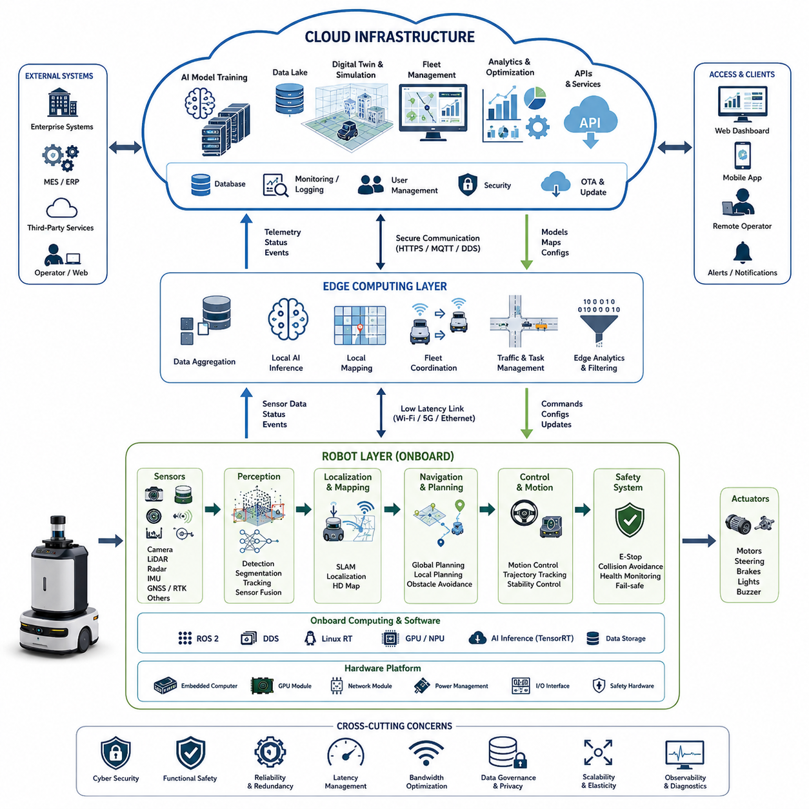
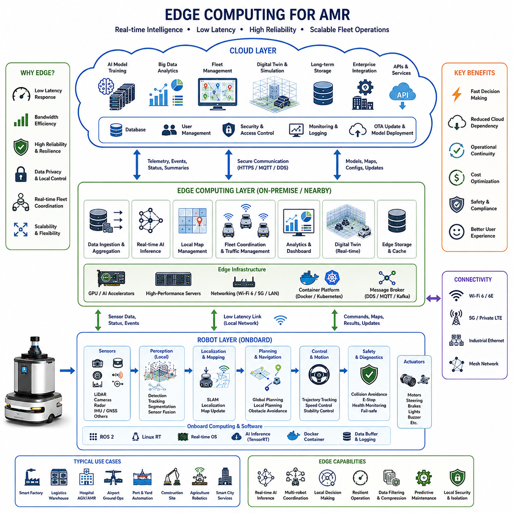
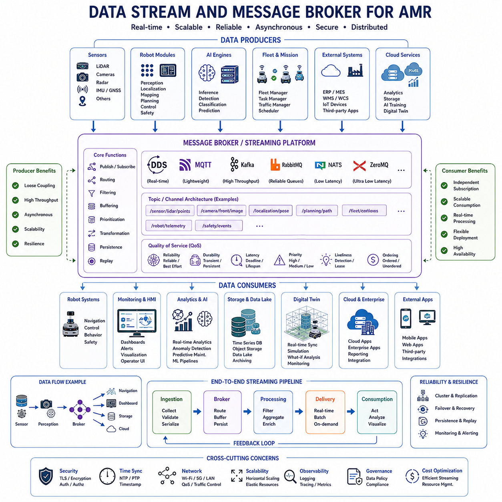
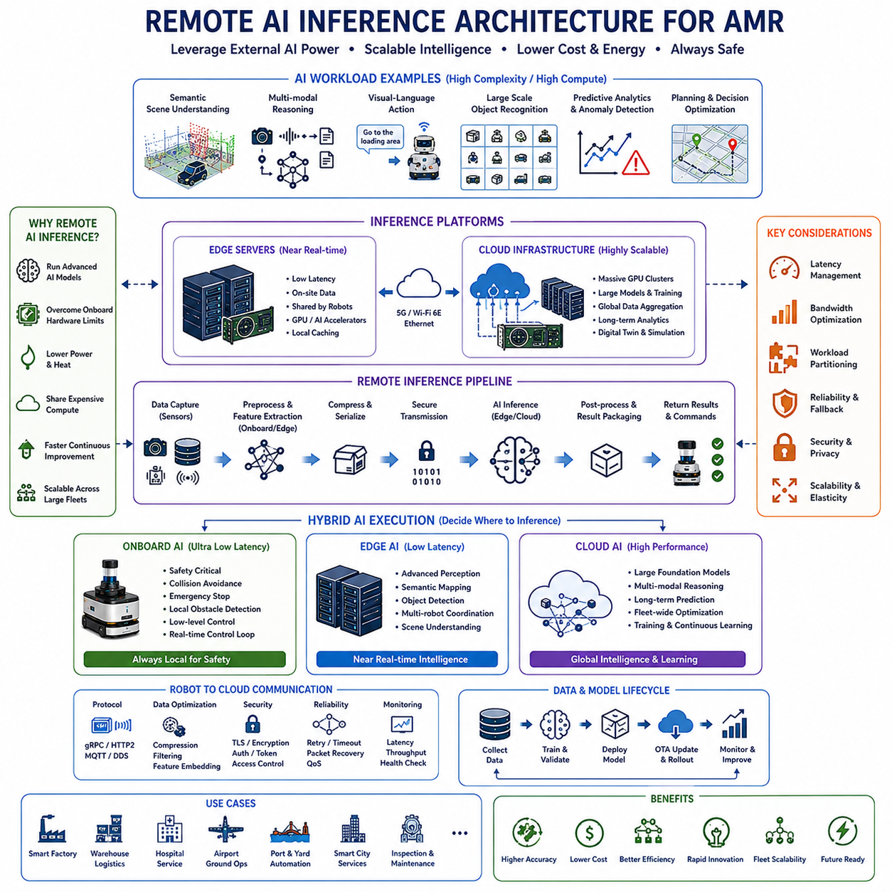
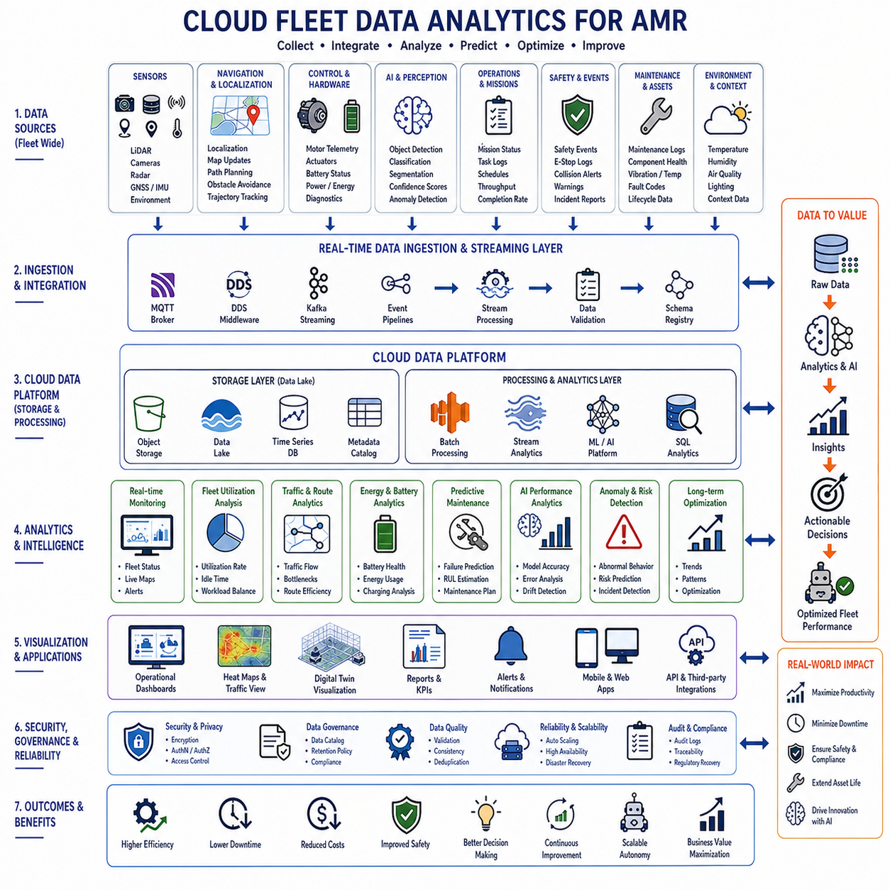
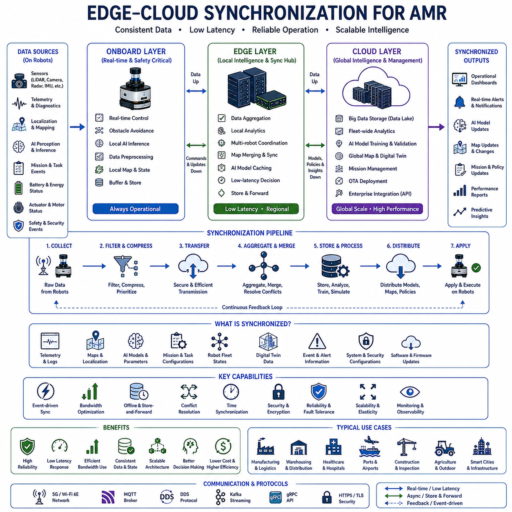
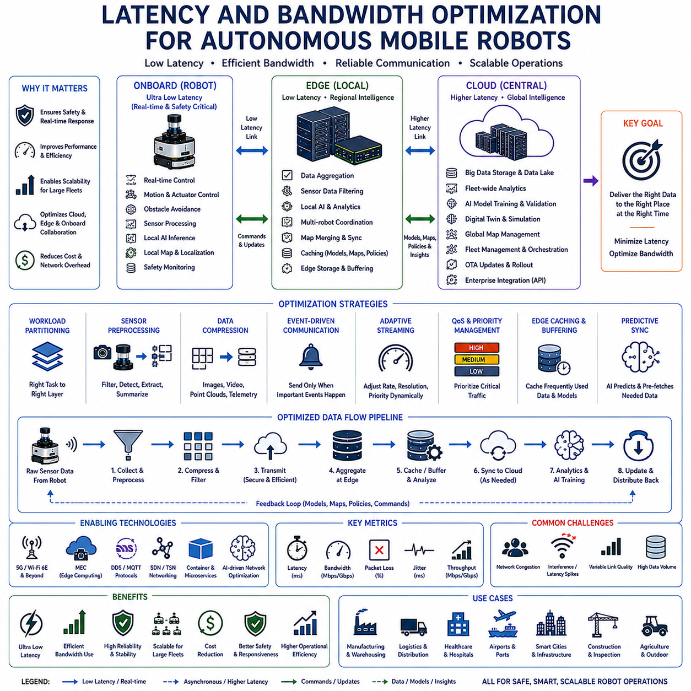
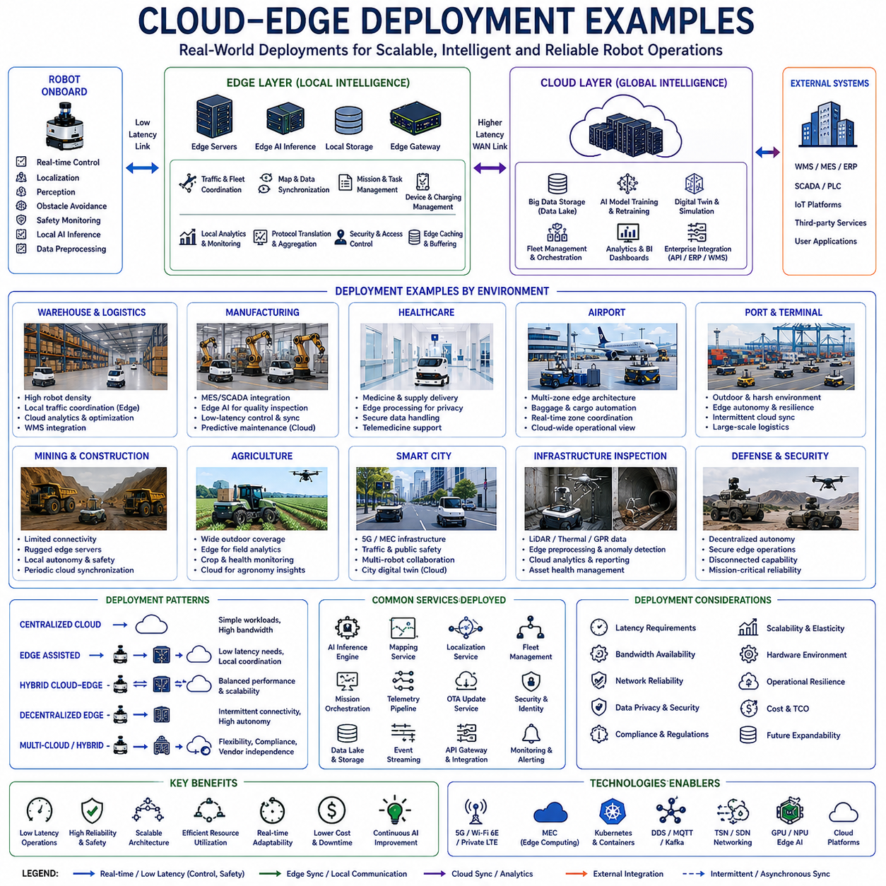

**0. Cover Page**

- Project Name

- Company

- Yantai Collaboration Proposal

- Date

# Chapter 20. Cloud and Edge Integration

## 20.1 Cloud Robotics Architecture

{width="7.268055555555556in" height="7.268055555555556in"}

"20_01_Cloud_Robotics_Architecture"는 현대 자율주행 모바일 로봇 시스템에서 가장 중요한 개념 중 하나이며, 로봇, 엣지 디바이스, 클라우드 인프라, AI 서비스, 그리고 플릿 관리 시스템이 어떻게 연결되어 하나의 확장 가능한 지능형 생태계를 구성하는지를 정의한다. 기존의 로봇은 일반적으로 폐쇄된 환경에서 사전에 정의된 작업만 수행하는 독립형 장비로 설계되었다. 그러나 현대의 AMR 시스템은 점점 더 분산 지능 시스템 형태로 발전하고 있으며, 인지(Perception), 내비게이션, 데이터 분석, AI 학습, 플릿 협업, 모니터링, 운영 관리 기능이 로봇 내부뿐 아니라 엣지 서버와 클라우드 인프라 전체에 분산되어 동작한다. 클라우드 로보틱스 아키텍처는 로봇을 단순한 독립 기계에서 벗어나 지속적으로 연결되는 지능형 플랫폼으로 진화시키며, 협업 학습, 중앙 집중 최적화, 대규모 운영 관리를 가능하게 만든다.

클라우드 로보틱스의 핵심 개념은 모든 지능을 로봇 내부에 저장하는 방식이 아니라, 로봇을 분산 컴퓨팅 생태계의 일부로 설계하는 것이다. 이 구조에서는 계산 작업이 온보드 컴퓨터, 근거리 엣지 서버, 중앙 클라우드 서버 사이에 동적으로 분산된다. 이를 통해 로봇은 지연 시간이 매우 짧아야 하는 안전 관련 기능은 로컬에서 수행하면서도, AI 모델 학습, 플릿 분석, 시뮬레이션, 장기 데이터 저장, 운영 최적화와 같은 대규모 연산은 클라우드 자원을 활용할 수 있다. 산업 현장에서는 이러한 분산 구조가 시스템의 확장성, 유지보수성, 운영 지능을 획기적으로 향상시킨다.

현대적인 클라우드 로보틱스 아키텍처는 일반적으로 여러 계층으로 구성된다. 가장 하위 계층은 로봇 하드웨어 계층이며, 여기에는 센서, 액추에이터, 모터 드라이버, 임베디드 시스템, 안전 장치, 전원 시스템, 온보드 컴퓨팅 모듈이 포함된다. 이 계층은 실제 물리 환경과 직접 상호작용하며 실시간 로봇 동작을 수행한다. 센서 구성에는 LiDAR, 카메라, 레이더, GNSS RTK, IMU, 초음파 센서, 열화상 카메라, GPR 시스템 등 다양한 산업용 센서가 포함될 수 있다. 이러한 센서들은 지속적으로 방대한 데이터를 생성하며, 이를 효율적이고 안전하게 처리해야 한다.

하드웨어 계층 위에는 온보드 로봇 소프트웨어 계층이 존재한다. 이 계층에는 로컬 인지 파이프라인, 위치추정 시스템, 내비게이션 스택, 모션 제어 모듈, 행동 계획, 장애물 회피, 진단 기능, 안전 모니터링, 통신 미들웨어 등이 포함된다. 실시간 소프트웨어 실행은 일반적으로 ROS2, DDS 미들웨어, Linux RT, GPU 가속 프레임워크, TensorRT 기반 AI 추론 엔진 등을 활용하여 구현된다. 비상 정지, 충돌 회피, 주행 안정화와 같은 안전 핵심 기능은 네트워크 연결이 끊겨도 반드시 동작해야 하므로, 로컬 자율성(Local Autonomy)은 항상 클라우드 로보틱스의 기반 계층으로 간주된다.

그 다음 계층은 엣지 컴퓨팅 계층이다. 엣지 컴퓨팅은 로봇과 중앙 클라우드 사이에 위치하는 중간 처리 계층으로, 공장, 병원, 물류센터, 항만, 스마트시티 등에 설치된다. 엣지 서버의 주요 역할은 지연 시간 감소, 클라우드 대역폭 절감, 시스템 신뢰성 향상, 지역 기반 협업 지능 지원이다. 엣지 시스템은 여러 로봇으로부터 데이터를 수집하고, 로컬 AI 추론을 수행하며, 단기 맵을 유지하고, 플릿 교통을 제어하며, 외부 인터넷 연결이 불안정한 상황에서도 지역 기반 의사결정을 지원한다.

특히 실외 자율주행 로봇이나 다중 로봇 시스템에서는 엣지 컴퓨팅의 중요성이 더욱 커진다. 다중 카메라, 3D LiDAR, 열화상 센서, 레이더, GPR 시스템 등은 시간당 수 기가바이트 이상의 데이터를 생성할 수 있다. 이러한 원시 데이터를 모두 클라우드로 전송하는 것은 네트워크 제한과 운영 비용 측면에서 현실적이지 않다. 따라서 엣지 필터링, 이벤트 기반 데이터 추출, 로컬 압축, 선택적 동기화가 핵심 아키텍처 요소가 된다. 실제 산업 현장에서는 로봇이 메타데이터, 이상 이벤트, 압축된 맵 정보, AI 추론 결과만 클라우드로 전송하고, 원시 센서 데이터는 로컬 저장소에 임시 보관하는 경우가 많다.

중앙 클라우드 인프라 계층은 시스템 전체의 대규모 지능 백본 역할을 한다. 클라우드 서버는 AI 모델 학습, 플릿 단위 분석, 중앙 모니터링, 디지털 트윈, 장기 데이터 저장, 운영 최적화를 위한 고성능 컴퓨팅 자원을 제공한다. 또한 API 서버, 웹 대시보드, 데이터베이스, 로깅 시스템, 사이버보안 서비스, 사용자 관리 시스템, 엔터프라이즈 연동 플랫폼도 클라우드 계층에서 운영된다.

클라우드 로보틱스 아키텍처는 지리적으로 분산된 여러 로봇이 운영 경험을 공유할 수 있게 만든다. 예를 들어 특정 로봇이 새로운 장애물 유형이나 도로 상태, 혹은 운영 이상 상황을 경험하면, 관련 데이터를 클라우드에 업로드할 수 있다. 이후 AI 시스템이 이를 분석하여 개선된 모델을 생성하고, OTA 시스템을 통해 전체 로봇 플릿에 배포한다. 이러한 집단 학습(Collective Learning)은 클라우드 로보틱스의 가장 혁신적인 특징 중 하나이며, 개별 로봇의 경험이 전체 시스템의 성능 향상으로 이어진다.

플릿 관리 역시 클라우드 로보틱스에서 매우 중요한 요소이다. 대규모 AMR 시스템에서는 수백\~수천 대의 로봇이 동시에 운영될 수 있다. 중앙 플릿 관리 시스템은 작업 스케줄링, 교통 제어, 충전 관리, 미션 우선순위, 경로 최적화, 로봇 상태 모니터링, 운영 분석 등을 수행한다. 플릿 수준의 최적화는 전체 운영 효율을 극대화하고, 혼잡과 다운타임, 에너지 소비를 최소화한다.

현대적인 클라우드 로보틱스 플랫폼은 RMS와 FMS 아키텍처를 함께 통합하는 경우가 많다. RMS는 개별 로봇의 상태 및 진단 기능에 집중하고, FMS는 다중 로봇의 작업 할당과 운영 협업을 담당한다. 이러한 시스템은 로봇 위치, 배터리 상태, 센서 상태, 미션 진행 상황, 안전 알람 등을 실시간 대시보드 형태로 제공하며, 운영자는 전 세계 어디에서든 원격으로 로봇 플릿을 관리할 수 있다.

클라우드 로보틱스 아키텍처는 AI 라이프사이클 관리에서도 핵심 역할을 한다. 현대 로봇 AI 시스템은 지속적인 학습, 검증, 배포, 모니터링, 업데이트가 필요하다. 클라우드 인프라는 대규모 데이터셋 관리, 분산 학습 파이프라인, MLOps 프레임워크, 시뮬레이션 기반 검증, 합성 데이터 생성, 자동화 배포 워크플로우를 지원한다. AI 엔지니어는 현장 로봇으로부터 데이터를 수집하고, 클라우드 GPU 클러스터에서 모델을 재학습하며, 시뮬레이션 환경에서 검증한 후, 최적화된 AI 모델을 OTA를 통해 다시 로봇에 배포할 수 있다.

시뮬레이션과 디지털 트윈 역시 클라우드 로보틱스와 밀접하게 연결된다. 디지털 트윈은 실제 로봇 시스템, 운영 환경, 센서 구성, 시설 구조를 클라우드 기반 시뮬레이션 환경에 가상으로 재현한다. 이를 통해 엔지니어는 실제 운영을 중단하지 않고도 내비게이션 전략 평가, AI 모델 테스트, 실패 상황 재현, 교통 제어 최적화, 안전 시나리오 검증 등을 수행할 수 있다. 클라우드 기반 시뮬레이션은 수천 대의 가상 로봇을 동시에 실행할 수 있기 때문에 대규모 시나리오 검증과 개발 속도 향상에 매우 유리하다.

확장성은 클라우드 로보틱스의 가장 큰 장점 중 하나이다. 기존 독립형 로봇 시스템은 개별 유지보수, 수동 업데이트, 독립 설정이 필요했다. 반면 클라우드 네이티브 로봇 시스템은 중앙 집중형 소프트웨어 배포, 통합 모니터링, 원격 진단, 표준화된 운영 관리를 가능하게 한다. 새로운 로봇은 자동 프로비저닝, 컨테이너 기반 배포, 중앙 설정 관리 시스템을 통해 빠르게 플릿에 통합될 수 있다.

Docker와 Kubernetes 같은 컨테이너 기술은 현대 클라우드 로보틱스에서 점점 더 중요한 역할을 한다. 컨테이너 기반 구조는 소프트웨어 이식성, 의존성 관리, 분산 배포, 오케스트레이션을 단순화한다. 클라우드 네이티브 로봇 시스템은 인지 분석, 맵 관리, 미션 계획, AI 추론, 텔레메트리 처리, 모니터링 대시보드 등을 마이크로서비스 형태로 구성할 수 있으며, 이는 유지보수성과 업데이트 속도를 크게 향상시킨다.

통신 인프라 역시 핵심 요소이다. 로봇은 Wi-Fi, Private LTE, 5G, Ethernet, Mesh Network, 위성 통신 등 다양한 네트워크를 활용할 수 있다. DDS, MQTT, WebSocket, REST API, gRPC와 같은 프로토콜이 일반적으로 사용된다. 안정적인 통신 설계는 지연 시간, 대역폭 제한, 패킷 손실, 시간 동기화, 장애 복구 등을 모두 고려해야 한다.

사이버보안은 클라우드 연결 로봇에서 매우 중요한 문제이다. 네트워크 기반 공격에 노출될 수 있기 때문에, 안전한 인증, 암호화 통신, 접근 제어, Secure Boot, 펌웨어 검증, VPN 구조, 침입 탐지 시스템, OTA 보안 프레임워크 등이 반드시 필요하다. 보안이 취약한 로봇은 단순 시스템 문제가 아니라 실제 안전 사고로 이어질 수 있으므로, 보안은 선택 사항이 아닌 필수 설계 요소이다.

지연 시간 관리 역시 핵심 기술 과제이다. 일부 로봇 기능은 밀리초 단위의 응답 속도가 필요하기 때문에 클라우드 지연을 허용할 수 없다. 따라서 안전 관련 제어는 반드시 로컬에서 실행되어야 하며, 중간 수준의 협업 기능은 엣지에서 처리하고, 장기 분석과 AI 학습은 클라우드에서 수행하는 방식으로 작업을 분산한다.

대역폭 최적화도 매우 중요하다. 고해상도 카메라와 다수의 LiDAR, 레이더, AI 파이프라인은 엄청난 양의 데이터를 생성한다. 따라서 효율적인 압축, 이벤트 기반 기록, 선택적 동기화, 지능형 필터링, 엣지 전처리가 필수적이다. 실제 산업 현장에서는 대역폭 제한이 시스템 아키텍처 자체를 결정하는 경우도 많다.

클라우드 로보틱스는 특히 대규모 실외 자율주행 로봇 시스템에서 매우 유용하다. 배달 로봇, 순찰 로봇, 농업 로봇, 광산 로봇, 스마트시티 로봇 등은 중앙 모니터링, 원격 운영, 맵 동기화, 분산 협업이 필수적이다. 실외 환경에서는 통신 불안정, GNSS 오차, 기상 변화, 지역 인프라 차이 등의 추가적인 문제가 발생하기 때문에 더욱 강력한 클라우드 기반 운영 구조가 요구된다.

AI 네이티브 로보틱스가 발전하면서 클라우드 인프라의 중요성은 더욱 커지고 있다. 대규모 멀티모달 AI 모델, 월드 모델, 파운데이션 모델, Embodied AI 시스템은 소형 온보드 컴퓨터만으로 실행하기 어려운 수준의 계산 자원을 요구한다. 따라서 실시간 안전 기능은 로컬 AI가 담당하고, 고수준 추론과 장기 학습은 클라우드 AI가 담당하는 하이브리드 구조가 점점 일반화되고 있다.

미래의 클라우드 로보틱스 아키텍처는 로봇, 엣지 서버, 클라우드 서비스, 디지털 트윈, AI 에이전트, 엔터프라이즈 시스템이 완전히 통합된 분산 지능 생태계로 발전할 가능성이 높다. 다중 에이전트 협업, 자율 클라우드 오케스트레이션, 실시간 글로벌 맵 동기화, 클라우드 기반 Embodied Intelligence 등이 점점 보편화될 것이다.

물류, 제조, 의료, 건설, 농업, 광산, 에너지, 스마트시티 등 다양한 산업은 향후 대규모 클라우드 로보틱스 구조를 채택하게 될 것이다. 로봇 플릿 규모가 계속 증가함에 따라 중앙 집중형 운영 지능과 분산 컴퓨팅 구조는 필수 요소가 될 것이다.

결국 클라우드 로보틱스 아키텍처는 단순한 원격 연결 기술이 아니라, 로봇을 지속적으로 학습하고 협업하는 지능형 시스템으로 진화시키는 핵심 패러다임 전환이라고 할 수 있다. 미래의 AMR, Embodied AI, 산업용 로봇 생태계는 클라우드 네이티브 로봇 시스템과 분산 지능 인프라의 발전과 깊이 연결될 것이다.

## 20.2 Edge Computing for AMR

{width="7.268055555555556in" height="7.268055555555556in"}

"20_02_Edge_Computing_for_AMR"는 현대 자율주행 모바일 로봇 시스템에서 가장 핵심적인 아키텍처 개념 중 하나이다. 이는 실시간 지능 처리, 초저지연 의사결정, 대규모 플릿 협업, 그리고 로봇과 클라우드 사이의 효율적인 분산 컴퓨팅을 가능하게 만든다. AMR 시스템이 점점 더 복잡해지고 데이터 중심 구조로 발전함에 따라, 모든 처리를 온보드 컴퓨터나 중앙 클라우드에만 의존하는 방식은 한계를 가지게 되었다. 엣지 컴퓨팅은 로봇 하드웨어와 중앙 클라우드 사이에 위치하는 중간 계산 계층으로 등장하였으며, 실제 운영 환경 근처에서 고성능 연산을 수행할 수 있도록 한다. 이러한 구조는 응답 속도, 신뢰성, 확장성, 대역폭 효율성, 그리고 산업용 로봇 시스템의 안전성을 크게 향상시킨다.

기존의 로봇 시스템은 대부분 모든 연산을 로봇 내부에서 수행하는 독립형 구조로 설계되었다. 이러한 방식은 통신 의존성을 줄인다는 장점이 있었지만, 계산 확장성, AI 모델 복잡도, 데이터 분석 능력, 다중 로봇 협업 측면에서 심각한 한계를 가졌다. 반대로 클라우드 중심 구조는 지연 시간, 네트워크 의존성, 연결 불안정성 문제로 인해 안전 핵심 자율주행 시스템에 적합하지 않은 경우가 많다. 엣지 컴퓨팅은 이러한 문제를 해결하기 위해 온보드 프로세서, 엣지 인프라, 중앙 클라우드 사이에 지능을 분산시키는 구조를 제공한다.

AMR용 엣지 컴퓨팅은 공장, 물류창고, 병원, 공항, 항만, 건설 현장, 농업 환경, 스마트시티 등 로봇 운영 환경 가까이에 연산 자원을 배치하는 것을 의미한다. 엣지 서버는 데이터를 먼 클라우드 데이터센터로 직접 보내기 전에 로컬에서 처리한다. 이러한 구조는 통신 지연 시간을 크게 줄이면서도 고성능 데이터 처리, AI 추론, 플릿 협업 기능을 가능하게 만든다.

엣지 컴퓨팅의 가장 중요한 목적 중 하나는 지연 시간 감소이다. 자율주행 로봇은 LiDAR, RGB 카메라, Depth Camera, 레이더, 열화상 카메라, IMU, GNSS, 초음파 센서, GPR 시스템 등 다양한 센서를 통해 방대한 데이터를 지속적으로 생성한다. 장애물 회피, 경로 수정, 긴급 제동, 동적 경로 계획과 같은 기능은 수 밀리초 단위의 반응 속도를 요구한다. 이러한 실시간성은 클라우드만을 사용하는 구조에서는 안정적으로 보장하기 어렵다.

엣지 컴퓨팅은 이러한 연산 작업을 로봇에서 일부 분산시키면서도 거의 실시간 수준의 응답성을 유지한다. 로봇은 원격 클라우드 대신 근거리 엣지 서버와 Wi-Fi 6, Private LTE, Industrial Ethernet, 5G 등을 통해 고속 통신한다. 엣지 서버는 로컬 AI 추론, 맵 동기화, 교통 제어, 데이터 분석 등을 수행한 후 최소한의 지연으로 결과를 로봇에 전달한다.

대역폭 최적화 역시 엣지 컴퓨팅 도입의 핵심 이유이다. 현대 AMR은 다수의 고해상도 센서를 장착하고 있기 때문에 엄청난 양의 원시 데이터를 생성한다. 다중 카메라 영상, 3D LiDAR 포인트 클라우드, 열화상 데이터, 레이더 데이터, GPR 스캔 데이터는 시간당 수 기가바이트 이상의 데이터를 발생시킬 수 있다. 이러한 모든 데이터를 중앙 클라우드로 지속적으로 전송하는 것은 비용과 네트워크 측면에서 현실적이지 않다.

엣지 시스템은 로컬 필터링, 전처리, 압축, 이벤트 추출, 선택적 동기화를 통해 이러한 문제를 해결한다. 전체 원시 데이터를 전송하는 대신, 이상 이벤트, 메타데이터, 압축된 맵 정보, AI 추론 결과, 운영 통계만 클라우드로 전송할 수 있다. 이를 통해 네트워크 부하는 크게 감소하면서도 중요한 운영 정보는 유지할 수 있다.

엣지 컴퓨팅은 특히 실외 자율주행 로봇에서 더욱 중요하다. 실외 로봇은 불안정한 인터넷 연결, 기상 변화, GNSS 오차, 동적 환경 변화에 지속적으로 노출된다. 이러한 상황에서 운영 지역 내부에 배치된 엣지 서버는 외부 클라우드 연결이 불안정해도 안정적인 계산 지원을 제공한다.

산업 현장에서는 로봇 전용 엣지 컴퓨팅 클러스터를 구축하는 경우가 증가하고 있다. 이러한 엣지 클러스터는 GPU 서버, AI 가속기, 분산 저장 시스템, 메시지 브로커, 로컬 데이터베이스, 컨테이너 오케스트레이션 플랫폼, 실시간 모니터링 시스템 등을 포함할 수 있다. 여러 로봇이 동일한 엣지 인프라를 공유함으로써 계산 효율성과 플릿 지능이 크게 향상된다.

현대적인 엣지 컴퓨팅 구조는 일반적으로 여러 계층으로 구성된다. 로봇 계층은 센서, 임베디드 제어기, 실시간 제어 시스템, 인지 파이프라인, 내비게이션 모듈, 안전 소프트웨어를 포함한다. 그 위의 엣지 처리 계층은 로컬 AI 추론, 플릿 협업, 교통 관리, 맵 동기화, 데이터 집계, 로컬 분석, 운영 모니터링을 담당한다. 최상위 클라우드 계층은 대규모 AI 학습, 장기 데이터 저장, 글로벌 플릿 관리, 엔터프라이즈 연동 기능을 수행한다.

엣지 AI 추론은 엣지 컴퓨팅의 가장 혁신적인 기능 중 하나이다. 최신 AI 모델은 소형 온보드 컴퓨터의 전력 및 발열 한계를 초과하는 경우가 많다. GPU 기반 엣지 서버는 대규모 신경망, 멀티모달 AI, 파운데이션 모델, 복잡한 인지 알고리즘을 실행하면서도 로봇과의 저지연 상호작용을 유지할 수 있다.

이 구조는 고급 인지 시스템에서 특히 유용하다. 예를 들어 물류창고 내부에서 여러 로봇이 센서 데이터를 엣지 AI 서버로 전송하면, 서버는 중앙 집중형 객체 인식, 인간 탐지, 이상 상황 분석, 의미 기반 맵핑 등을 수행하고 결과를 전체 로봇에 다시 배포할 수 있다. 이러한 구조는 로봇이 집단 지능을 공유하도록 만든다.

플릿 협업 역시 엣지 컴퓨팅의 핵심 응용 분야이다. 대규모 산업 환경에서는 중앙 클라우드가 혼잡 상황, 임시 장애물, 긴급 경로 변경 등에 충분히 빠르게 대응하지 못할 수 있다. 엣지 플릿 제어기는 지역 기반 교통 제어, 작업 최적화, 충전 스케줄 관리, 충돌 방지 등을 실시간으로 수행한다.

로컬 맵 관리 또한 엣지 계층에서 자주 수행된다. 로봇들은 운영 중 지속적으로 환경 맵을 업데이트하며, 엣지 서버는 여러 로봇의 맵 데이터를 통합하고 지역 맵을 유지하며 환경 변화를 감지한 후 업데이트된 맵을 다시 플릿에 배포한다. 이러한 협업 맵핑 구조는 위치추정 안정성과 운영 효율을 향상시킨다.

디지털 트윈 역시 엣지 컴퓨팅과 밀접하게 연결된다. 엣지 서버에서 실행되는 실시간 디지털 트윈은 로봇 상태, 환경 조건, 교통 흐름, 운영 워크플로우를 가상으로 복제한다. 엔지니어와 운영자는 이를 통해 시스템 상태를 시각적으로 모니터링하고, 사고를 재현하며, 병목 현상을 분석하고, 운영 전략을 테스트할 수 있다.

엣지 컴퓨팅은 사이버보안과 데이터 격리 측면에서도 중요한 역할을 한다. 많은 산업 고객은 민감한 데이터를 외부 퍼블릭 클라우드로 전송하지 않기를 원한다. 엣지 컴퓨팅은 데이터 주권을 유지하면서도 고급 AI와 분석 기능을 활용할 수 있도록 한다. 제조 데이터, 병원 환자 정보, 보안 영상, 인프라 점검 데이터 등을 외부로 노출하지 않고 로컬에서 처리할 수 있다.

운영 복원력 역시 엣지 구조의 핵심 장점이다. 클라우드 장애나 인터넷 불안정 상황이 발생하더라도 로봇 운영은 지속되어야 한다. 엣지 시스템은 중앙 클라우드 연결이 끊겨도 로봇들이 계속 협업 운영할 수 있도록 지원한다. 많은 산업 환경에서는 이러한 오프라인 복원력이 필수 요구사항으로 간주된다.

Docker와 Kubernetes 같은 컨테이너 기술은 엣지 로보틱스 시스템에서 점점 더 많이 사용된다. 컨테이너 기반 구조는 로봇 소프트웨어를 분산된 엣지 환경에 일관되게 배포하고 업데이트하며 확장할 수 있게 만든다. 이는 의존성 관리, 유지보수, 대규모 자동 배포를 단순화한다.

마이크로서비스 구조 역시 엣지 시스템의 유연성을 높인다. 인지 분석, 맵 서비스, AI 추론, 텔레메트리 집계, 미션 계획, 진단 기능 등을 독립 서비스 형태로 분리할 수 있으며, API나 메시지 브로커를 통해 상호 통신한다. 이러한 구조는 유지보수성과 장애 격리 능력을 크게 향상시킨다.

DDS, MQTT, ROS2 Bridge, WebSocket, REST API, Kafka, gRPC와 같은 미들웨어는 엣지 시스템의 핵심 통신 기반이 된다. 실시간 통신 설계에서는 지연 시간, 메시지 우선순위, 시간 동기화, 장애 복구 등을 반드시 고려해야 한다.

시간 동기화 역시 매우 중요하다. 여러 로봇, 센서, 엣지 서버, 클라우드 시스템은 정확한 타임스탬프를 유지해야 센서 융합, 이벤트 상관 분석, 분산 맵핑, 협업 제어가 가능하다. 이를 위해 PTP와 NTP 같은 시간 동기화 프로토콜이 자주 사용된다.

AI 모델 라이프사이클 관리도 엣지 컴퓨팅과 긴밀하게 연결된다. 엣지 서버는 AI 추론 엔진을 실행하고, 모델 성능을 모니터링하며, 운영 데이터를 수집하고, 단계적 AI 배포 전략을 지원한다. 새로운 AI 모델은 일부 엣지 클러스터에 먼저 배포되어 검증된 후 전체 플릿으로 확장될 수 있다.

엣지 분석 시스템은 산업 운영에서 큰 가치를 제공한다. 실시간 대시보드는 로봇 사용률, 교통 효율, 배터리 상태, 작업 완료율, 안전 이벤트, 환경 상태, 예지 정비 지표 등을 분석할 수 있다. 운영자는 중앙 클라우드에 의존하지 않고도 지역 운영 문제에 즉각 대응할 수 있다.

예지 정비 역시 엣지 컴퓨팅의 강력한 응용 분야이다. 엣지 시스템은 모터 전류, 진동, 온도, 배터리 상태, 센서 진단 정보를 지속적으로 분석하여 부품 열화의 초기 징후를 감지한다. 이를 통해 실제 고장이 발생하기 전에 예방 정비를 수행할 수 있다.

에너지 효율성 또한 향상된다. 무거운 AI 연산을 엣지 서버로 오프로드하면 로봇 내부 전력 소비와 발열을 줄일 수 있다. 이는 운영 시간 증가와 냉각 구조 단순화에 도움이 된다.

플릿 규모가 증가할수록 확장성은 더욱 중요해진다. 소규모 로봇 시스템은 로컬 구조만으로도 운영 가능하지만, 대규모 산업 플릿은 분산 지능과 계층적 관리 구조가 필수적이다. 엣지 컴퓨팅은 이러한 미래 다중 로봇 생태계를 위한 핵심 기반 기술이 된다.

미래의 엣지 컴퓨팅 구조는 AI 네이티브 분산 생태계 방향으로 발전할 가능성이 높다. Edge AI Accelerator, 5G MEC 플랫폼, Federated Learning, Distributed World Model, Collaborative Perception Network, Autonomous Edge Orchestration 등이 점점 보편화될 것이다. 미래의 로봇들은 엣지 인프라를 통해 의미 기반 환경 이해와 예측 모델을 지속적으로 공유하게 될 것이다.

클라우드 컴퓨팅, 엣지 AI, 로보틱스, 디지털 트윈, 초고속 네트워크, 대규모 자율 시스템의 융합은 산업 자동화 구조 자체를 변화시키고 있다. 엣지 컴퓨팅은 단순한 성능 최적화 기술이 아니라, 확장 가능하고 신뢰성 있으며 경제적으로 지속 가능한 자율 로봇 생태계를 위한 필수 아키텍처 요소가 되고 있다.

향후 산업용 로봇 시스템이 대규모 Embodied Intelligence 기반으로 발전함에 따라, 엣지 컴퓨팅은 가장 중요한 핵심 기술 중 하나로 계속 자리 잡게 될 것이다. 미래의 자율주행 로봇 플랫폼, 플릿 지능, AI 네이티브 로보틱스, 분산 사이버 물리 시스템은 모두 엣지 컴퓨팅 기술의 발전에 크게 의존하게 될 것이다.

## 20.3 Data Stream and Message Broker

{width="7.268055555555556in" height="7.268055555555556in"}

"20_03_Data_Stream_and_Message_Broker"는 현대 클라우드 네이티브 로보틱스와 분산형 AMR 소프트웨어 아키텍처에서 가장 핵심적인 개념 중 하나이다. 이는 로봇, 센서, 엣지 서버, 클라우드 시스템, AI 엔진, 플릿 관리 플랫폼, 운영 애플리케이션이 실시간으로 정보를 안정적이고 효율적으로 교환하는 방법을 정의한다. 자율주행 모바일 로봇 시스템이 대규모 분산 지능 플랫폼으로 발전함에 따라, 데이터의 양과 속도, 복잡성, 그리고 중요성은 급격히 증가하고 있다. 현대의 AMR은 더 이상 독립적인 기계가 아니라, 수천 개의 메시지와 센서 스트림, 제어 명령, AI 결과, 텔레메트리 이벤트, 운영 상태 정보가 매초마다 다양한 컴퓨팅 환경을 통해 교환되는 분산 사이버 물리 시스템으로 동작한다.

기존 로봇 소프트웨어 구조는 주로 모듈 간 직접 연결 또는 공유 메모리 기반 통신에 의존하였다. 이러한 방식은 소규모 단일 로봇에서는 동작 가능했지만, 시스템이 분산화되고 복잡해질수록 확장성이 급격히 떨어졌다. 공장, 물류창고, 병원, 항만, 공항, 스마트시티와 같은 환경에서 대규모 로봇 플릿을 운영하려면, 수많은 독립 소프트웨어 컴포넌트 간에 실시간 데이터 교환을 지원할 수 있는 유연하고 확장 가능하며 장애 허용성이 높은 통신 구조가 필요하다.

데이터 스트리밍 아키텍처와 메시지 브로커 시스템은 이러한 확장성과 통신 문제를 해결하기 위해 등장하였다. 모든 소프트웨어 모듈이 직접 연결되는 대신, 데이터는 중간 메시징 인프라를 통해 전달된다. 메시지 브로커는 데이터 라우팅, 버퍼링, 필터링, 우선순위 제어, 데이터 분배 등을 수행하며, 이를 통해 느슨한 결합 구조, 비동기 통신, 시스템 확장성, 운영 안정성을 확보할 수 있다.

로보틱스에서 데이터 스트림은 센서, 소프트웨어 모듈, 운영 시스템, 외부 인프라에서 지속적으로 생성되는 정보 흐름을 의미한다. 예를 들어 LiDAR 포인트 클라우드, 카메라 영상, 레이더 데이터, GNSS 정보, IMU 측정값, 모터 텔레메트리, 위치추정 결과, 경로 계획 결과, AI 추론 결과, 장애물 탐지 정보, 안전 이벤트, 배터리 진단 데이터, 플릿 제어 명령, 클라우드 동기화 메시지 등이 모두 데이터 스트림에 해당한다. 이러한 데이터는 크기, 주기, 지연 허용 범위, 신뢰성 요구사항이 모두 다르다.

일부 데이터 스트림은 매우 높은 대역폭과 초저지연 특성을 요구한다. 예를 들어 카메라 영상이나 LiDAR 포인트 클라우드는 실시간 전송이 필요하며, 안전 시스템은 결정론적 통신 성능을 요구한다. 반면 텔레메트리 로그, 분석 이벤트, 운영 기록 등은 상대적으로 높은 지연을 허용할 수 있다. 따라서 메시지 브로커 구조는 서로 다른 특성을 가진 다양한 데이터 흐름을 동시에 처리할 수 있어야 한다.

메시지 브로커는 데이터 생산자와 소비자 사이의 중앙 또는 분산형 미들웨어 역할을 수행한다. 생산자는 센서, AI 엔진, 로봇 모듈, 플릿 관리 시스템, 클라우드 서비스, 엔터프라이즈 시스템 등이 될 수 있다. 소비자는 내비게이션 시스템, 모니터링 대시보드, 분석 엔진, 저장 시스템, 디지털 트윈, 원격 운영자, 안전 시스템 등이 될 수 있다. 메시지 브로커는 생산자와 소비자를 분리하여 서로 직접 연결되지 않아도 독립적으로 동작할 수 있게 만든다.

메시지 브로커 구조의 가장 중요한 장점 중 하나는 비동기 통신이다. 비동기 구조에서는 데이터 생산자가 소비자의 처리 완료를 기다리지 않고 계속 동작할 수 있다. 예를 들어 LiDAR 인지 파이프라인은 장애물 탐지 결과를 지속적으로 발행할 수 있으며, 여러 소비자는 각자의 처리 속도에 맞추어 데이터를 독립적으로 구독하고 처리할 수 있다.

Publish-Subscribe 구조는 로보틱스 데이터 스트리밍에서 가장 널리 사용되는 통신 방식 중 하나이다. 이 구조에서는 데이터 생산자가 특정 Topic에 메시지를 발행하고, 소비자는 관심 있는 Topic을 구독한다. 이를 통해 다대다(Many-to-Many) 통신이 가능해진다. 예를 들어 하나의 위치추정 데이터 스트림이 동시에 내비게이션 시스템, 디지털 트윈, 모니터링 대시보드, 플릿 분석 엔진, 클라우드 저장소에 전달될 수 있다.

ROS2는 기본적으로 DDS 기반 Publish-Subscribe 구조 위에서 동작한다. DDS는 로보틱스에 최적화된 실시간 저지연 메시징 시스템이며, QoS(Quality of Service) 정책을 통해 신뢰성, Best-Effort 전송, Deadline, 메시지 우선순위, Liveliness Detection, 결정론적 전송 등을 지원한다. 이러한 특성 때문에 DDS는 안전 핵심 로봇 시스템에 매우 적합하다.

그러나 대규모 클라우드 네이티브 로보틱스 구조는 DDS만으로는 충분하지 않은 경우가 많다. 현대 AMR 시스템은 MQTT, Kafka, RabbitMQ, ZeroMQ, Redis Streams, NATS, WebSocket, 클라우드 기반 이벤트 스트리밍 플랫폼 등 다양한 메시지 브로커를 함께 사용한다. 각 기술은 확장성, 지연 시간, 신뢰성, 처리량, 메시지 저장 기능, 운영 복잡성 측면에서 서로 다른 특성을 가진다.

MQTT는 경량 텔레메트리 통신, 원격 모니터링, IoT 연동, 클라우드 동기화에 자주 사용된다. 낮은 대역폭 환경에서도 효율적으로 동작하며, 플릿 관리 시스템에서 상태 보고, Heartbeat, 원격 명령 전달 등에 널리 사용된다.

Apache Kafka는 대규모 로봇 분석 플랫폼에서 매우 중요해지고 있다. Kafka는 고처리량 이벤트 스트리밍과 영구 메시지 저장에 최적화되어 있다. 대규모 로봇 플릿은 하루에 수백만 개 이상의 운영 이벤트를 생성할 수 있으며, Kafka는 이를 효율적으로 수집하고 저장하며 재생(Replaying)할 수 있게 만든다. 플릿 분석, 예지 정비, 운영 감사, AI 학습 파이프라인 등에 자주 사용된다.

RabbitMQ는 작업 분배와 서비스 오케스트레이션에 많이 사용된다. Kafka가 대규모 이벤트 스트리밍에 집중하는 반면, RabbitMQ는 신뢰성 있는 메시지 전달과 작업 큐 기반 구조에 강점을 가진다. 미션 할당 시스템이나 플릿 제어 엔진은 RabbitMQ를 활용하여 안정적으로 작업을 분배할 수 있다.

ZeroMQ와 NATS는 초저지연 분산 통신에 적합한 경량 메시징 프레임워크이다. 실시간 다중 로봇 협업이나 분산 인지 시스템에서 자주 사용된다.

데이터 스트리밍 구조는 지연 시간을 매우 중요하게 고려해야 한다. 센서 융합, 경로 제어, 장애물 회피, 안전 감시 등은 예측 가능한 통신 지연을 요구한다. 과도한 지연이나 지터(Jitter)는 로봇의 안전성과 안정성에 직접적인 영향을 줄 수 있다. 따라서 로봇 시스템은 종종 실시간 저지연 데이터 경로와 고지연 분석 경로를 분리하여 설계한다.

엣지 컴퓨팅 구조 역시 데이터 스트리밍 설계에 큰 영향을 준다. 현대 AMR 시스템은 일반적으로 온보드 컴퓨팅, 엣지 인프라, 중앙 클라우드라는 세 계층으로 구성된다. DDS는 온보드 실시간 통신을 담당하고, MQTT는 엣지 텔레메트리를 담당하며, Kafka는 클라우드 규모 분석을 담당하는 식으로 계층별 역할이 분리될 수 있다.

데이터 우선순위 제어 역시 매우 중요하다. 모든 메시지가 동일한 중요도를 가지는 것은 아니다. 비상 정지 명령, 충돌 경고, 안전 알람, 모션 제어 신호는 가장 높은 우선순위와 최소 지연 시간을 요구한다. 반면 텔레메트리 로그나 통계 데이터는 상대적으로 지연을 허용할 수 있다. 고급 메시지 브로커는 QoS 기반 우선순위 제어 기능을 제공한다.

신뢰성과 장애 허용성 또한 필수 요소이다. 산업용 AMR 시스템은 네트워크 장애, 서버 장애, 소프트웨어 충돌 상황에서도 계속 동작해야 한다. 메시지 브로커는 Persistent Queue, Message Replay, Distributed Replication, Failover Cluster, Acknowledgement 시스템 등을 통해 복원력을 강화한다.

시간 동기화 역시 매우 중요하다. 센서 융합, 분산 맵핑, 다중 로봇 협업, 이벤트 상관 분석은 정확한 타임스탬프를 필요로 한다. 따라서 메시징 구조는 로봇, 엣지 서버, 클라우드 간 시간 일관성을 유지해야 한다.

플릿 규모가 증가할수록 확장성은 더욱 중요해진다. 소규모 시스템은 적은 데이터량만 처리하면 되지만, 대규모 산업 환경에서는 초당 수백만 개의 메시지와 페타바이트 규모의 데이터 저장이 필요할 수 있다. 분산 메시지 브로커 구조는 서버를 수평 확장하여 이러한 부하를 처리할 수 있게 만든다.

보안 역시 핵심 요소이다. 메시지 브로커는 전체 로봇 인프라의 중앙 통신 허브 역할을 하기 때문에 공격 대상이 될 수 있다. 악의적인 명령 주입이나 데이터 탈취를 방지하기 위해 암호화, 인증, 권한 관리, 인증서 기반 보안, 네트워크 분리 구조 등이 필요하다.

운영 가시성과 데이터 거버넌스도 점점 중요해지고 있다. 메시지 브로커는 전체 로봇 플릿의 운영 데이터를 중앙 집중형으로 수집할 수 있게 한다. 이를 통해 실시간 로깅, 분산 추적, 이상 탐지, 성능 분석, 운영 감사 등을 수행할 수 있다.

AI 및 머신러닝 시스템 역시 데이터 스트리밍 구조와 깊이 연결된다. 지속적인 운영 데이터 스트림은 AI 학습, 모델 검증, 이상 탐지, 예지 정비, 행동 분석, 자율 최적화 등에 필수적이다. 현대 MLOps 파이프라인은 메시지 브로커로부터 직접 스트리밍 데이터를 수집하여 지속 학습 구조를 구성한다.

메시지 Replay 기능은 매우 강력한 디버깅 도구이다. 로봇 엔지니어는 운영 사고를 재현하고 실패를 분석하기 위해 과거 데이터 스트림을 다시 재생할 수 있다. 이는 디버깅과 시뮬레이션 기반 검증에서 매우 중요한 기능이다.

디지털 트윈 역시 스트리밍 구조에 크게 의존한다. 디지털 트윈은 로봇의 실시간 텔레메트리와 위치 데이터를 지속적으로 수신하여 가상 환경에서 실제 로봇 상태를 재현한다. 이를 통해 운영 최적화와 상태 모니터링이 가능해진다.

다중 로봇 협업은 효율적인 분산 메시징 구조 없이는 불가능하다. 로봇들은 위치 정보, 장애물 탐지, 의미 기반 맵, 교통 정보, 미션 상태 등을 지속적으로 공유해야 한다. 협업 인지 시스템은 여러 로봇의 센서 데이터를 통합하여 하나의 환경 이해 모델을 생성할 수 있다.

미래의 로보틱스 통신 시스템은 더욱 자율적인 이벤트 기반 구조로 발전할 가능성이 높다. AI 네이티브 메시지 브로커, 의미 기반 통신 프레임워크, 적응형 스트리밍 파이프라인, 자율 엣지 오케스트레이션 등이 등장할 수 있다. 미래 로봇은 네트워크 상태와 운영 상황에 따라 스스로 통신 경로를 최적화하게 될 것이다.

로보틱스, 클라우드 컴퓨팅, 엣지 인프라, 분산 AI, IoT, 사이버 물리 자동화 기술의 융합은 산업용 소프트웨어 구조 자체를 변화시키고 있다. 데이터 스트림과 메시지 브로커는 더 이상 단순한 통신 도구가 아니라, 지능형 로봇 생태계의 중앙 신경망 역할을 수행하게 되고 있다.

향후 로봇 플릿 규모와 지능 수준이 더욱 증가함에 따라, 효율적인 스트리밍 구조의 중요성은 계속 커질 것이다. 미래의 클라우드 로보틱스, 엣지 AI, 디지털 트윈, Embodied Intelligence, 플릿 오케스트레이션은 모두 확장 가능하고 안전하며 저지연 특성을 가진 데이터 스트리밍 인프라 위에서 동작하게 될 것이다.

## 20.4 Remote AI Inference

{width="7.268055555555556in" height="7.268055555555556in"}

"20_04_Remote_AI_Inference"는 현대 클라우드 네이티브 로보틱스와 분산형 AMR 지능 아키텍처에서 가장 혁신적인 개념 중 하나이다. 이는 로봇이 온보드 하드웨어의 한계를 넘어서는 고성능 AI 기능을 활용할 수 있도록 만들어 준다. 자율주행 모바일 로봇이 AI 네이티브 지능 시스템으로 발전함에 따라, 인지 모델, 멀티모달 추론 시스템, 월드 모델, 파운데이션 모델, Embodied AI 구조의 복잡성은 급격히 증가하고 있다. 이러한 고급 AI 시스템은 종종 온보드 컴퓨터의 전력, 발열, 크기, 배터리 한계를 초과하는 계산 자원을 요구한다. Remote AI Inference는 일부 AI 작업을 엣지 서버, 클라우드 GPU 인프라, 분산 AI 플랫폼으로 오프로드함으로써 이러한 한계를 해결한다.

기존 자율주행 로봇은 일반적으로 모든 AI 추론을 로봇 내부에서 수행하는 온보드 추론 구조를 사용하였다. 이러한 방식은 네트워크 의존성을 줄이고 지연 시간을 최소화한다는 장점이 있었지만, 모델 크기, GPU 성능, 메모리 용량, 발열 관리, 전력 소비 측면에서 심각한 제약을 가진다. 특히 소형 모바일 로봇은 대형 GPU를 탑재하기 어려우며, 냉각 시스템과 배터리 제약으로 인해 고성능 AI 가속기를 장착하기 어렵다.

반면 현대 로보틱스는 점점 더 복잡한 AI 모델에 의존하고 있다. 고급 객체 탐지 시스템, 멀티모달 장면 이해 모델, Visual-Language-Action 시스템, 의미 기반 맵핑 엔진, 대규모 Transformer 구조, Foundation Model, Embodied AI 시스템 등은 수백 기가바이트 수준의 메모리와 대규모 GPU 클러스터를 요구할 수 있다. 이러한 시스템을 모두 로봇 내부에서 실행하는 것은 현실적으로 매우 어렵다.

Remote AI Inference는 로봇이 일부 센서 데이터, 특징 벡터, 압축된 컨텍스트 정보를 외부 AI 인프라로 전송하고, 외부 서버가 고성능 GPU를 사용하여 AI 추론을 수행한 후 결과를 다시 로봇으로 반환하는 구조이다. 이를 통해 로봇은 모든 계산 자원을 직접 탑재하지 않고도 훨씬 더 강력한 AI 기능을 활용할 수 있다.

Remote AI Inference의 가장 중요한 설계 원칙 중 하나는 워크로드 분할이다. 모든 AI 작업이 네트워크 지연을 허용할 수 있는 것은 아니다. 충돌 회피, 긴급 제동, 저수준 모션 제어, 즉각적인 장애물 탐지와 같은 안전 핵심 기능은 반드시 로컬에서 동작해야 한다. 이러한 기능은 네트워크 상태와 무관하게 결정론적 실시간 동작을 보장해야 하기 때문이다. 따라서 Remote AI Inference는 상대적으로 지연 허용 범위가 넓은 고급 AI 기능에 주로 사용된다.

대표적인 Remote AI 작업에는 의미 기반 장면 이해, 멀티모달 추론, Visual-Language 처리, 맵 수준 분석, 이상 탐지, 예지 정비 분석, 대규모 객체 인식, 플릿 최적화, 디지털 트윈 동기화, 고수준 미션 계획 등이 포함된다. 로봇은 경량 실시간 인지 모델을 로컬에서 실행하면서도, 더 깊은 상황 이해와 고급 추론은 원격 AI 시스템에 요청할 수 있다.

엣지 컴퓨팅은 Remote AI Inference에서 매우 중요한 역할을 한다. 운영 환경 가까이에 위치한 엣지 AI 서버는 중앙 클라우드보다 훨씬 낮은 지연 시간을 제공한다. 공장, 병원, 물류창고, 공항, 스마트시티 환경에서는 엣지 GPU 서버가 대규모 인지 모델이나 의미 기반 맵핑 시스템을 실행하고 여러 로봇이 이를 공유할 수 있다.

클라우드 기반 Remote AI Inference는 계산 확장성을 더욱 향상시킨다. 클라우드 GPU 클러스터는 사실상 무제한 수준의 AI 연산 자원을 제공할 수 있다. 대규모 멀티모달 모델, 초대형 Transformer, 시뮬레이션 기반 추론 시스템, 플릿 규모 분석 시스템은 중앙 클라우드에서 운영될 수 있다. 또한 클라우드는 분산 AI 학습, 글로벌 운영 데이터 통합, 전체 플릿 수준의 지능 개선에도 활용된다.

대역폭 최적화는 Remote AI Inference에서 매우 중요하다. 고해상도 영상이나 LiDAR 포인트 클라우드는 엄청난 양의 데이터를 생성한다. 이러한 원시 데이터를 모두 원격 서버로 전송하는 것은 네트워크 비용과 대역폭 측면에서 비효율적이다. 따라서 현대 시스템은 전처리, 특징 추출, 압축, 선택적 전송, 이벤트 기반 스트리밍 등을 적극적으로 활용한다.

예를 들어 로봇은 전체 영상을 전송하는 대신, 로컬에서 특징 벡터(Feature Embedding)나 압축된 의미 기반 표현을 생성하여 전송할 수 있다. 원격 AI 시스템은 이러한 축소된 정보를 기반으로 고수준 추론을 수행한다. 이러한 계층형 AI 처리 구조는 대역폭 사용량을 크게 줄이면서도 중요한 컨텍스트 정보를 유지한다.

지연 시간 관리는 Remote AI Inference의 가장 어려운 문제 중 하나이다. 네트워크 지연, 패킷 손실, 지터, 대역폭 변화는 로봇 동작에 직접적인 영향을 줄 수 있다. 따라서 현대 로보틱스 시스템은 AI 작업을 지연 민감도에 따라 분류한다. 초저지연 작업은 로컬에서 수행하고, 중간 수준 지연 작업은 엣지 서버에서 수행하며, 고지연 허용 작업은 클라우드에서 수행한다.

하이브리드 AI 구조는 점점 일반화되고 있다. 이러한 구조에서는 로봇이 동시에 온보드 AI, 엣지 AI, 클라우드 AI를 함께 사용한다. 경량 로컬 AI는 즉각적인 상황 인식과 안전 기능을 담당하고, 원격 AI는 고급 추론, 의미 기반 이해, 장기 예측, 협업 지능을 담당한다.

멀티모달 AI 시스템은 Remote AI Inference의 가장 큰 수혜 분야 중 하나이다. 고급 멀티모달 추론 시스템은 영상, LiDAR, 언어 명령, 운영 이력, 환경 정보, 플릿 지식 등을 동시에 분석한다. 이러한 시스템은 대규모 Transformer와 GPU 메모리를 요구하기 때문에 원격 AI 구조가 매우 유리하다.

Visual-Language-Action 시스템 역시 중요한 응용 분야이다. 미래의 Embodied AI 로봇은 자연어를 이해하면서 동시에 시각 환경을 인식하고 복잡한 물리 행동을 수행해야 한다. 이러한 시스템은 매우 복잡한 멀티모달 AI 구조를 요구하며, 소형 모바일 로봇 내부에 모두 탑재하기 어렵다. Remote AI Inference는 이러한 고급 인지 시스템의 실용적 배포를 가능하게 만든다.

다중 로봇 협업 지능 역시 Remote AI Inference를 통해 가능해진다. 여러 로봇이 환경 데이터를 중앙 AI 인프라에 공유하면, AI 시스템은 통합 의미 기반 맵을 생성하고 이상 상황을 탐지하며 교통 흐름을 최적화하고 위험을 예측할 수 있다. 생성된 지능은 다시 전체 플릿에 배포된다.

Remote AI Inference는 지속 학습과 운영 개선도 가속화한다. 클라우드 인프라는 여러 로봇의 운영 데이터를 통합하고 AI 모델을 재학습하며, 시뮬레이션 검증 후 OTA를 통해 개선된 모델을 배포할 수 있다. 이러한 지속 피드백 루프는 전체 플릿 수준에서 지능이 점진적으로 향상되도록 만든다.

디지털 트윈 역시 Remote AI Inference와 깊이 연결된다. 디지털 트윈은 로봇 텔레메트리, 센서 데이터, 위치 정보 등을 기반으로 실제 로봇의 가상 복제본을 유지한다. 원격 AI 엔진은 디지털 트윈 환경에서 미래 상황을 시뮬레이션하고 위험 시나리오를 예측하며 행동을 최적화할 수 있다.

보안과 개인정보 보호 역시 매우 중요하다. 산업 현장에는 제조 공정 정보, 병원 데이터, 보안 감시 정보, 인프라 구조 정보 등 민감한 데이터가 포함될 수 있다. 따라서 암호화 통신, 인증 시스템, 접근 제어, 데이터 거버넌스 체계가 반드시 필요하다.

운영 신뢰성 또한 핵심 과제이다. 네트워크 연결이 불안정해져도 로봇은 계속 안전하게 동작해야 한다. 따라서 현대 Remote AI 구조는 Graceful Degradation 전략을 사용한다. 원격 AI가 사용할 수 없는 경우, 로봇은 경량 로컬 AI 모델로 전환하여 최소한의 안전 동작을 유지한다.

캐싱과 로컬 백업 모델도 자주 사용된다. 로봇은 경량 백업 모델을 저장하고 있다가 네트워크 연결이 가능할 때만 고성능 원격 AI를 사용할 수 있다. 엣지 서버 역시 자주 사용하는 AI 모델을 로컬에 캐싱하여 지연 시간을 줄인다.

컨테이너와 마이크로서비스 구조는 Remote AI 시스템 배포에서 표준화되고 있다. AI 서비스는 Docker, Kubernetes, 분산 GPU 스케줄링 시스템 등을 기반으로 배포되며, 이는 확장성과 유지보수성을 크게 향상시킨다.

TensorRT, ONNX Runtime, Triton Inference Server, OpenVINO, CUDA 가속 파이프라인 등 다양한 AI 추론 최적화 프레임워크가 GPU 사용 효율을 극대화하기 위해 사용된다.

Federated AI 구조 역시 중요한 방향으로 떠오르고 있다. 모든 데이터를 중앙으로 보내는 대신, 로봇과 엣지가 로컬에서 부분 학습을 수행하고 압축된 모델 파라미터만 중앙 시스템과 교환하는 구조이다. 이는 대역폭 사용량과 개인정보 노출을 줄인다.

5G와 차세대 네트워크는 Remote AI Inference의 실용성을 크게 향상시킨다. 초저지연 통신, Network Slicing, 고대역폭 연결, MEC(Mobile Edge Computing)는 로봇이 더욱 안정적으로 원격 AI 서비스를 활용할 수 있게 만든다.

에너지 효율성도 중요한 장점이다. 무거운 AI 연산을 원격 서버로 오프로드하면 온보드 GPU 부하와 발열이 감소하며, 배터리 사용 시간이 증가할 수 있다.

경제적 확장성 또한 향상된다. 모든 로봇에 고가 GPU를 장착하는 대신, 중앙 GPU 인프라를 여러 로봇이 공유할 수 있기 때문이다.

미래의 로봇 시스템은 온보드 프로세서, 엣지 서버, 클라우드 GPU, 협업 플릿 인프라 사이에서 AI 처리를 동적으로 이동시키는 분산 Embodied Intelligence 구조로 발전할 가능성이 높다. 미래 로봇은 네트워크 상태, 전력 상황, 작업 우선순위에 따라 AI 추론 위치를 스스로 최적화할 수 있게 될 것이다.

대규모 Foundation Model, World Model, Autonomous Agent, Semantic Memory System, Embodied AGI 구조는 Remote AI Inference의 중요성을 더욱 증가시킬 것이다. 미래 로봇은 전 세계 수백만 대의 로봇 경험을 기반으로 구축된 글로벌 지능 플랫폼에 연결될 수 있다.

로보틱스, 분산 AI, 엣지 컴퓨팅, 클라우드 인프라, 멀티모달 지능, 디지털 트윈, 초고속 네트워크의 융합은 자율 시스템 아키텍처 자체를 변화시키고 있다. Remote AI Inference는 더 이상 단순 최적화 기술이 아니라, 미래 Embodied Intelligence를 가능하게 만드는 핵심 아키텍처 원칙이 되고 있다.

산업용 로보틱스가 점점 더 지능적인 자율 시스템으로 발전함에 따라, Remote AI Inference는 대규모 AI 배포, 협업 로봇 지능, 분산 인지, 클라우드 네이티브 Embodied AI 플랫폼을 지원하는 가장 중요한 핵심 기술 중 하나로 자리 잡게 될 것이다.

## 20.5 Cloud Fleet Data Analytics

{width="7.268055555555556in" height="7.268055555555556in"}

"20_05_Cloud_Fleet_Data_Analytics"는 현대 자율주행 모바일 로봇 생태계에서 가장 중요한 운영 지능 기술 중 하나이다. 이는 대규모 로봇 플릿이 생성하는 원시 운영 데이터를 실제 활용 가능한 지능, 예측 인사이트, 지속적 최적화, 장기적 자율 개선으로 변환할 수 있도록 만든다. 산업용 로보틱스가 독립형 로봇 구조에서 글로벌 클라우드 네이티브 플릿 구조로 발전함에 따라, 로봇이 생성하는 운영 데이터의 양은 폭발적으로 증가하고 있다. 현대 AMR 시스템은 텔레메트리, 인지 결과, 위치추정 데이터, 내비게이션 로그, 배터리 진단, AI 추론 결과, 환경 관측 데이터, 미션 기록, 안전 이벤트, 유지보수 신호, 운영 메트릭 등을 지속적으로 생성한다. Cloud Fleet Data Analytics는 이러한 데이터를 대규모로 수집하고 처리하며 분석하고 시각화하여 실제 운영 지능으로 활용하기 위한 핵심 인프라와 방법론을 제공한다.

기존 산업용 로봇은 비교적 폐쇄된 환경에서 운영되었으며, 운영 가시성이 제한적이었다. 데이터 수집은 수동적이고 단편적이었으며, 단순 진단이나 고장 후 분석 수준에 머무르는 경우가 많았다. 그러나 현대의 클라우드 연결형 AMR 시스템은 공장, 물류창고, 병원, 공항, 항만, 스마트시티, 농업 환경, 물류 인프라 전반에 걸쳐 실시간 운영 분석을 가능하게 하며 이러한 패러다임을 완전히 변화시키고 있다.

Cloud Fleet Data Analytics의 핵심 목적은 로봇 운영 데이터를 실제 비즈니스 가치와 지능형 운영 의사결정으로 전환하는 것이다. 단순히 로봇이 정상 동작하는지 여부만 확인하는 것이 아니라, 고급 분석 시스템은 로봇 행동, 운영 효율, 인프라 활용률, 교통 흐름, AI 성능, 환경 조건, 예지 정비 지표, 작업 처리량, 안전 이벤트, 장기 최적화 기회를 지속적으로 분석한다.

현대 AMR 플릿은 매우 다양한 데이터 소스를 생성한다. 센서 시스템은 LiDAR 포인트 클라우드, 카메라 영상, 레이더 탐지 정보, GNSS 경로, IMU 스트림, 열화상 데이터, 환경 센서 데이터를 생성한다. 내비게이션 시스템은 위치추정 상태, 경로 계획 결정, 장애물 회피 행동, 궤적 추종 정보, 맵 업데이트를 생성한다. 제어 시스템은 모터 텔레메트리, 액추에이터 상태, 배터리 통계, 전력 소비 패턴, 브레이크 상태, 조향 동작, 하드웨어 진단 데이터를 생성한다. AI 시스템은 객체 탐지 결과, 의미 기반 분류, 신뢰도 점수, 이상 탐지, 인지 메타데이터 등을 지속적으로 생성한다.

클라우드 분석 시스템은 이러한 이질적인 데이터 스트림을 중앙 집중형 운영 지능 플랫폼으로 통합한다. 데이터 파이프라인은 분산 환경에서 운영되는 로봇들의 텔레메트리를 수집하고, 이를 클라우드 네이티브 저장소, 이벤트 스트리밍 시스템, 시계열 데이터베이스, 오브젝트 스토리지, 분산 분석 프레임워크와 동기화한다. 이러한 중앙 데이터 통합 구조는 플릿 전체 수준의 운영 가시성과 대규모 분석 처리를 가능하게 만든다.

실시간 플릿 모니터링은 Cloud Analytics의 가장 기본적인 응용 분야 중 하나이다. 운영 대시보드는 로봇 위치, 미션 상태, 배터리 수준, 교통 상황, 충전 상태, 오류 조건, 통신 상태, 환경 경고 등을 실시간으로 표시한다. 운영자는 중앙 관제실에서 전체 플릿 상태를 실시간으로 확인하고 운영 문제에 빠르게 대응할 수 있다.

플릿 활용률 분석 역시 중요한 기능이다. Cloud Analytics 시스템은 로봇이 얼마나 효율적으로 사용되는지 지속적으로 평가한다. 작업 수행 시간, 대기 시간, 충전 빈도, 작업 완료율, 평균 활용률, 이동 거리, 병목 구간, 작업 균형 등을 분석하여 전체 플릿 효율성을 평가한다. 기업은 이러한 데이터를 기반으로 로봇 배치 전략을 최적화할 수 있다.

플릿 규모가 증가할수록 교통 분석의 중요성도 증가한다. 공장, 물류창고, 병원, 공항 등에서 대규모 로봇 플릿은 혼잡, 경로 충돌, 비효율적 교통 흐름, 자원 경쟁 문제를 경험할 수 있다. Cloud Analytics 플랫폼은 로봇 이동 경로, 교차점 혼잡, 대기 시간, 데드락 상황, 경로 사용률 등을 분석하여 플릿 제어 알고리즘과 인프라 구조를 최적화한다.

에너지 분석 역시 중요한 영역이다. 배터리 상태, 충전 사이클, 에너지 효율, 열 특성, 전력 소비 패턴, 충전 인프라 사용률 등을 지속적으로 모니터링할 수 있다. 분석 시스템은 비효율적 주행 패턴, 배터리 열화, 비정상 전력 사용, 충전 병목 현상을 식별할 수 있다.

예지 정비는 Cloud Fleet Analytics의 가장 높은 가치 응용 분야 중 하나이다. 모터 전류, 진동 패턴, 온도 특성, 액추에이터 동작, 센서 상태, 통신 안정성, 하드웨어 진단 데이터를 지속적으로 분석함으로써, 실제 고장이 발생하기 전에 부품 열화를 예측할 수 있다. 이는 다운타임 감소, 신뢰성 향상, 긴급 수리 최소화, 유지보수 일정 최적화를 가능하게 한다.

AI 성능 분석은 AI 네이티브 로보틱스에서 점점 더 중요해지고 있다. Cloud Analytics 플랫폼은 AI 추론 정확도, 탐지 신뢰도 분포, False Positive 비율, 내비게이션 실패, 위치추정 드리프트, 의미 기반 분할 품질, 장애물 분류 신뢰성 등을 지속적으로 분석한다. 이를 통해 AI 엔지니어는 모델의 안정성과 안전성을 개선할 수 있다.

운영 이상 탐지 역시 핵심 기능이다. 클라우드 시스템은 비정상 로봇 행동, 환경 이상, 통신 오류, 센서 불일치, 내비게이션 실패, 안전 관련 이벤트 등을 지속적으로 모니터링한다. 머신러닝 시스템은 정상 운영 패턴에서 벗어난 이상 행동을 자동으로 탐지하고 경고를 발생시킬 수 있다.

Cloud Fleet Analytics는 장기 운영 최적화에도 중요한 역할을 한다. 수개월 또는 수년 동안 축적된 운영 데이터는 숨겨진 비효율, 인프라 한계, 계절별 패턴, 운영 병목, 환경 리스크 등을 발견할 수 있게 만든다. 데이터 기반 운영 계획은 대규모 로봇 플릿 운영에서 점점 더 중요해지고 있다.

디지털 트윈 통합은 분석 능력을 크게 향상시킨다. 실시간 디지털 트윈은 실제 로봇 상태, 환경 조건, 시설 구조, 운영 워크플로우를 클라우드 기반 가상 환경에 동기화한다. 디지털 트윈 기반 분석 시스템은 미래 운영 시나리오를 시뮬레이션하고, 인프라 변경을 평가하며, 교통 최적화 전략을 검증할 수 있다.

대규모 Cloud Robotics Analytics 시스템에서는 Data Lake 구조가 자주 사용된다. 로봇 플릿은 구조화 데이터, 반구조화 이벤트, 비정형 센서 기록, 영상, 포인트 클라우드, 로그, AI 결과 등 매우 다양한 데이터를 생성하기 때문에, 장기 데이터 저장을 위한 확장 가능한 클라우드 저장소가 필요하다.

시계열 데이터베이스는 플릿 분석에서 매우 중요한 역할을 한다. 위치 이력, 배터리 추세, 온도 변화, 모터 텔레메트리, 네트워크 지연, 작업 시간, AI 신뢰도 등은 모두 시간 기반 데이터이기 때문이다. 시계열 분석은 추세 분석, 이상 탐지, 과거 재생 기능을 효율적으로 수행할 수 있게 만든다.

Kafka, MQTT, DDS 기반 이벤트 스트리밍 시스템은 실시간 분석 구조의 핵심 기반이 된다. 스트리밍 분석 엔진은 실시간 텔레메트리를 지속적으로 처리하며, 운영 대시보드, 예측 시스템, AI 분석 모듈이 변화하는 운영 상황에 즉시 반응할 수 있게 한다.

엣지-클라우드 분석 구조 역시 점점 일반화되고 있다. 일부 분석 작업은 저지연 대응을 위해 엣지에서 수행되고, 장기 분석과 머신러닝 학습은 중앙 클라우드에서 수행된다. 이러한 계층형 분석 구조는 지연 시간, 확장성, 대역폭, 운영 비용 간 균형을 제공한다.

플릿 수준 AI 학습 역시 Cloud Analytics에 크게 의존한다. 실제 운영 데이터는 AI 모델 재학습에 사용되며, Cloud Analytics 플랫폼은 데이터셋 구성, 실패 케이스 탐색, 엣지 케이스 발견, 행동 분석, 자동 데이터 라벨링을 지원한다.

시뮬레이션 기반 분석도 점점 중요해지고 있다. 실제 플릿에서 수집된 운영 데이터는 시뮬레이션 환경에서 재생되어 새로운 알고리즘 검증, 사고 재현, 인프라 변경 평가, 강화학습 학습 등에 활용될 수 있다.

ERP, MES, WMS, 병원 정보 시스템, 스마트시티 플랫폼 등과의 Business Intelligence 통합 역시 중요하다. 이를 통해 로봇 운영 성능을 실제 비즈니스 KPI와 직접 연결할 수 있다.

Cloud Analytics 시스템은 규제 준수와 안전 감사에도 활용된다. 운영 로그, 안전 이벤트, 경로 이력, 유지보수 기록 등을 장기 저장하여 사고 분석과 규제 대응에 활용할 수 있다.

사이버보안 분석 역시 중요성이 증가하고 있다. Cloud Security Analytics는 통신 패턴, 인증 이벤트, 네트워크 이상, 비정상 로봇 행동 등을 모니터링하여 보안 위협을 조기에 탐지할 수 있다.

시각화 시스템은 분석 결과를 실제 운영 지능으로 전환하는 데 핵심 역할을 한다. Heat Map, 교통 시각화, 활용률 그래프, 이상 경고, 플릿 타임라인, 예지 정비 예측, 디지털 트윈 시각화 등은 운영자의 상황 인식을 크게 향상시킨다.

확장성은 Cloud Fleet Analytics의 가장 큰 과제 중 하나이다. 대규모 산업 플릿은 연간 페타바이트 수준의 데이터를 생성할 수 있기 때문에, 분산 클라우드 네이티브 분석 구조와 확장 가능한 저장소, 스트림 처리 시스템, 컨테이너 오케스트레이션이 필요하다.

데이터 거버넌스와 개인정보 보호 역시 매우 중요하다. 산업 로봇 플릿은 제조 공정 정보, 병원 데이터, 보안 영상, 인프라 구조 등 민감한 정보를 포함할 수 있기 때문에, 접근 제어, 암호화, 감사 로그, 데이터 보존 정책, 익명화 처리 등이 필수적이다.

AI 기반 자율 분석 시스템은 미래 로봇 생태계에서 점점 더 중요해질 것이다. 미래의 Cloud Analytics 시스템은 인간 운영자 개입 없이 스스로 플릿 행동을 최적화하고, 교통 규칙을 조정하며, 운영 리스크를 예측하고, 미션을 동적으로 재조정할 수 있게 될 가능성이 높다.

Federated Analytics 구조 역시 등장할 가능성이 있다. 여러 조직이 민감한 원시 데이터를 직접 공유하지 않으면서도 AI 개선을 공동으로 수행할 수 있는 구조이다.

미래의 Cloud Fleet Analytics 시스템은 대규모 멀티모달 AI 모델, 의미 기반 추론 엔진, 월드 모델, 자율 운영 에이전트, 초대형 디지털 트윈 인프라와 통합될 가능성이 높다. 이러한 시스템은 전 세계 수백만 대 로봇의 운영 데이터를 분석하여 글로벌 Embodied Intelligence 생태계를 구축할 수 있다.

로보틱스, 클라우드 컴퓨팅, 엣지 AI, 분산 분석, 디지털 트윈, 엔터프라이즈 시스템, 대규모 자율 운영 기술의 융합은 산업 인프라 자체를 변화시키고 있다. Cloud Fleet Data Analytics는 단순 모니터링 도구를 넘어, 미래 로봇 생태계의 최적화, 예측, 학습, 안전, 효율, 지속적 자율 개선을 가능하게 만드는 핵심 지능 계층으로 발전하고 있다.

향후 제조, 물류, 의료, 인프라 점검, 농업, 운송, 광산, 항만, 공항, 스마트시티 환경에서 로봇 플릿 규모가 계속 증가함에 따라, Cloud Fleet Data Analytics는 확장 가능한 자율 운영과 AI 네이티브 산업용 로보틱스를 지원하는 가장 중요한 핵심 기술 중 하나로 자리잡게 될 것이다.

## 20.6 Edge-Cloud Synchronization

{width="7.268055555555556in" height="7.268055555555556in"}

"20_06_Edge_Cloud_Synchronization"은 현대 클라우드 네이티브 로보틱스에서 가장 중요한 아키텍처 개념 중 하나이다. 이는 온보드 디바이스, 엣지 인프라, 중앙 클라우드 플랫폼 간에 데이터와 상태를 어떻게 일관성 있게 유지하고 협업하며 운영 지능을 공유할 것인지를 정의한다. 자율주행 모바일 로봇 생태계가 점점 더 대규모화되고 복잡해짐에 따라, 로봇은 더 이상 독립적인 단일 시스템으로 동작하지 않는다. 대신 로봇은 데이터, AI 모델, 지도(Map), 텔레메트리, 운영 상태, 디지털 트윈, 플릿 지능이 지속적으로 동기화되어야 하는 분산 컴퓨팅 환경 내부에서 동작한다.

현대 AMR 시스템은 일반적으로 온보드 프로세서, 로컬 엣지 인프라, 중앙 클라우드 시스템으로 구성된 계층형 컴퓨팅 구조를 사용한다. 온보드 계층은 실시간 안전 제어를 담당하고, 엣지 계층은 저지연 로컬 협업과 지역 지능을 제공하며, 클라우드 계층은 대규모 분석, 글로벌 플릿 관리, AI 학습, 장기 저장, 엔터프라이즈 연동을 담당한다. Edge-Cloud Synchronization은 이러한 분산 계층이 하나의 통합 지능 시스템처럼 동작할 수 있도록 만든다.

Edge-Cloud Synchronization의 핵심 목적은 지연 시간, 대역폭 사용량, 통신 부하, 장애 위험을 최소화하면서도 운영 일관성을 유지하는 것이다. 공장, 물류창고, 병원, 항만, 공항, 건설 현장, 농업 환경, 스마트시티 등에서 운영되는 로봇은 지속적으로 데이터를 생성하며, 이러한 데이터는 엣지와 클라우드 사이에서 선택적으로 동기화되어야 한다. 동시에 AI 모델, 맵 업데이트, 미션 설정, 소프트웨어 업데이트, 운영 정책, 분석 결과 역시 다시 로봇과 엣지로 전달되어야 한다.

로보틱스에서 가장 중요한 동기화 문제 중 하나는 로컬 자율성과 중앙 지능 사이의 균형이다. 로봇은 네트워크가 불안정하거나 클라우드 연결이 끊어져도 계속 동작해야 한다. 따라서 Edge-Cloud Synchronization은 중앙 집중형 강한 일관성(Strong Consistency)보다는 Eventual Consistency 기반 구조를 채택하는 경우가 많다. 즉, 로봇과 엣지는 로컬에서 독립적으로 동작하고, 연결이 복구되면 상태를 점진적으로 동기화한다.

데이터 동기화는 Edge-Cloud 구조의 가장 기본적인 구성 요소 중 하나이다. 로봇은 텔레메트리, 위치 정보, 센서 데이터, 인지 결과, AI 추론 결과, 운영 로그, 진단 정보, 미션 이벤트 등을 지속적으로 생성한다. 이 데이터 중 일부는 로컬에서만 유지되고, 일부는 분석과 저장, 학습을 위해 엣지 또는 클라우드로 동기화된다.

대역폭 최적화는 매우 중요한 요소이다. 현대 AMR은 고해상도 카메라, LiDAR, 레이더, 열화상 센서, GPR 시스템 등을 통해 엄청난 양의 데이터를 생성한다. 모든 원시 데이터를 클라우드로 전송하는 것은 현실적이지 않다. 따라서 동기화 시스템은 지능형 필터링, 압축, 우선순위 제어, 요약 데이터 생성, 이벤트 기반 전송, 선택적 복제 등의 전략을 사용한다.

예를 들어 시스템은 모든 원시 데이터를 동기화하는 대신, 메타데이터, 이상 상황, 압축된 맵 업데이트, AI 실패 사례, 중요 이벤트만 전송할 수 있다. 엣지 서버는 여러 로봇의 데이터를 집계한 후 클라우드로 전달하기도 한다. 이러한 계층형 동기화 구조는 통신 부하를 크게 줄이면서도 중요한 운영 지능을 유지할 수 있게 만든다.

맵 동기화는 AMR 시스템에서 가장 중요한 활용 사례 중 하나이다. 로봇은 운영 중 지속적으로 로컬 맵을 업데이트하며, 다중 로봇 환경에서는 이러한 맵을 공유해야 한다. 엣지 서버는 지역 맵을 유지하고, 클라우드는 장기 글로벌 맵과 디지털 트윈 환경을 유지한다.

협업 맵핑 구조에서는 여러 로봇이 동시에 환경 데이터를 수집한다. 엣지 동기화 시스템은 맵 업데이트를 병합하고 환경 변화를 감지하며 충돌을 해결한 후 전체 플릿에 다시 배포한다. 클라우드는 장기간의 환경 변화와 인프라 변화를 분석할 수 있다.

AI 모델 동기화 역시 핵심 요소이다. 현대 로봇 시스템은 지속적인 AI 개선 구조를 사용한다. 현장에서 수집된 데이터는 클라우드 AI 인프라로 동기화되고, 클라우드에서는 AI 모델 재학습과 검증이 수행된다. 이후 개선된 AI 모델이 다시 엣지와 로봇으로 배포된다.

OTA 시스템은 이러한 동기화 구조에서 매우 중요한 역할을 한다. AI 모델, 소프트웨어 컨테이너, 내비게이션 정책, 운영 파라미터, 보안 업데이트 등을 플릿 전체에 안정적으로 배포해야 하기 때문이다. 동기화 시스템은 버전 관리, 롤백, 의존성 관리, 업데이트 검증 등을 수행한다.

상태(State) 동기화 역시 매우 중요하다. 로봇, 엣지 서버, 플릿 관리 시스템, 클라우드는 로봇 위치, 미션 상태, 배터리 상태, 충전 계획, 교통 상황, 안전 상태 등을 각각 유지한다. 동기화 메커니즘은 일시적 네트워크 장애가 발생하더라도 전체 시스템이 충분한 수준의 운영 일관성을 유지하도록 만든다.

분산 시스템에서는 충돌 해결(Conflict Resolution)이 중요한 문제이다. 여러 로봇이나 엣지 노드가 동시에 동일한 데이터를 수정할 수 있기 때문이다. 이를 해결하기 위해 타임스탬프 정렬, Consensus Protocol, Distributed Transaction, Eventual Consistency, Conflict-Free Replicated Data Structure 같은 기술이 사용될 수 있다.

시간 동기화는 Edge-Cloud 로보틱스 구조에서 매우 중요하다. 센서 융합, 분산 맵핑, 이벤트 상관 분석, 궤적 복원, 디지털 트윈 동기화는 정확한 시간 정보에 의존한다. 따라서 NTP와 PTP 같은 프로토콜이 자주 사용된다.

실시간 동기화 요구사항은 작업 종류에 따라 다르다. 안전 핵심 제어 루프는 초저지연 동기화가 필요하지만, 분석 데이터는 지연 허용 범위가 크다. 따라서 시스템은 동기화 작업을 지연 민감도와 중요도에 따라 분류한다.

엣지 인프라는 동기화 성능을 크게 향상시킨다. 로봇은 먼 클라우드와 직접 동기화하기보다, 근거리 엣지 서버와 먼저 동기화할 수 있다. 이후 엣지 서버가 클라우드와 비동기적으로 데이터를 동기화한다. 이러한 계층형 구조는 확장성과 복원력을 크게 향상시킨다.

오프라인 운영과 간헐적 연결 역시 중요한 고려 요소이다. 실외 로봇, 광산 로봇, 농업 로봇, 인프라 점검 로봇은 네트워크가 불안정한 환경에서 동작할 수 있다. 따라서 동기화 시스템은 오프라인 모드를 지원해야 하며, 로봇은 로컬 저장소에 데이터를 임시 보관했다가 연결이 복구되면 다시 동기화할 수 있어야 한다.

데이터 버퍼링과 로컬 저장 메커니즘은 이러한 구조에서 매우 중요하다. 로봇과 엣지는 미동기화 텔레메트리, AI 이벤트, 운영 로그 등을 로컬 큐에 저장하며, 연결 복구 시 자동으로 재전송한다.

클라우드 동기화는 중앙 플릿 분석과 운영 지능에도 활용된다. 플릿에서 수집된 데이터는 클라우드 분석 플랫폼으로 전달되어 예지 정비, 교통 최적화, 에너지 분석, AI 성능 평가, 이상 탐지, 운영 최적화에 사용된다.

디지털 트윈 동기화 역시 매우 중요한 활용 사례이다. 디지털 트윈은 로봇 상태, 환경 조건, 미션 상태, 인프라 상태를 클라우드 기반 가상 환경에 실시간으로 동기화한다. 이를 통해 실시간 시각화와 미래 시나리오 예측이 가능하다.

사이버보안은 Edge-Cloud Synchronization에서 매우 중요하다. 맵, AI 모델, 운영 상태 정보가 지속적으로 교환되기 때문에, 악의적인 데이터 조작은 실제 안전 사고로 이어질 수 있다. 따라서 암호화, 인증, 접근 제어, Secure Boot, 네트워크 분리, 무결성 검증 등이 필수적이다.

데이터 거버넌스와 규제 준수 역시 중요하다. 산업용 로봇은 병원 데이터, 제조 공정 정보, 인프라 구조, 보안 정보 등 민감한 데이터를 다룰 수 있기 때문에, 데이터 보존 정책과 개인정보 보호 체계가 필요하다.

컨테이너 기반 클라우드 네이티브 구조는 동기화 시스템에서 점점 더 일반화되고 있다. Kubernetes, 분산 저장소, 컨테이너 기반 마이크로서비스, API Gateway, 이벤트 스트리밍 플랫폼은 대규모 동기화 구조를 가능하게 한다.

이벤트 기반 동기화 구조 역시 점점 중요해지고 있다. 단순 주기적 동기화가 아니라, 이상 상황, 환경 변화, 미션 변경, AI 이벤트 발생 시 즉시 동기화하는 구조이다. 이는 불필요한 네트워크 사용량을 줄이면서도 응답성을 향상시킨다.

Kafka, DDS, MQTT, Redis Streams 같은 스트리밍 시스템은 확장 가능한 분산 동기화 인프라를 제공한다. 이러한 시스템은 비동기 통신, 메시지 Replay, 버퍼링, 우선순위 제어, 장애 허용 기능을 지원한다.

Federated Synchronization 구조 역시 미래에 중요해질 가능성이 있다. 모든 데이터를 중앙에 저장하지 않고, 압축된 AI 모델이나 통계 정보만 공유하는 방식이다. 이는 개인정보 보호와 대역폭 절감에 유리하다.

AI 기반 동기화 최적화 역시 새로운 트렌드이다. 미래 시스템은 네트워크 상태와 운영 상황을 기반으로 동기화 주기와 압축률, 데이터 우선순위를 스스로 조정할 수 있게 될 가능성이 높다.

5G, Wi-Fi 6E, Edge Networking, 차세대 통신 기술은 동기화 성능을 크게 향상시키고 있다. 초저지연 통신과 MEC(Mobile Edge Computing)는 로봇이 분산 인프라와 더욱 안정적으로 동기화될 수 있게 만든다.

확장성은 Edge-Cloud Synchronization의 가장 큰 과제 중 하나이다. 미래 산업 환경에서는 수천\~수백만 대의 로봇이 동시에 동작할 수 있기 때문에, 동기화 시스템은 수평 확장과 분산 오케스트레이션을 지원해야 한다.

미래의 Embodied AI 시스템은 대규모 분산 동기화 구조에 크게 의존하게 될 것이다. 로봇은 의미 기반 메모리, 학습된 행동, 월드 모델, 운영 지식, 협업 추론 상태를 지속적으로 공유하게 될 가능성이 있다. 이는 결국 글로벌 Embodied Intelligence 생태계로 발전할 수 있다.

로보틱스, 엣지 컴퓨팅, 클라우드 인프라, 분산 AI, 디지털 트윈, 실시간 네트워크, 자율 운영 기술의 융합은 산업 시스템 구조 자체를 변화시키고 있다. Edge-Cloud Synchronization은 단순한 백그라운드 통신 기능이 아니라, 대규모 분산 자율성과 협업 로보틱스를 가능하게 하는 핵심 지능 연결 계층으로 발전하고 있다.

향후 산업용 로보틱스가 공장, 도시, 교통 인프라, 물류 네트워크, 병원, 스마트 환경 전반에서 대규모 Embodied Intelligence 시스템으로 발전함에 따라, Edge-Cloud Synchronization은 확장 가능하고 지능적이며 지속적으로 적응 가능한 자율 로봇 운영을 지원하는 가장 핵심적인 기반 기술 중 하나로 자리잡게 될 것이다.

## 20.7 Latency and Bandwidth Optimization

{width="7.268055555555556in" height="7.268055555555556in"}

"20_07_Latency_and_Bandwidth_Optimization"은 현대 자율주행 모바일 로봇 시스템에서 가장 핵심적인 엔지니어링 개념 중 하나이다. 클라우드 연결형 로보틱스의 실제 성능, 확장성, 안전성, 운영 효율은 통신 지연 시간(Latency)과 네트워크 대역폭(Bandwidth) 관리에 크게 의존하기 때문이다. AMR 플랫폼이 온보드 AI, 엣지 컴퓨팅, 클라우드 지능, 디지털 트윈, 플릿 관리 시스템, 대규모 센서 융합 파이프라인을 포함하는 분산형 클라우드 네이티브 구조로 발전함에 따라, 통신 인프라는 전체 시스템의 가장 중요한 병목 요소 중 하나가 되고 있다. 따라서 지연 시간과 대역폭 최적화는 단순한 네트워크 기술 문제가 아니라, 로봇의 지능, 안전성, 응답성, 확장성, 경제성을 결정하는 핵심 아키텍처 요소가 된다.

현대 자율주행 로봇은 온보드 컴퓨팅 시스템, 엣지 서버, 중앙 클라우드, 다른 로봇, 외부 엔터프라이즈 시스템과 지속적으로 대량의 정보를 교환한다. 고해상도 카메라, LiDAR, 레이더, 열화상 센서, GNSS, 초음파 센서, IMU, GPR 시스템, AI 추론 엔진, 위치추정 시스템, 운영 텔레메트리 스트림은 엄청난 양의 실시간 데이터를 생성한다. 이러한 데이터 흐름을 적절히 최적화하지 않으면 통신 지연과 네트워크 포화 현상이 발생하며, 이는 운영 안정성과 대규모 확장성을 심각하게 저해할 수 있다.

Latency는 분산 시스템 간에 정보가 전달되는 데 걸리는 시간을 의미하며, Bandwidth는 일정 시간 동안 전송 가능한 데이터량을 의미한다. 두 요소는 서로 밀접하게 연결되어 있지만, 로봇 시스템에 미치는 영향은 서로 다르다. 낮은 지연 시간은 실시간 반응성을 위해 필수적이며, 충분한 대역폭은 대규모 센서 데이터 전송과 클라우드 동기화를 위해 필요하다.

로보틱스에서는 특히 지연 시간이 안전 핵심 기능의 가장 중요한 제약 요소가 된다. 자율주행 로봇은 장애물 회피, 경로 계획, 속도 제어, 긴급 제동, 교통 협상 등을 지속적으로 수행해야 한다. 센서 처리나 통신에서 아주 작은 지연이 발생하더라도 위험한 행동이나 운영 불안정을 초래할 수 있다. 따라서 로봇 시스템은 어떤 작업이 초저지연 처리를 요구하고, 어떤 작업이 지연 허용이 가능한지를 명확히 구분해야 한다.

온보드 실시간 제어 시스템은 일반적으로 밀리초 수준의 초저지연 성능을 요구한다. 모션 제어 루프, 액추에이터 피드백, 장애물 회피 알고리즘, 안전 감시 시스템은 대부분 로봇 내부에서 실행된다. 이러한 기능은 인터넷 지연이나 패킷 손실에 의존할 수 없기 때문이다.

엣지 컴퓨팅은 로봇과 계산 인프라 사이의 물리적 거리를 줄임으로써 지연 시간을 크게 감소시킨다. 로봇은 먼 클라우드 데이터센터 대신 공장, 물류창고, 병원, 항만, 공항, 스마트시티 내부의 근거리 엣지 서버와 통신한다. 엣지 시스템은 더 낮은 지연 시간과 더 안정적인 통신 특성을 제공한다.

반면 클라우드는 대규모 분석, AI 학습, 디지털 트윈, 글로벌 플릿 최적화, 장기 데이터 저장에 필수적이다. 따라서 현대 로보틱스는 지연 민감 작업은 로컬 또는 엣지에서 처리하고, 고지연 허용 작업은 클라우드에서 처리하는 계층형 분산 구조를 사용한다.

Bandwidth 최적화 역시 매우 중요하다. 현대 로봇은 초고해상도 카메라와 다중 LiDAR, 레이더, 열화상 데이터, AI 특징 벡터, 디지털 트윈 데이터를 생성한다. 대규모 산업 플릿은 하루에 테라바이트 단위의 데이터를 생성할 수 있다.

모든 원시 센서 데이터를 무선 네트워크로 지속적으로 전송하는 것은 현실적으로 불가능하다. 산업 환경에서는 전파 간섭, 네트워크 혼잡, 반사, 사각지대, 신호 품질 변화가 빈번하게 발생한다. 실외 로봇은 기상 조건과 이동성 문제까지 추가된다. 따라서 대역폭 최적화는 필수적이다.

가장 중요한 최적화 전략 중 하나는 워크로드 분할이다. 각 작업을 지연 민감도, 계산 복잡도, 대역폭 요구사항에 따라 온보드, 엣지, 클라우드에 분산 배치한다. 안전 핵심 기능은 온보드에서 수행되고, 중간 수준 협업 기능은 엣지에서 수행되며, 대규모 분석은 클라우드에서 수행된다.

센서 전처리는 매우 중요한 최적화 전략이다. 로봇은 원시 데이터를 그대로 전송하지 않고, 로컬에서 필터링, 특징 추출, 압축, 객체 탐지, 의미 기반 추상화, 이벤트 추출 등을 수행한다. 예를 들어 전체 영상 대신 객체 위치와 메타데이터만 전송할 수 있다.

압축 기술 역시 핵심 역할을 한다. 이미지 압축, 영상 인코딩, 포인트 클라우드 압축, 텔레메트리 집계, Binary Serialization, Sparse Representation, Semantic Encoding, AI Embedding Compression 등은 네트워크 사용량을 크게 줄인다. 다만 압축은 계산 비용과 정보 손실 사이의 균형을 고려해야 한다.

이벤트 기반 통신 구조 역시 매우 효과적이다. 모든 데이터를 지속적으로 전송하는 대신, 이상 상황, 긴급 이벤트, 환경 변화, AI 실패, 맵 업데이트 등이 발생할 때만 데이터를 동기화한다. 이는 불필요한 네트워크 사용량을 크게 줄인다.

Adaptive Streaming 시스템은 현대 로보틱스 네트워크에서 점점 일반화되고 있다. 이러한 시스템은 네트워크 상태에 따라 전송 주기, 압축률, 센서 해상도, 동기화 우선순위, 통신 경로를 동적으로 조정한다. 네트워크 혼잡 상황에서는 중요하지 않은 데이터 스트림을 일시적으로 제한하고, 안전 관련 데이터는 우선 전송한다.

QoS(Quality of Service)는 중요 데이터 우선순위 제어에 필수적이다. 모든 데이터가 동일한 중요도를 가지는 것은 아니다. 비상 정지 신호, 충돌 경고, 모션 제어 명령은 최우선 전송이 필요하다. 반면 분석 로그나 진단 데이터는 지연 허용이 가능하다. DDS, MQTT, 5G Slicing 등의 기술은 이러한 우선순위 제어를 지원한다.

엣지 캐싱과 로컬 버퍼링은 중복 네트워크 사용을 줄인다. 자주 사용하는 AI 모델, 맵, 의미 기반 데이터베이스, 정책 정보 등을 엣지에 캐싱함으로써 WAN 대역폭 사용량을 감소시킬 수 있다.

예측 기반 동기화(Predictive Synchronization)는 점점 더 고도화되고 있다. AI 시스템은 로봇이 가까운 미래에 필요로 할 데이터나 모델을 예측하고 사전에 동기화할 수 있다. 이는 응답성을 크게 향상시킨다.

분산 AI 구조는 대역폭 최적화 요구사항에 큰 영향을 준다. 대규모 멀티모달 AI 모델은 막대한 계산 자원을 요구하기 때문에, 로봇은 전체 원시 데이터를 전송하는 대신 로컬에서 특징 벡터를 계산하고 압축된 의미 기반 표현만 전송할 수 있다.

다중 로봇 협업 시스템은 추가적인 통신 복잡성을 유발한다. 로봇은 위치 정보, 장애물 탐지, 의미 기반 맵, 교통 상태, 미션 상태 등을 지속적으로 공유해야 한다. 효율적인 통신 프로토콜이 없으면 플릿 규모 확장이 어려워진다.

Swarm Robotics는 특히 지연 시간과 대역폭 제한에 민감하다. Formation Control, 분산 맵핑, 협업 조작, 자율 교통 협상은 모두 초저지연 분산 통신을 요구한다.

디지털 트윈 역시 상당한 대역폭을 요구한다. 디지털 트윈은 로봇 상태, 환경 데이터, 운영 상태를 지속적으로 수집하여 가상 환경과 동기화해야 하기 때문이다.

시간 동기화(Time Synchronization)는 매우 중요하다. 분산 센서, 엣지 서버, 클라우드 시스템은 정확한 타임스탬프를 유지해야 센서 융합과 이벤트 분석이 가능하다. 이를 위해 PTP와 NTP가 자주 사용된다.

네트워크 토폴로지 설계 역시 중요한 요소이다. Mesh Network, 계층형 엣지 구조, 분산 게이트웨이, 지역 기반 통신 클러스터, SDN(Software Defined Networking) 구조는 네트워크 혼잡을 줄이고 안정성을 향상시킨다.

무선 통신 기술도 로보틱스를 위해 빠르게 발전하고 있다. Wi-Fi 6E, Private LTE, 5G URLLC, MEC(Mobile Edge Computing), TSN Ethernet, 미래 6G 기술은 점점 더 결정론적 초저지연 통신을 제공하고 있다.

사이버보안은 최적화 전략에도 영향을 준다. 암호화, 인증, 무결성 검증, VPN, Secure OTA, Zero-Trust Networking 구조는 추가적인 통신 및 계산 부하를 발생시킨다. 따라서 보안성과 통신 효율성 사이의 균형이 필요하다.

클라우드 네이티브 로보틱스는 점점 더 마이크로서비스와 이벤트 기반 구조에 의존하고 있다. 컨테이너 기반 서비스는 지속적으로 이벤트와 텔레메트리를 교환하기 때문에, 효율적인 메시지 직렬화와 경량 프로토콜이 필수적이다.

운영 가시성 시스템 역시 지연 최적화와 깊이 연결된다. 네트워크 지연, 패킷 손실, 지터, Throughput, 큐 혼잡 상태를 지속적으로 모니터링함으로써 AI 기반 네트워크 최적화가 가능해진다.

Federated Learning과 분산 AI 학습 구조 역시 대역폭 최적화에 기여한다. 모든 데이터를 중앙으로 보내는 대신, 로봇은 로컬에서 부분 학습을 수행하고 압축된 모델 파라미터만 전송한다.

미래의 로봇 시스템은 완전히 적응형 통신 구조로 발전할 가능성이 높다. AI는 네트워크 상태와 운영 우선순위에 따라 동기화 주기, 압축률, AI 추론 위치, 엣지 활용률, 데이터 우선순위를 실시간으로 조정하게 될 것이다.

로보틱스, 엣지 컴퓨팅, 클라우드 인프라, AI 네이티브 네트워크, 디지털 트윈, 초저지연 통신 기술의 융합은 산업 자동화 구조를 근본적으로 변화시키고 있다. 지연 시간과 대역폭 최적화는 더 이상 단순 네트워크 기술 문제가 아니라, 미래 Embodied Intelligence 생태계를 위한 핵심 아키텍처 기술이 되고 있다.

향후 산업용 로봇 플릿이 공장, 물류센터, 병원, 공항, 항만, 교통 인프라, 농업, 광산, 건설, 스마트시티 전반으로 확장됨에 따라, Latency와 Bandwidth Optimization은 안전하고 확장 가능하며 경제적으로 지속 가능한 자율 로봇 운영을 가능하게 하는 가장 중요한 기반 기술 중 하나로 자리잡게 될 것이다.

## 20.8 Cloud-Edge Deployment Examples

{width="7.268055555555556in" height="7.268055555555556in"}

"20_08_Cloud_Edge_Deployment_Examples"는 현대 클라우드 네이티브 로보틱스에서 가장 실질적이고 운영적으로 중요한 주제 중 하나이다. 이는 분산형 자율 로봇 시스템이 실제 산업 환경에서 어떻게 배치되고 운영되는지를 보여주기 때문이다. 클라우드 로보틱스, 엣지 컴퓨팅, 분산 AI, 플릿 오케스트레이션의 이론적 구조는 원리를 설명하지만, 실제 Deployment Example은 이러한 기술이 공장, 물류센터, 병원, 공항, 항만, 농업 환경, 스마트시티, 건설 현장, 인프라 점검 환경에서 어떻게 통합되는지를 보여준다. 이러한 배치 사례는 지연 민감형 로봇 워크로드, AI 추론 시스템, 엣지 지능, 클라우드 분석, 동기화 인프라, 플릿 관리 구조가 실제 운영 환경에서 어떻게 결합되는지를 설명한다.

현대 로보틱스 배치는 단일 중앙 집중형 컴퓨팅 모델에 의존하지 않는다. 대부분의 산업용 AMR 시스템은 온보드 프로세서, 로컬 엣지 인프라, 중앙 클라우드 플랫폼 사이에 계산 작업을 분산하는 계층형 Cloud-Edge 아키텍처를 사용한다. 실제 배치 전략은 운영 요구사항, 환경 조건, 통신 제약, AI 워크로드 복잡도, 플릿 규모, 안전 요구사항, 인프라 상태 등에 따라 달라진다.

가장 대표적인 배치 사례 중 하나는 대규모 물류 및 창고 자동화 시스템이다. 이러한 환경에서는 수백\~수천 대의 AMR이 동시에 거대한 실내 공간에서 운영된다. 각 로봇은 일반적으로 저지연 안전 제어, 장애물 회피, 위치추정, 로컬 내비게이션을 위한 온보드 프로세서를 가진다. 물류센터 내부의 엣지 서버는 지역 교통 제어, 맵 동기화, 미션 스케줄링, 충전 관리, 플릿 최적화를 수행한다. 중앙 클라우드는 장기 분석, 예지 정비, 운영 대시보드, AI 재학습, 디지털 트윈 동기화, WMS 연동을 담당한다.

물류 환경에서는 초저지연 교통 제어가 매우 중요하기 때문에 엣지 컴퓨팅의 역할이 특히 크다. 물류센터 내부의 엣지 서버는 모든 로봇의 위치 정보와 텔레메트리를 실시간으로 수집하며, 교통 흐름을 최적화하고 경로를 재계산하며 충돌과 데드락을 방지한다. 반면 클라우드는 장기 운영 데이터를 수집하여 전략적 분석과 운영 보고를 수행한다.

제조 공장 역시 중요한 Deployment Example이다. 스마트 팩토리에서는 AMR, 로봇 매니퓰레이터, 검사 로봇, 자율 운반 시스템이 생산 라인 전반에서 협업한다. 이러한 환경에서는 엣지 인프라가 MES, SCADA, PLC 네트워크, 산업 IoT 시스템과 긴밀하게 연동된다.

제조 환경은 결정론적 통신 성능과 높은 신뢰성을 요구한다. 따라서 TSN(Time Sensitive Networking), Industrial Ethernet, Private 5G, 로컬 Edge Orchestration이 자주 사용된다. 엣지 AI 시스템은 품질 검사, 이상 탐지, 생산 분석, 예지 정비를 수행하며, 클라우드는 글로벌 제조 분석과 장기 운영 지능을 제공한다.

병원 로보틱스는 또 다른 특수한 Cloud-Edge 배치 사례이다. 병원은 약품 배송, 검사실 물류, 멸균 물품 운반, Telemedicine 지원, 폐기물 처리, 환자 보조를 위해 AMR을 사용하기 시작하고 있다. 병원 환경에서는 보안과 개인정보 보호가 매우 중요하기 때문에 엣지 인프라가 병원 내부 네트워크에서 대부분의 처리를 수행하고, 일부 익명화된 데이터만 클라우드로 동기화하는 경우가 많다.

병원 배치는 의료 데이터와 환자 정보 보호가 필수적이다. 따라서 로컬 엣지 서버는 병원 내부에서 AI 추론과 운영 처리를 수행하며, 외부 클라우드와는 최소한의 데이터만 교환한다. Telemedicine 시스템 역시 지연 시간을 줄이기 위해 엣지 기반 AI 추론을 사용하는 경우가 많다.

공항과 항만 자동화 역시 대표적인 대규모 분산 배치 사례이다. 자율 수하물 운반 시스템, 화물 물류 로봇, 검사 차량, 자율 견인 시스템, 보안 순찰 로봇은 매우 넓고 동적인 환경에서 운영된다. 이러한 환경은 다중 지역 엣지 구조를 자주 사용한다.

공항 환경에서는 터미널, 화물 구역, 유지보수 구역, 활주로 등 각 구역마다 로컬 엣지 서버가 존재할 수 있다. 중앙 클라우드는 공항 전체 수준의 운영 지능을 통합 관리한다. 로봇은 여러 구역을 이동하기 때문에 엣지 간 실시간 동기화가 매우 중요하다.

항만 환경은 더욱 복잡하다. 실외 자율 차량, 컨테이너 운반 로봇, 검사 시스템, 대형 물류 장비는 불안정한 통신 환경과 악천후 속에서 동작해야 한다. 따라서 항만 곳곳에 분산 배치된 엣지 서버가 로컬 자율성을 지원한다.

광산과 건설 현장은 또 다른 중요한 Cloud-Edge Deployment Example이다. 이러한 환경은 안정적인 인터넷 인프라가 부족하고 통신 환경이 매우 가변적이다. 따라서 자율 운반 시스템, 점검 로봇, 건설 자동화 플랫폼은 엣지 기반 로컬 지능과 간헐적 클라우드 동기화 구조를 사용한다.

광산 환경에서는 Ruggedized Edge Server가 현장 근처에 배치되며, 로컬 AI 추론, 플릿 제어, 위험 분석, 디지털 트윈 동기화를 수행한다. 인터넷 연결이 가능할 때만 요약된 데이터를 중앙 클라우드와 동기화한다. 이러한 환경에서는 오프라인 복원력이 가장 중요한 설계 요소 중 하나이다.

농업 로보틱스 역시 독특한 Cloud-Edge 구조를 가진다. 자율 트랙터, 작물 점검 로봇, 수확 시스템, 농업 드론은 넓은 실외 환경과 제한된 통신 인프라 속에서 동작한다. 따라서 로컬 자율성이 매우 중요하며, 클라우드는 장기 농업 분석을 담당한다.

농업 엣지 시스템은 다중분광 영상 분석, 작물 상태 분석, 환경 센싱, 날씨 정보, 필드 맵핑을 로컬에서 수행한다. 클라우드는 관개 최적화, 비료 분석, 질병 탐지, 수확량 예측 등을 지원한다.

스마트시티 로보틱스는 가장 복잡한 분산 Cloud-Edge 생태계 중 하나이다. 자율 배송 로봇, 실외 순찰 시스템, 인프라 점검 로봇, 도시 서비스 로봇, 자율 교통 시스템은 보행자, 차량, 교통 인프라와 함께 매우 동적인 공공 환경에서 운영된다.

스마트시티는 5G MEC, 교통 관리 시스템, 감시 인프라, IoT 네트워크, 도시 디지털 트윈과 통합된 분산 엣지 인프라를 사용한다. 엣지 AI는 지역 교통 제어와 공공 안전 감시를 담당하고, 클라우드는 도시 전체 수준의 최적화와 전략 분석을 담당한다.

인프라 점검 시스템 역시 Edge-Cloud 구조에 크게 의존한다. 파이프라인 점검 로봇, 터널 검사 시스템, 철도 점검 차량, 송전선 검사 로봇은 LiDAR, 열화상, 초음파, GPR, 고해상도 영상 데이터를 생성한다.

이러한 시스템은 엣지에서 초기 전처리와 이상 탐지를 수행한 후, 중요한 결과만 클라우드 분석 시스템으로 동기화한다. 클라우드는 장기적인 인프라 열화 추세와 유지보수 우선순위를 분석한다.

군사 및 방위 시스템 역시 고급 Deployment Category 중 하나이다. 이러한 구조는 분산 자율성, 엣지 지능, 복원력 있는 통신 구조, 오프라인 작전 능력을 강조한다. Tactical Edge Computing은 제한된 통신 환경 속에서도 협업 자율성을 지원한다.

Remote AI Inference 배치 사례 역시 분산 컴퓨팅의 중요성을 보여준다. 대규모 멀티모달 AI 모델과 Foundation Model은 온보드 하드웨어 한계를 초과하기 때문에, 로봇은 로컬에서 경량 AI를 수행하고 고급 추론은 엣지 GPU 클러스터나 클라우드 AI 시스템에 오프로드한다.

대형 물류센터는 수백 대 로봇이 공유하는 중앙 Edge GPU Cluster를 구축할 수 있다. 로봇은 로컬에서 장애물 회피를 수행하고, 원격 AI는 의미 기반 추론과 협업 인지를 수행한다.

디지털 트윈 배치 구조도 점점 일반화되고 있다. 실시간 디지털 트윈은 로봇 텔레메트리, 위치 상태, 운영 이벤트를 동기화하며, 엣지 기반 디지털 트윈은 즉각적 운영 모니터링을 지원하고 클라우드 기반 디지털 트윈은 장기 분석과 시뮬레이션을 담당한다.

Multi-Cloud와 Hybrid-Cloud 배치 역시 증가하고 있다. 일부 기업은 여러 클라우드 공급자를 동시에 사용하면서 민감 데이터는 Private Infrastructure 내부에 유지한다. 이를 통해 유연성과 Vendor Independence를 확보할 수 있다.

사이버보안은 모든 Cloud-Edge 구조에서 매우 중요하다. 산업용 로봇은 Zero-Trust Networking, 암호화 통신, 인증 기반 접근 제어, Secure OTA, 격리된 운영 영역, Hardware Security Module을 사용한다.

확장성은 가장 큰 엔지니어링 과제 중 하나이다. 미래 산업 환경에서는 수천\~수백만 대 로봇이 운영될 수 있기 때문에, Kubernetes 같은 클라우드 네이티브 오케스트레이션 플랫폼이 점점 더 중요해지고 있다.

컨테이너 기반 마이크로서비스 구조 역시 표준이 되고 있다. 플릿 관리, AI 추론, 동기화, 텔레메트리, 맵 서버, 분석 플랫폼, OTA 서비스는 독립적인 마이크로서비스로 배포된다.

Federated Robotics 구조 역시 미래에 중요해질 가능성이 높다. 여러 조직이 민감한 원시 데이터를 공유하지 않으면서도 AI를 공동 개선할 수 있기 때문이다.

미래의 Embodied AI Deployment는 글로벌 분산 엣지 인프라, 멀티모달 Foundation Model, Semantic Memory System, Autonomous Agent, Digital Twin, 지속 학습 AI 생태계를 포함하게 될 가능성이 높다. 로봇은 네트워크 상태와 작업 우선순위에 따라 워크로드를 온보드, 엣지, 클라우드 사이에서 동적으로 이동시킬 수 있게 될 것이다.

로보틱스, 엣지 컴퓨팅, 클라우드 네이티브 인프라, 분산 AI, 디지털 트윈, 산업 IoT, 초고속 네트워크의 융합은 산업 자동화 아키텍처 자체를 변화시키고 있다. Cloud-Edge Deployment Example은 대규모 자율 로보틱스가 단일 컴퓨팅 모델이 아니라, 지연 시간, 대역폭, 신뢰성, 확장성, 안전성, AI 진화를 최적화한 분산 지능 구조 위에서 구현된다는 사실을 보여준다.

향후 자율 로보틱스가 물류, 제조, 의료, 인프라, 교통, 농업, 광산, 건설, 스마트시티 전반으로 확장됨에 따라, Cloud-Edge Deployment Architecture는 미래 AI 네이티브 Embodied Intelligence 생태계를 위한 가장 중요한 기반 기술 중 하나로 자리잡게 될 것이다.
