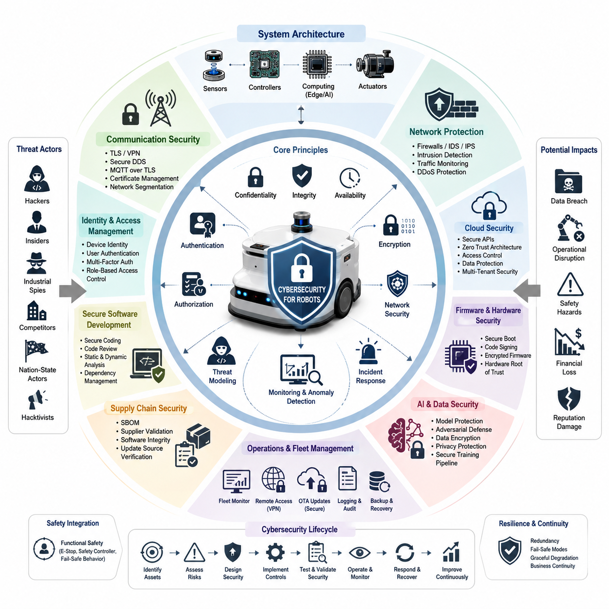
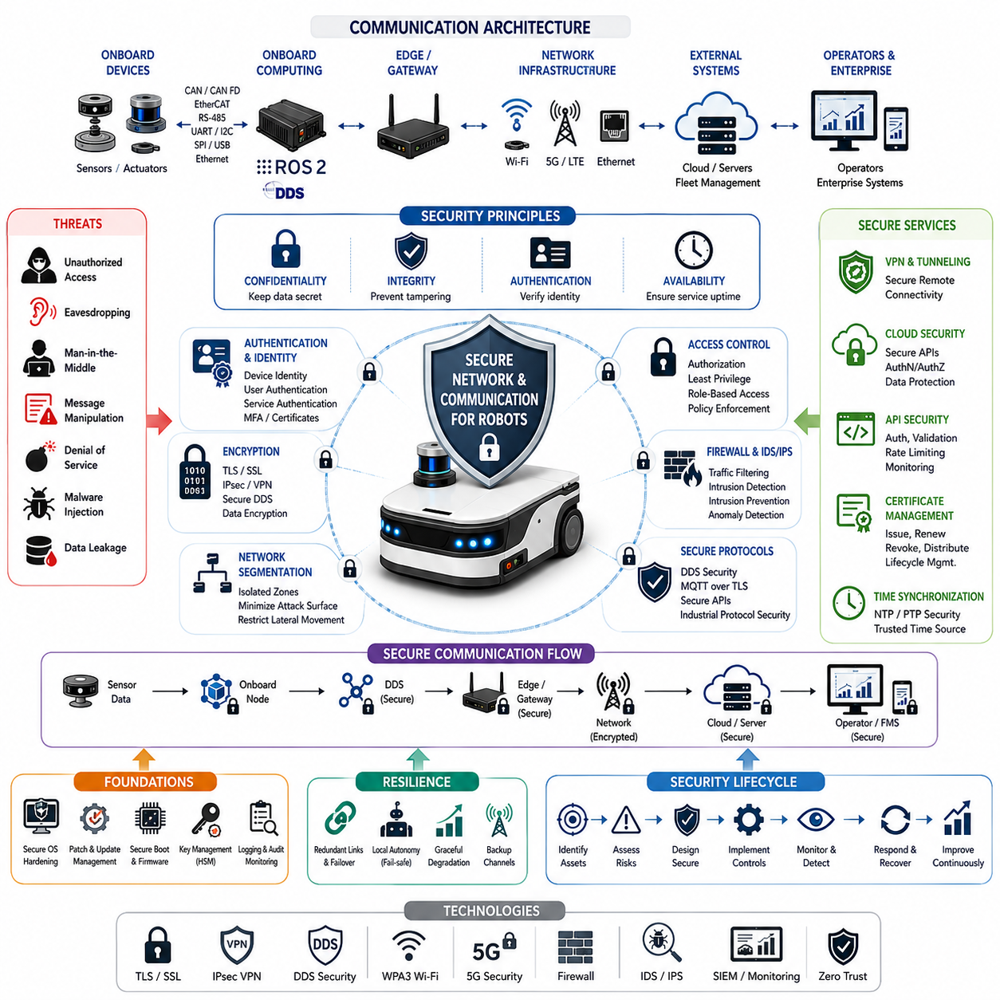
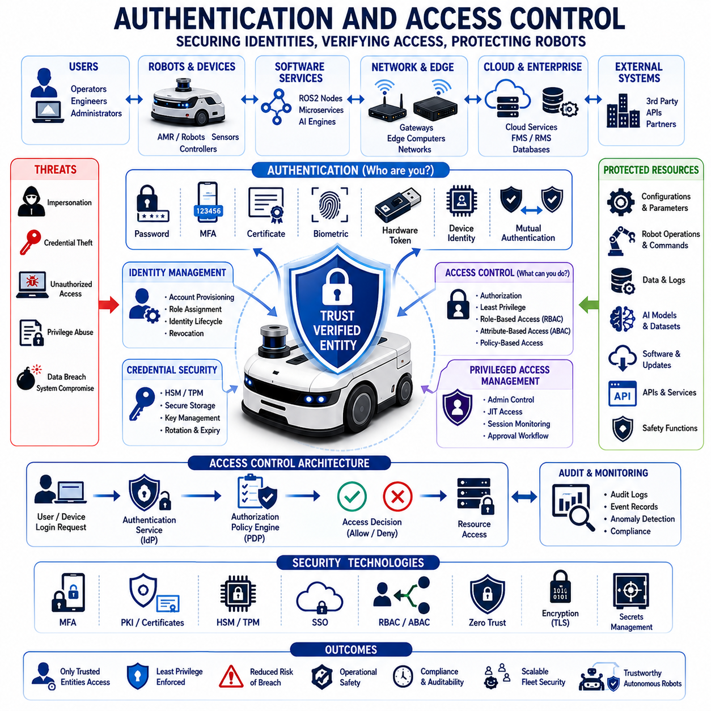
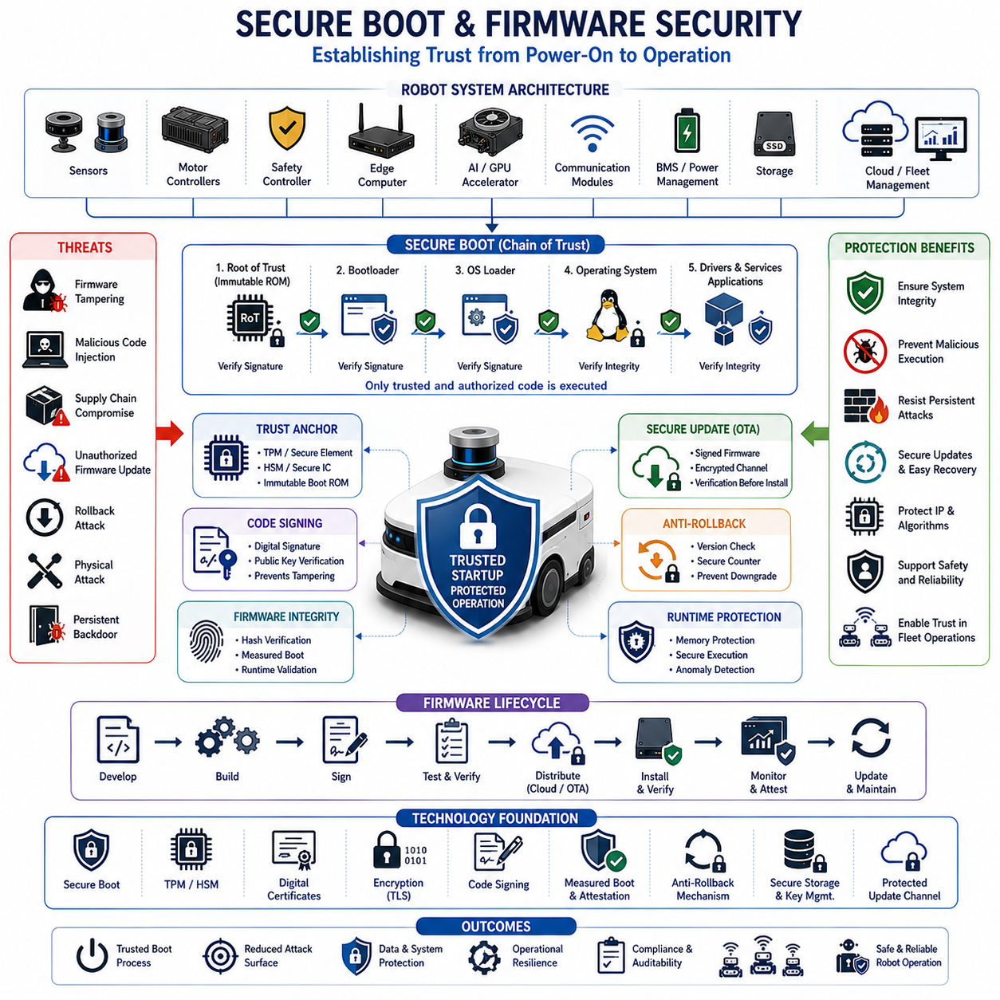
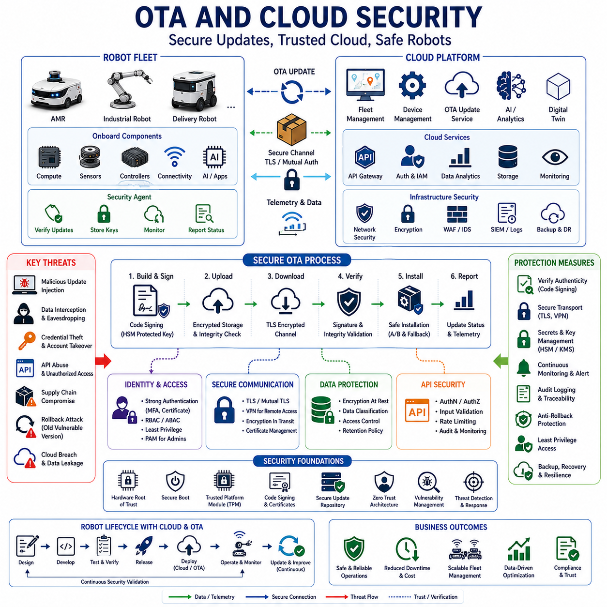
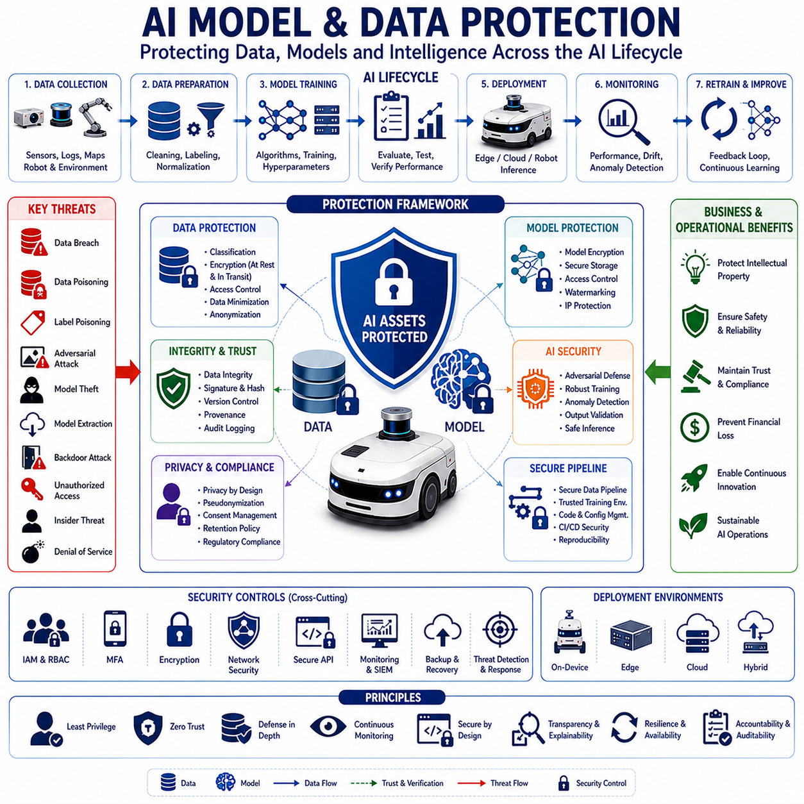
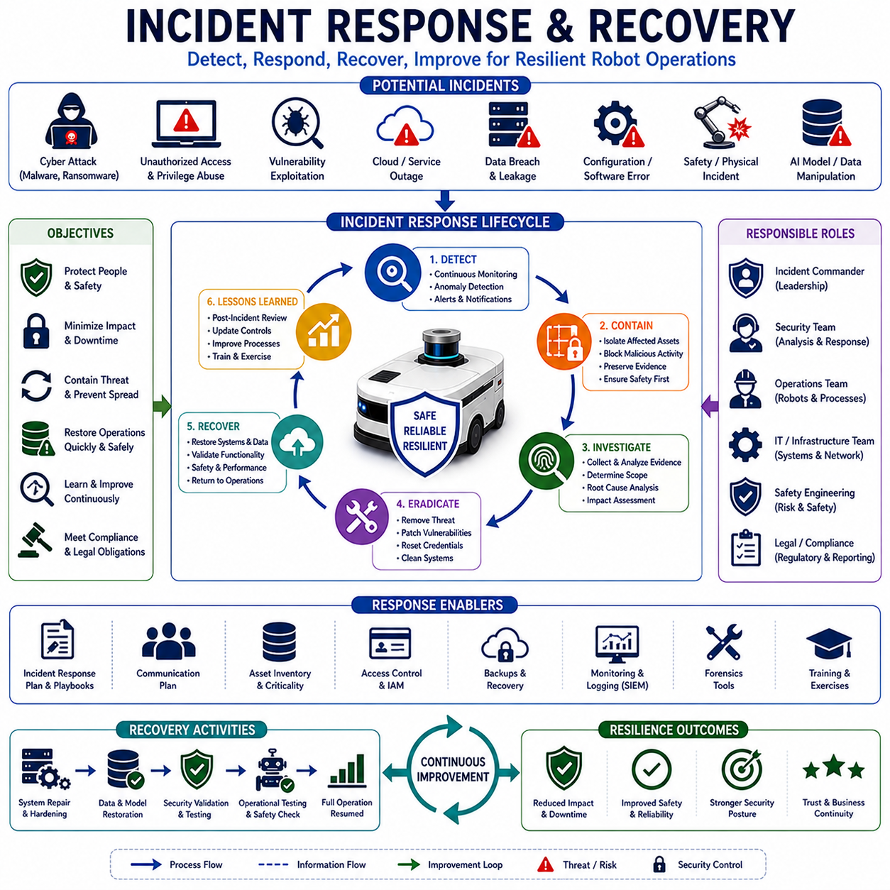
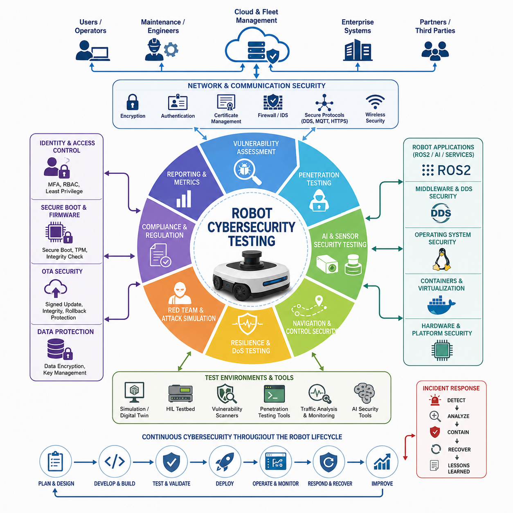

**Volume 07. AMR Software Architecture and Development**


# Chapter 21. Cybersecurity for AMR

## 21.1 Robot Cybersecurity Overview

{width="7.268055555555556in" height="7.268055555555556in"}

Robot cybersecurity has become one of the most critical disciplines in modern Autonomous Mobile Robot (AMR), industrial robot, service robot, and autonomous vehicle development. As robots evolve from isolated mechanical systems into highly connected cyber-physical systems, they inherit many of the cybersecurity challenges traditionally associated with information technology, cloud computing, industrial control systems, and Internet of Things ecosystems. Modern robots are no longer standalone machines operating in closed environments. They are connected to cloud platforms, fleet management systems, enterprise databases, wireless networks, edge computing infrastructure, AI inference engines, remote monitoring services, and software update platforms. This connectivity creates significant opportunities for automation, scalability, and intelligence, but it also introduces a large and continuously expanding attack surface. As a result, cybersecurity has become a fundamental requirement rather than an optional enhancement in robot system design. The topic is positioned within the AMR Software Architecture and Development volume under Cybersecurity for AMR as a foundational introduction to the broader cybersecurity framework.

The primary objective of robot cybersecurity is to protect robotic systems from unauthorized access, malicious manipulation, data theft, operational disruption, and safety-related incidents caused by cyber attacks. Unlike traditional IT systems, robots directly interact with the physical world. A successful cyber attack against a robot can lead not only to information loss but also to equipment damage, production downtime, financial losses, safety hazards, environmental incidents, and even injuries to humans. Therefore, robot cybersecurity must address both information security and operational safety simultaneously.

The convergence of Operational Technology (OT), Information Technology (IT), and Artificial Intelligence has dramatically increased the complexity of robotic security. Traditional industrial automation systems were often isolated behind physical network boundaries. Modern robots, however, frequently communicate through Ethernet, Wi-Fi, 5G, DDS middleware, ROS2 networks, cloud APIs, VPN connections, and remote management systems. Each communication channel introduces potential vulnerabilities that attackers may exploit. Consequently, cybersecurity considerations must be integrated into every layer of the robotic software and hardware architecture.

A robot can be viewed as a collection of interconnected assets that require protection. These assets include embedded controllers, motor drivers, sensor interfaces, operating systems, middleware platforms, AI models, cloud services, databases, user accounts, network infrastructure, and software repositories. Cybersecurity begins by identifying these assets and understanding how they interact. Asset identification allows security engineers to determine which components are critical to system operation and which assets may be targeted by attackers.

Threat modeling is one of the most important activities in robot cybersecurity. Threat modeling involves systematically analyzing how an attacker might compromise the system, what vulnerabilities may exist, and what consequences could result from exploitation. In robotic systems, threat actors may include cybercriminals, industrial spies, disgruntled insiders, competitors, nation-state actors, hacktivists, or accidental users who unintentionally introduce vulnerabilities. Each threat actor possesses different motivations, resources, and technical capabilities.

The attack surface of a robot includes all points where external entities can interact with the system. Examples include network ports, wireless interfaces, USB connectors, diagnostic tools, maintenance laptops, cloud services, application programming interfaces, OTA update mechanisms, web dashboards, remote access systems, and sensor communication channels. Reducing the attack surface is a fundamental cybersecurity principle because fewer exposed interfaces generally result in fewer opportunities for exploitation.

Network security forms one of the most visible aspects of robot cybersecurity. Robots typically communicate with numerous devices and services across multiple networks. Internal communication may occur between sensors, controllers, edge computers, and actuators. External communication may involve fleet management systems, cloud servers, monitoring platforms, or operator workstations. These communications must be protected through encryption, authentication, segmentation, and secure communication protocols to prevent interception, tampering, or unauthorized access.

Authentication ensures that only authorized users, devices, and services can access robotic resources. Authentication mechanisms may include passwords, certificates, hardware security modules, cryptographic keys, multi-factor authentication, and device identity management. In large-scale robot fleets, identity management becomes particularly important because hundreds or thousands of robots may need to communicate securely with centralized management systems.

Authorization complements authentication by defining what authenticated entities are allowed to do. A maintenance engineer may have permission to view logs but not modify navigation software. An operator may initiate missions but not change safety parameters. A cloud service may receive telemetry data but not issue motor control commands. Fine-grained authorization policies help limit damage if credentials are compromised.

Confidentiality, integrity, and availability represent the foundational triad of cybersecurity. Confidentiality protects sensitive information from unauthorized disclosure. Integrity ensures that data and software remain accurate and unaltered. Availability guarantees that robotic services remain operational when needed. In robotic systems, all three properties are equally important. A robot that loses availability cannot perform its mission. A robot with compromised integrity may make dangerous decisions. A robot that loses confidentiality may expose proprietary information or operational intelligence.

Secure communication protocols play an essential role in maintaining confidentiality and integrity. Modern robotic systems commonly use TLS, VPN tunnels, secure DDS configurations, encrypted MQTT communication, SSH connections, and certificate-based authentication. These technologies protect data in transit and help prevent man-in-the-middle attacks, spoofing attempts, and unauthorized interception.

Operating system security provides the foundation upon which all higher-level software components depend. Many robotic systems rely on Linux-based operating systems such as Ubuntu. Hardening the operating system involves minimizing installed packages, disabling unnecessary services, applying security patches, configuring firewalls, enforcing access controls, and monitoring system activity. A compromised operating system can undermine every other security mechanism within the robot.

Middleware security is particularly important in ROS2-based robotic systems. ROS2 relies on DDS for communication between distributed nodes. DDS provides built-in security capabilities including authentication, encryption, access control, and secure discovery. Proper configuration of DDS Security can significantly reduce the risk of unauthorized node participation and message manipulation. Without adequate security settings, attackers may be able to publish malicious messages, subscribe to sensitive topics, or disrupt communication channels.

Application security focuses on protecting robot software from vulnerabilities such as buffer overflows, injection attacks, insecure APIs, privilege escalation, and unsafe coding practices. Secure software development practices include code reviews, static analysis, dynamic analysis, vulnerability scanning, dependency management, and security testing throughout the development lifecycle.

Supply chain security has emerged as a major concern in robotics. Modern robots depend on numerous third-party software libraries, open-source packages, firmware components, hardware modules, cloud services, and AI frameworks. A vulnerability introduced through any component of the supply chain can potentially compromise the entire system. Organizations must therefore evaluate suppliers, verify software integrity, monitor dependencies, and maintain software bills of materials.

Firmware security protects low-level system software that controls hardware behavior. Firmware often resides in motor controllers, sensor modules, embedded processors, communication devices, and safety systems. Attackers targeting firmware may seek persistent access that survives operating system reinstalls and software updates. Secure firmware design typically includes code signing, secure boot mechanisms, cryptographic validation, and protected update procedures.

Secure boot establishes a trusted chain of execution during system startup. Each stage of the boot process verifies the integrity and authenticity of the next stage before execution. If tampering is detected, the system may refuse to boot or enter a recovery mode. Secure boot prevents unauthorized firmware and software from executing on robotic hardware.

AI and machine learning introduce new cybersecurity challenges. Modern robots increasingly rely on neural networks, foundation models, vision transformers, reinforcement learning policies, and multimodal AI systems. These models may be vulnerable to adversarial attacks, data poisoning, model extraction, prompt manipulation, and unauthorized replication. Protecting AI assets requires secure training pipelines, trusted datasets, model encryption, access controls, and continuous monitoring.

Data security is another critical aspect of robotic cybersecurity. Robots collect vast quantities of information including images, video streams, LiDAR scans, operational logs, maps, user interactions, location information, and telemetry records. This data may contain sensitive information about facilities, personnel, operations, or intellectual property. Data protection strategies include encryption at rest, encryption in transit, access control policies, anonymization techniques, and secure storage architectures.

Cloud robotics significantly expands cybersecurity requirements. Cloud-connected robots benefit from centralized management, fleet analytics, remote monitoring, and scalable AI services. However, cloud connectivity also introduces risks associated with internet exposure, credential management, API security, multi-tenant environments, and remote attack vectors. Organizations must implement secure cloud architectures that follow zero-trust principles and industry best practices.

Zero Trust Architecture has become increasingly relevant for robotic systems. Zero trust assumes that no user, device, or network segment should be inherently trusted. Every access request must be verified continuously regardless of location. This approach is particularly valuable for distributed robot fleets operating across multiple facilities, geographic regions, and network environments.

Cybersecurity monitoring provides ongoing visibility into system behavior. Monitoring systems collect logs, network traffic data, authentication events, performance metrics, and security alerts. Security information and event management platforms can aggregate and analyze this information to detect suspicious activity. Early detection is essential because many attacks progress through multiple stages before causing operational impact.

Intrusion detection systems can identify abnormal network activity, unauthorized communication patterns, or unexpected software behavior. In robotic environments, anomaly detection may also incorporate physical indicators such as unusual motion commands, unexpected sensor readings, abnormal actuator behavior, or deviations from operational baselines.

Incident response planning prepares organizations to react effectively when cybersecurity incidents occur. A comprehensive response plan defines roles, responsibilities, escalation procedures, communication channels, containment strategies, forensic processes, recovery procedures, and post-incident analysis activities. Since robots operate in physical environments, incident response often requires coordination between cybersecurity teams, operations personnel, safety engineers, and maintenance staff.

Resilience is a fundamental design goal for secure robotic systems. Security controls cannot guarantee that attacks will never succeed. Therefore, robots must be designed to continue operating safely even under degraded conditions. Resilience mechanisms may include redundant communication channels, fail-safe behaviors, emergency shutdown procedures, isolated safety controllers, backup navigation systems, and automated recovery processes.

Cybersecurity regulations and standards are becoming increasingly important in robotics. Organizations developing commercial robots may need to comply with industrial cybersecurity frameworks, functional safety standards, privacy regulations, and sector-specific requirements. Standards help establish consistent security practices and provide structured methodologies for risk assessment, mitigation, validation, and continuous improvement.

Cybersecurity testing is essential for validating security controls. Testing activities may include vulnerability assessments, penetration testing, red team exercises, configuration audits, code reviews, protocol analysis, firmware analysis, and security-focused simulations. Testing should occur throughout the robot lifecycle rather than only at the end of development.

As autonomous systems become more intelligent, interconnected, and widely deployed, cybersecurity will increasingly influence every aspect of robot engineering. Future robotic systems will likely incorporate AI-driven threat detection, autonomous security monitoring, adaptive defense mechanisms, secure multi-agent communication, hardware-rooted trust architectures, and continuous cyber resilience management. Cybersecurity will evolve from a specialized discipline into a core architectural principle that influences software design, hardware selection, operational procedures, fleet management strategies, and regulatory compliance.

Ultimately, robot cybersecurity is not merely about preventing unauthorized access to digital systems. It is about ensuring the safe, reliable, trustworthy, and resilient operation of autonomous machines that increasingly participate in critical industrial, commercial, medical, logistics, infrastructure, and public service environments. As robots become essential components of modern society, cybersecurity will serve as one of the foundational pillars supporting their long-term adoption, scalability, and acceptance across the global economy. This overview provides the conceptual foundation for the subsequent chapters covering communication security, authentication, secure boot, OTA protection, AI model security, incident response, and cybersecurity testing within the broader AMR cybersecurity framework.

# 21_01_Robot_Cybersecurity_Overview (로봇 사이버보안 개요)

로봇 사이버보안(Robot Cybersecurity)은 현대 자율이동로봇(AMR), 산업용 로봇, 서비스 로봇, 자율주행 시스템 개발에서 가장 중요한 기술 분야 중 하나로 자리 잡고 있다. 로봇은 더 이상 독립적으로 동작하는 기계 장치가 아니라 클라우드(Cloud), 엣지 컴퓨팅(Edge Computing), 인공지능(AI), 원격 관제 시스템(Remote Monitoring System), OTA(Over-the-Air) 업데이트 플랫폼, 기업 정보 시스템과 연결된 복합적인 사이버-물리 시스템(Cyber-Physical System)으로 발전하고 있다. 이러한 연결성은 로봇의 지능화와 확장성을 높여 주지만 동시에 새로운 보안 위협을 만들어낸다. 따라서 사이버보안은 단순한 부가 기능이 아니라 로봇 시스템 설계의 필수 요소가 되었다. 본 장은 AMR 소프트웨어 아키텍처 및 개발 분야의 「Cybersecurity for AMR」 파트의 입문 장으로서 전체 보안 체계의 개요를 설명한다.

로봇 사이버보안의 가장 중요한 목적은 무단 접근, 악의적인 조작, 데이터 유출, 운영 중단, 안전 사고를 방지하는 것이다. 일반적인 IT 시스템에서는 보안 사고가 정보 유출이나 서비스 장애로 끝날 수 있지만, 로봇은 물리 세계와 직접 상호작용하기 때문에 사이버 공격이 실제 장비 손상, 생산 중단, 재산 피해, 안전 사고, 인명 피해로 이어질 수 있다. 따라서 로봇 보안은 정보보안(Information Security)과 기능 안전성(Functional Safety)을 동시에 고려해야 한다.

최근에는 운영기술(OT), 정보기술(IT), 인공지능(AI)이 하나의 시스템으로 융합되면서 보안 복잡성이 크게 증가하였다. 과거 산업 자동화 시스템은 폐쇄망 안에서 운영되는 경우가 많았지만, 현대 로봇은 Ethernet, Wi-Fi, 5G, ROS2, DDS, MQTT, Cloud API 등을 통해 외부 시스템과 지속적으로 통신한다. 이 과정에서 공격자가 침투할 수 있는 공격 표면(Attack Surface)이 확대된다. 따라서 로봇 개발 초기 단계부터 보안을 시스템 설계에 통합하는 것이 중요하다.

보안 관점에서 로봇은 보호해야 할 다양한 자산(Asset)의 집합으로 볼 수 있다. 여기에는 임베디드 컨트롤러, 모터 드라이버, 센서 인터페이스, 운영체제, ROS2 미들웨어, AI 모델, 클라우드 서비스, 데이터베이스, 사용자 계정, 네트워크 장비, 소프트웨어 저장소 등이 포함된다. 보안 설계의 첫 단계는 이러한 자산을 식별하고 중요도를 분석하는 것이다.

위협 모델링(Threat Modeling)은 로봇 보안의 핵심 활동 중 하나이다. 위협 모델링은 공격자가 어떠한 방식으로 시스템을 공격할 수 있는지, 어떤 취약점이 존재하는지, 공격이 성공했을 때 어떤 피해가 발생하는지를 체계적으로 분석하는 과정이다. 공격자는 단순 해커뿐 아니라 산업 스파이, 내부 직원, 경쟁 업체, 국가 단위 공격 조직, 해커 그룹 등 다양한 형태로 존재할 수 있다.

로봇의 공격 표면은 외부와 연결되는 모든 인터페이스를 의미한다. 여기에는 네트워크 포트, 무선 통신 모듈, USB 포트, 유지보수 노트북, 클라우드 서비스, 웹 대시보드, OTA 업데이트 시스템, API 서버, 센서 통신 채널 등이 포함된다. 일반적으로 공격 표면이 작을수록 공격 가능성도 감소하므로 불필요한 인터페이스를 제거하는 것이 중요하다.

네트워크 보안(Network Security)은 로봇 보안에서 가장 기본적인 영역이다. 로봇은 센서, 제어기, 엣지 컴퓨터, 클라우드 서버, 관제 시스템과 지속적으로 데이터를 교환한다. 이러한 통신 과정에서 데이터 도청, 위조, 변조, 재전송 공격 등을 방지하기 위해 암호화(Encryption), 인증(Authentication), 네트워크 분리(Network Segmentation), 보안 프로토콜(Secure Protocol)을 적용해야 한다.

인증(Authentication)은 시스템에 접근하는 사용자나 장치가 실제로 허가된 대상인지 확인하는 과정이다. 인증 방식으로는 비밀번호, 인증서(Certificate), 보안 키(Security Key), 하드웨어 보안 모듈(HSM), 다중 인증(MFA) 등이 사용된다. 수백 대 이상의 로봇을 운영하는 플릿(Fleet) 환경에서는 각 로봇의 디지털 신원 관리(Device Identity Management)가 매우 중요하다.

인가(Authorization)는 인증된 사용자가 어떤 작업을 수행할 수 있는지 결정하는 과정이다. 예를 들어 유지보수 엔지니어는 로그를 확인할 수 있지만 안전 파라미터를 수정할 수 없도록 제한할 수 있다. 운영자는 임무를 시작할 수 있지만 제어 소프트웨어를 변경할 수 없도록 설정할 수 있다. 이러한 권한 분리는 계정 탈취 시 피해를 최소화하는 데 도움이 된다.

사이버보안의 기본 원칙은 기밀성(Confidentiality), 무결성(Integrity), 가용성(Availability)이다. 기밀성은 정보가 허가되지 않은 사람에게 노출되지 않도록 보장하는 것이고, 무결성은 데이터와 소프트웨어가 변경되지 않았음을 보장하는 것이다. 가용성은 시스템이 필요할 때 정상적으로 작동할 수 있도록 유지하는 것을 의미한다. 로봇에서는 세 가지 요소가 모두 중요하다. 가용성이 사라지면 임무 수행이 불가능하며, 무결성이 손상되면 잘못된 의사결정이 이루어질 수 있고, 기밀성이 깨지면 운영 정보와 기술 자산이 유출될 수 있다.

보안 통신 프로토콜은 데이터의 기밀성과 무결성을 보장하는 핵심 기술이다. TLS, VPN, Secure DDS, MQTT TLS, SSH, 인증서 기반 통신 등이 대표적으로 사용된다. 이러한 기술은 중간자 공격(Man-in-the-Middle Attack), 패킷 위조, 데이터 탈취를 방지한다.

운영체제 보안 역시 매우 중요하다. 대부분의 로봇은 Ubuntu Linux 기반 시스템을 사용한다. 운영체제 보안 강화(Hardening)는 불필요한 서비스 제거, 패치 적용, 방화벽 설정, 접근 권한 제한, 보안 로그 관리 등을 포함한다. 운영체제가 침해되면 상위 소프트웨어의 보안 기능도 무력화될 수 있다.

ROS2 기반 로봇에서는 DDS 보안(DDS Security)이 중요한 역할을 한다. DDS는 인증, 암호화, 접근 제어, 보안 검색(Secure Discovery) 기능을 제공한다. DDS Security를 적절히 구성하면 허가되지 않은 노드가 네트워크에 참여하거나 토픽 데이터를 위조하는 것을 방지할 수 있다.

애플리케이션 보안(Application Security)은 로봇 소프트웨어 내부의 취약점을 제거하는 것을 목표로 한다. 버퍼 오버플로우(Buffer Overflow), 코드 삽입(Code Injection), 권한 상승(Privilege Escalation), 취약한 API 설계 등을 방지하기 위해 코드 리뷰(Code Review), 정적 분석(Static Analysis), 동적 분석(Dynamic Analysis), 보안 테스트(Security Testing)를 수행한다.

공급망 보안(Supply Chain Security)은 최근 매우 중요한 분야로 떠오르고 있다. 현대 로봇은 수많은 오픈소스 패키지, AI 프레임워크, 드라이버, 하드웨어 모듈, 클라우드 서비스를 사용한다. 이 중 하나라도 악성 코드나 취약점을 포함하고 있다면 전체 시스템이 위험에 노출될 수 있다. 따라서 소프트웨어 구성 목록(SBOM), 공급업체 검증, 무결성 확인 절차가 필요하다.

펌웨어 보안(Firmware Security)은 센서, 모터 드라이버, MCU, 통신 모듈과 같은 저수준 장치를 보호하는 기술이다. 공격자가 펌웨어를 변조하면 운영체제를 재설치해도 공격 코드가 남아 있을 수 있다. 이를 방지하기 위해 코드 서명(Code Signing), 암호화 검증, 보안 업데이트 체계를 적용한다.

보안 부트(Secure Boot)는 시스템이 부팅될 때 모든 소프트웨어가 신뢰 가능한지 검증하는 기술이다. 부트로더(Bootloader)부터 운영체제, 애플리케이션까지 단계적으로 검증을 수행하며, 위조된 코드가 발견되면 실행을 차단한다.

AI 모델 보안 역시 점점 중요해지고 있다. 최신 로봇은 딥러닝 모델, 비전 트랜스포머(Vision Transformer), 강화학습 정책, VLM(Vision Language Model), VLA(Vision Language Action) 모델 등을 사용한다. 이러한 모델은 적대적 공격(Adversarial Attack), 데이터 중독(Data Poisoning), 모델 탈취(Model Extraction) 등의 위협에 노출될 수 있다. 따라서 데이터셋 보호, 학습 파이프라인 보안, 모델 암호화, 접근 통제가 필요하다.

데이터 보안(Data Security)은 로봇이 수집하는 이미지, LiDAR 데이터, 지도(Map), 로그(Log), 사용자 정보, 위치 정보 등을 보호하는 것을 의미한다. 데이터는 저장 중(At Rest)과 전송 중(In Transit) 모두 암호화되어야 하며, 접근 권한이 엄격하게 관리되어야 한다.

클라우드 로보틱스(Cloud Robotics)는 중앙 집중형 관리와 대규모 분석 기능을 제공하지만 동시에 인터넷 기반 공격 위험을 증가시킨다. 따라서 API 보안, 인증 관리, 멀티테넌트(Multi-Tenant) 보안, 제로 트러스트(Zero Trust) 아키텍처 적용이 중요하다.

제로 트러스트 보안 모델은 사용자, 장치, 네트워크를 기본적으로 신뢰하지 않는 개념이다. 모든 접근 요청은 지속적으로 검증되어야 하며, 내부 네트워크라고 해서 자동으로 신뢰하지 않는다. 여러 지역에 분산된 대규모 AMR 플릿에서는 특히 효과적인 보안 전략이다.

보안 모니터링(Security Monitoring)은 시스템의 상태를 지속적으로 관찰하는 활동이다. 로그, 네트워크 트래픽, 인증 이벤트, 성능 데이터 등을 분석하여 이상 행동을 탐지한다. 공격은 일반적으로 여러 단계를 거쳐 진행되므로 조기 탐지가 매우 중요하다.

침입 탐지 시스템(Intrusion Detection System)은 비정상적인 통신 패턴, 예상치 못한 소프트웨어 동작, 비인가 접근 시도를 감지한다. 로봇의 경우 이상한 주행 명령, 비정상 센서 데이터, 예기치 않은 모터 동작도 탐지 대상으로 포함될 수 있다.

사고 대응(Incident Response)은 보안 사고 발생 시 신속하게 대응하기 위한 절차이다. 여기에는 사고 탐지, 격리, 분석, 복구, 재발 방지 활동이 포함된다. 로봇 환경에서는 보안팀뿐 아니라 운영팀, 안전 엔지니어, 유지보수 조직이 함께 대응해야 한다.

사이버 회복력(Cyber Resilience)은 공격을 완전히 막는 것이 아니라 공격이 발생하더라도 안전하게 운영을 지속할 수 있도록 설계하는 개념이다. 이를 위해 이중화 통신, 안전 제어기, 비상 정지 시스템, 자동 복구 메커니즘, 백업 내비게이션 시스템 등이 활용된다.

현재 로봇 산업에서는 다양한 보안 표준과 규제가 등장하고 있다. 산업용 로봇, 자율주행 시스템, 의료 로봇, 물류 로봇은 각각 요구되는 보안 수준이 다르지만 공통적으로 위험 분석, 보안 설계, 검증, 운영 관리 체계를 갖추어야 한다.

보안 테스트는 보안 체계가 실제로 효과적인지 확인하는 마지막 단계이다. 취약점 분석(Vulnerability Assessment), 침투 테스트(Penetration Testing), 레드팀 평가(Red Team Exercise), 펌웨어 분석, 프로토콜 분석 등을 수행하여 실제 공격 상황에 대한 방어 능력을 검증한다.

미래의 로봇은 더욱 지능적이고 연결성이 높아질 것이다. 이에 따라 AI 기반 위협 탐지, 자율 보안 에이전트, 하드웨어 기반 신뢰 체계(Root of Trust), 자율 복구 시스템, 보안 중심 멀티로봇 통신 기술이 중요해질 전망이다. 결국 사이버보안은 단순한 IT 보안 기술이 아니라 로봇의 신뢰성(Reliability), 안전성(Safety), 확장성(Scalability), 운영성(Operation)을 보장하는 핵심 아키텍처 요소가 될 것이다.

결론적으로 로봇 사이버보안은 단순히 해킹을 막는 기술이 아니다. 이는 자율 로봇이 공장, 병원, 물류센터, 스마트시티, 공공 인프라와 같은 실제 환경에서 안전하고 신뢰성 있게 동작하도록 보장하는 기반 기술이다. 앞으로 로봇이 사회 전반에 확산될수록 사이버보안은 기계 설계, 전기 설계, 소프트웨어 설계, AI 설계와 동등한 수준의 핵심 공학 분야로 발전하게 될 것이다.

##  

## 21.2 Network and Communication Security

{width="7.268055555555556in" height="7.268055555555556in"}

Network and Communication Security is one of the most fundamental pillars of robot cybersecurity. Modern Autonomous Mobile Robots (AMRs), industrial robots, service robots, inspection robots, and autonomous vehicles operate within highly connected digital ecosystems where data continuously flows between sensors, controllers, edge computers, cloud platforms, fleet management systems, operators, and enterprise infrastructure. As robots become increasingly dependent on network connectivity for perception, navigation, coordination, software updates, remote monitoring, and AI-driven decision making, communication channels become attractive targets for cyber attackers. Protecting these communication pathways is therefore essential to maintaining system safety, operational reliability, data confidentiality, and overall mission success.

Traditional industrial machines often operated within isolated networks and had limited external connectivity. Modern robotic systems are fundamentally different. A typical AMR may communicate simultaneously through Ethernet, Wi-Fi, DDS middleware, ROS2 topics, MQTT brokers, VPN tunnels, cloud APIs, database services, GNSS correction streams, fleet management servers, and remote maintenance tools. Each communication path introduces potential vulnerabilities that attackers may exploit to intercept data, manipulate commands, disrupt services, or gain unauthorized access to robotic assets. Network security is therefore not simply an IT requirement but a core component of robotic system architecture.

The primary objective of network security is to ensure that communications remain confidential, authentic, intact, and available. Confidentiality prevents sensitive information from being exposed to unauthorized parties. Integrity guarantees that transmitted information has not been altered. Authentication verifies the identity of communicating entities. Availability ensures that communication services remain operational even under adverse conditions. Together, these principles create the foundation upon which secure robotic operations depend.

A robotic communication network can be viewed as a hierarchy of interconnected domains. At the lowest level, sensors communicate with embedded controllers through interfaces such as CAN, CAN FD, EtherCAT, RS-485, SPI, I2C, UART, USB, or Ethernet. At the system level, onboard computers exchange information through ROS2 middleware and DDS communication layers. At the operational level, robots communicate with fleet management systems, edge servers, cloud platforms, and operator workstations. Each communication layer possesses unique security requirements and attack vectors that must be addressed through appropriate protective measures.

One of the most common threats in robotic networks is unauthorized access. Attackers may attempt to connect to exposed services, exploit weak credentials, or compromise devices that possess excessive privileges. Once access is obtained, attackers may observe traffic, issue commands, alter configurations, deploy malicious software, or disrupt operations. Preventing unauthorized access requires a combination of authentication mechanisms, access controls, network segmentation, encryption, and continuous monitoring.

Authentication serves as the first line of defense in communication security. Every device, service, application, and user participating in a robotic ecosystem should possess a verifiable identity. Device authentication ensures that robots communicate only with trusted infrastructure components. User authentication ensures that only authorized personnel can access management interfaces. Service authentication guarantees that communication occurs only between legitimate software components. Strong authentication mechanisms typically involve certificates, cryptographic keys, hardware security modules, or multi-factor authentication rather than relying solely on passwords.

Encryption plays a central role in protecting communication confidentiality. Data transmitted across wireless networks, public infrastructure, or shared enterprise environments may otherwise be intercepted by unauthorized observers. Encryption transforms readable information into protected ciphertext that can only be interpreted by authorized recipients possessing the appropriate cryptographic keys. Modern robotic systems commonly employ Transport Layer Security (TLS), Secure Shell (SSH), Internet Protocol Security (IPsec), Virtual Private Networks (VPNs), and encrypted DDS communication channels to safeguard data transmission.

Wireless communication introduces unique security challenges because signals can often be intercepted without physical access to the robot. Wi-Fi networks, cellular connections, Bluetooth devices, and other wireless technologies must therefore be configured using strong encryption protocols, secure authentication methods, and proper key management practices. Weak wireless security configurations can allow attackers to monitor traffic, impersonate legitimate devices, or inject malicious communications into the network.

Network segmentation represents another critical security strategy. Rather than allowing unrestricted communication between all devices, network segmentation divides infrastructure into isolated security zones. Sensors, safety systems, control networks, operator workstations, cloud services, and administrative systems may each reside within separate network segments governed by carefully defined communication rules. If one segment becomes compromised, segmentation helps prevent attackers from moving laterally throughout the entire robotic environment.

In large industrial deployments, robots frequently operate within enterprise networks that contain numerous information systems. These environments require careful integration between Operational Technology and Information Technology infrastructures. Operational Technology networks prioritize deterministic communication, real-time performance, and system availability. Information Technology networks emphasize scalability, flexibility, and data accessibility. Secure integration requires balancing operational requirements with cybersecurity protections while minimizing disruption to robotic functions.

Firewalls are widely used to enforce communication policies between network segments. A firewall examines network traffic and determines whether communication should be allowed or blocked according to predefined security rules. Robotic environments may utilize host-based firewalls, network firewalls, industrial firewalls, or cloud security gateways. Effective firewall policies minimize unnecessary exposure while preserving essential communication paths.

Intrusion Detection Systems and Intrusion Prevention Systems provide additional layers of protection by monitoring network activity for signs of malicious behavior. These systems analyze traffic patterns, protocol usage, connection attempts, and system behavior to identify suspicious activities. In robotic environments, intrusion detection may monitor ROS2 traffic, DDS communications, cloud interactions, VPN usage, or industrial protocol exchanges. Early detection enables organizations to respond before significant damage occurs.

One of the most significant communication security concerns in robotics involves man-in-the-middle attacks. In such attacks, an adversary positions themselves between two communicating entities and intercepts, modifies, or relays messages without detection. If communication channels lack authentication and encryption, attackers may manipulate navigation commands, sensor data, operational parameters, or software updates. Cryptographic authentication and secure communication protocols are essential defenses against these threats.

Message integrity verification ensures that transmitted data remains unchanged during transit. Integrity protection typically relies on cryptographic techniques such as digital signatures, message authentication codes, and hash functions. These mechanisms allow recipients to verify that messages originate from trusted sources and have not been altered by malicious actors or transmission errors.

ROS2 communication security has become increasingly important as ROS2 emerges as the dominant middleware framework for robotic applications. ROS2 utilizes the Data Distribution Service as its communication backbone. DDS Security provides a comprehensive framework for authentication, access control, encryption, and secure discovery. Proper implementation of DDS Security enables robots to authenticate participating nodes, encrypt communication channels, enforce topic-level access permissions, and prevent unauthorized network participation.

Without DDS Security, a ROS2 network may be vulnerable to various attacks. Unauthorized nodes could publish false sensor data, inject malicious commands, subscribe to sensitive topics, or disrupt communication flows. Secure DDS configurations significantly reduce these risks by ensuring that only trusted entities can participate in the communication ecosystem.

Virtual Private Networks are commonly employed when robots communicate across public networks or remote facilities. A VPN creates an encrypted tunnel between endpoints, protecting data from interception and unauthorized observation. Fleet management systems often rely on VPN infrastructure to securely connect geographically distributed robots with centralized operational platforms. VPNs provide both confidentiality and access control benefits while reducing exposure to internet-based threats.

Cloud communication security has become increasingly important as robotic systems adopt cloud-native architectures. Robots may transmit telemetry, logs, maps, sensor data, diagnostics, and operational metrics to cloud platforms for storage, analysis, and management. These interactions must be protected through secure APIs, encrypted channels, strong authentication mechanisms, and robust authorization frameworks. Cloud communication security also involves protecting API gateways, managing credentials, rotating certificates, and monitoring service access patterns.

Application Programming Interfaces represent critical communication interfaces in modern robotic ecosystems. APIs enable integration between robots, fleet management platforms, enterprise software, analytics systems, and external services. Poorly secured APIs may expose sensitive information or provide unauthorized access to critical functions. API security therefore requires authentication, authorization, encryption, rate limiting, input validation, and continuous monitoring.

Certificate management is a fundamental component of secure communications. Certificates establish trusted identities for devices, servers, applications, and services. However, managing certificates across large robot fleets can be complex. Organizations must implement mechanisms for certificate issuance, renewal, revocation, distribution, and lifecycle management. Automated certificate management systems help maintain security while reducing operational overhead.

Time synchronization infrastructure also influences communication security. Robotic systems frequently depend on synchronized timestamps for sensor fusion, event correlation, data recording, fleet coordination, and forensic analysis. Network Time Protocol and Precision Time Protocol infrastructures must themselves be protected against manipulation because compromised time sources can disrupt operations or obscure security investigations.

Communication security must also address denial-of-service attacks. These attacks attempt to overwhelm communication resources, consume network bandwidth, exhaust computational capacity, or disrupt critical services. In robotic environments, denial-of-service attacks may interfere with command delivery, sensor transmission, fleet coordination, or cloud connectivity. Defensive strategies include traffic filtering, rate limiting, redundant communication paths, resource isolation, and anomaly detection mechanisms.

Industrial communication protocols introduce additional considerations. Protocols such as Modbus, PROFINET, EtherNet/IP, OPC UA, and EtherCAT were often designed with operational efficiency as a primary objective rather than cybersecurity. Modern deployments frequently require supplemental protections including network isolation, encrypted gateways, secure tunnels, and protocol-aware security monitoring to mitigate inherent protocol limitations.

Remote maintenance and troubleshooting capabilities provide significant operational benefits but also create potential security risks. Engineers often require remote access to diagnose issues, deploy updates, review logs, or adjust configurations. Secure remote access architectures rely on VPNs, multi-factor authentication, jump servers, session monitoring, and detailed audit logging to balance accessibility with security.

Network monitoring provides continuous visibility into communication activities throughout the robotic ecosystem. Monitoring systems collect traffic statistics, connection records, authentication events, bandwidth utilization metrics, and security alerts. Advanced monitoring platforms may employ machine learning techniques to identify anomalous communication behaviors that indicate emerging threats or compromised systems.

Zero Trust networking principles are becoming increasingly relevant in robotic environments. Rather than assuming trust based on network location, Zero Trust architectures require continuous verification of users, devices, services, and communication requests. Every interaction must be authenticated, authorized, and monitored regardless of whether it originates from internal or external networks. This approach significantly improves resilience against insider threats and compromised devices.

Communication resilience is equally important as communication security. Robots operating in industrial facilities, hospitals, logistics centers, ports, mines, airports, or smart cities must continue functioning even when communication disruptions occur. Resilient communication architectures incorporate redundancy, failover mechanisms, multiple communication paths, local autonomy capabilities, and graceful degradation strategies that maintain safe operation under degraded network conditions.

As robotic systems continue to evolve toward cloud-native, AI-driven, and fleet-scale architectures, communication security will become even more critical. Future robots will exchange larger volumes of data, collaborate with autonomous agents, interact with distributed AI services, and participate in increasingly complex digital ecosystems. Protecting these communications will require advanced encryption technologies, automated trust management, adaptive security frameworks, AI-powered threat detection systems, and highly resilient network architectures.

Ultimately, Network and Communication Security serves as the circulatory system of robot cybersecurity. Every command, sensor reading, software update, diagnostic message, AI inference request, and operational decision depends on secure communication pathways. A robot may possess sophisticated perception algorithms, advanced navigation capabilities, and powerful AI models, but without secure communications, the integrity and trustworthiness of the entire robotic system can be compromised. For this reason, communication security remains one of the most essential disciplines in the design, deployment, operation, and long-term management of modern robotic platforms.

# 21_02 네트워크 및 통신 보안 (Network and Communication Security)

네트워크 및 통신 보안(Network and Communication Security)은 로봇 사이버보안(Robot Cybersecurity)의 가장 기본적이면서도 중요한 핵심 요소 중 하나이다. 현대의 자율이동로봇(AMR), 산업용 로봇, 서비스 로봇, 검사 로봇, 자율주행 차량은 센서, 제어기, 엣지 컴퓨터(Edge Computer), 클라우드 플랫폼(Cloud Platform), 플릿 관리 시스템(Fleet Management System), 운영자 단말기, 기업 정보 시스템과 지속적으로 데이터를 주고받으며 동작한다. 이러한 연결성은 로봇의 지능화와 자동화를 가능하게 하지만 동시에 공격자가 침투할 수 있는 수많은 통신 경로를 제공한다. 따라서 네트워크와 통신을 안전하게 보호하는 것은 시스템 안전성, 운영 신뢰성, 데이터 보호 및 서비스 연속성을 보장하기 위한 필수 조건이다.

과거의 산업 장비는 폐쇄된 네트워크 안에서 동작하는 경우가 많았지만, 현대 로봇은 완전히 다른 환경에 놓여 있다. 하나의 AMR만 보더라도 Ethernet, Wi-Fi, DDS(Data Distribution Service), ROS2, MQTT, VPN, Cloud API, 데이터베이스 서비스, GNSS 보정 데이터 스트림, 원격 유지보수 시스템 등 다양한 통신 채널을 동시에 사용한다. 각각의 채널은 공격자가 악용할 수 있는 잠재적인 공격 경로가 되며, 데이터 탈취, 명령 조작, 서비스 방해, 권한 탈취와 같은 위협에 노출될 수 있다. 따라서 네트워크 보안은 단순한 IT 기능이 아니라 로봇 시스템 설계 단계에서부터 고려되어야 하는 핵심 아키텍처 요소이다.

네트워크 보안의 기본 목적은 통신 데이터의 기밀성(Confidentiality), 무결성(Integrity), 인증(Authentication), 가용성(Availability)을 보장하는 것이다. 기밀성은 허가되지 않은 사용자가 데이터를 볼 수 없도록 보호하는 것이고, 무결성은 데이터가 전송 중에 변경되지 않았음을 보장하는 것이다. 인증은 통신 상대방이 실제로 신뢰할 수 있는 대상인지 확인하는 과정이며, 가용성은 필요한 시점에 통신 서비스가 정상적으로 제공되는 상태를 의미한다. 이러한 요소들이 모두 확보되어야 로봇은 안전하고 신뢰성 있게 운영될 수 있다.

로봇의 통신 구조는 일반적으로 여러 계층으로 구성된다. 가장 하위 계층에서는 센서와 제어기가 CAN, CAN FD, EtherCAT, RS-485, SPI, I2C, UART, USB, Ethernet 등을 통해 통신한다. 시스템 계층에서는 ROS2와 DDS를 통해 노드 간 데이터가 교환된다. 운영 계층에서는 플릿 관리 시스템(FMS), 클라우드 서버, 원격 관제 시스템, 운영자 인터페이스와 연결된다. 각 계층은 서로 다른 보안 요구사항을 가지며, 각각에 적합한 보안 기술이 적용되어야 한다.

로봇 네트워크에서 가장 흔한 공격 중 하나는 비인가 접근(Unauthorized Access)이다. 공격자는 노출된 포트나 취약한 계정을 이용하여 시스템 내부로 침투하려고 시도한다. 접근에 성공하면 통신을 감청하거나, 설정을 변경하거나, 악성 소프트웨어를 설치하거나, 로봇 제어 명령을 위조할 수 있다. 이러한 위험을 줄이기 위해서는 강력한 인증 체계, 접근 제어 정책, 네트워크 분리, 암호화 기술이 필요하다.

인증(Authentication)은 통신 보안의 첫 번째 방어선이다. 로봇, 서버, 사용자, 서비스는 모두 자신을 증명할 수 있는 신뢰 가능한 디지털 신원(Digital Identity)을 가져야 한다. 장치 인증(Device Authentication)은 로봇이 신뢰할 수 있는 서버와만 통신하도록 보장하며, 사용자 인증(User Authentication)은 허가된 인원만 관리 시스템에 접근하도록 한다. 현대 시스템에서는 단순 비밀번호보다 인증서(Certificate), 암호키(Cryptographic Key), 하드웨어 보안 모듈(HSM), 다중 인증(MFA) 방식이 선호된다.

암호화(Encryption)는 통신 내용의 기밀성을 보장하는 핵심 기술이다. 암호화가 적용되지 않은 데이터는 네트워크를 통과하는 과정에서 쉽게 도청될 수 있다. 암호화는 원본 데이터를 암호문(Ciphertext)으로 변환하여 허가된 수신자만 내용을 해독할 수 있도록 만든다. 로봇 시스템에서는 TLS(Transport Layer Security), SSH(Secure Shell), IPsec, VPN(Virtual Private Network), Secure DDS 등이 널리 사용된다.

무선 통신(Wireless Communication)은 유선 네트워크보다 더 높은 보안 위험을 가진다. Wi-Fi, 5G, LTE, Bluetooth와 같은 기술은 물리적인 접근 없이도 전파를 수신할 수 있기 때문이다. 따라서 WPA3, TLS, 인증서 기반 인증, 강력한 키 관리 체계를 적용하여 도청, 위장 공격(Spoofing), 패킷 삽입 공격을 방지해야 한다.

네트워크 분리(Network Segmentation)는 매우 중요한 보안 전략이다. 모든 장비를 하나의 네트워크에 연결하는 대신 센서 네트워크, 안전 제어 네트워크, 운영 네트워크, 클라우드 연결 네트워크 등을 별도로 분리한다. 이렇게 하면 하나의 구역이 침해되더라도 공격자가 전체 시스템으로 확산되는 것을 막을 수 있다.

대규모 산업 현장에서는 운영기술(OT)과 정보기술(IT)의 통합이 필요하다. OT 네트워크는 실시간성과 안정성을 중요시하는 반면 IT 네트워크는 확장성과 정보 공유를 중요시한다. 로봇은 이 두 환경을 연결하는 위치에 있기 때문에 보안과 성능 사이의 균형을 신중하게 고려해야 한다.

방화벽(Firewall)은 네트워크 보안의 핵심 장치이다. 방화벽은 네트워크를 통과하는 트래픽을 검사하고 허용 또는 차단을 결정한다. 로봇 환경에서는 호스트 기반 방화벽, 네트워크 방화벽, 산업용 방화벽, 클라우드 보안 게이트웨이 등이 사용된다. 적절한 방화벽 정책은 불필요한 접근을 차단하면서 필요한 통신은 유지하도록 설계되어야 한다.

침입 탐지 시스템(IDS)과 침입 방지 시스템(IPS)은 네트워크 활동을 지속적으로 감시하여 이상 행동을 탐지한다. 이들 시스템은 비정상적인 트래픽 패턴, 과도한 연결 시도, 예상치 못한 프로토콜 사용 등을 분석하여 공격 가능성을 조기에 발견한다. ROS2 네트워크, DDS 트래픽, VPN 연결, 클라우드 API 사용 내역도 감시 대상이 될 수 있다.

중간자 공격(Man-in-the-Middle Attack)은 로봇 통신에서 특히 위험한 공격 방식이다. 공격자는 통신하는 두 장치 사이에 위치하여 데이터를 가로채거나 변경한다. 암호화와 인증이 적용되지 않은 경우 공격자는 센서 데이터를 조작하거나 이동 명령을 위조할 수 있다. TLS와 인증서 기반 통신은 이러한 공격에 대한 강력한 방어 수단이다.

메시지 무결성(Message Integrity)은 전송된 데이터가 변경되지 않았음을 확인하는 기술이다. 디지털 서명(Digital Signature), 메시지 인증 코드(MAC), 해시(Hash) 함수 등을 사용하여 데이터의 변조 여부를 검증한다. 이를 통해 수신자는 데이터가 신뢰할 수 있는 발신자로부터 전달되었는지 확인할 수 있다.

ROS2 환경에서는 DDS Security가 핵심 보안 기술이다. DDS Security는 노드 인증(Authentication), 접근 제어(Access Control), 통신 암호화(Encryption), 보안 검색(Secure Discovery)을 제공한다. 이를 적절히 구성하면 허가되지 않은 노드가 ROS2 네트워크에 참여하거나 토픽을 구독 또는 발행하는 것을 방지할 수 있다.

DDS Security가 없는 경우 공격자는 가짜 노드를 생성하여 센서 데이터를 위조하거나 잘못된 제어 명령을 발행할 수 있다. 따라서 산업용 AMR에서는 DDS Security 적용이 사실상 필수적이다.

VPN은 공용 인터넷을 통해 로봇과 서버가 연결되는 경우 널리 사용된다. VPN은 암호화된 터널을 생성하여 외부에서 통신 내용을 볼 수 없도록 보호한다. 특히 여러 지역에 분산된 AMR 플릿(Fleet)을 운영할 때 VPN은 안전한 원격 연결 수단으로 활용된다.

클라우드 통신 보안도 점점 중요해지고 있다. 로봇은 로그, 지도, 센서 데이터, 진단 정보, AI 모델 상태 정보를 클라우드로 전송한다. 이러한 통신은 보안 API, TLS 암호화, 인증서 관리, 접근 제어를 통해 보호되어야 한다. 또한 API 게이트웨이(API Gateway)와 클라우드 계정 보안도 함께 고려해야 한다.

API(Application Programming Interface)는 로봇과 외부 시스템을 연결하는 핵심 인터페이스이다. 보안이 취약한 API는 공격자가 시스템 기능을 악용할 수 있는 경로가 된다. 따라서 인증, 인가, 입력 검증, 속도 제한(Rate Limiting), 로깅 및 모니터링이 반드시 적용되어야 한다.

인증서 관리(Certificate Management)는 대규모 로봇 플릿에서 매우 중요한 운영 과제이다. 수백 대 이상의 로봇이 각각의 디지털 인증서를 사용하므로 인증서 발급, 갱신, 폐기, 배포 과정을 자동화할 필요가 있다.

시간 동기화(Time Synchronization) 역시 보안 관점에서 중요하다. 로봇은 센서 융합, 로그 분석, 데이터 기록, 플릿 협업을 위해 정확한 시간 정보를 필요로 한다. NTP(Network Time Protocol)나 PTP(Precision Time Protocol)가 공격당하면 이벤트 분석과 시스템 운영에 심각한 문제가 발생할 수 있다.

서비스 거부 공격(DoS, Denial of Service)은 네트워크 자원을 과도하게 소모시켜 통신을 마비시키는 공격이다. 이러한 공격은 명령 전달 지연, 센서 데이터 손실, 플릿 관리 장애를 유발할 수 있다. 이를 방지하기 위해 트래픽 필터링, 속도 제한, 네트워크 이중화, 이상 탐지 기술이 활용된다.

산업용 프로토콜(Modbus, PROFINET, EtherNet/IP, OPC UA, EtherCAT 등)은 원래 성능과 효율성을 우선으로 설계되었기 때문에 보안 기능이 부족한 경우가 많다. 따라서 별도의 보안 게이트웨이, 네트워크 분리, 암호화 터널 등을 적용하여 보완해야 한다.

원격 유지보수(Remote Maintenance)는 운영 효율성을 크게 향상시키지만 동시에 새로운 공격 경로를 만든다. 엔지니어는 원격으로 로그를 확인하고 설정을 변경할 수 있어야 하지만, 이러한 기능은 반드시 VPN, MFA, 접근 기록(Audit Log), 점프 서버(Jump Server)를 통해 보호되어야 한다.

네트워크 모니터링(Network Monitoring)은 통신 상태를 실시간으로 감시하는 활동이다. 트래픽 양, 접속 기록, 인증 이벤트, 보안 경고 등을 수집하여 분석한다. 최근에는 AI 기반 이상 탐지 기술을 활용하여 알려지지 않은 공격도 탐지하려는 시도가 증가하고 있다.

제로 트러스트 네트워크(Zero Trust Network)는 현대 로봇 보안에서 중요한 개념으로 자리 잡고 있다. 내부 네트워크라고 해서 자동으로 신뢰하지 않고 모든 사용자와 장치를 지속적으로 검증한다. 이를 통해 내부자 공격과 장치 탈취에 대한 방어 능력을 향상시킬 수 있다.

통신 보안과 함께 통신 회복력(Communication Resilience)도 중요하다. 공장, 병원, 물류센터, 항만, 공항, 스마트시티에서 운영되는 로봇은 네트워크 장애가 발생하더라도 안전하게 동작해야 한다. 이를 위해 다중 통신 경로, 자동 장애 전환(Failover), 로컬 자율성(Local Autonomy), 안전 모드(Fail-Safe Mode)가 적용된다.

미래의 로봇은 더욱 많은 데이터를 교환하고, 클라우드 AI와 실시간으로 연결되며, 다수의 자율 에이전트와 협업하게 될 것이다. 따라서 네트워크 보안은 단순한 통신 보호를 넘어 AI 기반 위협 탐지, 자동 신뢰 관리(Trust Management), 적응형 보안(Adaptive Security), 자율 보안 에이전트 기술로 발전할 것이다.

결국 네트워크 및 통신 보안은 로봇 사이버보안의 혈관과 같은 역할을 수행한다. 센서 데이터, 제어 명령, OTA 업데이트, AI 추론 요청, 진단 정보, 운영 로그 등 모든 정보가 네트워크를 통해 이동한다. 아무리 뛰어난 AI와 자율주행 기술을 보유한 로봇이라도 통신 보안이 확보되지 않으면 전체 시스템의 신뢰성과 안전성을 보장할 수 없다. 따라서 네트워크 및 통신 보안은 현대 AMR 플랫폼 설계, 구축, 운영, 유지보수 전 과정에서 반드시 고려되어야 하는 핵심 기술 분야이다.

##  

## 21.3 Authentication and Access Control

{width="7.268055555555556in" height="7.268055555555556in"}

Authentication and Access Control are among the most important foundations of robot cybersecurity. In modern Autonomous Mobile Robots (AMRs), industrial robots, service robots, inspection robots, autonomous vehicles, and cloud-connected robotic platforms, thousands of interactions occur every second between users, devices, software services, cloud systems, sensors, controllers, databases, and artificial intelligence modules. Every interaction represents a potential security risk if the identity of participants cannot be verified or if permissions are not properly controlled. Authentication ensures that an entity is genuinely who it claims to be, while Access Control determines what that entity is allowed to do after its identity has been verified. Together, these two security disciplines form the basis of trust within robotic systems and protect critical assets from unauthorized use, accidental misuse, and malicious attacks. The subject is positioned within the Cybersecurity for AMR section as a fundamental building block that supports network security, secure communications, cloud integration, fleet management, software deployment, and operational safety.

As robotic systems become increasingly connected and autonomous, the traditional assumption that systems operate within trusted environments is no longer valid. Modern robots communicate across enterprise networks, cloud platforms, wireless infrastructure, remote maintenance systems, and fleet management servers. They interact with operators, engineers, administrators, software developers, third-party services, and automated agents. Without strong authentication and carefully designed access control mechanisms, attackers may impersonate legitimate users, gain unauthorized access to critical systems, manipulate operational parameters, steal sensitive information, or disrupt robotic operations.

Authentication is the process of verifying the identity of a user, device, service, application, or system component before allowing access to resources. Authentication answers the fundamental question: "Who are you?" Access control answers the complementary question: "What are you allowed to do?" Both functions must operate together because authentication without access control grants excessive privileges, while access control without authentication cannot reliably identify who is requesting access.

In robotic environments, multiple categories of entities require authentication. Human users include operators, maintenance personnel, engineers, administrators, developers, security analysts, and system integrators. Machine identities include robots, edge computers, sensors, controllers, cloud services, APIs, databases, gateways, and fleet management servers. Software identities include ROS2 nodes, microservices, AI inference engines, update servers, monitoring agents, and middleware components. Every participating entity should possess a unique and verifiable identity.

Historically, many industrial systems relied solely on username and password combinations for authentication. While passwords remain widely used, modern cybersecurity recognizes their limitations. Weak passwords, password reuse, phishing attacks, credential theft, and brute-force attacks have demonstrated that passwords alone are insufficient for protecting critical robotic systems. Consequently, modern robotic platforms increasingly adopt stronger authentication mechanisms that provide higher assurance and greater resistance to compromise.

Multi-Factor Authentication (MFA) enhances security by requiring two or more independent forms of verification. These factors typically belong to three categories: something the user knows, such as a password; something the user possesses, such as a hardware token or mobile authenticator; and something the user is, such as a biometric characteristic. By combining multiple factors, MFA significantly reduces the likelihood that stolen credentials alone can provide unauthorized access.

Certificate-based authentication has become particularly important in robotic systems. Digital certificates provide cryptographically verifiable identities for devices, servers, applications, and users. Certificates are issued by trusted Certificate Authorities and contain information that allows entities to authenticate one another without transmitting sensitive secrets across networks. In robot fleets containing hundreds or thousands of devices, certificate-based authentication provides scalable and secure identity management.

Machine-to-machine authentication is a critical requirement in modern robotic architectures. Robots continuously communicate with cloud services, edge infrastructure, databases, fleet management systems, update servers, and monitoring platforms. These communications must occur only between trusted entities. Mutual authentication ensures that both communicating parties verify each other\'s identities before exchanging information. This prevents attackers from impersonating legitimate services or introducing unauthorized devices into the network.

Device identity management plays a central role in large-scale robotic deployments. Each robot should possess a unique identity that remains consistent throughout its operational lifecycle. Device identities support fleet management, certificate provisioning, software deployment, security monitoring, and incident response activities. Secure device identities also enable organizations to track assets, enforce policies, and revoke access when necessary.

Identity lifecycle management encompasses the creation, maintenance, modification, and removal of identities throughout their existence. New users require account provisioning. Employees who change roles may require updated permissions. Retired devices must be removed from trusted networks. Compromised credentials may need immediate revocation. Effective identity lifecycle management ensures that access rights remain aligned with operational requirements.

Authentication security depends heavily on credential protection. Credentials include passwords, cryptographic keys, certificates, tokens, API keys, and authentication secrets. If credentials are exposed, attackers may bypass many security controls. Secure storage mechanisms such as Hardware Security Modules (HSMs), Trusted Platform Modules (TPMs), secure enclaves, and encrypted key stores help protect sensitive authentication material from theft or tampering.

Single Sign-On (SSO) architectures are increasingly common in enterprise robotic environments. SSO allows users to authenticate once and access multiple systems without repeatedly entering credentials. By centralizing authentication, SSO improves usability while enabling stronger security controls, centralized policy enforcement, and simplified account management. Integration with enterprise identity providers also facilitates compliance and audit requirements.

While authentication establishes identity, access control determines permitted actions. Access control mechanisms protect resources by enforcing authorization policies that specify who may access which assets under what conditions. Resources may include software applications, configuration settings, operational commands, databases, logs, AI models, communication channels, cloud services, navigation maps, and safety-critical functions.

The principle of least privilege is one of the most important concepts in access control. According to this principle, users and systems should receive only the minimum permissions necessary to perform their assigned tasks. Excessive privileges increase security risks because compromised accounts gain access to more resources than required. Limiting permissions reduces the potential impact of both accidental errors and malicious activities.

Role-Based Access Control (RBAC) is widely used in robotic systems. Rather than assigning permissions individually to every user, RBAC organizes permissions according to predefined roles. An operator role may allow mission execution and status monitoring. A maintenance role may permit diagnostic access and software updates. An administrator role may manage system configurations and user accounts. By grouping permissions into roles, RBAC simplifies policy management and improves consistency.

Attribute-Based Access Control (ABAC) provides a more flexible authorization model. Instead of relying solely on predefined roles, ABAC evaluates attributes associated with users, devices, resources, and environmental conditions. Access decisions may consider user department, security clearance, device trust level, physical location, time of day, network status, or mission context. ABAC enables fine-grained control in complex robotic environments where static role definitions may be insufficient.

Policy-Based Access Control extends authorization through centralized policy engines that evaluate rules and conditions dynamically. Policies may specify that certain commands are permitted only during maintenance windows, from trusted networks, or by certified personnel. Policy-based approaches support adaptive security strategies that respond to changing operational conditions.

Access control must also account for machine identities. Robots, cloud services, AI agents, databases, and middleware components frequently access resources autonomously. Machine authorization policies ensure that software services receive only the permissions necessary for their intended functions. Excessive machine privileges can create significant attack opportunities if services become compromised.

ROS2 and DDS environments require specialized access control considerations. A robotic application may contain dozens or hundreds of interconnected nodes communicating through topics, services, and actions. DDS Security supports access control policies that define which nodes may publish or subscribe to specific topics. These controls prevent unauthorized nodes from injecting malicious messages or accessing sensitive information.

Fleet management systems represent another important access control domain. Fleet operators may require visibility into robot status, mission assignments, diagnostics, and operational metrics. However, not every user should possess authority to modify navigation parameters, disable safety systems, or deploy software updates. Granular access control policies help ensure that responsibilities remain appropriately separated.

Cloud robotics introduces additional authorization challenges because resources may be distributed across multiple geographic regions, organizational boundaries, and infrastructure providers. Access control policies must protect APIs, storage systems, AI services, monitoring platforms, and remote management interfaces while maintaining operational efficiency and scalability.

Segregation of duties is an important organizational security principle closely related to access control. Critical operations should require participation from multiple individuals or organizational roles. For example, software deployment approval may require separate authorization from development, operations, and security teams. This approach reduces insider threats and helps prevent unauthorized actions.

Privileged Access Management focuses specifically on high-risk accounts that possess elevated permissions. Administrative accounts often represent valuable targets because they can modify configurations, manage identities, deploy software, and access sensitive information. PAM solutions provide enhanced controls such as temporary privilege elevation, session recording, approval workflows, and continuous monitoring of privileged activities.

Audit logging plays a crucial role in authentication and access control systems. Every authentication attempt, authorization decision, configuration change, privilege escalation, and resource access event should be recorded. Audit logs provide visibility into system activity, support forensic investigations, facilitate compliance reporting, and help detect suspicious behavior.

Continuous authentication is an emerging security concept that extends beyond initial login verification. Rather than assuming that authenticated sessions remain trustworthy indefinitely, continuous authentication evaluates behavioral signals, device health, location information, network context, and risk indicators throughout a session. If abnormal conditions are detected, additional verification may be required or access may be restricted.

Zero Trust Architecture significantly influences modern authentication and access control strategies. Zero Trust assumes that no user, device, application, or network should be trusted automatically. Every access request must be authenticated, authorized, and continuously validated regardless of whether it originates from inside or outside organizational boundaries. This model is particularly relevant for distributed robot fleets operating across multiple facilities and networks.

Artificial Intelligence systems within robotic platforms also require authentication and authorization controls. AI models, training datasets, inference services, and decision-making engines represent valuable assets that must be protected from unauthorized access, manipulation, and theft. Access control policies should regulate who may deploy, modify, retrain, or interact with AI components.

Remote access presents unique authentication challenges. Maintenance personnel often require the ability to connect to robots from remote locations for troubleshooting, diagnostics, and software updates. Secure remote access architectures typically incorporate VPNs, certificate-based authentication, multi-factor authentication, role-based permissions, and session monitoring to balance convenience with security.

As robotic systems continue to evolve toward autonomous operation, cloud-native architectures, multi-agent collaboration, and large-scale fleet deployments, authentication and access control mechanisms will become increasingly sophisticated. Future systems may incorporate decentralized identities, hardware-rooted trust anchors, behavioral authentication, adaptive authorization engines, AI-assisted risk assessment, and autonomous identity management capabilities.

Ultimately, Authentication and Access Control establish the trust framework that underpins every secure robotic system. Every command issued to a robot, every software update deployed to a fleet, every sensor reading transmitted to a cloud service, and every operational decision made by an autonomous platform depends on the ability to verify identities and enforce permissions. Without robust authentication and carefully designed access control policies, even the most advanced robotic technologies remain vulnerable to misuse, compromise, and operational disruption. For this reason, Authentication and Access Control serve as essential foundations for secure, reliable, scalable, and trustworthy robotic ecosystems.

# 21_03 인증(Authentication) 및 접근 제어(Access Control)

인증(Authentication)과 접근 제어(Access Control)는 로봇 사이버보안(Robot Cybersecurity)의 가장 중요한 기반 기술 중 하나이다. 현대의 자율이동로봇(AMR), 산업용 로봇, 서비스 로봇, 검사 로봇, 자율주행 시스템, 클라우드 기반 로봇 플랫폼에서는 사용자, 장치, 소프트웨어 서비스, 센서, 제어기, 데이터베이스, 인공지능 모듈 간에 수많은 상호작용이 끊임없이 발생한다. 이러한 상호작용이 안전하게 이루어지기 위해서는 먼저 상대방의 신원을 확인해야 하며, 신원이 확인된 이후에는 허용된 범위 내에서만 시스템 자원에 접근할 수 있어야 한다. 인증은 "당신은 누구인가?"를 확인하는 과정이며, 접근 제어는 "당신은 무엇을 할 수 있는가?"를 결정하는 과정이다. 이 두 가지 기능은 현대 로봇 시스템의 신뢰 체계를 구성하는 핵심 요소이며, 네트워크 보안, 클라우드 보안, OTA 업데이트, 플릿 관리(Fleet Management), 운영 안전성의 기반이 된다.

과거의 산업용 시스템은 폐쇄된 환경에서 운영되었기 때문에 내부 사용자를 기본적으로 신뢰하는 경우가 많았다. 그러나 현대 로봇은 기업 네트워크, 클라우드 플랫폼, 무선 통신망, 원격 유지보수 시스템, AI 서비스와 연결되어 운영된다. 따라서 단순히 네트워크 내부에 있다는 이유만으로 신뢰할 수 없으며, 모든 사용자와 장치는 자신의 신원을 증명해야 한다. 인증과 접근 제어가 제대로 구현되지 않으면 공격자는 정상 사용자를 가장하거나, 시스템 권한을 탈취하거나, 중요한 데이터를 훔치거나, 로봇 동작을 조작할 수 있다.

인증(Authentication)은 사용자, 장치, 서비스, 애플리케이션 또는 시스템 구성 요소의 신원을 검증하는 과정이다. 반면 접근 제어(Access Control)는 인증된 사용자가 어떤 자원에 접근할 수 있고 어떤 작업을 수행할 수 있는지를 결정한다. 인증만 있고 접근 제어가 없다면 인증된 사용자가 모든 권한을 갖게 되며, 접근 제어만 있고 인증이 없다면 요청자의 신원을 확인할 수 없다. 따라서 두 기능은 항상 함께 동작해야 한다.

로봇 환경에서는 다양한 대상이 인증을 필요로 한다. 사람의 경우 운영자, 유지보수 엔지니어, 관리자, 개발자, 보안 담당자, 시스템 통합업체 등이 포함된다. 장치 측면에서는 로봇, 엣지 컴퓨터, 센서, 제어기, 게이트웨이, 데이터베이스 서버, 클라우드 서버 등이 있다. 소프트웨어 측면에서는 ROS2 노드, AI 추론 엔진, 마이크로서비스, OTA 서버, 모니터링 시스템 등이 포함된다. 이 모든 구성 요소는 각각 고유한 디지털 신원(Digital Identity)을 가져야 한다.

오랫동안 많은 산업 시스템은 사용자 이름과 비밀번호만으로 인증을 수행해 왔다. 하지만 약한 비밀번호, 비밀번호 재사용, 피싱 공격, 계정 탈취, 무차별 대입 공격(Brute Force Attack) 등의 문제로 인해 비밀번호만으로는 충분한 보안을 제공할 수 없다는 사실이 확인되었다. 이에 따라 현대 로봇 플랫폼은 보다 강력한 인증 방식을 도입하고 있다.

다중 인증(Multi-Factor Authentication, MFA)은 보안을 크게 향상시키는 대표적인 기술이다. MFA는 두 가지 이상의 독립적인 인증 요소를 요구한다. 일반적으로 사용자가 알고 있는 정보(비밀번호), 사용자가 소유한 물리적 장치(토큰, 스마트폰), 사용자의 생체 정보(지문, 얼굴 인식) 중 두 가지 이상을 결합하여 사용한다. 설령 비밀번호가 유출되더라도 추가 인증 요소가 없으면 공격자는 시스템에 접근할 수 없다.

인증서 기반 인증(Certificate-Based Authentication)은 로봇 시스템에서 점점 더 중요해지고 있다. 디지털 인증서(Digital Certificate)는 암호학적으로 검증 가능한 신원을 제공한다. 인증서는 신뢰할 수 있는 인증 기관(Certificate Authority)에 의해 발급되며, 네트워크를 통해 비밀 정보를 전송하지 않고도 상대방의 신원을 확인할 수 있다. 수백 대 이상의 로봇이 운영되는 대규모 플릿 환경에서는 인증서 기반 인증이 사실상 필수적이다.

기계 간 인증(Machine-to-Machine Authentication)도 중요한 요소이다. 로봇은 클라우드 서버, 데이터베이스, OTA 서버, FMS(Fleet Management System), RMS(Robot Management System)와 지속적으로 통신한다. 이러한 통신은 반드시 신뢰할 수 있는 시스템 간에만 이루어져야 한다. 상호 인증(Mutual Authentication)은 통신하는 양쪽 모두가 상대방의 신원을 검증하도록 하여 공격자가 가짜 서버나 가짜 장치를 삽입하는 것을 방지한다.

장치 신원 관리(Device Identity Management)는 대규모 로봇 운영에서 매우 중요한 역할을 한다. 각 로봇은 생산 단계에서부터 고유한 신원을 부여받아야 하며, 운영 기간 동안 동일한 신원을 유지해야 한다. 이를 통해 플릿 관리, 소프트웨어 배포, 보안 정책 적용, 사고 대응, 자산 추적이 가능해진다.

신원 수명주기 관리(Identity Lifecycle Management)는 사용자와 장치의 생성, 변경, 폐기 과정을 관리하는 체계이다. 신규 직원의 계정 생성, 부서 이동에 따른 권한 변경, 퇴사자의 계정 삭제, 폐기된 로봇의 인증서 제거 등이 여기에 포함된다. 이를 적절히 수행하지 않으면 오래된 계정이 공격자의 진입 경로가 될 수 있다.

인증 체계의 안전성은 자격 증명(Credential)의 보호 수준에 크게 의존한다. 자격 증명에는 비밀번호, 암호키, 인증서, API 키, 토큰 등이 포함된다. 이러한 정보가 유출되면 공격자는 정상 사용자인 것처럼 행동할 수 있다. 이를 방지하기 위해 하드웨어 보안 모듈(HSM), TPM(Trusted Platform Module), 보안 저장소(Secure Storage), 암호화 키 관리 시스템 등이 사용된다.

싱글 사인온(Single Sign-On, SSO)은 대규모 조직에서 널리 활용되는 인증 방식이다. 사용자는 한 번 로그인한 후 여러 시스템에 접근할 수 있다. 이를 통해 사용 편의성이 향상되며, 중앙 집중형 인증 정책 적용과 계정 관리가 가능해진다.

인증이 신원을 검증하는 과정이라면 접근 제어는 권한을 관리하는 과정이다. 접근 제어는 사용자가 어떤 자원에 접근할 수 있는지, 어떤 명령을 실행할 수 있는지, 어떤 데이터를 볼 수 있는지를 결정한다. 보호 대상 자원에는 소프트웨어 설정, 운영 명령, 데이터베이스, 로그, AI 모델, 클라우드 서비스, 지도 데이터, 안전 관련 기능 등이 포함된다.

최소 권한 원칙(Principle of Least Privilege)은 접근 제어의 핵심 개념이다. 사용자는 자신의 업무를 수행하는 데 필요한 최소한의 권한만 가져야 한다. 불필요하게 높은 권한을 부여하면 계정 탈취 시 피해 범위가 크게 확대될 수 있다.

역할 기반 접근 제어(Role-Based Access Control, RBAC)는 가장 널리 사용되는 접근 제어 방식이다. RBAC에서는 사용자에게 직접 권한을 부여하는 대신 역할(Role)을 정의하고 역할에 권한을 할당한다. 예를 들어 운영자는 임무 실행과 상태 확인 권한을 가지며, 유지보수 엔지니어는 진단과 소프트웨어 업데이트 권한을 가진다. 관리자는 계정 관리와 시스템 설정 변경 권한을 가진다. 이러한 방식은 권한 관리를 단순화하고 정책 일관성을 높인다.

속성 기반 접근 제어(Attribute-Based Access Control, ABAC)는 보다 유연한 접근 제어 모델이다. 역할뿐 아니라 사용자의 부서, 직급, 위치, 시간, 장치 상태, 네트워크 환경 등의 다양한 속성을 고려하여 접근 권한을 결정한다. 복잡한 산업 환경에서는 RBAC보다 더 세밀한 정책 적용이 가능하다.

정책 기반 접근 제어(Policy-Based Access Control)는 중앙 정책 엔진이 다양한 규칙을 평가하여 접근 여부를 결정하는 방식이다. 예를 들어 특정 명령은 유지보수 시간에만 허용하거나, 특정 네트워크 구간에서만 실행 가능하도록 설정할 수 있다.

접근 제어는 사람뿐 아니라 기계와 소프트웨어에도 적용되어야 한다. 로봇, AI 서비스, 데이터베이스, 클라우드 애플리케이션은 서로 자원을 사용한다. 각 서비스는 자신이 수행해야 하는 작업에 필요한 최소한의 권한만 가져야 하며, 과도한 권한은 보안 위험을 증가시킨다.

ROS2와 DDS 환경에서는 노드 수준의 접근 제어가 중요하다. 하나의 로봇에는 수십 개에서 수백 개의 노드가 존재할 수 있다. DDS Security는 특정 노드가 특정 토픽을 발행(Publish)하거나 구독(Subscribe)할 수 있는지 제어하는 기능을 제공한다. 이를 통해 악성 노드가 잘못된 데이터를 주입하거나 민감한 정보를 수집하는 것을 방지할 수 있다.

플릿 관리 시스템(FMS) 역시 세분화된 접근 제어가 필요하다. 모든 사용자가 소프트웨어를 배포하거나 안전 설정을 변경할 수 있어서는 안 된다. 운영자는 상태 확인만 가능하도록 하고, 관리자만 주요 설정을 수정할 수 있도록 해야 한다.

클라우드 로보틱스 환경에서는 접근 제어의 중요성이 더욱 커진다. 로봇은 API, 데이터 저장소, AI 서비스, 로그 서버, OTA 서버와 연결된다. 각 자원에 대한 접근 권한을 세밀하게 관리하지 않으면 데이터 유출과 시스템 오용이 발생할 수 있다.

업무 분리(Segregation of Duties)는 조직 차원의 중요한 보안 원칙이다. 중요한 작업은 여러 사람이 공동으로 승인하도록 설계한다. 예를 들어 소프트웨어 배포는 개발자, 운영자, 보안 담당자의 승인을 모두 필요로 하도록 설정할 수 있다. 이는 내부자 위협을 줄이는 데 효과적이다.

특권 계정 관리(Privileged Access Management, PAM)는 관리자 계정과 같은 고권한 계정을 보호하는 기술이다. PAM은 권한 사용 기록, 세션 녹화, 임시 권한 부여, 승인 절차 등을 제공하여 중요한 계정의 오용을 방지한다.

감사 로그(Audit Log)는 인증 및 접근 제어 시스템에서 매우 중요한 역할을 한다. 로그인 시도, 권한 변경, 설정 수정, 계정 생성, 중요 명령 실행 등의 모든 이벤트를 기록한다. 이러한 로그는 사고 조사, 규정 준수, 이상 행동 탐지에 활용된다.

지속적 인증(Continuous Authentication)은 최근 주목받는 개념이다. 사용자가 로그인했다고 해서 계속 신뢰하는 것이 아니라 세션 동안 행동 패턴, 위치, 장치 상태, 네트워크 상태를 지속적으로 평가한다. 이상 행동이 발견되면 추가 인증을 요구하거나 접근을 제한할 수 있다.

제로 트러스트 아키텍처(Zero Trust Architecture)는 인증과 접근 제어의 새로운 기준이 되고 있다. 제로 트러스트는 어떤 사용자, 장치, 네트워크도 기본적으로 신뢰하지 않는다. 모든 요청은 매번 인증되고 인가되어야 한다. 특히 여러 지역에 분산된 AMR 플릿 운영 환경에서 매우 효과적이다.

AI 시스템 또한 보호 대상이다. AI 모델, 학습 데이터셋, 추론 엔진, 의사결정 알고리즘은 중요한 지적 재산(IP)이다. 따라서 누가 모델을 수정할 수 있는지, 누가 학습 데이터를 사용할 수 있는지, 누가 추론 서비스를 호출할 수 있는지를 엄격하게 통제해야 한다.

원격 접속(Remote Access)은 인증 측면에서 가장 위험한 영역 중 하나이다. 유지보수 엔지니어는 원격에서 로봇을 진단하고 소프트웨어를 업데이트해야 하지만, 이러한 기능은 반드시 VPN, 인증서 기반 인증, MFA, 역할 기반 권한 관리, 세션 모니터링을 통해 보호되어야 한다.

미래의 로봇 시스템은 더욱 대규모화되고 자율화될 것이다. 이에 따라 분산 신원(Decentralized Identity), 하드웨어 기반 신뢰 체계(Hardware Root of Trust), 행동 기반 인증(Behavioral Authentication), AI 기반 위험 분석(Risk Assessment), 자동화된 신원 관리 기술이 등장할 것으로 예상된다.

결국 인증(Authentication)과 접근 제어(Access Control)는 모든 로봇 보안 체계의 신뢰 기반(Trust Foundation)을 형성한다. 로봇에 전달되는 모든 명령, OTA 업데이트, 센서 데이터, AI 추론 요청, 플릿 운영 작업은 올바른 신원 확인과 권한 검증을 전제로 한다. 아무리 뛰어난 AI와 자율주행 기술을 갖춘 로봇이라도 인증과 접근 제어가 부실하면 시스템 전체가 공격과 오용에 노출될 수 있다. 따라서 인증과 접근 제어는 안전하고 신뢰할 수 있으며 확장 가능한 로봇 생태계를 구축하기 위한 필수 기술이라 할 수 있다.

##  

## 21.4 Secure Boot and Firmware

{width="7.268055555555556in" height="7.268055555555556in"}

Secure Boot and Firmware Security represent one of the most critical foundations of robot cybersecurity because they establish trust at the lowest layers of a robotic system. Every autonomous mobile robot, industrial robot, service robot, outdoor autonomous vehicle, inspection robot, and cloud-connected robotic platform ultimately depends on firmware and boot software to initialize hardware, start operating systems, load applications, and enable all higher-level functions. If an attacker successfully compromises firmware or the boot process, nearly every security mechanism operating above that layer can be bypassed. As a result, Secure Boot and Firmware Security are considered foundational trust technologies that protect robotic systems from the moment power is applied until mission-critical applications begin execution. Within the Cybersecurity for AMR framework, Secure Boot and Firmware Security provide the hardware-rooted trust necessary to support secure communication, authentication, access control, cloud connectivity, OTA updates, AI deployment, and operational resilience.

Modern robots are complex cyber-physical systems consisting of numerous computing devices operating simultaneously. A typical autonomous robot may contain multiple embedded controllers, motor control units, battery management systems, sensor processors, communication modules, safety controllers, edge computers, GPU accelerators, and AI inference platforms. Each of these devices contains firmware that governs its fundamental operation. Firmware serves as the bridge between hardware and software, providing low-level control functions that enable operating systems and applications to interact with physical components. Because firmware operates at such a privileged level, it represents an attractive target for attackers seeking persistent and difficult-to-detect access.

Firmware can be defined as specialized software embedded within hardware devices that controls their basic functionality. Unlike ordinary application software, firmware often resides in non-volatile memory such as flash storage, EEPROM, ROM, or secure memory devices. Firmware may be found in microcontrollers, motor drivers, sensors, network adapters, storage devices, power management systems, cameras, LiDAR systems, GNSS receivers, and industrial communication modules. Every component containing programmable logic potentially introduces a firmware attack surface that must be secured.

Historically, firmware received less security attention than operating systems and applications because it was considered static and difficult to modify. Modern attackers, however, increasingly target firmware because successful firmware compromise provides long-term persistence and privileged control over system resources. A compromised firmware component may survive operating system reinstallation, software updates, configuration resets, and many conventional security remediation procedures. Consequently, firmware protection has become a critical cybersecurity requirement in modern robotic platforms.

The boot process represents the sequence of operations that occur when a robotic system powers on. During startup, hardware components initialize, firmware executes, operating systems load, security services activate, and application software begins operation. Each stage of this process depends on the integrity of the previous stage. If an attacker compromises an early stage in the boot sequence, malicious code can be executed before security mechanisms become active. This creates opportunities to bypass authentication systems, disable security controls, manipulate system behavior, or establish persistent backdoors.

Secure Boot addresses this challenge by establishing a cryptographically verified chain of trust throughout the startup process. Rather than blindly executing code, each component verifies the authenticity and integrity of the next component before allowing execution to proceed. If verification fails, the system may halt, enter recovery mode, or initiate protective actions. This approach ensures that only trusted and authorized software can execute during startup.

The concept of a Root of Trust lies at the heart of Secure Boot architecture. A Root of Trust is a highly trusted hardware or firmware component that serves as the starting point for all security verification activities. Because trust cannot be established indefinitely through software alone, Secure Boot requires an immutable anchor that can reliably verify subsequent components. Hardware-based Roots of Trust often reside within secure processors, TPMs, secure elements, hardware security modules, or dedicated security controllers.

The Secure Boot process typically begins with immutable code stored in protected memory. This initial code verifies the digital signature of the next boot stage before execution. The next stage verifies the operating system loader, which subsequently verifies the operating system kernel. The operating system may then verify drivers, middleware components, applications, and security services. Each stage extends the chain of trust and ensures that unauthorized modifications are detected before execution.

Digital signatures play a central role in Secure Boot implementation. Software components are cryptographically signed by trusted authorities using private keys. During startup, the system verifies signatures using corresponding public keys stored within trusted hardware or secure firmware. Because only authorized entities possess signing keys, signature validation confirms that software originates from legitimate sources and has not been altered since signing.

Code signing extends beyond the boot process itself. Firmware images, software updates, device drivers, AI models, configuration packages, and application binaries may all be signed to verify authenticity. Code signing helps prevent malicious software from being installed and reduces the risk of supply chain attacks that introduce unauthorized code into robotic systems.

Firmware integrity verification ensures that firmware remains unchanged throughout its lifecycle. Integrity checks may occur during startup, firmware updates, periodic health monitoring, or runtime validation procedures. Cryptographic hash functions generate unique fingerprints that allow systems to detect even minor modifications. Any unexpected change may indicate corruption, tampering, or malicious activity.

Firmware security must address both external and internal threats. External attackers may attempt to exploit vulnerabilities through network interfaces, software updates, physical access, or supply chain compromises. Internal threats may involve unauthorized maintenance activities, improper firmware modifications, or accidental deployment of unverified software. Comprehensive firmware protection requires controls that address all potential attack vectors.

Supply chain security has become particularly important in firmware protection. Robotic systems depend on components sourced from multiple vendors, manufacturers, and software suppliers. Firmware vulnerabilities may be introduced intentionally through malicious modifications or unintentionally through development errors. Organizations must verify firmware provenance, validate supplier security practices, and establish mechanisms for detecting unauthorized changes throughout the supply chain.

Hardware security technologies significantly strengthen Secure Boot architectures. Trusted Platform Modules provide secure storage for cryptographic keys, certificates, measurements, and security policies. Secure elements offer tamper-resistant environments for sensitive operations. Hardware Security Modules protect signing keys used for firmware validation and software distribution. These technologies reduce the risk of key theft and unauthorized signature generation.

Measured Boot extends Secure Boot concepts by recording cryptographic measurements of startup components. Rather than simply verifying integrity, Measured Boot stores evidence describing the boot process. Security monitoring systems can analyze these measurements to determine whether systems started in trusted states. Measured Boot supports remote attestation, compliance verification, and forensic investigations.

Remote attestation enables external systems to verify the integrity of robotic platforms before granting access or permitting participation in trusted operations. A robot may prove that it is executing approved firmware, operating systems, and security configurations by presenting cryptographically verifiable measurements generated during startup. Remote attestation becomes particularly valuable in large fleet deployments where centralized management systems require confidence in endpoint integrity.

Firmware update security represents another critical aspect of firmware protection. Vulnerabilities inevitably emerge over time, requiring organizations to deploy firmware updates throughout operational lifecycles. However, update mechanisms themselves may become attack vectors if improperly secured. Attackers may attempt to distribute malicious firmware, intercept update traffic, manipulate update packages, or exploit update processes to gain system access.

Secure firmware update architectures rely on cryptographic verification, authenticated distribution channels, encrypted communications, and strict validation procedures. Every update package should be digitally signed before deployment. Devices should verify signatures prior to installation and reject untrusted or modified firmware. These protections help ensure that only authorized updates are applied.

Over-the-Air update systems have become increasingly common in robotic deployments. OTA technologies enable remote firmware distribution across geographically distributed fleets. While OTA significantly improves operational efficiency, it also expands the attack surface because update infrastructure becomes a high-value target. Secure OTA implementations require end-to-end encryption, certificate-based authentication, code signing, rollback protection, and comprehensive audit logging.

Rollback attacks represent a unique firmware security challenge. In a rollback attack, an adversary replaces current firmware with older versions containing known vulnerabilities. Even though older firmware may possess valid signatures, it may lack critical security patches. Anti-rollback mechanisms prevent devices from installing firmware versions older than approved baselines. Version counters, secure storage, and policy enforcement help mitigate these threats.

Firmware encryption provides additional protection against unauthorized analysis and reverse engineering. While encryption alone does not guarantee integrity, it helps protect intellectual property, proprietary algorithms, security mechanisms, and sensitive configurations. Combined with secure key management and code signing, firmware encryption strengthens overall system resilience.

Runtime firmware protection addresses threats that occur after startup. Secure Boot verifies integrity during initialization, but attackers may subsequently attempt memory modification, privilege escalation, code injection, or exploitation of runtime vulnerabilities. Runtime protection mechanisms may include memory protection units, secure execution environments, control flow integrity, execution monitoring, anomaly detection, and trusted execution technologies.

Safety and cybersecurity intersect significantly within firmware security. Many robotic safety functions rely on embedded controllers operating independently of higher-level software. Emergency stop systems, safety controllers, collision avoidance functions, braking systems, battery protection circuits, and motion control safeguards often depend on firmware-based logic. Compromised firmware may therefore introduce both cybersecurity and physical safety risks.

Robotic systems frequently contain multiple firmware domains operating simultaneously. Motor controllers, LiDAR sensors, GNSS receivers, cameras, communication modules, battery management systems, and edge computing devices may each execute independent firmware. Effective security architectures require consistent protection across all domains rather than focusing exclusively on primary computing platforms.

Industrial robotics environments present additional firmware security requirements because operational continuity is often critical. Manufacturing facilities, hospitals, logistics centers, airports, ports, energy infrastructure, and smart city deployments may depend on robotic systems for essential functions. Firmware failures or security incidents can produce significant operational disruptions, financial losses, and safety consequences. Robust firmware governance therefore becomes a key component of enterprise risk management.

Security monitoring systems should continuously observe firmware-related activities. Monitoring may include firmware version tracking, integrity validation results, update status information, attestation measurements, cryptographic verification events, and security alerts. Continuous visibility enables organizations to identify anomalies, detect unauthorized modifications, and maintain confidence in system integrity.

Incident response planning should incorporate firmware-related scenarios. Organizations must prepare procedures for compromised firmware, failed updates, corrupted boot processes, certificate revocation events, key compromise incidents, and supply chain security concerns. Recovery strategies may involve secure recovery partitions, trusted restoration images, hardware re-provisioning processes, and emergency firmware replacement mechanisms.

As robotic systems continue evolving toward AI-native, cloud-connected, and autonomous architectures, firmware security will become even more important. Future robots may incorporate hardware-rooted trust architectures, autonomous integrity verification systems, AI-driven threat detection, decentralized trust frameworks, and continuously validated software ecosystems. These technologies will strengthen resilience against increasingly sophisticated threats targeting foundational system components.

Ultimately, Secure Boot and Firmware Security establish the trust foundation upon which all higher-level cybersecurity controls depend. Authentication systems, encrypted communications, access control policies, cloud services, AI applications, fleet management platforms, and operational software cannot be trusted unless the underlying firmware and startup processes remain secure. By ensuring that robotic systems execute only verified and authorized software from the moment power is applied, Secure Boot and Firmware Security provide the essential trust anchor required for safe, reliable, resilient, and trustworthy robotic operations throughout the entire system lifecycle.

# 21_04 보안 부트(Secure Boot) 및 펌웨어(Firmware)

보안 부트(Secure Boot)와 펌웨어 보안(Firmware Security)은 로봇 사이버보안의 가장 중요한 기반 기술 중 하나이다. 모든 자율이동로봇(AMR), 산업용 로봇, 서비스 로봇, 실외 자율주행 로봇, 검사 로봇, 클라우드 연결 로봇 플랫폼은 전원이 인가된 순간부터 부트(Boot) 과정을 거쳐 운영체제와 애플리케이션을 실행한다. 이 과정의 가장 하위 계층에는 펌웨어와 부트 소프트웨어가 존재하며, 이 계층이 침해되면 상위에서 동작하는 거의 모든 보안 기능이 무력화될 수 있다. 따라서 Secure Boot와 Firmware Security는 로봇 보안의 출발점이자 신뢰(Trust)의 기반으로 간주된다. AMR 사이버보안 체계에서 보안 부트와 펌웨어 보안은 네트워크 보안, 인증(Authentication), 접근 제어(Access Control), OTA 업데이트, AI 모델 보호, 클라우드 연결을 가능하게 하는 하드웨어 기반 신뢰(Hardware Root of Trust)의 역할을 수행한다.

현대의 로봇은 하나의 컴퓨터로 구성되지 않는다. 일반적인 AMR만 하더라도 모터 제어기(Motor Controller), 배터리 관리 시스템(BMS), 센서 프로세서, 안전 제어기(Safety Controller), 통신 모듈, 엣지 컴퓨터(Edge Computer), GPU 가속기, AI 추론 장치 등이 동시에 존재한다. 이들 각각은 독립적인 펌웨어를 실행하며, 펌웨어는 하드웨어와 운영체제 사이에서 가장 기본적인 제어 기능을 담당한다. 따라서 펌웨어는 시스템 전체에서 가장 높은 권한을 가진 소프트웨어 계층 중 하나라고 할 수 있다.

펌웨어(Firmware)는 하드웨어 내부에 내장되어 장치의 기본 동작을 제어하는 특수한 소프트웨어이다. 일반적인 애플리케이션과 달리 플래시 메모리(Flash Memory), EEPROM, ROM, 보안 저장소(Secure Storage) 등에 저장되며 전원이 꺼져도 유지된다. 모터 드라이버, 카메라, LiDAR, GNSS 수신기, 통신 모듈, 마이크로컨트롤러(MCU), 배터리 관리 시스템 등 대부분의 전자 장치에는 펌웨어가 존재한다. 따라서 모든 펌웨어는 잠재적인 공격 대상이 될 수 있다.

과거에는 펌웨어가 쉽게 변경되지 않는다는 이유로 상대적으로 보안 관심이 적었다. 그러나 최근 공격자들은 펌웨어를 주요 공격 대상으로 삼고 있다. 펌웨어가 한번 침해되면 운영체제를 재설치하거나 애플리케이션을 업데이트해도 악성 코드가 계속 남아 있을 수 있기 때문이다. 이러한 특성 때문에 펌웨어 공격은 매우 은밀하고 장기적인 위협으로 평가된다.

부트 프로세스(Boot Process)는 로봇의 전원이 켜진 후 시스템이 시작되는 전체 과정을 의미한다. 이 과정에서 하드웨어가 초기화되고, 펌웨어가 실행되며, 운영체제가 로딩되고, 보안 서비스와 애플리케이션이 차례로 시작된다. 각 단계는 이전 단계의 신뢰성을 전제로 동작한다. 만약 초기 단계가 공격자에 의해 변조되면 이후 모든 단계가 영향을 받을 수 있다.

보안 부트(Secure Boot)는 이러한 문제를 해결하기 위해 설계된 기술이다. Secure Boot는 부팅 과정의 모든 단계에서 다음 단계의 소프트웨어가 정상적이고 승인된 코드인지 검증한다. 검증이 실패하면 실행을 중단하거나 복구 모드(Recovery Mode)로 전환한다. 이를 통해 승인되지 않은 코드가 실행되는 것을 방지할 수 있다.

Secure Boot의 핵심 개념은 신뢰의 근원(Root of Trust)이다. Root of Trust는 시스템이 절대적으로 신뢰하는 시작점이다. 일반적으로 변경 불가능한 하드웨어 영역 또는 보안 프로세서 안에 저장된다. 모든 검증 과정은 이 Root of Trust에서 시작되며, 이를 기반으로 다음 단계의 신뢰성이 확인된다.

Secure Boot는 일반적으로 체인 오브 트러스트(Chain of Trust) 구조로 구현된다. 가장 먼저 실행되는 부트 ROM(Boot ROM)이 다음 단계의 부트로더(Bootloader)를 검증하고, 부트로더는 운영체제를 검증하며, 운영체제는 드라이버와 애플리케이션을 검증한다. 이러한 검증 체인이 계속 이어지면서 시스템 전체의 신뢰성이 확보된다.

디지털 서명(Digital Signature)은 Secure Boot의 핵심 기술이다. 소프트웨어는 개발자가 개인키(Private Key)로 서명하고, 장치는 공개키(Public Key)를 사용하여 이를 검증한다. 검증에 성공하면 해당 소프트웨어가 승인된 개발자로부터 배포되었으며 중간에 변경되지 않았음을 확인할 수 있다.

코드 서명(Code Signing)은 부트 과정뿐 아니라 펌웨어, 운영체제, 드라이버, AI 모델, 설정 파일, OTA 업데이트 패키지에도 적용될 수 있다. 이를 통해 악성 코드 설치와 공급망 공격(Supply Chain Attack)을 방지할 수 있다.

펌웨어 무결성 검증(Firmware Integrity Verification)은 펌웨어가 변경되지 않았음을 확인하는 과정이다. 일반적으로 해시(Hash) 함수와 암호학적 검증 기법을 사용한다. 해시는 파일의 고유 지문(Fingerprint) 역할을 하며, 아주 작은 변경도 즉시 탐지할 수 있다.

펌웨어 보안은 외부 공격뿐 아니라 내부 위협도 고려해야 한다. 외부 공격자는 네트워크, OTA 업데이트, 물리적 접근, 공급망 취약점을 통해 펌웨어를 조작하려고 시도할 수 있다. 내부자 역시 허가되지 않은 펌웨어 변경이나 잘못된 유지보수 작업을 수행할 수 있다. 따라서 모든 펌웨어 변경은 철저한 검증 절차를 거쳐야 한다.

공급망 보안(Supply Chain Security)은 펌웨어 보안에서 매우 중요하다. 현대 로봇은 다양한 국가와 기업에서 생산된 하드웨어와 소프트웨어를 사용한다. 따라서 펌웨어가 생산, 배포, 업데이트되는 전 과정에서 무결성과 신뢰성을 검증해야 한다.

TPM(Trusted Platform Module), HSM(Hardware Security Module), Secure Element와 같은 하드웨어 보안 기술은 Secure Boot를 더욱 강화한다. 이들 장치는 암호키, 인증서, 보안 정책을 안전하게 저장하고 외부 공격으로부터 보호한다.

측정 부트(Measured Boot)는 Secure Boot를 확장한 개념이다. 단순히 검증만 수행하는 것이 아니라 부팅 과정에서 실행된 모든 구성 요소의 해시 값을 기록한다. 이를 통해 나중에 시스템이 어떤 상태로 부팅되었는지 증명할 수 있다.

원격 증명(Remote Attestation)은 외부 시스템이 로봇의 현재 상태를 검증하는 기술이다. 예를 들어 FMS나 클라우드 서버는 로봇이 승인된 펌웨어와 운영체제를 사용하고 있는지 원격으로 확인할 수 있다. 이는 대규모 로봇 플릿 운영에서 매우 유용하다.

펌웨어 업데이트 보안(Firmware Update Security)은 운영 과정에서 필수적인 요소이다. 시간이 지나면서 새로운 취약점이 발견되기 때문에 펌웨어는 지속적으로 업데이트되어야 한다. 그러나 업데이트 시스템 자체가 공격 대상이 될 수도 있다.

안전한 펌웨어 업데이트는 디지털 서명, 암호화 통신, 인증된 배포 채널, 무결성 검증을 기반으로 해야 한다. 로봇은 업데이트를 설치하기 전에 반드시 서명을 검증하고 승인되지 않은 펌웨어는 거부해야 한다.

OTA(Over-The-Air) 업데이트는 수백 대의 로봇을 원격으로 관리할 수 있게 해준다. 그러나 OTA 서버는 매우 중요한 공격 목표가 된다. 따라서 OTA 시스템은 종단 간 암호화(End-to-End Encryption), 인증서 기반 인증, 코드 서명, 접근 제어, 감사 로그(Audit Log)를 포함해야 한다.

롤백 공격(Rollback Attack)은 공격자가 최신 펌웨어 대신 오래된 펌웨어를 설치하는 공격이다. 오래된 버전에는 이미 알려진 취약점이 존재할 수 있다. 이를 방지하기 위해 Anti-Rollback 기능이 사용된다. 시스템은 특정 버전 이하의 펌웨어 설치를 거부하도록 설계된다.

펌웨어 암호화(Firmware Encryption)는 펌웨어 분석과 역공학(Reverse Engineering)을 어렵게 만든다. 이를 통해 기업의 지적재산(IP), 알고리즘, 보안 메커니즘을 보호할 수 있다.

런타임 펌웨어 보호(Runtime Firmware Protection)는 부팅 이후 발생하는 공격을 방어한다. Secure Boot는 시작 시점의 무결성만 보장하므로, 이후 공격자가 메모리 변조나 코드 삽입을 시도할 수 있다. 이를 방지하기 위해 메모리 보호, 실행 무결성 검증, 이상 행동 탐지, 신뢰 실행 환경(Trusted Execution Environment) 등이 사용된다.

펌웨어 보안은 기능 안전성(Functional Safety)과도 밀접하게 연결된다. 비상 정지(E-Stop), 안전 제어기, 충돌 방지 시스템, 브레이크 제어, 배터리 보호 기능은 대부분 펌웨어 수준에서 구현된다. 따라서 펌웨어 침해는 단순한 정보보안 문제가 아니라 실제 안전 사고로 이어질 수 있다.

현대 로봇은 다수의 펌웨어 도메인(Firmware Domain)을 동시에 운영한다. 모터 제어기, LiDAR, 카메라, GNSS, 통신 모듈, BMS, 엣지 컴퓨터가 각각 독립적인 펌웨어를 실행한다. 따라서 특정 장치만 보호해서는 충분하지 않으며 전체 시스템 차원의 통합 보안 전략이 필요하다.

산업 현장에서는 운영 연속성(Operational Continuity)이 매우 중요하다. 공장, 병원, 물류센터, 공항, 항만, 스마트시티와 같은 환경에서는 펌웨어 오류나 보안 사고가 생산 중단과 막대한 경제적 손실로 이어질 수 있다. 따라서 펌웨어 거버넌스(Governance)는 기업 위험 관리의 중요한 부분이 된다.

보안 모니터링 시스템은 펌웨어 버전, 무결성 검증 결과, OTA 상태, 인증서 상태, 보안 이벤트를 지속적으로 감시해야 한다. 이를 통해 비정상적인 변경 사항을 조기에 탐지할 수 있다.

사고 대응 계획(Incident Response Plan) 역시 펌웨어 보안을 포함해야 한다. 펌웨어 손상, 업데이트 실패, 키 유출, 공급망 공격 등의 상황에 대비하여 복구 절차와 비상 대응 계획을 마련해야 한다.

미래의 로봇은 AI 중심(AI-Native), 클라우드 중심(Cloud-Native), 자율형 시스템으로 발전할 것이다. 이에 따라 하드웨어 기반 신뢰(Hardware Root of Trust), 자동 무결성 검증, AI 기반 위협 탐지, 지속적인 보안 검증 기술이 더욱 중요해질 것으로 예상된다.

결국 Secure Boot와 Firmware Security는 모든 상위 보안 기능의 기반이 되는 신뢰의 출발점이다. 인증 시스템, 암호화 통신, 접근 제어, OTA 업데이트, AI 모델, 클라우드 서비스는 모두 하위 계층이 신뢰 가능하다는 가정 위에서 동작한다. 따라서 Secure Boot와 Firmware Security는 로봇이 전원이 켜지는 순간부터 승인된 코드만 실행하도록 보장함으로써 전체 수명주기 동안 안전하고 신뢰할 수 있는 운영을 가능하게 하는 핵심 기술이라고 할 수 있다.

##  

## 21.5 OTA and Cloud Security

{width="7.268055555555556in" height="7.268055555555556in"}

Over-the-Air (OTA) and Cloud Security have become essential components of modern robotic cybersecurity because contemporary robots increasingly operate as connected cyber-physical systems rather than isolated machines. Autonomous Mobile Robots (AMRs), industrial robots, service robots, inspection robots, delivery robots, healthcare robots, and autonomous vehicles now depend heavily on cloud infrastructure for fleet management, remote monitoring, software deployment, artificial intelligence services, operational analytics, data storage, and lifecycle management. At the same time, OTA technology enables organizations to remotely update software, firmware, AI models, configuration parameters, and security policies without requiring physical access to robotic systems. While these capabilities dramatically improve scalability, maintainability, and operational efficiency, they also introduce significant cybersecurity risks that must be carefully managed throughout the entire system lifecycle.

Historically, robotic systems were updated manually by technicians who physically connected maintenance devices to individual machines. Software deployment processes were slow, expensive, and operationally disruptive. Modern cloud-connected robotics platforms have transformed this model by enabling centralized management of hundreds or thousands of distributed robots from remote locations. Fleet operators can monitor robot status, collect telemetry, deploy updates, modify configurations, analyze performance, and troubleshoot issues through cloud-based management platforms. This digital transformation has created unprecedented operational flexibility but has simultaneously expanded the attack surface available to cyber adversaries.

OTA technology refers to the ability to remotely distribute and install software packages across network-connected devices. In robotic environments, OTA mechanisms may update operating systems, middleware frameworks, firmware components, security certificates, navigation maps, machine learning models, control algorithms, communication configurations, safety policies, and application software. OTA updates are particularly important because robotic systems often operate continuously in geographically distributed environments where physical maintenance is costly or impractical.

Cloud robotics extends the computational capabilities of robotic systems by integrating cloud infrastructure with local robotic intelligence. Instead of performing all computations onboard, robots can leverage cloud resources for data storage, large-scale analytics, fleet coordination, machine learning training, digital twin simulation, predictive maintenance, and collaborative intelligence. Cloud connectivity allows organizations to aggregate information from multiple robots, optimize operations across entire fleets, and continuously improve performance through data-driven decision making.

The increasing reliance on cloud infrastructure fundamentally changes the cybersecurity requirements of robotic systems. Traditional robotic security focused primarily on local device protection. Cloud-connected robots must additionally secure communication channels, cloud services, application programming interfaces, user identities, remote access mechanisms, storage environments, update infrastructures, and distributed computing resources. A vulnerability in any of these components may compromise the confidentiality, integrity, availability, or safety of robotic operations.

One of the primary security objectives of OTA systems is ensuring software authenticity. Robots must be able to verify that update packages originate from authorized sources and have not been modified during distribution. Digital signatures provide the foundation for update authenticity verification. Before installing any software package, the robot validates the digital signature using trusted cryptographic keys. If verification fails, the update is rejected. This process prevents attackers from distributing malicious software disguised as legitimate updates.

Code signing plays a critical role in OTA security architectures. Every software package distributed through the update infrastructure should be signed by authorized development or release management systems. Signing keys must be protected using hardware security modules or equivalent security technologies to prevent unauthorized signature generation. Effective key management practices are essential because compromise of signing credentials may allow attackers to distribute malicious updates throughout an entire robot fleet.

Software integrity verification complements authenticity protection. Even when updates originate from legitimate sources, accidental corruption or malicious tampering may occur during storage, transmission, or deployment. Cryptographic hash functions allow robots to verify that received files exactly match their expected contents. Integrity validation occurs before installation and may continue throughout runtime to detect unauthorized modifications.

Secure communication channels are essential for protecting OTA distribution processes. Update packages frequently travel across public networks, cloud environments, wireless infrastructure, and remote communication systems. Transport Layer Security, VPN technologies, mutual authentication, certificate-based communication, and encrypted storage mechanisms help prevent interception, manipulation, and unauthorized access to update content. Secure communication also protects sensitive operational data exchanged between robots and cloud platforms.

Authentication and authorization are fundamental requirements for both OTA and cloud security. Every robot, cloud service, user, administrator, API client, and management application should possess a unique and verifiable identity. Strong authentication mechanisms ensure that only trusted entities can participate in update workflows and cloud interactions. Authorization controls restrict access to sensitive functions according to operational roles and responsibilities. A technician responsible for monitoring robot status may not require permission to deploy software updates, while system administrators may require broader privileges.

Cloud platforms typically support multiple user roles with varying levels of authority. Fleet operators may monitor robot health and mission status. Maintenance personnel may access diagnostics and logs. Software engineers may deploy updates and configurations. Security administrators may manage certificates and access policies. Role-based access control and attribute-based access control mechanisms help enforce these distinctions while minimizing excessive privileges.

API security has become increasingly important as cloud-native robotic architectures rely heavily on service-oriented communication. Application Programming Interfaces connect robots with cloud services, analytics platforms, digital twin systems, enterprise applications, mobile interfaces, and third-party integrations. APIs frequently expose critical operational capabilities including command execution, telemetry collection, configuration management, software deployment, and fleet coordination. Consequently, API security must incorporate authentication, authorization, encryption, input validation, rate limiting, audit logging, and anomaly detection.

Certificate management is another foundational element of OTA and cloud security. Certificates establish trusted identities and enable encrypted communication between distributed system components. Large robotic fleets may contain thousands of certificates associated with robots, servers, applications, services, gateways, and users. Automated certificate lifecycle management systems help organizations issue, renew, revoke, rotate, and monitor certificates throughout their operational lifetimes. Effective certificate governance reduces administrative complexity while maintaining strong security.

Cloud storage security protects the large volumes of information generated by robotic systems. Robots continuously produce telemetry records, sensor data, navigation maps, maintenance logs, video streams, AI training datasets, operational reports, and diagnostic information. These assets often contain sensitive operational intelligence, proprietary algorithms, customer information, or infrastructure details. Cloud storage environments must therefore implement encryption, access controls, audit logging, backup strategies, retention policies, and data classification mechanisms.

Data encryption serves two distinct purposes within cloud robotics architectures. Encryption in transit protects information while it moves between robots, cloud services, and user interfaces. Encryption at rest protects information stored within databases, object storage systems, backup repositories, and archival environments. Both forms of encryption are necessary to ensure comprehensive data protection throughout the information lifecycle.

Multi-tenant cloud environments introduce additional security considerations. Cloud providers frequently host resources belonging to multiple customers on shared infrastructure. Logical isolation mechanisms prevent one tenant from accessing another tenant's data or services. Robotic organizations must understand the shared responsibility model governing cloud security and ensure that appropriate controls are implemented at both provider and customer levels.

Identity and Access Management systems provide centralized control over cloud authentication and authorization processes. IAM platforms enable organizations to define user roles, enforce security policies, manage credentials, implement multi-factor authentication, and monitor access activities. Centralized identity management improves visibility, consistency, compliance, and operational efficiency across complex robotic ecosystems.

Remote access capabilities offer significant operational advantages but also create potential attack vectors. Engineers may require remote access for diagnostics, maintenance, software deployment, troubleshooting, and system recovery. Secure remote access architectures typically combine VPN connectivity, certificate-based authentication, multi-factor authentication, privileged access management, session monitoring, and comprehensive audit logging. These controls help balance accessibility with cybersecurity requirements.

One of the most significant threats facing OTA infrastructures is the software supply chain attack. In a supply chain attack, adversaries compromise development environments, build systems, code repositories, update servers, or distribution mechanisms in order to inject malicious content into trusted software packages. Because robots inherently trust approved update channels, supply chain attacks can be particularly devastating. Organizations must therefore secure software development lifecycles, validate build integrity, protect signing keys, monitor update infrastructure, and verify software provenance.

Rollback attacks represent another important OTA security challenge. During a rollback attack, an adversary replaces current software with older versions that contain known vulnerabilities. Although older software may possess valid signatures, it may lack critical security patches. Anti-rollback mechanisms prevent installation of software versions older than approved baselines by enforcing version controls and secure policy validation.

Cloud infrastructure itself must be protected against a wide range of cyber threats including unauthorized access, privilege escalation, credential theft, denial-of-service attacks, malware deployment, insider threats, and data breaches. Security controls typically include network segmentation, web application firewalls, intrusion detection systems, security information and event management platforms, endpoint protection technologies, and continuous vulnerability management processes.

Continuous monitoring provides essential visibility into OTA and cloud security environments. Monitoring systems collect information regarding authentication events, software deployments, API usage, certificate activity, network traffic, storage access, configuration changes, and operational anomalies. Security teams analyze this information to identify suspicious behavior, investigate incidents, and maintain situational awareness across distributed robotic infrastructures.

Audit logging supports both operational accountability and forensic investigation. Every software deployment, configuration modification, user login, certificate update, API request, and administrative action should be recorded within tamper-resistant audit systems. Detailed audit trails help organizations understand system behavior, demonstrate compliance, and reconstruct events following security incidents.

Disaster recovery and business continuity planning are critical components of cloud security. Cloud services, update infrastructures, and fleet management platforms may experience outages, cyber attacks, hardware failures, or natural disasters. Organizations must establish backup strategies, redundant infrastructures, recovery procedures, failover mechanisms, and emergency response plans to maintain operational continuity under adverse conditions.

Artificial Intelligence services increasingly depend on cloud platforms for model training, deployment, monitoring, and lifecycle management. AI models themselves become valuable cybersecurity assets requiring protection against theft, tampering, poisoning, unauthorized replication, and malicious modification. Cloud security architectures must therefore include controls governing model access, training data integrity, inference authorization, and model version management.

Digital Twin platforms represent an emerging application of cloud robotics. Digital twins create virtual representations of robotic systems, facilities, and operational environments. These systems support simulation, predictive maintenance, performance optimization, and operational planning. Because digital twins often contain highly detailed operational information, they require the same rigorous security protections applied to production systems.

Zero Trust Architecture is becoming increasingly relevant within cloud-connected robotic ecosystems. Rather than assuming trust based on network location, Zero Trust requires continuous verification of users, devices, services, and communication requests. Every interaction must be authenticated, authorized, encrypted, and monitored regardless of whether it originates from inside or outside organizational boundaries. This approach significantly strengthens resilience against both external attacks and insider threats.

As robotic deployments continue to scale across industries, OTA and cloud infrastructures will become even more central to operational success. Future robotic ecosystems may involve millions of connected devices exchanging information through distributed cloud platforms, edge computing environments, AI orchestration services, and autonomous fleet management systems. Securing these environments will require increasingly sophisticated technologies including hardware-rooted trust, confidential computing, AI-driven threat detection, autonomous security orchestration, decentralized identity management, and continuously validated software supply chains.

Ultimately, OTA and Cloud Security form the operational backbone of modern connected robotics. They enable organizations to manage, update, monitor, analyze, and optimize robotic systems throughout their entire lifecycle. At the same time, they represent some of the most attractive targets for cyber attackers because successful compromise can affect entire fleets rather than individual devices. By implementing secure update mechanisms, strong cloud protections, comprehensive identity management, robust encryption, continuous monitoring, and resilient operational practices, organizations can safely realize the benefits of cloud-connected robotics while maintaining trust, reliability, security, and operational integrity across large-scale autonomous systems.

# 21_05 OTA 및 클라우드 보안 (OTA and Cloud Security)

OTA(Over-the-Air)와 클라우드 보안(Cloud Security)은 현대 로봇 사이버보안에서 매우 중요한 분야이다. 오늘날의 자율이동로봇(AMR), 산업용 로봇, 서비스 로봇, 검사 로봇, 배송 로봇, 의료 로봇, 자율주행 차량은 더 이상 독립적으로 동작하는 기계가 아니다. 이들은 클라우드 플랫폼과 연결되어 플릿 관리(Fleet Management), 원격 모니터링(Remote Monitoring), 소프트웨어 배포(Software Deployment), 인공지능 서비스(AI Services), 데이터 분석(Data Analytics), 디지털 트윈(Digital Twin), 예지보전(Predictive Maintenance) 등의 기능을 수행한다. 또한 OTA 기술을 이용하면 현장에 직접 방문하지 않고도 운영체제, 펌웨어, AI 모델, 보안 정책, 설정 파일 등을 원격으로 업데이트할 수 있다. 이러한 기능은 운영 효율성을 크게 향상시키지만 동시에 새로운 사이버보안 위협도 발생시킨다.

과거의 로봇은 유지보수 엔지니어가 직접 장비에 접근하여 소프트웨어를 설치하거나 업데이트하였다. 이러한 방식은 시간이 많이 소요되고 운영 비용이 높으며, 대규모 플릿 운영에는 적합하지 않았다. 현대의 클라우드 기반 로봇 시스템은 중앙 서버를 통해 수백 대 또는 수천 대의 로봇을 동시에 관리할 수 있다. 운영자는 하나의 관제 시스템에서 로봇 상태를 모니터링하고, 로그를 수집하며, 성능을 분석하고, 새로운 소프트웨어를 배포할 수 있다. 그러나 이러한 중앙집중형 구조는 공격자가 성공적으로 침투할 경우 전체 플릿에 영향을 줄 수 있다는 위험도 함께 가진다.

OTA 기술은 네트워크를 통해 원격으로 소프트웨어를 배포하고 설치하는 기술이다. 로봇 환경에서는 운영체제(OS), 펌웨어(Firmware), ROS2 패키지, AI 모델, 지도(Map), 통신 설정, 보안 인증서, 제어 알고리즘 등을 업데이트하는 데 사용된다. 특히 여러 지역에 분산되어 운영되는 로봇에서는 OTA가 사실상 필수적인 기능이다.

클라우드 로보틱스(Cloud Robotics)는 로봇이 클라우드 컴퓨팅 자원을 활용하는 개념이다. 로봇은 모든 연산을 자체적으로 수행하지 않고 일부 기능을 클라우드에 위임할 수 있다. 클라우드는 대용량 데이터 저장, 머신러닝 학습, 디지털 트윈 시뮬레이션, 플릿 최적화, AI 서비스 제공 등의 역할을 수행한다. 이를 통해 로봇은 제한된 하드웨어 자원만으로도 고급 기능을 사용할 수 있게 된다.

클라우드 연결은 새로운 보안 요구사항을 만든다. 기존의 로봇 보안이 장치 자체 보호에 집중되었다면, 클라우드 기반 시스템은 네트워크, API, 데이터 저장소, 사용자 계정, OTA 서버, 원격 접속, 인증 체계, AI 서비스까지 보호해야 한다. 어느 한 부분이라도 취약하면 전체 시스템의 기밀성(Confidentiality), 무결성(Integrity), 가용성(Availability)이 위협받을 수 있다.

OTA 보안의 가장 중요한 목표 중 하나는 소프트웨어의 진위성(Authenticity)을 보장하는 것이다. 로봇은 업데이트 파일이 승인된 개발자로부터 배포된 것인지 반드시 검증해야 한다. 이를 위해 디지털 서명(Digital Signature)이 사용된다. 업데이트 설치 전 로봇은 서명을 검증하고, 검증에 실패한 파일은 즉시 거부한다. 이를 통해 공격자가 악성 코드를 정상 업데이트로 위장하여 배포하는 것을 방지할 수 있다.

코드 서명(Code Signing)은 OTA 보안의 핵심 기술이다. 배포되는 모든 소프트웨어는 신뢰된 개발 또는 배포 시스템에 의해 서명되어야 한다. 서명 키(Signing Key)는 HSM(Hardware Security Module)과 같은 안전한 환경에 저장되어야 하며, 서명 키가 유출되면 공격자는 전체 플릿에 악성 소프트웨어를 배포할 수 있다.

소프트웨어 무결성 검증(Integrity Verification)도 중요하다. 정상적인 소프트웨어라도 전송 중 손상되거나 악의적으로 변조될 수 있다. 암호학적 해시(Hash)를 사용하면 다운로드된 파일이 원본과 정확히 동일한지 확인할 수 있다. 무결성 검증은 설치 전과 실행 중에도 수행될 수 있다.

안전한 통신 채널(Secure Communication Channel)은 OTA와 클라우드 보안의 기본 요소이다. 업데이트 파일과 운영 데이터는 인터넷, Wi-Fi, 5G, VPN 등을 통해 전송된다. TLS(Transport Layer Security), VPN, 상호 인증(Mutual Authentication), 인증서 기반 통신을 사용하여 데이터 도청과 변조를 방지해야 한다.

인증(Authentication)과 인가(Authorization)는 OTA 및 클라우드 보안의 핵심이다. 모든 로봇, 서버, 사용자, API 클라이언트는 고유한 디지털 신원을 가져야 한다. 강력한 인증 체계는 신뢰할 수 있는 개체만 시스템에 접근하도록 보장한다. 인가는 인증된 사용자가 어떤 작업을 수행할 수 있는지를 결정한다. 예를 들어 운영자는 상태를 확인할 수 있지만 업데이트를 배포할 권한은 없을 수 있다.

클라우드 플랫폼은 다양한 사용자 역할(Role)을 지원한다. 플릿 운영자는 로봇 상태를 모니터링하고, 유지보수 엔지니어는 로그와 진단 정보를 확인하며, 개발자는 소프트웨어를 배포할 수 있다. 역할 기반 접근 제어(RBAC)와 속성 기반 접근 제어(ABAC)는 이러한 권한을 체계적으로 관리하는 데 사용된다.

API(Application Programming Interface)는 클라우드 로보틱스의 핵심 인터페이스이다. API를 통해 로봇은 클라우드와 데이터를 교환하고 명령을 수신한다. 그러나 API가 적절히 보호되지 않으면 공격자가 로봇 제어 기능에 접근할 수 있다. 따라서 API는 인증, 인가, 암호화, 입력 검증(Input Validation), 속도 제한(Rate Limiting), 감사 로그(Audit Log)를 포함해야 한다.

인증서 관리(Certificate Management)는 OTA 및 클라우드 보안에서 매우 중요한 운영 업무이다. 대규모 플릿에서는 수천 개의 인증서가 사용될 수 있다. 인증서 발급, 갱신, 폐기, 교체를 자동화하지 않으면 운영 부담이 매우 커진다. 따라서 인증서 수명주기 관리(Certificate Lifecycle Management)가 필수적이다.

클라우드 저장소(Cloud Storage)는 방대한 양의 데이터를 보관한다. 여기에는 센서 데이터, LiDAR 스캔, 카메라 영상, 운영 로그, AI 학습 데이터셋, 유지보수 기록, 지도 데이터 등이 포함된다. 이러한 데이터에는 기업의 핵심 기술과 고객 정보가 포함될 수 있으므로 강력한 보안이 필요하다.

데이터 암호화(Data Encryption)는 저장 중 데이터(Encryption at Rest)와 전송 중 데이터(Encryption in Transit) 모두에 적용되어야 한다. 저장 중 암호화는 데이터베이스와 저장소를 보호하며, 전송 중 암호화는 네트워크 도청을 방지한다.

멀티테넌트(Multi-Tenant) 클라우드 환경에서는 여러 고객이 동일한 물리적 인프라를 공유한다. 따라서 논리적 격리(Logical Isolation)를 통해 한 고객의 데이터가 다른 고객에게 노출되지 않도록 해야 한다.

IAM(Identity and Access Management)은 클라우드 보안의 핵심 시스템이다. IAM은 사용자 계정, 권한, 인증 정책, MFA(Multi-Factor Authentication)를 중앙에서 관리한다. 이를 통해 전체 로봇 생태계의 보안 정책을 일관성 있게 유지할 수 있다.

원격 접속(Remote Access)은 운영 효율성을 크게 높이지만 동시에 위험 요소이기도 하다. 엔지니어는 원격으로 로그를 확인하고 설정을 변경해야 하지만, 이러한 기능은 VPN, MFA, 인증서 기반 인증, PAM(Privileged Access Management), 세션 모니터링을 통해 보호되어야 한다.

OTA 시스템이 직면하는 가장 심각한 위협 중 하나는 공급망 공격(Supply Chain Attack)이다. 공격자는 개발 환경, 빌드 서버, 코드 저장소, OTA 서버를 침해하여 악성 소프트웨어를 배포할 수 있다. 로봇은 정상적인 OTA 서버를 신뢰하기 때문에 공급망 공격은 전체 플릿에 심각한 영향을 미칠 수 있다.

롤백 공격(Rollback Attack)은 오래된 소프트웨어 버전을 강제로 설치하는 공격이다. 이전 버전에는 이미 알려진 취약점이 존재할 수 있다. 이를 방지하기 위해 Anti-Rollback 기능이 사용된다. 시스템은 허용된 최소 버전 이하의 소프트웨어 설치를 거부한다.

클라우드 인프라 역시 다양한 공격 대상이 된다. 무단 접근, 권한 상승, 계정 탈취, DDoS 공격, 악성코드 배포, 내부자 위협 등이 대표적이다. 이를 방지하기 위해 네트워크 분리(Network Segmentation), 웹 방화벽(WAF), IDS/IPS, SIEM(Security Information and Event Management), 엔드포인트 보호 기술이 적용된다.

지속적인 모니터링(Continuous Monitoring)은 OTA 및 클라우드 보안에서 필수적이다. 인증 이벤트, API 호출, 소프트웨어 배포 기록, 인증서 상태, 네트워크 트래픽, 저장소 접근 기록 등을 수집하고 분석하여 이상 행동을 탐지한다.

감사 로그(Audit Logging)는 모든 중요한 활동을 기록한다. 소프트웨어 배포, 설정 변경, 관리자 로그인, 인증서 교체, API 호출 등이 모두 기록되어야 한다. 이는 사고 분석과 규정 준수(Compliance)에 매우 중요하다.

재해 복구(Disaster Recovery)와 비즈니스 연속성(Business Continuity) 계획도 중요하다. 클라우드 장애, 사이버 공격, 자연재해, 데이터 손실이 발생하더라도 로봇 운영을 지속할 수 있도록 백업, 이중화, 자동 복구 체계를 구축해야 한다.

최근에는 AI 서비스 역시 클라우드 보안의 중요한 대상이 되고 있다. AI 모델, 학습 데이터셋, 추론 엔진은 기업의 핵심 자산이다. 따라서 모델 탈취(Model Theft), 데이터 중독(Data Poisoning), 무단 복제, 악성 수정으로부터 보호해야 한다.

디지털 트윈(Digital Twin)은 로봇과 운영 환경을 가상 공간에 복제한 시스템이다. 시뮬레이션, 예지보전, 성능 최적화에 활용되지만 실제 시스템의 상세 정보가 포함되기 때문에 동일한 수준의 보안 보호가 필요하다.

제로 트러스트 아키텍처(Zero Trust Architecture)는 클라우드 기반 로봇 시스템에서 점점 중요해지고 있다. 내부 네트워크라고 해서 자동으로 신뢰하지 않고 모든 사용자, 장치, 서비스에 대해 지속적인 인증과 검증을 수행한다. 이는 외부 공격뿐 아니라 내부자 위협에도 효과적이다.

미래의 로봇 생태계는 수백만 대의 연결된 장치와 클라우드 플랫폼으로 구성될 가능성이 높다. 이러한 환경에서는 하드웨어 기반 신뢰(Hardware Root of Trust), 기밀 컴퓨팅(Confidential Computing), AI 기반 위협 탐지, 자동 보안 오케스트레이션(Security Orchestration), 분산 신원 관리(Decentralized Identity)가 중요한 기술로 자리 잡을 것이다.

결국 OTA 및 클라우드 보안은 현대 로봇 운영의 핵심 기반 인프라이다. OTA는 로봇의 지속적인 개선과 유지관리를 가능하게 하고, 클라우드는 대규모 플릿 관리와 AI 서비스를 지원한다. 그러나 동시에 공격자가 가장 선호하는 목표 중 하나이기도 하다. 따라서 안전한 업데이트 체계, 강력한 인증과 접근 제어, 암호화, 지속적 모니터링, 공급망 보안, 클라우드 보안 아키텍처를 구축해야만 대규모 자율 로봇 시스템을 안전하고 신뢰성 있게 운영할 수 있다.

##  

## 21.6 AI Model and Data Protection

{width="7.268055555555556in" height="7.268055555555556in"}

AI Model and Data Protection has become one of the most important domains within modern robot cybersecurity because artificial intelligence now serves as the core decision-making engine of many robotic systems. Autonomous Mobile Robots (AMRs), industrial robots, warehouse automation systems, service robots, healthcare robots, autonomous vehicles, inspection robots, and collaborative robots increasingly depend on AI models to perceive environments, recognize objects, interpret sensor data, predict future states, plan actions, and make operational decisions. At the same time, these systems continuously collect, process, store, and exchange enormous amounts of data generated from cameras, LiDAR sensors, radar systems, inertial measurement units, GNSS receivers, force sensors, operational logs, and user interactions. AI models and data have therefore become valuable digital assets that require comprehensive protection throughout their entire lifecycle. Within the Cybersecurity for AMR framework, AI Model and Data Protection provides the safeguards necessary to preserve confidentiality, integrity, availability, trustworthiness, intellectual property, operational reliability, and safety in AI-enabled robotic ecosystems.

Historically, cybersecurity efforts primarily focused on protecting operating systems, networks, applications, and databases. As artificial intelligence became increasingly integrated into robotic systems, a new category of assets emerged. AI models often represent years of research, extensive computational investment, proprietary algorithms, and highly valuable intellectual property. Similarly, datasets used to train, validate, and operate AI systems frequently contain operational knowledge, environmental information, customer data, infrastructure details, and safety-critical information. Protecting these assets is now essential for maintaining competitive advantage, operational integrity, and regulatory compliance.

Artificial intelligence systems rely heavily on data. The quality, accuracy, diversity, and integrity of training data directly influence the performance and reliability of AI models. A robotic perception system trained on corrupted or manipulated datasets may develop incorrect decision-making behaviors that compromise operational effectiveness and safety. Consequently, data protection begins long before AI deployment and extends throughout the entire machine learning lifecycle.

The AI lifecycle generally consists of data collection, data preparation, model training, validation, deployment, monitoring, retraining, and retirement. Each phase introduces unique cybersecurity risks. Data collection processes may expose sensitive information. Training environments may become targets for attackers seeking to manipulate learning outcomes. Deployment infrastructures may expose models to theft or tampering. Monitoring systems may reveal proprietary operational information. Effective protection strategies must therefore address every stage of the AI lifecycle rather than focusing solely on deployed models.

Data protection begins with data governance. Organizations must understand what data they possess, where it originates, how it is stored, who can access it, how long it should be retained, and how it should be protected. Robotic systems generate numerous categories of data including sensor recordings, navigation maps, operational logs, maintenance records, user interactions, environmental measurements, AI training datasets, simulation outputs, and diagnostic information. Proper classification of these assets enables organizations to apply appropriate security controls according to sensitivity and operational value.

Confidentiality is a primary objective of AI data protection. Sensitive information should only be accessible to authorized users, systems, and services. Confidentiality controls commonly include encryption, access control mechanisms, authentication systems, network segmentation, and secure storage technologies. These protections help prevent unauthorized disclosure of proprietary algorithms, customer information, facility layouts, operational procedures, and other sensitive assets.

Data integrity is equally important. AI systems depend on accurate information to produce reliable outputs. If attackers manipulate training data, sensor streams, configuration parameters, or operational datasets, AI models may generate incorrect predictions or unsafe decisions. Integrity protection mechanisms include cryptographic validation, digital signatures, hash verification, version control systems, audit logging, and continuous monitoring.

Availability represents another critical aspect of AI and data protection. Data must remain accessible when required for operational decision-making, AI inference, training activities, maintenance procedures, and regulatory reporting. Backup systems, redundant storage architectures, disaster recovery planning, and resilient cloud infrastructures help ensure continuous availability even during failures or cyber incidents.

Data encryption plays a central role in protecting information throughout its lifecycle. Encryption at rest protects stored information within databases, cloud storage systems, backup repositories, and local devices. Encryption in transit protects information while it moves between robots, cloud platforms, edge computing systems, user interfaces, and management services. Together, these controls help maintain confidentiality regardless of storage location or communication pathway.

Access control mechanisms govern who may access AI models and datasets. Not every employee, service, or application requires unrestricted access to sensitive resources. Role-Based Access Control and Attribute-Based Access Control enable organizations to limit access according to operational responsibilities. Data scientists may require training dataset access. Operations personnel may need inference outputs. Security administrators may manage model deployment infrastructure. Restricting permissions according to necessity reduces overall risk exposure.

Identity and Access Management systems provide centralized control over AI-related resources. Strong authentication mechanisms ensure that only authorized users and systems can interact with sensitive assets. Multi-factor authentication, certificate-based authentication, privileged access management, and zero-trust architectures strengthen identity verification processes and reduce the likelihood of unauthorized access.

Machine learning models themselves require protection because they often represent significant intellectual property investments. Model theft occurs when attackers obtain unauthorized access to trained AI models and replicate their functionality. A stolen model may reveal proprietary techniques, operational knowledge, or competitive advantages. Model protection strategies include encryption, secure execution environments, access restrictions, API protection, watermarking, and intellectual property monitoring.

Model extraction attacks represent a growing concern within AI security. During a model extraction attack, adversaries interact with an AI system through exposed interfaces and attempt to reconstruct its internal behavior. By repeatedly querying the model and analyzing responses, attackers may create approximate replicas without directly accessing underlying parameters. Limiting query rates, monitoring usage patterns, restricting output information, and implementing anomaly detection mechanisms help mitigate these threats.

Adversarial attacks target the decision-making processes of AI systems. Carefully crafted inputs may cause models to produce incorrect outputs despite appearing normal to human observers. In robotic systems, adversarial attacks may affect object detection, obstacle recognition, localization, navigation, activity recognition, quality inspection, or autonomous decision-making. Such attacks demonstrate that AI security extends beyond traditional cybersecurity controls and must address the unique vulnerabilities of machine learning algorithms.

Adversarial examples illustrate how small modifications to input data can influence AI behavior. Minor changes to images, sensor measurements, or environmental conditions may lead AI models to misclassify objects or generate incorrect predictions. Protecting against adversarial manipulation requires robust model design, adversarial training, anomaly detection, sensor fusion, uncertainty estimation, and continuous validation.

Data poisoning attacks represent another significant AI security threat. During a poisoning attack, adversaries intentionally introduce malicious data into training datasets. The resulting model may exhibit degraded performance, hidden vulnerabilities, targeted biases, or malicious behaviors. Poisoned datasets can undermine the reliability of AI systems long before deployment occurs. Organizations must therefore validate training data sources, implement quality assurance procedures, and monitor datasets for anomalous content.

Label poisoning is a specific form of data poisoning in which attackers manipulate dataset labels while leaving underlying samples unchanged. Incorrect labels may significantly affect model learning outcomes and reduce prediction accuracy. Automated validation systems, human review processes, statistical analysis, and dataset auditing help identify potential labeling anomalies.

Backdoor attacks introduce hidden triggers into AI models during training. A backdoored model behaves normally under most circumstances but produces attacker-controlled outputs when specific trigger conditions appear. Such attacks can remain undetected during conventional testing and may only activate during operational deployment. Detecting backdoors requires rigorous validation procedures, model auditing, anomaly analysis, and secure training environments.

Secure machine learning pipelines provide protection throughout model development processes. Data collection systems, storage environments, preprocessing workflows, training platforms, validation infrastructures, deployment pipelines, and monitoring systems should all operate within controlled and audited environments. Secure pipelines reduce opportunities for unauthorized modifications and improve traceability across the AI lifecycle.

Cloud-based AI services introduce additional security considerations. Many robotic organizations utilize cloud platforms for model training, storage, deployment, monitoring, and optimization. Cloud environments must therefore protect datasets, training workloads, inference services, model repositories, experiment records, and deployment artifacts through strong authentication, encryption, access controls, and continuous monitoring.

Model version management is essential for maintaining operational integrity. Organizations frequently develop multiple model versions over time. Version control systems track model evolution, training configurations, dataset dependencies, evaluation results, and deployment histories. Proper version management supports reproducibility, rollback capabilities, compliance requirements, and incident response investigations.

Model provenance refers to the documented history of how a model was created, trained, validated, modified, and deployed. Provenance records help establish trust in AI systems by providing transparency regarding training data sources, development processes, evaluation procedures, and deployment decisions. Provenance information also supports audits, compliance activities, and forensic investigations.

AI inference security focuses on protecting deployed models during operational use. Inference engines may execute within robots, edge computing systems, cloud platforms, or hybrid architectures. Runtime protections include secure execution environments, memory protection, access controls, encrypted model storage, integrity verification, and monitoring systems designed to detect anomalous behavior.

Trusted Execution Environments provide isolated processing environments that protect sensitive computations from unauthorized access or tampering. TEEs can safeguard AI inference processes, cryptographic operations, and proprietary algorithms even when underlying operating systems become compromised. Such technologies are becoming increasingly important for protecting high-value AI assets within robotic systems.

Privacy protection represents an important aspect of data security. Robots operating in public environments, hospitals, warehouses, offices, and smart cities may collect information related to individuals, behaviors, locations, and activities. Organizations must ensure compliance with privacy regulations while implementing technical controls such as anonymization, pseudonymization, data minimization, consent management, and secure retention policies.

Federated Learning has emerged as a promising approach for protecting sensitive data during AI training. Rather than transmitting raw datasets to centralized servers, federated learning enables robots to train models locally and share only model updates. This approach reduces data exposure while supporting collaborative learning across distributed robotic fleets.

Audit logging provides visibility into AI-related activities. Logs should record data access events, model deployments, configuration changes, training activities, inference requests, user actions, security incidents, and policy violations. Comprehensive logging supports accountability, compliance, forensic analysis, and anomaly detection.

Continuous monitoring is essential because AI systems evolve over time. Monitoring platforms observe model performance, data quality, drift indicators, access patterns, inference behavior, resource utilization, and security events. Early detection of unusual behavior enables organizations to respond before issues affect operational reliability or safety.

Artificial intelligence introduces unique challenges to cybersecurity because AI systems not only consume data but also make decisions that directly influence physical actions. A compromised perception model may misidentify obstacles. A manipulated navigation model may generate unsafe routes. A poisoned inspection model may overlook defects. Consequently, AI security directly affects both cybersecurity and physical safety.

Regulatory expectations regarding AI governance continue to expand. Organizations increasingly face requirements related to transparency, accountability, explainability, data protection, risk management, and responsible AI deployment. Comprehensive AI Model and Data Protection programs help satisfy these obligations while supporting safe and trustworthy robotic operations.

As robotics and artificial intelligence continue to converge, AI models and data will become increasingly valuable assets. Future robotic systems may incorporate foundation models, vision-language-action architectures, multimodal reasoning engines, collaborative learning frameworks, digital twins, and autonomous decision-making systems operating at unprecedented scales. Protecting these assets will require advanced technologies including confidential computing, homomorphic encryption, secure multi-party computation, decentralized identity systems, AI-native security monitoring, and automated trust management frameworks.

Ultimately, AI Model and Data Protection provide the foundation for trustworthy intelligent robotics. Data serves as the knowledge source from which AI systems learn, while models transform that knowledge into operational decisions. Protecting both assets ensures that robotic systems remain accurate, reliable, secure, explainable, resilient, and safe throughout their operational lifecycles. Without comprehensive protection mechanisms, even the most advanced AI-powered robotic platforms remain vulnerable to manipulation, theft, misuse, and operational compromise. For this reason, AI Model and Data Protection has become a central pillar of modern robot cybersecurity and a critical enabler of future autonomous systems.

# 21_06 AI 모델 및 데이터 보호 (AI Model and Data Protection)

AI 모델 및 데이터 보호(AI Model and Data Protection)는 현대 로봇 사이버보안에서 가장 중요한 분야 중 하나로 자리 잡고 있다. 오늘날의 자율이동로봇(AMR), 산업용 로봇, 물류 자동화 시스템, 서비스 로봇, 의료 로봇, 자율주행 차량, 검사 로봇, 협동로봇(Cobot)은 환경을 인식하고, 물체를 식별하며, 센서 데이터를 해석하고, 미래 상태를 예측하며, 행동을 계획하고, 의사결정을 수행하기 위해 인공지능(AI)에 크게 의존하고 있다. 동시에 이러한 시스템은 카메라, LiDAR, Radar, IMU, GNSS, 힘 센서, 운영 로그, 사용자 상호작용으로부터 방대한 데이터를 지속적으로 수집하고 처리한다. 따라서 AI 모델과 데이터는 로봇 시스템의 핵심 자산(Core Asset)이 되었으며, 전체 수명주기에 걸쳐 보호되어야 한다.

과거의 사이버보안은 운영체제, 네트워크, 데이터베이스, 애플리케이션 보호에 초점을 맞추었다. 그러나 AI가 로봇 시스템의 중심이 되면서 새로운 형태의 자산이 등장하였다. AI 모델은 수년간의 연구개발, 대규모 연산 자원, 고유 알고리즘, 노하우가 집약된 지적재산(IP)이다. 또한 AI 학습에 사용되는 데이터는 운영 환경, 시설 구조, 고객 정보, 작업 패턴, 안전 관련 정보를 포함할 수 있다. 따라서 AI 모델과 데이터를 보호하는 것은 기업 경쟁력과 시스템 신뢰성을 유지하기 위한 필수 조건이 되었다.

AI 시스템은 데이터에 의해 학습된다. 데이터의 품질과 정확성은 AI 성능을 직접 결정한다. 만약 학습 데이터가 손상되거나 조작되면 AI 모델은 잘못된 판단을 내릴 수 있다. 이는 생산성 저하뿐 아니라 안전사고로 이어질 수 있다. 따라서 데이터 보호는 단순히 저장된 데이터를 보호하는 것이 아니라 AI의 의사결정 능력을 보호하는 것과 동일한 의미를 가진다.

AI의 일반적인 수명주기는 데이터 수집(Data Collection), 데이터 정제(Data Preparation), 모델 학습(Model Training), 검증(Validation), 배포(Deployment), 모니터링(Monitoring), 재학습(Retraining), 폐기(Retirement)로 구성된다. 각 단계는 서로 다른 보안 위협에 노출된다. 데이터 수집 단계에서는 정보 유출 위험이 존재하며, 학습 단계에서는 데이터 조작과 모델 변조 위험이 존재한다. 배포 단계에서는 모델 탈취(Model Theft)와 악성 수정이 발생할 수 있다. 따라서 보호 전략은 AI 수명주기 전체를 대상으로 해야 한다.

데이터 보호의 출발점은 데이터 거버넌스(Data Governance)이다. 조직은 어떤 데이터를 보유하고 있는지, 데이터가 어디에서 생성되었는지, 누가 접근할 수 있는지, 얼마나 오래 보관해야 하는지, 어떤 수준의 보호가 필요한지를 명확히 정의해야 한다. 로봇이 생성하는 데이터에는 센서 데이터, 지도(Map), 운영 로그, 유지보수 기록, 사용자 상호작용 데이터, AI 학습 데이터셋, 시뮬레이션 데이터, 진단 정보 등이 포함된다.

기밀성(Confidentiality)은 데이터 보호의 가장 기본적인 목표이다. 민감한 정보는 승인된 사용자만 접근할 수 있어야 한다. 이를 위해 암호화(Encryption), 접근 제어(Access Control), 인증(Authentication), 네트워크 분리(Network Segmentation), 안전한 저장소(Secure Storage)가 사용된다. 이러한 기술은 시설 정보, 고객 정보, 운영 노하우, AI 알고리즘 등의 유출을 방지한다.

무결성(Integrity)은 AI 시스템에서 특히 중요하다. AI는 입력 데이터의 정확성에 의존한다. 공격자가 학습 데이터나 센서 데이터를 조작하면 AI 모델은 잘못된 결과를 생성할 수 있다. 무결성을 보장하기 위해 디지털 서명(Digital Signature), 해시(Hash), 버전 관리(Version Control), 감사 로그(Audit Log), 실시간 모니터링이 활용된다.

가용성(Availability)은 필요한 시점에 데이터와 모델을 사용할 수 있도록 보장하는 것이다. AI 추론(Inference), 운영 의사결정, 유지보수, 규제 대응에 필요한 데이터가 사용 불가능해지면 시스템 전체가 영향을 받을 수 있다. 이를 위해 백업, 이중화 저장소, 재해 복구(Disaster Recovery), 고가용성 클라우드 인프라가 필요하다.

데이터 암호화(Data Encryption)는 데이터 보호의 핵심 기술이다. 저장 중 암호화(Encryption at Rest)는 데이터베이스와 저장소를 보호하며, 전송 중 암호화(Encryption in Transit)는 로봇과 클라우드, 엣지 시스템 간의 데이터 이동을 보호한다. 두 가지 모두 적용되어야 완전한 데이터 보호가 가능하다.

접근 제어는 누가 데이터와 AI 모델을 사용할 수 있는지를 결정한다. 데이터 과학자는 학습 데이터셋에 접근할 수 있지만 운영자는 추론 결과만 확인할 수 있도록 제한할 수 있다. 역할 기반 접근 제어(RBAC)와 속성 기반 접근 제어(ABAC)는 이러한 권한 관리를 지원한다.

IAM(Identity and Access Management)은 AI 관련 자원에 대한 중앙 집중형 접근 관리 체계를 제공한다. 강력한 인증, MFA(Multi-Factor Authentication), 인증서 기반 인증, PAM(Privileged Access Management)을 통해 AI 자산에 대한 무단 접근을 방지할 수 있다.

AI 모델은 기업의 중요한 지적재산이다. 모델 탈취(Model Theft)는 공격자가 학습된 모델을 복사하거나 추출하여 동일한 기능을 재현하는 공격이다. 탈취된 모델은 기업의 경쟁력을 약화시키고 기술 유출을 초래할 수 있다. 이를 방지하기 위해 모델 암호화, 안전한 실행 환경, API 보호, 워터마킹(Watermarking), 접근 통제가 적용된다.

모델 추출 공격(Model Extraction Attack)은 AI 보안 분야에서 중요한 위협이다. 공격자는 AI 서비스에 반복적으로 질의를 수행하여 모델의 내부 동작을 추정한다. 충분한 데이터를 수집하면 원본 모델과 유사한 모델을 재구성할 수 있다. 이를 방지하기 위해 질의 횟수 제한, 사용 패턴 분석, 이상 탐지 기술이 활용된다.

적대적 공격(Adversarial Attack)은 AI의 의사결정 과정을 직접 공격한다. 사람의 눈에는 정상으로 보이는 입력이라도 AI는 이를 잘못 해석할 수 있다. 로봇 환경에서는 물체 인식, 장애물 탐지, 위치 추정, 내비게이션, 품질 검사, 행동 인식 등이 공격 대상이 될 수 있다.

적대적 예제(Adversarial Example)는 입력 데이터에 아주 작은 변화를 주어 AI의 판단을 왜곡하는 기술이다. 예를 들어 카메라 영상에 특정 패턴을 추가하면 AI가 장애물을 인식하지 못하거나 잘못된 분류를 수행할 수 있다. 이를 방지하기 위해 적대적 학습(Adversarial Training), 센서 융합(Sensor Fusion), 이상 탐지(Anomaly Detection), 불확실성 추정(Uncertainty Estimation)이 사용된다.

데이터 중독 공격(Data Poisoning Attack)은 학습 데이터에 악성 데이터를 삽입하는 공격이다. AI는 잘못된 데이터를 학습하여 성능이 저하되거나 특정 조건에서 오동작할 수 있다. 따라서 데이터 출처 검증, 품질 검토, 이상 데이터 탐지 과정이 필요하다.

라벨 중독(Label Poisoning)은 데이터 자체는 정상적이지만 정답(Label)을 의도적으로 변경하는 공격이다. 잘못된 라벨은 AI 모델의 학습 방향을 왜곡하여 성능을 크게 저하시킬 수 있다. 이를 방지하기 위해 자동 검증과 전문가 검토가 병행되어야 한다.

백도어 공격(Backdoor Attack)은 AI 모델 내부에 숨겨진 트리거를 삽입하는 공격이다. 평상시에는 정상적으로 동작하지만 특정 조건이 발생하면 공격자가 원하는 결과를 출력한다. 이러한 공격은 일반적인 테스트로는 발견하기 어렵기 때문에 철저한 모델 검증과 감사가 필요하다.

안전한 머신러닝 파이프라인(Secure Machine Learning Pipeline)은 데이터 수집, 저장, 전처리, 학습, 검증, 배포 과정을 모두 보호한다. 모든 단계는 감사 가능하고 추적 가능해야 하며, 무단 수정이 불가능하도록 설계되어야 한다.

클라우드 기반 AI 서비스는 추가적인 보안 요구사항을 가진다. 데이터셋, 모델 저장소, 학습 작업, 추론 서비스, 실험 기록 등이 클라우드에 존재하기 때문에 강력한 인증, 암호화, 접근 제어, 모니터링이 필요하다.

모델 버전 관리(Model Version Management)는 운영 안정성을 위해 중요하다. AI 모델은 지속적으로 개선되기 때문에 여러 버전이 존재한다. 버전 관리 시스템은 모델 변경 이력, 사용 데이터셋, 평가 결과, 배포 기록을 추적하여 재현성과 안정성을 보장한다.

모델 출처 관리(Model Provenance)는 모델이 어떻게 생성되고 학습되었는지를 기록하는 과정이다. 데이터 출처, 학습 과정, 검증 절차, 배포 이력을 기록함으로써 모델에 대한 신뢰성을 확보할 수 있다.

AI 추론 보안(Inference Security)은 배포된 모델을 보호하는 기술이다. 추론 엔진은 로봇 내부, 엣지 컴퓨터, 클라우드 등 다양한 위치에서 실행된다. 실행 환경 보호, 메모리 보호, 무결성 검증, 접근 제어를 통해 모델 탈취와 변조를 방지할 수 있다.

TEE(Trusted Execution Environment)는 민감한 AI 연산을 안전하게 수행하기 위한 격리된 실행 환경이다. 운영체제가 침해되더라도 AI 모델과 암호키를 보호할 수 있어 고가치 AI 자산 보호에 효과적이다.

개인정보 보호(Privacy Protection)도 매우 중요하다. 병원, 사무실, 공공장소, 스마트시티에서 운영되는 로봇은 사람의 얼굴, 행동, 위치 정보를 수집할 수 있다. 따라서 익명화(Anonymization), 가명화(Pseudonymization), 최소 수집(Data Minimization), 동의 관리(Consent Management)를 통해 개인정보를 보호해야 한다.

연합학습(Federated Learning)은 데이터 보호를 위한 새로운 접근 방식이다. 데이터 자체를 중앙 서버로 보내지 않고 각 로봇이 로컬에서 학습한 후 모델 업데이트 정보만 공유한다. 이를 통해 데이터 노출을 최소화하면서도 공동 학습이 가능하다.

감사 로그(Audit Logging)는 AI 관련 활동을 기록한다. 데이터 접근, 모델 배포, 설정 변경, 학습 작업, 추론 요청, 보안 이벤트 등을 기록하여 사고 분석과 규정 준수에 활용한다.

지속적 모니터링(Continuous Monitoring)은 AI 시스템의 장기적인 신뢰성을 보장한다. 모델 성능, 데이터 품질, 데이터 드리프트(Data Drift), 사용 패턴, 보안 이벤트를 지속적으로 감시하여 문제를 조기에 발견할 수 있다.

AI는 데이터를 처리할 뿐 아니라 실제 행동을 결정한다는 점에서 기존 소프트웨어와 다르다. 인식 모델이 공격당하면 장애물을 잘못 인식할 수 있고, 경로 계획 모델이 변조되면 위험한 경로를 선택할 수 있으며, 검사 모델이 오염되면 결함을 놓칠 수 있다. 따라서 AI 보안은 정보보안과 물리적 안전성을 동시에 다루는 분야라고 할 수 있다.

최근에는 AI 거버넌스(AI Governance)에 대한 규제 요구도 증가하고 있다. 투명성(Transparency), 설명 가능성(Explainability), 책임성(Accountability), 위험 관리(Risk Management), 데이터 보호(Data Protection) 등이 중요한 평가 기준이 되고 있다.

미래의 로봇은 파운데이션 모델(Foundation Model), VLM(Vision-Language Model), VLA(Vision-Language-Action), 멀티모달 AI(Multimodal AI), 디지털 트윈, 협업 학습(Collaborative Learning)을 활용하게 될 것이다. 이에 따라 기밀 컴퓨팅(Confidential Computing), 동형암호(Homomorphic Encryption), 안전한 다자간 연산(Secure Multi-Party Computation), AI 전용 보안 모니터링, 자동 신뢰 관리 기술이 더욱 중요해질 것으로 예상된다.

결국 AI 모델과 데이터 보호는 지능형 로봇의 신뢰성을 결정하는 핵심 기술이다. 데이터는 AI의 지식 기반이며, AI 모델은 그 지식을 실제 행동으로 변환하는 엔진이다. 따라서 데이터와 모델이 안전하게 보호되어야만 로봇은 정확하고 신뢰할 수 있으며 안전한 의사결정을 수행할 수 있다. 이러한 이유로 AI 모델 및 데이터 보호는 현대 로봇 사이버보안의 핵심 축(Core Pillar) 중 하나로 간주되며, 미래 자율로봇 시대를 가능하게 하는 필수 기술이라 할 수 있다.

##  

## 21.7 Incident Response and Recovery

{width="7.268055555555556in" height="7.268055555555556in"}

Incident Response and Recovery is a critical discipline within robot cybersecurity because no security architecture can guarantee absolute protection against all threats. Even the most advanced Autonomous Mobile Robots (AMRs), industrial robots, service robots, autonomous vehicles, inspection robots, healthcare robots, and cloud-connected robotic platforms may eventually experience cybersecurity incidents, operational failures, human errors, supply chain compromises, software defects, or malicious attacks. As robotic systems become increasingly connected, autonomous, and integrated into critical business operations, organizations must prepare not only to prevent cyber incidents but also to detect, contain, investigate, recover from, and learn from them. Incident Response and Recovery therefore serve as the operational resilience layer of cybersecurity, ensuring that robotic systems can continue functioning safely and reliably even when security events occur.

Traditional cybersecurity often focused primarily on preventive controls such as firewalls, encryption, authentication, and vulnerability management. While prevention remains essential, modern cybersecurity recognizes that incidents are inevitable. Attackers continuously evolve their techniques, new vulnerabilities emerge regularly, supply chains become increasingly complex, and human mistakes cannot be completely eliminated. Consequently, organizations must assume that security incidents may eventually occur and establish structured processes for responding effectively. In robotic environments, the importance of incident response is amplified because cyber incidents can affect not only digital assets but also physical operations, safety systems, infrastructure, equipment, and human personnel.

An incident can be broadly defined as any event that threatens the confidentiality, integrity, availability, safety, reliability, or normal operation of a robotic system. Incidents may range from minor software malfunctions and configuration errors to sophisticated cyberattacks, ransomware infections, unauthorized access attempts, communication failures, AI model manipulation, cloud service compromises, and operational disruptions. The severity of an incident depends on its impact, scope, duration, affected assets, and potential consequences for safety and business operations.

Robotic systems introduce unique incident response challenges because they operate within cyber-physical environments. Unlike conventional IT systems, robots directly interact with physical spaces, equipment, products, and people. A compromised robot may continue moving, manipulating objects, operating machinery, transporting materials, or interacting with humans even while under attack. Consequently, incident response teams must consider both cybersecurity implications and physical safety risks when managing robotic incidents.

Effective incident response begins long before an actual incident occurs. Preparation is widely recognized as the most important phase of the incident response lifecycle. Organizations must establish policies, procedures, communication plans, responsibilities, escalation paths, technical tools, recovery mechanisms, and training programs before incidents arise. Well-prepared organizations respond faster, reduce operational impact, improve coordination, and recover more efficiently than organizations that attempt to develop response strategies during a crisis.

Incident response planning typically involves multiple organizational stakeholders. Cybersecurity teams provide threat analysis and technical investigation capabilities. Operations personnel understand robotic workflows and business processes. Safety engineers assess physical hazards. IT administrators manage infrastructure recovery. Software developers analyze application-level issues. Executive leadership coordinates strategic decisions and external communications. Legal, compliance, and public relations teams may also participate depending on incident severity and regulatory requirements.

Asset identification is a fundamental prerequisite for effective incident response. Organizations must understand which robotic assets exist, where they are located, how they communicate, and which business processes depend upon them. Asset inventories typically include robots, edge computers, cloud services, fleet management systems, communication infrastructure, AI models, databases, software repositories, update servers, authentication systems, and operational technology components. Accurate inventories help responders assess incident scope and prioritize recovery activities.

Incident detection is the process of identifying abnormal events that may indicate security problems or operational failures. Detection capabilities rely on monitoring systems that continuously observe network traffic, authentication events, system logs, application behavior, communication patterns, AI model performance, cloud activities, and robotic operations. Early detection significantly reduces incident impact because organizations can respond before problems escalate.

Modern robotic environments generate large volumes of operational data that support incident detection activities. Security monitoring systems collect telemetry from robots, edge devices, cloud platforms, communication infrastructure, sensors, and applications. These data sources provide visibility into system behavior and help identify indicators of compromise. Examples include unusual authentication attempts, unexpected network connections, unauthorized software modifications, abnormal robot movements, unexpected configuration changes, or suspicious data transfers.

Anomaly detection has become increasingly important in robotic incident response. Because robots operate according to predictable patterns, deviations from expected behavior may indicate security incidents or system failures. Examples include unexpected navigation commands, unusual actuator movements, abnormal battery behavior, irregular communication patterns, excessive resource consumption, unauthorized software execution, or unexpected AI inference results. Machine learning techniques are increasingly used to identify subtle anomalies that may escape traditional rule-based monitoring systems.

Incident classification helps organizations determine appropriate response priorities. Not all incidents require identical levels of attention or resources. Minor operational issues may require routine troubleshooting, while safety-critical security incidents demand immediate intervention. Classification frameworks often consider factors such as operational impact, safety implications, affected assets, business consequences, regulatory obligations, data exposure, and recovery complexity.

Once an incident is detected, the next objective is containment. Containment seeks to limit damage, prevent incident propagation, preserve critical operations, and protect unaffected assets. Containment strategies vary depending on incident type and severity. A compromised robot may be isolated from the network. Malicious communication channels may be blocked. Cloud credentials may be revoked. Infected systems may be disconnected. Compromised user accounts may be disabled. The primary goal is to prevent further harm while maintaining essential operations whenever possible.

Robotic environments often require careful balancing between containment and operational continuity. Completely shutting down robotic systems may eliminate security risks but could also disrupt critical services, manufacturing processes, logistics operations, healthcare workflows, or safety functions. Incident responders must evaluate tradeoffs between security objectives and operational requirements. In many cases, partial isolation, controlled degradation, or segmented operation provides a more appropriate response than complete shutdown.

Safety considerations always take precedence during robotic incident response. If there is any possibility that a cyber incident may compromise safe operation, organizations should prioritize human safety over operational continuity. Emergency stop mechanisms, safety controllers, fail-safe behaviors, restricted operating modes, and manual intervention procedures should be incorporated into incident response plans. Safety engineers play a particularly important role in evaluating potential physical risks associated with compromised robotic systems.

Evidence preservation is a critical aspect of incident response. During active incidents, responders must collect and preserve information that supports investigation, forensic analysis, regulatory compliance, legal proceedings, and future improvements. Relevant evidence may include system logs, network captures, authentication records, configuration files, memory dumps, firmware images, AI model versions, operational telemetry, video recordings, and cloud activity records. Proper evidence handling helps maintain integrity and chain-of-custody requirements.

Forensic investigation seeks to understand what occurred, how the incident developed, which systems were affected, what vulnerabilities were exploited, and what actions attackers performed. Effective investigations provide valuable insights that support containment, recovery, remediation, and long-term security improvements. Robotic forensic analysis often requires multidisciplinary expertise spanning cybersecurity, software engineering, operational technology, embedded systems, networking, cloud computing, and AI systems.

Root cause analysis is an essential component of incident investigation. Organizations must identify not only the immediate cause of an incident but also the underlying factors that allowed it to occur. Root causes may involve software vulnerabilities, configuration errors, insufficient monitoring, weak authentication controls, inadequate training, supply chain weaknesses, process deficiencies, or architectural limitations. Addressing root causes reduces the likelihood of future incidents.

Communication management plays a vital role throughout incident response activities. Internal stakeholders require accurate and timely information regarding incident status, operational impacts, recovery progress, and response actions. External communication may involve customers, partners, regulators, vendors, service providers, and public audiences. Clear communication reduces confusion, supports coordination, and helps maintain trust during crisis situations.

Recovery represents the process of restoring affected systems to normal operation following containment and investigation activities. Recovery objectives include eliminating malicious artifacts, restoring functionality, validating system integrity, rebuilding trust, and resuming business operations. Recovery procedures may involve software restoration, firmware replacement, credential rotation, certificate renewal, infrastructure rebuilding, data restoration, AI model redeployment, and system revalidation.

Backup and restoration capabilities are fundamental components of recovery planning. Organizations should maintain secure backups of software repositories, configuration files, databases, AI models, navigation maps, operational data, certificates, and critical system components. Backup strategies should ensure data integrity, availability, confidentiality, and recoverability. Regular backup testing is necessary to verify that restoration procedures function as expected.

Robotic systems often require specialized recovery procedures because physical devices cannot always be restored using traditional IT methods. Recovery may involve firmware reinstallation, secure boot verification, recalibration procedures, hardware inspections, safety validation testing, sensor verification, communication testing, and operational qualification processes. Recovery plans should account for both cyber and physical aspects of robotic systems.

System validation is a critical recovery activity. Before returning robots to production environments, organizations must verify that systems operate correctly, security controls function as intended, vulnerabilities have been addressed, and safety requirements remain satisfied. Validation activities may include penetration testing, functional testing, operational simulations, safety assessments, communication verification, and performance evaluations.

Cyber resilience extends beyond incident response and focuses on maintaining operational effectiveness despite disruptions. Resilient robotic systems incorporate redundancy, fault tolerance, failover mechanisms, backup communication channels, distributed architectures, local autonomy capabilities, and graceful degradation strategies. Resilience engineering seeks to minimize operational impact even when incidents cannot be completely prevented.

Cloud-connected robotic ecosystems require additional recovery considerations because incidents may affect distributed infrastructure components across multiple geographic locations. Recovery plans must address cloud services, APIs, databases, identity systems, OTA infrastructure, fleet management platforms, edge computing resources, and communication networks. Coordinated recovery across these environments requires comprehensive planning and automation.

Artificial intelligence introduces unique incident response challenges. AI-related incidents may involve data poisoning, model manipulation, adversarial attacks, inference anomalies, unauthorized model access, or compromised training environments. Recovery may require retraining models, validating datasets, restoring model versions, recalibrating decision thresholds, and verifying operational performance before redeployment.

Business continuity planning complements incident response by ensuring that critical operations remain functional during disruptive events. Continuity strategies may include backup facilities, alternate communication systems, manual operating procedures, spare equipment, cloud failover environments, and contingency workflows. Business continuity helps organizations sustain essential services while recovery efforts are underway.

Tabletop exercises and simulation-based training significantly improve incident response effectiveness. Organizations should regularly conduct realistic scenarios involving cyberattacks, communication failures, cloud outages, OTA compromises, AI anomalies, insider threats, and safety incidents. Exercises help identify weaknesses, improve coordination, validate procedures, and strengthen organizational readiness.

Lessons learned activities represent the final phase of incident response. Every incident provides opportunities for improvement. Post-incident reviews should evaluate detection effectiveness, response timelines, communication quality, decision-making processes, technical controls, recovery procedures, and organizational coordination. Lessons learned should be translated into actionable improvements that strengthen future resilience.

Regulatory and compliance requirements increasingly influence incident response practices. Many industries require organizations to report certain cybersecurity incidents, maintain response capabilities, preserve evidence, document recovery activities, and demonstrate due diligence. Comprehensive incident response programs help organizations satisfy these obligations while reducing operational risk.

As robotic systems continue evolving toward large-scale autonomous fleets, cloud-native architectures, collaborative robotics, and AI-driven operations, incident response capabilities will become increasingly sophisticated. Future robotic ecosystems may incorporate automated threat containment, autonomous forensic analysis, AI-assisted investigations, predictive recovery planning, self-healing infrastructures, and continuously adaptive resilience mechanisms.

Ultimately, Incident Response and Recovery serves as the operational backbone of cybersecurity resilience. Security controls attempt to prevent incidents, but incident response ensures that organizations remain prepared when prevention fails. By establishing comprehensive preparation processes, effective detection capabilities, coordinated response procedures, robust recovery mechanisms, and continuous improvement practices, organizations can maintain trust, safety, reliability, and operational continuity across complex robotic environments. In modern robotics, resilience is not defined by the absence of incidents but by the ability to respond, recover, adapt, and continue operating successfully in the face of inevitable challenges.

# 21_07 사고 대응 및 복구 (Incident Response and Recovery)

사고 대응 및 복구(Incident Response and Recovery)는 로봇 사이버보안에서 매우 중요한 분야이다. 아무리 강력한 보안 체계를 구축하더라도 모든 위협을 완벽하게 차단하는 것은 현실적으로 불가능하다. 자율이동로봇(AMR), 산업용 로봇, 서비스 로봇, 자율주행 차량, 검사 로봇, 의료 로봇, 클라우드 기반 로봇 플랫폼은 운영 과정에서 사이버 공격, 소프트웨어 오류, 공급망 문제, 네트워크 장애, 사람의 실수, 내부자 위협 등 다양한 사고를 경험할 수 있다. 따라서 현대의 보안은 단순히 공격을 예방하는 것에 그치지 않고, 사고를 신속하게 탐지하고, 피해를 최소화하며, 정상 상태로 복구하고, 동일한 문제가 재발하지 않도록 개선하는 능력까지 포함한다. 이러한 역할을 담당하는 것이 바로 Incident Response and Recovery이다.

과거의 사이버보안은 방화벽(Firewall), 암호화(Encryption), 인증(Authentication), 접근 제어(Access Control)와 같은 예방 중심의 기술에 집중하였다. 그러나 현대 보안에서는 사고 발생 자체를 완전히 막을 수 없다는 사실을 인정한다. 공격 기술은 지속적으로 발전하고 있으며, 새로운 취약점은 끊임없이 발견되고, 사람의 실수 역시 완전히 제거할 수 없다. 따라서 조직은 사고가 발생할 수 있다는 가정을 바탕으로 대응 체계를 구축해야 한다.

로봇 시스템의 사고 대응은 일반적인 IT 시스템보다 더욱 복잡하다. 일반적인 IT 시스템은 데이터와 정보 자산을 다루지만, 로봇은 실제 공간에서 움직이며 사람과 상호작용한다. 따라서 로봇이 공격받을 경우 단순한 정보 유출에 그치지 않고 충돌, 장비 손상, 생산 중단, 물류 장애, 심지어 인명 사고까지 발생할 수 있다. 이 때문에 로봇 사고 대응에서는 사이버보안과 물리적 안전(Physical Safety)을 동시에 고려해야 한다.

사고(Incident)는 기밀성(Confidentiality), 무결성(Integrity), 가용성(Availability), 안전성(Safety), 신뢰성(Reliability), 운영 연속성(Operational Continuity)을 위협하는 모든 사건을 의미한다. 사고의 범위는 단순한 설정 오류부터 랜섬웨어(Ransomware), 네트워크 침입, AI 모델 변조, OTA 서버 침해, 클라우드 장애까지 매우 다양하다.

효과적인 사고 대응은 사고가 발생하기 훨씬 이전부터 시작된다. 준비(Preparation)는 사고 대응 수명주기에서 가장 중요한 단계로 간주된다. 조직은 사고 대응 절차, 책임 체계, 비상 연락망, 보고 체계, 복구 전략, 기술 도구, 교육 프로그램을 미리 준비해야 한다. 준비가 잘 된 조직은 사고 발생 시 훨씬 빠르고 효율적으로 대응할 수 있다.

사고 대응에는 여러 조직이 참여한다. 보안팀은 공격 분석과 침해 조사 역할을 수행한다. 운영팀은 로봇 운용 상태를 관리한다. 안전 엔지니어는 물리적 위험을 평가한다. IT 관리자는 인프라 복구를 담당한다. 개발자는 소프트웨어 문제를 분석한다. 필요에 따라 법무팀, 규제 대응팀, 홍보팀, 경영진도 참여할 수 있다.

효과적인 대응을 위해서는 자산 관리(Asset Management)가 필수적이다. 조직은 어떤 로봇이 존재하는지, 어디에서 운영되는지, 어떤 시스템과 연결되어 있는지 정확히 알고 있어야 한다. 관리 대상에는 로봇, 엣지 컴퓨터, 클라우드 서버, FMS(Fleet Management System), RMS(Robot Management System), 네트워크 장비, AI 모델, 데이터베이스, OTA 서버 등이 포함된다.

사고 탐지(Incident Detection)는 비정상적인 상황을 발견하는 과정이다. 이를 위해 다양한 모니터링 시스템이 사용된다. 시스템 로그, 네트워크 트래픽, 사용자 인증 기록, API 사용 내역, AI 모델 동작 상태, 센서 데이터, 운영 로그 등이 분석 대상이 된다. 조기 탐지는 사고의 피해를 크게 줄일 수 있다.

현대 로봇은 매우 많은 데이터를 생성한다. 보안 모니터링 시스템은 로봇, 클라우드, 네트워크, 센서, 엣지 컴퓨터에서 생성되는 데이터를 수집하여 분석한다. 이를 통해 비정상적인 로그인 시도, 의심스러운 네트워크 연결, 승인되지 않은 소프트웨어 변경, 이상 행동 등을 탐지할 수 있다.

이상 탐지(Anomaly Detection)는 로봇 보안에서 매우 중요한 기술이다. 로봇은 일반적으로 예측 가능한 행동 패턴을 가진다. 따라서 갑작스러운 이동 경로 변경, 비정상적인 속도 증가, 예상치 못한 명령 실행, 과도한 CPU 사용률, 이상한 센서 값 등은 보안 사고의 징후일 수 있다. 최근에는 AI 기반 이상 탐지 기술도 널리 활용되고 있다.

사고 분류(Incident Classification)는 대응 우선순위를 결정하기 위해 필요하다. 모든 사고가 동일한 수준의 대응을 필요로 하는 것은 아니다. 단순한 로그 오류와 안전 관련 침해 사고는 전혀 다른 수준의 대응이 필요하다. 따라서 사고의 영향 범위, 안전 위험, 데이터 노출 여부, 운영 영향도 등을 고려하여 등급을 부여한다.

사고가 탐지되면 다음 단계는 격리(Containment)이다. 격리는 피해 확산을 막기 위한 과정이다. 감염된 로봇을 네트워크에서 분리하거나, 침해된 계정을 비활성화하거나, 의심스러운 통신을 차단하는 등의 조치를 수행한다. 목표는 추가 피해를 방지하는 것이다.

그러나 로봇 환경에서는 무조건적인 시스템 정지가 항상 최선의 선택은 아니다. 생산 공장, 병원, 물류센터, 공항에서는 로봇 서비스가 중단될 경우 더 큰 피해가 발생할 수 있다. 따라서 사고 대응팀은 보안 위험과 운영 연속성 사이에서 적절한 균형을 찾아야 한다.

안전성은 항상 최우선이다. 만약 사고가 사람의 안전에 영향을 줄 가능성이 있다면 운영 지속보다 안전 확보가 우선되어야 한다. 이를 위해 비상 정지(E-Stop), 안전 제어기(Safety Controller), 제한 동작 모드, 수동 제어 절차 등이 사고 대응 계획에 포함되어야 한다.

증거 보존(Evidence Preservation)은 사고 조사에 매우 중요하다. 로그 파일, 네트워크 패킷, 메모리 덤프, 설정 파일, 펌웨어 이미지, AI 모델 버전, 영상 기록 등은 사고 원인을 분석하는 데 필요한 핵심 자료이다. 증거가 훼손되면 사고의 원인을 정확히 파악하기 어렵다.

포렌식 조사(Forensic Investigation)는 사고가 어떻게 발생했는지 분석하는 과정이다. 공격자가 어떤 취약점을 이용했는지, 어떤 시스템이 영향을 받았는지, 어떤 행동을 수행했는지 파악한다. 로봇 포렌식은 IT, 네트워크, 임베디드 시스템, AI, 클라우드 기술에 대한 복합적인 이해를 요구한다.

근본 원인 분석(Root Cause Analysis)은 단순히 무엇이 발생했는지를 넘어서 왜 발생했는지를 파악하는 과정이다. 원인은 소프트웨어 취약점, 설정 오류, 교육 부족, 공급망 문제, 보안 정책 미흡 등 다양할 수 있다. 근본 원인을 제거해야 유사한 사고의 재발을 방지할 수 있다.

사고 대응 과정에서 의사소통(Communication)은 매우 중요하다. 운영팀, 경영진, 고객, 협력사, 규제 기관은 모두 사고 상황에 대한 정확한 정보를 필요로 한다. 잘못된 정보나 늦은 보고는 혼란과 추가 피해를 유발할 수 있다.

복구(Recovery)는 사고 이후 정상 상태를 회복하는 과정이다. 복구에는 악성코드 제거, 소프트웨어 복원, 펌웨어 재설치, 인증서 교체, 계정 재설정, 데이터 복구, AI 모델 재배포 등이 포함된다.

백업과 복원(Backup and Restoration)은 복구 전략의 핵심이다. 운영 데이터, 지도 파일, AI 모델, 인증서, 데이터베이스, 설정 파일은 정기적으로 백업되어야 한다. 또한 실제 복원이 가능한지 주기적으로 검증해야 한다.

로봇의 복구는 일반적인 서버 복구보다 복잡할 수 있다. 단순히 소프트웨어를 복원하는 것만으로는 충분하지 않다. 센서 보정(Calibration), 안전 기능 검증, 모터 테스트, 통신 테스트, 주행 성능 검증 등이 함께 수행되어야 한다.

복구 후에는 시스템 검증(System Validation)이 필요하다. 복구된 시스템이 정상적으로 동작하는지, 보안 취약점이 제거되었는지, 안전 기능이 제대로 작동하는지 확인해야 한다. 이를 위해 기능 시험, 침투 테스트, 시뮬레이션 테스트, 운영 검증이 수행된다.

사이버 복원력(Cyber Resilience)은 사고 발생 이후에도 운영을 지속할 수 있는 능력을 의미한다. 이를 위해 이중화(Redundancy), 장애 전환(Failover), 백업 통신망, 로컬 자율성(Local Autonomy), 분산 시스템 구조가 활용된다.

클라우드 기반 로봇 시스템은 추가적인 복구 전략이 필요하다. 클라우드 서비스, API, 데이터베이스, IAM, OTA 서버, FMS 등이 모두 복구 대상이 된다. 이러한 분산 환경에서는 자동화된 복구 체계가 매우 중요하다.

AI 관련 사고는 특별한 대응을 요구한다. 데이터 중독(Data Poisoning), 모델 변조(Model Tampering), 적대적 공격(Adversarial Attack)이 발생하면 AI 모델을 재학습하거나 이전 버전으로 복원해야 할 수 있다.

비즈니스 연속성 계획(Business Continuity Planning)은 사고 대응과 밀접하게 연결된다. 대체 시설, 예비 장비, 수동 운영 절차, 백업 클라우드 환경 등을 준비하여 핵심 서비스가 중단되지 않도록 해야 한다.

테이블탑 훈련(Tabletop Exercise)과 시뮬레이션 훈련은 사고 대응 능력을 향상시키는 효과적인 방법이다. 랜섬웨어 공격, 클라우드 장애, OTA 서버 침해, 내부자 공격, AI 이상 행동 등의 시나리오를 정기적으로 연습해야 한다.

사고 종료 후에는 교훈 도출(Lessons Learned)이 필요하다. 무엇이 잘 되었고 무엇이 부족했는지 분석하여 절차와 기술을 개선해야 한다. 모든 사고는 보안 수준을 향상시킬 수 있는 학습 기회가 된다.

최근에는 규제와 법적 요구사항도 사고 대응 체계에 영향을 주고 있다. 많은 산업 분야에서 보안 사고 보고, 증거 보존, 대응 절차 문서화, 복구 기록 관리가 의무화되고 있다.

미래의 로봇 시스템은 더욱 자율화되고 대규모화될 것이다. 이에 따라 AI 기반 위협 탐지, 자동 격리(Automated Containment), 자동 포렌식 분석, 자율 복구(Self-Healing), 예측형 복구 계획(Predictive Recovery)이 등장할 것으로 예상된다.

결국 Incident Response and Recovery는 로봇 사이버보안의 마지막 방어선이자 운영 복원력의 핵심 요소이다. 예방 기술이 사고를 막는 역할을 한다면, 사고 대응과 복구는 예방이 실패했을 때 조직이 얼마나 빠르게 정상 상태로 돌아올 수 있는지를 결정한다. 따라서 효과적인 사고 대응 체계는 안전성, 신뢰성, 운영 연속성을 보장하는 필수 요소이며, 미래 자율로봇 시스템의 성공적인 운영을 위한 핵심 역량이라 할 수 있다.

##  

## 21.8 Robot Cybersecurity Testing

{width="7.268055555555556in" height="7.268055555555556in"}

Robot Cybersecurity Testing is the systematic process of evaluating, validating, and continuously improving the security posture of autonomous mobile robots (AMRs), service robots, industrial robots, fleet management systems, cloud robotics platforms, and AI-enabled robotic ecosystems. As robots become increasingly connected to enterprise networks, cloud infrastructures, wireless communication systems, and artificial intelligence services, cybersecurity testing evolves from a specialized activity into a core engineering discipline. Modern robots are no longer isolated machines operating within closed environments. They are distributed cyber-physical systems that integrate sensors, actuators, embedded controllers, edge computers, AI models, cloud services, databases, remote management platforms, and human-machine interfaces. Every component introduces potential attack surfaces that must be identified, assessed, tested, and continuously monitored throughout the robot lifecycle. The purpose of robot cybersecurity testing is not merely to discover vulnerabilities but to ensure that robots remain safe, reliable, resilient, and trustworthy under both normal operation and hostile conditions. This topic forms the final stage of the cybersecurity framework presented in the AMR software architecture cybersecurity section, following security architecture design, access control implementation, secure boot deployment, OTA security, AI protection, and incident response planning.

The cybersecurity testing process begins with threat modeling and attack surface identification. Before testing activities can be conducted, engineers must understand what assets require protection and how attackers might attempt to compromise them. Robot assets include navigation software, ROS2 middleware, DDS communication channels, AI inference engines, sensor data streams, fleet management servers, cloud APIs, firmware images, operational databases, user credentials, and mission-critical configuration files. Attackers may seek to gain unauthorized control of robot movement, manipulate sensor information, steal operational data, disrupt fleet operations, deploy malicious firmware, compromise cloud services, or exploit artificial intelligence models. Threat modeling helps cybersecurity teams define realistic attack scenarios and prioritize testing efforts according to risk levels and operational impact.

Security testing for robots differs significantly from conventional IT security testing because robotic systems directly interact with the physical world. A compromised enterprise application may result in data loss, whereas a compromised robot can cause physical accidents, equipment damage, operational disruptions, or human injury. Consequently, cybersecurity testing in robotics must evaluate both digital security consequences and physical safety implications. Security vulnerabilities must therefore be analyzed through a cyber-physical lens that considers how digital attacks propagate into physical behaviors. For example, a falsified localization message may appear to be a software issue, but its consequences may include navigation failure, collisions, or unsafe autonomous behavior.

Vulnerability assessment serves as one of the foundational cybersecurity testing activities. During vulnerability assessment, security engineers systematically scan software components, operating systems, libraries, containers, firmware packages, cloud services, and network devices for known weaknesses. Automated vulnerability scanners identify outdated software versions, unpatched operating system components, exposed services, weak configurations, insecure communication protocols, and publicly known security flaws. Linux-based robot platforms, including Ubuntu systems running ROS2, frequently contain hundreds of software dependencies that must be continuously evaluated against vulnerability databases. Automated vulnerability management becomes particularly important in large robot fleets where manually tracking software security status is impractical.

Penetration testing extends beyond vulnerability identification by actively attempting to exploit discovered weaknesses. Penetration testers simulate realistic adversaries who seek unauthorized access to robot systems. Internal penetration testing evaluates threats originating from trusted networks, maintenance laptops, engineering workstations, or compromised fleet servers. External penetration testing examines attacks originating from public networks, wireless interfaces, internet-facing services, or remote cloud connections. The objective is to determine whether vulnerabilities can be exploited in practice and to understand the consequences of successful compromise. Penetration testing often reveals weaknesses that automated scanning tools cannot detect, including logic flaws, insecure workflows, authentication bypasses, and privilege escalation opportunities.

Network security testing focuses on communication pathways connecting robot subsystems. Modern robots utilize Ethernet, Wi-Fi, 5G, DDS middleware, MQTT brokers, REST APIs, WebSocket interfaces, CAN buses, EtherCAT networks, and cloud communication channels. Each communication layer introduces potential security risks. Network testing evaluates encryption effectiveness, certificate validation, protocol hardening, firewall rules, network segmentation strategies, and intrusion detection mechanisms. Security engineers verify that sensitive information cannot be intercepted, altered, replayed, or injected by unauthorized actors. Packet analysis tools are frequently employed to inspect communication flows and verify that security policies are properly enforced.

Wireless security testing is particularly important because many robotic systems rely heavily on wireless connectivity. Autonomous robots operating in hospitals, factories, warehouses, campuses, ports, airports, and smart cities often communicate through Wi-Fi or cellular networks. Attackers may attempt eavesdropping, rogue access point attacks, deauthentication attacks, man-in-the-middle attacks, signal spoofing, or denial-of-service attacks. Cybersecurity testing therefore evaluates wireless encryption protocols, certificate management systems, device authentication procedures, roaming behavior, and resilience against communication disruptions. Robust testing ensures that temporary communication loss does not lead to unsafe robot behavior.

ROS2 security testing represents a specialized area within robot cybersecurity. ROS2 relies on DDS middleware to exchange information among distributed software nodes. Although DDS Security provides authentication, encryption, and access control mechanisms, improper configuration can introduce serious vulnerabilities. Security testing verifies participant authentication, secure topic communication, governance policies, permission enforcement, and cryptographic key management. Engineers evaluate whether unauthorized nodes can join DDS domains, publish malicious messages, subscribe to sensitive information, or manipulate robot behavior through forged communications. Because ROS2 serves as the backbone of many AMR software architectures, securing DDS communications is a critical testing objective.

Authentication and authorization testing ensures that only legitimate users, devices, services, and software components can access robotic resources. Security engineers test user account management, password policies, multifactor authentication mechanisms, role-based access control systems, certificate-based authentication workflows, and API authorization policies. Testing verifies that users cannot exceed assigned privileges, access restricted functionality, or bypass security controls. Fleet management systems receive particular attention because administrative access may grant control over hundreds or thousands of deployed robots.

Secure boot and firmware validation testing examine the integrity of low-level robot software. Modern robotic platforms increasingly rely on cryptographically signed firmware images and trusted boot chains. Testing activities verify that unauthorized firmware cannot be installed, modified firmware images are rejected, secure boot keys are properly protected, and boot integrity measurements function correctly. Security engineers intentionally attempt to load tampered firmware, corrupted operating system images, or unauthorized kernel modules to ensure that platform defenses operate as designed.

OTA security testing evaluates the security of software update mechanisms. Over-the-air updates provide significant operational advantages but also represent attractive attack vectors. Attackers who compromise OTA infrastructure may potentially distribute malicious software across entire robot fleets. Testing verifies update signing procedures, certificate validation workflows, version control enforcement, rollback protections, package integrity checks, and deployment authorization processes. Engineers also evaluate failure recovery mechanisms to ensure that interrupted updates do not leave robots in unusable or unsafe states.

Cloud security testing focuses on the increasingly important cloud robotics ecosystem. Many AMR deployments rely on cloud-hosted fleet management systems, telemetry platforms, analytics services, digital twin environments, and AI infrastructure. Security testing examines cloud APIs, identity management systems, storage services, access control policies, container environments, orchestration platforms, and database security configurations. The objective is to ensure that attackers cannot compromise robot operations through vulnerabilities in cloud infrastructure. Special attention is paid to cloud-edge synchronization mechanisms because they often serve as bridges between enterprise networks and operational technology environments.

AI security testing has emerged as a major discipline within robot cybersecurity. Modern robots increasingly depend on deep learning models for perception, localization, navigation, object recognition, anomaly detection, and decision-making. These AI systems introduce novel attack vectors that traditional cybersecurity frameworks may not address. Adversarial attacks attempt to manipulate AI models through carefully crafted inputs. Data poisoning attacks compromise training datasets to influence model behavior. Model extraction attacks seek to steal proprietary AI assets. Prompt injection and instruction manipulation attacks target large language model-based robot agents. Cybersecurity testing therefore evaluates model robustness, input validation mechanisms, anomaly detection capabilities, and defensive monitoring systems designed to detect AI-specific threats.

Sensor security testing examines attacks targeting perception systems. Autonomous robots depend heavily on cameras, LiDARs, radars, depth sensors, IMUs, GNSS receivers, ultrasonic sensors, and environmental sensing devices. Attackers may attempt spoofing, jamming, replay attacks, sensor saturation attacks, or malicious data injection. Testing evaluates how robot systems respond to corrupted perception inputs and whether sensor fusion algorithms can detect inconsistencies among multiple information sources. Robust sensor security testing is essential because many autonomous behaviors depend directly on perception accuracy.

Navigation security testing focuses on the protection of localization, mapping, path planning, and motion control systems. Security engineers evaluate attacks involving map manipulation, waypoint injection, route modification, localization spoofing, coordinate frame corruption, and navigation stack compromise. Testing determines whether attackers can redirect robot movement, disrupt mission execution, or induce unsafe navigation behavior. In safety-critical deployments, navigation security becomes closely integrated with functional safety validation processes.

Denial-of-service testing evaluates the resilience of robot systems against resource exhaustion attacks. Attackers may attempt to overwhelm processors, communication channels, databases, cloud services, DDS domains, or fleet management platforms. Stress testing simulates high-load conditions to determine whether robots maintain essential safety functions under degraded operating conditions. Resilience mechanisms such as rate limiting, traffic prioritization, failover systems, watchdog timers, and graceful degradation strategies are validated during these exercises.

Red team exercises represent advanced cybersecurity testing methodologies. In red team engagements, dedicated security professionals simulate sophisticated adversaries attempting to compromise robotic environments. Unlike traditional penetration testing, red team operations often involve multi-stage attacks combining technical exploitation, social engineering, credential theft, lateral movement, persistence establishment, and operational disruption. These exercises provide realistic insights into organizational readiness and help identify weaknesses in detection, response, and recovery capabilities.

Security testing within simulation environments provides a safe mechanism for evaluating high-risk attack scenarios. Digital twins, Gazebo environments, Isaac Sim platforms, and hardware-in-the-loop infrastructures allow engineers to investigate cyberattacks without endangering physical assets. Simulated attack campaigns enable large-scale experimentation involving fleet-level compromises, communication failures, sensor spoofing events, cloud outages, and coordinated cyber-physical attacks. The lessons learned from simulation-based cybersecurity testing can then be incorporated into operational defenses before deployment.

Compliance validation forms another important aspect of robot cybersecurity testing. Organizations increasingly align robotic security programs with recognized standards and frameworks such as IEC 62443, ISO/IEC 27001, NIST Cybersecurity Framework, NIST SP 800-53, ISO 21434-inspired methodologies, ETSI security guidelines, and emerging robotics cybersecurity regulations. Compliance testing verifies that implemented controls satisfy regulatory, contractual, and organizational requirements. Certification processes often require documented evidence demonstrating security testing coverage and risk mitigation effectiveness.

Continuous security testing has become essential because robotic software platforms evolve continuously. New features, AI models, firmware updates, operating system patches, and cloud integrations introduce changing security risks. Modern DevSecOps pipelines integrate automated security testing directly into development workflows. Static application security testing, software composition analysis, container vulnerability scanning, dynamic security testing, infrastructure security validation, and automated penetration testing tools operate continuously throughout the software lifecycle. Security becomes an ongoing engineering process rather than a one-time validation activity.

Cybersecurity metrics and reporting mechanisms help organizations measure security effectiveness over time. Important metrics include vulnerability remediation rates, patch deployment times, penetration testing findings, incident detection times, response effectiveness, compliance status, and attack surface reduction. Fleet operators use these metrics to prioritize security investments and demonstrate cybersecurity maturity to customers, regulators, and stakeholders.

The ultimate objective of robot cybersecurity testing is not the elimination of all vulnerabilities, an impossible goal in complex cyber-physical systems, but the creation of resilient robotic platforms capable of resisting attacks, detecting intrusions, maintaining safe operations, recovering from compromise, and continuously improving their security posture. As autonomous robots become integral components of factories, hospitals, logistics centers, smart cities, critical infrastructure, and future embodied AI ecosystems, cybersecurity testing will become as important as functional safety testing, reliability validation, and performance verification. Future robotic cybersecurity testing frameworks will increasingly combine artificial intelligence, automated threat hunting, digital twins, continuous validation pipelines, and fleet-scale security analytics to protect autonomous systems operating in an increasingly connected and adversarial world. This evolution will transform cybersecurity testing from a periodic engineering activity into a continuously operating capability embedded throughout the entire lifecycle of intelligent robotic systems.

# 21_08 로봇 사이버보안 테스트 (Robot Cybersecurity Testing)

로봇 사이버보안 테스트(Robot Cybersecurity Testing)는 자율이동로봇(AMR), 서비스 로봇, 산업용 로봇, 플릿 관리 시스템(Fleet Management System), 클라우드 로보틱스 플랫폼, 그리고 인공지능(AI) 기반 로봇 생태계의 보안 수준을 체계적으로 평가하고 검증하며 지속적으로 개선하는 과정이다. 현대의 로봇은 기업 네트워크, 클라우드 인프라, 무선 통신 시스템, 인공지능 서비스와 긴밀하게 연결되어 있기 때문에 사이버보안 테스트는 더 이상 선택적인 활동이 아니라 필수적인 핵심 엔지니어링 분야가 되었다. 오늘날의 로봇은 단순한 독립형 기계가 아니라 센서, 액추에이터, 임베디드 제어기, 엣지 컴퓨터, AI 모델, 클라우드 서비스, 데이터베이스, 원격 관리 플랫폼, 인간-기계 인터페이스(HMI)가 결합된 분산형 사이버-물리 시스템(Cyber-Physical System)이다. 이러한 구성요소 각각은 잠재적인 공격 표면(Attack Surface)을 형성하며, 개발부터 운영, 폐기까지 전체 수명주기에 걸쳐 평가와 검증이 필요하다.

로봇 사이버보안 테스트의 목적은 단순히 취약점을 찾는 것이 아니다. 핵심 목표는 적대적인 공격 환경에서도 로봇이 안전성(Safety), 신뢰성(Reliability), 복원력(Resilience), 그리고 신뢰성(Trustworthiness)을 유지하도록 보장하는 것이다. 본 주제는 로봇 보안 개요, 통신 보안, 접근 제어, Secure Boot, OTA 보안, AI 보호, 사고 대응에 이어지는 사이버보안 체계의 최종 검증 단계에 해당한다.

사이버보안 테스트는 위협 모델링(Threat Modeling)과 공격 표면 분석으로 시작된다. 테스트를 수행하기 전에 보호해야 할 자산이 무엇인지, 공격자가 어떤 방식으로 이를 공격할 수 있는지를 이해해야 한다. 보호 대상에는 ROS2 기반 소프트웨어, DDS 통신, AI 추론 엔진, 센서 데이터, 플릿 서버, 클라우드 API, 펌웨어 이미지, 운영 데이터베이스, 사용자 계정, 설정 파일 등이 포함된다. 공격자는 로봇의 이동을 탈취하거나 센서 정보를 조작하고, 운영 데이터를 훔치거나 플릿 전체를 마비시키고, 악성 펌웨어를 배포하거나 AI 모델을 공격할 수 있다. 위협 모델링은 이러한 공격 시나리오를 정의하고 보안 테스트의 우선순위를 결정하는 데 사용된다.

로봇 보안 테스트는 일반적인 IT 보안 테스트와 본질적으로 다르다. 일반적인 기업 시스템이 공격당하면 정보 유출이나 서비스 장애가 발생할 수 있지만, 로봇 시스템이 공격당하면 실제 물리적 사고가 발생할 수 있다. 충돌, 설비 손상, 생산 중단, 인명 사고와 같은 결과가 나타날 수 있기 때문에 로봇 보안 테스트는 반드시 사이버 영역과 물리 영역을 동시에 고려해야 한다. 예를 들어 위치 추정(Localization) 데이터가 변조되면 단순한 소프트웨어 오류가 아니라 충돌이나 위험한 주행 행동으로 이어질 수 있다.

취약점 평가(Vulnerability Assessment)는 가장 기본적인 보안 테스트 방법이다. 보안 엔지니어는 운영체제, ROS2 패키지, 라이브러리, 컨테이너, 펌웨어, 네트워크 장비, 클라우드 서비스 등을 대상으로 알려진 취약점을 탐색한다. 자동화된 스캐너는 구버전 소프트웨어, 미적용 패치, 불필요하게 노출된 서비스, 잘못된 설정, 보안이 약한 프로토콜 등을 식별한다. Ubuntu 기반의 로봇 플랫폼은 수백 개의 오픈소스 패키지에 의존하기 때문에 지속적인 취약점 관리가 매우 중요하다.

침투 테스트(Penetration Testing)는 발견된 취약점을 실제로 공격해 보는 과정이다. 침투 테스터는 실제 공격자의 입장에서 시스템에 침입을 시도한다. 내부 침투 테스트는 유지보수 PC, 엔지니어링 워크스테이션, 플릿 서버 등 내부 자원을 대상으로 수행되며, 외부 침투 테스트는 인터넷, Wi-Fi, 클라우드 인터페이스 등을 대상으로 진행된다. 이를 통해 실제로 시스템이 공격 가능한지와 공격 성공 시 어떤 영향이 발생하는지를 확인한다. 침투 테스트는 자동 스캐너가 발견하지 못하는 인증 우회, 권한 상승, 비즈니스 로직 오류 등을 찾아낼 수 있다.

네트워크 보안 테스트(Network Security Testing)는 로봇 내부 및 외부 통신 경로를 검증하는 과정이다. AMR은 Ethernet, Wi-Fi, 5G, DDS, MQTT, REST API, WebSocket, CAN, EtherCAT 등 다양한 통신 기술을 사용한다. 테스트 과정에서는 암호화 상태, 인증서 검증, 방화벽 정책, 네트워크 분리(Network Segmentation), 침입 탐지 시스템(IDS)의 동작 여부를 확인한다. 공격자가 데이터를 가로채거나 위조하거나 재전송할 수 없는지 검증하는 것이 핵심이다.

무선 보안 테스트(Wireless Security Testing)는 특히 중요하다. 병원, 공장, 물류센터, 스마트시티에서 운영되는 로봇은 대부분 Wi-Fi 또는 5G 기반으로 연결된다. 공격자는 도청(Eavesdropping), Rogue AP 공격, Deauthentication 공격, Man-in-the-Middle 공격, 신호 위조(Spoofing), 서비스 거부(DoS) 공격을 수행할 수 있다. 따라서 무선 암호화 프로토콜, 인증 메커니즘, 네트워크 로밍, 통신 장애 복원 기능 등을 검증해야 한다.

ROS2 보안 테스트는 로봇 분야에서 매우 중요한 전문 영역이다. ROS2는 DDS(Data Distribution Service)를 기반으로 노드 간 통신을 수행한다. DDS Security 기능을 사용하면 인증(Authentication), 암호화(Encryption), 접근 제어(Access Control)를 적용할 수 있지만 잘못 설정하면 심각한 취약점이 발생할 수 있다. 테스트에서는 DDS 참가자 인증, Topic 접근 권한, 보안 정책, 암호키 관리 등을 점검한다. 특히 악성 노드가 DDS 네트워크에 참여하여 위조 메시지를 전송하거나 민감한 정보를 구독할 수 있는지를 확인한다.

인증 및 권한 테스트(Authentication and Authorization Testing)는 사용자, 서비스, 장치가 적절한 권한만 갖고 있는지 검증한다. 비밀번호 정책, 다중 인증(MFA), 역할 기반 접근 제어(RBAC), 인증서 기반 인증, API 권한 관리 등을 평가한다. 특히 플릿 관리 시스템(FMS)은 수백 대의 로봇을 제어할 수 있기 때문에 관리자 권한 보호가 매우 중요하다.

Secure Boot 및 펌웨어 테스트는 로봇의 가장 낮은 계층을 보호한다. 보안 테스트에서는 변조된 펌웨어, 비인가 커널 모듈, 수정된 운영체제 이미지를 설치하려고 시도한다. 정상적인 보안 체계라면 이러한 시도를 모두 차단해야 한다. 이를 통해 부팅 과정 전체의 무결성을 검증한다.

OTA(Over-The-Air) 보안 테스트는 원격 소프트웨어 업데이트 시스템을 대상으로 수행된다. OTA는 운영 효율성을 크게 높여주지만 동시에 매우 강력한 공격 경로가 될 수 있다. 공격자가 OTA 서버를 장악하면 플릿 전체에 악성 소프트웨어를 배포할 수도 있다. 테스트에서는 패키지 서명, 인증서 검증, 버전 관리, 롤백 방지, 업데이트 권한 제어 등을 확인한다.

클라우드 보안 테스트는 클라우드 기반 플릿 관리 환경을 대상으로 한다. 현대의 AMR 시스템은 텔레메트리, 디지털 트윈, 데이터 분석, 원격 관제 기능을 클라우드에 의존한다. 테스트 과정에서는 API 보안, IAM(Identity and Access Management), 데이터 저장소, 컨테이너 환경, Kubernetes 오케스트레이션, 데이터베이스 보안 등을 검증한다. 특히 클라우드와 엣지 간 동기화 경로는 공격자가 내부 운영망으로 진입할 수 있는 통로가 될 수 있기 때문에 매우 중요하다.

AI 보안 테스트는 최근 가장 빠르게 성장하는 분야 중 하나이다. 자율주행 로봇은 객체 인식, 위치 추정, 경로 계획, 이상 탐지 등에 딥러닝 모델을 사용한다. 공격자는 적대적 입력(Adversarial Input)을 이용해 AI를 오작동시키거나, 학습 데이터 오염(Data Poisoning)을 통해 모델 성능을 저하시킬 수 있다. 또한 모델 탈취(Model Extraction), 프롬프트 인젝션(Prompt Injection), AI 에이전트 조작 공격도 가능하다. AI 보안 테스트는 이러한 위협에 대한 강건성(Robustness)을 검증하는 과정이다.

센서 보안 테스트는 카메라, LiDAR, Radar, IMU, GNSS, 초음파 센서 등을 대상으로 수행된다. 공격자는 센서 데이터를 위조하거나 재전송하거나 방해할 수 있다. 따라서 센서 융합 알고리즘이 상호 검증을 통해 이상 징후를 탐지할 수 있는지를 평가한다. 예를 들어 GNSS 신호가 갑자기 수십 미터 이동했지만 LiDAR SLAM은 정상이라면 시스템이 이를 감지해야 한다.

내비게이션 보안 테스트는 지도(Map), 위치 추정(Localization), 경로 계획(Path Planning), 제어(Control) 모듈을 대상으로 한다. 공격자가 지도 데이터를 변조하거나 경로를 변경하거나 목표 좌표를 조작할 수 있는지 평가한다. 특히 산업용 AMR 환경에서는 이러한 공격이 생산 라인의 중단이나 충돌 사고로 이어질 수 있기 때문에 중요하다.

서비스 거부 공격(DoS) 테스트는 시스템의 복원력을 평가한다. 공격자는 CPU, GPU, 네트워크, 데이터베이스, DDS 도메인, 플릿 서버를 과부하시킬 수 있다. 스트레스 테스트를 통해 시스템이 높은 부하 상황에서도 필수적인 안전 기능을 유지할 수 있는지 검증한다. Rate Limiting, Watchdog Timer, Failover 시스템, Graceful Degradation 기능도 함께 평가된다.

레드팀(Red Team) 훈련은 가장 현실적인 보안 검증 방법 중 하나이다. 전문 공격팀이 실제 공격자처럼 행동하면서 사회공학(Social Engineering), 자격 증명 탈취, 내부 이동(Lateral Movement), 장기 잠복(Persistence), 시스템 교란 등을 수행한다. 이를 통해 조직의 탐지 능력, 대응 능력, 복구 능력을 종합적으로 평가할 수 있다.

시뮬레이션 기반 보안 테스트는 디지털 트윈(Digital Twin), Gazebo, Isaac Sim, HIL(Hardware-in-the-Loop) 환경에서 수행된다. 실제 로봇을 위험에 노출시키지 않고도 대규모 공격 시나리오를 시험할 수 있다. 플릿 전체 장악, GNSS 스푸핑, 클라우드 장애, 센서 위조와 같은 고위험 시나리오를 안전하게 검증할 수 있다.

규정 준수 검증(Compliance Validation)은 IEC 62443, ISO/IEC 27001, NIST Cybersecurity Framework, NIST SP 800-53 등 국제 보안 표준에 대한 적합성을 확인하는 과정이다. 산업 현장에서는 보안 인증이 필수 요구사항이 되는 경우가 많으며, 테스트 결과는 인증 심사에 활용된다.

최근에는 지속적 보안 테스트(Continuous Security Testing)가 중요해지고 있다. 로봇 소프트웨어는 지속적으로 업데이트되며 새로운 AI 모델과 기능이 추가된다. 따라서 보안 테스트도 개발 과정에 통합되어야 한다. DevSecOps 환경에서는 정적 코드 분석(SAST), 동적 분석(DAST), 소프트웨어 구성 분석(SCA), 컨테이너 취약점 분석, 자동 침투 테스트 등이 CI/CD 파이프라인에 통합된다.

보안 지표(Security Metrics)는 보안 수준을 정량적으로 평가하는 데 사용된다. 취약점 수정 시간, 패치 적용 속도, 침투 테스트 결과, 공격 탐지 시간, 복구 시간, 규정 준수 상태 등이 대표적인 지표이다. 플릿 운영자는 이러한 데이터를 통해 보안 투자 우선순위를 결정할 수 있다.

결국 로봇 사이버보안 테스트의 목표는 모든 취약점을 제거하는 것이 아니다. 복잡한 사이버-물리 시스템에서는 그것이 현실적으로 불가능하다. 진정한 목표는 공격을 견디고, 침입을 탐지하며, 안전한 운영을 유지하고, 사고 이후 빠르게 복구할 수 있는 복원력 있는 로봇 플랫폼을 구축하는 것이다. 미래의 로봇 보안 테스트는 AI 기반 위협 탐지, 자동화된 침투 테스트, 디지털 트윈 기반 검증, 플릿 규모의 보안 분석 기술과 결합되어 발전할 것이다. 궁극적으로 사이버보안 테스트는 기능 안전성(Functional Safety), 신뢰성 검증(Reliability Validation), 성능 시험(Performance Testing)과 동등한 수준의 핵심 로봇 엔지니어링 분야로 자리 잡게 될 것이다.
