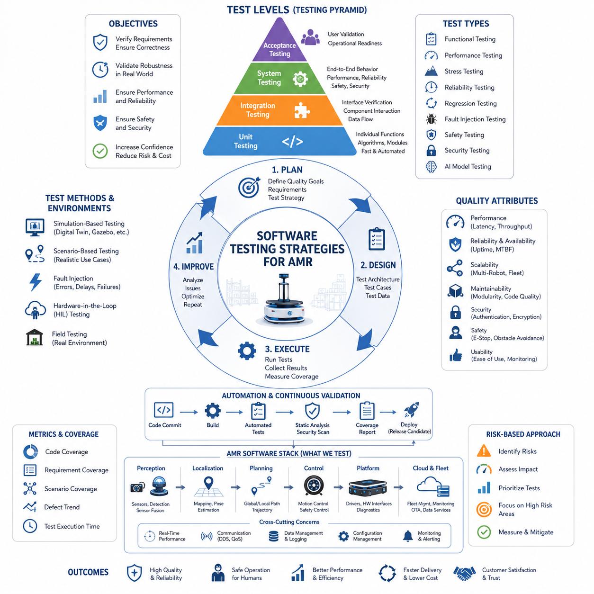
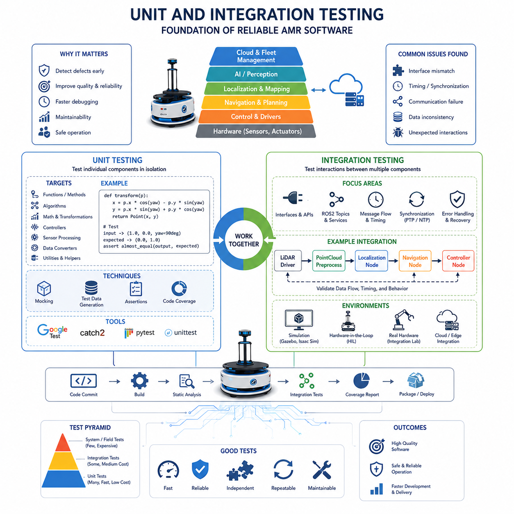
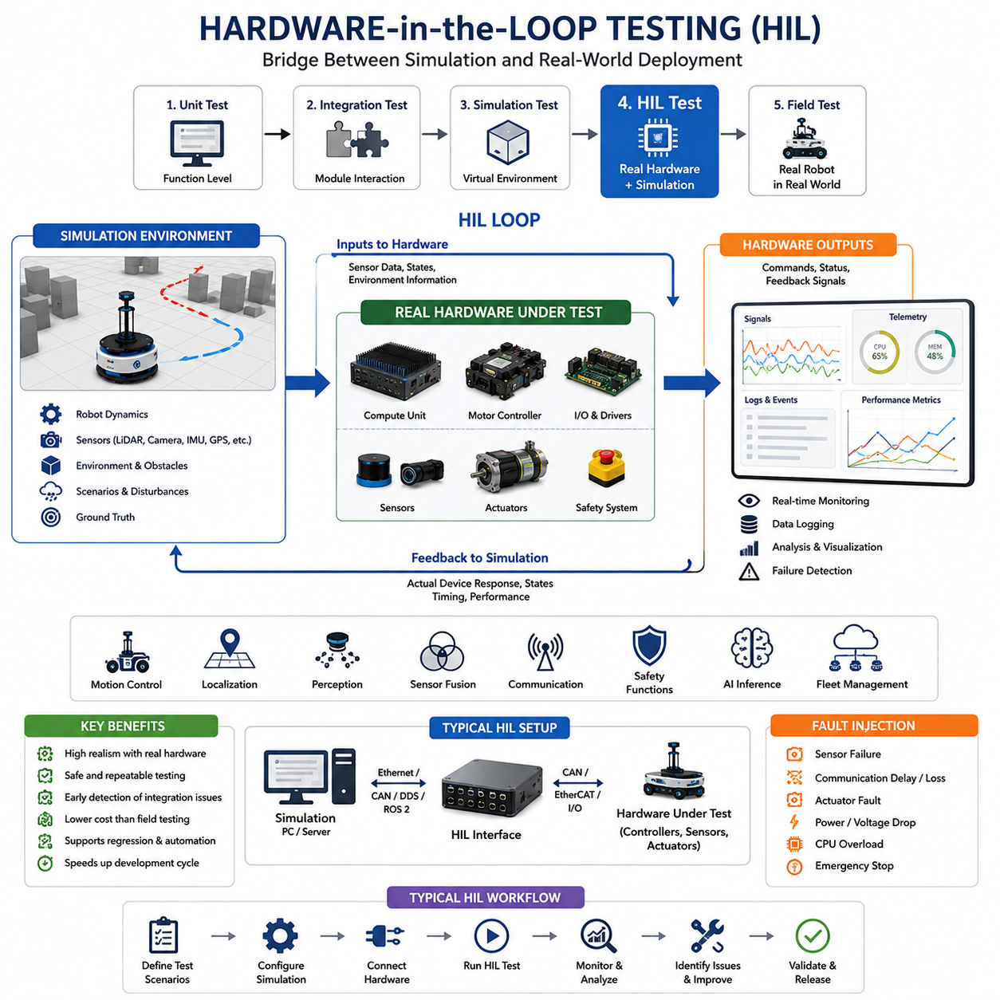
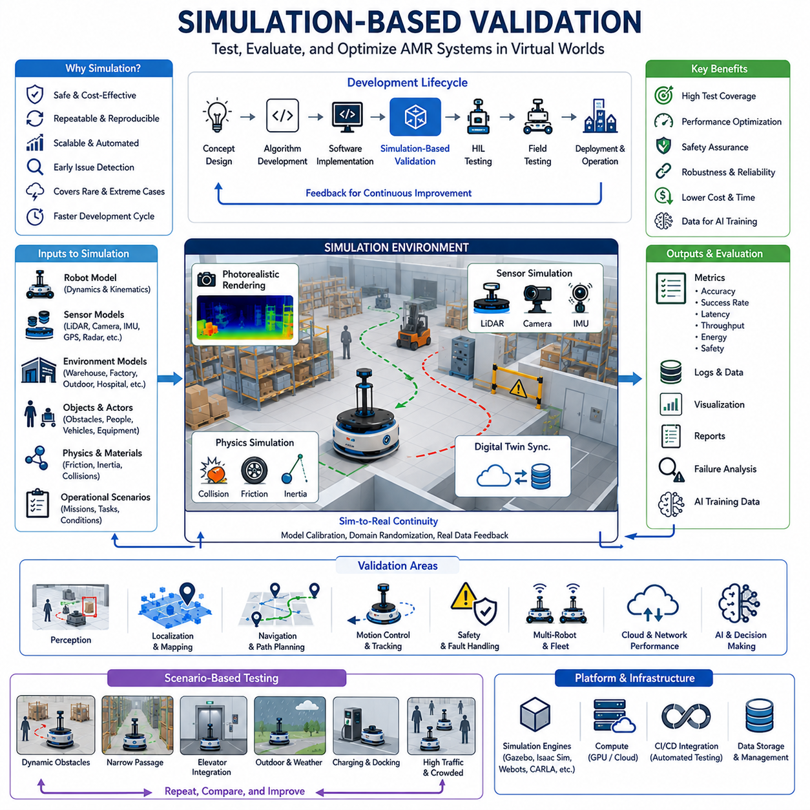
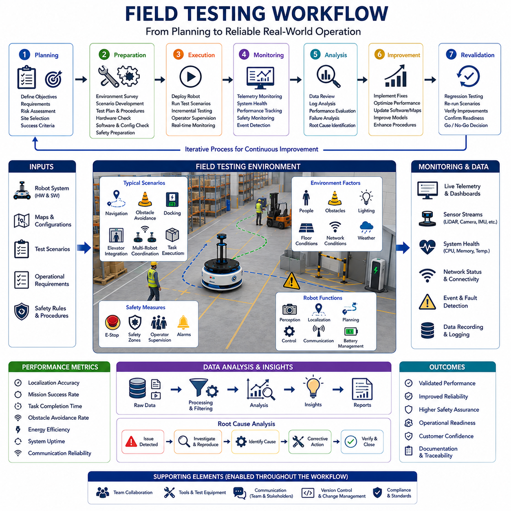
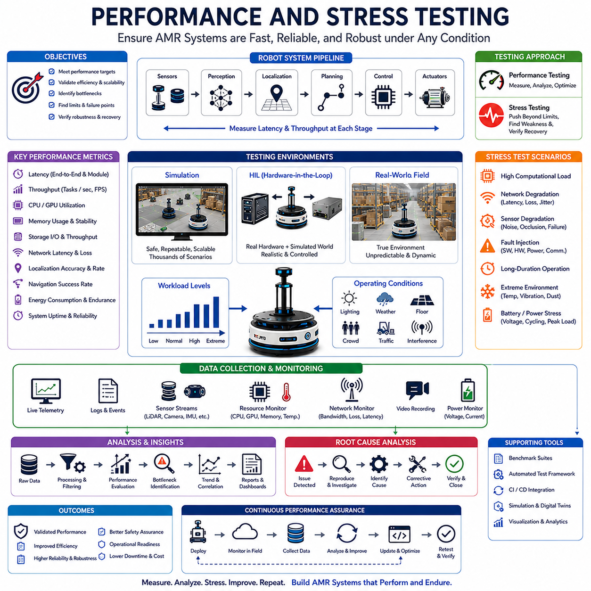
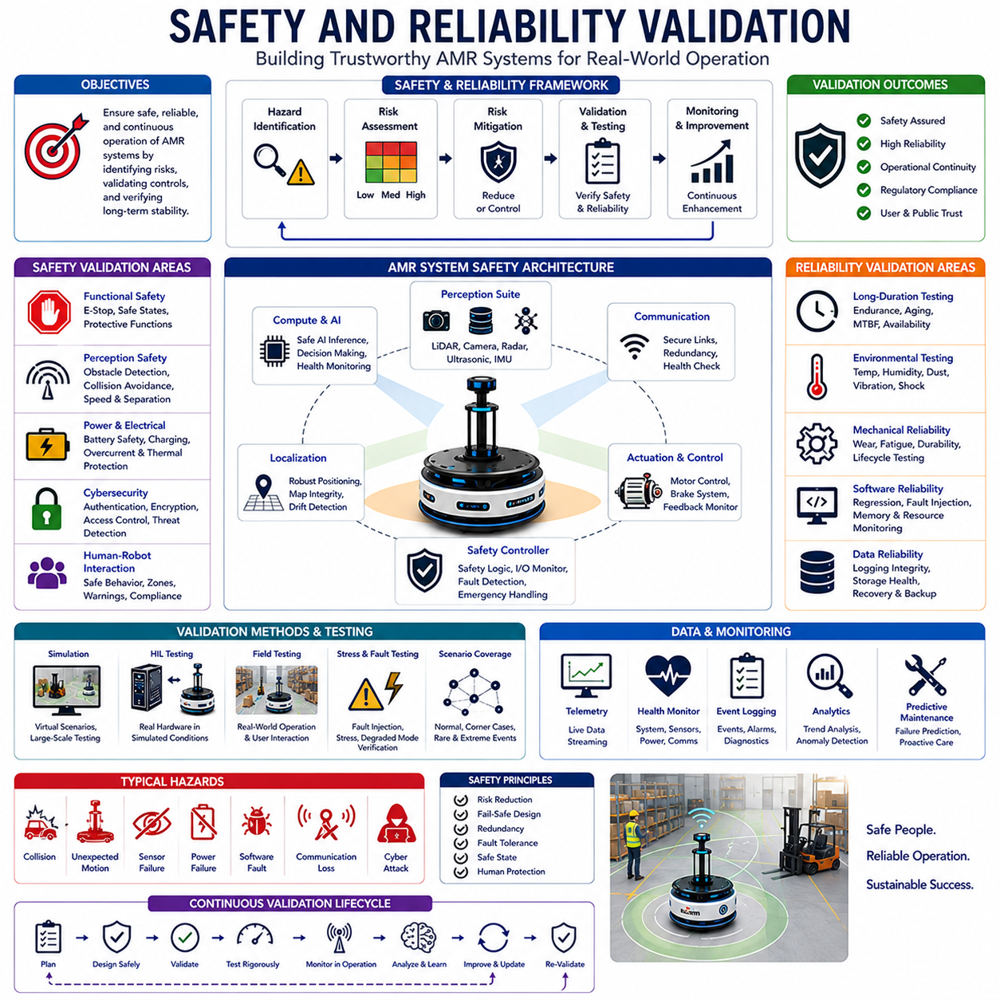
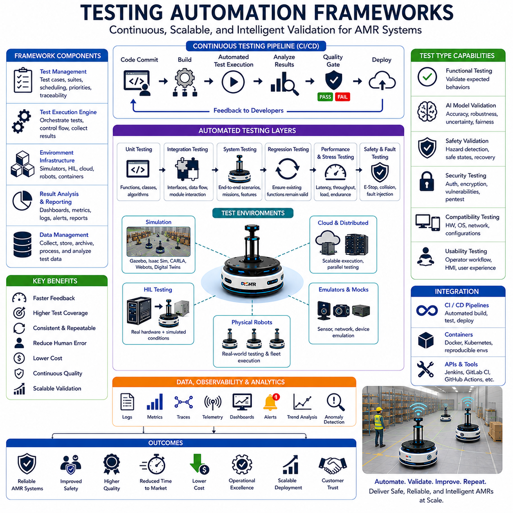

# Chapter 22. Testing and Validation

##  

## 22.1 Software Testing Strategies

{width="7.268055555555556in" height="7.268055555555556in"}

Software Testing Strategies form the foundation of quality assurance in Autonomous Mobile Robot (AMR) software development. Modern AMRs are among the most complex cyber-physical systems deployed in industrial, logistics, healthcare, and outdoor environments. Unlike traditional software applications, robot software directly interacts with physical environments, sensors, actuators, humans, infrastructure, and unpredictable real-world conditions. As a result, software failures can lead not only to application crashes but also to safety incidents, equipment damage, operational downtime, mission failures, and cybersecurity risks. For this reason, software testing in robotics must be treated as a comprehensive engineering discipline that spans the entire development lifecycle rather than as a final verification activity performed shortly before deployment. The topic of Software Testing Strategies serves as the entry point for the broader Testing and Validation domain within AMR software engineering.

The primary objective of software testing is to systematically identify defects, validate requirements, verify functional correctness, evaluate system robustness, and ensure that software behaves predictably under both normal and abnormal operating conditions. A well-designed testing strategy enables development teams to detect issues early, reduce development costs, improve maintainability, and increase confidence in production deployments. In large-scale AMR projects, testing often consumes a significant portion of engineering resources because the complexity of interactions among perception systems, navigation modules, control software, cloud infrastructure, fleet management systems, and safety mechanisms creates a vast number of possible failure modes.

Traditional software testing methodologies remain important in robotics, but they must be extended to address the unique challenges of autonomous systems. Conventional enterprise software typically processes digital inputs and generates digital outputs. Robot software, however, processes noisy sensor data, performs real-time decision making, controls physical actuators, and continuously adapts to changing environments. Therefore, testing strategies must consider not only software correctness but also environmental variability, hardware dependencies, timing constraints, communication reliability, and physical safety.

A comprehensive testing strategy begins with requirements validation. Every software component should be traceable to a defined requirement. Requirements-based testing ensures that each functional requirement, performance target, safety constraint, and operational expectation is validated through measurable test cases. Traceability matrices are commonly used to connect system requirements, software modules, test cases, validation procedures, and final acceptance criteria. This approach provides visibility into testing coverage and helps identify untested areas before deployment.

One of the most widely adopted concepts in software quality engineering is the testing pyramid. The testing pyramid emphasizes performing a large number of low-level tests and a smaller number of high-level tests. At the bottom of the pyramid are unit tests, which verify the correctness of individual functions, classes, algorithms, and software modules. Unit tests are fast, inexpensive, and highly automated. In robotics, unit testing may validate coordinate transformations, sensor calibration algorithms, path planning functions, localization mathematics, trajectory generation algorithms, perception preprocessing routines, or control calculations. Since unit tests can be executed frequently during development, they provide rapid feedback and prevent defects from propagating into larger subsystems.

Above unit testing lies integration testing. Integration testing focuses on interactions among software components. AMR systems typically consist of dozens or hundreds of ROS2 nodes communicating through topics, services, actions, shared memory mechanisms, databases, and network interfaces. Even when individual modules function correctly in isolation, failures often occur at integration boundaries. Integration testing verifies that components exchange data correctly, maintain synchronization, handle exceptions properly, and meet interface specifications. Examples include validating communication between localization and navigation modules, verifying sensor fusion pipelines, testing cloud-to-edge message delivery, and confirming coordination between fleet management systems and robot controllers.

System testing evaluates the complete robot software stack as an integrated system. At this stage, the entire perception-planning-control pipeline is tested under realistic operational conditions. System testing examines end-to-end functionality, operational workflows, mission execution, fault handling, recovery mechanisms, and performance characteristics. For example, a warehouse AMR may be tested to verify that it can receive tasks, localize itself, navigate through dynamic environments, avoid obstacles, dock for charging, report mission status, and recover from temporary failures without human intervention.

Acceptance testing represents the final stage before deployment. Acceptance tests validate that the system satisfies customer requirements, operational objectives, regulatory constraints, and business expectations. These tests are often performed in representative environments that closely resemble actual deployment conditions. Acceptance criteria may include navigation accuracy, task completion rates, battery endurance, fleet scalability, uptime targets, safety compliance, and integration with existing enterprise systems.

Another important classification divides testing into functional and non-functional testing. Functional testing focuses on verifying what the software does. Non-functional testing focuses on how well the software performs. Functional testing evaluates software behavior against requirements, while non-functional testing examines performance, reliability, scalability, usability, maintainability, security, and safety.

Performance testing plays a particularly critical role in robotics. Autonomous systems frequently operate under strict real-time constraints. Sensor processing pipelines must maintain target frame rates. Localization algorithms must provide timely pose estimates. Navigation planners must generate paths within acceptable latency limits. Control loops must meet deterministic timing requirements. Performance testing measures CPU utilization, GPU utilization, memory consumption, network bandwidth usage, message latency, task scheduling behavior, and system throughput. These metrics help engineers identify bottlenecks and optimize resource allocation.

Stress testing evaluates system behavior under extreme operating conditions. AMRs may encounter dense obstacle fields, high traffic environments, degraded network connectivity, large sensor workloads, excessive computational demand, or unusually long operating periods. Stress testing intentionally pushes systems beyond expected operating limits to identify failure points and evaluate recovery mechanisms. Understanding how a robot behaves under overload conditions is often more important than understanding how it performs under ideal conditions.

Reliability testing focuses on long-term stability. Many industrial robots operate continuously for weeks or months. Reliability testing may involve multi-day or multi-week operation under representative workloads. Engineers monitor memory leaks, resource exhaustion, timing drift, database growth, communication degradation, and hardware-software interactions. Long-duration testing often reveals defects that are invisible during short development cycles.

Regression testing is another essential component of software quality assurance. As software evolves, previously functioning features may unintentionally break due to code modifications. Regression testing ensures that new changes do not introduce unexpected side effects. Automated regression suites are particularly valuable in large robotics projects where hundreds of software modules evolve simultaneously. Every software release should trigger regression testing before deployment approval.

Modern AMR development increasingly relies on automated testing frameworks. Continuous Integration and Continuous Deployment pipelines automatically execute test suites whenever source code changes occur. Automated testing provides consistent validation, reduces human error, accelerates feedback cycles, and supports rapid development. Typical CI pipelines perform static code analysis, compile software, execute unit tests, run integration tests, validate container builds, generate coverage reports, and perform security checks before allowing code merges.

Simulation-based testing has become a cornerstone of robotics software validation. Real-world testing is expensive, time-consuming, and sometimes unsafe. High-fidelity simulation environments such as Gazebo, Isaac Sim, Webots, and custom digital twins enable engineers to evaluate robot behavior under thousands of scenarios before physical deployment. Simulation testing supports large-scale scenario generation, reproducible experimentation, edge-case exploration, and accelerated development. Engineers can test navigation algorithms in crowded environments, evaluate sensor failures, simulate adverse weather conditions, and assess fleet-level behaviors without risking physical equipment.

Scenario-based testing is particularly valuable for autonomous systems. Rather than evaluating isolated software functions, scenario-based testing examines complete operational situations. Examples include navigating through congested hallways, avoiding pedestrians, responding to blocked paths, recovering from sensor failures, performing emergency stops, and handling communication outages. Carefully designed scenarios help engineers validate robot behavior under realistic conditions and expose weaknesses that may not appear during traditional testing.

Fault injection testing intentionally introduces failures into software, hardware, networks, or sensors. The purpose is to evaluate system resilience and recovery capabilities. Engineers may simulate LiDAR failures, camera disconnections, corrupted sensor data, network interruptions, timing delays, GPS outages, or software crashes. Fault injection testing reveals how effectively the robot detects anomalies, transitions into safe states, and restores normal operation.

Safety-oriented testing is a specialized area within robotics validation. Autonomous systems must demonstrate safe behavior under both expected and unexpected conditions. Safety testing examines emergency stop functionality, obstacle avoidance behavior, speed limiting mechanisms, safe braking distances, fault recovery procedures, and compliance with applicable standards. Safety validation often requires rigorous documentation, repeatable procedures, and independent review processes.

Cybersecurity testing has become increasingly important as robots become connected to cloud services, enterprise networks, and remote management platforms. Security testing evaluates authentication mechanisms, access controls, encrypted communications, software update processes, vulnerability management practices, and resilience against cyber attacks. Penetration testing, vulnerability scanning, secure code reviews, and threat modeling are commonly incorporated into comprehensive testing strategies.

Data-driven testing is gaining popularity in AI-enabled robotics systems. Modern AMRs rely heavily on machine learning models for perception, object detection, semantic understanding, and decision support. Testing AI systems requires evaluating model accuracy, robustness, bias, generalization performance, and behavior under unseen conditions. Large-scale datasets, benchmark environments, confusion matrices, precision-recall analysis, and operational performance metrics are frequently used to assess AI-driven functionality.

Coverage measurement provides quantitative insight into testing effectiveness. Code coverage metrics indicate the proportion of source code exercised during testing. Requirement coverage measures how many system requirements have corresponding validation procedures. Scenario coverage evaluates how thoroughly operational situations have been tested. While coverage metrics alone cannot guarantee quality, they provide valuable indicators of testing completeness.

Test environment management is another critical consideration. Robotics software often depends on specific hardware configurations, operating systems, middleware versions, drivers, network settings, and sensor interfaces. Consistent testing environments reduce variability and improve reproducibility. Containerization technologies such as Docker are increasingly used to standardize testing environments and simplify deployment workflows.

An effective testing strategy also incorporates risk-based prioritization. Not all software components carry equal risk. Modules responsible for safety-critical functions, motion control, obstacle avoidance, localization, and emergency handling typically receive more extensive testing than lower-risk subsystems. Risk-based testing allocates resources efficiently by focusing attention on areas with the highest potential impact.

As AMR platforms evolve toward greater autonomy, larger fleet deployments, cloud integration, and AI-driven decision making, software testing strategies must continue to mature. Future testing methodologies will increasingly leverage digital twins, automated scenario generation, AI-assisted validation, continuous monitoring, synthetic data generation, and autonomous testing agents. Testing will become more proactive, predictive, and integrated throughout the software lifecycle rather than remaining a separate verification phase.

Ultimately, Software Testing Strategies provide the framework through which reliability, safety, performance, and operational readiness are established in autonomous mobile robot systems. A robust testing strategy combines unit testing, integration testing, system testing, simulation validation, field testing, safety verification, cybersecurity assessment, and continuous automation into a unified quality assurance process. By systematically validating software behavior across all levels of abstraction and operational complexity, engineering teams can deliver AMR platforms that operate safely, efficiently, and reliably in the demanding environments for which they are designed.

# 22_01 소프트웨어 테스트 전략 (Software Testing Strategies)

소프트웨어 테스트 전략(Software Testing Strategies)은 자율이동로봇(AMR, Autonomous Mobile Robot) 소프트웨어 개발에서 품질 보증(Quality Assurance)의 핵심 기반을 형성한다. 현대의 AMR은 산업, 물류, 의료, 실외 환경 등에서 활용되는 가장 복잡한 사이버-물리 시스템(Cyber-Physical System) 중 하나이다. 일반적인 소프트웨어와 달리 로봇 소프트웨어는 실제 환경, 센서, 액추에이터, 사람, 인프라 및 예측 불가능한 상황과 직접 상호작용한다. 따라서 소프트웨어 오류는 단순한 프로그램 종료에 그치지 않고 안전사고, 장비 손상, 운영 중단, 임무 실패, 보안 위협 등의 문제로 이어질 수 있다. 이러한 이유로 로봇 소프트웨어 테스트는 개발 막바지의 검증 절차가 아니라 개발 전 과정에 걸쳐 수행되는 핵심 공학 활동으로 간주되어야 한다.

소프트웨어 테스트의 주요 목적은 결함을 체계적으로 발견하고, 요구사항을 검증하며, 기능의 정확성을 확인하고, 시스템의 강건성(Robustness)을 평가하며, 정상 및 비정상 상황 모두에서 예측 가능한 동작을 보장하는 것이다. 잘 설계된 테스트 전략은 문제를 조기에 발견하여 개발 비용을 절감하고 유지보수성을 향상시키며 실제 운영 환경에서의 신뢰도를 높여준다. 대규모 AMR 프로젝트에서는 인지(Perception), 내비게이션(Navigation), 제어(Control), 클라우드(Cloud), 관제 시스템(FMS), 안전 시스템(Safety) 등이 복합적으로 연동되기 때문에 테스트 자체가 전체 개발 비용의 상당 부분을 차지하기도 한다.

전통적인 소프트웨어 테스트 방법론은 로봇 분야에서도 중요하지만, 로봇 특유의 특성을 고려하여 확장되어야 한다. 일반적인 기업용 소프트웨어는 디지털 입력을 처리하고 디지털 출력을 생성하지만, 로봇 소프트웨어는 노이즈가 포함된 센서 데이터를 처리하고 실시간 의사결정을 수행하며 실제 하드웨어를 제어한다. 따라서 테스트 전략은 단순한 소프트웨어 검증을 넘어 환경 변화, 하드웨어 의존성, 통신 품질, 실시간성, 물리적 안전성까지 고려해야 한다.

효과적인 테스트 전략은 요구사항 검증(Requirements Validation)에서 시작된다. 모든 소프트웨어 기능은 명확한 요구사항과 연결되어야 하며, 각 요구사항은 구체적인 테스트 항목으로 검증 가능해야 한다. 이를 위해 요구사항 추적성 매트릭스(Traceability Matrix)를 활용하여 요구사항, 설계, 구현, 테스트 케이스, 검증 결과를 연결한다. 이러한 구조는 테스트 누락을 방지하고 품질 관리의 투명성을 높여준다.

소프트웨어 품질 공학에서 널리 사용되는 개념 중 하나는 테스트 피라미드(Testing Pyramid)이다. 테스트 피라미드는 하위 레벨 테스트를 많이 수행하고 상위 레벨 테스트를 상대적으로 적게 수행하는 구조를 의미한다. 가장 아래에는 단위 테스트(Unit Test)가 위치한다. 단위 테스트는 함수, 클래스, 알고리즘, 모듈 단위의 정확성을 검증한다. 로봇 시스템에서는 좌표 변환, 센서 보정, 경로 계획 알고리즘, 위치 추정 수식, 궤적 생성 함수, 제어 알고리즘 등을 개별적으로 검증하는 데 활용된다. 단위 테스트는 빠르게 실행될 수 있기 때문에 개발 과정에서 반복적으로 수행되며 결함이 상위 계층으로 전파되는 것을 방지한다.

그 다음 단계는 통합 테스트(Integration Testing)이다. 통합 테스트는 여러 소프트웨어 모듈 간의 상호작용을 검증한다. AMR은 수십 개에서 수백 개의 ROS2 노드(Node)로 구성되는 경우가 많으며, 이들은 Topic, Service, Action, Database, Network 등을 통해 서로 데이터를 교환한다. 개별 모듈이 정상 동작하더라도 인터페이스 문제로 인해 전체 시스템이 실패할 수 있기 때문에 모듈 간 데이터 전달, 동기화, 예외 처리, 인터페이스 규격 준수 여부를 확인해야 한다.

시스템 테스트(System Testing)는 전체 로봇 소프트웨어 스택(Stack)을 하나의 시스템으로 평가하는 단계이다. 인지, 위치추정, 경로계획, 제어가 모두 연결된 상태에서 실제 임무 수행 능력을 검증한다. 예를 들어 물류 창고용 AMR의 경우 작업 명령 수신, 지도 기반 이동, 장애물 회피, 자동 충전, 상태 보고, 오류 복구 등의 전체 시나리오를 점검한다.

인수 테스트(Acceptance Testing)는 고객 또는 최종 사용자의 요구사항 충족 여부를 확인하는 마지막 단계이다. 실제 운영 환경과 유사한 조건에서 테스트가 수행되며, 위치 정확도, 임무 성공률, 배터리 지속 시간, 관제 시스템 연동, 시스템 가동률 등의 항목을 평가한다.

테스트는 기능 테스트(Functional Testing)와 비기능 테스트(Non-Functional Testing)로도 구분된다. 기능 테스트는 소프트웨어가 무엇을 수행하는지를 검증하는 반면, 비기능 테스트는 얼마나 잘 수행하는지를 평가한다. 비기능 테스트에는 성능(Performance), 신뢰성(Reliability), 확장성(Scalability), 유지보수성(Maintainability), 사용성(Usability), 보안(Security), 안전성(Safety) 등이 포함된다.

성능 테스트(Performance Testing)는 로봇 시스템에서 매우 중요하다. 센서 처리 파이프라인은 목표 프레임 속도를 유지해야 하며, 위치 추정 알고리즘은 일정 시간 내에 결과를 제공해야 한다. 경로 계획기는 허용 가능한 지연 시간 내에 경로를 생성해야 하며, 제어 루프는 결정론적(Deterministic)으로 동작해야 한다. 성능 테스트는 CPU 사용률, GPU 사용률, 메모리 점유율, 네트워크 대역폭, 통신 지연, 처리량 등을 측정하여 병목 현상을 식별한다.

스트레스 테스트(Stress Testing)는 시스템을 극한 조건까지 밀어붙여 한계를 확인하는 과정이다. 예를 들어 수백 개의 장애물이 존재하는 환경, 대규모 데이터 처리 상황, 네트워크 장애, 장시간 운용 조건 등을 인위적으로 생성하여 시스템이 어떻게 반응하는지 평가한다. 이를 통해 예상치 못한 장애 상황에서의 안정성과 복구 능력을 확인할 수 있다.

신뢰성 테스트(Reliability Testing)는 장기 운영 안정성을 평가한다. 산업용 로봇은 수주 또는 수개월 동안 연속 운용되는 경우가 많기 때문에 메모리 누수(Memory Leak), 자원 고갈(Resource Exhaustion), 통신 성능 저하, 데이터베이스 비대화 등의 문제가 발생할 수 있다. 장시간 테스트는 이러한 잠재적 문제를 발견하는 데 매우 효과적이다.

회귀 테스트(Regression Testing)는 새로운 기능 추가나 코드 수정 후 기존 기능이 정상적으로 동작하는지 확인하는 절차이다. 대규모 로봇 프로젝트에서는 수백 개의 모듈이 동시에 변경되므로 자동화된 회귀 테스트가 필수적이다. 모든 소프트웨어 릴리즈는 배포 전에 회귀 테스트를 통과해야 한다.

최근의 AMR 개발에서는 자동화 테스트(Automated Testing)가 핵심 역할을 수행한다. CI/CD(Continuous Integration / Continuous Deployment) 파이프라인은 코드가 변경될 때마다 자동으로 빌드, 단위 테스트, 통합 테스트, 코드 분석, 보안 점검 등을 수행한다. 자동화 테스트는 인간의 실수를 줄이고 빠른 피드백을 제공하며 개발 속도를 크게 향상시킨다.

시뮬레이션 기반 테스트(Simulation-Based Testing)는 현대 로봇 개발의 핵심 전략 중 하나이다. 실제 환경에서의 테스트는 비용이 높고 위험성이 존재하기 때문에 Gazebo, Isaac Sim, Digital Twin 등의 시뮬레이션 환경을 활용한다. 개발자는 수천 개의 시나리오를 빠르게 실행하여 내비게이션 성능, 센서 오류, 악천후 조건, 군집 로봇 행동 등을 검증할 수 있다.

시나리오 기반 테스트(Scenario-Based Testing)는 실제 운용 환경을 모델링하여 테스트를 수행하는 방법이다. 혼잡한 복도 통과, 엘리베이터 연동, 장애물 회피, 작업자와의 상호작용, 통신 장애 상황 등 실제 운영에서 발생할 수 있는 사례를 기반으로 검증한다.

결함 주입 테스트(Fault Injection Testing)는 센서 고장, 네트워크 끊김, 잘못된 데이터 입력, 프로세스 종료 등의 장애를 인위적으로 발생시켜 시스템의 복원력(Resilience)을 평가한다. 이를 통해 시스템이 문제를 감지하고 안전 상태로 전환하며 정상 상태로 복귀하는 과정을 검증할 수 있다.

안전성 테스트(Safety Testing)는 로봇 검증 과정에서 가장 중요한 영역 중 하나이다. 비상 정지(E-Stop), 장애물 회피, 속도 제한, 제동 거리, 고장 복구 절차 등을 검증하여 사람이 있는 환경에서도 안전하게 동작할 수 있음을 입증해야 한다. 이러한 검증은 국제 안전 규격 준수와도 밀접하게 연결된다.

사이버보안 테스트(Cybersecurity Testing)의 중요성도 지속적으로 증가하고 있다. AMR은 클라우드, RMS, FMS, OTA 시스템과 연결되므로 인증(Authentication), 접근 제어(Access Control), 암호화 통신(Encrypted Communication), 보안 업데이트(Secure Update), 취약점 관리(Vulnerability Management) 등을 검증해야 한다. 침투 테스트(Penetration Testing)와 취약점 분석은 보안 검증의 핵심 요소이다.

인공지능 기반 AMR에서는 데이터 중심 테스트(Data-Driven Testing)가 중요하다. 객체 검출(Object Detection), 의미론적 분할(Semantic Segmentation), 행동 예측(Behavior Prediction) 등의 AI 모델은 정확도뿐만 아니라 일반화 성능과 강건성까지 평가해야 한다. 이를 위해 대규모 데이터셋, 벤치마크 환경, 혼동 행렬(Confusion Matrix), 정밀도(Precision), 재현율(Recall) 등의 지표를 활용한다.

테스트의 효과를 정량적으로 평가하기 위해 커버리지(Coverage) 측정도 수행된다. 코드 커버리지(Code Coverage)는 실제 테스트가 소스 코드의 어느 정도를 실행했는지를 나타내며, 요구사항 커버리지는 전체 요구사항 중 몇 퍼센트가 검증되었는지를 보여준다. 시나리오 커버리지는 운영 상황이 얼마나 폭넓게 테스트되었는지를 평가한다.

또한 테스트 환경 관리(Test Environment Management)도 중요하다. 로봇 소프트웨어는 운영체제, ROS2 버전, 드라이버, 센서, 네트워크 설정 등에 크게 의존하기 때문에 테스트 환경의 일관성을 유지해야 한다. 최근에는 Docker(Containerization)를 활용하여 개발 및 테스트 환경을 표준화하는 사례가 증가하고 있다.

효율적인 테스트 전략은 위험 기반 접근법(Risk-Based Testing)을 적용한다. 모든 소프트웨어 모듈이 동일한 중요도를 가지는 것은 아니다. 안전 제어, 위치 추정, 장애물 회피, 비상 정지와 같은 핵심 기능은 더 높은 수준의 테스트와 검증을 수행해야 한다. 위험 기반 테스트는 제한된 개발 자원을 가장 중요한 영역에 집중할 수 있도록 해준다.

향후 AMR 시스템이 더욱 고도화되고 AI 중심 구조로 발전함에 따라 테스트 전략도 진화할 것이다. 디지털 트윈(Digital Twin), 자동 시나리오 생성(Automatic Scenario Generation), AI 기반 테스트 자동화(AI-Assisted Validation), 연속 검증(Continuous Validation), 자율 테스트 에이전트(Autonomous Testing Agent) 등이 미래 테스트 환경의 핵심 기술이 될 것으로 예상된다.

결국 소프트웨어 테스트 전략은 AMR 시스템의 신뢰성, 안전성, 성능, 품질을 보장하는 핵심 프레임워크이다. 단위 테스트, 통합 테스트, 시스템 테스트, 시뮬레이션 검증, 현장 검증, 안전성 평가, 보안 검증, 자동화 테스트를 유기적으로 결합함으로써 개발팀은 실제 환경에서 안정적으로 운용 가능한 고품질 AMR 플랫폼을 구축할 수 있다. 이러한 체계적인 테스트 전략은 자율주행 로봇이 산업 현장에서 신뢰받는 시스템으로 자리 잡기 위한 필수 조건이라 할 수 있다.

##  

## 22.2 Unit and Integration Testing

{width="7.268055555555556in" height="7.268055555555556in"}

Unit and Integration Testing represent two of the most fundamental layers of software verification in Autonomous Mobile Robot (AMR) development. These testing methodologies form the foundation of software quality assurance and are responsible for detecting defects before they propagate into larger and more complex subsystems. In modern AMR architectures, where hundreds of software components interact across perception, localization, mapping, navigation, control, cloud services, artificial intelligence, and fleet management systems, the importance of systematic testing cannot be overstated. Unit testing ensures that individual software components function correctly in isolation, while integration testing verifies that multiple components communicate and cooperate as intended. Together, these testing approaches significantly reduce development risks, improve maintainability, accelerate debugging, and increase confidence in software releases.

The complexity of robot software differs substantially from that of traditional enterprise applications. Robot systems operate in dynamic physical environments and continuously process sensor inputs while generating control outputs. A defect in a coordinate transformation function, a localization module, or a sensor fusion pipeline can propagate through multiple layers of the system and eventually result in navigation errors, mission failures, or safety incidents. Therefore, verifying software correctness at the smallest possible level before validating interactions between modules is a critical engineering practice.

Unit testing focuses on validating the behavior of individual functions, methods, classes, libraries, or software modules without relying on external dependencies. The primary objective is to ensure that a software component produces the correct outputs for a given set of inputs. Unit tests are typically automated, repeatable, deterministic, and fast to execute. Because they run quickly, developers can execute thousands of unit tests whenever source code changes occur, making them an essential part of continuous integration workflows.

In AMR software development, unit testing is commonly applied to mathematical algorithms, coordinate transformations, filtering functions, sensor calibration procedures, trajectory generation algorithms, path planning routines, state estimation logic, data conversion utilities, communication handlers, and configuration management functions. For example, a coordinate transformation function may convert a point from a sensor frame into a robot frame. Even a small mathematical error in this calculation can affect localization accuracy, obstacle detection reliability, and navigation performance. Unit testing ensures that such functions behave correctly under a wide range of input conditions.

Mathematical validation is one of the most common uses of unit testing in robotics. Many robot systems depend on linear algebra operations, matrix transformations, quaternion calculations, kinematic equations, and probabilistic estimation algorithms. Since these calculations serve as the foundation for higher-level decision making, they must be thoroughly verified. Unit tests allow developers to compare computed outputs against analytically derived results or known reference values. This process helps detect implementation errors that may otherwise remain hidden until field deployment.

Unit testing also plays an important role in validating robot control software. Motion control algorithms frequently rely on PID controllers, trajectory followers, velocity planners, and actuator command generators. Developers can create test cases that evaluate controller responses under various operating conditions. These tests may verify convergence behavior, overshoot characteristics, steady-state errors, saturation handling, and stability properties. By isolating the controller from the physical robot, engineers can identify software defects before hardware integration begins.

Sensor processing software benefits significantly from unit testing. Camera drivers, LiDAR processing pipelines, radar filters, IMU preprocessing routines, and GNSS correction algorithms all contain numerous computational functions that can be tested independently. Engineers often use synthetic sensor data to validate processing pipelines and ensure that outputs remain consistent across software updates. This approach improves reliability while reducing dependence on expensive hardware testing.

Artificial intelligence and machine learning components can also be subjected to unit testing. Although AI systems often exhibit probabilistic behavior, many supporting functions remain deterministic and suitable for unit validation. Data preprocessing functions, tensor transformations, feature extraction modules, model loading mechanisms, inference pipelines, and post-processing algorithms can all be tested individually. These tests help ensure that AI models receive properly formatted inputs and produce expected outputs under controlled conditions.

Mocking and dependency isolation are important techniques in unit testing. Many robot software modules depend on sensors, network services, databases, middleware, or hardware devices. Testing such components directly would introduce variability and complexity into the test environment. Mock objects simulate these dependencies and provide predictable responses. By replacing real hardware with virtual substitutes, developers can focus exclusively on validating the behavior of the software under test.

Code coverage measurement is commonly associated with unit testing. Coverage analysis evaluates how much of the source code is exercised during testing. Statement coverage, branch coverage, path coverage, and condition coverage provide quantitative indicators of test completeness. While high coverage alone does not guarantee software quality, low coverage often indicates insufficient testing and increased risk of undiscovered defects.

Automated unit testing frameworks are widely used in robotics software projects. In C++ environments, Google Test and Catch2 are common choices. Python-based AMR projects frequently utilize PyTest or the built-in unittest framework. These tools support automated execution, assertion validation, test organization, reporting, and integration with CI/CD pipelines. Modern development workflows often require all unit tests to pass before code changes can be merged into production branches.

While unit testing verifies isolated components, integration testing focuses on interactions between software modules. In AMR systems, most failures occur not because individual modules are defective but because communication, synchronization, timing, or interface assumptions are violated. Integration testing aims to identify these issues before deployment.

Modern AMRs are composed of distributed software architectures containing numerous ROS2 nodes. Localization nodes consume sensor data and produce pose estimates. Navigation modules subscribe to localization outputs and generate trajectories. Control systems consume trajectories and generate motor commands. Fleet management systems communicate with cloud servers and coordinate multiple robots simultaneously. Each of these interactions introduces opportunities for failure. Integration testing verifies that data flows correctly across module boundaries and that components operate together as intended.

Interface validation is one of the primary objectives of integration testing. Software modules exchange messages through APIs, ROS2 topics, services, actions, network protocols, and shared memory systems. Integration tests verify message formats, data consistency, timing behavior, error handling mechanisms, and protocol compliance. A mismatch in message definitions or timing assumptions can cause subtle failures that are difficult to detect during unit testing.

Communication testing is especially important in distributed robotic systems. DDS middleware, Ethernet networks, wireless communication channels, MQTT brokers, cloud APIs, and fleet management services all introduce potential communication failures. Integration testing evaluates connectivity, message delivery reliability, latency characteristics, bandwidth utilization, and recovery behavior during communication disruptions.

Time synchronization represents another critical area of integration testing. AMRs often combine data from cameras, LiDARs, IMUs, GNSS receivers, radar systems, and wheel encoders. Accurate sensor fusion depends on precise timestamp alignment. Integration tests verify synchronization mechanisms such as PTP, NTP, hardware triggers, and timestamp propagation throughout the software stack. Timing inconsistencies can severely degrade localization and perception performance.

Perception pipeline integration testing evaluates the interaction between sensors, preprocessing modules, AI inference engines, and object tracking systems. A complete perception pipeline may involve image acquisition, image correction, neural network inference, obstacle classification, object tracking, and environmental modeling. Integration testing ensures that these components operate cohesively and maintain acceptable latency and throughput under realistic workloads.

Navigation stack integration testing validates the interaction between localization systems, map servers, path planners, obstacle avoidance modules, behavior trees, and motion controllers. Successful navigation depends on accurate coordination among all these components. Integration tests verify that localization updates are consumed correctly, planned paths remain valid, obstacle information influences navigation decisions appropriately, and control commands are generated reliably.

Cloud and edge integration testing has become increasingly important as robotics platforms adopt connected architectures. Modern AMRs frequently exchange information with fleet management systems, monitoring platforms, OTA update servers, analytics services, and AI model repositories. Integration tests validate cloud connectivity, authentication mechanisms, data synchronization, task scheduling workflows, software deployment procedures, and failure recovery strategies.

Hardware-software integration testing bridges the gap between software verification and physical system validation. Although pure integration testing may rely on simulated environments, hardware integration testing introduces actual sensors, actuators, embedded controllers, and communication interfaces. This stage verifies that software components interact correctly with real hardware devices and exposes issues that may not appear in virtual environments.

Simulation environments play an increasingly significant role in integration testing. Platforms such as Gazebo, Isaac Sim, Webots, and digital twins allow engineers to execute large-scale integration tests without requiring physical robots. Simulated environments provide repeatability, safety, scalability, and cost efficiency. Developers can evaluate complex interactions among perception, localization, navigation, and control systems under thousands of scenarios before transitioning to real hardware.

Continuous Integration systems greatly enhance both unit and integration testing. Every code commit can automatically trigger compilation, static analysis, unit tests, integration tests, coverage measurement, and regression testing. This automation enables rapid detection of defects and prevents faulty code from entering production branches. Continuous testing also promotes a culture of quality throughout the development organization.

Regression testing is closely connected to both unit and integration testing. As AMR software evolves, new features, bug fixes, and optimizations may unintentionally introduce side effects. Regression test suites ensure that previously functioning behavior remains intact after modifications. Automated regression testing is particularly important in large robotics projects where dependencies among modules are extensive.

A mature testing strategy often follows the testing pyramid principle. The base of the pyramid contains thousands of unit tests because they are inexpensive, fast, and highly reliable. The middle layer contains a smaller number of integration tests that verify subsystem interactions. The upper layers include system-level tests, simulation-based validation, hardware-in-the-loop testing, and field testing. This structure balances testing cost, execution speed, and defect detection effectiveness.

The quality of unit and integration tests depends heavily on test design. Effective test cases cover normal operating conditions, boundary conditions, error scenarios, exception handling paths, resource constraints, and unexpected inputs. Comprehensive testing increases confidence that software will behave predictably under real-world conditions.

As AMR systems become increasingly autonomous, AI-driven, and connected, the importance of robust unit and integration testing continues to grow. Future robotics development will likely incorporate AI-assisted test generation, automated scenario synthesis, digital twin validation environments, and self-adaptive testing frameworks. Despite these technological advances, the fundamental principles remain unchanged. Individual software components must first be verified independently, and then validated collectively as an integrated system.

Ultimately, Unit and Integration Testing form the backbone of reliable robot software engineering. Unit testing establishes confidence in individual algorithms, functions, and modules, while integration testing verifies that those components cooperate effectively within larger architectures. Together they provide the first line of defense against software defects, reduce development risks, support continuous delivery, and contribute directly to the safety, reliability, and operational success of Autonomous Mobile Robot systems.

# 22_02 단위 테스트와 통합 테스트 (Unit and Integration Testing)

단위 테스트(Unit Testing)와 통합 테스트(Integration Testing)는 자율이동로봇(AMR, Autonomous Mobile Robot) 소프트웨어 개발에서 가장 기본적이면서도 중요한 검증 계층을 구성한다. 이 두 가지 테스트 방법은 소프트웨어 품질 보증(Quality Assurance)의 핵심 기반이며, 결함이 더 크고 복잡한 시스템으로 확산되기 전에 조기에 발견하는 역할을 수행한다. 현대의 AMR 시스템은 인지(Perception), 위치추정(Localization), 지도작성(Mapping), 내비게이션(Navigation), 제어(Control), 클라우드 서비스(Cloud Services), 인공지능(AI), 그리고 관제 시스템(Fleet Management System) 등 수백 개의 소프트웨어 구성요소가 상호작용하는 복잡한 구조를 가지고 있다. 이러한 환경에서 체계적인 테스트는 필수적이다. 단위 테스트는 개별 소프트웨어 구성요소가 독립적으로 올바르게 동작하는지를 검증하며, 통합 테스트는 여러 구성요소가 서로 정상적으로 통신하고 협력하는지를 검증한다. 이 두 가지 테스트를 통해 개발 위험을 줄이고 유지보수성을 향상시키며 디버깅 시간을 단축하고 소프트웨어 릴리즈에 대한 신뢰도를 높일 수 있다.

로봇 소프트웨어는 일반적인 기업용 소프트웨어와는 근본적으로 다르다. 로봇은 물리적인 환경 속에서 동작하며 센서 데이터를 지속적으로 수집하고 이를 기반으로 제어 명령을 생성한다. 예를 들어 좌표 변환 함수나 위치추정 알고리즘, 센서 융합 파이프라인에서 발생한 작은 오류 하나가 전체 내비게이션 성능 저하나 안전 문제로 이어질 수 있다. 따라서 시스템 전체를 검증하기 전에 가장 작은 단위에서부터 정확성을 검증하는 것이 매우 중요하다.

단위 테스트는 함수(Function), 메서드(Method), 클래스(Class), 라이브러리(Library), 또는 모듈(Module)과 같은 개별 소프트웨어 요소를 대상으로 수행된다. 테스트의 목적은 특정 입력값에 대해 예상된 출력값이 생성되는지를 확인하는 것이다. 단위 테스트는 자동화가 가능하고 반복 실행이 가능하며 결과가 항상 동일하게 나오는 결정론적(Deterministic) 특성을 가진다. 또한 실행 속도가 매우 빠르기 때문에 코드가 변경될 때마다 수천 개의 테스트를 자동으로 수행할 수 있다.

AMR 소프트웨어 개발에서는 좌표 변환 알고리즘, 센서 보정 함수, 경로 계획 알고리즘, 상태 추정(State Estimation), 궤적 생성(Trajectory Generation), 데이터 변환(Data Conversion), 통신 처리 함수, 설정 관리(Configuration Management) 등의 검증에 단위 테스트가 활용된다. 예를 들어 센서 좌표계를 로봇 좌표계로 변환하는 함수에서 작은 계산 오류가 발생하면 위치 추정과 장애물 인식 성능에 직접적인 영향을 줄 수 있다. 단위 테스트는 이러한 문제를 조기에 발견하도록 돕는다.

수학적 검증(Mathematical Validation)은 로봇 분야에서 단위 테스트의 대표적인 활용 사례이다. 로봇 시스템은 행렬(Matrix), 벡터(Vector), 쿼터니언(Quaternion), 운동학(Kinematics), 확률 기반 추정 알고리즘 등에 크게 의존한다. 이러한 수학 연산은 상위 계층의 의사결정 과정의 기반이 되므로 정확성이 필수적이다. 개발자는 계산 결과를 이론값 또는 기준값과 비교하여 구현 오류를 확인할 수 있다.

제어 소프트웨어(Control Software) 역시 단위 테스트의 중요한 대상이다. PID 제어기(PID Controller), 경로 추종기(Path Follower), 속도 계획기(Velocity Planner), 액추에이터 명령 생성기 등은 다양한 입력 조건에서 응답 특성을 검증할 수 있다. 예를 들어 수렴성(Convergence), 오버슈트(Overshoot), 정상상태 오차(Steady-State Error), 포화 처리(Saturation Handling), 안정성(Stability) 등을 평가할 수 있다. 이를 통해 실제 하드웨어 연결 이전에 제어 알고리즘의 문제를 발견할 수 있다.

센서 처리 소프트웨어 역시 단위 테스트의 주요 대상이다. 카메라 드라이버(Camera Driver), LiDAR 처리 모듈, 레이더 필터, IMU 전처리 모듈, GNSS 보정 알고리즘 등은 독립적으로 검증할 수 있다. 개발자는 가상의 센서 데이터를 이용하여 알고리즘이 예상된 결과를 생성하는지 확인할 수 있으며, 소프트웨어 업데이트 이후에도 동일한 결과가 유지되는지 검증할 수 있다.

인공지능(AI) 및 머신러닝(Machine Learning) 기반 모듈도 부분적으로 단위 테스트가 가능하다. AI 모델 자체는 확률적 특성을 가질 수 있지만, 데이터 전처리(Data Preprocessing), 특징 추출(Feature Extraction), 텐서 변환(Tensor Transformation), 모델 로딩(Model Loading), 추론(Inference) 파이프라인, 후처리(Post-Processing) 모듈 등은 결정론적으로 검증할 수 있다. 이를 통해 AI 모델이 올바른 입력을 받고 예상된 형식의 출력을 생성하는지 확인할 수 있다.

단위 테스트에서는 모킹(Mocking)과 의존성 분리(Dependency Isolation)가 매우 중요하다. 많은 로봇 소프트웨어는 센서, 네트워크, 데이터베이스, ROS2 미들웨어, 하드웨어 장치 등에 의존한다. 실제 장비를 사용하는 대신 가상의 객체(Mock Object)를 활용하면 테스트 환경을 단순화하고 예측 가능한 결과를 얻을 수 있다. 이를 통해 테스트 대상 소프트웨어 자체의 동작에 집중할 수 있다.

코드 커버리지(Code Coverage)는 단위 테스트의 품질을 평가하는 중요한 지표이다. 코드 커버리지는 전체 소스 코드 중 테스트가 실제로 실행한 비율을 의미한다. 문장 커버리지(Statement Coverage), 분기 커버리지(Branch Coverage), 경로 커버리지(Path Coverage), 조건 커버리지(Condition Coverage) 등을 활용하여 테스트의 완성도를 평가할 수 있다. 높은 커버리지가 반드시 높은 품질을 의미하는 것은 아니지만, 낮은 커버리지는 테스트 부족을 의미할 가능성이 높다.

단위 테스트 자동화를 위해 다양한 프레임워크가 사용된다. C++ 기반 프로젝트에서는 Google Test와 Catch2가 널리 사용되며, Python 기반 프로젝트에서는 PyTest와 unittest가 많이 활용된다. 이러한 도구들은 자동 실행, 검증(Assertion), 리포트 생성, CI/CD 연동 기능을 제공한다. 최근에는 코드 병합(Merge) 전에 모든 단위 테스트를 통과하는 것을 필수 조건으로 설정하는 경우가 많다.

단위 테스트가 개별 구성요소를 검증한다면 통합 테스트는 여러 모듈 간의 상호작용을 검증한다. 실제 AMR 프로젝트에서 발생하는 많은 문제는 개별 모듈의 오류보다는 인터페이스 불일치, 데이터 형식 오류, 통신 지연, 시간 동기화 문제 등 모듈 간 상호작용에서 발생한다. 통합 테스트는 이러한 문제를 발견하기 위해 수행된다.

현대 AMR은 수많은 ROS2 노드로 구성된 분산 시스템이다. 위치추정 노드는 센서 데이터를 받아 로봇의 위치를 계산하고, 내비게이션 노드는 이를 이용해 경로를 생성한다. 제어 시스템은 생성된 경로를 기반으로 모터 제어 명령을 생성한다. 또한 관제 시스템은 클라우드와 연결되어 여러 대의 로봇을 동시에 관리한다. 이러한 복잡한 연결 구조에서는 통합 테스트가 필수적이다.

통합 테스트의 가장 중요한 목적 중 하나는 인터페이스 검증(Interface Validation)이다. 모듈들은 API, ROS2 Topic, Service, Action, Shared Memory, Network Protocol 등을 통해 데이터를 교환한다. 통합 테스트는 메시지 형식(Message Format), 데이터 무결성(Data Consistency), 통신 타이밍(Timing Behavior), 오류 처리(Error Handling), 프로토콜 준수 여부를 검증한다.

통신 테스트(Communication Testing)는 분산 로봇 시스템에서 매우 중요하다. DDS 미들웨어, 이더넷(Ethernet), 무선 네트워크(Wi-Fi), MQTT 브로커, 클라우드 API 등 다양한 통신 수단이 사용되며, 통합 테스트는 연결 안정성, 데이터 전달 신뢰성, 지연 시간(Latency), 대역폭(Bandwidth), 장애 복구 능력을 평가한다.

시간 동기화(Time Synchronization)는 또 다른 핵심 검증 항목이다. AMR은 카메라, LiDAR, IMU, GNSS, 레이더, 엔코더 등 다양한 센서를 동시에 사용한다. 센서 융합의 정확성을 확보하려면 모든 데이터가 정확한 시간 기준으로 동기화되어야 한다. 통합 테스트는 PTP, NTP, 하드웨어 트리거(Hardware Trigger) 등을 이용한 동기화 메커니즘이 정상적으로 동작하는지 확인한다.

인지 파이프라인(Perception Pipeline)의 통합 테스트는 센서, 전처리 모듈, AI 추론 엔진, 객체 추적 시스템 간의 연동을 검증한다. 카메라 영상 획득, 이미지 보정, 신경망 추론, 장애물 분류, 객체 추적, 환경 모델 생성 등 전체 과정이 정상적으로 수행되는지 평가한다.

내비게이션 스택(Navigation Stack)의 통합 테스트는 위치추정, 지도 서버(Map Server), 경로 계획기(Path Planner), 장애물 회피(Obstacle Avoidance), 행동 트리(Behavior Tree), 모션 제어기(Motion Controller) 간의 상호작용을 검증한다. 위치 정보가 정확히 전달되는지, 경로 생성이 올바르게 수행되는지, 장애물 정보가 경로 수정에 반영되는지 등을 확인한다.

최근에는 클라우드와 엣지 컴퓨팅의 통합 테스트도 중요해지고 있다. AMR은 FMS, RMS, OTA 서버, AI 모델 저장소, 데이터 분석 플랫폼과 지속적으로 데이터를 주고받는다. 따라서 인증(Authentication), 데이터 동기화(Synchronization), 작업 스케줄링(Task Scheduling), 원격 업데이트(OTA), 장애 복구(Recovery) 등의 기능을 검증해야 한다.

하드웨어-소프트웨어 통합 테스트(Hardware-Software Integration Testing)는 실제 센서와 액추에이터를 연결하여 수행한다. 이 단계에서는 시뮬레이션에서 발견할 수 없는 실제 장비 관련 문제를 확인할 수 있으며, 드라이버 호환성, 통신 인터페이스, 전기적 특성 등을 검증한다.

시뮬레이션 기반 통합 테스트(Simulation-Based Integration Testing)는 Gazebo, Isaac Sim, Digital Twin 환경에서 수행된다. 실제 로봇 없이도 대규모 테스트를 반복적으로 수행할 수 있으며, 비용 절감과 안전성 확보 측면에서 큰 장점을 가진다.

CI/CD 시스템은 단위 테스트와 통합 테스트를 자동화하는 핵심 도구이다. 코드 변경이 발생할 때마다 자동으로 빌드, 정적 분석, 단위 테스트, 통합 테스트, 커버리지 분석, 회귀 테스트를 수행할 수 있다. 이를 통해 문제를 조기에 발견하고 품질을 지속적으로 유지할 수 있다.

회귀 테스트(Regression Testing)는 단위 테스트와 통합 테스트 모두와 밀접한 관련이 있다. 새로운 기능 추가나 최적화 작업이 기존 기능에 영향을 미치지 않는지 확인하기 위해 자동화된 회귀 테스트가 수행된다. 이는 대규모 AMR 프로젝트에서 필수적인 품질 보증 활동이다.

성숙한 테스트 전략은 일반적으로 테스트 피라미드(Testing Pyramid)를 따른다. 가장 아래 계층에는 수천 개의 단위 테스트가 존재하며, 중간 계층에는 수백 개의 통합 테스트가 존재한다. 그 위에는 시스템 테스트(System Testing), 시뮬레이션 검증(Simulation Validation), HIL(Hardware-in-the-Loop) 테스트, 현장 테스트(Field Testing)가 위치한다. 이러한 구조는 비용 대비 최대의 테스트 효율을 제공한다.

결국 단위 테스트와 통합 테스트는 신뢰성 높은 로봇 소프트웨어 개발의 핵심 기반이다. 단위 테스트는 개별 알고리즘과 함수의 정확성을 보장하며, 통합 테스트는 여러 구성요소가 하나의 시스템으로 정상적으로 동작하는지를 확인한다. 이 두 가지 테스트는 소프트웨어 결함을 조기에 발견하고 개발 위험을 줄이며 지속적인 배포(Continuous Delivery)를 지원하고, 최종적으로는 자율이동로봇 시스템의 안전성(Safety), 신뢰성(Reliability), 성능(Performance), 그리고 운영 성공률(Operation Success Rate)을 향상시키는 가장 중요한 품질 보증 활동이라고 할 수 있다.

##  

## 22.3 Hardware-in-the-Loop Testing

{width="7.268055555555556in" height="7.268055555555556in"}

Hardware-in-the-Loop (HIL) Testing is one of the most important validation methodologies in modern Autonomous Mobile Robot (AMR) development. It serves as a bridge between pure software simulation and full physical system testing, enabling engineers to evaluate software and hardware interactions under realistic operating conditions while maintaining the safety, repeatability, and efficiency of laboratory-based testing. As AMR systems become increasingly complex, incorporating multiple sensors, edge computers, AI accelerators, motor controllers, communication networks, cloud services, and safety systems, traditional software testing alone is no longer sufficient. HIL testing provides a controlled environment where real hardware components interact with simulated environments, allowing engineers to identify integration issues, timing problems, communication failures, and control instabilities before deploying robots into real-world environments.

The fundamental concept of HIL testing is relatively straightforward. Instead of testing software in a purely virtual simulation environment, certain hardware components are connected directly to a simulation platform. The simulation generates realistic inputs that mimic the physical world, while the actual hardware processes these inputs and produces outputs exactly as it would during real operation. This creates a closed-loop testing environment where software and hardware can be evaluated together without exposing physical robots to operational risks.

In a typical AMR development workflow, testing progresses through multiple stages. Unit testing verifies individual software functions. Integration testing validates communication between software modules. Simulation-based testing evaluates complete software stacks within virtual environments. HIL testing follows these stages and introduces real hardware into the validation process. Finally, full field testing evaluates complete robot systems under operational conditions. HIL occupies a critical middle position because it provides substantially greater realism than software simulation while remaining significantly safer and less expensive than field deployment.

One of the primary motivations for HIL testing is risk reduction. Deploying unvalidated software directly onto physical robots can result in equipment damage, safety hazards, mission failures, or costly development delays. HIL testing allows engineers to discover problems under controlled conditions before physical deployment. For example, an error in motor command generation could potentially cause unexpected robot acceleration in a real environment. In an HIL setup, the same software behavior can be observed safely within a laboratory environment where simulated dynamics replace actual robot motion.

AMR systems consist of numerous interacting subsystems, each with unique timing and communication requirements. Navigation modules consume localization information. Localization systems depend on sensor measurements. Perception pipelines process camera and LiDAR data. Control systems generate motor commands. Fleet management systems coordinate multiple robots. HIL testing enables engineers to validate these interactions under realistic operating conditions and identify integration issues that may not appear during isolated software testing.

Real-time behavior is one of the most critical aspects of HIL validation. Autonomous robots depend on deterministic execution of control loops, sensor processing pipelines, and decision-making algorithms. Timing errors can introduce instability, reduce localization accuracy, degrade obstacle avoidance performance, or cause navigation failures. HIL systems allow engineers to measure execution latency, scheduling behavior, communication delays, synchronization performance, and control loop stability while interacting with actual hardware components.

A typical HIL architecture includes four major elements. The first component is the simulation environment. This environment models robot dynamics, environmental interactions, sensors, obstacles, terrain conditions, and operational scenarios. Modern HIL systems often utilize simulation platforms such as Gazebo, Isaac Sim, Webots, MATLAB Simulink, CARLA, or proprietary digital twin frameworks.

The second component consists of the real hardware under test. Depending on project requirements, this may include motor controllers, embedded controllers, safety PLCs, industrial computers, Edge AI devices, Jetson modules, FPGA systems, sensor processing units, communication gateways, or complete robot control subsystems. These hardware components execute production software exactly as they would in operational deployments.

The third component is the communication interface between simulation and hardware. This interface exchanges sensor data, actuator commands, timing signals, synchronization messages, diagnostic information, and system status updates. Communication may utilize Ethernet, CAN, CAN-FD, EtherCAT, RS-485, DDS, ROS2 middleware, MQTT, shared memory mechanisms, or custom protocols depending on system architecture.

The fourth component is the monitoring and analysis infrastructure. Engineers require comprehensive visibility into system behavior during HIL execution. Monitoring systems collect performance metrics, communication traces, timing measurements, resource utilization data, control signals, sensor streams, diagnostic messages, and failure reports. These observations support debugging and validation activities.

One of the most common HIL applications in AMR development involves validating motion control systems. In this configuration, actual motor controllers and embedded control software interact with simulated robot dynamics. The simulation calculates wheel velocities, robot acceleration, inertia effects, terrain interactions, and vehicle motion. Motor controllers generate commands based on simulated feedback exactly as they would in a physical robot. This setup enables engineers to evaluate controller stability, path tracking performance, acceleration limits, braking behavior, and disturbance rejection capabilities.

Localization systems are also frequently validated using HIL methodologies. Accurate localization is essential for autonomous operation, and testing localization software exclusively in real environments can be expensive and time-consuming. HIL systems generate synthetic sensor inputs that mimic LiDAR scans, camera images, IMU measurements, wheel encoder data, GNSS observations, and radar detections. The localization system processes these inputs as if they originated from actual sensors. Engineers can then compare estimated robot positions against known ground truth trajectories generated by the simulator.

Perception system validation represents another major application area. Modern AMRs rely heavily on perception software to detect obstacles, recognize objects, identify humans, classify environments, and estimate free space. HIL testing enables perception pipelines to process realistic sensor streams while operating on production hardware. AI inference engines, GPU accelerators, image processing modules, and sensor fusion systems can be evaluated under realistic workloads before field deployment.

Artificial intelligence systems introduce unique validation challenges because they often operate under highly variable environmental conditions. HIL testing provides repeatable scenarios that allow engineers to evaluate AI behavior consistently. The same perception scenario can be executed repeatedly while modifying neural network models, sensor configurations, or environmental parameters. This repeatability significantly improves debugging efficiency and performance benchmarking.

Safety system validation is one of the most important uses of HIL testing. Autonomous robots must demonstrate safe behavior under both normal and abnormal operating conditions. HIL environments allow engineers to simulate emergency situations that would be difficult or dangerous to reproduce in physical testing. Examples include sensor failures, communication interruptions, unexpected obstacles, emergency stop activation, actuator malfunctions, degraded localization performance, and power system anomalies. Safety mechanisms can be validated without exposing personnel or equipment to unnecessary risks.

Communication system testing is another critical application. AMRs increasingly rely on distributed architectures that connect robots, edge computers, cloud servers, fleet management systems, and external infrastructure. Communication failures can disrupt navigation, task execution, monitoring, and coordination. HIL testing allows engineers to introduce network delays, packet loss, bandwidth limitations, intermittent connectivity, and communication interruptions while observing system behavior. This helps validate resilience mechanisms and recovery strategies.

Multi-robot systems present additional complexity that benefits significantly from HIL methodologies. Fleet-level HIL testing enables multiple robot controllers to interact within a shared simulated environment. Engineers can evaluate task allocation strategies, traffic management algorithms, collision avoidance systems, fleet scheduling mechanisms, and cloud coordination services without requiring large numbers of physical robots.

Digital twin technology has become increasingly integrated with HIL testing. A digital twin represents a high-fidelity virtual representation of a physical robot and its operating environment. Combining digital twins with HIL systems enables engineers to create highly realistic validation platforms. Real hardware interacts with virtual environments that closely replicate actual deployment conditions. This approach improves predictive accuracy and reduces the gap between laboratory testing and field operation.

One of the most valuable characteristics of HIL testing is repeatability. Real-world testing often introduces uncontrolled variables such as weather conditions, lighting changes, environmental dynamics, network fluctuations, and human interactions. HIL environments eliminate many of these uncertainties and allow engineers to reproduce identical test conditions repeatedly. Consistent reproduction is essential for debugging complex failures and validating software improvements.

Fault injection is frequently combined with HIL testing to evaluate system robustness. Engineers intentionally introduce faults into sensors, networks, processors, actuators, software modules, or communication channels. Examples include LiDAR outages, camera failures, GNSS disruptions, delayed sensor messages, corrupted data packets, motor controller faults, CPU overload conditions, and AI inference failures. Observing system responses to these faults provides valuable insights into resilience and fault tolerance.

Performance evaluation is another major objective of HIL testing. Engineers measure latency, throughput, CPU utilization, GPU utilization, memory consumption, network bandwidth, control loop frequency, and response times. These metrics help identify bottlenecks and verify that performance requirements are satisfied before deployment.

Modern CI/CD pipelines increasingly incorporate HIL testing as part of automated validation workflows. Traditionally, HIL systems required extensive manual configuration and operation. Advances in automation now allow HIL environments to execute predefined test scenarios automatically whenever software updates occur. Automated HIL testing improves coverage, accelerates feedback cycles, and supports continuous validation throughout the development lifecycle.

Despite its advantages, HIL testing also presents challenges. Developing high-fidelity simulations requires significant engineering effort. Accurate modeling of robot dynamics, sensors, environmental interactions, and hardware behavior can be complex and time-consuming. Simulation inaccuracies may reduce confidence in validation results. Furthermore, HIL infrastructure often requires specialized hardware, synchronization mechanisms, data acquisition systems, and real-time communication frameworks.

Another challenge involves maintaining consistency between simulated and physical environments. As robot hardware evolves, simulation models must be updated accordingly. Failure to maintain alignment can create discrepancies between HIL results and real-world behavior. Continuous calibration and validation of simulation models are therefore essential.

As AMR systems become more intelligent, connected, and autonomous, the role of HIL testing continues to expand. Future HIL platforms are expected to incorporate AI-generated test scenarios, autonomous validation agents, cloud-based distributed simulation environments, large-scale fleet testing frameworks, and real-time digital twin synchronization. These advances will further improve testing efficiency and validation coverage.

Ultimately, Hardware-in-the-Loop Testing serves as a critical bridge between software simulation and real-world deployment. By combining real hardware with realistic virtual environments, HIL testing provides a powerful methodology for validating control systems, perception pipelines, localization algorithms, communication networks, safety mechanisms, AI models, and fleet management architectures. It enables engineers to identify defects early, reduce development risks, improve system reliability, and accelerate deployment readiness. In modern Autonomous Mobile Robot development, HIL testing has become an indispensable component of comprehensive testing and validation strategies, ensuring that robots operate safely, reliably, and efficiently when deployed in real-world environments.

# 22_03 하드웨어-인-더-루프 테스트 (Hardware-in-the-Loop Testing)

하드웨어-인-더-루프 테스트(Hardware-in-the-Loop Testing, HIL)는 현대 자율이동로봇(AMR, Autonomous Mobile Robot) 개발에서 가장 중요한 검증 방법론 중 하나이다. HIL은 순수 소프트웨어 시뮬레이션과 실제 로봇 현장 테스트 사이를 연결하는 중간 단계로서, 실제 하드웨어와 소프트웨어가 상호작용하는 상황을 현실적으로 재현하면서도 실험실 환경의 안전성, 반복성, 효율성을 유지할 수 있도록 해준다. 최근 AMR 시스템은 다양한 센서, 엣지 컴퓨터(Edge Computer), AI 가속기(AI Accelerator), 모터 제어기(Motor Controller), 통신 네트워크(Network), 클라우드 서비스(Cloud Service), 안전 시스템(Safety System) 등을 포함하는 복잡한 구조로 발전하고 있다. 이러한 환경에서는 단순한 소프트웨어 테스트만으로는 충분한 검증이 어렵다. HIL 테스트는 실제 하드웨어와 가상 환경을 결합하여 통합 문제, 타이밍 문제, 통신 오류, 제어 불안정성 등을 실제 현장 배포 이전에 발견할 수 있도록 지원한다.

HIL 테스트의 기본 개념은 비교적 단순하다. 순수 시뮬레이션 환경에서는 모든 구성요소가 소프트웨어로만 구현되지만, HIL 환경에서는 일부 구성요소를 실제 하드웨어로 대체한다. 시뮬레이터는 현실 세계를 모사한 입력 데이터를 생성하고, 실제 하드웨어는 이를 받아 실제 운영 시와 동일하게 처리한다. 이후 하드웨어가 생성한 출력은 다시 시뮬레이션 환경으로 전달된다. 이렇게 폐루프(Closed Loop) 구조를 형성함으로써 실제 환경에 가까운 검증이 가능해진다.

일반적인 AMR 개발 프로세스를 보면 단위 테스트(Unit Test)로 개별 기능을 검증하고, 통합 테스트(Integration Test)로 소프트웨어 모듈 간 상호작용을 검증한 뒤, 시뮬레이션 기반 테스트(Simulation-Based Testing)를 수행한다. HIL 테스트는 그 다음 단계에서 수행되며 실제 하드웨어를 포함한 검증을 가능하게 한다. 마지막 단계는 실제 환경에서의 필드 테스트(Field Test)이다. HIL은 순수 시뮬레이션보다 현실성이 높고, 실제 현장 테스트보다 비용과 위험이 낮기 때문에 매우 중요한 위치를 차지한다.

HIL 테스트의 가장 큰 목적 중 하나는 위험 감소(Risk Reduction)이다. 충분히 검증되지 않은 소프트웨어를 실제 로봇에 탑재하면 장비 손상, 안전사고, 프로젝트 지연 등의 문제가 발생할 수 있다. HIL 테스트는 이러한 위험을 사전에 발견하도록 도와준다. 예를 들어 모터 제어 알고리즘에 오류가 존재할 경우 실제 환경에서는 갑작스러운 가속이나 충돌이 발생할 수 있다. 그러나 HIL 환경에서는 시뮬레이션된 동역학(Dynamics)을 통해 동일한 상황을 안전하게 재현할 수 있다.

AMR 시스템은 다양한 하위 시스템으로 구성된다. 내비게이션 모듈은 위치 정보를 필요로 하며, 위치추정(Localization)은 센서 데이터에 의존한다. 인지 시스템(Perception System)은 카메라와 LiDAR 데이터를 처리하고, 제어 시스템은 이를 기반으로 모터 명령을 생성한다. 또한 관제 시스템(Fleet Management System)은 여러 대의 로봇을 동시에 관리한다. HIL 테스트는 이러한 복잡한 상호작용을 실제에 가까운 환경에서 검증할 수 있도록 해준다.

실시간성(Real-Time Behavior)은 HIL 테스트에서 매우 중요한 검증 항목이다. 자율주행 로봇은 제어 루프(Control Loop), 센서 처리 파이프라인(Sensor Processing Pipeline), 의사결정 알고리즘(Decision-Making Algorithm)이 정해진 시간 내에 동작해야 한다. 타이밍 오류는 위치추정 정확도 저하, 장애물 회피 실패, 내비게이션 오류 등을 유발할 수 있다. HIL 환경에서는 실제 하드웨어를 사용하여 실행 지연(Latency), 스케줄링 동작(Scheduling Behavior), 통신 지연, 동기화 성능, 제어 안정성을 측정할 수 있다.

일반적인 HIL 시스템은 네 가지 주요 구성요소로 이루어진다. 첫 번째는 시뮬레이션 환경(Simulation Environment)이다. 이 환경은 로봇 동역학, 센서 모델, 장애물, 지형, 운영 시나리오 등을 모델링한다. Gazebo, Isaac Sim, Webots, MATLAB Simulink, CARLA, 디지털 트윈(Digital Twin) 플랫폼 등이 대표적으로 사용된다.

두 번째는 실제 하드웨어(Hardware Under Test)이다. 여기에는 모터 제어기, 임베디드 제어기(Embedded Controller), 안전 PLC, 산업용 PC, Jetson 모듈, FPGA, 센서 처리 장치, 통신 게이트웨이 등이 포함될 수 있다. 이러한 장비들은 실제 운영 시와 동일한 소프트웨어를 실행한다.

세 번째는 시뮬레이터와 하드웨어를 연결하는 통신 인터페이스(Communication Interface)이다. 이 인터페이스는 센서 데이터, 액추에이터 명령, 동기화 신호, 상태 정보 등을 교환한다. Ethernet, CAN, CAN-FD, EtherCAT, RS-485, DDS, ROS2, MQTT 등의 통신 방식이 사용된다.

네 번째는 모니터링 및 분석 시스템(Monitoring and Analysis Infrastructure)이다. 엔지니어는 성능 지표, 통신 로그, CPU 사용률, GPU 사용률, 센서 데이터, 제어 신호, 장애 정보 등을 실시간으로 수집하여 시스템 상태를 분석한다.

AMR 분야에서 HIL 테스트의 가장 일반적인 활용 사례는 모션 제어 시스템(Motion Control System) 검증이다. 실제 모터 제어기와 제어 소프트웨어를 사용하고, 로봇의 동역학만 시뮬레이션한다. 시뮬레이터는 속도, 가속도, 관성, 지면 마찰 등을 계산하며, 모터 제어기는 이를 기반으로 실제처럼 동작한다. 이를 통해 제어기 안정성, 경로 추종 성능, 가속 및 제동 특성 등을 검증할 수 있다.

위치추정(Localization) 시스템도 HIL 테스트의 주요 대상이다. 시뮬레이터는 LiDAR 스캔, 카메라 이미지, IMU 데이터, 엔코더 값, GNSS 데이터 등을 생성한다. 실제 위치추정 알고리즘은 이를 실제 센서 데이터처럼 처리한다. 이후 계산된 위치와 시뮬레이터가 알고 있는 정답 위치(Ground Truth)를 비교하여 정확도를 평가한다.

인지 시스템(Perception System) 검증 역시 HIL 테스트의 중요한 활용 분야이다. 객체 검출(Object Detection), 장애물 인식(Obstacle Recognition), 사람 인식(Human Detection), 자유 공간 검출(Free Space Detection) 등의 기능을 실제 GPU와 AI 추론 엔진에서 실행할 수 있다. 이를 통해 실제 운영 환경에 가까운 부하 조건에서 성능을 평가할 수 있다.

인공지능(AI) 시스템은 다양한 환경 변화에 영향을 받기 때문에 검증이 어렵다. HIL 환경은 동일한 시나리오를 반복적으로 실행할 수 있어 AI 모델 비교 및 성능 분석에 매우 유용하다. 동일한 환경에서 서로 다른 AI 모델을 테스트하여 정확도와 처리 속도를 비교할 수 있다.

안전 시스템(Safety System) 검증은 HIL 테스트의 가장 중요한 목적 중 하나이다. 실제 환경에서는 재현하기 위험한 상황들을 안전하게 시뮬레이션할 수 있기 때문이다. 예를 들어 센서 고장, 네트워크 장애, 예상치 못한 장애물 출현, 비상 정지(E-Stop), 액추에이터 오류, 위치추정 실패, 전원 이상 등을 가상 환경에서 재현하여 안전 기능이 정상적으로 동작하는지 검증할 수 있다.

통신 시스템(Communication System) 검증도 HIL 테스트의 핵심 분야이다. AMR은 로봇, 엣지 컴퓨터, 클라우드 서버, FMS, RMS 등 다양한 시스템과 연결된다. HIL 테스트에서는 네트워크 지연, 패킷 손실, 대역폭 제한, 연결 끊김 등을 인위적으로 발생시켜 시스템의 복원력(Resilience)을 평가할 수 있다.

다중 로봇 시스템(Multi-Robot System)의 경우 HIL 테스트의 가치가 더욱 커진다. 여러 대의 로봇 제어기를 하나의 가상 환경에 연결하여 작업 할당(Task Allocation), 교통 관리(Traffic Management), 충돌 회피(Collision Avoidance), 스케줄링(Scheduling) 알고리즘을 검증할 수 있다. 실제 수십 대의 로봇을 준비하지 않고도 대규모 군집 테스트가 가능하다.

최근에는 디지털 트윈(Digital Twin) 기술과 HIL이 결합되는 사례가 증가하고 있다. 디지털 트윈은 실제 로봇과 환경을 고정밀로 가상화한 모델이다. 실제 하드웨어와 디지털 트윈을 결합하면 현장 환경을 거의 그대로 재현한 테스트 플랫폼을 구축할 수 있다. 이를 통해 시뮬레이션과 실제 환경 간의 차이를 최소화할 수 있다.

HIL 테스트의 가장 큰 장점 중 하나는 반복성(Repeatability)이다. 실제 환경은 날씨, 조명, 통신 상태, 사람의 움직임 등 다양한 변수에 영향을 받는다. 그러나 HIL 환경에서는 동일한 조건을 무한히 반복할 수 있기 때문에 문제를 정확히 재현하고 디버깅할 수 있다.

결함 주입(Fault Injection)은 HIL 테스트와 자주 결합된다. LiDAR 장애, 카메라 오류, GNSS 손실, 데이터 손상, 통신 지연, 모터 고장, CPU 과부하, AI 추론 실패 등을 인위적으로 발생시켜 시스템의 대응 능력을 평가한다. 이를 통해 복원력과 장애 허용성(Fault Tolerance)을 검증할 수 있다.

성능 평가(Performance Evaluation) 역시 HIL 테스트의 주요 목적이다. CPU 사용률, GPU 사용률, 메모리 점유율, 네트워크 대역폭, 통신 지연, 제어 루프 주기, 응답 시간 등을 측정하여 시스템 병목 현상을 분석하고 성능 목표 달성 여부를 확인한다.

최근에는 CI/CD 환경과 HIL 테스트를 통합하는 사례가 늘고 있다. 과거에는 HIL 테스트가 수동으로 수행되었지만, 현재는 자동화된 시나리오 실행과 결과 분석이 가능해지고 있다. 이를 통해 코드 변경 시마다 자동으로 HIL 검증을 수행할 수 있으며 지속적인 검증(Continuous Validation)이 가능해진다.

물론 HIL 테스트에도 한계가 존재한다. 고정밀 시뮬레이션 모델을 구축하려면 상당한 개발 비용과 시간이 필요하다. 또한 로봇 동역학, 센서 모델, 환경 모델을 정확하게 구현하지 못하면 검증 결과의 신뢰성이 떨어질 수 있다. HIL 시스템 구축에는 특수 하드웨어와 동기화 장치, 데이터 수집 장비, 실시간 통신 인프라도 필요하다.

또 다른 문제는 시뮬레이션과 실제 환경 간의 일관성 유지이다. 실제 로봇 하드웨어가 변경되면 시뮬레이션 모델도 함께 수정되어야 한다. 그렇지 않으면 HIL 결과와 실제 현장 결과 간에 차이가 발생할 수 있다. 따라서 지속적인 모델 보정과 검증이 필요하다.

앞으로 AMR 시스템이 더욱 지능화되고 대규모화됨에 따라 HIL 테스트의 중요성은 더욱 커질 것이다. 미래의 HIL 플랫폼은 AI 기반 시나리오 자동 생성, 자율 검증 에이전트(Autonomous Validation Agent), 클라우드 기반 분산 시뮬레이션, 대규모 군집 테스트 환경, 실시간 디지털 트윈 동기화 기술 등을 포함하게 될 것으로 예상된다.

결론적으로 HIL 테스트는 소프트웨어 시뮬레이션과 실제 현장 테스트를 연결하는 핵심 검증 기술이다. 실제 하드웨어와 가상 환경을 결합함으로써 제어 시스템, 인지 파이프라인, 위치추정 알고리즘, 통신 네트워크, 안전 시스템, AI 모델, 관제 시스템 등을 현실적으로 검증할 수 있다. HIL 테스트는 개발 초기 단계에서 문제를 발견하고 위험을 줄이며 신뢰성을 향상시키고 배포 준비 기간을 단축시킨다. 따라서 현대 AMR 개발에서 HIL 테스트는 안전하고 신뢰성 높은 자율주행 로봇을 구현하기 위한 필수적인 검증 전략이라고 할 수 있다.

##  

## 22.4 Simulation-Based Validation

{width="7.268055555555556in" height="7.268055555555556in"}

Simulation-Based Validation is one of the most important verification and testing methodologies in modern Autonomous Mobile Robot (AMR) development. As robot systems become increasingly complex, incorporating advanced perception algorithms, AI-based decision-making systems, cloud connectivity, fleet management platforms, and high-performance computing architectures, traditional field testing alone is no longer sufficient to validate system behavior. Real-world testing remains essential, but it is expensive, time-consuming, difficult to reproduce, and often incapable of covering the enormous number of operating scenarios that autonomous systems may encounter throughout their lifecycle. Simulation-Based Validation addresses these limitations by providing a controlled, repeatable, scalable, and cost-effective environment in which robot systems can be tested, analyzed, optimized, and validated before deployment into real-world environments.

The fundamental objective of Simulation-Based Validation is to evaluate whether an autonomous robot system satisfies functional, performance, reliability, safety, and operational requirements under a wide range of conditions. Rather than relying exclusively on physical prototypes, engineers construct virtual representations of robots, sensors, environments, infrastructure, and operational scenarios. The robot software interacts with these virtual entities exactly as it would in the physical world. By observing robot behavior within simulated environments, development teams can identify defects, evaluate performance, validate algorithms, and verify operational readiness without exposing expensive equipment or human operators to unnecessary risks.

Simulation has become a cornerstone of robotics development because autonomous systems operate within highly variable environments. An AMR deployed in a factory, warehouse, hospital, airport, construction site, or outdoor industrial facility may encounter thousands of unique situations during operation. These situations include changing lighting conditions, moving obstacles, dynamic human interactions, network disruptions, sensor degradation, localization failures, weather variations, infrastructure changes, and unexpected operational events. Testing every possible scenario in the physical world is practically impossible. Simulation environments enable engineers to create and evaluate these situations systematically and repeatedly.

One of the most significant advantages of Simulation-Based Validation is repeatability. In real-world testing, environmental conditions are rarely identical from one test execution to another. Human movement patterns vary, lighting conditions change, wireless communication quality fluctuates, and sensor measurements contain unpredictable noise. Such variability complicates debugging and performance analysis. Simulation eliminates much of this uncertainty by allowing engineers to reproduce identical test conditions repeatedly. When a failure occurs, the exact same scenario can be executed again, enabling detailed root-cause analysis and systematic troubleshooting.

Scalability is another major benefit. A physical test may require hours or days of preparation, robot setup, safety inspections, operator supervision, and data collection. In contrast, simulation platforms can execute large numbers of test scenarios automatically. Modern simulation infrastructures often run thousands of scenarios in parallel across cloud computing clusters or GPU-accelerated simulation environments. This capability dramatically increases validation coverage while reducing development costs and schedules.

Simulation-Based Validation supports multiple stages of the robotics development lifecycle. During early concept development, simulation helps engineers evaluate architectural decisions and algorithm feasibility. During implementation, simulation provides a platform for software debugging and performance optimization. During integration testing, simulation validates interactions among perception, localization, navigation, control, and fleet management systems. During final validation, simulation verifies operational readiness and supports regulatory or safety certification processes.

A simulation environment typically consists of several major components. The first component is the robot model itself. This model represents the physical characteristics of the robot, including dimensions, mass properties, wheel configurations, suspension systems, actuators, power systems, sensor locations, and dynamic behavior. Accurate robot models are essential because simulation results depend heavily on the realism of the virtual robot representation.

The second component is the environment model. Simulation environments may represent warehouses, factories, hospitals, office buildings, campuses, roads, industrial facilities, or outdoor terrains. These environments include walls, obstacles, doors, elevators, storage racks, equipment, workstations, pedestrians, vehicles, and other operational elements. High-fidelity environment models improve the realism of validation activities and increase confidence in simulation results.

The third component consists of sensor simulation systems. Autonomous robots rely heavily on sensors such as LiDAR, cameras, depth cameras, radar systems, ultrasonic sensors, GNSS receivers, IMUs, wheel encoders, and environmental monitoring devices. Sensor simulators generate realistic data streams that mimic physical sensor outputs. These simulations often include measurement noise, environmental interference, sensor limitations, occlusions, reflections, latency effects, and calibration errors. Accurate sensor simulation is crucial because perception and localization algorithms depend directly on sensor inputs.

Physics simulation forms another critical aspect of Simulation-Based Validation. Physics engines model vehicle dynamics, collisions, friction, inertia, gravity, wheel slip, terrain interactions, object motion, and environmental forces. High-fidelity physics simulation enables engineers to evaluate robot behavior under realistic operating conditions. For example, an outdoor robot navigating uneven terrain requires accurate modeling of suspension systems, wheel-ground interactions, and stability characteristics.

Modern robotics simulation platforms frequently incorporate digital twin technology. A digital twin is a virtual representation of a physical robot and its operating environment. Unlike traditional simulation models, digital twins often remain synchronized with real-world systems throughout the operational lifecycle. Data collected from deployed robots can continuously update simulation models, improving accuracy and predictive capabilities. Digital twins support validation, diagnostics, optimization, predictive maintenance, and operational planning activities.

Scenario-based testing is one of the most widely used Simulation-Based Validation methodologies. Rather than evaluating isolated software functions, scenario-based validation examines complete operational situations. Engineers define specific scenarios representing realistic mission conditions. Examples include obstacle avoidance during warehouse operations, autonomous docking at charging stations, elevator integration within hospital environments, fleet coordination during peak traffic periods, or outdoor navigation during adverse weather conditions. By evaluating robot behavior across diverse scenarios, engineers gain confidence in overall system performance.

Safety validation represents one of the most important applications of simulation technology. Many safety-critical situations are difficult, expensive, or dangerous to reproduce physically. Simulation enables engineers to evaluate emergency braking systems, collision avoidance algorithms, fail-safe behaviors, emergency stop functions, degraded sensor conditions, communication failures, and abnormal operating scenarios without risking personnel or equipment. This capability is particularly valuable during early development stages when software maturity remains limited.

Perception system validation relies heavily on simulation. Modern perception pipelines often incorporate computer vision algorithms, deep learning models, sensor fusion architectures, object detection systems, semantic segmentation networks, and tracking algorithms. These systems require extensive validation across diverse environmental conditions. Simulation enables engineers to generate large volumes of synthetic sensor data representing different lighting conditions, weather patterns, object configurations, and operational scenarios. Synthetic data generation has become increasingly important for training and validating AI models in robotics.

Localization and mapping systems also benefit significantly from Simulation-Based Validation. Simulated environments provide precise ground truth information that is often unavailable in physical testing. Engineers can compare estimated robot positions against known reference trajectories to evaluate localization accuracy. Mapping algorithms can be assessed by comparing generated maps against predefined environment models. Such comparisons support quantitative performance evaluation and algorithm optimization.

Navigation validation represents another major application area. Autonomous navigation depends on the interaction of localization systems, map servers, global planners, local planners, obstacle avoidance algorithms, behavior trees, and control systems. Simulation enables engineers to evaluate navigation performance under a wide range of operational conditions. Metrics such as path efficiency, mission completion rates, obstacle avoidance success, navigation smoothness, travel time, and energy consumption can be analyzed systematically.

Artificial intelligence validation has become increasingly dependent on simulation technology. AI-driven robot systems often require enormous amounts of training and validation data. Collecting sufficient real-world data can be prohibitively expensive. Simulation platforms generate synthetic datasets that supplement physical data collection efforts. Furthermore, simulation allows engineers to evaluate AI behavior under rare or dangerous conditions that may never occur during normal operations but remain critical for safety validation.

Stress testing and robustness evaluation are particularly well suited to simulation environments. Engineers can systematically vary environmental conditions, sensor quality, communication performance, computational resources, and operational workloads. These tests reveal system limitations, identify failure thresholds, and support resilience analysis. For example, simulation can evaluate how localization accuracy degrades under sensor failures or how navigation performance changes during extreme traffic conditions.

Multi-robot system validation presents additional challenges that simulation addresses effectively. Testing large robot fleets physically may require significant infrastructure and resources. Simulation environments can model dozens, hundreds, or even thousands of robots operating simultaneously. Engineers can evaluate fleet management systems, task allocation algorithms, traffic coordination mechanisms, communication architectures, and cloud-based control systems under large-scale operational conditions.

Cloud robotics and edge computing architectures increasingly depend on Simulation-Based Validation. Modern AMRs frequently exchange data with cloud services, fleet management platforms, AI inference servers, monitoring systems, and OTA update infrastructures. Simulation environments allow engineers to validate distributed system architectures, evaluate latency effects, analyze bandwidth requirements, and test failure recovery procedures without requiring full production deployments.

Several simulation platforms have become widely adopted within the robotics industry. Gazebo has long served as a standard open-source robotics simulator closely integrated with ROS and ROS2 ecosystems. Isaac Sim provides advanced GPU-accelerated simulation capabilities, photorealistic rendering, synthetic data generation, and AI training support. Webots offers user-friendly robot simulation environments for research and education. CARLA focuses on autonomous vehicle validation but also supports broader robotics applications. MATLAB Simulink remains popular for control system simulation and model-based development workflows. Each platform provides different strengths depending on project requirements.

Validation metrics play a crucial role in simulation-based testing. Engineers must define objective criteria for evaluating performance. Common metrics include localization error, path tracking accuracy, mission completion rates, obstacle avoidance success rates, collision frequency, computational latency, sensor processing throughput, energy consumption, communication reliability, and fleet efficiency. Quantitative metrics support data-driven decision-making and facilitate continuous improvement processes.

Automated simulation testing has become a key component of modern CI/CD pipelines. Every software update can automatically trigger large numbers of simulation scenarios. Results are collected, analyzed, and compared against predefined acceptance criteria. Automated simulation validation accelerates development cycles, improves software quality, and reduces regression risks. Continuous validation ensures that software changes do not introduce unexpected failures.

Despite its many advantages, Simulation-Based Validation has limitations. Simulation models inevitably simplify reality. Environmental interactions, sensor behavior, human activities, hardware variability, and unexpected operational events may not be perfectly represented. This discrepancy is often referred to as the sim-to-real gap. Reducing this gap remains an active area of research and development. High-fidelity sensor models, improved physics engines, domain randomization techniques, and digital twin technologies all contribute to narrowing the difference between simulated and real-world behavior.

Another challenge involves model maintenance. As robot hardware evolves and operational environments change, simulation models must be updated accordingly. Maintaining simulation fidelity requires continuous effort throughout the development lifecycle. Organizations that treat simulation as a living engineering asset generally achieve better long-term validation results than those that view simulation as a one-time development tool.

The future of Simulation-Based Validation is closely tied to advances in artificial intelligence, cloud computing, digital twins, synthetic data generation, and autonomous testing systems. AI-assisted scenario generation will automatically create challenging test cases. Cloud-based simulation infrastructures will enable massive parallel validation campaigns. Real-time digital twins will continuously validate deployed robots against evolving operational conditions. Autonomous validation agents may eventually design, execute, analyze, and optimize testing campaigns with minimal human intervention.

Ultimately, Simulation-Based Validation has become an indispensable component of modern AMR engineering. It provides a scalable, repeatable, safe, and cost-effective framework for validating robot software, hardware interactions, AI models, navigation systems, perception pipelines, safety mechanisms, cloud architectures, and fleet management platforms. By enabling comprehensive testing before physical deployment, Simulation-Based Validation reduces development risks, accelerates innovation, improves system reliability, and supports the successful deployment of autonomous mobile robots across increasingly complex operational environments.

# 22_04 시뮬레이션 기반 검증 (Simulation-Based Validation)

시뮬레이션 기반 검증(Simulation-Based Validation)은 현대 자율이동로봇(AMR, Autonomous Mobile Robot) 개발에서 가장 중요한 검증 및 테스트 방법론 중 하나이다. 최근 로봇 시스템은 고도화된 인지 알고리즘(Perception Algorithm), 인공지능 기반 의사결정 시스템(AI-Based Decision Making System), 클라우드 연동(Cloud Connectivity), 관제 플랫폼(Fleet Management Platform), 고성능 컴퓨팅(HPC) 아키텍처 등을 포함하는 복잡한 구조로 발전하고 있다. 이러한 환경에서는 실제 현장 테스트만으로 시스템의 모든 동작을 검증하는 것이 사실상 불가능하다. 실제 테스트는 필수적이지만 비용이 높고 시간이 많이 소요되며 재현성이 낮고 검증 가능한 시나리오의 범위도 제한적이다. 시뮬레이션 기반 검증은 이러한 한계를 극복하기 위해 가상 환경에서 로봇 시스템을 테스트하고 분석하며 최적화하고 검증할 수 있는 반복 가능하고 확장 가능하며 비용 효율적인 플랫폼을 제공한다.

시뮬레이션 기반 검증의 궁극적인 목적은 자율주행 로봇 시스템이 기능적 요구사항(Functionality), 성능 요구사항(Performance), 신뢰성(Reliability), 안전성(Safety), 운영 요구사항(Operational Requirements)을 만족하는지를 다양한 조건에서 평가하는 것이다. 이를 위해 개발자는 실제 로봇, 센서, 환경, 인프라, 운영 시나리오를 가상 공간에 구현한다. 로봇 소프트웨어는 실제 환경에서와 동일한 방식으로 이 가상 환경과 상호작용한다. 개발자는 이를 통해 실제 장비를 위험에 노출시키지 않고도 다양한 문제를 발견하고 성능을 평가하며 알고리즘을 개선할 수 있다.

시뮬레이션이 중요한 이유는 자율주행 시스템이 매우 다양한 환경에서 동작하기 때문이다. AMR은 물류창고, 공장, 병원, 공항, 건설현장, 실외 산업시설 등에서 운용될 수 있으며 수많은 예외 상황을 마주하게 된다. 조명 변화, 이동 장애물, 사람의 움직임, 통신 장애, 센서 오작동, 위치추정 실패, 날씨 변화, 지도 변경, 운영 정책 변화 등 수천 가지 상황을 모두 실제 환경에서 검증하는 것은 현실적으로 불가능하다. 시뮬레이션은 이러한 상황들을 체계적으로 생성하고 반복적으로 검증할 수 있도록 해준다.

시뮬레이션 기반 검증의 가장 큰 장점 중 하나는 반복성(Repeatability)이다. 실제 환경에서는 사람의 이동 패턴, 조명 상태, 무선 통신 품질, 센서 노이즈 등이 매번 달라진다. 이러한 요소는 디버깅과 성능 분석을 어렵게 만든다. 반면 시뮬레이션 환경에서는 동일한 조건을 무한히 반복할 수 있다. 문제가 발생하면 동일한 시나리오를 재실행하여 원인을 분석할 수 있으며 수정된 알고리즘의 개선 효과도 정확하게 비교할 수 있다.

확장성(Scalability) 또한 중요한 장점이다. 실제 테스트는 로봇 준비, 안전 점검, 운영자 배치, 데이터 수집 등의 작업이 필요하며 수 시간 또는 수 일이 소요될 수 있다. 그러나 시뮬레이션 환경에서는 수천 개의 테스트 시나리오를 자동으로 실행할 수 있다. 최근에는 GPU 기반 시뮬레이션과 클라우드 시뮬레이션 기술을 활용하여 대규모 병렬 검증이 가능해지고 있다.

시뮬레이션 기반 검증은 개발 수명주기 전반에 걸쳐 활용된다. 초기 설계 단계에서는 시스템 구조와 알고리즘의 타당성을 검토하는 데 사용된다. 구현 단계에서는 디버깅과 성능 최적화에 활용된다. 통합 단계에서는 인지, 위치추정, 내비게이션, 제어, 관제 시스템 간의 상호작용을 검증한다. 최종 단계에서는 실제 배포 전 운영 준비 상태와 안전성을 검증하는 역할을 수행한다.

일반적인 시뮬레이션 환경은 몇 가지 핵심 요소로 구성된다. 첫 번째는 로봇 모델(Robot Model)이다. 로봇의 크기, 질량, 바퀴 구조, 서스펜션, 모터, 배터리, 센서 위치, 동역학 특성 등을 포함한다. 로봇 모델의 정확성은 시뮬레이션 결과의 신뢰성을 결정하는 중요한 요소이다.

두 번째는 환경 모델(Environment Model)이다. 물류창고, 공장, 병원, 캠퍼스, 도로, 산업시설 등 실제 운영 환경을 가상으로 구현한다. 여기에는 벽, 문, 엘리베이터, 작업자, 차량, 장비, 장애물 등이 포함된다. 환경 모델의 현실성이 높을수록 검증 결과의 신뢰성도 높아진다.

세 번째는 센서 시뮬레이션(Sensor Simulation)이다. LiDAR, RGB 카메라, Depth Camera, Radar, GNSS, IMU, 초음파 센서(Ultrasonic Sensor) 등의 가상 데이터를 생성한다. 실제 센서와 유사한 노이즈, 반사 현상, 가림(Occlusion), 지연(Latency), 캘리브레이션 오차 등을 포함할 수 있다. 센서 시뮬레이션은 인지 및 위치추정 알고리즘 검증의 핵심 요소이다.

네 번째는 물리 엔진(Physics Engine)이다. 물리 엔진은 충돌(Collision), 마찰(Friction), 관성(Inertia), 중력(Gravity), 바퀴 미끄러짐(Wheel Slip), 지형 상호작용 등을 계산한다. 특히 실외 자율주행 로봇의 경우 지면 상태와 차량 동역학 모델의 정확성이 매우 중요하다.

최근에는 디지털 트윈(Digital Twin) 기술이 시뮬레이션 기반 검증과 결합되고 있다. 디지털 트윈은 실제 로봇과 운영 환경을 고정밀 가상 모델로 구현한 것이다. 기존 시뮬레이션과 달리 실제 운영 데이터를 지속적으로 반영하여 현실과 동기화된다. 이를 통해 검증뿐 아니라 진단(Diagnostics), 최적화(Optimization), 예지정비(Predictive Maintenance)에도 활용할 수 있다.

시나리오 기반 테스트(Scenario-Based Testing)는 가장 널리 사용되는 검증 방식 중 하나이다. 단순히 기능 단위가 아니라 실제 운영 상황 전체를 검증한다. 예를 들어 물류창고에서의 장애물 회피, 병원에서의 엘리베이터 연동, 자동 충전 도킹, 복잡한 교차로 통과, 악천후 환경에서의 실외 주행 등을 시나리오로 구성하여 평가한다.

안전성 검증(Safety Validation)은 시뮬레이션의 가장 중요한 활용 분야 중 하나이다. 실제 환경에서는 위험하거나 비용이 많이 드는 상황을 안전하게 재현할 수 있기 때문이다. 비상 정지(E-Stop), 충돌 회피(Collision Avoidance), 센서 고장, 통신 장애, 위치추정 실패, 제동 거리 검증 등을 반복적으로 수행할 수 있다.

인지 시스템(Perception System)의 검증 역시 시뮬레이션 의존도가 매우 높다. 객체 검출(Object Detection), 의미론적 분할(Semantic Segmentation), 객체 추적(Object Tracking), 사람 인식(Human Detection) 등의 AI 기반 알고리즘은 다양한 환경에서 검증되어야 한다. 시뮬레이션은 다양한 조명, 날씨, 객체 배치, 환경 조건을 생성하여 대규모 학습 및 검증 데이터를 제공한다.

위치추정(Localization)과 지도작성(Mapping)도 시뮬레이션의 대표적인 활용 분야이다. 시뮬레이션 환경은 정확한 정답 위치(Ground Truth)를 제공할 수 있기 때문에 알고리즘이 계산한 위치와 실제 위치를 직접 비교할 수 있다. 이를 통해 위치추정 오차와 지도 품질을 정량적으로 평가할 수 있다.

내비게이션 검증(Navigation Validation)은 위치추정, 지도 서버(Map Server), 전역 경로 계획기(Global Planner), 지역 경로 계획기(Local Planner), 장애물 회피 알고리즘, 행동 트리(Behavior Tree), 제어 시스템 간의 상호작용을 검증한다. 이동 거리, 경로 효율성, 충돌 횟수, 에너지 소비량, 목표 도달 시간 등의 다양한 지표를 평가할 수 있다.

최근에는 AI 검증(AI Validation)도 시뮬레이션에 크게 의존하고 있다. 실제 데이터를 수집하는 비용은 매우 높기 때문에 시뮬레이션을 통해 대규모 합성 데이터(Synthetic Data)를 생성한다. 또한 현실에서는 거의 발생하지 않는 위험 상황도 시뮬레이션을 통해 생성하여 AI 모델의 강건성(Robustness)을 검증할 수 있다.

스트레스 테스트(Stress Testing)와 강건성 평가(Robustness Evaluation)도 시뮬레이션 환경에 적합하다. 센서 품질 저하, 통신 장애, CPU 과부하, GPU 자원 부족, 극단적인 교통 상황 등을 단계적으로 증가시키며 시스템 한계를 분석할 수 있다.

다중 로봇 시스템(Multi-Robot System)의 검증에서도 시뮬레이션은 매우 유용하다. 실제 수십 대의 로봇을 준비하지 않고도 수백 대 규모의 군집 환경을 구성할 수 있다. 이를 통해 작업 할당(Task Allocation), 교통 관리(Traffic Management), 충돌 회피(Collision Avoidance), 클라우드 관제(Fleet Coordination) 등을 검증할 수 있다.

클라우드 로보틱스(Cloud Robotics)와 엣지 컴퓨팅(Edge Computing) 아키텍처도 시뮬레이션을 통해 검증된다. 클라우드 서버, RMS, FMS, OTA 시스템, AI 서버와의 통신 지연, 대역폭 요구사항, 장애 복구 메커니즘 등을 실제 배포 전에 평가할 수 있다.

현재 로봇 산업에서는 다양한 시뮬레이션 플랫폼이 사용되고 있다. Gazebo는 ROS 및 ROS2 생태계에서 가장 널리 사용되는 오픈소스 시뮬레이터이다. Isaac Sim은 NVIDIA GPU를 활용한 고품질 물리 엔진과 AI 학습 기능을 제공한다. Webots는 연구 및 교육 분야에서 널리 활용된다. CARLA는 자율주행 차량 중심이지만 로봇 연구에도 활용된다. MATLAB Simulink는 제어 시스템 개발과 모델 기반 설계(Model-Based Design)에 강점을 가진다.

시뮬레이션 기반 검증에서는 정량적 평가 지표가 매우 중요하다. 위치 오차(Localization Error), 경로 추종 오차(Path Tracking Error), 임무 성공률(Mission Success Rate), 충돌 빈도(Collision Frequency), 처리 지연(Latency), 에너지 소비량(Energy Consumption), 네트워크 신뢰성(Network Reliability), 군집 효율성(Fleet Efficiency) 등이 대표적인 지표이다.

최근에는 자동화된 시뮬레이션 검증(Automated Simulation Validation)이 CI/CD 환경과 통합되고 있다. 코드가 변경될 때마다 수백 또는 수천 개의 시나리오를 자동으로 실행하여 결과를 분석하고 기준값과 비교한다. 이를 통해 회귀 문제를 조기에 발견하고 소프트웨어 품질을 지속적으로 유지할 수 있다.

물론 시뮬레이션 기반 검증에도 한계가 존재한다. 시뮬레이션은 현실을 단순화한 모델이기 때문에 모든 환경 요소를 완벽하게 재현할 수는 없다. 센서 특성, 사람의 행동, 하드웨어 편차, 예기치 못한 환경 변화 등은 정확하게 모델링하기 어렵다. 이러한 차이를 시뮬레이션-현실 격차(Sim-to-Real Gap)라고 한다.

이를 줄이기 위해 최근에는 고정밀 센서 모델, 향상된 물리 엔진, 도메인 랜덤화(Domain Randomization), 디지털 트윈 기술 등이 적극적으로 활용되고 있다. 또한 실제 운영 데이터를 지속적으로 반영하여 시뮬레이션 모델을 업데이트하는 방식도 사용되고 있다.

미래의 시뮬레이션 기반 검증은 인공지능, 클라우드 컴퓨팅, 디지털 트윈, 합성 데이터 생성 기술과 더욱 밀접하게 결합될 것이다. AI 기반 시나리오 생성, 클라우드 기반 대규모 병렬 검증, 실시간 디지털 트윈 동기화, 자율 검증 에이전트(Autonomous Validation Agent) 등이 차세대 검증 기술로 발전할 것으로 예상된다.

결론적으로 시뮬레이션 기반 검증은 현대 AMR 개발에서 필수적인 핵심 기술이다. 이는 로봇 소프트웨어, 하드웨어 상호작용, 인공지능 모델, 내비게이션 시스템, 인지 파이프라인, 안전 기능, 클라우드 아키텍처, 관제 시스템 등을 안전하고 효율적으로 검증할 수 있는 강력한 플랫폼을 제공한다. 시뮬레이션 기반 검증은 개발 위험을 줄이고 개발 속도를 향상시키며 시스템 신뢰성을 높이고 실제 현장 배포의 성공 가능성을 크게 향상시키는 핵심 검증 방법론이라 할 수 있다.

##  

## 22.5 Field Testing Workflow

{width="7.268055555555556in" height="7.268055555555556in"}

Field Testing Workflow is the final and most critical validation stage in the development lifecycle of an Autonomous Mobile Robot (AMR). While simulation-based validation, Hardware-in-the-Loop (HIL) testing, unit testing, integration testing, and laboratory evaluations provide valuable insights into system performance, no testing environment can perfectly replicate the complexity, uncertainty, and unpredictability of the real world. Ultimately, autonomous robots must operate safely and reliably within actual deployment environments, interacting with people, infrastructure, vehicles, equipment, weather conditions, communication networks, and countless dynamic variables. Field testing serves as the bridge between engineering development and operational deployment, transforming a technically functional robot into a production-ready autonomous system.

The primary objective of field testing is to validate whether the complete robot system can satisfy operational requirements under real-world conditions. Unlike controlled laboratory environments, field testing exposes robots to environmental variability, unexpected events, hardware degradation, communication fluctuations, human interactions, and operational constraints that are difficult to reproduce through simulation alone. Field testing therefore provides the highest level of confidence that a robot can perform safely, reliably, and efficiently within its intended application domain.

Field testing should not be viewed as a single event but rather as a structured workflow consisting of planning, preparation, execution, monitoring, analysis, improvement, and revalidation activities. A mature field-testing program follows a systematic process designed to maximize learning while minimizing operational risks. Successful organizations treat field testing as a continuous engineering discipline rather than a final acceptance exercise.

The workflow begins with test objective definition. Before deploying a robot into the field, engineers must clearly define what they intend to validate. Objectives may include navigation accuracy, localization robustness, obstacle avoidance effectiveness, perception reliability, docking performance, fleet coordination capabilities, communication stability, battery endurance, AI behavior validation, or operational safety compliance. Well-defined objectives establish measurable success criteria and ensure that testing activities generate actionable results.

Requirements traceability plays an important role during planning. Each field test should be linked to specific system requirements, operational goals, and performance metrics. Traceability ensures that testing efforts address critical project objectives and provides documentation for quality assurance, certification, and customer acceptance processes. A traceable testing workflow enables engineers to demonstrate that operational requirements have been validated systematically.

Risk assessment is another essential planning activity. Field testing inherently involves greater risks than laboratory testing because robots interact with real environments. Engineers must identify potential hazards, evaluate consequences, and establish mitigation strategies before testing begins. Common risks include collisions, hardware failures, software crashes, communication interruptions, localization losses, unexpected human interactions, and environmental hazards. Risk analysis helps determine testing boundaries, safety procedures, emergency response plans, and operational constraints.

Site selection represents a crucial aspect of field testing preparation. The test environment should accurately represent the intended deployment conditions while providing appropriate safety controls. Depending on application requirements, field testing may occur in warehouses, manufacturing facilities, hospitals, airports, logistics centers, campuses, construction sites, agricultural fields, mining operations, or outdoor industrial environments. The selected site should contain realistic operational challenges while remaining manageable from a safety and logistics perspective.

Environmental characterization is typically performed before robot deployment. Engineers survey the test area and document infrastructure layouts, obstacle locations, traffic patterns, lighting conditions, wireless communication coverage, environmental hazards, and operational workflows. Understanding environmental characteristics helps engineers anticipate testing challenges and interpret observed behaviors accurately.

Test scenario development is one of the most important components of the Field Testing Workflow. Rather than operating robots randomly, engineers design structured scenarios that represent expected operational conditions. These scenarios may include routine task execution, obstacle avoidance, docking procedures, elevator integration, multi-robot coordination, dynamic traffic interactions, charging operations, payload transportation, emergency stop activation, and fault recovery procedures. Well-designed scenarios maximize validation coverage while improving result reproducibility.

Test plans typically define scenario descriptions, execution procedures, expected outcomes, performance metrics, safety precautions, data collection requirements, and acceptance criteria. Detailed planning ensures consistency across test executions and enables meaningful comparisons between different software versions or hardware configurations.

Hardware readiness verification must be completed before field deployment. Engineers inspect mechanical systems, electrical systems, sensors, batteries, communication devices, computing platforms, and safety equipment. Any unresolved hardware issues can invalidate test results and create safety risks. Pre-deployment inspections help ensure that observed failures originate from operational challenges rather than avoidable hardware defects.

Software readiness verification is equally important. Development teams confirm software versions, configuration files, calibration parameters, navigation maps, AI models, communication settings, security policies, and logging configurations before testing begins. Comprehensive software validation reduces the likelihood of configuration-related failures during field operations.

Data collection infrastructure plays a central role throughout the testing workflow. Modern AMRs generate enormous amounts of operational data, including sensor streams, localization estimates, navigation decisions, control commands, diagnostic messages, network traffic, AI inference results, and safety events. Engineers must ensure that data recording systems capture sufficient information to support post-test analysis. Comprehensive data collection significantly improves debugging efficiency and root-cause investigation capabilities.

Safety preparation is a mandatory component of every field testing program. Safety procedures often include emergency stop systems, operator supervision protocols, communication procedures, safety boundaries, exclusion zones, risk mitigation measures, and emergency response plans. Depending on the application domain, additional requirements may include safety observers, protective barriers, warning systems, and regulatory compliance documentation.

Once preparation activities are complete, field testing enters the execution phase. Initial testing usually begins with low-risk scenarios designed to verify basic functionality. Engineers often validate startup procedures, localization initialization, communication connectivity, navigation readiness, safety systems, and operator controls before progressing to more complex operations.

Incremental testing is considered a best practice in autonomous robotics. Rather than immediately executing complex mission scenarios, development teams gradually increase operational complexity. Early tests focus on fundamental capabilities such as waypoint navigation and obstacle detection. Later stages introduce dynamic obstacles, human interactions, multi-robot coordination, environmental variability, and extended mission durations. This incremental approach reduces risks and facilitates systematic problem isolation.

Operational monitoring continues throughout test execution. Engineers observe robot behavior directly while simultaneously monitoring telemetry dashboards, diagnostic systems, network performance metrics, sensor health indicators, and system resource utilization. Real-time monitoring allows immediate identification of abnormal conditions and supports rapid intervention when necessary.

Performance measurement is a primary objective during field testing. Engineers evaluate localization accuracy, navigation efficiency, path tracking quality, obstacle avoidance success rates, task completion rates, docking precision, communication reliability, mission duration, battery consumption, computational performance, and system uptime. These metrics provide quantitative evidence regarding system readiness and operational effectiveness.

Human-robot interaction validation becomes particularly important in environments where robots operate alongside people. Warehouses, hospitals, airports, and public spaces require robots to coexist safely with human operators. Field testing evaluates robot behavior around pedestrians, workers, customers, patients, and other stakeholders. Engineers assess social navigation performance, safety margins, behavioral predictability, and compliance with operational policies.

Environmental robustness testing examines robot performance under changing conditions. Lighting variations, floor surface changes, weather effects, environmental noise, wireless interference, and infrastructure modifications can all influence robot behavior. Field testing exposes robots to these factors and helps identify weaknesses that may not appear during laboratory validation.

Communication system validation is another critical field testing objective. Autonomous robots increasingly depend on wireless connectivity for fleet management, cloud integration, remote monitoring, software updates, and operational coordination. Engineers evaluate network coverage, latency characteristics, roaming behavior, packet loss rates, and recovery performance under real-world communication conditions.

Extended-duration testing is commonly used to evaluate reliability and operational stability. Short tests may verify functionality, but long-term deployments reveal issues such as memory leaks, resource exhaustion, thermal problems, battery degradation, communication instability, and cumulative software errors. Many organizations perform continuous operation tests lasting several days or weeks to assess production readiness.

Fault injection activities may also be incorporated into field testing programs. Engineers intentionally create failures such as network interruptions, sensor outages, degraded localization conditions, blocked navigation routes, or hardware faults. These tests evaluate resilience mechanisms and verify that robots can recover safely from abnormal situations.

Data analysis begins immediately after test execution. Recorded logs, telemetry data, video recordings, diagnostic information, and operator observations are reviewed systematically. Engineers identify anomalies, performance bottlenecks, failure modes, and optimization opportunities. Modern analytics platforms increasingly utilize AI-assisted analysis tools to accelerate root-cause identification and trend detection.

Failure analysis represents one of the most valuable outcomes of field testing. Every failure provides an opportunity to improve system reliability. Engineers investigate failure conditions, identify contributing factors, reproduce issues when possible, and implement corrective actions. Structured failure analysis methodologies significantly improve long-term product quality.

Field testing is inherently iterative. Rarely does a robot pass every test successfully during initial deployment. Instead, development teams analyze findings, implement improvements, and repeat validation cycles. This iterative process gradually increases system maturity and operational confidence.

Regression testing is often integrated into field validation programs. As software updates are introduced, previously validated functionality must be reverified. Regression testing ensures that improvements in one subsystem do not inadvertently degrade performance elsewhere. Maintaining field validation baselines supports continuous product evolution while preserving operational reliability.

Multi-robot field testing introduces additional challenges and opportunities. Fleet-level validation evaluates task scheduling, traffic management, collision avoidance, cooperative behaviors, communication scalability, and centralized control systems. Large-scale field tests provide valuable insights into system behavior under realistic operational loads.

Field testing also serves an important role in customer acceptance processes. Customers often require demonstrations under representative operating conditions before approving production deployments. Well-documented field testing workflows provide objective evidence of system performance and help establish customer confidence.

As autonomous robotics continues to evolve, field testing workflows are becoming increasingly data-driven. Cloud analytics, digital twins, automated reporting systems, AI-powered diagnostics, and continuous operational monitoring enable more sophisticated validation methodologies. Future field testing workflows will likely incorporate autonomous test generation, predictive performance assessment, and continuous validation throughout the robot lifecycle.

Ultimately, Field Testing Workflow represents the culmination of the entire robotics engineering process. It is the stage where software, hardware, artificial intelligence, communications, safety systems, and operational procedures are validated together within the complexity of the real world. Through structured planning, disciplined execution, comprehensive monitoring, rigorous analysis, and continuous improvement, field testing transforms laboratory prototypes into reliable production systems. For modern Autonomous Mobile Robots, field testing is not merely a validation activity but a fundamental engineering discipline that ensures safety, reliability, operational effectiveness, and long-term deployment success.

# 22_05 현장 테스트 워크플로우 (Field Testing Workflow)

현장 테스트 워크플로우(Field Testing Workflow)는 자율이동로봇(AMR, Autonomous Mobile Robot) 개발 과정에서 최종적이면서도 가장 중요한 검증 단계이다. 단위 테스트(Unit Test), 통합 테스트(Integration Test), 시뮬레이션 기반 검증(Simulation-Based Validation), 하드웨어-인-더-루프(HIL, Hardware-in-the-Loop) 테스트 등은 시스템의 성능과 안정성을 검증하는 데 매우 유용하지만, 실제 환경의 복잡성과 예측 불가능성을 완벽하게 재현할 수는 없다. 결국 자율주행 로봇은 실제 운영 환경에서 사람, 차량, 장비, 건물 인프라, 통신망, 기상 조건 등 수많은 요소와 상호작용해야 한다. 현장 테스트는 연구개발 단계와 실제 운영 단계 사이를 연결하는 핵심 과정이며, 실험실 수준의 기술을 실제 산업 현장에서 사용 가능한 제품 수준의 시스템으로 발전시키는 역할을 수행한다.

현장 테스트의 가장 중요한 목적은 실제 환경에서 전체 시스템이 요구사항을 만족하는지를 검증하는 것이다. 실험실 환경은 통제된 조건에서 테스트가 가능하지만, 실제 환경은 항상 변화한다. 사람의 움직임, 장애물의 위치 변화, 네트워크 품질 변동, 센서 오염, 조명 변화, 환경 소음 등 다양한 요소가 시스템 성능에 영향을 미친다. 따라서 현장 테스트는 로봇이 실제 환경에서도 안전하고 안정적으로 동작할 수 있는지를 최종적으로 확인하는 과정이라고 할 수 있다.

현장 테스트는 단순히 로봇을 현장에 배치하여 운행해 보는 활동이 아니다. 계획(Planning), 준비(Preparation), 실행(Execution), 모니터링(Monitoring), 분석(Analysis), 개선(Improvement), 재검증(Revalidation)으로 구성되는 체계적인 엔지니어링 프로세스이다. 성숙한 기업일수록 현장 테스트를 일회성 이벤트가 아닌 지속적인 품질 향상 활동으로 운영한다.

현장 테스트는 테스트 목표(Test Objective)를 정의하는 것에서 시작된다. 개발자는 무엇을 검증할 것인지 명확히 해야 한다. 검증 대상은 내비게이션 정확도(Navigation Accuracy), 위치추정 성능(Localization Performance), 장애물 회피 능력(Obstacle Avoidance Capability), 인지 시스템의 신뢰성(Perception Reliability), 자동 충전 성능(Docking Performance), 군집 로봇 협업(Fleet Coordination), 통신 안정성(Communication Stability), 배터리 지속 시간(Battery Endurance), AI 의사결정 품질(AI Behavior) 등 매우 다양할 수 있다. 목표가 명확할수록 테스트 결과도 객관적으로 평가할 수 있다.

요구사항 추적성(Requirements Traceability) 역시 중요하다. 모든 테스트 항목은 시스템 요구사항과 연결되어야 한다. 이를 통해 어떤 요구사항이 검증되었는지, 어떤 요구사항이 아직 검증되지 않았는지를 명확히 파악할 수 있다. 이러한 추적성은 품질 보증, 인증, 고객 승인 과정에서도 중요한 역할을 한다.

위험 분석(Risk Assessment)은 현장 테스트 준비 과정에서 반드시 수행되어야 한다. 실제 환경에서는 충돌, 전복, 하드웨어 고장, 통신 장애, 소프트웨어 오류, 위치추정 실패, 사람과의 충돌 위험 등이 존재한다. 따라서 개발자는 위험 요소를 식별하고 영향도를 분석한 후 적절한 완화 방안을 마련해야 한다. 이를 통해 테스트 범위, 안전 절차, 비상 대응 계획을 수립할 수 있다.

테스트 장소 선정(Site Selection)도 매우 중요하다. 테스트 환경은 실제 운영 환경과 유사해야 하면서도 안전하게 관리될 수 있어야 한다. 물류창고, 공장, 병원, 공항, 대학 캠퍼스, 건설 현장, 농업 시설, 광산, 실외 산업 단지 등 다양한 장소가 테스트 환경으로 사용될 수 있다. 환경이 실제 운영 조건과 유사할수록 테스트의 가치도 높아진다.

현장 테스트 전에 환경 조사(Environment Characterization)를 수행하는 것이 일반적이다. 건물 구조, 장애물 위치, 이동 경로, 무선 통신 품질, 조명 상태, 위험 구역, 작업 흐름 등을 조사하여 테스트 계획에 반영한다. 이러한 사전 분석은 예상 가능한 문제를 줄이고 테스트 결과 해석의 정확성을 높여준다.

현장 테스트 워크플로우에서 가장 중요한 단계 중 하나는 시나리오 개발(Test Scenario Development)이다. 무작정 로봇을 주행시키는 것이 아니라 실제 업무를 반영한 시나리오를 설계해야 한다. 예를 들어 물류 이송, 장애물 회피, 자동 충전, 엘리베이터 연동, 다중 로봇 협업, 교차로 통과, 작업 요청 처리, 비상 정지 상황 등을 포함할 수 있다. 시나리오 기반 접근은 테스트 범위를 체계적으로 확장하고 결과의 재현성을 높여준다.

테스트 계획(Test Plan)에는 시나리오 설명, 수행 절차, 기대 결과, 성능 지표, 안전 절차, 데이터 수집 방식, 합격 기준 등이 포함된다. 체계적인 계획은 여러 번의 테스트 결과를 비교하고 분석하는 데 매우 중요하다.

실제 테스트 전에 하드웨어 준비 상태(Hardware Readiness)를 점검해야 한다. 기계 구조, 전기 시스템, 배터리, 센서, 통신 장치, 컴퓨터, 안전 장치 등을 확인하여 하드웨어 결함으로 인한 오류를 최소화한다.

소프트웨어 준비 상태(Software Readiness)도 중요하다. 소프트웨어 버전, 설정 파일(Configuration File), 센서 보정값(Calibration Data), 지도 데이터(Map Data), AI 모델, 통신 설정 등을 확인하여 운영 준비 상태를 확보해야 한다.

데이터 수집 시스템(Data Collection Infrastructure)은 현장 테스트의 핵심 요소이다. 현대의 AMR은 LiDAR 데이터, 카메라 영상, 위치 정보, 제어 명령, 통신 로그, AI 추론 결과, 안전 이벤트 등 방대한 데이터를 생성한다. 이러한 데이터를 체계적으로 기록해야 테스트 이후 문제 분석과 성능 평가가 가능하다.

안전 준비(Safety Preparation)는 필수 요소이다. 비상 정지(E-Stop), 안전 감시자(Safety Observer), 비상 대응 절차(Emergency Response Procedure), 위험 구역 설정, 접근 제한 구역 설정 등이 포함된다. 특히 사람이 함께 작업하는 환경에서는 안전 대책이 매우 중요하다.

준비가 완료되면 실행 단계(Execution Phase)에 진입한다. 초기 테스트는 일반적으로 위험이 낮은 시나리오부터 시작한다. 시스템 기동, 위치 초기화, 통신 연결, 기본 내비게이션, 안전 기능 등을 먼저 검증한 후 점차 복잡한 시나리오로 확장한다.

점진적 테스트(Incremental Testing)는 로봇 개발에서 권장되는 방법이다. 처음부터 복잡한 임무를 수행하기보다는 기본 주행, 장애물 인식, 작업 수행, 다중 로봇 협업 등으로 단계적으로 확장해 나간다. 이러한 접근 방식은 문제 원인을 쉽게 파악할 수 있도록 해준다.

실행 중에는 지속적인 모니터링(Operational Monitoring)이 수행된다. 엔지니어는 로봇의 실제 동작을 관찰하는 동시에 원격 관제 화면을 통해 CPU 사용률, GPU 사용률, 네트워크 상태, 센서 상태, 배터리 상태, 오류 로그 등을 확인한다.

성능 측정(Performance Measurement)은 현장 테스트의 핵심 목표이다. 위치 오차(Localization Error), 경로 추종 오차(Path Tracking Error), 임무 성공률(Mission Success Rate), 장애물 회피 성공률, 자동 충전 정확도, 배터리 효율, 네트워크 신뢰성, 시스템 가동률(Uptime) 등을 정량적으로 평가한다.

사람과 로봇의 상호작용(Human-Robot Interaction) 검증도 중요하다. 병원, 물류창고, 공항, 공공시설에서는 사람이 로봇과 같은 공간을 공유한다. 따라서 로봇이 사람 주변에서 안전하게 이동하는지, 예측 가능한 행동을 하는지, 사회적 규범(Social Navigation)을 준수하는지를 평가해야 한다.

환경 강건성(Environmental Robustness) 검증도 현장 테스트에서 수행된다. 조명 변화, 바닥 재질 변화, 날씨 변화, 네트워크 간섭, 환경 소음 등 다양한 조건에서 성능 변화를 분석한다.

통신 시스템 검증(Communication Validation)은 특히 중요하다. AMR은 RMS, FMS, 클라우드 서버, OTA 서버 등과 지속적으로 연결된다. 따라서 무선 네트워크 범위, 지연 시간(Latency), 패킷 손실(Packet Loss), 로밍(Roaming), 장애 복구 성능 등을 실제 환경에서 검증해야 한다.

장기 운영 테스트(Long-Duration Testing)는 신뢰성 검증을 위해 수행된다. 몇 시간의 테스트로는 발견되지 않는 메모리 누수(Memory Leak), 자원 고갈(Resource Exhaustion), 발열 문제(Thermal Issue), 배터리 열화(Battery Degradation), 장기 통신 불안정성 등이 수일 또는 수주 동안의 운영에서 드러날 수 있다.

현장 테스트에서는 결함 주입(Fault Injection)을 수행하기도 한다. 통신 차단, 센서 오류, 위치추정 실패, 경로 차단, 하드웨어 장애 등을 인위적으로 발생시켜 시스템의 복원력(Resilience)과 장애 허용성(Fault Tolerance)을 검증한다.

테스트가 종료되면 데이터 분석(Data Analysis)이 수행된다. 로그 파일, 영상 데이터, 센서 데이터, 운영자 기록 등을 종합적으로 분석하여 문제점과 개선점을 도출한다. 최근에는 AI 기반 분석 도구를 활용하여 로그 분석과 이상 탐지를 자동화하는 사례도 증가하고 있다.

실패 분석(Failure Analysis)은 현장 테스트의 가장 중요한 산출물 중 하나이다. 실패 원인을 분석하고 재현 가능한지 확인한 후 수정 방안을 설계한다. 체계적인 실패 분석은 제품 품질 향상에 직접적으로 기여한다.

현장 테스트는 본질적으로 반복적(Iterative)인 과정이다. 대부분의 로봇은 첫 번째 테스트에서 완벽하게 동작하지 않는다. 개발자는 문제를 수정하고 다시 테스트하며 점진적으로 시스템 성숙도(Maturity)를 향상시킨다.

회귀 테스트(Regression Testing) 역시 중요하다. 새로운 기능이 추가되거나 문제가 수정될 때 기존 기능이 정상적으로 동작하는지를 다시 검증해야 한다. 이를 통해 제품 품질을 지속적으로 유지할 수 있다.

다중 로봇 현장 테스트(Multi-Robot Field Testing)는 단일 로봇보다 더욱 복잡하다. 작업 할당(Task Scheduling), 교통 관리(Traffic Management), 충돌 회피(Collision Avoidance), 중앙 관제(Fleet Coordination), 통신 확장성(Communication Scalability) 등을 검증해야 한다.

현장 테스트는 고객 승인(Customer Acceptance) 과정에서도 중요한 역할을 수행한다. 고객은 실제 환경에서 로봇이 요구 성능을 만족하는지를 확인한 후 도입 여부를 결정한다. 체계적으로 수행된 현장 테스트 결과는 고객 신뢰도를 크게 향상시킨다.

최근에는 현장 테스트도 데이터 중심(Data-Driven) 방식으로 발전하고 있다. 클라우드 분석, 디지털 트윈(Digital Twin), 자동 보고서 생성, AI 기반 진단, 지속적 운영 모니터링 등이 도입되면서 테스트 효율성이 크게 향상되고 있다.

결론적으로 현장 테스트 워크플로우는 로봇 개발 과정의 최종 검증 단계이자 실제 제품화를 위한 핵심 과정이다. 소프트웨어, 하드웨어, 인공지능, 통신 시스템, 안전 기능, 운영 절차가 실제 환경에서 통합적으로 검증되는 단계이며, 체계적인 계획과 실행, 데이터 분석, 반복적인 개선을 통해 연구실 수준의 프로토타입을 실제 산업 현장에서 신뢰할 수 있는 제품으로 발전시키는 핵심 엔지니어링 활동이라고 할 수 있다.

##  

## 22.6 Performance and Stress Testing

{width="7.268055555555556in" height="7.268055555555556in"}

Performance and Stress Testing are critical components of the verification and validation process for Autonomous Mobile Robot (AMR) systems. While functional testing confirms that software behaves correctly according to specifications, performance and stress testing evaluate how effectively the system operates under realistic, demanding, and sometimes extreme conditions. Modern AMRs are expected to function continuously in complex environments while processing large volumes of sensor data, making real-time decisions, coordinating with other systems, and maintaining safe operation. As autonomous systems become increasingly sophisticated, ensuring that they can maintain acceptable performance levels under varying workloads has become a fundamental engineering requirement.

The primary objective of performance testing is to determine whether a robot system satisfies predefined operational requirements related to speed, responsiveness, efficiency, scalability, reliability, and resource utilization. Stress testing extends this objective by intentionally pushing the system beyond its expected operating limits to identify failure points, weaknesses, bottlenecks, and recovery behaviors. Together, these testing methodologies provide valuable insight into system robustness and operational readiness.

In traditional software applications, performance testing often focuses on response time, database throughput, transaction processing speed, and server scalability. In robotics, however, performance testing encompasses a much broader set of concerns because robot software directly interacts with physical systems. A delayed navigation command, a slow perception pipeline, or a computational bottleneck can have immediate consequences for safety, productivity, and mission success. Therefore, performance testing in robotics must consider computational performance, communication efficiency, sensor processing rates, control loop timing, decision-making latency, and overall mission execution effectiveness.

Performance testing begins with defining measurable performance objectives. These objectives typically originate from system requirements and operational expectations. Examples may include localization update frequency, navigation planning latency, obstacle detection processing speed, communication response times, fleet management scalability, battery endurance, docking precision, mission completion rates, or maximum robot throughput. Establishing clear performance targets enables objective evaluation and supports data-driven decision making throughout development.

One of the most important performance metrics in AMR systems is latency. Latency refers to the time required for information to travel through a system and produce a response. In a robot, latency exists throughout the perception-planning-control pipeline. Cameras capture images, AI algorithms process the images, navigation software generates decisions, and motor controllers execute commands. Excessive latency can reduce responsiveness and compromise safety. Performance testing measures end-to-end latency as well as latency within individual subsystems to identify bottlenecks and optimization opportunities.

Throughput is another key performance indicator. Throughput represents the amount of work a system can perform within a given period of time. In robotics, throughput may refer to sensor processing rates, AI inference rates, navigation update frequencies, task completion counts, or fleet-level operational productivity. For example, a warehouse AMR system may be evaluated based on the number of transport missions completed per hour. Higher throughput generally indicates greater operational efficiency, provided that safety and reliability requirements are maintained.

Resource utilization is a major focus of performance testing. Modern robots often contain powerful computing platforms that include CPUs, GPUs, AI accelerators, memory subsystems, storage devices, and communication interfaces. Performance tests monitor processor utilization, memory consumption, disk activity, network bandwidth usage, and power consumption under various workloads. Understanding resource utilization helps engineers optimize system architecture and identify limitations before deployment.

CPU performance evaluation is particularly important for real-time robotics applications. Many navigation, localization, communication, and control algorithms depend on deterministic execution. High CPU utilization can introduce scheduling delays, increase latency, and reduce overall system responsiveness. Performance testing identifies computational hotspots and supports optimization efforts that improve system efficiency.

GPU performance has become equally significant due to the widespread adoption of artificial intelligence in robotics. Object detection, semantic segmentation, object tracking, visual localization, and behavior prediction often rely on GPU-accelerated neural networks. Performance testing evaluates GPU utilization, inference latency, memory bandwidth, and processing throughput. Engineers use these measurements to optimize AI pipelines and ensure that perception systems maintain real-time performance.

Memory management represents another critical performance concern. Long-duration robot operation can expose memory leaks, fragmentation issues, cache inefficiencies, and excessive memory consumption. Performance testing evaluates memory behavior over extended operating periods to ensure long-term stability. Memory-related problems frequently remain hidden during short-duration laboratory testing but become evident during extended operational workloads.

Storage performance also influences robot behavior. Modern AMRs generate large volumes of sensor data, logs, maps, diagnostic records, and AI datasets. Storage systems must support high-speed data recording and retrieval without interfering with real-time operations. Performance testing evaluates storage throughput, latency, reliability, and endurance under realistic workloads.

Network performance testing has become increasingly important as robots rely more heavily on distributed architectures. AMRs frequently communicate with cloud services, fleet management systems, edge computing platforms, monitoring tools, and external infrastructure. Performance testing evaluates communication latency, bandwidth utilization, packet loss rates, roaming behavior, synchronization accuracy, and network resilience. These tests ensure that communication systems can support operational requirements under varying network conditions.

Real-time control performance is one of the defining characteristics of robotics performance testing. Motion control systems depend on deterministic timing and predictable execution. Control loops often operate at frequencies ranging from tens to hundreds of hertz. Performance testing evaluates loop stability, execution consistency, jitter characteristics, and response times. Poor control performance can directly affect navigation accuracy, vehicle stability, and operational safety.

Localization systems require extensive performance validation. Modern localization algorithms combine information from LiDAR sensors, cameras, IMUs, wheel encoders, GNSS receivers, and environmental maps. Performance testing measures localization accuracy, update frequency, computational load, convergence behavior, and robustness under changing environmental conditions. High localization performance is essential for reliable autonomous operation.

Navigation performance testing focuses on path planning efficiency, obstacle avoidance responsiveness, route optimization quality, and mission execution effectiveness. Engineers measure path generation times, obstacle reaction delays, navigation success rates, route efficiency, and mission completion metrics. Navigation performance directly influences productivity and user satisfaction.

Perception system performance testing is particularly challenging because perception pipelines often combine sensor processing, AI inference, sensor fusion, object tracking, and environmental modeling. Performance testing evaluates detection accuracy, classification throughput, inference latency, tracking stability, and environmental awareness capabilities. These measurements help ensure that robots can perceive and respond to their surroundings effectively.

Battery and energy performance testing are essential for mobile robots. Operational endurance directly influences productivity and deployment economics. Engineers evaluate energy consumption under various operating conditions, including idle operation, navigation, payload transportation, charging cycles, and peak computational workloads. Performance testing helps optimize energy efficiency and supports battery sizing decisions.

Scalability testing examines how system performance changes as workload increases. For a single robot, scalability may involve increasing sensor loads, environmental complexity, task density, or computational demands. For fleet systems, scalability testing evaluates how fleet management software behaves as the number of robots increases. Engineers assess communication overhead, scheduling efficiency, resource utilization, and system responsiveness under growing operational loads.

Stress testing builds upon performance testing by intentionally exceeding expected operating conditions. The goal is not merely to verify normal operation but to understand system behavior near and beyond operational limits. Stress testing reveals hidden weaknesses that may remain undetected during ordinary validation activities.

Computational stress testing increases processing workloads beyond expected levels. Engineers may introduce additional sensor streams, larger AI models, increased perception complexity, or artificial CPU loads. These tests help identify bottlenecks, resource limitations, and performance degradation mechanisms.

Communication stress testing evaluates network resilience under challenging conditions. Engineers introduce packet loss, bandwidth restrictions, communication delays, intermittent connectivity, and network congestion. The robot's ability to maintain safe operation and recover from communication disruptions is carefully evaluated.

Environmental stress testing examines robot behavior under difficult operating conditions. Dynamic obstacles, crowded environments, poor lighting, adverse weather, reflective surfaces, dust, vibration, temperature extremes, and degraded localization conditions can all challenge system performance. Stress testing helps ensure that robots remain operational in realistic industrial environments.

Sensor stress testing intentionally degrades sensor quality or introduces sensor failures. Examples include LiDAR occlusions, camera blurring, GNSS outages, IMU drift, radar interference, and calibration errors. These tests evaluate fault tolerance and robustness mechanisms.

Fault injection is commonly integrated into stress testing methodologies. Engineers deliberately create failures within software modules, communication systems, hardware devices, sensors, or power systems. By observing system responses, engineers gain insight into resilience, recovery mechanisms, and operational safety margins.

Long-duration stress testing is particularly valuable for identifying reliability issues. Robots may operate continuously for days, weeks, or even months in production environments. Extended testing reveals problems such as memory leaks, resource exhaustion, thermal accumulation, storage degradation, communication instability, and software aging effects.

Thermal stress testing evaluates system behavior under elevated temperatures and sustained computational loads. High-performance edge computers, GPUs, and AI accelerators generate significant heat during operation. Engineers measure thermal performance, cooling effectiveness, throttling behavior, and system stability under prolonged workloads.

Power stress testing evaluates robot behavior under fluctuating battery conditions, voltage variations, charging cycles, and peak power demands. These tests help ensure reliable operation across the full range of battery states and operating conditions.

Safety considerations remain central throughout performance and stress testing activities. When systems operate near failure boundaries, unexpected behaviors become more likely. Engineers implement safety controls, emergency stop mechanisms, monitoring systems, and operational safeguards to prevent hazardous conditions during testing.

Simulation environments play an important role in performance and stress testing. Large-scale simulations enable engineers to evaluate thousands of scenarios rapidly and safely. Simulation-based stress testing supports early-stage development and reduces dependence on expensive physical testing resources. However, real-world testing remains necessary because simulation cannot perfectly replicate every operational condition.

Hardware-in-the-Loop testing also contributes significantly to performance evaluation. HIL environments allow engineers to assess real hardware behavior under controlled yet realistic conditions. Combining HIL with stress testing provides valuable insight into hardware-software interactions and operational limitations.

Modern performance testing increasingly relies on automation. Continuous Integration and Continuous Deployment pipelines automatically execute benchmark suites, performance regressions, scalability tests, and stress scenarios whenever software changes occur. Automated testing improves consistency, accelerates feedback cycles, and helps prevent performance degradation over time.

Performance monitoring does not end after deployment. Many organizations implement continuous operational monitoring systems that collect telemetry from deployed robots. Real-world performance data supports predictive maintenance, anomaly detection, software optimization, and operational improvement initiatives. Continuous monitoring effectively extends performance testing throughout the entire robot lifecycle.

As autonomous systems become more intelligent and interconnected, performance and stress testing methodologies continue to evolve. Artificial intelligence, cloud computing, digital twins, edge computing, and large-scale fleet operations introduce new challenges and opportunities. Future testing platforms will likely incorporate AI-driven test generation, autonomous benchmark optimization, predictive performance analysis, and continuous validation ecosystems.

Ultimately, Performance and Stress Testing provide critical assurance that an Autonomous Mobile Robot can operate effectively under both expected and unexpected conditions. By systematically measuring system behavior, identifying bottlenecks, evaluating resilience, and understanding operational limits, engineers can design robots that are not only functional but also reliable, scalable, efficient, and safe. In modern robotics engineering, performance and stress testing are indispensable disciplines that transform laboratory prototypes into robust production systems capable of sustained operation in demanding real-world environments.

# 22_06 성능 테스트 및 스트레스 테스트 (Performance and Stress Testing)

성능 테스트(Performance Testing)와 스트레스 테스트(Stress Testing)는 자율이동로봇(AMR, Autonomous Mobile Robot)의 검증 및 검증(Verification & Validation) 과정에서 매우 중요한 역할을 수행한다. 기능 테스트(Functional Testing)가 소프트웨어가 요구사항에 맞게 올바르게 동작하는지를 확인하는 데 초점을 맞춘다면, 성능 테스트와 스트레스 테스트는 시스템이 실제 환경에서 얼마나 효율적이고 안정적으로 동작하는지를 평가한다. 현대의 AMR은 대용량 센서 데이터를 실시간으로 처리하고, 자율 의사결정을 수행하며, 다른 시스템과 통신하고, 사람과 함께 작업하는 복잡한 시스템으로 발전하고 있다. 따라서 단순히 기능이 정상 동작하는 것만으로는 충분하지 않으며, 다양한 환경과 부하 조건에서도 지속적으로 성능을 유지할 수 있어야 한다.

성능 테스트의 주요 목적은 시스템이 응답 속도(Response Time), 처리량(Throughput), 자원 사용률(Resource Utilization), 확장성(Scalability), 신뢰성(Reliability), 에너지 효율(Energy Efficiency) 등의 요구사항을 만족하는지를 확인하는 것이다. 반면 스트레스 테스트는 정상 운영 범위를 넘어서는 극단적인 조건을 의도적으로 적용하여 시스템의 한계와 실패 지점을 찾아내고 복구 능력을 평가하는 것을 목표로 한다. 두 테스트는 서로 보완적인 관계에 있으며, 시스템이 실제 환경에서 안정적으로 운영될 수 있는지를 판단하는 중요한 근거가 된다.

일반적인 IT 시스템에서는 성능 테스트가 서버 응답 시간, 데이터베이스 처리 속도, 웹 서비스 처리량 등에 집중된다. 그러나 로봇 시스템에서는 물리적 세계와의 상호작용이 포함되므로 훨씬 더 복합적인 관점에서 접근해야 한다. 내비게이션 지연, 인지 시스템 처리 속도 저하, 통신 병목 현상, 제어 루프 지연 등은 단순한 성능 저하를 넘어 안전 문제로 이어질 수 있다. 따라서 로봇의 성능 테스트는 컴퓨팅 성능, 센서 처리 속도, 통신 효율, 제어 응답성, 자율주행 성능, 임무 수행 능력 등을 종합적으로 평가해야 한다.

성능 테스트는 명확한 목표 설정에서 시작된다. 목표는 일반적으로 시스템 요구사항으로부터 정의된다. 예를 들어 위치추정 업데이트 주기(Localization Update Rate), 경로 계획 지연 시간(Path Planning Latency), 객체 인식 처리 속도(Object Detection Speed), 통신 응답 시간(Network Response Time), 배터리 사용 시간(Battery Endurance), 자동 충전 성공률(Docking Success Rate), 임무 완료율(Mission Completion Rate) 등이 주요 평가 항목이 된다. 이러한 목표는 정량적으로 측정 가능해야 하며, 테스트 결과를 객관적으로 평가할 수 있는 기준이 된다.

성능 테스트에서 가장 중요한 지표 중 하나는 지연 시간(Latency)이다. 지연 시간은 정보가 입력된 후 결과가 출력되기까지 걸리는 시간을 의미한다. AMR에서는 카메라가 영상을 획득하고, AI가 이를 분석하고, 내비게이션 시스템이 경로를 생성한 뒤, 모터 제어기가 명령을 실행하는 전체 과정에서 다양한 지연이 발생한다. 지연 시간이 증가하면 장애물 회피 능력이 감소하고 주행 안정성이 저하될 수 있다. 따라서 전체 파이프라인과 개별 모듈의 지연 시간을 측정하는 것이 중요하다.

처리량(Throughput) 역시 중요한 성능 지표이다. 처리량은 단위 시간당 수행 가능한 작업량을 의미한다. 예를 들어 초당 처리 가능한 카메라 프레임 수(FPS), AI 추론 횟수, 내비게이션 업데이트 횟수, 시간당 수행 가능한 물류 운반 작업 수 등이 처리량에 해당한다. 처리량이 높을수록 시스템의 생산성이 향상되지만, 안전성과 정확성을 유지하는 것이 전제 조건이다.

자원 사용률(Resource Utilization)은 성능 테스트의 핵심 평가 대상이다. 현대의 AMR은 CPU, GPU, 메모리, SSD, 네트워크 인터페이스, AI 가속기 등을 포함한 고성능 컴퓨팅 플랫폼을 사용한다. 성능 테스트는 CPU 사용률, GPU 사용률, 메모리 점유율, 저장장치 I/O, 네트워크 대역폭, 전력 소비량 등을 측정한다. 이를 통해 병목 현상을 발견하고 시스템 구조를 최적화할 수 있다.

CPU 성능 평가는 실시간 로봇 시스템에서 특히 중요하다. 위치추정, 내비게이션, 통신, 제어 알고리즘은 일정 시간 안에 실행되어야 한다. CPU 사용률이 과도하게 증가하면 스케줄링 지연(Scheduling Delay)이 발생하고 실시간성이 저하될 수 있다. 성능 테스트는 CPU 병목 구간을 식별하고 최적화 방향을 제시한다.

GPU 성능은 AI 기반 로봇에서 매우 중요한 요소가 되었다. 객체 검출(Object Detection), 의미론적 분할(Semantic Segmentation), 객체 추적(Object Tracking), 행동 예측(Behavior Prediction) 등은 대부분 GPU 기반 신경망 모델을 사용한다. GPU 성능 테스트는 추론 지연(Inference Latency), 메모리 사용량, 처리량, 전력 소비 등을 측정하여 실시간 AI 성능을 평가한다.

메모리 관리(Memory Management)도 중요한 성능 요소이다. 장시간 운영 중 메모리 누수(Memory Leak), 메모리 단편화(Fragmentation), 캐시 비효율(Cache Inefficiency) 등이 발생할 수 있다. 이러한 문제는 단기 테스트에서는 발견되지 않는 경우가 많기 때문에 장기 성능 테스트를 통해 검증해야 한다.

저장장치(Storage)의 성능도 중요하다. AMR은 LiDAR 데이터, 카메라 영상, 운영 로그, 지도 데이터, AI 학습 데이터 등을 지속적으로 저장한다. 저장장치 성능이 부족하면 데이터 손실이나 시스템 응답 지연이 발생할 수 있다. 따라서 저장 속도, 쓰기 성능, 읽기 성능, 내구성 등을 평가해야 한다.

네트워크 성능(Network Performance)은 클라우드 및 관제 시스템과 연결되는 AMR에서 매우 중요하다. 로봇은 RMS, FMS, 클라우드 서버, OTA 시스템과 지속적으로 통신한다. 성능 테스트는 통신 지연, 패킷 손실(Packet Loss), 대역폭 사용량, 로밍 성능, 동기화 정확도 등을 측정한다.

실시간 제어 성능(Real-Time Control Performance)은 로봇 성능 테스트의 핵심이다. 제어 루프(Control Loop)는 수십 Hz에서 수백 Hz로 동작하며 일정한 주기를 유지해야 한다. 테스트를 통해 제어 주기, 지터(Jitter), 응답 속도, 안정성(Stability)을 평가한다. 제어 성능이 낮으면 경로 추종 정확도와 주행 안정성이 크게 저하된다.

위치추정(Localization) 성능은 자율주행 시스템의 핵심이다. LiDAR, 카메라, IMU, GNSS, 엔코더 등을 이용하여 위치를 계산하는 알고리즘은 정확도, 업데이트 주기, 계산 부하, 수렴 속도 등을 평가해야 한다. 위치추정 성능이 낮으면 전체 자율주행 성능이 영향을 받는다.

내비게이션(Navigation) 성능 테스트는 경로 계획 속도, 장애물 회피 응답성, 경로 효율성, 임무 성공률 등을 평가한다. 또한 목표 지점 도달 시간, 경로 길이, 충돌 회피 성공률 등을 측정하여 실제 운영 효율성을 분석한다.

인지 시스템(Perception System)의 성능 테스트는 매우 복잡하다. 객체 인식, 환경 모델링, 센서 융합, 객체 추적 등이 포함되며, 검출 정확도(Detection Accuracy), 처리 속도, 추론 지연, 추적 안정성 등을 평가한다.

배터리 및 에너지 성능(Energy Performance)은 모바일 로봇의 경제성과 직결된다. 대기 상태, 이동 상태, AI 추론 상태, 고부하 상태 등 다양한 조건에서 전력 소비를 측정하여 운용 시간을 예측한다. 이러한 데이터는 배터리 용량 선정과 에너지 최적화에 활용된다.

확장성 테스트(Scalability Testing)는 시스템 부하가 증가할 때 성능이 어떻게 변화하는지를 평가한다. 단일 로봇에서는 센서 수 증가, AI 모델 크기 증가, 환경 복잡도 증가 등을 시험할 수 있다. 다중 로봇 환경에서는 로봇 수가 증가할 때 관제 시스템과 통신 시스템이 어떻게 동작하는지를 평가한다.

스트레스 테스트는 정상 범위를 넘어서는 부하를 시스템에 가하는 과정이다. 목표는 단순히 정상 동작 여부를 확인하는 것이 아니라, 시스템이 어느 지점에서 성능 저하나 실패를 보이는지 파악하는 것이다.

계산 스트레스 테스트(Computational Stress Testing)는 CPU 및 GPU 부하를 인위적으로 증가시킨다. 추가 센서 데이터, 더 큰 AI 모델, 복잡한 환경 데이터를 입력하여 시스템의 한계를 평가한다.

통신 스트레스 테스트(Communication Stress Testing)는 네트워크 지연, 패킷 손실, 대역폭 제한, 통신 장애 등을 발생시켜 시스템의 복원력을 평가한다. 이는 클라우드 기반 AMR에서 특히 중요하다.

환경 스트레스 테스트(Environmental Stress Testing)는 극단적인 운영 환경을 재현한다. 조명 부족, 악천후, 먼지, 진동, 고온, 저온, 혼잡한 교통 환경 등을 통해 시스템의 강건성을 평가한다.

센서 스트레스 테스트(Sensor Stress Testing)는 LiDAR 차단, 카메라 블러, GNSS 신호 손실, IMU 드리프트 등을 인위적으로 발생시켜 장애 대응 능력을 검증한다.

결함 주입(Fault Injection)은 스트레스 테스트와 자주 결합된다. 센서 고장, 네트워크 장애, 소프트웨어 오류, 전원 문제 등을 의도적으로 발생시켜 복구 메커니즘과 안전 기능을 검증한다.

장시간 스트레스 테스트(Long-Duration Stress Testing)는 수일 또는 수주 동안 연속 운전하여 메모리 누수, 발열 문제, 저장장치 성능 저하, 배터리 열화 등을 발견하는 데 사용된다.

열 스트레스 테스트(Thermal Stress Testing)는 GPU와 Edge PC가 장시간 최대 부하 상태에서 동작할 때의 온도 상승과 성능 저하를 평가한다. 이는 RTX A6000, Jetson Thor, Orin NX와 같은 고성능 플랫폼에서 특히 중요하다.

전원 스트레스 테스트(Power Stress Testing)는 배터리 전압 변화, 충전-방전 반복, 순간 최대 전력 소비 등을 평가한다. 이를 통해 다양한 전원 상태에서도 안정적으로 운영 가능한지를 확인한다.

성능 및 스트레스 테스트는 반드시 안전 장치와 함께 수행되어야 한다. 시스템이 한계 영역에 접근할수록 예상치 못한 동작이 발생할 가능성이 높아지기 때문이다. 따라서 비상 정지(E-Stop), 모니터링 시스템, 안전 감시자, 운영 제한 조건 등이 필요하다.

시뮬레이션 기반 테스트와 HIL 테스트는 성능 및 스트레스 테스트의 중요한 도구이다. 실제 환경에서 위험한 상황을 안전하게 재현할 수 있으며, 수천 개의 시나리오를 반복 실행하여 시스템 한계를 분석할 수 있다.

최근에는 CI/CD 환경과 성능 테스트가 통합되고 있다. 소프트웨어 변경이 발생할 때마다 자동으로 성능 벤치마크(Benchmark)와 스트레스 테스트를 수행하여 성능 저하 여부를 확인한다. 이를 통해 지속적으로 품질을 유지할 수 있다.

또한 성능 테스트는 제품 출시 이후에도 계속된다. 실제 운영 중인 로봇의 텔레메트리(Telemetry)를 수집하여 성능 변화를 분석하고, 이상 징후를 조기에 탐지하며, 예지정비(Predictive Maintenance)에 활용한다.

향후 성능 및 스트레스 테스트는 인공지능, 디지털 트윈(Digital Twin), 클라우드 컴퓨팅, 대규모 군집 로봇(Fleet Robotics) 기술과 결합하여 더욱 발전할 것으로 예상된다. AI 기반 테스트 시나리오 생성, 자동 병목 분석, 예측 성능 분석, 지속적 검증 플랫폼 등이 핵심 기술로 자리잡게 될 것이다.

결론적으로 성능 테스트와 스트레스 테스트는 AMR 시스템이 실제 산업 현장에서 안정적으로 동작할 수 있는지를 검증하는 핵심 활동이다. 이러한 테스트를 통해 시스템의 처리 능력, 응답 속도, 자원 사용 효율, 복원력, 확장성, 안전성을 정량적으로 평가할 수 있다. 기능이 정상적으로 동작하는 것만으로는 산업용 로봇이 될 수 없다. 실제 운영 환경의 다양한 부하와 극한 상황에서도 안정성을 유지할 수 있을 때 비로소 신뢰성 높은 상용 AMR 시스템으로 인정받을 수 있다.

##  

## 22.7 Safety and Reliability Validation

{width="7.268055555555556in" height="7.268055555555556in"}

Safety and Reliability Validation is one of the most critical disciplines in the development and deployment of Autonomous Mobile Robots (AMRs). While functionality, performance, and efficiency are important characteristics of any robotic system, safety and reliability ultimately determine whether a robot can be trusted to operate within real-world environments. An AMR may possess advanced perception capabilities, sophisticated artificial intelligence, and highly optimized navigation algorithms, but if it cannot operate safely around people and consistently perform its intended tasks over extended periods of time, it cannot be considered a successful autonomous system. Consequently, Safety and Reliability Validation serve as the foundation upon which all other aspects of robot performance are built.

The primary objective of Safety and Reliability Validation is to ensure that a robot system performs its intended functions without causing unacceptable risks to humans, equipment, infrastructure, or the environment while maintaining consistent operational performance throughout its lifecycle. This validation process evaluates not only whether the robot works under normal conditions but also whether it behaves predictably and safely when exposed to failures, uncertainties, abnormal situations, and unexpected operational challenges.

Modern AMRs operate in increasingly complex environments. Warehouses, manufacturing facilities, hospitals, airports, campuses, logistics centers, and industrial plants often contain dynamic obstacles, human workers, moving vehicles, changing environmental conditions, and continuously evolving operational requirements. The robot must therefore demonstrate both functional safety and operational reliability across a wide range of scenarios. Safety validation focuses on preventing hazards and mitigating risks, while reliability validation focuses on ensuring sustained operational effectiveness and minimizing failures.

Safety in robotics is fundamentally based on risk management principles. Every autonomous system introduces potential hazards that must be identified, analyzed, evaluated, and controlled. Safety validation begins with hazard identification. Engineers systematically examine the robot system to determine how failures, incorrect behaviors, hardware defects, software errors, environmental conditions, or human interactions might create dangerous situations. Common hazards include collisions, unintended motion, navigation failures, sensor malfunctions, power system failures, communication interruptions, software crashes, actuator faults, and cybersecurity incidents.

Once hazards have been identified, risk assessment activities are performed. Risk is generally evaluated as a combination of severity and probability. Severity describes the potential consequences of a hazardous event, while probability estimates the likelihood of occurrence. A collision between a robot and a pedestrian, for example, may have high severity depending on robot speed, payload, operating environment, and human exposure. Risk assessment methodologies help prioritize mitigation efforts and establish acceptable safety targets.

Functional safety represents one of the most important aspects of Safety Validation. Functional safety refers to the ability of a system to respond appropriately when faults or abnormal conditions occur. Rather than assuming failures will never happen, functional safety assumes that failures are inevitable and focuses on ensuring that failures do not lead to unacceptable consequences. Modern AMRs incorporate numerous functional safety mechanisms designed to detect abnormal conditions and transition the system into safe operational states.

Emergency stop systems are among the most visible examples of functional safety implementation. Emergency stop mechanisms allow operators or safety systems to immediately halt robot motion when hazardous conditions are detected. Safety validation verifies that emergency stop systems function reliably under all operating conditions, including communication failures, software faults, power disturbances, and hardware malfunctions. Response time measurements, stopping distance analysis, and fault injection testing are commonly used during validation activities.

Obstacle detection and collision avoidance systems are also central to AMR safety. Autonomous robots rely on LiDAR sensors, cameras, radar systems, ultrasonic sensors, and sensor fusion algorithms to perceive their surroundings. Safety validation evaluates the ability of these systems to detect obstacles accurately, classify hazards correctly, and initiate appropriate avoidance actions. Engineers test various obstacle types, environmental conditions, lighting scenarios, object sizes, movement patterns, and sensor degradation situations to verify robust safety performance.

Speed and separation monitoring is another common safety strategy used in collaborative environments where robots operate near humans. Safety validation evaluates whether the robot maintains appropriate separation distances and adjusts operating speeds according to environmental conditions. The robot must slow down, stop, or reroute when people enter predefined safety zones. Validation activities confirm that these behaviors occur consistently and within required response times.

Safety validation also includes extensive evaluation of sensor reliability. Autonomous robots depend heavily on sensors for safe operation. Sensor failures can significantly compromise system awareness and decision-making capabilities. Engineers perform sensor fault testing, redundancy verification, degraded-mode evaluations, and fault-detection assessments. Examples include camera failures, LiDAR occlusions, radar interference, GNSS disruptions, IMU drift, encoder errors, and communication losses. The objective is to ensure that the robot either maintains safe operation or transitions into a safe state when sensor problems occur.

Power system safety is another important validation area. Batteries, charging systems, power distribution networks, and emergency power mechanisms must operate safely under all expected conditions. Validation activities evaluate overcurrent protection, thermal protection, battery management systems, charging safety procedures, voltage monitoring, and power failure recovery mechanisms. Since many AMRs rely on high-capacity lithium battery systems, thermal and electrical safety considerations receive significant attention.

Cybersecurity has become increasingly relevant to safety validation as robots become more connected. Modern AMRs frequently communicate with cloud services, fleet management platforms, wireless networks, and external infrastructure systems. Cybersecurity incidents can potentially compromise safety functions or operational behavior. Safety validation increasingly incorporates cybersecurity assessments that evaluate authentication mechanisms, access controls, communication security, software update integrity, intrusion detection capabilities, and resilience against cyber attacks.

Reliability validation focuses on ensuring that robot systems perform consistently over time. Reliability is often defined as the probability that a system will successfully perform its intended function for a specified period under specified operating conditions. While safety validation addresses risk reduction, reliability validation addresses operational continuity and mission success.

One of the most common reliability metrics is Mean Time Between Failures (MTBF). MTBF estimates the average operational time between system failures and serves as a key indicator of system dependability. Reliability validation programs often include extended-duration testing designed to measure failure frequencies and identify reliability weaknesses before deployment.

Availability represents another important reliability metric. Availability measures the proportion of time that a robot remains operational and capable of performing assigned tasks. High availability is particularly important in logistics, manufacturing, healthcare, and industrial applications where operational interruptions can have significant economic consequences. Reliability validation evaluates maintenance procedures, fault recovery mechanisms, redundancy strategies, and repair processes that contribute to system availability.

Long-duration endurance testing is a fundamental component of reliability validation. Robots may be required to operate continuously for weeks, months, or years. Endurance testing exposes systems to extended workloads and helps identify issues such as memory leaks, software aging, thermal accumulation, component wear, communication instability, battery degradation, storage failures, and mechanical fatigue. Many reliability problems only emerge after prolonged operation and may remain invisible during short-term testing.

Environmental reliability testing evaluates system behavior under varying environmental conditions. Robots may encounter temperature extremes, humidity fluctuations, dust, vibration, electromagnetic interference, changing lighting conditions, and weather-related challenges. Reliability validation assesses the ability of sensors, actuators, electronics, communication systems, and software components to maintain performance under these conditions.

Mechanical reliability is particularly important for mobile robots because physical movement introduces wear and fatigue. Wheels, bearings, motors, gearboxes, suspension components, connectors, and structural elements experience repeated loading cycles during operation. Reliability validation includes vibration testing, fatigue testing, shock testing, durability assessments, and lifecycle evaluations designed to estimate component longevity and maintenance requirements.

Software reliability validation focuses on the stability and robustness of the software stack. Modern AMRs often contain millions of lines of code distributed across perception systems, navigation modules, AI frameworks, communication layers, safety subsystems, and cloud services. Software reliability testing includes regression testing, fault injection, memory analysis, resource monitoring, stress testing, exception handling evaluation, and recovery verification. The objective is to ensure that software failures occur infrequently and recover gracefully when they do occur.

Artificial intelligence introduces additional reliability considerations. AI systems may behave differently under varying environmental conditions, data distributions, and operational scenarios. Reliability validation evaluates model consistency, inference stability, confidence estimation, uncertainty handling, and robustness to unexpected inputs. Engineers often use extensive scenario-based testing and simulation environments to evaluate AI reliability across diverse operating conditions.

Redundancy is frequently employed to improve both safety and reliability. Redundant sensors, communication channels, processors, power systems, and safety mechanisms reduce single points of failure. Validation activities verify that redundancy architectures function correctly and provide appropriate fault tolerance. Engineers intentionally disable components to confirm that backup systems activate as expected and maintain operational continuity.

Fault injection testing is widely used throughout Safety and Reliability Validation programs. Engineers deliberately introduce failures into hardware, software, communication networks, sensors, and power systems. By observing system behavior under controlled failure conditions, engineers gain confidence that safety mechanisms, fault-detection algorithms, and recovery procedures function correctly. Fault injection provides valuable insight into system resilience and operational robustness.

Simulation-based validation significantly enhances safety and reliability assessment capabilities. Simulations allow engineers to evaluate rare, dangerous, or difficult-to-reproduce scenarios without risking equipment or personnel. Digital twin technologies further improve validation realism by maintaining close alignment between virtual models and physical systems. Simulation environments support large-scale scenario generation, fault injection, stress testing, and statistical reliability analysis.

Hardware-in-the-Loop testing also contributes substantially to Safety and Reliability Validation. HIL environments combine real hardware with simulated operating conditions, enabling engineers to evaluate system responses under realistic yet controlled scenarios. This approach provides higher fidelity than software simulation while maintaining lower risk than full field deployment.

Field testing ultimately serves as the final stage of Safety and Reliability Validation. Real-world operation exposes robots to conditions that cannot be fully replicated in laboratories or simulations. Field testing evaluates interactions with actual users, operational workflows, infrastructure systems, environmental variability, and long-term deployment conditions. Data collected during field operations often reveals opportunities for further improvement and validation refinement.

Safety and Reliability Validation increasingly relies on data-driven methodologies. Modern robots continuously generate operational data that can be analyzed to identify trends, predict failures, optimize maintenance schedules, and improve system designs. Predictive maintenance, anomaly detection, reliability growth analysis, and operational intelligence platforms have become valuable tools for sustaining long-term system dependability.

International standards play an important role in Safety and Reliability Validation. Standards such as ISO 12100, ISO 13849, IEC 61508, IEC 62061, ISO 3691-4, and various industrial safety regulations provide frameworks for risk assessment, safety design, validation methodologies, and compliance verification. Adherence to recognized standards improves consistency, facilitates certification, and increases stakeholder confidence.

As autonomous robotics continues to evolve, Safety and Reliability Validation will become even more important. Future robots will operate with greater autonomy, increased intelligence, broader connectivity, and higher levels of human interaction. These advances will introduce new safety challenges and reliability requirements. Emerging validation methodologies are expected to incorporate AI-assisted hazard analysis, automated scenario generation, continuous operational validation, digital twin synchronization, predictive safety monitoring, and autonomous certification frameworks.

Ultimately, Safety and Reliability Validation provide the foundation for trustworthy autonomous systems. It ensures that robots not only perform their intended functions but also do so consistently, predictably, and safely throughout their operational lifecycles. By systematically evaluating hazards, risks, failures, recovery mechanisms, environmental influences, operational performance, and long-term dependability, Safety and Reliability Validation transform advanced robotic technologies into practical systems that can be confidently deployed in real-world environments. In modern Autonomous Mobile Robot development, safety and reliability are not optional features; they are fundamental requirements that determine the success, acceptance, and sustainability of autonomous robotic systems.

# 22_07 안전성 및 신뢰성 검증 (Safety and Reliability Validation)

안전성 및 신뢰성 검증(Safety and Reliability Validation)은 자율이동로봇(AMR, Autonomous Mobile Robot)의 개발과 운영 과정에서 가장 중요한 분야 중 하나이다. 로봇이 아무리 뛰어난 인공지능(AI), 정교한 인지 시스템(Perception System), 고성능 내비게이션 알고리즘(Navigation Algorithm)을 갖추고 있더라도 실제 환경에서 안전하게 동작하지 못하거나 장기간 안정적으로 임무를 수행할 수 없다면 성공적인 시스템이라고 할 수 없다. 따라서 안전성과 신뢰성은 모든 로봇 시스템의 성능과 기능을 뒷받침하는 가장 기본적인 요소이며, 안전성 및 신뢰성 검증은 이를 보장하기 위한 핵심 엔지니어링 활동이다.

안전성 및 신뢰성 검증의 목적은 로봇이 의도된 기능을 수행하는 동안 사람, 장비, 시설, 환경에 허용할 수 없는 위험을 발생시키지 않도록 하면서도 장기간에 걸쳐 안정적으로 임무를 수행할 수 있음을 입증하는 것이다. 이러한 검증은 정상 상황뿐만 아니라 고장, 오류, 예외 상황, 예측하지 못한 환경 변화 등 다양한 조건에서도 로봇이 안전하고 예측 가능한 방식으로 동작하는지를 평가한다.

현대의 AMR은 물류창고, 공장, 병원, 공항, 캠퍼스, 산업단지 등 복잡한 환경에서 운용된다. 이러한 환경에는 사람, 차량, 이동 장비, 예측 불가능한 장애물, 변화하는 작업 조건 등이 존재한다. 따라서 로봇은 단순히 기능을 수행하는 것을 넘어 안전성과 신뢰성을 동시에 확보해야 한다. 안전성 검증은 위험을 예방하고 피해를 최소화하는 데 초점을 맞추며, 신뢰성 검증은 장기간 안정적인 운영과 고장 최소화를 목표로 한다.

안전성 검증은 기본적으로 위험 관리(Risk Management)를 기반으로 한다. 모든 자율주행 시스템은 잠재적인 위험 요소(Hazard)를 가지고 있으며, 이러한 위험 요소를 식별하고 평가하며 통제하는 과정이 필요하다. 따라서 안전성 검증은 위험 요소 식별(Hazard Identification) 단계에서 시작된다. 엔지니어는 시스템을 분석하여 하드웨어 고장, 소프트웨어 오류, 센서 문제, 환경 변화, 사람과의 상호작용 등이 어떤 위험 상황을 초래할 수 있는지를 체계적으로 조사한다.

대표적인 위험 요소로는 사람과의 충돌, 의도하지 않은 주행, 내비게이션 실패, 센서 오작동, 배터리 이상, 통신 두절, 소프트웨어 충돌, 액추에이터 고장, 사이버 공격 등이 있다. 위험 요소를 식별한 후에는 위험 평가(Risk Assessment)를 수행한다. 위험은 일반적으로 발생 확률(Probability)과 영향도(Severity)를 기준으로 평가된다. 예를 들어 로봇이 사람과 충돌할 가능성이 낮더라도 발생 시 심각한 부상을 초래할 수 있다면 높은 위험도로 분류된다.

기능 안전성(Functional Safety)은 안전성 검증의 핵심 개념 중 하나이다. 기능 안전성은 시스템이 고장이나 이상 상황을 감지하고 적절하게 대응하여 위험을 최소화할 수 있는 능력을 의미한다. 기능 안전성은 고장이 발생하지 않는다는 가정이 아니라, 고장이 반드시 발생할 수 있다는 가정 아래 고장이 위험으로 이어지지 않도록 설계하는 접근 방식이다.

비상 정지(Emergency Stop, E-Stop)는 기능 안전성의 대표적인 사례이다. 비상 정지 시스템은 위험 상황 발생 시 즉시 로봇을 정지시켜야 한다. 안전성 검증에서는 통신 장애, 소프트웨어 오류, 전원 문제, 센서 이상 등이 발생하더라도 비상 정지 기능이 정상적으로 동작하는지를 확인한다. 이를 위해 응답 시간(Response Time), 정지 거리(Stopping Distance), 장애 상황 테스트(Fault Injection Test) 등을 수행한다.

장애물 감지 및 충돌 회피(Obstacle Detection and Collision Avoidance)는 AMR 안전성의 핵심 기능이다. LiDAR, 카메라, Radar, 초음파 센서(Ultrasonic Sensor), 센서 융합(Sensor Fusion) 알고리즘은 주변 환경을 인식하여 충돌 위험을 감지한다. 안전성 검증은 다양한 크기의 장애물, 사람, 차량, 이동 물체, 조명 변화, 센서 노이즈 환경에서 장애물을 정확히 인식하고 적절한 회피 행동을 수행하는지를 평가한다.

사람과 함께 작업하는 환경에서는 속도 및 거리 감시(Speed and Separation Monitoring)가 중요하다. 로봇은 사람과의 거리에 따라 속도를 줄이거나 정지해야 한다. 안전성 검증은 안전 영역(Safety Zone) 내에 사람이 진입했을 때 로봇이 적절한 시간 내에 반응하는지를 확인한다.

센서 안전성(Sensor Safety)은 매우 중요한 검증 항목이다. 자율주행 로봇은 센서에 의존하여 주변 환경을 인식한다. 따라서 센서가 오작동하면 안전성이 크게 저하될 수 있다. 안전성 검증에서는 카메라 고장, LiDAR 차단, Radar 간섭, GNSS 신호 손실, IMU 드리프트, 엔코더 오류 등을 인위적으로 발생시켜 로봇이 안전 상태(Safe State)로 전환할 수 있는지를 평가한다.

전원 시스템(Power System)의 안전성도 중요하다. 배터리, 충전 시스템, 전원 분배 장치, 비상 전원 회로 등은 모든 운영 조건에서 안전하게 동작해야 한다. 검증 과정에서는 과전류 보호(Overcurrent Protection), 과열 방지(Thermal Protection), 배터리 관리 시스템(BMS), 충전 안전성, 전압 모니터링, 전원 장애 복구 기능 등을 평가한다. 특히 고용량 리튬 배터리를 사용하는 AMR에서는 화재와 열폭주(Thermal Runaway)에 대한 안전 검증이 중요하다.

최근에는 사이버보안(Cybersecurity)이 안전성과 직접적으로 연결되고 있다. AMR은 클라우드, RMS(Robot Management System), FMS(Fleet Management System), OTA 서버와 연결되므로 사이버 공격이 안전 기능에 영향을 줄 수 있다. 따라서 인증(Authentication), 접근 제어(Access Control), 암호화 통신(Encrypted Communication), 보안 업데이트(Security Update), 침입 탐지(Intrusion Detection) 등을 포함한 보안 검증이 필요하다.

신뢰성 검증(Reliability Validation)은 시스템이 장기간 동안 안정적으로 동작하는지를 평가하는 과정이다. 신뢰성은 특정 조건에서 특정 기간 동안 의도된 기능을 성공적으로 수행할 확률로 정의된다. 안전성이 위험 방지에 초점을 맞춘다면, 신뢰성은 지속적인 운영 능력과 장애 최소화에 초점을 맞춘다.

대표적인 신뢰성 지표는 평균 고장 간격(Mean Time Between Failures, MTBF)이다. MTBF는 고장 발생 사이의 평균 운영 시간을 의미하며 시스템의 신뢰성을 평가하는 중요한 기준이다. 신뢰성 검증은 장시간 운영 시험을 통해 MTBF를 측정하고 약점을 식별한다.

가용성(Availability) 또한 중요한 신뢰성 지표이다. 가용성은 로봇이 실제로 사용 가능한 상태로 유지되는 비율을 의미한다. 물류센터나 제조 공장에서는 가용성이 낮아질 경우 생산성과 수익성에 직접적인 영향을 미친다. 따라서 유지보수 절차, 고장 복구 기능, 예비 장치(Redundancy), 교체 시간 등을 평가하여 가용성을 향상시킨다.

장시간 내구성 시험(Long-Duration Endurance Testing)은 신뢰성 검증의 핵심이다. 로봇은 수주 또는 수개월 동안 연속 운용될 수 있으므로 메모리 누수(Memory Leak), 통신 불안정, 소프트웨어 노화(Software Aging), 발열 누적, 배터리 성능 저하, 저장장치 오류 등을 평가해야 한다.

환경 신뢰성(Environmental Reliability) 검증은 다양한 환경 조건에서의 성능을 평가한다. 고온, 저온, 습도, 먼지, 진동, 전자기 간섭(EMI), 조명 변화, 악천후 등 다양한 환경 조건에서 센서와 전자장치, 소프트웨어가 안정적으로 동작하는지를 검증한다.

기계적 신뢰성(Mechanical Reliability)은 이동 로봇에서 특히 중요하다. 바퀴, 모터, 감속기(Gearbox), 베어링(Bearing), 서스펜션(Suspension), 프레임(Frame) 등은 지속적인 하중을 받는다. 따라서 피로 시험(Fatigue Test), 진동 시험(Vibration Test), 충격 시험(Shock Test), 내구성 시험(Durability Test)을 수행하여 수명을 예측한다.

소프트웨어 신뢰성(Software Reliability)은 수백만 줄의 코드로 구성된 현대 AMR에서 매우 중요하다. 위치추정, 내비게이션, AI, 통신, 안전 시스템 등은 장시간 안정적으로 동작해야 한다. 회귀 테스트(Regression Test), 스트레스 테스트(Stress Test), 자원 모니터링(Resource Monitoring), 예외 처리(Exception Handling) 검증 등을 통해 소프트웨어의 안정성을 평가한다.

AI 기반 시스템은 추가적인 신뢰성 검증이 필요하다. AI 모델은 입력 데이터와 환경 변화에 따라 결과가 달라질 수 있다. 따라서 AI 신뢰성 검증은 추론 안정성(Inference Stability), 불확실성 처리(Uncertainty Handling), 신뢰도 평가(Confidence Estimation), 예상치 못한 입력에 대한 강건성(Robustness) 등을 포함한다.

중복성(Redundancy)은 안전성과 신뢰성을 동시에 향상시키는 대표적인 방법이다. 이중화된 센서, 통신 장치, 프로세서, 전원 장치는 단일 고장점(Single Point of Failure)을 제거한다. 검증 과정에서는 일부 구성요소를 의도적으로 비활성화하여 예비 시스템이 정상적으로 동작하는지를 확인한다.

결함 주입(Fault Injection)은 안전성 및 신뢰성 검증에서 널리 사용된다. 센서, 통신망, 소프트웨어, 하드웨어, 전원 시스템에 인위적으로 오류를 발생시켜 복구 메커니즘과 안전 기능을 검증한다. 이를 통해 시스템의 복원력(Resilience)과 장애 허용성(Fault Tolerance)을 평가할 수 있다.

시뮬레이션 기반 검증(Simulation-Based Validation)은 안전성과 신뢰성 평가를 강화하는 중요한 도구이다. 실제 환경에서 재현하기 어려운 위험 상황을 안전하게 생성할 수 있으며, 수천 개의 시나리오를 반복적으로 수행할 수 있다. 디지털 트윈(Digital Twin)은 시뮬레이션과 실제 시스템 간의 차이를 줄여 검증 신뢰성을 높여준다.

HIL(Hardware-in-the-Loop) 테스트 역시 안전성과 신뢰성 검증에 중요한 역할을 한다. 실제 하드웨어와 시뮬레이션 환경을 결합하여 실제와 유사한 조건에서 시스템을 평가할 수 있다.

최종적으로 현장 테스트(Field Testing)는 안전성과 신뢰성 검증의 마지막 단계이다. 실제 사용 환경에서 사람, 인프라, 운영 절차와의 상호작용을 평가하며 실험실에서 발견되지 않았던 문제를 발견할 수 있다.

최근에는 데이터 기반 안전성 및 신뢰성 검증(Data-Driven Validation)이 중요해지고 있다. 실제 운영 데이터를 분석하여 이상 탐지(Anomaly Detection), 예지정비(Predictive Maintenance), 신뢰성 성장 분석(Reliability Growth Analysis)을 수행함으로써 지속적으로 시스템을 개선할 수 있다.

국제 표준 역시 안전성 및 신뢰성 검증에서 중요한 역할을 한다. ISO 12100, ISO 13849, IEC 61508, IEC 62061, ISO 3691-4 등의 표준은 위험 분석, 안전 설계, 검증 절차, 인증 방법에 대한 기준을 제공한다. 이러한 표준을 준수하면 인증 과정이 용이해지고 고객 신뢰도도 향상된다.

향후 자율주행 로봇이 더욱 지능화되고 사람과의 협업이 증가함에 따라 안전성과 신뢰성 검증의 중요성은 더욱 커질 것이다. AI 기반 위험 분석(AI-Assisted Hazard Analysis), 자동 시나리오 생성(Automatic Scenario Generation), 디지털 트윈 기반 실시간 검증(Real-Time Digital Twin Validation), 예측 안전 모니터링(Predictive Safety Monitoring) 등이 차세대 검증 기술로 발전할 것으로 예상된다.

결론적으로 안전성 및 신뢰성 검증은 자율주행 로봇이 실제 환경에서 신뢰받을 수 있는 시스템이 되기 위한 핵심 기반이다. 단순히 기능이 동작하는 것을 넘어 장기간 동안 안정적이고 예측 가능하며 안전하게 운영될 수 있음을 입증하는 과정이다. 위험 요소, 고장 모드, 복구 능력, 환경 변화, 장기 운용 성능 등을 체계적으로 평가함으로써 첨단 로봇 기술을 실제 산업 현장에서 활용 가능한 수준으로 발전시키는 필수적인 엔지니어링 활동이라고 할 수 있다.

##  

## 22.8 Testing Automation Frameworks

{width="7.268055555555556in" height="7.268055555555556in"}

Testing Automation Frameworks have become a fundamental component of modern Autonomous Mobile Robot (AMR) development. As robotic systems continue to grow in complexity, traditional manual testing approaches are no longer sufficient to ensure quality, reliability, safety, and scalability. Modern AMRs contain thousands of interconnected software modules, multiple sensor systems, distributed computing architectures, artificial intelligence models, communication networks, cloud services, and fleet management platforms. Every software update, hardware modification, configuration change, or AI model upgrade can potentially introduce new defects into the system. Testing Automation Frameworks provide a structured mechanism for continuously validating system behavior, detecting regressions, reducing testing costs, accelerating development cycles, and improving overall software quality.

The primary objective of a Testing Automation Framework is to automate the execution, management, monitoring, analysis, and reporting of test activities throughout the development lifecycle. Rather than relying on engineers to manually execute repetitive tests, automated frameworks allow testing processes to be performed consistently, repeatedly, and efficiently. Automation improves coverage, reduces human error, enables large-scale validation, and provides rapid feedback to development teams. In modern robotics organizations, automated testing is often integrated directly into Continuous Integration and Continuous Deployment (CI/CD) pipelines, ensuring that every code modification is validated before deployment.

Historically, robotics testing was heavily dependent on manual procedures. Engineers would deploy software to physical robots, execute predefined test scenarios, observe robot behavior, record results, and manually analyze failures. While effective for small projects, this approach becomes increasingly difficult as system complexity grows. A large AMR platform may contain perception systems, localization algorithms, navigation modules, safety controllers, AI inference engines, communication layers, cloud interfaces, fleet management software, and hardware drivers. Manually validating every component after each software change quickly becomes impractical.

Testing automation addresses this challenge by transforming testing into a repeatable engineering process. Automated frameworks execute predefined test suites whenever software changes occur. Results are automatically collected, compared against expected outcomes, and reported to developers. This enables continuous validation throughout the development lifecycle and significantly reduces the risk of introducing defects into production systems.

One of the foundational principles of testing automation is repeatability. Manual testing often suffers from inconsistencies because different engineers may execute tests differently or interpret results differently. Automated frameworks execute identical procedures under controlled conditions, ensuring consistent results across multiple test cycles. This consistency is particularly important when comparing software versions or evaluating performance improvements.

Scalability is another major advantage. Modern robotics projects may require thousands of test cases covering different operating scenarios, environmental conditions, failure modes, hardware configurations, and software versions. Automated frameworks can execute these tests continuously and in parallel, significantly increasing validation coverage while reducing engineering effort.

A Testing Automation Framework typically consists of several key components. The first component is the test management layer. This layer organizes test cases, test suites, execution schedules, dependencies, priorities, and validation requirements. Test management systems help engineers track testing progress, identify coverage gaps, and manage large validation programs.

The second component is the test execution engine. This subsystem is responsible for launching test cases, controlling execution environments, coordinating test sequences, and collecting results. Execution engines may operate within simulation environments, Hardware-in-the-Loop platforms, cloud infrastructures, physical robot fleets, or combinations of these environments.

The third component is the test environment infrastructure. Automated testing requires stable and reproducible execution environments. These environments may include simulation platforms, digital twins, virtual machines, containers, edge computing systems, physical robots, sensor emulators, network simulators, and cloud services. Environment management ensures that tests execute consistently across different development stages.

The fourth component is the result analysis and reporting system. Test results must be collected, analyzed, visualized, and distributed to relevant stakeholders. Automated reporting systems generate dashboards, performance metrics, failure summaries, trend analyses, and quality indicators. These reports enable rapid decision-making and facilitate continuous improvement.

Unit testing automation represents the most fundamental layer of automated validation. Unit tests verify the behavior of individual functions, classes, algorithms, and software modules. Developers typically create unit tests alongside production code. Whenever software changes occur, automated frameworks execute these tests to verify that basic functionality remains intact. Unit testing provides rapid feedback and helps detect defects early in the development process.

Integration testing automation extends validation beyond individual modules. Integration tests evaluate interactions between subsystems such as perception pipelines, localization systems, navigation modules, communication interfaces, and cloud services. Automated integration testing helps identify interface mismatches, data exchange problems, synchronization issues, and architectural inconsistencies.

System testing automation evaluates complete robot behavior. Rather than focusing on individual software components, system tests validate end-to-end functionality across the entire robot platform. Examples include autonomous navigation missions, obstacle avoidance scenarios, charging procedures, fleet coordination activities, and safety-critical operations. Automated system testing provides confidence that all components function correctly when operating together.

Regression testing automation is one of the most valuable applications of automated frameworks. As software evolves, previously working functionality can unintentionally break. Regression test suites continuously verify that existing capabilities remain functional after software modifications. Automated regression testing significantly reduces the risk of introducing new defects and supports rapid development cycles.

Simulation-based testing automation has become increasingly important in robotics. Modern simulation platforms such as Gazebo, Isaac Sim, Webots, CARLA, and digital twin environments enable automated execution of large numbers of virtual test scenarios. Engineers can evaluate robot behavior across diverse environments, obstacle configurations, traffic conditions, weather scenarios, and failure situations without requiring physical hardware.

Simulation automation provides exceptional scalability. Thousands of scenarios can be executed simultaneously using cloud computing resources. Automated simulation testing supports perception validation, localization assessment, navigation evaluation, AI model verification, safety analysis, and stress testing. This capability dramatically increases validation coverage while reducing operational costs.

Hardware-in-the-Loop automation represents another important application area. HIL environments combine real hardware with simulated operating conditions. Automated HIL testing enables continuous validation of motor controllers, sensor interfaces, embedded systems, communication devices, safety controllers, and computing platforms. HIL automation provides realistic validation while maintaining laboratory safety and repeatability.

Field testing automation is becoming increasingly sophisticated. Historically, field testing required extensive human supervision. Modern AMRs can automatically execute predefined mission sequences, collect operational data, monitor system health, detect anomalies, and generate validation reports. Automated field testing reduces labor requirements and increases testing efficiency.

Artificial intelligence validation presents unique challenges for automated testing frameworks. AI systems often exhibit probabilistic behavior and depend heavily on data quality. Automated AI testing frameworks evaluate model accuracy, inference performance, robustness, confidence estimation, uncertainty handling, and behavior under diverse environmental conditions. Synthetic data generation and simulation environments are frequently integrated into AI validation workflows.

Performance testing automation continuously monitors system efficiency. Automated performance tests evaluate latency, throughput, CPU utilization, GPU utilization, memory consumption, storage performance, communication efficiency, and power consumption. Performance baselines are established, and deviations automatically trigger alerts when performance degradation occurs.

Stress testing automation intentionally pushes systems toward operational limits. Automated frameworks can increase computational loads, introduce communication delays, generate sensor failures, create environmental challenges, and simulate extreme operating conditions. By automating stress testing, engineers can continuously evaluate system resilience and identify potential weaknesses before deployment.

Safety testing automation has become increasingly important as AMRs operate more frequently in human environments. Automated safety validation evaluates emergency stop functionality, collision avoidance systems, speed and separation monitoring, fault detection mechanisms, fail-safe behaviors, and recovery procedures. Automated fault injection techniques allow engineers to verify safety responses under numerous failure conditions.

Cybersecurity testing automation is also growing in importance. Modern robots rely on network connectivity, cloud integration, remote management, and software update mechanisms. Automated cybersecurity testing evaluates authentication systems, communication encryption, access control policies, vulnerability management processes, intrusion detection capabilities, and software integrity protections.

Continuous Integration (CI) systems play a central role in testing automation. Whenever developers commit new code, CI platforms automatically build software, execute test suites, analyze results, and report failures. Popular CI technologies include Jenkins, GitLab CI/CD, GitHub Actions, Azure DevOps, and various cloud-native automation platforms. CI integration ensures that testing becomes an inherent part of the development workflow.

Continuous Deployment (CD) extends automation further by supporting controlled software deployment processes. Automated testing serves as a quality gate before software is released to robots operating in production environments. Only software versions that successfully pass predefined validation criteria are approved for deployment.

Containerization technologies such as Docker and Kubernetes have significantly enhanced testing automation. Containers provide consistent execution environments that eliminate many configuration-related testing issues. Automated frameworks can rapidly create, deploy, and destroy test environments, improving reproducibility and scalability.

Data management represents another important aspect of testing automation. Modern robots generate enormous volumes of sensor data, operational logs, diagnostic records, and performance metrics. Automated frameworks must efficiently collect, store, analyze, and archive testing data. Advanced analytics platforms increasingly use machine learning techniques to identify patterns, anomalies, and quality trends within large datasets.

Observability has emerged as a critical capability within automated testing systems. Observability refers to the ability to understand system behavior through telemetry, logs, metrics, traces, and diagnostic information. Automated observability platforms provide detailed visibility into robot operations and support rapid failure diagnosis.

Cloud computing has dramatically expanded the capabilities of Testing Automation Frameworks. Cloud infrastructure provides virtually unlimited computational resources for simulation, AI validation, performance analysis, and large-scale testing campaigns. Distributed testing architectures enable organizations to validate thousands of scenarios simultaneously across multiple geographic locations.

Digital Twin technology further enhances automation capabilities. Digital twins maintain synchronized virtual representations of physical robots and operational environments. Automated testing frameworks can continuously evaluate robot behavior within digital twins, predict potential issues, and validate software updates before deployment to physical systems.

Test coverage measurement is an essential component of automated validation. Engineers must understand which portions of the system have been tested and which areas remain unverified. Coverage metrics may include code coverage, requirement coverage, scenario coverage, safety coverage, environmental coverage, and operational coverage. Automated frameworks continuously monitor coverage levels and help identify validation gaps.

As robotics systems become increasingly autonomous, automated testing frameworks themselves are becoming more intelligent. Artificial intelligence is being used to generate test scenarios, prioritize validation activities, predict failure probabilities, optimize test execution schedules, and analyze test results. AI-assisted testing reduces engineering effort while increasing validation effectiveness.

The future of Testing Automation Frameworks is closely linked to advances in artificial intelligence, cloud robotics, digital twins, autonomous software engineering, and large-scale fleet operations. Future systems will likely generate test cases automatically, continuously validate deployed robots, predict failures before they occur, and autonomously optimize testing strategies. Validation will become a continuous lifecycle activity rather than a discrete development phase.

Ultimately, Testing Automation Frameworks serve as the backbone of modern robotics quality assurance. They enable organizations to validate increasingly complex autonomous systems efficiently, consistently, and at scale. By integrating automated testing into every stage of the development lifecycle, robotics teams can improve software quality, accelerate innovation, reduce operational risks, enhance safety, and ensure reliable deployment of Autonomous Mobile Robots in demanding real-world environments. As the robotics industry continues to evolve, testing automation will remain one of the most important enabling technologies supporting the development of safe, reliable, scalable, and trustworthy autonomous systems.

# 22_08 테스트 자동화 프레임워크 (Testing Automation Frameworks)

테스트 자동화 프레임워크(Testing Automation Frameworks)는 현대 자율이동로봇(AMR, Autonomous Mobile Robot) 개발에서 필수적인 핵심 기술로 자리 잡고 있다. 로봇 시스템이 점점 복잡해짐에 따라 기존의 수동 테스트 방식만으로는 품질(Quality), 신뢰성(Reliability), 안전성(Safety), 확장성(Scalability)을 충분히 보장하기 어려워지고 있다. 현대의 AMR은 수천 개의 소프트웨어 모듈, 다양한 센서 시스템, 분산 컴퓨팅 구조, 인공지능 모델, 통신 네트워크, 클라우드 서비스, 관제 시스템(Fleet Management System)으로 구성된다. 이러한 환경에서는 소프트웨어 수정, 하드웨어 변경, 설정 변경, AI 모델 업데이트가 발생할 때마다 새로운 결함이 발생할 가능성이 존재한다. 테스트 자동화 프레임워크는 이러한 문제를 해결하기 위해 지속적인 검증과 자동화된 품질 관리 체계를 제공한다.

테스트 자동화 프레임워크의 주요 목적은 개발 전 과정에서 테스트의 실행, 관리, 모니터링, 분석, 보고를 자동화하는 것이다. 사람이 반복적으로 테스트를 수행하는 대신 자동화 시스템이 정해진 절차에 따라 테스트를 수행하고 결과를 분석한다. 이를 통해 테스트 범위를 확대하고 인적 오류를 줄이며 개발 속도를 향상시킬 수 있다. 최근에는 CI/CD(Continuous Integration / Continuous Deployment) 환경과 통합되어 코드 변경이 발생할 때마다 자동으로 검증을 수행하는 것이 일반화되고 있다.

과거의 로봇 개발은 수동 테스트 중심이었다. 개발자는 로봇에 소프트웨어를 설치하고, 특정 시나리오를 수행한 뒤 결과를 관찰하고 기록하였다. 그러나 로봇 시스템이 복잡해지면서 이러한 방식은 한계에 도달하였다. 하나의 AMR 시스템만 해도 인지(Perception), 위치추정(Localization), 내비게이션(Navigation), 안전 제어(Safety Control), AI 추론(AI Inference), 통신(Communication), 클라우드 연동(Cloud Integration), 하드웨어 드라이버(Hardware Driver) 등 수많은 구성요소를 포함한다. 모든 변경 사항을 수작업으로 검증하는 것은 사실상 불가능하다.

테스트 자동화는 이러한 문제를 해결한다. 자동화 프레임워크는 코드 변경이 발생할 때마다 미리 정의된 테스트를 자동으로 실행한다. 결과는 자동으로 수집되고 예상 결과와 비교되며 개발자에게 보고된다. 이를 통해 개발 초기 단계에서부터 지속적인 검증이 가능해진다.

자동화 테스트의 가장 중요한 특징 중 하나는 반복성(Repeatability)이다. 수동 테스트는 수행하는 사람에 따라 결과가 달라질 수 있지만, 자동화 테스트는 항상 동일한 절차를 수행한다. 따라서 결과의 일관성이 확보되며, 버전 간 성능 비교나 품질 평가가 쉬워진다.

확장성(Scalability)도 중요한 장점이다. 대규모 AMR 프로젝트는 수천 개 이상의 테스트 항목을 포함할 수 있다. 자동화 프레임워크는 이러한 테스트를 병렬로 실행하여 짧은 시간 안에 광범위한 검증을 수행할 수 있다.

일반적인 테스트 자동화 프레임워크는 여러 계층으로 구성된다. 첫 번째는 테스트 관리 계층(Test Management Layer)이다. 이 계층은 테스트 케이스(Test Case), 테스트 스위트(Test Suite), 우선순위, 의존성, 실행 계획 등을 관리한다. 이를 통해 전체 테스트 현황을 추적하고 검증 범위를 관리할 수 있다.

두 번째는 테스트 실행 엔진(Test Execution Engine)이다. 실행 엔진은 테스트를 자동으로 시작하고 순서를 제어하며 결과를 수집한다. 실행 환경은 시뮬레이션, HIL(Hardware-in-the-Loop), 클라우드, 실제 로봇 등 다양할 수 있다.

세 번째는 테스트 환경(Test Environment Infrastructure)이다. 자동화 테스트는 안정적이고 재현 가능한 환경이 필요하다. 이를 위해 시뮬레이터, 디지털 트윈(Digital Twin), 가상머신(Virtual Machine), Docker 컨테이너, 실제 로봇, 센서 에뮬레이터(Sensor Emulator), 네트워크 시뮬레이터 등이 사용된다.

네 번째는 결과 분석 및 보고 시스템(Result Analysis and Reporting System)이다. 테스트 결과를 자동으로 분석하고 대시보드, 성능 지표, 실패 보고서, 품질 통계 등을 생성한다. 이를 통해 개발자는 문제를 빠르게 파악하고 대응할 수 있다.

단위 테스트 자동화(Unit Test Automation)는 가장 기본적인 수준의 자동화이다. 함수, 클래스, 알고리즘 단위에서 동작을 검증한다. 개발자는 코드 작성과 동시에 단위 테스트를 작성하며, 코드 변경 시 자동으로 실행된다. 이를 통해 기본 기능의 안정성을 확보할 수 있다.

통합 테스트 자동화(Integration Test Automation)는 여러 모듈 간의 상호작용을 검증한다. 예를 들어 LiDAR 데이터가 위치추정 모듈로 전달되고, 위치 정보가 내비게이션 시스템으로 전달되는 전체 흐름을 자동으로 검증할 수 있다.

시스템 테스트 자동화(System Test Automation)는 전체 로봇 시스템을 대상으로 한다. 자율주행, 장애물 회피, 자동 충전, 엘리베이터 연동, 군집 제어 등 실제 업무 시나리오를 자동으로 실행하여 검증한다.

회귀 테스트 자동화(Regression Test Automation)는 자동화 테스트의 가장 큰 장점 중 하나이다. 새로운 기능이 추가되거나 버그가 수정될 때 기존 기능이 정상적으로 동작하는지를 자동으로 확인한다. 이를 통해 새로운 코드가 기존 시스템을 망가뜨리는 문제를 예방할 수 있다.

시뮬레이션 기반 자동화(Simulation-Based Automation)는 최근 로봇 산업에서 매우 중요해지고 있다. Gazebo, Isaac Sim, Webots, CARLA, Digital Twin 환경에서 수천 개의 시나리오를 자동으로 실행할 수 있다. 이를 통해 실제 로봇 없이도 인지, 위치추정, 내비게이션, 안전성, AI 모델 등을 대규모로 검증할 수 있다.

시뮬레이션 자동화의 가장 큰 장점은 대규모 병렬 처리이다. 클라우드 환경에서는 수백 개 또는 수천 개의 시나리오를 동시에 실행할 수 있다. 이를 통해 검증 범위를 획기적으로 확대할 수 있다.

HIL 자동화(Hardware-in-the-Loop Automation)는 실제 하드웨어와 시뮬레이션 환경을 결합한 테스트 방식이다. 모터 제어기, 센서 인터페이스, 임베디드 제어기, 안전 시스템 등을 실제 장비로 연결하여 자동 검증을 수행한다. 이는 소프트웨어 시뮬레이션보다 현실성이 높으면서도 실제 필드 테스트보다 안전하다.

현장 테스트 자동화(Field Test Automation)도 발전하고 있다. 과거에는 사람이 직접 테스트를 수행했지만, 최근에는 로봇이 스스로 테스트 미션을 수행하고 결과를 기록하며 보고서를 생성할 수 있다. 이를 통해 대규모 테스트를 효율적으로 수행할 수 있다.

AI 검증 자동화(AI Validation Automation)는 최근 가장 주목받는 분야 중 하나이다. AI 모델은 환경에 따라 결과가 달라질 수 있으므로 대규모 데이터셋과 다양한 시나리오를 통해 검증해야 한다. 자동화 프레임워크는 AI 정확도, 추론 성능, 강건성(Robustness), 불확실성 처리 능력 등을 지속적으로 평가한다.

성능 테스트 자동화(Performance Test Automation)는 CPU 사용률, GPU 사용률, 메모리 점유율, 네트워크 대역폭, 처리 지연, 전력 소비 등을 자동으로 측정한다. 성능 기준(Baseline)과 비교하여 성능 저하가 발생하면 자동으로 경고를 생성할 수 있다.

스트레스 테스트 자동화(Stress Test Automation)는 시스템을 한계까지 부하를 주어 평가한다. CPU 과부하, 네트워크 장애, 센서 오류, 대규모 군집 운영, 극한 환경 등을 자동으로 생성하여 시스템의 한계를 분석한다.

안전성 테스트 자동화(Safety Test Automation)는 비상 정지(E-Stop), 충돌 회피, 안전 영역 감시, 장애 복구 등을 자동으로 검증한다. 특히 결함 주입(Fault Injection) 기법을 사용하여 다양한 고장 상황을 재현할 수 있다.

사이버보안 테스트 자동화(Cybersecurity Test Automation)도 중요성이 증가하고 있다. 인증(Authentication), 암호화(Encryption), 접근 제어(Access Control), 취약점(Vulnerability), 침입 탐지(Intrusion Detection) 등을 자동으로 검사하여 보안 수준을 유지한다.

CI(Continuous Integration)는 테스트 자동화의 핵심 인프라이다. 개발자가 코드를 업로드하면 자동으로 빌드(Build), 테스트(Test), 분석(Analysis)이 수행된다. Jenkins, GitLab CI/CD, GitHub Actions, Azure DevOps 등이 대표적인 플랫폼이다.

CD(Continuous Deployment)는 검증된 소프트웨어만 실제 로봇에 배포하도록 관리한다. 자동화 테스트를 통과한 버전만 운영 환경에 적용되므로 품질을 유지할 수 있다.

Docker와 Kubernetes 같은 컨테이너(Container) 기술은 자동화 테스트를 더욱 강력하게 만든다. 동일한 환경을 쉽게 생성할 수 있어 재현성과 확장성이 향상된다.

데이터 관리(Data Management)도 중요한 요소이다. 로봇은 방대한 센서 데이터와 로그를 생성한다. 자동화 프레임워크는 데이터를 수집, 저장, 분석, 보관하며 머신러닝 기법을 통해 이상 패턴과 품질 추세를 분석할 수 있다.

관측성(Observability)은 현대 테스트 자동화의 핵심 개념이다. 로그(Log), 메트릭(Metrics), 트레이스(Trace), 텔레메트리(Telemetry)를 수집하여 시스템 내부 상태를 가시화한다. 이를 통해 문제 발생 시 신속한 원인 분석이 가능하다.

클라우드 컴퓨팅(Cloud Computing)은 테스트 자동화의 규모를 크게 확장시켰다. 대규모 시뮬레이션, AI 검증, 성능 분석을 병렬로 수행할 수 있으며 글로벌 수준의 테스트 인프라를 구축할 수 있다.

디지털 트윈(Digital Twin)은 테스트 자동화와 결합되어 실제 로봇과 동일한 가상 모델을 지속적으로 검증하는 역할을 수행한다. 소프트웨어 업데이트 전에 디지털 트윈 환경에서 자동 검증을 수행함으로써 위험을 줄일 수 있다.

테스트 커버리지(Test Coverage)는 자동화 테스트의 품질을 평가하는 중요한 지표이다. 코드 커버리지(Code Coverage), 요구사항 커버리지(Requirement Coverage), 시나리오 커버리지(Scenario Coverage), 안전성 커버리지(Safety Coverage) 등을 통해 검증 범위를 측정한다.

최근에는 인공지능이 테스트 자동화에도 활용되고 있다. AI는 새로운 테스트 시나리오를 생성하고, 우선순위를 결정하며, 실패 가능성을 예측하고, 결과를 분석하는 역할을 수행한다. 이를 통해 엔지니어의 업무 부담을 줄이면서 검증 효율을 높일 수 있다.

미래의 테스트 자동화 프레임워크는 AI, 디지털 트윈, 클라우드 로보틱스, 자율 소프트웨어 엔지니어링 기술과 결합하여 더욱 발전할 것이다. 자동 시나리오 생성, 지속적 운영 검증, 고장 예측, 자율 테스트 최적화 등이 가능해질 것으로 예상된다.

결론적으로 테스트 자동화 프레임워크는 현대 로봇 개발에서 품질 보증(QA)의 핵심 기반이다. 자동화 테스트는 개발 속도를 높이고, 비용을 절감하며, 품질을 향상시키고, 안전성과 신뢰성을 확보하는 데 필수적인 역할을 수행한다. AMR 시스템이 점점 복잡해질수록 테스트 자동화는 선택이 아닌 필수 요소가 될 것이며, 안전하고 신뢰할 수 있는 자율주행 로봇 개발의 핵심 기술로 자리잡게 될 것이다.
