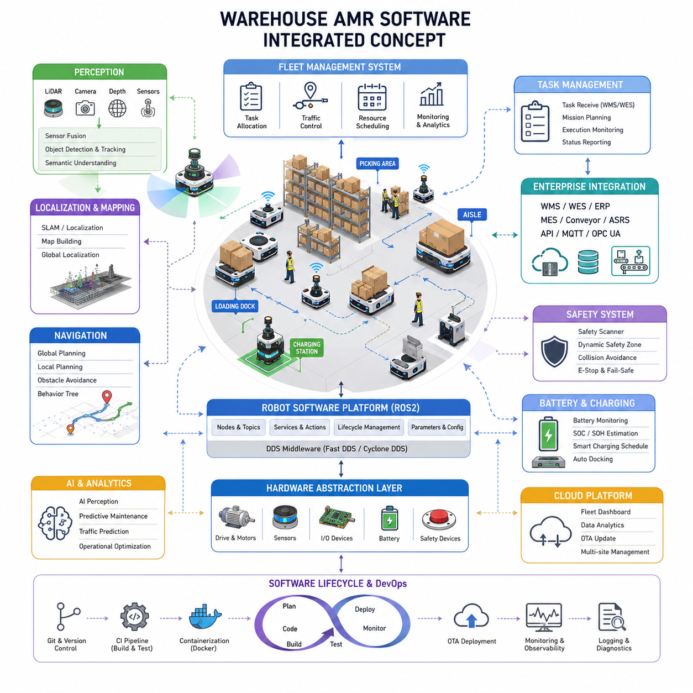
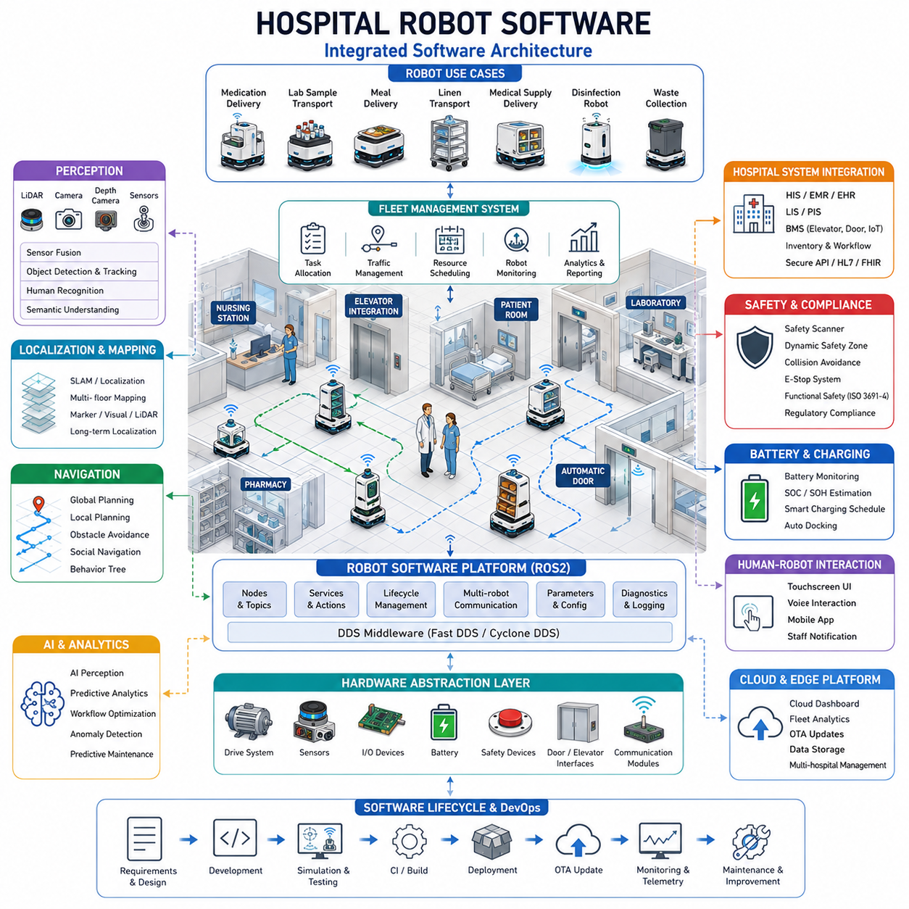
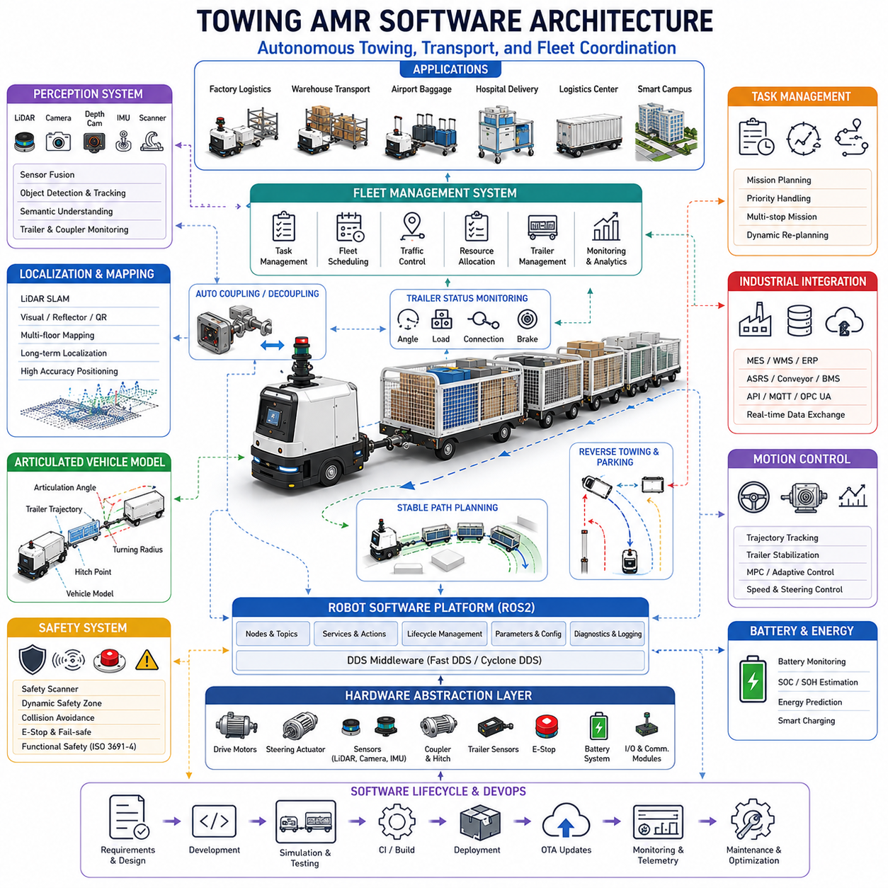
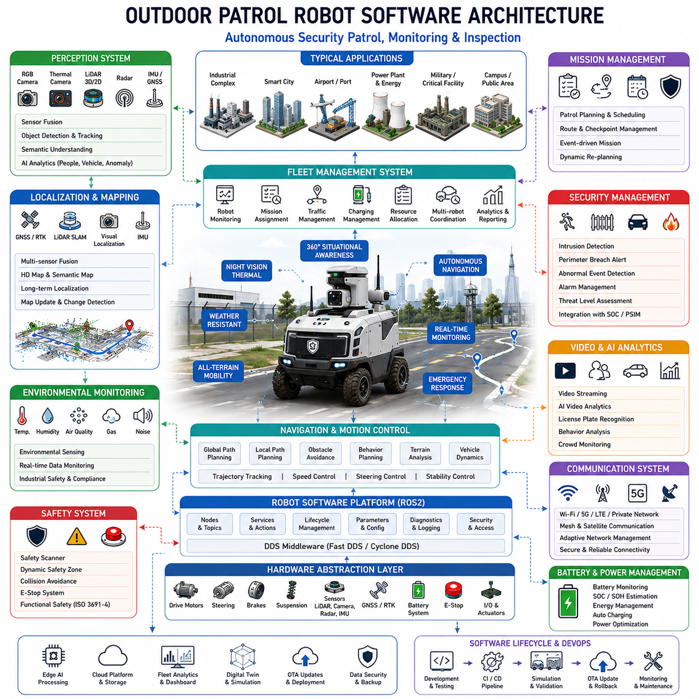
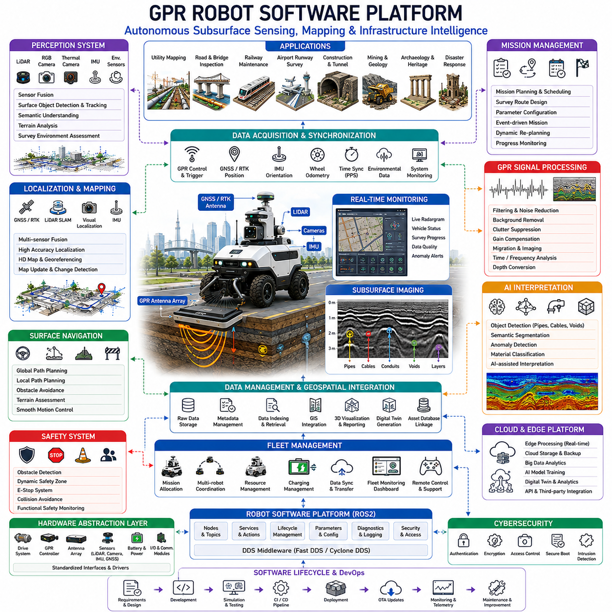
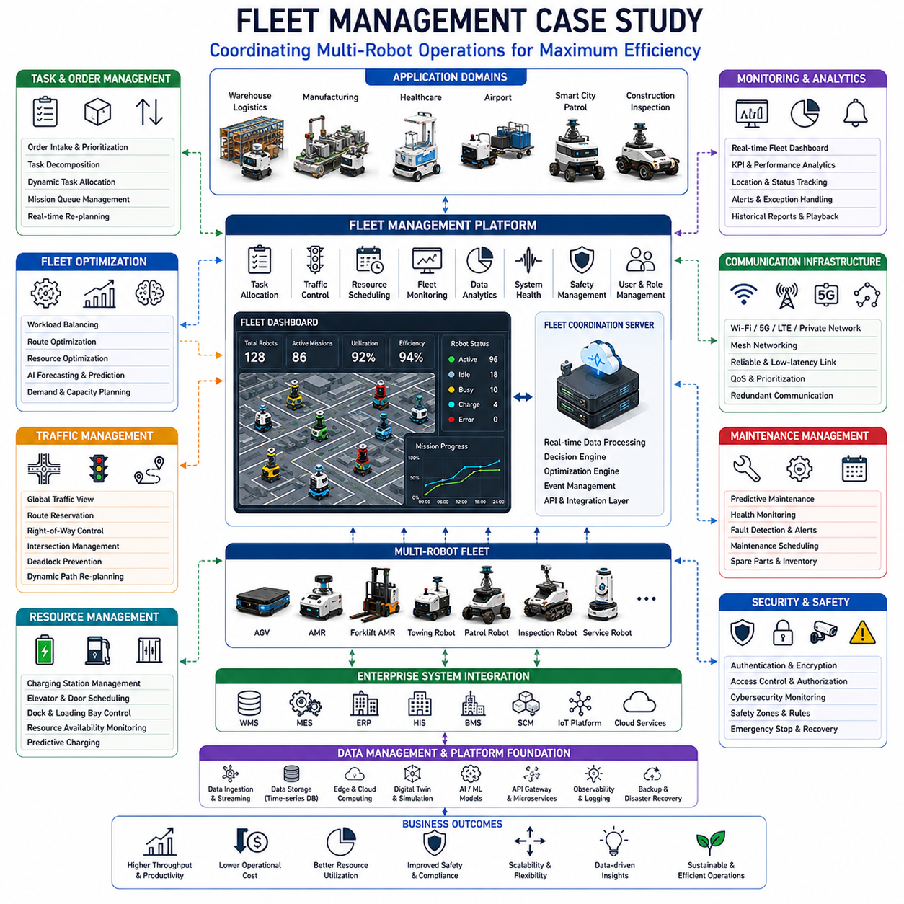
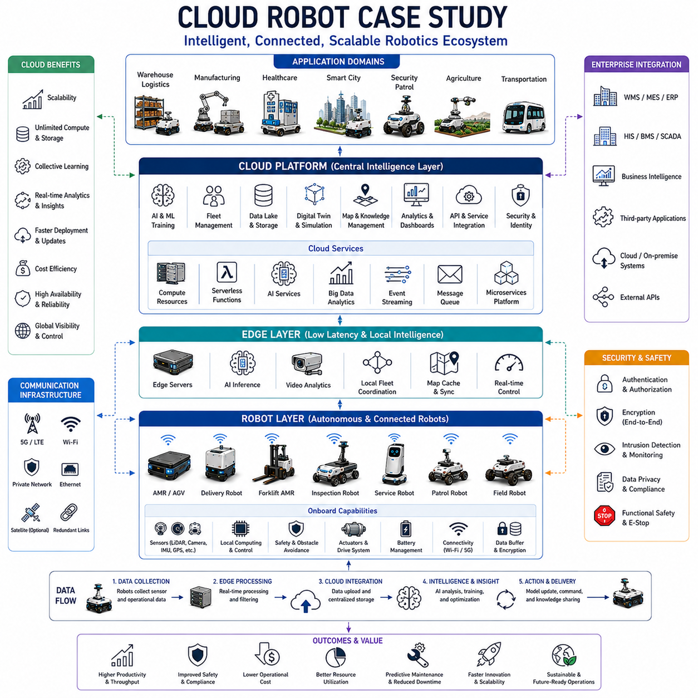
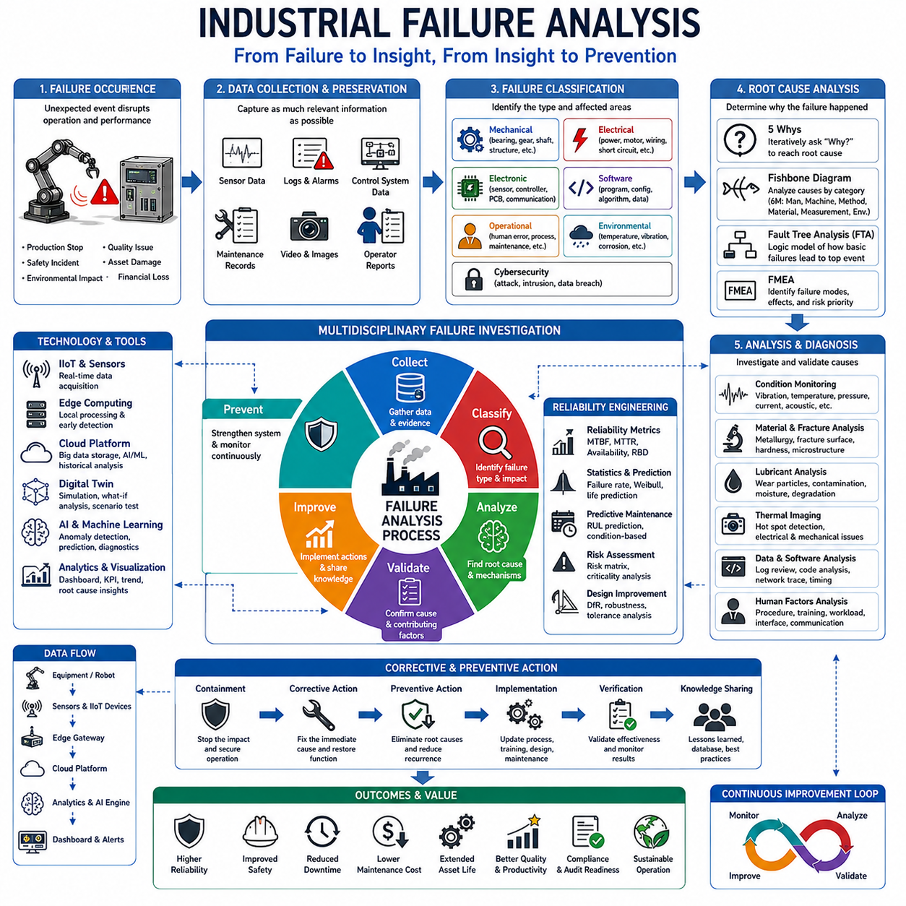

# Chapter 23. Industrial Software Case Studies

## 23.1 Warehouse AMR Software

{width="7.268055555555556in" height="7.268055555555556in"}

Warehouse AMR Software refers to the complete software ecosystem that enables Autonomous Mobile Robots (AMRs) to operate safely, efficiently, and autonomously inside warehouses, distribution centers, fulfillment centers, manufacturing logistics environments, and e-commerce facilities. Unlike traditional AGV systems that rely on fixed routes and predefined infrastructure, warehouse AMR software continuously perceives its environment, makes decisions in real time, coordinates with other robots, communicates with warehouse management systems, and dynamically adapts to operational changes. Modern warehouse AMR software has evolved into a highly integrated cyber-physical platform that combines robotics, cloud computing, artificial intelligence, distributed systems, real-time control, and enterprise software integration. This topic belongs to the Industrial Software Case Studies section of AMR software architecture because warehouse logistics represents one of the most commercially successful and technically mature applications of autonomous mobile robotics.

A warehouse AMR software stack typically consists of several tightly integrated layers. At the lowest level are hardware abstraction layers responsible for interfacing with motors, encoders, LiDAR sensors, cameras, IMUs, safety scanners, battery systems, charging stations, and industrial communication devices. Above this layer resides the robot operating framework, commonly implemented using ROS2 or a proprietary robotics middleware. This layer manages message passing, node orchestration, real-time communication, hardware drivers, and system lifecycle management. The perception layer processes sensor data to understand the environment, while localization and mapping systems estimate robot position and maintain operational maps. The navigation stack plans paths, avoids obstacles, and controls motion. Fleet management software coordinates multiple robots simultaneously. At the highest level, enterprise integration software connects robots to Warehouse Management Systems (WMS), Warehouse Execution Systems (WES), Enterprise Resource Planning (ERP) systems, and cloud analytics platforms. Together, these layers create a unified software architecture capable of supporting thousands of logistics operations every day.

The perception subsystem forms one of the most critical components of warehouse AMR software. Warehouses are highly dynamic environments populated by workers, forklifts, pallets, carts, conveyors, and constantly changing inventory layouts. AMRs must continuously perceive these changes and react safely. Modern perception software integrates multiple sensor modalities including 2D LiDAR, 3D LiDAR, RGB cameras, depth cameras, ultrasonic sensors, safety laser scanners, wheel odometry, and IMU measurements. Sensor fusion algorithms combine information from these sources to create a coherent environmental representation. Object detection models identify humans, vehicles, shelving structures, pallets, and obstacles. Tracking systems estimate object trajectories and predict future movement. Semantic perception modules classify operational zones such as loading docks, picking areas, charging stations, restricted zones, and high-traffic corridors. The perception software must operate continuously with high reliability because navigation and safety functions depend entirely on accurate environmental awareness.

Localization software is equally important within warehouse AMR systems. Unlike outdoor autonomous vehicles that can rely on GNSS signals, warehouse robots operate in GNSS-denied environments. Therefore, localization software uses SLAM technologies, LiDAR-based localization, visual localization, reflector-based positioning systems, QR code navigation systems, or hybrid approaches. During deployment, warehouses are mapped to create reference maps. During operation, robots continuously compare live sensor observations against these maps to estimate their position with centimeter-level accuracy. Long-term localization stability becomes particularly important in large fulfillment centers where robots may travel hundreds of kilometers each week. Localization software must also handle environmental changes such as temporary storage areas, seasonal inventory reconfiguration, and infrastructure modifications without significant degradation in performance.

The navigation stack represents the decision-making core of warehouse AMR software. Navigation software transforms localization outputs and mission objectives into safe and efficient robot movements. Global planners calculate optimal routes between destinations using warehouse maps. Local planners continuously evaluate nearby obstacles and generate collision-free trajectories. Motion controllers convert planned trajectories into wheel commands while respecting kinematic constraints and safety requirements. Modern navigation systems frequently utilize behavior trees to organize complex robot behaviors such as docking, charging, elevator usage, pallet pickup, pallet drop-off, aisle crossing, and emergency avoidance. Navigation software must balance efficiency and safety, ensuring that robots maintain high throughput while avoiding collisions and operational disruptions.

A defining characteristic of warehouse AMR software is its integration with fleet management systems. Individual robots provide value, but large-scale warehouse automation depends on coordinated fleets containing dozens, hundreds, or even thousands of robots. Fleet management software functions as the central intelligence layer responsible for assigning tasks, coordinating traffic, balancing workloads, optimizing resource utilization, and monitoring fleet health. Task allocation algorithms determine which robot should execute a particular mission based on factors such as location, battery level, workload, equipment configuration, and estimated completion time. Traffic management systems prevent congestion and deadlocks in narrow aisles and busy intersections. Resource scheduling systems coordinate access to elevators, charging stations, loading docks, and high-demand warehouse zones. Fleet-level optimization significantly influences overall warehouse productivity and operational efficiency.

Task management software forms another essential component of warehouse AMR systems. Warehouse operations generate a continuous stream of transport requests, inventory movements, replenishment missions, and material handling tasks. Task management engines receive requests from WMS or WES systems and convert them into executable robot missions. A typical workflow begins when a warehouse system requests a pallet transfer from a storage location to a shipping station. The task manager validates the request, assigns an available robot, generates a mission plan, monitors execution progress, handles exceptions, and reports completion status. Advanced task management systems also support priority handling, mission preemption, workflow chaining, and adaptive scheduling based on real-time operational conditions.

Enterprise integration software plays a crucial role in ensuring that AMRs become part of broader warehouse operations rather than isolated robotic systems. Integration interfaces typically connect robots with WMS, ERP, Manufacturing Execution Systems, inventory databases, conveyor systems, automated storage systems, and business intelligence platforms. Standard communication protocols such as REST APIs, MQTT, OPC UA, WebSockets, and industrial middleware solutions facilitate data exchange. Real-time synchronization enables robots to receive updated inventory information, order priorities, and workflow changes while simultaneously reporting mission status, operational metrics, and performance statistics. Effective enterprise integration transforms AMRs into active participants within the digital warehouse ecosystem.

Safety software is a fundamental requirement for warehouse robotics. AMRs operate in close proximity to human workers and industrial equipment, making safety-critical software design essential. Safety architectures typically combine hardware-based protection mechanisms with software-based safety logic. Safety scanners create dynamic protection zones around robots. Collision avoidance algorithms monitor surrounding environments continuously. Speed regulation systems adjust robot velocity according to environmental conditions and operational contexts. Emergency stop systems provide immediate shutdown capabilities. Functional safety software implements redundancy, fault detection, fail-safe behavior, and recovery procedures. Compliance with standards such as ISO 3691-4 and related industrial safety regulations often guides software design and validation processes.

Battery management and charging software contribute significantly to operational continuity. Warehouse robots must operate for extended periods while minimizing downtime. Battery monitoring systems continuously track voltage, current, temperature, state of charge, and battery health metrics. Predictive algorithms estimate remaining operating time and determine optimal charging schedules. Fleet management software coordinates charging activities across multiple robots to avoid charging station bottlenecks. Autonomous docking systems guide robots toward charging stations using visual markers, LiDAR guidance, fiducial markers, or precision localization techniques. Intelligent energy management ensures maximum fleet availability while extending battery lifespan.

Cloud integration has become increasingly important in modern warehouse AMR software architectures. While real-time control functions typically remain on edge devices, cloud platforms provide centralized monitoring, fleet analytics, software deployment, machine learning operations, and data storage services. Cloud-based dashboards offer real-time visibility into robot locations, mission progress, battery status, operational alerts, and performance metrics. Historical operational data supports trend analysis, predictive maintenance, and continuous optimization initiatives. Cloud infrastructures also simplify multi-site fleet management for organizations operating warehouses across different geographic regions.

Artificial intelligence increasingly enhances warehouse AMR software capabilities. AI models improve perception accuracy, obstacle classification, anomaly detection, predictive maintenance, traffic forecasting, and operational optimization. Computer vision systems identify pallets, containers, packages, shelves, and human workers. Machine learning algorithms predict congestion patterns and optimize route planning. Predictive maintenance systems analyze motor currents, vibration signatures, battery behavior, and sensor health to identify potential failures before they occur. Reinforcement learning techniques are increasingly explored for dynamic traffic optimization and adaptive fleet coordination. As AI technologies mature, warehouse AMR software is evolving from rule-based automation toward intelligent adaptive autonomy.

Observability and debugging capabilities are critical for maintaining large-scale warehouse robot deployments. Logging systems record robot actions, sensor data, mission execution details, software events, and fault conditions. Data recording frameworks capture synchronized operational data for post-mission analysis. Telemetry systems continuously stream performance metrics to monitoring platforms. Distributed tracing techniques enable engineers to identify bottlenecks across complex software architectures. Diagnostic dashboards provide insights into robot health, communication status, localization quality, navigation performance, and fleet efficiency. Comprehensive observability significantly reduces troubleshooting time and improves system reliability.

Software deployment and lifecycle management represent major operational challenges in warehouse robotics. Production fleets may contain hundreds of robots operating continuously across multiple facilities. Over-the-air update systems enable remote deployment of software patches, security updates, configuration changes, and AI model improvements. Deployment strategies often include staged rollouts, canary deployments, rollback mechanisms, and validation testing procedures. Continuous Integration and Continuous Deployment pipelines automate software validation, testing, and release processes. Robust deployment frameworks ensure that software evolution occurs safely without disrupting warehouse operations.

Scalability is a defining requirement for warehouse AMR software. Early deployments may involve only a few robots, but successful implementations often expand into fleets containing hundreds or thousands of units. Scalable architectures employ microservices, distributed databases, message brokers, cloud-native infrastructure, containerized deployment models, and horizontal scaling strategies. Communication architectures must support high message volumes while maintaining low latency and reliability. Fleet management algorithms must remain efficient as robot populations grow. Scalable software design ensures that operational complexity remains manageable even as deployments expand dramatically.

Several industry-leading warehouse AMR deployments demonstrate the effectiveness of advanced software architectures. Large e-commerce fulfillment centers utilize fleets of mobile robots that transport inventory shelves, coordinate picking operations, and optimize order fulfillment workflows. Manufacturing logistics environments employ AMRs for just-in-time material delivery and production line replenishment. Third-party logistics providers leverage autonomous fleets to improve throughput, reduce labor dependency, and increase operational flexibility. These real-world deployments highlight the importance of robust software engineering practices, scalable architectures, intelligent fleet coordination, and seamless enterprise integration.

The future of warehouse AMR software is expected to move toward AI-native architectures, cloud-edge hybrid intelligence, autonomous fleet optimization, digital twins, multi-agent coordination, and foundation-model-driven robotics. Future systems may incorporate warehouse-scale world models that provide robots with a continuously updated understanding of operational environments. Large-scale fleet intelligence may optimize thousands of robots simultaneously across multiple facilities. Natural language interfaces could enable warehouse operators to interact with robotic systems using conversational commands. Embodied AI technologies may further enhance adaptability, reasoning capabilities, and operational autonomy. As warehouse automation continues to expand globally, warehouse AMR software will remain one of the most influential examples of large-scale industrial robotics software engineering, serving as a benchmark for future autonomous systems across manufacturing, healthcare, logistics, and smart infrastructure domains.

## 23.2 Hospital Robot Software

{width="7.268055555555556in" height="7.268055555555556in"}

Hospital Robot Software refers to the complete software ecosystem that enables autonomous mobile robots, service robots, delivery robots, disinfection robots, logistics robots, and future healthcare robotic systems to operate safely and efficiently within hospitals and healthcare facilities. Unlike warehouse robots that primarily focus on logistics optimization and productivity, hospital robots operate in highly dynamic, human-centered, safety-critical environments where patient care, clinical workflows, infection control, privacy protection, and regulatory compliance are equally important as operational efficiency. Hospital robot software therefore combines autonomous navigation, fleet management, healthcare information integration, safety management, cybersecurity, and human-robot interaction into a unified platform designed specifically for medical environments.

Modern hospitals are among the most complex indoor operational environments. A single medical center may contain multiple buildings, numerous floors, elevators, corridors, operating rooms, intensive care units, emergency departments, pharmacies, laboratories, and restricted-access clinical areas. Thousands of patients, healthcare workers, visitors, and service personnel move continuously throughout these environments. Hospital robots must navigate safely while transporting medications, laboratory samples, blood products, sterile supplies, linens, meals, medical equipment, waste materials, and other critical resources. The software architecture supporting these robots must therefore be highly reliable, scalable, and capable of adapting to continuously changing environmental conditions.

At the foundation of hospital robot software lies the hardware abstraction layer. This layer provides standardized interfaces to motors, encoders, batteries, safety scanners, cameras, LiDAR sensors, door controllers, elevator communication systems, docking stations, charging systems, environmental sensors, and communication modules. By abstracting hardware complexity from higher-level applications, the software platform can support multiple robot models and hardware configurations while maintaining a consistent operational framework. This modularity is particularly important in healthcare systems where robots may vary significantly in size, payload, functionality, and deployment scenarios.

Above the hardware layer resides the robot middleware platform, often built upon ROS2 or proprietary robotic frameworks. The middleware manages communication between software modules, coordinates data flow, handles service requests, and supports distributed processing. In hospital environments, reliability and fault tolerance are critical. The middleware must continue functioning even when portions of the system experience communication delays, network disruptions, or hardware failures. Modern hospital robot platforms frequently utilize DDS-based communication architectures that provide reliable real-time message exchange across distributed robotic systems.

Perception software plays a central role in hospital robotics. Hospitals are highly dynamic spaces where human activity constantly changes environmental conditions. Patients may use wheelchairs, walkers, crutches, stretchers, or hospital beds. Medical staff frequently move carts, equipment, and supplies through hallways. Visitors may stop unexpectedly, gather in groups, or move unpredictably. Perception software must continuously detect, classify, and track these objects while maintaining situational awareness. Sensor systems typically combine 2D LiDAR, 3D LiDAR, RGB cameras, depth cameras, ultrasonic sensors, IMUs, wheel odometry, and safety laser scanners.

Sensor fusion algorithms integrate data from these sources to create a robust environmental model. Human detection systems identify doctors, nurses, patients, visitors, and support staff. Semantic perception systems recognize elevators, patient rooms, nursing stations, operating theaters, pharmacies, laboratories, emergency exits, charging stations, and restricted-access areas. Advanced perception systems may additionally estimate crowd density, predict pedestrian movement, and identify abnormal situations that require robot adaptation. The quality of perception directly influences navigation safety and operational effectiveness.

Localization and mapping software provide the robot's understanding of its position within the hospital. Because hospitals are indoor environments where GNSS signals are unavailable, localization systems rely on LiDAR-based SLAM, visual localization, reflector-based positioning systems, QR markers, fiducial markers, or hybrid localization approaches. Hospital maps often contain multiple floors, interconnected buildings, restricted zones, and dynamic operational areas. Long-term localization stability is particularly important because hospitals may undergo continuous renovations, equipment relocation, and workflow modifications. Localization software must therefore remain robust despite environmental changes while maintaining centimeter-level positioning accuracy.

Navigation software serves as the decision-making engine responsible for safe movement throughout the hospital. Unlike warehouse environments where traffic is relatively predictable, hospital traffic patterns are highly variable and influenced by clinical activities. Emergency situations may suddenly alter corridor usage. Patient transportation may require priority access. Operating rooms and intensive care units often have strict access requirements. Navigation software must continuously evaluate environmental conditions while balancing efficiency, safety, and operational priorities.

Global planners compute optimal routes across the hospital. Local planners generate collision-free trajectories that adapt to dynamic obstacles. Motion controllers translate navigation decisions into smooth and safe robot movement. Behavior trees are frequently used to organize complex operational behaviors including room delivery, hallway navigation, automatic docking, charging operations, elevator usage, automatic door interaction, restricted area access, and emergency response procedures. Navigation systems must also support socially aware behaviors such as yielding to patients, maintaining appropriate interpersonal distances, and minimizing disruption to clinical workflows.

Elevator integration represents one of the most important specialized functions within hospital robot software. Large hospitals often span multiple floors, making vertical mobility essential for effective logistics automation. Elevator integration software communicates with building management systems to request elevators, select destination floors, monitor elevator status, and coordinate safe entry and exit operations. Advanced implementations support multiple robots sharing elevator resources while minimizing waiting times and avoiding congestion. Reliable elevator integration significantly expands the operational reach of hospital robotic systems.

Automatic door integration is similarly critical. Hospital environments contain numerous access-controlled doors, including pharmacy entrances, laboratory facilities, isolation wards, and staff-only areas. Robot software must communicate with door control systems using secure interfaces that maintain hospital security requirements while allowing authorized robotic access. Synchronization between navigation software and door management systems ensures smooth and efficient movement through complex healthcare facilities.

Task management software coordinates daily hospital logistics operations. Hospitals generate thousands of transportation requests each day. Medications must be delivered from pharmacies to nursing stations. Laboratory samples must be transported to testing facilities. Blood products require rapid and secure movement. Meals, linens, medical equipment, and waste materials must be distributed according to strict operational schedules. Task management systems receive requests from hospital information systems and convert them into executable robot missions.

Mission planning software evaluates task priority, robot availability, location, battery status, payload capability, and operational constraints before assigning tasks. Critical medical deliveries may receive higher priority than routine logistics operations. Time-sensitive laboratory specimens may require dedicated routing strategies. Emergency requests may preempt existing missions. The software continuously monitors execution progress and dynamically adjusts schedules as conditions change.

Fleet management systems enable coordination of multiple robots operating simultaneously throughout a hospital. Large healthcare facilities may deploy dozens or even hundreds of robots. Fleet management software optimizes task distribution, traffic flow, charging schedules, resource allocation, and operational monitoring. Traffic management algorithms prevent congestion in busy corridors and intersections. Resource scheduling systems coordinate access to elevators, charging stations, loading areas, and specialized service zones. Fleet-level optimization improves operational efficiency while ensuring consistent service quality across the entire facility.

Integration with hospital information systems is one of the defining characteristics of healthcare robotics software. Robots must interact with Hospital Information Systems (HIS), Electronic Medical Records (EMR), Electronic Health Records (EHR), Laboratory Information Systems (LIS), Pharmacy Information Systems (PIS), Building Management Systems (BMS), and facility management platforms. Secure APIs and healthcare communication standards facilitate data exchange between robotic platforms and hospital IT infrastructure.

Such integration enables automated workflow execution. A medication order entered into the pharmacy system may automatically trigger a delivery mission. Completion of a laboratory transport mission may update specimen tracking systems. Inventory management systems may automatically request replenishment deliveries when stock levels fall below predefined thresholds. These integrations transform robots into active participants within hospital operational workflows rather than standalone automation tools.

Cybersecurity requirements are particularly stringent in healthcare environments. Hospital robot software processes operational data, communicates with medical information systems, and may interact with sensitive infrastructure. Security architectures therefore include authentication mechanisms, access control systems, encrypted communications, secure boot processes, software signing, intrusion detection systems, and audit logging capabilities. Compliance with healthcare cybersecurity regulations and privacy requirements is essential for successful deployment.

Patient privacy protection represents another critical consideration. Hospital robots may encounter protected health information, patient identifiers, medical records, or sensitive operational data. Software systems must ensure that personal information remains protected throughout collection, transmission, processing, and storage. Privacy-preserving architectures often separate navigation data from patient information and implement strict access control policies for all healthcare-related datasets.

Safety software forms the foundation of hospital robotic operations. Healthcare facilities contain vulnerable individuals including elderly patients, children, individuals with disabilities, and critically ill patients. Safety systems therefore operate at multiple levels. Safety scanners continuously monitor protective zones around the robot. Collision avoidance algorithms predict and prevent dangerous interactions. Speed control systems adjust robot behavior according to environmental conditions. Emergency stop systems provide immediate shutdown capabilities when necessary.

Functional safety architectures incorporate redundancy, fault detection, health monitoring, fail-safe behavior, and recovery procedures. Safety validation often follows rigorous standards and regulatory requirements appropriate for healthcare environments. Continuous safety monitoring ensures that robots remain operational only when all critical systems function within acceptable parameters.

Battery management and charging software support continuous hospital operations. Healthcare facilities operate twenty-four hours per day, requiring robotic systems to maintain high availability. Battery monitoring systems continuously evaluate state of charge, state of health, temperature, voltage, and current conditions. Predictive algorithms estimate remaining operational capacity and schedule charging activities proactively. Fleet management systems coordinate charging schedules across multiple robots to maximize fleet availability while preventing charging station congestion.

Cloud and edge computing architectures increasingly support modern hospital robot deployments. Real-time navigation, perception, and control functions typically execute on edge computers located within the robot. Cloud platforms provide centralized monitoring, fleet analytics, software deployment, AI model management, operational reporting, and multi-site management capabilities. Healthcare organizations operating multiple hospitals can utilize centralized cloud infrastructures to manage robotic operations across entire healthcare networks.

Artificial intelligence is becoming increasingly important within hospital robotics software. AI-based perception systems improve human detection, object recognition, and environmental understanding. Predictive analytics support maintenance planning and operational optimization. Machine learning algorithms identify workflow inefficiencies and recommend improvements. Future systems may incorporate multimodal AI, large language models, and healthcare-specific reasoning systems that enable more sophisticated interactions with hospital staff and patients.

Human-robot interaction software is especially important in healthcare settings. Unlike industrial environments where human interaction may be limited, hospital robots frequently interact directly with nurses, physicians, technicians, patients, and visitors. User interfaces must therefore be intuitive, reliable, and accessible. Touchscreen interfaces, voice interaction systems, mobile applications, and centralized monitoring dashboards enable effective communication between humans and robotic systems.

Observability and operational monitoring capabilities are essential for maintaining reliable hospital robot deployments. Logging systems record mission execution, sensor activity, navigation decisions, software events, and fault conditions. Telemetry platforms provide real-time visibility into robot status, battery condition, communication health, localization quality, and fleet performance. Data recording systems support incident analysis, regulatory compliance, and continuous improvement initiatives. Comprehensive monitoring significantly reduces downtime and improves overall service reliability.

Software lifecycle management plays a major role in long-term deployment success. Hospital robots often remain operational for many years while software capabilities continue evolving. Over-the-air update systems enable remote deployment of software patches, security updates, AI models, configuration changes, and feature enhancements. Deployment processes typically include staged validation, rollback mechanisms, testing environments, and regulatory verification procedures to ensure patient safety and operational continuity.

The future of hospital robot software is expected to move toward fully integrated healthcare automation platforms. Future systems will likely incorporate hospital-wide digital twins, AI-powered workflow orchestration, predictive logistics planning, multimodal human-robot interaction, and collaborative robot ecosystems operating across entire healthcare networks. Robots may become intelligent healthcare assistants capable of understanding clinical workflows, adapting to changing operational conditions, and coordinating seamlessly with healthcare professionals. As hospitals continue their digital transformation, hospital robot software will play an increasingly important role in improving operational efficiency, reducing staff workload, enhancing patient service quality, and supporting the next generation of intelligent healthcare infrastructure.

## 23.3 Towing AMR Software

{width="7.268055555555556in" height="7.268055555555556in"}

Towing AMR Software refers to the specialized software architecture that enables Autonomous Mobile Robots to tow, pull, transport, and coordinate one or more carts, trailers, racks, trolleys, or payload carriers within industrial environments. Unlike standard transport AMRs that carry payloads directly on their chassis, towing AMRs move external loads connected through mechanical couplers, automatic hitching systems, or intelligent towing mechanisms. This seemingly simple difference introduces significant complexity in perception, localization, navigation, motion control, fleet coordination, safety management, and operational planning. As a result, towing AMR software has evolved into a highly specialized branch of industrial robotics software engineering that combines autonomous navigation, articulated vehicle control, fleet management, logistics optimization, and safety-critical automation.

Towing robots are widely deployed in factories, warehouses, airports, hospitals, logistics centers, automotive assembly plants, semiconductor manufacturing facilities, and large industrial campuses. Their primary role is to automate repetitive material transportation tasks traditionally performed by forklifts, manual carts, tugger trains, and human operators. Modern towing AMRs can transport multiple carts simultaneously, support just-in-time manufacturing workflows, integrate with automated loading systems, and operate continuously within complex industrial environments. The software platform that supports these capabilities must address challenges that are fundamentally different from those encountered by conventional AMRs.

At the foundation of towing AMR software lies the hardware abstraction layer. This layer provides unified interfaces to drive motors, steering actuators, encoders, safety scanners, LiDAR sensors, cameras, IMUs, coupling mechanisms, trailer sensors, emergency stop systems, battery systems, and industrial communication devices. The hardware abstraction layer isolates higher-level software from hardware-specific implementations, enabling the same software architecture to support different towing robot platforms, payload capacities, steering configurations, and trailer types. This modular design significantly simplifies maintenance, scalability, and product line expansion.

Above the hardware layer resides the robot middleware platform, typically implemented using ROS2, DDS-based communication systems, or proprietary robotic frameworks. The middleware manages communication among software modules, synchronizes sensor data, distributes commands, coordinates mission execution, and maintains system lifecycle management. Because towing AMRs often operate in large-scale industrial environments with multiple robots and extensive logistics workflows, reliable communication and fault tolerance are essential. Modern middleware architectures support distributed computing, real-time messaging, and scalable multi-robot coordination.

Perception software forms one of the most important subsystems within towing AMR architecture. Unlike ordinary AMRs whose primary concern is the movement of the robot itself, towing robots must continuously understand the behavior of both the towing vehicle and the attached trailers. The perception system collects information from LiDAR, cameras, depth sensors, safety scanners, ultrasonic sensors, wheel encoders, IMUs, and trailer monitoring devices. Sensor fusion algorithms integrate these data streams to construct a comprehensive representation of the surrounding environment and the articulated towing configuration.

Object detection systems identify workers, forklifts, vehicles, pallets, racks, carts, and infrastructure elements. Object tracking systems estimate motion trajectories and predict future movements. Semantic perception systems classify operational areas such as loading zones, production lines, intersections, docking stations, charging stations, storage areas, and restricted-access regions. Advanced towing AMRs may additionally monitor trailer articulation angles, trailer stability, coupler alignment status, and load distribution characteristics to ensure safe operation.

Localization software provides accurate positioning for towing robots operating within factories, warehouses, hospitals, and industrial facilities. Since most towing AMRs operate indoors, localization relies on LiDAR SLAM, visual localization, reflector navigation, QR-code systems, fiducial markers, or hybrid localization approaches. Long-term localization stability is particularly important because towing operations frequently involve repetitive transportation routes executed thousands of times each month. Localization systems must maintain high positional accuracy even when environmental conditions change due to inventory movement, equipment relocation, or facility modifications.

One of the most distinctive aspects of towing AMR software is articulated vehicle modeling. When a robot pulls one or more trailers, the combined system behaves very differently from a conventional mobile robot. The motion of the trailers depends on the robot's steering behavior, vehicle geometry, trailer dimensions, coupling mechanisms, and payload characteristics. Articulated vehicle models mathematically describe these relationships and enable accurate prediction of trailer trajectories. These models are fundamental for path planning, collision avoidance, reversing operations, and docking maneuvers.

Path planning for towing AMRs is significantly more complex than path planning for standard AMRs. A route that is feasible for a standalone robot may be impossible for a robot towing multiple trailers. Path planners must consider turning radius constraints, trailer swing behavior, articulation limits, load stability, aisle widths, and collision margins. Global planners compute routes that satisfy these constraints while optimizing travel efficiency. Local planners continuously adapt trajectories to dynamic environmental conditions while maintaining stable trailer behavior.

Reversing and parking represent some of the most challenging problems in towing robotics. Trailer systems exhibit non-holonomic behavior and can become unstable during backward motion. Small steering errors may rapidly amplify, resulting in jackknifing conditions where the trailer folds toward the towing vehicle. Towing AMR software therefore incorporates advanced control algorithms specifically designed for reverse driving. Predictive controllers, model-based planners, and trailer stabilization algorithms continuously monitor articulation angles and generate corrective steering commands. Successful implementation of autonomous reversing capabilities is often considered one of the key technological differentiators among towing AMR vendors.

Motion control software converts planned trajectories into executable motor commands while maintaining vehicle stability and operational safety. The control architecture typically consists of multiple hierarchical layers. Low-level controllers regulate wheel velocities, steering angles, and actuator positions. Mid-level controllers manage vehicle trajectory tracking and trailer stabilization. High-level controllers coordinate mission execution and operational behaviors. Advanced control systems often employ Model Predictive Control (MPC), adaptive control methods, feedforward compensation, and dynamic vehicle models to achieve smooth and accurate motion.

Automatic coupling and decoupling systems represent another specialized area of towing AMR software. In many industrial environments, robots must autonomously connect to and disconnect from carts, racks, or trailers. Auto-coupling software coordinates perception systems, localization modules, motion controllers, and mechanical actuators to achieve precise alignment and engagement. Vision systems, LiDAR measurements, fiducial markers, and proximity sensors guide the robot toward the trailer. Once alignment is achieved, coupling mechanisms are activated and connection status is verified through sensors and diagnostic checks.

Auto-decoupling follows a similarly structured process. The software ensures that the trailer is safely positioned before releasing the connection. Validation procedures confirm successful disengagement and verify that the trailer remains stable. Automated coupling and decoupling significantly increase operational flexibility by allowing robots to serve multiple trailers without human intervention.

Task management software coordinates towing operations within larger logistics workflows. Manufacturing facilities often employ tugger trains that transport materials between warehouses and production lines. Logistics centers utilize towing robots to move carts between sorting stations and loading docks. Hospitals deploy towing robots to transport meal carts, linen carts, and waste collection carts. Task management systems receive transportation requests from enterprise systems and transform them into executable robot missions.

Mission planning software evaluates trailer availability, robot status, battery levels, payload requirements, route conditions, and operational priorities before assigning tasks. Multi-stop missions are commonly supported, allowing a single towing robot to serve multiple destinations within a single route. Dynamic rescheduling mechanisms adapt to operational disruptions and changing priorities.

Fleet management software is particularly important in towing AMR deployments because transportation efficiency depends heavily on fleet-level optimization. Large facilities may operate dozens or hundreds of towing robots simultaneously. Fleet managers coordinate task allocation, traffic control, charging schedules, trailer assignments, and resource utilization. Traffic management algorithms prevent congestion in narrow aisles and intersections. Resource scheduling systems coordinate access to loading stations, docking areas, elevators, and charging facilities.

Industrial integration software connects towing AMRs with Manufacturing Execution Systems (MES), Warehouse Management Systems (WMS), Enterprise Resource Planning (ERP) systems, Automated Storage and Retrieval Systems (ASRS), conveyor systems, production planning software, and facility management platforms. Standard interfaces such as REST APIs, MQTT, OPC UA, Modbus, and industrial communication protocols facilitate data exchange. Integration enables robots to participate directly in digital manufacturing and logistics workflows.

Safety software is among the most critical components of towing AMR architecture. Towing robots often transport heavy loads, long trailer trains, and oversized materials. The extended physical footprint of the robot-trailer system introduces additional safety challenges. Safety software continuously monitors robot position, trailer position, articulation angles, obstacle proximity, speed limits, and operational conditions.

Safety scanners create dynamic protective zones around the towing system. Collision avoidance algorithms account for both the towing vehicle and attached trailers. Speed control systems adjust maximum velocity according to payload weight, trailer length, turning radius, and environmental conditions. Emergency stop systems immediately halt motion when hazardous situations are detected. Functional safety architectures typically incorporate redundant sensing, fault detection, fail-safe mechanisms, and safety-certified control logic.

Battery management software supports continuous towing operations across extended industrial shifts. Heavy payload transportation can significantly increase energy consumption compared to ordinary AMR operations. Battery monitoring systems continuously evaluate state of charge, state of health, temperature, voltage, and current characteristics. Predictive energy management algorithms estimate mission feasibility and determine optimal charging schedules. Fleet-level charging coordination minimizes operational downtime while maximizing asset utilization.

Cloud and edge computing architectures increasingly enhance towing AMR software platforms. Real-time perception, navigation, and control functions execute on onboard edge computers. Cloud platforms provide fleet monitoring, operational analytics, predictive maintenance, software deployment, AI model management, and multi-site coordination. Cloud-based dashboards offer real-time visibility into robot status, trailer utilization, traffic conditions, mission progress, and operational performance metrics.

Artificial intelligence is becoming an important component of modern towing AMR software. AI-enhanced perception systems improve obstacle detection and classification. Machine learning models optimize route planning and fleet coordination. Predictive maintenance algorithms identify emerging failures before they impact operations. Traffic prediction systems forecast congestion patterns and recommend alternative routes. Future systems may incorporate foundation models and autonomous agents capable of making higher-level logistics decisions.

Observability and diagnostics are essential for maintaining large-scale towing robot deployments. Logging systems record operational events, navigation decisions, control actions, sensor measurements, coupling activities, and fault conditions. Data recording systems capture synchronized operational data for troubleshooting and performance analysis. Telemetry platforms continuously monitor robot health, communication status, battery condition, trailer utilization, and fleet efficiency. Comprehensive observability significantly reduces maintenance costs and improves system reliability.

Software lifecycle management is critical because industrial towing systems often operate continuously for many years. Over-the-air update systems enable remote deployment of software enhancements, security patches, control improvements, AI models, and configuration changes. Staged deployment strategies, rollback mechanisms, automated validation procedures, and simulation-based testing frameworks ensure safe software evolution without disrupting production operations.

The future of towing AMR software is expected to evolve toward fully autonomous logistics ecosystems. Advanced multi-trailer control systems, intelligent auto-coupling technologies, AI-driven fleet optimization, digital twins, cloud-native fleet architectures, and collaborative robot ecosystems will increasingly define next-generation towing solutions. Future towing AMRs may operate as intelligent logistics agents capable of dynamically coordinating material flows across entire factories, warehouses, airports, and industrial campuses. As manufacturing and logistics continue their digital transformation, towing AMR software will remain one of the most strategically important components of industrial automation, enabling scalable, flexible, and highly efficient autonomous transportation systems.

## 23.4 Outdoor Patrol Robot Software

{width="7.268055555555556in" height="7.268055555555556in"}

Outdoor Patrol Robot Software refers to the integrated software ecosystem that enables autonomous mobile robots to perform security patrol, infrastructure inspection, surveillance, monitoring, emergency response, and situational awareness missions in outdoor environments. Unlike indoor robots that operate within structured and predictable facilities, outdoor patrol robots must function in large-scale, dynamic, and often unstructured environments where weather conditions, terrain characteristics, lighting variations, and human activities continuously change. As a result, outdoor patrol robot software combines autonomous driving technologies, robotic perception systems, security management platforms, artificial intelligence, edge computing, cloud integration, and mission management frameworks into a unified operational architecture.

Outdoor patrol robots are increasingly deployed in industrial complexes, smart cities, airports, ports, power plants, solar farms, military facilities, logistics centers, campuses, public infrastructure, railway systems, oil and gas facilities, and critical national infrastructure. Their responsibilities include perimeter security, intrusion detection, abnormal event monitoring, equipment inspection, environmental monitoring, traffic observation, emergency response support, and continuous facility surveillance. Unlike conventional CCTV systems that remain fixed in place, outdoor patrol robots provide mobile sensing capabilities, enabling active inspection and adaptive monitoring of large areas. The software platform supporting these robots therefore acts as the intelligence layer responsible for autonomous operation and real-time decision making.

At the foundation of the software architecture lies the hardware abstraction layer. This layer provides standardized interfaces for drive motors, steering systems, braking systems, suspension components, GNSS receivers, RTK positioning modules, LiDAR sensors, cameras, thermal imaging devices, radar systems, ultrasonic sensors, IMUs, communication devices, batteries, power management systems, and safety equipment. Hardware abstraction enables software portability across different robot platforms while simplifying maintenance and future hardware upgrades. Outdoor patrol robots often operate across diverse vehicle configurations including four-wheel drive systems, six-wheel platforms, skid-steer vehicles, articulated vehicles, and all-terrain robotic platforms. The hardware abstraction layer allows higher-level software modules to remain independent of these implementation differences.

Above the hardware layer resides the robot middleware platform, which is commonly implemented using ROS2, DDS-based communication frameworks, or proprietary robotic operating environments. Middleware coordinates communication among software modules, synchronizes sensor streams, manages lifecycle states, distributes commands, and supports distributed computing architectures. Outdoor patrol systems frequently contain multiple computing devices including embedded controllers, edge AI accelerators, GPU systems, navigation computers, and communication gateways. Middleware ensures reliable communication among these components while maintaining real-time responsiveness and fault tolerance.

Perception software is one of the most critical elements of outdoor patrol robot systems. Outdoor environments are significantly more complex than indoor facilities because environmental conditions change continuously. Weather, lighting, shadows, vegetation, dust, rain, snow, fog, reflections, moving vehicles, and pedestrian activities all influence sensor performance. The perception system must therefore combine multiple sensing modalities to achieve robust situational awareness.

Typical perception architectures integrate RGB cameras, thermal cameras, 2D LiDAR, 3D LiDAR, radar systems, depth sensors, GNSS measurements, IMU data, and environmental sensors. Sensor fusion algorithms combine information from these sources to generate a consistent representation of the environment. Object detection systems identify people, vehicles, animals, infrastructure components, barriers, and potential threats. Object tracking systems estimate trajectories and predict future movement. Semantic understanding modules classify roads, sidewalks, buildings, fences, gates, parking lots, vegetation, and operational zones. Thermal perception systems enhance visibility during nighttime operations and support intrusion detection under low-light conditions.

Artificial intelligence significantly enhances outdoor perception capabilities. Deep learning models support person detection, vehicle classification, license plate recognition, anomaly detection, crowd monitoring, abandoned object detection, and behavioral analysis. Modern outdoor patrol robots increasingly employ multimodal AI systems that combine visual, thermal, radar, and contextual information to improve reliability and reduce false alarms. AI-powered perception enables robots to distinguish between normal activities and potentially dangerous situations requiring intervention or reporting.

Localization software plays a central role in outdoor robotic operations. Unlike indoor robots that rely primarily on SLAM-based localization, outdoor patrol robots typically combine GNSS, RTK, LiDAR localization, visual localization, inertial navigation, and map-based positioning techniques. High-precision RTK systems can provide centimeter-level positioning accuracy under favorable conditions. However, GNSS signals may degrade in urban canyons, dense vegetation, tunnels, industrial facilities, and areas with significant electromagnetic interference. Therefore, robust localization architectures employ multi-sensor fusion strategies capable of maintaining accurate positioning even when individual sensors become unreliable.

Mapping systems provide the environmental context required for navigation and mission execution. Outdoor maps may include roads, pathways, patrol routes, security checkpoints, infrastructure assets, restricted areas, parking zones, utility installations, and emergency response locations. High-definition maps often contain semantic information describing operational rules and environmental characteristics. Long-term mapping capabilities allow robots to detect environmental changes, infrastructure modifications, and evolving operational conditions over time.

Navigation software transforms mission objectives into safe and efficient robot movement. Outdoor navigation is considerably more challenging than indoor navigation because robots must operate across varying terrain conditions including asphalt roads, gravel surfaces, concrete pathways, grass fields, dirt roads, ramps, slopes, and uneven terrain. Navigation systems therefore incorporate terrain assessment algorithms, obstacle avoidance capabilities, vehicle dynamics models, and environmental reasoning functions.

Global path planners generate optimal routes between patrol points and mission objectives. Local planners continuously adapt trajectories based on real-time environmental observations. Dynamic obstacle avoidance systems detect and avoid pedestrians, vehicles, animals, and temporary obstacles. Behavior planning modules coordinate complex operational tasks such as gate inspection, perimeter patrol, parking area surveillance, checkpoint verification, and emergency response navigation. Modern navigation frameworks frequently employ behavior trees to organize these activities into robust and maintainable software structures.

Patrol mission management software serves as the operational brain of the outdoor patrol system. Security patrols often follow predefined schedules, routes, checkpoints, and operational procedures. Mission planners generate patrol routes based on security requirements, risk assessments, operational priorities, and environmental conditions. Patrol missions may include routine perimeter inspections, targeted investigations, alarm verification, infrastructure monitoring, and event-driven response activities.

Mission execution systems continuously monitor progress and adapt to changing circumstances. If unexpected obstacles, security incidents, adverse weather conditions, or infrastructure failures occur, mission planners may automatically modify patrol routes or assign alternative tasks. Advanced mission management systems support conditional workflows, dynamic mission generation, autonomous prioritization, and multi-robot coordination.

Security management functions distinguish patrol robots from conventional autonomous vehicles. Security software continuously monitors sensor data for indications of unauthorized access, suspicious activity, perimeter breaches, vandalism, theft, safety violations, and operational anomalies. Event detection algorithms analyze environmental observations and generate alerts when predefined conditions are met. Alarm management systems prioritize incidents, classify threat levels, and initiate appropriate response procedures.

Many patrol robots serve as mobile extensions of existing security infrastructures. Integration software connects robotic platforms with video management systems, access control systems, intrusion detection systems, physical security information management platforms, and centralized security operation centers. Real-time communication allows security personnel to receive alerts, access live video streams, remotely control robots, and coordinate responses to emerging incidents.

Video analytics play a particularly important role in patrol robot operations. High-resolution cameras continuously monitor the environment while AI algorithms analyze video feeds for security-relevant events. Facial detection, person tracking, crowd analysis, perimeter intrusion detection, abandoned object identification, vehicle monitoring, and behavioral anomaly detection are commonly implemented functions. Edge AI architectures allow these analyses to occur directly on the robot, minimizing communication latency and bandwidth requirements.

Thermal inspection capabilities extend patrol robot functionality beyond traditional security applications. Thermal cameras can detect overheating electrical equipment, abnormal machinery temperatures, energy losses, fire hazards, and infrastructure degradation. In industrial facilities, thermal inspection software supports predictive maintenance and early fault detection. The integration of thermal analytics significantly increases the operational value of patrol robots by combining security and inspection functions within a single platform.

Environmental monitoring software enables patrol robots to function as mobile sensing stations. Environmental sensors measure temperature, humidity, air quality, gas concentrations, particulate matter, radiation levels, noise levels, and weather conditions. These measurements support industrial safety programs, environmental compliance efforts, infrastructure monitoring, and smart city applications. Real-time environmental data can be integrated into centralized monitoring systems for broader situational awareness.

Fleet management software becomes increasingly important as deployments scale from individual robots to coordinated robotic fleets. Large industrial facilities, campuses, and smart city deployments may operate dozens or hundreds of patrol robots simultaneously. Fleet management systems coordinate mission assignment, patrol scheduling, traffic management, charging operations, resource allocation, and operational monitoring. Multi-robot coordination improves coverage efficiency and increases overall system resilience.

Communication infrastructure is a critical component of outdoor patrol robot software architecture. Robots must maintain reliable connectivity across large operational areas. Communication systems may utilize Wi-Fi, LTE, 5G, private cellular networks, mesh networking, satellite communication, or hybrid communication architectures. Communication management software continuously evaluates network quality and dynamically selects optimal communication channels. Redundant communication strategies improve reliability in mission-critical applications.

Cybersecurity is particularly important for outdoor patrol robots because they often operate within critical infrastructure environments and handle sensitive security information. Security architectures incorporate authentication systems, encryption protocols, access control mechanisms, secure boot technologies, firmware validation procedures, intrusion detection capabilities, and security monitoring functions. Continuous cybersecurity assessment helps protect robotic systems from unauthorized access and cyberattacks.

Safety software ensures that outdoor patrol robots coexist safely with humans, vehicles, and infrastructure. Functional safety architectures integrate safety scanners, emergency stop systems, obstacle detection algorithms, speed regulation mechanisms, fault monitoring functions, and fail-safe behaviors. Safety zones dynamically adjust based on vehicle speed, environmental conditions, and operational context. Compliance with relevant safety standards and regulatory requirements is essential for large-scale deployment.

Battery management software supports long-duration outdoor operations. Patrol robots frequently operate for many hours or even continuously throughout the day. Battery monitoring systems track state of charge, state of health, temperature, voltage, and power consumption characteristics. Intelligent energy management algorithms optimize mission scheduling and charging operations. Autonomous docking systems enable robots to recharge without human intervention, supporting fully autonomous deployment scenarios.

Cloud and edge computing architectures provide the computational foundation for modern outdoor patrol systems. Edge computers perform real-time perception, localization, navigation, and AI inference tasks. Cloud platforms support fleet analytics, long-term data storage, software updates, AI model management, digital twin integration, and operational reporting. Cloud-edge collaboration allows robots to balance local autonomy with centralized intelligence.

Observability and diagnostics capabilities are essential for maintaining reliable operations in geographically distributed deployments. Logging systems record mission events, sensor data, software states, communication performance, and fault conditions. Telemetry systems continuously report robot health and operational metrics. Remote diagnostic tools allow engineers to investigate problems, reproduce failures, and optimize system performance without physical access to the robot.

Software lifecycle management ensures that patrol robot platforms remain secure, reliable, and technologically current throughout their operational lifetime. Over-the-air update systems support remote deployment of software enhancements, AI models, cybersecurity patches, configuration changes, and feature upgrades. Continuous integration and deployment pipelines automate testing and validation processes, reducing operational risk while accelerating innovation.

The future of outdoor patrol robot software is expected to be driven by advances in artificial intelligence, autonomous agents, edge computing, multimodal perception, digital twins, and large-scale robotic ecosystems. Future systems will likely possess advanced reasoning capabilities, predictive situational awareness, autonomous threat assessment, collaborative multi-robot behaviors, and adaptive mission planning. Integration with smart city infrastructure, critical infrastructure management systems, and national security platforms will further expand operational capabilities. As organizations increasingly seek automated solutions for security, inspection, and monitoring, outdoor patrol robot software will become a foundational technology supporting the next generation of intelligent autonomous infrastructure.

## 23.5 GPR Robot Software Platform

{width="7.268055555555556in" height="7.268055555555556in"}

GPR Robot Software Platform refers to the integrated software ecosystem that enables autonomous robotic systems to perform Ground Penetrating Radar (GPR) surveys, underground infrastructure inspection, subsurface mapping, anomaly detection, utility localization, geological investigation, and digital asset management. Unlike conventional autonomous mobile robots that primarily perceive and interact with the visible environment, GPR robots must simultaneously understand both the above-ground and below-ground worlds. This dual-domain perception requirement creates unique software challenges involving robotic autonomy, radar signal processing, geospatial intelligence, artificial intelligence, digital twin generation, and infrastructure analytics. As a result, the GPR Robot Software Platform combines autonomous navigation, sensor fusion, radar data processing, cloud analytics, AI-driven interpretation, and infrastructure management into a unified software architecture.

Modern GPR robots are increasingly deployed in smart city infrastructure management, road inspection, railway maintenance, utility mapping, airport runway monitoring, military engineering, mining operations, construction surveying, pipeline inspection, archaeological exploration, and disaster response applications. These systems provide a safer, faster, and more accurate alternative to traditional manual surveying methods. By integrating autonomous mobility with advanced sensing technologies, GPR robots can continuously collect subsurface information while simultaneously building comprehensive digital representations of underground assets and environmental conditions.

At the foundation of the software platform lies the hardware abstraction layer. This layer provides standardized interfaces for mobility systems, radar controllers, GPR antenna arrays, wheel encoders, IMUs, GNSS receivers, RTK modules, LiDAR sensors, cameras, environmental sensors, communication devices, battery systems, and edge computing hardware. Hardware abstraction enables the platform to support various GPR antenna frequencies, different robot chassis configurations, and multiple sensing technologies without requiring major software modifications. This modular architecture simplifies hardware upgrades, maintenance, and future system expansion.

Above the hardware layer resides the robot middleware platform, which is typically implemented using ROS2, DDS-based communication frameworks, or proprietary industrial robotic operating systems. The middleware coordinates communication among sensing modules, navigation systems, radar processing pipelines, mission management components, and cloud services. Because GPR operations generate extremely large volumes of synchronized sensor data, middleware architectures must support high-bandwidth communication, deterministic timing, and scalable distributed computing. Time synchronization across all sensing devices is particularly important because accurate correlation between radar measurements and vehicle position directly influences mapping accuracy.

Perception software forms one of the core components of the GPR robot platform. Unlike conventional robots that focus solely on visible objects, GPR robots must understand terrain conditions, surface features, environmental context, and underground structures simultaneously. The perception subsystem therefore integrates LiDAR, RGB cameras, thermal cameras, GNSS, IMU measurements, radar signals, and environmental sensors into a unified situational awareness framework.

Surface perception systems identify roads, sidewalks, rail tracks, bridges, pavement conditions, obstacles, vehicles, pedestrians, utility access points, and infrastructure assets. Semantic perception modules classify operational environments and provide contextual information for survey planning and navigation. Terrain analysis systems evaluate surface conditions that may affect radar quality, vehicle stability, and survey performance. These capabilities ensure that data acquisition occurs under optimal operational conditions.

Localization and mapping software are critical components of GPR robot operations. High-quality underground mapping requires precise correlation between sensor measurements and geographic location. Most GPR platforms utilize RTK-GNSS, inertial navigation systems, LiDAR localization, visual localization, and georeferenced mapping technologies. Position accuracy often directly influences the quality of underground asset reconstruction and utility mapping results.

Modern GPR software platforms frequently employ multi-layer mapping architectures. The first layer contains conventional above-ground maps including roads, buildings, vegetation, infrastructure assets, and survey boundaries. The second layer contains geospatial radar data. The third layer represents interpreted underground features such as pipes, cables, tunnels, voids, geological structures, and buried objects. Together, these layers create a comprehensive digital representation of the survey environment.

The GPR signal processing subsystem represents one of the most specialized elements of the software platform. Ground penetrating radar generates electromagnetic signals that propagate through subsurface materials and reflect from underground objects and geological boundaries. Raw radar signals contain significant noise, clutter, multipath reflections, and environmental artifacts. Signal processing algorithms therefore perform filtering, gain compensation, noise reduction, background removal, clutter suppression, and signal enhancement.

Time-domain processing converts raw waveforms into interpretable radar profiles. Frequency-domain analysis extracts spectral characteristics associated with different materials and structures. Migration algorithms improve target localization accuracy by correcting geometric distortions within radar images. Advanced signal processing pipelines continuously optimize data quality and maximize detection performance across varying soil conditions and environmental scenarios.

Data acquisition software coordinates radar operation with robotic movement. Survey quality depends heavily on synchronization between vehicle position and radar measurements. Data acquisition systems continuously record radar traces, GNSS coordinates, IMU data, vehicle states, environmental measurements, and operational metadata. High-precision timestamps ensure accurate alignment of all collected information.

Adaptive acquisition strategies may dynamically modify radar parameters based on terrain conditions, survey objectives, or detected anomalies. Intelligent survey management systems optimize data collection efficiency while ensuring comprehensive coverage of target areas. These capabilities are particularly valuable for large-scale infrastructure inspections where operational efficiency directly influences project costs.

Artificial intelligence increasingly plays a transformative role in GPR robot software platforms. Traditional GPR interpretation relies heavily on experienced human experts who manually analyze radargrams and identify underground features. AI-based interpretation systems automate much of this process by applying machine learning, deep learning, and pattern recognition techniques to radar data.

Deep neural networks can identify pipes, cables, voids, buried objects, pavement defects, rebar structures, and geological anomalies. Semantic segmentation models classify underground structures and estimate their spatial boundaries. Object detection models automatically locate utility infrastructure and buried assets. AI-assisted interpretation significantly reduces analysis time while improving consistency and scalability.

Multi-modal AI architectures combine radar data with visual information, LiDAR measurements, thermal imagery, geospatial databases, and historical infrastructure records. This fusion enables more robust interpretation and improves confidence in detection results. Future systems may employ foundation models capable of reasoning across multiple sensing modalities and infrastructure domains.

Digital twin generation represents a major objective of modern GPR software platforms. Digital twins provide virtual representations of underground infrastructure and environmental conditions. By integrating GPR measurements with geospatial information systems, CAD databases, utility records, and inspection data, software platforms can construct continuously updated models of subsurface assets.

These digital twins support infrastructure maintenance, asset management, urban planning, construction activities, utility operations, and risk assessment. Engineers can visualize underground structures, simulate excavation scenarios, evaluate infrastructure health, and plan maintenance activities using comprehensive digital representations generated by the robotic platform.

Mission management software coordinates robotic survey operations. Survey missions may involve utility mapping, road inspection, railway assessment, airport runway evaluation, tunnel inspection, archaeological surveys, or emergency response investigations. Mission planning systems define survey boundaries, route strategies, coverage requirements, sensing parameters, and operational objectives.

Autonomous mission execution systems continuously monitor progress and adapt to environmental conditions. Dynamic route planning allows robots to avoid obstacles while maintaining survey coverage requirements. Multi-pass survey strategies may automatically revisit areas requiring additional measurements or higher-resolution data collection.

Navigation software enables autonomous operation across diverse environments. GPR robots may operate on roads, sidewalks, railways, industrial facilities, airports, agricultural land, construction sites, and rough terrain. Navigation systems integrate global planning, local planning, obstacle avoidance, terrain assessment, vehicle dynamics modeling, and safety monitoring to ensure reliable operation.

Because survey quality depends on consistent vehicle motion, navigation algorithms often prioritize trajectory smoothness, velocity stability, and path accuracy. Adaptive motion control systems minimize vibration and maintain optimal antenna positioning to maximize radar performance. This close integration between mobility and sensing distinguishes GPR robot software from conventional autonomous vehicle architectures.

Fleet management software becomes increasingly important in large-scale infrastructure projects. Multiple GPR robots may operate simultaneously across extensive survey areas. Fleet coordination systems manage mission allocation, resource utilization, charging operations, data synchronization, and operational monitoring. Cloud-based fleet management platforms provide centralized oversight and enable coordinated large-scale data collection.

Geospatial information system integration is another defining feature of GPR robot software. Survey data must be linked to geographic coordinates, cadastral information, utility databases, engineering drawings, and infrastructure records. GIS integration enables engineers to visualize underground assets within broader geographic contexts and supports decision-making processes across infrastructure management organizations.

Cloud and edge computing architectures support the computational demands of GPR operations. Edge computers perform real-time radar processing, localization, navigation, AI inference, and mission execution. Cloud platforms provide large-scale storage, advanced analytics, model training, digital twin management, fleet coordination, and long-term asset management. Cloud-edge collaboration enables scalable deployment while maintaining real-time operational capabilities.

Cybersecurity plays an important role because infrastructure data often contains sensitive information regarding critical assets and utility networks. Security architectures incorporate authentication mechanisms, encrypted communication channels, secure storage systems, access control policies, audit logging, and intrusion detection capabilities. Protecting infrastructure intelligence is essential for national security, operational resilience, and regulatory compliance.

Safety software ensures reliable operation in public environments and active infrastructure zones. GPR robots frequently operate near traffic, construction activities, industrial equipment, and pedestrian areas. Safety systems integrate LiDAR-based obstacle detection, emergency stop mechanisms, dynamic safety zones, collision avoidance algorithms, and fail-safe behaviors. Functional safety monitoring continuously verifies system health and operational readiness.

Data management systems are fundamental to the platform because GPR surveys generate extremely large datasets. High-resolution radar measurements, LiDAR scans, images, GNSS logs, and environmental observations must be stored, indexed, synchronized, and retrieved efficiently. Data lifecycle management architectures support long-term archiving, version control, metadata tracking, and regulatory compliance requirements.

Observability and diagnostics capabilities enable efficient operation and maintenance. Logging systems record mission events, radar configurations, navigation performance, sensor status, AI outputs, and operational anomalies. Telemetry systems provide real-time visibility into platform health and survey progress. Remote diagnostic tools support troubleshooting and system optimization without requiring physical access to deployed robots.

Software lifecycle management supports continuous platform evolution. Over-the-air update systems distribute software enhancements, AI models, signal processing algorithms, cybersecurity patches, and operational improvements. Continuous integration and deployment frameworks automate testing, validation, and release management processes. Simulation environments enable verification of new capabilities before deployment to operational systems.

The future of GPR Robot Software Platforms will be shaped by advances in autonomous robotics, multimodal AI, digital twins, infrastructure intelligence, and geospatial computing. Future systems will likely integrate foundation models capable of interpreting underground structures with minimal human supervision. Real-time digital twin generation, predictive infrastructure maintenance, autonomous anomaly investigation, and collaborative multi-robot surveying will become increasingly common. As governments and industries invest in smart infrastructure and resilient asset management, GPR robot software platforms will emerge as essential tools for understanding, maintaining, and protecting the hidden infrastructure networks that support modern society.

## 23.6 Fleet Management Case Study

{width="7.268055555555556in" height="7.268055555555556in"}

Fleet Management represents the operational intelligence layer that enables multiple Autonomous Mobile Robots (AMRs), Automated Guided Vehicles (AGVs), service robots, patrol robots, towing robots, warehouse robots, and industrial mobile platforms to function as a coordinated autonomous system rather than as isolated individual machines. While a single robot can automate a specific transportation or inspection task, the true economic value of robotics emerges when large fleets operate collaboratively across complex environments. Fleet Management Systems (FMS) provide the software infrastructure required to coordinate hundreds or even thousands of robots while optimizing productivity, safety, resource utilization, and operational efficiency. As robotics deployments continue to scale across logistics, manufacturing, healthcare, transportation, and smart infrastructure domains, fleet management has become one of the most strategically important software disciplines within modern robotics.

The concept of fleet management originated in warehouse automation environments where multiple AGVs needed centralized traffic coordination. Early systems relied on fixed-path navigation, centralized dispatching, and relatively simple scheduling algorithms. As autonomous navigation technologies matured, fleet management evolved from basic traffic control into sophisticated distributed intelligence platforms capable of real-time optimization, predictive decision-making, cloud integration, and AI-driven operational management. Modern fleet management systems must simultaneously coordinate navigation, task assignment, traffic control, charging schedules, maintenance planning, communication infrastructure, and enterprise system integration.

A typical fleet management architecture consists of multiple interconnected software layers. At the lowest level, individual robots maintain local autonomy through onboard perception, localization, navigation, and control systems. Above this layer, communication infrastructure enables data exchange between robots and central coordination servers. Fleet orchestration software operates as the central intelligence platform responsible for task allocation, traffic management, resource optimization, operational monitoring, and decision support. At the highest level, enterprise integration software connects robotic operations with Warehouse Management Systems (WMS), Manufacturing Execution Systems (MES), Enterprise Resource Planning (ERP) platforms, Hospital Information Systems (HIS), Building Management Systems (BMS), and cloud-based analytics services.

One of the primary responsibilities of a Fleet Management System is task allocation. In large robotic deployments, hundreds or thousands of transportation requests may be generated every hour. These tasks may involve pallet movement, material delivery, inventory replenishment, inspection activities, waste collection, security patrols, or equipment transportation. Task allocation algorithms determine which robot should execute each task based on multiple factors including current location, battery status, robot capabilities, workload distribution, estimated completion time, operational priority, and mission requirements.

Simple fleet systems may use nearest-robot assignment strategies. More advanced platforms utilize optimization algorithms that consider fleet-wide efficiency rather than individual task completion. Dynamic scheduling continuously updates assignments based on changing operational conditions. Artificial intelligence increasingly assists with workload forecasting, demand prediction, and adaptive resource allocation. Effective task allocation directly influences productivity, throughput, and overall operational performance.

Traffic management represents another critical component of fleet management. As robot populations increase, traffic congestion becomes a significant challenge. Multiple robots may attempt to access the same corridor, intersection, loading station, elevator, charging dock, or production area simultaneously. Without proper coordination, congestion, deadlocks, inefficiencies, and safety risks can emerge.

Fleet management systems maintain a global understanding of robot locations, planned trajectories, and operational priorities. Traffic control algorithms reserve routes, manage right-of-way rules, coordinate intersection access, and prevent conflicting movements. Dynamic path replanning enables robots to avoid congested areas and adapt to changing environmental conditions. Advanced systems utilize predictive traffic models that anticipate congestion before it occurs, allowing proactive route optimization and workload balancing.

Resource management is particularly important in large-scale robotic deployments. Many operational resources are shared among multiple robots. Charging stations, elevators, docking stations, loading bays, maintenance facilities, automatic doors, and inspection stations all represent constrained resources requiring coordinated access. Fleet management systems monitor resource availability and schedule usage to maximize operational efficiency while minimizing waiting times.

Charging infrastructure provides a useful example. In a large warehouse deployment, dozens of robots may require charging throughout the day. If charging requests are not coordinated, bottlenecks may develop and operational capacity may decline. Fleet management software continuously monitors battery levels across the fleet and schedules charging activities to maintain optimal robot availability while balancing charger utilization. Predictive charging strategies can further improve efficiency by considering future workload forecasts and anticipated energy consumption.

Fleet monitoring provides operational visibility into robot activities and system health. Modern fleet management platforms include centralized dashboards displaying robot locations, mission status, battery conditions, communication quality, navigation performance, operational metrics, and system alerts. Supervisors can monitor fleet performance in real time and quickly respond to operational issues.

Monitoring systems often include geospatial visualization tools that display robot movement on facility maps. Historical playback capabilities support incident investigation and performance analysis. Real-time telemetry streams provide detailed information regarding robot health, sensor status, fault conditions, and mission execution progress. Comprehensive monitoring significantly improves situational awareness and operational control.

Communication infrastructure forms the backbone of any fleet management platform. Reliable communication is essential for coordination among robots and central management systems. Depending on deployment requirements, communication technologies may include Wi-Fi, private LTE, 5G, mesh networking, Ethernet infrastructure, industrial wireless networks, or hybrid communication architectures.

Communication management software continuously monitors network performance and adapts to changing connectivity conditions. Data prioritization mechanisms ensure that safety-critical messages receive immediate transmission. Redundant communication paths improve reliability in mission-critical applications. Future fleet management systems are expected to increasingly leverage private 5G networks to support ultra-low latency communication and large-scale robot coordination.

Case studies from warehouse automation provide some of the most compelling examples of fleet management success. Large e-commerce fulfillment centers routinely operate fleets containing hundreds or thousands of robots. These systems coordinate inventory transportation, order fulfillment, replenishment operations, and warehouse logistics on a massive scale. Fleet management software continuously optimizes robot assignments, minimizes travel distances, balances workloads, and ensures efficient utilization of available resources.

In manufacturing environments, fleet management supports just-in-time production workflows. Autonomous robots transport components, raw materials, and finished products between production stations. Fleet coordination ensures that materials arrive precisely when needed, reducing inventory costs and supporting lean manufacturing objectives. Dynamic scheduling allows robotic fleets to adapt rapidly to production changes, equipment failures, and demand fluctuations.

Healthcare facilities provide another important fleet management case study. Hospital logistics robots transport medications, laboratory specimens, blood products, meals, linens, and medical equipment throughout complex healthcare environments. Fleet management software coordinates elevator access, prioritizes emergency deliveries, schedules charging activities, and integrates with hospital information systems. Effective coordination enables healthcare organizations to improve service quality while reducing staff workload.

Outdoor robotic deployments introduce additional fleet management challenges. Security patrol robots, infrastructure inspection robots, autonomous utility vehicles, and smart city robotic systems often operate across geographically distributed environments. Fleet management platforms must coordinate long-distance communication, dynamic mission planning, environmental adaptation, and multi-site operations. Cloud-based architectures frequently play a larger role in these deployments due to their geographic scale and operational complexity.

Artificial intelligence is transforming fleet management from reactive coordination toward predictive and autonomous optimization. Machine learning models analyze historical operational data to forecast demand patterns, predict traffic congestion, optimize charging schedules, identify inefficiencies, and recommend operational improvements. Reinforcement learning techniques are being explored for dynamic traffic management and multi-agent coordination problems. AI-powered decision support systems assist human operators by providing recommendations and identifying emerging operational risks.

Digital twin technology is increasingly integrated into advanced fleet management platforms. Digital twins provide virtual representations of robots, facilities, workflows, infrastructure, and operational processes. By continuously synchronizing real-world data with virtual models, fleet managers can simulate operational scenarios, evaluate optimization strategies, predict bottlenecks, and test software updates before deployment. Digital twins improve decision quality while reducing operational risk.

Cybersecurity has become a critical consideration as robotic fleets become more connected and integrated with enterprise infrastructure. Fleet management systems must protect communication channels, operational data, navigation information, user credentials, and software update mechanisms. Security architectures incorporate authentication, encryption, access control, intrusion detection, secure software deployment, and audit logging capabilities. As robotic fleets increasingly support critical operations, cybersecurity requirements will continue to expand.

Safety management remains a fundamental responsibility of fleet management platforms. Although individual robots maintain local safety systems, fleet-level safety coordination provides an additional layer of protection. Traffic management algorithms reduce collision risks, operational policies enforce safe behaviors, and centralized monitoring enables rapid response to abnormal situations. Fleet management systems also coordinate emergency procedures, evacuation protocols, and incident response workflows.

Cloud computing has significantly expanded the capabilities of modern fleet management systems. Cloud platforms provide scalable computing resources for data analytics, machine learning, digital twin simulation, software deployment, and multi-site management. Organizations operating robotic fleets across multiple facilities can utilize cloud-based management platforms to maintain centralized oversight while preserving local autonomy. Hybrid cloud-edge architectures balance real-time responsiveness with large-scale computational capabilities.

Observability and diagnostics play an essential role in maintaining fleet reliability. Logging systems capture operational events, communication activities, mission execution records, fault conditions, and performance metrics. Distributed tracing technologies enable engineers to analyze interactions among software services. Telemetry platforms provide continuous visibility into system health and operational performance. Advanced diagnostic tools support predictive maintenance and proactive issue resolution.

Software lifecycle management becomes increasingly complex as robotic fleets scale. Fleet management platforms must support over-the-air software updates, configuration management, version control, staged deployment strategies, rollback procedures, and compliance validation. Continuous integration and continuous deployment pipelines automate testing and release management processes. Effective lifecycle management enables rapid innovation while maintaining operational stability.

One of the most important lessons from real-world fleet management case studies is that scalability must be considered from the beginning of system design. Solutions that function effectively with ten robots may encounter significant challenges when expanded to one hundred or one thousand robots. Communication architectures, scheduling algorithms, database systems, monitoring platforms, and operational procedures must all be designed with scalability in mind. Cloud-native architectures, microservices, distributed databases, and event-driven systems are increasingly used to address these requirements.

The future of fleet management is expected to move toward fully autonomous robotic ecosystems. Future systems will likely employ large-scale multi-agent coordination, AI-driven operational planning, predictive resource optimization, digital twin simulation, cloud-edge collaboration, and autonomous decision-making capabilities. Robotic fleets may function as intelligent distributed systems capable of self-organizing, self-optimizing, and self-healing without continuous human supervision.

As robotics continues expanding across logistics, manufacturing, healthcare, infrastructure management, defense, agriculture, mining, and smart city applications, fleet management will become the central intelligence layer that transforms collections of individual robots into coordinated autonomous enterprises. The evolution of fleet management software will play a decisive role in determining the scalability, efficiency, and economic viability of next-generation robotic systems, making it one of the most influential areas of robotics software architecture in the coming decades.

## 23.7 Cloud Robot Case Study

{width="7.268055555555556in" height="7.268055555555556in"}

Cloud Robot technology represents one of the most significant architectural transformations in modern robotics. Traditional robots were designed as self-contained systems where sensing, perception, planning, decision-making, data storage, and control were performed entirely onboard the robot. While this architecture provided autonomy and independence, it also imposed severe limitations on computational power, storage capacity, artificial intelligence capability, fleet scalability, and system-wide coordination. Cloud Robotics emerged as a solution to these challenges by extending robotic intelligence beyond the physical robot and into cloud computing infrastructure. Through cloud robotics, robots gain access to virtually unlimited computing resources, large-scale data storage, collective learning capabilities, digital twins, fleet intelligence, and advanced artificial intelligence services.

The concept of cloud robotics was first introduced as a method for enabling robots to share knowledge, computational resources, and operational experiences through networked infrastructure. Instead of each robot learning independently, cloud-connected robots contribute data to centralized platforms where information can be aggregated, analyzed, and redistributed. This creates a collective intelligence ecosystem in which knowledge acquired by one robot can immediately benefit thousands of others. As cloud computing, artificial intelligence, edge computing, 5G communication, and distributed systems technologies have matured, cloud robotics has evolved from a research concept into a commercially viable architecture deployed across logistics, manufacturing, healthcare, security, agriculture, transportation, and smart city applications.

At the foundation of cloud robotics architecture lies the physical robot platform. The robot typically contains onboard sensors, actuators, local computing devices, communication modules, battery systems, and safety controllers. Critical real-time functions such as motor control, obstacle avoidance, emergency response, and local navigation remain on the robot to ensure safe operation even when communication is temporarily unavailable. These onboard systems form the edge layer of the cloud robotics architecture.

Above the robot layer resides the edge computing infrastructure. Edge computing acts as an intermediary layer between robots and centralized cloud services. Edge servers may be located within factories, warehouses, hospitals, campuses, industrial facilities, or telecommunications infrastructure. The primary purpose of edge computing is to provide low-latency processing for computationally intensive tasks while reducing dependence on distant cloud data centers. Edge platforms frequently perform perception processing, AI inference, video analytics, local fleet coordination, map management, and operational monitoring.

The cloud platform forms the central intelligence layer of the architecture. Cloud infrastructure provides scalable computing resources, distributed storage systems, machine learning environments, fleet management services, digital twin platforms, software deployment mechanisms, analytics engines, and enterprise integration capabilities. Modern cloud robotics platforms often leverage public cloud providers, private cloud deployments, hybrid cloud architectures, or multi-cloud strategies depending on operational requirements and regulatory constraints.

One of the most important advantages of cloud robotics is computational scalability. Autonomous robots generate enormous volumes of sensor data including camera images, LiDAR point clouds, radar measurements, GNSS information, telemetry streams, operational logs, and environmental observations. Processing all of this information onboard requires expensive computing hardware that increases system cost, energy consumption, thermal management complexity, and maintenance requirements. Cloud computing enables robots to offload computationally intensive tasks such as deep learning inference, large-scale optimization, simulation, digital twin processing, and AI model training to remote infrastructure.

Artificial intelligence serves as one of the primary drivers behind cloud robotics adoption. Modern AI systems require significant computational resources for training, deployment, and continuous improvement. Cloud platforms provide centralized environments where machine learning models can be developed, validated, optimized, and distributed across robotic fleets. Instead of maintaining separate AI systems on individual robots, organizations can deploy shared intelligence services that continuously evolve based on data collected across the entire fleet.

Collective learning represents another transformative capability enabled by cloud robotics. In traditional robotic systems, knowledge acquired by one robot remains isolated within that individual machine. Cloud robotics enables robots to share experiences, environmental observations, navigation maps, operational statistics, and learned behaviors. If a robot encounters a new obstacle, identifies a more efficient route, or learns a new operational strategy, that knowledge can be uploaded to the cloud and distributed to other robots. This collective intelligence model accelerates learning and improves system-wide performance.

Cloud-based map management is a common application of cloud robotics. Large robotic deployments often operate across multiple facilities, campuses, cities, or geographic regions. Maintaining accurate maps becomes increasingly challenging as environments change over time. Cloud mapping services allow robots to upload environmental observations and contribute to continuously evolving digital representations of operational environments. Simultaneous localization and mapping systems can leverage shared cloud infrastructure to maintain synchronized maps accessible to all authorized robots.

Fleet management represents one of the most commercially successful cloud robotics applications. Cloud-based fleet management systems coordinate hundreds or thousands of robots operating across distributed environments. Centralized platforms perform task allocation, traffic optimization, resource scheduling, charging coordination, maintenance planning, performance analytics, and operational reporting. Cloud infrastructure enables fleet managers to monitor robotic operations across multiple facilities from a single centralized dashboard.

A case study from warehouse automation illustrates the value of cloud robotics. Large logistics providers operate fleets containing hundreds or thousands of autonomous robots responsible for inventory movement, order fulfillment, replenishment, and transportation tasks. Cloud platforms continuously collect operational data from all robots, analyze system-wide performance, optimize routing strategies, balance workloads, and distribute software updates. The result is significantly higher operational efficiency compared to isolated robot deployments.

Manufacturing environments provide another compelling cloud robotics case study. Smart factories increasingly deploy autonomous mobile robots, robotic arms, inspection systems, and collaborative robots. Cloud platforms integrate data from these diverse systems into unified operational environments. Production schedules, inventory levels, machine status, quality metrics, and robotic activities can be coordinated through centralized cloud services. This integration supports flexible manufacturing, predictive maintenance, digital twin simulation, and continuous process optimization.

Healthcare robotics demonstrates additional benefits of cloud-enabled architectures. Hospital delivery robots, service robots, telepresence robots, and autonomous logistics systems often operate within highly dynamic environments. Cloud platforms support fleet coordination, workflow integration, remote monitoring, software updates, and analytics services. Cloud-based healthcare robotics can integrate with Hospital Information Systems, Electronic Medical Records, laboratory systems, and operational dashboards to improve efficiency and service quality.

Cloud robotics plays a critical role in smart city infrastructure as well. Security patrol robots, infrastructure inspection robots, autonomous utility vehicles, environmental monitoring systems, and public service robots generate vast amounts of operational data. Cloud platforms aggregate this information and provide city-wide visibility into robotic operations. Centralized analytics support traffic management, infrastructure maintenance, environmental monitoring, public safety, and urban planning initiatives.

Digital twin technology has become closely associated with cloud robotics. Digital twins are virtual representations of physical robots, facilities, infrastructure, and operational processes. Cloud platforms continuously synchronize real-world data with digital twin environments, enabling simulation, predictive analysis, optimization, and decision support. Operators can evaluate proposed changes, test software updates, analyze operational scenarios, and identify bottlenecks before implementing modifications in real-world environments.

Data management represents one of the most significant technical challenges in cloud robotics. Robotic fleets continuously generate massive quantities of structured and unstructured data. Video streams, sensor measurements, operational logs, telemetry records, AI outputs, and environmental observations must be stored, indexed, processed, and analyzed efficiently. Cloud-native storage architectures provide scalable solutions capable of supporting long-term data retention and advanced analytics.

Communication infrastructure serves as the foundation connecting robots to cloud services. Cloud robotics depends on reliable communication networks including Wi-Fi, LTE, 5G, private cellular networks, Ethernet infrastructure, satellite communication, and hybrid communication architectures. The emergence of 5G technology has significantly enhanced cloud robotics by providing low-latency, high-bandwidth connectivity suitable for real-time robotic applications.

Despite its advantages, cloud robotics introduces several architectural challenges. Communication latency can impact responsiveness if critical functions are placed in the cloud. Network outages may disrupt cloud-dependent services. Data privacy regulations can restrict cloud data storage. Cybersecurity risks increase as robotic systems become more interconnected. Effective cloud robotics architectures therefore balance local autonomy, edge intelligence, and cloud capabilities to ensure reliable operation under varying conditions.

Cybersecurity is a fundamental requirement for cloud robotics systems. Robots often interact with critical infrastructure, enterprise systems, sensitive operational data, and physical environments. Security architectures incorporate authentication mechanisms, encryption protocols, secure communication channels, identity management systems, intrusion detection capabilities, vulnerability management procedures, and security monitoring frameworks. Zero-trust architectures are increasingly adopted to strengthen protection across distributed robotic ecosystems.

Software lifecycle management becomes significantly more efficient within cloud robotics environments. Cloud platforms support over-the-air software deployment, configuration management, AI model distribution, security patching, and operational updates. Centralized deployment mechanisms enable organizations to maintain software consistency across large robotic fleets while reducing operational overhead.

Observability and analytics capabilities are substantially enhanced through cloud integration. Centralized monitoring platforms aggregate telemetry, operational metrics, performance indicators, fault reports, and environmental data from entire fleets. Advanced analytics engines identify trends, predict failures, optimize operations, and support strategic decision-making. Predictive maintenance systems leverage cloud-scale data analysis to identify potential failures before they impact operations.

The convergence of cloud robotics and artificial intelligence is creating increasingly autonomous robotic ecosystems. Foundation models, large language models, multimodal AI systems, reinforcement learning frameworks, and autonomous agents are beginning to operate as shared cloud services accessible to robotic fleets. These capabilities enable robots to perform more sophisticated reasoning, planning, perception, and collaboration tasks than would be practical using onboard computing alone.

Future cloud robotics platforms are expected to evolve toward fully distributed intelligence architectures that seamlessly integrate robots, edge computing, cloud services, digital twins, enterprise systems, and artificial intelligence agents. Multi-robot collaboration, real-time global optimization, autonomous operational planning, predictive infrastructure management, and adaptive mission orchestration will become standard capabilities. Cloud-native robotics ecosystems may eventually coordinate millions of connected robotic devices across industries and geographic regions.

As organizations continue adopting robotics at larger scales, cloud robotics will increasingly serve as the central intelligence infrastructure connecting robots, data, artificial intelligence, and business operations. The ability to share knowledge, scale computing resources, coordinate fleets, deploy AI services, and maintain continuous visibility across robotic systems positions cloud robotics as one of the most influential architectural paradigms shaping the future of autonomous systems. It is expected to become a foundational technology supporting next-generation intelligent factories, autonomous logistics networks, smart hospitals, digital infrastructure platforms, and intelligent cities worldwide.

## 23.8 Industrial Failure Analysis

{width="7.268055555555556in" height="7.268055555555556in"}

Industrial Failure Analysis is the systematic process of identifying, understanding, diagnosing, and preventing failures that occur in industrial systems, machinery, robotic platforms, manufacturing equipment, infrastructure assets, and automated production environments. In modern industrial operations, failures can lead to production downtime, safety incidents, financial losses, environmental damage, regulatory violations, and reputational risks. Consequently, failure analysis has evolved from a reactive maintenance activity into a comprehensive engineering discipline that combines mechanical engineering, electrical engineering, software engineering, data science, reliability engineering, artificial intelligence, and operational management.

Industrial systems are becoming increasingly complex due to the integration of automation, robotics, Industrial Internet of Things (IIoT), cloud computing, edge computing, artificial intelligence, and cyber-physical systems. While these technologies significantly improve productivity and operational efficiency, they also introduce new failure modes and system interactions. Modern failure analysis therefore requires a multidisciplinary approach capable of examining not only individual component failures but also interactions among software, hardware, communication networks, sensors, control systems, human operators, and environmental conditions.

The primary objective of industrial failure analysis is not merely identifying what failed, but understanding why the failure occurred, how it propagated throughout the system, what consequences resulted, and how similar failures can be prevented in the future. Effective failure analysis transforms operational incidents into valuable learning opportunities that improve reliability, safety, maintainability, and overall system performance.

Failure analysis begins with data collection and incident documentation. When a failure occurs, engineers gather information from operational logs, sensor measurements, maintenance records, control system data, video recordings, alarm histories, operator reports, inspection reports, and environmental monitoring systems. The quality and completeness of this information directly influence the accuracy of subsequent analysis. Modern industrial facilities increasingly rely on automated data acquisition systems that continuously record operational parameters, allowing investigators to reconstruct events leading up to failures.

One of the most important concepts in industrial failure analysis is failure classification. Failures may be categorized according to their origin, impact, severity, or affected subsystem. Mechanical failures involve structural components, bearings, gears, shafts, actuators, hydraulic systems, and moving mechanisms. Electrical failures include power distribution problems, motor failures, wiring defects, connector degradation, short circuits, and insulation breakdown. Electronic failures involve sensors, controllers, processors, communication modules, and circuit boards. Software failures arise from programming errors, configuration mistakes, algorithm limitations, data corruption, timing issues, and unexpected system interactions.

Operational failures often result from human errors, procedural deviations, inadequate training, poor maintenance practices, or organizational deficiencies. Environmental failures may be caused by temperature extremes, humidity, dust, vibration, corrosion, electromagnetic interference, flooding, or natural disasters. Cybersecurity failures have become increasingly important as industrial systems become connected to enterprise networks and cloud infrastructures.

Root Cause Analysis (RCA) forms the foundation of industrial failure investigation. Root cause analysis seeks to identify the underlying factors responsible for failure occurrence rather than focusing solely on visible symptoms. Multiple methodologies have been developed for this purpose, including the Five Whys method, Fishbone Diagrams, Fault Tree Analysis (FTA), Event Tree Analysis (ETA), Failure Mode and Effects Analysis (FMEA), and Barrier Analysis.

The Five Whys methodology involves repeatedly asking why a failure occurred until the underlying cause is identified. Although simple in concept, this approach can reveal deep organizational, procedural, and technical issues. Fishbone diagrams organize potential causes into categories such as equipment, materials, methods, personnel, environment, and management. Fault Tree Analysis uses logical relationships to model how multiple failures combine to create larger system-level failures.

Failure Mode and Effects Analysis is widely used during both design and operational phases. FMEA systematically identifies potential failure modes, evaluates their consequences, estimates occurrence probabilities, and prioritizes mitigation strategies. By proactively identifying vulnerabilities, organizations can reduce the likelihood of future failures and improve system robustness.

Reliability engineering plays a central role in industrial failure analysis. Reliability engineers study failure rates, mean time between failures (MTBF), mean time to repair (MTTR), availability metrics, maintainability characteristics, and lifecycle performance. Statistical methods are used to identify trends, estimate component lifetimes, and predict future failures. Reliability analysis enables organizations to transition from reactive maintenance toward predictive and condition-based maintenance strategies.

Condition monitoring technologies provide valuable inputs for failure analysis. Industrial equipment continuously generates operational signals related to vibration, temperature, pressure, flow rates, electrical current, acoustic emissions, lubrication quality, and structural integrity. Monitoring systems detect deviations from normal behavior and provide early warning indicators of developing failures. By analyzing these indicators, engineers can identify degradation mechanisms before catastrophic failures occur.

Vibration analysis is particularly important in rotating machinery applications. Motors, pumps, compressors, turbines, gearboxes, and industrial robots all generate characteristic vibration patterns during operation. Changes in vibration signatures may indicate bearing wear, shaft misalignment, imbalance, looseness, resonance, lubrication problems, or structural damage. Advanced vibration analysis techniques allow engineers to diagnose specific failure mechanisms with high accuracy.

Thermal analysis is another widely used failure analysis tool. Thermal imaging systems detect abnormal heat generation associated with electrical faults, mechanical friction, overloaded components, poor connections, insulation failures, and cooling system deficiencies. Infrared thermography enables non-contact inspection of equipment while operations continue uninterrupted.

Lubrication analysis provides insights into internal mechanical conditions. Oil samples contain information regarding wear particles, contamination levels, chemical degradation, moisture content, and lubricant performance. Laboratory analysis can reveal emerging failures long before external symptoms become visible. This approach is commonly used in heavy machinery, industrial vehicles, power generation systems, and manufacturing equipment.

Material failure analysis focuses on understanding structural degradation mechanisms. Materials may fail due to fatigue, corrosion, creep, wear, impact damage, thermal cycling, chemical exposure, manufacturing defects, or design limitations. Metallurgical analysis, microscopic examination, fracture analysis, hardness testing, and material characterization techniques help investigators identify failure origins and contributing factors.

In robotic systems, failure analysis introduces additional complexity because failures often involve interactions among mechanical, electrical, software, and artificial intelligence components. For example, an autonomous mobile robot may experience a collision due to sensor degradation, localization drift, communication latency, software bugs, environmental changes, or operational errors. Comprehensive robotic failure analysis therefore requires examination of the entire cyber-physical system rather than isolated components.

Industrial automation systems rely heavily on software and network infrastructure. As a result, software failure analysis has become increasingly important. Engineers analyze source code, system logs, communication traces, timing behavior, database records, configuration settings, and runtime performance data to identify software defects. Distributed systems may exhibit complex failure patterns resulting from synchronization issues, race conditions, network delays, resource exhaustion, or unexpected interactions among services.

Artificial intelligence is transforming industrial failure analysis in multiple ways. Machine learning algorithms can process large volumes of operational data and identify patterns that may not be visible to human analysts. Predictive maintenance models estimate remaining useful life for critical components. Anomaly detection systems identify abnormal operating conditions. AI-assisted diagnostics help engineers prioritize investigations and recommend corrective actions.

Digital twin technology further enhances failure analysis capabilities. Digital twins create virtual representations of physical systems that continuously synchronize with real-world operational data. Engineers can use digital twins to simulate failure scenarios, evaluate mitigation strategies, investigate root causes, and predict future system behavior. This capability significantly improves understanding of complex failure mechanisms.

Industrial Failure Analysis increasingly incorporates cloud computing and edge computing architectures. Edge systems perform real-time monitoring and anomaly detection close to operational assets. Cloud platforms provide large-scale data storage, historical analysis, machine learning model training, cross-site comparisons, and enterprise-wide reliability analytics. The combination of edge and cloud capabilities enables comprehensive visibility across distributed industrial operations.

Cybersecurity-related failure analysis has emerged as a critical area of focus. Industrial control systems, robotic platforms, and connected infrastructure may experience failures resulting from cyberattacks, malware infections, unauthorized access, configuration manipulation, or communication disruptions. Security incident investigations require specialized expertise in both cybersecurity and industrial operations. Understanding the relationship between cyber events and physical consequences is increasingly important for modern industrial organizations.

Human factors analysis represents another essential dimension of failure investigation. Many industrial failures involve interactions between human operators and technical systems. Poor interface design, excessive workload, inadequate training, unclear procedures, communication breakdowns, organizational pressures, and decision-making biases can all contribute to incidents. Human-centered failure analysis examines these factors to improve operational resilience and reduce error likelihood.

Corrective and preventive action management ensures that lessons learned from failures are translated into meaningful improvements. Corrective actions address immediate issues responsible for a specific failure. Preventive actions target systemic weaknesses that could lead to similar failures in the future. Effective organizations establish formal processes for tracking recommendations, implementing improvements, validating effectiveness, and monitoring long-term outcomes.

Knowledge management is a critical component of mature failure analysis programs. Every failure investigation generates valuable insights regarding equipment behavior, operational risks, maintenance practices, and design improvements. Organizations increasingly maintain centralized failure databases, incident repositories, lessons-learned systems, and reliability knowledge bases. These resources enable continuous organizational learning and support future decision-making.

The economic impact of industrial failure analysis can be substantial. Effective failure analysis reduces unplanned downtime, extends equipment life, improves asset utilization, lowers maintenance costs, enhances safety performance, and increases operational reliability. In highly automated industries, even small improvements in reliability can generate significant financial benefits due to the scale and complexity of modern operations.

Future industrial failure analysis systems are expected to become increasingly autonomous and intelligent. AI-powered diagnostics, real-time digital twins, predictive analytics, autonomous inspection robots, multimodal sensor fusion, cloud-based reliability platforms, and self-healing industrial systems will transform how failures are detected, analyzed, and prevented. Instead of reacting to failures after they occur, future industrial systems will continuously monitor their own health, predict emerging risks, recommend corrective actions, and automatically adapt operations to avoid failures altogether.

As Industry 4.0 continues evolving toward Industry 5.0 and intelligent cyber-physical ecosystems, Industrial Failure Analysis will become a strategic capability that supports operational excellence, resilience, sustainability, and long-term competitiveness. Organizations that effectively integrate failure analysis into their engineering and operational processes will be better positioned to manage increasingly complex industrial environments while maximizing safety, reliability, and productivity.
