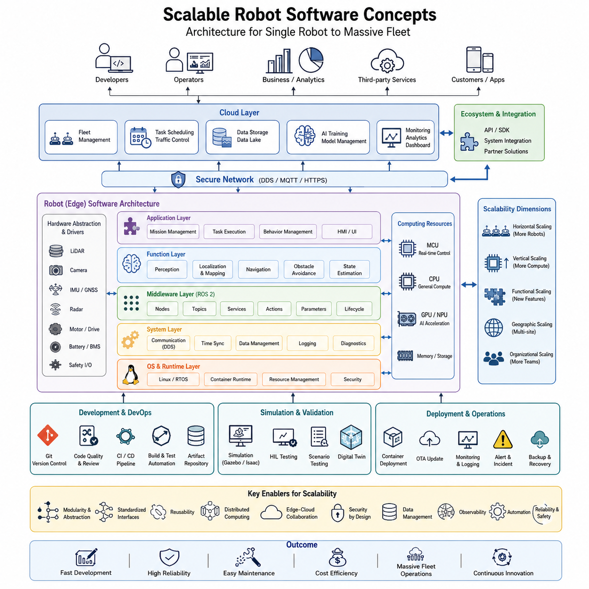
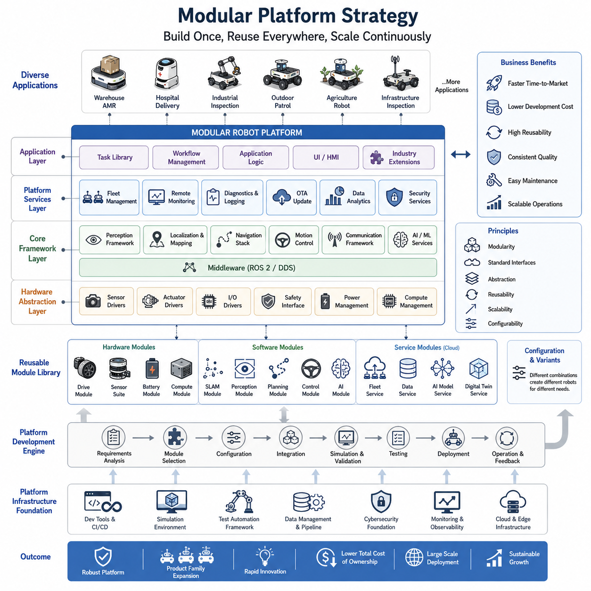
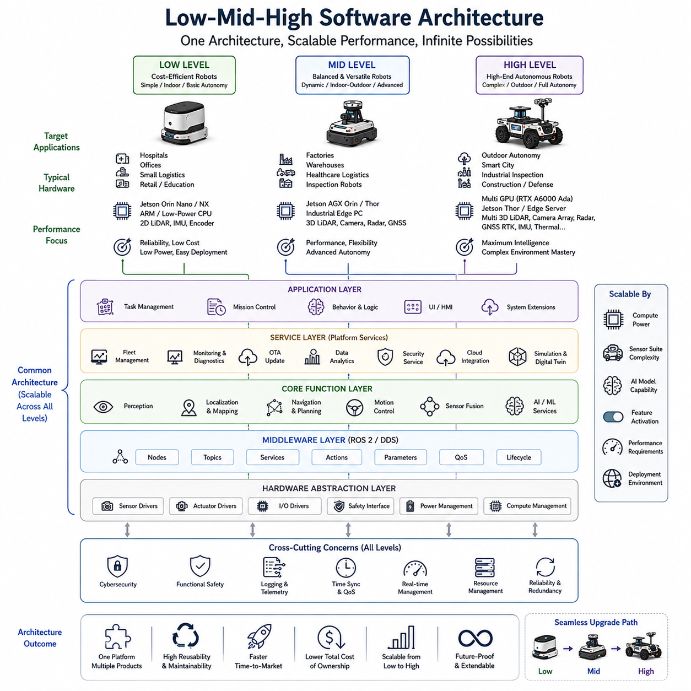
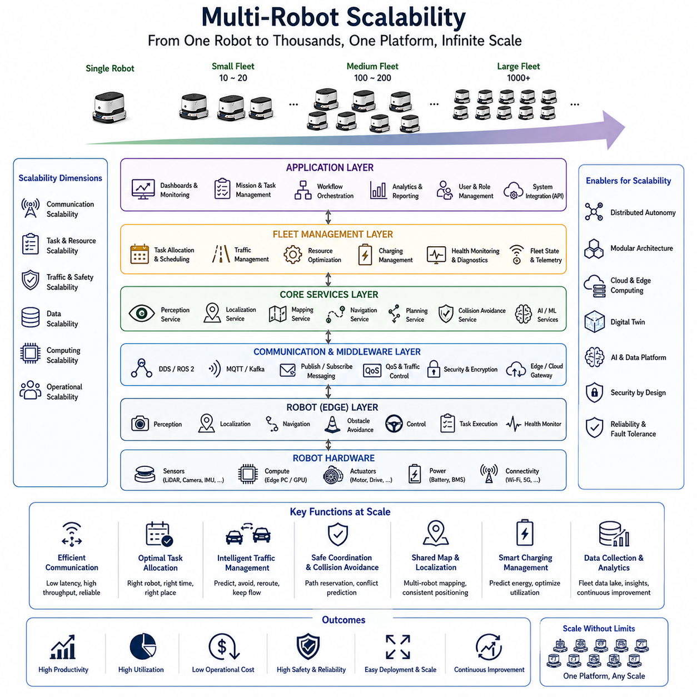
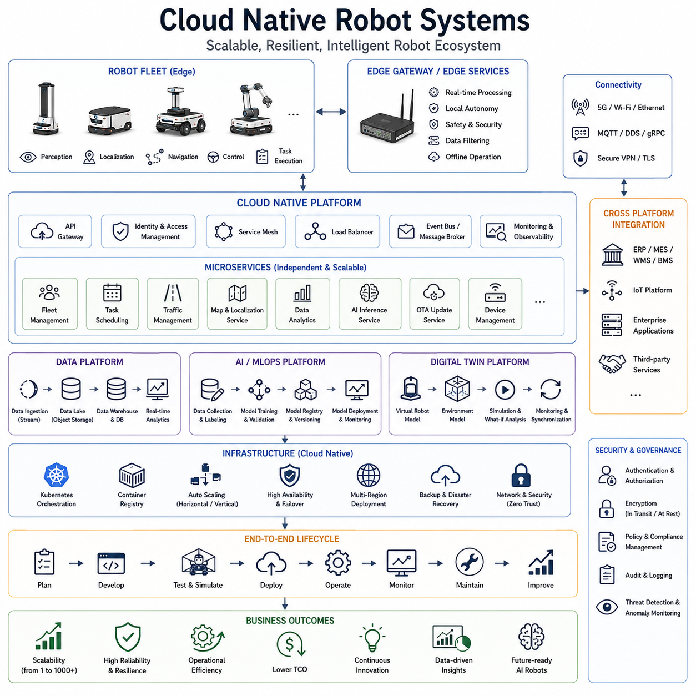
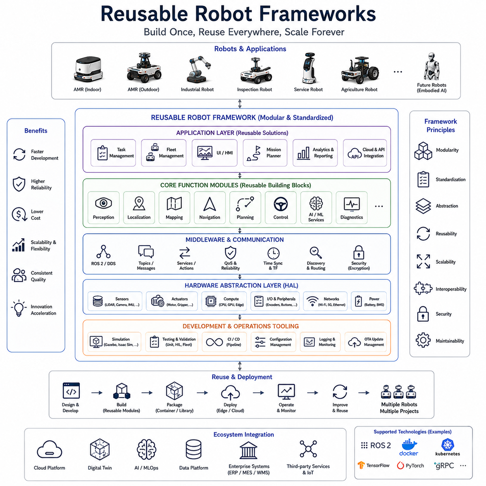
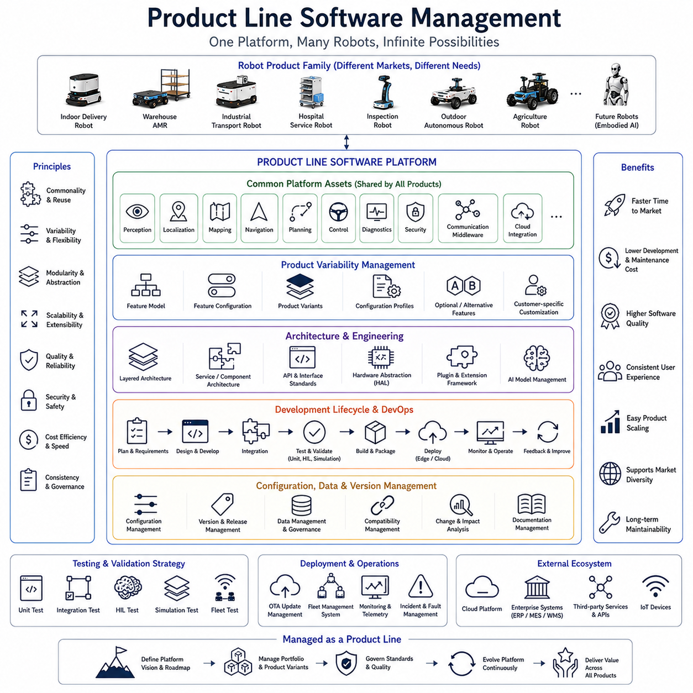
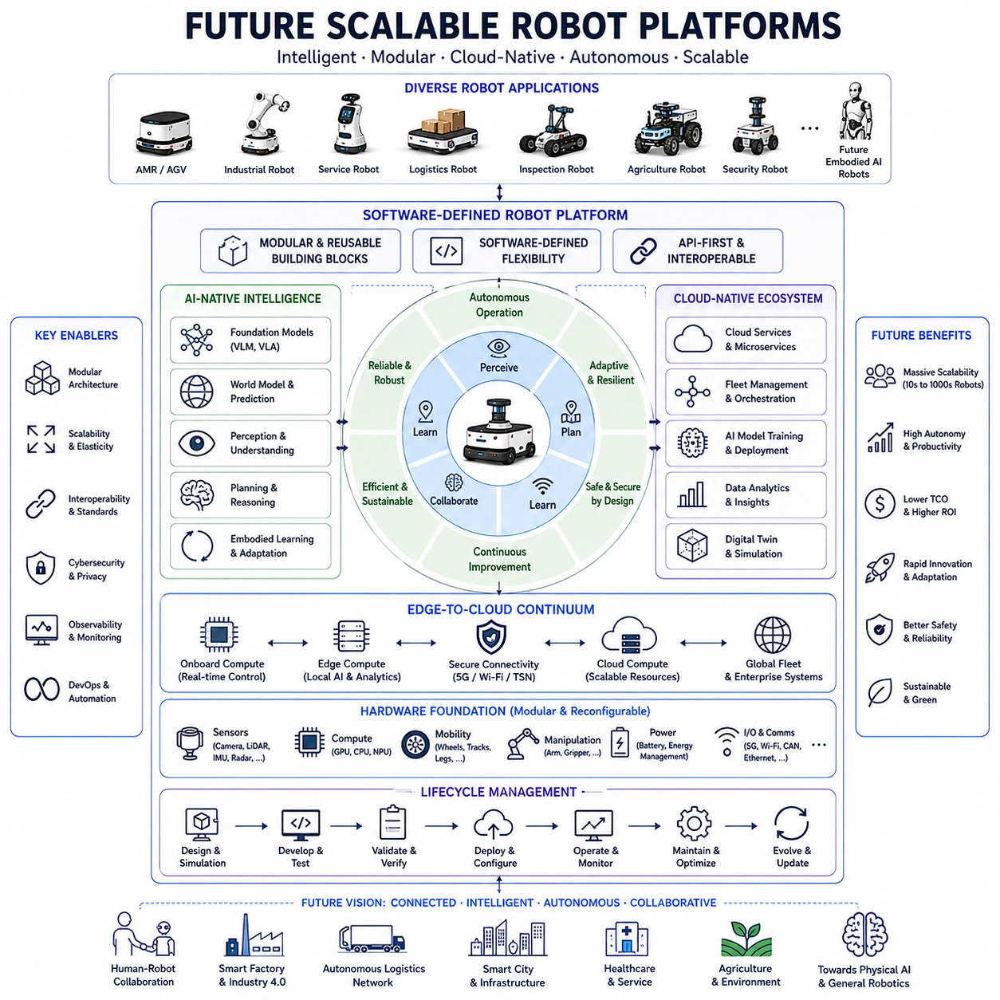

# Chapter 24. Scalable AMR Software Platforms

##  

## 24.1 Scalable Robot Software Concepts

{width="7.268055555555556in" height="7.268055555555556in"}

Scalable robot software concepts form the foundation of modern autonomous mobile robot (AMR) development. As robotic systems evolve from single experimental platforms into large fleets operating across factories, hospitals, warehouses, logistics centers, smart cities, and outdoor environments, software scalability becomes one of the most critical engineering challenges. A robot software architecture that functions effectively for a single robot may become difficult to maintain, inefficient, or even unusable when expanded to dozens, hundreds, or thousands of robots. Therefore, scalability must be considered from the earliest stages of software architecture design rather than being treated as an optimization task later in development. The goal of scalable robot software is to enable continuous growth in functionality, computational capability, deployment size, operational complexity, and product diversity while maintaining reliability, maintainability, and performance. This topic belongs to the scalable AMR software platform domain within the broader software architecture framework.

The concept of scalability in robotics extends beyond simple performance improvement. It encompasses the ability to add new sensors, integrate new algorithms, support additional robot models, expand computational resources, increase operational environments, and manage larger fleets without requiring major redesigns of the software stack. Scalability must exist at multiple levels simultaneously, including hardware scalability, software scalability, computational scalability, organizational scalability, and business scalability. A successful robot software platform allows engineering teams to create multiple robot products using a common software foundation while minimizing duplicated effort and reducing maintenance costs.

Historically, many robotics projects were developed as isolated systems designed to solve a specific problem. Researchers often created tightly coupled software architectures where perception, localization, planning, and control components were interconnected through custom interfaces. Although such systems could achieve high performance in limited environments, they were difficult to extend and nearly impossible to maintain as complexity increased. Modern AMR platforms have shifted toward modular architectures where independent software components communicate through standardized interfaces. This transition mirrors the evolution of enterprise software systems, cloud computing platforms, and large-scale distributed computing infrastructures.

One of the most important principles of scalable robot software is modularity. Modularity refers to the decomposition of complex robot functionality into independent subsystems with clearly defined interfaces. A modular perception system can evolve independently from navigation software. Similarly, fleet management software can be upgraded without modifying onboard localization algorithms. By reducing dependencies between components, modularity allows development teams to innovate more rapidly while minimizing the risk of introducing unintended side effects.

Modular architectures often employ layered software designs. In a typical AMR architecture, hardware abstraction layers provide standardized interfaces to sensors and actuators. Above this layer, perception modules process raw sensor data to generate environmental understanding. Localization and mapping systems estimate robot position and maintain spatial representations. Navigation modules plan and execute movements. Fleet management systems coordinate multiple robots. Cloud services provide analytics, monitoring, and deployment management. Artificial intelligence modules enhance perception, decision-making, and operational optimization. Each layer exposes stable interfaces while hiding implementation details from higher-level components.

Abstraction is another fundamental concept supporting scalability. Abstraction separates functionality from implementation, allowing components to interact without requiring knowledge of internal mechanisms. For example, a navigation module may request localization data through a standard interface without knowing whether the underlying localization system uses LiDAR SLAM, Visual SLAM, GNSS RTK, sensor fusion, or future localization technologies. This abstraction allows technology upgrades without disrupting dependent systems.

Software reuse plays a critical role in scalable robot development. Reusable software components reduce development costs, accelerate deployment, and improve reliability through repeated validation. Rather than developing separate navigation stacks for each robot platform, organizations create common software frameworks that support multiple products. Shared perception libraries, localization frameworks, communication modules, diagnostic systems, and fleet management services become reusable assets across the organization. Over time, these reusable components form the foundation of a scalable robotics ecosystem.

Scalable robot software must also support hardware diversity. Modern robotics companies frequently develop multiple robot models targeting different applications. A lightweight indoor AMR may utilize two-dimensional LiDAR sensors, while an outdoor autonomous platform may employ three-dimensional LiDAR, radar, cameras, GNSS receivers, and high-performance GPUs. Despite hardware differences, software architectures should maximize reuse by separating platform-specific implementations from common business logic. Hardware abstraction layers and device drivers enable software portability across diverse robot platforms.

The emergence of ROS2 has significantly influenced scalable robot software architectures. ROS2 introduces standardized communication mechanisms, distributed computing capabilities, quality-of-service control, lifecycle management, and modular node architectures. By adopting ROS2, organizations gain access to a large ecosystem of reusable software packages and standardized development practices. ROS2 enables scalable deployment across embedded controllers, edge computing platforms, cloud services, and distributed robot fleets. Its DDS-based communication infrastructure supports reliable data exchange across heterogeneous computing environments.

Distributed computing represents another major aspect of scalability. Modern robots often contain multiple computational units, including microcontrollers, embedded processors, edge computers, GPU accelerators, and cloud resources. Instead of concentrating all functionality within a single processor, scalable architectures distribute workloads according to computational requirements. Real-time motor control may execute on dedicated controllers. Sensor processing may run on embedded computers. Deep learning inference may utilize GPU accelerators. Fleet analytics may execute in cloud environments. Distributed architectures improve performance, reliability, and resource utilization.

Edge computing has become increasingly important in scalable robotics systems. Edge computing places computational resources near the robot, reducing latency and enabling real-time decision-making. Tasks such as perception, localization, obstacle avoidance, and motion control typically require deterministic performance and therefore execute locally. At the same time, cloud computing supports large-scale data storage, machine learning training, fleet optimization, and long-term analytics. Scalable robot software architectures must balance edge and cloud resources effectively while maintaining operational resilience under varying network conditions.

Data management becomes increasingly complex as robot fleets expand. A single autonomous robot may generate hundreds of gigabytes of sensor data per day. Large fleets can produce petabytes of information over operational lifetimes. Scalable software platforms require efficient data collection, compression, storage, indexing, retrieval, and analysis mechanisms. Data pipelines must support development, debugging, machine learning training, regulatory compliance, and operational monitoring. Automated data lifecycle management becomes essential for controlling storage costs and maintaining system efficiency.

Scalable communication architectures are equally important. Robots communicate with sensors, controllers, fleet management systems, cloud services, operators, and external infrastructure. Communication systems must support reliable messaging, real-time streaming, event-driven architectures, and asynchronous processing. Message brokers such as MQTT, DDS, Kafka, and Redis frequently serve as communication backbones. Scalable architectures ensure that communication performance remains stable even as the number of robots and connected services grows significantly.

Configuration management is another critical element of scalable robot software. As organizations deploy numerous robot variants across multiple environments, manually managing configurations becomes impractical. Scalable systems utilize centralized configuration repositories, version-controlled deployment profiles, parameter management systems, and automated provisioning tools. These mechanisms ensure consistency while allowing environment-specific customization.

Software lifecycle management becomes increasingly challenging as robotic systems mature. New features, bug fixes, security updates, and AI model improvements must be delivered continuously without disrupting operations. Scalable architectures incorporate automated build systems, continuous integration pipelines, automated testing frameworks, deployment orchestration, and rollback mechanisms. These capabilities enable organizations to maintain software quality while accelerating development velocity.

Testing scalability is equally important. As software complexity increases, manual testing becomes insufficient. Scalable robot software relies heavily on automated testing methodologies including unit testing, integration testing, simulation-based validation, hardware-in-the-loop testing, regression testing, and fleet-level scenario validation. Automated testing infrastructures enable development teams to evaluate thousands of scenarios efficiently while maintaining software reliability.

Simulation environments play a major role in scalable software development. High-fidelity simulators such as Gazebo and Isaac Sim allow engineers to validate software before deployment. Simulation platforms support large-scale testing, synthetic data generation, AI training, and digital twin development. By enabling repeatable experimentation, simulation reduces development costs and accelerates innovation. Scalable robot platforms often integrate simulation directly into their software development pipelines.

Security considerations become increasingly significant as robot fleets expand. Large deployments introduce broader attack surfaces involving networks, cloud services, OTA systems, fleet management servers, and AI infrastructure. Scalable software architectures incorporate cybersecurity principles from the beginning, including authentication, authorization, encryption, secure boot mechanisms, software signing, intrusion detection, and incident response procedures. Security must scale alongside operational growth.

Observability is another key concept within scalable systems. Development teams require visibility into robot behavior, system health, resource utilization, communication performance, and operational anomalies. Scalable architectures integrate logging systems, telemetry pipelines, distributed tracing, performance monitoring, and diagnostics frameworks. These tools enable rapid identification of failures and support continuous operational improvement.

Artificial intelligence integration introduces new scalability challenges. AI models require training, deployment, monitoring, validation, and lifecycle management. Scalable AI architectures support model versioning, edge deployment, cloud training pipelines, inference optimization, and continuous learning workflows. Organizations must manage hundreds of AI models across diverse robot fleets while maintaining consistency and performance.

Fleet-level scalability extends beyond software running on individual robots. Fleet management systems coordinate task assignment, traffic control, resource allocation, charging schedules, maintenance planning, and operational analytics. As fleet sizes increase, scheduling algorithms, communication infrastructures, and monitoring systems must scale accordingly. Fleet management software often adopts cloud-native architectures capable of supporting thousands of simultaneously operating robots.

Product-line engineering provides a strategic approach to long-term scalability. Rather than developing each robot independently, organizations define common software platforms supporting multiple product families. Shared architectures, reusable components, standardized interfaces, and configurable feature sets allow rapid development of new products while preserving consistency across the portfolio. Product-line engineering has become a key strategy among leading robotics companies seeking sustainable growth.

From an organizational perspective, scalable software architectures facilitate collaboration among large engineering teams. Clear interfaces, modular ownership, coding standards, documentation practices, and automated validation processes enable parallel development across multiple departments. As robotics companies expand, scalable software practices become essential for maintaining productivity and engineering quality.

Future scalable robot software platforms are expected to become increasingly cloud-native, AI-native, and service-oriented. Robots will function as distributed intelligent agents connected through global software ecosystems. Edge computing, cloud computing, digital twins, foundation models, autonomous agents, and continuous learning infrastructures will converge into unified robotic platforms capable of supporting diverse applications and operational environments. These systems will not only scale in terms of robot quantity but also in terms of intelligence, autonomy, adaptability, and business value.

Ultimately, scalable robot software concepts represent the transition from isolated robotic solutions to industrial-grade software platforms. They provide the architectural principles, engineering methodologies, and operational foundations necessary for building robust, maintainable, and extensible robotic ecosystems. As AMRs continue to penetrate manufacturing, logistics, healthcare, infrastructure inspection, agriculture, defense, and smart city applications, scalability will remain one of the defining characteristics separating experimental robotics projects from successful commercial robotic platforms. The organizations that master scalable software architectures will be best positioned to develop future generations of autonomous robotic systems and large-scale intelligent robot fleets.

# 24_01 확장 가능한 로봇 소프트웨어 개념 (Scalable Robot Software Concepts)

확장 가능한 로봇 소프트웨어(Scalable Robot Software)는 현대 자율이동로봇(AMR, Autonomous Mobile Robot) 개발의 핵심 기반 기술 중 하나이다. 로봇 시스템이 단일 연구용 플랫폼 수준을 넘어 공장, 병원, 물류센터, 창고, 스마트시티, 실외 환경 등에서 수십 대, 수백 대, 나아가 수천 대 규모로 운영되기 시작하면서 소프트웨어 확장성(Scalability)은 가장 중요한 엔지니어링 과제 중 하나가 되었다. 단일 로봇에서는 잘 동작하던 소프트웨어도 규모가 커지면 유지보수가 어려워지고 성능이 저하되며 운영 비용이 급격히 증가할 수 있다. 따라서 확장성은 개발 후반의 최적화 문제가 아니라 소프트웨어 아키텍처 설계 초기부터 고려되어야 하는 핵심 설계 원칙이다.

로봇 소프트웨어에서 확장성이란 단순히 처리 속도를 높이는 것을 의미하지 않는다. 새로운 센서의 추가, 새로운 알고리즘의 통합, 다양한 로봇 모델의 지원, 계산 자원의 확장, 운용 환경의 증가, 그리고 대규모 로봇 플릿(Fleet)의 운영을 가능하게 하면서도 전체 시스템 구조를 크게 변경하지 않는 능력을 의미한다. 이러한 확장성은 하드웨어, 소프트웨어, 컴퓨팅 자원, 조직 구조, 비즈니스 모델 등 여러 계층에서 동시에 확보되어야 한다.

확장 가능한 소프트웨어 플랫폼의 궁극적인 목표는 하나의 공통 기반 위에서 다양한 로봇 제품군을 개발하고 유지할 수 있도록 하는 것이다. 이를 통해 개발 비용을 줄이고, 유지보수 효율을 높이며, 시장 변화에 빠르게 대응할 수 있다.

초기의 많은 로봇 프로젝트들은 특정 문제를 해결하기 위해 만들어진 독립적인 시스템이었다. 인지(Perception), 위치추정(Localization), 경로계획(Planning), 제어(Control)가 서로 강하게 결합되어 있었기 때문에 새로운 기능을 추가하거나 다른 플랫폼으로 이식하는 것이 매우 어려웠다. 그러나 현대 AMR 시스템은 독립적인 모듈들이 표준화된 인터페이스를 통해 통신하는 구조로 발전하고 있다. 이는 대규모 클라우드 시스템이나 엔터프라이즈 소프트웨어가 발전해온 방향과 매우 유사하다.

확장 가능한 로봇 소프트웨어의 가장 중요한 특징 중 하나는 모듈화(Modularity)이다. 모듈화란 복잡한 기능을 독립적인 기능 블록으로 분리하는 것을 의미한다. 예를 들어 인지 시스템은 내비게이션 시스템과 독립적으로 개발 및 업그레이드될 수 있어야 한다. 또한 플릿 관리 시스템은 로컬라이제이션 알고리즘을 변경하지 않고도 기능 개선이 가능해야 한다. 모듈 간 의존성을 최소화할수록 개발 속도는 향상되고 유지보수 비용은 감소한다.

이러한 모듈화는 일반적으로 계층형(Layered) 아키텍처를 통해 구현된다. 가장 아래에는 센서와 액추에이터를 추상화하는 하드웨어 계층이 존재한다. 그 위에는 인지 계층이 센서 데이터를 분석하여 환경 정보를 생성한다. 위치추정 및 맵핑 계층은 로봇의 위치를 계산하고 공간 정보를 관리한다. 내비게이션 계층은 경로를 생성하고 주행을 수행한다. 플릿 관리 계층은 여러 대의 로봇을 통합 운영한다. 클라우드 계층은 데이터 분석과 원격 관리 기능을 제공한다. 최근에는 여기에 AI 계층이 추가되어 인식, 의사결정, 운영 최적화를 수행하고 있다.

확장성을 지원하는 또 다른 핵심 개념은 추상화(Abstraction)이다. 추상화는 기능과 구현을 분리하여 상위 계층이 하위 계층의 세부 구현을 알 필요가 없도록 만든다. 예를 들어 내비게이션 모듈은 위치 정보를 요청하기만 하면 되며, 실제 위치추정이 LiDAR SLAM, Visual SLAM, GNSS RTK, 센서 융합 등 어떤 기술로 구현되었는지는 알 필요가 없다. 이러한 구조는 미래 기술로의 교체를 매우 용이하게 만든다.

재사용성(Reusability) 역시 확장 가능한 플랫폼의 중요한 요소이다. 하나의 내비게이션 스택을 여러 로봇에서 공통으로 사용하고, 공통 센서 드라이버나 진단 시스템, 통신 모듈을 재사용함으로써 개발 비용을 크게 절감할 수 있다. 장기적으로 이러한 재사용 가능한 컴포넌트들은 기업의 핵심 소프트웨어 자산이 된다.

확장 가능한 플랫폼은 다양한 하드웨어를 지원해야 한다. 실내용 AMR은 2D LiDAR만 사용할 수 있지만, 실외 자율주행 플랫폼은 3D LiDAR, 카메라, 레이더, GNSS, 고성능 GPU 등을 사용할 수 있다. 하드웨어 구성은 다르지만 공통 소프트웨어 프레임워크를 유지할 수 있어야 한다. 이를 위해 하드웨어 추상화 계층(HAL, Hardware Abstraction Layer)과 표준화된 드라이버 구조가 활용된다.

ROS2는 이러한 확장 가능한 로봇 소프트웨어 구조를 구현하는 데 중요한 역할을 한다. ROS2는 분산 컴퓨팅, DDS 기반 통신, QoS(Quality of Service), 라이프사이클 관리, 모듈형 노드 구조 등을 제공한다. 이를 통해 임베디드 제어기, 엣지 컴퓨터, GPU 서버, 클라우드 서비스가 하나의 통합 시스템으로 동작할 수 있다.

분산 컴퓨팅(Distributed Computing)은 확장성 확보를 위한 핵심 전략 중 하나이다. 현대 로봇은 단일 CPU만 사용하는 것이 아니라 MCU, Jetson, Edge PC, GPU 서버, 클라우드 시스템 등 여러 컴퓨팅 자원을 동시에 활용한다. 실시간 제어는 MCU에서 수행되고, 센서 처리는 Jetson에서 수행되며, AI 추론은 GPU에서 실행되고, 대규모 분석은 클라우드에서 처리될 수 있다. 이러한 분산 구조는 시스템의 성능과 유연성을 크게 향상시킨다.

엣지 컴퓨팅(Edge Computing)은 실시간성을 보장하기 위해 매우 중요하다. 장애물 회피, 위치추정, 주행 제어와 같은 기능은 로봇 내부에서 처리되어야 한다. 반면 머신러닝 학습, 데이터 분석, 플릿 최적화와 같은 작업은 클라우드에서 수행하는 것이 효율적이다. 따라서 확장 가능한 로봇 플랫폼은 엣지와 클라우드 사이의 적절한 역할 분담을 지원해야 한다.

대규모 플릿 환경에서는 데이터 관리(Data Management)가 중요한 과제가 된다. 하나의 자율주행 로봇은 하루 수백 GB 이상의 데이터를 생성할 수 있으며, 수백 대의 로봇은 수 PB(Petabyte) 규모의 데이터를 만들어낼 수 있다. 따라서 데이터 수집, 압축, 저장, 검색, 분석을 위한 효율적인 데이터 파이프라인이 필요하다. 또한 데이터는 디버깅, AI 학습, 규제 대응, 품질 개선 등에 활용될 수 있어야 한다.

통신 아키텍처 역시 확장성을 좌우하는 중요한 요소이다. 로봇은 센서, 제어기, 플릿 관리 시스템, 클라우드 서버, 운영자와 지속적으로 통신해야 한다. DDS, MQTT, Kafka, Redis와 같은 메시지 브로커는 대규모 통신 환경을 안정적으로 지원하기 위한 핵심 기술로 활용된다.

확장 가능한 플랫폼에서는 설정 관리(Configuration Management)가 필수적이다. 수십 개의 로봇 모델과 다양한 고객 환경을 수동으로 관리하는 것은 사실상 불가능하다. 따라서 중앙 집중식 설정 저장소, 버전 관리 시스템, 자동 프로비저닝 기술이 사용된다. 이를 통해 운영 환경별로 최적화된 설정을 유지하면서도 전체 시스템의 일관성을 확보할 수 있다.

소프트웨어 수명주기 관리 역시 매우 중요하다. 새로운 기능 추가, 버그 수정, 보안 업데이트, AI 모델 교체가 지속적으로 이루어져야 한다. 이를 위해 CI/CD(Continuous Integration / Continuous Deployment), 자동 빌드, 자동 테스트, 자동 배포, 롤백 시스템이 활용된다. 이러한 자동화 기술은 개발 속도와 품질을 동시에 향상시킨다.

확장 가능한 시스템에서는 테스트 자동화가 필수적이다. 단위 테스트(Unit Test), 통합 테스트(Integration Test), 시뮬레이션 기반 검증, HIL(Hardware-In-the-Loop) 테스트, 회귀 테스트(Regression Test)가 자동으로 수행되어야 한다. 이를 통해 복잡한 소프트웨어 변경이 시스템 안정성에 미치는 영향을 빠르게 검증할 수 있다.

시뮬레이션(Simulation)은 대규모 로봇 소프트웨어 개발의 핵심 도구가 되고 있다. Gazebo와 Isaac Sim 같은 플랫폼은 실제 하드웨어 없이도 다양한 시나리오를 검증할 수 있도록 지원한다. 또한 디지털 트윈(Digital Twin)을 구축하여 실제 운영 환경을 가상 공간에서 재현할 수 있다. 이는 개발 비용을 줄이고 개발 속도를 높이는 데 크게 기여한다.

사이버보안(Cybersecurity)은 플릿 규모가 커질수록 더욱 중요해진다. 인증(Authentication), 접근 제어(Access Control), 데이터 암호화(Encryption), Secure Boot, OTA 보안, 침입 탐지 시스템 등이 플랫폼 전반에 적용되어야 한다. 확장 가능한 시스템은 성장과 함께 보안 수준도 함께 확장될 수 있어야 한다.

관측 가능성(Observability) 또한 필수 요소이다. 개발자와 운영자는 로봇의 상태, CPU 사용률, GPU 부하, 네트워크 상태, 센서 상태, 소프트웨어 오류 등을 실시간으로 확인할 수 있어야 한다. 이를 위해 로깅, 텔레메트리, 성능 모니터링, 분산 추적 기술이 활용된다.

AI 통합은 새로운 확장성 과제를 만들어내고 있다. AI 모델은 학습, 배포, 모니터링, 검증, 업데이트가 지속적으로 이루어져야 한다. 따라서 모델 버전 관리, 엣지 배포, 클라우드 학습 파이프라인, 지속 학습(Continuous Learning) 체계가 필요하다. 미래의 AMR 플랫폼은 수백 개의 AI 모델을 동시에 관리하는 수준으로 발전할 가능성이 높다.

플릿 수준의 확장성은 개별 로봇을 넘어 전체 운영 시스템을 포함한다. 플릿 관리 시스템(FMS)은 작업 할당, 교통 제어, 충전 스케줄링, 유지보수 계획, 운영 분석을 수행한다. 수천 대 규모의 로봇이 운영되는 환경에서는 이러한 시스템 역시 클라우드 네이티브(Cloud Native) 구조로 설계되어야 한다.

제품군 엔지니어링(Product Line Engineering)은 장기적인 확장성을 위한 핵심 전략이다. 각각의 로봇을 독립적으로 개발하는 대신 공통 플랫폼을 기반으로 여러 제품을 개발하는 방식이다. 이를 통해 새로운 로봇 제품을 빠르게 출시하면서도 개발 비용과 유지보수 비용을 최소화할 수 있다.

조직 관점에서도 확장 가능한 소프트웨어는 매우 중요하다. 대규모 개발 조직에서는 명확한 인터페이스, 모듈별 책임 분리, 코딩 표준, 자동 검증 체계가 필요하다. 이러한 체계가 없으면 조직 규모가 커질수록 개발 생산성이 급격히 저하된다.

미래의 확장 가능한 로봇 플랫폼은 AI-Native, Cloud-Native, Service-Oriented 구조로 발전할 것으로 예상된다. 로봇은 단순한 기계가 아니라 글로벌 소프트웨어 생태계에 연결된 지능형 에이전트가 될 것이다. 엣지 컴퓨팅, 클라우드 컴퓨팅, 디지털 트윈, 파운데이션 모델, 자율 에이전트, 지속 학습 시스템이 통합된 형태로 발전할 가능성이 높다.

결국 확장 가능한 로봇 소프트웨어 개념은 단순히 "더 많은 로봇을 운영하는 기술"이 아니라, 미래의 지능형 로봇 생태계를 구축하기 위한 핵심 철학이라고 할 수 있다. 이는 연구용 프로토타입을 산업용 제품으로 발전시키고, 단일 로봇을 수천 대 규모의 지능형 플릿으로 확장하기 위한 기반 기술이다. 향후 제조, 물류, 병원, 스마트시티, 인프라 점검, 농업, 국방 등 다양한 분야에서 성공적인 로봇 기업들은 이러한 확장 가능한 소프트웨어 플랫폼을 얼마나 효과적으로 구축하느냐에 따라 경쟁력이 결정될 것이다.

##  

## 24.2 Modular Platform Strategy

{width="7.268055555555556in" height="7.268055555555556in"}

A modular platform strategy is one of the most important architectural and business principles in modern autonomous mobile robot (AMR) development. As robotic systems become increasingly complex and are expected to operate across a wide range of industries, environments, and applications, organizations must find ways to reduce development costs, accelerate deployment, improve maintainability, and maximize technology reuse. A modular platform strategy addresses these challenges by creating a common foundation of reusable hardware and software components that can be combined, extended, and customized to support multiple robot products and application domains. Rather than developing each robot as an independent system, organizations establish a shared platform architecture that serves as the basis for an entire family of robotic products.

The concept of modularity has long been used in engineering disciplines such as automotive manufacturing, aerospace systems, consumer electronics, and enterprise software. In robotics, modularity enables engineers to divide a complex robot into well-defined subsystems with clear interfaces and responsibilities. Each subsystem can evolve independently while remaining compatible with the larger platform. This approach allows organizations to scale their engineering efforts efficiently and respond rapidly to changing market demands.

A modular platform strategy begins with the recognition that many robot products share common requirements. Whether the robot is designed for warehouse logistics, hospital delivery, industrial inspection, outdoor patrol, agricultural operations, or infrastructure maintenance, certain capabilities remain fundamentally similar. Sensors must collect environmental information. Localization systems must determine position. Navigation systems must generate safe paths. Communication frameworks must exchange data. Diagnostic systems must monitor health status. Fleet management systems must coordinate operations. By identifying these common capabilities, organizations can develop reusable platform components that support multiple products.

The foundation of a modular platform strategy is the platform architecture itself. The platform defines the common building blocks, interfaces, standards, and development methodologies that all products within the ecosystem must follow. These building blocks may include hardware modules, software frameworks, communication protocols, AI infrastructure, simulation environments, deployment pipelines, testing tools, and cloud services. Once established, the platform serves as a stable foundation upon which new robot variants can be created with significantly reduced engineering effort.

One of the primary benefits of modular platforms is development efficiency. Without a modular strategy, each robot project often requires significant redevelopment of existing functionality. Teams repeatedly implement localization systems, navigation stacks, sensor drivers, communication frameworks, and user interfaces. This duplication increases costs and introduces inconsistency across products. A modular platform eliminates much of this redundancy by enabling teams to reuse proven components. New robot products can focus on application-specific innovations rather than rebuilding common infrastructure.

Software modularity is particularly important in AMR development. Modern robot software architectures are composed of numerous interconnected subsystems, including perception, localization, mapping, planning, control, diagnostics, communication, cybersecurity, fleet management, and artificial intelligence. Each subsystem should be implemented as an independent module with standardized interfaces. This separation allows software teams to update one module without affecting the rest of the system. For example, a localization module may be upgraded from a LiDAR-based solution to a multi-sensor fusion solution while preserving compatibility with existing navigation software.

Hardware modularity provides similar advantages. Instead of designing a completely new hardware platform for each robot, organizations can create standardized modules such as drive systems, sensor packages, battery systems, computing units, communication devices, safety controllers, and payload interfaces. These modules can be reused across multiple robot models. A lightweight indoor AMR and a heavy-duty outdoor robot may share common computing architectures, software stacks, and communication frameworks while utilizing different chassis configurations and sensor suites.

A well-designed modular platform separates platform-level functionality from application-specific functionality. Platform-level components provide reusable capabilities such as perception frameworks, navigation services, hardware abstraction layers, cloud connectivity, diagnostics, logging, and cybersecurity mechanisms. Application-specific components implement unique behaviors required for particular industries or customers. This separation allows organizations to maintain a stable platform while rapidly customizing products for new markets.

Interface standardization is a critical requirement for successful modularity. Every module must communicate through clearly defined interfaces that remain stable over time. Standardized interfaces reduce dependencies between components and simplify integration. In robot software systems, interfaces often include ROS2 messages, DDS communication profiles, APIs, service definitions, data schemas, and middleware protocols. Stable interfaces enable independent development and testing of modules while preserving overall system compatibility.

Abstraction plays an essential role in modular platform design. Hardware abstraction layers isolate software from hardware-specific details. Application layers interact with abstract services rather than physical devices. For example, navigation software requests localization information through a standard interface regardless of whether the underlying localization system uses LiDAR SLAM, Visual SLAM, GNSS RTK, UWB positioning, or future technologies. This abstraction significantly improves platform longevity and flexibility.

Scalability is another major advantage of modular platforms. As robot fleets expand and operational requirements become more complex, new functionality can be added by introducing additional modules rather than redesigning the entire architecture. A robot platform initially developed for indoor logistics may later support outdoor navigation, AI-based inspection, autonomous docking, predictive maintenance, or fleet optimization simply by integrating new modules. The platform evolves incrementally while preserving compatibility with existing deployments.

The modular platform strategy is particularly valuable for organizations developing product families. A robotics company may offer multiple robots with different payload capacities, dimensions, operating environments, and intelligence levels. For example, an indoor platform may include compact robots for hospitals, medium-sized robots for factories, and heavy-duty robots for logistics centers. An outdoor platform may support patrol robots, agricultural robots, GPR inspection robots, and autonomous transport vehicles. Although these products differ in appearance and functionality, they can share a common software architecture, communication framework, cloud infrastructure, and AI ecosystem.

In modern AMR organizations, modular platform strategies often align with product-line engineering methodologies. Product-line engineering focuses on maximizing reuse while supporting controlled variability. Common features are implemented once and shared across products. Variable features are isolated into configurable modules. This approach enables efficient development of large product portfolios while maintaining consistency and quality standards.

Artificial intelligence introduces additional opportunities for modularity. AI systems can be organized into reusable perception modules, object detection modules, segmentation modules, navigation assistance modules, language interaction modules, anomaly detection modules, and predictive maintenance modules. These AI capabilities can be deployed selectively depending on product requirements. For example, a low-cost robot may utilize lightweight perception models running on an embedded processor, while a premium robot may deploy advanced multimodal AI models accelerated by high-performance GPUs.

Cloud integration further enhances modular platform capabilities. Cloud services can provide centralized fleet management, remote diagnostics, OTA updates, AI model distribution, data analytics, simulation infrastructure, and digital twin management. Individual robot products connect to a shared cloud ecosystem while maintaining local autonomy. This architecture enables platform-wide improvements without requiring extensive modifications to individual robots.

Simulation environments also benefit from modular design principles. Digital twins, virtual sensors, environment models, testing frameworks, and synthetic data generation systems can be reused across multiple robot projects. Simulation modules become shared engineering assets that support development, validation, training, and operational optimization throughout the organization.

Testing and validation processes are simplified through modular architectures. Individual modules can be tested independently before system integration. Automated testing frameworks verify interface compliance, performance requirements, safety constraints, and regression behavior. Modular testing reduces complexity and improves software quality. It also enables continuous integration and continuous deployment workflows that accelerate development cycles.

Cybersecurity architectures become more manageable in modular systems. Authentication, authorization, encryption, secure communications, secure boot, key management, and intrusion detection mechanisms can be implemented as reusable security modules. These modules provide consistent protection across all products within the platform ecosystem while simplifying regulatory compliance and security maintenance.

Operational scalability represents another important outcome of modular platform strategies. As organizations deploy larger robot fleets across multiple facilities and geographic regions, centralized fleet management systems can support all platform variants through common interfaces. Maintenance procedures, software updates, monitoring systems, and support workflows become standardized, reducing operational costs and improving reliability.

From a business perspective, modular platforms provide significant strategic advantages. They shorten time-to-market for new products, reduce engineering costs, improve product consistency, increase software quality, simplify maintenance, and strengthen competitive positioning. Organizations can respond more quickly to customer requirements because many foundational capabilities already exist within the platform. Instead of building new products from scratch, teams assemble and customize existing modules.

Several leading robotics companies have adopted platform-centric development strategies. Their success demonstrates that sustainable growth depends not only on innovative algorithms or advanced hardware but also on the ability to create reusable architectures that support long-term expansion. The most successful robotics organizations view their software and hardware platforms as strategic assets rather than project-specific solutions.

In the context of industrial AMR development, modular platform strategies are especially important because customer requirements vary significantly across industries. Manufacturing facilities require integration with production systems. Hospitals require workflow automation and regulatory compliance. Logistics centers require fleet optimization and traffic management. Infrastructure inspection systems require advanced perception and data analytics. A modular platform allows organizations to address these diverse requirements while maintaining a common engineering foundation.

The future of modular robot platforms will likely involve increasingly intelligent, service-oriented, and cloud-native architectures. Robots will become configurable products assembled from libraries of reusable hardware modules, software services, AI capabilities, and cloud resources. Advanced automation tools will automatically generate customized robot solutions based on customer requirements. Platform ecosystems will extend beyond individual companies to include third-party developers, system integrators, sensor manufacturers, AI providers, and cloud service providers.

As robotics technology continues to evolve, modular platform strategies will become essential for managing complexity and enabling sustainable growth. Organizations that successfully establish modular architectures will be able to develop broader product portfolios, deploy larger robot fleets, integrate emerging technologies more rapidly, and maintain competitive advantages in increasingly dynamic markets. The modular platform strategy therefore represents not only an engineering methodology but also a long-term business strategy for building scalable, adaptable, and future-ready robotic ecosystems.

# 24_02 모듈형 플랫폼 전략 (Modular Platform Strategy)

모듈형 플랫폼 전략(Modular Platform Strategy)은 현대 자율이동로봇(AMR, Autonomous Mobile Robot) 개발에서 가장 중요한 아키텍처 및 비즈니스 전략 중 하나이다. 로봇 시스템이 점점 복잡해지고 다양한 산업과 환경에서 활용되면서, 기업은 개발 비용을 절감하고 개발 속도를 높이며 유지보수성을 향상시키고 기술 재사용성을 극대화해야 하는 과제에 직면하게 된다. 모듈형 플랫폼 전략은 이러한 문제를 해결하기 위해 공통으로 활용 가능한 하드웨어 및 소프트웨어 구성요소를 기반으로 여러 종류의 로봇 제품을 개발할 수 있도록 하는 접근 방식이다. 즉, 각각의 로봇을 독립적으로 개발하는 대신 하나의 공통 플랫폼을 구축하고 이를 기반으로 다양한 제품군을 확장하는 것이다.

모듈화(Modularity) 개념은 자동차, 항공우주, 전자제품, 엔터프라이즈 소프트웨어 산업에서 오랫동안 활용되어 왔다. 로봇 분야에서도 모듈화는 복잡한 시스템을 명확한 역할과 인터페이스를 가진 독립적인 구성요소로 분리함으로써 개발 효율성과 유지보수성을 크게 향상시킨다. 각 모듈은 독립적으로 발전할 수 있으며 전체 시스템과의 호환성은 유지된다.

모듈형 플랫폼 전략의 출발점은 다양한 로봇 제품들이 상당한 공통 기능을 공유한다는 사실을 인식하는 것이다. 창고 물류 로봇, 병원 배송 로봇, 산업용 검사 로봇, 순찰 로봇, 농업용 로봇, 인프라 점검 로봇은 목적은 다르지만 기본적으로 환경을 인식하고, 위치를 추정하며, 경로를 계획하고, 임무를 수행하며, 데이터를 전송하는 기능을 공통적으로 필요로 한다. 이러한 공통 기능을 플랫폼 수준에서 개발하면 다양한 제품에 재사용할 수 있다.

플랫폼 아키텍처는 모듈형 전략의 핵심이다. 플랫폼은 공통적으로 사용되는 구성요소, 인터페이스, 개발 규칙, 기술 표준을 정의한다. 여기에는 하드웨어 모듈, 소프트웨어 프레임워크, 통신 프로토콜, AI 플랫폼, 시뮬레이션 환경, 배포 시스템, 테스트 도구, 클라우드 서비스 등이 포함된다. 플랫폼이 구축되면 새로운 로봇 제품은 이 기반 위에서 빠르게 개발될 수 있다.

모듈형 플랫폼의 가장 큰 장점 중 하나는 개발 효율성이다. 모듈화가 이루어지지 않은 경우, 새로운 로봇 프로젝트가 시작될 때마다 위치추정, 내비게이션, 센서 드라이버, 사용자 인터페이스 등을 다시 개발해야 하는 경우가 많다. 이는 비용 증가와 품질 편차를 유발한다. 반면 모듈형 플랫폼은 이미 검증된 기능을 재사용함으로써 개발 기간을 단축하고 품질을 향상시킨다.

소프트웨어 모듈화는 AMR 플랫폼에서 특히 중요하다. 현대 로봇은 인지(Perception), 위치추정(Localization), 맵핑(Mapping), 경로계획(Planning), 제어(Control), 진단(Diagnostics), 통신(Communication), 보안(Cybersecurity), 플릿 관리(Fleet Management), 인공지능(AI) 등 다양한 기능으로 구성된다. 각각의 기능은 독립적인 모듈로 구현되어야 하며 명확한 인터페이스를 통해 상호작용해야 한다. 예를 들어 LiDAR 기반 위치추정 시스템을 센서 융합 기반 시스템으로 교체하더라도 내비게이션 소프트웨어는 수정 없이 그대로 사용할 수 있어야 한다.

하드웨어 모듈화 또한 중요한 역할을 한다. 기업은 로봇마다 완전히 새로운 하드웨어를 설계하는 대신 구동 모듈, 센서 패키지, 배터리 시스템, 컴퓨팅 모듈, 통신 장치, 안전 제어기, 페이로드 인터페이스 등을 표준화된 모듈로 설계할 수 있다. 이러한 모듈은 여러 로봇 제품에서 공통적으로 사용될 수 있으며 개발 및 생산 비용을 크게 줄여준다.

우수한 모듈형 플랫폼은 플랫폼 기능과 응용 분야별 기능을 명확히 분리한다. 플랫폼 수준에서는 인지 프레임워크, 내비게이션 서비스, 하드웨어 추상화 계층(HAL), 클라우드 연결, 진단 기능, 로깅 시스템, 보안 기능 등을 제공한다. 반면 응용 기능은 특정 산업이나 고객의 요구사항에 맞게 구현된다. 이러한 구조는 플랫폼의 안정성을 유지하면서도 다양한 시장 요구에 유연하게 대응할 수 있게 한다.

인터페이스 표준화는 모듈형 플랫폼 성공의 핵심 조건이다. 모든 모듈은 명확하게 정의된 인터페이스를 통해 통신해야 하며, 인터페이스는 장기간 안정적으로 유지되어야 한다. ROS2 메시지, DDS 프로파일, API, 서비스 인터페이스, 데이터 포맷 등이 대표적인 예이다. 표준화된 인터페이스는 독립적인 개발과 테스트를 가능하게 하며 통합 복잡도를 크게 줄인다.

추상화(Abstraction)는 모듈형 플랫폼 설계의 중요한 원칙이다. 하드웨어 추상화 계층은 소프트웨어를 특정 하드웨어 구현으로부터 분리한다. 예를 들어 내비게이션 소프트웨어는 위치 정보만 필요할 뿐 그 위치 정보가 LiDAR SLAM, Visual SLAM, GNSS RTK, UWB 또는 향후 등장할 새로운 기술로 생성되는지는 알 필요가 없다. 이러한 구조는 플랫폼의 수명을 연장하고 기술 변화에 유연하게 대응할 수 있도록 한다.

확장성(Scalability)은 모듈형 플랫폼이 제공하는 또 다른 핵심 가치이다. 로봇 기능이 증가하거나 운영 규모가 확대될 경우 전체 시스템을 재설계하는 대신 새로운 모듈을 추가하는 방식으로 기능을 확장할 수 있다. 예를 들어 실내용 물류 로봇 플랫폼이 이후 실외 자율주행, AI 검사 기능, 자동 도킹, 예지보전(Predictive Maintenance) 기능까지 지원하도록 발전할 수 있다.

모듈형 플랫폼 전략은 제품군(Product Family)을 개발하는 기업에게 특히 중요하다. 하나의 기업이 병원용 소형 AMR, 공장용 중형 AMR, 물류용 대형 AMR을 동시에 개발할 수 있으며, 실외에서는 순찰 로봇, 농업 로봇, GPR 검사 로봇, 자율 운반 플랫폼 등을 운영할 수 있다. 제품마다 외형과 목적은 다르지만 동일한 소프트웨어 아키텍처와 클라우드 인프라를 공유할 수 있다.

이러한 전략은 제품군 엔지니어링(Product Line Engineering)과도 밀접하게 연관된다. 제품군 엔지니어링은 공통 기능을 최대한 재사용하면서 제품별 차이를 효율적으로 관리하는 방법론이다. 공통 기능은 플랫폼에 구현하고 차별화 요소는 개별 모듈로 분리한다. 이를 통해 대규모 제품 포트폴리오를 효율적으로 관리할 수 있다.

인공지능 역시 모듈형 플랫폼 전략의 중요한 구성 요소이다. 객체 인식, 의미 분할, 이상 탐지, 음성 인터페이스, 예지보전, 경로 최적화 등의 AI 기능은 독립적인 모듈로 구현될 수 있다. 저가형 로봇은 경량 AI 모델을 사용할 수 있고, 고급형 로봇은 대규모 멀티모달 AI 모델을 사용할 수 있다. 그러나 두 제품은 동일한 AI 플랫폼을 공유할 수 있다.

클라우드 통합은 모듈형 플랫폼의 가치를 더욱 높여준다. 플릿 관리, 원격 진단, OTA 업데이트, AI 모델 배포, 데이터 분석, 디지털 트윈 관리 등을 공통 클라우드 서비스로 제공할 수 있다. 각 로봇은 동일한 클라우드 생태계에 연결되면서도 현장에서는 독립적으로 동작한다.

시뮬레이션 환경 역시 모듈화의 혜택을 크게 받는다. 디지털 트윈, 가상 센서, 테스트 시나리오, 합성 데이터 생성 시스템은 여러 프로젝트에서 재사용될 수 있다. 시뮬레이션 플랫폼은 조직 전체의 공통 자산으로 발전하게 된다.

테스트 및 검증 체계도 모듈화 구조를 통해 효율화된다. 개별 모듈은 독립적으로 테스트할 수 있으며, 통합 전에 기능 검증을 완료할 수 있다. 자동 테스트 프레임워크는 인터페이스 호환성, 성능, 안전성, 회귀 오류를 지속적으로 검증한다. 이는 CI/CD 기반 개발 체계를 가능하게 한다.

사이버보안 역시 모듈형 구조를 통해 효율적으로 구현할 수 있다. 인증, 권한 관리, 암호화, 보안 통신, Secure Boot, 키 관리, 침입 탐지 기능 등을 재사용 가능한 보안 모듈로 구성할 수 있다. 이를 통해 전체 제품군에 일관된 보안 수준을 적용할 수 있다.

운영 측면에서도 모듈형 플랫폼은 큰 이점을 제공한다. 여러 지역과 다양한 산업 현장에 로봇이 배치되더라도 동일한 플릿 관리 시스템을 사용할 수 있다. 유지보수 절차, 업데이트 프로세스, 모니터링 체계가 표준화되어 운영 비용을 크게 절감할 수 있다.

비즈니스 관점에서 모듈형 플랫폼은 출시 기간(Time-to-Market)을 단축시키고 개발 비용을 줄이며 제품 품질을 향상시킨다. 고객의 요구사항 변화에 빠르게 대응할 수 있으며 새로운 시장 진입 속도도 크게 향상된다. 기업은 제품을 처음부터 개발하는 대신 기존 플랫폼 위에 필요한 모듈만 추가하여 새로운 제품을 출시할 수 있다.

실제로 세계적인 로봇 기업들은 모두 플랫폼 중심 전략을 채택하고 있다. 이들은 개별 프로젝트보다 플랫폼 자체를 기업의 핵심 자산으로 간주한다. 성공적인 로봇 기업은 단순히 좋은 알고리즘이나 하드웨어를 보유한 기업이 아니라, 재사용 가능한 플랫폼을 구축하여 지속적으로 확장할 수 있는 기업이다.

산업용 AMR 시장에서는 고객 요구사항이 매우 다양하기 때문에 모듈형 플랫폼 전략의 중요성이 더욱 커진다. 제조 공장은 생산 설비와의 연동을 요구하고, 병원은 업무 자동화와 규제 준수를 요구하며, 물류센터는 플릿 최적화와 교통 제어를 요구한다. 인프라 검사 로봇은 고급 인식 기술과 데이터 분석 기능이 필요하다. 모듈형 플랫폼은 이러한 다양한 요구를 하나의 공통 기반 위에서 지원할 수 있게 해준다.

미래의 모듈형 로봇 플랫폼은 더욱 지능화되고 서비스 지향적(Service-Oriented)이며 클라우드 네이티브(Cloud-Native) 형태로 발전할 것으로 예상된다. 로봇은 하드웨어 모듈, 소프트웨어 서비스, AI 기능, 클라우드 자원을 조합하여 구성되는 형태로 변화할 것이다. 또한 플랫폼 생태계는 단일 기업을 넘어 센서 제조사, AI 기업, 시스템 통합업체, 클라우드 서비스 기업까지 포함하는 거대한 협력 구조로 발전할 가능성이 높다.

결론적으로 모듈형 플랫폼 전략은 단순한 개발 방법론이 아니라 장기적인 성장 전략이다. 이는 복잡성을 관리하고, 기술 재사용을 극대화하며, 다양한 제품군을 효율적으로 개발하기 위한 핵심 접근법이다. 미래의 로봇 산업에서 경쟁력을 확보하기 위해서는 확장 가능하고 유연하며 지속적으로 발전할 수 있는 모듈형 플랫폼 구축이 필수적이며, 이를 성공적으로 구현한 기업이 차세대 로봇 시장을 주도하게 될 것이다.

##  

## 24.3 Low-Mid-High Software Architecture

{width="7.268055555555556in" height="7.268055555555556in"}

The Low-Mid-High Software Architecture concept is a strategic approach to designing scalable autonomous mobile robot (AMR) software platforms that can support multiple product classes, performance levels, deployment environments, and customer requirements using a common architectural foundation. Rather than developing completely different software systems for entry-level robots, mid-range industrial robots, and high-end autonomous platforms, organizations create a unified architecture that can be scaled upward or downward according to hardware capability, computational resources, sensor configurations, operational complexity, and artificial intelligence requirements. This approach enables efficient product-line development, software reuse, maintainability, and long-term platform evolution while reducing engineering costs and accelerating time-to-market. Within a scalable AMR software platform, the Low-Mid-High architecture serves as the bridge between hardware diversity and software standardization, allowing a single software ecosystem to support multiple generations and categories of robots.

Historically, robotics companies often developed separate software stacks for different robot products. Small indoor delivery robots used lightweight navigation systems and limited sensor processing, while larger industrial robots employed more sophisticated localization, perception, and fleet management architectures. As product portfolios expanded, maintaining multiple software stacks became increasingly expensive and difficult. Software duplication led to inconsistent functionality, increased debugging complexity, slower development cycles, and higher operational costs. The Low-Mid-High architecture emerged as a solution to this problem by introducing a scalable software framework capable of adapting to different performance levels without requiring separate development efforts.

The core philosophy behind Low-Mid-High architecture is that most robotic systems share common functional requirements regardless of their computational capability. Every robot must perceive its environment, estimate its position, plan motions, execute control commands, communicate with external systems, and monitor its operational state. The primary differences lie in the complexity, precision, intelligence, and computational intensity of these functions. Therefore, instead of changing the entire software architecture, the platform adjusts the implementation details and computational resources while preserving the same architectural structure.

The Low-Level architecture is typically designed for cost-sensitive robots with limited computational resources and relatively simple operational requirements. These systems often utilize embedded processors such as Jetson Orin Nano, Jetson Orin NX, Raspberry Pi-class devices, ARM-based industrial computers, or lightweight x86 edge systems. The software architecture prioritizes efficiency, simplicity, deterministic execution, and low power consumption. Perception systems may rely primarily on 2D LiDAR, wheel odometry, IMU sensors, and limited camera processing. Localization algorithms often employ lightweight SLAM solutions optimized for indoor environments. Navigation systems focus on structured environments with predictable traffic patterns and relatively simple obstacle avoidance strategies.

In Low-Level systems, artificial intelligence functionality is generally constrained to lightweight inference models that can execute efficiently on embedded hardware. Object detection may be limited to a small number of classes, and advanced semantic understanding is often unnecessary. Cloud connectivity may provide remote monitoring, logging, and fleet management functions, but real-time autonomy remains primarily edge-based. The software architecture emphasizes reliability, affordability, and ease of deployment rather than maximum intelligence or computational performance.

Low-Level platforms are commonly deployed in hospitals, indoor logistics environments, office buildings, retail facilities, educational institutions, and service robotics applications. In these environments, operational complexity remains manageable, and the cost-performance ratio becomes a major consideration. The software architecture must support rapid deployment, simple maintenance, and efficient resource utilization while providing sufficient autonomy for daily operations.

The Mid-Level architecture represents the balance point between affordability and advanced functionality. Mid-Level robots typically employ more powerful edge computing platforms such as Jetson AGX Orin, Jetson Thor, industrial edge computers, or hybrid CPU-GPU systems. These robots support richer sensor configurations including multiple cameras, 3D LiDAR systems, radar sensors, depth cameras, GNSS receivers, and advanced sensor fusion frameworks. The software architecture expands to accommodate more sophisticated perception, localization, planning, and operational intelligence capabilities.

In Mid-Level systems, multi-sensor fusion becomes a central architectural component. Localization may combine LiDAR SLAM, Visual SLAM, GNSS RTK, inertial navigation, wheel odometry, and semantic localization techniques. Perception pipelines incorporate object detection, object tracking, semantic segmentation, free-space detection, human detection, and environmental classification. These capabilities require more advanced software frameworks, optimized data pipelines, and efficient utilization of computational resources.

Artificial intelligence assumes a more prominent role in Mid-Level architectures. Deep learning models support perception enhancement, predictive analytics, anomaly detection, operational optimization, and limited autonomous decision-making. AI acceleration technologies such as TensorRT, CUDA optimization, quantization, and edge inference frameworks become increasingly important. The software architecture must balance real-time requirements with growing computational demands.

Navigation systems within Mid-Level platforms typically support dynamic obstacle avoidance, semantic navigation, multi-floor operation, elevator integration, docking systems, and fleet-level coordination. Fleet management architectures become more sophisticated, supporting task allocation, traffic management, resource optimization, and operational analytics. Cloud integration expands beyond monitoring to include model deployment, performance analytics, simulation feedback, and software lifecycle management.

Mid-Level architectures are particularly suitable for industrial factories, warehouses, healthcare logistics systems, infrastructure inspection robots, autonomous delivery systems, and mixed indoor-outdoor operational environments. These robots must operate reliably under more challenging conditions while maintaining economic viability and manageable deployment complexity.

The High-Level architecture targets advanced autonomous systems operating in highly dynamic, complex, and computationally demanding environments. These systems often employ multiple GPUs, high-performance edge servers, AI accelerators, distributed computing frameworks, and cloud-integrated intelligence platforms. Hardware configurations may include dual NVIDIA RTX A6000 Ada GPUs, advanced Jetson Thor systems, high-end industrial computers, dedicated AI accelerators, and redundant computing architectures.

High-Level robots typically integrate extensive sensor suites including multiple 3D LiDARs, synchronized camera arrays, radar systems, GNSS RTK receivers, high-precision IMUs, thermal cameras, ultrasonic sensors, and specialized inspection sensors. The software architecture must support massive sensor data streams, real-time sensor fusion, distributed processing, fault tolerance, and large-scale computational workloads.

Artificial intelligence becomes a foundational element rather than a supporting feature. High-Level architectures may incorporate multimodal AI systems, vision-language models, vision-language-action frameworks, foundation models for robotics, autonomous agents, world models, reinforcement learning systems, predictive planning engines, and advanced decision-making frameworks. These AI components operate alongside traditional robotics algorithms to create more adaptive, intelligent, and context-aware robotic behavior.

Perception systems in High-Level architectures support comprehensive scene understanding. The robot not only detects objects but also understands relationships, intentions, environmental semantics, and operational context. Localization systems combine multiple redundant technologies to achieve centimeter-level precision in both indoor and outdoor environments. Navigation systems perform predictive planning, risk assessment, traffic negotiation, collaborative operation, and adaptive behavior generation.

Distributed computing becomes essential in High-Level architectures. Computational workloads are allocated dynamically across CPUs, GPUs, embedded controllers, edge servers, and cloud resources. Containerized deployment strategies enable flexible scaling of services. Microservice architectures support independent deployment and maintenance of perception, localization, planning, AI, diagnostics, and operational services. Kubernetes-style orchestration, cloud-native deployment models, and service-oriented architectures become increasingly relevant.

Digital twins play a major role within High-Level systems. Continuous synchronization between physical robots and virtual environments enables simulation-driven development, predictive maintenance, operational forecasting, and AI training. Massive datasets generated by robot fleets support continuous learning pipelines, autonomous model improvement, and large-scale operational analytics.

The Low-Mid-High architecture does not represent three isolated software platforms. Instead, it represents three deployment profiles built upon a common architectural foundation. The underlying software framework remains largely identical. Differences emerge through configurable modules, computational capabilities, sensor support levels, AI services, and operational features. This design philosophy maximizes software reuse while preserving flexibility and scalability.

One of the most important aspects of Low-Mid-High architecture is modular feature activation. Rather than creating separate codebases, organizations implement feature flags, configurable modules, service activation profiles, and deployment templates. A Low-Level robot may deploy only basic localization and navigation modules. A Mid-Level robot activates advanced perception and AI services. A High-Level robot enables the full platform ecosystem including multimodal AI, cloud synchronization, predictive analytics, and autonomous agent frameworks.

Hardware abstraction layers play a critical role in enabling architectural scalability. By isolating hardware-specific implementations behind standardized interfaces, the software platform can support multiple computing configurations without requiring extensive application-level modifications. This abstraction enables seamless migration between product tiers as technology evolves.

Cloud and edge integration strategies also differ across architectural levels. Low-Level robots prioritize local autonomy with minimal cloud dependency. Mid-Level robots balance edge intelligence with cloud-supported optimization. High-Level robots operate as components of larger distributed intelligence ecosystems where cloud services, edge computing, digital twins, and fleet-level analytics work together continuously.

Cybersecurity requirements increase as architectural complexity grows. High-Level systems require advanced authentication mechanisms, secure communications, encrypted data pipelines, secure boot processes, AI model protection, intrusion detection systems, and comprehensive operational security frameworks. The architecture must ensure that security scales alongside computational capability and operational reach.

From a business perspective, Low-Mid-High architecture provides significant strategic advantages. Organizations can address multiple market segments using a common technology platform. Development resources focus on platform improvement rather than redundant implementation efforts. Customers benefit from consistent functionality, upgrade paths, and long-term platform support. Product portfolios become easier to manage, and new technologies can be introduced across the entire ecosystem more efficiently.

For companies developing AMR product families, Low-Mid-High architecture often aligns naturally with commercial product segmentation. A Low-Level platform may target hospitals and small logistics facilities. A Mid-Level platform may address factories, warehouses, and infrastructure inspection applications. A High-Level platform may support outdoor autonomous systems, advanced industrial inspection robots, autonomous construction equipment, smart city robots, and future physical AI platforms. Despite serving different markets, all products share a common architectural DNA.

Future robotics platforms are expected to extend the Low-Mid-High concept even further. Emerging architectures may introduce AI-native layers, cloud-native robotics services, foundation model ecosystems, autonomous agent frameworks, and embodied intelligence platforms. The distinction between computational tiers may become increasingly dynamic, with robots automatically scaling capabilities based on mission requirements, available resources, and operational context.

Ultimately, the Low-Mid-High Software Architecture represents a practical and strategic framework for building scalable robotic ecosystems. It enables organizations to balance performance, cost, intelligence, maintainability, and market coverage while preserving architectural consistency. As robotics continues to expand into increasingly diverse industries and applications, the ability to deploy a unified software platform across multiple performance tiers will become one of the defining characteristics of successful AMR technology providers.

# 24_03 저가형·중급형·고급형 소프트웨어 아키텍처 (Low-Mid-High Software Architecture)

Low-Mid-High 소프트웨어 아키텍처는 다양한 성능 수준, 운영 환경, 고객 요구사항을 가진 자율이동로봇(AMR)을 하나의 공통 소프트웨어 플랫폼 위에서 개발하기 위한 전략적 아키텍처 접근 방식이다. 엔트리급 로봇, 산업용 중급 로봇, 고성능 자율주행 플랫폼마다 완전히 다른 소프트웨어를 개발하는 대신, 공통 기반 아키텍처를 구축하고 컴퓨팅 성능, 센서 구성, 인공지능 수준에 따라 기능을 확장하거나 축소할 수 있도록 설계하는 개념이다. 이를 통해 제품군 개발(Product Family Development), 소프트웨어 재사용성, 유지보수성, 확장성을 동시에 확보할 수 있다.

과거에는 로봇 제품마다 별도의 소프트웨어 스택을 개발하는 경우가 많았다. 소형 실내 배송 로봇은 단순한 내비게이션 소프트웨어를 사용하고, 산업용 자율주행 로봇은 별도의 위치추정 및 인지 시스템을 사용하였다. 그러나 제품 수가 증가할수록 여러 개의 독립적인 소프트웨어를 유지하는 비용은 급격히 증가하였다. 기능 중복, 디버깅 복잡성 증가, 품질 불균형, 유지보수 부담 등이 발생하게 되었고, 이를 해결하기 위해 Low-Mid-High 아키텍처 개념이 등장하게 되었다.

이 아키텍처의 핵심 철학은 모든 로봇이 기본적으로 유사한 기능 구조를 가진다는 점에 있다. 모든 로봇은 환경을 인식하고, 위치를 추정하며, 경로를 계획하고, 주행을 수행하며, 외부 시스템과 통신하고, 상태를 모니터링해야 한다. 차이는 기능의 복잡도와 정밀도, 그리고 사용하는 계산 자원의 규모에 있다. 따라서 전체 구조를 바꾸는 대신 기능 수준만 조정하는 방식으로 플랫폼을 확장하는 것이 핵심이다.

저가형(Low-Level) 아키텍처는 제한된 컴퓨팅 자원을 가진 경제형 로봇을 위한 구조이다. 일반적으로 Jetson Orin Nano, Jetson Orin NX, ARM 기반 산업용 컴퓨터, Raspberry Pi 계열 또는 저전력 x86 시스템이 사용된다. 소프트웨어는 단순성, 저전력, 안정성, 효율성을 우선적으로 고려하여 설계된다.

저가형 시스템에서는 일반적으로 2D LiDAR, 휠 엔코더, IMU 정도를 활용한 위치추정과 내비게이션이 사용된다. 카메라 활용도는 제한적이며, 실내 환경 중심의 SLAM 시스템이 주로 적용된다. 경로계획 역시 상대적으로 단순한 구조를 가지며 예측 가능한 환경에서 동작하도록 설계된다.

AI 기능도 제한적이다. 소형 객체 검출 모델이나 기본적인 장애물 인식 정도가 적용되며, 복잡한 의미 이해(Semantic Understanding)는 일반적으로 필요하지 않다. 클라우드 연결은 원격 모니터링이나 로그 수집 정도에 활용되고 대부분의 자율성은 로봇 내부에서 처리된다.

이러한 저가형 플랫폼은 병원 물류 로봇, 사무실 서비스 로봇, 실내 배송 로봇, 교육용 로봇 등에서 많이 사용된다. 중요한 것은 최고 성능이 아니라 안정적인 운영과 낮은 비용이다.

중급형(Mid-Level) 아키텍처는 비용과 성능의 균형을 추구하는 구조이다. 일반적으로 Jetson AGX Orin, Jetson Thor, 산업용 Edge PC 또는 CPU-GPU 하이브리드 시스템이 사용된다.

중급형 플랫폼에서는 다중 센서 융합(Multi-Sensor Fusion)이 중요한 역할을 한다. LiDAR SLAM, Visual SLAM, GNSS RTK, IMU, 휠 오도메트리 등이 결합되어 보다 안정적인 위치추정을 제공한다. 인지 시스템은 객체 검출, 객체 추적, 의미 분할(Semantic Segmentation), 사람 인식, 자유 공간 검출 등의 기능을 수행한다.

AI 역시 중요한 역할을 담당한다. 딥러닝 기반 인식, 이상 탐지, 예측 분석, 운영 최적화 등이 적용된다. TensorRT, CUDA 최적화, 양자화(Quantization) 기술 등이 활용되어 실시간 성능을 확보한다.

내비게이션은 단순한 경로 추종을 넘어 동적 장애물 회피, 엘리베이터 연동, 다층 건물 이동, 자동 도킹 등을 지원한다. 또한 플릿 관리 시스템(FMS)과 연계되어 작업 할당, 교통 제어, 운영 분석 등의 기능도 제공한다.

중급형 아키텍처는 제조 공장, 창고 물류센터, 병원 물류 시스템, 산업용 검사 로봇, 실내외 혼합 환경에서 운영되는 AMR 등에 적합하다. 높은 수준의 자율성을 제공하면서도 경제성을 유지할 수 있기 때문이다.

고급형(High-Level) 아키텍처는 복잡하고 동적인 환경에서 운영되는 최고 수준의 자율주행 플랫폼을 대상으로 한다. 일반적으로 NVIDIA RTX A6000 Ada GPU 2개 이상, Jetson Thor, 고성능 Edge Server, AI Accelerator 등이 사용된다.

센서 구성 역시 매우 풍부하다. 다수의 3D LiDAR, 고해상도 카메라 배열, GNSS RTK, 고정밀 IMU, 레이더, 열화상 카메라, 초음파 센서 등이 통합된다. 소프트웨어는 대규모 센서 데이터를 실시간으로 처리하고 융합해야 하므로 높은 수준의 분산 컴퓨팅 구조를 필요로 한다.

고급형 플랫폼에서는 AI가 보조 기능이 아니라 핵심 기능이 된다. Vision-Language Model(VLM), Vision-Language-Action(VLA), Foundation Model, World Model, Autonomous Agent, Reinforcement Learning 등의 최신 AI 기술이 통합될 수 있다.

인지 시스템은 단순한 객체 검출을 넘어 장면 이해(Scene Understanding)를 수행한다. 로봇은 객체의 위치뿐 아니라 의미, 관계, 의도, 상황 맥락까지 이해할 수 있어야 한다. 위치추정은 여러 센서를 동시에 활용하여 실내외 모두에서 센티미터급 정밀도를 제공한다.

내비게이션 역시 단순한 경로 생성이 아니라 예측 기반 계획(Predictive Planning), 위험 평가(Risk Assessment), 협력 주행(Cooperative Navigation), 적응형 행동 생성(Adaptive Behavior Generation)을 수행한다.

고급형 플랫폼에서는 분산 컴퓨팅이 필수적이다. CPU, GPU, MCU, Edge Server, Cloud Server가 역할을 분담하여 동작한다. 또한 Docker, Kubernetes 기반의 컨테이너 환경과 마이크로서비스(Microservice) 구조가 활용된다. 이를 통해 각 기능을 독립적으로 배포하고 유지보수할 수 있다.

디지털 트윈(Digital Twin)도 중요한 구성 요소이다. 실제 로봇과 가상 환경이 지속적으로 동기화되며, 시뮬레이션 기반 개발, 예지보전, 운영 예측, AI 학습에 활용된다. 대규모 플릿에서 수집된 데이터는 지속 학습(Continuous Learning)을 지원하며 플랫폼 성능을 지속적으로 향상시킨다.

Low-Mid-High 아키텍처의 중요한 특징은 세 가지가 완전히 다른 플랫폼이 아니라는 점이다. 세 가지는 모두 동일한 플랫폼을 기반으로 하며 단지 활성화되는 기능과 사용되는 하드웨어 수준이 다를 뿐이다.

예를 들어 Low-Level에서는 기본 위치추정과 내비게이션만 활성화된다. Mid-Level에서는 고급 인지와 AI 기능이 추가된다. High-Level에서는 멀티모달 AI, 클라우드 연동, 자율 에이전트, 예측 분석 기능까지 활성화된다. 즉, 동일한 코드베이스에서 기능 모듈만 선택적으로 활성화하는 구조를 가진다.

이를 가능하게 하는 핵심 기술이 하드웨어 추상화 계층(HAL)이다. HAL은 하드웨어 차이를 소프트웨어로부터 숨겨주므로 동일한 애플리케이션 소프트웨어가 다양한 컴퓨팅 플랫폼에서 실행될 수 있다. 이러한 구조는 제품군 확장을 매우 용이하게 만든다.

클라우드와 엣지의 역할도 계층별로 다르다. Low-Level은 대부분의 기능을 로컬에서 처리하며 클라우드 의존성이 낮다. Mid-Level은 엣지와 클라우드가 균형을 이룬다. High-Level은 디지털 트윈, AI 모델 학습, 플릿 분석 등 다양한 클라우드 서비스와 긴밀하게 연결된다.

보안 요구사항도 단계별로 증가한다. High-Level 시스템은 인증, 암호화, Secure Boot, AI 모델 보호, 침입 탐지 시스템 등 보다 강력한 보안 체계를 요구한다. 따라서 아키텍처는 성능뿐 아니라 보안 역시 함께 확장될 수 있어야 한다.

비즈니스 관점에서 Low-Mid-High 아키텍처는 매우 큰 장점을 제공한다. 하나의 플랫폼으로 여러 시장을 동시에 공략할 수 있으며, 개발 인력은 중복 개발 대신 플랫폼 개선에 집중할 수 있다. 고객은 동일한 플랫폼 기반에서 업그레이드 경로를 확보할 수 있고, 기업은 유지보수 비용을 크게 절감할 수 있다.

실제로 많은 AMR 기업들은 제품군을 이러한 구조로 구분하고 있다. 저가형 플랫폼은 병원이나 소규모 물류 시설을 대상으로 하고, 중급형 플랫폼은 공장과 창고를 대상으로 하며, 고급형 플랫폼은 실외 자율주행, 스마트시티, 산업용 검사, 건설 장비, 차세대 Physical AI 로봇을 대상으로 한다. 비록 목표 시장은 다르지만 모든 제품은 동일한 소프트웨어 DNA를 공유한다.

미래에는 Low-Mid-High 개념이 더욱 발전할 것으로 예상된다. AI-Native 아키텍처, Cloud-Native Robotics, Foundation Model 기반 로봇 플랫폼, Autonomous Agent Framework 등이 추가되면서 로봇은 임무와 환경에 따라 스스로 기능 수준을 조정하는 방향으로 발전할 가능성이 높다.

결론적으로 Low-Mid-High 소프트웨어 아키텍처는 성능, 비용, 지능 수준, 유지보수성, 시장 대응력을 동시에 확보하기 위한 전략적 플랫폼 설계 방법론이다. 이는 다양한 로봇 제품군을 하나의 공통 플랫폼으로 통합하고 장기적인 기술 발전을 가능하게 하는 핵심 구조이며, 미래의 성공적인 AMR 기업들이 반드시 갖추어야 할 소프트웨어 아키텍처 전략이라고 할 수 있다.

##  

##  

## 24.4 Multi-Robot Scalability

{width="7.268055555555556in" height="7.268055555555556in"}

Multi-Robot Scalability is one of the most important concepts in modern autonomous mobile robot (AMR) systems because the true value of automation emerges not from a single intelligent robot but from the coordinated operation of many robots working together as a unified system. While a single robot can automate an isolated task, large-scale industrial environments such as factories, warehouses, hospitals, airports, ports, smart cities, and outdoor logistics networks require dozens, hundreds, or even thousands of robots operating simultaneously. As the number of robots increases, the complexity of communication, coordination, traffic management, resource allocation, data processing, safety assurance, and operational optimization grows exponentially. Therefore, scalability becomes a fundamental architectural requirement rather than a performance enhancement feature. Within modern AMR software platforms, multi-robot scalability refers to the capability of the entire robotic ecosystem to maintain performance, reliability, safety, efficiency, and manageability as the number of robots, missions, users, and operational sites increases over time.

The earliest robotic systems were designed primarily as standalone machines. These robots performed specific tasks independently and interacted minimally with other systems. As industrial automation expanded, organizations began deploying multiple robots within the same facility. Initially, these robots operated independently with limited coordination. However, inefficiencies quickly emerged. Multiple robots could attempt to access the same location simultaneously, create traffic congestion, compete for charging stations, duplicate work assignments, or generate unpredictable operational behavior. These challenges demonstrated that fleet-level intelligence was necessary to unlock the full benefits of large-scale robotic deployments.

Multi-robot scalability begins with the concept of distributed autonomy. Each robot must possess sufficient onboard intelligence to operate safely and effectively even if communication with external systems is temporarily interrupted. At the same time, robots must cooperate with centralized or distributed coordination systems that optimize overall fleet performance. This balance between local autonomy and global coordination is one of the most important design principles in scalable robotic ecosystems.

A scalable multi-robot system can be viewed as a hierarchy of interacting layers. At the lowest level, individual robots execute perception, localization, navigation, obstacle avoidance, and task execution functions. Above this layer, fleet management systems coordinate robot activities, assign missions, monitor performance, and optimize resource utilization. Higher layers may include cloud services, digital twins, AI analytics platforms, enterprise management systems, and operational dashboards. Each layer must be designed to scale independently while maintaining efficient communication with other layers.

One of the first challenges encountered in multi-robot scalability is communication scalability. A single robot may exchange sensor data, status information, task updates, and diagnostic messages with external systems. When hundreds of robots are deployed simultaneously, communication volume can become enormous. Naively increasing communication traffic may overload networks, increase latency, and reduce system responsiveness. Therefore, scalable architectures implement efficient communication strategies including publish-subscribe messaging, event-driven communication, edge processing, message filtering, compression, and hierarchical data aggregation.

Middleware technologies such as DDS, ROS2 communication frameworks, MQTT brokers, Kafka streaming platforms, and cloud messaging infrastructures play important roles in scalable multi-robot deployments. These systems enable robots to exchange information efficiently without requiring direct peer-to-peer connections between every robot. As fleet size increases, communication architectures must support fault tolerance, load balancing, quality-of-service management, and dynamic network adaptation.

Task allocation represents another fundamental aspect of multi-robot scalability. In small systems, tasks can be assigned manually or through simple scheduling algorithms. However, large fleets require sophisticated task allocation mechanisms capable of optimizing robot utilization, travel distance, workload distribution, energy consumption, operational priorities, and service-level objectives. Modern fleet management systems employ optimization algorithms, market-based coordination methods, auction systems, constraint solvers, and AI-driven scheduling engines to manage task allocation efficiently.

Traffic management becomes increasingly important as robot density increases. Multiple robots operating in shared environments create challenges similar to those found in transportation systems. Intersections, narrow corridors, loading stations, elevators, docking points, and charging facilities can become bottlenecks. Without effective traffic management, robot productivity decreases and operational risks increase. Scalable traffic management systems coordinate robot movements, predict congestion, enforce right-of-way rules, dynamically reroute traffic, and optimize overall flow throughout the operational environment.

Collision avoidance must also evolve as fleet size increases. Individual robots are responsible for local obstacle detection and avoidance, but fleet-level coordination systems provide strategic collision prevention through path reservation, conflict prediction, shared environmental awareness, and cooperative planning. These mechanisms ensure safe operation even in highly populated environments.

Map management introduces additional scalability considerations. In small deployments, a single map may be sufficient for all robots. However, large facilities often require multiple maps, multi-floor navigation systems, distributed mapping infrastructures, and dynamic environmental updates. Scalable map architectures support centralized map repositories, map version management, regional map partitioning, cloud synchronization, and collaborative mapping processes. Multi-robot systems may continuously update shared maps based on collective observations, improving environmental awareness across the entire fleet.

Localization scalability becomes particularly important in large environments. Multiple robots must maintain accurate positioning while sharing localization resources and infrastructure. Technologies such as LiDAR SLAM, Visual SLAM, GNSS RTK, UWB positioning, beacon systems, and georeferenced mapping frameworks must operate efficiently across large operational areas. Shared localization services can improve consistency while reducing computational duplication.

Charging infrastructure presents another major scalability challenge. A fleet of ten robots may require only a few charging stations, but a fleet of hundreds of robots requires sophisticated charging management systems. Scalable architectures optimize charging schedules, predict energy requirements, balance station utilization, prioritize critical missions, and minimize operational disruptions. Advanced systems may integrate predictive energy management and fleet-level battery optimization algorithms.

Data scalability is one of the most significant challenges in modern robotic ecosystems. Each robot continuously generates sensor data, operational logs, diagnostic information, telemetry streams, AI inference results, and mission records. Large fleets can generate terabytes or petabytes of data over time. Scalable data architectures employ distributed storage systems, cloud-based data lakes, edge filtering mechanisms, automated data lifecycle management, and intelligent compression techniques. These capabilities enable organizations to extract value from operational data without overwhelming storage and processing resources.

Artificial intelligence introduces additional scalability opportunities and challenges. Multi-robot systems can collectively contribute data to shared AI training pipelines, enabling continuous improvement of perception models, navigation strategies, predictive maintenance algorithms, and operational intelligence systems. Federated learning, distributed model training, cloud-based AI infrastructure, and fleet-wide model deployment mechanisms allow organizations to leverage collective experience across the entire robot population.

Cloud computing plays a critical role in large-scale robotic systems. Cloud infrastructure provides centralized fleet management, global analytics, digital twin synchronization, model training, software deployment, monitoring services, and operational intelligence. However, scalable architectures must avoid excessive dependence on cloud connectivity. Robots must remain operational even during network disruptions. Therefore, modern architectures balance edge autonomy with cloud-level optimization.

Digital twins become increasingly valuable as robot fleets grow. A digital twin provides a virtual representation of robots, facilities, operational workflows, environmental conditions, and system performance. Fleet operators can analyze system behavior, evaluate operational changes, predict failures, simulate future deployments, and optimize resource utilization using digital twin technologies. Large-scale digital twins support strategic planning and continuous operational improvement.

Software architecture plays a decisive role in multi-robot scalability. Monolithic software systems often struggle to support large fleets because modifications become increasingly difficult as complexity grows. Modern scalable systems adopt modular architectures, service-oriented designs, microservices, containerized deployments, and cloud-native infrastructures. These approaches enable independent scaling of different system components while improving maintainability and operational flexibility.

Fault tolerance becomes increasingly important in large fleets. As the number of robots grows, hardware failures, software errors, communication disruptions, and environmental anomalies become statistically inevitable. Scalable architectures assume that failures will occur and provide mechanisms for graceful degradation, automatic recovery, redundancy, failover operations, and self-healing behaviors. The objective is not to eliminate failures entirely but to prevent individual failures from impacting overall fleet performance.

Cybersecurity considerations also expand with fleet size. Each robot represents a potential entry point into the operational network. Large deployments require scalable authentication systems, certificate management frameworks, secure communications, access control policies, intrusion detection systems, software signing mechanisms, and continuous security monitoring. Security architectures must scale without introducing excessive operational complexity.

Operational scalability extends beyond technology. Human operators, maintenance personnel, deployment engineers, and support teams must manage increasingly large robotic populations. Scalable fleet management systems provide centralized dashboards, automated diagnostics, predictive maintenance tools, alarm management systems, reporting frameworks, and decision-support capabilities. Automation becomes essential because human operators cannot directly supervise hundreds of robots simultaneously.

Multi-site scalability introduces another layer of complexity. Many organizations deploy robot fleets across multiple factories, warehouses, hospitals, campuses, cities, or countries. Scalable architectures support centralized oversight while allowing local operational autonomy. Global fleet management systems coordinate software updates, policy enforcement, analytics, and performance monitoring across geographically distributed deployments.

Product-line scalability is closely related to multi-robot scalability. Organizations often operate heterogeneous fleets consisting of different robot models, payload capacities, sensor configurations, and autonomy levels. Scalable fleet architectures must support this diversity through standardized interfaces, configurable behaviors, hardware abstraction layers, and platform-wide interoperability mechanisms. A fleet may include indoor AMRs, outdoor autonomous vehicles, inspection robots, delivery robots, and specialized industrial systems operating within the same ecosystem.

Economic scalability is ultimately the most important measure of success. A technically scalable system that becomes prohibitively expensive to deploy, maintain, or expand cannot achieve widespread adoption. Therefore, scalable architectures must optimize not only performance but also operational efficiency, infrastructure utilization, maintenance costs, software lifecycle management, and total cost of ownership. The goal is to ensure that adding more robots increases organizational value faster than operational costs.

The future of multi-robot scalability will be shaped by advances in cloud robotics, edge computing, AI-native architectures, digital twins, autonomous agents, and large-scale robotic ecosystems. Future fleets may consist of thousands of heterogeneous robots collaborating dynamically across vast geographic regions. Autonomous agents may negotiate tasks, coordinate resources, share knowledge, and adapt to changing environments with minimal human intervention. Fleet management systems will evolve into intelligent orchestration platforms capable of managing robotic workforces at unprecedented scales.

Ultimately, multi-robot scalability represents the transformation of robotics from individual machines into interconnected intelligent ecosystems. It encompasses communication, coordination, computation, data management, AI, cloud infrastructure, operational processes, and organizational strategy. As robotics continues to expand across manufacturing, logistics, healthcare, infrastructure inspection, agriculture, defense, and smart city applications, the ability to scale from a single robot to a globally distributed robotic fleet will become one of the defining characteristics of successful robotic platforms. Organizations that master multi-robot scalability will be positioned to lead the next generation of autonomous systems and large-scale robotic automation.

# 24_04 다중 로봇 확장성 (Multi-Robot Scalability)

다중 로봇 확장성(Multi-Robot Scalability)은 현대 자율이동로봇(AMR) 시스템에서 가장 중요한 개념 중 하나이다. 자동화의 진정한 가치는 단일 로봇의 지능에서 나오는 것이 아니라 여러 대의 로봇이 하나의 통합 시스템으로 협력하여 운영될 때 발생하기 때문이다. 단일 로봇은 특정 작업을 자동화할 수 있지만, 공장, 물류창고, 병원, 공항, 항만, 스마트시티, 실외 물류 네트워크와 같은 대규모 산업 환경에서는 수십 대, 수백 대, 심지어 수천 대의 로봇이 동시에 운영되어야 한다. 로봇 수가 증가할수록 통신, 협업, 교통 관리, 자원 할당, 데이터 처리, 안전 관리, 운영 최적화의 복잡성은 기하급수적으로 증가한다. 따라서 확장성은 단순한 성능 향상 기능이 아니라 플랫폼 설계 단계부터 고려해야 하는 핵심 아키텍처 요구사항이다.

초기의 로봇 시스템은 대부분 독립적인 기계로 설계되었다. 각 로봇은 특정 작업을 수행하며 다른 시스템과의 상호작용은 거의 없었다. 그러나 산업 자동화가 확대되면서 동일한 시설 내에 여러 대의 로봇이 배치되기 시작하였다. 처음에는 각 로봇이 독립적으로 동작했지만 곧 여러 문제가 발생했다. 두 대 이상의 로봇이 동시에 같은 장소에 접근하거나, 충전기를 두고 경쟁하거나, 동일한 작업을 중복 수행하거나, 통로에 정체 현상을 발생시키는 문제가 나타났다. 이러한 경험은 플릿(Fleet) 수준의 지능이 필요하다는 사실을 보여주었다.

다중 로봇 확장성의 핵심은 분산 자율성(Distributed Autonomy)이다. 각 로봇은 네트워크 연결이 일시적으로 끊기더라도 안전하게 동작할 수 있는 수준의 독립적인 지능을 보유해야 한다. 동시에 전체 플릿의 효율을 높이기 위해 중앙 관리 시스템 또는 분산 협력 시스템과 협업해야 한다. 이러한 로컬 자율성과 글로벌 협력의 균형이 확장 가능한 로봇 플랫폼 설계의 핵심 원칙이다.

확장 가능한 다중 로봇 시스템은 일반적으로 계층형 구조를 가진다. 가장 아래 계층에서는 개별 로봇이 인지(Perception), 위치추정(Localization), 내비게이션(Navigation), 장애물 회피(Obstacle Avoidance), 임무 수행(Task Execution)을 담당한다. 상위 계층에는 플릿 관리 시스템(FMS)이 존재하며 작업 할당, 성능 모니터링, 자원 최적화를 수행한다. 더 상위 계층에는 클라우드 서비스, 디지털 트윈, AI 분석 플랫폼, 운영 대시보드, ERP 및 MES 연동 시스템 등이 위치한다. 각 계층은 독립적으로 확장될 수 있어야 하며 동시에 효율적으로 통신해야 한다.

다중 로봇 확장에서 가장 먼저 발생하는 문제 중 하나는 통신 확장성이다. 단일 로봇은 센서 데이터, 상태 정보, 작업 정보, 진단 데이터를 전송하면 되지만, 수백 대의 로봇이 동시에 운영되면 네트워크 부하는 급격히 증가한다. 단순히 통신량을 늘리는 방식은 네트워크 과부하와 지연을 유발한다. 따라서 확장 가능한 시스템은 Publish-Subscribe 구조, 이벤트 기반 통신, 엣지 데이터 처리, 데이터 압축, 계층형 데이터 집계 등을 활용하여 효율성을 확보한다.

DDS, ROS2, MQTT, Kafka와 같은 미들웨어 기술은 이러한 확장성 확보에 중요한 역할을 한다. 이러한 시스템은 모든 로봇이 서로 직접 연결되는 대신 중앙 또는 분산 메시징 구조를 통해 효율적으로 데이터를 교환하도록 지원한다. 또한 QoS(Quality of Service), 부하 분산(Load Balancing), 장애 허용(Fault Tolerance) 기능을 제공하여 대규모 플릿 운영을 가능하게 한다.

작업 할당(Task Allocation)은 다중 로봇 시스템의 핵심 기능이다. 소규모 환경에서는 단순한 스케줄링으로 충분할 수 있지만, 대규모 플릿에서는 로봇 활용률, 이동 거리, 에너지 소비, 작업 우선순위, SLA(Service Level Agreement)를 고려한 고급 최적화가 필요하다. 현대 플릿 관리 시스템은 최적화 알고리즘, 경매 기반(Auction-Based) 방식, AI 기반 스케줄링, 제약조건 최적화 기법 등을 활용하여 작업을 배분한다.

로봇 밀도가 높아질수록 교통 관리(Traffic Management)가 매우 중요해진다. 여러 대의 로봇이 동일한 환경을 공유하면 교차로, 복도, 엘리베이터, 적재 장소, 충전 구역 등이 병목 구간이 될 수 있다. 효과적인 교통 관리가 없다면 생산성이 감소하고 안전 위험이 증가한다. 확장 가능한 시스템은 우선순위 제어, 혼잡 예측, 동적 경로 변경, 교통 흐름 최적화 기능을 제공한다.

충돌 방지(Collision Avoidance) 역시 개별 로봇 수준을 넘어 플릿 수준으로 확장되어야 한다. 개별 로봇은 센서를 이용하여 장애물을 회피하지만, 플릿 관리 시스템은 경로 예약(Path Reservation), 충돌 예측(Conflict Prediction), 협력 경로계획(Cooperative Planning)을 통해 보다 전략적인 충돌 방지를 수행한다.

맵 관리(Map Management)도 중요한 확장성 요소이다. 소규모 환경에서는 하나의 지도만으로 충분하지만, 대형 공장이나 병원은 여러 층과 여러 건물을 포함할 수 있다. 따라서 중앙 지도 저장소, 지도 버전 관리, 구역별 지도 분할, 클라우드 기반 지도 동기화 기능이 필요하다. 또한 여러 로봇이 수집한 데이터를 기반으로 공동 맵핑(Collaborative Mapping)을 수행할 수 있다.

위치추정(Localization)의 확장성도 중요하다. 여러 로봇이 동일한 위치 인프라를 공유하면서도 정확한 위치를 유지해야 한다. LiDAR SLAM, Visual SLAM, GNSS RTK, UWB, Beacon, Georeferenced Mapping 등의 기술은 대규모 환경에서도 효율적으로 동작해야 한다. 공유 위치 서비스는 일관성을 높이고 계산 중복을 줄이는 데 도움을 준다.

충전 인프라 관리도 매우 중요한 과제이다. 10대 정도의 로봇은 몇 개의 충전기만으로 운영할 수 있지만, 수백 대 규모의 플릿은 충전 스케줄링 시스템이 필요하다. 확장 가능한 플랫폼은 에너지 사용량을 예측하고 충전기 활용도를 최적화하며 중요한 임무를 우선 지원하는 방식으로 운영된다.

데이터 확장성(Data Scalability)은 현대 로봇 생태계에서 가장 큰 과제 중 하나이다. 각 로봇은 센서 데이터, 로그, 텔레메트리, AI 추론 결과, 운영 기록 등을 지속적으로 생성한다. 수백 대의 로봇은 장기간 운영 시 수 PB(Petabyte) 규모의 데이터를 생성할 수 있다. 이를 위해 분산 저장소, 데이터 레이크(Data Lake), 엣지 필터링, 데이터 압축, 자동 수명주기 관리 시스템이 필요하다.

AI는 다중 로봇 환경에서 새로운 기회를 제공한다. 여러 로봇이 수집한 데이터를 통합하면 객체 인식, 위치추정, 예지보전, 운영 최적화 모델을 지속적으로 개선할 수 있다. 연합학습(Federated Learning), 분산 학습(Distributed Training), 클라우드 AI 인프라를 통해 전체 플릿이 공동으로 학습하는 구조가 가능해진다.

클라우드 컴퓨팅은 대규모 플릿 운영의 핵심 요소이다. 플릿 관리, 데이터 분석, 디지털 트윈, AI 모델 학습, OTA 업데이트, 원격 모니터링 등을 지원한다. 그러나 네트워크 장애 시에도 로봇은 계속 동작해야 하므로 엣지 자율성과 클라우드 최적화 사이의 균형이 매우 중요하다.

디지털 트윈(Digital Twin)은 플릿 규모가 커질수록 더욱 중요해진다. 디지털 트윈은 실제 로봇, 시설, 운영 흐름을 가상 공간에서 재현한다. 이를 통해 운영 분석, 장애 예측, 신규 배치 검증, 시뮬레이션 기반 최적화가 가능하다.

소프트웨어 아키텍처는 다중 로봇 확장성을 결정하는 핵심 요소이다. 모놀리식(Monolithic) 구조는 규모가 커질수록 유지보수가 어려워진다. 따라서 현대 시스템은 마이크로서비스(Microservice), 서비스 지향 아키텍처(SOA), 컨테이너(Container), 클라우드 네이티브(Cloud-Native) 구조를 채택하여 독립적인 확장을 가능하게 한다.

장애 허용성(Fault Tolerance)도 매우 중요하다. 수백 대의 로봇이 운영되는 환경에서는 하드웨어 고장, 통신 장애, 소프트웨어 오류가 반드시 발생한다. 따라서 시스템은 자동 복구, 중복 구성(Redundancy), Failover, Self-Healing 메커니즘을 통해 일부 장애가 전체 운영에 영향을 미치지 않도록 설계되어야 한다.

사이버보안 역시 플릿 규모와 함께 확장되어야 한다. 각 로봇은 잠재적인 공격 지점이 될 수 있기 때문에 인증, 암호화, 접근 제어, 인증서 관리, 침입 탐지, 소프트웨어 서명 등의 기능이 필수적이다.

운영 확장성(Operational Scalability)은 기술뿐 아니라 사람과 조직의 문제이기도 하다. 운영자, 유지보수 인력, 지원 인력이 수백 대의 로봇을 직접 관리하는 것은 불가능하다. 따라서 중앙 대시보드, 자동 진단, 예지보전, 경보 관리, 자동 리포트 시스템 등이 필요하다.

다중 사이트(Multi-Site) 확장성도 중요하다. 글로벌 기업은 여러 공장, 물류센터, 병원, 국가에 걸쳐 로봇을 운영한다. 따라서 중앙 관리와 지역 자율성을 동시에 지원하는 글로벌 플릿 관리 시스템이 필요하다.

제품군 확장성(Product-Line Scalability)도 다중 로봇 확장성과 밀접하게 연결된다. 실내용 AMR, 실외 자율주행 로봇, 검사 로봇, 배송 로봇, GPR 로봇 등이 하나의 생태계에서 함께 운영될 수 있어야 한다. 이를 위해 표준 인터페이스와 공통 플랫폼이 필요하다.

결국 가장 중요한 것은 경제적 확장성(Economic Scalability)이다. 기술적으로 확장 가능하더라도 비용이 과도하게 증가한다면 실질적인 가치는 없다. 따라서 확장 가능한 플랫폼은 성능뿐 아니라 운영비용, 유지보수 비용, 인프라 비용, 총소유비용(TCO)을 함께 최적화해야 한다.

미래의 다중 로봇 확장성은 클라우드 로보틱스(Cloud Robotics), 엣지 컴퓨팅(Edge Computing), AI-Native 아키텍처, 디지털 트윈, 자율 에이전트(Autonomous Agent) 기술에 의해 더욱 발전할 것이다. 미래에는 수천 대의 이기종(Heterogeneous) 로봇이 광범위한 지역에서 협력하며 운영되는 시대가 도래할 것으로 예상된다. 로봇들은 작업을 협상하고, 자원을 공유하며, 경험을 학습하고, 인간의 개입 없이 환경 변화에 적응하게 될 것이다.

결론적으로 다중 로봇 확장성은 단순히 로봇 수를 늘리는 기술이 아니라 개별 로봇을 하나의 거대한 지능형 생태계로 연결하는 기술이다. 이는 통신, 협력, AI, 데이터 관리, 클라우드 인프라, 운영 체계, 조직 전략을 모두 포함하는 종합적인 개념이다. 향후 제조, 물류, 의료, 인프라 점검, 농업, 국방, 스마트시티 분야에서 성공적인 로봇 플랫폼은 단일 로봇이 아니라 대규모 플릿을 얼마나 효율적으로 운영할 수 있는지에 의해 경쟁력이 결정될 것이다.

##  

## 24.5 Cloud-Native Robot Systems

{width="7.268055555555556in" height="7.268055555555556in"}

Cloud Native Robot Systems represent one of the most significant architectural transformations in modern robotics. As autonomous mobile robots (AMRs), industrial robots, service robots, inspection robots, and future embodied AI systems continue to increase in complexity and scale, traditional monolithic robot software architectures become increasingly difficult to manage, maintain, and expand. Cloud-native principles, originally developed within large-scale internet services and enterprise software platforms, have emerged as a powerful solution for building scalable, resilient, and continuously evolving robotic ecosystems. Rather than treating robots as isolated machines operating independently, cloud-native robotics views robots as distributed intelligent nodes within a larger computational ecosystem that spans edge devices, cloud infrastructure, digital twins, AI platforms, operational systems, and enterprise applications. Within scalable robot software platforms, cloud-native architecture serves as the foundation for future large-scale robotic deployments capable of supporting thousands of robots operating across multiple facilities, cities, and countries.

The evolution toward cloud-native robotics is driven by the increasing demands placed on robotic systems. Modern robots must perform advanced perception, localization, navigation, planning, fleet coordination, predictive maintenance, operational analytics, cybersecurity management, software updates, and artificial intelligence inference. Attempting to perform all of these functions entirely onboard every robot result in increased hardware costs, duplicated computational resources, complex software maintenance, and limited scalability. Cloud-native architectures address these challenges by distributing functionality across edge devices and cloud infrastructure while maintaining operational autonomy where necessary.

The concept of cloud-native robotics is built upon several foundational principles. These include distributed computing, microservices architecture, containerization, orchestration, infrastructure automation, continuous deployment, observability, scalability, resilience, and service-oriented design. Together, these principles enable robotic systems to operate as part of a dynamic and continuously evolving software ecosystem rather than as static standalone products.

One of the most important characteristics of cloud-native robot systems is the separation of concerns between robot-level functions and cloud-level services. Time-critical operations such as motor control, obstacle avoidance, local perception, emergency response, and real-time navigation remain on the robot itself. Functions that benefit from centralized resources, such as fleet optimization, AI model training, operational analytics, digital twin management, software deployment, and long-term data storage, are moved into the cloud. This separation allows each component to operate within the environment most appropriate for its requirements.

Edge computing plays a central role within cloud-native robotic systems. Robots act as intelligent edge devices capable of autonomous operation even when network connectivity is limited or unavailable. Edge computing ensures deterministic performance for safety-critical functions while reducing communication latency. At the same time, edge devices continuously exchange information with cloud services to support monitoring, coordination, learning, and optimization activities. The result is a hybrid architecture that combines local autonomy with centralized intelligence.

Containerization is a key enabling technology for cloud-native robotics. Technologies such as Docker allow robot software components to be packaged as portable and reproducible containers. These containers encapsulate applications, dependencies, libraries, runtime environments, and configuration settings. By deploying software as containers, organizations achieve consistent behavior across development, simulation, testing, and production environments. Containerized deployments significantly reduce integration problems and simplify software lifecycle management.

Container orchestration platforms such as Kubernetes have become increasingly important in cloud-native robotic ecosystems. Kubernetes provides automated deployment, scaling, monitoring, recovery, and resource management capabilities. Within robotics, Kubernetes can manage cloud services, AI inference pipelines, data processing systems, simulation environments, fleet management applications, digital twins, and operational analytics platforms. As robotic deployments grow, orchestration platforms enable organizations to manage increasingly complex infrastructures efficiently.

Microservices architecture represents another fundamental cloud-native principle. Traditional robotic software often relies on large monolithic applications where multiple functions are tightly integrated within a single executable. While monolithic systems may be simpler initially, they become difficult to maintain as complexity increases. Cloud-native architectures divide functionality into independent services that communicate through well-defined interfaces. Fleet management, localization services, task scheduling, data analytics, AI model serving, monitoring systems, authentication services, and OTA deployment systems may all operate as independent microservices.

This modular approach provides significant advantages. Individual services can be developed, tested, deployed, scaled, and updated independently. Failures in one service are less likely to impact the entire system. Development teams can work in parallel, accelerating innovation and improving maintainability. Resource allocation becomes more efficient because each service can scale according to actual demand.

Communication infrastructure is critical within cloud-native robot systems. Modern architectures employ APIs, message brokers, publish-subscribe frameworks, event-driven communication models, and streaming data platforms. Technologies such as MQTT, DDS, Kafka, gRPC, REST APIs, WebSockets, and cloud messaging services facilitate communication between robots, cloud applications, operational systems, and enterprise platforms. These communication mechanisms support both real-time interactions and asynchronous workflows.

Data management becomes increasingly important as robotic fleets expand. A single robot may generate hundreds of gigabytes of sensor data daily. Large fleets can produce petabytes of operational data over time. Cloud-native architectures provide scalable storage solutions including object storage systems, distributed databases, data lakes, data warehouses, and streaming analytics platforms. These infrastructures enable organizations to store, process, analyze, and extract value from vast amounts of robotic data.

Artificial intelligence is deeply integrated into cloud-native robotics. Modern robotic systems rely heavily on machine learning models for perception, prediction, anomaly detection, optimization, decision support, and autonomous behavior generation. Cloud-native infrastructures provide centralized environments for AI model training, validation, deployment, monitoring, and continuous improvement. Massive datasets collected from robot fleets can be aggregated within cloud environments to improve model performance continuously.

MLOps practices play a particularly important role in cloud-native robotic ecosystems. Similar to DevOps for software engineering, MLOps provides processes and infrastructure for managing AI model lifecycles. Data collection, annotation, training, validation, deployment, monitoring, retraining, and rollback procedures become automated. As robotic fleets grow, MLOps enables organizations to manage hundreds of AI models efficiently while maintaining consistency and reliability.

Digital twin technology is another major component of cloud-native robot systems. A digital twin is a virtual representation of a physical robot, facility, fleet, or operational process. Cloud-native architectures allow digital twins to remain continuously synchronized with real-world systems. Operators can monitor robot status, evaluate operational performance, predict failures, simulate future scenarios, and test software updates within digital environments before deploying them to physical robots.

Fleet management systems are naturally aligned with cloud-native principles. Cloud-based fleet management platforms coordinate task assignment, traffic management, charging optimization, maintenance scheduling, resource allocation, operational analytics, and software deployment. By centralizing fleet intelligence, organizations can optimize robot utilization across large deployments while maintaining consistent operational policies.

Cloud-native architectures significantly simplify software deployment and maintenance. Over-the-air (OTA) update systems allow organizations to distribute software updates, configuration changes, firmware revisions, security patches, and AI model improvements remotely. Automated deployment pipelines ensure that updates are tested, validated, and deployed systematically. Rollback mechanisms provide rapid recovery if unexpected issues occur.

Observability is another essential component of cloud-native robot systems. As deployments scale, operators require comprehensive visibility into system behavior. Cloud-native observability platforms collect logs, metrics, telemetry data, traces, diagnostic information, and performance indicators from robots and cloud services. These systems enable proactive monitoring, root-cause analysis, predictive maintenance, and operational optimization.

Reliability and fault tolerance are central design objectives. Cloud-native systems assume that failures will occur and are designed to recover automatically. Redundancy, automated failover, load balancing, self-healing mechanisms, distributed storage replication, and resilient communication architectures ensure continuous operation despite hardware failures, network disruptions, software defects, or infrastructure outages.

Cybersecurity becomes increasingly critical in cloud-native robotics. Robots, cloud services, APIs, databases, AI models, and operational systems create a large and complex attack surface. Cloud-native security architectures incorporate authentication, authorization, encryption, identity management, secure communication channels, certificate management, intrusion detection, vulnerability scanning, and zero-trust principles. Security is integrated into every layer of the architecture rather than being treated as a separate function.

Scalability is perhaps the most defining characteristic of cloud-native robot systems. Traditional architectures often require significant redesign when deployment size increases. In contrast, cloud-native infrastructures are designed to scale dynamically. Computational resources, storage systems, communication services, analytics platforms, and AI pipelines can expand automatically in response to demand. This elasticity allows organizations to grow from small pilot deployments to global robotic ecosystems without fundamental architectural changes.

Multi-site operations represent an increasingly common requirement. Organizations may deploy robots across factories, warehouses, hospitals, campuses, airports, logistics hubs, and smart city environments distributed across multiple geographic regions. Cloud-native architectures provide centralized management capabilities while supporting localized autonomy. Policies, software updates, analytics, and operational oversight can be coordinated globally while respecting local operational requirements.

Cloud-native robotics also supports interoperability with enterprise systems. Modern robots increasingly interact with ERP systems, MES platforms, warehouse management systems, manufacturing execution systems, digital supply chains, building management systems, and IoT infrastructures. APIs and service-oriented architectures allow robots to function as integrated components of broader digital transformation initiatives.

The economic benefits of cloud-native architectures are substantial. Organizations reduce infrastructure duplication, improve resource utilization, accelerate software delivery, simplify maintenance, and enhance operational visibility. Centralized services eliminate the need to replicate expensive capabilities across every robot. Continuous deployment pipelines accelerate innovation while reducing operational risk.

Future cloud-native robot systems are expected to become increasingly AI-native. Foundation models, large language models, vision-language-action systems, autonomous agents, world models, and embodied intelligence frameworks will likely operate as cloud-based services integrated with edge autonomy systems. Robots may dynamically access specialized AI capabilities depending on mission requirements, enabling levels of adaptability and intelligence that would be difficult to achieve using onboard resources alone.

The convergence of cloud computing, edge computing, artificial intelligence, digital twins, distributed systems, and robotic autonomy is creating a new generation of robotic architectures. Future robots will no longer be viewed as isolated machines but as intelligent participants within global computational ecosystems. Cloud-native principles provide the technological foundation required to support this transformation.

Ultimately, Cloud Native Robot Systems represent the evolution of robotics from device-centric architectures toward platform-centric ecosystems. They provide the scalability, flexibility, maintainability, resilience, and intelligence necessary to support future generations of autonomous robotic systems. As robotics continues to expand across manufacturing, logistics, healthcare, infrastructure inspection, agriculture, smart cities, defense, and service industries, cloud-native architectures will become a defining characteristic of successful robotic platforms and large-scale autonomous operations.

# 24_05 클라우드 네이티브 로봇 시스템 (Cloud Native Robot Systems)

클라우드 네이티브 로봇 시스템(Cloud Native Robot Systems)은 현대 로봇 공학에서 가장 중요한 아키텍처 변화 중 하나이다. 자율이동로봇(AMR), 산업용 로봇, 서비스 로봇, 검사 로봇, 그리고 미래의 피지컬 AI(Physical AI) 시스템이 점점 더 복잡해지고 대규모로 운영됨에 따라 기존의 모놀리식(Monolithic) 로봇 소프트웨어 구조는 유지보수와 확장이 어려워지고 있다. 원래 대규모 인터넷 서비스와 엔터프라이즈 소프트웨어를 위해 개발된 클라우드 네이티브(Cloud Native) 개념은 이제 수천 대 규모의 로봇을 관리하고 지속적으로 진화시키기 위한 핵심 기술로 자리 잡고 있다.

클라우드 네이티브 로보틱스는 로봇을 독립적으로 동작하는 기계로 보지 않는다. 대신 로봇을 엣지 디바이스(Edge Device), 클라우드 인프라, 디지털 트윈(Digital Twin), AI 플랫폼, 운영 시스템, 기업 정보 시스템과 연결된 거대한 분산 지능 생태계의 일부로 바라본다. 이러한 구조는 향후 수천 대의 로봇이 여러 공장, 병원, 물류센터, 도시, 국가에 걸쳐 운영되는 환경을 지원하기 위한 기반이 된다.

클라우드 네이티브 로봇 시스템이 등장하게 된 배경은 로봇이 수행해야 하는 기능이 급격히 증가했기 때문이다. 현대의 로봇은 인지(Perception), 위치추정(Localization), 내비게이션(Navigation), 경로계획(Planning), 플릿 관리(Fleet Management), 예지보전(Predictive Maintenance), 운영 분석(Operational Analytics), 사이버보안(Cybersecurity), OTA 업데이트(Over-the-Air Update), AI 추론(Inference) 등 매우 다양한 기능을 수행해야 한다.

이 모든 기능을 각 로봇 내부에서 처리하려고 하면 하드웨어 비용이 증가하고, 계산 자원이 중복되며, 유지보수와 확장이 어려워진다. 클라우드 네이티브 아키텍처는 이러한 기능을 로봇과 클라우드로 적절히 분산시켜 효율성을 극대화한다.

클라우드 네이티브 로봇 시스템은 분산 컴퓨팅(Distributed Computing), 마이크로서비스(Microservices), 컨테이너(Container), 오케스트레이션(Orchestration), 인프라 자동화(Infrastructure Automation), 지속적 배포(Continuous Deployment), 관측 가능성(Observability), 확장성(Scalability), 복원력(Resilience), 서비스 지향 설계(Service-Oriented Design)와 같은 원칙을 기반으로 한다.

가장 중요한 특징 중 하나는 로봇 내부 기능과 클라우드 서비스를 명확하게 분리한다는 점이다. 모터 제어, 장애물 회피, 긴급 정지, 실시간 위치추정, 주행 제어와 같이 지연 시간이 허용되지 않는 기능은 로봇 내부에서 처리된다. 반면 플릿 최적화, AI 모델 학습, 운영 분석, 디지털 트윈, 장기 데이터 저장, OTA 배포와 같은 기능은 클라우드에서 수행된다.

이러한 구조의 중심에는 엣지 컴퓨팅(Edge Computing)이 존재한다. 로봇은 네트워크가 끊겨도 독립적으로 동작할 수 있는 자율성을 갖추고 있어야 한다. 동시에 클라우드와 지속적으로 정보를 교환하면서 학습과 최적화를 수행한다. 결과적으로 로컬 자율성과 중앙 집중형 지능이 결합된 하이브리드 구조가 형성된다.

컨테이너(Container) 기술은 클라우드 네이티브 로봇 시스템의 핵심 기반 기술이다. Docker와 같은 기술은 소프트웨어를 실행 환경과 함께 패키징하여 개발 환경, 시뮬레이션 환경, 테스트 환경, 실제 운영 환경에서 동일하게 동작하도록 보장한다. 이를 통해 배포 과정에서 발생하는 문제를 크게 줄일 수 있다.

컨테이너를 대규모로 관리하기 위해 Kubernetes와 같은 오케스트레이션 플랫폼이 활용된다. Kubernetes는 자동 배포, 자동 확장, 자원 관리, 장애 복구 기능을 제공한다. 로봇 시스템에서는 플릿 관리 서버, AI 추론 서비스, 데이터 처리 파이프라인, 시뮬레이션 서버, 디지털 트윈 서버 등을 Kubernetes 환경에서 운영할 수 있다.

마이크로서비스 아키텍처(Microservice Architecture)는 클라우드 네이티브 로봇 시스템의 또 다른 핵심 개념이다. 기존의 모놀리식 시스템은 하나의 거대한 프로그램 안에 모든 기능이 포함되어 있었지만, 마이크로서비스 구조에서는 기능을 독립적인 서비스로 분리한다.

예를 들어 플릿 관리 서비스, 작업 스케줄링 서비스, AI 추론 서비스, 위치추정 서비스, 데이터 분석 서비스, OTA 배포 서비스, 인증 서비스 등이 각각 독립적으로 운영될 수 있다. 이러한 구조는 개별 서비스의 업데이트와 확장을 용이하게 하며 장애가 전체 시스템으로 확산되는 것을 방지한다.

통신 인프라 역시 매우 중요하다. 클라우드 네이티브 시스템은 REST API, gRPC, MQTT, DDS, Kafka, WebSocket 등의 기술을 활용하여 로봇과 클라우드 간의 정보를 교환한다. 실시간 데이터는 스트리밍 방식으로 처리되며, 비실시간 데이터는 이벤트 기반 구조로 처리된다.

데이터 관리(Data Management)는 클라우드 네이티브 로봇 시스템에서 핵심적인 역할을 한다. 한 대의 로봇은 하루에 수백 GB 이상의 데이터를 생성할 수 있으며, 수백 대의 로봇은 수 PB(Petabyte) 규모의 데이터를 생성할 수 있다. 이를 처리하기 위해 객체 저장소(Object Storage), 분산 데이터베이스(Distributed Database), 데이터 레이크(Data Lake), 데이터 웨어하우스(Data Warehouse) 등이 활용된다.

AI는 클라우드 네이티브 로보틱스의 가장 중요한 요소 중 하나이다. 객체 인식, 예측 분석, 이상 탐지, 경로 최적화, 작업 계획, 자율 의사결정 등의 기능은 AI 모델에 의존한다. 클라우드는 AI 모델의 학습, 검증, 배포, 모니터링, 지속적 개선을 위한 중앙 플랫폼 역할을 수행한다.

이를 효율적으로 관리하기 위해 MLOps(Machine Learning Operations)가 사용된다. MLOps는 데이터 수집, 라벨링, 학습, 검증, 배포, 모니터링, 재학습, 롤백 과정을 자동화한다. 대규모 플릿에서는 수백 개의 AI 모델을 관리해야 하므로 MLOps는 필수적인 요소가 된다.

디지털 트윈(Digital Twin)은 클라우드 네이티브 로봇 시스템의 중요한 구성 요소이다. 디지털 트윈은 실제 로봇과 운영 환경을 가상 공간에 재현한 것이다. 운영자는 이를 통해 로봇 상태를 모니터링하고, 장애를 예측하며, 새로운 소프트웨어를 검증하고, 운영 전략을 최적화할 수 있다.

플릿 관리 시스템(FMS)은 클라우드 네이티브 구조와 매우 잘 맞는다. 중앙 서버는 작업 할당, 교통 관리, 충전 최적화, 유지보수 계획, 운영 분석 등을 수행하며, 각 로봇은 이에 따라 임무를 수행한다. 이를 통해 수백 대의 로봇을 효율적으로 운영할 수 있다.

클라우드 네이티브 시스템은 소프트웨어 배포와 유지보수를 획기적으로 단순화한다. OTA 업데이트를 통해 펌웨어, 운영체제, AI 모델, 설정 파일 등을 원격으로 배포할 수 있다. 자동 배포 파이프라인은 업데이트를 검증하고 문제가 발생하면 즉시 이전 버전으로 복구할 수 있도록 지원한다.

관측 가능성(Observability)은 대규모 시스템 운영에 필수적이다. 로그(Log), 메트릭(Metrics), 트레이스(Trace), 텔레메트리(Telemetry)를 수집하여 시스템 상태를 실시간으로 파악한다. 이를 통해 문제를 조기에 발견하고 원인을 분석할 수 있다.

신뢰성과 장애 허용성(Fault Tolerance)은 클라우드 네이티브 설계의 핵심 목표이다. 장애는 반드시 발생한다는 가정하에 시스템을 설계한다. 따라서 이중화(Redundancy), 자동 복구(Self-Healing), 부하 분산(Load Balancing), 자동 전환(Failover) 기능이 제공된다.

사이버보안은 더욱 중요해진다. 로봇, API, 데이터베이스, AI 모델, 클라우드 서버가 모두 공격 대상이 될 수 있기 때문이다. 따라서 인증(Authentication), 권한 관리(Authorization), 암호화(Encryption), 인증서 관리(Certificate Management), 침입 탐지(Intrusion Detection), Zero Trust 보안 구조가 적용된다.

확장성은 클라우드 네이티브 시스템의 가장 중요한 특징이다. 기존 구조는 로봇 수가 증가하면 아키텍처 자체를 다시 설계해야 하는 경우가 많았다. 그러나 클라우드 네이티브 시스템은 계산 자원, 저장 공간, 통신 인프라를 자동으로 확장할 수 있다. 따라서 소규모 파일럿 프로젝트에서 수천 대 규모의 글로벌 플릿으로 성장하더라도 동일한 아키텍처를 유지할 수 있다.

또한 여러 지역에 걸친 운영(Multi-Site Operation)을 지원한다. 공장, 병원, 물류센터, 공항, 스마트시티 등 여러 지역에 배치된 로봇을 중앙에서 통합 관리할 수 있다. 글로벌 정책은 중앙에서 관리하고, 지역별 자율성은 현장에서 유지하는 구조가 가능하다.

클라우드 네이티브 로봇 시스템은 ERP, MES, WMS, BMS, IoT 플랫폼과 같은 기업 시스템과도 쉽게 연동된다. 이를 통해 로봇은 단순한 기계가 아니라 디지털 전환(Digital Transformation)의 핵심 구성 요소로 기능하게 된다.

경제적 측면에서도 장점이 크다. 중복 인프라를 줄이고, 운영 효율성을 향상시키며, 유지보수 비용을 절감할 수 있다. 또한 새로운 기능을 빠르게 배포할 수 있기 때문에 혁신 속도가 크게 향상된다.

미래에는 Foundation Model, LLM(Large Language Model), VLM(Vision-Language Model), VLA(Vision-Language-Action), Autonomous Agent, World Model, Embodied AI와 같은 기술이 클라우드 네이티브 로봇 시스템에 통합될 것으로 예상된다. 로봇은 필요할 때마다 클라우드의 고급 AI 서비스를 활용하여 더욱 높은 수준의 지능과 적응성을 확보하게 될 것이다.

결론적으로 클라우드 네이티브 로봇 시스템은 로봇 산업이 장비 중심(Device-Centric) 구조에서 플랫폼 중심(Platform-Centric) 구조로 진화하는 과정의 핵심 기술이다. 이는 확장성, 유연성, 유지보수성, 신뢰성, 지능성을 동시에 확보할 수 있는 차세대 로봇 소프트웨어 아키텍처이며, 향후 제조, 물류, 의료, 농업, 스마트시티, 국방, 서비스 산업 전반에서 대규모 로봇 운영을 가능하게 하는 핵심 기반 기술이 될 것이다.

##  

## 24.6 Reusable Robot Frameworks

{width="7.268055555555556in" height="7.268055555555556in"}

Reusable Robot Frameworks represent one of the most important concepts in scalable robotic software engineering. As robotic systems evolve from research prototypes into large-scale commercial products, the ability to reuse software components across multiple robot platforms becomes essential for reducing development costs, accelerating innovation, improving reliability, and supporting long-term maintainability. Modern autonomous mobile robots (AMRs), industrial robots, service robots, inspection robots, agricultural robots, and future embodied AI systems all share numerous common software requirements despite operating in different environments and performing different tasks. Reusable robot frameworks provide a structured approach for capturing these common capabilities and transforming them into reusable software assets that can serve multiple products, projects, and generations of robotic systems.

Historically, many robotic systems were developed as standalone applications. Research laboratories and robotics companies often created software specifically tailored to individual robots or specific customer projects. While these systems could achieve their immediate objectives, they frequently resulted in duplicated development effort, inconsistent architectures, fragmented codebases, and limited scalability. As organizations expanded their product portfolios, maintaining separate software stacks became increasingly difficult and expensive. Engineers repeatedly implemented localization systems, navigation algorithms, communication interfaces, diagnostic tools, and user interfaces for each new project. This approach was unsustainable in environments where rapid product development and continuous innovation were required.

The concept of reusable frameworks emerged as a response to these challenges. Instead of treating every robot as a unique development effort, organizations began identifying common functionality and encapsulating it within reusable software platforms. These frameworks provide standardized architectures, APIs, communication mechanisms, lifecycle management tools, development methodologies, and deployment practices that can be reused across multiple robotic applications. The result is a more efficient engineering process and a more sustainable technology ecosystem.

At its core, a reusable robot framework serves as an abstraction layer between robot-specific implementations and common robotic functionality. The framework provides a collection of reusable modules, services, libraries, interfaces, and tools that address recurring engineering challenges. Robot developers can focus on application-specific innovations while relying on the framework to provide stable and proven infrastructure components.

One of the most important characteristics of reusable robot frameworks is modularity. Frameworks are typically composed of independent modules that can be combined and configured according to the requirements of specific robot platforms. Perception modules process sensor data. Localization modules estimate robot position. Mapping modules manage environmental representations. Navigation modules generate and execute movement plans. Communication modules enable data exchange. Diagnostic modules monitor system health. Artificial intelligence modules provide advanced reasoning capabilities. Each module operates independently while adhering to standardized interfaces defined by the framework.

Standardization is another key principle. Reusable frameworks establish common conventions for data structures, communication protocols, software lifecycle management, logging mechanisms, configuration management, testing procedures, and deployment workflows. Standardization reduces integration complexity and allows engineers to move between projects more efficiently. It also improves software quality by encouraging consistent engineering practices across the organization.

The Robot Operating System (ROS) and ROS2 represent some of the most influential reusable robot frameworks in modern robotics. ROS introduced a modular communication architecture based on nodes, topics, services, and messages. ROS2 expanded these concepts with improved scalability, real-time capabilities, distributed communication, security features, and industrial deployment support. Today, ROS2 serves as the foundation for numerous commercial AMR platforms, research projects, autonomous vehicles, service robots, and industrial automation systems.

Reusable frameworks are not limited to communication infrastructures. They often encompass complete software ecosystems including development tools, simulation environments, middleware services, cloud integration components, deployment pipelines, testing frameworks, and operational monitoring systems. By providing an integrated ecosystem, reusable frameworks significantly reduce the effort required to develop and maintain complex robotic systems.

A major benefit of reusable frameworks is accelerated development. New robot products can be built using existing components rather than developing functionality from scratch. A company launching a new warehouse robot can reuse localization modules, fleet management services, diagnostic systems, cybersecurity frameworks, and cloud integration tools developed for previous products. This approach shortens development cycles and allows engineering teams to focus on product differentiation rather than infrastructure development.

Software quality also improves significantly through reuse. Reusable components are tested repeatedly across multiple projects and operational environments. Bugs are identified and corrected more quickly. Reliability increases because the same components undergo extensive validation over time. As a result, mature frameworks often provide significantly higher quality than project-specific implementations developed under tight deadlines.

Hardware abstraction is a fundamental capability within reusable robot frameworks. Modern robots utilize diverse sensors, actuators, computing platforms, communication devices, and safety systems. Hardware abstraction layers isolate application software from hardware-specific details. This enables software portability across multiple robot platforms. A navigation application can operate on different robot models without requiring substantial modifications, provided that the underlying hardware interfaces conform to framework standards.

Scalability is another major advantage. Reusable frameworks support growth across multiple dimensions. A framework may initially support a single robot platform but later expand to support entire fleets, cloud services, AI infrastructures, digital twins, and global deployments. By maintaining architectural consistency, organizations can scale their robotic ecosystems without repeatedly redesigning foundational software components.

Artificial intelligence integration has become increasingly important within reusable robot frameworks. Modern frameworks often include support for machine learning pipelines, model deployment systems, inference engines, perception frameworks, reinforcement learning environments, and data collection infrastructures. AI services can be packaged as reusable modules and deployed across multiple robot platforms. This enables organizations to leverage AI investments across their entire product portfolio.

Cloud integration is another significant capability. Reusable frameworks increasingly support cloud-native architectures, edge computing platforms, distributed data processing systems, fleet management services, digital twins, and remote monitoring infrastructures. Standardized cloud interfaces simplify integration with enterprise systems and allow robots to participate in larger digital ecosystems.

Simulation support is a critical component of many reusable frameworks. Simulation environments enable developers to test algorithms, validate software updates, generate synthetic data, train AI models, and evaluate operational scenarios without requiring physical robots. Framework-integrated simulation tools improve development efficiency while reducing costs and operational risks.

Testing and validation frameworks are equally important. Automated testing capabilities help ensure software quality throughout the development lifecycle. Unit testing, integration testing, regression testing, simulation-based validation, hardware-in-the-loop testing, and fleet-level testing can all be integrated into reusable framework infrastructures. These capabilities become increasingly valuable as robotic systems grow in complexity.

Cybersecurity support is becoming a standard feature of reusable frameworks. Authentication services, authorization mechanisms, secure communication channels, certificate management systems, encryption libraries, secure deployment pipelines, and intrusion detection tools can all be implemented as reusable framework components. This approach promotes consistent security practices across multiple robot platforms.

Configuration management is another area where reusable frameworks provide significant value. Robotic systems often require extensive configuration parameters related to sensors, navigation behavior, communication settings, AI models, operational policies, and deployment environments. Frameworks provide standardized mechanisms for managing configurations, version control, deployment profiles, and environment-specific customization.

Observability and diagnostics are increasingly important in large-scale robotic deployments. Reusable frameworks typically provide logging systems, telemetry infrastructures, performance monitoring tools, health diagnostics, fault reporting mechanisms, and operational dashboards. These capabilities enable engineers and operators to monitor system performance and rapidly identify issues across large robot fleets.

Reusable frameworks also support organizational scalability. Large robotics companies often employ multiple development teams working on different products simultaneously. Shared frameworks establish common engineering practices and enable collaboration across teams. Knowledge transfer becomes easier because engineers work within familiar architectural patterns. Maintenance costs decrease because common functionality is centralized rather than duplicated across projects.

Product-line engineering relies heavily on reusable frameworks. Organizations developing multiple robot products can establish common platforms while supporting controlled variability. Shared functionality is implemented within the framework, while product-specific features are added through extension mechanisms. This approach allows companies to create broad product portfolios without incurring excessive development costs.

Open-source ecosystems have played a major role in advancing reusable robot frameworks. ROS, Gazebo, MoveIt, Nav2, OpenCV, TensorFlow, PyTorch, and numerous other open-source projects provide reusable building blocks for robotic applications. Organizations can combine open-source components with proprietary technologies to create customized frameworks tailored to their specific requirements.

Commercial robotics platforms often build additional layers on top of open-source foundations. These enhancements may include advanced fleet management systems, enterprise integrations, cloud services, safety certifications, operational analytics, AI infrastructure, cybersecurity features, and customer-specific capabilities. The resulting framework becomes a strategic asset that differentiates the organization within the marketplace.

Future reusable robot frameworks are expected to evolve toward increasingly intelligent and autonomous architectures. Foundation models, vision-language-action systems, autonomous agents, world models, digital twins, cloud-native services, and embodied AI technologies will likely become integrated framework components. Rather than providing only software infrastructure, future frameworks may provide reusable intelligence services capable of supporting diverse robotic applications.

The emergence of cloud-native robotics will further influence framework design. Frameworks will increasingly support distributed execution across robots, edge devices, cloud services, and digital twin environments. Microservice architectures, containerization, orchestration platforms, AI pipelines, and continuous deployment infrastructures will become standard framework capabilities.

As robotic systems become more interconnected, interoperability will become increasingly important. Future reusable frameworks will likely support standardized interfaces that enable collaboration among robots from different manufacturers and organizations. Shared protocols, data models, semantic representations, and service definitions will facilitate broader robotic ecosystems.

Ultimately, Reusable Robot Frameworks represent the transition from project-oriented robotics development toward platform-oriented robotic engineering. They provide the architectural foundation necessary for building scalable, maintainable, reliable, and economically sustainable robotic systems. By capturing common functionality and transforming it into reusable assets, these frameworks enable organizations to accelerate innovation, reduce development costs, improve software quality, and support long-term growth. As robotics continues to expand across manufacturing, logistics, healthcare, agriculture, infrastructure inspection, defense, service industries, and future embodied AI applications, reusable robot frameworks will remain one of the most critical technologies enabling large-scale robotic adoption and ecosystem development.

# 24_06 재사용 가능한 로봇 프레임워크 (Reusable Robot Frameworks)

재사용 가능한 로봇 프레임워크(Reusable Robot Frameworks)는 확장 가능한 로봇 소프트웨어 엔지니어링에서 가장 중요한 개념 중 하나이다. 로봇 시스템이 연구용 프로토타입 단계를 넘어 대규모 상용 제품으로 발전하면서, 여러 로봇 플랫폼에서 공통적으로 사용할 수 있는 소프트웨어 구성요소를 구축하는 능력이 매우 중요해지고 있다. 자율이동로봇(AMR), 산업용 로봇, 서비스 로봇, 검사 로봇, 농업용 로봇, 그리고 미래의 피지컬 AI(Physical AI) 시스템은 서로 다른 환경과 목적을 가지고 있지만, 실제로는 많은 공통 기능을 공유한다. 재사용 가능한 로봇 프레임워크는 이러한 공통 기능을 하나의 플랫폼으로 정리하여 여러 제품과 프로젝트에서 반복적으로 활용할 수 있도록 하는 체계적인 접근 방식이다.

초기의 로봇 시스템은 대부분 특정 프로젝트를 위해 개별적으로 개발되었다. 연구기관과 로봇 기업들은 각 로봇마다 별도의 소프트웨어를 개발하였고, 프로젝트가 바뀔 때마다 위치추정(Localization), 내비게이션(Navigation), 통신(Communication), 진단(Diagnostics), 사용자 인터페이스(User Interface) 등을 다시 구현하는 경우가 많았다. 이러한 방식은 단기적으로는 효과적일 수 있지만, 제품 수가 증가할수록 코드 중복, 유지보수 비용 증가, 품질 편차, 개발 속도 저하라는 문제를 발생시킨다.

재사용 가능한 프레임워크는 이러한 문제를 해결하기 위해 등장하였다. 모든 로봇을 독립적으로 개발하는 대신, 공통 기능을 프레임워크 형태로 구현하여 여러 프로젝트에서 공유하는 것이다. 프레임워크는 아키텍처, API, 통신 구조, 개발 도구, 테스트 체계, 배포 방식 등을 표준화하여 개발 효율성을 크게 향상시킨다.

재사용 가능한 로봇 프레임워크의 핵심은 공통 기능과 개별 기능을 분리하는 것이다. 프레임워크는 센서 처리, 위치추정, 경로계획, 데이터 통신, 상태 모니터링, AI 추론과 같은 공통 기능을 제공하고, 개발자는 특정 산업이나 고객 요구사항에 맞는 기능만 추가 개발하면 된다.

프레임워크의 가장 중요한 특징 중 하나는 모듈성(Modularity)이다. 프레임워크는 일반적으로 독립적인 모듈들의 집합으로 구성된다. 인지(Perception) 모듈은 센서 데이터를 처리하고, 위치추정 모듈은 로봇의 위치를 계산하며, 맵핑(Mapping) 모듈은 공간 정보를 관리한다. 내비게이션 모듈은 이동 경로를 생성하고, 통신 모듈은 데이터를 교환하며, 진단 모듈은 시스템 상태를 모니터링한다. AI 모듈은 객체 인식, 이상 탐지, 의사결정과 같은 고급 기능을 제공한다.

각 모듈은 독립적으로 동작하지만 프레임워크가 정의한 표준 인터페이스를 따른다. 이러한 구조는 특정 모듈을 교체하거나 업그레이드하더라도 전체 시스템에 미치는 영향을 최소화한다.

표준화(Standardization)는 재사용 프레임워크의 또 다른 핵심 요소이다. 데이터 구조, 메시지 형식, 통신 프로토콜, 로그 구조, 설정 방식, 테스트 절차, 배포 방법을 표준화함으로써 개발자들은 서로 다른 프로젝트에서도 동일한 방식으로 작업할 수 있다. 이는 개발 효율성과 품질을 크게 향상시킨다.

ROS(Robot Operating System)와 ROS2는 대표적인 재사용 가능한 로봇 프레임워크이다. ROS는 노드(Node), 토픽(Topic), 서비스(Service), 메시지(Message)를 기반으로 하는 모듈형 구조를 제공하였다. 이후 ROS2는 DDS 기반 통신, 실시간 처리, 보안 기능, 분산 시스템 지원 등을 추가하여 산업용 로봇 플랫폼에서도 활용될 수 있도록 발전하였다.

오늘날 ROS2는 AMR, 산업용 로봇, 자율주행 차량, 서비스 로봇 등 다양한 분야에서 사실상의 표준 프레임워크 역할을 하고 있다.

재사용 가능한 프레임워크는 단순히 통신 시스템만 제공하는 것이 아니다. 개발 도구, 시뮬레이션 환경, 미들웨어, 클라우드 연동 기능, CI/CD 파이프라인, 테스트 시스템, 운영 모니터링 기능까지 포함하는 종합적인 소프트웨어 생태계로 발전하고 있다.

재사용 프레임워크의 가장 큰 장점은 개발 속도 향상이다. 새로운 로봇을 개발할 때 기존에 검증된 위치추정 시스템, 플릿 관리 시스템, 진단 기능, 보안 기능, 클라우드 연동 기능을 그대로 사용할 수 있다. 따라서 개발자는 차별화 요소에 집중할 수 있으며 전체 개발 기간을 크게 단축할 수 있다.

품질 역시 향상된다. 재사용되는 모듈은 여러 프로젝트에서 반복적으로 사용되면서 지속적으로 개선된다. 버그가 빠르게 발견되고 수정되며, 다양한 환경에서 검증되기 때문에 신뢰성이 높아진다. 결과적으로 프로젝트별로 새롭게 개발하는 것보다 훨씬 안정적인 소프트웨어를 확보할 수 있다.

하드웨어 추상화(Hardware Abstraction)는 재사용 프레임워크의 중요한 기능 중 하나이다. 현대 로봇은 다양한 센서, 액추에이터, 컴퓨팅 장치, 통신 장치를 사용한다. 하드웨어 추상화 계층(HAL)은 이러한 차이를 숨기고 상위 소프트웨어가 동일한 방식으로 동작할 수 있도록 한다.

예를 들어 동일한 내비게이션 소프트웨어가 Jetson Orin NX 기반 실내 AMR에서도 동작하고, RTX GPU 기반 실외 자율주행 플랫폼에서도 동작할 수 있다. 이는 하드웨어 종속성을 최소화하고 플랫폼 확장성을 높여준다.

확장성(Scalability)은 재사용 프레임워크의 또 다른 중요한 장점이다. 처음에는 단일 로봇을 위해 개발된 프레임워크가 시간이 지나면서 플릿 관리, 클라우드 서비스, AI 플랫폼, 디지털 트윈, 글로벌 운영 시스템까지 지원할 수 있다. 공통 아키텍처를 유지하면서 기능만 확장하기 때문에 장기적인 성장에 유리하다.

최근에는 AI 통합 기능이 프레임워크의 중요한 부분이 되고 있다. 객체 인식, 의미 분할(Semantic Segmentation), 강화학습(Reinforcement Learning), 이상 탐지(Anomaly Detection), 예지보전(Predictive Maintenance)과 같은 AI 기능이 프레임워크 수준에서 제공된다. AI 모델은 하나의 플랫폼에서 관리되며 여러 로봇 제품에 공통적으로 배포될 수 있다.

클라우드 연동 기능도 점점 중요해지고 있다. 재사용 가능한 프레임워크는 클라우드 네이티브 구조를 지원하며 플릿 관리, 디지털 트윈, 원격 모니터링, OTA 업데이트, 데이터 분석 기능을 제공한다. 이를 통해 로봇은 단순한 장치가 아니라 클라우드 기반 지능형 생태계의 일부로 동작할 수 있다.

시뮬레이션 환경 역시 프레임워크의 중요한 구성 요소이다. Gazebo, Isaac Sim, Unity 기반 시뮬레이터와 통합하여 실제 하드웨어 없이도 알고리즘을 검증하고 AI 학습 데이터를 생성할 수 있다. 이는 개발 비용을 줄이고 개발 속도를 높이는 데 크게 기여한다.

테스트 및 검증 기능도 프레임워크에 포함되는 경우가 많다. 단위 테스트(Unit Test), 통합 테스트(Integration Test), 회귀 테스트(Regression Test), HIL(Hardware-In-the-Loop) 테스트, 플릿 수준 검증 등이 자동화될 수 있다. 이러한 기능은 소프트웨어 품질을 지속적으로 유지하는 데 필수적이다.

사이버보안(Cybersecurity) 기능 역시 점점 중요한 부분이 되고 있다. 인증(Authentication), 권한 관리(Authorization), 암호화(Encryption), 인증서 관리(Certificate Management), 보안 배포(Secure Deployment), 침입 탐지(Intrusion Detection) 기능을 프레임워크 수준에서 제공함으로써 모든 제품군에 일관된 보안 수준을 적용할 수 있다.

설정 관리(Configuration Management)는 대규모 로봇 운영에서 매우 중요하다. 센서 파라미터, 내비게이션 설정, AI 모델, 네트워크 환경, 고객별 정책 등을 체계적으로 관리해야 한다. 프레임워크는 이러한 설정을 표준화된 방식으로 저장하고 버전 관리하며 배포할 수 있도록 지원한다.

관측 가능성(Observability)과 진단 기능 역시 중요한 구성 요소이다. 로그, 텔레메트리, 성능 지표, 진단 데이터, 장애 보고 기능을 제공함으로써 개발자와 운영자가 시스템 상태를 쉽게 파악할 수 있도록 한다.

재사용 가능한 프레임워크는 조직의 확장성도 향상시킨다. 여러 개발팀이 서로 다른 프로젝트를 수행하더라도 공통 프레임워크를 사용하면 협업이 쉬워진다. 개발자는 새로운 프로젝트에 투입되더라도 익숙한 구조에서 작업할 수 있으며, 유지보수 부담도 크게 감소한다.

제품군 엔지니어링(Product Line Engineering)은 재사용 프레임워크와 밀접하게 연결되어 있다. 기업은 하나의 공통 플랫폼을 기반으로 병원용 AMR, 물류용 AMR, 실외 자율주행 로봇, 검사 로봇, 농업 로봇 등 다양한 제품을 개발할 수 있다. 공통 기능은 프레임워크에서 제공하고 제품별 차별화 기능만 추가 구현하면 된다.

오픈소스 생태계는 재사용 가능한 프레임워크 발전에 큰 기여를 하고 있다. ROS2, Gazebo, MoveIt, Nav2, OpenCV, TensorFlow, PyTorch 등은 전 세계 로봇 개발자들이 활용하는 대표적인 재사용 자산이다. 기업은 이러한 오픈소스 기술 위에 자체 기능을 추가하여 차별화된 플랫폼을 구축할 수 있다.

미래의 재사용 가능한 로봇 프레임워크는 단순한 소프트웨어 인프라를 넘어 지능(Intelligence) 자체를 제공하는 방향으로 발전할 것이다. Foundation Model, Vision-Language-Action(VLA), Autonomous Agent, World Model, Digital Twin, Embodied AI 기술이 프레임워크 내부에 통합될 가능성이 높다.

또한 클라우드 네이티브 로보틱스(Cloud Native Robotics)의 발전과 함께 프레임워크는 로봇, 엣지 서버, 클라우드, 디지털 트윈 환경을 하나의 통합 플랫폼으로 연결하는 역할을 수행하게 될 것이다.

결론적으로 재사용 가능한 로봇 프레임워크는 프로젝트 중심(Project-Oriented) 개발에서 플랫폼 중심(Platform-Oriented) 개발로 전환하기 위한 핵심 기술이다. 이는 공통 기능을 재사용 가능한 자산으로 전환하여 개발 비용을 줄이고 품질을 향상시키며 확장성을 확보하는 기반이 된다. 향후 제조, 물류, 의료, 농업, 인프라 점검, 국방, 서비스 로봇, 그리고 피지컬 AI 산업 전반에서 재사용 가능한 로봇 프레임워크는 대규모 로봇 생태계를 구축하는 가장 중요한 핵심 기술 중 하나가 될 것이다.

##  

## 24.7 Product Line Software Management

{width="7.268055555555556in" height="7.268055555555556in"}

Product Line Software Management is a strategic engineering discipline that focuses on developing, maintaining, and evolving a family of software products based on a shared platform architecture. In modern robotics, particularly in autonomous mobile robot (AMR) systems, product line software management has become a critical capability because organizations rarely develop only a single robot product. Instead, they typically support multiple robot variants with different payload capacities, sensor configurations, operational environments, autonomy levels, computing architectures, and customer-specific requirements. Without a systematic product line management strategy, software complexity grows rapidly, development costs increase, maintenance becomes difficult, and innovation slows. Product Line Software Management provides the organizational and technical framework necessary to balance standardization with flexibility, allowing companies to deliver diverse products while maintaining a common technological foundation.

The origins of product line engineering can be traced to industries such as automotive manufacturing, aerospace systems, telecommunications, and enterprise software. These industries discovered that repeatedly developing similar products from scratch was inefficient and economically unsustainable. Instead, they adopted platform-based development strategies where common functionality was implemented once and reused across multiple products. Robotics has increasingly embraced this philosophy as robot manufacturers expand their product portfolios and address a growing range of market segments.

A robot product line may include compact indoor delivery robots, industrial logistics robots, hospital transportation robots, warehouse AMRs, outdoor autonomous vehicles, inspection robots, agricultural platforms, security robots, and future embodied AI systems. Although these products serve different purposes, they often share common software capabilities such as perception, localization, navigation, mapping, fleet management, diagnostics, cybersecurity, communication infrastructure, cloud integration, and artificial intelligence services. Product Line Software Management seeks to maximize the reuse of these shared capabilities while supporting controlled customization where differentiation is required.

The fundamental principle of product line management is the distinction between commonality and variability. Commonality refers to features, services, components, and architectures that are shared across multiple products. Variability refers to differences that distinguish one product from another. Effective management requires organizations to identify which elements should remain common and which elements should be configurable. This distinction forms the foundation of scalable product development.

In robotics, commonality often exists within core software infrastructure. Most robots require hardware abstraction layers, communication middleware, navigation frameworks, localization systems, diagnostic services, security mechanisms, configuration management systems, update infrastructures, and fleet integration capabilities. These components can be developed as reusable platform assets and shared across the entire product family.

Variability emerges through differences in hardware configurations, operational requirements, customer needs, deployment environments, safety requirements, performance targets, and artificial intelligence capabilities. A hospital delivery robot may prioritize safety and indoor navigation, while an outdoor inspection robot requires GNSS integration, weather resilience, and advanced perception systems. Product line management allows these differences to be implemented without duplicating the entire software stack.

One of the most important concepts in Product Line Software Management is the software platform. The platform serves as the shared foundation upon which multiple products are built. It includes common architectures, reusable modules, communication standards, APIs, middleware services, deployment frameworks, testing infrastructures, and development tools. The platform acts as the central asset that evolves continuously while supporting multiple product generations.

The platform approach significantly reduces development effort because new products can inherit existing capabilities rather than reimplementing them. Engineers focus on application-specific differentiation while relying on proven platform components for common functionality. This reduces engineering costs, improves software quality, and accelerates product delivery.

Feature management is another essential aspect of product line software engineering. As product families grow, the number of possible feature combinations increases dramatically. Organizations require structured mechanisms for defining, selecting, configuring, enabling, and validating features across different products. Feature models provide a formal representation of common and variable functionality. These models help engineering teams manage complexity while ensuring product consistency.

Feature flags, configuration profiles, software variants, deployment templates, and modular architectures are commonly used to implement variability. Rather than maintaining separate codebases for each product, organizations maintain a shared codebase with configurable behavior. This approach minimizes duplication and simplifies long-term maintenance.

Software architecture plays a central role in product line management. Monolithic architectures are generally unsuitable because changes for one product can easily impact others. Modern product line systems rely on modular architectures, service-oriented designs, plugin frameworks, component-based development, and microservice architectures. These structures isolate variability and support independent evolution of product-specific features.

A layered architecture is often employed within robotic product lines. At the lowest level, hardware abstraction layers isolate application software from hardware differences. Above this layer, reusable middleware services provide communication, synchronization, security, and lifecycle management capabilities. Functional layers implement perception, localization, navigation, planning, and diagnostics. Product-specific layers provide application behaviors and customer-specific customizations. This separation improves maintainability and scalability.

Artificial intelligence introduces both opportunities and challenges for product line management. AI models often vary significantly across products. A low-cost indoor robot may use lightweight perception models, while a high-performance inspection robot may deploy advanced multimodal AI systems. Product line management frameworks must support AI model selection, deployment, monitoring, version control, retraining, and lifecycle management across diverse products.

Data management becomes increasingly important as product portfolios expand. Multiple robot variants generate operational data, diagnostic information, telemetry streams, AI training datasets, simulation outputs, and customer-specific records. Product line strategies must ensure consistent data structures, storage architectures, analytics frameworks, and governance policies while accommodating product-specific requirements.

Simulation environments provide substantial value in product line engineering. Digital twins, virtual testing platforms, synthetic data generators, and simulation frameworks allow organizations to validate software across multiple product configurations efficiently. Simulation-based validation reduces physical testing requirements and accelerates development cycles.

Testing complexity increases significantly within product line environments. Instead of validating a single product, organizations must verify multiple product variants, feature combinations, hardware configurations, and deployment scenarios. Automated testing frameworks become essential for managing this complexity. Unit testing, integration testing, regression testing, hardware-in-the-loop testing, simulation-based validation, and fleet-level testing must all be integrated into the product line development process.

Configuration management is another critical discipline. Product lines often contain thousands of configurable parameters affecting sensors, behaviors, communications, AI models, operational policies, and customer requirements. Robust configuration management systems ensure that products are deployed consistently and that changes remain traceable throughout the software lifecycle.

Version management becomes particularly challenging in large product families. Platform components evolve continuously while deployed products require stability and long-term support. Organizations must balance innovation with reliability by maintaining version control strategies, compatibility frameworks, release management processes, and support policies. Effective version management enables gradual adoption of new capabilities without disrupting existing deployments.

Continuous Integration and Continuous Deployment (CI/CD) practices are highly beneficial within product line environments. Automated build systems, testing pipelines, deployment workflows, quality assurance processes, and release management tools help organizations manage software complexity while maintaining development velocity. CI/CD pipelines ensure that platform changes are validated across multiple product configurations before deployment.

Cloud-native technologies increasingly influence Product Line Software Management. Shared cloud services provide fleet management, OTA updates, AI model distribution, operational analytics, digital twin synchronization, cybersecurity monitoring, and centralized configuration management. Cloud-native platforms allow organizations to manage entire product portfolios through a common infrastructure while preserving product-specific differentiation.

Cybersecurity management becomes increasingly important as product portfolios grow. Security vulnerabilities discovered in shared components may affect multiple products simultaneously. Product line management processes must support vulnerability assessment, patch deployment, certificate management, secure software distribution, compliance verification, and incident response across the entire product family.

Observability and monitoring are essential for large-scale product ecosystems. Shared telemetry infrastructures, logging systems, performance analytics platforms, diagnostic services, and operational dashboards provide visibility into software behavior across all deployed products. These capabilities support proactive maintenance, reliability improvement, and continuous optimization.

Economic considerations strongly motivate product line management. Developing software independently for each robot product results in duplicated effort, inconsistent quality, and increased maintenance costs. Product line approaches reduce total engineering investment while enabling broader market coverage. Organizations can address multiple customer segments without proportionally increasing development resources.

From an organizational perspective, Product Line Software Management promotes collaboration among engineering teams. Shared platforms establish common standards, development methodologies, architectural patterns, and quality practices. Teams can specialize in platform technologies, application development, AI systems, cloud services, or product customization while contributing to a unified ecosystem.

The concept of Low-Mid-High software architectures aligns naturally with product line management strategies. A common software platform can support entry-level, mid-range, and high-performance robot products through configurable features and scalable computing architectures. This approach allows organizations to address multiple price points and market segments using a shared technological foundation.

As robotic ecosystems expand, interoperability becomes increasingly important. Product line platforms must support communication among heterogeneous robot types, enterprise systems, cloud infrastructures, IoT devices, and external services. Standardized APIs, communication protocols, semantic models, and service interfaces facilitate integration while preserving architectural consistency.

Future Product Line Software Management systems are expected to become increasingly automated and intelligent. AI-assisted development tools, automated feature configuration systems, model-driven engineering approaches, digital engineering environments, and autonomous testing frameworks will likely reduce engineering complexity further. Platform intelligence may automatically recommend optimal configurations based on customer requirements and operational objectives.

The emergence of embodied AI, foundation models, autonomous agents, digital twins, and cloud-native robotics will further expand the scope of product line management. Future robotic platforms may support hundreds of product variants operating across diverse industries while sharing common intelligence infrastructures. Managing such ecosystems will require sophisticated platform engineering strategies capable of balancing innovation, scalability, reliability, and maintainability.

Ultimately, Product Line Software Management represents the transition from project-oriented robotics development to platform-oriented robotics engineering. It provides the processes, architectures, tools, and organizational structures necessary to develop diverse robotic products efficiently while maintaining a shared technological foundation. As robotics continues to mature as an industry, organizations that successfully implement product line software management will be better positioned to accelerate innovation, reduce costs, improve quality, and support long-term growth across increasingly complex robotic ecosystems.

# 24_07 제품군 소프트웨어 관리 (Product Line Software Management)

제품군 소프트웨어 관리(Product Line Software Management)는 하나의 공통 플랫폼 아키텍처를 기반으로 여러 종류의 소프트웨어 제품을 개발, 유지보수, 확장하기 위한 전략적 소프트웨어 엔지니어링 방법론이다. 현대 로봇 산업, 특히 자율이동로봇(AMR) 분야에서는 하나의 로봇만 개발하는 경우가 거의 없으며, 다양한 적재중량(Payload), 센서 구성, 운용 환경, 자율주행 수준, 컴퓨팅 성능, 고객 요구사항을 가진 여러 제품군을 동시에 운영하게 된다. 이러한 환경에서 체계적인 제품군 관리 전략이 없다면 소프트웨어 복잡성은 급격히 증가하고, 개발 비용은 상승하며, 유지보수와 기술 혁신은 점점 어려워진다. 제품군 소프트웨어 관리는 이러한 문제를 해결하기 위해 표준화와 유연성 사이의 균형을 유지하면서 다양한 제품을 효율적으로 개발할 수 있는 기술적·조직적 기반을 제공한다.

제품군 엔지니어링(Product Line Engineering)의 개념은 자동차, 항공우주, 통신, 엔터프라이즈 소프트웨어 산업에서 먼저 발전하였다. 이들 산업은 유사한 제품을 반복적으로 새로 개발하는 것이 비효율적이라는 사실을 발견했고, 공통 기능을 플랫폼으로 개발한 뒤 여러 제품에 재사용하는 전략을 채택하였다. 로봇 산업 역시 제품 종류가 증가하면서 이러한 플랫폼 기반 접근 방식을 적극적으로 도입하게 되었다.

로봇 제품군에는 병원용 배송 로봇, 물류 AMR, 공장용 운반 로봇, 실외 자율주행 플랫폼, 순찰 로봇, 검사 로봇, 농업 로봇, 서비스 로봇, 미래의 피지컬 AI 시스템 등이 포함될 수 있다. 이들 제품은 목적은 다르지만 인지(Perception), 위치추정(Localization), 내비게이션(Navigation), 맵핑(Mapping), 플릿 관리(Fleet Management), 진단(Diagnostics), 보안(Cybersecurity), 클라우드 연동(Cloud Integration), 인공지능(AI) 등의 핵심 기능은 상당 부분 공유한다. 제품군 소프트웨어 관리의 목적은 이러한 공통 기능을 최대한 재사용하면서 필요한 차별화 기능만 효율적으로 추가하는 것이다.

제품군 관리의 핵심 개념은 공통성(Commonality)과 가변성(Variability)의 구분이다. 공통성은 여러 제품에서 동일하게 사용되는 기능, 서비스, 소프트웨어 모듈을 의미한다. 가변성은 제품별 차별화를 위해 변경되거나 선택적으로 적용되는 기능을 의미한다. 효과적인 제품군 관리는 어떤 기능을 공통으로 유지할 것인지, 어떤 기능을 선택적으로 구성할 것인지를 명확하게 정의하는 것에서 시작된다.

일반적으로 로봇 플랫폼에서 공통성은 핵심 인프라 영역에 존재한다. 하드웨어 추상화 계층(HAL), 통신 미들웨어(Middleware), 내비게이션 프레임워크, 위치추정 시스템, 보안 시스템, 진단 시스템, 설정 관리(Configuration Management), OTA 업데이트, 플릿 관리 인터페이스 등이 대표적인 공통 기능이다.

반면 가변성은 하드웨어 구성, 운용 환경, 고객 요구사항, 성능 수준, AI 기능, 센서 구성 등에 의해 발생한다. 예를 들어 병원용 로봇은 실내 안전성과 엘리베이터 연동이 중요하지만, 실외 검사 로봇은 GNSS RTK, 레이더, 장거리 통신 기능이 중요할 수 있다. 제품군 관리는 이러한 차이를 수용하면서도 전체 플랫폼을 하나의 공통 구조로 유지하도록 한다.

제품군 소프트웨어 관리에서 가장 중요한 자산은 소프트웨어 플랫폼(Software Platform)이다. 플랫폼은 모든 제품이 공통적으로 사용하는 기반 기술을 의미한다. 여기에는 공통 아키텍처, 재사용 가능한 모듈, API, 통신 규약, 테스트 환경, 개발 도구, 배포 체계 등이 포함된다. 플랫폼은 제품군 전체의 기술적 중심축 역할을 수행하며 지속적으로 발전한다.

플랫폼 기반 개발은 개발 효율성을 크게 향상시킨다. 새로운 제품을 개발할 때 이미 존재하는 위치추정, 내비게이션, 통신, 보안, 진단 기능을 그대로 사용할 수 있기 때문이다. 개발자는 고객 요구사항이나 산업 특화 기능에 집중할 수 있으며 전체 개발 비용을 크게 절감할 수 있다.

기능 관리(Feature Management)는 제품군 엔지니어링의 핵심 분야 중 하나이다. 제품 수가 증가할수록 기능 조합의 수는 기하급수적으로 증가한다. 따라서 기능 모델(Feature Model)을 사용하여 어떤 기능이 필수인지, 선택 가능한지, 특정 조건에서만 활성화되는지를 체계적으로 관리해야 한다.

이를 위해 Feature Flag, Configuration Profile, Software Variant, Deployment Template 등의 기법이 사용된다. 기업은 여러 개의 독립된 코드베이스를 유지하는 대신 하나의 공통 코드베이스를 유지하고, 설정을 통해 제품별 기능을 활성화하거나 비활성화한다. 이러한 방식은 유지보수 부담을 크게 줄여준다.

소프트웨어 아키텍처는 제품군 관리의 성공 여부를 결정하는 핵심 요소이다. 모놀리식(Monolithic) 구조는 제품군 관리에 적합하지 않다. 한 제품을 위한 변경이 다른 제품에 영향을 미칠 수 있기 때문이다. 따라서 현대적인 제품군 플랫폼은 모듈형 아키텍처(Modular Architecture), 서비스 지향 아키텍처(SOA), 플러그인 구조(Plugin Architecture), 컴포넌트 기반 설계(Component-Based Design), 마이크로서비스(Microservice)를 활용한다.

일반적으로 제품군 플랫폼은 계층형 구조를 가진다. 하드웨어 추상화 계층은 센서와 액추에이터의 차이를 숨기고, 미들웨어 계층은 통신과 보안 기능을 제공한다. 그 위에는 인지, 위치추정, 내비게이션, 계획, 진단 기능이 위치한다. 최상위 계층에는 고객 맞춤형 기능과 산업 특화 기능이 구현된다. 이러한 구조는 유지보수성과 확장성을 크게 향상시킨다.

인공지능은 제품군 관리에 새로운 기회와 도전을 제공한다. 저가형 실내 로봇은 경량 AI 모델을 사용할 수 있지만, 고급 검사 로봇은 멀티모달 AI와 대규모 Vision-Language Model(VLM)을 사용할 수 있다. 따라서 제품군 플랫폼은 AI 모델 선택, 배포, 버전 관리, 모니터링, 재학습 과정을 지원해야 한다.

데이터 관리 역시 중요하다. 다양한 로봇 제품은 서로 다른 센서 데이터, 운영 로그, AI 학습 데이터, 시뮬레이션 결과를 생성한다. 제품군 전략은 이러한 데이터를 일관된 구조로 관리하면서도 제품별 특성을 수용해야 한다.

시뮬레이션 환경은 제품군 개발의 효율성을 크게 향상시킨다. 디지털 트윈(Digital Twin), 가상 센서, 합성 데이터 생성기, 시뮬레이션 플랫폼을 활용하여 여러 제품 구성을 동시에 검증할 수 있다. 이를 통해 실제 하드웨어 테스트 비용을 줄이고 개발 속도를 높일 수 있다.

제품군 환경에서는 테스트 복잡성이 크게 증가한다. 단일 제품만 검증하는 것이 아니라 다양한 기능 조합과 하드웨어 구성, 운영 시나리오를 모두 검증해야 한다. 따라서 단위 테스트(Unit Test), 통합 테스트(Integration Test), 회귀 테스트(Regression Test), HIL(Hardware-In-the-Loop) 테스트, 시뮬레이션 기반 검증 등이 자동화되어야 한다.

설정 관리(Configuration Management)는 제품군 운영의 필수 요소이다. 센서 설정, 네트워크 환경, AI 모델, 내비게이션 정책, 고객별 요구사항 등을 체계적으로 관리해야 한다. 설정 관리 시스템은 이러한 정보를 버전 관리하고 배포 이력을 추적할 수 있도록 지원한다.

버전 관리(Version Management)는 대규모 제품군에서 특히 중요하다. 플랫폼은 지속적으로 발전해야 하지만 이미 배포된 제품은 안정적으로 운영되어야 한다. 따라서 장기 지원(Long-Term Support), 호환성 관리, 릴리즈 정책, 마이그레이션 전략이 필요하다.

CI/CD(Continuous Integration / Continuous Deployment)는 제품군 관리의 핵심 도구이다. 자동 빌드, 자동 테스트, 자동 배포를 통해 플랫폼 변경 사항이 여러 제품에 미치는 영향을 빠르게 검증할 수 있다. 이는 개발 속도와 품질을 동시에 향상시킨다.

최근에는 클라우드 네이티브(Cloud Native) 기술이 제품군 관리에 적극적으로 활용되고 있다. 클라우드는 플릿 관리, OTA 업데이트, AI 모델 배포, 운영 분석, 디지털 트윈, 중앙 설정 관리 기능을 제공한다. 이를 통해 여러 제품군을 하나의 공통 인프라 위에서 관리할 수 있다.

사이버보안 관리도 매우 중요하다. 공통 플랫폼의 보안 취약점은 여러 제품에 동시에 영향을 미칠 수 있기 때문이다. 따라서 취약점 분석, 보안 패치 배포, 인증서 관리, 보안 규정 준수, 사고 대응 체계를 제품군 전체 수준에서 운영해야 한다.

관측 가능성(Observability)과 모니터링 역시 필수적이다. 로그, 텔레메트리, 성능 지표, 진단 정보를 통합 관리함으로써 여러 제품군의 상태를 실시간으로 파악할 수 있다. 이러한 정보는 유지보수와 품질 향상에 중요한 역할을 한다.

경제적 관점에서 제품군 소프트웨어 관리는 매우 큰 가치를 제공한다. 제품마다 독립적으로 개발할 경우 개발 비용과 유지보수 비용이 급격히 증가한다. 반면 플랫폼 기반 접근 방식은 공통 기능을 재사용함으로써 비용을 절감하고 품질을 향상시킨다. 또한 더 많은 시장을 더 적은 자원으로 공략할 수 있게 해준다.

조직 관점에서도 제품군 관리는 중요하다. 공통 플랫폼은 개발 표준, 아키텍처 규칙, 품질 기준을 제공하며 여러 팀 간 협업을 촉진한다. 일부 팀은 플랫폼 자체를 개발하고, 다른 팀은 산업 특화 기능을 개발하는 방식으로 역할을 분담할 수 있다.

Low-Mid-High 소프트웨어 아키텍처 전략 역시 제품군 관리와 밀접하게 연결된다. 동일한 플랫폼이 저가형(Low), 중급형(Mid), 고급형(High) 제품을 모두 지원할 수 있도록 설계되면 다양한 가격대와 시장을 효율적으로 대응할 수 있다.

향후 제품군 소프트웨어 관리는 더욱 자동화되고 지능화될 것으로 예상된다. AI 기반 개발 도구, 자동 기능 구성 시스템, 모델 기반 엔지니어링(Model-Based Engineering), 자율 테스트 시스템이 도입되면서 복잡성이 더욱 감소할 것이다. 플랫폼은 고객 요구사항을 분석하고 최적의 기능 구성을 자동으로 제안하는 수준까지 발전할 수 있다.

또한 Foundation Model, Autonomous Agent, Digital Twin, Cloud Native Robotics, Embodied AI 기술이 발전함에 따라 제품군 플랫폼은 수백 개 이상의 제품 변형을 지원하는 거대한 생태계로 성장할 가능성이 높다. 이러한 환경에서는 혁신성과 확장성, 안정성, 유지보수성을 동시에 확보하는 플랫폼 엔지니어링 역량이 기업 경쟁력의 핵심이 될 것이다.

결론적으로 제품군 소프트웨어 관리는 프로젝트 중심(Project-Oriented) 개발 방식에서 플랫폼 중심(Platform-Oriented) 개발 방식으로 전환하기 위한 핵심 전략이다. 이는 공통 플랫폼을 기반으로 다양한 로봇 제품을 효율적으로 개발하고 유지하기 위한 기술적·조직적 체계이며, 향후 대규모 로봇 생태계를 구축하는 데 필수적인 핵심 역량이 될 것이다.

##  

## 24.8 Future Scalable Robot Platforms

{width="7.268055555555556in" height="7.268055555555556in"}

Future Scalable Robot Platforms represent the next evolutionary stage of robotics, where individual robots, robot fleets, cloud services, artificial intelligence systems, digital twins, and enterprise infrastructures converge into unified intelligent ecosystems. As autonomous mobile robots (AMRs), industrial robots, service robots, logistics robots, inspection robots, and future embodied AI systems become increasingly capable, the traditional boundaries between hardware, software, artificial intelligence, cloud computing, and operational management are beginning to disappear. The future robot platform will no longer be viewed as a single machine or even a collection of machines. Instead, it will function as a continuously evolving distributed intelligence network capable of adapting, learning, scaling, and collaborating across diverse environments and applications. Within the broader context of scalable robot software architecture, future scalable robot platforms represent the culmination of modularity, cloud-native design, artificial intelligence integration, digital transformation, and autonomous system engineering.

Historically, robotic systems were developed as isolated solutions designed to address specific operational requirements. Industrial robots performed repetitive manufacturing tasks. Service robots assisted users within predefined environments. Autonomous mobile robots transported materials within warehouses and factories. Each system was optimized for a relatively narrow domain and operated independently from broader digital infrastructures. While these systems achieved significant productivity gains, they lacked the flexibility, adaptability, and interoperability required to support future large-scale robotic ecosystems.

The rapid advancement of computing technologies, cloud infrastructures, artificial intelligence, edge computing, communication networks, and software engineering methodologies has created the foundation for a new generation of robot platforms. Future scalable robot platforms are expected to function as intelligent software-defined systems where capabilities can be continuously upgraded through software, AI models, cloud services, and distributed computational resources. Hardware will remain important, but software and intelligence will increasingly become the primary drivers of functionality and value creation.

One of the defining characteristics of future robot platforms is software-defined architecture. In traditional robotics, hardware capabilities often determined system functionality. Future platforms will increasingly separate physical hardware from software intelligence. The same hardware platform may support multiple operational roles simply by deploying different software modules, AI agents, mission profiles, and application packages. This flexibility dramatically increases platform utilization while reducing development and deployment costs.

Modularity will remain a foundational principle. Future platforms will consist of reusable hardware modules, software services, AI components, communication infrastructures, and cloud resources that can be assembled dynamically according to operational requirements. Sensors, compute units, mobility systems, manipulators, perception services, planning engines, and AI agents will function as interchangeable building blocks within a larger ecosystem. Organizations will be able to create highly customized robotic solutions while maintaining common platform standards and shared infrastructure.

Artificial intelligence will become deeply embedded within every layer of future robot platforms. Rather than treating AI as an optional enhancement, future architectures will integrate intelligence directly into perception, localization, planning, navigation, manipulation, communication, diagnostics, fleet management, and decision-making processes. AI-native architectures will allow robots to interpret complex environments, reason about goals, adapt to changing conditions, and continuously improve performance through experience.

The emergence of foundation models represents one of the most significant technological trends influencing future robot platforms. Foundation models are large-scale AI systems trained on vast amounts of multimodal data including text, images, videos, sensor streams, simulation outputs, and operational experiences. These models provide generalized capabilities that can be adapted to diverse tasks with minimal additional training. Future robots may utilize foundation models for scene understanding, language interaction, task planning, semantic navigation, anomaly detection, and autonomous decision support.

Vision-Language Models (VLMs) and Vision-Language-Action (VLA) systems are expected to play a major role in future scalable platforms. These systems enable robots to understand human instructions expressed in natural language, interpret visual information, generate plans, and execute physical actions. Instead of relying exclusively on manually programmed behaviors, future robots may learn and adapt through interactions with users and operational environments.

World models are another emerging technology expected to transform robotic architectures. A world model is an internal representation that allows a robot to predict future environmental states, evaluate alternative actions, estimate risks, and optimize decision-making. By combining perception, memory, simulation, and prediction capabilities, world models enable more intelligent and adaptive behavior. Future robot platforms will likely incorporate world models as core components supporting planning, navigation, manipulation, and collaborative operations.

Embodied AI represents a broader vision in which intelligence emerges through interaction between physical agents and their environments. Future scalable platforms will increasingly support embodied learning systems capable of acquiring knowledge through real-world experience. Rather than depending solely on predefined rules or offline training datasets, robots will continuously learn from operational feedback, fleet experiences, simulation environments, and collaborative knowledge-sharing systems.

Cloud-native robotics will continue to influence platform evolution. Future robot platforms will operate within distributed ecosystems that combine edge computing, cloud computing, digital twins, AI services, fleet management systems, and enterprise applications. Computational workloads will be allocated dynamically according to operational requirements. Real-time functions will remain on edge devices while computationally intensive tasks such as AI training, global optimization, simulation, and analytics will leverage cloud resources.

Edge computing will become increasingly sophisticated. Future robots will contain powerful local computational resources capable of supporting advanced perception, planning, reasoning, and autonomous decision-making. Edge AI accelerators, specialized inference processors, heterogeneous computing architectures, and energy-efficient hardware designs will enable robots to perform increasingly complex tasks without excessive dependence on cloud connectivity.

The convergence of cloud and edge computing will create hybrid intelligence architectures. Robots will operate autonomously while continuously exchanging knowledge with cloud-based systems. Fleet-wide learning, model updates, operational analytics, and collaborative intelligence will enable continuous platform improvement. Knowledge acquired by one robot may rapidly propagate throughout an entire fleet, dramatically accelerating learning and adaptation.

Digital twin technology will become a central component of future robot platforms. Digital twins will provide continuously synchronized virtual representations of robots, facilities, workflows, operational environments, and entire robotic ecosystems. Engineers will use digital twins to simulate deployments, optimize operations, validate software updates, train AI systems, predict failures, and evaluate future scenarios. The boundary between simulation and reality will become increasingly blurred as digital twins achieve higher levels of fidelity and real-time synchronization.

Multi-robot scalability will become increasingly important as robotic deployments expand. Future platforms will support fleets consisting of hundreds, thousands, or even tens of thousands of robots operating across multiple facilities, cities, and geographic regions. Fleet management systems will evolve into intelligent orchestration platforms capable of coordinating heterogeneous robot populations, optimizing resource allocation, managing traffic, scheduling maintenance, and balancing workloads dynamically.

Interoperability will be a critical requirement for future robotic ecosystems. Organizations will operate robots from multiple manufacturers, service providers, and technology vendors. Standardized interfaces, communication protocols, semantic models, APIs, and service definitions will enable seamless collaboration among diverse robotic systems. Open ecosystems will accelerate innovation while reducing integration complexity.

Cybersecurity will become increasingly important as robotic systems become more interconnected. Future platforms will require comprehensive security architectures encompassing identity management, authentication, authorization, encryption, secure communications, software integrity verification, intrusion detection, anomaly monitoring, and zero-trust security frameworks. Cybersecurity will be integrated into every layer of the platform rather than treated as an isolated function.

Autonomous agents are expected to become major architectural components within future robot platforms. These agents will function as intelligent software entities capable of planning, reasoning, negotiating, coordinating resources, monitoring operations, and supporting decision-making. Agent-based architectures will enable robots to operate more independently while collaborating effectively with humans, other robots, and enterprise systems.

Human-robot collaboration will evolve significantly. Future platforms will support natural language communication, multimodal interaction, contextual awareness, adaptive interfaces, and shared autonomy models. Robots will increasingly function as intelligent collaborators rather than simple automation tools. Human operators will focus on strategic objectives while robotic systems manage execution details autonomously.

Future scalable robot platforms will also support lifecycle intelligence. Predictive maintenance systems, operational analytics, AI-based diagnostics, automated software updates, and continuous performance optimization will improve reliability while reducing maintenance costs. Platforms will become self-monitoring and partially self-managing, reducing the operational burden on human administrators.

Sustainability considerations will influence future platform architectures. Energy efficiency, battery optimization, resource utilization, lifecycle management, and environmental impact will become increasingly important design objectives. AI-driven optimization systems will help minimize energy consumption while maximizing operational productivity.

Economic scalability remains a fundamental requirement. Future platforms must support growth without proportional increases in cost and complexity. Platform engineering, reusable frameworks, modular architectures, cloud services, and AI-driven automation will enable organizations to expand robotic deployments efficiently while maintaining profitability and operational control.

The distinction between robot types may gradually diminish over time. Future platforms could support autonomous mobility, manipulation, inspection, transportation, collaboration, monitoring, and decision support within a common architecture. A single platform may be configured to operate as a logistics robot, inspection robot, service robot, security robot, or industrial assistant depending on software configuration and mission requirements.

Large-scale robotic ecosystems may eventually resemble modern cloud computing infrastructures. Organizations will deploy robotic resources dynamically, allocate capabilities on demand, manage global fleets centrally, and continuously optimize operations through AI-driven orchestration systems. Robotics-as-a-Service (RaaS) models may become increasingly common, allowing customers to consume robotic capabilities as scalable services rather than purchasing standalone hardware systems.

Future scalable robot platforms will likely serve as the foundation for smart factories, autonomous logistics networks, intelligent hospitals, connected infrastructure systems, precision agriculture environments, smart cities, and future physical AI ecosystems. These platforms will integrate robotics, artificial intelligence, cloud computing, digital twins, IoT systems, enterprise applications, and human expertise into unified operational environments.

Ultimately, Future Scalable Robot Platforms represent the transition from isolated robotic products to continuously evolving intelligent ecosystems. They combine modular engineering, reusable software architectures, cloud-native infrastructures, AI-native capabilities, digital twins, autonomous agents, and large-scale operational intelligence into a unified framework. As robotics continues to mature, the organizations that successfully build scalable, adaptable, and intelligent platforms will define the next generation of autonomous systems and establish the foundation for the future of physical AI.

# 24_08 미래 확장형 로봇 플랫폼 (Future Scalable Robot Platforms)

미래 확장형 로봇 플랫폼(Future Scalable Robot Platforms)은 로봇 기술이 발전하는 다음 단계로서, 개별 로봇, 로봇 플릿(Fleet), 클라우드 서비스, 인공지능(AI), 디지털 트윈(Digital Twin), 기업 정보 시스템이 하나의 지능형 생태계로 통합되는 개념이다. 자율이동로봇(AMR), 산업용 로봇, 서비스 로봇, 물류 로봇, 검사 로봇, 그리고 미래의 피지컬 AI(Physical AI) 시스템이 점점 더 고도화됨에 따라 하드웨어, 소프트웨어, 인공지능, 클라우드, 운영 관리의 경계는 점차 사라지고 있다. 미래의 로봇 플랫폼은 더 이상 단순한 기계나 로봇들의 집합이 아니라, 학습하고 진화하며 협업하는 분산형 지능 네트워크로 발전할 것이다. 이는 모듈화(Modularity), 클라우드 네이티브(Cloud Native), 인공지능 통합(AI Integration), 디지털 전환(Digital Transformation), 자율 시스템 공학(Autonomous Systems Engineering)의 궁극적인 결합 형태라고 볼 수 있다.

과거의 로봇 시스템은 특정 작업을 수행하기 위해 설계된 독립적인 장비였다. 산업용 로봇은 반복적인 제조 작업을 수행했고, 서비스 로봇은 제한된 공간에서 사용자 지원 역할을 담당했다. AMR은 창고와 공장에서 물류 운반을 담당하였다. 이러한 시스템들은 생산성 향상에는 기여했지만 유연성, 적응성, 상호운용성(Interoperability) 측면에서는 한계를 가지고 있었다.

최근 수십 년 동안 컴퓨팅 기술, 클라우드 인프라, AI, 엣지 컴퓨팅, 통신 네트워크, 소프트웨어 엔지니어링 기술이 급격히 발전하면서 새로운 형태의 로봇 플랫폼이 가능해졌다. 미래의 로봇 플랫폼은 소프트웨어 정의 시스템(Software Defined System)으로 진화할 것이다. 하드웨어 자체보다 소프트웨어와 지능이 기능과 가치를 결정하는 핵심 요소가 된다. 동일한 하드웨어 플랫폼이라도 어떤 소프트웨어와 AI를 탑재하느냐에 따라 완전히 다른 역할을 수행할 수 있게 된다.

이러한 플랫폼의 가장 중요한 특징 중 하나는 소프트웨어 정의 아키텍처(Software Defined Architecture)이다. 전통적인 로봇에서는 하드웨어가 기능을 결정했지만, 미래에는 소프트웨어와 AI가 기능을 결정하게 된다. 하나의 플랫폼이 물류 로봇, 검사 로봇, 서비스 로봇, 순찰 로봇으로 역할을 변경할 수 있으며, 단순히 소프트웨어 모듈과 AI 에이전트만 변경하면 된다. 이는 플랫폼 활용도를 극대화하고 개발 비용을 크게 절감한다.

모듈화는 미래 플랫폼에서도 핵심 원칙으로 유지될 것이다. 미래 플랫폼은 하드웨어 모듈, 소프트웨어 서비스, AI 구성요소, 통신 인프라, 클라우드 자원으로 구성된다. 센서, 컴퓨팅 장치, 구동 시스템, 로봇팔, 인지 서비스, 계획 엔진, AI 에이전트는 모두 조립 가능한 블록처럼 동작하게 된다. 기업은 공통 플랫폼을 유지하면서도 다양한 고객 요구사항에 맞춘 제품을 신속하게 구성할 수 있다.

인공지능은 미래 플랫폼의 모든 계층에 내장될 것이다. 현재는 AI가 객체 인식이나 경로 최적화에 부분적으로 사용되지만, 미래에는 인지, 위치추정, 경로계획, 조작(Manipulation), 진단, 유지보수, 플릿 관리, 의사결정 전반에 AI가 적용된다. AI-Native 아키텍처는 로봇이 환경을 이해하고 목표를 해석하며 변화에 적응하고 경험을 통해 성능을 향상시키는 능력을 제공할 것이다.

특히 Foundation Model의 발전은 미래 로봇 플랫폼에 큰 영향을 미칠 것으로 예상된다. Foundation Model은 텍스트, 이미지, 영상, 센서 데이터, 시뮬레이션 데이터 등 대규모 멀티모달 데이터를 학습한 범용 AI 모델이다. 미래 로봇은 이러한 모델을 기반으로 장면 이해(Scene Understanding), 자연어 대화, 작업 계획(Task Planning), 의미 기반 내비게이션(Semantic Navigation), 이상 탐지(Anomaly Detection) 등을 수행하게 된다.

Vision-Language Model(VLM)과 Vision-Language-Action(VLA) 기술 역시 핵심 요소가 된다. 이러한 기술을 통해 로봇은 인간의 자연어 지시를 이해하고, 시각 정보를 해석하며, 실제 행동으로 연결할 수 있다. 미래 로봇은 수작업으로 프로그래밍된 규칙 대신 사용자와 환경으로부터 학습하는 방향으로 발전할 것이다.

World Model은 미래 로봇 플랫폼의 또 다른 핵심 기술이다. World Model은 로봇 내부에 구축되는 환경 예측 모델로, 미래 상황을 예측하고 다양한 행동 결과를 시뮬레이션할 수 있다. 이를 통해 로봇은 위험을 사전에 평가하고 최적의 행동을 선택할 수 있다. 향후 World Model은 내비게이션, 조작, 협업, 자율 의사결정의 핵심 엔진이 될 가능성이 높다.

Embodied AI는 물리적 환경과의 상호작용을 통해 지능이 형성된다는 개념이다. 미래 플랫폼은 단순히 학습된 AI를 실행하는 것이 아니라 실제 경험을 통해 지속적으로 학습하는 시스템이 될 것이다. 로봇은 현실 환경, 시뮬레이션, 플릿 경험, 인간 피드백을 통해 지식을 축적하게 된다.

클라우드 네이티브 로보틱스는 미래 플랫폼 발전에 지속적으로 영향을 미칠 것이다. 미래 플랫폼은 엣지 컴퓨팅, 클라우드 컴퓨팅, 디지털 트윈, AI 서비스, 플릿 관리 시스템이 통합된 분산형 구조를 가진다. 실시간 제어는 엣지에서 수행하고, 대규모 AI 학습과 운영 최적화는 클라우드에서 수행하는 구조가 일반화될 것이다.

엣지 컴퓨팅 역시 크게 발전할 것이다. 미래의 로봇은 강력한 GPU, AI 가속기, 이기종(Heterogeneous) 컴퓨팅 구조를 탑재하게 된다. 이를 통해 클라우드 연결 없이도 고급 인지와 추론이 가능해질 것이다.

클라우드와 엣지는 하이브리드 지능 구조(Hybrid Intelligence Architecture)를 형성하게 된다. 로봇은 독립적으로 동작하면서도 지속적으로 클라우드와 지식을 공유한다. 한 로봇이 학습한 경험은 전체 플릿에 즉시 전파될 수 있으며, 이는 학습 속도를 획기적으로 향상시킨다.

디지털 트윈은 미래 플랫폼의 중심 요소가 된다. 디지털 트윈은 로봇, 시설, 운영 환경, 워크플로우를 가상 공간에 실시간으로 복제한 것이다. 이를 통해 운영 최적화, 장애 예측, AI 학습, 소프트웨어 검증, 신규 서비스 개발이 가능해진다. 미래에는 실제 환경과 디지털 환경의 경계가 더욱 희미해질 것이다.

다중 로봇 확장성(Multi-Robot Scalability)은 더욱 중요해진다. 미래의 플릿은 수백 대를 넘어 수천 대, 수만 대 규모로 발전할 수 있다. 플릿 관리 시스템은 단순한 모니터링 시스템이 아니라 지능형 오케스트레이션 플랫폼(Intelligent Orchestration Platform)으로 진화할 것이다. 다양한 로봇을 조정하고 자원을 배분하며 유지보수와 작업 계획을 최적화하게 된다.

상호운용성은 미래 생태계의 핵심 요구사항이다. 기업은 여러 제조사의 로봇을 동시에 운영하게 될 가능성이 높다. 따라서 표준 API, 통신 프로토콜, 의미 모델(Semantic Model), 서비스 인터페이스가 중요해진다. 개방형 생태계(Open Ecosystem)는 혁신을 촉진하고 통합 비용을 감소시킨다.

사이버보안은 미래 플랫폼의 필수 요소가 된다. 로봇이 네트워크에 연결되고 클라우드와 연동될수록 공격 표면이 확대되기 때문이다. 인증, 권한 관리, 암호화, 무결성 검증, 침입 탐지, Zero Trust 보안 구조가 플랫폼 전체에 적용될 것이다.

자율 에이전트(Autonomous Agent)는 미래 플랫폼의 핵심 구성 요소로 자리 잡을 가능성이 높다. 에이전트는 계획 수립, 의사결정, 자원 협상, 운영 감시, 작업 조정 등을 수행한다. 이러한 구조를 통해 로봇은 인간의 개입 없이도 복잡한 작업을 수행할 수 있다.

인간-로봇 협업(Human-Robot Collaboration) 역시 크게 발전한다. 자연어 인터페이스, 멀티모달 상호작용, 상황 인식(Context Awareness), 공유 자율성(Shared Autonomy)을 통해 인간과 로봇은 더욱 자연스럽게 협력하게 된다. 인간은 목표를 제시하고 로봇은 세부 실행을 담당하는 구조가 일반화될 것이다.

미래 플랫폼은 라이프사이클 지능(Lifecycle Intelligence)을 지원한다. 예지보전, 운영 분석, AI 기반 진단, 자동 업데이트를 통해 플랫폼은 스스로 상태를 모니터링하고 성능을 최적화한다. 이는 유지보수 비용을 줄이고 신뢰성을 향상시킨다.

지속가능성(Sustainability) 역시 중요한 요소가 된다. 에너지 효율, 배터리 최적화, 자원 활용, 환경 영향 감소가 설계 목표로 포함된다. AI 기반 최적화는 에너지 소비를 최소화하면서 생산성을 극대화하는 방향으로 활용될 것이다.

경제적 확장성(Economic Scalability)은 미래 플랫폼 성공의 핵심이다. 로봇 수가 증가하더라도 비용과 복잡성이 비례하여 증가해서는 안 된다. 재사용 가능한 프레임워크, 클라우드 서비스, AI 자동화는 적은 비용으로 더 많은 로봇을 운영할 수 있도록 지원한다.

장기적으로는 로봇 종류 간 경계도 점차 사라질 수 있다. 하나의 플랫폼이 물류, 검사, 조작, 운반, 순찰, 협업 기능을 모두 수행할 수 있으며, 소프트웨어 구성에 따라 역할을 변경하는 시대가 도래할 수 있다.

또한 미래의 로봇 생태계는 오늘날의 클라우드 컴퓨팅과 유사한 구조로 발전할 가능성이 있다. 기업은 필요할 때마다 로봇 자원을 할당받고, 글로벌 플릿을 중앙에서 관리하며, AI 기반 오케스트레이션을 통해 지속적으로 운영을 최적화할 수 있다. Robotics-as-a-Service(RaaS) 모델도 더욱 확대될 것이다.

미래 확장형 로봇 플랫폼은 스마트 팩토리, 자율 물류 네트워크, 지능형 병원, 스마트 시티, 정밀 농업, 인프라 관리, 그리고 궁극적으로는 피지컬 AI 생태계의 기반이 될 것이다. 로봇, AI, 클라우드, IoT, 디지털 트윈, 인간의 전문성이 하나의 통합된 운영 환경으로 연결될 것이다.

결론적으로 미래 확장형 로봇 플랫폼은 개별 로봇 제품 중심의 시대에서 지능형 생태계 중심의 시대로의 전환을 의미한다. 이는 모듈형 아키텍처, 재사용 가능한 프레임워크, 클라우드 네이티브 인프라, AI-Native 플랫폼, 디지털 트윈, 자율 에이전트를 통합한 차세대 로봇 운영 구조이다. 향후 로봇 산업의 경쟁력은 단일 로봇의 성능이 아니라 얼마나 확장 가능하고, 적응 가능하며, 지속적으로 진화할 수 있는 플랫폼을 구축하느냐에 의해 결정될 것이며, 이러한 플랫폼이 미래 피지컬 AI 시대의 핵심 기반이 될 것이다.
