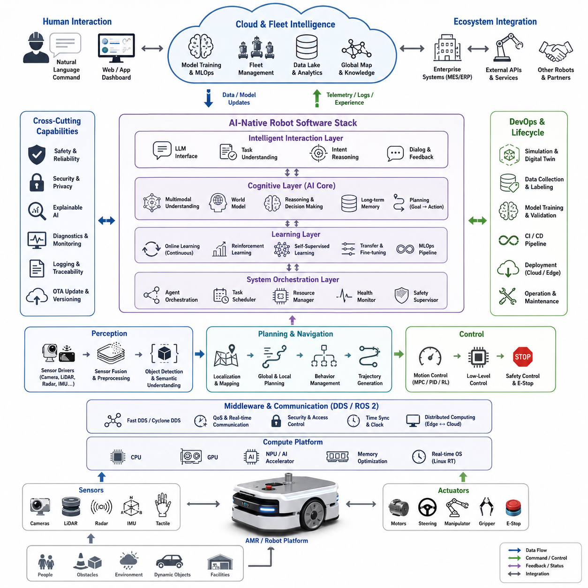
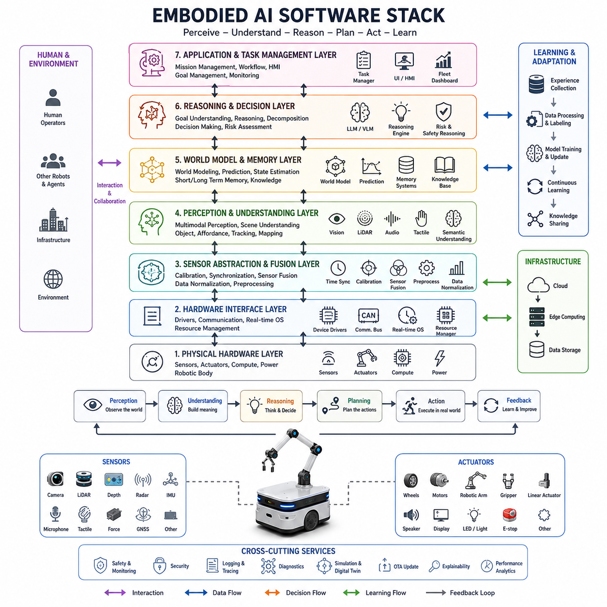
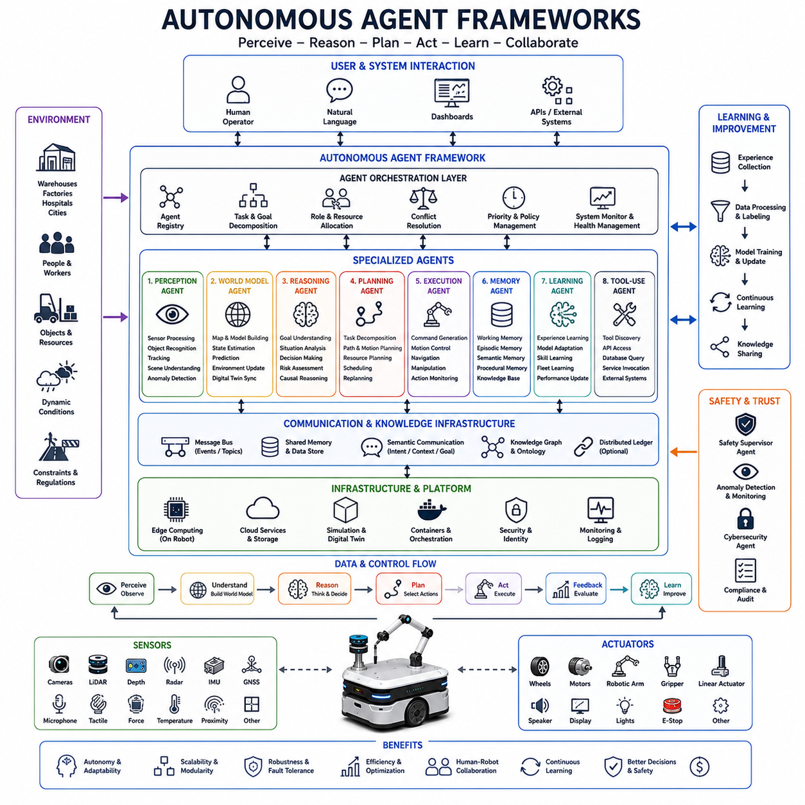
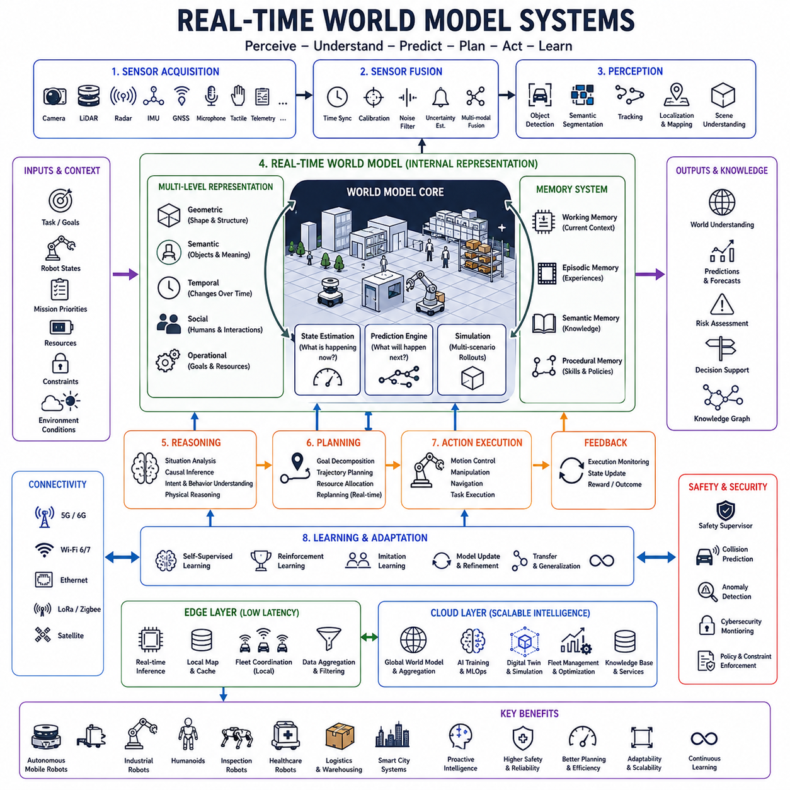
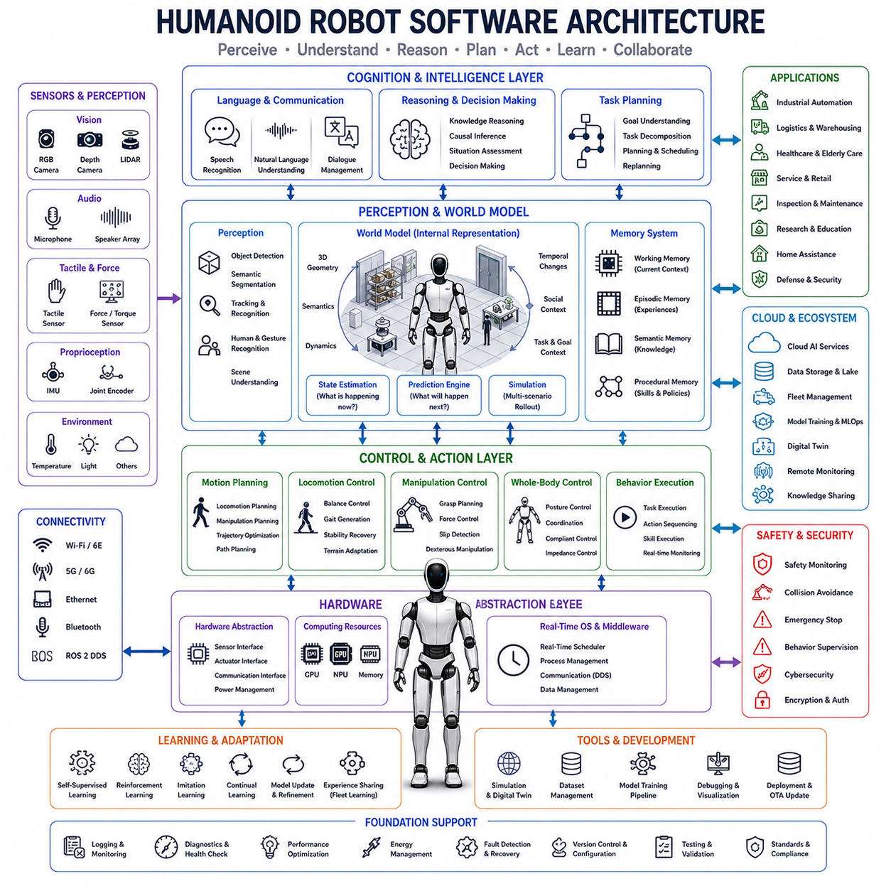
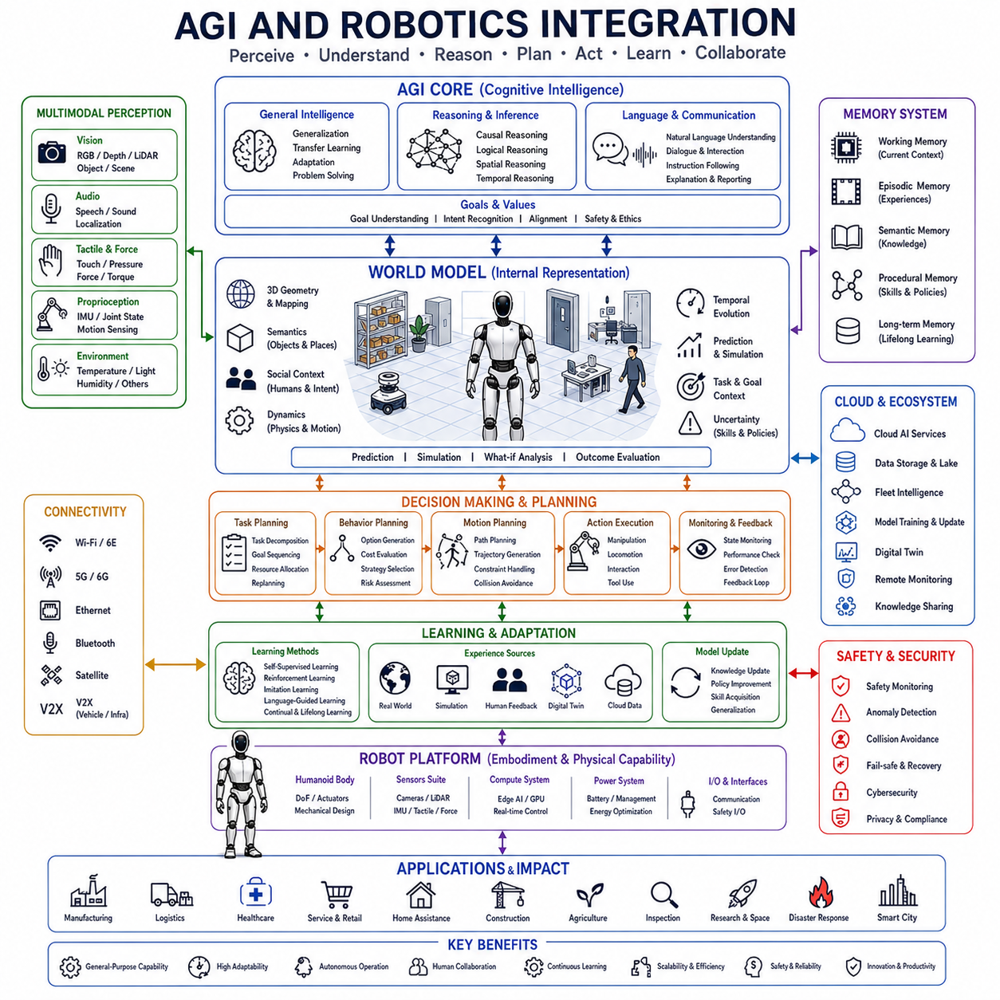
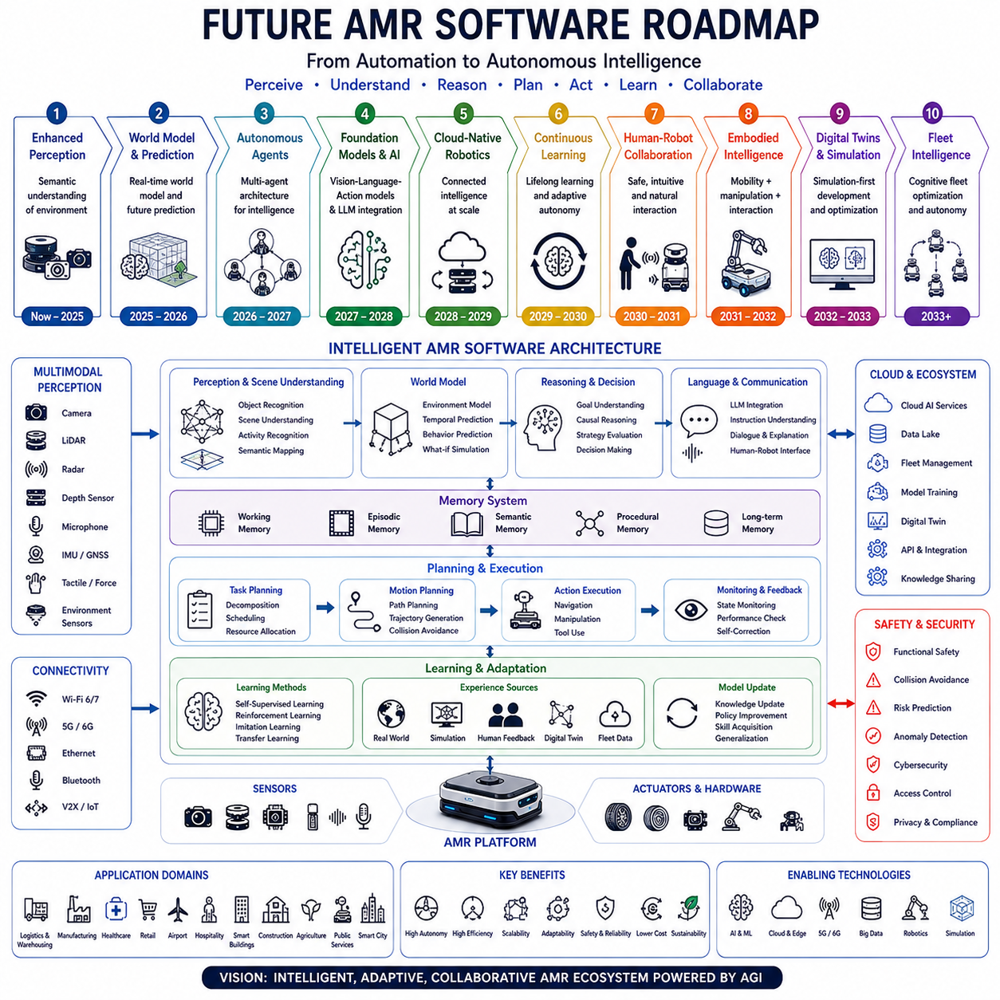

**Volume 07. AMR Software Architecture and Development**

# Chapter 25. Future Robot Software

## 25.1 AI-Native Robot Software

{width="7.268055555555556in" height="7.268055555555556in"}

Artificial Intelligence is gradually transforming robot software from a collection of manually engineered modules into an adaptive, data-driven, and continuously learning software ecosystem. Traditional robot software architectures were built around deterministic algorithms, predefined state machines, handcrafted perception pipelines, manually tuned navigation parameters, and rule-based decision systems. While these approaches enabled the development of reliable industrial robots and autonomous mobile robots, they often struggled to scale across diverse environments, dynamic operating conditions, and increasingly complex missions. AI-Native Robot Software represents a fundamental shift in robot software engineering, where artificial intelligence is not merely an add-on component but becomes the primary organizing principle of the entire software stack. In this paradigm, perception, planning, control, reasoning, learning, simulation, operations, and fleet management are designed from the beginning to leverage machine learning, foundation models, and adaptive intelligence. This topic belongs to the Future Robot Software section within the broader AMR software architecture framework.

AI-native systems differ significantly from conventional robotics architectures. Traditional software is built around explicit logic created by engineers, whereas AI-native software increasingly relies on models that learn representations, policies, behaviors, and world understanding directly from data. The software architecture evolves from algorithm-centric design toward model-centric design. Instead of developing hundreds of handcrafted rules for obstacle handling, semantic navigation, object interaction, or human collaboration, engineers create training pipelines, evaluation frameworks, and deployment infrastructures that continuously improve robot intelligence over time.

The emergence of large-scale foundation models has accelerated this transition. Foundation models provide robots with generalized representations of language, vision, motion, spatial understanding, and task execution. Rather than developing separate software modules for each individual application, AI-native robots can leverage pre-trained models that transfer knowledge across multiple domains. A warehouse robot, hospital robot, outdoor inspection robot, and service robot may share a significant portion of their cognitive architecture while adapting through fine-tuning and task-specific learning.

One of the most important characteristics of AI-native robot software is the integration of perception and reasoning. Traditional robotic systems often separate perception from planning. Perception generates object detections, localization estimates, and environmental maps, while planning modules operate independently using structured inputs. AI-native architectures increasingly blur these boundaries. Vision-language models, multimodal transformers, and world models enable robots to interpret sensory information and reason about actions within a unified framework. The robot no longer simply detects objects; it understands relationships, predicts future states, evaluates goals, and generates context-aware behaviors.

Perception software in AI-native systems becomes deeply multimodal. Robots continuously process camera streams, LiDAR point clouds, radar measurements, depth maps, IMU signals, GNSS data, tactile feedback, and operational telemetry. Rather than handling each sensor independently, multimodal fusion models create unified environmental representations. These representations capture both geometric and semantic information, allowing robots to understand not only where objects are located but also what they are, how they behave, and how they affect mission objectives.

Language becomes a first-class interface in AI-native robot software. Large language models allow operators to interact with robots using natural language commands instead of specialized programming interfaces. Mission definitions, task instructions, exception handling procedures, and fleet management operations can be expressed conversationally. The robot software stack includes language understanding layers that convert human intentions into executable robot behaviors. This capability significantly reduces operational complexity and lowers the barrier for robot deployment across industries.

World models play a central role in future AI-native architectures. A world model is an internal representation of the environment that allows robots to predict future outcomes before executing actions. Instead of reacting only to current sensor observations, AI-native robots continuously simulate possible futures and evaluate alternative strategies. This capability supports safer navigation, more efficient planning, improved energy management, and proactive risk mitigation. World models provide a bridge between perception, reasoning, and control.

Planning systems also undergo substantial evolution. Traditional navigation stacks often rely on predefined planners, costmaps, and behavior trees. While these methods remain valuable for safety-critical operations, AI-native systems augment them with learned planning models. These models can generate trajectories, optimize routes, anticipate dynamic obstacles, and adapt to novel environments. Hybrid planning architectures combine deterministic safety guarantees with adaptive learning-based optimization.

Control systems increasingly incorporate machine learning components. Conventional controllers such as PID, MPC, and trajectory tracking algorithms remain important, but they are complemented by learned policies that improve performance under uncertainty. Reinforcement learning enables robots to discover control strategies that are difficult to engineer manually. Through simulation and real-world experience, robots can optimize locomotion, manipulation, navigation, docking, towing, and collaborative behaviors.

Continuous learning becomes a fundamental capability rather than an occasional development activity. AI-native robots collect operational data during deployment and use that information to improve models over time. Robot fleets become distributed learning systems where experiences from one robot contribute to improvements across the entire fleet. Data collection, labeling, validation, retraining, testing, and deployment are integrated into automated MLOps pipelines. Software evolution becomes an ongoing process rather than a sequence of periodic releases.

The role of simulation expands dramatically within AI-native software ecosystems. Modern robot simulators evolve into large-scale virtual environments capable of generating enormous amounts of training data. Digital twins replicate physical robots, facilities, traffic patterns, weather conditions, and operational workflows. Synthetic data generation reduces dependency on costly manual data collection while enabling exploration of rare and hazardous scenarios. Simulation-to-reality transfer techniques ensure that learned behaviors can be deployed safely in real-world environments.

Cloud-native technologies become deeply integrated into AI-native robot software. Robots increasingly operate as distributed systems connected to cloud infrastructure, edge computing platforms, and fleet management services. Heavy computational tasks such as model training, global optimization, fleet analytics, and knowledge sharing occur in the cloud, while latency-sensitive functions remain on edge devices. This hybrid architecture enables scalability across thousands or even millions of robotic systems.

Edge AI plays an equally important role. AI-native robots require powerful onboard computing platforms capable of executing complex perception and reasoning workloads in real time. Modern robot architectures utilize heterogeneous computing systems combining CPUs, GPUs, NPUs, and specialized accelerators. Edge inference engines support low-latency decision making while maintaining independence from network connectivity. Future robots must remain operational even when disconnected from cloud services.

Multi-agent intelligence becomes a defining feature of AI-native robotics. Individual robots no longer operate as isolated systems. Instead, fleets function as cooperative intelligent networks capable of sharing maps, knowledge, tasks, and experiences. Multi-agent coordination frameworks enable robots to negotiate responsibilities, allocate resources, avoid conflicts, and collectively optimize mission performance. The fleet itself becomes an intelligent entity rather than merely a collection of independent machines.

Software architectures evolve toward agent-based frameworks. Traditional robotics applications are organized around modules and services. AI-native systems increasingly introduce autonomous software agents responsible for perception, planning, diagnostics, mission execution, maintenance monitoring, and user interaction. These agents communicate through shared memory structures, message brokers, and world models. Agent orchestration frameworks coordinate their activities while ensuring system stability and safety.

Safety remains one of the most critical challenges in AI-native robot software. Unlike deterministic algorithms, AI systems may exhibit unexpected behaviors when encountering unfamiliar situations. Therefore, future architectures incorporate multiple safety layers including runtime monitoring, policy validation, behavioral constraints, anomaly detection, explainability mechanisms, and fail-safe control systems. Safety supervisors continuously evaluate AI outputs and intervene when necessary.

Explainable AI becomes increasingly important for industrial adoption. Operators, regulators, and customers require transparency regarding robot decisions. AI-native software includes mechanisms that generate human-understandable explanations for navigation choices, task prioritization decisions, safety interventions, and mission outcomes. Explainability improves trust and facilitates debugging, certification, and regulatory compliance.

Cybersecurity requirements become more demanding as robots become more intelligent and interconnected. AI-native software architectures must protect models, training data, operational knowledge, communication channels, and cloud services. Security mechanisms include secure boot processes, encrypted communication, identity management, access control, model integrity verification, intrusion detection, and continuous vulnerability monitoring. AI itself may also be employed to detect cyber threats in real time.

Human-robot collaboration evolves significantly within AI-native ecosystems. Future robots understand human intentions, predict behaviors, interpret gestures, recognize emotional states, and adapt communication styles. Multimodal interaction combines speech, text, visual cues, spatial awareness, and contextual understanding. AI-native robots become collaborative partners rather than simple automated machines.

The economics of robot software development also change. Historically, significant engineering effort was required to customize software for each deployment. AI-native platforms promote reusable foundation models, transferable knowledge, shared datasets, and common software frameworks. Development shifts from application-specific coding toward platform-level intelligence engineering. This transition reduces deployment costs and accelerates innovation cycles.

Industrial sectors such as logistics, manufacturing, healthcare, construction, mining, agriculture, transportation, and smart cities are expected to benefit substantially from AI-native robot software. Robots become capable of adapting to changing environments, learning new tasks, recovering from failures, and collaborating with humans at unprecedented levels. These capabilities significantly expand the range of economically viable robotic applications.

Future AI-native robot software will likely integrate foundation models, world models, autonomous agents, multimodal perception systems, continuous learning pipelines, cloud-edge intelligence, and fleet-level optimization into a unified architecture. The robot software stack will no longer be viewed as a collection of isolated modules but as an adaptive cognitive system capable of understanding, reasoning, learning, and acting within complex physical environments. This transformation represents one of the most significant shifts in robotics since the introduction of autonomous navigation itself. As embodied intelligence continues to mature, AI-native software will become the foundational technology enabling the next generation of autonomous mobile robots, industrial automation systems, service robots, and eventually general-purpose robotic platforms capable of operating across a broad spectrum of real-world environments.

## 25.2 Embodied AI Software Stack

{width="7.268055555555556in" height="7.268055555555556in"}

Embodied AI Software Stack represents the next evolutionary stage of robot software architecture, where intelligence is no longer treated as a separate software component but is deeply integrated with perception, cognition, motion, interaction, and physical execution. Traditional robotic software systems have historically divided sensing, planning, and control into isolated modules connected through predefined interfaces. While this approach enabled reliable industrial automation, it often limited the robot's ability to understand complex environments, adapt to unforeseen situations, and learn new behaviors. Embodied AI introduces a fundamentally different paradigm in which intelligence emerges from the continuous interaction between the robot's physical body, its sensors, its computational models, and the surrounding world.

The concept of embodiment is based on the idea that intelligence cannot be fully separated from physical experience. Human intelligence develops through continuous interaction with the environment, where perception, movement, manipulation, reasoning, and learning are tightly coupled. Similarly, embodied AI systems learn not only from data but also from direct physical engagement with the world. As a result, the software stack supporting embodied AI must extend far beyond traditional robot control architectures and become a comprehensive cognitive operating system capable of perception, reasoning, action, adaptation, and continuous learning.

At the foundation of the embodied AI software stack lies the physical hardware interface layer. This layer provides access to sensors, actuators, communication buses, and computational resources. Cameras, LiDAR sensors, depth sensors, radar systems, IMUs, tactile sensors, force sensors, microphones, GNSS receivers, motor controllers, robotic arms, grippers, and locomotion systems all generate streams of information that must be processed in real time. Unlike conventional robots that often use sensors primarily for localization and obstacle avoidance, embodied AI systems utilize these sensors to construct rich representations of the surrounding environment.

The sensor abstraction layer forms the next stage of the architecture. This layer standardizes heterogeneous sensor inputs and transforms them into unified data streams. Time synchronization, calibration, sensor fusion, data normalization, and semantic preprocessing occur at this level. The goal is not merely to collect data but to transform raw measurements into structured observations suitable for higher-level reasoning systems. Modern embodied AI platforms increasingly employ multimodal representations that combine visual, spatial, auditory, tactile, and proprioceptive information into a common representation space.

Above the sensor layer lies the perception layer, which serves as the robot's sensory cortex. This layer interprets incoming data and extracts meaningful information about the environment. Traditional perception pipelines focused on object detection, semantic segmentation, tracking, and mapping. In embodied AI systems, perception becomes significantly more comprehensive. Foundation vision models, multimodal transformers, and self-supervised learning frameworks enable robots to understand scenes, recognize relationships between objects, identify affordances, estimate physical properties, and predict environmental dynamics.

Scene understanding becomes one of the most important capabilities within the perception layer. Rather than recognizing isolated objects, embodied AI systems construct semantic world representations that capture relationships among entities. A robot may understand that a door is connected to a room, that a tool belongs to a workstation, that a pallet is waiting for transportation, or that a human is interacting with a particular object. This contextual understanding allows more intelligent decision making and task execution.

The world model layer forms the cognitive core of embodied AI systems. A world model is an internal simulation of reality that allows robots to reason about current conditions and predict future outcomes. The world model continuously integrates sensory observations, historical experiences, task objectives, environmental constraints, and learned knowledge. Instead of responding reactively to sensor data, robots use world models to imagine possible futures and evaluate alternative actions before execution.

World models enable predictive intelligence. A warehouse robot can anticipate congestion before entering an aisle. An outdoor robot can predict pedestrian movement. A manipulation robot can estimate how an object will behave when grasped. These predictive capabilities dramatically improve efficiency, safety, and adaptability. As embodied AI matures, world models are expected to become increasingly detailed, persistent, and continuously updated representations of reality.

Memory systems are closely integrated with world models. Embodied AI requires multiple forms of memory, including short-term working memory, episodic memory, semantic memory, procedural memory, and long-term knowledge storage. Working memory enables real-time reasoning. Episodic memory stores previous experiences. Semantic memory contains factual knowledge about objects, environments, and tasks. Procedural memory stores learned skills and behaviors. Together, these memory systems provide the foundation for lifelong learning and continuous adaptation.

The reasoning layer transforms perception and memory into actionable intelligence. This layer is responsible for goal interpretation, task decomposition, causal reasoning, spatial reasoning, temporal reasoning, and decision making. Large language models, multimodal reasoning models, and specialized cognitive architectures increasingly contribute to this process. The robot can understand high-level objectives, infer missing information, generate plans, evaluate risks, and adapt strategies dynamically as conditions change.

Language understanding becomes deeply integrated into the reasoning process. Human operators can communicate with robots using natural language instructions, and the reasoning layer translates these instructions into executable objectives. Instead of issuing low-level commands, users can specify goals such as inspecting a facility, delivering equipment, locating an object, or assisting a worker. The robot interprets these goals within the context of its world model and generates appropriate action sequences.

Task planning serves as the bridge between reasoning and execution. Embodied AI systems generate hierarchical plans that decompose complex objectives into manageable subtasks. Planning incorporates environmental constraints, resource availability, safety requirements, mission priorities, and expected outcomes. Dynamic replanning mechanisms allow robots to adapt continuously as new information becomes available.

The behavior generation layer converts plans into executable behaviors. Traditional robotic systems often rely on predefined behavior trees or finite state machines. Embodied AI architectures increasingly incorporate learned behavior policies, reinforcement learning agents, diffusion-based action models, and neural motion planners. These systems enable robots to perform complex tasks that would be difficult to program manually.

Motion intelligence becomes a distinct component of the embodied AI stack. Motion is no longer treated as a low-level control problem alone. Instead, movement becomes part of cognition itself. Navigation, manipulation, grasping, docking, balancing, locomotion, and human interaction all depend on intelligent motion generation. Motion models learn from demonstration, reinforcement learning, simulation data, and real-world experience to optimize performance across diverse environments.

The control layer remains responsible for real-time execution and safety-critical operation. Classical control methods such as PID controllers, model predictive control, trajectory tracking algorithms, and safety supervisors continue to play an essential role. However, these systems increasingly operate alongside learned controllers that improve adaptability and robustness. Hybrid control architectures combine deterministic reliability with adaptive intelligence.

A distinctive characteristic of embodied AI software is continuous learning. Learning occurs before deployment, during deployment, and after deployment. Robots collect operational experiences, evaluate performance outcomes, identify weaknesses, and update internal models. Continuous learning frameworks allow fleets of robots to share experiences and collectively improve over time. Knowledge acquired by one robot can propagate throughout an entire robotic ecosystem.

Simulation infrastructure forms an essential component of the embodied AI software stack. Large-scale simulation environments provide safe and scalable platforms for training, testing, and validation. Digital twins replicate physical environments with high fidelity, enabling robots to practice millions of interactions before deployment. Synthetic data generation significantly reduces dependence on manual data collection while improving robustness to rare events and corner cases.

Cloud and edge computing integration plays a critical role in scalability. Edge computing platforms execute latency-sensitive functions such as perception, control, and safety monitoring. Cloud infrastructure supports large-scale model training, knowledge sharing, fleet optimization, and long-term analytics. The embodied AI stack therefore operates as a distributed intelligence system spanning physical robots, local edge devices, and cloud-based services.

Multi-agent collaboration represents another major element of future embodied AI systems. Robots increasingly operate within intelligent ecosystems composed of humans, machines, software agents, and infrastructure. Multi-agent frameworks enable coordination, negotiation, information sharing, and collective problem solving. Intelligence becomes distributed across networks rather than residing within individual robots.

Safety and trustworthiness remain fundamental requirements. Because embodied AI systems possess greater autonomy and adaptability, they must also incorporate stronger safeguards. Runtime monitoring, anomaly detection, explainable decision making, policy validation, risk assessment, and fail-safe recovery mechanisms are integrated throughout the software stack. Safety is not confined to a single module but becomes a cross-cutting property spanning every architectural layer.

Cybersecurity becomes equally important as robots gain access to sensitive information, cloud services, and physical infrastructure. Secure communication, encrypted data storage, authentication systems, access control frameworks, model protection mechanisms, and secure update pipelines are essential elements of the embodied AI software ecosystem. Future embodied robots must defend not only against traditional cyber threats but also against attacks targeting AI models and learning systems.

Human-robot interaction forms a dedicated layer within many embodied AI architectures. Robots must understand speech, gestures, emotions, intentions, and contextual cues. Multimodal interaction systems combine visual perception, language understanding, behavioral prediction, and social reasoning. As a result, robots become capable of functioning as collaborative partners rather than simple automated tools.

The future embodied AI software stack is expected to converge around several key principles. Intelligence will be multimodal rather than sensor-specific. Learning will be continuous rather than episodic. World models will replace static maps as the primary environmental representation. Foundation models will provide generalized knowledge across tasks and domains. Agent-based architectures will orchestrate cognitive processes. Cloud-edge systems will enable scalable intelligence. Safety and explainability will be embedded throughout the architecture rather than added afterward.

Ultimately, embodied AI software stacks represent the transition from robotic automation to robotic cognition. Future robots will not simply execute commands or follow predefined workflows. They will perceive, understand, reason, learn, collaborate, and adapt within complex physical environments. This transformation will fundamentally redefine autonomous mobile robots, industrial robots, service robots, humanoids, logistics platforms, healthcare assistants, inspection systems, and future general-purpose robotic agents. The embodied AI software stack therefore serves as the foundational architecture enabling the next generation of intelligent machines capable of operating effectively in the real world.

## 25.3 Autonomous Agent Frameworks

{width="7.268055555555556in" height="7.268055555555556in"}

Autonomous Agent Frameworks represent one of the most significant developments in the future of robot software. Traditional robotic systems are typically built around predefined workflows, deterministic control structures, behavior trees, finite state machines, and task-specific software modules. While these approaches have enabled the deployment of industrial robots, autonomous mobile robots, service robots, and logistics systems, they often struggle when operating in highly dynamic environments where goals, constraints, and environmental conditions continuously change. Autonomous Agent Frameworks address these limitations by introducing software architectures in which intelligent agents can perceive, reason, plan, act, learn, collaborate, and adapt with a high degree of autonomy.

An autonomous agent can be defined as a software entity capable of independently pursuing objectives while interacting with its environment. Unlike traditional software modules that execute predefined functions, agents possess goal-oriented behavior. They continuously evaluate the current state of the environment, assess available resources, generate plans, execute actions, monitor outcomes, and adjust strategies when circumstances change. In robotics, autonomous agents provide a bridge between artificial intelligence, decision-making systems, and physical robot execution.

The emergence of large language models, multimodal foundation models, world models, and embodied AI technologies has accelerated the development of autonomous agent architectures. These technologies provide agents with capabilities that were previously difficult to implement, including natural language understanding, contextual reasoning, long-term planning, memory management, tool usage, and adaptive behavior generation. As a result, future robots are increasingly expected to operate through collections of interacting intelligent agents rather than through monolithic software systems.

The foundation of an autonomous agent framework is the agent abstraction layer. This layer defines the basic characteristics of every agent within the system. Each agent typically possesses goals, memory, reasoning capabilities, planning mechanisms, action execution interfaces, learning components, and communication channels. These elements allow the agent to function as a self-contained cognitive unit capable of making decisions within a specific domain of responsibility.

Perception agents form one of the most important classes of agents in robotic systems. These agents are responsible for interpreting information from sensors such as cameras, LiDAR systems, radar sensors, depth sensors, tactile sensors, microphones, GNSS receivers, and IMUs. Rather than simply forwarding sensor data to other software components, perception agents generate meaningful environmental understanding. They identify objects, estimate motion, recognize activities, detect anomalies, classify situations, and maintain situational awareness for the rest of the system.

World model agents play a central role in maintaining the robot's internal understanding of reality. These agents continuously integrate information from perception systems, historical experiences, mission objectives, and environmental constraints. The resulting world model serves as a dynamic representation of the environment that can be used for prediction, reasoning, planning, and decision making. Future world model agents are expected to maintain persistent digital representations of facilities, cities, warehouses, hospitals, construction sites, and other operational environments.

Reasoning agents transform environmental understanding into actionable intelligence. These agents analyze goals, evaluate alternatives, assess risks, and generate decisions. Advanced reasoning agents may employ large language models, multimodal transformers, symbolic reasoning systems, causal inference engines, and hybrid cognitive architectures. Their primary purpose is to answer the question of what the robot should do next and why that action is appropriate.

Planning agents are responsible for converting objectives into executable action sequences. They decompose high-level goals into smaller tasks, allocate resources, coordinate dependencies, and optimize execution strategies. Planning agents often operate across multiple time horizons. Short-term planning focuses on immediate actions, while long-term planning considers mission completion, energy management, operational efficiency, and future constraints. The integration of predictive world models significantly enhances planning performance by allowing agents to evaluate hypothetical futures before committing to actions.

Execution agents provide the interface between cognition and physical behavior. These agents translate plans into commands that can be executed by navigation systems, manipulators, mobile platforms, actuators, and control systems. Execution agents monitor progress continuously and provide feedback to higher-level reasoning systems. When unexpected events occur, they can trigger replanning or request assistance from other agents.

Memory agents constitute another essential component of autonomous agent frameworks. Memory is not limited to data storage but includes multiple layers of knowledge management. Working memory supports immediate decision making. Episodic memory records experiences and events. Semantic memory stores factual knowledge about objects, environments, and procedures. Procedural memory captures learned skills and execution patterns. Together, these memory systems allow agents to accumulate experience and improve performance over time.

Learning agents enable continuous adaptation and self-improvement. Traditional robotic software often requires manual updates by developers whenever new situations are encountered. Autonomous agent frameworks introduce mechanisms through which agents can learn from experience, simulation, demonstrations, human feedback, and fleet-wide operational data. Learning agents evaluate performance outcomes, identify weaknesses, update internal models, and share improvements with other agents.

Tool-using agents represent an increasingly important capability within future autonomous systems. Rather than relying solely on internal knowledge, agents can access external tools, databases, APIs, simulation environments, mapping systems, optimization engines, cloud services, and enterprise software platforms. A robot agent may query a warehouse management system, request information from a digital twin, analyze maintenance records, consult a scheduling engine, or retrieve information from a cloud-based knowledge base. Tool usage dramatically expands the problem-solving capabilities of autonomous systems.

Multi-agent collaboration is one of the defining characteristics of advanced agent frameworks. Instead of relying on a single central intelligence, complex robotic systems distribute intelligence across multiple specialized agents. Each agent focuses on a particular domain while collaborating with others through communication protocols and shared knowledge structures. This approach improves scalability, robustness, maintainability, and fault tolerance.

Communication infrastructure forms the backbone of multi-agent systems. Agents exchange information through message passing, event streams, shared memory spaces, publish-subscribe architectures, and distributed knowledge repositories. Modern frameworks increasingly incorporate semantic communication mechanisms that allow agents to exchange meanings, intentions, goals, and contextual information rather than simple data structures.

Agent orchestration frameworks coordinate interactions among agents. These frameworks determine which agents should participate in solving a particular problem, how responsibilities should be distributed, how conflicts should be resolved, and how overall system objectives should be prioritized. Agent orchestration becomes increasingly important as systems grow from dozens of agents to potentially thousands of interacting intelligent entities.

Hierarchical agent architectures are widely used in large-scale robotic systems. Strategic agents define mission-level objectives. Tactical agents manage task execution and resource allocation. Operational agents control individual behaviors and actions. This hierarchical organization improves scalability while maintaining clear separation of responsibilities across different levels of decision making.

Distributed autonomous agent systems become particularly valuable in fleet robotics applications. Warehouse fleets, hospital robot networks, industrial inspection systems, agricultural robots, and autonomous transportation platforms can all benefit from distributed intelligence. Individual robots function as autonomous agents while simultaneously participating in larger collaborative ecosystems. Fleet-level agents coordinate traffic management, task assignment, charging schedules, maintenance planning, and operational optimization.

Cloud-integrated agent frameworks further expand the capabilities of autonomous systems. Edge agents execute real-time tasks directly on robots, while cloud agents perform large-scale analytics, long-term planning, knowledge management, model training, and cross-fleet coordination. This cloud-edge architecture allows robots to benefit from both local autonomy and global intelligence.

Embodied AI significantly influences future agent frameworks. Traditional software agents operate primarily within digital environments. Embodied agents interact directly with the physical world through sensors and actuators. They must understand spatial relationships, physical constraints, object affordances, human behaviors, environmental dynamics, and safety requirements. Embodied agents therefore require tighter integration between cognition and action than purely software-based agents.

World models become increasingly important within embodied agent systems. Rather than reacting solely to current observations, agents use world models to predict future events, evaluate potential actions, and estimate long-term consequences. This capability enables proactive behavior rather than reactive behavior. A robot can anticipate obstacles, predict human movement, estimate resource consumption, and identify risks before they occur.

Natural language interaction represents another major advancement. Autonomous agents increasingly communicate with humans using conversational interfaces. Users can specify goals, request explanations, provide feedback, modify objectives, and monitor operations through natural language dialogue. Language becomes a universal coordination mechanism connecting humans, agents, robots, and enterprise systems.

Explainability plays a critical role in autonomous agent frameworks. As agents gain greater autonomy, users and operators must understand how decisions are made. Explainable agents provide reasoning traces, decision justifications, confidence estimates, and alternative action analyses. These capabilities improve trust, simplify debugging, and support regulatory compliance in safety-critical environments.

Safety supervision agents constitute an essential layer within robotic agent ecosystems. These agents continuously monitor system behavior, evaluate risk levels, enforce operational constraints, detect anomalies, and intervene when unsafe conditions arise. Safety agents operate independently from task-oriented agents to ensure that mission objectives never compromise safety requirements.

Cybersecurity agents are becoming increasingly necessary as robots become connected to cloud platforms, enterprise systems, and critical infrastructure. These agents monitor network traffic, detect intrusion attempts, validate software integrity, manage authentication, enforce access control policies, and coordinate incident response procedures. Future autonomous systems may employ AI-powered cybersecurity agents capable of identifying threats in real time.

Simulation agents support development, validation, and continuous improvement. They generate synthetic environments, evaluate new behaviors, test alternative strategies, and perform large-scale virtual experimentation. Digital twins often incorporate simulation agents that mirror the behavior of physical robots and operational environments. This capability accelerates innovation while reducing deployment risks.

Economic optimization agents are emerging in commercial robotics deployments. These agents consider energy consumption, maintenance costs, fleet utilization, resource allocation, productivity metrics, and return-on-investment objectives. By integrating operational intelligence with business intelligence, autonomous agent frameworks help organizations maximize both technical performance and economic value.

Future autonomous agent frameworks are expected to evolve toward highly scalable cognitive ecosystems composed of thousands of cooperating agents. Foundation models will provide generalized intelligence. World models will provide predictive understanding. Memory systems will support lifelong learning. Agent orchestration platforms will coordinate distributed intelligence. Cloud-edge infrastructures will provide scalable computing resources. Safety and cybersecurity mechanisms will ensure trustworthy operation.

Ultimately, autonomous agent frameworks represent a transition from software-defined robots to goal-driven intelligent systems. Instead of following fixed workflows, future robots will operate through networks of autonomous agents capable of understanding objectives, generating strategies, learning from experience, collaborating with humans, coordinating with other agents, and adapting continuously to changing environments. These frameworks will become a foundational technology for next-generation autonomous mobile robots, industrial robots, humanoid systems, service robots, smart city infrastructure, and future embodied artificial intelligence platforms.

## 25.4 Cloud-Native Robot Ecosystems

# 25_04_Cloud_Native_Robot_Ecosystems

Cloud-Native Robot Ecosystems represent a transformative evolution in the architecture of modern robotic systems. Traditional robots were typically designed as self-contained machines, with most intelligence, control logic, data processing, and operational management residing entirely on the robot itself. While this architecture provided autonomy and reliability, it imposed significant limitations on scalability, knowledge sharing, computational capacity, fleet coordination, and continuous improvement. As robotic deployments expand from individual machines to fleets consisting of hundreds, thousands, or even millions of interconnected robots, a fundamentally different architectural approach becomes necessary. Cloud-native robotics addresses this challenge by treating robots not as isolated devices but as participants in a distributed intelligent ecosystem that spans cloud infrastructure, edge computing platforms, enterprise systems, digital twins, artificial intelligence services, and human operators.

The term cloud-native originates from modern software engineering practices in which applications are designed specifically to operate within cloud environments. Rather than adapting traditional systems to run in the cloud, cloud-native architectures are built from the beginning around principles such as microservices, containerization, distributed computing, elasticity, continuous deployment, service orchestration, and scalable data management. When applied to robotics, these principles create a new generation of robotic ecosystems capable of supporting large-scale intelligent automation across industries.

At the center of a cloud-native robot ecosystem is the robot itself. However, unlike conventional robotic architectures, the robot becomes only one component of a much larger intelligent system. The physical robot continues to perform sensing, navigation, manipulation, locomotion, and real-time control. Safety-critical functions remain onboard to ensure reliable operation even during network interruptions. However, many higher-level functions are distributed across cloud infrastructure and edge computing systems.

Edge computing forms the first extension beyond the robot. Edge nodes are deployed close to the operational environment and provide low-latency computing resources for perception processing, AI inference, local fleet coordination, video analytics, and data aggregation. Edge infrastructure bridges the gap between onboard computing and cloud computing by providing additional computational capacity while maintaining responsiveness. In large factories, warehouses, hospitals, airports, ports, and smart cities, edge computing significantly reduces network latency and bandwidth consumption while enabling real-time collaboration among multiple robots.

Cloud infrastructure provides the next layer of the ecosystem. The cloud serves as a centralized intelligence platform that aggregates information from all robots, edge devices, enterprise systems, and operational environments. Through virtually unlimited storage and computing resources, cloud platforms enable capabilities that would be impractical to deploy on individual robots. These capabilities include large-scale data analytics, machine learning model training, fleet-wide optimization, digital twin simulation, predictive maintenance, global mission planning, and knowledge management.

One of the most important advantages of cloud-native robotics is centralized knowledge sharing. In traditional robotic systems, knowledge often remains isolated within individual robots. Each robot learns from its own experiences and may not benefit directly from the experiences of others. Cloud-native ecosystems eliminate this limitation by creating shared knowledge repositories. Data collected by one robot can be analyzed, validated, and distributed throughout an entire fleet. This collective learning capability accelerates performance improvements and reduces duplication of effort across deployments.

Artificial intelligence services represent a core component of future cloud-native ecosystems. Modern foundation models, large language models, multimodal reasoning systems, world models, and reinforcement learning frameworks often require computational resources that exceed the capabilities of onboard hardware. Cloud-based AI services provide access to these advanced models while allowing robots to leverage continuously updated intelligence. Robots can query cloud AI systems for reasoning assistance, semantic understanding, task planning, anomaly diagnosis, operational recommendations, and natural language interaction.

The emergence of robot foundation models further strengthens the role of cloud infrastructure. These models require enormous datasets and large-scale training environments that can only be supported through distributed cloud computing systems. Once trained, foundation models become shared intelligence resources accessible to diverse robot platforms. A warehouse robot, inspection robot, healthcare robot, and service robot may all utilize the same foundational knowledge while adapting to specific tasks through local customization.

Digital twins constitute another critical element of cloud-native robot ecosystems. A digital twin is a continuously synchronized virtual representation of a physical robot, facility, process, or operational environment. Digital twins receive real-time telemetry from physical systems and update their internal state accordingly. This capability enables operators to monitor robot health, evaluate performance, simulate future scenarios, test software updates, and analyze operational risks without affecting real-world operations.

The integration between robots and digital twins creates powerful opportunities for optimization. New navigation algorithms, AI models, fleet management strategies, and maintenance procedures can be evaluated within simulated environments before deployment. This significantly reduces risk while accelerating innovation. Digital twins also provide valuable support for training autonomous agents, validating safety policies, and performing large-scale scenario analysis.

Fleet management systems become increasingly sophisticated within cloud-native ecosystems. Traditional fleet management primarily focused on task assignment and traffic coordination. Future cloud-native fleet management platforms function as intelligent operational command centers capable of monitoring thousands of robots simultaneously. These systems optimize resource utilization, energy consumption, charging schedules, maintenance planning, mission execution, workforce collaboration, and operational efficiency across entire organizations.

Cloud-native architectures naturally support multi-agent systems. Individual robots become autonomous agents operating within larger intelligent networks. Agent orchestration platforms coordinate communication, knowledge sharing, decision making, and task execution across distributed agent populations. Human operators, AI services, digital twins, enterprise systems, and robots all participate as intelligent entities within the same ecosystem. This creates a unified environment where decisions can be made collaboratively across organizational and technological boundaries.

Data management becomes a foundational capability within cloud-native robotics. Modern robotic systems generate enormous volumes of information, including sensor data, video streams, LiDAR point clouds, localization records, navigation logs, diagnostic information, operational metrics, maintenance records, and user interactions. Cloud-native data architectures provide scalable storage, indexing, retrieval, and analytics capabilities capable of supporting long-term operational intelligence.

Data lakes and knowledge graphs play increasingly important roles. Data lakes store large volumes of structured and unstructured robotic information, while knowledge graphs organize relationships among robots, assets, facilities, tasks, operators, and operational events. Together, these technologies create a rich foundation for advanced analytics, reasoning systems, and AI-driven decision support.

MLOps for robotics emerges as a natural extension of cloud-native principles. Machine learning models are continuously trained, validated, deployed, monitored, and updated using automated pipelines. Data collected from operational environments feeds into training systems that generate improved models. These models undergo testing and validation before being distributed across robot fleets. Continuous improvement becomes an inherent characteristic of the ecosystem rather than an occasional engineering activity.

Software deployment also evolves significantly. Cloud-native robots rely on continuous integration and continuous deployment pipelines that support rapid software evolution. Containerized applications enable consistent deployment across diverse hardware platforms. Orchestration systems manage application lifecycles, resource allocation, service discovery, configuration management, and fault recovery. Over-the-air updates allow new features, security patches, AI models, and operational improvements to be delivered seamlessly across entire fleets.

Cybersecurity becomes increasingly important as robotic systems become more interconnected. Cloud-native ecosystems require comprehensive security architectures spanning robots, edge devices, cloud infrastructure, communication networks, enterprise systems, and third-party services. Secure identity management, authentication frameworks, encryption protocols, access control mechanisms, zero-trust architectures, intrusion detection systems, and continuous security monitoring are essential components of future robotic platforms.

Resilience and fault tolerance are fundamental design requirements. Cloud-native ecosystems must continue operating despite hardware failures, network disruptions, software bugs, and unexpected operational events. Distributed architectures provide redundancy, failover mechanisms, automatic recovery procedures, and workload redistribution capabilities. This ensures that robotic operations remain reliable even in complex and unpredictable environments.

Interoperability becomes a key enabler of ecosystem growth. Future robotic environments will include heterogeneous fleets consisting of robots from multiple manufacturers, software vendors, and service providers. Standardized interfaces, open APIs, common communication protocols, semantic data models, and interoperability frameworks enable these diverse systems to collaborate effectively. Cloud-native ecosystems promote integration rather than isolation.

Enterprise integration represents another critical dimension. Robots increasingly interact with warehouse management systems, manufacturing execution systems, enterprise resource planning platforms, customer relationship management systems, building management systems, hospital information systems, and smart city infrastructure. Cloud-native architectures simplify these integrations through service-oriented and API-driven approaches. Robots become active participants in broader business workflows rather than standalone automation devices.

Human-robot collaboration is also enhanced through cloud-native ecosystems. Operators gain access to centralized dashboards, analytics platforms, digital twins, conversational interfaces, and AI assistants. Decision support systems help humans supervise large fleets efficiently while maintaining situational awareness. Cloud-based collaboration platforms enable geographically distributed teams to coordinate robotic operations across multiple facilities and regions.

The future of cloud-native robot ecosystems is closely linked to embodied AI, autonomous agents, and foundation models. As robots become more intelligent, their dependence on shared knowledge, large-scale learning infrastructure, and distributed cognitive services will continue to grow. Future ecosystems may support millions of robots connected through globally distributed cloud platforms that continuously exchange experiences, learn collectively, and improve autonomously.

Ultimately, cloud-native robot ecosystems represent a transition from isolated robotic machines to interconnected intelligent networks. Intelligence becomes distributed across robots, edge infrastructure, cloud services, digital twins, enterprise systems, and human collaborators. The robot is no longer viewed as a standalone product but as a node within a continuously evolving ecosystem of computation, knowledge, learning, and collaboration. This paradigm will define the future of autonomous mobile robots, industrial automation, logistics systems, healthcare robotics, smart city infrastructure, humanoid platforms, and next-generation embodied artificial intelligence systems.

## 25.5 Real-Time World Model Systems

{width="7.268055555555556in" height="7.268055555555556in"}

Real-Time World Model Systems represent one of the most important technological foundations for the future of robotics, embodied artificial intelligence, autonomous agents, and intelligent autonomous systems. Traditional robots operate primarily through reactive architectures in which decisions are based on current sensor observations and predefined rules. Although these systems have achieved remarkable success in industrial automation, logistics, manufacturing, and autonomous navigation, they often struggle when operating in highly dynamic, uncertain, and complex environments. Real-Time World Model Systems address this limitation by providing robots with continuously updated internal representations of reality that enable prediction, reasoning, planning, adaptation, and intelligent decision making.

A world model can be understood as an internal simulation of the external world maintained by an intelligent system. Rather than merely processing sensor inputs and generating immediate actions, a world model continuously integrates observations, memories, environmental knowledge, task objectives, physical constraints, and learned experiences into a coherent representation of reality. This representation allows the robot not only to understand what is happening now but also to anticipate what may happen next. In this sense, a world model functions as the cognitive engine that transforms perception into intelligence.

The concept of world models originates from human cognition. Humans rarely act based solely on immediate sensory information. Instead, people continuously construct mental models of their surroundings, predict future events, estimate consequences, and evaluate possible actions before making decisions. Future robotic systems seek to replicate this capability through computational world models that operate continuously in real time.

At the foundation of a real-time world model system lies the sensor acquisition layer. This layer collects information from cameras, LiDAR systems, radar sensors, depth sensors, GNSS receivers, IMUs, tactile sensors, force sensors, microphones, environmental sensors, and various operational telemetry sources. Unlike conventional robotics pipelines where sensor data is processed independently, world model systems treat all observations as inputs to a unified representation framework. The objective is not simply to measure the environment but to understand it.

The sensor fusion layer transforms heterogeneous sensor inputs into coherent environmental observations. Time synchronization, calibration, uncertainty estimation, noise reduction, semantic labeling, and multimodal fusion occur within this stage. Advanced fusion systems combine visual, spatial, auditory, tactile, and motion-related information into a common latent representation. This integrated representation serves as the foundation for higher-level reasoning and prediction.

Perception modules provide the initial interpretation of sensory observations. Object detection, semantic segmentation, scene understanding, motion estimation, tracking, localization, and mapping contribute to the generation of structured environmental knowledge. However, real-time world model systems extend beyond conventional perception. Rather than producing isolated outputs such as object lists or maps, perception contributes directly to the construction of a continuously evolving world representation.

Environmental representation forms one of the central components of the world model. Future systems may maintain multiple complementary representations simultaneously. Geometric representations describe physical structure and spatial relationships. Semantic representations describe object identities, functions, and meanings. Temporal representations capture changes over time. Social representations model human activities and interactions. Operational representations capture mission objectives, resource status, and system constraints. Together, these representations create a rich and multidimensional understanding of reality.

One of the defining characteristics of real-time world models is persistence. Traditional robotic maps often represent only the current state of the environment. World models maintain long-term memory of environmental history, allowing robots to reason about changes, trends, recurring patterns, and historical events. This persistence enables robots to recognize familiar situations, anticipate future conditions, and adapt strategies based on prior experiences.

Memory systems play a critical role in supporting world model functionality. Working memory stores immediate observations and active reasoning context. Episodic memory records specific experiences and events. Semantic memory stores general knowledge about objects, environments, tasks, and operational procedures. Procedural memory captures learned behaviors and skills. These memory systems continuously interact with the world model, enriching its representation of reality.

State estimation constitutes another essential function. The world model must continuously estimate the current state of objects, humans, robots, infrastructure, and environmental conditions. Because observations are often incomplete and uncertain, state estimation algorithms combine sensor measurements with prior knowledge and predictive models. Probabilistic methods, Bayesian filtering, graph-based inference, neural state estimators, and hybrid approaches all contribute to maintaining accurate world representations.

Prediction is one of the most valuable capabilities enabled by world models. Rather than reacting only to observed events, robots can anticipate future developments. A warehouse robot can predict congestion in a transportation corridor. A hospital robot can anticipate elevator usage patterns. An outdoor robot can forecast pedestrian movements and traffic conditions. An inspection robot can identify potential equipment failures before they occur. Prediction transforms robotic behavior from reactive operation to proactive intelligence.

The predictive engine within a world model continuously simulates possible future scenarios. Multiple hypotheses may be evaluated simultaneously, each representing different possible outcomes. The robot estimates probabilities, risks, costs, and expected rewards associated with alternative futures. This capability allows decision-making systems to select actions that maximize long-term success rather than short-term convenience.

Physical reasoning becomes increasingly important within advanced world models. Robots operating in the real world must understand the laws of physics, object dynamics, contact interactions, stability constraints, energy consumption, and environmental forces. Future world models incorporate learned physical simulators capable of predicting how objects, vehicles, humans, and robotic manipulators will behave under different conditions. This capability supports manipulation, navigation, interaction, and task planning.

Human behavior modeling represents another critical area of development. Many future robotic applications involve close collaboration with people. World models must therefore predict human actions, intentions, preferences, and social behaviors. Human-aware world models enable safer navigation, more effective collaboration, improved communication, and enhanced user experiences. Understanding people becomes as important as understanding physical environments.

Task awareness significantly enhances the effectiveness of world models. Environmental understanding alone is insufficient. The world model must also understand mission objectives, operational priorities, resource availability, deadlines, safety constraints, and business requirements. By integrating task context into environmental representations, robots can make decisions that align with organizational goals and operational objectives.

World models increasingly incorporate foundation models and multimodal AI architectures. Large-scale vision-language-action models provide generalized understanding across diverse environments and tasks. These models enable robots to interpret complex situations, understand semantic relationships, and transfer knowledge across domains. Foundation models serve as powerful priors that accelerate world model learning and improve generalization.

Autonomous agents rely heavily on world models for reasoning and planning. Agent architectures use world models as shared knowledge spaces where perception results, memories, predictions, goals, and plans converge. Multiple agents may interact with the same world model while performing specialized functions such as navigation, manipulation, maintenance, safety supervision, and fleet coordination. The world model becomes a common source of truth for distributed intelligence systems.

Real-time planning systems are closely integrated with world models. Planning algorithms generate action sequences by evaluating predicted future states within the model. Rather than searching only within static maps, planners operate within dynamic simulations of reality. This enables adaptation to changing environments, evolving objectives, and unexpected events. Real-time replanning becomes a natural extension of world model reasoning.

Digital twin technologies further expand world model capabilities. A digital twin provides a synchronized virtual representation of a physical robot, facility, city, or operational environment. Real-time world models can integrate digital twin information to improve accuracy, predict future scenarios, validate plans, and support operational decision making. The distinction between simulation and reality gradually becomes blurred as world models continuously synchronize both domains.

Cloud-native robotics significantly enhances the scalability of world model systems. While local world models operate onboard robots for real-time responsiveness, cloud-based world models aggregate information from multiple robots, facilities, and operational environments. Shared world models allow collective learning, fleet-wide coordination, global optimization, and large-scale environmental understanding. Knowledge acquired by one robot can benefit an entire ecosystem.

Edge computing also plays a crucial role. Real-time inference, prediction, and planning often require low-latency execution that cannot depend entirely on cloud connectivity. Edge platforms provide additional computational resources while maintaining responsiveness. Hybrid cloud-edge architectures balance scalability and performance.

Machine learning and continuous adaptation are fundamental characteristics of future world model systems. World models are not static databases. They continuously learn from observations, interactions, successes, failures, and environmental changes. Self-supervised learning, reinforcement learning, imitation learning, and foundation model adaptation contribute to ongoing model improvement. The world model evolves alongside the environment it represents.

Safety applications represent one of the most important uses of world models. Predictive risk assessment allows robots to identify hazardous situations before they occur. Collision prediction, anomaly detection, equipment failure forecasting, environmental hazard identification, and operational risk analysis all benefit from real-time world modeling. Safety supervisors can use world model outputs to enforce constraints and intervene proactively.

Cybersecurity monitoring may also leverage world models. By maintaining representations of expected system behavior, world models can identify abnormal communication patterns, unauthorized actions, suspicious data flows, and potential cyberattacks. This creates opportunities for AI-driven security systems capable of protecting robotic ecosystems in real time.

Industrial applications of real-time world models span virtually every robotics domain. Autonomous mobile robots use world models for navigation and fleet coordination. Industrial manipulators use them for object handling and assembly. Healthcare robots use them for patient interaction and logistics. Inspection robots use them for anomaly detection and predictive maintenance. Humanoid robots rely on world models for reasoning, interaction, and physical behavior generation.

The future evolution of world model systems is closely tied to embodied AI, autonomous agents, foundation models, and artificial general intelligence. As these technologies mature, world models are expected to become increasingly comprehensive, predictive, adaptive, and intelligent. They may eventually serve as the central cognitive architecture underlying all intelligent robotic systems.

Ultimately, Real-Time World Model Systems represent the transition from perception-driven robotics to cognition-driven robotics. Instead of merely observing and reacting to the world, future robots will continuously construct internal representations of reality, simulate possible futures, evaluate alternative strategies, and make informed decisions based on predictive understanding. This capability will become one of the defining technologies of next-generation autonomous robots, embodied AI systems, humanoid platforms, intelligent infrastructure, and future AGI-enabled robotic ecosystems.

## 25.6 Humanoid Robot Software

{width="7.268055555555556in" height="7.268055555555556in"}

Humanoid Robot Software represents one of the most ambitious and complex areas of robotics engineering. Unlike traditional industrial robots that perform highly specialized and repetitive tasks within structured environments, humanoid robots are designed to operate in spaces originally built for humans. They must navigate human environments, manipulate human tools, understand human instructions, interact naturally with people, and adapt to a wide variety of situations. As a result, humanoid robot software requires the integration of nearly every major discipline within robotics, artificial intelligence, machine learning, control theory, computer vision, natural language processing, cloud computing, and embodied intelligence.

The emergence of advanced humanoid robots marks a transition from task-specific automation toward general-purpose robotic systems. Historically, robotic software architectures were optimized for narrow applications such as welding, assembly, transportation, or inspection. Humanoid robots require a fundamentally different software paradigm because they must perform diverse tasks within highly dynamic environments. The software stack must support perception, cognition, locomotion, manipulation, communication, reasoning, learning, and adaptation as an integrated system rather than as isolated modules.

At the foundation of humanoid robot software lies the hardware abstraction layer. This layer provides standardized access to the robot's sensors, actuators, communication interfaces, and computational resources. Humanoid robots typically contain significantly more hardware components than autonomous mobile robots or industrial manipulators. Multiple cameras, depth sensors, LiDAR systems, microphones, tactile sensors, force sensors, torque sensors, IMUs, joint encoders, battery systems, and environmental sensors continuously generate information. The abstraction layer hides hardware complexity from higher-level software while ensuring reliable and real-time operation.

Above the hardware layer resides the real-time operating environment. Humanoid robots require strict timing guarantees because balance control, motion execution, and physical interaction occur continuously. Real-time operating systems manage task scheduling, communication, synchronization, resource allocation, and safety-critical execution. Low-level control loops often operate at frequencies ranging from hundreds to thousands of hertz to maintain stable motion and responsive behavior.

The perception system functions as the sensory cortex of the humanoid robot. Unlike conventional robots that focus on limited sensing tasks, humanoid robots require comprehensive environmental awareness. Visual perception processes RGB images, depth maps, stereo vision data, and semantic scene information. Audio perception interprets speech, environmental sounds, alarms, and human interactions. Tactile perception detects contact forces, surface textures, grasp stability, and physical interactions. Proprioceptive perception monitors joint positions, velocities, accelerations, and body dynamics. Together these sensory systems create a multidimensional understanding of the surrounding environment.

Multimodal sensor fusion plays a critical role within humanoid systems. Information from cameras, microphones, force sensors, tactile sensors, and internal state estimators must be combined into a unified environmental representation. This allows the robot to understand not only what objects exist but also how they relate to human activities, operational objectives, and environmental constraints. Future humanoid systems increasingly rely on multimodal foundation models capable of integrating diverse sensory modalities into shared representations.

Localization and mapping remain essential components of humanoid software. Although humanoid robots often operate indoors, they still require accurate environmental understanding. Simultaneous Localization and Mapping technologies enable robots to estimate their position while constructing semantic maps of their surroundings. Future systems move beyond geometric maps toward semantic world representations that encode object identities, functional areas, operational zones, and human activity patterns.

World model systems become particularly important within humanoid robotics. Humanoids operate in environments characterized by uncertainty, dynamic changes, and human interactions. A world model provides an internal simulation of reality that continuously integrates sensory observations, memories, environmental knowledge, task objectives, and predicted future states. Rather than reacting solely to current observations, humanoids use world models to anticipate future events, evaluate alternative actions, and optimize decision making.

Memory systems support long-term intelligence and adaptation. Working memory maintains information required for immediate reasoning and task execution. Episodic memory records experiences and interactions. Semantic memory stores knowledge about objects, environments, language, and operational procedures. Procedural memory captures learned motor skills, manipulation strategies, and behavioral patterns. Together these memory systems enable lifelong learning and continual performance improvement.

Language understanding represents one of the defining characteristics of advanced humanoid robots. Humans naturally communicate through language, making natural language interaction essential for practical deployment. Large language models provide capabilities for speech understanding, instruction interpretation, dialogue management, question answering, task planning, and collaborative problem solving. Future humanoids will increasingly rely on language as a universal interface connecting perception, reasoning, planning, and action.

Reasoning systems form the cognitive core of humanoid software architectures. These systems analyze environmental conditions, interpret goals, evaluate alternatives, assess risks, and generate decisions. Modern reasoning architectures increasingly combine symbolic reasoning, neural reasoning, causal inference, multimodal transformers, and foundation models. The objective is to enable humanoids to understand complex situations and generate appropriate behaviors under uncertainty.

Task planning converts goals into executable action sequences. Humanoid robots frequently encounter tasks that require multiple coordinated steps involving navigation, manipulation, communication, and environmental interaction. Planning systems decompose high-level objectives into manageable subtasks while considering resource constraints, safety requirements, environmental conditions, and expected outcomes. Dynamic replanning capabilities allow adaptation to changing circumstances.

Motion planning constitutes one of the most technically challenging aspects of humanoid robotics. Unlike wheeled robots, humanoids possess many degrees of freedom and must continuously maintain stability while moving. Motion planning systems generate trajectories for walking, turning, climbing stairs, balancing, reaching, grasping, lifting, and manipulating objects. Advanced planners consider physical constraints, environmental obstacles, human presence, and task objectives simultaneously.

Locomotion control represents a defining capability of humanoid robots. Walking on two legs requires precise coordination of balance, posture, force distribution, momentum control, and environmental adaptation. Humanoid software incorporates sophisticated control algorithms capable of maintaining stability on uneven terrain, responding to disturbances, recovering from slips, and adapting gait patterns dynamically. Reinforcement learning increasingly contributes to locomotion optimization by discovering robust control policies through simulation and real-world experience.

Manipulation software enables humanoids to interact physically with objects. Human environments contain tools, doors, containers, appliances, machinery, and countless other objects originally designed for human hands. Humanoid manipulation systems combine perception, grasp planning, force control, tactile sensing, and motion generation to perform tasks ranging from simple object handling to complex assembly operations. Future manipulation systems increasingly leverage foundation models trained on large-scale demonstrations and multimodal datasets.

Human-robot interaction forms a dedicated layer within humanoid software architectures. Humanoids must understand human intentions, recognize gestures, interpret facial expressions, respond appropriately to emotional cues, and maintain socially acceptable behaviors. Social intelligence becomes increasingly important as humanoids transition from industrial settings into homes, hospitals, offices, retail environments, and public spaces.

Embodied AI serves as a foundational principle underlying future humanoid software systems. Unlike purely digital AI agents, humanoid robots learn through direct interaction with the physical world. Embodied intelligence emerges from the continuous coupling of perception, action, reasoning, and environmental feedback. This interaction enables the development of intuitive physical understanding, adaptive behavior, and generalized problem-solving capabilities.

Foundation models are expected to play a transformative role in humanoid robotics. Vision-language-action models integrate perception, language understanding, and motor control into unified architectures. These models provide generalized capabilities across a broad range of tasks, reducing the need for task-specific engineering. Instead of programming individual behaviors manually, developers increasingly train models capable of learning and generalizing across diverse operational contexts.

Autonomous agent architectures further enhance humanoid capabilities. Specialized agents may manage perception, navigation, manipulation, communication, safety supervision, maintenance monitoring, and learning processes. Agent orchestration systems coordinate these capabilities while ensuring coherent overall behavior. This modular intelligence architecture improves scalability and adaptability.

Cloud-native robotics extends humanoid capabilities beyond onboard computing limitations. Edge computing platforms support low-latency perception and control, while cloud infrastructure provides large-scale model training, knowledge sharing, digital twin simulation, fleet management, and long-term learning. Humanoids become participants in distributed intelligence ecosystems rather than isolated machines.

Digital twins provide virtual representations of humanoid robots and operational environments. These simulations enable training, testing, optimization, predictive maintenance, and safety validation. Large-scale simulation environments accelerate learning while reducing deployment risks. Sim-to-real transfer technologies bridge the gap between virtual training and physical operation.

Continuous learning becomes a defining characteristic of future humanoid software. Robots collect experiences, evaluate outcomes, identify weaknesses, update internal models, and share knowledge across fleets. Learning occurs before deployment, during operation, and throughout the robot's lifecycle. This capability allows humanoids to improve continuously without requiring extensive manual reprogramming.

Safety systems occupy a central role within humanoid software architectures. Humanoids interact directly with people and operate within shared environments. Safety mechanisms include collision avoidance, force limitation, anomaly detection, fall prevention, emergency recovery, behavior monitoring, and policy enforcement. Future safety frameworks integrate predictive world models capable of identifying risks before they materialize.

Cybersecurity becomes increasingly important as humanoids gain access to enterprise systems, cloud services, personal information, and critical infrastructure. Secure communication, authentication, encryption, access control, model protection, and secure software update mechanisms are essential requirements for trustworthy deployment.

Economic optimization also influences humanoid software design. Robots must balance energy consumption, task efficiency, maintenance costs, computational requirements, and operational productivity. Resource-aware planning systems optimize overall performance while minimizing operational expenses.

Applications for humanoid robot software continue to expand across industries. Manufacturing facilities utilize humanoids for flexible automation. Logistics environments employ them for material handling and warehouse operations. Healthcare institutions use humanoids for patient support and logistics assistance. Service industries deploy them for customer interaction and facility management. Construction, inspection, maintenance, defense, agriculture, hospitality, and smart city operations all represent potential application domains.

The future evolution of humanoid robot software is closely connected to advances in embodied AI, autonomous agents, foundation models, world models, cloud-native ecosystems, and artificial general intelligence. As these technologies mature, humanoid robots will become increasingly capable of performing diverse tasks with minimal supervision while adapting to new environments and requirements.

Ultimately, Humanoid Robot Software represents the convergence of robotics, artificial intelligence, cognition, language, perception, and physical interaction into a unified intelligent system. Future humanoids will not merely execute predefined programs. They will perceive, understand, reason, communicate, learn, collaborate, and act within human environments. This transformation will establish humanoid robots as one of the most important embodiments of next-generation intelligent machines and a central platform for the realization of embodied artificial intelligence.

## 25.7 AGI and Robotics Integration

{width="7.268055555555556in" height="7.268055555555556in"}

Artificial General Intelligence (AGI) and Robotics Integration represent one of the most transformative directions in the future evolution of intelligent systems. For decades, artificial intelligence and robotics have progressed along largely parallel paths. Artificial intelligence focused primarily on reasoning, learning, perception, language understanding, and knowledge representation within digital environments. Robotics concentrated on sensing, motion control, manipulation, navigation, and interaction with the physical world. Although significant progress has been achieved in both fields, most existing systems remain specialized and task-specific. AGI and Robotics Integration seeks to bridge this divide by combining generalized cognitive intelligence with embodied physical capabilities, creating machines capable of understanding, reasoning, learning, and acting across an extremely broad range of environments and tasks.

The concept of AGI refers to artificial systems capable of performing intellectual activities across diverse domains at a level comparable to or exceeding human capabilities. Unlike narrow AI systems that excel in specific tasks, AGI possesses the ability to transfer knowledge, generalize learning, adapt to unfamiliar situations, solve novel problems, and reason across multiple domains. When combined with robotics, AGI transforms robots from programmable automation platforms into autonomous cognitive agents capable of functioning effectively in the physical world.

Historically, robotic systems have relied heavily on task-specific software architectures. Engineers manually designed perception pipelines, planning algorithms, navigation systems, manipulation routines, and decision-making structures tailored to specific applications. While these systems achieved high reliability in structured environments, they often failed when exposed to uncertainty, environmental changes, or previously unseen situations. AGI integration fundamentally changes this paradigm by enabling robots to leverage generalized intelligence rather than narrowly engineered behaviors.

At the foundation of AGI-enabled robotics lies a unified cognitive architecture. Traditional robotic software stacks typically separate perception, planning, control, localization, mapping, and task execution into distinct modules. AGI architectures increasingly blur these boundaries by integrating perception, reasoning, memory, planning, learning, and action into a coherent cognitive framework. Instead of passing information through rigid pipelines, AGI-based systems continuously construct internal models of the world, reason about goals, predict outcomes, and generate adaptive behaviors.

Embodied intelligence forms a critical component of AGI and robotics integration. Human intelligence develops through physical interaction with the environment. Perception, movement, manipulation, communication, and learning are deeply interconnected. Similarly, AGI systems operating within robots must acquire knowledge not only from data but also from direct physical experiences. Embodiment provides grounding for concepts, enabling robots to connect abstract knowledge with real-world interactions. This connection between cognition and physical action significantly enhances learning, reasoning, and adaptability.

World models serve as one of the most important enabling technologies for AGI-enabled robotics. A world model is an internal representation of reality that continuously integrates sensory observations, memories, task objectives, environmental knowledge, and predictive simulations. Rather than responding reactively to sensor inputs, AGI-enabled robots use world models to understand current conditions, anticipate future events, evaluate alternative strategies, and optimize decision making. World models provide the cognitive substrate through which AGI systems reason about physical environments.

Multimodal perception represents another essential capability. Future AGI robots must process and understand information from vision, audio, language, tactile sensing, force sensing, proprioception, environmental monitoring, and operational data simultaneously. Unlike traditional perception systems that treat sensor modalities independently, AGI architectures create unified representations that integrate diverse forms of information into coherent situational understanding. This multimodal awareness supports robust reasoning and flexible task execution.

Language becomes a universal interface within AGI-enabled robotic systems. Large language models have demonstrated remarkable capabilities in communication, reasoning, planning, and knowledge retrieval. When integrated with robotics, language serves not only as a communication medium between humans and machines but also as an internal reasoning framework. Robots can interpret instructions, generate plans, explain decisions, request clarification, learn from feedback, and collaborate with humans through natural language interaction.

Memory systems play a central role in AGI and robotics integration. Human intelligence relies heavily on memory for learning, adaptation, and reasoning. AGI-enabled robots similarly require multiple forms of memory. Working memory supports real-time reasoning. Episodic memory records experiences and interactions. Semantic memory stores factual knowledge about objects, environments, and tasks. Procedural memory captures learned skills and behaviors. Together these memory systems enable lifelong learning and continual performance improvement.

Reasoning capabilities distinguish AGI-enabled robots from traditional autonomous systems. Classical robots often follow predefined rules or optimization procedures. AGI systems perform causal reasoning, analogical reasoning, counterfactual reasoning, spatial reasoning, temporal reasoning, and social reasoning. These capabilities allow robots to understand why events occur, predict consequences, evaluate hypothetical scenarios, and generate solutions for novel challenges. Advanced reasoning significantly expands the range of environments and tasks that robots can successfully navigate.

Generalized task learning becomes possible through AGI integration. Traditional robotic systems frequently require extensive reprogramming whenever new tasks are introduced. AGI-based robots can transfer knowledge from previous experiences to unfamiliar situations. Skills learned in one domain may support performance in another. A robot that learns how to organize tools may apply similar concepts when arranging medical supplies, managing inventory, or assisting workers. Transfer learning and knowledge generalization dramatically reduce engineering effort while increasing adaptability.

Autonomous agents provide a practical implementation framework for AGI-enabled robotics. Multiple specialized agents may manage perception, navigation, manipulation, communication, planning, safety monitoring, maintenance, and learning. Agent orchestration systems coordinate these capabilities while maintaining overall coherence. The result is a distributed cognitive architecture capable of managing complex operations across multiple domains simultaneously.

Planning systems undergo significant evolution under AGI integration. Traditional planners often operate within predefined state spaces and rely on manually engineered representations. AGI planners utilize world models, semantic knowledge, causal reasoning, and predictive simulations to generate plans across highly diverse situations. Long-term planning becomes increasingly feasible as AGI systems learn to evaluate consequences across extended time horizons and adapt plans dynamically as conditions evolve.

Manipulation intelligence represents one of the most challenging areas of AGI-enabled robotics. Human environments contain enormous variability in object shapes, materials, configurations, and usage contexts. AGI systems enhance manipulation capabilities by combining visual understanding, physical reasoning, tactile sensing, semantic knowledge, and prior experience. Robots become capable of interacting with previously unseen objects, learning new manipulation skills, and adapting grasping strategies without explicit programming.

Human-robot collaboration benefits significantly from AGI integration. Future robots will increasingly operate alongside people in workplaces, homes, hospitals, factories, and public environments. AGI systems enable robots to understand human intentions, recognize emotional states, predict behaviors, communicate naturally, and adapt interactions to individual preferences. This social intelligence enhances safety, usability, trust, and overall effectiveness.

Learning mechanisms become far more sophisticated within AGI-enabled robotic architectures. Learning occurs through multiple pathways including supervised learning, self-supervised learning, reinforcement learning, imitation learning, language-guided learning, and experiential learning. Robots continuously acquire knowledge from interactions with the environment, human feedback, simulations, digital twins, and cloud-based knowledge repositories. Continuous adaptation becomes a defining characteristic of intelligent robotic systems.

Simulation environments and digital twins play critical roles in AGI development. Large-scale simulations allow robots to accumulate experiences far more rapidly than would be possible in the physical world alone. Virtual environments support experimentation, skill acquisition, safety validation, and policy optimization. Sim-to-real transfer technologies enable knowledge learned in simulation to be deployed effectively in real-world operations.

Cloud-native robotics significantly accelerates AGI deployment. AGI models often require substantial computational resources that exceed onboard processing capabilities. Cloud infrastructure provides large-scale model training, distributed knowledge sharing, fleet-wide learning, global optimization, and access to continuously evolving AI services. Robots become participants in shared intelligence ecosystems where experiences and capabilities propagate across entire fleets.

Foundation models increasingly serve as the cognitive backbone of AGI-enabled robots. Vision-language models, vision-language-action models, multimodal transformers, and world models provide generalized knowledge across domains. Rather than developing separate AI systems for each task, developers leverage foundation models capable of supporting diverse applications through adaptation and fine-tuning. This approach dramatically improves scalability and accelerates deployment.

Safety remains one of the most important challenges in AGI and robotics integration. Generalized intelligence introduces new forms of uncertainty and unpredictability. Advanced safety architectures incorporate runtime monitoring, behavior verification, policy constraints, anomaly detection, explainable reasoning, fail-safe mechanisms, and human oversight systems. Safety must be deeply integrated into every layer of the cognitive architecture rather than treated as an afterthought.

Explainability becomes increasingly important as robotic intelligence grows more sophisticated. Operators, regulators, and users must understand how robots make decisions, why particular actions are selected, and what factors influence behavior. Explainable AGI systems provide reasoning traces, confidence estimates, causal explanations, and decision justifications that improve trust and facilitate debugging.

Cybersecurity also becomes a major consideration. AGI-enabled robots may access sensitive information, critical infrastructure, cloud services, enterprise systems, and personal environments. Secure communication, authentication, encryption, access control, model protection, and threat detection systems become essential components of trustworthy robotic ecosystems.

Economic implications of AGI and robotics integration are profound. Robots capable of generalized intelligence may perform tasks previously considered impossible to automate. Flexible manufacturing, intelligent logistics, adaptive maintenance, personalized healthcare support, advanced service operations, construction assistance, agricultural management, and scientific exploration all become increasingly feasible. Productivity gains may be substantial, but organizations must also address workforce transformation, governance, and ethical considerations.

Applications of AGI-enabled robotics extend across nearly every industry. Manufacturing facilities benefit from adaptable automation. Logistics systems gain intelligent material handling capabilities. Healthcare environments leverage robotic assistants capable of understanding complex workflows. Service industries employ robots for customer interaction and operational support. Agriculture, construction, defense, energy, transportation, research, and smart city infrastructure all represent major opportunities for deployment.

The future trajectory of AGI and robotics integration points toward increasingly autonomous, capable, and adaptable systems. Advances in embodied intelligence, world models, foundation models, autonomous agents, multimodal learning, cloud-native infrastructure, and human-robot collaboration will continue to expand robotic capabilities. Future robots may possess levels of situational understanding, reasoning, and adaptability far beyond current systems while operating safely and effectively in highly complex environments.

Ultimately, AGI and Robotics Integration represent the convergence of cognition and embodiment into a unified intelligent system. Instead of merely executing programmed instructions, future robots will understand goals, reason about situations, learn continuously, communicate naturally, collaborate with humans, adapt to changing conditions, and perform a wide variety of tasks across diverse environments. This convergence may become one of the defining technological developments of the twenty-first century and serve as the foundation for the next generation of intelligent machines capable of operating alongside humanity in virtually every aspect of society.

## 25.8 Future AMR Software Roadmap

{width="7.268055555555556in" height="7.268055555555556in"}

The future of Autonomous Mobile Robot (AMR) software is entering a period of rapid transformation driven by advances in artificial intelligence, cloud computing, edge computing, autonomous agents, embodied intelligence, foundation models, and large-scale robotic ecosystems. While current AMR platforms have achieved significant success in logistics, manufacturing, warehousing, healthcare, and service industries, most deployed systems still rely on relatively structured environments, predefined workflows, and specialized software architectures. Future AMR software will evolve beyond navigation-centric platforms into intelligent autonomous systems capable of reasoning, learning, adapting, collaborating, and operating across highly dynamic environments with minimal human supervision.

The evolution of AMR software can be viewed as a progressive journey from automation toward autonomy and eventually toward embodied intelligence. Early generations of mobile robots primarily focused on deterministic navigation and obstacle avoidance. Their software architectures emphasized localization, mapping, path planning, and motion control. Although highly effective in controlled environments, these systems often struggled when encountering unexpected situations, environmental changes, or complex operational requirements. Future AMR platforms will increasingly integrate cognitive capabilities that allow robots to understand context, predict future events, evaluate alternatives, and make intelligent decisions.

The first stage of future AMR evolution focuses on enhanced perception and environmental understanding. Current robots primarily rely on geometric maps and obstacle detection systems. Future software architectures will incorporate semantic perception, scene understanding, object recognition, activity recognition, and environmental context modeling. Rather than simply identifying obstacles, robots will understand the meaning and purpose of objects, locations, workflows, and human activities. Warehouses, hospitals, factories, airports, and smart cities will be represented as semantic environments rather than collections of geometric coordinates.

Multimodal perception becomes increasingly important during this phase. Cameras, LiDAR systems, radar sensors, depth sensors, microphones, IMUs, GNSS receivers, tactile sensors, and environmental sensors will be integrated into unified perception frameworks. Foundation models capable of processing visual, spatial, linguistic, and operational information simultaneously will generate richer environmental understanding. This multimodal awareness will enable robots to operate safely and effectively in environments characterized by uncertainty and complexity.

The second stage emphasizes the development of real-time world model systems. Future AMRs will no longer rely solely on static maps or current observations. Instead, they will maintain continuously evolving internal representations of reality that integrate sensory information, historical experiences, operational objectives, environmental knowledge, and predictive simulations. These world models will function as cognitive engines that support planning, reasoning, prediction, and decision making.

World models will allow robots to anticipate congestion, predict human movements, forecast equipment failures, estimate resource consumption, and evaluate alternative strategies before taking action. Rather than reacting to events after they occur, AMRs will increasingly demonstrate proactive behavior based on predictive understanding. This capability represents a major shift from perception-driven autonomy toward cognition-driven autonomy.

The third stage involves the integration of autonomous agent architectures. Traditional robotic software often consists of tightly coupled modules connected through predefined interfaces. Future AMR systems will increasingly adopt multi-agent architectures in which specialized intelligent agents manage perception, navigation, manipulation, safety, maintenance, communication, planning, and learning functions. Each agent operates autonomously within its domain while collaborating with other agents through shared knowledge structures and orchestration frameworks.

Agent-based architectures improve scalability, modularity, maintainability, and adaptability. As robotic systems grow more complex, distributed intelligence becomes essential. Future fleets may consist of thousands of interacting agents operating across robots, cloud services, enterprise systems, and digital twins. Agent orchestration platforms will coordinate these entities to achieve organizational objectives while maintaining operational efficiency and safety.

The fourth stage introduces large-scale integration with foundation models and generative artificial intelligence. Current robotic systems frequently require significant engineering effort to support new tasks and environments. Foundation models provide generalized capabilities that can be adapted across domains. Vision-language-action models enable robots to understand instructions, interpret environmental context, reason about tasks, and generate behaviors without extensive task-specific programming.

Large language models become increasingly important within AMR software stacks. Language serves as a universal interface connecting operators, enterprise systems, autonomous agents, and robots. Through natural language interaction, users can specify objectives, request explanations, modify priorities, and collaborate with robotic systems. Language-driven task planning and reasoning significantly reduce deployment complexity while improving usability.

The fifth stage focuses on cloud-native robotics and distributed intelligence. Current AMRs often operate as relatively independent systems with limited knowledge sharing. Future robotic ecosystems will connect robots, edge computing platforms, cloud services, digital twins, enterprise systems, and AI infrastructures into unified intelligent networks. Cloud-native architectures enable collective learning, fleet-wide optimization, large-scale simulation, centralized knowledge management, and continuous software evolution.

Edge computing plays a critical role within this architecture. While cloud services provide scalability and computational power, real-time responsiveness remains essential for navigation, obstacle avoidance, and safety-critical operations. Hybrid cloud-edge architectures balance latency requirements with large-scale intelligence capabilities. Robots gain access to virtually unlimited computational resources while maintaining reliable local autonomy.

The sixth stage centers on continuous learning and adaptive autonomy. Traditional robotic systems are often static after deployment. Future AMRs will continuously learn from operational experiences, human feedback, simulations, digital twins, and fleet-wide data repositories. Learning becomes an ongoing process rather than a periodic engineering activity. Self-supervised learning, reinforcement learning, imitation learning, and foundation model adaptation contribute to continual performance improvement.

This adaptive capability allows robots to respond effectively to environmental changes, evolving operational requirements, and emerging business needs. Organizations no longer need to redesign software architectures whenever new challenges arise. Instead, robots acquire knowledge incrementally and improve through experience.

The seventh stage involves advanced human-robot collaboration. Future AMRs will increasingly operate in environments shared with people. Consequently, software architectures must support human-aware navigation, intention recognition, social behavior modeling, collaborative task execution, and natural communication. Robots will understand human workflows, anticipate movements, recognize priorities, and coordinate activities safely and efficiently.

Human-centric design becomes a defining characteristic of next-generation AMR software. Rather than requiring people to adapt to robots, future robots adapt to human environments and behaviors. This transition significantly expands deployment opportunities across healthcare, hospitality, retail, public infrastructure, education, and service industries.

The eighth stage introduces embodied intelligence principles into mobile robotics. Current AMRs primarily focus on transportation and navigation. Future systems increasingly integrate manipulation capabilities, environmental interaction, tool usage, and physical reasoning. Mobile manipulation platforms combine navigation and object handling within unified software architectures. Robots become capable of performing more complex operational tasks that extend beyond simple transportation.

Embodied intelligence enables robots to learn through interaction with the physical world. Rather than relying solely on predefined knowledge, robots develop understanding through experience. This capability supports generalization, adaptability, and autonomous skill acquisition.

The ninth stage emphasizes digital twins and simulation-driven development. Digital twins provide synchronized virtual representations of robots, facilities, workflows, and operational environments. Future AMR software continuously interacts with digital twins to evaluate plans, predict outcomes, test updates, and optimize performance. Large-scale simulation environments accelerate development while reducing deployment risks.

Simulation-first methodologies become increasingly common. New algorithms, policies, AI models, and operational procedures are validated in digital environments before deployment. This approach improves safety, reliability, and innovation speed.

The tenth stage focuses on autonomous fleet intelligence. Current fleet management systems primarily coordinate traffic and task assignments. Future fleet intelligence platforms operate as large-scale cognitive systems capable of optimizing entire organizational operations. They coordinate robots, infrastructure, human workers, enterprise systems, inventory management, energy resources, and maintenance activities.

Fleet-level reasoning enables optimization across multiple objectives simultaneously. Productivity, energy consumption, equipment utilization, maintenance costs, safety metrics, and service quality become integrated into unified decision-making frameworks. Fleet intelligence transforms robotic operations from isolated automation tasks into enterprise-wide optimization systems.

Cybersecurity becomes increasingly critical throughout the roadmap. As robots become more connected and autonomous, they also become more vulnerable to cyber threats. Future AMR software incorporates secure communication, encryption, authentication, access control, anomaly detection, intrusion monitoring, and AI-driven threat response systems. Security architectures evolve alongside intelligence architectures to ensure trustworthy operation.

Safety remains the highest priority across all stages of development. Future AMRs operate in close proximity to people, critical infrastructure, and valuable assets. Safety systems increasingly leverage predictive world models, behavioral verification frameworks, explainable reasoning systems, risk assessment engines, and independent safety supervisors. These capabilities allow robots to identify and mitigate hazards before accidents occur.

The emergence of explainable robotics further enhances trust and adoption. Future AMRs provide transparent explanations for decisions, actions, plans, and recommendations. Operators can understand why robots behave in particular ways, increasing confidence while simplifying troubleshooting and regulatory compliance.

By the early stages of advanced autonomous systems, AMRs evolve into intelligent cognitive platforms capable of reasoning, learning, planning, communicating, and adapting across diverse operational environments. Their software architectures become increasingly unified, integrating perception, world models, memory systems, autonomous agents, foundation models, cloud intelligence, and embodied interaction into cohesive ecosystems.

Looking further into the future, AMR software gradually converges with broader developments in embodied AI, humanoid robotics, and artificial general intelligence. Distinctions between navigation systems, manipulation systems, cognitive systems, and communication systems become less pronounced. Instead, robots operate through unified intelligence architectures capable of understanding goals, interpreting environments, predicting outcomes, acquiring skills, collaborating with humans, and continuously improving performance.

Ultimately, the Future AMR Software Roadmap represents a progression from navigation-focused automation toward fully integrated autonomous intelligence. The journey moves through semantic perception, world models, autonomous agents, foundation models, cloud-native ecosystems, continuous learning, embodied intelligence, fleet cognition, and AGI-inspired reasoning systems. This transformation will redefine the capabilities of autonomous mobile robots and establish them as foundational components of future intelligent infrastructure, smart industries, autonomous logistics networks, healthcare systems, and next-generation robotic ecosystems.
